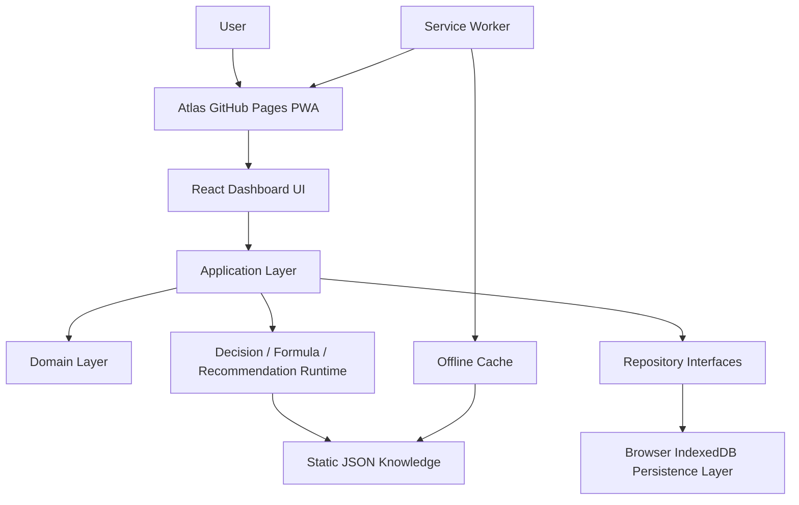
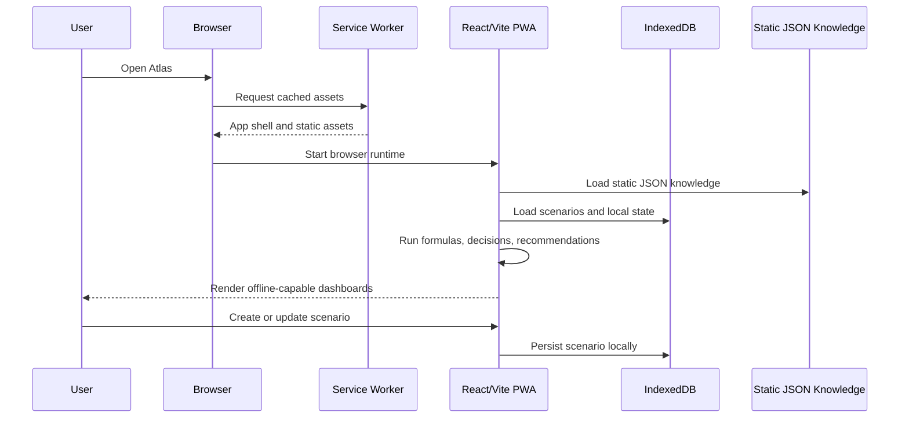
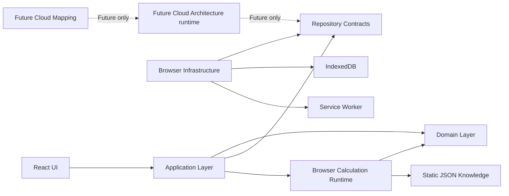
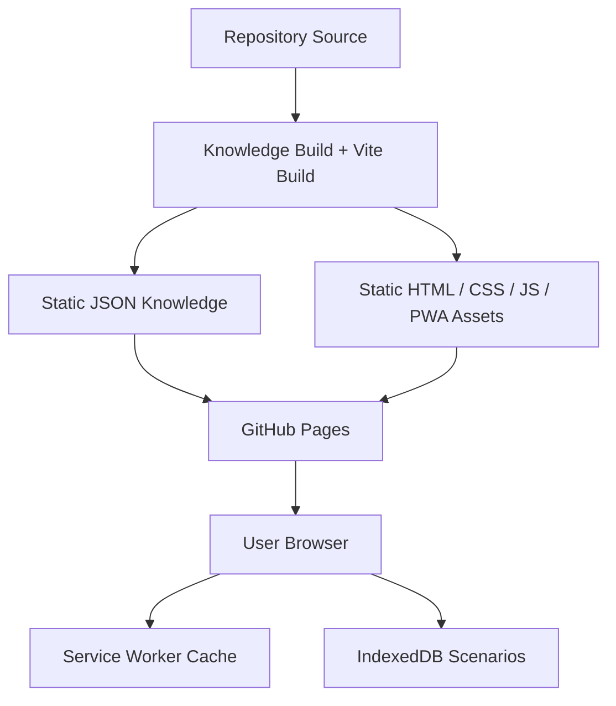

> **ADR-001 PWA Runtime Alignment:** Atlas v1 uses PWA v1 Runtime, Browser Runtime, and IndexedDB Runtime. Future Cloud Architecture is optional future mapping and must not be required for v1.\r\n\r\n# ADR-001: Atlas PWA Architecture

> Governance priority is now consolidated in [ADR-001: Static Local First PWA Architecture](ADR-001-static-local-first-pwa.md). This document remains aligned architecture context and historical decision material.

# Status

Accepted

# Context

This ADR is the highest architecture authority for the Atlas repository.

Atlas is formally positioned as:

Static-first, Local-first GitHub Pages PWA

The current repository contains or references multiple runtime directions:

- GitHub Pages PWA
- Browser Runtime
- IndexedDB
- .NET Backend
- Future Cloud Mapping
- Future Cloud Mapping

These mixed signals can make future development direction ambiguous. Atlas v1 must have one primary runtime target, one persistence model, and one deployment model.

# Decision

Atlas v1 Runtime:

- GitHub Pages
- React
- TypeScript
- Vite
- Static JSON Knowledge
- Browser Runtime
- IndexedDB Persistence
- Service Worker
- Offline First

Atlas v1 does not require:

- Future Cloud Architecture runtime
- Future Cloud Mapping
- Future Cloud Mapping
- Future Cloud Mapping
- Future Cloud Architecture API

Database Layer is redefined as:

- Browser IndexedDB Persistence Layer

Layering decisions:

- Repository Pattern is retained.
- Domain Layer is retained.
- Application Layer is retained.
- Infrastructure Layer becomes Browser Infrastructure.
- Calculation Runtime must fully execute in the Browser.
- Knowledge Build must produce Static JSON.
- All Dashboards must work Offline.
- Scenario data must be stored in IndexedDB.
- Decision Engine must run as Local Runtime.
- Formula Runtime must run as Browser Runtime.
- Recommendation must run as Browser Runtime.
- AI Layer is optional and not required for Atlas v1.

Cloud Backend is classified as Future Architecture and must not affect Atlas v1.

# Architecture Principles

- Static-first: the deployable application is a static asset bundle.
- Local-first: user scenarios, runtime state, and dashboard data are owned by the browser client first.
- Offline-first: primary workflows must remain available without network access after the app is installed or cached.
- Browser-executable: formulas, calculations, decision rules, recommendations, and dashboard derivations must run in the browser.
- Static knowledge: build-time knowledge artifacts must be emitted as static JSON and consumed by the browser runtime.
- Repository boundary: application and domain code depend on repository interfaces, not on concrete IndexedDB implementation details.
- Future-compatible: repository contracts may allow future remote persistence, but v1 must not depend on it.
- No server dependency: v1 correctness must not require Future Cloud Architecture availability.
- No Future Cloud Architecture dependency: v1 correctness must not require Future Cloud Mapping, Future Cloud Mapping, Future Cloud Mapping, or server migrations.
- Privacy by default: personal financial scenarios remain local unless a future user-controlled sync architecture is accepted by another ADR.

# Architecture Diagram

# Runtime Diagram

# Dependency Diagram

# Deployment Diagram

# Migration Strategy

- Treat this ADR as the repository-level architecture baseline.
- Keep Domain Layer models and rules independent from browser APIs.
- Keep Application Layer use cases independent from concrete persistence engines.
- Replace Future Architecture server database assumptions with repository interfaces backed by IndexedDB.
- Move runtime calculation, formula, decision, recommendation, and dashboard logic into browser-compatible TypeScript modules.
- Convert knowledge artifacts into static JSON produced at build time.
- Update dashboards so they read from browser runtime state, static JSON, and IndexedDB.
- Preserve backend, database, and Future Cloud Mapping documents only as legacy reference or future architecture material.
- Do not introduce new v1 features that require Future Cloud Architecture adapter, Future Cloud Mapping, Future Cloud Mapping, Future Cloud Mapping, or a Future Cloud Architecture API.
- Add future cloud work only through a separate ADR that proves it is additive and does not weaken offline-first behavior.

# Future Extension

Future architecture may add optional cloud capabilities, including:

- Remote backup
- Multi-device sync
- Collaborative scenarios
- Server-side audit history
- Server-side AI orchestration
- Hosted analytics
- Backend API adapters
- Future Cloud Mapping persistence

These extensions must remain optional for v1 workflows. They must be additive to the Browser IndexedDB Persistence Layer and must not become required for dashboard, scenario, decision, formula, or recommendation execution.

# Non Goals

Atlas v1 does not aim to provide:

- Future Cloud Architecture hosted runtime
- Future Cloud Architecture API dependency
- Future Cloud Mapping dependency
- Future Cloud Mapping production dependency
- Future Cloud Mapping runtime dependency
- Required cloud authentication
- Required cloud synchronization
- Required AI service
- Server-side formula execution
- Server-side decision engine execution
- Server-side recommendation execution
- Online-only dashboards

# Consequences

- Atlas v1 can be deployed through GitHub Pages as static assets.
- Runtime complexity moves from server infrastructure to browser infrastructure.
- IndexedDB becomes the primary persistence implementation for scenarios and local state.
- Repository Pattern continues to protect Domain and Application layers from persistence details.
- Existing backend and database artifacts must not guide v1 implementation unless explicitly reclassified by a future ADR.
- Offline behavior becomes a required product constraint, not an optional enhancement.
