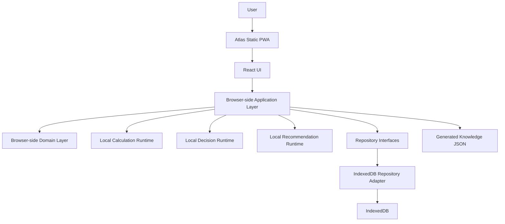
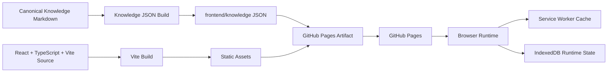
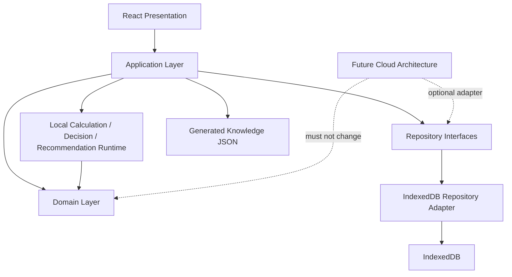

# ADR-001: Static Local First PWA Architecture

## Status

Accepted

## Context

Atlas Enterprise v1 is a personal life-finance decision-support system. It is not a bookkeeping app and must not be redesigned by this ADR.

The repository already defines a static-first PWA direction:

- Canonical knowledge lives in `knowledge/**/*.md`.
- Runtime knowledge data is generated into `frontend/knowledge/`.
- The frontend reads generated static JSON assets.
- User-owned runtime data must remain browser-local unless a future architecture decision changes that.
- Backend services are optional future extensions and must not be required for core PWA startup.

This ADR formally establishes Atlas v1 as:

Static-first, Local-first GitHub Pages PWA

This ADR does not modify Domain meaning, Business Rules, Formulas, Entities, Calculations, or Business Concepts.

## Decision

Atlas v1 shall be delivered as a GitHub Pages hosted Static PWA that executes core behavior in the browser, persists user-owned scenario/runtime state locally, and consumes generated Knowledge JSON as static runtime data.

### Atlas v1 Deployment

Atlas v1 deployment consists of:

- GitHub Pages
- Static Assets
- React
- TypeScript
- Vite
- Service Worker
- Offline-first behavior

The deployable artifact is a static asset set. It must not require a server process to start, render, calculate, or browse canonical generated knowledge.

### Atlas v1 Runtime

Atlas v1 runtime consists of:

- Browser Runtime
- Browser-side Domain Layer
- Browser-side Application Layer
- Local Calculation Runtime
- Local Decision Runtime
- Local Recommendation Runtime

Domain and Application code must remain browser-framework independent. React may render workflows and dashboards, but Domain and Application behavior must not depend on React.

### Atlas v1 Persistence

Atlas v1 persistence consists of:

- IndexedDB
- Repository Interface
- IndexedDB Repository Adapter
- Export / Import Backup
- Schema Migration

Repository Pattern is retained. Repositories must expose stable interfaces and use replaceable adapters. The Atlas v1 adapter is the IndexedDB Repository Adapter.

Generated Knowledge JSON is runtime data and must not be manually maintained. Canonical knowledge remains in `knowledge/**/*.md`.

### Atlas v1 Does Not Depend On

Atlas v1 must not require:

- ASP.NET Core
- PostgreSQL
- SQL Server
- EF Core
- Server REST API
- Always-online Backend

These technologies may appear only as Future Optional Architecture references.

## Architecture Principles

- Static-first: Atlas v1 deploys as static assets.
- Local-first: user-owned scenario/runtime state is browser-local by default.
- Offline-first: core workflows must remain available offline after the PWA shell and required assets are cached.
- Browser-executable: core calculation, decision, formula, and recommendation behavior must execute in the browser.
- Repository Pattern: Domain and Application layers depend on repository interfaces, not concrete storage engines.
- Replaceable adapters: IndexedDB is the v1 adapter, not a Domain concept.
- Generated artifacts are downstream: generated Knowledge JSON is derived from canonical knowledge and must not be hand edited.
- Future-compatible: Future Cloud Architecture may add remote adapters without changing existing Domain meaning.
- No forced upload: core data must not require upload to a server or cloud account.
- No server dependency: core calculations must not depend on a server process.

## Runtime Architecture

Atlas v1 runs in the browser:

- React renders the PWA interface.
- TypeScript implements Application, runtime orchestration, and adapter code.
- Domain behavior remains independent from React, IndexedDB, and browser-specific APIs.
- Application use cases coordinate Domain rules, repositories, calculation runtime, decision runtime, and recommendation runtime.
- Local Calculation Runtime, Local Decision Runtime, and Local Recommendation Runtime operate without server calls.
- Knowledge JSON is loaded as static runtime data generated from canonical Markdown knowledge.

## Persistence Architecture

Atlas v1 persistence is browser-local:

- IndexedDB stores user-owned scenario/runtime state.
- Repository Interfaces define persistence contracts.
- IndexedDB Repository Adapters implement those contracts for PWA v1.
- Export / Import Backup provides portability and recovery.
- Schema Migration uses versioned browser-local migration rules.
- localStorage must not be used for authoritative financial data.

The IndexedDB schema is an infrastructure detail. It must not alter Domain naming, validation meaning, Business Rules, Formulas, Entities, or Calculations.

## Deployment Architecture

Atlas v1 deployment uses GitHub Pages:

- Vite builds static assets.
- React and TypeScript compile into browser-deliverable assets.
- Service Worker caches the app shell, static runtime assets, and generated knowledge indexes as required.
- Generated `frontend/knowledge/` JSON files are included in the Pages artifact.
- The deployed application must start without an ASP.NET Core process, server database, or always-online backend.

## Future Cloud Compatibility

Future Cloud Architecture may include:

- ASP.NET Core
- PostgreSQL
- EF Core
- Remote API
- Remote Repository Adapter
- Cloud backup
- Multi-device sync
- Server-side integration gateways
- Server-side jobs requiring trusted execution

Future Cloud Architecture is optional. It must not become an Atlas v1 dependency and must not change existing Domain Meaning, Business Rules, Formulas, Entities, Calculations, or Business Concepts.

Future remote persistence must be introduced as a replaceable repository adapter and must preserve current repository contracts unless a later ADR explicitly changes them.

## Source of Truth Priority

When sources conflict, priority is:

1. This ADR
2. Canonical Catalog
3. Canonical Knowledge
4. Runtime Specification
5. Generated Artifact

Generated artifacts are never the source of truth. They must be rebuilt from canonical sources.

## Architecture Invariants

- Core features must execute offline.
- Core calculations must not depend on a server.
- Core data must not be forced to upload.
- All repositories must use replaceable adapters.
- Generated Knowledge JSON must not be manually maintained.
- IndexedDB must remain an Infrastructure concern.
- Domain and Application layers must remain independent from concrete browser storage APIs.
- Future Cloud Architecture must remain optional for Atlas v1.

## Non-Goals

This ADR does not:

- Redesign Atlas.
- Add Business Concepts.
- Modify Domain Meaning.
- Modify Business Rules.
- Modify Formulas.
- Modify Entities.
- Modify Calculations.
- Require ASP.NET Core for v1.
- Require PostgreSQL or SQL Server for v1.
- Require EF Core for v1.
- Require Server REST API for v1.
- Require always-online backend behavior for v1.
- Define a future cloud implementation plan.

## Consequences

- Atlas v1 can be hosted as static assets on GitHub Pages.
- Core runtime behavior remains available through Browser Runtime.
- IndexedDB becomes the required v1 local persistence adapter for user-owned runtime state.
- Export / Import Backup and Schema Migration become required persistence capabilities.
- Backend, server database, and remote API work is deferred to Future Optional Architecture.
- Generated Knowledge JSON must be rebuilt from canonical Markdown knowledge.
- Architecture reviews must reject v1 features that require always-online backend behavior.

## Migration Rules

- Existing documents that describe ASP.NET Core, PostgreSQL, SQL Server, EF Core, Server REST API, or always-online backend behavior must classify that content as Future Optional Architecture when it is not part of PWA v1.
- Repository Adapter wording for v1 must resolve to IndexedDB Repository Adapter.
- Database mapping language for v1 must resolve to browser-local IndexedDB persistence mapping.
- Future Cloud Architecture mapping may be documented, but it must not be required for v1 workflows.
- Runtime code must keep Domain and Application behavior independent from concrete IndexedDB implementation details.
- Generated `frontend/knowledge/` JSON must be rebuilt from canonical knowledge sources and must not be manually patched.
- Migration work must not change Domain Meaning, Business Rules, Formulas, Entities, Calculations, or Business Concepts.

## Mermaid Runtime Diagram

## Mermaid Deployment Diagram

## Mermaid Dependency Diagram

