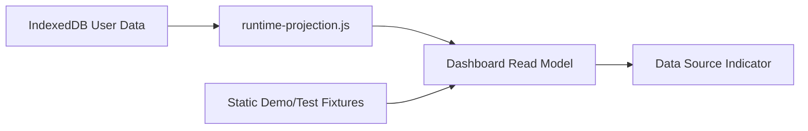

# Dashboard Real Data Migration

## Data Source Modes

| Mode | Source | UI Meaning |
| --- | --- | --- |
| User Data | IndexedDB plus runtime projection | User has local financial records. |
| Demo Data | Static fixtures | No user projection exists; fixture data is explicitly labeled. |
| Test Fixture | Simulator and visual fixtures | Validation only, not user data. |
| Empty State | No usable user data or demo fallback | Onboarding and data creation path. |
| Error | Projection failure | Show error state and safe fallback when available. |

## Migration Rule

Dashboard rendering should prefer User Data projection when available. Static dashboard snapshots are fallback Demo Data and must remain visibly distinguishable from user-owned records.

## Scenario Switching

Scenario switching should select a scenario, run projection, and render the read model. Fixture scenario switching remains valid for demo and visual regression.

## Empty and Error States

- Empty state must explain that no local financial records exist.
- Error state must report projection failure without losing local data.
- Demo fallback must be labeled Demo Data.
- Inline fallback is allowed only for test/demo mode.

## Data Flow

## Visual Coverage Target

- Empty.
- Populated User Data.
- Demo Data.
- Projection Error.
- Mobile viewport.
