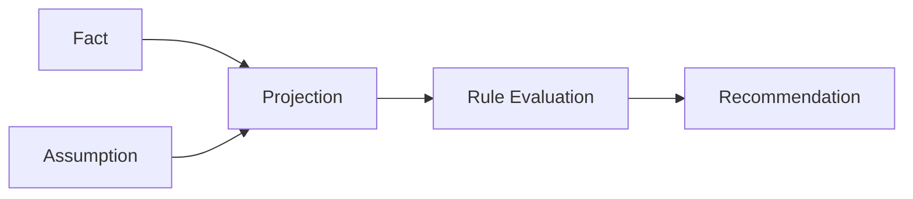

# Decision Recommendation Explainability

## Explanation Chain

## Recommendation Contract

| Field | Meaning |
| --- | --- |
| `summary` | Short recommendation summary. |
| `score` | Deterministic score. |
| `confidence` | Evidence-aware confidence. |
| `evidence` | Facts, assumptions, projections, and references. |
| `constraints` | Passed or failed constraints. |
| `tradeOffs` | Explicit trade-offs. |
| `alternatives` | Alternative actions. |
| `risks` | Known risks. |
| `lifecycle` | Draft, reviewed, accepted, deferred, rejected, executed, archived. |
| `inputSnapshotId` | Input snapshot used for the recommendation. |
| `ruleVersion` | Rule version. |
| `scenarioVersion` | Scenario run version. |
| `createdAt` | Creation timestamp. |

## Decision Center

Decision Center should expose Summary, Why, Evidence, Alternatives, Impact, and Next Action.

## Validation Targets

- Insufficient data explanation.
- Conflicting constraints.
- Illegal lifecycle transition.
- Deterministic rule explanation with no hidden AI inference.
