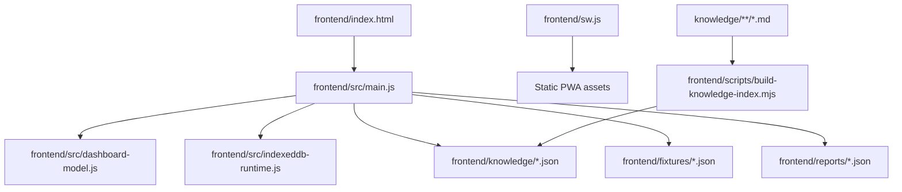

# Frontend Module Map

## Current Dependency Map

## Responsibility Map

| Area | Current Location | Target Boundary |
| --- | --- | --- |
| Bootstrap | `frontend/src/main.js` | `app/bootstrap` composition only |
| Routing/hash selection | `frontend/src/main.js` | `app/routing` |
| State | `frontend/src/main.js` | `core/state` |
| Rendering | `frontend/src/main.js` | `features/*/render` and `components/*` |
| Events | `frontend/src/main.js` | `features/*/controller` |
| Data access | `frontend/src/indexeddb-runtime.js`, fetch calls in `main.js` | `repositories/*` |
| Projection | `frontend/src/main.js`, `frontend/src/dashboard-model.js` | `services/projections/*` |
| Formatting | `frontend/src/main.js` | `core/formatting` |
| Search | `frontend/src/main.js` | `features/knowledge/search` |
| Backup | `frontend/src/indexeddb-runtime.js`, `frontend/src/main.js` | `features/backup` plus `repositories/backup` |

## Target Folder Shape

- `frontend/src/app/`: composition, bootstrap, route wiring.
- `frontend/src/core/`: pure utilities, state helpers, formatting, validation.
- `frontend/src/features/`: knowledge, dashboard, scenario, recommendation, loan, backup, validation, offline repair.
- `frontend/src/repositories/`: IndexedDB adapters and static JSON readers.
- `frontend/src/services/`: projections, report builders, simulator-facing transforms.
- `frontend/src/components/`: DOM rendering helpers with stable selectors.

## Constraints

- `main.js` should become composition/bootstrap, not a long-lived feature implementation file.
- HTML selectors, IndexedDB schema, and fixture contracts must remain stable while modules move.
- Pure utilities should move first and gain focused unit tests.
- Repository/service extraction should happen before feature controller extraction.
- Circular dependencies are prohibited; features may depend on core, repositories, and services, but core must not depend on features.
