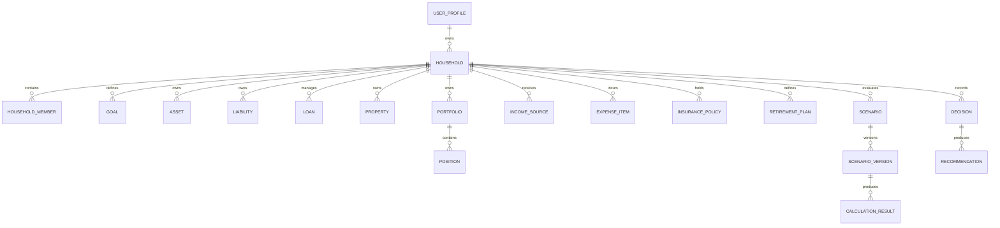

> **ADR-001 PWA Runtime Alignment:** Atlas v1 uses PWA v1 Runtime, Browser Runtime, and IndexedDB Runtime. Future Cloud Architecture is optional future mapping and must not be required for v1.\r\n\r\n# Project Atlas Enterprise
# docs/database/06-ERD.md

Version: 2.0  
Status: Conceptual Local Data Model

## 1. Purpose

This document describes conceptual aggregate relationships and their IndexedDB persistence representation. It is not a relational Future Cloud Mapping ERD.

## 2. Aggregate Relationship Model

## 3. IndexedDB Relationship Rules

IndexedDB does not enforce foreign keys. Atlas shall enforce relationships through repository and application validation.

- Child records carry parent IDs.
- Aggregate children are loaded and saved through the aggregate repository where practical.
- Scenario versions reference immutable input snapshots.
- Calculation results reference formula and rule versions.
- Soft-deleted parents remain resolvable by audit and decision history.
- Integrity scans report orphaned or version-incompatible records.

## 4. Key Relationship Summary

| Parent | Child | Cardinality | Enforcement |
|---|---|---|---|
| UserProfile | Household | 1:N | Application service |
| Household | HouseholdMember | 1:N | Household aggregate |
| Household | Asset | 1:N | Asset repository |
| Household | Loan | 1:N | Loan repository |
| Household | Scenario | 1:N | Scenario repository |
| Scenario | ScenarioVersion | 1:N | Immutable version rule |
| ScenarioVersion | CalculationResult | 1:N | Calculation repository |
| Portfolio | Position | 1:N | Portfolio aggregate |
| Decision | Recommendation | 1:N | Decision aggregate |

## 5. Physical Storage Mapping

See `docs/database/05-DatabaseDesign.md` and `docs/pwa/IndexedDBDesign.md`.

## Revision History

| Version | Date | Description |
|---|---|---|
| 1.0 | 2026-07-09 | Relational ERD draft |
| 2.0 | 2026-07-11 | Converted to conceptual IndexedDB relationship model |
