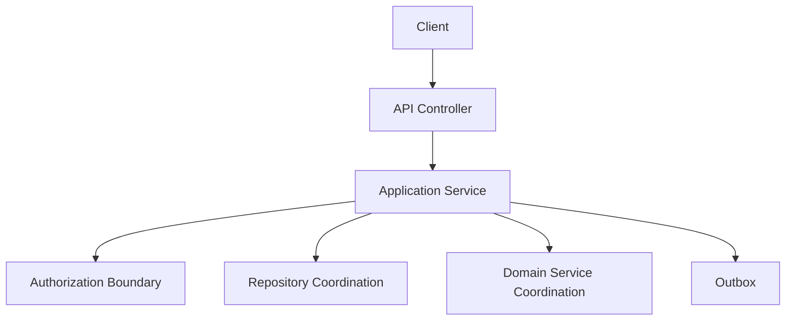
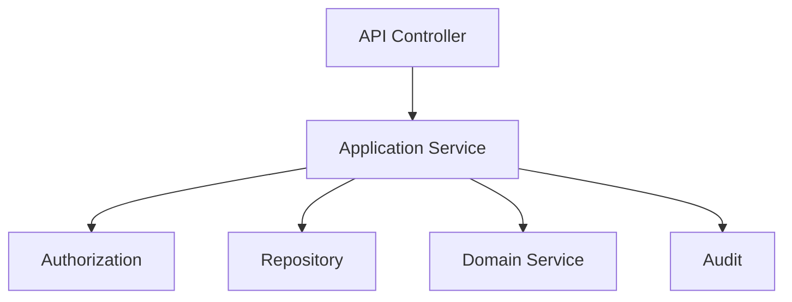
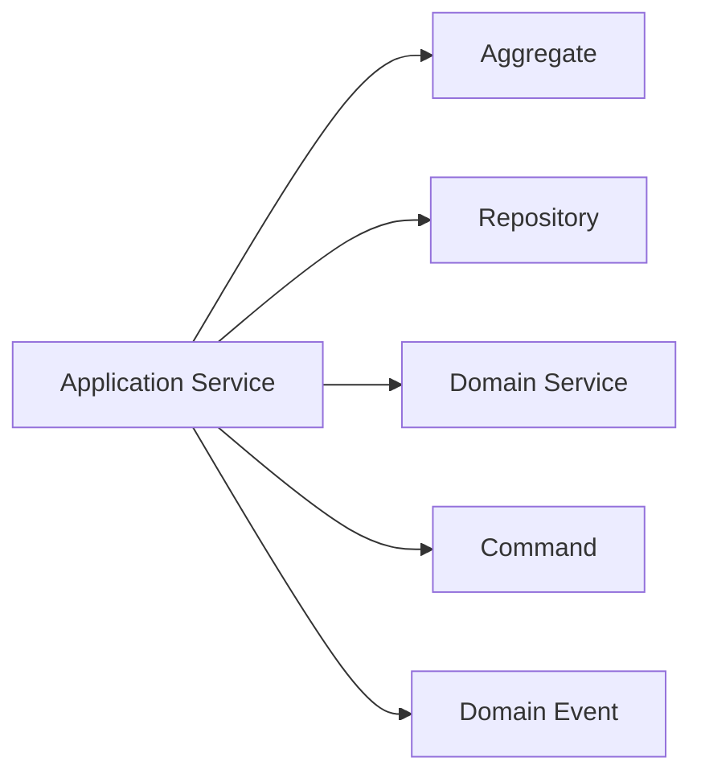
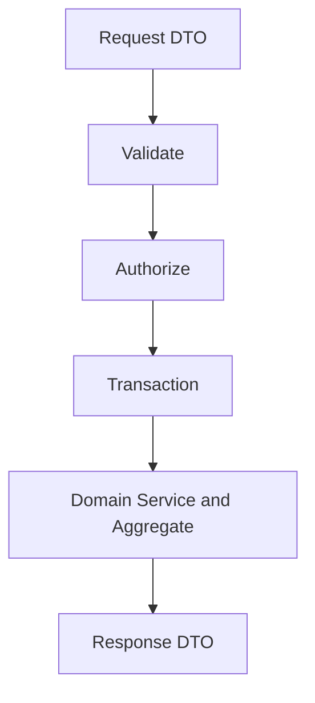
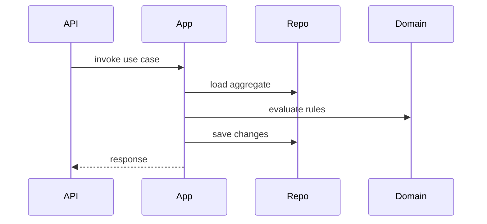
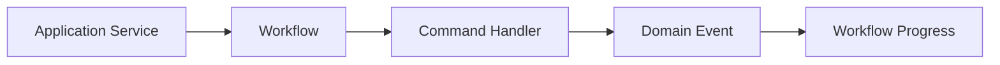
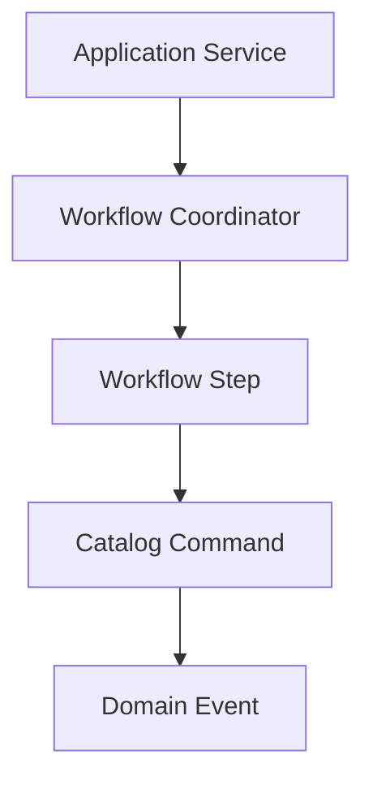
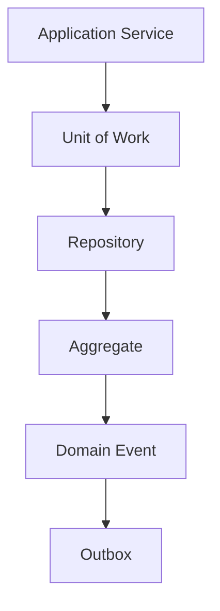
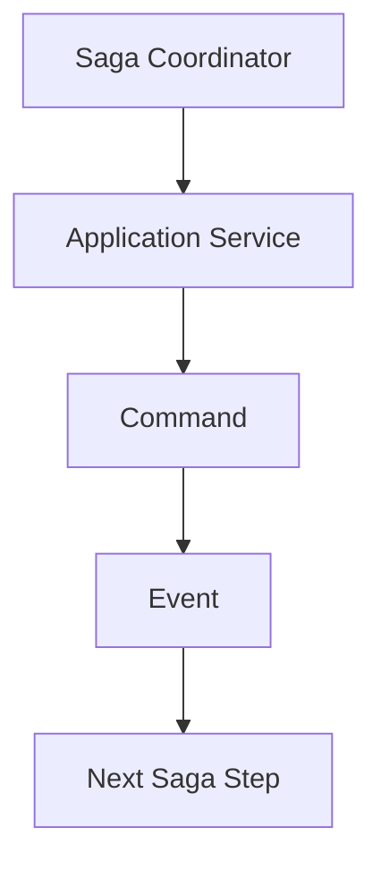
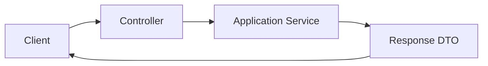

# Application Service Catalog

# Document Control

Document Name: Application Service Catalog
Document Path: knowledge/application-service-catalog.md
Document Type: Atlas Enterprise Canonical Specification
Version: 1.0
Status: Canonical Specification
Domain: Platform
Bounded Context: Platform
Owner: Project Atlas
Source of Truth: Atlas Application Service Source of Truth
Last Updated: 2026-07-12

Related Specifications:
- knowledge/aggregate-catalog.md
- knowledge/entity-catalog.md
- knowledge/value-object-catalog.md
- knowledge/enumeration-catalog.md
- knowledge/command-catalog.md
- knowledge/domain-event-catalog.md
- knowledge/repository-catalog.md
- knowledge/domain-service-catalog.md
- knowledge/domain-model-catalog.md
- knowledge/system-module-catalog.md
- knowledge/api-governance-framework.md
- knowledge/workflow-engine-framework.md
- knowledge/background-job-framework.md
- knowledge/scheduler-framework.md
- knowledge/automation-framework.md
- knowledge/message-contract-catalog.md
- knowledge/calculation-engine-framework.md
- knowledge/projection-engine-framework.md
- knowledge/optimization-engine-framework.md
- knowledge/simulation-engine-framework.md
- docs/04-DomainModel.md
- docs/05-DatabaseDesign.md
- docs/06-ERD.md
- docs/07-API.md

# Purpose

Application Service Catalog defines the approved Atlas Application Services that coordinate use cases, APIs, controllers, workflows, command handlers, query handlers, repositories, domain services, background jobs, schedulers, automations, notifications, integrations, sagas, and orchestrators. It is the source of truth for application-layer orchestration and transaction boundaries.

# Scope

- Application Service
- Use Case Service
- Use Case
- Application Layer
- Orchestrator
- Facade
- Workflow Coordinator
- Saga Coordinator
- Command Dispatcher
- Query Coordinator
- Command Handler
- Query Handler
- Transaction Coordinator
- DTO Mapper
- Authorization Boundary
- Validation Boundary
- Repository Coordination
- Domain Service Coordination
- Event Publishing
- Outbox
- Idempotency
- Retry

# Application Service Definition Standard

Every Application Service entry uses the following complete Enterprise contract.
- Service Name
- Display Name
- Domain
- Bounded Context
- Module
- Purpose
- Business Meaning
- Description
- Responsibilities
- Non Responsibilities
- Use Cases
- Input DTO
- Output DTO
- Commands
- Application Commands
- Queries
- Application Queries
- Repositories
- Repository Dependencies
- Domain Services
- Domain Service Dependencies
- Aggregates
- Aggregate Dependencies
- Entities
- Entity Dependencies
- Published Domain Events
- Consumed Domain Events
- DTO
- API
- Workflow
- Workflow Integration
- Saga
- Background Job
- Scheduler
- Scheduler Integration
- Automation
- Automation Integration
- Background Job Integration
- Notifications
- Message Contracts
- Authorization
- Permissions
- Permission
- Validation
- Business Rules
- Transaction Boundary
- Consistency Boundary
- Concurrency
- Idempotency
- Retry
- Timeout
- Compensation
- Error Codes
- Audit
- Logging
- Metrics
- Observability
- Performance Target
- Performance
- Security
- Error Handling
- Caching
- Example

# Complete Application Service Catalog

## UserApplicationService

Service Name: UserApplicationService
Display Name: UserApplicationService
Domain: Identity
Bounded Context: Identity
Module: Identity
Purpose: User account, household access, and actor context orchestration.
Business Meaning: UserApplicationService coordinates a complete Atlas use case without owning domain invariants.
Description: UserApplicationService is the application-layer boundary for authorization, DTO mapping, transaction coordination, repository access, domain service invocation, command dispatch, query handling, workflow coordination, and audit.
Responsibilities: Authenticate caller context, authorize permissions, validate request DTO, load repositories, call Domain Services, manage transaction boundary, coordinate command or query handlers, map DTOs, publish committed outcomes, and record audit.
Non Responsibilities: No domain invariant ownership, no direct database table ownership, no uncataloged business logic, no UI rendering, and no bypass of repository or domain service catalogs.
Use Cases: User account, household access, and actor context orchestration.
Commands: Identity commands and access queries
Queries: User, Household access
Repositories: UserRepository, HouseholdRepository, AuditRepository
Domain Services: DecisionService
Aggregates: User, Household
Entities: User, Household
DTO: UserDto, HouseholdDto
API: /api/v1/users, /api/v1/households
Workflow: Identity workflow
Saga: Correlation-based saga coordination when cross-boundary orchestration is required.
Background Job: Uses same service methods through authorized job context when asynchronous processing is required.
Scheduler: Scheduler may invoke service through system actor and deterministic trigger metadata.
Automation: Automation may invoke service only through catalog-approved command or query path.
Notifications: NotificationApplicationService or catalog-approved notification workflow handles user delivery.
Message Contracts: Identity messages
Authorization: Authentication, tenant isolation, Household isolation, role, permission, and ownership checks occur before state disclosure.
Permissions: Catalog permissions attached to API, command, query, and workflow operation.
Validation: Request DTO, command DTO, query DTO, value objects, enumerations, idempotency key, expected version, and business preconditions are validated.
Business Rules: Application Service enforces orchestration rules and delegates domain rules to Domain Services or Aggregates.
Transaction Boundary: Opens and commits the use case transaction for write operations; read-only queries use read boundary.
Consistency Boundary: One Aggregate write boundary per command unless a workflow or saga is explicitly cataloged.
Concurrency: Expected version and optimistic concurrency are propagated to repositories.
Idempotency: External write operations require idempotency key and input hash.
Retry: Retry only transient failures with known transaction state and idempotent command context.
Timeout: Use case timeout must leave no partial commit outside transaction boundary.
Compensation: Compensation is workflow or saga controlled and never ad hoc.
Error Codes: APP-ERR-001 through APP-ERR-040 as applicable.
Audit: ActorId, HouseholdId, TenantId, ServiceName, use case, command or query, input hash, output hash, CorrelationId, CausationId, and result are recorded.
Logging: Structured logs exclude sensitive payload data and include trace identifiers.
Observability: Metrics, traces, error rates, latency, retries, cache hits, and transaction outcomes are observable.
Performance Target: p95 under 300 ms for standard query, p95 under 800 ms for standard command, and observable timeout for long-running workflow initiation.
Caching: Read-only results may use Household-scoped cache; writes invalidate cataloged cache keys through events.
Example: UserApplicationService receives API request /api/v1/users, /api/v1/households, validates UserDto, HouseholdDto, invokes DecisionService, persists through UserRepository, HouseholdRepository, AuditRepository, and records audit.
Application Service Control 1: UserApplicationService preserves use case ownership, API mapping, DTO mapping, authorization boundary, validation, transaction coordination, consistency boundary, repository access, domain service invocation, command handling, query handling, workflow coordination, saga context, idempotency, concurrency, retry, timeout, compensation, observability, performance target, caching, and audit.
Application Service Control 2: UserApplicationService preserves use case ownership, API mapping, DTO mapping, authorization boundary, validation, transaction coordination, consistency boundary, repository access, domain service invocation, command handling, query handling, workflow coordination, saga context, idempotency, concurrency, retry, timeout, compensation, observability, performance target, caching, and audit.
Application Service Control 3: UserApplicationService preserves use case ownership, API mapping, DTO mapping, authorization boundary, validation, transaction coordination, consistency boundary, repository access, domain service invocation, command handling, query handling, workflow coordination, saga context, idempotency, concurrency, retry, timeout, compensation, observability, performance target, caching, and audit.
Application Service Control 4: UserApplicationService preserves use case ownership, API mapping, DTO mapping, authorization boundary, validation, transaction coordination, consistency boundary, repository access, domain service invocation, command handling, query handling, workflow coordination, saga context, idempotency, concurrency, retry, timeout, compensation, observability, performance target, caching, and audit.
Application Service Control 5: UserApplicationService preserves use case ownership, API mapping, DTO mapping, authorization boundary, validation, transaction coordination, consistency boundary, repository access, domain service invocation, command handling, query handling, workflow coordination, saga context, idempotency, concurrency, retry, timeout, compensation, observability, performance target, caching, and audit.
Application Service Control 6: UserApplicationService preserves use case ownership, API mapping, DTO mapping, authorization boundary, validation, transaction coordination, consistency boundary, repository access, domain service invocation, command handling, query handling, workflow coordination, saga context, idempotency, concurrency, retry, timeout, compensation, observability, performance target, caching, and audit.
Application Service Control 7: UserApplicationService preserves use case ownership, API mapping, DTO mapping, authorization boundary, validation, transaction coordination, consistency boundary, repository access, domain service invocation, command handling, query handling, workflow coordination, saga context, idempotency, concurrency, retry, timeout, compensation, observability, performance target, caching, and audit.
Application Service Control 8: UserApplicationService preserves use case ownership, API mapping, DTO mapping, authorization boundary, validation, transaction coordination, consistency boundary, repository access, domain service invocation, command handling, query handling, workflow coordination, saga context, idempotency, concurrency, retry, timeout, compensation, observability, performance target, caching, and audit.
Application Service Control 9: UserApplicationService preserves use case ownership, API mapping, DTO mapping, authorization boundary, validation, transaction coordination, consistency boundary, repository access, domain service invocation, command handling, query handling, workflow coordination, saga context, idempotency, concurrency, retry, timeout, compensation, observability, performance target, caching, and audit.
Application Service Control 10: UserApplicationService preserves use case ownership, API mapping, DTO mapping, authorization boundary, validation, transaction coordination, consistency boundary, repository access, domain service invocation, command handling, query handling, workflow coordination, saga context, idempotency, concurrency, retry, timeout, compensation, observability, performance target, caching, and audit.
Application Service Control 11: UserApplicationService preserves use case ownership, API mapping, DTO mapping, authorization boundary, validation, transaction coordination, consistency boundary, repository access, domain service invocation, command handling, query handling, workflow coordination, saga context, idempotency, concurrency, retry, timeout, compensation, observability, performance target, caching, and audit.
Application Service Control 12: UserApplicationService preserves use case ownership, API mapping, DTO mapping, authorization boundary, validation, transaction coordination, consistency boundary, repository access, domain service invocation, command handling, query handling, workflow coordination, saga context, idempotency, concurrency, retry, timeout, compensation, observability, performance target, caching, and audit.
Application Service Control 13: UserApplicationService preserves use case ownership, API mapping, DTO mapping, authorization boundary, validation, transaction coordination, consistency boundary, repository access, domain service invocation, command handling, query handling, workflow coordination, saga context, idempotency, concurrency, retry, timeout, compensation, observability, performance target, caching, and audit.
Application Service Control 14: UserApplicationService preserves use case ownership, API mapping, DTO mapping, authorization boundary, validation, transaction coordination, consistency boundary, repository access, domain service invocation, command handling, query handling, workflow coordination, saga context, idempotency, concurrency, retry, timeout, compensation, observability, performance target, caching, and audit.
Application Service Control 15: UserApplicationService preserves use case ownership, API mapping, DTO mapping, authorization boundary, validation, transaction coordination, consistency boundary, repository access, domain service invocation, command handling, query handling, workflow coordination, saga context, idempotency, concurrency, retry, timeout, compensation, observability, performance target, caching, and audit.
Application Service Control 16: UserApplicationService preserves use case ownership, API mapping, DTO mapping, authorization boundary, validation, transaction coordination, consistency boundary, repository access, domain service invocation, command handling, query handling, workflow coordination, saga context, idempotency, concurrency, retry, timeout, compensation, observability, performance target, caching, and audit.
Application Service Control 17: UserApplicationService preserves use case ownership, API mapping, DTO mapping, authorization boundary, validation, transaction coordination, consistency boundary, repository access, domain service invocation, command handling, query handling, workflow coordination, saga context, idempotency, concurrency, retry, timeout, compensation, observability, performance target, caching, and audit.
Application Service Control 18: UserApplicationService preserves use case ownership, API mapping, DTO mapping, authorization boundary, validation, transaction coordination, consistency boundary, repository access, domain service invocation, command handling, query handling, workflow coordination, saga context, idempotency, concurrency, retry, timeout, compensation, observability, performance target, caching, and audit.
Application Service Control 19: UserApplicationService preserves use case ownership, API mapping, DTO mapping, authorization boundary, validation, transaction coordination, consistency boundary, repository access, domain service invocation, command handling, query handling, workflow coordination, saga context, idempotency, concurrency, retry, timeout, compensation, observability, performance target, caching, and audit.
Application Service Control 20: UserApplicationService preserves use case ownership, API mapping, DTO mapping, authorization boundary, validation, transaction coordination, consistency boundary, repository access, domain service invocation, command handling, query handling, workflow coordination, saga context, idempotency, concurrency, retry, timeout, compensation, observability, performance target, caching, and audit.
Application Service Control 21: UserApplicationService preserves use case ownership, API mapping, DTO mapping, authorization boundary, validation, transaction coordination, consistency boundary, repository access, domain service invocation, command handling, query handling, workflow coordination, saga context, idempotency, concurrency, retry, timeout, compensation, observability, performance target, caching, and audit.
Application Service Control 22: UserApplicationService preserves use case ownership, API mapping, DTO mapping, authorization boundary, validation, transaction coordination, consistency boundary, repository access, domain service invocation, command handling, query handling, workflow coordination, saga context, idempotency, concurrency, retry, timeout, compensation, observability, performance target, caching, and audit.
Application Service Control 23: UserApplicationService preserves use case ownership, API mapping, DTO mapping, authorization boundary, validation, transaction coordination, consistency boundary, repository access, domain service invocation, command handling, query handling, workflow coordination, saga context, idempotency, concurrency, retry, timeout, compensation, observability, performance target, caching, and audit.
Application Service Control 24: UserApplicationService preserves use case ownership, API mapping, DTO mapping, authorization boundary, validation, transaction coordination, consistency boundary, repository access, domain service invocation, command handling, query handling, workflow coordination, saga context, idempotency, concurrency, retry, timeout, compensation, observability, performance target, caching, and audit.
Application Service Control 25: UserApplicationService preserves use case ownership, API mapping, DTO mapping, authorization boundary, validation, transaction coordination, consistency boundary, repository access, domain service invocation, command handling, query handling, workflow coordination, saga context, idempotency, concurrency, retry, timeout, compensation, observability, performance target, caching, and audit.
Application Service Control 26: UserApplicationService preserves use case ownership, API mapping, DTO mapping, authorization boundary, validation, transaction coordination, consistency boundary, repository access, domain service invocation, command handling, query handling, workflow coordination, saga context, idempotency, concurrency, retry, timeout, compensation, observability, performance target, caching, and audit.
Application Service Control 27: UserApplicationService preserves use case ownership, API mapping, DTO mapping, authorization boundary, validation, transaction coordination, consistency boundary, repository access, domain service invocation, command handling, query handling, workflow coordination, saga context, idempotency, concurrency, retry, timeout, compensation, observability, performance target, caching, and audit.
Application Service Control 28: UserApplicationService preserves use case ownership, API mapping, DTO mapping, authorization boundary, validation, transaction coordination, consistency boundary, repository access, domain service invocation, command handling, query handling, workflow coordination, saga context, idempotency, concurrency, retry, timeout, compensation, observability, performance target, caching, and audit.
Application Service Control 29: UserApplicationService preserves use case ownership, API mapping, DTO mapping, authorization boundary, validation, transaction coordination, consistency boundary, repository access, domain service invocation, command handling, query handling, workflow coordination, saga context, idempotency, concurrency, retry, timeout, compensation, observability, performance target, caching, and audit.
Application Service Control 30: UserApplicationService preserves use case ownership, API mapping, DTO mapping, authorization boundary, validation, transaction coordination, consistency boundary, repository access, domain service invocation, command handling, query handling, workflow coordination, saga context, idempotency, concurrency, retry, timeout, compensation, observability, performance target, caching, and audit.
Application Service Control 31: UserApplicationService preserves use case ownership, API mapping, DTO mapping, authorization boundary, validation, transaction coordination, consistency boundary, repository access, domain service invocation, command handling, query handling, workflow coordination, saga context, idempotency, concurrency, retry, timeout, compensation, observability, performance target, caching, and audit.
Application Service Control 32: UserApplicationService preserves use case ownership, API mapping, DTO mapping, authorization boundary, validation, transaction coordination, consistency boundary, repository access, domain service invocation, command handling, query handling, workflow coordination, saga context, idempotency, concurrency, retry, timeout, compensation, observability, performance target, caching, and audit.
Application Service Control 33: UserApplicationService preserves use case ownership, API mapping, DTO mapping, authorization boundary, validation, transaction coordination, consistency boundary, repository access, domain service invocation, command handling, query handling, workflow coordination, saga context, idempotency, concurrency, retry, timeout, compensation, observability, performance target, caching, and audit.
Application Service Control 34: UserApplicationService preserves use case ownership, API mapping, DTO mapping, authorization boundary, validation, transaction coordination, consistency boundary, repository access, domain service invocation, command handling, query handling, workflow coordination, saga context, idempotency, concurrency, retry, timeout, compensation, observability, performance target, caching, and audit.
Application Service Control 35: UserApplicationService preserves use case ownership, API mapping, DTO mapping, authorization boundary, validation, transaction coordination, consistency boundary, repository access, domain service invocation, command handling, query handling, workflow coordination, saga context, idempotency, concurrency, retry, timeout, compensation, observability, performance target, caching, and audit.
Application Service Control 36: UserApplicationService preserves use case ownership, API mapping, DTO mapping, authorization boundary, validation, transaction coordination, consistency boundary, repository access, domain service invocation, command handling, query handling, workflow coordination, saga context, idempotency, concurrency, retry, timeout, compensation, observability, performance target, caching, and audit.
Application Service Control 37: UserApplicationService preserves use case ownership, API mapping, DTO mapping, authorization boundary, validation, transaction coordination, consistency boundary, repository access, domain service invocation, command handling, query handling, workflow coordination, saga context, idempotency, concurrency, retry, timeout, compensation, observability, performance target, caching, and audit.
Application Service Control 38: UserApplicationService preserves use case ownership, API mapping, DTO mapping, authorization boundary, validation, transaction coordination, consistency boundary, repository access, domain service invocation, command handling, query handling, workflow coordination, saga context, idempotency, concurrency, retry, timeout, compensation, observability, performance target, caching, and audit.
Application Service Control 39: UserApplicationService preserves use case ownership, API mapping, DTO mapping, authorization boundary, validation, transaction coordination, consistency boundary, repository access, domain service invocation, command handling, query handling, workflow coordination, saga context, idempotency, concurrency, retry, timeout, compensation, observability, performance target, caching, and audit.
Application Service Control 40: UserApplicationService preserves use case ownership, API mapping, DTO mapping, authorization boundary, validation, transaction coordination, consistency boundary, repository access, domain service invocation, command handling, query handling, workflow coordination, saga context, idempotency, concurrency, retry, timeout, compensation, observability, performance target, caching, and audit.
Application Service Control 41: UserApplicationService preserves use case ownership, API mapping, DTO mapping, authorization boundary, validation, transaction coordination, consistency boundary, repository access, domain service invocation, command handling, query handling, workflow coordination, saga context, idempotency, concurrency, retry, timeout, compensation, observability, performance target, caching, and audit.
Application Service Control 42: UserApplicationService preserves use case ownership, API mapping, DTO mapping, authorization boundary, validation, transaction coordination, consistency boundary, repository access, domain service invocation, command handling, query handling, workflow coordination, saga context, idempotency, concurrency, retry, timeout, compensation, observability, performance target, caching, and audit.
Application Service Control 43: UserApplicationService preserves use case ownership, API mapping, DTO mapping, authorization boundary, validation, transaction coordination, consistency boundary, repository access, domain service invocation, command handling, query handling, workflow coordination, saga context, idempotency, concurrency, retry, timeout, compensation, observability, performance target, caching, and audit.
Application Service Control 44: UserApplicationService preserves use case ownership, API mapping, DTO mapping, authorization boundary, validation, transaction coordination, consistency boundary, repository access, domain service invocation, command handling, query handling, workflow coordination, saga context, idempotency, concurrency, retry, timeout, compensation, observability, performance target, caching, and audit.
Application Service Control 45: UserApplicationService preserves use case ownership, API mapping, DTO mapping, authorization boundary, validation, transaction coordination, consistency boundary, repository access, domain service invocation, command handling, query handling, workflow coordination, saga context, idempotency, concurrency, retry, timeout, compensation, observability, performance target, caching, and audit.
Application Service Control 46: UserApplicationService preserves use case ownership, API mapping, DTO mapping, authorization boundary, validation, transaction coordination, consistency boundary, repository access, domain service invocation, command handling, query handling, workflow coordination, saga context, idempotency, concurrency, retry, timeout, compensation, observability, performance target, caching, and audit.
Application Service Control 47: UserApplicationService preserves use case ownership, API mapping, DTO mapping, authorization boundary, validation, transaction coordination, consistency boundary, repository access, domain service invocation, command handling, query handling, workflow coordination, saga context, idempotency, concurrency, retry, timeout, compensation, observability, performance target, caching, and audit.
Application Service Control 48: UserApplicationService preserves use case ownership, API mapping, DTO mapping, authorization boundary, validation, transaction coordination, consistency boundary, repository access, domain service invocation, command handling, query handling, workflow coordination, saga context, idempotency, concurrency, retry, timeout, compensation, observability, performance target, caching, and audit.
Application Service Control 49: UserApplicationService preserves use case ownership, API mapping, DTO mapping, authorization boundary, validation, transaction coordination, consistency boundary, repository access, domain service invocation, command handling, query handling, workflow coordination, saga context, idempotency, concurrency, retry, timeout, compensation, observability, performance target, caching, and audit.
Application Service Control 50: UserApplicationService preserves use case ownership, API mapping, DTO mapping, authorization boundary, validation, transaction coordination, consistency boundary, repository access, domain service invocation, command handling, query handling, workflow coordination, saga context, idempotency, concurrency, retry, timeout, compensation, observability, performance target, caching, and audit.
Application Service Control 51: UserApplicationService preserves use case ownership, API mapping, DTO mapping, authorization boundary, validation, transaction coordination, consistency boundary, repository access, domain service invocation, command handling, query handling, workflow coordination, saga context, idempotency, concurrency, retry, timeout, compensation, observability, performance target, caching, and audit.
Application Service Control 52: UserApplicationService preserves use case ownership, API mapping, DTO mapping, authorization boundary, validation, transaction coordination, consistency boundary, repository access, domain service invocation, command handling, query handling, workflow coordination, saga context, idempotency, concurrency, retry, timeout, compensation, observability, performance target, caching, and audit.
Application Service Control 53: UserApplicationService preserves use case ownership, API mapping, DTO mapping, authorization boundary, validation, transaction coordination, consistency boundary, repository access, domain service invocation, command handling, query handling, workflow coordination, saga context, idempotency, concurrency, retry, timeout, compensation, observability, performance target, caching, and audit.
Application Service Control 54: UserApplicationService preserves use case ownership, API mapping, DTO mapping, authorization boundary, validation, transaction coordination, consistency boundary, repository access, domain service invocation, command handling, query handling, workflow coordination, saga context, idempotency, concurrency, retry, timeout, compensation, observability, performance target, caching, and audit.
Application Service Control 55: UserApplicationService preserves use case ownership, API mapping, DTO mapping, authorization boundary, validation, transaction coordination, consistency boundary, repository access, domain service invocation, command handling, query handling, workflow coordination, saga context, idempotency, concurrency, retry, timeout, compensation, observability, performance target, caching, and audit.
Application Service Control 56: UserApplicationService preserves use case ownership, API mapping, DTO mapping, authorization boundary, validation, transaction coordination, consistency boundary, repository access, domain service invocation, command handling, query handling, workflow coordination, saga context, idempotency, concurrency, retry, timeout, compensation, observability, performance target, caching, and audit.
Application Service Control 57: UserApplicationService preserves use case ownership, API mapping, DTO mapping, authorization boundary, validation, transaction coordination, consistency boundary, repository access, domain service invocation, command handling, query handling, workflow coordination, saga context, idempotency, concurrency, retry, timeout, compensation, observability, performance target, caching, and audit.
Application Service Control 58: UserApplicationService preserves use case ownership, API mapping, DTO mapping, authorization boundary, validation, transaction coordination, consistency boundary, repository access, domain service invocation, command handling, query handling, workflow coordination, saga context, idempotency, concurrency, retry, timeout, compensation, observability, performance target, caching, and audit.
Application Service Control 59: UserApplicationService preserves use case ownership, API mapping, DTO mapping, authorization boundary, validation, transaction coordination, consistency boundary, repository access, domain service invocation, command handling, query handling, workflow coordination, saga context, idempotency, concurrency, retry, timeout, compensation, observability, performance target, caching, and audit.
Application Service Control 60: UserApplicationService preserves use case ownership, API mapping, DTO mapping, authorization boundary, validation, transaction coordination, consistency boundary, repository access, domain service invocation, command handling, query handling, workflow coordination, saga context, idempotency, concurrency, retry, timeout, compensation, observability, performance target, caching, and audit.
Application Service Control 61: UserApplicationService preserves use case ownership, API mapping, DTO mapping, authorization boundary, validation, transaction coordination, consistency boundary, repository access, domain service invocation, command handling, query handling, workflow coordination, saga context, idempotency, concurrency, retry, timeout, compensation, observability, performance target, caching, and audit.
Application Service Control 62: UserApplicationService preserves use case ownership, API mapping, DTO mapping, authorization boundary, validation, transaction coordination, consistency boundary, repository access, domain service invocation, command handling, query handling, workflow coordination, saga context, idempotency, concurrency, retry, timeout, compensation, observability, performance target, caching, and audit.
Application Service Control 63: UserApplicationService preserves use case ownership, API mapping, DTO mapping, authorization boundary, validation, transaction coordination, consistency boundary, repository access, domain service invocation, command handling, query handling, workflow coordination, saga context, idempotency, concurrency, retry, timeout, compensation, observability, performance target, caching, and audit.
Application Service Control 64: UserApplicationService preserves use case ownership, API mapping, DTO mapping, authorization boundary, validation, transaction coordination, consistency boundary, repository access, domain service invocation, command handling, query handling, workflow coordination, saga context, idempotency, concurrency, retry, timeout, compensation, observability, performance target, caching, and audit.
Application Service Control 65: UserApplicationService preserves use case ownership, API mapping, DTO mapping, authorization boundary, validation, transaction coordination, consistency boundary, repository access, domain service invocation, command handling, query handling, workflow coordination, saga context, idempotency, concurrency, retry, timeout, compensation, observability, performance target, caching, and audit.
Application Service Control 66: UserApplicationService preserves use case ownership, API mapping, DTO mapping, authorization boundary, validation, transaction coordination, consistency boundary, repository access, domain service invocation, command handling, query handling, workflow coordination, saga context, idempotency, concurrency, retry, timeout, compensation, observability, performance target, caching, and audit.
Application Service Control 67: UserApplicationService preserves use case ownership, API mapping, DTO mapping, authorization boundary, validation, transaction coordination, consistency boundary, repository access, domain service invocation, command handling, query handling, workflow coordination, saga context, idempotency, concurrency, retry, timeout, compensation, observability, performance target, caching, and audit.
Application Service Control 68: UserApplicationService preserves use case ownership, API mapping, DTO mapping, authorization boundary, validation, transaction coordination, consistency boundary, repository access, domain service invocation, command handling, query handling, workflow coordination, saga context, idempotency, concurrency, retry, timeout, compensation, observability, performance target, caching, and audit.
Application Service Control 69: UserApplicationService preserves use case ownership, API mapping, DTO mapping, authorization boundary, validation, transaction coordination, consistency boundary, repository access, domain service invocation, command handling, query handling, workflow coordination, saga context, idempotency, concurrency, retry, timeout, compensation, observability, performance target, caching, and audit.
Application Service Control 70: UserApplicationService preserves use case ownership, API mapping, DTO mapping, authorization boundary, validation, transaction coordination, consistency boundary, repository access, domain service invocation, command handling, query handling, workflow coordination, saga context, idempotency, concurrency, retry, timeout, compensation, observability, performance target, caching, and audit.
Application Service Control 71: UserApplicationService preserves use case ownership, API mapping, DTO mapping, authorization boundary, validation, transaction coordination, consistency boundary, repository access, domain service invocation, command handling, query handling, workflow coordination, saga context, idempotency, concurrency, retry, timeout, compensation, observability, performance target, caching, and audit.
Application Service Control 72: UserApplicationService preserves use case ownership, API mapping, DTO mapping, authorization boundary, validation, transaction coordination, consistency boundary, repository access, domain service invocation, command handling, query handling, workflow coordination, saga context, idempotency, concurrency, retry, timeout, compensation, observability, performance target, caching, and audit.
Application Service Control 73: UserApplicationService preserves use case ownership, API mapping, DTO mapping, authorization boundary, validation, transaction coordination, consistency boundary, repository access, domain service invocation, command handling, query handling, workflow coordination, saga context, idempotency, concurrency, retry, timeout, compensation, observability, performance target, caching, and audit.
Application Service Control 74: UserApplicationService preserves use case ownership, API mapping, DTO mapping, authorization boundary, validation, transaction coordination, consistency boundary, repository access, domain service invocation, command handling, query handling, workflow coordination, saga context, idempotency, concurrency, retry, timeout, compensation, observability, performance target, caching, and audit.
Application Service Control 75: UserApplicationService preserves use case ownership, API mapping, DTO mapping, authorization boundary, validation, transaction coordination, consistency boundary, repository access, domain service invocation, command handling, query handling, workflow coordination, saga context, idempotency, concurrency, retry, timeout, compensation, observability, performance target, caching, and audit.
Application Service Control 76: UserApplicationService preserves use case ownership, API mapping, DTO mapping, authorization boundary, validation, transaction coordination, consistency boundary, repository access, domain service invocation, command handling, query handling, workflow coordination, saga context, idempotency, concurrency, retry, timeout, compensation, observability, performance target, caching, and audit.
Application Service Control 77: UserApplicationService preserves use case ownership, API mapping, DTO mapping, authorization boundary, validation, transaction coordination, consistency boundary, repository access, domain service invocation, command handling, query handling, workflow coordination, saga context, idempotency, concurrency, retry, timeout, compensation, observability, performance target, caching, and audit.
Application Service Control 78: UserApplicationService preserves use case ownership, API mapping, DTO mapping, authorization boundary, validation, transaction coordination, consistency boundary, repository access, domain service invocation, command handling, query handling, workflow coordination, saga context, idempotency, concurrency, retry, timeout, compensation, observability, performance target, caching, and audit.
Application Service Control 79: UserApplicationService preserves use case ownership, API mapping, DTO mapping, authorization boundary, validation, transaction coordination, consistency boundary, repository access, domain service invocation, command handling, query handling, workflow coordination, saga context, idempotency, concurrency, retry, timeout, compensation, observability, performance target, caching, and audit.
Application Service Control 80: UserApplicationService preserves use case ownership, API mapping, DTO mapping, authorization boundary, validation, transaction coordination, consistency boundary, repository access, domain service invocation, command handling, query handling, workflow coordination, saga context, idempotency, concurrency, retry, timeout, compensation, observability, performance target, caching, and audit.
Application Service Control 81: UserApplicationService preserves use case ownership, API mapping, DTO mapping, authorization boundary, validation, transaction coordination, consistency boundary, repository access, domain service invocation, command handling, query handling, workflow coordination, saga context, idempotency, concurrency, retry, timeout, compensation, observability, performance target, caching, and audit.
Application Service Control 82: UserApplicationService preserves use case ownership, API mapping, DTO mapping, authorization boundary, validation, transaction coordination, consistency boundary, repository access, domain service invocation, command handling, query handling, workflow coordination, saga context, idempotency, concurrency, retry, timeout, compensation, observability, performance target, caching, and audit.
Application Service Control 83: UserApplicationService preserves use case ownership, API mapping, DTO mapping, authorization boundary, validation, transaction coordination, consistency boundary, repository access, domain service invocation, command handling, query handling, workflow coordination, saga context, idempotency, concurrency, retry, timeout, compensation, observability, performance target, caching, and audit.
Application Service Control 84: UserApplicationService preserves use case ownership, API mapping, DTO mapping, authorization boundary, validation, transaction coordination, consistency boundary, repository access, domain service invocation, command handling, query handling, workflow coordination, saga context, idempotency, concurrency, retry, timeout, compensation, observability, performance target, caching, and audit.
Application Service Control 85: UserApplicationService preserves use case ownership, API mapping, DTO mapping, authorization boundary, validation, transaction coordination, consistency boundary, repository access, domain service invocation, command handling, query handling, workflow coordination, saga context, idempotency, concurrency, retry, timeout, compensation, observability, performance target, caching, and audit.
Application Service Control 86: UserApplicationService preserves use case ownership, API mapping, DTO mapping, authorization boundary, validation, transaction coordination, consistency boundary, repository access, domain service invocation, command handling, query handling, workflow coordination, saga context, idempotency, concurrency, retry, timeout, compensation, observability, performance target, caching, and audit.
Application Service Control 87: UserApplicationService preserves use case ownership, API mapping, DTO mapping, authorization boundary, validation, transaction coordination, consistency boundary, repository access, domain service invocation, command handling, query handling, workflow coordination, saga context, idempotency, concurrency, retry, timeout, compensation, observability, performance target, caching, and audit.
Application Service Control 88: UserApplicationService preserves use case ownership, API mapping, DTO mapping, authorization boundary, validation, transaction coordination, consistency boundary, repository access, domain service invocation, command handling, query handling, workflow coordination, saga context, idempotency, concurrency, retry, timeout, compensation, observability, performance target, caching, and audit.
Application Service Control 89: UserApplicationService preserves use case ownership, API mapping, DTO mapping, authorization boundary, validation, transaction coordination, consistency boundary, repository access, domain service invocation, command handling, query handling, workflow coordination, saga context, idempotency, concurrency, retry, timeout, compensation, observability, performance target, caching, and audit.
Application Service Control 90: UserApplicationService preserves use case ownership, API mapping, DTO mapping, authorization boundary, validation, transaction coordination, consistency boundary, repository access, domain service invocation, command handling, query handling, workflow coordination, saga context, idempotency, concurrency, retry, timeout, compensation, observability, performance target, caching, and audit.
Application Service Control 91: UserApplicationService preserves use case ownership, API mapping, DTO mapping, authorization boundary, validation, transaction coordination, consistency boundary, repository access, domain service invocation, command handling, query handling, workflow coordination, saga context, idempotency, concurrency, retry, timeout, compensation, observability, performance target, caching, and audit.
Application Service Control 92: UserApplicationService preserves use case ownership, API mapping, DTO mapping, authorization boundary, validation, transaction coordination, consistency boundary, repository access, domain service invocation, command handling, query handling, workflow coordination, saga context, idempotency, concurrency, retry, timeout, compensation, observability, performance target, caching, and audit.
Application Service Control 93: UserApplicationService preserves use case ownership, API mapping, DTO mapping, authorization boundary, validation, transaction coordination, consistency boundary, repository access, domain service invocation, command handling, query handling, workflow coordination, saga context, idempotency, concurrency, retry, timeout, compensation, observability, performance target, caching, and audit.
Application Service Control 94: UserApplicationService preserves use case ownership, API mapping, DTO mapping, authorization boundary, validation, transaction coordination, consistency boundary, repository access, domain service invocation, command handling, query handling, workflow coordination, saga context, idempotency, concurrency, retry, timeout, compensation, observability, performance target, caching, and audit.
Application Service Control 95: UserApplicationService preserves use case ownership, API mapping, DTO mapping, authorization boundary, validation, transaction coordination, consistency boundary, repository access, domain service invocation, command handling, query handling, workflow coordination, saga context, idempotency, concurrency, retry, timeout, compensation, observability, performance target, caching, and audit.
Application Service Control 96: UserApplicationService preserves use case ownership, API mapping, DTO mapping, authorization boundary, validation, transaction coordination, consistency boundary, repository access, domain service invocation, command handling, query handling, workflow coordination, saga context, idempotency, concurrency, retry, timeout, compensation, observability, performance target, caching, and audit.
Application Service Control 97: UserApplicationService preserves use case ownership, API mapping, DTO mapping, authorization boundary, validation, transaction coordination, consistency boundary, repository access, domain service invocation, command handling, query handling, workflow coordination, saga context, idempotency, concurrency, retry, timeout, compensation, observability, performance target, caching, and audit.
Application Service Control 98: UserApplicationService preserves use case ownership, API mapping, DTO mapping, authorization boundary, validation, transaction coordination, consistency boundary, repository access, domain service invocation, command handling, query handling, workflow coordination, saga context, idempotency, concurrency, retry, timeout, compensation, observability, performance target, caching, and audit.
Application Service Control 99: UserApplicationService preserves use case ownership, API mapping, DTO mapping, authorization boundary, validation, transaction coordination, consistency boundary, repository access, domain service invocation, command handling, query handling, workflow coordination, saga context, idempotency, concurrency, retry, timeout, compensation, observability, performance target, caching, and audit.
Application Service Control 100: UserApplicationService preserves use case ownership, API mapping, DTO mapping, authorization boundary, validation, transaction coordination, consistency boundary, repository access, domain service invocation, command handling, query handling, workflow coordination, saga context, idempotency, concurrency, retry, timeout, compensation, observability, performance target, caching, and audit.
Application Service Control 101: UserApplicationService preserves use case ownership, API mapping, DTO mapping, authorization boundary, validation, transaction coordination, consistency boundary, repository access, domain service invocation, command handling, query handling, workflow coordination, saga context, idempotency, concurrency, retry, timeout, compensation, observability, performance target, caching, and audit.
Application Service Control 102: UserApplicationService preserves use case ownership, API mapping, DTO mapping, authorization boundary, validation, transaction coordination, consistency boundary, repository access, domain service invocation, command handling, query handling, workflow coordination, saga context, idempotency, concurrency, retry, timeout, compensation, observability, performance target, caching, and audit.
Application Service Control 103: UserApplicationService preserves use case ownership, API mapping, DTO mapping, authorization boundary, validation, transaction coordination, consistency boundary, repository access, domain service invocation, command handling, query handling, workflow coordination, saga context, idempotency, concurrency, retry, timeout, compensation, observability, performance target, caching, and audit.
Application Service Control 104: UserApplicationService preserves use case ownership, API mapping, DTO mapping, authorization boundary, validation, transaction coordination, consistency boundary, repository access, domain service invocation, command handling, query handling, workflow coordination, saga context, idempotency, concurrency, retry, timeout, compensation, observability, performance target, caching, and audit.
Application Service Control 105: UserApplicationService preserves use case ownership, API mapping, DTO mapping, authorization boundary, validation, transaction coordination, consistency boundary, repository access, domain service invocation, command handling, query handling, workflow coordination, saga context, idempotency, concurrency, retry, timeout, compensation, observability, performance target, caching, and audit.
Application Service Control 106: UserApplicationService preserves use case ownership, API mapping, DTO mapping, authorization boundary, validation, transaction coordination, consistency boundary, repository access, domain service invocation, command handling, query handling, workflow coordination, saga context, idempotency, concurrency, retry, timeout, compensation, observability, performance target, caching, and audit.
Application Service Control 107: UserApplicationService preserves use case ownership, API mapping, DTO mapping, authorization boundary, validation, transaction coordination, consistency boundary, repository access, domain service invocation, command handling, query handling, workflow coordination, saga context, idempotency, concurrency, retry, timeout, compensation, observability, performance target, caching, and audit.
Application Service Control 108: UserApplicationService preserves use case ownership, API mapping, DTO mapping, authorization boundary, validation, transaction coordination, consistency boundary, repository access, domain service invocation, command handling, query handling, workflow coordination, saga context, idempotency, concurrency, retry, timeout, compensation, observability, performance target, caching, and audit.
Application Service Control 109: UserApplicationService preserves use case ownership, API mapping, DTO mapping, authorization boundary, validation, transaction coordination, consistency boundary, repository access, domain service invocation, command handling, query handling, workflow coordination, saga context, idempotency, concurrency, retry, timeout, compensation, observability, performance target, caching, and audit.
Application Service Control 110: UserApplicationService preserves use case ownership, API mapping, DTO mapping, authorization boundary, validation, transaction coordination, consistency boundary, repository access, domain service invocation, command handling, query handling, workflow coordination, saga context, idempotency, concurrency, retry, timeout, compensation, observability, performance target, caching, and audit.
Application Service Control 111: UserApplicationService preserves use case ownership, API mapping, DTO mapping, authorization boundary, validation, transaction coordination, consistency boundary, repository access, domain service invocation, command handling, query handling, workflow coordination, saga context, idempotency, concurrency, retry, timeout, compensation, observability, performance target, caching, and audit.
Application Service Control 112: UserApplicationService preserves use case ownership, API mapping, DTO mapping, authorization boundary, validation, transaction coordination, consistency boundary, repository access, domain service invocation, command handling, query handling, workflow coordination, saga context, idempotency, concurrency, retry, timeout, compensation, observability, performance target, caching, and audit.
Application Service Control 113: UserApplicationService preserves use case ownership, API mapping, DTO mapping, authorization boundary, validation, transaction coordination, consistency boundary, repository access, domain service invocation, command handling, query handling, workflow coordination, saga context, idempotency, concurrency, retry, timeout, compensation, observability, performance target, caching, and audit.
Application Service Control 114: UserApplicationService preserves use case ownership, API mapping, DTO mapping, authorization boundary, validation, transaction coordination, consistency boundary, repository access, domain service invocation, command handling, query handling, workflow coordination, saga context, idempotency, concurrency, retry, timeout, compensation, observability, performance target, caching, and audit.
Application Service Control 115: UserApplicationService preserves use case ownership, API mapping, DTO mapping, authorization boundary, validation, transaction coordination, consistency boundary, repository access, domain service invocation, command handling, query handling, workflow coordination, saga context, idempotency, concurrency, retry, timeout, compensation, observability, performance target, caching, and audit.
Application Service Control 116: UserApplicationService preserves use case ownership, API mapping, DTO mapping, authorization boundary, validation, transaction coordination, consistency boundary, repository access, domain service invocation, command handling, query handling, workflow coordination, saga context, idempotency, concurrency, retry, timeout, compensation, observability, performance target, caching, and audit.
Application Service Control 117: UserApplicationService preserves use case ownership, API mapping, DTO mapping, authorization boundary, validation, transaction coordination, consistency boundary, repository access, domain service invocation, command handling, query handling, workflow coordination, saga context, idempotency, concurrency, retry, timeout, compensation, observability, performance target, caching, and audit.
Application Service Control 118: UserApplicationService preserves use case ownership, API mapping, DTO mapping, authorization boundary, validation, transaction coordination, consistency boundary, repository access, domain service invocation, command handling, query handling, workflow coordination, saga context, idempotency, concurrency, retry, timeout, compensation, observability, performance target, caching, and audit.
Application Service Control 119: UserApplicationService preserves use case ownership, API mapping, DTO mapping, authorization boundary, validation, transaction coordination, consistency boundary, repository access, domain service invocation, command handling, query handling, workflow coordination, saga context, idempotency, concurrency, retry, timeout, compensation, observability, performance target, caching, and audit.
Application Service Control 120: UserApplicationService preserves use case ownership, API mapping, DTO mapping, authorization boundary, validation, transaction coordination, consistency boundary, repository access, domain service invocation, command handling, query handling, workflow coordination, saga context, idempotency, concurrency, retry, timeout, compensation, observability, performance target, caching, and audit.
Application Service Control 121: UserApplicationService preserves use case ownership, API mapping, DTO mapping, authorization boundary, validation, transaction coordination, consistency boundary, repository access, domain service invocation, command handling, query handling, workflow coordination, saga context, idempotency, concurrency, retry, timeout, compensation, observability, performance target, caching, and audit.
Application Service Control 122: UserApplicationService preserves use case ownership, API mapping, DTO mapping, authorization boundary, validation, transaction coordination, consistency boundary, repository access, domain service invocation, command handling, query handling, workflow coordination, saga context, idempotency, concurrency, retry, timeout, compensation, observability, performance target, caching, and audit.
Application Service Control 123: UserApplicationService preserves use case ownership, API mapping, DTO mapping, authorization boundary, validation, transaction coordination, consistency boundary, repository access, domain service invocation, command handling, query handling, workflow coordination, saga context, idempotency, concurrency, retry, timeout, compensation, observability, performance target, caching, and audit.
Application Service Control 124: UserApplicationService preserves use case ownership, API mapping, DTO mapping, authorization boundary, validation, transaction coordination, consistency boundary, repository access, domain service invocation, command handling, query handling, workflow coordination, saga context, idempotency, concurrency, retry, timeout, compensation, observability, performance target, caching, and audit.
Application Service Control 125: UserApplicationService preserves use case ownership, API mapping, DTO mapping, authorization boundary, validation, transaction coordination, consistency boundary, repository access, domain service invocation, command handling, query handling, workflow coordination, saga context, idempotency, concurrency, retry, timeout, compensation, observability, performance target, caching, and audit.
Application Service Control 126: UserApplicationService preserves use case ownership, API mapping, DTO mapping, authorization boundary, validation, transaction coordination, consistency boundary, repository access, domain service invocation, command handling, query handling, workflow coordination, saga context, idempotency, concurrency, retry, timeout, compensation, observability, performance target, caching, and audit.
Application Service Control 127: UserApplicationService preserves use case ownership, API mapping, DTO mapping, authorization boundary, validation, transaction coordination, consistency boundary, repository access, domain service invocation, command handling, query handling, workflow coordination, saga context, idempotency, concurrency, retry, timeout, compensation, observability, performance target, caching, and audit.
Application Service Control 128: UserApplicationService preserves use case ownership, API mapping, DTO mapping, authorization boundary, validation, transaction coordination, consistency boundary, repository access, domain service invocation, command handling, query handling, workflow coordination, saga context, idempotency, concurrency, retry, timeout, compensation, observability, performance target, caching, and audit.
Application Service Control 129: UserApplicationService preserves use case ownership, API mapping, DTO mapping, authorization boundary, validation, transaction coordination, consistency boundary, repository access, domain service invocation, command handling, query handling, workflow coordination, saga context, idempotency, concurrency, retry, timeout, compensation, observability, performance target, caching, and audit.
Application Service Control 130: UserApplicationService preserves use case ownership, API mapping, DTO mapping, authorization boundary, validation, transaction coordination, consistency boundary, repository access, domain service invocation, command handling, query handling, workflow coordination, saga context, idempotency, concurrency, retry, timeout, compensation, observability, performance target, caching, and audit.
Application Service Control 131: UserApplicationService preserves use case ownership, API mapping, DTO mapping, authorization boundary, validation, transaction coordination, consistency boundary, repository access, domain service invocation, command handling, query handling, workflow coordination, saga context, idempotency, concurrency, retry, timeout, compensation, observability, performance target, caching, and audit.
Application Service Control 132: UserApplicationService preserves use case ownership, API mapping, DTO mapping, authorization boundary, validation, transaction coordination, consistency boundary, repository access, domain service invocation, command handling, query handling, workflow coordination, saga context, idempotency, concurrency, retry, timeout, compensation, observability, performance target, caching, and audit.
Application Service Control 133: UserApplicationService preserves use case ownership, API mapping, DTO mapping, authorization boundary, validation, transaction coordination, consistency boundary, repository access, domain service invocation, command handling, query handling, workflow coordination, saga context, idempotency, concurrency, retry, timeout, compensation, observability, performance target, caching, and audit.
Application Service Control 134: UserApplicationService preserves use case ownership, API mapping, DTO mapping, authorization boundary, validation, transaction coordination, consistency boundary, repository access, domain service invocation, command handling, query handling, workflow coordination, saga context, idempotency, concurrency, retry, timeout, compensation, observability, performance target, caching, and audit.
Application Service Control 135: UserApplicationService preserves use case ownership, API mapping, DTO mapping, authorization boundary, validation, transaction coordination, consistency boundary, repository access, domain service invocation, command handling, query handling, workflow coordination, saga context, idempotency, concurrency, retry, timeout, compensation, observability, performance target, caching, and audit.

## BlueprintApplicationService

Service Name: BlueprintApplicationService
Display Name: BlueprintApplicationService
Domain: Financial Planning
Bounded Context: Blueprint
Module: Blueprint
Purpose: Household blueprint, goals, retirement, property, and planning orchestration.
Business Meaning: BlueprintApplicationService coordinates a complete Atlas use case without owning domain invariants.
Description: BlueprintApplicationService is the application-layer boundary for authorization, DTO mapping, transaction coordination, repository access, domain service invocation, command dispatch, query handling, workflow coordination, and audit.
Responsibilities: Authenticate caller context, authorize permissions, validate request DTO, load repositories, call Domain Services, manage transaction boundary, coordinate command or query handlers, map DTOs, publish committed outcomes, and record audit.
Non Responsibilities: No domain invariant ownership, no direct database table ownership, no uncataloged business logic, no UI rendering, and no bypass of repository or domain service catalogs.
Use Cases: Household blueprint, goals, retirement, property, and planning orchestration.
Commands: RecordIncome, RecordExpense, UpdateRetirementPlan, PurchaseHome, SellHome
Queries: Goal planning queries
Repositories: HouseholdRepository, GoalRepository, PropertyRepository
Domain Services: CashFlowService, RetirementService, PortfolioService
Aggregates: Household, GoalPlan, RetirementPlan, Property
Entities: Household, Goal, Property
DTO: BlueprintDto, GoalDto, PropertyDto
API: /api/v1/blueprint, /api/v1/goals, /api/v1/properties
Workflow: Goal workflow
Saga: Correlation-based saga coordination when cross-boundary orchestration is required.
Background Job: Uses same service methods through authorized job context when asynchronous processing is required.
Scheduler: Scheduler may invoke service through system actor and deterministic trigger metadata.
Automation: Automation may invoke service only through catalog-approved command or query path.
Notifications: NotificationApplicationService or catalog-approved notification workflow handles user delivery.
Message Contracts: Planning messages
Authorization: Authentication, tenant isolation, Household isolation, role, permission, and ownership checks occur before state disclosure.
Permissions: Catalog permissions attached to API, command, query, and workflow operation.
Validation: Request DTO, command DTO, query DTO, value objects, enumerations, idempotency key, expected version, and business preconditions are validated.
Business Rules: Application Service enforces orchestration rules and delegates domain rules to Domain Services or Aggregates.
Transaction Boundary: Opens and commits the use case transaction for write operations; read-only queries use read boundary.
Consistency Boundary: One Aggregate write boundary per command unless a workflow or saga is explicitly cataloged.
Concurrency: Expected version and optimistic concurrency are propagated to repositories.
Idempotency: External write operations require idempotency key and input hash.
Retry: Retry only transient failures with known transaction state and idempotent command context.
Timeout: Use case timeout must leave no partial commit outside transaction boundary.
Compensation: Compensation is workflow or saga controlled and never ad hoc.
Error Codes: APP-ERR-001 through APP-ERR-040 as applicable.
Audit: ActorId, HouseholdId, TenantId, ServiceName, use case, command or query, input hash, output hash, CorrelationId, CausationId, and result are recorded.
Logging: Structured logs exclude sensitive payload data and include trace identifiers.
Observability: Metrics, traces, error rates, latency, retries, cache hits, and transaction outcomes are observable.
Performance Target: p95 under 300 ms for standard query, p95 under 800 ms for standard command, and observable timeout for long-running workflow initiation.
Caching: Read-only results may use Household-scoped cache; writes invalidate cataloged cache keys through events.
Example: BlueprintApplicationService receives API request /api/v1/blueprint, /api/v1/goals, /api/v1/properties, validates BlueprintDto, GoalDto, PropertyDto, invokes CashFlowService, RetirementService, PortfolioService, persists through HouseholdRepository, GoalRepository, PropertyRepository, and records audit.
Application Service Control 1: BlueprintApplicationService preserves use case ownership, API mapping, DTO mapping, authorization boundary, validation, transaction coordination, consistency boundary, repository access, domain service invocation, command handling, query handling, workflow coordination, saga context, idempotency, concurrency, retry, timeout, compensation, observability, performance target, caching, and audit.
Application Service Control 2: BlueprintApplicationService preserves use case ownership, API mapping, DTO mapping, authorization boundary, validation, transaction coordination, consistency boundary, repository access, domain service invocation, command handling, query handling, workflow coordination, saga context, idempotency, concurrency, retry, timeout, compensation, observability, performance target, caching, and audit.
Application Service Control 3: BlueprintApplicationService preserves use case ownership, API mapping, DTO mapping, authorization boundary, validation, transaction coordination, consistency boundary, repository access, domain service invocation, command handling, query handling, workflow coordination, saga context, idempotency, concurrency, retry, timeout, compensation, observability, performance target, caching, and audit.
Application Service Control 4: BlueprintApplicationService preserves use case ownership, API mapping, DTO mapping, authorization boundary, validation, transaction coordination, consistency boundary, repository access, domain service invocation, command handling, query handling, workflow coordination, saga context, idempotency, concurrency, retry, timeout, compensation, observability, performance target, caching, and audit.
Application Service Control 5: BlueprintApplicationService preserves use case ownership, API mapping, DTO mapping, authorization boundary, validation, transaction coordination, consistency boundary, repository access, domain service invocation, command handling, query handling, workflow coordination, saga context, idempotency, concurrency, retry, timeout, compensation, observability, performance target, caching, and audit.
Application Service Control 6: BlueprintApplicationService preserves use case ownership, API mapping, DTO mapping, authorization boundary, validation, transaction coordination, consistency boundary, repository access, domain service invocation, command handling, query handling, workflow coordination, saga context, idempotency, concurrency, retry, timeout, compensation, observability, performance target, caching, and audit.
Application Service Control 7: BlueprintApplicationService preserves use case ownership, API mapping, DTO mapping, authorization boundary, validation, transaction coordination, consistency boundary, repository access, domain service invocation, command handling, query handling, workflow coordination, saga context, idempotency, concurrency, retry, timeout, compensation, observability, performance target, caching, and audit.
Application Service Control 8: BlueprintApplicationService preserves use case ownership, API mapping, DTO mapping, authorization boundary, validation, transaction coordination, consistency boundary, repository access, domain service invocation, command handling, query handling, workflow coordination, saga context, idempotency, concurrency, retry, timeout, compensation, observability, performance target, caching, and audit.
Application Service Control 9: BlueprintApplicationService preserves use case ownership, API mapping, DTO mapping, authorization boundary, validation, transaction coordination, consistency boundary, repository access, domain service invocation, command handling, query handling, workflow coordination, saga context, idempotency, concurrency, retry, timeout, compensation, observability, performance target, caching, and audit.
Application Service Control 10: BlueprintApplicationService preserves use case ownership, API mapping, DTO mapping, authorization boundary, validation, transaction coordination, consistency boundary, repository access, domain service invocation, command handling, query handling, workflow coordination, saga context, idempotency, concurrency, retry, timeout, compensation, observability, performance target, caching, and audit.
Application Service Control 11: BlueprintApplicationService preserves use case ownership, API mapping, DTO mapping, authorization boundary, validation, transaction coordination, consistency boundary, repository access, domain service invocation, command handling, query handling, workflow coordination, saga context, idempotency, concurrency, retry, timeout, compensation, observability, performance target, caching, and audit.
Application Service Control 12: BlueprintApplicationService preserves use case ownership, API mapping, DTO mapping, authorization boundary, validation, transaction coordination, consistency boundary, repository access, domain service invocation, command handling, query handling, workflow coordination, saga context, idempotency, concurrency, retry, timeout, compensation, observability, performance target, caching, and audit.
Application Service Control 13: BlueprintApplicationService preserves use case ownership, API mapping, DTO mapping, authorization boundary, validation, transaction coordination, consistency boundary, repository access, domain service invocation, command handling, query handling, workflow coordination, saga context, idempotency, concurrency, retry, timeout, compensation, observability, performance target, caching, and audit.
Application Service Control 14: BlueprintApplicationService preserves use case ownership, API mapping, DTO mapping, authorization boundary, validation, transaction coordination, consistency boundary, repository access, domain service invocation, command handling, query handling, workflow coordination, saga context, idempotency, concurrency, retry, timeout, compensation, observability, performance target, caching, and audit.
Application Service Control 15: BlueprintApplicationService preserves use case ownership, API mapping, DTO mapping, authorization boundary, validation, transaction coordination, consistency boundary, repository access, domain service invocation, command handling, query handling, workflow coordination, saga context, idempotency, concurrency, retry, timeout, compensation, observability, performance target, caching, and audit.
Application Service Control 16: BlueprintApplicationService preserves use case ownership, API mapping, DTO mapping, authorization boundary, validation, transaction coordination, consistency boundary, repository access, domain service invocation, command handling, query handling, workflow coordination, saga context, idempotency, concurrency, retry, timeout, compensation, observability, performance target, caching, and audit.
Application Service Control 17: BlueprintApplicationService preserves use case ownership, API mapping, DTO mapping, authorization boundary, validation, transaction coordination, consistency boundary, repository access, domain service invocation, command handling, query handling, workflow coordination, saga context, idempotency, concurrency, retry, timeout, compensation, observability, performance target, caching, and audit.
Application Service Control 18: BlueprintApplicationService preserves use case ownership, API mapping, DTO mapping, authorization boundary, validation, transaction coordination, consistency boundary, repository access, domain service invocation, command handling, query handling, workflow coordination, saga context, idempotency, concurrency, retry, timeout, compensation, observability, performance target, caching, and audit.
Application Service Control 19: BlueprintApplicationService preserves use case ownership, API mapping, DTO mapping, authorization boundary, validation, transaction coordination, consistency boundary, repository access, domain service invocation, command handling, query handling, workflow coordination, saga context, idempotency, concurrency, retry, timeout, compensation, observability, performance target, caching, and audit.
Application Service Control 20: BlueprintApplicationService preserves use case ownership, API mapping, DTO mapping, authorization boundary, validation, transaction coordination, consistency boundary, repository access, domain service invocation, command handling, query handling, workflow coordination, saga context, idempotency, concurrency, retry, timeout, compensation, observability, performance target, caching, and audit.
Application Service Control 21: BlueprintApplicationService preserves use case ownership, API mapping, DTO mapping, authorization boundary, validation, transaction coordination, consistency boundary, repository access, domain service invocation, command handling, query handling, workflow coordination, saga context, idempotency, concurrency, retry, timeout, compensation, observability, performance target, caching, and audit.
Application Service Control 22: BlueprintApplicationService preserves use case ownership, API mapping, DTO mapping, authorization boundary, validation, transaction coordination, consistency boundary, repository access, domain service invocation, command handling, query handling, workflow coordination, saga context, idempotency, concurrency, retry, timeout, compensation, observability, performance target, caching, and audit.
Application Service Control 23: BlueprintApplicationService preserves use case ownership, API mapping, DTO mapping, authorization boundary, validation, transaction coordination, consistency boundary, repository access, domain service invocation, command handling, query handling, workflow coordination, saga context, idempotency, concurrency, retry, timeout, compensation, observability, performance target, caching, and audit.
Application Service Control 24: BlueprintApplicationService preserves use case ownership, API mapping, DTO mapping, authorization boundary, validation, transaction coordination, consistency boundary, repository access, domain service invocation, command handling, query handling, workflow coordination, saga context, idempotency, concurrency, retry, timeout, compensation, observability, performance target, caching, and audit.
Application Service Control 25: BlueprintApplicationService preserves use case ownership, API mapping, DTO mapping, authorization boundary, validation, transaction coordination, consistency boundary, repository access, domain service invocation, command handling, query handling, workflow coordination, saga context, idempotency, concurrency, retry, timeout, compensation, observability, performance target, caching, and audit.
Application Service Control 26: BlueprintApplicationService preserves use case ownership, API mapping, DTO mapping, authorization boundary, validation, transaction coordination, consistency boundary, repository access, domain service invocation, command handling, query handling, workflow coordination, saga context, idempotency, concurrency, retry, timeout, compensation, observability, performance target, caching, and audit.
Application Service Control 27: BlueprintApplicationService preserves use case ownership, API mapping, DTO mapping, authorization boundary, validation, transaction coordination, consistency boundary, repository access, domain service invocation, command handling, query handling, workflow coordination, saga context, idempotency, concurrency, retry, timeout, compensation, observability, performance target, caching, and audit.
Application Service Control 28: BlueprintApplicationService preserves use case ownership, API mapping, DTO mapping, authorization boundary, validation, transaction coordination, consistency boundary, repository access, domain service invocation, command handling, query handling, workflow coordination, saga context, idempotency, concurrency, retry, timeout, compensation, observability, performance target, caching, and audit.
Application Service Control 29: BlueprintApplicationService preserves use case ownership, API mapping, DTO mapping, authorization boundary, validation, transaction coordination, consistency boundary, repository access, domain service invocation, command handling, query handling, workflow coordination, saga context, idempotency, concurrency, retry, timeout, compensation, observability, performance target, caching, and audit.
Application Service Control 30: BlueprintApplicationService preserves use case ownership, API mapping, DTO mapping, authorization boundary, validation, transaction coordination, consistency boundary, repository access, domain service invocation, command handling, query handling, workflow coordination, saga context, idempotency, concurrency, retry, timeout, compensation, observability, performance target, caching, and audit.
Application Service Control 31: BlueprintApplicationService preserves use case ownership, API mapping, DTO mapping, authorization boundary, validation, transaction coordination, consistency boundary, repository access, domain service invocation, command handling, query handling, workflow coordination, saga context, idempotency, concurrency, retry, timeout, compensation, observability, performance target, caching, and audit.
Application Service Control 32: BlueprintApplicationService preserves use case ownership, API mapping, DTO mapping, authorization boundary, validation, transaction coordination, consistency boundary, repository access, domain service invocation, command handling, query handling, workflow coordination, saga context, idempotency, concurrency, retry, timeout, compensation, observability, performance target, caching, and audit.
Application Service Control 33: BlueprintApplicationService preserves use case ownership, API mapping, DTO mapping, authorization boundary, validation, transaction coordination, consistency boundary, repository access, domain service invocation, command handling, query handling, workflow coordination, saga context, idempotency, concurrency, retry, timeout, compensation, observability, performance target, caching, and audit.
Application Service Control 34: BlueprintApplicationService preserves use case ownership, API mapping, DTO mapping, authorization boundary, validation, transaction coordination, consistency boundary, repository access, domain service invocation, command handling, query handling, workflow coordination, saga context, idempotency, concurrency, retry, timeout, compensation, observability, performance target, caching, and audit.
Application Service Control 35: BlueprintApplicationService preserves use case ownership, API mapping, DTO mapping, authorization boundary, validation, transaction coordination, consistency boundary, repository access, domain service invocation, command handling, query handling, workflow coordination, saga context, idempotency, concurrency, retry, timeout, compensation, observability, performance target, caching, and audit.
Application Service Control 36: BlueprintApplicationService preserves use case ownership, API mapping, DTO mapping, authorization boundary, validation, transaction coordination, consistency boundary, repository access, domain service invocation, command handling, query handling, workflow coordination, saga context, idempotency, concurrency, retry, timeout, compensation, observability, performance target, caching, and audit.
Application Service Control 37: BlueprintApplicationService preserves use case ownership, API mapping, DTO mapping, authorization boundary, validation, transaction coordination, consistency boundary, repository access, domain service invocation, command handling, query handling, workflow coordination, saga context, idempotency, concurrency, retry, timeout, compensation, observability, performance target, caching, and audit.
Application Service Control 38: BlueprintApplicationService preserves use case ownership, API mapping, DTO mapping, authorization boundary, validation, transaction coordination, consistency boundary, repository access, domain service invocation, command handling, query handling, workflow coordination, saga context, idempotency, concurrency, retry, timeout, compensation, observability, performance target, caching, and audit.
Application Service Control 39: BlueprintApplicationService preserves use case ownership, API mapping, DTO mapping, authorization boundary, validation, transaction coordination, consistency boundary, repository access, domain service invocation, command handling, query handling, workflow coordination, saga context, idempotency, concurrency, retry, timeout, compensation, observability, performance target, caching, and audit.
Application Service Control 40: BlueprintApplicationService preserves use case ownership, API mapping, DTO mapping, authorization boundary, validation, transaction coordination, consistency boundary, repository access, domain service invocation, command handling, query handling, workflow coordination, saga context, idempotency, concurrency, retry, timeout, compensation, observability, performance target, caching, and audit.
Application Service Control 41: BlueprintApplicationService preserves use case ownership, API mapping, DTO mapping, authorization boundary, validation, transaction coordination, consistency boundary, repository access, domain service invocation, command handling, query handling, workflow coordination, saga context, idempotency, concurrency, retry, timeout, compensation, observability, performance target, caching, and audit.
Application Service Control 42: BlueprintApplicationService preserves use case ownership, API mapping, DTO mapping, authorization boundary, validation, transaction coordination, consistency boundary, repository access, domain service invocation, command handling, query handling, workflow coordination, saga context, idempotency, concurrency, retry, timeout, compensation, observability, performance target, caching, and audit.
Application Service Control 43: BlueprintApplicationService preserves use case ownership, API mapping, DTO mapping, authorization boundary, validation, transaction coordination, consistency boundary, repository access, domain service invocation, command handling, query handling, workflow coordination, saga context, idempotency, concurrency, retry, timeout, compensation, observability, performance target, caching, and audit.
Application Service Control 44: BlueprintApplicationService preserves use case ownership, API mapping, DTO mapping, authorization boundary, validation, transaction coordination, consistency boundary, repository access, domain service invocation, command handling, query handling, workflow coordination, saga context, idempotency, concurrency, retry, timeout, compensation, observability, performance target, caching, and audit.
Application Service Control 45: BlueprintApplicationService preserves use case ownership, API mapping, DTO mapping, authorization boundary, validation, transaction coordination, consistency boundary, repository access, domain service invocation, command handling, query handling, workflow coordination, saga context, idempotency, concurrency, retry, timeout, compensation, observability, performance target, caching, and audit.
Application Service Control 46: BlueprintApplicationService preserves use case ownership, API mapping, DTO mapping, authorization boundary, validation, transaction coordination, consistency boundary, repository access, domain service invocation, command handling, query handling, workflow coordination, saga context, idempotency, concurrency, retry, timeout, compensation, observability, performance target, caching, and audit.
Application Service Control 47: BlueprintApplicationService preserves use case ownership, API mapping, DTO mapping, authorization boundary, validation, transaction coordination, consistency boundary, repository access, domain service invocation, command handling, query handling, workflow coordination, saga context, idempotency, concurrency, retry, timeout, compensation, observability, performance target, caching, and audit.
Application Service Control 48: BlueprintApplicationService preserves use case ownership, API mapping, DTO mapping, authorization boundary, validation, transaction coordination, consistency boundary, repository access, domain service invocation, command handling, query handling, workflow coordination, saga context, idempotency, concurrency, retry, timeout, compensation, observability, performance target, caching, and audit.
Application Service Control 49: BlueprintApplicationService preserves use case ownership, API mapping, DTO mapping, authorization boundary, validation, transaction coordination, consistency boundary, repository access, domain service invocation, command handling, query handling, workflow coordination, saga context, idempotency, concurrency, retry, timeout, compensation, observability, performance target, caching, and audit.
Application Service Control 50: BlueprintApplicationService preserves use case ownership, API mapping, DTO mapping, authorization boundary, validation, transaction coordination, consistency boundary, repository access, domain service invocation, command handling, query handling, workflow coordination, saga context, idempotency, concurrency, retry, timeout, compensation, observability, performance target, caching, and audit.
Application Service Control 51: BlueprintApplicationService preserves use case ownership, API mapping, DTO mapping, authorization boundary, validation, transaction coordination, consistency boundary, repository access, domain service invocation, command handling, query handling, workflow coordination, saga context, idempotency, concurrency, retry, timeout, compensation, observability, performance target, caching, and audit.
Application Service Control 52: BlueprintApplicationService preserves use case ownership, API mapping, DTO mapping, authorization boundary, validation, transaction coordination, consistency boundary, repository access, domain service invocation, command handling, query handling, workflow coordination, saga context, idempotency, concurrency, retry, timeout, compensation, observability, performance target, caching, and audit.
Application Service Control 53: BlueprintApplicationService preserves use case ownership, API mapping, DTO mapping, authorization boundary, validation, transaction coordination, consistency boundary, repository access, domain service invocation, command handling, query handling, workflow coordination, saga context, idempotency, concurrency, retry, timeout, compensation, observability, performance target, caching, and audit.
Application Service Control 54: BlueprintApplicationService preserves use case ownership, API mapping, DTO mapping, authorization boundary, validation, transaction coordination, consistency boundary, repository access, domain service invocation, command handling, query handling, workflow coordination, saga context, idempotency, concurrency, retry, timeout, compensation, observability, performance target, caching, and audit.
Application Service Control 55: BlueprintApplicationService preserves use case ownership, API mapping, DTO mapping, authorization boundary, validation, transaction coordination, consistency boundary, repository access, domain service invocation, command handling, query handling, workflow coordination, saga context, idempotency, concurrency, retry, timeout, compensation, observability, performance target, caching, and audit.
Application Service Control 56: BlueprintApplicationService preserves use case ownership, API mapping, DTO mapping, authorization boundary, validation, transaction coordination, consistency boundary, repository access, domain service invocation, command handling, query handling, workflow coordination, saga context, idempotency, concurrency, retry, timeout, compensation, observability, performance target, caching, and audit.
Application Service Control 57: BlueprintApplicationService preserves use case ownership, API mapping, DTO mapping, authorization boundary, validation, transaction coordination, consistency boundary, repository access, domain service invocation, command handling, query handling, workflow coordination, saga context, idempotency, concurrency, retry, timeout, compensation, observability, performance target, caching, and audit.
Application Service Control 58: BlueprintApplicationService preserves use case ownership, API mapping, DTO mapping, authorization boundary, validation, transaction coordination, consistency boundary, repository access, domain service invocation, command handling, query handling, workflow coordination, saga context, idempotency, concurrency, retry, timeout, compensation, observability, performance target, caching, and audit.
Application Service Control 59: BlueprintApplicationService preserves use case ownership, API mapping, DTO mapping, authorization boundary, validation, transaction coordination, consistency boundary, repository access, domain service invocation, command handling, query handling, workflow coordination, saga context, idempotency, concurrency, retry, timeout, compensation, observability, performance target, caching, and audit.
Application Service Control 60: BlueprintApplicationService preserves use case ownership, API mapping, DTO mapping, authorization boundary, validation, transaction coordination, consistency boundary, repository access, domain service invocation, command handling, query handling, workflow coordination, saga context, idempotency, concurrency, retry, timeout, compensation, observability, performance target, caching, and audit.
Application Service Control 61: BlueprintApplicationService preserves use case ownership, API mapping, DTO mapping, authorization boundary, validation, transaction coordination, consistency boundary, repository access, domain service invocation, command handling, query handling, workflow coordination, saga context, idempotency, concurrency, retry, timeout, compensation, observability, performance target, caching, and audit.
Application Service Control 62: BlueprintApplicationService preserves use case ownership, API mapping, DTO mapping, authorization boundary, validation, transaction coordination, consistency boundary, repository access, domain service invocation, command handling, query handling, workflow coordination, saga context, idempotency, concurrency, retry, timeout, compensation, observability, performance target, caching, and audit.
Application Service Control 63: BlueprintApplicationService preserves use case ownership, API mapping, DTO mapping, authorization boundary, validation, transaction coordination, consistency boundary, repository access, domain service invocation, command handling, query handling, workflow coordination, saga context, idempotency, concurrency, retry, timeout, compensation, observability, performance target, caching, and audit.
Application Service Control 64: BlueprintApplicationService preserves use case ownership, API mapping, DTO mapping, authorization boundary, validation, transaction coordination, consistency boundary, repository access, domain service invocation, command handling, query handling, workflow coordination, saga context, idempotency, concurrency, retry, timeout, compensation, observability, performance target, caching, and audit.
Application Service Control 65: BlueprintApplicationService preserves use case ownership, API mapping, DTO mapping, authorization boundary, validation, transaction coordination, consistency boundary, repository access, domain service invocation, command handling, query handling, workflow coordination, saga context, idempotency, concurrency, retry, timeout, compensation, observability, performance target, caching, and audit.
Application Service Control 66: BlueprintApplicationService preserves use case ownership, API mapping, DTO mapping, authorization boundary, validation, transaction coordination, consistency boundary, repository access, domain service invocation, command handling, query handling, workflow coordination, saga context, idempotency, concurrency, retry, timeout, compensation, observability, performance target, caching, and audit.
Application Service Control 67: BlueprintApplicationService preserves use case ownership, API mapping, DTO mapping, authorization boundary, validation, transaction coordination, consistency boundary, repository access, domain service invocation, command handling, query handling, workflow coordination, saga context, idempotency, concurrency, retry, timeout, compensation, observability, performance target, caching, and audit.
Application Service Control 68: BlueprintApplicationService preserves use case ownership, API mapping, DTO mapping, authorization boundary, validation, transaction coordination, consistency boundary, repository access, domain service invocation, command handling, query handling, workflow coordination, saga context, idempotency, concurrency, retry, timeout, compensation, observability, performance target, caching, and audit.
Application Service Control 69: BlueprintApplicationService preserves use case ownership, API mapping, DTO mapping, authorization boundary, validation, transaction coordination, consistency boundary, repository access, domain service invocation, command handling, query handling, workflow coordination, saga context, idempotency, concurrency, retry, timeout, compensation, observability, performance target, caching, and audit.
Application Service Control 70: BlueprintApplicationService preserves use case ownership, API mapping, DTO mapping, authorization boundary, validation, transaction coordination, consistency boundary, repository access, domain service invocation, command handling, query handling, workflow coordination, saga context, idempotency, concurrency, retry, timeout, compensation, observability, performance target, caching, and audit.
Application Service Control 71: BlueprintApplicationService preserves use case ownership, API mapping, DTO mapping, authorization boundary, validation, transaction coordination, consistency boundary, repository access, domain service invocation, command handling, query handling, workflow coordination, saga context, idempotency, concurrency, retry, timeout, compensation, observability, performance target, caching, and audit.
Application Service Control 72: BlueprintApplicationService preserves use case ownership, API mapping, DTO mapping, authorization boundary, validation, transaction coordination, consistency boundary, repository access, domain service invocation, command handling, query handling, workflow coordination, saga context, idempotency, concurrency, retry, timeout, compensation, observability, performance target, caching, and audit.
Application Service Control 73: BlueprintApplicationService preserves use case ownership, API mapping, DTO mapping, authorization boundary, validation, transaction coordination, consistency boundary, repository access, domain service invocation, command handling, query handling, workflow coordination, saga context, idempotency, concurrency, retry, timeout, compensation, observability, performance target, caching, and audit.
Application Service Control 74: BlueprintApplicationService preserves use case ownership, API mapping, DTO mapping, authorization boundary, validation, transaction coordination, consistency boundary, repository access, domain service invocation, command handling, query handling, workflow coordination, saga context, idempotency, concurrency, retry, timeout, compensation, observability, performance target, caching, and audit.
Application Service Control 75: BlueprintApplicationService preserves use case ownership, API mapping, DTO mapping, authorization boundary, validation, transaction coordination, consistency boundary, repository access, domain service invocation, command handling, query handling, workflow coordination, saga context, idempotency, concurrency, retry, timeout, compensation, observability, performance target, caching, and audit.
Application Service Control 76: BlueprintApplicationService preserves use case ownership, API mapping, DTO mapping, authorization boundary, validation, transaction coordination, consistency boundary, repository access, domain service invocation, command handling, query handling, workflow coordination, saga context, idempotency, concurrency, retry, timeout, compensation, observability, performance target, caching, and audit.
Application Service Control 77: BlueprintApplicationService preserves use case ownership, API mapping, DTO mapping, authorization boundary, validation, transaction coordination, consistency boundary, repository access, domain service invocation, command handling, query handling, workflow coordination, saga context, idempotency, concurrency, retry, timeout, compensation, observability, performance target, caching, and audit.
Application Service Control 78: BlueprintApplicationService preserves use case ownership, API mapping, DTO mapping, authorization boundary, validation, transaction coordination, consistency boundary, repository access, domain service invocation, command handling, query handling, workflow coordination, saga context, idempotency, concurrency, retry, timeout, compensation, observability, performance target, caching, and audit.
Application Service Control 79: BlueprintApplicationService preserves use case ownership, API mapping, DTO mapping, authorization boundary, validation, transaction coordination, consistency boundary, repository access, domain service invocation, command handling, query handling, workflow coordination, saga context, idempotency, concurrency, retry, timeout, compensation, observability, performance target, caching, and audit.
Application Service Control 80: BlueprintApplicationService preserves use case ownership, API mapping, DTO mapping, authorization boundary, validation, transaction coordination, consistency boundary, repository access, domain service invocation, command handling, query handling, workflow coordination, saga context, idempotency, concurrency, retry, timeout, compensation, observability, performance target, caching, and audit.
Application Service Control 81: BlueprintApplicationService preserves use case ownership, API mapping, DTO mapping, authorization boundary, validation, transaction coordination, consistency boundary, repository access, domain service invocation, command handling, query handling, workflow coordination, saga context, idempotency, concurrency, retry, timeout, compensation, observability, performance target, caching, and audit.
Application Service Control 82: BlueprintApplicationService preserves use case ownership, API mapping, DTO mapping, authorization boundary, validation, transaction coordination, consistency boundary, repository access, domain service invocation, command handling, query handling, workflow coordination, saga context, idempotency, concurrency, retry, timeout, compensation, observability, performance target, caching, and audit.
Application Service Control 83: BlueprintApplicationService preserves use case ownership, API mapping, DTO mapping, authorization boundary, validation, transaction coordination, consistency boundary, repository access, domain service invocation, command handling, query handling, workflow coordination, saga context, idempotency, concurrency, retry, timeout, compensation, observability, performance target, caching, and audit.
Application Service Control 84: BlueprintApplicationService preserves use case ownership, API mapping, DTO mapping, authorization boundary, validation, transaction coordination, consistency boundary, repository access, domain service invocation, command handling, query handling, workflow coordination, saga context, idempotency, concurrency, retry, timeout, compensation, observability, performance target, caching, and audit.
Application Service Control 85: BlueprintApplicationService preserves use case ownership, API mapping, DTO mapping, authorization boundary, validation, transaction coordination, consistency boundary, repository access, domain service invocation, command handling, query handling, workflow coordination, saga context, idempotency, concurrency, retry, timeout, compensation, observability, performance target, caching, and audit.
Application Service Control 86: BlueprintApplicationService preserves use case ownership, API mapping, DTO mapping, authorization boundary, validation, transaction coordination, consistency boundary, repository access, domain service invocation, command handling, query handling, workflow coordination, saga context, idempotency, concurrency, retry, timeout, compensation, observability, performance target, caching, and audit.
Application Service Control 87: BlueprintApplicationService preserves use case ownership, API mapping, DTO mapping, authorization boundary, validation, transaction coordination, consistency boundary, repository access, domain service invocation, command handling, query handling, workflow coordination, saga context, idempotency, concurrency, retry, timeout, compensation, observability, performance target, caching, and audit.
Application Service Control 88: BlueprintApplicationService preserves use case ownership, API mapping, DTO mapping, authorization boundary, validation, transaction coordination, consistency boundary, repository access, domain service invocation, command handling, query handling, workflow coordination, saga context, idempotency, concurrency, retry, timeout, compensation, observability, performance target, caching, and audit.
Application Service Control 89: BlueprintApplicationService preserves use case ownership, API mapping, DTO mapping, authorization boundary, validation, transaction coordination, consistency boundary, repository access, domain service invocation, command handling, query handling, workflow coordination, saga context, idempotency, concurrency, retry, timeout, compensation, observability, performance target, caching, and audit.
Application Service Control 90: BlueprintApplicationService preserves use case ownership, API mapping, DTO mapping, authorization boundary, validation, transaction coordination, consistency boundary, repository access, domain service invocation, command handling, query handling, workflow coordination, saga context, idempotency, concurrency, retry, timeout, compensation, observability, performance target, caching, and audit.
Application Service Control 91: BlueprintApplicationService preserves use case ownership, API mapping, DTO mapping, authorization boundary, validation, transaction coordination, consistency boundary, repository access, domain service invocation, command handling, query handling, workflow coordination, saga context, idempotency, concurrency, retry, timeout, compensation, observability, performance target, caching, and audit.
Application Service Control 92: BlueprintApplicationService preserves use case ownership, API mapping, DTO mapping, authorization boundary, validation, transaction coordination, consistency boundary, repository access, domain service invocation, command handling, query handling, workflow coordination, saga context, idempotency, concurrency, retry, timeout, compensation, observability, performance target, caching, and audit.
Application Service Control 93: BlueprintApplicationService preserves use case ownership, API mapping, DTO mapping, authorization boundary, validation, transaction coordination, consistency boundary, repository access, domain service invocation, command handling, query handling, workflow coordination, saga context, idempotency, concurrency, retry, timeout, compensation, observability, performance target, caching, and audit.
Application Service Control 94: BlueprintApplicationService preserves use case ownership, API mapping, DTO mapping, authorization boundary, validation, transaction coordination, consistency boundary, repository access, domain service invocation, command handling, query handling, workflow coordination, saga context, idempotency, concurrency, retry, timeout, compensation, observability, performance target, caching, and audit.
Application Service Control 95: BlueprintApplicationService preserves use case ownership, API mapping, DTO mapping, authorization boundary, validation, transaction coordination, consistency boundary, repository access, domain service invocation, command handling, query handling, workflow coordination, saga context, idempotency, concurrency, retry, timeout, compensation, observability, performance target, caching, and audit.
Application Service Control 96: BlueprintApplicationService preserves use case ownership, API mapping, DTO mapping, authorization boundary, validation, transaction coordination, consistency boundary, repository access, domain service invocation, command handling, query handling, workflow coordination, saga context, idempotency, concurrency, retry, timeout, compensation, observability, performance target, caching, and audit.
Application Service Control 97: BlueprintApplicationService preserves use case ownership, API mapping, DTO mapping, authorization boundary, validation, transaction coordination, consistency boundary, repository access, domain service invocation, command handling, query handling, workflow coordination, saga context, idempotency, concurrency, retry, timeout, compensation, observability, performance target, caching, and audit.
Application Service Control 98: BlueprintApplicationService preserves use case ownership, API mapping, DTO mapping, authorization boundary, validation, transaction coordination, consistency boundary, repository access, domain service invocation, command handling, query handling, workflow coordination, saga context, idempotency, concurrency, retry, timeout, compensation, observability, performance target, caching, and audit.
Application Service Control 99: BlueprintApplicationService preserves use case ownership, API mapping, DTO mapping, authorization boundary, validation, transaction coordination, consistency boundary, repository access, domain service invocation, command handling, query handling, workflow coordination, saga context, idempotency, concurrency, retry, timeout, compensation, observability, performance target, caching, and audit.
Application Service Control 100: BlueprintApplicationService preserves use case ownership, API mapping, DTO mapping, authorization boundary, validation, transaction coordination, consistency boundary, repository access, domain service invocation, command handling, query handling, workflow coordination, saga context, idempotency, concurrency, retry, timeout, compensation, observability, performance target, caching, and audit.
Application Service Control 101: BlueprintApplicationService preserves use case ownership, API mapping, DTO mapping, authorization boundary, validation, transaction coordination, consistency boundary, repository access, domain service invocation, command handling, query handling, workflow coordination, saga context, idempotency, concurrency, retry, timeout, compensation, observability, performance target, caching, and audit.
Application Service Control 102: BlueprintApplicationService preserves use case ownership, API mapping, DTO mapping, authorization boundary, validation, transaction coordination, consistency boundary, repository access, domain service invocation, command handling, query handling, workflow coordination, saga context, idempotency, concurrency, retry, timeout, compensation, observability, performance target, caching, and audit.
Application Service Control 103: BlueprintApplicationService preserves use case ownership, API mapping, DTO mapping, authorization boundary, validation, transaction coordination, consistency boundary, repository access, domain service invocation, command handling, query handling, workflow coordination, saga context, idempotency, concurrency, retry, timeout, compensation, observability, performance target, caching, and audit.
Application Service Control 104: BlueprintApplicationService preserves use case ownership, API mapping, DTO mapping, authorization boundary, validation, transaction coordination, consistency boundary, repository access, domain service invocation, command handling, query handling, workflow coordination, saga context, idempotency, concurrency, retry, timeout, compensation, observability, performance target, caching, and audit.
Application Service Control 105: BlueprintApplicationService preserves use case ownership, API mapping, DTO mapping, authorization boundary, validation, transaction coordination, consistency boundary, repository access, domain service invocation, command handling, query handling, workflow coordination, saga context, idempotency, concurrency, retry, timeout, compensation, observability, performance target, caching, and audit.
Application Service Control 106: BlueprintApplicationService preserves use case ownership, API mapping, DTO mapping, authorization boundary, validation, transaction coordination, consistency boundary, repository access, domain service invocation, command handling, query handling, workflow coordination, saga context, idempotency, concurrency, retry, timeout, compensation, observability, performance target, caching, and audit.
Application Service Control 107: BlueprintApplicationService preserves use case ownership, API mapping, DTO mapping, authorization boundary, validation, transaction coordination, consistency boundary, repository access, domain service invocation, command handling, query handling, workflow coordination, saga context, idempotency, concurrency, retry, timeout, compensation, observability, performance target, caching, and audit.
Application Service Control 108: BlueprintApplicationService preserves use case ownership, API mapping, DTO mapping, authorization boundary, validation, transaction coordination, consistency boundary, repository access, domain service invocation, command handling, query handling, workflow coordination, saga context, idempotency, concurrency, retry, timeout, compensation, observability, performance target, caching, and audit.
Application Service Control 109: BlueprintApplicationService preserves use case ownership, API mapping, DTO mapping, authorization boundary, validation, transaction coordination, consistency boundary, repository access, domain service invocation, command handling, query handling, workflow coordination, saga context, idempotency, concurrency, retry, timeout, compensation, observability, performance target, caching, and audit.
Application Service Control 110: BlueprintApplicationService preserves use case ownership, API mapping, DTO mapping, authorization boundary, validation, transaction coordination, consistency boundary, repository access, domain service invocation, command handling, query handling, workflow coordination, saga context, idempotency, concurrency, retry, timeout, compensation, observability, performance target, caching, and audit.
Application Service Control 111: BlueprintApplicationService preserves use case ownership, API mapping, DTO mapping, authorization boundary, validation, transaction coordination, consistency boundary, repository access, domain service invocation, command handling, query handling, workflow coordination, saga context, idempotency, concurrency, retry, timeout, compensation, observability, performance target, caching, and audit.
Application Service Control 112: BlueprintApplicationService preserves use case ownership, API mapping, DTO mapping, authorization boundary, validation, transaction coordination, consistency boundary, repository access, domain service invocation, command handling, query handling, workflow coordination, saga context, idempotency, concurrency, retry, timeout, compensation, observability, performance target, caching, and audit.
Application Service Control 113: BlueprintApplicationService preserves use case ownership, API mapping, DTO mapping, authorization boundary, validation, transaction coordination, consistency boundary, repository access, domain service invocation, command handling, query handling, workflow coordination, saga context, idempotency, concurrency, retry, timeout, compensation, observability, performance target, caching, and audit.
Application Service Control 114: BlueprintApplicationService preserves use case ownership, API mapping, DTO mapping, authorization boundary, validation, transaction coordination, consistency boundary, repository access, domain service invocation, command handling, query handling, workflow coordination, saga context, idempotency, concurrency, retry, timeout, compensation, observability, performance target, caching, and audit.
Application Service Control 115: BlueprintApplicationService preserves use case ownership, API mapping, DTO mapping, authorization boundary, validation, transaction coordination, consistency boundary, repository access, domain service invocation, command handling, query handling, workflow coordination, saga context, idempotency, concurrency, retry, timeout, compensation, observability, performance target, caching, and audit.
Application Service Control 116: BlueprintApplicationService preserves use case ownership, API mapping, DTO mapping, authorization boundary, validation, transaction coordination, consistency boundary, repository access, domain service invocation, command handling, query handling, workflow coordination, saga context, idempotency, concurrency, retry, timeout, compensation, observability, performance target, caching, and audit.
Application Service Control 117: BlueprintApplicationService preserves use case ownership, API mapping, DTO mapping, authorization boundary, validation, transaction coordination, consistency boundary, repository access, domain service invocation, command handling, query handling, workflow coordination, saga context, idempotency, concurrency, retry, timeout, compensation, observability, performance target, caching, and audit.
Application Service Control 118: BlueprintApplicationService preserves use case ownership, API mapping, DTO mapping, authorization boundary, validation, transaction coordination, consistency boundary, repository access, domain service invocation, command handling, query handling, workflow coordination, saga context, idempotency, concurrency, retry, timeout, compensation, observability, performance target, caching, and audit.
Application Service Control 119: BlueprintApplicationService preserves use case ownership, API mapping, DTO mapping, authorization boundary, validation, transaction coordination, consistency boundary, repository access, domain service invocation, command handling, query handling, workflow coordination, saga context, idempotency, concurrency, retry, timeout, compensation, observability, performance target, caching, and audit.
Application Service Control 120: BlueprintApplicationService preserves use case ownership, API mapping, DTO mapping, authorization boundary, validation, transaction coordination, consistency boundary, repository access, domain service invocation, command handling, query handling, workflow coordination, saga context, idempotency, concurrency, retry, timeout, compensation, observability, performance target, caching, and audit.
Application Service Control 121: BlueprintApplicationService preserves use case ownership, API mapping, DTO mapping, authorization boundary, validation, transaction coordination, consistency boundary, repository access, domain service invocation, command handling, query handling, workflow coordination, saga context, idempotency, concurrency, retry, timeout, compensation, observability, performance target, caching, and audit.
Application Service Control 122: BlueprintApplicationService preserves use case ownership, API mapping, DTO mapping, authorization boundary, validation, transaction coordination, consistency boundary, repository access, domain service invocation, command handling, query handling, workflow coordination, saga context, idempotency, concurrency, retry, timeout, compensation, observability, performance target, caching, and audit.
Application Service Control 123: BlueprintApplicationService preserves use case ownership, API mapping, DTO mapping, authorization boundary, validation, transaction coordination, consistency boundary, repository access, domain service invocation, command handling, query handling, workflow coordination, saga context, idempotency, concurrency, retry, timeout, compensation, observability, performance target, caching, and audit.
Application Service Control 124: BlueprintApplicationService preserves use case ownership, API mapping, DTO mapping, authorization boundary, validation, transaction coordination, consistency boundary, repository access, domain service invocation, command handling, query handling, workflow coordination, saga context, idempotency, concurrency, retry, timeout, compensation, observability, performance target, caching, and audit.
Application Service Control 125: BlueprintApplicationService preserves use case ownership, API mapping, DTO mapping, authorization boundary, validation, transaction coordination, consistency boundary, repository access, domain service invocation, command handling, query handling, workflow coordination, saga context, idempotency, concurrency, retry, timeout, compensation, observability, performance target, caching, and audit.
Application Service Control 126: BlueprintApplicationService preserves use case ownership, API mapping, DTO mapping, authorization boundary, validation, transaction coordination, consistency boundary, repository access, domain service invocation, command handling, query handling, workflow coordination, saga context, idempotency, concurrency, retry, timeout, compensation, observability, performance target, caching, and audit.
Application Service Control 127: BlueprintApplicationService preserves use case ownership, API mapping, DTO mapping, authorization boundary, validation, transaction coordination, consistency boundary, repository access, domain service invocation, command handling, query handling, workflow coordination, saga context, idempotency, concurrency, retry, timeout, compensation, observability, performance target, caching, and audit.
Application Service Control 128: BlueprintApplicationService preserves use case ownership, API mapping, DTO mapping, authorization boundary, validation, transaction coordination, consistency boundary, repository access, domain service invocation, command handling, query handling, workflow coordination, saga context, idempotency, concurrency, retry, timeout, compensation, observability, performance target, caching, and audit.
Application Service Control 129: BlueprintApplicationService preserves use case ownership, API mapping, DTO mapping, authorization boundary, validation, transaction coordination, consistency boundary, repository access, domain service invocation, command handling, query handling, workflow coordination, saga context, idempotency, concurrency, retry, timeout, compensation, observability, performance target, caching, and audit.
Application Service Control 130: BlueprintApplicationService preserves use case ownership, API mapping, DTO mapping, authorization boundary, validation, transaction coordination, consistency boundary, repository access, domain service invocation, command handling, query handling, workflow coordination, saga context, idempotency, concurrency, retry, timeout, compensation, observability, performance target, caching, and audit.
Application Service Control 131: BlueprintApplicationService preserves use case ownership, API mapping, DTO mapping, authorization boundary, validation, transaction coordination, consistency boundary, repository access, domain service invocation, command handling, query handling, workflow coordination, saga context, idempotency, concurrency, retry, timeout, compensation, observability, performance target, caching, and audit.
Application Service Control 132: BlueprintApplicationService preserves use case ownership, API mapping, DTO mapping, authorization boundary, validation, transaction coordination, consistency boundary, repository access, domain service invocation, command handling, query handling, workflow coordination, saga context, idempotency, concurrency, retry, timeout, compensation, observability, performance target, caching, and audit.
Application Service Control 133: BlueprintApplicationService preserves use case ownership, API mapping, DTO mapping, authorization boundary, validation, transaction coordination, consistency boundary, repository access, domain service invocation, command handling, query handling, workflow coordination, saga context, idempotency, concurrency, retry, timeout, compensation, observability, performance target, caching, and audit.
Application Service Control 134: BlueprintApplicationService preserves use case ownership, API mapping, DTO mapping, authorization boundary, validation, transaction coordination, consistency boundary, repository access, domain service invocation, command handling, query handling, workflow coordination, saga context, idempotency, concurrency, retry, timeout, compensation, observability, performance target, caching, and audit.
Application Service Control 135: BlueprintApplicationService preserves use case ownership, API mapping, DTO mapping, authorization boundary, validation, transaction coordination, consistency boundary, repository access, domain service invocation, command handling, query handling, workflow coordination, saga context, idempotency, concurrency, retry, timeout, compensation, observability, performance target, caching, and audit.

## IPSApplicationService

Service Name: IPSApplicationService
Display Name: IPSApplicationService
Domain: Protection
Bounded Context: Insurance Planning
Module: IPS
Purpose: Insurance and protection planning use case orchestration.
Business Meaning: IPSApplicationService coordinates a complete Atlas use case without owning domain invariants.
Description: IPSApplicationService is the application-layer boundary for authorization, DTO mapping, transaction coordination, repository access, domain service invocation, command dispatch, query handling, workflow coordination, and audit.
Responsibilities: Authenticate caller context, authorize permissions, validate request DTO, load repositories, call Domain Services, manage transaction boundary, coordinate command or query handlers, map DTOs, publish committed outcomes, and record audit.
Non Responsibilities: No domain invariant ownership, no direct database table ownership, no uncataloged business logic, no UI rendering, and no bypass of repository or domain service catalogs.
Use Cases: Insurance and protection planning use case orchestration.
Commands: IssuePolicy, PayPremium
Queries: Policy and coverage queries
Repositories: HouseholdRepository, ScenarioRepository, AuditRepository
Domain Services: RiskService, CashFlowService
Aggregates: Policy, Household, Scenario
Entities: Policy, Household, Scenario
DTO: PolicyDto, CoverageDto
API: /api/v1/ips, /api/v1/policies
Workflow: Protection workflow
Saga: Correlation-based saga coordination when cross-boundary orchestration is required.
Background Job: Uses same service methods through authorized job context when asynchronous processing is required.
Scheduler: Scheduler may invoke service through system actor and deterministic trigger metadata.
Automation: Automation may invoke service only through catalog-approved command or query path.
Notifications: NotificationApplicationService or catalog-approved notification workflow handles user delivery.
Message Contracts: Protection messages
Authorization: Authentication, tenant isolation, Household isolation, role, permission, and ownership checks occur before state disclosure.
Permissions: Catalog permissions attached to API, command, query, and workflow operation.
Validation: Request DTO, command DTO, query DTO, value objects, enumerations, idempotency key, expected version, and business preconditions are validated.
Business Rules: Application Service enforces orchestration rules and delegates domain rules to Domain Services or Aggregates.
Transaction Boundary: Opens and commits the use case transaction for write operations; read-only queries use read boundary.
Consistency Boundary: One Aggregate write boundary per command unless a workflow or saga is explicitly cataloged.
Concurrency: Expected version and optimistic concurrency are propagated to repositories.
Idempotency: External write operations require idempotency key and input hash.
Retry: Retry only transient failures with known transaction state and idempotent command context.
Timeout: Use case timeout must leave no partial commit outside transaction boundary.
Compensation: Compensation is workflow or saga controlled and never ad hoc.
Error Codes: APP-ERR-001 through APP-ERR-040 as applicable.
Audit: ActorId, HouseholdId, TenantId, ServiceName, use case, command or query, input hash, output hash, CorrelationId, CausationId, and result are recorded.
Logging: Structured logs exclude sensitive payload data and include trace identifiers.
Observability: Metrics, traces, error rates, latency, retries, cache hits, and transaction outcomes are observable.
Performance Target: p95 under 300 ms for standard query, p95 under 800 ms for standard command, and observable timeout for long-running workflow initiation.
Caching: Read-only results may use Household-scoped cache; writes invalidate cataloged cache keys through events.
Example: IPSApplicationService receives API request /api/v1/ips, /api/v1/policies, validates PolicyDto, CoverageDto, invokes RiskService, CashFlowService, persists through HouseholdRepository, ScenarioRepository, AuditRepository, and records audit.
Application Service Control 1: IPSApplicationService preserves use case ownership, API mapping, DTO mapping, authorization boundary, validation, transaction coordination, consistency boundary, repository access, domain service invocation, command handling, query handling, workflow coordination, saga context, idempotency, concurrency, retry, timeout, compensation, observability, performance target, caching, and audit.
Application Service Control 2: IPSApplicationService preserves use case ownership, API mapping, DTO mapping, authorization boundary, validation, transaction coordination, consistency boundary, repository access, domain service invocation, command handling, query handling, workflow coordination, saga context, idempotency, concurrency, retry, timeout, compensation, observability, performance target, caching, and audit.
Application Service Control 3: IPSApplicationService preserves use case ownership, API mapping, DTO mapping, authorization boundary, validation, transaction coordination, consistency boundary, repository access, domain service invocation, command handling, query handling, workflow coordination, saga context, idempotency, concurrency, retry, timeout, compensation, observability, performance target, caching, and audit.
Application Service Control 4: IPSApplicationService preserves use case ownership, API mapping, DTO mapping, authorization boundary, validation, transaction coordination, consistency boundary, repository access, domain service invocation, command handling, query handling, workflow coordination, saga context, idempotency, concurrency, retry, timeout, compensation, observability, performance target, caching, and audit.
Application Service Control 5: IPSApplicationService preserves use case ownership, API mapping, DTO mapping, authorization boundary, validation, transaction coordination, consistency boundary, repository access, domain service invocation, command handling, query handling, workflow coordination, saga context, idempotency, concurrency, retry, timeout, compensation, observability, performance target, caching, and audit.
Application Service Control 6: IPSApplicationService preserves use case ownership, API mapping, DTO mapping, authorization boundary, validation, transaction coordination, consistency boundary, repository access, domain service invocation, command handling, query handling, workflow coordination, saga context, idempotency, concurrency, retry, timeout, compensation, observability, performance target, caching, and audit.
Application Service Control 7: IPSApplicationService preserves use case ownership, API mapping, DTO mapping, authorization boundary, validation, transaction coordination, consistency boundary, repository access, domain service invocation, command handling, query handling, workflow coordination, saga context, idempotency, concurrency, retry, timeout, compensation, observability, performance target, caching, and audit.
Application Service Control 8: IPSApplicationService preserves use case ownership, API mapping, DTO mapping, authorization boundary, validation, transaction coordination, consistency boundary, repository access, domain service invocation, command handling, query handling, workflow coordination, saga context, idempotency, concurrency, retry, timeout, compensation, observability, performance target, caching, and audit.
Application Service Control 9: IPSApplicationService preserves use case ownership, API mapping, DTO mapping, authorization boundary, validation, transaction coordination, consistency boundary, repository access, domain service invocation, command handling, query handling, workflow coordination, saga context, idempotency, concurrency, retry, timeout, compensation, observability, performance target, caching, and audit.
Application Service Control 10: IPSApplicationService preserves use case ownership, API mapping, DTO mapping, authorization boundary, validation, transaction coordination, consistency boundary, repository access, domain service invocation, command handling, query handling, workflow coordination, saga context, idempotency, concurrency, retry, timeout, compensation, observability, performance target, caching, and audit.
Application Service Control 11: IPSApplicationService preserves use case ownership, API mapping, DTO mapping, authorization boundary, validation, transaction coordination, consistency boundary, repository access, domain service invocation, command handling, query handling, workflow coordination, saga context, idempotency, concurrency, retry, timeout, compensation, observability, performance target, caching, and audit.
Application Service Control 12: IPSApplicationService preserves use case ownership, API mapping, DTO mapping, authorization boundary, validation, transaction coordination, consistency boundary, repository access, domain service invocation, command handling, query handling, workflow coordination, saga context, idempotency, concurrency, retry, timeout, compensation, observability, performance target, caching, and audit.
Application Service Control 13: IPSApplicationService preserves use case ownership, API mapping, DTO mapping, authorization boundary, validation, transaction coordination, consistency boundary, repository access, domain service invocation, command handling, query handling, workflow coordination, saga context, idempotency, concurrency, retry, timeout, compensation, observability, performance target, caching, and audit.
Application Service Control 14: IPSApplicationService preserves use case ownership, API mapping, DTO mapping, authorization boundary, validation, transaction coordination, consistency boundary, repository access, domain service invocation, command handling, query handling, workflow coordination, saga context, idempotency, concurrency, retry, timeout, compensation, observability, performance target, caching, and audit.
Application Service Control 15: IPSApplicationService preserves use case ownership, API mapping, DTO mapping, authorization boundary, validation, transaction coordination, consistency boundary, repository access, domain service invocation, command handling, query handling, workflow coordination, saga context, idempotency, concurrency, retry, timeout, compensation, observability, performance target, caching, and audit.
Application Service Control 16: IPSApplicationService preserves use case ownership, API mapping, DTO mapping, authorization boundary, validation, transaction coordination, consistency boundary, repository access, domain service invocation, command handling, query handling, workflow coordination, saga context, idempotency, concurrency, retry, timeout, compensation, observability, performance target, caching, and audit.
Application Service Control 17: IPSApplicationService preserves use case ownership, API mapping, DTO mapping, authorization boundary, validation, transaction coordination, consistency boundary, repository access, domain service invocation, command handling, query handling, workflow coordination, saga context, idempotency, concurrency, retry, timeout, compensation, observability, performance target, caching, and audit.
Application Service Control 18: IPSApplicationService preserves use case ownership, API mapping, DTO mapping, authorization boundary, validation, transaction coordination, consistency boundary, repository access, domain service invocation, command handling, query handling, workflow coordination, saga context, idempotency, concurrency, retry, timeout, compensation, observability, performance target, caching, and audit.
Application Service Control 19: IPSApplicationService preserves use case ownership, API mapping, DTO mapping, authorization boundary, validation, transaction coordination, consistency boundary, repository access, domain service invocation, command handling, query handling, workflow coordination, saga context, idempotency, concurrency, retry, timeout, compensation, observability, performance target, caching, and audit.
Application Service Control 20: IPSApplicationService preserves use case ownership, API mapping, DTO mapping, authorization boundary, validation, transaction coordination, consistency boundary, repository access, domain service invocation, command handling, query handling, workflow coordination, saga context, idempotency, concurrency, retry, timeout, compensation, observability, performance target, caching, and audit.
Application Service Control 21: IPSApplicationService preserves use case ownership, API mapping, DTO mapping, authorization boundary, validation, transaction coordination, consistency boundary, repository access, domain service invocation, command handling, query handling, workflow coordination, saga context, idempotency, concurrency, retry, timeout, compensation, observability, performance target, caching, and audit.
Application Service Control 22: IPSApplicationService preserves use case ownership, API mapping, DTO mapping, authorization boundary, validation, transaction coordination, consistency boundary, repository access, domain service invocation, command handling, query handling, workflow coordination, saga context, idempotency, concurrency, retry, timeout, compensation, observability, performance target, caching, and audit.
Application Service Control 23: IPSApplicationService preserves use case ownership, API mapping, DTO mapping, authorization boundary, validation, transaction coordination, consistency boundary, repository access, domain service invocation, command handling, query handling, workflow coordination, saga context, idempotency, concurrency, retry, timeout, compensation, observability, performance target, caching, and audit.
Application Service Control 24: IPSApplicationService preserves use case ownership, API mapping, DTO mapping, authorization boundary, validation, transaction coordination, consistency boundary, repository access, domain service invocation, command handling, query handling, workflow coordination, saga context, idempotency, concurrency, retry, timeout, compensation, observability, performance target, caching, and audit.
Application Service Control 25: IPSApplicationService preserves use case ownership, API mapping, DTO mapping, authorization boundary, validation, transaction coordination, consistency boundary, repository access, domain service invocation, command handling, query handling, workflow coordination, saga context, idempotency, concurrency, retry, timeout, compensation, observability, performance target, caching, and audit.
Application Service Control 26: IPSApplicationService preserves use case ownership, API mapping, DTO mapping, authorization boundary, validation, transaction coordination, consistency boundary, repository access, domain service invocation, command handling, query handling, workflow coordination, saga context, idempotency, concurrency, retry, timeout, compensation, observability, performance target, caching, and audit.
Application Service Control 27: IPSApplicationService preserves use case ownership, API mapping, DTO mapping, authorization boundary, validation, transaction coordination, consistency boundary, repository access, domain service invocation, command handling, query handling, workflow coordination, saga context, idempotency, concurrency, retry, timeout, compensation, observability, performance target, caching, and audit.
Application Service Control 28: IPSApplicationService preserves use case ownership, API mapping, DTO mapping, authorization boundary, validation, transaction coordination, consistency boundary, repository access, domain service invocation, command handling, query handling, workflow coordination, saga context, idempotency, concurrency, retry, timeout, compensation, observability, performance target, caching, and audit.
Application Service Control 29: IPSApplicationService preserves use case ownership, API mapping, DTO mapping, authorization boundary, validation, transaction coordination, consistency boundary, repository access, domain service invocation, command handling, query handling, workflow coordination, saga context, idempotency, concurrency, retry, timeout, compensation, observability, performance target, caching, and audit.
Application Service Control 30: IPSApplicationService preserves use case ownership, API mapping, DTO mapping, authorization boundary, validation, transaction coordination, consistency boundary, repository access, domain service invocation, command handling, query handling, workflow coordination, saga context, idempotency, concurrency, retry, timeout, compensation, observability, performance target, caching, and audit.
Application Service Control 31: IPSApplicationService preserves use case ownership, API mapping, DTO mapping, authorization boundary, validation, transaction coordination, consistency boundary, repository access, domain service invocation, command handling, query handling, workflow coordination, saga context, idempotency, concurrency, retry, timeout, compensation, observability, performance target, caching, and audit.
Application Service Control 32: IPSApplicationService preserves use case ownership, API mapping, DTO mapping, authorization boundary, validation, transaction coordination, consistency boundary, repository access, domain service invocation, command handling, query handling, workflow coordination, saga context, idempotency, concurrency, retry, timeout, compensation, observability, performance target, caching, and audit.
Application Service Control 33: IPSApplicationService preserves use case ownership, API mapping, DTO mapping, authorization boundary, validation, transaction coordination, consistency boundary, repository access, domain service invocation, command handling, query handling, workflow coordination, saga context, idempotency, concurrency, retry, timeout, compensation, observability, performance target, caching, and audit.
Application Service Control 34: IPSApplicationService preserves use case ownership, API mapping, DTO mapping, authorization boundary, validation, transaction coordination, consistency boundary, repository access, domain service invocation, command handling, query handling, workflow coordination, saga context, idempotency, concurrency, retry, timeout, compensation, observability, performance target, caching, and audit.
Application Service Control 35: IPSApplicationService preserves use case ownership, API mapping, DTO mapping, authorization boundary, validation, transaction coordination, consistency boundary, repository access, domain service invocation, command handling, query handling, workflow coordination, saga context, idempotency, concurrency, retry, timeout, compensation, observability, performance target, caching, and audit.
Application Service Control 36: IPSApplicationService preserves use case ownership, API mapping, DTO mapping, authorization boundary, validation, transaction coordination, consistency boundary, repository access, domain service invocation, command handling, query handling, workflow coordination, saga context, idempotency, concurrency, retry, timeout, compensation, observability, performance target, caching, and audit.
Application Service Control 37: IPSApplicationService preserves use case ownership, API mapping, DTO mapping, authorization boundary, validation, transaction coordination, consistency boundary, repository access, domain service invocation, command handling, query handling, workflow coordination, saga context, idempotency, concurrency, retry, timeout, compensation, observability, performance target, caching, and audit.
Application Service Control 38: IPSApplicationService preserves use case ownership, API mapping, DTO mapping, authorization boundary, validation, transaction coordination, consistency boundary, repository access, domain service invocation, command handling, query handling, workflow coordination, saga context, idempotency, concurrency, retry, timeout, compensation, observability, performance target, caching, and audit.
Application Service Control 39: IPSApplicationService preserves use case ownership, API mapping, DTO mapping, authorization boundary, validation, transaction coordination, consistency boundary, repository access, domain service invocation, command handling, query handling, workflow coordination, saga context, idempotency, concurrency, retry, timeout, compensation, observability, performance target, caching, and audit.
Application Service Control 40: IPSApplicationService preserves use case ownership, API mapping, DTO mapping, authorization boundary, validation, transaction coordination, consistency boundary, repository access, domain service invocation, command handling, query handling, workflow coordination, saga context, idempotency, concurrency, retry, timeout, compensation, observability, performance target, caching, and audit.
Application Service Control 41: IPSApplicationService preserves use case ownership, API mapping, DTO mapping, authorization boundary, validation, transaction coordination, consistency boundary, repository access, domain service invocation, command handling, query handling, workflow coordination, saga context, idempotency, concurrency, retry, timeout, compensation, observability, performance target, caching, and audit.
Application Service Control 42: IPSApplicationService preserves use case ownership, API mapping, DTO mapping, authorization boundary, validation, transaction coordination, consistency boundary, repository access, domain service invocation, command handling, query handling, workflow coordination, saga context, idempotency, concurrency, retry, timeout, compensation, observability, performance target, caching, and audit.
Application Service Control 43: IPSApplicationService preserves use case ownership, API mapping, DTO mapping, authorization boundary, validation, transaction coordination, consistency boundary, repository access, domain service invocation, command handling, query handling, workflow coordination, saga context, idempotency, concurrency, retry, timeout, compensation, observability, performance target, caching, and audit.
Application Service Control 44: IPSApplicationService preserves use case ownership, API mapping, DTO mapping, authorization boundary, validation, transaction coordination, consistency boundary, repository access, domain service invocation, command handling, query handling, workflow coordination, saga context, idempotency, concurrency, retry, timeout, compensation, observability, performance target, caching, and audit.
Application Service Control 45: IPSApplicationService preserves use case ownership, API mapping, DTO mapping, authorization boundary, validation, transaction coordination, consistency boundary, repository access, domain service invocation, command handling, query handling, workflow coordination, saga context, idempotency, concurrency, retry, timeout, compensation, observability, performance target, caching, and audit.
Application Service Control 46: IPSApplicationService preserves use case ownership, API mapping, DTO mapping, authorization boundary, validation, transaction coordination, consistency boundary, repository access, domain service invocation, command handling, query handling, workflow coordination, saga context, idempotency, concurrency, retry, timeout, compensation, observability, performance target, caching, and audit.
Application Service Control 47: IPSApplicationService preserves use case ownership, API mapping, DTO mapping, authorization boundary, validation, transaction coordination, consistency boundary, repository access, domain service invocation, command handling, query handling, workflow coordination, saga context, idempotency, concurrency, retry, timeout, compensation, observability, performance target, caching, and audit.
Application Service Control 48: IPSApplicationService preserves use case ownership, API mapping, DTO mapping, authorization boundary, validation, transaction coordination, consistency boundary, repository access, domain service invocation, command handling, query handling, workflow coordination, saga context, idempotency, concurrency, retry, timeout, compensation, observability, performance target, caching, and audit.
Application Service Control 49: IPSApplicationService preserves use case ownership, API mapping, DTO mapping, authorization boundary, validation, transaction coordination, consistency boundary, repository access, domain service invocation, command handling, query handling, workflow coordination, saga context, idempotency, concurrency, retry, timeout, compensation, observability, performance target, caching, and audit.
Application Service Control 50: IPSApplicationService preserves use case ownership, API mapping, DTO mapping, authorization boundary, validation, transaction coordination, consistency boundary, repository access, domain service invocation, command handling, query handling, workflow coordination, saga context, idempotency, concurrency, retry, timeout, compensation, observability, performance target, caching, and audit.
Application Service Control 51: IPSApplicationService preserves use case ownership, API mapping, DTO mapping, authorization boundary, validation, transaction coordination, consistency boundary, repository access, domain service invocation, command handling, query handling, workflow coordination, saga context, idempotency, concurrency, retry, timeout, compensation, observability, performance target, caching, and audit.
Application Service Control 52: IPSApplicationService preserves use case ownership, API mapping, DTO mapping, authorization boundary, validation, transaction coordination, consistency boundary, repository access, domain service invocation, command handling, query handling, workflow coordination, saga context, idempotency, concurrency, retry, timeout, compensation, observability, performance target, caching, and audit.
Application Service Control 53: IPSApplicationService preserves use case ownership, API mapping, DTO mapping, authorization boundary, validation, transaction coordination, consistency boundary, repository access, domain service invocation, command handling, query handling, workflow coordination, saga context, idempotency, concurrency, retry, timeout, compensation, observability, performance target, caching, and audit.
Application Service Control 54: IPSApplicationService preserves use case ownership, API mapping, DTO mapping, authorization boundary, validation, transaction coordination, consistency boundary, repository access, domain service invocation, command handling, query handling, workflow coordination, saga context, idempotency, concurrency, retry, timeout, compensation, observability, performance target, caching, and audit.
Application Service Control 55: IPSApplicationService preserves use case ownership, API mapping, DTO mapping, authorization boundary, validation, transaction coordination, consistency boundary, repository access, domain service invocation, command handling, query handling, workflow coordination, saga context, idempotency, concurrency, retry, timeout, compensation, observability, performance target, caching, and audit.
Application Service Control 56: IPSApplicationService preserves use case ownership, API mapping, DTO mapping, authorization boundary, validation, transaction coordination, consistency boundary, repository access, domain service invocation, command handling, query handling, workflow coordination, saga context, idempotency, concurrency, retry, timeout, compensation, observability, performance target, caching, and audit.
Application Service Control 57: IPSApplicationService preserves use case ownership, API mapping, DTO mapping, authorization boundary, validation, transaction coordination, consistency boundary, repository access, domain service invocation, command handling, query handling, workflow coordination, saga context, idempotency, concurrency, retry, timeout, compensation, observability, performance target, caching, and audit.
Application Service Control 58: IPSApplicationService preserves use case ownership, API mapping, DTO mapping, authorization boundary, validation, transaction coordination, consistency boundary, repository access, domain service invocation, command handling, query handling, workflow coordination, saga context, idempotency, concurrency, retry, timeout, compensation, observability, performance target, caching, and audit.
Application Service Control 59: IPSApplicationService preserves use case ownership, API mapping, DTO mapping, authorization boundary, validation, transaction coordination, consistency boundary, repository access, domain service invocation, command handling, query handling, workflow coordination, saga context, idempotency, concurrency, retry, timeout, compensation, observability, performance target, caching, and audit.
Application Service Control 60: IPSApplicationService preserves use case ownership, API mapping, DTO mapping, authorization boundary, validation, transaction coordination, consistency boundary, repository access, domain service invocation, command handling, query handling, workflow coordination, saga context, idempotency, concurrency, retry, timeout, compensation, observability, performance target, caching, and audit.
Application Service Control 61: IPSApplicationService preserves use case ownership, API mapping, DTO mapping, authorization boundary, validation, transaction coordination, consistency boundary, repository access, domain service invocation, command handling, query handling, workflow coordination, saga context, idempotency, concurrency, retry, timeout, compensation, observability, performance target, caching, and audit.
Application Service Control 62: IPSApplicationService preserves use case ownership, API mapping, DTO mapping, authorization boundary, validation, transaction coordination, consistency boundary, repository access, domain service invocation, command handling, query handling, workflow coordination, saga context, idempotency, concurrency, retry, timeout, compensation, observability, performance target, caching, and audit.
Application Service Control 63: IPSApplicationService preserves use case ownership, API mapping, DTO mapping, authorization boundary, validation, transaction coordination, consistency boundary, repository access, domain service invocation, command handling, query handling, workflow coordination, saga context, idempotency, concurrency, retry, timeout, compensation, observability, performance target, caching, and audit.
Application Service Control 64: IPSApplicationService preserves use case ownership, API mapping, DTO mapping, authorization boundary, validation, transaction coordination, consistency boundary, repository access, domain service invocation, command handling, query handling, workflow coordination, saga context, idempotency, concurrency, retry, timeout, compensation, observability, performance target, caching, and audit.
Application Service Control 65: IPSApplicationService preserves use case ownership, API mapping, DTO mapping, authorization boundary, validation, transaction coordination, consistency boundary, repository access, domain service invocation, command handling, query handling, workflow coordination, saga context, idempotency, concurrency, retry, timeout, compensation, observability, performance target, caching, and audit.
Application Service Control 66: IPSApplicationService preserves use case ownership, API mapping, DTO mapping, authorization boundary, validation, transaction coordination, consistency boundary, repository access, domain service invocation, command handling, query handling, workflow coordination, saga context, idempotency, concurrency, retry, timeout, compensation, observability, performance target, caching, and audit.
Application Service Control 67: IPSApplicationService preserves use case ownership, API mapping, DTO mapping, authorization boundary, validation, transaction coordination, consistency boundary, repository access, domain service invocation, command handling, query handling, workflow coordination, saga context, idempotency, concurrency, retry, timeout, compensation, observability, performance target, caching, and audit.
Application Service Control 68: IPSApplicationService preserves use case ownership, API mapping, DTO mapping, authorization boundary, validation, transaction coordination, consistency boundary, repository access, domain service invocation, command handling, query handling, workflow coordination, saga context, idempotency, concurrency, retry, timeout, compensation, observability, performance target, caching, and audit.
Application Service Control 69: IPSApplicationService preserves use case ownership, API mapping, DTO mapping, authorization boundary, validation, transaction coordination, consistency boundary, repository access, domain service invocation, command handling, query handling, workflow coordination, saga context, idempotency, concurrency, retry, timeout, compensation, observability, performance target, caching, and audit.
Application Service Control 70: IPSApplicationService preserves use case ownership, API mapping, DTO mapping, authorization boundary, validation, transaction coordination, consistency boundary, repository access, domain service invocation, command handling, query handling, workflow coordination, saga context, idempotency, concurrency, retry, timeout, compensation, observability, performance target, caching, and audit.
Application Service Control 71: IPSApplicationService preserves use case ownership, API mapping, DTO mapping, authorization boundary, validation, transaction coordination, consistency boundary, repository access, domain service invocation, command handling, query handling, workflow coordination, saga context, idempotency, concurrency, retry, timeout, compensation, observability, performance target, caching, and audit.
Application Service Control 72: IPSApplicationService preserves use case ownership, API mapping, DTO mapping, authorization boundary, validation, transaction coordination, consistency boundary, repository access, domain service invocation, command handling, query handling, workflow coordination, saga context, idempotency, concurrency, retry, timeout, compensation, observability, performance target, caching, and audit.
Application Service Control 73: IPSApplicationService preserves use case ownership, API mapping, DTO mapping, authorization boundary, validation, transaction coordination, consistency boundary, repository access, domain service invocation, command handling, query handling, workflow coordination, saga context, idempotency, concurrency, retry, timeout, compensation, observability, performance target, caching, and audit.
Application Service Control 74: IPSApplicationService preserves use case ownership, API mapping, DTO mapping, authorization boundary, validation, transaction coordination, consistency boundary, repository access, domain service invocation, command handling, query handling, workflow coordination, saga context, idempotency, concurrency, retry, timeout, compensation, observability, performance target, caching, and audit.
Application Service Control 75: IPSApplicationService preserves use case ownership, API mapping, DTO mapping, authorization boundary, validation, transaction coordination, consistency boundary, repository access, domain service invocation, command handling, query handling, workflow coordination, saga context, idempotency, concurrency, retry, timeout, compensation, observability, performance target, caching, and audit.
Application Service Control 76: IPSApplicationService preserves use case ownership, API mapping, DTO mapping, authorization boundary, validation, transaction coordination, consistency boundary, repository access, domain service invocation, command handling, query handling, workflow coordination, saga context, idempotency, concurrency, retry, timeout, compensation, observability, performance target, caching, and audit.
Application Service Control 77: IPSApplicationService preserves use case ownership, API mapping, DTO mapping, authorization boundary, validation, transaction coordination, consistency boundary, repository access, domain service invocation, command handling, query handling, workflow coordination, saga context, idempotency, concurrency, retry, timeout, compensation, observability, performance target, caching, and audit.
Application Service Control 78: IPSApplicationService preserves use case ownership, API mapping, DTO mapping, authorization boundary, validation, transaction coordination, consistency boundary, repository access, domain service invocation, command handling, query handling, workflow coordination, saga context, idempotency, concurrency, retry, timeout, compensation, observability, performance target, caching, and audit.
Application Service Control 79: IPSApplicationService preserves use case ownership, API mapping, DTO mapping, authorization boundary, validation, transaction coordination, consistency boundary, repository access, domain service invocation, command handling, query handling, workflow coordination, saga context, idempotency, concurrency, retry, timeout, compensation, observability, performance target, caching, and audit.
Application Service Control 80: IPSApplicationService preserves use case ownership, API mapping, DTO mapping, authorization boundary, validation, transaction coordination, consistency boundary, repository access, domain service invocation, command handling, query handling, workflow coordination, saga context, idempotency, concurrency, retry, timeout, compensation, observability, performance target, caching, and audit.
Application Service Control 81: IPSApplicationService preserves use case ownership, API mapping, DTO mapping, authorization boundary, validation, transaction coordination, consistency boundary, repository access, domain service invocation, command handling, query handling, workflow coordination, saga context, idempotency, concurrency, retry, timeout, compensation, observability, performance target, caching, and audit.
Application Service Control 82: IPSApplicationService preserves use case ownership, API mapping, DTO mapping, authorization boundary, validation, transaction coordination, consistency boundary, repository access, domain service invocation, command handling, query handling, workflow coordination, saga context, idempotency, concurrency, retry, timeout, compensation, observability, performance target, caching, and audit.
Application Service Control 83: IPSApplicationService preserves use case ownership, API mapping, DTO mapping, authorization boundary, validation, transaction coordination, consistency boundary, repository access, domain service invocation, command handling, query handling, workflow coordination, saga context, idempotency, concurrency, retry, timeout, compensation, observability, performance target, caching, and audit.
Application Service Control 84: IPSApplicationService preserves use case ownership, API mapping, DTO mapping, authorization boundary, validation, transaction coordination, consistency boundary, repository access, domain service invocation, command handling, query handling, workflow coordination, saga context, idempotency, concurrency, retry, timeout, compensation, observability, performance target, caching, and audit.
Application Service Control 85: IPSApplicationService preserves use case ownership, API mapping, DTO mapping, authorization boundary, validation, transaction coordination, consistency boundary, repository access, domain service invocation, command handling, query handling, workflow coordination, saga context, idempotency, concurrency, retry, timeout, compensation, observability, performance target, caching, and audit.
Application Service Control 86: IPSApplicationService preserves use case ownership, API mapping, DTO mapping, authorization boundary, validation, transaction coordination, consistency boundary, repository access, domain service invocation, command handling, query handling, workflow coordination, saga context, idempotency, concurrency, retry, timeout, compensation, observability, performance target, caching, and audit.
Application Service Control 87: IPSApplicationService preserves use case ownership, API mapping, DTO mapping, authorization boundary, validation, transaction coordination, consistency boundary, repository access, domain service invocation, command handling, query handling, workflow coordination, saga context, idempotency, concurrency, retry, timeout, compensation, observability, performance target, caching, and audit.
Application Service Control 88: IPSApplicationService preserves use case ownership, API mapping, DTO mapping, authorization boundary, validation, transaction coordination, consistency boundary, repository access, domain service invocation, command handling, query handling, workflow coordination, saga context, idempotency, concurrency, retry, timeout, compensation, observability, performance target, caching, and audit.
Application Service Control 89: IPSApplicationService preserves use case ownership, API mapping, DTO mapping, authorization boundary, validation, transaction coordination, consistency boundary, repository access, domain service invocation, command handling, query handling, workflow coordination, saga context, idempotency, concurrency, retry, timeout, compensation, observability, performance target, caching, and audit.
Application Service Control 90: IPSApplicationService preserves use case ownership, API mapping, DTO mapping, authorization boundary, validation, transaction coordination, consistency boundary, repository access, domain service invocation, command handling, query handling, workflow coordination, saga context, idempotency, concurrency, retry, timeout, compensation, observability, performance target, caching, and audit.
Application Service Control 91: IPSApplicationService preserves use case ownership, API mapping, DTO mapping, authorization boundary, validation, transaction coordination, consistency boundary, repository access, domain service invocation, command handling, query handling, workflow coordination, saga context, idempotency, concurrency, retry, timeout, compensation, observability, performance target, caching, and audit.
Application Service Control 92: IPSApplicationService preserves use case ownership, API mapping, DTO mapping, authorization boundary, validation, transaction coordination, consistency boundary, repository access, domain service invocation, command handling, query handling, workflow coordination, saga context, idempotency, concurrency, retry, timeout, compensation, observability, performance target, caching, and audit.
Application Service Control 93: IPSApplicationService preserves use case ownership, API mapping, DTO mapping, authorization boundary, validation, transaction coordination, consistency boundary, repository access, domain service invocation, command handling, query handling, workflow coordination, saga context, idempotency, concurrency, retry, timeout, compensation, observability, performance target, caching, and audit.
Application Service Control 94: IPSApplicationService preserves use case ownership, API mapping, DTO mapping, authorization boundary, validation, transaction coordination, consistency boundary, repository access, domain service invocation, command handling, query handling, workflow coordination, saga context, idempotency, concurrency, retry, timeout, compensation, observability, performance target, caching, and audit.
Application Service Control 95: IPSApplicationService preserves use case ownership, API mapping, DTO mapping, authorization boundary, validation, transaction coordination, consistency boundary, repository access, domain service invocation, command handling, query handling, workflow coordination, saga context, idempotency, concurrency, retry, timeout, compensation, observability, performance target, caching, and audit.
Application Service Control 96: IPSApplicationService preserves use case ownership, API mapping, DTO mapping, authorization boundary, validation, transaction coordination, consistency boundary, repository access, domain service invocation, command handling, query handling, workflow coordination, saga context, idempotency, concurrency, retry, timeout, compensation, observability, performance target, caching, and audit.
Application Service Control 97: IPSApplicationService preserves use case ownership, API mapping, DTO mapping, authorization boundary, validation, transaction coordination, consistency boundary, repository access, domain service invocation, command handling, query handling, workflow coordination, saga context, idempotency, concurrency, retry, timeout, compensation, observability, performance target, caching, and audit.
Application Service Control 98: IPSApplicationService preserves use case ownership, API mapping, DTO mapping, authorization boundary, validation, transaction coordination, consistency boundary, repository access, domain service invocation, command handling, query handling, workflow coordination, saga context, idempotency, concurrency, retry, timeout, compensation, observability, performance target, caching, and audit.
Application Service Control 99: IPSApplicationService preserves use case ownership, API mapping, DTO mapping, authorization boundary, validation, transaction coordination, consistency boundary, repository access, domain service invocation, command handling, query handling, workflow coordination, saga context, idempotency, concurrency, retry, timeout, compensation, observability, performance target, caching, and audit.
Application Service Control 100: IPSApplicationService preserves use case ownership, API mapping, DTO mapping, authorization boundary, validation, transaction coordination, consistency boundary, repository access, domain service invocation, command handling, query handling, workflow coordination, saga context, idempotency, concurrency, retry, timeout, compensation, observability, performance target, caching, and audit.
Application Service Control 101: IPSApplicationService preserves use case ownership, API mapping, DTO mapping, authorization boundary, validation, transaction coordination, consistency boundary, repository access, domain service invocation, command handling, query handling, workflow coordination, saga context, idempotency, concurrency, retry, timeout, compensation, observability, performance target, caching, and audit.
Application Service Control 102: IPSApplicationService preserves use case ownership, API mapping, DTO mapping, authorization boundary, validation, transaction coordination, consistency boundary, repository access, domain service invocation, command handling, query handling, workflow coordination, saga context, idempotency, concurrency, retry, timeout, compensation, observability, performance target, caching, and audit.
Application Service Control 103: IPSApplicationService preserves use case ownership, API mapping, DTO mapping, authorization boundary, validation, transaction coordination, consistency boundary, repository access, domain service invocation, command handling, query handling, workflow coordination, saga context, idempotency, concurrency, retry, timeout, compensation, observability, performance target, caching, and audit.
Application Service Control 104: IPSApplicationService preserves use case ownership, API mapping, DTO mapping, authorization boundary, validation, transaction coordination, consistency boundary, repository access, domain service invocation, command handling, query handling, workflow coordination, saga context, idempotency, concurrency, retry, timeout, compensation, observability, performance target, caching, and audit.
Application Service Control 105: IPSApplicationService preserves use case ownership, API mapping, DTO mapping, authorization boundary, validation, transaction coordination, consistency boundary, repository access, domain service invocation, command handling, query handling, workflow coordination, saga context, idempotency, concurrency, retry, timeout, compensation, observability, performance target, caching, and audit.
Application Service Control 106: IPSApplicationService preserves use case ownership, API mapping, DTO mapping, authorization boundary, validation, transaction coordination, consistency boundary, repository access, domain service invocation, command handling, query handling, workflow coordination, saga context, idempotency, concurrency, retry, timeout, compensation, observability, performance target, caching, and audit.
Application Service Control 107: IPSApplicationService preserves use case ownership, API mapping, DTO mapping, authorization boundary, validation, transaction coordination, consistency boundary, repository access, domain service invocation, command handling, query handling, workflow coordination, saga context, idempotency, concurrency, retry, timeout, compensation, observability, performance target, caching, and audit.
Application Service Control 108: IPSApplicationService preserves use case ownership, API mapping, DTO mapping, authorization boundary, validation, transaction coordination, consistency boundary, repository access, domain service invocation, command handling, query handling, workflow coordination, saga context, idempotency, concurrency, retry, timeout, compensation, observability, performance target, caching, and audit.
Application Service Control 109: IPSApplicationService preserves use case ownership, API mapping, DTO mapping, authorization boundary, validation, transaction coordination, consistency boundary, repository access, domain service invocation, command handling, query handling, workflow coordination, saga context, idempotency, concurrency, retry, timeout, compensation, observability, performance target, caching, and audit.
Application Service Control 110: IPSApplicationService preserves use case ownership, API mapping, DTO mapping, authorization boundary, validation, transaction coordination, consistency boundary, repository access, domain service invocation, command handling, query handling, workflow coordination, saga context, idempotency, concurrency, retry, timeout, compensation, observability, performance target, caching, and audit.
Application Service Control 111: IPSApplicationService preserves use case ownership, API mapping, DTO mapping, authorization boundary, validation, transaction coordination, consistency boundary, repository access, domain service invocation, command handling, query handling, workflow coordination, saga context, idempotency, concurrency, retry, timeout, compensation, observability, performance target, caching, and audit.
Application Service Control 112: IPSApplicationService preserves use case ownership, API mapping, DTO mapping, authorization boundary, validation, transaction coordination, consistency boundary, repository access, domain service invocation, command handling, query handling, workflow coordination, saga context, idempotency, concurrency, retry, timeout, compensation, observability, performance target, caching, and audit.
Application Service Control 113: IPSApplicationService preserves use case ownership, API mapping, DTO mapping, authorization boundary, validation, transaction coordination, consistency boundary, repository access, domain service invocation, command handling, query handling, workflow coordination, saga context, idempotency, concurrency, retry, timeout, compensation, observability, performance target, caching, and audit.
Application Service Control 114: IPSApplicationService preserves use case ownership, API mapping, DTO mapping, authorization boundary, validation, transaction coordination, consistency boundary, repository access, domain service invocation, command handling, query handling, workflow coordination, saga context, idempotency, concurrency, retry, timeout, compensation, observability, performance target, caching, and audit.
Application Service Control 115: IPSApplicationService preserves use case ownership, API mapping, DTO mapping, authorization boundary, validation, transaction coordination, consistency boundary, repository access, domain service invocation, command handling, query handling, workflow coordination, saga context, idempotency, concurrency, retry, timeout, compensation, observability, performance target, caching, and audit.
Application Service Control 116: IPSApplicationService preserves use case ownership, API mapping, DTO mapping, authorization boundary, validation, transaction coordination, consistency boundary, repository access, domain service invocation, command handling, query handling, workflow coordination, saga context, idempotency, concurrency, retry, timeout, compensation, observability, performance target, caching, and audit.
Application Service Control 117: IPSApplicationService preserves use case ownership, API mapping, DTO mapping, authorization boundary, validation, transaction coordination, consistency boundary, repository access, domain service invocation, command handling, query handling, workflow coordination, saga context, idempotency, concurrency, retry, timeout, compensation, observability, performance target, caching, and audit.
Application Service Control 118: IPSApplicationService preserves use case ownership, API mapping, DTO mapping, authorization boundary, validation, transaction coordination, consistency boundary, repository access, domain service invocation, command handling, query handling, workflow coordination, saga context, idempotency, concurrency, retry, timeout, compensation, observability, performance target, caching, and audit.
Application Service Control 119: IPSApplicationService preserves use case ownership, API mapping, DTO mapping, authorization boundary, validation, transaction coordination, consistency boundary, repository access, domain service invocation, command handling, query handling, workflow coordination, saga context, idempotency, concurrency, retry, timeout, compensation, observability, performance target, caching, and audit.
Application Service Control 120: IPSApplicationService preserves use case ownership, API mapping, DTO mapping, authorization boundary, validation, transaction coordination, consistency boundary, repository access, domain service invocation, command handling, query handling, workflow coordination, saga context, idempotency, concurrency, retry, timeout, compensation, observability, performance target, caching, and audit.
Application Service Control 121: IPSApplicationService preserves use case ownership, API mapping, DTO mapping, authorization boundary, validation, transaction coordination, consistency boundary, repository access, domain service invocation, command handling, query handling, workflow coordination, saga context, idempotency, concurrency, retry, timeout, compensation, observability, performance target, caching, and audit.
Application Service Control 122: IPSApplicationService preserves use case ownership, API mapping, DTO mapping, authorization boundary, validation, transaction coordination, consistency boundary, repository access, domain service invocation, command handling, query handling, workflow coordination, saga context, idempotency, concurrency, retry, timeout, compensation, observability, performance target, caching, and audit.
Application Service Control 123: IPSApplicationService preserves use case ownership, API mapping, DTO mapping, authorization boundary, validation, transaction coordination, consistency boundary, repository access, domain service invocation, command handling, query handling, workflow coordination, saga context, idempotency, concurrency, retry, timeout, compensation, observability, performance target, caching, and audit.
Application Service Control 124: IPSApplicationService preserves use case ownership, API mapping, DTO mapping, authorization boundary, validation, transaction coordination, consistency boundary, repository access, domain service invocation, command handling, query handling, workflow coordination, saga context, idempotency, concurrency, retry, timeout, compensation, observability, performance target, caching, and audit.
Application Service Control 125: IPSApplicationService preserves use case ownership, API mapping, DTO mapping, authorization boundary, validation, transaction coordination, consistency boundary, repository access, domain service invocation, command handling, query handling, workflow coordination, saga context, idempotency, concurrency, retry, timeout, compensation, observability, performance target, caching, and audit.
Application Service Control 126: IPSApplicationService preserves use case ownership, API mapping, DTO mapping, authorization boundary, validation, transaction coordination, consistency boundary, repository access, domain service invocation, command handling, query handling, workflow coordination, saga context, idempotency, concurrency, retry, timeout, compensation, observability, performance target, caching, and audit.
Application Service Control 127: IPSApplicationService preserves use case ownership, API mapping, DTO mapping, authorization boundary, validation, transaction coordination, consistency boundary, repository access, domain service invocation, command handling, query handling, workflow coordination, saga context, idempotency, concurrency, retry, timeout, compensation, observability, performance target, caching, and audit.
Application Service Control 128: IPSApplicationService preserves use case ownership, API mapping, DTO mapping, authorization boundary, validation, transaction coordination, consistency boundary, repository access, domain service invocation, command handling, query handling, workflow coordination, saga context, idempotency, concurrency, retry, timeout, compensation, observability, performance target, caching, and audit.
Application Service Control 129: IPSApplicationService preserves use case ownership, API mapping, DTO mapping, authorization boundary, validation, transaction coordination, consistency boundary, repository access, domain service invocation, command handling, query handling, workflow coordination, saga context, idempotency, concurrency, retry, timeout, compensation, observability, performance target, caching, and audit.
Application Service Control 130: IPSApplicationService preserves use case ownership, API mapping, DTO mapping, authorization boundary, validation, transaction coordination, consistency boundary, repository access, domain service invocation, command handling, query handling, workflow coordination, saga context, idempotency, concurrency, retry, timeout, compensation, observability, performance target, caching, and audit.
Application Service Control 131: IPSApplicationService preserves use case ownership, API mapping, DTO mapping, authorization boundary, validation, transaction coordination, consistency boundary, repository access, domain service invocation, command handling, query handling, workflow coordination, saga context, idempotency, concurrency, retry, timeout, compensation, observability, performance target, caching, and audit.
Application Service Control 132: IPSApplicationService preserves use case ownership, API mapping, DTO mapping, authorization boundary, validation, transaction coordination, consistency boundary, repository access, domain service invocation, command handling, query handling, workflow coordination, saga context, idempotency, concurrency, retry, timeout, compensation, observability, performance target, caching, and audit.
Application Service Control 133: IPSApplicationService preserves use case ownership, API mapping, DTO mapping, authorization boundary, validation, transaction coordination, consistency boundary, repository access, domain service invocation, command handling, query handling, workflow coordination, saga context, idempotency, concurrency, retry, timeout, compensation, observability, performance target, caching, and audit.
Application Service Control 134: IPSApplicationService preserves use case ownership, API mapping, DTO mapping, authorization boundary, validation, transaction coordination, consistency boundary, repository access, domain service invocation, command handling, query handling, workflow coordination, saga context, idempotency, concurrency, retry, timeout, compensation, observability, performance target, caching, and audit.
Application Service Control 135: IPSApplicationService preserves use case ownership, API mapping, DTO mapping, authorization boundary, validation, transaction coordination, consistency boundary, repository access, domain service invocation, command handling, query handling, workflow coordination, saga context, idempotency, concurrency, retry, timeout, compensation, observability, performance target, caching, and audit.

## DecisionApplicationService

Service Name: DecisionApplicationService
Display Name: DecisionApplicationService
Domain: Decision
Bounded Context: Decision Intelligence
Module: Decision
Purpose: Decision, recommendation, approval, rejection, and explanation orchestration.
Business Meaning: DecisionApplicationService coordinates a complete Atlas use case without owning domain invariants.
Description: DecisionApplicationService is the application-layer boundary for authorization, DTO mapping, transaction coordination, repository access, domain service invocation, command dispatch, query handling, workflow coordination, and audit.
Responsibilities: Authenticate caller context, authorize permissions, validate request DTO, load repositories, call Domain Services, manage transaction boundary, coordinate command or query handlers, map DTOs, publish committed outcomes, and record audit.
Non Responsibilities: No domain invariant ownership, no direct database table ownership, no uncataloged business logic, no UI rendering, and no bypass of repository or domain service catalogs.
Use Cases: Decision, recommendation, approval, rejection, and explanation orchestration.
Commands: AcceptRecommendation, RejectRecommendation
Queries: Decision history queries
Repositories: DecisionRepository, ScenarioRepository, AuditRepository
Domain Services: DecisionService, ScoringService, ExplainabilityService
Aggregates: DecisionSession, Recommendation, Scenario
Entities: Decision, Recommendation, Scenario
DTO: DecisionDto, RecommendationDto
API: /api/v1/decisions, /api/v1/recommendations
Workflow: Decision workflow
Saga: Correlation-based saga coordination when cross-boundary orchestration is required.
Background Job: Uses same service methods through authorized job context when asynchronous processing is required.
Scheduler: Scheduler may invoke service through system actor and deterministic trigger metadata.
Automation: Automation may invoke service only through catalog-approved command or query path.
Notifications: NotificationApplicationService or catalog-approved notification workflow handles user delivery.
Message Contracts: Decision messages
Authorization: Authentication, tenant isolation, Household isolation, role, permission, and ownership checks occur before state disclosure.
Permissions: Catalog permissions attached to API, command, query, and workflow operation.
Validation: Request DTO, command DTO, query DTO, value objects, enumerations, idempotency key, expected version, and business preconditions are validated.
Business Rules: Application Service enforces orchestration rules and delegates domain rules to Domain Services or Aggregates.
Transaction Boundary: Opens and commits the use case transaction for write operations; read-only queries use read boundary.
Consistency Boundary: One Aggregate write boundary per command unless a workflow or saga is explicitly cataloged.
Concurrency: Expected version and optimistic concurrency are propagated to repositories.
Idempotency: External write operations require idempotency key and input hash.
Retry: Retry only transient failures with known transaction state and idempotent command context.
Timeout: Use case timeout must leave no partial commit outside transaction boundary.
Compensation: Compensation is workflow or saga controlled and never ad hoc.
Error Codes: APP-ERR-001 through APP-ERR-040 as applicable.
Audit: ActorId, HouseholdId, TenantId, ServiceName, use case, command or query, input hash, output hash, CorrelationId, CausationId, and result are recorded.
Logging: Structured logs exclude sensitive payload data and include trace identifiers.
Observability: Metrics, traces, error rates, latency, retries, cache hits, and transaction outcomes are observable.
Performance Target: p95 under 300 ms for standard query, p95 under 800 ms for standard command, and observable timeout for long-running workflow initiation.
Caching: Read-only results may use Household-scoped cache; writes invalidate cataloged cache keys through events.
Example: DecisionApplicationService receives API request /api/v1/decisions, /api/v1/recommendations, validates DecisionDto, RecommendationDto, invokes DecisionService, ScoringService, ExplainabilityService, persists through DecisionRepository, ScenarioRepository, AuditRepository, and records audit.
Application Service Control 1: DecisionApplicationService preserves use case ownership, API mapping, DTO mapping, authorization boundary, validation, transaction coordination, consistency boundary, repository access, domain service invocation, command handling, query handling, workflow coordination, saga context, idempotency, concurrency, retry, timeout, compensation, observability, performance target, caching, and audit.
Application Service Control 2: DecisionApplicationService preserves use case ownership, API mapping, DTO mapping, authorization boundary, validation, transaction coordination, consistency boundary, repository access, domain service invocation, command handling, query handling, workflow coordination, saga context, idempotency, concurrency, retry, timeout, compensation, observability, performance target, caching, and audit.
Application Service Control 3: DecisionApplicationService preserves use case ownership, API mapping, DTO mapping, authorization boundary, validation, transaction coordination, consistency boundary, repository access, domain service invocation, command handling, query handling, workflow coordination, saga context, idempotency, concurrency, retry, timeout, compensation, observability, performance target, caching, and audit.
Application Service Control 4: DecisionApplicationService preserves use case ownership, API mapping, DTO mapping, authorization boundary, validation, transaction coordination, consistency boundary, repository access, domain service invocation, command handling, query handling, workflow coordination, saga context, idempotency, concurrency, retry, timeout, compensation, observability, performance target, caching, and audit.
Application Service Control 5: DecisionApplicationService preserves use case ownership, API mapping, DTO mapping, authorization boundary, validation, transaction coordination, consistency boundary, repository access, domain service invocation, command handling, query handling, workflow coordination, saga context, idempotency, concurrency, retry, timeout, compensation, observability, performance target, caching, and audit.
Application Service Control 6: DecisionApplicationService preserves use case ownership, API mapping, DTO mapping, authorization boundary, validation, transaction coordination, consistency boundary, repository access, domain service invocation, command handling, query handling, workflow coordination, saga context, idempotency, concurrency, retry, timeout, compensation, observability, performance target, caching, and audit.
Application Service Control 7: DecisionApplicationService preserves use case ownership, API mapping, DTO mapping, authorization boundary, validation, transaction coordination, consistency boundary, repository access, domain service invocation, command handling, query handling, workflow coordination, saga context, idempotency, concurrency, retry, timeout, compensation, observability, performance target, caching, and audit.
Application Service Control 8: DecisionApplicationService preserves use case ownership, API mapping, DTO mapping, authorization boundary, validation, transaction coordination, consistency boundary, repository access, domain service invocation, command handling, query handling, workflow coordination, saga context, idempotency, concurrency, retry, timeout, compensation, observability, performance target, caching, and audit.
Application Service Control 9: DecisionApplicationService preserves use case ownership, API mapping, DTO mapping, authorization boundary, validation, transaction coordination, consistency boundary, repository access, domain service invocation, command handling, query handling, workflow coordination, saga context, idempotency, concurrency, retry, timeout, compensation, observability, performance target, caching, and audit.
Application Service Control 10: DecisionApplicationService preserves use case ownership, API mapping, DTO mapping, authorization boundary, validation, transaction coordination, consistency boundary, repository access, domain service invocation, command handling, query handling, workflow coordination, saga context, idempotency, concurrency, retry, timeout, compensation, observability, performance target, caching, and audit.
Application Service Control 11: DecisionApplicationService preserves use case ownership, API mapping, DTO mapping, authorization boundary, validation, transaction coordination, consistency boundary, repository access, domain service invocation, command handling, query handling, workflow coordination, saga context, idempotency, concurrency, retry, timeout, compensation, observability, performance target, caching, and audit.
Application Service Control 12: DecisionApplicationService preserves use case ownership, API mapping, DTO mapping, authorization boundary, validation, transaction coordination, consistency boundary, repository access, domain service invocation, command handling, query handling, workflow coordination, saga context, idempotency, concurrency, retry, timeout, compensation, observability, performance target, caching, and audit.
Application Service Control 13: DecisionApplicationService preserves use case ownership, API mapping, DTO mapping, authorization boundary, validation, transaction coordination, consistency boundary, repository access, domain service invocation, command handling, query handling, workflow coordination, saga context, idempotency, concurrency, retry, timeout, compensation, observability, performance target, caching, and audit.
Application Service Control 14: DecisionApplicationService preserves use case ownership, API mapping, DTO mapping, authorization boundary, validation, transaction coordination, consistency boundary, repository access, domain service invocation, command handling, query handling, workflow coordination, saga context, idempotency, concurrency, retry, timeout, compensation, observability, performance target, caching, and audit.
Application Service Control 15: DecisionApplicationService preserves use case ownership, API mapping, DTO mapping, authorization boundary, validation, transaction coordination, consistency boundary, repository access, domain service invocation, command handling, query handling, workflow coordination, saga context, idempotency, concurrency, retry, timeout, compensation, observability, performance target, caching, and audit.
Application Service Control 16: DecisionApplicationService preserves use case ownership, API mapping, DTO mapping, authorization boundary, validation, transaction coordination, consistency boundary, repository access, domain service invocation, command handling, query handling, workflow coordination, saga context, idempotency, concurrency, retry, timeout, compensation, observability, performance target, caching, and audit.
Application Service Control 17: DecisionApplicationService preserves use case ownership, API mapping, DTO mapping, authorization boundary, validation, transaction coordination, consistency boundary, repository access, domain service invocation, command handling, query handling, workflow coordination, saga context, idempotency, concurrency, retry, timeout, compensation, observability, performance target, caching, and audit.
Application Service Control 18: DecisionApplicationService preserves use case ownership, API mapping, DTO mapping, authorization boundary, validation, transaction coordination, consistency boundary, repository access, domain service invocation, command handling, query handling, workflow coordination, saga context, idempotency, concurrency, retry, timeout, compensation, observability, performance target, caching, and audit.
Application Service Control 19: DecisionApplicationService preserves use case ownership, API mapping, DTO mapping, authorization boundary, validation, transaction coordination, consistency boundary, repository access, domain service invocation, command handling, query handling, workflow coordination, saga context, idempotency, concurrency, retry, timeout, compensation, observability, performance target, caching, and audit.
Application Service Control 20: DecisionApplicationService preserves use case ownership, API mapping, DTO mapping, authorization boundary, validation, transaction coordination, consistency boundary, repository access, domain service invocation, command handling, query handling, workflow coordination, saga context, idempotency, concurrency, retry, timeout, compensation, observability, performance target, caching, and audit.
Application Service Control 21: DecisionApplicationService preserves use case ownership, API mapping, DTO mapping, authorization boundary, validation, transaction coordination, consistency boundary, repository access, domain service invocation, command handling, query handling, workflow coordination, saga context, idempotency, concurrency, retry, timeout, compensation, observability, performance target, caching, and audit.
Application Service Control 22: DecisionApplicationService preserves use case ownership, API mapping, DTO mapping, authorization boundary, validation, transaction coordination, consistency boundary, repository access, domain service invocation, command handling, query handling, workflow coordination, saga context, idempotency, concurrency, retry, timeout, compensation, observability, performance target, caching, and audit.
Application Service Control 23: DecisionApplicationService preserves use case ownership, API mapping, DTO mapping, authorization boundary, validation, transaction coordination, consistency boundary, repository access, domain service invocation, command handling, query handling, workflow coordination, saga context, idempotency, concurrency, retry, timeout, compensation, observability, performance target, caching, and audit.
Application Service Control 24: DecisionApplicationService preserves use case ownership, API mapping, DTO mapping, authorization boundary, validation, transaction coordination, consistency boundary, repository access, domain service invocation, command handling, query handling, workflow coordination, saga context, idempotency, concurrency, retry, timeout, compensation, observability, performance target, caching, and audit.
Application Service Control 25: DecisionApplicationService preserves use case ownership, API mapping, DTO mapping, authorization boundary, validation, transaction coordination, consistency boundary, repository access, domain service invocation, command handling, query handling, workflow coordination, saga context, idempotency, concurrency, retry, timeout, compensation, observability, performance target, caching, and audit.
Application Service Control 26: DecisionApplicationService preserves use case ownership, API mapping, DTO mapping, authorization boundary, validation, transaction coordination, consistency boundary, repository access, domain service invocation, command handling, query handling, workflow coordination, saga context, idempotency, concurrency, retry, timeout, compensation, observability, performance target, caching, and audit.
Application Service Control 27: DecisionApplicationService preserves use case ownership, API mapping, DTO mapping, authorization boundary, validation, transaction coordination, consistency boundary, repository access, domain service invocation, command handling, query handling, workflow coordination, saga context, idempotency, concurrency, retry, timeout, compensation, observability, performance target, caching, and audit.
Application Service Control 28: DecisionApplicationService preserves use case ownership, API mapping, DTO mapping, authorization boundary, validation, transaction coordination, consistency boundary, repository access, domain service invocation, command handling, query handling, workflow coordination, saga context, idempotency, concurrency, retry, timeout, compensation, observability, performance target, caching, and audit.
Application Service Control 29: DecisionApplicationService preserves use case ownership, API mapping, DTO mapping, authorization boundary, validation, transaction coordination, consistency boundary, repository access, domain service invocation, command handling, query handling, workflow coordination, saga context, idempotency, concurrency, retry, timeout, compensation, observability, performance target, caching, and audit.
Application Service Control 30: DecisionApplicationService preserves use case ownership, API mapping, DTO mapping, authorization boundary, validation, transaction coordination, consistency boundary, repository access, domain service invocation, command handling, query handling, workflow coordination, saga context, idempotency, concurrency, retry, timeout, compensation, observability, performance target, caching, and audit.
Application Service Control 31: DecisionApplicationService preserves use case ownership, API mapping, DTO mapping, authorization boundary, validation, transaction coordination, consistency boundary, repository access, domain service invocation, command handling, query handling, workflow coordination, saga context, idempotency, concurrency, retry, timeout, compensation, observability, performance target, caching, and audit.
Application Service Control 32: DecisionApplicationService preserves use case ownership, API mapping, DTO mapping, authorization boundary, validation, transaction coordination, consistency boundary, repository access, domain service invocation, command handling, query handling, workflow coordination, saga context, idempotency, concurrency, retry, timeout, compensation, observability, performance target, caching, and audit.
Application Service Control 33: DecisionApplicationService preserves use case ownership, API mapping, DTO mapping, authorization boundary, validation, transaction coordination, consistency boundary, repository access, domain service invocation, command handling, query handling, workflow coordination, saga context, idempotency, concurrency, retry, timeout, compensation, observability, performance target, caching, and audit.
Application Service Control 34: DecisionApplicationService preserves use case ownership, API mapping, DTO mapping, authorization boundary, validation, transaction coordination, consistency boundary, repository access, domain service invocation, command handling, query handling, workflow coordination, saga context, idempotency, concurrency, retry, timeout, compensation, observability, performance target, caching, and audit.
Application Service Control 35: DecisionApplicationService preserves use case ownership, API mapping, DTO mapping, authorization boundary, validation, transaction coordination, consistency boundary, repository access, domain service invocation, command handling, query handling, workflow coordination, saga context, idempotency, concurrency, retry, timeout, compensation, observability, performance target, caching, and audit.
Application Service Control 36: DecisionApplicationService preserves use case ownership, API mapping, DTO mapping, authorization boundary, validation, transaction coordination, consistency boundary, repository access, domain service invocation, command handling, query handling, workflow coordination, saga context, idempotency, concurrency, retry, timeout, compensation, observability, performance target, caching, and audit.
Application Service Control 37: DecisionApplicationService preserves use case ownership, API mapping, DTO mapping, authorization boundary, validation, transaction coordination, consistency boundary, repository access, domain service invocation, command handling, query handling, workflow coordination, saga context, idempotency, concurrency, retry, timeout, compensation, observability, performance target, caching, and audit.
Application Service Control 38: DecisionApplicationService preserves use case ownership, API mapping, DTO mapping, authorization boundary, validation, transaction coordination, consistency boundary, repository access, domain service invocation, command handling, query handling, workflow coordination, saga context, idempotency, concurrency, retry, timeout, compensation, observability, performance target, caching, and audit.
Application Service Control 39: DecisionApplicationService preserves use case ownership, API mapping, DTO mapping, authorization boundary, validation, transaction coordination, consistency boundary, repository access, domain service invocation, command handling, query handling, workflow coordination, saga context, idempotency, concurrency, retry, timeout, compensation, observability, performance target, caching, and audit.
Application Service Control 40: DecisionApplicationService preserves use case ownership, API mapping, DTO mapping, authorization boundary, validation, transaction coordination, consistency boundary, repository access, domain service invocation, command handling, query handling, workflow coordination, saga context, idempotency, concurrency, retry, timeout, compensation, observability, performance target, caching, and audit.
Application Service Control 41: DecisionApplicationService preserves use case ownership, API mapping, DTO mapping, authorization boundary, validation, transaction coordination, consistency boundary, repository access, domain service invocation, command handling, query handling, workflow coordination, saga context, idempotency, concurrency, retry, timeout, compensation, observability, performance target, caching, and audit.
Application Service Control 42: DecisionApplicationService preserves use case ownership, API mapping, DTO mapping, authorization boundary, validation, transaction coordination, consistency boundary, repository access, domain service invocation, command handling, query handling, workflow coordination, saga context, idempotency, concurrency, retry, timeout, compensation, observability, performance target, caching, and audit.
Application Service Control 43: DecisionApplicationService preserves use case ownership, API mapping, DTO mapping, authorization boundary, validation, transaction coordination, consistency boundary, repository access, domain service invocation, command handling, query handling, workflow coordination, saga context, idempotency, concurrency, retry, timeout, compensation, observability, performance target, caching, and audit.
Application Service Control 44: DecisionApplicationService preserves use case ownership, API mapping, DTO mapping, authorization boundary, validation, transaction coordination, consistency boundary, repository access, domain service invocation, command handling, query handling, workflow coordination, saga context, idempotency, concurrency, retry, timeout, compensation, observability, performance target, caching, and audit.
Application Service Control 45: DecisionApplicationService preserves use case ownership, API mapping, DTO mapping, authorization boundary, validation, transaction coordination, consistency boundary, repository access, domain service invocation, command handling, query handling, workflow coordination, saga context, idempotency, concurrency, retry, timeout, compensation, observability, performance target, caching, and audit.
Application Service Control 46: DecisionApplicationService preserves use case ownership, API mapping, DTO mapping, authorization boundary, validation, transaction coordination, consistency boundary, repository access, domain service invocation, command handling, query handling, workflow coordination, saga context, idempotency, concurrency, retry, timeout, compensation, observability, performance target, caching, and audit.
Application Service Control 47: DecisionApplicationService preserves use case ownership, API mapping, DTO mapping, authorization boundary, validation, transaction coordination, consistency boundary, repository access, domain service invocation, command handling, query handling, workflow coordination, saga context, idempotency, concurrency, retry, timeout, compensation, observability, performance target, caching, and audit.
Application Service Control 48: DecisionApplicationService preserves use case ownership, API mapping, DTO mapping, authorization boundary, validation, transaction coordination, consistency boundary, repository access, domain service invocation, command handling, query handling, workflow coordination, saga context, idempotency, concurrency, retry, timeout, compensation, observability, performance target, caching, and audit.
Application Service Control 49: DecisionApplicationService preserves use case ownership, API mapping, DTO mapping, authorization boundary, validation, transaction coordination, consistency boundary, repository access, domain service invocation, command handling, query handling, workflow coordination, saga context, idempotency, concurrency, retry, timeout, compensation, observability, performance target, caching, and audit.
Application Service Control 50: DecisionApplicationService preserves use case ownership, API mapping, DTO mapping, authorization boundary, validation, transaction coordination, consistency boundary, repository access, domain service invocation, command handling, query handling, workflow coordination, saga context, idempotency, concurrency, retry, timeout, compensation, observability, performance target, caching, and audit.
Application Service Control 51: DecisionApplicationService preserves use case ownership, API mapping, DTO mapping, authorization boundary, validation, transaction coordination, consistency boundary, repository access, domain service invocation, command handling, query handling, workflow coordination, saga context, idempotency, concurrency, retry, timeout, compensation, observability, performance target, caching, and audit.
Application Service Control 52: DecisionApplicationService preserves use case ownership, API mapping, DTO mapping, authorization boundary, validation, transaction coordination, consistency boundary, repository access, domain service invocation, command handling, query handling, workflow coordination, saga context, idempotency, concurrency, retry, timeout, compensation, observability, performance target, caching, and audit.
Application Service Control 53: DecisionApplicationService preserves use case ownership, API mapping, DTO mapping, authorization boundary, validation, transaction coordination, consistency boundary, repository access, domain service invocation, command handling, query handling, workflow coordination, saga context, idempotency, concurrency, retry, timeout, compensation, observability, performance target, caching, and audit.
Application Service Control 54: DecisionApplicationService preserves use case ownership, API mapping, DTO mapping, authorization boundary, validation, transaction coordination, consistency boundary, repository access, domain service invocation, command handling, query handling, workflow coordination, saga context, idempotency, concurrency, retry, timeout, compensation, observability, performance target, caching, and audit.
Application Service Control 55: DecisionApplicationService preserves use case ownership, API mapping, DTO mapping, authorization boundary, validation, transaction coordination, consistency boundary, repository access, domain service invocation, command handling, query handling, workflow coordination, saga context, idempotency, concurrency, retry, timeout, compensation, observability, performance target, caching, and audit.
Application Service Control 56: DecisionApplicationService preserves use case ownership, API mapping, DTO mapping, authorization boundary, validation, transaction coordination, consistency boundary, repository access, domain service invocation, command handling, query handling, workflow coordination, saga context, idempotency, concurrency, retry, timeout, compensation, observability, performance target, caching, and audit.
Application Service Control 57: DecisionApplicationService preserves use case ownership, API mapping, DTO mapping, authorization boundary, validation, transaction coordination, consistency boundary, repository access, domain service invocation, command handling, query handling, workflow coordination, saga context, idempotency, concurrency, retry, timeout, compensation, observability, performance target, caching, and audit.
Application Service Control 58: DecisionApplicationService preserves use case ownership, API mapping, DTO mapping, authorization boundary, validation, transaction coordination, consistency boundary, repository access, domain service invocation, command handling, query handling, workflow coordination, saga context, idempotency, concurrency, retry, timeout, compensation, observability, performance target, caching, and audit.
Application Service Control 59: DecisionApplicationService preserves use case ownership, API mapping, DTO mapping, authorization boundary, validation, transaction coordination, consistency boundary, repository access, domain service invocation, command handling, query handling, workflow coordination, saga context, idempotency, concurrency, retry, timeout, compensation, observability, performance target, caching, and audit.
Application Service Control 60: DecisionApplicationService preserves use case ownership, API mapping, DTO mapping, authorization boundary, validation, transaction coordination, consistency boundary, repository access, domain service invocation, command handling, query handling, workflow coordination, saga context, idempotency, concurrency, retry, timeout, compensation, observability, performance target, caching, and audit.
Application Service Control 61: DecisionApplicationService preserves use case ownership, API mapping, DTO mapping, authorization boundary, validation, transaction coordination, consistency boundary, repository access, domain service invocation, command handling, query handling, workflow coordination, saga context, idempotency, concurrency, retry, timeout, compensation, observability, performance target, caching, and audit.
Application Service Control 62: DecisionApplicationService preserves use case ownership, API mapping, DTO mapping, authorization boundary, validation, transaction coordination, consistency boundary, repository access, domain service invocation, command handling, query handling, workflow coordination, saga context, idempotency, concurrency, retry, timeout, compensation, observability, performance target, caching, and audit.
Application Service Control 63: DecisionApplicationService preserves use case ownership, API mapping, DTO mapping, authorization boundary, validation, transaction coordination, consistency boundary, repository access, domain service invocation, command handling, query handling, workflow coordination, saga context, idempotency, concurrency, retry, timeout, compensation, observability, performance target, caching, and audit.
Application Service Control 64: DecisionApplicationService preserves use case ownership, API mapping, DTO mapping, authorization boundary, validation, transaction coordination, consistency boundary, repository access, domain service invocation, command handling, query handling, workflow coordination, saga context, idempotency, concurrency, retry, timeout, compensation, observability, performance target, caching, and audit.
Application Service Control 65: DecisionApplicationService preserves use case ownership, API mapping, DTO mapping, authorization boundary, validation, transaction coordination, consistency boundary, repository access, domain service invocation, command handling, query handling, workflow coordination, saga context, idempotency, concurrency, retry, timeout, compensation, observability, performance target, caching, and audit.
Application Service Control 66: DecisionApplicationService preserves use case ownership, API mapping, DTO mapping, authorization boundary, validation, transaction coordination, consistency boundary, repository access, domain service invocation, command handling, query handling, workflow coordination, saga context, idempotency, concurrency, retry, timeout, compensation, observability, performance target, caching, and audit.
Application Service Control 67: DecisionApplicationService preserves use case ownership, API mapping, DTO mapping, authorization boundary, validation, transaction coordination, consistency boundary, repository access, domain service invocation, command handling, query handling, workflow coordination, saga context, idempotency, concurrency, retry, timeout, compensation, observability, performance target, caching, and audit.
Application Service Control 68: DecisionApplicationService preserves use case ownership, API mapping, DTO mapping, authorization boundary, validation, transaction coordination, consistency boundary, repository access, domain service invocation, command handling, query handling, workflow coordination, saga context, idempotency, concurrency, retry, timeout, compensation, observability, performance target, caching, and audit.
Application Service Control 69: DecisionApplicationService preserves use case ownership, API mapping, DTO mapping, authorization boundary, validation, transaction coordination, consistency boundary, repository access, domain service invocation, command handling, query handling, workflow coordination, saga context, idempotency, concurrency, retry, timeout, compensation, observability, performance target, caching, and audit.
Application Service Control 70: DecisionApplicationService preserves use case ownership, API mapping, DTO mapping, authorization boundary, validation, transaction coordination, consistency boundary, repository access, domain service invocation, command handling, query handling, workflow coordination, saga context, idempotency, concurrency, retry, timeout, compensation, observability, performance target, caching, and audit.
Application Service Control 71: DecisionApplicationService preserves use case ownership, API mapping, DTO mapping, authorization boundary, validation, transaction coordination, consistency boundary, repository access, domain service invocation, command handling, query handling, workflow coordination, saga context, idempotency, concurrency, retry, timeout, compensation, observability, performance target, caching, and audit.
Application Service Control 72: DecisionApplicationService preserves use case ownership, API mapping, DTO mapping, authorization boundary, validation, transaction coordination, consistency boundary, repository access, domain service invocation, command handling, query handling, workflow coordination, saga context, idempotency, concurrency, retry, timeout, compensation, observability, performance target, caching, and audit.
Application Service Control 73: DecisionApplicationService preserves use case ownership, API mapping, DTO mapping, authorization boundary, validation, transaction coordination, consistency boundary, repository access, domain service invocation, command handling, query handling, workflow coordination, saga context, idempotency, concurrency, retry, timeout, compensation, observability, performance target, caching, and audit.
Application Service Control 74: DecisionApplicationService preserves use case ownership, API mapping, DTO mapping, authorization boundary, validation, transaction coordination, consistency boundary, repository access, domain service invocation, command handling, query handling, workflow coordination, saga context, idempotency, concurrency, retry, timeout, compensation, observability, performance target, caching, and audit.
Application Service Control 75: DecisionApplicationService preserves use case ownership, API mapping, DTO mapping, authorization boundary, validation, transaction coordination, consistency boundary, repository access, domain service invocation, command handling, query handling, workflow coordination, saga context, idempotency, concurrency, retry, timeout, compensation, observability, performance target, caching, and audit.
Application Service Control 76: DecisionApplicationService preserves use case ownership, API mapping, DTO mapping, authorization boundary, validation, transaction coordination, consistency boundary, repository access, domain service invocation, command handling, query handling, workflow coordination, saga context, idempotency, concurrency, retry, timeout, compensation, observability, performance target, caching, and audit.
Application Service Control 77: DecisionApplicationService preserves use case ownership, API mapping, DTO mapping, authorization boundary, validation, transaction coordination, consistency boundary, repository access, domain service invocation, command handling, query handling, workflow coordination, saga context, idempotency, concurrency, retry, timeout, compensation, observability, performance target, caching, and audit.
Application Service Control 78: DecisionApplicationService preserves use case ownership, API mapping, DTO mapping, authorization boundary, validation, transaction coordination, consistency boundary, repository access, domain service invocation, command handling, query handling, workflow coordination, saga context, idempotency, concurrency, retry, timeout, compensation, observability, performance target, caching, and audit.
Application Service Control 79: DecisionApplicationService preserves use case ownership, API mapping, DTO mapping, authorization boundary, validation, transaction coordination, consistency boundary, repository access, domain service invocation, command handling, query handling, workflow coordination, saga context, idempotency, concurrency, retry, timeout, compensation, observability, performance target, caching, and audit.
Application Service Control 80: DecisionApplicationService preserves use case ownership, API mapping, DTO mapping, authorization boundary, validation, transaction coordination, consistency boundary, repository access, domain service invocation, command handling, query handling, workflow coordination, saga context, idempotency, concurrency, retry, timeout, compensation, observability, performance target, caching, and audit.
Application Service Control 81: DecisionApplicationService preserves use case ownership, API mapping, DTO mapping, authorization boundary, validation, transaction coordination, consistency boundary, repository access, domain service invocation, command handling, query handling, workflow coordination, saga context, idempotency, concurrency, retry, timeout, compensation, observability, performance target, caching, and audit.
Application Service Control 82: DecisionApplicationService preserves use case ownership, API mapping, DTO mapping, authorization boundary, validation, transaction coordination, consistency boundary, repository access, domain service invocation, command handling, query handling, workflow coordination, saga context, idempotency, concurrency, retry, timeout, compensation, observability, performance target, caching, and audit.
Application Service Control 83: DecisionApplicationService preserves use case ownership, API mapping, DTO mapping, authorization boundary, validation, transaction coordination, consistency boundary, repository access, domain service invocation, command handling, query handling, workflow coordination, saga context, idempotency, concurrency, retry, timeout, compensation, observability, performance target, caching, and audit.
Application Service Control 84: DecisionApplicationService preserves use case ownership, API mapping, DTO mapping, authorization boundary, validation, transaction coordination, consistency boundary, repository access, domain service invocation, command handling, query handling, workflow coordination, saga context, idempotency, concurrency, retry, timeout, compensation, observability, performance target, caching, and audit.
Application Service Control 85: DecisionApplicationService preserves use case ownership, API mapping, DTO mapping, authorization boundary, validation, transaction coordination, consistency boundary, repository access, domain service invocation, command handling, query handling, workflow coordination, saga context, idempotency, concurrency, retry, timeout, compensation, observability, performance target, caching, and audit.
Application Service Control 86: DecisionApplicationService preserves use case ownership, API mapping, DTO mapping, authorization boundary, validation, transaction coordination, consistency boundary, repository access, domain service invocation, command handling, query handling, workflow coordination, saga context, idempotency, concurrency, retry, timeout, compensation, observability, performance target, caching, and audit.
Application Service Control 87: DecisionApplicationService preserves use case ownership, API mapping, DTO mapping, authorization boundary, validation, transaction coordination, consistency boundary, repository access, domain service invocation, command handling, query handling, workflow coordination, saga context, idempotency, concurrency, retry, timeout, compensation, observability, performance target, caching, and audit.
Application Service Control 88: DecisionApplicationService preserves use case ownership, API mapping, DTO mapping, authorization boundary, validation, transaction coordination, consistency boundary, repository access, domain service invocation, command handling, query handling, workflow coordination, saga context, idempotency, concurrency, retry, timeout, compensation, observability, performance target, caching, and audit.
Application Service Control 89: DecisionApplicationService preserves use case ownership, API mapping, DTO mapping, authorization boundary, validation, transaction coordination, consistency boundary, repository access, domain service invocation, command handling, query handling, workflow coordination, saga context, idempotency, concurrency, retry, timeout, compensation, observability, performance target, caching, and audit.
Application Service Control 90: DecisionApplicationService preserves use case ownership, API mapping, DTO mapping, authorization boundary, validation, transaction coordination, consistency boundary, repository access, domain service invocation, command handling, query handling, workflow coordination, saga context, idempotency, concurrency, retry, timeout, compensation, observability, performance target, caching, and audit.
Application Service Control 91: DecisionApplicationService preserves use case ownership, API mapping, DTO mapping, authorization boundary, validation, transaction coordination, consistency boundary, repository access, domain service invocation, command handling, query handling, workflow coordination, saga context, idempotency, concurrency, retry, timeout, compensation, observability, performance target, caching, and audit.
Application Service Control 92: DecisionApplicationService preserves use case ownership, API mapping, DTO mapping, authorization boundary, validation, transaction coordination, consistency boundary, repository access, domain service invocation, command handling, query handling, workflow coordination, saga context, idempotency, concurrency, retry, timeout, compensation, observability, performance target, caching, and audit.
Application Service Control 93: DecisionApplicationService preserves use case ownership, API mapping, DTO mapping, authorization boundary, validation, transaction coordination, consistency boundary, repository access, domain service invocation, command handling, query handling, workflow coordination, saga context, idempotency, concurrency, retry, timeout, compensation, observability, performance target, caching, and audit.
Application Service Control 94: DecisionApplicationService preserves use case ownership, API mapping, DTO mapping, authorization boundary, validation, transaction coordination, consistency boundary, repository access, domain service invocation, command handling, query handling, workflow coordination, saga context, idempotency, concurrency, retry, timeout, compensation, observability, performance target, caching, and audit.
Application Service Control 95: DecisionApplicationService preserves use case ownership, API mapping, DTO mapping, authorization boundary, validation, transaction coordination, consistency boundary, repository access, domain service invocation, command handling, query handling, workflow coordination, saga context, idempotency, concurrency, retry, timeout, compensation, observability, performance target, caching, and audit.
Application Service Control 96: DecisionApplicationService preserves use case ownership, API mapping, DTO mapping, authorization boundary, validation, transaction coordination, consistency boundary, repository access, domain service invocation, command handling, query handling, workflow coordination, saga context, idempotency, concurrency, retry, timeout, compensation, observability, performance target, caching, and audit.
Application Service Control 97: DecisionApplicationService preserves use case ownership, API mapping, DTO mapping, authorization boundary, validation, transaction coordination, consistency boundary, repository access, domain service invocation, command handling, query handling, workflow coordination, saga context, idempotency, concurrency, retry, timeout, compensation, observability, performance target, caching, and audit.
Application Service Control 98: DecisionApplicationService preserves use case ownership, API mapping, DTO mapping, authorization boundary, validation, transaction coordination, consistency boundary, repository access, domain service invocation, command handling, query handling, workflow coordination, saga context, idempotency, concurrency, retry, timeout, compensation, observability, performance target, caching, and audit.
Application Service Control 99: DecisionApplicationService preserves use case ownership, API mapping, DTO mapping, authorization boundary, validation, transaction coordination, consistency boundary, repository access, domain service invocation, command handling, query handling, workflow coordination, saga context, idempotency, concurrency, retry, timeout, compensation, observability, performance target, caching, and audit.
Application Service Control 100: DecisionApplicationService preserves use case ownership, API mapping, DTO mapping, authorization boundary, validation, transaction coordination, consistency boundary, repository access, domain service invocation, command handling, query handling, workflow coordination, saga context, idempotency, concurrency, retry, timeout, compensation, observability, performance target, caching, and audit.
Application Service Control 101: DecisionApplicationService preserves use case ownership, API mapping, DTO mapping, authorization boundary, validation, transaction coordination, consistency boundary, repository access, domain service invocation, command handling, query handling, workflow coordination, saga context, idempotency, concurrency, retry, timeout, compensation, observability, performance target, caching, and audit.
Application Service Control 102: DecisionApplicationService preserves use case ownership, API mapping, DTO mapping, authorization boundary, validation, transaction coordination, consistency boundary, repository access, domain service invocation, command handling, query handling, workflow coordination, saga context, idempotency, concurrency, retry, timeout, compensation, observability, performance target, caching, and audit.
Application Service Control 103: DecisionApplicationService preserves use case ownership, API mapping, DTO mapping, authorization boundary, validation, transaction coordination, consistency boundary, repository access, domain service invocation, command handling, query handling, workflow coordination, saga context, idempotency, concurrency, retry, timeout, compensation, observability, performance target, caching, and audit.
Application Service Control 104: DecisionApplicationService preserves use case ownership, API mapping, DTO mapping, authorization boundary, validation, transaction coordination, consistency boundary, repository access, domain service invocation, command handling, query handling, workflow coordination, saga context, idempotency, concurrency, retry, timeout, compensation, observability, performance target, caching, and audit.
Application Service Control 105: DecisionApplicationService preserves use case ownership, API mapping, DTO mapping, authorization boundary, validation, transaction coordination, consistency boundary, repository access, domain service invocation, command handling, query handling, workflow coordination, saga context, idempotency, concurrency, retry, timeout, compensation, observability, performance target, caching, and audit.
Application Service Control 106: DecisionApplicationService preserves use case ownership, API mapping, DTO mapping, authorization boundary, validation, transaction coordination, consistency boundary, repository access, domain service invocation, command handling, query handling, workflow coordination, saga context, idempotency, concurrency, retry, timeout, compensation, observability, performance target, caching, and audit.
Application Service Control 107: DecisionApplicationService preserves use case ownership, API mapping, DTO mapping, authorization boundary, validation, transaction coordination, consistency boundary, repository access, domain service invocation, command handling, query handling, workflow coordination, saga context, idempotency, concurrency, retry, timeout, compensation, observability, performance target, caching, and audit.
Application Service Control 108: DecisionApplicationService preserves use case ownership, API mapping, DTO mapping, authorization boundary, validation, transaction coordination, consistency boundary, repository access, domain service invocation, command handling, query handling, workflow coordination, saga context, idempotency, concurrency, retry, timeout, compensation, observability, performance target, caching, and audit.
Application Service Control 109: DecisionApplicationService preserves use case ownership, API mapping, DTO mapping, authorization boundary, validation, transaction coordination, consistency boundary, repository access, domain service invocation, command handling, query handling, workflow coordination, saga context, idempotency, concurrency, retry, timeout, compensation, observability, performance target, caching, and audit.
Application Service Control 110: DecisionApplicationService preserves use case ownership, API mapping, DTO mapping, authorization boundary, validation, transaction coordination, consistency boundary, repository access, domain service invocation, command handling, query handling, workflow coordination, saga context, idempotency, concurrency, retry, timeout, compensation, observability, performance target, caching, and audit.
Application Service Control 111: DecisionApplicationService preserves use case ownership, API mapping, DTO mapping, authorization boundary, validation, transaction coordination, consistency boundary, repository access, domain service invocation, command handling, query handling, workflow coordination, saga context, idempotency, concurrency, retry, timeout, compensation, observability, performance target, caching, and audit.
Application Service Control 112: DecisionApplicationService preserves use case ownership, API mapping, DTO mapping, authorization boundary, validation, transaction coordination, consistency boundary, repository access, domain service invocation, command handling, query handling, workflow coordination, saga context, idempotency, concurrency, retry, timeout, compensation, observability, performance target, caching, and audit.
Application Service Control 113: DecisionApplicationService preserves use case ownership, API mapping, DTO mapping, authorization boundary, validation, transaction coordination, consistency boundary, repository access, domain service invocation, command handling, query handling, workflow coordination, saga context, idempotency, concurrency, retry, timeout, compensation, observability, performance target, caching, and audit.
Application Service Control 114: DecisionApplicationService preserves use case ownership, API mapping, DTO mapping, authorization boundary, validation, transaction coordination, consistency boundary, repository access, domain service invocation, command handling, query handling, workflow coordination, saga context, idempotency, concurrency, retry, timeout, compensation, observability, performance target, caching, and audit.
Application Service Control 115: DecisionApplicationService preserves use case ownership, API mapping, DTO mapping, authorization boundary, validation, transaction coordination, consistency boundary, repository access, domain service invocation, command handling, query handling, workflow coordination, saga context, idempotency, concurrency, retry, timeout, compensation, observability, performance target, caching, and audit.
Application Service Control 116: DecisionApplicationService preserves use case ownership, API mapping, DTO mapping, authorization boundary, validation, transaction coordination, consistency boundary, repository access, domain service invocation, command handling, query handling, workflow coordination, saga context, idempotency, concurrency, retry, timeout, compensation, observability, performance target, caching, and audit.
Application Service Control 117: DecisionApplicationService preserves use case ownership, API mapping, DTO mapping, authorization boundary, validation, transaction coordination, consistency boundary, repository access, domain service invocation, command handling, query handling, workflow coordination, saga context, idempotency, concurrency, retry, timeout, compensation, observability, performance target, caching, and audit.
Application Service Control 118: DecisionApplicationService preserves use case ownership, API mapping, DTO mapping, authorization boundary, validation, transaction coordination, consistency boundary, repository access, domain service invocation, command handling, query handling, workflow coordination, saga context, idempotency, concurrency, retry, timeout, compensation, observability, performance target, caching, and audit.
Application Service Control 119: DecisionApplicationService preserves use case ownership, API mapping, DTO mapping, authorization boundary, validation, transaction coordination, consistency boundary, repository access, domain service invocation, command handling, query handling, workflow coordination, saga context, idempotency, concurrency, retry, timeout, compensation, observability, performance target, caching, and audit.
Application Service Control 120: DecisionApplicationService preserves use case ownership, API mapping, DTO mapping, authorization boundary, validation, transaction coordination, consistency boundary, repository access, domain service invocation, command handling, query handling, workflow coordination, saga context, idempotency, concurrency, retry, timeout, compensation, observability, performance target, caching, and audit.
Application Service Control 121: DecisionApplicationService preserves use case ownership, API mapping, DTO mapping, authorization boundary, validation, transaction coordination, consistency boundary, repository access, domain service invocation, command handling, query handling, workflow coordination, saga context, idempotency, concurrency, retry, timeout, compensation, observability, performance target, caching, and audit.
Application Service Control 122: DecisionApplicationService preserves use case ownership, API mapping, DTO mapping, authorization boundary, validation, transaction coordination, consistency boundary, repository access, domain service invocation, command handling, query handling, workflow coordination, saga context, idempotency, concurrency, retry, timeout, compensation, observability, performance target, caching, and audit.
Application Service Control 123: DecisionApplicationService preserves use case ownership, API mapping, DTO mapping, authorization boundary, validation, transaction coordination, consistency boundary, repository access, domain service invocation, command handling, query handling, workflow coordination, saga context, idempotency, concurrency, retry, timeout, compensation, observability, performance target, caching, and audit.
Application Service Control 124: DecisionApplicationService preserves use case ownership, API mapping, DTO mapping, authorization boundary, validation, transaction coordination, consistency boundary, repository access, domain service invocation, command handling, query handling, workflow coordination, saga context, idempotency, concurrency, retry, timeout, compensation, observability, performance target, caching, and audit.
Application Service Control 125: DecisionApplicationService preserves use case ownership, API mapping, DTO mapping, authorization boundary, validation, transaction coordination, consistency boundary, repository access, domain service invocation, command handling, query handling, workflow coordination, saga context, idempotency, concurrency, retry, timeout, compensation, observability, performance target, caching, and audit.
Application Service Control 126: DecisionApplicationService preserves use case ownership, API mapping, DTO mapping, authorization boundary, validation, transaction coordination, consistency boundary, repository access, domain service invocation, command handling, query handling, workflow coordination, saga context, idempotency, concurrency, retry, timeout, compensation, observability, performance target, caching, and audit.
Application Service Control 127: DecisionApplicationService preserves use case ownership, API mapping, DTO mapping, authorization boundary, validation, transaction coordination, consistency boundary, repository access, domain service invocation, command handling, query handling, workflow coordination, saga context, idempotency, concurrency, retry, timeout, compensation, observability, performance target, caching, and audit.
Application Service Control 128: DecisionApplicationService preserves use case ownership, API mapping, DTO mapping, authorization boundary, validation, transaction coordination, consistency boundary, repository access, domain service invocation, command handling, query handling, workflow coordination, saga context, idempotency, concurrency, retry, timeout, compensation, observability, performance target, caching, and audit.
Application Service Control 129: DecisionApplicationService preserves use case ownership, API mapping, DTO mapping, authorization boundary, validation, transaction coordination, consistency boundary, repository access, domain service invocation, command handling, query handling, workflow coordination, saga context, idempotency, concurrency, retry, timeout, compensation, observability, performance target, caching, and audit.
Application Service Control 130: DecisionApplicationService preserves use case ownership, API mapping, DTO mapping, authorization boundary, validation, transaction coordination, consistency boundary, repository access, domain service invocation, command handling, query handling, workflow coordination, saga context, idempotency, concurrency, retry, timeout, compensation, observability, performance target, caching, and audit.
Application Service Control 131: DecisionApplicationService preserves use case ownership, API mapping, DTO mapping, authorization boundary, validation, transaction coordination, consistency boundary, repository access, domain service invocation, command handling, query handling, workflow coordination, saga context, idempotency, concurrency, retry, timeout, compensation, observability, performance target, caching, and audit.
Application Service Control 132: DecisionApplicationService preserves use case ownership, API mapping, DTO mapping, authorization boundary, validation, transaction coordination, consistency boundary, repository access, domain service invocation, command handling, query handling, workflow coordination, saga context, idempotency, concurrency, retry, timeout, compensation, observability, performance target, caching, and audit.
Application Service Control 133: DecisionApplicationService preserves use case ownership, API mapping, DTO mapping, authorization boundary, validation, transaction coordination, consistency boundary, repository access, domain service invocation, command handling, query handling, workflow coordination, saga context, idempotency, concurrency, retry, timeout, compensation, observability, performance target, caching, and audit.
Application Service Control 134: DecisionApplicationService preserves use case ownership, API mapping, DTO mapping, authorization boundary, validation, transaction coordination, consistency boundary, repository access, domain service invocation, command handling, query handling, workflow coordination, saga context, idempotency, concurrency, retry, timeout, compensation, observability, performance target, caching, and audit.
Application Service Control 135: DecisionApplicationService preserves use case ownership, API mapping, DTO mapping, authorization boundary, validation, transaction coordination, consistency boundary, repository access, domain service invocation, command handling, query handling, workflow coordination, saga context, idempotency, concurrency, retry, timeout, compensation, observability, performance target, caching, and audit.

## ScenarioApplicationService

Service Name: ScenarioApplicationService
Display Name: ScenarioApplicationService
Domain: Scenario
Bounded Context: Decision Intelligence
Module: Scenario
Purpose: Scenario evaluation, replay, comparison, and projection orchestration.
Business Meaning: ScenarioApplicationService coordinates a complete Atlas use case without owning domain invariants.
Description: ScenarioApplicationService is the application-layer boundary for authorization, DTO mapping, transaction coordination, repository access, domain service invocation, command dispatch, query handling, workflow coordination, and audit.
Responsibilities: Authenticate caller context, authorize permissions, validate request DTO, load repositories, call Domain Services, manage transaction boundary, coordinate command or query handlers, map DTOs, publish committed outcomes, and record audit.
Non Responsibilities: No domain invariant ownership, no direct database table ownership, no uncataloged business logic, no UI rendering, and no bypass of repository or domain service catalogs.
Use Cases: Scenario evaluation, replay, comparison, and projection orchestration.
Commands: EvaluateScenario, ReplayScenario
Queries: Scenario query and replay query
Repositories: ScenarioRepository, DecisionRepository, AuditRepository
Domain Services: ScenarioService, ScoringService, RiskService
Aggregates: Scenario, DecisionSession
Entities: Scenario, Decision
DTO: ScenarioDto, ScenarioResultDto
API: /api/v1/scenarios
Workflow: Scenario workflow
Saga: Correlation-based saga coordination when cross-boundary orchestration is required.
Background Job: Uses same service methods through authorized job context when asynchronous processing is required.
Scheduler: Scheduler may invoke service through system actor and deterministic trigger metadata.
Automation: Automation may invoke service only through catalog-approved command or query path.
Notifications: NotificationApplicationService or catalog-approved notification workflow handles user delivery.
Message Contracts: Scenario messages
Authorization: Authentication, tenant isolation, Household isolation, role, permission, and ownership checks occur before state disclosure.
Permissions: Catalog permissions attached to API, command, query, and workflow operation.
Validation: Request DTO, command DTO, query DTO, value objects, enumerations, idempotency key, expected version, and business preconditions are validated.
Business Rules: Application Service enforces orchestration rules and delegates domain rules to Domain Services or Aggregates.
Transaction Boundary: Opens and commits the use case transaction for write operations; read-only queries use read boundary.
Consistency Boundary: One Aggregate write boundary per command unless a workflow or saga is explicitly cataloged.
Concurrency: Expected version and optimistic concurrency are propagated to repositories.
Idempotency: External write operations require idempotency key and input hash.
Retry: Retry only transient failures with known transaction state and idempotent command context.
Timeout: Use case timeout must leave no partial commit outside transaction boundary.
Compensation: Compensation is workflow or saga controlled and never ad hoc.
Error Codes: APP-ERR-001 through APP-ERR-040 as applicable.
Audit: ActorId, HouseholdId, TenantId, ServiceName, use case, command or query, input hash, output hash, CorrelationId, CausationId, and result are recorded.
Logging: Structured logs exclude sensitive payload data and include trace identifiers.
Observability: Metrics, traces, error rates, latency, retries, cache hits, and transaction outcomes are observable.
Performance Target: p95 under 300 ms for standard query, p95 under 800 ms for standard command, and observable timeout for long-running workflow initiation.
Caching: Read-only results may use Household-scoped cache; writes invalidate cataloged cache keys through events.
Example: ScenarioApplicationService receives API request /api/v1/scenarios, validates ScenarioDto, ScenarioResultDto, invokes ScenarioService, ScoringService, RiskService, persists through ScenarioRepository, DecisionRepository, AuditRepository, and records audit.
Application Service Control 1: ScenarioApplicationService preserves use case ownership, API mapping, DTO mapping, authorization boundary, validation, transaction coordination, consistency boundary, repository access, domain service invocation, command handling, query handling, workflow coordination, saga context, idempotency, concurrency, retry, timeout, compensation, observability, performance target, caching, and audit.
Application Service Control 2: ScenarioApplicationService preserves use case ownership, API mapping, DTO mapping, authorization boundary, validation, transaction coordination, consistency boundary, repository access, domain service invocation, command handling, query handling, workflow coordination, saga context, idempotency, concurrency, retry, timeout, compensation, observability, performance target, caching, and audit.
Application Service Control 3: ScenarioApplicationService preserves use case ownership, API mapping, DTO mapping, authorization boundary, validation, transaction coordination, consistency boundary, repository access, domain service invocation, command handling, query handling, workflow coordination, saga context, idempotency, concurrency, retry, timeout, compensation, observability, performance target, caching, and audit.
Application Service Control 4: ScenarioApplicationService preserves use case ownership, API mapping, DTO mapping, authorization boundary, validation, transaction coordination, consistency boundary, repository access, domain service invocation, command handling, query handling, workflow coordination, saga context, idempotency, concurrency, retry, timeout, compensation, observability, performance target, caching, and audit.
Application Service Control 5: ScenarioApplicationService preserves use case ownership, API mapping, DTO mapping, authorization boundary, validation, transaction coordination, consistency boundary, repository access, domain service invocation, command handling, query handling, workflow coordination, saga context, idempotency, concurrency, retry, timeout, compensation, observability, performance target, caching, and audit.
Application Service Control 6: ScenarioApplicationService preserves use case ownership, API mapping, DTO mapping, authorization boundary, validation, transaction coordination, consistency boundary, repository access, domain service invocation, command handling, query handling, workflow coordination, saga context, idempotency, concurrency, retry, timeout, compensation, observability, performance target, caching, and audit.
Application Service Control 7: ScenarioApplicationService preserves use case ownership, API mapping, DTO mapping, authorization boundary, validation, transaction coordination, consistency boundary, repository access, domain service invocation, command handling, query handling, workflow coordination, saga context, idempotency, concurrency, retry, timeout, compensation, observability, performance target, caching, and audit.
Application Service Control 8: ScenarioApplicationService preserves use case ownership, API mapping, DTO mapping, authorization boundary, validation, transaction coordination, consistency boundary, repository access, domain service invocation, command handling, query handling, workflow coordination, saga context, idempotency, concurrency, retry, timeout, compensation, observability, performance target, caching, and audit.
Application Service Control 9: ScenarioApplicationService preserves use case ownership, API mapping, DTO mapping, authorization boundary, validation, transaction coordination, consistency boundary, repository access, domain service invocation, command handling, query handling, workflow coordination, saga context, idempotency, concurrency, retry, timeout, compensation, observability, performance target, caching, and audit.
Application Service Control 10: ScenarioApplicationService preserves use case ownership, API mapping, DTO mapping, authorization boundary, validation, transaction coordination, consistency boundary, repository access, domain service invocation, command handling, query handling, workflow coordination, saga context, idempotency, concurrency, retry, timeout, compensation, observability, performance target, caching, and audit.
Application Service Control 11: ScenarioApplicationService preserves use case ownership, API mapping, DTO mapping, authorization boundary, validation, transaction coordination, consistency boundary, repository access, domain service invocation, command handling, query handling, workflow coordination, saga context, idempotency, concurrency, retry, timeout, compensation, observability, performance target, caching, and audit.
Application Service Control 12: ScenarioApplicationService preserves use case ownership, API mapping, DTO mapping, authorization boundary, validation, transaction coordination, consistency boundary, repository access, domain service invocation, command handling, query handling, workflow coordination, saga context, idempotency, concurrency, retry, timeout, compensation, observability, performance target, caching, and audit.
Application Service Control 13: ScenarioApplicationService preserves use case ownership, API mapping, DTO mapping, authorization boundary, validation, transaction coordination, consistency boundary, repository access, domain service invocation, command handling, query handling, workflow coordination, saga context, idempotency, concurrency, retry, timeout, compensation, observability, performance target, caching, and audit.
Application Service Control 14: ScenarioApplicationService preserves use case ownership, API mapping, DTO mapping, authorization boundary, validation, transaction coordination, consistency boundary, repository access, domain service invocation, command handling, query handling, workflow coordination, saga context, idempotency, concurrency, retry, timeout, compensation, observability, performance target, caching, and audit.
Application Service Control 15: ScenarioApplicationService preserves use case ownership, API mapping, DTO mapping, authorization boundary, validation, transaction coordination, consistency boundary, repository access, domain service invocation, command handling, query handling, workflow coordination, saga context, idempotency, concurrency, retry, timeout, compensation, observability, performance target, caching, and audit.
Application Service Control 16: ScenarioApplicationService preserves use case ownership, API mapping, DTO mapping, authorization boundary, validation, transaction coordination, consistency boundary, repository access, domain service invocation, command handling, query handling, workflow coordination, saga context, idempotency, concurrency, retry, timeout, compensation, observability, performance target, caching, and audit.
Application Service Control 17: ScenarioApplicationService preserves use case ownership, API mapping, DTO mapping, authorization boundary, validation, transaction coordination, consistency boundary, repository access, domain service invocation, command handling, query handling, workflow coordination, saga context, idempotency, concurrency, retry, timeout, compensation, observability, performance target, caching, and audit.
Application Service Control 18: ScenarioApplicationService preserves use case ownership, API mapping, DTO mapping, authorization boundary, validation, transaction coordination, consistency boundary, repository access, domain service invocation, command handling, query handling, workflow coordination, saga context, idempotency, concurrency, retry, timeout, compensation, observability, performance target, caching, and audit.
Application Service Control 19: ScenarioApplicationService preserves use case ownership, API mapping, DTO mapping, authorization boundary, validation, transaction coordination, consistency boundary, repository access, domain service invocation, command handling, query handling, workflow coordination, saga context, idempotency, concurrency, retry, timeout, compensation, observability, performance target, caching, and audit.
Application Service Control 20: ScenarioApplicationService preserves use case ownership, API mapping, DTO mapping, authorization boundary, validation, transaction coordination, consistency boundary, repository access, domain service invocation, command handling, query handling, workflow coordination, saga context, idempotency, concurrency, retry, timeout, compensation, observability, performance target, caching, and audit.
Application Service Control 21: ScenarioApplicationService preserves use case ownership, API mapping, DTO mapping, authorization boundary, validation, transaction coordination, consistency boundary, repository access, domain service invocation, command handling, query handling, workflow coordination, saga context, idempotency, concurrency, retry, timeout, compensation, observability, performance target, caching, and audit.
Application Service Control 22: ScenarioApplicationService preserves use case ownership, API mapping, DTO mapping, authorization boundary, validation, transaction coordination, consistency boundary, repository access, domain service invocation, command handling, query handling, workflow coordination, saga context, idempotency, concurrency, retry, timeout, compensation, observability, performance target, caching, and audit.
Application Service Control 23: ScenarioApplicationService preserves use case ownership, API mapping, DTO mapping, authorization boundary, validation, transaction coordination, consistency boundary, repository access, domain service invocation, command handling, query handling, workflow coordination, saga context, idempotency, concurrency, retry, timeout, compensation, observability, performance target, caching, and audit.
Application Service Control 24: ScenarioApplicationService preserves use case ownership, API mapping, DTO mapping, authorization boundary, validation, transaction coordination, consistency boundary, repository access, domain service invocation, command handling, query handling, workflow coordination, saga context, idempotency, concurrency, retry, timeout, compensation, observability, performance target, caching, and audit.
Application Service Control 25: ScenarioApplicationService preserves use case ownership, API mapping, DTO mapping, authorization boundary, validation, transaction coordination, consistency boundary, repository access, domain service invocation, command handling, query handling, workflow coordination, saga context, idempotency, concurrency, retry, timeout, compensation, observability, performance target, caching, and audit.
Application Service Control 26: ScenarioApplicationService preserves use case ownership, API mapping, DTO mapping, authorization boundary, validation, transaction coordination, consistency boundary, repository access, domain service invocation, command handling, query handling, workflow coordination, saga context, idempotency, concurrency, retry, timeout, compensation, observability, performance target, caching, and audit.
Application Service Control 27: ScenarioApplicationService preserves use case ownership, API mapping, DTO mapping, authorization boundary, validation, transaction coordination, consistency boundary, repository access, domain service invocation, command handling, query handling, workflow coordination, saga context, idempotency, concurrency, retry, timeout, compensation, observability, performance target, caching, and audit.
Application Service Control 28: ScenarioApplicationService preserves use case ownership, API mapping, DTO mapping, authorization boundary, validation, transaction coordination, consistency boundary, repository access, domain service invocation, command handling, query handling, workflow coordination, saga context, idempotency, concurrency, retry, timeout, compensation, observability, performance target, caching, and audit.
Application Service Control 29: ScenarioApplicationService preserves use case ownership, API mapping, DTO mapping, authorization boundary, validation, transaction coordination, consistency boundary, repository access, domain service invocation, command handling, query handling, workflow coordination, saga context, idempotency, concurrency, retry, timeout, compensation, observability, performance target, caching, and audit.
Application Service Control 30: ScenarioApplicationService preserves use case ownership, API mapping, DTO mapping, authorization boundary, validation, transaction coordination, consistency boundary, repository access, domain service invocation, command handling, query handling, workflow coordination, saga context, idempotency, concurrency, retry, timeout, compensation, observability, performance target, caching, and audit.
Application Service Control 31: ScenarioApplicationService preserves use case ownership, API mapping, DTO mapping, authorization boundary, validation, transaction coordination, consistency boundary, repository access, domain service invocation, command handling, query handling, workflow coordination, saga context, idempotency, concurrency, retry, timeout, compensation, observability, performance target, caching, and audit.
Application Service Control 32: ScenarioApplicationService preserves use case ownership, API mapping, DTO mapping, authorization boundary, validation, transaction coordination, consistency boundary, repository access, domain service invocation, command handling, query handling, workflow coordination, saga context, idempotency, concurrency, retry, timeout, compensation, observability, performance target, caching, and audit.
Application Service Control 33: ScenarioApplicationService preserves use case ownership, API mapping, DTO mapping, authorization boundary, validation, transaction coordination, consistency boundary, repository access, domain service invocation, command handling, query handling, workflow coordination, saga context, idempotency, concurrency, retry, timeout, compensation, observability, performance target, caching, and audit.
Application Service Control 34: ScenarioApplicationService preserves use case ownership, API mapping, DTO mapping, authorization boundary, validation, transaction coordination, consistency boundary, repository access, domain service invocation, command handling, query handling, workflow coordination, saga context, idempotency, concurrency, retry, timeout, compensation, observability, performance target, caching, and audit.
Application Service Control 35: ScenarioApplicationService preserves use case ownership, API mapping, DTO mapping, authorization boundary, validation, transaction coordination, consistency boundary, repository access, domain service invocation, command handling, query handling, workflow coordination, saga context, idempotency, concurrency, retry, timeout, compensation, observability, performance target, caching, and audit.
Application Service Control 36: ScenarioApplicationService preserves use case ownership, API mapping, DTO mapping, authorization boundary, validation, transaction coordination, consistency boundary, repository access, domain service invocation, command handling, query handling, workflow coordination, saga context, idempotency, concurrency, retry, timeout, compensation, observability, performance target, caching, and audit.
Application Service Control 37: ScenarioApplicationService preserves use case ownership, API mapping, DTO mapping, authorization boundary, validation, transaction coordination, consistency boundary, repository access, domain service invocation, command handling, query handling, workflow coordination, saga context, idempotency, concurrency, retry, timeout, compensation, observability, performance target, caching, and audit.
Application Service Control 38: ScenarioApplicationService preserves use case ownership, API mapping, DTO mapping, authorization boundary, validation, transaction coordination, consistency boundary, repository access, domain service invocation, command handling, query handling, workflow coordination, saga context, idempotency, concurrency, retry, timeout, compensation, observability, performance target, caching, and audit.
Application Service Control 39: ScenarioApplicationService preserves use case ownership, API mapping, DTO mapping, authorization boundary, validation, transaction coordination, consistency boundary, repository access, domain service invocation, command handling, query handling, workflow coordination, saga context, idempotency, concurrency, retry, timeout, compensation, observability, performance target, caching, and audit.
Application Service Control 40: ScenarioApplicationService preserves use case ownership, API mapping, DTO mapping, authorization boundary, validation, transaction coordination, consistency boundary, repository access, domain service invocation, command handling, query handling, workflow coordination, saga context, idempotency, concurrency, retry, timeout, compensation, observability, performance target, caching, and audit.
Application Service Control 41: ScenarioApplicationService preserves use case ownership, API mapping, DTO mapping, authorization boundary, validation, transaction coordination, consistency boundary, repository access, domain service invocation, command handling, query handling, workflow coordination, saga context, idempotency, concurrency, retry, timeout, compensation, observability, performance target, caching, and audit.
Application Service Control 42: ScenarioApplicationService preserves use case ownership, API mapping, DTO mapping, authorization boundary, validation, transaction coordination, consistency boundary, repository access, domain service invocation, command handling, query handling, workflow coordination, saga context, idempotency, concurrency, retry, timeout, compensation, observability, performance target, caching, and audit.
Application Service Control 43: ScenarioApplicationService preserves use case ownership, API mapping, DTO mapping, authorization boundary, validation, transaction coordination, consistency boundary, repository access, domain service invocation, command handling, query handling, workflow coordination, saga context, idempotency, concurrency, retry, timeout, compensation, observability, performance target, caching, and audit.
Application Service Control 44: ScenarioApplicationService preserves use case ownership, API mapping, DTO mapping, authorization boundary, validation, transaction coordination, consistency boundary, repository access, domain service invocation, command handling, query handling, workflow coordination, saga context, idempotency, concurrency, retry, timeout, compensation, observability, performance target, caching, and audit.
Application Service Control 45: ScenarioApplicationService preserves use case ownership, API mapping, DTO mapping, authorization boundary, validation, transaction coordination, consistency boundary, repository access, domain service invocation, command handling, query handling, workflow coordination, saga context, idempotency, concurrency, retry, timeout, compensation, observability, performance target, caching, and audit.
Application Service Control 46: ScenarioApplicationService preserves use case ownership, API mapping, DTO mapping, authorization boundary, validation, transaction coordination, consistency boundary, repository access, domain service invocation, command handling, query handling, workflow coordination, saga context, idempotency, concurrency, retry, timeout, compensation, observability, performance target, caching, and audit.
Application Service Control 47: ScenarioApplicationService preserves use case ownership, API mapping, DTO mapping, authorization boundary, validation, transaction coordination, consistency boundary, repository access, domain service invocation, command handling, query handling, workflow coordination, saga context, idempotency, concurrency, retry, timeout, compensation, observability, performance target, caching, and audit.
Application Service Control 48: ScenarioApplicationService preserves use case ownership, API mapping, DTO mapping, authorization boundary, validation, transaction coordination, consistency boundary, repository access, domain service invocation, command handling, query handling, workflow coordination, saga context, idempotency, concurrency, retry, timeout, compensation, observability, performance target, caching, and audit.
Application Service Control 49: ScenarioApplicationService preserves use case ownership, API mapping, DTO mapping, authorization boundary, validation, transaction coordination, consistency boundary, repository access, domain service invocation, command handling, query handling, workflow coordination, saga context, idempotency, concurrency, retry, timeout, compensation, observability, performance target, caching, and audit.
Application Service Control 50: ScenarioApplicationService preserves use case ownership, API mapping, DTO mapping, authorization boundary, validation, transaction coordination, consistency boundary, repository access, domain service invocation, command handling, query handling, workflow coordination, saga context, idempotency, concurrency, retry, timeout, compensation, observability, performance target, caching, and audit.
Application Service Control 51: ScenarioApplicationService preserves use case ownership, API mapping, DTO mapping, authorization boundary, validation, transaction coordination, consistency boundary, repository access, domain service invocation, command handling, query handling, workflow coordination, saga context, idempotency, concurrency, retry, timeout, compensation, observability, performance target, caching, and audit.
Application Service Control 52: ScenarioApplicationService preserves use case ownership, API mapping, DTO mapping, authorization boundary, validation, transaction coordination, consistency boundary, repository access, domain service invocation, command handling, query handling, workflow coordination, saga context, idempotency, concurrency, retry, timeout, compensation, observability, performance target, caching, and audit.
Application Service Control 53: ScenarioApplicationService preserves use case ownership, API mapping, DTO mapping, authorization boundary, validation, transaction coordination, consistency boundary, repository access, domain service invocation, command handling, query handling, workflow coordination, saga context, idempotency, concurrency, retry, timeout, compensation, observability, performance target, caching, and audit.
Application Service Control 54: ScenarioApplicationService preserves use case ownership, API mapping, DTO mapping, authorization boundary, validation, transaction coordination, consistency boundary, repository access, domain service invocation, command handling, query handling, workflow coordination, saga context, idempotency, concurrency, retry, timeout, compensation, observability, performance target, caching, and audit.
Application Service Control 55: ScenarioApplicationService preserves use case ownership, API mapping, DTO mapping, authorization boundary, validation, transaction coordination, consistency boundary, repository access, domain service invocation, command handling, query handling, workflow coordination, saga context, idempotency, concurrency, retry, timeout, compensation, observability, performance target, caching, and audit.
Application Service Control 56: ScenarioApplicationService preserves use case ownership, API mapping, DTO mapping, authorization boundary, validation, transaction coordination, consistency boundary, repository access, domain service invocation, command handling, query handling, workflow coordination, saga context, idempotency, concurrency, retry, timeout, compensation, observability, performance target, caching, and audit.
Application Service Control 57: ScenarioApplicationService preserves use case ownership, API mapping, DTO mapping, authorization boundary, validation, transaction coordination, consistency boundary, repository access, domain service invocation, command handling, query handling, workflow coordination, saga context, idempotency, concurrency, retry, timeout, compensation, observability, performance target, caching, and audit.
Application Service Control 58: ScenarioApplicationService preserves use case ownership, API mapping, DTO mapping, authorization boundary, validation, transaction coordination, consistency boundary, repository access, domain service invocation, command handling, query handling, workflow coordination, saga context, idempotency, concurrency, retry, timeout, compensation, observability, performance target, caching, and audit.
Application Service Control 59: ScenarioApplicationService preserves use case ownership, API mapping, DTO mapping, authorization boundary, validation, transaction coordination, consistency boundary, repository access, domain service invocation, command handling, query handling, workflow coordination, saga context, idempotency, concurrency, retry, timeout, compensation, observability, performance target, caching, and audit.
Application Service Control 60: ScenarioApplicationService preserves use case ownership, API mapping, DTO mapping, authorization boundary, validation, transaction coordination, consistency boundary, repository access, domain service invocation, command handling, query handling, workflow coordination, saga context, idempotency, concurrency, retry, timeout, compensation, observability, performance target, caching, and audit.
Application Service Control 61: ScenarioApplicationService preserves use case ownership, API mapping, DTO mapping, authorization boundary, validation, transaction coordination, consistency boundary, repository access, domain service invocation, command handling, query handling, workflow coordination, saga context, idempotency, concurrency, retry, timeout, compensation, observability, performance target, caching, and audit.
Application Service Control 62: ScenarioApplicationService preserves use case ownership, API mapping, DTO mapping, authorization boundary, validation, transaction coordination, consistency boundary, repository access, domain service invocation, command handling, query handling, workflow coordination, saga context, idempotency, concurrency, retry, timeout, compensation, observability, performance target, caching, and audit.
Application Service Control 63: ScenarioApplicationService preserves use case ownership, API mapping, DTO mapping, authorization boundary, validation, transaction coordination, consistency boundary, repository access, domain service invocation, command handling, query handling, workflow coordination, saga context, idempotency, concurrency, retry, timeout, compensation, observability, performance target, caching, and audit.
Application Service Control 64: ScenarioApplicationService preserves use case ownership, API mapping, DTO mapping, authorization boundary, validation, transaction coordination, consistency boundary, repository access, domain service invocation, command handling, query handling, workflow coordination, saga context, idempotency, concurrency, retry, timeout, compensation, observability, performance target, caching, and audit.
Application Service Control 65: ScenarioApplicationService preserves use case ownership, API mapping, DTO mapping, authorization boundary, validation, transaction coordination, consistency boundary, repository access, domain service invocation, command handling, query handling, workflow coordination, saga context, idempotency, concurrency, retry, timeout, compensation, observability, performance target, caching, and audit.
Application Service Control 66: ScenarioApplicationService preserves use case ownership, API mapping, DTO mapping, authorization boundary, validation, transaction coordination, consistency boundary, repository access, domain service invocation, command handling, query handling, workflow coordination, saga context, idempotency, concurrency, retry, timeout, compensation, observability, performance target, caching, and audit.
Application Service Control 67: ScenarioApplicationService preserves use case ownership, API mapping, DTO mapping, authorization boundary, validation, transaction coordination, consistency boundary, repository access, domain service invocation, command handling, query handling, workflow coordination, saga context, idempotency, concurrency, retry, timeout, compensation, observability, performance target, caching, and audit.
Application Service Control 68: ScenarioApplicationService preserves use case ownership, API mapping, DTO mapping, authorization boundary, validation, transaction coordination, consistency boundary, repository access, domain service invocation, command handling, query handling, workflow coordination, saga context, idempotency, concurrency, retry, timeout, compensation, observability, performance target, caching, and audit.
Application Service Control 69: ScenarioApplicationService preserves use case ownership, API mapping, DTO mapping, authorization boundary, validation, transaction coordination, consistency boundary, repository access, domain service invocation, command handling, query handling, workflow coordination, saga context, idempotency, concurrency, retry, timeout, compensation, observability, performance target, caching, and audit.
Application Service Control 70: ScenarioApplicationService preserves use case ownership, API mapping, DTO mapping, authorization boundary, validation, transaction coordination, consistency boundary, repository access, domain service invocation, command handling, query handling, workflow coordination, saga context, idempotency, concurrency, retry, timeout, compensation, observability, performance target, caching, and audit.
Application Service Control 71: ScenarioApplicationService preserves use case ownership, API mapping, DTO mapping, authorization boundary, validation, transaction coordination, consistency boundary, repository access, domain service invocation, command handling, query handling, workflow coordination, saga context, idempotency, concurrency, retry, timeout, compensation, observability, performance target, caching, and audit.
Application Service Control 72: ScenarioApplicationService preserves use case ownership, API mapping, DTO mapping, authorization boundary, validation, transaction coordination, consistency boundary, repository access, domain service invocation, command handling, query handling, workflow coordination, saga context, idempotency, concurrency, retry, timeout, compensation, observability, performance target, caching, and audit.
Application Service Control 73: ScenarioApplicationService preserves use case ownership, API mapping, DTO mapping, authorization boundary, validation, transaction coordination, consistency boundary, repository access, domain service invocation, command handling, query handling, workflow coordination, saga context, idempotency, concurrency, retry, timeout, compensation, observability, performance target, caching, and audit.
Application Service Control 74: ScenarioApplicationService preserves use case ownership, API mapping, DTO mapping, authorization boundary, validation, transaction coordination, consistency boundary, repository access, domain service invocation, command handling, query handling, workflow coordination, saga context, idempotency, concurrency, retry, timeout, compensation, observability, performance target, caching, and audit.
Application Service Control 75: ScenarioApplicationService preserves use case ownership, API mapping, DTO mapping, authorization boundary, validation, transaction coordination, consistency boundary, repository access, domain service invocation, command handling, query handling, workflow coordination, saga context, idempotency, concurrency, retry, timeout, compensation, observability, performance target, caching, and audit.
Application Service Control 76: ScenarioApplicationService preserves use case ownership, API mapping, DTO mapping, authorization boundary, validation, transaction coordination, consistency boundary, repository access, domain service invocation, command handling, query handling, workflow coordination, saga context, idempotency, concurrency, retry, timeout, compensation, observability, performance target, caching, and audit.
Application Service Control 77: ScenarioApplicationService preserves use case ownership, API mapping, DTO mapping, authorization boundary, validation, transaction coordination, consistency boundary, repository access, domain service invocation, command handling, query handling, workflow coordination, saga context, idempotency, concurrency, retry, timeout, compensation, observability, performance target, caching, and audit.
Application Service Control 78: ScenarioApplicationService preserves use case ownership, API mapping, DTO mapping, authorization boundary, validation, transaction coordination, consistency boundary, repository access, domain service invocation, command handling, query handling, workflow coordination, saga context, idempotency, concurrency, retry, timeout, compensation, observability, performance target, caching, and audit.
Application Service Control 79: ScenarioApplicationService preserves use case ownership, API mapping, DTO mapping, authorization boundary, validation, transaction coordination, consistency boundary, repository access, domain service invocation, command handling, query handling, workflow coordination, saga context, idempotency, concurrency, retry, timeout, compensation, observability, performance target, caching, and audit.
Application Service Control 80: ScenarioApplicationService preserves use case ownership, API mapping, DTO mapping, authorization boundary, validation, transaction coordination, consistency boundary, repository access, domain service invocation, command handling, query handling, workflow coordination, saga context, idempotency, concurrency, retry, timeout, compensation, observability, performance target, caching, and audit.
Application Service Control 81: ScenarioApplicationService preserves use case ownership, API mapping, DTO mapping, authorization boundary, validation, transaction coordination, consistency boundary, repository access, domain service invocation, command handling, query handling, workflow coordination, saga context, idempotency, concurrency, retry, timeout, compensation, observability, performance target, caching, and audit.
Application Service Control 82: ScenarioApplicationService preserves use case ownership, API mapping, DTO mapping, authorization boundary, validation, transaction coordination, consistency boundary, repository access, domain service invocation, command handling, query handling, workflow coordination, saga context, idempotency, concurrency, retry, timeout, compensation, observability, performance target, caching, and audit.
Application Service Control 83: ScenarioApplicationService preserves use case ownership, API mapping, DTO mapping, authorization boundary, validation, transaction coordination, consistency boundary, repository access, domain service invocation, command handling, query handling, workflow coordination, saga context, idempotency, concurrency, retry, timeout, compensation, observability, performance target, caching, and audit.
Application Service Control 84: ScenarioApplicationService preserves use case ownership, API mapping, DTO mapping, authorization boundary, validation, transaction coordination, consistency boundary, repository access, domain service invocation, command handling, query handling, workflow coordination, saga context, idempotency, concurrency, retry, timeout, compensation, observability, performance target, caching, and audit.
Application Service Control 85: ScenarioApplicationService preserves use case ownership, API mapping, DTO mapping, authorization boundary, validation, transaction coordination, consistency boundary, repository access, domain service invocation, command handling, query handling, workflow coordination, saga context, idempotency, concurrency, retry, timeout, compensation, observability, performance target, caching, and audit.
Application Service Control 86: ScenarioApplicationService preserves use case ownership, API mapping, DTO mapping, authorization boundary, validation, transaction coordination, consistency boundary, repository access, domain service invocation, command handling, query handling, workflow coordination, saga context, idempotency, concurrency, retry, timeout, compensation, observability, performance target, caching, and audit.
Application Service Control 87: ScenarioApplicationService preserves use case ownership, API mapping, DTO mapping, authorization boundary, validation, transaction coordination, consistency boundary, repository access, domain service invocation, command handling, query handling, workflow coordination, saga context, idempotency, concurrency, retry, timeout, compensation, observability, performance target, caching, and audit.
Application Service Control 88: ScenarioApplicationService preserves use case ownership, API mapping, DTO mapping, authorization boundary, validation, transaction coordination, consistency boundary, repository access, domain service invocation, command handling, query handling, workflow coordination, saga context, idempotency, concurrency, retry, timeout, compensation, observability, performance target, caching, and audit.
Application Service Control 89: ScenarioApplicationService preserves use case ownership, API mapping, DTO mapping, authorization boundary, validation, transaction coordination, consistency boundary, repository access, domain service invocation, command handling, query handling, workflow coordination, saga context, idempotency, concurrency, retry, timeout, compensation, observability, performance target, caching, and audit.
Application Service Control 90: ScenarioApplicationService preserves use case ownership, API mapping, DTO mapping, authorization boundary, validation, transaction coordination, consistency boundary, repository access, domain service invocation, command handling, query handling, workflow coordination, saga context, idempotency, concurrency, retry, timeout, compensation, observability, performance target, caching, and audit.
Application Service Control 91: ScenarioApplicationService preserves use case ownership, API mapping, DTO mapping, authorization boundary, validation, transaction coordination, consistency boundary, repository access, domain service invocation, command handling, query handling, workflow coordination, saga context, idempotency, concurrency, retry, timeout, compensation, observability, performance target, caching, and audit.
Application Service Control 92: ScenarioApplicationService preserves use case ownership, API mapping, DTO mapping, authorization boundary, validation, transaction coordination, consistency boundary, repository access, domain service invocation, command handling, query handling, workflow coordination, saga context, idempotency, concurrency, retry, timeout, compensation, observability, performance target, caching, and audit.
Application Service Control 93: ScenarioApplicationService preserves use case ownership, API mapping, DTO mapping, authorization boundary, validation, transaction coordination, consistency boundary, repository access, domain service invocation, command handling, query handling, workflow coordination, saga context, idempotency, concurrency, retry, timeout, compensation, observability, performance target, caching, and audit.
Application Service Control 94: ScenarioApplicationService preserves use case ownership, API mapping, DTO mapping, authorization boundary, validation, transaction coordination, consistency boundary, repository access, domain service invocation, command handling, query handling, workflow coordination, saga context, idempotency, concurrency, retry, timeout, compensation, observability, performance target, caching, and audit.
Application Service Control 95: ScenarioApplicationService preserves use case ownership, API mapping, DTO mapping, authorization boundary, validation, transaction coordination, consistency boundary, repository access, domain service invocation, command handling, query handling, workflow coordination, saga context, idempotency, concurrency, retry, timeout, compensation, observability, performance target, caching, and audit.
Application Service Control 96: ScenarioApplicationService preserves use case ownership, API mapping, DTO mapping, authorization boundary, validation, transaction coordination, consistency boundary, repository access, domain service invocation, command handling, query handling, workflow coordination, saga context, idempotency, concurrency, retry, timeout, compensation, observability, performance target, caching, and audit.
Application Service Control 97: ScenarioApplicationService preserves use case ownership, API mapping, DTO mapping, authorization boundary, validation, transaction coordination, consistency boundary, repository access, domain service invocation, command handling, query handling, workflow coordination, saga context, idempotency, concurrency, retry, timeout, compensation, observability, performance target, caching, and audit.
Application Service Control 98: ScenarioApplicationService preserves use case ownership, API mapping, DTO mapping, authorization boundary, validation, transaction coordination, consistency boundary, repository access, domain service invocation, command handling, query handling, workflow coordination, saga context, idempotency, concurrency, retry, timeout, compensation, observability, performance target, caching, and audit.
Application Service Control 99: ScenarioApplicationService preserves use case ownership, API mapping, DTO mapping, authorization boundary, validation, transaction coordination, consistency boundary, repository access, domain service invocation, command handling, query handling, workflow coordination, saga context, idempotency, concurrency, retry, timeout, compensation, observability, performance target, caching, and audit.
Application Service Control 100: ScenarioApplicationService preserves use case ownership, API mapping, DTO mapping, authorization boundary, validation, transaction coordination, consistency boundary, repository access, domain service invocation, command handling, query handling, workflow coordination, saga context, idempotency, concurrency, retry, timeout, compensation, observability, performance target, caching, and audit.
Application Service Control 101: ScenarioApplicationService preserves use case ownership, API mapping, DTO mapping, authorization boundary, validation, transaction coordination, consistency boundary, repository access, domain service invocation, command handling, query handling, workflow coordination, saga context, idempotency, concurrency, retry, timeout, compensation, observability, performance target, caching, and audit.
Application Service Control 102: ScenarioApplicationService preserves use case ownership, API mapping, DTO mapping, authorization boundary, validation, transaction coordination, consistency boundary, repository access, domain service invocation, command handling, query handling, workflow coordination, saga context, idempotency, concurrency, retry, timeout, compensation, observability, performance target, caching, and audit.
Application Service Control 103: ScenarioApplicationService preserves use case ownership, API mapping, DTO mapping, authorization boundary, validation, transaction coordination, consistency boundary, repository access, domain service invocation, command handling, query handling, workflow coordination, saga context, idempotency, concurrency, retry, timeout, compensation, observability, performance target, caching, and audit.
Application Service Control 104: ScenarioApplicationService preserves use case ownership, API mapping, DTO mapping, authorization boundary, validation, transaction coordination, consistency boundary, repository access, domain service invocation, command handling, query handling, workflow coordination, saga context, idempotency, concurrency, retry, timeout, compensation, observability, performance target, caching, and audit.
Application Service Control 105: ScenarioApplicationService preserves use case ownership, API mapping, DTO mapping, authorization boundary, validation, transaction coordination, consistency boundary, repository access, domain service invocation, command handling, query handling, workflow coordination, saga context, idempotency, concurrency, retry, timeout, compensation, observability, performance target, caching, and audit.
Application Service Control 106: ScenarioApplicationService preserves use case ownership, API mapping, DTO mapping, authorization boundary, validation, transaction coordination, consistency boundary, repository access, domain service invocation, command handling, query handling, workflow coordination, saga context, idempotency, concurrency, retry, timeout, compensation, observability, performance target, caching, and audit.
Application Service Control 107: ScenarioApplicationService preserves use case ownership, API mapping, DTO mapping, authorization boundary, validation, transaction coordination, consistency boundary, repository access, domain service invocation, command handling, query handling, workflow coordination, saga context, idempotency, concurrency, retry, timeout, compensation, observability, performance target, caching, and audit.
Application Service Control 108: ScenarioApplicationService preserves use case ownership, API mapping, DTO mapping, authorization boundary, validation, transaction coordination, consistency boundary, repository access, domain service invocation, command handling, query handling, workflow coordination, saga context, idempotency, concurrency, retry, timeout, compensation, observability, performance target, caching, and audit.
Application Service Control 109: ScenarioApplicationService preserves use case ownership, API mapping, DTO mapping, authorization boundary, validation, transaction coordination, consistency boundary, repository access, domain service invocation, command handling, query handling, workflow coordination, saga context, idempotency, concurrency, retry, timeout, compensation, observability, performance target, caching, and audit.
Application Service Control 110: ScenarioApplicationService preserves use case ownership, API mapping, DTO mapping, authorization boundary, validation, transaction coordination, consistency boundary, repository access, domain service invocation, command handling, query handling, workflow coordination, saga context, idempotency, concurrency, retry, timeout, compensation, observability, performance target, caching, and audit.
Application Service Control 111: ScenarioApplicationService preserves use case ownership, API mapping, DTO mapping, authorization boundary, validation, transaction coordination, consistency boundary, repository access, domain service invocation, command handling, query handling, workflow coordination, saga context, idempotency, concurrency, retry, timeout, compensation, observability, performance target, caching, and audit.
Application Service Control 112: ScenarioApplicationService preserves use case ownership, API mapping, DTO mapping, authorization boundary, validation, transaction coordination, consistency boundary, repository access, domain service invocation, command handling, query handling, workflow coordination, saga context, idempotency, concurrency, retry, timeout, compensation, observability, performance target, caching, and audit.
Application Service Control 113: ScenarioApplicationService preserves use case ownership, API mapping, DTO mapping, authorization boundary, validation, transaction coordination, consistency boundary, repository access, domain service invocation, command handling, query handling, workflow coordination, saga context, idempotency, concurrency, retry, timeout, compensation, observability, performance target, caching, and audit.
Application Service Control 114: ScenarioApplicationService preserves use case ownership, API mapping, DTO mapping, authorization boundary, validation, transaction coordination, consistency boundary, repository access, domain service invocation, command handling, query handling, workflow coordination, saga context, idempotency, concurrency, retry, timeout, compensation, observability, performance target, caching, and audit.
Application Service Control 115: ScenarioApplicationService preserves use case ownership, API mapping, DTO mapping, authorization boundary, validation, transaction coordination, consistency boundary, repository access, domain service invocation, command handling, query handling, workflow coordination, saga context, idempotency, concurrency, retry, timeout, compensation, observability, performance target, caching, and audit.
Application Service Control 116: ScenarioApplicationService preserves use case ownership, API mapping, DTO mapping, authorization boundary, validation, transaction coordination, consistency boundary, repository access, domain service invocation, command handling, query handling, workflow coordination, saga context, idempotency, concurrency, retry, timeout, compensation, observability, performance target, caching, and audit.
Application Service Control 117: ScenarioApplicationService preserves use case ownership, API mapping, DTO mapping, authorization boundary, validation, transaction coordination, consistency boundary, repository access, domain service invocation, command handling, query handling, workflow coordination, saga context, idempotency, concurrency, retry, timeout, compensation, observability, performance target, caching, and audit.
Application Service Control 118: ScenarioApplicationService preserves use case ownership, API mapping, DTO mapping, authorization boundary, validation, transaction coordination, consistency boundary, repository access, domain service invocation, command handling, query handling, workflow coordination, saga context, idempotency, concurrency, retry, timeout, compensation, observability, performance target, caching, and audit.
Application Service Control 119: ScenarioApplicationService preserves use case ownership, API mapping, DTO mapping, authorization boundary, validation, transaction coordination, consistency boundary, repository access, domain service invocation, command handling, query handling, workflow coordination, saga context, idempotency, concurrency, retry, timeout, compensation, observability, performance target, caching, and audit.
Application Service Control 120: ScenarioApplicationService preserves use case ownership, API mapping, DTO mapping, authorization boundary, validation, transaction coordination, consistency boundary, repository access, domain service invocation, command handling, query handling, workflow coordination, saga context, idempotency, concurrency, retry, timeout, compensation, observability, performance target, caching, and audit.
Application Service Control 121: ScenarioApplicationService preserves use case ownership, API mapping, DTO mapping, authorization boundary, validation, transaction coordination, consistency boundary, repository access, domain service invocation, command handling, query handling, workflow coordination, saga context, idempotency, concurrency, retry, timeout, compensation, observability, performance target, caching, and audit.
Application Service Control 122: ScenarioApplicationService preserves use case ownership, API mapping, DTO mapping, authorization boundary, validation, transaction coordination, consistency boundary, repository access, domain service invocation, command handling, query handling, workflow coordination, saga context, idempotency, concurrency, retry, timeout, compensation, observability, performance target, caching, and audit.
Application Service Control 123: ScenarioApplicationService preserves use case ownership, API mapping, DTO mapping, authorization boundary, validation, transaction coordination, consistency boundary, repository access, domain service invocation, command handling, query handling, workflow coordination, saga context, idempotency, concurrency, retry, timeout, compensation, observability, performance target, caching, and audit.
Application Service Control 124: ScenarioApplicationService preserves use case ownership, API mapping, DTO mapping, authorization boundary, validation, transaction coordination, consistency boundary, repository access, domain service invocation, command handling, query handling, workflow coordination, saga context, idempotency, concurrency, retry, timeout, compensation, observability, performance target, caching, and audit.
Application Service Control 125: ScenarioApplicationService preserves use case ownership, API mapping, DTO mapping, authorization boundary, validation, transaction coordination, consistency boundary, repository access, domain service invocation, command handling, query handling, workflow coordination, saga context, idempotency, concurrency, retry, timeout, compensation, observability, performance target, caching, and audit.
Application Service Control 126: ScenarioApplicationService preserves use case ownership, API mapping, DTO mapping, authorization boundary, validation, transaction coordination, consistency boundary, repository access, domain service invocation, command handling, query handling, workflow coordination, saga context, idempotency, concurrency, retry, timeout, compensation, observability, performance target, caching, and audit.
Application Service Control 127: ScenarioApplicationService preserves use case ownership, API mapping, DTO mapping, authorization boundary, validation, transaction coordination, consistency boundary, repository access, domain service invocation, command handling, query handling, workflow coordination, saga context, idempotency, concurrency, retry, timeout, compensation, observability, performance target, caching, and audit.
Application Service Control 128: ScenarioApplicationService preserves use case ownership, API mapping, DTO mapping, authorization boundary, validation, transaction coordination, consistency boundary, repository access, domain service invocation, command handling, query handling, workflow coordination, saga context, idempotency, concurrency, retry, timeout, compensation, observability, performance target, caching, and audit.
Application Service Control 129: ScenarioApplicationService preserves use case ownership, API mapping, DTO mapping, authorization boundary, validation, transaction coordination, consistency boundary, repository access, domain service invocation, command handling, query handling, workflow coordination, saga context, idempotency, concurrency, retry, timeout, compensation, observability, performance target, caching, and audit.
Application Service Control 130: ScenarioApplicationService preserves use case ownership, API mapping, DTO mapping, authorization boundary, validation, transaction coordination, consistency boundary, repository access, domain service invocation, command handling, query handling, workflow coordination, saga context, idempotency, concurrency, retry, timeout, compensation, observability, performance target, caching, and audit.
Application Service Control 131: ScenarioApplicationService preserves use case ownership, API mapping, DTO mapping, authorization boundary, validation, transaction coordination, consistency boundary, repository access, domain service invocation, command handling, query handling, workflow coordination, saga context, idempotency, concurrency, retry, timeout, compensation, observability, performance target, caching, and audit.
Application Service Control 132: ScenarioApplicationService preserves use case ownership, API mapping, DTO mapping, authorization boundary, validation, transaction coordination, consistency boundary, repository access, domain service invocation, command handling, query handling, workflow coordination, saga context, idempotency, concurrency, retry, timeout, compensation, observability, performance target, caching, and audit.
Application Service Control 133: ScenarioApplicationService preserves use case ownership, API mapping, DTO mapping, authorization boundary, validation, transaction coordination, consistency boundary, repository access, domain service invocation, command handling, query handling, workflow coordination, saga context, idempotency, concurrency, retry, timeout, compensation, observability, performance target, caching, and audit.
Application Service Control 134: ScenarioApplicationService preserves use case ownership, API mapping, DTO mapping, authorization boundary, validation, transaction coordination, consistency boundary, repository access, domain service invocation, command handling, query handling, workflow coordination, saga context, idempotency, concurrency, retry, timeout, compensation, observability, performance target, caching, and audit.
Application Service Control 135: ScenarioApplicationService preserves use case ownership, API mapping, DTO mapping, authorization boundary, validation, transaction coordination, consistency boundary, repository access, domain service invocation, command handling, query handling, workflow coordination, saga context, idempotency, concurrency, retry, timeout, compensation, observability, performance target, caching, and audit.

## DashboardApplicationService

Service Name: DashboardApplicationService
Display Name: DashboardApplicationService
Domain: Dashboard
Bounded Context: Experience
Module: Dashboard
Purpose: Dashboard read orchestration, cash flow overview, and projection summary.
Business Meaning: DashboardApplicationService coordinates a complete Atlas use case without owning domain invariants.
Description: DashboardApplicationService is the application-layer boundary for authorization, DTO mapping, transaction coordination, repository access, domain service invocation, command dispatch, query handling, workflow coordination, and audit.
Responsibilities: Authenticate caller context, authorize permissions, validate request DTO, load repositories, call Domain Services, manage transaction boundary, coordinate command or query handlers, map DTOs, publish committed outcomes, and record audit.
Non Responsibilities: No domain invariant ownership, no direct database table ownership, no uncataloged business logic, no UI rendering, and no bypass of repository or domain service catalogs.
Use Cases: Dashboard read orchestration, cash flow overview, and projection summary.
Commands: RecordIncome, RecordExpense, UpdatePropertyValue
Queries: Dashboard summary queries
Repositories: HouseholdRepository, PortfolioRepository, LoanRepository, GoalRepository, ScenarioRepository
Domain Services: CashFlowService, PortfolioService, LoanService, RetirementService
Aggregates: Household, AssetPortfolio, LiabilityPortfolio, GoalPlan, Scenario
Entities: Household, Asset, Liability, Goal, Scenario
DTO: DashboardDto, ProjectionSummaryDto
API: /api/v1/dashboard
Workflow: Dashboard refresh workflow
Saga: Correlation-based saga coordination when cross-boundary orchestration is required.
Background Job: Uses same service methods through authorized job context when asynchronous processing is required.
Scheduler: Scheduler may invoke service through system actor and deterministic trigger metadata.
Automation: Automation may invoke service only through catalog-approved command or query path.
Notifications: NotificationApplicationService or catalog-approved notification workflow handles user delivery.
Message Contracts: Dashboard messages
Authorization: Authentication, tenant isolation, Household isolation, role, permission, and ownership checks occur before state disclosure.
Permissions: Catalog permissions attached to API, command, query, and workflow operation.
Validation: Request DTO, command DTO, query DTO, value objects, enumerations, idempotency key, expected version, and business preconditions are validated.
Business Rules: Application Service enforces orchestration rules and delegates domain rules to Domain Services or Aggregates.
Transaction Boundary: Opens and commits the use case transaction for write operations; read-only queries use read boundary.
Consistency Boundary: One Aggregate write boundary per command unless a workflow or saga is explicitly cataloged.
Concurrency: Expected version and optimistic concurrency are propagated to repositories.
Idempotency: External write operations require idempotency key and input hash.
Retry: Retry only transient failures with known transaction state and idempotent command context.
Timeout: Use case timeout must leave no partial commit outside transaction boundary.
Compensation: Compensation is workflow or saga controlled and never ad hoc.
Error Codes: APP-ERR-001 through APP-ERR-040 as applicable.
Audit: ActorId, HouseholdId, TenantId, ServiceName, use case, command or query, input hash, output hash, CorrelationId, CausationId, and result are recorded.
Logging: Structured logs exclude sensitive payload data and include trace identifiers.
Observability: Metrics, traces, error rates, latency, retries, cache hits, and transaction outcomes are observable.
Performance Target: p95 under 300 ms for standard query, p95 under 800 ms for standard command, and observable timeout for long-running workflow initiation.
Caching: Read-only results may use Household-scoped cache; writes invalidate cataloged cache keys through events.
Example: DashboardApplicationService receives API request /api/v1/dashboard, validates DashboardDto, ProjectionSummaryDto, invokes CashFlowService, PortfolioService, LoanService, RetirementService, persists through HouseholdRepository, PortfolioRepository, LoanRepository, GoalRepository, ScenarioRepository, and records audit.
Application Service Control 1: DashboardApplicationService preserves use case ownership, API mapping, DTO mapping, authorization boundary, validation, transaction coordination, consistency boundary, repository access, domain service invocation, command handling, query handling, workflow coordination, saga context, idempotency, concurrency, retry, timeout, compensation, observability, performance target, caching, and audit.
Application Service Control 2: DashboardApplicationService preserves use case ownership, API mapping, DTO mapping, authorization boundary, validation, transaction coordination, consistency boundary, repository access, domain service invocation, command handling, query handling, workflow coordination, saga context, idempotency, concurrency, retry, timeout, compensation, observability, performance target, caching, and audit.
Application Service Control 3: DashboardApplicationService preserves use case ownership, API mapping, DTO mapping, authorization boundary, validation, transaction coordination, consistency boundary, repository access, domain service invocation, command handling, query handling, workflow coordination, saga context, idempotency, concurrency, retry, timeout, compensation, observability, performance target, caching, and audit.
Application Service Control 4: DashboardApplicationService preserves use case ownership, API mapping, DTO mapping, authorization boundary, validation, transaction coordination, consistency boundary, repository access, domain service invocation, command handling, query handling, workflow coordination, saga context, idempotency, concurrency, retry, timeout, compensation, observability, performance target, caching, and audit.
Application Service Control 5: DashboardApplicationService preserves use case ownership, API mapping, DTO mapping, authorization boundary, validation, transaction coordination, consistency boundary, repository access, domain service invocation, command handling, query handling, workflow coordination, saga context, idempotency, concurrency, retry, timeout, compensation, observability, performance target, caching, and audit.
Application Service Control 6: DashboardApplicationService preserves use case ownership, API mapping, DTO mapping, authorization boundary, validation, transaction coordination, consistency boundary, repository access, domain service invocation, command handling, query handling, workflow coordination, saga context, idempotency, concurrency, retry, timeout, compensation, observability, performance target, caching, and audit.
Application Service Control 7: DashboardApplicationService preserves use case ownership, API mapping, DTO mapping, authorization boundary, validation, transaction coordination, consistency boundary, repository access, domain service invocation, command handling, query handling, workflow coordination, saga context, idempotency, concurrency, retry, timeout, compensation, observability, performance target, caching, and audit.
Application Service Control 8: DashboardApplicationService preserves use case ownership, API mapping, DTO mapping, authorization boundary, validation, transaction coordination, consistency boundary, repository access, domain service invocation, command handling, query handling, workflow coordination, saga context, idempotency, concurrency, retry, timeout, compensation, observability, performance target, caching, and audit.
Application Service Control 9: DashboardApplicationService preserves use case ownership, API mapping, DTO mapping, authorization boundary, validation, transaction coordination, consistency boundary, repository access, domain service invocation, command handling, query handling, workflow coordination, saga context, idempotency, concurrency, retry, timeout, compensation, observability, performance target, caching, and audit.
Application Service Control 10: DashboardApplicationService preserves use case ownership, API mapping, DTO mapping, authorization boundary, validation, transaction coordination, consistency boundary, repository access, domain service invocation, command handling, query handling, workflow coordination, saga context, idempotency, concurrency, retry, timeout, compensation, observability, performance target, caching, and audit.
Application Service Control 11: DashboardApplicationService preserves use case ownership, API mapping, DTO mapping, authorization boundary, validation, transaction coordination, consistency boundary, repository access, domain service invocation, command handling, query handling, workflow coordination, saga context, idempotency, concurrency, retry, timeout, compensation, observability, performance target, caching, and audit.
Application Service Control 12: DashboardApplicationService preserves use case ownership, API mapping, DTO mapping, authorization boundary, validation, transaction coordination, consistency boundary, repository access, domain service invocation, command handling, query handling, workflow coordination, saga context, idempotency, concurrency, retry, timeout, compensation, observability, performance target, caching, and audit.
Application Service Control 13: DashboardApplicationService preserves use case ownership, API mapping, DTO mapping, authorization boundary, validation, transaction coordination, consistency boundary, repository access, domain service invocation, command handling, query handling, workflow coordination, saga context, idempotency, concurrency, retry, timeout, compensation, observability, performance target, caching, and audit.
Application Service Control 14: DashboardApplicationService preserves use case ownership, API mapping, DTO mapping, authorization boundary, validation, transaction coordination, consistency boundary, repository access, domain service invocation, command handling, query handling, workflow coordination, saga context, idempotency, concurrency, retry, timeout, compensation, observability, performance target, caching, and audit.
Application Service Control 15: DashboardApplicationService preserves use case ownership, API mapping, DTO mapping, authorization boundary, validation, transaction coordination, consistency boundary, repository access, domain service invocation, command handling, query handling, workflow coordination, saga context, idempotency, concurrency, retry, timeout, compensation, observability, performance target, caching, and audit.
Application Service Control 16: DashboardApplicationService preserves use case ownership, API mapping, DTO mapping, authorization boundary, validation, transaction coordination, consistency boundary, repository access, domain service invocation, command handling, query handling, workflow coordination, saga context, idempotency, concurrency, retry, timeout, compensation, observability, performance target, caching, and audit.
Application Service Control 17: DashboardApplicationService preserves use case ownership, API mapping, DTO mapping, authorization boundary, validation, transaction coordination, consistency boundary, repository access, domain service invocation, command handling, query handling, workflow coordination, saga context, idempotency, concurrency, retry, timeout, compensation, observability, performance target, caching, and audit.
Application Service Control 18: DashboardApplicationService preserves use case ownership, API mapping, DTO mapping, authorization boundary, validation, transaction coordination, consistency boundary, repository access, domain service invocation, command handling, query handling, workflow coordination, saga context, idempotency, concurrency, retry, timeout, compensation, observability, performance target, caching, and audit.
Application Service Control 19: DashboardApplicationService preserves use case ownership, API mapping, DTO mapping, authorization boundary, validation, transaction coordination, consistency boundary, repository access, domain service invocation, command handling, query handling, workflow coordination, saga context, idempotency, concurrency, retry, timeout, compensation, observability, performance target, caching, and audit.
Application Service Control 20: DashboardApplicationService preserves use case ownership, API mapping, DTO mapping, authorization boundary, validation, transaction coordination, consistency boundary, repository access, domain service invocation, command handling, query handling, workflow coordination, saga context, idempotency, concurrency, retry, timeout, compensation, observability, performance target, caching, and audit.
Application Service Control 21: DashboardApplicationService preserves use case ownership, API mapping, DTO mapping, authorization boundary, validation, transaction coordination, consistency boundary, repository access, domain service invocation, command handling, query handling, workflow coordination, saga context, idempotency, concurrency, retry, timeout, compensation, observability, performance target, caching, and audit.
Application Service Control 22: DashboardApplicationService preserves use case ownership, API mapping, DTO mapping, authorization boundary, validation, transaction coordination, consistency boundary, repository access, domain service invocation, command handling, query handling, workflow coordination, saga context, idempotency, concurrency, retry, timeout, compensation, observability, performance target, caching, and audit.
Application Service Control 23: DashboardApplicationService preserves use case ownership, API mapping, DTO mapping, authorization boundary, validation, transaction coordination, consistency boundary, repository access, domain service invocation, command handling, query handling, workflow coordination, saga context, idempotency, concurrency, retry, timeout, compensation, observability, performance target, caching, and audit.
Application Service Control 24: DashboardApplicationService preserves use case ownership, API mapping, DTO mapping, authorization boundary, validation, transaction coordination, consistency boundary, repository access, domain service invocation, command handling, query handling, workflow coordination, saga context, idempotency, concurrency, retry, timeout, compensation, observability, performance target, caching, and audit.
Application Service Control 25: DashboardApplicationService preserves use case ownership, API mapping, DTO mapping, authorization boundary, validation, transaction coordination, consistency boundary, repository access, domain service invocation, command handling, query handling, workflow coordination, saga context, idempotency, concurrency, retry, timeout, compensation, observability, performance target, caching, and audit.
Application Service Control 26: DashboardApplicationService preserves use case ownership, API mapping, DTO mapping, authorization boundary, validation, transaction coordination, consistency boundary, repository access, domain service invocation, command handling, query handling, workflow coordination, saga context, idempotency, concurrency, retry, timeout, compensation, observability, performance target, caching, and audit.
Application Service Control 27: DashboardApplicationService preserves use case ownership, API mapping, DTO mapping, authorization boundary, validation, transaction coordination, consistency boundary, repository access, domain service invocation, command handling, query handling, workflow coordination, saga context, idempotency, concurrency, retry, timeout, compensation, observability, performance target, caching, and audit.
Application Service Control 28: DashboardApplicationService preserves use case ownership, API mapping, DTO mapping, authorization boundary, validation, transaction coordination, consistency boundary, repository access, domain service invocation, command handling, query handling, workflow coordination, saga context, idempotency, concurrency, retry, timeout, compensation, observability, performance target, caching, and audit.
Application Service Control 29: DashboardApplicationService preserves use case ownership, API mapping, DTO mapping, authorization boundary, validation, transaction coordination, consistency boundary, repository access, domain service invocation, command handling, query handling, workflow coordination, saga context, idempotency, concurrency, retry, timeout, compensation, observability, performance target, caching, and audit.
Application Service Control 30: DashboardApplicationService preserves use case ownership, API mapping, DTO mapping, authorization boundary, validation, transaction coordination, consistency boundary, repository access, domain service invocation, command handling, query handling, workflow coordination, saga context, idempotency, concurrency, retry, timeout, compensation, observability, performance target, caching, and audit.
Application Service Control 31: DashboardApplicationService preserves use case ownership, API mapping, DTO mapping, authorization boundary, validation, transaction coordination, consistency boundary, repository access, domain service invocation, command handling, query handling, workflow coordination, saga context, idempotency, concurrency, retry, timeout, compensation, observability, performance target, caching, and audit.
Application Service Control 32: DashboardApplicationService preserves use case ownership, API mapping, DTO mapping, authorization boundary, validation, transaction coordination, consistency boundary, repository access, domain service invocation, command handling, query handling, workflow coordination, saga context, idempotency, concurrency, retry, timeout, compensation, observability, performance target, caching, and audit.
Application Service Control 33: DashboardApplicationService preserves use case ownership, API mapping, DTO mapping, authorization boundary, validation, transaction coordination, consistency boundary, repository access, domain service invocation, command handling, query handling, workflow coordination, saga context, idempotency, concurrency, retry, timeout, compensation, observability, performance target, caching, and audit.
Application Service Control 34: DashboardApplicationService preserves use case ownership, API mapping, DTO mapping, authorization boundary, validation, transaction coordination, consistency boundary, repository access, domain service invocation, command handling, query handling, workflow coordination, saga context, idempotency, concurrency, retry, timeout, compensation, observability, performance target, caching, and audit.
Application Service Control 35: DashboardApplicationService preserves use case ownership, API mapping, DTO mapping, authorization boundary, validation, transaction coordination, consistency boundary, repository access, domain service invocation, command handling, query handling, workflow coordination, saga context, idempotency, concurrency, retry, timeout, compensation, observability, performance target, caching, and audit.
Application Service Control 36: DashboardApplicationService preserves use case ownership, API mapping, DTO mapping, authorization boundary, validation, transaction coordination, consistency boundary, repository access, domain service invocation, command handling, query handling, workflow coordination, saga context, idempotency, concurrency, retry, timeout, compensation, observability, performance target, caching, and audit.
Application Service Control 37: DashboardApplicationService preserves use case ownership, API mapping, DTO mapping, authorization boundary, validation, transaction coordination, consistency boundary, repository access, domain service invocation, command handling, query handling, workflow coordination, saga context, idempotency, concurrency, retry, timeout, compensation, observability, performance target, caching, and audit.
Application Service Control 38: DashboardApplicationService preserves use case ownership, API mapping, DTO mapping, authorization boundary, validation, transaction coordination, consistency boundary, repository access, domain service invocation, command handling, query handling, workflow coordination, saga context, idempotency, concurrency, retry, timeout, compensation, observability, performance target, caching, and audit.
Application Service Control 39: DashboardApplicationService preserves use case ownership, API mapping, DTO mapping, authorization boundary, validation, transaction coordination, consistency boundary, repository access, domain service invocation, command handling, query handling, workflow coordination, saga context, idempotency, concurrency, retry, timeout, compensation, observability, performance target, caching, and audit.
Application Service Control 40: DashboardApplicationService preserves use case ownership, API mapping, DTO mapping, authorization boundary, validation, transaction coordination, consistency boundary, repository access, domain service invocation, command handling, query handling, workflow coordination, saga context, idempotency, concurrency, retry, timeout, compensation, observability, performance target, caching, and audit.
Application Service Control 41: DashboardApplicationService preserves use case ownership, API mapping, DTO mapping, authorization boundary, validation, transaction coordination, consistency boundary, repository access, domain service invocation, command handling, query handling, workflow coordination, saga context, idempotency, concurrency, retry, timeout, compensation, observability, performance target, caching, and audit.
Application Service Control 42: DashboardApplicationService preserves use case ownership, API mapping, DTO mapping, authorization boundary, validation, transaction coordination, consistency boundary, repository access, domain service invocation, command handling, query handling, workflow coordination, saga context, idempotency, concurrency, retry, timeout, compensation, observability, performance target, caching, and audit.
Application Service Control 43: DashboardApplicationService preserves use case ownership, API mapping, DTO mapping, authorization boundary, validation, transaction coordination, consistency boundary, repository access, domain service invocation, command handling, query handling, workflow coordination, saga context, idempotency, concurrency, retry, timeout, compensation, observability, performance target, caching, and audit.
Application Service Control 44: DashboardApplicationService preserves use case ownership, API mapping, DTO mapping, authorization boundary, validation, transaction coordination, consistency boundary, repository access, domain service invocation, command handling, query handling, workflow coordination, saga context, idempotency, concurrency, retry, timeout, compensation, observability, performance target, caching, and audit.
Application Service Control 45: DashboardApplicationService preserves use case ownership, API mapping, DTO mapping, authorization boundary, validation, transaction coordination, consistency boundary, repository access, domain service invocation, command handling, query handling, workflow coordination, saga context, idempotency, concurrency, retry, timeout, compensation, observability, performance target, caching, and audit.
Application Service Control 46: DashboardApplicationService preserves use case ownership, API mapping, DTO mapping, authorization boundary, validation, transaction coordination, consistency boundary, repository access, domain service invocation, command handling, query handling, workflow coordination, saga context, idempotency, concurrency, retry, timeout, compensation, observability, performance target, caching, and audit.
Application Service Control 47: DashboardApplicationService preserves use case ownership, API mapping, DTO mapping, authorization boundary, validation, transaction coordination, consistency boundary, repository access, domain service invocation, command handling, query handling, workflow coordination, saga context, idempotency, concurrency, retry, timeout, compensation, observability, performance target, caching, and audit.
Application Service Control 48: DashboardApplicationService preserves use case ownership, API mapping, DTO mapping, authorization boundary, validation, transaction coordination, consistency boundary, repository access, domain service invocation, command handling, query handling, workflow coordination, saga context, idempotency, concurrency, retry, timeout, compensation, observability, performance target, caching, and audit.
Application Service Control 49: DashboardApplicationService preserves use case ownership, API mapping, DTO mapping, authorization boundary, validation, transaction coordination, consistency boundary, repository access, domain service invocation, command handling, query handling, workflow coordination, saga context, idempotency, concurrency, retry, timeout, compensation, observability, performance target, caching, and audit.
Application Service Control 50: DashboardApplicationService preserves use case ownership, API mapping, DTO mapping, authorization boundary, validation, transaction coordination, consistency boundary, repository access, domain service invocation, command handling, query handling, workflow coordination, saga context, idempotency, concurrency, retry, timeout, compensation, observability, performance target, caching, and audit.
Application Service Control 51: DashboardApplicationService preserves use case ownership, API mapping, DTO mapping, authorization boundary, validation, transaction coordination, consistency boundary, repository access, domain service invocation, command handling, query handling, workflow coordination, saga context, idempotency, concurrency, retry, timeout, compensation, observability, performance target, caching, and audit.
Application Service Control 52: DashboardApplicationService preserves use case ownership, API mapping, DTO mapping, authorization boundary, validation, transaction coordination, consistency boundary, repository access, domain service invocation, command handling, query handling, workflow coordination, saga context, idempotency, concurrency, retry, timeout, compensation, observability, performance target, caching, and audit.
Application Service Control 53: DashboardApplicationService preserves use case ownership, API mapping, DTO mapping, authorization boundary, validation, transaction coordination, consistency boundary, repository access, domain service invocation, command handling, query handling, workflow coordination, saga context, idempotency, concurrency, retry, timeout, compensation, observability, performance target, caching, and audit.
Application Service Control 54: DashboardApplicationService preserves use case ownership, API mapping, DTO mapping, authorization boundary, validation, transaction coordination, consistency boundary, repository access, domain service invocation, command handling, query handling, workflow coordination, saga context, idempotency, concurrency, retry, timeout, compensation, observability, performance target, caching, and audit.
Application Service Control 55: DashboardApplicationService preserves use case ownership, API mapping, DTO mapping, authorization boundary, validation, transaction coordination, consistency boundary, repository access, domain service invocation, command handling, query handling, workflow coordination, saga context, idempotency, concurrency, retry, timeout, compensation, observability, performance target, caching, and audit.
Application Service Control 56: DashboardApplicationService preserves use case ownership, API mapping, DTO mapping, authorization boundary, validation, transaction coordination, consistency boundary, repository access, domain service invocation, command handling, query handling, workflow coordination, saga context, idempotency, concurrency, retry, timeout, compensation, observability, performance target, caching, and audit.
Application Service Control 57: DashboardApplicationService preserves use case ownership, API mapping, DTO mapping, authorization boundary, validation, transaction coordination, consistency boundary, repository access, domain service invocation, command handling, query handling, workflow coordination, saga context, idempotency, concurrency, retry, timeout, compensation, observability, performance target, caching, and audit.
Application Service Control 58: DashboardApplicationService preserves use case ownership, API mapping, DTO mapping, authorization boundary, validation, transaction coordination, consistency boundary, repository access, domain service invocation, command handling, query handling, workflow coordination, saga context, idempotency, concurrency, retry, timeout, compensation, observability, performance target, caching, and audit.
Application Service Control 59: DashboardApplicationService preserves use case ownership, API mapping, DTO mapping, authorization boundary, validation, transaction coordination, consistency boundary, repository access, domain service invocation, command handling, query handling, workflow coordination, saga context, idempotency, concurrency, retry, timeout, compensation, observability, performance target, caching, and audit.
Application Service Control 60: DashboardApplicationService preserves use case ownership, API mapping, DTO mapping, authorization boundary, validation, transaction coordination, consistency boundary, repository access, domain service invocation, command handling, query handling, workflow coordination, saga context, idempotency, concurrency, retry, timeout, compensation, observability, performance target, caching, and audit.
Application Service Control 61: DashboardApplicationService preserves use case ownership, API mapping, DTO mapping, authorization boundary, validation, transaction coordination, consistency boundary, repository access, domain service invocation, command handling, query handling, workflow coordination, saga context, idempotency, concurrency, retry, timeout, compensation, observability, performance target, caching, and audit.
Application Service Control 62: DashboardApplicationService preserves use case ownership, API mapping, DTO mapping, authorization boundary, validation, transaction coordination, consistency boundary, repository access, domain service invocation, command handling, query handling, workflow coordination, saga context, idempotency, concurrency, retry, timeout, compensation, observability, performance target, caching, and audit.
Application Service Control 63: DashboardApplicationService preserves use case ownership, API mapping, DTO mapping, authorization boundary, validation, transaction coordination, consistency boundary, repository access, domain service invocation, command handling, query handling, workflow coordination, saga context, idempotency, concurrency, retry, timeout, compensation, observability, performance target, caching, and audit.
Application Service Control 64: DashboardApplicationService preserves use case ownership, API mapping, DTO mapping, authorization boundary, validation, transaction coordination, consistency boundary, repository access, domain service invocation, command handling, query handling, workflow coordination, saga context, idempotency, concurrency, retry, timeout, compensation, observability, performance target, caching, and audit.
Application Service Control 65: DashboardApplicationService preserves use case ownership, API mapping, DTO mapping, authorization boundary, validation, transaction coordination, consistency boundary, repository access, domain service invocation, command handling, query handling, workflow coordination, saga context, idempotency, concurrency, retry, timeout, compensation, observability, performance target, caching, and audit.
Application Service Control 66: DashboardApplicationService preserves use case ownership, API mapping, DTO mapping, authorization boundary, validation, transaction coordination, consistency boundary, repository access, domain service invocation, command handling, query handling, workflow coordination, saga context, idempotency, concurrency, retry, timeout, compensation, observability, performance target, caching, and audit.
Application Service Control 67: DashboardApplicationService preserves use case ownership, API mapping, DTO mapping, authorization boundary, validation, transaction coordination, consistency boundary, repository access, domain service invocation, command handling, query handling, workflow coordination, saga context, idempotency, concurrency, retry, timeout, compensation, observability, performance target, caching, and audit.
Application Service Control 68: DashboardApplicationService preserves use case ownership, API mapping, DTO mapping, authorization boundary, validation, transaction coordination, consistency boundary, repository access, domain service invocation, command handling, query handling, workflow coordination, saga context, idempotency, concurrency, retry, timeout, compensation, observability, performance target, caching, and audit.
Application Service Control 69: DashboardApplicationService preserves use case ownership, API mapping, DTO mapping, authorization boundary, validation, transaction coordination, consistency boundary, repository access, domain service invocation, command handling, query handling, workflow coordination, saga context, idempotency, concurrency, retry, timeout, compensation, observability, performance target, caching, and audit.
Application Service Control 70: DashboardApplicationService preserves use case ownership, API mapping, DTO mapping, authorization boundary, validation, transaction coordination, consistency boundary, repository access, domain service invocation, command handling, query handling, workflow coordination, saga context, idempotency, concurrency, retry, timeout, compensation, observability, performance target, caching, and audit.
Application Service Control 71: DashboardApplicationService preserves use case ownership, API mapping, DTO mapping, authorization boundary, validation, transaction coordination, consistency boundary, repository access, domain service invocation, command handling, query handling, workflow coordination, saga context, idempotency, concurrency, retry, timeout, compensation, observability, performance target, caching, and audit.
Application Service Control 72: DashboardApplicationService preserves use case ownership, API mapping, DTO mapping, authorization boundary, validation, transaction coordination, consistency boundary, repository access, domain service invocation, command handling, query handling, workflow coordination, saga context, idempotency, concurrency, retry, timeout, compensation, observability, performance target, caching, and audit.
Application Service Control 73: DashboardApplicationService preserves use case ownership, API mapping, DTO mapping, authorization boundary, validation, transaction coordination, consistency boundary, repository access, domain service invocation, command handling, query handling, workflow coordination, saga context, idempotency, concurrency, retry, timeout, compensation, observability, performance target, caching, and audit.
Application Service Control 74: DashboardApplicationService preserves use case ownership, API mapping, DTO mapping, authorization boundary, validation, transaction coordination, consistency boundary, repository access, domain service invocation, command handling, query handling, workflow coordination, saga context, idempotency, concurrency, retry, timeout, compensation, observability, performance target, caching, and audit.
Application Service Control 75: DashboardApplicationService preserves use case ownership, API mapping, DTO mapping, authorization boundary, validation, transaction coordination, consistency boundary, repository access, domain service invocation, command handling, query handling, workflow coordination, saga context, idempotency, concurrency, retry, timeout, compensation, observability, performance target, caching, and audit.
Application Service Control 76: DashboardApplicationService preserves use case ownership, API mapping, DTO mapping, authorization boundary, validation, transaction coordination, consistency boundary, repository access, domain service invocation, command handling, query handling, workflow coordination, saga context, idempotency, concurrency, retry, timeout, compensation, observability, performance target, caching, and audit.
Application Service Control 77: DashboardApplicationService preserves use case ownership, API mapping, DTO mapping, authorization boundary, validation, transaction coordination, consistency boundary, repository access, domain service invocation, command handling, query handling, workflow coordination, saga context, idempotency, concurrency, retry, timeout, compensation, observability, performance target, caching, and audit.
Application Service Control 78: DashboardApplicationService preserves use case ownership, API mapping, DTO mapping, authorization boundary, validation, transaction coordination, consistency boundary, repository access, domain service invocation, command handling, query handling, workflow coordination, saga context, idempotency, concurrency, retry, timeout, compensation, observability, performance target, caching, and audit.
Application Service Control 79: DashboardApplicationService preserves use case ownership, API mapping, DTO mapping, authorization boundary, validation, transaction coordination, consistency boundary, repository access, domain service invocation, command handling, query handling, workflow coordination, saga context, idempotency, concurrency, retry, timeout, compensation, observability, performance target, caching, and audit.
Application Service Control 80: DashboardApplicationService preserves use case ownership, API mapping, DTO mapping, authorization boundary, validation, transaction coordination, consistency boundary, repository access, domain service invocation, command handling, query handling, workflow coordination, saga context, idempotency, concurrency, retry, timeout, compensation, observability, performance target, caching, and audit.
Application Service Control 81: DashboardApplicationService preserves use case ownership, API mapping, DTO mapping, authorization boundary, validation, transaction coordination, consistency boundary, repository access, domain service invocation, command handling, query handling, workflow coordination, saga context, idempotency, concurrency, retry, timeout, compensation, observability, performance target, caching, and audit.
Application Service Control 82: DashboardApplicationService preserves use case ownership, API mapping, DTO mapping, authorization boundary, validation, transaction coordination, consistency boundary, repository access, domain service invocation, command handling, query handling, workflow coordination, saga context, idempotency, concurrency, retry, timeout, compensation, observability, performance target, caching, and audit.
Application Service Control 83: DashboardApplicationService preserves use case ownership, API mapping, DTO mapping, authorization boundary, validation, transaction coordination, consistency boundary, repository access, domain service invocation, command handling, query handling, workflow coordination, saga context, idempotency, concurrency, retry, timeout, compensation, observability, performance target, caching, and audit.
Application Service Control 84: DashboardApplicationService preserves use case ownership, API mapping, DTO mapping, authorization boundary, validation, transaction coordination, consistency boundary, repository access, domain service invocation, command handling, query handling, workflow coordination, saga context, idempotency, concurrency, retry, timeout, compensation, observability, performance target, caching, and audit.
Application Service Control 85: DashboardApplicationService preserves use case ownership, API mapping, DTO mapping, authorization boundary, validation, transaction coordination, consistency boundary, repository access, domain service invocation, command handling, query handling, workflow coordination, saga context, idempotency, concurrency, retry, timeout, compensation, observability, performance target, caching, and audit.
Application Service Control 86: DashboardApplicationService preserves use case ownership, API mapping, DTO mapping, authorization boundary, validation, transaction coordination, consistency boundary, repository access, domain service invocation, command handling, query handling, workflow coordination, saga context, idempotency, concurrency, retry, timeout, compensation, observability, performance target, caching, and audit.
Application Service Control 87: DashboardApplicationService preserves use case ownership, API mapping, DTO mapping, authorization boundary, validation, transaction coordination, consistency boundary, repository access, domain service invocation, command handling, query handling, workflow coordination, saga context, idempotency, concurrency, retry, timeout, compensation, observability, performance target, caching, and audit.
Application Service Control 88: DashboardApplicationService preserves use case ownership, API mapping, DTO mapping, authorization boundary, validation, transaction coordination, consistency boundary, repository access, domain service invocation, command handling, query handling, workflow coordination, saga context, idempotency, concurrency, retry, timeout, compensation, observability, performance target, caching, and audit.
Application Service Control 89: DashboardApplicationService preserves use case ownership, API mapping, DTO mapping, authorization boundary, validation, transaction coordination, consistency boundary, repository access, domain service invocation, command handling, query handling, workflow coordination, saga context, idempotency, concurrency, retry, timeout, compensation, observability, performance target, caching, and audit.
Application Service Control 90: DashboardApplicationService preserves use case ownership, API mapping, DTO mapping, authorization boundary, validation, transaction coordination, consistency boundary, repository access, domain service invocation, command handling, query handling, workflow coordination, saga context, idempotency, concurrency, retry, timeout, compensation, observability, performance target, caching, and audit.
Application Service Control 91: DashboardApplicationService preserves use case ownership, API mapping, DTO mapping, authorization boundary, validation, transaction coordination, consistency boundary, repository access, domain service invocation, command handling, query handling, workflow coordination, saga context, idempotency, concurrency, retry, timeout, compensation, observability, performance target, caching, and audit.
Application Service Control 92: DashboardApplicationService preserves use case ownership, API mapping, DTO mapping, authorization boundary, validation, transaction coordination, consistency boundary, repository access, domain service invocation, command handling, query handling, workflow coordination, saga context, idempotency, concurrency, retry, timeout, compensation, observability, performance target, caching, and audit.
Application Service Control 93: DashboardApplicationService preserves use case ownership, API mapping, DTO mapping, authorization boundary, validation, transaction coordination, consistency boundary, repository access, domain service invocation, command handling, query handling, workflow coordination, saga context, idempotency, concurrency, retry, timeout, compensation, observability, performance target, caching, and audit.
Application Service Control 94: DashboardApplicationService preserves use case ownership, API mapping, DTO mapping, authorization boundary, validation, transaction coordination, consistency boundary, repository access, domain service invocation, command handling, query handling, workflow coordination, saga context, idempotency, concurrency, retry, timeout, compensation, observability, performance target, caching, and audit.
Application Service Control 95: DashboardApplicationService preserves use case ownership, API mapping, DTO mapping, authorization boundary, validation, transaction coordination, consistency boundary, repository access, domain service invocation, command handling, query handling, workflow coordination, saga context, idempotency, concurrency, retry, timeout, compensation, observability, performance target, caching, and audit.
Application Service Control 96: DashboardApplicationService preserves use case ownership, API mapping, DTO mapping, authorization boundary, validation, transaction coordination, consistency boundary, repository access, domain service invocation, command handling, query handling, workflow coordination, saga context, idempotency, concurrency, retry, timeout, compensation, observability, performance target, caching, and audit.
Application Service Control 97: DashboardApplicationService preserves use case ownership, API mapping, DTO mapping, authorization boundary, validation, transaction coordination, consistency boundary, repository access, domain service invocation, command handling, query handling, workflow coordination, saga context, idempotency, concurrency, retry, timeout, compensation, observability, performance target, caching, and audit.
Application Service Control 98: DashboardApplicationService preserves use case ownership, API mapping, DTO mapping, authorization boundary, validation, transaction coordination, consistency boundary, repository access, domain service invocation, command handling, query handling, workflow coordination, saga context, idempotency, concurrency, retry, timeout, compensation, observability, performance target, caching, and audit.
Application Service Control 99: DashboardApplicationService preserves use case ownership, API mapping, DTO mapping, authorization boundary, validation, transaction coordination, consistency boundary, repository access, domain service invocation, command handling, query handling, workflow coordination, saga context, idempotency, concurrency, retry, timeout, compensation, observability, performance target, caching, and audit.
Application Service Control 100: DashboardApplicationService preserves use case ownership, API mapping, DTO mapping, authorization boundary, validation, transaction coordination, consistency boundary, repository access, domain service invocation, command handling, query handling, workflow coordination, saga context, idempotency, concurrency, retry, timeout, compensation, observability, performance target, caching, and audit.
Application Service Control 101: DashboardApplicationService preserves use case ownership, API mapping, DTO mapping, authorization boundary, validation, transaction coordination, consistency boundary, repository access, domain service invocation, command handling, query handling, workflow coordination, saga context, idempotency, concurrency, retry, timeout, compensation, observability, performance target, caching, and audit.
Application Service Control 102: DashboardApplicationService preserves use case ownership, API mapping, DTO mapping, authorization boundary, validation, transaction coordination, consistency boundary, repository access, domain service invocation, command handling, query handling, workflow coordination, saga context, idempotency, concurrency, retry, timeout, compensation, observability, performance target, caching, and audit.
Application Service Control 103: DashboardApplicationService preserves use case ownership, API mapping, DTO mapping, authorization boundary, validation, transaction coordination, consistency boundary, repository access, domain service invocation, command handling, query handling, workflow coordination, saga context, idempotency, concurrency, retry, timeout, compensation, observability, performance target, caching, and audit.
Application Service Control 104: DashboardApplicationService preserves use case ownership, API mapping, DTO mapping, authorization boundary, validation, transaction coordination, consistency boundary, repository access, domain service invocation, command handling, query handling, workflow coordination, saga context, idempotency, concurrency, retry, timeout, compensation, observability, performance target, caching, and audit.
Application Service Control 105: DashboardApplicationService preserves use case ownership, API mapping, DTO mapping, authorization boundary, validation, transaction coordination, consistency boundary, repository access, domain service invocation, command handling, query handling, workflow coordination, saga context, idempotency, concurrency, retry, timeout, compensation, observability, performance target, caching, and audit.
Application Service Control 106: DashboardApplicationService preserves use case ownership, API mapping, DTO mapping, authorization boundary, validation, transaction coordination, consistency boundary, repository access, domain service invocation, command handling, query handling, workflow coordination, saga context, idempotency, concurrency, retry, timeout, compensation, observability, performance target, caching, and audit.
Application Service Control 107: DashboardApplicationService preserves use case ownership, API mapping, DTO mapping, authorization boundary, validation, transaction coordination, consistency boundary, repository access, domain service invocation, command handling, query handling, workflow coordination, saga context, idempotency, concurrency, retry, timeout, compensation, observability, performance target, caching, and audit.
Application Service Control 108: DashboardApplicationService preserves use case ownership, API mapping, DTO mapping, authorization boundary, validation, transaction coordination, consistency boundary, repository access, domain service invocation, command handling, query handling, workflow coordination, saga context, idempotency, concurrency, retry, timeout, compensation, observability, performance target, caching, and audit.
Application Service Control 109: DashboardApplicationService preserves use case ownership, API mapping, DTO mapping, authorization boundary, validation, transaction coordination, consistency boundary, repository access, domain service invocation, command handling, query handling, workflow coordination, saga context, idempotency, concurrency, retry, timeout, compensation, observability, performance target, caching, and audit.
Application Service Control 110: DashboardApplicationService preserves use case ownership, API mapping, DTO mapping, authorization boundary, validation, transaction coordination, consistency boundary, repository access, domain service invocation, command handling, query handling, workflow coordination, saga context, idempotency, concurrency, retry, timeout, compensation, observability, performance target, caching, and audit.
Application Service Control 111: DashboardApplicationService preserves use case ownership, API mapping, DTO mapping, authorization boundary, validation, transaction coordination, consistency boundary, repository access, domain service invocation, command handling, query handling, workflow coordination, saga context, idempotency, concurrency, retry, timeout, compensation, observability, performance target, caching, and audit.
Application Service Control 112: DashboardApplicationService preserves use case ownership, API mapping, DTO mapping, authorization boundary, validation, transaction coordination, consistency boundary, repository access, domain service invocation, command handling, query handling, workflow coordination, saga context, idempotency, concurrency, retry, timeout, compensation, observability, performance target, caching, and audit.
Application Service Control 113: DashboardApplicationService preserves use case ownership, API mapping, DTO mapping, authorization boundary, validation, transaction coordination, consistency boundary, repository access, domain service invocation, command handling, query handling, workflow coordination, saga context, idempotency, concurrency, retry, timeout, compensation, observability, performance target, caching, and audit.
Application Service Control 114: DashboardApplicationService preserves use case ownership, API mapping, DTO mapping, authorization boundary, validation, transaction coordination, consistency boundary, repository access, domain service invocation, command handling, query handling, workflow coordination, saga context, idempotency, concurrency, retry, timeout, compensation, observability, performance target, caching, and audit.
Application Service Control 115: DashboardApplicationService preserves use case ownership, API mapping, DTO mapping, authorization boundary, validation, transaction coordination, consistency boundary, repository access, domain service invocation, command handling, query handling, workflow coordination, saga context, idempotency, concurrency, retry, timeout, compensation, observability, performance target, caching, and audit.
Application Service Control 116: DashboardApplicationService preserves use case ownership, API mapping, DTO mapping, authorization boundary, validation, transaction coordination, consistency boundary, repository access, domain service invocation, command handling, query handling, workflow coordination, saga context, idempotency, concurrency, retry, timeout, compensation, observability, performance target, caching, and audit.
Application Service Control 117: DashboardApplicationService preserves use case ownership, API mapping, DTO mapping, authorization boundary, validation, transaction coordination, consistency boundary, repository access, domain service invocation, command handling, query handling, workflow coordination, saga context, idempotency, concurrency, retry, timeout, compensation, observability, performance target, caching, and audit.
Application Service Control 118: DashboardApplicationService preserves use case ownership, API mapping, DTO mapping, authorization boundary, validation, transaction coordination, consistency boundary, repository access, domain service invocation, command handling, query handling, workflow coordination, saga context, idempotency, concurrency, retry, timeout, compensation, observability, performance target, caching, and audit.
Application Service Control 119: DashboardApplicationService preserves use case ownership, API mapping, DTO mapping, authorization boundary, validation, transaction coordination, consistency boundary, repository access, domain service invocation, command handling, query handling, workflow coordination, saga context, idempotency, concurrency, retry, timeout, compensation, observability, performance target, caching, and audit.
Application Service Control 120: DashboardApplicationService preserves use case ownership, API mapping, DTO mapping, authorization boundary, validation, transaction coordination, consistency boundary, repository access, domain service invocation, command handling, query handling, workflow coordination, saga context, idempotency, concurrency, retry, timeout, compensation, observability, performance target, caching, and audit.
Application Service Control 121: DashboardApplicationService preserves use case ownership, API mapping, DTO mapping, authorization boundary, validation, transaction coordination, consistency boundary, repository access, domain service invocation, command handling, query handling, workflow coordination, saga context, idempotency, concurrency, retry, timeout, compensation, observability, performance target, caching, and audit.
Application Service Control 122: DashboardApplicationService preserves use case ownership, API mapping, DTO mapping, authorization boundary, validation, transaction coordination, consistency boundary, repository access, domain service invocation, command handling, query handling, workflow coordination, saga context, idempotency, concurrency, retry, timeout, compensation, observability, performance target, caching, and audit.
Application Service Control 123: DashboardApplicationService preserves use case ownership, API mapping, DTO mapping, authorization boundary, validation, transaction coordination, consistency boundary, repository access, domain service invocation, command handling, query handling, workflow coordination, saga context, idempotency, concurrency, retry, timeout, compensation, observability, performance target, caching, and audit.
Application Service Control 124: DashboardApplicationService preserves use case ownership, API mapping, DTO mapping, authorization boundary, validation, transaction coordination, consistency boundary, repository access, domain service invocation, command handling, query handling, workflow coordination, saga context, idempotency, concurrency, retry, timeout, compensation, observability, performance target, caching, and audit.
Application Service Control 125: DashboardApplicationService preserves use case ownership, API mapping, DTO mapping, authorization boundary, validation, transaction coordination, consistency boundary, repository access, domain service invocation, command handling, query handling, workflow coordination, saga context, idempotency, concurrency, retry, timeout, compensation, observability, performance target, caching, and audit.
Application Service Control 126: DashboardApplicationService preserves use case ownership, API mapping, DTO mapping, authorization boundary, validation, transaction coordination, consistency boundary, repository access, domain service invocation, command handling, query handling, workflow coordination, saga context, idempotency, concurrency, retry, timeout, compensation, observability, performance target, caching, and audit.
Application Service Control 127: DashboardApplicationService preserves use case ownership, API mapping, DTO mapping, authorization boundary, validation, transaction coordination, consistency boundary, repository access, domain service invocation, command handling, query handling, workflow coordination, saga context, idempotency, concurrency, retry, timeout, compensation, observability, performance target, caching, and audit.
Application Service Control 128: DashboardApplicationService preserves use case ownership, API mapping, DTO mapping, authorization boundary, validation, transaction coordination, consistency boundary, repository access, domain service invocation, command handling, query handling, workflow coordination, saga context, idempotency, concurrency, retry, timeout, compensation, observability, performance target, caching, and audit.
Application Service Control 129: DashboardApplicationService preserves use case ownership, API mapping, DTO mapping, authorization boundary, validation, transaction coordination, consistency boundary, repository access, domain service invocation, command handling, query handling, workflow coordination, saga context, idempotency, concurrency, retry, timeout, compensation, observability, performance target, caching, and audit.
Application Service Control 130: DashboardApplicationService preserves use case ownership, API mapping, DTO mapping, authorization boundary, validation, transaction coordination, consistency boundary, repository access, domain service invocation, command handling, query handling, workflow coordination, saga context, idempotency, concurrency, retry, timeout, compensation, observability, performance target, caching, and audit.
Application Service Control 131: DashboardApplicationService preserves use case ownership, API mapping, DTO mapping, authorization boundary, validation, transaction coordination, consistency boundary, repository access, domain service invocation, command handling, query handling, workflow coordination, saga context, idempotency, concurrency, retry, timeout, compensation, observability, performance target, caching, and audit.
Application Service Control 132: DashboardApplicationService preserves use case ownership, API mapping, DTO mapping, authorization boundary, validation, transaction coordination, consistency boundary, repository access, domain service invocation, command handling, query handling, workflow coordination, saga context, idempotency, concurrency, retry, timeout, compensation, observability, performance target, caching, and audit.
Application Service Control 133: DashboardApplicationService preserves use case ownership, API mapping, DTO mapping, authorization boundary, validation, transaction coordination, consistency boundary, repository access, domain service invocation, command handling, query handling, workflow coordination, saga context, idempotency, concurrency, retry, timeout, compensation, observability, performance target, caching, and audit.
Application Service Control 134: DashboardApplicationService preserves use case ownership, API mapping, DTO mapping, authorization boundary, validation, transaction coordination, consistency boundary, repository access, domain service invocation, command handling, query handling, workflow coordination, saga context, idempotency, concurrency, retry, timeout, compensation, observability, performance target, caching, and audit.
Application Service Control 135: DashboardApplicationService preserves use case ownership, API mapping, DTO mapping, authorization boundary, validation, transaction coordination, consistency boundary, repository access, domain service invocation, command handling, query handling, workflow coordination, saga context, idempotency, concurrency, retry, timeout, compensation, observability, performance target, caching, and audit.

## NotificationApplicationService

Service Name: NotificationApplicationService
Display Name: NotificationApplicationService
Domain: Notification
Bounded Context: Platform
Module: Notification
Purpose: Notification delivery, channel routing, and user-facing alert orchestration.
Business Meaning: NotificationApplicationService coordinates a complete Atlas use case without owning domain invariants.
Description: NotificationApplicationService is the application-layer boundary for authorization, DTO mapping, transaction coordination, repository access, domain service invocation, command dispatch, query handling, workflow coordination, and audit.
Responsibilities: Authenticate caller context, authorize permissions, validate request DTO, load repositories, call Domain Services, manage transaction boundary, coordinate command or query handlers, map DTOs, publish committed outcomes, and record audit.
Non Responsibilities: No domain invariant ownership, no direct database table ownership, no uncataloged business logic, no UI rendering, and no bypass of repository or domain service catalogs.
Use Cases: Notification delivery, channel routing, and user-facing alert orchestration.
Commands: Notification delivery commands from catalog-aligned handlers
Queries: Notification inbox queries
Repositories: NotificationRepository, DecisionRepository, AuditRepository
Domain Services: ExplainabilityService, DecisionService
Aggregates: Notification, DecisionSession, Recommendation
Entities: Notification, Decision, Recommendation
DTO: NotificationDto, NotificationPreferenceDto
API: /api/v1/notifications
Workflow: Notification workflow
Saga: Correlation-based saga coordination when cross-boundary orchestration is required.
Background Job: Uses same service methods through authorized job context when asynchronous processing is required.
Scheduler: Scheduler may invoke service through system actor and deterministic trigger metadata.
Automation: Automation may invoke service only through catalog-approved command or query path.
Notifications: NotificationApplicationService or catalog-approved notification workflow handles user delivery.
Message Contracts: Notification messages
Authorization: Authentication, tenant isolation, Household isolation, role, permission, and ownership checks occur before state disclosure.
Permissions: Catalog permissions attached to API, command, query, and workflow operation.
Validation: Request DTO, command DTO, query DTO, value objects, enumerations, idempotency key, expected version, and business preconditions are validated.
Business Rules: Application Service enforces orchestration rules and delegates domain rules to Domain Services or Aggregates.
Transaction Boundary: Opens and commits the use case transaction for write operations; read-only queries use read boundary.
Consistency Boundary: One Aggregate write boundary per command unless a workflow or saga is explicitly cataloged.
Concurrency: Expected version and optimistic concurrency are propagated to repositories.
Idempotency: External write operations require idempotency key and input hash.
Retry: Retry only transient failures with known transaction state and idempotent command context.
Timeout: Use case timeout must leave no partial commit outside transaction boundary.
Compensation: Compensation is workflow or saga controlled and never ad hoc.
Error Codes: APP-ERR-001 through APP-ERR-040 as applicable.
Audit: ActorId, HouseholdId, TenantId, ServiceName, use case, command or query, input hash, output hash, CorrelationId, CausationId, and result are recorded.
Logging: Structured logs exclude sensitive payload data and include trace identifiers.
Observability: Metrics, traces, error rates, latency, retries, cache hits, and transaction outcomes are observable.
Performance Target: p95 under 300 ms for standard query, p95 under 800 ms for standard command, and observable timeout for long-running workflow initiation.
Caching: Read-only results may use Household-scoped cache; writes invalidate cataloged cache keys through events.
Example: NotificationApplicationService receives API request /api/v1/notifications, validates NotificationDto, NotificationPreferenceDto, invokes ExplainabilityService, DecisionService, persists through NotificationRepository, DecisionRepository, AuditRepository, and records audit.
Application Service Control 1: NotificationApplicationService preserves use case ownership, API mapping, DTO mapping, authorization boundary, validation, transaction coordination, consistency boundary, repository access, domain service invocation, command handling, query handling, workflow coordination, saga context, idempotency, concurrency, retry, timeout, compensation, observability, performance target, caching, and audit.
Application Service Control 2: NotificationApplicationService preserves use case ownership, API mapping, DTO mapping, authorization boundary, validation, transaction coordination, consistency boundary, repository access, domain service invocation, command handling, query handling, workflow coordination, saga context, idempotency, concurrency, retry, timeout, compensation, observability, performance target, caching, and audit.
Application Service Control 3: NotificationApplicationService preserves use case ownership, API mapping, DTO mapping, authorization boundary, validation, transaction coordination, consistency boundary, repository access, domain service invocation, command handling, query handling, workflow coordination, saga context, idempotency, concurrency, retry, timeout, compensation, observability, performance target, caching, and audit.
Application Service Control 4: NotificationApplicationService preserves use case ownership, API mapping, DTO mapping, authorization boundary, validation, transaction coordination, consistency boundary, repository access, domain service invocation, command handling, query handling, workflow coordination, saga context, idempotency, concurrency, retry, timeout, compensation, observability, performance target, caching, and audit.
Application Service Control 5: NotificationApplicationService preserves use case ownership, API mapping, DTO mapping, authorization boundary, validation, transaction coordination, consistency boundary, repository access, domain service invocation, command handling, query handling, workflow coordination, saga context, idempotency, concurrency, retry, timeout, compensation, observability, performance target, caching, and audit.
Application Service Control 6: NotificationApplicationService preserves use case ownership, API mapping, DTO mapping, authorization boundary, validation, transaction coordination, consistency boundary, repository access, domain service invocation, command handling, query handling, workflow coordination, saga context, idempotency, concurrency, retry, timeout, compensation, observability, performance target, caching, and audit.
Application Service Control 7: NotificationApplicationService preserves use case ownership, API mapping, DTO mapping, authorization boundary, validation, transaction coordination, consistency boundary, repository access, domain service invocation, command handling, query handling, workflow coordination, saga context, idempotency, concurrency, retry, timeout, compensation, observability, performance target, caching, and audit.
Application Service Control 8: NotificationApplicationService preserves use case ownership, API mapping, DTO mapping, authorization boundary, validation, transaction coordination, consistency boundary, repository access, domain service invocation, command handling, query handling, workflow coordination, saga context, idempotency, concurrency, retry, timeout, compensation, observability, performance target, caching, and audit.
Application Service Control 9: NotificationApplicationService preserves use case ownership, API mapping, DTO mapping, authorization boundary, validation, transaction coordination, consistency boundary, repository access, domain service invocation, command handling, query handling, workflow coordination, saga context, idempotency, concurrency, retry, timeout, compensation, observability, performance target, caching, and audit.
Application Service Control 10: NotificationApplicationService preserves use case ownership, API mapping, DTO mapping, authorization boundary, validation, transaction coordination, consistency boundary, repository access, domain service invocation, command handling, query handling, workflow coordination, saga context, idempotency, concurrency, retry, timeout, compensation, observability, performance target, caching, and audit.
Application Service Control 11: NotificationApplicationService preserves use case ownership, API mapping, DTO mapping, authorization boundary, validation, transaction coordination, consistency boundary, repository access, domain service invocation, command handling, query handling, workflow coordination, saga context, idempotency, concurrency, retry, timeout, compensation, observability, performance target, caching, and audit.
Application Service Control 12: NotificationApplicationService preserves use case ownership, API mapping, DTO mapping, authorization boundary, validation, transaction coordination, consistency boundary, repository access, domain service invocation, command handling, query handling, workflow coordination, saga context, idempotency, concurrency, retry, timeout, compensation, observability, performance target, caching, and audit.
Application Service Control 13: NotificationApplicationService preserves use case ownership, API mapping, DTO mapping, authorization boundary, validation, transaction coordination, consistency boundary, repository access, domain service invocation, command handling, query handling, workflow coordination, saga context, idempotency, concurrency, retry, timeout, compensation, observability, performance target, caching, and audit.
Application Service Control 14: NotificationApplicationService preserves use case ownership, API mapping, DTO mapping, authorization boundary, validation, transaction coordination, consistency boundary, repository access, domain service invocation, command handling, query handling, workflow coordination, saga context, idempotency, concurrency, retry, timeout, compensation, observability, performance target, caching, and audit.
Application Service Control 15: NotificationApplicationService preserves use case ownership, API mapping, DTO mapping, authorization boundary, validation, transaction coordination, consistency boundary, repository access, domain service invocation, command handling, query handling, workflow coordination, saga context, idempotency, concurrency, retry, timeout, compensation, observability, performance target, caching, and audit.
Application Service Control 16: NotificationApplicationService preserves use case ownership, API mapping, DTO mapping, authorization boundary, validation, transaction coordination, consistency boundary, repository access, domain service invocation, command handling, query handling, workflow coordination, saga context, idempotency, concurrency, retry, timeout, compensation, observability, performance target, caching, and audit.
Application Service Control 17: NotificationApplicationService preserves use case ownership, API mapping, DTO mapping, authorization boundary, validation, transaction coordination, consistency boundary, repository access, domain service invocation, command handling, query handling, workflow coordination, saga context, idempotency, concurrency, retry, timeout, compensation, observability, performance target, caching, and audit.
Application Service Control 18: NotificationApplicationService preserves use case ownership, API mapping, DTO mapping, authorization boundary, validation, transaction coordination, consistency boundary, repository access, domain service invocation, command handling, query handling, workflow coordination, saga context, idempotency, concurrency, retry, timeout, compensation, observability, performance target, caching, and audit.
Application Service Control 19: NotificationApplicationService preserves use case ownership, API mapping, DTO mapping, authorization boundary, validation, transaction coordination, consistency boundary, repository access, domain service invocation, command handling, query handling, workflow coordination, saga context, idempotency, concurrency, retry, timeout, compensation, observability, performance target, caching, and audit.
Application Service Control 20: NotificationApplicationService preserves use case ownership, API mapping, DTO mapping, authorization boundary, validation, transaction coordination, consistency boundary, repository access, domain service invocation, command handling, query handling, workflow coordination, saga context, idempotency, concurrency, retry, timeout, compensation, observability, performance target, caching, and audit.
Application Service Control 21: NotificationApplicationService preserves use case ownership, API mapping, DTO mapping, authorization boundary, validation, transaction coordination, consistency boundary, repository access, domain service invocation, command handling, query handling, workflow coordination, saga context, idempotency, concurrency, retry, timeout, compensation, observability, performance target, caching, and audit.
Application Service Control 22: NotificationApplicationService preserves use case ownership, API mapping, DTO mapping, authorization boundary, validation, transaction coordination, consistency boundary, repository access, domain service invocation, command handling, query handling, workflow coordination, saga context, idempotency, concurrency, retry, timeout, compensation, observability, performance target, caching, and audit.
Application Service Control 23: NotificationApplicationService preserves use case ownership, API mapping, DTO mapping, authorization boundary, validation, transaction coordination, consistency boundary, repository access, domain service invocation, command handling, query handling, workflow coordination, saga context, idempotency, concurrency, retry, timeout, compensation, observability, performance target, caching, and audit.
Application Service Control 24: NotificationApplicationService preserves use case ownership, API mapping, DTO mapping, authorization boundary, validation, transaction coordination, consistency boundary, repository access, domain service invocation, command handling, query handling, workflow coordination, saga context, idempotency, concurrency, retry, timeout, compensation, observability, performance target, caching, and audit.
Application Service Control 25: NotificationApplicationService preserves use case ownership, API mapping, DTO mapping, authorization boundary, validation, transaction coordination, consistency boundary, repository access, domain service invocation, command handling, query handling, workflow coordination, saga context, idempotency, concurrency, retry, timeout, compensation, observability, performance target, caching, and audit.
Application Service Control 26: NotificationApplicationService preserves use case ownership, API mapping, DTO mapping, authorization boundary, validation, transaction coordination, consistency boundary, repository access, domain service invocation, command handling, query handling, workflow coordination, saga context, idempotency, concurrency, retry, timeout, compensation, observability, performance target, caching, and audit.
Application Service Control 27: NotificationApplicationService preserves use case ownership, API mapping, DTO mapping, authorization boundary, validation, transaction coordination, consistency boundary, repository access, domain service invocation, command handling, query handling, workflow coordination, saga context, idempotency, concurrency, retry, timeout, compensation, observability, performance target, caching, and audit.
Application Service Control 28: NotificationApplicationService preserves use case ownership, API mapping, DTO mapping, authorization boundary, validation, transaction coordination, consistency boundary, repository access, domain service invocation, command handling, query handling, workflow coordination, saga context, idempotency, concurrency, retry, timeout, compensation, observability, performance target, caching, and audit.
Application Service Control 29: NotificationApplicationService preserves use case ownership, API mapping, DTO mapping, authorization boundary, validation, transaction coordination, consistency boundary, repository access, domain service invocation, command handling, query handling, workflow coordination, saga context, idempotency, concurrency, retry, timeout, compensation, observability, performance target, caching, and audit.
Application Service Control 30: NotificationApplicationService preserves use case ownership, API mapping, DTO mapping, authorization boundary, validation, transaction coordination, consistency boundary, repository access, domain service invocation, command handling, query handling, workflow coordination, saga context, idempotency, concurrency, retry, timeout, compensation, observability, performance target, caching, and audit.
Application Service Control 31: NotificationApplicationService preserves use case ownership, API mapping, DTO mapping, authorization boundary, validation, transaction coordination, consistency boundary, repository access, domain service invocation, command handling, query handling, workflow coordination, saga context, idempotency, concurrency, retry, timeout, compensation, observability, performance target, caching, and audit.
Application Service Control 32: NotificationApplicationService preserves use case ownership, API mapping, DTO mapping, authorization boundary, validation, transaction coordination, consistency boundary, repository access, domain service invocation, command handling, query handling, workflow coordination, saga context, idempotency, concurrency, retry, timeout, compensation, observability, performance target, caching, and audit.
Application Service Control 33: NotificationApplicationService preserves use case ownership, API mapping, DTO mapping, authorization boundary, validation, transaction coordination, consistency boundary, repository access, domain service invocation, command handling, query handling, workflow coordination, saga context, idempotency, concurrency, retry, timeout, compensation, observability, performance target, caching, and audit.
Application Service Control 34: NotificationApplicationService preserves use case ownership, API mapping, DTO mapping, authorization boundary, validation, transaction coordination, consistency boundary, repository access, domain service invocation, command handling, query handling, workflow coordination, saga context, idempotency, concurrency, retry, timeout, compensation, observability, performance target, caching, and audit.
Application Service Control 35: NotificationApplicationService preserves use case ownership, API mapping, DTO mapping, authorization boundary, validation, transaction coordination, consistency boundary, repository access, domain service invocation, command handling, query handling, workflow coordination, saga context, idempotency, concurrency, retry, timeout, compensation, observability, performance target, caching, and audit.
Application Service Control 36: NotificationApplicationService preserves use case ownership, API mapping, DTO mapping, authorization boundary, validation, transaction coordination, consistency boundary, repository access, domain service invocation, command handling, query handling, workflow coordination, saga context, idempotency, concurrency, retry, timeout, compensation, observability, performance target, caching, and audit.
Application Service Control 37: NotificationApplicationService preserves use case ownership, API mapping, DTO mapping, authorization boundary, validation, transaction coordination, consistency boundary, repository access, domain service invocation, command handling, query handling, workflow coordination, saga context, idempotency, concurrency, retry, timeout, compensation, observability, performance target, caching, and audit.
Application Service Control 38: NotificationApplicationService preserves use case ownership, API mapping, DTO mapping, authorization boundary, validation, transaction coordination, consistency boundary, repository access, domain service invocation, command handling, query handling, workflow coordination, saga context, idempotency, concurrency, retry, timeout, compensation, observability, performance target, caching, and audit.
Application Service Control 39: NotificationApplicationService preserves use case ownership, API mapping, DTO mapping, authorization boundary, validation, transaction coordination, consistency boundary, repository access, domain service invocation, command handling, query handling, workflow coordination, saga context, idempotency, concurrency, retry, timeout, compensation, observability, performance target, caching, and audit.
Application Service Control 40: NotificationApplicationService preserves use case ownership, API mapping, DTO mapping, authorization boundary, validation, transaction coordination, consistency boundary, repository access, domain service invocation, command handling, query handling, workflow coordination, saga context, idempotency, concurrency, retry, timeout, compensation, observability, performance target, caching, and audit.
Application Service Control 41: NotificationApplicationService preserves use case ownership, API mapping, DTO mapping, authorization boundary, validation, transaction coordination, consistency boundary, repository access, domain service invocation, command handling, query handling, workflow coordination, saga context, idempotency, concurrency, retry, timeout, compensation, observability, performance target, caching, and audit.
Application Service Control 42: NotificationApplicationService preserves use case ownership, API mapping, DTO mapping, authorization boundary, validation, transaction coordination, consistency boundary, repository access, domain service invocation, command handling, query handling, workflow coordination, saga context, idempotency, concurrency, retry, timeout, compensation, observability, performance target, caching, and audit.
Application Service Control 43: NotificationApplicationService preserves use case ownership, API mapping, DTO mapping, authorization boundary, validation, transaction coordination, consistency boundary, repository access, domain service invocation, command handling, query handling, workflow coordination, saga context, idempotency, concurrency, retry, timeout, compensation, observability, performance target, caching, and audit.
Application Service Control 44: NotificationApplicationService preserves use case ownership, API mapping, DTO mapping, authorization boundary, validation, transaction coordination, consistency boundary, repository access, domain service invocation, command handling, query handling, workflow coordination, saga context, idempotency, concurrency, retry, timeout, compensation, observability, performance target, caching, and audit.
Application Service Control 45: NotificationApplicationService preserves use case ownership, API mapping, DTO mapping, authorization boundary, validation, transaction coordination, consistency boundary, repository access, domain service invocation, command handling, query handling, workflow coordination, saga context, idempotency, concurrency, retry, timeout, compensation, observability, performance target, caching, and audit.
Application Service Control 46: NotificationApplicationService preserves use case ownership, API mapping, DTO mapping, authorization boundary, validation, transaction coordination, consistency boundary, repository access, domain service invocation, command handling, query handling, workflow coordination, saga context, idempotency, concurrency, retry, timeout, compensation, observability, performance target, caching, and audit.
Application Service Control 47: NotificationApplicationService preserves use case ownership, API mapping, DTO mapping, authorization boundary, validation, transaction coordination, consistency boundary, repository access, domain service invocation, command handling, query handling, workflow coordination, saga context, idempotency, concurrency, retry, timeout, compensation, observability, performance target, caching, and audit.
Application Service Control 48: NotificationApplicationService preserves use case ownership, API mapping, DTO mapping, authorization boundary, validation, transaction coordination, consistency boundary, repository access, domain service invocation, command handling, query handling, workflow coordination, saga context, idempotency, concurrency, retry, timeout, compensation, observability, performance target, caching, and audit.
Application Service Control 49: NotificationApplicationService preserves use case ownership, API mapping, DTO mapping, authorization boundary, validation, transaction coordination, consistency boundary, repository access, domain service invocation, command handling, query handling, workflow coordination, saga context, idempotency, concurrency, retry, timeout, compensation, observability, performance target, caching, and audit.
Application Service Control 50: NotificationApplicationService preserves use case ownership, API mapping, DTO mapping, authorization boundary, validation, transaction coordination, consistency boundary, repository access, domain service invocation, command handling, query handling, workflow coordination, saga context, idempotency, concurrency, retry, timeout, compensation, observability, performance target, caching, and audit.
Application Service Control 51: NotificationApplicationService preserves use case ownership, API mapping, DTO mapping, authorization boundary, validation, transaction coordination, consistency boundary, repository access, domain service invocation, command handling, query handling, workflow coordination, saga context, idempotency, concurrency, retry, timeout, compensation, observability, performance target, caching, and audit.
Application Service Control 52: NotificationApplicationService preserves use case ownership, API mapping, DTO mapping, authorization boundary, validation, transaction coordination, consistency boundary, repository access, domain service invocation, command handling, query handling, workflow coordination, saga context, idempotency, concurrency, retry, timeout, compensation, observability, performance target, caching, and audit.
Application Service Control 53: NotificationApplicationService preserves use case ownership, API mapping, DTO mapping, authorization boundary, validation, transaction coordination, consistency boundary, repository access, domain service invocation, command handling, query handling, workflow coordination, saga context, idempotency, concurrency, retry, timeout, compensation, observability, performance target, caching, and audit.
Application Service Control 54: NotificationApplicationService preserves use case ownership, API mapping, DTO mapping, authorization boundary, validation, transaction coordination, consistency boundary, repository access, domain service invocation, command handling, query handling, workflow coordination, saga context, idempotency, concurrency, retry, timeout, compensation, observability, performance target, caching, and audit.
Application Service Control 55: NotificationApplicationService preserves use case ownership, API mapping, DTO mapping, authorization boundary, validation, transaction coordination, consistency boundary, repository access, domain service invocation, command handling, query handling, workflow coordination, saga context, idempotency, concurrency, retry, timeout, compensation, observability, performance target, caching, and audit.
Application Service Control 56: NotificationApplicationService preserves use case ownership, API mapping, DTO mapping, authorization boundary, validation, transaction coordination, consistency boundary, repository access, domain service invocation, command handling, query handling, workflow coordination, saga context, idempotency, concurrency, retry, timeout, compensation, observability, performance target, caching, and audit.
Application Service Control 57: NotificationApplicationService preserves use case ownership, API mapping, DTO mapping, authorization boundary, validation, transaction coordination, consistency boundary, repository access, domain service invocation, command handling, query handling, workflow coordination, saga context, idempotency, concurrency, retry, timeout, compensation, observability, performance target, caching, and audit.
Application Service Control 58: NotificationApplicationService preserves use case ownership, API mapping, DTO mapping, authorization boundary, validation, transaction coordination, consistency boundary, repository access, domain service invocation, command handling, query handling, workflow coordination, saga context, idempotency, concurrency, retry, timeout, compensation, observability, performance target, caching, and audit.
Application Service Control 59: NotificationApplicationService preserves use case ownership, API mapping, DTO mapping, authorization boundary, validation, transaction coordination, consistency boundary, repository access, domain service invocation, command handling, query handling, workflow coordination, saga context, idempotency, concurrency, retry, timeout, compensation, observability, performance target, caching, and audit.
Application Service Control 60: NotificationApplicationService preserves use case ownership, API mapping, DTO mapping, authorization boundary, validation, transaction coordination, consistency boundary, repository access, domain service invocation, command handling, query handling, workflow coordination, saga context, idempotency, concurrency, retry, timeout, compensation, observability, performance target, caching, and audit.
Application Service Control 61: NotificationApplicationService preserves use case ownership, API mapping, DTO mapping, authorization boundary, validation, transaction coordination, consistency boundary, repository access, domain service invocation, command handling, query handling, workflow coordination, saga context, idempotency, concurrency, retry, timeout, compensation, observability, performance target, caching, and audit.
Application Service Control 62: NotificationApplicationService preserves use case ownership, API mapping, DTO mapping, authorization boundary, validation, transaction coordination, consistency boundary, repository access, domain service invocation, command handling, query handling, workflow coordination, saga context, idempotency, concurrency, retry, timeout, compensation, observability, performance target, caching, and audit.
Application Service Control 63: NotificationApplicationService preserves use case ownership, API mapping, DTO mapping, authorization boundary, validation, transaction coordination, consistency boundary, repository access, domain service invocation, command handling, query handling, workflow coordination, saga context, idempotency, concurrency, retry, timeout, compensation, observability, performance target, caching, and audit.
Application Service Control 64: NotificationApplicationService preserves use case ownership, API mapping, DTO mapping, authorization boundary, validation, transaction coordination, consistency boundary, repository access, domain service invocation, command handling, query handling, workflow coordination, saga context, idempotency, concurrency, retry, timeout, compensation, observability, performance target, caching, and audit.
Application Service Control 65: NotificationApplicationService preserves use case ownership, API mapping, DTO mapping, authorization boundary, validation, transaction coordination, consistency boundary, repository access, domain service invocation, command handling, query handling, workflow coordination, saga context, idempotency, concurrency, retry, timeout, compensation, observability, performance target, caching, and audit.
Application Service Control 66: NotificationApplicationService preserves use case ownership, API mapping, DTO mapping, authorization boundary, validation, transaction coordination, consistency boundary, repository access, domain service invocation, command handling, query handling, workflow coordination, saga context, idempotency, concurrency, retry, timeout, compensation, observability, performance target, caching, and audit.
Application Service Control 67: NotificationApplicationService preserves use case ownership, API mapping, DTO mapping, authorization boundary, validation, transaction coordination, consistency boundary, repository access, domain service invocation, command handling, query handling, workflow coordination, saga context, idempotency, concurrency, retry, timeout, compensation, observability, performance target, caching, and audit.
Application Service Control 68: NotificationApplicationService preserves use case ownership, API mapping, DTO mapping, authorization boundary, validation, transaction coordination, consistency boundary, repository access, domain service invocation, command handling, query handling, workflow coordination, saga context, idempotency, concurrency, retry, timeout, compensation, observability, performance target, caching, and audit.
Application Service Control 69: NotificationApplicationService preserves use case ownership, API mapping, DTO mapping, authorization boundary, validation, transaction coordination, consistency boundary, repository access, domain service invocation, command handling, query handling, workflow coordination, saga context, idempotency, concurrency, retry, timeout, compensation, observability, performance target, caching, and audit.
Application Service Control 70: NotificationApplicationService preserves use case ownership, API mapping, DTO mapping, authorization boundary, validation, transaction coordination, consistency boundary, repository access, domain service invocation, command handling, query handling, workflow coordination, saga context, idempotency, concurrency, retry, timeout, compensation, observability, performance target, caching, and audit.
Application Service Control 71: NotificationApplicationService preserves use case ownership, API mapping, DTO mapping, authorization boundary, validation, transaction coordination, consistency boundary, repository access, domain service invocation, command handling, query handling, workflow coordination, saga context, idempotency, concurrency, retry, timeout, compensation, observability, performance target, caching, and audit.
Application Service Control 72: NotificationApplicationService preserves use case ownership, API mapping, DTO mapping, authorization boundary, validation, transaction coordination, consistency boundary, repository access, domain service invocation, command handling, query handling, workflow coordination, saga context, idempotency, concurrency, retry, timeout, compensation, observability, performance target, caching, and audit.
Application Service Control 73: NotificationApplicationService preserves use case ownership, API mapping, DTO mapping, authorization boundary, validation, transaction coordination, consistency boundary, repository access, domain service invocation, command handling, query handling, workflow coordination, saga context, idempotency, concurrency, retry, timeout, compensation, observability, performance target, caching, and audit.
Application Service Control 74: NotificationApplicationService preserves use case ownership, API mapping, DTO mapping, authorization boundary, validation, transaction coordination, consistency boundary, repository access, domain service invocation, command handling, query handling, workflow coordination, saga context, idempotency, concurrency, retry, timeout, compensation, observability, performance target, caching, and audit.
Application Service Control 75: NotificationApplicationService preserves use case ownership, API mapping, DTO mapping, authorization boundary, validation, transaction coordination, consistency boundary, repository access, domain service invocation, command handling, query handling, workflow coordination, saga context, idempotency, concurrency, retry, timeout, compensation, observability, performance target, caching, and audit.
Application Service Control 76: NotificationApplicationService preserves use case ownership, API mapping, DTO mapping, authorization boundary, validation, transaction coordination, consistency boundary, repository access, domain service invocation, command handling, query handling, workflow coordination, saga context, idempotency, concurrency, retry, timeout, compensation, observability, performance target, caching, and audit.
Application Service Control 77: NotificationApplicationService preserves use case ownership, API mapping, DTO mapping, authorization boundary, validation, transaction coordination, consistency boundary, repository access, domain service invocation, command handling, query handling, workflow coordination, saga context, idempotency, concurrency, retry, timeout, compensation, observability, performance target, caching, and audit.
Application Service Control 78: NotificationApplicationService preserves use case ownership, API mapping, DTO mapping, authorization boundary, validation, transaction coordination, consistency boundary, repository access, domain service invocation, command handling, query handling, workflow coordination, saga context, idempotency, concurrency, retry, timeout, compensation, observability, performance target, caching, and audit.
Application Service Control 79: NotificationApplicationService preserves use case ownership, API mapping, DTO mapping, authorization boundary, validation, transaction coordination, consistency boundary, repository access, domain service invocation, command handling, query handling, workflow coordination, saga context, idempotency, concurrency, retry, timeout, compensation, observability, performance target, caching, and audit.
Application Service Control 80: NotificationApplicationService preserves use case ownership, API mapping, DTO mapping, authorization boundary, validation, transaction coordination, consistency boundary, repository access, domain service invocation, command handling, query handling, workflow coordination, saga context, idempotency, concurrency, retry, timeout, compensation, observability, performance target, caching, and audit.
Application Service Control 81: NotificationApplicationService preserves use case ownership, API mapping, DTO mapping, authorization boundary, validation, transaction coordination, consistency boundary, repository access, domain service invocation, command handling, query handling, workflow coordination, saga context, idempotency, concurrency, retry, timeout, compensation, observability, performance target, caching, and audit.
Application Service Control 82: NotificationApplicationService preserves use case ownership, API mapping, DTO mapping, authorization boundary, validation, transaction coordination, consistency boundary, repository access, domain service invocation, command handling, query handling, workflow coordination, saga context, idempotency, concurrency, retry, timeout, compensation, observability, performance target, caching, and audit.
Application Service Control 83: NotificationApplicationService preserves use case ownership, API mapping, DTO mapping, authorization boundary, validation, transaction coordination, consistency boundary, repository access, domain service invocation, command handling, query handling, workflow coordination, saga context, idempotency, concurrency, retry, timeout, compensation, observability, performance target, caching, and audit.
Application Service Control 84: NotificationApplicationService preserves use case ownership, API mapping, DTO mapping, authorization boundary, validation, transaction coordination, consistency boundary, repository access, domain service invocation, command handling, query handling, workflow coordination, saga context, idempotency, concurrency, retry, timeout, compensation, observability, performance target, caching, and audit.
Application Service Control 85: NotificationApplicationService preserves use case ownership, API mapping, DTO mapping, authorization boundary, validation, transaction coordination, consistency boundary, repository access, domain service invocation, command handling, query handling, workflow coordination, saga context, idempotency, concurrency, retry, timeout, compensation, observability, performance target, caching, and audit.
Application Service Control 86: NotificationApplicationService preserves use case ownership, API mapping, DTO mapping, authorization boundary, validation, transaction coordination, consistency boundary, repository access, domain service invocation, command handling, query handling, workflow coordination, saga context, idempotency, concurrency, retry, timeout, compensation, observability, performance target, caching, and audit.
Application Service Control 87: NotificationApplicationService preserves use case ownership, API mapping, DTO mapping, authorization boundary, validation, transaction coordination, consistency boundary, repository access, domain service invocation, command handling, query handling, workflow coordination, saga context, idempotency, concurrency, retry, timeout, compensation, observability, performance target, caching, and audit.
Application Service Control 88: NotificationApplicationService preserves use case ownership, API mapping, DTO mapping, authorization boundary, validation, transaction coordination, consistency boundary, repository access, domain service invocation, command handling, query handling, workflow coordination, saga context, idempotency, concurrency, retry, timeout, compensation, observability, performance target, caching, and audit.
Application Service Control 89: NotificationApplicationService preserves use case ownership, API mapping, DTO mapping, authorization boundary, validation, transaction coordination, consistency boundary, repository access, domain service invocation, command handling, query handling, workflow coordination, saga context, idempotency, concurrency, retry, timeout, compensation, observability, performance target, caching, and audit.
Application Service Control 90: NotificationApplicationService preserves use case ownership, API mapping, DTO mapping, authorization boundary, validation, transaction coordination, consistency boundary, repository access, domain service invocation, command handling, query handling, workflow coordination, saga context, idempotency, concurrency, retry, timeout, compensation, observability, performance target, caching, and audit.
Application Service Control 91: NotificationApplicationService preserves use case ownership, API mapping, DTO mapping, authorization boundary, validation, transaction coordination, consistency boundary, repository access, domain service invocation, command handling, query handling, workflow coordination, saga context, idempotency, concurrency, retry, timeout, compensation, observability, performance target, caching, and audit.
Application Service Control 92: NotificationApplicationService preserves use case ownership, API mapping, DTO mapping, authorization boundary, validation, transaction coordination, consistency boundary, repository access, domain service invocation, command handling, query handling, workflow coordination, saga context, idempotency, concurrency, retry, timeout, compensation, observability, performance target, caching, and audit.
Application Service Control 93: NotificationApplicationService preserves use case ownership, API mapping, DTO mapping, authorization boundary, validation, transaction coordination, consistency boundary, repository access, domain service invocation, command handling, query handling, workflow coordination, saga context, idempotency, concurrency, retry, timeout, compensation, observability, performance target, caching, and audit.
Application Service Control 94: NotificationApplicationService preserves use case ownership, API mapping, DTO mapping, authorization boundary, validation, transaction coordination, consistency boundary, repository access, domain service invocation, command handling, query handling, workflow coordination, saga context, idempotency, concurrency, retry, timeout, compensation, observability, performance target, caching, and audit.
Application Service Control 95: NotificationApplicationService preserves use case ownership, API mapping, DTO mapping, authorization boundary, validation, transaction coordination, consistency boundary, repository access, domain service invocation, command handling, query handling, workflow coordination, saga context, idempotency, concurrency, retry, timeout, compensation, observability, performance target, caching, and audit.
Application Service Control 96: NotificationApplicationService preserves use case ownership, API mapping, DTO mapping, authorization boundary, validation, transaction coordination, consistency boundary, repository access, domain service invocation, command handling, query handling, workflow coordination, saga context, idempotency, concurrency, retry, timeout, compensation, observability, performance target, caching, and audit.
Application Service Control 97: NotificationApplicationService preserves use case ownership, API mapping, DTO mapping, authorization boundary, validation, transaction coordination, consistency boundary, repository access, domain service invocation, command handling, query handling, workflow coordination, saga context, idempotency, concurrency, retry, timeout, compensation, observability, performance target, caching, and audit.
Application Service Control 98: NotificationApplicationService preserves use case ownership, API mapping, DTO mapping, authorization boundary, validation, transaction coordination, consistency boundary, repository access, domain service invocation, command handling, query handling, workflow coordination, saga context, idempotency, concurrency, retry, timeout, compensation, observability, performance target, caching, and audit.
Application Service Control 99: NotificationApplicationService preserves use case ownership, API mapping, DTO mapping, authorization boundary, validation, transaction coordination, consistency boundary, repository access, domain service invocation, command handling, query handling, workflow coordination, saga context, idempotency, concurrency, retry, timeout, compensation, observability, performance target, caching, and audit.
Application Service Control 100: NotificationApplicationService preserves use case ownership, API mapping, DTO mapping, authorization boundary, validation, transaction coordination, consistency boundary, repository access, domain service invocation, command handling, query handling, workflow coordination, saga context, idempotency, concurrency, retry, timeout, compensation, observability, performance target, caching, and audit.
Application Service Control 101: NotificationApplicationService preserves use case ownership, API mapping, DTO mapping, authorization boundary, validation, transaction coordination, consistency boundary, repository access, domain service invocation, command handling, query handling, workflow coordination, saga context, idempotency, concurrency, retry, timeout, compensation, observability, performance target, caching, and audit.
Application Service Control 102: NotificationApplicationService preserves use case ownership, API mapping, DTO mapping, authorization boundary, validation, transaction coordination, consistency boundary, repository access, domain service invocation, command handling, query handling, workflow coordination, saga context, idempotency, concurrency, retry, timeout, compensation, observability, performance target, caching, and audit.
Application Service Control 103: NotificationApplicationService preserves use case ownership, API mapping, DTO mapping, authorization boundary, validation, transaction coordination, consistency boundary, repository access, domain service invocation, command handling, query handling, workflow coordination, saga context, idempotency, concurrency, retry, timeout, compensation, observability, performance target, caching, and audit.
Application Service Control 104: NotificationApplicationService preserves use case ownership, API mapping, DTO mapping, authorization boundary, validation, transaction coordination, consistency boundary, repository access, domain service invocation, command handling, query handling, workflow coordination, saga context, idempotency, concurrency, retry, timeout, compensation, observability, performance target, caching, and audit.
Application Service Control 105: NotificationApplicationService preserves use case ownership, API mapping, DTO mapping, authorization boundary, validation, transaction coordination, consistency boundary, repository access, domain service invocation, command handling, query handling, workflow coordination, saga context, idempotency, concurrency, retry, timeout, compensation, observability, performance target, caching, and audit.
Application Service Control 106: NotificationApplicationService preserves use case ownership, API mapping, DTO mapping, authorization boundary, validation, transaction coordination, consistency boundary, repository access, domain service invocation, command handling, query handling, workflow coordination, saga context, idempotency, concurrency, retry, timeout, compensation, observability, performance target, caching, and audit.
Application Service Control 107: NotificationApplicationService preserves use case ownership, API mapping, DTO mapping, authorization boundary, validation, transaction coordination, consistency boundary, repository access, domain service invocation, command handling, query handling, workflow coordination, saga context, idempotency, concurrency, retry, timeout, compensation, observability, performance target, caching, and audit.
Application Service Control 108: NotificationApplicationService preserves use case ownership, API mapping, DTO mapping, authorization boundary, validation, transaction coordination, consistency boundary, repository access, domain service invocation, command handling, query handling, workflow coordination, saga context, idempotency, concurrency, retry, timeout, compensation, observability, performance target, caching, and audit.
Application Service Control 109: NotificationApplicationService preserves use case ownership, API mapping, DTO mapping, authorization boundary, validation, transaction coordination, consistency boundary, repository access, domain service invocation, command handling, query handling, workflow coordination, saga context, idempotency, concurrency, retry, timeout, compensation, observability, performance target, caching, and audit.
Application Service Control 110: NotificationApplicationService preserves use case ownership, API mapping, DTO mapping, authorization boundary, validation, transaction coordination, consistency boundary, repository access, domain service invocation, command handling, query handling, workflow coordination, saga context, idempotency, concurrency, retry, timeout, compensation, observability, performance target, caching, and audit.
Application Service Control 111: NotificationApplicationService preserves use case ownership, API mapping, DTO mapping, authorization boundary, validation, transaction coordination, consistency boundary, repository access, domain service invocation, command handling, query handling, workflow coordination, saga context, idempotency, concurrency, retry, timeout, compensation, observability, performance target, caching, and audit.
Application Service Control 112: NotificationApplicationService preserves use case ownership, API mapping, DTO mapping, authorization boundary, validation, transaction coordination, consistency boundary, repository access, domain service invocation, command handling, query handling, workflow coordination, saga context, idempotency, concurrency, retry, timeout, compensation, observability, performance target, caching, and audit.
Application Service Control 113: NotificationApplicationService preserves use case ownership, API mapping, DTO mapping, authorization boundary, validation, transaction coordination, consistency boundary, repository access, domain service invocation, command handling, query handling, workflow coordination, saga context, idempotency, concurrency, retry, timeout, compensation, observability, performance target, caching, and audit.
Application Service Control 114: NotificationApplicationService preserves use case ownership, API mapping, DTO mapping, authorization boundary, validation, transaction coordination, consistency boundary, repository access, domain service invocation, command handling, query handling, workflow coordination, saga context, idempotency, concurrency, retry, timeout, compensation, observability, performance target, caching, and audit.
Application Service Control 115: NotificationApplicationService preserves use case ownership, API mapping, DTO mapping, authorization boundary, validation, transaction coordination, consistency boundary, repository access, domain service invocation, command handling, query handling, workflow coordination, saga context, idempotency, concurrency, retry, timeout, compensation, observability, performance target, caching, and audit.
Application Service Control 116: NotificationApplicationService preserves use case ownership, API mapping, DTO mapping, authorization boundary, validation, transaction coordination, consistency boundary, repository access, domain service invocation, command handling, query handling, workflow coordination, saga context, idempotency, concurrency, retry, timeout, compensation, observability, performance target, caching, and audit.
Application Service Control 117: NotificationApplicationService preserves use case ownership, API mapping, DTO mapping, authorization boundary, validation, transaction coordination, consistency boundary, repository access, domain service invocation, command handling, query handling, workflow coordination, saga context, idempotency, concurrency, retry, timeout, compensation, observability, performance target, caching, and audit.
Application Service Control 118: NotificationApplicationService preserves use case ownership, API mapping, DTO mapping, authorization boundary, validation, transaction coordination, consistency boundary, repository access, domain service invocation, command handling, query handling, workflow coordination, saga context, idempotency, concurrency, retry, timeout, compensation, observability, performance target, caching, and audit.
Application Service Control 119: NotificationApplicationService preserves use case ownership, API mapping, DTO mapping, authorization boundary, validation, transaction coordination, consistency boundary, repository access, domain service invocation, command handling, query handling, workflow coordination, saga context, idempotency, concurrency, retry, timeout, compensation, observability, performance target, caching, and audit.
Application Service Control 120: NotificationApplicationService preserves use case ownership, API mapping, DTO mapping, authorization boundary, validation, transaction coordination, consistency boundary, repository access, domain service invocation, command handling, query handling, workflow coordination, saga context, idempotency, concurrency, retry, timeout, compensation, observability, performance target, caching, and audit.
Application Service Control 121: NotificationApplicationService preserves use case ownership, API mapping, DTO mapping, authorization boundary, validation, transaction coordination, consistency boundary, repository access, domain service invocation, command handling, query handling, workflow coordination, saga context, idempotency, concurrency, retry, timeout, compensation, observability, performance target, caching, and audit.
Application Service Control 122: NotificationApplicationService preserves use case ownership, API mapping, DTO mapping, authorization boundary, validation, transaction coordination, consistency boundary, repository access, domain service invocation, command handling, query handling, workflow coordination, saga context, idempotency, concurrency, retry, timeout, compensation, observability, performance target, caching, and audit.
Application Service Control 123: NotificationApplicationService preserves use case ownership, API mapping, DTO mapping, authorization boundary, validation, transaction coordination, consistency boundary, repository access, domain service invocation, command handling, query handling, workflow coordination, saga context, idempotency, concurrency, retry, timeout, compensation, observability, performance target, caching, and audit.
Application Service Control 124: NotificationApplicationService preserves use case ownership, API mapping, DTO mapping, authorization boundary, validation, transaction coordination, consistency boundary, repository access, domain service invocation, command handling, query handling, workflow coordination, saga context, idempotency, concurrency, retry, timeout, compensation, observability, performance target, caching, and audit.
Application Service Control 125: NotificationApplicationService preserves use case ownership, API mapping, DTO mapping, authorization boundary, validation, transaction coordination, consistency boundary, repository access, domain service invocation, command handling, query handling, workflow coordination, saga context, idempotency, concurrency, retry, timeout, compensation, observability, performance target, caching, and audit.
Application Service Control 126: NotificationApplicationService preserves use case ownership, API mapping, DTO mapping, authorization boundary, validation, transaction coordination, consistency boundary, repository access, domain service invocation, command handling, query handling, workflow coordination, saga context, idempotency, concurrency, retry, timeout, compensation, observability, performance target, caching, and audit.
Application Service Control 127: NotificationApplicationService preserves use case ownership, API mapping, DTO mapping, authorization boundary, validation, transaction coordination, consistency boundary, repository access, domain service invocation, command handling, query handling, workflow coordination, saga context, idempotency, concurrency, retry, timeout, compensation, observability, performance target, caching, and audit.
Application Service Control 128: NotificationApplicationService preserves use case ownership, API mapping, DTO mapping, authorization boundary, validation, transaction coordination, consistency boundary, repository access, domain service invocation, command handling, query handling, workflow coordination, saga context, idempotency, concurrency, retry, timeout, compensation, observability, performance target, caching, and audit.
Application Service Control 129: NotificationApplicationService preserves use case ownership, API mapping, DTO mapping, authorization boundary, validation, transaction coordination, consistency boundary, repository access, domain service invocation, command handling, query handling, workflow coordination, saga context, idempotency, concurrency, retry, timeout, compensation, observability, performance target, caching, and audit.
Application Service Control 130: NotificationApplicationService preserves use case ownership, API mapping, DTO mapping, authorization boundary, validation, transaction coordination, consistency boundary, repository access, domain service invocation, command handling, query handling, workflow coordination, saga context, idempotency, concurrency, retry, timeout, compensation, observability, performance target, caching, and audit.
Application Service Control 131: NotificationApplicationService preserves use case ownership, API mapping, DTO mapping, authorization boundary, validation, transaction coordination, consistency boundary, repository access, domain service invocation, command handling, query handling, workflow coordination, saga context, idempotency, concurrency, retry, timeout, compensation, observability, performance target, caching, and audit.
Application Service Control 132: NotificationApplicationService preserves use case ownership, API mapping, DTO mapping, authorization boundary, validation, transaction coordination, consistency boundary, repository access, domain service invocation, command handling, query handling, workflow coordination, saga context, idempotency, concurrency, retry, timeout, compensation, observability, performance target, caching, and audit.
Application Service Control 133: NotificationApplicationService preserves use case ownership, API mapping, DTO mapping, authorization boundary, validation, transaction coordination, consistency boundary, repository access, domain service invocation, command handling, query handling, workflow coordination, saga context, idempotency, concurrency, retry, timeout, compensation, observability, performance target, caching, and audit.
Application Service Control 134: NotificationApplicationService preserves use case ownership, API mapping, DTO mapping, authorization boundary, validation, transaction coordination, consistency boundary, repository access, domain service invocation, command handling, query handling, workflow coordination, saga context, idempotency, concurrency, retry, timeout, compensation, observability, performance target, caching, and audit.
Application Service Control 135: NotificationApplicationService preserves use case ownership, API mapping, DTO mapping, authorization boundary, validation, transaction coordination, consistency boundary, repository access, domain service invocation, command handling, query handling, workflow coordination, saga context, idempotency, concurrency, retry, timeout, compensation, observability, performance target, caching, and audit.

## ReportApplicationService

Service Name: ReportApplicationService
Display Name: ReportApplicationService
Domain: Report
Bounded Context: Platform
Module: Report
Purpose: Report generation, export, and read-only evidence orchestration.
Business Meaning: ReportApplicationService coordinates a complete Atlas use case without owning domain invariants.
Description: ReportApplicationService is the application-layer boundary for authorization, DTO mapping, transaction coordination, repository access, domain service invocation, command dispatch, query handling, workflow coordination, and audit.
Responsibilities: Authenticate caller context, authorize permissions, validate request DTO, load repositories, call Domain Services, manage transaction boundary, coordinate command or query handlers, map DTOs, publish committed outcomes, and record audit.
Non Responsibilities: No domain invariant ownership, no direct database table ownership, no uncataloged business logic, no UI rendering, and no bypass of repository or domain service catalogs.
Use Cases: Report generation, export, and read-only evidence orchestration.
Commands: Report generation commands from catalog-aligned handlers
Queries: Report queries
Repositories: HouseholdRepository, ScenarioRepository, DecisionRepository, PortfolioRepository, LoanRepository, AuditRepository
Domain Services: ExplainabilityService, ScenarioService, PortfolioService, LoanService
Aggregates: Household, Scenario, DecisionSession, AssetPortfolio, Loan, Policy
Entities: Household, Scenario, Decision, Portfolio, Mortgage, Policy
DTO: ReportDto, ExportDto
API: /api/v1/reports
Workflow: Report workflow
Saga: Correlation-based saga coordination when cross-boundary orchestration is required.
Background Job: Uses same service methods through authorized job context when asynchronous processing is required.
Scheduler: Scheduler may invoke service through system actor and deterministic trigger metadata.
Automation: Automation may invoke service only through catalog-approved command or query path.
Notifications: NotificationApplicationService or catalog-approved notification workflow handles user delivery.
Message Contracts: Report messages
Authorization: Authentication, tenant isolation, Household isolation, role, permission, and ownership checks occur before state disclosure.
Permissions: Catalog permissions attached to API, command, query, and workflow operation.
Validation: Request DTO, command DTO, query DTO, value objects, enumerations, idempotency key, expected version, and business preconditions are validated.
Business Rules: Application Service enforces orchestration rules and delegates domain rules to Domain Services or Aggregates.
Transaction Boundary: Opens and commits the use case transaction for write operations; read-only queries use read boundary.
Consistency Boundary: One Aggregate write boundary per command unless a workflow or saga is explicitly cataloged.
Concurrency: Expected version and optimistic concurrency are propagated to repositories.
Idempotency: External write operations require idempotency key and input hash.
Retry: Retry only transient failures with known transaction state and idempotent command context.
Timeout: Use case timeout must leave no partial commit outside transaction boundary.
Compensation: Compensation is workflow or saga controlled and never ad hoc.
Error Codes: APP-ERR-001 through APP-ERR-040 as applicable.
Audit: ActorId, HouseholdId, TenantId, ServiceName, use case, command or query, input hash, output hash, CorrelationId, CausationId, and result are recorded.
Logging: Structured logs exclude sensitive payload data and include trace identifiers.
Observability: Metrics, traces, error rates, latency, retries, cache hits, and transaction outcomes are observable.
Performance Target: p95 under 300 ms for standard query, p95 under 800 ms for standard command, and observable timeout for long-running workflow initiation.
Caching: Read-only results may use Household-scoped cache; writes invalidate cataloged cache keys through events.
Example: ReportApplicationService receives API request /api/v1/reports, validates ReportDto, ExportDto, invokes ExplainabilityService, ScenarioService, PortfolioService, LoanService, persists through HouseholdRepository, ScenarioRepository, DecisionRepository, PortfolioRepository, LoanRepository, AuditRepository, and records audit.
Application Service Control 1: ReportApplicationService preserves use case ownership, API mapping, DTO mapping, authorization boundary, validation, transaction coordination, consistency boundary, repository access, domain service invocation, command handling, query handling, workflow coordination, saga context, idempotency, concurrency, retry, timeout, compensation, observability, performance target, caching, and audit.
Application Service Control 2: ReportApplicationService preserves use case ownership, API mapping, DTO mapping, authorization boundary, validation, transaction coordination, consistency boundary, repository access, domain service invocation, command handling, query handling, workflow coordination, saga context, idempotency, concurrency, retry, timeout, compensation, observability, performance target, caching, and audit.
Application Service Control 3: ReportApplicationService preserves use case ownership, API mapping, DTO mapping, authorization boundary, validation, transaction coordination, consistency boundary, repository access, domain service invocation, command handling, query handling, workflow coordination, saga context, idempotency, concurrency, retry, timeout, compensation, observability, performance target, caching, and audit.
Application Service Control 4: ReportApplicationService preserves use case ownership, API mapping, DTO mapping, authorization boundary, validation, transaction coordination, consistency boundary, repository access, domain service invocation, command handling, query handling, workflow coordination, saga context, idempotency, concurrency, retry, timeout, compensation, observability, performance target, caching, and audit.
Application Service Control 5: ReportApplicationService preserves use case ownership, API mapping, DTO mapping, authorization boundary, validation, transaction coordination, consistency boundary, repository access, domain service invocation, command handling, query handling, workflow coordination, saga context, idempotency, concurrency, retry, timeout, compensation, observability, performance target, caching, and audit.
Application Service Control 6: ReportApplicationService preserves use case ownership, API mapping, DTO mapping, authorization boundary, validation, transaction coordination, consistency boundary, repository access, domain service invocation, command handling, query handling, workflow coordination, saga context, idempotency, concurrency, retry, timeout, compensation, observability, performance target, caching, and audit.
Application Service Control 7: ReportApplicationService preserves use case ownership, API mapping, DTO mapping, authorization boundary, validation, transaction coordination, consistency boundary, repository access, domain service invocation, command handling, query handling, workflow coordination, saga context, idempotency, concurrency, retry, timeout, compensation, observability, performance target, caching, and audit.
Application Service Control 8: ReportApplicationService preserves use case ownership, API mapping, DTO mapping, authorization boundary, validation, transaction coordination, consistency boundary, repository access, domain service invocation, command handling, query handling, workflow coordination, saga context, idempotency, concurrency, retry, timeout, compensation, observability, performance target, caching, and audit.
Application Service Control 9: ReportApplicationService preserves use case ownership, API mapping, DTO mapping, authorization boundary, validation, transaction coordination, consistency boundary, repository access, domain service invocation, command handling, query handling, workflow coordination, saga context, idempotency, concurrency, retry, timeout, compensation, observability, performance target, caching, and audit.
Application Service Control 10: ReportApplicationService preserves use case ownership, API mapping, DTO mapping, authorization boundary, validation, transaction coordination, consistency boundary, repository access, domain service invocation, command handling, query handling, workflow coordination, saga context, idempotency, concurrency, retry, timeout, compensation, observability, performance target, caching, and audit.
Application Service Control 11: ReportApplicationService preserves use case ownership, API mapping, DTO mapping, authorization boundary, validation, transaction coordination, consistency boundary, repository access, domain service invocation, command handling, query handling, workflow coordination, saga context, idempotency, concurrency, retry, timeout, compensation, observability, performance target, caching, and audit.
Application Service Control 12: ReportApplicationService preserves use case ownership, API mapping, DTO mapping, authorization boundary, validation, transaction coordination, consistency boundary, repository access, domain service invocation, command handling, query handling, workflow coordination, saga context, idempotency, concurrency, retry, timeout, compensation, observability, performance target, caching, and audit.
Application Service Control 13: ReportApplicationService preserves use case ownership, API mapping, DTO mapping, authorization boundary, validation, transaction coordination, consistency boundary, repository access, domain service invocation, command handling, query handling, workflow coordination, saga context, idempotency, concurrency, retry, timeout, compensation, observability, performance target, caching, and audit.
Application Service Control 14: ReportApplicationService preserves use case ownership, API mapping, DTO mapping, authorization boundary, validation, transaction coordination, consistency boundary, repository access, domain service invocation, command handling, query handling, workflow coordination, saga context, idempotency, concurrency, retry, timeout, compensation, observability, performance target, caching, and audit.
Application Service Control 15: ReportApplicationService preserves use case ownership, API mapping, DTO mapping, authorization boundary, validation, transaction coordination, consistency boundary, repository access, domain service invocation, command handling, query handling, workflow coordination, saga context, idempotency, concurrency, retry, timeout, compensation, observability, performance target, caching, and audit.
Application Service Control 16: ReportApplicationService preserves use case ownership, API mapping, DTO mapping, authorization boundary, validation, transaction coordination, consistency boundary, repository access, domain service invocation, command handling, query handling, workflow coordination, saga context, idempotency, concurrency, retry, timeout, compensation, observability, performance target, caching, and audit.
Application Service Control 17: ReportApplicationService preserves use case ownership, API mapping, DTO mapping, authorization boundary, validation, transaction coordination, consistency boundary, repository access, domain service invocation, command handling, query handling, workflow coordination, saga context, idempotency, concurrency, retry, timeout, compensation, observability, performance target, caching, and audit.
Application Service Control 18: ReportApplicationService preserves use case ownership, API mapping, DTO mapping, authorization boundary, validation, transaction coordination, consistency boundary, repository access, domain service invocation, command handling, query handling, workflow coordination, saga context, idempotency, concurrency, retry, timeout, compensation, observability, performance target, caching, and audit.
Application Service Control 19: ReportApplicationService preserves use case ownership, API mapping, DTO mapping, authorization boundary, validation, transaction coordination, consistency boundary, repository access, domain service invocation, command handling, query handling, workflow coordination, saga context, idempotency, concurrency, retry, timeout, compensation, observability, performance target, caching, and audit.
Application Service Control 20: ReportApplicationService preserves use case ownership, API mapping, DTO mapping, authorization boundary, validation, transaction coordination, consistency boundary, repository access, domain service invocation, command handling, query handling, workflow coordination, saga context, idempotency, concurrency, retry, timeout, compensation, observability, performance target, caching, and audit.
Application Service Control 21: ReportApplicationService preserves use case ownership, API mapping, DTO mapping, authorization boundary, validation, transaction coordination, consistency boundary, repository access, domain service invocation, command handling, query handling, workflow coordination, saga context, idempotency, concurrency, retry, timeout, compensation, observability, performance target, caching, and audit.
Application Service Control 22: ReportApplicationService preserves use case ownership, API mapping, DTO mapping, authorization boundary, validation, transaction coordination, consistency boundary, repository access, domain service invocation, command handling, query handling, workflow coordination, saga context, idempotency, concurrency, retry, timeout, compensation, observability, performance target, caching, and audit.
Application Service Control 23: ReportApplicationService preserves use case ownership, API mapping, DTO mapping, authorization boundary, validation, transaction coordination, consistency boundary, repository access, domain service invocation, command handling, query handling, workflow coordination, saga context, idempotency, concurrency, retry, timeout, compensation, observability, performance target, caching, and audit.
Application Service Control 24: ReportApplicationService preserves use case ownership, API mapping, DTO mapping, authorization boundary, validation, transaction coordination, consistency boundary, repository access, domain service invocation, command handling, query handling, workflow coordination, saga context, idempotency, concurrency, retry, timeout, compensation, observability, performance target, caching, and audit.
Application Service Control 25: ReportApplicationService preserves use case ownership, API mapping, DTO mapping, authorization boundary, validation, transaction coordination, consistency boundary, repository access, domain service invocation, command handling, query handling, workflow coordination, saga context, idempotency, concurrency, retry, timeout, compensation, observability, performance target, caching, and audit.
Application Service Control 26: ReportApplicationService preserves use case ownership, API mapping, DTO mapping, authorization boundary, validation, transaction coordination, consistency boundary, repository access, domain service invocation, command handling, query handling, workflow coordination, saga context, idempotency, concurrency, retry, timeout, compensation, observability, performance target, caching, and audit.
Application Service Control 27: ReportApplicationService preserves use case ownership, API mapping, DTO mapping, authorization boundary, validation, transaction coordination, consistency boundary, repository access, domain service invocation, command handling, query handling, workflow coordination, saga context, idempotency, concurrency, retry, timeout, compensation, observability, performance target, caching, and audit.
Application Service Control 28: ReportApplicationService preserves use case ownership, API mapping, DTO mapping, authorization boundary, validation, transaction coordination, consistency boundary, repository access, domain service invocation, command handling, query handling, workflow coordination, saga context, idempotency, concurrency, retry, timeout, compensation, observability, performance target, caching, and audit.
Application Service Control 29: ReportApplicationService preserves use case ownership, API mapping, DTO mapping, authorization boundary, validation, transaction coordination, consistency boundary, repository access, domain service invocation, command handling, query handling, workflow coordination, saga context, idempotency, concurrency, retry, timeout, compensation, observability, performance target, caching, and audit.
Application Service Control 30: ReportApplicationService preserves use case ownership, API mapping, DTO mapping, authorization boundary, validation, transaction coordination, consistency boundary, repository access, domain service invocation, command handling, query handling, workflow coordination, saga context, idempotency, concurrency, retry, timeout, compensation, observability, performance target, caching, and audit.
Application Service Control 31: ReportApplicationService preserves use case ownership, API mapping, DTO mapping, authorization boundary, validation, transaction coordination, consistency boundary, repository access, domain service invocation, command handling, query handling, workflow coordination, saga context, idempotency, concurrency, retry, timeout, compensation, observability, performance target, caching, and audit.
Application Service Control 32: ReportApplicationService preserves use case ownership, API mapping, DTO mapping, authorization boundary, validation, transaction coordination, consistency boundary, repository access, domain service invocation, command handling, query handling, workflow coordination, saga context, idempotency, concurrency, retry, timeout, compensation, observability, performance target, caching, and audit.
Application Service Control 33: ReportApplicationService preserves use case ownership, API mapping, DTO mapping, authorization boundary, validation, transaction coordination, consistency boundary, repository access, domain service invocation, command handling, query handling, workflow coordination, saga context, idempotency, concurrency, retry, timeout, compensation, observability, performance target, caching, and audit.
Application Service Control 34: ReportApplicationService preserves use case ownership, API mapping, DTO mapping, authorization boundary, validation, transaction coordination, consistency boundary, repository access, domain service invocation, command handling, query handling, workflow coordination, saga context, idempotency, concurrency, retry, timeout, compensation, observability, performance target, caching, and audit.
Application Service Control 35: ReportApplicationService preserves use case ownership, API mapping, DTO mapping, authorization boundary, validation, transaction coordination, consistency boundary, repository access, domain service invocation, command handling, query handling, workflow coordination, saga context, idempotency, concurrency, retry, timeout, compensation, observability, performance target, caching, and audit.
Application Service Control 36: ReportApplicationService preserves use case ownership, API mapping, DTO mapping, authorization boundary, validation, transaction coordination, consistency boundary, repository access, domain service invocation, command handling, query handling, workflow coordination, saga context, idempotency, concurrency, retry, timeout, compensation, observability, performance target, caching, and audit.
Application Service Control 37: ReportApplicationService preserves use case ownership, API mapping, DTO mapping, authorization boundary, validation, transaction coordination, consistency boundary, repository access, domain service invocation, command handling, query handling, workflow coordination, saga context, idempotency, concurrency, retry, timeout, compensation, observability, performance target, caching, and audit.
Application Service Control 38: ReportApplicationService preserves use case ownership, API mapping, DTO mapping, authorization boundary, validation, transaction coordination, consistency boundary, repository access, domain service invocation, command handling, query handling, workflow coordination, saga context, idempotency, concurrency, retry, timeout, compensation, observability, performance target, caching, and audit.
Application Service Control 39: ReportApplicationService preserves use case ownership, API mapping, DTO mapping, authorization boundary, validation, transaction coordination, consistency boundary, repository access, domain service invocation, command handling, query handling, workflow coordination, saga context, idempotency, concurrency, retry, timeout, compensation, observability, performance target, caching, and audit.
Application Service Control 40: ReportApplicationService preserves use case ownership, API mapping, DTO mapping, authorization boundary, validation, transaction coordination, consistency boundary, repository access, domain service invocation, command handling, query handling, workflow coordination, saga context, idempotency, concurrency, retry, timeout, compensation, observability, performance target, caching, and audit.
Application Service Control 41: ReportApplicationService preserves use case ownership, API mapping, DTO mapping, authorization boundary, validation, transaction coordination, consistency boundary, repository access, domain service invocation, command handling, query handling, workflow coordination, saga context, idempotency, concurrency, retry, timeout, compensation, observability, performance target, caching, and audit.
Application Service Control 42: ReportApplicationService preserves use case ownership, API mapping, DTO mapping, authorization boundary, validation, transaction coordination, consistency boundary, repository access, domain service invocation, command handling, query handling, workflow coordination, saga context, idempotency, concurrency, retry, timeout, compensation, observability, performance target, caching, and audit.
Application Service Control 43: ReportApplicationService preserves use case ownership, API mapping, DTO mapping, authorization boundary, validation, transaction coordination, consistency boundary, repository access, domain service invocation, command handling, query handling, workflow coordination, saga context, idempotency, concurrency, retry, timeout, compensation, observability, performance target, caching, and audit.
Application Service Control 44: ReportApplicationService preserves use case ownership, API mapping, DTO mapping, authorization boundary, validation, transaction coordination, consistency boundary, repository access, domain service invocation, command handling, query handling, workflow coordination, saga context, idempotency, concurrency, retry, timeout, compensation, observability, performance target, caching, and audit.
Application Service Control 45: ReportApplicationService preserves use case ownership, API mapping, DTO mapping, authorization boundary, validation, transaction coordination, consistency boundary, repository access, domain service invocation, command handling, query handling, workflow coordination, saga context, idempotency, concurrency, retry, timeout, compensation, observability, performance target, caching, and audit.
Application Service Control 46: ReportApplicationService preserves use case ownership, API mapping, DTO mapping, authorization boundary, validation, transaction coordination, consistency boundary, repository access, domain service invocation, command handling, query handling, workflow coordination, saga context, idempotency, concurrency, retry, timeout, compensation, observability, performance target, caching, and audit.
Application Service Control 47: ReportApplicationService preserves use case ownership, API mapping, DTO mapping, authorization boundary, validation, transaction coordination, consistency boundary, repository access, domain service invocation, command handling, query handling, workflow coordination, saga context, idempotency, concurrency, retry, timeout, compensation, observability, performance target, caching, and audit.
Application Service Control 48: ReportApplicationService preserves use case ownership, API mapping, DTO mapping, authorization boundary, validation, transaction coordination, consistency boundary, repository access, domain service invocation, command handling, query handling, workflow coordination, saga context, idempotency, concurrency, retry, timeout, compensation, observability, performance target, caching, and audit.
Application Service Control 49: ReportApplicationService preserves use case ownership, API mapping, DTO mapping, authorization boundary, validation, transaction coordination, consistency boundary, repository access, domain service invocation, command handling, query handling, workflow coordination, saga context, idempotency, concurrency, retry, timeout, compensation, observability, performance target, caching, and audit.
Application Service Control 50: ReportApplicationService preserves use case ownership, API mapping, DTO mapping, authorization boundary, validation, transaction coordination, consistency boundary, repository access, domain service invocation, command handling, query handling, workflow coordination, saga context, idempotency, concurrency, retry, timeout, compensation, observability, performance target, caching, and audit.
Application Service Control 51: ReportApplicationService preserves use case ownership, API mapping, DTO mapping, authorization boundary, validation, transaction coordination, consistency boundary, repository access, domain service invocation, command handling, query handling, workflow coordination, saga context, idempotency, concurrency, retry, timeout, compensation, observability, performance target, caching, and audit.
Application Service Control 52: ReportApplicationService preserves use case ownership, API mapping, DTO mapping, authorization boundary, validation, transaction coordination, consistency boundary, repository access, domain service invocation, command handling, query handling, workflow coordination, saga context, idempotency, concurrency, retry, timeout, compensation, observability, performance target, caching, and audit.
Application Service Control 53: ReportApplicationService preserves use case ownership, API mapping, DTO mapping, authorization boundary, validation, transaction coordination, consistency boundary, repository access, domain service invocation, command handling, query handling, workflow coordination, saga context, idempotency, concurrency, retry, timeout, compensation, observability, performance target, caching, and audit.
Application Service Control 54: ReportApplicationService preserves use case ownership, API mapping, DTO mapping, authorization boundary, validation, transaction coordination, consistency boundary, repository access, domain service invocation, command handling, query handling, workflow coordination, saga context, idempotency, concurrency, retry, timeout, compensation, observability, performance target, caching, and audit.
Application Service Control 55: ReportApplicationService preserves use case ownership, API mapping, DTO mapping, authorization boundary, validation, transaction coordination, consistency boundary, repository access, domain service invocation, command handling, query handling, workflow coordination, saga context, idempotency, concurrency, retry, timeout, compensation, observability, performance target, caching, and audit.
Application Service Control 56: ReportApplicationService preserves use case ownership, API mapping, DTO mapping, authorization boundary, validation, transaction coordination, consistency boundary, repository access, domain service invocation, command handling, query handling, workflow coordination, saga context, idempotency, concurrency, retry, timeout, compensation, observability, performance target, caching, and audit.
Application Service Control 57: ReportApplicationService preserves use case ownership, API mapping, DTO mapping, authorization boundary, validation, transaction coordination, consistency boundary, repository access, domain service invocation, command handling, query handling, workflow coordination, saga context, idempotency, concurrency, retry, timeout, compensation, observability, performance target, caching, and audit.
Application Service Control 58: ReportApplicationService preserves use case ownership, API mapping, DTO mapping, authorization boundary, validation, transaction coordination, consistency boundary, repository access, domain service invocation, command handling, query handling, workflow coordination, saga context, idempotency, concurrency, retry, timeout, compensation, observability, performance target, caching, and audit.
Application Service Control 59: ReportApplicationService preserves use case ownership, API mapping, DTO mapping, authorization boundary, validation, transaction coordination, consistency boundary, repository access, domain service invocation, command handling, query handling, workflow coordination, saga context, idempotency, concurrency, retry, timeout, compensation, observability, performance target, caching, and audit.
Application Service Control 60: ReportApplicationService preserves use case ownership, API mapping, DTO mapping, authorization boundary, validation, transaction coordination, consistency boundary, repository access, domain service invocation, command handling, query handling, workflow coordination, saga context, idempotency, concurrency, retry, timeout, compensation, observability, performance target, caching, and audit.
Application Service Control 61: ReportApplicationService preserves use case ownership, API mapping, DTO mapping, authorization boundary, validation, transaction coordination, consistency boundary, repository access, domain service invocation, command handling, query handling, workflow coordination, saga context, idempotency, concurrency, retry, timeout, compensation, observability, performance target, caching, and audit.
Application Service Control 62: ReportApplicationService preserves use case ownership, API mapping, DTO mapping, authorization boundary, validation, transaction coordination, consistency boundary, repository access, domain service invocation, command handling, query handling, workflow coordination, saga context, idempotency, concurrency, retry, timeout, compensation, observability, performance target, caching, and audit.
Application Service Control 63: ReportApplicationService preserves use case ownership, API mapping, DTO mapping, authorization boundary, validation, transaction coordination, consistency boundary, repository access, domain service invocation, command handling, query handling, workflow coordination, saga context, idempotency, concurrency, retry, timeout, compensation, observability, performance target, caching, and audit.
Application Service Control 64: ReportApplicationService preserves use case ownership, API mapping, DTO mapping, authorization boundary, validation, transaction coordination, consistency boundary, repository access, domain service invocation, command handling, query handling, workflow coordination, saga context, idempotency, concurrency, retry, timeout, compensation, observability, performance target, caching, and audit.
Application Service Control 65: ReportApplicationService preserves use case ownership, API mapping, DTO mapping, authorization boundary, validation, transaction coordination, consistency boundary, repository access, domain service invocation, command handling, query handling, workflow coordination, saga context, idempotency, concurrency, retry, timeout, compensation, observability, performance target, caching, and audit.
Application Service Control 66: ReportApplicationService preserves use case ownership, API mapping, DTO mapping, authorization boundary, validation, transaction coordination, consistency boundary, repository access, domain service invocation, command handling, query handling, workflow coordination, saga context, idempotency, concurrency, retry, timeout, compensation, observability, performance target, caching, and audit.
Application Service Control 67: ReportApplicationService preserves use case ownership, API mapping, DTO mapping, authorization boundary, validation, transaction coordination, consistency boundary, repository access, domain service invocation, command handling, query handling, workflow coordination, saga context, idempotency, concurrency, retry, timeout, compensation, observability, performance target, caching, and audit.
Application Service Control 68: ReportApplicationService preserves use case ownership, API mapping, DTO mapping, authorization boundary, validation, transaction coordination, consistency boundary, repository access, domain service invocation, command handling, query handling, workflow coordination, saga context, idempotency, concurrency, retry, timeout, compensation, observability, performance target, caching, and audit.
Application Service Control 69: ReportApplicationService preserves use case ownership, API mapping, DTO mapping, authorization boundary, validation, transaction coordination, consistency boundary, repository access, domain service invocation, command handling, query handling, workflow coordination, saga context, idempotency, concurrency, retry, timeout, compensation, observability, performance target, caching, and audit.
Application Service Control 70: ReportApplicationService preserves use case ownership, API mapping, DTO mapping, authorization boundary, validation, transaction coordination, consistency boundary, repository access, domain service invocation, command handling, query handling, workflow coordination, saga context, idempotency, concurrency, retry, timeout, compensation, observability, performance target, caching, and audit.
Application Service Control 71: ReportApplicationService preserves use case ownership, API mapping, DTO mapping, authorization boundary, validation, transaction coordination, consistency boundary, repository access, domain service invocation, command handling, query handling, workflow coordination, saga context, idempotency, concurrency, retry, timeout, compensation, observability, performance target, caching, and audit.
Application Service Control 72: ReportApplicationService preserves use case ownership, API mapping, DTO mapping, authorization boundary, validation, transaction coordination, consistency boundary, repository access, domain service invocation, command handling, query handling, workflow coordination, saga context, idempotency, concurrency, retry, timeout, compensation, observability, performance target, caching, and audit.
Application Service Control 73: ReportApplicationService preserves use case ownership, API mapping, DTO mapping, authorization boundary, validation, transaction coordination, consistency boundary, repository access, domain service invocation, command handling, query handling, workflow coordination, saga context, idempotency, concurrency, retry, timeout, compensation, observability, performance target, caching, and audit.
Application Service Control 74: ReportApplicationService preserves use case ownership, API mapping, DTO mapping, authorization boundary, validation, transaction coordination, consistency boundary, repository access, domain service invocation, command handling, query handling, workflow coordination, saga context, idempotency, concurrency, retry, timeout, compensation, observability, performance target, caching, and audit.
Application Service Control 75: ReportApplicationService preserves use case ownership, API mapping, DTO mapping, authorization boundary, validation, transaction coordination, consistency boundary, repository access, domain service invocation, command handling, query handling, workflow coordination, saga context, idempotency, concurrency, retry, timeout, compensation, observability, performance target, caching, and audit.
Application Service Control 76: ReportApplicationService preserves use case ownership, API mapping, DTO mapping, authorization boundary, validation, transaction coordination, consistency boundary, repository access, domain service invocation, command handling, query handling, workflow coordination, saga context, idempotency, concurrency, retry, timeout, compensation, observability, performance target, caching, and audit.
Application Service Control 77: ReportApplicationService preserves use case ownership, API mapping, DTO mapping, authorization boundary, validation, transaction coordination, consistency boundary, repository access, domain service invocation, command handling, query handling, workflow coordination, saga context, idempotency, concurrency, retry, timeout, compensation, observability, performance target, caching, and audit.
Application Service Control 78: ReportApplicationService preserves use case ownership, API mapping, DTO mapping, authorization boundary, validation, transaction coordination, consistency boundary, repository access, domain service invocation, command handling, query handling, workflow coordination, saga context, idempotency, concurrency, retry, timeout, compensation, observability, performance target, caching, and audit.
Application Service Control 79: ReportApplicationService preserves use case ownership, API mapping, DTO mapping, authorization boundary, validation, transaction coordination, consistency boundary, repository access, domain service invocation, command handling, query handling, workflow coordination, saga context, idempotency, concurrency, retry, timeout, compensation, observability, performance target, caching, and audit.
Application Service Control 80: ReportApplicationService preserves use case ownership, API mapping, DTO mapping, authorization boundary, validation, transaction coordination, consistency boundary, repository access, domain service invocation, command handling, query handling, workflow coordination, saga context, idempotency, concurrency, retry, timeout, compensation, observability, performance target, caching, and audit.
Application Service Control 81: ReportApplicationService preserves use case ownership, API mapping, DTO mapping, authorization boundary, validation, transaction coordination, consistency boundary, repository access, domain service invocation, command handling, query handling, workflow coordination, saga context, idempotency, concurrency, retry, timeout, compensation, observability, performance target, caching, and audit.
Application Service Control 82: ReportApplicationService preserves use case ownership, API mapping, DTO mapping, authorization boundary, validation, transaction coordination, consistency boundary, repository access, domain service invocation, command handling, query handling, workflow coordination, saga context, idempotency, concurrency, retry, timeout, compensation, observability, performance target, caching, and audit.
Application Service Control 83: ReportApplicationService preserves use case ownership, API mapping, DTO mapping, authorization boundary, validation, transaction coordination, consistency boundary, repository access, domain service invocation, command handling, query handling, workflow coordination, saga context, idempotency, concurrency, retry, timeout, compensation, observability, performance target, caching, and audit.
Application Service Control 84: ReportApplicationService preserves use case ownership, API mapping, DTO mapping, authorization boundary, validation, transaction coordination, consistency boundary, repository access, domain service invocation, command handling, query handling, workflow coordination, saga context, idempotency, concurrency, retry, timeout, compensation, observability, performance target, caching, and audit.
Application Service Control 85: ReportApplicationService preserves use case ownership, API mapping, DTO mapping, authorization boundary, validation, transaction coordination, consistency boundary, repository access, domain service invocation, command handling, query handling, workflow coordination, saga context, idempotency, concurrency, retry, timeout, compensation, observability, performance target, caching, and audit.
Application Service Control 86: ReportApplicationService preserves use case ownership, API mapping, DTO mapping, authorization boundary, validation, transaction coordination, consistency boundary, repository access, domain service invocation, command handling, query handling, workflow coordination, saga context, idempotency, concurrency, retry, timeout, compensation, observability, performance target, caching, and audit.
Application Service Control 87: ReportApplicationService preserves use case ownership, API mapping, DTO mapping, authorization boundary, validation, transaction coordination, consistency boundary, repository access, domain service invocation, command handling, query handling, workflow coordination, saga context, idempotency, concurrency, retry, timeout, compensation, observability, performance target, caching, and audit.
Application Service Control 88: ReportApplicationService preserves use case ownership, API mapping, DTO mapping, authorization boundary, validation, transaction coordination, consistency boundary, repository access, domain service invocation, command handling, query handling, workflow coordination, saga context, idempotency, concurrency, retry, timeout, compensation, observability, performance target, caching, and audit.
Application Service Control 89: ReportApplicationService preserves use case ownership, API mapping, DTO mapping, authorization boundary, validation, transaction coordination, consistency boundary, repository access, domain service invocation, command handling, query handling, workflow coordination, saga context, idempotency, concurrency, retry, timeout, compensation, observability, performance target, caching, and audit.
Application Service Control 90: ReportApplicationService preserves use case ownership, API mapping, DTO mapping, authorization boundary, validation, transaction coordination, consistency boundary, repository access, domain service invocation, command handling, query handling, workflow coordination, saga context, idempotency, concurrency, retry, timeout, compensation, observability, performance target, caching, and audit.
Application Service Control 91: ReportApplicationService preserves use case ownership, API mapping, DTO mapping, authorization boundary, validation, transaction coordination, consistency boundary, repository access, domain service invocation, command handling, query handling, workflow coordination, saga context, idempotency, concurrency, retry, timeout, compensation, observability, performance target, caching, and audit.
Application Service Control 92: ReportApplicationService preserves use case ownership, API mapping, DTO mapping, authorization boundary, validation, transaction coordination, consistency boundary, repository access, domain service invocation, command handling, query handling, workflow coordination, saga context, idempotency, concurrency, retry, timeout, compensation, observability, performance target, caching, and audit.
Application Service Control 93: ReportApplicationService preserves use case ownership, API mapping, DTO mapping, authorization boundary, validation, transaction coordination, consistency boundary, repository access, domain service invocation, command handling, query handling, workflow coordination, saga context, idempotency, concurrency, retry, timeout, compensation, observability, performance target, caching, and audit.
Application Service Control 94: ReportApplicationService preserves use case ownership, API mapping, DTO mapping, authorization boundary, validation, transaction coordination, consistency boundary, repository access, domain service invocation, command handling, query handling, workflow coordination, saga context, idempotency, concurrency, retry, timeout, compensation, observability, performance target, caching, and audit.
Application Service Control 95: ReportApplicationService preserves use case ownership, API mapping, DTO mapping, authorization boundary, validation, transaction coordination, consistency boundary, repository access, domain service invocation, command handling, query handling, workflow coordination, saga context, idempotency, concurrency, retry, timeout, compensation, observability, performance target, caching, and audit.
Application Service Control 96: ReportApplicationService preserves use case ownership, API mapping, DTO mapping, authorization boundary, validation, transaction coordination, consistency boundary, repository access, domain service invocation, command handling, query handling, workflow coordination, saga context, idempotency, concurrency, retry, timeout, compensation, observability, performance target, caching, and audit.
Application Service Control 97: ReportApplicationService preserves use case ownership, API mapping, DTO mapping, authorization boundary, validation, transaction coordination, consistency boundary, repository access, domain service invocation, command handling, query handling, workflow coordination, saga context, idempotency, concurrency, retry, timeout, compensation, observability, performance target, caching, and audit.
Application Service Control 98: ReportApplicationService preserves use case ownership, API mapping, DTO mapping, authorization boundary, validation, transaction coordination, consistency boundary, repository access, domain service invocation, command handling, query handling, workflow coordination, saga context, idempotency, concurrency, retry, timeout, compensation, observability, performance target, caching, and audit.
Application Service Control 99: ReportApplicationService preserves use case ownership, API mapping, DTO mapping, authorization boundary, validation, transaction coordination, consistency boundary, repository access, domain service invocation, command handling, query handling, workflow coordination, saga context, idempotency, concurrency, retry, timeout, compensation, observability, performance target, caching, and audit.
Application Service Control 100: ReportApplicationService preserves use case ownership, API mapping, DTO mapping, authorization boundary, validation, transaction coordination, consistency boundary, repository access, domain service invocation, command handling, query handling, workflow coordination, saga context, idempotency, concurrency, retry, timeout, compensation, observability, performance target, caching, and audit.
Application Service Control 101: ReportApplicationService preserves use case ownership, API mapping, DTO mapping, authorization boundary, validation, transaction coordination, consistency boundary, repository access, domain service invocation, command handling, query handling, workflow coordination, saga context, idempotency, concurrency, retry, timeout, compensation, observability, performance target, caching, and audit.
Application Service Control 102: ReportApplicationService preserves use case ownership, API mapping, DTO mapping, authorization boundary, validation, transaction coordination, consistency boundary, repository access, domain service invocation, command handling, query handling, workflow coordination, saga context, idempotency, concurrency, retry, timeout, compensation, observability, performance target, caching, and audit.
Application Service Control 103: ReportApplicationService preserves use case ownership, API mapping, DTO mapping, authorization boundary, validation, transaction coordination, consistency boundary, repository access, domain service invocation, command handling, query handling, workflow coordination, saga context, idempotency, concurrency, retry, timeout, compensation, observability, performance target, caching, and audit.
Application Service Control 104: ReportApplicationService preserves use case ownership, API mapping, DTO mapping, authorization boundary, validation, transaction coordination, consistency boundary, repository access, domain service invocation, command handling, query handling, workflow coordination, saga context, idempotency, concurrency, retry, timeout, compensation, observability, performance target, caching, and audit.
Application Service Control 105: ReportApplicationService preserves use case ownership, API mapping, DTO mapping, authorization boundary, validation, transaction coordination, consistency boundary, repository access, domain service invocation, command handling, query handling, workflow coordination, saga context, idempotency, concurrency, retry, timeout, compensation, observability, performance target, caching, and audit.
Application Service Control 106: ReportApplicationService preserves use case ownership, API mapping, DTO mapping, authorization boundary, validation, transaction coordination, consistency boundary, repository access, domain service invocation, command handling, query handling, workflow coordination, saga context, idempotency, concurrency, retry, timeout, compensation, observability, performance target, caching, and audit.
Application Service Control 107: ReportApplicationService preserves use case ownership, API mapping, DTO mapping, authorization boundary, validation, transaction coordination, consistency boundary, repository access, domain service invocation, command handling, query handling, workflow coordination, saga context, idempotency, concurrency, retry, timeout, compensation, observability, performance target, caching, and audit.
Application Service Control 108: ReportApplicationService preserves use case ownership, API mapping, DTO mapping, authorization boundary, validation, transaction coordination, consistency boundary, repository access, domain service invocation, command handling, query handling, workflow coordination, saga context, idempotency, concurrency, retry, timeout, compensation, observability, performance target, caching, and audit.
Application Service Control 109: ReportApplicationService preserves use case ownership, API mapping, DTO mapping, authorization boundary, validation, transaction coordination, consistency boundary, repository access, domain service invocation, command handling, query handling, workflow coordination, saga context, idempotency, concurrency, retry, timeout, compensation, observability, performance target, caching, and audit.
Application Service Control 110: ReportApplicationService preserves use case ownership, API mapping, DTO mapping, authorization boundary, validation, transaction coordination, consistency boundary, repository access, domain service invocation, command handling, query handling, workflow coordination, saga context, idempotency, concurrency, retry, timeout, compensation, observability, performance target, caching, and audit.
Application Service Control 111: ReportApplicationService preserves use case ownership, API mapping, DTO mapping, authorization boundary, validation, transaction coordination, consistency boundary, repository access, domain service invocation, command handling, query handling, workflow coordination, saga context, idempotency, concurrency, retry, timeout, compensation, observability, performance target, caching, and audit.
Application Service Control 112: ReportApplicationService preserves use case ownership, API mapping, DTO mapping, authorization boundary, validation, transaction coordination, consistency boundary, repository access, domain service invocation, command handling, query handling, workflow coordination, saga context, idempotency, concurrency, retry, timeout, compensation, observability, performance target, caching, and audit.
Application Service Control 113: ReportApplicationService preserves use case ownership, API mapping, DTO mapping, authorization boundary, validation, transaction coordination, consistency boundary, repository access, domain service invocation, command handling, query handling, workflow coordination, saga context, idempotency, concurrency, retry, timeout, compensation, observability, performance target, caching, and audit.
Application Service Control 114: ReportApplicationService preserves use case ownership, API mapping, DTO mapping, authorization boundary, validation, transaction coordination, consistency boundary, repository access, domain service invocation, command handling, query handling, workflow coordination, saga context, idempotency, concurrency, retry, timeout, compensation, observability, performance target, caching, and audit.
Application Service Control 115: ReportApplicationService preserves use case ownership, API mapping, DTO mapping, authorization boundary, validation, transaction coordination, consistency boundary, repository access, domain service invocation, command handling, query handling, workflow coordination, saga context, idempotency, concurrency, retry, timeout, compensation, observability, performance target, caching, and audit.
Application Service Control 116: ReportApplicationService preserves use case ownership, API mapping, DTO mapping, authorization boundary, validation, transaction coordination, consistency boundary, repository access, domain service invocation, command handling, query handling, workflow coordination, saga context, idempotency, concurrency, retry, timeout, compensation, observability, performance target, caching, and audit.
Application Service Control 117: ReportApplicationService preserves use case ownership, API mapping, DTO mapping, authorization boundary, validation, transaction coordination, consistency boundary, repository access, domain service invocation, command handling, query handling, workflow coordination, saga context, idempotency, concurrency, retry, timeout, compensation, observability, performance target, caching, and audit.
Application Service Control 118: ReportApplicationService preserves use case ownership, API mapping, DTO mapping, authorization boundary, validation, transaction coordination, consistency boundary, repository access, domain service invocation, command handling, query handling, workflow coordination, saga context, idempotency, concurrency, retry, timeout, compensation, observability, performance target, caching, and audit.
Application Service Control 119: ReportApplicationService preserves use case ownership, API mapping, DTO mapping, authorization boundary, validation, transaction coordination, consistency boundary, repository access, domain service invocation, command handling, query handling, workflow coordination, saga context, idempotency, concurrency, retry, timeout, compensation, observability, performance target, caching, and audit.
Application Service Control 120: ReportApplicationService preserves use case ownership, API mapping, DTO mapping, authorization boundary, validation, transaction coordination, consistency boundary, repository access, domain service invocation, command handling, query handling, workflow coordination, saga context, idempotency, concurrency, retry, timeout, compensation, observability, performance target, caching, and audit.
Application Service Control 121: ReportApplicationService preserves use case ownership, API mapping, DTO mapping, authorization boundary, validation, transaction coordination, consistency boundary, repository access, domain service invocation, command handling, query handling, workflow coordination, saga context, idempotency, concurrency, retry, timeout, compensation, observability, performance target, caching, and audit.
Application Service Control 122: ReportApplicationService preserves use case ownership, API mapping, DTO mapping, authorization boundary, validation, transaction coordination, consistency boundary, repository access, domain service invocation, command handling, query handling, workflow coordination, saga context, idempotency, concurrency, retry, timeout, compensation, observability, performance target, caching, and audit.
Application Service Control 123: ReportApplicationService preserves use case ownership, API mapping, DTO mapping, authorization boundary, validation, transaction coordination, consistency boundary, repository access, domain service invocation, command handling, query handling, workflow coordination, saga context, idempotency, concurrency, retry, timeout, compensation, observability, performance target, caching, and audit.
Application Service Control 124: ReportApplicationService preserves use case ownership, API mapping, DTO mapping, authorization boundary, validation, transaction coordination, consistency boundary, repository access, domain service invocation, command handling, query handling, workflow coordination, saga context, idempotency, concurrency, retry, timeout, compensation, observability, performance target, caching, and audit.
Application Service Control 125: ReportApplicationService preserves use case ownership, API mapping, DTO mapping, authorization boundary, validation, transaction coordination, consistency boundary, repository access, domain service invocation, command handling, query handling, workflow coordination, saga context, idempotency, concurrency, retry, timeout, compensation, observability, performance target, caching, and audit.
Application Service Control 126: ReportApplicationService preserves use case ownership, API mapping, DTO mapping, authorization boundary, validation, transaction coordination, consistency boundary, repository access, domain service invocation, command handling, query handling, workflow coordination, saga context, idempotency, concurrency, retry, timeout, compensation, observability, performance target, caching, and audit.
Application Service Control 127: ReportApplicationService preserves use case ownership, API mapping, DTO mapping, authorization boundary, validation, transaction coordination, consistency boundary, repository access, domain service invocation, command handling, query handling, workflow coordination, saga context, idempotency, concurrency, retry, timeout, compensation, observability, performance target, caching, and audit.
Application Service Control 128: ReportApplicationService preserves use case ownership, API mapping, DTO mapping, authorization boundary, validation, transaction coordination, consistency boundary, repository access, domain service invocation, command handling, query handling, workflow coordination, saga context, idempotency, concurrency, retry, timeout, compensation, observability, performance target, caching, and audit.
Application Service Control 129: ReportApplicationService preserves use case ownership, API mapping, DTO mapping, authorization boundary, validation, transaction coordination, consistency boundary, repository access, domain service invocation, command handling, query handling, workflow coordination, saga context, idempotency, concurrency, retry, timeout, compensation, observability, performance target, caching, and audit.
Application Service Control 130: ReportApplicationService preserves use case ownership, API mapping, DTO mapping, authorization boundary, validation, transaction coordination, consistency boundary, repository access, domain service invocation, command handling, query handling, workflow coordination, saga context, idempotency, concurrency, retry, timeout, compensation, observability, performance target, caching, and audit.
Application Service Control 131: ReportApplicationService preserves use case ownership, API mapping, DTO mapping, authorization boundary, validation, transaction coordination, consistency boundary, repository access, domain service invocation, command handling, query handling, workflow coordination, saga context, idempotency, concurrency, retry, timeout, compensation, observability, performance target, caching, and audit.
Application Service Control 132: ReportApplicationService preserves use case ownership, API mapping, DTO mapping, authorization boundary, validation, transaction coordination, consistency boundary, repository access, domain service invocation, command handling, query handling, workflow coordination, saga context, idempotency, concurrency, retry, timeout, compensation, observability, performance target, caching, and audit.
Application Service Control 133: ReportApplicationService preserves use case ownership, API mapping, DTO mapping, authorization boundary, validation, transaction coordination, consistency boundary, repository access, domain service invocation, command handling, query handling, workflow coordination, saga context, idempotency, concurrency, retry, timeout, compensation, observability, performance target, caching, and audit.
Application Service Control 134: ReportApplicationService preserves use case ownership, API mapping, DTO mapping, authorization boundary, validation, transaction coordination, consistency boundary, repository access, domain service invocation, command handling, query handling, workflow coordination, saga context, idempotency, concurrency, retry, timeout, compensation, observability, performance target, caching, and audit.
Application Service Control 135: ReportApplicationService preserves use case ownership, API mapping, DTO mapping, authorization boundary, validation, transaction coordination, consistency boundary, repository access, domain service invocation, command handling, query handling, workflow coordination, saga context, idempotency, concurrency, retry, timeout, compensation, observability, performance target, caching, and audit.

## AdministrationApplicationService

Service Name: AdministrationApplicationService
Display Name: AdministrationApplicationService
Domain: Administration
Bounded Context: Platform
Module: Administration
Purpose: Administration, audit, configuration, replay, and operational control orchestration.
Business Meaning: AdministrationApplicationService coordinates a complete Atlas use case without owning domain invariants.
Description: AdministrationApplicationService is the application-layer boundary for authorization, DTO mapping, transaction coordination, repository access, domain service invocation, command dispatch, query handling, workflow coordination, and audit.
Responsibilities: Authenticate caller context, authorize permissions, validate request DTO, load repositories, call Domain Services, manage transaction boundary, coordinate command or query handlers, map DTOs, publish committed outcomes, and record audit.
Non Responsibilities: No domain invariant ownership, no direct database table ownership, no uncataloged business logic, no UI rendering, and no bypass of repository or domain service catalogs.
Use Cases: Administration, audit, configuration, replay, and operational control orchestration.
Commands: ReplayScenario
Queries: Audit and configuration queries
Repositories: AuditRepository, ScenarioRepository, NotificationRepository, HouseholdRepository
Domain Services: ExplainabilityService, ScenarioService
Aggregates: Configuration, Scenario, Notification, Household
Entities: Configuration, Scenario, Notification, Household
DTO: AdministrationDto, AuditDto
API: /api/v1/administration, /api/v1/audit
Workflow: Administration workflow
Saga: Correlation-based saga coordination when cross-boundary orchestration is required.
Background Job: Uses same service methods through authorized job context when asynchronous processing is required.
Scheduler: Scheduler may invoke service through system actor and deterministic trigger metadata.
Automation: Automation may invoke service only through catalog-approved command or query path.
Notifications: NotificationApplicationService or catalog-approved notification workflow handles user delivery.
Message Contracts: Administration messages
Authorization: Authentication, tenant isolation, Household isolation, role, permission, and ownership checks occur before state disclosure.
Permissions: Catalog permissions attached to API, command, query, and workflow operation.
Validation: Request DTO, command DTO, query DTO, value objects, enumerations, idempotency key, expected version, and business preconditions are validated.
Business Rules: Application Service enforces orchestration rules and delegates domain rules to Domain Services or Aggregates.
Transaction Boundary: Opens and commits the use case transaction for write operations; read-only queries use read boundary.
Consistency Boundary: One Aggregate write boundary per command unless a workflow or saga is explicitly cataloged.
Concurrency: Expected version and optimistic concurrency are propagated to repositories.
Idempotency: External write operations require idempotency key and input hash.
Retry: Retry only transient failures with known transaction state and idempotent command context.
Timeout: Use case timeout must leave no partial commit outside transaction boundary.
Compensation: Compensation is workflow or saga controlled and never ad hoc.
Error Codes: APP-ERR-001 through APP-ERR-040 as applicable.
Audit: ActorId, HouseholdId, TenantId, ServiceName, use case, command or query, input hash, output hash, CorrelationId, CausationId, and result are recorded.
Logging: Structured logs exclude sensitive payload data and include trace identifiers.
Observability: Metrics, traces, error rates, latency, retries, cache hits, and transaction outcomes are observable.
Performance Target: p95 under 300 ms for standard query, p95 under 800 ms for standard command, and observable timeout for long-running workflow initiation.
Caching: Read-only results may use Household-scoped cache; writes invalidate cataloged cache keys through events.
Example: AdministrationApplicationService receives API request /api/v1/administration, /api/v1/audit, validates AdministrationDto, AuditDto, invokes ExplainabilityService, ScenarioService, persists through AuditRepository, ScenarioRepository, NotificationRepository, HouseholdRepository, and records audit.
Application Service Control 1: AdministrationApplicationService preserves use case ownership, API mapping, DTO mapping, authorization boundary, validation, transaction coordination, consistency boundary, repository access, domain service invocation, command handling, query handling, workflow coordination, saga context, idempotency, concurrency, retry, timeout, compensation, observability, performance target, caching, and audit.
Application Service Control 2: AdministrationApplicationService preserves use case ownership, API mapping, DTO mapping, authorization boundary, validation, transaction coordination, consistency boundary, repository access, domain service invocation, command handling, query handling, workflow coordination, saga context, idempotency, concurrency, retry, timeout, compensation, observability, performance target, caching, and audit.
Application Service Control 3: AdministrationApplicationService preserves use case ownership, API mapping, DTO mapping, authorization boundary, validation, transaction coordination, consistency boundary, repository access, domain service invocation, command handling, query handling, workflow coordination, saga context, idempotency, concurrency, retry, timeout, compensation, observability, performance target, caching, and audit.
Application Service Control 4: AdministrationApplicationService preserves use case ownership, API mapping, DTO mapping, authorization boundary, validation, transaction coordination, consistency boundary, repository access, domain service invocation, command handling, query handling, workflow coordination, saga context, idempotency, concurrency, retry, timeout, compensation, observability, performance target, caching, and audit.
Application Service Control 5: AdministrationApplicationService preserves use case ownership, API mapping, DTO mapping, authorization boundary, validation, transaction coordination, consistency boundary, repository access, domain service invocation, command handling, query handling, workflow coordination, saga context, idempotency, concurrency, retry, timeout, compensation, observability, performance target, caching, and audit.
Application Service Control 6: AdministrationApplicationService preserves use case ownership, API mapping, DTO mapping, authorization boundary, validation, transaction coordination, consistency boundary, repository access, domain service invocation, command handling, query handling, workflow coordination, saga context, idempotency, concurrency, retry, timeout, compensation, observability, performance target, caching, and audit.
Application Service Control 7: AdministrationApplicationService preserves use case ownership, API mapping, DTO mapping, authorization boundary, validation, transaction coordination, consistency boundary, repository access, domain service invocation, command handling, query handling, workflow coordination, saga context, idempotency, concurrency, retry, timeout, compensation, observability, performance target, caching, and audit.
Application Service Control 8: AdministrationApplicationService preserves use case ownership, API mapping, DTO mapping, authorization boundary, validation, transaction coordination, consistency boundary, repository access, domain service invocation, command handling, query handling, workflow coordination, saga context, idempotency, concurrency, retry, timeout, compensation, observability, performance target, caching, and audit.
Application Service Control 9: AdministrationApplicationService preserves use case ownership, API mapping, DTO mapping, authorization boundary, validation, transaction coordination, consistency boundary, repository access, domain service invocation, command handling, query handling, workflow coordination, saga context, idempotency, concurrency, retry, timeout, compensation, observability, performance target, caching, and audit.
Application Service Control 10: AdministrationApplicationService preserves use case ownership, API mapping, DTO mapping, authorization boundary, validation, transaction coordination, consistency boundary, repository access, domain service invocation, command handling, query handling, workflow coordination, saga context, idempotency, concurrency, retry, timeout, compensation, observability, performance target, caching, and audit.
Application Service Control 11: AdministrationApplicationService preserves use case ownership, API mapping, DTO mapping, authorization boundary, validation, transaction coordination, consistency boundary, repository access, domain service invocation, command handling, query handling, workflow coordination, saga context, idempotency, concurrency, retry, timeout, compensation, observability, performance target, caching, and audit.
Application Service Control 12: AdministrationApplicationService preserves use case ownership, API mapping, DTO mapping, authorization boundary, validation, transaction coordination, consistency boundary, repository access, domain service invocation, command handling, query handling, workflow coordination, saga context, idempotency, concurrency, retry, timeout, compensation, observability, performance target, caching, and audit.
Application Service Control 13: AdministrationApplicationService preserves use case ownership, API mapping, DTO mapping, authorization boundary, validation, transaction coordination, consistency boundary, repository access, domain service invocation, command handling, query handling, workflow coordination, saga context, idempotency, concurrency, retry, timeout, compensation, observability, performance target, caching, and audit.
Application Service Control 14: AdministrationApplicationService preserves use case ownership, API mapping, DTO mapping, authorization boundary, validation, transaction coordination, consistency boundary, repository access, domain service invocation, command handling, query handling, workflow coordination, saga context, idempotency, concurrency, retry, timeout, compensation, observability, performance target, caching, and audit.
Application Service Control 15: AdministrationApplicationService preserves use case ownership, API mapping, DTO mapping, authorization boundary, validation, transaction coordination, consistency boundary, repository access, domain service invocation, command handling, query handling, workflow coordination, saga context, idempotency, concurrency, retry, timeout, compensation, observability, performance target, caching, and audit.
Application Service Control 16: AdministrationApplicationService preserves use case ownership, API mapping, DTO mapping, authorization boundary, validation, transaction coordination, consistency boundary, repository access, domain service invocation, command handling, query handling, workflow coordination, saga context, idempotency, concurrency, retry, timeout, compensation, observability, performance target, caching, and audit.
Application Service Control 17: AdministrationApplicationService preserves use case ownership, API mapping, DTO mapping, authorization boundary, validation, transaction coordination, consistency boundary, repository access, domain service invocation, command handling, query handling, workflow coordination, saga context, idempotency, concurrency, retry, timeout, compensation, observability, performance target, caching, and audit.
Application Service Control 18: AdministrationApplicationService preserves use case ownership, API mapping, DTO mapping, authorization boundary, validation, transaction coordination, consistency boundary, repository access, domain service invocation, command handling, query handling, workflow coordination, saga context, idempotency, concurrency, retry, timeout, compensation, observability, performance target, caching, and audit.
Application Service Control 19: AdministrationApplicationService preserves use case ownership, API mapping, DTO mapping, authorization boundary, validation, transaction coordination, consistency boundary, repository access, domain service invocation, command handling, query handling, workflow coordination, saga context, idempotency, concurrency, retry, timeout, compensation, observability, performance target, caching, and audit.
Application Service Control 20: AdministrationApplicationService preserves use case ownership, API mapping, DTO mapping, authorization boundary, validation, transaction coordination, consistency boundary, repository access, domain service invocation, command handling, query handling, workflow coordination, saga context, idempotency, concurrency, retry, timeout, compensation, observability, performance target, caching, and audit.
Application Service Control 21: AdministrationApplicationService preserves use case ownership, API mapping, DTO mapping, authorization boundary, validation, transaction coordination, consistency boundary, repository access, domain service invocation, command handling, query handling, workflow coordination, saga context, idempotency, concurrency, retry, timeout, compensation, observability, performance target, caching, and audit.
Application Service Control 22: AdministrationApplicationService preserves use case ownership, API mapping, DTO mapping, authorization boundary, validation, transaction coordination, consistency boundary, repository access, domain service invocation, command handling, query handling, workflow coordination, saga context, idempotency, concurrency, retry, timeout, compensation, observability, performance target, caching, and audit.
Application Service Control 23: AdministrationApplicationService preserves use case ownership, API mapping, DTO mapping, authorization boundary, validation, transaction coordination, consistency boundary, repository access, domain service invocation, command handling, query handling, workflow coordination, saga context, idempotency, concurrency, retry, timeout, compensation, observability, performance target, caching, and audit.
Application Service Control 24: AdministrationApplicationService preserves use case ownership, API mapping, DTO mapping, authorization boundary, validation, transaction coordination, consistency boundary, repository access, domain service invocation, command handling, query handling, workflow coordination, saga context, idempotency, concurrency, retry, timeout, compensation, observability, performance target, caching, and audit.
Application Service Control 25: AdministrationApplicationService preserves use case ownership, API mapping, DTO mapping, authorization boundary, validation, transaction coordination, consistency boundary, repository access, domain service invocation, command handling, query handling, workflow coordination, saga context, idempotency, concurrency, retry, timeout, compensation, observability, performance target, caching, and audit.
Application Service Control 26: AdministrationApplicationService preserves use case ownership, API mapping, DTO mapping, authorization boundary, validation, transaction coordination, consistency boundary, repository access, domain service invocation, command handling, query handling, workflow coordination, saga context, idempotency, concurrency, retry, timeout, compensation, observability, performance target, caching, and audit.
Application Service Control 27: AdministrationApplicationService preserves use case ownership, API mapping, DTO mapping, authorization boundary, validation, transaction coordination, consistency boundary, repository access, domain service invocation, command handling, query handling, workflow coordination, saga context, idempotency, concurrency, retry, timeout, compensation, observability, performance target, caching, and audit.
Application Service Control 28: AdministrationApplicationService preserves use case ownership, API mapping, DTO mapping, authorization boundary, validation, transaction coordination, consistency boundary, repository access, domain service invocation, command handling, query handling, workflow coordination, saga context, idempotency, concurrency, retry, timeout, compensation, observability, performance target, caching, and audit.
Application Service Control 29: AdministrationApplicationService preserves use case ownership, API mapping, DTO mapping, authorization boundary, validation, transaction coordination, consistency boundary, repository access, domain service invocation, command handling, query handling, workflow coordination, saga context, idempotency, concurrency, retry, timeout, compensation, observability, performance target, caching, and audit.
Application Service Control 30: AdministrationApplicationService preserves use case ownership, API mapping, DTO mapping, authorization boundary, validation, transaction coordination, consistency boundary, repository access, domain service invocation, command handling, query handling, workflow coordination, saga context, idempotency, concurrency, retry, timeout, compensation, observability, performance target, caching, and audit.
Application Service Control 31: AdministrationApplicationService preserves use case ownership, API mapping, DTO mapping, authorization boundary, validation, transaction coordination, consistency boundary, repository access, domain service invocation, command handling, query handling, workflow coordination, saga context, idempotency, concurrency, retry, timeout, compensation, observability, performance target, caching, and audit.
Application Service Control 32: AdministrationApplicationService preserves use case ownership, API mapping, DTO mapping, authorization boundary, validation, transaction coordination, consistency boundary, repository access, domain service invocation, command handling, query handling, workflow coordination, saga context, idempotency, concurrency, retry, timeout, compensation, observability, performance target, caching, and audit.
Application Service Control 33: AdministrationApplicationService preserves use case ownership, API mapping, DTO mapping, authorization boundary, validation, transaction coordination, consistency boundary, repository access, domain service invocation, command handling, query handling, workflow coordination, saga context, idempotency, concurrency, retry, timeout, compensation, observability, performance target, caching, and audit.
Application Service Control 34: AdministrationApplicationService preserves use case ownership, API mapping, DTO mapping, authorization boundary, validation, transaction coordination, consistency boundary, repository access, domain service invocation, command handling, query handling, workflow coordination, saga context, idempotency, concurrency, retry, timeout, compensation, observability, performance target, caching, and audit.
Application Service Control 35: AdministrationApplicationService preserves use case ownership, API mapping, DTO mapping, authorization boundary, validation, transaction coordination, consistency boundary, repository access, domain service invocation, command handling, query handling, workflow coordination, saga context, idempotency, concurrency, retry, timeout, compensation, observability, performance target, caching, and audit.
Application Service Control 36: AdministrationApplicationService preserves use case ownership, API mapping, DTO mapping, authorization boundary, validation, transaction coordination, consistency boundary, repository access, domain service invocation, command handling, query handling, workflow coordination, saga context, idempotency, concurrency, retry, timeout, compensation, observability, performance target, caching, and audit.
Application Service Control 37: AdministrationApplicationService preserves use case ownership, API mapping, DTO mapping, authorization boundary, validation, transaction coordination, consistency boundary, repository access, domain service invocation, command handling, query handling, workflow coordination, saga context, idempotency, concurrency, retry, timeout, compensation, observability, performance target, caching, and audit.
Application Service Control 38: AdministrationApplicationService preserves use case ownership, API mapping, DTO mapping, authorization boundary, validation, transaction coordination, consistency boundary, repository access, domain service invocation, command handling, query handling, workflow coordination, saga context, idempotency, concurrency, retry, timeout, compensation, observability, performance target, caching, and audit.
Application Service Control 39: AdministrationApplicationService preserves use case ownership, API mapping, DTO mapping, authorization boundary, validation, transaction coordination, consistency boundary, repository access, domain service invocation, command handling, query handling, workflow coordination, saga context, idempotency, concurrency, retry, timeout, compensation, observability, performance target, caching, and audit.
Application Service Control 40: AdministrationApplicationService preserves use case ownership, API mapping, DTO mapping, authorization boundary, validation, transaction coordination, consistency boundary, repository access, domain service invocation, command handling, query handling, workflow coordination, saga context, idempotency, concurrency, retry, timeout, compensation, observability, performance target, caching, and audit.
Application Service Control 41: AdministrationApplicationService preserves use case ownership, API mapping, DTO mapping, authorization boundary, validation, transaction coordination, consistency boundary, repository access, domain service invocation, command handling, query handling, workflow coordination, saga context, idempotency, concurrency, retry, timeout, compensation, observability, performance target, caching, and audit.
Application Service Control 42: AdministrationApplicationService preserves use case ownership, API mapping, DTO mapping, authorization boundary, validation, transaction coordination, consistency boundary, repository access, domain service invocation, command handling, query handling, workflow coordination, saga context, idempotency, concurrency, retry, timeout, compensation, observability, performance target, caching, and audit.
Application Service Control 43: AdministrationApplicationService preserves use case ownership, API mapping, DTO mapping, authorization boundary, validation, transaction coordination, consistency boundary, repository access, domain service invocation, command handling, query handling, workflow coordination, saga context, idempotency, concurrency, retry, timeout, compensation, observability, performance target, caching, and audit.
Application Service Control 44: AdministrationApplicationService preserves use case ownership, API mapping, DTO mapping, authorization boundary, validation, transaction coordination, consistency boundary, repository access, domain service invocation, command handling, query handling, workflow coordination, saga context, idempotency, concurrency, retry, timeout, compensation, observability, performance target, caching, and audit.
Application Service Control 45: AdministrationApplicationService preserves use case ownership, API mapping, DTO mapping, authorization boundary, validation, transaction coordination, consistency boundary, repository access, domain service invocation, command handling, query handling, workflow coordination, saga context, idempotency, concurrency, retry, timeout, compensation, observability, performance target, caching, and audit.
Application Service Control 46: AdministrationApplicationService preserves use case ownership, API mapping, DTO mapping, authorization boundary, validation, transaction coordination, consistency boundary, repository access, domain service invocation, command handling, query handling, workflow coordination, saga context, idempotency, concurrency, retry, timeout, compensation, observability, performance target, caching, and audit.
Application Service Control 47: AdministrationApplicationService preserves use case ownership, API mapping, DTO mapping, authorization boundary, validation, transaction coordination, consistency boundary, repository access, domain service invocation, command handling, query handling, workflow coordination, saga context, idempotency, concurrency, retry, timeout, compensation, observability, performance target, caching, and audit.
Application Service Control 48: AdministrationApplicationService preserves use case ownership, API mapping, DTO mapping, authorization boundary, validation, transaction coordination, consistency boundary, repository access, domain service invocation, command handling, query handling, workflow coordination, saga context, idempotency, concurrency, retry, timeout, compensation, observability, performance target, caching, and audit.
Application Service Control 49: AdministrationApplicationService preserves use case ownership, API mapping, DTO mapping, authorization boundary, validation, transaction coordination, consistency boundary, repository access, domain service invocation, command handling, query handling, workflow coordination, saga context, idempotency, concurrency, retry, timeout, compensation, observability, performance target, caching, and audit.
Application Service Control 50: AdministrationApplicationService preserves use case ownership, API mapping, DTO mapping, authorization boundary, validation, transaction coordination, consistency boundary, repository access, domain service invocation, command handling, query handling, workflow coordination, saga context, idempotency, concurrency, retry, timeout, compensation, observability, performance target, caching, and audit.
Application Service Control 51: AdministrationApplicationService preserves use case ownership, API mapping, DTO mapping, authorization boundary, validation, transaction coordination, consistency boundary, repository access, domain service invocation, command handling, query handling, workflow coordination, saga context, idempotency, concurrency, retry, timeout, compensation, observability, performance target, caching, and audit.
Application Service Control 52: AdministrationApplicationService preserves use case ownership, API mapping, DTO mapping, authorization boundary, validation, transaction coordination, consistency boundary, repository access, domain service invocation, command handling, query handling, workflow coordination, saga context, idempotency, concurrency, retry, timeout, compensation, observability, performance target, caching, and audit.
Application Service Control 53: AdministrationApplicationService preserves use case ownership, API mapping, DTO mapping, authorization boundary, validation, transaction coordination, consistency boundary, repository access, domain service invocation, command handling, query handling, workflow coordination, saga context, idempotency, concurrency, retry, timeout, compensation, observability, performance target, caching, and audit.
Application Service Control 54: AdministrationApplicationService preserves use case ownership, API mapping, DTO mapping, authorization boundary, validation, transaction coordination, consistency boundary, repository access, domain service invocation, command handling, query handling, workflow coordination, saga context, idempotency, concurrency, retry, timeout, compensation, observability, performance target, caching, and audit.
Application Service Control 55: AdministrationApplicationService preserves use case ownership, API mapping, DTO mapping, authorization boundary, validation, transaction coordination, consistency boundary, repository access, domain service invocation, command handling, query handling, workflow coordination, saga context, idempotency, concurrency, retry, timeout, compensation, observability, performance target, caching, and audit.
Application Service Control 56: AdministrationApplicationService preserves use case ownership, API mapping, DTO mapping, authorization boundary, validation, transaction coordination, consistency boundary, repository access, domain service invocation, command handling, query handling, workflow coordination, saga context, idempotency, concurrency, retry, timeout, compensation, observability, performance target, caching, and audit.
Application Service Control 57: AdministrationApplicationService preserves use case ownership, API mapping, DTO mapping, authorization boundary, validation, transaction coordination, consistency boundary, repository access, domain service invocation, command handling, query handling, workflow coordination, saga context, idempotency, concurrency, retry, timeout, compensation, observability, performance target, caching, and audit.
Application Service Control 58: AdministrationApplicationService preserves use case ownership, API mapping, DTO mapping, authorization boundary, validation, transaction coordination, consistency boundary, repository access, domain service invocation, command handling, query handling, workflow coordination, saga context, idempotency, concurrency, retry, timeout, compensation, observability, performance target, caching, and audit.
Application Service Control 59: AdministrationApplicationService preserves use case ownership, API mapping, DTO mapping, authorization boundary, validation, transaction coordination, consistency boundary, repository access, domain service invocation, command handling, query handling, workflow coordination, saga context, idempotency, concurrency, retry, timeout, compensation, observability, performance target, caching, and audit.
Application Service Control 60: AdministrationApplicationService preserves use case ownership, API mapping, DTO mapping, authorization boundary, validation, transaction coordination, consistency boundary, repository access, domain service invocation, command handling, query handling, workflow coordination, saga context, idempotency, concurrency, retry, timeout, compensation, observability, performance target, caching, and audit.
Application Service Control 61: AdministrationApplicationService preserves use case ownership, API mapping, DTO mapping, authorization boundary, validation, transaction coordination, consistency boundary, repository access, domain service invocation, command handling, query handling, workflow coordination, saga context, idempotency, concurrency, retry, timeout, compensation, observability, performance target, caching, and audit.
Application Service Control 62: AdministrationApplicationService preserves use case ownership, API mapping, DTO mapping, authorization boundary, validation, transaction coordination, consistency boundary, repository access, domain service invocation, command handling, query handling, workflow coordination, saga context, idempotency, concurrency, retry, timeout, compensation, observability, performance target, caching, and audit.
Application Service Control 63: AdministrationApplicationService preserves use case ownership, API mapping, DTO mapping, authorization boundary, validation, transaction coordination, consistency boundary, repository access, domain service invocation, command handling, query handling, workflow coordination, saga context, idempotency, concurrency, retry, timeout, compensation, observability, performance target, caching, and audit.
Application Service Control 64: AdministrationApplicationService preserves use case ownership, API mapping, DTO mapping, authorization boundary, validation, transaction coordination, consistency boundary, repository access, domain service invocation, command handling, query handling, workflow coordination, saga context, idempotency, concurrency, retry, timeout, compensation, observability, performance target, caching, and audit.
Application Service Control 65: AdministrationApplicationService preserves use case ownership, API mapping, DTO mapping, authorization boundary, validation, transaction coordination, consistency boundary, repository access, domain service invocation, command handling, query handling, workflow coordination, saga context, idempotency, concurrency, retry, timeout, compensation, observability, performance target, caching, and audit.
Application Service Control 66: AdministrationApplicationService preserves use case ownership, API mapping, DTO mapping, authorization boundary, validation, transaction coordination, consistency boundary, repository access, domain service invocation, command handling, query handling, workflow coordination, saga context, idempotency, concurrency, retry, timeout, compensation, observability, performance target, caching, and audit.
Application Service Control 67: AdministrationApplicationService preserves use case ownership, API mapping, DTO mapping, authorization boundary, validation, transaction coordination, consistency boundary, repository access, domain service invocation, command handling, query handling, workflow coordination, saga context, idempotency, concurrency, retry, timeout, compensation, observability, performance target, caching, and audit.
Application Service Control 68: AdministrationApplicationService preserves use case ownership, API mapping, DTO mapping, authorization boundary, validation, transaction coordination, consistency boundary, repository access, domain service invocation, command handling, query handling, workflow coordination, saga context, idempotency, concurrency, retry, timeout, compensation, observability, performance target, caching, and audit.
Application Service Control 69: AdministrationApplicationService preserves use case ownership, API mapping, DTO mapping, authorization boundary, validation, transaction coordination, consistency boundary, repository access, domain service invocation, command handling, query handling, workflow coordination, saga context, idempotency, concurrency, retry, timeout, compensation, observability, performance target, caching, and audit.
Application Service Control 70: AdministrationApplicationService preserves use case ownership, API mapping, DTO mapping, authorization boundary, validation, transaction coordination, consistency boundary, repository access, domain service invocation, command handling, query handling, workflow coordination, saga context, idempotency, concurrency, retry, timeout, compensation, observability, performance target, caching, and audit.
Application Service Control 71: AdministrationApplicationService preserves use case ownership, API mapping, DTO mapping, authorization boundary, validation, transaction coordination, consistency boundary, repository access, domain service invocation, command handling, query handling, workflow coordination, saga context, idempotency, concurrency, retry, timeout, compensation, observability, performance target, caching, and audit.
Application Service Control 72: AdministrationApplicationService preserves use case ownership, API mapping, DTO mapping, authorization boundary, validation, transaction coordination, consistency boundary, repository access, domain service invocation, command handling, query handling, workflow coordination, saga context, idempotency, concurrency, retry, timeout, compensation, observability, performance target, caching, and audit.
Application Service Control 73: AdministrationApplicationService preserves use case ownership, API mapping, DTO mapping, authorization boundary, validation, transaction coordination, consistency boundary, repository access, domain service invocation, command handling, query handling, workflow coordination, saga context, idempotency, concurrency, retry, timeout, compensation, observability, performance target, caching, and audit.
Application Service Control 74: AdministrationApplicationService preserves use case ownership, API mapping, DTO mapping, authorization boundary, validation, transaction coordination, consistency boundary, repository access, domain service invocation, command handling, query handling, workflow coordination, saga context, idempotency, concurrency, retry, timeout, compensation, observability, performance target, caching, and audit.
Application Service Control 75: AdministrationApplicationService preserves use case ownership, API mapping, DTO mapping, authorization boundary, validation, transaction coordination, consistency boundary, repository access, domain service invocation, command handling, query handling, workflow coordination, saga context, idempotency, concurrency, retry, timeout, compensation, observability, performance target, caching, and audit.
Application Service Control 76: AdministrationApplicationService preserves use case ownership, API mapping, DTO mapping, authorization boundary, validation, transaction coordination, consistency boundary, repository access, domain service invocation, command handling, query handling, workflow coordination, saga context, idempotency, concurrency, retry, timeout, compensation, observability, performance target, caching, and audit.
Application Service Control 77: AdministrationApplicationService preserves use case ownership, API mapping, DTO mapping, authorization boundary, validation, transaction coordination, consistency boundary, repository access, domain service invocation, command handling, query handling, workflow coordination, saga context, idempotency, concurrency, retry, timeout, compensation, observability, performance target, caching, and audit.
Application Service Control 78: AdministrationApplicationService preserves use case ownership, API mapping, DTO mapping, authorization boundary, validation, transaction coordination, consistency boundary, repository access, domain service invocation, command handling, query handling, workflow coordination, saga context, idempotency, concurrency, retry, timeout, compensation, observability, performance target, caching, and audit.
Application Service Control 79: AdministrationApplicationService preserves use case ownership, API mapping, DTO mapping, authorization boundary, validation, transaction coordination, consistency boundary, repository access, domain service invocation, command handling, query handling, workflow coordination, saga context, idempotency, concurrency, retry, timeout, compensation, observability, performance target, caching, and audit.
Application Service Control 80: AdministrationApplicationService preserves use case ownership, API mapping, DTO mapping, authorization boundary, validation, transaction coordination, consistency boundary, repository access, domain service invocation, command handling, query handling, workflow coordination, saga context, idempotency, concurrency, retry, timeout, compensation, observability, performance target, caching, and audit.
Application Service Control 81: AdministrationApplicationService preserves use case ownership, API mapping, DTO mapping, authorization boundary, validation, transaction coordination, consistency boundary, repository access, domain service invocation, command handling, query handling, workflow coordination, saga context, idempotency, concurrency, retry, timeout, compensation, observability, performance target, caching, and audit.
Application Service Control 82: AdministrationApplicationService preserves use case ownership, API mapping, DTO mapping, authorization boundary, validation, transaction coordination, consistency boundary, repository access, domain service invocation, command handling, query handling, workflow coordination, saga context, idempotency, concurrency, retry, timeout, compensation, observability, performance target, caching, and audit.
Application Service Control 83: AdministrationApplicationService preserves use case ownership, API mapping, DTO mapping, authorization boundary, validation, transaction coordination, consistency boundary, repository access, domain service invocation, command handling, query handling, workflow coordination, saga context, idempotency, concurrency, retry, timeout, compensation, observability, performance target, caching, and audit.
Application Service Control 84: AdministrationApplicationService preserves use case ownership, API mapping, DTO mapping, authorization boundary, validation, transaction coordination, consistency boundary, repository access, domain service invocation, command handling, query handling, workflow coordination, saga context, idempotency, concurrency, retry, timeout, compensation, observability, performance target, caching, and audit.
Application Service Control 85: AdministrationApplicationService preserves use case ownership, API mapping, DTO mapping, authorization boundary, validation, transaction coordination, consistency boundary, repository access, domain service invocation, command handling, query handling, workflow coordination, saga context, idempotency, concurrency, retry, timeout, compensation, observability, performance target, caching, and audit.
Application Service Control 86: AdministrationApplicationService preserves use case ownership, API mapping, DTO mapping, authorization boundary, validation, transaction coordination, consistency boundary, repository access, domain service invocation, command handling, query handling, workflow coordination, saga context, idempotency, concurrency, retry, timeout, compensation, observability, performance target, caching, and audit.
Application Service Control 87: AdministrationApplicationService preserves use case ownership, API mapping, DTO mapping, authorization boundary, validation, transaction coordination, consistency boundary, repository access, domain service invocation, command handling, query handling, workflow coordination, saga context, idempotency, concurrency, retry, timeout, compensation, observability, performance target, caching, and audit.
Application Service Control 88: AdministrationApplicationService preserves use case ownership, API mapping, DTO mapping, authorization boundary, validation, transaction coordination, consistency boundary, repository access, domain service invocation, command handling, query handling, workflow coordination, saga context, idempotency, concurrency, retry, timeout, compensation, observability, performance target, caching, and audit.
Application Service Control 89: AdministrationApplicationService preserves use case ownership, API mapping, DTO mapping, authorization boundary, validation, transaction coordination, consistency boundary, repository access, domain service invocation, command handling, query handling, workflow coordination, saga context, idempotency, concurrency, retry, timeout, compensation, observability, performance target, caching, and audit.
Application Service Control 90: AdministrationApplicationService preserves use case ownership, API mapping, DTO mapping, authorization boundary, validation, transaction coordination, consistency boundary, repository access, domain service invocation, command handling, query handling, workflow coordination, saga context, idempotency, concurrency, retry, timeout, compensation, observability, performance target, caching, and audit.
Application Service Control 91: AdministrationApplicationService preserves use case ownership, API mapping, DTO mapping, authorization boundary, validation, transaction coordination, consistency boundary, repository access, domain service invocation, command handling, query handling, workflow coordination, saga context, idempotency, concurrency, retry, timeout, compensation, observability, performance target, caching, and audit.
Application Service Control 92: AdministrationApplicationService preserves use case ownership, API mapping, DTO mapping, authorization boundary, validation, transaction coordination, consistency boundary, repository access, domain service invocation, command handling, query handling, workflow coordination, saga context, idempotency, concurrency, retry, timeout, compensation, observability, performance target, caching, and audit.
Application Service Control 93: AdministrationApplicationService preserves use case ownership, API mapping, DTO mapping, authorization boundary, validation, transaction coordination, consistency boundary, repository access, domain service invocation, command handling, query handling, workflow coordination, saga context, idempotency, concurrency, retry, timeout, compensation, observability, performance target, caching, and audit.
Application Service Control 94: AdministrationApplicationService preserves use case ownership, API mapping, DTO mapping, authorization boundary, validation, transaction coordination, consistency boundary, repository access, domain service invocation, command handling, query handling, workflow coordination, saga context, idempotency, concurrency, retry, timeout, compensation, observability, performance target, caching, and audit.
Application Service Control 95: AdministrationApplicationService preserves use case ownership, API mapping, DTO mapping, authorization boundary, validation, transaction coordination, consistency boundary, repository access, domain service invocation, command handling, query handling, workflow coordination, saga context, idempotency, concurrency, retry, timeout, compensation, observability, performance target, caching, and audit.
Application Service Control 96: AdministrationApplicationService preserves use case ownership, API mapping, DTO mapping, authorization boundary, validation, transaction coordination, consistency boundary, repository access, domain service invocation, command handling, query handling, workflow coordination, saga context, idempotency, concurrency, retry, timeout, compensation, observability, performance target, caching, and audit.
Application Service Control 97: AdministrationApplicationService preserves use case ownership, API mapping, DTO mapping, authorization boundary, validation, transaction coordination, consistency boundary, repository access, domain service invocation, command handling, query handling, workflow coordination, saga context, idempotency, concurrency, retry, timeout, compensation, observability, performance target, caching, and audit.
Application Service Control 98: AdministrationApplicationService preserves use case ownership, API mapping, DTO mapping, authorization boundary, validation, transaction coordination, consistency boundary, repository access, domain service invocation, command handling, query handling, workflow coordination, saga context, idempotency, concurrency, retry, timeout, compensation, observability, performance target, caching, and audit.
Application Service Control 99: AdministrationApplicationService preserves use case ownership, API mapping, DTO mapping, authorization boundary, validation, transaction coordination, consistency boundary, repository access, domain service invocation, command handling, query handling, workflow coordination, saga context, idempotency, concurrency, retry, timeout, compensation, observability, performance target, caching, and audit.
Application Service Control 100: AdministrationApplicationService preserves use case ownership, API mapping, DTO mapping, authorization boundary, validation, transaction coordination, consistency boundary, repository access, domain service invocation, command handling, query handling, workflow coordination, saga context, idempotency, concurrency, retry, timeout, compensation, observability, performance target, caching, and audit.
Application Service Control 101: AdministrationApplicationService preserves use case ownership, API mapping, DTO mapping, authorization boundary, validation, transaction coordination, consistency boundary, repository access, domain service invocation, command handling, query handling, workflow coordination, saga context, idempotency, concurrency, retry, timeout, compensation, observability, performance target, caching, and audit.
Application Service Control 102: AdministrationApplicationService preserves use case ownership, API mapping, DTO mapping, authorization boundary, validation, transaction coordination, consistency boundary, repository access, domain service invocation, command handling, query handling, workflow coordination, saga context, idempotency, concurrency, retry, timeout, compensation, observability, performance target, caching, and audit.
Application Service Control 103: AdministrationApplicationService preserves use case ownership, API mapping, DTO mapping, authorization boundary, validation, transaction coordination, consistency boundary, repository access, domain service invocation, command handling, query handling, workflow coordination, saga context, idempotency, concurrency, retry, timeout, compensation, observability, performance target, caching, and audit.
Application Service Control 104: AdministrationApplicationService preserves use case ownership, API mapping, DTO mapping, authorization boundary, validation, transaction coordination, consistency boundary, repository access, domain service invocation, command handling, query handling, workflow coordination, saga context, idempotency, concurrency, retry, timeout, compensation, observability, performance target, caching, and audit.
Application Service Control 105: AdministrationApplicationService preserves use case ownership, API mapping, DTO mapping, authorization boundary, validation, transaction coordination, consistency boundary, repository access, domain service invocation, command handling, query handling, workflow coordination, saga context, idempotency, concurrency, retry, timeout, compensation, observability, performance target, caching, and audit.
Application Service Control 106: AdministrationApplicationService preserves use case ownership, API mapping, DTO mapping, authorization boundary, validation, transaction coordination, consistency boundary, repository access, domain service invocation, command handling, query handling, workflow coordination, saga context, idempotency, concurrency, retry, timeout, compensation, observability, performance target, caching, and audit.
Application Service Control 107: AdministrationApplicationService preserves use case ownership, API mapping, DTO mapping, authorization boundary, validation, transaction coordination, consistency boundary, repository access, domain service invocation, command handling, query handling, workflow coordination, saga context, idempotency, concurrency, retry, timeout, compensation, observability, performance target, caching, and audit.
Application Service Control 108: AdministrationApplicationService preserves use case ownership, API mapping, DTO mapping, authorization boundary, validation, transaction coordination, consistency boundary, repository access, domain service invocation, command handling, query handling, workflow coordination, saga context, idempotency, concurrency, retry, timeout, compensation, observability, performance target, caching, and audit.
Application Service Control 109: AdministrationApplicationService preserves use case ownership, API mapping, DTO mapping, authorization boundary, validation, transaction coordination, consistency boundary, repository access, domain service invocation, command handling, query handling, workflow coordination, saga context, idempotency, concurrency, retry, timeout, compensation, observability, performance target, caching, and audit.
Application Service Control 110: AdministrationApplicationService preserves use case ownership, API mapping, DTO mapping, authorization boundary, validation, transaction coordination, consistency boundary, repository access, domain service invocation, command handling, query handling, workflow coordination, saga context, idempotency, concurrency, retry, timeout, compensation, observability, performance target, caching, and audit.
Application Service Control 111: AdministrationApplicationService preserves use case ownership, API mapping, DTO mapping, authorization boundary, validation, transaction coordination, consistency boundary, repository access, domain service invocation, command handling, query handling, workflow coordination, saga context, idempotency, concurrency, retry, timeout, compensation, observability, performance target, caching, and audit.
Application Service Control 112: AdministrationApplicationService preserves use case ownership, API mapping, DTO mapping, authorization boundary, validation, transaction coordination, consistency boundary, repository access, domain service invocation, command handling, query handling, workflow coordination, saga context, idempotency, concurrency, retry, timeout, compensation, observability, performance target, caching, and audit.
Application Service Control 113: AdministrationApplicationService preserves use case ownership, API mapping, DTO mapping, authorization boundary, validation, transaction coordination, consistency boundary, repository access, domain service invocation, command handling, query handling, workflow coordination, saga context, idempotency, concurrency, retry, timeout, compensation, observability, performance target, caching, and audit.
Application Service Control 114: AdministrationApplicationService preserves use case ownership, API mapping, DTO mapping, authorization boundary, validation, transaction coordination, consistency boundary, repository access, domain service invocation, command handling, query handling, workflow coordination, saga context, idempotency, concurrency, retry, timeout, compensation, observability, performance target, caching, and audit.
Application Service Control 115: AdministrationApplicationService preserves use case ownership, API mapping, DTO mapping, authorization boundary, validation, transaction coordination, consistency boundary, repository access, domain service invocation, command handling, query handling, workflow coordination, saga context, idempotency, concurrency, retry, timeout, compensation, observability, performance target, caching, and audit.
Application Service Control 116: AdministrationApplicationService preserves use case ownership, API mapping, DTO mapping, authorization boundary, validation, transaction coordination, consistency boundary, repository access, domain service invocation, command handling, query handling, workflow coordination, saga context, idempotency, concurrency, retry, timeout, compensation, observability, performance target, caching, and audit.
Application Service Control 117: AdministrationApplicationService preserves use case ownership, API mapping, DTO mapping, authorization boundary, validation, transaction coordination, consistency boundary, repository access, domain service invocation, command handling, query handling, workflow coordination, saga context, idempotency, concurrency, retry, timeout, compensation, observability, performance target, caching, and audit.
Application Service Control 118: AdministrationApplicationService preserves use case ownership, API mapping, DTO mapping, authorization boundary, validation, transaction coordination, consistency boundary, repository access, domain service invocation, command handling, query handling, workflow coordination, saga context, idempotency, concurrency, retry, timeout, compensation, observability, performance target, caching, and audit.
Application Service Control 119: AdministrationApplicationService preserves use case ownership, API mapping, DTO mapping, authorization boundary, validation, transaction coordination, consistency boundary, repository access, domain service invocation, command handling, query handling, workflow coordination, saga context, idempotency, concurrency, retry, timeout, compensation, observability, performance target, caching, and audit.
Application Service Control 120: AdministrationApplicationService preserves use case ownership, API mapping, DTO mapping, authorization boundary, validation, transaction coordination, consistency boundary, repository access, domain service invocation, command handling, query handling, workflow coordination, saga context, idempotency, concurrency, retry, timeout, compensation, observability, performance target, caching, and audit.
Application Service Control 121: AdministrationApplicationService preserves use case ownership, API mapping, DTO mapping, authorization boundary, validation, transaction coordination, consistency boundary, repository access, domain service invocation, command handling, query handling, workflow coordination, saga context, idempotency, concurrency, retry, timeout, compensation, observability, performance target, caching, and audit.
Application Service Control 122: AdministrationApplicationService preserves use case ownership, API mapping, DTO mapping, authorization boundary, validation, transaction coordination, consistency boundary, repository access, domain service invocation, command handling, query handling, workflow coordination, saga context, idempotency, concurrency, retry, timeout, compensation, observability, performance target, caching, and audit.
Application Service Control 123: AdministrationApplicationService preserves use case ownership, API mapping, DTO mapping, authorization boundary, validation, transaction coordination, consistency boundary, repository access, domain service invocation, command handling, query handling, workflow coordination, saga context, idempotency, concurrency, retry, timeout, compensation, observability, performance target, caching, and audit.
Application Service Control 124: AdministrationApplicationService preserves use case ownership, API mapping, DTO mapping, authorization boundary, validation, transaction coordination, consistency boundary, repository access, domain service invocation, command handling, query handling, workflow coordination, saga context, idempotency, concurrency, retry, timeout, compensation, observability, performance target, caching, and audit.
Application Service Control 125: AdministrationApplicationService preserves use case ownership, API mapping, DTO mapping, authorization boundary, validation, transaction coordination, consistency boundary, repository access, domain service invocation, command handling, query handling, workflow coordination, saga context, idempotency, concurrency, retry, timeout, compensation, observability, performance target, caching, and audit.
Application Service Control 126: AdministrationApplicationService preserves use case ownership, API mapping, DTO mapping, authorization boundary, validation, transaction coordination, consistency boundary, repository access, domain service invocation, command handling, query handling, workflow coordination, saga context, idempotency, concurrency, retry, timeout, compensation, observability, performance target, caching, and audit.
Application Service Control 127: AdministrationApplicationService preserves use case ownership, API mapping, DTO mapping, authorization boundary, validation, transaction coordination, consistency boundary, repository access, domain service invocation, command handling, query handling, workflow coordination, saga context, idempotency, concurrency, retry, timeout, compensation, observability, performance target, caching, and audit.
Application Service Control 128: AdministrationApplicationService preserves use case ownership, API mapping, DTO mapping, authorization boundary, validation, transaction coordination, consistency boundary, repository access, domain service invocation, command handling, query handling, workflow coordination, saga context, idempotency, concurrency, retry, timeout, compensation, observability, performance target, caching, and audit.
Application Service Control 129: AdministrationApplicationService preserves use case ownership, API mapping, DTO mapping, authorization boundary, validation, transaction coordination, consistency boundary, repository access, domain service invocation, command handling, query handling, workflow coordination, saga context, idempotency, concurrency, retry, timeout, compensation, observability, performance target, caching, and audit.
Application Service Control 130: AdministrationApplicationService preserves use case ownership, API mapping, DTO mapping, authorization boundary, validation, transaction coordination, consistency boundary, repository access, domain service invocation, command handling, query handling, workflow coordination, saga context, idempotency, concurrency, retry, timeout, compensation, observability, performance target, caching, and audit.
Application Service Control 131: AdministrationApplicationService preserves use case ownership, API mapping, DTO mapping, authorization boundary, validation, transaction coordination, consistency boundary, repository access, domain service invocation, command handling, query handling, workflow coordination, saga context, idempotency, concurrency, retry, timeout, compensation, observability, performance target, caching, and audit.
Application Service Control 132: AdministrationApplicationService preserves use case ownership, API mapping, DTO mapping, authorization boundary, validation, transaction coordination, consistency boundary, repository access, domain service invocation, command handling, query handling, workflow coordination, saga context, idempotency, concurrency, retry, timeout, compensation, observability, performance target, caching, and audit.
Application Service Control 133: AdministrationApplicationService preserves use case ownership, API mapping, DTO mapping, authorization boundary, validation, transaction coordination, consistency boundary, repository access, domain service invocation, command handling, query handling, workflow coordination, saga context, idempotency, concurrency, retry, timeout, compensation, observability, performance target, caching, and audit.
Application Service Control 134: AdministrationApplicationService preserves use case ownership, API mapping, DTO mapping, authorization boundary, validation, transaction coordination, consistency boundary, repository access, domain service invocation, command handling, query handling, workflow coordination, saga context, idempotency, concurrency, retry, timeout, compensation, observability, performance target, caching, and audit.
Application Service Control 135: AdministrationApplicationService preserves use case ownership, API mapping, DTO mapping, authorization boundary, validation, transaction coordination, consistency boundary, repository access, domain service invocation, command handling, query handling, workflow coordination, saga context, idempotency, concurrency, retry, timeout, compensation, observability, performance target, caching, and audit.

# Service Ownership Matrix

| Application Service | Aggregate | Repository | Domain Service | API | Workflow | Scheduler | Automation |
|---|---|---|---|---|---|---|---|
| UserApplicationService | User, Household | UserRepository, HouseholdRepository, AuditRepository | DecisionService | /api/v1/users, /api/v1/households | Identity workflow | Supported by system actor | Catalog-approved only |
| BlueprintApplicationService | Household, GoalPlan, RetirementPlan, Property | HouseholdRepository, GoalRepository, PropertyRepository | CashFlowService, RetirementService, PortfolioService | /api/v1/blueprint, /api/v1/goals, /api/v1/properties | Goal workflow | Supported by system actor | Catalog-approved only |
| IPSApplicationService | Policy, Household, Scenario | HouseholdRepository, ScenarioRepository, AuditRepository | RiskService, CashFlowService | /api/v1/ips, /api/v1/policies | Protection workflow | Supported by system actor | Catalog-approved only |
| DecisionApplicationService | DecisionSession, Recommendation, Scenario | DecisionRepository, ScenarioRepository, AuditRepository | DecisionService, ScoringService, ExplainabilityService | /api/v1/decisions, /api/v1/recommendations | Decision workflow | Supported by system actor | Catalog-approved only |
| ScenarioApplicationService | Scenario, DecisionSession | ScenarioRepository, DecisionRepository, AuditRepository | ScenarioService, ScoringService, RiskService | /api/v1/scenarios | Scenario workflow | Supported by system actor | Catalog-approved only |
| DashboardApplicationService | Household, AssetPortfolio, LiabilityPortfolio, GoalPlan, Scenario | HouseholdRepository, PortfolioRepository, LoanRepository, GoalRepository, ScenarioRepository | CashFlowService, PortfolioService, LoanService, RetirementService | /api/v1/dashboard | Dashboard refresh workflow | Supported by system actor | Catalog-approved only |
| NotificationApplicationService | Notification, DecisionSession, Recommendation | NotificationRepository, DecisionRepository, AuditRepository | ExplainabilityService, DecisionService | /api/v1/notifications | Notification workflow | Supported by system actor | Catalog-approved only |
| ReportApplicationService | Household, Scenario, DecisionSession, AssetPortfolio, Loan, Policy | HouseholdRepository, ScenarioRepository, DecisionRepository, PortfolioRepository, LoanRepository, AuditRepository | ExplainabilityService, ScenarioService, PortfolioService, LoanService | /api/v1/reports | Report workflow | Supported by system actor | Catalog-approved only |
| AdministrationApplicationService | Configuration, Scenario, Notification, Household | AuditRepository, ScenarioRepository, NotificationRepository, HouseholdRepository | ExplainabilityService, ScenarioService | /api/v1/administration, /api/v1/audit | Administration workflow | Supported by system actor | Catalog-approved only |

# Application Service Matrix

| Application Service | Aggregate | Repository | Domain Service | Command | Domain Event | Workflow | Scheduler | Automation | Background Job | API | DTO |
|---|---|---|---|---|---|---|---|---|---|---|---|
| UserApplicationService | User, Household | UserRepository, HouseholdRepository, AuditRepository | DecisionService | Identity commands and access queries | User and Household access events | Identity workflow | Supported | Catalog-approved | Supported | /api/v1/users, /api/v1/households | UserDto, HouseholdDto |
| BlueprintApplicationService | Household, GoalPlan, RetirementPlan, Property | HouseholdRepository, GoalRepository, PropertyRepository | CashFlowService, RetirementService, PortfolioService | RecordIncome, RecordExpense, UpdateRetirementPlan, PurchaseHome, SellHome | SalaryReceived, ExpenseRecorded, RetirementPlanUpdated, HomePurchased, HomeSold | Goal workflow | Supported | Catalog-approved | Supported | /api/v1/blueprint, /api/v1/goals, /api/v1/properties | BlueprintDto, GoalDto, PropertyDto |
| IPSApplicationService | Policy, Household, Scenario | HouseholdRepository, ScenarioRepository, AuditRepository | RiskService, CashFlowService | IssuePolicy, PayPremium | PolicyIssued, PremiumPaid, CoverageUpdated | Protection workflow | Supported | Catalog-approved | Supported | /api/v1/ips, /api/v1/policies | PolicyDto, CoverageDto |
| DecisionApplicationService | DecisionSession, Recommendation, Scenario | DecisionRepository, ScenarioRepository, AuditRepository | DecisionService, ScoringService, ExplainabilityService | AcceptRecommendation, RejectRecommendation | RecommendationGenerated, DecisionAccepted, DecisionRejected | Decision workflow | Supported | Catalog-approved | Supported | /api/v1/decisions, /api/v1/recommendations | DecisionDto, RecommendationDto |
| ScenarioApplicationService | Scenario, DecisionSession | ScenarioRepository, DecisionRepository, AuditRepository | ScenarioService, ScoringService, RiskService | EvaluateScenario, ReplayScenario | ScenarioEvaluated, SnapshotCreated, ReplayCompleted | Scenario workflow | Supported | Catalog-approved | Supported | /api/v1/scenarios | ScenarioDto, ScenarioResultDto |
| DashboardApplicationService | Household, AssetPortfolio, LiabilityPortfolio, GoalPlan, Scenario | HouseholdRepository, PortfolioRepository, LoanRepository, GoalRepository, ScenarioRepository | CashFlowService, PortfolioService, LoanService, RetirementService | RecordIncome, RecordExpense, UpdatePropertyValue | SalaryReceived, ExpenseRecorded, HomeValueUpdated | Dashboard refresh workflow | Supported | Catalog-approved | Supported | /api/v1/dashboard | DashboardDto, ProjectionSummaryDto |
| NotificationApplicationService | Notification, DecisionSession, Recommendation | NotificationRepository, DecisionRepository, AuditRepository | ExplainabilityService, DecisionService | Notification delivery commands from catalog-aligned handlers | DecisionAccepted, DecisionRejected, RecommendationGenerated | Notification workflow | Supported | Catalog-approved | Supported | /api/v1/notifications | NotificationDto, NotificationPreferenceDto |
| ReportApplicationService | Household, Scenario, DecisionSession, AssetPortfolio, Loan, Policy | HouseholdRepository, ScenarioRepository, DecisionRepository, PortfolioRepository, LoanRepository, AuditRepository | ExplainabilityService, ScenarioService, PortfolioService, LoanService | Report generation commands from catalog-aligned handlers | Report source events through read models | Report workflow | Supported | Catalog-approved | Supported | /api/v1/reports | ReportDto, ExportDto |
| AdministrationApplicationService | Configuration, Scenario, Notification, Household | AuditRepository, ScenarioRepository, NotificationRepository, HouseholdRepository | ExplainabilityService, ScenarioService | ReplayScenario | SnapshotCreated, ReplayCompleted | Administration workflow | Supported | Catalog-approved | Supported | /api/v1/administration, /api/v1/audit | AdministrationDto, AuditDto |

# Application Service Aggregate Matrix

| Application Service | Mapping | Dependency | Control |
|---|---|---|---|
| UserApplicationService | Catalog-aligned | User, Household; UserRepository, HouseholdRepository, AuditRepository; DecisionService; /api/v1/users, /api/v1/households | Authorized, transactional, observable, and audited |
| BlueprintApplicationService | Catalog-aligned | Household, GoalPlan, RetirementPlan, Property; HouseholdRepository, GoalRepository, PropertyRepository; CashFlowService, RetirementService, PortfolioService; /api/v1/blueprint, /api/v1/goals, /api/v1/properties | Authorized, transactional, observable, and audited |
| IPSApplicationService | Catalog-aligned | Policy, Household, Scenario; HouseholdRepository, ScenarioRepository, AuditRepository; RiskService, CashFlowService; /api/v1/ips, /api/v1/policies | Authorized, transactional, observable, and audited |
| DecisionApplicationService | Catalog-aligned | DecisionSession, Recommendation, Scenario; DecisionRepository, ScenarioRepository, AuditRepository; DecisionService, ScoringService, ExplainabilityService; /api/v1/decisions, /api/v1/recommendations | Authorized, transactional, observable, and audited |
| ScenarioApplicationService | Catalog-aligned | Scenario, DecisionSession; ScenarioRepository, DecisionRepository, AuditRepository; ScenarioService, ScoringService, RiskService; /api/v1/scenarios | Authorized, transactional, observable, and audited |
| DashboardApplicationService | Catalog-aligned | Household, AssetPortfolio, LiabilityPortfolio, GoalPlan, Scenario; HouseholdRepository, PortfolioRepository, LoanRepository, GoalRepository, ScenarioRepository; CashFlowService, PortfolioService, LoanService, RetirementService; /api/v1/dashboard | Authorized, transactional, observable, and audited |
| NotificationApplicationService | Catalog-aligned | Notification, DecisionSession, Recommendation; NotificationRepository, DecisionRepository, AuditRepository; ExplainabilityService, DecisionService; /api/v1/notifications | Authorized, transactional, observable, and audited |
| ReportApplicationService | Catalog-aligned | Household, Scenario, DecisionSession, AssetPortfolio, Loan, Policy; HouseholdRepository, ScenarioRepository, DecisionRepository, PortfolioRepository, LoanRepository, AuditRepository; ExplainabilityService, ScenarioService, PortfolioService, LoanService; /api/v1/reports | Authorized, transactional, observable, and audited |
| AdministrationApplicationService | Catalog-aligned | Configuration, Scenario, Notification, Household; AuditRepository, ScenarioRepository, NotificationRepository, HouseholdRepository; ExplainabilityService, ScenarioService; /api/v1/administration, /api/v1/audit | Authorized, transactional, observable, and audited |

# Application Service Repository Matrix

| Application Service | Mapping | Dependency | Control |
|---|---|---|---|
| UserApplicationService | Catalog-aligned | User, Household; UserRepository, HouseholdRepository, AuditRepository; DecisionService; /api/v1/users, /api/v1/households | Authorized, transactional, observable, and audited |
| BlueprintApplicationService | Catalog-aligned | Household, GoalPlan, RetirementPlan, Property; HouseholdRepository, GoalRepository, PropertyRepository; CashFlowService, RetirementService, PortfolioService; /api/v1/blueprint, /api/v1/goals, /api/v1/properties | Authorized, transactional, observable, and audited |
| IPSApplicationService | Catalog-aligned | Policy, Household, Scenario; HouseholdRepository, ScenarioRepository, AuditRepository; RiskService, CashFlowService; /api/v1/ips, /api/v1/policies | Authorized, transactional, observable, and audited |
| DecisionApplicationService | Catalog-aligned | DecisionSession, Recommendation, Scenario; DecisionRepository, ScenarioRepository, AuditRepository; DecisionService, ScoringService, ExplainabilityService; /api/v1/decisions, /api/v1/recommendations | Authorized, transactional, observable, and audited |
| ScenarioApplicationService | Catalog-aligned | Scenario, DecisionSession; ScenarioRepository, DecisionRepository, AuditRepository; ScenarioService, ScoringService, RiskService; /api/v1/scenarios | Authorized, transactional, observable, and audited |
| DashboardApplicationService | Catalog-aligned | Household, AssetPortfolio, LiabilityPortfolio, GoalPlan, Scenario; HouseholdRepository, PortfolioRepository, LoanRepository, GoalRepository, ScenarioRepository; CashFlowService, PortfolioService, LoanService, RetirementService; /api/v1/dashboard | Authorized, transactional, observable, and audited |
| NotificationApplicationService | Catalog-aligned | Notification, DecisionSession, Recommendation; NotificationRepository, DecisionRepository, AuditRepository; ExplainabilityService, DecisionService; /api/v1/notifications | Authorized, transactional, observable, and audited |
| ReportApplicationService | Catalog-aligned | Household, Scenario, DecisionSession, AssetPortfolio, Loan, Policy; HouseholdRepository, ScenarioRepository, DecisionRepository, PortfolioRepository, LoanRepository, AuditRepository; ExplainabilityService, ScenarioService, PortfolioService, LoanService; /api/v1/reports | Authorized, transactional, observable, and audited |
| AdministrationApplicationService | Catalog-aligned | Configuration, Scenario, Notification, Household; AuditRepository, ScenarioRepository, NotificationRepository, HouseholdRepository; ExplainabilityService, ScenarioService; /api/v1/administration, /api/v1/audit | Authorized, transactional, observable, and audited |

# Application Service Domain Service Matrix

| Application Service | Mapping | Dependency | Control |
|---|---|---|---|
| UserApplicationService | Catalog-aligned | User, Household; UserRepository, HouseholdRepository, AuditRepository; DecisionService; /api/v1/users, /api/v1/households | Authorized, transactional, observable, and audited |
| BlueprintApplicationService | Catalog-aligned | Household, GoalPlan, RetirementPlan, Property; HouseholdRepository, GoalRepository, PropertyRepository; CashFlowService, RetirementService, PortfolioService; /api/v1/blueprint, /api/v1/goals, /api/v1/properties | Authorized, transactional, observable, and audited |
| IPSApplicationService | Catalog-aligned | Policy, Household, Scenario; HouseholdRepository, ScenarioRepository, AuditRepository; RiskService, CashFlowService; /api/v1/ips, /api/v1/policies | Authorized, transactional, observable, and audited |
| DecisionApplicationService | Catalog-aligned | DecisionSession, Recommendation, Scenario; DecisionRepository, ScenarioRepository, AuditRepository; DecisionService, ScoringService, ExplainabilityService; /api/v1/decisions, /api/v1/recommendations | Authorized, transactional, observable, and audited |
| ScenarioApplicationService | Catalog-aligned | Scenario, DecisionSession; ScenarioRepository, DecisionRepository, AuditRepository; ScenarioService, ScoringService, RiskService; /api/v1/scenarios | Authorized, transactional, observable, and audited |
| DashboardApplicationService | Catalog-aligned | Household, AssetPortfolio, LiabilityPortfolio, GoalPlan, Scenario; HouseholdRepository, PortfolioRepository, LoanRepository, GoalRepository, ScenarioRepository; CashFlowService, PortfolioService, LoanService, RetirementService; /api/v1/dashboard | Authorized, transactional, observable, and audited |
| NotificationApplicationService | Catalog-aligned | Notification, DecisionSession, Recommendation; NotificationRepository, DecisionRepository, AuditRepository; ExplainabilityService, DecisionService; /api/v1/notifications | Authorized, transactional, observable, and audited |
| ReportApplicationService | Catalog-aligned | Household, Scenario, DecisionSession, AssetPortfolio, Loan, Policy; HouseholdRepository, ScenarioRepository, DecisionRepository, PortfolioRepository, LoanRepository, AuditRepository; ExplainabilityService, ScenarioService, PortfolioService, LoanService; /api/v1/reports | Authorized, transactional, observable, and audited |
| AdministrationApplicationService | Catalog-aligned | Configuration, Scenario, Notification, Household; AuditRepository, ScenarioRepository, NotificationRepository, HouseholdRepository; ExplainabilityService, ScenarioService; /api/v1/administration, /api/v1/audit | Authorized, transactional, observable, and audited |

# Application Service API Matrix

| Application Service | Mapping | Dependency | Control |
|---|---|---|---|
| UserApplicationService | Catalog-aligned | User, Household; UserRepository, HouseholdRepository, AuditRepository; DecisionService; /api/v1/users, /api/v1/households | Authorized, transactional, observable, and audited |
| BlueprintApplicationService | Catalog-aligned | Household, GoalPlan, RetirementPlan, Property; HouseholdRepository, GoalRepository, PropertyRepository; CashFlowService, RetirementService, PortfolioService; /api/v1/blueprint, /api/v1/goals, /api/v1/properties | Authorized, transactional, observable, and audited |
| IPSApplicationService | Catalog-aligned | Policy, Household, Scenario; HouseholdRepository, ScenarioRepository, AuditRepository; RiskService, CashFlowService; /api/v1/ips, /api/v1/policies | Authorized, transactional, observable, and audited |
| DecisionApplicationService | Catalog-aligned | DecisionSession, Recommendation, Scenario; DecisionRepository, ScenarioRepository, AuditRepository; DecisionService, ScoringService, ExplainabilityService; /api/v1/decisions, /api/v1/recommendations | Authorized, transactional, observable, and audited |
| ScenarioApplicationService | Catalog-aligned | Scenario, DecisionSession; ScenarioRepository, DecisionRepository, AuditRepository; ScenarioService, ScoringService, RiskService; /api/v1/scenarios | Authorized, transactional, observable, and audited |
| DashboardApplicationService | Catalog-aligned | Household, AssetPortfolio, LiabilityPortfolio, GoalPlan, Scenario; HouseholdRepository, PortfolioRepository, LoanRepository, GoalRepository, ScenarioRepository; CashFlowService, PortfolioService, LoanService, RetirementService; /api/v1/dashboard | Authorized, transactional, observable, and audited |
| NotificationApplicationService | Catalog-aligned | Notification, DecisionSession, Recommendation; NotificationRepository, DecisionRepository, AuditRepository; ExplainabilityService, DecisionService; /api/v1/notifications | Authorized, transactional, observable, and audited |
| ReportApplicationService | Catalog-aligned | Household, Scenario, DecisionSession, AssetPortfolio, Loan, Policy; HouseholdRepository, ScenarioRepository, DecisionRepository, PortfolioRepository, LoanRepository, AuditRepository; ExplainabilityService, ScenarioService, PortfolioService, LoanService; /api/v1/reports | Authorized, transactional, observable, and audited |
| AdministrationApplicationService | Catalog-aligned | Configuration, Scenario, Notification, Household; AuditRepository, ScenarioRepository, NotificationRepository, HouseholdRepository; ExplainabilityService, ScenarioService; /api/v1/administration, /api/v1/audit | Authorized, transactional, observable, and audited |

# Application Service Workflow Matrix

| Application Service | Mapping | Dependency | Control |
|---|---|---|---|
| UserApplicationService | Catalog-aligned | User, Household; UserRepository, HouseholdRepository, AuditRepository; DecisionService; /api/v1/users, /api/v1/households | Authorized, transactional, observable, and audited |
| BlueprintApplicationService | Catalog-aligned | Household, GoalPlan, RetirementPlan, Property; HouseholdRepository, GoalRepository, PropertyRepository; CashFlowService, RetirementService, PortfolioService; /api/v1/blueprint, /api/v1/goals, /api/v1/properties | Authorized, transactional, observable, and audited |
| IPSApplicationService | Catalog-aligned | Policy, Household, Scenario; HouseholdRepository, ScenarioRepository, AuditRepository; RiskService, CashFlowService; /api/v1/ips, /api/v1/policies | Authorized, transactional, observable, and audited |
| DecisionApplicationService | Catalog-aligned | DecisionSession, Recommendation, Scenario; DecisionRepository, ScenarioRepository, AuditRepository; DecisionService, ScoringService, ExplainabilityService; /api/v1/decisions, /api/v1/recommendations | Authorized, transactional, observable, and audited |
| ScenarioApplicationService | Catalog-aligned | Scenario, DecisionSession; ScenarioRepository, DecisionRepository, AuditRepository; ScenarioService, ScoringService, RiskService; /api/v1/scenarios | Authorized, transactional, observable, and audited |
| DashboardApplicationService | Catalog-aligned | Household, AssetPortfolio, LiabilityPortfolio, GoalPlan, Scenario; HouseholdRepository, PortfolioRepository, LoanRepository, GoalRepository, ScenarioRepository; CashFlowService, PortfolioService, LoanService, RetirementService; /api/v1/dashboard | Authorized, transactional, observable, and audited |
| NotificationApplicationService | Catalog-aligned | Notification, DecisionSession, Recommendation; NotificationRepository, DecisionRepository, AuditRepository; ExplainabilityService, DecisionService; /api/v1/notifications | Authorized, transactional, observable, and audited |
| ReportApplicationService | Catalog-aligned | Household, Scenario, DecisionSession, AssetPortfolio, Loan, Policy; HouseholdRepository, ScenarioRepository, DecisionRepository, PortfolioRepository, LoanRepository, AuditRepository; ExplainabilityService, ScenarioService, PortfolioService, LoanService; /api/v1/reports | Authorized, transactional, observable, and audited |
| AdministrationApplicationService | Catalog-aligned | Configuration, Scenario, Notification, Household; AuditRepository, ScenarioRepository, NotificationRepository, HouseholdRepository; ExplainabilityService, ScenarioService; /api/v1/administration, /api/v1/audit | Authorized, transactional, observable, and audited |

# Application Service Scheduler Matrix

| Application Service | Mapping | Dependency | Control |
|---|---|---|---|
| UserApplicationService | Catalog-aligned | User, Household; UserRepository, HouseholdRepository, AuditRepository; DecisionService; /api/v1/users, /api/v1/households | Authorized, transactional, observable, and audited |
| BlueprintApplicationService | Catalog-aligned | Household, GoalPlan, RetirementPlan, Property; HouseholdRepository, GoalRepository, PropertyRepository; CashFlowService, RetirementService, PortfolioService; /api/v1/blueprint, /api/v1/goals, /api/v1/properties | Authorized, transactional, observable, and audited |
| IPSApplicationService | Catalog-aligned | Policy, Household, Scenario; HouseholdRepository, ScenarioRepository, AuditRepository; RiskService, CashFlowService; /api/v1/ips, /api/v1/policies | Authorized, transactional, observable, and audited |
| DecisionApplicationService | Catalog-aligned | DecisionSession, Recommendation, Scenario; DecisionRepository, ScenarioRepository, AuditRepository; DecisionService, ScoringService, ExplainabilityService; /api/v1/decisions, /api/v1/recommendations | Authorized, transactional, observable, and audited |
| ScenarioApplicationService | Catalog-aligned | Scenario, DecisionSession; ScenarioRepository, DecisionRepository, AuditRepository; ScenarioService, ScoringService, RiskService; /api/v1/scenarios | Authorized, transactional, observable, and audited |
| DashboardApplicationService | Catalog-aligned | Household, AssetPortfolio, LiabilityPortfolio, GoalPlan, Scenario; HouseholdRepository, PortfolioRepository, LoanRepository, GoalRepository, ScenarioRepository; CashFlowService, PortfolioService, LoanService, RetirementService; /api/v1/dashboard | Authorized, transactional, observable, and audited |
| NotificationApplicationService | Catalog-aligned | Notification, DecisionSession, Recommendation; NotificationRepository, DecisionRepository, AuditRepository; ExplainabilityService, DecisionService; /api/v1/notifications | Authorized, transactional, observable, and audited |
| ReportApplicationService | Catalog-aligned | Household, Scenario, DecisionSession, AssetPortfolio, Loan, Policy; HouseholdRepository, ScenarioRepository, DecisionRepository, PortfolioRepository, LoanRepository, AuditRepository; ExplainabilityService, ScenarioService, PortfolioService, LoanService; /api/v1/reports | Authorized, transactional, observable, and audited |
| AdministrationApplicationService | Catalog-aligned | Configuration, Scenario, Notification, Household; AuditRepository, ScenarioRepository, NotificationRepository, HouseholdRepository; ExplainabilityService, ScenarioService; /api/v1/administration, /api/v1/audit | Authorized, transactional, observable, and audited |

# Application Service Automation Matrix

| Application Service | Mapping | Dependency | Control |
|---|---|---|---|
| UserApplicationService | Catalog-aligned | User, Household; UserRepository, HouseholdRepository, AuditRepository; DecisionService; /api/v1/users, /api/v1/households | Authorized, transactional, observable, and audited |
| BlueprintApplicationService | Catalog-aligned | Household, GoalPlan, RetirementPlan, Property; HouseholdRepository, GoalRepository, PropertyRepository; CashFlowService, RetirementService, PortfolioService; /api/v1/blueprint, /api/v1/goals, /api/v1/properties | Authorized, transactional, observable, and audited |
| IPSApplicationService | Catalog-aligned | Policy, Household, Scenario; HouseholdRepository, ScenarioRepository, AuditRepository; RiskService, CashFlowService; /api/v1/ips, /api/v1/policies | Authorized, transactional, observable, and audited |
| DecisionApplicationService | Catalog-aligned | DecisionSession, Recommendation, Scenario; DecisionRepository, ScenarioRepository, AuditRepository; DecisionService, ScoringService, ExplainabilityService; /api/v1/decisions, /api/v1/recommendations | Authorized, transactional, observable, and audited |
| ScenarioApplicationService | Catalog-aligned | Scenario, DecisionSession; ScenarioRepository, DecisionRepository, AuditRepository; ScenarioService, ScoringService, RiskService; /api/v1/scenarios | Authorized, transactional, observable, and audited |
| DashboardApplicationService | Catalog-aligned | Household, AssetPortfolio, LiabilityPortfolio, GoalPlan, Scenario; HouseholdRepository, PortfolioRepository, LoanRepository, GoalRepository, ScenarioRepository; CashFlowService, PortfolioService, LoanService, RetirementService; /api/v1/dashboard | Authorized, transactional, observable, and audited |
| NotificationApplicationService | Catalog-aligned | Notification, DecisionSession, Recommendation; NotificationRepository, DecisionRepository, AuditRepository; ExplainabilityService, DecisionService; /api/v1/notifications | Authorized, transactional, observable, and audited |
| ReportApplicationService | Catalog-aligned | Household, Scenario, DecisionSession, AssetPortfolio, Loan, Policy; HouseholdRepository, ScenarioRepository, DecisionRepository, PortfolioRepository, LoanRepository, AuditRepository; ExplainabilityService, ScenarioService, PortfolioService, LoanService; /api/v1/reports | Authorized, transactional, observable, and audited |
| AdministrationApplicationService | Catalog-aligned | Configuration, Scenario, Notification, Household; AuditRepository, ScenarioRepository, NotificationRepository, HouseholdRepository; ExplainabilityService, ScenarioService; /api/v1/administration, /api/v1/audit | Authorized, transactional, observable, and audited |

# Use Case Matrix

| Application Service | Mapping | Dependency | Control |
|---|---|---|---|
| UserApplicationService | Catalog-aligned | User, Household; UserRepository, HouseholdRepository, AuditRepository; DecisionService; /api/v1/users, /api/v1/households | Authorized, transactional, observable, and audited |
| BlueprintApplicationService | Catalog-aligned | Household, GoalPlan, RetirementPlan, Property; HouseholdRepository, GoalRepository, PropertyRepository; CashFlowService, RetirementService, PortfolioService; /api/v1/blueprint, /api/v1/goals, /api/v1/properties | Authorized, transactional, observable, and audited |
| IPSApplicationService | Catalog-aligned | Policy, Household, Scenario; HouseholdRepository, ScenarioRepository, AuditRepository; RiskService, CashFlowService; /api/v1/ips, /api/v1/policies | Authorized, transactional, observable, and audited |
| DecisionApplicationService | Catalog-aligned | DecisionSession, Recommendation, Scenario; DecisionRepository, ScenarioRepository, AuditRepository; DecisionService, ScoringService, ExplainabilityService; /api/v1/decisions, /api/v1/recommendations | Authorized, transactional, observable, and audited |
| ScenarioApplicationService | Catalog-aligned | Scenario, DecisionSession; ScenarioRepository, DecisionRepository, AuditRepository; ScenarioService, ScoringService, RiskService; /api/v1/scenarios | Authorized, transactional, observable, and audited |
| DashboardApplicationService | Catalog-aligned | Household, AssetPortfolio, LiabilityPortfolio, GoalPlan, Scenario; HouseholdRepository, PortfolioRepository, LoanRepository, GoalRepository, ScenarioRepository; CashFlowService, PortfolioService, LoanService, RetirementService; /api/v1/dashboard | Authorized, transactional, observable, and audited |
| NotificationApplicationService | Catalog-aligned | Notification, DecisionSession, Recommendation; NotificationRepository, DecisionRepository, AuditRepository; ExplainabilityService, DecisionService; /api/v1/notifications | Authorized, transactional, observable, and audited |
| ReportApplicationService | Catalog-aligned | Household, Scenario, DecisionSession, AssetPortfolio, Loan, Policy; HouseholdRepository, ScenarioRepository, DecisionRepository, PortfolioRepository, LoanRepository, AuditRepository; ExplainabilityService, ScenarioService, PortfolioService, LoanService; /api/v1/reports | Authorized, transactional, observable, and audited |
| AdministrationApplicationService | Catalog-aligned | Configuration, Scenario, Notification, Household; AuditRepository, ScenarioRepository, NotificationRepository, HouseholdRepository; ExplainabilityService, ScenarioService; /api/v1/administration, /api/v1/audit | Authorized, transactional, observable, and audited |

# Command Matrix

| Application Service | Commands | Transaction | Idempotency |
|---|---|---|---|
| UserApplicationService | Identity commands and access queries | Use case write transaction | Required for external writes |
| BlueprintApplicationService | RecordIncome, RecordExpense, UpdateRetirementPlan, PurchaseHome, SellHome | Use case write transaction | Required for external writes |
| IPSApplicationService | IssuePolicy, PayPremium | Use case write transaction | Required for external writes |
| DecisionApplicationService | AcceptRecommendation, RejectRecommendation | Use case write transaction | Required for external writes |
| ScenarioApplicationService | EvaluateScenario, ReplayScenario | Use case write transaction | Required for external writes |
| DashboardApplicationService | RecordIncome, RecordExpense, UpdatePropertyValue | Use case write transaction | Required for external writes |
| NotificationApplicationService | Notification delivery commands from catalog-aligned handlers | Use case write transaction | Required for external writes |
| ReportApplicationService | Report generation commands from catalog-aligned handlers | Use case write transaction | Required for external writes |
| AdministrationApplicationService | ReplayScenario | Use case write transaction | Required for external writes |

# Query Matrix

| Application Service | Queries | Cache | Authorization |
|---|---|---|---|
| UserApplicationService | User, Household access | Household-scoped when permitted | Required before state disclosure |
| BlueprintApplicationService | Goal planning queries | Household-scoped when permitted | Required before state disclosure |
| IPSApplicationService | Policy and coverage queries | Household-scoped when permitted | Required before state disclosure |
| DecisionApplicationService | Decision history queries | Household-scoped when permitted | Required before state disclosure |
| ScenarioApplicationService | Scenario query and replay query | Household-scoped when permitted | Required before state disclosure |
| DashboardApplicationService | Dashboard summary queries | Household-scoped when permitted | Required before state disclosure |
| NotificationApplicationService | Notification inbox queries | Household-scoped when permitted | Required before state disclosure |
| ReportApplicationService | Report queries | Household-scoped when permitted | Required before state disclosure |
| AdministrationApplicationService | Audit and configuration queries | Household-scoped when permitted | Required before state disclosure |

# Transaction Matrix

| Application Service | Transaction Boundary | Consistency Boundary | Outbox |
|---|---|---|---|
| UserApplicationService | Identity use case transaction | User and Household aggregate boundary | Required for committed events |
| BlueprintApplicationService | Planning use case transaction | Household, GoalPlan, RetirementPlan, or Property aggregate boundary | Required for committed events |
| IPSApplicationService | Protection use case transaction | Policy or Household aggregate boundary | Required for committed events |
| DecisionApplicationService | Decision use case transaction | DecisionSession aggregate boundary | Required for committed events |
| ScenarioApplicationService | Scenario use case transaction | Scenario aggregate boundary | Required for committed events |
| DashboardApplicationService | Dashboard query or update transaction | Household scoped read or owner aggregate write boundary | Required for committed events |
| NotificationApplicationService | Notification use case transaction | Notification aggregate boundary | Required for committed events |
| ReportApplicationService | Report read or generation transaction | Read model boundary unless report generation command writes audit | Required for generated report events |
| AdministrationApplicationService | Administration transaction | Configuration, Scenario, Notification, or Audit boundary | Required for committed events |

# Authorization Matrix

| Application Service | Authentication | Permission | Tenant Isolation | Household Isolation | API Boundary |
|---|---|---|---|---|---|
| UserApplicationService | Required | Identity permissions | Required when TenantId exists | Required | /api/v1/users, /api/v1/households |
| BlueprintApplicationService | Required | Goal, Asset, Dashboard permissions | Required when TenantId exists | Required | /api/v1/blueprint, /api/v1/goals, /api/v1/properties |
| IPSApplicationService | Required | Policy permissions | Required when TenantId exists | Required | /api/v1/ips, /api/v1/policies |
| DecisionApplicationService | Required | Decision permissions | Required when TenantId exists | Required | /api/v1/decisions, /api/v1/recommendations |
| ScenarioApplicationService | Required | Scenario permissions | Required when TenantId exists | Required | /api/v1/scenarios |
| DashboardApplicationService | Required | Dashboard permissions | Required when TenantId exists | Required | /api/v1/dashboard |
| NotificationApplicationService | Required | Dashboard or notification access permissions | Required when TenantId exists | Required | /api/v1/notifications |
| ReportApplicationService | Required | Report permissions | Required when TenantId exists | Required | /api/v1/reports |
| AdministrationApplicationService | Required | Administration permissions | Required when TenantId exists | Required | /api/v1/administration, /api/v1/audit |

# DTO Mapping Matrix

| Application Service | Input DTO | Output DTO | Mapping Rule |
|---|---|---|---|
| UserApplicationService | User and Household request DTO | UserDto, HouseholdDto | Map identity and access fields only |
| BlueprintApplicationService | Blueprint, Goal, Property request DTO | BlueprintDto, GoalDto, PropertyDto | Map planning fields and omit unauthorized data |
| IPSApplicationService | Policy and coverage request DTO | PolicyDto, CoverageDto | Map protection fields and mask sensitive values |
| DecisionApplicationService | Decision request DTO | DecisionDto, RecommendationDto | Map decision rationale and status |
| ScenarioApplicationService | Scenario request DTO | ScenarioDto, ScenarioResultDto | Map scenario inputs, outputs, and replay metadata |
| DashboardApplicationService | Dashboard query DTO | DashboardDto, ProjectionSummaryDto | Map read model summary fields |
| NotificationApplicationService | Notification request DTO | NotificationDto, NotificationPreferenceDto | Map notification state and channel |
| ReportApplicationService | Report request DTO | ReportDto, ExportDto | Map report content and export metadata |
| AdministrationApplicationService | Administration request DTO | AdministrationDto, AuditDto | Map audit and configuration fields |

# Repository Coordination Matrix

| Application Service | Repositories | Coordination Rule |
|---|---|---|
| UserApplicationService | UserRepository, HouseholdRepository, AuditRepository | Coordinate identity and access persistence through transaction boundary |
| BlueprintApplicationService | HouseholdRepository, GoalRepository, PropertyRepository | Coordinate planning persistence through one aggregate write boundary |
| IPSApplicationService | HouseholdRepository, ScenarioRepository, AuditRepository | Coordinate protection persistence and read dependencies |
| DecisionApplicationService | DecisionRepository, ScenarioRepository, AuditRepository | Coordinate decision persistence and scenario references |
| ScenarioApplicationService | ScenarioRepository, DecisionRepository, AuditRepository | Coordinate scenario evaluation and replay persistence |
| DashboardApplicationService | HouseholdRepository, PortfolioRepository, LoanRepository, GoalRepository, ScenarioRepository | Coordinate read model and limited update dependencies |
| NotificationApplicationService | NotificationRepository, DecisionRepository, AuditRepository | Coordinate notification state and source decision references |
| ReportApplicationService | HouseholdRepository, ScenarioRepository, DecisionRepository, PortfolioRepository, LoanRepository, AuditRepository | Coordinate read-only reporting and audit evidence |
| AdministrationApplicationService | AuditRepository, ScenarioRepository, NotificationRepository, HouseholdRepository | Coordinate operational control and audit queries |

# Transaction Rules

- Transaction Rule 1: Application Services own use case transaction coordination for write operations and must keep repository commits, command results, domain events, outbox entries, and audit records consistent.
- Transaction Rule 2: Application Services own use case transaction coordination for write operations and must keep repository commits, command results, domain events, outbox entries, and audit records consistent.
- Transaction Rule 3: Application Services own use case transaction coordination for write operations and must keep repository commits, command results, domain events, outbox entries, and audit records consistent.
- Transaction Rule 4: Application Services own use case transaction coordination for write operations and must keep repository commits, command results, domain events, outbox entries, and audit records consistent.
- Transaction Rule 5: Application Services own use case transaction coordination for write operations and must keep repository commits, command results, domain events, outbox entries, and audit records consistent.
- Transaction Rule 6: Application Services own use case transaction coordination for write operations and must keep repository commits, command results, domain events, outbox entries, and audit records consistent.
- Transaction Rule 7: Application Services own use case transaction coordination for write operations and must keep repository commits, command results, domain events, outbox entries, and audit records consistent.
- Transaction Rule 8: Application Services own use case transaction coordination for write operations and must keep repository commits, command results, domain events, outbox entries, and audit records consistent.
- Transaction Rule 9: Application Services own use case transaction coordination for write operations and must keep repository commits, command results, domain events, outbox entries, and audit records consistent.
- Transaction Rule 10: Application Services own use case transaction coordination for write operations and must keep repository commits, command results, domain events, outbox entries, and audit records consistent.
- Transaction Rule 11: Application Services own use case transaction coordination for write operations and must keep repository commits, command results, domain events, outbox entries, and audit records consistent.
- Transaction Rule 12: Application Services own use case transaction coordination for write operations and must keep repository commits, command results, domain events, outbox entries, and audit records consistent.
- Transaction Rule 13: Application Services own use case transaction coordination for write operations and must keep repository commits, command results, domain events, outbox entries, and audit records consistent.
- Transaction Rule 14: Application Services own use case transaction coordination for write operations and must keep repository commits, command results, domain events, outbox entries, and audit records consistent.
- Transaction Rule 15: Application Services own use case transaction coordination for write operations and must keep repository commits, command results, domain events, outbox entries, and audit records consistent.
- Transaction Rule 16: Application Services own use case transaction coordination for write operations and must keep repository commits, command results, domain events, outbox entries, and audit records consistent.
- Transaction Rule 17: Application Services own use case transaction coordination for write operations and must keep repository commits, command results, domain events, outbox entries, and audit records consistent.
- Transaction Rule 18: Application Services own use case transaction coordination for write operations and must keep repository commits, command results, domain events, outbox entries, and audit records consistent.

# Consistency Rules

- Consistency Rule 1: Application Services coordinate Aggregate consistency boundaries, read-your-write expectations, idempotency replay, cache invalidation, and workflow progression without moving domain invariants out of Aggregates or Domain Services.
- Consistency Rule 2: Application Services coordinate Aggregate consistency boundaries, read-your-write expectations, idempotency replay, cache invalidation, and workflow progression without moving domain invariants out of Aggregates or Domain Services.
- Consistency Rule 3: Application Services coordinate Aggregate consistency boundaries, read-your-write expectations, idempotency replay, cache invalidation, and workflow progression without moving domain invariants out of Aggregates or Domain Services.
- Consistency Rule 4: Application Services coordinate Aggregate consistency boundaries, read-your-write expectations, idempotency replay, cache invalidation, and workflow progression without moving domain invariants out of Aggregates or Domain Services.
- Consistency Rule 5: Application Services coordinate Aggregate consistency boundaries, read-your-write expectations, idempotency replay, cache invalidation, and workflow progression without moving domain invariants out of Aggregates or Domain Services.
- Consistency Rule 6: Application Services coordinate Aggregate consistency boundaries, read-your-write expectations, idempotency replay, cache invalidation, and workflow progression without moving domain invariants out of Aggregates or Domain Services.
- Consistency Rule 7: Application Services coordinate Aggregate consistency boundaries, read-your-write expectations, idempotency replay, cache invalidation, and workflow progression without moving domain invariants out of Aggregates or Domain Services.
- Consistency Rule 8: Application Services coordinate Aggregate consistency boundaries, read-your-write expectations, idempotency replay, cache invalidation, and workflow progression without moving domain invariants out of Aggregates or Domain Services.
- Consistency Rule 9: Application Services coordinate Aggregate consistency boundaries, read-your-write expectations, idempotency replay, cache invalidation, and workflow progression without moving domain invariants out of Aggregates or Domain Services.
- Consistency Rule 10: Application Services coordinate Aggregate consistency boundaries, read-your-write expectations, idempotency replay, cache invalidation, and workflow progression without moving domain invariants out of Aggregates or Domain Services.
- Consistency Rule 11: Application Services coordinate Aggregate consistency boundaries, read-your-write expectations, idempotency replay, cache invalidation, and workflow progression without moving domain invariants out of Aggregates or Domain Services.
- Consistency Rule 12: Application Services coordinate Aggregate consistency boundaries, read-your-write expectations, idempotency replay, cache invalidation, and workflow progression without moving domain invariants out of Aggregates or Domain Services.
- Consistency Rule 13: Application Services coordinate Aggregate consistency boundaries, read-your-write expectations, idempotency replay, cache invalidation, and workflow progression without moving domain invariants out of Aggregates or Domain Services.
- Consistency Rule 14: Application Services coordinate Aggregate consistency boundaries, read-your-write expectations, idempotency replay, cache invalidation, and workflow progression without moving domain invariants out of Aggregates or Domain Services.
- Consistency Rule 15: Application Services coordinate Aggregate consistency boundaries, read-your-write expectations, idempotency replay, cache invalidation, and workflow progression without moving domain invariants out of Aggregates or Domain Services.
- Consistency Rule 16: Application Services coordinate Aggregate consistency boundaries, read-your-write expectations, idempotency replay, cache invalidation, and workflow progression without moving domain invariants out of Aggregates or Domain Services.
- Consistency Rule 17: Application Services coordinate Aggregate consistency boundaries, read-your-write expectations, idempotency replay, cache invalidation, and workflow progression without moving domain invariants out of Aggregates or Domain Services.
- Consistency Rule 18: Application Services coordinate Aggregate consistency boundaries, read-your-write expectations, idempotency replay, cache invalidation, and workflow progression without moving domain invariants out of Aggregates or Domain Services.

# Validation Rules

| Rule ID | Description | Condition | Validation | Blocking | Error |
|---|---|---|---|---|---|
| APP-VR-001 | Validate Application Service catalog requirement 1. | Service receives API, command, query, workflow, job, scheduler, automation, message, or saga invocation. | Service name, use case, DTO, authorization, permission, aggregate, repository, domain service, transaction, idempotency, concurrency, retry, timeout, audit, observability, and API mapping are checked. | Yes | APP-ERR-001 |
| APP-VR-002 | Validate Application Service catalog requirement 2. | Service receives API, command, query, workflow, job, scheduler, automation, message, or saga invocation. | Service name, use case, DTO, authorization, permission, aggregate, repository, domain service, transaction, idempotency, concurrency, retry, timeout, audit, observability, and API mapping are checked. | Yes | APP-ERR-002 |
| APP-VR-003 | Validate Application Service catalog requirement 3. | Service receives API, command, query, workflow, job, scheduler, automation, message, or saga invocation. | Service name, use case, DTO, authorization, permission, aggregate, repository, domain service, transaction, idempotency, concurrency, retry, timeout, audit, observability, and API mapping are checked. | Yes | APP-ERR-003 |
| APP-VR-004 | Validate Application Service catalog requirement 4. | Service receives API, command, query, workflow, job, scheduler, automation, message, or saga invocation. | Service name, use case, DTO, authorization, permission, aggregate, repository, domain service, transaction, idempotency, concurrency, retry, timeout, audit, observability, and API mapping are checked. | Yes | APP-ERR-004 |
| APP-VR-005 | Validate Application Service catalog requirement 5. | Service receives API, command, query, workflow, job, scheduler, automation, message, or saga invocation. | Service name, use case, DTO, authorization, permission, aggregate, repository, domain service, transaction, idempotency, concurrency, retry, timeout, audit, observability, and API mapping are checked. | Yes | APP-ERR-005 |
| APP-VR-006 | Validate Application Service catalog requirement 6. | Service receives API, command, query, workflow, job, scheduler, automation, message, or saga invocation. | Service name, use case, DTO, authorization, permission, aggregate, repository, domain service, transaction, idempotency, concurrency, retry, timeout, audit, observability, and API mapping are checked. | Yes | APP-ERR-006 |
| APP-VR-007 | Validate Application Service catalog requirement 7. | Service receives API, command, query, workflow, job, scheduler, automation, message, or saga invocation. | Service name, use case, DTO, authorization, permission, aggregate, repository, domain service, transaction, idempotency, concurrency, retry, timeout, audit, observability, and API mapping are checked. | Yes | APP-ERR-007 |
| APP-VR-008 | Validate Application Service catalog requirement 8. | Service receives API, command, query, workflow, job, scheduler, automation, message, or saga invocation. | Service name, use case, DTO, authorization, permission, aggregate, repository, domain service, transaction, idempotency, concurrency, retry, timeout, audit, observability, and API mapping are checked. | Yes | APP-ERR-008 |
| APP-VR-009 | Validate Application Service catalog requirement 9. | Service receives API, command, query, workflow, job, scheduler, automation, message, or saga invocation. | Service name, use case, DTO, authorization, permission, aggregate, repository, domain service, transaction, idempotency, concurrency, retry, timeout, audit, observability, and API mapping are checked. | Yes | APP-ERR-009 |
| APP-VR-010 | Validate Application Service catalog requirement 10. | Service receives API, command, query, workflow, job, scheduler, automation, message, or saga invocation. | Service name, use case, DTO, authorization, permission, aggregate, repository, domain service, transaction, idempotency, concurrency, retry, timeout, audit, observability, and API mapping are checked. | Yes | APP-ERR-010 |
| APP-VR-011 | Validate Application Service catalog requirement 11. | Service receives API, command, query, workflow, job, scheduler, automation, message, or saga invocation. | Service name, use case, DTO, authorization, permission, aggregate, repository, domain service, transaction, idempotency, concurrency, retry, timeout, audit, observability, and API mapping are checked. | Yes | APP-ERR-011 |
| APP-VR-012 | Validate Application Service catalog requirement 12. | Service receives API, command, query, workflow, job, scheduler, automation, message, or saga invocation. | Service name, use case, DTO, authorization, permission, aggregate, repository, domain service, transaction, idempotency, concurrency, retry, timeout, audit, observability, and API mapping are checked. | Yes | APP-ERR-012 |
| APP-VR-013 | Validate Application Service catalog requirement 13. | Service receives API, command, query, workflow, job, scheduler, automation, message, or saga invocation. | Service name, use case, DTO, authorization, permission, aggregate, repository, domain service, transaction, idempotency, concurrency, retry, timeout, audit, observability, and API mapping are checked. | Yes | APP-ERR-013 |
| APP-VR-014 | Validate Application Service catalog requirement 14. | Service receives API, command, query, workflow, job, scheduler, automation, message, or saga invocation. | Service name, use case, DTO, authorization, permission, aggregate, repository, domain service, transaction, idempotency, concurrency, retry, timeout, audit, observability, and API mapping are checked. | Yes | APP-ERR-014 |
| APP-VR-015 | Validate Application Service catalog requirement 15. | Service receives API, command, query, workflow, job, scheduler, automation, message, or saga invocation. | Service name, use case, DTO, authorization, permission, aggregate, repository, domain service, transaction, idempotency, concurrency, retry, timeout, audit, observability, and API mapping are checked. | Yes | APP-ERR-015 |
| APP-VR-016 | Validate Application Service catalog requirement 16. | Service receives API, command, query, workflow, job, scheduler, automation, message, or saga invocation. | Service name, use case, DTO, authorization, permission, aggregate, repository, domain service, transaction, idempotency, concurrency, retry, timeout, audit, observability, and API mapping are checked. | Yes | APP-ERR-016 |
| APP-VR-017 | Validate Application Service catalog requirement 17. | Service receives API, command, query, workflow, job, scheduler, automation, message, or saga invocation. | Service name, use case, DTO, authorization, permission, aggregate, repository, domain service, transaction, idempotency, concurrency, retry, timeout, audit, observability, and API mapping are checked. | Yes | APP-ERR-017 |
| APP-VR-018 | Validate Application Service catalog requirement 18. | Service receives API, command, query, workflow, job, scheduler, automation, message, or saga invocation. | Service name, use case, DTO, authorization, permission, aggregate, repository, domain service, transaction, idempotency, concurrency, retry, timeout, audit, observability, and API mapping are checked. | Yes | APP-ERR-018 |
| APP-VR-019 | Validate Application Service catalog requirement 19. | Service receives API, command, query, workflow, job, scheduler, automation, message, or saga invocation. | Service name, use case, DTO, authorization, permission, aggregate, repository, domain service, transaction, idempotency, concurrency, retry, timeout, audit, observability, and API mapping are checked. | Yes | APP-ERR-019 |
| APP-VR-020 | Validate Application Service catalog requirement 20. | Service receives API, command, query, workflow, job, scheduler, automation, message, or saga invocation. | Service name, use case, DTO, authorization, permission, aggregate, repository, domain service, transaction, idempotency, concurrency, retry, timeout, audit, observability, and API mapping are checked. | Yes | APP-ERR-020 |
| APP-VR-021 | Validate Application Service catalog requirement 21. | Service receives API, command, query, workflow, job, scheduler, automation, message, or saga invocation. | Service name, use case, DTO, authorization, permission, aggregate, repository, domain service, transaction, idempotency, concurrency, retry, timeout, audit, observability, and API mapping are checked. | Yes | APP-ERR-021 |
| APP-VR-022 | Validate Application Service catalog requirement 22. | Service receives API, command, query, workflow, job, scheduler, automation, message, or saga invocation. | Service name, use case, DTO, authorization, permission, aggregate, repository, domain service, transaction, idempotency, concurrency, retry, timeout, audit, observability, and API mapping are checked. | Yes | APP-ERR-022 |
| APP-VR-023 | Validate Application Service catalog requirement 23. | Service receives API, command, query, workflow, job, scheduler, automation, message, or saga invocation. | Service name, use case, DTO, authorization, permission, aggregate, repository, domain service, transaction, idempotency, concurrency, retry, timeout, audit, observability, and API mapping are checked. | Yes | APP-ERR-023 |
| APP-VR-024 | Validate Application Service catalog requirement 24. | Service receives API, command, query, workflow, job, scheduler, automation, message, or saga invocation. | Service name, use case, DTO, authorization, permission, aggregate, repository, domain service, transaction, idempotency, concurrency, retry, timeout, audit, observability, and API mapping are checked. | Yes | APP-ERR-024 |
| APP-VR-025 | Validate Application Service catalog requirement 25. | Service receives API, command, query, workflow, job, scheduler, automation, message, or saga invocation. | Service name, use case, DTO, authorization, permission, aggregate, repository, domain service, transaction, idempotency, concurrency, retry, timeout, audit, observability, and API mapping are checked. | Yes | APP-ERR-025 |
| APP-VR-026 | Validate Application Service catalog requirement 26. | Service receives API, command, query, workflow, job, scheduler, automation, message, or saga invocation. | Service name, use case, DTO, authorization, permission, aggregate, repository, domain service, transaction, idempotency, concurrency, retry, timeout, audit, observability, and API mapping are checked. | Yes | APP-ERR-026 |
| APP-VR-027 | Validate Application Service catalog requirement 27. | Service receives API, command, query, workflow, job, scheduler, automation, message, or saga invocation. | Service name, use case, DTO, authorization, permission, aggregate, repository, domain service, transaction, idempotency, concurrency, retry, timeout, audit, observability, and API mapping are checked. | Yes | APP-ERR-027 |
| APP-VR-028 | Validate Application Service catalog requirement 28. | Service receives API, command, query, workflow, job, scheduler, automation, message, or saga invocation. | Service name, use case, DTO, authorization, permission, aggregate, repository, domain service, transaction, idempotency, concurrency, retry, timeout, audit, observability, and API mapping are checked. | Yes | APP-ERR-028 |
| APP-VR-029 | Validate Application Service catalog requirement 29. | Service receives API, command, query, workflow, job, scheduler, automation, message, or saga invocation. | Service name, use case, DTO, authorization, permission, aggregate, repository, domain service, transaction, idempotency, concurrency, retry, timeout, audit, observability, and API mapping are checked. | Yes | APP-ERR-029 |
| APP-VR-030 | Validate Application Service catalog requirement 30. | Service receives API, command, query, workflow, job, scheduler, automation, message, or saga invocation. | Service name, use case, DTO, authorization, permission, aggregate, repository, domain service, transaction, idempotency, concurrency, retry, timeout, audit, observability, and API mapping are checked. | Yes | APP-ERR-030 |
| APP-VR-031 | Validate Application Service catalog requirement 31. | Service receives API, command, query, workflow, job, scheduler, automation, message, or saga invocation. | Service name, use case, DTO, authorization, permission, aggregate, repository, domain service, transaction, idempotency, concurrency, retry, timeout, audit, observability, and API mapping are checked. | Yes | APP-ERR-031 |
| APP-VR-032 | Validate Application Service catalog requirement 32. | Service receives API, command, query, workflow, job, scheduler, automation, message, or saga invocation. | Service name, use case, DTO, authorization, permission, aggregate, repository, domain service, transaction, idempotency, concurrency, retry, timeout, audit, observability, and API mapping are checked. | Yes | APP-ERR-032 |
| APP-VR-033 | Validate Application Service catalog requirement 33. | Service receives API, command, query, workflow, job, scheduler, automation, message, or saga invocation. | Service name, use case, DTO, authorization, permission, aggregate, repository, domain service, transaction, idempotency, concurrency, retry, timeout, audit, observability, and API mapping are checked. | Yes | APP-ERR-033 |
| APP-VR-034 | Validate Application Service catalog requirement 34. | Service receives API, command, query, workflow, job, scheduler, automation, message, or saga invocation. | Service name, use case, DTO, authorization, permission, aggregate, repository, domain service, transaction, idempotency, concurrency, retry, timeout, audit, observability, and API mapping are checked. | Yes | APP-ERR-034 |
| APP-VR-035 | Validate Application Service catalog requirement 35. | Service receives API, command, query, workflow, job, scheduler, automation, message, or saga invocation. | Service name, use case, DTO, authorization, permission, aggregate, repository, domain service, transaction, idempotency, concurrency, retry, timeout, audit, observability, and API mapping are checked. | Yes | APP-ERR-035 |
| APP-VR-036 | Validate Application Service catalog requirement 36. | Service receives API, command, query, workflow, job, scheduler, automation, message, or saga invocation. | Service name, use case, DTO, authorization, permission, aggregate, repository, domain service, transaction, idempotency, concurrency, retry, timeout, audit, observability, and API mapping are checked. | Yes | APP-ERR-036 |
| APP-VR-037 | Validate Application Service catalog requirement 37. | Service receives API, command, query, workflow, job, scheduler, automation, message, or saga invocation. | Service name, use case, DTO, authorization, permission, aggregate, repository, domain service, transaction, idempotency, concurrency, retry, timeout, audit, observability, and API mapping are checked. | Yes | APP-ERR-037 |
| APP-VR-038 | Validate Application Service catalog requirement 38. | Service receives API, command, query, workflow, job, scheduler, automation, message, or saga invocation. | Service name, use case, DTO, authorization, permission, aggregate, repository, domain service, transaction, idempotency, concurrency, retry, timeout, audit, observability, and API mapping are checked. | Yes | APP-ERR-038 |
| APP-VR-039 | Validate Application Service catalog requirement 39. | Service receives API, command, query, workflow, job, scheduler, automation, message, or saga invocation. | Service name, use case, DTO, authorization, permission, aggregate, repository, domain service, transaction, idempotency, concurrency, retry, timeout, audit, observability, and API mapping are checked. | Yes | APP-ERR-039 |
| APP-VR-040 | Validate Application Service catalog requirement 40. | Service receives API, command, query, workflow, job, scheduler, automation, message, or saga invocation. | Service name, use case, DTO, authorization, permission, aggregate, repository, domain service, transaction, idempotency, concurrency, retry, timeout, audit, observability, and API mapping are checked. | Yes | APP-ERR-040 |

# Business Rules

1. APP-BR-001 Trigger: Application Service invocation. Input: actor context, request DTO, command or query, HouseholdId, TenantId, CorrelationId, CausationId, idempotency key, expected version, repository context, and domain service context. Logic: enforce authentication, authorization, tenant isolation, Household isolation, DTO validation, use case orchestration, transaction boundary, consistency boundary, repository access, domain service delegation, command handling, query handling, workflow and saga coordination, retry, timeout, compensation, observability, and audit consistency. Result: use case returns response DTO, command result, query result, or catalog error. Exception: invalid authorization, stale version, duplicate idempotency key, timeout, or transaction failure blocks completion. Audit: service execution history is recorded.
2. APP-BR-002 Trigger: Application Service invocation. Input: actor context, request DTO, command or query, HouseholdId, TenantId, CorrelationId, CausationId, idempotency key, expected version, repository context, and domain service context. Logic: enforce authentication, authorization, tenant isolation, Household isolation, DTO validation, use case orchestration, transaction boundary, consistency boundary, repository access, domain service delegation, command handling, query handling, workflow and saga coordination, retry, timeout, compensation, observability, and audit consistency. Result: use case returns response DTO, command result, query result, or catalog error. Exception: invalid authorization, stale version, duplicate idempotency key, timeout, or transaction failure blocks completion. Audit: service execution history is recorded.
3. APP-BR-003 Trigger: Application Service invocation. Input: actor context, request DTO, command or query, HouseholdId, TenantId, CorrelationId, CausationId, idempotency key, expected version, repository context, and domain service context. Logic: enforce authentication, authorization, tenant isolation, Household isolation, DTO validation, use case orchestration, transaction boundary, consistency boundary, repository access, domain service delegation, command handling, query handling, workflow and saga coordination, retry, timeout, compensation, observability, and audit consistency. Result: use case returns response DTO, command result, query result, or catalog error. Exception: invalid authorization, stale version, duplicate idempotency key, timeout, or transaction failure blocks completion. Audit: service execution history is recorded.
4. APP-BR-004 Trigger: Application Service invocation. Input: actor context, request DTO, command or query, HouseholdId, TenantId, CorrelationId, CausationId, idempotency key, expected version, repository context, and domain service context. Logic: enforce authentication, authorization, tenant isolation, Household isolation, DTO validation, use case orchestration, transaction boundary, consistency boundary, repository access, domain service delegation, command handling, query handling, workflow and saga coordination, retry, timeout, compensation, observability, and audit consistency. Result: use case returns response DTO, command result, query result, or catalog error. Exception: invalid authorization, stale version, duplicate idempotency key, timeout, or transaction failure blocks completion. Audit: service execution history is recorded.
5. APP-BR-005 Trigger: Application Service invocation. Input: actor context, request DTO, command or query, HouseholdId, TenantId, CorrelationId, CausationId, idempotency key, expected version, repository context, and domain service context. Logic: enforce authentication, authorization, tenant isolation, Household isolation, DTO validation, use case orchestration, transaction boundary, consistency boundary, repository access, domain service delegation, command handling, query handling, workflow and saga coordination, retry, timeout, compensation, observability, and audit consistency. Result: use case returns response DTO, command result, query result, or catalog error. Exception: invalid authorization, stale version, duplicate idempotency key, timeout, or transaction failure blocks completion. Audit: service execution history is recorded.
6. APP-BR-006 Trigger: Application Service invocation. Input: actor context, request DTO, command or query, HouseholdId, TenantId, CorrelationId, CausationId, idempotency key, expected version, repository context, and domain service context. Logic: enforce authentication, authorization, tenant isolation, Household isolation, DTO validation, use case orchestration, transaction boundary, consistency boundary, repository access, domain service delegation, command handling, query handling, workflow and saga coordination, retry, timeout, compensation, observability, and audit consistency. Result: use case returns response DTO, command result, query result, or catalog error. Exception: invalid authorization, stale version, duplicate idempotency key, timeout, or transaction failure blocks completion. Audit: service execution history is recorded.
7. APP-BR-007 Trigger: Application Service invocation. Input: actor context, request DTO, command or query, HouseholdId, TenantId, CorrelationId, CausationId, idempotency key, expected version, repository context, and domain service context. Logic: enforce authentication, authorization, tenant isolation, Household isolation, DTO validation, use case orchestration, transaction boundary, consistency boundary, repository access, domain service delegation, command handling, query handling, workflow and saga coordination, retry, timeout, compensation, observability, and audit consistency. Result: use case returns response DTO, command result, query result, or catalog error. Exception: invalid authorization, stale version, duplicate idempotency key, timeout, or transaction failure blocks completion. Audit: service execution history is recorded.
8. APP-BR-008 Trigger: Application Service invocation. Input: actor context, request DTO, command or query, HouseholdId, TenantId, CorrelationId, CausationId, idempotency key, expected version, repository context, and domain service context. Logic: enforce authentication, authorization, tenant isolation, Household isolation, DTO validation, use case orchestration, transaction boundary, consistency boundary, repository access, domain service delegation, command handling, query handling, workflow and saga coordination, retry, timeout, compensation, observability, and audit consistency. Result: use case returns response DTO, command result, query result, or catalog error. Exception: invalid authorization, stale version, duplicate idempotency key, timeout, or transaction failure blocks completion. Audit: service execution history is recorded.
9. APP-BR-009 Trigger: Application Service invocation. Input: actor context, request DTO, command or query, HouseholdId, TenantId, CorrelationId, CausationId, idempotency key, expected version, repository context, and domain service context. Logic: enforce authentication, authorization, tenant isolation, Household isolation, DTO validation, use case orchestration, transaction boundary, consistency boundary, repository access, domain service delegation, command handling, query handling, workflow and saga coordination, retry, timeout, compensation, observability, and audit consistency. Result: use case returns response DTO, command result, query result, or catalog error. Exception: invalid authorization, stale version, duplicate idempotency key, timeout, or transaction failure blocks completion. Audit: service execution history is recorded.
10. APP-BR-010 Trigger: Application Service invocation. Input: actor context, request DTO, command or query, HouseholdId, TenantId, CorrelationId, CausationId, idempotency key, expected version, repository context, and domain service context. Logic: enforce authentication, authorization, tenant isolation, Household isolation, DTO validation, use case orchestration, transaction boundary, consistency boundary, repository access, domain service delegation, command handling, query handling, workflow and saga coordination, retry, timeout, compensation, observability, and audit consistency. Result: use case returns response DTO, command result, query result, or catalog error. Exception: invalid authorization, stale version, duplicate idempotency key, timeout, or transaction failure blocks completion. Audit: service execution history is recorded.
11. APP-BR-011 Trigger: Application Service invocation. Input: actor context, request DTO, command or query, HouseholdId, TenantId, CorrelationId, CausationId, idempotency key, expected version, repository context, and domain service context. Logic: enforce authentication, authorization, tenant isolation, Household isolation, DTO validation, use case orchestration, transaction boundary, consistency boundary, repository access, domain service delegation, command handling, query handling, workflow and saga coordination, retry, timeout, compensation, observability, and audit consistency. Result: use case returns response DTO, command result, query result, or catalog error. Exception: invalid authorization, stale version, duplicate idempotency key, timeout, or transaction failure blocks completion. Audit: service execution history is recorded.
12. APP-BR-012 Trigger: Application Service invocation. Input: actor context, request DTO, command or query, HouseholdId, TenantId, CorrelationId, CausationId, idempotency key, expected version, repository context, and domain service context. Logic: enforce authentication, authorization, tenant isolation, Household isolation, DTO validation, use case orchestration, transaction boundary, consistency boundary, repository access, domain service delegation, command handling, query handling, workflow and saga coordination, retry, timeout, compensation, observability, and audit consistency. Result: use case returns response DTO, command result, query result, or catalog error. Exception: invalid authorization, stale version, duplicate idempotency key, timeout, or transaction failure blocks completion. Audit: service execution history is recorded.
13. APP-BR-013 Trigger: Application Service invocation. Input: actor context, request DTO, command or query, HouseholdId, TenantId, CorrelationId, CausationId, idempotency key, expected version, repository context, and domain service context. Logic: enforce authentication, authorization, tenant isolation, Household isolation, DTO validation, use case orchestration, transaction boundary, consistency boundary, repository access, domain service delegation, command handling, query handling, workflow and saga coordination, retry, timeout, compensation, observability, and audit consistency. Result: use case returns response DTO, command result, query result, or catalog error. Exception: invalid authorization, stale version, duplicate idempotency key, timeout, or transaction failure blocks completion. Audit: service execution history is recorded.
14. APP-BR-014 Trigger: Application Service invocation. Input: actor context, request DTO, command or query, HouseholdId, TenantId, CorrelationId, CausationId, idempotency key, expected version, repository context, and domain service context. Logic: enforce authentication, authorization, tenant isolation, Household isolation, DTO validation, use case orchestration, transaction boundary, consistency boundary, repository access, domain service delegation, command handling, query handling, workflow and saga coordination, retry, timeout, compensation, observability, and audit consistency. Result: use case returns response DTO, command result, query result, or catalog error. Exception: invalid authorization, stale version, duplicate idempotency key, timeout, or transaction failure blocks completion. Audit: service execution history is recorded.
15. APP-BR-015 Trigger: Application Service invocation. Input: actor context, request DTO, command or query, HouseholdId, TenantId, CorrelationId, CausationId, idempotency key, expected version, repository context, and domain service context. Logic: enforce authentication, authorization, tenant isolation, Household isolation, DTO validation, use case orchestration, transaction boundary, consistency boundary, repository access, domain service delegation, command handling, query handling, workflow and saga coordination, retry, timeout, compensation, observability, and audit consistency. Result: use case returns response DTO, command result, query result, or catalog error. Exception: invalid authorization, stale version, duplicate idempotency key, timeout, or transaction failure blocks completion. Audit: service execution history is recorded.
16. APP-BR-016 Trigger: Application Service invocation. Input: actor context, request DTO, command or query, HouseholdId, TenantId, CorrelationId, CausationId, idempotency key, expected version, repository context, and domain service context. Logic: enforce authentication, authorization, tenant isolation, Household isolation, DTO validation, use case orchestration, transaction boundary, consistency boundary, repository access, domain service delegation, command handling, query handling, workflow and saga coordination, retry, timeout, compensation, observability, and audit consistency. Result: use case returns response DTO, command result, query result, or catalog error. Exception: invalid authorization, stale version, duplicate idempotency key, timeout, or transaction failure blocks completion. Audit: service execution history is recorded.
17. APP-BR-017 Trigger: Application Service invocation. Input: actor context, request DTO, command or query, HouseholdId, TenantId, CorrelationId, CausationId, idempotency key, expected version, repository context, and domain service context. Logic: enforce authentication, authorization, tenant isolation, Household isolation, DTO validation, use case orchestration, transaction boundary, consistency boundary, repository access, domain service delegation, command handling, query handling, workflow and saga coordination, retry, timeout, compensation, observability, and audit consistency. Result: use case returns response DTO, command result, query result, or catalog error. Exception: invalid authorization, stale version, duplicate idempotency key, timeout, or transaction failure blocks completion. Audit: service execution history is recorded.
18. APP-BR-018 Trigger: Application Service invocation. Input: actor context, request DTO, command or query, HouseholdId, TenantId, CorrelationId, CausationId, idempotency key, expected version, repository context, and domain service context. Logic: enforce authentication, authorization, tenant isolation, Household isolation, DTO validation, use case orchestration, transaction boundary, consistency boundary, repository access, domain service delegation, command handling, query handling, workflow and saga coordination, retry, timeout, compensation, observability, and audit consistency. Result: use case returns response DTO, command result, query result, or catalog error. Exception: invalid authorization, stale version, duplicate idempotency key, timeout, or transaction failure blocks completion. Audit: service execution history is recorded.
19. APP-BR-019 Trigger: Application Service invocation. Input: actor context, request DTO, command or query, HouseholdId, TenantId, CorrelationId, CausationId, idempotency key, expected version, repository context, and domain service context. Logic: enforce authentication, authorization, tenant isolation, Household isolation, DTO validation, use case orchestration, transaction boundary, consistency boundary, repository access, domain service delegation, command handling, query handling, workflow and saga coordination, retry, timeout, compensation, observability, and audit consistency. Result: use case returns response DTO, command result, query result, or catalog error. Exception: invalid authorization, stale version, duplicate idempotency key, timeout, or transaction failure blocks completion. Audit: service execution history is recorded.
20. APP-BR-020 Trigger: Application Service invocation. Input: actor context, request DTO, command or query, HouseholdId, TenantId, CorrelationId, CausationId, idempotency key, expected version, repository context, and domain service context. Logic: enforce authentication, authorization, tenant isolation, Household isolation, DTO validation, use case orchestration, transaction boundary, consistency boundary, repository access, domain service delegation, command handling, query handling, workflow and saga coordination, retry, timeout, compensation, observability, and audit consistency. Result: use case returns response DTO, command result, query result, or catalog error. Exception: invalid authorization, stale version, duplicate idempotency key, timeout, or transaction failure blocks completion. Audit: service execution history is recorded.
21. APP-BR-021 Trigger: Application Service invocation. Input: actor context, request DTO, command or query, HouseholdId, TenantId, CorrelationId, CausationId, idempotency key, expected version, repository context, and domain service context. Logic: enforce authentication, authorization, tenant isolation, Household isolation, DTO validation, use case orchestration, transaction boundary, consistency boundary, repository access, domain service delegation, command handling, query handling, workflow and saga coordination, retry, timeout, compensation, observability, and audit consistency. Result: use case returns response DTO, command result, query result, or catalog error. Exception: invalid authorization, stale version, duplicate idempotency key, timeout, or transaction failure blocks completion. Audit: service execution history is recorded.
22. APP-BR-022 Trigger: Application Service invocation. Input: actor context, request DTO, command or query, HouseholdId, TenantId, CorrelationId, CausationId, idempotency key, expected version, repository context, and domain service context. Logic: enforce authentication, authorization, tenant isolation, Household isolation, DTO validation, use case orchestration, transaction boundary, consistency boundary, repository access, domain service delegation, command handling, query handling, workflow and saga coordination, retry, timeout, compensation, observability, and audit consistency. Result: use case returns response DTO, command result, query result, or catalog error. Exception: invalid authorization, stale version, duplicate idempotency key, timeout, or transaction failure blocks completion. Audit: service execution history is recorded.
23. APP-BR-023 Trigger: Application Service invocation. Input: actor context, request DTO, command or query, HouseholdId, TenantId, CorrelationId, CausationId, idempotency key, expected version, repository context, and domain service context. Logic: enforce authentication, authorization, tenant isolation, Household isolation, DTO validation, use case orchestration, transaction boundary, consistency boundary, repository access, domain service delegation, command handling, query handling, workflow and saga coordination, retry, timeout, compensation, observability, and audit consistency. Result: use case returns response DTO, command result, query result, or catalog error. Exception: invalid authorization, stale version, duplicate idempotency key, timeout, or transaction failure blocks completion. Audit: service execution history is recorded.
24. APP-BR-024 Trigger: Application Service invocation. Input: actor context, request DTO, command or query, HouseholdId, TenantId, CorrelationId, CausationId, idempotency key, expected version, repository context, and domain service context. Logic: enforce authentication, authorization, tenant isolation, Household isolation, DTO validation, use case orchestration, transaction boundary, consistency boundary, repository access, domain service delegation, command handling, query handling, workflow and saga coordination, retry, timeout, compensation, observability, and audit consistency. Result: use case returns response DTO, command result, query result, or catalog error. Exception: invalid authorization, stale version, duplicate idempotency key, timeout, or transaction failure blocks completion. Audit: service execution history is recorded.
25. APP-BR-025 Trigger: Application Service invocation. Input: actor context, request DTO, command or query, HouseholdId, TenantId, CorrelationId, CausationId, idempotency key, expected version, repository context, and domain service context. Logic: enforce authentication, authorization, tenant isolation, Household isolation, DTO validation, use case orchestration, transaction boundary, consistency boundary, repository access, domain service delegation, command handling, query handling, workflow and saga coordination, retry, timeout, compensation, observability, and audit consistency. Result: use case returns response DTO, command result, query result, or catalog error. Exception: invalid authorization, stale version, duplicate idempotency key, timeout, or transaction failure blocks completion. Audit: service execution history is recorded.
26. APP-BR-026 Trigger: Application Service invocation. Input: actor context, request DTO, command or query, HouseholdId, TenantId, CorrelationId, CausationId, idempotency key, expected version, repository context, and domain service context. Logic: enforce authentication, authorization, tenant isolation, Household isolation, DTO validation, use case orchestration, transaction boundary, consistency boundary, repository access, domain service delegation, command handling, query handling, workflow and saga coordination, retry, timeout, compensation, observability, and audit consistency. Result: use case returns response DTO, command result, query result, or catalog error. Exception: invalid authorization, stale version, duplicate idempotency key, timeout, or transaction failure blocks completion. Audit: service execution history is recorded.
27. APP-BR-027 Trigger: Application Service invocation. Input: actor context, request DTO, command or query, HouseholdId, TenantId, CorrelationId, CausationId, idempotency key, expected version, repository context, and domain service context. Logic: enforce authentication, authorization, tenant isolation, Household isolation, DTO validation, use case orchestration, transaction boundary, consistency boundary, repository access, domain service delegation, command handling, query handling, workflow and saga coordination, retry, timeout, compensation, observability, and audit consistency. Result: use case returns response DTO, command result, query result, or catalog error. Exception: invalid authorization, stale version, duplicate idempotency key, timeout, or transaction failure blocks completion. Audit: service execution history is recorded.
28. APP-BR-028 Trigger: Application Service invocation. Input: actor context, request DTO, command or query, HouseholdId, TenantId, CorrelationId, CausationId, idempotency key, expected version, repository context, and domain service context. Logic: enforce authentication, authorization, tenant isolation, Household isolation, DTO validation, use case orchestration, transaction boundary, consistency boundary, repository access, domain service delegation, command handling, query handling, workflow and saga coordination, retry, timeout, compensation, observability, and audit consistency. Result: use case returns response DTO, command result, query result, or catalog error. Exception: invalid authorization, stale version, duplicate idempotency key, timeout, or transaction failure blocks completion. Audit: service execution history is recorded.
29. APP-BR-029 Trigger: Application Service invocation. Input: actor context, request DTO, command or query, HouseholdId, TenantId, CorrelationId, CausationId, idempotency key, expected version, repository context, and domain service context. Logic: enforce authentication, authorization, tenant isolation, Household isolation, DTO validation, use case orchestration, transaction boundary, consistency boundary, repository access, domain service delegation, command handling, query handling, workflow and saga coordination, retry, timeout, compensation, observability, and audit consistency. Result: use case returns response DTO, command result, query result, or catalog error. Exception: invalid authorization, stale version, duplicate idempotency key, timeout, or transaction failure blocks completion. Audit: service execution history is recorded.
30. APP-BR-030 Trigger: Application Service invocation. Input: actor context, request DTO, command or query, HouseholdId, TenantId, CorrelationId, CausationId, idempotency key, expected version, repository context, and domain service context. Logic: enforce authentication, authorization, tenant isolation, Household isolation, DTO validation, use case orchestration, transaction boundary, consistency boundary, repository access, domain service delegation, command handling, query handling, workflow and saga coordination, retry, timeout, compensation, observability, and audit consistency. Result: use case returns response DTO, command result, query result, or catalog error. Exception: invalid authorization, stale version, duplicate idempotency key, timeout, or transaction failure blocks completion. Audit: service execution history is recorded.
31. APP-BR-031 Trigger: Application Service invocation. Input: actor context, request DTO, command or query, HouseholdId, TenantId, CorrelationId, CausationId, idempotency key, expected version, repository context, and domain service context. Logic: enforce authentication, authorization, tenant isolation, Household isolation, DTO validation, use case orchestration, transaction boundary, consistency boundary, repository access, domain service delegation, command handling, query handling, workflow and saga coordination, retry, timeout, compensation, observability, and audit consistency. Result: use case returns response DTO, command result, query result, or catalog error. Exception: invalid authorization, stale version, duplicate idempotency key, timeout, or transaction failure blocks completion. Audit: service execution history is recorded.
32. APP-BR-032 Trigger: Application Service invocation. Input: actor context, request DTO, command or query, HouseholdId, TenantId, CorrelationId, CausationId, idempotency key, expected version, repository context, and domain service context. Logic: enforce authentication, authorization, tenant isolation, Household isolation, DTO validation, use case orchestration, transaction boundary, consistency boundary, repository access, domain service delegation, command handling, query handling, workflow and saga coordination, retry, timeout, compensation, observability, and audit consistency. Result: use case returns response DTO, command result, query result, or catalog error. Exception: invalid authorization, stale version, duplicate idempotency key, timeout, or transaction failure blocks completion. Audit: service execution history is recorded.
33. APP-BR-033 Trigger: Application Service invocation. Input: actor context, request DTO, command or query, HouseholdId, TenantId, CorrelationId, CausationId, idempotency key, expected version, repository context, and domain service context. Logic: enforce authentication, authorization, tenant isolation, Household isolation, DTO validation, use case orchestration, transaction boundary, consistency boundary, repository access, domain service delegation, command handling, query handling, workflow and saga coordination, retry, timeout, compensation, observability, and audit consistency. Result: use case returns response DTO, command result, query result, or catalog error. Exception: invalid authorization, stale version, duplicate idempotency key, timeout, or transaction failure blocks completion. Audit: service execution history is recorded.
34. APP-BR-034 Trigger: Application Service invocation. Input: actor context, request DTO, command or query, HouseholdId, TenantId, CorrelationId, CausationId, idempotency key, expected version, repository context, and domain service context. Logic: enforce authentication, authorization, tenant isolation, Household isolation, DTO validation, use case orchestration, transaction boundary, consistency boundary, repository access, domain service delegation, command handling, query handling, workflow and saga coordination, retry, timeout, compensation, observability, and audit consistency. Result: use case returns response DTO, command result, query result, or catalog error. Exception: invalid authorization, stale version, duplicate idempotency key, timeout, or transaction failure blocks completion. Audit: service execution history is recorded.
35. APP-BR-035 Trigger: Application Service invocation. Input: actor context, request DTO, command or query, HouseholdId, TenantId, CorrelationId, CausationId, idempotency key, expected version, repository context, and domain service context. Logic: enforce authentication, authorization, tenant isolation, Household isolation, DTO validation, use case orchestration, transaction boundary, consistency boundary, repository access, domain service delegation, command handling, query handling, workflow and saga coordination, retry, timeout, compensation, observability, and audit consistency. Result: use case returns response DTO, command result, query result, or catalog error. Exception: invalid authorization, stale version, duplicate idempotency key, timeout, or transaction failure blocks completion. Audit: service execution history is recorded.
36. APP-BR-036 Trigger: Application Service invocation. Input: actor context, request DTO, command or query, HouseholdId, TenantId, CorrelationId, CausationId, idempotency key, expected version, repository context, and domain service context. Logic: enforce authentication, authorization, tenant isolation, Household isolation, DTO validation, use case orchestration, transaction boundary, consistency boundary, repository access, domain service delegation, command handling, query handling, workflow and saga coordination, retry, timeout, compensation, observability, and audit consistency. Result: use case returns response DTO, command result, query result, or catalog error. Exception: invalid authorization, stale version, duplicate idempotency key, timeout, or transaction failure blocks completion. Audit: service execution history is recorded.
37. APP-BR-037 Trigger: Application Service invocation. Input: actor context, request DTO, command or query, HouseholdId, TenantId, CorrelationId, CausationId, idempotency key, expected version, repository context, and domain service context. Logic: enforce authentication, authorization, tenant isolation, Household isolation, DTO validation, use case orchestration, transaction boundary, consistency boundary, repository access, domain service delegation, command handling, query handling, workflow and saga coordination, retry, timeout, compensation, observability, and audit consistency. Result: use case returns response DTO, command result, query result, or catalog error. Exception: invalid authorization, stale version, duplicate idempotency key, timeout, or transaction failure blocks completion. Audit: service execution history is recorded.
38. APP-BR-038 Trigger: Application Service invocation. Input: actor context, request DTO, command or query, HouseholdId, TenantId, CorrelationId, CausationId, idempotency key, expected version, repository context, and domain service context. Logic: enforce authentication, authorization, tenant isolation, Household isolation, DTO validation, use case orchestration, transaction boundary, consistency boundary, repository access, domain service delegation, command handling, query handling, workflow and saga coordination, retry, timeout, compensation, observability, and audit consistency. Result: use case returns response DTO, command result, query result, or catalog error. Exception: invalid authorization, stale version, duplicate idempotency key, timeout, or transaction failure blocks completion. Audit: service execution history is recorded.
39. APP-BR-039 Trigger: Application Service invocation. Input: actor context, request DTO, command or query, HouseholdId, TenantId, CorrelationId, CausationId, idempotency key, expected version, repository context, and domain service context. Logic: enforce authentication, authorization, tenant isolation, Household isolation, DTO validation, use case orchestration, transaction boundary, consistency boundary, repository access, domain service delegation, command handling, query handling, workflow and saga coordination, retry, timeout, compensation, observability, and audit consistency. Result: use case returns response DTO, command result, query result, or catalog error. Exception: invalid authorization, stale version, duplicate idempotency key, timeout, or transaction failure blocks completion. Audit: service execution history is recorded.
40. APP-BR-040 Trigger: Application Service invocation. Input: actor context, request DTO, command or query, HouseholdId, TenantId, CorrelationId, CausationId, idempotency key, expected version, repository context, and domain service context. Logic: enforce authentication, authorization, tenant isolation, Household isolation, DTO validation, use case orchestration, transaction boundary, consistency boundary, repository access, domain service delegation, command handling, query handling, workflow and saga coordination, retry, timeout, compensation, observability, and audit consistency. Result: use case returns response DTO, command result, query result, or catalog error. Exception: invalid authorization, stale version, duplicate idempotency key, timeout, or transaction failure blocks completion. Audit: service execution history is recorded.
41. APP-BR-041 Trigger: Application Service invocation. Input: actor context, request DTO, command or query, HouseholdId, TenantId, CorrelationId, CausationId, idempotency key, expected version, repository context, and domain service context. Logic: enforce authentication, authorization, tenant isolation, Household isolation, DTO validation, use case orchestration, transaction boundary, consistency boundary, repository access, domain service delegation, command handling, query handling, workflow and saga coordination, retry, timeout, compensation, observability, and audit consistency. Result: use case returns response DTO, command result, query result, or catalog error. Exception: invalid authorization, stale version, duplicate idempotency key, timeout, or transaction failure blocks completion. Audit: service execution history is recorded.
42. APP-BR-042 Trigger: Application Service invocation. Input: actor context, request DTO, command or query, HouseholdId, TenantId, CorrelationId, CausationId, idempotency key, expected version, repository context, and domain service context. Logic: enforce authentication, authorization, tenant isolation, Household isolation, DTO validation, use case orchestration, transaction boundary, consistency boundary, repository access, domain service delegation, command handling, query handling, workflow and saga coordination, retry, timeout, compensation, observability, and audit consistency. Result: use case returns response DTO, command result, query result, or catalog error. Exception: invalid authorization, stale version, duplicate idempotency key, timeout, or transaction failure blocks completion. Audit: service execution history is recorded.
43. APP-BR-043 Trigger: Application Service invocation. Input: actor context, request DTO, command or query, HouseholdId, TenantId, CorrelationId, CausationId, idempotency key, expected version, repository context, and domain service context. Logic: enforce authentication, authorization, tenant isolation, Household isolation, DTO validation, use case orchestration, transaction boundary, consistency boundary, repository access, domain service delegation, command handling, query handling, workflow and saga coordination, retry, timeout, compensation, observability, and audit consistency. Result: use case returns response DTO, command result, query result, or catalog error. Exception: invalid authorization, stale version, duplicate idempotency key, timeout, or transaction failure blocks completion. Audit: service execution history is recorded.
44. APP-BR-044 Trigger: Application Service invocation. Input: actor context, request DTO, command or query, HouseholdId, TenantId, CorrelationId, CausationId, idempotency key, expected version, repository context, and domain service context. Logic: enforce authentication, authorization, tenant isolation, Household isolation, DTO validation, use case orchestration, transaction boundary, consistency boundary, repository access, domain service delegation, command handling, query handling, workflow and saga coordination, retry, timeout, compensation, observability, and audit consistency. Result: use case returns response DTO, command result, query result, or catalog error. Exception: invalid authorization, stale version, duplicate idempotency key, timeout, or transaction failure blocks completion. Audit: service execution history is recorded.
45. APP-BR-045 Trigger: Application Service invocation. Input: actor context, request DTO, command or query, HouseholdId, TenantId, CorrelationId, CausationId, idempotency key, expected version, repository context, and domain service context. Logic: enforce authentication, authorization, tenant isolation, Household isolation, DTO validation, use case orchestration, transaction boundary, consistency boundary, repository access, domain service delegation, command handling, query handling, workflow and saga coordination, retry, timeout, compensation, observability, and audit consistency. Result: use case returns response DTO, command result, query result, or catalog error. Exception: invalid authorization, stale version, duplicate idempotency key, timeout, or transaction failure blocks completion. Audit: service execution history is recorded.
46. APP-BR-046 Trigger: Application Service invocation. Input: actor context, request DTO, command or query, HouseholdId, TenantId, CorrelationId, CausationId, idempotency key, expected version, repository context, and domain service context. Logic: enforce authentication, authorization, tenant isolation, Household isolation, DTO validation, use case orchestration, transaction boundary, consistency boundary, repository access, domain service delegation, command handling, query handling, workflow and saga coordination, retry, timeout, compensation, observability, and audit consistency. Result: use case returns response DTO, command result, query result, or catalog error. Exception: invalid authorization, stale version, duplicate idempotency key, timeout, or transaction failure blocks completion. Audit: service execution history is recorded.
47. APP-BR-047 Trigger: Application Service invocation. Input: actor context, request DTO, command or query, HouseholdId, TenantId, CorrelationId, CausationId, idempotency key, expected version, repository context, and domain service context. Logic: enforce authentication, authorization, tenant isolation, Household isolation, DTO validation, use case orchestration, transaction boundary, consistency boundary, repository access, domain service delegation, command handling, query handling, workflow and saga coordination, retry, timeout, compensation, observability, and audit consistency. Result: use case returns response DTO, command result, query result, or catalog error. Exception: invalid authorization, stale version, duplicate idempotency key, timeout, or transaction failure blocks completion. Audit: service execution history is recorded.
48. APP-BR-048 Trigger: Application Service invocation. Input: actor context, request DTO, command or query, HouseholdId, TenantId, CorrelationId, CausationId, idempotency key, expected version, repository context, and domain service context. Logic: enforce authentication, authorization, tenant isolation, Household isolation, DTO validation, use case orchestration, transaction boundary, consistency boundary, repository access, domain service delegation, command handling, query handling, workflow and saga coordination, retry, timeout, compensation, observability, and audit consistency. Result: use case returns response DTO, command result, query result, or catalog error. Exception: invalid authorization, stale version, duplicate idempotency key, timeout, or transaction failure blocks completion. Audit: service execution history is recorded.
49. APP-BR-049 Trigger: Application Service invocation. Input: actor context, request DTO, command or query, HouseholdId, TenantId, CorrelationId, CausationId, idempotency key, expected version, repository context, and domain service context. Logic: enforce authentication, authorization, tenant isolation, Household isolation, DTO validation, use case orchestration, transaction boundary, consistency boundary, repository access, domain service delegation, command handling, query handling, workflow and saga coordination, retry, timeout, compensation, observability, and audit consistency. Result: use case returns response DTO, command result, query result, or catalog error. Exception: invalid authorization, stale version, duplicate idempotency key, timeout, or transaction failure blocks completion. Audit: service execution history is recorded.
50. APP-BR-050 Trigger: Application Service invocation. Input: actor context, request DTO, command or query, HouseholdId, TenantId, CorrelationId, CausationId, idempotency key, expected version, repository context, and domain service context. Logic: enforce authentication, authorization, tenant isolation, Household isolation, DTO validation, use case orchestration, transaction boundary, consistency boundary, repository access, domain service delegation, command handling, query handling, workflow and saga coordination, retry, timeout, compensation, observability, and audit consistency. Result: use case returns response DTO, command result, query result, or catalog error. Exception: invalid authorization, stale version, duplicate idempotency key, timeout, or transaction failure blocks completion. Audit: service execution history is recorded.
51. APP-BR-051 Trigger: Application Service invocation. Input: actor context, request DTO, command or query, HouseholdId, TenantId, CorrelationId, CausationId, idempotency key, expected version, repository context, and domain service context. Logic: enforce authentication, authorization, tenant isolation, Household isolation, DTO validation, use case orchestration, transaction boundary, consistency boundary, repository access, domain service delegation, command handling, query handling, workflow and saga coordination, retry, timeout, compensation, observability, and audit consistency. Result: use case returns response DTO, command result, query result, or catalog error. Exception: invalid authorization, stale version, duplicate idempotency key, timeout, or transaction failure blocks completion. Audit: service execution history is recorded.
52. APP-BR-052 Trigger: Application Service invocation. Input: actor context, request DTO, command or query, HouseholdId, TenantId, CorrelationId, CausationId, idempotency key, expected version, repository context, and domain service context. Logic: enforce authentication, authorization, tenant isolation, Household isolation, DTO validation, use case orchestration, transaction boundary, consistency boundary, repository access, domain service delegation, command handling, query handling, workflow and saga coordination, retry, timeout, compensation, observability, and audit consistency. Result: use case returns response DTO, command result, query result, or catalog error. Exception: invalid authorization, stale version, duplicate idempotency key, timeout, or transaction failure blocks completion. Audit: service execution history is recorded.
53. APP-BR-053 Trigger: Application Service invocation. Input: actor context, request DTO, command or query, HouseholdId, TenantId, CorrelationId, CausationId, idempotency key, expected version, repository context, and domain service context. Logic: enforce authentication, authorization, tenant isolation, Household isolation, DTO validation, use case orchestration, transaction boundary, consistency boundary, repository access, domain service delegation, command handling, query handling, workflow and saga coordination, retry, timeout, compensation, observability, and audit consistency. Result: use case returns response DTO, command result, query result, or catalog error. Exception: invalid authorization, stale version, duplicate idempotency key, timeout, or transaction failure blocks completion. Audit: service execution history is recorded.
54. APP-BR-054 Trigger: Application Service invocation. Input: actor context, request DTO, command or query, HouseholdId, TenantId, CorrelationId, CausationId, idempotency key, expected version, repository context, and domain service context. Logic: enforce authentication, authorization, tenant isolation, Household isolation, DTO validation, use case orchestration, transaction boundary, consistency boundary, repository access, domain service delegation, command handling, query handling, workflow and saga coordination, retry, timeout, compensation, observability, and audit consistency. Result: use case returns response DTO, command result, query result, or catalog error. Exception: invalid authorization, stale version, duplicate idempotency key, timeout, or transaction failure blocks completion. Audit: service execution history is recorded.
55. APP-BR-055 Trigger: Application Service invocation. Input: actor context, request DTO, command or query, HouseholdId, TenantId, CorrelationId, CausationId, idempotency key, expected version, repository context, and domain service context. Logic: enforce authentication, authorization, tenant isolation, Household isolation, DTO validation, use case orchestration, transaction boundary, consistency boundary, repository access, domain service delegation, command handling, query handling, workflow and saga coordination, retry, timeout, compensation, observability, and audit consistency. Result: use case returns response DTO, command result, query result, or catalog error. Exception: invalid authorization, stale version, duplicate idempotency key, timeout, or transaction failure blocks completion. Audit: service execution history is recorded.
56. APP-BR-056 Trigger: Application Service invocation. Input: actor context, request DTO, command or query, HouseholdId, TenantId, CorrelationId, CausationId, idempotency key, expected version, repository context, and domain service context. Logic: enforce authentication, authorization, tenant isolation, Household isolation, DTO validation, use case orchestration, transaction boundary, consistency boundary, repository access, domain service delegation, command handling, query handling, workflow and saga coordination, retry, timeout, compensation, observability, and audit consistency. Result: use case returns response DTO, command result, query result, or catalog error. Exception: invalid authorization, stale version, duplicate idempotency key, timeout, or transaction failure blocks completion. Audit: service execution history is recorded.
57. APP-BR-057 Trigger: Application Service invocation. Input: actor context, request DTO, command or query, HouseholdId, TenantId, CorrelationId, CausationId, idempotency key, expected version, repository context, and domain service context. Logic: enforce authentication, authorization, tenant isolation, Household isolation, DTO validation, use case orchestration, transaction boundary, consistency boundary, repository access, domain service delegation, command handling, query handling, workflow and saga coordination, retry, timeout, compensation, observability, and audit consistency. Result: use case returns response DTO, command result, query result, or catalog error. Exception: invalid authorization, stale version, duplicate idempotency key, timeout, or transaction failure blocks completion. Audit: service execution history is recorded.
58. APP-BR-058 Trigger: Application Service invocation. Input: actor context, request DTO, command or query, HouseholdId, TenantId, CorrelationId, CausationId, idempotency key, expected version, repository context, and domain service context. Logic: enforce authentication, authorization, tenant isolation, Household isolation, DTO validation, use case orchestration, transaction boundary, consistency boundary, repository access, domain service delegation, command handling, query handling, workflow and saga coordination, retry, timeout, compensation, observability, and audit consistency. Result: use case returns response DTO, command result, query result, or catalog error. Exception: invalid authorization, stale version, duplicate idempotency key, timeout, or transaction failure blocks completion. Audit: service execution history is recorded.
59. APP-BR-059 Trigger: Application Service invocation. Input: actor context, request DTO, command or query, HouseholdId, TenantId, CorrelationId, CausationId, idempotency key, expected version, repository context, and domain service context. Logic: enforce authentication, authorization, tenant isolation, Household isolation, DTO validation, use case orchestration, transaction boundary, consistency boundary, repository access, domain service delegation, command handling, query handling, workflow and saga coordination, retry, timeout, compensation, observability, and audit consistency. Result: use case returns response DTO, command result, query result, or catalog error. Exception: invalid authorization, stale version, duplicate idempotency key, timeout, or transaction failure blocks completion. Audit: service execution history is recorded.
60. APP-BR-060 Trigger: Application Service invocation. Input: actor context, request DTO, command or query, HouseholdId, TenantId, CorrelationId, CausationId, idempotency key, expected version, repository context, and domain service context. Logic: enforce authentication, authorization, tenant isolation, Household isolation, DTO validation, use case orchestration, transaction boundary, consistency boundary, repository access, domain service delegation, command handling, query handling, workflow and saga coordination, retry, timeout, compensation, observability, and audit consistency. Result: use case returns response DTO, command result, query result, or catalog error. Exception: invalid authorization, stale version, duplicate idempotency key, timeout, or transaction failure blocks completion. Audit: service execution history is recorded.
61. APP-BR-061 Trigger: Application Service invocation. Input: actor context, request DTO, command or query, HouseholdId, TenantId, CorrelationId, CausationId, idempotency key, expected version, repository context, and domain service context. Logic: enforce authentication, authorization, tenant isolation, Household isolation, DTO validation, use case orchestration, transaction boundary, consistency boundary, repository access, domain service delegation, command handling, query handling, workflow and saga coordination, retry, timeout, compensation, observability, and audit consistency. Result: use case returns response DTO, command result, query result, or catalog error. Exception: invalid authorization, stale version, duplicate idempotency key, timeout, or transaction failure blocks completion. Audit: service execution history is recorded.
62. APP-BR-062 Trigger: Application Service invocation. Input: actor context, request DTO, command or query, HouseholdId, TenantId, CorrelationId, CausationId, idempotency key, expected version, repository context, and domain service context. Logic: enforce authentication, authorization, tenant isolation, Household isolation, DTO validation, use case orchestration, transaction boundary, consistency boundary, repository access, domain service delegation, command handling, query handling, workflow and saga coordination, retry, timeout, compensation, observability, and audit consistency. Result: use case returns response DTO, command result, query result, or catalog error. Exception: invalid authorization, stale version, duplicate idempotency key, timeout, or transaction failure blocks completion. Audit: service execution history is recorded.
63. APP-BR-063 Trigger: Application Service invocation. Input: actor context, request DTO, command or query, HouseholdId, TenantId, CorrelationId, CausationId, idempotency key, expected version, repository context, and domain service context. Logic: enforce authentication, authorization, tenant isolation, Household isolation, DTO validation, use case orchestration, transaction boundary, consistency boundary, repository access, domain service delegation, command handling, query handling, workflow and saga coordination, retry, timeout, compensation, observability, and audit consistency. Result: use case returns response DTO, command result, query result, or catalog error. Exception: invalid authorization, stale version, duplicate idempotency key, timeout, or transaction failure blocks completion. Audit: service execution history is recorded.
64. APP-BR-064 Trigger: Application Service invocation. Input: actor context, request DTO, command or query, HouseholdId, TenantId, CorrelationId, CausationId, idempotency key, expected version, repository context, and domain service context. Logic: enforce authentication, authorization, tenant isolation, Household isolation, DTO validation, use case orchestration, transaction boundary, consistency boundary, repository access, domain service delegation, command handling, query handling, workflow and saga coordination, retry, timeout, compensation, observability, and audit consistency. Result: use case returns response DTO, command result, query result, or catalog error. Exception: invalid authorization, stale version, duplicate idempotency key, timeout, or transaction failure blocks completion. Audit: service execution history is recorded.
65. APP-BR-065 Trigger: Application Service invocation. Input: actor context, request DTO, command or query, HouseholdId, TenantId, CorrelationId, CausationId, idempotency key, expected version, repository context, and domain service context. Logic: enforce authentication, authorization, tenant isolation, Household isolation, DTO validation, use case orchestration, transaction boundary, consistency boundary, repository access, domain service delegation, command handling, query handling, workflow and saga coordination, retry, timeout, compensation, observability, and audit consistency. Result: use case returns response DTO, command result, query result, or catalog error. Exception: invalid authorization, stale version, duplicate idempotency key, timeout, or transaction failure blocks completion. Audit: service execution history is recorded.
66. APP-BR-066 Trigger: Application Service invocation. Input: actor context, request DTO, command or query, HouseholdId, TenantId, CorrelationId, CausationId, idempotency key, expected version, repository context, and domain service context. Logic: enforce authentication, authorization, tenant isolation, Household isolation, DTO validation, use case orchestration, transaction boundary, consistency boundary, repository access, domain service delegation, command handling, query handling, workflow and saga coordination, retry, timeout, compensation, observability, and audit consistency. Result: use case returns response DTO, command result, query result, or catalog error. Exception: invalid authorization, stale version, duplicate idempotency key, timeout, or transaction failure blocks completion. Audit: service execution history is recorded.
67. APP-BR-067 Trigger: Application Service invocation. Input: actor context, request DTO, command or query, HouseholdId, TenantId, CorrelationId, CausationId, idempotency key, expected version, repository context, and domain service context. Logic: enforce authentication, authorization, tenant isolation, Household isolation, DTO validation, use case orchestration, transaction boundary, consistency boundary, repository access, domain service delegation, command handling, query handling, workflow and saga coordination, retry, timeout, compensation, observability, and audit consistency. Result: use case returns response DTO, command result, query result, or catalog error. Exception: invalid authorization, stale version, duplicate idempotency key, timeout, or transaction failure blocks completion. Audit: service execution history is recorded.
68. APP-BR-068 Trigger: Application Service invocation. Input: actor context, request DTO, command or query, HouseholdId, TenantId, CorrelationId, CausationId, idempotency key, expected version, repository context, and domain service context. Logic: enforce authentication, authorization, tenant isolation, Household isolation, DTO validation, use case orchestration, transaction boundary, consistency boundary, repository access, domain service delegation, command handling, query handling, workflow and saga coordination, retry, timeout, compensation, observability, and audit consistency. Result: use case returns response DTO, command result, query result, or catalog error. Exception: invalid authorization, stale version, duplicate idempotency key, timeout, or transaction failure blocks completion. Audit: service execution history is recorded.
69. APP-BR-069 Trigger: Application Service invocation. Input: actor context, request DTO, command or query, HouseholdId, TenantId, CorrelationId, CausationId, idempotency key, expected version, repository context, and domain service context. Logic: enforce authentication, authorization, tenant isolation, Household isolation, DTO validation, use case orchestration, transaction boundary, consistency boundary, repository access, domain service delegation, command handling, query handling, workflow and saga coordination, retry, timeout, compensation, observability, and audit consistency. Result: use case returns response DTO, command result, query result, or catalog error. Exception: invalid authorization, stale version, duplicate idempotency key, timeout, or transaction failure blocks completion. Audit: service execution history is recorded.
70. APP-BR-070 Trigger: Application Service invocation. Input: actor context, request DTO, command or query, HouseholdId, TenantId, CorrelationId, CausationId, idempotency key, expected version, repository context, and domain service context. Logic: enforce authentication, authorization, tenant isolation, Household isolation, DTO validation, use case orchestration, transaction boundary, consistency boundary, repository access, domain service delegation, command handling, query handling, workflow and saga coordination, retry, timeout, compensation, observability, and audit consistency. Result: use case returns response DTO, command result, query result, or catalog error. Exception: invalid authorization, stale version, duplicate idempotency key, timeout, or transaction failure blocks completion. Audit: service execution history is recorded.
71. APP-BR-071 Trigger: Application Service invocation. Input: actor context, request DTO, command or query, HouseholdId, TenantId, CorrelationId, CausationId, idempotency key, expected version, repository context, and domain service context. Logic: enforce authentication, authorization, tenant isolation, Household isolation, DTO validation, use case orchestration, transaction boundary, consistency boundary, repository access, domain service delegation, command handling, query handling, workflow and saga coordination, retry, timeout, compensation, observability, and audit consistency. Result: use case returns response DTO, command result, query result, or catalog error. Exception: invalid authorization, stale version, duplicate idempotency key, timeout, or transaction failure blocks completion. Audit: service execution history is recorded.
72. APP-BR-072 Trigger: Application Service invocation. Input: actor context, request DTO, command or query, HouseholdId, TenantId, CorrelationId, CausationId, idempotency key, expected version, repository context, and domain service context. Logic: enforce authentication, authorization, tenant isolation, Household isolation, DTO validation, use case orchestration, transaction boundary, consistency boundary, repository access, domain service delegation, command handling, query handling, workflow and saga coordination, retry, timeout, compensation, observability, and audit consistency. Result: use case returns response DTO, command result, query result, or catalog error. Exception: invalid authorization, stale version, duplicate idempotency key, timeout, or transaction failure blocks completion. Audit: service execution history is recorded.
73. APP-BR-073 Trigger: Application Service invocation. Input: actor context, request DTO, command or query, HouseholdId, TenantId, CorrelationId, CausationId, idempotency key, expected version, repository context, and domain service context. Logic: enforce authentication, authorization, tenant isolation, Household isolation, DTO validation, use case orchestration, transaction boundary, consistency boundary, repository access, domain service delegation, command handling, query handling, workflow and saga coordination, retry, timeout, compensation, observability, and audit consistency. Result: use case returns response DTO, command result, query result, or catalog error. Exception: invalid authorization, stale version, duplicate idempotency key, timeout, or transaction failure blocks completion. Audit: service execution history is recorded.
74. APP-BR-074 Trigger: Application Service invocation. Input: actor context, request DTO, command or query, HouseholdId, TenantId, CorrelationId, CausationId, idempotency key, expected version, repository context, and domain service context. Logic: enforce authentication, authorization, tenant isolation, Household isolation, DTO validation, use case orchestration, transaction boundary, consistency boundary, repository access, domain service delegation, command handling, query handling, workflow and saga coordination, retry, timeout, compensation, observability, and audit consistency. Result: use case returns response DTO, command result, query result, or catalog error. Exception: invalid authorization, stale version, duplicate idempotency key, timeout, or transaction failure blocks completion. Audit: service execution history is recorded.
75. APP-BR-075 Trigger: Application Service invocation. Input: actor context, request DTO, command or query, HouseholdId, TenantId, CorrelationId, CausationId, idempotency key, expected version, repository context, and domain service context. Logic: enforce authentication, authorization, tenant isolation, Household isolation, DTO validation, use case orchestration, transaction boundary, consistency boundary, repository access, domain service delegation, command handling, query handling, workflow and saga coordination, retry, timeout, compensation, observability, and audit consistency. Result: use case returns response DTO, command result, query result, or catalog error. Exception: invalid authorization, stale version, duplicate idempotency key, timeout, or transaction failure blocks completion. Audit: service execution history is recorded.
76. APP-BR-076 Trigger: Application Service invocation. Input: actor context, request DTO, command or query, HouseholdId, TenantId, CorrelationId, CausationId, idempotency key, expected version, repository context, and domain service context. Logic: enforce authentication, authorization, tenant isolation, Household isolation, DTO validation, use case orchestration, transaction boundary, consistency boundary, repository access, domain service delegation, command handling, query handling, workflow and saga coordination, retry, timeout, compensation, observability, and audit consistency. Result: use case returns response DTO, command result, query result, or catalog error. Exception: invalid authorization, stale version, duplicate idempotency key, timeout, or transaction failure blocks completion. Audit: service execution history is recorded.
77. APP-BR-077 Trigger: Application Service invocation. Input: actor context, request DTO, command or query, HouseholdId, TenantId, CorrelationId, CausationId, idempotency key, expected version, repository context, and domain service context. Logic: enforce authentication, authorization, tenant isolation, Household isolation, DTO validation, use case orchestration, transaction boundary, consistency boundary, repository access, domain service delegation, command handling, query handling, workflow and saga coordination, retry, timeout, compensation, observability, and audit consistency. Result: use case returns response DTO, command result, query result, or catalog error. Exception: invalid authorization, stale version, duplicate idempotency key, timeout, or transaction failure blocks completion. Audit: service execution history is recorded.
78. APP-BR-078 Trigger: Application Service invocation. Input: actor context, request DTO, command or query, HouseholdId, TenantId, CorrelationId, CausationId, idempotency key, expected version, repository context, and domain service context. Logic: enforce authentication, authorization, tenant isolation, Household isolation, DTO validation, use case orchestration, transaction boundary, consistency boundary, repository access, domain service delegation, command handling, query handling, workflow and saga coordination, retry, timeout, compensation, observability, and audit consistency. Result: use case returns response DTO, command result, query result, or catalog error. Exception: invalid authorization, stale version, duplicate idempotency key, timeout, or transaction failure blocks completion. Audit: service execution history is recorded.
79. APP-BR-079 Trigger: Application Service invocation. Input: actor context, request DTO, command or query, HouseholdId, TenantId, CorrelationId, CausationId, idempotency key, expected version, repository context, and domain service context. Logic: enforce authentication, authorization, tenant isolation, Household isolation, DTO validation, use case orchestration, transaction boundary, consistency boundary, repository access, domain service delegation, command handling, query handling, workflow and saga coordination, retry, timeout, compensation, observability, and audit consistency. Result: use case returns response DTO, command result, query result, or catalog error. Exception: invalid authorization, stale version, duplicate idempotency key, timeout, or transaction failure blocks completion. Audit: service execution history is recorded.
80. APP-BR-080 Trigger: Application Service invocation. Input: actor context, request DTO, command or query, HouseholdId, TenantId, CorrelationId, CausationId, idempotency key, expected version, repository context, and domain service context. Logic: enforce authentication, authorization, tenant isolation, Household isolation, DTO validation, use case orchestration, transaction boundary, consistency boundary, repository access, domain service delegation, command handling, query handling, workflow and saga coordination, retry, timeout, compensation, observability, and audit consistency. Result: use case returns response DTO, command result, query result, or catalog error. Exception: invalid authorization, stale version, duplicate idempotency key, timeout, or transaction failure blocks completion. Audit: service execution history is recorded.
81. APP-BR-081 Trigger: Application Service invocation. Input: actor context, request DTO, command or query, HouseholdId, TenantId, CorrelationId, CausationId, idempotency key, expected version, repository context, and domain service context. Logic: enforce authentication, authorization, tenant isolation, Household isolation, DTO validation, use case orchestration, transaction boundary, consistency boundary, repository access, domain service delegation, command handling, query handling, workflow and saga coordination, retry, timeout, compensation, observability, and audit consistency. Result: use case returns response DTO, command result, query result, or catalog error. Exception: invalid authorization, stale version, duplicate idempotency key, timeout, or transaction failure blocks completion. Audit: service execution history is recorded.
82. APP-BR-082 Trigger: Application Service invocation. Input: actor context, request DTO, command or query, HouseholdId, TenantId, CorrelationId, CausationId, idempotency key, expected version, repository context, and domain service context. Logic: enforce authentication, authorization, tenant isolation, Household isolation, DTO validation, use case orchestration, transaction boundary, consistency boundary, repository access, domain service delegation, command handling, query handling, workflow and saga coordination, retry, timeout, compensation, observability, and audit consistency. Result: use case returns response DTO, command result, query result, or catalog error. Exception: invalid authorization, stale version, duplicate idempotency key, timeout, or transaction failure blocks completion. Audit: service execution history is recorded.
83. APP-BR-083 Trigger: Application Service invocation. Input: actor context, request DTO, command or query, HouseholdId, TenantId, CorrelationId, CausationId, idempotency key, expected version, repository context, and domain service context. Logic: enforce authentication, authorization, tenant isolation, Household isolation, DTO validation, use case orchestration, transaction boundary, consistency boundary, repository access, domain service delegation, command handling, query handling, workflow and saga coordination, retry, timeout, compensation, observability, and audit consistency. Result: use case returns response DTO, command result, query result, or catalog error. Exception: invalid authorization, stale version, duplicate idempotency key, timeout, or transaction failure blocks completion. Audit: service execution history is recorded.
84. APP-BR-084 Trigger: Application Service invocation. Input: actor context, request DTO, command or query, HouseholdId, TenantId, CorrelationId, CausationId, idempotency key, expected version, repository context, and domain service context. Logic: enforce authentication, authorization, tenant isolation, Household isolation, DTO validation, use case orchestration, transaction boundary, consistency boundary, repository access, domain service delegation, command handling, query handling, workflow and saga coordination, retry, timeout, compensation, observability, and audit consistency. Result: use case returns response DTO, command result, query result, or catalog error. Exception: invalid authorization, stale version, duplicate idempotency key, timeout, or transaction failure blocks completion. Audit: service execution history is recorded.
85. APP-BR-085 Trigger: Application Service invocation. Input: actor context, request DTO, command or query, HouseholdId, TenantId, CorrelationId, CausationId, idempotency key, expected version, repository context, and domain service context. Logic: enforce authentication, authorization, tenant isolation, Household isolation, DTO validation, use case orchestration, transaction boundary, consistency boundary, repository access, domain service delegation, command handling, query handling, workflow and saga coordination, retry, timeout, compensation, observability, and audit consistency. Result: use case returns response DTO, command result, query result, or catalog error. Exception: invalid authorization, stale version, duplicate idempotency key, timeout, or transaction failure blocks completion. Audit: service execution history is recorded.
86. APP-BR-086 Trigger: Application Service invocation. Input: actor context, request DTO, command or query, HouseholdId, TenantId, CorrelationId, CausationId, idempotency key, expected version, repository context, and domain service context. Logic: enforce authentication, authorization, tenant isolation, Household isolation, DTO validation, use case orchestration, transaction boundary, consistency boundary, repository access, domain service delegation, command handling, query handling, workflow and saga coordination, retry, timeout, compensation, observability, and audit consistency. Result: use case returns response DTO, command result, query result, or catalog error. Exception: invalid authorization, stale version, duplicate idempotency key, timeout, or transaction failure blocks completion. Audit: service execution history is recorded.
87. APP-BR-087 Trigger: Application Service invocation. Input: actor context, request DTO, command or query, HouseholdId, TenantId, CorrelationId, CausationId, idempotency key, expected version, repository context, and domain service context. Logic: enforce authentication, authorization, tenant isolation, Household isolation, DTO validation, use case orchestration, transaction boundary, consistency boundary, repository access, domain service delegation, command handling, query handling, workflow and saga coordination, retry, timeout, compensation, observability, and audit consistency. Result: use case returns response DTO, command result, query result, or catalog error. Exception: invalid authorization, stale version, duplicate idempotency key, timeout, or transaction failure blocks completion. Audit: service execution history is recorded.
88. APP-BR-088 Trigger: Application Service invocation. Input: actor context, request DTO, command or query, HouseholdId, TenantId, CorrelationId, CausationId, idempotency key, expected version, repository context, and domain service context. Logic: enforce authentication, authorization, tenant isolation, Household isolation, DTO validation, use case orchestration, transaction boundary, consistency boundary, repository access, domain service delegation, command handling, query handling, workflow and saga coordination, retry, timeout, compensation, observability, and audit consistency. Result: use case returns response DTO, command result, query result, or catalog error. Exception: invalid authorization, stale version, duplicate idempotency key, timeout, or transaction failure blocks completion. Audit: service execution history is recorded.
89. APP-BR-089 Trigger: Application Service invocation. Input: actor context, request DTO, command or query, HouseholdId, TenantId, CorrelationId, CausationId, idempotency key, expected version, repository context, and domain service context. Logic: enforce authentication, authorization, tenant isolation, Household isolation, DTO validation, use case orchestration, transaction boundary, consistency boundary, repository access, domain service delegation, command handling, query handling, workflow and saga coordination, retry, timeout, compensation, observability, and audit consistency. Result: use case returns response DTO, command result, query result, or catalog error. Exception: invalid authorization, stale version, duplicate idempotency key, timeout, or transaction failure blocks completion. Audit: service execution history is recorded.
90. APP-BR-090 Trigger: Application Service invocation. Input: actor context, request DTO, command or query, HouseholdId, TenantId, CorrelationId, CausationId, idempotency key, expected version, repository context, and domain service context. Logic: enforce authentication, authorization, tenant isolation, Household isolation, DTO validation, use case orchestration, transaction boundary, consistency boundary, repository access, domain service delegation, command handling, query handling, workflow and saga coordination, retry, timeout, compensation, observability, and audit consistency. Result: use case returns response DTO, command result, query result, or catalog error. Exception: invalid authorization, stale version, duplicate idempotency key, timeout, or transaction failure blocks completion. Audit: service execution history is recorded.
91. APP-BR-091 Trigger: Application Service invocation. Input: actor context, request DTO, command or query, HouseholdId, TenantId, CorrelationId, CausationId, idempotency key, expected version, repository context, and domain service context. Logic: enforce authentication, authorization, tenant isolation, Household isolation, DTO validation, use case orchestration, transaction boundary, consistency boundary, repository access, domain service delegation, command handling, query handling, workflow and saga coordination, retry, timeout, compensation, observability, and audit consistency. Result: use case returns response DTO, command result, query result, or catalog error. Exception: invalid authorization, stale version, duplicate idempotency key, timeout, or transaction failure blocks completion. Audit: service execution history is recorded.
92. APP-BR-092 Trigger: Application Service invocation. Input: actor context, request DTO, command or query, HouseholdId, TenantId, CorrelationId, CausationId, idempotency key, expected version, repository context, and domain service context. Logic: enforce authentication, authorization, tenant isolation, Household isolation, DTO validation, use case orchestration, transaction boundary, consistency boundary, repository access, domain service delegation, command handling, query handling, workflow and saga coordination, retry, timeout, compensation, observability, and audit consistency. Result: use case returns response DTO, command result, query result, or catalog error. Exception: invalid authorization, stale version, duplicate idempotency key, timeout, or transaction failure blocks completion. Audit: service execution history is recorded.
93. APP-BR-093 Trigger: Application Service invocation. Input: actor context, request DTO, command or query, HouseholdId, TenantId, CorrelationId, CausationId, idempotency key, expected version, repository context, and domain service context. Logic: enforce authentication, authorization, tenant isolation, Household isolation, DTO validation, use case orchestration, transaction boundary, consistency boundary, repository access, domain service delegation, command handling, query handling, workflow and saga coordination, retry, timeout, compensation, observability, and audit consistency. Result: use case returns response DTO, command result, query result, or catalog error. Exception: invalid authorization, stale version, duplicate idempotency key, timeout, or transaction failure blocks completion. Audit: service execution history is recorded.
94. APP-BR-094 Trigger: Application Service invocation. Input: actor context, request DTO, command or query, HouseholdId, TenantId, CorrelationId, CausationId, idempotency key, expected version, repository context, and domain service context. Logic: enforce authentication, authorization, tenant isolation, Household isolation, DTO validation, use case orchestration, transaction boundary, consistency boundary, repository access, domain service delegation, command handling, query handling, workflow and saga coordination, retry, timeout, compensation, observability, and audit consistency. Result: use case returns response DTO, command result, query result, or catalog error. Exception: invalid authorization, stale version, duplicate idempotency key, timeout, or transaction failure blocks completion. Audit: service execution history is recorded.
95. APP-BR-095 Trigger: Application Service invocation. Input: actor context, request DTO, command or query, HouseholdId, TenantId, CorrelationId, CausationId, idempotency key, expected version, repository context, and domain service context. Logic: enforce authentication, authorization, tenant isolation, Household isolation, DTO validation, use case orchestration, transaction boundary, consistency boundary, repository access, domain service delegation, command handling, query handling, workflow and saga coordination, retry, timeout, compensation, observability, and audit consistency. Result: use case returns response DTO, command result, query result, or catalog error. Exception: invalid authorization, stale version, duplicate idempotency key, timeout, or transaction failure blocks completion. Audit: service execution history is recorded.
96. APP-BR-096 Trigger: Application Service invocation. Input: actor context, request DTO, command or query, HouseholdId, TenantId, CorrelationId, CausationId, idempotency key, expected version, repository context, and domain service context. Logic: enforce authentication, authorization, tenant isolation, Household isolation, DTO validation, use case orchestration, transaction boundary, consistency boundary, repository access, domain service delegation, command handling, query handling, workflow and saga coordination, retry, timeout, compensation, observability, and audit consistency. Result: use case returns response DTO, command result, query result, or catalog error. Exception: invalid authorization, stale version, duplicate idempotency key, timeout, or transaction failure blocks completion. Audit: service execution history is recorded.
97. APP-BR-097 Trigger: Application Service invocation. Input: actor context, request DTO, command or query, HouseholdId, TenantId, CorrelationId, CausationId, idempotency key, expected version, repository context, and domain service context. Logic: enforce authentication, authorization, tenant isolation, Household isolation, DTO validation, use case orchestration, transaction boundary, consistency boundary, repository access, domain service delegation, command handling, query handling, workflow and saga coordination, retry, timeout, compensation, observability, and audit consistency. Result: use case returns response DTO, command result, query result, or catalog error. Exception: invalid authorization, stale version, duplicate idempotency key, timeout, or transaction failure blocks completion. Audit: service execution history is recorded.
98. APP-BR-098 Trigger: Application Service invocation. Input: actor context, request DTO, command or query, HouseholdId, TenantId, CorrelationId, CausationId, idempotency key, expected version, repository context, and domain service context. Logic: enforce authentication, authorization, tenant isolation, Household isolation, DTO validation, use case orchestration, transaction boundary, consistency boundary, repository access, domain service delegation, command handling, query handling, workflow and saga coordination, retry, timeout, compensation, observability, and audit consistency. Result: use case returns response DTO, command result, query result, or catalog error. Exception: invalid authorization, stale version, duplicate idempotency key, timeout, or transaction failure blocks completion. Audit: service execution history is recorded.
99. APP-BR-099 Trigger: Application Service invocation. Input: actor context, request DTO, command or query, HouseholdId, TenantId, CorrelationId, CausationId, idempotency key, expected version, repository context, and domain service context. Logic: enforce authentication, authorization, tenant isolation, Household isolation, DTO validation, use case orchestration, transaction boundary, consistency boundary, repository access, domain service delegation, command handling, query handling, workflow and saga coordination, retry, timeout, compensation, observability, and audit consistency. Result: use case returns response DTO, command result, query result, or catalog error. Exception: invalid authorization, stale version, duplicate idempotency key, timeout, or transaction failure blocks completion. Audit: service execution history is recorded.
100. APP-BR-100 Trigger: Application Service invocation. Input: actor context, request DTO, command or query, HouseholdId, TenantId, CorrelationId, CausationId, idempotency key, expected version, repository context, and domain service context. Logic: enforce authentication, authorization, tenant isolation, Household isolation, DTO validation, use case orchestration, transaction boundary, consistency boundary, repository access, domain service delegation, command handling, query handling, workflow and saga coordination, retry, timeout, compensation, observability, and audit consistency. Result: use case returns response DTO, command result, query result, or catalog error. Exception: invalid authorization, stale version, duplicate idempotency key, timeout, or transaction failure blocks completion. Audit: service execution history is recorded.

# Error Catalog

| Error Code | Meaning | Blocking | Retry |
|---|---|---|---|
| APP-ERR-001 | Application Service error 1 covering authentication, authorization, DTO validation, aggregate loading, repository access, domain service invocation, transaction, idempotency, concurrency, workflow, saga, scheduler, automation, notification, observability, or audit failure. | Yes | Retry only when transient and idempotency permits. |
| APP-ERR-002 | Application Service error 2 covering authentication, authorization, DTO validation, aggregate loading, repository access, domain service invocation, transaction, idempotency, concurrency, workflow, saga, scheduler, automation, notification, observability, or audit failure. | Yes | Retry only when transient and idempotency permits. |
| APP-ERR-003 | Application Service error 3 covering authentication, authorization, DTO validation, aggregate loading, repository access, domain service invocation, transaction, idempotency, concurrency, workflow, saga, scheduler, automation, notification, observability, or audit failure. | Yes | Retry only when transient and idempotency permits. |
| APP-ERR-004 | Application Service error 4 covering authentication, authorization, DTO validation, aggregate loading, repository access, domain service invocation, transaction, idempotency, concurrency, workflow, saga, scheduler, automation, notification, observability, or audit failure. | Yes | Retry only when transient and idempotency permits. |
| APP-ERR-005 | Application Service error 5 covering authentication, authorization, DTO validation, aggregate loading, repository access, domain service invocation, transaction, idempotency, concurrency, workflow, saga, scheduler, automation, notification, observability, or audit failure. | Yes | Retry only when transient and idempotency permits. |
| APP-ERR-006 | Application Service error 6 covering authentication, authorization, DTO validation, aggregate loading, repository access, domain service invocation, transaction, idempotency, concurrency, workflow, saga, scheduler, automation, notification, observability, or audit failure. | Yes | Retry only when transient and idempotency permits. |
| APP-ERR-007 | Application Service error 7 covering authentication, authorization, DTO validation, aggregate loading, repository access, domain service invocation, transaction, idempotency, concurrency, workflow, saga, scheduler, automation, notification, observability, or audit failure. | Yes | Retry only when transient and idempotency permits. |
| APP-ERR-008 | Application Service error 8 covering authentication, authorization, DTO validation, aggregate loading, repository access, domain service invocation, transaction, idempotency, concurrency, workflow, saga, scheduler, automation, notification, observability, or audit failure. | Yes | Retry only when transient and idempotency permits. |
| APP-ERR-009 | Application Service error 9 covering authentication, authorization, DTO validation, aggregate loading, repository access, domain service invocation, transaction, idempotency, concurrency, workflow, saga, scheduler, automation, notification, observability, or audit failure. | Yes | Retry only when transient and idempotency permits. |
| APP-ERR-010 | Application Service error 10 covering authentication, authorization, DTO validation, aggregate loading, repository access, domain service invocation, transaction, idempotency, concurrency, workflow, saga, scheduler, automation, notification, observability, or audit failure. | Yes | Retry only when transient and idempotency permits. |
| APP-ERR-011 | Application Service error 11 covering authentication, authorization, DTO validation, aggregate loading, repository access, domain service invocation, transaction, idempotency, concurrency, workflow, saga, scheduler, automation, notification, observability, or audit failure. | Yes | Retry only when transient and idempotency permits. |
| APP-ERR-012 | Application Service error 12 covering authentication, authorization, DTO validation, aggregate loading, repository access, domain service invocation, transaction, idempotency, concurrency, workflow, saga, scheduler, automation, notification, observability, or audit failure. | Yes | Retry only when transient and idempotency permits. |
| APP-ERR-013 | Application Service error 13 covering authentication, authorization, DTO validation, aggregate loading, repository access, domain service invocation, transaction, idempotency, concurrency, workflow, saga, scheduler, automation, notification, observability, or audit failure. | Yes | Retry only when transient and idempotency permits. |
| APP-ERR-014 | Application Service error 14 covering authentication, authorization, DTO validation, aggregate loading, repository access, domain service invocation, transaction, idempotency, concurrency, workflow, saga, scheduler, automation, notification, observability, or audit failure. | Yes | Retry only when transient and idempotency permits. |
| APP-ERR-015 | Application Service error 15 covering authentication, authorization, DTO validation, aggregate loading, repository access, domain service invocation, transaction, idempotency, concurrency, workflow, saga, scheduler, automation, notification, observability, or audit failure. | Yes | Retry only when transient and idempotency permits. |
| APP-ERR-016 | Application Service error 16 covering authentication, authorization, DTO validation, aggregate loading, repository access, domain service invocation, transaction, idempotency, concurrency, workflow, saga, scheduler, automation, notification, observability, or audit failure. | Yes | Retry only when transient and idempotency permits. |
| APP-ERR-017 | Application Service error 17 covering authentication, authorization, DTO validation, aggregate loading, repository access, domain service invocation, transaction, idempotency, concurrency, workflow, saga, scheduler, automation, notification, observability, or audit failure. | Yes | Retry only when transient and idempotency permits. |
| APP-ERR-018 | Application Service error 18 covering authentication, authorization, DTO validation, aggregate loading, repository access, domain service invocation, transaction, idempotency, concurrency, workflow, saga, scheduler, automation, notification, observability, or audit failure. | Yes | Retry only when transient and idempotency permits. |
| APP-ERR-019 | Application Service error 19 covering authentication, authorization, DTO validation, aggregate loading, repository access, domain service invocation, transaction, idempotency, concurrency, workflow, saga, scheduler, automation, notification, observability, or audit failure. | Yes | Retry only when transient and idempotency permits. |
| APP-ERR-020 | Application Service error 20 covering authentication, authorization, DTO validation, aggregate loading, repository access, domain service invocation, transaction, idempotency, concurrency, workflow, saga, scheduler, automation, notification, observability, or audit failure. | Yes | Retry only when transient and idempotency permits. |
| APP-ERR-021 | Application Service error 21 covering authentication, authorization, DTO validation, aggregate loading, repository access, domain service invocation, transaction, idempotency, concurrency, workflow, saga, scheduler, automation, notification, observability, or audit failure. | Yes | Retry only when transient and idempotency permits. |
| APP-ERR-022 | Application Service error 22 covering authentication, authorization, DTO validation, aggregate loading, repository access, domain service invocation, transaction, idempotency, concurrency, workflow, saga, scheduler, automation, notification, observability, or audit failure. | Yes | Retry only when transient and idempotency permits. |
| APP-ERR-023 | Application Service error 23 covering authentication, authorization, DTO validation, aggregate loading, repository access, domain service invocation, transaction, idempotency, concurrency, workflow, saga, scheduler, automation, notification, observability, or audit failure. | Yes | Retry only when transient and idempotency permits. |
| APP-ERR-024 | Application Service error 24 covering authentication, authorization, DTO validation, aggregate loading, repository access, domain service invocation, transaction, idempotency, concurrency, workflow, saga, scheduler, automation, notification, observability, or audit failure. | Yes | Retry only when transient and idempotency permits. |
| APP-ERR-025 | Application Service error 25 covering authentication, authorization, DTO validation, aggregate loading, repository access, domain service invocation, transaction, idempotency, concurrency, workflow, saga, scheduler, automation, notification, observability, or audit failure. | Yes | Retry only when transient and idempotency permits. |
| APP-ERR-026 | Application Service error 26 covering authentication, authorization, DTO validation, aggregate loading, repository access, domain service invocation, transaction, idempotency, concurrency, workflow, saga, scheduler, automation, notification, observability, or audit failure. | Yes | Retry only when transient and idempotency permits. |
| APP-ERR-027 | Application Service error 27 covering authentication, authorization, DTO validation, aggregate loading, repository access, domain service invocation, transaction, idempotency, concurrency, workflow, saga, scheduler, automation, notification, observability, or audit failure. | Yes | Retry only when transient and idempotency permits. |
| APP-ERR-028 | Application Service error 28 covering authentication, authorization, DTO validation, aggregate loading, repository access, domain service invocation, transaction, idempotency, concurrency, workflow, saga, scheduler, automation, notification, observability, or audit failure. | Yes | Retry only when transient and idempotency permits. |
| APP-ERR-029 | Application Service error 29 covering authentication, authorization, DTO validation, aggregate loading, repository access, domain service invocation, transaction, idempotency, concurrency, workflow, saga, scheduler, automation, notification, observability, or audit failure. | Yes | Retry only when transient and idempotency permits. |
| APP-ERR-030 | Application Service error 30 covering authentication, authorization, DTO validation, aggregate loading, repository access, domain service invocation, transaction, idempotency, concurrency, workflow, saga, scheduler, automation, notification, observability, or audit failure. | Yes | Retry only when transient and idempotency permits. |
| APP-ERR-031 | Application Service error 31 covering authentication, authorization, DTO validation, aggregate loading, repository access, domain service invocation, transaction, idempotency, concurrency, workflow, saga, scheduler, automation, notification, observability, or audit failure. | Yes | Retry only when transient and idempotency permits. |
| APP-ERR-032 | Application Service error 32 covering authentication, authorization, DTO validation, aggregate loading, repository access, domain service invocation, transaction, idempotency, concurrency, workflow, saga, scheduler, automation, notification, observability, or audit failure. | Yes | Retry only when transient and idempotency permits. |
| APP-ERR-033 | Application Service error 33 covering authentication, authorization, DTO validation, aggregate loading, repository access, domain service invocation, transaction, idempotency, concurrency, workflow, saga, scheduler, automation, notification, observability, or audit failure. | Yes | Retry only when transient and idempotency permits. |
| APP-ERR-034 | Application Service error 34 covering authentication, authorization, DTO validation, aggregate loading, repository access, domain service invocation, transaction, idempotency, concurrency, workflow, saga, scheduler, automation, notification, observability, or audit failure. | Yes | Retry only when transient and idempotency permits. |
| APP-ERR-035 | Application Service error 35 covering authentication, authorization, DTO validation, aggregate loading, repository access, domain service invocation, transaction, idempotency, concurrency, workflow, saga, scheduler, automation, notification, observability, or audit failure. | Yes | Retry only when transient and idempotency permits. |
| APP-ERR-036 | Application Service error 36 covering authentication, authorization, DTO validation, aggregate loading, repository access, domain service invocation, transaction, idempotency, concurrency, workflow, saga, scheduler, automation, notification, observability, or audit failure. | Yes | Retry only when transient and idempotency permits. |
| APP-ERR-037 | Application Service error 37 covering authentication, authorization, DTO validation, aggregate loading, repository access, domain service invocation, transaction, idempotency, concurrency, workflow, saga, scheduler, automation, notification, observability, or audit failure. | Yes | Retry only when transient and idempotency permits. |
| APP-ERR-038 | Application Service error 38 covering authentication, authorization, DTO validation, aggregate loading, repository access, domain service invocation, transaction, idempotency, concurrency, workflow, saga, scheduler, automation, notification, observability, or audit failure. | Yes | Retry only when transient and idempotency permits. |
| APP-ERR-039 | Application Service error 39 covering authentication, authorization, DTO validation, aggregate loading, repository access, domain service invocation, transaction, idempotency, concurrency, workflow, saga, scheduler, automation, notification, observability, or audit failure. | Yes | Retry only when transient and idempotency permits. |
| APP-ERR-040 | Application Service error 40 covering authentication, authorization, DTO validation, aggregate loading, repository access, domain service invocation, transaction, idempotency, concurrency, workflow, saga, scheduler, automation, notification, observability, or audit failure. | Yes | Retry only when transient and idempotency permits. |

# Security

- Authorization is enforced at the Application Service boundary before repository access, domain service invocation, DTO mapping, workflow progression, notification, automation, or message handling.
- Authentication is enforced at the Application Service boundary before repository access, domain service invocation, DTO mapping, workflow progression, notification, automation, or message handling.
- Tenant Isolation is enforced at the Application Service boundary before repository access, domain service invocation, DTO mapping, workflow progression, notification, automation, or message handling.
- Household Isolation is enforced at the Application Service boundary before repository access, domain service invocation, DTO mapping, workflow progression, notification, automation, or message handling.
- Permission is enforced at the Application Service boundary before repository access, domain service invocation, DTO mapping, workflow progression, notification, automation, or message handling.
- API Boundary is enforced at the Application Service boundary before repository access, domain service invocation, DTO mapping, workflow progression, notification, automation, or message handling.

# Audit

- Invocation is mandatory in Application Service execution records with actor, service name, use case, input hash, output hash, command or query, and result.
- CorrelationId is mandatory in Application Service execution records with actor, service name, use case, input hash, output hash, command or query, and result.
- CausationId is mandatory in Application Service execution records with actor, service name, use case, input hash, output hash, command or query, and result.
- Execution History is mandatory in Application Service execution records with actor, service name, use case, input hash, output hash, command or query, and result.
- History is mandatory in Application Service execution records with actor, service name, use case, input hash, output hash, command or query, and result.

# Observability

- Logging records service name, use case, latency, result, error code, retry count, transaction outcome, and correlation identifiers without exposing sensitive payloads.
- Metrics records service name, use case, latency, result, error code, retry count, transaction outcome, and correlation identifiers without exposing sensitive payloads.
- Tracing records service name, use case, latency, result, error code, retry count, transaction outcome, and correlation identifiers without exposing sensitive payloads.

# Performance

- Latency uses bounded DTO mapping, repository pagination, cache discipline, asynchronous workflow initiation, timeout controls, and observable service metrics.
- Throughput uses bounded DTO mapping, repository pagination, cache discipline, asynchronous workflow initiation, timeout controls, and observable service metrics.
- Concurrency uses bounded DTO mapping, repository pagination, cache discipline, asynchronous workflow initiation, timeout controls, and observable service metrics.
- Parallelism uses bounded DTO mapping, repository pagination, cache discipline, asynchronous workflow initiation, timeout controls, and observable service metrics.
- Caching uses bounded DTO mapping, repository pagination, cache discipline, asynchronous workflow initiation, timeout controls, and observable service metrics.
- Retry uses bounded DTO mapping, repository pagination, cache discipline, asynchronous workflow initiation, timeout controls, and observable service metrics.
- Timeout uses bounded DTO mapping, repository pagination, cache discipline, asynchronous workflow initiation, timeout controls, and observable service metrics.

# Mermaid

## Application Layer Architecture

## Application Service Dependency Diagram

## Application Service Dependency

## Use Case Flow

## Transaction Flow

## Workflow Diagram

## Workflow Coordination

## Repository Coordination

## Saga Diagram

## API Flow

# Testing

## Unit Test
- Verify Unit Test Application Service catalog behavior case 1 with use case orchestration, DTO mapping, authorization, repository access, domain service delegation, transaction boundary, idempotency, concurrency, retry, timeout, workflow, saga, observability, and audit.
- Verify Unit Test Application Service catalog behavior case 2 with use case orchestration, DTO mapping, authorization, repository access, domain service delegation, transaction boundary, idempotency, concurrency, retry, timeout, workflow, saga, observability, and audit.
- Verify Unit Test Application Service catalog behavior case 3 with use case orchestration, DTO mapping, authorization, repository access, domain service delegation, transaction boundary, idempotency, concurrency, retry, timeout, workflow, saga, observability, and audit.
- Verify Unit Test Application Service catalog behavior case 4 with use case orchestration, DTO mapping, authorization, repository access, domain service delegation, transaction boundary, idempotency, concurrency, retry, timeout, workflow, saga, observability, and audit.
- Verify Unit Test Application Service catalog behavior case 5 with use case orchestration, DTO mapping, authorization, repository access, domain service delegation, transaction boundary, idempotency, concurrency, retry, timeout, workflow, saga, observability, and audit.
- Verify Unit Test Application Service catalog behavior case 6 with use case orchestration, DTO mapping, authorization, repository access, domain service delegation, transaction boundary, idempotency, concurrency, retry, timeout, workflow, saga, observability, and audit.
- Verify Unit Test Application Service catalog behavior case 7 with use case orchestration, DTO mapping, authorization, repository access, domain service delegation, transaction boundary, idempotency, concurrency, retry, timeout, workflow, saga, observability, and audit.
- Verify Unit Test Application Service catalog behavior case 8 with use case orchestration, DTO mapping, authorization, repository access, domain service delegation, transaction boundary, idempotency, concurrency, retry, timeout, workflow, saga, observability, and audit.
- Verify Unit Test Application Service catalog behavior case 9 with use case orchestration, DTO mapping, authorization, repository access, domain service delegation, transaction boundary, idempotency, concurrency, retry, timeout, workflow, saga, observability, and audit.
- Verify Unit Test Application Service catalog behavior case 10 with use case orchestration, DTO mapping, authorization, repository access, domain service delegation, transaction boundary, idempotency, concurrency, retry, timeout, workflow, saga, observability, and audit.
- Verify Unit Test Application Service catalog behavior case 11 with use case orchestration, DTO mapping, authorization, repository access, domain service delegation, transaction boundary, idempotency, concurrency, retry, timeout, workflow, saga, observability, and audit.
- Verify Unit Test Application Service catalog behavior case 12 with use case orchestration, DTO mapping, authorization, repository access, domain service delegation, transaction boundary, idempotency, concurrency, retry, timeout, workflow, saga, observability, and audit.
- Verify Unit Test Application Service catalog behavior case 13 with use case orchestration, DTO mapping, authorization, repository access, domain service delegation, transaction boundary, idempotency, concurrency, retry, timeout, workflow, saga, observability, and audit.

## Integration Test
- Verify Integration Test Application Service catalog behavior case 1 with use case orchestration, DTO mapping, authorization, repository access, domain service delegation, transaction boundary, idempotency, concurrency, retry, timeout, workflow, saga, observability, and audit.
- Verify Integration Test Application Service catalog behavior case 2 with use case orchestration, DTO mapping, authorization, repository access, domain service delegation, transaction boundary, idempotency, concurrency, retry, timeout, workflow, saga, observability, and audit.
- Verify Integration Test Application Service catalog behavior case 3 with use case orchestration, DTO mapping, authorization, repository access, domain service delegation, transaction boundary, idempotency, concurrency, retry, timeout, workflow, saga, observability, and audit.
- Verify Integration Test Application Service catalog behavior case 4 with use case orchestration, DTO mapping, authorization, repository access, domain service delegation, transaction boundary, idempotency, concurrency, retry, timeout, workflow, saga, observability, and audit.
- Verify Integration Test Application Service catalog behavior case 5 with use case orchestration, DTO mapping, authorization, repository access, domain service delegation, transaction boundary, idempotency, concurrency, retry, timeout, workflow, saga, observability, and audit.
- Verify Integration Test Application Service catalog behavior case 6 with use case orchestration, DTO mapping, authorization, repository access, domain service delegation, transaction boundary, idempotency, concurrency, retry, timeout, workflow, saga, observability, and audit.
- Verify Integration Test Application Service catalog behavior case 7 with use case orchestration, DTO mapping, authorization, repository access, domain service delegation, transaction boundary, idempotency, concurrency, retry, timeout, workflow, saga, observability, and audit.
- Verify Integration Test Application Service catalog behavior case 8 with use case orchestration, DTO mapping, authorization, repository access, domain service delegation, transaction boundary, idempotency, concurrency, retry, timeout, workflow, saga, observability, and audit.
- Verify Integration Test Application Service catalog behavior case 9 with use case orchestration, DTO mapping, authorization, repository access, domain service delegation, transaction boundary, idempotency, concurrency, retry, timeout, workflow, saga, observability, and audit.
- Verify Integration Test Application Service catalog behavior case 10 with use case orchestration, DTO mapping, authorization, repository access, domain service delegation, transaction boundary, idempotency, concurrency, retry, timeout, workflow, saga, observability, and audit.
- Verify Integration Test Application Service catalog behavior case 11 with use case orchestration, DTO mapping, authorization, repository access, domain service delegation, transaction boundary, idempotency, concurrency, retry, timeout, workflow, saga, observability, and audit.
- Verify Integration Test Application Service catalog behavior case 12 with use case orchestration, DTO mapping, authorization, repository access, domain service delegation, transaction boundary, idempotency, concurrency, retry, timeout, workflow, saga, observability, and audit.
- Verify Integration Test Application Service catalog behavior case 13 with use case orchestration, DTO mapping, authorization, repository access, domain service delegation, transaction boundary, idempotency, concurrency, retry, timeout, workflow, saga, observability, and audit.

## Workflow Test
- Verify Workflow Test Application Service catalog behavior case 1 with use case orchestration, DTO mapping, authorization, repository access, domain service delegation, transaction boundary, idempotency, concurrency, retry, timeout, workflow, saga, observability, and audit.
- Verify Workflow Test Application Service catalog behavior case 2 with use case orchestration, DTO mapping, authorization, repository access, domain service delegation, transaction boundary, idempotency, concurrency, retry, timeout, workflow, saga, observability, and audit.
- Verify Workflow Test Application Service catalog behavior case 3 with use case orchestration, DTO mapping, authorization, repository access, domain service delegation, transaction boundary, idempotency, concurrency, retry, timeout, workflow, saga, observability, and audit.
- Verify Workflow Test Application Service catalog behavior case 4 with use case orchestration, DTO mapping, authorization, repository access, domain service delegation, transaction boundary, idempotency, concurrency, retry, timeout, workflow, saga, observability, and audit.
- Verify Workflow Test Application Service catalog behavior case 5 with use case orchestration, DTO mapping, authorization, repository access, domain service delegation, transaction boundary, idempotency, concurrency, retry, timeout, workflow, saga, observability, and audit.
- Verify Workflow Test Application Service catalog behavior case 6 with use case orchestration, DTO mapping, authorization, repository access, domain service delegation, transaction boundary, idempotency, concurrency, retry, timeout, workflow, saga, observability, and audit.
- Verify Workflow Test Application Service catalog behavior case 7 with use case orchestration, DTO mapping, authorization, repository access, domain service delegation, transaction boundary, idempotency, concurrency, retry, timeout, workflow, saga, observability, and audit.
- Verify Workflow Test Application Service catalog behavior case 8 with use case orchestration, DTO mapping, authorization, repository access, domain service delegation, transaction boundary, idempotency, concurrency, retry, timeout, workflow, saga, observability, and audit.
- Verify Workflow Test Application Service catalog behavior case 9 with use case orchestration, DTO mapping, authorization, repository access, domain service delegation, transaction boundary, idempotency, concurrency, retry, timeout, workflow, saga, observability, and audit.
- Verify Workflow Test Application Service catalog behavior case 10 with use case orchestration, DTO mapping, authorization, repository access, domain service delegation, transaction boundary, idempotency, concurrency, retry, timeout, workflow, saga, observability, and audit.
- Verify Workflow Test Application Service catalog behavior case 11 with use case orchestration, DTO mapping, authorization, repository access, domain service delegation, transaction boundary, idempotency, concurrency, retry, timeout, workflow, saga, observability, and audit.
- Verify Workflow Test Application Service catalog behavior case 12 with use case orchestration, DTO mapping, authorization, repository access, domain service delegation, transaction boundary, idempotency, concurrency, retry, timeout, workflow, saga, observability, and audit.
- Verify Workflow Test Application Service catalog behavior case 13 with use case orchestration, DTO mapping, authorization, repository access, domain service delegation, transaction boundary, idempotency, concurrency, retry, timeout, workflow, saga, observability, and audit.

## Saga Test
- Verify Saga Test Application Service catalog behavior case 1 with use case orchestration, DTO mapping, authorization, repository access, domain service delegation, transaction boundary, idempotency, concurrency, retry, timeout, workflow, saga, observability, and audit.
- Verify Saga Test Application Service catalog behavior case 2 with use case orchestration, DTO mapping, authorization, repository access, domain service delegation, transaction boundary, idempotency, concurrency, retry, timeout, workflow, saga, observability, and audit.
- Verify Saga Test Application Service catalog behavior case 3 with use case orchestration, DTO mapping, authorization, repository access, domain service delegation, transaction boundary, idempotency, concurrency, retry, timeout, workflow, saga, observability, and audit.
- Verify Saga Test Application Service catalog behavior case 4 with use case orchestration, DTO mapping, authorization, repository access, domain service delegation, transaction boundary, idempotency, concurrency, retry, timeout, workflow, saga, observability, and audit.
- Verify Saga Test Application Service catalog behavior case 5 with use case orchestration, DTO mapping, authorization, repository access, domain service delegation, transaction boundary, idempotency, concurrency, retry, timeout, workflow, saga, observability, and audit.
- Verify Saga Test Application Service catalog behavior case 6 with use case orchestration, DTO mapping, authorization, repository access, domain service delegation, transaction boundary, idempotency, concurrency, retry, timeout, workflow, saga, observability, and audit.
- Verify Saga Test Application Service catalog behavior case 7 with use case orchestration, DTO mapping, authorization, repository access, domain service delegation, transaction boundary, idempotency, concurrency, retry, timeout, workflow, saga, observability, and audit.
- Verify Saga Test Application Service catalog behavior case 8 with use case orchestration, DTO mapping, authorization, repository access, domain service delegation, transaction boundary, idempotency, concurrency, retry, timeout, workflow, saga, observability, and audit.
- Verify Saga Test Application Service catalog behavior case 9 with use case orchestration, DTO mapping, authorization, repository access, domain service delegation, transaction boundary, idempotency, concurrency, retry, timeout, workflow, saga, observability, and audit.
- Verify Saga Test Application Service catalog behavior case 10 with use case orchestration, DTO mapping, authorization, repository access, domain service delegation, transaction boundary, idempotency, concurrency, retry, timeout, workflow, saga, observability, and audit.
- Verify Saga Test Application Service catalog behavior case 11 with use case orchestration, DTO mapping, authorization, repository access, domain service delegation, transaction boundary, idempotency, concurrency, retry, timeout, workflow, saga, observability, and audit.
- Verify Saga Test Application Service catalog behavior case 12 with use case orchestration, DTO mapping, authorization, repository access, domain service delegation, transaction boundary, idempotency, concurrency, retry, timeout, workflow, saga, observability, and audit.
- Verify Saga Test Application Service catalog behavior case 13 with use case orchestration, DTO mapping, authorization, repository access, domain service delegation, transaction boundary, idempotency, concurrency, retry, timeout, workflow, saga, observability, and audit.

## Authorization Test
- Verify Authorization Test Application Service catalog behavior case 1 with use case orchestration, DTO mapping, authorization, repository access, domain service delegation, transaction boundary, idempotency, concurrency, retry, timeout, workflow, saga, observability, and audit.
- Verify Authorization Test Application Service catalog behavior case 2 with use case orchestration, DTO mapping, authorization, repository access, domain service delegation, transaction boundary, idempotency, concurrency, retry, timeout, workflow, saga, observability, and audit.
- Verify Authorization Test Application Service catalog behavior case 3 with use case orchestration, DTO mapping, authorization, repository access, domain service delegation, transaction boundary, idempotency, concurrency, retry, timeout, workflow, saga, observability, and audit.
- Verify Authorization Test Application Service catalog behavior case 4 with use case orchestration, DTO mapping, authorization, repository access, domain service delegation, transaction boundary, idempotency, concurrency, retry, timeout, workflow, saga, observability, and audit.
- Verify Authorization Test Application Service catalog behavior case 5 with use case orchestration, DTO mapping, authorization, repository access, domain service delegation, transaction boundary, idempotency, concurrency, retry, timeout, workflow, saga, observability, and audit.
- Verify Authorization Test Application Service catalog behavior case 6 with use case orchestration, DTO mapping, authorization, repository access, domain service delegation, transaction boundary, idempotency, concurrency, retry, timeout, workflow, saga, observability, and audit.
- Verify Authorization Test Application Service catalog behavior case 7 with use case orchestration, DTO mapping, authorization, repository access, domain service delegation, transaction boundary, idempotency, concurrency, retry, timeout, workflow, saga, observability, and audit.
- Verify Authorization Test Application Service catalog behavior case 8 with use case orchestration, DTO mapping, authorization, repository access, domain service delegation, transaction boundary, idempotency, concurrency, retry, timeout, workflow, saga, observability, and audit.
- Verify Authorization Test Application Service catalog behavior case 9 with use case orchestration, DTO mapping, authorization, repository access, domain service delegation, transaction boundary, idempotency, concurrency, retry, timeout, workflow, saga, observability, and audit.
- Verify Authorization Test Application Service catalog behavior case 10 with use case orchestration, DTO mapping, authorization, repository access, domain service delegation, transaction boundary, idempotency, concurrency, retry, timeout, workflow, saga, observability, and audit.
- Verify Authorization Test Application Service catalog behavior case 11 with use case orchestration, DTO mapping, authorization, repository access, domain service delegation, transaction boundary, idempotency, concurrency, retry, timeout, workflow, saga, observability, and audit.
- Verify Authorization Test Application Service catalog behavior case 12 with use case orchestration, DTO mapping, authorization, repository access, domain service delegation, transaction boundary, idempotency, concurrency, retry, timeout, workflow, saga, observability, and audit.
- Verify Authorization Test Application Service catalog behavior case 13 with use case orchestration, DTO mapping, authorization, repository access, domain service delegation, transaction boundary, idempotency, concurrency, retry, timeout, workflow, saga, observability, and audit.

## Repository Test
- Verify Repository Test Application Service catalog behavior case 1 with use case orchestration, DTO mapping, authorization, repository access, domain service delegation, transaction boundary, idempotency, concurrency, retry, timeout, workflow, saga, observability, and audit.
- Verify Repository Test Application Service catalog behavior case 2 with use case orchestration, DTO mapping, authorization, repository access, domain service delegation, transaction boundary, idempotency, concurrency, retry, timeout, workflow, saga, observability, and audit.
- Verify Repository Test Application Service catalog behavior case 3 with use case orchestration, DTO mapping, authorization, repository access, domain service delegation, transaction boundary, idempotency, concurrency, retry, timeout, workflow, saga, observability, and audit.
- Verify Repository Test Application Service catalog behavior case 4 with use case orchestration, DTO mapping, authorization, repository access, domain service delegation, transaction boundary, idempotency, concurrency, retry, timeout, workflow, saga, observability, and audit.
- Verify Repository Test Application Service catalog behavior case 5 with use case orchestration, DTO mapping, authorization, repository access, domain service delegation, transaction boundary, idempotency, concurrency, retry, timeout, workflow, saga, observability, and audit.
- Verify Repository Test Application Service catalog behavior case 6 with use case orchestration, DTO mapping, authorization, repository access, domain service delegation, transaction boundary, idempotency, concurrency, retry, timeout, workflow, saga, observability, and audit.
- Verify Repository Test Application Service catalog behavior case 7 with use case orchestration, DTO mapping, authorization, repository access, domain service delegation, transaction boundary, idempotency, concurrency, retry, timeout, workflow, saga, observability, and audit.
- Verify Repository Test Application Service catalog behavior case 8 with use case orchestration, DTO mapping, authorization, repository access, domain service delegation, transaction boundary, idempotency, concurrency, retry, timeout, workflow, saga, observability, and audit.
- Verify Repository Test Application Service catalog behavior case 9 with use case orchestration, DTO mapping, authorization, repository access, domain service delegation, transaction boundary, idempotency, concurrency, retry, timeout, workflow, saga, observability, and audit.
- Verify Repository Test Application Service catalog behavior case 10 with use case orchestration, DTO mapping, authorization, repository access, domain service delegation, transaction boundary, idempotency, concurrency, retry, timeout, workflow, saga, observability, and audit.
- Verify Repository Test Application Service catalog behavior case 11 with use case orchestration, DTO mapping, authorization, repository access, domain service delegation, transaction boundary, idempotency, concurrency, retry, timeout, workflow, saga, observability, and audit.
- Verify Repository Test Application Service catalog behavior case 12 with use case orchestration, DTO mapping, authorization, repository access, domain service delegation, transaction boundary, idempotency, concurrency, retry, timeout, workflow, saga, observability, and audit.
- Verify Repository Test Application Service catalog behavior case 13 with use case orchestration, DTO mapping, authorization, repository access, domain service delegation, transaction boundary, idempotency, concurrency, retry, timeout, workflow, saga, observability, and audit.

## DTO Mapping Test
- Verify DTO Mapping Test Application Service catalog behavior case 1 with use case orchestration, DTO mapping, authorization, repository access, domain service delegation, transaction boundary, idempotency, concurrency, retry, timeout, workflow, saga, observability, and audit.
- Verify DTO Mapping Test Application Service catalog behavior case 2 with use case orchestration, DTO mapping, authorization, repository access, domain service delegation, transaction boundary, idempotency, concurrency, retry, timeout, workflow, saga, observability, and audit.
- Verify DTO Mapping Test Application Service catalog behavior case 3 with use case orchestration, DTO mapping, authorization, repository access, domain service delegation, transaction boundary, idempotency, concurrency, retry, timeout, workflow, saga, observability, and audit.
- Verify DTO Mapping Test Application Service catalog behavior case 4 with use case orchestration, DTO mapping, authorization, repository access, domain service delegation, transaction boundary, idempotency, concurrency, retry, timeout, workflow, saga, observability, and audit.
- Verify DTO Mapping Test Application Service catalog behavior case 5 with use case orchestration, DTO mapping, authorization, repository access, domain service delegation, transaction boundary, idempotency, concurrency, retry, timeout, workflow, saga, observability, and audit.
- Verify DTO Mapping Test Application Service catalog behavior case 6 with use case orchestration, DTO mapping, authorization, repository access, domain service delegation, transaction boundary, idempotency, concurrency, retry, timeout, workflow, saga, observability, and audit.
- Verify DTO Mapping Test Application Service catalog behavior case 7 with use case orchestration, DTO mapping, authorization, repository access, domain service delegation, transaction boundary, idempotency, concurrency, retry, timeout, workflow, saga, observability, and audit.
- Verify DTO Mapping Test Application Service catalog behavior case 8 with use case orchestration, DTO mapping, authorization, repository access, domain service delegation, transaction boundary, idempotency, concurrency, retry, timeout, workflow, saga, observability, and audit.
- Verify DTO Mapping Test Application Service catalog behavior case 9 with use case orchestration, DTO mapping, authorization, repository access, domain service delegation, transaction boundary, idempotency, concurrency, retry, timeout, workflow, saga, observability, and audit.
- Verify DTO Mapping Test Application Service catalog behavior case 10 with use case orchestration, DTO mapping, authorization, repository access, domain service delegation, transaction boundary, idempotency, concurrency, retry, timeout, workflow, saga, observability, and audit.
- Verify DTO Mapping Test Application Service catalog behavior case 11 with use case orchestration, DTO mapping, authorization, repository access, domain service delegation, transaction boundary, idempotency, concurrency, retry, timeout, workflow, saga, observability, and audit.
- Verify DTO Mapping Test Application Service catalog behavior case 12 with use case orchestration, DTO mapping, authorization, repository access, domain service delegation, transaction boundary, idempotency, concurrency, retry, timeout, workflow, saga, observability, and audit.
- Verify DTO Mapping Test Application Service catalog behavior case 13 with use case orchestration, DTO mapping, authorization, repository access, domain service delegation, transaction boundary, idempotency, concurrency, retry, timeout, workflow, saga, observability, and audit.

## Performance Test
- Verify Performance Test Application Service catalog behavior case 1 with use case orchestration, DTO mapping, authorization, repository access, domain service delegation, transaction boundary, idempotency, concurrency, retry, timeout, workflow, saga, observability, and audit.
- Verify Performance Test Application Service catalog behavior case 2 with use case orchestration, DTO mapping, authorization, repository access, domain service delegation, transaction boundary, idempotency, concurrency, retry, timeout, workflow, saga, observability, and audit.
- Verify Performance Test Application Service catalog behavior case 3 with use case orchestration, DTO mapping, authorization, repository access, domain service delegation, transaction boundary, idempotency, concurrency, retry, timeout, workflow, saga, observability, and audit.
- Verify Performance Test Application Service catalog behavior case 4 with use case orchestration, DTO mapping, authorization, repository access, domain service delegation, transaction boundary, idempotency, concurrency, retry, timeout, workflow, saga, observability, and audit.
- Verify Performance Test Application Service catalog behavior case 5 with use case orchestration, DTO mapping, authorization, repository access, domain service delegation, transaction boundary, idempotency, concurrency, retry, timeout, workflow, saga, observability, and audit.
- Verify Performance Test Application Service catalog behavior case 6 with use case orchestration, DTO mapping, authorization, repository access, domain service delegation, transaction boundary, idempotency, concurrency, retry, timeout, workflow, saga, observability, and audit.
- Verify Performance Test Application Service catalog behavior case 7 with use case orchestration, DTO mapping, authorization, repository access, domain service delegation, transaction boundary, idempotency, concurrency, retry, timeout, workflow, saga, observability, and audit.
- Verify Performance Test Application Service catalog behavior case 8 with use case orchestration, DTO mapping, authorization, repository access, domain service delegation, transaction boundary, idempotency, concurrency, retry, timeout, workflow, saga, observability, and audit.
- Verify Performance Test Application Service catalog behavior case 9 with use case orchestration, DTO mapping, authorization, repository access, domain service delegation, transaction boundary, idempotency, concurrency, retry, timeout, workflow, saga, observability, and audit.
- Verify Performance Test Application Service catalog behavior case 10 with use case orchestration, DTO mapping, authorization, repository access, domain service delegation, transaction boundary, idempotency, concurrency, retry, timeout, workflow, saga, observability, and audit.
- Verify Performance Test Application Service catalog behavior case 11 with use case orchestration, DTO mapping, authorization, repository access, domain service delegation, transaction boundary, idempotency, concurrency, retry, timeout, workflow, saga, observability, and audit.
- Verify Performance Test Application Service catalog behavior case 12 with use case orchestration, DTO mapping, authorization, repository access, domain service delegation, transaction boundary, idempotency, concurrency, retry, timeout, workflow, saga, observability, and audit.
- Verify Performance Test Application Service catalog behavior case 13 with use case orchestration, DTO mapping, authorization, repository access, domain service delegation, transaction boundary, idempotency, concurrency, retry, timeout, workflow, saga, observability, and audit.

# Edge Cases

1. Application Service edge case 1: use case, actor, permission, DTO, aggregate, repository, domain service, command, query, API, workflow, saga, background job, scheduler, automation, notification, message contract, transaction, consistency, idempotency, concurrency, timeout, compensation, observability, or audit information is incomplete or conflicting.
2. Application Service edge case 2: use case, actor, permission, DTO, aggregate, repository, domain service, command, query, API, workflow, saga, background job, scheduler, automation, notification, message contract, transaction, consistency, idempotency, concurrency, timeout, compensation, observability, or audit information is incomplete or conflicting.
3. Application Service edge case 3: use case, actor, permission, DTO, aggregate, repository, domain service, command, query, API, workflow, saga, background job, scheduler, automation, notification, message contract, transaction, consistency, idempotency, concurrency, timeout, compensation, observability, or audit information is incomplete or conflicting.
4. Application Service edge case 4: use case, actor, permission, DTO, aggregate, repository, domain service, command, query, API, workflow, saga, background job, scheduler, automation, notification, message contract, transaction, consistency, idempotency, concurrency, timeout, compensation, observability, or audit information is incomplete or conflicting.
5. Application Service edge case 5: use case, actor, permission, DTO, aggregate, repository, domain service, command, query, API, workflow, saga, background job, scheduler, automation, notification, message contract, transaction, consistency, idempotency, concurrency, timeout, compensation, observability, or audit information is incomplete or conflicting.
6. Application Service edge case 6: use case, actor, permission, DTO, aggregate, repository, domain service, command, query, API, workflow, saga, background job, scheduler, automation, notification, message contract, transaction, consistency, idempotency, concurrency, timeout, compensation, observability, or audit information is incomplete or conflicting.
7. Application Service edge case 7: use case, actor, permission, DTO, aggregate, repository, domain service, command, query, API, workflow, saga, background job, scheduler, automation, notification, message contract, transaction, consistency, idempotency, concurrency, timeout, compensation, observability, or audit information is incomplete or conflicting.
8. Application Service edge case 8: use case, actor, permission, DTO, aggregate, repository, domain service, command, query, API, workflow, saga, background job, scheduler, automation, notification, message contract, transaction, consistency, idempotency, concurrency, timeout, compensation, observability, or audit information is incomplete or conflicting.
9. Application Service edge case 9: use case, actor, permission, DTO, aggregate, repository, domain service, command, query, API, workflow, saga, background job, scheduler, automation, notification, message contract, transaction, consistency, idempotency, concurrency, timeout, compensation, observability, or audit information is incomplete or conflicting.
10. Application Service edge case 10: use case, actor, permission, DTO, aggregate, repository, domain service, command, query, API, workflow, saga, background job, scheduler, automation, notification, message contract, transaction, consistency, idempotency, concurrency, timeout, compensation, observability, or audit information is incomplete or conflicting.
11. Application Service edge case 11: use case, actor, permission, DTO, aggregate, repository, domain service, command, query, API, workflow, saga, background job, scheduler, automation, notification, message contract, transaction, consistency, idempotency, concurrency, timeout, compensation, observability, or audit information is incomplete or conflicting.
12. Application Service edge case 12: use case, actor, permission, DTO, aggregate, repository, domain service, command, query, API, workflow, saga, background job, scheduler, automation, notification, message contract, transaction, consistency, idempotency, concurrency, timeout, compensation, observability, or audit information is incomplete or conflicting.
13. Application Service edge case 13: use case, actor, permission, DTO, aggregate, repository, domain service, command, query, API, workflow, saga, background job, scheduler, automation, notification, message contract, transaction, consistency, idempotency, concurrency, timeout, compensation, observability, or audit information is incomplete or conflicting.
14. Application Service edge case 14: use case, actor, permission, DTO, aggregate, repository, domain service, command, query, API, workflow, saga, background job, scheduler, automation, notification, message contract, transaction, consistency, idempotency, concurrency, timeout, compensation, observability, or audit information is incomplete or conflicting.
15. Application Service edge case 15: use case, actor, permission, DTO, aggregate, repository, domain service, command, query, API, workflow, saga, background job, scheduler, automation, notification, message contract, transaction, consistency, idempotency, concurrency, timeout, compensation, observability, or audit information is incomplete or conflicting.
16. Application Service edge case 16: use case, actor, permission, DTO, aggregate, repository, domain service, command, query, API, workflow, saga, background job, scheduler, automation, notification, message contract, transaction, consistency, idempotency, concurrency, timeout, compensation, observability, or audit information is incomplete or conflicting.
17. Application Service edge case 17: use case, actor, permission, DTO, aggregate, repository, domain service, command, query, API, workflow, saga, background job, scheduler, automation, notification, message contract, transaction, consistency, idempotency, concurrency, timeout, compensation, observability, or audit information is incomplete or conflicting.
18. Application Service edge case 18: use case, actor, permission, DTO, aggregate, repository, domain service, command, query, API, workflow, saga, background job, scheduler, automation, notification, message contract, transaction, consistency, idempotency, concurrency, timeout, compensation, observability, or audit information is incomplete or conflicting.
19. Application Service edge case 19: use case, actor, permission, DTO, aggregate, repository, domain service, command, query, API, workflow, saga, background job, scheduler, automation, notification, message contract, transaction, consistency, idempotency, concurrency, timeout, compensation, observability, or audit information is incomplete or conflicting.
20. Application Service edge case 20: use case, actor, permission, DTO, aggregate, repository, domain service, command, query, API, workflow, saga, background job, scheduler, automation, notification, message contract, transaction, consistency, idempotency, concurrency, timeout, compensation, observability, or audit information is incomplete or conflicting.
21. Application Service edge case 21: use case, actor, permission, DTO, aggregate, repository, domain service, command, query, API, workflow, saga, background job, scheduler, automation, notification, message contract, transaction, consistency, idempotency, concurrency, timeout, compensation, observability, or audit information is incomplete or conflicting.
22. Application Service edge case 22: use case, actor, permission, DTO, aggregate, repository, domain service, command, query, API, workflow, saga, background job, scheduler, automation, notification, message contract, transaction, consistency, idempotency, concurrency, timeout, compensation, observability, or audit information is incomplete or conflicting.
23. Application Service edge case 23: use case, actor, permission, DTO, aggregate, repository, domain service, command, query, API, workflow, saga, background job, scheduler, automation, notification, message contract, transaction, consistency, idempotency, concurrency, timeout, compensation, observability, or audit information is incomplete or conflicting.
24. Application Service edge case 24: use case, actor, permission, DTO, aggregate, repository, domain service, command, query, API, workflow, saga, background job, scheduler, automation, notification, message contract, transaction, consistency, idempotency, concurrency, timeout, compensation, observability, or audit information is incomplete or conflicting.
25. Application Service edge case 25: use case, actor, permission, DTO, aggregate, repository, domain service, command, query, API, workflow, saga, background job, scheduler, automation, notification, message contract, transaction, consistency, idempotency, concurrency, timeout, compensation, observability, or audit information is incomplete or conflicting.
26. Application Service edge case 26: use case, actor, permission, DTO, aggregate, repository, domain service, command, query, API, workflow, saga, background job, scheduler, automation, notification, message contract, transaction, consistency, idempotency, concurrency, timeout, compensation, observability, or audit information is incomplete or conflicting.
27. Application Service edge case 27: use case, actor, permission, DTO, aggregate, repository, domain service, command, query, API, workflow, saga, background job, scheduler, automation, notification, message contract, transaction, consistency, idempotency, concurrency, timeout, compensation, observability, or audit information is incomplete or conflicting.
28. Application Service edge case 28: use case, actor, permission, DTO, aggregate, repository, domain service, command, query, API, workflow, saga, background job, scheduler, automation, notification, message contract, transaction, consistency, idempotency, concurrency, timeout, compensation, observability, or audit information is incomplete or conflicting.
29. Application Service edge case 29: use case, actor, permission, DTO, aggregate, repository, domain service, command, query, API, workflow, saga, background job, scheduler, automation, notification, message contract, transaction, consistency, idempotency, concurrency, timeout, compensation, observability, or audit information is incomplete or conflicting.
30. Application Service edge case 30: use case, actor, permission, DTO, aggregate, repository, domain service, command, query, API, workflow, saga, background job, scheduler, automation, notification, message contract, transaction, consistency, idempotency, concurrency, timeout, compensation, observability, or audit information is incomplete or conflicting.
31. Application Service edge case 31: use case, actor, permission, DTO, aggregate, repository, domain service, command, query, API, workflow, saga, background job, scheduler, automation, notification, message contract, transaction, consistency, idempotency, concurrency, timeout, compensation, observability, or audit information is incomplete or conflicting.
32. Application Service edge case 32: use case, actor, permission, DTO, aggregate, repository, domain service, command, query, API, workflow, saga, background job, scheduler, automation, notification, message contract, transaction, consistency, idempotency, concurrency, timeout, compensation, observability, or audit information is incomplete or conflicting.
33. Application Service edge case 33: use case, actor, permission, DTO, aggregate, repository, domain service, command, query, API, workflow, saga, background job, scheduler, automation, notification, message contract, transaction, consistency, idempotency, concurrency, timeout, compensation, observability, or audit information is incomplete or conflicting.
34. Application Service edge case 34: use case, actor, permission, DTO, aggregate, repository, domain service, command, query, API, workflow, saga, background job, scheduler, automation, notification, message contract, transaction, consistency, idempotency, concurrency, timeout, compensation, observability, or audit information is incomplete or conflicting.
35. Application Service edge case 35: use case, actor, permission, DTO, aggregate, repository, domain service, command, query, API, workflow, saga, background job, scheduler, automation, notification, message contract, transaction, consistency, idempotency, concurrency, timeout, compensation, observability, or audit information is incomplete or conflicting.
36. Application Service edge case 36: use case, actor, permission, DTO, aggregate, repository, domain service, command, query, API, workflow, saga, background job, scheduler, automation, notification, message contract, transaction, consistency, idempotency, concurrency, timeout, compensation, observability, or audit information is incomplete or conflicting.
37. Application Service edge case 37: use case, actor, permission, DTO, aggregate, repository, domain service, command, query, API, workflow, saga, background job, scheduler, automation, notification, message contract, transaction, consistency, idempotency, concurrency, timeout, compensation, observability, or audit information is incomplete or conflicting.
38. Application Service edge case 38: use case, actor, permission, DTO, aggregate, repository, domain service, command, query, API, workflow, saga, background job, scheduler, automation, notification, message contract, transaction, consistency, idempotency, concurrency, timeout, compensation, observability, or audit information is incomplete or conflicting.
39. Application Service edge case 39: use case, actor, permission, DTO, aggregate, repository, domain service, command, query, API, workflow, saga, background job, scheduler, automation, notification, message contract, transaction, consistency, idempotency, concurrency, timeout, compensation, observability, or audit information is incomplete or conflicting.
40. Application Service edge case 40: use case, actor, permission, DTO, aggregate, repository, domain service, command, query, API, workflow, saga, background job, scheduler, automation, notification, message contract, transaction, consistency, idempotency, concurrency, timeout, compensation, observability, or audit information is incomplete or conflicting.
41. Application Service edge case 41: use case, actor, permission, DTO, aggregate, repository, domain service, command, query, API, workflow, saga, background job, scheduler, automation, notification, message contract, transaction, consistency, idempotency, concurrency, timeout, compensation, observability, or audit information is incomplete or conflicting.
42. Application Service edge case 42: use case, actor, permission, DTO, aggregate, repository, domain service, command, query, API, workflow, saga, background job, scheduler, automation, notification, message contract, transaction, consistency, idempotency, concurrency, timeout, compensation, observability, or audit information is incomplete or conflicting.
43. Application Service edge case 43: use case, actor, permission, DTO, aggregate, repository, domain service, command, query, API, workflow, saga, background job, scheduler, automation, notification, message contract, transaction, consistency, idempotency, concurrency, timeout, compensation, observability, or audit information is incomplete or conflicting.
44. Application Service edge case 44: use case, actor, permission, DTO, aggregate, repository, domain service, command, query, API, workflow, saga, background job, scheduler, automation, notification, message contract, transaction, consistency, idempotency, concurrency, timeout, compensation, observability, or audit information is incomplete or conflicting.
45. Application Service edge case 45: use case, actor, permission, DTO, aggregate, repository, domain service, command, query, API, workflow, saga, background job, scheduler, automation, notification, message contract, transaction, consistency, idempotency, concurrency, timeout, compensation, observability, or audit information is incomplete or conflicting.
46. Application Service edge case 46: use case, actor, permission, DTO, aggregate, repository, domain service, command, query, API, workflow, saga, background job, scheduler, automation, notification, message contract, transaction, consistency, idempotency, concurrency, timeout, compensation, observability, or audit information is incomplete or conflicting.
47. Application Service edge case 47: use case, actor, permission, DTO, aggregate, repository, domain service, command, query, API, workflow, saga, background job, scheduler, automation, notification, message contract, transaction, consistency, idempotency, concurrency, timeout, compensation, observability, or audit information is incomplete or conflicting.
48. Application Service edge case 48: use case, actor, permission, DTO, aggregate, repository, domain service, command, query, API, workflow, saga, background job, scheduler, automation, notification, message contract, transaction, consistency, idempotency, concurrency, timeout, compensation, observability, or audit information is incomplete or conflicting.
49. Application Service edge case 49: use case, actor, permission, DTO, aggregate, repository, domain service, command, query, API, workflow, saga, background job, scheduler, automation, notification, message contract, transaction, consistency, idempotency, concurrency, timeout, compensation, observability, or audit information is incomplete or conflicting.
50. Application Service edge case 50: use case, actor, permission, DTO, aggregate, repository, domain service, command, query, API, workflow, saga, background job, scheduler, automation, notification, message contract, transaction, consistency, idempotency, concurrency, timeout, compensation, observability, or audit information is incomplete or conflicting.

# Final Consistency Matrix

| Application Service | Aggregate | Repository | Domain Service | Command | Query | API | Workflow | Saga | Background Job | Scheduler | Automation |
|---|---|---|---|---|---|---|---|---|---|---|---|
| UserApplicationService | User, Household | UserRepository, HouseholdRepository, AuditRepository | DecisionService | Identity commands and access queries | User, Household access | /api/v1/users, /api/v1/households | Identity workflow | Correlation based | Supported | Supported | Catalog-approved |
| BlueprintApplicationService | Household, GoalPlan, RetirementPlan, Property | HouseholdRepository, GoalRepository, PropertyRepository | CashFlowService, RetirementService, PortfolioService | RecordIncome, RecordExpense, UpdateRetirementPlan, PurchaseHome, SellHome | Goal planning queries | /api/v1/blueprint, /api/v1/goals, /api/v1/properties | Goal workflow | Correlation based | Supported | Supported | Catalog-approved |
| IPSApplicationService | Policy, Household, Scenario | HouseholdRepository, ScenarioRepository, AuditRepository | RiskService, CashFlowService | IssuePolicy, PayPremium | Policy and coverage queries | /api/v1/ips, /api/v1/policies | Protection workflow | Correlation based | Supported | Supported | Catalog-approved |
| DecisionApplicationService | DecisionSession, Recommendation, Scenario | DecisionRepository, ScenarioRepository, AuditRepository | DecisionService, ScoringService, ExplainabilityService | AcceptRecommendation, RejectRecommendation | Decision history queries | /api/v1/decisions, /api/v1/recommendations | Decision workflow | Correlation based | Supported | Supported | Catalog-approved |
| ScenarioApplicationService | Scenario, DecisionSession | ScenarioRepository, DecisionRepository, AuditRepository | ScenarioService, ScoringService, RiskService | EvaluateScenario, ReplayScenario | Scenario query and replay query | /api/v1/scenarios | Scenario workflow | Correlation based | Supported | Supported | Catalog-approved |
| DashboardApplicationService | Household, AssetPortfolio, LiabilityPortfolio, GoalPlan, Scenario | HouseholdRepository, PortfolioRepository, LoanRepository, GoalRepository, ScenarioRepository | CashFlowService, PortfolioService, LoanService, RetirementService | RecordIncome, RecordExpense, UpdatePropertyValue | Dashboard summary queries | /api/v1/dashboard | Dashboard refresh workflow | Correlation based | Supported | Supported | Catalog-approved |
| NotificationApplicationService | Notification, DecisionSession, Recommendation | NotificationRepository, DecisionRepository, AuditRepository | ExplainabilityService, DecisionService | Notification delivery commands from catalog-aligned handlers | Notification inbox queries | /api/v1/notifications | Notification workflow | Correlation based | Supported | Supported | Catalog-approved |
| ReportApplicationService | Household, Scenario, DecisionSession, AssetPortfolio, Loan, Policy | HouseholdRepository, ScenarioRepository, DecisionRepository, PortfolioRepository, LoanRepository, AuditRepository | ExplainabilityService, ScenarioService, PortfolioService, LoanService | Report generation commands from catalog-aligned handlers | Report queries | /api/v1/reports | Report workflow | Correlation based | Supported | Supported | Catalog-approved |
| AdministrationApplicationService | Configuration, Scenario, Notification, Household | AuditRepository, ScenarioRepository, NotificationRepository, HouseholdRepository | ExplainabilityService, ScenarioService | ReplayScenario | Audit and configuration queries | /api/v1/administration, /api/v1/audit | Administration workflow | Correlation based | Supported | Supported | Catalog-approved |

# Completion Checklist

- Every Application Service maps to Use Case.
- Every Application Service maps to Aggregate.
- Every Application Service maps to Repository.
- Every Application Service maps to Domain Service.
- Every Application Service maps to API.
- Every Application Service defines Transaction Boundary.
- Every Application Service defines Authorization.
- Every Application Service defines Error Code.
- Only catalog-approved Application Services are present.
- No incomplete work marker is present.
- No unresolved preparation marker is present.
- Mermaid diagrams are present.
- Markdown structure is complete.
- Application Service Catalog is the application service source of truth.

# Version History

| Version | Date | Description |
|---|---|---|
| 1.0 | 2026-07-12 | Upgraded to Atlas Enterprise Canonical Specification and Application Service Source of Truth. |
