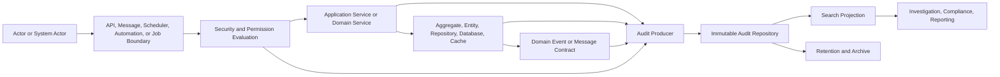
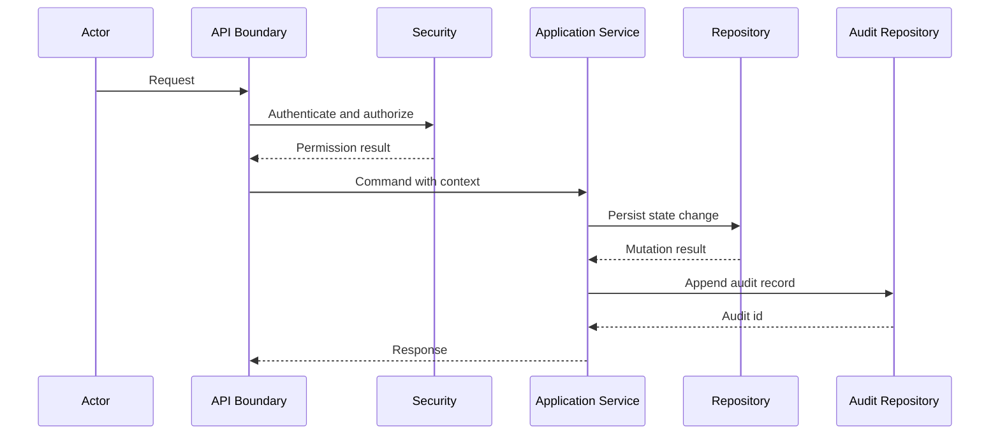
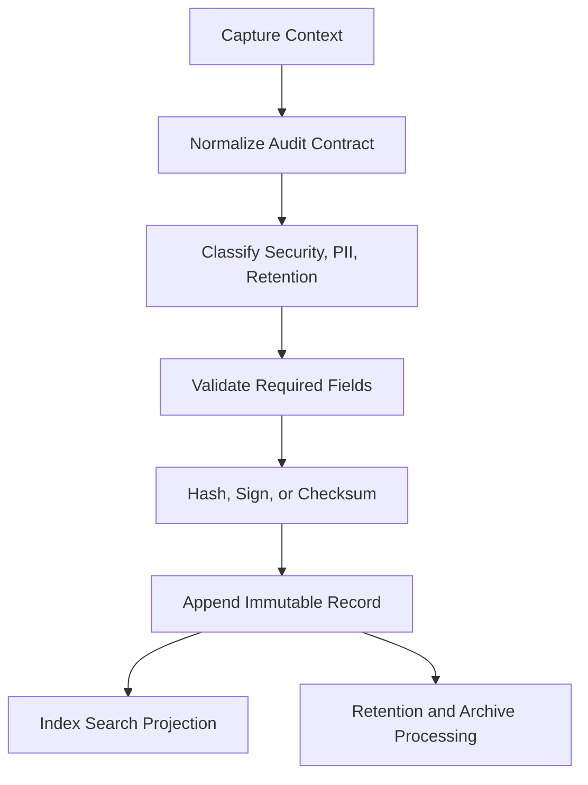
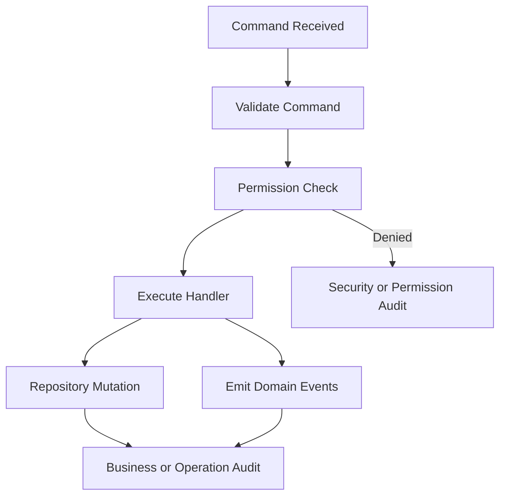
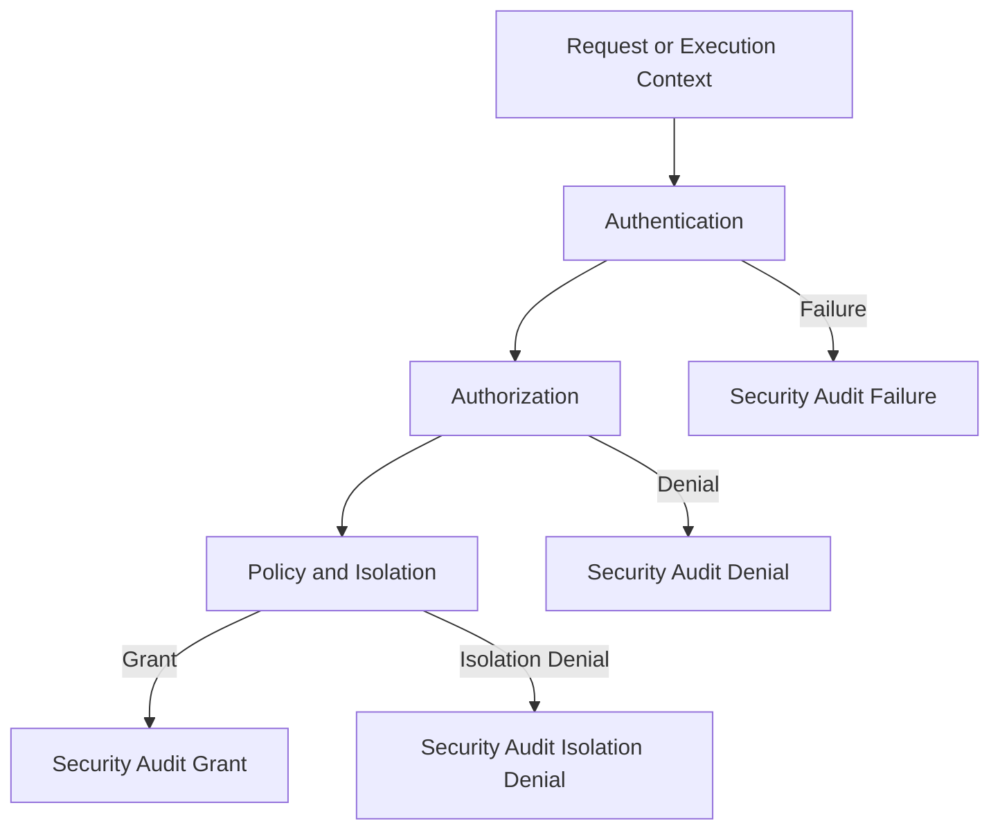
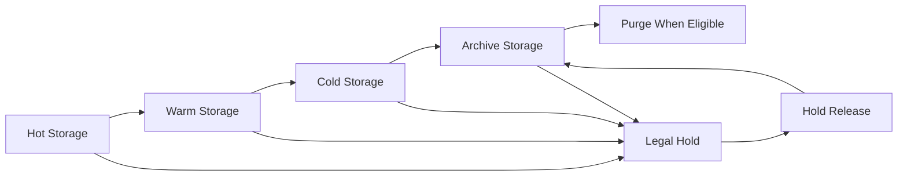

# Audit Framework

# Document Control

Document Name: Audit Framework
Document Path: knowledge/audit-framework.md
Document Type: Atlas Enterprise Canonical Specification
Version: 1.0
Status: Canonical Specification
Domain: Platform
Bounded Context: Platform
Owner: Project Atlas
Source of Truth: Atlas Audit Source of Truth
Last Updated: 2026-07-13

Related Specifications:
- knowledge/security-framework.md
- knowledge/permission-framework.md
- knowledge/api-governance-framework.md
- knowledge/application-service-catalog.md
- knowledge/domain-service-catalog.md
- knowledge/repository-catalog.md
- knowledge/command-catalog.md
- knowledge/domain-event-catalog.md
- knowledge/message-contract-catalog.md
- knowledge/event-driven-architecture.md
- knowledge/integration-framework.md
- knowledge/service-catalog.md
- knowledge/system-module-catalog.md
- knowledge/workflow-engine-framework.md
- knowledge/background-job-framework.md
- knowledge/scheduler-framework.md
- knowledge/automation-framework.md
- docs/05-DatabaseDesign.md
- docs/07-API.md

# Purpose

Audit Framework defines the canonical audit model for Atlas Enterprise. It is the source of truth for audit concepts, audit records, audit events, audit trails, correlation metadata, retention, archive, search, integrity, tamper protection, and cross-catalog audit mappings.

This document does not introduce new business domains. It consolidates audit behavior already required by Atlas Commands, Domain Events, Repositories, Application Services, Domain Services, Workflows, Automation, Scheduler, Background Jobs, APIs, Message Contracts, Security, Permission, Integration, Notification, Database, and Cache specifications.

# Scope

- Audit
- Audit Trail
- Audit Log
- Audit Event
- Business Audit
- Technical Audit
- Security Audit
- Compliance Audit
- Operation Audit
- Change History
- Revision
- Snapshot
- CorrelationId
- CausationId
- TraceId
- RequestId
- Actor
- Principal
- Session
- Aggregate
- Entity
- Repository
- Application Service
- Domain Service
- Command
- Domain Event
- Workflow
- Automation
- Scheduler
- Background Job
- API
- Message Contract
- Security Event
- Permission Event
- Integration Event
- Notification Event
- Database Mutation
- Cache Mutation

# Audit Principles

- Every material Atlas state change must produce audit evidence.
- Every permission, security, and protected data access decision must be auditable.
- Every audit record is append-only after persistence.
- Every audit record must be attributable to an Actor, Principal, system actor, or anonymous denied request.
- Every audit record must include correlation metadata sufficient to connect API request, command, service call, domain event, workflow, repository mutation, and message publication.
- Every audit record must be searchable by time, actor, resource, aggregate, command, event, API route, permission, correlation, and security classification.
- Every audit record must have a retention policy before production use.
- Every sensitive audit field must follow Security Framework classification and masking rules.
- Audit storage must preserve integrity without becoming the source of business state.
- Audit replay supports investigation and verification, not unrestricted state reconstruction unless explicitly defined by the owning catalog.

# Audit Concept Definitions

| Concept | Canonical Meaning | Required Usage |
| --- | --- | --- |
| Audit | The governed evidence model for Atlas behavior, decisions, access, and changes. | Used by every catalog that emits or consumes audit evidence. |
| Audit Trail | Ordered sequence of audit records for a resource, actor, command, event, workflow, or request. | Required for investigations and compliance reviews. |
| Audit Log | Persisted technical log of audit records. | Stored through approved audit repositories only. |
| Audit Event | Immutable audit fact emitted by a producer. | Required when a command, event, API, security decision, or repository mutation is material. |
| Business Audit | Evidence of a business-significant decision or state change. | Required for financial planning, portfolio, goal, loan, projection, and recommendation flows. |
| Technical Audit | Evidence of system execution, job processing, integration, cache, or database behavior. | Required for operational investigation. |
| Security Audit | Evidence of authentication, authorization, policy, token, session, or security boundary decisions. | Required by Security Framework. |
| Compliance Audit | Evidence retained for regulatory, governance, or internal policy review. | Required when retention and access control are stricter than normal operations. |
| Operation Audit | Evidence of administrative or operational action. | Required for configuration, migration, job control, and support actions. |
| Change History | Human-readable history derived from audit records. | Must not replace immutable audit records. |
| Revision | Versioned representation of a changed resource. | Required when prior and current state must be compared. |
| Snapshot | Point-in-time representation of a resource or decision input. | Required for replay, investigation, and explainability when referenced by catalog. |
| CorrelationId | Identifier linking all records belonging to one end-to-end operation. | Required on every audit record. |
| CausationId | Identifier linking an audit record to the immediate cause. | Required when caused by a command, event, message, workflow step, or job. |
| TraceId | Runtime tracing identifier used for observability. | Required when available from API, worker, scheduler, or integration context. |
| RequestId | API or external request identifier. | Required for API-originated audit records. |
| Actor | Human, service, scheduler, automation, integration, background job, or system process performing an action. | Required on every audit record. |
| Principal | Authenticated identity context evaluated by Security and Permission Frameworks. | Required for authenticated actions. |
| Session | Authentication session or execution session. | Required when session context exists. |

# Audit Architecture

Atlas audit architecture is a pipeline from action to immutable evidence.

1. Actor or system process initiates an API request, command, workflow step, scheduler run, automation, message consumer, integration callback, or background job.
2. Security and Permission controls evaluate identity, resource access, tenant isolation, household isolation, and policy.
3. Application Service or Domain Service validates intent and executes business behavior.
4. Aggregate, Entity, Repository, Database, Cache, Domain Event, or Message Contract records the material consequence.
5. Audit producer builds an Audit Event with normalized context, metadata, classification, and retention policy.
6. Audit Repository persists immutable records and indexable projections.
7. Search, reporting, investigation, compliance, retention, and archive processes consume audit records without mutating original evidence.

# Complete Audit Catalog

Every Atlas audit entry must use this contract.

| Field | Requirement |
| --- | --- |
| Audit Name | Stable PascalCase name ending with Audit when record-level or AuditEvent when event-level. |
| Display Name | Human-readable label. |
| Category | Business, Technical, Security, Compliance, Operation, Integration, Workflow, Automation, Scheduler, BackgroundJob, API, Database, Cache. |
| Purpose | Why the audit exists. |
| Business Meaning | Meaning for financial, operational, security, or governance stakeholders. |
| Description | Exact behavior recorded. |
| Trigger | Command, Event, API, Workflow, Scheduler, Automation, Repository, Security, Permission, Job, Integration, or System action. |
| Actor | Human or system actor. |
| Target Resource | Resource type and identifier. |
| Target Aggregate | Aggregate name when applicable. |
| Target Entity | Entity name when applicable. |
| Repository | Repository responsible for persistence when applicable. |
| Application Service | Application service responsible for orchestration when applicable. |
| Domain Service | Domain service responsible for domain decision when applicable. |
| Command | Trigger command when applicable. |
| Domain Event | Produced or consumed domain event when applicable. |
| Workflow | Workflow and step when applicable. |
| Scheduler | Scheduler definition when applicable. |
| Automation | Automation definition when applicable. |
| Background Job | Job definition and run identifier when applicable. |
| API | HTTP method, route, status, request classification, and response classification when applicable. |
| Message Contract | Message name, version, producer, consumer, and delivery metadata when applicable. |
| Security Event | Authentication, authorization, token, session, policy, isolation, or threat event when applicable. |
| Permission Event | Permission check, grant, denial, policy match, or role decision when applicable. |
| Database Mapping | Table, primary key, mutation type, and transaction boundary when applicable. |
| Storage Strategy | Hot, warm, cold, archive, or legal hold. |
| Retention Policy | Retention class and minimum duration. |
| Archive Strategy | Archive trigger and destination class. |
| Search Strategy | Required indexes and query dimensions. |
| CorrelationId | Required. |
| CausationId | Required when caused by another operation. |
| TraceId | Required when available. |
| RequestId | Required for API and external calls. |
| Version | Audit schema version. |
| Integrity | Hash, signature, checksum, or write-once control. |
| Tamper Protection | Immutability, append-only persistence, restricted update path, and detection. |
| Performance | Write path expectation and query SLA. |
| Security | Classification, masking, encryption, and access control. |
| Example | Minimal valid audit record or event example. |

# Audit Matrix

## Command to Audit Matrix

| Command Category | Required Audit | Correlation | Required Evidence |
| --- | --- | --- | --- |
| Domain Command | Business Audit | CommandId, CorrelationId, CausationId | Actor, aggregate, validation result, state change summary, produced events. |
| Application Command | Operation Audit | CommandId, RequestId, CorrelationId | Application service, permission decision, transaction boundary, outcome. |
| Workflow Command | Workflow Audit | WorkflowRunId, StepId, CorrelationId | Step input, step output, compensation state, retry state. |
| Automation Command | Automation Audit | AutomationRunId, CorrelationId | Trigger, rule evaluation, target resource, execution result. |
| Scheduler Command | Scheduler Audit | ScheduleRunId, CorrelationId | Schedule definition, planned time, actual time, job result. |
| Background Job Command | Background Job Audit | JobRunId, CorrelationId | Job type, batch range, retry count, failure summary. |
| API Command | API Audit | RequestId, TraceId, CorrelationId | Route, method, status, principal, permission result. |
| Message Command | Message Audit | MessageId, CorrelationId, CausationId | Producer, consumer, contract version, delivery result. |

## Domain Event to Audit Matrix

| Domain Event Category | Required Audit | Required Evidence |
| --- | --- | --- |
| Business Event | Business Audit | Event name, aggregate, payload classification, producer, consumers. |
| Audit Event | Audit Audit | Audit schema version, source record, integrity hash, storage strategy. |
| Integration Event | Integration Audit | Partner, endpoint, payload classification, delivery result. |
| Projection Event | Technical Audit | Projection name, source event, read model update result. |
| Notification Event | Notification Audit | Recipient class, channel, template, delivery result. |
| Outbox Event | Message Audit | Outbox id, ordering key, publish status, retry count. |
| Inbox Event | Message Audit | Inbox id, idempotency key, consumer status, duplicate result. |

## Repository to Audit Matrix

| Repository Action | Required Audit | Required Evidence |
| --- | --- | --- |
| Create | Business or Technical Audit | Resource id, aggregate, actor, command, transaction id. |
| Update | Business or Technical Audit | Changed fields, prior revision reference, new revision reference. |
| Delete | Business or Compliance Audit | Deletion type, retention class, authorization, recovery status. |
| Read Protected Data | Security Audit | Principal, purpose, permission result, field classification. |
| Bulk Mutation | Operation Audit | Batch id, selection criteria, count, safeguards, rollback reference. |
| Migration | Operation Audit | Migration id, version, affected tables, verification result. |

## Application Service to Audit Matrix

| Service Responsibility | Required Audit |
| --- | --- |
| Command orchestration | Record command acceptance, validation, permission, transaction outcome, emitted events. |
| Query protected data | Record permission, data classification, resource scope, result count class. |
| Decision orchestration | Record inputs, assumptions, formula versions, rules, recommendation output. |
| External integration | Record request, response classification, retry, timeout, idempotency, partner result. |
| Workflow initiation | Record workflow definition, initial payload, actor, and correlation. |

## Workflow to Audit Matrix

| Workflow Stage | Required Audit |
| --- | --- |
| Start | Workflow id, version, run id, actor, trigger, input classification. |
| Step Complete | Step id, attempt, output classification, next step. |
| Step Fail | Error class, retry policy, compensation requirement, operator visibility. |
| Compensation | Compensated resource, cause, result, follow-up event. |
| Complete | Final state, produced records, duration, summary. |

## Scheduler to Audit Matrix

| Scheduler Stage | Required Audit |
| --- | --- |
| Due | Schedule id, expected fire time, lock owner. |
| Start | Run id, actual fire time, execution principal. |
| Skip | Skip reason, overlap policy, next fire time. |
| Retry | Attempt number, error class, next retry time. |
| Complete | Outcome, processed count, duration, next fire time. |

## Automation to Audit Matrix

| Automation Stage | Required Audit |
| --- | --- |
| Trigger Match | Rule id, resource, condition result, actor context. |
| Guard Evaluation | Permission, policy, risk, and isolation decision. |
| Action Execute | Command, target resource, outcome, produced event. |
| Action Suppress | Suppression reason and next eligible time. |
| Human Approval | Approver principal, decision, timestamp, comments classification. |

## Background Job to Audit Matrix

| Job Stage | Required Audit |
| --- | --- |
| Enqueue | Job id, type, payload classification, idempotency key. |
| Start | Worker id, attempt, lock, correlation. |
| Progress | Batch range, processed count, checkpoint. |
| Fail | Error class, retryable flag, next action. |
| Complete | Final status, counts, duration, output reference. |

## Security Event Matrix

| Security Event | Required Audit |
| --- | --- |
| Authentication Success | Principal, session, method, tenant, household when applicable. |
| Authentication Failure | Subject hint, method, reason class, request context. |
| Authorization Grant | Principal, resource, action, policy, permission. |
| Authorization Denial | Principal or anonymous actor, resource, action, denial reason. |
| Token Issue | Principal, token class, expiry, session. |
| Token Refresh | Principal, session, previous token reference. |
| Token Revoke | Principal, revocation actor, reason, affected session. |
| Session Start | Principal, session id, device class, risk class. |
| Session End | Principal, session id, reason. |
| Isolation Denial | Tenant, household, resource, attempted actor, reason. |

# Retention Policy

| Retention Class | Minimum Retention | Applies To |
| --- | --- | --- |
| OperationalShort | 90 days | Routine technical audits without protected business content. |
| OperationalStandard | 1 year | API, job, scheduler, workflow, integration, cache, and repository technical records. |
| BusinessStandard | 7 years | Financial planning, portfolio, loan, goal, projection, recommendation, and decision records. |
| SecurityStandard | 7 years | Authentication, authorization, permission, session, token, and isolation records. |
| ComplianceLong | 10 years | Compliance, legal, administrative, and governance records. |
| LegalHold | Until released | Records under investigation, dispute, regulatory hold, or executive hold. |

# Archive Policy

- Hot audit storage supports operational query SLAs.
- Warm audit storage supports routine investigation and compliance review.
- Cold audit storage supports low-frequency historical retrieval.
- Archive records must preserve schema version, integrity metadata, and search keys.
- Archive movement must produce an Operation Audit.
- LegalHold records must not be deleted or compacted while the hold is active.
- Archive restore must produce an Operation Audit with requester, reason, scope, and result.

# Search Policy

Every audit repository must support these search dimensions:

- Time range
- Actor
- Principal
- Session
- TenantId
- HouseholdId
- Resource type
- Resource id
- Aggregate
- Entity
- Repository
- Application Service
- Domain Service
- Command
- Domain Event
- WorkflowRunId
- SchedulerRunId
- AutomationRunId
- BackgroundJobRunId
- API route
- HTTP status class
- MessageId
- Permission
- Security event type
- CorrelationId
- CausationId
- TraceId
- RequestId
- Retention class
- Security classification
- Integrity status

# Validation Rules

- Audit Name is required.
- Category is required.
- Purpose is required.
- Trigger is required.
- Actor is required.
- Principal is required when authentication succeeds.
- Anonymous denied requests must use an anonymous actor classification.
- Target Resource is required for resource-specific actions.
- Target Aggregate is required for aggregate mutations.
- Repository is required for persistent state changes.
- Application Service is required for application-command audits.
- Domain Service is required when domain logic produces the decision.
- Command is required when a command caused the audit.
- Domain Event is required when an event caused or resulted from the audit.
- WorkflowRunId is required for workflow audits.
- SchedulerRunId is required for scheduler audits.
- AutomationRunId is required for automation audits.
- BackgroundJobRunId is required for job audits.
- API route and method are required for API audits.
- Message Contract and version are required for message audits.
- Security Event type is required for security audits.
- Permission result is required for authorization and protected access audits.
- Database Mapping is required for repository mutation audits.
- CorrelationId is required.
- CausationId is required when triggered by another command, event, message, workflow step, scheduler run, automation run, or job.
- TraceId is required when runtime tracing exists.
- RequestId is required when an HTTP request exists.
- Schema Version is required.
- Retention Policy is required.
- Storage Strategy is required.
- Archive Strategy is required for records retained beyond hot storage.
- Search Strategy is required.
- Integrity metadata is required.
- Tamper protection classification is required.
- Security classification is required.
- PII classification is required when personal data appears.
- Sensitive values must be masked or tokenized.
- TenantId is required for tenant-scoped data.
- HouseholdId is required for household-scoped data.
- Timestamp must be UTC.
- Timestamp must be generated by trusted server or worker context.
- Audit record id must be globally unique.
- Audit record must be append-only after persistence.
- Retry must not create duplicate semantic audit records without attempt metadata.
- Idempotency key must be recorded when available.
- Bulk operations must record selection criteria and affected count.
- Failed audit persistence must follow the owning service reliability policy.

# Business Rules

- Audit records are business evidence, not business state.
- Business state must be reconstructed from domain state and approved events, not from arbitrary audit logs.
- Every material financial decision must produce a Business Audit.
- Every recommendation must reference assumptions, formulas, rules, inputs, and output versions.
- Every mutation of goal, portfolio, loan, cashflow, projection, scenario, property, or policy data must produce a Business Audit.
- Every administrative configuration change must produce an Operation Audit.
- Every authentication failure must produce a Security Audit.
- Every authorization denial must produce a Security Audit.
- Every permission grant or revoke must produce a Security Audit.
- Every protected read must produce a Security Audit when required by classification.
- Every cross-tenant denial must produce a Security Audit.
- Every household isolation denial must produce a Security Audit.
- Every external integration request must produce an Integration Audit.
- Every integration callback must produce an Integration Audit.
- Every message publish must produce a Message Audit.
- Every message consume result must produce a Message Audit.
- Every outbox failure must produce a Message Audit.
- Every inbox duplicate detection must produce a Message Audit.
- Every workflow run must produce start and terminal audit records.
- Every workflow compensation must produce an audit record.
- Every scheduler run must produce due, start, and terminal audit records.
- Every automation action must produce a trigger and action audit record.
- Every background job must produce enqueue, start, and terminal audit records.
- Every bulk operation must record scope, count, actor, approval, and safeguards.
- Every delete operation must record deletion type, retention class, and recovery status.
- Soft delete must preserve audit evidence.
- Hard delete must be allowed only when retention, compliance, and legal hold rules permit it.
- LegalHold overrides normal deletion and archive compaction.
- Audit records must not store secrets.
- Audit records must not store raw tokens.
- Audit records must not store full payment, credential, or external secret payloads.
- Audit records may store hashes or references for sensitive payloads.
- PII in audit records must be minimized.
- Audit search must enforce permission checks.
- Audit export must produce an Operation Audit.
- Audit archive restore must produce an Operation Audit.
- Audit retention deletion must produce an Operation Audit.
- Audit integrity failure must produce a Security Audit.
- Audit storage access must be restricted by Security Framework.
- Audit query access must be restricted by Permission Framework.
- Audit APIs must follow API Governance Framework.
- Audit messages must follow Message Contract Catalog.
- Audit events must follow Domain Event Catalog rules when published as events.
- Audit repositories must follow Repository Catalog rules.
- Audit services must follow Application Service Catalog and Domain Service Catalog rules.
- Audit correlation must not be regenerated mid-flow.
- Child operations must inherit CorrelationId.
- Child operations must set CausationId to the immediate parent operation.
- API-originated operations must preserve RequestId.
- Worker-originated operations must create a worker execution id.
- Scheduler-originated operations must create a scheduler run id.
- Automation-originated operations must create an automation run id.
- Workflow-originated operations must create a workflow run id and step id.
- Retry attempts must preserve CorrelationId.
- Retry attempts must record attempt number.
- Failed commands must be auditable when they pass security boundary or affect business outcome.
- Validation failures are auditable when required by API, Security, Permission, or business policy.
- Denied commands must not emit business mutation audits.
- Denied commands must emit security or permission audits.
- Repository mutations must be auditable inside the same logical transaction boundary when possible.
- Audit persistence must not silently succeed when primary business persistence fails.
- Audit persistence failures must be observable.
- Audit events must be versioned.
- Audit schema changes must be backward compatible or migration-controlled.
- Audit readers must tolerate older schema versions.
- Audit indexes must not expose sensitive data outside permissions.
- Audit summaries may be denormalized for search.
- Denormalized audit summaries must reference immutable source records.
- Audit records must include classification before persistence.
- Audit records must include retention class before persistence.
- Audit records must include producer identity before persistence.
- Audit records must include source catalog reference when available.
- Audit records must include outcome: success, failure, denied, skipped, retried, compensated, or completed.
- Audit records must include reason class for failures and denials.
- Audit records must include duration for long-running operations when available.
- Audit records must include affected count for bulk and batch operations.
- Audit records must include before and after references when change history is required.
- Audit records must not include unbounded payloads.
- Audit record payload size must be bounded by service policy.
- Oversized details must be stored as governed evidence artifacts and referenced.
- Audit evidence artifacts must follow the same retention and access controls.
- Compliance reports must read audit records through approved query services.
- Support tools must not bypass audit query authorization.
- Manual operational actions must use an authenticated Principal.
- System actors must be registered in Service Catalog or related operating catalog.
- Background job actors must be distinguishable from human actors.
- Integration actors must identify partner, client, and contract version.
- Notification audits must not expose full message body when classified.
- Cache audit records must be emitted for protected cache invalidation and sensitive cache write operations.
- Database audit records must be emitted for migration, repair, and bulk maintenance.
- Audit replay must verify schema version, input version, rule version, and formula version.
- Audit replay must not mutate production state unless performed by an approved recovery workflow.
- Audit records must remain available for the full retention period.
- Archive retrieval must meet the archive policy SLA.
- Audit performance controls must not drop mandatory audit records.
- Sampling is prohibited for mandatory security and business audit records.
- Sampling is allowed only for non-material technical diagnostics explicitly classified as non-canonical audit.
- Audit Framework conflicts are resolved by this document unless a stricter Security, Permission, Compliance, or legal rule applies.

# Security

## Integrity

- Audit records must be immutable after persistence.
- Audit records must include a hash, checksum, signature, or equivalent integrity marker.
- Integrity verification must be available for compliance, security, and archive reviews.
- Integrity failures must be treated as Security Audit events.

## Tamper Detection

- Audit storage must prevent normal application update paths from changing historical records.
- Administrative repair actions must be explicitly audited.
- Archive storage must preserve integrity metadata.
- Search projections may be rebuilt, but source audit records must not be rewritten.

## Encryption

- Audit storage containing PII, financial data, security decisions, tokens references, or household data must be encrypted at rest.
- Audit transport must be encrypted.
- Field-level encryption or tokenization is required for highly sensitive values.

## Access Control

- Audit read access requires explicit permission.
- Audit export requires explicit permission and an Operation Audit.
- Audit delete or retention purge requires explicit administrative permission, retention eligibility, and Operation Audit.
- Security audit records require elevated access.

## Tenant Isolation

- Tenant-scoped audit records must include TenantId.
- Cross-tenant query must require administrative permission and must be audited.
- Missing TenantId on tenant-scoped audit is a validation failure.

## Household Isolation

- Household-scoped audit records must include HouseholdId.
- Household audit search must enforce household membership or approved delegated access.
- Household isolation denial must produce a Security Audit.

# Performance

| Area | Requirement |
| --- | --- |
| Write Throughput | Audit write path must support command, API, workflow, scheduler, automation, job, and message peak throughput without dropping mandatory records. |
| Query SLA | Hot audit search must support operational investigation by CorrelationId, Actor, Resource, Time, and Security Event within approved service targets. |
| Archive Performance | Archive retrieval must return metadata first and full evidence by archive class SLA. |
| Retention Strategy | Retention processing must run in bounded batches and must audit every purge, archive, hold, and restore action. |

# Mermaid

## Audit Architecture

## Audit Flow

## Audit Pipeline

## Command Audit Flow

## Security Audit Flow

## Retention Flow

# Testing

| Test Type | Required Coverage |
| --- | --- |
| Audit Test | Command, API, workflow, scheduler, automation, job, repository, event, and message producers emit required records. |
| Integrity Test | Hash, checksum, signature, immutable storage, and archive verification detect tampering. |
| Retention Test | Retention classes archive, hold, restore, and purge according to policy. |
| Archive Test | Archive records remain searchable by metadata and retrievable by approved permission. |
| Search Test | Required indexes support actor, resource, correlation, security, command, event, API, and time queries. |
| Performance Test | Audit writes meet throughput targets and do not drop mandatory records under peak load. |

# Edge Cases

- Anonymous request denied before authentication.
- Authentication succeeds but permission lookup fails.
- Permission is granted but household isolation fails.
- Permission is granted but tenant isolation fails.
- Command validation fails before repository mutation.
- Command succeeds but event publication is delayed.
- Command succeeds but audit projection indexing is delayed.
- Command retries after timeout and uses same idempotency key.
- Background job resumes from checkpoint after worker crash.
- Scheduler run is skipped because previous run still holds a lock.
- Automation trigger matches but guard suppresses action.
- Workflow step completes but compensation later reverses effect.
- Repository mutation succeeds and domain event publish moves through outbox later.
- Inbox consumer receives duplicate message.
- Integration partner returns success after local timeout.
- Integration callback arrives without known request id.
- API request has TraceId but missing RequestId.
- CLI or support operation has no HTTP RequestId.
- System migration touches multiple tables.
- Bulk operation affects zero records.
- Bulk operation exceeds expected affected count.
- Cache invalidation occurs after protected data change.
- Read model projection rebuild creates derived records.
- Audit search projection becomes inconsistent with source audit record.
- Archive movement fails halfway through batch.
- LegalHold is applied after record enters archive.
- LegalHold is released after normal purge date.
- Retention purge attempts to delete record with active hold.
- Audit record contains oversized payload.
- Audit record contains sensitive field requiring masking.
- Audit record references deleted business resource.
- Audit record references unknown actor after identity removal.
- User account is deleted but audit retention remains.
- Household membership changes after audit record creation.
- Tenant migration changes tenant identifier mapping.
- Schema version changes while old workers still emit records.
- Domain Event version changes but audit consumer reads old version.
- Message Contract version changes during deployment.
- Audit Repository write succeeds but search index write fails.
- Search index write succeeds but source append fails.
- Integrity hash verification fails.
- Archive restore is requested by unauthorized principal.
- Audit export includes mixed classification records.
- Time clock skew appears between API and worker.
- Duplicate CorrelationId appears from external client.
- CausationId references missing parent due to archive tiering.
- Decision replay requires assumptions no longer active.
- Formula version referenced by audit has been superseded.
- Rule version referenced by audit has been retired.
- Emergency operational action occurs outside normal UI.
- Denied cross-tenant access attempts repeated rapidly.
- Notification delivery fails after business command succeeds.
- External partner sends malformed event.
- Retention batch is interrupted and restarted.
- Audit query spans hot and archive storage.

# Final Consistency Matrix

| Area | Required Audit Alignment |
| --- | --- |
| Audit | Uses this framework as canonical source of truth. |
| Command | Every mutating or controlled execution command maps to required audit records. |
| Domain Event | Every material event records producer, consumer, payload classification, and correlation. |
| Repository | Every material mutation and protected read maps to audit policy. |
| Application Service | Every orchestrated command, query, integration, workflow, and decision records context and outcome. |
| Workflow | Every run, step, failure, retry, compensation, and completion is auditable. |
| Automation | Every trigger, guard, action, suppression, and approval is auditable. |
| Scheduler | Every due, start, skip, retry, failure, and completion is auditable. |
| Background Job | Every enqueue, start, checkpoint, retry, failure, and completion is auditable. |
| Security | Every authentication, authorization, token, session, policy, and isolation decision is auditable. |
| Permission | Every permission grant, denial, evaluation, role change, and policy match is auditable. |
| API | Every protected route preserves RequestId, TraceId, Principal, permission result, and outcome. |

# Completion Checklist

- Command audit mapping is defined.
- Domain Event audit mapping is defined.
- Repository audit mapping is defined.
- API audit mapping is defined.
- Workflow audit mapping is defined.
- Scheduler audit mapping is defined.
- Automation audit mapping is defined.
- Background Job audit mapping is defined.
- Security audit mapping is defined.
- Permission audit mapping is defined.
- Audit retention policy is defined.
- Audit archive policy is defined.
- Audit search policy is defined.
- CorrelationId is mandatory.
- CausationId rules are defined.
- TraceId and RequestId rules are defined.
- Integrity rules are defined.
- Tamper protection rules are defined.
- Tenant isolation rules are defined.
- Household isolation rules are defined.
- Validation rules are complete.
- Business rules are complete.
- Mermaid diagrams are syntactically valid.
- Markdown structure is valid.
- No placeholder terms are present.
- No draft-only status is present.
- No temporary catalog entries are present.
