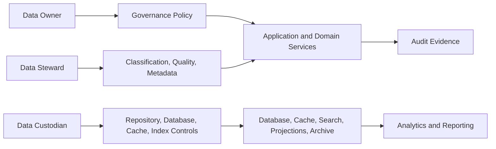
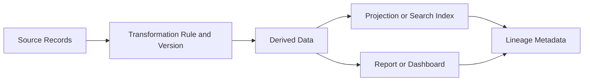
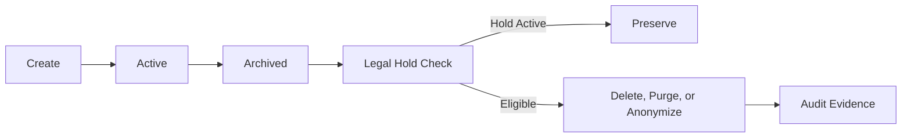
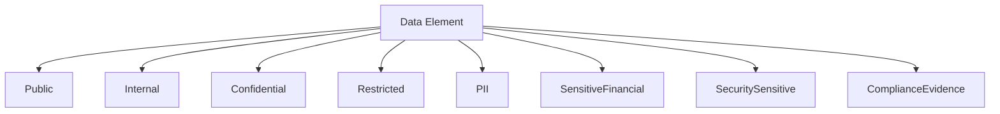
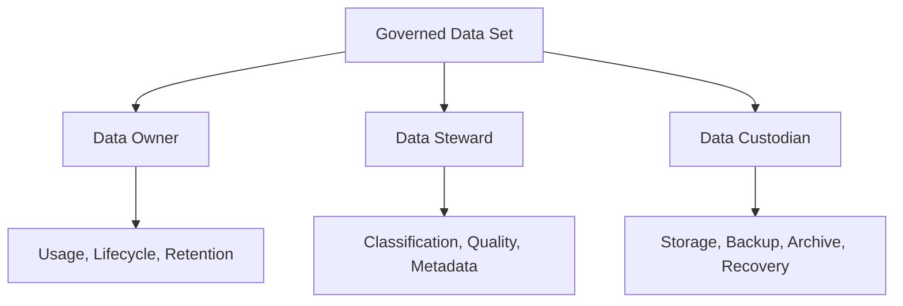
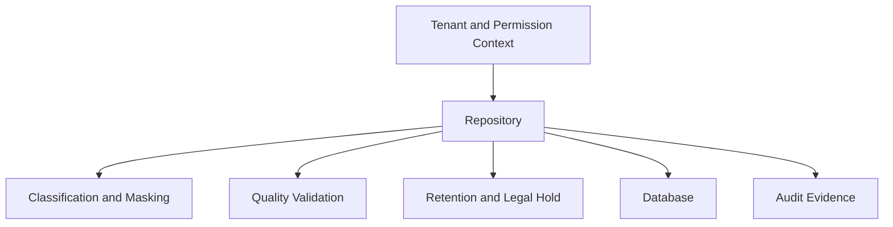

# Data Governance Framework

# Document Control

Document Name: Data Governance Framework
Document Path: knowledge/data-governance-framework.md
Document Type: Atlas Enterprise Canonical Specification
Version: 1.0
Status: Canonical Specification
Domain: Platform
Bounded Context: Platform
Owner: Project Atlas
Source of Truth: Atlas Data Governance Source of Truth
Last Updated: 2026-07-13

Related Specifications:
- knowledge/domain-model-catalog.md
- knowledge/entity-catalog.md
- knowledge/value-object-catalog.md
- knowledge/repository-catalog.md
- knowledge/api-governance-framework.md
- knowledge/security-framework.md
- knowledge/permission-framework.md
- knowledge/audit-framework.md
- knowledge/compliance-framework.md
- knowledge/tenant-framework.md
- knowledge/system-module-catalog.md
- knowledge/service-catalog.md
- knowledge/application-service-catalog.md
- knowledge/domain-service-catalog.md
- knowledge/workflow-engine-framework.md
- knowledge/background-job-framework.md
- knowledge/scheduler-framework.md
- knowledge/automation-framework.md
- docs/05-DatabaseDesign.md
- docs/06-ERD.md
- docs/07-API.md

# Purpose

Data Governance Framework defines the canonical Atlas data governance model. It is the source of truth for data ownership, stewardship, custody, classification, lineage, quality, lifecycle, retention, archive, deletion, masking, encryption, sharing, metadata, repository governance, API governance, database governance, search index governance, projection governance, analytics governance, reporting governance, and audit evidence.

This document does not create new Atlas domains or business concepts. It consolidates governance behavior required by Aggregates, Entities, Value Objects, Repositories, Application Services, Domain Services, APIs, DTOs, Database, Cache, Search Indexes, Projections, Workflows, Automations, Schedulers, Background Jobs, Audit, Security, Compliance, Analytics, and Reporting specifications.

# Scope

- Data Governance
- Data Steward
- Data Owner
- Data Custodian
- Master Data
- Reference Data
- Transactional Data
- Derived Data
- Analytical Data
- Metadata
- Lineage
- Classification
- Quality
- Lifecycle
- Retention
- Archival
- Deletion
- Masking
- Encryption
- Data Sharing
- Aggregate
- Entity
- Value Object
- Repository
- Application Service
- Domain Service
- API
- DTO
- Database
- Cache
- Search Index
- Projection
- Workflow
- Automation
- Scheduler
- Background Job
- Audit
- Security
- Compliance
- Analytics
- Reporting

# Data Governance Principles

- Every governed data element must have an owner, steward, custodian, classification, lifecycle, retention policy, and audit path.
- Every aggregate and entity containing protected data must declare ownership and classification.
- Every repository must enforce tenant isolation, household isolation, access policy, retention, archive, deletion, and quality constraints appropriate to the data it owns.
- Every API and DTO must preserve classification, masking, minimization, and permission expectations.
- Every database table, projection, search index, cache entry, report, and analytical data set must have lineage to an approved source.
- Every derived value must declare source data, transformation rule, version, and refresh behavior.
- Every protected data read, export, share, purge, archive, restore, and ownership change must be auditable.
- Every data quality rule must be testable, monitored, and owned.
- Default behavior is classify before store, minimize before transmit, mask before display, encrypt before persist, retain by policy, and audit governed changes.
- Data governance evidence must align with Security Framework, Permission Framework, Audit Framework, Compliance Framework, and Tenant Framework.

# Data Governance Concept Definitions

| Concept | Canonical Meaning | Required Usage |
| --- | --- | --- |
| Data Governance | The Atlas control model for ownership, classification, lineage, quality, lifecycle, retention, access, and evidence. | Required for all persistent, transmitted, indexed, cached, reported, and audited data. |
| Data Steward | Role accountable for quality, classification, metadata, and review of a governed data set. | Required for protected or business-critical data. |
| Data Owner | Role accountable for policy decisions, access approval, lifecycle, retention, and data use. | Required for aggregates, entities, reports, and data products. |
| Data Custodian | Technical owner responsible for storage, backup, access implementation, retention execution, and recovery. | Required for repositories, databases, caches, projections, search indexes, and archives. |
| Master Data | Stable core data shared across processes, such as users, households, policies, configuration, and catalog references. | Requires ownership, stewardship, versioning, and careful change history. |
| Reference Data | Controlled values used for validation, classification, calculation, or display. | Requires source, version, effective date, and change audit. |
| Transactional Data | Data created by business operations and commands. | Requires tenant, household when applicable, retention, audit, and repository ownership. |
| Derived Data | Data calculated from source records, formulas, rules, or projections. | Requires lineage, transformation version, source version, and recomputation rules. |
| Analytical Data | Data prepared for dashboards, metrics, reports, and analysis. | Requires aggregation rules, classification, refresh cadence, and permission. |
| Metadata | Data describing structure, ownership, classification, lineage, quality, or lifecycle. | Must be governed and auditable. |
| Lineage | Trace from data output to source records, transformations, versions, and producers. | Required for derived data, reports, projections, search indexes, and audit evidence. |
| Classification | Sensitivity and handling label for data. | Required before persistence, transmission, indexing, caching, export, or reporting. |
| Quality | Fitness of data for intended use, measured through completeness, accuracy, consistency, timeliness, uniqueness, and integrity. | Required for business-critical data. |
| Lifecycle | State model from creation through active use, archive, deletion eligibility, purge, or anonymization. | Required for repositories and records. |
| Retention | Minimum and maximum record holding policy. | Required for persistent records and audit evidence. |
| Archival | Controlled movement to lower-cost or lower-frequency storage while preserving search metadata and access rules. | Required for retained historical records. |
| Deletion | Controlled removal, purge, or anonymization when allowed by retention and legal hold. | Must be auditable and permissioned. |
| Masking | Transformation that hides sensitive values from unauthorized displays, logs, exports, reports, or notifications. | Required for protected data exposure paths. |
| Encryption | Protection of data at rest, in transit, or by field-level controls. | Required for protected data according to Security Framework. |
| Data Sharing | Controlled movement or exposure of data between Atlas modules, tenants, integrations, reports, and exports. | Requires purpose, permission, classification, minimization, and audit. |

# Data Governance Architecture

Atlas data governance is enforced through cataloged ownership, policy, and evidence.

1. Data Owner defines the business meaning, usage, lifecycle, retention, and sharing policy.
2. Data Steward defines classification, quality rules, metadata, lineage expectations, and review cadence.
3. Data Custodian implements storage, repository enforcement, database constraints, cache namespace, indexes, projections, archive, backup, and recovery controls.
4. Security Framework protects data with authentication, encryption, masking, transport, and secret handling.
5. Permission Framework controls access by principal, role, policy, tenant, household, resource, and action.
6. Tenant Framework enforces tenant and household scope.
7. Compliance Framework defines evidence, retention, legal hold, exception, consent, purpose, and review requirements.
8. Audit Framework records ownership changes, classification changes, quality failures, retention actions, archive actions, deletion actions, protected reads, exports, and sharing.
9. Application Services, Domain Services, Repositories, APIs, DTOs, Workflows, Automations, Schedulers, Background Jobs, Analytics, and Reporting execute data governance rules.

# Complete Data Governance Catalog

Every governance capability must use this Enterprise contract.

| Field | Requirement |
| --- | --- |
| Capability Name | Stable PascalCase name ending with DataGovernance when capability-level. |
| Display Name | Human-readable label. |
| Category | Ownership, Stewardship, Custody, Classification, Quality, Lineage, Lifecycle, Retention, Archive, Deletion, Masking, Encryption, Sharing, Metadata, Analytics, Reporting. |
| Purpose | Why the capability exists. |
| Business Meaning | Business, financial, security, compliance, operational, analytical, or reporting meaning. |
| Description | Exact governed behavior. |
| Owner | Data Owner accountable for policy and approved usage. |
| Steward | Data Steward accountable for quality, classification, and metadata. |
| Custodian | Technical owner accountable for implementation and operations. |
| Applicable Domain | Atlas domain or platform area. |
| Applicable Aggregate | Aggregate requiring ownership or lifecycle control. |
| Applicable Entity | Entity requiring classification, quality, retention, or lineage. |
| Applicable Repository | Repository enforcing governance policy. |
| Applicable API | API exposing, mutating, exporting, or sharing governed data. |
| Applicable Database | Table, index, constraint, projection, or archive. |
| Applicable Workflow | Workflow preserving governance context. |
| Applicable Scheduler | Scheduler executing governance jobs. |
| Applicable Automation | Automation executing checks, alerts, remediation, or approvals. |
| Applicable Background Job | Job executing archive, purge, projection, report, or quality processing. |
| Data Classification | Required classification labels and handling rules. |
| Data Lineage | Source, transformation, version, producer, and consumer path. |
| Lifecycle | States and allowed transitions. |
| Retention Policy | Retention class, duration, archive, legal hold, and purge eligibility. |
| Archive Policy | Archive trigger, destination, restore rules, and metadata preservation. |
| Deletion Policy | Soft delete, purge, anonymization, exception, and evidence rules. |
| Masking Policy | Display, API, DTO, log, audit, export, notification, and report masking. |
| Encryption Policy | At-rest, in-transit, field-level, tokenization, or secure reference requirements. |
| Quality Rules | Completeness, accuracy, consistency, timeliness, uniqueness, and integrity checks. |
| Validation Rules | Required validation before create, read, update, delete, export, archive, or purge. |
| Business Rules | Behavioral governance rules. |
| Monitoring | Metrics, alerts, checks, and review cadence. |
| Metrics | Quality and governance KPIs. |
| Reporting | Dashboard, report, lineage view, and exception view. |
| Security | Authentication, authorization, permission, tenant, household, and access controls. |
| Compliance | Evidence, retention, legal hold, exception, and review controls. |
| Audit | Audit records required for governed action. |
| Performance | Query, reporting, archive, and quality check expectations. |
| Example | Minimal valid governance scenario. |

# Data Classification Matrix

| Classification | Applies To | Required Controls |
| --- | --- | --- |
| Public | Approved public reference data. | Source ownership and integrity. |
| Internal | Non-public operational metadata. | Authentication and standard access controls. |
| Confidential | Tenant, household, business, or operational data. | Permission, tenant isolation, encryption, masking, retention, audit. |
| Restricted | High-risk personal, financial, security, or governance data. | Elevated permission, field-level masking, encryption, detailed audit, export approval. |
| PII | Person or household identifying data. | Minimization, masking, encryption, purpose, consent when required, retention, audit. |
| SensitiveFinancial | Assets, liabilities, cashflow, goals, scenarios, projections, recommendations, and financial decisions. | Household isolation, permission, encryption, audit, export control. |
| SecuritySensitive | Tokens, sessions, credentials, keys, secret references, security policy internals. | Secure reference, no raw logs, elevated access, integrity evidence. |
| ComplianceEvidence | Approvals, exceptions, legal holds, audit evidence, reports, reviews. | Immutability, long retention, restricted access, integrity validation. |

# Master Data Matrix

| Master Data | Owner | Steward | Governance Requirement |
| --- | --- | --- | --- |
| User | Platform Owner | Identity Steward | Tenant membership, identity metadata, lifecycle, access history. |
| Household | Household Owner | Financial Data Steward | Household membership, ownership, isolation, retention, audit. |
| Tenant | Platform Owner | Tenant Steward | Tenant lifecycle, routing, configuration, security, evidence. |
| Policy | Policy Owner | Compliance Steward | Version, effective date, approval, exception, audit. |
| Configuration | Configuration Owner | Operations Steward | Version, scope, secret reference, audit, rollback. |

# Reference Data Matrix

| Reference Data | Governance Rule |
| --- | --- |
| Enumeration | Versioned, approved, and referenced by Enumeration Catalog. |
| Formula Reference | Versioned, source-owned, and linked to formula catalog or calculation framework. |
| Rule Reference | Versioned, effective-dated, and auditable. |
| Market Assumption | Source, effective date, owner, refresh cadence, and decision lineage required. |
| Tax or Regional Assumption | Jurisdiction, effective date, owner, source, and review cadence required. |

# Transactional Data Matrix

| Transactional Data | Governance Rule |
| --- | --- |
| Command Mutation | Tenant, household, actor, command, repository, transaction, and audit required. |
| Domain Event | Source aggregate, event version, TenantId, HouseholdId when applicable, classification, and lineage required. |
| Repository Record | Owner, classification, retention, lifecycle, and database mapping required. |
| Workflow State | WorkflowRunId, TenantContext, classification, step lineage, and retention required. |
| Job State | JobRunId, payload classification, checkpoint, retry, and audit required. |

# Derived Data Matrix

| Derived Data | Governance Rule |
| --- | --- |
| Projection | Source event, transformation version, rebuild rule, classification, and owner required. |
| Search Index | Source repository or event, indexed fields, masking, refresh cadence, and delete propagation required. |
| Calculated KPI | Formula, input versions, output classification, rounding, and lineage required. |
| Recommendation | Assumption version, rule version, formula version, input snapshot, and audit required. |
| Report Metric | Source query, aggregation rule, refresh time, permission, and lineage required. |

# Metadata Matrix

| Metadata Type | Governance Rule |
| --- | --- |
| Ownership Metadata | Owner, steward, custodian, review cadence, and audit. |
| Classification Metadata | Classification, rationale, effective time, approver, and audit. |
| Lineage Metadata | Source, transformation, producer, consumer, version, and refresh. |
| Quality Metadata | Rule id, threshold, result, owner, severity, and remediation. |
| Lifecycle Metadata | State, retention class, archive state, legal hold, and deletion eligibility. |

# Lineage Matrix

| Data Path | Required Lineage |
| --- | --- |
| API Response | Source repository, DTO mapping, classification, masking, permission, TenantContext. |
| DTO | Source entity or value object, field classification, transformation, masking. |
| Repository Record | Command, actor, aggregate, entity, transaction, version, audit. |
| Projection | Source event stream, projection version, rebuild timestamp, consumer. |
| Search Index | Source record, indexed field list, analyzer policy, masking policy, refresh time. |
| Report | Source query, aggregation, filters, permission scope, generated time. |
| Analytics Data Set | Source records, transformation, anonymization, aggregation, refresh cadence. |

# Repository Governance Matrix

| Repository Concern | Governance Requirement |
| --- | --- |
| Create | Assign owner, classification, TenantId, HouseholdId when applicable, retention, lifecycle, and audit. |
| Read | Enforce permission, tenant, household, classification, masking, purpose, and protected-read audit when required. |
| Update | Validate owner, steward rule, quality, lifecycle, permission, and audit. |
| Delete | Enforce retention, legal hold, archive, soft delete, purge, anonymization, and audit. |
| Archive | Preserve classification, lineage, TenantId, HouseholdId, search metadata, and integrity. |
| Restore | Validate permission, destination scope, classification, lineage, and audit. |
| Query | Apply tenant and household filters before user-defined filters. |
| Projection | Preserve source lineage and classification. |

# API Governance Matrix

| API Concern | Governance Requirement |
| --- | --- |
| Request DTO | Validate classification, minimization, TenantContext, and allowed fields. |
| Response DTO | Apply masking, classification, permission, and minimization. |
| Export | Require purpose, permission, scope, classification, masking, retention, and audit. |
| Import | Validate owner, classification, TenantId, schema version, and quality rules. |
| Error | Avoid leaking tenant, household, or restricted resource existence. |
| Cursor | Bind tenant, household, permission, filter, and classification scope. |
| Bulk Operation | Require tenant scope, affected-count safeguards, approval, quality checks, and audit. |

# Validation Rules

- Capability Name is required.
- Category is required.
- Purpose is required.
- Data Owner is required.
- Data Steward is required for protected or business-critical data.
- Data Custodian is required for every persistent store.
- Classification is required before persistence.
- Classification is required before API response.
- Classification is required before export.
- Classification is required before indexing.
- Classification is required before caching protected data.
- Lineage is required for derived data.
- Lineage is required for projections.
- Lineage is required for search indexes.
- Lineage is required for reports.
- Lineage is required for analytics data sets.
- Retention Policy is required for persistent records.
- Archive Policy is required for long-lived records.
- Deletion Policy is required for persistent records.
- Legal Hold must be checked before purge.
- TenantId is required for tenant-scoped data.
- HouseholdId is required for household-owned data.
- Repository methods must accept TenantContext for tenant-scoped data.
- API endpoints must preserve classification in DTO mapping.
- DTOs must not expose fields without classification.
- Cache keys must include tenant namespace for tenant-scoped protected data.
- Search indexes must not include unmasked restricted data unless approved.
- Quality rules must have owner.
- Quality rules must have severity.
- Quality rules must have measurement method.
- Quality failures must be reportable.
- Quality remediation must be tracked.
- Data sharing must include purpose.
- Data sharing must include permission.
- Data sharing must include classification.
- Data sharing must include audit.
- Export must include destination classification.
- Import must validate source classification.
- Archive restore must validate destination ownership.
- Metadata changes must be audited.
- Ownership changes must be audited.
- Classification changes must be audited.
- Retention changes must be audited.
- Deletion actions must be audited.

# Business Rules

- Data governance applies to data at rest, in transit, in cache, in indexes, in projections, in reports, and in audit.
- Data governance applies to commands, events, workflows, schedulers, automations, background jobs, APIs, integrations, and notifications.
- Data Owner determines approved use and lifecycle.
- Data Steward maintains classification, quality, metadata, and review cadence.
- Data Custodian implements technical controls.
- Data Owner and Data Custodian must be distinguishable roles for protected data.
- Data Steward review is required before weakening classification.
- Classification must never be weakened silently.
- Protected data must be minimized in APIs.
- Protected data must be minimized in DTOs.
- Protected data must be minimized in commands.
- Protected data must be minimized in domain events.
- Protected data must be minimized in message contracts.
- Protected data must be minimized in notifications.
- Protected data must be minimized in audit payloads.
- Sensitive values must be masked in logs.
- Sensitive values must be masked in normal UI responses.
- Sensitive values must be masked in exports unless unmasked export is approved.
- Secrets must be stored as secure references.
- Tokens must not be persisted as raw values.
- Credentials must not appear in reports.
- Tenant-scoped data must include TenantId.
- Household-scoped data must include HouseholdId.
- Tenant filters must be applied before user filters.
- Household filters must be applied before user filters.
- Repository save must validate aggregate ownership.
- Repository update must validate current record ownership.
- Repository delete must validate retention and legal hold.
- Repository bulk mutation must include affected-count safeguards.
- Search index update must preserve delete propagation.
- Search index must preserve classification metadata.
- Projection rebuild must preserve source lineage.
- Projection rebuild must not change business truth.
- Derived data must reference source version.
- Derived data must reference transformation version.
- Reports must reference source query and generated time.
- Analytical data sets must declare aggregation and anonymization rules.
- Cross-tenant analytics must use approved aggregation or anonymization.
- Public reference data must be explicitly classified.
- Internal reference data must be versioned.
- Master data changes must be auditable.
- Transactional data changes must be auditable.
- Metadata changes must be auditable.
- Ownership changes must be auditable.
- Steward changes must be auditable.
- Custodian changes must be auditable.
- Classification changes must be auditable.
- Quality rule changes must be auditable.
- Retention policy changes must be auditable.
- Archive actions must be auditable.
- Restore actions must be auditable.
- Purge actions must be auditable.
- Data import must be auditable.
- Data export must be auditable.
- Data sharing must be auditable.
- Legal hold overrides purge.
- Legal hold overrides destructive anonymization when evidence must remain identifiable.
- Retention deletion must not remove mandatory audit evidence early.
- Archive must preserve TenantId and HouseholdId.
- Archive must preserve lineage metadata.
- Archive must preserve classification metadata.
- Restore must not weaken classification.
- Restore to another tenant requires administrative permission and audit.
- Delete must follow lifecycle state.
- Soft delete must remain query-restricted.
- Purge must require retention eligibility.
- Anonymization must preserve required analytical and audit utility when policy requires it.
- Data quality checks must be scheduled or triggered for critical data.
- Completeness failures must have owner and remediation.
- Accuracy failures must have source and correction path.
- Consistency failures must identify conflicting records.
- Timeliness failures must identify stale source or delayed process.
- Uniqueness failures must identify duplicate key or matching rule.
- Integrity failures must identify constraint or lineage break.
- Quality exceptions must be approved and time-bound.
- Quality remediation must be tracked to closure.
- Data lineage must be available for business-critical decisions.
- Decision recommendations must link to input snapshots.
- Financial projections must link to assumptions and formulas.
- Reports must not bypass repository permissions.
- Dashboards must not bypass tenant isolation.
- Cache must not store unmasked restricted data unless approved and encrypted.
- Cache TTL must reflect sensitivity and volatility.
- Cache invalidation must be tenant-aware.
- Permission caches must include policy and role version.
- API cursors must preserve governance scope.
- API errors must not leak protected resource existence.
- Integration payloads must preserve classification.
- Integration payloads must preserve purpose.
- Integration payloads must preserve tenant context.
- Notification payloads must preserve minimization.
- Notification templates must declare field classification.
- Workflow state must preserve governance context.
- Scheduler runs must declare governed data scope.
- Automation actions must preserve governance context.
- Background job payloads must include classification.
- Background job checkpoints must not expose sensitive data.
- Data governance monitoring must be observable.
- Data governance metrics must be reportable.
- Data Governance Framework conflicts are resolved by this document unless Security, Permission, Audit, Compliance, Tenant, or legal rules impose stricter controls.

# Data Quality

| Dimension | Requirement |
| --- | --- |
| Completeness | Required fields, relationships, metadata, TenantId, HouseholdId, owner, classification, and retention are present. |
| Accuracy | Values reflect approved source, calculation, validation, and correction rules. |
| Consistency | Data does not conflict across aggregate, repository, projection, cache, search index, report, or archive. |
| Timeliness | Data is refreshed, archived, reported, or purged within defined SLA. |
| Uniqueness | Records are not duplicated beyond approved identifiers, idempotency, and versioning rules. |
| Integrity | Constraints, lineage, signatures, hashes, references, and transaction boundaries remain valid. |

# Security

## Encryption

- Confidential, Restricted, PII, SensitiveFinancial, SecuritySensitive, and ComplianceEvidence data must be encrypted at rest and in transit.
- Field-level encryption, tokenization, or secure references are required when classification requires stronger protection.

## Masking

- Masking applies to APIs, DTOs, logs, audit details, notifications, reports, exports, dashboards, search results, and support tools.
- Masking rules must follow classification and permission.

## Access Control

- Access requires authentication, permission, tenant scope, household scope when applicable, and approved purpose.
- Export, restore, purge, ownership change, classification change, and retention change require elevated permission and audit.

## Data Ownership

- Every governed data set has Data Owner, Data Steward, and Data Custodian assignments.
- Ownership changes require audit evidence.

## Tenant Isolation

- Tenant-scoped data must be filtered, indexed, cached, reported, archived, and audited by TenantId.
- Cross-tenant sharing requires explicit permission, purpose, masking, and audit.

## Household Isolation

- Household-owned data must be filtered, indexed, cached, reported, archived, and audited by HouseholdId.
- Household access requires membership, delegated access, administrative permission, or approved service actor scope.

# Audit

## Data History

- Create, update, delete, archive, restore, purge, anonymize, import, export, and share actions must produce audit evidence when governed data is affected.

## Lineage

- Lineage changes, projection rebuilds, report generation, analytical refreshes, and search index rebuilds must record source and transformation metadata.

## Retention

- Retention class assignment, archive transition, purge eligibility, legal hold, hold release, purge, and restore must be audited.

## Ownership History

- Data Owner, Data Steward, Data Custodian, classification, quality rule, and policy changes must retain historical evidence.

# Performance

| Area | Requirement |
| --- | --- |
| Data Query SLA | Governance filters, masking, and classification checks must be indexed and bounded for operational queries. |
| Reporting SLA | Reports must use approved projections and metadata without bypassing permission, tenant isolation, masking, or lineage. |
| Archival Performance | Archive and purge jobs must run in bounded batches with checkpoints, legal hold checks, and audit records. |

# Mermaid

## Data Governance Architecture

## Data Lineage

## Data Lifecycle

## Data Classification

## Data Ownership

## Repository Governance

# Testing

| Test Type | Required Coverage |
| --- | --- |
| Data Quality Test | Completeness, accuracy, consistency, timeliness, uniqueness, integrity, severity, and remediation. |
| Lineage Test | Source mapping, transformation version, projection rebuild, search index refresh, report generation, and analytics refresh. |
| Retention Test | Retention class, archive, legal hold, purge, anonymization, restore, and evidence. |
| Archive Test | Archive metadata, classification, lineage, TenantId, HouseholdId, integrity, and restore permission. |
| Performance Test | Query filters, masking, lineage lookup, quality checks, report generation, archive jobs, and purge jobs. |

# Edge Cases

- Entity has no assigned Data Owner.
- Entity has Data Owner but no Data Steward.
- Repository has no Data Custodian.
- Field has no classification.
- Field has conflicting classification.
- DTO exposes unclassified field.
- API response returns unmasked restricted value.
- Export contains mixed classifications.
- Export destination has weaker classification.
- Import source lacks classification metadata.
- Import source classification conflicts with Atlas classification.
- TenantId missing from tenant-scoped record.
- HouseholdId missing from household-owned record.
- Cache key omits tenant namespace.
- Search index stores raw PII.
- Projection rebuild loses lineage metadata.
- Report metric lacks source query.
- Analytics data set uses stale source records.
- Derived value lacks formula version.
- Recommendation lacks input snapshot.
- Domain Event carries protected data without classification.
- Message Contract omits classification metadata.
- Background job payload exposes sensitive values.
- Scheduler purge runs without legal hold check.
- Automation changes classification without approval.
- Workflow approval expires during execution.
- Legal hold is applied after purge eligibility.
- Legal hold release occurs after archive movement.
- Purge job fails after deleting source but before audit projection.
- Archive restore targets wrong tenant.
- Restore weakens classification.
- Anonymization breaks required audit correlation.
- Data quality rule has no owner.
- Quality remediation has no due date.
- Quality exception expires but remains active.
- Duplicate master data records conflict.
- Reference data version changes during calculation.
- Configuration data stores raw secret.
- Metadata history is overwritten.
- Ownership transfer lacks audit.
- Steward change lacks review cadence.
- Custodian change leaves old archive route.
- Database constraint permits cross-tenant relationship.
- Repository bulk update crosses tenant boundary.
- API cursor reused under another tenant.
- Report dashboard leaks another household metric.
- Notification template uses restricted field.
- Integration partner receives unnecessary PII.
- Data sharing purpose is missing.
- Permission cache stale after policy change.
- Retention policy changes without effective time.
- Archive record missing search metadata.
- Search index delete propagation fails.
- Cache invalidation misses derived projection.
- ComplianceEvidence record is editable.
- Integrity hash verification fails.

# Final Consistency Matrix

| Area | Required Data Governance Alignment |
| --- | --- |
| Data Governance | Uses this framework as canonical source of truth. |
| Aggregate | Ownership, classification, lifecycle, quality, and retention are defined. |
| Entity | Owner, steward, classification, lineage, and retention are defined. |
| Repository | Governance policy, tenant isolation, household isolation, lifecycle, archive, deletion, and audit are enforced. |
| API | DTO classification, masking, minimization, export, cursor, and error behavior are governed. |
| Database | Tables, indexes, constraints, archive, restore, deletion, and lineage support governance. |
| Workflow | Governance context, approval, exception, remediation, and evidence are preserved. |
| Scheduler | Data quality, retention, archive, purge, and reporting jobs declare scope and audit. |
| Automation | Governance checks, alerts, remediation, and approvals preserve policy and audit. |
| Audit | Data history, lineage, retention, ownership, quality, and sharing evidence are recorded. |
| Security | Encryption, masking, access control, tenant isolation, household isolation, and secret handling are enforced. |
| Compliance | Classification, PII, retention, legal hold, evidence, exception, and review are aligned. |

# Completion Checklist

- Entity Data Owner requirement is defined.
- Entity Data Steward requirement is defined.
- Repository governance policy is defined.
- API data classification requirement is defined.
- DTO classification requirement is defined.
- Database lifecycle requirement is defined.
- Aggregate ownership requirement is defined.
- Workflow data policy requirement is defined.
- Scheduler data policy requirement is defined.
- Automation data policy requirement is defined.
- Background Job data policy requirement is defined.
- Audit lineage requirement is defined.
- Data classification matrix is defined.
- Master data matrix is defined.
- Reference data matrix is defined.
- Transactional data matrix is defined.
- Derived data matrix is defined.
- Metadata matrix is defined.
- Lineage matrix is defined.
- Validation rules are complete.
- Business rules are complete.
- Data quality rules are complete.
- Security controls are complete.
- Mermaid diagrams are syntactically valid.
- Markdown structure is valid.
- No placeholder terms are present.
- No draft-only status is present.
- No temporary catalog entries are present.
