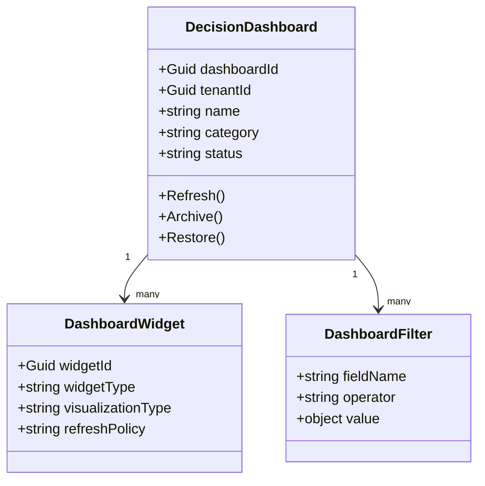
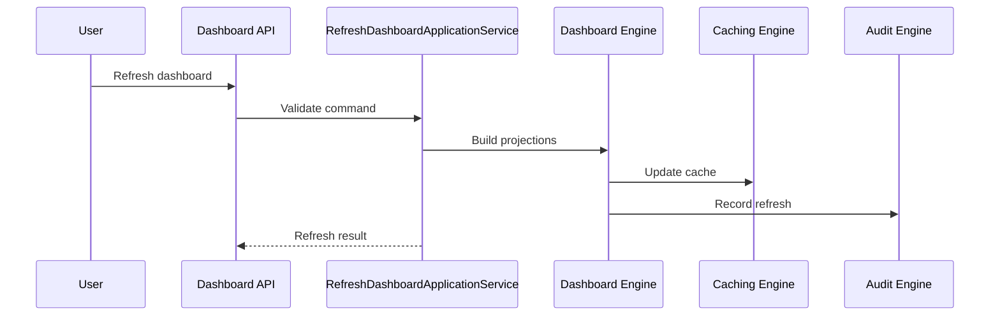
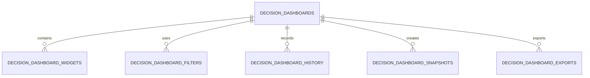
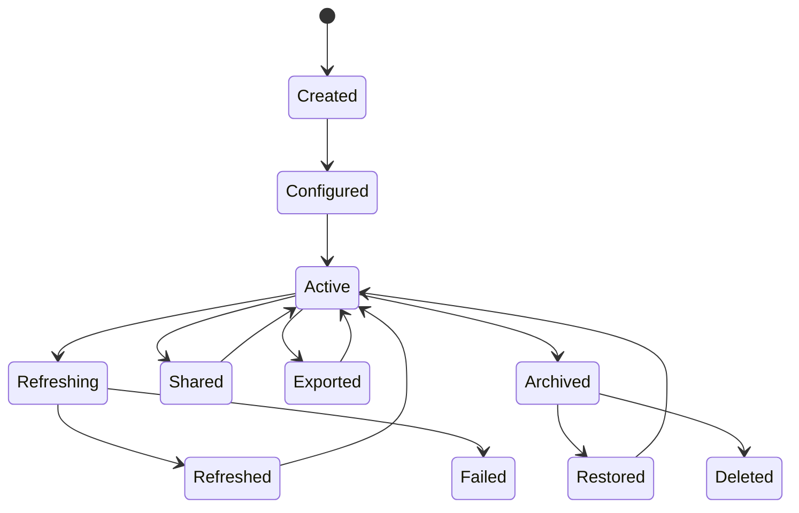
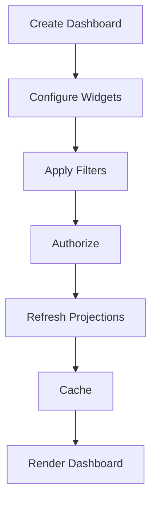
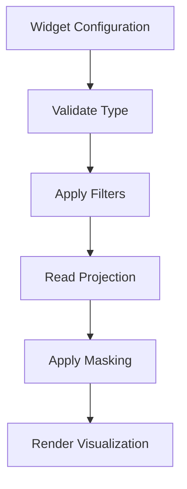
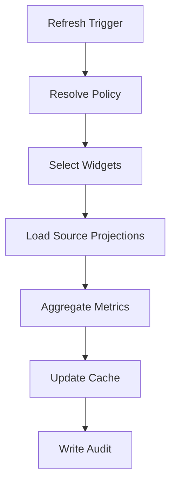

# Decision Dashboard Overview
Version: 1.0.0
Status: Enterprise Specification
Owner: Atlas Decision Domain
Source of Truth: Decision Catalog
Last Updated: 2026-07-13

## Purpose
Decision Dashboard defines how Atlas presents Decision status, quality, execution, governance, analytics, insights, and related business signals in a controlled enterprise dashboard. It provides consistent visibility across Decision Lifecycle, Decision Evaluation, Decision Execution, Decision Governance, Decision Analytics, Decision Reporting, Decision Optimization, Decision Insights, Recommendation, Goal, Scenario, Portfolio, CashFlow, Risk, Simulation, Workflow, Automation, Notification, Business Calendar, and User context.
It does not redefine existing Atlas domains and does not create new business concepts.

## Business Meaning
A Decision Dashboard is a governed read model for monitoring Decisions. It summarizes existing Decision information and related domain signals for authorized Users.
It supports executive oversight, operational tracking, financial awareness, risk monitoring, governance review, and audit visibility. It is not the system of record for Decision, Recommendation, Goal, Portfolio, CashFlow, Risk, Scenario, Simulation, Workflow, Automation, Notification, or User data.

## Dashboard Scope
Dashboard scope includes Decision counts, Decision status, lifecycle timing, approval queue, execution progress, Decision quality, Goal alignment, Recommendation adoption, Risk score, Portfolio impact, CashFlow impact, Simulation comparison, Optimization result, trend, forecast, notification summary, recent activities, and audit summary. Dashboard scope excludes direct mutation of source aggregates.
Dashboard scope is limited by tenant, household, ownership, authorization, and field-level security.

## Dashboard Lifecycle
The lifecycle begins when a dashboard definition is created for a User or authorized role. The lifecycle continues through widget configuration, filter configuration, refresh, sharing, export, archive, restore, and deletion.
Refresh operations update projections and cached values without mutating source domain data. Lifecycle changes must be recorded in dashboard history.

## Dashboard Objectives
1. Present Decision status and business impact in a consistent view. 2. Provide authorized access to Decision metrics and widgets. 3. Support operational review without duplicating source domain ownership. 4. Provide executive, operational, financial, risk, governance, and forecast perspectives. 5. Preserve auditability for configuration, access, export, sharing, and refresh. 6. Support cache-backed and projection-backed performance. 7. Respect Atlas Catalog naming and existing domain boundaries.

## Ownership
Decision Dashboard is owned by the Decision domain as a read-oriented aggregate for dashboard configuration and projection. Source data ownership remains with the originating domains.
Dashboard configuration ownership belongs to the creating User or assigned owner.

## Aggregate Root
Decision Dashboard is an aggregate root when it owns dashboard identity, configuration, widgets, filters, sharing, exports, and lifecycle state. Dashboard widgets are child entities of the dashboard aggregate.
Dashboard projections are generated read models and are not source aggregates.

## Relationship with Decision
Decision is the primary source for status, priority, lifecycle, quality, approval, execution, and outcome widgets. Dashboard must reference Decisions by identifier and must not mutate Decision state.

## Relationship with Decision Lifecycle
Decision Lifecycle provides stage, transition date, duration, blocked status, expired status, and archive state. Dashboard timeline and lifecycle widgets use lifecycle events as read-only inputs.

## Relationship with Decision Evaluation
Decision Evaluation provides quality score, criteria status, evidence completeness, evaluation result, and evaluation confidence. Dashboard quality widgets use Evaluation as the source of score and evidence summary.

## Relationship with Decision Execution
Decision Execution provides execution state, progress, latency, retries, rollback, recovery, logs, and completion result. Dashboard execution widgets use Execution projections and must not start or cancel execution.

## Relationship with Decision Governance
Decision Governance provides policy status, approval state, compliance status, exception state, and escalation state. Dashboard governance and compliance widgets display governance projection values.

## Relationship with Decision Analytics
Decision Analytics provides trends, comparisons, forecasts, and aggregate indicators. Dashboard trend and forecast widgets consume analytics projections.

## Relationship with Decision Reporting
Decision Reporting consumes dashboard snapshots and dashboard filter context when generating reports. Dashboard export must use reporting-compatible projections.

## Relationship with Decision Optimization
Decision Optimization provides candidate scores, optimization gain, constraints, selected plan, and optimization status. Dashboard optimization widgets display the latest authorized optimization projection.

## Relationship with Decision Insights
Decision Insights provides active insights, severity, priority, confidence, evidence summary, and resolution state. Dashboard alert center and insight widgets use Insights as read-only input.

## Relationship with Decision Explainability
Decision Explainability provides rationale, rule trace, evidence explanation, and user-readable reason. Dashboard may show explanation snippets when authorized.

## Relationship with Decision History
Decision History provides timeline events, state changes, field changes, and operator actions. Dashboard recent activity and timeline widgets consume history projections.

## Relationship with Decision Audit
Decision Audit provides access, command, policy, export, and lifecycle evidence. Dashboard audit summary displays audit projection values and records dashboard access.

## Relationship with Decision Rule
Decision Rule provides threshold and rule status used by metrics and alert widgets. Dashboard must display rule version when rule-driven values are shown.

## Relationship with Recommendation
Recommendation provides recommendation count, adoption state, pending action, and outcome. Dashboard recommendation widgets use Recommendation status and mapping data.

## Relationship with Goal
Goal provides alignment, priority, target, progress, and health context. Dashboard Goal alignment widget displays Goal-related Decision context.

## Relationship with Scenario
Scenario provides comparative assumptions and outcome projections. Dashboard Scenario widgets compare authorized Scenario outputs.

## Relationship with Portfolio
Portfolio provides allocation, exposure, concentration, and performance context. Dashboard Portfolio impact widgets display Portfolio projections.

## Relationship with CashFlow
CashFlow provides timing, amount, shortfall, surplus, and forecast context. Dashboard CashFlow widgets display authorized CashFlow impact.

## Relationship with Risk
Risk provides severity, likelihood, residual risk, and mitigation state. Dashboard Risk Matrix uses existing Risk values.

## Relationship with Simulation
Simulation provides projected Decision outcomes under assumptions. Dashboard Simulation Comparison uses Simulation outputs.

## Relationship with Workflow
Workflow provides queue, approval routing, task routing, and process status. Dashboard approval queue and operational widgets consume Workflow projections.

## Relationship with Automation
Automation provides scheduled refresh, event-driven refresh, and background generation triggers. Dashboard refresh policy may be executed through Automation.

## Relationship with Notification
Notification provides alert count, unread count, delivery status, and notification references. Dashboard Notification Summary consumes Notification projection.

## Relationship with Business Calendar
Business Calendar provides business-day calculations, due dates, overdue status, refresh schedules, and cutoffs. Dashboard date filters and due indicators must use Business Calendar when applicable.

## Relationship with User
User provides ownership, permissions, preferences, widget layout, sharing scope, and field-level access. Dashboard output must be permission-filtered per User.

---

# Dashboard Architecture

## Dashboard Engine
Dashboard Engine coordinates dashboard definition, layout, filters, refresh, projection, security, cache, and audit. It must remain read-oriented for source business domains.

## Widget Engine
Widget Engine renders configured widgets based on widget type, filter context, projection, refresh policy, and permission result. It validates widget configuration before persistence.

## Aggregation Engine
Aggregation Engine computes counts, distributions, averages, rates, and trends from authorized projections. It must apply tenant and permission filters before aggregation.

## Metrics Engine
Metrics Engine calculates dashboard metrics such as approval rate, execution success rate, quality score, risk score, optimization gain, and business value score. Metrics must preserve formula, input, precision, and refresh timestamp.

## Visualization Engine
Visualization Engine maps projection data to visualization types. Allowed visualization types include table, timeline, scorecard, chart, matrix, list, activity stream, gauge, and heatmap.

## Filter Engine
Filter Engine applies User, Household, Goal, Decision Type, Decision Status, Risk Level, Scenario, Portfolio, Cash Flow, Recommendation, Date Range, Tag, and Custom Filter conditions. Filter Engine must reject unsupported filter fields.

## Permission Engine
Permission Engine enforces authorization, dashboard permissions, widget permissions, field-level security, and masking. It must run before data is aggregated or cached for a User context.

## Caching Engine
Caching Engine stores dashboard, widget, and metric projections by tenant, dashboard, filter hash, projection version, and authorization hash. Cache invalidation must be targeted and auditable.

## Audit Engine
Audit Engine records dashboard creation, update, refresh, sharing, export, widget changes, configuration changes, access, archive, restore, and deletion.

## Refresh Engine
Refresh Engine handles real-time, manual, scheduled, incremental, background, snapshot, and cache refresh policies. It must preserve last refresh status and refresh duration.

---

# Dashboard Categories

## Executive Dashboard
Purpose: Displays top-level Decision status, value, risk, and forecast. Primary Users: Executive and authorized business owners.
Primary Widgets: Decision Summary, Decision Health, Risk Matrix, Forecast Chart, Business Value Score.

## Operational Dashboard
Purpose: Tracks work queues, lifecycle state, execution progress, and recent activity. Primary Users: Operators and process owners.
Primary Widgets: Approval Queue, Execution Progress, Decision Timeline, Recent Activities.

## Financial Dashboard
Purpose: Displays financial impact and CashFlow impact. Primary Users: Financial owners and authorized reviewers.
Primary Widgets: Financial Impact, Cash Flow Impact, Forecast Chart, Portfolio Impact.

## Risk Dashboard
Purpose: Displays Decision risk, severity distribution, mitigation status, and risk trend. Primary Users: Risk owners and governance reviewers.
Primary Widgets: Risk Matrix, Alert Center, Decision Health, Trend Chart.

## Decision Quality Dashboard
Purpose: Displays evaluation quality, evidence completeness, and rule compliance. Primary Users: Decision reviewers and approvers.
Primary Widgets: Decision Quality Score, Audit Summary, Recent Activities.

## Goal Alignment Dashboard
Purpose: Displays relationship between Decision and Goal priority, health, and business value. Primary Users: Goal owners and Decision owners.
Primary Widgets: Goal Alignment, Decision Summary, Forecast Chart.

## Recommendation Dashboard
Purpose: Displays Recommendation adoption, status, and pending actions. Primary Users: Decision owners and advisors.
Primary Widgets: Recommendation Summary, Alert Center, Recent Activities.

## Execution Dashboard
Purpose: Displays active execution status, progress, errors, warnings, retries, rollback, and recovery. Primary Users: Execution operators.
Primary Widgets: Execution Progress, Alert Center, Decision Timeline.

## Governance Dashboard
Purpose: Displays approval, policy, exception, escalation, and audit signals. Primary Users: Governance owners and approvers.
Primary Widgets: Approval Queue, Audit Summary, Alert Center.

## Compliance Dashboard
Purpose: Displays compliance status, failed controls, required review, and retention-sensitive signals. Primary Users: Compliance reviewers.
Primary Widgets: Audit Summary, Alert Center, Decision Status.

## Simulation Dashboard
Purpose: Displays Simulation output and Scenario comparison. Primary Users: Analysts and Decision owners.
Primary Widgets: Simulation Comparison, Scenario filters, Forecast Chart.

## Optimization Dashboard
Purpose: Displays Optimization candidates, gain, constraints, and selected plan. Primary Users: Decision owners and optimization reviewers.
Primary Widgets: Optimization Results, Decision Health, Recommendation Summary.

## Historical Dashboard
Purpose: Displays prior Decision outcomes, trend, and historical activity. Primary Users: Analysts and auditors.
Primary Widgets: Trend Chart, Recent Activities, Audit Summary.

## Forecast Dashboard
Purpose: Displays future Decision outcomes, forecast accuracy, and expected status. Primary Users: Analysts and business owners.
Primary Widgets: Forecast Chart, Decision Health, Cash Flow Impact.

## Portfolio Dashboard
Purpose: Displays Portfolio impact, concentration, allocation, and Decision exposure. Primary Users: Portfolio owners.
Primary Widgets: Portfolio Impact, Risk Matrix, Financial Impact.

## Cash Flow Dashboard
Purpose: Displays CashFlow timing, projected impact, gap, and warning status. Primary Users: CashFlow owners and financial reviewers.
Primary Widgets: Cash Flow Impact, Forecast Chart, Alert Center.

---

# Dashboard Widgets

## Decision Summary
Purpose: Shows Decision counts by status, priority, and owner. Inputs: Decision projection, lifecycle state, authorization context.
Outputs: Count, distribution, status summary. Refresh Strategy: Incremental and scheduled refresh.
Permissions: `DecisionDashboard.Read`. Visualization: Scorecard and grouped bar chart.
Filtering: Status, owner, date range, tag. Sorting: Count descending, status ascending.
Example: Active Decisions by priority.

## Decision Status
Purpose: Shows current Decision state distribution. Inputs: Decision Lifecycle projection.
Outputs: State count, blocked count, archived count. Refresh Strategy: Event-driven refresh.
Permissions: `DecisionDashboard.Read`. Visualization: Donut chart and table.
Filtering: Decision Type, Decision Status. Sorting: Status ascending.
Example: Pending, Approved, Executing, Failed Decisions.

## Decision Timeline
Purpose: Shows lifecycle and history events over time. Inputs: Decision History, Decision Lifecycle.
Outputs: Timeline events and duration. Refresh Strategy: Incremental refresh.
Permissions: `DecisionDashboard.Timeline.Read`. Visualization: Timeline.
Filtering: Date Range, User, Status. Sorting: Event time descending.
Example: Approval, execution, rollback, archive events.

## Decision Health
Purpose: Shows health score and key drivers. Inputs: Decision Analytics, Insights, Risk, Execution.
Outputs: Health score, driver list, severity. Refresh Strategy: Scheduled and event-driven refresh.
Permissions: `DecisionDashboard.Health.Read`. Visualization: Gauge and driver list.
Filtering: Risk Level, Status. Sorting: Health score ascending.
Example: Decisions with weak health score.

## Decision Quality Score
Purpose: Shows evaluation quality and evidence completeness. Inputs: Decision Evaluation.
Outputs: Quality score, evidence completeness, warning state. Refresh Strategy: Event-driven refresh.
Permissions: `DecisionDashboard.Quality.Read`. Visualization: Scorecard and table.
Filtering: Score range, owner. Sorting: Quality score ascending.
Example: Approved Decisions below quality threshold.

## Approval Queue
Purpose: Shows pending approvals and overdue approvals. Inputs: Workflow, Governance, Business Calendar.
Outputs: Queue count, overdue count, assigned approver. Refresh Strategy: Real-time and incremental refresh.
Permissions: `DecisionDashboard.Approval.Read`. Visualization: Queue table.
Filtering: User, status, due date. Sorting: Due date ascending.
Example: Approvals due this business week.

## Execution Progress
Purpose: Shows execution progress and operational status. Inputs: Decision Execution.
Outputs: Progress, status, errors, retry count. Refresh Strategy: Real-time and background refresh.
Permissions: `DecisionDashboard.Execution.Read`. Visualization: Progress bar and status table.
Filtering: Execution status, owner, date range. Sorting: Updated time descending.
Example: Executions currently delayed.

## Recommendation Summary
Purpose: Shows Recommendation status and adoption. Inputs: Recommendation.
Outputs: Pending, accepted, rejected, adopted, adoption rate. Refresh Strategy: Incremental refresh.
Permissions: `DecisionDashboard.Recommendation.Read`. Visualization: Scorecard and stacked chart.
Filtering: Recommendation status, Decision status. Sorting: Adoption rate ascending.
Example: Critical recommendations pending action.

## Goal Alignment
Purpose: Shows alignment between Decision and Goal. Inputs: Goal, Decision, Decision Analytics.
Outputs: Alignment score, mismatch reason, related Goal. Refresh Strategy: Scheduled refresh.
Permissions: `DecisionDashboard.Goal.Read`. Visualization: Matrix and table.
Filtering: Goal, priority, status. Sorting: Alignment score ascending.
Example: High-priority Decision with weak Goal alignment.

## Risk Matrix
Purpose: Shows Risk severity and likelihood. Inputs: Risk, Insights, Governance.
Outputs: Matrix cell, severity, likelihood, mitigation state. Refresh Strategy: Event-driven and scheduled refresh.
Permissions: `DecisionDashboard.Risk.Read`. Visualization: Risk matrix.
Filtering: Risk Level, Decision Status. Sorting: Severity descending.
Example: Critical risks for executing Decisions.

## Portfolio Impact
Purpose: Shows Decision impact on Portfolio. Inputs: Portfolio, Decision financial projection.
Outputs: Exposure, allocation, concentration warning. Refresh Strategy: Scheduled refresh.
Permissions: `DecisionDashboard.Portfolio.Read`. Visualization: Table and bar chart.
Filtering: Portfolio, Decision Type. Sorting: Exposure descending.
Example: Decisions with largest Portfolio exposure.

## Cash Flow Impact
Purpose: Shows Decision impact on CashFlow timing and amount. Inputs: CashFlow, Decision schedule, financial projection.
Outputs: CashFlow gap, affected period, warning state. Refresh Strategy: Scheduled and event-driven refresh.
Permissions: `DecisionDashboard.CashFlow.Read`. Visualization: Time series chart.
Filtering: Cash Flow, Date Range. Sorting: Period ascending.
Example: Decisions causing next-period shortfall.

## Simulation Comparison
Purpose: Shows Simulation and Scenario output comparison. Inputs: Simulation, Scenario.
Outputs: Outcome spread, downside, upside, selected scenario. Refresh Strategy: Snapshot refresh.
Permissions: `DecisionDashboard.Simulation.Read`. Visualization: Comparison chart.
Filtering: Scenario, Decision Type. Sorting: Outcome descending.
Example: Conservative scenario impact.

## Optimization Results
Purpose: Shows Optimization gain and selected candidate. Inputs: Decision Optimization.
Outputs: Best score, selected score, optimization gain, constraints. Refresh Strategy: Snapshot refresh.
Permissions: `DecisionDashboard.Optimization.Read`. Visualization: Ranked table.
Filtering: Optimization status. Sorting: Gain descending.
Example: Decisions with available optimization gain.

## Trend Chart
Purpose: Shows historical Decision metric movement. Inputs: Decision Analytics.
Outputs: Trend line, moving average, trend direction. Refresh Strategy: Scheduled refresh.
Permissions: `DecisionDashboard.Analytics.Read`. Visualization: Line chart.
Filtering: Date Range, metric. Sorting: Date ascending.
Example: Monthly approval rate trend.

## Forecast Chart
Purpose: Shows forecasted Decision results. Inputs: Decision Analytics, Simulation, CashFlow.
Outputs: Forecast value, confidence interval, horizon. Refresh Strategy: Scheduled refresh.
Permissions: `DecisionDashboard.Forecast.Read`. Visualization: Forecast line chart.
Filtering: Date Range, Scenario. Sorting: Horizon ascending.
Example: Expected completion date forecast.

## Alert Center
Purpose: Shows active critical and high-priority insights. Inputs: Decision Insights, Notification.
Outputs: Alert count, severity, confidence, related Decision. Refresh Strategy: Real-time and event-driven refresh.
Permissions: `DecisionDashboard.Alert.Read`. Visualization: Alert list.
Filtering: Severity, category, status. Sorting: Severity and generated time descending.
Example: Critical unresolved insight.

## Notification Summary
Purpose: Shows Notification counts and delivery states. Inputs: Notification.
Outputs: Unread count, sent count, failed count. Refresh Strategy: Real-time refresh.
Permissions: `DecisionDashboard.Notification.Read`. Visualization: Badge and list.
Filtering: Notification status, date range. Sorting: Created time descending.
Example: Failed notifications for critical Decisions.

## Recent Activities
Purpose: Shows recent Decision History and dashboard-relevant activity. Inputs: Decision History, Audit, Workflow.
Outputs: Activity list, operator, timestamp. Refresh Strategy: Incremental refresh.
Permissions: `DecisionDashboard.Activity.Read`. Visualization: Activity stream.
Filtering: User, action, date range. Sorting: Occurred time descending.
Example: Latest Decision approvals and executions.

## Audit Summary
Purpose: Shows dashboard and Decision audit signals. Inputs: Decision Audit, Dashboard Audit.
Outputs: Access count, export count, policy events, audit warnings. Refresh Strategy: Scheduled refresh.
Permissions: `DecisionDashboard.Audit.Read`. Visualization: Table and scorecard.
Filtering: Action, User, date range. Sorting: Occurred time descending.
Example: Dashboard exports in the last month.

---

# Dashboard Metrics

1. Decision Count: `decision_count = count(decision_id)`. 2. Approval Rate: `approval_rate = approved_count / approval_required_count`. 3. Execution Success Rate: `execution_success_rate = succeeded_execution_count / completed_execution_count`. 4. Execution Failure Rate: `execution_failure_rate = failed_execution_count / total_execution_count`. 5. Average Processing Time: `avg_processing_time = sum(processing_duration) / decision_count`. 6. Decision Quality Score: `quality_score = weighted_average(evaluation_score, evidence_score)`. 7. Goal Alignment Score: `goal_alignment_score = aligned_goal_weight / total_goal_weight`. 8. Financial Impact: `financial_impact = sum(decision_financial_amount)`. 9. Cash Flow Impact: `cashflow_impact = projected_inflow - projected_outflow`. 10. Risk Score: `risk_score = likelihood * impact * residual_factor`. 11. Optimization Gain: `optimization_gain = best_candidate_score - selected_candidate_score`. 12. Forecast Accuracy: `forecast_accuracy = 1 - abs(actual_value - forecast_value) / nullif(abs(actual_value), 0)`. 13. Recommendation Adoption: `recommendation_adoption = adopted_recommendation_count / recommended_action_count`. 14. User Activity: `user_activity_count = count(user_action_id)`. 15. Business Value Score: `business_value_score = weighted_value_score * confidence_score`.

---

# Dashboard Filters

1. User: filters dashboard data by owner, approver, creator, operator, or viewer. 2. Household: filters household-scoped Decision data when Household exists in authorized context. 3. Goal: filters Decisions related to selected Goal. 4. Decision Type: filters by Catalog-defined Decision type. 5. Decision Status: filters by Decision Lifecycle status. 6. Risk Level: filters by Risk severity. 7. Scenario: filters by Scenario identifier. 8. Portfolio: filters by Portfolio identifier. 9. Cash Flow: filters by CashFlow identifier or period. 10. Recommendation: filters by Recommendation status or identifier. 11. Date Range: filters by created, updated, generated, executed, or audited date. 12. Tag: filters by existing tag values. 13. Custom Filter: filters by allowlisted Catalog fields only.

---

# Refresh Policies

## Real-time
Real-time refresh applies to alert center, notification summary, approval queue, and execution progress.

## Manual
Manual refresh is initiated by authorized User command.

## Scheduled
Scheduled refresh follows Business Calendar and dashboard configuration.

## Incremental
Incremental refresh processes source changes since last cursor.

## Background Refresh
Background refresh updates expensive widgets asynchronously.

## Snapshot Refresh
Snapshot refresh stores a stable projection for reporting and export.

## Cache Refresh
Cache refresh rebuilds dashboard, widget, and metrics cache after invalidation.

---

# Validation Rules

1. `dashboard_id` is required. 2. `tenant_id` is required. 3. Dashboard name is required. 4. Dashboard name length must not exceed 160 characters. 5. Dashboard owner User must exist. 6. Dashboard category must exist in Catalog. 7. Dashboard status must be valid. 8. Widget identifier is required. 9. Widget type must be valid. 10. Widget configuration must match widget type. 11. Widget layout row must be non-negative. 12. Widget layout column must be non-negative. 13. Widget width must be greater than zero. 14. Widget height must be greater than zero. 15. Widget refresh policy must be valid. 16. Widget visualization type must be allowed. 17. Filter field must be allowlisted. 18. Filter operator must be allowed for field type. 19. Filter value must match field type. 20. Date range start must not exceed date range end. 21. Sort field must be allowlisted. 22. Sort direction must be ascending or descending. 23. Projection must be valid. 24. Pagination page size must be within configured limit. 25. Export format must be allowed. 26. Sharing target must be authorized. 27. Dashboard cannot share masked data beyond viewer permission. 28. Archived dashboard cannot refresh. 29. Deleted dashboard cannot restore unless soft delete is enabled. 30. Dashboard refresh requires read permission for each source widget. 31. Widget refresh failure must not corrupt dashboard configuration. 32. Dashboard cache key must include authorization hash. 33. Dashboard export requires export permission. 34. Dashboard detail response must apply field-level security. 35. Dashboard audit record requires correlation identifier. 36. Dashboard update requires version match. 37. Widget update requires version match. 38. Custom filter cannot reference restricted field. 39. Real-time refresh requires supported widget type. 40. Snapshot refresh requires snapshot timestamp. 41. Business Calendar identifier must be valid when scheduled refresh is used. 42. Metrics precision must match metric definition. 43. Aggregation must exclude unauthorized source records. 44. Dashboard must not reference deleted widget. 45. Dashboard must not expose deleted source records unless historical projection is authorized. 46. Export must record format, scope, filters, and operator. 47. Shared dashboard must preserve source owner and viewer permissions. 48. Dashboard restore must validate owner access. 49. Dashboard delete must satisfy retention rule. 50. Materialized view refresh must match projection version.

---

# Business Rules

1. Dashboard must not mutate Decision state. 2. Dashboard must not mutate Recommendation state. 3. Dashboard must not mutate Goal state. 4. Dashboard must not mutate Portfolio state. 5. Dashboard must not mutate CashFlow state. 6. Dashboard must not mutate Risk state. 7. Dashboard must not mutate Scenario state. 8. Dashboard must not mutate Simulation state. 9. Dashboard must not mutate Workflow state. 10. Dashboard must not mutate Automation state. 11. Dashboard must not mutate Notification state. 12. Dashboard configuration changes require authorization. 13. Dashboard refresh requires read access to source projections. 14. Dashboard view must be tenant-isolated. 15. Dashboard aggregation must apply permission filters before calculation. 16. Field-level masking must apply before response serialization. 17. Masked values must not be cached under unmasked keys. 18. Dashboard cache must include authorization hash. 19. Widget cache must include filter hash. 20. Metrics cache must include projection version. 21. Dashboard export must use export permission. 22. Dashboard sharing must not expand data permission. 23. Shared dashboard viewer sees only authorized data. 24. Owner can configure dashboard when permission allows. 25. Viewer cannot configure widgets without permission. 26. Archived dashboard is read-only. 27. Deleted dashboard is excluded from normal search. 28. Restored dashboard must validate owner and tenant. 29. Dashboard refresh must be idempotent. 30. Duplicate refresh commands must not duplicate audit records beyond idempotency policy. 31. Scheduled refresh must use Business Calendar. 32. Real-time refresh applies only to supported widgets. 33. Manual refresh must record operator. 34. Background refresh must record job identifier. 35. Snapshot refresh must preserve snapshot timestamp. 36. Incremental refresh must preserve cursor. 37. Failed widget refresh must mark widget refresh status failed. 38. Failed widget refresh must not block unrelated widgets. 39. Failed dashboard refresh must preserve prior successful projection. 40. Dashboard update must preserve widget identifiers unless removed by command. 41. Widget removal must preserve widget history. 42. Widget reconfiguration must increment dashboard version. 43. Filter change must invalidate affected cache. 44. Layout change must invalidate dashboard configuration cache. 45. Widget permission change must invalidate widget cache. 46. Decision event must invalidate affected Decision widgets. 47. Execution event must invalidate execution widgets. 48. Recommendation event must invalidate recommendation widgets. 49. Goal event must invalidate Goal alignment widgets. 50. Risk event must invalidate Risk Matrix widgets. 51. CashFlow event must invalidate Cash Flow Impact widgets. 52. Portfolio event must invalidate Portfolio Impact widgets. 53. Scenario event must invalidate Scenario and Simulation widgets. 54. Insight event must invalidate Alert Center widgets. 55. Notification event must invalidate Notification Summary widgets. 56. Audit event must invalidate Audit Summary widgets. 57. Export must record access history. 58. Dashboard access must record access history when audit policy requires. 59. Dashboard metrics must show refresh timestamp. 60. Dashboard widgets must show stale status when source is stale. 61. Stale data must not be represented as current. 62. Dashboard must display empty state when no authorized data exists. 63. Dashboard must distinguish zero value from unavailable value. 64. Dashboard filters must not produce cross-tenant aggregation. 65. Dashboard custom filters must be validated against Catalog. 66. Dashboard sorting must use allowlisted fields. 67. Dashboard pagination must be deterministic. 68. Dashboard report projection must be reproducible. 69. Dashboard detail projection must include widget configuration. 70. Dashboard summary projection must exclude heavy widget data. 71. Dashboard search projection must exclude masked fields. 72. Dashboard export projection must include applied filters. 73. Dashboard cache TTL must not exceed data freshness policy. 74. Dashboard widget refresh must respect widget-specific refresh policy. 75. Dashboard metrics must use consistent formulas across API and database. 76. Dashboard must preserve source identifiers for drill-through when authorized. 77. Dashboard drill-through must re-check permission. 78. Dashboard activity stream must sort by event time. 79. Dashboard timeline must use Business Calendar for business duration. 80. Dashboard overdue calculations must use Business Calendar. 81. Dashboard should show Notification failure only to authorized Users. 82. Dashboard sharing must be revocable. 83. Dashboard export may be blocked by compliance policy. 84. Dashboard archive may be blocked by retention policy. 85. Dashboard delete may be blocked by audit policy. 86. Dashboard restore must restore last valid configuration. 87. Widget configuration must not reference unsupported visualization. 88. Widget cannot use unknown source projection. 89. Widget cannot bypass Permission Engine. 90. Widget output must be deterministic for same source snapshot and filters. 91. Dashboard materialized view refresh must be traceable. 92. Dashboard aggregation must not double-count Decisions. 93. Dashboard Decision Count must exclude deleted Decisions by default. 94. Historical dashboard may include archived Decisions when authorized. 95. Forecast dashboard must display forecast horizon. 96. Risk dashboard must display risk severity and confidence when available. 97. Financial dashboard must display currency. 98. Cash Flow dashboard must display period. 99. Portfolio dashboard must display Portfolio identifier when authorized. 100. Audit Summary must never show restricted audit details without permission. 101. Compliance widgets must preserve control evidence reference. 102. User preferences must not override security policy. 103. Dashboard reset must restore configured default layout. 104. Dashboard import is not supported unless defined by Catalog command. 105. Dashboard refresh errors must be observable in audit and metrics.

---

# State Machine

## States
1. `Created`: Dashboard exists with initial configuration. 2. `Configured`: Dashboard has valid widgets and filters. 3. `Active`: Dashboard can be viewed and refreshed. 4. `Refreshing`: Dashboard refresh is running. 5. `Refreshed`: Dashboard refresh completed. 6. `Shared`: Dashboard has active sharing configuration. 7. `Exported`: Dashboard export was generated. 8. `Archived`: Dashboard is retained read-only. 9. `Restored`: Dashboard was restored from archive. 10. `Deleted`: Dashboard is soft deleted. 11. `Failed`: Dashboard refresh or configuration validation failed.

## Transitions
1. `Created -> Configured` on valid widget configuration. 2. `Configured -> Active` on activation. 3. `Active -> Refreshing` on refresh command. 4. `Refreshing -> Refreshed` on successful refresh. 5. `Refreshing -> Failed` on refresh failure. 6. `Refreshed -> Active` after projection is available. 7. `Active -> Shared` on share command. 8. `Shared -> Active` on sharing removal. 9. `Active -> Exported` on export command. 10. `Exported -> Active` after export record is stored. 11. `Active -> Archived` on archive command. 12. `Configured -> Archived` on archive command. 13. `Archived -> Restored` on restore command. 14. `Restored -> Active` after validation. 15. `Archived -> Deleted` on delete command. 16. `Failed -> Active` after successful refresh or configuration correction.

## Triggers
1. Create command. 2. Update command. 3. Configure widget command. 4. Refresh command. 5. Scheduled refresh. 6. Source domain event. 7. Share command. 8. Export command. 9. Archive command. 10. Restore command. 11. Delete command.

## Invariant
1. Tenant identifier cannot change. 2. Dashboard owner cannot be null. 3. Dashboard version must increase on configuration change. 4. Deleted dashboard is excluded from standard queries. 5. Archived dashboard is read-only. 6. Widget identifiers remain unique within dashboard. 7. Cache entries must never outlive permission context. 8. Export must record filter and projection. 9. Refresh must preserve prior successful projection on failure. 10. Source domains remain read-only.

## Illegal Transition
1. `Deleted -> Active` is illegal. 2. `Deleted -> Refreshed` is illegal. 3. `Archived -> Refreshing` is illegal. 4. `Archived -> Shared` is illegal. 5. `Archived -> Exported` is illegal unless archive export permission allows. 6. `Created -> Exported` is illegal. 7. `Created -> Shared` is illegal before configuration. 8. `Refreshing -> Deleted` is illegal. 9. `Refreshing -> Archived` is illegal. 10. `Failed -> Shared` is illegal without correction.

---

# Commands

## CreateDashboard
Creates a dashboard definition for an authorized owner. Result: `DashboardCreated`.

## UpdateDashboard
Updates dashboard name, description, category, default filters, or layout metadata. Result: `DashboardUpdated`.

## RefreshDashboard
Refreshes dashboard projections and cache. Result: `DashboardRefreshed`.

## DeleteDashboard
Soft deletes a dashboard according to retention rules. Result: `DashboardDeleted`.

## ArchiveDashboard
Archives a dashboard and makes it read-only. Result: `DashboardArchived`.

## RestoreDashboard
Restores an archived dashboard after validation. Result: `DashboardRestored`.

## ShareDashboard
Creates or updates dashboard sharing configuration. Result: `DashboardShared`.

## ExportDashboard
Exports dashboard using authorized projection and format. Result: `DashboardExported`.

## ConfigureWidget
Adds, updates, removes, reorders, resizes, or configures a widget. Result: `WidgetAdded`, `WidgetUpdated`, or `WidgetRemoved`.

## ResetDashboard
Restores default dashboard configuration for the owner. Result: `DashboardUpdated`.

## All Related Domain Commands
1. `AddWidget`. 2. `UpdateWidget`. 3. `RemoveWidget`. 4. `ReorderWidget`. 5. `ResizeWidget`. 6. `ConfigureFilter`. 7. `ClearFilter`. 8. `RefreshWidget`. 9. `RefreshDashboardCache`. 10. `CreateDashboardSnapshot`. 11. `RevokeDashboardShare`. 12. `GenerateDashboardExport`.

---

# Domain Events

1. `DashboardCreated`. 2. `DashboardUpdated`. 3. `DashboardRefreshed`. 4. `DashboardArchived`. 5. `DashboardRestored`. 6. `DashboardDeleted`. 7. `DashboardShared`. 8. `DashboardExported`. 9. `WidgetAdded`. 10. `WidgetUpdated`. 11. `WidgetRemoved`. 12. `WidgetReordered`. 13. `WidgetResized`. 14. `WidgetRefreshFailed`. 15. `DashboardRefreshFailed`. 16. `DashboardSnapshotCreated`. 17. `DashboardShareRevoked`. 18. `DashboardAccessed`. 19. `DashboardCacheInvalidated`. 20. `DashboardConfigurationReset`.

---

# Repository

## Interface
```csharp
public interface IDecisionDashboardRepository
{
    Task<DecisionDashboard?> GetByIdAsync(Guid tenantId, Guid dashboardId, CancellationToken cancellationToken);
    Task<IReadOnlyList<DecisionDashboard>> SearchAsync(DecisionDashboardSearchSpecification specification, CancellationToken cancellationToken);
    Task AddAsync(DecisionDashboard dashboard, CancellationToken cancellationToken);
    Task UpdateAsync(DecisionDashboard dashboard, CancellationToken cancellationToken);
    Task AddHistoryAsync(DecisionDashboardHistory history, CancellationToken cancellationToken);
    Task SaveChangesAsync(CancellationToken cancellationToken);
}
```

## Methods
1. `GetByIdAsync`. 2. `GetByOwnerAsync`. 3. `GetSharedWithUserAsync`. 4. `GetDefaultDashboardAsync`. 5. `SearchAsync`. 6. `CountAsync`. 7. `AddAsync`. 8. `UpdateAsync`. 9. `AddWidgetAsync`. 10. `UpdateWidgetAsync`. 11. `RemoveWidgetAsync`. 12. `AddHistoryAsync`. 13. `AddSnapshotAsync`. 14. `SoftDeleteAsync`. 15. `SaveChangesAsync`.

## Queries
1. Dashboards by owner. 2. Dashboards shared with User. 3. Active dashboards by tenant. 4. Archived dashboards by tenant. 5. Dashboard widgets by dashboard. 6. Dashboard snapshots by date range. 7. Dashboard exports by owner. 8. Dashboard access history by User. 9. Dashboard category distribution. 10. Dashboard refresh status by dashboard.

## Filtering
1. `tenant_id`. 2. `owner_user_id`. 3. `dashboard_id`. 4. `status`. 5. `category`. 6. `shared_with_user_id`. 7. `created_from`. 8. `created_to`. 9. `updated_from`. 10. `updated_to`. 11. `tag`. 12. `has_widget_type`.

## Sorting
1. `updated_at desc`. 2. `created_at desc`. 3. `dashboard_name asc`. 4. `category asc`. 5. `status asc`. 6. `last_refreshed_at desc`. 7. `owner_user_id asc`.

## Aggregation
1. Count by status. 2. Count by category. 3. Count by owner. 4. Count by shared status. 5. Average widget count. 6. Last refresh duration average. 7. Export count by period. 8. Access count by period.

## Projection
1. Summary projection. 2. Detail projection. 3. Dashboard projection. 4. Widget projection. 5. Metrics projection. 6. Export projection. 7. Search projection. 8. Audit projection.

## Specification
`DecisionDashboardSearchSpecification` contains tenant, authorization context, filters, sort, pagination, projection, include archived flag, and include deleted flag.

---

# Domain Service Interaction

1. `DecisionDashboardDomainService` validates dashboard aggregate rules. 2. `DecisionDashboardWidgetService` validates widget type, layout, and configuration. 3. `DecisionDashboardFilterService` validates filters and custom filter allowlists. 4. `DecisionDashboardRefreshService` coordinates refresh policy and source projection reads. 5. `DecisionDashboardMetricsService` calculates dashboard metrics. 6. `DecisionDashboardAggregationService` aggregates authorized data. 7. `DecisionDashboardPermissionService` applies authorization and masking. 8. `DecisionDashboardCacheService` manages cache keys and invalidation. 9. `DecisionDashboardAuditService` records lifecycle, access, and export audit. 10. `DecisionDashboardExportService` prepares export projection. 11. `DecisionDashboardSnapshotService` creates stable snapshots. 12. `DecisionDashboardSharingService` validates sharing and revocation. 13. `BusinessCalendarService` supplies business-day dates and due calculations. 14. `DecisionAnalyticsService` supplies trend and forecast projections. 15. `DecisionInsightService` supplies alert and insight projections.

---

# Application Service Interaction

1. `CreateDashboardApplicationService`. 2. `UpdateDashboardApplicationService`. 3. `RefreshDashboardApplicationService`. 4. `DeleteDashboardApplicationService`. 5. `ArchiveDashboardApplicationService`. 6. `RestoreDashboardApplicationService`. 7. `ShareDashboardApplicationService`. 8. `ExportDashboardApplicationService`. 9. `ConfigureWidgetApplicationService`. 10. `ResetDashboardApplicationService`. 11. `SearchDashboardApplicationService`. 12. `GetDashboardDetailApplicationService`. 13. `DecisionApplicationService` for Decision projections. 14. `DecisionLifecycleApplicationService` for state projection. 15. `DecisionEvaluationApplicationService` for quality projection. 16. `DecisionExecutionApplicationService` for execution projection. 17. `DecisionGovernanceApplicationService` for governance projection. 18. `DecisionAnalyticsApplicationService` for metrics and trends. 19. `DecisionInsightsApplicationService` for alert projection. 20. `NotificationApplicationService` for notification projection. 21. `AuditApplicationService` for audit persistence. 22. `CacheApplicationService` for projection cache.

---

# API

## REST Endpoints
| Endpoint | Method | Purpose |
|---|---:|---|
| `/api/decision-dashboards` | `POST` | Create dashboard |
| `/api/decision-dashboards` | `GET` | Search dashboards |
| `/api/decision-dashboards/{dashboardId}` | `GET` | Get detail |
| `/api/decision-dashboards/{dashboardId}` | `PATCH` | Update dashboard |
| `/api/decision-dashboards/{dashboardId}/refresh` | `POST` | Refresh dashboard |
| `/api/decision-dashboards/{dashboardId}/archive` | `POST` | Archive dashboard |
| `/api/decision-dashboards/{dashboardId}/restore` | `POST` | Restore dashboard |
| `/api/decision-dashboards/{dashboardId}` | `DELETE` | Delete dashboard |
| `/api/decision-dashboards/{dashboardId}/share` | `POST` | Share dashboard |
| `/api/decision-dashboards/{dashboardId}/export` | `POST` | Export dashboard |
| `/api/decision-dashboards/{dashboardId}/widgets` | `POST` | Add widget |
| `/api/decision-dashboards/{dashboardId}/widgets/{widgetId}` | `PATCH` | Update widget |
| `/api/decision-dashboards/{dashboardId}/widgets/{widgetId}` | `DELETE` | Remove widget |
| `/api/decision-dashboards/{dashboardId}/reset` | `POST` | Reset dashboard |

## HTTP Methods
`GET` reads dashboards and projections. `POST` creates dashboards or executes commands.
`PATCH` updates dashboard or widget configuration. `DELETE` soft deletes dashboard or widget.

## Request
Requests include tenant context, authorization token, idempotency key for commands, version for updates, filters, projection, and pagination when required.

## Response
Responses include `data`, `metadata`, `links`, `errors`, `traceId`, and `timestamp`.

## Errors
1. `400 Bad Request`: Invalid request. 2. `401 Unauthorized`: Authentication missing. 3. `403 Forbidden`: Permission denied. 4. `404 Not Found`: Dashboard or widget not found. 5. `409 Conflict`: Version conflict or invalid state. 6. `412 Precondition Failed`: Concurrency check failed. 7. `422 Unprocessable Entity`: Business rule violation. 8. `429 Too Many Requests`: Refresh or export limit exceeded. 9. `500 Internal Server Error`: Unexpected failure.

## Pagination
Pagination uses `pageNumber`, `pageSize`, `totalCount`, `totalPages`, and `hasNext`.

## Filtering
Filtering uses allowlisted dashboard and source projection fields.

## Sorting
Sorting uses allowlisted fields and stable secondary sort.

## Projection
Projection options are `summary`, `detail`, `dashboard`, `widget`, `metrics`, `export`, and `audit`.

## Dashboard API
Dashboard API handles dashboard lifecycle, search, detail, refresh, archive, restore, delete, share, export, and reset.

## Widget API
Widget API handles widget create, update, remove, reorder, resize, refresh, and configuration validation.

## Export API
Export API handles JSON, CSV, Excel, PDF, HTML, Markdown, and API response export when enabled by existing reporting capability.

---

# DTO

## Create DTO
```json
{
  "name": "Decision Executive Dashboard",
  "category": "ExecutiveDashboard",
  "ownerUserId": "11111111-1111-1111-1111-111111111111",
  "defaultFilters": {
    "decisionStatus": ["Active", "Approved", "Executing"],
    "dateRange": {
      "from": "2026-07-01",
      "to": "2026-07-31"
    }
  }
}
```

## Update DTO
```json
{
  "name": "Decision Executive Dashboard",
  "category": "ExecutiveDashboard",
  "version": 3
}
```

## Dashboard DTO
Fields: `dashboardId`, `tenantId`, `name`, `category`, `status`, `ownerUserId`, `widgets`, `filters`, `lastRefreshedAt`, `version`.

## Widget DTO
Fields: `widgetId`, `dashboardId`, `widgetType`, `title`, `layout`, `configuration`, `refreshPolicy`, `lastRefreshStatus`.

## Filter DTO
Fields: `field`, `operator`, `value`, `displayName`, `isCustom`.

## Metrics DTO
Fields: `metricName`, `value`, `unit`, `precision`, `formula`, `refreshedAt`.

## Visualization DTO
Fields: `visualizationType`, `series`, `categories`, `values`, `thresholds`, `metadata`.

## Summary DTO
Fields: `dashboardId`, `name`, `category`, `status`, `ownerUserId`, `widgetCount`, `lastRefreshedAt`.

## Detail DTO
Fields: summary fields, `widgets`, `filters`, `sharing`, `history`, `permissions`, `refreshStatus`.

## Search DTO
Fields: `filters`, `sort`, `pagination`, `projection`, `includeArchived`, `includeDeleted`.

---

# Database Mapping

## Table
Primary table: `decision_dashboards`. Widget table: `decision_dashboard_widgets`.
Filter table: `decision_dashboard_filters`. Snapshot table: `decision_dashboard_snapshots`.
History table: `decision_dashboard_history`. Share table: `decision_dashboard_shares`.
Export table: `decision_dashboard_exports`.

## Columns
1. `dashboard_id`. 2. `tenant_id`. 3. `name`. 4. `category`. 5. `status`. 6. `owner_user_id`. 7. `description`. 8. `default_filters`. 9. `layout_config`. 10. `last_refreshed_at`. 11. `last_refresh_status`. 12. `last_refresh_duration_ms`. 13. `created_at`. 14. `updated_at`. 15. `archived_at`. 16. `deleted_at`. 17. `version`.

## Indexes
1. Primary key on `dashboard_id`. 2. Index on `tenant_id`, `owner_user_id`, `status`. 3. Index on `tenant_id`, `category`, `status`. 4. Index on `tenant_id`, `last_refreshed_at`. 5. Index on widget dashboard and type. 6. Index on share target.

## Constraints
1. `tenant_id` not null. 2. `name` not null. 3. `category` not null. 4. `status` not null. 5. `owner_user_id` not null. 6. `version` greater than zero. 7. Score and metrics constraints apply in projections.

## FK
1. `decision_dashboard_widgets.dashboard_id` references `decision_dashboards.dashboard_id`. 2. `decision_dashboard_filters.dashboard_id` references `decision_dashboards.dashboard_id`. 3. `decision_dashboard_snapshots.dashboard_id` references `decision_dashboards.dashboard_id`. 4. `decision_dashboard_history.dashboard_id` references `decision_dashboards.dashboard_id`. 5. `decision_dashboard_shares.dashboard_id` references `decision_dashboards.dashboard_id`. 6. `decision_dashboard_exports.dashboard_id` references `decision_dashboards.dashboard_id`.

## Unique
Dashboard name is unique per tenant and owner where deleted is null when business policy requires. Widget position is unique per dashboard when layout grid requires.

## Check Constraint
Status must be valid. Widget type must be valid.
Refresh status must be valid. Version must be greater than zero.

## Partition Strategy
Dashboard history, snapshots, access history, and exports may be partitioned by tenant and month.

---

# PostgreSQL Schema

```sql
CREATE TABLE decision_dashboards (
    dashboard_id uuid PRIMARY KEY,
    tenant_id uuid NOT NULL,
    name varchar(160) NOT NULL,
    category varchar(80) NOT NULL,
    status varchar(40) NOT NULL,
    owner_user_id uuid NOT NULL,
    description text NULL,
    default_filters jsonb NOT NULL DEFAULT '{}'::jsonb,
    layout_config jsonb NOT NULL DEFAULT '{}'::jsonb,
    last_refreshed_at timestamptz NULL,
    last_refresh_status varchar(40) NULL,
    last_refresh_duration_ms integer NULL,
    created_at timestamptz NOT NULL,
    updated_at timestamptz NOT NULL,
    archived_at timestamptz NULL,
    deleted_at timestamptz NULL,
    version integer NOT NULL DEFAULT 1,
    CONSTRAINT ck_decision_dashboards_status CHECK (status IN ('Created','Configured','Active','Refreshing','Refreshed','Shared','Exported','Archived','Restored','Deleted','Failed')),
    CONSTRAINT ck_decision_dashboards_refresh_status CHECK (last_refresh_status IS NULL OR last_refresh_status IN ('Pending','Running','Succeeded','Failed','Skipped')),
    CONSTRAINT ck_decision_dashboards_version CHECK (version > 0)
);

CREATE TABLE decision_dashboard_widgets (
    widget_id uuid PRIMARY KEY,
    dashboard_id uuid NOT NULL REFERENCES decision_dashboards(dashboard_id),
    tenant_id uuid NOT NULL,
    widget_type varchar(80) NOT NULL,
    title varchar(160) NOT NULL,
    layout_row integer NOT NULL,
    layout_column integer NOT NULL,
    layout_width integer NOT NULL,
    layout_height integer NOT NULL,
    configuration jsonb NOT NULL DEFAULT '{}'::jsonb,
    refresh_policy varchar(40) NOT NULL,
    visualization_type varchar(40) NOT NULL,
    last_refreshed_at timestamptz NULL,
    last_refresh_status varchar(40) NULL,
    created_at timestamptz NOT NULL,
    updated_at timestamptz NOT NULL,
    deleted_at timestamptz NULL,
    version integer NOT NULL DEFAULT 1,
    CONSTRAINT ck_decision_dashboard_widgets_layout CHECK (layout_row >= 0 AND layout_column >= 0 AND layout_width > 0 AND layout_height > 0),
    CONSTRAINT ck_decision_dashboard_widgets_refresh_policy CHECK (refresh_policy IN ('RealTime','Manual','Scheduled','Incremental','Background','Snapshot','Cache')),
    CONSTRAINT ck_decision_dashboard_widgets_version CHECK (version > 0)
);

CREATE TABLE decision_dashboard_filters (
    filter_id uuid PRIMARY KEY,
    dashboard_id uuid NOT NULL REFERENCES decision_dashboards(dashboard_id),
    tenant_id uuid NOT NULL,
    field_name varchar(120) NOT NULL,
    operator varchar(40) NOT NULL,
    filter_value jsonb NOT NULL,
    is_custom boolean NOT NULL DEFAULT false,
    created_at timestamptz NOT NULL
);

CREATE TABLE decision_dashboard_snapshots (
    snapshot_id uuid PRIMARY KEY,
    dashboard_id uuid NOT NULL REFERENCES decision_dashboards(dashboard_id),
    tenant_id uuid NOT NULL,
    projection_name varchar(80) NOT NULL,
    filter_hash varchar(128) NOT NULL,
    snapshot_data jsonb NOT NULL,
    created_by uuid NULL,
    created_at timestamptz NOT NULL
);

CREATE TABLE decision_dashboard_history (
    history_id uuid PRIMARY KEY,
    dashboard_id uuid NOT NULL REFERENCES decision_dashboards(dashboard_id),
    tenant_id uuid NOT NULL,
    action_name varchar(80) NOT NULL,
    from_status varchar(40) NULL,
    to_status varchar(40) NULL,
    reason text NULL,
    operator_user_id uuid NULL,
    correlation_id varchar(120) NOT NULL,
    occurred_at timestamptz NOT NULL
);

CREATE TABLE decision_dashboard_shares (
    share_id uuid PRIMARY KEY,
    dashboard_id uuid NOT NULL REFERENCES decision_dashboards(dashboard_id),
    tenant_id uuid NOT NULL,
    shared_with_user_id uuid NOT NULL,
    permission varchar(40) NOT NULL,
    created_by uuid NOT NULL,
    created_at timestamptz NOT NULL,
    revoked_at timestamptz NULL
);

CREATE TABLE decision_dashboard_exports (
    export_id uuid PRIMARY KEY,
    dashboard_id uuid NOT NULL REFERENCES decision_dashboards(dashboard_id),
    tenant_id uuid NOT NULL,
    export_format varchar(40) NOT NULL,
    projection_name varchar(80) NOT NULL,
    filters jsonb NOT NULL,
    exported_by uuid NOT NULL,
    exported_at timestamptz NOT NULL
);

CREATE INDEX ix_decision_dashboards_owner_status ON decision_dashboards (tenant_id, owner_user_id, status);
CREATE INDEX ix_decision_dashboards_category_status ON decision_dashboards (tenant_id, category, status);
CREATE INDEX ix_decision_dashboards_last_refreshed ON decision_dashboards (tenant_id, last_refreshed_at DESC);
CREATE INDEX ix_decision_dashboard_widgets_dashboard_type ON decision_dashboard_widgets (tenant_id, dashboard_id, widget_type);
CREATE INDEX ix_decision_dashboard_filters_dashboard ON decision_dashboard_filters (tenant_id, dashboard_id);
CREATE INDEX ix_decision_dashboard_snapshots_dashboard ON decision_dashboard_snapshots (tenant_id, dashboard_id, created_at DESC);
CREATE INDEX ix_decision_dashboard_history_dashboard ON decision_dashboard_history (tenant_id, dashboard_id, occurred_at DESC);
CREATE INDEX ix_decision_dashboard_shares_user ON decision_dashboard_shares (tenant_id, shared_with_user_id) WHERE revoked_at IS NULL;
CREATE INDEX ix_decision_dashboard_exports_dashboard ON decision_dashboard_exports (tenant_id, dashboard_id, exported_at DESC);

CREATE UNIQUE INDEX ux_decision_dashboards_owner_name_active
    ON decision_dashboards (tenant_id, owner_user_id, lower(name))
    WHERE deleted_at IS NULL;

CREATE VIEW v_decision_dashboard_summary AS
SELECT
    dashboard_id,
    tenant_id,
    name,
    category,
    status,
    owner_user_id,
    last_refreshed_at,
    last_refresh_status,
    updated_at
FROM decision_dashboards
WHERE deleted_at IS NULL;

CREATE MATERIALIZED VIEW mv_decision_dashboard_metrics AS
SELECT
    tenant_id,
    category,
    status,
    count(*) AS dashboard_count,
    avg(last_refresh_duration_ms) AS avg_refresh_duration_ms
FROM decision_dashboards
WHERE deleted_at IS NULL
GROUP BY tenant_id, category, status;

CREATE INDEX ix_mv_decision_dashboard_metrics ON mv_decision_dashboard_metrics (tenant_id, category, status);
```

## Indexes
Indexes support owner search, category search, widget lookup, snapshot lookup, history lookup, share lookup, and export lookup.

## Constraints
Constraints enforce valid state, refresh status, layout size, refresh policy, and version.

## Views
`v_decision_dashboard_summary` supports summary search.

## Materialized Views
`mv_decision_dashboard_metrics` supports dashboard administration and performance reporting.

---

# EF Core Mapping

## Fluent API
```csharp
builder.ToTable("decision_dashboards");
builder.HasKey(x => x.DashboardId);
builder.Property(x => x.TenantId).IsRequired();
builder.Property(x => x.Name).HasMaxLength(160).IsRequired();
builder.Property(x => x.Category).HasMaxLength(80).IsRequired();
builder.Property(x => x.Status).HasMaxLength(40).IsRequired();
builder.Property(x => x.OwnerUserId).IsRequired();
builder.Property(x => x.DefaultFilters).HasColumnType("jsonb");
builder.Property(x => x.LayoutConfig).HasColumnType("jsonb");
builder.Property(x => x.Version).IsConcurrencyToken();
builder.HasMany(x => x.Widgets).WithOne().HasForeignKey(x => x.DashboardId);
```

## Owned Types
1. `DashboardLayout`. 2. `DashboardFilterSet`. 3. `WidgetConfiguration`. 4. `RefreshMetadata`. 5. `DashboardAuditMetadata`.

## Indexes
```csharp
builder.HasIndex(x => new { x.TenantId, x.OwnerUserId, x.Status });
builder.HasIndex(x => new { x.TenantId, x.Category, x.Status });
builder.HasIndex(x => new { x.TenantId, x.LastRefreshedAt });
builder.HasIndex(x => new { x.TenantId, x.OwnerUserId, x.Name }).IsUnique().HasFilter("deleted_at IS NULL");
```

## Value Conversion
Status, category, refresh policy, widget type, permission, and export format convert to string. JSON configuration uses structured value conversion.

## Query Filters
Global query filter enforces tenant and excludes soft-deleted dashboards by default.

---

# Cache Strategy

## Redis Key
1. `atlas:tenant:{tenantId}:decision-dashboard:{dashboardId}:detail:{authHash}`. 2. `atlas:tenant:{tenantId}:decision-dashboard:{dashboardId}:summary:{authHash}`. 3. `atlas:tenant:{tenantId}:decision-dashboard:{dashboardId}:widget:{widgetId}:{filterHash}:{authHash}`. 4. `atlas:tenant:{tenantId}:decision-dashboard:{dashboardId}:metrics:{filterHash}:{authHash}`. 5. `atlas:tenant:{tenantId}:decision-dashboard:search:{filterHash}:{authHash}`.

## Dashboard Cache
Dashboard cache stores summary, detail, layout, and projection metadata after permission filtering.

## Widget Cache
Widget cache stores widget-specific projection values by filter hash.

## Metrics Cache
Metrics cache stores calculated metric values and refresh timestamp.

## TTL
Dashboard detail TTL is 5 minutes. Widget TTL is 3 minutes.
Metrics TTL is 5 minutes. Search TTL is 2 minutes.
Snapshot cache TTL follows export and report policy.

## Refresh Strategy
Refresh may be event-driven, scheduled, manual, incremental, background, snapshot, or cache-only.

## Invalidation
Invalidate dashboard cache after dashboard update, widget change, filter change, refresh, share, archive, restore, delete, source event, permission change, or export policy change.

---

# Security

## Authorization
Authorization validates tenant access, dashboard access, source projection access, widget access, export permission, and sharing permission.

## Permissions
1. `DecisionDashboard.Read`. 2. `DecisionDashboard.Create`. 3. `DecisionDashboard.Update`. 4. `DecisionDashboard.Delete`. 5. `DecisionDashboard.Refresh`. 6. `DecisionDashboard.Archive`. 7. `DecisionDashboard.Restore`. 8. `DecisionDashboard.Share`. 9. `DecisionDashboard.Export`. 10. `DecisionDashboard.Widget.Configure`.

## Dashboard Permissions
Dashboard permissions govern owner, viewer, editor, exporter, and administrator actions.

## Widget Permissions
Widget permissions govern visibility for financial, CashFlow, Portfolio, Risk, audit, governance, execution, and User behavior widgets.

## Field Level Security
Field-level security applies to financial amounts, CashFlow values, Portfolio exposure, Risk notes, audit details, User activity, and governance evidence.

## Data Masking
Masked fields must be replaced with classification labels and cannot be cached under unmasked keys.

---

# Audit

## Dashboard History
Dashboard History records creation, update, refresh, share, export, archive, restore, delete, and reset.

## Widget History
Widget History records add, update, remove, reorder, resize, and refresh failure.

## Configuration History
Configuration History records filters, layout, widget settings, refresh policy, and visualization changes.

## Access History
Access History records detail view, dashboard view, widget drill-through, and shared access.

## Export History
Export History records format, projection, filters, operator, timestamp, and result.

---

# Performance

## Widget Lazy Loading
Heavy widgets load independently after dashboard shell response.

## Parallel Queries
Independent widget projections can execute in parallel with per-tenant concurrency limits.

## Incremental Refresh
Incremental refresh processes only changed source projections since last cursor.

## Caching
Cache detail, widget, metrics, search, and export snapshots.

## Materialized Views
Use materialized views for high-volume metrics and administrative aggregation.

## Read Optimization
Use summary projection for dashboard lists and lazy detail projection for widget data.

---

# Example JSON

## Create
```json
{
  "name": "Decision Executive Dashboard",
  "category": "ExecutiveDashboard",
  "widgets": [
    {
      "widgetType": "DecisionSummary",
      "title": "Decision Summary",
      "layout": { "row": 0, "column": 0, "width": 4, "height": 2 }
    }
  ]
}
```

## Update
```json
{
  "name": "Decision Executive Dashboard",
  "defaultFilters": {
    "decisionStatus": ["Active", "Approved"]
  },
  "version": 2
}
```

## Refresh
```json
{
  "refreshMode": "Manual",
  "widgets": ["DecisionSummary", "RiskMatrix"],
  "correlationId": "dashboard-refresh-20260713-001"
}
```

## Dashboard Detail
```json
{
  "dashboardId": "22222222-2222-2222-2222-222222222222",
  "name": "Decision Executive Dashboard",
  "category": "ExecutiveDashboard",
  "status": "Active",
  "widgets": [],
  "filters": {},
  "lastRefreshedAt": "2026-07-13T08:00:00Z"
}
```

## Dashboard Summary
```json
{
  "dashboardId": "22222222-2222-2222-2222-222222222222",
  "name": "Decision Executive Dashboard",
  "category": "ExecutiveDashboard",
  "status": "Active",
  "widgetCount": 12
}
```

## Widget Configuration
```json
{
  "widgetType": "RiskMatrix",
  "title": "Risk Matrix",
  "refreshPolicy": "Incremental",
  "visualizationType": "Matrix",
  "filters": {
    "riskLevel": ["High", "Critical"]
  }
}
```

## Export
```json
{
  "format": "PDF",
  "projection": "export",
  "includeWidgets": ["DecisionSummary", "RiskMatrix", "ForecastChart"]
}
```

## Search
```json
{
  "filters": {
    "category": ["ExecutiveDashboard"],
    "status": ["Active"]
  },
  "sort": [{ "field": "updatedAt", "direction": "desc" }],
  "pagination": { "pageNumber": 1, "pageSize": 25 },
  "projection": "summary"
}
```

---

# Mermaid

## Class Diagram


## Sequence Diagram


## ER Diagram


## State Diagram


## Dashboard Flow


## Widget Flow


## Refresh Flow


---

# Testing

## Unit Test
1. Dashboard creation validation. 2. Dashboard update validation. 3. Widget configuration validation. 4. Filter allowlist validation. 5. Layout validation. 6. Refresh policy validation. 7. Permission validation. 8. Cache key generation. 9. State transition validation. 10. Export format validation.

## Integration Test
1. Create dashboard with widgets. 2. Refresh dashboard projections. 3. Configure widget and invalidate cache. 4. Share dashboard and enforce viewer permissions. 5. Export dashboard and record audit. 6. Archive dashboard. 7. Restore dashboard. 8. Delete dashboard. 9. Search dashboard with filters. 10. Read dashboard detail with masking.

## Dashboard Test
1. Executive Dashboard projection. 2. Operational Dashboard projection. 3. Financial Dashboard projection. 4. Risk Dashboard projection. 5. Governance Dashboard projection. 6. Compliance Dashboard projection. 7. Forecast Dashboard projection. 8. Portfolio Dashboard projection. 9. Cash Flow Dashboard projection. 10. Historical Dashboard projection.

## Widget Test
1. Decision Summary widget. 2. Decision Status widget. 3. Decision Timeline widget. 4. Decision Health widget. 5. Decision Quality Score widget. 6. Approval Queue widget. 7. Execution Progress widget. 8. Recommendation Summary widget. 9. Risk Matrix widget. 10. Audit Summary widget.

## Performance Test
1. Dashboard search with 10,000 dashboards. 2. Dashboard refresh with 50 widgets. 3. Widget lazy loading under load. 4. Materialized view refresh duration. 5. Export generation duration.

## Load Test
1. Concurrent dashboard reads. 2. Concurrent widget refresh. 3. Concurrent cache invalidation. 4. Concurrent export requests. 5. Concurrent shared viewer access.

## Concurrency Test
1. Concurrent dashboard update with version conflict. 2. Concurrent widget update. 3. Concurrent refresh and archive. 4. Concurrent share and revoke. 5. Concurrent export and delete.

## Permission Test
1. Owner can update dashboard. 2. Viewer cannot update dashboard. 3. Exporter can export dashboard. 4. Unauthorized User cannot read dashboard. 5. Masked fields are hidden in widget response.

---

# Edge Cases

1. Dashboard owner no longer exists. 2. Dashboard has no widgets. 3. Widget type is removed from Catalog. 4. Widget configuration is invalid. 5. Widget source projection is unavailable. 6. Widget refresh fails. 7. Dashboard refresh partially fails. 8. Source domain event arrives during refresh. 9. Cache invalidation fails. 10. Materialized view refresh fails. 11. Export fails after snapshot creation. 12. Dashboard is archived during refresh. 13. Dashboard is deleted during export. 14. User loses permission after dashboard is cached. 15. Shared User loses source permission. 16. Field becomes masked after configuration. 17. Filter references restricted field. 18. Filter returns no authorized data. 19. Sort field is unsupported. 20. Pagination page exceeds available pages. 21. Date range crosses Business Calendar holiday. 22. CashFlow period is missing. 23. Portfolio projection is stale. 24. Risk projection is unavailable. 25. Forecast horizon is expired. 26. Simulation output is archived. 27. Optimization result is missing. 28. Insight projection contains only masked evidence. 29. Notification projection is delayed. 30. Audit projection is restricted. 31. Dashboard name conflicts with existing dashboard. 32. Widget layout overlaps another widget. 33. Widget layout exceeds allowed grid size. 34. Refresh command missing idempotency key. 35. Export format is not allowed. 36. Share target is unauthorized. 37. Restore command runs after owner permission change. 38. Delete blocked by retention rule. 39. Archived dashboard is requested for refresh. 40. Deleted dashboard is requested for detail. 41. Real-time widget receives unsupported event. 42. Background refresh job is retried. 43. Snapshot projection version changes. 44. Dashboard metrics use stale source. 45. User preference conflicts with security policy.

---

# Version History

| Version | Date | Author | Change |
|---|---:|---|---|
| 1.0.0 | 2026-07-13 | Atlas Decision Domain | Enterprise specification for Decision Dashboard. |
