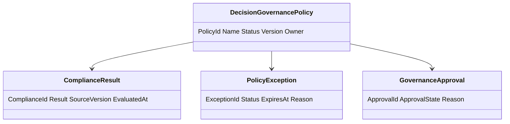
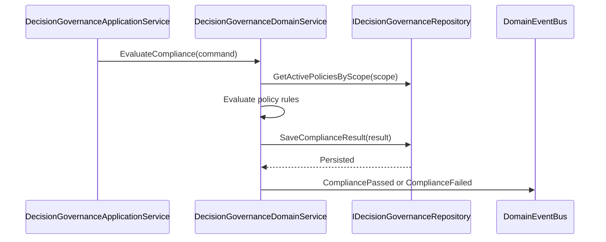
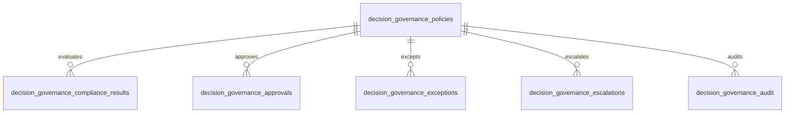
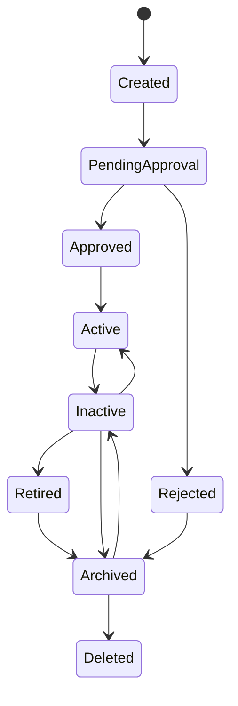
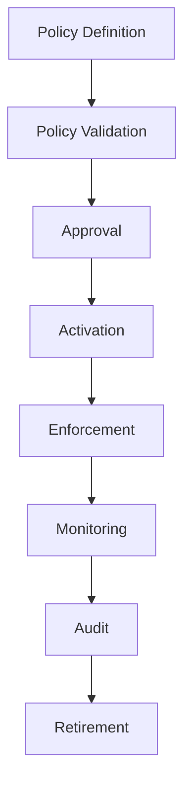
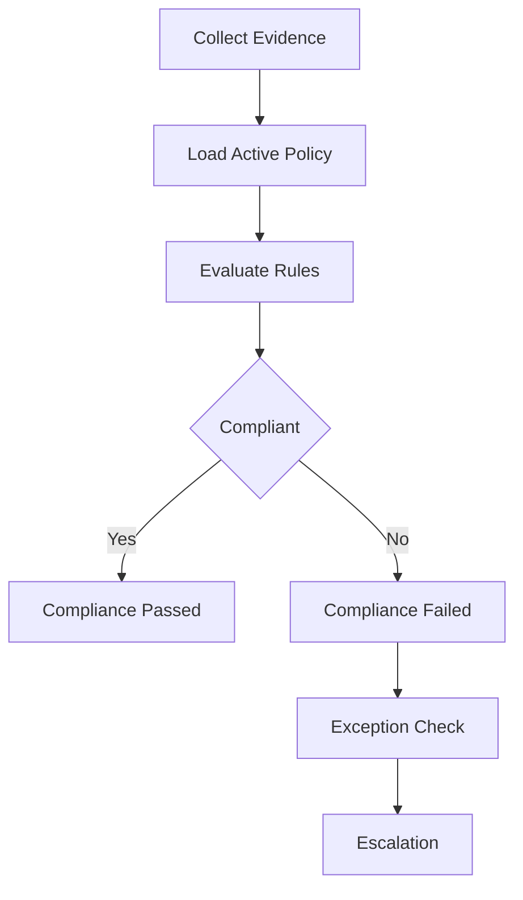
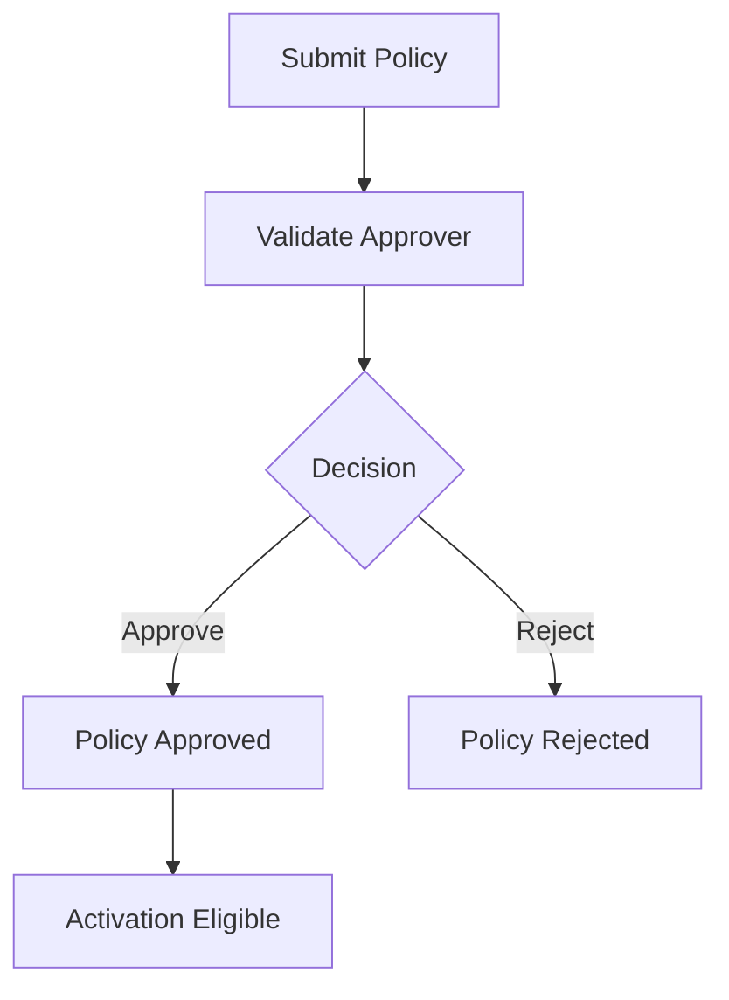
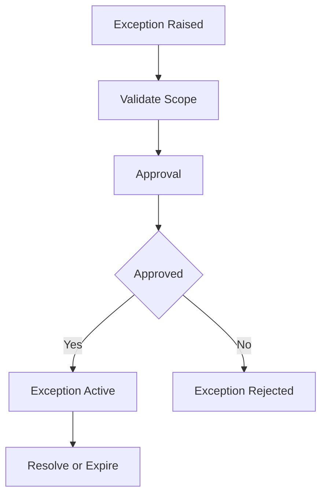

# Decision Governance
Version: 1.0
Status: Enterprise Specification
Owner: Project Atlas
Source of Truth: Atlas Decision Governance Specification
Last Updated: 2026-07-13
# Decision Governance Overview
## Purpose
Decision Governance defines how Atlas controls policy, compliance, approval, exception, escalation, monitoring, audit, retention, security, and reporting for DecisionSession.
It coordinates governance with Decision Lifecycle, Decision Evaluation, Decision Execution, Decision Explainability, Decision History, Decision Audit, Decision Rule, Rule Engine, Recommendation, GoalPlan, Scenario, Portfolio, CashFlow, Optimization, Simulation, Risk, Workflow, Automation, Notification, Business Calendar, and User.
It preserves existing Atlas domain ownership and existing catalog naming.
## Business Meaning
Decision Governance ensures that decision creation, evaluation, approval, execution, rollback, archive, retention, explanation, recommendation mapping, goal alignment, scenario usage, portfolio evidence, cashflow evidence, risk handling, and audit evidence follow approved policy.
Governance makes decision behavior controllable, auditable, explainable, permission-aware, and compliant.
Governance does not directly change DecisionSession, Recommendation, GoalPlan, Scenario, Portfolio, CashFlow, Workflow, Automation, or Notification state without explicit domain command.
## Governance Scope
Governance scope includes policy definition, policy versioning, policy activation, policy enforcement, compliance evaluation, exception handling, escalation, approval control, monitoring, audit, retention, reporting, cache, security, and projections.
Scope can apply to DecisionSession, Decision Lifecycle, Decision Evaluation, Decision Execution, Decision Explainability, Decision History, Decision Audit, Decision Rule, Recommendation, GoalPlan, Scenario, Portfolio, CashFlow, Optimization, Simulation, Risk, Workflow, Automation, Notification, Business Calendar, User, household, and tenant when present.
Scope must preserve HouseholdId.
Scope must preserve TenantId when tenant scope exists.
Scope must not include unauthorized source data.
## Governance Lifecycle
Governance lifecycle starts when a policy is created.
The policy can be updated, approved, rejected, activated, deactivated, enforced, monitored, archived, restored, retired, or deleted according to lifecycle rules.
Compliance evaluation records pass, fail, warning, not applicable, exception applied, and escalation required results.
Exception handling records reason, mitigation, approval, expiration, resolution, escalation, and audit evidence.
## Governance Objectives
Governance objectives are policy consistency, decision quality control, financial discipline, risk discipline, approval traceability, execution control, exception visibility, escalation timing, data protection, explainability, retention discipline, and audit readiness.
Objectives are measured through compliance pass rate, failed compliance count, policy conflict count, exception count, escalation count, approval latency, audit completeness, and retention adherence.
## Ownership
Decision Governance owns policy definitions, governance lifecycle, compliance result, exception record, escalation record, governance report, and governance projections.
DecisionSession owns decision state and outcome.
Decision Lifecycle owns lifecycle state.
Decision Evaluation owns scores and evaluation results.
Decision Execution owns execution records.
Decision Explainability owns explanation artifacts.
Decision History owns history projections.
Decision Audit owns immutable evidence.
Security owns authorization and masking.
Repository owns persistence and queries.
Application Service owns orchestration and transaction boundary.
## Aggregate Root
DecisionSession remains the aggregate root for decision behavior.
Decision Governance policy is a governed policy record scoped to DecisionSession or related decision domains.
Governance references related aggregates by identifier and source version.
## Relationship with Decision
DecisionSession supplies decision intent, owner, options, selected option, rationale, status, lifecycle state, and decision outcome.
Governance validates whether decision operations comply with active policy.
## Relationship with Decision Lifecycle
Decision Lifecycle supplies current state, allowed commands, transition history, terminal state, restore state, and delete eligibility.
Governance can block lifecycle transitions according to active policy.
## Relationship with Decision Evaluation
Decision Evaluation supplies scores, constraints, risk result, confidence score, explainability score, approval readiness, and evaluation version.
Governance validates stale scores, hard constraint failures, and approval readiness.
## Relationship with Decision Execution
Decision Execution supplies execution state, retry count, rollback state, recovery state, completion verification, and execution logs.
Governance validates execution eligibility, rollback policy, retry limits, and completion evidence.
## Relationship with Decision Explainability
Decision Explainability supplies rationale, evidence trace, rule trace, formula trace, score trace, and approval explanation.
Governance can block approval when explanation is incomplete.
## Relationship with Decision History
Decision History supplies state history, evaluation history, approval history, execution history, exception history, and report history.
Governance history is append-only.
## Relationship with Decision Audit
Decision Audit supplies immutable command, access, approval, exception, escalation, policy, compliance, and retention evidence.
Governance writes audit records for every command.
## Relationship with Decision Rule
Decision Rule supplies rule definitions, rule priority, rule severity, threshold, and rule version.
Governance validates policy compatibility with rule version.
## Relationship with Rule Engine
Rule Engine evaluates governance rules and returns pass, fail, warning, explanation, rule version, and source version.
Rule Engine output is evidence and does not mutate governance state directly.
## Relationship with Recommendation
Recommendation may require governance approval before adoption, suppression, or execution.
Governance does not own Recommendation lifecycle.
## Relationship with Goal
GoalPlan may be blocked or unblocked by decision compliance through explicit Goal command policy.
Governance records GoalPlanId when goal alignment is evaluated.
## Relationship with Scenario
Scenario supplies assumptions, baseline, simulation evidence, and ScenarioVersion.
Governance validates ScenarioVersion and stale scenario evidence.
## Relationship with Portfolio
Portfolio supplies allocation, liquidity, risk, valuation, and performance evidence where authorized.
Governance validates portfolio permission, valuation freshness, risk thresholds, and masking.
## Relationship with CashFlow
CashFlow supplies surplus, deficit, funding gap, contribution capacity, period, and currency evidence where authorized.
Governance validates cashflow period alignment and financial feasibility.
## Relationship with Optimization
Optimization supplies optimized candidate, objective score, constraint score, and optimization version.
Governance validates whether optimized output is approved and current.
## Relationship with Simulation
Simulation supplies scenario result, dry run result, confidence interval, and simulation version.
Governance validates whether simulation output is current and authorized.
## Relationship with Risk
Risk supplies risk score, risk trend, risk severity, threshold state, and mitigation state.
Governance validates critical risk policy and escalation.
## Relationship with Workflow
Workflow supplies approval routing, review steps, exception routing, escalation steps, and governance state.
Workflow cannot bypass governance validation.
## Relationship with Automation
Automation may trigger compliance evaluation, policy activation, escalation, exception expiration, governance reporting, archive, and cleanup.
AutomationRunId must be recorded.
## Relationship with Notification
Notification receives policy activation, compliance failure, exception raised, exception resolved, issue escalated, approval needed, and report generated triggers.
Notification suppression does not remove governance history.
## Relationship with Business Calendar
Business Calendar supplies approval windows, escalation windows, policy effective windows, exception expiration windows, and retention windows.
Governance deadlines must honor Business Calendar when configured.
## Relationship with User
User supplies actor, owner, policy administrator, approver, exception requester, reviewer, permission, preference, locale, and masking context.
User permission is evaluated before command and projection.
# Governance Architecture
## Governance Engine
Governance Engine coordinates policy applicability, compliance evaluation, exception handling, escalation, approval, monitoring, audit, retention, reporting, and cache invalidation.
It produces deterministic results for the same policy version and source version.
## Policy Engine
Policy Engine stores policy definition, version, scope, owner, inputs, outputs, enforcement rules, exception rules, escalation rules, approval rules, and audit rules.
Policy Engine detects active policy conflicts.
## Compliance Engine
Compliance Engine evaluates source evidence against active policy and records passed, failed, warning, not applicable, exception applied, or escalation required.
Compliance result records source version and policy version.
## Approval Engine
Approval Engine validates policy approval, exception approval, compliance override approval, and DecisionSession approval dependency.
Approval state is recorded with approver, reason, time, and workflow context.
## Risk Engine
Risk Engine evaluates risk policy, risk score, critical risk, risk trend, mitigation evidence, and escalation.
Risk output may block approval or execution.
## Monitoring Engine
Monitoring Engine observes active policies, compliance results, policy conflicts, exception expiration, escalation deadlines, overdue approvals, and governance trends.
Monitoring output feeds dashboard, report, analytics, and notification.
## Audit Engine
Audit Engine records policy lifecycle, compliance evaluation, exception handling, approval, rejection, escalation, report generation, access, and retention decisions.
Audit records are append-only.
## Exception Engine
Exception Engine validates exception request, exception approval, expiration, scope, mitigation, and resolution.
Exception cannot delete violation evidence.
## Escalation Engine
Escalation Engine routes unresolved failure, repeated warning, critical risk, overdue approval, expiring exception, and policy conflict to configured recipients.
Escalation respects Business Calendar where configured.
## Retention Engine
Retention Engine applies archive, delete, historical retention, audit retention, report retention, and exception retention rules.
Retention decisions are auditable.
# Governance Policies
## Decision Creation Policy
Purpose: Control creation of DecisionSession.
Scope: DecisionSession creation.
Owner: Decision Governance.
Inputs: Actor, owner, household, intent, options, related GoalPlan, source version.
Outputs: Compliance result and creation permission.
Validation: Actor must have Decision.Create permission and required fields must exist.
Enforcement Rules: Block creation when scope or owner is invalid.
Exception Rules: Exception requires policy administrator approval.
Escalation Rules: Escalate repeated invalid creation attempts.
Approval Rules: Approval required for restricted decision scope.
Audit Rules: Record actor, scope, policy version, and result.
Example: Decision with unauthorized portfolio evidence fails creation policy.
## Decision Evaluation Policy
Purpose: Control evaluation completeness and score readiness.
Scope: Decision Evaluation.
Owner: Decision Governance.
Inputs: EvaluationId, score, constraints, confidence, explainability, source version.
Outputs: Compliance result and evaluation readiness.
Validation: Evaluation must have current source version and required dimension scores.
Enforcement Rules: Block approval when hard constraints fail.
Exception Rules: Exception requires reason and expiration.
Escalation Rules: Escalate repeated stale evaluations.
Approval Rules: Approval required when confidence is below threshold.
Audit Rules: Record EvaluationId and score summary.
Example: Evaluation with explainability score below threshold requires review.
## Decision Approval Policy
Purpose: Control approval authority and approval readiness.
Scope: Decision Lifecycle approval.
Owner: Decision Governance.
Inputs: Approver, selected option, evaluation result, workflow state, approval due date.
Outputs: Approval compliance result.
Validation: Approver must have Decision.Approve permission.
Enforcement Rules: Block self-approval when policy forbids it.
Exception Rules: Exception requires alternate approver and audit reason.
Escalation Rules: Escalate overdue approval.
Approval Rules: Workflow approval must be completed when configured.
Audit Rules: Record approver, reason, option, and time.
Example: Owner cannot self-approve a restricted decision.
## Decision Execution Policy
Purpose: Control whether a decision can execute.
Scope: Decision Execution.
Owner: Decision Governance.
Inputs: Decision state, evaluation state, approval state, rule result, execution mode.
Outputs: Execution compliance result and blockers.
Validation: Decision must be approved or execution-eligible.
Enforcement Rules: Block execution when approval is stale.
Exception Rules: Emergency exception requires emergency permission.
Escalation Rules: Escalate blocked execution after deadline.
Approval Rules: Execution override requires approver.
Audit Rules: Record execution id and operator.
Example: Execution is blocked when approved option differs from selected option.
## Decision Rollback Policy
Purpose: Control rollback and compensation.
Scope: Decision Execution rollback.
Owner: Decision Governance.
Inputs: ExecutionId, rollback reason, completed steps, reversible steps, compensation plan.
Outputs: Rollback compliance result.
Validation: Rollback policy must exist for reversible execution.
Enforcement Rules: Block rollback without eligible state.
Exception Rules: Compensation exception requires approval.
Escalation Rules: Escalate rollback failure.
Approval Rules: Rollback override requires operator approval.
Audit Rules: Record rollback reason, steps, and result.
Example: Rollback is allowed only for reversible completed steps.
## Decision Archive Policy
Purpose: Control archive behavior.
Scope: DecisionSession, evaluation, execution, policy, and report records.
Owner: Decision Governance.
Inputs: State, retention class, archive reason, actor.
Outputs: Archive compliance result.
Validation: Record must be terminal or archive-eligible.
Enforcement Rules: Block archive during running execution.
Exception Rules: Exception requires retention approval.
Escalation Rules: Escalate archive failure for terminal record.
Approval Rules: Restricted archive requires approval.
Audit Rules: Record archive reason and retention class.
Example: Running execution cannot be archived.
## Decision Retention Policy
Purpose: Control retention and deletion.
Scope: Decision History, Decision Audit, governance records, reports, and exceptions.
Owner: Decision Audit.
Inputs: Record type, retention class, created time, delete request.
Outputs: Retention compliance result.
Validation: Retention class is required.
Enforcement Rules: Block delete before retention expiry.
Exception Rules: Exception requires audit owner approval.
Escalation Rules: Escalate unauthorized delete request.
Approval Rules: Audit approval required for early deletion.
Audit Rules: Record retention decision.
Example: Compliance result cannot be deleted before retention expiry.
## Financial Policy
Purpose: Control financial evidence and financial thresholds.
Scope: Decision Evaluation, Portfolio, CashFlow, GoalPlan.
Owner: Decision Governance.
Inputs: Funding gap, budget variance, cashflow capacity, currency, period.
Outputs: Financial compliance result.
Validation: Currency and period are required.
Enforcement Rules: Block approval when hard financial threshold fails.
Exception Rules: Financial exception requires approval and expiration.
Escalation Rules: Escalate critical funding gap.
Approval Rules: Financial override requires approved reason.
Audit Rules: Record masked financial evidence.
Example: Funding gap above threshold blocks approval.
## Risk Policy
Purpose: Control risk thresholds and mitigation.
Scope: Decision Evaluation, Decision Execution, Risk.
Owner: Decision Governance.
Inputs: Risk score, risk trend, severity, mitigation, exception.
Outputs: Risk compliance result and escalation flag.
Validation: Risk score must be between 0 and 100.
Enforcement Rules: Critical risk blocks automatic approval.
Exception Rules: Risk exception requires mitigation.
Escalation Rules: Escalate unresolved critical risk.
Approval Rules: Risk override requires approver.
Audit Rules: Record risk score and mitigation.
Example: RiskScore 85 requires escalation.
## Portfolio Policy
Purpose: Control portfolio evidence use.
Scope: Portfolio-related decisions.
Owner: Decision Governance.
Inputs: Portfolio permission, valuation time, liquidity, allocation, risk.
Outputs: Portfolio compliance result.
Validation: Portfolio permission and valuation time are required.
Enforcement Rules: Block use of stale valuation when policy requires current data.
Exception Rules: Exception requires portfolio owner approval.
Escalation Rules: Escalate repeated stale valuation use.
Approval Rules: Portfolio override requires authorization.
Audit Rules: Record valuation time and masking.
Example: Stale portfolio valuation lowers compliance result.
## Scenario Policy
Purpose: Control scenario usage.
Scope: Scenario-based decisions, simulation, optimization.
Owner: Decision Governance.
Inputs: ScenarioId, ScenarioVersion, assumptions, baseline, source version.
Outputs: Scenario compliance result.
Validation: ScenarioVersion is required.
Enforcement Rules: Block stale scenario result.
Exception Rules: Exception requires scenario rationale.
Escalation Rules: Escalate missing baseline.
Approval Rules: Scenario override requires approval.
Audit Rules: Record scenario version and assumptions.
Example: Simulation using stale ScenarioVersion fails compliance.
## Recommendation Policy
Purpose: Control recommendation mapping and adoption.
Scope: Recommendation linked to DecisionSession.
Owner: Decision Governance.
Inputs: RecommendationId, status, ranking, adoption state, suppression reason.
Outputs: Recommendation compliance result.
Validation: Recommendation must exist when referenced.
Enforcement Rules: Require reason for suppressing high impact recommendation.
Exception Rules: Exception requires expiration.
Escalation Rules: Escalate unresolved high-impact recommendation.
Approval Rules: Suppression override requires approval.
Audit Rules: Record RecommendationId and rationale.
Example: High-impact recommendation suppression without reason fails compliance.
## Goal Alignment Policy
Purpose: Control decision alignment with GoalPlan.
Scope: DecisionSession and GoalPlan.
Owner: Decision Governance.
Inputs: GoalPlanId, priority, target, progress, health, dependency.
Outputs: Goal compliance result.
Validation: GoalPlan must exist when referenced.
Enforcement Rules: Block decision approval when goal conflict is critical.
Exception Rules: Exception requires goal owner approval.
Escalation Rules: Escalate unresolved goal conflict.
Approval Rules: Goal override requires approval.
Audit Rules: Record GoalPlanId and alignment result.
Example: Decision conflicts with high-priority GoalPlan and requires review.
## Automation Policy
Purpose: Control automated governance operations.
Scope: Automation triggered compliance, reports, escalation, cleanup.
Owner: Decision Governance.
Inputs: AutomationRunId, trigger, actor, schedule, policy version.
Outputs: Automation compliance result.
Validation: AutomationRunId and system actor are required.
Enforcement Rules: Block automation without policy permission.
Exception Rules: Exception requires policy administrator approval.
Escalation Rules: Escalate repeated automation failure.
Approval Rules: Restricted automation requires approval.
Audit Rules: Record automation run and outcome.
Example: Automated compliance run records system actor.
## Compliance Policy
Purpose: Control compliance evaluation behavior.
Scope: Compliance Engine and results.
Owner: Decision Governance.
Inputs: PolicyId, source version, evidence, rule result, actor.
Outputs: Compliance result and severity.
Validation: Active policy and source version are required.
Enforcement Rules: Failed compliance blocks governed action when policy is hard.
Exception Rules: Exception requires approved exception.
Escalation Rules: Escalate repeated failures.
Approval Rules: Override approval required for hard failure.
Audit Rules: Record policy version and result.
Example: Hard compliance failure blocks execution.
## Security Policy
Purpose: Control authorization and data access.
Scope: Commands, queries, projections, cache, reports.
Owner: Security.
Inputs: User, permission, field access, scope, masking mode.
Outputs: Security compliance result.
Validation: Authenticated user and scope permission are required.
Enforcement Rules: Block unauthorized access.
Exception Rules: No exception for missing authentication.
Escalation Rules: Escalate repeated unauthorized attempts.
Approval Rules: Elevated access requires approval.
Audit Rules: Record access and denial.
Example: User without DecisionGovernance.PolicyRead cannot read policy detail.
## Data Governance Policy
Purpose: Control source version, masking, projection, and retention data rules.
Scope: Data used by governance.
Owner: Decision Governance.
Inputs: Source version, masking mode, projection fields, retention class.
Outputs: Data compliance result.
Validation: Source version and allowed projection are required.
Enforcement Rules: Block restricted field projection.
Exception Rules: Exception requires data owner approval.
Escalation Rules: Escalate repeated restricted access attempt.
Approval Rules: Data override requires approval.
Audit Rules: Record projection and masking mode.
Example: Restricted portfolio field is masked in report.
## Audit Policy
Purpose: Control audit completeness.
Scope: Governance command, compliance result, approval, exception, escalation, report, and access.
Owner: Decision Audit.
Inputs: Command, actor, correlation id, before value, after value.
Outputs: Audit compliance result.
Validation: Audit metadata is required.
Enforcement Rules: Block state change when required audit write fails.
Exception Rules: No exception for required audit omission.
Escalation Rules: Escalate audit write failure.
Approval Rules: Audit correction requires audit owner approval.
Audit Rules: Record all audit records.
Example: Policy activation fails if audit record cannot be written.
# Compliance Model
## Business Compliance
Business Compliance validates decision intent, lifecycle state, selected option, approval readiness, and outcome consistency.
## Financial Compliance
Financial Compliance validates budget variance, funding gap, CashFlow capacity, Portfolio impact, currency, and period.
## Risk Compliance
Risk Compliance validates risk score, risk trend, critical risk, mitigation, and exception.
## Execution Compliance
Execution Compliance validates execution eligibility, approval freshness, retry limit, rollback policy, and verification.
## Recommendation Compliance
Recommendation Compliance validates recommendation mapping, adoption state, suppression reason, and expected impact.
## Scenario Compliance
Scenario Compliance validates ScenarioId, ScenarioVersion, assumptions, baseline, and simulation freshness.
## Goal Compliance
Goal Compliance validates GoalPlan alignment, priority, dependency, progress, and lifecycle state.
## Security Compliance
Security Compliance validates command permission, query permission, projection permission, and field-level security.
## Audit Compliance
Audit Compliance validates audit metadata, immutable evidence, actor, correlation id, and retention class.
## Retention Compliance
Retention Compliance validates archive, restore, delete, report retention, exception retention, and audit retention.
## Regulatory Compliance
Regulatory Compliance uses existing Atlas compliance and governance records where applicable.
## Data Compliance
Data Compliance validates source version, masking, projection, aggregation, cache safety, and export safety.
# Governance Workflow
## Policy Definition
Policy Definition captures purpose, scope, owner, inputs, outputs, validation, enforcement rules, exception rules, escalation rules, approval rules, and audit rules.
## Activation
Activation requires approved policy, effective window, conflict validation, owner validation, and audit record.
## Validation
Validation checks policy syntax, scope, owner, rule references, escalation route, approval route, exception route, and audit requirements.
## Enforcement
Enforcement evaluates active policy against source evidence and applies pass, fail, warning, block, exception, or escalation.
## Exception Handling
Exception Handling validates reason, mitigation, scope, approver, expiration, and resolution.
## Escalation
Escalation routes critical failure, repeated warning, overdue approval, expired exception, and policy conflict.
## Approval
Approval records approver, reason, workflow context, decision context, policy version, and effective time.
## Monitoring
Monitoring observes policy state, compliance results, exception expiration, escalation deadlines, approval latency, and governance trends.
## Audit
Audit records policy, compliance, exception, approval, rejection, escalation, report, access, and retention events.
## Retirement
Retirement deactivates policy after replacement, expiration, governance decision, or retention process.
# Validation Rules
1. PolicyId must be globally unique. 2. Policy name is required. 3. Policy name must follow catalog naming. 4. Policy scope is required. 5. Policy owner is required. 6. Policy version is required. 7. Policy status is required. 8. Policy effective date is required for activation. 9. Expiration date must be after effective date when present. 10. Active policy must be approved. 11. Policy definition must include enforcement rules. 12. Policy definition must include audit rules. 13. Exception rules are required when exceptions are allowed. 14. Escalation rules are required for critical policies. 15. Approval rules are required when override is allowed. 16. ComplianceEvaluationId must be globally unique. 17. Compliance result must be Passed, Failed, Warning, NotApplicable, ExceptionApplied, or EscalationRequired. 18. Compliance evaluation must include source version hash. 19. Compliance evaluation must include policy version. 20. Compliance evaluation must include evaluated time. 21. Compliance evaluation must include actor or system actor. 22. Failed compliance must include violation reason. 23. Warning compliance must include warning reason. 24. ExceptionApplied must reference approved exception. 25. ExceptionId must be globally unique. 26. Exception request must include reason. 27. Exception must include mitigation when policy requires it. 28. Exception must include expiration date. 29. Exception approval requires approver permission. 30. Escalation must include recipient or role. 31. Approval must include approver id. 32. Rejection must include rejection reason. 33. Archive requires inactive, retired, rejected, or policy-approved state. 34. Restore requires archived policy. 35. Delete requires retention validation. 36. TenantId is required when tenant scope exists. 37. HouseholdId is required for household-scoped policy. 38. DecisionSessionId is required for decision-scoped evaluation. 39. Projection field must be allowed. 40. Sorting field must be allowed. 41. Pagination limit must be within API maximum. 42. Audit metadata is required for every command. 43. Source version hash is required for compliance evaluation. 44. Policy conflict check is required before activation. 45. Masked fields must not appear in unauthorized projection.
# Business Rules
1. Decision Governance must preserve Atlas domain ownership. 2. Decision Governance must not redesign Atlas. 3. Decision Governance must not create unrelated business concepts. 4. Governance naming must follow existing catalog. 5. DecisionSession remains the decision aggregate root. 6. Active policy must be approved before enforcement. 7. Inactive policy must not block operations. 8. Archived policy is read-only. 9. Deleted policy cannot be restored. 10. Policy version is immutable after activation. 11. Updating an active policy creates a new version. 12. Policy activation requires conflict validation. 13. Policy deactivation requires reason. 14. Policy rejection requires reason. 15. Policy archive requires eligible state. 16. Policy restore requires conflict validation. 17. Policy delete requires retention validation. 18. Compliance evaluation must use active policy version. 19. Compliance evaluation must record source version. 20. Compliance failure must record violation. 21. Compliance warning must record warning. 22. Not applicable result must record reason. 23. Exception cannot erase violation history. 24. Exception must have expiration date. 25. Expired exception cannot apply. 26. Exception approval requires permission. 27. Exception rejection requires reason. 28. Exception resolution requires result. 29. Escalation must respect Business Calendar when configured. 30. Escalation must record recipient. 31. Notification failure must not remove escalation history. 32. Audit failure must block policy state change when audit is required. 33. Field-level security applies before projection. 34. Masked data must remain masked in cache. 35. Aggregation must not leak unauthorized data. 36. Policy administration permission is required to create policy. 37. Policy administration permission is required to update policy. 38. Policy approver permission is required to approve policy. 39. Policy approver permission is required to reject policy. 40. Compliance read permission is required to view compliance result. 41. Governance report permission is required to generate report. 42. Decision creation policy can block invalid decision creation. 43. Decision evaluation policy can block approval readiness. 44. Decision approval policy can block unauthorized approval. 45. Decision execution policy can block execution. 46. Decision rollback policy can block rollback. 47. Decision archive policy can block archive. 48. Decision retention policy can block delete. 49. Financial policy can block approval. 50. Risk policy can trigger escalation. 51. Portfolio policy requires portfolio permission. 52. Scenario policy requires ScenarioVersion. 53. Recommendation policy requires suppression reason. 54. Goal alignment policy can require review. 55. Automation policy must record AutomationRunId. 56. Compliance policy must record evaluation result. 57. Security policy blocks unauthorized access. 58. Data governance policy controls masking. 59. Audit policy controls immutable evidence. 60. Workflow approval must record WorkflowInstanceId. 61. Decision approval must record DecisionSessionId. 62. Governance report must use permission-filtered projection. 63. Dashboard governance counts must be scoped. 64. Reporting snapshot must preserve governance state. 65. Analytics can use compliance trends only from authorized data. 66. Insights can use governance evidence without expanding visibility. 67. Optimization candidates must satisfy active policy before approval. 68. Simulation output must satisfy scenario policy. 69. Execution must satisfy active policy before start. 70. Compliance cache invalidates on policy activation. 71. Compliance cache invalidates on policy deactivation. 72. Compliance cache invalidates on source version change. 73. Policy cache invalidates on policy update. 74. Permission change invalidates user governance cache. 75. Masking change invalidates cached projections. 76. Materialized views must use committed data. 77. Governance history is append-only. 78. Compliance history is append-only. 79. Approval history is append-only. 80. Exception history is append-only. 81. Policy history is append-only. 82. Operator history is append-only. 83. Concurrent update must use optimistic version. 84. Duplicate active policy for same scope and type is not allowed. 85. Conflicting policy activation must fail validation. 86. Critical compliance failure must be eligible for notification. 87. Repeated compliance failure must be eligible for escalation. 88. Retention policy controls delete. 89. Archive does not delete compliance history. 90. Restore must revalidate current conflicts. 91. Deactivate must not remove historical compliance results. 92. Policy report generation must record actor. 93. Compliance report generation must record source versions. 94. Exception report must include expiration state. 95. Approval state cannot change without command. 96. Policy owner change requires audit. 97. Governance state transition must emit domain event. 98. Emergency override requires reason and permission. 99. Self-approval is blocked when policy forbids it. 100. Governance result must be reproducible from policy version and source version. 101. Export must use masked projection when required. 102. Search must enforce HouseholdId scope. 103. Tenant-aware search must enforce TenantId. 104. Policy delete must not delete audit records early. 105. Exception resolution must preserve original exception request.
# State Machine
## States
- Created
- PendingApproval
- Approved
- Rejected
- Active
- Inactive
- Retired
- Archived
- Deleted
## Transitions
- Created -> PendingApproval by CreatePolicy or UpdatePolicy when approval is required.
- PendingApproval -> Approved by ApprovePolicy.
- PendingApproval -> Rejected by RejectPolicy.
- Approved -> Active by ActivatePolicy.
- Active -> Inactive by DeactivatePolicy.
- Inactive -> Active by ActivatePolicy.
- Inactive -> Retired by retirement process.
- Retired -> Archived by ArchivePolicy.
- Rejected -> Archived by ArchivePolicy.
- Inactive -> Archived by ArchivePolicy.
- Archived -> Inactive by RestorePolicy.
- Archived -> Deleted by DeletePolicy.
## Triggers
- CreatePolicy
- UpdatePolicy
- ActivatePolicy
- DeactivatePolicy
- ApprovePolicy
- RejectPolicy
- ArchivePolicy
- RestorePolicy
- DeletePolicy
- EvaluateCompliance
- GenerateGovernanceReport
- ResolveException
- EscalateIssue
- ExceptionRaised
- ExceptionResolved
- IssueEscalated
## Invariant
PolicyId, created time, created by, original scope, and first version are immutable.
Active policy must be approved and must have effective date.
Archived and Deleted policy cannot be updated except by restore or retention operation.
Compliance result cannot be changed after persistence.
## Illegal Transition
- Deleted -> Active.
- Deleted -> Approved.
- Archived -> Active.
- Rejected -> Active.
- Created -> Active.
- PendingApproval -> Active.
- Active -> Deleted.
- Retired -> Active.
- Approved -> Deleted.
- Inactive -> Deleted without archive.
# Commands
## CreatePolicy
Creates policy definition with scope, owner, rules, exception rules, escalation rules, approval rules, and audit rules.
## UpdatePolicy
Updates editable policy fields and creates new version when required.
## ActivatePolicy
Activates approved policy for effective window.
## DeactivatePolicy
Deactivates active policy with reason.
## ApprovePolicy
Approves pending policy.
## RejectPolicy
Rejects pending policy with reason.
## ArchivePolicy
Archives inactive, retired, or rejected policy.
## RestorePolicy
Restores archived policy after conflict validation.
## DeletePolicy
Deletes eligible policy after retention validation.
## EvaluateCompliance
Evaluates active policies against source evidence.
## GenerateGovernanceReport
Generates governance report projection and audit record.
## ResolveException
Resolves approved or pending exception with outcome.
## EscalateIssue
Creates escalation record and notification trigger.
## RequestPolicyException
Creates policy exception request.
## ApprovePolicyException
Approves policy exception with expiration and mitigation.
## RejectPolicyException
Rejects policy exception with reason.
## RefreshPolicyCache
Invalidates and refreshes policy cache.
## RefreshComplianceCache
Invalidates and refreshes compliance cache.
# Domain Events
## PolicyCreated
Emitted after policy creation.
## PolicyUpdated
Emitted after policy update.
## PolicyActivated
Emitted after activation.
## PolicyDeactivated
Emitted after deactivation.
## PolicyApproved
Emitted after approval.
## PolicyRejected
Emitted after rejection.
## CompliancePassed
Emitted after passed compliance evaluation.
## ComplianceFailed
Emitted after failed compliance evaluation.
## GovernanceReportGenerated
Emitted after governance report generation.
## ExceptionRaised
Emitted after exception request is created.
## ExceptionResolved
Emitted after exception is resolved.
## IssueEscalated
Emitted after issue escalation.
## PolicyArchived
Emitted after policy archive.
## PolicyRestored
Emitted after policy restore.
## PolicyDeleted
Emitted after policy delete.
## ComplianceWarningRaised
Emitted after warning result.
## PolicyExceptionApproved
Emitted after exception approval.
## PolicyExceptionRejected
Emitted after exception rejection.
## PolicyExceptionExpired
Emitted after exception expiration.
# Repository
## Interface
IDecisionGovernanceRepository persists policy aggregate, compliance history, approval history, exception history, escalation history, report history, operator history, and projections.
## Methods
- AddPolicy
- UpdatePolicy
- GetPolicyById
- GetActivePoliciesByScope
- SearchPolicies
- SaveComplianceResult
- GetComplianceResult
- SearchComplianceResults
- SaveApprovalHistory
- SaveException
- ResolveException
- SaveEscalation
- SaveGovernanceReport
- ArchivePolicy
- RestorePolicy
- DeletePolicy
- GetPolicyProjection
- GetComplianceProjection
- GetDashboardProjection
## Queries
- PoliciesByStatus
- PoliciesByScope
- PoliciesByOwner
- ActivePolicies
- PendingApprovalPolicies
- ComplianceResultsByScope
- FailedComplianceResults
- WarningComplianceResults
- ExceptionResults
- ExpiringExceptions
- EscalationResults
- GovernanceReportHistory
## Filtering
- PolicyId
- PolicyName
- Status
- Scope
- Owner
- TenantId
- HouseholdId
- DecisionSessionId
- EffectiveDateRange
- ExpirationDateRange
- ComplianceResult
- HasException
- HasEscalation
- CreatedDateRange
## Sorting
- createdAt desc
- updatedAt desc
- effectiveAt desc
- expiresAt asc
- status asc
- scope asc
- owner asc
- severity desc
## Aggregation
- CountByPolicyStatus
- CountByComplianceResult
- CountByScope
- CountByExceptionState
- CountByEscalationState
- FailedComplianceCount
- WarningComplianceCount
- ExpiringExceptionCount
- PendingApprovalCount
## Projection
- PolicySummaryProjection
- PolicyDetailProjection
- ComplianceSummaryProjection
- ComplianceDetailProjection
- GovernanceReportProjection
- ExceptionProjection
- EscalationProjection
- DashboardProjection
## Specification
- ActivePolicySpecification
- VisiblePolicySpecification
- PendingApprovalPolicySpecification
- FailedComplianceSpecification
- ExceptionActiveSpecification
- EscalationRequiredSpecification
- AuditGovernanceSpecification
# Domain Service Interaction
- DecisionGovernanceDomainService validates policy lifecycle, compliance rules, exceptions, escalations, approvals, and business rules.
- DecisionLifecycleDomainService supplies decision state and lifecycle constraints.
- DecisionEvaluationDomainService supplies evaluation score and constraint evidence.
- DecisionExecutionDomainService supplies execution state, retry, rollback, and recovery evidence.
- DecisionExplainabilityDomainService supplies explanation artifacts.
- DecisionHistoryDomainService records governance history projections.
- DecisionAuditDomainService records immutable audit evidence.
- DecisionRuleDomainService supplies rule definitions and rule versions.
- RuleEngineDomainService evaluates policy and decision rules.
- RecommendationDomainService supplies recommendation governance evidence.
- GoalLifecycleDomainService supplies GoalPlan lifecycle and alignment evidence.
- ScenarioDomainService supplies ScenarioVersion and assumptions.
- PortfolioDomainService supplies authorized portfolio evidence.
- CashFlowDomainService supplies authorized cashflow evidence.
- OptimizationDomainService supplies optimization candidate evidence.
- SimulationDomainService supplies simulation evidence.
- RiskDomainService supplies risk score and mitigation evidence.
- WorkflowDomainService supplies approval routing and workflow state.
- AutomationDomainService supplies automation run context.
- NotificationDomainService receives governance notification triggers.
- BusinessCalendarDomainService supplies governance windows and deadlines.
- SecurityDomainService evaluates authorization and masking.
- CacheDomainService invalidates policy and compliance projections.
# Application Service Interaction
- DecisionGovernanceApplicationService coordinates command handlers, query handlers, unit of work, event publication, and cache invalidation.
- CreatePolicyHandler validates create DTO and calls domain service.
- UpdatePolicyHandler validates version and editable fields.
- ActivatePolicyHandler validates approval, effective window, and conflicts.
- DeactivatePolicyHandler records reason and state change.
- ApprovePolicyHandler validates approver authority.
- RejectPolicyHandler validates rejection reason.
- ArchivePolicyHandler makes policy read-only.
- RestorePolicyHandler revalidates conflicts and retention.
- DeletePolicyHandler validates retention and deletes eligible policy.
- EvaluateComplianceHandler collects source evidence and persists compliance result.
- GenerateGovernanceReportHandler creates report projection and audit record.
- ResolveExceptionHandler validates exception resolution and records result.
- EscalateIssueHandler creates escalation and notification trigger.
- GovernanceSearchQueryHandler applies filtering, sorting, projection, and pagination.
# API
## REST Endpoints
- GET /api/decision-governance/policies
- POST /api/decision-governance/policies
- GET /api/decision-governance/policies/{policyId}
- PUT /api/decision-governance/policies/{policyId}
- POST /api/decision-governance/policies/{policyId}/approve
- POST /api/decision-governance/policies/{policyId}/reject
- POST /api/decision-governance/policies/{policyId}/activate
- POST /api/decision-governance/policies/{policyId}/deactivate
- POST /api/decision-governance/policies/{policyId}/archive
- POST /api/decision-governance/policies/{policyId}/restore
- DELETE /api/decision-governance/policies/{policyId}
- POST /api/decision-governance/compliance/evaluate
- GET /api/decision-governance/compliance
- POST /api/decision-governance/reports
- GET /api/decision-governance/reports/{reportId}
- POST /api/decision-governance/exceptions
- POST /api/decision-governance/exceptions/{exceptionId}/resolve
- POST /api/decision-governance/escalations
## HTTP Methods
GET reads governance projections.
POST creates, approves, rejects, activates, deactivates, archives, restores, evaluates, reports, resolves exception, or escalates issue.
PUT updates eligible policy fields.
DELETE deletes eligible policy after retention validation.
## Request
Create Policy request includes name, scope, owner, rules, exception rules, escalation rules, approval rules, and audit rules.
Update Policy request includes version, editable fields, and update reason.
Activate Policy request includes effective time and activation reason.
Compliance request includes scope, source version mode, policy ids, and evaluation mode.
Governance report request includes scope, date range, projection, and masking mode.
Exception request includes policy id, scope, reason, expiration, and mitigation.
Approval request includes approver, reason, workflow context, and expected version.
## Response
Policy response returns policy detail, lifecycle, version, permissions, and audit metadata.
Compliance response returns result, policy version, source version, violations, warnings, exceptions, and evaluated time.
Governance response returns status, active policy count, failed compliance count, exception count, and escalation count.
Exception response returns exception state, expiration, approval state, mitigation, and resolution.
Report response returns report id, scope, summary, compliance counts, exceptions, escalations, and generated time.
## Errors
- 400 invalid request
- 401 unauthenticated
- 403 forbidden
- 404 policy not found
- 409 concurrency conflict
- 410 inactive policy
- 422 validation failed
- 423 policy locked
- 429 rate limited
- 500 internal error
## Pagination
Pagination uses pageNumber, pageSize, totalCount, totalPages, hasNextPage, and hasPreviousPage.
## Filtering
Filtering supports status, scope, owner, policy name, effective date, compliance result, exception state, escalation state, householdId, tenantId, DecisionSessionId, and created date.
## Sorting
Sorting supports createdAt, updatedAt, effectiveAt, expiresAt, status, scope, owner, compliance result, and severity.
## Projection
Projection supports policy summary, policy detail, compliance summary, compliance detail, governance report, exception, escalation, dashboard, and audit-safe views.
## Compliance API
Compliance API evaluates policies, searches compliance results, returns violation detail, warning detail, and exception state.
## Governance API
Governance API returns active policy summary, compliance dashboard, exception dashboard, escalation dashboard, and governance report.
## Policy API
Policy API creates, updates, approves, rejects, activates, deactivates, archives, restores, deletes, and searches policies.
# DTO
## Create DTO
Includes policy name, scope, owner, enforcement rules, exception rules, escalation rules, approval rules, audit rules, and effective window.
## Update DTO
Includes policy id, version, editable fields, update reason, and expected state.
## Policy DTO
Includes policy fields, scope, owner, rules, version, lifecycle, and timestamps.
## Compliance DTO
Includes compliance id, policy id, result, source version, violations, warnings, exceptions, evaluated time, and actor.
## Governance DTO
Includes active policy count, failed compliance count, warning count, exception count, escalation count, and generated time.
## Exception DTO
Includes exception id, policy id, scope, reason, mitigation, approval state, expiration date, resolution, and audit metadata.
## Approval DTO
Includes approver id, approval state, reason, workflow step, policy version, and occurred time.
## Summary DTO
Includes policy id, name, scope, status, owner, version, effective date, expiration date, and compliance state.
## Detail DTO
Includes policy detail, rule definitions, lifecycle history, approval history, exception rules, compliance summary, permissions, and audit metadata.
## Search DTO
Includes filters, sorting, pagination, projection, and masking mode.
## Report DTO
Includes report id, scope, period, policy counts, compliance counts, exception counts, escalation counts, and generated time.
# Database Mapping
## Table
- decision_governance_policies
- decision_governance_policy_versions
- decision_governance_compliance_results
- decision_governance_approvals
- decision_governance_exceptions
- decision_governance_escalations
- decision_governance_reports
- decision_governance_operator_history
- decision_governance_audit
## Columns
- policy_id uuid primary key
- tenant_id uuid null
- household_id uuid null
- decision_session_id uuid null
- name varchar(160) not null
- scope_type varchar(80) not null
- scope_id uuid null
- owner varchar(120) not null
- status varchar(40) not null
- version_number int not null
- policy_key varchar(240) not null
- effective_at timestamptz null
- expires_at timestamptz null
- approved_at timestamptz null
- archived_at timestamptz null
- created_at timestamptz not null
- updated_at timestamptz not null
- row_version int not null
## Indexes
- ix_decision_governance_policies_scope_status
- ix_decision_governance_policies_owner
- ix_decision_governance_policies_effective
- ix_decision_governance_policies_household
- ix_decision_governance_policies_decision
- ix_decision_governance_compliance_scope
- ix_decision_governance_compliance_result
- ix_decision_governance_exceptions_expiration
- ux_decision_governance_active_policy_key
## Constraints
- status in supported policy states
- version_number greater than zero
- effective_at before expires_at when expires_at exists
- compliance result in supported compliance states
- exception expiration after request time
## FK
- policy_id references decision_governance_policies for versions, compliance, approvals, exceptions, escalations, reports, operator history, and audit.
- household_id references households when present.
- decision_session_id references decision_sessions when present.
- workflow_instance_id references workflow instances when present.
## Unique
- Unique active policy key per scope and policy type.
- Unique policy version per policy.
## Check Constraint
- Lifecycle timestamp must match policy status.
- Compliance result must have violation reason when failed.
## Partition Strategy
- Partition compliance results, audit, reports, escalations, and operator history by created_at month.
# PostgreSQL Schema
```sql
CREATE TABLE decision_governance_policies (
  policy_id uuid PRIMARY KEY,
  tenant_id uuid NULL,
  household_id uuid NULL,
  decision_session_id uuid NULL,
  name varchar(160) NOT NULL,
  scope_type varchar(80) NOT NULL,
  scope_id uuid NULL,
  owner varchar(120) NOT NULL,
  status varchar(40) NOT NULL,
  version_number int NOT NULL DEFAULT 1,
  policy_key varchar(240) NOT NULL,
  rule_payload jsonb NOT NULL DEFAULT '{}'::jsonb,
  exception_payload jsonb NOT NULL DEFAULT '{}'::jsonb,
  escalation_payload jsonb NOT NULL DEFAULT '{}'::jsonb,
  approval_payload jsonb NOT NULL DEFAULT '{}'::jsonb,
  audit_payload jsonb NOT NULL DEFAULT '{}'::jsonb,
  effective_at timestamptz NULL,
  expires_at timestamptz NULL,
  approved_at timestamptz NULL,
  archived_at timestamptz NULL,
  created_by uuid NULL,
  updated_by uuid NULL,
  created_at timestamptz NOT NULL DEFAULT now(),
  updated_at timestamptz NOT NULL DEFAULT now(),
  row_version int NOT NULL DEFAULT 1,
  CONSTRAINT ck_decision_governance_policies_status CHECK (status IN ('Created','PendingApproval','Approved','Rejected','Active','Inactive','Retired','Archived','Deleted')),
  CONSTRAINT ck_decision_governance_policies_version CHECK (version_number > 0),
  CONSTRAINT ck_decision_governance_policies_dates CHECK (expires_at IS NULL OR effective_at IS NULL OR expires_at > effective_at)
);
CREATE TABLE decision_governance_compliance_results (
  compliance_id uuid PRIMARY KEY,
  policy_id uuid NOT NULL REFERENCES decision_governance_policies(policy_id),
  tenant_id uuid NULL,
  household_id uuid NULL,
  decision_session_id uuid NULL,
  scope_type varchar(80) NOT NULL,
  scope_id uuid NULL,
  result varchar(40) NOT NULL,
  source_version_hash varchar(128) NOT NULL,
  policy_version int NOT NULL,
  violation_payload jsonb NOT NULL DEFAULT '[]'::jsonb,
  warning_payload jsonb NOT NULL DEFAULT '[]'::jsonb,
  exception_id uuid NULL,
  evaluated_by uuid NULL,
  evaluated_at timestamptz NOT NULL DEFAULT now(),
  correlation_id uuid NOT NULL,
  CONSTRAINT ck_decision_governance_compliance_result CHECK (result IN ('Passed','Failed','Warning','NotApplicable','ExceptionApplied','EscalationRequired'))
);
CREATE TABLE decision_governance_approvals (
  approval_id uuid PRIMARY KEY,
  policy_id uuid NOT NULL REFERENCES decision_governance_policies(policy_id),
  decision_session_id uuid NULL,
  workflow_instance_id uuid NULL,
  approval_state varchar(40) NOT NULL,
  reason varchar(800) NOT NULL,
  approver_id uuid NULL,
  occurred_at timestamptz NOT NULL DEFAULT now(),
  correlation_id uuid NOT NULL
);
CREATE TABLE decision_governance_exceptions (
  exception_id uuid PRIMARY KEY,
  policy_id uuid NOT NULL REFERENCES decision_governance_policies(policy_id),
  scope_type varchar(80) NOT NULL,
  scope_id uuid NULL,
  reason varchar(800) NOT NULL,
  mitigation varchar(800) NULL,
  status varchar(40) NOT NULL,
  expires_at timestamptz NOT NULL,
  resolved_at timestamptz NULL,
  requested_by uuid NULL,
  approved_by uuid NULL,
  created_at timestamptz NOT NULL DEFAULT now(),
  CONSTRAINT ck_decision_governance_exception_dates CHECK (expires_at > created_at)
);
CREATE TABLE decision_governance_escalations (
  escalation_id uuid PRIMARY KEY,
  policy_id uuid NOT NULL REFERENCES decision_governance_policies(policy_id),
  compliance_id uuid NULL,
  severity varchar(20) NOT NULL,
  recipient varchar(160) NOT NULL,
  status varchar(40) NOT NULL,
  message varchar(1200) NOT NULL,
  created_at timestamptz NOT NULL DEFAULT now(),
  correlation_id uuid NOT NULL
);
CREATE TABLE decision_governance_reports (
  report_id uuid PRIMARY KEY,
  tenant_id uuid NULL,
  household_id uuid NULL,
  decision_session_id uuid NULL,
  scope_type varchar(80) NOT NULL,
  report_payload jsonb NOT NULL DEFAULT '{}'::jsonb,
  generated_by uuid NULL,
  generated_at timestamptz NOT NULL DEFAULT now(),
  correlation_id uuid NOT NULL
);
CREATE TABLE decision_governance_operator_history (
  operator_history_id uuid PRIMARY KEY,
  policy_id uuid NULL,
  operator_id uuid NULL,
  action varchar(120) NOT NULL,
  occurred_at timestamptz NOT NULL DEFAULT now(),
  correlation_id uuid NOT NULL
);
CREATE TABLE decision_governance_audit (
  audit_id uuid PRIMARY KEY,
  policy_id uuid NULL,
  action varchar(80) NOT NULL,
  actor_id uuid NULL,
  payload jsonb NOT NULL DEFAULT '{}'::jsonb,
  occurred_at timestamptz NOT NULL DEFAULT now(),
  correlation_id uuid NOT NULL
);
CREATE INDEX ix_decision_governance_policies_scope_status ON decision_governance_policies(scope_type, scope_id, status);
CREATE INDEX ix_decision_governance_policies_owner ON decision_governance_policies(owner);
CREATE INDEX ix_decision_governance_policies_effective ON decision_governance_policies(effective_at, expires_at);
CREATE INDEX ix_decision_governance_policies_household ON decision_governance_policies(household_id);
CREATE INDEX ix_decision_governance_policies_decision ON decision_governance_policies(decision_session_id);
CREATE INDEX ix_decision_governance_compliance_scope ON decision_governance_compliance_results(scope_type, scope_id);
CREATE INDEX ix_decision_governance_compliance_result ON decision_governance_compliance_results(result);
CREATE INDEX ix_decision_governance_exceptions_expiration ON decision_governance_exceptions(expires_at);
CREATE UNIQUE INDEX ux_decision_governance_active_policy_key ON decision_governance_policies(policy_key) WHERE status = 'Active';
CREATE VIEW v_decision_governance_policy_summary AS
SELECT policy_id, household_id, decision_session_id, name, scope_type, scope_id, owner, status, version_number, effective_at, expires_at, created_at, updated_at
FROM decision_governance_policies
WHERE status <> 'Deleted';
CREATE MATERIALIZED VIEW mv_decision_governance_compliance_dashboard AS
SELECT household_id, result, count(*) AS compliance_count, max(evaluated_at) AS last_evaluated_at
FROM decision_governance_compliance_results
GROUP BY household_id, result;
```
# EF Core Mapping
- Fluent API maps DecisionGovernancePolicy to decision_governance_policies with policy_id primary key.
- Owned Types map rule payload, exception payload, escalation payload, approval payload, audit payload, report payload, violations, and warnings as JSON.
- Indexes map scope status, owner, effective window, household, decision, compliance scope, compliance result, exception expiration, and active policy key.
- Value Conversion stores PolicyStatus, ComplianceResult, ApprovalState, ExceptionStatus, EscalationStatus, and Severity as strings.
- Query Filters exclude Deleted by default and enforce tenant scope when tenant scope exists.
- Concurrency token uses row_version column.
- Navigation maps compliance results, approvals, exceptions, escalations, reports, operator history, and audit records.
# Cache Strategy
- Redis Key: atlas:decision-governance:{tenantId}:{householdId}:policies:active
- Redis Key: atlas:decision-governance:{tenantId}:{householdId}:policy:{policyId}
- Redis Key: atlas:decision-governance:{tenantId}:{householdId}:decision:{decisionSessionId}
- Redis Key: atlas:decision-governance:{tenantId}:{householdId}:compliance:{scopeType}:{scopeId}
- Redis Key: atlas:decision-governance:{tenantId}:{householdId}:dashboard
- Governance Cache stores active governance summary and dashboard projection.
- Policy Cache stores active policy definitions by scope.
- Compliance Cache stores permission-filtered compliance projections only.
- TTL: active policy cache 600 seconds.
- TTL: policy detail cache 900 seconds.
- TTL: compliance cache 300 seconds.
- TTL: dashboard cache 180 seconds.
- Refresh Strategy: refresh after policy change, compliance evaluation, exception change, escalation, approval change, and materialized view refresh.
- Invalidation: invalidate by policy id, scope, household id, tenant id, DecisionSessionId, permission change, masking change, source version change, and lifecycle event.
# Security
- Authorization requires authenticated user and household access.
- Permissions include DecisionGovernance.PolicyRead.
- Permissions include DecisionGovernance.PolicyCreate.
- Permissions include DecisionGovernance.PolicyUpdate.
- Permissions include DecisionGovernance.PolicyApprove.
- Permissions include DecisionGovernance.PolicyActivate.
- Permissions include DecisionGovernance.PolicyArchive.
- Permissions include DecisionGovernance.PolicyDelete.
- Permissions include DecisionGovernance.ComplianceRead.
- Permissions include DecisionGovernance.ComplianceEvaluate.
- Permissions include DecisionGovernance.ExceptionResolve.
- Permissions include DecisionGovernance.Escalate.
- Permissions include DecisionGovernance.ReportGenerate.
- Permissions include DecisionGovernance.AuditRead.
- Policy Administration requires explicit policy administrator permission.
- Decision Governance Permissions evaluate scope, command, policy type, exception authority, and approval authority.
- Field Level Security masks financial, portfolio, cashflow, scenario, operator, audit, risk, and explainability-sensitive evidence.
- Data Masking applies before cache, dashboard, report, export, notification, and API projection.
# Audit
- Policy History records created, updated, approved, rejected, activated, deactivated, retired, archived, restored, and deleted.
- Compliance History records policy id, policy version, source version, result, violations, warnings, exceptions, actor, and evaluated time.
- Approval History records approver, approval state, reason, DecisionSessionId, WorkflowInstanceId, and occurred time.
- Exception History records request, approval, rejection, expiration, mitigation, resolution, and scope.
- Governance History records report generation, escalation, access, cache invalidation, and retention decisions.
- Operator History records operator action, permission context, masking mode, and timestamp.
# Performance
- Policy Evaluation Optimization uses active policy cache, scope index, policy key, and source version hash.
- Incremental Compliance Check evaluates only changed source scopes and affected policies.
- Parallel Validation evaluates independent policy scopes concurrently with bounded concurrency.
- Caching stores active policies, compliance projections, dashboard projections, and report summaries.
- Materialized Views aggregate compliance counts, failed counts, warning counts, exception counts, and escalation counts.
- Read Optimization uses summary projections, covering indexes, and keyset pagination.
# Example JSON
## Create Policy
```json
{"name":"Decision Approval Policy","scope":{"type":"DecisionSession"},"owner":"Decision Governance","rules":{"selfApprovalAllowed":false},"approvalRules":{"required":true}}
```
## Update Policy
```json
{"policyId":"2a2506af-bd44-4a0b-a001-000000000001","version":2,"rules":{"approvalExpiresDays":14},"reason":"Approval freshness adjusted"}
```
## Activate Policy
```json
{"policyId":"2a2506af-bd44-4a0b-a001-000000000001","effectiveAt":"2026-07-13T00:00:00Z","reason":"Approved policy activation"}
```
## Compliance Result
```json
{"policyId":"2a2506af-bd44-4a0b-a001-000000000001","decisionSessionId":"33b7ef1f-0000-4000-9000-000000000001","result":"Failed","sourceVersionHash":"decision-v17","violations":[{"code":"SelfApprovalBlocked"}]}
```
## Governance Report
```json
{"scope":{"type":"Household","id":"7b9f7d3a-1000-4000-9000-000000000001"},"period":{"from":"2026-07-01","to":"2026-07-31"},"projection":"summary"}
```
## Exception
```json
{"policyId":"2a2506af-bd44-4a0b-a001-000000000001","reason":"Approved emergency execution exception","mitigation":"Review after execution","expiresAt":"2026-08-13T00:00:00Z"}
```
## Approval
```json
{"policyId":"2a2506af-bd44-4a0b-a001-000000000001","reason":"Policy reviewed and accepted","approvalState":"Approved"}
```
## Search
```json
{"filters":{"status":["Active"],"scope":"DecisionSession"},"sorting":[{"field":"effectiveAt","direction":"desc"}],"pagination":{"pageNumber":1,"pageSize":20}}
```
## Detail
```json
{"policyId":"2a2506af-bd44-4a0b-a001-000000000001","name":"Decision Approval Policy","status":"Active","version":2,"owner":"Decision Governance"}
```
# Mermaid
## Class Diagram

## Sequence Diagram

## ER Diagram

## Complete State Diagram

## Governance Workflow

## Compliance Flow

## Approval Flow

## Exception Flow

# Testing
## Unit Test
Unit tests validate policy lifecycle, validation rules, compliance evaluation, exception rules, escalation rules, approval rules, security rules, and masking.
## Integration Test
Integration tests validate repository, API, domain events, cache invalidation, security, report generation, notification, and audit trail.
## Governance Test
Governance tests validate policy definition, activation, enforcement, monitoring, report generation, retirement, archive, and restore.
## Compliance Test
Compliance tests validate passed, failed, warning, not applicable, exception applied, escalation required, and source version handling.
## Approval Test
Approval tests validate approver permission, workflow state, self-approval restriction, rejection, and approval history.
## Performance Test
Performance tests validate active policy lookup, compliance evaluation latency, dashboard read latency, and materialized view refresh.
## Concurrency Test
Concurrency tests validate policy update conflict, duplicate activation, concurrent approval, exception race, and compliance evaluation race.
## Stress Test
Stress tests validate large policy count, high compliance volume, high exception volume, high escalation volume, and report generation load.
## Policy Validation Test
Policy validation tests validate scope, owner, rules, effective dates, approval rules, exception rules, escalation rules, and audit rules.
# Edge Cases
1. Policy is activated while another active policy conflicts. 2. Policy is rejected after approval request. 3. Policy effective date is in the past. 4. Policy expiration date is before effective date. 5. Compliance evaluation runs while policy is deactivated. 6. Compliance evaluation runs with stale source version. 7. Exception expires during compliance evaluation. 8. Exception is approved after escalation. 9. Exception is rejected after compliance failure. 10. Escalation recipient is missing. 11. Notification delivery fails. 12. Audit write fails. 13. User loses permission after policy cache is created. 14. Field masking changes after compliance result is cached. 15. Dashboard aggregation lags compliance evaluation. 16. Report generation includes archived policy. 17. Delete request violates retention. 18. Restore request conflicts with active policy. 19. Approval arrives after policy archive. 20. Activation arrives before approval. 21. Deactivation arrives during compliance evaluation. 22. Automation trigger is duplicated. 23. Workflow approval step is skipped. 24. Business Calendar blackout affects escalation due date. 25. Portfolio permission is revoked. 26. CashFlow period is closed. 27. Scenario version changes during evaluation. 28. DecisionSession is closed before approval. 29. Recommendation suppression has no reason. 30. Execution tries to start with failed compliance. 31. Optimization candidate becomes stale after compliance pass. 32. Simulation output is stale. 33. Decision Evaluation is stale. 34. Decision Explainability is incomplete. 35. Risk threshold changes during evaluation. 36. Pagination token references deleted policy. 37. Sorting by unsupported field. 38. Projection requests restricted audit fields. 39. Tenant scope is missing in tenant-aware environment. 40. Aggregation could reveal restricted compliance count. 41. Materialized view refresh fails. 42. Policy owner is deleted or inactive. 43. Exception resolution arrives after expiration. 44. Emergency override lacks reason. 45. Compliance report is requested without report permission.
# Version History
| Version | Date | Change | Owner |
|---|---|---|---|
| 1.0 | 2026-07-13 | Enterprise Specification for Decision Governance. | Project Atlas |
