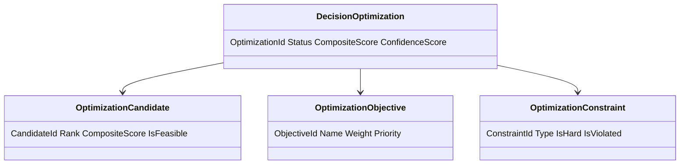
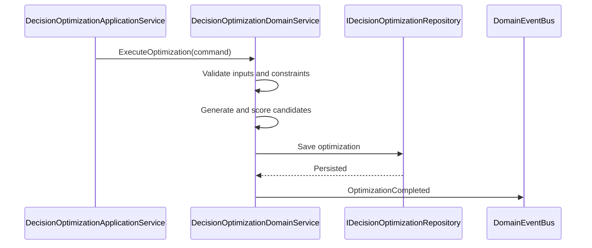
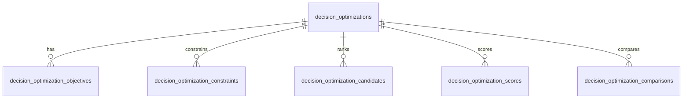
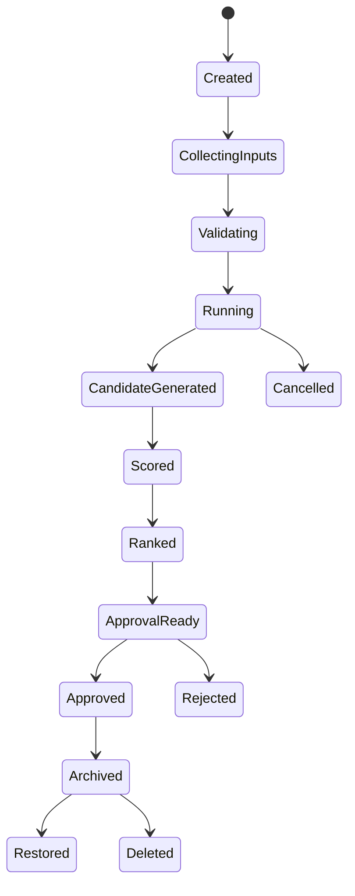
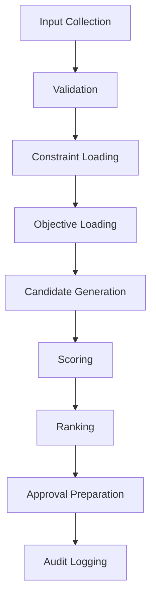
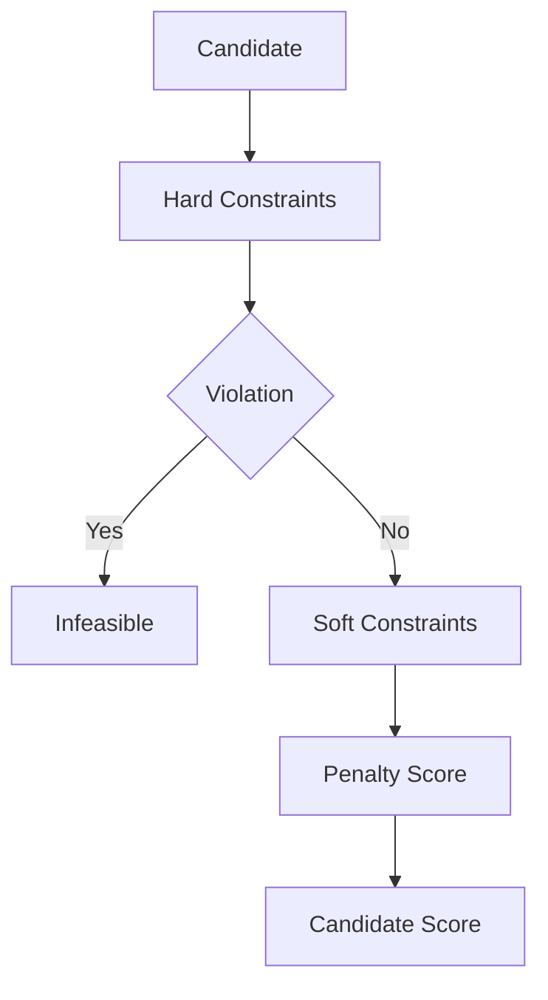
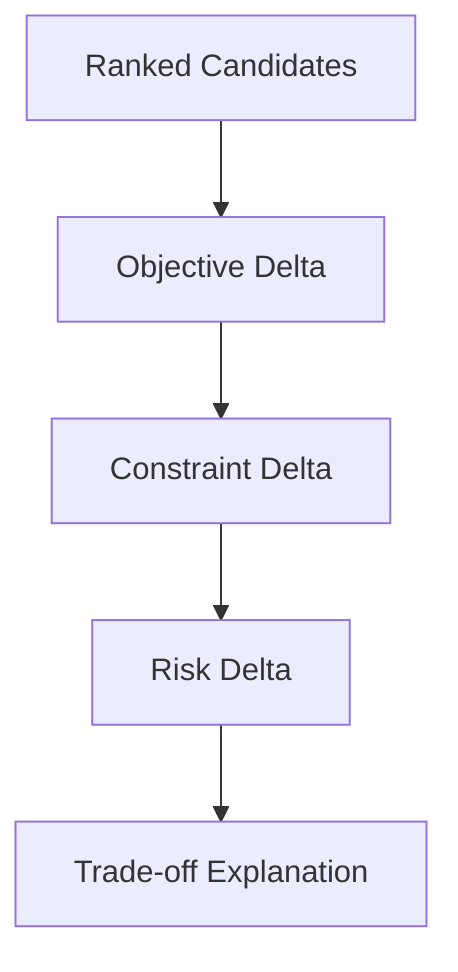
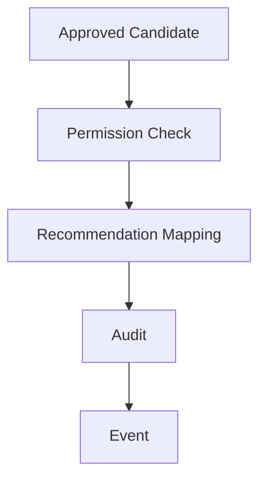

# Decision Optimization
Version: 1.0
Status: Enterprise Specification
Owner: Project Atlas
Source of Truth: Atlas Decision Optimization Specification
Last Updated: 2026-07-13
# Decision Optimization Overview
## Purpose
Decision Optimization defines how Atlas creates, updates, executes, cancels, approves, rejects, archives, restores, deletes, compares, secures, audits, and serves optimization plans for DecisionSession.
It coordinates optimization with Decision Lifecycle, Decision Evaluation, Decision Execution, Decision Governance, Decision Analytics, Decision Reporting, Decision Explainability, Decision History, Decision Audit, Decision Rule, Recommendation, GoalPlan, Scenario, Portfolio, CashFlow, Risk, Simulation, Workflow, Automation, Notification, Business Calendar, and User.
It preserves existing Atlas domain ownership and existing catalog naming.
## Business Meaning
Decision Optimization evaluates decision options and candidates to identify feasible, explainable, risk-aware, financially sound, and goal-aligned choices.
Optimization supports recommendation mapping, approval preparation, scenario comparison, simulation input, execution planning, and reporting.
Optimization is decision support and does not directly mutate DecisionSession, Recommendation, GoalPlan, Scenario, Portfolio, CashFlow, Workflow, Automation, or Notification.
## Optimization Scope
Optimization scope includes objective definition, constraint evaluation, scenario generation, simulation input, candidate generation, scoring, ranking, trade-off analysis, sensitivity analysis, recommendation mapping, approval preparation, comparison, reporting, cache, security, and audit.
Scope must preserve HouseholdId.
Scope must preserve TenantId when tenant scope exists.
Scope must not include unauthorized source data.
## Optimization Lifecycle
Optimization lifecycle starts when CreateOptimization creates an optimization request for a DecisionSession.
The request can be updated, executed, cancelled, approved, rejected, archived, restored, deleted, compared, or reported according to lifecycle rules.
Every optimization result records source version, objective version, constraint version, scoring version, generated time, actor or system actor, and candidate ranking.
## Optimization Objectives
Optimization objectives are financial return, cashflow stability, risk reduction, goal achievement, portfolio balance, liquidity, tax efficiency, debt optimization, time optimization, priority optimization, user preference alignment, execution feasibility, and business value.
Each objective has formula, inputs, outputs, weight, priority, constraints, validation, and example.
## Ownership
DecisionSession owns decision intent, options, selected option, and decision outcome.
Decision Optimization owns optimization request, objectives, constraints, candidates, scores, rankings, comparisons, sensitivity results, trade-off results, approval preparation, and projections.
Decision Evaluation owns evaluation scores and evidence.
Decision Execution owns execution evidence.
Decision Governance owns policy compliance.
Decision Analytics owns analytics evidence.
Decision Reporting owns report snapshots.
Decision Explainability owns explanation artifacts.
Decision History owns historical projections.
Decision Audit owns immutable audit evidence.
Repository owns persistence and query.
Application Service owns orchestration.
Security owns authorization and masking.
## Aggregate Root
DecisionSession remains the aggregate root for decision behavior.
Decision Optimization is scoped to DecisionSession and references related aggregates by identifier and source version.
## Relationship with Decision
DecisionSession supplies options, selected option, owner, state, rationale, and approval context.
Optimization cannot change DecisionSession state without explicit Decision command.
## Relationship with Decision Lifecycle
Decision Lifecycle supplies state eligibility, approval readiness, terminal state, archive state, and restore state.
Optimization is allowed only when lifecycle state permits optimization.
## Relationship with Decision Evaluation
Decision Evaluation supplies scores, dimensions, constraints, risk, confidence, and explainability readiness.
Optimization may use evaluation results as baseline evidence.
## Relationship with Decision Execution
Decision Execution supplies execution feasibility, step count, retry risk, rollback risk, recovery risk, and operational cost.
Execution evidence affects execution feasibility objective.
## Relationship with Decision Governance
Decision Governance supplies policy compliance, exceptions, escalation state, approval requirements, and retention evidence.
Governance hard failures can make candidates infeasible.
## Relationship with Decision Analytics
Decision Analytics supplies historical trends, forecast values, success probability, and performance indicators.
Analytics version must be recorded when used.
## Relationship with Decision Reporting
Decision Reporting may include optimization plan, candidate ranking, trade-off analysis, sensitivity analysis, comparison result, and approval readiness.
Reporting snapshots preserve optimization state at generation time.
## Relationship with Decision Explainability
Decision Explainability supplies rationale, score trace, constraint trace, formula trace, evidence trace, and option comparison explanation.
Optimization output must be explainable for approval.
## Relationship with Decision History
Decision History stores optimization runs, candidate changes, score changes, comparison history, approval history, and recommendation mapping history.
History is append-only.
## Relationship with Decision Audit
Decision Audit records optimization commands, source access, candidate scoring, approval, rejection, archive, restore, delete, comparison, and export.
Audit records are immutable under retention policy.
## Relationship with Decision Rule
Decision Rule supplies rule definitions, rule severity, rule priority, thresholds, and rule version.
Rule version must be recorded when rules affect optimization.
## Relationship with Recommendation
Recommendation may consume approved optimization candidates.
Optimization does not own Recommendation lifecycle.
## Relationship with Goal
GoalPlan supplies goal alignment, priority, target, progress, health, and lifecycle evidence.
GoalPlan mutation requires explicit Goal command.
## Relationship with Scenario
Scenario supplies assumptions, baseline, stress result, what-if result, and ScenarioVersion.
ScenarioVersion is required for scenario optimization.
## Relationship with Portfolio
Portfolio supplies authorized allocation, liquidity, valuation, risk, and performance evidence.
Portfolio evidence requires portfolio permission and masking.
## Relationship with CashFlow
CashFlow supplies authorized surplus, deficit, contribution capacity, funding gap, period, and currency.
CashFlow evidence requires cashflow permission and masking.
## Relationship with Risk
Risk supplies risk score, risk trend, severity, threshold state, and mitigation.
Critical risk can block approval or reduce score.
## Relationship with Simulation
Simulation supplies simulated outcomes, confidence intervals, sensitivity values, and scenario output.
Simulation mode is non-mutating.
## Relationship with Workflow
Workflow supplies approval route, review state, gate state, and escalation path.
Workflow cannot bypass optimization validation.
## Relationship with Automation
Automation can trigger scheduled optimization, incremental optimization, comparison, archive, cleanup, and report generation.
AutomationRunId must be recorded.
## Relationship with Notification
Notification is triggered by optimization completion, approval need, rejection, cancellation, comparison completion, threshold breach, or failure.
Notification suppression does not remove optimization history.
## Relationship with Business Calendar
Business Calendar supplies optimization windows, approval windows, execution windows, escalation windows, and reporting periods.
Scheduled optimization must honor Business Calendar when configured.
## Relationship with User
User supplies actor, owner, approver, reviewer, permission, preference, locale, and masking context.
User preference can be an optimization constraint only when current and authorized.
# Optimization Architecture
## Optimization Engine
Optimization Engine coordinates objective loading, constraint loading, candidate generation, simulation, scoring, ranking, trade-off analysis, sensitivity analysis, approval preparation, and audit.
It produces deterministic output for identical source versions and configuration.
## Objective Engine
Objective Engine evaluates objective formulas, weights, priorities, directions, and output scores.
Objective version is recorded.
## Constraint Engine
Constraint Engine validates hard constraints and calculates soft constraint penalties.
Constraint violation detail is recorded per candidate.
## Scoring Engine
Scoring Engine calculates objective scores, normalized scores, weighted scores, penalty scores, bonus scores, confidence scores, and composite scores.
Scoring version is recorded.
## Ranking Engine
Ranking Engine sorts candidates by feasibility, composite score, confidence, risk, business value, and stable tie-breaker.
Ranking must be deterministic.
## Simulation Engine
Simulation Engine evaluates candidates against scenario assumptions and simulated outcomes.
Simulation outputs are evidence only.
## Forecast Engine
Forecast Engine estimates success probability, financial outcome, cashflow outcome, risk movement, goal impact, and execution completion.
Forecast assumptions are recorded.
## Recommendation Engine
Recommendation Engine maps approved candidates to Recommendation behavior through explicit command.
It does not create Recommendation implicitly.
## Sensitivity Analysis Engine
Sensitivity Analysis Engine measures how candidate scores change when inputs, weights, assumptions, or constraints change.
Sensitivity window and changed variables are recorded.
## Trade-off Engine
Trade-off Engine explains score trade-offs across objectives and constraints.
Trade-off output must be explainable and permission-filtered.
## Audit Engine
Audit Engine records requests, source versions, objectives, constraints, candidates, scores, rankings, approvals, rejections, comparisons, and access.
## Caching Layer
Caching Layer stores summary, detail, candidate, scenario, comparison, and dashboard projections.
Cache keys include tenant, household, optimization id, projection, and masking mode.
# Optimization Pipeline
## Input Collection
Input Collection reads authorized DecisionSession, Decision Evaluation, Decision Execution, Decision Governance, Decision Analytics, Decision Explainability, Recommendation, GoalPlan, Scenario, Portfolio, CashFlow, Risk, Simulation, Workflow, Automation, Business Calendar, and User evidence.
## Validation
Validation checks lifecycle eligibility, permission, source versions, objective definitions, constraint definitions, candidate inputs, and audit readiness.
## Constraint Loading
Constraint Loading resolves hard constraints, soft constraints, thresholds, limits, and exception state.
## Objective Loading
Objective Loading resolves objective definitions, weights, priorities, formulas, and direction.
## Scenario Generation
Scenario Generation prepares baseline and scenario variants using existing Scenario data.
## Simulation
Simulation evaluates candidate outcomes using non-mutating simulation evidence.
## Optimization
Optimization searches candidate space and applies objectives and constraints.
## Candidate Generation
Candidate Generation creates feasible and infeasible candidates with explanation, source versions, and assumptions.
## Scoring
Scoring calculates normalized objective scores, weighted scores, penalties, bonuses, confidence, and composite score.
## Ranking
Ranking orders candidates with stable deterministic tie-breakers.
## Recommendation
Recommendation identifies candidate mapping eligibility for existing Recommendation behavior.
## Approval Preparation
Approval Preparation identifies selected candidate, blockers, approver, policy requirements, and explanation.
## Audit Logging
Audit Logging records all optimization inputs, outputs, and access.
# Optimization Objectives
## Financial Return
Definition: Measures net financial benefit of a candidate.
Business Meaning: Shows whether the candidate improves financial outcome.
Formula: FinancialReturnScore = min(100, max(0, NetBenefit / TargetBenefit * 100)).
Inputs: NetBenefit, TargetBenefit, CostAmount, Currency.
Outputs: FinancialReturnScore, NetBenefit.
Weight: 0.12.
Priority: high.
Constraints: Budget Constraints, Financial Policy.
Validation: Currency and period are required.
Example: Candidate improves net benefit by 1200.
## Cash Flow Stability
Definition: Measures funding feasibility and contribution stability.
Business Meaning: Shows whether the candidate fits CashFlow.
Formula: CashFlowStabilityScore = min(100, CapacityRatio * 100) - VolatilityPenalty.
Inputs: ContributionCapacity, RequiredContribution, Surplus, Deficit, Period.
Outputs: CashFlowStabilityScore, CapacityRatio.
Weight: 0.10.
Priority: high.
Constraints: Cash Flow Constraints.
Validation: CashFlow period must align.
Example: Candidate keeps contribution under available capacity.
## Risk Reduction
Definition: Measures candidate risk improvement.
Business Meaning: Shows whether candidate lowers risk exposure.
Formula: RiskReductionScore = max(0, 100 - RiskScore - RiskTrendPenalty + MitigationBonus).
Inputs: RiskScore, RiskTrend, MitigationState.
Outputs: RiskReductionScore, RiskPenalty.
Weight: 0.11.
Priority: high.
Constraints: Risk Constraints.
Validation: RiskScore must be between 0 and 100.
Example: Candidate lowers risk from 75 to 55.
## Goal Achievement
Definition: Measures candidate contribution to GoalPlan outcome.
Business Meaning: Shows whether candidate supports goal success.
Formula: GoalAchievementScore = PriorityFit * 0.35 + ProgressImpact * 0.35 + HealthImpact * 0.30.
Inputs: PriorityScore, ProgressImpact, HealthImpact, TargetDate.
Outputs: GoalAchievementScore, GoalImpact.
Weight: 0.11.
Priority: high.
Constraints: Goal Constraints.
Validation: GoalPlanId is required when goal objective applies.
Example: Candidate increases goal completion probability.
## Portfolio Balance
Definition: Measures allocation and liquidity fit.
Business Meaning: Shows whether candidate preserves portfolio discipline.
Formula: PortfolioBalanceScore = AllocationFitScore + LiquidityScore - PortfolioRiskPenalty.
Inputs: Allocation, Liquidity, PortfolioRisk, ValuationTime.
Outputs: PortfolioBalanceScore, LiquidityGap.
Weight: 0.08.
Priority: medium.
Constraints: Portfolio Constraints.
Validation: Portfolio permission and valuation time are required.
Example: Candidate improves allocation fit without liquidity breach.
## Liquidity
Definition: Measures available liquidity after candidate.
Business Meaning: Shows whether candidate preserves available funds.
Formula: LiquidityScore = min(100, AvailableLiquidity / RequiredLiquidity * 100).
Inputs: AvailableLiquidity, RequiredLiquidity, Currency.
Outputs: LiquidityScore, LiquidityGap.
Weight: 0.06.
Priority: medium.
Constraints: Portfolio Constraints, Cash Flow Constraints.
Validation: Currency is required.
Example: Candidate keeps liquidity above threshold.
## Tax Efficiency
Definition: Measures tax cost and benefit where tax evidence exists.
Business Meaning: Shows whether candidate improves tax outcome.
Formula: TaxEfficiencyScore = 100 - TaxCostPenalty + TaxBenefitBonus.
Inputs: TaxCost, TaxBenefit, Period.
Outputs: TaxEfficiencyScore, NetTaxEffect.
Weight: 0.05.
Priority: medium.
Constraints: Compliance Constraints, Regulatory Constraints.
Validation: Tax evidence must be authorized.
Example: Candidate improves after-tax result.
## Debt Optimization
Definition: Measures debt, payment, loan, and rate effect.
Business Meaning: Shows whether candidate improves liability position.
Formula: DebtOptimizationScore = 100 - PaymentIncreasePenalty - DebtRiskPenalty + InterestSavingsBonus.
Inputs: PaymentChange, DebtBalance, InterestSavings.
Outputs: DebtOptimizationScore.
Weight: 0.06.
Priority: medium.
Constraints: Budget Constraints, Risk Constraints.
Validation: Debt evidence must be authorized.
Example: Candidate reduces monthly payment.
## Time Optimization
Definition: Measures schedule and completion improvement.
Business Meaning: Shows whether candidate improves timing.
Formula: TimeOptimizationScore = max(0, 100 - DelayDays * DelayPenaltyRate + EarlyCompletionBonus).
Inputs: TargetDate, ExpectedCompletionDate, DelayDays.
Outputs: TimeOptimizationScore.
Weight: 0.07.
Priority: medium.
Constraints: Scenario Constraints, Execution Constraints.
Validation: Business Calendar window must be valid.
Example: Candidate completes 14 days earlier.
## Priority Optimization
Definition: Measures candidate fit with priority strategy.
Business Meaning: Shows whether candidate supports higher priority decisions.
Formula: PriorityOptimizationScore = PriorityScore + DeadlineBonus - ConflictPenalty.
Inputs: PriorityScore, DeadlineProximity, ConflictCount.
Outputs: PriorityOptimizationScore.
Weight: 0.05.
Priority: medium.
Constraints: User Preference Constraints, Goal Constraints.
Validation: PriorityScore must be between 0 and 100.
Example: Candidate supports urgent decision.
## User Preference Alignment
Definition: Measures fit with user preference.
Business Meaning: Shows whether candidate respects preferences.
Formula: PreferenceScore = 100 - PreferenceConflictPenalty + PreferenceMatchBonus.
Inputs: PreferenceMatches, PreferenceConflicts.
Outputs: PreferenceScore.
Weight: 0.06.
Priority: medium.
Constraints: User Preference Constraints.
Validation: Preference source must be current.
Example: Candidate stays within preferred contribution range.
## Execution Feasibility
Definition: Measures operational feasibility.
Business Meaning: Shows whether candidate can be executed reliably.
Formula: ExecutionFeasibilityScore = 100 - StepPenalty - DependencyPenalty - RetryRiskPenalty - RollbackRiskPenalty.
Inputs: StepCount, DependencyCount, RetryRisk, RollbackRisk.
Outputs: ExecutionFeasibilityScore.
Weight: 0.07.
Priority: medium.
Constraints: Execution Constraints.
Validation: Execution evidence must be valid when present.
Example: Candidate has fewer steps and lower retry risk.
## Business Value
Definition: Measures strategic and outcome value.
Business Meaning: Shows whether candidate has meaningful benefit.
Formula: BusinessValueScore = OutcomeValue * 0.6 + StrategicFit * 0.4.
Inputs: OutcomeValue, StrategicFit.
Outputs: BusinessValueScore.
Weight: 0.06.
Priority: medium.
Constraints: Goal Constraints, Compliance Constraints.
Validation: Value score must be between 0 and 100.
Example: Candidate improves long-term decision outcome.
# Constraint Model
## Hard Constraints
Hard constraints cannot be violated by approved candidates.
Violation marks candidate infeasible.
## Soft Constraints
Soft constraints create score penalties and warnings.
Soft violations must remain visible in candidate detail.
## Budget Constraints
Budget constraints enforce amount limits, variance limits, affordability, and approved thresholds.
## Cash Flow Constraints
Cash Flow constraints enforce period alignment, contribution capacity, surplus, deficit, and funding gap.
## Risk Constraints
Risk constraints enforce maximum risk score, critical risk handling, mitigation, and escalation.
## Goal Constraints
Goal constraints enforce GoalPlan lifecycle, dependency, target date, priority, and alignment.
## Scenario Constraints
Scenario constraints enforce ScenarioId, ScenarioVersion, baseline, assumptions, and compatibility.
## Portfolio Constraints
Portfolio constraints enforce portfolio permission, valuation freshness, liquidity, allocation, and risk limits.
## Execution Constraints
Execution constraints enforce approval, step feasibility, timeout, rollback, retry, and operator availability.
## User Preference Constraints
User Preference constraints enforce preference limits, excluded options, required review, and notification preference.
## Compliance Constraints
Compliance constraints enforce active Decision Governance policy and exceptions.
## Regulatory Constraints
Regulatory constraints use existing Atlas compliance and governance evidence where applicable.
# Optimization Algorithms
## Weighted Optimization
Weighted Optimization maximizes weighted objective score after penalties and bonuses.
## Constraint Satisfaction
Constraint Satisfaction eliminates candidates that violate hard constraints before ranking.
## Multi-objective Optimization
Multi-objective Optimization evaluates candidates across multiple competing objectives.
## Pareto Optimization
Pareto Optimization identifies candidates not dominated across key objectives.
## Heuristic Optimization
Heuristic Optimization applies deterministic search rules for candidate generation.
## Rule-based Optimization
Rule-based Optimization applies Decision Rule and Governance rules before scoring.
## Scenario Optimization
Scenario Optimization evaluates candidates across baseline and scenario variants.
## Incremental Optimization
Incremental Optimization recalculates only changed candidates, objectives, constraints, or source evidence.
## Sensitivity Analysis
Sensitivity Analysis measures candidate score movement when inputs, weights, or assumptions change.
## Trade-off Analysis
Trade-off Analysis explains what each candidate gains and loses across objectives.
# Validation Rules
1. OptimizationId must be globally unique. 2. DecisionSessionId is required. 3. HouseholdId is required. 4. TenantId is required when tenant scope exists. 5. Optimization state is required. 6. Source version hash is required. 7. Objective version is required. 8. Constraint version is required. 9. Scoring version is required. 10. Decision Lifecycle state must allow optimization. 11. Objective set cannot be empty. 12. Constraint set cannot be empty. 13. Objective weights must be greater than or equal to 0. 14. Total active objective weight must be greater than 0. 15. Candidate id must be unique within optimization. 16. Candidate score must be between 0 and 100. 17. Confidence score must be between 0 and 100. 18. Candidate rank must be positive. 19. Approved candidate must be feasible. 20. Hard constraint violation must mark candidate infeasible. 21. Soft constraint violation must include penalty. 22. Scenario evidence requires ScenarioId and ScenarioVersion. 23. Portfolio evidence requires portfolio permission. 24. CashFlow evidence requires cashflow permission. 25. RiskScore must be between 0 and 100. 26. Recommendation mapping must reference existing Recommendation when present. 27. GoalPlan reference must exist when present. 28. Simulation output must record simulation version when used. 29. Approval requires approver id. 30. Rejection requires rejection reason. 31. Cancellation requires cancellation reason. 32. Archive requires terminal or policy-approved state. 33. Restore requires archived optimization. 34. Delete requires retention validation. 35. Compare requires at least two results. 36. Compared results must use compatible scope. 37. Search date range must be valid. 38. Sorting field must be allowed. 39. Projection field must be allowed. 40. Pagination limit must be within API maximum. 41. Masked fields must not appear in unauthorized projection. 42. Audit metadata is required for every command.
# Business Rules
1. Decision Optimization must preserve Atlas domain ownership. 2. Decision Optimization must not redesign Atlas. 3. Decision Optimization must not create unrelated business concepts. 4. Optimization naming must follow existing catalog. 5. DecisionSession remains the decision aggregate root. 6. Optimization cannot approve DecisionSession directly. 7. Optimization cannot execute DecisionSession directly. 8. Optimization cannot mutate Recommendation directly. 9. Optimization cannot mutate GoalPlan directly. 10. Optimization cannot mutate Scenario directly. 11. Optimization cannot mutate Portfolio directly. 12. Optimization cannot mutate CashFlow directly. 13. Optimization cannot mutate Workflow directly. 14. Optimization cannot mutate Automation directly. 15. Every optimization must reference DecisionSessionId. 16. Every optimization must record source version. 17. Every optimization must record objective version. 18. Every optimization must record constraint version. 19. Every optimization must record scoring version. 20. Every candidate must receive composite score. 21. Every candidate must receive confidence score. 22. Every candidate must receive feasibility state. 23. Hard constraint failure makes candidate infeasible. 24. Infeasible candidate cannot be approved. 25. Soft constraint failure reduces score. 26. Soft constraint failure remains visible. 27. Critical risk can block candidate approval. 28. Financial objective must preserve currency. 29. CashFlow objective must preserve period. 30. Portfolio objective requires portfolio permission. 31. Portfolio valuation time must be recorded. 32. Scenario optimization requires ScenarioVersion. 33. Simulation output is non-mutating. 34. Optimization output is advisory before approval. 35. Ranking is deterministic for identical inputs. 36. Feasible candidate ranks above infeasible candidate. 37. Composite score determines primary ranking. 38. Confidence score determines tie-breaker after composite score. 39. Risk score determines tie-breaker after confidence. 40. Business value determines tie-breaker after risk. 41. Optimization report preserves generated time. 42. Optimization report preserves source versions. 43. Recommendation mapping requires recommendation permission. 44. Approval preparation identifies blockers. 45. Approval preparation identifies required approver. 46. Approval preparation includes explanation. 47. Optimization approval requires optimization permission. 48. Optimization rejection requires rejection reason. 49. Archived optimization is read-only. 50. Restored optimization must revalidate source version. 51. Deleted optimization cannot be restored. 52. Optimization history is append-only. 53. Execution history is append-only. 54. Comparison history is append-only. 55. Recommendation history is append-only. 56. Decision history is append-only. 57. Audit trail is required for commands. 58. Cache failure must not roll back persisted optimization. 59. Notification failure must not roll back persisted optimization. 60. Report failure must not delete optimization. 61. Permission change invalidates optimization cache. 62. Masking change invalidates optimization cache. 63. Objective change marks optimization stale. 64. Constraint change marks optimization stale. 65. Scoring change marks optimization stale. 66. Source version change marks optimization stale. 67. Stale optimization cannot be approved without refresh. 68. Stale optimization can be archived. 69. Batch optimization isolates item failures. 70. Parallel optimization preserves deterministic results. 71. Incremental optimization processes changed evidence only. 72. Business Calendar can constrain approval preparation. 73. Workflow can require review before approval. 74. Automation can trigger recalculation. 75. Automation cannot bypass permission. 76. User preference can add constraints. 77. User preference cannot hide audit evidence. 78. Field-level security applies before cache. 79. Field-level security applies before report. 80. Field-level security applies before API response. 81. Aggregation must not leak unauthorized data. 82. Search must enforce HouseholdId scope. 83. Tenant-aware search must enforce TenantId. 84. Export must use masked projection when required. 85. Optimization result must be reproducible. 86. Sensitivity result must record changed variables. 87. Trade-off result must record objective deltas. 88. Pareto result must record dominated candidates. 89. Rule-based optimization must record rule version. 90. Scenario optimization must record baseline. 91. Financial return warning must be visible. 92. Risk warning must be visible. 93. Constraint warning must be visible. 94. Decision Lifecycle state must allow optimization. 95. Optimization cannot run on deleted decision. 96. Optimization cannot update archived decision state. 97. Approved optimization cannot change candidate scores. 98. Rejected optimization cannot be approved without restore. 99. Archived optimization cannot be updated. 100. Compared optimization results must use compatible scope. 101. Materialized views must use committed data. 102. Optimistic concurrency is required for updates. 103. Duplicate command must be idempotent by command id. 104. Domain event must be emitted after persistence. 105. Audit record must include actor and correlation id.
# State Machine
## States
- Created
- CollectingInputs
- Validating
- Running
- CandidateGenerated
- Scored
- Ranked
- ApprovalReady
- Approved
- Rejected
- Cancelled
- Archived
- Restored
- Deleted
## Transitions
- Created -> CollectingInputs by CreateOptimization.
- CollectingInputs -> Validating by UpdateOptimization.
- Validating -> Running by ExecuteOptimization when validation passes.
- Running -> CandidateGenerated by candidate generation success.
- CandidateGenerated -> Scored by scoring completion.
- Scored -> Ranked by ranking completion.
- Ranked -> ApprovalReady by approval preparation.
- ApprovalReady -> Approved by ApproveOptimization.
- ApprovalReady -> Rejected by RejectOptimization.
- Running -> Cancelled by CancelOptimization.
- Approved -> Archived by ArchiveOptimization.
- Rejected -> Archived by ArchiveOptimization.
- Cancelled -> Archived by ArchiveOptimization.
- Archived -> Restored by RestoreOptimization.
- Restored -> Validating by ExecuteOptimization.
- Archived -> Deleted by DeleteOptimization.
## Triggers
- CreateOptimization
- UpdateOptimization
- ExecuteOptimization
- CancelOptimization
- ApproveOptimization
- RejectOptimization
- ArchiveOptimization
- RestoreOptimization
- DeleteOptimization
- GenerateOptimizationPlan
- CompareOptimizationResults
- SourceChanged
- ConstraintChanged
- ObjectiveChanged
- ScoringChanged
## Invariant
OptimizationId, DecisionSessionId, HouseholdId, created time, source version hash, and original scope are immutable.
Approved optimization candidate scores are immutable.
Archived optimization is read-only.
Deleted optimization is terminal.
## Illegal Transition
- Deleted -> Approved.
- Deleted -> Running.
- Archived -> Approved without RestoreOptimization.
- Approved -> Running.
- Rejected -> Approved without RestoreOptimization.
- Created -> Approved.
- CollectingInputs -> Approved.
- Validating -> Approved.
- Running -> Approved.
# Commands
## CreateOptimization
Creates optimization request for DecisionSession.
## UpdateOptimization
Updates editable optimization inputs before approval.
## ExecuteOptimization
Runs optimization pipeline and produces candidates.
## CancelOptimization
Cancels running or eligible optimization with reason.
## ApproveOptimization
Approves selected feasible candidate.
## RejectOptimization
Rejects optimization result with reason.
## ArchiveOptimization
Archives optimization and makes it read-only.
## RestoreOptimization
Restores archived optimization after validation.
## DeleteOptimization
Deletes eligible optimization after retention validation.
## GenerateOptimizationPlan
Generates candidate plan, ranking, and approval preparation.
## CompareOptimizationResults
Compares two or more optimization results.
## RefreshOptimization
Refreshes source versions and stale indicators.
## MapOptimizationRecommendation
Maps approved candidate to Recommendation through explicit command path.
## ExportOptimization
Exports masked optimization projection.
# Domain Events
## OptimizationCreated
Emitted after CreateOptimization succeeds.
## OptimizationUpdated
Emitted after UpdateOptimization succeeds.
## OptimizationStarted
Emitted after ExecuteOptimization starts.
## OptimizationCompleted
Emitted after optimization completes.
## OptimizationCancelled
Emitted after CancelOptimization succeeds.
## OptimizationApproved
Emitted after ApproveOptimization succeeds.
## OptimizationRejected
Emitted after RejectOptimization succeeds.
## OptimizationArchived
Emitted after ArchiveOptimization succeeds.
## OptimizationRestored
Emitted after RestoreOptimization succeeds.
## OptimizationDeleted
Emitted after DeleteOptimization succeeds.
## OptimizationPlanGenerated
Emitted after GenerateOptimizationPlan succeeds.
## OptimizationCompared
Emitted after CompareOptimizationResults succeeds.
## OptimizationCandidateScored
Emitted after candidate scoring.
## OptimizationStale
Emitted when source, objective, constraint, or scoring version changes.
# Repository
## Interface
IDecisionOptimizationRepository persists optimization aggregate, objectives, constraints, candidates, scores, comparisons, sensitivity results, trade-off results, approval history, and projections.
## Methods
- Add
- Update
- GetById
- GetByDecisionSessionId
- GetLatestByDecisionSessionId
- Search
- SaveObjective
- SaveConstraint
- SaveCandidate
- SaveScore
- SaveComparison
- SaveSensitivity
- SaveTradeOff
- SaveApprovalHistory
- Archive
- Restore
- Delete
- GetSummaryProjection
- GetDetailProjection
- GetCandidateProjection
## Queries
- OptimizationsByDecision
- OptimizationsByStatus
- OptimizationsByScoreRange
- OptimizationsByConstraintResult
- OptimizationsByRiskLevel
- OptimizationsByScenario
- OptimizationsByGoalPlan
- StaleOptimizations
- ApprovalReadyOptimizations
- ArchivedOptimizations
## Filtering
- OptimizationId
- DecisionSessionId
- HouseholdId
- TenantId
- Status
- ScoreRange
- ConfidenceRange
- RiskLevel
- ConstraintResult
- RecommendationId
- GoalPlanId
- ScenarioId
- CreatedDateRange
- CompletedDateRange
## Sorting
- createdAt desc
- completedAt desc
- compositeScore desc
- confidenceScore desc
- riskScore asc
- status asc
## Aggregation
- CountByStatus
- CountByRiskLevel
- CountByConstraintResult
- AverageCompositeScore
- AverageConfidenceScore
- ApprovalReadyCount
- StaleCount
- CandidateCount
## Projection
- OptimizationSummaryProjection
- OptimizationDetailProjection
- OptimizationPlanProjection
- CandidateProjection
- ConstraintProjection
- ObjectiveProjection
- ComparisonProjection
- DashboardProjection
## Specification
- ActiveOptimizationSpecification
- VisibleOptimizationSpecification
- ApprovalReadyOptimizationSpecification
- StaleOptimizationSpecification
- HighRiskOptimizationSpecification
- ConstraintFailedOptimizationSpecification
- AuditOptimizationSpecification
# Domain Service Interaction
- DecisionOptimizationDomainService validates lifecycle, objectives, constraints, candidates, rankings, and business rules.
- DecisionLifecycleDomainService supplies decision state eligibility.
- DecisionEvaluationDomainService supplies evaluation baseline evidence.
- DecisionExecutionDomainService supplies execution feasibility evidence.
- DecisionGovernanceDomainService supplies compliance and approval evidence.
- DecisionAnalyticsDomainService supplies historical and forecast evidence.
- DecisionReportingDomainService consumes optimization report projections.
- DecisionExplainabilityDomainService creates explanation artifacts.
- DecisionHistoryDomainService records optimization history.
- DecisionAuditDomainService records audit evidence.
- DecisionRuleDomainService supplies rules and rule versions.
- RecommendationDomainService consumes approved optimization mapping.
- GoalLifecycleDomainService supplies GoalPlan state and alignment evidence.
- ScenarioDomainService supplies scenario evidence and version.
- PortfolioDomainService supplies authorized portfolio evidence.
- CashFlowDomainService supplies authorized cashflow evidence.
- RiskDomainService supplies risk evidence.
- SimulationDomainService supplies simulation result evidence.
- WorkflowDomainService supplies approval readiness and workflow state.
- AutomationDomainService supplies automation trigger context.
- NotificationDomainService receives optimization triggers.
- BusinessCalendarDomainService validates windows and deadlines.
- SecurityDomainService evaluates authorization and masking.
- CacheDomainService invalidates optimization projections.
# Application Service Interaction
- DecisionOptimizationApplicationService coordinates commands, queries, unit of work, event publication, and cache invalidation.
- CreateOptimizationHandler creates optimization record.
- UpdateOptimizationHandler updates editable optimization inputs.
- ExecuteOptimizationHandler executes pipeline and persists candidates.
- CancelOptimizationHandler validates cancellation and records reason.
- ApproveOptimizationHandler validates approval permission and locks candidate.
- RejectOptimizationHandler records rejection reason.
- ArchiveOptimizationHandler validates archive policy.
- RestoreOptimizationHandler validates source and permission.
- DeleteOptimizationHandler validates retention.
- GenerateOptimizationPlanHandler creates plan projection.
- CompareOptimizationResultsHandler compares compatible results.
- SearchOptimizationQueryHandler applies filters, sorting, pagination, and projection.
- BatchOptimizationHandler performs batch optimization with per-item result.
# API
## REST Endpoints
- GET /api/decision-optimizations
- POST /api/decision-optimizations
- GET /api/decision-optimizations/{optimizationId}
- PUT /api/decision-optimizations/{optimizationId}
- POST /api/decision-optimizations/{optimizationId}/execute
- POST /api/decision-optimizations/{optimizationId}/cancel
- POST /api/decision-optimizations/{optimizationId}/approve
- POST /api/decision-optimizations/{optimizationId}/reject
- POST /api/decision-optimizations/{optimizationId}/archive
- POST /api/decision-optimizations/{optimizationId}/restore
- DELETE /api/decision-optimizations/{optimizationId}
- POST /api/decision-optimizations/{optimizationId}/plan
- POST /api/decision-optimizations/compare
- POST /api/decision-optimizations/batch/execute
- GET /api/decisions/{decisionSessionId}/optimizations
## HTTP Methods
GET reads optimization projections.
POST creates, executes, cancels, approves, rejects, archives, restores, plans, compares, or batches optimization.
PUT updates editable optimization fields.
DELETE deletes eligible optimization after retention validation.
## Request
Create request includes DecisionSessionId, objectives, constraints, scenario settings, candidate limit, and source version mode.
Update request includes version, objective changes, constraint changes, and reason.
Execute request includes source version mode, force refresh flag, candidate limit, and timeout.
Approve request includes candidate id, reason, approver, and expected version.
Reject request includes reason and expected version.
Compare request includes optimization ids and comparison projection.
Search request includes filters, sorting, pagination, and projection.
## Response
Detail response returns optimization, objectives, constraints, candidates, scoring, ranking, sensitivity, trade-offs, permissions, and audit metadata.
Summary response returns status, top candidate, composite score, confidence score, stale state, and timestamps.
Plan response returns candidate ranking, constraint results, objective scores, recommendation mapping, and approval preparation.
Comparison response returns baseline, compared results, deltas, winners, trade-offs, and generated time.
Bulk response returns processed, completed, failed, skipped, and per-item errors.
## Errors
- 400 invalid request
- 401 unauthenticated
- 403 forbidden
- 404 optimization not found
- 409 concurrency conflict
- 410 stale source
- 422 validation failed
- 423 optimization locked
- 429 rate limited
- 500 internal error
## Pagination
Pagination uses pageNumber, pageSize, totalCount, totalPages, hasNextPage, and hasPreviousPage.
## Filtering
Filtering supports status, score range, confidence range, risk level, constraint result, DecisionSessionId, GoalPlanId, ScenarioId, date range, and stale flag.
## Sorting
Sorting supports createdAt, completedAt, compositeScore, confidenceScore, riskScore, and status.
## Projection
Projection supports summary, detail, plan, candidate, constraint, objective, comparison, dashboard, and audit-safe views.
## Optimization API
Optimization API provides create, update, execute, cancel, approve, reject, archive, restore, delete, plan, and query operations.
## Comparison API
Comparison API compares optimization results by candidate score, objectives, constraints, risk, sensitivity, and trade-offs.
## Batch API
Batch API supports execute, recalculate, archive, restore, compare, and export with per-item result.
# DTO
## Create DTO
Includes DecisionSessionId, objectives, constraints, scenario settings, candidate limit, source version mode, and projection.
## Update DTO
Includes OptimizationId, version, editable inputs, objective settings, constraint settings, and update reason.
## Optimization DTO
Includes OptimizationId, DecisionSessionId, status, source version, objective version, constraint version, scoring version, and timestamps.
## Optimization Plan DTO
Includes baseline, candidates, ranking, objective scores, constraint results, recommendation mapping, and approval preparation.
## Constraint DTO
Includes constraint id, type, hard flag, violation flag, penalty score, reason, and evidence.
## Objective DTO
Includes objective name, formula, weight, priority, inputs, outputs, score, and explanation.
## Candidate DTO
Includes candidate id, rank, feasibility, composite score, confidence score, risk score, objective scores, and explanation.
## Comparison DTO
Includes baseline id, comparison ids, deltas, winners, sensitivity, trade-offs, and generated time.
## Summary DTO
Includes OptimizationId, status, top candidate, composite score, confidence score, stale flag, and completedAt.
## Detail DTO
Includes objectives, constraints, candidates, scores, ranking, sensitivity, trade-offs, comparisons, permissions, and audit metadata.
## Search DTO
Includes filters, sorting, pagination, projection, and masking mode.
# Database Mapping
## Table
- decision_optimizations
- decision_optimization_objectives
- decision_optimization_constraints
- decision_optimization_candidates
- decision_optimization_scores
- decision_optimization_comparisons
- decision_optimization_sensitivity
- decision_optimization_tradeoffs
- decision_optimization_audit
## Columns
- optimization_id uuid primary key
- tenant_id uuid null
- household_id uuid not null
- decision_session_id uuid not null
- status varchar(40) not null
- source_version_hash varchar(128) not null
- objective_version varchar(40) not null
- constraint_version varchar(40) not null
- scoring_version varchar(40) not null
- top_candidate_id uuid null
- composite_score numeric(6,2) null
- confidence_score numeric(5,2) null
- risk_score numeric(5,2) null
- is_stale boolean not null
- started_at timestamptz null
- completed_at timestamptz null
- approved_at timestamptz null
- rejected_at timestamptz null
- cancelled_at timestamptz null
- archived_at timestamptz null
- deleted_at timestamptz null
- created_at timestamptz not null
- updated_at timestamptz not null
- version int not null
## Indexes
- ix_decision_optimizations_decision_status
- ix_decision_optimizations_household_status
- ix_decision_optimizations_score
- ix_decision_optimizations_confidence
- ix_decision_optimizations_risk
- ix_decision_optimizations_stale
- ix_decision_optimizations_completed_at
- ux_decision_optimizations_latest_active
## Constraints
- composite_score between 0 and 100 when present
- confidence_score between 0 and 100 when present
- risk_score between 0 and 100 when present
- status in supported states
- version greater than zero
## FK
- decision_session_id references decision_sessions.
- household_id references households.
- optimization_id references decision_optimizations for child tables.
- top_candidate_id references optimization candidates when present.
## Unique
- Unique latest active optimization per DecisionSession and scoring version.
- Unique candidate rank per optimization.
- Unique objective result per optimization and candidate.
## Check Constraint
- Deleted status requires deleted_at.
- Approved status requires approved_at.
## Partition Strategy
- Partition objectives, constraints, candidates, scores, comparisons, sensitivity, trade-offs, and audit by created_at month.
# PostgreSQL Schema
```sql
CREATE TABLE decision_optimizations (
  optimization_id uuid PRIMARY KEY,
  tenant_id uuid NULL,
  household_id uuid NOT NULL,
  decision_session_id uuid NOT NULL,
  status varchar(40) NOT NULL,
  source_version_hash varchar(128) NOT NULL,
  objective_version varchar(40) NOT NULL,
  constraint_version varchar(40) NOT NULL,
  scoring_version varchar(40) NOT NULL,
  top_candidate_id uuid NULL,
  composite_score numeric(6,2) NULL,
  confidence_score numeric(5,2) NULL,
  risk_score numeric(5,2) NULL,
  is_stale boolean NOT NULL DEFAULT false,
  request_payload jsonb NOT NULL DEFAULT '{}'::jsonb,
  result_payload jsonb NOT NULL DEFAULT '{}'::jsonb,
  started_at timestamptz NULL,
  completed_at timestamptz NULL,
  approved_at timestamptz NULL,
  rejected_at timestamptz NULL,
  cancelled_at timestamptz NULL,
  archived_at timestamptz NULL,
  deleted_at timestamptz NULL,
  created_by uuid NULL,
  updated_by uuid NULL,
  created_at timestamptz NOT NULL DEFAULT now(),
  updated_at timestamptz NOT NULL DEFAULT now(),
  version int NOT NULL DEFAULT 1,
  CONSTRAINT ck_decision_optimizations_status CHECK (status IN ('Created','CollectingInputs','Validating','Running','CandidateGenerated','Scored','Ranked','ApprovalReady','Approved','Rejected','Cancelled','Archived','Restored','Deleted')),
  CONSTRAINT ck_decision_optimizations_score CHECK (composite_score IS NULL OR (composite_score >= 0 AND composite_score <= 100)),
  CONSTRAINT ck_decision_optimizations_confidence CHECK (confidence_score IS NULL OR (confidence_score >= 0 AND confidence_score <= 100)),
  CONSTRAINT ck_decision_optimizations_risk CHECK (risk_score IS NULL OR (risk_score >= 0 AND risk_score <= 100)),
  CONSTRAINT ck_decision_optimizations_version CHECK (version > 0)
);
CREATE TABLE decision_optimization_objectives (
  objective_id uuid PRIMARY KEY,
  optimization_id uuid NOT NULL REFERENCES decision_optimizations(optimization_id),
  name varchar(120) NOT NULL,
  weight numeric(8,4) NOT NULL,
  priority varchar(20) NOT NULL,
  formula_code varchar(120) NOT NULL,
  input_payload jsonb NOT NULL DEFAULT '{}'::jsonb,
  output_payload jsonb NOT NULL DEFAULT '{}'::jsonb,
  created_at timestamptz NOT NULL DEFAULT now(),
  CONSTRAINT ck_decision_optimization_objective_weight CHECK (weight >= 0)
);
CREATE TABLE decision_optimization_constraints (
  constraint_id uuid PRIMARY KEY,
  optimization_id uuid NOT NULL REFERENCES decision_optimizations(optimization_id),
  constraint_type varchar(120) NOT NULL,
  is_hard boolean NOT NULL,
  is_violated boolean NOT NULL DEFAULT false,
  penalty_score numeric(6,2) NOT NULL DEFAULT 0,
  reason varchar(800) NULL,
  evidence_payload jsonb NOT NULL DEFAULT '{}'::jsonb,
  created_at timestamptz NOT NULL DEFAULT now()
);
CREATE TABLE decision_optimization_candidates (
  candidate_id uuid PRIMARY KEY,
  optimization_id uuid NOT NULL REFERENCES decision_optimizations(optimization_id),
  rank int NOT NULL,
  is_feasible boolean NOT NULL,
  composite_score numeric(6,2) NOT NULL,
  confidence_score numeric(5,2) NOT NULL,
  risk_score numeric(5,2) NULL,
  candidate_payload jsonb NOT NULL DEFAULT '{}'::jsonb,
  explanation_payload jsonb NOT NULL DEFAULT '{}'::jsonb,
  created_at timestamptz NOT NULL DEFAULT now(),
  CONSTRAINT ck_decision_optimization_candidate_rank CHECK (rank > 0),
  CONSTRAINT ck_decision_optimization_candidate_score CHECK (composite_score >= 0 AND composite_score <= 100),
  CONSTRAINT ck_decision_optimization_candidate_confidence CHECK (confidence_score >= 0 AND confidence_score <= 100)
);
CREATE TABLE decision_optimization_scores (
  score_id uuid PRIMARY KEY,
  optimization_id uuid NOT NULL REFERENCES decision_optimizations(optimization_id),
  candidate_id uuid NOT NULL REFERENCES decision_optimization_candidates(candidate_id),
  objective_name varchar(120) NOT NULL,
  objective_score numeric(6,2) NOT NULL,
  weighted_score numeric(6,2) NOT NULL,
  score_payload jsonb NOT NULL DEFAULT '{}'::jsonb,
  created_at timestamptz NOT NULL DEFAULT now()
);
CREATE TABLE decision_optimization_comparisons (
  comparison_id uuid PRIMARY KEY,
  optimization_id uuid NOT NULL REFERENCES decision_optimizations(optimization_id),
  compared_optimization_id uuid NOT NULL,
  comparison_payload jsonb NOT NULL DEFAULT '{}'::jsonb,
  generated_at timestamptz NOT NULL DEFAULT now(),
  correlation_id uuid NOT NULL
);
CREATE TABLE decision_optimization_sensitivity (
  sensitivity_id uuid PRIMARY KEY,
  optimization_id uuid NOT NULL REFERENCES decision_optimizations(optimization_id),
  variable_name varchar(120) NOT NULL,
  sensitivity_payload jsonb NOT NULL DEFAULT '{}'::jsonb,
  generated_at timestamptz NOT NULL DEFAULT now()
);
CREATE TABLE decision_optimization_tradeoffs (
  tradeoff_id uuid PRIMARY KEY,
  optimization_id uuid NOT NULL REFERENCES decision_optimizations(optimization_id),
  candidate_id uuid NULL,
  tradeoff_payload jsonb NOT NULL DEFAULT '{}'::jsonb,
  generated_at timestamptz NOT NULL DEFAULT now()
);
CREATE TABLE decision_optimization_audit (
  audit_id uuid PRIMARY KEY,
  optimization_id uuid NULL,
  action varchar(120) NOT NULL,
  actor_id uuid NULL,
  payload jsonb NOT NULL DEFAULT '{}'::jsonb,
  occurred_at timestamptz NOT NULL DEFAULT now(),
  correlation_id uuid NOT NULL
);
CREATE INDEX ix_decision_optimizations_decision_status ON decision_optimizations(decision_session_id, status);
CREATE INDEX ix_decision_optimizations_household_status ON decision_optimizations(household_id, status);
CREATE INDEX ix_decision_optimizations_score ON decision_optimizations(composite_score DESC);
CREATE INDEX ix_decision_optimizations_confidence ON decision_optimizations(confidence_score DESC);
CREATE INDEX ix_decision_optimizations_risk ON decision_optimizations(risk_score);
CREATE INDEX ix_decision_optimizations_stale ON decision_optimizations(is_stale);
CREATE INDEX ix_decision_optimizations_completed_at ON decision_optimizations(completed_at);
CREATE UNIQUE INDEX ux_decision_optimizations_latest_active ON decision_optimizations(decision_session_id, scoring_version) WHERE status <> 'Deleted';
CREATE UNIQUE INDEX ux_decision_optimization_candidate_rank ON decision_optimization_candidates(optimization_id, rank);
CREATE VIEW v_decision_optimization_summary AS
SELECT optimization_id, household_id, decision_session_id, status, top_candidate_id, composite_score, confidence_score, risk_score, is_stale, completed_at
FROM decision_optimizations
WHERE status <> 'Deleted';
CREATE MATERIALIZED VIEW mv_decision_optimization_dashboard AS
SELECT household_id, status, count(*) AS optimization_count, avg(composite_score) AS average_score, avg(confidence_score) AS average_confidence
FROM decision_optimizations
WHERE status <> 'Deleted'
GROUP BY household_id, status;
```
# EF Core Mapping
- Fluent API maps DecisionOptimization to decision_optimizations with optimization_id primary key.
- Owned Types map request payload, result payload, input payload, output payload, candidate payload, explanation payload, comparison payload, sensitivity payload, and tradeoff payload as JSON.
- Indexes map decision status, household status, score, confidence, risk, stale flag, completed time, latest active optimization, and candidate rank.
- Value Conversion stores OptimizationStatus, ObjectiveName, ConstraintType, Priority, FormulaCode, and audit action as strings.
- Query Filters exclude Deleted by default and enforce tenant scope when tenant scope exists.
- Concurrency token uses version column.
- Navigation maps objectives, constraints, candidates, scores, comparisons, sensitivity results, trade-offs, and audit.
# Cache Strategy
- Redis Key: atlas:decision-optimization:{tenantId}:{householdId}:summary
- Redis Key: atlas:decision-optimization:{tenantId}:{householdId}:decision:{decisionSessionId}
- Redis Key: atlas:decision-optimization:{tenantId}:{householdId}:detail:{optimizationId}
- Redis Key: atlas:decision-optimization:{tenantId}:{householdId}:scenario:{optimizationId}
- Redis Key: atlas:decision-optimization:{tenantId}:{householdId}:candidate:{optimizationId}
- Optimization Cache stores summary, detail, plan, comparison, and dashboard projection.
- Scenario Cache stores baseline and scenario variant projection.
- Candidate Cache stores ranked candidate projection.
- TTL: summary 180 seconds.
- TTL: detail 300 seconds.
- TTL: scenario 600 seconds.
- TTL: candidate 600 seconds.
- Refresh Strategy: refresh after execution, recalculation, approval, rejection, archive, restore, comparison, and materialized view refresh.
- Invalidation: invalidate by optimization id, decision id, household id, tenant id, source version change, objective change, constraint change, scoring change, permission change, and masking change.
# Security
- Authorization requires authenticated user and household access.
- Permissions include DecisionOptimization.Read.
- Permissions include DecisionOptimization.Create.
- Permissions include DecisionOptimization.Update.
- Permissions include DecisionOptimization.Execute.
- Permissions include DecisionOptimization.Approve.
- Permissions include DecisionOptimization.Reject.
- Permissions include DecisionOptimization.Archive.
- Permissions include DecisionOptimization.Restore.
- Permissions include DecisionOptimization.Delete.
- Permissions include DecisionOptimization.Compare.
- Optimization Permissions evaluate decision access, evidence access, objective access, candidate access, comparison access, approval access, and report access.
- Field Level Security masks financial, portfolio, cashflow, tax, debt, risk, audit, and explainability-sensitive evidence.
- Data Masking applies before cache, dashboard, report, export, notification, and API projection.
# Audit
- Optimization History records created, updated, started, completed, cancelled, approved, rejected, archived, restored, deleted, planned, and compared.
- Execution History records execution id, source versions, objective version, constraint version, scoring version, started time, completed time, and result.
- Comparison History records compared optimization ids, deltas, winners, trade-offs, and generated time.
- Recommendation History records candidate to Recommendation mapping.
- Decision History records linked DecisionSession state and selected candidate evidence.
# Performance
- Parallel Optimization evaluates independent candidates and objectives with bounded concurrency.
- Batch Optimization partitions work by household, decision, status, source version, and scoring version.
- Incremental Optimization recalculates changed evidence, changed objectives, changed constraints, and stale candidates only.
- Materialized Views aggregate counts, average scores, average confidence, and stale counts.
- Caching stores summary, detail, candidate, scenario, comparison, dashboard, and search projections.
- Read Optimization uses covering indexes, summary projections, materialized views, and keyset pagination.
# Example JSON
## Create
```json
{"decisionSessionId":"33b7ef1f-0000-4000-9000-000000000001","objectives":[{"name":"Financial Return","weight":0.12},{"name":"Risk Reduction","weight":0.11}],"constraints":[{"type":"Risk Constraints","hard":true}],"candidateLimit":5}
```
## Update
```json
{"optimizationId":"44b7ef1f-0000-4000-9000-000000000001","version":2,"objectiveWeights":{"Cash Flow Stability":0.12},"reason":"Cashflow priority increased"}
```
## Execute
```json
{"optimizationId":"44b7ef1f-0000-4000-9000-000000000001","sourceVersionMode":"Current","candidateLimit":5,"forceRefresh":true}
```
## Approve
```json
{"optimizationId":"44b7ef1f-0000-4000-9000-000000000001","candidateId":"55b7ef1f-0000-4000-9000-000000000002","reason":"Best feasible candidate"}
```
## Reject
```json
{"optimizationId":"44b7ef1f-0000-4000-9000-000000000001","reason":"Hard constraint failure"}
```
## Optimization Plan
```json
{"optimizationId":"44b7ef1f-0000-4000-9000-000000000001","topCandidateId":"55b7ef1f-0000-4000-9000-000000000002","candidateCount":5,"constraintViolations":0}
```
## Comparison
```json
{"optimizationIds":["44b7ef1f-0000-4000-9000-000000000001","44b7ef1f-0000-4000-9000-000000000003"],"projection":"TradeOff"}
```
## Search
```json
{"filters":{"status":["Ranked","ApprovalReady"],"isStale":false},"sorting":[{"field":"compositeScore","direction":"desc"}],"pagination":{"pageNumber":1,"pageSize":20}}
```
## Detail
```json
{"optimizationId":"44b7ef1f-0000-4000-9000-000000000001","status":"Ranked","topCandidateId":"55b7ef1f-0000-4000-9000-000000000002","compositeScore":88.25,"confidenceScore":84.5}
```
# Mermaid
## Class Diagram

## Sequence Diagram

## ER Diagram

## State Diagram

## Optimization Pipeline

## Constraint Evaluation Flow

## Trade-off Analysis Flow

## Recommendation Flow

# Testing
## Unit Test
Unit tests validate objectives, formulas, constraints, scoring, ranking, sensitivity, trade-offs, validation rules, and masking.
## Integration Test
Integration tests validate repository, API, domain events, cache invalidation, security, reports, comparison, and audit.
## Optimization Test
Optimization tests validate pipeline, candidate generation, feasibility, scoring, ranking, and approval preparation.
## Constraint Test
Constraint tests validate hard constraints, soft constraints, budget constraints, risk constraints, scenario constraints, portfolio constraints, cashflow constraints, execution constraints, and user preference constraints.
## Sensitivity Test
Sensitivity tests validate variable changes, weight changes, assumption changes, and score movement.
## Performance Test
Performance tests validate optimization latency, batch throughput, dashboard query latency, materialized view refresh, and cache hit rate.
## Concurrency Test
Concurrency tests validate optimistic version, duplicate command, concurrent execution, concurrent approval, archive race, and restore race.
## Stress Test
Stress tests validate large candidate count, many objectives, many constraints, high batch volume, high comparison volume, and cache pressure.
## Comparison Test
Comparison tests validate compatible scope, deltas, winners, trade-offs, and generated time.
# Edge Cases
1. DecisionSession is deleted during optimization. 2. Decision Lifecycle state changes during optimization. 3. Decision Evaluation becomes stale. 4. Decision Execution updates feasibility evidence. 5. Decision Governance policy changes during ranking. 6. Decision Analytics forecast changes. 7. Decision Reporting requests snapshot during running state. 8. Decision Explainability evidence is missing. 9. Decision Rule version changes during scoring. 10. Recommendation is archived before mapping. 11. GoalPlan is completed during optimization. 12. ScenarioVersion changes during scenario optimization. 13. Portfolio valuation is stale. 14. Portfolio permission is revoked. 15. CashFlow period closes during optimization. 16. Risk score becomes critical after scoring. 17. Simulation result is missing. 18. Simulation confidence is low. 19. Objective weights sum to zero. 20. Candidate violates hard constraint. 21. All candidates are infeasible. 22. Two candidates have identical scores. 23. Sensitivity variable has invalid range. 24. Trade-off explanation is incomplete. 25. Compare request includes incompatible scopes. 26. Compare request includes deleted optimization. 27. Approval arrives after cancellation. 28. Rejection arrives after approval. 29. Archive arrives while running. 30. Restore finds stale source. 31. Delete violates retention. 32. Batch optimization partially fails. 33. Parallel optimization completes out of order. 34. Cache invalidation fails. 35. Notification delivery fails. 36. Materialized view refresh fails. 37. Search requests unauthorized projection. 38. Sorting field is unsupported. 39. Pagination token references deleted optimization. 40. Tenant scope is missing in tenant-aware environment. 41. Aggregation could reveal restricted optimization count. 42. Event publication fails after persistence. 43. Audit write fails before event publication. 44. User preference changes during optimization. 45. Business Calendar blocks approval window.
# Version History
| Version | Date | Change | Owner |
|---|---|---|---|
| 1.0 | 2026-07-13 | Enterprise Specification for Decision Optimization. | Project Atlas |
