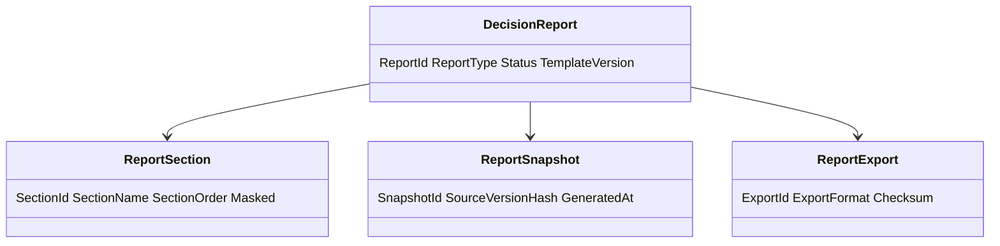
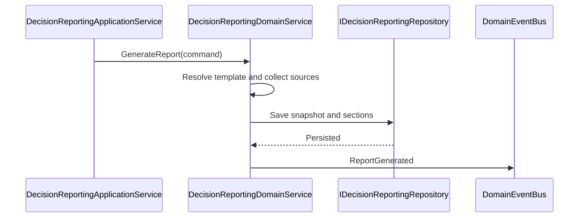
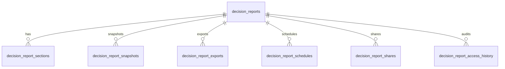
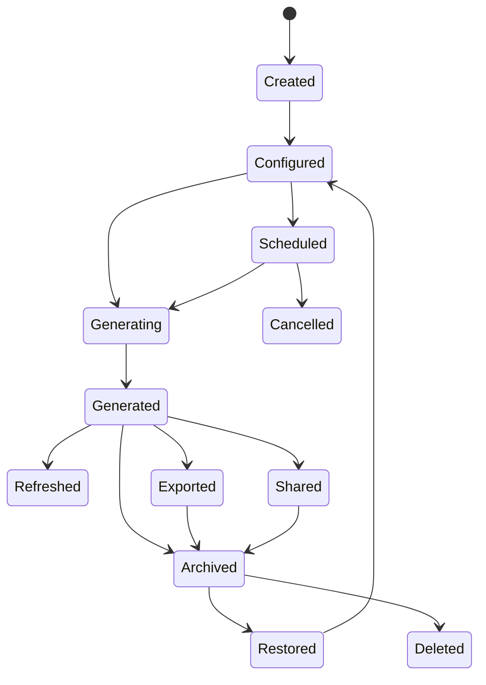
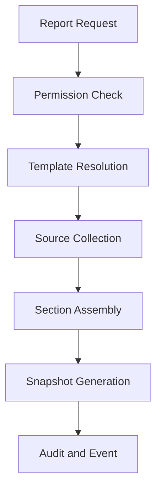
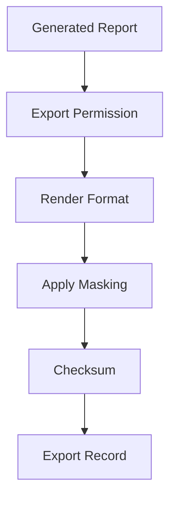
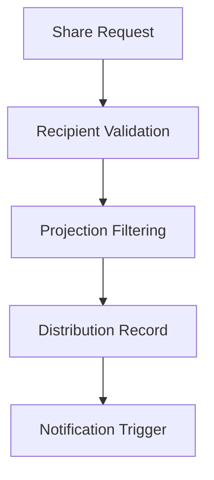
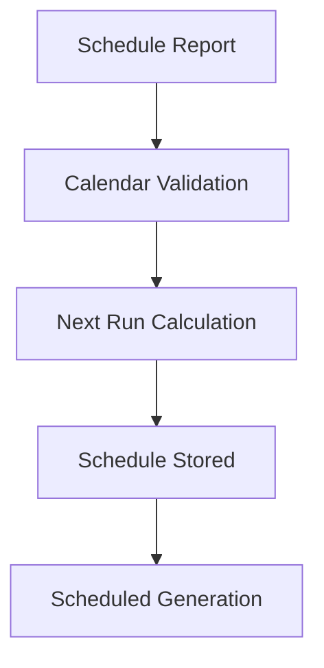

# Decision Reporting
Version: 1.0
Status: Enterprise Specification
Owner: Project Atlas
Source of Truth: Atlas Decision Reporting Specification
Last Updated: 2026-07-13
# Decision Reporting Overview
## Purpose
Decision Reporting defines how Atlas creates, updates, generates, refreshes, archives, restores, deletes, exports, shares, schedules, cancels schedules, secures, audits, and serves reports for DecisionSession.
It coordinates reporting with Decision Lifecycle, Decision Evaluation, Decision Execution, Decision Governance, Decision Analytics, Decision Explainability, Decision History, Decision Audit, Decision Rule, Recommendation, GoalPlan, Scenario, Portfolio, CashFlow, Optimization, Simulation, Risk, Workflow, Automation, Notification, Business Calendar, and User.
It preserves existing Atlas domain ownership and existing catalog naming.
## Business Meaning
Decision Reporting converts governed decision records into repeatable, exportable, auditable, and permission-safe reports.
Reports provide evidence for decision summary, detail, evaluation, execution, governance, audit, explainability, risk, financial impact, portfolio impact, cashflow impact, recommendation mapping, scenario comparison, simulation output, optimization output, management review, executive review, operational review, and compliance review.
Decision Reporting is read-oriented and does not mutate source domains.
## Reporting Scope
Reporting scope includes report definition, template selection, section assembly, snapshot generation, historical report, real-time report, scheduled report, batch report, incremental report, export, distribution, sharing, cache, audit, retention, and API projection.
Scope must preserve HouseholdId.
Scope must preserve TenantId when tenant scope exists.
Scope must not include unauthorized source data.
## Reporting Lifecycle
Reporting lifecycle starts when CreateReport creates a report definition or GenerateReport creates a report snapshot.
A report can be updated, generated, refreshed, exported, shared, scheduled, cancelled, archived, restored, or deleted according to lifecycle rules.
Every generated report records source versions, template version, generated time, projection, export format, masking mode, and actor or system actor.
## Reporting Objectives
Reporting objectives are evidence completeness, report reproducibility, export safety, permission-safe sharing, audit traceability, snapshot consistency, executive readability, operational detail, compliance readiness, and retention discipline.
Objectives are measured by report generation success rate, export success rate, schedule success rate, report freshness, source coverage, query latency, cache hit rate, and audit completeness.
## Ownership
Decision Reporting owns report definitions, templates, sections, snapshots, exports, schedules, report sharing, report cache, report history, and report projections.
DecisionSession owns source decision state.
Decision Evaluation owns score source data.
Decision Execution owns execution source data.
Decision Governance owns compliance source data.
Decision Analytics owns analytics source data.
Decision Explainability owns explanation source data.
Decision History owns historical source data.
Decision Audit owns immutable audit evidence.
Repository owns persistence and queries.
Application Service owns orchestration.
Security owns authorization and masking.
## Aggregate Root
DecisionSession remains the source aggregate root.
Decision Reporting stores report records and snapshots scoped to DecisionSession, household, tenant when present, period, report type, projection, and template version.
## Relationship with Decision
DecisionSession supplies decision id, owner, selected option, rationale, status, lifecycle state, and outcome.
Decision Reporting does not mutate DecisionSession.
## Relationship with Decision Lifecycle
Decision Lifecycle supplies current state, transition history, terminal state, archive state, restore state, and lifecycle duration.
Lifecycle sections must preserve transition time and actor where authorized.
## Relationship with Decision Evaluation
Decision Evaluation supplies composite score, confidence score, explainability score, dimension scores, constraint results, ranking, and evaluation version.
Evaluation sections must show score version and generated time.
## Relationship with Decision Execution
Decision Execution supplies execution status, progress, health, metrics, logs, retry history, rollback history, recovery history, and verification result.
Execution sections must honor log masking.
## Relationship with Decision Governance
Decision Governance supplies policy status, compliance result, exception history, escalation history, approval policy, and retention evidence.
Governance sections must preserve policy version.
## Relationship with Decision Analytics
Decision Analytics supplies indicators, trends, forecasts, comparisons, visualizations, and report-ready projections.
Analytics sections must show calculation version.
## Relationship with Decision Explainability
Decision Explainability supplies rationale, evidence trace, formula trace, score trace, rule trace, and option comparison.
Explainability sections must be permission-filtered.
## Relationship with Decision History
Decision History supplies state history, evaluation history, execution history, approval history, governance history, and report history.
History sections are append-only projections.
## Relationship with Decision Audit
Decision Audit supplies command audit, access audit, report audit, export audit, approval audit, and retention audit.
Audit report requires audit permission.
## Relationship with Decision Rule
Decision Rule supplies rule definitions, rule result, rule severity, threshold, and rule version.
Rule sections must record rule version and result.
## Relationship with Recommendation
Recommendation supplies recommendation mapping, ranking, adoption, suppression, expected impact, and realized impact.
Recommendation sections require recommendation read permission.
## Relationship with Goal
GoalPlan supplies goal alignment, priority, target, progress, health, and lifecycle evidence.
Goal sections require GoalPlan read permission.
## Relationship with Scenario
Scenario supplies assumptions, baseline, comparison, simulation context, and ScenarioVersion.
Scenario sections must record ScenarioId and ScenarioVersion.
## Relationship with Portfolio
Portfolio supplies authorized allocation, liquidity, risk, performance, valuation, and portfolio evidence.
Portfolio sections require portfolio permission and masking.
## Relationship with CashFlow
CashFlow supplies authorized contribution capacity, surplus, deficit, funding gap, period, and currency.
Cash Flow sections require cashflow permission and masking.
## Relationship with Optimization
Optimization supplies candidate ranking, objective score, constraint score, optimized option, and optimization version.
Optimization sections must record OptimizationId and version.
## Relationship with Simulation
Simulation supplies simulated result, confidence interval, assumptions, and simulation version.
Simulation sections must distinguish simulated output from actual outcome.
## Relationship with Risk
Risk supplies risk score, severity, threshold state, trend, and mitigation.
Risk sections must show risk evaluation time.
## Relationship with Workflow
Workflow supplies approval route, workflow state, step duration, escalation, and reviewer evidence.
Workflow sections must respect reviewer visibility.
## Relationship with Automation
Automation supplies schedule, trigger, run id, system actor, generation run, export run, and cleanup run.
AutomationRunId must be recorded for automated reports.
## Relationship with Notification
Notification supplies report delivery, sharing notification, schedule notification, suppression, and acknowledgement evidence.
Notification failure does not remove report history.
## Relationship with Business Calendar
Business Calendar supplies report periods, scheduled generation windows, business-day duration, blackout windows, and retention windows.
Scheduled reports must honor Business Calendar when configured.
## Relationship with User
User supplies actor, owner, recipient, approver, permission, preference, locale, timezone, and masking context.
Report projection must be generated according to user permission and locale.
# Reporting Architecture
## Reporting Engine
Reporting Engine coordinates template resolution, source collection, section assembly, snapshot generation, rendering, export, sharing, schedule handling, cache, retention, and audit.
It produces deterministic output for identical source versions, template version, projection, locale, and masking mode.
## Template Engine
Template Engine resolves report template by report type, audience, projection, locale, and permission.
Template version is recorded in every generated report.
## Rendering Engine
Rendering Engine converts report sections into JSON, CSV, Excel, PDF, HTML, Markdown, or API response projections.
Rendering must preserve masking and section order.
## Aggregation Engine
Aggregation Engine groups report data by decision, household, period, report type, status, owner, scenario, goal, recommendation, risk level, and compliance result.
Aggregation must not leak unauthorized counts.
## Export Engine
Export Engine converts report snapshots into approved formats.
Export records format, projection, actor, generated time, masking mode, and checksum.
## Scheduling Engine
Scheduling Engine manages scheduled report definitions, recurrence, Business Calendar windows, next run time, cancellation, and run history.
Scheduled run uses system actor.
## Distribution Engine
Distribution Engine shares reports with authorized users or recipients.
Distribution records recipient, permission, delivery status, and acknowledgement where available.
## Caching Layer
Caching Layer stores report summary, detail, snapshot, template, export status, and schedule projections.
Cache keys include tenant, household, report id, projection, format, and masking mode.
## Audit Layer
Audit Layer records report creation, update, generation, refresh, export, share, schedule, cancellation, archive, restore, delete, and access.
## Permission Layer
Permission Layer evaluates report type, section visibility, field visibility, export permission, share permission, audit permission, and recipient access.
# Report Types
## Decision Summary Report
Summarizes decision count, current status, selected option, outcome, score, risk, and approval state.
## Decision Detail Report
Provides full decision detail with lifecycle, evaluation, execution, governance, explainability, and audit-safe sections.
## Decision Evaluation Report
Focuses on evaluation scores, dimensions, constraints, rankings, confidence, and explainability.
## Decision Execution Report
Focuses on execution plan, progress, status, metrics, logs, retry, rollback, recovery, and verification.
## Decision Governance Report
Focuses on policies, compliance results, exceptions, escalations, approvals, and retention.
## Decision Audit Report
Focuses on audit trail, command history, access history, export history, and report history.
## Decision Explainability Report
Focuses on rationale, option comparison, evidence trace, rule trace, and formula trace.
## Decision Risk Report
Focuses on risk score, severity, trend, threshold state, mitigation, and risk-adjusted outcomes.
## Decision Financial Report
Focuses on financial impact, costs, budget variance, funding gap, currency, and period.
## Decision Portfolio Report
Focuses on portfolio allocation, liquidity, risk, performance, valuation, and masking state.
## Decision Cash Flow Report
Focuses on contribution capacity, surplus, deficit, funding gap, period, and currency.
## Decision Recommendation Report
Focuses on recommendation mapping, ranking, adoption, suppression, expected impact, and realized impact.
## Decision Scenario Report
Focuses on assumptions, baseline, scenario comparison, ScenarioVersion, and sensitivity.
## Decision Simulation Report
Focuses on simulated outcomes, confidence interval, assumptions, and simulation version.
## Decision Optimization Report
Focuses on optimized candidates, objective scores, constraints, ranking, and improvement.
## Executive Report
Provides high-level decision performance, risk, financial impact, and governance summary.
## Management Report
Provides management-level details for approval, workflow, performance, and exceptions.
## Operational Report
Provides operational execution, queue, latency, retry, rollback, recovery, and log summary.
## Compliance Report
Provides compliance evidence, policy status, failed checks, exceptions, escalation, and audit references.
## Custom Report
Uses allowed sections, filters, projection, and template configuration while preserving security.
# Report Sections
## Executive Summary
Contains report purpose, period, decision count, major outcomes, top risks, and key findings.
## Decision Overview
Contains DecisionSession identifiers, owner, status, selected option, rationale, and lifecycle state.
## Evaluation Result
Contains score, ranking, confidence, explainability, dimension results, and constraint results.
## Execution Status
Contains execution progress, health, status, duration, retry, rollback, recovery, and verification.
## Approval History
Contains approval state, approver, reason, workflow step, approval time, and rejection reason.
## Financial Impact
Contains cost, benefit, budget variance, funding gap, currency, and financial assumptions.
## Cash Flow Impact
Contains contribution capacity, surplus, deficit, funding gap, period, and cashflow feasibility.
## Portfolio Impact
Contains allocation, liquidity, risk, valuation time, performance, and masking state.
## Goal Alignment
Contains GoalPlan mapping, priority, progress impact, health impact, and alignment score.
## Risk Analysis
Contains risk score, severity, trend, threshold, mitigation, and escalation state.
## Recommendation Analysis
Contains RecommendationId, adoption, suppression, ranking, expected impact, and realized impact.
## Scenario Comparison
Contains baseline, scenario result, ScenarioVersion, delta, and assumptions.
## Simulation Result
Contains simulation output, confidence interval, assumptions, and simulation version.
## Optimization Result
Contains optimized candidate, objective score, constraint score, ranking, and improvement.
## Explainability
Contains rationale, evidence trace, rule trace, formula trace, and option comparison.
## Audit Trail
Contains audit-safe command, access, export, share, schedule, and retention evidence.
## Timeline
Contains creation, evaluation, approval, execution, completion, archive, report, and export timeline.
## Appendix
Contains source version list, template version, projection, masking mode, glossary, and calculation versions.
# Reporting Engine
## Template Resolution
Template Resolution chooses template by report type, audience, projection, locale, permission, and version.
## Snapshot Generation
Snapshot Generation stores source values, source versions, template version, sections, generated time, and masking mode.
## Historical Report
Historical Report uses retained source versions and report snapshots.
## Real-time Report
Real-time Report reads current permission-filtered source projections.
## Scheduled Report
Scheduled Report runs by recurrence and Business Calendar window.
## Batch Report
Batch Report generates multiple reports with isolated per-item result.
## Incremental Report
Incremental Report regenerates changed sections only when source versions allow it.
## Versioning
Versioning records report definition version, template version, source version, render version, and export version.
## Compression
Compression applies to large snapshots, exports, and archives according to retention policy.
## Retention Policy
Retention Policy controls report snapshot retention, export retention, audit retention, archive retention, and deletion eligibility.
# Export Formats
## JSON
JSON export preserves typed fields, section structure, source versions, and masking metadata.
## CSV
CSV export flattens allowed sections into rows and columns.
## Excel
Excel export supports worksheets by section and summary.
## PDF
PDF export renders fixed-layout report for review and distribution.
## HTML
HTML export renders browser-ready report.
## Markdown
Markdown export renders text-based report sections.
## API Response
API Response returns permission-filtered report projection.
# Validation Rules
1. ReportId must be globally unique.
2. HouseholdId is required.
3. TenantId is required when tenant scope exists.
4. Report type is required.
5. Report scope is required.
6. Report owner is required.
7. Template id is required for generated report.
8. Template version is required for generated report.
9. Source version hash is required.
10. Projection is required.
11. Masking mode is required.
12. Report section list cannot be empty.
13. Report section must be allowed for report type.
14. Export format must be allowed.
15. Schedule recurrence must be valid when scheduled.
16. Business Calendar window must be valid when schedule uses calendar.
17. Recipient must have access for sharing.
18. Export requires export permission.
19. Share requires share permission.
20. Audit report requires audit permission.
21. Portfolio section requires portfolio permission.
22. CashFlow section requires cashflow permission.
23. Scenario section requires ScenarioVersion.
24. Evaluation section requires EvaluationId when decision-scoped.
25. Execution section requires ExecutionId when execution-scoped.
26. Governance section requires policy visibility.
27. Analytics section requires analytics visibility.
28. Explainability section requires explainability visibility.
29. Financial fields require masking validation.
30. Report name must be within configured length.
31. GeneratedAt cannot be before source collected time.
32. Archive requires generated, cancelled, or policy-approved state.
33. Restore requires archived report.
34. Delete requires retention validation.
35. Search date range must be valid.
36. Sorting field must be allowed.
37. Projection field must be allowed.
38. Pagination limit must be within API maximum.
39. Compression setting must be allowed.
40. Audit metadata is required for every command.
# Business Rules
1. Decision Reporting must preserve Atlas domain ownership.
2. Decision Reporting must not redesign Atlas.
3. Decision Reporting must not create unrelated business concepts.
4. Reporting naming must follow existing catalog.
5. Reporting is read-oriented.
6. Reporting cannot mutate DecisionSession.
7. Reporting cannot mutate Decision Lifecycle.
8. Reporting cannot mutate Decision Evaluation.
9. Reporting cannot mutate Decision Execution.
10. Reporting cannot mutate Decision Governance.
11. Reporting cannot mutate Decision Analytics.
12. Reporting cannot mutate Recommendation.
13. Reporting cannot mutate GoalPlan.
14. Reporting cannot mutate Scenario.
15. Reporting cannot mutate Portfolio.
16. Reporting cannot mutate CashFlow.
17. Every generated report must record source version.
18. Every generated report must record template version.
19. Every generated report must record generated time.
20. Every generated report must record masking mode.
21. Every generated report must record actor or system actor.
22. Report projection must enforce permission.
23. Field-level security applies before snapshot.
24. Field-level security applies before export.
25. Field-level security applies before sharing.
26. Masked data must remain masked in cache.
27. Aggregation must not leak unauthorized counts.
28. Portfolio report requires portfolio permission.
29. Cash Flow report requires cashflow permission.
30. Audit report requires audit permission.
31. Executive report must use summary projection unless detail permission exists.
32. Management report must use permission-filtered detail.
33. Operational report must mask sensitive logs.
34. Compliance report must preserve policy version.
35. Explainability report must preserve evidence trace.
36. Evaluation report must preserve score version.
37. Execution report must preserve execution state at generation time.
38. Analytics report must preserve calculation version.
39. Scenario report must preserve ScenarioVersion.
40. Simulation report must not represent simulated output as actual.
41. Optimization report must preserve candidate version.
42. Recommendation report must preserve RecommendationId when authorized.
43. Goal section must preserve GoalPlanId when authorized.
44. Financial section must preserve currency when authorized.
45. CashFlow section must preserve period when authorized.
46. Portfolio section must preserve valuation time when authorized.
47. Scheduled report must use system actor.
48. Scheduled report must honor Business Calendar.
49. Cancelled schedule must not generate new reports.
50. Batch report isolates item failures.
51. Incremental report regenerates changed sections only.
52. Real-time report must show generated time.
53. Historical report must use retained source version.
54. Snapshot is immutable after generation.
55. Export uses snapshot when report is generated.
56. Share uses permission-filtered projection.
57. Shared recipient access must be validated.
58. Export failure must not delete report.
59. Share failure must not delete report.
60. Schedule failure must not delete report definition.
61. Cache failure must not roll back generated report.
62. Notification failure must not remove report history.
63. Audit failure blocks command when audit is required.
64. Report history is append-only.
65. Generation history is append-only.
66. Export history is append-only.
67. Distribution history is append-only.
68. Access history is append-only.
69. Report archive makes report read-only.
70. Restored report must revalidate source availability.
71. Deleted report cannot be restored.
72. Report delete requires retention permission.
73. Report cache invalidates on source version change.
74. Template cache invalidates on template version change.
75. Snapshot cache invalidates on permission or masking change.
76. Report definition update increments version.
77. Generated report version does not change after generation.
78. Exported report records checksum.
79. Compressed report records compression format.
80. Report search enforces HouseholdId scope.
81. Tenant-aware search enforces TenantId.
82. API response includes report status.
83. API response includes generated time.
84. API response includes source freshness when applicable.
85. Custom report can only use allowed sections.
86. Custom report cannot include unauthorized fields.
87. Report schedule must have valid recurrence.
88. Report schedule must have owner.
89. Report schedule must record next run time.
90. Report schedule cancellation requires reason.
91. Executive report generation emits event.
92. Audit report generation emits event.
93. Report export emits event.
94. Report sharing emits event.
95. Report archive emits event.
96. Materialized views must use committed data.
97. Parallel rendering must produce deterministic output.
98. Report ordering must be stable for identical inputs.
99. Locale formatting must not change numeric source value.
100. Timezone formatting must record timezone.
101. Export format must match requested content type.
102. Large report must use streaming or compression when policy requires.
103. Access to archived reports requires report read permission.
104. Access to deleted reports is blocked except audit retention process.
105. Report audit must include correlation id.
# State Machine
## States
- Created
- Configured
- Scheduled
- Generating
- Generated
- Refreshed
- Exported
- Shared
- Cancelled
- Archived
- Restored
- Deleted
## Transitions
- Created -> Configured by CreateReport.
- Configured -> Scheduled by ScheduleReport.
- Configured -> Generating by GenerateReport.
- Scheduled -> Generating by schedule trigger.
- Generating -> Generated by generation success.
- Generated -> Refreshed by RefreshReport.
- Generated -> Exported by ExportReport.
- Generated -> Shared by ShareReport.
- Scheduled -> Cancelled by CancelScheduledReport.
- Generated -> Archived by ArchiveReport.
- Refreshed -> Archived by ArchiveReport.
- Exported -> Archived by ArchiveReport.
- Shared -> Archived by ArchiveReport.
- Cancelled -> Archived by ArchiveReport.
- Archived -> Restored by RestoreReport.
- Restored -> Configured by UpdateReport.
- Archived -> Deleted by DeleteReport.
## Triggers
- CreateReport
- UpdateReport
- GenerateReport
- RefreshReport
- ExportReport
- ShareReport
- ScheduleReport
- CancelScheduledReport
- GenerateExecutiveReport
- GenerateAuditReport
- ArchiveReport
- RestoreReport
- DeleteReport
- ScheduleElapsed
- SourceChanged
- TemplateChanged
## Invariant
ReportId, HouseholdId, report type, created time, and original owner are immutable.
Generated report snapshot is immutable.
Exported report must reference a generated snapshot.
Archived report is read-only.
Deleted report is terminal.
## Illegal Transition
- Deleted -> Generated.
- Deleted -> Exported.
- Archived -> Generated without RestoreReport.
- Created -> Exported.
- Configured -> Exported without GenerateReport.
- Scheduled -> Exported without generation.
- Cancelled -> Generated.
- Generated -> Deleted without archive.
# Commands
## CreateReport
Creates report definition with type, scope, sections, template, and owner.
## UpdateReport
Updates editable report definition fields.
## GenerateReport
Generates report snapshot.
## RefreshReport
Refreshes report snapshot or report projection from current sources.
## ArchiveReport
Archives report and makes it read-only.
## RestoreReport
Restores archived report after validation.
## DeleteReport
Deletes eligible report after retention validation.
## ExportReport
Exports generated report in allowed format.
## ShareReport
Shares report with authorized recipients.
## ScheduleReport
Creates report schedule.
## CancelScheduledReport
Cancels scheduled report with reason.
## GenerateExecutiveReport
Generates executive report projection.
## GenerateAuditReport
Generates audit report projection.
## GenerateComplianceReport
Generates compliance-focused report projection.
## RefreshReportCache
Invalidates and refreshes report cache.
# Domain Events
## ReportCreated
Emitted after CreateReport succeeds.
## ReportUpdated
Emitted after UpdateReport succeeds.
## ReportGenerated
Emitted after GenerateReport succeeds.
## ReportExported
Emitted after ExportReport succeeds.
## ReportShared
Emitted after ShareReport succeeds.
## ReportArchived
Emitted after ArchiveReport succeeds.
## ReportRestored
Emitted after RestoreReport succeeds.
## ReportDeleted
Emitted after DeleteReport succeeds.
## ScheduleCreated
Emitted after ScheduleReport succeeds.
## ScheduleCancelled
Emitted after CancelScheduledReport succeeds.
## ExecutiveReportGenerated
Emitted after GenerateExecutiveReport succeeds.
## AuditReportGenerated
Emitted after GenerateAuditReport succeeds.
## ReportRefreshed
Emitted after RefreshReport succeeds.
## ComplianceReportGenerated
Emitted after compliance report succeeds.
## ReportGenerationFailed
Emitted when generation fails and failure event policy applies.
# Repository
## Interface
IDecisionReportingRepository persists report definitions, snapshots, sections, exports, schedules, sharing records, generation history, access history, and projections.
## Methods
- Add
- Update
- GetById
- GetByDecisionSessionId
- GetByHouseholdId
- Search
- SaveSnapshot
- SaveSection
- SaveExport
- SaveShare
- SaveSchedule
- SaveGenerationHistory
- SaveAccessHistory
- Archive
- Restore
- Delete
- GetSummaryProjection
- GetDetailProjection
- GetDashboardProjection
## Queries
- ReportsByDecision
- ReportsByHousehold
- ReportsByType
- ReportsByStatus
- ReportsBySchedule
- ReportsByExportFormat
- ReportsByRecipient
- ScheduledReportsDue
- ArchivedReports
- AuditReports
- ExecutiveReports
## Filtering
- ReportId
- DecisionSessionId
- HouseholdId
- TenantId
- ReportType
- Status
- OwnerId
- RecipientId
- ExportFormat
- ScheduleId
- CreatedDateRange
- GeneratedDateRange
- ArchivedDateRange
- HasExport
- HasSchedule
## Sorting
- createdAt desc
- generatedAt desc
- updatedAt desc
- reportType asc
- status asc
- owner asc
- nextRunAt asc
## Aggregation
- CountByType
- CountByStatus
- CountByExportFormat
- CountByScheduleStatus
- GeneratedCount
- ExportedCount
- SharedCount
- FailedGenerationCount
## Projection
- ReportSummaryProjection
- ReportDetailProjection
- ReportSnapshotProjection
- ExportProjection
- ScheduleProjection
- TemplateProjection
- ExecutiveReportProjection
- AuditReportProjection
## Specification
- ActiveReportSpecification
- VisibleReportSpecification
- ScheduledReportSpecification
- ExportableReportSpecification
- ShareableReportSpecification
- ArchivedReportSpecification
- AuditReportSpecification
# Domain Service Interaction
- DecisionReportingDomainService validates report lifecycle, sections, templates, exports, schedules, sharing, and business rules.
- DecisionLifecycleDomainService supplies lifecycle state and transition evidence.
- DecisionEvaluationDomainService supplies score and constraint evidence.
- DecisionExecutionDomainService supplies execution evidence.
- DecisionGovernanceDomainService supplies compliance and policy evidence.
- DecisionAnalyticsDomainService supplies analytics and visualization evidence.
- DecisionExplainabilityDomainService supplies explanation evidence.
- DecisionHistoryDomainService supplies historical evidence.
- DecisionAuditDomainService supplies audit evidence.
- DecisionRuleDomainService supplies rule result and version.
- RecommendationDomainService supplies recommendation evidence.
- GoalLifecycleDomainService supplies goal evidence.
- ScenarioDomainService supplies scenario evidence.
- PortfolioDomainService supplies authorized portfolio evidence.
- CashFlowDomainService supplies authorized cashflow evidence.
- OptimizationDomainService supplies optimization evidence.
- SimulationDomainService supplies simulation evidence.
- RiskDomainService supplies risk evidence.
- WorkflowDomainService supplies workflow evidence.
- AutomationDomainService supplies schedule and automation run context.
- NotificationDomainService receives report notification triggers.
- BusinessCalendarDomainService validates schedule windows.
- SecurityDomainService evaluates authorization and masking.
- CacheDomainService invalidates report projections.
# Application Service Interaction
- DecisionReportingApplicationService coordinates commands, queries, unit of work, event publication, export, schedule, and cache invalidation.
- CreateReportHandler validates create DTO and creates report definition.
- UpdateReportHandler validates version and editable fields.
- GenerateReportHandler collects sources, resolves template, renders snapshot, and persists history.
- RefreshReportHandler refreshes source versions and projections.
- ArchiveReportHandler makes report read-only.
- RestoreReportHandler revalidates source and permission.
- DeleteReportHandler validates retention.
- ExportReportHandler validates format and creates export.
- ShareReportHandler validates recipients and creates distribution records.
- ScheduleReportHandler validates recurrence and Business Calendar.
- CancelScheduledReportHandler records cancellation reason.
- SearchReportQueryHandler applies filtering, sorting, pagination, and projection.
# API
## REST Endpoints
- GET /api/decision-reports
- POST /api/decision-reports
- GET /api/decision-reports/{reportId}
- PUT /api/decision-reports/{reportId}
- POST /api/decision-reports/{reportId}/generate
- POST /api/decision-reports/{reportId}/refresh
- POST /api/decision-reports/{reportId}/export
- POST /api/decision-reports/{reportId}/share
- POST /api/decision-reports/{reportId}/schedule
- POST /api/decision-reports/{reportId}/cancel-schedule
- POST /api/decision-reports/{reportId}/archive
- POST /api/decision-reports/{reportId}/restore
- DELETE /api/decision-reports/{reportId}
- POST /api/decision-reports/executive
- POST /api/decision-reports/audit
- GET /api/decisions/{decisionSessionId}/reports
## HTTP Methods
GET reads report projections.
POST creates, generates, refreshes, exports, shares, schedules, cancels schedule, archives, restores, or creates specialized report.
PUT updates editable report definitions.
DELETE deletes eligible report after retention validation.
## Request
Create request includes report type, scope, sections, template id, projection, owner, and schedule option.
Update request includes version, section changes, filter changes, template changes, and reason.
Generate request includes source version mode, projection, masking mode, and force refresh flag.
Export request includes format, projection, compression option, and masking mode.
Schedule request includes recurrence, calendar id, next run time, recipient list, and export option.
Share request includes recipients, permission, expiration, and message.
## Response
Detail response returns report definition, snapshot, sections, exports, schedules, sharing records, permissions, and audit metadata.
Summary response returns report id, type, status, generated time, owner, export count, schedule state, and source freshness.
Export response returns export id, format, generated time, status, checksum, and masking mode.
Schedule response returns schedule id, recurrence, next run time, and status.
## Errors
- 400 invalid request
- 401 unauthenticated
- 403 forbidden
- 404 report not found
- 409 concurrency conflict
- 410 stale source
- 422 validation failed
- 423 report locked
- 429 rate limited
- 500 internal error
## Pagination
Pagination uses pageNumber, pageSize, totalCount, totalPages, hasNextPage, and hasPreviousPage.
## Filtering
Filtering supports report type, status, owner, recipient, format, schedule state, DecisionSessionId, householdId, generated date, archived date, and source freshness.
## Sorting
Sorting supports createdAt, updatedAt, generatedAt, reportType, status, owner, and nextRunAt.
## Projection
Projection supports summary, detail, snapshot, export, schedule, template, executive, audit, and dashboard-safe views.
## Export API
Export API supports JSON, CSV, Excel, PDF, HTML, Markdown, and API response formats when enabled.
## Schedule API
Schedule API supports create schedule, cancel schedule, list schedules, and read schedule runs.
## Report API
Report API supports create, update, generate, refresh, archive, restore, delete, search, executive, audit, and compliance reports.
# DTO
## Create DTO
Includes report type, scope, sections, template id, projection, owner, filters, and schedule option.
## Update DTO
Includes report id, version, editable fields, section changes, template changes, and reason.
## Detail DTO
Includes report definition, snapshot, sections, exports, schedules, sharing, permissions, and audit metadata.
## Summary DTO
Includes report id, type, status, owner, generatedAt, exported count, shared count, and schedule state.
## Search DTO
Includes filters, sorting, pagination, projection, and masking mode.
## Report DTO
Includes report identifiers, report type, scope, template version, source version, generated time, and status.
## Export DTO
Includes export id, report id, format, projection, compression, checksum, exportedAt, and status.
## Schedule DTO
Includes schedule id, report id, recurrence, calendar id, nextRunAt, lastRunAt, status, and cancelled reason.
## Template DTO
Includes template id, version, report type, allowed sections, locale, and projection rules.
## Executive Report DTO
Includes executive summary, decision count, success rate, risk summary, financial summary, and governance summary.
## Audit Report DTO
Includes audit scope, audit events, access history, export history, retention evidence, and generated time.
# Database Mapping
## Table
- decision_reports
- decision_report_sections
- decision_report_snapshots
- decision_report_exports
- decision_report_schedules
- decision_report_shares
- decision_report_generation_history
- decision_report_access_history
## Columns
- report_id uuid primary key
- tenant_id uuid null
- household_id uuid not null
- decision_session_id uuid null
- report_type varchar(120) not null
- status varchar(40) not null
- owner_id uuid null
- template_id uuid not null
- template_version varchar(40) not null
- source_version_hash varchar(128) not null
- projection varchar(80) not null
- masking_mode varchar(40) not null
- generated_at timestamptz null
- archived_at timestamptz null
- deleted_at timestamptz null
- created_at timestamptz not null
- updated_at timestamptz not null
- version int not null
## Indexes
- ix_decision_reports_household_status
- ix_decision_reports_decision
- ix_decision_reports_type
- ix_decision_reports_generated_at
- ix_decision_reports_owner
- ix_decision_reports_template
- ix_decision_report_schedules_next_run
- ux_decision_reports_scope_type_template
## Constraints
- status in supported report states
- report_type in supported report types
- version greater than zero
- template_version required
- deleted_at null unless status is Deleted
## FK
- decision_session_id references decision_sessions when present.
- household_id references households.
- report_id references decision_reports for child tables.
- template_id references report templates when present.
## Unique
- Unique report scope, report type, template, projection, and active version where required.
## Check Constraint
- Generated report requires generated_at.
- Export requires generated snapshot.
## Partition Strategy
- Partition snapshots, exports, generation history, and access history by generated_at month.
# PostgreSQL Schema
```sql
CREATE TABLE decision_reports (
  report_id uuid PRIMARY KEY,
  tenant_id uuid NULL,
  household_id uuid NOT NULL,
  decision_session_id uuid NULL,
  report_type varchar(120) NOT NULL,
  status varchar(40) NOT NULL,
  owner_id uuid NULL,
  template_id uuid NOT NULL,
  template_version varchar(40) NOT NULL,
  source_version_hash varchar(128) NOT NULL,
  projection varchar(80) NOT NULL,
  masking_mode varchar(40) NOT NULL,
  filter_payload jsonb NOT NULL DEFAULT '{}'::jsonb,
  generated_at timestamptz NULL,
  archived_at timestamptz NULL,
  deleted_at timestamptz NULL,
  created_by uuid NULL,
  updated_by uuid NULL,
  created_at timestamptz NOT NULL DEFAULT now(),
  updated_at timestamptz NOT NULL DEFAULT now(),
  version int NOT NULL DEFAULT 1,
  CONSTRAINT ck_decision_reports_status CHECK (status IN ('Created','Configured','Scheduled','Generating','Generated','Refreshed','Exported','Shared','Cancelled','Archived','Restored','Deleted')),
  CONSTRAINT ck_decision_reports_version CHECK (version > 0),
  CONSTRAINT ck_decision_reports_deleted CHECK ((status = 'Deleted' AND deleted_at IS NOT NULL) OR status <> 'Deleted')
);
CREATE TABLE decision_report_sections (
  section_id uuid PRIMARY KEY,
  report_id uuid NOT NULL REFERENCES decision_reports(report_id),
  section_name varchar(120) NOT NULL,
  section_order int NOT NULL,
  section_payload jsonb NOT NULL DEFAULT '{}'::jsonb,
  masked boolean NOT NULL DEFAULT false,
  created_at timestamptz NOT NULL DEFAULT now(),
  CONSTRAINT ck_decision_report_sections_order CHECK (section_order > 0)
);
CREATE TABLE decision_report_snapshots (
  snapshot_id uuid PRIMARY KEY,
  report_id uuid NOT NULL REFERENCES decision_reports(report_id),
  source_version_hash varchar(128) NOT NULL,
  template_version varchar(40) NOT NULL,
  snapshot_payload jsonb NOT NULL DEFAULT '{}'::jsonb,
  generated_by uuid NULL,
  generated_at timestamptz NOT NULL DEFAULT now(),
  correlation_id uuid NOT NULL
);
CREATE TABLE decision_report_exports (
  export_id uuid PRIMARY KEY,
  report_id uuid NOT NULL REFERENCES decision_reports(report_id),
  snapshot_id uuid NULL,
  export_format varchar(40) NOT NULL,
  projection varchar(80) NOT NULL,
  checksum varchar(128) NULL,
  compression varchar(40) NULL,
  export_payload jsonb NOT NULL DEFAULT '{}'::jsonb,
  exported_by uuid NULL,
  exported_at timestamptz NOT NULL DEFAULT now(),
  correlation_id uuid NOT NULL
);
CREATE TABLE decision_report_schedules (
  schedule_id uuid PRIMARY KEY,
  report_id uuid NOT NULL REFERENCES decision_reports(report_id),
  recurrence varchar(120) NOT NULL,
  calendar_id uuid NULL,
  status varchar(40) NOT NULL,
  next_run_at timestamptz NOT NULL,
  last_run_at timestamptz NULL,
  cancelled_at timestamptz NULL,
  cancel_reason varchar(800) NULL,
  created_at timestamptz NOT NULL DEFAULT now()
);
CREATE TABLE decision_report_shares (
  share_id uuid PRIMARY KEY,
  report_id uuid NOT NULL REFERENCES decision_reports(report_id),
  recipient_id uuid NULL,
  permission varchar(80) NOT NULL,
  expires_at timestamptz NULL,
  shared_by uuid NULL,
  shared_at timestamptz NOT NULL DEFAULT now()
);
CREATE TABLE decision_report_generation_history (
  generation_id uuid PRIMARY KEY,
  report_id uuid NOT NULL REFERENCES decision_reports(report_id),
  status varchar(40) NOT NULL,
  message varchar(800) NULL,
  generated_at timestamptz NOT NULL DEFAULT now(),
  correlation_id uuid NOT NULL
);
CREATE TABLE decision_report_access_history (
  access_id uuid PRIMARY KEY,
  report_id uuid NULL,
  actor_id uuid NULL,
  action varchar(80) NOT NULL,
  occurred_at timestamptz NOT NULL DEFAULT now(),
  correlation_id uuid NOT NULL
);
CREATE INDEX ix_decision_reports_household_status ON decision_reports(household_id, status);
CREATE INDEX ix_decision_reports_decision ON decision_reports(decision_session_id);
CREATE INDEX ix_decision_reports_type ON decision_reports(report_type);
CREATE INDEX ix_decision_reports_generated_at ON decision_reports(generated_at);
CREATE INDEX ix_decision_reports_owner ON decision_reports(owner_id);
CREATE INDEX ix_decision_reports_template ON decision_reports(template_id, template_version);
CREATE INDEX ix_decision_report_schedules_next_run ON decision_report_schedules(next_run_at, status);
CREATE UNIQUE INDEX ux_decision_reports_scope_type_template ON decision_reports(household_id, COALESCE(decision_session_id, '00000000-0000-0000-0000-000000000000'::uuid), report_type, template_id, projection) WHERE status <> 'Deleted';
CREATE VIEW v_decision_report_summary AS
SELECT report_id, household_id, decision_session_id, report_type, status, owner_id, generated_at, created_at, updated_at
FROM decision_reports
WHERE status <> 'Deleted';
CREATE MATERIALIZED VIEW mv_decision_report_dashboard AS
SELECT household_id, report_type, status, count(*) AS report_count, max(generated_at) AS last_generated_at
FROM decision_reports
WHERE status <> 'Deleted'
GROUP BY household_id, report_type, status;
```
# EF Core Mapping
- Fluent API maps DecisionReport to decision_reports with report_id primary key.
- Owned Types map filter payload, section payload, snapshot payload, export payload, and generation messages as JSON value objects.
- Indexes map household status, decision, report type, generated time, owner, template, schedule next run, and scope type template uniqueness.
- Value Conversion stores ReportStatus, ReportType, ExportFormat, Projection, MaskingMode, ScheduleStatus, and SharePermission as strings.
- Query Filters exclude Deleted by default and enforce tenant scope when tenant scope exists.
- Concurrency token uses version column.
- Navigation maps sections, snapshots, exports, schedules, shares, generation history, and access history.
# Cache Strategy
- Redis Key: atlas:decision-reports:{tenantId}:{householdId}:summary
- Redis Key: atlas:decision-reports:{tenantId}:{householdId}:decision:{decisionSessionId}
- Redis Key: atlas:decision-reports:{tenantId}:{householdId}:detail:{reportId}
- Redis Key: atlas:decision-reports:{tenantId}:{householdId}:snapshot:{reportId}
- Redis Key: atlas:decision-reports:{tenantId}:{householdId}:template:{templateId}:{templateVersion}
- Report Cache stores summary, detail, export, schedule, and dashboard projections.
- Template Cache stores template metadata and allowed sections.
- Snapshot Cache stores permission-filtered snapshot projection.
- TTL: summary 180 seconds.
- TTL: detail 300 seconds.
- TTL: snapshot 600 seconds.
- TTL: template 900 seconds.
- Refresh Strategy: refresh after create, update, generate, refresh, export, share, schedule, cancel, archive, restore, and materialized view refresh.
- Invalidation: invalidate by report id, decision id, household id, tenant id, template version, source version, permission change, and masking change.
# Security
- Authorization requires authenticated user and household access.
- Permissions include DecisionReport.Read.
- Permissions include DecisionReport.Create.
- Permissions include DecisionReport.Update.
- Permissions include DecisionReport.Generate.
- Permissions include DecisionReport.Export.
- Permissions include DecisionReport.Share.
- Permissions include DecisionReport.Schedule.
- Permissions include DecisionReport.Archive.
- Permissions include DecisionReport.Restore.
- Permissions include DecisionReport.Delete.
- Permissions include DecisionReport.AuditRead.
- Report Permissions evaluate report type, section, projection, export format, share recipient, schedule owner, and audit access.
- Field Level Security masks financial, portfolio, cashflow, scenario, risk, audit, execution log, and explainability-sensitive evidence.
- Data Masking applies before cache, snapshot, dashboard, export, sharing, notification, and API projection.
- Report Sharing requires recipient authorization and optional expiration.
# Audit
- Report History records created, updated, generated, refreshed, archived, restored, deleted, shared, scheduled, and cancelled.
- Generation History records generation id, source version, template version, status, message, actor, and correlation id.
- Export History records export id, format, projection, checksum, compression, actor, and exported time.
- Distribution History records share id, recipient, permission, delivery status, and acknowledgement.
- Access History records report read, snapshot read, export read, schedule read, actor, and correlation id.
# Performance
- Batch Generation partitions work by household, report type, schedule, template, and source version.
- Parallel Rendering renders independent sections concurrently with bounded concurrency.
- Incremental Generation regenerates changed sections only.
- Materialized Views aggregate report counts, type counts, status counts, generated counts, and schedule counts.
- Caching stores summary, detail, snapshot, template, export, schedule, and dashboard projections.
- Compression applies to large snapshots and exports according to policy.
# Example JSON
## Create
```json
{"reportType":"Decision Detail Report","scope":{"decisionSessionId":"33b7ef1f-0000-4000-9000-000000000001"},"sections":["Decision Overview","Evaluation Result","Audit Trail"],"templateId":"99b7ef1f-0000-4000-9000-000000000010","projection":"Detail"}
```
## Update
```json
{"reportId":"77b7ef1f-0000-4000-9000-000000000001","version":2,"sections":["Decision Overview","Execution Status"],"reason":"Operational view required"}
```
## Generate
```json
{"reportId":"77b7ef1f-0000-4000-9000-000000000001","sourceVersionMode":"Current","maskingMode":"PermissionBased","forceRefresh":true}
```
## Export
```json
{"reportId":"77b7ef1f-0000-4000-9000-000000000001","format":"PDF","projection":"Detail","compression":"None"}
```
## Schedule
```json
{"reportId":"77b7ef1f-0000-4000-9000-000000000001","recurrence":"Monthly","calendarId":"88b7ef1f-0000-4000-9000-000000000001","nextRunAt":"2026-08-01T00:00:00Z"}
```
## Executive Report
```json
{"scope":{"type":"Household","id":"7b9f7d3a-1000-4000-9000-000000000001"},"period":{"from":"2026-07-01","to":"2026-07-31"},"projection":"Executive"}
```
## Audit Report
```json
{"scope":{"decisionSessionId":"33b7ef1f-0000-4000-9000-000000000001"},"includeAccessHistory":true,"includeExportHistory":true}
```
## Search
```json
{"filters":{"reportType":["Decision Audit Report"],"status":["Generated"]},"sorting":[{"field":"generatedAt","direction":"desc"}],"pagination":{"pageNumber":1,"pageSize":20}}
```
## Detail
```json
{"reportId":"77b7ef1f-0000-4000-9000-000000000001","reportType":"Decision Detail Report","status":"Generated","generatedAt":"2026-07-13T00:00:00Z","sections":["Decision Overview","Evaluation Result"]}
```
# Mermaid
## Class Diagram

## Sequence Diagram

## ER Diagram

## Complete State Diagram

## Report Generation Flow

## Export Flow

## Distribution Flow

## Schedule Flow

# Testing
## Unit Test
Unit tests validate report type rules, section rules, template resolution, export formats, masking, validation rules, and lifecycle transitions.
## Integration Test
Integration tests validate repository, API, source collection, rendering, export, sharing, schedule, cache invalidation, security, and audit.
## Reporting Test
Reporting tests validate summary, detail, evaluation, execution, governance, audit, explainability, risk, financial, portfolio, cashflow, scenario, simulation, optimization, executive, management, operational, compliance, and custom reports.
## Export Test
Export tests validate JSON, CSV, Excel, PDF, HTML, Markdown, API response, checksum, compression, and masking.
## Schedule Test
Schedule tests validate recurrence, Business Calendar, next run time, cancellation, run history, and system actor.
## Performance Test
Performance tests validate generation latency, rendering latency, export latency, schedule throughput, and cache hit rate.
## Concurrency Test
Concurrency tests validate duplicate generation, concurrent export, schedule race, archive race, restore race, and optimistic version conflict.
## Stress Test
Stress tests validate large reports, many sections, batch reports, high export volume, high schedule volume, and cache pressure.
## Permission Test
Permission tests validate report type access, section access, field masking, export permission, share permission, audit permission, and recipient access.
# Edge Cases
1. DecisionSession is deleted during report generation.
2. Decision Lifecycle changes during snapshot generation.
3. Decision Evaluation becomes stale during report generation.
4. Decision Execution logs are masked after collection.
5. Decision Governance policy changes during compliance report.
6. Decision Analytics calculation version changes during report.
7. Decision Explainability evidence is missing.
8. Decision History has retention gaps.
9. Decision Audit access is denied.
10. Decision Rule version is retired.
11. Recommendation is archived.
12. GoalPlan is deleted from default projection.
13. ScenarioVersion changes during report.
14. Portfolio permission is revoked.
15. CashFlow period closes.
16. Optimization output becomes stale.
17. Simulation output is low confidence.
18. Risk score is missing.
19. Workflow state is inconsistent.
20. Automation schedule is duplicated.
21. Notification delivery is suppressed.
22. Business Calendar has no valid run window.
23. Template version is missing.
24. Template is not allowed for report type.
25. Custom report requests unauthorized section.
26. Export format is disabled.
27. PDF rendering fails.
28. Excel export exceeds row limit.
29. CSV export flattens nested masked fields.
30. Share recipient loses permission.
31. Schedule is cancelled during generation.
32. Archive arrives during export.
33. Restore finds missing source.
34. Delete violates retention policy.
35. Report cache contains old masking mode.
36. Snapshot compression fails.
37. Materialized view refresh fails.
38. Search uses unsupported sorting field.
39. Pagination token references deleted report.
40. Tenant scope is missing in tenant-aware environment.
41. Aggregation could reveal restricted count.
42. Clock skew affects generated time.
43. Source version hash is missing.
44. Access history write fails.
45. Event publication fails after persistence.
# Version History
| Version | Date | Change | Owner |
|---|---|---|---|
| 1.0 | 2026-07-13 | Enterprise Specification for Decision Reporting. | Project Atlas |
