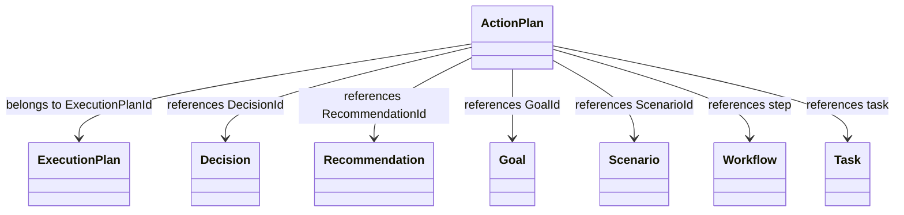
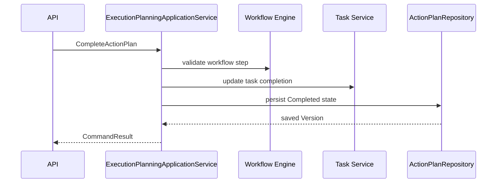
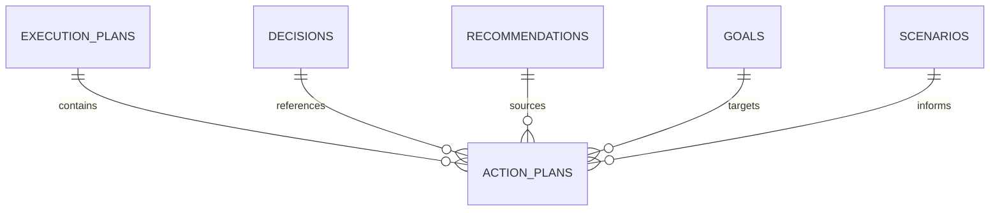
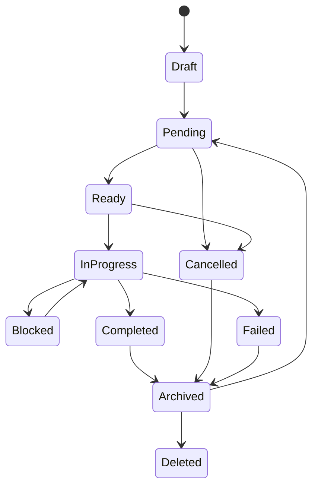

# ActionPlan Entity Specification

# Document Control

Document Name: ActionPlan Entity Specification

Document Path: knowledge/entity/ActionPlan.md

Document Type: Enterprise Specification

Version: 1.0

Status: Canonical Specification

Domain: Decision

Bounded Context: Decision

Module: Decision Engine

Owner: Project Atlas

Source of Truth: Atlas Knowledge Base

Last Updated: 2026-07-14

Related Specifications:

- knowledge/entity-catalog.md
- knowledge/aggregate-catalog.md
- knowledge/repository-catalog.md
- knowledge/command-catalog.md
- knowledge/domain-event-catalog.md
- knowledge/application-service-catalog.md
- knowledge/domain-service-catalog.md
- knowledge/value-object-catalog.md
- knowledge/decision-execution.md
- knowledge/recommendation-execution.md

# Entity Overview

Purpose: ActionPlan represents one executable, measurable, auditable action inside an ExecutionPlan.

Responsibilities:

- Maintain stable ActionPlan identity and ActionPlanNumber.
- Belong to one ExecutionPlan.
- Reference Decision, Recommendation, Goal, Scenario, Workflow, Task, Notification, User, and DomainEvent by identity.
- Store action title, description, type, priority, status, owner, assignee, sequence, duration, cost, benefit, risk, progress, dates, result, failure reason, required flag, recurring flag, version, and concurrency token.
- Support assignment, start, pause, resume, completion, cancellation, archive, restore, deletion, search, and history.
- Preserve complete Audit Trail and Version History.

Business Meaning: ActionPlan is the atomic execution unit that turns an ExecutionPlan into ordered tasks, workflow steps, notifications, and measurable completion outcomes.

Aggregate Root: No. ActionPlan is not listed as an Atlas aggregate root in the current Entity Catalog. It is a catalog-approved execution planning record under ExecutionPlan behavior and Decision execution.

Lifecycle: Draft, Pending, Ready, InProgress, Blocked, Completed, Cancelled, Failed, Archived, Deleted.

Ownership: ActionPlan lifecycle is owned by execution planning behavior and the ExecutionPlan it belongs to. It does not own ExecutionPlan, Decision, Recommendation, Goal, Scenario, Workflow, Task, Notification, User, or DomainEvent.

Relationships:

- ExecutionPlan: ActionPlan must belong to exactly one ExecutionPlan through ExecutionPlanId.
- Decision: ActionPlan may reference DecisionId inherited from ExecutionPlan.
- Recommendation: ActionPlan may reference RecommendationId when generated from an accepted Recommendation.
- Goal: ActionPlan may reference GoalId when action contributes to Goal execution.
- Scenario: ActionPlan may reference ScenarioId for scenario evidence.
- Workflow: ActionPlan may correspond to a Workflow step or advance Workflow through Workflow Engine.
- Task: ActionPlan may create, schedule, or reference Task identities through Task Service or Scheduler.
- Notification: ActionPlan may request Notification creation and may reference notification delivery records.
- User: ActionPlan belongs to User scope and uses Owner and Assignee for responsibility.
- DomainEvent: ActionPlan emits and consumes immutable DomainEvent records for status, audit, and workflow traceability.

Navigation:

- All relationships are identity references only.
- ActionPlan read models may include related summaries but cannot mutate referenced entities.
- Sequence ordering is scoped to ExecutionPlanId.
- ActionPlanRepository loads ActionPlan records and history without cascading cross-aggregate changes.

# Complete Properties

## ActionPlanId

- Name: ActionPlanId
- Type: Guid
- Nullable: No
- Default: Generated by application
- Description: Stable technical identity of ActionPlan.
- Validation: Required; unique; valid Guid; immutable.
- Business Meaning: Identifies one executable action across API, events, and audit.
- Example: a0a0fe06-0352-45fb-bf56-15e2e4b29f10.
- Database Mapping: action_plans.action_plan_id uuid primary key
- JSON Name: actionPlanId
- API Usage: Detail, Update, Assign, Start, Pause, Resume, Complete, Cancel, Archive, Restore, Delete, History
- Searchable: Yes
- Sortable: No
- Indexed: Yes
- Encrypted: No
- Auditable: Yes

## ActionPlanNumber

- Name: ActionPlanNumber
- Type: String
- Nullable: No
- Default: Generated sequence
- Description: Human-readable action plan number.
- Validation: Required; unique; max length 64; immutable.
- Business Meaning: Enables support, user display, and audit lookup.
- Example: ACT-20260714-000001.
- Database Mapping: action_plans.action_plan_number varchar(64) unique not null
- JSON Name: actionPlanNumber
- API Usage: Detail, Summary, Search, History
- Searchable: Yes
- Sortable: Yes
- Indexed: Yes
- Encrypted: No
- Auditable: Yes

## ExecutionPlanId

- Name: ExecutionPlanId
- Type: Guid
- Nullable: No
- Default: None
- Description: Parent ExecutionPlan identity.
- Validation: Required; valid Guid; ExecutionPlan must be accessible and not deleted.
- Business Meaning: Every ActionPlan belongs to an ExecutionPlan.
- Example: 49b48b7e-2f44-40d7-bd31-2eb6fe7f206d.
- Database Mapping: action_plans.execution_plan_id uuid not null
- JSON Name: executionPlanId
- API Usage: Create, Detail, Summary, Search
- Searchable: Yes
- Sortable: No
- Indexed: Yes
- Encrypted: No
- Auditable: Yes

## DecisionId

- Name: DecisionId
- Type: Guid
- Nullable: Yes
- Default: null
- Description: Decision associated with the action.
- Validation: Valid Guid when present; same execution scope.
- Business Meaning: Preserves traceability to Decision.
- Example: 111d49c8-0957-42a2-a812-b736615fa2bb.
- Database Mapping: action_plans.decision_id uuid null
- JSON Name: decisionId
- API Usage: Create, Detail, Summary, Search
- Searchable: Yes
- Sortable: No
- Indexed: Yes
- Encrypted: No
- Auditable: Yes

## RecommendationId

- Name: RecommendationId
- Type: Guid
- Nullable: Yes
- Default: null
- Description: Recommendation associated with the action.
- Validation: Valid Guid when present; same execution scope.
- Business Meaning: Preserves traceability to Recommendation.
- Example: 7f3d29c6-6d0e-4f2c-bb46-bd3555d6d351.
- Database Mapping: action_plans.recommendation_id uuid null
- JSON Name: recommendationId
- API Usage: Create, Detail, Summary, Search
- Searchable: Yes
- Sortable: No
- Indexed: Yes
- Encrypted: No
- Auditable: Yes

## GoalId

- Name: GoalId
- Type: Guid
- Nullable: Yes
- Default: null
- Description: Goal impacted by the action.
- Validation: Valid Guid when present; same user or household scope.
- Business Meaning: Links action completion to Goal execution.
- Example: 3e1f27f4-4201-431d-bb4a-01d2e4aa94d8.
- Database Mapping: action_plans.goal_id uuid null
- JSON Name: goalId
- API Usage: Create, Detail, Summary, Search
- Searchable: Yes
- Sortable: No
- Indexed: Yes
- Encrypted: No
- Auditable: Yes

## ScenarioId

- Name: ScenarioId
- Type: Guid
- Nullable: Yes
- Default: null
- Description: Scenario evidence associated with the action.
- Validation: Valid Guid when present; same scope.
- Business Meaning: Preserves scenario traceability.
- Example: 7b8f2309-4b51-4724-9fb7-927db4ee5d5d.
- Database Mapping: action_plans.scenario_id uuid null
- JSON Name: scenarioId
- API Usage: Create, Detail, Summary, Search
- Searchable: Yes
- Sortable: No
- Indexed: Yes
- Encrypted: No
- Auditable: Yes

## UserId

- Name: UserId
- Type: Guid
- Nullable: No
- Default: None
- Description: User scope for the ActionPlan.
- Validation: Required; valid Guid; actor must have access.
- Business Meaning: Defines access and ownership scope.
- Example: b6a6d087-b8f8-4062-92ec-08b7fc5d64f4.
- Database Mapping: action_plans.user_id uuid not null
- JSON Name: userId
- API Usage: Create, Detail, Summary, Search
- Searchable: Yes
- Sortable: No
- Indexed: Yes
- Encrypted: No
- Auditable: Yes

## Title

- Name: Title
- Type: String
- Nullable: No
- Default: None
- Description: Action title.
- Validation: Required; max length 256; no executable content.
- Business Meaning: User-readable action name.
- Example: Transfer monthly surplus to reserve.
- Database Mapping: action_plans.title varchar(256) not null
- JSON Name: title
- API Usage: Create, Update, Detail, Summary, Search
- Searchable: Yes
- Sortable: Yes
- Indexed: Optional full text
- Encrypted: No
- Auditable: Yes

## Description

- Name: Description
- Type: String
- Nullable: Yes
- Default: null
- Description: Detailed action description.
- Validation: Max length 4000; no executable content.
- Business Meaning: Explains execution details and completion evidence.
- Example: Set up transfer from cash account to emergency reserve.
- Database Mapping: action_plans.description text null
- JSON Name: description
- API Usage: Create, Update, Detail
- Searchable: Yes
- Sortable: No
- Indexed: Optional full text
- Encrypted: Conditional
- Auditable: Yes

## ActionType

- Name: ActionType
- Type: String
- Nullable: No
- Default: Manual
- Description: Action category or execution type.
- Validation: Required; max length 64.
- Business Meaning: Classifies the action without creating a new Domain.
- Example: CashFlow.
- Database Mapping: action_plans.action_type varchar(64) not null
- JSON Name: actionType
- API Usage: Create, Update, Detail, Summary, Search
- Searchable: Yes
- Sortable: Yes
- Indexed: Yes
- Encrypted: No
- Auditable: Yes

## Priority

- Name: Priority
- Type: String
- Nullable: No
- Default: Medium
- Description: Action priority.
- Validation: Required; Low, Medium, High, Critical.
- Business Meaning: Determines ordering and attention.
- Example: High.
- Database Mapping: action_plans.priority varchar(32) not null
- JSON Name: priority
- API Usage: Create, Update, Detail, Summary, Search
- Searchable: Yes
- Sortable: Yes
- Indexed: Yes
- Encrypted: No
- Auditable: Yes

## Status

- Name: Status
- Type: String
- Nullable: No
- Default: Draft
- Description: Action lifecycle status.
- Validation: Required; Draft, Pending, Ready, InProgress, Blocked, Completed, Cancelled, Failed, Archived, Deleted.
- Business Meaning: Controls execution behavior.
- Example: Ready.
- Database Mapping: action_plans.status varchar(32) not null
- JSON Name: status
- API Usage: Detail, Summary, Search, Assign, Start, Pause, Resume, Complete, Cancel, Archive, Restore, Delete
- Searchable: Yes
- Sortable: Yes
- Indexed: Yes
- Encrypted: No
- Auditable: Yes

## Owner

- Name: Owner
- Type: Guid
- Nullable: No
- Default: UserId
- Description: Actor responsible for the ActionPlan.
- Validation: Required; valid actor identity; authorized for scope.
- Business Meaning: Assigns accountability.
- Example: b6a6d087-b8f8-4062-92ec-08b7fc5d64f4.
- Database Mapping: action_plans.owner uuid not null
- JSON Name: owner
- API Usage: Create, Update, Detail, Summary, Search
- Searchable: Yes
- Sortable: No
- Indexed: Yes
- Encrypted: No
- Auditable: Yes

## Assignee

- Name: Assignee
- Type: Guid
- Nullable: Yes
- Default: null
- Description: Actor assigned to perform the action.
- Validation: Valid actor identity when present; authorized for scope.
- Business Meaning: Identifies execution assignee.
- Example: b6a6d087-b8f8-4062-92ec-08b7fc5d64f4.
- Database Mapping: action_plans.assignee uuid null
- JSON Name: assignee
- API Usage: Assign, Detail, Summary, Search
- Searchable: Yes
- Sortable: No
- Indexed: Yes
- Encrypted: No
- Auditable: Yes

## Sequence

- Name: Sequence
- Type: Int32
- Nullable: No
- Default: 1
- Description: Execution order inside ExecutionPlan.
- Validation: Required; greater than 0; unique within ExecutionPlanId.
- Business Meaning: Defines ordering and dependencies.
- Example: 1.
- Database Mapping: action_plans.sequence integer not null
- JSON Name: sequence
- API Usage: Create, Update, Detail, Summary, Search
- Searchable: Yes
- Sortable: Yes
- Indexed: Yes
- Encrypted: No
- Auditable: Yes

## EstimatedDuration

- Name: EstimatedDuration
- Type: String
- Nullable: Yes
- Default: null
- Description: Estimated duration in ISO-8601 duration format or display duration.
- Validation: Max length 64; valid duration when supplied.
- Business Meaning: Supports scheduling and monitoring.
- Example: P7D.
- Database Mapping: action_plans.estimated_duration varchar(64) null
- JSON Name: estimatedDuration
- API Usage: Create, Update, Detail, Summary
- Searchable: Yes
- Sortable: Yes
- Indexed: Yes
- Encrypted: No
- Auditable: Yes

## EstimatedCost

- Name: EstimatedCost
- Type: Json
- Nullable: Yes
- Default: null
- Description: Estimated cost snapshot.
- Validation: Valid JSON object; amount nonnegative and CurrencyCode present when amount exists.
- Business Meaning: Preserves expected cost of action.
- Example: {"amount":500,"currency":"TWD"}.
- Database Mapping: action_plans.estimated_cost jsonb null
- JSON Name: estimatedCost
- API Usage: Create, Update, Detail, Summary
- Searchable: No
- Sortable: No
- Indexed: Optional jsonb path
- Encrypted: Conditional
- Auditable: Yes

## ExpectedBenefit

- Name: ExpectedBenefit
- Type: Json
- Nullable: Yes
- Default: null
- Description: Expected benefit snapshot.
- Validation: Valid JSON object when present.
- Business Meaning: Captures value expected from completing the action.
- Example: {"description":"Reserve balance increased"}.
- Database Mapping: action_plans.expected_benefit jsonb null
- JSON Name: expectedBenefit
- API Usage: Create, Update, Detail, Summary
- Searchable: No
- Sortable: No
- Indexed: Optional jsonb path
- Encrypted: Conditional
- Auditable: Yes

## RiskLevel

- Name: RiskLevel
- Type: RiskLevel
- Nullable: Yes
- Default: null
- Description: Catalog risk level.
- Validation: Valid RiskLevel when present.
- Business Meaning: Indicates action execution risk.
- Example: Low.
- Database Mapping: action_plans.risk_level varchar(32) null
- JSON Name: riskLevel
- API Usage: Create, Update, Detail, Summary, Search
- Searchable: Yes
- Sortable: Yes
- Indexed: Yes
- Encrypted: No
- Auditable: Yes

## Progress

- Name: Progress
- Type: Decimal
- Nullable: No
- Default: 0
- Description: Completion percentage.
- Validation: Required; 0.0000 to 100.0000.
- Business Meaning: Tracks action completion.
- Example: 50.0000.
- Database Mapping: action_plans.progress numeric(9,4) not null
- JSON Name: progress
- API Usage: Update, Start, Pause, Resume, Complete, Detail, Summary, Search
- Searchable: Yes
- Sortable: Yes
- Indexed: Yes
- Encrypted: No
- Auditable: Yes

## StartDate

- Name: StartDate
- Type: Date
- Nullable: Yes
- Default: null
- Description: Planned or actual action start date.
- Validation: Must be on or before DueDate and CompletedDate when present.
- Business Meaning: Establishes action start.
- Example: 2026-08-01.
- Database Mapping: action_plans.start_date date null
- JSON Name: startDate
- API Usage: Create, Update, Start, Detail, Search
- Searchable: Yes
- Sortable: Yes
- Indexed: Yes
- Encrypted: No
- Auditable: Yes

## DueDate

- Name: DueDate
- Type: Date
- Nullable: Yes
- Default: null
- Description: Target due date.
- Validation: Must be on or after StartDate when both exist.
- Business Meaning: Defines action deadline.
- Example: 2026-08-31.
- Database Mapping: action_plans.due_date date null
- JSON Name: dueDate
- API Usage: Create, Update, Detail, Summary, Search
- Searchable: Yes
- Sortable: Yes
- Indexed: Yes
- Encrypted: No
- Auditable: Yes

## CompletedDate

- Name: CompletedDate
- Type: Date
- Nullable: Yes
- Default: null
- Description: Completion date.
- Validation: Required when Status is Completed; must be on or after StartDate when present.
- Business Meaning: Records action completion.
- Example: 2026-08-20.
- Database Mapping: action_plans.completed_date date null
- JSON Name: completedDate
- API Usage: Complete, Detail, Summary, Search
- Searchable: Yes
- Sortable: Yes
- Indexed: Yes
- Encrypted: No
- Auditable: Yes

## Result

- Name: Result
- Type: Json
- Nullable: Yes
- Default: null
- Description: Completion result and evidence.
- Validation: Valid JSON object when present; required when Status is Completed.
- Business Meaning: Preserves measurable outcome.
- Example: {"result":"Completed","evidence":"Transfer configured"}.
- Database Mapping: action_plans.result jsonb null
- JSON Name: result
- API Usage: Complete, Detail, History
- Searchable: No
- Sortable: No
- Indexed: Optional jsonb path
- Encrypted: Conditional
- Auditable: Yes

## FailureReason

- Name: FailureReason
- Type: String
- Nullable: Yes
- Default: null
- Description: Failure, cancellation, or blocked reason.
- Validation: Required when Status is Blocked, Failed, or Cancelled; max length 2000.
- Business Meaning: Explains why execution cannot proceed or did not succeed.
- Example: Required external account permission missing.
- Database Mapping: action_plans.failure_reason text null
- JSON Name: failureReason
- API Usage: Cancel, Complete failure, Detail, History
- Searchable: Yes
- Sortable: No
- Indexed: Optional full text
- Encrypted: Conditional
- Auditable: Yes

## IsRequired

- Name: IsRequired
- Type: Boolean
- Nullable: No
- Default: true
- Description: Whether action is mandatory for plan completion.
- Validation: Required.
- Business Meaning: Determines whether ExecutionPlan can complete without this action.
- Example: true.
- Database Mapping: action_plans.is_required boolean not null
- JSON Name: isRequired
- API Usage: Create, Update, Detail, Summary, Search
- Searchable: Yes
- Sortable: Yes
- Indexed: Yes
- Encrypted: No
- Auditable: Yes

## IsRecurring

- Name: IsRecurring
- Type: Boolean
- Nullable: No
- Default: false
- Description: Whether action repeats.
- Validation: Required; recurring action must include recurrence metadata in action payload or workflow metadata.
- Business Meaning: Supports repeatable execution.
- Example: false.
- Database Mapping: action_plans.is_recurring boolean not null
- JSON Name: isRecurring
- API Usage: Create, Update, Detail, Summary, Search
- Searchable: Yes
- Sortable: Yes
- Indexed: Yes
- Encrypted: No
- Auditable: Yes

## CreatedAt

- Name: CreatedAt
- Type: DateTimeOffset
- Nullable: No
- Default: Current timestamp
- Description: Creation timestamp.
- Validation: Required; immutable.
- Business Meaning: Establishes action creation time.
- Example: 2026-07-14T10:00:00+08:00.
- Database Mapping: action_plans.created_at timestamptz not null
- JSON Name: createdAt
- API Usage: Detail, Summary, Search, History
- Searchable: Yes
- Sortable: Yes
- Indexed: Yes
- Encrypted: No
- Auditable: Yes

## CreatedBy

- Name: CreatedBy
- Type: Guid
- Nullable: No
- Default: ActorId
- Description: Actor that created the ActionPlan.
- Validation: Required; valid actor identity.
- Business Meaning: Supports audit attribution.
- Example: b6a6d087-b8f8-4062-92ec-08b7fc5d64f4.
- Database Mapping: action_plans.created_by uuid not null
- JSON Name: createdBy
- API Usage: Detail, History
- Searchable: Yes
- Sortable: No
- Indexed: Yes
- Encrypted: No
- Auditable: Yes

## UpdatedAt

- Name: UpdatedAt
- Type: DateTimeOffset
- Nullable: No
- Default: Current timestamp
- Description: Last mutation timestamp.
- Validation: Required; greater than or equal to CreatedAt.
- Business Meaning: Supports ordering and cache invalidation.
- Example: 2026-07-14T10:10:00+08:00.
- Database Mapping: action_plans.updated_at timestamptz not null
- JSON Name: updatedAt
- API Usage: Detail, Summary, Search, History
- Searchable: Yes
- Sortable: Yes
- Indexed: Yes
- Encrypted: No
- Auditable: Yes

## UpdatedBy

- Name: UpdatedBy
- Type: Guid
- Nullable: Yes
- Default: null
- Description: Actor that last changed the ActionPlan.
- Validation: Valid actor identity when present.
- Business Meaning: Supports mutation audit attribution.
- Example: b6a6d087-b8f8-4062-92ec-08b7fc5d64f4.
- Database Mapping: action_plans.updated_by uuid null
- JSON Name: updatedBy
- API Usage: Detail, History
- Searchable: Yes
- Sortable: No
- Indexed: Yes
- Encrypted: No
- Auditable: Yes

## Version

- Name: Version
- Type: Int64
- Nullable: No
- Default: 1
- Description: ActionPlan version.
- Validation: Required; increments on mutation; stale version rejected.
- Business Meaning: Preserves version history.
- Example: 3.
- Database Mapping: action_plans.version bigint not null
- JSON Name: version
- API Usage: Update, Assign, Start, Pause, Resume, Complete, Cancel, Archive, Restore, Delete
- Searchable: No
- Sortable: Yes
- Indexed: No
- Encrypted: No
- Auditable: Yes

## ConcurrencyToken

- Name: ConcurrencyToken
- Type: String
- Nullable: No
- Default: Generated token
- Description: Optimistic concurrency token.
- Validation: Required; must match for mutation; regenerated after mutation.
- Business Meaning: Prevents lost update.
- Example: 01J2Y8Z7ABCD.
- Database Mapping: action_plans.concurrency_token varchar(128) not null
- JSON Name: concurrencyToken
- API Usage: Update, Assign, Start, Pause, Resume, Complete, Cancel, Archive, Restore, Delete
- Searchable: No
- Sortable: No
- Indexed: Yes
- Encrypted: No
- Auditable: Yes

# Validation Rules

| Rule ID | Validation |
|---|---|
| ACT-VR-001 | ActionPlanId is required, unique, valid, and immutable. |
| ACT-VR-002 | ActionPlanNumber is required, unique, max length 64, and immutable. |
| ACT-VR-003 | ExecutionPlanId is required and must reference an accessible ExecutionPlan. |
| ACT-VR-004 | DecisionId may be present and must match execution scope. |
| ACT-VR-005 | RecommendationId may be present and must match execution scope. |
| ACT-VR-006 | GoalId and ScenarioId must be valid when present. |
| ACT-VR-007 | UserId is required and must match authorization scope. |
| ACT-VR-008 | Title is required and max length 256. |
| ACT-VR-009 | Description max length is 4000. |
| ACT-VR-010 | ActionType is required and max length 64. |
| ACT-VR-011 | Priority is required and must be Low, Medium, High, or Critical. |
| ACT-VR-012 | Status is required and must follow the state machine. |
| ACT-VR-013 | Owner is required and must be authorized. |
| ACT-VR-014 | Assignee must be authorized when present. |
| ACT-VR-015 | Sequence must be greater than 0 and unique within ExecutionPlanId. |
| ACT-VR-016 | EstimatedCost must be valid JSON and nonnegative when present. |
| ACT-VR-017 | ExpectedBenefit must be valid JSON when present. |
| ACT-VR-018 | RiskLevel must be catalog-valid when present. |
| ACT-VR-019 | Progress must be between 0 and 100. |
| ACT-VR-020 | StartDate must be on or before DueDate and CompletedDate when present. |
| ACT-VR-021 | CompletedDate is required when Status is Completed. |
| ACT-VR-022 | Completed Status requires Progress to equal 100. |
| ACT-VR-023 | Result is required when Status is Completed. |
| ACT-VR-024 | FailureReason is required when Status is Blocked, Failed, or Cancelled. |
| ACT-VR-025 | Completed ActionPlan cannot modify core content. |
| ACT-VR-026 | Archived ActionPlan cannot restart execution. |
| ACT-VR-027 | Deleted ActionPlan cannot be restored by normal workflow. |
| ACT-VR-028 | IsRecurring requires recurrence metadata when recurring behavior is active. |
| ACT-VR-029 | Version and ConcurrencyToken must match on mutation. |
| ACT-VR-030 | Every state transition must be audited. |

# Business Rules

1. ActionPlan must belong to one ExecutionPlan.
2. ActionPlan may correspond to one Decision.
3. ActionPlan may correspond to one Recommendation.
4. ActionPlan must specify Status.
5. Progress must be between 0 and 100.
6. Completed ActionPlan must fill CompletedDate.
7. Completed ActionPlan cannot modify core content.
8. Archived ActionPlan cannot be re-executed.
9. Sequence cannot duplicate within an ExecutionPlan.
10. ActionPlan must preserve complete Audit Trail.
11. ActionPlan must preserve complete Version History.
12. ActionPlan does not own ExecutionPlan.
13. ActionPlan does not own Decision or Recommendation.
14. ActionPlan does not own Goal or Scenario.
15. ActionPlan does not own Workflow, Task, Notification, User, or DomainEvent.
16. StartActionPlan requires Ready or Pending state.
17. AssignActionPlan must set Assignee.
18. PauseActionPlan changes InProgress action to Blocked when pause reason indicates blocker.
19. ResumeActionPlan returns Blocked action to InProgress only when blocker is resolved.
20. Required incomplete ActionPlan blocks ExecutionPlan completion.
21. Optional incomplete ActionPlan may be skipped only by authorized execution policy.
22. Cancelled ActionPlan cannot complete.
23. Failed ActionPlan must include FailureReason.
24. ActionPlanStatusChanged must be emitted for every status transition.
25. DomainEvent history is immutable.
26. Task scheduling must be idempotent.
27. Notification creation after assignment, start, block, complete, cancel, or fail must be idempotent.
28. Search must enforce User scope and ExecutionPlan scope.
29. Batch updates must report per-action result.
30. ActionPlan history must be queryable by ActionPlanId and Version.

# State Machine

| State | Transition | Trigger | Invariant | Illegal Transition |
|---|---|---|---|---|
| Draft | Draft to Pending | CreateActionPlan | ExecutionPlanId exists | Draft to Completed |
| Pending | Pending to Ready | AssignActionPlan | Assignee or Owner available | Pending to Completed |
| Ready | Ready to InProgress | StartActionPlan | StartDate set when required | Ready to Completed |
| InProgress | InProgress to Blocked | PauseActionPlan | FailureReason or blocker reason set | InProgress to Draft |
| Blocked | Blocked to InProgress | ResumeActionPlan | Blocker resolved | Blocked to Completed without resume |
| InProgress | InProgress to Completed | CompleteActionPlan | Progress 100, CompletedDate, Result | InProgress to Draft |
| InProgress | InProgress to Failed | Execution failure | FailureReason set | InProgress to Ready |
| Pending | Pending to Cancelled | CancelActionPlan | FailureReason set | Pending to Completed |
| Ready | Ready to Cancelled | CancelActionPlan | FailureReason set | Ready to Completed |
| Completed | Completed to Archived | ArchiveActionPlan | Audit exists | Completed to InProgress |
| Cancelled | Cancelled to Archived | ArchiveActionPlan | Audit exists | Cancelled to InProgress |
| Failed | Failed to Archived | ArchiveActionPlan | Audit exists | Failed to Completed |
| Archived | Archived to Pending | RestoreActionPlan | Not deleted | Archived to InProgress |
| Any non-deleted | Any to Deleted | DeleteActionPlan | Delete audit exists | Deleted to InProgress |

# Commands

| Command | Handler | Repository | Result | Event |
|---|---|---|---|---|
| CreateActionPlan | CreateActionPlanCommandHandler | ActionPlanRepository | ActionPlanDetailDto | ActionPlanCreated |
| UpdateActionPlan | UpdateActionPlanCommandHandler | ActionPlanRepository | ActionPlanDetailDto | ActionPlanUpdated |
| AssignActionPlan | AssignActionPlanCommandHandler | ActionPlanRepository | CommandResult | ActionPlanAssigned, ActionPlanStatusChanged |
| StartActionPlan | StartActionPlanCommandHandler | ActionPlanRepository | CommandResult | ActionPlanStarted, ActionPlanStatusChanged |
| PauseActionPlan | PauseActionPlanCommandHandler | ActionPlanRepository | CommandResult | ActionPlanPaused, ActionPlanStatusChanged |
| ResumeActionPlan | ResumeActionPlanCommandHandler | ActionPlanRepository | CommandResult | ActionPlanResumed, ActionPlanStatusChanged |
| CompleteActionPlan | CompleteActionPlanCommandHandler | ActionPlanRepository | CommandResult | ActionPlanCompleted, ActionPlanStatusChanged |
| CancelActionPlan | CancelActionPlanCommandHandler | ActionPlanRepository | CommandResult | ActionPlanCancelled, ActionPlanStatusChanged |
| ArchiveActionPlan | ArchiveActionPlanCommandHandler | ActionPlanRepository | CommandResult | ActionPlanArchived, ActionPlanStatusChanged |
| RestoreActionPlan | RestoreActionPlanCommandHandler | ActionPlanRepository | CommandResult | ActionPlanRestored, ActionPlanStatusChanged |
| DeleteActionPlan | DeleteActionPlanCommandHandler | ActionPlanRepository | CommandResult | ActionPlanDeleted, ActionPlanStatusChanged |
| GenerateExecutionPlan | GenerateExecutionPlanCommandHandler | DecisionRepository | ExecutionPlanSummaryDto | ExecutionPlanGenerated |

# Domain Events

| Event | Publisher | Payload |
|---|---|---|
| ActionPlanCreated | ExecutionPlanningApplicationService | ActionPlanId, ExecutionPlanId, UserId, Status |
| ActionPlanUpdated | ExecutionPlanningApplicationService | ActionPlanId, ChangedFields, Version |
| ActionPlanAssigned | ExecutionPlanningApplicationService | ActionPlanId, Assignee, Owner |
| ActionPlanStarted | ExecutionPlanningApplicationService | ActionPlanId, StartDate |
| ActionPlanPaused | ExecutionPlanningApplicationService | ActionPlanId, Progress, FailureReason |
| ActionPlanResumed | ExecutionPlanningApplicationService | ActionPlanId, Progress |
| ActionPlanCompleted | ExecutionPlanningApplicationService | ActionPlanId, CompletedDate, Result |
| ActionPlanCancelled | ExecutionPlanningApplicationService | ActionPlanId, FailureReason |
| ActionPlanFailed | ExecutionPlanningApplicationService | ActionPlanId, FailureReason |
| ActionPlanArchived | ExecutionPlanningApplicationService | ActionPlanId, ArchivedAt |
| ActionPlanRestored | ExecutionPlanningApplicationService | ActionPlanId, RestoredAt |
| ActionPlanDeleted | ExecutionPlanningApplicationService | ActionPlanId, DeletedAt |
| ActionPlanStatusChanged | ExecutionPlanningApplicationService | ActionPlanId, PreviousStatus, NewStatus, Version |
| ExecutionPlanGenerated | DecisionSession | DecisionId, ExecutionPlanId, ActionPlanId |
| ExecutionPlanCompleted | ExecutionPlanningApplicationService | ExecutionPlanId, CompletedDate |
| NotificationCreated | Notification | NotificationId, ActionPlanId |

# Repository

Interface: IActionPlanRepository

Methods:

- GetByIdAsync(ActionPlanId, UserId)
- GetByNumberAsync(ActionPlanNumber)
- AddAsync(ActionPlan)
- AddRangeAsync(IReadOnlyCollection<ActionPlan>)
- UpdateAsync(ActionPlan, ConcurrencyToken)
- ArchiveAsync(ActionPlanId, ConcurrencyToken)
- RestoreAsync(ActionPlanId, ConcurrencyToken)
- SoftDeleteAsync(ActionPlanId, ConcurrencyToken)
- SaveChangesAsync()

Query Methods:

- SearchAsync(ActionPlanSearchSpecification)
- FindByExecutionPlanAsync(ExecutionPlanId)
- FindByDecisionAsync(DecisionId)
- FindByRecommendationAsync(RecommendationId)
- FindByGoalAsync(GoalId)
- FindByScenarioAsync(ScenarioId)
- FindByUserAsync(UserId)
- FindByAssigneeAsync(Assignee)
- FindByStatusAsync(Status)
- FindDueAsync(DueDate, limit)
- FindHistoryAsync(ActionPlanId)

Specification Pattern:

- ActionPlanByExecutionPlanSpecification
- ActionPlanByDecisionSpecification
- ActionPlanByRecommendationSpecification
- ActionPlanByGoalSpecification
- ActionPlanByScenarioSpecification
- ActionPlanByUserSpecification
- ActionPlanByAssigneeSpecification
- ActionPlanByStatusSpecification
- ActionPlanByPrioritySpecification
- ActionPlanByDueDateSpecification
- ActionPlanActiveOnlySpecification
- ActionPlanArchivedSpecification
- ActionPlanSearchSpecification

# Domain Service Interaction

| Service | Interaction |
|---|---|
| Execution Planning Service | Creates, assigns, starts, pauses, resumes, completes, cancels, archives, restores, deletes, versions, and validates ActionPlan. |
| Workflow Engine | Coordinates ActionPlan state with workflow steps and blockers. |
| Scheduler | Finds due actions and recurring actions. |
| Notification Service | Sends assignment, start, blocker, completion, cancellation, failure, archive, and due notifications. |
| Task Service | Creates or updates Task records from ActionPlan references. |
| Audit Service | Records commands, events, changes, status history, and version history. |
| Decision Engine | Supplies Decision context and execution authorization. |
| Recommendation Engine | Supplies Recommendation context when source Recommendation exists. |
| Goal Evaluation Service | Evaluates Goal impact and completion effect. |

# Application Service Interaction

- ExecutionPlanningApplicationService handles all ActionPlan commands and queries.
- DecisionApplicationService supplies Decision context and GenerateExecutionPlan traceability.
- RecommendationApplicationService supplies source Recommendation context.
- GoalApplicationService supplies Goal access and completion impact.
- ScenarioApplicationService supplies Scenario evidence reference.
- WorkflowApplicationService advances Workflow steps and blockers.
- TaskApplicationService creates and updates Task references.
- NotificationApplicationService sends user-facing action notifications.
- SchedulerApplicationService invokes due and recurring action work.
- AuditApplicationService stores audit and version history.
- SearchApplicationService indexes ActionPlan fields.
- CacheApplicationService invalidates detail, search, execution plan summary, and history cache.

# API

| Endpoint | Method | Request | Response | Error |
|---|---|---|---|---|
| /api/v1/action-plans | POST | CreateActionPlanDto | ActionPlanDetailDto | 400, 401, 403, 409, 422 |
| /api/v1/action-plans/{actionPlanId} | GET | Route id | ActionPlanDetailDto | 401, 403, 404 |
| /api/v1/action-plans/{actionPlanId} | PUT | UpdateActionPlanDto | ActionPlanDetailDto | 400, 401, 403, 404, 409, 422 |
| /api/v1/action-plans/{actionPlanId} | DELETE | DeleteActionPlanDto | CommandResult | 401, 403, 404, 409 |
| /api/v1/action-plans/search | POST | ActionPlanSearchDto | ActionPlanSearchResultDto | 400, 401, 403 |
| /api/v1/action-plans/{actionPlanId}/assign | POST | AssignActionPlanDto | CommandResult | 400, 401, 403, 404, 409 |
| /api/v1/action-plans/{actionPlanId}/start | POST | StartActionPlanDto | CommandResult | 400, 401, 403, 404, 409 |
| /api/v1/action-plans/{actionPlanId}/pause | POST | PauseActionPlanDto | CommandResult | 400, 401, 403, 404, 409 |
| /api/v1/action-plans/{actionPlanId}/resume | POST | ResumeActionPlanDto | CommandResult | 400, 401, 403, 404, 409 |
| /api/v1/action-plans/{actionPlanId}/complete | POST | CompleteActionPlanDto | CommandResult | 400, 401, 403, 404, 409, 422 |
| /api/v1/action-plans/{actionPlanId}/cancel | POST | CancelActionPlanDto | CommandResult | 400, 401, 403, 404, 409 |
| /api/v1/action-plans/{actionPlanId}/archive | POST | ArchiveActionPlanDto | CommandResult | 400, 401, 403, 404, 409 |
| /api/v1/action-plans/{actionPlanId}/restore | POST | RestoreActionPlanDto | CommandResult | 400, 401, 403, 404, 409 |
| /api/v1/action-plans/{actionPlanId}/history | GET | Route id | ActionPlanHistoryDto | 401, 403, 404 |

# DTO

Create DTO: CreateActionPlanDto includes executionPlanId, decisionId, recommendationId, goalId, scenarioId, userId, title, description, actionType, priority, owner, assignee, sequence, estimatedDuration, estimatedCost, expectedBenefit, riskLevel, startDate, dueDate, isRequired, isRecurring, idempotencyKey.

Update DTO: UpdateActionPlanDto includes title, description, actionType, priority, owner, assignee, sequence, estimatedDuration, estimatedCost, expectedBenefit, riskLevel, progress, startDate, dueDate, isRequired, isRecurring, version, concurrencyToken.

Detail DTO: ActionPlanDetailDto includes all properties, related summaries, permission flags, Version, and ConcurrencyToken.

Summary DTO: ActionPlanSummaryDto includes actionPlanId, actionPlanNumber, executionPlanId, userId, title, actionType, priority, status, owner, assignee, sequence, progress, dueDate, completedDate, updatedAt, version.

Search DTO: ActionPlanSearchDto includes executionPlanId, decisionId, recommendationId, goalId, scenarioId, userId, status, priority, owner, assignee, actionType, isRequired, isRecurring, dueBefore, includeArchived, page, pageSize, sortBy, sortDirection.

Assign DTO: AssignActionPlanDto includes actionPlanId, assignee, owner, version, concurrencyToken, idempotencyKey.

Complete DTO: CompleteActionPlanDto includes actionPlanId, completedDate, progress, result, version, concurrencyToken, idempotencyKey.

# Database Mapping

Table: action_plans

Columns: action_plan_id, action_plan_number, execution_plan_id, decision_id, recommendation_id, goal_id, scenario_id, user_id, title, description, action_type, priority, status, owner, assignee, sequence, estimated_duration, estimated_cost, expected_benefit, risk_level, progress, start_date, due_date, completed_date, result, failure_reason, is_required, is_recurring, created_at, created_by, updated_at, updated_by, version, concurrency_token.

FK: execution_plan_id references execution_plans where enforced; decision_id, recommendation_id, goal_id, scenario_id, and user_id are catalog identity references.

Unique: action_plan_id primary key; action_plan_number unique; execution_plan_id plus sequence unique.

Check Constraint: status values, priority values, progress range, sequence positive, completed fields, failure reason, date order.

Index: execution plan, decision, recommendation, goal, scenario, user, status, priority, owner, assignee, sequence, due date, progress, updated time, active filter.

# PostgreSQL Schema

```sql
CREATE TABLE action_plans (
  action_plan_id uuid PRIMARY KEY,
  action_plan_number varchar(64) NOT NULL UNIQUE,
  execution_plan_id uuid NOT NULL,
  decision_id uuid NULL,
  recommendation_id uuid NULL,
  goal_id uuid NULL,
  scenario_id uuid NULL,
  user_id uuid NOT NULL,
  title varchar(256) NOT NULL,
  description text NULL,
  action_type varchar(64) NOT NULL DEFAULT 'Manual',
  priority varchar(32) NOT NULL DEFAULT 'Medium',
  status varchar(32) NOT NULL DEFAULT 'Draft',
  owner uuid NOT NULL,
  assignee uuid NULL,
  sequence integer NOT NULL,
  estimated_duration varchar(64) NULL,
  estimated_cost jsonb NULL,
  expected_benefit jsonb NULL,
  risk_level varchar(32) NULL,
  progress numeric(9,4) NOT NULL DEFAULT 0,
  start_date date NULL,
  due_date date NULL,
  completed_date date NULL,
  result jsonb NULL,
  failure_reason text NULL,
  is_required boolean NOT NULL DEFAULT true,
  is_recurring boolean NOT NULL DEFAULT false,
  created_at timestamptz NOT NULL DEFAULT now(),
  created_by uuid NOT NULL,
  updated_at timestamptz NOT NULL DEFAULT now(),
  updated_by uuid NULL,
  version bigint NOT NULL DEFAULT 1,
  concurrency_token varchar(128) NOT NULL,
  CONSTRAINT ux_action_plans_execution_sequence UNIQUE (execution_plan_id, sequence),
  CONSTRAINT ck_action_plans_status CHECK (status IN ('Draft','Pending','Ready','InProgress','Blocked','Completed','Cancelled','Failed','Archived','Deleted')),
  CONSTRAINT ck_action_plans_priority CHECK (priority IN ('Low','Medium','High','Critical')),
  CONSTRAINT ck_action_plans_sequence CHECK (sequence > 0),
  CONSTRAINT ck_action_plans_progress CHECK (progress >= 0 AND progress <= 100),
  CONSTRAINT ck_action_plans_completed CHECK (status <> 'Completed' OR (completed_date IS NOT NULL AND progress = 100 AND result IS NOT NULL)),
  CONSTRAINT ck_action_plans_failure CHECK (status NOT IN ('Blocked','Failed','Cancelled') OR failure_reason IS NOT NULL),
  CONSTRAINT ck_action_plans_dates CHECK (start_date IS NULL OR due_date IS NULL OR start_date <= due_date)
);

CREATE INDEX ix_action_plans_execution_plan ON action_plans (execution_plan_id);
CREATE INDEX ix_action_plans_decision ON action_plans (decision_id);
CREATE INDEX ix_action_plans_recommendation ON action_plans (recommendation_id);
CREATE INDEX ix_action_plans_goal ON action_plans (goal_id);
CREATE INDEX ix_action_plans_scenario ON action_plans (scenario_id);
CREATE INDEX ix_action_plans_user ON action_plans (user_id);
CREATE INDEX ix_action_plans_status ON action_plans (status);
CREATE INDEX ix_action_plans_priority ON action_plans (priority);
CREATE INDEX ix_action_plans_owner ON action_plans (owner);
CREATE INDEX ix_action_plans_assignee ON action_plans (assignee);
CREATE INDEX ix_action_plans_due_date ON action_plans (due_date);
CREATE INDEX ix_action_plans_progress ON action_plans (progress);
CREATE INDEX ix_action_plans_updated ON action_plans (updated_at DESC, action_plan_id);
CREATE INDEX ix_action_plans_active ON action_plans (user_id, status, priority, due_date, sequence) WHERE status NOT IN ('Archived','Deleted');
```

# EF Core Mapping

Fluent API:

```csharp
builder.ToTable("action_plans");
builder.HasKey(x => x.ActionPlanId);
builder.Property(x => x.ActionPlanId).HasColumnName("action_plan_id").ValueGeneratedNever();
builder.Property(x => x.ActionPlanNumber).HasColumnName("action_plan_number").HasMaxLength(64).IsRequired();
builder.Property(x => x.ExecutionPlanId).HasColumnName("execution_plan_id").IsRequired();
builder.Property(x => x.DecisionId).HasColumnName("decision_id");
builder.Property(x => x.RecommendationId).HasColumnName("recommendation_id");
builder.Property(x => x.GoalId).HasColumnName("goal_id");
builder.Property(x => x.ScenarioId).HasColumnName("scenario_id");
builder.Property(x => x.UserId).HasColumnName("user_id").IsRequired();
builder.Property(x => x.Title).HasColumnName("title").HasMaxLength(256).IsRequired();
builder.Property(x => x.ActionType).HasColumnName("action_type").HasMaxLength(64).IsRequired();
builder.Property(x => x.Priority).HasColumnName("priority").HasMaxLength(32).IsRequired();
builder.Property(x => x.Status).HasColumnName("status").HasMaxLength(32).IsRequired();
builder.Property(x => x.Sequence).HasColumnName("sequence").IsRequired();
builder.Property(x => x.EstimatedCost).HasColumnName("estimated_cost").HasColumnType("jsonb");
builder.Property(x => x.ExpectedBenefit).HasColumnName("expected_benefit").HasColumnType("jsonb");
builder.Property(x => x.RiskLevel).HasColumnName("risk_level").HasMaxLength(32).HasConversion<string>();
builder.Property(x => x.Progress).HasColumnName("progress").HasPrecision(9, 4).IsRequired();
builder.Property(x => x.Result).HasColumnName("result").HasColumnType("jsonb");
builder.Property(x => x.Version).HasColumnName("version").IsConcurrencyToken();
builder.Property(x => x.ConcurrencyToken).HasColumnName("concurrency_token").HasMaxLength(128).IsConcurrencyToken();
builder.HasIndex(x => x.ActionPlanNumber).IsUnique();
builder.HasIndex(x => new { x.ExecutionPlanId, x.Sequence }).IsUnique();
builder.HasIndex(x => new { x.UserId, x.Status, x.Priority, x.DueDate, x.Sequence });
```

Owned Type: EstimatedCost, ExpectedBenefit, and Result are JSON-owned value snapshots.

Value Conversion: RiskLevel uses stable string conversion.

Concurrency Token: Version and ConcurrencyToken are required for mutation.

# Cache Strategy

- Cache detail by UserId, ActionPlanId, permission scope, and Version.
- Cache search by UserId, ExecutionPlanId, filter hash, page, and permission scope.
- Cache execution plan action list by ExecutionPlanId and latest action Version.
- Cache history by ActionPlanId and latest Version.
- Invalidate cache on ActionPlanCreated, ActionPlanUpdated, ActionPlanAssigned, ActionPlanStarted, ActionPlanPaused, ActionPlanResumed, ActionPlanCompleted, ActionPlanCancelled, ActionPlanFailed, ActionPlanArchived, ActionPlanDeleted, and ActionPlanStatusChanged.

# Security

Authorization:

- ActionPlan:Read for detail, search, and history.
- ActionPlan:Create for CreateActionPlan.
- ActionPlan:Update for UpdateActionPlan.
- ActionPlan:Assign for AssignActionPlan.
- ActionPlan:Execute for StartActionPlan, PauseActionPlan, ResumeActionPlan, and CompleteActionPlan.
- ActionPlan:Archive for ArchiveActionPlan and RestoreActionPlan.
- ActionPlan:Delete for DeleteActionPlan.

Permission:

- User scope is mandatory.
- ExecutionPlan scope must be checked for ExecutionPlanId.
- Decision, Recommendation, Goal, and Scenario references require matching access permission.
- Assignee must be authorized to access the action.

Data Masking:

- Summary DTO may mask Description, EstimatedCost, ExpectedBenefit, Result, and FailureReason when permission is insufficient.
- Deleted actions are visible only to authorized audit access.

# Audit

- Audit create, update, assign, start, pause, resume, complete, cancel, fail, archive, restore, delete, and sequence changes.
- Audit actor, UserId, ActionPlanId, ActionPlanNumber, ExecutionPlanId, command name, status transition, progress change, assignee change, sequence change, Version, ConcurrencyToken, CorrelationId, CausationId, and idempotency key.
- Preserve append-only version history.
- Audit failed authorization and validation without exposing sensitive payload.
- Audit Notification, Task, Workflow, and Scheduler requests caused by action state changes.

# Performance

Index Strategy:

- Use execution plan plus sequence unique index for ordered action loading.
- Use user, status, priority, due date, and sequence active index for lists.
- Use assignee and owner indexes for assignment views.

Caching:

- Use detail, search, execution plan action list, and history caches with event invalidation.
- Cache keys include UserId, ExecutionPlanId, and permission scope.

Optimistic Concurrency:

- Every mutation requires Version and ConcurrencyToken.
- Stale mutation returns conflict and no partial update.

Batch Update:

- Batch status, assignment, and sequence updates must be bounded, idempotent, and audited per ActionPlan.
- Batch updates must reject duplicate sequences inside the same ExecutionPlan.

Partition Strategy:

- Partition large action history by CreatedAt or ExecutionPlanId hash when volume requires it.
- Keep active action index optimized for status and due date.

# Example JSON

Create:

```json
{"executionPlanId":"49b48b7e-2f44-40d7-bd31-2eb6fe7f206d","decisionId":"111d49c8-0957-42a2-a812-b736615fa2bb","recommendationId":"7f3d29c6-6d0e-4f2c-bb46-bd3555d6d351","goalId":"3e1f27f4-4201-431d-bb4a-01d2e4aa94d8","userId":"b6a6d087-b8f8-4062-92ec-08b7fc5d64f4","title":"Transfer monthly surplus to reserve","actionType":"CashFlow","priority":"High","owner":"b6a6d087-b8f8-4062-92ec-08b7fc5d64f4","sequence":1,"progress":0,"dueDate":"2026-08-31","isRequired":true,"idempotencyKey":"idem-act-create-001"}
```

Update:

```json
{"title":"Configure monthly reserve transfer","priority":"Critical","sequence":1,"progress":25,"dueDate":"2026-08-20","version":2,"concurrencyToken":"01J2Y8Z7ABCD"}
```

Assign:

```json
{"actionPlanId":"a0a0fe06-0352-45fb-bf56-15e2e4b29f10","assignee":"b6a6d087-b8f8-4062-92ec-08b7fc5d64f4","owner":"b6a6d087-b8f8-4062-92ec-08b7fc5d64f4","version":2,"concurrencyToken":"01J2Y8Z7ABCD","idempotencyKey":"idem-act-assign-001"}
```

Complete:

```json
{"actionPlanId":"a0a0fe06-0352-45fb-bf56-15e2e4b29f10","completedDate":"2026-08-20","progress":100,"result":{"result":"Completed","evidence":"Transfer configured"},"version":4,"concurrencyToken":"01J2Y8Z7IJKL","idempotencyKey":"idem-act-complete-001"}
```

Detail:

```json
{"actionPlanId":"a0a0fe06-0352-45fb-bf56-15e2e4b29f10","actionPlanNumber":"ACT-20260714-000001","executionPlanId":"49b48b7e-2f44-40d7-bd31-2eb6fe7f206d","userId":"b6a6d087-b8f8-4062-92ec-08b7fc5d64f4","title":"Transfer monthly surplus to reserve","actionType":"CashFlow","priority":"High","status":"InProgress","sequence":1,"progress":50,"version":4,"concurrencyToken":"01J2Y8Z7IJKL"}
```

Search:

```json
{"executionPlanId":"49b48b7e-2f44-40d7-bd31-2eb6fe7f206d","userId":"b6a6d087-b8f8-4062-92ec-08b7fc5d64f4","status":["Ready","InProgress","Blocked"],"includeArchived":false,"page":1,"pageSize":20,"sortBy":"sequence","sortDirection":"asc"}
```

# Mermaid

Class Diagram:



Sequence Diagram:



ER Diagram:



State Diagram:



# Testing

Unit Test:

- CreateActionPlan requires ExecutionPlanId.
- CreateActionPlan requires Status default.
- Sequence must be unique within ExecutionPlan.
- Progress rejects values below 0 and above 100.
- CompleteActionPlan requires CompletedDate, Progress 100, and Result.
- Completed ActionPlan rejects core content update.
- Archived ActionPlan rejects StartActionPlan.
- AssignActionPlan requires authorized Assignee.

Integration Test:

- ActionPlanRepository persists detail, search, and sequence ordering.
- ExecutionPlan action list loads by sequence.
- CompleteActionPlan updates Task Service and Workflow Engine references.
- ActionPlanStatusChanged invalidates execution plan summary cache.
- History API returns ordered versions.
- Search enforces User and ExecutionPlan scope.

Validation Test:

- Reject missing ExecutionPlanId.
- Reject duplicate Sequence.
- Reject invalid Status transition.
- Reject invalid Priority.
- Reject invalid RiskLevel.
- Reject invalid JSON Result.
- Reject stale ConcurrencyToken.
- Reject inaccessible Decision, Recommendation, Goal, or Scenario reference.

Performance Test:

- ExecutionPlan action list uses execution_plan_id plus sequence index.
- Active search uses ix_action_plans_active.
- Assignee worklist uses ix_action_plans_assignee.
- Due action query uses ix_action_plans_due_date.
- Batch update is bounded and idempotent.
- History query remains bounded by ActionPlanId.

# Edge Cases

1. ActionPlan created without ExecutionPlanId.
2. ActionPlan created for archived ExecutionPlan.
3. ActionPlan created with duplicate Sequence.
4. Sequence is zero.
5. Sequence is negative.
6. Title is blank.
7. Progress is below 0.
8. Progress is above 100.
9. Completed status without CompletedDate.
10. Completed status with Progress less than 100.
11. Completed status without Result.
12. Completed action core content is updated.
13. Archived action is started.
14. Deleted action is restored by normal command.
15. Pending action is completed directly.
16. Blocked action is completed without resume.
17. Cancelled action is resumed.
18. Failed action is completed directly.
19. Assignee is unauthorized.
20. EstimatedCost contains negative amount.
21. StartDate is after DueDate.
22. IsRecurring true without recurrence metadata.
23. Stale ConcurrencyToken is accepted.
24. ActionPlanStatusChanged is not emitted.
25. Batch sequence update creates duplicate sequence.
26. Task Service creates duplicate task from retry.
27. Notification creation fails after assignment.
28. Workflow step rejects completion.
29. Search returns archived records by default.
30. DomainEvent replay changes current action state without replay policy.

# Version History

| Version | Date | Owner | Change | Reason |
|---|---|---|---|---|
| 1.0 | 2026-07-14 | Project Atlas | Upgraded ActionPlan to Enterprise Specification | Preserve Atlas Catalog naming, Decision execution behavior, ExecutionPlan relationship, identity references, state, API, validation, security, audit, and lifecycle consistency |
