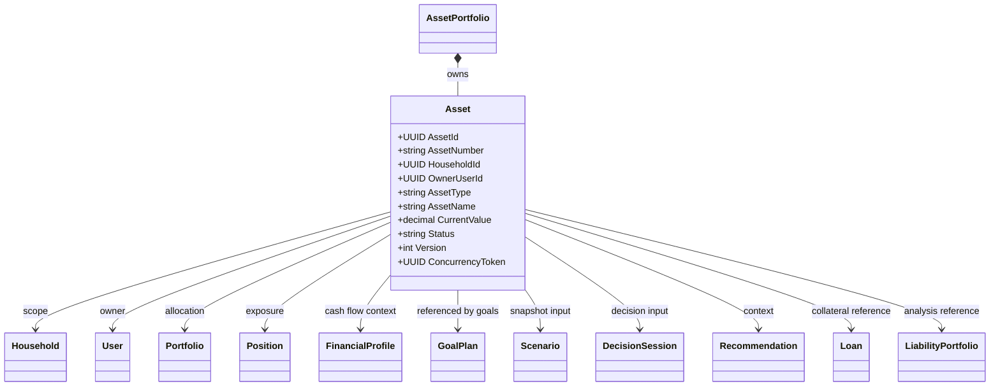
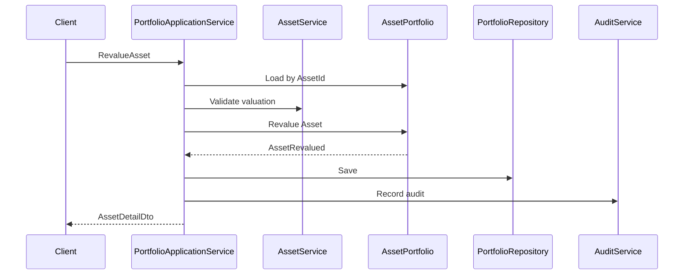
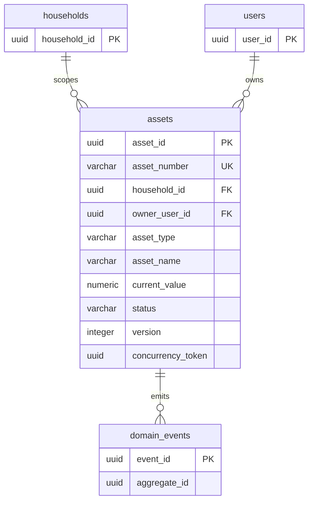
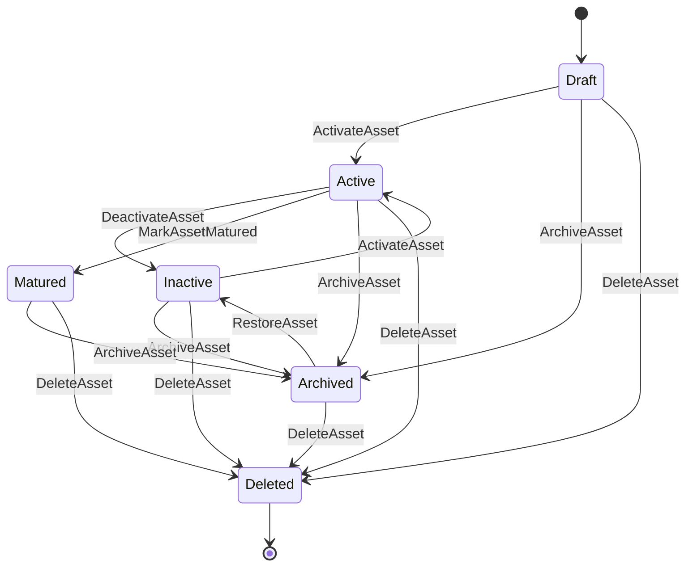

# Asset Entity Specification

# Entity Overview

## Purpose
- Asset represents an owned financial or investment asset within AssetPortfolio scope.
- Asset contributes to portfolio value, household net worth, allocation, scenario simulation, decision analysis, recommendation targeting, and risk evaluation.
- Asset keeps asset identity, classification, valuation, lifecycle, audit metadata, and portfolio-scoped concurrency participation.

## Responsibilities
- Maintain stable AssetId and unique AssetNumber within the Catalog-approved persistence boundary.
- Store HouseholdId and OwnerUserId references for authorization and ownership context.
- Store AssetType, AssetCategory, AssetName, Description, Currency, valuation fields, date fields, expected return fields, risk, liquidity, status, institution, account reference, tags, income-generation marker, collateral marker, active marker, audit fields, Version, and ConcurrencyToken.
- Preserve valuation history through AssetRevalued events and valuation records owned by the Portfolio persistence boundary.
- Provide portfolio, scenario, decision, recommendation, and household net worth calculations with current asset facts.
- Enforce asset lifecycle and valuation invariants without mutating GoalPlan, Scenario, DecisionSession, Loan, Mortgage, or LiabilityPortfolio.

## Business Meaning
- Asset is a financial item with positive economic value or expected value to a Household.
- Asset may be cash, investment, property-related, account-based, or other Catalog-approved AssetType.
- Asset is part of AssetPortfolio ownership in the Atlas Catalog and is not an independent standalone aggregate root.
- Asset may generate income, serve as collateral, affect liquidity, and influence recommendations, goals, scenarios, and decisions.

## Aggregate Root
- Catalog-aligned answer: Asset is not a standalone Aggregate Root.
- Owning Aggregate Root: AssetPortfolio.
- Entity Catalog Mapping: Asset -> AssetPortfolio -> PortfolioRepository.
- The user-facing Asset resource may expose Asset commands, but mutation must occur through AssetPortfolio or Catalog-approved legacy AssetRepository access mapped to AssetPortfolio ownership.
- Asset lifecycle, audit, and concurrency participate in AssetPortfolio aggregate consistency.

## Lifecycle
- Draft: asset is recorded but not included in active allocation or planning totals.
- Active: asset is included in portfolio valuation, net worth, scenario, and decision inputs.
- Inactive: asset is retained but excluded from active allocation and default planning.
- Matured: asset reached MaturityDate and is no longer expected to grow under its original assumptions.
- Archived: asset is retained for history and cannot be modified except restore or delete.
- Deleted: asset is soft-deleted and cannot be reused.

## Ownership
- Owned Entity: Asset.
- Owning Aggregate: AssetPortfolio.
- Aggregate Root: AssetPortfolio.
- Repository: PortfolioRepository.
- Application Service: PortfolioApplicationService.
- Domain Services: PortfolioService, AllocationService, RiskService, Asset Service, Valuation Service.
- Authorization Boundary: Household isolation through AssetPortfolio.
- Audit Strategy: asset changes audited through AssetPortfolio and portfolio persistence.

## Relationships
- Household: Asset must belong to one Household through AssetPortfolio authorization scope.
- User: OwnerUserId references the User responsible for the asset; User is not mutated by Asset.
- Portfolio: Asset is owned within portfolio scope and may appear in Portfolio allocation.
- Position: Position or Holding may reference Asset for quantity, allocation, and market exposure.
- CashFlow: Asset may produce cash flow through income-generating behavior; CashFlow Engine consumes asset income context.
- Income: IsIncomeGenerating assets may produce income records or projected income.
- Goal: Goals may reference asset values for funding progress and feasibility; Asset does not mutate GoalPlan.
- Scenario: Scenario reads Asset snapshots for simulation and projection.
- Decision: DecisionSession consumes Asset data for decision scoring, selected options, and explainability.
- Recommendation: Recommendation Engine uses Asset risk, liquidity, value, and collateral context.
- Loan: Loan may reference Asset as collateral; Asset does not mutate Loan.
- Mortgage: Mortgage is represented through Catalog-approved Loan and Property behavior and may reference collateral asset context.
- Liability: LiabilityPortfolio may consume asset collateral context but Asset does not own liabilities.
- DomainEvent: Asset emits AssetCreated, AssetUpdated, AssetActivated, AssetDeactivated, AssetRevalued, AssetArchived, AssetDeleted, and AssetStatusChanged through AssetPortfolio persistence.

## Navigation
- Asset -> Household by HouseholdId.
- Asset -> OwnerUser by OwnerUserId.
- Asset -> Portfolio by AssetPortfolio/Portfolio scope.
- Asset -> Position or Holding by AssetId.
- Asset -> CashFlow and Income by income-generating reference.
- Asset -> Goal by goal funding or reference records.
- Asset -> Scenario through scenario snapshots.
- Asset -> DecisionSession through decision input snapshots.
- Asset -> Recommendation through recommendation context.
- Asset -> Loan and Mortgage through collateral reference.
- Asset -> Liability through liability analysis reference.
- Asset -> DomainEvent by AggregateId, EntityId, and event metadata.

# Complete Properties

| Name | Type | Nullable | Default | Description | Validation | Business Meaning | Example | Database Mapping | JSON Name | API Usage | Searchable | Sortable | Indexed | Encrypted | Auditable |
|---|---|---:|---|---|---|---|---|---|---|---|---:|---:|---:|---:|---:|
| AssetId | UUID | No | generated | Stable asset identifier. | Required, immutable, UUID. | Identifies Asset entity. | `b802d0d3-7f81-4d21-a6e0-55a6e9fa2101` | `asset_id uuid primary key` | `assetId` | Route, detail, response. | Yes | Yes | Yes | No | Yes |
| AssetNumber | string(40) | No | generated | Business asset number. | Required, unique within scope, max 40. | Human-readable asset identity. | `AST-20260714` | `asset_number varchar(40) not null` | `assetNumber` | Create response, search. | Yes | Yes | Yes | No | Yes |
| HouseholdId | UUID | No | none | Household scope id. | Required, existing Household. | Authorization and planning scope. | `6a8b7b40-6b60-420a-88df-942b940d89a1` | `household_id uuid not null` | `householdId` | Create, search, detail. | Yes | Yes | Yes | No | Yes |
| OwnerUserId | UUID | Yes | null | User responsible for asset. | Existing User in Household when present. | Ownership attribution. | `0f40f9f1-7c98-4c8b-a5aa-6e7b12d70411` | `owner_user_id uuid` | `ownerUserId` | Create, update, search. | Yes | Yes | Yes | No | Yes |
| AssetType | string(40) | No | none | Asset type. | Required, Catalog AssetType. | Determines behavior and valuation. | `Investment` | `asset_type varchar(40) not null` | `assetType` | Create, update, search. | Yes | Yes | Yes | No | Yes |
| AssetCategory | string(60) | Yes | null | Asset category. | Catalog value when present, max 60. | Groups asset for reporting. | `Equity` | `asset_category varchar(60)` | `assetCategory` | Create, update, search. | Yes | Yes | Yes | No | Yes |
| AssetName | string(160) | No | none | Display name. | Required, trim, 1-160. | User-facing asset name. | `Global Equity ETF` | `asset_name varchar(160) not null` | `assetName` | Create, update, summary. | Yes | Yes | Yes | No | Yes |
| Description | string(2000) | Yes | null | Asset description. | Max 2000. | Additional context. | `Long-term ETF holding` | `description text` | `description` | Create, update, detail. | Yes | No | No | No | Yes |
| Currency | string(3) | No | household currency | Asset currency. | Required, ISO 4217 uppercase. | Valuation currency. | `TWD` | `currency char(3) not null` | `currency` | Create, update, search. | Yes | Yes | Yes | No | Yes |
| CurrentValue | decimal(19,4) | No | 0 | Current asset value. | Required, >= 0. | Current net worth contribution. | `1200000.0000` | `current_value numeric(19,4) not null` | `currentValue` | Create, update, revalue, detail. | No | Yes | Yes | Yes | Yes |
| AcquisitionCost | decimal(19,4) | No | 0 | Acquisition cost. | Required, >= 0. | Cost basis. | `1000000.0000` | `acquisition_cost numeric(19,4) not null` | `acquisitionCost` | Create, update, detail. | No | Yes | Yes | Yes | Yes |
| BookValue | decimal(19,4) | No | 0 | Accounting book value. | Required, >= 0. | Accounting valuation basis. | `1050000.0000` | `book_value numeric(19,4) not null` | `bookValue` | Create, update, detail. | No | Yes | Yes | Yes | Yes |
| MarketValue | decimal(19,4) | No | 0 | Market valuation. | Required, >= 0. | Market-facing asset value. | `1210000.0000` | `market_value numeric(19,4) not null` | `marketValue` | Create, update, revalue. | No | Yes | Yes | Yes | Yes |
| PurchaseDate | date | Yes | null | Purchase or acquisition date. | Not future beyond policy tolerance. | Start of ownership. | `2024-01-15` | `purchase_date date` | `purchaseDate` | Create, update, detail. | No | Yes | Yes | No | Yes |
| MaturityDate | date | Yes | null | Maturity date. | >= PurchaseDate when both present. | End of expected term. | `2034-01-15` | `maturity_date date` | `maturityDate` | Create, update, search. | No | Yes | Yes | No | Yes |
| ExpectedReturn | decimal(9,6) | Yes | null | Expected return percentage. | Reasonable percentage range. | Projection input. | `0.060000` | `expected_return numeric(9,6)` | `expectedReturn` | Create, update, scenario. | No | Yes | No | No | Yes |
| ExpectedGrowthRate | decimal(9,6) | Yes | null | Expected growth rate. | Reasonable percentage range. | Projection input. | `0.050000` | `expected_growth_rate numeric(9,6)` | `expectedGrowthRate` | Create, update, scenario. | No | Yes | No | No | Yes |
| RiskLevel | string(40) | Yes | null | Asset risk level. | Catalog RiskLevel when present. | Risk analysis and suitability. | `Medium` | `risk_level varchar(40)` | `riskLevel` | Create, update, search. | Yes | Yes | Yes | No | Yes |
| LiquidityLevel | string(40) | Yes | null | Liquidity level. | Catalog value when present. | Ability to convert to cash. | `High` | `liquidity_level varchar(40)` | `liquidityLevel` | Create, update, search. | Yes | Yes | Yes | No | Yes |
| Status | string(32) | No | `Draft` | Lifecycle status. | Required; Draft, Active, Inactive, Matured, Archived, Deleted. | Controls inclusion and mutability. | `Active` | `status varchar(32) not null` | `status` | Command response, search. | Yes | Yes | Yes | No | Yes |
| Institution | string(160) | Yes | null | Holding institution. | Max 160. | Custodian or account provider. | `Atlas Bank` | `institution varchar(160)` | `institution` | Create, update, search. | Yes | Yes | Yes | Yes | Yes |
| AccountNumber | string(120) | Yes | null | Account number or masked account id. | Max 120, sensitive. | External account reference. | `****1234` | `account_number varchar(120)` | `accountNumber` | Create, update, detail. | Yes | Yes | Yes | Yes | Yes |
| ReferenceCode | string(120) | Yes | null | External reference or instrument code. | Max 120. | Links asset to external records. | `ETF-0050` | `reference_code varchar(120)` | `referenceCode` | Create, update, search. | Yes | Yes | Yes | Yes | Yes |
| Tags | string[] | Yes | empty | User or system tags. | Each tag max 40, bounded count. | Filtering and grouping. | `["retirement","core"]` | `tags jsonb not null` | `tags` | Create, update, search. | Yes | No | Yes | No | Yes |
| IsIncomeGenerating | boolean | No | false | Income generation flag. | Required boolean. | Indicates cash flow relevance. | `true` | `is_income_generating boolean not null` | `isIncomeGenerating` | Create, update, search. | Yes | Yes | Yes | No | Yes |
| IsCollateral | boolean | No | false | Collateral flag. | Required boolean. | Indicates loan or mortgage collateral. | `false` | `is_collateral boolean not null` | `isCollateral` | Create, update, search. | Yes | Yes | Yes | No | Yes |
| IsActive | boolean | No | false | Active flag. | Must match Status Active. | Fast active filtering. | `true` | `is_active boolean not null` | `isActive` | Summary, search. | Yes | Yes | Yes | No | Yes |
| CreatedAt | datetime | No | now UTC | Creation timestamp. | Required, immutable, UTC. | Audit and ordering. | `2026-07-14T00:00:00Z` | `created_at timestamptz not null` | `createdAt` | Response. | Yes | Yes | Yes | No | Yes |
| CreatedBy | UUID | Yes | null | Creator actor. | Existing UserId or system actor. | Audit attribution. | `0f40f9f1-7c98-4c8b-a5aa-6e7b12d70411` | `created_by uuid` | `createdBy` | Response. | Yes | Yes | Yes | No | Yes |
| UpdatedAt | datetime | No | now UTC | Last update timestamp. | Required, UTC, >= CreatedAt. | Audit and cache invalidation. | `2026-07-14T02:00:00Z` | `updated_at timestamptz not null` | `updatedAt` | Response. | Yes | Yes | Yes | No | Yes |
| UpdatedBy | UUID | Yes | null | Last updater actor. | Existing UserId or system actor. | Audit attribution. | `0f40f9f1-7c98-4c8b-a5aa-6e7b12d70411` | `updated_by uuid` | `updatedBy` | Response. | Yes | Yes | Yes | No | Yes |
| Version | integer | No | 1 | Asset version within portfolio persistence. | Required, >= 1, increments on mutation. | Version history and event ordering. | `5` | `version integer not null` | `version` | Detail, update, audit. | No | Yes | Yes | No | Yes |
| ConcurrencyToken | UUID | No | generated | Optimistic concurrency token. | Required, changes on mutation. | Prevents lost updates. | `c305d2fd-9631-4e25-bdc8-f0cb33c63f58` | `concurrency_token uuid not null` | `concurrencyToken` | Update and command input. | No | No | Yes | No | Yes |

# Validation Rules

- AssetId is required, UUID, and immutable.
- AssetNumber is required, unique within asset persistence scope, immutable, and max 40 characters.
- HouseholdId is required and must reference an accessible Household.
- OwnerUserId is optional and must reference a User in the Household when present.
- AssetType is required and must match Catalog-approved AssetType.
- AssetCategory is optional and must match Catalog-approved category when category enumeration is enforced.
- AssetName is required, trimmed, 1-160 characters, and cannot contain control characters.
- Description is optional and max 2000 characters.
- Currency is required and must be uppercase ISO 4217 supported by Atlas.
- CurrentValue is required and must be greater than or equal to 0.
- AcquisitionCost is required and must be greater than or equal to 0.
- BookValue is required and must be greater than or equal to 0.
- MarketValue is required and must be greater than or equal to 0.
- PurchaseDate is optional and cannot be in the future beyond accepted clock tolerance.
- MaturityDate is optional and cannot be earlier than PurchaseDate when both are present.
- ExpectedReturn is optional and must be within the supported percentage range.
- ExpectedGrowthRate is optional and must be within the supported percentage range.
- RiskLevel is optional and must match Catalog RiskLevel values when present.
- LiquidityLevel is optional and must match Catalog-approved liquidity values when present.
- Status is required and must be Draft, Active, Inactive, Matured, Archived, or Deleted.
- Institution is optional, trimmed, and max 160 characters.
- AccountNumber is optional, max 120 characters, and must be protected as sensitive data.
- ReferenceCode is optional, max 120 characters, and unique only when an external source requires uniqueness.
- Tags are optional, must not exceed the configured count, and each tag must be trimmed and max 40 characters.
- IsIncomeGenerating, IsCollateral, and IsActive are required booleans.
- IsActive must be true only when Status is Active.
- CreatedAt is required, UTC, and immutable.
- UpdatedAt is required, UTC, and greater than or equal to CreatedAt.
- CreatedBy and UpdatedBy must reference an actor or system actor when present.
- Version is required and must be greater than or equal to 1.
- ConcurrencyToken is required for update commands and must change on successful mutation.
- Archived assets cannot be modified except RestoreAsset or DeleteAsset.
- Deleted assets cannot be restored through normal active flows and cannot be reused.
- RevalueAsset must provide at least one changed valuation field.
- RevalueAsset must preserve historical valuation record and AssetRevalued event.

# Business Rules

- Asset must belong to one Household.
- Asset must specify AssetType.
- Asset must specify Currency.
- CurrentValue must not be less than 0.
- AcquisitionCost must not be less than 0.
- BookValue must not be less than 0.
- MarketValue must not be less than 0.
- MaturityDate cannot be earlier than PurchaseDate.
- Archived Asset cannot be modified.
- Deleted Asset cannot be reused.
- Asset must preserve complete Audit Trail.
- Asset must preserve complete Version History.
- Asset supports Soft Delete.
- Asset supports historical valuation records.
- Asset changes must participate in AssetPortfolio aggregate concurrency.
- Active Asset contributes to portfolio valuation and household net worth.
- Inactive Asset is retained but excluded from default active allocation.
- Matured Asset remains visible for history and may be excluded from growth projection.
- IsIncomeGenerating Asset may feed CashFlow Engine projections or income records.
- IsCollateral Asset may be referenced by Loan or Mortgage context.
- Asset does not mutate Loan, Mortgage, LiabilityPortfolio, GoalPlan, Scenario, DecisionSession, or Recommendation directly.
- Asset valuation change must emit AssetRevalued when CurrentValue, MarketValue, BookValue, or ExpectedReturn changes through revaluation command.
- Asset mutation must emit AssetUpdated when non-status mutable fields change.
- Asset lifecycle change must emit AssetStatusChanged and specific lifecycle event.
- Asset deletion must be soft delete to preserve audit, snapshots, decisions, scenarios, and recommendation explainability.

# State Machine

| State | Transition | Trigger | Invariant | Illegal Transition |
|---|---|---|---|---|
| Draft | Draft -> Active | ActivateAsset | Required fields valid and values non-negative | Draft -> Matured |
| Draft | Draft -> Archived | ArchiveAsset | Audit recorded | Draft -> Matured |
| Draft | Draft -> Deleted | DeleteAsset | Soft delete recorded | Draft -> Inactive |
| Active | Active -> Inactive | DeactivateAsset | Asset remains non-deleted | Active -> Draft |
| Active | Active -> Matured | MaturityDate reached or status command | MaturityDate exists or maturity reason recorded | Active -> Draft |
| Active | Active -> Archived | ArchiveAsset | No same-transaction child aggregate mutation | Active -> Draft |
| Active | Active -> Deleted | DeleteAsset | Soft delete recorded | Active -> Draft |
| Inactive | Inactive -> Active | ActivateAsset | Required fields valid | Inactive -> Draft |
| Inactive | Inactive -> Archived | ArchiveAsset | Audit recorded | Inactive -> Draft |
| Matured | Matured -> Archived | ArchiveAsset | Audit recorded | Matured -> Draft |
| Matured | Matured -> Deleted | DeleteAsset | Soft delete recorded | Matured -> Active without reactivation |
| Archived | Archived -> Inactive | RestoreAsset | Restore audit recorded | Archived -> Active without activation |
| Archived | Archived -> Deleted | DeleteAsset | Soft delete recorded | Archived -> Draft |
| Deleted | none | terminal normal lifecycle | Asset remains retained for history | Deleted -> Active, Deleted -> Draft, Deleted -> Archived |

# Commands

## CreateAsset
- Creates Asset within AssetPortfolio ownership and Household authorization scope.
- Validates HouseholdId, OwnerUserId, AssetType, Currency, values, dates, tags, and initial status.
- Emits AssetCreated and AssetStatusChanged when status is initialized.

## UpdateAsset
- Updates mutable descriptive, classification, date, risk, liquidity, institution, reference, tag, and marker fields.
- Requires matching ConcurrencyToken.
- Rejects Archived and Deleted assets.
- Emits AssetUpdated.

## ActivateAsset
- Moves Draft or Inactive asset to Active.
- Sets IsActive true and includes asset in active calculations.
- Emits AssetActivated and AssetStatusChanged.

## DeactivateAsset
- Moves Active asset to Inactive.
- Sets IsActive false and excludes asset from default active allocation.
- Emits AssetDeactivated and AssetStatusChanged.

## RevalueAsset
- Updates CurrentValue, MarketValue, BookValue, ExpectedReturn, or ExpectedGrowthRate.
- Creates historical valuation record and emits AssetRevalued.
- Requires matching ConcurrencyToken and non-deleted asset.

## ArchiveAsset
- Moves Draft, Active, Inactive, or Matured asset to Archived.
- Prevents further normal updates.
- Emits AssetArchived and AssetStatusChanged.

## RestoreAsset
- Moves Archived asset to Inactive.
- Requires authorization and matching ConcurrencyToken.
- Emits AssetStatusChanged and AssetUpdated.

## DeleteAsset
- Soft-deletes Asset and prevents reuse.
- Retains audit, snapshots, and historical valuations.
- Emits AssetDeleted and AssetStatusChanged.

## MarkAssetMatured
- Moves Active or Inactive asset to Matured when maturity rules are satisfied.
- Emits AssetStatusChanged and AssetUpdated.

# Domain Events

| Event | Producer | Trigger | Payload | Consumers |
|---|---|---|---|---|
| AssetCreated | AssetPortfolio | CreateAsset | AssetId, HouseholdId, AssetType, Currency, CurrentValue | Portfolio read model, Audit Service |
| AssetUpdated | AssetPortfolio | UpdateAsset | AssetId, ChangedFields, Version, UpdatedAt | Portfolio Service, Scenario Engine, Audit Service |
| AssetActivated | AssetPortfolio | ActivateAsset | AssetId, ActivatedAt, ActivatedBy | Portfolio Service, Household summary |
| AssetDeactivated | AssetPortfolio | DeactivateAsset | AssetId, DeactivatedAt, DeactivatedBy | Portfolio Service, Household summary |
| AssetRevalued | AssetPortfolio | RevalueAsset | AssetId, PreviousValue, CurrentValue, MarketValue, ValuationAt | Valuation Service, Scenario Engine, Decision Engine |
| AssetArchived | AssetPortfolio | ArchiveAsset | AssetId, ArchivedAt, ArchivedBy | Audit Service, read models |
| AssetDeleted | AssetPortfolio | DeleteAsset | AssetId, DeletedAt, DeletedBy | Audit Service, read models |
| AssetStatusChanged | AssetPortfolio | Any lifecycle transition | AssetId, PreviousStatus, NewStatus, OccurredAt | Portfolio Service, Notification, Audit Service |
| AssetMatured | AssetPortfolio | MarkAssetMatured | AssetId, MaturityDate, MaturedAt | Projection Engine, Scenario Engine |
| AssetCollateralFlagChanged | AssetPortfolio | UpdateAsset | AssetId, IsCollateral, UpdatedAt | Loan analysis, Risk Analysis Service |
| AssetIncomeGeneratingChanged | AssetPortfolio | UpdateAsset | AssetId, IsIncomeGenerating, UpdatedAt | CashFlow Engine |

# Repository

## Interface
```csharp
public interface IAssetRepository
{
    Task<Asset?> GetByIdAsync(Guid assetId, CancellationToken cancellationToken);
    Task<Asset?> GetByAssetNumberAsync(string assetNumber, CancellationToken cancellationToken);
    Task<IReadOnlyList<Asset>> GetByHouseholdIdAsync(Guid householdId, CancellationToken cancellationToken);
    Task<IReadOnlyList<Asset>> SearchAsync(AssetSearchSpecification specification, CancellationToken cancellationToken);
    Task<bool> ExistsByAssetNumberAsync(string assetNumber, CancellationToken cancellationToken);
    Task AddAsync(Asset asset, CancellationToken cancellationToken);
    Task UpdateAsync(Asset asset, CancellationToken cancellationToken);
}
```

## Methods
- GetByIdAsync loads Asset by AssetId through Catalog-approved AssetPortfolio persistence.
- GetByAssetNumberAsync loads Asset by business number.
- GetByHouseholdIdAsync loads household-scoped assets for authorized queries.
- SearchAsync returns paged asset summaries.
- ExistsByAssetNumberAsync enforces uniqueness.
- AddAsync persists a new Asset through portfolio-owned persistence.
- UpdateAsync persists Asset mutation with optimistic concurrency.

## Query Methods
- FindActiveAssets.
- FindArchivedAssets.
- FindDeletedAssetsForAdministration.
- FindByHouseholdId.
- FindByOwnerUserId.
- FindByAssetType.
- FindByAssetCategory.
- FindByCurrency.
- FindByRiskLevel.
- FindByLiquidityLevel.
- FindIncomeGeneratingAssets.
- FindCollateralAssets.
- FindByMaturityDateRange.
- FindByCurrentValueRange.
- FindByReferenceCode.
- FindByTags.

## Specification Pattern
- AssetByIdSpecification.
- AssetByNumberSpecification.
- AssetByHouseholdSpecification.
- ActiveAssetSpecification.
- NonDeletedAssetSpecification.
- AssetTypeSpecification.
- AssetValuationRangeSpecification.
- AssetMaturitySpecification.
- AssetCollateralSpecification.
- AssetIncomeGeneratingSpecification.
- AssetSearchSpecification.

# Domain Service Interaction

- Asset Service validates asset lifecycle, classification, valuation, collateral, income-generation, and update rules.
- Portfolio Service owns portfolio integration, allocation impact, and AssetPortfolio persistence coordination.
- CashFlow Engine consumes IsIncomeGenerating assets for income projections and cash flow summaries.
- Valuation Service calculates or validates CurrentValue, MarketValue, BookValue, and valuation history.
- Projection Engine consumes ExpectedReturn, ExpectedGrowthRate, PurchaseDate, MaturityDate, and valuation data.
- Decision Engine consumes asset snapshots for decision scoring, cost, benefit, risk, and explainability.
- Recommendation Engine consumes asset value, risk, liquidity, income, and collateral context.
- Scenario Engine consumes asset snapshots for simulation and comparison.
- Risk Analysis Service evaluates RiskLevel, liquidity, concentration, and collateral exposure.
- Audit Service records all asset changes, valuation changes, and lifecycle transitions.

# Application Service Interaction

- PortfolioApplicationService handles Asset commands because Asset is owned by AssetPortfolio.
- AssetApplicationService may expose asset resource operations only as a facade over Catalog-approved portfolio persistence.
- HouseholdApplicationService validates Household access and household visibility.
- UserApplicationService validates OwnerUserId and actor permission.
- CashFlowApplicationService consumes income-generating asset context.
- ScenarioApplicationService reads asset snapshots for Scenario.
- DecisionApplicationService reads asset snapshots for DecisionSession.
- RecommendationApplicationService reads asset context for Recommendation.
- LoanApplicationService reads collateral asset references without mutating Asset.
- AuditApplicationService exposes asset audit history to authorized callers.

# API

## REST Endpoints
| Operation | HTTP Method | Endpoint | Request | Response | Error |
|---|---|---|---|---|---|
| Create | POST | `/api/assets` | CreateAssetDto | AssetDetailDto | 400, 403, 409, 422 |
| Get Detail | GET | `/api/assets/{assetId}` | none | AssetDetailDto | 401, 403, 404 |
| Update | PUT | `/api/assets/{assetId}` | UpdateAssetDto | AssetDetailDto | 400, 403, 404, 409, 422 |
| Delete | DELETE | `/api/assets/{assetId}` | concurrencyToken | AssetDetailDto | 403, 404, 409 |
| Search | GET | `/api/assets` | AssetSearchDto | paged AssetSummaryDto | 400, 403 |
| Revalue | POST | `/api/assets/{assetId}/revalue` | AssetRevaluationDto | AssetDetailDto | 400, 403, 404, 409, 422 |
| Activate | POST | `/api/assets/{assetId}/activate` | concurrencyToken | AssetDetailDto | 403, 404, 409, 422 |
| Deactivate | POST | `/api/assets/{assetId}/deactivate` | concurrencyToken | AssetDetailDto | 403, 404, 409, 422 |
| Archive | POST | `/api/assets/{assetId}/archive` | reason, concurrencyToken | AssetDetailDto | 403, 404, 409 |
| Restore | POST | `/api/assets/{assetId}/restore` | concurrencyToken | AssetDetailDto | 403, 404, 409, 422 |
| History | GET | `/api/assets/{assetId}/history` | paging | audit and valuation history page | 403, 404 |

## Response
- Command responses return AssetDetailDto with updated Version and ConcurrencyToken.
- Search responses return page, pageSize, totalCount, and AssetSummaryDto items.
- Sensitive financial and account fields are masked unless caller has permission.

## Error
- 400: invalid request, enum, currency, date, amount, or tag.
- 401: authentication required.
- 403: caller lacks Household or Asset permission.
- 404: Asset not found or not visible.
- 409: duplicate AssetNumber or concurrency conflict.
- 422: business rule violation or illegal transition.

# DTO

## Create DTO
```json
{
  "householdId": "6a8b7b40-6b60-420a-88df-942b940d89a1",
  "ownerUserId": "0f40f9f1-7c98-4c8b-a5aa-6e7b12d70411",
  "assetType": "Investment",
  "assetCategory": "Equity",
  "assetName": "Global Equity ETF",
  "description": "Long-term ETF holding",
  "currency": "TWD",
  "currentValue": 1200000,
  "acquisitionCost": 1000000,
  "bookValue": 1050000,
  "marketValue": 1210000,
  "purchaseDate": "2024-01-15",
  "maturityDate": "2034-01-15",
  "expectedReturn": 0.06,
  "expectedGrowthRate": 0.05,
  "riskLevel": "Medium",
  "liquidityLevel": "High",
  "institution": "Atlas Bank",
  "accountNumber": "1234567890",
  "referenceCode": "ETF-0050",
  "tags": ["retirement", "core"],
  "isIncomeGenerating": true,
  "isCollateral": false
}
```

## Update DTO
```json
{
  "assetName": "Global Equity ETF Core",
  "description": "Core long-term ETF holding",
  "riskLevel": "Medium",
  "liquidityLevel": "High",
  "tags": ["retirement", "core", "indexed"],
  "isIncomeGenerating": true,
  "isCollateral": false,
  "concurrencyToken": "c305d2fd-9631-4e25-bdc8-f0cb33c63f58"
}
```

## Detail DTO
```json
{
  "assetId": "b802d0d3-7f81-4d21-a6e0-55a6e9fa2101",
  "assetNumber": "AST-20260714",
  "householdId": "6a8b7b40-6b60-420a-88df-942b940d89a1",
  "ownerUserId": "0f40f9f1-7c98-4c8b-a5aa-6e7b12d70411",
  "assetType": "Investment",
  "assetCategory": "Equity",
  "assetName": "Global Equity ETF Core",
  "currency": "TWD",
  "currentValue": 1200000,
  "acquisitionCost": 1000000,
  "bookValue": 1050000,
  "marketValue": 1210000,
  "purchaseDate": "2024-01-15",
  "maturityDate": "2034-01-15",
  "expectedReturn": 0.06,
  "expectedGrowthRate": 0.05,
  "riskLevel": "Medium",
  "liquidityLevel": "High",
  "status": "Active",
  "institution": "Atlas Bank",
  "accountNumber": "****7890",
  "referenceCode": "ETF-0050",
  "tags": ["retirement", "core", "indexed"],
  "isIncomeGenerating": true,
  "isCollateral": false,
  "isActive": true,
  "version": 5,
  "concurrencyToken": "9e615f55-a2ca-4b9e-b65f-bd2d5efc9bd5"
}
```

## Summary DTO
```json
{
  "assetId": "b802d0d3-7f81-4d21-a6e0-55a6e9fa2101",
  "assetNumber": "AST-20260714",
  "assetName": "Global Equity ETF Core",
  "assetType": "Investment",
  "currency": "TWD",
  "currentValue": 1200000,
  "riskLevel": "Medium",
  "liquidityLevel": "High",
  "status": "Active",
  "isActive": true
}
```

## Search DTO
```json
{
  "householdId": "6a8b7b40-6b60-420a-88df-942b940d89a1",
  "keyword": "ETF",
  "assetType": ["Investment"],
  "currency": "TWD",
  "status": ["Active"],
  "riskLevel": ["Medium"],
  "isIncomeGenerating": true,
  "page": 1,
  "pageSize": 20,
  "sortBy": "currentValue",
  "sortDirection": "desc"
}
```

## Revaluation DTO
```json
{
  "currentValue": 1250000,
  "marketValue": 1255000,
  "bookValue": 1060000,
  "valuationDate": "2026-07-14",
  "reason": "Market value update",
  "concurrencyToken": "9e615f55-a2ca-4b9e-b65f-bd2d5efc9bd5"
}
```

# Database Mapping

## Table
- Table name: `assets`.
- Primary key: `asset_id`.
- Aggregate owner: AssetPortfolio.
- Repository: PortfolioRepository or Catalog-approved AssetRepository mapped to AssetPortfolio.

## Columns
| Column | Type | Nullable | Mapping |
|---|---|---:|---|
| asset_id | uuid | No | AssetId |
| asset_number | varchar(40) | No | AssetNumber |
| household_id | uuid | No | HouseholdId |
| owner_user_id | uuid | Yes | OwnerUserId |
| asset_type | varchar(40) | No | AssetType |
| asset_category | varchar(60) | Yes | AssetCategory |
| asset_name | varchar(160) | No | AssetName |
| description | text | Yes | Description |
| currency | char(3) | No | Currency |
| current_value | numeric(19,4) | No | CurrentValue |
| acquisition_cost | numeric(19,4) | No | AcquisitionCost |
| book_value | numeric(19,4) | No | BookValue |
| market_value | numeric(19,4) | No | MarketValue |
| purchase_date | date | Yes | PurchaseDate |
| maturity_date | date | Yes | MaturityDate |
| expected_return | numeric(9,6) | Yes | ExpectedReturn |
| expected_growth_rate | numeric(9,6) | Yes | ExpectedGrowthRate |
| risk_level | varchar(40) | Yes | RiskLevel |
| liquidity_level | varchar(40) | Yes | LiquidityLevel |
| status | varchar(32) | No | Status |
| institution | varchar(160) | Yes | Institution |
| account_number | varchar(120) | Yes | AccountNumber |
| reference_code | varchar(120) | Yes | ReferenceCode |
| tags | jsonb | No | Tags |
| is_income_generating | boolean | No | IsIncomeGenerating |
| is_collateral | boolean | No | IsCollateral |
| is_active | boolean | No | IsActive |
| created_at | timestamptz | No | CreatedAt |
| created_by | uuid | Yes | CreatedBy |
| updated_at | timestamptz | No | UpdatedAt |
| updated_by | uuid | Yes | UpdatedBy |
| version | integer | No | Version |
| concurrency_token | uuid | No | ConcurrencyToken |

## FK
- `household_id` references `households.household_id`.
- `owner_user_id` references `users.user_id`.
- Position or Holding tables may reference `assets.asset_id`.

## Unique
- `ux_assets_asset_number` on `asset_number`.
- `ux_assets_household_reference_code` on `household_id`, `reference_code` where ReferenceCode is not null when external uniqueness is enabled.

## Check Constraint
- Status in Draft, Active, Inactive, Matured, Archived, Deleted.
- Currency length equals 3 and uppercase.
- CurrentValue, AcquisitionCost, BookValue, MarketValue are >= 0.
- MaturityDate is null or PurchaseDate is null or MaturityDate >= PurchaseDate.
- Version >= 1.
- UpdatedAt >= CreatedAt.
- IsActive true only when Status equals Active.

## Index
- Primary key index on `asset_id`.
- Unique index on `asset_number`.
- Index on `household_id`.
- Index on `owner_user_id`.
- Index on `asset_type`, `asset_category`.
- Index on `currency`.
- Index on `status`, `is_active`.
- Index on `risk_level`, `liquidity_level`.
- Index on `current_value`, `market_value`.
- Index on `maturity_date`.
- Index on `is_income_generating`, `is_collateral`.
- GIN index on `tags`.
- Index on `updated_at`.

# PostgreSQL Schema

```sql
CREATE TABLE assets (
    asset_id uuid PRIMARY KEY,
    asset_number varchar(40) NOT NULL,
    household_id uuid NOT NULL,
    owner_user_id uuid,
    asset_type varchar(40) NOT NULL,
    asset_category varchar(60),
    asset_name varchar(160) NOT NULL,
    description text,
    currency char(3) NOT NULL,
    current_value numeric(19,4) NOT NULL DEFAULT 0,
    acquisition_cost numeric(19,4) NOT NULL DEFAULT 0,
    book_value numeric(19,4) NOT NULL DEFAULT 0,
    market_value numeric(19,4) NOT NULL DEFAULT 0,
    purchase_date date,
    maturity_date date,
    expected_return numeric(9,6),
    expected_growth_rate numeric(9,6),
    risk_level varchar(40),
    liquidity_level varchar(40),
    status varchar(32) NOT NULL DEFAULT 'Draft',
    institution varchar(160),
    account_number varchar(120),
    reference_code varchar(120),
    tags jsonb NOT NULL DEFAULT '[]'::jsonb,
    is_income_generating boolean NOT NULL DEFAULT false,
    is_collateral boolean NOT NULL DEFAULT false,
    is_active boolean NOT NULL DEFAULT false,
    created_at timestamptz NOT NULL DEFAULT now(),
    created_by uuid,
    updated_at timestamptz NOT NULL DEFAULT now(),
    updated_by uuid,
    version integer NOT NULL DEFAULT 1,
    concurrency_token uuid NOT NULL,
    CONSTRAINT fk_assets_household FOREIGN KEY (household_id) REFERENCES households(household_id),
    CONSTRAINT fk_assets_owner_user FOREIGN KEY (owner_user_id) REFERENCES users(user_id),
    CONSTRAINT ck_assets_status CHECK (status IN ('Draft','Active','Inactive','Matured','Archived','Deleted')),
    CONSTRAINT ck_assets_currency CHECK (currency = upper(currency) AND char_length(currency) = 3),
    CONSTRAINT ck_assets_current_value CHECK (current_value >= 0),
    CONSTRAINT ck_assets_acquisition_cost CHECK (acquisition_cost >= 0),
    CONSTRAINT ck_assets_book_value CHECK (book_value >= 0),
    CONSTRAINT ck_assets_market_value CHECK (market_value >= 0),
    CONSTRAINT ck_assets_maturity_date CHECK (maturity_date IS NULL OR purchase_date IS NULL OR maturity_date >= purchase_date),
    CONSTRAINT ck_assets_version CHECK (version >= 1),
    CONSTRAINT ck_assets_updated_at CHECK (updated_at >= created_at),
    CONSTRAINT ck_assets_active_flag CHECK ((status = 'Active' AND is_active = true) OR (status <> 'Active' AND is_active = false))
);

CREATE UNIQUE INDEX ux_assets_asset_number ON assets (asset_number);
CREATE UNIQUE INDEX ux_assets_household_reference_code ON assets (household_id, reference_code) WHERE reference_code IS NOT NULL;
CREATE INDEX ix_assets_household_id ON assets (household_id);
CREATE INDEX ix_assets_owner_user_id ON assets (owner_user_id);
CREATE INDEX ix_assets_type_category ON assets (asset_type, asset_category);
CREATE INDEX ix_assets_currency ON assets (currency);
CREATE INDEX ix_assets_status_active ON assets (status, is_active);
CREATE INDEX ix_assets_risk_liquidity ON assets (risk_level, liquidity_level);
CREATE INDEX ix_assets_values ON assets (current_value, market_value);
CREATE INDEX ix_assets_maturity_date ON assets (maturity_date);
CREATE INDEX ix_assets_income_collateral ON assets (is_income_generating, is_collateral);
CREATE INDEX ix_assets_tags ON assets USING gin (tags);
CREATE INDEX ix_assets_updated_at ON assets (updated_at);
CREATE INDEX ix_assets_concurrency_token ON assets (concurrency_token);
```

# EF Core Mapping

## Fluent API
```csharp
builder.ToTable("assets");
builder.HasKey(x => x.AssetId);
builder.Property(x => x.AssetId).HasColumnName("asset_id").ValueGeneratedNever();
builder.Property(x => x.AssetNumber).HasColumnName("asset_number").HasMaxLength(40).IsRequired();
builder.Property(x => x.HouseholdId).HasColumnName("household_id").IsRequired();
builder.Property(x => x.OwnerUserId).HasColumnName("owner_user_id");
builder.Property(x => x.AssetType).HasColumnName("asset_type").HasMaxLength(40).HasConversion<string>().IsRequired();
builder.Property(x => x.AssetCategory).HasColumnName("asset_category").HasMaxLength(60);
builder.Property(x => x.AssetName).HasColumnName("asset_name").HasMaxLength(160).IsRequired();
builder.Property(x => x.Description).HasColumnName("description");
builder.Property(x => x.Currency).HasColumnName("currency").HasMaxLength(3).IsRequired();
builder.Property(x => x.CurrentValue).HasColumnName("current_value").HasPrecision(19, 4);
builder.Property(x => x.AcquisitionCost).HasColumnName("acquisition_cost").HasPrecision(19, 4);
builder.Property(x => x.BookValue).HasColumnName("book_value").HasPrecision(19, 4);
builder.Property(x => x.MarketValue).HasColumnName("market_value").HasPrecision(19, 4);
builder.Property(x => x.PurchaseDate).HasColumnName("purchase_date");
builder.Property(x => x.MaturityDate).HasColumnName("maturity_date");
builder.Property(x => x.ExpectedReturn).HasColumnName("expected_return").HasPrecision(9, 6);
builder.Property(x => x.ExpectedGrowthRate).HasColumnName("expected_growth_rate").HasPrecision(9, 6);
builder.Property(x => x.RiskLevel).HasColumnName("risk_level").HasMaxLength(40).HasConversion<string>();
builder.Property(x => x.LiquidityLevel).HasColumnName("liquidity_level").HasMaxLength(40);
builder.Property(x => x.Status).HasColumnName("status").HasMaxLength(32).HasConversion<string>().IsRequired();
builder.Property(x => x.Institution).HasColumnName("institution").HasMaxLength(160);
builder.Property(x => x.AccountNumber).HasColumnName("account_number").HasMaxLength(120);
builder.Property(x => x.ReferenceCode).HasColumnName("reference_code").HasMaxLength(120);
builder.Property(x => x.Tags).HasColumnName("tags").HasColumnType("jsonb");
builder.Property(x => x.IsIncomeGenerating).HasColumnName("is_income_generating").IsRequired();
builder.Property(x => x.IsCollateral).HasColumnName("is_collateral").IsRequired();
builder.Property(x => x.IsActive).HasColumnName("is_active").IsRequired();
builder.Property(x => x.CreatedAt).HasColumnName("created_at").IsRequired();
builder.Property(x => x.CreatedBy).HasColumnName("created_by");
builder.Property(x => x.UpdatedAt).HasColumnName("updated_at").IsRequired();
builder.Property(x => x.UpdatedBy).HasColumnName("updated_by");
builder.Property(x => x.Version).HasColumnName("version").IsRequired();
builder.Property(x => x.ConcurrencyToken).HasColumnName("concurrency_token").IsConcurrencyToken().IsRequired();
builder.HasIndex(x => x.AssetNumber).IsUnique().HasDatabaseName("ux_assets_asset_number");
builder.HasIndex(x => x.HouseholdId).HasDatabaseName("ix_assets_household_id");
builder.HasIndex(x => new { x.AssetType, x.AssetCategory }).HasDatabaseName("ix_assets_type_category");
```

## Owned Type
- Valuation values may be grouped as Money-owned value objects while preserving CurrentValue, AcquisitionCost, BookValue, and MarketValue columns.
- Asset return assumptions may be grouped as percentage value objects while preserving ExpectedReturn and ExpectedGrowthRate columns.
- Tags may be stored as owned primitive collection or JSON value based on implementation support.

## Value Conversion
- AssetType converts Catalog AssetType value to string.
- RiskLevel converts Catalog RiskLevel value to string.
- Status converts lifecycle enum to string.
- Currency stores ISO 4217 string.
- Tags convert to JSON array when stored in jsonb.

## Concurrency Token
- Asset ConcurrencyToken participates in optimistic concurrency.
- AssetPortfolio aggregate concurrency must also be respected where Asset is loaded through PortfolioRepository.
- Version increments on each persisted Asset mutation.
- RevalueAsset requires current ConcurrencyToken to preserve valuation order.

# Cache Strategy

- Cache Asset detail by `asset:{assetId}`.
- Cache household asset list by `household:{householdId}:assets`.
- Cache active asset valuation summary by `household:{householdId}:asset-valuation`.
- Cache AssetNumber lookup by `asset-number:{assetNumber}`.
- Invalidate caches on AssetCreated, AssetUpdated, AssetActivated, AssetDeactivated, AssetRevalued, AssetArchived, AssetDeleted, and AssetStatusChanged.
- Do not cache unmasked AccountNumber or sensitive valuations in shared cache without authorization scope.
- Search cache keys must include HouseholdId, caller authorization, masking level, filters, sorting, and paging.

# Security

## Authorization
- Caller must have Household access to read Asset.
- Caller must have portfolio or asset write permission to create or update Asset.
- RevalueAsset requires asset valuation permission.
- Archive, Restore, and Delete require asset lifecycle permission.
- Collateral asset references require loan context permission when exposed with Loan or Mortgage.
- Search must enforce Household isolation.

## Permission
- `Asset.Read`.
- `Asset.ReadSensitive`.
- `Asset.Search`.
- `Asset.Create`.
- `Asset.Update`.
- `Asset.Revalue`.
- `Asset.Activate`.
- `Asset.Deactivate`.
- `Asset.Archive`.
- `Asset.Restore`.
- `Asset.Delete`.
- `Asset.History.Read`.

## Data Masking
- AccountNumber is masked in normal responses.
- Institution may be masked in privacy-restricted views.
- CurrentValue, AcquisitionCost, BookValue, MarketValue, and Target valuation history may be masked unless caller has financial read permission.
- ReferenceCode is masked when it identifies an external account or security relationship requiring protection.

## Encryption
- AccountNumber must be encrypted or tokenized according to Atlas security policy.
- ReferenceCode should be protected when it identifies external accounts.
- Sensitive valuation fields should be protected according to financial data policy.
- Audit records containing sensitive values must store masked before/after values or protected payloads.

# Audit

- Audit CreateAsset with HouseholdId, AssetId, AssetType, Currency, and initial value.
- Audit UpdateAsset with changed field names and masked sensitive values.
- Audit ActivateAsset and DeactivateAsset with previous and new status.
- Audit RevalueAsset with previous valuation, new valuation, valuation date, reason, and actor.
- Audit ArchiveAsset, RestoreAsset, and DeleteAsset.
- Audit changes to AccountNumber, ReferenceCode, IsCollateral, and IsIncomeGenerating.
- Audit authorization failures and illegal transitions.
- Audit Version and ConcurrencyToken changes.
- Audit DomainEvent correlation and causation ids.
- Audit records remain immutable after Asset deletion.

# Performance

## Index Strategy
- Use AssetId primary key for detail and command handling.
- Use AssetNumber unique index for business lookup.
- Use HouseholdId index for household asset lists.
- Use AssetType and AssetCategory index for allocation filters.
- Use Status and IsActive index for active planning views.
- Use CurrentValue and MarketValue index for high-value asset queries.
- Use MaturityDate index for maturity processing.
- Use Tags GIN index for tag filtering.

## Caching
- Cache active valuation summaries separately from asset detail.
- Invalidate valuation cache after revaluation, activation, deactivation, archive, restore, or delete.
- Avoid caching unmasked sensitive financial values across users.
- Use short TTL for market-sensitive asset valuations.

## Optimistic Concurrency
- UpdateAsset and RevalueAsset require ConcurrencyToken.
- Concurrent revaluation must fail with 409 when stale.
- Version and valuation history preserve ordering.
- AssetPortfolio concurrency must be respected for aggregate consistency.

## Batch Revaluation
- Batch revaluation processes assets by HouseholdId and AssetType pages.
- Batch revaluation must create valuation history for each changed asset.
- Batch revaluation must emit AssetRevalued per changed asset.
- Batch revaluation must not mutate Loan, GoalPlan, Scenario, or DecisionSession.

## Partition Strategy
- Asset table is not partitioned by default.
- Asset valuation history may be partitioned by valuation date.
- AuditLog and DomainEvent may be partitioned by time.
- Household-scoped queries must remain index-backed without cross-household scans.

# Example JSON

## Create
```json
{
  "householdId": "6a8b7b40-6b60-420a-88df-942b940d89a1",
  "ownerUserId": "0f40f9f1-7c98-4c8b-a5aa-6e7b12d70411",
  "assetType": "Investment",
  "assetCategory": "Equity",
  "assetName": "Global Equity ETF",
  "currency": "TWD",
  "currentValue": 1200000,
  "acquisitionCost": 1000000,
  "bookValue": 1050000,
  "marketValue": 1210000,
  "purchaseDate": "2024-01-15",
  "expectedReturn": 0.06,
  "riskLevel": "Medium",
  "liquidityLevel": "High",
  "isIncomeGenerating": true,
  "isCollateral": false
}
```

## Update
```json
{
  "assetName": "Global Equity ETF Core",
  "description": "Core long-term ETF holding",
  "tags": ["retirement", "core"],
  "isIncomeGenerating": true,
  "concurrencyToken": "c305d2fd-9631-4e25-bdc8-f0cb33c63f58"
}
```

## Revalue
```json
{
  "currentValue": 1250000,
  "marketValue": 1255000,
  "bookValue": 1060000,
  "valuationDate": "2026-07-14",
  "reason": "Market value update",
  "concurrencyToken": "9e615f55-a2ca-4b9e-b65f-bd2d5efc9bd5"
}
```

## Detail
```json
{
  "assetId": "b802d0d3-7f81-4d21-a6e0-55a6e9fa2101",
  "assetNumber": "AST-20260714",
  "householdId": "6a8b7b40-6b60-420a-88df-942b940d89a1",
  "assetType": "Investment",
  "assetName": "Global Equity ETF Core",
  "currency": "TWD",
  "currentValue": 1250000,
  "marketValue": 1255000,
  "riskLevel": "Medium",
  "liquidityLevel": "High",
  "status": "Active",
  "accountNumber": "****7890",
  "isIncomeGenerating": true,
  "isCollateral": false,
  "version": 6,
  "concurrencyToken": "ee8fd3a4-0e7c-41fd-95be-facdf6e3cda0"
}
```

## Search
```json
{
  "page": 1,
  "pageSize": 20,
  "totalCount": 1,
  "items": [
    {
      "assetId": "b802d0d3-7f81-4d21-a6e0-55a6e9fa2101",
      "assetNumber": "AST-20260714",
      "assetName": "Global Equity ETF Core",
      "assetType": "Investment",
      "currency": "TWD",
      "currentValue": 1250000,
      "status": "Active"
    }
  ]
}
```

# Mermaid

## Class Diagram


## Sequence Diagram


## ER Diagram


## State Diagram


# Testing

## Unit Test
- CreateAsset requires HouseholdId.
- CreateAsset requires AssetType.
- CreateAsset requires Currency.
- CreateAsset rejects negative CurrentValue.
- CreateAsset rejects negative AcquisitionCost.
- CreateAsset rejects negative BookValue.
- CreateAsset rejects negative MarketValue.
- CreateAsset rejects MaturityDate earlier than PurchaseDate.
- UpdateAsset rejects stale ConcurrencyToken.
- UpdateAsset rejects Archived Asset.
- UpdateAsset rejects Deleted Asset.
- ActivateAsset moves Draft to Active.
- DeactivateAsset moves Active to Inactive.
- RevalueAsset creates historical valuation record.
- RevalueAsset emits AssetRevalued.
- ArchiveAsset prevents normal update.
- RestoreAsset moves Archived to Inactive.
- DeleteAsset soft-deletes and prevents reuse.

## Integration Test
- Asset persistence stores and reloads all properties.
- AssetNumber uniqueness is enforced.
- HouseholdId foreign key rejects unknown household.
- OwnerUserId foreign key rejects unknown user.
- Search filters by HouseholdId, AssetType, Currency, Status, RiskLevel, and tags.
- AccountNumber is masked without sensitive read permission.
- AssetRevalued invalidates valuation cache.
- DomainEvents are persisted with aggregate correlation.
- Audit records are written for create, update, revalue, archive, restore, and delete.

## Validation Test
- Invalid AssetType returns validation error.
- Invalid Currency returns validation error.
- Invalid RiskLevel returns validation error.
- Invalid LiquidityLevel returns validation error.
- Tag count above limit returns validation error.
- AccountNumber above length limit returns validation error.
- Future PurchaseDate beyond tolerance returns validation error.
- Invalid ExpectedReturn range returns validation error.
- IsActive inconsistent with Status returns validation error.
- UpdatedAt earlier than CreatedAt is rejected.

## Performance Test
- GetById uses primary key lookup.
- Search by HouseholdId uses household index.
- Search by AssetType uses type category index.
- Active asset list uses status active index.
- Revaluation batch processes by pages.
- Tag search uses GIN index.
- Concurrent revaluation returns 409 for stale ConcurrencyToken.
- Valuation summary cache invalidates after revaluation.

# Edge Cases

- CreateAsset with missing HouseholdId.
- CreateAsset with inaccessible HouseholdId.
- CreateAsset with OwnerUserId outside Household.
- CreateAsset with missing AssetType.
- CreateAsset with unsupported AssetType.
- CreateAsset with lowercase Currency.
- CreateAsset with negative CurrentValue.
- CreateAsset with negative AcquisitionCost.
- CreateAsset with negative BookValue.
- CreateAsset with negative MarketValue.
- CreateAsset with MaturityDate earlier than PurchaseDate.
- CreateAsset with duplicate AssetNumber.
- UpdateAsset attempts to change AssetId.
- UpdateAsset attempts to change AssetNumber.
- UpdateAsset on Archived Asset.
- UpdateAsset on Deleted Asset.
- ActivateAsset when already Active.
- DeactivateAsset when Draft.
- RevalueAsset with no changed valuation field.
- RevalueAsset with stale ConcurrencyToken.
- RevalueAsset with market value lower than zero.
- ArchiveAsset while referenced as collateral.
- DeleteAsset while referenced by Loan collateral.
- DeleteAsset while included in Scenario snapshot.
- RestoreAsset from Deleted.
- Matured Asset without MaturityDate but with manual maturity reason.
- Income-generating asset without CashFlow setup.
- Collateral asset without Loan reference.
- Asset with mixed currency portfolio calculation.
- AccountNumber returned without masking.
- Batch revaluation partially succeeds.
- Asset valuation event published but read model projection delayed.
- Cache returns old CurrentValue after AssetRevalued.
- Scenario consumes stale Asset snapshot.
- Decision explainability references deleted Asset.

# Version History

| Version | Date | Change | Author |
|---|---|---|---|
| 1.0 | 2026-07-14 | Upgraded Asset to Enterprise Specification aligned with Atlas Entity Catalog, AssetPortfolio ownership, PortfolioRepository persistence, household isolation, valuation history, commands, events, API, database mapping, security, audit, performance, testing, and edge cases. | Atlas |
