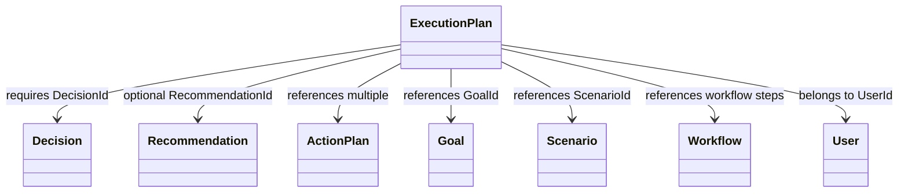
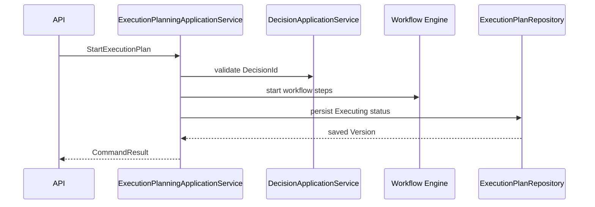
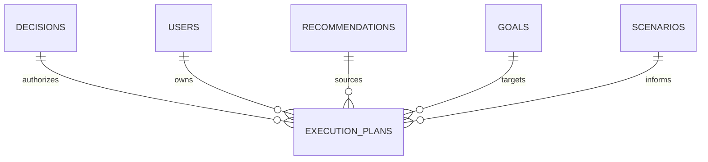
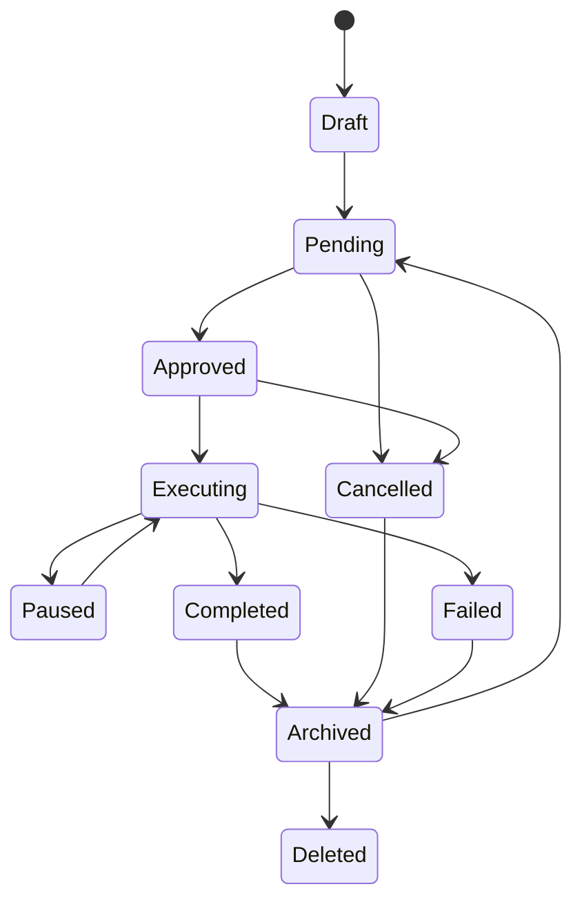

# ExecutionPlan Entity Specification

# Document Control

Document Name: ExecutionPlan Entity Specification

Document Path: knowledge/entity/ExecutionPlan.md

Document Type: Enterprise Specification

Version: 1.0

Status: Canonical Specification

Domain: Decision

Bounded Context: Decision

Module: Decision Engine

Owner: Project Atlas

Source of Truth: Atlas Knowledge Base

Last Updated: 2026-07-14

Related Specifications:

- knowledge/entity-catalog.md
- knowledge/aggregate-catalog.md
- knowledge/command-catalog.md
- knowledge/domain-event-catalog.md
- knowledge/repository-catalog.md
- knowledge/application-service-catalog.md
- knowledge/domain-service-catalog.md
- knowledge/value-object-catalog.md
- knowledge/decision-execution.md
- knowledge/recommendation-execution.md

# Entity Overview

Purpose: ExecutionPlan represents the catalog-aligned execution plan produced after a Decision or Recommendation is accepted for execution.

Responsibilities:

- Maintain stable ExecutionPlan identity and ExecutionPlanNumber.
- Reference exactly one Decision.
- Optionally reference one Recommendation.
- Reference User, Goal, Scenario, Workflow, Notification, Task, and DomainEvent by identity.
- Coordinate ActionPlan references and Workflow Step execution references.
- Store plan title, description, type, priority, status, strategy, duration, cost, expected benefit, risk, progress, dates, automation flags, owner, approver, result, and failure reason.
- Support approval, start, pause, resume, completion, cancellation, archive, restore, deletion, and history.
- Preserve complete Version History and Audit Trail.

Business Meaning: ExecutionPlan is the operational plan that turns an approved Decision or accepted Recommendation into ordered execution work while preserving traceability to Decision, Recommendation, Goal, Scenario, Workflow, notifications, tasks, and DomainEvent history.

Aggregate Root: No. ExecutionPlan is not listed as an Atlas aggregate root in the current Entity Catalog. It is a catalog-approved execution record managed through Decision execution behavior and ExecutionPlanningApplicationService. DecisionSession and DecisionRepository remain the catalog ownership boundary when an ExecutionPlan is generated from Decision.

Lifecycle: Draft, Pending, Approved, Executing, Paused, Completed, Cancelled, Failed, Archived, Deleted.

Ownership: ExecutionPlan lifecycle is owned by the Decision execution path and persisted by catalog-approved execution planning persistence. It does not own Decision, Recommendation, Goal, Scenario, Workflow, User, Notification, Task, or DomainEvent.

Relationships:

- Decision: ExecutionPlan must reference one Decision by DecisionId.
- Recommendation: ExecutionPlan may reference one Recommendation by RecommendationId when generated from a Recommendation.
- ActionPlan: ExecutionPlan may contain multiple ActionPlan identities in execution steps or payload; ActionPlan is not owned by ExecutionPlan unless explicitly persisted by execution planning.
- Goal: ExecutionPlan may reference GoalId for goal execution impact.
- Scenario: ExecutionPlan may reference ScenarioId for scenario evidence.
- Workflow: ExecutionPlan may reference Workflow identities or Workflow Step identities through execution metadata.
- User: ExecutionPlan references UserId as owner scope and actor access boundary.
- Notification: ExecutionPlan may trigger Notification creation and reference Notification identities in audit or payload.
- Task: ExecutionPlan may create, schedule, or reference Task identities through Task Scheduler integration.
- DomainEvent: ExecutionPlan emits and consumes DomainEvent records for status, execution, and audit traceability.

Navigation:

- Cross-aggregate navigation uses identity references only.
- ExecutionPlan may expose read-only projections of related Decision, Recommendation, Goal, Scenario, Workflow, Notification, and Task summaries.
- ExecutionPlan does not cascade mutation into referenced entities.
- ExecutionPlan history is accessed through ExecutionPlanId and Version.

# Complete Properties

## ExecutionPlanId

- Name: ExecutionPlanId
- Type: Guid
- Nullable: No
- Default: Generated by application
- Description: Stable technical identity of ExecutionPlan.
- Validation: Required; unique; valid Guid; immutable.
- Business Meaning: Identifies one execution plan across API, persistence, events, and audit.
- Example: 49b48b7e-2f44-40d7-bd31-2eb6fe7f206d.
- Database Mapping: execution_plans.execution_plan_id uuid primary key
- JSON Name: executionPlanId
- API Usage: Detail, Update, Approve, Start, Pause, Resume, Complete, Cancel, Archive, Restore, Delete, History
- Searchable: Yes
- Sortable: No
- Indexed: Yes
- Encrypted: No
- Auditable: Yes

## ExecutionPlanNumber

- Name: ExecutionPlanNumber
- Type: String
- Nullable: No
- Default: Generated sequence
- Description: Human-readable execution plan number.
- Validation: Required; unique; max length 64; immutable.
- Business Meaning: Enables user support and audit lookup.
- Example: EXP-20260714-000001.
- Database Mapping: execution_plans.execution_plan_number varchar(64) unique not null
- JSON Name: executionPlanNumber
- API Usage: Detail, Summary, Search, History
- Searchable: Yes
- Sortable: Yes
- Indexed: Yes
- Encrypted: No
- Auditable: Yes

## DecisionId

- Name: DecisionId
- Type: Guid
- Nullable: No
- Default: None
- Description: Decision that produced or authorized the ExecutionPlan.
- Validation: Required; valid Guid; Decision must be approved or otherwise catalog-eligible for execution.
- Business Meaning: Every ExecutionPlan must correspond to one Decision.
- Example: 111d49c8-0957-42a2-a812-b736615fa2bb.
- Database Mapping: execution_plans.decision_id uuid not null
- JSON Name: decisionId
- API Usage: Create, Detail, Summary, Search, History
- Searchable: Yes
- Sortable: No
- Indexed: Yes
- Encrypted: No
- Auditable: Yes

## RecommendationId

- Name: RecommendationId
- Type: Guid
- Nullable: Yes
- Default: null
- Description: Source Recommendation when generated from recommendation execution.
- Validation: Valid Guid when present; must match accessible Recommendation scope.
- Business Meaning: Preserves traceability to accepted Recommendation.
- Example: 7f3d29c6-6d0e-4f2c-bb46-bd3555d6d351.
- Database Mapping: execution_plans.recommendation_id uuid null
- JSON Name: recommendationId
- API Usage: Create, Detail, Summary, Search
- Searchable: Yes
- Sortable: No
- Indexed: Yes
- Encrypted: No
- Auditable: Yes

## UserId

- Name: UserId
- Type: Guid
- Nullable: No
- Default: None
- Description: User scope and owner reference for the ExecutionPlan.
- Validation: Required; valid Guid; actor must be authorized for User scope.
- Business Meaning: ExecutionPlan belongs to a user-accessible decision scope.
- Example: b6a6d087-b8f8-4062-92ec-08b7fc5d64f4.
- Database Mapping: execution_plans.user_id uuid not null
- JSON Name: userId
- API Usage: Create, Detail, Summary, Search
- Searchable: Yes
- Sortable: No
- Indexed: Yes
- Encrypted: No
- Auditable: Yes

## GoalId

- Name: GoalId
- Type: Guid
- Nullable: Yes
- Default: null
- Description: Goal affected by the ExecutionPlan.
- Validation: Valid Guid when present; same authorization scope.
- Business Meaning: Connects execution to goal progress.
- Example: 3e1f27f4-4201-431d-bb4a-01d2e4aa94d8.
- Database Mapping: execution_plans.goal_id uuid null
- JSON Name: goalId
- API Usage: Create, Detail, Summary, Search
- Searchable: Yes
- Sortable: No
- Indexed: Yes
- Encrypted: No
- Auditable: Yes

## ScenarioId

- Name: ScenarioId
- Type: Guid
- Nullable: Yes
- Default: null
- Description: Scenario evidence used to generate the ExecutionPlan.
- Validation: Valid Guid when present; same authorization scope.
- Business Meaning: Preserves scenario traceability.
- Example: 7b8f2309-4b51-4724-9fb7-927db4ee5d5d.
- Database Mapping: execution_plans.scenario_id uuid null
- JSON Name: scenarioId
- API Usage: Create, Detail, Summary, Search
- Searchable: Yes
- Sortable: No
- Indexed: Yes
- Encrypted: No
- Auditable: Yes

## Title

- Name: Title
- Type: String
- Nullable: No
- Default: None
- Description: ExecutionPlan title.
- Validation: Required; max length 256; no executable content.
- Business Meaning: User-readable name for the plan.
- Example: Increase cash reserve execution.
- Database Mapping: execution_plans.title varchar(256) not null
- JSON Name: title
- API Usage: Create, Update, Detail, Summary, Search
- Searchable: Yes
- Sortable: Yes
- Indexed: Optional full text
- Encrypted: No
- Auditable: Yes

## Description

- Name: Description
- Type: String
- Nullable: Yes
- Default: null
- Description: Detailed plan description.
- Validation: Max length 4000; no executable content.
- Business Meaning: Explains execution scope and intent.
- Example: Move monthly surplus into emergency reserve until target is reached.
- Database Mapping: execution_plans.description text null
- JSON Name: description
- API Usage: Create, Update, Detail
- Searchable: Yes
- Sortable: No
- Indexed: Optional full text
- Encrypted: Conditional
- Auditable: Yes

## PlanType

- Name: PlanType
- Type: String
- Nullable: No
- Default: Manual
- Description: Execution plan type.
- Validation: Required; max length 64.
- Business Meaning: Classifies how execution is organized without adding a new Domain.
- Example: Manual.
- Database Mapping: execution_plans.plan_type varchar(64) not null
- JSON Name: planType
- API Usage: Create, Update, Detail, Summary, Search
- Searchable: Yes
- Sortable: Yes
- Indexed: Yes
- Encrypted: No
- Auditable: Yes

## Priority

- Name: Priority
- Type: String
- Nullable: No
- Default: Medium
- Description: Execution priority.
- Validation: Required; Low, Medium, High, Critical.
- Business Meaning: Determines ordering and escalation.
- Example: High.
- Database Mapping: execution_plans.priority varchar(32) not null
- JSON Name: priority
- API Usage: Create, Update, Detail, Summary, Search
- Searchable: Yes
- Sortable: Yes
- Indexed: Yes
- Encrypted: No
- Auditable: Yes

## Status

- Name: Status
- Type: String
- Nullable: No
- Default: Draft
- Description: ExecutionPlan lifecycle status.
- Validation: Required; Draft, Pending, Approved, Executing, Paused, Completed, Cancelled, Failed, Archived, Deleted.
- Business Meaning: Controls execution and mutation behavior.
- Example: Pending.
- Database Mapping: execution_plans.status varchar(32) not null
- JSON Name: status
- API Usage: Detail, Summary, Search, Approve, Start, Pause, Resume, Complete, Cancel, Archive, Restore, Delete
- Searchable: Yes
- Sortable: Yes
- Indexed: Yes
- Encrypted: No
- Auditable: Yes

## ExecutionStrategy

- Name: ExecutionStrategy
- Type: Json
- Nullable: Yes
- Default: null
- Description: Structured strategy, steps, sequencing, rollback, retry, and dependency metadata.
- Validation: Valid JSON object when present.
- Business Meaning: Defines how the plan is executed.
- Example: {"mode":"Sequential","retryPolicy":"Standard"}.
- Database Mapping: execution_plans.execution_strategy jsonb null
- JSON Name: executionStrategy
- API Usage: Create, Update, Execute, Detail
- Searchable: No
- Sortable: No
- Indexed: Optional jsonb path
- Encrypted: Conditional
- Auditable: Yes

## EstimatedDuration

- Name: EstimatedDuration
- Type: String
- Nullable: Yes
- Default: null
- Description: Estimated duration in ISO-8601 duration format or catalog display duration.
- Validation: Valid duration string when present; max length 64.
- Business Meaning: Supports planning, scheduling, and user expectation.
- Example: P30D.
- Database Mapping: execution_plans.estimated_duration varchar(64) null
- JSON Name: estimatedDuration
- API Usage: Create, Update, Detail, Summary, Search
- Searchable: Yes
- Sortable: Yes
- Indexed: Yes
- Encrypted: No
- Auditable: Yes

## EstimatedCost

- Name: EstimatedCost
- Type: Json
- Nullable: Yes
- Default: null
- Description: Estimated cost snapshot.
- Validation: Valid JSON object; amount must be nonnegative and include CurrencyCode when present.
- Business Meaning: Preserves cost expectation for execution.
- Example: {"amount":5000,"currency":"TWD"}.
- Database Mapping: execution_plans.estimated_cost jsonb null
- JSON Name: estimatedCost
- API Usage: Create, Update, Detail, Summary
- Searchable: No
- Sortable: No
- Indexed: Optional jsonb path
- Encrypted: Conditional
- Auditable: Yes

## ExpectedBenefit

- Name: ExpectedBenefit
- Type: Json
- Nullable: Yes
- Default: null
- Description: Expected benefit snapshot.
- Validation: Valid JSON object when present.
- Business Meaning: Preserves expected positive outcome.
- Example: {"amount":150000,"currency":"TWD","description":"Reserve improvement"}.
- Database Mapping: execution_plans.expected_benefit jsonb null
- JSON Name: expectedBenefit
- API Usage: Create, Update, Detail, Summary
- Searchable: No
- Sortable: No
- Indexed: Optional jsonb path
- Encrypted: Conditional
- Auditable: Yes

## RiskLevel

- Name: RiskLevel
- Type: RiskLevel
- Nullable: Yes
- Default: null
- Description: Catalog risk level associated with execution.
- Validation: Valid RiskLevel when present.
- Business Meaning: Communicates execution risk.
- Example: Medium.
- Database Mapping: execution_plans.risk_level varchar(32) null
- JSON Name: riskLevel
- API Usage: Create, Update, Detail, Summary, Search
- Searchable: Yes
- Sortable: Yes
- Indexed: Yes
- Encrypted: No
- Auditable: Yes

## Progress

- Name: Progress
- Type: Decimal
- Nullable: No
- Default: 0
- Description: Completion percentage.
- Validation: Required; between 0.0000 and 100.0000.
- Business Meaning: Tracks execution completion.
- Example: 35.5000.
- Database Mapping: execution_plans.progress numeric(9,4) not null
- JSON Name: progress
- API Usage: Update, Execute, Complete, Detail, Summary, Search
- Searchable: Yes
- Sortable: Yes
- Indexed: Yes
- Encrypted: No
- Auditable: Yes

## StartDate

- Name: StartDate
- Type: Date
- Nullable: Yes
- Default: null
- Description: Planned or actual start date.
- Validation: Must be on or before TargetDate and CompletedDate when those are present.
- Business Meaning: Establishes execution start.
- Example: 2026-08-01.
- Database Mapping: execution_plans.start_date date null
- JSON Name: startDate
- API Usage: Create, Update, Start, Detail, Search
- Searchable: Yes
- Sortable: Yes
- Indexed: Yes
- Encrypted: No
- Auditable: Yes

## TargetDate

- Name: TargetDate
- Type: Date
- Nullable: Yes
- Default: null
- Description: Planned completion target date.
- Validation: Must be on or after StartDate when both are present.
- Business Meaning: Defines execution deadline.
- Example: 2026-12-31.
- Database Mapping: execution_plans.target_date date null
- JSON Name: targetDate
- API Usage: Create, Update, Detail, Summary, Search
- Searchable: Yes
- Sortable: Yes
- Indexed: Yes
- Encrypted: No
- Auditable: Yes

## CompletedDate

- Name: CompletedDate
- Type: Date
- Nullable: Yes
- Default: null
- Description: Date execution completed.
- Validation: Required when Status is Completed; must be on or after StartDate when present.
- Business Meaning: Records completion date.
- Example: 2026-10-31.
- Database Mapping: execution_plans.completed_date date null
- JSON Name: completedDate
- API Usage: Complete, Detail, Summary, Search
- Searchable: Yes
- Sortable: Yes
- Indexed: Yes
- Encrypted: No
- Auditable: Yes

## IsAutomated

- Name: IsAutomated
- Type: Boolean
- Nullable: No
- Default: false
- Description: Whether execution can run through automation.
- Validation: Required; automated plan must have execution strategy.
- Business Meaning: Determines scheduler and workflow behavior.
- Example: false.
- Database Mapping: execution_plans.is_automated boolean not null
- JSON Name: isAutomated
- API Usage: Create, Update, Detail, Summary, Search
- Searchable: Yes
- Sortable: Yes
- Indexed: Yes
- Encrypted: No
- Auditable: Yes

## IsRecurring

- Name: IsRecurring
- Type: Boolean
- Nullable: No
- Default: false
- Description: Whether plan repeats.
- Validation: Required; recurring plan must define recurrence metadata in ExecutionStrategy.
- Business Meaning: Supports repeated execution behavior.
- Example: true.
- Database Mapping: execution_plans.is_recurring boolean not null
- JSON Name: isRecurring
- API Usage: Create, Update, Detail, Summary, Search
- Searchable: Yes
- Sortable: Yes
- Indexed: Yes
- Encrypted: No
- Auditable: Yes

## Owner

- Name: Owner
- Type: Guid
- Nullable: No
- Default: UserId
- Description: User or actor responsible for execution.
- Validation: Required; valid actor identity; must be authorized for plan scope.
- Business Meaning: Assigns execution responsibility.
- Example: b6a6d087-b8f8-4062-92ec-08b7fc5d64f4.
- Database Mapping: execution_plans.owner uuid not null
- JSON Name: owner
- API Usage: Create, Update, Detail, Summary, Search
- Searchable: Yes
- Sortable: No
- Indexed: Yes
- Encrypted: No
- Auditable: Yes

## Approver

- Name: Approver
- Type: Guid
- Nullable: Yes
- Default: null
- Description: Actor that approved execution.
- Validation: Required when Status is Approved, Executing, Paused, Completed, Failed, or Cancelled after approval.
- Business Meaning: Records approval authority.
- Example: b6a6d087-b8f8-4062-92ec-08b7fc5d64f4.
- Database Mapping: execution_plans.approver uuid null
- JSON Name: approver
- API Usage: Approve, Detail, Summary, Search
- Searchable: Yes
- Sortable: No
- Indexed: Yes
- Encrypted: No
- Auditable: Yes

## ExecutionResult

- Name: ExecutionResult
- Type: Json
- Nullable: Yes
- Default: null
- Description: Structured result after execution.
- Validation: Valid JSON object when present; required when Status is Completed.
- Business Meaning: Preserves final outcome and evidence.
- Example: {"result":"Completed","completedSteps":4}.
- Database Mapping: execution_plans.execution_result jsonb null
- JSON Name: executionResult
- API Usage: Complete, Detail, History
- Searchable: No
- Sortable: No
- Indexed: Optional jsonb path
- Encrypted: Conditional
- Auditable: Yes

## FailureReason

- Name: FailureReason
- Type: String
- Nullable: Yes
- Default: null
- Description: Reason execution failed or was cancelled.
- Validation: Required when Status is Failed or Cancelled; max length 2000.
- Business Meaning: Explains execution failure or cancellation.
- Example: External provider rejected execution.
- Database Mapping: execution_plans.failure_reason text null
- JSON Name: failureReason
- API Usage: Complete, Cancel, Detail, History
- Searchable: Yes
- Sortable: No
- Indexed: Optional full text
- Encrypted: Conditional
- Auditable: Yes

## CreatedAt

- Name: CreatedAt
- Type: DateTimeOffset
- Nullable: No
- Default: Current timestamp
- Description: Creation timestamp.
- Validation: Required; immutable.
- Business Meaning: Establishes plan creation time.
- Example: 2026-07-14T10:00:00+08:00.
- Database Mapping: execution_plans.created_at timestamptz not null
- JSON Name: createdAt
- API Usage: Detail, Summary, Search, History
- Searchable: Yes
- Sortable: Yes
- Indexed: Yes
- Encrypted: No
- Auditable: Yes

## CreatedBy

- Name: CreatedBy
- Type: Guid
- Nullable: No
- Default: ActorId
- Description: Actor that created the ExecutionPlan.
- Validation: Required; valid actor identity.
- Business Meaning: Supports audit attribution.
- Example: b6a6d087-b8f8-4062-92ec-08b7fc5d64f4.
- Database Mapping: execution_plans.created_by uuid not null
- JSON Name: createdBy
- API Usage: Detail, History
- Searchable: Yes
- Sortable: No
- Indexed: Yes
- Encrypted: No
- Auditable: Yes

## UpdatedAt

- Name: UpdatedAt
- Type: DateTimeOffset
- Nullable: No
- Default: Current timestamp
- Description: Last mutation timestamp.
- Validation: Required; greater than or equal to CreatedAt.
- Business Meaning: Supports ordering, cache invalidation, and audit.
- Example: 2026-07-14T10:10:00+08:00.
- Database Mapping: execution_plans.updated_at timestamptz not null
- JSON Name: updatedAt
- API Usage: Detail, Summary, Search, History
- Searchable: Yes
- Sortable: Yes
- Indexed: Yes
- Encrypted: No
- Auditable: Yes

## UpdatedBy

- Name: UpdatedBy
- Type: Guid
- Nullable: Yes
- Default: null
- Description: Actor that last changed the ExecutionPlan.
- Validation: Valid actor identity when present.
- Business Meaning: Supports mutation audit attribution.
- Example: b6a6d087-b8f8-4062-92ec-08b7fc5d64f4.
- Database Mapping: execution_plans.updated_by uuid null
- JSON Name: updatedBy
- API Usage: Detail, History
- Searchable: Yes
- Sortable: No
- Indexed: Yes
- Encrypted: No
- Auditable: Yes

## Version

- Name: Version
- Type: Int64
- Nullable: No
- Default: 1
- Description: ExecutionPlan version.
- Validation: Required; increments on mutation; stale version rejected.
- Business Meaning: Preserves version history.
- Example: 4.
- Database Mapping: execution_plans.version bigint not null
- JSON Name: version
- API Usage: Update, Approve, Start, Pause, Resume, Complete, Cancel, Archive, Restore, Delete
- Searchable: No
- Sortable: Yes
- Indexed: No
- Encrypted: No
- Auditable: Yes

## ConcurrencyToken

- Name: ConcurrencyToken
- Type: String
- Nullable: No
- Default: Generated token
- Description: Optimistic concurrency token.
- Validation: Required; must match for mutation; regenerated after mutation.
- Business Meaning: Prevents lost updates.
- Example: 01J2Y8Z7ABCD.
- Database Mapping: execution_plans.concurrency_token varchar(128) not null
- JSON Name: concurrencyToken
- API Usage: Update, Approve, Start, Pause, Resume, Complete, Cancel, Archive, Restore, Delete
- Searchable: No
- Sortable: No
- Indexed: Yes
- Encrypted: No
- Auditable: Yes

# Validation Rules

| Rule ID | Validation |
|---|---|
| EXP-VR-001 | ExecutionPlanId is required, unique, valid, and immutable. |
| EXP-VR-002 | ExecutionPlanNumber is required, unique, max length 64, and immutable. |
| EXP-VR-003 | DecisionId is required and must reference an execution-eligible Decision. |
| EXP-VR-004 | RecommendationId is optional but must reference an accessible Recommendation when present. |
| EXP-VR-005 | UserId is required and must match authorization scope. |
| EXP-VR-006 | GoalId and ScenarioId must be valid and accessible when present. |
| EXP-VR-007 | Title is required and max length 256. |
| EXP-VR-008 | Description max length is 4000. |
| EXP-VR-009 | PlanType is required and max length 64. |
| EXP-VR-010 | Priority is required and must be Low, Medium, High, or Critical. |
| EXP-VR-011 | Status is required and must follow the state machine. |
| EXP-VR-012 | ExecutionStrategy must be valid JSON when present. |
| EXP-VR-013 | EstimatedCost amount must be nonnegative and include CurrencyCode when present. |
| EXP-VR-014 | ExpectedBenefit must be valid JSON when present. |
| EXP-VR-015 | RiskLevel must be catalog-valid when present. |
| EXP-VR-016 | Progress must be between 0.0000 and 100.0000. |
| EXP-VR-017 | StartDate must be on or before TargetDate when both exist. |
| EXP-VR-018 | CompletedDate is required when Status is Completed. |
| EXP-VR-019 | Completed Status requires Progress to equal 100. |
| EXP-VR-020 | IsAutomated true requires ExecutionStrategy. |
| EXP-VR-021 | IsRecurring true requires recurrence metadata in ExecutionStrategy. |
| EXP-VR-022 | Owner is required and must be authorized. |
| EXP-VR-023 | Approver is required after approval. |
| EXP-VR-024 | ExecutionResult is required when Status is Completed. |
| EXP-VR-025 | FailureReason is required when Status is Failed or Cancelled. |
| EXP-VR-026 | Completed ExecutionPlan cannot be modified except archive or delete policy. |
| EXP-VR-027 | Archived ExecutionPlan cannot execute. |
| EXP-VR-028 | Deleted ExecutionPlan cannot be restored by normal workflow. |
| EXP-VR-029 | Version and ConcurrencyToken must match on mutation. |
| EXP-VR-030 | Every state transition must be audited. |

# Business Rules

1. ExecutionPlan must correspond to one Decision.
2. ExecutionPlan may correspond to one Recommendation.
3. ExecutionPlan may contain multiple ActionPlan references.
4. ExecutionPlan may contain multiple Workflow Step references.
5. Completed ExecutionPlan cannot be modified.
6. Progress must be between 0 and 100.
7. Completed ExecutionPlan must record CompletedDate.
8. Archived ExecutionPlan cannot execute again.
9. ExecutionPlan must preserve complete Version History.
10. ExecutionPlan must preserve complete Audit Trail.
11. ExecutionPlan does not own Decision.
12. ExecutionPlan does not own Recommendation.
13. ExecutionPlan does not own Goal or Scenario.
14. ExecutionPlan does not own User.
15. ExecutionPlan may request Notification creation.
16. ExecutionPlan may request Task scheduling.
17. ExecutionPlan may advance Workflow Step state through Workflow Engine.
18. ExecutionPlan start requires Approved status.
19. Paused ExecutionPlan may resume to Executing.
20. Failed ExecutionPlan may be archived or restored to Pending only by authorized command.
21. Cancelled ExecutionPlan cannot be completed.
22. Deleted ExecutionPlan is excluded from active search.
23. Search must enforce User scope and Decision scope.
24. Automated execution requires an ExecutionStrategy.
25. Recurring execution requires recurrence metadata.
26. ExecutionResult must preserve final evidence.
27. FailureReason must preserve cancellation or failure explanation.
28. ExecutionPlanStatusChanged must be emitted for every status transition.
29. ExecutionPlanGenerated remains traceable to Decision.
30. DomainEvent history is immutable.

# State Machine

| State | Transition | Trigger | Invariant | Illegal Transition |
|---|---|---|---|---|
| Draft | Draft to Pending | CreateExecutionPlan | DecisionId exists | Draft to Completed |
| Pending | Pending to Approved | ApproveExecutionPlan | Approver set | Pending to Executing |
| Approved | Approved to Executing | StartExecutionPlan | StartDate set when required | Approved to Completed |
| Executing | Executing to Paused | PauseExecutionPlan | Progress < 100 | Executing to Draft |
| Paused | Paused to Executing | ResumeExecutionPlan | Not archived or deleted | Paused to Completed without execution |
| Executing | Executing to Completed | CompleteExecutionPlan | Progress 100 and CompletedDate set | Executing to Draft |
| Executing | Executing to Failed | Execution failure | FailureReason set | Executing to Approved |
| Pending | Pending to Cancelled | CancelExecutionPlan | FailureReason or reason set | Pending to Completed |
| Approved | Approved to Cancelled | CancelExecutionPlan | Reason set | Approved to Completed |
| Completed | Completed to Archived | ArchiveExecutionPlan | Audit exists | Completed to Executing |
| Cancelled | Cancelled to Archived | ArchiveExecutionPlan | Audit exists | Cancelled to Executing |
| Failed | Failed to Archived | ArchiveExecutionPlan | Audit exists | Failed to Completed |
| Archived | Archived to Pending | RestoreExecutionPlan | Not deleted | Archived to Executing |
| Any non-deleted | Any to Deleted | DeleteExecutionPlan | Delete audit exists | Deleted to Executing |

# Commands

| Command | Handler | Repository | Result | Event |
|---|---|---|---|---|
| CreateExecutionPlan | CreateExecutionPlanCommandHandler | ExecutionPlanRepository | ExecutionPlanDetailDto | ExecutionPlanCreated |
| UpdateExecutionPlan | UpdateExecutionPlanCommandHandler | ExecutionPlanRepository | ExecutionPlanDetailDto | ExecutionPlanUpdated |
| ApproveExecutionPlan | ApproveExecutionPlanCommandHandler | ExecutionPlanRepository | CommandResult | ExecutionPlanApproved, ExecutionPlanStatusChanged |
| StartExecutionPlan | StartExecutionPlanCommandHandler | ExecutionPlanRepository | CommandResult | ExecutionPlanStarted, ExecutionPlanStatusChanged |
| PauseExecutionPlan | PauseExecutionPlanCommandHandler | ExecutionPlanRepository | CommandResult | ExecutionPlanPaused, ExecutionPlanStatusChanged |
| ResumeExecutionPlan | ResumeExecutionPlanCommandHandler | ExecutionPlanRepository | CommandResult | ExecutionPlanResumed, ExecutionPlanStatusChanged |
| CompleteExecutionPlan | CompleteExecutionPlanCommandHandler | ExecutionPlanRepository | CommandResult | ExecutionPlanCompleted, ExecutionPlanStatusChanged |
| CancelExecutionPlan | CancelExecutionPlanCommandHandler | ExecutionPlanRepository | CommandResult | ExecutionPlanCancelled, ExecutionPlanStatusChanged |
| ArchiveExecutionPlan | ArchiveExecutionPlanCommandHandler | ExecutionPlanRepository | CommandResult | ExecutionPlanArchived, ExecutionPlanStatusChanged |
| RestoreExecutionPlan | RestoreExecutionPlanCommandHandler | ExecutionPlanRepository | CommandResult | ExecutionPlanRestored, ExecutionPlanStatusChanged |
| DeleteExecutionPlan | DeleteExecutionPlanCommandHandler | ExecutionPlanRepository | CommandResult | ExecutionPlanDeleted, ExecutionPlanStatusChanged |
| GenerateExecutionPlan | GenerateExecutionPlanCommandHandler | DecisionRepository | ExecutionPlanSummaryDto | ExecutionPlanGenerated |

# Domain Events

| Event | Publisher | Payload |
|---|---|---|
| ExecutionPlanCreated | ExecutionPlanningApplicationService | ExecutionPlanId, DecisionId, UserId, Status |
| ExecutionPlanUpdated | ExecutionPlanningApplicationService | ExecutionPlanId, ChangedFields, Version |
| ExecutionPlanApproved | ExecutionPlanningApplicationService | ExecutionPlanId, Approver, ApprovedAt |
| ExecutionPlanStarted | ExecutionPlanningApplicationService | ExecutionPlanId, StartDate |
| ExecutionPlanPaused | ExecutionPlanningApplicationService | ExecutionPlanId, Progress |
| ExecutionPlanResumed | ExecutionPlanningApplicationService | ExecutionPlanId, Progress |
| ExecutionPlanCompleted | ExecutionPlanningApplicationService | ExecutionPlanId, CompletedDate, ExecutionResult |
| ExecutionPlanCancelled | ExecutionPlanningApplicationService | ExecutionPlanId, FailureReason |
| ExecutionPlanFailed | ExecutionPlanningApplicationService | ExecutionPlanId, FailureReason |
| ExecutionPlanArchived | ExecutionPlanningApplicationService | ExecutionPlanId, ArchivedAt |
| ExecutionPlanRestored | ExecutionPlanningApplicationService | ExecutionPlanId, RestoredAt |
| ExecutionPlanDeleted | ExecutionPlanningApplicationService | ExecutionPlanId, DeletedAt |
| ExecutionPlanStatusChanged | ExecutionPlanningApplicationService | ExecutionPlanId, PreviousStatus, NewStatus, Version |
| ExecutionPlanGenerated | DecisionSession | DecisionId, ExecutionPlanId, ActionPlanId |
| DecisionApproved | DecisionSession | DecisionId, ApprovedBy, ApprovedAt |
| DecisionAccepted | DecisionSession | DecisionId, RecommendationId, AcceptedAt |
| NotificationCreated | Notification | NotificationId, ExecutionPlanId |

# Repository

Interface: IExecutionPlanRepository

Methods:

- GetByIdAsync(ExecutionPlanId, UserId)
- GetByNumberAsync(ExecutionPlanNumber)
- AddAsync(ExecutionPlan)
- UpdateAsync(ExecutionPlan, ConcurrencyToken)
- ArchiveAsync(ExecutionPlanId, ConcurrencyToken)
- RestoreAsync(ExecutionPlanId, ConcurrencyToken)
- SoftDeleteAsync(ExecutionPlanId, ConcurrencyToken)
- SaveChangesAsync()

Query Methods:

- SearchAsync(ExecutionPlanSearchSpecification)
- FindByDecisionAsync(DecisionId)
- FindByRecommendationAsync(RecommendationId)
- FindByUserAsync(UserId)
- FindByGoalAsync(GoalId)
- FindByScenarioAsync(ScenarioId)
- FindByStatusAsync(Status)
- FindActiveByOwnerAsync(Owner)
- FindDueByTargetDateAsync(TargetDate, limit)
- FindHistoryAsync(ExecutionPlanId)

Specification Pattern:

- ExecutionPlanByUserSpecification
- ExecutionPlanByDecisionSpecification
- ExecutionPlanByRecommendationSpecification
- ExecutionPlanByGoalSpecification
- ExecutionPlanByScenarioSpecification
- ExecutionPlanByStatusSpecification
- ExecutionPlanByPrioritySpecification
- ExecutionPlanByOwnerSpecification
- ExecutionPlanByTargetDateSpecification
- ExecutionPlanActiveOnlySpecification
- ExecutionPlanArchivedSpecification
- ExecutionPlanSearchSpecification

# Domain Service Interaction

| Service | Interaction |
|---|---|
| Execution Planning Service | Creates, validates, approves, starts, pauses, resumes, completes, cancels, archives, restores, deletes, and versions ExecutionPlan. |
| Decision Engine | Supplies approved Decision context and receives ExecutionPlanGenerated traceability. |
| Recommendation Engine | Supplies accepted Recommendation context when RecommendationId exists. |
| Workflow Engine | Executes Workflow Step references and updates execution state. |
| Task Scheduler | Schedules tasks, recurring execution, and due execution work. |
| Notification Service | Sends plan approval, start, pause, complete, fail, cancel, archive, and task notifications. |
| Audit Service | Records commands, events, changes, delivery interactions, and history. |
| Goal Evaluation Service | Evaluates Goal impact and completion effect. |
| Risk Analysis Service | Supplies RiskLevel and execution risk validation. |

# Application Service Interaction

- ExecutionPlanningApplicationService handles all ExecutionPlan commands and queries.
- DecisionApplicationService invokes GenerateExecutionPlan after approved Decision.
- RecommendationApplicationService supplies accepted Recommendation context.
- GoalApplicationService supplies Goal access and goal progress data.
- ScenarioApplicationService supplies Scenario evidence reference.
- WorkflowApplicationService starts or advances Workflow Step execution.
- NotificationApplicationService sends execution notifications.
- SchedulerApplicationService invokes recurring or due plan work.
- AuditApplicationService stores audit and version history.
- SearchApplicationService indexes searchable ExecutionPlan fields.
- CacheApplicationService invalidates detail, search, and history cache.

# API

| Endpoint | Method | Request | Response | Error |
|---|---|---|---|---|
| /api/v1/execution-plans | POST | CreateExecutionPlanDto | ExecutionPlanDetailDto | 400, 401, 403, 409, 422 |
| /api/v1/execution-plans/{executionPlanId} | GET | Route id | ExecutionPlanDetailDto | 401, 403, 404 |
| /api/v1/execution-plans/{executionPlanId} | PUT | UpdateExecutionPlanDto | ExecutionPlanDetailDto | 400, 401, 403, 404, 409, 422 |
| /api/v1/execution-plans/{executionPlanId} | DELETE | DeleteExecutionPlanDto | CommandResult | 401, 403, 404, 409 |
| /api/v1/execution-plans/search | POST | ExecutionPlanSearchDto | ExecutionPlanSearchResultDto | 400, 401, 403 |
| /api/v1/execution-plans/{executionPlanId}/approve | POST | ApproveExecutionPlanDto | CommandResult | 400, 401, 403, 404, 409 |
| /api/v1/execution-plans/{executionPlanId}/start | POST | ExecuteExecutionPlanDto | CommandResult | 400, 401, 403, 404, 409 |
| /api/v1/execution-plans/{executionPlanId}/pause | POST | PauseExecutionPlanDto | CommandResult | 400, 401, 403, 404, 409 |
| /api/v1/execution-plans/{executionPlanId}/resume | POST | ExecuteExecutionPlanDto | CommandResult | 400, 401, 403, 404, 409 |
| /api/v1/execution-plans/{executionPlanId}/complete | POST | CompleteExecutionPlanDto | CommandResult | 400, 401, 403, 404, 409, 422 |
| /api/v1/execution-plans/{executionPlanId}/cancel | POST | CancelExecutionPlanDto | CommandResult | 400, 401, 403, 404, 409 |
| /api/v1/execution-plans/{executionPlanId}/archive | POST | ArchiveExecutionPlanDto | CommandResult | 400, 401, 403, 404, 409 |
| /api/v1/execution-plans/{executionPlanId}/restore | POST | RestoreExecutionPlanDto | CommandResult | 400, 401, 403, 404, 409 |
| /api/v1/execution-plans/{executionPlanId}/history | GET | Route id | ExecutionPlanHistoryDto | 401, 403, 404 |

# DTO

Create DTO: CreateExecutionPlanDto includes decisionId, recommendationId, userId, goalId, scenarioId, title, description, planType, priority, executionStrategy, estimatedDuration, estimatedCost, expectedBenefit, riskLevel, startDate, targetDate, isAutomated, isRecurring, owner, idempotencyKey.

Update DTO: UpdateExecutionPlanDto includes title, description, planType, priority, executionStrategy, estimatedDuration, estimatedCost, expectedBenefit, riskLevel, progress, startDate, targetDate, isAutomated, isRecurring, owner, version, concurrencyToken.

Detail DTO: ExecutionPlanDetailDto includes all properties, permission flags, related summary references, and version fields.

Summary DTO: ExecutionPlanSummaryDto includes executionPlanId, executionPlanNumber, decisionId, recommendationId, userId, goalId, scenarioId, title, planType, priority, status, progress, targetDate, completedDate, owner, approver, updatedAt, version.

Search DTO: ExecutionPlanSearchDto includes userId, decisionId, recommendationId, goalId, scenarioId, planType, priority, status, riskLevel, owner, approver, startFrom, targetBefore, includeArchived, page, pageSize, sortBy, sortDirection.

Approve DTO: ApproveExecutionPlanDto includes executionPlanId, approver, approvedAt, version, concurrencyToken, idempotencyKey.

Execute DTO: ExecuteExecutionPlanDto includes executionPlanId, startDate, executionContext, version, concurrencyToken, idempotencyKey.

Complete DTO: CompleteExecutionPlanDto includes executionPlanId, completedDate, progress, executionResult, version, concurrencyToken, idempotencyKey.

# Database Mapping

Table: execution_plans

Columns: execution_plan_id, execution_plan_number, decision_id, recommendation_id, user_id, goal_id, scenario_id, title, description, plan_type, priority, status, execution_strategy, estimated_duration, estimated_cost, expected_benefit, risk_level, progress, start_date, target_date, completed_date, is_automated, is_recurring, owner, approver, execution_result, failure_reason, created_at, created_by, updated_at, updated_by, version, concurrency_token.

FK: decision_id references decisions where enforced; recommendation_id, user_id, goal_id, scenario_id are identity references according to catalog boundaries.

Unique: execution_plan_id primary key; execution_plan_number unique.

Check Constraint: status values, priority values, progress range, completed status fields, failed and cancelled reason, date order, automation strategy.

Index: decision, recommendation, user, goal, scenario, status, priority, owner, approver, target date, progress, updated time, active filter.

# PostgreSQL Schema

```sql
CREATE TABLE execution_plans (
  execution_plan_id uuid PRIMARY KEY,
  execution_plan_number varchar(64) NOT NULL UNIQUE,
  decision_id uuid NOT NULL,
  recommendation_id uuid NULL,
  user_id uuid NOT NULL,
  goal_id uuid NULL,
  scenario_id uuid NULL,
  title varchar(256) NOT NULL,
  description text NULL,
  plan_type varchar(64) NOT NULL DEFAULT 'Manual',
  priority varchar(32) NOT NULL DEFAULT 'Medium',
  status varchar(32) NOT NULL DEFAULT 'Draft',
  execution_strategy jsonb NULL,
  estimated_duration varchar(64) NULL,
  estimated_cost jsonb NULL,
  expected_benefit jsonb NULL,
  risk_level varchar(32) NULL,
  progress numeric(9,4) NOT NULL DEFAULT 0,
  start_date date NULL,
  target_date date NULL,
  completed_date date NULL,
  is_automated boolean NOT NULL DEFAULT false,
  is_recurring boolean NOT NULL DEFAULT false,
  owner uuid NOT NULL,
  approver uuid NULL,
  execution_result jsonb NULL,
  failure_reason text NULL,
  created_at timestamptz NOT NULL DEFAULT now(),
  created_by uuid NOT NULL,
  updated_at timestamptz NOT NULL DEFAULT now(),
  updated_by uuid NULL,
  version bigint NOT NULL DEFAULT 1,
  concurrency_token varchar(128) NOT NULL,
  CONSTRAINT ck_execution_plans_status CHECK (status IN ('Draft','Pending','Approved','Executing','Paused','Completed','Cancelled','Failed','Archived','Deleted')),
  CONSTRAINT ck_execution_plans_priority CHECK (priority IN ('Low','Medium','High','Critical')),
  CONSTRAINT ck_execution_plans_progress CHECK (progress >= 0 AND progress <= 100),
  CONSTRAINT ck_execution_plans_completed CHECK (status <> 'Completed' OR (completed_date IS NOT NULL AND progress = 100 AND execution_result IS NOT NULL)),
  CONSTRAINT ck_execution_plans_failure CHECK (status NOT IN ('Failed','Cancelled') OR failure_reason IS NOT NULL),
  CONSTRAINT ck_execution_plans_dates CHECK (start_date IS NULL OR target_date IS NULL OR start_date <= target_date),
  CONSTRAINT ck_execution_plans_automated CHECK (is_automated = false OR execution_strategy IS NOT NULL),
  CONSTRAINT ck_execution_plans_recurring CHECK (is_recurring = false OR execution_strategy IS NOT NULL)
);

CREATE INDEX ix_execution_plans_decision ON execution_plans (decision_id);
CREATE INDEX ix_execution_plans_recommendation ON execution_plans (recommendation_id);
CREATE INDEX ix_execution_plans_user ON execution_plans (user_id);
CREATE INDEX ix_execution_plans_goal ON execution_plans (goal_id);
CREATE INDEX ix_execution_plans_scenario ON execution_plans (scenario_id);
CREATE INDEX ix_execution_plans_status ON execution_plans (status);
CREATE INDEX ix_execution_plans_priority ON execution_plans (priority);
CREATE INDEX ix_execution_plans_owner ON execution_plans (owner);
CREATE INDEX ix_execution_plans_approver ON execution_plans (approver);
CREATE INDEX ix_execution_plans_target_date ON execution_plans (target_date);
CREATE INDEX ix_execution_plans_progress ON execution_plans (progress);
CREATE INDEX ix_execution_plans_updated ON execution_plans (updated_at DESC, execution_plan_id);
CREATE INDEX ix_execution_plans_active ON execution_plans (user_id, status, priority, updated_at DESC) WHERE status NOT IN ('Archived','Deleted');
```

# EF Core Mapping

Fluent API:

```csharp
builder.ToTable("execution_plans");
builder.HasKey(x => x.ExecutionPlanId);
builder.Property(x => x.ExecutionPlanId).HasColumnName("execution_plan_id").ValueGeneratedNever();
builder.Property(x => x.ExecutionPlanNumber).HasColumnName("execution_plan_number").HasMaxLength(64).IsRequired();
builder.Property(x => x.DecisionId).HasColumnName("decision_id").IsRequired();
builder.Property(x => x.RecommendationId).HasColumnName("recommendation_id");
builder.Property(x => x.UserId).HasColumnName("user_id").IsRequired();
builder.Property(x => x.GoalId).HasColumnName("goal_id");
builder.Property(x => x.ScenarioId).HasColumnName("scenario_id");
builder.Property(x => x.Title).HasColumnName("title").HasMaxLength(256).IsRequired();
builder.Property(x => x.Description).HasColumnName("description");
builder.Property(x => x.PlanType).HasColumnName("plan_type").HasMaxLength(64).IsRequired();
builder.Property(x => x.Priority).HasColumnName("priority").HasMaxLength(32).IsRequired();
builder.Property(x => x.Status).HasColumnName("status").HasMaxLength(32).IsRequired();
builder.Property(x => x.ExecutionStrategy).HasColumnName("execution_strategy").HasColumnType("jsonb");
builder.Property(x => x.EstimatedCost).HasColumnName("estimated_cost").HasColumnType("jsonb");
builder.Property(x => x.ExpectedBenefit).HasColumnName("expected_benefit").HasColumnType("jsonb");
builder.Property(x => x.RiskLevel).HasColumnName("risk_level").HasMaxLength(32).HasConversion<string>();
builder.Property(x => x.Progress).HasColumnName("progress").HasPrecision(9, 4).IsRequired();
builder.Property(x => x.Owner).HasColumnName("owner").IsRequired();
builder.Property(x => x.Approver).HasColumnName("approver");
builder.Property(x => x.ExecutionResult).HasColumnName("execution_result").HasColumnType("jsonb");
builder.Property(x => x.Version).HasColumnName("version").IsConcurrencyToken();
builder.Property(x => x.ConcurrencyToken).HasColumnName("concurrency_token").HasMaxLength(128).IsConcurrencyToken();
builder.HasIndex(x => x.ExecutionPlanNumber).IsUnique();
builder.HasIndex(x => new { x.UserId, x.Status, x.Priority, x.UpdatedAt });
```

Owned Type: ExecutionStrategy, EstimatedCost, ExpectedBenefit, and ExecutionResult are JSON-owned value snapshots.

Value Conversion: RiskLevel uses stable string conversion.

Concurrency Token: Version and ConcurrencyToken are required for mutation.

# Cache Strategy

- Cache detail by UserId, ExecutionPlanId, permission scope, and Version.
- Cache search by UserId, filter hash, page, and permission scope.
- Cache history by ExecutionPlanId and latest Version.
- Invalidate cache on ExecutionPlanCreated, ExecutionPlanUpdated, ExecutionPlanApproved, ExecutionPlanStarted, ExecutionPlanPaused, ExecutionPlanResumed, ExecutionPlanCompleted, ExecutionPlanCancelled, ExecutionPlanFailed, ExecutionPlanArchived, ExecutionPlanDeleted, and ExecutionPlanStatusChanged.

# Security

Authorization:

- ExecutionPlan:Read for detail, search, and history.
- ExecutionPlan:Create for CreateExecutionPlan and GenerateExecutionPlan.
- ExecutionPlan:Update for UpdateExecutionPlan.
- ExecutionPlan:Approve for ApproveExecutionPlan.
- ExecutionPlan:Execute for StartExecutionPlan, PauseExecutionPlan, ResumeExecutionPlan, and CompleteExecutionPlan.
- ExecutionPlan:Archive for ArchiveExecutionPlan and RestoreExecutionPlan.
- ExecutionPlan:Delete for DeleteExecutionPlan.

Permission:

- User scope is mandatory.
- Decision scope must be checked for DecisionId.
- Recommendation, Goal, and Scenario references require access permission.
- Automated execution requires system actor or approved automation permission.

Data Masking:

- Summary DTO may mask Description, EstimatedCost, ExpectedBenefit, ExecutionStrategy, ExecutionResult, and FailureReason when permission is insufficient.
- Deleted plans are visible only to authorized audit access.

# Audit

- Audit create, update, approve, start, pause, resume, complete, cancel, fail, archive, restore, delete, and generated plan events.
- Audit actor, UserId, ExecutionPlanId, ExecutionPlanNumber, DecisionId, RecommendationId, command name, status transition, progress change, date change, Version, ConcurrencyToken, CorrelationId, CausationId, and idempotency key.
- Preserve append-only version history.
- Audit failed authorization and validation without exposing sensitive payload.
- Audit Notification and Task Scheduler requests caused by execution state changes.

# Performance

Index Strategy:

- Use user, status, priority, and updated time active index for active lists.
- Use decision, recommendation, goal, scenario, owner, and target date indexes for targeted queries.

Caching:

- Use detail, search, and history caches with event invalidation.
- Cache keys include UserId and permission scope.

Optimistic Concurrency:

- Every mutation requires Version and ConcurrencyToken.
- Stale update returns conflict and no partial mutation.

Batch Update:

- Batch status updates must be bounded, idempotent, and audited per ExecutionPlan.
- Batch progress updates must validate 0 to 100 per record.

Partition Strategy:

- Partition execution plan history by CreatedAt or UserId hash when volume requires it.
- Keep active execution plans in indexes optimized for status and target date.

# Example JSON

Create:

```json
{"decisionId":"111d49c8-0957-42a2-a812-b736615fa2bb","recommendationId":"7f3d29c6-6d0e-4f2c-bb46-bd3555d6d351","userId":"b6a6d087-b8f8-4062-92ec-08b7fc5d64f4","goalId":"3e1f27f4-4201-431d-bb4a-01d2e4aa94d8","scenarioId":"7b8f2309-4b51-4724-9fb7-927db4ee5d5d","title":"Increase cash reserve execution","planType":"Manual","priority":"High","executionStrategy":{"mode":"Sequential"},"progress":0,"targetDate":"2026-12-31","owner":"b6a6d087-b8f8-4062-92ec-08b7fc5d64f4","idempotencyKey":"idem-exp-create-001"}
```

Update:

```json
{"title":"Increase reserve execution plan","priority":"Critical","progress":20,"targetDate":"2026-11-30","version":2,"concurrencyToken":"01J2Y8Z7ABCD"}
```

Approve:

```json
{"executionPlanId":"49b48b7e-2f44-40d7-bd31-2eb6fe7f206d","approver":"b6a6d087-b8f8-4062-92ec-08b7fc5d64f4","approvedAt":"2026-07-14T11:00:00+08:00","version":2,"concurrencyToken":"01J2Y8Z7ABCD","idempotencyKey":"idem-exp-approve-001"}
```

Execute:

```json
{"executionPlanId":"49b48b7e-2f44-40d7-bd31-2eb6fe7f206d","startDate":"2026-08-01","executionContext":{"source":"DecisionExecution"},"version":3,"concurrencyToken":"01J2Y8Z7EFGH","idempotencyKey":"idem-exp-start-001"}
```

Complete:

```json
{"executionPlanId":"49b48b7e-2f44-40d7-bd31-2eb6fe7f206d","completedDate":"2026-10-31","progress":100,"executionResult":{"result":"Completed","completedSteps":4},"version":4,"concurrencyToken":"01J2Y8Z7IJKL","idempotencyKey":"idem-exp-complete-001"}
```

Detail:

```json
{"executionPlanId":"49b48b7e-2f44-40d7-bd31-2eb6fe7f206d","executionPlanNumber":"EXP-20260714-000001","decisionId":"111d49c8-0957-42a2-a812-b736615fa2bb","userId":"b6a6d087-b8f8-4062-92ec-08b7fc5d64f4","title":"Increase cash reserve execution","planType":"Manual","priority":"High","status":"Executing","progress":35.5,"version":4,"concurrencyToken":"01J2Y8Z7IJKL"}
```

Search:

```json
{"userId":"b6a6d087-b8f8-4062-92ec-08b7fc5d64f4","status":["Approved","Executing","Paused"],"priority":["High","Critical"],"includeArchived":false,"page":1,"pageSize":20,"sortBy":"targetDate","sortDirection":"asc"}
```

# Mermaid

Class Diagram:



Sequence Diagram:



ER Diagram:



State Diagram:



# Testing

Unit Test:

- CreateExecutionPlan requires DecisionId.
- CreateExecutionPlan validates RecommendationId when present.
- Progress rejects values below 0 and above 100.
- CompleteExecutionPlan requires CompletedDate, Progress 100, and ExecutionResult.
- Completed ExecutionPlan rejects UpdateExecutionPlan.
- Archived ExecutionPlan rejects StartExecutionPlan.
- ApproveExecutionPlan requires Approver.
- StartExecutionPlan requires Approved status.

Integration Test:

- ExecutionPlanRepository persists detail and search.
- GenerateExecutionPlan from approved Decision emits ExecutionPlanGenerated.
- StartExecutionPlan invokes Workflow Engine when Workflow Step references exist.
- CompleteExecutionPlan creates Notification request.
- History API returns ordered versions.
- Cache invalidates after status change.

Validation Test:

- Reject missing DecisionId.
- Reject invalid Status transition.
- Reject invalid Priority.
- Reject invalid RiskLevel.
- Reject invalid JSON ExecutionStrategy.
- Reject automated plan without ExecutionStrategy.
- Reject recurring plan without recurrence metadata.
- Reject stale ConcurrencyToken.

Performance Test:

- Active search uses ix_execution_plans_active.
- Target date queue uses ix_execution_plans_target_date.
- Owner search uses ix_execution_plans_owner.
- Batch update is bounded and idempotent.
- History query remains bounded by ExecutionPlanId.

# Edge Cases

1. ExecutionPlan created without DecisionId.
2. ExecutionPlan created for non-approved Decision.
3. ExecutionPlan created with inaccessible RecommendationId.
4. ExecutionPlan created with GoalId from another scope.
5. ExecutionPlan created with ScenarioId from another scope.
6. Title is blank.
7. Progress is below 0.
8. Progress is above 100.
9. Completed status without CompletedDate.
10. Completed status with Progress less than 100.
11. Completed status without ExecutionResult.
12. Completed plan is updated.
13. Archived plan is started.
14. Deleted plan is restored by normal command.
15. Pending plan is started without approval.
16. Paused plan is completed without resume.
17. Failed plan is completed directly.
18. Cancelled plan is resumed.
19. Automated plan has no ExecutionStrategy.
20. Recurring plan has no recurrence metadata.
21. EstimatedCost contains negative amount.
22. StartDate is after TargetDate.
23. Stale ConcurrencyToken is accepted.
24. ExecutionPlanStatusChanged is not emitted.
25. Batch update partially succeeds without per-record audit.
26. Notification request fails after plan completion.
27. Workflow step fails during StartExecutionPlan.
28. Task Scheduler creates duplicate task from retry.
29. Search returns archived records by default.
30. DomainEvent replay changes current execution state without replay policy.

# Version History

| Version | Date | Owner | Change | Reason |
|---|---|---|---|---|
| 1.0 | 2026-07-14 | Project Atlas | Upgraded ExecutionPlan to Enterprise Specification | Preserve Atlas Catalog ownership, Decision execution behavior, identity references, state, API, validation, security, audit, and lifecycle consistency |
