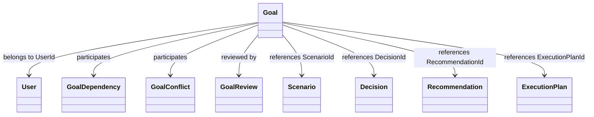
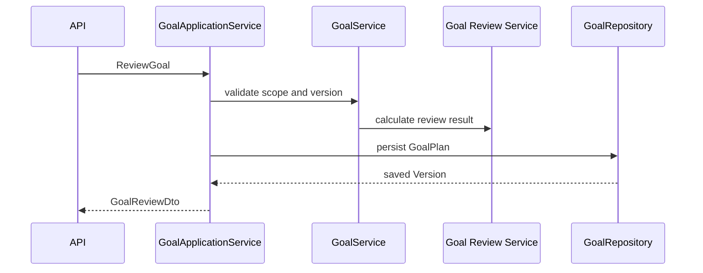
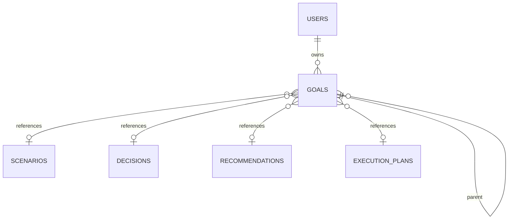
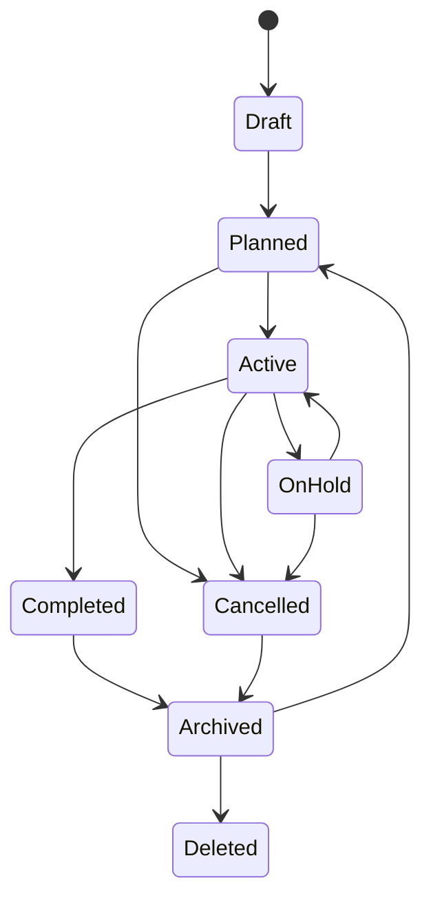

# Goal Entity Specification

# Document Control

Document Name: Goal Entity Specification

Document Path: knowledge/entity/Goal.md

Document Type: Enterprise Specification

Version: 1.0

Status: Canonical Specification

Domain: Goals

Bounded Context: Financial Profile

Module: GoalApplicationService

Owner: Project Atlas

Source of Truth: Atlas Knowledge Base

Last Updated: 2026-07-14

Related Specifications:

- knowledge/entity-catalog.md
- knowledge/aggregate-catalog.md
- knowledge/enumeration-catalog.md
- knowledge/repository-catalog.md
- knowledge/command-catalog.md
- knowledge/domain-event-catalog.md
- knowledge/application-service-catalog.md
- knowledge/domain-service-catalog.md
- knowledge/value-object-catalog.md
- knowledge/goal-lifecycle.md
- knowledge/goal-review.md
- knowledge/goal-prioritization.md
- knowledge/goal-dependency.md
- knowledge/goal-conflict-resolution.md

# Entity Overview

Purpose: Goal represents a user life or financial objective managed inside GoalPlan and used by prioritization, dependency, conflict resolution, review, progress tracking, scenario evaluation, decision making, recommendation generation, and execution planning.

Responsibilities:

- Maintain stable Goal identity and GoalNumber.
- Belong to one User access scope.
- Store GoalType, GoalCategory, GoalStatus, GoalName, priority, importance, urgency, target amount, current amount, completion percentage, dates, review cadence, parent relationship, sequence, references, probability, risk, return, constraints, assumptions, tags, Version, and ConcurrencyToken.
- Participate in Goal Dependency, Goal Conflict, Goal Review, Goal Priority, Goal Progress, and Goal Milestone behavior.
- Reference Scenario, Decision, Recommendation, ExecutionPlan, ActionPlan, Portfolio, Asset, Liability, CashFlow, Notification, and DomainEvent by identity or immutable snapshot.
- Preserve Goal History and Audit Trail.
- Support activation, pause, resume, completion, cancellation, archive, restore, deletion, review, progress recalculation, and versioning.

Business Meaning: Goal is the planning objective that Atlas optimizes, evaluates, prioritizes, reviews, and uses as the target for financial decisions and execution.

Aggregate Root: Yes for the Goal entity specification surface. Atlas Entity Catalog maps Goal to the GoalPlan aggregate and GoalPlan aggregate root; therefore Goal mutations are loaded and committed through GoalRepository and GoalPlan ownership.

Lifecycle: Draft, Planned, Active, OnHold, Completed, Cancelled, Archived, Deleted.

Ownership: GoalPlan owns Goal lifecycle, persistence, authorization boundary, concurrency boundary, and audit boundary. Goal does not own referenced Scenario, Decision, Recommendation, ExecutionPlan, ActionPlan, Portfolio, Asset, Liability, CashFlow, Notification, or DomainEvent.

Persistence Owner: GoalRepository.

Repository: GoalRepository.

Application Service: GoalApplicationService.

Domain Service: ScoringService, ExplainabilityService, RiskService.

Relationships:

- User: Goal must belong to one User by UserId. User is not owned by Goal.
- GoalGroup: Goal may be grouped by GoalGroup identity or projection metadata. GoalGroup does not override GoalPlan ownership.
- GoalDependency: Goal may participate in dependency relationships as parent, child, prerequisite, blocker, or downstream Goal. Dependency records do not mutate Goal without GoalPlan command.
- GoalConflict: Goal may participate in conflict resolution when objectives compete for cash flow, risk capacity, timing, or assets.
- GoalReview: Goal may have review records and review cadence through ReviewFrequency and ReviewDate.
- GoalProgress: Goal progress is represented by CurrentAmount, CompletionPercentage, progress events, and progress projections.
- GoalMilestone: Goal may have milestone references in projections or history; milestone completion can influence progress.
- Scenario: Goal may be referenced by Scenario through GoalId and scenario snapshots. Goal does not own Scenario.
- Decision: Goal may be referenced by Decision. Goal does not own Decision.
- Recommendation: Goal may be referenced by Recommendation. Goal does not own Recommendation.
- ExecutionPlan: Goal may be referenced by ExecutionPlan when execution starts.
- ActionPlan: Goal may be referenced by ActionPlan when action contributes to Goal completion.
- Portfolio: Goal may use Portfolio evidence for funding, allocation, and progress. Goal does not mutate Portfolio.
- Asset: Goal may use Asset evidence for funding or target tracking. Goal does not mutate Asset.
- Liability: Goal may use Liability evidence for debt burden and feasibility. Goal does not mutate Liability.
- CashFlow: Goal may use CashFlow evidence for funding progress and feasibility.
- Notification: Goal may cause review, progress, conflict, and completion notifications.
- DomainEvent: Goal emits immutable DomainEvent records for lifecycle, progress, priority, review, dependency, and conflict changes.

Navigation:

- Goal navigation to cross-aggregate entities is by identity reference only.
- ParentGoalId forms a hierarchy inside GoalPlan and cannot form cycles.
- Read models may show related Scenario, Decision, Recommendation, ExecutionPlan, ActionPlan, Portfolio, Asset, Liability, CashFlow, and Notification summaries.
- GoalRepository loads GoalPlan aggregate and Goal children only.

# Complete Properties

## GoalId

- Name: GoalId
- Type: Guid
- Nullable: No
- Default: Generated by application
- Description: Stable technical identity of Goal.
- Validation: Required; unique; valid Guid; immutable.
- Business Meaning: Identifies one planning objective across API, audit, history, events, and references.
- Example: 3e1f27f4-4201-431d-bb4a-01d2e4aa94d8.
- Database Mapping: goals.goal_id uuid primary key
- JSON Name: goalId
- API Usage: Detail, Update, Activate, Pause, Resume, Complete, Cancel, Archive, Restore, Delete, Review, Progress, History
- Searchable: Yes
- Sortable: No
- Indexed: Yes
- Encrypted: No
- Auditable: Yes

## GoalNumber

- Name: GoalNumber
- Type: String
- Nullable: No
- Default: Generated sequence
- Description: Human-readable Goal reference number.
- Validation: Required; unique; max length 64; immutable.
- Business Meaning: Enables support, audit, and user-facing lookup.
- Example: GOAL-20260714-000001.
- Database Mapping: goals.goal_number varchar(64) unique not null
- JSON Name: goalNumber
- API Usage: Detail, Summary, Search, History
- Searchable: Yes
- Sortable: Yes
- Indexed: Yes
- Encrypted: No
- Auditable: Yes

## UserId

- Name: UserId
- Type: Guid
- Nullable: No
- Default: None
- Description: User scope that owns or created the Goal.
- Validation: Required; valid Guid; actor must be authorized for User and GoalPlan scope.
- Business Meaning: Goal must belong to User.
- Example: b6a6d087-b8f8-4062-92ec-08b7fc5d64f4.
- Database Mapping: goals.user_id uuid not null
- JSON Name: userId
- API Usage: Create, Detail, Summary, Search
- Searchable: Yes
- Sortable: No
- Indexed: Yes
- Encrypted: No
- Auditable: Yes

## GoalType

- Name: GoalType
- Type: String
- Nullable: No
- Default: None
- Description: Catalog-aligned goal purpose.
- Validation: Required; non-blank; max length 64.
- Business Meaning: Classifies the goal without creating a new Domain.
- Example: Retirement.
- Database Mapping: goals.goal_type varchar(64) not null
- JSON Name: goalType
- API Usage: Create, Update, Detail, Summary, Search
- Searchable: Yes
- Sortable: Yes
- Indexed: Yes
- Encrypted: No
- Auditable: Yes

## GoalCategory

- Name: GoalCategory
- Type: String
- Nullable: No
- Default: General
- Description: Goal grouping for search, review, and reporting.
- Validation: Required; max length 64.
- Business Meaning: Groups objectives such as Retirement, Housing, Liquidity, Investment, CashFlow, or Debt.
- Example: Liquidity.
- Database Mapping: goals.goal_category varchar(64) not null
- JSON Name: goalCategory
- API Usage: Create, Update, Detail, Summary, Search
- Searchable: Yes
- Sortable: Yes
- Indexed: Yes
- Encrypted: No
- Auditable: Yes

## GoalStatus

- Name: GoalStatus
- Type: GoalStatus
- Nullable: No
- Default: Draft
- Description: Goal lifecycle status.
- Validation: Required; catalog values Draft, Active, Prioritized, Deferred, Completed, Cancelled; lifecycle states Planned, OnHold, Archived, Deleted map to Goal lifecycle policy.
- Business Meaning: Controls Goal activation, pause, completion, cancellation, archive, and mutation behavior.
- Example: Active.
- Database Mapping: goals.goal_status varchar(32) not null
- JSON Name: goalStatus
- API Usage: Detail, Summary, Search, Activate, Pause, Resume, Complete, Cancel, Archive, Restore, Delete
- Searchable: Yes
- Sortable: Yes
- Indexed: Yes
- Encrypted: No
- Auditable: Yes

## GoalName

- Name: GoalName
- Type: String
- Nullable: No
- Default: None
- Description: User-facing goal name.
- Validation: Required; max length 256; unique within User scope when policy requires.
- Business Meaning: Business identity for the objective.
- Example: Build emergency fund.
- Database Mapping: goals.goal_name varchar(256) not null
- JSON Name: goalName
- API Usage: Create, Update, Detail, Summary, Search
- Searchable: Yes
- Sortable: Yes
- Indexed: Yes
- Encrypted: No
- Auditable: Yes

## Description

- Name: Description
- Type: String
- Nullable: Yes
- Default: null
- Description: Detailed goal description.
- Validation: Max length 4000; no executable content.
- Business Meaning: Explains goal intent and planning context.
- Example: Maintain six months of expenses in cash reserve.
- Database Mapping: goals.description text null
- JSON Name: description
- API Usage: Create, Update, Detail
- Searchable: Yes
- Sortable: No
- Indexed: Optional full text
- Encrypted: Conditional
- Auditable: Yes

## Priority

- Name: Priority
- Type: String
- Nullable: No
- Default: Medium
- Description: Goal priority.
- Validation: Required; Low, Medium, High, Critical.
- Business Meaning: Supports Goal Priority and execution ordering.
- Example: High.
- Database Mapping: goals.priority varchar(32) not null
- JSON Name: priority
- API Usage: Create, Update, Detail, Summary, Search
- Searchable: Yes
- Sortable: Yes
- Indexed: Yes
- Encrypted: No
- Auditable: Yes

## Importance

- Name: Importance
- Type: Int32
- Nullable: No
- Default: 5
- Description: User or system importance score.
- Validation: Required; range 1 to 10.
- Business Meaning: Captures relative value of Goal.
- Example: 9.
- Database Mapping: goals.importance integer not null
- JSON Name: importance
- API Usage: Create, Update, Detail, Summary, Search
- Searchable: Yes
- Sortable: Yes
- Indexed: Yes
- Encrypted: No
- Auditable: Yes

## Urgency

- Name: Urgency
- Type: String
- Nullable: No
- Default: Normal
- Description: Time sensitivity of Goal.
- Validation: Required; Low, Normal, High, Immediate.
- Business Meaning: Influences review, priority, and recommendation behavior.
- Example: High.
- Database Mapping: goals.urgency varchar(32) not null
- JSON Name: urgency
- API Usage: Create, Update, Detail, Summary, Search
- Searchable: Yes
- Sortable: Yes
- Indexed: Yes
- Encrypted: No
- Auditable: Yes

## TargetAmount

- Name: TargetAmount
- Type: Json
- Nullable: Yes
- Default: null
- Description: Target amount value object snapshot.
- Validation: Valid JSON object when present; amount nonnegative; CurrencyCode required when amount exists.
- Business Meaning: Defines financial target for amount-based goals.
- Example: {"amount":600000,"currency":"TWD"}.
- Database Mapping: goals.target_amount jsonb null
- JSON Name: targetAmount
- API Usage: Create, Update, Detail, Summary, Search, Progress
- Searchable: No
- Sortable: No
- Indexed: Optional jsonb path
- Encrypted: Conditional
- Auditable: Yes

## CurrentAmount

- Name: CurrentAmount
- Type: Json
- Nullable: Yes
- Default: null
- Description: Current progress amount value object snapshot.
- Validation: Valid JSON object when present; amount nonnegative; CurrencyCode required when amount exists; must not exceed TargetAmount where goal semantics are capped accumulation.
- Business Meaning: Tracks current funded or achieved amount.
- Example: {"amount":180000,"currency":"TWD"}.
- Database Mapping: goals.current_amount jsonb null
- JSON Name: currentAmount
- API Usage: Update, Detail, Summary, Search, RecalculateProgress
- Searchable: No
- Sortable: No
- Indexed: Optional jsonb path
- Encrypted: Conditional
- Auditable: Yes

## CompletionPercentage

- Name: CompletionPercentage
- Type: Decimal
- Nullable: No
- Default: 0
- Description: Goal progress percentage.
- Validation: Required; 0.0000 to 100.0000.
- Business Meaning: Tracks GoalProgress.
- Example: 30.0000.
- Database Mapping: goals.completion_percentage numeric(9,4) not null
- JSON Name: completionPercentage
- API Usage: Detail, Summary, Search, RecalculateProgress, Complete
- Searchable: Yes
- Sortable: Yes
- Indexed: Yes
- Encrypted: No
- Auditable: Yes

## TargetDate

- Name: TargetDate
- Type: Date
- Nullable: Yes
- Default: null
- Description: Desired completion date.
- Validation: Must be on or after StartDate when both exist.
- Business Meaning: Defines goal horizon and urgency.
- Example: 2027-12-31.
- Database Mapping: goals.target_date date null
- JSON Name: targetDate
- API Usage: Create, Update, Detail, Summary, Search
- Searchable: Yes
- Sortable: Yes
- Indexed: Yes
- Encrypted: No
- Auditable: Yes

## StartDate

- Name: StartDate
- Type: Date
- Nullable: Yes
- Default: null
- Description: Goal start date.
- Validation: Must be on or before TargetDate and CompletedDate when present.
- Business Meaning: Establishes tracking start.
- Example: 2026-08-01.
- Database Mapping: goals.start_date date null
- JSON Name: startDate
- API Usage: Create, Update, Activate, Detail, Search
- Searchable: Yes
- Sortable: Yes
- Indexed: Yes
- Encrypted: No
- Auditable: Yes

## CompletedDate

- Name: CompletedDate
- Type: Date
- Nullable: Yes
- Default: null
- Description: Completion date.
- Validation: Required when GoalStatus is Completed; must be on or after StartDate when present.
- Business Meaning: Records when Goal is completed.
- Example: 2027-03-31.
- Database Mapping: goals.completed_date date null
- JSON Name: completedDate
- API Usage: Complete, Detail, Summary, Search
- Searchable: Yes
- Sortable: Yes
- Indexed: Yes
- Encrypted: No
- Auditable: Yes

## ReviewFrequency

- Name: ReviewFrequency
- Type: String
- Nullable: Yes
- Default: null
- Description: Goal review cadence.
- Validation: Max length 32; valid cadence value when present.
- Business Meaning: Supports Goal Review scheduling.
- Example: Monthly.
- Database Mapping: goals.review_frequency varchar(32) null
- JSON Name: reviewFrequency
- API Usage: Create, Update, Review, Detail, Search
- Searchable: Yes
- Sortable: Yes
- Indexed: Yes
- Encrypted: No
- Auditable: Yes

## ReviewDate

- Name: ReviewDate
- Type: Date
- Nullable: Yes
- Default: null
- Description: Next or latest review date.
- Validation: Valid date; must align with ReviewFrequency when scheduled by review service.
- Business Meaning: Drives Goal Review workflow.
- Example: 2026-09-01.
- Database Mapping: goals.review_date date null
- JSON Name: reviewDate
- API Usage: Update, Review, Detail, Summary, Search
- Searchable: Yes
- Sortable: Yes
- Indexed: Yes
- Encrypted: No
- Auditable: Yes

## ParentGoalId

- Name: ParentGoalId
- Type: Guid
- Nullable: Yes
- Default: null
- Description: Parent Goal identity for hierarchy.
- Validation: Valid Guid when present; cannot equal GoalId; cannot create cycle.
- Business Meaning: Supports parent-child goal structure.
- Example: 5c21e0c8-3000-4e48-9000-5e6a845d0f10.
- Database Mapping: goals.parent_goal_id uuid null
- JSON Name: parentGoalId
- API Usage: Create, Update, Detail, Search
- Searchable: Yes
- Sortable: No
- Indexed: Yes
- Encrypted: No
- Auditable: Yes

## Sequence

- Name: Sequence
- Type: Int32
- Nullable: No
- Default: 1
- Description: Ordering inside parent, group, or GoalPlan scope.
- Validation: Required; greater than 0; unique within selected ordering scope when policy requires.
- Business Meaning: Supports ordered goal display and dependency sequencing.
- Example: 1.
- Database Mapping: goals.sequence integer not null
- JSON Name: sequence
- API Usage: Create, Update, Detail, Summary, Search
- Searchable: Yes
- Sortable: Yes
- Indexed: Yes
- Encrypted: No
- Auditable: Yes

## ScenarioId

- Name: ScenarioId
- Type: Guid
- Nullable: Yes
- Default: null
- Description: Scenario reference associated with Goal.
- Validation: Valid Guid when present; same access scope.
- Business Meaning: Connects Goal to scenario evaluation.
- Example: 7b8f2309-4b51-4724-9fb7-927db4ee5d5d.
- Database Mapping: goals.scenario_id uuid null
- JSON Name: scenarioId
- API Usage: Detail, Summary, Search
- Searchable: Yes
- Sortable: No
- Indexed: Yes
- Encrypted: No
- Auditable: Yes

## DecisionId

- Name: DecisionId
- Type: Guid
- Nullable: Yes
- Default: null
- Description: Decision reference associated with Goal.
- Validation: Valid Guid when present; same access scope.
- Business Meaning: Connects Goal to decision result.
- Example: 111d49c8-0957-42a2-a812-b736615fa2bb.
- Database Mapping: goals.decision_id uuid null
- JSON Name: decisionId
- API Usage: Detail, Summary, Search
- Searchable: Yes
- Sortable: No
- Indexed: Yes
- Encrypted: No
- Auditable: Yes

## RecommendationId

- Name: RecommendationId
- Type: Guid
- Nullable: Yes
- Default: null
- Description: Recommendation reference associated with Goal.
- Validation: Valid Guid when present; same access scope.
- Business Meaning: Connects Goal to recommendation.
- Example: 7f3d29c6-6d0e-4f2c-bb46-bd3555d6d351.
- Database Mapping: goals.recommendation_id uuid null
- JSON Name: recommendationId
- API Usage: Detail, Summary, Search
- Searchable: Yes
- Sortable: No
- Indexed: Yes
- Encrypted: No
- Auditable: Yes

## ExecutionPlanId

- Name: ExecutionPlanId
- Type: Guid
- Nullable: Yes
- Default: null
- Description: ExecutionPlan reference associated with Goal execution.
- Validation: Valid Guid when present; same access scope.
- Business Meaning: Connects Goal to execution.
- Example: 49b48b7e-2f44-40d7-bd31-2eb6fe7f206d.
- Database Mapping: goals.execution_plan_id uuid null
- JSON Name: executionPlanId
- API Usage: Detail, Summary, Search
- Searchable: Yes
- Sortable: No
- Indexed: Yes
- Encrypted: No
- Auditable: Yes

## SuccessProbability

- Name: SuccessProbability
- Type: Decimal
- Nullable: Yes
- Default: null
- Description: Probability of successful completion.
- Validation: Between 0.0000 and 1.0000 when present.
- Business Meaning: Supports risk, scenario, and recommendation evaluation.
- Example: 0.8200.
- Database Mapping: goals.success_probability numeric(5,4) null
- JSON Name: successProbability
- API Usage: Detail, Summary, Search, RecalculateProgress
- Searchable: Yes
- Sortable: Yes
- Indexed: Yes
- Encrypted: No
- Auditable: Yes

## RiskLevel

- Name: RiskLevel
- Type: RiskLevel
- Nullable: Yes
- Default: null
- Description: Catalog risk level for Goal.
- Validation: Valid RiskLevel when present.
- Business Meaning: Communicates risk level of achieving Goal.
- Example: Medium.
- Database Mapping: goals.risk_level varchar(32) null
- JSON Name: riskLevel
- API Usage: Create, Update, Detail, Summary, Search
- Searchable: Yes
- Sortable: Yes
- Indexed: Yes
- Encrypted: No
- Auditable: Yes

## ExpectedReturn

- Name: ExpectedReturn
- Type: Decimal
- Nullable: Yes
- Default: null
- Description: Expected return associated with funding or investment goal.
- Validation: Decimal within policy bounds when present.
- Business Meaning: Supports investment and scenario evaluation.
- Example: 0.0525.
- Database Mapping: goals.expected_return numeric(9,6) null
- JSON Name: expectedReturn
- API Usage: Create, Update, Detail, Summary, Search
- Searchable: Yes
- Sortable: Yes
- Indexed: Yes
- Encrypted: No
- Auditable: Yes

## Constraints

- Name: Constraints
- Type: Json
- Nullable: Yes
- Default: null
- Description: Goal constraints and limits.
- Validation: Valid JSON object or array when present.
- Business Meaning: Preserves rules affecting Goal planning and execution.
- Example: {"minimumLiquidityMonths":6}.
- Database Mapping: goals.constraints jsonb null
- JSON Name: constraints
- API Usage: Create, Update, Detail, Review, History
- Searchable: No
- Sortable: No
- Indexed: Optional jsonb path
- Encrypted: Conditional
- Auditable: Yes

## Assumptions

- Name: Assumptions
- Type: Json
- Nullable: Yes
- Default: null
- Description: Goal assumptions snapshot.
- Validation: Valid JSON object when present.
- Business Meaning: Preserves planning basis for Goal.
- Example: {"monthlyContribution":30000,"currency":"TWD"}.
- Database Mapping: goals.assumptions jsonb null
- JSON Name: assumptions
- API Usage: Create, Update, Detail, Review, History
- Searchable: No
- Sortable: No
- Indexed: Optional jsonb path
- Encrypted: Conditional
- Auditable: Yes

## Tags

- Name: Tags
- Type: String[]
- Nullable: No
- Default: []
- Description: User or system tags.
- Validation: Each tag max length 64; duplicates rejected; no executable content.
- Business Meaning: Supports filtering and organization.
- Example: ["liquidity","critical"].
- Database Mapping: goals.tags text[] not null
- JSON Name: tags
- API Usage: Create, Update, Detail, Summary, Search
- Searchable: Yes
- Sortable: No
- Indexed: Yes
- Encrypted: No
- Auditable: Yes

## CreatedAt

- Name: CreatedAt
- Type: DateTimeOffset
- Nullable: No
- Default: Current timestamp
- Description: Creation timestamp.
- Validation: Required; immutable.
- Business Meaning: Establishes Goal creation time.
- Example: 2026-07-14T10:00:00+08:00.
- Database Mapping: goals.created_at timestamptz not null
- JSON Name: createdAt
- API Usage: Detail, Summary, Search, History
- Searchable: Yes
- Sortable: Yes
- Indexed: Yes
- Encrypted: No
- Auditable: Yes

## CreatedBy

- Name: CreatedBy
- Type: Guid
- Nullable: No
- Default: ActorId
- Description: Actor that created Goal.
- Validation: Required; valid actor identity.
- Business Meaning: Supports audit attribution.
- Example: b6a6d087-b8f8-4062-92ec-08b7fc5d64f4.
- Database Mapping: goals.created_by uuid not null
- JSON Name: createdBy
- API Usage: Detail, History
- Searchable: Yes
- Sortable: No
- Indexed: Yes
- Encrypted: No
- Auditable: Yes

## UpdatedAt

- Name: UpdatedAt
- Type: DateTimeOffset
- Nullable: No
- Default: Current timestamp
- Description: Last mutation timestamp.
- Validation: Required; greater than or equal to CreatedAt.
- Business Meaning: Supports ordering, cache invalidation, and audit.
- Example: 2026-07-14T11:00:00+08:00.
- Database Mapping: goals.updated_at timestamptz not null
- JSON Name: updatedAt
- API Usage: Detail, Summary, Search, History
- Searchable: Yes
- Sortable: Yes
- Indexed: Yes
- Encrypted: No
- Auditable: Yes

## UpdatedBy

- Name: UpdatedBy
- Type: Guid
- Nullable: Yes
- Default: null
- Description: Actor that last changed Goal.
- Validation: Valid actor identity when present.
- Business Meaning: Supports mutation audit attribution.
- Example: b6a6d087-b8f8-4062-92ec-08b7fc5d64f4.
- Database Mapping: goals.updated_by uuid null
- JSON Name: updatedBy
- API Usage: Detail, History
- Searchable: Yes
- Sortable: No
- Indexed: Yes
- Encrypted: No
- Auditable: Yes

## Version

- Name: Version
- Type: Int64
- Nullable: No
- Default: 1
- Description: Goal version.
- Validation: Required; increments on mutation; stale version rejected.
- Business Meaning: Preserves Goal Version and Goal History.
- Example: 6.
- Database Mapping: goals.version bigint not null
- JSON Name: version
- API Usage: Update, Activate, Pause, Resume, Complete, Cancel, Archive, Restore, Delete, Review, RecalculateProgress
- Searchable: No
- Sortable: Yes
- Indexed: No
- Encrypted: No
- Auditable: Yes

## ConcurrencyToken

- Name: ConcurrencyToken
- Type: String
- Nullable: No
- Default: Generated token
- Description: Optimistic concurrency token.
- Validation: Required; must match for mutation; regenerated after mutation.
- Business Meaning: Prevents lost updates inside GoalPlan.
- Example: 01J2Y8Z7ABCD.
- Database Mapping: goals.concurrency_token varchar(128) not null
- JSON Name: concurrencyToken
- API Usage: Update, Activate, Pause, Resume, Complete, Cancel, Archive, Restore, Delete, Review, RecalculateProgress
- Searchable: No
- Sortable: No
- Indexed: Yes
- Encrypted: No
- Auditable: Yes

# Validation Rules

| Rule ID | Validation |
|---|---|
| GOAL-VR-001 | GoalId is required, unique, valid, and immutable. |
| GOAL-VR-002 | GoalNumber is required, unique, max length 64, and immutable. |
| GOAL-VR-003 | UserId is required and must match authorization scope. |
| GOAL-VR-004 | GoalType is required, non-blank, and max length 64. |
| GOAL-VR-005 | GoalCategory is required and max length 64. |
| GOAL-VR-006 | GoalStatus is required and must follow the state machine. |
| GOAL-VR-007 | GoalName is required and max length 256. |
| GOAL-VR-008 | Description max length is 4000. |
| GOAL-VR-009 | Priority is required and must be Low, Medium, High, or Critical. |
| GOAL-VR-010 | Importance must be between 1 and 10. |
| GOAL-VR-011 | Urgency is required and must be Low, Normal, High, or Immediate. |
| GOAL-VR-012 | TargetAmount and CurrentAmount must be valid Money JSON when present. |
| GOAL-VR-013 | CurrentAmount cannot exceed TargetAmount where the goal is capped accumulation. |
| GOAL-VR-014 | CompletionPercentage must be between 0 and 100. |
| GOAL-VR-015 | TargetDate must be on or after StartDate when both exist. |
| GOAL-VR-016 | CompletedDate is required when GoalStatus is Completed. |
| GOAL-VR-017 | ReviewFrequency must be valid when present. |
| GOAL-VR-018 | ParentGoalId cannot equal GoalId. |
| GOAL-VR-019 | ParentGoalId cannot create a cycle. |
| GOAL-VR-020 | Sequence must be greater than 0. |
| GOAL-VR-021 | ScenarioId, DecisionId, RecommendationId, and ExecutionPlanId must be valid when present. |
| GOAL-VR-022 | SuccessProbability must be between 0 and 1 when present. |
| GOAL-VR-023 | RiskLevel must be catalog-valid when present. |
| GOAL-VR-024 | Constraints and Assumptions must be valid JSON when present. |
| GOAL-VR-025 | Tags must be unique and each tag max length 64. |
| GOAL-VR-026 | Completed Goal cannot return to Draft. |
| GOAL-VR-027 | Archived Goal cannot be modified unless restored. |
| GOAL-VR-028 | Deleted Goal cannot be restored by normal workflow. |
| GOAL-VR-029 | Version and ConcurrencyToken must match on mutation. |
| GOAL-VR-030 | Every state transition must be audited. |

# Business Rules

1. Goal must belong to User.
2. Goal must specify GoalType.
3. Goal must specify GoalStatus.
4. Progress must be between 0 and 100.
5. CurrentAmount must not exceed TargetAmount when the applicable goal semantics are capped accumulation.
6. Completed Goal must fill CompletedDate.
7. Parent Goal cannot form a cycle.
8. Completed Goal cannot return to Draft.
9. Archived Goal cannot be modified.
10. Goal must preserve complete Goal History.
11. Goal must preserve complete Audit Trail.
12. Goal supports Goal Dependency.
13. Goal supports Goal Conflict.
14. Goal supports Goal Review.
15. Goal supports Goal Priority.
16. Goal supports Goal Version.
17. Goal may have ParentGoalId.
18. Goal may be associated with GoalGroup.
19. Goal may have GoalMilestone projections or records.
20. Goal may receive GoalProgress recalculation.
21. Goal may reference Scenario, Decision, Recommendation, ExecutionPlan, and ActionPlan.
22. Goal may use Portfolio, Asset, Liability, and CashFlow evidence.
23. Goal may cause Notification creation.
24. Goal does not mutate Scenario, Decision, Recommendation, ExecutionPlan, ActionPlan, Portfolio, Asset, Liability, CashFlow, Notification, or DomainEvent.
25. GoalPriorityChanged must be emitted when priority changes.
26. GoalProgressChanged must be emitted when CompletionPercentage changes.
27. GoalStatusChanged must be emitted for lifecycle changes.
28. ReviewGoal must record review date and audit.
29. RecalculateProgress must preserve prior progress in history.
30. DomainEvent history is immutable.

# State Machine

| State | Transition | Trigger | Invariant | Illegal Transition |
|---|---|---|---|---|
| Draft | Draft to Planned | CreateGoal or UpdateGoal | Required fields exist | Draft to Completed |
| Planned | Planned to Active | ActivateGoal | StartDate set when required | Planned to Completed without active |
| Active | Active to OnHold | PauseGoal | Pause audit exists | Active to Draft |
| OnHold | OnHold to Active | ResumeGoal | Not archived or deleted | OnHold to Completed without active |
| Active | Active to Completed | CompleteGoal | CompletionPercentage 100 and CompletedDate set | Active to Draft |
| Planned | Planned to Cancelled | CancelGoal | Cancellation audit exists | Planned to Completed |
| Active | Active to Cancelled | CancelGoal | Cancellation audit exists | Active to Draft |
| OnHold | OnHold to Cancelled | CancelGoal | Cancellation audit exists | OnHold to Completed |
| Completed | Completed to Archived | ArchiveGoal | History preserved | Completed to Draft |
| Cancelled | Cancelled to Archived | ArchiveGoal | History preserved | Cancelled to Active |
| Archived | Archived to Planned | RestoreGoal | Not deleted | Archived to Active |
| Archived | Archived to Deleted | DeleteGoal | Delete audit exists | Archived to Completed |
| Deleted | No normal transition | None | Deleted marker exists | Deleted to Active |

# Commands

| Command | Handler | Repository | Result | Event |
|---|---|---|---|---|
| CreateGoal | CreateGoalCommandHandler | GoalRepository | GoalDetailDto | GoalCreated |
| UpdateGoal | UpdateGoalCommandHandler | GoalRepository | GoalDetailDto | GoalUpdated |
| ActivateGoal | ActivateGoalCommandHandler | GoalRepository | CommandResult | GoalActivated, GoalStatusChanged |
| PauseGoal | PauseGoalCommandHandler | GoalRepository | CommandResult | GoalPaused, GoalStatusChanged |
| ResumeGoal | ResumeGoalCommandHandler | GoalRepository | CommandResult | GoalResumed, GoalStatusChanged |
| CompleteGoal | CompleteGoalCommandHandler | GoalRepository | CommandResult | GoalCompleted, GoalStatusChanged, GoalProgressChanged |
| CancelGoal | CancelGoalCommandHandler | GoalRepository | CommandResult | GoalCancelled, GoalStatusChanged |
| ArchiveGoal | ArchiveGoalCommandHandler | GoalRepository | CommandResult | GoalArchived, GoalStatusChanged |
| RestoreGoal | RestoreGoalCommandHandler | GoalRepository | CommandResult | GoalRestored, GoalStatusChanged |
| DeleteGoal | DeleteGoalCommandHandler | GoalRepository | CommandResult | GoalDeleted, GoalStatusChanged |
| ReviewGoal | ReviewGoalCommandHandler | GoalRepository | GoalReviewDto | GoalReviewed |
| RecalculateProgress | RecalculateProgressCommandHandler | GoalRepository | GoalProgressDto | GoalProgressChanged |
| PrioritizeGoal | PrioritizeGoalCommandHandler | GoalRepository | CommandResult | GoalPriorityChanged |
| ResolveGoalConflict | ResolveGoalConflictCommandHandler | GoalRepository | CommandResult | GoalConflictResolved |
| UpdateGoalDependency | UpdateGoalDependencyCommandHandler | GoalRepository | CommandResult | GoalDependencyUpdated |

# Domain Events

| Event | Publisher | Payload |
|---|---|---|
| GoalCreated | GoalPlan | GoalId, UserId, GoalType, GoalStatus |
| GoalUpdated | GoalPlan | GoalId, ChangedFields, Version |
| GoalActivated | GoalPlan | GoalId, ActivatedAt |
| GoalPaused | GoalPlan | GoalId, PausedAt |
| GoalResumed | GoalPlan | GoalId, ResumedAt |
| GoalCompleted | GoalPlan | GoalId, CompletedDate, CompletionPercentage |
| GoalCancelled | GoalPlan | GoalId, CancelledAt |
| GoalArchived | GoalPlan | GoalId, ArchivedAt |
| GoalRestored | GoalPlan | GoalId, RestoredAt |
| GoalDeleted | GoalPlan | GoalId, DeletedAt |
| GoalReviewed | GoalPlan | GoalId, ReviewDate, ReviewResult |
| GoalProgressChanged | GoalPlan | GoalId, PreviousProgress, NewProgress, Version |
| GoalPriorityChanged | GoalPlan | GoalId, PreviousPriority, NewPriority, Version |
| GoalStatusChanged | GoalPlan | GoalId, PreviousStatus, NewStatus, Version |
| GoalDependencyUpdated | GoalPlan | GoalId, ParentGoalId, DependencyType |
| GoalConflictDetected | GoalPlan | GoalId, ConflictingGoalId, ConflictType |
| GoalConflictResolved | GoalPlan | GoalId, Resolution |
| ScenarioEvaluated | Scenario | ScenarioId, GoalId, Score |
| RecommendationGenerated | Recommendation | RecommendationId, GoalId, Priority |
| ExecutionPlanGenerated | DecisionSession | DecisionId, ExecutionPlanId, GoalId |
| NotificationCreated | Notification | NotificationId, GoalId |

# Repository

Interface: IGoalRepository

Methods:

- GetByIdAsync(GoalId, UserId)
- GetByNumberAsync(GoalNumber)
- AddAsync(GoalPlan)
- UpdateAsync(GoalPlan, ConcurrencyToken)
- ArchiveAsync(GoalId, ConcurrencyToken)
- RestoreAsync(GoalId, ConcurrencyToken)
- SoftDeleteAsync(GoalId, ConcurrencyToken)
- SaveChangesAsync()

Query Methods:

- SearchAsync(GoalSearchSpecification)
- FindByUserAsync(UserId)
- FindByStatusAsync(GoalStatus)
- FindByTypeAsync(GoalType)
- FindByCategoryAsync(GoalCategory)
- FindByParentGoalAsync(ParentGoalId)
- FindByScenarioAsync(ScenarioId)
- FindByDecisionAsync(DecisionId)
- FindByRecommendationAsync(RecommendationId)
- FindByExecutionPlanAsync(ExecutionPlanId)
- FindDueForReviewAsync(ReviewDate, limit)
- FindHistoryAsync(GoalId)

Specification Pattern:

- GoalByUserSpecification
- GoalByStatusSpecification
- GoalByTypeSpecification
- GoalByCategorySpecification
- GoalByPrioritySpecification
- GoalByParentSpecification
- GoalByReviewDateSpecification
- GoalByTargetDateSpecification
- GoalByProgressSpecification
- GoalByRiskLevelSpecification
- GoalActiveOnlySpecification
- GoalArchivedSpecification
- GoalSearchSpecification

# Domain Service Interaction

| Service | Interaction |
|---|---|
| Goal Service | Creates, validates, updates, activates, pauses, resumes, completes, cancels, archives, restores, deletes, and versions Goal. |
| Goal Review Service | Performs ReviewGoal and updates ReviewDate, review result, and audit. |
| Goal Prioritization Service | Calculates priority, importance, urgency, and GoalPriorityChanged events. |
| Goal Dependency Service | Validates ParentGoalId and dependency graph cycle rules. |
| Goal Conflict Resolution Service | Detects and resolves conflicts between Goals. |
| Decision Engine | Consumes Goal evidence and produces Decision context. |
| Recommendation Engine | Consumes Goal state and produces Recommendation. |
| Scenario Engine | Evaluates Goal under assumptions and projections. |
| Execution Planning Service | Links Goal to ExecutionPlan and ActionPlan execution. |
| Notification Service | Sends review, progress, conflict, completion, and cancellation notifications. |
| Audit Service | Records commands, events, progress, priority, review, dependency, conflict, and version history. |

# Application Service Interaction

- GoalApplicationService handles all Goal commands and queries.
- ScenarioApplicationService evaluates Goal scenarios.
- DecisionApplicationService consumes Goal context for Decision.
- RecommendationApplicationService consumes Goal context for Recommendation.
- ExecutionPlanningApplicationService links Goal to ExecutionPlan and ActionPlan.
- PortfolioApplicationService supplies Portfolio and Asset evidence.
- LoanApplicationService supplies Liability evidence when relevant.
- CashFlowApplicationService supplies CashFlow evidence and progress inputs.
- NotificationApplicationService sends Goal notifications.
- AuditApplicationService persists audit and history.
- SearchApplicationService indexes Goal fields.
- CacheApplicationService invalidates Goal detail, search, priority, progress, and history caches.

# API

| Endpoint | Method | Request | Response | Error |
|---|---|---|---|---|
| /api/v1/goals | POST | CreateGoalDto | GoalDetailDto | 400, 401, 403, 409, 422 |
| /api/v1/goals/{goalId} | GET | Route id | GoalDetailDto | 401, 403, 404 |
| /api/v1/goals/{goalId} | PUT | UpdateGoalDto | GoalDetailDto | 400, 401, 403, 404, 409, 422 |
| /api/v1/goals/{goalId} | DELETE | DeleteGoalDto | CommandResult | 401, 403, 404, 409 |
| /api/v1/goals/search | POST | GoalSearchDto | GoalSearchResultDto | 400, 401, 403 |
| /api/v1/goals/{goalId}/activate | POST | ActivateGoalDto | CommandResult | 400, 401, 403, 404, 409 |
| /api/v1/goals/{goalId}/pause | POST | PauseGoalDto | CommandResult | 400, 401, 403, 404, 409 |
| /api/v1/goals/{goalId}/resume | POST | ResumeGoalDto | CommandResult | 400, 401, 403, 404, 409 |
| /api/v1/goals/{goalId}/complete | POST | CompleteGoalDto | CommandResult | 400, 401, 403, 404, 409, 422 |
| /api/v1/goals/{goalId}/cancel | POST | CancelGoalDto | CommandResult | 400, 401, 403, 404, 409 |
| /api/v1/goals/{goalId}/archive | POST | ArchiveGoalDto | CommandResult | 400, 401, 403, 404, 409 |
| /api/v1/goals/{goalId}/restore | POST | RestoreGoalDto | CommandResult | 400, 401, 403, 404, 409 |
| /api/v1/goals/{goalId}/review | POST | ReviewGoalDto | GoalReviewDto | 400, 401, 403, 404, 409, 422 |
| /api/v1/goals/{goalId}/progress | POST | GoalProgressDto | GoalProgressDto | 400, 401, 403, 404, 409, 422 |
| /api/v1/goals/{goalId}/history | GET | Route id | GoalHistoryDto | 401, 403, 404 |

# DTO

Create DTO: CreateGoalDto includes userId, goalType, goalCategory, goalName, description, priority, importance, urgency, targetAmount, currentAmount, targetDate, startDate, reviewFrequency, parentGoalId, sequence, scenarioId, decisionId, recommendationId, executionPlanId, riskLevel, expectedReturn, constraints, assumptions, tags, idempotencyKey.

Update DTO: UpdateGoalDto includes goalType, goalCategory, goalName, description, priority, importance, urgency, targetAmount, currentAmount, targetDate, startDate, reviewFrequency, reviewDate, parentGoalId, sequence, references, successProbability, riskLevel, expectedReturn, constraints, assumptions, tags, version, concurrencyToken.

Detail DTO: GoalDetailDto includes all properties, related summaries, dependency, conflict, review, progress, milestone summaries, permission flags, Version, and ConcurrencyToken.

Summary DTO: GoalSummaryDto includes goalId, goalNumber, userId, goalType, goalCategory, goalStatus, goalName, priority, importance, urgency, targetAmount, currentAmount, completionPercentage, targetDate, reviewDate, parentGoalId, successProbability, riskLevel, updatedAt, version.

Search DTO: GoalSearchDto includes userId, goalType, goalCategory, goalStatus, priority, urgency, parentGoalId, scenarioId, decisionId, recommendationId, executionPlanId, minProgress, maxProgress, reviewBefore, targetBefore, includeArchived, tags, page, pageSize, sortBy, sortDirection.

Review DTO: ReviewGoalDto includes goalId, reviewDate, reviewResult, nextReviewDate, successProbability, riskLevel, notes, version, concurrencyToken, idempotencyKey.

Progress DTO: GoalProgressDto includes goalId, currentAmount, completionPercentage, progressEvidence, version, concurrencyToken, idempotencyKey.

# Database Mapping

Table: goals

Columns: goal_id, goal_number, user_id, goal_type, goal_category, goal_status, goal_name, description, priority, importance, urgency, target_amount, current_amount, completion_percentage, target_date, start_date, completed_date, review_frequency, review_date, parent_goal_id, sequence, scenario_id, decision_id, recommendation_id, execution_plan_id, success_probability, risk_level, expected_return, constraints, assumptions, tags, created_at, created_by, updated_at, updated_by, version, concurrency_token.

FK: goal_plan_id and household_id where implemented by GoalPlan; user_id references users when enforced; parent_goal_id references goals when enforced; scenario_id, decision_id, recommendation_id, execution_plan_id are catalog identity references.

Unique: goal_id primary key; goal_number unique; optional user_id plus goal_name unique; optional user_id plus parent_goal_id plus sequence unique.

Check Constraint: status values, priority values, importance range, urgency values, progress range, probability range, date order, completed fields, parent self-reference prevention.

Index: user, number, status, type, category, priority, target date, review date, parent, references, progress, risk level, tags, updated time, active filter.

# PostgreSQL Schema

```sql
CREATE TABLE goals (
  goal_id uuid PRIMARY KEY,
  goal_number varchar(64) NOT NULL UNIQUE,
  user_id uuid NOT NULL,
  goal_type varchar(64) NOT NULL,
  goal_category varchar(64) NOT NULL DEFAULT 'General',
  goal_status varchar(32) NOT NULL DEFAULT 'Draft',
  goal_name varchar(256) NOT NULL,
  description text NULL,
  priority varchar(32) NOT NULL DEFAULT 'Medium',
  importance integer NOT NULL DEFAULT 5,
  urgency varchar(32) NOT NULL DEFAULT 'Normal',
  target_amount jsonb NULL,
  current_amount jsonb NULL,
  completion_percentage numeric(9,4) NOT NULL DEFAULT 0,
  target_date date NULL,
  start_date date NULL,
  completed_date date NULL,
  review_frequency varchar(32) NULL,
  review_date date NULL,
  parent_goal_id uuid NULL,
  sequence integer NOT NULL DEFAULT 1,
  scenario_id uuid NULL,
  decision_id uuid NULL,
  recommendation_id uuid NULL,
  execution_plan_id uuid NULL,
  success_probability numeric(5,4) NULL,
  risk_level varchar(32) NULL,
  expected_return numeric(9,6) NULL,
  constraints jsonb NULL,
  assumptions jsonb NULL,
  tags text[] NOT NULL DEFAULT ARRAY[]::text[],
  created_at timestamptz NOT NULL DEFAULT now(),
  created_by uuid NOT NULL,
  updated_at timestamptz NOT NULL DEFAULT now(),
  updated_by uuid NULL,
  version bigint NOT NULL DEFAULT 1,
  concurrency_token varchar(128) NOT NULL,
  CONSTRAINT ck_goals_status CHECK (goal_status IN ('Draft','Planned','Active','OnHold','Completed','Cancelled','Archived','Deleted','Prioritized','Deferred')),
  CONSTRAINT ck_goals_priority CHECK (priority IN ('Low','Medium','High','Critical')),
  CONSTRAINT ck_goals_importance CHECK (importance >= 1 AND importance <= 10),
  CONSTRAINT ck_goals_urgency CHECK (urgency IN ('Low','Normal','High','Immediate')),
  CONSTRAINT ck_goals_progress CHECK (completion_percentage >= 0 AND completion_percentage <= 100),
  CONSTRAINT ck_goals_probability CHECK (success_probability IS NULL OR (success_probability >= 0 AND success_probability <= 1)),
  CONSTRAINT ck_goals_dates CHECK (start_date IS NULL OR target_date IS NULL OR start_date <= target_date),
  CONSTRAINT ck_goals_completed CHECK (goal_status <> 'Completed' OR completed_date IS NOT NULL),
  CONSTRAINT ck_goals_parent CHECK (parent_goal_id IS NULL OR parent_goal_id <> goal_id),
  CONSTRAINT ck_goals_sequence CHECK (sequence > 0)
);

CREATE UNIQUE INDEX ux_goals_user_name ON goals (user_id, goal_name) WHERE goal_status <> 'Deleted';
CREATE INDEX ix_goals_user ON goals (user_id);
CREATE INDEX ix_goals_status ON goals (goal_status);
CREATE INDEX ix_goals_type ON goals (goal_type);
CREATE INDEX ix_goals_category ON goals (goal_category);
CREATE INDEX ix_goals_priority ON goals (priority);
CREATE INDEX ix_goals_target_date ON goals (target_date);
CREATE INDEX ix_goals_review_date ON goals (review_date);
CREATE INDEX ix_goals_parent ON goals (parent_goal_id);
CREATE INDEX ix_goals_scenario ON goals (scenario_id);
CREATE INDEX ix_goals_decision ON goals (decision_id);
CREATE INDEX ix_goals_recommendation ON goals (recommendation_id);
CREATE INDEX ix_goals_execution_plan ON goals (execution_plan_id);
CREATE INDEX ix_goals_progress ON goals (completion_percentage);
CREATE INDEX ix_goals_risk_level ON goals (risk_level);
CREATE INDEX ix_goals_tags ON goals USING gin (tags);
CREATE INDEX ix_goals_updated ON goals (updated_at DESC, goal_id);
CREATE INDEX ix_goals_active ON goals (user_id, goal_status, priority, target_date, updated_at DESC) WHERE goal_status NOT IN ('Archived','Deleted');
```

# EF Core Mapping

Fluent API:

```csharp
builder.ToTable("goals");
builder.HasKey(x => x.GoalId);
builder.Property(x => x.GoalId).HasColumnName("goal_id").ValueGeneratedNever();
builder.Property(x => x.GoalNumber).HasColumnName("goal_number").HasMaxLength(64).IsRequired();
builder.Property(x => x.UserId).HasColumnName("user_id").IsRequired();
builder.Property(x => x.GoalType).HasColumnName("goal_type").HasMaxLength(64).IsRequired();
builder.Property(x => x.GoalCategory).HasColumnName("goal_category").HasMaxLength(64).IsRequired();
builder.Property(x => x.GoalStatus).HasColumnName("goal_status").HasMaxLength(32).HasConversion<string>().IsRequired();
builder.Property(x => x.GoalName).HasColumnName("goal_name").HasMaxLength(256).IsRequired();
builder.Property(x => x.Priority).HasColumnName("priority").HasMaxLength(32).IsRequired();
builder.Property(x => x.Importance).HasColumnName("importance").IsRequired();
builder.Property(x => x.Urgency).HasColumnName("urgency").HasMaxLength(32).IsRequired();
builder.Property(x => x.TargetAmount).HasColumnName("target_amount").HasColumnType("jsonb");
builder.Property(x => x.CurrentAmount).HasColumnName("current_amount").HasColumnType("jsonb");
builder.Property(x => x.CompletionPercentage).HasColumnName("completion_percentage").HasPrecision(9, 4).IsRequired();
builder.Property(x => x.ReviewFrequency).HasColumnName("review_frequency").HasMaxLength(32);
builder.Property(x => x.RiskLevel).HasColumnName("risk_level").HasMaxLength(32).HasConversion<string>();
builder.Property(x => x.ExpectedReturn).HasColumnName("expected_return").HasPrecision(9, 6);
builder.Property(x => x.Constraints).HasColumnName("constraints").HasColumnType("jsonb");
builder.Property(x => x.Assumptions).HasColumnName("assumptions").HasColumnType("jsonb");
builder.Property(x => x.Tags).HasColumnName("tags");
builder.Property(x => x.Version).HasColumnName("version").IsConcurrencyToken();
builder.Property(x => x.ConcurrencyToken).HasColumnName("concurrency_token").HasMaxLength(128).IsConcurrencyToken();
builder.HasIndex(x => x.GoalNumber).IsUnique();
builder.HasIndex(x => new { x.UserId, x.GoalStatus, x.Priority, x.TargetDate, x.UpdatedAt });
```

Owned Type: TargetAmount, CurrentAmount, Constraints, and Assumptions are JSON-owned value snapshots.

Value Conversion: GoalStatus and RiskLevel use stable string conversion.

Concurrency Token: Version and ConcurrencyToken are required for mutation.

# Cache Strategy

- Cache detail by UserId, GoalId, permission scope, and Version.
- Cache search by UserId, filter hash, page, and permission scope.
- Cache priority list by UserId and GoalPlan Version.
- Cache progress summary by GoalId and Version.
- Cache review due list by UserId and ReviewDate.
- Invalidate cache on GoalCreated, GoalUpdated, GoalActivated, GoalPaused, GoalResumed, GoalCompleted, GoalCancelled, GoalArchived, GoalDeleted, GoalReviewed, GoalProgressChanged, GoalPriorityChanged, and GoalStatusChanged.

# Security

Authorization:

- Goal:Read for detail, search, and history.
- Goal:Create for CreateGoal.
- Goal:Update for UpdateGoal and RecalculateProgress.
- Goal:Execute for ActivateGoal, PauseGoal, ResumeGoal, CompleteGoal, and CancelGoal.
- Goal:Review for ReviewGoal.
- Goal:Archive for ArchiveGoal and RestoreGoal.
- Goal:Delete for DeleteGoal.

Permission:

- User scope is mandatory.
- Household isolation is enforced through GoalPlan when Household scope exists.
- Referenced Scenario, Decision, Recommendation, ExecutionPlan, ActionPlan, Portfolio, Asset, Liability, CashFlow, and Notification data requires matching access.

Data Masking:

- Summary DTO may mask Description, TargetAmount, CurrentAmount, Constraints, Assumptions, and financial references when permission is insufficient.
- History details require audit-level permission when sensitive values are included.

Encryption:

- TargetAmount, CurrentAmount, Description, Constraints, Assumptions, and progress evidence may be encrypted when sensitive.

# Audit

- Audit create, update, activate, pause, resume, complete, cancel, archive, restore, delete, review, progress recalculation, priority change, dependency change, and conflict resolution.
- Audit actor, UserId, GoalId, GoalNumber, command name, status transition, priority change, progress change, amount changes, parent change, sequence change, review result, dependency information, conflict information, Version, ConcurrencyToken, CorrelationId, CausationId, and idempotency key.
- Preserve immutable Goal History per Version.
- Audit failed authorization and validation without exposing sensitive data.
- Audit Notification, Scenario, Decision, Recommendation, and ExecutionPlan requests caused by Goal changes.

# Performance

Index Strategy:

- Use user, status, priority, target date, and updated time active index for goal lists.
- Use review date index for scheduled reviews.
- Use parent index for hierarchy loading.
- Use tags GIN index for tag filtering.
- Use reference indexes for Scenario, Decision, Recommendation, and ExecutionPlan queries.

Caching:

- Use detail, search, priority, progress, review due, and history caches with event invalidation.
- Cache keys include UserId, GoalId, Version, permission scope, and filter hash.

Optimistic Concurrency:

- Every mutation requires Version and ConcurrencyToken.
- Stale update returns conflict and no partial mutation.

Batch Update:

- Batch priority, progress, and review recalculation must be bounded, idempotent, and audited per Goal.
- Batch dependency updates must validate cycle prevention before commit.

Partition Strategy:

- Partition large goal history tables by CreatedAt, UserId hash, or GoalId hash when volume requires it.
- Keep current goals optimized for active search and review scheduling.

# Example JSON

Create:

```json
{"userId":"b6a6d087-b8f8-4062-92ec-08b7fc5d64f4","goalType":"EmergencyFund","goalCategory":"Liquidity","goalName":"Build emergency fund","description":"Maintain six months of expenses in cash reserve.","priority":"High","importance":9,"urgency":"High","targetAmount":{"amount":600000,"currency":"TWD"},"currentAmount":{"amount":180000,"currency":"TWD"},"targetDate":"2027-12-31","startDate":"2026-08-01","reviewFrequency":"Monthly","sequence":1,"tags":["liquidity","critical"],"idempotencyKey":"idem-goal-create-001"}
```

Update:

```json
{"goalName":"Build six-month emergency fund","priority":"Critical","importance":10,"currentAmount":{"amount":210000,"currency":"TWD"},"targetDate":"2027-10-31","version":2,"concurrencyToken":"01J2Y8Z7ABCD"}
```

Activate:

```json
{"goalId":"3e1f27f4-4201-431d-bb4a-01d2e4aa94d8","startDate":"2026-08-01","version":2,"concurrencyToken":"01J2Y8Z7ABCD","idempotencyKey":"idem-goal-activate-001"}
```

Complete:

```json
{"goalId":"3e1f27f4-4201-431d-bb4a-01d2e4aa94d8","completedDate":"2027-03-31","completionPercentage":100,"currentAmount":{"amount":600000,"currency":"TWD"},"version":5,"concurrencyToken":"01J2Y8Z7IJKL","idempotencyKey":"idem-goal-complete-001"}
```

Review:

```json
{"goalId":"3e1f27f4-4201-431d-bb4a-01d2e4aa94d8","reviewDate":"2026-09-01","reviewResult":"On track","nextReviewDate":"2026-10-01","successProbability":0.82,"riskLevel":"Low","version":3,"concurrencyToken":"01J2Y8Z7EFGH","idempotencyKey":"idem-goal-review-001"}
```

Detail:

```json
{"goalId":"3e1f27f4-4201-431d-bb4a-01d2e4aa94d8","goalNumber":"GOAL-20260714-000001","userId":"b6a6d087-b8f8-4062-92ec-08b7fc5d64f4","goalType":"EmergencyFund","goalCategory":"Liquidity","goalStatus":"Active","goalName":"Build emergency fund","priority":"High","completionPercentage":30,"targetDate":"2027-12-31","successProbability":0.82,"version":3,"concurrencyToken":"01J2Y8Z7EFGH"}
```

Search:

```json
{"userId":"b6a6d087-b8f8-4062-92ec-08b7fc5d64f4","goalStatus":["Active","Planned"],"priority":["High","Critical"],"targetBefore":"2027-12-31","includeArchived":false,"page":1,"pageSize":20,"sortBy":"priority","sortDirection":"desc"}
```

# Mermaid

Class Diagram:



Sequence Diagram:



ER Diagram:



State Diagram:



# Testing

Unit Test:

- CreateGoal requires UserId.
- CreateGoal requires GoalType and GoalStatus.
- CompletionPercentage rejects values below 0 and above 100.
- CurrentAmount rejects values above TargetAmount for capped accumulation goals.
- CompleteGoal requires CompletedDate and progress 100.
- ParentGoalId rejects self-reference.
- ParentGoalId rejects cycle.
- Archived Goal rejects UpdateGoal.
- Completed Goal rejects transition to Draft.

Integration Test:

- GoalRepository persists GoalPlan with Goal.
- Search enforces User and Household isolation.
- ReviewGoal updates ReviewDate and emits GoalReviewed.
- RecalculateProgress emits GoalProgressChanged.
- Priority change emits GoalPriorityChanged.
- Dependency update rejects cycles.
- History API returns ordered versions.
- Cache invalidates after progress and status changes.

Validation Test:

- Reject invalid GoalStatus.
- Reject invalid Priority.
- Reject invalid Importance.
- Reject invalid Urgency.
- Reject invalid TargetAmount JSON.
- Reject invalid CurrentAmount JSON.
- Reject invalid SuccessProbability.
- Reject duplicate Tags.
- Reject stale ConcurrencyToken.

Performance Test:

- Active search uses ix_goals_active.
- Review due query uses ix_goals_review_date.
- Hierarchy load uses ix_goals_parent.
- Tag search uses ix_goals_tags.
- Batch progress recalculation is bounded and idempotent.
- History query remains bounded by GoalId.

# Edge Cases

1. Goal created without UserId.
2. Goal created without GoalType.
3. Goal created without GoalName.
4. Goal created with invalid GoalStatus.
5. CompletionPercentage below 0.
6. CompletionPercentage above 100.
7. CurrentAmount exceeds TargetAmount for capped accumulation goal.
8. Completed Goal has no CompletedDate.
9. Completed Goal returns to Draft.
10. Archived Goal is updated.
11. Deleted Goal is restored through normal command.
12. ParentGoalId equals GoalId.
13. ParentGoalId creates cycle.
14. Parent Goal is deleted while child remains active.
15. Sequence is zero.
16. ReviewFrequency invalid.
17. ReviewDate is not updated during ReviewGoal.
18. GoalPriorityChanged not emitted after priority change.
19. GoalProgressChanged not emitted after progress change.
20. ScenarioId references inaccessible Scenario.
21. DecisionId references inaccessible Decision.
22. RecommendationId references inaccessible Recommendation.
23. ExecutionPlanId references inaccessible ExecutionPlan.
24. Tags contain duplicates.
25. TargetAmount currency differs from CurrentAmount currency.
26. Batch progress recalculation overwrites manual update.
27. Conflict detection marks wrong Goal.
28. Dependency update bypasses cycle validation.
29. Search returns archived goals by default.
30. Stale ConcurrencyToken is accepted.

# Version History

| Version | Date | Owner | Change | Reason |
|---|---|---|---|---|
| 1.0 | 2026-07-14 | Project Atlas | Upgraded Goal entity to Enterprise Specification | Preserve Atlas Catalog ownership, Goals Domain, GoalPlan aggregate mapping, lifecycle, dependency, conflict, review, progress, API, validation, security, audit, and version consistency |
