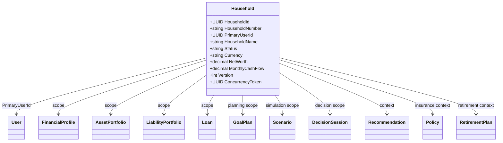
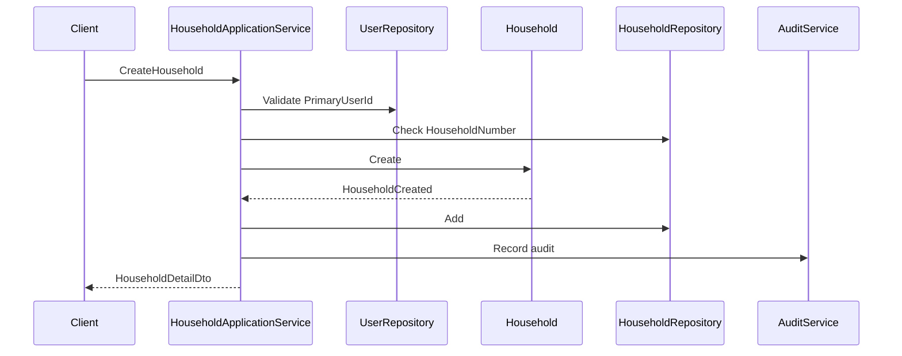
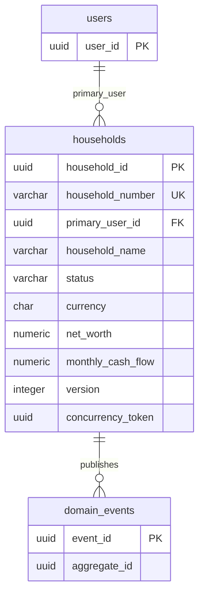
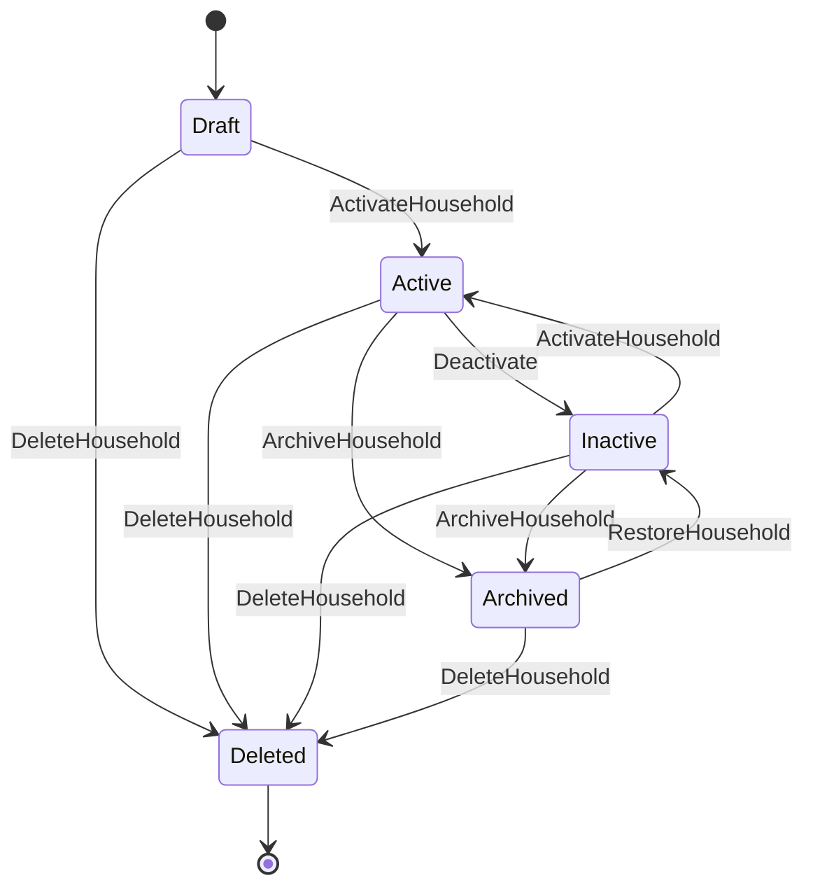

# Legacy Reference

- Status: Legacy reference only; do not treat this document as canonical.
- Canonical source: [knowledge/entity/Household.md](../../../knowledge/entity/Household.md).
- Retirement note: keep this file intact for historical lookup until legacy docs are retired.

# Household Entity Specification

# Entity Overview

## Purpose
- Household represents the shared financial planning and authorization unit in Atlas.
- Household provides the boundary used by FinancialProfile, GoalPlan, Scenario, DecisionSession, Recommendation, and household-scoped financial read models.
- Household coordinates membership identity by referencing User and does not replace the User aggregate.

## Responsibilities
- Maintain stable HouseholdId and unique HouseholdNumber.
- Maintain PrimaryUserId, HouseholdName, HouseholdType, lifecycle Status, planning Currency, Country, Region, and household profile metrics.
- Maintain household summary metrics including MemberCount, AnnualIncome, AnnualExpense, NetWorth, MonthlyCashFlow, RiskProfile, InvestmentProfile, RetirementTargetAge, TargetNetWorth, and PlanningHorizon.
- Protect the household authorization boundary and prevent cross-household data exposure.
- Preserve audit fields, Version, and ConcurrencyToken.
- Publish household lifecycle and recalculation DomainEvent records through Catalog-approved event handling.

## Business Meaning
- Household is the business unit used for shared financial planning.
- Household can represent one person, a couple, a family, or another household planning unit defined by Atlas catalog values.
- Household is the shared context for assets, liabilities, loans, goals, scenarios, decisions, recommendations, retirement planning, tax profile, cash flow, and insurance views.
- Household does not directly mutate child financial aggregates; each aggregate remains responsible for its own invariants and persistence.

## Aggregate Root
- Yes.
- Aggregate Name: Household.
- Aggregate Root: Household.
- Domain: Financial Profile.
- Repository: HouseholdRepository.
- Transaction Boundary: one Household mutation.
- Consistency Boundary: household identity, membership references, authorization scope, lifecycle, audit fields, and concurrency token.

## Lifecycle
- Draft: household is created but not yet active for planning.
- Active: household can be used for financial profile, goal, scenario, decision, and recommendation operations.
- Inactive: household is retained but not the current planning scope.
- Archived: household is retained for history and cannot be modified except restore or delete.
- Deleted: household is soft-deleted and unavailable for normal operations.

## Ownership
- Household is owned by Financial Profile Domain.
- Household owns household identity, PrimaryUserId reference, membership scope, lifecycle, audit fields, and concurrency token.
- User owns user identity and lifecycle.
- FinancialProfile owns cash flow and baseline financial facts.
- AssetPortfolio owns Portfolio, Position, and asset holding behavior.
- LiabilityPortfolio owns Liability behavior.
- Loan owns Loan lifecycle and mortgage-related loan behavior where Catalog maps Mortgage through Loan and Property.
- GoalPlan owns Goal behavior.
- Scenario owns scenario simulation behavior.
- DecisionSession owns decision behavior.
- Recommendation owns recommendation lifecycle through Catalog-approved persistence.
- Notification owns notification lifecycle and delivery history.
- Policy owns Insurance behavior where Catalog maps insurance to Policy.
- RetirementPlan owns Retirement behavior.
- TaxProfile is referenced as household-scoped tax data when defined by existing Catalog.

## Relationships
- User: Household must reference one PrimaryUserId. User identity is loaded by UserRepository and not mutated by Household.
- Asset: Household provides authorization scope for assets through AssetPortfolio and FinancialProfile read models.
- Liability: Household provides authorization scope for liabilities through LiabilityPortfolio.
- Loan: Household scopes loan visibility and planning impact; Loan aggregate owns loan mutation.
- Mortgage: Mortgage is represented through Catalog-approved Loan and Property relationships and is viewed under Household scope.
- Portfolio: Household scopes AssetPortfolio access and portfolio summaries.
- Position: Position belongs to Portfolio/AssetPortfolio; Household controls access boundary.
- CashFlow: CashFlow facts are owned by FinancialProfile and summarized into Household metrics.
- Income: Income contributes to AnnualIncome and MonthlyCashFlow through CashFlow Engine.
- Expense: Expense contributes to AnnualExpense and MonthlyCashFlow through CashFlow Engine.
- Goal: GoalPlan references Household for planning scope and household-level prioritization.
- Scenario: Scenario references Household to simulate household-level outcomes.
- Decision: DecisionSession references Household to evaluate decision context and authorization.
- Recommendation: Recommendation references Household through Scenario, DecisionSession, or target planning context.
- ExecutionPlan: ExecutionPlan references Household through Decision, Recommendation, Goal, or user assignment context.
- ActionPlan: ActionPlan references Household through ExecutionPlan and assignee access.
- Insurance: Insurance is represented by Policy and household-scoped protection context.
- Retirement: RetirementPlan references Household for retirement assumptions and targets.
- TaxProfile: TaxProfile is household-scoped tax context when present in the existing Catalog.
- DomainEvent: Household emits HouseholdCreated, HouseholdUpdated, HouseholdActivated, HouseholdArchived, HouseholdDeleted, NetWorthRecalculated, CashFlowRecalculated, and HouseholdStatusChanged.

## Navigation
- Household -> PrimaryUser by PrimaryUserId.
- Household -> FinancialProfile by HouseholdId.
- Household -> AssetPortfolio by HouseholdId.
- Household -> LiabilityPortfolio by HouseholdId.
- Household -> Loan by HouseholdId.
- Household -> GoalPlan by HouseholdId.
- Household -> Scenario by HouseholdId.
- Household -> DecisionSession by HouseholdId.
- Household -> Recommendation by HouseholdId or linked Scenario/Decision.
- Household -> ExecutionPlan by linked Decision, Recommendation, Goal, or Workflow context.
- Household -> ActionPlan by linked ExecutionPlan.
- Household -> Policy by HouseholdId where Insurance is represented by Policy.
- Household -> RetirementPlan by HouseholdId.
- Household -> DomainEvent by AggregateId and AggregateType Household.

# Complete Properties

| Name | Type | Nullable | Default | Description | Validation | Business Meaning | Example | Database Mapping | JSON Name | API Usage | Searchable | Sortable | Indexed | Encrypted | Auditable |
|---|---|---:|---|---|---|---|---|---|---|---|---:|---:|---:|---:|---:|
| HouseholdId | UUID | No | generated | Stable household identifier. | Required, immutable, UUID. | Identifies Household aggregate. | `6a8b7b40-6b60-420a-88df-942b940d89a1` | `household_id uuid primary key` | `householdId` | Route, detail, response. | Yes | Yes | Yes | No | Yes |
| HouseholdNumber | string(40) | No | generated | Unique business number. | Required, unique, max 40. | Human-readable household identity. | `HH-20260714` | `household_number varchar(40) not null unique` | `householdNumber` | Create response, search. | Yes | Yes | Yes | No | Yes |
| PrimaryUserId | UUID | No | none | Primary user reference. | Required, existing UserId, not deleted. | Primary responsible user. | `0f40f9f1-7c98-4c8b-a5aa-6e7b12d70411` | `primary_user_id uuid not null` | `primaryUserId` | Create, update, detail. | Yes | Yes | Yes | No | Yes |
| HouseholdName | string(120) | No | none | Household display name. | Required, trim, 1-120. | Name shown in planning views. | `Kung Household` | `household_name varchar(120) not null` | `householdName` | Create, update, summary. | Yes | Yes | Yes | No | Yes |
| HouseholdType | string(40) | No | `Personal` | Household classification. | Required, Catalog value. | Planning unit type. | `Family` | `household_type varchar(40) not null` | `householdType` | Create, update, search. | Yes | Yes | Yes | No | Yes |
| Status | string(32) | No | `Draft` | Lifecycle status. | Required; Draft, Active, Inactive, Archived, Deleted. | Controls mutability and visibility. | `Active` | `status varchar(32) not null` | `status` | Command response, search. | Yes | Yes | Yes | No | Yes |
| Currency | string(3) | No | User currency | Planning currency. | Required, ISO 4217 uppercase. | Household financial display and aggregation currency. | `TWD` | `currency char(3) not null` | `currency` | Create, update, detail. | Yes | Yes | Yes | No | Yes |
| Country | string(2) | Yes | null | Country code. | ISO 3166-1 alpha-2 when present. | Regional planning and tax context. | `TW` | `country char(2)` | `country` | Create, update, search. | Yes | Yes | Yes | No | Yes |
| Region | string(80) | Yes | null | Region or administrative area. | Trim, max 80. | Local planning context. | `Taipei` | `region varchar(80)` | `region` | Create, update, search. | Yes | Yes | Yes | No | Yes |
| MemberCount | integer | No | 1 | Number of household members. | Required, >= 1. | Size of planning unit. | `3` | `member_count integer not null` | `memberCount` | Detail, summary, search. | Yes | Yes | Yes | No | Yes |
| AnnualIncome | decimal(19,4) | Yes | null | Annual income summary. | >= 0 when present. | Income capacity snapshot. | `2400000.0000` | `annual_income numeric(19,4)` | `annualIncome` | Detail, recalculation response. | No | Yes | Yes | Yes | Yes |
| AnnualExpense | decimal(19,4) | Yes | null | Annual expense summary. | >= 0 when present. | Household spending snapshot. | `1200000.0000` | `annual_expense numeric(19,4)` | `annualExpense` | Detail, recalculation response. | No | Yes | Yes | Yes | Yes |
| NetWorth | decimal(19,4) | Yes | null | Asset minus liability summary. | Can be negative. | Household financial position. | `6800000.0000` | `net_worth numeric(19,4)` | `netWorth` | Detail, recalculation response. | No | Yes | Yes | Yes | Yes |
| MonthlyCashFlow | decimal(19,4) | Yes | null | Monthly income minus expense. | Can be negative. | Monthly surplus or deficit. | `100000.0000` | `monthly_cash_flow numeric(19,4)` | `monthlyCashFlow` | Detail, recalculation response. | No | Yes | Yes | Yes | Yes |
| RiskProfile | string(40) | Yes | null | Household risk profile. | Catalog value when present. | Planning and recommendation suitability. | `Balanced` | `risk_profile varchar(40)` | `riskProfile` | Create, update, search. | Yes | Yes | Yes | No | Yes |
| InvestmentProfile | string(40) | Yes | null | Household investment profile. | Catalog value when present. | Portfolio and scenario assumptions. | `LongTerm` | `investment_profile varchar(40)` | `investmentProfile` | Create, update, search. | Yes | Yes | Yes | No | Yes |
| RetirementTargetAge | integer | Yes | null | Target retirement age. | 0-120 when present. | Retirement planning input. | `65` | `retirement_target_age integer` | `retirementTargetAge` | Create, update, detail. | No | Yes | No | No | Yes |
| TargetNetWorth | decimal(19,4) | Yes | null | Target household net worth. | >= 0 when present. | Long-term planning objective. | `30000000.0000` | `target_net_worth numeric(19,4)` | `targetNetWorth` | Create, update, detail. | No | Yes | Yes | Yes | Yes |
| PlanningHorizon | integer | Yes | null | Planning horizon in years. | 0-100 when present. | Scenario and retirement projection range. | `30` | `planning_horizon integer` | `planningHorizon` | Create, update, detail. | No | Yes | No | No | Yes |
| CreatedAt | datetime | No | now UTC | Created timestamp. | Required, UTC, immutable. | Audit and ordering. | `2026-07-14T00:00:00Z` | `created_at timestamptz not null` | `createdAt` | Response only. | Yes | Yes | Yes | No | Yes |
| CreatedBy | UUID | Yes | null | Creator actor. | Existing UserId or system actor. | Audit attribution. | `0f40f9f1-7c98-4c8b-a5aa-6e7b12d70411` | `created_by uuid` | `createdBy` | Response only. | Yes | Yes | Yes | No | Yes |
| UpdatedAt | datetime | No | now UTC | Last update timestamp. | Required, UTC, >= CreatedAt. | Audit and cache invalidation. | `2026-07-14T02:00:00Z` | `updated_at timestamptz not null` | `updatedAt` | Response only. | Yes | Yes | Yes | No | Yes |
| UpdatedBy | UUID | Yes | null | Last updater actor. | Existing UserId or system actor. | Audit attribution. | `0f40f9f1-7c98-4c8b-a5aa-6e7b12d70411` | `updated_by uuid` | `updatedBy` | Response only. | Yes | Yes | Yes | No | Yes |
| Version | integer | No | 1 | Monotonic version. | Required, >= 1, increments on mutation. | Version history and event ordering. | `4` | `version integer not null` | `version` | Detail, update, audit. | No | Yes | Yes | No | Yes |
| ConcurrencyToken | UUID | No | generated | Optimistic concurrency token. | Required, changes on mutation. | Prevents lost updates. | `a7ad6648-41e5-4da6-945a-7a43fb0bc6b2` | `concurrency_token uuid not null` | `concurrencyToken` | Update and command input. | No | No | Yes | No | Yes |

# Validation Rules

- HouseholdId is required, UUID, and immutable.
- HouseholdNumber is required, unique, immutable, max 40 characters, and follows Catalog household number rules.
- PrimaryUserId is required and must reference an existing non-deleted User.
- HouseholdName is required, trimmed, 1-120 characters, and cannot contain control characters.
- HouseholdType is required and must match Catalog-approved household type values.
- Status is required and must be Draft, Active, Inactive, Archived, or Deleted.
- Currency is required and must be an uppercase ISO 4217 currency code supported by Atlas.
- Country is optional and must be uppercase ISO 3166-1 alpha-2 when present.
- Region is optional, trimmed, max 80 characters.
- MemberCount is required and must be greater than or equal to 1.
- AnnualIncome is optional and must be greater than or equal to 0 when present.
- AnnualExpense is optional and must be greater than or equal to 0 when present.
- NetWorth is optional and may be negative.
- MonthlyCashFlow is optional and may be negative.
- RiskProfile is optional and must match Catalog-approved risk profile values when present.
- InvestmentProfile is optional and must match Catalog-approved investment profile values when present.
- RetirementTargetAge is optional and must be between 0 and 120.
- TargetNetWorth is optional and must be greater than or equal to 0 when present.
- PlanningHorizon is optional and must be between 0 and 100 years.
- CreatedAt is required, UTC, and immutable.
- UpdatedAt is required, UTC, and must be greater than or equal to CreatedAt.
- CreatedBy and UpdatedBy must reference an existing actor or system actor when present.
- Version is required and must be greater than or equal to 1.
- ConcurrencyToken is required and must match for update commands.
- Archived Household cannot be modified except RestoreHousehold or DeleteHousehold.
- Deleted Household cannot be modified or activated.
- RecalculateNetWorth requires active or inactive non-deleted household.
- RecalculateCashFlow requires active or inactive non-deleted household.

# Business Rules

- Household must have one PrimaryUser.
- HouseholdNumber must be unique.
- MemberCount must not be less than 1.
- NetWorth may be calculated from assets and liabilities.
- MonthlyCashFlow may be aggregated from Income and Expense.
- Archived Household cannot be modified.
- Household must preserve complete Audit Trail.
- Household must preserve complete Version History.
- Household supports Soft Delete.
- Household is an authorization boundary and must not expose data across households.
- Household does not mutate User directly.
- Household does not mutate AssetPortfolio, LiabilityPortfolio, Loan, GoalPlan, Scenario, DecisionSession, Recommendation, Policy, RetirementPlan, or Notification directly.
- Household may store recalculated summary values derived from financial aggregates and cash flow read models.
- Recalculated summaries must be traceable to calculation time and actor through audit.
- Active Household may be used for goal, scenario, decision, recommendation, and planning operations.
- Archived Household remains visible for history to authorized users.
- Deleted Household remains retained for audit and referential integrity.
- Version increments on every successful mutation.
- ConcurrencyToken rotates on every successful mutation.
- HouseholdStatusChanged must be emitted for each lifecycle transition.

# State Machine

| State | Transition | Trigger | Invariant | Illegal Transition |
|---|---|---|---|---|
| Draft | Draft -> Active | ActivateHousehold | PrimaryUserId exists, MemberCount >= 1 | Draft -> Archived without ArchiveHousehold |
| Draft | Draft -> Deleted | DeleteHousehold | Soft delete audit recorded | Draft -> Inactive |
| Active | Active -> Inactive | UpdateHousehold administrative status change | Household not deleted | Active -> Draft |
| Active | Active -> Archived | ArchiveHousehold | No direct child aggregate mutation | Active -> Draft |
| Active | Active -> Deleted | DeleteHousehold | Is soft-deleted | Active -> Draft |
| Inactive | Inactive -> Active | ActivateHousehold | Required fields valid | Inactive -> Draft |
| Inactive | Inactive -> Archived | ArchiveHousehold | Audit recorded | Inactive -> Draft |
| Archived | Archived -> Inactive | RestoreHousehold | Restore audit recorded | Archived -> Active without activation |
| Archived | Archived -> Deleted | DeleteHousehold | Soft delete audit recorded | Archived -> Draft |
| Deleted | none | terminal normal lifecycle | Soft delete retained | Deleted -> Active, Deleted -> Archived, Deleted -> Draft |

# Commands

## CreateHousehold
- Creates Household with PrimaryUserId, HouseholdNumber, HouseholdName, HouseholdType, Status, Currency, MemberCount, Version, and ConcurrencyToken.
- Validates PrimaryUserId, uniqueness, currency, household type, and initial status.
- Emits HouseholdCreated and HouseholdStatusChanged.

## UpdateHousehold
- Updates HouseholdName, HouseholdType, Currency, Country, Region, MemberCount, RiskProfile, InvestmentProfile, RetirementTargetAge, TargetNetWorth, and PlanningHorizon.
- Requires matching ConcurrencyToken.
- Rejects Archived and Deleted households.
- Emits HouseholdUpdated.

## ActivateHousehold
- Moves Draft or Inactive household to Active.
- Requires valid PrimaryUserId and MemberCount >= 1.
- Emits HouseholdActivated and HouseholdStatusChanged.

## ArchiveHousehold
- Moves Active or Inactive household to Archived.
- Preserves history and prevents normal updates.
- Emits HouseholdArchived and HouseholdStatusChanged.

## RestoreHousehold
- Moves Archived household to Inactive.
- Requires authorization and ConcurrencyToken.
- Emits HouseholdStatusChanged and HouseholdUpdated.

## DeleteHousehold
- Soft-deletes Household.
- Prevents normal operations while retaining audit references.
- Emits HouseholdDeleted and HouseholdStatusChanged.

## RecalculateNetWorth
- Recalculates NetWorth from household-scoped assets and liabilities.
- Does not mutate AssetPortfolio or LiabilityPortfolio.
- Emits NetWorthRecalculated and HouseholdUpdated.

## RecalculateCashFlow
- Recalculates AnnualIncome, AnnualExpense, and MonthlyCashFlow from Income and Expense summaries.
- Does not mutate FinancialProfile cash flow facts.
- Emits CashFlowRecalculated and HouseholdUpdated.

## ChangePrimaryUser
- Changes PrimaryUserId when authorized and the new user is valid.
- Emits HouseholdUpdated.

# Domain Events

| Event | Producer | Trigger | Payload | Consumers |
|---|---|---|---|---|
| HouseholdCreated | Household | CreateHousehold | HouseholdId, HouseholdNumber, PrimaryUserId, Status | Audit Service, read models |
| HouseholdUpdated | Household | UpdateHousehold or recalculation | HouseholdId, ChangedFields, Version, UpdatedAt | Audit Service, cache invalidation |
| HouseholdActivated | Household | ActivateHousehold | HouseholdId, ActivatedAt, ActivatedBy | Goal Service, Scenario Engine |
| HouseholdArchived | Household | ArchiveHousehold | HouseholdId, ArchivedAt, ArchivedBy | Audit Service, read models |
| HouseholdDeleted | Household | DeleteHousehold | HouseholdId, DeletedAt, DeletedBy | Authorization, Audit Service |
| NetWorthRecalculated | Household | RecalculateNetWorth | HouseholdId, PreviousNetWorth, NetWorth, CalculatedAt | Dashboard, Scenario Engine, Decision Engine |
| CashFlowRecalculated | Household | RecalculateCashFlow | HouseholdId, AnnualIncome, AnnualExpense, MonthlyCashFlow, CalculatedAt | CashFlow Engine, Dashboard, Recommendation Engine |
| HouseholdStatusChanged | Household | Any status transition | HouseholdId, PreviousStatus, NewStatus, OccurredAt | Authorization, Notification, Audit Service |
| HouseholdPrimaryUserChanged | Household | ChangePrimaryUser | HouseholdId, PreviousPrimaryUserId, PrimaryUserId | Authorization, Audit Service |

# Repository

## Interface
```csharp
public interface IHouseholdRepository
{
    Task<Household?> GetByIdAsync(Guid householdId, CancellationToken cancellationToken);
    Task<Household?> GetByHouseholdNumberAsync(string householdNumber, CancellationToken cancellationToken);
    Task<IReadOnlyList<Household>> GetByPrimaryUserIdAsync(Guid primaryUserId, CancellationToken cancellationToken);
    Task<IReadOnlyList<Household>> SearchAsync(HouseholdSearchSpecification specification, CancellationToken cancellationToken);
    Task<bool> ExistsByHouseholdNumberAsync(string householdNumber, CancellationToken cancellationToken);
    Task AddAsync(Household household, CancellationToken cancellationToken);
    Task UpdateAsync(Household household, CancellationToken cancellationToken);
}
```

## Methods
- GetByIdAsync loads one Household aggregate by HouseholdId.
- GetByHouseholdNumberAsync loads one Household by HouseholdNumber.
- GetByPrimaryUserIdAsync loads households where the user is primary.
- SearchAsync returns paged household summaries.
- ExistsByHouseholdNumberAsync enforces uniqueness.
- AddAsync persists new Household and DomainEvents.
- UpdateAsync persists changes with optimistic concurrency.

## Query Methods
- FindActiveHouseholds.
- FindArchivedHouseholds.
- FindDeletedHouseholdsForAdministration.
- FindByPrimaryUserId.
- FindByCountryRegion.
- FindByCurrency.
- FindByRiskProfile.
- FindByInvestmentProfile.
- FindByNetWorthRange.
- FindByMonthlyCashFlowRange.
- FindByUpdatedAtRange.

## Specification Pattern
- HouseholdByIdSpecification.
- HouseholdByNumberSpecification.
- HouseholdByPrimaryUserSpecification.
- ActiveHouseholdSpecification.
- NonDeletedHouseholdSpecification.
- ArchivedHouseholdSpecification.
- HouseholdSearchSpecification.
- HouseholdRecalculationEligibilitySpecification.
- HouseholdAuthorizationSpecification.

# Domain Service Interaction

- Household Service validates household lifecycle, PrimaryUserId, household membership scope, and household summary mutation rules.
- Asset Service provides asset totals for NetWorth calculation without being mutated by Household.
- Liability Service provides liability totals for NetWorth calculation without being mutated by Household.
- CashFlow Engine provides Income and Expense summaries for AnnualIncome, AnnualExpense, and MonthlyCashFlow.
- Retirement Service consumes RetirementTargetAge, TargetNetWorth, PlanningHorizon, and household profile metrics.
- Tax Service consumes Country, Region, AnnualIncome, AnnualExpense, and household scope for tax profile interpretation.
- Portfolio Service exposes AssetPortfolio and Position summaries under Household authorization.
- Goal Service consumes household scope and summary metrics for GoalPlan evaluation.
- Decision Engine consumes household context for decision scoring and explainability.
- Recommendation Engine consumes household context, risk profile, cash flow, and net worth summaries.
- Scenario Engine consumes household context and profile values for simulations.
- Audit Service records all household changes and recalculation results.

# Application Service Interaction

- HouseholdApplicationService handles create, update, activate, archive, restore, delete, recalculate, search, and detail operations.
- UserApplicationService validates PrimaryUserId and user access.
- PortfolioApplicationService supplies household-scoped portfolio summaries.
- CashFlowApplicationService supplies income and expense summaries.
- LoanApplicationService supplies loan and mortgage-related liability summaries.
- GoalApplicationService reads household scope for GoalPlan operations.
- ScenarioApplicationService reads household scope for simulations.
- DecisionApplicationService reads household scope for DecisionSession operations.
- RecommendationApplicationService reads household context for targeting and filtering.
- NotificationApplicationService sends household lifecycle or recalculation notifications when configured.
- AuditApplicationService exposes household audit history to authorized callers.

# API

## REST Endpoints
| Operation | HTTP Method | Endpoint | Request | Response | Error |
|---|---|---|---|---|---|
| Create | POST | `/api/households` | CreateHouseholdDto | HouseholdDetailDto | 400, 403, 409, 422 |
| Get Detail | GET | `/api/households/{householdId}` | none | HouseholdDetailDto | 401, 403, 404 |
| Update | PUT | `/api/households/{householdId}` | UpdateHouseholdDto | HouseholdDetailDto | 400, 403, 404, 409, 422 |
| Delete | DELETE | `/api/households/{householdId}` | concurrencyToken | HouseholdDetailDto | 403, 404, 409 |
| Search | GET | `/api/households` | HouseholdSearchDto | paged HouseholdSummaryDto | 400, 403 |
| Activate | POST | `/api/households/{householdId}/activate` | concurrencyToken | HouseholdDetailDto | 403, 404, 409, 422 |
| Archive | POST | `/api/households/{householdId}/archive` | reason, concurrencyToken | HouseholdDetailDto | 403, 404, 409 |
| Restore | POST | `/api/households/{householdId}/restore` | concurrencyToken | HouseholdDetailDto | 403, 404, 409, 422 |
| Recalculate | POST | `/api/households/{householdId}/recalculate` | RecalculateHouseholdDto | HouseholdDetailDto | 403, 404, 409, 422 |
| History | GET | `/api/households/{householdId}/history` | paging | audit event page | 403, 404 |

## Response
- Command responses return HouseholdDetailDto with updated Version and ConcurrencyToken.
- Search responses return page, pageSize, totalCount, and items.
- Financial summary values are masked unless caller has household financial read permission.

## Error
- 400: invalid request, enum, currency, date, or range.
- 401: authentication required.
- 403: caller lacks household access.
- 404: Household not found or not visible.
- 409: duplicate HouseholdNumber or concurrency conflict.
- 422: business rule violation or illegal state transition.

# DTO

## Create DTO
```json
{
  "primaryUserId": "0f40f9f1-7c98-4c8b-a5aa-6e7b12d70411",
  "householdName": "Kung Household",
  "householdType": "Family",
  "currency": "TWD",
  "country": "TW",
  "region": "Taipei",
  "memberCount": 3,
  "riskProfile": "Balanced",
  "investmentProfile": "LongTerm",
  "retirementTargetAge": 65,
  "targetNetWorth": 30000000,
  "planningHorizon": 30
}
```

## Update DTO
```json
{
  "householdName": "Kung Family Household",
  "householdType": "Family",
  "currency": "TWD",
  "memberCount": 3,
  "riskProfile": "Balanced",
  "investmentProfile": "LongTerm",
  "retirementTargetAge": 66,
  "targetNetWorth": 32000000,
  "planningHorizon": 30,
  "concurrencyToken": "a7ad6648-41e5-4da6-945a-7a43fb0bc6b2"
}
```

## Detail DTO
```json
{
  "householdId": "6a8b7b40-6b60-420a-88df-942b940d89a1",
  "householdNumber": "HH-20260714",
  "primaryUserId": "0f40f9f1-7c98-4c8b-a5aa-6e7b12d70411",
  "householdName": "Kung Family Household",
  "householdType": "Family",
  "status": "Active",
  "currency": "TWD",
  "country": "TW",
  "region": "Taipei",
  "memberCount": 3,
  "annualIncome": 2400000,
  "annualExpense": 1200000,
  "netWorth": 6800000,
  "monthlyCashFlow": 100000,
  "riskProfile": "Balanced",
  "investmentProfile": "LongTerm",
  "retirementTargetAge": 66,
  "targetNetWorth": 32000000,
  "planningHorizon": 30,
  "version": 4,
  "concurrencyToken": "1d641387-47b0-466a-8ca4-59c7c9360f29"
}
```

## Summary DTO
```json
{
  "householdId": "6a8b7b40-6b60-420a-88df-942b940d89a1",
  "householdNumber": "HH-20260714",
  "householdName": "Kung Family Household",
  "status": "Active",
  "currency": "TWD",
  "memberCount": 3,
  "netWorth": 6800000,
  "monthlyCashFlow": 100000
}
```

## Search DTO
```json
{
  "keyword": "Kung",
  "status": ["Active"],
  "primaryUserId": "0f40f9f1-7c98-4c8b-a5aa-6e7b12d70411",
  "currency": "TWD",
  "country": "TW",
  "riskProfile": "Balanced",
  "page": 1,
  "pageSize": 20,
  "sortBy": "updatedAt",
  "sortDirection": "desc"
}
```

## Recalculate DTO
```json
{
  "recalculateNetWorth": true,
  "recalculateCashFlow": true,
  "calculationDate": "2026-07-14",
  "concurrencyToken": "1d641387-47b0-466a-8ca4-59c7c9360f29"
}
```

# Database Mapping

## Table
- Table name: `households`.
- Primary key: `household_id`.
- Aggregate owner: Household.
- Repository: HouseholdRepository.

## Columns
| Column | Type | Nullable | Mapping |
|---|---|---:|---|
| household_id | uuid | No | HouseholdId |
| household_number | varchar(40) | No | HouseholdNumber |
| primary_user_id | uuid | No | PrimaryUserId |
| household_name | varchar(120) | No | HouseholdName |
| household_type | varchar(40) | No | HouseholdType |
| status | varchar(32) | No | Status |
| currency | char(3) | No | Currency |
| country | char(2) | Yes | Country |
| region | varchar(80) | Yes | Region |
| member_count | integer | No | MemberCount |
| annual_income | numeric(19,4) | Yes | AnnualIncome |
| annual_expense | numeric(19,4) | Yes | AnnualExpense |
| net_worth | numeric(19,4) | Yes | NetWorth |
| monthly_cash_flow | numeric(19,4) | Yes | MonthlyCashFlow |
| risk_profile | varchar(40) | Yes | RiskProfile |
| investment_profile | varchar(40) | Yes | InvestmentProfile |
| retirement_target_age | integer | Yes | RetirementTargetAge |
| target_net_worth | numeric(19,4) | Yes | TargetNetWorth |
| planning_horizon | integer | Yes | PlanningHorizon |
| created_at | timestamptz | No | CreatedAt |
| created_by | uuid | Yes | CreatedBy |
| updated_at | timestamptz | No | UpdatedAt |
| updated_by | uuid | Yes | UpdatedBy |
| version | integer | No | Version |
| concurrency_token | uuid | No | ConcurrencyToken |

## FK
- `primary_user_id` references `users.user_id`.
- `created_by` and `updated_by` may reference `users.user_id` when actor is an Atlas user.
- Child aggregates reference Household by identity and are not mutated by HouseholdRepository.

## Unique
- `ux_households_household_number` on `household_number`.

## Check Constraint
- Status in Draft, Active, Inactive, Archived, Deleted.
- MemberCount >= 1.
- AnnualIncome >= 0 when present.
- AnnualExpense >= 0 when present.
- TargetNetWorth >= 0 when present.
- RetirementTargetAge between 0 and 120 when present.
- PlanningHorizon between 0 and 100 when present.
- Version >= 1.
- UpdatedAt >= CreatedAt.

## Index
- Primary key index on `household_id`.
- Unique index on `household_number`.
- Index on `primary_user_id`.
- Index on `status`.
- Index on `currency`, `country`, `region`.
- Index on `risk_profile`, `investment_profile`.
- Index on `net_worth`, `monthly_cash_flow`.
- Index on `created_at`, `updated_at`.
- Index on `concurrency_token`.

# PostgreSQL Schema

```sql
CREATE TABLE households (
    household_id uuid PRIMARY KEY,
    household_number varchar(40) NOT NULL,
    primary_user_id uuid NOT NULL,
    household_name varchar(120) NOT NULL,
    household_type varchar(40) NOT NULL DEFAULT 'Personal',
    status varchar(32) NOT NULL DEFAULT 'Draft',
    currency char(3) NOT NULL DEFAULT 'TWD',
    country char(2),
    region varchar(80),
    member_count integer NOT NULL DEFAULT 1,
    annual_income numeric(19,4),
    annual_expense numeric(19,4),
    net_worth numeric(19,4),
    monthly_cash_flow numeric(19,4),
    risk_profile varchar(40),
    investment_profile varchar(40),
    retirement_target_age integer,
    target_net_worth numeric(19,4),
    planning_horizon integer,
    created_at timestamptz NOT NULL DEFAULT now(),
    created_by uuid,
    updated_at timestamptz NOT NULL DEFAULT now(),
    updated_by uuid,
    version integer NOT NULL DEFAULT 1,
    concurrency_token uuid NOT NULL,
    CONSTRAINT fk_households_primary_user FOREIGN KEY (primary_user_id) REFERENCES users(user_id),
    CONSTRAINT ck_households_status CHECK (status IN ('Draft','Active','Inactive','Archived','Deleted')),
    CONSTRAINT ck_households_currency CHECK (currency = upper(currency) AND char_length(currency) = 3),
    CONSTRAINT ck_households_country CHECK (country IS NULL OR (country = upper(country) AND char_length(country) = 2)),
    CONSTRAINT ck_households_member_count CHECK (member_count >= 1),
    CONSTRAINT ck_households_annual_income CHECK (annual_income IS NULL OR annual_income >= 0),
    CONSTRAINT ck_households_annual_expense CHECK (annual_expense IS NULL OR annual_expense >= 0),
    CONSTRAINT ck_households_target_net_worth CHECK (target_net_worth IS NULL OR target_net_worth >= 0),
    CONSTRAINT ck_households_retirement_target_age CHECK (retirement_target_age IS NULL OR retirement_target_age BETWEEN 0 AND 120),
    CONSTRAINT ck_households_planning_horizon CHECK (planning_horizon IS NULL OR planning_horizon BETWEEN 0 AND 100),
    CONSTRAINT ck_households_version CHECK (version >= 1),
    CONSTRAINT ck_households_updated_at CHECK (updated_at >= created_at)
);

CREATE UNIQUE INDEX ux_households_household_number ON households (household_number);
CREATE INDEX ix_households_primary_user_id ON households (primary_user_id);
CREATE INDEX ix_households_status ON households (status);
CREATE INDEX ix_households_currency_region ON households (currency, country, region);
CREATE INDEX ix_households_profiles ON households (risk_profile, investment_profile);
CREATE INDEX ix_households_financial_summary ON households (net_worth, monthly_cash_flow);
CREATE INDEX ix_households_created_at ON households (created_at);
CREATE INDEX ix_households_updated_at ON households (updated_at);
CREATE INDEX ix_households_concurrency_token ON households (concurrency_token);
```

# EF Core Mapping

## Fluent API
```csharp
builder.ToTable("households");
builder.HasKey(x => x.HouseholdId);
builder.Property(x => x.HouseholdId).HasColumnName("household_id").ValueGeneratedNever();
builder.Property(x => x.HouseholdNumber).HasColumnName("household_number").HasMaxLength(40).IsRequired();
builder.Property(x => x.PrimaryUserId).HasColumnName("primary_user_id").IsRequired();
builder.Property(x => x.HouseholdName).HasColumnName("household_name").HasMaxLength(120).IsRequired();
builder.Property(x => x.HouseholdType).HasColumnName("household_type").HasMaxLength(40).IsRequired();
builder.Property(x => x.Status).HasColumnName("status").HasMaxLength(32).HasConversion<string>().IsRequired();
builder.Property(x => x.Currency).HasColumnName("currency").HasMaxLength(3).IsRequired();
builder.Property(x => x.Country).HasColumnName("country").HasMaxLength(2);
builder.Property(x => x.Region).HasColumnName("region").HasMaxLength(80);
builder.Property(x => x.MemberCount).HasColumnName("member_count").IsRequired();
builder.Property(x => x.AnnualIncome).HasColumnName("annual_income").HasPrecision(19, 4);
builder.Property(x => x.AnnualExpense).HasColumnName("annual_expense").HasPrecision(19, 4);
builder.Property(x => x.NetWorth).HasColumnName("net_worth").HasPrecision(19, 4);
builder.Property(x => x.MonthlyCashFlow).HasColumnName("monthly_cash_flow").HasPrecision(19, 4);
builder.Property(x => x.RiskProfile).HasColumnName("risk_profile").HasMaxLength(40);
builder.Property(x => x.InvestmentProfile).HasColumnName("investment_profile").HasMaxLength(40);
builder.Property(x => x.RetirementTargetAge).HasColumnName("retirement_target_age");
builder.Property(x => x.TargetNetWorth).HasColumnName("target_net_worth").HasPrecision(19, 4);
builder.Property(x => x.PlanningHorizon).HasColumnName("planning_horizon");
builder.Property(x => x.CreatedAt).HasColumnName("created_at").IsRequired();
builder.Property(x => x.CreatedBy).HasColumnName("created_by");
builder.Property(x => x.UpdatedAt).HasColumnName("updated_at").IsRequired();
builder.Property(x => x.UpdatedBy).HasColumnName("updated_by");
builder.Property(x => x.Version).HasColumnName("version").IsRequired();
builder.Property(x => x.ConcurrencyToken).HasColumnName("concurrency_token").IsConcurrencyToken().IsRequired();
builder.HasIndex(x => x.HouseholdNumber).IsUnique().HasDatabaseName("ux_households_household_number");
builder.HasIndex(x => x.PrimaryUserId).HasDatabaseName("ix_households_primary_user_id");
builder.HasIndex(x => x.Status).HasDatabaseName("ix_households_status");
builder.HasIndex(x => new { x.Currency, x.Country, x.Region }).HasDatabaseName("ix_households_currency_region");
```

## Owned Type
- Household financial summary may be mapped as an owned value object if existing implementation defines it.
- Household planning profile may group RiskProfile, InvestmentProfile, RetirementTargetAge, TargetNetWorth, and PlanningHorizon while preserving columns.
- Household region may group Country and Region while preserving columns.

## Value Conversion
- Status converts enum to string.
- HouseholdType converts Catalog-approved value to string.
- RiskProfile converts Catalog-approved value to string.
- InvestmentProfile converts Catalog-approved value to string.
- Currency stores ISO 4217 string.

## Concurrency Token
- ConcurrencyToken is configured as optimistic concurrency token.
- Version increments with each persisted mutation.
- Update commands require matching ConcurrencyToken.
- Repository rejects stale token with 409 conflict.

# Cache Strategy

- Cache Household detail by `household:{householdId}`.
- Cache HouseholdNumber lookup by `household-number:{householdNumber}`.
- Cache household authorization membership by `household-auth:{householdId}`.
- Cache household financial summary separately by `household-summary:{householdId}`.
- Invalidate cache on HouseholdUpdated, HouseholdStatusChanged, NetWorthRecalculated, CashFlowRecalculated, HouseholdArchived, and HouseholdDeleted.
- Do not cache unmasked financial summary values in shared cache without authorization scope.
- Search cache keys must include caller identity, household scope, masking level, and filters.

# Security

## Authorization
- Caller must be household member, PrimaryUser, or administrator to read Household detail.
- Only authorized user may CreateHousehold for self or permitted PrimaryUserId.
- Only PrimaryUser or administrator may update household profile fields.
- Only administrator or PrimaryUser with permission may ArchiveHousehold, RestoreHousehold, or DeleteHousehold.
- Recalculation requires household financial read permission.
- Search requires household-scoped or administrative permission.

## Permission
- `Household.Read`.
- `Household.ReadFinancialSummary`.
- `Household.Search`.
- `Household.Create`.
- `Household.Update`.
- `Household.Activate`.
- `Household.Archive`.
- `Household.Restore`.
- `Household.Delete`.
- `Household.Recalculate`.
- `Household.Audit.Read`.

## Data Masking
- AnnualIncome, AnnualExpense, NetWorth, MonthlyCashFlow, and TargetNetWorth are masked unless caller has financial summary permission.
- PrimaryUserId may be hidden in cross-household administration views without identity permission.
- CreatedBy and UpdatedBy may be masked in user-facing views.

## Encryption
- Household financial summary values should be protected according to Atlas data protection policy.
- PrimaryUserId is not encrypted but must be access-controlled.
- Audit records containing financial values must mask or encrypt sensitive values.

# Audit

- Audit CreateHousehold with actor, PrimaryUserId, HouseholdNumber, Status, and correlation id.
- Audit UpdateHousehold with changed fields and masked financial values.
- Audit ActivateHousehold, ArchiveHousehold, RestoreHousehold, and DeleteHousehold.
- Audit RecalculateNetWorth with previous and new NetWorth using masking rules.
- Audit RecalculateCashFlow with previous and new AnnualIncome, AnnualExpense, and MonthlyCashFlow using masking rules.
- Audit ChangePrimaryUser with previous and new PrimaryUserId.
- Audit authorization failures, validation failures, and illegal transitions.
- Audit Version and ConcurrencyToken changes.
- Audit DomainEvent publication correlation and causation ids.
- Audit records are immutable and retained after soft delete.

# Performance

## Index Strategy
- Use primary key lookup for commands and detail views.
- Use unique HouseholdNumber index for business lookup.
- Use PrimaryUserId index for user household resolution.
- Use Status index for lifecycle filters.
- Use Currency, Country, and Region composite index for reporting.
- Use RiskProfile and InvestmentProfile index for segmentation.
- Use financial summary index for range filtering.
- Use UpdatedAt index for synchronization and audit queries.

## Caching
- Cache detail, summary, and authorization views separately.
- Invalidate event-driven caches after lifecycle and recalculation events.
- Use short TTL for financial summary cache because source aggregates may change.
- Avoid caching unmasked financial values across users.

## Optimistic Concurrency
- All mutation commands require ConcurrencyToken.
- Recalculation commands also require ConcurrencyToken to avoid overwriting newer summaries.
- Version supports event ordering and idempotent consumers.

## Batch Calculation
- Batch recalculation must process households by page.
- Batch recalculation must not mutate child aggregate roots.
- Batch calculation should persist one Household mutation per household.
- Batch results must record correlation id and audit summary.

## Partition Strategy
- Household table is not partitioned by default.
- AuditLog and DomainEvent history may be partitioned by time.
- CashFlow, Notification, Scenario, Decision, and projection tables follow their own partition strategy.

# Example JSON

## Create
```json
{
  "primaryUserId": "0f40f9f1-7c98-4c8b-a5aa-6e7b12d70411",
  "householdName": "Kung Household",
  "householdType": "Family",
  "currency": "TWD",
  "country": "TW",
  "region": "Taipei",
  "memberCount": 3,
  "riskProfile": "Balanced",
  "investmentProfile": "LongTerm",
  "retirementTargetAge": 65,
  "targetNetWorth": 30000000,
  "planningHorizon": 30
}
```

## Update
```json
{
  "householdName": "Kung Family Household",
  "memberCount": 3,
  "riskProfile": "Balanced",
  "investmentProfile": "LongTerm",
  "retirementTargetAge": 66,
  "targetNetWorth": 32000000,
  "planningHorizon": 30,
  "concurrencyToken": "a7ad6648-41e5-4da6-945a-7a43fb0bc6b2"
}
```

## Recalculate
```json
{
  "recalculateNetWorth": true,
  "recalculateCashFlow": true,
  "calculationDate": "2026-07-14",
  "concurrencyToken": "1d641387-47b0-466a-8ca4-59c7c9360f29"
}
```

## Detail
```json
{
  "householdId": "6a8b7b40-6b60-420a-88df-942b940d89a1",
  "householdNumber": "HH-20260714",
  "primaryUserId": "0f40f9f1-7c98-4c8b-a5aa-6e7b12d70411",
  "householdName": "Kung Family Household",
  "householdType": "Family",
  "status": "Active",
  "currency": "TWD",
  "memberCount": 3,
  "annualIncome": 2400000,
  "annualExpense": 1200000,
  "netWorth": 6800000,
  "monthlyCashFlow": 100000,
  "version": 4,
  "concurrencyToken": "1d641387-47b0-466a-8ca4-59c7c9360f29"
}
```

## Search
```json
{
  "page": 1,
  "pageSize": 20,
  "totalCount": 1,
  "items": [
    {
      "householdId": "6a8b7b40-6b60-420a-88df-942b940d89a1",
      "householdNumber": "HH-20260714",
      "householdName": "Kung Family Household",
      "status": "Active",
      "currency": "TWD",
      "memberCount": 3,
      "netWorth": 6800000,
      "monthlyCashFlow": 100000
    }
  ]
}
```

# Mermaid

## Class Diagram


## Sequence Diagram


## ER Diagram


## State Diagram


# Testing

## Unit Test
- CreateHousehold requires PrimaryUserId.
- CreateHousehold requires unique HouseholdNumber.
- CreateHousehold requires HouseholdName.
- CreateHousehold requires Currency.
- CreateHousehold rejects MemberCount below 1.
- UpdateHousehold rejects stale ConcurrencyToken.
- UpdateHousehold rejects Archived Household.
- UpdateHousehold rejects Deleted Household.
- ActivateHousehold moves Draft to Active.
- ArchiveHousehold moves Active to Archived.
- RestoreHousehold moves Archived to Inactive.
- DeleteHousehold soft-deletes household.
- RecalculateNetWorth updates NetWorth and emits event.
- RecalculateCashFlow updates AnnualIncome, AnnualExpense, and MonthlyCashFlow and emits event.
- Version increments on mutation.
- ConcurrencyToken changes on mutation.

## Integration Test
- HouseholdRepository persists and reloads all properties.
- Unique HouseholdNumber constraint prevents duplicates.
- PrimaryUserId foreign key rejects unknown users.
- Search filters by PrimaryUserId, Status, Currency, Country, RiskProfile, and financial range.
- API masks financial summary values without permission.
- DomainEvents are persisted for lifecycle and recalculation operations.
- Cache invalidates after HouseholdUpdated and HouseholdStatusChanged.
- Audit records are written for create, update, archive, restore, delete, and recalculation.

## Validation Test
- Invalid HouseholdType returns validation error.
- Invalid Status returns validation error.
- Invalid Currency returns validation error.
- Invalid Country returns validation error.
- Negative AnnualIncome returns validation error.
- Negative AnnualExpense returns validation error.
- Negative TargetNetWorth returns validation error.
- RetirementTargetAge above 120 returns validation error.
- PlanningHorizon above 100 returns validation error.
- UpdatedAt earlier than CreatedAt is rejected.

## Performance Test
- GetById uses primary key lookup.
- GetByHouseholdNumber uses unique index.
- GetByPrimaryUserId uses primary user index.
- Search by status uses status index.
- Search by region uses currency region index.
- Financial range search uses financial summary index.
- Recalculation batch processes households by page.
- Concurrent update returns 409 for stale ConcurrencyToken.

# Edge Cases

- CreateHousehold with deleted PrimaryUserId.
- CreateHousehold with locked PrimaryUserId.
- CreateHousehold with duplicate HouseholdNumber.
- CreateHousehold with MemberCount 0.
- CreateHousehold with invalid Currency.
- CreateHousehold with unsupported HouseholdType.
- CreateHousehold with missing HouseholdName.
- UpdateHousehold attempts to change HouseholdId.
- UpdateHousehold attempts to change HouseholdNumber.
- UpdateHousehold on Archived Household.
- UpdateHousehold on Deleted Household.
- ActivateHousehold with missing PrimaryUserId.
- ActivateHousehold when already Active.
- ArchiveHousehold when already Archived.
- RestoreHousehold from Deleted.
- DeleteHousehold when referenced by GoalPlan.
- DeleteHousehold when referenced by Scenario.
- DeleteHousehold when referenced by DecisionSession.
- RecalculateNetWorth when asset summary is unavailable.
- RecalculateNetWorth when liability summary is unavailable.
- RecalculateNetWorth results in negative NetWorth.
- RecalculateCashFlow when Income is zero.
- RecalculateCashFlow when Expense is greater than Income.
- RecalculateCashFlow with mixed currencies in source summaries.
- Concurrent RecalculateNetWorth and UpdateHousehold.
- Concurrent ArchiveHousehold and RecalculateCashFlow.
- Search returns household outside caller scope.
- Financial summary values leak without permission.
- Cache returns stale membership after PrimaryUser change.
- DomainEvent publication succeeds but projection update is delayed.
- Version history missing recalculation changes.
- Household has no active financial aggregates yet.
- PlanningHorizon is null for non-retirement planning.
- TaxProfile unavailable for the household region.

# Version History

| Version | Date | Change | Author |
|---|---|---|---|
| 1.0 | 2026-07-14 | Upgraded Household to Enterprise Specification aligned with Atlas Aggregate Catalog, Financial Profile Domain, Household aggregate ownership, relationships, commands, events, persistence, API, security, audit, performance, and testing coverage. | Atlas |
