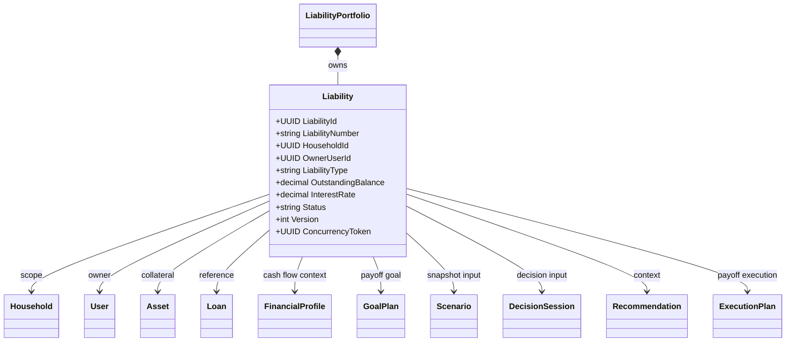
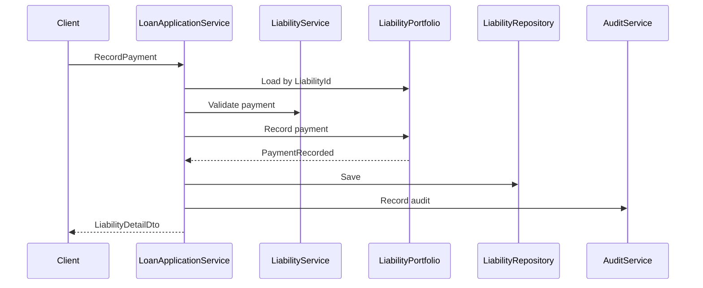
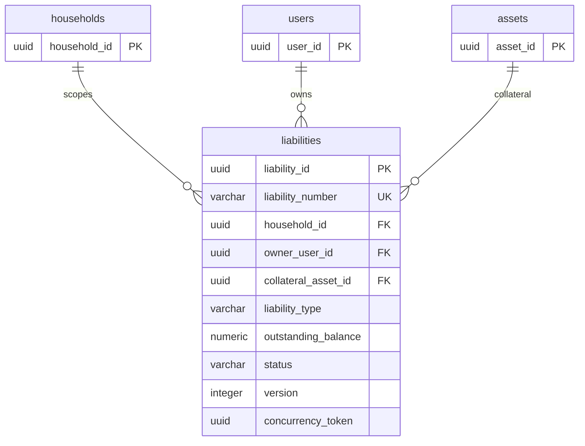
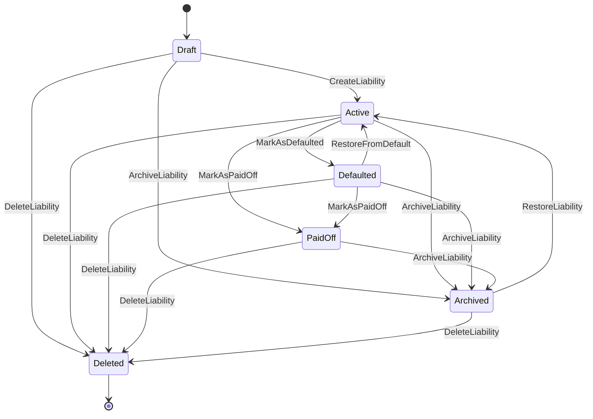

> **ADR-001 PWA Runtime Alignment:** Atlas v1 uses PWA v1 Runtime, Browser Runtime, and IndexedDB Runtime. Future Cloud Architecture is optional future mapping and must not be required for v1.\r\n\r\n# Legacy Reference

- Status: Legacy reference only; do not treat this document as canonical.
- Canonical source: [knowledge/entity/Liability.md](../../../knowledge/entity/Liability.md).
- Retirement note: keep this file intact for historical lookup until legacy docs are retired.

# Liability Entity Specification

# Entity Overview

## Purpose
- Liability represents a household-scoped debt, obligation, or payable balance owned within LiabilityPortfolio.
- Liability contributes to household net worth, cash flow pressure, risk analysis, scenario simulation, decision evaluation, and recommendation generation.
- Liability keeps debt identity, classification, amount, rate, payment, collateral, lifecycle, audit, version, and concurrency metadata.

## Responsibilities
- Maintain stable LiabilityId and unique LiabilityNumber.
- Store HouseholdId and OwnerUserId references for authorization and attribution.
- Store LiabilityType, LiabilityCategory, LiabilityName, Description, Currency, principal, outstanding balance, original amount, interest terms, payment terms, dates, lender, secured status, collateral reference, tags, audit fields, Version, and ConcurrencyToken.
- Preserve historical balance records through PaymentRecorded and BalanceAdjusted events.
- Provide liability data to CashFlow Engine, Projection Engine, Scenario Engine, Decision Engine, Recommendation Engine, and Risk Analysis Service.
- Enforce liability lifecycle rules without mutating Loan, Mortgage, AssetPortfolio, GoalPlan, Scenario, DecisionSession, Recommendation, or ExecutionPlan directly.

## Business Meaning
- Liability is an obligation that reduces household net worth or creates future cash outflow.
- Liability may represent credit debt, personal debt, secured debt, mortgage-related debt, or another Catalog-approved LiabilityType.
- Liability is owned by LiabilityPortfolio in the Atlas Catalog and is not an independent standalone aggregate root.
- Liability may be linked to collateral Asset and may be summarized from Loan or Mortgage context, but it does not own Loan or Mortgage lifecycle.

## Aggregate Root
- Catalog-aligned answer: Liability is not a standalone Aggregate Root.
- Owning Aggregate Root: LiabilityPortfolio.
- Entity Catalog Mapping: Liability -> LiabilityPortfolio -> LiabilityRepository.
- User-facing Liability APIs may expose Liability commands, but mutation must preserve LiabilityPortfolio ownership and LiabilityRepository persistence rules.
- Liability lifecycle, audit, and concurrency participate in LiabilityPortfolio aggregate consistency.

## Lifecycle
- Draft: liability is recorded but not included in active liability totals.
- Active: liability is included in household liability, net worth, cash flow, scenario, and decision inputs.
- PaidOff: liability is fully settled and cannot be reactivated.
- Defaulted: liability is active in risk analysis but marked as defaulted.
- Archived: liability is retained for history and cannot be modified except restore or delete.
- Deleted: liability is soft-deleted and cannot be reused.

## Ownership
- Owned Entity: Liability.
- Owning Aggregate: LiabilityPortfolio.
- Aggregate Root: LiabilityPortfolio.
- Repository: LiabilityRepository.
- Application Service: LoanApplicationService or Catalog-approved liability application surface.
- Authorization Boundary: Household isolation through LiabilityPortfolio.
- Audit Strategy: liability changes audited through LiabilityPortfolio and LiabilityRepository.

## Relationships
- Household: Liability must belong to one Household through LiabilityPortfolio authorization scope.
- User: OwnerUserId references the User responsible for the liability; User is not mutated by Liability.
- Asset: CollateralAssetId may reference Asset when IsSecured is true; Liability does not mutate Asset.
- Loan: Liability may summarize or reference Loan obligations; Loan aggregate owns loan commands.
- Mortgage: Mortgage is represented through Catalog-approved Loan and Property behavior and may be reflected as secured Liability.
- CashFlow: Liability payments contribute to cash outflow consumed by CashFlow Engine.
- Expense: MinimumPayment and MonthlyPayment may produce or inform Expense records.
- Goal: Debt payoff Goals may reference Liability; Liability does not mutate GoalPlan.
- Scenario: Scenario reads Liability snapshots for debt projection and stress testing.
- Decision: DecisionSession consumes Liability data for affordability, risk, and explainability.
- Recommendation: Recommendation Engine uses balance, payment, interest, secured status, and risk context.
- ExecutionPlan: ExecutionPlan may include payoff or refinancing actions derived from a Decision or Recommendation.
- DomainEvent: Liability emits LiabilityCreated, LiabilityUpdated, PaymentRecorded, BalanceAdjusted, LiabilityPaidOff, LiabilityArchived, LiabilityDeleted, and LiabilityStatusChanged through LiabilityPortfolio persistence.

## Navigation
- Liability -> Household by HouseholdId.
- Liability -> OwnerUser by OwnerUserId.
- Liability -> Asset by CollateralAssetId.
- Liability -> Loan by reference where the Loan aggregate is the source.
- Liability -> Mortgage through Loan and Property context.
- Liability -> CashFlow and Expense through payment records and monthly payment context.
- Liability -> Goal by payoff goal references.
- Liability -> Scenario through scenario snapshots.
- Liability -> DecisionSession through decision input snapshots.
- Liability -> Recommendation through recommendation context.
- Liability -> ExecutionPlan through decision execution planning.
- Liability -> DomainEvent by AggregateId, EntityId, and event metadata.

# Complete Properties

| Name | Type | Nullable | Default | Description | Validation | Business Meaning | Example | PWA Runtime Mapping / Future Cloud Mapping | JSON Name | API Usage | Searchable | Sortable | Indexed | Encrypted | Auditable |
|---|---|---:|---|---|---|---|---|---|---|---|---:|---:|---:|---:|---:|
| LiabilityId | UUID | No | generated | Stable liability identifier. | Required, immutable, UUID. | Identifies Liability entity. | `cd9d0d9e-9b0c-4b11-8c3e-5d67b77a915a` | `liability_id uuid primary key` | `liabilityId` | Route, detail, response. | Yes | Yes | Yes | No | Yes |
| LiabilityNumber | string(40) | No | generated | Business liability number. | Required, unique, max 40. | Human-readable liability identity. | `LIA-20260714` | `liability_number varchar(40) not null` | `liabilityNumber` | Create response, search. | Yes | Yes | Yes | No | Yes |
| HouseholdId | UUID | No | none | Household scope id. | Required, existing Household. | Authorization and planning scope. | `6a8b7b40-6b60-420a-88df-942b940d89a1` | `household_id uuid not null` | `householdId` | Create, search, detail. | Yes | Yes | Yes | No | Yes |
| OwnerUserId | UUID | Yes | null | User responsible for liability. | Existing User in Household when present. | Responsibility attribution. | `0f40f9f1-7c98-4c8b-a5aa-6e7b12d70411` | `owner_user_id uuid` | `ownerUserId` | Create, update, search. | Yes | Yes | Yes | No | Yes |
| LiabilityType | string(40) | No | none | Liability type. | Required, Catalog value. | Determines debt behavior. | `Loan` | `liability_type varchar(40) not null` | `liabilityType` | Create, update, search. | Yes | Yes | Yes | No | Yes |
| LiabilityCategory | string(60) | Yes | null | Liability category. | Catalog value when present, max 60. | Reporting grouping. | `Mortgage` | `liability_category varchar(60)` | `liabilityCategory` | Create, update, search. | Yes | Yes | Yes | No | Yes |
| LiabilityName | string(160) | No | none | Display name. | Required, trim, 1-160. | User-facing liability name. | `Home Mortgage` | `liability_name varchar(160) not null` | `liabilityName` | Create, update, summary. | Yes | Yes | Yes | No | Yes |
| Description | string(2000) | Yes | null | Liability description. | Max 2000. | Additional context. | `Primary residence mortgage` | `description text` | `description` | Create, update, detail. | Yes | No | No | No | Yes |
| Currency | string(3) | No | household currency | Liability currency. | Required, ISO 4217 uppercase. | Balance and payment currency. | `TWD` | `currency char(3) not null` | `currency` | Create, update, search. | Yes | Yes | Yes | No | Yes |
| PrincipalAmount | decimal(19,4) | No | 0 | Current principal amount. | Required, >= 0. | Principal basis for debt. | `6000000.0000` | `principal_amount numeric(19,4) not null` | `principalAmount` | Create, update, detail. | No | Yes | Yes | Yes | Yes |
| OutstandingBalance | decimal(19,4) | No | 0 | Remaining balance. | Required, >= 0. | Current household obligation. | `5200000.0000` | `outstanding_balance numeric(19,4) not null` | `outstandingBalance` | Create, payment, adjustment, detail. | No | Yes | Yes | Yes | Yes |
| OriginalAmount | decimal(19,4) | No | 0 | Original debt amount. | Required, >= 0. | Origination amount. | `6500000.0000` | `original_amount numeric(19,4) not null` | `originalAmount` | Create, update, detail. | No | Yes | Yes | Yes | Yes |
| InterestRate | decimal(9,6) | No | 0 | Interest rate. | Required, >= 0. | Cost of debt. | `0.025000` | `interest_rate numeric(9,6) not null` | `interestRate` | Create, update, projection. | No | Yes | Yes | No | Yes |
| InterestType | string(40) | Yes | null | Interest type. | Catalog value when present. | Fixed, variable, or other interest behavior. | `Fixed` | `interest_type varchar(40)` | `interestType` | Create, update, search. | Yes | Yes | Yes | No | Yes |
| MinimumPayment | decimal(19,4) | Yes | null | Minimum required payment. | >= 0 when present. | Required payment floor. | `20000.0000` | `minimum_payment numeric(19,4)` | `minimumPayment` | Create, update, cash flow. | No | Yes | Yes | Yes | Yes |
| MonthlyPayment | decimal(19,4) | Yes | null | Planned monthly payment. | >= 0 when present. | Cash flow expense. | `35000.0000` | `monthly_payment numeric(19,4)` | `monthlyPayment` | Create, update, cash flow. | No | Yes | Yes | Yes | Yes |
| StartDate | date | Yes | null | Liability start date. | Not future beyond policy tolerance. | Debt start. | `2020-06-01` | `start_date date` | `startDate` | Create, update, detail. | No | Yes | Yes | No | Yes |
| MaturityDate | date | Yes | null | Expected final payment date. | >= StartDate when both present. | Debt payoff horizon. | `2040-06-01` | `maturity_date date` | `maturityDate` | Create, update, search. | No | Yes | Yes | No | Yes |
| Lender | string(160) | Yes | null | Lender or creditor. | Max 160. | Debt counterparty. | `Atlas Bank` | `lender varchar(160)` | `lender` | Create, update, search. | Yes | Yes | Yes | Yes | Yes |
| Status | string(32) | No | `Draft` | Lifecycle status. | Required; Draft, Active, PaidOff, Defaulted, Archived, Deleted. | Controls behavior and mutability. | `Active` | `status varchar(32) not null` | `status` | Command response, search. | Yes | Yes | Yes | No | Yes |
| IsSecured | boolean | No | false | Secured debt marker. | Required boolean; collateral required when true by policy. | Indicates collateral-backed liability. | `true` | `is_secured boolean not null` | `isSecured` | Create, update, search. | Yes | Yes | Yes | No | Yes |
| CollateralAssetId | UUID | Yes | null | Collateral asset reference. | Existing Asset when present; required when IsSecured policy requires. | Links secured liability to collateral. | `b802d0d3-7f81-4d21-a6e0-55a6e9fa2101` | `collateral_asset_id uuid` | `collateralAssetId` | Create, update, detail. | Yes | Yes | Yes | No | Yes |
| ReferenceNumber | string(120) | Yes | null | External account or liability reference. | Max 120. | External debt reference. | `LN-778899` | `reference_number varchar(120)` | `referenceNumber` | Create, update, search. | Yes | Yes | Yes | Yes | Yes |
| Tags | string[] | Yes | empty | User or system tags. | Each tag max 40, bounded count. | Filtering and grouping. | `["mortgage","home"]` | `tags jsonb not null` | `tags` | Create, update, search. | Yes | No | Yes | No | Yes |
| CreatedAt | datetime | No | now UTC | Creation timestamp. | Required, UTC, immutable. | Audit and ordering. | `2026-07-14T00:00:00Z` | `created_at timestamptz not null` | `createdAt` | Response. | Yes | Yes | Yes | No | Yes |
| CreatedBy | UUID | Yes | null | Creator actor. | Existing UserId or system actor. | Audit attribution. | `0f40f9f1-7c98-4c8b-a5aa-6e7b12d70411` | `created_by uuid` | `createdBy` | Response. | Yes | Yes | Yes | No | Yes |
| UpdatedAt | datetime | No | now UTC | Last update timestamp. | Required, UTC, >= CreatedAt. | Audit and cache invalidation. | `2026-07-14T02:00:00Z` | `updated_at timestamptz not null` | `updatedAt` | Response. | Yes | Yes | Yes | No | Yes |
| UpdatedBy | UUID | Yes | null | Last updater actor. | Existing UserId or system actor. | Audit attribution. | `0f40f9f1-7c98-4c8b-a5aa-6e7b12d70411` | `updated_by uuid` | `updatedBy` | Response. | Yes | Yes | Yes | No | Yes |
| Version | integer | No | 1 | Liability version. | Required, >= 1, increments on mutation. | Version history and event ordering. | `5` | `version integer not null` | `version` | Detail, update, audit. | No | Yes | Yes | No | Yes |
| ConcurrencyToken | UUID | No | generated | Optimistic concurrency token. | Required, changes on mutation. | Prevents lost updates. | `ac08ac55-c572-48df-a2c0-a21d924650bf` | `concurrency_token uuid not null` | `concurrencyToken` | Update and command input. | No | No | Yes | No | Yes |

# Validation Rules

- LiabilityId is required, UUID, and immutable.
- LiabilityNumber is required, unique, immutable, and max 40 characters.
- HouseholdId is required and must reference an accessible Household.
- OwnerUserId is optional and must reference a User in the Household when present.
- LiabilityType is required and must match Catalog-approved values.
- LiabilityCategory is optional and must match Catalog-approved values when enforced.
- LiabilityName is required, trimmed, 1-160 characters, and cannot contain control characters.
- Description is optional and max 2000 characters.
- Currency is required and must be uppercase ISO 4217 supported by Atlas.
- PrincipalAmount is required and must be greater than or equal to 0.
- OutstandingBalance is required and must be greater than or equal to 0.
- OriginalAmount is required and must be greater than or equal to 0.
- InterestRate is required and must be greater than or equal to 0.
- InterestType is optional and must match Catalog-approved values when present.
- MinimumPayment is optional and must be greater than or equal to 0.
- MonthlyPayment is optional and must be greater than or equal to 0.
- StartDate is optional and cannot be in the future beyond accepted clock tolerance.
- MaturityDate is optional and cannot be earlier than StartDate when both are present.
- Lender is optional, trimmed, and max 160 characters.
- Status is required and must be Draft, Active, PaidOff, Defaulted, Archived, or Deleted.
- IsSecured is required.
- CollateralAssetId is optional and must reference an Asset in the same Household when present.
- CollateralAssetId is required when IsSecured is true and secured liability policy requires collateral.
- ReferenceNumber is optional and max 120 characters.
- Tags are optional, bounded by configured count, and each tag max 40 characters.
- CreatedAt is required, UTC, and immutable.
- UpdatedAt is required, UTC, and greater than or equal to CreatedAt.
- CreatedBy and UpdatedBy must reference an actor or system actor when present.
- Version is required and must be greater than or equal to 1.
- ConcurrencyToken is required for mutation commands.
- PaidOff liability cannot be reactivated.
- Archived liability cannot be modified except RestoreLiability or DeleteLiability.
- Deleted liability cannot be modified or reused.
- RecordPayment amount must be greater than 0.
- RecordPayment cannot reduce OutstandingBalance below 0.
- AdjustBalance new balance must be greater than or equal to 0.
- MarkAsPaidOff requires OutstandingBalance equal to 0 or a payoff command amount that settles the remaining balance.

# Business Rules

- Liability must belong to one Household.
- Liability must specify LiabilityType.
- Liability must specify Currency.
- OutstandingBalance must not be less than 0.
- PrincipalAmount must not be less than 0.
- InterestRate must not be less than 0.
- MaturityDate cannot be earlier than StartDate.
- PaidOff Liability cannot be reactivated.
- Archived Liability cannot be modified.
- Liability must preserve complete Audit Trail.
- Liability must preserve complete Version History.
- Liability supports Soft Delete.
- Liability supports historical balance records.
- Active Liability contributes to household liability totals and net worth reduction.
- Active Liability contributes to cash flow projections when MinimumPayment or MonthlyPayment is present.
- Defaulted Liability remains included in risk analysis and scenario simulation.
- PaidOff Liability is excluded from active debt totals but retained for history.
- Secured Liability may reference CollateralAssetId.
- Liability does not mutate collateral Asset.
- Liability does not mutate Loan or Mortgage lifecycle.
- Liability does not mutate GoalPlan, Scenario, DecisionSession, Recommendation, or ExecutionPlan directly.
- PaymentRecorded must record previous balance, payment amount, new balance, payment date, and actor.
- BalanceAdjusted must record previous balance, adjusted balance, reason, and actor.
- LiabilityPaidOff must be emitted when OutstandingBalance reaches 0 through payoff flow.
- Deletion must be soft delete to preserve audit, scenario snapshots, decision explainability, and recommendation traceability.

# State Machine

| State | Transition | Trigger | Invariant | Illegal Transition |
|---|---|---|---|---|
| Draft | Draft -> Active | Activate through UpdateLiability or first valid use | Required fields valid | Draft -> PaidOff |
| Draft | Draft -> Archived | ArchiveLiability | Audit recorded | Draft -> Defaulted |
| Draft | Draft -> Deleted | DeleteLiability | Soft delete recorded | Draft -> PaidOff |
| Active | Active -> PaidOff | MarkAsPaidOff | OutstandingBalance = 0 | Active -> Draft |
| Active | Active -> Defaulted | Default status command or risk process | OutstandingBalance > 0 | Active -> Draft |
| Active | Active -> Archived | ArchiveLiability | Audit recorded | Active -> Draft |
| Active | Active -> Deleted | DeleteLiability | Soft delete recorded | Active -> Draft |
| Defaulted | Defaulted -> Active | Restore from default when allowed by policy | OutstandingBalance >= 0 and reason recorded | Defaulted -> Draft |
| Defaulted | Defaulted -> PaidOff | MarkAsPaidOff | OutstandingBalance = 0 | Defaulted -> Draft |
| Defaulted | Defaulted -> Archived | ArchiveLiability | Audit recorded | Defaulted -> Draft |
| PaidOff | PaidOff -> Archived | ArchiveLiability | Audit recorded | PaidOff -> Active, PaidOff -> Defaulted |
| PaidOff | PaidOff -> Deleted | DeleteLiability | Soft delete recorded | PaidOff -> Active |
| Archived | Archived -> Active | RestoreLiability | Not PaidOff before archive and restore allowed | Archived -> Draft |
| Archived | Archived -> Deleted | DeleteLiability | Soft delete recorded | Archived -> Draft |
| Deleted | none | terminal normal lifecycle | Soft delete retained | Deleted -> Active, Deleted -> Draft, Deleted -> Archived |

# Commands

## CreateLiability
- Creates Liability within LiabilityPortfolio ownership and Household authorization scope.
- Validates HouseholdId, OwnerUserId, LiabilityType, Currency, amounts, dates, interest terms, collateral, tags, and initial status.
- Emits LiabilityCreated and LiabilityStatusChanged.

## UpdateLiability
- Updates mutable descriptive, classification, interest, payment, date, lender, secured, collateral, reference, and tag fields.
- Requires matching ConcurrencyToken.
- Rejects Archived, Deleted, and PaidOff core reactivation changes.
- Emits LiabilityUpdated.

## RecordPayment
- Records a payment and reduces OutstandingBalance.
- Validates payment amount, payment date, currency, and resulting balance.
- Emits PaymentRecorded and LiabilityUpdated; emits LiabilityPaidOff when settled.

## AdjustBalance
- Adjusts OutstandingBalance for correction, reconciliation, capitalization, or lender update.
- Requires reason and matching ConcurrencyToken.
- Emits BalanceAdjusted and LiabilityUpdated.

## MarkAsPaidOff
- Marks Liability as PaidOff when balance is fully settled.
- Sets OutstandingBalance to 0 when payoff command includes settlement amount.
- Emits LiabilityPaidOff and LiabilityStatusChanged.

## ArchiveLiability
- Moves Liability to Archived.
- Prevents normal modification.
- Emits LiabilityArchived and LiabilityStatusChanged.

## RestoreLiability
- Restores Archived Liability to Active unless it was PaidOff before archive.
- Requires authorization and matching ConcurrencyToken.
- Emits LiabilityStatusChanged and LiabilityUpdated.

## DeleteLiability
- Soft-deletes Liability and prevents reuse.
- Retains audit, balance history, and snapshots.
- Emits LiabilityDeleted and LiabilityStatusChanged.

## MarkAsDefaulted
- Moves Active Liability to Defaulted.
- Requires default reason.
- Emits LiabilityStatusChanged and LiabilityUpdated.

# Domain Events

| Event | Producer | Trigger | Payload | Consumers |
|---|---|---|---|---|
| LiabilityCreated | LiabilityPortfolio | CreateLiability | LiabilityId, HouseholdId, LiabilityType, Currency, OutstandingBalance | Liability read model, Audit Service |
| LiabilityUpdated | LiabilityPortfolio | UpdateLiability | LiabilityId, ChangedFields, Version, UpdatedAt | CashFlow Engine, Scenario Engine, Audit Service |
| PaymentRecorded | LiabilityPortfolio | RecordPayment | LiabilityId, PaymentAmount, PreviousBalance, OutstandingBalance, PaymentDate | CashFlow Engine, Projection Engine, Audit Service |
| BalanceAdjusted | LiabilityPortfolio | AdjustBalance | LiabilityId, PreviousBalance, OutstandingBalance, Reason | Risk Analysis, Scenario Engine, Audit Service |
| LiabilityPaidOff | LiabilityPortfolio | MarkAsPaidOff or RecordPayment | LiabilityId, PaidOffAt, FinalPaymentAmount | Goal Service, Recommendation Engine, Audit Service |
| LiabilityArchived | LiabilityPortfolio | ArchiveLiability | LiabilityId, ArchivedAt, ArchivedBy | Audit Service, read models |
| LiabilityDeleted | LiabilityPortfolio | DeleteLiability | LiabilityId, DeletedAt, DeletedBy | Audit Service, read models |
| LiabilityStatusChanged | LiabilityPortfolio | Any lifecycle transition | LiabilityId, PreviousStatus, NewStatus, OccurredAt | Notification, Audit Service, projections |
| LiabilityDefaulted | LiabilityPortfolio | MarkAsDefaulted | LiabilityId, DefaultedAt, Reason | Risk Analysis Service, Decision Engine |
| CollateralChanged | LiabilityPortfolio | UpdateLiability | LiabilityId, CollateralAssetId, IsSecured | Asset Service, Risk Analysis Service |

# Repository

## Interface
```csharp
public interface ILiabilityRepository
{
    Task<Liability?> GetByIdAsync(Guid liabilityId, CancellationToken cancellationToken);
    Task<Liability?> GetByLiabilityNumberAsync(string liabilityNumber, CancellationToken cancellationToken);
    Task<IReadOnlyList<Liability>> GetByHouseholdIdAsync(Guid householdId, CancellationToken cancellationToken);
    Task<IReadOnlyList<Liability>> SearchAsync(LiabilitySearchSpecification specification, CancellationToken cancellationToken);
    Task<bool> ExistsByLiabilityNumberAsync(string liabilityNumber, CancellationToken cancellationToken);
    Task AddAsync(Liability liability, CancellationToken cancellationToken);
    Task UpdateAsync(Liability liability, CancellationToken cancellationToken);
}
```

## Methods
- GetByIdAsync loads Liability by LiabilityId through LiabilityRepository.
- GetByLiabilityNumberAsync loads Liability by business number.
- GetByHouseholdIdAsync loads household-scoped liabilities for authorized queries.
- SearchAsync returns paged liability summaries.
- ExistsByLiabilityNumberAsync enforces uniqueness.
- AddAsync persists new Liability through LiabilityPortfolio-owned persistence.
- UpdateAsync persists Liability mutation with optimistic concurrency.

## Query Methods
- FindActiveLiabilities.
- FindPaidOffLiabilities.
- FindDefaultedLiabilities.
- FindArchivedLiabilities.
- FindByHouseholdId.
- FindByOwnerUserId.
- FindByLiabilityType.
- FindByLiabilityCategory.
- FindByCurrency.
- FindByCollateralAssetId.
- FindSecuredLiabilities.
- FindByMaturityDateRange.
- FindByOutstandingBalanceRange.
- FindByInterestRateRange.
- FindByTags.

## Specification Pattern
- LiabilityByIdSpecification.
- LiabilityByNumberSpecification.
- LiabilityByHouseholdSpecification.
- ActiveLiabilitySpecification.
- NonDeletedLiabilitySpecification.
- SecuredLiabilitySpecification.
- LiabilityTypeSpecification.
- LiabilityBalanceRangeSpecification.
- LiabilityMaturitySpecification.
- LiabilityPaymentDueSpecification.
- LiabilitySearchSpecification.

# Domain Service Interaction

- Liability Service validates liability lifecycle, payment, balance, collateral, status, and update rules.
- Loan Service provides loan summaries and may consume liability payoff state without being mutated by Liability.
- Mortgage Service provides mortgage context through Catalog-approved Loan and Property relationships.
- CashFlow Engine consumes MinimumPayment, MonthlyPayment, PaymentRecorded, and Expense impact.
- Projection Engine projects payoff horizon, interest cost, and balance trajectory.
- Decision Engine consumes liability snapshots for affordability, debt strategy, and explainability.
- Recommendation Engine consumes balance, interest, secured status, payment burden, and payoff opportunity.
- Scenario Engine consumes liability snapshots for simulation and stress testing.
- Risk Analysis Service evaluates default risk, debt concentration, collateral exposure, and liquidity pressure.
- Audit Service records all liability changes, payments, balance adjustments, and lifecycle transitions.

# Application Service Interaction

- LoanApplicationService handles Liability operations where LiabilityRepository is mapped to loan and liability module ownership.
- LiabilityApplicationService may expose liability resource operations only when already present in implementation and aligned with LiabilityRepository.
- HouseholdApplicationService validates Household access and household visibility.
- UserApplicationService validates OwnerUserId and actor permission.
- CashFlowApplicationService records or consumes expense impact from payments.
- ScenarioApplicationService reads liability snapshots for simulations.
- DecisionApplicationService reads liability snapshots for decisions.
- RecommendationApplicationService reads liability context for recommendations.
- PortfolioApplicationService reads collateral Asset context without mutating Liability.
- AuditApplicationService exposes liability audit and balance history to authorized callers.

# API

## Future Cloud Architecture Endpoints
| Operation | HTTP Method | Endpoint | Request | Response | Error |
|---|---|---|---|---|---|
| Create | POST | `/api/liabilities` | CreateLiabilityDto | LiabilityDetailDto | 400, 403, 409, 422 |
| Get Detail | GET | `/api/liabilities/{liabilityId}` | none | LiabilityDetailDto | 401, 403, 404 |
| Update | PUT | `/api/liabilities/{liabilityId}` | UpdateLiabilityDto | LiabilityDetailDto | 400, 403, 404, 409, 422 |
| Delete | DELETE | `/api/liabilities/{liabilityId}` | concurrencyToken | LiabilityDetailDto | 403, 404, 409 |
| Search | GET | `/api/liabilities` | LiabilitySearchDto | paged LiabilitySummaryDto | 400, 403 |
| Record Payment | POST | `/api/liabilities/{liabilityId}/payments` | PaymentDto | LiabilityDetailDto | 400, 403, 404, 409, 422 |
| Adjust Balance | POST | `/api/liabilities/{liabilityId}/balance-adjustments` | BalanceAdjustmentDto | LiabilityDetailDto | 400, 403, 404, 409, 422 |
| Mark Paid Off | POST | `/api/liabilities/{liabilityId}/paid-off` | payoff request | LiabilityDetailDto | 403, 404, 409, 422 |
| Archive | POST | `/api/liabilities/{liabilityId}/archive` | reason, concurrencyToken | LiabilityDetailDto | 403, 404, 409 |
| Restore | POST | `/api/liabilities/{liabilityId}/restore` | concurrencyToken | LiabilityDetailDto | 403, 404, 409, 422 |
| History | GET | `/api/liabilities/{liabilityId}/history` | paging | audit and balance history page | 403, 404 |

## Response
- Command responses return LiabilityDetailDto with updated Version and ConcurrencyToken.
- Search responses return page, pageSize, totalCount, and LiabilitySummaryDto items.
- Sensitive lender, reference, and financial amount values are masked unless caller has permission.

## Error
- 400: invalid request, enum, currency, date, amount, payment, or tag.
- 401: authentication required.
- 403: caller lacks Household or Liability permission.
- 404: Liability not found or not visible.
- 409: duplicate LiabilityNumber or concurrency conflict.
- 422: business rule violation or illegal transition.

# DTO

## Create DTO
```json
{
  "householdId": "6a8b7b40-6b60-420a-88df-942b940d89a1",
  "ownerUserId": "0f40f9f1-7c98-4c8b-a5aa-6e7b12d70411",
  "liabilityType": "Loan",
  "liabilityCategory": "Mortgage",
  "liabilityName": "Home Mortgage",
  "description": "Primary residence mortgage",
  "currency": "TWD",
  "principalAmount": 6000000,
  "outstandingBalance": 5200000,
  "originalAmount": 6500000,
  "interestRate": 0.025,
  "interestType": "Fixed",
  "minimumPayment": 20000,
  "monthlyPayment": 35000,
  "startDate": "2020-06-01",
  "maturityDate": "2040-06-01",
  "lender": "Atlas Bank",
  "isSecured": true,
  "collateralAssetId": "b802d0d3-7f81-4d21-a6e0-55a6e9fa2101",
  "referenceNumber": "LN-778899",
  "tags": ["mortgage", "home"]
}
```

## Update DTO
```json
{
  "liabilityName": "Primary Home Mortgage",
  "interestRate": 0.024,
  "interestType": "Fixed",
  "minimumPayment": 20000,
  "monthlyPayment": 36000,
  "tags": ["mortgage", "home", "priority"],
  "concurrencyToken": "ac08ac55-c572-48df-a2c0-a21d924650bf"
}
```

## Detail DTO
```json
{
  "liabilityId": "cd9d0d9e-9b0c-4b11-8c3e-5d67b77a915a",
  "liabilityNumber": "LIA-20260714",
  "householdId": "6a8b7b40-6b60-420a-88df-942b940d89a1",
  "ownerUserId": "0f40f9f1-7c98-4c8b-a5aa-6e7b12d70411",
  "liabilityType": "Loan",
  "liabilityCategory": "Mortgage",
  "liabilityName": "Primary Home Mortgage",
  "currency": "TWD",
  "principalAmount": 6000000,
  "outstandingBalance": 5165000,
  "originalAmount": 6500000,
  "interestRate": 0.024,
  "interestType": "Fixed",
  "minimumPayment": 20000,
  "monthlyPayment": 36000,
  "startDate": "2020-06-01",
  "maturityDate": "2040-06-01",
  "lender": "Atlas Bank",
  "status": "Active",
  "isSecured": true,
  "collateralAssetId": "b802d0d3-7f81-4d21-a6e0-55a6e9fa2101",
  "referenceNumber": "****8899",
  "tags": ["mortgage", "home", "priority"],
  "version": 5,
  "concurrencyToken": "7d55b7bb-b3fd-46d0-987e-cef3a3347c7a"
}
```

## Summary DTO
```json
{
  "liabilityId": "cd9d0d9e-9b0c-4b11-8c3e-5d67b77a915a",
  "liabilityNumber": "LIA-20260714",
  "liabilityName": "Primary Home Mortgage",
  "liabilityType": "Loan",
  "currency": "TWD",
  "outstandingBalance": 5165000,
  "interestRate": 0.024,
  "status": "Active",
  "isSecured": true
}
```

## Search DTO
```json
{
  "householdId": "6a8b7b40-6b60-420a-88df-942b940d89a1",
  "keyword": "mortgage",
  "liabilityType": ["Loan"],
  "status": ["Active", "Defaulted"],
  "currency": "TWD",
  "isSecured": true,
  "page": 1,
  "pageSize": 20,
  "sortBy": "outstandingBalance",
  "sortDirection": "desc"
}
```

## Payment DTO
```json
{
  "paymentAmount": 35000,
  "paymentDate": "2026-07-14",
  "currency": "TWD",
  "memo": "Monthly mortgage payment",
  "concurrencyToken": "7d55b7bb-b3fd-46d0-987e-cef3a3347c7a"
}
```

## Balance Adjustment DTO
```json
{
  "adjustedBalance": 5165000,
  "adjustmentDate": "2026-07-14",
  "reason": "Lender statement reconciliation",
  "concurrencyToken": "7d55b7bb-b3fd-46d0-987e-cef3a3347c7a"
}
```

# PWA Runtime Mapping

## Table
- Table name: `liabilities`.
- Primary key: `liability_id`.
- Aggregate owner: LiabilityPortfolio.
- Repository: LiabilityRepository.

## Columns
| Column | Type | Nullable | Mapping |
|---|---|---:|---|
| liability_id | uuid | No | LiabilityId |
| liability_number | varchar(40) | No | LiabilityNumber |
| household_id | uuid | No | HouseholdId |
| owner_user_id | uuid | Yes | OwnerUserId |
| liability_type | varchar(40) | No | LiabilityType |
| liability_category | varchar(60) | Yes | LiabilityCategory |
| liability_name | varchar(160) | No | LiabilityName |
| description | text | Yes | Description |
| currency | char(3) | No | Currency |
| principal_amount | numeric(19,4) | No | PrincipalAmount |
| outstanding_balance | numeric(19,4) | No | OutstandingBalance |
| original_amount | numeric(19,4) | No | OriginalAmount |
| interest_rate | numeric(9,6) | No | InterestRate |
| interest_type | varchar(40) | Yes | InterestType |
| minimum_payment | numeric(19,4) | Yes | MinimumPayment |
| monthly_payment | numeric(19,4) | Yes | MonthlyPayment |
| start_date | date | Yes | StartDate |
| maturity_date | date | Yes | MaturityDate |
| lender | varchar(160) | Yes | Lender |
| status | varchar(32) | No | Status |
| is_secured | boolean | No | IsSecured |
| collateral_asset_id | uuid | Yes | CollateralAssetId |
| reference_number | varchar(120) | Yes | ReferenceNumber |
| tags | jsonb | No | Tags |
| created_at | timestamptz | No | CreatedAt |
| created_by | uuid | Yes | CreatedBy |
| updated_at | timestamptz | No | UpdatedAt |
| updated_by | uuid | Yes | UpdatedBy |
| version | integer | No | Version |
| concurrency_token | uuid | No | ConcurrencyToken |

## FK
- `household_id` references `households.household_id`.
- `owner_user_id` references `users.user_id`.
- `collateral_asset_id` references `assets.asset_id`.

## Unique
- `ux_liabilities_liability_number` on `liability_number`.
- `ux_liabilities_household_reference_number` on `household_id`, `reference_number` where ReferenceNumber is not null when external uniqueness is enabled.

## Check Constraint
- Status in Draft, Active, PaidOff, Defaulted, Archived, Deleted.
- Currency length equals 3 and uppercase.
- PrincipalAmount, OutstandingBalance, OriginalAmount, InterestRate >= 0.
- MinimumPayment and MonthlyPayment >= 0 when present.
- MaturityDate is null or StartDate is null or MaturityDate >= StartDate.
- Version >= 1.
- UpdatedAt >= CreatedAt.
- PaidOff status requires OutstandingBalance = 0.

## Index
- Primary key index on `liability_id`.
- Unique index on `liability_number`.
- Index on `household_id`.
- Index on `owner_user_id`.
- Index on `liability_type`, `liability_category`.
- Index on `currency`.
- Index on `status`.
- Index on `outstanding_balance`.
- Index on `interest_rate`.
- Index on `maturity_date`.
- Index on `is_secured`, `collateral_asset_id`.
- GIN index on `tags`.
- Index on `updated_at`.

# Future Cloud Mapping Schema

```sql
CREATE TABLE liabilities (
    liability_id uuid PRIMARY KEY,
    liability_number varchar(40) NOT NULL,
    household_id uuid NOT NULL,
    owner_user_id uuid,
    liability_type varchar(40) NOT NULL,
    liability_category varchar(60),
    liability_name varchar(160) NOT NULL,
    description text,
    currency char(3) NOT NULL,
    principal_amount numeric(19,4) NOT NULL DEFAULT 0,
    outstanding_balance numeric(19,4) NOT NULL DEFAULT 0,
    original_amount numeric(19,4) NOT NULL DEFAULT 0,
    interest_rate numeric(9,6) NOT NULL DEFAULT 0,
    interest_type varchar(40),
    minimum_payment numeric(19,4),
    monthly_payment numeric(19,4),
    start_date date,
    maturity_date date,
    lender varchar(160),
    status varchar(32) NOT NULL DEFAULT 'Draft',
    is_secured boolean NOT NULL DEFAULT false,
    collateral_asset_id uuid,
    reference_number varchar(120),
    tags jsonb NOT NULL DEFAULT '[]'::jsonb,
    created_at timestamptz NOT NULL DEFAULT now(),
    created_by uuid,
    updated_at timestamptz NOT NULL DEFAULT now(),
    updated_by uuid,
    version integer NOT NULL DEFAULT 1,
    concurrency_token uuid NOT NULL,
    CONSTRAINT fk_liabilities_household FOREIGN KEY (household_id) REFERENCES households(household_id),
    CONSTRAINT fk_liabilities_owner_user FOREIGN KEY (owner_user_id) REFERENCES users(user_id),
    CONSTRAINT fk_liabilities_collateral_asset FOREIGN KEY (collateral_asset_id) REFERENCES assets(asset_id),
    CONSTRAINT ck_liabilities_status CHECK (status IN ('Draft','Active','PaidOff','Defaulted','Archived','Deleted')),
    CONSTRAINT ck_liabilities_currency CHECK (currency = upper(currency) AND char_length(currency) = 3),
    CONSTRAINT ck_liabilities_principal_amount CHECK (principal_amount >= 0),
    CONSTRAINT ck_liabilities_outstanding_balance CHECK (outstanding_balance >= 0),
    CONSTRAINT ck_liabilities_original_amount CHECK (original_amount >= 0),
    CONSTRAINT ck_liabilities_interest_rate CHECK (interest_rate >= 0),
    CONSTRAINT ck_liabilities_minimum_payment CHECK (minimum_payment IS NULL OR minimum_payment >= 0),
    CONSTRAINT ck_liabilities_monthly_payment CHECK (monthly_payment IS NULL OR monthly_payment >= 0),
    CONSTRAINT ck_liabilities_maturity_date CHECK (maturity_date IS NULL OR start_date IS NULL OR maturity_date >= start_date),
    CONSTRAINT ck_liabilities_paid_off CHECK (status <> 'PaidOff' OR outstanding_balance = 0),
    CONSTRAINT ck_liabilities_version CHECK (version >= 1),
    CONSTRAINT ck_liabilities_updated_at CHECK (updated_at >= created_at)
);

CREATE UNIQUE INDEX ux_liabilities_liability_number ON liabilities (liability_number);
CREATE UNIQUE INDEX ux_liabilities_household_reference_number ON liabilities (household_id, reference_number) WHERE reference_number IS NOT NULL;
CREATE INDEX ix_liabilities_household_id ON liabilities (household_id);
CREATE INDEX ix_liabilities_owner_user_id ON liabilities (owner_user_id);
CREATE INDEX ix_liabilities_type_category ON liabilities (liability_type, liability_category);
CREATE INDEX ix_liabilities_currency ON liabilities (currency);
CREATE INDEX ix_liabilities_status ON liabilities (status);
CREATE INDEX ix_liabilities_balance ON liabilities (outstanding_balance);
CREATE INDEX ix_liabilities_interest_rate ON liabilities (interest_rate);
CREATE INDEX ix_liabilities_maturity_date ON liabilities (maturity_date);
CREATE INDEX ix_liabilities_secured_collateral ON liabilities (is_secured, collateral_asset_id);
CREATE INDEX ix_liabilities_tags ON liabilities USING gin (tags);
CREATE INDEX ix_liabilities_updated_at ON liabilities (updated_at);
CREATE INDEX ix_liabilities_concurrency_token ON liabilities (concurrency_token);
```

# Future Cloud Mapping

## Fluent API
```csharp
builder.ToTable("liabilities");
builder.HasKey(x => x.LiabilityId);
builder.Property(x => x.LiabilityId).HasColumnName("liability_id").ValueGeneratedNever();
builder.Property(x => x.LiabilityNumber).HasColumnName("liability_number").HasMaxLength(40).IsRequired();
builder.Property(x => x.HouseholdId).HasColumnName("household_id").IsRequired();
builder.Property(x => x.OwnerUserId).HasColumnName("owner_user_id");
builder.Property(x => x.LiabilityType).HasColumnName("liability_type").HasMaxLength(40).HasConversion<string>().IsRequired();
builder.Property(x => x.LiabilityCategory).HasColumnName("liability_category").HasMaxLength(60);
builder.Property(x => x.LiabilityName).HasColumnName("liability_name").HasMaxLength(160).IsRequired();
builder.Property(x => x.Description).HasColumnName("description");
builder.Property(x => x.Currency).HasColumnName("currency").HasMaxLength(3).IsRequired();
builder.Property(x => x.PrincipalAmount).HasColumnName("principal_amount").HasPrecision(19, 4);
builder.Property(x => x.OutstandingBalance).HasColumnName("outstanding_balance").HasPrecision(19, 4);
builder.Property(x => x.OriginalAmount).HasColumnName("original_amount").HasPrecision(19, 4);
builder.Property(x => x.InterestRate).HasColumnName("interest_rate").HasPrecision(9, 6);
builder.Property(x => x.InterestType).HasColumnName("interest_type").HasMaxLength(40);
builder.Property(x => x.MinimumPayment).HasColumnName("minimum_payment").HasPrecision(19, 4);
builder.Property(x => x.MonthlyPayment).HasColumnName("monthly_payment").HasPrecision(19, 4);
builder.Property(x => x.StartDate).HasColumnName("start_date");
builder.Property(x => x.MaturityDate).HasColumnName("maturity_date");
builder.Property(x => x.Lender).HasColumnName("lender").HasMaxLength(160);
builder.Property(x => x.Status).HasColumnName("status").HasMaxLength(32).HasConversion<string>().IsRequired();
builder.Property(x => x.IsSecured).HasColumnName("is_secured").IsRequired();
builder.Property(x => x.CollateralAssetId).HasColumnName("collateral_asset_id");
builder.Property(x => x.ReferenceNumber).HasColumnName("reference_number").HasMaxLength(120);
builder.Property(x => x.Tags).HasColumnName("tags").HasColumnType("jsonb");
builder.Property(x => x.CreatedAt).HasColumnName("created_at").IsRequired();
builder.Property(x => x.CreatedBy).HasColumnName("created_by");
builder.Property(x => x.UpdatedAt).HasColumnName("updated_at").IsRequired();
builder.Property(x => x.UpdatedBy).HasColumnName("updated_by");
builder.Property(x => x.Version).HasColumnName("version").IsRequired();
builder.Property(x => x.ConcurrencyToken).HasColumnName("concurrency_token").IsConcurrencyToken().IsRequired();
builder.HasIndex(x => x.LiabilityNumber).IsUnique().HasDatabaseName("ux_liabilities_liability_number");
builder.HasIndex(x => x.HouseholdId).HasDatabaseName("ix_liabilities_household_id");
builder.HasIndex(x => new { x.LiabilityType, x.LiabilityCategory }).HasDatabaseName("ix_liabilities_type_category");
```

## Owned Type
- Balance values may be grouped as Money-owned value objects while preserving PrincipalAmount, OutstandingBalance, OriginalAmount, MinimumPayment, and MonthlyPayment columns.
- Interest terms may be grouped as an owned value object while preserving InterestRate and InterestType columns.
- Tags may be stored as owned primitive collection or JSON value based on implementation support.

## Value Conversion
- LiabilityType converts Catalog value to string.
- InterestType converts Catalog value to string.
- Status converts lifecycle enum to string.
- Currency stores ISO 4217 string.
- Tags convert to JSON array when stored in jsonb.

## Concurrency Token
- ConcurrencyToken is configured as optimistic concurrency token.
- LiabilityPortfolio aggregate concurrency must be respected through LiabilityRepository.
- Version increments on each persisted Liability mutation.
- Payment and balance adjustment commands require current ConcurrencyToken.

# Cache Strategy

- Cache Liability detail by `liability:{liabilityId}`.
- Cache household liability list by `household:{householdId}:liabilities`.
- Cache household liability summary by `household:{householdId}:liability-summary`.
- Cache LiabilityNumber lookup by `liability-number:{liabilityNumber}`.
- Invalidate caches on LiabilityCreated, LiabilityUpdated, PaymentRecorded, BalanceAdjusted, LiabilityPaidOff, LiabilityArchived, LiabilityDeleted, and LiabilityStatusChanged.
- Do not cache unmasked ReferenceNumber, Lender, or sensitive balance fields without authorization scope.
- Search cache keys must include HouseholdId, caller authorization, masking level, filters, sorting, and paging.

# Security

## Authorization
- Caller must have Household access to read Liability.
- Caller must have liability write permission to create or update Liability.
- RecordPayment and AdjustBalance require debt management permission.
- MarkAsPaidOff requires payoff permission.
- Archive, Restore, and Delete require lifecycle permission.
- CollateralAssetId exposure requires asset read permission.
- Search must enforce Household isolation.

## Permission
- `Liability.Read`.
- `Liability.ReadSensitive`.
- `Liability.Search`.
- `Liability.Create`.
- `Liability.Update`.
- `Liability.Payment.Record`.
- `Liability.Balance.Adjust`.
- `Liability.PaidOff.Mark`.
- `Liability.Archive`.
- `Liability.Restore`.
- `Liability.Delete`.
- `Liability.History.Read`.

## Data Masking
- ReferenceNumber is masked in normal responses.
- Lender may be masked in privacy-restricted views.
- PrincipalAmount, OutstandingBalance, OriginalAmount, MinimumPayment, and MonthlyPayment are masked unless caller has financial read permission.
- CollateralAssetId may be hidden when caller lacks asset read permission.

## Encryption
- ReferenceNumber must be encrypted or tokenized according to Atlas security policy.
- Lender should be protected when it identifies private account relationships.
- Sensitive balance and payment fields should be protected according to financial data policy.
- Audit records containing sensitive values must store masked before/after values or protected payloads.

# Audit

- Audit CreateLiability with HouseholdId, LiabilityId, LiabilityType, Currency, and initial balance.
- Audit UpdateLiability with changed field names and masked sensitive values.
- Audit RecordPayment with previous balance, payment amount, new balance, payment date, and actor.
- Audit AdjustBalance with previous balance, adjusted balance, reason, and actor.
- Audit MarkAsPaidOff with payoff timestamp and final balance.
- Audit ArchiveLiability, RestoreLiability, and DeleteLiability.
- Audit changes to ReferenceNumber, CollateralAssetId, IsSecured, InterestRate, and payment amounts.
- Audit authorization failures and illegal transitions.
- Audit Version and ConcurrencyToken changes.
- Audit DomainEvent correlation and causation ids.
- Audit records remain immutable after Liability deletion.

# Performance

## Index Strategy
- Use LiabilityId primary key for detail and command handling.
- Use LiabilityNumber unique index for business lookup.
- Use HouseholdId index for household liability lists.
- Use LiabilityType and LiabilityCategory index for debt filters.
- Use Status index for active, defaulted, paid off, archived, and deleted filters.
- Use OutstandingBalance index for high-balance queries.
- Use InterestRate index for refinancing and recommendation analysis.
- Use MaturityDate index for payoff horizon processing.
- Use secured collateral index for collateral analysis.
- Use Tags GIN index for tag filtering.

## Caching
- Cache active liability summaries separately from liability detail.
- Invalidate summary cache after payment, balance adjustment, paid off, archive, restore, or delete.
- Avoid caching unmasked sensitive financial values across users.
- Use short TTL for balance-sensitive summaries.

## Optimistic Concurrency
- UpdateLiability, RecordPayment, AdjustBalance, MarkAsPaidOff, ArchiveLiability, RestoreLiability, and DeleteLiability require ConcurrencyToken.
- Concurrent payment or balance adjustment must fail with 409 when stale.
- Version and balance history preserve ordering.
- LiabilityPortfolio concurrency must be respected for aggregate consistency.

## Batch Balance Update
- Batch balance updates process liabilities by HouseholdId and LiabilityType pages.
- Each changed liability must create balance history.
- Each changed liability must emit BalanceAdjusted or PaymentRecorded as applicable.
- Batch balance updates must not mutate Loan, Mortgage, GoalPlan, Scenario, or DecisionSession.

## Partition Strategy
- Liability table is not partitioned by default.
- Liability balance history may be partitioned by transaction date.
- AuditLog and DomainEvent may be partitioned by time.
- Household-scoped queries must remain index-backed without cross-household scans.

# Example JSON

## Create
```json
{
  "householdId": "6a8b7b40-6b60-420a-88df-942b940d89a1",
  "ownerUserId": "0f40f9f1-7c98-4c8b-a5aa-6e7b12d70411",
  "liabilityType": "Loan",
  "liabilityCategory": "Mortgage",
  "liabilityName": "Home Mortgage",
  "currency": "TWD",
  "principalAmount": 6000000,
  "outstandingBalance": 5200000,
  "originalAmount": 6500000,
  "interestRate": 0.025,
  "interestType": "Fixed",
  "minimumPayment": 20000,
  "monthlyPayment": 35000,
  "startDate": "2020-06-01",
  "maturityDate": "2040-06-01",
  "lender": "Atlas Bank",
  "isSecured": true,
  "collateralAssetId": "b802d0d3-7f81-4d21-a6e0-55a6e9fa2101",
  "referenceNumber": "LN-778899",
  "tags": ["mortgage", "home"]
}
```

## Update
```json
{
  "liabilityName": "Primary Home Mortgage",
  "interestRate": 0.024,
  "monthlyPayment": 36000,
  "tags": ["mortgage", "home", "priority"],
  "concurrencyToken": "ac08ac55-c572-48df-a2c0-a21d924650bf"
}
```

## Record Payment
```json
{
  "paymentAmount": 35000,
  "paymentDate": "2026-07-14",
  "currency": "TWD",
  "memo": "Monthly mortgage payment",
  "concurrencyToken": "7d55b7bb-b3fd-46d0-987e-cef3a3347c7a"
}
```

## Mark Paid Off
```json
{
  "payoffAmount": 5165000,
  "paidOffAt": "2026-07-14T02:00:00Z",
  "concurrencyToken": "7d55b7bb-b3fd-46d0-987e-cef3a3347c7a"
}
```

## Detail
```json
{
  "liabilityId": "cd9d0d9e-9b0c-4b11-8c3e-5d67b77a915a",
  "liabilityNumber": "LIA-20260714",
  "householdId": "6a8b7b40-6b60-420a-88df-942b940d89a1",
  "liabilityType": "Loan",
  "liabilityName": "Primary Home Mortgage",
  "currency": "TWD",
  "outstandingBalance": 5165000,
  "interestRate": 0.024,
  "monthlyPayment": 36000,
  "status": "Active",
  "isSecured": true,
  "referenceNumber": "****8899",
  "version": 5,
  "concurrencyToken": "7d55b7bb-b3fd-46d0-987e-cef3a3347c7a"
}
```

## Search
```json
{
  "page": 1,
  "pageSize": 20,
  "totalCount": 1,
  "items": [
    {
      "liabilityId": "cd9d0d9e-9b0c-4b11-8c3e-5d67b77a915a",
      "liabilityNumber": "LIA-20260714",
      "liabilityName": "Primary Home Mortgage",
      "liabilityType": "Loan",
      "currency": "TWD",
      "outstandingBalance": 5165000,
      "status": "Active"
    }
  ]
}
```

# Mermaid

## Class Diagram


## Sequence Diagram


## ER Diagram


## State Diagram


# Testing

## Unit Test
- CreateLiability requires HouseholdId.
- CreateLiability requires LiabilityType.
- CreateLiability requires Currency.
- CreateLiability rejects negative PrincipalAmount.
- CreateLiability rejects negative OutstandingBalance.
- CreateLiability rejects negative InterestRate.
- CreateLiability rejects MaturityDate earlier than StartDate.
- UpdateLiability rejects stale ConcurrencyToken.
- UpdateLiability rejects Archived Liability.
- UpdateLiability rejects Deleted Liability.
- RecordPayment rejects zero or negative payment.
- RecordPayment rejects payment that makes balance negative.
- AdjustBalance rejects negative balance.
- MarkAsPaidOff requires settled balance.
- PaidOff Liability cannot be reactivated.
- ArchiveLiability prevents normal update.
- DeleteLiability soft-deletes and prevents reuse.

## Integration Test
- LiabilityRepository persists and reloads all properties.
- LiabilityNumber uniqueness is enforced.
- HouseholdId foreign key rejects unknown household.
- CollateralAssetId foreign key rejects unknown asset.
- Search filters by HouseholdId, LiabilityType, Currency, Status, balance, secured flag, and tags.
- ReferenceNumber is masked without sensitive read permission.
- PaymentRecorded invalidates liability summary cache.
- DomainEvents are persisted with aggregate correlation.
- Audit records are written for create, update, payment, balance adjustment, paid off, archive, restore, and delete.

## Validation Test
- Invalid LiabilityType returns validation error.
- Invalid Currency returns validation error.
- Invalid InterestType returns validation error.
- Tag count above limit returns validation error.
- ReferenceNumber above length limit returns validation error.
- Future StartDate beyond tolerance returns validation error.
- MinimumPayment below zero returns validation error.
- MonthlyPayment below zero returns validation error.
- PaidOff status with positive OutstandingBalance returns validation error.
- UpdatedAt earlier than CreatedAt is rejected.

## Performance Test
- GetById uses primary key lookup.
- Search by HouseholdId uses household index.
- Search by LiabilityType uses type category index.
- Active liability list uses status index.
- High-balance search uses balance index.
- Tag search uses GIN index.
- Batch balance update processes by pages.
- Concurrent payment returns 409 for stale ConcurrencyToken.

# Edge Cases

- CreateLiability with missing HouseholdId.
- CreateLiability with inaccessible HouseholdId.
- CreateLiability with OwnerUserId outside Household.
- CreateLiability with missing LiabilityType.
- CreateLiability with unsupported LiabilityType.
- CreateLiability with lowercase Currency.
- CreateLiability with negative PrincipalAmount.
- CreateLiability with negative OutstandingBalance.
- CreateLiability with negative OriginalAmount.
- CreateLiability with negative InterestRate.
- CreateLiability with MaturityDate earlier than StartDate.
- CreateLiability secured but missing CollateralAssetId when required.
- CreateLiability with collateral Asset from another Household.
- CreateLiability with duplicate LiabilityNumber.
- UpdateLiability attempts to change LiabilityId.
- UpdateLiability attempts to change LiabilityNumber.
- UpdateLiability on Archived Liability.
- UpdateLiability on Deleted Liability.
- RecordPayment with amount zero.
- RecordPayment with payment exceeding OutstandingBalance.
- RecordPayment with stale ConcurrencyToken.
- AdjustBalance to negative balance.
- MarkAsPaidOff while OutstandingBalance remains positive.
- Reactivate PaidOff Liability.
- ArchiveLiability while linked to active payoff Goal.
- DeleteLiability while included in Scenario snapshot.
- RestoreLiability from Deleted.
- Defaulted Liability with zero balance.
- Liability with mixed currency cash flow.
- ReferenceNumber returned without masking.
- Batch balance update partially succeeds.
- BalanceAdjusted event published but projection delayed.
- Cache returns old OutstandingBalance after payment.
- Decision explainability references deleted Liability.

# Version History

| Version | Date | Change | Author |
|---|---|---|---|
| 1.0 | 2026-07-14 | Upgraded Liability to Enterprise Specification aligned with Atlas Entity Catalog, LiabilityPortfolio ownership, LiabilityRepository persistence, household isolation, balance history, commands, events, API, PWA Runtime Mapping / Future Cloud Mapping, security, audit, performance, testing, and edge cases. | Atlas |
