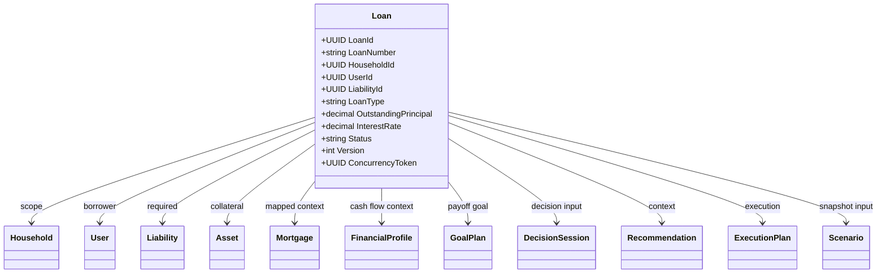
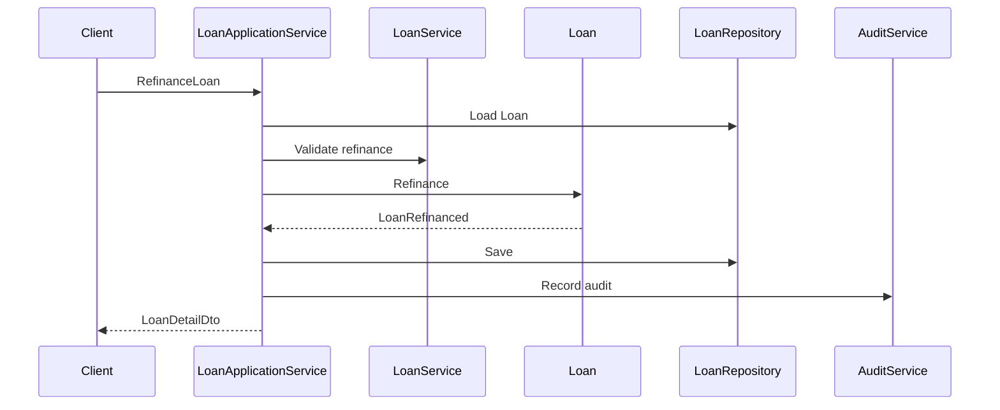
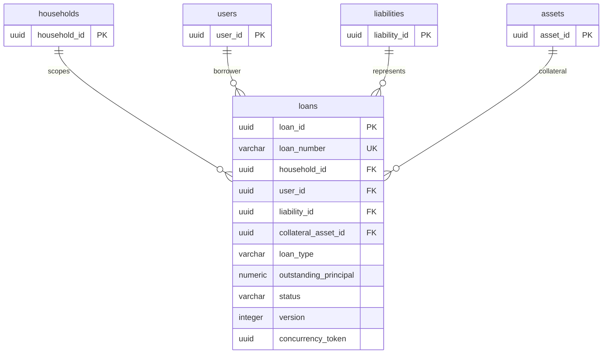
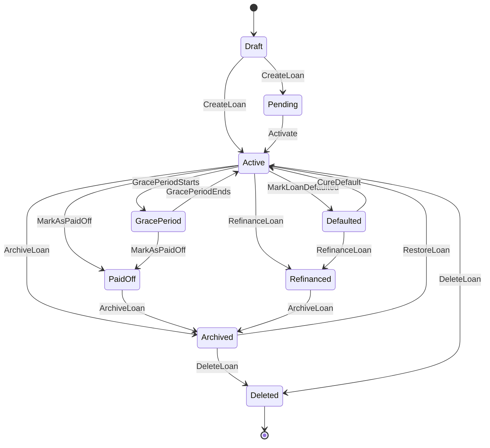

# Legacy Reference

- Status: Legacy reference only; do not treat this document as canonical.
- Canonical source: [knowledge/entity/Loan.md](../../../knowledge/entity/Loan.md).
- Retirement note: keep this file intact for historical lookup until legacy docs are retired.

# Loan Entity Specification

# Entity Overview

## Purpose
- Loan represents a household-scoped borrowing agreement owned by the Loan aggregate.
- Loan is the source of truth for principal, interest, repayment, refinance, payoff, and loan lifecycle behavior.
- Loan provides data to Liability, Mortgage, CashFlow, Expense, Goal, Decision, Recommendation, ExecutionPlan, Scenario, and DomainEvent projections.

## Responsibilities
- Maintain stable LoanId and unique LoanNumber.
- Maintain HouseholdId, UserId, and LiabilityId references.
- Store loan type, category, name, lender, currency, principal, interest, repayment method, frequency, monthly payment, grace period, dates, remaining term, status, purpose, collateral, refinance eligibility, early repayment penalty, reference number, tags, audit fields, Version, and ConcurrencyToken.
- Enforce payment, interest adjustment, refinance, payoff, archive, restore, delete, and soft-delete rules.
- Publish LoanCreated, LoanUpdated, LoanPaymentRecorded, LoanInterestAdjusted, LoanRefinanced, LoanPaidOff, LoanArchived, LoanDeleted, and LoanStatusChanged.
- Preserve full audit trail and version history for loan terms and payment events.

## Business Meaning
- Loan is a contractual debt obligation that creates scheduled repayment and interest cost for a Household.
- Loan can represent personal loan, mortgage loan, credit loan, refinance loan, or another Catalog-approved LoanType.
- Loan must correspond to a Liability because the household debt position is reflected in LiabilityPortfolio.
- Loan may be mortgage-related, secured by an Asset, used by DecisionSession, evaluated by Scenario, and converted into ExecutionPlan actions.

## Aggregate Root
- Yes.
- Aggregate Name: Loan.
- Aggregate Root: Loan.
- Domain: Loan.
- Repository: LoanRepository.
- Application Service: LoanApplicationService.
- Domain Service: LoanService.
- Transaction Boundary: one Loan mutation.
- Consistency Boundary: loan identity, loan terms, payment events, refinance status, payoff status, audit fields, version, and concurrency token.

## Lifecycle
- Draft: loan is captured but not ready for repayment schedule or projections.
- Pending: loan is under setup, approval, or activation.
- Active: loan is in repayment and contributes to liability, expense, cash flow, scenario, and decision calculations.
- GracePeriod: loan is active but repayment is temporarily deferred under grace rules.
- PaidOff: loan is fully settled and cannot be reactivated.
- Defaulted: loan is in default and remains active for risk analysis.
- Refinanced: loan has been replaced or materially changed through refinance.
- Archived: loan is retained for history and cannot be modified except restore or delete.
- Deleted: loan is soft-deleted and cannot be reused.

## Ownership
- Loan owns its lifecycle, payment recording, interest adjustment, refinance, payoff, audit metadata, version, and concurrency token.
- Loan references Household, User, Liability, Asset, Mortgage context, Goal, Decision, Recommendation, ExecutionPlan, Scenario, and DomainEvent by identity or snapshot.
- LiabilityPortfolio owns Liability and debt portfolio summaries.
- AssetPortfolio owns collateral Asset.
- Household owns authorization scope.
- User owns identity.
- Mortgage behavior is mapped through Loan and Property where Catalog defines mortgage.

## Relationships
- Household: Loan must belong to one Household and uses Household for authorization isolation.
- User: UserId identifies the borrower or responsible user; User is not mutated by Loan.
- Liability: Loan must correspond to one LiabilityId; Liability reflects debt position in LiabilityPortfolio.
- Mortgage: Mortgage is represented through Loan and property-secured loan behavior; Loan owns refinance and loan payment events.
- Asset: CollateralAssetId may reference secured collateral Asset; Loan does not mutate Asset.
- CashFlow: LoanPaymentRecorded and MonthlyPayment feed cash flow projections.
- Expense: Loan payments contribute to Expense and debt service analysis.
- Goal: Goals may target loan payoff, debt reduction, or refinance outcomes.
- Decision: DecisionSession consumes Loan terms and snapshots for affordability, refinance, and payoff decisions.
- Recommendation: Recommendation Engine uses Loan rate, balance, term, penalty, and refinance eligibility.
- ExecutionPlan: ExecutionPlan may be generated to execute refinance, early repayment, payoff, or payment schedule actions.
- Scenario: Scenario uses Loan snapshots for projection, stress testing, and comparison.
- DomainEvent: Loan publishes loan lifecycle, payment, refinance, interest, and payoff events.

## Navigation
- Loan -> Household by HouseholdId.
- Loan -> User by UserId.
- Loan -> Liability by LiabilityId.
- Loan -> Mortgage context by LoanId where mortgage mapping uses Loan.
- Loan -> Asset by CollateralAssetId.
- Loan -> CashFlow and Expense through payment event projections.
- Loan -> Goal by debt payoff or refinance goal references.
- Loan -> DecisionSession through decision input snapshots.
- Loan -> Recommendation through recommendation context.
- Loan -> ExecutionPlan through accepted decision or follow-up action.
- Loan -> Scenario through scenario snapshots.
- Loan -> DomainEvent by AggregateId and EventName.

# Complete Properties

| Name | Type | Nullable | Default | Description | Validation | Business Meaning | Example | Database Mapping | JSON Name | API Usage | Searchable | Sortable | Indexed | Encrypted | Auditable |
|---|---|---:|---|---|---|---|---|---|---|---|---:|---:|---:|---:|---:|
| LoanId | UUID | No | generated | Stable loan identifier. | Required, immutable, UUID. | Identifies Loan aggregate. | `41e3a6f3-1a59-4f23-94b2-66da3b0c818d` | `loan_id uuid primary key` | `loanId` | Route, detail, response. | Yes | Yes | Yes | No | Yes |
| LoanNumber | string(40) | No | generated | Unique business number. | Required, unique, max 40. | Human-readable loan identity. | `LOAN-20260714` | `loan_number varchar(40) not null` | `loanNumber` | Create response, search. | Yes | Yes | Yes | No | Yes |
| HouseholdId | UUID | No | none | Household scope. | Required, existing Household. | Authorization and planning boundary. | `6a8b7b40-6b60-420a-88df-942b940d89a1` | `household_id uuid not null` | `householdId` | Create, search, detail. | Yes | Yes | Yes | No | Yes |
| UserId | UUID | No | none | Responsible user. | Required, existing User in Household. | Borrower or responsible user. | `0f40f9f1-7c98-4c8b-a5aa-6e7b12d70411` | `user_id uuid not null` | `userId` | Create, update, search. | Yes | Yes | Yes | No | Yes |
| LiabilityId | UUID | No | none | Linked liability. | Required, existing Liability in Household. | Debt portfolio representation. | `cd9d0d9e-9b0c-4b11-8c3e-5d67b77a915a` | `liability_id uuid not null` | `liabilityId` | Create, detail. | Yes | Yes | Yes | No | Yes |
| LoanType | string(40) | No | none | Loan type. | Required, Catalog value. | Determines loan behavior. | `Mortgage` | `loan_type varchar(40) not null` | `loanType` | Create, update, search. | Yes | Yes | Yes | No | Yes |
| LoanCategory | string(60) | Yes | null | Loan category. | Catalog value when present. | Reporting grouping. | `HomeLoan` | `loan_category varchar(60)` | `loanCategory` | Create, update, search. | Yes | Yes | Yes | No | Yes |
| LoanName | string(160) | No | none | Display name. | Required, 1-160. | User-facing loan name. | `Primary Home Loan` | `loan_name varchar(160) not null` | `loanName` | Create, update, summary. | Yes | Yes | Yes | No | Yes |
| Description | string(2000) | Yes | null | Description. | Max 2000. | Additional context. | `Mortgage for primary residence` | `description text` | `description` | Create, update, detail. | Yes | No | No | No | Yes |
| Lender | string(160) | Yes | null | Lender name. | Max 160. | Loan counterparty. | `Atlas Bank` | `lender varchar(160)` | `lender` | Create, update, search. | Yes | Yes | Yes | Yes | Yes |
| Currency | string(3) | No | household currency | Loan currency. | Required, ISO 4217 uppercase. | Principal and payment currency. | `TWD` | `currency char(3) not null` | `currency` | Create, update, search. | Yes | Yes | Yes | No | Yes |
| OriginalPrincipal | decimal(19,4) | No | 0 | Original principal. | Required, >= 0. | Initial loan amount. | `6500000.0000` | `original_principal numeric(19,4) not null` | `originalPrincipal` | Create, refinance, detail. | No | Yes | Yes | Yes | Yes |
| OutstandingPrincipal | decimal(19,4) | No | 0 | Remaining principal. | Required, >= 0. | Current debt amount. | `5200000.0000` | `outstanding_principal numeric(19,4) not null` | `outstandingPrincipal` | Create, payment, detail. | No | Yes | Yes | Yes | Yes |
| InterestRate | decimal(9,6) | No | 0 | Interest rate. | Required, >= 0. | Cost of borrowing. | `0.025000` | `interest_rate numeric(9,6) not null` | `interestRate` | Create, update, adjustment. | No | Yes | Yes | No | Yes |
| InterestType | string(40) | Yes | null | Interest type. | Catalog value when present. | Fixed or variable behavior. | `Fixed` | `interest_type varchar(40)` | `interestType` | Create, update, search. | Yes | Yes | Yes | No | Yes |
| RepaymentMethod | string(40) | Yes | null | Repayment method. | Catalog value when present. | Amortization behavior. | `Amortizing` | `repayment_method varchar(40)` | `repaymentMethod` | Create, update, projection. | Yes | Yes | Yes | No | Yes |
| PaymentFrequency | string(40) | Yes | `Monthly` | Payment frequency. | Catalog value when present. | Payment schedule cadence. | `Monthly` | `payment_frequency varchar(40)` | `paymentFrequency` | Create, update, search. | Yes | Yes | Yes | No | Yes |
| MonthlyPayment | decimal(19,4) | No | 0 | Monthly payment. | Required, >= 0. | Cash flow expense. | `35000.0000` | `monthly_payment numeric(19,4) not null` | `monthlyPayment` | Create, update, payment. | No | Yes | Yes | Yes | Yes |
| GracePeriodMonths | integer | No | 0 | Grace period length. | Required, >= 0. | Deferred payment period. | `6` | `grace_period_months integer not null` | `gracePeriodMonths` | Create, update. | No | Yes | No | No | Yes |
| StartDate | date | Yes | null | Loan start date. | Not future beyond policy tolerance. | Beginning of loan term. | `2020-06-01` | `start_date date` | `startDate` | Create, update, detail. | No | Yes | Yes | No | Yes |
| MaturityDate | date | Yes | null | Scheduled maturity date. | >= StartDate when both present. | End of loan term. | `2040-06-01` | `maturity_date date` | `maturityDate` | Create, update, search. | No | Yes | Yes | No | Yes |
| RemainingTerm | integer | Yes | null | Remaining term in months. | >= 0 when present. | Remaining repayment horizon. | `168` | `remaining_term integer` | `remainingTerm` | Detail, projection. | No | Yes | Yes | No | Yes |
| Status | string(32) | No | `Draft` | Lifecycle status. | Required; Draft, Pending, Active, GracePeriod, PaidOff, Defaulted, Refinanced, Archived, Deleted. | Controls mutability and behavior. | `Active` | `status varchar(32) not null` | `status` | Command response, search. | Yes | Yes | Yes | No | Yes |
| Purpose | string(240) | Yes | null | Loan purpose. | Max 240. | Business reason for borrowing. | `Primary residence purchase` | `purpose varchar(240)` | `purpose` | Create, update, detail. | Yes | No | No | No | Yes |
| CollateralAssetId | UUID | Yes | null | Collateral Asset reference. | Existing Asset in Household when present. | Secured loan collateral. | `b802d0d3-7f81-4d21-a6e0-55a6e9fa2101` | `collateral_asset_id uuid` | `collateralAssetId` | Create, update, detail. | Yes | Yes | Yes | No | Yes |
| RefinanceEligible | boolean | No | false | Refinance eligibility marker. | Required boolean. | Indicates refinance evaluation availability. | `true` | `refinance_eligible boolean not null` | `refinanceEligible` | Create, update, search. | Yes | Yes | Yes | No | Yes |
| EarlyRepaymentPenalty | decimal(19,4) | Yes | null | Early repayment penalty. | >= 0 when present. | Cost of early payoff. | `50000.0000` | `early_repayment_penalty numeric(19,4)` | `earlyRepaymentPenalty` | Create, update, refinance. | No | Yes | Yes | Yes | Yes |
| ReferenceNumber | string(120) | Yes | null | External loan reference. | Max 120. | Lender account reference. | `LN-778899` | `reference_number varchar(120)` | `referenceNumber` | Create, update, search. | Yes | Yes | Yes | Yes | Yes |
| Tags | string[] | Yes | empty | Tags. | Bounded count, each max 40. | Filtering and grouping. | `["mortgage","home"]` | `tags jsonb not null` | `tags` | Create, update, search. | Yes | No | Yes | No | Yes |
| CreatedAt | datetime | No | now UTC | Creation timestamp. | Required, UTC, immutable. | Audit and ordering. | `2026-07-14T00:00:00Z` | `created_at timestamptz not null` | `createdAt` | Response. | Yes | Yes | Yes | No | Yes |
| CreatedBy | UUID | Yes | null | Creator actor. | Existing UserId or system actor. | Audit attribution. | `0f40f9f1-7c98-4c8b-a5aa-6e7b12d70411` | `created_by uuid` | `createdBy` | Response. | Yes | Yes | Yes | No | Yes |
| UpdatedAt | datetime | No | now UTC | Last update timestamp. | Required, UTC, >= CreatedAt. | Audit and cache invalidation. | `2026-07-14T02:00:00Z` | `updated_at timestamptz not null` | `updatedAt` | Response. | Yes | Yes | Yes | No | Yes |
| UpdatedBy | UUID | Yes | null | Last updater actor. | Existing UserId or system actor. | Audit attribution. | `0f40f9f1-7c98-4c8b-a5aa-6e7b12d70411` | `updated_by uuid` | `updatedBy` | Response. | Yes | Yes | Yes | No | Yes |
| Version | integer | No | 1 | Loan version. | Required, >= 1, increments on mutation. | Version history and event ordering. | `6` | `version integer not null` | `version` | Detail, update, audit. | No | Yes | Yes | No | Yes |
| ConcurrencyToken | UUID | No | generated | Optimistic concurrency token. | Required, changes on mutation. | Prevents lost updates. | `c2dd4d93-a679-4d83-9afd-d977a3d6a770` | `concurrency_token uuid not null` | `concurrencyToken` | Update and command input. | No | No | Yes | No | Yes |

# Validation Rules

- LoanId is required, UUID, and immutable.
- LoanNumber is required, unique, immutable, and max 40 characters.
- HouseholdId is required and must reference an accessible Household.
- UserId is required and must reference a User in the Household.
- LiabilityId is required and must reference a Liability in the same Household.
- LoanType is required and must match Catalog-approved LoanType.
- LoanCategory is optional and must match Catalog-approved values when enforced.
- LoanName is required, trimmed, 1-160 characters.
- Description is optional and max 2000 characters.
- Lender is optional, trimmed, and max 160 characters.
- Currency is required and must be uppercase ISO 4217 supported by Atlas.
- OriginalPrincipal is required and must be greater than or equal to 0.
- OutstandingPrincipal is required and must be greater than or equal to 0.
- InterestRate is required and must be greater than or equal to 0.
- InterestType is optional and must match Catalog-approved values when present.
- RepaymentMethod is optional and must match Catalog-approved values when present.
- PaymentFrequency is optional and must match Catalog-approved values when present.
- MonthlyPayment is required and must be greater than or equal to 0.
- GracePeriodMonths is required and must not be negative.
- StartDate is optional and cannot be in the future beyond policy tolerance.
- MaturityDate is optional and cannot be earlier than StartDate when both are present.
- RemainingTerm is optional and must be greater than or equal to 0.
- Status is required and must be Draft, Pending, Active, GracePeriod, PaidOff, Defaulted, Refinanced, Archived, or Deleted.
- Purpose is optional and max 240 characters.
- CollateralAssetId is optional and must reference an Asset in the same Household when present.
- RefinanceEligible is required.
- EarlyRepaymentPenalty is optional and must be greater than or equal to 0.
- ReferenceNumber is optional and max 120 characters.
- Tags are optional, bounded by configured count, and each tag max 40 characters.
- CreatedAt is required, UTC, and immutable.
- UpdatedAt is required, UTC, and greater than or equal to CreatedAt.
- Version is required and must be greater than or equal to 1.
- ConcurrencyToken is required for mutation commands.
- PaidOff loan cannot be reactivated.
- Archived loan cannot be modified except RestoreLoan or DeleteLoan.
- Deleted loan cannot be modified or reused.
- RecordPayment amount must be greater than 0.
- RecordPayment cannot reduce OutstandingPrincipal below 0.
- AdjustInterestRate new rate must be greater than or equal to 0.
- RefinanceLoan requires RefinanceEligible true unless authorized override is recorded.

# Business Rules

- Loan must belong to one Household.
- Loan must correspond to one Liability.
- Loan must specify LoanType.
- OriginalPrincipal must not be less than 0.
- OutstandingPrincipal must not be less than 0.
- InterestRate must not be less than 0.
- MonthlyPayment must not be less than 0.
- MaturityDate cannot be earlier than StartDate.
- GracePeriodMonths cannot be negative.
- PaidOff Loan cannot be reactivated.
- Archived Loan cannot be modified.
- Loan must preserve complete Audit Trail.
- Loan must preserve complete Version History.
- Loan supports Soft Delete.
- Loan supports early repayment.
- Loan supports refinance.
- Active Loan contributes to Liability, Expense, CashFlow, Scenario, Decision, and Recommendation calculations.
- GracePeriod Loan remains active for interest and projection unless repayment rules define deferral.
- Defaulted Loan remains visible for risk analysis and decision context.
- Refinanced Loan cannot be modified as a normal active loan.
- Loan payment must emit LoanPaymentRecorded.
- Loan refinance must emit LoanRefinanced and preserve old terms.
- Loan payoff must emit LoanPaidOff and close active payment obligations.
- Loan does not mutate Household, User, AssetPortfolio, LiabilityPortfolio, GoalPlan, Scenario, DecisionSession, Recommendation, or ExecutionPlan directly.

# State Machine

| State | Transition | Trigger | Invariant | Illegal Transition |
|---|---|---|---|---|
| Draft | Draft -> Pending | CreateLoan pending approval | Required identity fields exist | Draft -> PaidOff |
| Draft | Draft -> Active | CreateLoan active or Activate | LiabilityId valid | Draft -> Refinanced |
| Pending | Pending -> Active | Loan approval completed | Terms valid | Pending -> PaidOff |
| Pending | Pending -> Archived | ArchiveLoan | Audit recorded | Pending -> Refinanced |
| Active | Active -> GracePeriod | Grace period begins | GracePeriodMonths > 0 | Active -> Draft |
| GracePeriod | GracePeriod -> Active | Grace period ends | Loan not deleted | GracePeriod -> Draft |
| Active | Active -> PaidOff | MarkAsPaidOff | OutstandingPrincipal = 0 | Active -> Draft |
| GracePeriod | GracePeriod -> PaidOff | MarkAsPaidOff | OutstandingPrincipal = 0 | GracePeriod -> Draft |
| Active | Active -> Defaulted | Default process | OutstandingPrincipal > 0 | Active -> Draft |
| Defaulted | Defaulted -> Active | Cure default | Reason recorded | Defaulted -> Draft |
| Active | Active -> Refinanced | RefinanceLoan | Refinance terms valid | Active -> Draft |
| Defaulted | Defaulted -> Refinanced | RefinanceLoan | Authorized refinance | Defaulted -> Draft |
| Active | Active -> Archived | ArchiveLoan | Audit recorded | Active -> Draft |
| PaidOff | PaidOff -> Archived | ArchiveLoan | Audit recorded | PaidOff -> Active |
| Refinanced | Refinanced -> Archived | ArchiveLoan | Audit recorded | Refinanced -> Active |
| Archived | Archived -> Active | RestoreLoan | Prior state was Active and restore allowed | Archived -> Draft |
| Archived | Archived -> Deleted | DeleteLoan | Soft delete recorded | Archived -> Active without restore |
| Deleted | none | terminal normal lifecycle | Soft delete retained | Deleted -> Active, Deleted -> Draft |

# Commands

## CreateLoan
- Creates Loan with HouseholdId, UserId, LiabilityId, terms, status, audit fields, Version, and ConcurrencyToken.
- Validates household scope, liability mapping, amounts, dates, interest, repayment, collateral, tags, and uniqueness.
- Emits LoanCreated and LoanStatusChanged.

## UpdateLoan
- Updates mutable loan metadata, lender, category, payment terms, purpose, refinance eligibility, penalty, reference, tags, and collateral.
- Requires matching ConcurrencyToken.
- Rejects PaidOff, Refinanced, Archived, and Deleted loans for core term modification.
- Emits LoanUpdated.

## RecordPayment
- Records principal payment and reduces OutstandingPrincipal.
- Validates payment amount, payment date, currency, and resulting balance.
- Emits LoanPaymentRecorded and LoanUpdated; may emit LoanPaidOff.

## AdjustInterestRate
- Changes InterestRate and InterestType when allowed by loan terms.
- Requires reason, effective date, and ConcurrencyToken.
- Emits LoanInterestAdjusted and LoanUpdated.

## RefinanceLoan
- Replaces or materially changes loan terms while preserving original loan history.
- Requires RefinanceEligible true or authorized override.
- Emits LoanRefinanced and LoanStatusChanged.

## MarkAsPaidOff
- Marks Loan PaidOff when outstanding principal is settled.
- Supports early repayment and EarlyRepaymentPenalty handling.
- Emits LoanPaidOff and LoanStatusChanged.

## ArchiveLoan
- Moves Loan to Archived.
- Prevents normal modification.
- Emits LoanArchived and LoanStatusChanged.

## RestoreLoan
- Restores Archived Loan to an allowed non-terminal status.
- Requires authorization and matching ConcurrencyToken.
- Emits LoanStatusChanged and LoanUpdated.

## DeleteLoan
- Soft-deletes Loan and prevents reuse.
- Retains audit, payments, refinance history, snapshots, and events.
- Emits LoanDeleted and LoanStatusChanged.

## MarkLoanDefaulted
- Moves Active or GracePeriod Loan to Defaulted.
- Requires default reason and audit metadata.
- Emits LoanStatusChanged and LoanUpdated.

# Domain Events

| Event | Producer | Trigger | Payload | Consumers |
|---|---|---|---|---|
| LoanCreated | Loan | CreateLoan | LoanId, HouseholdId, Principal, InterestRate, LoanTerm | CashFlow Projection, Dashboard, Scenario |
| LoanUpdated | Loan | UpdateLoan | LoanId, ChangedFields, Version, UpdatedAt | Audit Service, projections, cache |
| LoanPaymentRecorded | Loan | RecordPayment | LoanId, Amount, PaymentDate, Balance, HouseholdId | CashFlow Engine, Liability Service, Dashboard |
| LoanPaymentMade | Loan | RecordPayment | LoanId, Amount, PaymentDate, Balance | Catalog event alias for payment consumers |
| LoanInterestAdjusted | Loan | AdjustInterestRate | LoanId, PreviousRate, InterestRate, EffectiveDate | Projection Engine, Decision Engine |
| LoanRefinanced | Loan | RefinanceLoan | LoanId, InterestRate, LoanTerm, ClosingCost, HouseholdId | Decision Engine, Recommendation Engine |
| LoanPaidOff | Loan | MarkAsPaidOff | LoanId, PaidOffAt, FinalPayment | Goal Service, CashFlow Engine |
| LoanClosed | Loan | MarkAsPaidOff | LoanId, ClosedAt, FinalPayment | Catalog event alias for closed loan consumers |
| LoanArchived | Loan | ArchiveLoan | LoanId, ArchivedAt, ArchivedBy | Audit Service, read models |
| LoanDeleted | Loan | DeleteLoan | LoanId, DeletedAt, DeletedBy | Audit Service, read models |
| LoanStatusChanged | Loan | Any lifecycle transition | LoanId, PreviousStatus, NewStatus, OccurredAt | Notification, Audit Service, projections |
| LoanDefaulted | Loan | MarkLoanDefaulted | LoanId, DefaultedAt, Reason | Risk Analysis Service, Decision Engine |

# Repository

## Interface
```csharp
public interface ILoanRepository
{
    Task<Loan?> GetByIdAsync(Guid loanId, CancellationToken cancellationToken);
    Task<Loan?> GetByLoanNumberAsync(string loanNumber, CancellationToken cancellationToken);
    Task<IReadOnlyList<Loan>> GetByHouseholdIdAsync(Guid householdId, CancellationToken cancellationToken);
    Task<IReadOnlyList<Loan>> GetByLiabilityIdAsync(Guid liabilityId, CancellationToken cancellationToken);
    Task<IReadOnlyList<Loan>> SearchAsync(LoanSearchSpecification specification, CancellationToken cancellationToken);
    Task<bool> ExistsByLoanNumberAsync(string loanNumber, CancellationToken cancellationToken);
    Task AddAsync(Loan loan, CancellationToken cancellationToken);
    Task UpdateAsync(Loan loan, CancellationToken cancellationToken);
}
```

## Methods
- GetByIdAsync loads one Loan aggregate by LoanId.
- GetByLoanNumberAsync loads one Loan by LoanNumber.
- GetByHouseholdIdAsync loads household-scoped loans.
- GetByLiabilityIdAsync loads loans mapped to a Liability.
- SearchAsync returns paged Loan summaries.
- ExistsByLoanNumberAsync enforces uniqueness.
- AddAsync persists new Loan and events.
- UpdateAsync persists Loan mutation with optimistic concurrency.

## Query Methods
- FindActiveLoans.
- FindPendingLoans.
- FindGracePeriodLoans.
- FindPaidOffLoans.
- FindDefaultedLoans.
- FindRefinancedLoans.
- FindArchivedLoans.
- FindByHouseholdId.
- FindByUserId.
- FindByLiabilityId.
- FindByLoanType.
- FindByCollateralAssetId.
- FindRefinanceEligibleLoans.
- FindByMaturityDateRange.
- FindByOutstandingPrincipalRange.
- FindByInterestRateRange.
- FindByTags.

## Specification Pattern
- LoanByIdSpecification.
- LoanByNumberSpecification.
- LoanByHouseholdSpecification.
- LoanByLiabilitySpecification.
- ActiveLoanSpecification.
- NonDeletedLoanSpecification.
- RefinanceEligibleLoanSpecification.
- LoanPaymentDueSpecification.
- LoanMaturitySpecification.
- LoanSearchSpecification.

# Domain Service Interaction

- Loan Service validates loan lifecycle, payment, interest adjustment, refinance, payoff, default, and restore rules.
- Liability Service synchronizes liability summary and consumes payment and payoff events without being directly mutated outside its boundary.
- Mortgage Service uses Loan terms for mortgage behavior and property-secured loan context.
- CashFlow Engine consumes loan payment events, monthly payment, frequency, and grace period.
- Interest Calculation Service computes interest accrual, amortization, effective rate changes, and remaining term.
- Projection Engine projects outstanding principal, interest cost, maturity, refinance impact, and payoff horizon.
- Decision Engine evaluates loan affordability, refinancing, early repayment, and debt restructuring decisions.
- Recommendation Engine recommends refinance, early repayment, payment changes, or risk reduction based on loan data.
- Scenario Engine simulates loan payment schedules, rate changes, default, refinance, and payoff.
- Audit Service records all commands, state transitions, payments, interest adjustments, refinance, and deletion.

# Application Service Interaction

- LoanApplicationService handles CreateLoan, UpdateLoan, RecordPayment, AdjustInterestRate, RefinanceLoan, MarkAsPaidOff, ArchiveLoan, RestoreLoan, DeleteLoan, search, and detail.
- HouseholdApplicationService validates household access.
- UserApplicationService validates borrower or responsible user.
- LiabilityApplicationService or LoanApplicationService coordinates LiabilityId consistency through Catalog-approved boundaries.
- CashFlowApplicationService consumes loan payment events for expense and cash flow projections.
- ScenarioApplicationService reads loan snapshots for simulations.
- DecisionApplicationService reads loan snapshots for DecisionSession.
- RecommendationApplicationService reads loan context for recommendations.
- ExecutionPlanningApplicationService creates execution plans after accepted decisions.
- AuditApplicationService exposes loan audit and payment history to authorized callers.

# API

## REST Endpoints
| Operation | HTTP Method | Endpoint | Request | Response | Error |
|---|---|---|---|---|---|
| Create | POST | `/api/loans` | CreateLoanDto | LoanDetailDto | 400, 403, 409, 422 |
| Get Detail | GET | `/api/loans/{loanId}` | none | LoanDetailDto | 401, 403, 404 |
| Update | PUT | `/api/loans/{loanId}` | UpdateLoanDto | LoanDetailDto | 400, 403, 404, 409, 422 |
| Delete | DELETE | `/api/loans/{loanId}` | concurrencyToken | LoanDetailDto | 403, 404, 409 |
| Search | GET | `/api/loans` | LoanSearchDto | paged LoanSummaryDto | 400, 403 |
| Record Payment | POST | `/api/loans/{loanId}/payments` | PaymentDto | LoanDetailDto | 400, 403, 404, 409, 422 |
| Adjust Interest Rate | POST | `/api/loans/{loanId}/interest-adjustments` | InterestAdjustmentDto | LoanDetailDto | 400, 403, 404, 409, 422 |
| Refinance | POST | `/api/loans/{loanId}/refinance` | RefinanceDto | LoanDetailDto | 400, 403, 404, 409, 422 |
| Mark Paid Off | POST | `/api/loans/{loanId}/paid-off` | payoff request | LoanDetailDto | 403, 404, 409, 422 |
| Archive | POST | `/api/loans/{loanId}/archive` | reason, concurrencyToken | LoanDetailDto | 403, 404, 409 |
| Restore | POST | `/api/loans/{loanId}/restore` | concurrencyToken | LoanDetailDto | 403, 404, 409, 422 |
| History | GET | `/api/loans/{loanId}/history` | paging | audit and payment history page | 403, 404 |

## Response
- Command responses return LoanDetailDto with updated Version and ConcurrencyToken.
- Search responses return page, pageSize, totalCount, and LoanSummaryDto items.
- Sensitive lender, reference, principal, and payment values are masked unless caller has permission.

## Error
- 400: invalid request, enum, currency, date, amount, rate, payment, or tag.
- 401: authentication required.
- 403: caller lacks Household or Loan permission.
- 404: Loan not found or not visible.
- 409: duplicate LoanNumber or concurrency conflict.
- 422: business rule violation or illegal transition.

# DTO

## Create DTO
```json
{
  "householdId": "6a8b7b40-6b60-420a-88df-942b940d89a1",
  "userId": "0f40f9f1-7c98-4c8b-a5aa-6e7b12d70411",
  "liabilityId": "cd9d0d9e-9b0c-4b11-8c3e-5d67b77a915a",
  "loanType": "Mortgage",
  "loanCategory": "HomeLoan",
  "loanName": "Primary Home Loan",
  "lender": "Atlas Bank",
  "currency": "TWD",
  "originalPrincipal": 6500000,
  "outstandingPrincipal": 5200000,
  "interestRate": 0.025,
  "interestType": "Fixed",
  "repaymentMethod": "Amortizing",
  "paymentFrequency": "Monthly",
  "monthlyPayment": 35000,
  "gracePeriodMonths": 0,
  "startDate": "2020-06-01",
  "maturityDate": "2040-06-01",
  "purpose": "Primary residence purchase",
  "collateralAssetId": "b802d0d3-7f81-4d21-a6e0-55a6e9fa2101",
  "refinanceEligible": true,
  "earlyRepaymentPenalty": 50000,
  "referenceNumber": "LN-778899",
  "tags": ["mortgage", "home"]
}
```

## Update DTO
```json
{
  "loanName": "Primary Home Mortgage Loan",
  "monthlyPayment": 36000,
  "refinanceEligible": true,
  "earlyRepaymentPenalty": 45000,
  "tags": ["mortgage", "home", "priority"],
  "concurrencyToken": "c2dd4d93-a679-4d83-9afd-d977a3d6a770"
}
```

## Detail DTO
```json
{
  "loanId": "41e3a6f3-1a59-4f23-94b2-66da3b0c818d",
  "loanNumber": "LOAN-20260714",
  "householdId": "6a8b7b40-6b60-420a-88df-942b940d89a1",
  "userId": "0f40f9f1-7c98-4c8b-a5aa-6e7b12d70411",
  "liabilityId": "cd9d0d9e-9b0c-4b11-8c3e-5d67b77a915a",
  "loanType": "Mortgage",
  "loanName": "Primary Home Mortgage Loan",
  "currency": "TWD",
  "outstandingPrincipal": 5165000,
  "interestRate": 0.024,
  "monthlyPayment": 36000,
  "remainingTerm": 168,
  "status": "Active",
  "refinanceEligible": true,
  "referenceNumber": "****8899",
  "version": 6,
  "concurrencyToken": "e7a55531-d313-4091-9da7-d0095a9019f5"
}
```

## Summary DTO
```json
{
  "loanId": "41e3a6f3-1a59-4f23-94b2-66da3b0c818d",
  "loanNumber": "LOAN-20260714",
  "loanName": "Primary Home Mortgage Loan",
  "loanType": "Mortgage",
  "currency": "TWD",
  "outstandingPrincipal": 5165000,
  "interestRate": 0.024,
  "status": "Active",
  "refinanceEligible": true
}
```

## Search DTO
```json
{
  "householdId": "6a8b7b40-6b60-420a-88df-942b940d89a1",
  "keyword": "mortgage",
  "loanType": ["Mortgage"],
  "status": ["Active", "GracePeriod"],
  "currency": "TWD",
  "refinanceEligible": true,
  "page": 1,
  "pageSize": 20,
  "sortBy": "outstandingPrincipal",
  "sortDirection": "desc"
}
```

## Payment DTO
```json
{
  "paymentAmount": 35000,
  "paymentDate": "2026-07-14",
  "currency": "TWD",
  "principalAmount": 24000,
  "interestAmount": 11000,
  "memo": "Monthly loan payment",
  "concurrencyToken": "e7a55531-d313-4091-9da7-d0095a9019f5"
}
```

## Refinance DTO
```json
{
  "newInterestRate": 0.019,
  "newMaturityDate": "2041-06-01",
  "newMonthlyPayment": 32000,
  "closingCost": 60000,
  "effectiveDate": "2026-08-01",
  "reason": "Lower market rate",
  "concurrencyToken": "e7a55531-d313-4091-9da7-d0095a9019f5"
}
```

## Interest Adjustment DTO
```json
{
  "interestRate": 0.024,
  "interestType": "Fixed",
  "effectiveDate": "2026-07-14",
  "reason": "Rate update",
  "concurrencyToken": "e7a55531-d313-4091-9da7-d0095a9019f5"
}
```

# Database Mapping

## Table
- Table name: `loans`.
- Primary key: `loan_id`.
- Aggregate owner: Loan.
- Repository: LoanRepository.

## Columns
| Column | Type | Nullable | Mapping |
|---|---|---:|---|
| loan_id | uuid | No | LoanId |
| loan_number | varchar(40) | No | LoanNumber |
| household_id | uuid | No | HouseholdId |
| user_id | uuid | No | UserId |
| liability_id | uuid | No | LiabilityId |
| loan_type | varchar(40) | No | LoanType |
| loan_category | varchar(60) | Yes | LoanCategory |
| loan_name | varchar(160) | No | LoanName |
| description | text | Yes | Description |
| lender | varchar(160) | Yes | Lender |
| currency | char(3) | No | Currency |
| original_principal | numeric(19,4) | No | OriginalPrincipal |
| outstanding_principal | numeric(19,4) | No | OutstandingPrincipal |
| interest_rate | numeric(9,6) | No | InterestRate |
| interest_type | varchar(40) | Yes | InterestType |
| repayment_method | varchar(40) | Yes | RepaymentMethod |
| payment_frequency | varchar(40) | Yes | PaymentFrequency |
| monthly_payment | numeric(19,4) | No | MonthlyPayment |
| grace_period_months | integer | No | GracePeriodMonths |
| start_date | date | Yes | StartDate |
| maturity_date | date | Yes | MaturityDate |
| remaining_term | integer | Yes | RemainingTerm |
| status | varchar(32) | No | Status |
| purpose | varchar(240) | Yes | Purpose |
| collateral_asset_id | uuid | Yes | CollateralAssetId |
| refinance_eligible | boolean | No | RefinanceEligible |
| early_repayment_penalty | numeric(19,4) | Yes | EarlyRepaymentPenalty |
| reference_number | varchar(120) | Yes | ReferenceNumber |
| tags | jsonb | No | Tags |
| created_at | timestamptz | No | CreatedAt |
| created_by | uuid | Yes | CreatedBy |
| updated_at | timestamptz | No | UpdatedAt |
| updated_by | uuid | Yes | UpdatedBy |
| version | integer | No | Version |
| concurrency_token | uuid | No | ConcurrencyToken |

## FK
- `household_id` references `households.household_id`.
- `user_id` references `users.user_id`.
- `liability_id` references `liabilities.liability_id`.
- `collateral_asset_id` references `assets.asset_id`.

## Unique
- `ux_loans_loan_number` on `loan_number`.
- `ux_loans_household_reference_number` on `household_id`, `reference_number` where ReferenceNumber is not null when external uniqueness is enabled.

## Check Constraint
- Status in Draft, Pending, Active, GracePeriod, PaidOff, Defaulted, Refinanced, Archived, Deleted.
- Currency length equals 3 and uppercase.
- OriginalPrincipal, OutstandingPrincipal, InterestRate, MonthlyPayment, GracePeriodMonths are not negative.
- EarlyRepaymentPenalty is null or not negative.
- RemainingTerm is null or not negative.
- MaturityDate is null or StartDate is null or MaturityDate >= StartDate.
- PaidOff status requires OutstandingPrincipal = 0.
- Version >= 1.
- UpdatedAt >= CreatedAt.

## Index
- Primary key index on `loan_id`.
- Unique index on `loan_number`.
- Index on `household_id`.
- Index on `user_id`.
- Index on `liability_id`.
- Index on `loan_type`, `loan_category`.
- Index on `currency`.
- Index on `status`.
- Index on `outstanding_principal`.
- Index on `interest_rate`.
- Index on `maturity_date`.
- Index on `refinance_eligible`.
- Index on `collateral_asset_id`.
- GIN index on `tags`.
- Index on `updated_at`.

# PostgreSQL Schema

```sql
CREATE TABLE loans (
    loan_id uuid PRIMARY KEY,
    loan_number varchar(40) NOT NULL,
    household_id uuid NOT NULL,
    user_id uuid NOT NULL,
    liability_id uuid NOT NULL,
    loan_type varchar(40) NOT NULL,
    loan_category varchar(60),
    loan_name varchar(160) NOT NULL,
    description text,
    lender varchar(160),
    currency char(3) NOT NULL,
    original_principal numeric(19,4) NOT NULL DEFAULT 0,
    outstanding_principal numeric(19,4) NOT NULL DEFAULT 0,
    interest_rate numeric(9,6) NOT NULL DEFAULT 0,
    interest_type varchar(40),
    repayment_method varchar(40),
    payment_frequency varchar(40),
    monthly_payment numeric(19,4) NOT NULL DEFAULT 0,
    grace_period_months integer NOT NULL DEFAULT 0,
    start_date date,
    maturity_date date,
    remaining_term integer,
    status varchar(32) NOT NULL DEFAULT 'Draft',
    purpose varchar(240),
    collateral_asset_id uuid,
    refinance_eligible boolean NOT NULL DEFAULT false,
    early_repayment_penalty numeric(19,4),
    reference_number varchar(120),
    tags jsonb NOT NULL DEFAULT '[]'::jsonb,
    created_at timestamptz NOT NULL DEFAULT now(),
    created_by uuid,
    updated_at timestamptz NOT NULL DEFAULT now(),
    updated_by uuid,
    version integer NOT NULL DEFAULT 1,
    concurrency_token uuid NOT NULL,
    CONSTRAINT fk_loans_household FOREIGN KEY (household_id) REFERENCES households(household_id),
    CONSTRAINT fk_loans_user FOREIGN KEY (user_id) REFERENCES users(user_id),
    CONSTRAINT fk_loans_liability FOREIGN KEY (liability_id) REFERENCES liabilities(liability_id),
    CONSTRAINT fk_loans_collateral_asset FOREIGN KEY (collateral_asset_id) REFERENCES assets(asset_id),
    CONSTRAINT ck_loans_status CHECK (status IN ('Draft','Pending','Active','GracePeriod','PaidOff','Defaulted','Refinanced','Archived','Deleted')),
    CONSTRAINT ck_loans_currency CHECK (currency = upper(currency) AND char_length(currency) = 3),
    CONSTRAINT ck_loans_original_principal CHECK (original_principal >= 0),
    CONSTRAINT ck_loans_outstanding_principal CHECK (outstanding_principal >= 0),
    CONSTRAINT ck_loans_interest_rate CHECK (interest_rate >= 0),
    CONSTRAINT ck_loans_monthly_payment CHECK (monthly_payment >= 0),
    CONSTRAINT ck_loans_grace_period CHECK (grace_period_months >= 0),
    CONSTRAINT ck_loans_penalty CHECK (early_repayment_penalty IS NULL OR early_repayment_penalty >= 0),
    CONSTRAINT ck_loans_remaining_term CHECK (remaining_term IS NULL OR remaining_term >= 0),
    CONSTRAINT ck_loans_maturity_date CHECK (maturity_date IS NULL OR start_date IS NULL OR maturity_date >= start_date),
    CONSTRAINT ck_loans_paid_off CHECK (status <> 'PaidOff' OR outstanding_principal = 0),
    CONSTRAINT ck_loans_version CHECK (version >= 1),
    CONSTRAINT ck_loans_updated_at CHECK (updated_at >= created_at)
);

CREATE UNIQUE INDEX ux_loans_loan_number ON loans (loan_number);
CREATE UNIQUE INDEX ux_loans_household_reference_number ON loans (household_id, reference_number) WHERE reference_number IS NOT NULL;
CREATE INDEX ix_loans_household_id ON loans (household_id);
CREATE INDEX ix_loans_user_id ON loans (user_id);
CREATE INDEX ix_loans_liability_id ON loans (liability_id);
CREATE INDEX ix_loans_type_category ON loans (loan_type, loan_category);
CREATE INDEX ix_loans_currency ON loans (currency);
CREATE INDEX ix_loans_status ON loans (status);
CREATE INDEX ix_loans_outstanding_principal ON loans (outstanding_principal);
CREATE INDEX ix_loans_interest_rate ON loans (interest_rate);
CREATE INDEX ix_loans_maturity_date ON loans (maturity_date);
CREATE INDEX ix_loans_refinance_eligible ON loans (refinance_eligible);
CREATE INDEX ix_loans_collateral_asset_id ON loans (collateral_asset_id);
CREATE INDEX ix_loans_tags ON loans USING gin (tags);
CREATE INDEX ix_loans_updated_at ON loans (updated_at);
CREATE INDEX ix_loans_concurrency_token ON loans (concurrency_token);
```

# EF Core Mapping

## Fluent API
```csharp
builder.ToTable("loans");
builder.HasKey(x => x.LoanId);
builder.Property(x => x.LoanId).HasColumnName("loan_id").ValueGeneratedNever();
builder.Property(x => x.LoanNumber).HasColumnName("loan_number").HasMaxLength(40).IsRequired();
builder.Property(x => x.HouseholdId).HasColumnName("household_id").IsRequired();
builder.Property(x => x.UserId).HasColumnName("user_id").IsRequired();
builder.Property(x => x.LiabilityId).HasColumnName("liability_id").IsRequired();
builder.Property(x => x.LoanType).HasColumnName("loan_type").HasMaxLength(40).HasConversion<string>().IsRequired();
builder.Property(x => x.LoanCategory).HasColumnName("loan_category").HasMaxLength(60);
builder.Property(x => x.LoanName).HasColumnName("loan_name").HasMaxLength(160).IsRequired();
builder.Property(x => x.Description).HasColumnName("description");
builder.Property(x => x.Lender).HasColumnName("lender").HasMaxLength(160);
builder.Property(x => x.Currency).HasColumnName("currency").HasMaxLength(3).IsRequired();
builder.Property(x => x.OriginalPrincipal).HasColumnName("original_principal").HasPrecision(19, 4);
builder.Property(x => x.OutstandingPrincipal).HasColumnName("outstanding_principal").HasPrecision(19, 4);
builder.Property(x => x.InterestRate).HasColumnName("interest_rate").HasPrecision(9, 6);
builder.Property(x => x.InterestType).HasColumnName("interest_type").HasMaxLength(40);
builder.Property(x => x.RepaymentMethod).HasColumnName("repayment_method").HasMaxLength(40);
builder.Property(x => x.PaymentFrequency).HasColumnName("payment_frequency").HasMaxLength(40);
builder.Property(x => x.MonthlyPayment).HasColumnName("monthly_payment").HasPrecision(19, 4);
builder.Property(x => x.GracePeriodMonths).HasColumnName("grace_period_months");
builder.Property(x => x.StartDate).HasColumnName("start_date");
builder.Property(x => x.MaturityDate).HasColumnName("maturity_date");
builder.Property(x => x.RemainingTerm).HasColumnName("remaining_term");
builder.Property(x => x.Status).HasColumnName("status").HasMaxLength(32).HasConversion<string>().IsRequired();
builder.Property(x => x.Purpose).HasColumnName("purpose").HasMaxLength(240);
builder.Property(x => x.CollateralAssetId).HasColumnName("collateral_asset_id");
builder.Property(x => x.RefinanceEligible).HasColumnName("refinance_eligible").IsRequired();
builder.Property(x => x.EarlyRepaymentPenalty).HasColumnName("early_repayment_penalty").HasPrecision(19, 4);
builder.Property(x => x.ReferenceNumber).HasColumnName("reference_number").HasMaxLength(120);
builder.Property(x => x.Tags).HasColumnName("tags").HasColumnType("jsonb");
builder.Property(x => x.CreatedAt).HasColumnName("created_at").IsRequired();
builder.Property(x => x.CreatedBy).HasColumnName("created_by");
builder.Property(x => x.UpdatedAt).HasColumnName("updated_at").IsRequired();
builder.Property(x => x.UpdatedBy).HasColumnName("updated_by");
builder.Property(x => x.Version).HasColumnName("version").IsRequired();
builder.Property(x => x.ConcurrencyToken).HasColumnName("concurrency_token").IsConcurrencyToken().IsRequired();
builder.HasIndex(x => x.LoanNumber).IsUnique().HasDatabaseName("ux_loans_loan_number");
builder.HasIndex(x => x.HouseholdId).HasDatabaseName("ix_loans_household_id");
builder.HasIndex(x => x.LiabilityId).HasDatabaseName("ix_loans_liability_id");
builder.HasIndex(x => new { x.LoanType, x.LoanCategory }).HasDatabaseName("ix_loans_type_category");
```

## Owned Type
- Principal values may be grouped as Money value objects while preserving OriginalPrincipal, OutstandingPrincipal, MonthlyPayment, and EarlyRepaymentPenalty columns.
- Interest terms may be grouped as an owned value object while preserving InterestRate and InterestType columns.
- Repayment terms may be grouped as an owned value object while preserving RepaymentMethod, PaymentFrequency, GracePeriodMonths, MaturityDate, and RemainingTerm columns.
- Tags may be stored as owned primitive collection or JSON value based on implementation support.

## Value Conversion
- LoanType converts Catalog value to string.
- InterestType converts Catalog value to string.
- RepaymentMethod converts Catalog value to string.
- PaymentFrequency converts Catalog value to string.
- Status converts lifecycle enum to string.
- Currency stores ISO 4217 string.
- Tags convert to JSON array when stored in jsonb.

## Concurrency Token
- ConcurrencyToken is configured as optimistic concurrency token.
- Version increments on each persisted Loan mutation.
- Payment, interest adjustment, refinance, payoff, archive, restore, and delete commands require current ConcurrencyToken.

# Cache Strategy

- Cache Loan detail by `loan:{loanId}`.
- Cache household loan list by `household:{householdId}:loans`.
- Cache refinance-eligible loan list by `household:{householdId}:loans:refinance-eligible`.
- Cache LoanNumber lookup by `loan-number:{loanNumber}`.
- Invalidate caches on LoanCreated, LoanUpdated, LoanPaymentRecorded, LoanInterestAdjusted, LoanRefinanced, LoanPaidOff, LoanArchived, LoanDeleted, and LoanStatusChanged.
- Do not cache unmasked ReferenceNumber, Lender, principal, payment, or penalty values without authorization scope.
- Search cache keys must include HouseholdId, caller authorization, masking level, filters, sorting, and paging.

# Security

## Authorization
- Caller must have Household access to read Loan.
- Caller must have loan write permission to create or update Loan.
- RecordPayment requires payment management permission.
- AdjustInterestRate requires loan terms permission.
- RefinanceLoan requires refinance permission.
- MarkAsPaidOff requires payoff permission.
- Archive, Restore, and Delete require lifecycle permission.
- CollateralAssetId exposure requires asset read permission.
- Search must enforce Household isolation.

## Permission
- `Loan.Read`.
- `Loan.ReadSensitive`.
- `Loan.Search`.
- `Loan.Create`.
- `Loan.Update`.
- `Loan.Payment.Record`.
- `Loan.Interest.Adjust`.
- `Loan.Refinance`.
- `Loan.PaidOff.Mark`.
- `Loan.Archive`.
- `Loan.Restore`.
- `Loan.Delete`.
- `Loan.History.Read`.

## Data Masking
- ReferenceNumber is masked in normal responses.
- Lender may be masked in privacy-restricted views.
- OriginalPrincipal, OutstandingPrincipal, MonthlyPayment, and EarlyRepaymentPenalty are masked unless caller has financial read permission.
- CollateralAssetId may be hidden when caller lacks asset read permission.

## Encryption
- ReferenceNumber must be encrypted or tokenized according to Atlas security policy.
- Lender should be protected when it identifies private account relationships.
- Sensitive principal, payment, and penalty values should be protected according to financial data policy.
- Audit records containing sensitive values must store masked before/after values or protected payloads.

# Audit

- Audit CreateLoan with HouseholdId, LoanId, LiabilityId, LoanType, Currency, principal, and status.
- Audit UpdateLoan with changed field names and masked sensitive values.
- Audit RecordPayment with previous principal, payment amount, principal amount, interest amount, new balance, payment date, and actor.
- Audit AdjustInterestRate with previous and new rate, effective date, and reason.
- Audit RefinanceLoan with prior terms, new terms, closing cost, effective date, and actor.
- Audit MarkAsPaidOff with payoff timestamp, final payment, and penalty.
- Audit ArchiveLoan, RestoreLoan, and DeleteLoan.
- Audit changes to ReferenceNumber, CollateralAssetId, RefinanceEligible, and EarlyRepaymentPenalty.
- Audit authorization failures and illegal transitions.
- Audit Version and ConcurrencyToken changes.
- Audit DomainEvent correlation and causation ids.
- Audit records remain immutable after Loan deletion.

# Performance

## Index Strategy
- Use LoanId primary key for command handling and detail.
- Use LoanNumber unique index for business lookup.
- Use HouseholdId index for household loan lists.
- Use LiabilityId index for debt relationship resolution.
- Use LoanType and LoanCategory index for loan filters.
- Use Status index for active, defaulted, paid off, refinanced, archived, and deleted filters.
- Use OutstandingPrincipal and InterestRate indexes for refinance and payoff analysis.
- Use MaturityDate index for maturity processing.
- Use RefinanceEligible index for recommendation and decision scans.
- Use Tags GIN index for tag filtering.

## Caching
- Cache active loan summaries separately from loan detail.
- Invalidate summary cache after payment, interest adjustment, refinance, payoff, archive, restore, or delete.
- Avoid caching unmasked sensitive financial values across users.
- Use short TTL for balance-sensitive and refinance-sensitive summaries.

## Optimistic Concurrency
- All mutation commands require ConcurrencyToken.
- Concurrent payment, interest adjustment, refinance, or payoff must fail with 409 when stale.
- Version preserves event ordering and idempotent projection.
- LoanRepository is the mutation boundary.

## Batch Payment Processing
- Batch payment processing must process loans by HouseholdId, due date, and status pages.
- Each payment must emit LoanPaymentRecorded.
- Each payoff must emit LoanPaidOff.
- Batch processing must not mutate Liability, GoalPlan, Scenario, DecisionSession, or Recommendation directly.
- Failed batch items must be isolated and auditable.

## Partition Strategy
- Loan table is not partitioned by default.
- Loan payment history may be partitioned by payment date.
- AuditLog and DomainEvent may be partitioned by time.
- Household-scoped queries must remain index-backed without cross-household scans.

# Example JSON

## Create
```json
{
  "householdId": "6a8b7b40-6b60-420a-88df-942b940d89a1",
  "userId": "0f40f9f1-7c98-4c8b-a5aa-6e7b12d70411",
  "liabilityId": "cd9d0d9e-9b0c-4b11-8c3e-5d67b77a915a",
  "loanType": "Mortgage",
  "loanName": "Primary Home Loan",
  "lender": "Atlas Bank",
  "currency": "TWD",
  "originalPrincipal": 6500000,
  "outstandingPrincipal": 5200000,
  "interestRate": 0.025,
  "interestType": "Fixed",
  "repaymentMethod": "Amortizing",
  "paymentFrequency": "Monthly",
  "monthlyPayment": 35000,
  "gracePeriodMonths": 0,
  "startDate": "2020-06-01",
  "maturityDate": "2040-06-01",
  "collateralAssetId": "b802d0d3-7f81-4d21-a6e0-55a6e9fa2101",
  "refinanceEligible": true
}
```

## Update
```json
{
  "loanName": "Primary Home Mortgage Loan",
  "monthlyPayment": 36000,
  "refinanceEligible": true,
  "earlyRepaymentPenalty": 45000,
  "concurrencyToken": "c2dd4d93-a679-4d83-9afd-d977a3d6a770"
}
```

## Record Payment
```json
{
  "paymentAmount": 35000,
  "paymentDate": "2026-07-14",
  "currency": "TWD",
  "principalAmount": 24000,
  "interestAmount": 11000,
  "concurrencyToken": "e7a55531-d313-4091-9da7-d0095a9019f5"
}
```

## Refinance
```json
{
  "newInterestRate": 0.019,
  "newMaturityDate": "2041-06-01",
  "newMonthlyPayment": 32000,
  "closingCost": 60000,
  "effectiveDate": "2026-08-01",
  "reason": "Lower market rate",
  "concurrencyToken": "e7a55531-d313-4091-9da7-d0095a9019f5"
}
```

## Detail
```json
{
  "loanId": "41e3a6f3-1a59-4f23-94b2-66da3b0c818d",
  "loanNumber": "LOAN-20260714",
  "householdId": "6a8b7b40-6b60-420a-88df-942b940d89a1",
  "liabilityId": "cd9d0d9e-9b0c-4b11-8c3e-5d67b77a915a",
  "loanType": "Mortgage",
  "loanName": "Primary Home Mortgage Loan",
  "currency": "TWD",
  "outstandingPrincipal": 5165000,
  "interestRate": 0.024,
  "monthlyPayment": 36000,
  "status": "Active",
  "refinanceEligible": true,
  "version": 6,
  "concurrencyToken": "e7a55531-d313-4091-9da7-d0095a9019f5"
}
```

## Search
```json
{
  "page": 1,
  "pageSize": 20,
  "totalCount": 1,
  "items": [
    {
      "loanId": "41e3a6f3-1a59-4f23-94b2-66da3b0c818d",
      "loanNumber": "LOAN-20260714",
      "loanName": "Primary Home Mortgage Loan",
      "loanType": "Mortgage",
      "currency": "TWD",
      "outstandingPrincipal": 5165000,
      "status": "Active"
    }
  ]
}
```

# Mermaid

## Class Diagram


## Sequence Diagram


## ER Diagram


## State Diagram


# Testing

## Unit Test
- CreateLoan requires HouseholdId.
- CreateLoan requires LiabilityId.
- CreateLoan requires LoanType.
- CreateLoan rejects negative OriginalPrincipal.
- CreateLoan rejects negative OutstandingPrincipal.
- CreateLoan rejects negative InterestRate.
- CreateLoan rejects negative MonthlyPayment.
- CreateLoan rejects negative GracePeriodMonths.
- CreateLoan rejects MaturityDate earlier than StartDate.
- UpdateLoan rejects stale ConcurrencyToken.
- UpdateLoan rejects Archived Loan.
- UpdateLoan rejects PaidOff core term modification.
- RecordPayment rejects zero or negative payment.
- RecordPayment rejects payment that makes principal negative.
- AdjustInterestRate rejects negative rate.
- RefinanceLoan rejects ineligible loan without override.
- MarkAsPaidOff requires settled principal.
- PaidOff Loan cannot be reactivated.
- DeleteLoan soft-deletes and prevents reuse.

## Integration Test
- LoanRepository persists and reloads all properties.
- LoanNumber uniqueness is enforced.
- HouseholdId, UserId, LiabilityId, and CollateralAssetId foreign keys reject unknown references.
- Search filters by HouseholdId, LoanType, Status, RefinanceEligible, balance, rate, maturity, and tags.
- ReferenceNumber is masked without sensitive read permission.
- LoanPaymentRecorded invalidates loan summary cache.
- LoanRefinanced updates projections and event outbox.
- DomainEvents are persisted with aggregate correlation.
- Audit records are written for create, update, payment, interest adjustment, refinance, payoff, archive, restore, and delete.

## Validation Test
- Invalid LoanType returns validation error.
- Invalid Currency returns validation error.
- Invalid InterestType returns validation error.
- Invalid RepaymentMethod returns validation error.
- Invalid PaymentFrequency returns validation error.
- Tag count above limit returns validation error.
- ReferenceNumber above length limit returns validation error.
- Future StartDate beyond tolerance returns validation error.
- PaidOff status with positive OutstandingPrincipal returns validation error.
- UpdatedAt earlier than CreatedAt is rejected.

## Performance Test
- GetById uses primary key lookup.
- Search by HouseholdId uses household index.
- Search by LiabilityId uses liability index.
- Search by LoanType uses type category index.
- Refinance scan uses RefinanceEligible, InterestRate, and OutstandingPrincipal indexes.
- Maturity scan uses MaturityDate index.
- Tag search uses GIN index.
- Batch payment processing handles paged active loan sets.
- Concurrent payment returns 409 for stale ConcurrencyToken.

# Edge Cases

- CreateLoan with missing HouseholdId.
- CreateLoan with inaccessible HouseholdId.
- CreateLoan with UserId outside Household.
- CreateLoan with missing LiabilityId.
- CreateLoan with LiabilityId from another Household.
- CreateLoan with missing LoanType.
- CreateLoan with unsupported LoanType.
- CreateLoan with lowercase Currency.
- CreateLoan with negative OriginalPrincipal.
- CreateLoan with negative OutstandingPrincipal.
- CreateLoan with negative InterestRate.
- CreateLoan with negative MonthlyPayment.
- CreateLoan with negative GracePeriodMonths.
- CreateLoan with MaturityDate earlier than StartDate.
- CreateLoan with CollateralAssetId from another Household.
- CreateLoan with duplicate LoanNumber.
- UpdateLoan attempts to change LoanId.
- UpdateLoan attempts to change LoanNumber.
- UpdateLoan on Archived Loan.
- UpdateLoan on Deleted Loan.
- RecordPayment with amount zero.
- RecordPayment with payment exceeding OutstandingPrincipal.
- RecordPayment with stale ConcurrencyToken.
- AdjustInterestRate to negative rate.
- RefinanceLoan when RefinanceEligible is false.
- RefinanceLoan after PaidOff.
- RefinanceLoan after Deleted.
- MarkAsPaidOff while OutstandingPrincipal remains positive.
- Reactivate PaidOff Loan.
- ArchiveLoan while payment batch is running.
- RestoreLoan from Deleted.
- Defaulted Loan with zero principal.
- Loan payment in different currency.
- ReferenceNumber returned without masking.
- Batch payment partially succeeds.
- LoanRefinanced event published but projection delayed.
- Cache returns old OutstandingPrincipal after payment.
- Decision explainability references deleted Loan.

# Version History

| Version | Date | Change | Author |
|---|---|---|---|
| 1.0 | 2026-07-14 | Upgraded Loan to Enterprise Specification aligned with Atlas Aggregate Catalog, Loan aggregate ownership, LoanRepository persistence, household isolation, payment and refinance rules, commands, events, API, database mapping, security, audit, performance, testing, and edge cases. | Atlas |
