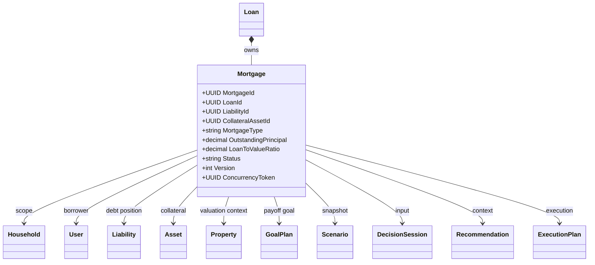
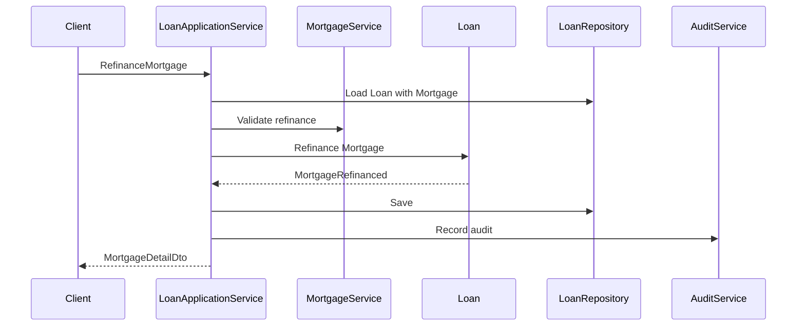
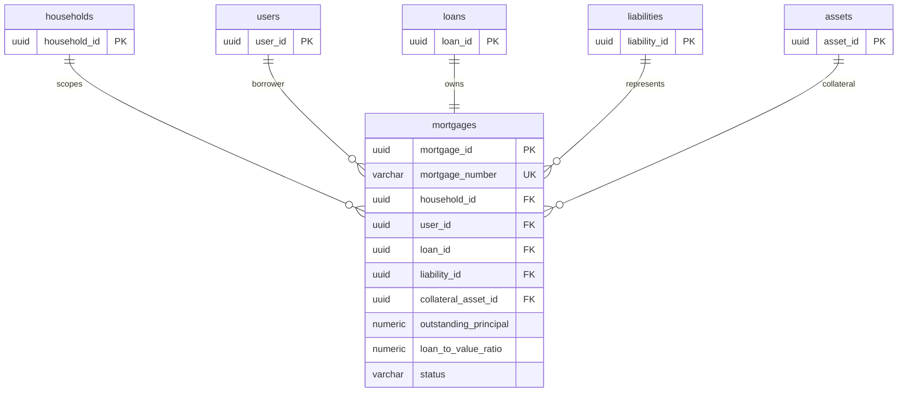
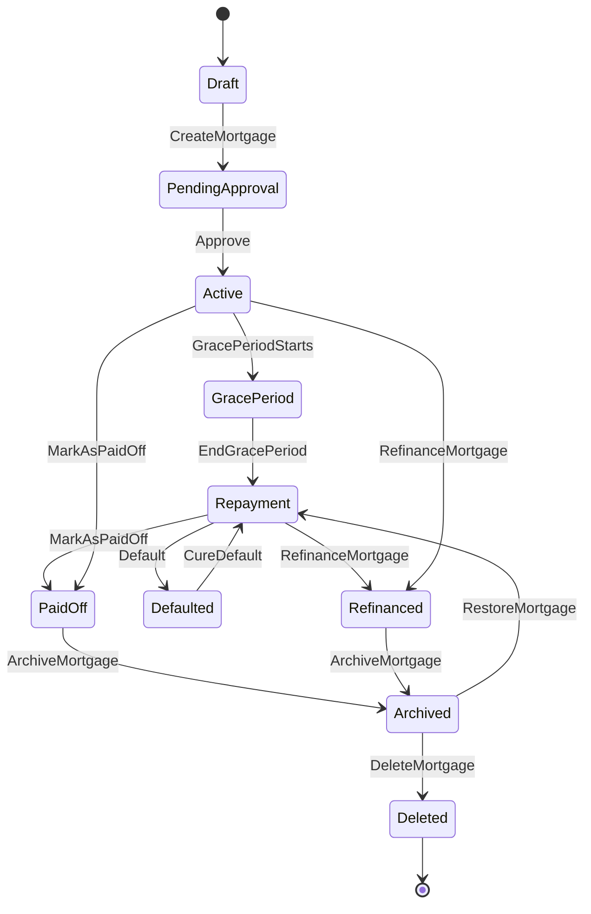

# Mortgage Entity Specification

# Entity Overview

## Purpose
- Mortgage represents a property-backed loan view owned by the Loan aggregate in Atlas.
- Mortgage connects Loan repayment behavior, Liability debt position, Asset collateral, and Property valuation context for household planning.
- Mortgage provides mortgage-specific fields for government subsidy, loan-to-value, property value, refinance, payoff, scenario, decision, recommendation, and execution planning.

## Responsibilities
- Maintain MortgageId or Loan-backed identity according to Catalog-approved persistence.
- Maintain MortgageNumber, HouseholdId, UserId, LoanId, LiabilityId, CollateralAssetId, mortgage classification, terms, valuation, subsidy, status, audit fields, Version, and ConcurrencyToken.
- Enforce mortgage term, collateral, loan-to-value, payment, grace period, refinance, payoff, archive, restore, delete, and soft-delete rules.
- Preserve payment, interest, refinance, grace period, payoff, audit, and version history.
- Publish mortgage-facing events mapped to LoanRepository and Loan aggregate ownership.

## Business Meaning
- Mortgage is a loan secured by property or property-like collateral.
- Mortgage is not a separate Atlas aggregate from Loan; it is owned as a Loan subtype or Loan-backed entity.
- Mortgage must correspond to one Loan and one Liability and must specify collateral Asset.
- Mortgage may use Property valuation context but must not mutate Property.

## Aggregate Root
- Catalog-aligned answer: Mortgage is not a standalone Aggregate Root.
- Owning Aggregate Root: Loan.
- Entity Catalog Mapping: Mortgage -> Loan -> LoanRepository.
- Mortgage changes are persisted through LoanRepository and handled through LoanApplicationService and LoanService.
- Mortgage APIs may expose mortgage-specific commands while preserving Loan aggregate transaction ownership.

## Lifecycle
- Draft: mortgage is captured but not ready for approval or repayment.
- PendingApproval: mortgage awaits approval, underwriting, or activation.
- Active: mortgage is active and contributes to liability, expense, cash flow, scenario, and decision calculations.
- GracePeriod: mortgage is active but repayment is deferred under grace period terms.
- Repayment: mortgage is in normal repayment.
- PaidOff: mortgage is fully settled and cannot be reactivated.
- Refinanced: mortgage has been replaced or materially changed through refinance.
- Defaulted: mortgage is in default and remains visible for risk analysis.
- Archived: mortgage is retained for history and cannot be modified except restore or delete.
- Deleted: mortgage is soft-deleted and cannot be reused.

## Ownership
- Loan owns Mortgage lifecycle, payments, interest adjustment, refinance, payoff, audit, version, and concurrency.
- LiabilityPortfolio owns the linked Liability debt position.
- AssetPortfolio owns CollateralAssetId.
- Property owns property valuation, purchase, sale, and property lifecycle.
- Household owns authorization scope.
- User owns identity.

## Relationships
- Household: Mortgage must belong to one Household and uses Household for authorization isolation.
- User: UserId identifies borrower or responsible user; User is not mutated by Mortgage.
- Asset: CollateralAssetId is required and references the collateral asset; Mortgage does not mutate Asset.
- Liability: Mortgage must correspond to one LiabilityId for household debt position.
- Loan: Mortgage must correspond to one LoanId and uses Loan aggregate commands.
- Property: Mortgage references property valuation context; Property owns valuation and does not own mortgage amortization.
- CashFlow: MortgagePaymentRecorded and MonthlyPayment feed cash flow projections.
- Expense: Mortgage payments contribute to Expense and debt service analysis.
- Goal: Goals may target mortgage payoff, refinance, housing affordability, or debt reduction.
- Scenario: Scenario uses mortgage snapshots for interest, payment, property value, LTV, and refinance simulations.
- Decision: DecisionSession consumes Mortgage data for purchase, refinance, payoff, and affordability decisions.
- Recommendation: Recommendation Engine uses rate, LTV, subsidy, penalty, term, and refinance eligibility.
- ExecutionPlan: ExecutionPlan may execute refinance, early repayment, grace-period ending, or payoff actions.
- DomainEvent: Mortgage publishes mortgage-facing events mapped to Loan events and LoanRepository outbox.

## Navigation
- Mortgage -> Household by HouseholdId.
- Mortgage -> User by UserId.
- Mortgage -> Loan by LoanId.
- Mortgage -> Liability by LiabilityId.
- Mortgage -> Asset by CollateralAssetId.
- Mortgage -> Property by property-backed context or collateral mapping.
- Mortgage -> CashFlow and Expense through payment projections.
- Mortgage -> Goal by payoff or affordability goal references.
- Mortgage -> Scenario through snapshots.
- Mortgage -> DecisionSession through decision inputs.
- Mortgage -> Recommendation through recommendation context.
- Mortgage -> ExecutionPlan through accepted decision execution.
- Mortgage -> DomainEvent by AggregateId, EntityId, and EventName.

# Complete Properties

| Name | Type | Nullable | Default | Description | Validation | Business Meaning | Example | Database Mapping | JSON Name | API Usage | Searchable | Sortable | Indexed | Encrypted | Auditable |
|---|---|---:|---|---|---|---|---|---|---|---|---:|---:|---:|---:|---:|
| MortgageId | UUID | No | generated | Stable mortgage identifier or Loan-backed subtype id. | Required, immutable, UUID. | Identifies mortgage entity view. | `76f37a57-d1b4-4f80-a77a-c7177fb2b23e` | `mortgage_id uuid primary key` | `mortgageId` | Route, detail, response. | Yes | Yes | Yes | No | Yes |
| MortgageNumber | string(40) | No | generated | Business mortgage number. | Required, unique, max 40. | Human-readable mortgage identity. | `MTG-20260714` | `mortgage_number varchar(40) not null` | `mortgageNumber` | Create response, search. | Yes | Yes | Yes | No | Yes |
| HouseholdId | UUID | No | none | Household scope. | Required, existing Household. | Authorization boundary. | `6a8b7b40-6b60-420a-88df-942b940d89a1` | `household_id uuid not null` | `householdId` | Create, search, detail. | Yes | Yes | Yes | No | Yes |
| UserId | UUID | No | none | Responsible user. | Required, User in Household. | Borrower identity. | `0f40f9f1-7c98-4c8b-a5aa-6e7b12d70411` | `user_id uuid not null` | `userId` | Create, update, search. | Yes | Yes | Yes | No | Yes |
| LoanId | UUID | No | none | Owning Loan id. | Required, existing Loan in Household. | Loan aggregate owner. | `41e3a6f3-1a59-4f23-94b2-66da3b0c818d` | `loan_id uuid not null` | `loanId` | Create, detail. | Yes | Yes | Yes | No | Yes |
| LiabilityId | UUID | No | none | Linked Liability id. | Required, Liability in Household. | Debt portfolio representation. | `cd9d0d9e-9b0c-4b11-8c3e-5d67b77a915a` | `liability_id uuid not null` | `liabilityId` | Create, detail. | Yes | Yes | Yes | No | Yes |
| CollateralAssetId | UUID | No | none | Required collateral Asset id. | Required, Asset in Household. | Secures mortgage debt. | `b802d0d3-7f81-4d21-a6e0-55a6e9fa2101` | `collateral_asset_id uuid not null` | `collateralAssetId` | Create, update, detail. | Yes | Yes | Yes | No | Yes |
| MortgageType | string(40) | No | none | Mortgage type. | Required, Catalog value. | Determines mortgage behavior. | `HomeMortgage` | `mortgage_type varchar(40) not null` | `mortgageType` | Create, update, search. | Yes | Yes | Yes | No | Yes |
| MortgageCategory | string(60) | Yes | null | Mortgage category. | Catalog value when present. | Reporting grouping. | `PrimaryResidence` | `mortgage_category varchar(60)` | `mortgageCategory` | Create, update, search. | Yes | Yes | Yes | No | Yes |
| MortgageName | string(160) | No | none | Display name. | Required, 1-160. | User-facing mortgage name. | `Primary Home Mortgage` | `mortgage_name varchar(160) not null` | `mortgageName` | Create, update, summary. | Yes | Yes | Yes | No | Yes |
| Description | string(2000) | Yes | null | Description. | Max 2000. | Additional context. | `Government-subsidized home mortgage` | `description text` | `description` | Create, update, detail. | Yes | No | No | No | Yes |
| Lender | string(160) | Yes | null | Lender name. | Max 160. | Mortgage counterparty. | `Atlas Bank` | `lender varchar(160)` | `lender` | Create, update, search. | Yes | Yes | Yes | Yes | Yes |
| Currency | string(3) | No | household currency | Mortgage currency. | Required, ISO 4217 uppercase. | Principal and payment currency. | `TWD` | `currency char(3) not null` | `currency` | Create, update, search. | Yes | Yes | Yes | No | Yes |
| OriginalPrincipal | decimal(19,4) | No | 0 | Original principal. | Required, >= 0. | Original borrowed amount. | `6500000.0000` | `original_principal numeric(19,4) not null` | `originalPrincipal` | Create, refinance, detail. | No | Yes | Yes | Yes | Yes |
| OutstandingPrincipal | decimal(19,4) | No | 0 | Remaining principal. | Required, >= 0. | Current secured debt. | `5200000.0000` | `outstanding_principal numeric(19,4) not null` | `outstandingPrincipal` | Create, payment, detail. | No | Yes | Yes | Yes | Yes |
| InterestRate | decimal(9,6) | No | 0 | Interest rate. | Required, >= 0. | Cost of borrowing. | `0.025000` | `interest_rate numeric(9,6) not null` | `interestRate` | Create, adjustment, search. | No | Yes | Yes | No | Yes |
| InterestType | string(40) | Yes | null | Interest type. | Catalog value when present. | Fixed, variable, or subsidy-linked interest behavior. | `Fixed` | `interest_type varchar(40)` | `interestType` | Create, update, search. | Yes | Yes | Yes | No | Yes |
| RepaymentMethod | string(40) | Yes | null | Repayment method. | Catalog value when present. | Amortization behavior. | `Amortizing` | `repayment_method varchar(40)` | `repaymentMethod` | Create, update. | Yes | Yes | Yes | No | Yes |
| PaymentFrequency | string(40) | Yes | `Monthly` | Payment cadence. | Catalog value when present. | Schedule frequency. | `Monthly` | `payment_frequency varchar(40)` | `paymentFrequency` | Create, update. | Yes | Yes | Yes | No | Yes |
| MonthlyPayment | decimal(19,4) | No | 0 | Monthly payment. | Required, >= 0. | Housing cash outflow. | `35000.0000` | `monthly_payment numeric(19,4) not null` | `monthlyPayment` | Create, update, payment. | No | Yes | Yes | Yes | Yes |
| GracePeriodMonths | integer | No | 0 | Grace period months. | Required, >= 0. | Deferred repayment window. | `6` | `grace_period_months integer not null` | `gracePeriodMonths` | Create, update. | No | Yes | No | No | Yes |
| LoanTermMonths | integer | Yes | null | Total loan term. | >= 0 when present. | Mortgage term length. | `240` | `loan_term_months integer` | `loanTermMonths` | Create, update, projection. | No | Yes | Yes | No | Yes |
| RemainingTermMonths | integer | Yes | null | Remaining term. | >= 0 when present. | Remaining repayment horizon. | `168` | `remaining_term_months integer` | `remainingTermMonths` | Detail, projection. | No | Yes | Yes | No | Yes |
| StartDate | date | Yes | null | Mortgage start date. | Not future beyond tolerance. | Beginning of mortgage term. | `2020-06-01` | `start_date date` | `startDate` | Create, update, detail. | No | Yes | Yes | No | Yes |
| MaturityDate | date | Yes | null | Scheduled maturity date. | >= StartDate when both present. | Mortgage term end. | `2040-06-01` | `maturity_date date` | `maturityDate` | Create, update, search. | No | Yes | Yes | No | Yes |
| PropertyValue | decimal(19,4) | Yes | null | Property valuation snapshot. | >= 0 when present. | LTV denominator and scenario input. | `10000000.0000` | `property_value numeric(19,4)` | `propertyValue` | Create, valuation, detail. | No | Yes | Yes | Yes | Yes |
| LoanToValueRatio | decimal(9,6) | Yes | null | Loan-to-value ratio. | 0 to 1 when present. | Leverage measure. | `0.520000` | `loan_to_value_ratio numeric(9,6)` | `loanToValueRatio` | Create, detail, search. | No | Yes | Yes | No | Yes |
| RefinanceEligible | boolean | No | false | Refinance eligibility. | Required boolean. | Refinance analysis marker. | `true` | `refinance_eligible boolean not null` | `refinanceEligible` | Create, update, search. | Yes | Yes | Yes | No | Yes |
| EarlyRepaymentPenalty | decimal(19,4) | Yes | null | Early repayment penalty. | >= 0 when present. | Early payoff cost. | `50000.0000` | `early_repayment_penalty numeric(19,4)` | `earlyRepaymentPenalty` | Create, update, refinance. | No | Yes | Yes | Yes | Yes |
| GovernmentSubsidyType | string(80) | Yes | null | Government subsidy type. | Catalog value when present, max 80. | Subsidized mortgage classification. | `FirstHome` | `government_subsidy_type varchar(80)` | `governmentSubsidyType` | Create, update, search. | Yes | Yes | Yes | No | Yes |
| GovernmentSubsidyEndDate | date | Yes | null | Subsidy end date. | >= StartDate when present. | End of subsidized terms. | `2030-06-01` | `government_subsidy_end_date date` | `governmentSubsidyEndDate` | Create, update, search. | No | Yes | Yes | No | Yes |
| Status | string(32) | No | `Draft` | Lifecycle status. | Required, allowed mortgage status. | Controls behavior and mutability. | `Active` | `status varchar(32) not null` | `status` | Command response, search. | Yes | Yes | Yes | No | Yes |
| ReferenceNumber | string(120) | Yes | null | External lender reference. | Max 120. | Lender account reference. | `MTG-778899` | `reference_number varchar(120)` | `referenceNumber` | Create, update, search. | Yes | Yes | Yes | Yes | Yes |
| Tags | string[] | Yes | empty | Tags. | Bounded count, each max 40. | Filtering and grouping. | `["home","subsidy"]` | `tags jsonb not null` | `tags` | Create, update, search. | Yes | No | Yes | No | Yes |
| CreatedAt | datetime | No | now UTC | Creation timestamp. | Required, UTC, immutable. | Audit and ordering. | `2026-07-14T00:00:00Z` | `created_at timestamptz not null` | `createdAt` | Response. | Yes | Yes | Yes | No | Yes |
| CreatedBy | UUID | Yes | null | Creator actor. | Actor or system actor. | Audit attribution. | `0f40f9f1-7c98-4c8b-a5aa-6e7b12d70411` | `created_by uuid` | `createdBy` | Response. | Yes | Yes | Yes | No | Yes |
| UpdatedAt | datetime | No | now UTC | Last update timestamp. | Required, UTC, >= CreatedAt. | Audit and cache invalidation. | `2026-07-14T02:00:00Z` | `updated_at timestamptz not null` | `updatedAt` | Response. | Yes | Yes | Yes | No | Yes |
| UpdatedBy | UUID | Yes | null | Last updater actor. | Actor or system actor. | Audit attribution. | `0f40f9f1-7c98-4c8b-a5aa-6e7b12d70411` | `updated_by uuid` | `updatedBy` | Response. | Yes | Yes | Yes | No | Yes |
| Version | integer | No | 1 | Mortgage version. | Required, >= 1, increments on mutation. | Version history and event ordering. | `6` | `version integer not null` | `version` | Detail, update, audit. | No | Yes | Yes | No | Yes |
| ConcurrencyToken | UUID | No | generated | Optimistic concurrency token. | Required, changes on mutation. | Prevents lost updates. | `3fdbfd56-1b61-4b25-b292-00df9a775201` | `concurrency_token uuid not null` | `concurrencyToken` | Update and command input. | No | No | Yes | No | Yes |

# Validation Rules

- MortgageId is required, UUID, and immutable.
- MortgageNumber is required, unique, immutable, and max 40 characters.
- HouseholdId is required and must reference an accessible Household.
- UserId is required and must reference a User in the Household.
- LoanId is required and must reference a Loan in the same Household.
- LiabilityId is required and must reference a Liability in the same Household.
- CollateralAssetId is required and must reference an Asset in the same Household.
- MortgageType is required and must match Catalog-approved MortgageType.
- MortgageCategory is optional and must match Catalog-approved value when enforced.
- MortgageName is required, trimmed, and 1-160 characters.
- Description is optional and max 2000 characters.
- Lender is optional, trimmed, and max 160 characters.
- Currency is required and must be uppercase ISO 4217.
- OriginalPrincipal is required and must be greater than or equal to 0.
- OutstandingPrincipal is required and must be greater than or equal to 0.
- InterestRate is required and must be greater than or equal to 0.
- MonthlyPayment is required and must be greater than or equal to 0.
- GracePeriodMonths is required and must not be negative.
- LoanTermMonths and RemainingTermMonths are optional and must not be negative.
- StartDate is optional and cannot be in the future beyond policy tolerance.
- MaturityDate is optional and cannot be earlier than StartDate.
- PropertyValue is optional and must be greater than or equal to 0.
- LoanToValueRatio is optional and must be between 0 and 1.
- EarlyRepaymentPenalty is optional and must be greater than or equal to 0.
- GovernmentSubsidyType is optional and max 80 characters.
- GovernmentSubsidyEndDate is optional and cannot be earlier than StartDate.
- Status is required and must be Draft, PendingApproval, Active, GracePeriod, Repayment, PaidOff, Refinanced, Defaulted, Archived, or Deleted.
- ReferenceNumber is optional and max 120 characters.
- Tags are optional, bounded by configured count, and each tag max 40 characters.
- Version is required and must be greater than or equal to 1.
- ConcurrencyToken is required for mutation commands.
- PaidOff mortgage cannot be reactivated.
- Archived mortgage cannot be modified except RestoreMortgage or DeleteMortgage.
- Deleted mortgage cannot be modified or reused.
- RecordPayment amount must be greater than 0 and cannot reduce OutstandingPrincipal below 0.
- AdjustInterestRate new rate must be greater than or equal to 0.
- RefinanceMortgage requires RefinanceEligible true unless authorized override is recorded.

# Business Rules

- Mortgage must belong to one Household.
- Mortgage must correspond to one Loan.
- Mortgage must specify Collateral Asset.
- Mortgage must specify MortgageType.
- OriginalPrincipal must not be less than 0.
- OutstandingPrincipal must not be less than 0.
- InterestRate must not be less than 0.
- MonthlyPayment must not be less than 0.
- LoanToValueRatio must be between 0% and 100%.
- GracePeriod must not be negative.
- MaturityDate cannot be earlier than StartDate.
- PaidOff Mortgage cannot be reactivated.
- Archived Mortgage cannot be modified.
- Mortgage supports early repayment.
- Mortgage supports refinance.
- Mortgage supports government subsidy loan attributes.
- Mortgage must preserve complete Audit Trail.
- Mortgage must preserve complete Version History.
- Mortgage supports Soft Delete.
- Mortgage must not mutate Property valuation.
- Mortgage must not mutate collateral Asset.
- Mortgage must not mutate Liability directly outside Catalog-approved Loan and Liability event handling.
- Mortgage payment must be traceable to CashFlow and Expense projections.
- Mortgage refinance must preserve previous terms for explainability.
- Government subsidy terms must be retained after subsidy end date.

# State Machine

| State | Transition | Trigger | Invariant | Illegal Transition |
|---|---|---|---|---|
| Draft | Draft -> PendingApproval | CreateMortgage pending approval | Required references exist | Draft -> PaidOff |
| Draft | Draft -> Active | CreateMortgage active | LoanId and CollateralAssetId valid | Draft -> Refinanced |
| PendingApproval | PendingApproval -> Active | Approval completed | Terms valid | PendingApproval -> PaidOff |
| Active | Active -> GracePeriod | Grace period begins | GracePeriodMonths > 0 | Active -> Draft |
| GracePeriod | GracePeriod -> Repayment | EndGracePeriod | Grace period ended | GracePeriod -> Draft |
| Repayment | Repayment -> PaidOff | MarkAsPaidOff | OutstandingPrincipal = 0 | Repayment -> Draft |
| Active | Active -> PaidOff | MarkAsPaidOff | OutstandingPrincipal = 0 | Active -> Draft |
| Active | Active -> Defaulted | Default process | OutstandingPrincipal > 0 | Active -> Draft |
| Repayment | Repayment -> Defaulted | Default process | OutstandingPrincipal > 0 | Repayment -> Draft |
| Defaulted | Defaulted -> Repayment | Cure default | Reason recorded | Defaulted -> Draft |
| Active | Active -> Refinanced | RefinanceMortgage | Refinance terms valid | Active -> Draft |
| Repayment | Repayment -> Refinanced | RefinanceMortgage | Refinance terms valid | Repayment -> Draft |
| PaidOff | PaidOff -> Archived | ArchiveMortgage | Audit recorded | PaidOff -> Active |
| Refinanced | Refinanced -> Archived | ArchiveMortgage | Audit recorded | Refinanced -> Active |
| Archived | Archived -> Repayment | RestoreMortgage | Prior state allowed | Archived -> Draft |
| Archived | Archived -> Deleted | DeleteMortgage | Soft delete recorded | Archived -> Active without restore |
| Deleted | none | terminal normal lifecycle | Soft delete retained | Deleted -> Active, Deleted -> Draft |

# Commands

## CreateMortgage
- Creates Mortgage as Loan-owned entity or Loan subtype with required loan, liability, collateral, household, and user references.
- Validates amounts, LTV, dates, subsidy fields, refinance eligibility, and uniqueness.
- Emits MortgageCreated and MortgageStatusChanged; Catalog consumers may map to LoanCreated.

## UpdateMortgage
- Updates mutable metadata, lender, repayment terms, subsidy fields, property value snapshot, LTV, penalty, reference, and tags.
- Requires matching ConcurrencyToken.
- Rejects PaidOff, Refinanced, Archived, and Deleted core term mutation.
- Emits MortgageUpdated.

## RecordPayment
- Records mortgage payment and reduces OutstandingPrincipal.
- Validates payment amount, principal, interest, date, currency, and resulting balance.
- Emits MortgagePaymentRecorded and may emit MortgagePaidOff.

## AdjustInterestRate
- Updates InterestRate and InterestType with effective date and reason.
- Emits MortgageInterestAdjusted and MortgageUpdated.

## RefinanceMortgage
- Refinances mortgage terms while preserving prior terms and explainability.
- Requires refinance eligibility or authorized override.
- Emits MortgageRefinanced and MortgageStatusChanged; Catalog consumers may map to LoanRefinanced.

## EndGracePeriod
- Moves GracePeriod mortgage into Repayment.
- Emits MortgageGracePeriodEnded and MortgageStatusChanged.

## MarkAsPaidOff
- Marks mortgage as PaidOff after full settlement, including early repayment penalty when applicable.
- Emits MortgagePaidOff and MortgageStatusChanged.

## ArchiveMortgage
- Moves mortgage to Archived and prevents normal modification.
- Emits MortgageArchived and MortgageStatusChanged.

## RestoreMortgage
- Restores Archived mortgage to allowed non-terminal status.
- Emits MortgageStatusChanged and MortgageUpdated.

## DeleteMortgage
- Soft-deletes mortgage and retains audit, payment, refinance, and scenario history.
- Emits MortgageDeleted and MortgageStatusChanged.

## MarkMortgageDefaulted
- Moves Active or Repayment mortgage to Defaulted with reason.
- Emits MortgageStatusChanged and MortgageUpdated.

# Domain Events

| Event | Producer | Trigger | Payload | Consumers |
|---|---|---|---|---|
| MortgageCreated | Loan | CreateMortgage | MortgageId, LoanId, HouseholdId, OriginalPrincipal, InterestRate | CashFlow Engine, Scenario Engine, Audit Service |
| MortgageUpdated | Loan | UpdateMortgage | MortgageId, ChangedFields, Version, UpdatedAt | Audit Service, projections, cache |
| MortgagePaymentRecorded | Loan | RecordPayment | MortgageId, LoanId, Amount, PaymentDate, Balance | CashFlow Engine, Liability Service |
| MortgageInterestAdjusted | Loan | AdjustInterestRate | MortgageId, PreviousRate, InterestRate, EffectiveDate | Projection Engine, Decision Engine |
| MortgageGracePeriodEnded | Loan | EndGracePeriod | MortgageId, EndedAt, NewStatus | CashFlow Engine, Notification |
| MortgageRefinanced | Loan | RefinanceMortgage | MortgageId, NewRate, NewTerm, ClosingCost | Decision Engine, Recommendation Engine |
| MortgagePaidOff | Loan | MarkAsPaidOff | MortgageId, PaidOffAt, FinalPayment | Goal Service, CashFlow Engine |
| MortgageArchived | Loan | ArchiveMortgage | MortgageId, ArchivedAt, ArchivedBy | Audit Service |
| MortgageDeleted | Loan | DeleteMortgage | MortgageId, DeletedAt, DeletedBy | Audit Service, read models |
| MortgageStatusChanged | Loan | Any lifecycle transition | MortgageId, PreviousStatus, NewStatus, OccurredAt | Notification, Audit Service |
| LoanCreated | Loan | CreateLoan | LoanId, Principal, InterestRate, LoanTerm | Catalog loan consumers |
| LoanPaymentMade | Loan | RecordPayment | LoanId, Amount, PaymentDate, Balance | Catalog loan consumers |
| LoanRefinanced | Loan | RefinanceMortgage | LoanId, InterestRate, LoanTerm, ClosingCost | Catalog loan consumers |
| LoanClosed | Loan | MarkAsPaidOff | LoanId, ClosedAt, FinalPayment | Catalog loan consumers |

# Repository

## Interface
```csharp
public interface IMortgageRepository
{
    Task<Mortgage?> GetByIdAsync(Guid mortgageId, CancellationToken cancellationToken);
    Task<Mortgage?> GetByLoanIdAsync(Guid loanId, CancellationToken cancellationToken);
    Task<Mortgage?> GetByMortgageNumberAsync(string mortgageNumber, CancellationToken cancellationToken);
    Task<IReadOnlyList<Mortgage>> GetByHouseholdIdAsync(Guid householdId, CancellationToken cancellationToken);
    Task<IReadOnlyList<Mortgage>> SearchAsync(MortgageSearchSpecification specification, CancellationToken cancellationToken);
    Task<bool> ExistsByMortgageNumberAsync(string mortgageNumber, CancellationToken cancellationToken);
    Task AddAsync(Mortgage mortgage, CancellationToken cancellationToken);
    Task UpdateAsync(Mortgage mortgage, CancellationToken cancellationToken);
}
```

## Methods
- GetByIdAsync loads Mortgage by MortgageId through LoanRepository-backed persistence.
- GetByLoanIdAsync loads Mortgage for the owning Loan.
- GetByMortgageNumberAsync loads Mortgage by business number.
- GetByHouseholdIdAsync loads household-scoped mortgages.
- SearchAsync returns paged mortgage summaries.
- ExistsByMortgageNumberAsync enforces uniqueness.
- AddAsync persists new Mortgage through Loan ownership.
- UpdateAsync persists Mortgage mutation with optimistic concurrency.

## Query Methods
- FindActiveMortgages.
- FindRepaymentMortgages.
- FindGracePeriodMortgages.
- FindPaidOffMortgages.
- FindDefaultedMortgages.
- FindRefinancedMortgages.
- FindByHouseholdId.
- FindByUserId.
- FindByLoanId.
- FindByLiabilityId.
- FindByCollateralAssetId.
- FindRefinanceEligibleMortgages.
- FindGovernmentSubsidyMortgages.
- FindByMaturityDateRange.
- FindByLoanToValueRange.
- FindByInterestRateRange.
- FindByTags.

## Specification Pattern
- MortgageByIdSpecification.
- MortgageByLoanSpecification.
- MortgageByHouseholdSpecification.
- ActiveMortgageSpecification.
- RefinanceEligibleMortgageSpecification.
- GovernmentSubsidyMortgageSpecification.
- MortgageLoanToValueSpecification.
- MortgageMaturitySpecification.
- MortgageSearchSpecification.

# Domain Service Interaction

- Mortgage Service validates mortgage-specific terms, collateral, LTV, subsidy, grace period, refinance, payoff, and status rules.
- Loan Service owns command execution and persistence through LoanRepository.
- Liability Service consumes payment and payoff state for liability summary updates.
- Asset Service validates CollateralAssetId and collateral status without being mutated by Mortgage.
- Property Valuation Service supplies property value snapshots and LTV inputs without mutating Property in Loan transaction.
- CashFlow Engine consumes mortgage payments and grace period changes.
- Interest Calculation Service calculates interest, amortization, subsidy impacts, and remaining term.
- Projection Engine projects mortgage balance, interest cost, LTV, maturity, and refinance impact.
- Decision Engine evaluates mortgage affordability, refinance, payoff, and property-backed decisions.
- Recommendation Engine recommends refinance, repayment, subsidy review, or risk reduction.
- Scenario Engine simulates rate changes, property value changes, payoff, refinance, subsidy ending, and default.
- Audit Service records all mortgage changes and events.

# Application Service Interaction

- LoanApplicationService handles Mortgage command execution through Loan ownership.
- MortgageApplicationService may expose mortgage-specific REST resources as a facade over LoanApplicationService when present.
- HouseholdApplicationService validates household access.
- UserApplicationService validates borrower or responsible user.
- PortfolioApplicationService or AssetApplicationService validates collateral Asset read access.
- PropertyApplicationService supplies property valuation context without cross-aggregate mutation.
- CashFlowApplicationService consumes payment and expense projections.
- ScenarioApplicationService reads mortgage snapshots.
- DecisionApplicationService reads mortgage snapshots.
- RecommendationApplicationService reads mortgage context.
- ExecutionPlanningApplicationService creates execution plans for accepted refinance or payoff decisions.
- AuditApplicationService exposes mortgage audit and payment history.

# API

## REST Endpoints
| Operation | HTTP Method | Endpoint | Request | Response | Error |
|---|---|---|---|---|---|
| Create | POST | `/api/mortgages` | CreateMortgageDto | MortgageDetailDto | 400, 403, 409, 422 |
| Get Detail | GET | `/api/mortgages/{mortgageId}` | none | MortgageDetailDto | 401, 403, 404 |
| Update | PUT | `/api/mortgages/{mortgageId}` | UpdateMortgageDto | MortgageDetailDto | 400, 403, 404, 409, 422 |
| Delete | DELETE | `/api/mortgages/{mortgageId}` | concurrencyToken | MortgageDetailDto | 403, 404, 409 |
| Search | GET | `/api/mortgages` | MortgageSearchDto | paged MortgageSummaryDto | 400, 403 |
| Record Payment | POST | `/api/mortgages/{mortgageId}/payments` | PaymentDto | MortgageDetailDto | 400, 403, 404, 409, 422 |
| Adjust Interest Rate | POST | `/api/mortgages/{mortgageId}/interest-adjustments` | InterestAdjustmentDto | MortgageDetailDto | 400, 403, 404, 409, 422 |
| Refinance | POST | `/api/mortgages/{mortgageId}/refinance` | RefinanceDto | MortgageDetailDto | 400, 403, 404, 409, 422 |
| End Grace Period | POST | `/api/mortgages/{mortgageId}/end-grace-period` | concurrencyToken | MortgageDetailDto | 403, 404, 409, 422 |
| Mark Paid Off | POST | `/api/mortgages/{mortgageId}/paid-off` | payoff request | MortgageDetailDto | 403, 404, 409, 422 |
| Archive | POST | `/api/mortgages/{mortgageId}/archive` | reason, concurrencyToken | MortgageDetailDto | 403, 404, 409 |
| Restore | POST | `/api/mortgages/{mortgageId}/restore` | concurrencyToken | MortgageDetailDto | 403, 404, 409, 422 |
| History | GET | `/api/mortgages/{mortgageId}/history` | paging | audit and payment history page | 403, 404 |

## Response
- Command responses return MortgageDetailDto with updated Version and ConcurrencyToken.
- Search responses return page, pageSize, totalCount, and MortgageSummaryDto items.
- Sensitive reference, lender, principal, payment, property value, and penalty values are masked unless caller has permission.

## Error
- 400: invalid request, enum, currency, date, amount, rate, ratio, subsidy, or tag.
- 401: authentication required.
- 403: caller lacks Household or Mortgage permission.
- 404: Mortgage not found or not visible.
- 409: duplicate MortgageNumber or concurrency conflict.
- 422: business rule violation or illegal transition.

# DTO

## Create DTO
```json
{
  "householdId": "6a8b7b40-6b60-420a-88df-942b940d89a1",
  "userId": "0f40f9f1-7c98-4c8b-a5aa-6e7b12d70411",
  "loanId": "41e3a6f3-1a59-4f23-94b2-66da3b0c818d",
  "liabilityId": "cd9d0d9e-9b0c-4b11-8c3e-5d67b77a915a",
  "collateralAssetId": "b802d0d3-7f81-4d21-a6e0-55a6e9fa2101",
  "mortgageType": "HomeMortgage",
  "mortgageCategory": "PrimaryResidence",
  "mortgageName": "Primary Home Mortgage",
  "lender": "Atlas Bank",
  "currency": "TWD",
  "originalPrincipal": 6500000,
  "outstandingPrincipal": 5200000,
  "interestRate": 0.025,
  "interestType": "Fixed",
  "repaymentMethod": "Amortizing",
  "paymentFrequency": "Monthly",
  "monthlyPayment": 35000,
  "gracePeriodMonths": 0,
  "loanTermMonths": 240,
  "startDate": "2020-06-01",
  "maturityDate": "2040-06-01",
  "propertyValue": 10000000,
  "loanToValueRatio": 0.52,
  "refinanceEligible": true,
  "earlyRepaymentPenalty": 50000,
  "governmentSubsidyType": "FirstHome",
  "governmentSubsidyEndDate": "2030-06-01",
  "referenceNumber": "MTG-778899",
  "tags": ["home", "subsidy"]
}
```

## Update DTO
```json
{
  "mortgageName": "Primary Residence Mortgage",
  "monthlyPayment": 36000,
  "propertyValue": 10200000,
  "loanToValueRatio": 0.506,
  "refinanceEligible": true,
  "earlyRepaymentPenalty": 45000,
  "tags": ["home", "subsidy", "priority"],
  "concurrencyToken": "3fdbfd56-1b61-4b25-b292-00df9a775201"
}
```

## Detail DTO
```json
{
  "mortgageId": "76f37a57-d1b4-4f80-a77a-c7177fb2b23e",
  "mortgageNumber": "MTG-20260714",
  "householdId": "6a8b7b40-6b60-420a-88df-942b940d89a1",
  "loanId": "41e3a6f3-1a59-4f23-94b2-66da3b0c818d",
  "liabilityId": "cd9d0d9e-9b0c-4b11-8c3e-5d67b77a915a",
  "collateralAssetId": "b802d0d3-7f81-4d21-a6e0-55a6e9fa2101",
  "mortgageType": "HomeMortgage",
  "mortgageName": "Primary Residence Mortgage",
  "currency": "TWD",
  "outstandingPrincipal": 5165000,
  "interestRate": 0.024,
  "monthlyPayment": 36000,
  "propertyValue": 10200000,
  "loanToValueRatio": 0.506,
  "status": "Repayment",
  "refinanceEligible": true,
  "referenceNumber": "****8899",
  "version": 6,
  "concurrencyToken": "e2f40d69-0db0-4acb-aef8-b0dd94491216"
}
```

## Summary DTO
```json
{
  "mortgageId": "76f37a57-d1b4-4f80-a77a-c7177fb2b23e",
  "mortgageNumber": "MTG-20260714",
  "mortgageName": "Primary Residence Mortgage",
  "mortgageType": "HomeMortgage",
  "currency": "TWD",
  "outstandingPrincipal": 5165000,
  "loanToValueRatio": 0.506,
  "status": "Repayment",
  "refinanceEligible": true
}
```

## Search DTO
```json
{
  "householdId": "6a8b7b40-6b60-420a-88df-942b940d89a1",
  "keyword": "home",
  "mortgageType": ["HomeMortgage"],
  "status": ["Active", "Repayment"],
  "refinanceEligible": true,
  "governmentSubsidyType": "FirstHome",
  "page": 1,
  "pageSize": 20,
  "sortBy": "loanToValueRatio",
  "sortDirection": "asc"
}
```

## Payment DTO
```json
{
  "paymentAmount": 35000,
  "paymentDate": "2026-07-14",
  "currency": "TWD",
  "principalAmount": 24000,
  "interestAmount": 11000,
  "memo": "Monthly mortgage payment",
  "concurrencyToken": "e2f40d69-0db0-4acb-aef8-b0dd94491216"
}
```

## Refinance DTO
```json
{
  "newInterestRate": 0.019,
  "newMaturityDate": "2041-06-01",
  "newMonthlyPayment": 32000,
  "closingCost": 60000,
  "effectiveDate": "2026-08-01",
  "reason": "Lower market rate",
  "concurrencyToken": "e2f40d69-0db0-4acb-aef8-b0dd94491216"
}
```

## Interest Adjustment DTO
```json
{
  "interestRate": 0.024,
  "interestType": "Fixed",
  "effectiveDate": "2026-07-14",
  "reason": "Rate update",
  "concurrencyToken": "e2f40d69-0db0-4acb-aef8-b0dd94491216"
}
```

# Database Mapping

## Table
- Table name: `mortgages` or `loans` subtype table according to implementation mapping.
- Primary key: `mortgage_id` when separate table; `loan_id` when loan subtype.
- Aggregate owner: Loan.
- Repository: LoanRepository.

## Columns
| Column | Type | Nullable | Mapping |
|---|---|---:|---|
| mortgage_id | uuid | No | MortgageId |
| mortgage_number | varchar(40) | No | MortgageNumber |
| household_id | uuid | No | HouseholdId |
| user_id | uuid | No | UserId |
| loan_id | uuid | No | LoanId |
| liability_id | uuid | No | LiabilityId |
| collateral_asset_id | uuid | No | CollateralAssetId |
| mortgage_type | varchar(40) | No | MortgageType |
| mortgage_category | varchar(60) | Yes | MortgageCategory |
| mortgage_name | varchar(160) | No | MortgageName |
| description | text | Yes | Description |
| lender | varchar(160) | Yes | Lender |
| currency | char(3) | No | Currency |
| original_principal | numeric(19,4) | No | OriginalPrincipal |
| outstanding_principal | numeric(19,4) | No | OutstandingPrincipal |
| interest_rate | numeric(9,6) | No | InterestRate |
| interest_type | varchar(40) | Yes | InterestType |
| repayment_method | varchar(40) | Yes | RepaymentMethod |
| payment_frequency | varchar(40) | Yes | PaymentFrequency |
| monthly_payment | numeric(19,4) | No | MonthlyPayment |
| grace_period_months | integer | No | GracePeriodMonths |
| loan_term_months | integer | Yes | LoanTermMonths |
| remaining_term_months | integer | Yes | RemainingTermMonths |
| start_date | date | Yes | StartDate |
| maturity_date | date | Yes | MaturityDate |
| property_value | numeric(19,4) | Yes | PropertyValue |
| loan_to_value_ratio | numeric(9,6) | Yes | LoanToValueRatio |
| refinance_eligible | boolean | No | RefinanceEligible |
| early_repayment_penalty | numeric(19,4) | Yes | EarlyRepaymentPenalty |
| government_subsidy_type | varchar(80) | Yes | GovernmentSubsidyType |
| government_subsidy_end_date | date | Yes | GovernmentSubsidyEndDate |
| status | varchar(32) | No | Status |
| reference_number | varchar(120) | Yes | ReferenceNumber |
| tags | jsonb | No | Tags |
| created_at | timestamptz | No | CreatedAt |
| created_by | uuid | Yes | CreatedBy |
| updated_at | timestamptz | No | UpdatedAt |
| updated_by | uuid | Yes | UpdatedBy |
| version | integer | No | Version |
| concurrency_token | uuid | No | ConcurrencyToken |

## FK
- `household_id` references `households.household_id`.
- `user_id` references `users.user_id`.
- `loan_id` references `loans.loan_id`.
- `liability_id` references `liabilities.liability_id`.
- `collateral_asset_id` references `assets.asset_id`.

## Unique
- `ux_mortgages_mortgage_number` on `mortgage_number`.
- `ux_mortgages_loan_id` on `loan_id`.
- `ux_mortgages_household_reference_number` on `household_id`, `reference_number` where ReferenceNumber is not null.

## Check Constraint
- Status in Draft, PendingApproval, Active, GracePeriod, Repayment, PaidOff, Refinanced, Defaulted, Archived, Deleted.
- Currency length equals 3 and uppercase.
- OriginalPrincipal, OutstandingPrincipal, InterestRate, MonthlyPayment, GracePeriodMonths are not negative.
- LoanToValueRatio is null or between 0 and 1.
- PropertyValue and EarlyRepaymentPenalty are null or not negative.
- MaturityDate is null or StartDate is null or MaturityDate >= StartDate.
- PaidOff status requires OutstandingPrincipal = 0.
- Version >= 1.
- UpdatedAt >= CreatedAt.

## Index
- Primary key index on `mortgage_id`.
- Unique index on `mortgage_number`.
- Unique index on `loan_id`.
- Index on `household_id`, `user_id`, `liability_id`, `collateral_asset_id`.
- Index on `mortgage_type`, `mortgage_category`.
- Index on `status`.
- Index on `outstanding_principal`, `interest_rate`, `loan_to_value_ratio`.
- Index on `maturity_date`, `government_subsidy_end_date`.
- Index on `refinance_eligible`, `government_subsidy_type`.
- GIN index on `tags`.

# PostgreSQL Schema

```sql
CREATE TABLE mortgages (
    mortgage_id uuid PRIMARY KEY,
    mortgage_number varchar(40) NOT NULL,
    household_id uuid NOT NULL,
    user_id uuid NOT NULL,
    loan_id uuid NOT NULL,
    liability_id uuid NOT NULL,
    collateral_asset_id uuid NOT NULL,
    mortgage_type varchar(40) NOT NULL,
    mortgage_category varchar(60),
    mortgage_name varchar(160) NOT NULL,
    description text,
    lender varchar(160),
    currency char(3) NOT NULL,
    original_principal numeric(19,4) NOT NULL DEFAULT 0,
    outstanding_principal numeric(19,4) NOT NULL DEFAULT 0,
    interest_rate numeric(9,6) NOT NULL DEFAULT 0,
    interest_type varchar(40),
    repayment_method varchar(40),
    payment_frequency varchar(40),
    monthly_payment numeric(19,4) NOT NULL DEFAULT 0,
    grace_period_months integer NOT NULL DEFAULT 0,
    loan_term_months integer,
    remaining_term_months integer,
    start_date date,
    maturity_date date,
    property_value numeric(19,4),
    loan_to_value_ratio numeric(9,6),
    refinance_eligible boolean NOT NULL DEFAULT false,
    early_repayment_penalty numeric(19,4),
    government_subsidy_type varchar(80),
    government_subsidy_end_date date,
    status varchar(32) NOT NULL DEFAULT 'Draft',
    reference_number varchar(120),
    tags jsonb NOT NULL DEFAULT '[]'::jsonb,
    created_at timestamptz NOT NULL DEFAULT now(),
    created_by uuid,
    updated_at timestamptz NOT NULL DEFAULT now(),
    updated_by uuid,
    version integer NOT NULL DEFAULT 1,
    concurrency_token uuid NOT NULL,
    CONSTRAINT fk_mortgages_household FOREIGN KEY (household_id) REFERENCES households(household_id),
    CONSTRAINT fk_mortgages_user FOREIGN KEY (user_id) REFERENCES users(user_id),
    CONSTRAINT fk_mortgages_loan FOREIGN KEY (loan_id) REFERENCES loans(loan_id),
    CONSTRAINT fk_mortgages_liability FOREIGN KEY (liability_id) REFERENCES liabilities(liability_id),
    CONSTRAINT fk_mortgages_collateral_asset FOREIGN KEY (collateral_asset_id) REFERENCES assets(asset_id),
    CONSTRAINT ck_mortgages_status CHECK (status IN ('Draft','PendingApproval','Active','GracePeriod','Repayment','PaidOff','Refinanced','Defaulted','Archived','Deleted')),
    CONSTRAINT ck_mortgages_currency CHECK (currency = upper(currency) AND char_length(currency) = 3),
    CONSTRAINT ck_mortgages_original_principal CHECK (original_principal >= 0),
    CONSTRAINT ck_mortgages_outstanding_principal CHECK (outstanding_principal >= 0),
    CONSTRAINT ck_mortgages_interest_rate CHECK (interest_rate >= 0),
    CONSTRAINT ck_mortgages_monthly_payment CHECK (monthly_payment >= 0),
    CONSTRAINT ck_mortgages_grace_period CHECK (grace_period_months >= 0),
    CONSTRAINT ck_mortgages_terms CHECK ((loan_term_months IS NULL OR loan_term_months >= 0) AND (remaining_term_months IS NULL OR remaining_term_months >= 0)),
    CONSTRAINT ck_mortgages_ltv CHECK (loan_to_value_ratio IS NULL OR loan_to_value_ratio BETWEEN 0 AND 1),
    CONSTRAINT ck_mortgages_property_value CHECK (property_value IS NULL OR property_value >= 0),
    CONSTRAINT ck_mortgages_penalty CHECK (early_repayment_penalty IS NULL OR early_repayment_penalty >= 0),
    CONSTRAINT ck_mortgages_maturity_date CHECK (maturity_date IS NULL OR start_date IS NULL OR maturity_date >= start_date),
    CONSTRAINT ck_mortgages_subsidy_end CHECK (government_subsidy_end_date IS NULL OR start_date IS NULL OR government_subsidy_end_date >= start_date),
    CONSTRAINT ck_mortgages_paid_off CHECK (status <> 'PaidOff' OR outstanding_principal = 0),
    CONSTRAINT ck_mortgages_version CHECK (version >= 1),
    CONSTRAINT ck_mortgages_updated_at CHECK (updated_at >= created_at)
);

CREATE UNIQUE INDEX ux_mortgages_mortgage_number ON mortgages (mortgage_number);
CREATE UNIQUE INDEX ux_mortgages_loan_id ON mortgages (loan_id);
CREATE UNIQUE INDEX ux_mortgages_household_reference_number ON mortgages (household_id, reference_number) WHERE reference_number IS NOT NULL;
CREATE INDEX ix_mortgages_household_id ON mortgages (household_id);
CREATE INDEX ix_mortgages_user_id ON mortgages (user_id);
CREATE INDEX ix_mortgages_liability_id ON mortgages (liability_id);
CREATE INDEX ix_mortgages_collateral_asset_id ON mortgages (collateral_asset_id);
CREATE INDEX ix_mortgages_type_category ON mortgages (mortgage_type, mortgage_category);
CREATE INDEX ix_mortgages_status ON mortgages (status);
CREATE INDEX ix_mortgages_analysis ON mortgages (outstanding_principal, interest_rate, loan_to_value_ratio);
CREATE INDEX ix_mortgages_maturity_date ON mortgages (maturity_date);
CREATE INDEX ix_mortgages_refinance_subsidy ON mortgages (refinance_eligible, government_subsidy_type);
CREATE INDEX ix_mortgages_subsidy_end_date ON mortgages (government_subsidy_end_date);
CREATE INDEX ix_mortgages_tags ON mortgages USING gin (tags);
CREATE INDEX ix_mortgages_updated_at ON mortgages (updated_at);
CREATE INDEX ix_mortgages_concurrency_token ON mortgages (concurrency_token);
```

# EF Core Mapping

## Fluent API
```csharp
builder.ToTable("mortgages");
builder.HasKey(x => x.MortgageId);
builder.Property(x => x.MortgageId).HasColumnName("mortgage_id").ValueGeneratedNever();
builder.Property(x => x.MortgageNumber).HasColumnName("mortgage_number").HasMaxLength(40).IsRequired();
builder.Property(x => x.HouseholdId).HasColumnName("household_id").IsRequired();
builder.Property(x => x.UserId).HasColumnName("user_id").IsRequired();
builder.Property(x => x.LoanId).HasColumnName("loan_id").IsRequired();
builder.Property(x => x.LiabilityId).HasColumnName("liability_id").IsRequired();
builder.Property(x => x.CollateralAssetId).HasColumnName("collateral_asset_id").IsRequired();
builder.Property(x => x.MortgageType).HasColumnName("mortgage_type").HasMaxLength(40).HasConversion<string>().IsRequired();
builder.Property(x => x.MortgageCategory).HasColumnName("mortgage_category").HasMaxLength(60);
builder.Property(x => x.MortgageName).HasColumnName("mortgage_name").HasMaxLength(160).IsRequired();
builder.Property(x => x.Description).HasColumnName("description");
builder.Property(x => x.Lender).HasColumnName("lender").HasMaxLength(160);
builder.Property(x => x.Currency).HasColumnName("currency").HasMaxLength(3).IsRequired();
builder.Property(x => x.OriginalPrincipal).HasColumnName("original_principal").HasPrecision(19, 4);
builder.Property(x => x.OutstandingPrincipal).HasColumnName("outstanding_principal").HasPrecision(19, 4);
builder.Property(x => x.InterestRate).HasColumnName("interest_rate").HasPrecision(9, 6);
builder.Property(x => x.InterestType).HasColumnName("interest_type").HasMaxLength(40);
builder.Property(x => x.RepaymentMethod).HasColumnName("repayment_method").HasMaxLength(40);
builder.Property(x => x.PaymentFrequency).HasColumnName("payment_frequency").HasMaxLength(40);
builder.Property(x => x.MonthlyPayment).HasColumnName("monthly_payment").HasPrecision(19, 4);
builder.Property(x => x.GracePeriodMonths).HasColumnName("grace_period_months");
builder.Property(x => x.LoanTermMonths).HasColumnName("loan_term_months");
builder.Property(x => x.RemainingTermMonths).HasColumnName("remaining_term_months");
builder.Property(x => x.StartDate).HasColumnName("start_date");
builder.Property(x => x.MaturityDate).HasColumnName("maturity_date");
builder.Property(x => x.PropertyValue).HasColumnName("property_value").HasPrecision(19, 4);
builder.Property(x => x.LoanToValueRatio).HasColumnName("loan_to_value_ratio").HasPrecision(9, 6);
builder.Property(x => x.RefinanceEligible).HasColumnName("refinance_eligible").IsRequired();
builder.Property(x => x.EarlyRepaymentPenalty).HasColumnName("early_repayment_penalty").HasPrecision(19, 4);
builder.Property(x => x.GovernmentSubsidyType).HasColumnName("government_subsidy_type").HasMaxLength(80);
builder.Property(x => x.GovernmentSubsidyEndDate).HasColumnName("government_subsidy_end_date");
builder.Property(x => x.Status).HasColumnName("status").HasMaxLength(32).HasConversion<string>().IsRequired();
builder.Property(x => x.ReferenceNumber).HasColumnName("reference_number").HasMaxLength(120);
builder.Property(x => x.Tags).HasColumnName("tags").HasColumnType("jsonb");
builder.Property(x => x.CreatedAt).HasColumnName("created_at").IsRequired();
builder.Property(x => x.UpdatedAt).HasColumnName("updated_at").IsRequired();
builder.Property(x => x.Version).HasColumnName("version").IsRequired();
builder.Property(x => x.ConcurrencyToken).HasColumnName("concurrency_token").IsConcurrencyToken().IsRequired();
builder.HasIndex(x => x.MortgageNumber).IsUnique().HasDatabaseName("ux_mortgages_mortgage_number");
builder.HasIndex(x => x.LoanId).IsUnique().HasDatabaseName("ux_mortgages_loan_id");
builder.HasIndex(x => x.HouseholdId).HasDatabaseName("ix_mortgages_household_id");
```

## Owned Type
- Principal and payment values may be grouped as Money value objects while preserving numeric columns.
- Mortgage terms may group InterestRate, InterestType, RepaymentMethod, PaymentFrequency, GracePeriodMonths, LoanTermMonths, RemainingTermMonths, StartDate, and MaturityDate.
- Government subsidy fields may be grouped as an owned value object while preserving columns.
- Tags may be stored as owned primitive collection or JSON value.

## Value Conversion
- MortgageType, MortgageCategory, InterestType, RepaymentMethod, PaymentFrequency, GovernmentSubsidyType, and Status convert Catalog values to strings.
- Currency stores ISO 4217 string.
- Tags convert to JSON array when stored in jsonb.

## Concurrency Token
- ConcurrencyToken is configured as optimistic concurrency token.
- Version increments on each persisted Mortgage mutation.
- Loan aggregate concurrency must be respected by LoanRepository.

# Cache Strategy

- Cache Mortgage detail by `mortgage:{mortgageId}`.
- Cache LoanId lookup by `mortgage-loan:{loanId}`.
- Cache household mortgage list by `household:{householdId}:mortgages`.
- Cache refinance-eligible mortgages by `household:{householdId}:mortgages:refinance-eligible`.
- Invalidate on MortgageCreated, MortgageUpdated, MortgagePaymentRecorded, MortgageInterestAdjusted, MortgageGracePeriodEnded, MortgageRefinanced, MortgagePaidOff, MortgageArchived, MortgageDeleted, and MortgageStatusChanged.
- Do not cache unmasked reference, lender, principal, payment, property value, or penalty values without authorization scope.

# Security

## Authorization
- Caller must have Household access to read Mortgage.
- Caller must have mortgage write permission to create or update Mortgage.
- RecordPayment requires mortgage payment permission.
- AdjustInterestRate requires mortgage terms permission.
- RefinanceMortgage requires refinance permission.
- EndGracePeriod requires lifecycle permission.
- MarkAsPaidOff requires payoff permission.
- Archive, Restore, and Delete require lifecycle permission.
- Collateral and property valuation exposure require asset or property read permission.

## Permission
- `Mortgage.Read`.
- `Mortgage.ReadSensitive`.
- `Mortgage.Search`.
- `Mortgage.Create`.
- `Mortgage.Update`.
- `Mortgage.Payment.Record`.
- `Mortgage.Interest.Adjust`.
- `Mortgage.Refinance`.
- `Mortgage.GracePeriod.End`.
- `Mortgage.PaidOff.Mark`.
- `Mortgage.Archive`.
- `Mortgage.Restore`.
- `Mortgage.Delete`.
- `Mortgage.History.Read`.

## Data Masking
- ReferenceNumber is masked in normal responses.
- Lender may be masked in privacy-restricted views.
- OriginalPrincipal, OutstandingPrincipal, MonthlyPayment, PropertyValue, and EarlyRepaymentPenalty are masked unless caller has financial read permission.
- CollateralAssetId may be hidden when caller lacks asset read permission.

## Encryption
- ReferenceNumber must be encrypted or tokenized according to Atlas security policy.
- Sensitive principal, payment, property value, and penalty values should be protected according to financial data policy.
- Audit records containing sensitive values must store masked before/after values or protected payloads.

# Audit

- Audit CreateMortgage with HouseholdId, MortgageId, LoanId, LiabilityId, CollateralAssetId, MortgageType, principal, LTV, and status.
- Audit UpdateMortgage with changed field names and masked sensitive values.
- Audit RecordPayment with previous principal, payment amount, principal amount, interest amount, new balance, and payment date.
- Audit AdjustInterestRate with previous and new rate, effective date, and reason.
- Audit RefinanceMortgage with prior terms, new terms, closing cost, effective date, and actor.
- Audit EndGracePeriod with previous status and new status.
- Audit MarkAsPaidOff with payoff timestamp, final payment, and penalty.
- Audit ArchiveMortgage, RestoreMortgage, and DeleteMortgage.
- Audit government subsidy changes.
- Audit Version, ConcurrencyToken, correlation id, and causation id.

# Performance

## Index Strategy
- Use MortgageId primary key for detail and command handling.
- Use LoanId unique index for Loan-owned lookup.
- Use HouseholdId index for household mortgage lists.
- Use status index for active, repayment, paid off, refinanced, defaulted, archived, and deleted filters.
- Use LTV, interest, outstanding principal indexes for refinance analysis.
- Use maturity and subsidy end-date indexes for scheduled processing.
- Use RefinanceEligible and GovernmentSubsidyType indexes for recommendations.

## Caching
- Cache mortgage summaries separately from detail.
- Invalidate summary cache after payment, interest adjustment, grace period ending, refinance, payoff, archive, restore, or delete.
- Avoid caching unmasked sensitive financial values across users.
- Use short TTL for refinance-sensitive and property-value-sensitive summaries.

## Optimistic Concurrency
- All mutation commands require ConcurrencyToken.
- Concurrent payment, interest adjustment, refinance, grace period ending, or payoff must fail with 409 when stale.
- Version preserves event ordering.
- LoanRepository is the mutation boundary.

## Batch Payment Processing
- Batch payment processing must process mortgages by HouseholdId, status, and payment schedule pages.
- Each payment emits MortgagePaymentRecorded and Catalog-compatible LoanPaymentMade when integrated.
- Failed batch items must be isolated and audited.
- Batch processing must not mutate Property, Asset, GoalPlan, Scenario, DecisionSession, or Recommendation directly.

## Partition Strategy
- Mortgage table is not partitioned by default.
- Mortgage payment history may be partitioned by payment date.
- AuditLog and DomainEvent may be partitioned by time.
- Household-scoped queries must remain index-backed.

# Example JSON

## Create
```json
{
  "householdId": "6a8b7b40-6b60-420a-88df-942b940d89a1",
  "userId": "0f40f9f1-7c98-4c8b-a5aa-6e7b12d70411",
  "loanId": "41e3a6f3-1a59-4f23-94b2-66da3b0c818d",
  "liabilityId": "cd9d0d9e-9b0c-4b11-8c3e-5d67b77a915a",
  "collateralAssetId": "b802d0d3-7f81-4d21-a6e0-55a6e9fa2101",
  "mortgageType": "HomeMortgage",
  "mortgageName": "Primary Home Mortgage",
  "currency": "TWD",
  "originalPrincipal": 6500000,
  "outstandingPrincipal": 5200000,
  "interestRate": 0.025,
  "monthlyPayment": 35000,
  "loanTermMonths": 240,
  "startDate": "2020-06-01",
  "maturityDate": "2040-06-01",
  "propertyValue": 10000000,
  "loanToValueRatio": 0.52,
  "refinanceEligible": true
}
```

## Update
```json
{
  "mortgageName": "Primary Residence Mortgage",
  "monthlyPayment": 36000,
  "propertyValue": 10200000,
  "loanToValueRatio": 0.506,
  "concurrencyToken": "3fdbfd56-1b61-4b25-b292-00df9a775201"
}
```

## Record Payment
```json
{
  "paymentAmount": 35000,
  "paymentDate": "2026-07-14",
  "currency": "TWD",
  "principalAmount": 24000,
  "interestAmount": 11000,
  "concurrencyToken": "e2f40d69-0db0-4acb-aef8-b0dd94491216"
}
```

## Refinance
```json
{
  "newInterestRate": 0.019,
  "newMaturityDate": "2041-06-01",
  "newMonthlyPayment": 32000,
  "closingCost": 60000,
  "effectiveDate": "2026-08-01",
  "reason": "Lower market rate",
  "concurrencyToken": "e2f40d69-0db0-4acb-aef8-b0dd94491216"
}
```

## Detail
```json
{
  "mortgageId": "76f37a57-d1b4-4f80-a77a-c7177fb2b23e",
  "mortgageNumber": "MTG-20260714",
  "loanId": "41e3a6f3-1a59-4f23-94b2-66da3b0c818d",
  "mortgageType": "HomeMortgage",
  "mortgageName": "Primary Residence Mortgage",
  "currency": "TWD",
  "outstandingPrincipal": 5165000,
  "interestRate": 0.024,
  "loanToValueRatio": 0.506,
  "status": "Repayment",
  "version": 6,
  "concurrencyToken": "e2f40d69-0db0-4acb-aef8-b0dd94491216"
}
```

## Search
```json
{
  "page": 1,
  "pageSize": 20,
  "totalCount": 1,
  "items": [
    {
      "mortgageId": "76f37a57-d1b4-4f80-a77a-c7177fb2b23e",
      "mortgageNumber": "MTG-20260714",
      "mortgageName": "Primary Residence Mortgage",
      "mortgageType": "HomeMortgage",
      "currency": "TWD",
      "outstandingPrincipal": 5165000,
      "status": "Repayment"
    }
  ]
}
```

# Mermaid

## Class Diagram


## Sequence Diagram


## ER Diagram


## State Diagram


# Testing

## Unit Test
- CreateMortgage requires HouseholdId.
- CreateMortgage requires LoanId.
- CreateMortgage requires LiabilityId.
- CreateMortgage requires CollateralAssetId.
- CreateMortgage requires MortgageType.
- CreateMortgage rejects negative OriginalPrincipal.
- CreateMortgage rejects negative OutstandingPrincipal.
- CreateMortgage rejects negative InterestRate.
- CreateMortgage rejects negative MonthlyPayment.
- CreateMortgage rejects LoanToValueRatio outside 0 to 1.
- CreateMortgage rejects negative GracePeriodMonths.
- CreateMortgage rejects MaturityDate earlier than StartDate.
- UpdateMortgage rejects stale ConcurrencyToken.
- UpdateMortgage rejects Archived Mortgage.
- RecordPayment rejects zero or negative payment.
- AdjustInterestRate rejects negative rate.
- EndGracePeriod only works from GracePeriod.
- RefinanceMortgage rejects ineligible mortgage without override.
- MarkAsPaidOff requires settled principal.
- PaidOff Mortgage cannot be reactivated.

## Integration Test
- LoanRepository persists and reloads Mortgage properties.
- MortgageNumber uniqueness is enforced.
- LoanId unique mapping prevents multiple active mortgages per loan.
- HouseholdId, UserId, LoanId, LiabilityId, and CollateralAssetId references reject unknown records.
- Search filters by HouseholdId, MortgageType, Status, RefinanceEligible, subsidy, LTV, and tags.
- ReferenceNumber is masked without sensitive permission.
- MortgagePaymentRecorded invalidates mortgage summary cache.
- MortgageRefinanced updates outbox and projections.
- Audit records are written for all commands.

## Validation Test
- Invalid MortgageType returns validation error.
- Invalid Currency returns validation error.
- Invalid InterestType returns validation error.
- Invalid RepaymentMethod returns validation error.
- Invalid PaymentFrequency returns validation error.
- Invalid GovernmentSubsidyType returns validation error.
- Future StartDate beyond tolerance returns validation error.
- PaidOff status with positive OutstandingPrincipal returns validation error.
- GovernmentSubsidyEndDate earlier than StartDate returns validation error.
- UpdatedAt earlier than CreatedAt is rejected.

## Performance Test
- GetById uses primary key lookup.
- GetByLoanId uses unique loan index.
- Search by HouseholdId uses household index.
- Refinance scan uses RefinanceEligible, InterestRate, OutstandingPrincipal, and LTV indexes.
- Subsidy expiry scan uses GovernmentSubsidyEndDate index.
- Tag search uses GIN index.
- Batch payment processing handles paged repayment sets.
- Concurrent payment returns 409 for stale ConcurrencyToken.

# Edge Cases

- CreateMortgage with missing HouseholdId.
- CreateMortgage with UserId outside Household.
- CreateMortgage with LoanId from another Household.
- CreateMortgage with LiabilityId from another Household.
- CreateMortgage with missing CollateralAssetId.
- CreateMortgage with CollateralAssetId from another Household.
- CreateMortgage with unsupported MortgageType.
- CreateMortgage with negative OriginalPrincipal.
- CreateMortgage with negative OutstandingPrincipal.
- CreateMortgage with negative InterestRate.
- CreateMortgage with negative MonthlyPayment.
- CreateMortgage with negative GracePeriodMonths.
- CreateMortgage with LoanToValueRatio below 0.
- CreateMortgage with LoanToValueRatio above 1.
- CreateMortgage with MaturityDate earlier than StartDate.
- CreateMortgage with duplicate MortgageNumber.
- CreateMortgage with duplicate LoanId mapping.
- UpdateMortgage attempts to change MortgageId.
- UpdateMortgage on Archived Mortgage.
- UpdateMortgage on Deleted Mortgage.
- RecordPayment with amount zero.
- RecordPayment exceeding OutstandingPrincipal.
- AdjustInterestRate to negative rate.
- EndGracePeriod when not in GracePeriod.
- RefinanceMortgage when RefinanceEligible is false.
- RefinanceMortgage after PaidOff.
- MarkAsPaidOff while principal remains positive.
- Reactivate PaidOff Mortgage.
- Government subsidy end date already passed.
- Property value missing for LTV calculation.
- Property value zero with positive principal.
- ReferenceNumber returned without masking.
- MortgageRefinanced event published but projection delayed.
- Decision explainability references deleted Mortgage.

# Version History

| Version | Date | Change | Author |
|---|---|---|---|
| 1.0 | 2026-07-14 | Upgraded Mortgage to Enterprise Specification aligned with Atlas Entity Catalog, Loan aggregate ownership, LoanRepository persistence, property-backed mortgage behavior, commands, events, API, database mapping, security, audit, performance, testing, and edge cases. | Atlas |
