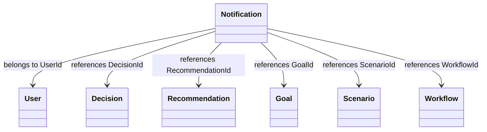
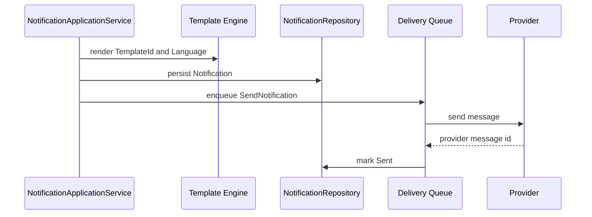
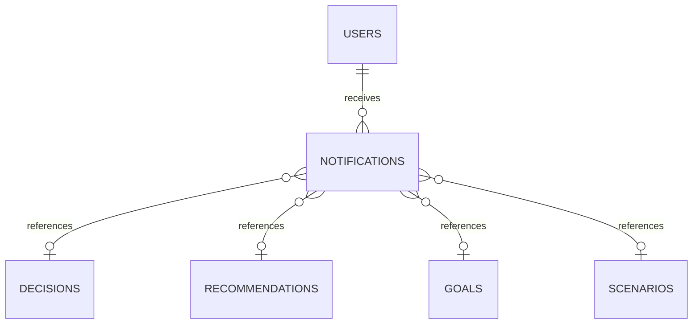
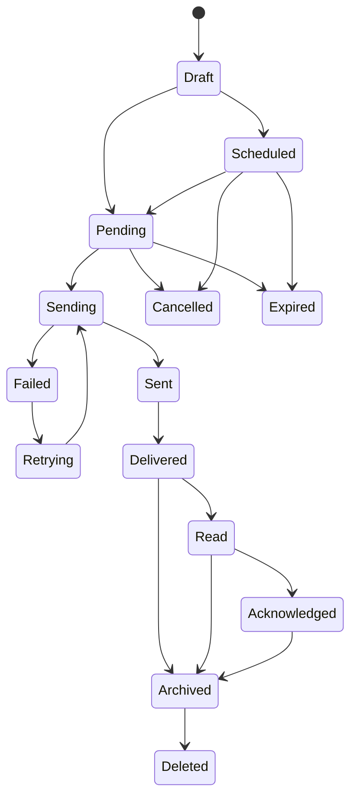

# Notification Entity Specification

# Document Control

Document Name: Notification Entity Specification

Document Path: knowledge/entity/Notification.md

Document Type: Enterprise Specification

Version: 1.0

Status: Canonical Specification

Domain: Platform

Bounded Context: Platform

Module: Notification

Owner: Project Atlas

Source of Truth: Atlas Knowledge Base

Last Updated: 2026-07-14

Related Specifications:

- knowledge/entity-catalog.md
- knowledge/aggregate-catalog.md
- knowledge/enumeration-catalog.md
- knowledge/repository-catalog.md
- knowledge/application-service-catalog.md
- knowledge/domain-service-catalog.md
- knowledge/command-catalog.md
- knowledge/domain-event-catalog.md

# Entity Overview

Purpose: Notification represents a user-visible alert, reminder, message, delivery instruction, and delivery status record inside Atlas Platform.

Responsibilities:

- Maintain Notification identity and NotificationNumber.
- Target exactly one User.
- Store notification type, category, priority, severity, channel, content, payload, and reference identity.
- Support in-app, email, sms, push, and webhook delivery through NotificationChannel.
- Track scheduling, sending, delivery, retry, read, acknowledgment, archive, deletion, expiration, and cancellation state.
- Preserve complete Delivery History through auditable status timestamps and provider identifiers.
- Preserve idempotency, optimistic concurrency, and delivery audit.
- Reference Decision, Recommendation, Goal, Scenario, ExecutionPlan, ActionPlan, Workflow, DomainEvent, and ScheduledJob by identity only.

Business Meaning: Notification is the Platform communication record used to present Atlas alerts, reminders, recommendation messages, decision updates, workflow messages, and scheduled job results to a User.

Aggregate Root: Yes. Entity Catalog defines Notification as the Notification aggregate root.

Lifecycle: Draft, Pending, Scheduled, Sending, Sent, Delivered, Read, Acknowledged, Expired, Cancelled, Archived, Deleted, Failed, Retrying.

Ownership: Notification aggregate owns notification content, delivery state, read state, acknowledgment state, retry state, archive state, deletion marker, provider delivery metadata, audit timestamps, Version, and ConcurrencyToken.

Relationships:

- User: Notification must belong to one User through UserId. Notification does not own User.
- Decision: Notification may reference Decision through DecisionId or ReferenceEntityType plus ReferenceEntityId. Notification does not mutate Decision.
- Recommendation: Notification may reference Recommendation through RecommendationId. Notification does not mutate Recommendation.
- Goal: Notification may reference Goal through GoalId. Notification does not mutate Goal.
- Scenario: Notification may reference Scenario through ScenarioId. Notification does not mutate Scenario.
- ExecutionPlan: Notification may reference ExecutionPlan through ExecutionPlanId. Notification does not own execution planning.
- ActionPlan: Notification may reference ActionPlan through ActionPlanId. Notification does not own action planning.
- Workflow: Notification may reference Workflow through WorkflowId. Notification does not own workflow execution.
- DomainEvent: Notification may be caused by DomainEvent through Payload, CorrelationId, CausationId, ReferenceEntityType, and ReferenceEntityId. Notification does not rewrite event history.
- ScheduledJob: Notification may be scheduled or retried by ScheduledJob through Payload and scheduling metadata. Notification does not own job execution.

Navigation:

- All cross-aggregate navigation uses identity references only.
- NotificationRepository loads Notification aggregate only.
- User feed queries may join projections but cannot mutate referenced aggregates.
- Provider delivery history is represented by Notification state and audit records.

# Complete Properties

## NotificationId

- Name: NotificationId; Type: Guid; Nullable: No; Default: Generated by application.
- Description: Stable technical identity of Notification.
- Validation: Required, unique, valid Guid, immutable.
- Business Meaning: Identifies one communication record across API, repository, event, audit, and delivery history.
- Example: 62f4d7f4-77c3-46bd-a47a-7e77b1dfc001.
- Database Mapping: notifications.notification_id uuid primary key; JSON Name: notificationId; API Usage: all detail, mutation, search, and command APIs.
- Searchable: Yes; Sortable: No; Indexed: Yes; Encrypted: No; Auditable: Yes.

## NotificationNumber

- Name: NotificationNumber; Type: String; Nullable: No; Default: Generated sequence.
- Description: User-facing or support-facing notification reference number.
- Validation: Required, unique, max length 64, immutable after creation.
- Business Meaning: Enables support lookup without exposing internal identity.
- Example: NOTIF-20260714-000001.
- Database Mapping: notifications.notification_number varchar(64) unique not null; JSON Name: notificationNumber; API Usage: detail, summary, search.
- Searchable: Yes; Sortable: Yes; Indexed: Yes; Encrypted: No; Auditable: Yes.

## UserId

- Name: UserId; Type: Guid; Nullable: No; Default: None.
- Description: User receiving the Notification.
- Validation: Required, valid Guid, authorized User scope.
- Business Meaning: Notification belongs to exactly one User.
- Example: b6a6d087-b8f8-4062-92ec-08b7fc5d64f4.
- Database Mapping: notifications.user_id uuid not null; JSON Name: userId; API Usage: create, detail, summary, search.
- Searchable: Yes; Sortable: No; Indexed: Yes; Encrypted: No; Auditable: Yes.

## NotificationType

- Name: NotificationType; Type: String; Nullable: No; Default: None.
- Description: Catalog-aligned notification purpose label.
- Validation: Required, non-blank, max length 64.
- Business Meaning: Classifies the message purpose without creating a new Domain.
- Example: RecommendationGenerated.
- Database Mapping: notifications.notification_type varchar(64) not null; JSON Name: notificationType; API Usage: create, update, detail, summary, search.
- Searchable: Yes; Sortable: Yes; Indexed: Yes; Encrypted: No; Auditable: Yes.

## Category

- Name: Category; Type: String; Nullable: No; Default: General.
- Description: Functional grouping for user feed and search.
- Validation: Required, max length 64.
- Business Meaning: Groups notifications such as Decision, Recommendation, Goal, Scenario, Workflow, and System.
- Example: Recommendation.
- Database Mapping: notifications.category varchar(64) not null; JSON Name: category; API Usage: create, update, detail, summary, search.
- Searchable: Yes; Sortable: Yes; Indexed: Yes; Encrypted: No; Auditable: Yes.

## Priority

- Name: Priority; Type: String; Nullable: No; Default: Medium.
- Description: Delivery and display priority.
- Validation: Required, allowed value Low, Medium, High, Critical.
- Business Meaning: Influences ordering, escalation, and delivery urgency.
- Example: High.
- Database Mapping: notifications.priority varchar(32) not null; JSON Name: priority; API Usage: create, update, detail, summary, search.
- Searchable: Yes; Sortable: Yes; Indexed: Yes; Encrypted: No; Auditable: Yes.

## Severity

- Name: Severity; Type: String; Nullable: No; Default: Info.
- Description: User-visible impact level.
- Validation: Required, allowed value Info, Warning, Error, Critical.
- Business Meaning: Indicates importance and risk of the message.
- Example: Warning.
- Database Mapping: notifications.severity varchar(32) not null; JSON Name: severity; API Usage: create, update, detail, summary, search.
- Searchable: Yes; Sortable: Yes; Indexed: Yes; Encrypted: No; Auditable: Yes.

## Channel

- Name: Channel; Type: NotificationChannel; Nullable: No; Default: InApp.
- Description: Delivery channel from Enumeration Catalog.
- Validation: Required; one of InApp, Email, Sms, Push, Webhook.
- Business Meaning: Determines delivery provider and transport behavior.
- Example: InApp.
- Database Mapping: notifications.channel varchar(32) not null; JSON Name: channel; API Usage: create, update, detail, summary, search, send.
- Searchable: Yes; Sortable: Yes; Indexed: Yes; Encrypted: No; Auditable: Yes.

## Title

- Name: Title; Type: String; Nullable: No; Default: None.
- Description: Primary message title.
- Validation: Required, trim, max length 256, no executable content.
- Business Meaning: Main user-visible notification subject.
- Example: New recommendation is ready.
- Database Mapping: notifications.title varchar(256) not null; JSON Name: title; API Usage: create, update before send, detail, summary.
- Searchable: Yes; Sortable: Yes; Indexed: Optional full text; Encrypted: No; Auditable: Yes.

## Subtitle

- Name: Subtitle; Type: String; Nullable: Yes; Default: null.
- Description: Secondary message title.
- Validation: Max length 256, no executable content.
- Business Meaning: Provides short context below Title.
- Example: Review your cash reserve plan.
- Database Mapping: notifications.subtitle varchar(256) null; JSON Name: subtitle; API Usage: create, update before send, detail, summary.
- Searchable: Yes; Sortable: No; Indexed: Optional full text; Encrypted: No; Auditable: Yes.

## Message

- Name: Message; Type: String; Nullable: No; Default: None.
- Description: Full notification body.
- Validation: Required, max length 4000, no executable content.
- Business Meaning: Communicates full details to the User.
- Example: Atlas generated a recommendation for your current scenario.
- Database Mapping: notifications.message text not null; JSON Name: message; API Usage: create, update before send, detail.
- Searchable: Yes; Sortable: No; Indexed: Optional full text; Encrypted: Conditional; Auditable: Yes.

## ShortMessage

- Name: ShortMessage; Type: String; Nullable: Yes; Default: null.
- Description: Compact body for feed rows and push previews.
- Validation: Max length 512, no executable content.
- Business Meaning: Enables concise delivery surfaces.
- Example: New recommendation ready.
- Database Mapping: notifications.short_message varchar(512) null; JSON Name: shortMessage; API Usage: create, update before send, summary.
- Searchable: Yes; Sortable: No; Indexed: Optional full text; Encrypted: Conditional; Auditable: Yes.

## RichContent

- Name: RichContent; Type: Json; Nullable: Yes; Default: null.
- Description: Structured content for supported client surfaces.
- Validation: Valid JSON object, allowed schema, no script payload.
- Business Meaning: Supports richer notification presentation without changing Domain.
- Example: {"actionLabel":"Review","actionUrl":"/recommendations/62"}.
- Database Mapping: notifications.rich_content jsonb null; JSON Name: richContent; API Usage: create, update before send, detail.
- Searchable: No; Sortable: No; Indexed: Optional jsonb path; Encrypted: Conditional; Auditable: Yes.

## Payload

- Name: Payload; Type: Json; Nullable: Yes; Default: null.
- Description: Internal structured context for routing, provider, and reference metadata.
- Validation: Valid JSON object, no secrets, no executable content.
- Business Meaning: Preserves causality and delivery context.
- Example: {"sourceEvent":"RecommendationGenerated"}.
- Database Mapping: notifications.payload jsonb null; JSON Name: payload; API Usage: create, detail for authorized service users.
- Searchable: No; Sortable: No; Indexed: Optional jsonb path; Encrypted: Conditional; Auditable: Yes.

## ReferenceEntityType

- Name: ReferenceEntityType; Type: String; Nullable: Yes; Default: null.
- Description: Referenced Atlas entity type.
- Validation: Max length 64; must match catalog entity name when present.
- Business Meaning: Provides generic source reference.
- Example: Recommendation.
- Database Mapping: notifications.reference_entity_type varchar(64) null; JSON Name: referenceEntityType; API Usage: create, detail, search.
- Searchable: Yes; Sortable: Yes; Indexed: Yes; Encrypted: No; Auditable: Yes.

## ReferenceEntityId

- Name: ReferenceEntityId; Type: Guid; Nullable: Yes; Default: null.
- Description: Referenced Atlas entity identity.
- Validation: Valid Guid when present; type must be supplied when id is supplied.
- Business Meaning: Connects Notification to a source object without ownership.
- Example: 7f3d29c6-6d0e-4f2c-bb46-bd3555d6d351.
- Database Mapping: notifications.reference_entity_id uuid null; JSON Name: referenceEntityId; API Usage: create, detail, search.
- Searchable: Yes; Sortable: No; Indexed: Yes; Encrypted: No; Auditable: Yes.

## RecommendationId

- Name: RecommendationId; Type: Guid; Nullable: Yes; Default: null.
- Description: Recommendation reference.
- Validation: Valid Guid when present; same authorization scope.
- Business Meaning: Links message to advisory output.
- Example: 7f3d29c6-6d0e-4f2c-bb46-bd3555d6d351.
- Database Mapping: notifications.recommendation_id uuid null; JSON Name: recommendationId; API Usage: create, detail, search.
- Searchable: Yes; Sortable: No; Indexed: Yes; Encrypted: No; Auditable: Yes.

## DecisionId

- Name: DecisionId; Type: Guid; Nullable: Yes; Default: null.
- Description: Decision reference.
- Validation: Valid Guid when present; same authorization scope.
- Business Meaning: Links message to Decision state or action.
- Example: 111d49c8-0957-42a2-a812-b736615fa2bb.
- Database Mapping: notifications.decision_id uuid null; JSON Name: decisionId; API Usage: create, detail, search.
- Searchable: Yes; Sortable: No; Indexed: Yes; Encrypted: No; Auditable: Yes.

## GoalId

- Name: GoalId; Type: Guid; Nullable: Yes; Default: null.
- Description: Goal reference.
- Validation: Valid Guid when present; same authorization scope.
- Business Meaning: Links message to Goal progress or conflict.
- Example: 3e1f27f4-4201-431d-bb4a-01d2e4aa94d8.
- Database Mapping: notifications.goal_id uuid null; JSON Name: goalId; API Usage: create, detail, search.
- Searchable: Yes; Sortable: No; Indexed: Yes; Encrypted: No; Auditable: Yes.

## ScenarioId

- Name: ScenarioId; Type: Guid; Nullable: Yes; Default: null.
- Description: Scenario reference.
- Validation: Valid Guid when present; same authorization scope.
- Business Meaning: Links message to evaluated Scenario.
- Example: 7b8f2309-4b51-4724-9fb7-927db4ee5d5d.
- Database Mapping: notifications.scenario_id uuid null; JSON Name: scenarioId; API Usage: create, detail, search.
- Searchable: Yes; Sortable: No; Indexed: Yes; Encrypted: No; Auditable: Yes.

## ExecutionPlanId

- Name: ExecutionPlanId; Type: Guid; Nullable: Yes; Default: null.
- Description: ExecutionPlan reference.
- Validation: Valid Guid when present; same authorization scope.
- Business Meaning: Links message to execution planning.
- Example: 49b48b7e-2f44-40d7-bd31-2eb6fe7f206d.
- Database Mapping: notifications.execution_plan_id uuid null; JSON Name: executionPlanId; API Usage: create, detail, search.
- Searchable: Yes; Sortable: No; Indexed: Yes; Encrypted: No; Auditable: Yes.

## ActionPlanId

- Name: ActionPlanId; Type: Guid; Nullable: Yes; Default: null.
- Description: ActionPlan reference.
- Validation: Valid Guid when present; same authorization scope.
- Business Meaning: Links message to planned action.
- Example: a0a0fe06-0352-45fb-bf56-15e2e4b29f10.
- Database Mapping: notifications.action_plan_id uuid null; JSON Name: actionPlanId; API Usage: create, detail, search.
- Searchable: Yes; Sortable: No; Indexed: Yes; Encrypted: No; Auditable: Yes.

## WorkflowId

- Name: WorkflowId; Type: Guid; Nullable: Yes; Default: null.
- Description: Workflow reference.
- Validation: Valid Guid when present.
- Business Meaning: Links message to workflow progress.
- Example: 9f09e1cc-9a85-4f90-8a2b-fdb898d91882.
- Database Mapping: notifications.workflow_id uuid null; JSON Name: workflowId; API Usage: create, detail, search.
- Searchable: Yes; Sortable: No; Indexed: Yes; Encrypted: No; Auditable: Yes.

## Status

- Name: Status; Type: String; Nullable: No; Default: Draft.
- Description: Notification lifecycle status.
- Validation: Required; allowed Draft, Pending, Scheduled, Sending, Sent, Delivered, Read, Acknowledged, Expired, Cancelled, Archived, Deleted, Failed, Retrying.
- Business Meaning: Controls delivery and user feed behavior.
- Example: Pending.
- Database Mapping: notifications.status varchar(32) not null; JSON Name: status; API Usage: detail, summary, search, all commands.
- Searchable: Yes; Sortable: Yes; Indexed: Yes; Encrypted: No; Auditable: Yes.

## ScheduledAt

- Name: ScheduledAt; Type: DateTimeOffset; Nullable: Yes; Default: null.
- Description: Delayed send time.
- Validation: Must be future time when scheduling.
- Business Meaning: Enables delayed delivery.
- Example: 2026-07-15T09:00:00+08:00.
- Database Mapping: notifications.scheduled_at timestamptz null; JSON Name: scheduledAt; API Usage: create, schedule, detail, search.
- Searchable: Yes; Sortable: Yes; Indexed: Yes; Encrypted: No; Auditable: Yes.

## SentAt

- Name: SentAt; Type: DateTimeOffset; Nullable: Yes; Default: null.
- Description: Time sent to provider or in-app feed.
- Validation: Required when Status is Sent, Delivered, Read, or Acknowledged.
- Business Meaning: Records delivery attempt success.
- Example: 2026-07-15T09:01:00+08:00.
- Database Mapping: notifications.sent_at timestamptz null; JSON Name: sentAt; API Usage: send, detail, search.
- Searchable: Yes; Sortable: Yes; Indexed: Yes; Encrypted: No; Auditable: Yes.

## DeliveredAt

- Name: DeliveredAt; Type: DateTimeOffset; Nullable: Yes; Default: null.
- Description: Time delivery was confirmed.
- Validation: Required when Status is Delivered, Read, or Acknowledged.
- Business Meaning: Confirms provider or client delivery.
- Example: 2026-07-15T09:01:10+08:00.
- Database Mapping: notifications.delivered_at timestamptz null; JSON Name: deliveredAt; API Usage: mark delivered, detail, search.
- Searchable: Yes; Sortable: Yes; Indexed: Yes; Encrypted: No; Auditable: Yes.

## ReadAt

- Name: ReadAt; Type: DateTimeOffset; Nullable: Yes; Default: null.
- Description: Time User read the Notification.
- Validation: Required when IsRead is true or Status is Read or Acknowledged.
- Business Meaning: Records user consumption.
- Example: 2026-07-15T09:05:00+08:00.
- Database Mapping: notifications.read_at timestamptz null; JSON Name: readAt; API Usage: read, detail, search.
- Searchable: Yes; Sortable: Yes; Indexed: Yes; Encrypted: No; Auditable: Yes.

## AcknowledgedAt

- Name: AcknowledgedAt; Type: DateTimeOffset; Nullable: Yes; Default: null.
- Description: Time User acknowledged the Notification.
- Validation: Requires ReadAt; required when IsAcknowledged is true.
- Business Meaning: Records explicit user confirmation.
- Example: 2026-07-15T09:06:00+08:00.
- Database Mapping: notifications.acknowledged_at timestamptz null; JSON Name: acknowledgedAt; API Usage: acknowledge, detail, search.
- Searchable: Yes; Sortable: Yes; Indexed: Yes; Encrypted: No; Auditable: Yes.

## ExpiredAt

- Name: ExpiredAt; Type: DateTimeOffset; Nullable: Yes; Default: null.
- Description: Time Notification expired.
- Validation: Required when Status is Expired.
- Business Meaning: Prevents obsolete delivery.
- Example: 2026-08-01T00:00:00+08:00.
- Database Mapping: notifications.expired_at timestamptz null; JSON Name: expiredAt; API Usage: expire, detail, search.
- Searchable: Yes; Sortable: Yes; Indexed: Yes; Encrypted: No; Auditable: Yes.

## RetryCount

- Name: RetryCount; Type: Int32; Nullable: No; Default: 0.
- Description: Number of delivery retries attempted.
- Validation: Greater than or equal to 0 and less than or equal to MaxRetryCount.
- Business Meaning: Controls provider retry behavior.
- Example: 2.
- Database Mapping: notifications.retry_count integer not null; JSON Name: retryCount; API Usage: retry, detail, search.
- Searchable: Yes; Sortable: Yes; Indexed: Yes; Encrypted: No; Auditable: Yes.

## MaxRetryCount

- Name: MaxRetryCount; Type: Int32; Nullable: No; Default: 3.
- Description: Maximum allowed retry attempts.
- Validation: Greater than or equal to 0 and less than or equal to 10.
- Business Meaning: Prevents unbounded delivery attempts.
- Example: 3.
- Database Mapping: notifications.max_retry_count integer not null; JSON Name: maxRetryCount; API Usage: create, update before send, retry, detail.
- Searchable: No; Sortable: Yes; Indexed: No; Encrypted: No; Auditable: Yes.

## NextRetryAt

- Name: NextRetryAt; Type: DateTimeOffset; Nullable: Yes; Default: null.
- Description: Next retry schedule time.
- Validation: Required when Status is Retrying.
- Business Meaning: Supports delayed retry and scheduler coordination.
- Example: 2026-07-15T09:10:00+08:00.
- Database Mapping: notifications.next_retry_at timestamptz null; JSON Name: nextRetryAt; API Usage: retry, detail, search.
- Searchable: Yes; Sortable: Yes; Indexed: Yes; Encrypted: No; Auditable: Yes.

## Provider

- Name: Provider; Type: String; Nullable: Yes; Default: null.
- Description: Delivery provider name.
- Validation: Max length 128 when present.
- Business Meaning: Identifies external or internal delivery route.
- Example: InAppProvider.
- Database Mapping: notifications.provider varchar(128) null; JSON Name: provider; API Usage: send, retry, detail, search.
- Searchable: Yes; Sortable: Yes; Indexed: Yes; Encrypted: No; Auditable: Yes.

## ProviderMessageId

- Name: ProviderMessageId; Type: String; Nullable: Yes; Default: null.
- Description: External provider message identifier.
- Validation: Max length 256; unique with Provider when present.
- Business Meaning: Supports delivery reconciliation and idempotency.
- Example: msg_01J2Y8Z7.
- Database Mapping: notifications.provider_message_id varchar(256) null; JSON Name: providerMessageId; API Usage: send, retry, detail.
- Searchable: Yes; Sortable: No; Indexed: Yes; Encrypted: Conditional; Auditable: Yes.

## TemplateId

- Name: TemplateId; Type: String; Nullable: Yes; Default: null.
- Description: Template identifier used to render content.
- Validation: Max length 128; template must exist when supplied.
- Business Meaning: Links content to Template Engine output.
- Example: recommendation-generated-v1.
- Database Mapping: notifications.template_id varchar(128) null; JSON Name: templateId; API Usage: create, detail, search.
- Searchable: Yes; Sortable: Yes; Indexed: Yes; Encrypted: No; Auditable: Yes.

## Language

- Name: Language; Type: String; Nullable: No; Default: en-US.
- Description: Language tag used for rendering.
- Validation: Required, max length 16, valid language tag.
- Business Meaning: Supports localized notification content.
- Example: zh-TW.
- Database Mapping: notifications.language varchar(16) not null; JSON Name: language; API Usage: create, update before send, detail, search.
- Searchable: Yes; Sortable: Yes; Indexed: Yes; Encrypted: No; Auditable: Yes.

## IsRead

- Name: IsRead; Type: Boolean; Nullable: No; Default: false.
- Description: Read flag.
- Validation: Cannot change from true to false.
- Business Meaning: Supports unread counts and feed filtering.
- Example: true.
- Database Mapping: notifications.is_read boolean not null; JSON Name: isRead; API Usage: read, unread count, detail, summary, search.
- Searchable: Yes; Sortable: Yes; Indexed: Yes; Encrypted: No; Auditable: Yes.

## IsAcknowledged

- Name: IsAcknowledged; Type: Boolean; Nullable: No; Default: false.
- Description: Acknowledgment flag.
- Validation: Requires IsRead true.
- Business Meaning: Records explicit user acknowledgment.
- Example: false.
- Database Mapping: notifications.is_acknowledged boolean not null; JSON Name: isAcknowledged; API Usage: acknowledge, detail, summary, search.
- Searchable: Yes; Sortable: Yes; Indexed: Yes; Encrypted: No; Auditable: Yes.

## IsArchived

- Name: IsArchived; Type: Boolean; Nullable: No; Default: false.
- Description: Archive flag.
- Validation: Archived notifications hidden from active feed.
- Business Meaning: Removes Notification from normal feed without deleting history.
- Example: false.
- Database Mapping: notifications.is_archived boolean not null; JSON Name: isArchived; API Usage: archive, restore, detail, search.
- Searchable: Yes; Sortable: Yes; Indexed: Yes; Encrypted: No; Auditable: Yes.

## IsDeleted

- Name: IsDeleted; Type: Boolean; Nullable: No; Default: false.
- Description: Soft delete flag.
- Validation: Deleted notifications cannot be sent, retried, read, acknowledged, or restored unless policy permits.
- Business Meaning: Removes Notification from user access while preserving audit.
- Example: false.
- Database Mapping: notifications.is_deleted boolean not null; JSON Name: isDeleted; API Usage: delete, detail for audit, search for audit.
- Searchable: Yes; Sortable: Yes; Indexed: Yes; Encrypted: No; Auditable: Yes.

## IsSystem

- Name: IsSystem; Type: Boolean; Nullable: No; Default: false.
- Description: Indicates system-generated Notification.
- Validation: System actor required when true.
- Business Meaning: Distinguishes system notifications from user-created communication.
- Example: true.
- Database Mapping: notifications.is_system boolean not null; JSON Name: isSystem; API Usage: create, detail, summary, search.
- Searchable: Yes; Sortable: Yes; Indexed: Yes; Encrypted: No; Auditable: Yes.

## CreatedAt

- Name: CreatedAt; Type: DateTimeOffset; Nullable: No; Default: Current timestamp.
- Description: Creation timestamp.
- Validation: Required, immutable.
- Business Meaning: Establishes notification creation time.
- Example: 2026-07-14T10:00:00+08:00.
- Database Mapping: notifications.created_at timestamptz not null; JSON Name: createdAt; API Usage: detail, summary, search.
- Searchable: Yes; Sortable: Yes; Indexed: Yes; Encrypted: No; Auditable: Yes.

## CreatedBy

- Name: CreatedBy; Type: Guid; Nullable: No; Default: ActorId or system actor.
- Description: Creator actor identity.
- Validation: Required, valid actor reference.
- Business Meaning: Supports audit attribution.
- Example: 00000000-0000-0000-0000-000000000001.
- Database Mapping: notifications.created_by uuid not null; JSON Name: createdBy; API Usage: detail and audit.
- Searchable: Yes; Sortable: No; Indexed: Yes; Encrypted: No; Auditable: Yes.

## UpdatedAt

- Name: UpdatedAt; Type: DateTimeOffset; Nullable: No; Default: Current timestamp.
- Description: Last mutation timestamp.
- Validation: Required; greater than or equal to CreatedAt.
- Business Meaning: Supports ordering, cache invalidation, and audit.
- Example: 2026-07-14T10:05:00+08:00.
- Database Mapping: notifications.updated_at timestamptz not null; JSON Name: updatedAt; API Usage: detail, summary, search.
- Searchable: Yes; Sortable: Yes; Indexed: Yes; Encrypted: No; Auditable: Yes.

## UpdatedBy

- Name: UpdatedBy; Type: Guid; Nullable: Yes; Default: null.
- Description: Last mutation actor identity.
- Validation: Valid actor reference when present.
- Business Meaning: Supports mutation audit attribution.
- Example: b6a6d087-b8f8-4062-92ec-08b7fc5d64f4.
- Database Mapping: notifications.updated_by uuid null; JSON Name: updatedBy; API Usage: detail and audit.
- Searchable: Yes; Sortable: No; Indexed: Yes; Encrypted: No; Auditable: Yes.

## Version

- Name: Version; Type: Int64; Nullable: No; Default: 1.
- Description: Aggregate version.
- Validation: Required; increments on every mutation.
- Business Meaning: Supports event ordering and audit versioning.
- Example: 5.
- Database Mapping: notifications.version bigint not null; JSON Name: version; API Usage: update and all mutation commands.
- Searchable: No; Sortable: Yes; Indexed: No; Encrypted: No; Auditable: Yes.

## ConcurrencyToken

- Name: ConcurrencyToken; Type: String; Nullable: No; Default: Generated token.
- Description: Optimistic concurrency token.
- Validation: Required; must match on mutation; regenerated after mutation.
- Business Meaning: Prevents lost updates.
- Example: 01J2Y8Z7ABCD.
- Database Mapping: notifications.concurrency_token varchar(128) not null; JSON Name: concurrencyToken; API Usage: update and all mutation commands.
- Searchable: No; Sortable: No; Indexed: Yes; Encrypted: No; Auditable: Yes.

# Validation Rules

| Rule ID | Validation |
|---|---|
| NOTIF-VR-001 | NotificationId is required, unique, valid, and immutable. |
| NOTIF-VR-002 | NotificationNumber is required, unique, and immutable. |
| NOTIF-VR-003 | UserId is required and must reference an authorized User. |
| NOTIF-VR-004 | NotificationType is required and max length 64. |
| NOTIF-VR-005 | Category is required and max length 64. |
| NOTIF-VR-006 | Priority is required and must be Low, Medium, High, or Critical. |
| NOTIF-VR-007 | Severity is required and must be Info, Warning, Error, or Critical. |
| NOTIF-VR-008 | Channel is required and must be InApp, Email, Sms, Push, or Webhook. |
| NOTIF-VR-009 | Title is required and max length 256. |
| NOTIF-VR-010 | Message is required and max length 4000. |
| NOTIF-VR-011 | ShortMessage max length is 512. |
| NOTIF-VR-012 | RichContent and Payload must be valid JSON when present. |
| NOTIF-VR-013 | ReferenceEntityType must match a catalog entity name when present. |
| NOTIF-VR-014 | ReferenceEntityId requires ReferenceEntityType. |
| NOTIF-VR-015 | Referenced Decision, Recommendation, Goal, Scenario, ExecutionPlan, ActionPlan, and Workflow identities must remain identity references only. |
| NOTIF-VR-016 | Status must follow the Notification state machine. |
| NOTIF-VR-017 | ScheduledAt must be present when Status is Scheduled. |
| NOTIF-VR-018 | SentAt must be present when Status is Sent, Delivered, Read, or Acknowledged. |
| NOTIF-VR-019 | DeliveredAt must be present when Status is Delivered, Read, or Acknowledged. |
| NOTIF-VR-020 | ReadAt must be present when IsRead is true. |
| NOTIF-VR-021 | AcknowledgedAt requires ReadAt and IsRead true. |
| NOTIF-VR-022 | ExpiredAt must be present when Status is Expired. |
| NOTIF-VR-023 | RetryCount must be between 0 and MaxRetryCount. |
| NOTIF-VR-024 | MaxRetryCount must be between 0 and 10. |
| NOTIF-VR-025 | NextRetryAt must be present when Status is Retrying. |
| NOTIF-VR-026 | ProviderMessageId must be unique per Provider when present. |
| NOTIF-VR-027 | Sent Notification content cannot be modified. |
| NOTIF-VR-028 | Deleted Notification cannot be sent, retried, read, or acknowledged. |
| NOTIF-VR-029 | Expired Notification cannot be delivered again. |
| NOTIF-VR-030 | IsRead cannot change from true to false. |
| NOTIF-VR-031 | IsAcknowledged requires IsRead. |
| NOTIF-VR-032 | Version and ConcurrencyToken must match for mutation. |
| NOTIF-VR-033 | Correlated commands must provide idempotency key when mutating through batch or delivery APIs. |
| NOTIF-VR-034 | Active feed excludes IsArchived and IsDeleted records by default. |
| NOTIF-VR-035 | Sensitive payload content must not be logged outside audit policy. |

# Business Rules

1. Notification must belong to one User.
2. Notification must specify NotificationType.
3. Notification must specify Priority.
4. Notification must specify Severity.
5. Notification must specify Channel.
6. Sent Notification content cannot be modified.
7. Deleted Notification cannot be sent again.
8. Expired Notification cannot be delivered again.
9. RetryCount must not exceed MaxRetryCount.
10. Read Notification cannot return to Unread.
11. Acknowledged Notification must be Read first.
12. Notification may be delayed by ScheduledAt.
13. Notification may be created in batch.
14. Notification may be sent in batch.
15. Notification may be archived in batch.
16. Notification supports idempotency.
17. Notification preserves complete audit.
18. Notification preserves complete Delivery History.
19. Notification may reference Decision by identity.
20. Notification may reference Recommendation by identity.
21. Notification may reference Goal by identity.
22. Notification may reference Scenario by identity.
23. Notification may reference ExecutionPlan by identity.
24. Notification may reference ActionPlan by identity.
25. Notification may reference Workflow by identity.
26. Notification may be caused by DomainEvent.
27. Notification may be sent by ScheduledJob, Scheduler, or Background Job.
28. Notification cannot mutate referenced entities.
29. NotificationRepository cannot contain delivery provider business logic.
30. Delivery provider callbacks must be idempotent.
31. Batch commands must preserve per-record result and audit.
32. Archive hides Notification from active feed.
33. Delete is soft delete unless retention policy approves physical deletion.
34. System Notification requires system actor.
35. ProviderMessageId must support reconciliation.
36. Template rendering must occur before send or schedule.
37. Language controls localized template rendering.
38. User permission must be checked before detail, search, read, acknowledge, archive, restore, or delete.
39. Queue delivery must preserve CorrelationId and CausationId.
40. Failed Notification may retry only when retry limit and state permit retry.

# State Machine

| State | Transition | Trigger | Invariant | Illegal Transition |
|---|---|---|---|---|
| Draft | Draft to Pending | CreateNotification | Required content exists | Draft to Delivered |
| Draft | Draft to Scheduled | ScheduleNotification | ScheduledAt future | Draft to Read |
| Pending | Pending to Sending | SendNotification | Not deleted or expired | Pending to Acknowledged |
| Scheduled | Scheduled to Pending | Scheduler due | ScheduledAt reached | Scheduled to Delivered |
| Sending | Sending to Sent | Provider accepted | SentAt set | Sending to Read |
| Sending | Sending to Failed | Provider failed | Failure audit set | Sending to Archived |
| Sent | Sent to Delivered | MarkAsDelivered | SentAt set | Sent to Draft |
| Sent | Sent to Failed | Provider failure callback | SentAt preserved | Sent to Pending |
| Delivered | Delivered to Read | MarkAsRead | DeliveredAt set | Delivered to Pending |
| Read | Read to Acknowledged | AcknowledgeNotification | ReadAt set | Read to Pending |
| Pending | Pending to Cancelled | CancelNotification | Not sending | Pending to Delivered |
| Scheduled | Scheduled to Cancelled | CancelNotification | Not sent | Scheduled to Sent |
| Pending | Pending to Expired | ExpireNotification | ExpiredAt set | Pending to Delivered |
| Scheduled | Scheduled to Expired | ExpireNotification | ExpiredAt set | Scheduled to Sent |
| Failed | Failed to Retrying | RetryNotification | RetryCount < MaxRetryCount | Failed to Delivered |
| Retrying | Retrying to Sending | Scheduler due | NextRetryAt reached | Retrying to Read |
| Any non-deleted | Any to Archived | ArchiveNotification | IsArchived true | Deleted to Archived |
| Archived | Archived to Pending | RestoreNotification | IsDeleted false | Archived to Sent |
| Any non-deleted | Any to Deleted | DeleteNotification | IsDeleted true | Deleted to Sent |

# Commands

| Command | Handler | Repository | Result | Event |
|---|---|---|---|---|
| CreateNotification | CreateNotificationCommandHandler | NotificationRepository | NotificationDetailDto | NotificationCreated |
| UpdateNotification | UpdateNotificationCommandHandler | NotificationRepository | NotificationDetailDto | NotificationUpdated |
| ScheduleNotification | ScheduleNotificationCommandHandler | NotificationRepository | CommandResult | NotificationScheduled |
| SendNotification | SendNotificationCommandHandler | NotificationRepository | CommandResult | NotificationSent or NotificationFailed |
| RetryNotification | RetryNotificationCommandHandler | NotificationRepository | CommandResult | NotificationRetrying |
| MarkAsDelivered | MarkAsDeliveredCommandHandler | NotificationRepository | CommandResult | NotificationDelivered |
| MarkAsRead | MarkAsReadCommandHandler | NotificationRepository | CommandResult | NotificationRead |
| AcknowledgeNotification | AcknowledgeNotificationCommandHandler | NotificationRepository | CommandResult | NotificationAcknowledged |
| ArchiveNotification | ArchiveNotificationCommandHandler | NotificationRepository | CommandResult | NotificationArchived |
| RestoreNotification | RestoreNotificationCommandHandler | NotificationRepository | CommandResult | NotificationRestored |
| DeleteNotification | DeleteNotificationCommandHandler | NotificationRepository | CommandResult | NotificationDeleted |
| CancelNotification | CancelNotificationCommandHandler | NotificationRepository | CommandResult | NotificationCancelled |
| ExpireNotification | ExpireNotificationCommandHandler | NotificationRepository | CommandResult | NotificationExpired |
| BatchCreateNotification | BatchCreateNotificationCommandHandler | NotificationRepository | BatchCommandResult | NotificationCreated |
| BatchSendNotification | BatchSendNotificationCommandHandler | NotificationRepository | BatchCommandResult | NotificationSent, NotificationFailed |
| BatchArchiveNotification | BatchArchiveNotificationCommandHandler | NotificationRepository | BatchCommandResult | NotificationArchived |
| BatchDeleteNotification | BatchDeleteNotificationCommandHandler | NotificationRepository | BatchCommandResult | NotificationDeleted |
| BatchReadNotification | BatchReadNotificationCommandHandler | NotificationRepository | BatchCommandResult | NotificationRead |

# Domain Events

| Event | Publisher | Payload |
|---|---|---|
| NotificationCreated | Notification | NotificationId, UserId, Channel, Status, CorrelationId |
| NotificationUpdated | Notification | NotificationId, ChangedFields, Version |
| NotificationScheduled | Notification | NotificationId, ScheduledAt |
| NotificationSent | Notification | NotificationId, Provider, ProviderMessageId, SentAt |
| NotificationDelivered | Notification | NotificationId, DeliveredAt |
| NotificationRead | Notification | NotificationId, UserId, ReadAt |
| NotificationAcknowledged | Notification | NotificationId, UserId, AcknowledgedAt |
| NotificationExpired | Notification | NotificationId, ExpiredAt |
| NotificationRetrying | Notification | NotificationId, RetryCount, NextRetryAt |
| NotificationFailed | Notification | NotificationId, RetryCount, Provider, FailureCode |
| NotificationArchived | Notification | NotificationId, ArchivedAt |
| NotificationRestored | Notification | NotificationId, RestoredAt |
| NotificationDeleted | Notification | NotificationId, DeletedAt |
| NotificationCancelled | Notification | NotificationId, CancelledAt |
| NotificationStatusChanged | Notification | NotificationId, PreviousStatus, NewStatus, Version |
| StatusChanged | Notification | NotificationId, PreviousStatus, NewStatus |
| RecommendationGenerated | Recommendation | May cause NotificationCreated |
| DecisionAccepted | DecisionSession | May cause NotificationCreated |
| DecisionRejected | DecisionSession | May cause NotificationCreated |
| ScenarioEvaluated | Scenario | May cause NotificationCreated |
| ReplayCompleted | Scenario | May cause NotificationCreated |

# Repository

Interface: INotificationRepository

Methods:

- GetByIdAsync(NotificationId, UserId)
- GetByNumberAsync(NotificationNumber)
- AddAsync(Notification)
- AddRangeAsync(IReadOnlyCollection<Notification>)
- UpdateAsync(Notification, ConcurrencyToken)
- ArchiveAsync(NotificationId, ConcurrencyToken)
- RestoreAsync(NotificationId, ConcurrencyToken)
- SoftDeleteAsync(NotificationId, ConcurrencyToken)
- SaveChangesAsync()

Query Methods:

- SearchAsync(NotificationSearchSpecification)
- FindUnreadByUserAsync(UserId)
- CountUnreadByUserAsync(UserId)
- FindDueScheduledAsync(now, limit)
- FindDueRetryAsync(now, limit)
- FindByReferenceAsync(ReferenceEntityType, ReferenceEntityId)
- FindByRecommendationAsync(RecommendationId)
- FindByDecisionAsync(DecisionId)
- FindByGoalAsync(GoalId)
- FindByScenarioAsync(ScenarioId)
- FindByWorkflowAsync(WorkflowId)
- FindArchivedAsync(UserId)
- FindDeletedForAuditAsync(UserId)

Specification Pattern:

- NotificationByUserSpecification
- NotificationByStatusSpecification
- NotificationByChannelSpecification
- NotificationByPrioritySpecification
- NotificationBySeveritySpecification
- NotificationByReferenceSpecification
- NotificationByScheduleSpecification
- NotificationByRetrySpecification
- NotificationUnreadSpecification
- NotificationArchivedSpecification
- NotificationActiveFeedSpecification
- NotificationSearchSpecification

# Domain Service Interaction

| Service | Interaction |
|---|---|
| Notification Service | Creates, schedules, sends, retries, reads, acknowledges, archives, restores, deletes, and expires Notifications. |
| Decision Engine | Produces Decision state changes that may cause Notification creation. |
| Recommendation Engine | Produces Recommendation messages and references RecommendationId. |
| Workflow Engine | Creates Workflow notifications and consumes Notification acknowledgment when workflow requires confirmation. |
| Scheduler | Finds Scheduled and Retrying notifications due for processing. |
| Background Job | Performs batch send, batch archive, batch delete, expiration, and retry processing. |
| Execution Planning | Creates notifications linked to ExecutionPlanId and ActionPlanId. |
| Template Engine | Renders Title, Subtitle, Message, ShortMessage, and RichContent from TemplateId and Payload. |
| Localization Service | Selects Language-specific template content. |
| Audit Service | Records command, event, delivery, provider, and status history. |
| Permission Service | Enforces User and Household scope and Notification permissions. |

# Application Service Interaction

- NotificationApplicationService handles all Notification commands and query orchestration.
- DecisionApplicationService may request Notification creation for Decision events.
- ScenarioApplicationService may request Notification creation for Scenario evaluation results.
- GoalApplicationService may request Notification creation for Goal alerts.
- WorkflowApplicationService may request and react to Notification acknowledgment.
- ExecutionPlanningApplicationService may request Notifications for ExecutionPlan and ActionPlan events.
- AuditApplicationService stores audit records and delivery history.
- SchedulerApplicationService invokes due Scheduled and Retrying notifications.
- BackgroundJobApplicationService invokes batch delivery and cleanup.
- SearchApplicationService updates Notification search projections.
- CacheApplicationService invalidates feed, unread count, and detail cache.

# API

| Endpoint | Method | Request | Response | Error |
|---|---|---|---|---|
| /api/v1/notifications | POST | CreateNotificationDto | NotificationDetailDto | 400, 401, 403, 409, 422 |
| /api/v1/notifications/{notificationId} | GET | Route id | NotificationDetailDto | 401, 403, 404 |
| /api/v1/notifications/{notificationId} | PUT | UpdateNotificationDto | NotificationDetailDto | 400, 401, 403, 404, 409, 422 |
| /api/v1/notifications/{notificationId} | DELETE | DeleteNotificationDto | CommandResult | 401, 403, 404, 409 |
| /api/v1/notifications/search | POST | NotificationSearchDto | NotificationSearchResultDto | 400, 401, 403 |
| /api/v1/notifications/unread | GET | Query userId | UnreadNotificationCountDto | 401, 403 |
| /api/v1/notifications/{notificationId}/read | POST | ReadNotificationDto | CommandResult | 400, 401, 403, 404, 409 |
| /api/v1/notifications/{notificationId}/archive | POST | ArchiveNotificationDto | CommandResult | 400, 401, 403, 404, 409 |
| /api/v1/notifications/{notificationId}/restore | POST | RestoreNotificationDto | CommandResult | 400, 401, 403, 404, 409 |
| /api/v1/notifications/{notificationId}/schedule | POST | ScheduleNotificationDto | CommandResult | 400, 401, 403, 404, 409 |
| /api/v1/notifications/{notificationId}/retry | POST | RetryNotificationDto | CommandResult | 400, 401, 403, 404, 409 |
| /api/v1/notifications/{notificationId}/acknowledge | POST | AcknowledgeNotificationDto | CommandResult | 400, 401, 403, 404, 409 |
| /api/v1/notifications/batch/send | POST | BatchSendNotificationDto | BatchCommandResult | 400, 401, 403, 409 |
| /api/v1/notifications/batch/archive | POST | BatchArchiveNotificationDto | BatchCommandResult | 400, 401, 403, 409 |
| /api/v1/notifications/batch/delete | POST | BatchDeleteNotificationDto | BatchCommandResult | 400, 401, 403, 409 |
| /api/v1/notifications/batch/read | POST | BatchReadNotificationDto | BatchCommandResult | 400, 401, 403, 409 |

# DTO

Create DTO: CreateNotificationDto includes userId, notificationType, category, priority, severity, channel, title, subtitle, message, shortMessage, richContent, payload, references, templateId, language, scheduledAt, maxRetryCount, isSystem, idempotencyKey.

Update DTO: UpdateNotificationDto includes title, subtitle, message, shortMessage, richContent, payload, priority, severity, scheduledAt, templateId, language, version, concurrencyToken.

Detail DTO: NotificationDetailDto includes all properties and permission flags.

Summary DTO: NotificationSummaryDto includes notificationId, notificationNumber, userId, notificationType, category, priority, severity, channel, title, shortMessage, reference fields, status, scheduledAt, sentAt, readAt, isRead, isAcknowledged, isArchived, updatedAt, version.

Search DTO: NotificationSearchDto includes userId, notificationType, category, priority, severity, channel, status, reference fields, isRead, isAcknowledged, isArchived, isDeleted, scheduledBefore, sentAfter, createdAfter, page, pageSize, sortBy, sortDirection.

Read DTO: ReadNotificationDto includes notificationId, readAt, version, concurrencyToken, idempotencyKey.

Retry DTO: RetryNotificationDto includes notificationId, nextRetryAt, version, concurrencyToken, idempotencyKey.

Schedule DTO: ScheduleNotificationDto includes notificationId, scheduledAt, version, concurrencyToken, idempotencyKey.

Archive DTO: ArchiveNotificationDto includes notificationId, reason, version, concurrencyToken, idempotencyKey.

# Database Mapping

Table: notifications

Columns: notification_id, notification_number, user_id, notification_type, category, priority, severity, channel, title, subtitle, message, short_message, rich_content, payload, reference_entity_type, reference_entity_id, recommendation_id, decision_id, goal_id, scenario_id, execution_plan_id, action_plan_id, workflow_id, status, scheduled_at, sent_at, delivered_at, read_at, acknowledged_at, expired_at, retry_count, max_retry_count, next_retry_at, provider, provider_message_id, template_id, language, is_read, is_acknowledged, is_archived, is_deleted, is_system, created_at, created_by, updated_at, updated_by, version, concurrency_token.

FK: user_id references users when enforced; reference ids are catalog identity references; provider_message_id has no FK.

Unique: notification_id primary key; notification_number unique; provider plus provider_message_id unique when provider_message_id is present.

Check Constraint: status values, channel values, priority values, severity values, retry range, acknowledgment requires read, scheduled status requires ScheduledAt, expired status requires ExpiredAt.

Index: user feed, unread count, status, channel, priority, severity, schedule, retry, references, provider message, active feed, archive, delete, created, updated.

# PostgreSQL Schema

```sql
CREATE TABLE notifications (
  notification_id uuid PRIMARY KEY,
  notification_number varchar(64) NOT NULL UNIQUE,
  user_id uuid NOT NULL,
  notification_type varchar(64) NOT NULL,
  category varchar(64) NOT NULL DEFAULT 'General',
  priority varchar(32) NOT NULL DEFAULT 'Medium',
  severity varchar(32) NOT NULL DEFAULT 'Info',
  channel varchar(32) NOT NULL DEFAULT 'InApp',
  title varchar(256) NOT NULL,
  subtitle varchar(256) NULL,
  message text NOT NULL,
  short_message varchar(512) NULL,
  rich_content jsonb NULL,
  payload jsonb NULL,
  reference_entity_type varchar(64) NULL,
  reference_entity_id uuid NULL,
  recommendation_id uuid NULL,
  decision_id uuid NULL,
  goal_id uuid NULL,
  scenario_id uuid NULL,
  execution_plan_id uuid NULL,
  action_plan_id uuid NULL,
  workflow_id uuid NULL,
  status varchar(32) NOT NULL DEFAULT 'Draft',
  scheduled_at timestamptz NULL,
  sent_at timestamptz NULL,
  delivered_at timestamptz NULL,
  read_at timestamptz NULL,
  acknowledged_at timestamptz NULL,
  expired_at timestamptz NULL,
  retry_count integer NOT NULL DEFAULT 0,
  max_retry_count integer NOT NULL DEFAULT 3,
  next_retry_at timestamptz NULL,
  provider varchar(128) NULL,
  provider_message_id varchar(256) NULL,
  template_id varchar(128) NULL,
  language varchar(16) NOT NULL DEFAULT 'en-US',
  is_read boolean NOT NULL DEFAULT false,
  is_acknowledged boolean NOT NULL DEFAULT false,
  is_archived boolean NOT NULL DEFAULT false,
  is_deleted boolean NOT NULL DEFAULT false,
  is_system boolean NOT NULL DEFAULT false,
  created_at timestamptz NOT NULL DEFAULT now(),
  created_by uuid NOT NULL,
  updated_at timestamptz NOT NULL DEFAULT now(),
  updated_by uuid NULL,
  version bigint NOT NULL DEFAULT 1,
  concurrency_token varchar(128) NOT NULL,
  CONSTRAINT ck_notifications_channel CHECK (channel IN ('InApp','Email','Sms','Push','Webhook')),
  CONSTRAINT ck_notifications_priority CHECK (priority IN ('Low','Medium','High','Critical')),
  CONSTRAINT ck_notifications_severity CHECK (severity IN ('Info','Warning','Error','Critical')),
  CONSTRAINT ck_notifications_status CHECK (status IN ('Draft','Pending','Scheduled','Sending','Sent','Delivered','Read','Acknowledged','Expired','Cancelled','Archived','Deleted','Failed','Retrying')),
  CONSTRAINT ck_notifications_retry CHECK (retry_count >= 0 AND max_retry_count >= 0 AND max_retry_count <= 10 AND retry_count <= max_retry_count),
  CONSTRAINT ck_notifications_ack_read CHECK (is_acknowledged = false OR is_read = true),
  CONSTRAINT ck_notifications_reference CHECK (reference_entity_id IS NULL OR reference_entity_type IS NOT NULL),
  CONSTRAINT ck_notifications_scheduled CHECK (status <> 'Scheduled' OR scheduled_at IS NOT NULL),
  CONSTRAINT ck_notifications_expired CHECK (status <> 'Expired' OR expired_at IS NOT NULL),
  CONSTRAINT ck_notifications_retrying CHECK (status <> 'Retrying' OR next_retry_at IS NOT NULL)
);

CREATE UNIQUE INDEX ux_notifications_provider_message ON notifications (provider, provider_message_id) WHERE provider_message_id IS NOT NULL;
CREATE INDEX ix_notifications_user_feed ON notifications (user_id, is_deleted, is_archived, created_at DESC);
CREATE INDEX ix_notifications_unread ON notifications (user_id, is_read, is_deleted, is_archived);
CREATE INDEX ix_notifications_status ON notifications (status);
CREATE INDEX ix_notifications_channel ON notifications (channel);
CREATE INDEX ix_notifications_priority ON notifications (priority);
CREATE INDEX ix_notifications_severity ON notifications (severity);
CREATE INDEX ix_notifications_schedule ON notifications (scheduled_at) WHERE status = 'Scheduled';
CREATE INDEX ix_notifications_retry ON notifications (next_retry_at) WHERE status = 'Retrying';
CREATE INDEX ix_notifications_reference ON notifications (reference_entity_type, reference_entity_id);
CREATE INDEX ix_notifications_recommendation ON notifications (recommendation_id);
CREATE INDEX ix_notifications_decision ON notifications (decision_id);
CREATE INDEX ix_notifications_goal ON notifications (goal_id);
CREATE INDEX ix_notifications_scenario ON notifications (scenario_id);
CREATE INDEX ix_notifications_workflow ON notifications (workflow_id);
CREATE INDEX ix_notifications_updated ON notifications (updated_at DESC, notification_id);
```

# EF Core Mapping

Fluent API:

```csharp
builder.ToTable("notifications");
builder.HasKey(x => x.NotificationId);
builder.Property(x => x.NotificationId).HasColumnName("notification_id").ValueGeneratedNever();
builder.Property(x => x.NotificationNumber).HasColumnName("notification_number").HasMaxLength(64).IsRequired();
builder.Property(x => x.UserId).HasColumnName("user_id").IsRequired();
builder.Property(x => x.NotificationType).HasColumnName("notification_type").HasMaxLength(64).IsRequired();
builder.Property(x => x.Category).HasColumnName("category").HasMaxLength(64).IsRequired();
builder.Property(x => x.Priority).HasColumnName("priority").HasMaxLength(32).IsRequired();
builder.Property(x => x.Severity).HasColumnName("severity").HasMaxLength(32).IsRequired();
builder.Property(x => x.Channel).HasColumnName("channel").HasMaxLength(32).HasConversion<string>().IsRequired();
builder.Property(x => x.Title).HasColumnName("title").HasMaxLength(256).IsRequired();
builder.Property(x => x.Message).HasColumnName("message").IsRequired();
builder.Property(x => x.RichContent).HasColumnName("rich_content").HasColumnType("jsonb");
builder.Property(x => x.Payload).HasColumnName("payload").HasColumnType("jsonb");
builder.Property(x => x.Status).HasColumnName("status").HasMaxLength(32).IsRequired();
builder.Property(x => x.Version).HasColumnName("version").IsConcurrencyToken();
builder.Property(x => x.ConcurrencyToken).HasColumnName("concurrency_token").HasMaxLength(128).IsConcurrencyToken();
builder.HasIndex(x => x.NotificationNumber).IsUnique();
builder.HasIndex(x => new { x.UserId, x.IsDeleted, x.IsArchived, x.CreatedAt });
builder.HasIndex(x => new { x.ReferenceEntityType, x.ReferenceEntityId });
```

Owned Type: RichContent and Payload are JSON-owned structured snapshots.

Value Conversion: NotificationChannel uses stable string conversion.

Concurrency Token: Version and ConcurrencyToken are required for mutation.

# Cache Strategy

- Cache notification detail by UserId, NotificationId, permission scope, and Version.
- Cache active feed by UserId, filters, page, and permission scope.
- Cache unread count by UserId.
- Invalidate feed and unread cache on NotificationCreated, NotificationRead, NotificationAcknowledged, NotificationArchived, NotificationRestored, NotificationDeleted, NotificationExpired, and NotificationStatusChanged.
- Do not cache deleted detail except authorized audit projection.

# Security

Authorization:

- Notification:Read for detail and search.
- Notification:Create for create and batch create.
- Notification:Update for update, schedule, cancel, expire.
- Notification:Send for send, retry, batch send, provider callback.
- Notification:ReadState for mark read and batch read.
- Notification:Acknowledge for acknowledge.
- Notification:Archive for archive, restore, batch archive.
- Notification:Delete for delete and batch delete.

Permission:

- User scope is mandatory.
- Household scope applies when Notification references Household-scoped entities.
- System actor is required for IsSystem, Scheduler, Background Job, and provider callback actions.

Data Masking:

- Summary DTO may mask Message, RichContent, Payload, ProviderMessageId, and reference details when permission is insufficient.
- Search result must not expose deleted content to non-audit users.

Encryption:

- Message, ShortMessage, RichContent, Payload, and ProviderMessageId may be encrypted when they contain sensitive content.
- Encryption must preserve search behavior only through approved projections.

# Audit

- Audit create, update, schedule, send, retry, delivered, read, acknowledged, failed, expired, cancelled, archived, restored, and deleted operations.
- Audit actor, UserId, NotificationId, NotificationNumber, command name, status change, changed fields, provider, ProviderMessageId, RetryCount, CorrelationId, CausationId, idempotency key, Version, and ConcurrencyToken.
- Audit delivery history as append-only status timeline.
- Audit provider callbacks and duplicate callback suppression.
- Audit failed authorization and validation without exposing sensitive payload.
- Audit batch operations with batch id and per-notification result.

# Performance

- Index user feed by UserId, IsDeleted, IsArchived, and CreatedAt.
- Index unread count by UserId, IsRead, IsDeleted, and IsArchived.
- Index ScheduledAt for due scheduled messages.
- Index NextRetryAt for due retry messages.
- Use batch commands for high-volume create, send, archive, delete, and read operations.
- Partition large notification tables by CreatedAt or UserId hash when volume requires it.
- Apply TTL or retention policy to archived and deleted projections while preserving audit.
- Use queue-based asynchronous delivery for Email, Sms, Push, and Webhook.
- Use provider callbacks asynchronously and idempotently.
- Avoid unbounded payload search; promote search fields to indexed columns.
- Use pagination for all feed and search APIs.

# Example JSON

Create:

```json
{"userId":"b6a6d087-b8f8-4062-92ec-08b7fc5d64f4","notificationType":"RecommendationGenerated","category":"Recommendation","priority":"High","severity":"Info","channel":"InApp","title":"New recommendation is ready","message":"Atlas generated a recommendation for your current scenario.","referenceEntityType":"Recommendation","recommendationId":"7f3d29c6-6d0e-4f2c-bb46-bd3555d6d351","language":"zh-TW","idempotencyKey":"idem-create-001"}
```

Update:

```json
{"title":"Updated recommendation notice","message":"Review the updated recommendation.","priority":"Critical","version":2,"concurrencyToken":"01J2Y8Z7ABCD"}
```

Schedule:

```json
{"notificationId":"62f4d7f4-77c3-46bd-a47a-7e77b1dfc001","scheduledAt":"2026-07-15T09:00:00+08:00","version":1,"concurrencyToken":"01J2Y8Z7ABCD","idempotencyKey":"idem-schedule-001"}
```

Send:

```json
{"notificationId":"62f4d7f4-77c3-46bd-a47a-7e77b1dfc001","provider":"InAppProvider","idempotencyKey":"idem-send-001"}
```

Read:

```json
{"notificationId":"62f4d7f4-77c3-46bd-a47a-7e77b1dfc001","readAt":"2026-07-15T09:05:00+08:00","version":3,"concurrencyToken":"01J2Y8Z7EFGH","idempotencyKey":"idem-read-001"}
```

Acknowledge:

```json
{"notificationId":"62f4d7f4-77c3-46bd-a47a-7e77b1dfc001","acknowledgedAt":"2026-07-15T09:06:00+08:00","version":4,"concurrencyToken":"01J2Y8Z7IJKL","idempotencyKey":"idem-ack-001"}
```

Archive:

```json
{"notificationId":"62f4d7f4-77c3-46bd-a47a-7e77b1dfc001","reason":"User archived from feed.","version":5,"concurrencyToken":"01J2Y8Z7MNOP","idempotencyKey":"idem-archive-001"}
```

Detail:

```json
{"notificationId":"62f4d7f4-77c3-46bd-a47a-7e77b1dfc001","notificationNumber":"NOTIF-20260714-000001","userId":"b6a6d087-b8f8-4062-92ec-08b7fc5d64f4","notificationType":"RecommendationGenerated","category":"Recommendation","priority":"High","severity":"Info","channel":"InApp","title":"New recommendation is ready","message":"Atlas generated a recommendation for your current scenario.","status":"Read","isRead":true,"isAcknowledged":false,"version":4,"concurrencyToken":"01J2Y8Z7IJKL"}
```

Search:

```json
{"userId":"b6a6d087-b8f8-4062-92ec-08b7fc5d64f4","status":["Pending","Delivered","Read"],"channel":["InApp"],"isArchived":false,"isDeleted":false,"page":1,"pageSize":20,"sortBy":"createdAt","sortDirection":"desc"}
```

# Mermaid

Class Diagram:



Sequence Diagram:



ER Diagram:



State Diagram:



# Testing

Unit Test:

- CreateNotification requires UserId.
- CreateNotification requires NotificationType, Priority, Severity, Channel, Title, and Message.
- UpdateNotification rejects content changes after Sent.
- RetryNotification rejects RetryCount greater than MaxRetryCount.
- MarkAsRead cannot revert to unread.
- AcknowledgeNotification requires read state.
- DeleteNotification prevents subsequent SendNotification.
- ExpireNotification prevents delivery.

Integration Test:

- NotificationRepository persists detail and active feed queries.
- Search enforces User scope and referenced entity permission.
- Scheduler finds due Scheduled notifications.
- Retry processor finds due Retrying notifications.
- Provider callback idempotently marks delivered.
- Batch send records per-notification result.
- Cache invalidates unread count after MarkAsRead.

Validation Test:

- Reject invalid NotificationChannel.
- Reject invalid status transition.
- Reject invalid JSON RichContent and Payload.
- Reject ReferenceEntityId without ReferenceEntityType.
- Reject Scheduled status without ScheduledAt.
- Reject Acknowledged state without ReadAt.
- Reject stale ConcurrencyToken.
- Reject duplicate ProviderMessageId per Provider.

Performance Test:

- User feed uses ix_notifications_user_feed.
- Unread count uses ix_notifications_unread.
- Scheduled processing uses ix_notifications_schedule.
- Retry processing uses ix_notifications_retry.
- Batch APIs handle large input with bounded transaction size.
- Search pagination remains deterministic under concurrent updates.

# Edge Cases

1. Notification created without UserId.
2. Notification created with invalid Channel.
3. Notification created without Title.
4. Notification created without Message.
5. Notification created with ReferenceEntityId but no ReferenceEntityType.
6. Notification references Recommendation the User cannot access.
7. Notification references Decision from another scope.
8. Sent Notification content is updated.
9. Deleted Notification is sent again.
10. Expired Notification is delivered again.
11. RetryCount equals MaxRetryCount and RetryNotification is requested.
12. RetryCount exceeds MaxRetryCount due to concurrent retry.
13. Read Notification is marked unread.
14. Acknowledgment is requested before read.
15. ScheduledAt is in the past for ScheduleNotification.
16. Scheduled Notification is cancelled after Sending started.
17. Provider callback arrives before Sent transaction commits.
18. Provider callback arrives twice.
19. ProviderMessageId duplicates for same Provider.
20. Batch send partially succeeds.
21. Batch archive includes already deleted Notification.
22. Batch read includes archived Notification.
23. Search returns deleted Notification to non-audit user.
24. Feed cache shows stale unread count.
25. Payload contains sensitive data and is logged.
26. RichContent contains script content.
27. TemplateId does not exist.
28. Language is unsupported.
29. System Notification is created by non-system actor.
30. Concurrent MarkAsRead and DeleteNotification conflict.

# Version History

| Version | Date | Owner | Change | Reason |
|---|---|---|---|---|
| 1.0 | 2026-07-14 | Project Atlas | Upgraded Notification entity to Enterprise Specification | Preserve Atlas Catalog ownership, Platform Domain, Notification aggregate, repository, API, validation, security, audit, delivery, and lifecycle consistency |
