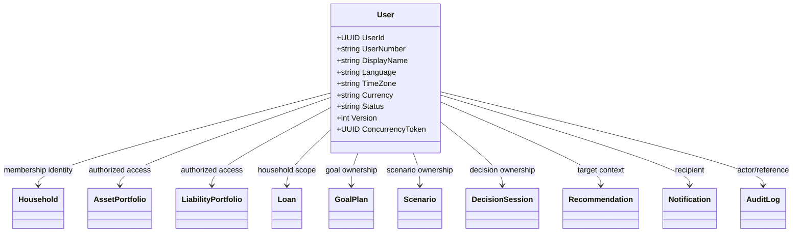
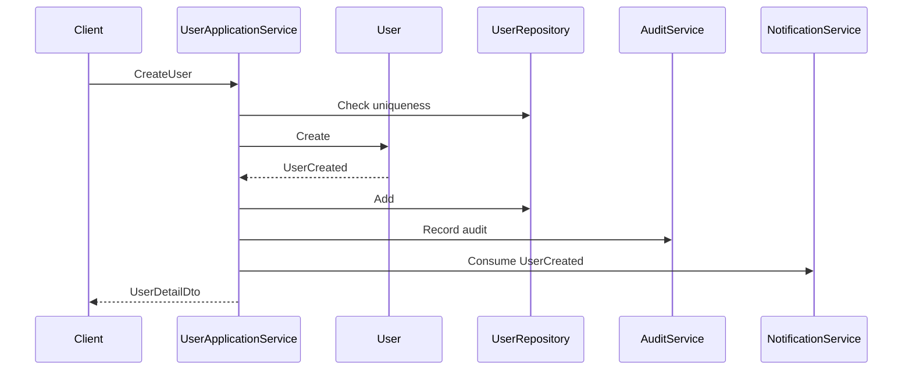
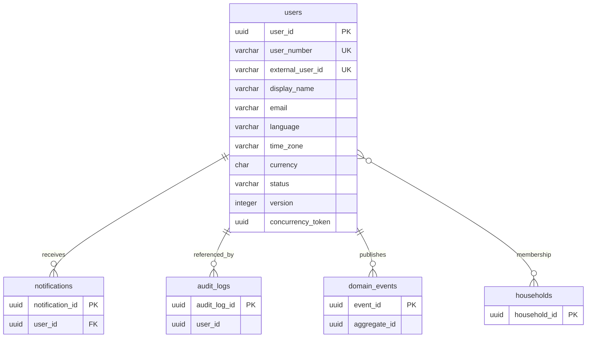
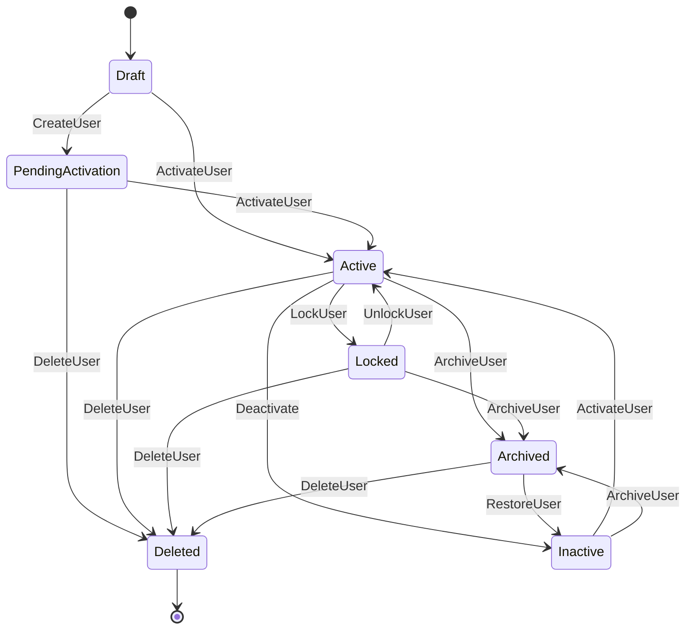

# User Entity Specification

# Entity Overview

## Purpose
- User represents an Atlas account participant and the identity boundary for personal finance, planning, decision, notification, and audit access.
- User provides the stable owner identity referenced by Household, GoalPlan, Scenario, DecisionSession, Recommendation, Notification, AssetPortfolio, LiabilityPortfolio, Loan, FinancialProfile cash flow records, and related read models.
- User is the canonical profile record for language, time zone, currency, status, login eligibility, and profile metadata.

## Responsibilities
- Maintain immutable UserId and unique UserNumber.
- Maintain optional ExternalUserId mapping to an external identity provider.
- Maintain profile display fields, contact fields, localization fields, financial planning defaults, lifecycle status, and concurrency token.
- Enforce user lifecycle invariants before allowing login, profile mutation, preference mutation, or creation of user-owned financial data.
- Publish User lifecycle DomainEvent records through Catalog-approved event handling.
- Preserve complete audit metadata and version history for identity-sensitive changes.
- Provide authorization scope for user-owned and household-scoped data access.

## Business Meaning
- User is the business person who uses Atlas and owns or participates in planning data.
- User does not directly own every financial aggregate; User provides the identity and access boundary used by Household, FinancialProfile, GoalPlan, Scenario, DecisionSession, AssetPortfolio, LiabilityPortfolio, Loan, Recommendation, Notification, and AuditLog.
- User profile values such as Language, TimeZone, Currency, RiskProfile, InvestmentProfile, and FinancialStage influence projections, recommendations, notifications, and presentation but do not replace domain-specific rules inside those aggregates.

## Aggregate Root
- Yes.
- Aggregate Name: User.
- Aggregate Root: User.
- Domain: Identity.
- Repository: UserRepository.
- Transaction Boundary: one User mutation.
- Consistency Boundary: user identity, lifecycle, profile, preference reference, audit metadata, and concurrency token.

## Lifecycle
- Draft: profile record exists but is not active for normal login.
- PendingActivation: activation is waiting for identity verification or administrator activation.
- Active: user can log in and create permitted data.
- Locked: user cannot log in and cannot create new user-owned data.
- Inactive: user is retained but not participating in current workflows.
- Archived: user is retained for historical and audit visibility and cannot be modified except restore.
- Deleted: user is soft-deleted and cannot log in, create, update, send, or receive user-facing operations.

## Ownership
- Owned by Identity Domain.
- User owns its own identity profile and lifecycle state.
- Household owns household membership and shared authorization scope.
- FinancialProfile owns cash flow and financial profile data.
- AssetPortfolio owns Portfolio and Position data.
- LiabilityPortfolio owns Liability data.
- Loan owns Loan and Mortgage-related loan lifecycle where Catalog maps Mortgage to loan/property behavior.
- GoalPlan owns Goal-related planning behavior.
- Scenario owns scenario simulation behavior.
- DecisionSession owns decision behavior.
- Recommendation owns recommendation lifecycle where Catalog-approved persistence is used.
- Notification owns notification lifecycle.
- AuditLog records immutable audit facts and is not mutated by User.

## Relationships
- Household: User may be linked to one or more Household membership scopes through household membership; User does not mutate Household directly.
- Asset: User accesses Asset through AssetPortfolio and Household authorization; User does not directly own Asset lifecycle when AssetPortfolio is the aggregate owner.
- Liability: User accesses Liability through LiabilityPortfolio and Household authorization; User does not directly mutate LiabilityPortfolio.
- Loan: User may create or view Loan records under household scope; Loan aggregate owns loan lifecycle.
- Mortgage: Mortgage is represented through Catalog-approved Loan and Property relationships; User references it through Loan and household scope.
- Portfolio: User accesses Portfolio through AssetPortfolio; Portfolio holdings remain owned by AssetPortfolio.
- Position: Position belongs to Portfolio/AssetPortfolio scope; User provides owner identity and authorization context.
- CashFlow: User accesses CashFlow through FinancialProfile and Household context; CashFlow Engine consumes User localization and currency defaults.
- Income: Income is a cash flow category under FinancialProfile; User identifies the actor and display preference.
- Expense: Expense is a cash flow category under FinancialProfile; User identifies the actor and display preference.
- Goal: User may own or participate in Goals under GoalPlan; Goal references UserId for responsibility and access.
- Scenario: Scenario references User or Household scope for simulation ownership and access.
- Decision: DecisionSession references User identity for decision ownership, approval, rejection, and audit attribution.
- Recommendation: Recommendation references User identity through decision, scenario, or notification context and may target a User for action.
- ExecutionPlan: ExecutionPlan references User as owner, approver, or assignee in execution planning.
- ActionPlan: ActionPlan references User as owner or assignee for actionable follow-up work.
- Notification: Notification belongs to one User and uses User.Language, TimeZone, and contact fields for delivery.
- Preference: Preference is user-scoped profile configuration controlled by UpdatePreference.
- AuditLog: AuditLog records UserId, CreatedBy, UpdatedBy, and security-sensitive profile changes as immutable audit entries.
- DomainEvent: User publishes UserCreated, UserUpdated, UserActivated, UserLocked, UserUnlocked, UserArchived, UserDeleted, UserStatusChanged, and PreferenceUpdated.

## Navigation
- User -> Household memberships by UserId.
- User -> GoalPlan goals by UserId and Household scope.
- User -> AssetPortfolio portfolios by Household scope.
- User -> LiabilityPortfolio liabilities by Household scope.
- User -> Loan records by Household scope.
- User -> FinancialProfile cash flow records by Household scope.
- User -> Scenario records by UserId or Household scope.
- User -> DecisionSession records by UserId or Household scope.
- User -> Recommendation records by target UserId, DecisionId, ScenarioId, or Household scope.
- User -> ExecutionPlan records by UserId, owner, approver, or assignee.
- User -> ActionPlan records by UserId, owner, or assignee.
- User -> Notification records by UserId.
- User -> AuditLog records by UserId, CreatedBy, UpdatedBy, or actor identity.

# Complete Properties

| Name | Type | Nullable | Default | Description | Validation | Business Meaning | Example | Database Mapping | JSON Name | API Usage | Searchable | Sortable | Indexed | Encrypted | Auditable |
|---|---|---:|---|---|---|---|---|---|---|---|---:|---:|---:|---:|---:|
| UserId | UUID | No | generated | Stable primary identifier. | Required, immutable, UUID. | Identifies the User aggregate. | `0f40f9f1-7c98-4c8b-a5aa-6e7b12d70411` | `user_id uuid primary key` | `userId` | Read, detail, route, response. | Yes | Yes | Yes | No | Yes |
| UserNumber | string(40) | No | generated | Human-readable unique user number. | Required, unique, max 40, pattern `USR-[0-9]{8}`. | Stable business identifier. | `USR-20260714` | `user_number varchar(40) not null unique` | `userNumber` | Create response, search, detail. | Yes | Yes | Yes | No | Yes |
| ExternalUserId | string(128) | Yes | null | External identity provider user id. | Max 128, unique when present. | Links Atlas user to authentication provider. | `auth0|662233` | `external_user_id varchar(128)` | `externalUserId` | Create, update by integration, detail. | Yes | Yes | Yes | Yes | Yes |
| DisplayName | string(120) | No | none | Display name shown in Atlas. | Required, trim, length 1-120. | Primary user-facing name. | `Sheng-Hua Kung` | `display_name varchar(120) not null` | `displayName` | Create, update, summary, detail. | Yes | Yes | Yes | No | Yes |
| FirstName | string(80) | Yes | null | Given name. | Trim, max 80. | Personal profile attribute. | `Sheng-Hua` | `first_name varchar(80)` | `firstName` | Create, update, detail. | Yes | Yes | No | Yes | Yes |
| LastName | string(80) | Yes | null | Family name. | Trim, max 80. | Personal profile attribute. | `Kung` | `last_name varchar(80)` | `lastName` | Create, update, detail. | Yes | Yes | No | Yes | Yes |
| PreferredName | string(120) | Yes | null | Preferred name for display and notifications. | Trim, max 120. | Personalizes communication without changing legal name. | `Bran` | `preferred_name varchar(120)` | `preferredName` | Create, update, profile. | Yes | Yes | No | No | Yes |
| Email | string(320) | Yes | null | Email address. | Email format, normalized, unique when enabled. | Login and notification contact. | `bran@example.com` | `email varchar(320)` | `email` | Create, update, profile, search. | Yes | Yes | Yes | Yes | Yes |
| PhoneNumber | string(40) | Yes | null | Phone number. | E.164-compatible when present, max 40. | Optional contact and notification target. | `+886912345678` | `phone_number varchar(40)` | `phoneNumber` | Create, update, profile. | Yes | Yes | Yes | Yes | Yes |
| Language | string(16) | No | `zh-TW` | Preferred language. | Required, BCP 47 language tag. | Drives localization and notification language. | `zh-TW` | `language varchar(16) not null` | `language` | Create, update, preference, profile. | Yes | Yes | Yes | No | Yes |
| TimeZone | string(64) | No | `Asia/Taipei` | IANA time zone. | Required, valid IANA name. | Drives scheduling and date interpretation. | `Asia/Taipei` | `time_zone varchar(64) not null` | `timeZone` | Create, update, preference, profile. | Yes | Yes | Yes | No | Yes |
| Currency | string(3) | No | `TWD` | Default ISO 4217 currency. | Required, uppercase ISO 4217. | Default planning and display currency. | `TWD` | `currency char(3) not null` | `currency` | Create, update, preference, profile. | Yes | Yes | Yes | No | Yes |
| Country | string(2) | Yes | null | ISO 3166-1 alpha-2 country. | Uppercase country code when present. | Regional planning context. | `TW` | `country char(2)` | `country` | Create, update, profile, search. | Yes | Yes | Yes | No | Yes |
| Region | string(80) | Yes | null | Region, state, or administrative area. | Trim, max 80. | Local tax, rules, and profile segmentation context. | `Taipei` | `region varchar(80)` | `region` | Create, update, profile, search. | Yes | Yes | Yes | No | Yes |
| DateOfBirth | date | Yes | null | Birth date. | Past date, not future, age within policy range. | Enables age-based planning. | `1988-03-12` | `date_of_birth date` | `dateOfBirth` | Create, update, profile. | No | Yes | No | Yes | Yes |
| RetirementAge | integer | Yes | null | Planned retirement age. | 0-120 when present. | Default retirement projection input. | `65` | `retirement_age integer` | `retirementAge` | Create, update, preference, profile. | No | Yes | No | No | Yes |
| RiskProfile | string(40) | Yes | null | User risk profile. | Catalog enum value when present. | Guides recommendation and portfolio suitability. | `Balanced` | `risk_profile varchar(40)` | `riskProfile` | Create, update, profile, recommendation context. | Yes | Yes | Yes | No | Yes |
| InvestmentProfile | string(40) | Yes | null | Investment profile. | Catalog enum value when present. | Guides portfolio and scenario assumptions. | `LongTerm` | `investment_profile varchar(40)` | `investmentProfile` | Create, update, profile. | Yes | Yes | Yes | No | Yes |
| FinancialStage | string(40) | Yes | null | Financial life stage. | Catalog enum value when present. | Segments goals and recommendations. | `Accumulation` | `financial_stage varchar(40)` | `financialStage` | Create, update, profile, search. | Yes | Yes | Yes | No | Yes |
| Status | string(32) | No | `Draft` | User lifecycle status. | Required, one of Draft, PendingActivation, Active, Locked, Inactive, Archived, Deleted. | Controls login and mutation eligibility. | `Active` | `status varchar(32) not null` | `status` | Create response, update through commands, search. | Yes | Yes | Yes | No | Yes |
| LastLoginAt | datetime | Yes | null | Last successful login timestamp. | UTC timestamp, cannot be future beyond clock tolerance. | Security and activity marker. | `2026-07-14T01:12:00Z` | `last_login_at timestamptz` | `lastLoginAt` | Detail, profile, admin search. | No | Yes | Yes | No | Yes |
| IsActive | boolean | No | false | Denormalized active flag. | Must match Status Active. | Fast eligibility filter. | `true` | `is_active boolean not null` | `isActive` | Summary, detail, search. | Yes | Yes | Yes | No | Yes |
| IsLocked | boolean | No | false | Denormalized locked flag. | Must match Status Locked. | Fast lockout filter. | `false` | `is_locked boolean not null` | `isLocked` | Summary, detail, search. | Yes | Yes | Yes | No | Yes |
| IsDeleted | boolean | No | false | Soft delete marker. | Must be true only when Status Deleted. | Excludes deleted users from normal operations. | `false` | `is_deleted boolean not null` | `isDeleted` | Detail, admin search. | Yes | Yes | Yes | No | Yes |
| CreatedAt | datetime | No | now UTC | Creation timestamp. | Required, UTC, immutable. | Audit and ordering. | `2026-07-14T00:00:00Z` | `created_at timestamptz not null` | `createdAt` | Response only. | Yes | Yes | Yes | No | Yes |
| CreatedBy | UUID | Yes | null | Actor that created the record. | Existing UserId or system actor. | Audit attribution. | `00000000-0000-0000-0000-000000000001` | `created_by uuid` | `createdBy` | Response only. | Yes | Yes | Yes | No | Yes |
| UpdatedAt | datetime | No | now UTC | Last update timestamp. | Required, UTC, changes on mutation. | Audit and cache invalidation marker. | `2026-07-14T02:00:00Z` | `updated_at timestamptz not null` | `updatedAt` | Response only. | Yes | Yes | Yes | No | Yes |
| UpdatedBy | UUID | Yes | null | Actor that last updated the record. | Existing UserId or system actor. | Audit attribution. | `0f40f9f1-7c98-4c8b-a5aa-6e7b12d70411` | `updated_by uuid` | `updatedBy` | Response only. | Yes | Yes | Yes | No | Yes |
| Version | integer | No | 1 | Monotonic business version. | Required, >= 1, increments per mutation. | Version history and event ordering. | `7` | `version integer not null` | `version` | Detail, concurrency, audit. | No | Yes | Yes | No | Yes |
| ConcurrencyToken | UUID | No | generated | Optimistic concurrency token. | Required, changes on mutation. | Prevents lost updates. | `2aa7cf25-6e21-4b76-84fc-d6a283a20f71` | `concurrency_token uuid not null` | `concurrencyToken` | Update, commands, response. | No | No | Yes | No | Yes |

# Validation Rules

- UserId is required, UUID, immutable after creation.
- UserNumber is required, unique, immutable after creation, max 40 characters, and must follow the Catalog user number pattern.
- ExternalUserId is optional, max 128 characters, unique when present, and cannot be reused by another non-deleted user.
- DisplayName is required, trimmed, 1-120 characters, and cannot contain control characters.
- FirstName is optional, trimmed, max 80 characters, and cannot contain control characters.
- LastName is optional, trimmed, max 80 characters, and cannot contain control characters.
- PreferredName is optional, trimmed, max 120 characters, and cannot contain control characters.
- Email is optional unless authentication policy requires email.
- Email must be normalized before uniqueness validation.
- Email must be unique among non-deleted users when system email login is enabled.
- PhoneNumber is optional, max 40 characters, and must be E.164-compatible when phone verification is enabled.
- Language is required and must be a valid BCP 47 language tag accepted by Atlas localization.
- TimeZone is required and must be a valid IANA time zone.
- Currency is required and must be an uppercase ISO 4217 currency code supported by Atlas.
- Country is optional and must be an uppercase ISO 3166-1 alpha-2 code when present.
- Region is optional, trimmed, max 80 characters.
- DateOfBirth is optional, must be a past date, and must not exceed the maximum supported age range.
- RetirementAge is optional and must be between 0 and 120.
- RiskProfile is optional and must match Catalog-approved risk profile values when present.
- InvestmentProfile is optional and must match Catalog-approved investment profile values when present.
- FinancialStage is optional and must match Catalog-approved financial stage values when present.
- Status is required and must be Draft, PendingActivation, Active, Locked, Inactive, Archived, or Deleted.
- LastLoginAt is optional, UTC, and cannot be later than current time plus accepted clock tolerance.
- IsActive must equal true only when Status is Active.
- IsLocked must equal true only when Status is Locked.
- IsDeleted must equal true only when Status is Deleted.
- CreatedAt is required, UTC, and immutable.
- CreatedBy must reference an existing actor or system actor when present.
- UpdatedAt is required, UTC, and must be greater than or equal to CreatedAt.
- UpdatedBy must reference an existing actor or system actor when present.
- Version is required, starts at 1, and increments exactly once per persisted mutation.
- ConcurrencyToken is required and must change on every persisted mutation.
- Archived users cannot be modified except RestoreUser or DeleteUser.
- Deleted users cannot be restored through normal RestoreUser unless Catalog policy allows administrative recovery.
- Locked users cannot create new user-owned financial records.
- Deleted users cannot log in.
- Profile mutations must include a matching ConcurrencyToken.
- Preference updates must validate Language, TimeZone, Currency, notification settings, and profile-specific preference values.

# Business Rules

- UserNumber must be unique.
- Email must be unique when email login is enabled.
- User must specify Language.
- User must specify Currency.
- User must specify TimeZone.
- Deleted User cannot log in.
- Locked User cannot create new data.
- Archived User cannot be modified.
- User must preserve complete Audit Trail.
- User must preserve complete Version History.
- User supports Soft Delete through Status Deleted and IsDeleted true.
- User supports Multi-Tenant only when the existing Catalog defines tenant scope; otherwise User remains household and identity scoped.
- User is the identity boundary and does not directly mutate Household.
- User is the identity boundary and does not directly mutate AssetPortfolio, LiabilityPortfolio, Loan, GoalPlan, Scenario, DecisionSession, Recommendation, or Notification.
- Active User may create permitted Household, Goal, Scenario, Decision, Notification, and planning records through owning Application Service commands.
- Locked User may read permitted historical records if authorization allows but cannot create new business records.
- Archived User remains available for historical references and audit attribution.
- Deleted User remains retained as soft-deleted identity for audit, historical DomainEvent correlation, and referential integrity.
- User profile changes must publish UserUpdated when persisted.
- User lifecycle changes must publish UserStatusChanged and the specific lifecycle event.
- Preference changes must publish PreferenceUpdated.
- User creation must initialize Version to 1 and generate ConcurrencyToken.
- User mutation must increment Version and rotate ConcurrencyToken.
- LastLoginAt may only be updated by Authentication Service after successful login.
- Email and PhoneNumber are sensitive contact fields and require masking in non-privileged API responses.
- DateOfBirth is sensitive personal data and requires encryption or protected storage according to Atlas security policy.
- User cannot be hard-deleted while referenced by Household, GoalPlan, Scenario, DecisionSession, Recommendation, Notification, AuditLog, or DomainEvent records.
- RestoreUser from Archived returns the user to Inactive unless activation rules explicitly restore Active.
- UnlockUser from Locked returns the user to Active only when prior state and authorization allow.
- UpdatePreference cannot bypass user lifecycle restrictions.

# State Machine

| State | Transition | Trigger | Invariant | Illegal Transition |
|---|---|---|---|---|
| Draft | Draft -> PendingActivation | CreateUser completed with activation required | UserNumber, Language, Currency, TimeZone exist | Draft -> Locked, Draft -> Archived |
| Draft | Draft -> Active | ActivateUser without pending verification | User is not deleted and has required identity fields | Draft -> Deleted without DeleteUser |
| PendingActivation | PendingActivation -> Active | ActivateUser | Activation checks passed | PendingActivation -> Archived directly |
| PendingActivation | PendingActivation -> Deleted | DeleteUser | Soft delete audit recorded | PendingActivation -> Locked |
| Active | Active -> Locked | LockUser | IsLocked true, IsActive false | Active -> Draft |
| Active | Active -> Inactive | Archive inactivity policy or administrative deactivation | User not deleted | Active -> PendingActivation |
| Active | Active -> Archived | ArchiveUser | No active mutation in same transaction | Active -> Draft |
| Active | Active -> Deleted | DeleteUser | Soft delete marker set | Active -> PendingActivation |
| Locked | Locked -> Active | UnlockUser | Lock reason resolved | Locked -> Draft |
| Locked | Locked -> Archived | ArchiveUser | Archived audit recorded | Locked -> PendingActivation |
| Locked | Locked -> Deleted | DeleteUser | Soft delete marker set | Locked -> Draft |
| Inactive | Inactive -> Active | ActivateUser or RestoreUser | Required profile fields remain valid | Inactive -> Draft |
| Inactive | Inactive -> Archived | ArchiveUser | Archived audit recorded | Inactive -> PendingActivation |
| Archived | Archived -> Inactive | RestoreUser | Restore audit recorded | Archived -> Active without activation |
| Archived | Archived -> Deleted | DeleteUser | Soft delete marker set | Archived -> Draft |
| Deleted | none | terminal normal lifecycle | IsDeleted true | Deleted -> Active, Deleted -> Locked, Deleted -> Archived, Deleted -> Draft |

# Commands

## CreateUser
- Creates User with UserNumber, profile fields, localization defaults, Status, Version, and ConcurrencyToken.
- Validates uniqueness, contact format, Language, Currency, TimeZone, and initial lifecycle state.
- Emits UserCreated and UserStatusChanged when status is initialized.

## UpdateUser
- Updates mutable profile fields including DisplayName, FirstName, LastName, PreferredName, Email, PhoneNumber, Country, Region, DateOfBirth, RetirementAge, RiskProfile, InvestmentProfile, and FinancialStage.
- Requires matching ConcurrencyToken.
- Rejects Archived and Deleted users.
- Emits UserUpdated.

## ActivateUser
- Moves Draft, PendingActivation, or Inactive user to Active when activation rules pass.
- Sets IsActive true, IsLocked false, IsDeleted false.
- Emits UserActivated and UserStatusChanged.

## LockUser
- Moves Active or Inactive user to Locked.
- Prevents login and new data creation.
- Emits UserLocked and UserStatusChanged.

## UnlockUser
- Moves Locked user to Active when lock reason is resolved.
- Emits UserUnlocked and UserStatusChanged.

## ArchiveUser
- Moves Active, Inactive, or Locked user to Archived.
- Preserves references and audit history.
- Emits UserArchived and UserStatusChanged.

## RestoreUser
- Moves Archived user to Inactive.
- Requires authorization and valid ConcurrencyToken.
- Emits UserStatusChanged and UserUpdated.

## DeleteUser
- Soft-deletes User.
- Sets Status Deleted, IsDeleted true, IsActive false, IsLocked false.
- Emits UserDeleted and UserStatusChanged.

## UpdatePreference
- Updates Language, TimeZone, Currency, and user-scoped preference values.
- Rejects Deleted and Archived users.
- Emits PreferenceUpdated and UserUpdated when persisted on User profile.

## RecordUserLogin
- Updates LastLoginAt after Authentication Service confirms successful login.
- Rejects Deleted, Locked, Archived, and Inactive users for login eligibility.
- Emits UserUpdated when persisted.

## ChangeUserContact
- Updates Email or PhoneNumber with validation, masking, uniqueness, and audit requirements.
- Emits UserUpdated.

# Domain Events

| Event | Producer | Trigger | Payload | Consumers |
|---|---|---|---|---|
| UserCreated | User | CreateUser | UserId, UserNumber, Status, Language, Currency, TimeZone, CreatedAt | Audit Service, Notification Service, User read model |
| UserUpdated | User | UpdateUser, UpdatePreference, RecordUserLogin | UserId, ChangedFields, Version, UpdatedAt | Audit Service, cache invalidation, Profile read model |
| UserActivated | User | ActivateUser | UserId, ActivatedAt, ActivatedBy | Authentication Service, Authorization Service, Notification Service |
| UserLocked | User | LockUser | UserId, LockedAt, LockedBy, Reason | Authentication Service, Authorization Service, Audit Service |
| UserUnlocked | User | UnlockUser | UserId, UnlockedAt, UnlockedBy | Authentication Service, Authorization Service |
| UserArchived | User | ArchiveUser | UserId, ArchivedAt, ArchivedBy | Audit Service, read model cache |
| UserDeleted | User | DeleteUser | UserId, DeletedAt, DeletedBy | Authentication Service, Authorization Service, Audit Service |
| UserStatusChanged | User | Any status transition | UserId, PreviousStatus, NewStatus, OccurredAt | Workflow, Notification, Audit Service |
| PreferenceUpdated | User | UpdatePreference | UserId, Language, TimeZone, Currency, UpdatedAt | Notification Service, Localization Service, Dashboard read model |
| UserContactChanged | User | ChangeUserContact | UserId, ContactType, UpdatedAt | Authentication Service, Notification Service |
| UserLoginRecorded | User | RecordUserLogin | UserId, LastLoginAt | Security monitoring, Audit Service |

# Repository

## Interface
```csharp
public interface IUserRepository
{
    Task<User?> GetByIdAsync(Guid userId, CancellationToken cancellationToken);
    Task<User?> GetByUserNumberAsync(string userNumber, CancellationToken cancellationToken);
    Task<User?> GetByExternalUserIdAsync(string externalUserId, CancellationToken cancellationToken);
    Task<User?> GetByEmailAsync(string normalizedEmail, CancellationToken cancellationToken);
    Task<IReadOnlyList<User>> SearchAsync(UserSearchSpecification specification, CancellationToken cancellationToken);
    Task<bool> ExistsByUserNumberAsync(string userNumber, CancellationToken cancellationToken);
    Task<bool> ExistsByEmailAsync(string normalizedEmail, Guid? excludingUserId, CancellationToken cancellationToken);
    Task AddAsync(User user, CancellationToken cancellationToken);
    Task UpdateAsync(User user, CancellationToken cancellationToken);
}
```

## Methods
- GetByIdAsync loads one User aggregate by UserId.
- GetByUserNumberAsync loads one User aggregate by UserNumber.
- GetByExternalUserIdAsync loads one User aggregate by ExternalUserId.
- GetByEmailAsync loads one User aggregate by normalized Email.
- SearchAsync returns paged User summaries according to UserSearchSpecification.
- ExistsByUserNumberAsync enforces UserNumber uniqueness.
- ExistsByEmailAsync enforces Email uniqueness when email login is enabled.
- AddAsync persists a new User aggregate and its DomainEvents.
- UpdateAsync persists an existing User aggregate with optimistic concurrency.

## Query Methods
- FindActiveUsers.
- FindLockedUsers.
- FindArchivedUsers.
- FindDeletedUsersForAdministration.
- FindByLanguage.
- FindByCurrency.
- FindByCountryRegion.
- FindByRiskProfile.
- FindByFinancialStage.
- FindByLastLoginRange.
- FindByCreatedAtRange.
- FindByUpdatedAtRange.

## Specification Pattern
- UserByIdSpecification.
- UserByUserNumberSpecification.
- UserByExternalUserIdSpecification.
- UserByEmailSpecification.
- ActiveUserSpecification.
- NonDeletedUserSpecification.
- LockedUserSpecification.
- ArchivedUserSpecification.
- UserSearchSpecification.
- UserPreferenceSpecification.
- UserSecurityEligibilitySpecification.

# Domain Service Interaction

- User Service validates user lifecycle commands, profile mutation rules, and user number generation policy.
- Authentication Service validates login eligibility, external identity mapping, and LastLoginAt updates.
- Authorization Service evaluates UserId, Household membership, role, and permission access.
- Preference Service validates Language, Currency, TimeZone, and preference persistence.
- Notification Service consumes User language, time zone, contact fields, and status before sending user notifications.
- Audit Service records identity-sensitive changes, status transitions, contact changes, and preference changes.
- Goal Service uses User identity for goal ownership, review responsibility, and access checks.
- Decision Engine uses User context for decision ownership, scoring context, approval attribution, and audit attribution.
- Recommendation Engine uses User risk profile, financial stage, language, and context for recommendation targeting.
- Scenario Engine uses User defaults for simulation context and presentation preferences.
- Portfolio Service uses User authorization context before exposing AssetPortfolio and Position data.
- CashFlow Engine uses User currency, time zone, and household scope for timeline interpretation.

# Application Service Interaction

- UserApplicationService handles CreateUser, UpdateUser, ActivateUser, LockUser, UnlockUser, ArchiveUser, RestoreUser, DeleteUser, UpdatePreference, and profile queries.
- ProfileApplicationService reads and updates User profile views while enforcing masking and authorization.
- PreferenceApplicationService coordinates preference updates and PreferenceUpdated events.
- AuthenticationApplicationService resolves ExternalUserId, validates status, and records LastLoginAt.
- AuthorizationApplicationService resolves User permissions and Household access.
- NotificationApplicationService reads user delivery preferences and contact fields.
- GoalApplicationService checks User access for GoalPlan operations.
- ScenarioApplicationService checks User access for Scenario operations.
- DecisionApplicationService checks User access for DecisionSession operations.
- RecommendationApplicationService checks User context for recommendation delivery and acceptance flows.
- PortfolioApplicationService checks User and Household scope before portfolio operations.
- CashFlowApplicationService checks User and Household scope before income and expense operations.
- AuditApplicationService exposes User audit history to authorized administrators.

# API

## REST Endpoints
| Operation | HTTP Method | Endpoint | Request | Response | Error |
|---|---|---|---|---|---|
| Create | POST | `/api/users` | CreateUserDto | UserDetailDto | 400, 409, 422 |
| Get Detail | GET | `/api/users/{userId}` | none | UserDetailDto | 401, 403, 404 |
| Update | PUT | `/api/users/{userId}` | UpdateUserDto | UserDetailDto | 400, 403, 404, 409, 422 |
| Delete | DELETE | `/api/users/{userId}` | concurrencyToken | UserDetailDto | 403, 404, 409 |
| Search | GET | `/api/users` | UserSearchDto | paged UserSummaryDto | 400, 403 |
| Activate | POST | `/api/users/{userId}/activate` | concurrencyToken | UserDetailDto | 403, 404, 409, 422 |
| Lock | POST | `/api/users/{userId}/lock` | reason, concurrencyToken | UserDetailDto | 403, 404, 409, 422 |
| Unlock | POST | `/api/users/{userId}/unlock` | reason, concurrencyToken | UserDetailDto | 403, 404, 409, 422 |
| Archive | POST | `/api/users/{userId}/archive` | reason, concurrencyToken | UserDetailDto | 403, 404, 409 |
| Restore | POST | `/api/users/{userId}/restore` | concurrencyToken | UserDetailDto | 403, 404, 409, 422 |
| Preference | PUT | `/api/users/{userId}/preference` | PreferenceDto | UserDetailDto | 400, 403, 404, 409, 422 |
| Profile | GET | `/api/users/{userId}/profile` | none | ProfileDto | 401, 403, 404 |
| Profile Update | PUT | `/api/users/{userId}/profile` | ProfileDto | ProfileDto | 400, 403, 404, 409 |
| History | GET | `/api/users/{userId}/history` | paging | audit event page | 403, 404 |

## Response
- Successful command responses return UserDetailDto with new Version and ConcurrencyToken.
- Search responses return page, pageSize, totalCount, and items of UserSummaryDto.
- Sensitive fields are masked unless caller has permission.

## Error
- 400: malformed request, invalid enum, invalid date, invalid format.
- 401: authentication required.
- 403: caller lacks permission for User or Household scope.
- 404: User not found or not visible.
- 409: concurrency conflict, duplicate UserNumber, duplicate Email, duplicate ExternalUserId.
- 422: business rule violation or illegal state transition.

# DTO

## Create DTO
```json
{
  "externalUserId": "auth0|662233",
  "displayName": "Sheng-Hua Kung",
  "firstName": "Sheng-Hua",
  "lastName": "Kung",
  "preferredName": "Bran",
  "email": "bran@example.com",
  "phoneNumber": "+886912345678",
  "language": "zh-TW",
  "timeZone": "Asia/Taipei",
  "currency": "TWD",
  "country": "TW",
  "region": "Taipei",
  "dateOfBirth": "1988-03-12",
  "retirementAge": 65,
  "riskProfile": "Balanced",
  "investmentProfile": "LongTerm",
  "financialStage": "Accumulation"
}
```

## Update DTO
```json
{
  "displayName": "Bran Kung",
  "preferredName": "Bran",
  "phoneNumber": "+886912345678",
  "country": "TW",
  "region": "Taipei",
  "retirementAge": 66,
  "riskProfile": "Balanced",
  "investmentProfile": "LongTerm",
  "financialStage": "Accumulation",
  "concurrencyToken": "2aa7cf25-6e21-4b76-84fc-d6a283a20f71"
}
```

## Detail DTO
```json
{
  "userId": "0f40f9f1-7c98-4c8b-a5aa-6e7b12d70411",
  "userNumber": "USR-20260714",
  "externalUserId": "auth0|662233",
  "displayName": "Bran Kung",
  "firstName": "Sheng-Hua",
  "lastName": "Kung",
  "preferredName": "Bran",
  "email": "b***@example.com",
  "phoneNumber": "+886******678",
  "language": "zh-TW",
  "timeZone": "Asia/Taipei",
  "currency": "TWD",
  "country": "TW",
  "region": "Taipei",
  "dateOfBirth": "1988-03-12",
  "retirementAge": 66,
  "riskProfile": "Balanced",
  "investmentProfile": "LongTerm",
  "financialStage": "Accumulation",
  "status": "Active",
  "lastLoginAt": "2026-07-14T01:12:00Z",
  "isActive": true,
  "isLocked": false,
  "isDeleted": false,
  "createdAt": "2026-07-14T00:00:00Z",
  "createdBy": "00000000-0000-0000-0000-000000000001",
  "updatedAt": "2026-07-14T02:00:00Z",
  "updatedBy": "0f40f9f1-7c98-4c8b-a5aa-6e7b12d70411",
  "version": 7,
  "concurrencyToken": "57fd3f02-71b4-4d10-a93e-1419f1978573"
}
```

## Summary DTO
```json
{
  "userId": "0f40f9f1-7c98-4c8b-a5aa-6e7b12d70411",
  "userNumber": "USR-20260714",
  "displayName": "Bran Kung",
  "language": "zh-TW",
  "currency": "TWD",
  "status": "Active",
  "isActive": true,
  "isLocked": false,
  "updatedAt": "2026-07-14T02:00:00Z"
}
```

## Search DTO
```json
{
  "keyword": "Bran",
  "status": ["Active", "Locked"],
  "language": "zh-TW",
  "currency": "TWD",
  "country": "TW",
  "riskProfile": "Balanced",
  "financialStage": "Accumulation",
  "createdFrom": "2026-01-01T00:00:00Z",
  "createdTo": "2026-12-31T23:59:59Z",
  "page": 1,
  "pageSize": 20,
  "sortBy": "updatedAt",
  "sortDirection": "desc"
}
```

## Preference DTO
```json
{
  "language": "zh-TW",
  "timeZone": "Asia/Taipei",
  "currency": "TWD",
  "concurrencyToken": "57fd3f02-71b4-4d10-a93e-1419f1978573"
}
```

## Profile DTO
```json
{
  "displayName": "Bran Kung",
  "preferredName": "Bran",
  "language": "zh-TW",
  "timeZone": "Asia/Taipei",
  "currency": "TWD",
  "country": "TW",
  "region": "Taipei",
  "retirementAge": 66,
  "riskProfile": "Balanced",
  "investmentProfile": "LongTerm",
  "financialStage": "Accumulation"
}
```

# Database Mapping

## Table
- Table name: `users`.
- Primary key: `user_id`.
- Aggregate owner: User.
- Repository: UserRepository.

## Columns
| Column | Type | Nullable | Mapping |
|---|---|---:|---|
| user_id | uuid | No | UserId |
| user_number | varchar(40) | No | UserNumber |
| external_user_id | varchar(128) | Yes | ExternalUserId |
| display_name | varchar(120) | No | DisplayName |
| first_name | varchar(80) | Yes | FirstName |
| last_name | varchar(80) | Yes | LastName |
| preferred_name | varchar(120) | Yes | PreferredName |
| email | varchar(320) | Yes | Email |
| phone_number | varchar(40) | Yes | PhoneNumber |
| language | varchar(16) | No | Language |
| time_zone | varchar(64) | No | TimeZone |
| currency | char(3) | No | Currency |
| country | char(2) | Yes | Country |
| region | varchar(80) | Yes | Region |
| date_of_birth | date | Yes | DateOfBirth |
| retirement_age | integer | Yes | RetirementAge |
| risk_profile | varchar(40) | Yes | RiskProfile |
| investment_profile | varchar(40) | Yes | InvestmentProfile |
| financial_stage | varchar(40) | Yes | FinancialStage |
| status | varchar(32) | No | Status |
| last_login_at | timestamptz | Yes | LastLoginAt |
| is_active | boolean | No | IsActive |
| is_locked | boolean | No | IsLocked |
| is_deleted | boolean | No | IsDeleted |
| created_at | timestamptz | No | CreatedAt |
| created_by | uuid | Yes | CreatedBy |
| updated_at | timestamptz | No | UpdatedAt |
| updated_by | uuid | Yes | UpdatedBy |
| version | integer | No | Version |
| concurrency_token | uuid | No | ConcurrencyToken |

## FK
- No required foreign key from User to Household because Household references User through membership scope.
- CreatedBy and UpdatedBy may reference `users.user_id` when the actor is an Atlas User.
- AuditLog and DomainEvent reference UserId externally for immutable attribution.

## Unique
- `ux_users_user_number` on `user_number`.
- `ux_users_external_user_id` on `external_user_id` where not null.
- `ux_users_email_active` on normalized `email` where email is not null and `is_deleted = false`.

## Check Constraint
- Status in Draft, PendingActivation, Active, Locked, Inactive, Archived, Deleted.
- Currency has length 3 and is uppercase.
- Country is null or length 2.
- RetirementAge is null or between 0 and 120.
- Version >= 1.
- IsActive equals true only when Status equals Active.
- IsLocked equals true only when Status equals Locked.
- IsDeleted equals true only when Status equals Deleted.
- UpdatedAt >= CreatedAt.

## Index
- Primary key index on `user_id`.
- Unique index on `user_number`.
- Unique partial index on `external_user_id`.
- Unique partial index on normalized `email`.
- Index on `status`.
- Index on `is_active`, `is_locked`, `is_deleted`.
- Index on `language`, `currency`, `country`, `region`.
- Index on `risk_profile`, `investment_profile`, `financial_stage`.
- Index on `last_login_at`.
- Index on `created_at` and `updated_at`.

# PostgreSQL Schema

```sql
CREATE TABLE users (
    user_id uuid PRIMARY KEY,
    user_number varchar(40) NOT NULL,
    external_user_id varchar(128),
    display_name varchar(120) NOT NULL,
    first_name varchar(80),
    last_name varchar(80),
    preferred_name varchar(120),
    email varchar(320),
    phone_number varchar(40),
    language varchar(16) NOT NULL DEFAULT 'zh-TW',
    time_zone varchar(64) NOT NULL DEFAULT 'Asia/Taipei',
    currency char(3) NOT NULL DEFAULT 'TWD',
    country char(2),
    region varchar(80),
    date_of_birth date,
    retirement_age integer,
    risk_profile varchar(40),
    investment_profile varchar(40),
    financial_stage varchar(40),
    status varchar(32) NOT NULL DEFAULT 'Draft',
    last_login_at timestamptz,
    is_active boolean NOT NULL DEFAULT false,
    is_locked boolean NOT NULL DEFAULT false,
    is_deleted boolean NOT NULL DEFAULT false,
    created_at timestamptz NOT NULL DEFAULT now(),
    created_by uuid,
    updated_at timestamptz NOT NULL DEFAULT now(),
    updated_by uuid,
    version integer NOT NULL DEFAULT 1,
    concurrency_token uuid NOT NULL,
    CONSTRAINT ck_users_status CHECK (status IN ('Draft','PendingActivation','Active','Locked','Inactive','Archived','Deleted')),
    CONSTRAINT ck_users_currency CHECK (currency = upper(currency) AND char_length(currency) = 3),
    CONSTRAINT ck_users_country CHECK (country IS NULL OR (country = upper(country) AND char_length(country) = 2)),
    CONSTRAINT ck_users_retirement_age CHECK (retirement_age IS NULL OR retirement_age BETWEEN 0 AND 120),
    CONSTRAINT ck_users_version CHECK (version >= 1),
    CONSTRAINT ck_users_updated_at CHECK (updated_at >= created_at),
    CONSTRAINT ck_users_active_flag CHECK ((status = 'Active' AND is_active = true) OR (status <> 'Active' AND is_active = false)),
    CONSTRAINT ck_users_locked_flag CHECK ((status = 'Locked' AND is_locked = true) OR (status <> 'Locked' AND is_locked = false)),
    CONSTRAINT ck_users_deleted_flag CHECK ((status = 'Deleted' AND is_deleted = true) OR (status <> 'Deleted' AND is_deleted = false))
);

CREATE UNIQUE INDEX ux_users_user_number ON users (user_number);
CREATE UNIQUE INDEX ux_users_external_user_id ON users (external_user_id) WHERE external_user_id IS NOT NULL;
CREATE UNIQUE INDEX ux_users_email_active ON users (lower(email)) WHERE email IS NOT NULL AND is_deleted = false;
CREATE INDEX ix_users_status ON users (status);
CREATE INDEX ix_users_flags ON users (is_active, is_locked, is_deleted);
CREATE INDEX ix_users_language_currency ON users (language, currency);
CREATE INDEX ix_users_country_region ON users (country, region);
CREATE INDEX ix_users_profiles ON users (risk_profile, investment_profile, financial_stage);
CREATE INDEX ix_users_last_login_at ON users (last_login_at);
CREATE INDEX ix_users_created_at ON users (created_at);
CREATE INDEX ix_users_updated_at ON users (updated_at);
CREATE INDEX ix_users_concurrency_token ON users (concurrency_token);
```

# EF Core Mapping

## Fluent API
```csharp
builder.ToTable("users");
builder.HasKey(x => x.UserId);
builder.Property(x => x.UserId).HasColumnName("user_id").ValueGeneratedNever();
builder.Property(x => x.UserNumber).HasColumnName("user_number").HasMaxLength(40).IsRequired();
builder.Property(x => x.ExternalUserId).HasColumnName("external_user_id").HasMaxLength(128);
builder.Property(x => x.DisplayName).HasColumnName("display_name").HasMaxLength(120).IsRequired();
builder.Property(x => x.FirstName).HasColumnName("first_name").HasMaxLength(80);
builder.Property(x => x.LastName).HasColumnName("last_name").HasMaxLength(80);
builder.Property(x => x.PreferredName).HasColumnName("preferred_name").HasMaxLength(120);
builder.Property(x => x.Email).HasColumnName("email").HasMaxLength(320);
builder.Property(x => x.PhoneNumber).HasColumnName("phone_number").HasMaxLength(40);
builder.Property(x => x.Language).HasColumnName("language").HasMaxLength(16).IsRequired();
builder.Property(x => x.TimeZone).HasColumnName("time_zone").HasMaxLength(64).IsRequired();
builder.Property(x => x.Currency).HasColumnName("currency").HasMaxLength(3).IsRequired();
builder.Property(x => x.Country).HasColumnName("country").HasMaxLength(2);
builder.Property(x => x.Region).HasColumnName("region").HasMaxLength(80);
builder.Property(x => x.DateOfBirth).HasColumnName("date_of_birth");
builder.Property(x => x.RetirementAge).HasColumnName("retirement_age");
builder.Property(x => x.RiskProfile).HasColumnName("risk_profile").HasMaxLength(40);
builder.Property(x => x.InvestmentProfile).HasColumnName("investment_profile").HasMaxLength(40);
builder.Property(x => x.FinancialStage).HasColumnName("financial_stage").HasMaxLength(40);
builder.Property(x => x.Status).HasColumnName("status").HasMaxLength(32).HasConversion<string>().IsRequired();
builder.Property(x => x.LastLoginAt).HasColumnName("last_login_at");
builder.Property(x => x.IsActive).HasColumnName("is_active").IsRequired();
builder.Property(x => x.IsLocked).HasColumnName("is_locked").IsRequired();
builder.Property(x => x.IsDeleted).HasColumnName("is_deleted").IsRequired();
builder.Property(x => x.CreatedAt).HasColumnName("created_at").IsRequired();
builder.Property(x => x.CreatedBy).HasColumnName("created_by");
builder.Property(x => x.UpdatedAt).HasColumnName("updated_at").IsRequired();
builder.Property(x => x.UpdatedBy).HasColumnName("updated_by");
builder.Property(x => x.Version).HasColumnName("version").IsRequired();
builder.Property(x => x.ConcurrencyToken).HasColumnName("concurrency_token").IsConcurrencyToken().IsRequired();
builder.HasIndex(x => x.UserNumber).IsUnique().HasDatabaseName("ux_users_user_number");
builder.HasIndex(x => x.ExternalUserId).IsUnique().HasDatabaseName("ux_users_external_user_id");
builder.HasIndex(x => x.Email).HasDatabaseName("ux_users_email_active");
builder.HasIndex(x => x.Status).HasDatabaseName("ix_users_status");
builder.HasIndex(x => new { x.IsActive, x.IsLocked, x.IsDeleted }).HasDatabaseName("ix_users_flags");
```

## Owned Type
- User profile may be mapped as an owned value object only when implementation already defines it; persisted columns remain on `users`.
- User preference may be mapped as an owned value object only for Language, TimeZone, Currency, and existing preference fields.
- Contact information may be modeled as an owned type for Email and PhoneNumber while preserving column names.

## Value Conversion
- Status converts enum to string.
- RiskProfile converts Catalog-approved value to string.
- InvestmentProfile converts Catalog-approved value to string.
- FinancialStage converts Catalog-approved value to string.
- Currency stores ISO 4217 string.
- Language stores BCP 47 string.
- TimeZone stores IANA string.

## Concurrency Token
- ConcurrencyToken is the optimistic concurrency token.
- Version increments with every persisted mutation.
- Update commands must include ConcurrencyToken.
- Repository rejects stale ConcurrencyToken with concurrency conflict.

# Cache Strategy

- Cache User identity summary by `user:{userId}`.
- Cache UserNumber lookup by `user-number:{userNumber}`.
- Cache ExternalUserId lookup by `external-user:{externalUserId}` when external identity is enabled.
- Cache authorization profile separately from mutable profile details.
- Cache masked profile response separately from privileged profile response.
- Invalidate User cache on UserUpdated, UserStatusChanged, PreferenceUpdated, UserDeleted, and UserArchived.
- Do not cache decrypted Email, PhoneNumber, or DateOfBirth in shared cache.
- Use short TTL for login eligibility cache.
- Use event-driven invalidation for status and permission-sensitive data.
- Search result cache must include caller authorization scope and masking level in cache key.

# Security

## Authorization
- Caller must be the same User, household-authorized actor, or administrator to read User detail.
- Only authorized administrator or identity process may ActivateUser, LockUser, UnlockUser, ArchiveUser, RestoreUser, or DeleteUser.
- Profile self-update is allowed only for mutable self-service fields and non-deleted active users.
- Preference update is allowed for the same User unless account is Archived or Deleted.
- User search requires administrative permission or scoped operational permission.

## Permission
- `User.Read`.
- `User.ReadSensitive`.
- `User.Search`.
- `User.Create`.
- `User.Update`.
- `User.Activate`.
- `User.Lock`.
- `User.Unlock`.
- `User.Archive`.
- `User.Restore`.
- `User.Delete`.
- `User.Preference.Update`.
- `User.Profile.Update`.
- `User.Audit.Read`.

## Data Masking
- Email is masked in non-privileged responses.
- PhoneNumber is masked in non-privileged responses.
- DateOfBirth is hidden unless caller has sensitive profile permission.
- ExternalUserId is hidden from normal user responses.
- CreatedBy and UpdatedBy may be masked when exposing cross-user administration views.

## Encryption
- Email should be protected when stored or processed according to Atlas security policy.
- PhoneNumber should be protected when stored or processed according to Atlas security policy.
- DateOfBirth must be protected as sensitive personal data.
- ExternalUserId should be protected from normal API responses.
- ConcurrencyToken is not encrypted but must not be used as authentication proof.

# Audit

- Audit CreateUser with actor, timestamp, initial status, UserNumber, and correlation id.
- Audit UpdateUser with changed field names and before/after values according to masking policy.
- Audit Email and PhoneNumber changes with sensitive value masking.
- Audit DateOfBirth changes with masked values.
- Audit ActivateUser, LockUser, UnlockUser, ArchiveUser, RestoreUser, and DeleteUser.
- Audit UpdatePreference including Language, TimeZone, and Currency changes.
- Audit failed command attempts for authorization failure, validation failure, and illegal transition.
- Audit LastLoginAt changes through Authentication Service.
- Audit Version and ConcurrencyToken changes.
- Audit DomainEvent publication correlation and causation ids.
- Audit records are immutable and must not be modified by User.
- Audit retention must preserve references for deleted users.

# Performance

## Index Strategy
- Use primary key lookup for detail and command handling.
- Use UserNumber unique index for business lookup.
- Use ExternalUserId partial unique index for identity provider resolution.
- Use lower Email partial unique index for email login and uniqueness.
- Use Status and flag indexes for lifecycle filters.
- Use Language, Currency, Country, Region, profile indexes for operational segmentation.
- Use UpdatedAt and CreatedAt indexes for audit and administrative queries.

## Caching
- Cache User identity and profile summary for read-heavy views.
- Avoid caching decrypted sensitive fields.
- Invalidate cache through DomainEvents.
- Use short TTL for authorization-sensitive status cache.

## Optimistic Concurrency
- All update commands require ConcurrencyToken.
- Concurrent profile updates fail with 409.
- Version increments exactly once per successful persisted mutation.
- Event consumers use Version for ordering and idempotency.

## Batch Query
- Search endpoints must be paged.
- Batch loading by UserId must preserve authorization filters.
- Avoid loading full User detail for list views.
- Use projection queries for summary DTOs.

## Partition Strategy
- User table is not partitioned by default.
- AuditLog and DomainEvent history may be partitioned by CreatedAt or OccurredAt.
- Notification, Goal, Scenario, Decision, and financial read models use their own partition rules.

# Example JSON

## Create
```json
{
  "displayName": "Sheng-Hua Kung",
  "email": "bran@example.com",
  "language": "zh-TW",
  "timeZone": "Asia/Taipei",
  "currency": "TWD",
  "country": "TW",
  "region": "Taipei",
  "retirementAge": 65,
  "riskProfile": "Balanced",
  "investmentProfile": "LongTerm",
  "financialStage": "Accumulation"
}
```

## Update
```json
{
  "displayName": "Bran Kung",
  "preferredName": "Bran",
  "retirementAge": 66,
  "riskProfile": "Balanced",
  "concurrencyToken": "57fd3f02-71b4-4d10-a93e-1419f1978573"
}
```

## Profile
```json
{
  "userId": "0f40f9f1-7c98-4c8b-a5aa-6e7b12d70411",
  "displayName": "Bran Kung",
  "preferredName": "Bran",
  "language": "zh-TW",
  "timeZone": "Asia/Taipei",
  "currency": "TWD",
  "country": "TW",
  "region": "Taipei",
  "riskProfile": "Balanced",
  "investmentProfile": "LongTerm",
  "financialStage": "Accumulation"
}
```

## Preference
```json
{
  "language": "zh-TW",
  "timeZone": "Asia/Taipei",
  "currency": "TWD",
  "concurrencyToken": "57fd3f02-71b4-4d10-a93e-1419f1978573"
}
```

## Detail
```json
{
  "userId": "0f40f9f1-7c98-4c8b-a5aa-6e7b12d70411",
  "userNumber": "USR-20260714",
  "displayName": "Bran Kung",
  "email": "b***@example.com",
  "phoneNumber": "+886******678",
  "language": "zh-TW",
  "timeZone": "Asia/Taipei",
  "currency": "TWD",
  "status": "Active",
  "isActive": true,
  "isLocked": false,
  "isDeleted": false,
  "version": 7,
  "concurrencyToken": "57fd3f02-71b4-4d10-a93e-1419f1978573"
}
```

## Search
```json
{
  "page": 1,
  "pageSize": 20,
  "totalCount": 1,
  "items": [
    {
      "userId": "0f40f9f1-7c98-4c8b-a5aa-6e7b12d70411",
      "userNumber": "USR-20260714",
      "displayName": "Bran Kung",
      "language": "zh-TW",
      "currency": "TWD",
      "status": "Active",
      "updatedAt": "2026-07-14T02:00:00Z"
    }
  ]
}
```

# Mermaid

## Class Diagram


## Sequence Diagram


## ER Diagram


## State Diagram


# Testing

## Unit Test
- CreateUser creates required fields, UserNumber, Version, and ConcurrencyToken.
- CreateUser rejects duplicate UserNumber.
- CreateUser rejects duplicate Email when email login is enabled.
- UpdateUser rejects stale ConcurrencyToken.
- UpdateUser rejects Archived User.
- UpdateUser rejects Deleted User.
- ActivateUser moves Draft to Active.
- LockUser moves Active to Locked and sets flags.
- UnlockUser moves Locked to Active and sets flags.
- ArchiveUser moves Active to Archived.
- RestoreUser moves Archived to Inactive.
- DeleteUser soft-deletes and sets IsDeleted true.
- UpdatePreference validates Language, TimeZone, and Currency.
- RecordUserLogin rejects Deleted, Locked, Archived, and Inactive users.
- Status flags remain consistent for every transition.

## Integration Test
- UserRepository persists and reloads all properties.
- Unique UserNumber constraint prevents duplicates.
- Unique active Email constraint prevents duplicate active email.
- ExternalUserId lookup resolves correct User.
- Search returns masked fields for non-privileged caller.
- Profile endpoint hides sensitive fields without permission.
- Audit records are written for lifecycle changes.
- DomainEvents are published for create, update, status, and preference changes.
- Cache invalidates after UserUpdated and UserStatusChanged.

## Validation Test
- Invalid Email returns validation error.
- Invalid PhoneNumber returns validation error when phone validation is enabled.
- Missing Language returns validation error.
- Missing Currency returns validation error.
- Missing TimeZone returns validation error.
- Invalid DateOfBirth future date returns validation error.
- Invalid RetirementAge returns validation error.
- Invalid Status returns validation error.
- Invalid Currency lowercase returns validation error.
- UpdatedAt earlier than CreatedAt is rejected.

## Performance Test
- Search by UserNumber uses unique index.
- Search by Email uses normalized partial unique index.
- Search by Status uses status index.
- Search by Language and Currency uses composite index.
- Batch profile summary query does not load sensitive details.
- Cache hit rate is measured for user identity lookup.
- Concurrent update test returns 409 for stale ConcurrencyToken.
- Large audit history query remains paged.

# Edge Cases

- CreateUser with email disabled and Email null.
- CreateUser with email enabled and Email null.
- CreateUser with duplicate normalized Email using different case.
- CreateUser with duplicate ExternalUserId.
- CreateUser with unsupported Language.
- CreateUser with unsupported Currency.
- CreateUser with invalid TimeZone.
- CreateUser with future DateOfBirth.
- UpdateUser with stale ConcurrencyToken.
- UpdateUser attempts to change UserId.
- UpdateUser attempts to change UserNumber.
- UpdateUser on Archived User.
- UpdateUser on Deleted User.
- ActivateUser without required Language.
- ActivateUser without required Currency.
- ActivateUser without required TimeZone.
- LockUser already Locked.
- UnlockUser when not Locked.
- DeleteUser already Deleted.
- RestoreUser from Deleted through normal API.
- Archived User attempts login.
- Locked User attempts to create Goal.
- Deleted User receives Notification.
- User has active Household membership during soft delete.
- User referenced by AuditLog during delete.
- User referenced by DomainEvent during delete.
- Preference update with invalid currency.
- LastLoginAt update with future timestamp.
- Search includes Deleted users without admin permission.
- Masking accidentally exposes Email or PhoneNumber.
- Concurrent ActivateUser and DeleteUser commands.
- Concurrent UpdatePreference commands.
- UserNumber generator collision.
- External identity provider sends changed external id.
- DateOfBirth encryption unavailable.
- Cache returns stale Active status after LockUser.

# Version History

| Version | Date | Change | Author |
|---|---|---|---|
| 1.0 | 2026-07-14 | Upgraded User to Enterprise Specification aligned with Atlas Aggregate Catalog, UserRepository, Identity Domain, User lifecycle, properties, commands, events, API, persistence, security, audit, performance, and testing coverage. | Atlas |
