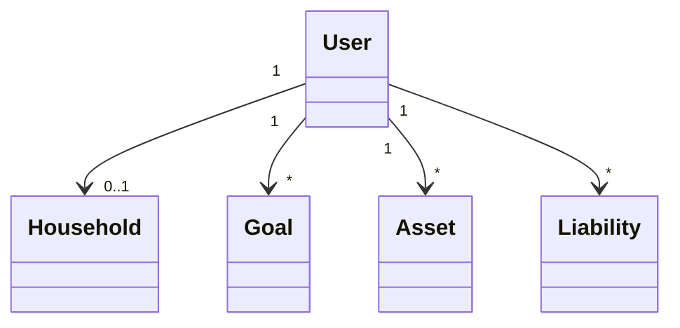
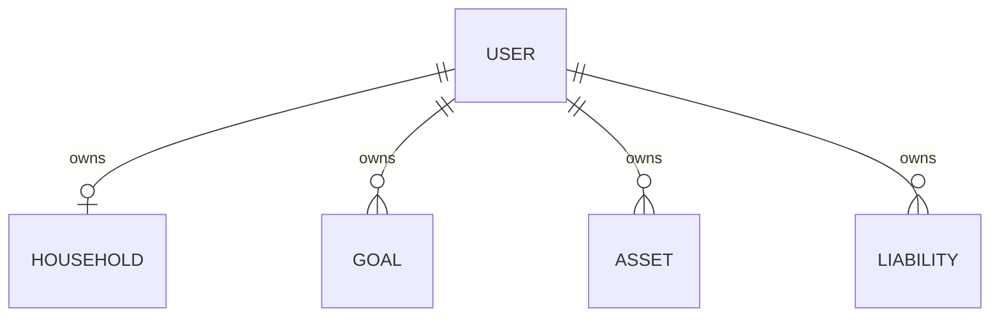
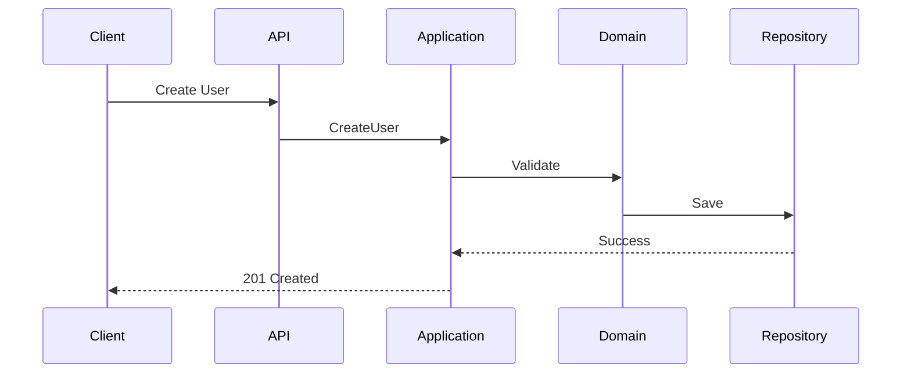
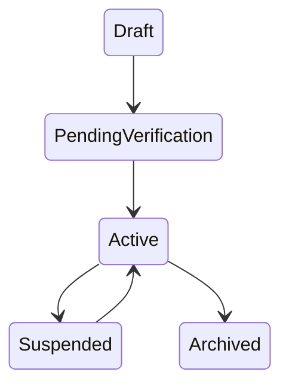

# User Entity Specification (Part 1)

# Entity Overview

## Purpose
The User entity represents an individual who owns financial data, goals, assets, liabilities, scenarios, and decisions within Atlas.

## Responsibilities
- Identity management
- Profile ownership
- Financial preference ownership
- Security boundary
- Aggregate root coordination

## Business Meaning
A User is the primary owner of all personal financial information.

## Aggregate Root
Yes.

## Lifecycle
Draft → PendingVerification → Active → Suspended → Archived

## Ownership
Owned by Identity Domain.

## Relationships
- Household (0..1)
- Goal (0..*)
- Asset (0..*)
- Liability (0..*)
- Loan (0..*)
- Portfolio (0..*)
- Decision (0..*)
- Notification (0..*)

## Navigation
User
 ├── Household
 ├── Goals
 ├── Assets
 ├── Liabilities
 ├── Portfolios
 ├── CashFlows
 └── Decisions

---

# Complete Properties

|Name|Type|Nullable|Default|Description|Validation|
|---|---|---|---|---|---|
|Id|UUID|No|Generated|Primary key|Required|
|ExternalId|string|Yes|null|Identity provider id|Max128|
|Email|string|No|-|Login email|Email|
|DisplayName|string|No|-|Display name|1-100 chars|
|FirstName|string|Yes|null|Given name|Max50|
|LastName|string|Yes|null|Family name|Max50|
|Phone|string|Yes|null|Phone number|Pattern|
|Locale|string|No|zh-TW|Culture|ISO|
|Currency|string|No|TWD|Default currency|ISO4217|
|TimeZone|string|No|Asia/Taipei|Timezone|IANA|
|Status|enum|No|Draft|Entity state|Enum|
|CreatedAt|datetime|No|now|Create time|Required|
|UpdatedAt|datetime|No|now|Update time|Required|

## Property Details

### Id
- Business Meaning: Immutable identity.
- Database: uuid
- JSON: id
- Searchable: Yes
- Sortable: Yes
- Indexed: PK
- Encrypted: No
- Auditable: Yes

### Email
- Business Meaning: Login identity.
- Database: varchar(320)
- JSON: email
- Searchable: Yes
- Sortable: Yes
- Indexed: Unique
- Encrypted: Optional
- Auditable: Yes

### DisplayName
- Business Meaning: Preferred name shown by Atlas.
- Database: varchar(100)
- JSON: displayName
- Searchable: Yes
- Sortable: Yes
- Indexed: Yes
- Auditable: Yes

### Currency
- Business Meaning: Default planning currency.
- Database: char(3)
- JSON: currency

### TimeZone
- Business Meaning: Calendar calculations.
- Database: varchar(50)
- JSON: timeZone

### Status
Allowed:
- Draft
- PendingVerification
- Active
- Suspended
- Archived

---

# Validation Rules

1. Id required.
2. Email required.
3. Email unique.
4. Email RFC compliant.
5. DisplayName required.
6. DisplayName <=100 chars.
7. Currency ISO4217.
8. Locale supported.
9. TimeZone valid IANA.
10. Status enum only.
11. CreatedAt immutable.
12. UpdatedAt >= CreatedAt.
13. ExternalId immutable after activation.
14. Phone format valid.
15. Deleted users cannot reactivate directly.

---

# Business Rules

1. One email belongs to one User.
2. User owns all financial aggregates.
3. Archived users are read-only.
4. Suspended users cannot execute decisions.
5. Only Active users receive recommendations.
6. Currency change triggers recalculation.
7. Timezone affects schedules.
8. Household ownership cannot cross tenants.
9. Goal ownership always references User.
10. User deletion is soft delete.

---

# State Machine

|State|Trigger|Next|
|---|---|---|
|Draft|Create|PendingVerification|
|PendingVerification|Verify Email|Active|
|Active|Suspend|Suspended|
|Suspended|Resume|Active|
|Active|Archive|Archived|

## Invariants
- Archived is terminal.
- Active requires verified email.
- Draft cannot own financial records.

## Illegal Transitions
- Draft → Archived
- Archived → Active
- Suspended → Draft
- Active → Draft


# Commands

## Standard Commands
- CreateUser
- UpdateUser
- DeleteUser
- ArchiveUser
- RestoreUser
- ActivateUser
- DeactivateUser

## Domain Commands
- VerifyEmail
- ChangeEmail
- ChangePhone
- ChangeDisplayName
- ChangeLocale
- ChangeCurrency
- ChangeTimeZone
- JoinHousehold
- LeaveHousehold
- AcceptInvitation
- RejectInvitation
- LockAccount
- UnlockAccount
- ResetPreferences
- RegisterNotificationChannel

---

# Domain Events

- UserCreated
- UserUpdated
- UserDeleted
- UserArchived
- UserRestored
- UserActivated
- UserDeactivated
- UserEmailVerified
- UserEmailChanged
- UserPhoneChanged
- UserCurrencyChanged
- UserLocaleChanged
- UserTimeZoneChanged
- UserJoinedHousehold
- UserLeftHousehold
- UserStatusChanged

Each event shall contain:
- EventId
- AggregateId
- AggregateVersion
- OccurredAt
- CorrelationId
- CausationId
- Actor
- Payload

---

# Repository

## Interface

IUserRepository

## Methods

- GetById
- GetByEmail
- Exists
- Add
- Update
- Delete
- Archive
- Restore
- SaveChanges

## Query Methods

- Search
- SearchActive
- SearchArchived
- SearchByHousehold
- SearchByCurrency
- SearchByLocale
- SearchByStatus

## Specifications

- ActiveUserSpecification
- ArchivedUserSpecification
- EmailVerifiedSpecification
- HouseholdMemberSpecification

---

# Domain Service Interaction

- IdentityValidationService
- HouseholdDomainService
- GoalDomainService
- PortfolioDomainService
- RecommendationDomainService
- DecisionDomainService
- NotificationDomainService
- AuditDomainService

Responsibilities:
- Validate invariants
- Coordinate aggregates
- Publish events
- Resolve conflicts

---

# Application Service Interaction

UserApplicationService

Methods:
- CreateAsync
- UpdateAsync
- ArchiveAsync
- RestoreAsync
- ActivateAsync
- DeactivateAsync
- SearchAsync
- DetailAsync

---

# REST API

GET /api/users

GET /api/users/{id}

POST /api/users

PUT /api/users/{id}

PATCH /api/users/{id}/activate

PATCH /api/users/{id}/deactivate

PATCH /api/users/{id}/archive

PATCH /api/users/{id}/restore

DELETE /api/users/{id}

## Request

- JSON
- UTF-8
- Validation required

## Response

- 200
- 201
- 204
- 400
- 401
- 403
- 404
- 409
- 422
- 500

---

# DTO

## CreateUserDto
- Email
- DisplayName
- Currency
- Locale
- TimeZone

## UpdateUserDto
- DisplayName
- Phone
- Currency
- Locale
- TimeZone

## UserDetailDto
- Complete profile
- Statistics
- Metadata

## UserSummaryDto
- Id
- Name
- Status

## UserSearchDto
- Keyword
- Status
- Currency
- Locale

---

# Database Mapping

Table: Users

Primary Key:
- Id

Unique:
- Email

Indexes:
- Email
- Status
- Currency
- HouseholdId

Foreign Keys:
- HouseholdId

---

# PostgreSQL Schema

```sql
CREATE TABLE users(
 id uuid PRIMARY KEY,
 email varchar(320) NOT NULL UNIQUE,
 display_name varchar(100) NOT NULL,
 currency char(3) NOT NULL,
 locale varchar(20) NOT NULL,
 timezone varchar(50) NOT NULL,
 status varchar(30) NOT NULL,
 household_id uuid NULL,
 created_at timestamptz NOT NULL,
 updated_at timestamptz NOT NULL
);

CREATE INDEX ix_users_status ON users(status);
CREATE INDEX ix_users_currency ON users(currency);
CREATE INDEX ix_users_household ON users(household_id);
```

Constraints
- email unique
- status check
- currency check

---

# EF Core Mapping

- ToTable("users")
- HasKey(Id)
- HasIndex(Email).IsUnique()
- HasIndex(Status)
- Property(DisplayName).HasMaxLength(100)
- Property(Currency).HasMaxLength(3)
- Property(Locale).HasMaxLength(20)
- Property(TimeZone).HasMaxLength(50)
- Use optimistic concurrency
- Configure owned value objects where applicable

---

# Cache Strategy

- Cache by Id
- Cache TTL 15 min
- Invalidate on update
- Distributed cache supported

---

# Security

Authorization
- Authenticated only
- Tenant isolation
- Role based permissions

Permissions
- User.Read
- User.Write
- User.Delete
- User.Admin

Data Masking
- Email
- Phone

---

# Audit

Audit Fields
- CreatedBy
- UpdatedBy
- CreatedAt
- UpdatedAt

Track:
- Status changes
- Email changes
- Permission changes

---

# Performance

- Pagination mandatory
- Projection queries
- Batch updates
- Async repository
- Compiled queries
- Optimized indexes


# Example JSON

## Create

```json
{
  "email":"user@example.com",
  "displayName":"Bran",
  "currency":"TWD",
  "locale":"zh-TW",
  "timeZone":"Asia/Taipei"
}
```

## Update

```json
{
  "displayName":"Bran Chen",
  "phone":"0912345678",
  "currency":"USD"
}
```

## Detail

```json
{
  "id":"8c1b8f1e-1111-2222-3333-444444444444",
  "email":"user@example.com",
  "displayName":"Bran",
  "status":"Active",
  "householdId":"4d1d...",
  "createdAt":"2026-07-09T10:00:00Z",
  "updatedAt":"2026-07-09T10:30:00Z"
}
```

## Search

```json
{
  "keyword":"bran",
  "status":"Active",
  "currency":"TWD",
  "page":1,
  "pageSize":20
}
```

---

# Mermaid

## Class Diagram



## Entity Relationship



## Sequence Diagram



## State Diagram



---

# Testing

## Unit Tests

- Create user
- Update profile
- Change currency
- Change locale
- Archive user
- Restore user
- Verify email
- Reject invalid email
- Duplicate email
- State transition validation

## Integration Tests

- API create
- API update
- Repository persistence
- Event publishing
- Cache invalidation
- Authorization

## Validation Tests

- Required fields
- Email uniqueness
- Currency validation
- Locale validation
- Timezone validation
- Status validation

## Performance Tests

- 100 concurrent creates
- 1000 search requests
- Bulk update
- Cache hit ratio
- Pagination

---

# Edge Cases

1. Duplicate email
2. Empty display name
3. Invalid locale
4. Invalid currency
5. Invalid timezone
6. Soft deleted user login
7. Archived user update
8. Archived user restore twice
9. Concurrent update conflict
10. Duplicate event delivery
11. Missing household
12. Circular household reference
13. Invalid UTF-8 name
14. Maximum length exceeded
15. SQL injection attempt
16. XSS payload in display name
17. Invalid UUID
18. Null request body
19. Expired authentication
20. Unauthorized update
21. Tenant isolation violation
22. Replay attack
23. Cache stale data
24. Optimistic concurrency failure
25. Event ordering issue

---

# Version History

| Version | Date | Author | Description |
|---------|------|--------|-------------|
|1.0|2026-07-09|Atlas|Initial enterprise draft|
|1.1|2026-07-09|Atlas|Expanded API examples|
|1.2|2026-07-09|Atlas|Added testing coverage|
|1.3|2026-07-09|Atlas|Added edge cases|

---

# Completion Checklist

- Entity Overview ✔
- Properties ✔
- Validation ✔
- Business Rules ✔
- State Machine ✔
- Commands ✔
- Events ✔
- Repository ✔
- Services ✔
- API ✔
- DTO ✔
- Database ✔
- PostgreSQL ✔
- EF Core ✔
- Cache ✔
- Security ✔
- Audit ✔
- Performance ✔
- Example JSON ✔
- Mermaid ✔
- Testing ✔
- Edge Cases ✔
- Version History ✔
