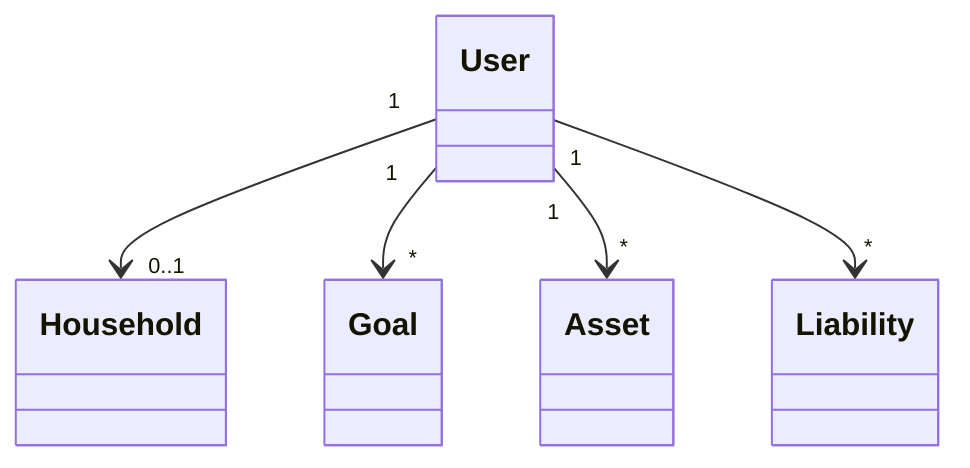
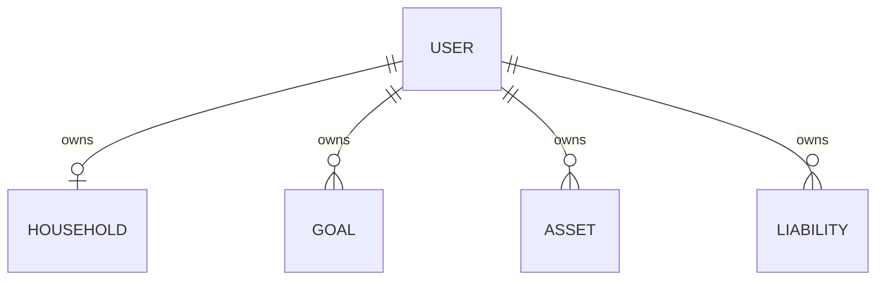
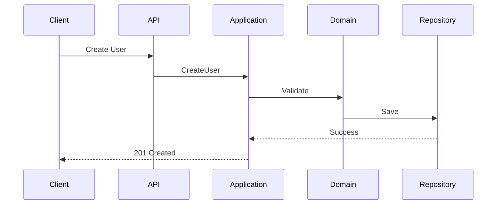
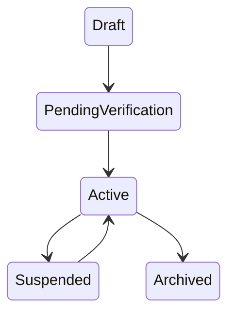

> **PWA v1 Architecture Amendment (2026-07-11):** Any PostgreSQL, EF Core, JWT, Swagger, server-hosted REST, or mandatory .NET runtime content in this document is classified as a future cloud-phase mapping. Atlas v1 uses in-process TypeScript Application Use Cases and IndexedDB repositories. Domain names, business rules, validation rules, formulas, events, and state machines remain authoritative.

# User Entity Specification (Part 3)

# Example JSON

## Create

```json
{
  "email":"user@example.com",
  "displayName":"Bran",
  "currency":"TWD",
  "locale":"zh-TW",
  "timeZone":"Asia/Taipei"
}
```

## Update

```json
{
  "displayName":"Bran Chen",
  "phone":"0912345678",
  "currency":"USD"
}
```

## Detail

```json
{
  "id":"8c1b8f1e-1111-2222-3333-444444444444",
  "email":"user@example.com",
  "displayName":"Bran",
  "status":"Active",
  "householdId":"4d1d...",
  "createdAt":"2026-07-09T10:00:00Z",
  "updatedAt":"2026-07-09T10:30:00Z"
}
```

## Search

```json
{
  "keyword":"bran",
  "status":"Active",
  "currency":"TWD",
  "page":1,
  "pageSize":20
}
```

---

# Mermaid

## Class Diagram



## Entity Relationship



## Sequence Diagram



## State Diagram



---

# Testing

## Unit Tests

- Create user
- Update profile
- Change currency
- Change locale
- Archive user
- Restore user
- Verify email
- Reject invalid email
- Duplicate email
- State transition validation

## Integration Tests

- API create
- API update
- Repository persistence
- Event publishing
- Cache invalidation
- Authorization

## Validation Tests

- Required fields
- Email uniqueness
- Currency validation
- Locale validation
- Timezone validation
- Status validation

## Performance Tests

- 100 concurrent creates
- 1000 search requests
- Bulk update
- Cache hit ratio
- Pagination

---

# Edge Cases

1. Duplicate email
2. Empty display name
3. Invalid locale
4. Invalid currency
5. Invalid timezone
6. Soft deleted user login
7. Archived user update
8. Archived user restore twice
9. Concurrent update conflict
10. Duplicate event delivery
11. Missing household
12. Circular household reference
13. Invalid UTF-8 name
14. Maximum length exceeded
15. SQL injection attempt
16. XSS payload in display name
17. Invalid UUID
18. Null request body
19. Expired authentication
20. Unauthorized update
21. Tenant isolation violation
22. Replay attack
23. Cache stale data
24. Optimistic concurrency failure
25. Event ordering issue

---

# Version History

| Version | Date | Author | Description |
|---------|------|--------|-------------|
|1.0|2026-07-09|Atlas|Initial enterprise draft|
|1.1|2026-07-09|Atlas|Expanded API examples|
|1.2|2026-07-09|Atlas|Added testing coverage|
|1.3|2026-07-09|Atlas|Added edge cases|

---

# Completion Checklist

- Entity Overview ✔
- Properties ✔
- Validation ✔
- Business Rules ✔
- State Machine ✔
- Commands ✔
- Events ✔
- Repository ✔
- Services ✔
- API ✔
- DTO ✔
- Database ✔
- PostgreSQL ✔
- EF Core ✔
- Cache ✔
- Security ✔
- Audit ✔
- Performance ✔
- Example JSON ✔
- Mermaid ✔
- Testing ✔
- Edge Cases ✔
- Version History ✔
- Documentation appendix note 60: maintain compatibility with Atlas domain catalog.
- Documentation appendix note 61: maintain compatibility with Atlas domain catalog.
- Documentation appendix note 62: maintain compatibility with Atlas domain catalog.
- Documentation appendix note 63: maintain compatibility with Atlas domain catalog.
- Documentation appendix note 64: maintain compatibility with Atlas domain catalog.
- Documentation appendix note 65: maintain compatibility with Atlas domain catalog.
- Documentation appendix note 66: maintain compatibility with Atlas domain catalog.
- Documentation appendix note 67: maintain compatibility with Atlas domain catalog.
- Documentation appendix note 68: maintain compatibility with Atlas domain catalog.
- Documentation appendix note 69: maintain compatibility with Atlas domain catalog.