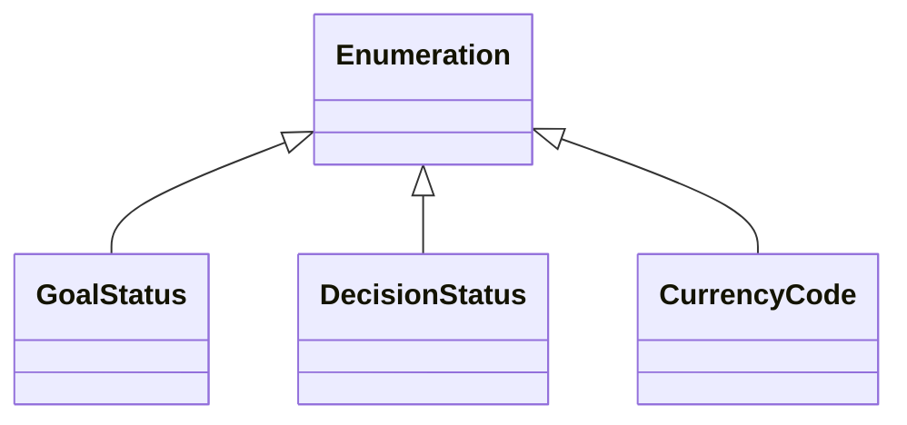
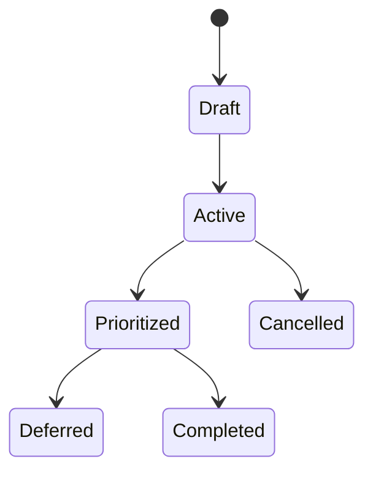
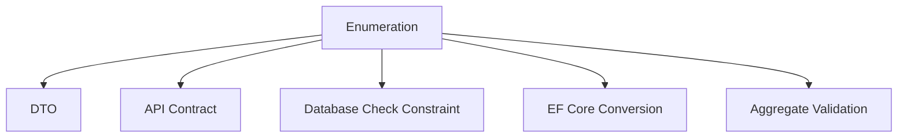
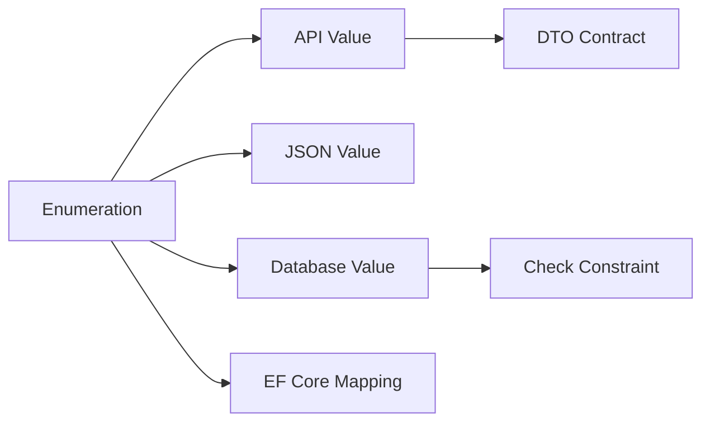

# Enumeration Catalog

# Document Control

Document Name: Enumeration Catalog
Document Path: knowledge/enumeration-catalog.md
Document Type: Atlas Enterprise Canonical Specification
Version: 1.0
Status: Canonical Specification
Domain: Platform
Bounded Context: Platform
Owner: Project Atlas
Source of Truth: Atlas Enumeration Source of Truth
Last Updated: 2026-07-12

Related Specifications:
- knowledge/aggregate-catalog.md
- knowledge/entity-catalog.md
- knowledge/value-object-catalog.md
- knowledge/command-catalog.md
- knowledge/domain-event-catalog.md
- knowledge/repository-catalog.md
- knowledge/domain-model-catalog.md
- knowledge/domain-service-catalog.md
- knowledge/application-service-catalog.md
- knowledge/api-governance-framework.md
- knowledge/property.md
- docs/04-DomainModel.md
- docs/05-DatabaseDesign.md
- docs/06-ERD.md

# Purpose

Enumeration Catalog defines every approved Atlas Enumeration and its values. It is the source of truth for Entity, Aggregate, Value Object, Repository, Command, Domain Event, DTO, API, Database, EF Core, validation, business rules, Workflow, and State Machine usage.

# Scope

- Enumeration
- Business Enumeration
- Technical Enumeration
- API Enumeration
- Database Enumeration
- State Enumeration
- Status Enumeration
- Type Enumeration
- Priority Enumeration
- Category Enumeration
- Flag Enumeration
- Lifecycle Enumeration
- Permission Enumeration
- Validation Enumeration

# Enumeration Definition Standard

Every Enumeration entry uses the following complete Enterprise contract.
- Enumeration Name
- Display Name
- Domain
- Bounded Context
- Module
- Purpose
- Business Meaning
- Description
- Underlying Type
- Values
- Allowed Values
- Display Values
- Display Text
- Internal Value
- Descriptions
- Business Rules
- Default Value
- Nullable
- API Values
- Database Values
- JSON Value
- EF Core Mapping
- Serialization
- Validation
- Usage
- Referenced By
- Security
- Audit
- Deprecation Policy
- Example

# Complete Enumeration Catalog

## GoalStatus

Enumeration Name: GoalStatus
Display Name: GoalStatus
Domain: Goal
Bounded Context: Financial Planning
Module: Goal
Purpose: Goal state across GoalPlan lifecycle.
Business Meaning: GoalStatus constrains state, type, priority, category, or technical values to the catalog-approved set.
Description: GoalStatus is serialized as a stable string, stored with a database check constraint or equivalent validation, and mapped through EF Core conversion.
Underlying Type: String
Values: Draft, Active, Prioritized, Deferred, Completed, Cancelled
Display Values: Draft, Active, Prioritized, Deferred, Completed, Cancelled
Descriptions: Each value represents a catalog-approved meaning within Goal.
Business Rules: Only listed values are accepted; state values must follow the transition matrix.
Default Value: Active
Nullable: Not nullable unless owner field explicitly permits absence.
API Values: Draft, Active, Prioritized, Deferred, Completed, Cancelled
Database Values: Draft, Active, Prioritized, Deferred, Completed, Cancelled
EF Core Mapping: String enum conversion with max length and check constraint.
Serialization: Stable case-sensitive JSON string.
Validation: Reject unknown, blank, numeric, localized, or obsolete values.
Usage: Aggregates: GoalPlan; Entities: Goal; Repositories: GoalRepository; DTO: GoalStatusDto
Example: GoalStatus uses Active as default when the owner explicitly requires default initialization.

### GoalStatus.Draft

Name: Draft
Display Name: Draft
Value: Draft
Description: Draft is a valid GoalStatus value.
Business Meaning: Draft carries its catalog-approved meaning only inside GoalStatus.
Allowed Transition: See State Transition Matrix when State Enumeration is a state or status enumeration.
Deprecated: No.
Example: API and database store Draft as a stable string.

### GoalStatus.Active

Name: Active
Display Name: Active
Value: Active
Description: Active is a valid GoalStatus value.
Business Meaning: Active carries its catalog-approved meaning only inside GoalStatus.
Allowed Transition: See State Transition Matrix when State Enumeration is a state or status enumeration.
Deprecated: No.
Example: API and database store Active as a stable string.

### GoalStatus.Prioritized

Name: Prioritized
Display Name: Prioritized
Value: Prioritized
Description: Prioritized is a valid GoalStatus value.
Business Meaning: Prioritized carries its catalog-approved meaning only inside GoalStatus.
Allowed Transition: See State Transition Matrix when State Enumeration is a state or status enumeration.
Deprecated: No.
Example: API and database store Prioritized as a stable string.

### GoalStatus.Deferred

Name: Deferred
Display Name: Deferred
Value: Deferred
Description: Deferred is a valid GoalStatus value.
Business Meaning: Deferred carries its catalog-approved meaning only inside GoalStatus.
Allowed Transition: See State Transition Matrix when State Enumeration is a state or status enumeration.
Deprecated: No.
Example: API and database store Deferred as a stable string.

### GoalStatus.Completed

Name: Completed
Display Name: Completed
Value: Completed
Description: Completed is a valid GoalStatus value.
Business Meaning: Completed carries its catalog-approved meaning only inside GoalStatus.
Allowed Transition: See State Transition Matrix when State Enumeration is a state or status enumeration.
Deprecated: No.
Example: API and database store Completed as a stable string.

### GoalStatus.Cancelled

Name: Cancelled
Display Name: Cancelled
Value: Cancelled
Description: Cancelled is a valid GoalStatus value.
Business Meaning: Cancelled carries its catalog-approved meaning only inside GoalStatus.
Allowed Transition: See State Transition Matrix when State Enumeration is a state or status enumeration.
Deprecated: No.
Example: API and database store Cancelled as a stable string.
Enumeration Control 1: GoalStatus preserves value stability, API mapping, database mapping, EF Core conversion, validation, serialization, state transition behavior, backward compatibility, auditability, and catalog ownership.
Enumeration Control 2: GoalStatus preserves value stability, API mapping, database mapping, EF Core conversion, validation, serialization, state transition behavior, backward compatibility, auditability, and catalog ownership.
Enumeration Control 3: GoalStatus preserves value stability, API mapping, database mapping, EF Core conversion, validation, serialization, state transition behavior, backward compatibility, auditability, and catalog ownership.
Enumeration Control 4: GoalStatus preserves value stability, API mapping, database mapping, EF Core conversion, validation, serialization, state transition behavior, backward compatibility, auditability, and catalog ownership.
Enumeration Control 5: GoalStatus preserves value stability, API mapping, database mapping, EF Core conversion, validation, serialization, state transition behavior, backward compatibility, auditability, and catalog ownership.
Enumeration Control 6: GoalStatus preserves value stability, API mapping, database mapping, EF Core conversion, validation, serialization, state transition behavior, backward compatibility, auditability, and catalog ownership.
Enumeration Control 7: GoalStatus preserves value stability, API mapping, database mapping, EF Core conversion, validation, serialization, state transition behavior, backward compatibility, auditability, and catalog ownership.
Enumeration Control 8: GoalStatus preserves value stability, API mapping, database mapping, EF Core conversion, validation, serialization, state transition behavior, backward compatibility, auditability, and catalog ownership.
Enumeration Control 9: GoalStatus preserves value stability, API mapping, database mapping, EF Core conversion, validation, serialization, state transition behavior, backward compatibility, auditability, and catalog ownership.
Enumeration Control 10: GoalStatus preserves value stability, API mapping, database mapping, EF Core conversion, validation, serialization, state transition behavior, backward compatibility, auditability, and catalog ownership.
Enumeration Control 11: GoalStatus preserves value stability, API mapping, database mapping, EF Core conversion, validation, serialization, state transition behavior, backward compatibility, auditability, and catalog ownership.
Enumeration Control 12: GoalStatus preserves value stability, API mapping, database mapping, EF Core conversion, validation, serialization, state transition behavior, backward compatibility, auditability, and catalog ownership.
Enumeration Control 13: GoalStatus preserves value stability, API mapping, database mapping, EF Core conversion, validation, serialization, state transition behavior, backward compatibility, auditability, and catalog ownership.
Enumeration Control 14: GoalStatus preserves value stability, API mapping, database mapping, EF Core conversion, validation, serialization, state transition behavior, backward compatibility, auditability, and catalog ownership.
Enumeration Control 15: GoalStatus preserves value stability, API mapping, database mapping, EF Core conversion, validation, serialization, state transition behavior, backward compatibility, auditability, and catalog ownership.
Enumeration Control 16: GoalStatus preserves value stability, API mapping, database mapping, EF Core conversion, validation, serialization, state transition behavior, backward compatibility, auditability, and catalog ownership.
Enumeration Control 17: GoalStatus preserves value stability, API mapping, database mapping, EF Core conversion, validation, serialization, state transition behavior, backward compatibility, auditability, and catalog ownership.
Enumeration Control 18: GoalStatus preserves value stability, API mapping, database mapping, EF Core conversion, validation, serialization, state transition behavior, backward compatibility, auditability, and catalog ownership.
Enumeration Control 19: GoalStatus preserves value stability, API mapping, database mapping, EF Core conversion, validation, serialization, state transition behavior, backward compatibility, auditability, and catalog ownership.
Enumeration Control 20: GoalStatus preserves value stability, API mapping, database mapping, EF Core conversion, validation, serialization, state transition behavior, backward compatibility, auditability, and catalog ownership.
Enumeration Control 21: GoalStatus preserves value stability, API mapping, database mapping, EF Core conversion, validation, serialization, state transition behavior, backward compatibility, auditability, and catalog ownership.
Enumeration Control 22: GoalStatus preserves value stability, API mapping, database mapping, EF Core conversion, validation, serialization, state transition behavior, backward compatibility, auditability, and catalog ownership.
Enumeration Control 23: GoalStatus preserves value stability, API mapping, database mapping, EF Core conversion, validation, serialization, state transition behavior, backward compatibility, auditability, and catalog ownership.
Enumeration Control 24: GoalStatus preserves value stability, API mapping, database mapping, EF Core conversion, validation, serialization, state transition behavior, backward compatibility, auditability, and catalog ownership.
Enumeration Control 25: GoalStatus preserves value stability, API mapping, database mapping, EF Core conversion, validation, serialization, state transition behavior, backward compatibility, auditability, and catalog ownership.
Enumeration Control 26: GoalStatus preserves value stability, API mapping, database mapping, EF Core conversion, validation, serialization, state transition behavior, backward compatibility, auditability, and catalog ownership.
Enumeration Control 27: GoalStatus preserves value stability, API mapping, database mapping, EF Core conversion, validation, serialization, state transition behavior, backward compatibility, auditability, and catalog ownership.
Enumeration Control 28: GoalStatus preserves value stability, API mapping, database mapping, EF Core conversion, validation, serialization, state transition behavior, backward compatibility, auditability, and catalog ownership.
Enumeration Control 29: GoalStatus preserves value stability, API mapping, database mapping, EF Core conversion, validation, serialization, state transition behavior, backward compatibility, auditability, and catalog ownership.
Enumeration Control 30: GoalStatus preserves value stability, API mapping, database mapping, EF Core conversion, validation, serialization, state transition behavior, backward compatibility, auditability, and catalog ownership.
Enumeration Control 31: GoalStatus preserves value stability, API mapping, database mapping, EF Core conversion, validation, serialization, state transition behavior, backward compatibility, auditability, and catalog ownership.
Enumeration Control 32: GoalStatus preserves value stability, API mapping, database mapping, EF Core conversion, validation, serialization, state transition behavior, backward compatibility, auditability, and catalog ownership.
Enumeration Control 33: GoalStatus preserves value stability, API mapping, database mapping, EF Core conversion, validation, serialization, state transition behavior, backward compatibility, auditability, and catalog ownership.
Enumeration Control 34: GoalStatus preserves value stability, API mapping, database mapping, EF Core conversion, validation, serialization, state transition behavior, backward compatibility, auditability, and catalog ownership.
Enumeration Control 35: GoalStatus preserves value stability, API mapping, database mapping, EF Core conversion, validation, serialization, state transition behavior, backward compatibility, auditability, and catalog ownership.
Enumeration Control 36: GoalStatus preserves value stability, API mapping, database mapping, EF Core conversion, validation, serialization, state transition behavior, backward compatibility, auditability, and catalog ownership.
Enumeration Control 37: GoalStatus preserves value stability, API mapping, database mapping, EF Core conversion, validation, serialization, state transition behavior, backward compatibility, auditability, and catalog ownership.
Enumeration Control 38: GoalStatus preserves value stability, API mapping, database mapping, EF Core conversion, validation, serialization, state transition behavior, backward compatibility, auditability, and catalog ownership.
Enumeration Control 39: GoalStatus preserves value stability, API mapping, database mapping, EF Core conversion, validation, serialization, state transition behavior, backward compatibility, auditability, and catalog ownership.
Enumeration Control 40: GoalStatus preserves value stability, API mapping, database mapping, EF Core conversion, validation, serialization, state transition behavior, backward compatibility, auditability, and catalog ownership.
Enumeration Control 41: GoalStatus preserves value stability, API mapping, database mapping, EF Core conversion, validation, serialization, state transition behavior, backward compatibility, auditability, and catalog ownership.
Enumeration Control 42: GoalStatus preserves value stability, API mapping, database mapping, EF Core conversion, validation, serialization, state transition behavior, backward compatibility, auditability, and catalog ownership.
Enumeration Control 43: GoalStatus preserves value stability, API mapping, database mapping, EF Core conversion, validation, serialization, state transition behavior, backward compatibility, auditability, and catalog ownership.
Enumeration Control 44: GoalStatus preserves value stability, API mapping, database mapping, EF Core conversion, validation, serialization, state transition behavior, backward compatibility, auditability, and catalog ownership.
Enumeration Control 45: GoalStatus preserves value stability, API mapping, database mapping, EF Core conversion, validation, serialization, state transition behavior, backward compatibility, auditability, and catalog ownership.
Enumeration Control 46: GoalStatus preserves value stability, API mapping, database mapping, EF Core conversion, validation, serialization, state transition behavior, backward compatibility, auditability, and catalog ownership.
Enumeration Control 47: GoalStatus preserves value stability, API mapping, database mapping, EF Core conversion, validation, serialization, state transition behavior, backward compatibility, auditability, and catalog ownership.
Enumeration Control 48: GoalStatus preserves value stability, API mapping, database mapping, EF Core conversion, validation, serialization, state transition behavior, backward compatibility, auditability, and catalog ownership.
Enumeration Control 49: GoalStatus preserves value stability, API mapping, database mapping, EF Core conversion, validation, serialization, state transition behavior, backward compatibility, auditability, and catalog ownership.
Enumeration Control 50: GoalStatus preserves value stability, API mapping, database mapping, EF Core conversion, validation, serialization, state transition behavior, backward compatibility, auditability, and catalog ownership.
Enumeration Control 51: GoalStatus preserves value stability, API mapping, database mapping, EF Core conversion, validation, serialization, state transition behavior, backward compatibility, auditability, and catalog ownership.
Enumeration Control 52: GoalStatus preserves value stability, API mapping, database mapping, EF Core conversion, validation, serialization, state transition behavior, backward compatibility, auditability, and catalog ownership.
Enumeration Control 53: GoalStatus preserves value stability, API mapping, database mapping, EF Core conversion, validation, serialization, state transition behavior, backward compatibility, auditability, and catalog ownership.
Enumeration Control 54: GoalStatus preserves value stability, API mapping, database mapping, EF Core conversion, validation, serialization, state transition behavior, backward compatibility, auditability, and catalog ownership.
Enumeration Control 55: GoalStatus preserves value stability, API mapping, database mapping, EF Core conversion, validation, serialization, state transition behavior, backward compatibility, auditability, and catalog ownership.
Enumeration Control 56: GoalStatus preserves value stability, API mapping, database mapping, EF Core conversion, validation, serialization, state transition behavior, backward compatibility, auditability, and catalog ownership.
Enumeration Control 57: GoalStatus preserves value stability, API mapping, database mapping, EF Core conversion, validation, serialization, state transition behavior, backward compatibility, auditability, and catalog ownership.
Enumeration Control 58: GoalStatus preserves value stability, API mapping, database mapping, EF Core conversion, validation, serialization, state transition behavior, backward compatibility, auditability, and catalog ownership.

## DecisionStatus

Enumeration Name: DecisionStatus
Display Name: DecisionStatus
Domain: Decision
Bounded Context: Decision Intelligence
Module: Decision
Purpose: Decision session and recommendation decision state.
Business Meaning: DecisionStatus constrains state, type, priority, category, or technical values to the catalog-approved set.
Description: DecisionStatus is serialized as a stable string, stored with a database check constraint or equivalent validation, and mapped through EF Core conversion.
Underlying Type: String
Values: Pending, Evaluating, Recommended, Accepted, Rejected, Expired
Display Values: Pending, Evaluating, Recommended, Accepted, Rejected, Expired
Descriptions: Each value represents a catalog-approved meaning within Decision.
Business Rules: Only listed values are accepted; state values must follow the transition matrix.
Default Value: Pending
Nullable: Not nullable unless owner field explicitly permits absence.
API Values: Pending, Evaluating, Recommended, Accepted, Rejected, Expired
Database Values: Pending, Evaluating, Recommended, Accepted, Rejected, Expired
EF Core Mapping: String enum conversion with max length and check constraint.
Serialization: Stable case-sensitive JSON string.
Validation: Reject unknown, blank, numeric, localized, or obsolete values.
Usage: Aggregates: DecisionSession; Entities: Decision, Recommendation; Repositories: DecisionRepository; DTO: DecisionStatusDto
Example: DecisionStatus uses Pending as default when the owner explicitly requires default initialization.

### DecisionStatus.Pending

Name: Pending
Display Name: Pending
Value: Pending
Description: Pending is a valid DecisionStatus value.
Business Meaning: Pending carries its catalog-approved meaning only inside DecisionStatus.
Allowed Transition: See State Transition Matrix when Status Enumeration is a state or status enumeration.
Deprecated: No.
Example: API and database store Pending as a stable string.

### DecisionStatus.Evaluating

Name: Evaluating
Display Name: Evaluating
Value: Evaluating
Description: Evaluating is a valid DecisionStatus value.
Business Meaning: Evaluating carries its catalog-approved meaning only inside DecisionStatus.
Allowed Transition: See State Transition Matrix when Status Enumeration is a state or status enumeration.
Deprecated: No.
Example: API and database store Evaluating as a stable string.

### DecisionStatus.Recommended

Name: Recommended
Display Name: Recommended
Value: Recommended
Description: Recommended is a valid DecisionStatus value.
Business Meaning: Recommended carries its catalog-approved meaning only inside DecisionStatus.
Allowed Transition: See State Transition Matrix when Status Enumeration is a state or status enumeration.
Deprecated: No.
Example: API and database store Recommended as a stable string.

### DecisionStatus.Accepted

Name: Accepted
Display Name: Accepted
Value: Accepted
Description: Accepted is a valid DecisionStatus value.
Business Meaning: Accepted carries its catalog-approved meaning only inside DecisionStatus.
Allowed Transition: See State Transition Matrix when Status Enumeration is a state or status enumeration.
Deprecated: No.
Example: API and database store Accepted as a stable string.

### DecisionStatus.Rejected

Name: Rejected
Display Name: Rejected
Value: Rejected
Description: Rejected is a valid DecisionStatus value.
Business Meaning: Rejected carries its catalog-approved meaning only inside DecisionStatus.
Allowed Transition: See State Transition Matrix when Status Enumeration is a state or status enumeration.
Deprecated: No.
Example: API and database store Rejected as a stable string.

### DecisionStatus.Expired

Name: Expired
Display Name: Expired
Value: Expired
Description: Expired is a valid DecisionStatus value.
Business Meaning: Expired carries its catalog-approved meaning only inside DecisionStatus.
Allowed Transition: See State Transition Matrix when Status Enumeration is a state or status enumeration.
Deprecated: No.
Example: API and database store Expired as a stable string.
Enumeration Control 1: DecisionStatus preserves value stability, API mapping, database mapping, EF Core conversion, validation, serialization, state transition behavior, backward compatibility, auditability, and catalog ownership.
Enumeration Control 2: DecisionStatus preserves value stability, API mapping, database mapping, EF Core conversion, validation, serialization, state transition behavior, backward compatibility, auditability, and catalog ownership.
Enumeration Control 3: DecisionStatus preserves value stability, API mapping, database mapping, EF Core conversion, validation, serialization, state transition behavior, backward compatibility, auditability, and catalog ownership.
Enumeration Control 4: DecisionStatus preserves value stability, API mapping, database mapping, EF Core conversion, validation, serialization, state transition behavior, backward compatibility, auditability, and catalog ownership.
Enumeration Control 5: DecisionStatus preserves value stability, API mapping, database mapping, EF Core conversion, validation, serialization, state transition behavior, backward compatibility, auditability, and catalog ownership.
Enumeration Control 6: DecisionStatus preserves value stability, API mapping, database mapping, EF Core conversion, validation, serialization, state transition behavior, backward compatibility, auditability, and catalog ownership.
Enumeration Control 7: DecisionStatus preserves value stability, API mapping, database mapping, EF Core conversion, validation, serialization, state transition behavior, backward compatibility, auditability, and catalog ownership.
Enumeration Control 8: DecisionStatus preserves value stability, API mapping, database mapping, EF Core conversion, validation, serialization, state transition behavior, backward compatibility, auditability, and catalog ownership.
Enumeration Control 9: DecisionStatus preserves value stability, API mapping, database mapping, EF Core conversion, validation, serialization, state transition behavior, backward compatibility, auditability, and catalog ownership.
Enumeration Control 10: DecisionStatus preserves value stability, API mapping, database mapping, EF Core conversion, validation, serialization, state transition behavior, backward compatibility, auditability, and catalog ownership.
Enumeration Control 11: DecisionStatus preserves value stability, API mapping, database mapping, EF Core conversion, validation, serialization, state transition behavior, backward compatibility, auditability, and catalog ownership.
Enumeration Control 12: DecisionStatus preserves value stability, API mapping, database mapping, EF Core conversion, validation, serialization, state transition behavior, backward compatibility, auditability, and catalog ownership.
Enumeration Control 13: DecisionStatus preserves value stability, API mapping, database mapping, EF Core conversion, validation, serialization, state transition behavior, backward compatibility, auditability, and catalog ownership.
Enumeration Control 14: DecisionStatus preserves value stability, API mapping, database mapping, EF Core conversion, validation, serialization, state transition behavior, backward compatibility, auditability, and catalog ownership.
Enumeration Control 15: DecisionStatus preserves value stability, API mapping, database mapping, EF Core conversion, validation, serialization, state transition behavior, backward compatibility, auditability, and catalog ownership.
Enumeration Control 16: DecisionStatus preserves value stability, API mapping, database mapping, EF Core conversion, validation, serialization, state transition behavior, backward compatibility, auditability, and catalog ownership.
Enumeration Control 17: DecisionStatus preserves value stability, API mapping, database mapping, EF Core conversion, validation, serialization, state transition behavior, backward compatibility, auditability, and catalog ownership.
Enumeration Control 18: DecisionStatus preserves value stability, API mapping, database mapping, EF Core conversion, validation, serialization, state transition behavior, backward compatibility, auditability, and catalog ownership.
Enumeration Control 19: DecisionStatus preserves value stability, API mapping, database mapping, EF Core conversion, validation, serialization, state transition behavior, backward compatibility, auditability, and catalog ownership.
Enumeration Control 20: DecisionStatus preserves value stability, API mapping, database mapping, EF Core conversion, validation, serialization, state transition behavior, backward compatibility, auditability, and catalog ownership.
Enumeration Control 21: DecisionStatus preserves value stability, API mapping, database mapping, EF Core conversion, validation, serialization, state transition behavior, backward compatibility, auditability, and catalog ownership.
Enumeration Control 22: DecisionStatus preserves value stability, API mapping, database mapping, EF Core conversion, validation, serialization, state transition behavior, backward compatibility, auditability, and catalog ownership.
Enumeration Control 23: DecisionStatus preserves value stability, API mapping, database mapping, EF Core conversion, validation, serialization, state transition behavior, backward compatibility, auditability, and catalog ownership.
Enumeration Control 24: DecisionStatus preserves value stability, API mapping, database mapping, EF Core conversion, validation, serialization, state transition behavior, backward compatibility, auditability, and catalog ownership.
Enumeration Control 25: DecisionStatus preserves value stability, API mapping, database mapping, EF Core conversion, validation, serialization, state transition behavior, backward compatibility, auditability, and catalog ownership.
Enumeration Control 26: DecisionStatus preserves value stability, API mapping, database mapping, EF Core conversion, validation, serialization, state transition behavior, backward compatibility, auditability, and catalog ownership.
Enumeration Control 27: DecisionStatus preserves value stability, API mapping, database mapping, EF Core conversion, validation, serialization, state transition behavior, backward compatibility, auditability, and catalog ownership.
Enumeration Control 28: DecisionStatus preserves value stability, API mapping, database mapping, EF Core conversion, validation, serialization, state transition behavior, backward compatibility, auditability, and catalog ownership.
Enumeration Control 29: DecisionStatus preserves value stability, API mapping, database mapping, EF Core conversion, validation, serialization, state transition behavior, backward compatibility, auditability, and catalog ownership.
Enumeration Control 30: DecisionStatus preserves value stability, API mapping, database mapping, EF Core conversion, validation, serialization, state transition behavior, backward compatibility, auditability, and catalog ownership.
Enumeration Control 31: DecisionStatus preserves value stability, API mapping, database mapping, EF Core conversion, validation, serialization, state transition behavior, backward compatibility, auditability, and catalog ownership.
Enumeration Control 32: DecisionStatus preserves value stability, API mapping, database mapping, EF Core conversion, validation, serialization, state transition behavior, backward compatibility, auditability, and catalog ownership.
Enumeration Control 33: DecisionStatus preserves value stability, API mapping, database mapping, EF Core conversion, validation, serialization, state transition behavior, backward compatibility, auditability, and catalog ownership.
Enumeration Control 34: DecisionStatus preserves value stability, API mapping, database mapping, EF Core conversion, validation, serialization, state transition behavior, backward compatibility, auditability, and catalog ownership.
Enumeration Control 35: DecisionStatus preserves value stability, API mapping, database mapping, EF Core conversion, validation, serialization, state transition behavior, backward compatibility, auditability, and catalog ownership.
Enumeration Control 36: DecisionStatus preserves value stability, API mapping, database mapping, EF Core conversion, validation, serialization, state transition behavior, backward compatibility, auditability, and catalog ownership.
Enumeration Control 37: DecisionStatus preserves value stability, API mapping, database mapping, EF Core conversion, validation, serialization, state transition behavior, backward compatibility, auditability, and catalog ownership.
Enumeration Control 38: DecisionStatus preserves value stability, API mapping, database mapping, EF Core conversion, validation, serialization, state transition behavior, backward compatibility, auditability, and catalog ownership.
Enumeration Control 39: DecisionStatus preserves value stability, API mapping, database mapping, EF Core conversion, validation, serialization, state transition behavior, backward compatibility, auditability, and catalog ownership.
Enumeration Control 40: DecisionStatus preserves value stability, API mapping, database mapping, EF Core conversion, validation, serialization, state transition behavior, backward compatibility, auditability, and catalog ownership.
Enumeration Control 41: DecisionStatus preserves value stability, API mapping, database mapping, EF Core conversion, validation, serialization, state transition behavior, backward compatibility, auditability, and catalog ownership.
Enumeration Control 42: DecisionStatus preserves value stability, API mapping, database mapping, EF Core conversion, validation, serialization, state transition behavior, backward compatibility, auditability, and catalog ownership.
Enumeration Control 43: DecisionStatus preserves value stability, API mapping, database mapping, EF Core conversion, validation, serialization, state transition behavior, backward compatibility, auditability, and catalog ownership.
Enumeration Control 44: DecisionStatus preserves value stability, API mapping, database mapping, EF Core conversion, validation, serialization, state transition behavior, backward compatibility, auditability, and catalog ownership.
Enumeration Control 45: DecisionStatus preserves value stability, API mapping, database mapping, EF Core conversion, validation, serialization, state transition behavior, backward compatibility, auditability, and catalog ownership.
Enumeration Control 46: DecisionStatus preserves value stability, API mapping, database mapping, EF Core conversion, validation, serialization, state transition behavior, backward compatibility, auditability, and catalog ownership.
Enumeration Control 47: DecisionStatus preserves value stability, API mapping, database mapping, EF Core conversion, validation, serialization, state transition behavior, backward compatibility, auditability, and catalog ownership.
Enumeration Control 48: DecisionStatus preserves value stability, API mapping, database mapping, EF Core conversion, validation, serialization, state transition behavior, backward compatibility, auditability, and catalog ownership.
Enumeration Control 49: DecisionStatus preserves value stability, API mapping, database mapping, EF Core conversion, validation, serialization, state transition behavior, backward compatibility, auditability, and catalog ownership.
Enumeration Control 50: DecisionStatus preserves value stability, API mapping, database mapping, EF Core conversion, validation, serialization, state transition behavior, backward compatibility, auditability, and catalog ownership.
Enumeration Control 51: DecisionStatus preserves value stability, API mapping, database mapping, EF Core conversion, validation, serialization, state transition behavior, backward compatibility, auditability, and catalog ownership.
Enumeration Control 52: DecisionStatus preserves value stability, API mapping, database mapping, EF Core conversion, validation, serialization, state transition behavior, backward compatibility, auditability, and catalog ownership.
Enumeration Control 53: DecisionStatus preserves value stability, API mapping, database mapping, EF Core conversion, validation, serialization, state transition behavior, backward compatibility, auditability, and catalog ownership.
Enumeration Control 54: DecisionStatus preserves value stability, API mapping, database mapping, EF Core conversion, validation, serialization, state transition behavior, backward compatibility, auditability, and catalog ownership.
Enumeration Control 55: DecisionStatus preserves value stability, API mapping, database mapping, EF Core conversion, validation, serialization, state transition behavior, backward compatibility, auditability, and catalog ownership.
Enumeration Control 56: DecisionStatus preserves value stability, API mapping, database mapping, EF Core conversion, validation, serialization, state transition behavior, backward compatibility, auditability, and catalog ownership.
Enumeration Control 57: DecisionStatus preserves value stability, API mapping, database mapping, EF Core conversion, validation, serialization, state transition behavior, backward compatibility, auditability, and catalog ownership.
Enumeration Control 58: DecisionStatus preserves value stability, API mapping, database mapping, EF Core conversion, validation, serialization, state transition behavior, backward compatibility, auditability, and catalog ownership.

## ScenarioStatus

Enumeration Name: ScenarioStatus
Display Name: ScenarioStatus
Domain: Scenario
Bounded Context: Decision Intelligence
Module: Scenario
Purpose: Scenario evaluation lifecycle state.
Business Meaning: ScenarioStatus constrains state, type, priority, category, or technical values to the catalog-approved set.
Description: ScenarioStatus is serialized as a stable string, stored with a database check constraint or equivalent validation, and mapped through EF Core conversion.
Underlying Type: String
Values: Draft, Ready, Evaluating, Evaluated, Failed, Archived
Display Values: Draft, Ready, Evaluating, Evaluated, Failed, Archived
Descriptions: Each value represents a catalog-approved meaning within Scenario.
Business Rules: Only listed values are accepted; state values must follow the transition matrix.
Default Value: Draft
Nullable: Not nullable unless owner field explicitly permits absence.
API Values: Draft, Ready, Evaluating, Evaluated, Failed, Archived
Database Values: Draft, Ready, Evaluating, Evaluated, Failed, Archived
EF Core Mapping: String enum conversion with max length and check constraint.
Serialization: Stable case-sensitive JSON string.
Validation: Reject unknown, blank, numeric, localized, or obsolete values.
Usage: Aggregates: Scenario; Entities: Scenario; Repositories: ScenarioRepository; DTO: ScenarioStatusDto
Example: ScenarioStatus uses Draft as default when the owner explicitly requires default initialization.

### ScenarioStatus.Draft

Name: Draft
Display Name: Draft
Value: Draft
Description: Draft is a valid ScenarioStatus value.
Business Meaning: Draft carries its catalog-approved meaning only inside ScenarioStatus.
Allowed Transition: See State Transition Matrix when Status Enumeration is a state or status enumeration.
Deprecated: No.
Example: API and database store Draft as a stable string.

### ScenarioStatus.Ready

Name: Ready
Display Name: Ready
Value: Ready
Description: Ready is a valid ScenarioStatus value.
Business Meaning: Ready carries its catalog-approved meaning only inside ScenarioStatus.
Allowed Transition: See State Transition Matrix when Status Enumeration is a state or status enumeration.
Deprecated: No.
Example: API and database store Ready as a stable string.

### ScenarioStatus.Evaluating

Name: Evaluating
Display Name: Evaluating
Value: Evaluating
Description: Evaluating is a valid ScenarioStatus value.
Business Meaning: Evaluating carries its catalog-approved meaning only inside ScenarioStatus.
Allowed Transition: See State Transition Matrix when Status Enumeration is a state or status enumeration.
Deprecated: No.
Example: API and database store Evaluating as a stable string.

### ScenarioStatus.Evaluated

Name: Evaluated
Display Name: Evaluated
Value: Evaluated
Description: Evaluated is a valid ScenarioStatus value.
Business Meaning: Evaluated carries its catalog-approved meaning only inside ScenarioStatus.
Allowed Transition: See State Transition Matrix when Status Enumeration is a state or status enumeration.
Deprecated: No.
Example: API and database store Evaluated as a stable string.

### ScenarioStatus.Failed

Name: Failed
Display Name: Failed
Value: Failed
Description: Failed is a valid ScenarioStatus value.
Business Meaning: Failed carries its catalog-approved meaning only inside ScenarioStatus.
Allowed Transition: See State Transition Matrix when Status Enumeration is a state or status enumeration.
Deprecated: No.
Example: API and database store Failed as a stable string.

### ScenarioStatus.Archived

Name: Archived
Display Name: Archived
Value: Archived
Description: Archived is a valid ScenarioStatus value.
Business Meaning: Archived carries its catalog-approved meaning only inside ScenarioStatus.
Allowed Transition: See State Transition Matrix when Status Enumeration is a state or status enumeration.
Deprecated: No.
Example: API and database store Archived as a stable string.
Enumeration Control 1: ScenarioStatus preserves value stability, API mapping, database mapping, EF Core conversion, validation, serialization, state transition behavior, backward compatibility, auditability, and catalog ownership.
Enumeration Control 2: ScenarioStatus preserves value stability, API mapping, database mapping, EF Core conversion, validation, serialization, state transition behavior, backward compatibility, auditability, and catalog ownership.
Enumeration Control 3: ScenarioStatus preserves value stability, API mapping, database mapping, EF Core conversion, validation, serialization, state transition behavior, backward compatibility, auditability, and catalog ownership.
Enumeration Control 4: ScenarioStatus preserves value stability, API mapping, database mapping, EF Core conversion, validation, serialization, state transition behavior, backward compatibility, auditability, and catalog ownership.
Enumeration Control 5: ScenarioStatus preserves value stability, API mapping, database mapping, EF Core conversion, validation, serialization, state transition behavior, backward compatibility, auditability, and catalog ownership.
Enumeration Control 6: ScenarioStatus preserves value stability, API mapping, database mapping, EF Core conversion, validation, serialization, state transition behavior, backward compatibility, auditability, and catalog ownership.
Enumeration Control 7: ScenarioStatus preserves value stability, API mapping, database mapping, EF Core conversion, validation, serialization, state transition behavior, backward compatibility, auditability, and catalog ownership.
Enumeration Control 8: ScenarioStatus preserves value stability, API mapping, database mapping, EF Core conversion, validation, serialization, state transition behavior, backward compatibility, auditability, and catalog ownership.
Enumeration Control 9: ScenarioStatus preserves value stability, API mapping, database mapping, EF Core conversion, validation, serialization, state transition behavior, backward compatibility, auditability, and catalog ownership.
Enumeration Control 10: ScenarioStatus preserves value stability, API mapping, database mapping, EF Core conversion, validation, serialization, state transition behavior, backward compatibility, auditability, and catalog ownership.
Enumeration Control 11: ScenarioStatus preserves value stability, API mapping, database mapping, EF Core conversion, validation, serialization, state transition behavior, backward compatibility, auditability, and catalog ownership.
Enumeration Control 12: ScenarioStatus preserves value stability, API mapping, database mapping, EF Core conversion, validation, serialization, state transition behavior, backward compatibility, auditability, and catalog ownership.
Enumeration Control 13: ScenarioStatus preserves value stability, API mapping, database mapping, EF Core conversion, validation, serialization, state transition behavior, backward compatibility, auditability, and catalog ownership.
Enumeration Control 14: ScenarioStatus preserves value stability, API mapping, database mapping, EF Core conversion, validation, serialization, state transition behavior, backward compatibility, auditability, and catalog ownership.
Enumeration Control 15: ScenarioStatus preserves value stability, API mapping, database mapping, EF Core conversion, validation, serialization, state transition behavior, backward compatibility, auditability, and catalog ownership.
Enumeration Control 16: ScenarioStatus preserves value stability, API mapping, database mapping, EF Core conversion, validation, serialization, state transition behavior, backward compatibility, auditability, and catalog ownership.
Enumeration Control 17: ScenarioStatus preserves value stability, API mapping, database mapping, EF Core conversion, validation, serialization, state transition behavior, backward compatibility, auditability, and catalog ownership.
Enumeration Control 18: ScenarioStatus preserves value stability, API mapping, database mapping, EF Core conversion, validation, serialization, state transition behavior, backward compatibility, auditability, and catalog ownership.
Enumeration Control 19: ScenarioStatus preserves value stability, API mapping, database mapping, EF Core conversion, validation, serialization, state transition behavior, backward compatibility, auditability, and catalog ownership.
Enumeration Control 20: ScenarioStatus preserves value stability, API mapping, database mapping, EF Core conversion, validation, serialization, state transition behavior, backward compatibility, auditability, and catalog ownership.
Enumeration Control 21: ScenarioStatus preserves value stability, API mapping, database mapping, EF Core conversion, validation, serialization, state transition behavior, backward compatibility, auditability, and catalog ownership.
Enumeration Control 22: ScenarioStatus preserves value stability, API mapping, database mapping, EF Core conversion, validation, serialization, state transition behavior, backward compatibility, auditability, and catalog ownership.
Enumeration Control 23: ScenarioStatus preserves value stability, API mapping, database mapping, EF Core conversion, validation, serialization, state transition behavior, backward compatibility, auditability, and catalog ownership.
Enumeration Control 24: ScenarioStatus preserves value stability, API mapping, database mapping, EF Core conversion, validation, serialization, state transition behavior, backward compatibility, auditability, and catalog ownership.
Enumeration Control 25: ScenarioStatus preserves value stability, API mapping, database mapping, EF Core conversion, validation, serialization, state transition behavior, backward compatibility, auditability, and catalog ownership.
Enumeration Control 26: ScenarioStatus preserves value stability, API mapping, database mapping, EF Core conversion, validation, serialization, state transition behavior, backward compatibility, auditability, and catalog ownership.
Enumeration Control 27: ScenarioStatus preserves value stability, API mapping, database mapping, EF Core conversion, validation, serialization, state transition behavior, backward compatibility, auditability, and catalog ownership.
Enumeration Control 28: ScenarioStatus preserves value stability, API mapping, database mapping, EF Core conversion, validation, serialization, state transition behavior, backward compatibility, auditability, and catalog ownership.
Enumeration Control 29: ScenarioStatus preserves value stability, API mapping, database mapping, EF Core conversion, validation, serialization, state transition behavior, backward compatibility, auditability, and catalog ownership.
Enumeration Control 30: ScenarioStatus preserves value stability, API mapping, database mapping, EF Core conversion, validation, serialization, state transition behavior, backward compatibility, auditability, and catalog ownership.
Enumeration Control 31: ScenarioStatus preserves value stability, API mapping, database mapping, EF Core conversion, validation, serialization, state transition behavior, backward compatibility, auditability, and catalog ownership.
Enumeration Control 32: ScenarioStatus preserves value stability, API mapping, database mapping, EF Core conversion, validation, serialization, state transition behavior, backward compatibility, auditability, and catalog ownership.
Enumeration Control 33: ScenarioStatus preserves value stability, API mapping, database mapping, EF Core conversion, validation, serialization, state transition behavior, backward compatibility, auditability, and catalog ownership.
Enumeration Control 34: ScenarioStatus preserves value stability, API mapping, database mapping, EF Core conversion, validation, serialization, state transition behavior, backward compatibility, auditability, and catalog ownership.
Enumeration Control 35: ScenarioStatus preserves value stability, API mapping, database mapping, EF Core conversion, validation, serialization, state transition behavior, backward compatibility, auditability, and catalog ownership.
Enumeration Control 36: ScenarioStatus preserves value stability, API mapping, database mapping, EF Core conversion, validation, serialization, state transition behavior, backward compatibility, auditability, and catalog ownership.
Enumeration Control 37: ScenarioStatus preserves value stability, API mapping, database mapping, EF Core conversion, validation, serialization, state transition behavior, backward compatibility, auditability, and catalog ownership.
Enumeration Control 38: ScenarioStatus preserves value stability, API mapping, database mapping, EF Core conversion, validation, serialization, state transition behavior, backward compatibility, auditability, and catalog ownership.
Enumeration Control 39: ScenarioStatus preserves value stability, API mapping, database mapping, EF Core conversion, validation, serialization, state transition behavior, backward compatibility, auditability, and catalog ownership.
Enumeration Control 40: ScenarioStatus preserves value stability, API mapping, database mapping, EF Core conversion, validation, serialization, state transition behavior, backward compatibility, auditability, and catalog ownership.
Enumeration Control 41: ScenarioStatus preserves value stability, API mapping, database mapping, EF Core conversion, validation, serialization, state transition behavior, backward compatibility, auditability, and catalog ownership.
Enumeration Control 42: ScenarioStatus preserves value stability, API mapping, database mapping, EF Core conversion, validation, serialization, state transition behavior, backward compatibility, auditability, and catalog ownership.
Enumeration Control 43: ScenarioStatus preserves value stability, API mapping, database mapping, EF Core conversion, validation, serialization, state transition behavior, backward compatibility, auditability, and catalog ownership.
Enumeration Control 44: ScenarioStatus preserves value stability, API mapping, database mapping, EF Core conversion, validation, serialization, state transition behavior, backward compatibility, auditability, and catalog ownership.
Enumeration Control 45: ScenarioStatus preserves value stability, API mapping, database mapping, EF Core conversion, validation, serialization, state transition behavior, backward compatibility, auditability, and catalog ownership.
Enumeration Control 46: ScenarioStatus preserves value stability, API mapping, database mapping, EF Core conversion, validation, serialization, state transition behavior, backward compatibility, auditability, and catalog ownership.
Enumeration Control 47: ScenarioStatus preserves value stability, API mapping, database mapping, EF Core conversion, validation, serialization, state transition behavior, backward compatibility, auditability, and catalog ownership.
Enumeration Control 48: ScenarioStatus preserves value stability, API mapping, database mapping, EF Core conversion, validation, serialization, state transition behavior, backward compatibility, auditability, and catalog ownership.
Enumeration Control 49: ScenarioStatus preserves value stability, API mapping, database mapping, EF Core conversion, validation, serialization, state transition behavior, backward compatibility, auditability, and catalog ownership.
Enumeration Control 50: ScenarioStatus preserves value stability, API mapping, database mapping, EF Core conversion, validation, serialization, state transition behavior, backward compatibility, auditability, and catalog ownership.
Enumeration Control 51: ScenarioStatus preserves value stability, API mapping, database mapping, EF Core conversion, validation, serialization, state transition behavior, backward compatibility, auditability, and catalog ownership.
Enumeration Control 52: ScenarioStatus preserves value stability, API mapping, database mapping, EF Core conversion, validation, serialization, state transition behavior, backward compatibility, auditability, and catalog ownership.
Enumeration Control 53: ScenarioStatus preserves value stability, API mapping, database mapping, EF Core conversion, validation, serialization, state transition behavior, backward compatibility, auditability, and catalog ownership.
Enumeration Control 54: ScenarioStatus preserves value stability, API mapping, database mapping, EF Core conversion, validation, serialization, state transition behavior, backward compatibility, auditability, and catalog ownership.
Enumeration Control 55: ScenarioStatus preserves value stability, API mapping, database mapping, EF Core conversion, validation, serialization, state transition behavior, backward compatibility, auditability, and catalog ownership.
Enumeration Control 56: ScenarioStatus preserves value stability, API mapping, database mapping, EF Core conversion, validation, serialization, state transition behavior, backward compatibility, auditability, and catalog ownership.
Enumeration Control 57: ScenarioStatus preserves value stability, API mapping, database mapping, EF Core conversion, validation, serialization, state transition behavior, backward compatibility, auditability, and catalog ownership.
Enumeration Control 58: ScenarioStatus preserves value stability, API mapping, database mapping, EF Core conversion, validation, serialization, state transition behavior, backward compatibility, auditability, and catalog ownership.

## LoanType

Enumeration Name: LoanType
Display Name: LoanType
Domain: Loan
Bounded Context: Liability
Module: Loan
Purpose: Loan classification used by loan and liability calculations.
Business Meaning: LoanType constrains state, type, priority, category, or technical values to the catalog-approved set.
Description: LoanType is serialized as a stable string, stored with a database check constraint or equivalent validation, and mapped through EF Core conversion.
Underlying Type: String
Values: Mortgage, PersonalLoan, StudentLoan, AutoLoan, CreditCard, Other
Display Values: Mortgage, PersonalLoan, StudentLoan, AutoLoan, CreditCard, Other
Descriptions: Each value represents a catalog-approved meaning within Loan.
Business Rules: Only listed values are accepted; state values must follow the transition matrix.
Default Value: Mortgage
Nullable: Not nullable unless owner field explicitly permits absence.
API Values: Mortgage, PersonalLoan, StudentLoan, AutoLoan, CreditCard, Other
Database Values: Mortgage, PersonalLoan, StudentLoan, AutoLoan, CreditCard, Other
EF Core Mapping: String enum conversion with max length and check constraint.
Serialization: Stable case-sensitive JSON string.
Validation: Reject unknown, blank, numeric, localized, or obsolete values.
Usage: Aggregates: Loan, LiabilityPortfolio; Entities: Mortgage, Liability; Repositories: LoanRepository; DTO: LoanTypeDto
Example: LoanType uses Mortgage as default when the owner explicitly requires default initialization.

### LoanType.Mortgage

Name: Mortgage
Display Name: Mortgage
Value: Mortgage
Description: Mortgage is a valid LoanType value.
Business Meaning: Mortgage carries its catalog-approved meaning only inside LoanType.
Allowed Transition: See State Transition Matrix when Type Enumeration is a state or status enumeration.
Deprecated: No.
Example: API and database store Mortgage as a stable string.

### LoanType.PersonalLoan

Name: PersonalLoan
Display Name: PersonalLoan
Value: PersonalLoan
Description: PersonalLoan is a valid LoanType value.
Business Meaning: PersonalLoan carries its catalog-approved meaning only inside LoanType.
Allowed Transition: See State Transition Matrix when Type Enumeration is a state or status enumeration.
Deprecated: No.
Example: API and database store PersonalLoan as a stable string.

### LoanType.StudentLoan

Name: StudentLoan
Display Name: StudentLoan
Value: StudentLoan
Description: StudentLoan is a valid LoanType value.
Business Meaning: StudentLoan carries its catalog-approved meaning only inside LoanType.
Allowed Transition: See State Transition Matrix when Type Enumeration is a state or status enumeration.
Deprecated: No.
Example: API and database store StudentLoan as a stable string.

### LoanType.AutoLoan

Name: AutoLoan
Display Name: AutoLoan
Value: AutoLoan
Description: AutoLoan is a valid LoanType value.
Business Meaning: AutoLoan carries its catalog-approved meaning only inside LoanType.
Allowed Transition: See State Transition Matrix when Type Enumeration is a state or status enumeration.
Deprecated: No.
Example: API and database store AutoLoan as a stable string.

### LoanType.CreditCard

Name: CreditCard
Display Name: CreditCard
Value: CreditCard
Description: CreditCard is a valid LoanType value.
Business Meaning: CreditCard carries its catalog-approved meaning only inside LoanType.
Allowed Transition: See State Transition Matrix when Type Enumeration is a state or status enumeration.
Deprecated: No.
Example: API and database store CreditCard as a stable string.

### LoanType.Other

Name: Other
Display Name: Other
Value: Other
Description: Other is a valid LoanType value.
Business Meaning: Other carries its catalog-approved meaning only inside LoanType.
Allowed Transition: See State Transition Matrix when Type Enumeration is a state or status enumeration.
Deprecated: No.
Example: API and database store Other as a stable string.
Enumeration Control 1: LoanType preserves value stability, API mapping, database mapping, EF Core conversion, validation, serialization, state transition behavior, backward compatibility, auditability, and catalog ownership.
Enumeration Control 2: LoanType preserves value stability, API mapping, database mapping, EF Core conversion, validation, serialization, state transition behavior, backward compatibility, auditability, and catalog ownership.
Enumeration Control 3: LoanType preserves value stability, API mapping, database mapping, EF Core conversion, validation, serialization, state transition behavior, backward compatibility, auditability, and catalog ownership.
Enumeration Control 4: LoanType preserves value stability, API mapping, database mapping, EF Core conversion, validation, serialization, state transition behavior, backward compatibility, auditability, and catalog ownership.
Enumeration Control 5: LoanType preserves value stability, API mapping, database mapping, EF Core conversion, validation, serialization, state transition behavior, backward compatibility, auditability, and catalog ownership.
Enumeration Control 6: LoanType preserves value stability, API mapping, database mapping, EF Core conversion, validation, serialization, state transition behavior, backward compatibility, auditability, and catalog ownership.
Enumeration Control 7: LoanType preserves value stability, API mapping, database mapping, EF Core conversion, validation, serialization, state transition behavior, backward compatibility, auditability, and catalog ownership.
Enumeration Control 8: LoanType preserves value stability, API mapping, database mapping, EF Core conversion, validation, serialization, state transition behavior, backward compatibility, auditability, and catalog ownership.
Enumeration Control 9: LoanType preserves value stability, API mapping, database mapping, EF Core conversion, validation, serialization, state transition behavior, backward compatibility, auditability, and catalog ownership.
Enumeration Control 10: LoanType preserves value stability, API mapping, database mapping, EF Core conversion, validation, serialization, state transition behavior, backward compatibility, auditability, and catalog ownership.
Enumeration Control 11: LoanType preserves value stability, API mapping, database mapping, EF Core conversion, validation, serialization, state transition behavior, backward compatibility, auditability, and catalog ownership.
Enumeration Control 12: LoanType preserves value stability, API mapping, database mapping, EF Core conversion, validation, serialization, state transition behavior, backward compatibility, auditability, and catalog ownership.
Enumeration Control 13: LoanType preserves value stability, API mapping, database mapping, EF Core conversion, validation, serialization, state transition behavior, backward compatibility, auditability, and catalog ownership.
Enumeration Control 14: LoanType preserves value stability, API mapping, database mapping, EF Core conversion, validation, serialization, state transition behavior, backward compatibility, auditability, and catalog ownership.
Enumeration Control 15: LoanType preserves value stability, API mapping, database mapping, EF Core conversion, validation, serialization, state transition behavior, backward compatibility, auditability, and catalog ownership.
Enumeration Control 16: LoanType preserves value stability, API mapping, database mapping, EF Core conversion, validation, serialization, state transition behavior, backward compatibility, auditability, and catalog ownership.
Enumeration Control 17: LoanType preserves value stability, API mapping, database mapping, EF Core conversion, validation, serialization, state transition behavior, backward compatibility, auditability, and catalog ownership.
Enumeration Control 18: LoanType preserves value stability, API mapping, database mapping, EF Core conversion, validation, serialization, state transition behavior, backward compatibility, auditability, and catalog ownership.
Enumeration Control 19: LoanType preserves value stability, API mapping, database mapping, EF Core conversion, validation, serialization, state transition behavior, backward compatibility, auditability, and catalog ownership.
Enumeration Control 20: LoanType preserves value stability, API mapping, database mapping, EF Core conversion, validation, serialization, state transition behavior, backward compatibility, auditability, and catalog ownership.
Enumeration Control 21: LoanType preserves value stability, API mapping, database mapping, EF Core conversion, validation, serialization, state transition behavior, backward compatibility, auditability, and catalog ownership.
Enumeration Control 22: LoanType preserves value stability, API mapping, database mapping, EF Core conversion, validation, serialization, state transition behavior, backward compatibility, auditability, and catalog ownership.
Enumeration Control 23: LoanType preserves value stability, API mapping, database mapping, EF Core conversion, validation, serialization, state transition behavior, backward compatibility, auditability, and catalog ownership.
Enumeration Control 24: LoanType preserves value stability, API mapping, database mapping, EF Core conversion, validation, serialization, state transition behavior, backward compatibility, auditability, and catalog ownership.
Enumeration Control 25: LoanType preserves value stability, API mapping, database mapping, EF Core conversion, validation, serialization, state transition behavior, backward compatibility, auditability, and catalog ownership.
Enumeration Control 26: LoanType preserves value stability, API mapping, database mapping, EF Core conversion, validation, serialization, state transition behavior, backward compatibility, auditability, and catalog ownership.
Enumeration Control 27: LoanType preserves value stability, API mapping, database mapping, EF Core conversion, validation, serialization, state transition behavior, backward compatibility, auditability, and catalog ownership.
Enumeration Control 28: LoanType preserves value stability, API mapping, database mapping, EF Core conversion, validation, serialization, state transition behavior, backward compatibility, auditability, and catalog ownership.
Enumeration Control 29: LoanType preserves value stability, API mapping, database mapping, EF Core conversion, validation, serialization, state transition behavior, backward compatibility, auditability, and catalog ownership.
Enumeration Control 30: LoanType preserves value stability, API mapping, database mapping, EF Core conversion, validation, serialization, state transition behavior, backward compatibility, auditability, and catalog ownership.
Enumeration Control 31: LoanType preserves value stability, API mapping, database mapping, EF Core conversion, validation, serialization, state transition behavior, backward compatibility, auditability, and catalog ownership.
Enumeration Control 32: LoanType preserves value stability, API mapping, database mapping, EF Core conversion, validation, serialization, state transition behavior, backward compatibility, auditability, and catalog ownership.
Enumeration Control 33: LoanType preserves value stability, API mapping, database mapping, EF Core conversion, validation, serialization, state transition behavior, backward compatibility, auditability, and catalog ownership.
Enumeration Control 34: LoanType preserves value stability, API mapping, database mapping, EF Core conversion, validation, serialization, state transition behavior, backward compatibility, auditability, and catalog ownership.
Enumeration Control 35: LoanType preserves value stability, API mapping, database mapping, EF Core conversion, validation, serialization, state transition behavior, backward compatibility, auditability, and catalog ownership.
Enumeration Control 36: LoanType preserves value stability, API mapping, database mapping, EF Core conversion, validation, serialization, state transition behavior, backward compatibility, auditability, and catalog ownership.
Enumeration Control 37: LoanType preserves value stability, API mapping, database mapping, EF Core conversion, validation, serialization, state transition behavior, backward compatibility, auditability, and catalog ownership.
Enumeration Control 38: LoanType preserves value stability, API mapping, database mapping, EF Core conversion, validation, serialization, state transition behavior, backward compatibility, auditability, and catalog ownership.
Enumeration Control 39: LoanType preserves value stability, API mapping, database mapping, EF Core conversion, validation, serialization, state transition behavior, backward compatibility, auditability, and catalog ownership.
Enumeration Control 40: LoanType preserves value stability, API mapping, database mapping, EF Core conversion, validation, serialization, state transition behavior, backward compatibility, auditability, and catalog ownership.
Enumeration Control 41: LoanType preserves value stability, API mapping, database mapping, EF Core conversion, validation, serialization, state transition behavior, backward compatibility, auditability, and catalog ownership.
Enumeration Control 42: LoanType preserves value stability, API mapping, database mapping, EF Core conversion, validation, serialization, state transition behavior, backward compatibility, auditability, and catalog ownership.
Enumeration Control 43: LoanType preserves value stability, API mapping, database mapping, EF Core conversion, validation, serialization, state transition behavior, backward compatibility, auditability, and catalog ownership.
Enumeration Control 44: LoanType preserves value stability, API mapping, database mapping, EF Core conversion, validation, serialization, state transition behavior, backward compatibility, auditability, and catalog ownership.
Enumeration Control 45: LoanType preserves value stability, API mapping, database mapping, EF Core conversion, validation, serialization, state transition behavior, backward compatibility, auditability, and catalog ownership.
Enumeration Control 46: LoanType preserves value stability, API mapping, database mapping, EF Core conversion, validation, serialization, state transition behavior, backward compatibility, auditability, and catalog ownership.
Enumeration Control 47: LoanType preserves value stability, API mapping, database mapping, EF Core conversion, validation, serialization, state transition behavior, backward compatibility, auditability, and catalog ownership.
Enumeration Control 48: LoanType preserves value stability, API mapping, database mapping, EF Core conversion, validation, serialization, state transition behavior, backward compatibility, auditability, and catalog ownership.
Enumeration Control 49: LoanType preserves value stability, API mapping, database mapping, EF Core conversion, validation, serialization, state transition behavior, backward compatibility, auditability, and catalog ownership.
Enumeration Control 50: LoanType preserves value stability, API mapping, database mapping, EF Core conversion, validation, serialization, state transition behavior, backward compatibility, auditability, and catalog ownership.
Enumeration Control 51: LoanType preserves value stability, API mapping, database mapping, EF Core conversion, validation, serialization, state transition behavior, backward compatibility, auditability, and catalog ownership.
Enumeration Control 52: LoanType preserves value stability, API mapping, database mapping, EF Core conversion, validation, serialization, state transition behavior, backward compatibility, auditability, and catalog ownership.
Enumeration Control 53: LoanType preserves value stability, API mapping, database mapping, EF Core conversion, validation, serialization, state transition behavior, backward compatibility, auditability, and catalog ownership.
Enumeration Control 54: LoanType preserves value stability, API mapping, database mapping, EF Core conversion, validation, serialization, state transition behavior, backward compatibility, auditability, and catalog ownership.
Enumeration Control 55: LoanType preserves value stability, API mapping, database mapping, EF Core conversion, validation, serialization, state transition behavior, backward compatibility, auditability, and catalog ownership.
Enumeration Control 56: LoanType preserves value stability, API mapping, database mapping, EF Core conversion, validation, serialization, state transition behavior, backward compatibility, auditability, and catalog ownership.
Enumeration Control 57: LoanType preserves value stability, API mapping, database mapping, EF Core conversion, validation, serialization, state transition behavior, backward compatibility, auditability, and catalog ownership.
Enumeration Control 58: LoanType preserves value stability, API mapping, database mapping, EF Core conversion, validation, serialization, state transition behavior, backward compatibility, auditability, and catalog ownership.

## AssetType

Enumeration Name: AssetType
Display Name: AssetType
Domain: Investment
Bounded Context: Portfolio
Module: Portfolio
Purpose: Asset classification for portfolio and net worth calculations.
Business Meaning: AssetType constrains state, type, priority, category, or technical values to the catalog-approved set.
Description: AssetType is serialized as a stable string, stored with a database check constraint or equivalent validation, and mapped through EF Core conversion.
Underlying Type: String
Values: Cash, Equity, Bond, Fund, RealEstate, Alternative, Other
Display Values: Cash, Equity, Bond, Fund, RealEstate, Alternative, Other
Descriptions: Each value represents a catalog-approved meaning within Investment.
Business Rules: Only listed values are accepted; state values must follow the transition matrix.
Default Value: Cash
Nullable: Not nullable unless owner field explicitly permits absence.
API Values: Cash, Equity, Bond, Fund, RealEstate, Alternative, Other
Database Values: Cash, Equity, Bond, Fund, RealEstate, Alternative, Other
EF Core Mapping: String enum conversion with max length and check constraint.
Serialization: Stable case-sensitive JSON string.
Validation: Reject unknown, blank, numeric, localized, or obsolete values.
Usage: Aggregates: AssetPortfolio; Entities: Asset, Portfolio, Holding; Repositories: AssetRepository, PortfolioRepository; DTO: AssetTypeDto
Example: AssetType uses Cash as default when the owner explicitly requires default initialization.

### AssetType.Cash

Name: Cash
Display Name: Cash
Value: Cash
Description: Cash is a valid AssetType value.
Business Meaning: Cash carries its catalog-approved meaning only inside AssetType.
Allowed Transition: See State Transition Matrix when Type Enumeration is a state or status enumeration.
Deprecated: No.
Example: API and database store Cash as a stable string.

### AssetType.Equity

Name: Equity
Display Name: Equity
Value: Equity
Description: Equity is a valid AssetType value.
Business Meaning: Equity carries its catalog-approved meaning only inside AssetType.
Allowed Transition: See State Transition Matrix when Type Enumeration is a state or status enumeration.
Deprecated: No.
Example: API and database store Equity as a stable string.

### AssetType.Bond

Name: Bond
Display Name: Bond
Value: Bond
Description: Bond is a valid AssetType value.
Business Meaning: Bond carries its catalog-approved meaning only inside AssetType.
Allowed Transition: See State Transition Matrix when Type Enumeration is a state or status enumeration.
Deprecated: No.
Example: API and database store Bond as a stable string.

### AssetType.Fund

Name: Fund
Display Name: Fund
Value: Fund
Description: Fund is a valid AssetType value.
Business Meaning: Fund carries its catalog-approved meaning only inside AssetType.
Allowed Transition: See State Transition Matrix when Type Enumeration is a state or status enumeration.
Deprecated: No.
Example: API and database store Fund as a stable string.

### AssetType.RealEstate

Name: RealEstate
Display Name: RealEstate
Value: RealEstate
Description: RealEstate is a valid AssetType value.
Business Meaning: RealEstate carries its catalog-approved meaning only inside AssetType.
Allowed Transition: See State Transition Matrix when Type Enumeration is a state or status enumeration.
Deprecated: No.
Example: API and database store RealEstate as a stable string.

### AssetType.Alternative

Name: Alternative
Display Name: Alternative
Value: Alternative
Description: Alternative is a valid AssetType value.
Business Meaning: Alternative carries its catalog-approved meaning only inside AssetType.
Allowed Transition: See State Transition Matrix when Type Enumeration is a state or status enumeration.
Deprecated: No.
Example: API and database store Alternative as a stable string.

### AssetType.Other

Name: Other
Display Name: Other
Value: Other
Description: Other is a valid AssetType value.
Business Meaning: Other carries its catalog-approved meaning only inside AssetType.
Allowed Transition: See State Transition Matrix when Type Enumeration is a state or status enumeration.
Deprecated: No.
Example: API and database store Other as a stable string.
Enumeration Control 1: AssetType preserves value stability, API mapping, database mapping, EF Core conversion, validation, serialization, state transition behavior, backward compatibility, auditability, and catalog ownership.
Enumeration Control 2: AssetType preserves value stability, API mapping, database mapping, EF Core conversion, validation, serialization, state transition behavior, backward compatibility, auditability, and catalog ownership.
Enumeration Control 3: AssetType preserves value stability, API mapping, database mapping, EF Core conversion, validation, serialization, state transition behavior, backward compatibility, auditability, and catalog ownership.
Enumeration Control 4: AssetType preserves value stability, API mapping, database mapping, EF Core conversion, validation, serialization, state transition behavior, backward compatibility, auditability, and catalog ownership.
Enumeration Control 5: AssetType preserves value stability, API mapping, database mapping, EF Core conversion, validation, serialization, state transition behavior, backward compatibility, auditability, and catalog ownership.
Enumeration Control 6: AssetType preserves value stability, API mapping, database mapping, EF Core conversion, validation, serialization, state transition behavior, backward compatibility, auditability, and catalog ownership.
Enumeration Control 7: AssetType preserves value stability, API mapping, database mapping, EF Core conversion, validation, serialization, state transition behavior, backward compatibility, auditability, and catalog ownership.
Enumeration Control 8: AssetType preserves value stability, API mapping, database mapping, EF Core conversion, validation, serialization, state transition behavior, backward compatibility, auditability, and catalog ownership.
Enumeration Control 9: AssetType preserves value stability, API mapping, database mapping, EF Core conversion, validation, serialization, state transition behavior, backward compatibility, auditability, and catalog ownership.
Enumeration Control 10: AssetType preserves value stability, API mapping, database mapping, EF Core conversion, validation, serialization, state transition behavior, backward compatibility, auditability, and catalog ownership.
Enumeration Control 11: AssetType preserves value stability, API mapping, database mapping, EF Core conversion, validation, serialization, state transition behavior, backward compatibility, auditability, and catalog ownership.
Enumeration Control 12: AssetType preserves value stability, API mapping, database mapping, EF Core conversion, validation, serialization, state transition behavior, backward compatibility, auditability, and catalog ownership.
Enumeration Control 13: AssetType preserves value stability, API mapping, database mapping, EF Core conversion, validation, serialization, state transition behavior, backward compatibility, auditability, and catalog ownership.
Enumeration Control 14: AssetType preserves value stability, API mapping, database mapping, EF Core conversion, validation, serialization, state transition behavior, backward compatibility, auditability, and catalog ownership.
Enumeration Control 15: AssetType preserves value stability, API mapping, database mapping, EF Core conversion, validation, serialization, state transition behavior, backward compatibility, auditability, and catalog ownership.
Enumeration Control 16: AssetType preserves value stability, API mapping, database mapping, EF Core conversion, validation, serialization, state transition behavior, backward compatibility, auditability, and catalog ownership.
Enumeration Control 17: AssetType preserves value stability, API mapping, database mapping, EF Core conversion, validation, serialization, state transition behavior, backward compatibility, auditability, and catalog ownership.
Enumeration Control 18: AssetType preserves value stability, API mapping, database mapping, EF Core conversion, validation, serialization, state transition behavior, backward compatibility, auditability, and catalog ownership.
Enumeration Control 19: AssetType preserves value stability, API mapping, database mapping, EF Core conversion, validation, serialization, state transition behavior, backward compatibility, auditability, and catalog ownership.
Enumeration Control 20: AssetType preserves value stability, API mapping, database mapping, EF Core conversion, validation, serialization, state transition behavior, backward compatibility, auditability, and catalog ownership.
Enumeration Control 21: AssetType preserves value stability, API mapping, database mapping, EF Core conversion, validation, serialization, state transition behavior, backward compatibility, auditability, and catalog ownership.
Enumeration Control 22: AssetType preserves value stability, API mapping, database mapping, EF Core conversion, validation, serialization, state transition behavior, backward compatibility, auditability, and catalog ownership.
Enumeration Control 23: AssetType preserves value stability, API mapping, database mapping, EF Core conversion, validation, serialization, state transition behavior, backward compatibility, auditability, and catalog ownership.
Enumeration Control 24: AssetType preserves value stability, API mapping, database mapping, EF Core conversion, validation, serialization, state transition behavior, backward compatibility, auditability, and catalog ownership.
Enumeration Control 25: AssetType preserves value stability, API mapping, database mapping, EF Core conversion, validation, serialization, state transition behavior, backward compatibility, auditability, and catalog ownership.
Enumeration Control 26: AssetType preserves value stability, API mapping, database mapping, EF Core conversion, validation, serialization, state transition behavior, backward compatibility, auditability, and catalog ownership.
Enumeration Control 27: AssetType preserves value stability, API mapping, database mapping, EF Core conversion, validation, serialization, state transition behavior, backward compatibility, auditability, and catalog ownership.
Enumeration Control 28: AssetType preserves value stability, API mapping, database mapping, EF Core conversion, validation, serialization, state transition behavior, backward compatibility, auditability, and catalog ownership.
Enumeration Control 29: AssetType preserves value stability, API mapping, database mapping, EF Core conversion, validation, serialization, state transition behavior, backward compatibility, auditability, and catalog ownership.
Enumeration Control 30: AssetType preserves value stability, API mapping, database mapping, EF Core conversion, validation, serialization, state transition behavior, backward compatibility, auditability, and catalog ownership.
Enumeration Control 31: AssetType preserves value stability, API mapping, database mapping, EF Core conversion, validation, serialization, state transition behavior, backward compatibility, auditability, and catalog ownership.
Enumeration Control 32: AssetType preserves value stability, API mapping, database mapping, EF Core conversion, validation, serialization, state transition behavior, backward compatibility, auditability, and catalog ownership.
Enumeration Control 33: AssetType preserves value stability, API mapping, database mapping, EF Core conversion, validation, serialization, state transition behavior, backward compatibility, auditability, and catalog ownership.
Enumeration Control 34: AssetType preserves value stability, API mapping, database mapping, EF Core conversion, validation, serialization, state transition behavior, backward compatibility, auditability, and catalog ownership.
Enumeration Control 35: AssetType preserves value stability, API mapping, database mapping, EF Core conversion, validation, serialization, state transition behavior, backward compatibility, auditability, and catalog ownership.
Enumeration Control 36: AssetType preserves value stability, API mapping, database mapping, EF Core conversion, validation, serialization, state transition behavior, backward compatibility, auditability, and catalog ownership.
Enumeration Control 37: AssetType preserves value stability, API mapping, database mapping, EF Core conversion, validation, serialization, state transition behavior, backward compatibility, auditability, and catalog ownership.
Enumeration Control 38: AssetType preserves value stability, API mapping, database mapping, EF Core conversion, validation, serialization, state transition behavior, backward compatibility, auditability, and catalog ownership.
Enumeration Control 39: AssetType preserves value stability, API mapping, database mapping, EF Core conversion, validation, serialization, state transition behavior, backward compatibility, auditability, and catalog ownership.
Enumeration Control 40: AssetType preserves value stability, API mapping, database mapping, EF Core conversion, validation, serialization, state transition behavior, backward compatibility, auditability, and catalog ownership.
Enumeration Control 41: AssetType preserves value stability, API mapping, database mapping, EF Core conversion, validation, serialization, state transition behavior, backward compatibility, auditability, and catalog ownership.
Enumeration Control 42: AssetType preserves value stability, API mapping, database mapping, EF Core conversion, validation, serialization, state transition behavior, backward compatibility, auditability, and catalog ownership.
Enumeration Control 43: AssetType preserves value stability, API mapping, database mapping, EF Core conversion, validation, serialization, state transition behavior, backward compatibility, auditability, and catalog ownership.
Enumeration Control 44: AssetType preserves value stability, API mapping, database mapping, EF Core conversion, validation, serialization, state transition behavior, backward compatibility, auditability, and catalog ownership.
Enumeration Control 45: AssetType preserves value stability, API mapping, database mapping, EF Core conversion, validation, serialization, state transition behavior, backward compatibility, auditability, and catalog ownership.
Enumeration Control 46: AssetType preserves value stability, API mapping, database mapping, EF Core conversion, validation, serialization, state transition behavior, backward compatibility, auditability, and catalog ownership.
Enumeration Control 47: AssetType preserves value stability, API mapping, database mapping, EF Core conversion, validation, serialization, state transition behavior, backward compatibility, auditability, and catalog ownership.
Enumeration Control 48: AssetType preserves value stability, API mapping, database mapping, EF Core conversion, validation, serialization, state transition behavior, backward compatibility, auditability, and catalog ownership.
Enumeration Control 49: AssetType preserves value stability, API mapping, database mapping, EF Core conversion, validation, serialization, state transition behavior, backward compatibility, auditability, and catalog ownership.
Enumeration Control 50: AssetType preserves value stability, API mapping, database mapping, EF Core conversion, validation, serialization, state transition behavior, backward compatibility, auditability, and catalog ownership.
Enumeration Control 51: AssetType preserves value stability, API mapping, database mapping, EF Core conversion, validation, serialization, state transition behavior, backward compatibility, auditability, and catalog ownership.
Enumeration Control 52: AssetType preserves value stability, API mapping, database mapping, EF Core conversion, validation, serialization, state transition behavior, backward compatibility, auditability, and catalog ownership.
Enumeration Control 53: AssetType preserves value stability, API mapping, database mapping, EF Core conversion, validation, serialization, state transition behavior, backward compatibility, auditability, and catalog ownership.
Enumeration Control 54: AssetType preserves value stability, API mapping, database mapping, EF Core conversion, validation, serialization, state transition behavior, backward compatibility, auditability, and catalog ownership.
Enumeration Control 55: AssetType preserves value stability, API mapping, database mapping, EF Core conversion, validation, serialization, state transition behavior, backward compatibility, auditability, and catalog ownership.
Enumeration Control 56: AssetType preserves value stability, API mapping, database mapping, EF Core conversion, validation, serialization, state transition behavior, backward compatibility, auditability, and catalog ownership.
Enumeration Control 57: AssetType preserves value stability, API mapping, database mapping, EF Core conversion, validation, serialization, state transition behavior, backward compatibility, auditability, and catalog ownership.
Enumeration Control 58: AssetType preserves value stability, API mapping, database mapping, EF Core conversion, validation, serialization, state transition behavior, backward compatibility, auditability, and catalog ownership.

## PropertyType

Enumeration Name: PropertyType
Display Name: PropertyType
Domain: Housing
Bounded Context: Property
Module: Property
Purpose: Property classification for housing and property decisions.
Business Meaning: PropertyType constrains state, type, priority, category, or technical values to the catalog-approved set.
Description: PropertyType is serialized as a stable string, stored with a database check constraint or equivalent validation, and mapped through EF Core conversion.
Underlying Type: String
Values: PrimaryResidence, InvestmentProperty, VacationHome, Land, Other
Display Values: PrimaryResidence, InvestmentProperty, VacationHome, Land, Other
Descriptions: Each value represents a catalog-approved meaning within Housing.
Business Rules: Only listed values are accepted; state values must follow the transition matrix.
Default Value: PrimaryResidence
Nullable: Not nullable unless owner field explicitly permits absence.
API Values: PrimaryResidence, InvestmentProperty, VacationHome, Land, Other
Database Values: PrimaryResidence, InvestmentProperty, VacationHome, Land, Other
EF Core Mapping: String enum conversion with max length and check constraint.
Serialization: Stable case-sensitive JSON string.
Validation: Reject unknown, blank, numeric, localized, or obsolete values.
Usage: Aggregates: Property; Entities: Property; Repositories: PropertyRepository; DTO: PropertyTypeDto
Example: PropertyType uses PrimaryResidence as default when the owner explicitly requires default initialization.

### PropertyType.PrimaryResidence

Name: PrimaryResidence
Display Name: PrimaryResidence
Value: PrimaryResidence
Description: PrimaryResidence is a valid PropertyType value.
Business Meaning: PrimaryResidence carries its catalog-approved meaning only inside PropertyType.
Allowed Transition: See State Transition Matrix when Type Enumeration is a state or status enumeration.
Deprecated: No.
Example: API and database store PrimaryResidence as a stable string.

### PropertyType.InvestmentProperty

Name: InvestmentProperty
Display Name: InvestmentProperty
Value: InvestmentProperty
Description: InvestmentProperty is a valid PropertyType value.
Business Meaning: InvestmentProperty carries its catalog-approved meaning only inside PropertyType.
Allowed Transition: See State Transition Matrix when Type Enumeration is a state or status enumeration.
Deprecated: No.
Example: API and database store InvestmentProperty as a stable string.

### PropertyType.VacationHome

Name: VacationHome
Display Name: VacationHome
Value: VacationHome
Description: VacationHome is a valid PropertyType value.
Business Meaning: VacationHome carries its catalog-approved meaning only inside PropertyType.
Allowed Transition: See State Transition Matrix when Type Enumeration is a state or status enumeration.
Deprecated: No.
Example: API and database store VacationHome as a stable string.

### PropertyType.Land

Name: Land
Display Name: Land
Value: Land
Description: Land is a valid PropertyType value.
Business Meaning: Land carries its catalog-approved meaning only inside PropertyType.
Allowed Transition: See State Transition Matrix when Type Enumeration is a state or status enumeration.
Deprecated: No.
Example: API and database store Land as a stable string.

### PropertyType.Other

Name: Other
Display Name: Other
Value: Other
Description: Other is a valid PropertyType value.
Business Meaning: Other carries its catalog-approved meaning only inside PropertyType.
Allowed Transition: See State Transition Matrix when Type Enumeration is a state or status enumeration.
Deprecated: No.
Example: API and database store Other as a stable string.
Enumeration Control 1: PropertyType preserves value stability, API mapping, database mapping, EF Core conversion, validation, serialization, state transition behavior, backward compatibility, auditability, and catalog ownership.
Enumeration Control 2: PropertyType preserves value stability, API mapping, database mapping, EF Core conversion, validation, serialization, state transition behavior, backward compatibility, auditability, and catalog ownership.
Enumeration Control 3: PropertyType preserves value stability, API mapping, database mapping, EF Core conversion, validation, serialization, state transition behavior, backward compatibility, auditability, and catalog ownership.
Enumeration Control 4: PropertyType preserves value stability, API mapping, database mapping, EF Core conversion, validation, serialization, state transition behavior, backward compatibility, auditability, and catalog ownership.
Enumeration Control 5: PropertyType preserves value stability, API mapping, database mapping, EF Core conversion, validation, serialization, state transition behavior, backward compatibility, auditability, and catalog ownership.
Enumeration Control 6: PropertyType preserves value stability, API mapping, database mapping, EF Core conversion, validation, serialization, state transition behavior, backward compatibility, auditability, and catalog ownership.
Enumeration Control 7: PropertyType preserves value stability, API mapping, database mapping, EF Core conversion, validation, serialization, state transition behavior, backward compatibility, auditability, and catalog ownership.
Enumeration Control 8: PropertyType preserves value stability, API mapping, database mapping, EF Core conversion, validation, serialization, state transition behavior, backward compatibility, auditability, and catalog ownership.
Enumeration Control 9: PropertyType preserves value stability, API mapping, database mapping, EF Core conversion, validation, serialization, state transition behavior, backward compatibility, auditability, and catalog ownership.
Enumeration Control 10: PropertyType preserves value stability, API mapping, database mapping, EF Core conversion, validation, serialization, state transition behavior, backward compatibility, auditability, and catalog ownership.
Enumeration Control 11: PropertyType preserves value stability, API mapping, database mapping, EF Core conversion, validation, serialization, state transition behavior, backward compatibility, auditability, and catalog ownership.
Enumeration Control 12: PropertyType preserves value stability, API mapping, database mapping, EF Core conversion, validation, serialization, state transition behavior, backward compatibility, auditability, and catalog ownership.
Enumeration Control 13: PropertyType preserves value stability, API mapping, database mapping, EF Core conversion, validation, serialization, state transition behavior, backward compatibility, auditability, and catalog ownership.
Enumeration Control 14: PropertyType preserves value stability, API mapping, database mapping, EF Core conversion, validation, serialization, state transition behavior, backward compatibility, auditability, and catalog ownership.
Enumeration Control 15: PropertyType preserves value stability, API mapping, database mapping, EF Core conversion, validation, serialization, state transition behavior, backward compatibility, auditability, and catalog ownership.
Enumeration Control 16: PropertyType preserves value stability, API mapping, database mapping, EF Core conversion, validation, serialization, state transition behavior, backward compatibility, auditability, and catalog ownership.
Enumeration Control 17: PropertyType preserves value stability, API mapping, database mapping, EF Core conversion, validation, serialization, state transition behavior, backward compatibility, auditability, and catalog ownership.
Enumeration Control 18: PropertyType preserves value stability, API mapping, database mapping, EF Core conversion, validation, serialization, state transition behavior, backward compatibility, auditability, and catalog ownership.
Enumeration Control 19: PropertyType preserves value stability, API mapping, database mapping, EF Core conversion, validation, serialization, state transition behavior, backward compatibility, auditability, and catalog ownership.
Enumeration Control 20: PropertyType preserves value stability, API mapping, database mapping, EF Core conversion, validation, serialization, state transition behavior, backward compatibility, auditability, and catalog ownership.
Enumeration Control 21: PropertyType preserves value stability, API mapping, database mapping, EF Core conversion, validation, serialization, state transition behavior, backward compatibility, auditability, and catalog ownership.
Enumeration Control 22: PropertyType preserves value stability, API mapping, database mapping, EF Core conversion, validation, serialization, state transition behavior, backward compatibility, auditability, and catalog ownership.
Enumeration Control 23: PropertyType preserves value stability, API mapping, database mapping, EF Core conversion, validation, serialization, state transition behavior, backward compatibility, auditability, and catalog ownership.
Enumeration Control 24: PropertyType preserves value stability, API mapping, database mapping, EF Core conversion, validation, serialization, state transition behavior, backward compatibility, auditability, and catalog ownership.
Enumeration Control 25: PropertyType preserves value stability, API mapping, database mapping, EF Core conversion, validation, serialization, state transition behavior, backward compatibility, auditability, and catalog ownership.
Enumeration Control 26: PropertyType preserves value stability, API mapping, database mapping, EF Core conversion, validation, serialization, state transition behavior, backward compatibility, auditability, and catalog ownership.
Enumeration Control 27: PropertyType preserves value stability, API mapping, database mapping, EF Core conversion, validation, serialization, state transition behavior, backward compatibility, auditability, and catalog ownership.
Enumeration Control 28: PropertyType preserves value stability, API mapping, database mapping, EF Core conversion, validation, serialization, state transition behavior, backward compatibility, auditability, and catalog ownership.
Enumeration Control 29: PropertyType preserves value stability, API mapping, database mapping, EF Core conversion, validation, serialization, state transition behavior, backward compatibility, auditability, and catalog ownership.
Enumeration Control 30: PropertyType preserves value stability, API mapping, database mapping, EF Core conversion, validation, serialization, state transition behavior, backward compatibility, auditability, and catalog ownership.
Enumeration Control 31: PropertyType preserves value stability, API mapping, database mapping, EF Core conversion, validation, serialization, state transition behavior, backward compatibility, auditability, and catalog ownership.
Enumeration Control 32: PropertyType preserves value stability, API mapping, database mapping, EF Core conversion, validation, serialization, state transition behavior, backward compatibility, auditability, and catalog ownership.
Enumeration Control 33: PropertyType preserves value stability, API mapping, database mapping, EF Core conversion, validation, serialization, state transition behavior, backward compatibility, auditability, and catalog ownership.
Enumeration Control 34: PropertyType preserves value stability, API mapping, database mapping, EF Core conversion, validation, serialization, state transition behavior, backward compatibility, auditability, and catalog ownership.
Enumeration Control 35: PropertyType preserves value stability, API mapping, database mapping, EF Core conversion, validation, serialization, state transition behavior, backward compatibility, auditability, and catalog ownership.
Enumeration Control 36: PropertyType preserves value stability, API mapping, database mapping, EF Core conversion, validation, serialization, state transition behavior, backward compatibility, auditability, and catalog ownership.
Enumeration Control 37: PropertyType preserves value stability, API mapping, database mapping, EF Core conversion, validation, serialization, state transition behavior, backward compatibility, auditability, and catalog ownership.
Enumeration Control 38: PropertyType preserves value stability, API mapping, database mapping, EF Core conversion, validation, serialization, state transition behavior, backward compatibility, auditability, and catalog ownership.
Enumeration Control 39: PropertyType preserves value stability, API mapping, database mapping, EF Core conversion, validation, serialization, state transition behavior, backward compatibility, auditability, and catalog ownership.
Enumeration Control 40: PropertyType preserves value stability, API mapping, database mapping, EF Core conversion, validation, serialization, state transition behavior, backward compatibility, auditability, and catalog ownership.
Enumeration Control 41: PropertyType preserves value stability, API mapping, database mapping, EF Core conversion, validation, serialization, state transition behavior, backward compatibility, auditability, and catalog ownership.
Enumeration Control 42: PropertyType preserves value stability, API mapping, database mapping, EF Core conversion, validation, serialization, state transition behavior, backward compatibility, auditability, and catalog ownership.
Enumeration Control 43: PropertyType preserves value stability, API mapping, database mapping, EF Core conversion, validation, serialization, state transition behavior, backward compatibility, auditability, and catalog ownership.
Enumeration Control 44: PropertyType preserves value stability, API mapping, database mapping, EF Core conversion, validation, serialization, state transition behavior, backward compatibility, auditability, and catalog ownership.
Enumeration Control 45: PropertyType preserves value stability, API mapping, database mapping, EF Core conversion, validation, serialization, state transition behavior, backward compatibility, auditability, and catalog ownership.
Enumeration Control 46: PropertyType preserves value stability, API mapping, database mapping, EF Core conversion, validation, serialization, state transition behavior, backward compatibility, auditability, and catalog ownership.
Enumeration Control 47: PropertyType preserves value stability, API mapping, database mapping, EF Core conversion, validation, serialization, state transition behavior, backward compatibility, auditability, and catalog ownership.
Enumeration Control 48: PropertyType preserves value stability, API mapping, database mapping, EF Core conversion, validation, serialization, state transition behavior, backward compatibility, auditability, and catalog ownership.
Enumeration Control 49: PropertyType preserves value stability, API mapping, database mapping, EF Core conversion, validation, serialization, state transition behavior, backward compatibility, auditability, and catalog ownership.
Enumeration Control 50: PropertyType preserves value stability, API mapping, database mapping, EF Core conversion, validation, serialization, state transition behavior, backward compatibility, auditability, and catalog ownership.
Enumeration Control 51: PropertyType preserves value stability, API mapping, database mapping, EF Core conversion, validation, serialization, state transition behavior, backward compatibility, auditability, and catalog ownership.
Enumeration Control 52: PropertyType preserves value stability, API mapping, database mapping, EF Core conversion, validation, serialization, state transition behavior, backward compatibility, auditability, and catalog ownership.
Enumeration Control 53: PropertyType preserves value stability, API mapping, database mapping, EF Core conversion, validation, serialization, state transition behavior, backward compatibility, auditability, and catalog ownership.
Enumeration Control 54: PropertyType preserves value stability, API mapping, database mapping, EF Core conversion, validation, serialization, state transition behavior, backward compatibility, auditability, and catalog ownership.
Enumeration Control 55: PropertyType preserves value stability, API mapping, database mapping, EF Core conversion, validation, serialization, state transition behavior, backward compatibility, auditability, and catalog ownership.
Enumeration Control 56: PropertyType preserves value stability, API mapping, database mapping, EF Core conversion, validation, serialization, state transition behavior, backward compatibility, auditability, and catalog ownership.
Enumeration Control 57: PropertyType preserves value stability, API mapping, database mapping, EF Core conversion, validation, serialization, state transition behavior, backward compatibility, auditability, and catalog ownership.
Enumeration Control 58: PropertyType preserves value stability, API mapping, database mapping, EF Core conversion, validation, serialization, state transition behavior, backward compatibility, auditability, and catalog ownership.

## CurrencyCode

Enumeration Name: CurrencyCode
Display Name: CurrencyCode
Domain: Finance
Bounded Context: Platform
Module: Currency
Purpose: Currency code for Money and financial values.
Business Meaning: CurrencyCode constrains state, type, priority, category, or technical values to the catalog-approved set.
Description: CurrencyCode is serialized as a stable string, stored with a database check constraint or equivalent validation, and mapped through EF Core conversion.
Underlying Type: String
Values: USD, TWD, EUR, JPY, GBP, CAD, AUD, HKD, SGD
Display Values: USD, TWD, EUR, JPY, GBP, CAD, AUD, HKD, SGD
Descriptions: Each value represents a catalog-approved meaning within Finance.
Business Rules: Only listed values are accepted; state values must follow the transition matrix.
Default Value: USD
Nullable: Not nullable unless owner field explicitly permits absence.
API Values: USD, TWD, EUR, JPY, GBP, CAD, AUD, HKD, SGD
Database Values: USD, TWD, EUR, JPY, GBP, CAD, AUD, HKD, SGD
EF Core Mapping: String enum conversion with max length and check constraint.
Serialization: Stable case-sensitive JSON string.
Validation: Reject unknown, blank, numeric, localized, or obsolete values.
Usage: Aggregates: Household, AssetPortfolio, LiabilityPortfolio, Loan, Property; Entities: Asset, Liability, Goal, Portfolio, Holding, Property, Mortgage, Policy; Repositories: All owner repositories; DTO: CurrencyCodeDto
Example: CurrencyCode uses USD as default when the owner explicitly requires default initialization.

### CurrencyCode.USD

Name: USD
Display Name: USD
Value: USD
Description: USD is a valid CurrencyCode value.
Business Meaning: USD carries its catalog-approved meaning only inside CurrencyCode.
Allowed Transition: See State Transition Matrix when Technical Enumeration is a state or status enumeration.
Deprecated: No.
Example: API and database store USD as a stable string.

### CurrencyCode.TWD

Name: TWD
Display Name: TWD
Value: TWD
Description: TWD is a valid CurrencyCode value.
Business Meaning: TWD carries its catalog-approved meaning only inside CurrencyCode.
Allowed Transition: See State Transition Matrix when Technical Enumeration is a state or status enumeration.
Deprecated: No.
Example: API and database store TWD as a stable string.

### CurrencyCode.EUR

Name: EUR
Display Name: EUR
Value: EUR
Description: EUR is a valid CurrencyCode value.
Business Meaning: EUR carries its catalog-approved meaning only inside CurrencyCode.
Allowed Transition: See State Transition Matrix when Technical Enumeration is a state or status enumeration.
Deprecated: No.
Example: API and database store EUR as a stable string.

### CurrencyCode.JPY

Name: JPY
Display Name: JPY
Value: JPY
Description: JPY is a valid CurrencyCode value.
Business Meaning: JPY carries its catalog-approved meaning only inside CurrencyCode.
Allowed Transition: See State Transition Matrix when Technical Enumeration is a state or status enumeration.
Deprecated: No.
Example: API and database store JPY as a stable string.

### CurrencyCode.GBP

Name: GBP
Display Name: GBP
Value: GBP
Description: GBP is a valid CurrencyCode value.
Business Meaning: GBP carries its catalog-approved meaning only inside CurrencyCode.
Allowed Transition: See State Transition Matrix when Technical Enumeration is a state or status enumeration.
Deprecated: No.
Example: API and database store GBP as a stable string.

### CurrencyCode.CAD

Name: CAD
Display Name: CAD
Value: CAD
Description: CAD is a valid CurrencyCode value.
Business Meaning: CAD carries its catalog-approved meaning only inside CurrencyCode.
Allowed Transition: See State Transition Matrix when Technical Enumeration is a state or status enumeration.
Deprecated: No.
Example: API and database store CAD as a stable string.

### CurrencyCode.AUD

Name: AUD
Display Name: AUD
Value: AUD
Description: AUD is a valid CurrencyCode value.
Business Meaning: AUD carries its catalog-approved meaning only inside CurrencyCode.
Allowed Transition: See State Transition Matrix when Technical Enumeration is a state or status enumeration.
Deprecated: No.
Example: API and database store AUD as a stable string.

### CurrencyCode.HKD

Name: HKD
Display Name: HKD
Value: HKD
Description: HKD is a valid CurrencyCode value.
Business Meaning: HKD carries its catalog-approved meaning only inside CurrencyCode.
Allowed Transition: See State Transition Matrix when Technical Enumeration is a state or status enumeration.
Deprecated: No.
Example: API and database store HKD as a stable string.

### CurrencyCode.SGD

Name: SGD
Display Name: SGD
Value: SGD
Description: SGD is a valid CurrencyCode value.
Business Meaning: SGD carries its catalog-approved meaning only inside CurrencyCode.
Allowed Transition: See State Transition Matrix when Technical Enumeration is a state or status enumeration.
Deprecated: No.
Example: API and database store SGD as a stable string.
Enumeration Control 1: CurrencyCode preserves value stability, API mapping, database mapping, EF Core conversion, validation, serialization, state transition behavior, backward compatibility, auditability, and catalog ownership.
Enumeration Control 2: CurrencyCode preserves value stability, API mapping, database mapping, EF Core conversion, validation, serialization, state transition behavior, backward compatibility, auditability, and catalog ownership.
Enumeration Control 3: CurrencyCode preserves value stability, API mapping, database mapping, EF Core conversion, validation, serialization, state transition behavior, backward compatibility, auditability, and catalog ownership.
Enumeration Control 4: CurrencyCode preserves value stability, API mapping, database mapping, EF Core conversion, validation, serialization, state transition behavior, backward compatibility, auditability, and catalog ownership.
Enumeration Control 5: CurrencyCode preserves value stability, API mapping, database mapping, EF Core conversion, validation, serialization, state transition behavior, backward compatibility, auditability, and catalog ownership.
Enumeration Control 6: CurrencyCode preserves value stability, API mapping, database mapping, EF Core conversion, validation, serialization, state transition behavior, backward compatibility, auditability, and catalog ownership.
Enumeration Control 7: CurrencyCode preserves value stability, API mapping, database mapping, EF Core conversion, validation, serialization, state transition behavior, backward compatibility, auditability, and catalog ownership.
Enumeration Control 8: CurrencyCode preserves value stability, API mapping, database mapping, EF Core conversion, validation, serialization, state transition behavior, backward compatibility, auditability, and catalog ownership.
Enumeration Control 9: CurrencyCode preserves value stability, API mapping, database mapping, EF Core conversion, validation, serialization, state transition behavior, backward compatibility, auditability, and catalog ownership.
Enumeration Control 10: CurrencyCode preserves value stability, API mapping, database mapping, EF Core conversion, validation, serialization, state transition behavior, backward compatibility, auditability, and catalog ownership.
Enumeration Control 11: CurrencyCode preserves value stability, API mapping, database mapping, EF Core conversion, validation, serialization, state transition behavior, backward compatibility, auditability, and catalog ownership.
Enumeration Control 12: CurrencyCode preserves value stability, API mapping, database mapping, EF Core conversion, validation, serialization, state transition behavior, backward compatibility, auditability, and catalog ownership.
Enumeration Control 13: CurrencyCode preserves value stability, API mapping, database mapping, EF Core conversion, validation, serialization, state transition behavior, backward compatibility, auditability, and catalog ownership.
Enumeration Control 14: CurrencyCode preserves value stability, API mapping, database mapping, EF Core conversion, validation, serialization, state transition behavior, backward compatibility, auditability, and catalog ownership.
Enumeration Control 15: CurrencyCode preserves value stability, API mapping, database mapping, EF Core conversion, validation, serialization, state transition behavior, backward compatibility, auditability, and catalog ownership.
Enumeration Control 16: CurrencyCode preserves value stability, API mapping, database mapping, EF Core conversion, validation, serialization, state transition behavior, backward compatibility, auditability, and catalog ownership.
Enumeration Control 17: CurrencyCode preserves value stability, API mapping, database mapping, EF Core conversion, validation, serialization, state transition behavior, backward compatibility, auditability, and catalog ownership.
Enumeration Control 18: CurrencyCode preserves value stability, API mapping, database mapping, EF Core conversion, validation, serialization, state transition behavior, backward compatibility, auditability, and catalog ownership.
Enumeration Control 19: CurrencyCode preserves value stability, API mapping, database mapping, EF Core conversion, validation, serialization, state transition behavior, backward compatibility, auditability, and catalog ownership.
Enumeration Control 20: CurrencyCode preserves value stability, API mapping, database mapping, EF Core conversion, validation, serialization, state transition behavior, backward compatibility, auditability, and catalog ownership.
Enumeration Control 21: CurrencyCode preserves value stability, API mapping, database mapping, EF Core conversion, validation, serialization, state transition behavior, backward compatibility, auditability, and catalog ownership.
Enumeration Control 22: CurrencyCode preserves value stability, API mapping, database mapping, EF Core conversion, validation, serialization, state transition behavior, backward compatibility, auditability, and catalog ownership.
Enumeration Control 23: CurrencyCode preserves value stability, API mapping, database mapping, EF Core conversion, validation, serialization, state transition behavior, backward compatibility, auditability, and catalog ownership.
Enumeration Control 24: CurrencyCode preserves value stability, API mapping, database mapping, EF Core conversion, validation, serialization, state transition behavior, backward compatibility, auditability, and catalog ownership.
Enumeration Control 25: CurrencyCode preserves value stability, API mapping, database mapping, EF Core conversion, validation, serialization, state transition behavior, backward compatibility, auditability, and catalog ownership.
Enumeration Control 26: CurrencyCode preserves value stability, API mapping, database mapping, EF Core conversion, validation, serialization, state transition behavior, backward compatibility, auditability, and catalog ownership.
Enumeration Control 27: CurrencyCode preserves value stability, API mapping, database mapping, EF Core conversion, validation, serialization, state transition behavior, backward compatibility, auditability, and catalog ownership.
Enumeration Control 28: CurrencyCode preserves value stability, API mapping, database mapping, EF Core conversion, validation, serialization, state transition behavior, backward compatibility, auditability, and catalog ownership.
Enumeration Control 29: CurrencyCode preserves value stability, API mapping, database mapping, EF Core conversion, validation, serialization, state transition behavior, backward compatibility, auditability, and catalog ownership.
Enumeration Control 30: CurrencyCode preserves value stability, API mapping, database mapping, EF Core conversion, validation, serialization, state transition behavior, backward compatibility, auditability, and catalog ownership.
Enumeration Control 31: CurrencyCode preserves value stability, API mapping, database mapping, EF Core conversion, validation, serialization, state transition behavior, backward compatibility, auditability, and catalog ownership.
Enumeration Control 32: CurrencyCode preserves value stability, API mapping, database mapping, EF Core conversion, validation, serialization, state transition behavior, backward compatibility, auditability, and catalog ownership.
Enumeration Control 33: CurrencyCode preserves value stability, API mapping, database mapping, EF Core conversion, validation, serialization, state transition behavior, backward compatibility, auditability, and catalog ownership.
Enumeration Control 34: CurrencyCode preserves value stability, API mapping, database mapping, EF Core conversion, validation, serialization, state transition behavior, backward compatibility, auditability, and catalog ownership.
Enumeration Control 35: CurrencyCode preserves value stability, API mapping, database mapping, EF Core conversion, validation, serialization, state transition behavior, backward compatibility, auditability, and catalog ownership.
Enumeration Control 36: CurrencyCode preserves value stability, API mapping, database mapping, EF Core conversion, validation, serialization, state transition behavior, backward compatibility, auditability, and catalog ownership.
Enumeration Control 37: CurrencyCode preserves value stability, API mapping, database mapping, EF Core conversion, validation, serialization, state transition behavior, backward compatibility, auditability, and catalog ownership.
Enumeration Control 38: CurrencyCode preserves value stability, API mapping, database mapping, EF Core conversion, validation, serialization, state transition behavior, backward compatibility, auditability, and catalog ownership.
Enumeration Control 39: CurrencyCode preserves value stability, API mapping, database mapping, EF Core conversion, validation, serialization, state transition behavior, backward compatibility, auditability, and catalog ownership.
Enumeration Control 40: CurrencyCode preserves value stability, API mapping, database mapping, EF Core conversion, validation, serialization, state transition behavior, backward compatibility, auditability, and catalog ownership.
Enumeration Control 41: CurrencyCode preserves value stability, API mapping, database mapping, EF Core conversion, validation, serialization, state transition behavior, backward compatibility, auditability, and catalog ownership.
Enumeration Control 42: CurrencyCode preserves value stability, API mapping, database mapping, EF Core conversion, validation, serialization, state transition behavior, backward compatibility, auditability, and catalog ownership.
Enumeration Control 43: CurrencyCode preserves value stability, API mapping, database mapping, EF Core conversion, validation, serialization, state transition behavior, backward compatibility, auditability, and catalog ownership.
Enumeration Control 44: CurrencyCode preserves value stability, API mapping, database mapping, EF Core conversion, validation, serialization, state transition behavior, backward compatibility, auditability, and catalog ownership.
Enumeration Control 45: CurrencyCode preserves value stability, API mapping, database mapping, EF Core conversion, validation, serialization, state transition behavior, backward compatibility, auditability, and catalog ownership.
Enumeration Control 46: CurrencyCode preserves value stability, API mapping, database mapping, EF Core conversion, validation, serialization, state transition behavior, backward compatibility, auditability, and catalog ownership.
Enumeration Control 47: CurrencyCode preserves value stability, API mapping, database mapping, EF Core conversion, validation, serialization, state transition behavior, backward compatibility, auditability, and catalog ownership.
Enumeration Control 48: CurrencyCode preserves value stability, API mapping, database mapping, EF Core conversion, validation, serialization, state transition behavior, backward compatibility, auditability, and catalog ownership.
Enumeration Control 49: CurrencyCode preserves value stability, API mapping, database mapping, EF Core conversion, validation, serialization, state transition behavior, backward compatibility, auditability, and catalog ownership.
Enumeration Control 50: CurrencyCode preserves value stability, API mapping, database mapping, EF Core conversion, validation, serialization, state transition behavior, backward compatibility, auditability, and catalog ownership.
Enumeration Control 51: CurrencyCode preserves value stability, API mapping, database mapping, EF Core conversion, validation, serialization, state transition behavior, backward compatibility, auditability, and catalog ownership.
Enumeration Control 52: CurrencyCode preserves value stability, API mapping, database mapping, EF Core conversion, validation, serialization, state transition behavior, backward compatibility, auditability, and catalog ownership.
Enumeration Control 53: CurrencyCode preserves value stability, API mapping, database mapping, EF Core conversion, validation, serialization, state transition behavior, backward compatibility, auditability, and catalog ownership.
Enumeration Control 54: CurrencyCode preserves value stability, API mapping, database mapping, EF Core conversion, validation, serialization, state transition behavior, backward compatibility, auditability, and catalog ownership.
Enumeration Control 55: CurrencyCode preserves value stability, API mapping, database mapping, EF Core conversion, validation, serialization, state transition behavior, backward compatibility, auditability, and catalog ownership.
Enumeration Control 56: CurrencyCode preserves value stability, API mapping, database mapping, EF Core conversion, validation, serialization, state transition behavior, backward compatibility, auditability, and catalog ownership.
Enumeration Control 57: CurrencyCode preserves value stability, API mapping, database mapping, EF Core conversion, validation, serialization, state transition behavior, backward compatibility, auditability, and catalog ownership.
Enumeration Control 58: CurrencyCode preserves value stability, API mapping, database mapping, EF Core conversion, validation, serialization, state transition behavior, backward compatibility, auditability, and catalog ownership.

## RiskLevel

Enumeration Name: RiskLevel
Display Name: RiskLevel
Domain: Risk
Bounded Context: Decision Intelligence
Module: Risk
Purpose: Risk classification for scoring and recommendation results.
Business Meaning: RiskLevel constrains state, type, priority, category, or technical values to the catalog-approved set.
Description: RiskLevel is serialized as a stable string, stored with a database check constraint or equivalent validation, and mapped through EF Core conversion.
Underlying Type: String
Values: VeryLow, Low, Medium, High, VeryHigh
Display Values: VeryLow, Low, Medium, High, VeryHigh
Descriptions: Each value represents a catalog-approved meaning within Risk.
Business Rules: Only listed values are accepted; state values must follow the transition matrix.
Default Value: Medium
Nullable: Not nullable unless owner field explicitly permits absence.
API Values: VeryLow, Low, Medium, High, VeryHigh
Database Values: VeryLow, Low, Medium, High, VeryHigh
EF Core Mapping: String enum conversion with max length and check constraint.
Serialization: Stable case-sensitive JSON string.
Validation: Reject unknown, blank, numeric, localized, or obsolete values.
Usage: Aggregates: Scenario, DecisionSession, AssetPortfolio, Policy; Entities: Scenario, Decision, Recommendation, Portfolio, Policy; Repositories: ScenarioRepository, DecisionRepository, PortfolioRepository; DTO: RiskLevelDto
Example: RiskLevel uses Medium as default when the owner explicitly requires default initialization.

### RiskLevel.VeryLow

Name: VeryLow
Display Name: VeryLow
Value: VeryLow
Description: VeryLow is a valid RiskLevel value.
Business Meaning: VeryLow carries its catalog-approved meaning only inside RiskLevel.
Allowed Transition: See State Transition Matrix when Priority Enumeration is a state or status enumeration.
Deprecated: No.
Example: API and database store VeryLow as a stable string.

### RiskLevel.Low

Name: Low
Display Name: Low
Value: Low
Description: Low is a valid RiskLevel value.
Business Meaning: Low carries its catalog-approved meaning only inside RiskLevel.
Allowed Transition: See State Transition Matrix when Priority Enumeration is a state or status enumeration.
Deprecated: No.
Example: API and database store Low as a stable string.

### RiskLevel.Medium

Name: Medium
Display Name: Medium
Value: Medium
Description: Medium is a valid RiskLevel value.
Business Meaning: Medium carries its catalog-approved meaning only inside RiskLevel.
Allowed Transition: See State Transition Matrix when Priority Enumeration is a state or status enumeration.
Deprecated: No.
Example: API and database store Medium as a stable string.

### RiskLevel.High

Name: High
Display Name: High
Value: High
Description: High is a valid RiskLevel value.
Business Meaning: High carries its catalog-approved meaning only inside RiskLevel.
Allowed Transition: See State Transition Matrix when Priority Enumeration is a state or status enumeration.
Deprecated: No.
Example: API and database store High as a stable string.

### RiskLevel.VeryHigh

Name: VeryHigh
Display Name: VeryHigh
Value: VeryHigh
Description: VeryHigh is a valid RiskLevel value.
Business Meaning: VeryHigh carries its catalog-approved meaning only inside RiskLevel.
Allowed Transition: See State Transition Matrix when Priority Enumeration is a state or status enumeration.
Deprecated: No.
Example: API and database store VeryHigh as a stable string.
Enumeration Control 1: RiskLevel preserves value stability, API mapping, database mapping, EF Core conversion, validation, serialization, state transition behavior, backward compatibility, auditability, and catalog ownership.
Enumeration Control 2: RiskLevel preserves value stability, API mapping, database mapping, EF Core conversion, validation, serialization, state transition behavior, backward compatibility, auditability, and catalog ownership.
Enumeration Control 3: RiskLevel preserves value stability, API mapping, database mapping, EF Core conversion, validation, serialization, state transition behavior, backward compatibility, auditability, and catalog ownership.
Enumeration Control 4: RiskLevel preserves value stability, API mapping, database mapping, EF Core conversion, validation, serialization, state transition behavior, backward compatibility, auditability, and catalog ownership.
Enumeration Control 5: RiskLevel preserves value stability, API mapping, database mapping, EF Core conversion, validation, serialization, state transition behavior, backward compatibility, auditability, and catalog ownership.
Enumeration Control 6: RiskLevel preserves value stability, API mapping, database mapping, EF Core conversion, validation, serialization, state transition behavior, backward compatibility, auditability, and catalog ownership.
Enumeration Control 7: RiskLevel preserves value stability, API mapping, database mapping, EF Core conversion, validation, serialization, state transition behavior, backward compatibility, auditability, and catalog ownership.
Enumeration Control 8: RiskLevel preserves value stability, API mapping, database mapping, EF Core conversion, validation, serialization, state transition behavior, backward compatibility, auditability, and catalog ownership.
Enumeration Control 9: RiskLevel preserves value stability, API mapping, database mapping, EF Core conversion, validation, serialization, state transition behavior, backward compatibility, auditability, and catalog ownership.
Enumeration Control 10: RiskLevel preserves value stability, API mapping, database mapping, EF Core conversion, validation, serialization, state transition behavior, backward compatibility, auditability, and catalog ownership.
Enumeration Control 11: RiskLevel preserves value stability, API mapping, database mapping, EF Core conversion, validation, serialization, state transition behavior, backward compatibility, auditability, and catalog ownership.
Enumeration Control 12: RiskLevel preserves value stability, API mapping, database mapping, EF Core conversion, validation, serialization, state transition behavior, backward compatibility, auditability, and catalog ownership.
Enumeration Control 13: RiskLevel preserves value stability, API mapping, database mapping, EF Core conversion, validation, serialization, state transition behavior, backward compatibility, auditability, and catalog ownership.
Enumeration Control 14: RiskLevel preserves value stability, API mapping, database mapping, EF Core conversion, validation, serialization, state transition behavior, backward compatibility, auditability, and catalog ownership.
Enumeration Control 15: RiskLevel preserves value stability, API mapping, database mapping, EF Core conversion, validation, serialization, state transition behavior, backward compatibility, auditability, and catalog ownership.
Enumeration Control 16: RiskLevel preserves value stability, API mapping, database mapping, EF Core conversion, validation, serialization, state transition behavior, backward compatibility, auditability, and catalog ownership.
Enumeration Control 17: RiskLevel preserves value stability, API mapping, database mapping, EF Core conversion, validation, serialization, state transition behavior, backward compatibility, auditability, and catalog ownership.
Enumeration Control 18: RiskLevel preserves value stability, API mapping, database mapping, EF Core conversion, validation, serialization, state transition behavior, backward compatibility, auditability, and catalog ownership.
Enumeration Control 19: RiskLevel preserves value stability, API mapping, database mapping, EF Core conversion, validation, serialization, state transition behavior, backward compatibility, auditability, and catalog ownership.
Enumeration Control 20: RiskLevel preserves value stability, API mapping, database mapping, EF Core conversion, validation, serialization, state transition behavior, backward compatibility, auditability, and catalog ownership.
Enumeration Control 21: RiskLevel preserves value stability, API mapping, database mapping, EF Core conversion, validation, serialization, state transition behavior, backward compatibility, auditability, and catalog ownership.
Enumeration Control 22: RiskLevel preserves value stability, API mapping, database mapping, EF Core conversion, validation, serialization, state transition behavior, backward compatibility, auditability, and catalog ownership.
Enumeration Control 23: RiskLevel preserves value stability, API mapping, database mapping, EF Core conversion, validation, serialization, state transition behavior, backward compatibility, auditability, and catalog ownership.
Enumeration Control 24: RiskLevel preserves value stability, API mapping, database mapping, EF Core conversion, validation, serialization, state transition behavior, backward compatibility, auditability, and catalog ownership.
Enumeration Control 25: RiskLevel preserves value stability, API mapping, database mapping, EF Core conversion, validation, serialization, state transition behavior, backward compatibility, auditability, and catalog ownership.
Enumeration Control 26: RiskLevel preserves value stability, API mapping, database mapping, EF Core conversion, validation, serialization, state transition behavior, backward compatibility, auditability, and catalog ownership.
Enumeration Control 27: RiskLevel preserves value stability, API mapping, database mapping, EF Core conversion, validation, serialization, state transition behavior, backward compatibility, auditability, and catalog ownership.
Enumeration Control 28: RiskLevel preserves value stability, API mapping, database mapping, EF Core conversion, validation, serialization, state transition behavior, backward compatibility, auditability, and catalog ownership.
Enumeration Control 29: RiskLevel preserves value stability, API mapping, database mapping, EF Core conversion, validation, serialization, state transition behavior, backward compatibility, auditability, and catalog ownership.
Enumeration Control 30: RiskLevel preserves value stability, API mapping, database mapping, EF Core conversion, validation, serialization, state transition behavior, backward compatibility, auditability, and catalog ownership.
Enumeration Control 31: RiskLevel preserves value stability, API mapping, database mapping, EF Core conversion, validation, serialization, state transition behavior, backward compatibility, auditability, and catalog ownership.
Enumeration Control 32: RiskLevel preserves value stability, API mapping, database mapping, EF Core conversion, validation, serialization, state transition behavior, backward compatibility, auditability, and catalog ownership.
Enumeration Control 33: RiskLevel preserves value stability, API mapping, database mapping, EF Core conversion, validation, serialization, state transition behavior, backward compatibility, auditability, and catalog ownership.
Enumeration Control 34: RiskLevel preserves value stability, API mapping, database mapping, EF Core conversion, validation, serialization, state transition behavior, backward compatibility, auditability, and catalog ownership.
Enumeration Control 35: RiskLevel preserves value stability, API mapping, database mapping, EF Core conversion, validation, serialization, state transition behavior, backward compatibility, auditability, and catalog ownership.
Enumeration Control 36: RiskLevel preserves value stability, API mapping, database mapping, EF Core conversion, validation, serialization, state transition behavior, backward compatibility, auditability, and catalog ownership.
Enumeration Control 37: RiskLevel preserves value stability, API mapping, database mapping, EF Core conversion, validation, serialization, state transition behavior, backward compatibility, auditability, and catalog ownership.
Enumeration Control 38: RiskLevel preserves value stability, API mapping, database mapping, EF Core conversion, validation, serialization, state transition behavior, backward compatibility, auditability, and catalog ownership.
Enumeration Control 39: RiskLevel preserves value stability, API mapping, database mapping, EF Core conversion, validation, serialization, state transition behavior, backward compatibility, auditability, and catalog ownership.
Enumeration Control 40: RiskLevel preserves value stability, API mapping, database mapping, EF Core conversion, validation, serialization, state transition behavior, backward compatibility, auditability, and catalog ownership.
Enumeration Control 41: RiskLevel preserves value stability, API mapping, database mapping, EF Core conversion, validation, serialization, state transition behavior, backward compatibility, auditability, and catalog ownership.
Enumeration Control 42: RiskLevel preserves value stability, API mapping, database mapping, EF Core conversion, validation, serialization, state transition behavior, backward compatibility, auditability, and catalog ownership.
Enumeration Control 43: RiskLevel preserves value stability, API mapping, database mapping, EF Core conversion, validation, serialization, state transition behavior, backward compatibility, auditability, and catalog ownership.
Enumeration Control 44: RiskLevel preserves value stability, API mapping, database mapping, EF Core conversion, validation, serialization, state transition behavior, backward compatibility, auditability, and catalog ownership.
Enumeration Control 45: RiskLevel preserves value stability, API mapping, database mapping, EF Core conversion, validation, serialization, state transition behavior, backward compatibility, auditability, and catalog ownership.
Enumeration Control 46: RiskLevel preserves value stability, API mapping, database mapping, EF Core conversion, validation, serialization, state transition behavior, backward compatibility, auditability, and catalog ownership.
Enumeration Control 47: RiskLevel preserves value stability, API mapping, database mapping, EF Core conversion, validation, serialization, state transition behavior, backward compatibility, auditability, and catalog ownership.
Enumeration Control 48: RiskLevel preserves value stability, API mapping, database mapping, EF Core conversion, validation, serialization, state transition behavior, backward compatibility, auditability, and catalog ownership.
Enumeration Control 49: RiskLevel preserves value stability, API mapping, database mapping, EF Core conversion, validation, serialization, state transition behavior, backward compatibility, auditability, and catalog ownership.
Enumeration Control 50: RiskLevel preserves value stability, API mapping, database mapping, EF Core conversion, validation, serialization, state transition behavior, backward compatibility, auditability, and catalog ownership.
Enumeration Control 51: RiskLevel preserves value stability, API mapping, database mapping, EF Core conversion, validation, serialization, state transition behavior, backward compatibility, auditability, and catalog ownership.
Enumeration Control 52: RiskLevel preserves value stability, API mapping, database mapping, EF Core conversion, validation, serialization, state transition behavior, backward compatibility, auditability, and catalog ownership.
Enumeration Control 53: RiskLevel preserves value stability, API mapping, database mapping, EF Core conversion, validation, serialization, state transition behavior, backward compatibility, auditability, and catalog ownership.
Enumeration Control 54: RiskLevel preserves value stability, API mapping, database mapping, EF Core conversion, validation, serialization, state transition behavior, backward compatibility, auditability, and catalog ownership.
Enumeration Control 55: RiskLevel preserves value stability, API mapping, database mapping, EF Core conversion, validation, serialization, state transition behavior, backward compatibility, auditability, and catalog ownership.
Enumeration Control 56: RiskLevel preserves value stability, API mapping, database mapping, EF Core conversion, validation, serialization, state transition behavior, backward compatibility, auditability, and catalog ownership.
Enumeration Control 57: RiskLevel preserves value stability, API mapping, database mapping, EF Core conversion, validation, serialization, state transition behavior, backward compatibility, auditability, and catalog ownership.
Enumeration Control 58: RiskLevel preserves value stability, API mapping, database mapping, EF Core conversion, validation, serialization, state transition behavior, backward compatibility, auditability, and catalog ownership.

## RecommendationPriority

Enumeration Name: RecommendationPriority
Display Name: RecommendationPriority
Domain: Decision
Bounded Context: Decision Intelligence
Module: Decision
Purpose: Recommendation ordering priority.
Business Meaning: RecommendationPriority constrains state, type, priority, category, or technical values to the catalog-approved set.
Description: RecommendationPriority is serialized as a stable string, stored with a database check constraint or equivalent validation, and mapped through EF Core conversion.
Underlying Type: String
Values: Critical, High, Medium, Low, Optional, Deferred
Display Values: Critical, High, Medium, Low, Optional, Deferred
Descriptions: Each value represents a catalog-approved meaning within Decision.
Business Rules: Only listed values are accepted; state values must follow the transition matrix.
Default Value: Medium
Nullable: Not nullable unless owner field explicitly permits absence.
API Values: Critical, High, Medium, Low, Optional, Deferred
Database Values: Critical, High, Medium, Low, Optional, Deferred
EF Core Mapping: String enum conversion with max length and check constraint.
Serialization: Stable case-sensitive JSON string.
Validation: Reject unknown, blank, numeric, localized, or obsolete values.
Usage: Aggregates: Recommendation; Entities: Recommendation; Repositories: DecisionRepository; DTO: RecommendationPriorityDto
Example: RecommendationPriority uses Medium as default when the owner explicitly requires default initialization.

### RecommendationPriority.Critical

Name: Critical
Display Name: Critical
Value: Critical
Description: Critical is a valid RecommendationPriority value.
Business Meaning: Critical carries its catalog-approved meaning only inside RecommendationPriority.
Allowed Transition: See State Transition Matrix when Priority Enumeration is a state or status enumeration.
Deprecated: No.
Example: API and database store Critical as a stable string.

### RecommendationPriority.High

Name: High
Display Name: High
Value: High
Description: High is a valid RecommendationPriority value.
Business Meaning: High carries its catalog-approved meaning only inside RecommendationPriority.
Allowed Transition: See State Transition Matrix when Priority Enumeration is a state or status enumeration.
Deprecated: No.
Example: API and database store High as a stable string.

### RecommendationPriority.Medium

Name: Medium
Display Name: Medium
Value: Medium
Description: Medium is a valid RecommendationPriority value.
Business Meaning: Medium carries its catalog-approved meaning only inside RecommendationPriority.
Allowed Transition: See State Transition Matrix when Priority Enumeration is a state or status enumeration.
Deprecated: No.
Example: API and database store Medium as a stable string.

### RecommendationPriority.Low

Name: Low
Display Name: Low
Value: Low
Description: Low is a valid RecommendationPriority value.
Business Meaning: Low carries its catalog-approved meaning only inside RecommendationPriority.
Allowed Transition: See State Transition Matrix when Priority Enumeration is a state or status enumeration.
Deprecated: No.
Example: API and database store Low as a stable string.

### RecommendationPriority.Optional

Name: Optional
Display Name: Optional
Value: Optional
Description: Optional is a valid RecommendationPriority value.
Business Meaning: Optional carries its catalog-approved meaning only inside RecommendationPriority.
Allowed Transition: See State Transition Matrix when Priority Enumeration is a state or status enumeration.
Deprecated: No.
Example: API and database store Optional as a stable string.

### RecommendationPriority.Deferred

Name: Deferred
Display Name: Deferred
Value: Deferred
Description: Deferred is a valid RecommendationPriority value.
Business Meaning: Deferred carries its catalog-approved meaning only inside RecommendationPriority.
Allowed Transition: See State Transition Matrix when Priority Enumeration is a state or status enumeration.
Deprecated: No.
Example: API and database store Deferred as a stable string.
Enumeration Control 1: RecommendationPriority preserves value stability, API mapping, database mapping, EF Core conversion, validation, serialization, state transition behavior, backward compatibility, auditability, and catalog ownership.
Enumeration Control 2: RecommendationPriority preserves value stability, API mapping, database mapping, EF Core conversion, validation, serialization, state transition behavior, backward compatibility, auditability, and catalog ownership.
Enumeration Control 3: RecommendationPriority preserves value stability, API mapping, database mapping, EF Core conversion, validation, serialization, state transition behavior, backward compatibility, auditability, and catalog ownership.
Enumeration Control 4: RecommendationPriority preserves value stability, API mapping, database mapping, EF Core conversion, validation, serialization, state transition behavior, backward compatibility, auditability, and catalog ownership.
Enumeration Control 5: RecommendationPriority preserves value stability, API mapping, database mapping, EF Core conversion, validation, serialization, state transition behavior, backward compatibility, auditability, and catalog ownership.
Enumeration Control 6: RecommendationPriority preserves value stability, API mapping, database mapping, EF Core conversion, validation, serialization, state transition behavior, backward compatibility, auditability, and catalog ownership.
Enumeration Control 7: RecommendationPriority preserves value stability, API mapping, database mapping, EF Core conversion, validation, serialization, state transition behavior, backward compatibility, auditability, and catalog ownership.
Enumeration Control 8: RecommendationPriority preserves value stability, API mapping, database mapping, EF Core conversion, validation, serialization, state transition behavior, backward compatibility, auditability, and catalog ownership.
Enumeration Control 9: RecommendationPriority preserves value stability, API mapping, database mapping, EF Core conversion, validation, serialization, state transition behavior, backward compatibility, auditability, and catalog ownership.
Enumeration Control 10: RecommendationPriority preserves value stability, API mapping, database mapping, EF Core conversion, validation, serialization, state transition behavior, backward compatibility, auditability, and catalog ownership.
Enumeration Control 11: RecommendationPriority preserves value stability, API mapping, database mapping, EF Core conversion, validation, serialization, state transition behavior, backward compatibility, auditability, and catalog ownership.
Enumeration Control 12: RecommendationPriority preserves value stability, API mapping, database mapping, EF Core conversion, validation, serialization, state transition behavior, backward compatibility, auditability, and catalog ownership.
Enumeration Control 13: RecommendationPriority preserves value stability, API mapping, database mapping, EF Core conversion, validation, serialization, state transition behavior, backward compatibility, auditability, and catalog ownership.
Enumeration Control 14: RecommendationPriority preserves value stability, API mapping, database mapping, EF Core conversion, validation, serialization, state transition behavior, backward compatibility, auditability, and catalog ownership.
Enumeration Control 15: RecommendationPriority preserves value stability, API mapping, database mapping, EF Core conversion, validation, serialization, state transition behavior, backward compatibility, auditability, and catalog ownership.
Enumeration Control 16: RecommendationPriority preserves value stability, API mapping, database mapping, EF Core conversion, validation, serialization, state transition behavior, backward compatibility, auditability, and catalog ownership.
Enumeration Control 17: RecommendationPriority preserves value stability, API mapping, database mapping, EF Core conversion, validation, serialization, state transition behavior, backward compatibility, auditability, and catalog ownership.
Enumeration Control 18: RecommendationPriority preserves value stability, API mapping, database mapping, EF Core conversion, validation, serialization, state transition behavior, backward compatibility, auditability, and catalog ownership.
Enumeration Control 19: RecommendationPriority preserves value stability, API mapping, database mapping, EF Core conversion, validation, serialization, state transition behavior, backward compatibility, auditability, and catalog ownership.
Enumeration Control 20: RecommendationPriority preserves value stability, API mapping, database mapping, EF Core conversion, validation, serialization, state transition behavior, backward compatibility, auditability, and catalog ownership.
Enumeration Control 21: RecommendationPriority preserves value stability, API mapping, database mapping, EF Core conversion, validation, serialization, state transition behavior, backward compatibility, auditability, and catalog ownership.
Enumeration Control 22: RecommendationPriority preserves value stability, API mapping, database mapping, EF Core conversion, validation, serialization, state transition behavior, backward compatibility, auditability, and catalog ownership.
Enumeration Control 23: RecommendationPriority preserves value stability, API mapping, database mapping, EF Core conversion, validation, serialization, state transition behavior, backward compatibility, auditability, and catalog ownership.
Enumeration Control 24: RecommendationPriority preserves value stability, API mapping, database mapping, EF Core conversion, validation, serialization, state transition behavior, backward compatibility, auditability, and catalog ownership.
Enumeration Control 25: RecommendationPriority preserves value stability, API mapping, database mapping, EF Core conversion, validation, serialization, state transition behavior, backward compatibility, auditability, and catalog ownership.
Enumeration Control 26: RecommendationPriority preserves value stability, API mapping, database mapping, EF Core conversion, validation, serialization, state transition behavior, backward compatibility, auditability, and catalog ownership.
Enumeration Control 27: RecommendationPriority preserves value stability, API mapping, database mapping, EF Core conversion, validation, serialization, state transition behavior, backward compatibility, auditability, and catalog ownership.
Enumeration Control 28: RecommendationPriority preserves value stability, API mapping, database mapping, EF Core conversion, validation, serialization, state transition behavior, backward compatibility, auditability, and catalog ownership.
Enumeration Control 29: RecommendationPriority preserves value stability, API mapping, database mapping, EF Core conversion, validation, serialization, state transition behavior, backward compatibility, auditability, and catalog ownership.
Enumeration Control 30: RecommendationPriority preserves value stability, API mapping, database mapping, EF Core conversion, validation, serialization, state transition behavior, backward compatibility, auditability, and catalog ownership.
Enumeration Control 31: RecommendationPriority preserves value stability, API mapping, database mapping, EF Core conversion, validation, serialization, state transition behavior, backward compatibility, auditability, and catalog ownership.
Enumeration Control 32: RecommendationPriority preserves value stability, API mapping, database mapping, EF Core conversion, validation, serialization, state transition behavior, backward compatibility, auditability, and catalog ownership.
Enumeration Control 33: RecommendationPriority preserves value stability, API mapping, database mapping, EF Core conversion, validation, serialization, state transition behavior, backward compatibility, auditability, and catalog ownership.
Enumeration Control 34: RecommendationPriority preserves value stability, API mapping, database mapping, EF Core conversion, validation, serialization, state transition behavior, backward compatibility, auditability, and catalog ownership.
Enumeration Control 35: RecommendationPriority preserves value stability, API mapping, database mapping, EF Core conversion, validation, serialization, state transition behavior, backward compatibility, auditability, and catalog ownership.
Enumeration Control 36: RecommendationPriority preserves value stability, API mapping, database mapping, EF Core conversion, validation, serialization, state transition behavior, backward compatibility, auditability, and catalog ownership.
Enumeration Control 37: RecommendationPriority preserves value stability, API mapping, database mapping, EF Core conversion, validation, serialization, state transition behavior, backward compatibility, auditability, and catalog ownership.
Enumeration Control 38: RecommendationPriority preserves value stability, API mapping, database mapping, EF Core conversion, validation, serialization, state transition behavior, backward compatibility, auditability, and catalog ownership.
Enumeration Control 39: RecommendationPriority preserves value stability, API mapping, database mapping, EF Core conversion, validation, serialization, state transition behavior, backward compatibility, auditability, and catalog ownership.
Enumeration Control 40: RecommendationPriority preserves value stability, API mapping, database mapping, EF Core conversion, validation, serialization, state transition behavior, backward compatibility, auditability, and catalog ownership.
Enumeration Control 41: RecommendationPriority preserves value stability, API mapping, database mapping, EF Core conversion, validation, serialization, state transition behavior, backward compatibility, auditability, and catalog ownership.
Enumeration Control 42: RecommendationPriority preserves value stability, API mapping, database mapping, EF Core conversion, validation, serialization, state transition behavior, backward compatibility, auditability, and catalog ownership.
Enumeration Control 43: RecommendationPriority preserves value stability, API mapping, database mapping, EF Core conversion, validation, serialization, state transition behavior, backward compatibility, auditability, and catalog ownership.
Enumeration Control 44: RecommendationPriority preserves value stability, API mapping, database mapping, EF Core conversion, validation, serialization, state transition behavior, backward compatibility, auditability, and catalog ownership.
Enumeration Control 45: RecommendationPriority preserves value stability, API mapping, database mapping, EF Core conversion, validation, serialization, state transition behavior, backward compatibility, auditability, and catalog ownership.
Enumeration Control 46: RecommendationPriority preserves value stability, API mapping, database mapping, EF Core conversion, validation, serialization, state transition behavior, backward compatibility, auditability, and catalog ownership.
Enumeration Control 47: RecommendationPriority preserves value stability, API mapping, database mapping, EF Core conversion, validation, serialization, state transition behavior, backward compatibility, auditability, and catalog ownership.
Enumeration Control 48: RecommendationPriority preserves value stability, API mapping, database mapping, EF Core conversion, validation, serialization, state transition behavior, backward compatibility, auditability, and catalog ownership.
Enumeration Control 49: RecommendationPriority preserves value stability, API mapping, database mapping, EF Core conversion, validation, serialization, state transition behavior, backward compatibility, auditability, and catalog ownership.
Enumeration Control 50: RecommendationPriority preserves value stability, API mapping, database mapping, EF Core conversion, validation, serialization, state transition behavior, backward compatibility, auditability, and catalog ownership.
Enumeration Control 51: RecommendationPriority preserves value stability, API mapping, database mapping, EF Core conversion, validation, serialization, state transition behavior, backward compatibility, auditability, and catalog ownership.
Enumeration Control 52: RecommendationPriority preserves value stability, API mapping, database mapping, EF Core conversion, validation, serialization, state transition behavior, backward compatibility, auditability, and catalog ownership.
Enumeration Control 53: RecommendationPriority preserves value stability, API mapping, database mapping, EF Core conversion, validation, serialization, state transition behavior, backward compatibility, auditability, and catalog ownership.
Enumeration Control 54: RecommendationPriority preserves value stability, API mapping, database mapping, EF Core conversion, validation, serialization, state transition behavior, backward compatibility, auditability, and catalog ownership.
Enumeration Control 55: RecommendationPriority preserves value stability, API mapping, database mapping, EF Core conversion, validation, serialization, state transition behavior, backward compatibility, auditability, and catalog ownership.
Enumeration Control 56: RecommendationPriority preserves value stability, API mapping, database mapping, EF Core conversion, validation, serialization, state transition behavior, backward compatibility, auditability, and catalog ownership.
Enumeration Control 57: RecommendationPriority preserves value stability, API mapping, database mapping, EF Core conversion, validation, serialization, state transition behavior, backward compatibility, auditability, and catalog ownership.
Enumeration Control 58: RecommendationPriority preserves value stability, API mapping, database mapping, EF Core conversion, validation, serialization, state transition behavior, backward compatibility, auditability, and catalog ownership.

## NotificationChannel

Enumeration Name: NotificationChannel
Display Name: NotificationChannel
Domain: Notification
Bounded Context: Platform
Module: Notification
Purpose: Notification delivery channel.
Business Meaning: NotificationChannel constrains state, type, priority, category, or technical values to the catalog-approved set.
Description: NotificationChannel is serialized as a stable string, stored with a database check constraint or equivalent validation, and mapped through EF Core conversion.
Underlying Type: String
Values: InApp, Email, Sms, Push, Webhook
Display Values: InApp, Email, Sms, Push, Webhook
Descriptions: Each value represents a catalog-approved meaning within Notification.
Business Rules: Only listed values are accepted; state values must follow the transition matrix.
Default Value: InApp
Nullable: Not nullable unless owner field explicitly permits absence.
API Values: InApp, Email, Sms, Push, Webhook
Database Values: InApp, Email, Sms, Push, Webhook
EF Core Mapping: String enum conversion with max length and check constraint.
Serialization: Stable case-sensitive JSON string.
Validation: Reject unknown, blank, numeric, localized, or obsolete values.
Usage: Aggregates: Notification; Entities: Notification; Repositories: NotificationRepository; DTO: NotificationChannelDto
Example: NotificationChannel uses InApp as default when the owner explicitly requires default initialization.

### NotificationChannel.InApp

Name: InApp
Display Name: InApp
Value: InApp
Description: InApp is a valid NotificationChannel value.
Business Meaning: InApp carries its catalog-approved meaning only inside NotificationChannel.
Allowed Transition: See State Transition Matrix when Type Enumeration is a state or status enumeration.
Deprecated: No.
Example: API and database store InApp as a stable string.

### NotificationChannel.Email

Name: Email
Display Name: Email
Value: Email
Description: Email is a valid NotificationChannel value.
Business Meaning: Email carries its catalog-approved meaning only inside NotificationChannel.
Allowed Transition: See State Transition Matrix when Type Enumeration is a state or status enumeration.
Deprecated: No.
Example: API and database store Email as a stable string.

### NotificationChannel.Sms

Name: Sms
Display Name: Sms
Value: Sms
Description: Sms is a valid NotificationChannel value.
Business Meaning: Sms carries its catalog-approved meaning only inside NotificationChannel.
Allowed Transition: See State Transition Matrix when Type Enumeration is a state or status enumeration.
Deprecated: No.
Example: API and database store Sms as a stable string.

### NotificationChannel.Push

Name: Push
Display Name: Push
Value: Push
Description: Push is a valid NotificationChannel value.
Business Meaning: Push carries its catalog-approved meaning only inside NotificationChannel.
Allowed Transition: See State Transition Matrix when Type Enumeration is a state or status enumeration.
Deprecated: No.
Example: API and database store Push as a stable string.

### NotificationChannel.Webhook

Name: Webhook
Display Name: Webhook
Value: Webhook
Description: Webhook is a valid NotificationChannel value.
Business Meaning: Webhook carries its catalog-approved meaning only inside NotificationChannel.
Allowed Transition: See State Transition Matrix when Type Enumeration is a state or status enumeration.
Deprecated: No.
Example: API and database store Webhook as a stable string.
Enumeration Control 1: NotificationChannel preserves value stability, API mapping, database mapping, EF Core conversion, validation, serialization, state transition behavior, backward compatibility, auditability, and catalog ownership.
Enumeration Control 2: NotificationChannel preserves value stability, API mapping, database mapping, EF Core conversion, validation, serialization, state transition behavior, backward compatibility, auditability, and catalog ownership.
Enumeration Control 3: NotificationChannel preserves value stability, API mapping, database mapping, EF Core conversion, validation, serialization, state transition behavior, backward compatibility, auditability, and catalog ownership.
Enumeration Control 4: NotificationChannel preserves value stability, API mapping, database mapping, EF Core conversion, validation, serialization, state transition behavior, backward compatibility, auditability, and catalog ownership.
Enumeration Control 5: NotificationChannel preserves value stability, API mapping, database mapping, EF Core conversion, validation, serialization, state transition behavior, backward compatibility, auditability, and catalog ownership.
Enumeration Control 6: NotificationChannel preserves value stability, API mapping, database mapping, EF Core conversion, validation, serialization, state transition behavior, backward compatibility, auditability, and catalog ownership.
Enumeration Control 7: NotificationChannel preserves value stability, API mapping, database mapping, EF Core conversion, validation, serialization, state transition behavior, backward compatibility, auditability, and catalog ownership.
Enumeration Control 8: NotificationChannel preserves value stability, API mapping, database mapping, EF Core conversion, validation, serialization, state transition behavior, backward compatibility, auditability, and catalog ownership.
Enumeration Control 9: NotificationChannel preserves value stability, API mapping, database mapping, EF Core conversion, validation, serialization, state transition behavior, backward compatibility, auditability, and catalog ownership.
Enumeration Control 10: NotificationChannel preserves value stability, API mapping, database mapping, EF Core conversion, validation, serialization, state transition behavior, backward compatibility, auditability, and catalog ownership.
Enumeration Control 11: NotificationChannel preserves value stability, API mapping, database mapping, EF Core conversion, validation, serialization, state transition behavior, backward compatibility, auditability, and catalog ownership.
Enumeration Control 12: NotificationChannel preserves value stability, API mapping, database mapping, EF Core conversion, validation, serialization, state transition behavior, backward compatibility, auditability, and catalog ownership.
Enumeration Control 13: NotificationChannel preserves value stability, API mapping, database mapping, EF Core conversion, validation, serialization, state transition behavior, backward compatibility, auditability, and catalog ownership.
Enumeration Control 14: NotificationChannel preserves value stability, API mapping, database mapping, EF Core conversion, validation, serialization, state transition behavior, backward compatibility, auditability, and catalog ownership.
Enumeration Control 15: NotificationChannel preserves value stability, API mapping, database mapping, EF Core conversion, validation, serialization, state transition behavior, backward compatibility, auditability, and catalog ownership.
Enumeration Control 16: NotificationChannel preserves value stability, API mapping, database mapping, EF Core conversion, validation, serialization, state transition behavior, backward compatibility, auditability, and catalog ownership.
Enumeration Control 17: NotificationChannel preserves value stability, API mapping, database mapping, EF Core conversion, validation, serialization, state transition behavior, backward compatibility, auditability, and catalog ownership.
Enumeration Control 18: NotificationChannel preserves value stability, API mapping, database mapping, EF Core conversion, validation, serialization, state transition behavior, backward compatibility, auditability, and catalog ownership.
Enumeration Control 19: NotificationChannel preserves value stability, API mapping, database mapping, EF Core conversion, validation, serialization, state transition behavior, backward compatibility, auditability, and catalog ownership.
Enumeration Control 20: NotificationChannel preserves value stability, API mapping, database mapping, EF Core conversion, validation, serialization, state transition behavior, backward compatibility, auditability, and catalog ownership.
Enumeration Control 21: NotificationChannel preserves value stability, API mapping, database mapping, EF Core conversion, validation, serialization, state transition behavior, backward compatibility, auditability, and catalog ownership.
Enumeration Control 22: NotificationChannel preserves value stability, API mapping, database mapping, EF Core conversion, validation, serialization, state transition behavior, backward compatibility, auditability, and catalog ownership.
Enumeration Control 23: NotificationChannel preserves value stability, API mapping, database mapping, EF Core conversion, validation, serialization, state transition behavior, backward compatibility, auditability, and catalog ownership.
Enumeration Control 24: NotificationChannel preserves value stability, API mapping, database mapping, EF Core conversion, validation, serialization, state transition behavior, backward compatibility, auditability, and catalog ownership.
Enumeration Control 25: NotificationChannel preserves value stability, API mapping, database mapping, EF Core conversion, validation, serialization, state transition behavior, backward compatibility, auditability, and catalog ownership.
Enumeration Control 26: NotificationChannel preserves value stability, API mapping, database mapping, EF Core conversion, validation, serialization, state transition behavior, backward compatibility, auditability, and catalog ownership.
Enumeration Control 27: NotificationChannel preserves value stability, API mapping, database mapping, EF Core conversion, validation, serialization, state transition behavior, backward compatibility, auditability, and catalog ownership.
Enumeration Control 28: NotificationChannel preserves value stability, API mapping, database mapping, EF Core conversion, validation, serialization, state transition behavior, backward compatibility, auditability, and catalog ownership.
Enumeration Control 29: NotificationChannel preserves value stability, API mapping, database mapping, EF Core conversion, validation, serialization, state transition behavior, backward compatibility, auditability, and catalog ownership.
Enumeration Control 30: NotificationChannel preserves value stability, API mapping, database mapping, EF Core conversion, validation, serialization, state transition behavior, backward compatibility, auditability, and catalog ownership.
Enumeration Control 31: NotificationChannel preserves value stability, API mapping, database mapping, EF Core conversion, validation, serialization, state transition behavior, backward compatibility, auditability, and catalog ownership.
Enumeration Control 32: NotificationChannel preserves value stability, API mapping, database mapping, EF Core conversion, validation, serialization, state transition behavior, backward compatibility, auditability, and catalog ownership.
Enumeration Control 33: NotificationChannel preserves value stability, API mapping, database mapping, EF Core conversion, validation, serialization, state transition behavior, backward compatibility, auditability, and catalog ownership.
Enumeration Control 34: NotificationChannel preserves value stability, API mapping, database mapping, EF Core conversion, validation, serialization, state transition behavior, backward compatibility, auditability, and catalog ownership.
Enumeration Control 35: NotificationChannel preserves value stability, API mapping, database mapping, EF Core conversion, validation, serialization, state transition behavior, backward compatibility, auditability, and catalog ownership.
Enumeration Control 36: NotificationChannel preserves value stability, API mapping, database mapping, EF Core conversion, validation, serialization, state transition behavior, backward compatibility, auditability, and catalog ownership.
Enumeration Control 37: NotificationChannel preserves value stability, API mapping, database mapping, EF Core conversion, validation, serialization, state transition behavior, backward compatibility, auditability, and catalog ownership.
Enumeration Control 38: NotificationChannel preserves value stability, API mapping, database mapping, EF Core conversion, validation, serialization, state transition behavior, backward compatibility, auditability, and catalog ownership.
Enumeration Control 39: NotificationChannel preserves value stability, API mapping, database mapping, EF Core conversion, validation, serialization, state transition behavior, backward compatibility, auditability, and catalog ownership.
Enumeration Control 40: NotificationChannel preserves value stability, API mapping, database mapping, EF Core conversion, validation, serialization, state transition behavior, backward compatibility, auditability, and catalog ownership.
Enumeration Control 41: NotificationChannel preserves value stability, API mapping, database mapping, EF Core conversion, validation, serialization, state transition behavior, backward compatibility, auditability, and catalog ownership.
Enumeration Control 42: NotificationChannel preserves value stability, API mapping, database mapping, EF Core conversion, validation, serialization, state transition behavior, backward compatibility, auditability, and catalog ownership.
Enumeration Control 43: NotificationChannel preserves value stability, API mapping, database mapping, EF Core conversion, validation, serialization, state transition behavior, backward compatibility, auditability, and catalog ownership.
Enumeration Control 44: NotificationChannel preserves value stability, API mapping, database mapping, EF Core conversion, validation, serialization, state transition behavior, backward compatibility, auditability, and catalog ownership.
Enumeration Control 45: NotificationChannel preserves value stability, API mapping, database mapping, EF Core conversion, validation, serialization, state transition behavior, backward compatibility, auditability, and catalog ownership.
Enumeration Control 46: NotificationChannel preserves value stability, API mapping, database mapping, EF Core conversion, validation, serialization, state transition behavior, backward compatibility, auditability, and catalog ownership.
Enumeration Control 47: NotificationChannel preserves value stability, API mapping, database mapping, EF Core conversion, validation, serialization, state transition behavior, backward compatibility, auditability, and catalog ownership.
Enumeration Control 48: NotificationChannel preserves value stability, API mapping, database mapping, EF Core conversion, validation, serialization, state transition behavior, backward compatibility, auditability, and catalog ownership.
Enumeration Control 49: NotificationChannel preserves value stability, API mapping, database mapping, EF Core conversion, validation, serialization, state transition behavior, backward compatibility, auditability, and catalog ownership.
Enumeration Control 50: NotificationChannel preserves value stability, API mapping, database mapping, EF Core conversion, validation, serialization, state transition behavior, backward compatibility, auditability, and catalog ownership.
Enumeration Control 51: NotificationChannel preserves value stability, API mapping, database mapping, EF Core conversion, validation, serialization, state transition behavior, backward compatibility, auditability, and catalog ownership.
Enumeration Control 52: NotificationChannel preserves value stability, API mapping, database mapping, EF Core conversion, validation, serialization, state transition behavior, backward compatibility, auditability, and catalog ownership.
Enumeration Control 53: NotificationChannel preserves value stability, API mapping, database mapping, EF Core conversion, validation, serialization, state transition behavior, backward compatibility, auditability, and catalog ownership.
Enumeration Control 54: NotificationChannel preserves value stability, API mapping, database mapping, EF Core conversion, validation, serialization, state transition behavior, backward compatibility, auditability, and catalog ownership.
Enumeration Control 55: NotificationChannel preserves value stability, API mapping, database mapping, EF Core conversion, validation, serialization, state transition behavior, backward compatibility, auditability, and catalog ownership.
Enumeration Control 56: NotificationChannel preserves value stability, API mapping, database mapping, EF Core conversion, validation, serialization, state transition behavior, backward compatibility, auditability, and catalog ownership.
Enumeration Control 57: NotificationChannel preserves value stability, API mapping, database mapping, EF Core conversion, validation, serialization, state transition behavior, backward compatibility, auditability, and catalog ownership.
Enumeration Control 58: NotificationChannel preserves value stability, API mapping, database mapping, EF Core conversion, validation, serialization, state transition behavior, backward compatibility, auditability, and catalog ownership.

## WorkflowStatus

Enumeration Name: WorkflowStatus
Display Name: WorkflowStatus
Domain: Workflow
Bounded Context: Platform
Module: Workflow
Purpose: Workflow state for command and event orchestration.
Business Meaning: WorkflowStatus constrains state, type, priority, category, or technical values to the catalog-approved set.
Description: WorkflowStatus is serialized as a stable string, stored with a database check constraint or equivalent validation, and mapped through EF Core conversion.
Underlying Type: String
Values: NotStarted, Running, Waiting, Completed, Failed, Cancelled
Display Values: NotStarted, Running, Waiting, Completed, Failed, Cancelled
Descriptions: Each value represents a catalog-approved meaning within Workflow.
Business Rules: Only listed values are accepted; state values must follow the transition matrix.
Default Value: NotStarted
Nullable: Not nullable unless owner field explicitly permits absence.
API Values: NotStarted, Running, Waiting, Completed, Failed, Cancelled
Database Values: NotStarted, Running, Waiting, Completed, Failed, Cancelled
EF Core Mapping: String enum conversion with max length and check constraint.
Serialization: Stable case-sensitive JSON string.
Validation: Reject unknown, blank, numeric, localized, or obsolete values.
Usage: Aggregates: Configuration; Entities: Configuration; Repositories: AuditRepository; DTO: WorkflowStatusDto
Example: WorkflowStatus uses NotStarted as default when the owner explicitly requires default initialization.

### WorkflowStatus.NotStarted

Name: NotStarted
Display Name: NotStarted
Value: NotStarted
Description: NotStarted is a valid WorkflowStatus value.
Business Meaning: NotStarted carries its catalog-approved meaning only inside WorkflowStatus.
Allowed Transition: See State Transition Matrix when State Enumeration is a state or status enumeration.
Deprecated: No.
Example: API and database store NotStarted as a stable string.

### WorkflowStatus.Running

Name: Running
Display Name: Running
Value: Running
Description: Running is a valid WorkflowStatus value.
Business Meaning: Running carries its catalog-approved meaning only inside WorkflowStatus.
Allowed Transition: See State Transition Matrix when State Enumeration is a state or status enumeration.
Deprecated: No.
Example: API and database store Running as a stable string.

### WorkflowStatus.Waiting

Name: Waiting
Display Name: Waiting
Value: Waiting
Description: Waiting is a valid WorkflowStatus value.
Business Meaning: Waiting carries its catalog-approved meaning only inside WorkflowStatus.
Allowed Transition: See State Transition Matrix when State Enumeration is a state or status enumeration.
Deprecated: No.
Example: API and database store Waiting as a stable string.

### WorkflowStatus.Completed

Name: Completed
Display Name: Completed
Value: Completed
Description: Completed is a valid WorkflowStatus value.
Business Meaning: Completed carries its catalog-approved meaning only inside WorkflowStatus.
Allowed Transition: See State Transition Matrix when State Enumeration is a state or status enumeration.
Deprecated: No.
Example: API and database store Completed as a stable string.

### WorkflowStatus.Failed

Name: Failed
Display Name: Failed
Value: Failed
Description: Failed is a valid WorkflowStatus value.
Business Meaning: Failed carries its catalog-approved meaning only inside WorkflowStatus.
Allowed Transition: See State Transition Matrix when State Enumeration is a state or status enumeration.
Deprecated: No.
Example: API and database store Failed as a stable string.

### WorkflowStatus.Cancelled

Name: Cancelled
Display Name: Cancelled
Value: Cancelled
Description: Cancelled is a valid WorkflowStatus value.
Business Meaning: Cancelled carries its catalog-approved meaning only inside WorkflowStatus.
Allowed Transition: See State Transition Matrix when State Enumeration is a state or status enumeration.
Deprecated: No.
Example: API and database store Cancelled as a stable string.
Enumeration Control 1: WorkflowStatus preserves value stability, API mapping, database mapping, EF Core conversion, validation, serialization, state transition behavior, backward compatibility, auditability, and catalog ownership.
Enumeration Control 2: WorkflowStatus preserves value stability, API mapping, database mapping, EF Core conversion, validation, serialization, state transition behavior, backward compatibility, auditability, and catalog ownership.
Enumeration Control 3: WorkflowStatus preserves value stability, API mapping, database mapping, EF Core conversion, validation, serialization, state transition behavior, backward compatibility, auditability, and catalog ownership.
Enumeration Control 4: WorkflowStatus preserves value stability, API mapping, database mapping, EF Core conversion, validation, serialization, state transition behavior, backward compatibility, auditability, and catalog ownership.
Enumeration Control 5: WorkflowStatus preserves value stability, API mapping, database mapping, EF Core conversion, validation, serialization, state transition behavior, backward compatibility, auditability, and catalog ownership.
Enumeration Control 6: WorkflowStatus preserves value stability, API mapping, database mapping, EF Core conversion, validation, serialization, state transition behavior, backward compatibility, auditability, and catalog ownership.
Enumeration Control 7: WorkflowStatus preserves value stability, API mapping, database mapping, EF Core conversion, validation, serialization, state transition behavior, backward compatibility, auditability, and catalog ownership.
Enumeration Control 8: WorkflowStatus preserves value stability, API mapping, database mapping, EF Core conversion, validation, serialization, state transition behavior, backward compatibility, auditability, and catalog ownership.
Enumeration Control 9: WorkflowStatus preserves value stability, API mapping, database mapping, EF Core conversion, validation, serialization, state transition behavior, backward compatibility, auditability, and catalog ownership.
Enumeration Control 10: WorkflowStatus preserves value stability, API mapping, database mapping, EF Core conversion, validation, serialization, state transition behavior, backward compatibility, auditability, and catalog ownership.
Enumeration Control 11: WorkflowStatus preserves value stability, API mapping, database mapping, EF Core conversion, validation, serialization, state transition behavior, backward compatibility, auditability, and catalog ownership.
Enumeration Control 12: WorkflowStatus preserves value stability, API mapping, database mapping, EF Core conversion, validation, serialization, state transition behavior, backward compatibility, auditability, and catalog ownership.
Enumeration Control 13: WorkflowStatus preserves value stability, API mapping, database mapping, EF Core conversion, validation, serialization, state transition behavior, backward compatibility, auditability, and catalog ownership.
Enumeration Control 14: WorkflowStatus preserves value stability, API mapping, database mapping, EF Core conversion, validation, serialization, state transition behavior, backward compatibility, auditability, and catalog ownership.
Enumeration Control 15: WorkflowStatus preserves value stability, API mapping, database mapping, EF Core conversion, validation, serialization, state transition behavior, backward compatibility, auditability, and catalog ownership.
Enumeration Control 16: WorkflowStatus preserves value stability, API mapping, database mapping, EF Core conversion, validation, serialization, state transition behavior, backward compatibility, auditability, and catalog ownership.
Enumeration Control 17: WorkflowStatus preserves value stability, API mapping, database mapping, EF Core conversion, validation, serialization, state transition behavior, backward compatibility, auditability, and catalog ownership.
Enumeration Control 18: WorkflowStatus preserves value stability, API mapping, database mapping, EF Core conversion, validation, serialization, state transition behavior, backward compatibility, auditability, and catalog ownership.
Enumeration Control 19: WorkflowStatus preserves value stability, API mapping, database mapping, EF Core conversion, validation, serialization, state transition behavior, backward compatibility, auditability, and catalog ownership.
Enumeration Control 20: WorkflowStatus preserves value stability, API mapping, database mapping, EF Core conversion, validation, serialization, state transition behavior, backward compatibility, auditability, and catalog ownership.
Enumeration Control 21: WorkflowStatus preserves value stability, API mapping, database mapping, EF Core conversion, validation, serialization, state transition behavior, backward compatibility, auditability, and catalog ownership.
Enumeration Control 22: WorkflowStatus preserves value stability, API mapping, database mapping, EF Core conversion, validation, serialization, state transition behavior, backward compatibility, auditability, and catalog ownership.
Enumeration Control 23: WorkflowStatus preserves value stability, API mapping, database mapping, EF Core conversion, validation, serialization, state transition behavior, backward compatibility, auditability, and catalog ownership.
Enumeration Control 24: WorkflowStatus preserves value stability, API mapping, database mapping, EF Core conversion, validation, serialization, state transition behavior, backward compatibility, auditability, and catalog ownership.
Enumeration Control 25: WorkflowStatus preserves value stability, API mapping, database mapping, EF Core conversion, validation, serialization, state transition behavior, backward compatibility, auditability, and catalog ownership.
Enumeration Control 26: WorkflowStatus preserves value stability, API mapping, database mapping, EF Core conversion, validation, serialization, state transition behavior, backward compatibility, auditability, and catalog ownership.
Enumeration Control 27: WorkflowStatus preserves value stability, API mapping, database mapping, EF Core conversion, validation, serialization, state transition behavior, backward compatibility, auditability, and catalog ownership.
Enumeration Control 28: WorkflowStatus preserves value stability, API mapping, database mapping, EF Core conversion, validation, serialization, state transition behavior, backward compatibility, auditability, and catalog ownership.
Enumeration Control 29: WorkflowStatus preserves value stability, API mapping, database mapping, EF Core conversion, validation, serialization, state transition behavior, backward compatibility, auditability, and catalog ownership.
Enumeration Control 30: WorkflowStatus preserves value stability, API mapping, database mapping, EF Core conversion, validation, serialization, state transition behavior, backward compatibility, auditability, and catalog ownership.
Enumeration Control 31: WorkflowStatus preserves value stability, API mapping, database mapping, EF Core conversion, validation, serialization, state transition behavior, backward compatibility, auditability, and catalog ownership.
Enumeration Control 32: WorkflowStatus preserves value stability, API mapping, database mapping, EF Core conversion, validation, serialization, state transition behavior, backward compatibility, auditability, and catalog ownership.
Enumeration Control 33: WorkflowStatus preserves value stability, API mapping, database mapping, EF Core conversion, validation, serialization, state transition behavior, backward compatibility, auditability, and catalog ownership.
Enumeration Control 34: WorkflowStatus preserves value stability, API mapping, database mapping, EF Core conversion, validation, serialization, state transition behavior, backward compatibility, auditability, and catalog ownership.
Enumeration Control 35: WorkflowStatus preserves value stability, API mapping, database mapping, EF Core conversion, validation, serialization, state transition behavior, backward compatibility, auditability, and catalog ownership.
Enumeration Control 36: WorkflowStatus preserves value stability, API mapping, database mapping, EF Core conversion, validation, serialization, state transition behavior, backward compatibility, auditability, and catalog ownership.
Enumeration Control 37: WorkflowStatus preserves value stability, API mapping, database mapping, EF Core conversion, validation, serialization, state transition behavior, backward compatibility, auditability, and catalog ownership.
Enumeration Control 38: WorkflowStatus preserves value stability, API mapping, database mapping, EF Core conversion, validation, serialization, state transition behavior, backward compatibility, auditability, and catalog ownership.
Enumeration Control 39: WorkflowStatus preserves value stability, API mapping, database mapping, EF Core conversion, validation, serialization, state transition behavior, backward compatibility, auditability, and catalog ownership.
Enumeration Control 40: WorkflowStatus preserves value stability, API mapping, database mapping, EF Core conversion, validation, serialization, state transition behavior, backward compatibility, auditability, and catalog ownership.
Enumeration Control 41: WorkflowStatus preserves value stability, API mapping, database mapping, EF Core conversion, validation, serialization, state transition behavior, backward compatibility, auditability, and catalog ownership.
Enumeration Control 42: WorkflowStatus preserves value stability, API mapping, database mapping, EF Core conversion, validation, serialization, state transition behavior, backward compatibility, auditability, and catalog ownership.
Enumeration Control 43: WorkflowStatus preserves value stability, API mapping, database mapping, EF Core conversion, validation, serialization, state transition behavior, backward compatibility, auditability, and catalog ownership.
Enumeration Control 44: WorkflowStatus preserves value stability, API mapping, database mapping, EF Core conversion, validation, serialization, state transition behavior, backward compatibility, auditability, and catalog ownership.
Enumeration Control 45: WorkflowStatus preserves value stability, API mapping, database mapping, EF Core conversion, validation, serialization, state transition behavior, backward compatibility, auditability, and catalog ownership.
Enumeration Control 46: WorkflowStatus preserves value stability, API mapping, database mapping, EF Core conversion, validation, serialization, state transition behavior, backward compatibility, auditability, and catalog ownership.
Enumeration Control 47: WorkflowStatus preserves value stability, API mapping, database mapping, EF Core conversion, validation, serialization, state transition behavior, backward compatibility, auditability, and catalog ownership.
Enumeration Control 48: WorkflowStatus preserves value stability, API mapping, database mapping, EF Core conversion, validation, serialization, state transition behavior, backward compatibility, auditability, and catalog ownership.
Enumeration Control 49: WorkflowStatus preserves value stability, API mapping, database mapping, EF Core conversion, validation, serialization, state transition behavior, backward compatibility, auditability, and catalog ownership.
Enumeration Control 50: WorkflowStatus preserves value stability, API mapping, database mapping, EF Core conversion, validation, serialization, state transition behavior, backward compatibility, auditability, and catalog ownership.
Enumeration Control 51: WorkflowStatus preserves value stability, API mapping, database mapping, EF Core conversion, validation, serialization, state transition behavior, backward compatibility, auditability, and catalog ownership.
Enumeration Control 52: WorkflowStatus preserves value stability, API mapping, database mapping, EF Core conversion, validation, serialization, state transition behavior, backward compatibility, auditability, and catalog ownership.
Enumeration Control 53: WorkflowStatus preserves value stability, API mapping, database mapping, EF Core conversion, validation, serialization, state transition behavior, backward compatibility, auditability, and catalog ownership.
Enumeration Control 54: WorkflowStatus preserves value stability, API mapping, database mapping, EF Core conversion, validation, serialization, state transition behavior, backward compatibility, auditability, and catalog ownership.
Enumeration Control 55: WorkflowStatus preserves value stability, API mapping, database mapping, EF Core conversion, validation, serialization, state transition behavior, backward compatibility, auditability, and catalog ownership.
Enumeration Control 56: WorkflowStatus preserves value stability, API mapping, database mapping, EF Core conversion, validation, serialization, state transition behavior, backward compatibility, auditability, and catalog ownership.
Enumeration Control 57: WorkflowStatus preserves value stability, API mapping, database mapping, EF Core conversion, validation, serialization, state transition behavior, backward compatibility, auditability, and catalog ownership.
Enumeration Control 58: WorkflowStatus preserves value stability, API mapping, database mapping, EF Core conversion, validation, serialization, state transition behavior, backward compatibility, auditability, and catalog ownership.

## JobStatus

Enumeration Name: JobStatus
Display Name: JobStatus
Domain: Background Job
Bounded Context: Platform
Module: Job
Purpose: Background job and scheduler execution state.
Business Meaning: JobStatus constrains state, type, priority, category, or technical values to the catalog-approved set.
Description: JobStatus is serialized as a stable string, stored with a database check constraint or equivalent validation, and mapped through EF Core conversion.
Underlying Type: String
Values: Queued, Running, Succeeded, Failed, Retrying, Cancelled
Display Values: Queued, Running, Succeeded, Failed, Retrying, Cancelled
Descriptions: Each value represents a catalog-approved meaning within Background Job.
Business Rules: Only listed values are accepted; state values must follow the transition matrix.
Default Value: Queued
Nullable: Not nullable unless owner field explicitly permits absence.
API Values: Queued, Running, Succeeded, Failed, Retrying, Cancelled
Database Values: Queued, Running, Succeeded, Failed, Retrying, Cancelled
EF Core Mapping: String enum conversion with max length and check constraint.
Serialization: Stable case-sensitive JSON string.
Validation: Reject unknown, blank, numeric, localized, or obsolete values.
Usage: Aggregates: Configuration; Entities: Configuration; Repositories: AuditRepository; DTO: JobStatusDto
Example: JobStatus uses Queued as default when the owner explicitly requires default initialization.

### JobStatus.Queued

Name: Queued
Display Name: Queued
Value: Queued
Description: Queued is a valid JobStatus value.
Business Meaning: Queued carries its catalog-approved meaning only inside JobStatus.
Allowed Transition: See State Transition Matrix when State Enumeration is a state or status enumeration.
Deprecated: No.
Example: API and database store Queued as a stable string.

### JobStatus.Running

Name: Running
Display Name: Running
Value: Running
Description: Running is a valid JobStatus value.
Business Meaning: Running carries its catalog-approved meaning only inside JobStatus.
Allowed Transition: See State Transition Matrix when State Enumeration is a state or status enumeration.
Deprecated: No.
Example: API and database store Running as a stable string.

### JobStatus.Succeeded

Name: Succeeded
Display Name: Succeeded
Value: Succeeded
Description: Succeeded is a valid JobStatus value.
Business Meaning: Succeeded carries its catalog-approved meaning only inside JobStatus.
Allowed Transition: See State Transition Matrix when State Enumeration is a state or status enumeration.
Deprecated: No.
Example: API and database store Succeeded as a stable string.

### JobStatus.Failed

Name: Failed
Display Name: Failed
Value: Failed
Description: Failed is a valid JobStatus value.
Business Meaning: Failed carries its catalog-approved meaning only inside JobStatus.
Allowed Transition: See State Transition Matrix when State Enumeration is a state or status enumeration.
Deprecated: No.
Example: API and database store Failed as a stable string.

### JobStatus.Retrying

Name: Retrying
Display Name: Retrying
Value: Retrying
Description: Retrying is a valid JobStatus value.
Business Meaning: Retrying carries its catalog-approved meaning only inside JobStatus.
Allowed Transition: See State Transition Matrix when State Enumeration is a state or status enumeration.
Deprecated: No.
Example: API and database store Retrying as a stable string.

### JobStatus.Cancelled

Name: Cancelled
Display Name: Cancelled
Value: Cancelled
Description: Cancelled is a valid JobStatus value.
Business Meaning: Cancelled carries its catalog-approved meaning only inside JobStatus.
Allowed Transition: See State Transition Matrix when State Enumeration is a state or status enumeration.
Deprecated: No.
Example: API and database store Cancelled as a stable string.
Enumeration Control 1: JobStatus preserves value stability, API mapping, database mapping, EF Core conversion, validation, serialization, state transition behavior, backward compatibility, auditability, and catalog ownership.
Enumeration Control 2: JobStatus preserves value stability, API mapping, database mapping, EF Core conversion, validation, serialization, state transition behavior, backward compatibility, auditability, and catalog ownership.
Enumeration Control 3: JobStatus preserves value stability, API mapping, database mapping, EF Core conversion, validation, serialization, state transition behavior, backward compatibility, auditability, and catalog ownership.
Enumeration Control 4: JobStatus preserves value stability, API mapping, database mapping, EF Core conversion, validation, serialization, state transition behavior, backward compatibility, auditability, and catalog ownership.
Enumeration Control 5: JobStatus preserves value stability, API mapping, database mapping, EF Core conversion, validation, serialization, state transition behavior, backward compatibility, auditability, and catalog ownership.
Enumeration Control 6: JobStatus preserves value stability, API mapping, database mapping, EF Core conversion, validation, serialization, state transition behavior, backward compatibility, auditability, and catalog ownership.
Enumeration Control 7: JobStatus preserves value stability, API mapping, database mapping, EF Core conversion, validation, serialization, state transition behavior, backward compatibility, auditability, and catalog ownership.
Enumeration Control 8: JobStatus preserves value stability, API mapping, database mapping, EF Core conversion, validation, serialization, state transition behavior, backward compatibility, auditability, and catalog ownership.
Enumeration Control 9: JobStatus preserves value stability, API mapping, database mapping, EF Core conversion, validation, serialization, state transition behavior, backward compatibility, auditability, and catalog ownership.
Enumeration Control 10: JobStatus preserves value stability, API mapping, database mapping, EF Core conversion, validation, serialization, state transition behavior, backward compatibility, auditability, and catalog ownership.
Enumeration Control 11: JobStatus preserves value stability, API mapping, database mapping, EF Core conversion, validation, serialization, state transition behavior, backward compatibility, auditability, and catalog ownership.
Enumeration Control 12: JobStatus preserves value stability, API mapping, database mapping, EF Core conversion, validation, serialization, state transition behavior, backward compatibility, auditability, and catalog ownership.
Enumeration Control 13: JobStatus preserves value stability, API mapping, database mapping, EF Core conversion, validation, serialization, state transition behavior, backward compatibility, auditability, and catalog ownership.
Enumeration Control 14: JobStatus preserves value stability, API mapping, database mapping, EF Core conversion, validation, serialization, state transition behavior, backward compatibility, auditability, and catalog ownership.
Enumeration Control 15: JobStatus preserves value stability, API mapping, database mapping, EF Core conversion, validation, serialization, state transition behavior, backward compatibility, auditability, and catalog ownership.
Enumeration Control 16: JobStatus preserves value stability, API mapping, database mapping, EF Core conversion, validation, serialization, state transition behavior, backward compatibility, auditability, and catalog ownership.
Enumeration Control 17: JobStatus preserves value stability, API mapping, database mapping, EF Core conversion, validation, serialization, state transition behavior, backward compatibility, auditability, and catalog ownership.
Enumeration Control 18: JobStatus preserves value stability, API mapping, database mapping, EF Core conversion, validation, serialization, state transition behavior, backward compatibility, auditability, and catalog ownership.
Enumeration Control 19: JobStatus preserves value stability, API mapping, database mapping, EF Core conversion, validation, serialization, state transition behavior, backward compatibility, auditability, and catalog ownership.
Enumeration Control 20: JobStatus preserves value stability, API mapping, database mapping, EF Core conversion, validation, serialization, state transition behavior, backward compatibility, auditability, and catalog ownership.
Enumeration Control 21: JobStatus preserves value stability, API mapping, database mapping, EF Core conversion, validation, serialization, state transition behavior, backward compatibility, auditability, and catalog ownership.
Enumeration Control 22: JobStatus preserves value stability, API mapping, database mapping, EF Core conversion, validation, serialization, state transition behavior, backward compatibility, auditability, and catalog ownership.
Enumeration Control 23: JobStatus preserves value stability, API mapping, database mapping, EF Core conversion, validation, serialization, state transition behavior, backward compatibility, auditability, and catalog ownership.
Enumeration Control 24: JobStatus preserves value stability, API mapping, database mapping, EF Core conversion, validation, serialization, state transition behavior, backward compatibility, auditability, and catalog ownership.
Enumeration Control 25: JobStatus preserves value stability, API mapping, database mapping, EF Core conversion, validation, serialization, state transition behavior, backward compatibility, auditability, and catalog ownership.
Enumeration Control 26: JobStatus preserves value stability, API mapping, database mapping, EF Core conversion, validation, serialization, state transition behavior, backward compatibility, auditability, and catalog ownership.
Enumeration Control 27: JobStatus preserves value stability, API mapping, database mapping, EF Core conversion, validation, serialization, state transition behavior, backward compatibility, auditability, and catalog ownership.
Enumeration Control 28: JobStatus preserves value stability, API mapping, database mapping, EF Core conversion, validation, serialization, state transition behavior, backward compatibility, auditability, and catalog ownership.
Enumeration Control 29: JobStatus preserves value stability, API mapping, database mapping, EF Core conversion, validation, serialization, state transition behavior, backward compatibility, auditability, and catalog ownership.
Enumeration Control 30: JobStatus preserves value stability, API mapping, database mapping, EF Core conversion, validation, serialization, state transition behavior, backward compatibility, auditability, and catalog ownership.
Enumeration Control 31: JobStatus preserves value stability, API mapping, database mapping, EF Core conversion, validation, serialization, state transition behavior, backward compatibility, auditability, and catalog ownership.
Enumeration Control 32: JobStatus preserves value stability, API mapping, database mapping, EF Core conversion, validation, serialization, state transition behavior, backward compatibility, auditability, and catalog ownership.
Enumeration Control 33: JobStatus preserves value stability, API mapping, database mapping, EF Core conversion, validation, serialization, state transition behavior, backward compatibility, auditability, and catalog ownership.
Enumeration Control 34: JobStatus preserves value stability, API mapping, database mapping, EF Core conversion, validation, serialization, state transition behavior, backward compatibility, auditability, and catalog ownership.
Enumeration Control 35: JobStatus preserves value stability, API mapping, database mapping, EF Core conversion, validation, serialization, state transition behavior, backward compatibility, auditability, and catalog ownership.
Enumeration Control 36: JobStatus preserves value stability, API mapping, database mapping, EF Core conversion, validation, serialization, state transition behavior, backward compatibility, auditability, and catalog ownership.
Enumeration Control 37: JobStatus preserves value stability, API mapping, database mapping, EF Core conversion, validation, serialization, state transition behavior, backward compatibility, auditability, and catalog ownership.
Enumeration Control 38: JobStatus preserves value stability, API mapping, database mapping, EF Core conversion, validation, serialization, state transition behavior, backward compatibility, auditability, and catalog ownership.
Enumeration Control 39: JobStatus preserves value stability, API mapping, database mapping, EF Core conversion, validation, serialization, state transition behavior, backward compatibility, auditability, and catalog ownership.
Enumeration Control 40: JobStatus preserves value stability, API mapping, database mapping, EF Core conversion, validation, serialization, state transition behavior, backward compatibility, auditability, and catalog ownership.
Enumeration Control 41: JobStatus preserves value stability, API mapping, database mapping, EF Core conversion, validation, serialization, state transition behavior, backward compatibility, auditability, and catalog ownership.
Enumeration Control 42: JobStatus preserves value stability, API mapping, database mapping, EF Core conversion, validation, serialization, state transition behavior, backward compatibility, auditability, and catalog ownership.
Enumeration Control 43: JobStatus preserves value stability, API mapping, database mapping, EF Core conversion, validation, serialization, state transition behavior, backward compatibility, auditability, and catalog ownership.
Enumeration Control 44: JobStatus preserves value stability, API mapping, database mapping, EF Core conversion, validation, serialization, state transition behavior, backward compatibility, auditability, and catalog ownership.
Enumeration Control 45: JobStatus preserves value stability, API mapping, database mapping, EF Core conversion, validation, serialization, state transition behavior, backward compatibility, auditability, and catalog ownership.
Enumeration Control 46: JobStatus preserves value stability, API mapping, database mapping, EF Core conversion, validation, serialization, state transition behavior, backward compatibility, auditability, and catalog ownership.
Enumeration Control 47: JobStatus preserves value stability, API mapping, database mapping, EF Core conversion, validation, serialization, state transition behavior, backward compatibility, auditability, and catalog ownership.
Enumeration Control 48: JobStatus preserves value stability, API mapping, database mapping, EF Core conversion, validation, serialization, state transition behavior, backward compatibility, auditability, and catalog ownership.
Enumeration Control 49: JobStatus preserves value stability, API mapping, database mapping, EF Core conversion, validation, serialization, state transition behavior, backward compatibility, auditability, and catalog ownership.
Enumeration Control 50: JobStatus preserves value stability, API mapping, database mapping, EF Core conversion, validation, serialization, state transition behavior, backward compatibility, auditability, and catalog ownership.
Enumeration Control 51: JobStatus preserves value stability, API mapping, database mapping, EF Core conversion, validation, serialization, state transition behavior, backward compatibility, auditability, and catalog ownership.
Enumeration Control 52: JobStatus preserves value stability, API mapping, database mapping, EF Core conversion, validation, serialization, state transition behavior, backward compatibility, auditability, and catalog ownership.
Enumeration Control 53: JobStatus preserves value stability, API mapping, database mapping, EF Core conversion, validation, serialization, state transition behavior, backward compatibility, auditability, and catalog ownership.
Enumeration Control 54: JobStatus preserves value stability, API mapping, database mapping, EF Core conversion, validation, serialization, state transition behavior, backward compatibility, auditability, and catalog ownership.
Enumeration Control 55: JobStatus preserves value stability, API mapping, database mapping, EF Core conversion, validation, serialization, state transition behavior, backward compatibility, auditability, and catalog ownership.
Enumeration Control 56: JobStatus preserves value stability, API mapping, database mapping, EF Core conversion, validation, serialization, state transition behavior, backward compatibility, auditability, and catalog ownership.
Enumeration Control 57: JobStatus preserves value stability, API mapping, database mapping, EF Core conversion, validation, serialization, state transition behavior, backward compatibility, auditability, and catalog ownership.
Enumeration Control 58: JobStatus preserves value stability, API mapping, database mapping, EF Core conversion, validation, serialization, state transition behavior, backward compatibility, auditability, and catalog ownership.

# Enumeration Value Catalog

| Enumeration | Name | Display Name | Value | Description | Business Meaning | Allowed Transition | Deprecated | Example |
|---|---|---|---|---|---|---|---|---|
| GoalStatus | Draft | Draft | Draft | Valid GoalStatus value. | Catalog-approved value for Goal. | State matrix when applicable | No | "Draft" |
| GoalStatus | Active | Active | Active | Valid GoalStatus value. | Catalog-approved value for Goal. | State matrix when applicable | No | "Active" |
| GoalStatus | Prioritized | Prioritized | Prioritized | Valid GoalStatus value. | Catalog-approved value for Goal. | State matrix when applicable | No | "Prioritized" |
| GoalStatus | Deferred | Deferred | Deferred | Valid GoalStatus value. | Catalog-approved value for Goal. | State matrix when applicable | No | "Deferred" |
| GoalStatus | Completed | Completed | Completed | Valid GoalStatus value. | Catalog-approved value for Goal. | State matrix when applicable | No | "Completed" |
| GoalStatus | Cancelled | Cancelled | Cancelled | Valid GoalStatus value. | Catalog-approved value for Goal. | State matrix when applicable | No | "Cancelled" |
| DecisionStatus | Pending | Pending | Pending | Valid DecisionStatus value. | Catalog-approved value for Decision. | State matrix when applicable | No | "Pending" |
| DecisionStatus | Evaluating | Evaluating | Evaluating | Valid DecisionStatus value. | Catalog-approved value for Decision. | State matrix when applicable | No | "Evaluating" |
| DecisionStatus | Recommended | Recommended | Recommended | Valid DecisionStatus value. | Catalog-approved value for Decision. | State matrix when applicable | No | "Recommended" |
| DecisionStatus | Accepted | Accepted | Accepted | Valid DecisionStatus value. | Catalog-approved value for Decision. | State matrix when applicable | No | "Accepted" |
| DecisionStatus | Rejected | Rejected | Rejected | Valid DecisionStatus value. | Catalog-approved value for Decision. | State matrix when applicable | No | "Rejected" |
| DecisionStatus | Expired | Expired | Expired | Valid DecisionStatus value. | Catalog-approved value for Decision. | State matrix when applicable | No | "Expired" |
| ScenarioStatus | Draft | Draft | Draft | Valid ScenarioStatus value. | Catalog-approved value for Scenario. | State matrix when applicable | No | "Draft" |
| ScenarioStatus | Ready | Ready | Ready | Valid ScenarioStatus value. | Catalog-approved value for Scenario. | State matrix when applicable | No | "Ready" |
| ScenarioStatus | Evaluating | Evaluating | Evaluating | Valid ScenarioStatus value. | Catalog-approved value for Scenario. | State matrix when applicable | No | "Evaluating" |
| ScenarioStatus | Evaluated | Evaluated | Evaluated | Valid ScenarioStatus value. | Catalog-approved value for Scenario. | State matrix when applicable | No | "Evaluated" |
| ScenarioStatus | Failed | Failed | Failed | Valid ScenarioStatus value. | Catalog-approved value for Scenario. | State matrix when applicable | No | "Failed" |
| ScenarioStatus | Archived | Archived | Archived | Valid ScenarioStatus value. | Catalog-approved value for Scenario. | State matrix when applicable | No | "Archived" |
| LoanType | Mortgage | Mortgage | Mortgage | Valid LoanType value. | Catalog-approved value for Loan. | State matrix when applicable | No | "Mortgage" |
| LoanType | PersonalLoan | PersonalLoan | PersonalLoan | Valid LoanType value. | Catalog-approved value for Loan. | State matrix when applicable | No | "PersonalLoan" |
| LoanType | StudentLoan | StudentLoan | StudentLoan | Valid LoanType value. | Catalog-approved value for Loan. | State matrix when applicable | No | "StudentLoan" |
| LoanType | AutoLoan | AutoLoan | AutoLoan | Valid LoanType value. | Catalog-approved value for Loan. | State matrix when applicable | No | "AutoLoan" |
| LoanType | CreditCard | CreditCard | CreditCard | Valid LoanType value. | Catalog-approved value for Loan. | State matrix when applicable | No | "CreditCard" |
| LoanType | Other | Other | Other | Valid LoanType value. | Catalog-approved value for Loan. | State matrix when applicable | No | "Other" |
| AssetType | Cash | Cash | Cash | Valid AssetType value. | Catalog-approved value for Investment. | State matrix when applicable | No | "Cash" |
| AssetType | Equity | Equity | Equity | Valid AssetType value. | Catalog-approved value for Investment. | State matrix when applicable | No | "Equity" |
| AssetType | Bond | Bond | Bond | Valid AssetType value. | Catalog-approved value for Investment. | State matrix when applicable | No | "Bond" |
| AssetType | Fund | Fund | Fund | Valid AssetType value. | Catalog-approved value for Investment. | State matrix when applicable | No | "Fund" |
| AssetType | RealEstate | RealEstate | RealEstate | Valid AssetType value. | Catalog-approved value for Investment. | State matrix when applicable | No | "RealEstate" |
| AssetType | Alternative | Alternative | Alternative | Valid AssetType value. | Catalog-approved value for Investment. | State matrix when applicable | No | "Alternative" |
| AssetType | Other | Other | Other | Valid AssetType value. | Catalog-approved value for Investment. | State matrix when applicable | No | "Other" |
| PropertyType | PrimaryResidence | PrimaryResidence | PrimaryResidence | Valid PropertyType value. | Catalog-approved value for Housing. | State matrix when applicable | No | "PrimaryResidence" |
| PropertyType | InvestmentProperty | InvestmentProperty | InvestmentProperty | Valid PropertyType value. | Catalog-approved value for Housing. | State matrix when applicable | No | "InvestmentProperty" |
| PropertyType | VacationHome | VacationHome | VacationHome | Valid PropertyType value. | Catalog-approved value for Housing. | State matrix when applicable | No | "VacationHome" |
| PropertyType | Land | Land | Land | Valid PropertyType value. | Catalog-approved value for Housing. | State matrix when applicable | No | "Land" |
| PropertyType | Other | Other | Other | Valid PropertyType value. | Catalog-approved value for Housing. | State matrix when applicable | No | "Other" |
| CurrencyCode | USD | USD | USD | Valid CurrencyCode value. | Catalog-approved value for Finance. | State matrix when applicable | No | "USD" |
| CurrencyCode | TWD | TWD | TWD | Valid CurrencyCode value. | Catalog-approved value for Finance. | State matrix when applicable | No | "TWD" |
| CurrencyCode | EUR | EUR | EUR | Valid CurrencyCode value. | Catalog-approved value for Finance. | State matrix when applicable | No | "EUR" |
| CurrencyCode | JPY | JPY | JPY | Valid CurrencyCode value. | Catalog-approved value for Finance. | State matrix when applicable | No | "JPY" |
| CurrencyCode | GBP | GBP | GBP | Valid CurrencyCode value. | Catalog-approved value for Finance. | State matrix when applicable | No | "GBP" |
| CurrencyCode | CAD | CAD | CAD | Valid CurrencyCode value. | Catalog-approved value for Finance. | State matrix when applicable | No | "CAD" |
| CurrencyCode | AUD | AUD | AUD | Valid CurrencyCode value. | Catalog-approved value for Finance. | State matrix when applicable | No | "AUD" |
| CurrencyCode | HKD | HKD | HKD | Valid CurrencyCode value. | Catalog-approved value for Finance. | State matrix when applicable | No | "HKD" |
| CurrencyCode | SGD | SGD | SGD | Valid CurrencyCode value. | Catalog-approved value for Finance. | State matrix when applicable | No | "SGD" |
| RiskLevel | VeryLow | VeryLow | VeryLow | Valid RiskLevel value. | Catalog-approved value for Risk. | State matrix when applicable | No | "VeryLow" |
| RiskLevel | Low | Low | Low | Valid RiskLevel value. | Catalog-approved value for Risk. | State matrix when applicable | No | "Low" |
| RiskLevel | Medium | Medium | Medium | Valid RiskLevel value. | Catalog-approved value for Risk. | State matrix when applicable | No | "Medium" |
| RiskLevel | High | High | High | Valid RiskLevel value. | Catalog-approved value for Risk. | State matrix when applicable | No | "High" |
| RiskLevel | VeryHigh | VeryHigh | VeryHigh | Valid RiskLevel value. | Catalog-approved value for Risk. | State matrix when applicable | No | "VeryHigh" |
| RecommendationPriority | Critical | Critical | Critical | Valid RecommendationPriority value. | Catalog-approved value for Decision. | State matrix when applicable | No | "Critical" |
| RecommendationPriority | High | High | High | Valid RecommendationPriority value. | Catalog-approved value for Decision. | State matrix when applicable | No | "High" |
| RecommendationPriority | Medium | Medium | Medium | Valid RecommendationPriority value. | Catalog-approved value for Decision. | State matrix when applicable | No | "Medium" |
| RecommendationPriority | Low | Low | Low | Valid RecommendationPriority value. | Catalog-approved value for Decision. | State matrix when applicable | No | "Low" |
| RecommendationPriority | Optional | Optional | Optional | Valid RecommendationPriority value. | Catalog-approved value for Decision. | State matrix when applicable | No | "Optional" |
| RecommendationPriority | Deferred | Deferred | Deferred | Valid RecommendationPriority value. | Catalog-approved value for Decision. | State matrix when applicable | No | "Deferred" |
| NotificationChannel | InApp | InApp | InApp | Valid NotificationChannel value. | Catalog-approved value for Notification. | State matrix when applicable | No | "InApp" |
| NotificationChannel | Email | Email | Email | Valid NotificationChannel value. | Catalog-approved value for Notification. | State matrix when applicable | No | "Email" |
| NotificationChannel | Sms | Sms | Sms | Valid NotificationChannel value. | Catalog-approved value for Notification. | State matrix when applicable | No | "Sms" |
| NotificationChannel | Push | Push | Push | Valid NotificationChannel value. | Catalog-approved value for Notification. | State matrix when applicable | No | "Push" |
| NotificationChannel | Webhook | Webhook | Webhook | Valid NotificationChannel value. | Catalog-approved value for Notification. | State matrix when applicable | No | "Webhook" |
| WorkflowStatus | NotStarted | NotStarted | NotStarted | Valid WorkflowStatus value. | Catalog-approved value for Workflow. | State matrix when applicable | No | "NotStarted" |
| WorkflowStatus | Running | Running | Running | Valid WorkflowStatus value. | Catalog-approved value for Workflow. | State matrix when applicable | No | "Running" |
| WorkflowStatus | Waiting | Waiting | Waiting | Valid WorkflowStatus value. | Catalog-approved value for Workflow. | State matrix when applicable | No | "Waiting" |
| WorkflowStatus | Completed | Completed | Completed | Valid WorkflowStatus value. | Catalog-approved value for Workflow. | State matrix when applicable | No | "Completed" |
| WorkflowStatus | Failed | Failed | Failed | Valid WorkflowStatus value. | Catalog-approved value for Workflow. | State matrix when applicable | No | "Failed" |
| WorkflowStatus | Cancelled | Cancelled | Cancelled | Valid WorkflowStatus value. | Catalog-approved value for Workflow. | State matrix when applicable | No | "Cancelled" |
| JobStatus | Queued | Queued | Queued | Valid JobStatus value. | Catalog-approved value for Background Job. | State matrix when applicable | No | "Queued" |
| JobStatus | Running | Running | Running | Valid JobStatus value. | Catalog-approved value for Background Job. | State matrix when applicable | No | "Running" |
| JobStatus | Succeeded | Succeeded | Succeeded | Valid JobStatus value. | Catalog-approved value for Background Job. | State matrix when applicable | No | "Succeeded" |
| JobStatus | Failed | Failed | Failed | Valid JobStatus value. | Catalog-approved value for Background Job. | State matrix when applicable | No | "Failed" |
| JobStatus | Retrying | Retrying | Retrying | Valid JobStatus value. | Catalog-approved value for Background Job. | State matrix when applicable | No | "Retrying" |
| JobStatus | Cancelled | Cancelled | Cancelled | Valid JobStatus value. | Catalog-approved value for Background Job. | State matrix when applicable | No | "Cancelled" |

# Usage Matrix

| Enumeration | Aggregate | Entity | Value Object | Repository | DTO | API | Database |
|---|---|---|---|---|---|---|---|
| GoalStatus | GoalPlan | Goal | Catalog-linked Value Object when applicable | GoalRepository | GoalStatusDto | JSON string | Text with check constraint |
| DecisionStatus | DecisionSession | Decision, Recommendation | Catalog-linked Value Object when applicable | DecisionRepository | DecisionStatusDto | JSON string | Text with check constraint |
| ScenarioStatus | Scenario | Scenario | Catalog-linked Value Object when applicable | ScenarioRepository | ScenarioStatusDto | JSON string | Text with check constraint |
| LoanType | Loan, LiabilityPortfolio | Mortgage, Liability | Catalog-linked Value Object when applicable | LoanRepository | LoanTypeDto | JSON string | Text with check constraint |
| AssetType | AssetPortfolio | Asset, Portfolio, Holding | Catalog-linked Value Object when applicable | AssetRepository, PortfolioRepository | AssetTypeDto | JSON string | Text with check constraint |
| PropertyType | Property | Property | Catalog-linked Value Object when applicable | PropertyRepository | PropertyTypeDto | JSON string | Text with check constraint |
| CurrencyCode | Household, AssetPortfolio, LiabilityPortfolio, Loan, Property | Asset, Liability, Goal, Portfolio, Holding, Property, Mortgage, Policy | Catalog-linked Value Object when applicable | All owner repositories | CurrencyCodeDto | JSON string | Text with check constraint |
| RiskLevel | Scenario, DecisionSession, AssetPortfolio, Policy | Scenario, Decision, Recommendation, Portfolio, Policy | Catalog-linked Value Object when applicable | ScenarioRepository, DecisionRepository, PortfolioRepository | RiskLevelDto | JSON string | Text with check constraint |
| RecommendationPriority | Recommendation | Recommendation | Catalog-linked Value Object when applicable | DecisionRepository | RecommendationPriorityDto | JSON string | Text with check constraint |
| NotificationChannel | Notification | Notification | Catalog-linked Value Object when applicable | NotificationRepository | NotificationChannelDto | JSON string | Text with check constraint |
| WorkflowStatus | Configuration | Configuration | Catalog-linked Value Object when applicable | AuditRepository | WorkflowStatusDto | JSON string | Text with check constraint |
| JobStatus | Configuration | Configuration | Catalog-linked Value Object when applicable | AuditRepository | JobStatusDto | JSON string | Text with check constraint |

# Reference Matrix

| Enumeration | Aggregate | Entity | Value Object | Repository | DTO | API | Database |
|---|---|---|---|---|---|---|---|
| GoalStatus | GoalPlan | Goal | Catalog-linked Value Object when applicable | GoalRepository | GoalStatusDto | JSON string | Text with check constraint |
| DecisionStatus | DecisionSession | Decision, Recommendation | Catalog-linked Value Object when applicable | DecisionRepository | DecisionStatusDto | JSON string | Text with check constraint |
| ScenarioStatus | Scenario | Scenario | Catalog-linked Value Object when applicable | ScenarioRepository | ScenarioStatusDto | JSON string | Text with check constraint |
| LoanType | Loan, LiabilityPortfolio | Mortgage, Liability | Catalog-linked Value Object when applicable | LoanRepository | LoanTypeDto | JSON string | Text with check constraint |
| AssetType | AssetPortfolio | Asset, Portfolio, Holding | Catalog-linked Value Object when applicable | AssetRepository, PortfolioRepository | AssetTypeDto | JSON string | Text with check constraint |
| PropertyType | Property | Property | Catalog-linked Value Object when applicable | PropertyRepository | PropertyTypeDto | JSON string | Text with check constraint |
| CurrencyCode | Household, AssetPortfolio, LiabilityPortfolio, Loan, Property | Asset, Liability, Goal, Portfolio, Holding, Property, Mortgage, Policy | Currency, Money | All owner repositories | CurrencyCodeDto | JSON string | Text with check constraint |
| RiskLevel | Scenario, DecisionSession, AssetPortfolio, Policy | Scenario, Decision, Recommendation, Portfolio, Policy | RiskScore | ScenarioRepository, DecisionRepository, PortfolioRepository | RiskLevelDto | JSON string | Text with check constraint |
| RecommendationPriority | Recommendation | Recommendation | Catalog-linked Value Object when applicable | DecisionRepository | RecommendationPriorityDto | JSON string | Text with check constraint |
| NotificationChannel | Notification | Notification | Catalog-linked Value Object when applicable | NotificationRepository | NotificationChannelDto | JSON string | Text with check constraint |
| WorkflowStatus | Configuration | Configuration | Catalog-linked Value Object when applicable | AuditRepository | WorkflowStatusDto | JSON string | Text with check constraint |
| JobStatus | Configuration | Configuration | Catalog-linked Value Object when applicable | AuditRepository | JobStatusDto | JSON string | Text with check constraint |

# Enumeration Aggregate Matrix

| Enumeration | Aggregate | Entity | Value Object | Repository | DTO | API | Database |
|---|---|---|---|---|---|---|---|
| GoalStatus | GoalPlan | Goal | Catalog-linked Value Object when applicable | GoalRepository | GoalStatusDto | JSON string | Text with check constraint |
| DecisionStatus | DecisionSession | Decision, Recommendation | Catalog-linked Value Object when applicable | DecisionRepository | DecisionStatusDto | JSON string | Text with check constraint |
| ScenarioStatus | Scenario | Scenario | Catalog-linked Value Object when applicable | ScenarioRepository | ScenarioStatusDto | JSON string | Text with check constraint |
| LoanType | Loan, LiabilityPortfolio | Mortgage, Liability | Catalog-linked Value Object when applicable | LoanRepository | LoanTypeDto | JSON string | Text with check constraint |
| AssetType | AssetPortfolio | Asset, Portfolio, Holding | Catalog-linked Value Object when applicable | AssetRepository, PortfolioRepository | AssetTypeDto | JSON string | Text with check constraint |
| PropertyType | Property | Property | Catalog-linked Value Object when applicable | PropertyRepository | PropertyTypeDto | JSON string | Text with check constraint |
| CurrencyCode | Household, AssetPortfolio, LiabilityPortfolio, Loan, Property | Asset, Liability, Goal, Portfolio, Holding, Property, Mortgage, Policy | Catalog-linked Value Object when applicable | All owner repositories | CurrencyCodeDto | JSON string | Text with check constraint |
| RiskLevel | Scenario, DecisionSession, AssetPortfolio, Policy | Scenario, Decision, Recommendation, Portfolio, Policy | Catalog-linked Value Object when applicable | ScenarioRepository, DecisionRepository, PortfolioRepository | RiskLevelDto | JSON string | Text with check constraint |
| RecommendationPriority | Recommendation | Recommendation | Catalog-linked Value Object when applicable | DecisionRepository | RecommendationPriorityDto | JSON string | Text with check constraint |
| NotificationChannel | Notification | Notification | Catalog-linked Value Object when applicable | NotificationRepository | NotificationChannelDto | JSON string | Text with check constraint |
| WorkflowStatus | Configuration | Configuration | Catalog-linked Value Object when applicable | AuditRepository | WorkflowStatusDto | JSON string | Text with check constraint |
| JobStatus | Configuration | Configuration | Catalog-linked Value Object when applicable | AuditRepository | JobStatusDto | JSON string | Text with check constraint |

# Enumeration Entity Matrix

| Enumeration | Aggregate | Entity | Value Object | Repository | DTO | API | Database |
|---|---|---|---|---|---|---|---|
| GoalStatus | GoalPlan | Goal | Catalog-linked Value Object when applicable | GoalRepository | GoalStatusDto | JSON string | Text with check constraint |
| DecisionStatus | DecisionSession | Decision, Recommendation | Catalog-linked Value Object when applicable | DecisionRepository | DecisionStatusDto | JSON string | Text with check constraint |
| ScenarioStatus | Scenario | Scenario | Catalog-linked Value Object when applicable | ScenarioRepository | ScenarioStatusDto | JSON string | Text with check constraint |
| LoanType | Loan, LiabilityPortfolio | Mortgage, Liability | Catalog-linked Value Object when applicable | LoanRepository | LoanTypeDto | JSON string | Text with check constraint |
| AssetType | AssetPortfolio | Asset, Portfolio, Holding | Catalog-linked Value Object when applicable | AssetRepository, PortfolioRepository | AssetTypeDto | JSON string | Text with check constraint |
| PropertyType | Property | Property | Catalog-linked Value Object when applicable | PropertyRepository | PropertyTypeDto | JSON string | Text with check constraint |
| CurrencyCode | Household, AssetPortfolio, LiabilityPortfolio, Loan, Property | Asset, Liability, Goal, Portfolio, Holding, Property, Mortgage, Policy | Catalog-linked Value Object when applicable | All owner repositories | CurrencyCodeDto | JSON string | Text with check constraint |
| RiskLevel | Scenario, DecisionSession, AssetPortfolio, Policy | Scenario, Decision, Recommendation, Portfolio, Policy | Catalog-linked Value Object when applicable | ScenarioRepository, DecisionRepository, PortfolioRepository | RiskLevelDto | JSON string | Text with check constraint |
| RecommendationPriority | Recommendation | Recommendation | Catalog-linked Value Object when applicable | DecisionRepository | RecommendationPriorityDto | JSON string | Text with check constraint |
| NotificationChannel | Notification | Notification | Catalog-linked Value Object when applicable | NotificationRepository | NotificationChannelDto | JSON string | Text with check constraint |
| WorkflowStatus | Configuration | Configuration | Catalog-linked Value Object when applicable | AuditRepository | WorkflowStatusDto | JSON string | Text with check constraint |
| JobStatus | Configuration | Configuration | Catalog-linked Value Object when applicable | AuditRepository | JobStatusDto | JSON string | Text with check constraint |

# Enumeration Value Object Matrix

| Enumeration | Aggregate | Entity | Value Object | Repository | DTO | API | Database |
|---|---|---|---|---|---|---|---|
| GoalStatus | GoalPlan | Goal | Catalog-linked Value Object when applicable | GoalRepository | GoalStatusDto | JSON string | Text with check constraint |
| DecisionStatus | DecisionSession | Decision, Recommendation | Catalog-linked Value Object when applicable | DecisionRepository | DecisionStatusDto | JSON string | Text with check constraint |
| ScenarioStatus | Scenario | Scenario | Catalog-linked Value Object when applicable | ScenarioRepository | ScenarioStatusDto | JSON string | Text with check constraint |
| LoanType | Loan, LiabilityPortfolio | Mortgage, Liability | Catalog-linked Value Object when applicable | LoanRepository | LoanTypeDto | JSON string | Text with check constraint |
| AssetType | AssetPortfolio | Asset, Portfolio, Holding | Catalog-linked Value Object when applicable | AssetRepository, PortfolioRepository | AssetTypeDto | JSON string | Text with check constraint |
| PropertyType | Property | Property | Catalog-linked Value Object when applicable | PropertyRepository | PropertyTypeDto | JSON string | Text with check constraint |
| CurrencyCode | Household, AssetPortfolio, LiabilityPortfolio, Loan, Property | Asset, Liability, Goal, Portfolio, Holding, Property, Mortgage, Policy | Catalog-linked Value Object when applicable | All owner repositories | CurrencyCodeDto | JSON string | Text with check constraint |
| RiskLevel | Scenario, DecisionSession, AssetPortfolio, Policy | Scenario, Decision, Recommendation, Portfolio, Policy | Catalog-linked Value Object when applicable | ScenarioRepository, DecisionRepository, PortfolioRepository | RiskLevelDto | JSON string | Text with check constraint |
| RecommendationPriority | Recommendation | Recommendation | Catalog-linked Value Object when applicable | DecisionRepository | RecommendationPriorityDto | JSON string | Text with check constraint |
| NotificationChannel | Notification | Notification | Catalog-linked Value Object when applicable | NotificationRepository | NotificationChannelDto | JSON string | Text with check constraint |
| WorkflowStatus | Configuration | Configuration | Catalog-linked Value Object when applicable | AuditRepository | WorkflowStatusDto | JSON string | Text with check constraint |
| JobStatus | Configuration | Configuration | Catalog-linked Value Object when applicable | AuditRepository | JobStatusDto | JSON string | Text with check constraint |

# Enumeration Repository Matrix

| Enumeration | Aggregate | Entity | Value Object | Repository | DTO | API | Database |
|---|---|---|---|---|---|---|---|
| GoalStatus | GoalPlan | Goal | Catalog-linked Value Object when applicable | GoalRepository | GoalStatusDto | JSON string | Text with check constraint |
| DecisionStatus | DecisionSession | Decision, Recommendation | Catalog-linked Value Object when applicable | DecisionRepository | DecisionStatusDto | JSON string | Text with check constraint |
| ScenarioStatus | Scenario | Scenario | Catalog-linked Value Object when applicable | ScenarioRepository | ScenarioStatusDto | JSON string | Text with check constraint |
| LoanType | Loan, LiabilityPortfolio | Mortgage, Liability | Catalog-linked Value Object when applicable | LoanRepository | LoanTypeDto | JSON string | Text with check constraint |
| AssetType | AssetPortfolio | Asset, Portfolio, Holding | Catalog-linked Value Object when applicable | AssetRepository, PortfolioRepository | AssetTypeDto | JSON string | Text with check constraint |
| PropertyType | Property | Property | Catalog-linked Value Object when applicable | PropertyRepository | PropertyTypeDto | JSON string | Text with check constraint |
| CurrencyCode | Household, AssetPortfolio, LiabilityPortfolio, Loan, Property | Asset, Liability, Goal, Portfolio, Holding, Property, Mortgage, Policy | Catalog-linked Value Object when applicable | All owner repositories | CurrencyCodeDto | JSON string | Text with check constraint |
| RiskLevel | Scenario, DecisionSession, AssetPortfolio, Policy | Scenario, Decision, Recommendation, Portfolio, Policy | Catalog-linked Value Object when applicable | ScenarioRepository, DecisionRepository, PortfolioRepository | RiskLevelDto | JSON string | Text with check constraint |
| RecommendationPriority | Recommendation | Recommendation | Catalog-linked Value Object when applicable | DecisionRepository | RecommendationPriorityDto | JSON string | Text with check constraint |
| NotificationChannel | Notification | Notification | Catalog-linked Value Object when applicable | NotificationRepository | NotificationChannelDto | JSON string | Text with check constraint |
| WorkflowStatus | Configuration | Configuration | Catalog-linked Value Object when applicable | AuditRepository | WorkflowStatusDto | JSON string | Text with check constraint |
| JobStatus | Configuration | Configuration | Catalog-linked Value Object when applicable | AuditRepository | JobStatusDto | JSON string | Text with check constraint |

# Enumeration DTO Matrix

| Enumeration | Aggregate | Entity | Value Object | Repository | DTO | API | Database |
|---|---|---|---|---|---|---|---|
| GoalStatus | GoalPlan | Goal | Catalog-linked Value Object when applicable | GoalRepository | GoalStatusDto | JSON string | Text with check constraint |
| DecisionStatus | DecisionSession | Decision, Recommendation | Catalog-linked Value Object when applicable | DecisionRepository | DecisionStatusDto | JSON string | Text with check constraint |
| ScenarioStatus | Scenario | Scenario | Catalog-linked Value Object when applicable | ScenarioRepository | ScenarioStatusDto | JSON string | Text with check constraint |
| LoanType | Loan, LiabilityPortfolio | Mortgage, Liability | Catalog-linked Value Object when applicable | LoanRepository | LoanTypeDto | JSON string | Text with check constraint |
| AssetType | AssetPortfolio | Asset, Portfolio, Holding | Catalog-linked Value Object when applicable | AssetRepository, PortfolioRepository | AssetTypeDto | JSON string | Text with check constraint |
| PropertyType | Property | Property | Catalog-linked Value Object when applicable | PropertyRepository | PropertyTypeDto | JSON string | Text with check constraint |
| CurrencyCode | Household, AssetPortfolio, LiabilityPortfolio, Loan, Property | Asset, Liability, Goal, Portfolio, Holding, Property, Mortgage, Policy | Catalog-linked Value Object when applicable | All owner repositories | CurrencyCodeDto | JSON string | Text with check constraint |
| RiskLevel | Scenario, DecisionSession, AssetPortfolio, Policy | Scenario, Decision, Recommendation, Portfolio, Policy | Catalog-linked Value Object when applicable | ScenarioRepository, DecisionRepository, PortfolioRepository | RiskLevelDto | JSON string | Text with check constraint |
| RecommendationPriority | Recommendation | Recommendation | Catalog-linked Value Object when applicable | DecisionRepository | RecommendationPriorityDto | JSON string | Text with check constraint |
| NotificationChannel | Notification | Notification | Catalog-linked Value Object when applicable | NotificationRepository | NotificationChannelDto | JSON string | Text with check constraint |
| WorkflowStatus | Configuration | Configuration | Catalog-linked Value Object when applicable | AuditRepository | WorkflowStatusDto | JSON string | Text with check constraint |
| JobStatus | Configuration | Configuration | Catalog-linked Value Object when applicable | AuditRepository | JobStatusDto | JSON string | Text with check constraint |

# Enumeration API Matrix

| Enumeration | Aggregate | Entity | Value Object | Repository | DTO | API | Database |
|---|---|---|---|---|---|---|---|
| GoalStatus | GoalPlan | Goal | Catalog-linked Value Object when applicable | GoalRepository | GoalStatusDto | JSON string | Text with check constraint |
| DecisionStatus | DecisionSession | Decision, Recommendation | Catalog-linked Value Object when applicable | DecisionRepository | DecisionStatusDto | JSON string | Text with check constraint |
| ScenarioStatus | Scenario | Scenario | Catalog-linked Value Object when applicable | ScenarioRepository | ScenarioStatusDto | JSON string | Text with check constraint |
| LoanType | Loan, LiabilityPortfolio | Mortgage, Liability | Catalog-linked Value Object when applicable | LoanRepository | LoanTypeDto | JSON string | Text with check constraint |
| AssetType | AssetPortfolio | Asset, Portfolio, Holding | Catalog-linked Value Object when applicable | AssetRepository, PortfolioRepository | AssetTypeDto | JSON string | Text with check constraint |
| PropertyType | Property | Property | Catalog-linked Value Object when applicable | PropertyRepository | PropertyTypeDto | JSON string | Text with check constraint |
| CurrencyCode | Household, AssetPortfolio, LiabilityPortfolio, Loan, Property | Asset, Liability, Goal, Portfolio, Holding, Property, Mortgage, Policy | Catalog-linked Value Object when applicable | All owner repositories | CurrencyCodeDto | JSON string | Text with check constraint |
| RiskLevel | Scenario, DecisionSession, AssetPortfolio, Policy | Scenario, Decision, Recommendation, Portfolio, Policy | Catalog-linked Value Object when applicable | ScenarioRepository, DecisionRepository, PortfolioRepository | RiskLevelDto | JSON string | Text with check constraint |
| RecommendationPriority | Recommendation | Recommendation | Catalog-linked Value Object when applicable | DecisionRepository | RecommendationPriorityDto | JSON string | Text with check constraint |
| NotificationChannel | Notification | Notification | Catalog-linked Value Object when applicable | NotificationRepository | NotificationChannelDto | JSON string | Text with check constraint |
| WorkflowStatus | Configuration | Configuration | Catalog-linked Value Object when applicable | AuditRepository | WorkflowStatusDto | JSON string | Text with check constraint |
| JobStatus | Configuration | Configuration | Catalog-linked Value Object when applicable | AuditRepository | JobStatusDto | JSON string | Text with check constraint |

# Enumeration Database Matrix

| Enumeration | Aggregate | Entity | Value Object | Repository | DTO | API | Database |
|---|---|---|---|---|---|---|---|
| GoalStatus | GoalPlan | Goal | Catalog-linked Value Object when applicable | GoalRepository | GoalStatusDto | JSON string | Text with check constraint |
| DecisionStatus | DecisionSession | Decision, Recommendation | Catalog-linked Value Object when applicable | DecisionRepository | DecisionStatusDto | JSON string | Text with check constraint |
| ScenarioStatus | Scenario | Scenario | Catalog-linked Value Object when applicable | ScenarioRepository | ScenarioStatusDto | JSON string | Text with check constraint |
| LoanType | Loan, LiabilityPortfolio | Mortgage, Liability | Catalog-linked Value Object when applicable | LoanRepository | LoanTypeDto | JSON string | Text with check constraint |
| AssetType | AssetPortfolio | Asset, Portfolio, Holding | Catalog-linked Value Object when applicable | AssetRepository, PortfolioRepository | AssetTypeDto | JSON string | Text with check constraint |
| PropertyType | Property | Property | Catalog-linked Value Object when applicable | PropertyRepository | PropertyTypeDto | JSON string | Text with check constraint |
| CurrencyCode | Household, AssetPortfolio, LiabilityPortfolio, Loan, Property | Asset, Liability, Goal, Portfolio, Holding, Property, Mortgage, Policy | Catalog-linked Value Object when applicable | All owner repositories | CurrencyCodeDto | JSON string | Text with check constraint |
| RiskLevel | Scenario, DecisionSession, AssetPortfolio, Policy | Scenario, Decision, Recommendation, Portfolio, Policy | Catalog-linked Value Object when applicable | ScenarioRepository, DecisionRepository, PortfolioRepository | RiskLevelDto | JSON string | Text with check constraint |
| RecommendationPriority | Recommendation | Recommendation | Catalog-linked Value Object when applicable | DecisionRepository | RecommendationPriorityDto | JSON string | Text with check constraint |
| NotificationChannel | Notification | Notification | Catalog-linked Value Object when applicable | NotificationRepository | NotificationChannelDto | JSON string | Text with check constraint |
| WorkflowStatus | Configuration | Configuration | Catalog-linked Value Object when applicable | AuditRepository | WorkflowStatusDto | JSON string | Text with check constraint |
| JobStatus | Configuration | Configuration | Catalog-linked Value Object when applicable | AuditRepository | JobStatusDto | JSON string | Text with check constraint |

# State Transition Matrix

| Enumeration | Current State | Allowed Next State | Trigger | Validation | Business Rule |
|---|---|---|---|---|---|
| GoalStatus | Draft | Active | Catalog command or event | Owner aggregate allows transition | Transition is auditable and deterministic |
| GoalStatus | Active | Prioritized | Catalog command or event | Owner aggregate allows transition | Transition is auditable and deterministic |
| GoalStatus | Prioritized | Deferred | Catalog command or event | Owner aggregate allows transition | Transition is auditable and deterministic |
| GoalStatus | Deferred | Completed | Catalog command or event | Owner aggregate allows transition | Transition is auditable and deterministic |
| GoalStatus | Completed | Cancelled | Catalog command or event | Owner aggregate allows transition | Transition is auditable and deterministic |
| GoalStatus | Cancelled | Cancelled | Catalog command or event | Owner aggregate allows transition | Transition is auditable and deterministic |
| DecisionStatus | Pending | Evaluating | Catalog command or event | Owner aggregate allows transition | Transition is auditable and deterministic |
| DecisionStatus | Evaluating | Recommended | Catalog command or event | Owner aggregate allows transition | Transition is auditable and deterministic |
| DecisionStatus | Recommended | Accepted | Catalog command or event | Owner aggregate allows transition | Transition is auditable and deterministic |
| DecisionStatus | Accepted | Rejected | Catalog command or event | Owner aggregate allows transition | Transition is auditable and deterministic |
| DecisionStatus | Rejected | Expired | Catalog command or event | Owner aggregate allows transition | Transition is auditable and deterministic |
| DecisionStatus | Expired | Expired | Catalog command or event | Owner aggregate allows transition | Transition is auditable and deterministic |
| ScenarioStatus | Draft | Ready | Catalog command or event | Owner aggregate allows transition | Transition is auditable and deterministic |
| ScenarioStatus | Ready | Evaluating | Catalog command or event | Owner aggregate allows transition | Transition is auditable and deterministic |
| ScenarioStatus | Evaluating | Evaluated | Catalog command or event | Owner aggregate allows transition | Transition is auditable and deterministic |
| ScenarioStatus | Evaluated | Failed | Catalog command or event | Owner aggregate allows transition | Transition is auditable and deterministic |
| ScenarioStatus | Failed | Archived | Catalog command or event | Owner aggregate allows transition | Transition is auditable and deterministic |
| ScenarioStatus | Archived | Archived | Catalog command or event | Owner aggregate allows transition | Transition is auditable and deterministic |
| RiskLevel | VeryLow | Low | Catalog command or event | Owner aggregate allows transition | Transition is auditable and deterministic |
| RiskLevel | Low | Medium | Catalog command or event | Owner aggregate allows transition | Transition is auditable and deterministic |
| RiskLevel | Medium | High | Catalog command or event | Owner aggregate allows transition | Transition is auditable and deterministic |
| RiskLevel | High | VeryHigh | Catalog command or event | Owner aggregate allows transition | Transition is auditable and deterministic |
| RiskLevel | VeryHigh | VeryHigh | Catalog command or event | Owner aggregate allows transition | Transition is auditable and deterministic |
| RecommendationPriority | Critical | High | Catalog command or event | Owner aggregate allows transition | Transition is auditable and deterministic |
| RecommendationPriority | High | Medium | Catalog command or event | Owner aggregate allows transition | Transition is auditable and deterministic |
| RecommendationPriority | Medium | Low | Catalog command or event | Owner aggregate allows transition | Transition is auditable and deterministic |
| RecommendationPriority | Low | Optional | Catalog command or event | Owner aggregate allows transition | Transition is auditable and deterministic |
| RecommendationPriority | Optional | Deferred | Catalog command or event | Owner aggregate allows transition | Transition is auditable and deterministic |
| RecommendationPriority | Deferred | Deferred | Catalog command or event | Owner aggregate allows transition | Transition is auditable and deterministic |

# Lifecycle Enumerations

- GoalStatus controls Goal lifecycle values.
- ScenarioStatus controls Scenario lifecycle values.
- WorkflowStatus controls Workflow lifecycle values.
- JobStatus controls Background Job lifecycle values.

# Status Enumerations

- DecisionStatus controls decision and recommendation status.
- GoalStatus controls goal status.
- ScenarioStatus controls scenario status.
- WorkflowStatus controls workflow status.
- JobStatus controls job status.

# Priority Enumerations

- RecommendationPriority controls recommendation ordering priority.
- RiskLevel controls risk priority and risk severity.

# Category Enumerations

- AssetType categorizes assets.
- LoanType categorizes loans.
- PropertyType categorizes properties.
- NotificationChannel categorizes delivery channel.

# Permission Enumerations

- Permission enumeration ownership remains in API Governance and Permission catalogs when present.
- Enumeration Catalog references permission behavior but does not introduce uncataloged permission values.

# Validation Enumerations

- CurrencyCode validates supported monetary codes.
- RiskLevel validates scoring output levels.
- RecommendationPriority validates decision output priority.
| WorkflowStatus | NotStarted | Running | Catalog command or event | Owner aggregate allows transition | Transition is auditable and deterministic |
| WorkflowStatus | Running | Waiting | Catalog command or event | Owner aggregate allows transition | Transition is auditable and deterministic |
| WorkflowStatus | Waiting | Completed | Catalog command or event | Owner aggregate allows transition | Transition is auditable and deterministic |
| WorkflowStatus | Completed | Failed | Catalog command or event | Owner aggregate allows transition | Transition is auditable and deterministic |
| WorkflowStatus | Failed | Cancelled | Catalog command or event | Owner aggregate allows transition | Transition is auditable and deterministic |
| WorkflowStatus | Cancelled | Cancelled | Catalog command or event | Owner aggregate allows transition | Transition is auditable and deterministic |
| JobStatus | Queued | Running | Catalog command or event | Owner aggregate allows transition | Transition is auditable and deterministic |
| JobStatus | Running | Succeeded | Catalog command or event | Owner aggregate allows transition | Transition is auditable and deterministic |
| JobStatus | Succeeded | Failed | Catalog command or event | Owner aggregate allows transition | Transition is auditable and deterministic |
| JobStatus | Failed | Retrying | Catalog command or event | Owner aggregate allows transition | Transition is auditable and deterministic |
| JobStatus | Retrying | Cancelled | Catalog command or event | Owner aggregate allows transition | Transition is auditable and deterministic |
| JobStatus | Cancelled | Cancelled | Catalog command or event | Owner aggregate allows transition | Transition is auditable and deterministic |

# Database Mapping

- Database Mapping rule 1 enforces string value stability, check constraints, conversion, OpenAPI schema, DTO validation, backward compatibility, and deterministic serialization.
- Database Mapping rule 2 enforces string value stability, check constraints, conversion, OpenAPI schema, DTO validation, backward compatibility, and deterministic serialization.
- Database Mapping rule 3 enforces string value stability, check constraints, conversion, OpenAPI schema, DTO validation, backward compatibility, and deterministic serialization.
- Database Mapping rule 4 enforces string value stability, check constraints, conversion, OpenAPI schema, DTO validation, backward compatibility, and deterministic serialization.
- Database Mapping rule 5 enforces string value stability, check constraints, conversion, OpenAPI schema, DTO validation, backward compatibility, and deterministic serialization.
- Database Mapping rule 6 enforces string value stability, check constraints, conversion, OpenAPI schema, DTO validation, backward compatibility, and deterministic serialization.
- Database Mapping rule 7 enforces string value stability, check constraints, conversion, OpenAPI schema, DTO validation, backward compatibility, and deterministic serialization.
- Database Mapping rule 8 enforces string value stability, check constraints, conversion, OpenAPI schema, DTO validation, backward compatibility, and deterministic serialization.
- Database Mapping rule 9 enforces string value stability, check constraints, conversion, OpenAPI schema, DTO validation, backward compatibility, and deterministic serialization.
- Database Mapping rule 10 enforces string value stability, check constraints, conversion, OpenAPI schema, DTO validation, backward compatibility, and deterministic serialization.
- Database Mapping rule 11 enforces string value stability, check constraints, conversion, OpenAPI schema, DTO validation, backward compatibility, and deterministic serialization.
- Database Mapping rule 12 enforces string value stability, check constraints, conversion, OpenAPI schema, DTO validation, backward compatibility, and deterministic serialization.
- Database Mapping rule 13 enforces string value stability, check constraints, conversion, OpenAPI schema, DTO validation, backward compatibility, and deterministic serialization.
- Database Mapping rule 14 enforces string value stability, check constraints, conversion, OpenAPI schema, DTO validation, backward compatibility, and deterministic serialization.

# EF Core Mapping

- EF Core Mapping rule 1 enforces string value stability, check constraints, conversion, OpenAPI schema, DTO validation, backward compatibility, and deterministic serialization.
- EF Core Mapping rule 2 enforces string value stability, check constraints, conversion, OpenAPI schema, DTO validation, backward compatibility, and deterministic serialization.
- EF Core Mapping rule 3 enforces string value stability, check constraints, conversion, OpenAPI schema, DTO validation, backward compatibility, and deterministic serialization.
- EF Core Mapping rule 4 enforces string value stability, check constraints, conversion, OpenAPI schema, DTO validation, backward compatibility, and deterministic serialization.
- EF Core Mapping rule 5 enforces string value stability, check constraints, conversion, OpenAPI schema, DTO validation, backward compatibility, and deterministic serialization.
- EF Core Mapping rule 6 enforces string value stability, check constraints, conversion, OpenAPI schema, DTO validation, backward compatibility, and deterministic serialization.
- EF Core Mapping rule 7 enforces string value stability, check constraints, conversion, OpenAPI schema, DTO validation, backward compatibility, and deterministic serialization.
- EF Core Mapping rule 8 enforces string value stability, check constraints, conversion, OpenAPI schema, DTO validation, backward compatibility, and deterministic serialization.
- EF Core Mapping rule 9 enforces string value stability, check constraints, conversion, OpenAPI schema, DTO validation, backward compatibility, and deterministic serialization.
- EF Core Mapping rule 10 enforces string value stability, check constraints, conversion, OpenAPI schema, DTO validation, backward compatibility, and deterministic serialization.
- EF Core Mapping rule 11 enforces string value stability, check constraints, conversion, OpenAPI schema, DTO validation, backward compatibility, and deterministic serialization.
- EF Core Mapping rule 12 enforces string value stability, check constraints, conversion, OpenAPI schema, DTO validation, backward compatibility, and deterministic serialization.
- EF Core Mapping rule 13 enforces string value stability, check constraints, conversion, OpenAPI schema, DTO validation, backward compatibility, and deterministic serialization.
- EF Core Mapping rule 14 enforces string value stability, check constraints, conversion, OpenAPI schema, DTO validation, backward compatibility, and deterministic serialization.

# API Mapping

- API Mapping rule 1 enforces string value stability, check constraints, conversion, OpenAPI schema, DTO validation, backward compatibility, and deterministic serialization.
- API Mapping rule 2 enforces string value stability, check constraints, conversion, OpenAPI schema, DTO validation, backward compatibility, and deterministic serialization.
- API Mapping rule 3 enforces string value stability, check constraints, conversion, OpenAPI schema, DTO validation, backward compatibility, and deterministic serialization.
- API Mapping rule 4 enforces string value stability, check constraints, conversion, OpenAPI schema, DTO validation, backward compatibility, and deterministic serialization.
- API Mapping rule 5 enforces string value stability, check constraints, conversion, OpenAPI schema, DTO validation, backward compatibility, and deterministic serialization.
- API Mapping rule 6 enforces string value stability, check constraints, conversion, OpenAPI schema, DTO validation, backward compatibility, and deterministic serialization.
- API Mapping rule 7 enforces string value stability, check constraints, conversion, OpenAPI schema, DTO validation, backward compatibility, and deterministic serialization.
- API Mapping rule 8 enforces string value stability, check constraints, conversion, OpenAPI schema, DTO validation, backward compatibility, and deterministic serialization.
- API Mapping rule 9 enforces string value stability, check constraints, conversion, OpenAPI schema, DTO validation, backward compatibility, and deterministic serialization.
- API Mapping rule 10 enforces string value stability, check constraints, conversion, OpenAPI schema, DTO validation, backward compatibility, and deterministic serialization.
- API Mapping rule 11 enforces string value stability, check constraints, conversion, OpenAPI schema, DTO validation, backward compatibility, and deterministic serialization.
- API Mapping rule 12 enforces string value stability, check constraints, conversion, OpenAPI schema, DTO validation, backward compatibility, and deterministic serialization.
- API Mapping rule 13 enforces string value stability, check constraints, conversion, OpenAPI schema, DTO validation, backward compatibility, and deterministic serialization.
- API Mapping rule 14 enforces string value stability, check constraints, conversion, OpenAPI schema, DTO validation, backward compatibility, and deterministic serialization.

# Validation Rules

| Rule ID | Description | Condition | Validation | Blocking | Error |
|---|---|---|---|---|---|
| ENUM-VR-001 | Validate Enumeration catalog requirement 1. | Enumeration value is parsed, stored, serialized, transitioned, or mapped. | Name, value, default, nullability, API value, database value, EF Core mapping, transition, and compatibility are checked. | Yes | ENUM-ERR-001 |
| ENUM-VR-002 | Validate Enumeration catalog requirement 2. | Enumeration value is parsed, stored, serialized, transitioned, or mapped. | Name, value, default, nullability, API value, database value, EF Core mapping, transition, and compatibility are checked. | Yes | ENUM-ERR-002 |
| ENUM-VR-003 | Validate Enumeration catalog requirement 3. | Enumeration value is parsed, stored, serialized, transitioned, or mapped. | Name, value, default, nullability, API value, database value, EF Core mapping, transition, and compatibility are checked. | Yes | ENUM-ERR-003 |
| ENUM-VR-004 | Validate Enumeration catalog requirement 4. | Enumeration value is parsed, stored, serialized, transitioned, or mapped. | Name, value, default, nullability, API value, database value, EF Core mapping, transition, and compatibility are checked. | Yes | ENUM-ERR-004 |
| ENUM-VR-005 | Validate Enumeration catalog requirement 5. | Enumeration value is parsed, stored, serialized, transitioned, or mapped. | Name, value, default, nullability, API value, database value, EF Core mapping, transition, and compatibility are checked. | Yes | ENUM-ERR-005 |
| ENUM-VR-006 | Validate Enumeration catalog requirement 6. | Enumeration value is parsed, stored, serialized, transitioned, or mapped. | Name, value, default, nullability, API value, database value, EF Core mapping, transition, and compatibility are checked. | Yes | ENUM-ERR-006 |
| ENUM-VR-007 | Validate Enumeration catalog requirement 7. | Enumeration value is parsed, stored, serialized, transitioned, or mapped. | Name, value, default, nullability, API value, database value, EF Core mapping, transition, and compatibility are checked. | Yes | ENUM-ERR-007 |
| ENUM-VR-008 | Validate Enumeration catalog requirement 8. | Enumeration value is parsed, stored, serialized, transitioned, or mapped. | Name, value, default, nullability, API value, database value, EF Core mapping, transition, and compatibility are checked. | Yes | ENUM-ERR-008 |
| ENUM-VR-009 | Validate Enumeration catalog requirement 9. | Enumeration value is parsed, stored, serialized, transitioned, or mapped. | Name, value, default, nullability, API value, database value, EF Core mapping, transition, and compatibility are checked. | Yes | ENUM-ERR-009 |
| ENUM-VR-010 | Validate Enumeration catalog requirement 10. | Enumeration value is parsed, stored, serialized, transitioned, or mapped. | Name, value, default, nullability, API value, database value, EF Core mapping, transition, and compatibility are checked. | Yes | ENUM-ERR-010 |
| ENUM-VR-011 | Validate Enumeration catalog requirement 11. | Enumeration value is parsed, stored, serialized, transitioned, or mapped. | Name, value, default, nullability, API value, database value, EF Core mapping, transition, and compatibility are checked. | Yes | ENUM-ERR-011 |
| ENUM-VR-012 | Validate Enumeration catalog requirement 12. | Enumeration value is parsed, stored, serialized, transitioned, or mapped. | Name, value, default, nullability, API value, database value, EF Core mapping, transition, and compatibility are checked. | Yes | ENUM-ERR-012 |
| ENUM-VR-013 | Validate Enumeration catalog requirement 13. | Enumeration value is parsed, stored, serialized, transitioned, or mapped. | Name, value, default, nullability, API value, database value, EF Core mapping, transition, and compatibility are checked. | Yes | ENUM-ERR-013 |
| ENUM-VR-014 | Validate Enumeration catalog requirement 14. | Enumeration value is parsed, stored, serialized, transitioned, or mapped. | Name, value, default, nullability, API value, database value, EF Core mapping, transition, and compatibility are checked. | Yes | ENUM-ERR-014 |
| ENUM-VR-015 | Validate Enumeration catalog requirement 15. | Enumeration value is parsed, stored, serialized, transitioned, or mapped. | Name, value, default, nullability, API value, database value, EF Core mapping, transition, and compatibility are checked. | Yes | ENUM-ERR-015 |
| ENUM-VR-016 | Validate Enumeration catalog requirement 16. | Enumeration value is parsed, stored, serialized, transitioned, or mapped. | Name, value, default, nullability, API value, database value, EF Core mapping, transition, and compatibility are checked. | Yes | ENUM-ERR-016 |
| ENUM-VR-017 | Validate Enumeration catalog requirement 17. | Enumeration value is parsed, stored, serialized, transitioned, or mapped. | Name, value, default, nullability, API value, database value, EF Core mapping, transition, and compatibility are checked. | Yes | ENUM-ERR-017 |
| ENUM-VR-018 | Validate Enumeration catalog requirement 18. | Enumeration value is parsed, stored, serialized, transitioned, or mapped. | Name, value, default, nullability, API value, database value, EF Core mapping, transition, and compatibility are checked. | Yes | ENUM-ERR-018 |
| ENUM-VR-019 | Validate Enumeration catalog requirement 19. | Enumeration value is parsed, stored, serialized, transitioned, or mapped. | Name, value, default, nullability, API value, database value, EF Core mapping, transition, and compatibility are checked. | Yes | ENUM-ERR-019 |
| ENUM-VR-020 | Validate Enumeration catalog requirement 20. | Enumeration value is parsed, stored, serialized, transitioned, or mapped. | Name, value, default, nullability, API value, database value, EF Core mapping, transition, and compatibility are checked. | Yes | ENUM-ERR-020 |
| ENUM-VR-021 | Validate Enumeration catalog requirement 21. | Enumeration value is parsed, stored, serialized, transitioned, or mapped. | Name, value, default, nullability, API value, database value, EF Core mapping, transition, and compatibility are checked. | Yes | ENUM-ERR-021 |
| ENUM-VR-022 | Validate Enumeration catalog requirement 22. | Enumeration value is parsed, stored, serialized, transitioned, or mapped. | Name, value, default, nullability, API value, database value, EF Core mapping, transition, and compatibility are checked. | Yes | ENUM-ERR-022 |
| ENUM-VR-023 | Validate Enumeration catalog requirement 23. | Enumeration value is parsed, stored, serialized, transitioned, or mapped. | Name, value, default, nullability, API value, database value, EF Core mapping, transition, and compatibility are checked. | Yes | ENUM-ERR-023 |
| ENUM-VR-024 | Validate Enumeration catalog requirement 24. | Enumeration value is parsed, stored, serialized, transitioned, or mapped. | Name, value, default, nullability, API value, database value, EF Core mapping, transition, and compatibility are checked. | Yes | ENUM-ERR-024 |
| ENUM-VR-025 | Validate Enumeration catalog requirement 25. | Enumeration value is parsed, stored, serialized, transitioned, or mapped. | Name, value, default, nullability, API value, database value, EF Core mapping, transition, and compatibility are checked. | Yes | ENUM-ERR-025 |
| ENUM-VR-026 | Validate Enumeration catalog requirement 26. | Enumeration value is parsed, stored, serialized, transitioned, or mapped. | Name, value, default, nullability, API value, database value, EF Core mapping, transition, and compatibility are checked. | Yes | ENUM-ERR-026 |
| ENUM-VR-027 | Validate Enumeration catalog requirement 27. | Enumeration value is parsed, stored, serialized, transitioned, or mapped. | Name, value, default, nullability, API value, database value, EF Core mapping, transition, and compatibility are checked. | Yes | ENUM-ERR-027 |
| ENUM-VR-028 | Validate Enumeration catalog requirement 28. | Enumeration value is parsed, stored, serialized, transitioned, or mapped. | Name, value, default, nullability, API value, database value, EF Core mapping, transition, and compatibility are checked. | Yes | ENUM-ERR-028 |
| ENUM-VR-029 | Validate Enumeration catalog requirement 29. | Enumeration value is parsed, stored, serialized, transitioned, or mapped. | Name, value, default, nullability, API value, database value, EF Core mapping, transition, and compatibility are checked. | Yes | ENUM-ERR-029 |
| ENUM-VR-030 | Validate Enumeration catalog requirement 30. | Enumeration value is parsed, stored, serialized, transitioned, or mapped. | Name, value, default, nullability, API value, database value, EF Core mapping, transition, and compatibility are checked. | Yes | ENUM-ERR-030 |
| ENUM-VR-031 | Validate Enumeration catalog requirement 31. | Enumeration value is parsed, stored, serialized, transitioned, or mapped. | Name, value, default, nullability, API value, database value, EF Core mapping, transition, and compatibility are checked. | Yes | ENUM-ERR-031 |
| ENUM-VR-032 | Validate Enumeration catalog requirement 32. | Enumeration value is parsed, stored, serialized, transitioned, or mapped. | Name, value, default, nullability, API value, database value, EF Core mapping, transition, and compatibility are checked. | Yes | ENUM-ERR-032 |
| ENUM-VR-033 | Validate Enumeration catalog requirement 33. | Enumeration value is parsed, stored, serialized, transitioned, or mapped. | Name, value, default, nullability, API value, database value, EF Core mapping, transition, and compatibility are checked. | Yes | ENUM-ERR-033 |
| ENUM-VR-034 | Validate Enumeration catalog requirement 34. | Enumeration value is parsed, stored, serialized, transitioned, or mapped. | Name, value, default, nullability, API value, database value, EF Core mapping, transition, and compatibility are checked. | Yes | ENUM-ERR-034 |
| ENUM-VR-035 | Validate Enumeration catalog requirement 35. | Enumeration value is parsed, stored, serialized, transitioned, or mapped. | Name, value, default, nullability, API value, database value, EF Core mapping, transition, and compatibility are checked. | Yes | ENUM-ERR-035 |
| ENUM-VR-036 | Validate Enumeration catalog requirement 36. | Enumeration value is parsed, stored, serialized, transitioned, or mapped. | Name, value, default, nullability, API value, database value, EF Core mapping, transition, and compatibility are checked. | Yes | ENUM-ERR-036 |
| ENUM-VR-037 | Validate Enumeration catalog requirement 37. | Enumeration value is parsed, stored, serialized, transitioned, or mapped. | Name, value, default, nullability, API value, database value, EF Core mapping, transition, and compatibility are checked. | Yes | ENUM-ERR-037 |
| ENUM-VR-038 | Validate Enumeration catalog requirement 38. | Enumeration value is parsed, stored, serialized, transitioned, or mapped. | Name, value, default, nullability, API value, database value, EF Core mapping, transition, and compatibility are checked. | Yes | ENUM-ERR-038 |
| ENUM-VR-039 | Validate Enumeration catalog requirement 39. | Enumeration value is parsed, stored, serialized, transitioned, or mapped. | Name, value, default, nullability, API value, database value, EF Core mapping, transition, and compatibility are checked. | Yes | ENUM-ERR-039 |
| ENUM-VR-040 | Validate Enumeration catalog requirement 40. | Enumeration value is parsed, stored, serialized, transitioned, or mapped. | Name, value, default, nullability, API value, database value, EF Core mapping, transition, and compatibility are checked. | Yes | ENUM-ERR-040 |

# Business Rules

1. ENUM-BR-001 Trigger: enumeration usage in entity, aggregate, value object, repository, command, event, DTO, API, database, workflow, or state machine. Input: enumeration name, value, owner context, transition, and serialized representation. Logic: enforce catalog-approved values, stable string representation, no unknown value acceptance, deterministic defaulting, valid transition, API compatibility, database check constraint, EF Core mapping, audit, and backward compatibility. Result: value is accepted or rejected with catalog error. Exception: nullable owner fields may omit value when explicitly allowed. Audit: owner records value changes.
2. ENUM-BR-002 Trigger: enumeration usage in entity, aggregate, value object, repository, command, event, DTO, API, database, workflow, or state machine. Input: enumeration name, value, owner context, transition, and serialized representation. Logic: enforce catalog-approved values, stable string representation, no unknown value acceptance, deterministic defaulting, valid transition, API compatibility, database check constraint, EF Core mapping, audit, and backward compatibility. Result: value is accepted or rejected with catalog error. Exception: nullable owner fields may omit value when explicitly allowed. Audit: owner records value changes.
3. ENUM-BR-003 Trigger: enumeration usage in entity, aggregate, value object, repository, command, event, DTO, API, database, workflow, or state machine. Input: enumeration name, value, owner context, transition, and serialized representation. Logic: enforce catalog-approved values, stable string representation, no unknown value acceptance, deterministic defaulting, valid transition, API compatibility, database check constraint, EF Core mapping, audit, and backward compatibility. Result: value is accepted or rejected with catalog error. Exception: nullable owner fields may omit value when explicitly allowed. Audit: owner records value changes.
4. ENUM-BR-004 Trigger: enumeration usage in entity, aggregate, value object, repository, command, event, DTO, API, database, workflow, or state machine. Input: enumeration name, value, owner context, transition, and serialized representation. Logic: enforce catalog-approved values, stable string representation, no unknown value acceptance, deterministic defaulting, valid transition, API compatibility, database check constraint, EF Core mapping, audit, and backward compatibility. Result: value is accepted or rejected with catalog error. Exception: nullable owner fields may omit value when explicitly allowed. Audit: owner records value changes.
5. ENUM-BR-005 Trigger: enumeration usage in entity, aggregate, value object, repository, command, event, DTO, API, database, workflow, or state machine. Input: enumeration name, value, owner context, transition, and serialized representation. Logic: enforce catalog-approved values, stable string representation, no unknown value acceptance, deterministic defaulting, valid transition, API compatibility, database check constraint, EF Core mapping, audit, and backward compatibility. Result: value is accepted or rejected with catalog error. Exception: nullable owner fields may omit value when explicitly allowed. Audit: owner records value changes.
6. ENUM-BR-006 Trigger: enumeration usage in entity, aggregate, value object, repository, command, event, DTO, API, database, workflow, or state machine. Input: enumeration name, value, owner context, transition, and serialized representation. Logic: enforce catalog-approved values, stable string representation, no unknown value acceptance, deterministic defaulting, valid transition, API compatibility, database check constraint, EF Core mapping, audit, and backward compatibility. Result: value is accepted or rejected with catalog error. Exception: nullable owner fields may omit value when explicitly allowed. Audit: owner records value changes.
7. ENUM-BR-007 Trigger: enumeration usage in entity, aggregate, value object, repository, command, event, DTO, API, database, workflow, or state machine. Input: enumeration name, value, owner context, transition, and serialized representation. Logic: enforce catalog-approved values, stable string representation, no unknown value acceptance, deterministic defaulting, valid transition, API compatibility, database check constraint, EF Core mapping, audit, and backward compatibility. Result: value is accepted or rejected with catalog error. Exception: nullable owner fields may omit value when explicitly allowed. Audit: owner records value changes.
8. ENUM-BR-008 Trigger: enumeration usage in entity, aggregate, value object, repository, command, event, DTO, API, database, workflow, or state machine. Input: enumeration name, value, owner context, transition, and serialized representation. Logic: enforce catalog-approved values, stable string representation, no unknown value acceptance, deterministic defaulting, valid transition, API compatibility, database check constraint, EF Core mapping, audit, and backward compatibility. Result: value is accepted or rejected with catalog error. Exception: nullable owner fields may omit value when explicitly allowed. Audit: owner records value changes.
9. ENUM-BR-009 Trigger: enumeration usage in entity, aggregate, value object, repository, command, event, DTO, API, database, workflow, or state machine. Input: enumeration name, value, owner context, transition, and serialized representation. Logic: enforce catalog-approved values, stable string representation, no unknown value acceptance, deterministic defaulting, valid transition, API compatibility, database check constraint, EF Core mapping, audit, and backward compatibility. Result: value is accepted or rejected with catalog error. Exception: nullable owner fields may omit value when explicitly allowed. Audit: owner records value changes.
10. ENUM-BR-010 Trigger: enumeration usage in entity, aggregate, value object, repository, command, event, DTO, API, database, workflow, or state machine. Input: enumeration name, value, owner context, transition, and serialized representation. Logic: enforce catalog-approved values, stable string representation, no unknown value acceptance, deterministic defaulting, valid transition, API compatibility, database check constraint, EF Core mapping, audit, and backward compatibility. Result: value is accepted or rejected with catalog error. Exception: nullable owner fields may omit value when explicitly allowed. Audit: owner records value changes.
11. ENUM-BR-011 Trigger: enumeration usage in entity, aggregate, value object, repository, command, event, DTO, API, database, workflow, or state machine. Input: enumeration name, value, owner context, transition, and serialized representation. Logic: enforce catalog-approved values, stable string representation, no unknown value acceptance, deterministic defaulting, valid transition, API compatibility, database check constraint, EF Core mapping, audit, and backward compatibility. Result: value is accepted or rejected with catalog error. Exception: nullable owner fields may omit value when explicitly allowed. Audit: owner records value changes.
12. ENUM-BR-012 Trigger: enumeration usage in entity, aggregate, value object, repository, command, event, DTO, API, database, workflow, or state machine. Input: enumeration name, value, owner context, transition, and serialized representation. Logic: enforce catalog-approved values, stable string representation, no unknown value acceptance, deterministic defaulting, valid transition, API compatibility, database check constraint, EF Core mapping, audit, and backward compatibility. Result: value is accepted or rejected with catalog error. Exception: nullable owner fields may omit value when explicitly allowed. Audit: owner records value changes.
13. ENUM-BR-013 Trigger: enumeration usage in entity, aggregate, value object, repository, command, event, DTO, API, database, workflow, or state machine. Input: enumeration name, value, owner context, transition, and serialized representation. Logic: enforce catalog-approved values, stable string representation, no unknown value acceptance, deterministic defaulting, valid transition, API compatibility, database check constraint, EF Core mapping, audit, and backward compatibility. Result: value is accepted or rejected with catalog error. Exception: nullable owner fields may omit value when explicitly allowed. Audit: owner records value changes.
14. ENUM-BR-014 Trigger: enumeration usage in entity, aggregate, value object, repository, command, event, DTO, API, database, workflow, or state machine. Input: enumeration name, value, owner context, transition, and serialized representation. Logic: enforce catalog-approved values, stable string representation, no unknown value acceptance, deterministic defaulting, valid transition, API compatibility, database check constraint, EF Core mapping, audit, and backward compatibility. Result: value is accepted or rejected with catalog error. Exception: nullable owner fields may omit value when explicitly allowed. Audit: owner records value changes.
15. ENUM-BR-015 Trigger: enumeration usage in entity, aggregate, value object, repository, command, event, DTO, API, database, workflow, or state machine. Input: enumeration name, value, owner context, transition, and serialized representation. Logic: enforce catalog-approved values, stable string representation, no unknown value acceptance, deterministic defaulting, valid transition, API compatibility, database check constraint, EF Core mapping, audit, and backward compatibility. Result: value is accepted or rejected with catalog error. Exception: nullable owner fields may omit value when explicitly allowed. Audit: owner records value changes.
16. ENUM-BR-016 Trigger: enumeration usage in entity, aggregate, value object, repository, command, event, DTO, API, database, workflow, or state machine. Input: enumeration name, value, owner context, transition, and serialized representation. Logic: enforce catalog-approved values, stable string representation, no unknown value acceptance, deterministic defaulting, valid transition, API compatibility, database check constraint, EF Core mapping, audit, and backward compatibility. Result: value is accepted or rejected with catalog error. Exception: nullable owner fields may omit value when explicitly allowed. Audit: owner records value changes.
17. ENUM-BR-017 Trigger: enumeration usage in entity, aggregate, value object, repository, command, event, DTO, API, database, workflow, or state machine. Input: enumeration name, value, owner context, transition, and serialized representation. Logic: enforce catalog-approved values, stable string representation, no unknown value acceptance, deterministic defaulting, valid transition, API compatibility, database check constraint, EF Core mapping, audit, and backward compatibility. Result: value is accepted or rejected with catalog error. Exception: nullable owner fields may omit value when explicitly allowed. Audit: owner records value changes.
18. ENUM-BR-018 Trigger: enumeration usage in entity, aggregate, value object, repository, command, event, DTO, API, database, workflow, or state machine. Input: enumeration name, value, owner context, transition, and serialized representation. Logic: enforce catalog-approved values, stable string representation, no unknown value acceptance, deterministic defaulting, valid transition, API compatibility, database check constraint, EF Core mapping, audit, and backward compatibility. Result: value is accepted or rejected with catalog error. Exception: nullable owner fields may omit value when explicitly allowed. Audit: owner records value changes.
19. ENUM-BR-019 Trigger: enumeration usage in entity, aggregate, value object, repository, command, event, DTO, API, database, workflow, or state machine. Input: enumeration name, value, owner context, transition, and serialized representation. Logic: enforce catalog-approved values, stable string representation, no unknown value acceptance, deterministic defaulting, valid transition, API compatibility, database check constraint, EF Core mapping, audit, and backward compatibility. Result: value is accepted or rejected with catalog error. Exception: nullable owner fields may omit value when explicitly allowed. Audit: owner records value changes.
20. ENUM-BR-020 Trigger: enumeration usage in entity, aggregate, value object, repository, command, event, DTO, API, database, workflow, or state machine. Input: enumeration name, value, owner context, transition, and serialized representation. Logic: enforce catalog-approved values, stable string representation, no unknown value acceptance, deterministic defaulting, valid transition, API compatibility, database check constraint, EF Core mapping, audit, and backward compatibility. Result: value is accepted or rejected with catalog error. Exception: nullable owner fields may omit value when explicitly allowed. Audit: owner records value changes.
21. ENUM-BR-021 Trigger: enumeration usage in entity, aggregate, value object, repository, command, event, DTO, API, database, workflow, or state machine. Input: enumeration name, value, owner context, transition, and serialized representation. Logic: enforce catalog-approved values, stable string representation, no unknown value acceptance, deterministic defaulting, valid transition, API compatibility, database check constraint, EF Core mapping, audit, and backward compatibility. Result: value is accepted or rejected with catalog error. Exception: nullable owner fields may omit value when explicitly allowed. Audit: owner records value changes.
22. ENUM-BR-022 Trigger: enumeration usage in entity, aggregate, value object, repository, command, event, DTO, API, database, workflow, or state machine. Input: enumeration name, value, owner context, transition, and serialized representation. Logic: enforce catalog-approved values, stable string representation, no unknown value acceptance, deterministic defaulting, valid transition, API compatibility, database check constraint, EF Core mapping, audit, and backward compatibility. Result: value is accepted or rejected with catalog error. Exception: nullable owner fields may omit value when explicitly allowed. Audit: owner records value changes.
23. ENUM-BR-023 Trigger: enumeration usage in entity, aggregate, value object, repository, command, event, DTO, API, database, workflow, or state machine. Input: enumeration name, value, owner context, transition, and serialized representation. Logic: enforce catalog-approved values, stable string representation, no unknown value acceptance, deterministic defaulting, valid transition, API compatibility, database check constraint, EF Core mapping, audit, and backward compatibility. Result: value is accepted or rejected with catalog error. Exception: nullable owner fields may omit value when explicitly allowed. Audit: owner records value changes.
24. ENUM-BR-024 Trigger: enumeration usage in entity, aggregate, value object, repository, command, event, DTO, API, database, workflow, or state machine. Input: enumeration name, value, owner context, transition, and serialized representation. Logic: enforce catalog-approved values, stable string representation, no unknown value acceptance, deterministic defaulting, valid transition, API compatibility, database check constraint, EF Core mapping, audit, and backward compatibility. Result: value is accepted or rejected with catalog error. Exception: nullable owner fields may omit value when explicitly allowed. Audit: owner records value changes.
25. ENUM-BR-025 Trigger: enumeration usage in entity, aggregate, value object, repository, command, event, DTO, API, database, workflow, or state machine. Input: enumeration name, value, owner context, transition, and serialized representation. Logic: enforce catalog-approved values, stable string representation, no unknown value acceptance, deterministic defaulting, valid transition, API compatibility, database check constraint, EF Core mapping, audit, and backward compatibility. Result: value is accepted or rejected with catalog error. Exception: nullable owner fields may omit value when explicitly allowed. Audit: owner records value changes.
26. ENUM-BR-026 Trigger: enumeration usage in entity, aggregate, value object, repository, command, event, DTO, API, database, workflow, or state machine. Input: enumeration name, value, owner context, transition, and serialized representation. Logic: enforce catalog-approved values, stable string representation, no unknown value acceptance, deterministic defaulting, valid transition, API compatibility, database check constraint, EF Core mapping, audit, and backward compatibility. Result: value is accepted or rejected with catalog error. Exception: nullable owner fields may omit value when explicitly allowed. Audit: owner records value changes.
27. ENUM-BR-027 Trigger: enumeration usage in entity, aggregate, value object, repository, command, event, DTO, API, database, workflow, or state machine. Input: enumeration name, value, owner context, transition, and serialized representation. Logic: enforce catalog-approved values, stable string representation, no unknown value acceptance, deterministic defaulting, valid transition, API compatibility, database check constraint, EF Core mapping, audit, and backward compatibility. Result: value is accepted or rejected with catalog error. Exception: nullable owner fields may omit value when explicitly allowed. Audit: owner records value changes.
28. ENUM-BR-028 Trigger: enumeration usage in entity, aggregate, value object, repository, command, event, DTO, API, database, workflow, or state machine. Input: enumeration name, value, owner context, transition, and serialized representation. Logic: enforce catalog-approved values, stable string representation, no unknown value acceptance, deterministic defaulting, valid transition, API compatibility, database check constraint, EF Core mapping, audit, and backward compatibility. Result: value is accepted or rejected with catalog error. Exception: nullable owner fields may omit value when explicitly allowed. Audit: owner records value changes.
29. ENUM-BR-029 Trigger: enumeration usage in entity, aggregate, value object, repository, command, event, DTO, API, database, workflow, or state machine. Input: enumeration name, value, owner context, transition, and serialized representation. Logic: enforce catalog-approved values, stable string representation, no unknown value acceptance, deterministic defaulting, valid transition, API compatibility, database check constraint, EF Core mapping, audit, and backward compatibility. Result: value is accepted or rejected with catalog error. Exception: nullable owner fields may omit value when explicitly allowed. Audit: owner records value changes.
30. ENUM-BR-030 Trigger: enumeration usage in entity, aggregate, value object, repository, command, event, DTO, API, database, workflow, or state machine. Input: enumeration name, value, owner context, transition, and serialized representation. Logic: enforce catalog-approved values, stable string representation, no unknown value acceptance, deterministic defaulting, valid transition, API compatibility, database check constraint, EF Core mapping, audit, and backward compatibility. Result: value is accepted or rejected with catalog error. Exception: nullable owner fields may omit value when explicitly allowed. Audit: owner records value changes.
31. ENUM-BR-031 Trigger: enumeration usage in entity, aggregate, value object, repository, command, event, DTO, API, database, workflow, or state machine. Input: enumeration name, value, owner context, transition, and serialized representation. Logic: enforce catalog-approved values, stable string representation, no unknown value acceptance, deterministic defaulting, valid transition, API compatibility, database check constraint, EF Core mapping, audit, and backward compatibility. Result: value is accepted or rejected with catalog error. Exception: nullable owner fields may omit value when explicitly allowed. Audit: owner records value changes.
32. ENUM-BR-032 Trigger: enumeration usage in entity, aggregate, value object, repository, command, event, DTO, API, database, workflow, or state machine. Input: enumeration name, value, owner context, transition, and serialized representation. Logic: enforce catalog-approved values, stable string representation, no unknown value acceptance, deterministic defaulting, valid transition, API compatibility, database check constraint, EF Core mapping, audit, and backward compatibility. Result: value is accepted or rejected with catalog error. Exception: nullable owner fields may omit value when explicitly allowed. Audit: owner records value changes.
33. ENUM-BR-033 Trigger: enumeration usage in entity, aggregate, value object, repository, command, event, DTO, API, database, workflow, or state machine. Input: enumeration name, value, owner context, transition, and serialized representation. Logic: enforce catalog-approved values, stable string representation, no unknown value acceptance, deterministic defaulting, valid transition, API compatibility, database check constraint, EF Core mapping, audit, and backward compatibility. Result: value is accepted or rejected with catalog error. Exception: nullable owner fields may omit value when explicitly allowed. Audit: owner records value changes.
34. ENUM-BR-034 Trigger: enumeration usage in entity, aggregate, value object, repository, command, event, DTO, API, database, workflow, or state machine. Input: enumeration name, value, owner context, transition, and serialized representation. Logic: enforce catalog-approved values, stable string representation, no unknown value acceptance, deterministic defaulting, valid transition, API compatibility, database check constraint, EF Core mapping, audit, and backward compatibility. Result: value is accepted or rejected with catalog error. Exception: nullable owner fields may omit value when explicitly allowed. Audit: owner records value changes.
35. ENUM-BR-035 Trigger: enumeration usage in entity, aggregate, value object, repository, command, event, DTO, API, database, workflow, or state machine. Input: enumeration name, value, owner context, transition, and serialized representation. Logic: enforce catalog-approved values, stable string representation, no unknown value acceptance, deterministic defaulting, valid transition, API compatibility, database check constraint, EF Core mapping, audit, and backward compatibility. Result: value is accepted or rejected with catalog error. Exception: nullable owner fields may omit value when explicitly allowed. Audit: owner records value changes.
36. ENUM-BR-036 Trigger: enumeration usage in entity, aggregate, value object, repository, command, event, DTO, API, database, workflow, or state machine. Input: enumeration name, value, owner context, transition, and serialized representation. Logic: enforce catalog-approved values, stable string representation, no unknown value acceptance, deterministic defaulting, valid transition, API compatibility, database check constraint, EF Core mapping, audit, and backward compatibility. Result: value is accepted or rejected with catalog error. Exception: nullable owner fields may omit value when explicitly allowed. Audit: owner records value changes.
37. ENUM-BR-037 Trigger: enumeration usage in entity, aggregate, value object, repository, command, event, DTO, API, database, workflow, or state machine. Input: enumeration name, value, owner context, transition, and serialized representation. Logic: enforce catalog-approved values, stable string representation, no unknown value acceptance, deterministic defaulting, valid transition, API compatibility, database check constraint, EF Core mapping, audit, and backward compatibility. Result: value is accepted or rejected with catalog error. Exception: nullable owner fields may omit value when explicitly allowed. Audit: owner records value changes.
38. ENUM-BR-038 Trigger: enumeration usage in entity, aggregate, value object, repository, command, event, DTO, API, database, workflow, or state machine. Input: enumeration name, value, owner context, transition, and serialized representation. Logic: enforce catalog-approved values, stable string representation, no unknown value acceptance, deterministic defaulting, valid transition, API compatibility, database check constraint, EF Core mapping, audit, and backward compatibility. Result: value is accepted or rejected with catalog error. Exception: nullable owner fields may omit value when explicitly allowed. Audit: owner records value changes.
39. ENUM-BR-039 Trigger: enumeration usage in entity, aggregate, value object, repository, command, event, DTO, API, database, workflow, or state machine. Input: enumeration name, value, owner context, transition, and serialized representation. Logic: enforce catalog-approved values, stable string representation, no unknown value acceptance, deterministic defaulting, valid transition, API compatibility, database check constraint, EF Core mapping, audit, and backward compatibility. Result: value is accepted or rejected with catalog error. Exception: nullable owner fields may omit value when explicitly allowed. Audit: owner records value changes.
40. ENUM-BR-040 Trigger: enumeration usage in entity, aggregate, value object, repository, command, event, DTO, API, database, workflow, or state machine. Input: enumeration name, value, owner context, transition, and serialized representation. Logic: enforce catalog-approved values, stable string representation, no unknown value acceptance, deterministic defaulting, valid transition, API compatibility, database check constraint, EF Core mapping, audit, and backward compatibility. Result: value is accepted or rejected with catalog error. Exception: nullable owner fields may omit value when explicitly allowed. Audit: owner records value changes.
41. ENUM-BR-041 Trigger: enumeration usage in entity, aggregate, value object, repository, command, event, DTO, API, database, workflow, or state machine. Input: enumeration name, value, owner context, transition, and serialized representation. Logic: enforce catalog-approved values, stable string representation, no unknown value acceptance, deterministic defaulting, valid transition, API compatibility, database check constraint, EF Core mapping, audit, and backward compatibility. Result: value is accepted or rejected with catalog error. Exception: nullable owner fields may omit value when explicitly allowed. Audit: owner records value changes.
42. ENUM-BR-042 Trigger: enumeration usage in entity, aggregate, value object, repository, command, event, DTO, API, database, workflow, or state machine. Input: enumeration name, value, owner context, transition, and serialized representation. Logic: enforce catalog-approved values, stable string representation, no unknown value acceptance, deterministic defaulting, valid transition, API compatibility, database check constraint, EF Core mapping, audit, and backward compatibility. Result: value is accepted or rejected with catalog error. Exception: nullable owner fields may omit value when explicitly allowed. Audit: owner records value changes.
43. ENUM-BR-043 Trigger: enumeration usage in entity, aggregate, value object, repository, command, event, DTO, API, database, workflow, or state machine. Input: enumeration name, value, owner context, transition, and serialized representation. Logic: enforce catalog-approved values, stable string representation, no unknown value acceptance, deterministic defaulting, valid transition, API compatibility, database check constraint, EF Core mapping, audit, and backward compatibility. Result: value is accepted or rejected with catalog error. Exception: nullable owner fields may omit value when explicitly allowed. Audit: owner records value changes.
44. ENUM-BR-044 Trigger: enumeration usage in entity, aggregate, value object, repository, command, event, DTO, API, database, workflow, or state machine. Input: enumeration name, value, owner context, transition, and serialized representation. Logic: enforce catalog-approved values, stable string representation, no unknown value acceptance, deterministic defaulting, valid transition, API compatibility, database check constraint, EF Core mapping, audit, and backward compatibility. Result: value is accepted or rejected with catalog error. Exception: nullable owner fields may omit value when explicitly allowed. Audit: owner records value changes.
45. ENUM-BR-045 Trigger: enumeration usage in entity, aggregate, value object, repository, command, event, DTO, API, database, workflow, or state machine. Input: enumeration name, value, owner context, transition, and serialized representation. Logic: enforce catalog-approved values, stable string representation, no unknown value acceptance, deterministic defaulting, valid transition, API compatibility, database check constraint, EF Core mapping, audit, and backward compatibility. Result: value is accepted or rejected with catalog error. Exception: nullable owner fields may omit value when explicitly allowed. Audit: owner records value changes.
46. ENUM-BR-046 Trigger: enumeration usage in entity, aggregate, value object, repository, command, event, DTO, API, database, workflow, or state machine. Input: enumeration name, value, owner context, transition, and serialized representation. Logic: enforce catalog-approved values, stable string representation, no unknown value acceptance, deterministic defaulting, valid transition, API compatibility, database check constraint, EF Core mapping, audit, and backward compatibility. Result: value is accepted or rejected with catalog error. Exception: nullable owner fields may omit value when explicitly allowed. Audit: owner records value changes.
47. ENUM-BR-047 Trigger: enumeration usage in entity, aggregate, value object, repository, command, event, DTO, API, database, workflow, or state machine. Input: enumeration name, value, owner context, transition, and serialized representation. Logic: enforce catalog-approved values, stable string representation, no unknown value acceptance, deterministic defaulting, valid transition, API compatibility, database check constraint, EF Core mapping, audit, and backward compatibility. Result: value is accepted or rejected with catalog error. Exception: nullable owner fields may omit value when explicitly allowed. Audit: owner records value changes.
48. ENUM-BR-048 Trigger: enumeration usage in entity, aggregate, value object, repository, command, event, DTO, API, database, workflow, or state machine. Input: enumeration name, value, owner context, transition, and serialized representation. Logic: enforce catalog-approved values, stable string representation, no unknown value acceptance, deterministic defaulting, valid transition, API compatibility, database check constraint, EF Core mapping, audit, and backward compatibility. Result: value is accepted or rejected with catalog error. Exception: nullable owner fields may omit value when explicitly allowed. Audit: owner records value changes.
49. ENUM-BR-049 Trigger: enumeration usage in entity, aggregate, value object, repository, command, event, DTO, API, database, workflow, or state machine. Input: enumeration name, value, owner context, transition, and serialized representation. Logic: enforce catalog-approved values, stable string representation, no unknown value acceptance, deterministic defaulting, valid transition, API compatibility, database check constraint, EF Core mapping, audit, and backward compatibility. Result: value is accepted or rejected with catalog error. Exception: nullable owner fields may omit value when explicitly allowed. Audit: owner records value changes.
50. ENUM-BR-050 Trigger: enumeration usage in entity, aggregate, value object, repository, command, event, DTO, API, database, workflow, or state machine. Input: enumeration name, value, owner context, transition, and serialized representation. Logic: enforce catalog-approved values, stable string representation, no unknown value acceptance, deterministic defaulting, valid transition, API compatibility, database check constraint, EF Core mapping, audit, and backward compatibility. Result: value is accepted or rejected with catalog error. Exception: nullable owner fields may omit value when explicitly allowed. Audit: owner records value changes.
51. ENUM-BR-051 Trigger: enumeration usage in entity, aggregate, value object, repository, command, event, DTO, API, database, workflow, or state machine. Input: enumeration name, value, owner context, transition, and serialized representation. Logic: enforce catalog-approved values, stable string representation, no unknown value acceptance, deterministic defaulting, valid transition, API compatibility, database check constraint, EF Core mapping, audit, and backward compatibility. Result: value is accepted or rejected with catalog error. Exception: nullable owner fields may omit value when explicitly allowed. Audit: owner records value changes.
52. ENUM-BR-052 Trigger: enumeration usage in entity, aggregate, value object, repository, command, event, DTO, API, database, workflow, or state machine. Input: enumeration name, value, owner context, transition, and serialized representation. Logic: enforce catalog-approved values, stable string representation, no unknown value acceptance, deterministic defaulting, valid transition, API compatibility, database check constraint, EF Core mapping, audit, and backward compatibility. Result: value is accepted or rejected with catalog error. Exception: nullable owner fields may omit value when explicitly allowed. Audit: owner records value changes.
53. ENUM-BR-053 Trigger: enumeration usage in entity, aggregate, value object, repository, command, event, DTO, API, database, workflow, or state machine. Input: enumeration name, value, owner context, transition, and serialized representation. Logic: enforce catalog-approved values, stable string representation, no unknown value acceptance, deterministic defaulting, valid transition, API compatibility, database check constraint, EF Core mapping, audit, and backward compatibility. Result: value is accepted or rejected with catalog error. Exception: nullable owner fields may omit value when explicitly allowed. Audit: owner records value changes.
54. ENUM-BR-054 Trigger: enumeration usage in entity, aggregate, value object, repository, command, event, DTO, API, database, workflow, or state machine. Input: enumeration name, value, owner context, transition, and serialized representation. Logic: enforce catalog-approved values, stable string representation, no unknown value acceptance, deterministic defaulting, valid transition, API compatibility, database check constraint, EF Core mapping, audit, and backward compatibility. Result: value is accepted or rejected with catalog error. Exception: nullable owner fields may omit value when explicitly allowed. Audit: owner records value changes.
55. ENUM-BR-055 Trigger: enumeration usage in entity, aggregate, value object, repository, command, event, DTO, API, database, workflow, or state machine. Input: enumeration name, value, owner context, transition, and serialized representation. Logic: enforce catalog-approved values, stable string representation, no unknown value acceptance, deterministic defaulting, valid transition, API compatibility, database check constraint, EF Core mapping, audit, and backward compatibility. Result: value is accepted or rejected with catalog error. Exception: nullable owner fields may omit value when explicitly allowed. Audit: owner records value changes.
56. ENUM-BR-056 Trigger: enumeration usage in entity, aggregate, value object, repository, command, event, DTO, API, database, workflow, or state machine. Input: enumeration name, value, owner context, transition, and serialized representation. Logic: enforce catalog-approved values, stable string representation, no unknown value acceptance, deterministic defaulting, valid transition, API compatibility, database check constraint, EF Core mapping, audit, and backward compatibility. Result: value is accepted or rejected with catalog error. Exception: nullable owner fields may omit value when explicitly allowed. Audit: owner records value changes.
57. ENUM-BR-057 Trigger: enumeration usage in entity, aggregate, value object, repository, command, event, DTO, API, database, workflow, or state machine. Input: enumeration name, value, owner context, transition, and serialized representation. Logic: enforce catalog-approved values, stable string representation, no unknown value acceptance, deterministic defaulting, valid transition, API compatibility, database check constraint, EF Core mapping, audit, and backward compatibility. Result: value is accepted or rejected with catalog error. Exception: nullable owner fields may omit value when explicitly allowed. Audit: owner records value changes.
58. ENUM-BR-058 Trigger: enumeration usage in entity, aggregate, value object, repository, command, event, DTO, API, database, workflow, or state machine. Input: enumeration name, value, owner context, transition, and serialized representation. Logic: enforce catalog-approved values, stable string representation, no unknown value acceptance, deterministic defaulting, valid transition, API compatibility, database check constraint, EF Core mapping, audit, and backward compatibility. Result: value is accepted or rejected with catalog error. Exception: nullable owner fields may omit value when explicitly allowed. Audit: owner records value changes.
59. ENUM-BR-059 Trigger: enumeration usage in entity, aggregate, value object, repository, command, event, DTO, API, database, workflow, or state machine. Input: enumeration name, value, owner context, transition, and serialized representation. Logic: enforce catalog-approved values, stable string representation, no unknown value acceptance, deterministic defaulting, valid transition, API compatibility, database check constraint, EF Core mapping, audit, and backward compatibility. Result: value is accepted or rejected with catalog error. Exception: nullable owner fields may omit value when explicitly allowed. Audit: owner records value changes.
60. ENUM-BR-060 Trigger: enumeration usage in entity, aggregate, value object, repository, command, event, DTO, API, database, workflow, or state machine. Input: enumeration name, value, owner context, transition, and serialized representation. Logic: enforce catalog-approved values, stable string representation, no unknown value acceptance, deterministic defaulting, valid transition, API compatibility, database check constraint, EF Core mapping, audit, and backward compatibility. Result: value is accepted or rejected with catalog error. Exception: nullable owner fields may omit value when explicitly allowed. Audit: owner records value changes.
61. ENUM-BR-061 Trigger: enumeration usage in entity, aggregate, value object, repository, command, event, DTO, API, database, workflow, or state machine. Input: enumeration name, value, owner context, transition, and serialized representation. Logic: enforce catalog-approved values, stable string representation, no unknown value acceptance, deterministic defaulting, valid transition, API compatibility, database check constraint, EF Core mapping, audit, and backward compatibility. Result: value is accepted or rejected with catalog error. Exception: nullable owner fields may omit value when explicitly allowed. Audit: owner records value changes.
62. ENUM-BR-062 Trigger: enumeration usage in entity, aggregate, value object, repository, command, event, DTO, API, database, workflow, or state machine. Input: enumeration name, value, owner context, transition, and serialized representation. Logic: enforce catalog-approved values, stable string representation, no unknown value acceptance, deterministic defaulting, valid transition, API compatibility, database check constraint, EF Core mapping, audit, and backward compatibility. Result: value is accepted or rejected with catalog error. Exception: nullable owner fields may omit value when explicitly allowed. Audit: owner records value changes.
63. ENUM-BR-063 Trigger: enumeration usage in entity, aggregate, value object, repository, command, event, DTO, API, database, workflow, or state machine. Input: enumeration name, value, owner context, transition, and serialized representation. Logic: enforce catalog-approved values, stable string representation, no unknown value acceptance, deterministic defaulting, valid transition, API compatibility, database check constraint, EF Core mapping, audit, and backward compatibility. Result: value is accepted or rejected with catalog error. Exception: nullable owner fields may omit value when explicitly allowed. Audit: owner records value changes.
64. ENUM-BR-064 Trigger: enumeration usage in entity, aggregate, value object, repository, command, event, DTO, API, database, workflow, or state machine. Input: enumeration name, value, owner context, transition, and serialized representation. Logic: enforce catalog-approved values, stable string representation, no unknown value acceptance, deterministic defaulting, valid transition, API compatibility, database check constraint, EF Core mapping, audit, and backward compatibility. Result: value is accepted or rejected with catalog error. Exception: nullable owner fields may omit value when explicitly allowed. Audit: owner records value changes.
65. ENUM-BR-065 Trigger: enumeration usage in entity, aggregate, value object, repository, command, event, DTO, API, database, workflow, or state machine. Input: enumeration name, value, owner context, transition, and serialized representation. Logic: enforce catalog-approved values, stable string representation, no unknown value acceptance, deterministic defaulting, valid transition, API compatibility, database check constraint, EF Core mapping, audit, and backward compatibility. Result: value is accepted or rejected with catalog error. Exception: nullable owner fields may omit value when explicitly allowed. Audit: owner records value changes.
66. ENUM-BR-066 Trigger: enumeration usage in entity, aggregate, value object, repository, command, event, DTO, API, database, workflow, or state machine. Input: enumeration name, value, owner context, transition, and serialized representation. Logic: enforce catalog-approved values, stable string representation, no unknown value acceptance, deterministic defaulting, valid transition, API compatibility, database check constraint, EF Core mapping, audit, and backward compatibility. Result: value is accepted or rejected with catalog error. Exception: nullable owner fields may omit value when explicitly allowed. Audit: owner records value changes.
67. ENUM-BR-067 Trigger: enumeration usage in entity, aggregate, value object, repository, command, event, DTO, API, database, workflow, or state machine. Input: enumeration name, value, owner context, transition, and serialized representation. Logic: enforce catalog-approved values, stable string representation, no unknown value acceptance, deterministic defaulting, valid transition, API compatibility, database check constraint, EF Core mapping, audit, and backward compatibility. Result: value is accepted or rejected with catalog error. Exception: nullable owner fields may omit value when explicitly allowed. Audit: owner records value changes.
68. ENUM-BR-068 Trigger: enumeration usage in entity, aggregate, value object, repository, command, event, DTO, API, database, workflow, or state machine. Input: enumeration name, value, owner context, transition, and serialized representation. Logic: enforce catalog-approved values, stable string representation, no unknown value acceptance, deterministic defaulting, valid transition, API compatibility, database check constraint, EF Core mapping, audit, and backward compatibility. Result: value is accepted or rejected with catalog error. Exception: nullable owner fields may omit value when explicitly allowed. Audit: owner records value changes.
69. ENUM-BR-069 Trigger: enumeration usage in entity, aggregate, value object, repository, command, event, DTO, API, database, workflow, or state machine. Input: enumeration name, value, owner context, transition, and serialized representation. Logic: enforce catalog-approved values, stable string representation, no unknown value acceptance, deterministic defaulting, valid transition, API compatibility, database check constraint, EF Core mapping, audit, and backward compatibility. Result: value is accepted or rejected with catalog error. Exception: nullable owner fields may omit value when explicitly allowed. Audit: owner records value changes.
70. ENUM-BR-070 Trigger: enumeration usage in entity, aggregate, value object, repository, command, event, DTO, API, database, workflow, or state machine. Input: enumeration name, value, owner context, transition, and serialized representation. Logic: enforce catalog-approved values, stable string representation, no unknown value acceptance, deterministic defaulting, valid transition, API compatibility, database check constraint, EF Core mapping, audit, and backward compatibility. Result: value is accepted or rejected with catalog error. Exception: nullable owner fields may omit value when explicitly allowed. Audit: owner records value changes.
71. ENUM-BR-071 Trigger: enumeration usage in entity, aggregate, value object, repository, command, event, DTO, API, database, workflow, or state machine. Input: enumeration name, value, owner context, transition, and serialized representation. Logic: enforce catalog-approved values, stable string representation, no unknown value acceptance, deterministic defaulting, valid transition, API compatibility, database check constraint, EF Core mapping, audit, and backward compatibility. Result: value is accepted or rejected with catalog error. Exception: nullable owner fields may omit value when explicitly allowed. Audit: owner records value changes.
72. ENUM-BR-072 Trigger: enumeration usage in entity, aggregate, value object, repository, command, event, DTO, API, database, workflow, or state machine. Input: enumeration name, value, owner context, transition, and serialized representation. Logic: enforce catalog-approved values, stable string representation, no unknown value acceptance, deterministic defaulting, valid transition, API compatibility, database check constraint, EF Core mapping, audit, and backward compatibility. Result: value is accepted or rejected with catalog error. Exception: nullable owner fields may omit value when explicitly allowed. Audit: owner records value changes.
73. ENUM-BR-073 Trigger: enumeration usage in entity, aggregate, value object, repository, command, event, DTO, API, database, workflow, or state machine. Input: enumeration name, value, owner context, transition, and serialized representation. Logic: enforce catalog-approved values, stable string representation, no unknown value acceptance, deterministic defaulting, valid transition, API compatibility, database check constraint, EF Core mapping, audit, and backward compatibility. Result: value is accepted or rejected with catalog error. Exception: nullable owner fields may omit value when explicitly allowed. Audit: owner records value changes.
74. ENUM-BR-074 Trigger: enumeration usage in entity, aggregate, value object, repository, command, event, DTO, API, database, workflow, or state machine. Input: enumeration name, value, owner context, transition, and serialized representation. Logic: enforce catalog-approved values, stable string representation, no unknown value acceptance, deterministic defaulting, valid transition, API compatibility, database check constraint, EF Core mapping, audit, and backward compatibility. Result: value is accepted or rejected with catalog error. Exception: nullable owner fields may omit value when explicitly allowed. Audit: owner records value changes.
75. ENUM-BR-075 Trigger: enumeration usage in entity, aggregate, value object, repository, command, event, DTO, API, database, workflow, or state machine. Input: enumeration name, value, owner context, transition, and serialized representation. Logic: enforce catalog-approved values, stable string representation, no unknown value acceptance, deterministic defaulting, valid transition, API compatibility, database check constraint, EF Core mapping, audit, and backward compatibility. Result: value is accepted or rejected with catalog error. Exception: nullable owner fields may omit value when explicitly allowed. Audit: owner records value changes.
76. ENUM-BR-076 Trigger: enumeration usage in entity, aggregate, value object, repository, command, event, DTO, API, database, workflow, or state machine. Input: enumeration name, value, owner context, transition, and serialized representation. Logic: enforce catalog-approved values, stable string representation, no unknown value acceptance, deterministic defaulting, valid transition, API compatibility, database check constraint, EF Core mapping, audit, and backward compatibility. Result: value is accepted or rejected with catalog error. Exception: nullable owner fields may omit value when explicitly allowed. Audit: owner records value changes.
77. ENUM-BR-077 Trigger: enumeration usage in entity, aggregate, value object, repository, command, event, DTO, API, database, workflow, or state machine. Input: enumeration name, value, owner context, transition, and serialized representation. Logic: enforce catalog-approved values, stable string representation, no unknown value acceptance, deterministic defaulting, valid transition, API compatibility, database check constraint, EF Core mapping, audit, and backward compatibility. Result: value is accepted or rejected with catalog error. Exception: nullable owner fields may omit value when explicitly allowed. Audit: owner records value changes.
78. ENUM-BR-078 Trigger: enumeration usage in entity, aggregate, value object, repository, command, event, DTO, API, database, workflow, or state machine. Input: enumeration name, value, owner context, transition, and serialized representation. Logic: enforce catalog-approved values, stable string representation, no unknown value acceptance, deterministic defaulting, valid transition, API compatibility, database check constraint, EF Core mapping, audit, and backward compatibility. Result: value is accepted or rejected with catalog error. Exception: nullable owner fields may omit value when explicitly allowed. Audit: owner records value changes.
79. ENUM-BR-079 Trigger: enumeration usage in entity, aggregate, value object, repository, command, event, DTO, API, database, workflow, or state machine. Input: enumeration name, value, owner context, transition, and serialized representation. Logic: enforce catalog-approved values, stable string representation, no unknown value acceptance, deterministic defaulting, valid transition, API compatibility, database check constraint, EF Core mapping, audit, and backward compatibility. Result: value is accepted or rejected with catalog error. Exception: nullable owner fields may omit value when explicitly allowed. Audit: owner records value changes.
80. ENUM-BR-080 Trigger: enumeration usage in entity, aggregate, value object, repository, command, event, DTO, API, database, workflow, or state machine. Input: enumeration name, value, owner context, transition, and serialized representation. Logic: enforce catalog-approved values, stable string representation, no unknown value acceptance, deterministic defaulting, valid transition, API compatibility, database check constraint, EF Core mapping, audit, and backward compatibility. Result: value is accepted or rejected with catalog error. Exception: nullable owner fields may omit value when explicitly allowed. Audit: owner records value changes.

# Security

- Serialization prevents untrusted, localized, numeric, obsolete, or unrecognized enumeration values from changing business state.
- Unknown Value Handling prevents untrusted, localized, numeric, obsolete, or unrecognized enumeration values from changing business state.
- Backward Compatibility prevents untrusted, localized, numeric, obsolete, or unrecognized enumeration values from changing business state.

# Audit

- Versioning is recorded when enumeration values or mappings affect persisted data, API contracts, or state machines.
- Change History is recorded when enumeration values or mappings affect persisted data, API contracts, or state machines.
- Compatibility is recorded when enumeration values or mappings affect persisted data, API contracts, or state machines.

# Performance

- Serialization uses compact stable string values, bounded length, check constraints, conversion caching, and no runtime catalog lookup for common parsing.
- Storage uses compact stable string values, bounded length, check constraints, conversion caching, and no runtime catalog lookup for common parsing.
- Memory uses compact stable string values, bounded length, check constraints, conversion caching, and no runtime catalog lookup for common parsing.

# Mermaid

## Enumeration Relationship Diagram

## State Diagram

## Usage Diagram

## Mapping Diagram

# Testing

## Unit Test
- Verify Unit Test Enumeration catalog behavior case 1 with valid value parsing, unknown value rejection, default handling, nullable handling, JSON serialization, OpenAPI schema, EF Core conversion, database constraint, transition validation, and audit.
- Verify Unit Test Enumeration catalog behavior case 2 with valid value parsing, unknown value rejection, default handling, nullable handling, JSON serialization, OpenAPI schema, EF Core conversion, database constraint, transition validation, and audit.
- Verify Unit Test Enumeration catalog behavior case 3 with valid value parsing, unknown value rejection, default handling, nullable handling, JSON serialization, OpenAPI schema, EF Core conversion, database constraint, transition validation, and audit.
- Verify Unit Test Enumeration catalog behavior case 4 with valid value parsing, unknown value rejection, default handling, nullable handling, JSON serialization, OpenAPI schema, EF Core conversion, database constraint, transition validation, and audit.
- Verify Unit Test Enumeration catalog behavior case 5 with valid value parsing, unknown value rejection, default handling, nullable handling, JSON serialization, OpenAPI schema, EF Core conversion, database constraint, transition validation, and audit.
- Verify Unit Test Enumeration catalog behavior case 6 with valid value parsing, unknown value rejection, default handling, nullable handling, JSON serialization, OpenAPI schema, EF Core conversion, database constraint, transition validation, and audit.
- Verify Unit Test Enumeration catalog behavior case 7 with valid value parsing, unknown value rejection, default handling, nullable handling, JSON serialization, OpenAPI schema, EF Core conversion, database constraint, transition validation, and audit.
- Verify Unit Test Enumeration catalog behavior case 8 with valid value parsing, unknown value rejection, default handling, nullable handling, JSON serialization, OpenAPI schema, EF Core conversion, database constraint, transition validation, and audit.
- Verify Unit Test Enumeration catalog behavior case 9 with valid value parsing, unknown value rejection, default handling, nullable handling, JSON serialization, OpenAPI schema, EF Core conversion, database constraint, transition validation, and audit.
- Verify Unit Test Enumeration catalog behavior case 10 with valid value parsing, unknown value rejection, default handling, nullable handling, JSON serialization, OpenAPI schema, EF Core conversion, database constraint, transition validation, and audit.
- Verify Unit Test Enumeration catalog behavior case 11 with valid value parsing, unknown value rejection, default handling, nullable handling, JSON serialization, OpenAPI schema, EF Core conversion, database constraint, transition validation, and audit.
- Verify Unit Test Enumeration catalog behavior case 12 with valid value parsing, unknown value rejection, default handling, nullable handling, JSON serialization, OpenAPI schema, EF Core conversion, database constraint, transition validation, and audit.
- Verify Unit Test Enumeration catalog behavior case 13 with valid value parsing, unknown value rejection, default handling, nullable handling, JSON serialization, OpenAPI schema, EF Core conversion, database constraint, transition validation, and audit.
- Verify Unit Test Enumeration catalog behavior case 14 with valid value parsing, unknown value rejection, default handling, nullable handling, JSON serialization, OpenAPI schema, EF Core conversion, database constraint, transition validation, and audit.
- Verify Unit Test Enumeration catalog behavior case 15 with valid value parsing, unknown value rejection, default handling, nullable handling, JSON serialization, OpenAPI schema, EF Core conversion, database constraint, transition validation, and audit.
- Verify Unit Test Enumeration catalog behavior case 16 with valid value parsing, unknown value rejection, default handling, nullable handling, JSON serialization, OpenAPI schema, EF Core conversion, database constraint, transition validation, and audit.
- Verify Unit Test Enumeration catalog behavior case 17 with valid value parsing, unknown value rejection, default handling, nullable handling, JSON serialization, OpenAPI schema, EF Core conversion, database constraint, transition validation, and audit.
- Verify Unit Test Enumeration catalog behavior case 18 with valid value parsing, unknown value rejection, default handling, nullable handling, JSON serialization, OpenAPI schema, EF Core conversion, database constraint, transition validation, and audit.
- Verify Unit Test Enumeration catalog behavior case 19 with valid value parsing, unknown value rejection, default handling, nullable handling, JSON serialization, OpenAPI schema, EF Core conversion, database constraint, transition validation, and audit.
- Verify Unit Test Enumeration catalog behavior case 20 with valid value parsing, unknown value rejection, default handling, nullable handling, JSON serialization, OpenAPI schema, EF Core conversion, database constraint, transition validation, and audit.

## Serialization Test
- Verify Serialization Test Enumeration catalog behavior case 1 with valid value parsing, unknown value rejection, default handling, nullable handling, JSON serialization, OpenAPI schema, EF Core conversion, database constraint, transition validation, and audit.
- Verify Serialization Test Enumeration catalog behavior case 2 with valid value parsing, unknown value rejection, default handling, nullable handling, JSON serialization, OpenAPI schema, EF Core conversion, database constraint, transition validation, and audit.
- Verify Serialization Test Enumeration catalog behavior case 3 with valid value parsing, unknown value rejection, default handling, nullable handling, JSON serialization, OpenAPI schema, EF Core conversion, database constraint, transition validation, and audit.
- Verify Serialization Test Enumeration catalog behavior case 4 with valid value parsing, unknown value rejection, default handling, nullable handling, JSON serialization, OpenAPI schema, EF Core conversion, database constraint, transition validation, and audit.
- Verify Serialization Test Enumeration catalog behavior case 5 with valid value parsing, unknown value rejection, default handling, nullable handling, JSON serialization, OpenAPI schema, EF Core conversion, database constraint, transition validation, and audit.
- Verify Serialization Test Enumeration catalog behavior case 6 with valid value parsing, unknown value rejection, default handling, nullable handling, JSON serialization, OpenAPI schema, EF Core conversion, database constraint, transition validation, and audit.
- Verify Serialization Test Enumeration catalog behavior case 7 with valid value parsing, unknown value rejection, default handling, nullable handling, JSON serialization, OpenAPI schema, EF Core conversion, database constraint, transition validation, and audit.
- Verify Serialization Test Enumeration catalog behavior case 8 with valid value parsing, unknown value rejection, default handling, nullable handling, JSON serialization, OpenAPI schema, EF Core conversion, database constraint, transition validation, and audit.
- Verify Serialization Test Enumeration catalog behavior case 9 with valid value parsing, unknown value rejection, default handling, nullable handling, JSON serialization, OpenAPI schema, EF Core conversion, database constraint, transition validation, and audit.
- Verify Serialization Test Enumeration catalog behavior case 10 with valid value parsing, unknown value rejection, default handling, nullable handling, JSON serialization, OpenAPI schema, EF Core conversion, database constraint, transition validation, and audit.
- Verify Serialization Test Enumeration catalog behavior case 11 with valid value parsing, unknown value rejection, default handling, nullable handling, JSON serialization, OpenAPI schema, EF Core conversion, database constraint, transition validation, and audit.
- Verify Serialization Test Enumeration catalog behavior case 12 with valid value parsing, unknown value rejection, default handling, nullable handling, JSON serialization, OpenAPI schema, EF Core conversion, database constraint, transition validation, and audit.
- Verify Serialization Test Enumeration catalog behavior case 13 with valid value parsing, unknown value rejection, default handling, nullable handling, JSON serialization, OpenAPI schema, EF Core conversion, database constraint, transition validation, and audit.
- Verify Serialization Test Enumeration catalog behavior case 14 with valid value parsing, unknown value rejection, default handling, nullable handling, JSON serialization, OpenAPI schema, EF Core conversion, database constraint, transition validation, and audit.
- Verify Serialization Test Enumeration catalog behavior case 15 with valid value parsing, unknown value rejection, default handling, nullable handling, JSON serialization, OpenAPI schema, EF Core conversion, database constraint, transition validation, and audit.
- Verify Serialization Test Enumeration catalog behavior case 16 with valid value parsing, unknown value rejection, default handling, nullable handling, JSON serialization, OpenAPI schema, EF Core conversion, database constraint, transition validation, and audit.
- Verify Serialization Test Enumeration catalog behavior case 17 with valid value parsing, unknown value rejection, default handling, nullable handling, JSON serialization, OpenAPI schema, EF Core conversion, database constraint, transition validation, and audit.
- Verify Serialization Test Enumeration catalog behavior case 18 with valid value parsing, unknown value rejection, default handling, nullable handling, JSON serialization, OpenAPI schema, EF Core conversion, database constraint, transition validation, and audit.
- Verify Serialization Test Enumeration catalog behavior case 19 with valid value parsing, unknown value rejection, default handling, nullable handling, JSON serialization, OpenAPI schema, EF Core conversion, database constraint, transition validation, and audit.
- Verify Serialization Test Enumeration catalog behavior case 20 with valid value parsing, unknown value rejection, default handling, nullable handling, JSON serialization, OpenAPI schema, EF Core conversion, database constraint, transition validation, and audit.

## API Test
- Verify API Test Enumeration catalog behavior case 1 with valid value parsing, unknown value rejection, default handling, nullable handling, JSON serialization, OpenAPI schema, EF Core conversion, database constraint, transition validation, and audit.
- Verify API Test Enumeration catalog behavior case 2 with valid value parsing, unknown value rejection, default handling, nullable handling, JSON serialization, OpenAPI schema, EF Core conversion, database constraint, transition validation, and audit.
- Verify API Test Enumeration catalog behavior case 3 with valid value parsing, unknown value rejection, default handling, nullable handling, JSON serialization, OpenAPI schema, EF Core conversion, database constraint, transition validation, and audit.
- Verify API Test Enumeration catalog behavior case 4 with valid value parsing, unknown value rejection, default handling, nullable handling, JSON serialization, OpenAPI schema, EF Core conversion, database constraint, transition validation, and audit.
- Verify API Test Enumeration catalog behavior case 5 with valid value parsing, unknown value rejection, default handling, nullable handling, JSON serialization, OpenAPI schema, EF Core conversion, database constraint, transition validation, and audit.
- Verify API Test Enumeration catalog behavior case 6 with valid value parsing, unknown value rejection, default handling, nullable handling, JSON serialization, OpenAPI schema, EF Core conversion, database constraint, transition validation, and audit.
- Verify API Test Enumeration catalog behavior case 7 with valid value parsing, unknown value rejection, default handling, nullable handling, JSON serialization, OpenAPI schema, EF Core conversion, database constraint, transition validation, and audit.
- Verify API Test Enumeration catalog behavior case 8 with valid value parsing, unknown value rejection, default handling, nullable handling, JSON serialization, OpenAPI schema, EF Core conversion, database constraint, transition validation, and audit.
- Verify API Test Enumeration catalog behavior case 9 with valid value parsing, unknown value rejection, default handling, nullable handling, JSON serialization, OpenAPI schema, EF Core conversion, database constraint, transition validation, and audit.
- Verify API Test Enumeration catalog behavior case 10 with valid value parsing, unknown value rejection, default handling, nullable handling, JSON serialization, OpenAPI schema, EF Core conversion, database constraint, transition validation, and audit.
- Verify API Test Enumeration catalog behavior case 11 with valid value parsing, unknown value rejection, default handling, nullable handling, JSON serialization, OpenAPI schema, EF Core conversion, database constraint, transition validation, and audit.
- Verify API Test Enumeration catalog behavior case 12 with valid value parsing, unknown value rejection, default handling, nullable handling, JSON serialization, OpenAPI schema, EF Core conversion, database constraint, transition validation, and audit.
- Verify API Test Enumeration catalog behavior case 13 with valid value parsing, unknown value rejection, default handling, nullable handling, JSON serialization, OpenAPI schema, EF Core conversion, database constraint, transition validation, and audit.
- Verify API Test Enumeration catalog behavior case 14 with valid value parsing, unknown value rejection, default handling, nullable handling, JSON serialization, OpenAPI schema, EF Core conversion, database constraint, transition validation, and audit.
- Verify API Test Enumeration catalog behavior case 15 with valid value parsing, unknown value rejection, default handling, nullable handling, JSON serialization, OpenAPI schema, EF Core conversion, database constraint, transition validation, and audit.
- Verify API Test Enumeration catalog behavior case 16 with valid value parsing, unknown value rejection, default handling, nullable handling, JSON serialization, OpenAPI schema, EF Core conversion, database constraint, transition validation, and audit.
- Verify API Test Enumeration catalog behavior case 17 with valid value parsing, unknown value rejection, default handling, nullable handling, JSON serialization, OpenAPI schema, EF Core conversion, database constraint, transition validation, and audit.
- Verify API Test Enumeration catalog behavior case 18 with valid value parsing, unknown value rejection, default handling, nullable handling, JSON serialization, OpenAPI schema, EF Core conversion, database constraint, transition validation, and audit.
- Verify API Test Enumeration catalog behavior case 19 with valid value parsing, unknown value rejection, default handling, nullable handling, JSON serialization, OpenAPI schema, EF Core conversion, database constraint, transition validation, and audit.
- Verify API Test Enumeration catalog behavior case 20 with valid value parsing, unknown value rejection, default handling, nullable handling, JSON serialization, OpenAPI schema, EF Core conversion, database constraint, transition validation, and audit.

## Database Test
- Verify Database Test Enumeration catalog behavior case 1 with valid value parsing, unknown value rejection, default handling, nullable handling, JSON serialization, OpenAPI schema, EF Core conversion, database constraint, transition validation, and audit.
- Verify Database Test Enumeration catalog behavior case 2 with valid value parsing, unknown value rejection, default handling, nullable handling, JSON serialization, OpenAPI schema, EF Core conversion, database constraint, transition validation, and audit.
- Verify Database Test Enumeration catalog behavior case 3 with valid value parsing, unknown value rejection, default handling, nullable handling, JSON serialization, OpenAPI schema, EF Core conversion, database constraint, transition validation, and audit.
- Verify Database Test Enumeration catalog behavior case 4 with valid value parsing, unknown value rejection, default handling, nullable handling, JSON serialization, OpenAPI schema, EF Core conversion, database constraint, transition validation, and audit.
- Verify Database Test Enumeration catalog behavior case 5 with valid value parsing, unknown value rejection, default handling, nullable handling, JSON serialization, OpenAPI schema, EF Core conversion, database constraint, transition validation, and audit.
- Verify Database Test Enumeration catalog behavior case 6 with valid value parsing, unknown value rejection, default handling, nullable handling, JSON serialization, OpenAPI schema, EF Core conversion, database constraint, transition validation, and audit.
- Verify Database Test Enumeration catalog behavior case 7 with valid value parsing, unknown value rejection, default handling, nullable handling, JSON serialization, OpenAPI schema, EF Core conversion, database constraint, transition validation, and audit.
- Verify Database Test Enumeration catalog behavior case 8 with valid value parsing, unknown value rejection, default handling, nullable handling, JSON serialization, OpenAPI schema, EF Core conversion, database constraint, transition validation, and audit.
- Verify Database Test Enumeration catalog behavior case 9 with valid value parsing, unknown value rejection, default handling, nullable handling, JSON serialization, OpenAPI schema, EF Core conversion, database constraint, transition validation, and audit.
- Verify Database Test Enumeration catalog behavior case 10 with valid value parsing, unknown value rejection, default handling, nullable handling, JSON serialization, OpenAPI schema, EF Core conversion, database constraint, transition validation, and audit.
- Verify Database Test Enumeration catalog behavior case 11 with valid value parsing, unknown value rejection, default handling, nullable handling, JSON serialization, OpenAPI schema, EF Core conversion, database constraint, transition validation, and audit.
- Verify Database Test Enumeration catalog behavior case 12 with valid value parsing, unknown value rejection, default handling, nullable handling, JSON serialization, OpenAPI schema, EF Core conversion, database constraint, transition validation, and audit.
- Verify Database Test Enumeration catalog behavior case 13 with valid value parsing, unknown value rejection, default handling, nullable handling, JSON serialization, OpenAPI schema, EF Core conversion, database constraint, transition validation, and audit.
- Verify Database Test Enumeration catalog behavior case 14 with valid value parsing, unknown value rejection, default handling, nullable handling, JSON serialization, OpenAPI schema, EF Core conversion, database constraint, transition validation, and audit.
- Verify Database Test Enumeration catalog behavior case 15 with valid value parsing, unknown value rejection, default handling, nullable handling, JSON serialization, OpenAPI schema, EF Core conversion, database constraint, transition validation, and audit.
- Verify Database Test Enumeration catalog behavior case 16 with valid value parsing, unknown value rejection, default handling, nullable handling, JSON serialization, OpenAPI schema, EF Core conversion, database constraint, transition validation, and audit.
- Verify Database Test Enumeration catalog behavior case 17 with valid value parsing, unknown value rejection, default handling, nullable handling, JSON serialization, OpenAPI schema, EF Core conversion, database constraint, transition validation, and audit.
- Verify Database Test Enumeration catalog behavior case 18 with valid value parsing, unknown value rejection, default handling, nullable handling, JSON serialization, OpenAPI schema, EF Core conversion, database constraint, transition validation, and audit.
- Verify Database Test Enumeration catalog behavior case 19 with valid value parsing, unknown value rejection, default handling, nullable handling, JSON serialization, OpenAPI schema, EF Core conversion, database constraint, transition validation, and audit.
- Verify Database Test Enumeration catalog behavior case 20 with valid value parsing, unknown value rejection, default handling, nullable handling, JSON serialization, OpenAPI schema, EF Core conversion, database constraint, transition validation, and audit.

## State Transition Test
- Verify State Transition Test Enumeration catalog behavior case 1 with valid value parsing, unknown value rejection, default handling, nullable handling, JSON serialization, OpenAPI schema, EF Core conversion, database constraint, transition validation, and audit.
- Verify State Transition Test Enumeration catalog behavior case 2 with valid value parsing, unknown value rejection, default handling, nullable handling, JSON serialization, OpenAPI schema, EF Core conversion, database constraint, transition validation, and audit.
- Verify State Transition Test Enumeration catalog behavior case 3 with valid value parsing, unknown value rejection, default handling, nullable handling, JSON serialization, OpenAPI schema, EF Core conversion, database constraint, transition validation, and audit.
- Verify State Transition Test Enumeration catalog behavior case 4 with valid value parsing, unknown value rejection, default handling, nullable handling, JSON serialization, OpenAPI schema, EF Core conversion, database constraint, transition validation, and audit.
- Verify State Transition Test Enumeration catalog behavior case 5 with valid value parsing, unknown value rejection, default handling, nullable handling, JSON serialization, OpenAPI schema, EF Core conversion, database constraint, transition validation, and audit.
- Verify State Transition Test Enumeration catalog behavior case 6 with valid value parsing, unknown value rejection, default handling, nullable handling, JSON serialization, OpenAPI schema, EF Core conversion, database constraint, transition validation, and audit.
- Verify State Transition Test Enumeration catalog behavior case 7 with valid value parsing, unknown value rejection, default handling, nullable handling, JSON serialization, OpenAPI schema, EF Core conversion, database constraint, transition validation, and audit.
- Verify State Transition Test Enumeration catalog behavior case 8 with valid value parsing, unknown value rejection, default handling, nullable handling, JSON serialization, OpenAPI schema, EF Core conversion, database constraint, transition validation, and audit.
- Verify State Transition Test Enumeration catalog behavior case 9 with valid value parsing, unknown value rejection, default handling, nullable handling, JSON serialization, OpenAPI schema, EF Core conversion, database constraint, transition validation, and audit.
- Verify State Transition Test Enumeration catalog behavior case 10 with valid value parsing, unknown value rejection, default handling, nullable handling, JSON serialization, OpenAPI schema, EF Core conversion, database constraint, transition validation, and audit.
- Verify State Transition Test Enumeration catalog behavior case 11 with valid value parsing, unknown value rejection, default handling, nullable handling, JSON serialization, OpenAPI schema, EF Core conversion, database constraint, transition validation, and audit.
- Verify State Transition Test Enumeration catalog behavior case 12 with valid value parsing, unknown value rejection, default handling, nullable handling, JSON serialization, OpenAPI schema, EF Core conversion, database constraint, transition validation, and audit.
- Verify State Transition Test Enumeration catalog behavior case 13 with valid value parsing, unknown value rejection, default handling, nullable handling, JSON serialization, OpenAPI schema, EF Core conversion, database constraint, transition validation, and audit.
- Verify State Transition Test Enumeration catalog behavior case 14 with valid value parsing, unknown value rejection, default handling, nullable handling, JSON serialization, OpenAPI schema, EF Core conversion, database constraint, transition validation, and audit.
- Verify State Transition Test Enumeration catalog behavior case 15 with valid value parsing, unknown value rejection, default handling, nullable handling, JSON serialization, OpenAPI schema, EF Core conversion, database constraint, transition validation, and audit.
- Verify State Transition Test Enumeration catalog behavior case 16 with valid value parsing, unknown value rejection, default handling, nullable handling, JSON serialization, OpenAPI schema, EF Core conversion, database constraint, transition validation, and audit.
- Verify State Transition Test Enumeration catalog behavior case 17 with valid value parsing, unknown value rejection, default handling, nullable handling, JSON serialization, OpenAPI schema, EF Core conversion, database constraint, transition validation, and audit.
- Verify State Transition Test Enumeration catalog behavior case 18 with valid value parsing, unknown value rejection, default handling, nullable handling, JSON serialization, OpenAPI schema, EF Core conversion, database constraint, transition validation, and audit.
- Verify State Transition Test Enumeration catalog behavior case 19 with valid value parsing, unknown value rejection, default handling, nullable handling, JSON serialization, OpenAPI schema, EF Core conversion, database constraint, transition validation, and audit.
- Verify State Transition Test Enumeration catalog behavior case 20 with valid value parsing, unknown value rejection, default handling, nullable handling, JSON serialization, OpenAPI schema, EF Core conversion, database constraint, transition validation, and audit.

# Edge Cases

1. Enumeration edge case 1: value name, display value, default, nullability, API string, database value, EF Core conversion, state transition, DTO mapping, backward compatibility, workflow usage, validation, security, or audit information is incomplete or conflicting.
2. Enumeration edge case 2: value name, display value, default, nullability, API string, database value, EF Core conversion, state transition, DTO mapping, backward compatibility, workflow usage, validation, security, or audit information is incomplete or conflicting.
3. Enumeration edge case 3: value name, display value, default, nullability, API string, database value, EF Core conversion, state transition, DTO mapping, backward compatibility, workflow usage, validation, security, or audit information is incomplete or conflicting.
4. Enumeration edge case 4: value name, display value, default, nullability, API string, database value, EF Core conversion, state transition, DTO mapping, backward compatibility, workflow usage, validation, security, or audit information is incomplete or conflicting.
5. Enumeration edge case 5: value name, display value, default, nullability, API string, database value, EF Core conversion, state transition, DTO mapping, backward compatibility, workflow usage, validation, security, or audit information is incomplete or conflicting.
6. Enumeration edge case 6: value name, display value, default, nullability, API string, database value, EF Core conversion, state transition, DTO mapping, backward compatibility, workflow usage, validation, security, or audit information is incomplete or conflicting.
7. Enumeration edge case 7: value name, display value, default, nullability, API string, database value, EF Core conversion, state transition, DTO mapping, backward compatibility, workflow usage, validation, security, or audit information is incomplete or conflicting.
8. Enumeration edge case 8: value name, display value, default, nullability, API string, database value, EF Core conversion, state transition, DTO mapping, backward compatibility, workflow usage, validation, security, or audit information is incomplete or conflicting.
9. Enumeration edge case 9: value name, display value, default, nullability, API string, database value, EF Core conversion, state transition, DTO mapping, backward compatibility, workflow usage, validation, security, or audit information is incomplete or conflicting.
10. Enumeration edge case 10: value name, display value, default, nullability, API string, database value, EF Core conversion, state transition, DTO mapping, backward compatibility, workflow usage, validation, security, or audit information is incomplete or conflicting.
11. Enumeration edge case 11: value name, display value, default, nullability, API string, database value, EF Core conversion, state transition, DTO mapping, backward compatibility, workflow usage, validation, security, or audit information is incomplete or conflicting.
12. Enumeration edge case 12: value name, display value, default, nullability, API string, database value, EF Core conversion, state transition, DTO mapping, backward compatibility, workflow usage, validation, security, or audit information is incomplete or conflicting.
13. Enumeration edge case 13: value name, display value, default, nullability, API string, database value, EF Core conversion, state transition, DTO mapping, backward compatibility, workflow usage, validation, security, or audit information is incomplete or conflicting.
14. Enumeration edge case 14: value name, display value, default, nullability, API string, database value, EF Core conversion, state transition, DTO mapping, backward compatibility, workflow usage, validation, security, or audit information is incomplete or conflicting.
15. Enumeration edge case 15: value name, display value, default, nullability, API string, database value, EF Core conversion, state transition, DTO mapping, backward compatibility, workflow usage, validation, security, or audit information is incomplete or conflicting.
16. Enumeration edge case 16: value name, display value, default, nullability, API string, database value, EF Core conversion, state transition, DTO mapping, backward compatibility, workflow usage, validation, security, or audit information is incomplete or conflicting.
17. Enumeration edge case 17: value name, display value, default, nullability, API string, database value, EF Core conversion, state transition, DTO mapping, backward compatibility, workflow usage, validation, security, or audit information is incomplete or conflicting.
18. Enumeration edge case 18: value name, display value, default, nullability, API string, database value, EF Core conversion, state transition, DTO mapping, backward compatibility, workflow usage, validation, security, or audit information is incomplete or conflicting.
19. Enumeration edge case 19: value name, display value, default, nullability, API string, database value, EF Core conversion, state transition, DTO mapping, backward compatibility, workflow usage, validation, security, or audit information is incomplete or conflicting.
20. Enumeration edge case 20: value name, display value, default, nullability, API string, database value, EF Core conversion, state transition, DTO mapping, backward compatibility, workflow usage, validation, security, or audit information is incomplete or conflicting.
21. Enumeration edge case 21: value name, display value, default, nullability, API string, database value, EF Core conversion, state transition, DTO mapping, backward compatibility, workflow usage, validation, security, or audit information is incomplete or conflicting.
22. Enumeration edge case 22: value name, display value, default, nullability, API string, database value, EF Core conversion, state transition, DTO mapping, backward compatibility, workflow usage, validation, security, or audit information is incomplete or conflicting.
23. Enumeration edge case 23: value name, display value, default, nullability, API string, database value, EF Core conversion, state transition, DTO mapping, backward compatibility, workflow usage, validation, security, or audit information is incomplete or conflicting.
24. Enumeration edge case 24: value name, display value, default, nullability, API string, database value, EF Core conversion, state transition, DTO mapping, backward compatibility, workflow usage, validation, security, or audit information is incomplete or conflicting.
25. Enumeration edge case 25: value name, display value, default, nullability, API string, database value, EF Core conversion, state transition, DTO mapping, backward compatibility, workflow usage, validation, security, or audit information is incomplete or conflicting.
26. Enumeration edge case 26: value name, display value, default, nullability, API string, database value, EF Core conversion, state transition, DTO mapping, backward compatibility, workflow usage, validation, security, or audit information is incomplete or conflicting.
27. Enumeration edge case 27: value name, display value, default, nullability, API string, database value, EF Core conversion, state transition, DTO mapping, backward compatibility, workflow usage, validation, security, or audit information is incomplete or conflicting.
28. Enumeration edge case 28: value name, display value, default, nullability, API string, database value, EF Core conversion, state transition, DTO mapping, backward compatibility, workflow usage, validation, security, or audit information is incomplete or conflicting.
29. Enumeration edge case 29: value name, display value, default, nullability, API string, database value, EF Core conversion, state transition, DTO mapping, backward compatibility, workflow usage, validation, security, or audit information is incomplete or conflicting.
30. Enumeration edge case 30: value name, display value, default, nullability, API string, database value, EF Core conversion, state transition, DTO mapping, backward compatibility, workflow usage, validation, security, or audit information is incomplete or conflicting.
31. Enumeration edge case 31: value name, display value, default, nullability, API string, database value, EF Core conversion, state transition, DTO mapping, backward compatibility, workflow usage, validation, security, or audit information is incomplete or conflicting.
32. Enumeration edge case 32: value name, display value, default, nullability, API string, database value, EF Core conversion, state transition, DTO mapping, backward compatibility, workflow usage, validation, security, or audit information is incomplete or conflicting.
33. Enumeration edge case 33: value name, display value, default, nullability, API string, database value, EF Core conversion, state transition, DTO mapping, backward compatibility, workflow usage, validation, security, or audit information is incomplete or conflicting.
34. Enumeration edge case 34: value name, display value, default, nullability, API string, database value, EF Core conversion, state transition, DTO mapping, backward compatibility, workflow usage, validation, security, or audit information is incomplete or conflicting.
35. Enumeration edge case 35: value name, display value, default, nullability, API string, database value, EF Core conversion, state transition, DTO mapping, backward compatibility, workflow usage, validation, security, or audit information is incomplete or conflicting.
36. Enumeration edge case 36: value name, display value, default, nullability, API string, database value, EF Core conversion, state transition, DTO mapping, backward compatibility, workflow usage, validation, security, or audit information is incomplete or conflicting.
37. Enumeration edge case 37: value name, display value, default, nullability, API string, database value, EF Core conversion, state transition, DTO mapping, backward compatibility, workflow usage, validation, security, or audit information is incomplete or conflicting.
38. Enumeration edge case 38: value name, display value, default, nullability, API string, database value, EF Core conversion, state transition, DTO mapping, backward compatibility, workflow usage, validation, security, or audit information is incomplete or conflicting.
39. Enumeration edge case 39: value name, display value, default, nullability, API string, database value, EF Core conversion, state transition, DTO mapping, backward compatibility, workflow usage, validation, security, or audit information is incomplete or conflicting.
40. Enumeration edge case 40: value name, display value, default, nullability, API string, database value, EF Core conversion, state transition, DTO mapping, backward compatibility, workflow usage, validation, security, or audit information is incomplete or conflicting.

# Final Consistency Matrix

| Enumeration | Aggregate | Entity | Value Object | Repository | DTO | API | Database | EF Core |
|---|---|---|---|---|---|---|---|---|
| GoalStatus | GoalPlan | Goal | Catalog-linked Value Object when applicable | GoalRepository | GoalStatusDto | JSON string | Text check constraint | String conversion |
| DecisionStatus | DecisionSession | Decision, Recommendation | Catalog-linked Value Object when applicable | DecisionRepository | DecisionStatusDto | JSON string | Text check constraint | String conversion |
| ScenarioStatus | Scenario | Scenario | Catalog-linked Value Object when applicable | ScenarioRepository | ScenarioStatusDto | JSON string | Text check constraint | String conversion |
| LoanType | Loan, LiabilityPortfolio | Mortgage, Liability | Catalog-linked Value Object when applicable | LoanRepository | LoanTypeDto | JSON string | Text check constraint | String conversion |
| AssetType | AssetPortfolio | Asset, Portfolio, Holding | Catalog-linked Value Object when applicable | AssetRepository, PortfolioRepository | AssetTypeDto | JSON string | Text check constraint | String conversion |
| PropertyType | Property | Property | Catalog-linked Value Object when applicable | PropertyRepository | PropertyTypeDto | JSON string | Text check constraint | String conversion |
| CurrencyCode | Household, AssetPortfolio, LiabilityPortfolio, Loan, Property | Asset, Liability, Goal, Portfolio, Holding, Property, Mortgage, Policy | Catalog-linked Value Object when applicable | All owner repositories | CurrencyCodeDto | JSON string | Text check constraint | String conversion |
| RiskLevel | Scenario, DecisionSession, AssetPortfolio, Policy | Scenario, Decision, Recommendation, Portfolio, Policy | Catalog-linked Value Object when applicable | ScenarioRepository, DecisionRepository, PortfolioRepository | RiskLevelDto | JSON string | Text check constraint | String conversion |
| RecommendationPriority | Recommendation | Recommendation | Catalog-linked Value Object when applicable | DecisionRepository | RecommendationPriorityDto | JSON string | Text check constraint | String conversion |
| NotificationChannel | Notification | Notification | Catalog-linked Value Object when applicable | NotificationRepository | NotificationChannelDto | JSON string | Text check constraint | String conversion |
| WorkflowStatus | Configuration | Configuration | Catalog-linked Value Object when applicable | AuditRepository | WorkflowStatusDto | JSON string | Text check constraint | String conversion |
| JobStatus | Configuration | Configuration | Catalog-linked Value Object when applicable | AuditRepository | JobStatusDto | JSON string | Text check constraint | String conversion |

# Completion Checklist

- Every Enumeration defines name.
- Every Enumeration defines values.
- Every Enumeration defines business meaning.
- Every Enumeration defines API Mapping.
- Every Enumeration defines Database Mapping.
- Every Enumeration defines EF Core Mapping.
- Every State Enumeration defines Transition Matrix.
- Only catalog-approved enumerations are present.
- No incomplete work marker is present.
- No unresolved preparation marker is present.
- Mermaid diagrams are present.
- Markdown structure is complete.
- Enumeration Catalog is the enumeration source of truth.

# Version History

| Version | Date | Description |
|---|---|---|
| 1.0 | 2026-07-12 | Upgraded to Atlas Enterprise Canonical Specification and Enumeration Source of Truth. |
