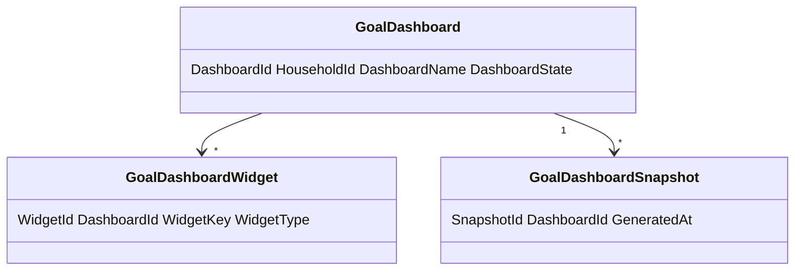
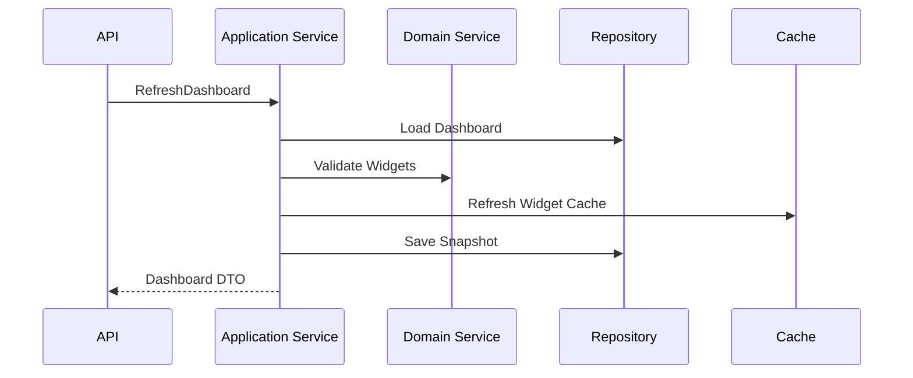
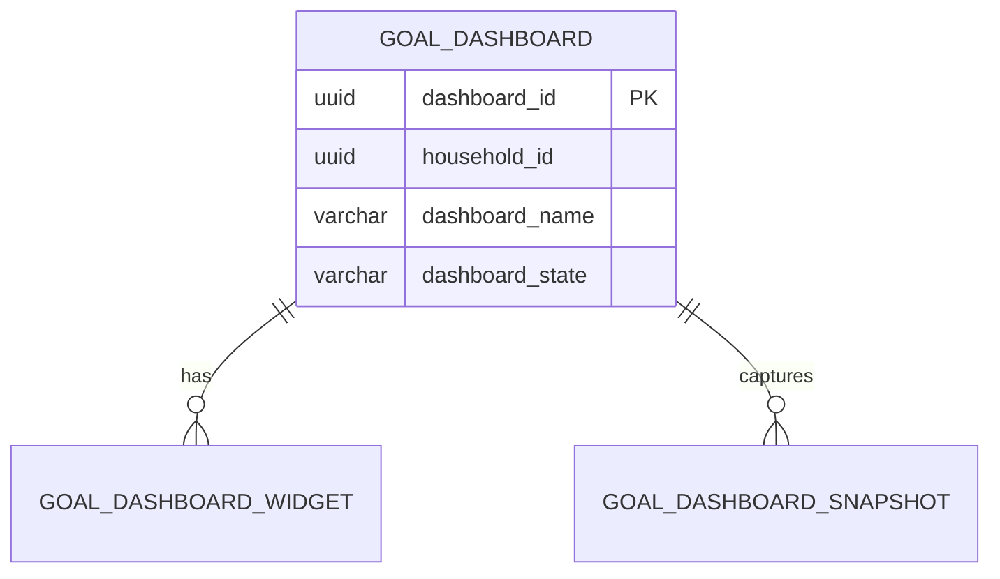
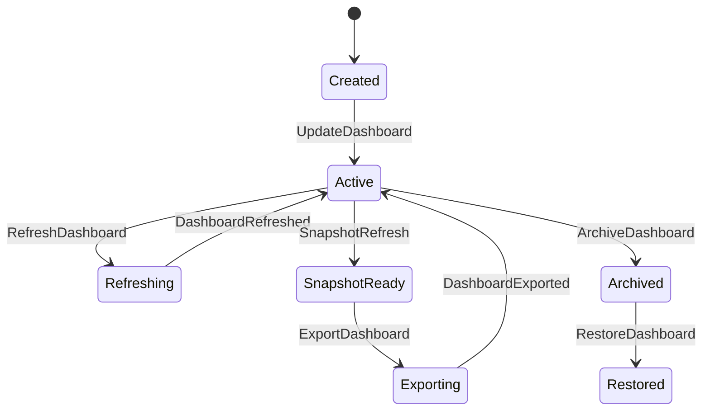
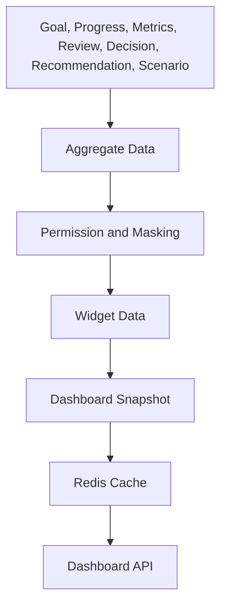
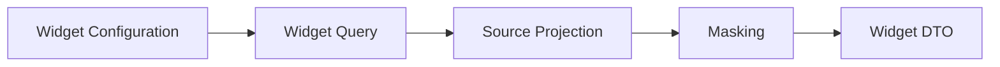

# Goal Dashboard
Version: 1.0
Status: Enterprise Specification
Owner: Project Atlas
Source of Truth: Atlas Goal Dashboard Specification
Last Updated: 2026-07-13
# Goal Dashboard Overview
## Purpose
Goal Dashboard defines how Atlas presents GoalPlan status, progress, metrics, review, decision, recommendation, scenario, portfolio, cashflow, notification, and activity data in a governed dashboard experience.
It does not redesign Atlas.
It does not modify existing Domain ownership.
It does not create a new Business Concept.
It does not replace GoalPlan, Goal Progress Tracking, Goal Metrics, Goal Review, Dashboard Widget Catalog, DecisionSession, Recommendation, Scenario, Portfolio, CashFlow, Notification, or User.
## Business Meaning
Goal Dashboard gives User and Household a consolidated view of goal health, completion, risk, priority, upcoming deadlines, financial impact, forecast, recommendation status, decision status, and review status.
It supports repeated planning, monitoring, comparison, intervention, and reporting.
It is a read-optimized surface backed by governed data sources and widget configuration.
## Dashboard Lifecycle
Dashboard lifecycle starts when a dashboard is created for User, Household, or configured Goal view.
Dashboard lifecycle continues through configuration, refresh, widget update, layout change, snapshot, export, share, archive, restore, and deletion when policy permits.
Dashboard lifecycle ends when dashboard is archived or deleted.
Dashboard snapshots remain historical evidence when retained by policy.
## Ownership
Household owns household dashboard scope.
User owns personal layout preference when supported.
Dashboard configuration owns widget selection, ordering, sizing, filters, and visibility.
Application Service owns orchestration.
Repository owns persistence.
Dashboard Widget Catalog owns widget metadata and reusable widget naming.
Audit owns configuration and export history.
## Data Sources
Data sources include GoalPlan, Milestone, Task when tracked, Goal Progress Tracking, Goal Metrics, Goal Review, DecisionSession, Recommendation, Scenario, Portfolio, CashFlow, Notification, User, Dashboard Widget Catalog, and audit history.
Every source must preserve HouseholdId.
Every source must preserve TenantId when tenant scope exists.
Every source must preserve source timestamp and version when shown as metric or forecast.
## Refresh Strategy
Dashboard refresh can be manual, automatic, scheduled, incremental, background, snapshot, or cache-based.
Widget data can refresh independently.
Dashboard summary refresh can be asynchronous when generated time is visible.
Critical notification and risk widgets refresh immediately when event requires it.
## Relationship with Goal
GoalPlan supplies goal identity, status, category, priority, target date, target amount, and lifecycle.
Dashboard never mutates GoalPlan directly.
Goal status controls visibility and read-only behavior.
## Relationship with Milestone
Milestones supply timeline, deadline, completion, and blocker information.
Milestone changes invalidate timeline and progress widgets.
## Relationship with Task
Tasks supply execution activity when existing planning data tracks task state.
Task data is displayed only through approved Goal planning sources.
## Relationship with Goal Progress
Goal Progress supplies overall progress, dimension progress, schedule variance, expected completion, health score, and forecast.
Progress widgets must record generated time.
## Relationship with Goal Metrics
Goal Metrics supplies KPI, trend, forecast, benchmark, and threshold data.
Metrics widgets must show unit and staleness when applicable.
## Relationship with Goal Review
Goal Review supplies review completion, review result, findings, next review date, and review history.
Review widgets must not expose restricted findings without permission.
## Relationship with Decision
DecisionSession supplies decision status, decision quality, accepted actions, rejected actions, and pending decision needs.
Decision widgets require decision read permission.
## Relationship with Recommendation
Recommendation supplies adoption, completion, suppression, ranking, and expected impact.
Recommendation widgets require recommendation read permission.
## Relationship with Scenario
Scenario supplies comparison, forecast, stress, and what-if data.
Scenario widgets must include ScenarioId, ScenarioVersion, generated time, and staleness.
## Relationship with Portfolio
Portfolio supplies allocation, performance, risk, liquidity, and valuation inputs for goal widgets when relevant.
Portfolio widgets require portfolio read permission.
## Relationship with CashFlow
CashFlow supplies budget consumption, contribution capacity, recurring surplus, funding gap, and runway data.
CashFlow widgets require cashflow read permission.
## Relationship with Notification
Notification supplies unread count, triggered count, suppressed count, severity, and delivery status.
Notification widgets must honor notification visibility policy.
## Relationship with User
User owns personal preferences where supported.
User access must be authenticated and authorized.
User-visible dashboard data must apply Household isolation, Tenant isolation, masking, and field-level security.
# Dashboard Architecture
## Dashboard Components
Dashboard includes dashboard definition, widget configuration, layout, filter set, data snapshot, refresh metadata, permission scope, export configuration, and audit trail.
## Widget Architecture
Each widget has WidgetId, WidgetType, WidgetKey, DisplayName, DataSource, QueryScope, RefreshPolicy, Visibility, Layout, Configuration, Projection, and Permission requirement.
Widget names align with Dashboard Widget Catalog.
## Data Aggregation
Aggregation preserves Household scope and Tenant scope.
Aggregation supports counts, sums, averages, weighted scores, trend windows, distribution buckets, and status groups.
Aggregation must not mix currencies without conversion rule.
## Snapshot Strategy
Dashboard snapshot captures widget data, filter state, source versions, generated time, and visibility scope.
Snapshot can be used for export, audit, comparison, and historical review.
## Real-time Data
Real-time data is limited to widgets with event-driven refresh and approved latency requirements.
Real-time data must still pass permission checks.
## Historical Data
Historical data comes from metric history, review history, progress history, notification history, decision history, and scenario history.
Historical widgets must show time range.
## Forecast Data
Forecast data comes from Scenario, Goal Progress forecast, Goal Metrics forecast, and Projection.
Forecast widgets must show ScenarioVersion and generated time.
## Caching Strategy
Dashboard uses Redis cache for dashboard detail, widget data, summary, search, export snapshot, and filter option sets.
Cache keys include TenantId, HouseholdId, UserId when personal, DashboardId, WidgetId, filter hash, projection, and version.
## Export Strategy
Export uses snapshot data.
Export requires permission.
Export must apply masking.
Export must create audit history.
## Permission Model
Dashboard read permission does not grant access to all source fields.
Widget data requires the strictest source permission used by the widget.
Dashboard sharing cannot bypass source permissions.
# Dashboard Widgets
## Overall Goal Summary
Displays total goals, active goals, completed goals, delayed goals, blocked goals, and archived goals when included by filter.
## Goal Progress
Displays overall progress, financial progress, milestone progress, dependency progress, and progress trend.
## Goal Completion
Displays completion score, completion probability, completed goals, completion candidates, and expected completion date.
## Goal Health
Displays health score, health band, health trend, and warning state.
## Priority Distribution
Displays GoalPlan distribution by priority score or priority band.
## Risk Distribution
Displays risk score distribution, critical risk count, and risk trend.
## Milestone Timeline
Displays milestones by due date, completion, blocker state, and delay status.
## Upcoming Deadlines
Displays target dates, review dates, milestone dates, action item dates, and decision dates.
## Budget Consumption
Displays budget usage, funding gap, budget variance, and target amount consumption.
## Cash Flow Impact
Displays contribution capacity, recurring surplus, recurring deficit, and cashflow pressure.
## Forecast Completion
Displays forecast completion, expected completion date, scenario reference, and confidence.
## Recommendation Status
Displays accepted, completed, dismissed, suppressed, pending, and expired recommendations.
## Decision Status
Displays pending, accepted, rejected, superseded, and completed decisions.
## Scenario Comparison
Displays baseline, selected scenario, alternative scenario, stress scenario, and comparison deltas.
## Goal Trend
Displays time-series progress, health, risk, budget, and forecast movement.
## Activity Timeline
Displays goal events, review events, recommendation events, decision events, notification events, and refresh events.
## Notification Summary
Displays unread, critical, warning, delivered, failed, and suppressed notifications.
## Review Summary
Displays review count, overdue reviews, completed reviews, critical reviews, next review date, and review result distribution.
## KPI Summary
Displays completion percent, progress percent, health score, risk score, budget usage, schedule variance, priority score, and business value score.
## Custom Widget
Custom widget uses approved Dashboard Widget Catalog metadata and allowed data sources.
Custom widget cannot bypass permission.
## Widget Configuration
Configuration includes title, widget type, size, refresh policy, filters, thresholds, display mode, and visibility.
## Widget Layout
Layout includes row, column, width, height, order, breakpoint, and pinned state.
## Widget Visibility
Visibility is controlled by permission, Household scope, Tenant scope, widget configuration, source availability, and user preference.
# Dashboard KPIs
## Goal Completion %
Formula: `CompletedGoalCount / GoalCount * 100`.
## Progress %
Formula: `AverageOverallProgress * 100`.
## Health Score
Formula: `avg(GoalHealthScore)`.
## Risk Score
Formula: `avg(GoalRiskScore)`.
## Budget Usage %
Formula: `sum(CurrentFundedAmount) / sum(TargetAmount) * 100`.
## Schedule Variance
Formula: `avg(OverallProgress - ElapsedTimePercent)`.
## Forecast Accuracy
Formula: `avg(1 - abs(ActualProgress - ForecastProgress))`.
## Dependency Status
Formula: `ReadyDependencyCount / RequiredDependencyCount`.
## Priority Score
Formula: `avg(GoalPriorityScore)`.
## Recommendation Adoption
Formula: `AcceptedRecommendationCount / EligibleRecommendationCount`.
## Decision Completion
Formula: `CompletedDecisionCount / RequiredDecisionCount`.
## Review Completion
Formula: `CompletedReviewCount / RequiredReviewCount`.
## Notification Count
Formula: `count(NotificationId) by severity and status`.
## Business Value Score
Formula: `avg(BusinessImpactScore)`.
# Dashboard Filters
## User
Filters dashboard by authorized User scope or personal preference.
## Household
Filters dashboard by HouseholdId.
## Goal Type
Filters by existing Goal type when cataloged.
## Goal Status
Filters by Goal lifecycle status.
## Goal Category
Filters by existing goal category when available.
## Priority
Filters by priority band or score range.
## Date Range
Filters by target date, review date, activity date, or metric date.
## Scenario
Filters forecast widgets by ScenarioId and ScenarioVersion.
## Portfolio
Filters portfolio-related goal widgets by portfolio scope.
## CashFlow
Filters cashflow widgets by period and cashflow scope.
## Risk Level
Filters by risk band.
## Tag
Filters by approved existing tag metadata when available.
## Custom Filter
Custom filter must use allowlisted fields and approved widget configuration.
# Dashboard Refresh Rules
## Manual Refresh
Manual refresh requires permission and audit when persisted snapshot is updated.
## Automatic Refresh
Automatic refresh runs after source events.
## Scheduled Refresh
Scheduled refresh runs by configured cadence.
## Incremental Refresh
Incremental refresh updates affected widgets only.
## Background Refresh
Background refresh runs through Background Job with checkpoint.
## Snapshot Refresh
Snapshot refresh creates new dashboard snapshot.
## Cache Refresh
Cache refresh updates detail, widget, dashboard, and summary cache keys.
# Validation Rules
1. DashboardId is required for persisted dashboard. 2. HouseholdId is required. 3. TenantId is required when tenant scope exists. 4. OwnerUserId is required for personal dashboard. 5. DashboardName is required. 6. DashboardState is required. 7. DashboardType is required. 8. Widget list must not be null. 9. WidgetId is required for configured widget. 10. WidgetType is required. 11. WidgetKey is required. 12. Widget layout row is required. 13. Widget layout column is required. 14. Widget width must be positive. 15. Widget height must be positive. 16. Widget order must be non-negative. 17. Widget visibility must be valid. 18. Widget data source must be approved. 19. Widget projection must be allowlisted. 20. Widget filters must be allowlisted. 21. Dashboard filters must be allowlisted. 22. Date range start must be before end. 23. Scenario filter requires ScenarioId. 24. Portfolio filter requires portfolio read permission. 25. CashFlow filter requires cashflow read permission. 26. Goal filter must preserve Household scope. 27. Dashboard refresh requires active or configured dashboard state. 28. Archived dashboard cannot refresh. 29. Deleted dashboard cannot refresh. 30. Export requires export permission. 31. Share requires share permission. 32. Shared dashboard cannot expose unauthorized widget data. 33. Cache key must include HouseholdId. 34. Cache key must include TenantId when applicable. 35. User-specific cache key must include UserId. 36. Snapshot must include generated time. 37. Snapshot must include filter state. 38. Snapshot must include source versions when available. 39. Dashboard summary must include generated time. 40. Widget data must include staleness when asynchronous. 41. Materialized view output must preserve HouseholdId. 42. Widget configuration update requires row version. 43. ReorderWidget requires existing widget. 44. ResizeWidget requires existing widget. 45. ConfigureWidget requires valid widget type. 46. DeleteDashboard requires permission. 47. RestoreDashboard requires archived dashboard. 48. ArchiveDashboard requires reason. 49. ExportDashboard requires format. 50. Export format must be allowlisted. 51. Pagination cursor must preserve filters. 52. Sorting field must be allowlisted. 53. Projection name must be allowlisted. 54. Field-level security must run before response. 55. Masking must run before export. 56. Audit requires CorrelationId. 57. API command requires RequestId. 58. Event-driven refresh requires CausationId. 59. Domain Event emission must be idempotent. 60. Dashboard name length must be within configured limit. 61. Widget count must not exceed configured limit. 62. Custom widget configuration must be valid JSON. 63. Widget data error must not break entire dashboard response. 64. Export snapshot must use consistent generated time. 65. Shared dashboard must preserve source permissions.
# Business Rules
1. Goal Dashboard is a read-optimized dashboard for GoalPlan data. 2. Goal Dashboard does not own GoalPlan. 3. Goal Dashboard does not own Goal Progress. 4. Goal Dashboard does not own Goal Metrics. 5. Goal Dashboard does not own Goal Review. 6. Goal Dashboard does not own DecisionSession. 7. Goal Dashboard does not own Recommendation. 8. Goal Dashboard does not own Scenario. 9. Goal Dashboard does not own Portfolio. 10. Goal Dashboard does not own CashFlow. 11. Goal Dashboard must preserve Household isolation. 12. Goal Dashboard must preserve Tenant isolation when applicable. 13. Dashboard read requires permission. 14. Widget read requires source permission. 15. Dashboard sharing cannot bypass source permission. 16. Dashboard export requires permission. 17. Dashboard export requires audit. 18. Dashboard configuration change requires audit. 19. Widget configuration change requires audit. 20. Widget reorder requires audit. 21. Widget resize requires audit. 22. Widget add requires audit. 23. Widget remove requires audit. 24. Dashboard archive requires audit. 25. Dashboard restore requires audit. 26. Dashboard delete requires audit. 27. Manual refresh requires audit when snapshot changes. 28. Automatic refresh must be idempotent. 29. Scheduled refresh must be retryable. 30. Background refresh must checkpoint. 31. Incremental refresh must update affected widgets only. 32. Critical notification widget refreshes after critical notification. 33. Goal health widget refreshes after GoalHealthChanged. 34. Forecast widget refreshes after ScenarioSimulated. 35. Recommendation widget refreshes after recommendation state change. 36. Decision widget refreshes after DecisionSession change. 37. Review widget refreshes after ReviewCompleted. 38. Milestone widget refreshes after milestone change. 39. CashFlow widget refreshes after cashflow source change. 40. Portfolio widget refreshes after portfolio source change. 41. Dashboard data must show generated time. 42. Forecast data must show scenario version. 43. Historical data must show date range. 44. Widget error must be isolated to widget. 45. Dashboard response must include partial data status when widget fails. 46. Custom widget must use approved widget metadata. 47. Widget count must stay within configured limit. 48. Widget layout must not overlap in persisted configuration. 49. Widget visibility must be permission-aware. 50. Dashboard snapshot must preserve filter state. 51. Dashboard snapshot must preserve source versions. 52. Dashboard snapshot must preserve generated time. 53. Cache must invalidate after dashboard update. 54. Cache must invalidate after widget update. 55. Cache must invalidate after source event. 56. Dashboard summary must use read-optimized projection. 57. Dashboard list must use summary projection. 58. Dashboard detail may lazy-load widgets. 59. Export uses snapshot data. 60. Export must apply masking. 61. Shared dashboard must not expose masked fields. 62. Deleted dashboard is excluded from normal queries. 63. Archived dashboard is read-only. 64. Restored dashboard preserves history. 65. Dashboard ownership changes must be audited. 66. User preference changes must be scoped to user. 67. Household dashboard changes must be scoped to household. 68. Notification suppression does not suppress dashboard audit. 69. Dashboard metrics must not mix currencies without conversion rule. 70. Materialized view refresh must not expose another household. 71. Dashboard commands must use row version for concurrency. 72. Dashboard export must record format and scope. 73. Dashboard sharing must record recipient scope. 74. Dashboard data must not expose another Tenant. 75. Widget data must not expose another Household.
# State Machine
## States
| State | Meaning |
|---|---|
| Created | Dashboard exists and can be configured. |
| Active | Dashboard is readable and refreshable. |
| Refreshing | Dashboard refresh is running. |
| SnapshotReady | Dashboard snapshot is available. |
| Exporting | Dashboard export is running. |
| Shared | Dashboard has active share configuration. |
| Archived | Dashboard is read-only history. |
| Deleted | Dashboard is soft deleted when policy permits. |
| Restored | Dashboard was restored from archive. |
## Transitions
| From | To | Trigger |
|---|---|---|
| None | Created | CreateDashboard |
| Created | Active | UpdateDashboard |
| Active | Refreshing | RefreshDashboard |
| Refreshing | Active | DashboardRefreshed |
| Active | SnapshotReady | SnapshotRefresh |
| SnapshotReady | Exporting | ExportDashboard |
| Exporting | Active | DashboardExported |
| Active | Shared | ShareDashboard |
| Shared | Active | Share revoked |
| Active | Archived | ArchiveDashboard |
| Archived | Restored | RestoreDashboard |
| Restored | Active | UpdateDashboard |
| Created | Deleted | DeleteDashboard |
| Active | Deleted | DeleteDashboard |
## Triggers
Triggers include CreateDashboard, UpdateDashboard, DeleteDashboard, RefreshDashboard, ResetDashboard, ArchiveDashboard, RestoreDashboard, ExportDashboard, ShareDashboard, ConfigureWidget, ReorderWidget, ResizeWidget, source event, scheduled run, background job, and cache refresh.
## Invariant
Dashboard must preserve HouseholdId.
Dashboard must preserve TenantId when applicable.
Active dashboard must have valid widget configuration.
Archived dashboard is read-only.
Deleted dashboard is excluded from normal queries.
Exported dashboard must use snapshot data.
## Illegal Transition
| From | To | Reason |
|---|---|---|
| Archived | Refreshing | RestoreDashboard is required first. |
| Deleted | Active | Restore policy is required first. |
| Created | Exporting | Active dashboard and snapshot are required. |
| Refreshing | Deleted | Refresh must complete or cancel first. |
| Deleted | Refreshing | Deleted dashboard cannot refresh. |
# Commands
## CreateDashboard
Creates dashboard.
Input: HouseholdId, TenantId, DashboardName, DashboardType, OwnerUserId, CorrelationId.
Output: DashboardId, DashboardState.
## UpdateDashboard
Updates dashboard metadata.
Input: DashboardId, DashboardName, Filters, RowVersion, CorrelationId.
Output: DashboardId, Version, ChangedFields.
## DeleteDashboard
Soft deletes dashboard when policy permits.
Input: DashboardId, DeleteReason, RowVersion, CorrelationId.
Output: DashboardState = Deleted.
## RefreshDashboard
Refreshes dashboard or selected widgets.
Input: DashboardId, WidgetIds, RefreshReason, CorrelationId.
Output: DashboardId, RefreshedAt, WidgetResults.
## ResetDashboard
Resets dashboard to approved default configuration.
Input: DashboardId, ResetReason, RowVersion, CorrelationId.
Output: DashboardId, WidgetCount, Version.
## ArchiveDashboard
Archives dashboard as read-only.
Input: DashboardId, ArchiveReason, RowVersion, CorrelationId.
Output: DashboardState = Archived.
## RestoreDashboard
Restores archived dashboard.
Input: DashboardId, RestoreReason, RowVersion, CorrelationId.
Output: DashboardState = Restored.
## ExportDashboard
Exports dashboard snapshot.
Input: DashboardId, ExportFormat, Filters, Projection, CorrelationId.
Output: ExportId, ExportStatus.
## ShareDashboard
Shares dashboard with approved recipient scope.
Input: DashboardId, ShareScope, RecipientId, PermissionScope, CorrelationId.
Output: ShareId, ShareStatus.
## ConfigureWidget
Adds or updates widget configuration.
Input: DashboardId, WidgetId, WidgetType, Configuration, Layout, RowVersion, CorrelationId.
Output: WidgetId, Version.
## ReorderWidget
Changes widget order.
Input: DashboardId, WidgetOrder, RowVersion, CorrelationId.
Output: DashboardId, Version.
## ResizeWidget
Changes widget size.
Input: DashboardId, WidgetId, Width, Height, RowVersion, CorrelationId.
Output: WidgetId, LayoutVersion.
## All related Domain Commands
| Command | Dashboard Relationship |
|---|---|
| RefreshGoalProgress | Refreshes progress widgets. |
| RecalculateGoalProgress | Refreshes progress and health widgets. |
| RefreshMetric | Refreshes KPI widgets. |
| RecalculateMetric | Refreshes metric widgets. |
| CreateReview | Refreshes review widgets. |
| CompleteReview | Refreshes review summary. |
| AcceptDecision | Refreshes decision widgets. |
| AcceptRecommendation | Refreshes recommendation widgets. |
| RunScenario | Refreshes forecast and scenario widgets. |
| TriggerNotification | Refreshes notification summary. |
# Domain Events
## DashboardCreated
Payload: DashboardId, HouseholdId, OwnerUserId, DashboardName, CorrelationId.
## DashboardUpdated
Payload: DashboardId, ChangedFields, Version, CorrelationId.
## DashboardRefreshed
Payload: DashboardId, RefreshedAt, WidgetResults, CorrelationId.
## DashboardArchived
Payload: DashboardId, ArchiveReason, ArchivedAt, CorrelationId.
## DashboardRestored
Payload: DashboardId, RestoreReason, RestoredAt, CorrelationId.
## WidgetAdded
Payload: DashboardId, WidgetId, WidgetType, CorrelationId.
## WidgetRemoved
Payload: DashboardId, WidgetId, CorrelationId.
## WidgetUpdated
Payload: DashboardId, WidgetId, ChangedFields, CorrelationId.
## DashboardExported
Payload: DashboardId, ExportId, ExportFormat, ExportScope, CorrelationId.
## DashboardShared
Payload: DashboardId, ShareId, ShareScope, RecipientId, CorrelationId.
## All related Events
| Event | Dashboard Impact |
|---|---|
| GoalProgressUpdated | Refreshes progress widgets. |
| GoalHealthChanged | Refreshes health widgets. |
| GoalForecastChanged | Refreshes forecast widgets. |
| MetricCalculated | Refreshes KPI widgets. |
| ReviewCompleted | Refreshes review widgets. |
| RecommendationAccepted | Refreshes recommendation widgets. |
| RecommendationCompleted | Refreshes recommendation widgets. |
| DecisionAccepted | Refreshes decision widgets. |
| DecisionRejected | Refreshes decision widgets. |
| ScenarioSimulated | Refreshes scenario widgets. |
| NotificationTriggered | Refreshes notification summary. |
# Repository
## Interface
```csharp
public interface IGoalDashboardRepository
{
    Task<GoalDashboard?> GetByIdAsync(Guid householdId, Guid dashboardId, CancellationToken cancellationToken);
    Task<IReadOnlyList<GoalDashboard>> SearchAsync(GoalDashboardSearchSpecification specification, CancellationToken cancellationToken);
    Task<GoalDashboardSnapshot?> GetSnapshotAsync(Guid householdId, Guid dashboardId, CancellationToken cancellationToken);
    Task AddAsync(GoalDashboard dashboard, CancellationToken cancellationToken);
    Task UpdateAsync(GoalDashboard dashboard, CancellationToken cancellationToken);
    Task ArchiveAsync(Guid householdId, Guid dashboardId, string reason, CancellationToken cancellationToken);
}
```
## Methods
Methods include GetByIdAsync, GetByOwnerAsync, SearchAsync, GetDetailAsync, GetSummaryAsync, GetSnapshotAsync, GetWidgetAsync, SaveWidgetAsync, SaveSnapshotAsync, AddAsync, UpdateAsync, ArchiveAsync, RestoreAsync, DeleteAsync, and SaveExportHistoryAsync.
## Queries
Queries include dashboard by id, dashboard by owner, dashboard by household, dashboard by state, dashboard by type, widget by dashboard, dashboard snapshot, dashboard export history, and shared dashboard.
## Filtering
Allowed filters: dashboardId, householdId, ownerUserId, dashboardType, dashboardState, widgetType, createdAt, updatedAt, archivedAt.
## Sorting
Allowed sorting: dashboardName, updatedAt, createdAt, dashboardType, dashboardState.
## Aggregation
Aggregations include count by state, count by type, widget count, export count, share count, and refresh count.
## Projection
Supported projections: summary, detail, dashboard, widget, snapshot, export, search, history.
## Specification
GoalDashboardSearchSpecification fields: HouseholdId, TenantId, OwnerUserId, DashboardTypes, DashboardStates, WidgetTypes, DateFrom, DateTo, Sort, PageSize, Cursor.
# Domain Service Interaction
GoalDashboardDomainService validates dashboard configuration, widget layout, widget visibility, widget data source, filter scope, export scope, sharing scope, state transitions, and source permission requirements.
| Service | Interaction |
|---|---|
| GoalProgressDomainService | Supplies progress and health widget values. |
| GoalMetricDomainService | Supplies KPI, trend, forecast, and threshold values. |
| GoalReviewDomainService | Supplies review summary values. |
| GoalDependencyDomainService | Supplies dependency status widgets. |
| GoalPrioritizationDomainService | Supplies priority distribution. |
| DecisionDomainService | Supplies decision status widgets. |
| RecommendationDomainService | Supplies recommendation status widgets. |
| ScenarioDomainService | Supplies scenario comparison widgets. |
| NotificationDomainService | Supplies notification summary widgets. |
# Application Service Interaction
GoalDashboardApplicationService authorizes request, resolves Household scope, loads dashboard, loads widget configuration, resolves filters, invokes Domain Service, loads source projections, applies masking, persists configuration, saves snapshot, publishes events, invalidates cache, records audit, and returns DTO.
```csharp
Task<GoalDashboardDetailDto> CreateDashboardAsync(CreateDashboardRequest request);
Task<GoalDashboardDetailDto> UpdateDashboardAsync(UpdateDashboardRequest request);
Task<GoalDashboardDetailDto> RefreshDashboardAsync(RefreshDashboardRequest request);
Task<GoalDashboardDetailDto> ResetDashboardAsync(ResetDashboardRequest request);
Task<GoalDashboardDetailDto> ArchiveDashboardAsync(ArchiveDashboardRequest request);
Task<GoalDashboardDetailDto> RestoreDashboardAsync(RestoreDashboardRequest request);
Task<GoalDashboardExportDto> ExportDashboardAsync(ExportDashboardRequest request);
Task<GoalDashboardShareDto> ShareDashboardAsync(ShareDashboardRequest request);
Task<GoalWidgetDto> ConfigureWidgetAsync(ConfigureWidgetRequest request);
Task<GoalDashboardSearchResultDto> SearchDashboardsAsync(GoalDashboardSearchRequest request);
```
# API
## REST Endpoints
| Method | Endpoint | Purpose |
|---|---|---|
| GET | /api/goal-dashboards | Search dashboards. |
| GET | /api/goal-dashboards/{dashboardId} | Get dashboard detail. |
| POST | /api/goal-dashboards | Create dashboard. |
| PATCH | /api/goal-dashboards/{dashboardId} | Update dashboard. |
| DELETE | /api/goal-dashboards/{dashboardId} | Soft delete dashboard. |
| POST | /api/goal-dashboards/{dashboardId}/refresh | Refresh dashboard. |
| POST | /api/goal-dashboards/{dashboardId}/reset | Reset dashboard. |
| POST | /api/goal-dashboards/{dashboardId}/archive | Archive dashboard. |
| POST | /api/goal-dashboards/{dashboardId}/restore | Restore dashboard. |
| POST | /api/goal-dashboards/{dashboardId}/export | Export dashboard. |
| POST | /api/goal-dashboards/{dashboardId}/share | Share dashboard. |
| POST | /api/goal-dashboards/{dashboardId}/widgets | Configure widget. |
| PATCH | /api/goal-dashboards/{dashboardId}/widgets/{widgetId} | Update widget. |
| POST | /api/goal-dashboards/{dashboardId}/widgets/reorder | Reorder widgets. |
| POST | /api/goal-dashboards/{dashboardId}/widgets/{widgetId}/resize | Resize widget. |
## HTTP Methods
GET reads dashboard data.
POST executes commands.
PATCH updates editable data.
DELETE soft deletes when policy permits.
## Request
```json
{ "dashboardName": "Household Goals", "dashboardType": "Goal", "ownerUserId": "uuid", "filters": { "goalStatus": "Active" } }
```
## Response
```json
{ "dashboardId": "uuid", "dashboardName": "Household Goals", "dashboardState": "Created", "widgetCount": 0 }
```
## Errors
| Status | Error |
|---|---|
| 400 | InvalidDashboardRequest |
| 401 | Unauthenticated |
| 403 | GoalDashboardPermissionDenied |
| 404 | GoalDashboardNotFound |
| 409 | GoalDashboardConcurrencyConflict |
| 422 | GoalDashboardStateViolation |
## Pagination
Cursor pagination is required.
Default page size is 50.
Maximum page size is 200.
## Filtering
API supports allowlisted filters only.
## Sorting
Default sorting is updatedAt desc.
API supports allowlisted sorting only.
## Projection
Projection supports summary, detail, dashboard, widget, snapshot, export, search, and history.
## Export API
Export endpoint accepts format, filters, projection, masking mode, and snapshot option.
Export response returns ExportId, status, createdAt, and audit reference.
# DTO
## Create DTO
```json
{ "dashboardName": "Household Goals", "dashboardType": "Goal", "ownerUserId": "uuid", "filters": { "goalStatus": "Active" } }
```
## Update DTO
```json
{ "dashboardName": "Primary Goal Dashboard", "filters": { "dateRange": "2026" }, "rowVersion": "base64" }
```
## Detail DTO
```json
{ "dashboardId": "uuid", "dashboardName": "Primary Goal Dashboard", "dashboardState": "Active", "widgets": [], "generatedAt": "2026-07-13T00:00:00Z" }
```
## Summary DTO
```json
{ "dashboardId": "uuid", "dashboardName": "Primary Goal Dashboard", "dashboardState": "Active", "widgetCount": 18 }
```
## Search DTO
```json
{ "filters": { "dashboardState": "Active" }, "sort": "updatedAt:desc", "pageSize": 50, "cursor": null }
```
## Dashboard DTO
```json
{ "dashboardId": "uuid", "generatedAt": "2026-07-13T00:00:00Z", "widgets": [{ "widgetKey": "GoalProgress", "status": "Loaded" }] }
```
## Widget DTO
```json
{ "widgetId": "uuid", "widgetKey": "GoalHealth", "widgetType": "KpiCard", "layout": { "row": 1, "column": 1, "width": 4, "height": 2 }, "visible": true }
```
## Filter DTO
```json
{ "householdId": "uuid", "goalStatus": ["Active"], "riskLevel": ["High"], "dateRange": { "from": "2026-01-01", "to": "2026-12-31" } }
```
## Export DTO
```json
{ "exportFormat": "json", "projection": "dashboard", "maskingMode": "authorized", "includeSnapshot": true }
```
# Database Mapping
## Table
Primary table: goal_dashboard.
Widget table: goal_dashboard_widget.
Snapshot table: goal_dashboard_snapshot.
History table: goal_dashboard_history.
Export table: goal_dashboard_export_history.
## Columns
Dashboard columns: dashboard_id, tenant_id, household_id, owner_user_id, dashboard_name, dashboard_type, dashboard_state, filters_json, row_version, created_at, updated_at, archived_at, deleted_at.
Widget columns: widget_id, dashboard_id, widget_key, widget_type, title, configuration_json, layout_json, visibility_json, refresh_policy, sort_order, created_at, updated_at.
Snapshot columns: snapshot_id, dashboard_id, household_id, snapshot_json, filter_json, source_versions_json, generated_at.
## Indexes
Indexes: ix_goal_dashboard_household_owner, ix_goal_dashboard_household_state, ix_goal_dashboard_updated_at, ix_goal_dashboard_widget_dashboard, ix_goal_dashboard_snapshot_dashboard.
## Constraints
Constraints: primary keys, dashboard-widget relationship, JSON validity by application validation, positive widget size, unique dashboard owner name.
## FK
fk_goal_dashboard_widget_dashboard.
fk_goal_dashboard_snapshot_dashboard.
## Unique
uq_goal_dashboard_household_owner_name.
uq_goal_dashboard_widget_dashboard_key.
## Check Constraint
Widget width and height must be positive.
Dashboard state must be non-empty.
# PostgreSQL Schema
```sql
CREATE TABLE goal_dashboard (
    dashboard_id uuid PRIMARY KEY,
    tenant_id uuid NULL,
    household_id uuid NOT NULL,
    owner_user_id uuid NULL,
    dashboard_name varchar(128) NOT NULL,
    dashboard_type varchar(64) NOT NULL,
    dashboard_state varchar(32) NOT NULL,
    filters_json jsonb NOT NULL DEFAULT '{}'::jsonb,
    row_version bigint NOT NULL DEFAULT 1,
    created_at timestamptz NOT NULL,
    updated_at timestamptz NOT NULL,
    archived_at timestamptz NULL,
    deleted_at timestamptz NULL,
    CONSTRAINT uq_goal_dashboard_household_owner_name UNIQUE (household_id, owner_user_id, dashboard_name),
    CONSTRAINT ck_goal_dashboard_name CHECK (length(dashboard_name) > 0)
);
CREATE TABLE goal_dashboard_widget (
    widget_id uuid PRIMARY KEY,
    dashboard_id uuid NOT NULL,
    widget_key varchar(128) NOT NULL,
    widget_type varchar(64) NOT NULL,
    title varchar(128) NULL,
    configuration_json jsonb NOT NULL DEFAULT '{}'::jsonb,
    layout_json jsonb NOT NULL DEFAULT '{}'::jsonb,
    visibility_json jsonb NOT NULL DEFAULT '{}'::jsonb,
    refresh_policy varchar(64) NOT NULL,
    sort_order integer NOT NULL DEFAULT 0,
    created_at timestamptz NOT NULL,
    updated_at timestamptz NOT NULL,
    CONSTRAINT fk_goal_dashboard_widget_dashboard FOREIGN KEY (dashboard_id) REFERENCES goal_dashboard (dashboard_id),
    CONSTRAINT uq_goal_dashboard_widget_dashboard_key UNIQUE (dashboard_id, widget_key),
    CONSTRAINT ck_goal_dashboard_widget_sort CHECK (sort_order >= 0)
);
CREATE TABLE goal_dashboard_snapshot (
    snapshot_id uuid PRIMARY KEY,
    dashboard_id uuid NOT NULL,
    household_id uuid NOT NULL,
    snapshot_json jsonb NOT NULL,
    filter_json jsonb NOT NULL,
    source_versions_json jsonb NOT NULL DEFAULT '{}'::jsonb,
    generated_at timestamptz NOT NULL,
    CONSTRAINT fk_goal_dashboard_snapshot_dashboard FOREIGN KEY (dashboard_id) REFERENCES goal_dashboard (dashboard_id)
);
CREATE TABLE goal_dashboard_history (
    history_id uuid PRIMARY KEY,
    dashboard_id uuid NOT NULL,
    household_id uuid NOT NULL,
    version bigint NOT NULL,
    change_reason varchar(256) NOT NULL,
    changed_by uuid NULL,
    previous_values jsonb NOT NULL,
    new_values jsonb NOT NULL,
    correlation_id uuid NOT NULL,
    created_at timestamptz NOT NULL
);
CREATE TABLE goal_dashboard_export_history (
    export_id uuid PRIMARY KEY,
    dashboard_id uuid NOT NULL,
    household_id uuid NOT NULL,
    exported_by uuid NULL,
    export_format varchar(32) NOT NULL,
    export_scope jsonb NOT NULL,
    snapshot_id uuid NULL,
    correlation_id uuid NOT NULL,
    created_at timestamptz NOT NULL
);
CREATE INDEX ix_goal_dashboard_household_owner ON goal_dashboard (household_id, owner_user_id);
CREATE INDEX ix_goal_dashboard_household_state ON goal_dashboard (household_id, dashboard_state);
CREATE INDEX ix_goal_dashboard_updated_at ON goal_dashboard (updated_at DESC);
CREATE INDEX ix_goal_dashboard_widget_dashboard ON goal_dashboard_widget (dashboard_id, sort_order);
CREATE INDEX ix_goal_dashboard_snapshot_dashboard ON goal_dashboard_snapshot (dashboard_id, generated_at DESC);
CREATE VIEW goal_dashboard_summary_view AS
SELECT d.household_id,
       d.dashboard_id,
       d.dashboard_name,
       d.dashboard_state,
       count(w.widget_id) AS widget_count,
       d.updated_at
FROM goal_dashboard d
LEFT JOIN goal_dashboard_widget w ON w.dashboard_id = d.dashboard_id
WHERE d.deleted_at IS NULL
GROUP BY d.household_id, d.dashboard_id, d.dashboard_name, d.dashboard_state, d.updated_at;
CREATE MATERIALIZED VIEW goal_dashboard_household_kpi_mv AS
SELECT household_id,
       count(*) AS dashboard_count,
       count(*) FILTER (WHERE dashboard_state = 'Active') AS active_count,
       max(updated_at) AS generated_at
FROM goal_dashboard
WHERE deleted_at IS NULL
GROUP BY household_id;
```
# EF Core Mapping
## Fluent API
```csharp
builder.ToTable("goal_dashboard");
builder.HasKey(x => x.DashboardId);
builder.Property(x => x.DashboardId).HasColumnName("dashboard_id");
builder.Property(x => x.TenantId).HasColumnName("tenant_id");
builder.Property(x => x.HouseholdId).HasColumnName("household_id").IsRequired();
builder.Property(x => x.OwnerUserId).HasColumnName("owner_user_id");
builder.Property(x => x.DashboardName).HasColumnName("dashboard_name").HasMaxLength(128).IsRequired();
builder.Property(x => x.DashboardType).HasColumnName("dashboard_type").HasMaxLength(64).IsRequired();
builder.Property(x => x.DashboardState).HasColumnName("dashboard_state").HasMaxLength(32).IsRequired();
builder.Property(x => x.FiltersJson).HasColumnName("filters_json").HasColumnType("jsonb");
builder.Property(x => x.RowVersion).HasColumnName("row_version").IsConcurrencyToken();
builder.HasMany(x => x.Widgets).WithOne().HasForeignKey(x => x.DashboardId);
builder.HasIndex(x => new { x.HouseholdId, x.OwnerUserId, x.DashboardName }).IsUnique();
builder.HasIndex(x => new { x.HouseholdId, x.DashboardState });
builder.HasQueryFilter(x => x.DeletedAt == null);
```
## Owned Types
DashboardLayout can be owned for layout settings.
DashboardFilterSet can be owned for persisted filters.
WidgetLayout can be owned for row, column, width, height, and order.
## Indexes
Indexes match PostgreSQL schema.
## Query Filters
Default query filter excludes deleted dashboards.
Repository specification applies Household and Tenant filters.
## Value Conversion
DashboardState, DashboardType, WidgetType, WidgetVisibility, RefreshPolicy, and ExportFormat use string conversion.
# Cache Strategy
## Redis Key
Detail key: `atlas:{tenantId}:household:{householdId}:dashboard:{dashboardId}:detail:v1`.
Widget key: `atlas:{tenantId}:household:{householdId}:dashboard:{dashboardId}:widget:{widgetId}:{filterHash}:v1`.
Summary key: `atlas:{tenantId}:household:{householdId}:dashboard:summary:v1`.
Snapshot key: `atlas:{tenantId}:household:{householdId}:dashboard:{dashboardId}:snapshot:{snapshotId}:v1`.
## TTL
Detail TTL is 5 minutes.
Widget TTL is 2 minutes.
Summary TTL is 2 minutes.
Snapshot TTL is 30 minutes.
Export cache TTL is 15 minutes.
## Refresh Strategy
Refresh detail after dashboard update.
Refresh widget cache after widget source event.
Refresh dashboard cache after manual or scheduled refresh.
Refresh snapshot cache after snapshot creation.
## Invalidation
Invalidate on DashboardCreated, DashboardUpdated, DashboardRefreshed, DashboardArchived, DashboardRestored, WidgetAdded, WidgetRemoved, WidgetUpdated, DashboardExported, DashboardShared, GoalProgressUpdated, MetricCalculated, ReviewCompleted, Decision change, Recommendation change, Scenario simulation, Notification trigger, Portfolio change, and CashFlow change.
## Snapshot Cache
Snapshot cache stores consistent export-ready widget output, filters, source versions, generated time, and masking state.
# Security
## Authorization
Dashboard access requires authenticated Principal and Household permission.
Widget access requires source permission.
Export and share require elevated permission.
## Permissions
Permissions: GoalDashboard.Read, GoalDashboard.Create, GoalDashboard.Update, GoalDashboard.Delete, GoalDashboard.Refresh, GoalDashboard.Reset, GoalDashboard.Archive, GoalDashboard.Restore, GoalDashboard.Export, GoalDashboard.Share, GoalDashboard.Widget.Configure.
## Field Level Security
Financial widgets require financial read permission.
Portfolio widgets require portfolio read permission.
Decision widgets require decision read permission.
Recommendation widgets require recommendation read permission.
Scenario widgets require scenario read permission.
## Dashboard Sharing
Sharing grants dashboard configuration visibility only.
Sharing does not grant source data permissions.
Shared recipients see only widgets and fields they are authorized to read.
## Data Masking
Mask currency values when user lacks financial read permission.
Mask portfolio details when user lacks portfolio permission.
Mask decision details when user lacks decision permission.
Mask recommendation details when user lacks recommendation permission.
# Audit
## Dashboard History
Dashboard history records create, update, reset, refresh, archive, restore, delete, export, share, and owner changes.
## Widget History
Widget history records add, remove, update, reorder, resize, visibility change, and configuration change.
## Configuration History
Configuration history stores previous values, new values, version, actor, reason, and correlation.
## Export History
Export history stores export format, scope, snapshot id, masking mode, actor, created time, and correlation.
# Performance
## Widget Lazy Loading
Dashboard detail can return shell and load widgets independently.
Critical widgets load first.
Low-priority widgets can load asynchronously.
## Incremental Refresh
Source event scope determines affected widgets.
Only affected cache keys and projections refresh.
## Parallel Query
Widgets can query in parallel when they do not share mutable state.
Parallel query must preserve Household and Tenant scope.
## Materialized Views
Materialized views support dashboard summary and heavy aggregation.
Refresh must preserve generated time.
## Read Optimization
Use summary view for list.
Use widget projection for detail.
Use snapshot for export.
## Caching
Redis caches dashboard detail, widgets, summary, snapshots, export payloads, and filter options.
# Example JSON
## Create
```json
{ "dashboardName": "Household Goals", "dashboardType": "Goal", "ownerUserId": "84d17dc0-6692-46bd-a72c-ef9c1c31ed55", "filters": { "goalStatus": "Active" } }
```
## Update
```json
{ "dashboardName": "Primary Goal Dashboard", "filters": { "dateRange": "2026" }, "rowVersion": "AAAAAAAAB9E=" }
```
## Dashboard Detail
```json
{ "dashboardId": "9dd60440-66ac-42a2-a587-6bb9f730fdb2", "dashboardName": "Primary Goal Dashboard", "dashboardState": "Active", "generatedAt": "2026-07-13T00:00:00Z", "widgets": [{ "widgetKey": "GoalProgress", "status": "Loaded" }] }
```
## Dashboard Summary
```json
{ "dashboardId": "9dd60440-66ac-42a2-a587-6bb9f730fdb2", "dashboardName": "Primary Goal Dashboard", "dashboardState": "Active", "widgetCount": 18 }
```
## Dashboard Search
```json
{ "items": [{ "dashboardId": "uuid", "dashboardName": "Primary Goal Dashboard", "dashboardState": "Active" }], "nextCursor": null }
```
## Widget Configuration
```json
{ "widgetKey": "GoalHealth", "widgetType": "KpiCard", "layout": { "row": 1, "column": 1, "width": 4, "height": 2 }, "visible": true }
```
## Export Request
```json
{ "exportFormat": "json", "projection": "dashboard", "maskingMode": "authorized", "includeSnapshot": true }
```
# Mermaid
## Class Diagram

## Sequence Diagram

## ER Diagram

## State Diagram

## Dashboard Data Flow

## Widget Rendering Flow

# Testing
## Unit Test
Unit tests cover widget validation, layout validation, filter validation, permission evaluation, cache key generation, state transition, export scope, and sharing rules.
## Integration Test
Integration tests cover create, update, refresh, reset, archive, restore, delete, export, share, configure widget, reorder widget, resize widget, dashboard query, and widget query.
## Performance Test
Performance tests cover dashboard detail latency, widget lazy loading, parallel query, dashboard summary view, materialized view refresh, export snapshot creation, and cache hit ratio.
## Load Test
Load tests cover concurrent dashboard reads, concurrent widget refreshes, scheduled dashboard refresh, export bursts, and shared dashboard reads.
## Cache Test
Cache tests cover detail cache, widget cache, summary cache, snapshot cache, invalidation, TTL expiry, stale cache prevention, and source event invalidation.
## Permission Test
Permission tests cover dashboard read, widget source permission, export permission, share permission, financial masking, portfolio masking, decision masking, and recommendation masking.
# Edge Cases
1. Dashboard missing. 2. Dashboard deleted. 3. Dashboard archived. 4. Dashboard has no widgets. 5. Widget type is unknown. 6. Widget data source is unavailable. 7. Widget permission is denied. 8. Widget configuration is invalid JSON. 9. Widget layout overlaps. 10. Widget width is zero. 11. Widget height is zero. 12. Widget count exceeds limit. 13. Filter field is not allowlisted. 14. Sort field is not allowlisted. 15. Date range is invalid. 16. Scenario filter references stale scenario. 17. Portfolio widget lacks permission. 18. CashFlow widget lacks permission. 19. Decision widget lacks permission. 20. Recommendation widget lacks permission. 21. Dashboard refresh overlaps previous refresh. 22. Widget refresh fails. 23. Snapshot creation fails. 24. Cache invalidation fails. 25. Cache returns stale widget version. 26. Export requested without permission. 27. Export snapshot is missing. 28. Share recipient lacks source permission. 29. User removed from Household. 30. TenantId mismatch. 31. HouseholdId mismatch. 32. Materialized view refresh fails. 33. Dashboard partial response has failed widget. 34. Notification widget contains suppressed notification. 35. Currency aggregation mixes currencies. 36. Forecast widget lacks generated time. 37. Historical widget lacks date range. 38. RowVersion conflict occurs. 39. Delete requested for shared dashboard. 40. Restore requested for active dashboard.
# Version History
| Version | Date | Description |
|---|---|---|
| 1.0 | 2026-07-13 | Enterprise Specification for Goal Dashboard. |
