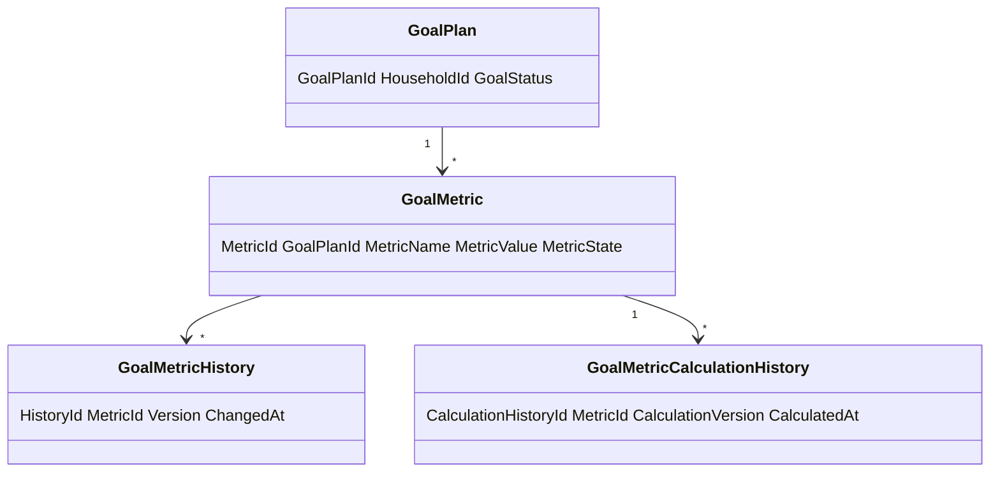
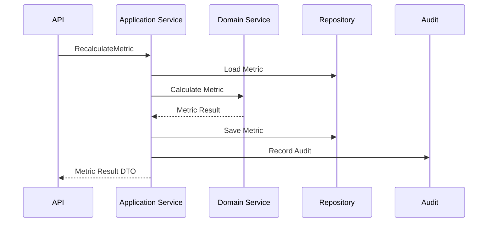
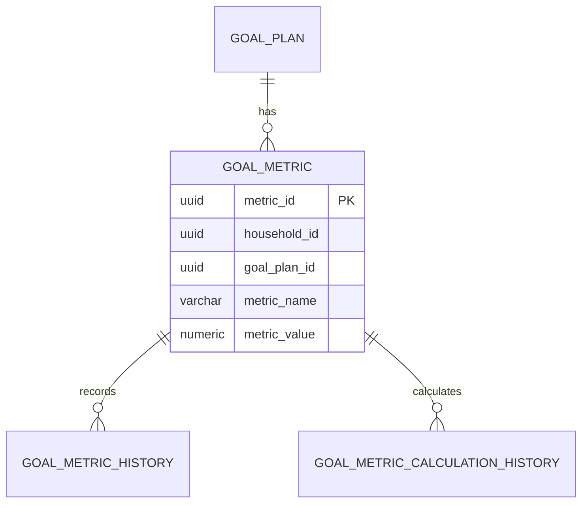
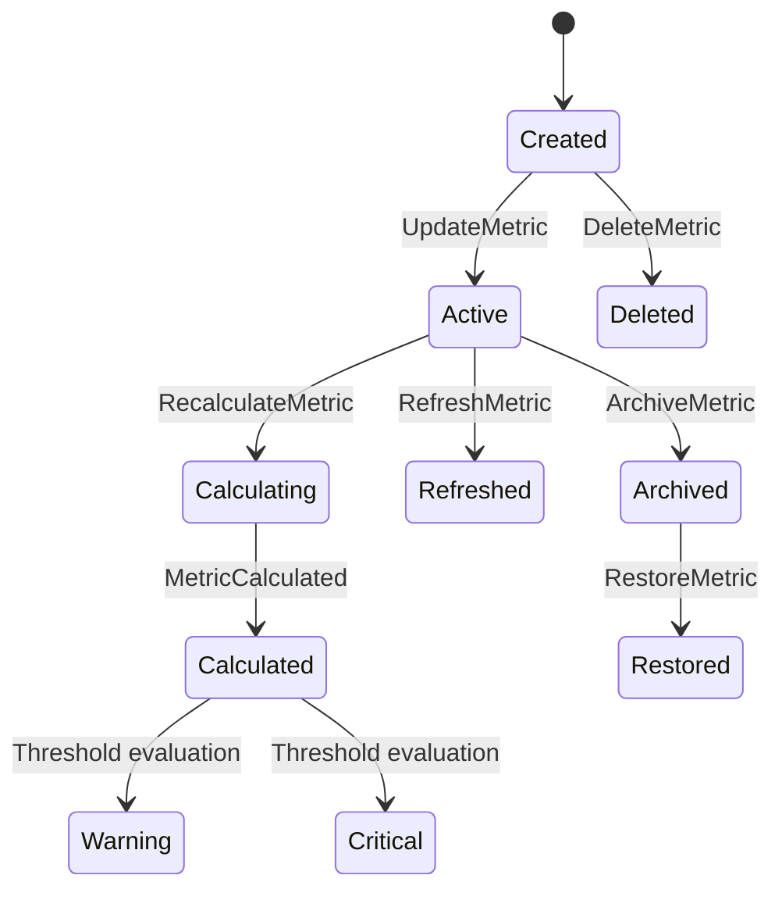
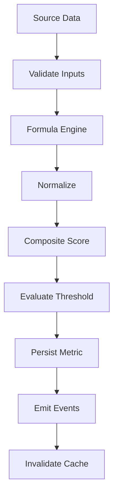

# Goal Metrics
Version: 1.0
Status: Enterprise Specification
Owner: Project Atlas
Source of Truth: Atlas Goal Metrics Specification
Last Updated: 2026-07-13
# Goal Metrics Overview
## Purpose
Goal Metrics defines how Atlas names, calculates, validates, stores, refreshes, exposes, audits, and reports metrics for GoalPlan.
It coordinates GoalPlan metrics with Goal Progress Tracking, Goal Review, Goal Lifecycle, Goal Dependency, Goal Prioritization, Goal Funding, DecisionSession, Recommendation, Scenario, Portfolio, CashFlow, Notification, Dashboard, User, Repository, API, Cache, Security, Permission, and Audit.
It does not redesign Atlas.
It does not modify existing Domain ownership.
It does not create a new Business Concept.
It does not replace GoalPlan, Goal Progress Tracking, Goal Review, DecisionSession, Recommendation, Scenario, Portfolio, CashFlow, Notification, or Dashboard.
## Business Meaning
Goal Metrics are governed numeric and categorical measurements used to understand GoalPlan progress, financial state, performance, risk, schedule, completion, forecast, health, priority, dependency readiness, quality, and business value.
Goal Metrics support user decision-making, household planning, recommendation ranking, decision quality, scenario comparison, notification triggering, dashboard reporting, audit, and replay.
## Metric Lifecycle
Metric lifecycle starts when a metric definition is created for an approved GoalPlan measurement.
Metric lifecycle continues through creation, update, calculation, refresh, recalculation, threshold evaluation, archival, restoration, and deletion when policy permits.
Metric lifecycle ends when metric is archived, deleted, or superseded by a versioned metric definition.
Metric values are calculated results.
Metric definitions are governed specifications.
Historical metric values are append-only evidence unless correction policy applies.
## Metric Ownership
GoalPlan owns the metric target.
Goal Metrics owns metric definitions, calculation contract, thresholds, precision, unit, refresh policy, and result storage.
Application Service owns orchestration.
Domain Service owns domain validation and calculation rule enforcement.
Repository owns persistence and query behavior.
Dashboard consumes projected metrics.
Audit owns history and calculation evidence.
## Metric Categories
Metric categories include Progress Metrics, Financial Metrics, Performance Metrics, Risk Metrics, Schedule Metrics, Completion Metrics, Forecast Metrics, Health Metrics, Priority Metrics, Dependency Metrics, Quality Metrics, and Business Value Metrics.
## Metric Collection Strategy
Metrics collect source data from GoalPlan, progress records, milestones, tasks when tracked, dependencies, DecisionSession, Recommendation, Scenario, Portfolio, CashFlow, Notification, dashboard projections, and historical metric records.
Every collected input must include source name, source id, source timestamp, version, HouseholdId, TenantId when applicable, and classification.
## Metric Calculation Strategy
Metric calculation is deterministic for the same inputs, formula version, assumption version, source snapshot, precision, rounding, and calculation date.
Metric formulas use decimal precision.
Metric formulas must specify unit and scale.
Metric formulas must record calculation version.
Composite metrics must declare weights.
Weighted calculations must use weights that sum to 1.
## Metric Refresh Policy
Metrics refresh on source event, manual command, scheduled run, batch calculation, dashboard refresh, scenario run, recommendation change, decision change, or Goal review completion.
Critical metrics refresh synchronously when required by API or decision behavior.
Dashboard metrics may refresh asynchronously when staleness is visible.
Historical metrics are not overwritten by refresh.
## Relationship with Goal
GoalPlan is the metric target and consistency boundary.
Goal Metrics references GoalPlanId, HouseholdId, TenantId when applicable, and Goal lifecycle state.
Goal status controls whether metrics can be refreshed, recalculated, archived, restored, or deleted.
## Relationship with Milestone
Milestones supply completion, delay, readiness, blocker, and quality inputs.
Milestone metrics must preserve MilestoneId when available.
Milestone changes trigger metric refresh.
## Relationship with Task
Tasks supply physical progress and execution quality inputs when existing Goal planning data tracks task state.
Task metrics remain subordinate to GoalPlan and milestone consistency.
Task changes can refresh progress and quality metrics.
## Relationship with Decision
DecisionSession supplies decision quality, accepted decision count, rejected decision count, decision staleness, and decision impact metrics.
Decision changes can refresh priority, health, forecast, and business value metrics.
## Relationship with Recommendation
Recommendation supplies adoption, completion, suppression, dismissal, and recommendation impact metrics.
Recommendation changes can refresh forecast, health, priority, completion, and business value metrics.
## Relationship with Scenario
Scenario supplies forecast, comparison, stress, and what-if metric inputs.
Scenario metrics must record ScenarioId, ScenarioVersion, assumptions, generated time, and staleness.
Scenario metrics are forecast values until accepted through DecisionSession.
## Relationship with Portfolio
Portfolio supplies asset allocation, return, risk, liquidity, concentration, and investment readiness metrics when relevant to GoalPlan.
Portfolio metrics must preserve valuation time and market assumption version.
## Relationship with CashFlow
CashFlow supplies contribution capacity, recurring surplus, recurring deficit, runway, budget variance, and funding gap metrics.
CashFlow metrics must preserve period and currency.
## Relationship with Notification
Notification consumes threshold and critical range metric events.
Notification can provide delivery and suppression metrics.
Notification does not own metric values.
## Relationship with Dashboard
Dashboard consumes summary, trend, forecast, health, and business value metrics.
Dashboard must display generated time and staleness when metrics are asynchronous.
## Relationship with User
User reads or changes metrics only through authenticated and authorized paths.
User-visible metrics must apply Household isolation, Tenant isolation, field-level security, masking, and permission.
# Metric Categories
## Progress Metrics
Progress Metrics measure completion and progress movement for GoalPlan.
Included metrics: OverallProgress, PhysicalProgress, MilestoneProgress, DependencyProgress, ProgressDelta, ProgressVelocity.
## Financial Metrics
Financial Metrics measure target amount, current funded amount, contribution rate, funding gap, budget variance, contribution capacity, and ROI.
## Performance Metrics
Performance Metrics measure actual progress against planned progress, actual funding against expected funding, and recommendation effect against expected effect.
## Risk Metrics
Risk Metrics measure current risk, risk trend, risk-adjusted progress, downside exposure, portfolio risk, and dependency risk.
## Schedule Metrics
Schedule Metrics measure elapsed time, remaining time, schedule variance, delay days, ahead days, and expected completion date.
## Completion Metrics
Completion Metrics measure completion score, completion probability, completed milestone count, completion candidate status, and completion confidence.
## Forecast Metrics
Forecast Metrics measure forecast completion, forecast accuracy, expected completion date, scenario delta, and forecast confidence.
## Health Metrics
Health Metrics measure health score, health band, health trend, warning state, and critical state.
## Priority Metrics
Priority Metrics measure priority score, priority rank, priority alignment, business priority, and recommendation priority impact.
## Dependency Metrics
Dependency Metrics measure ready dependency count, blocked dependency count, dependency progress, dependency risk, and blocker age.
## Quality Metrics
Quality Metrics measure data completeness, source freshness, traceability, review consistency, calculation quality, and metric confidence.
## Business Value Metrics
Business Value Metrics measure business impact, ROI, risk reduction value, time value, decision value, and recommendation value.
# Metric Definitions
## OverallProgress
Name: OverallProgress.
Business Meaning: User-facing GoalPlan progress.
Formula: `0.30 * MilestoneProgress + 0.25 * FinancialProgressOrNeutral + 0.15 * PhysicalProgress + 0.10 * DependencyProgress + 0.10 * RiskProgress + 0.10 * ConfidenceScore`.
Inputs: MilestoneProgress, FinancialProgress, PhysicalProgress, DependencyProgress, RiskProgress, ConfidenceScore.
Outputs: Decimal from 0 to 1.
Precision: numeric(7,6).
Unit: ratio.
Refresh Frequency: event-driven and scheduled.
Validation: value must be 0 through 1.
Example: 0.720000.
Threshold: 0.800000 healthy.
Warning Range: 0.500000 to 0.799999.
Critical Range: 0.000000 to 0.499999.
## FinancialProgress
Name: FinancialProgress.
Business Meaning: Funding completion against Goal target.
Formula: `clamp(CurrentFundedAmount / TargetAmount, 0, 1)`.
Inputs: CurrentFundedAmount, TargetAmount, CurrencyCode.
Outputs: Decimal from 0 to 1 or null.
Precision: numeric(7,6).
Unit: ratio.
Refresh Frequency: on financial source change.
Validation: TargetAmount greater than 0 when calculated.
Example: 0.680000.
Threshold: 0.900000.
Warning Range: 0.600000 to 0.899999.
Critical Range: 0.000000 to 0.599999.
## BudgetVariance
Name: BudgetVariance.
Business Meaning: Funding position compared with expected funding.
Formula: `ActualFunding - ExpectedFundingAtDate`.
Inputs: ActualFunding, ExpectedFundingAtDate, CurrencyCode.
Outputs: Decimal money value.
Precision: numeric(18,2).
Unit: currency.
Refresh Frequency: on funding or cashflow change.
Validation: currency must match GoalPlan currency.
Example: -15000.00.
Threshold: 0.00.
Warning Range: -0.05 * TargetAmount to 0.
Critical Range: less than -0.05 * TargetAmount.
## ScheduleVariance
Name: ScheduleVariance.
Business Meaning: Progress difference against elapsed time.
Formula: `OverallProgress - ElapsedTimePercent`.
Inputs: OverallProgress, StartDate, TargetDate, AsOfDate.
Outputs: Decimal from -1 to 1.
Precision: numeric(7,6).
Unit: ratio delta.
Refresh Frequency: daily scheduled and event-driven.
Validation: TargetDate after StartDate when present.
Example: 0.120000.
Threshold: 0.000000.
Warning Range: -0.100000 to -0.000001.
Critical Range: less than -0.100000.
## ForecastCompletion
Name: ForecastCompletion.
Business Meaning: Expected completion ratio under current forecast.
Formula: `clamp(CurrentProgress + ForecastProgressDelta, 0, 1)`.
Inputs: CurrentProgress, ForecastProgressDelta, ScenarioId, ScenarioVersion.
Outputs: Decimal from 0 to 1.
Precision: numeric(7,6).
Unit: ratio.
Refresh Frequency: on Scenario simulation and scheduled forecast refresh.
Validation: forecast must include ScenarioVersion.
Example: 0.910000.
Threshold: 0.850000.
Warning Range: 0.650000 to 0.849999.
Critical Range: 0.000000 to 0.649999.
## HealthScore
Name: HealthScore.
Business Meaning: Combined health of GoalPlan.
Formula: `0.30 * CompletionScore + 0.20 * ScheduleHealth + 0.20 * BudgetHealth + 0.15 * RiskProgress + 0.15 * ConfidenceScore`.
Inputs: CompletionScore, ScheduleHealth, BudgetHealth, RiskProgress, ConfidenceScore.
Outputs: Decimal from 0 to 1.
Precision: numeric(7,6).
Unit: score.
Refresh Frequency: event-driven and scheduled.
Validation: all component values must be 0 through 1.
Example: 0.820000.
Threshold: 0.800000.
Warning Range: 0.600000 to 0.799999.
Critical Range: 0.000000 to 0.599999.
## RiskScore
Name: RiskScore.
Business Meaning: Current risk exposure of GoalPlan.
Formula: `clamp(WeightedRiskExposure, 0, 1)`.
Inputs: portfolio risk, dependency risk, schedule risk, financial risk, scenario risk.
Outputs: Decimal from 0 to 1.
Precision: numeric(7,6).
Unit: score.
Refresh Frequency: risk source change and scheduled.
Validation: value must be 0 through 1.
Example: 0.220000.
Threshold: 0.300000.
Warning Range: 0.300001 to 0.599999.
Critical Range: 0.600000 to 1.000000.
## ConfidenceScore
Name: ConfidenceScore.
Business Meaning: Reliability of metric output.
Formula: `0.40 * DataCompleteness + 0.20 * SourceFreshness + 0.20 * Traceability + 0.20 * ReviewConsistency`.
Inputs: completeness, freshness, traceability, review consistency.
Outputs: Decimal from 0 to 1.
Precision: numeric(7,6).
Unit: score.
Refresh Frequency: calculation and review completion.
Validation: components must be 0 through 1.
Example: 0.900000.
Threshold: 0.800000.
Warning Range: 0.600000 to 0.799999.
Critical Range: 0.000000 to 0.599999.
## CompletionProbability
Name: CompletionProbability.
Business Meaning: Probability-like score that GoalPlan will complete as expected.
Formula: `clamp(0.45 * OverallProgress + 0.25 * ForecastCompletion + 0.15 * ConfidenceScore + 0.15 * RiskScoreInverse, 0, 1)`.
Inputs: OverallProgress, ForecastCompletion, ConfidenceScore, RiskScore.
Outputs: Decimal from 0 to 1.
Precision: numeric(7,6).
Unit: score.
Refresh Frequency: forecast and review.
Validation: components must be present or neutralized by rule.
Example: 0.840000.
Threshold: 0.800000.
Warning Range: 0.600000 to 0.799999.
Critical Range: 0.000000 to 0.599999.
## PriorityScore
Name: PriorityScore.
Business Meaning: GoalPlan priority alignment score.
Formula: `GoalPriorityScore`.
Inputs: Goal priority calculation output.
Outputs: Decimal score.
Precision: numeric(10,4).
Unit: score.
Refresh Frequency: priority source change.
Validation: source priority score must be versioned.
Example: 72.5000.
Threshold: configured by Goal Prioritization.
Warning Range: configured by Goal Prioritization.
Critical Range: configured by Goal Prioritization.
## BusinessImpact
Name: BusinessImpact.
Business Meaning: Combined value of GoalPlan outcome.
Formula: `FinancialImpactScore + RiskReductionScore + GoalReadinessScore + RecommendationValueScore`.
Inputs: financial impact, risk reduction, readiness, recommendation value.
Outputs: Decimal score.
Precision: numeric(10,4).
Unit: score.
Refresh Frequency: review and recommendation change.
Validation: each component must be versioned.
Example: 81.2500.
Threshold: 75.0000.
Warning Range: 50.0000 to 74.9999.
Critical Range: 0.0000 to 49.9999.
## ROI
Name: ROI.
Business Meaning: Estimated return on investment for GoalPlan action.
Formula: `(EstimatedBenefit - EstimatedCost) / EstimatedCost`.
Inputs: EstimatedBenefit, EstimatedCost, CurrencyCode.
Outputs: Decimal ratio.
Precision: numeric(18,6).
Unit: ratio.
Refresh Frequency: review and financial source change.
Validation: EstimatedCost must not be zero.
Example: 0.180000.
Threshold: greater than 0.
Warning Range: -0.050000 to 0.
Critical Range: less than -0.050000.
# Calculation Engine
## Formula Engine
Metric formulas execute through Calculation Engine using versioned formula contracts.
Formula execution records formula id, formula version, calculation version, source snapshot, precision, and rounding.
## Aggregation Rules
Aggregations must preserve Household scope and Tenant scope.
Aggregations must not mix currencies without conversion rule.
Aggregations must record generated time.
## Weighted Calculation
Weighted calculation uses `sum(weight_i * value_i)`.
Weights must be non-negative.
Weights must sum to 1.
## Rolling Window
Rolling window metrics use start date, end date, period, and data completeness.
Rolling window output must record window boundary.
## Historical Calculation
Historical calculation reads metric history and source snapshots.
Historical calculation must not rewrite historical metric values.
## Trend Analysis
Trend uses current value, prior value, and time delta.
Formula: `Trend = (CurrentValue - PriorValue) / PeriodCount`.
## Forecast Calculation
Forecast calculation uses Scenario result, current metric, forecast delta, and assumption version.
## Benchmark Comparison
Benchmark comparison compares GoalPlan metric against household average, goal category average, scenario benchmark, or configured target.
## Normalization
Normalization maps values to 0 through 1.
Formula: `NormalizedValue = clamp((Value - MinValue) / (MaxValue - MinValue), 0, 1)`.
## Composite Score
Composite score combines normalized values through approved weights.
Formula: `CompositeScore = sum(ComponentWeight_i * NormalizedMetric_i)`.
# Validation Rules
1. MetricId is required for persisted metric. 2. MetricName is required. 3. MetricCategory is required. 4. GoalPlanId is required. 5. HouseholdId is required. 6. TenantId is required when tenant scope exists. 7. MetricState is required. 8. MetricDefinitionVersion is required. 9. CalculationVersion is required for calculated metrics. 10. Formula is required for calculated metrics. 11. Inputs are required. 12. Outputs are required. 13. Precision is required. 14. Unit is required. 15. RefreshFrequency is required. 16. Threshold is required when alerting is enabled. 17. Warning range must not overlap critical range. 18. Critical range must be valid. 19. Metric value must fit precision. 20. Ratio metric must be between 0 and 1 unless definition permits otherwise. 21. Percent metric must be between 0 and 100. 22. Currency metric must include CurrencyCode. 23. TargetAmount must be greater than 0 for funding ratios. 24. EstimatedCost must not be zero for ROI. 25. StartDate must be before EndDate. 26. Rolling window period must be positive. 27. Historical calculation requires history source. 28. Forecast calculation requires ScenarioVersion. 29. Benchmark comparison requires benchmark source. 30. Composite score weights must sum to 1. 31. Weighted calculation weights must be non-negative. 32. Aggregation must preserve Household scope. 33. Aggregation must preserve Tenant scope when applicable. 34. Manual update requires reason. 35. Refresh requires source snapshot. 36. Recalculation requires calculation version. 37. Archive requires permission. 38. Restore requires archived metric. 39. Delete requires permission. 40. Deleted metric cannot be refreshed. 41. Archived metric cannot be updated. 42. ThresholdExceeded event requires prior threshold state. 43. MetricCalculated event requires result value. 44. MetricRefreshed event requires refresh source. 45. API request requires RequestId. 46. Event-driven refresh requires CausationId. 47. Audit requires CorrelationId. 48. RowVersion is required for update. 49. Filter field must be allowlisted. 50. Sort field must be allowlisted. 51. Projection name must be allowlisted. 52. Cache key must include HouseholdId. 53. Cache key must include GoalPlanId where goal-scoped. 54. Cache key must include MetricName. 55. Masking must be applied before export. 56. Field-level security must be evaluated before response. 57. Dashboard metric must include generated time. 58. Trend metric must include prior value. 59. Forecast metric must include forecast date. 60. Materialized view refresh must be auditable when used.
# Business Rules
1. Goal Metrics belongs to GoalPlan. 2. Goal Metrics is derived or governed measurement data. 3. Goal Metrics must not redefine GoalPlan. 4. Goal Metrics must not redefine Goal Progress. 5. Goal Metrics must not redefine Goal Review. 6. Goal Metrics must not redefine DecisionSession. 7. Goal Metrics must not redefine Recommendation. 8. Goal Metrics must not redefine Scenario. 9. Metric definitions must be versioned. 10. Metric calculations must be deterministic. 11. Metric results must record calculation version. 12. Metric results must record source snapshot when calculated from source data. 13. Metric values must preserve unit. 14. Currency metrics must preserve CurrencyCode. 15. Ratio metrics must preserve decimal scale. 16. Percent metrics must preserve percent scale. 17. Composite metrics must declare weights. 18. Composite weights must sum to 1. 19. Threshold evaluation must be deterministic. 20. ThresholdExceeded must emit only when crossing occurs. 21. Duplicate ThresholdExceeded emission is prohibited for same threshold state. 22. Archived metric cannot update. 23. Deleted metric cannot refresh. 24. Restored metric must preserve history. 25. Metric history is append-only. 26. Calculation history is append-only. 27. Manual update requires permission. 28. Manual update requires reason. 29. Manual update requires audit. 30. Automatic refresh must be idempotent. 31. Scheduled refresh must be retryable. 32. Batch calculation must use bounded pages. 33. Batch calculation must checkpoint. 34. Parallel processing is allowed across GoalPlan records. 35. Parallel processing of same MetricId must use concurrency control. 36. Incremental refresh must recalculate only affected metrics. 37. Full recalculation is required when formula version changes. 38. Dashboard metrics must expose generated time. 39. Forecast metrics must expose scenario version. 40. Trend metrics must expose comparison period. 41. Historical metrics must not be overwritten by current refresh. 42. Benchmark metrics must record benchmark source. 43. Aggregations must preserve Household isolation. 44. Aggregations must preserve Tenant isolation when applicable. 45. Metrics must not expose another Household. 46. Metrics must not expose another Tenant. 47. Field-level security applies to financial metrics. 48. Field-level security applies to portfolio metrics. 49. Field-level security applies to decision metrics. 50. Field-level security applies to recommendation metrics. 51. Masking must apply before export. 52. Cache invalidates after metric update. 53. Cache invalidates after recalculation. 54. Cache invalidates after archive. 55. Cache invalidates after restore. 56. Metric dashboard refreshes after calculation. 57. Metric search projection refreshes after calculation. 58. Notification can consume threshold events. 59. Notification suppression must not suppress audit. 60. Metric refresh cannot mutate GoalPlan directly. 61. Metric result can inform DecisionSession. 62. Metric result can inform Recommendation ranking. 63. Metric result can inform Scenario comparison. 64. Metric result can inform Goal Review. 65. Metric result can inform Dashboard. 66. Metric value decrease must be explainable by source change. 67. Metric quality below warning range must be visible. 68. Critical metric range must trigger review or notification when configured. 69. Metric deletion must be soft delete when history is retained. 70. Metric audit must include changed fields.
# State Machine
## States
| State | Meaning |
|---|---|
| Created | Metric definition or result exists. |
| Active | Metric is available for calculation and read. |
| Calculating | Metric calculation is running. |
| Calculated | Metric has a current calculated value. |
| Refreshed | Metric was refreshed from source. |
| Warning | Metric is in warning range. |
| Critical | Metric is in critical range. |
| Archived | Metric is read-only history. |
| Deleted | Metric is soft deleted when policy permits. |
| Restored | Metric was restored from archive. |
## Transitions
| From | To | Trigger |
|---|---|---|
| None | Created | CreateMetric |
| Created | Active | UpdateMetric |
| Active | Calculating | RecalculateMetric |
| Calculating | Calculated | MetricCalculated |
| Active | Refreshed | RefreshMetric |
| Calculated | Warning | Threshold evaluation |
| Calculated | Critical | Threshold evaluation |
| Warning | Calculated | Threshold recovery |
| Critical | Calculated | Threshold recovery |
| Active | Archived | ArchiveMetric |
| Calculated | Archived | ArchiveMetric |
| Archived | Restored | RestoreMetric |
| Restored | Active | UpdateMetric |
| Created | Deleted | DeleteMetric |
## Triggers
Triggers include CreateMetric, UpdateMetric, RefreshMetric, RecalculateMetric, ArchiveMetric, RestoreMetric, DeleteMetric, source event, scheduler run, background job, threshold crossing, Goal review completion, Goal progress update, Recommendation change, Decision change, Scenario simulation, Portfolio change, and CashFlow change.
## Invariant
Metric must reference GoalPlan when goal-scoped.
Metric must preserve HouseholdId.
Metric must preserve TenantId when applicable.
Archived metric is read-only.
Deleted metric is excluded from normal queries.
Calculated metric must have value, unit, precision, and calculation version.
## Illegal Transition
| From | To | Reason |
|---|---|---|
| Archived | Calculating | RestoreMetric is required first. |
| Deleted | Active | Restore policy is required first. |
| Created | Critical | Calculation is required first. |
| Calculating | Archived | Calculation must complete or be cancelled first. |
| Deleted | Calculating | Deleted metric cannot calculate. |
# Commands
## CreateMetric
Creates a metric definition or goal-scoped metric record.
Input: GoalPlanId, MetricName, MetricCategory, Unit, Precision, RefreshFrequency, Threshold, RequestedBy, CorrelationId.
Output: MetricId, MetricState.
## UpdateMetric
Updates editable metric configuration.
Input: MetricId, Threshold, WarningRange, CriticalRange, RefreshFrequency, RowVersion, CorrelationId.
Output: MetricId, Version, ChangedFields.
## RefreshMetric
Refreshes metric from current source.
Input: MetricId, SourceSnapshotId, RefreshReason, CorrelationId.
Output: MetricId, MetricValue, RefreshedAt.
## RecalculateMetric
Recalculates metric using calculation version.
Input: MetricId, CalculationVersion, SourceSnapshotId, CorrelationId.
Output: MetricId, MetricValue, CalculationHistoryId.
## ArchiveMetric
Archives metric as read-only history.
Input: MetricId, ArchiveReason, RowVersion, CorrelationId.
Output: MetricState = Archived.
## RestoreMetric
Restores archived metric.
Input: MetricId, RestoreReason, RowVersion, CorrelationId.
Output: MetricState = Restored.
## DeleteMetric
Soft deletes metric when policy permits.
Input: MetricId, DeleteReason, RowVersion, CorrelationId.
Output: MetricState = Deleted.
## All related Domain Commands
| Command | Metric Relationship |
|---|---|
| RefreshGoalProgress | Refreshes progress metrics. |
| RecalculateGoalProgress | Recalculates progress metrics. |
| CreateReview | Consumes current metrics. |
| CompleteReview | Produces review metrics. |
| AcceptDecision | Refreshes decision metrics. |
| RejectDecision | Refreshes decision quality metrics. |
| AcceptRecommendation | Refreshes adoption metrics. |
| CompleteRecommendation | Refreshes recommendation value metrics. |
| RunScenario | Produces forecast metrics. |
| TriggerNotification | Consumes threshold metrics. |
# Domain Events
## MetricCreated
Payload: MetricId, GoalPlanId, HouseholdId, MetricName, MetricCategory, CorrelationId.
## MetricUpdated
Payload: MetricId, ChangedFields, Version, CorrelationId.
## MetricCalculated
Payload: MetricId, MetricName, MetricValue, Unit, CalculationVersion, CorrelationId.
## MetricRefreshed
Payload: MetricId, SourceSnapshotId, MetricValue, RefreshedAt, CorrelationId.
## MetricArchived
Payload: MetricId, ArchiveReason, ArchivedAt, CorrelationId.
## MetricRestored
Payload: MetricId, RestoreReason, RestoredAt, CorrelationId.
## ThresholdExceeded
Payload: MetricId, MetricName, MetricValue, Threshold, Severity, GoalPlanId, HouseholdId, CorrelationId.
## All related Events
| Event | Metric Impact |
|---|---|
| GoalProgressUpdated | Refreshes progress and health metrics. |
| GoalHealthChanged | Refreshes health metrics. |
| GoalForecastChanged | Refreshes forecast metrics. |
| GoalDelayed | Refreshes schedule metrics. |
| ReviewCompleted | Refreshes review and quality metrics. |
| RecommendationAccepted | Refreshes adoption metrics. |
| RecommendationCompleted | Refreshes adoption and value metrics. |
| DecisionAccepted | Refreshes decision quality metrics. |
| DecisionRejected | Refreshes decision quality metrics. |
| ScenarioSimulated | Refreshes forecast metrics. |
| NotificationTriggered | Refreshes notification metrics. |
# Repository
## Interface
```csharp
public interface IGoalMetricRepository
{
    Task<GoalMetric?> GetByIdAsync(Guid householdId, Guid metricId, CancellationToken cancellationToken);
    Task<IReadOnlyList<GoalMetric>> SearchAsync(GoalMetricSearchSpecification specification, CancellationToken cancellationToken);
    Task<GoalMetricDashboard> GetDashboardAsync(Guid householdId, GoalMetricDashboardSpecification specification, CancellationToken cancellationToken);
    Task AddAsync(GoalMetric metric, CancellationToken cancellationToken);
    Task UpdateAsync(GoalMetric metric, CancellationToken cancellationToken);
    Task ArchiveAsync(Guid householdId, Guid metricId, string reason, CancellationToken cancellationToken);
}
```
## Methods
Methods include GetByIdAsync, GetByGoalPlanIdAsync, GetByMetricNameAsync, SearchAsync, GetDashboardAsync, GetTrendAsync, GetForecastAsync, GetHistoryAsync, AddAsync, UpdateAsync, ArchiveAsync, RestoreAsync, DeleteAsync, and SaveCalculationHistoryAsync.
## Queries
Queries include metric by id, metric by GoalPlan, metric by name, metric by category, metric by state, metric by threshold state, metric by updated time, trend metrics, forecast metrics, dashboard metrics, and historical metrics.
## Filtering
Allowed filters: goalPlanId, householdId, metricName, metricCategory, metricState, thresholdState, unit, updatedAt, calculatedAt, archivedAt.
## Sorting
Allowed sorting: metricName, metricCategory, metricValue, updatedAt, calculatedAt, thresholdState, trendValue, forecastValue.
## Aggregation
Aggregations include average metric value, min value, max value, count by category, count by threshold state, trend average, forecast average, and dashboard summary.
## Projection
Supported projections: summary, detail, dashboard, search, result, trend, forecast, history.
## Specification
GoalMetricSearchSpecification fields: HouseholdId, TenantId, GoalPlanIds, MetricNames, MetricCategories, MetricStates, ThresholdStates, DateFrom, DateTo, Sort, PageSize, Cursor.
# Domain Service Interaction
GoalMetricDomainService validates metric definition, validates source inputs, calculates metric value, evaluates thresholds, determines warning or critical state, validates state transitions, and emits Domain Events.
| Service | Interaction |
|---|---|
| GoalProgressDomainService | Supplies progress and health inputs. |
| GoalReviewDomainService | Consumes metrics and supplies review quality inputs. |
| GoalDependencyDomainService | Supplies dependency metrics. |
| GoalPrioritizationDomainService | Supplies priority score. |
| GoalFundingDomainService | Supplies financial metrics. |
| DecisionDomainService | Supplies decision quality metrics. |
| RecommendationDomainService | Supplies adoption and value metrics. |
| ScenarioDomainService | Supplies forecast metrics. |
| NotificationDomainService | Consumes threshold events. |
# Application Service Interaction
GoalMetricApplicationService authorizes request, resolves Household scope, loads metric, loads GoalPlan, loads source data, invokes Domain Service, persists metric, saves calculation history, publishes events, invalidates cache, updates projection, records audit, and returns DTO.
```csharp
Task<GoalMetricDetailDto> CreateMetricAsync(CreateMetricRequest request);
Task<GoalMetricDetailDto> UpdateMetricAsync(UpdateMetricRequest request);
Task<GoalMetricResultDto> RefreshMetricAsync(RefreshMetricRequest request);
Task<GoalMetricResultDto> RecalculateMetricAsync(RecalculateMetricRequest request);
Task<GoalMetricDetailDto> ArchiveMetricAsync(ArchiveMetricRequest request);
Task<GoalMetricDetailDto> RestoreMetricAsync(RestoreMetricRequest request);
Task<GoalMetricSearchResultDto> SearchMetricsAsync(GoalMetricSearchRequest request);
Task<GoalMetricTrendDto> GetMetricTrendAsync(GetMetricTrendRequest request);
Task<GoalMetricForecastDto> GetMetricForecastAsync(GetMetricForecastRequest request);
```
# API
## REST Endpoints
| Method | Endpoint | Purpose |
|---|---|---|
| GET | /api/goal-metrics | Search metrics. |
| GET | /api/goal-metrics/{metricId} | Get detail. |
| POST | /api/goal-metrics | Create metric. |
| PATCH | /api/goal-metrics/{metricId} | Update metric. |
| POST | /api/goal-metrics/{metricId}/refresh | Refresh metric. |
| POST | /api/goal-metrics/{metricId}/recalculate | Recalculate metric. |
| POST | /api/goal-metrics/{metricId}/archive | Archive metric. |
| POST | /api/goal-metrics/{metricId}/restore | Restore metric. |
| DELETE | /api/goal-metrics/{metricId} | Soft delete metric. |
| GET | /api/goal-metrics/dashboard | Get dashboard metrics. |
| GET | /api/goal-metrics/{metricId}/trend | Get trend. |
| GET | /api/goal-metrics/{metricId}/forecast | Get forecast. |
## HTTP Methods
GET reads metrics.
POST executes commands.
PATCH updates editable fields.
DELETE soft deletes when policy permits.
## Request
```json
{ "goalPlanId": "uuid", "metricName": "OverallProgress", "metricCategory": "Progress", "unit": "ratio", "refreshFrequency": "EventDriven" }
```
## Response
```json
{ "metricId": "uuid", "goalPlanId": "uuid", "metricName": "OverallProgress", "metricState": "Created", "unit": "ratio" }
```
## Errors
| Status | Error |
|---|---|
| 400 | InvalidMetricRequest |
| 401 | Unauthenticated |
| 403 | GoalMetricPermissionDenied |
| 404 | GoalMetricNotFound |
| 409 | GoalMetricConcurrencyConflict |
| 422 | GoalMetricStateViolation |
## Pagination
Cursor pagination is required.
Default page size is 50.
Maximum page size is 200.
## Filtering
API supports allowlisted filters only.
## Sorting
Default sorting is updatedAt desc.
API supports allowlisted sorting only.
## Projection
Projection supports summary, detail, dashboard, result, trend, forecast, search, and history.
# DTO
## Create DTO
```json
{ "goalPlanId": "uuid", "metricName": "OverallProgress", "metricCategory": "Progress", "unit": "ratio", "precision": "numeric(7,6)", "refreshFrequency": "EventDriven" }
```
## Update DTO
```json
{ "warningRange": "0.500000..0.799999", "criticalRange": "0.000000..0.499999", "refreshFrequency": "Scheduled", "rowVersion": "base64" }
```
## Detail DTO
```json
{ "metricId": "uuid", "goalPlanId": "uuid", "metricName": "OverallProgress", "metricValue": 0.72, "unit": "ratio", "metricState": "Calculated", "thresholdState": "Healthy", "calculatedAt": "2026-07-13T00:00:00Z" }
```
## Summary DTO
```json
{ "metricId": "uuid", "metricName": "HealthScore", "metricValue": 0.82, "thresholdState": "Healthy" }
```
## Dashboard DTO
```json
{ "householdId": "uuid", "metricCount": 24, "criticalCount": 1, "warningCount": 3, "averageHealthScore": 0.78, "generatedAt": "2026-07-13T00:00:00Z" }
```
## Search DTO
```json
{ "filters": { "metricCategory": "Health", "thresholdState": "Critical" }, "sort": "updatedAt:desc", "pageSize": 50, "cursor": null }
```
## Metric Result DTO
```json
{ "metricName": "BudgetVariance", "metricValue": -15000.00, "unit": "TWD", "thresholdState": "Warning", "calculationVersion": "1.0" }
```
## Trend DTO
```json
{ "metricName": "OverallProgress", "currentValue": 0.72, "priorValue": 0.66, "trendValue": 0.06, "window": "P30D" }
```
## Forecast DTO
```json
{ "metricName": "ForecastCompletion", "forecastValue": 0.91, "forecastDate": "2027-04-30", "scenarioId": "uuid", "scenarioVersion": "1.0" }
```
# Database Mapping
## Table
Primary table: goal_metric.
History table: goal_metric_history.
Calculation table: goal_metric_calculation_history.
## Columns
Columns: metric_id, tenant_id, household_id, goal_plan_id, metric_name, metric_category, metric_state, threshold_state, metric_value, metric_unit, precision_name, refresh_frequency, warning_min, warning_max, critical_min, critical_max, calculation_version, definition_version, source_snapshot_id, calculated_at, refreshed_at, row_version, created_at, updated_at, archived_at, deleted_at.
## Indexes
Indexes: ix_goal_metric_household_goal, ix_goal_metric_household_name, ix_goal_metric_household_category, ix_goal_metric_threshold, ix_goal_metric_updated_at.
## Constraints
Constraints: primary key on metric_id, FK to GoalPlan, unique active metric key, metric value range checks by unit policy, score checks, threshold checks.
## FK
fk_goal_metric_goal_plan.
## Unique
uq_goal_metric_household_goal_name.
## Check Constraint
score metric values must be between 0 and 1 when unit is score or ratio.
# PostgreSQL Schema
```sql
CREATE TABLE goal_metric (
    metric_id uuid PRIMARY KEY,
    tenant_id uuid NULL,
    household_id uuid NOT NULL,
    goal_plan_id uuid NOT NULL,
    metric_name varchar(128) NOT NULL,
    metric_category varchar(64) NOT NULL,
    metric_state varchar(32) NOT NULL,
    threshold_state varchar(32) NULL,
    metric_value numeric(18,6) NULL,
    metric_unit varchar(32) NOT NULL,
    precision_name varchar(32) NOT NULL,
    refresh_frequency varchar(64) NOT NULL,
    warning_min numeric(18,6) NULL,
    warning_max numeric(18,6) NULL,
    critical_min numeric(18,6) NULL,
    critical_max numeric(18,6) NULL,
    calculation_version varchar(32) NULL,
    definition_version varchar(32) NOT NULL,
    source_snapshot_id uuid NULL,
    calculated_at timestamptz NULL,
    refreshed_at timestamptz NULL,
    row_version bigint NOT NULL DEFAULT 1,
    created_at timestamptz NOT NULL,
    updated_at timestamptz NOT NULL,
    archived_at timestamptz NULL,
    deleted_at timestamptz NULL,
    CONSTRAINT uq_goal_metric_household_goal_name UNIQUE (household_id, goal_plan_id, metric_name),
    CONSTRAINT ck_goal_metric_score_value CHECK (
        metric_value IS NULL OR metric_unit NOT IN ('score','ratio') OR (metric_value >= 0 AND metric_value <= 1)
    ),
    CONSTRAINT ck_goal_metric_threshold_warning CHECK (
        warning_min IS NULL OR warning_max IS NULL OR warning_min <= warning_max
    ),
    CONSTRAINT ck_goal_metric_threshold_critical CHECK (
        critical_min IS NULL OR critical_max IS NULL OR critical_min <= critical_max
    )
);
CREATE INDEX ix_goal_metric_household_goal ON goal_metric (household_id, goal_plan_id);
CREATE INDEX ix_goal_metric_household_name ON goal_metric (household_id, metric_name);
CREATE INDEX ix_goal_metric_household_category ON goal_metric (household_id, metric_category);
CREATE INDEX ix_goal_metric_threshold ON goal_metric (household_id, threshold_state);
CREATE INDEX ix_goal_metric_updated_at ON goal_metric (updated_at DESC);
CREATE TABLE goal_metric_history (
    history_id uuid PRIMARY KEY,
    metric_id uuid NOT NULL,
    household_id uuid NOT NULL,
    goal_plan_id uuid NOT NULL,
    version bigint NOT NULL,
    change_reason varchar(256) NOT NULL,
    changed_by uuid NULL,
    previous_values jsonb NOT NULL,
    new_values jsonb NOT NULL,
    correlation_id uuid NOT NULL,
    created_at timestamptz NOT NULL
);
CREATE TABLE goal_metric_calculation_history (
    calculation_history_id uuid PRIMARY KEY,
    metric_id uuid NOT NULL,
    household_id uuid NOT NULL,
    goal_plan_id uuid NOT NULL,
    metric_name varchar(128) NOT NULL,
    metric_value numeric(18,6) NULL,
    metric_unit varchar(32) NOT NULL,
    calculation_version varchar(32) NOT NULL,
    source_snapshot_id uuid NULL,
    inputs jsonb NOT NULL,
    outputs jsonb NOT NULL,
    correlation_id uuid NOT NULL,
    calculated_at timestamptz NOT NULL
);
CREATE INDEX ix_goal_metric_history_metric ON goal_metric_history (metric_id, version DESC);
CREATE INDEX ix_goal_metric_calculation_metric ON goal_metric_calculation_history (metric_id, calculated_at DESC);
CREATE VIEW goal_metric_dashboard_view AS
SELECT household_id,
       count(*) AS metric_count,
       count(*) FILTER (WHERE threshold_state = 'Critical') AS critical_count,
       count(*) FILTER (WHERE threshold_state = 'Warning') AS warning_count,
       avg(metric_value) FILTER (WHERE metric_name = 'HealthScore') AS average_health_score,
       max(updated_at) AS generated_at
FROM goal_metric
WHERE archived_at IS NULL AND deleted_at IS NULL
GROUP BY household_id;
CREATE MATERIALIZED VIEW goal_metric_daily_summary_mv AS
SELECT household_id,
       goal_plan_id,
       metric_name,
       date_trunc('day', calculated_at) AS metric_day,
       avg(metric_value) AS average_value,
       min(metric_value) AS min_value,
       max(metric_value) AS max_value
FROM goal_metric_calculation_history
GROUP BY household_id, goal_plan_id, metric_name, date_trunc('day', calculated_at);
```
# EF Core Mapping
## Fluent API
```csharp
builder.ToTable("goal_metric");
builder.HasKey(x => x.MetricId);
builder.Property(x => x.MetricId).HasColumnName("metric_id");
builder.Property(x => x.TenantId).HasColumnName("tenant_id");
builder.Property(x => x.HouseholdId).HasColumnName("household_id").IsRequired();
builder.Property(x => x.GoalPlanId).HasColumnName("goal_plan_id").IsRequired();
builder.Property(x => x.MetricName).HasColumnName("metric_name").HasMaxLength(128).IsRequired();
builder.Property(x => x.MetricCategory).HasColumnName("metric_category").HasMaxLength(64).IsRequired();
builder.Property(x => x.MetricState).HasColumnName("metric_state").HasMaxLength(32).IsRequired();
builder.Property(x => x.ThresholdState).HasColumnName("threshold_state").HasMaxLength(32);
builder.Property(x => x.MetricValue).HasColumnName("metric_value").HasPrecision(18, 6);
builder.Property(x => x.MetricUnit).HasColumnName("metric_unit").HasMaxLength(32).IsRequired();
builder.Property(x => x.CalculationVersion).HasColumnName("calculation_version").HasMaxLength(32);
builder.Property(x => x.DefinitionVersion).HasColumnName("definition_version").HasMaxLength(32).IsRequired();
builder.Property(x => x.RowVersion).HasColumnName("row_version").IsConcurrencyToken();
builder.HasIndex(x => new { x.HouseholdId, x.GoalPlanId, x.MetricName }).IsUnique();
builder.HasIndex(x => new { x.HouseholdId, x.MetricCategory });
builder.HasIndex(x => new { x.HouseholdId, x.ThresholdState });
builder.HasQueryFilter(x => x.DeletedAt == null);
```
## Owned Types
MetricThreshold can be owned with warning and critical ranges.
MetricPrecision can be owned with precision name, scale, and unit.
## Indexes
Indexes match PostgreSQL schema.
## Query Filters
Default query filter excludes deleted metrics.
Repository specification applies Household and Tenant filters.
## Value Conversion
MetricState, MetricCategory, ThresholdState, RefreshFrequency, and MetricUnit use string conversion.
# Cache Strategy
## Redis Key
Detail key: `atlas:{tenantId}:household:{householdId}:goal:{goalPlanId}:metric:{metricName}:v1`.
Dashboard key: `atlas:{tenantId}:household:{householdId}:goal-metrics:dashboard:v1`.
Search key: `atlas:{tenantId}:household:{householdId}:goal-metrics:search:{hash}:v1`.
Trend key: `atlas:{tenantId}:household:{householdId}:goal:{goalPlanId}:metric:{metricName}:trend:{window}:v1`.
Forecast key: `atlas:{tenantId}:household:{householdId}:goal:{goalPlanId}:metric:{metricName}:forecast:v1`.
## Refresh Strategy
Refresh detail after calculation.
Refresh dashboard asynchronously after calculation.
Refresh trend after calculation history insert.
Refresh forecast after Scenario simulation.
## Invalidation
Invalidate on MetricCreated, MetricUpdated, MetricCalculated, MetricRefreshed, MetricArchived, MetricRestored, ThresholdExceeded, GoalProgressUpdated, ReviewCompleted, Recommendation change, Decision change, Scenario simulation, Portfolio change, and CashFlow change.
## TTL
Detail TTL is 5 minutes.
Dashboard TTL is 2 minutes.
Search TTL is 1 minute.
Trend TTL is 10 minutes.
Forecast TTL is 10 minutes.
# Security
## Authorization
Metric access requires authenticated Principal and Household permission.
Protected metric categories require source permission.
## Permissions
Permissions: GoalMetric.Read, GoalMetric.Create, GoalMetric.Update, GoalMetric.Refresh, GoalMetric.Recalculate, GoalMetric.Archive, GoalMetric.Restore, GoalMetric.Delete, GoalMetric.Export.
## Field Level Security
Financial metrics require financial read permission.
Portfolio metrics require portfolio read permission.
Decision metrics require decision read permission.
Recommendation metrics require recommendation read permission.
## Masking
Mask currency values when user lacks financial read permission.
Mask portfolio source details when user lacks portfolio permission.
Mask decision and recommendation references when user lacks source permission.
# Audit
## Metric History
Metric history records definition changes, threshold changes, state changes, archive, restore, and delete.
## Calculation History
Calculation history records formula, inputs, outputs, source snapshot, calculation version, and result.
## Versioning
DefinitionVersion changes when metric definition changes.
CalculationVersion changes when formula or calculation policy changes.
RowVersion supports concurrency.
## Audit Trail
Audit records create, update, refresh, recalculate, archive, restore, delete, threshold exceeded, dashboard export, and manual correction.
# Performance
## Bulk Calculation
Bulk calculation uses bounded batches and checkpoint.
Default batch size is 500.
Maximum batch size is 5000.
## Parallel Processing
Parallel calculation is allowed across GoalPlan records and MetricName groups.
Parallel calculation of same MetricId requires RowVersion.
## Incremental Refresh
Source event scope determines affected metric categories.
Formula version change triggers full recalculation.
## Read Optimization
Summary projection supports list view.
Dashboard view supports household dashboard.
Daily summary materialized view supports trend analytics.
## Caching Strategy
Redis caches detail, dashboard, search, trend, and forecast metrics.
Cache values include MetricId, MetricName, MetricValue, updatedAt, calculationVersion, and definitionVersion.
# Example JSON
## Create
```json
{ "goalPlanId": "5e4b510a-6f80-43c7-9978-89f2b9f89a11", "metricName": "OverallProgress", "metricCategory": "Progress", "unit": "ratio", "precision": "numeric(7,6)", "refreshFrequency": "EventDriven" }
```
## Update
```json
{ "warningRange": "0.500000..0.799999", "criticalRange": "0.000000..0.499999", "refreshFrequency": "Scheduled", "rowVersion": "AAAAAAAAB9E=" }
```
## Metric Result
```json
{ "metricName": "BudgetVariance", "metricValue": -15000.00, "unit": "TWD", "thresholdState": "Warning", "calculationVersion": "1.0" }
```
## Dashboard
```json
{ "householdId": "afc64d0c-cc24-48bb-a2e9-7bb8736fbdf4", "metricCount": 24, "criticalCount": 1, "warningCount": 3, "averageHealthScore": 0.78, "generatedAt": "2026-07-13T00:00:00Z" }
```
## Trend
```json
{ "metricName": "OverallProgress", "currentValue": 0.72, "priorValue": 0.66, "trendValue": 0.06, "window": "P30D" }
```
## Forecast
```json
{ "metricName": "ForecastCompletion", "forecastValue": 0.91, "forecastDate": "2027-04-30", "scenarioId": "393b984d-bdf4-4f2c-a2ef-a64793adf78a", "scenarioVersion": "1.0" }
```
## Search
```json
{ "items": [{ "metricId": "uuid", "goalPlanId": "uuid", "metricName": "HealthScore", "metricValue": 0.82, "thresholdState": "Healthy" }], "nextCursor": null }
```
# Mermaid
## Class Diagram

## Sequence Diagram

## ER Diagram

## State Diagram

## Metric Calculation Flow

# Testing
## Unit Test
Unit tests cover formula calculation, aggregation, weighted calculation, rolling window, trend, forecast, benchmark, normalization, composite score, threshold evaluation, and state transitions.
## Integration Test
Integration tests cover create, update, refresh, recalculate, archive, restore, delete, dashboard query, trend query, forecast query, search query, event emission, cache invalidation, and audit trail.
## Calculation Test
Calculation tests cover deterministic result, formula version, source snapshot, precision, unit, rounding, composite weight sum, and threshold crossing.
## Validation Test
Validation tests cover required fields, invalid ranges, missing currency, zero ROI denominator, invalid filter, invalid sort, stale RowVersion, missing source snapshot, and invalid state transition.
## Performance Test
Performance tests cover bulk calculation, parallel processing, dashboard query latency, search query latency, materialized view refresh, trend query latency, and cache hit ratio.
## Concurrency Test
Concurrency tests cover RowVersion conflict, duplicate event idempotency, same MetricId parallel calculation, batch retry, cache invalidation race, and materialized view refresh overlap.
# Edge Cases
1. GoalPlan missing. 2. GoalPlan archived. 3. GoalPlan cancelled. 4. Metric definition missing. 5. Metric already exists for GoalPlan and name. 6. Metric value is null. 7. Metric unit is missing. 8. Metric precision is invalid. 9. Currency mismatch occurs. 10. TargetAmount is zero. 11. EstimatedCost is zero. 12. Formula version is missing. 13. Calculation input is missing. 14. Source snapshot is missing. 15. Scenario version is stale. 16. Benchmark source is missing. 17. Composite weights do not sum to 1. 18. Warning range overlaps critical range. 19. Threshold crossing event is duplicated. 20. Archived metric is refreshed. 21. Deleted metric is recalculated. 22. Restore requested for active metric. 23. Delete requested without permission. 24. User lacks financial read permission. 25. HouseholdId mismatch. 26. TenantId mismatch. 27. Cache key omits MetricName. 28. Cache returns stale definition version. 29. Trend cannot find prior value. 30. Forecast cannot calculate expected value. 31. Materialized view refresh fails. 32. Dashboard projection fails. 33. Audit write fails. 34. Calculation history write fails. 35. Batch calculation stops mid-page. 36. Scheduler overlaps previous run. 37. Event arrives out of order. 38. Event is delivered twice. 39. RowVersion conflict occurs. 40. Export attempts unmasked protected metric.
# Version History | Version | Date | Description |
|---|---|---|
| 1.0 | 2026-07-13 | Enterprise Specification for Goal Metrics. |
