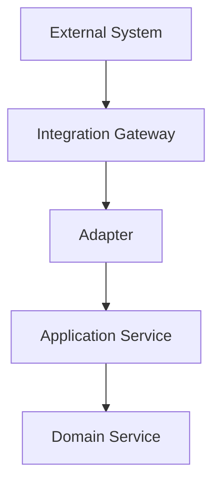
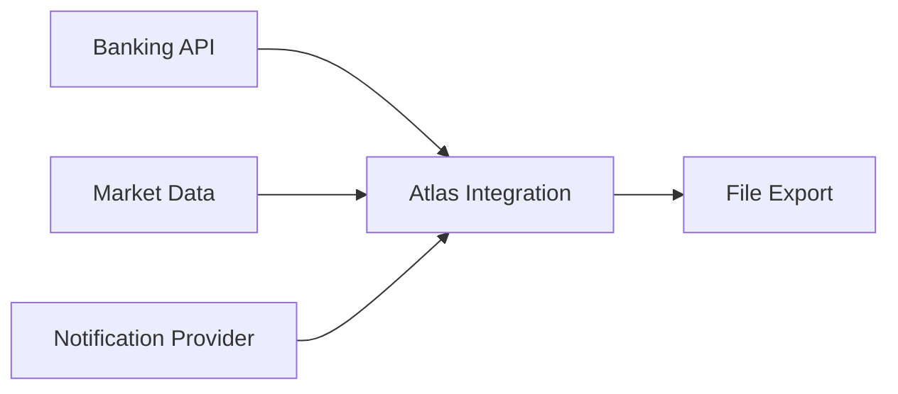
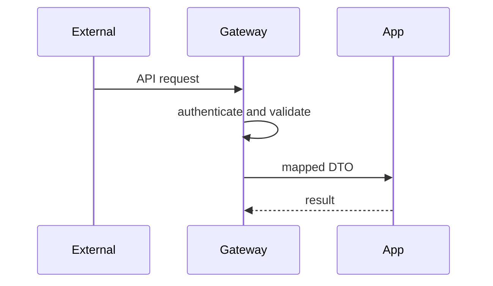
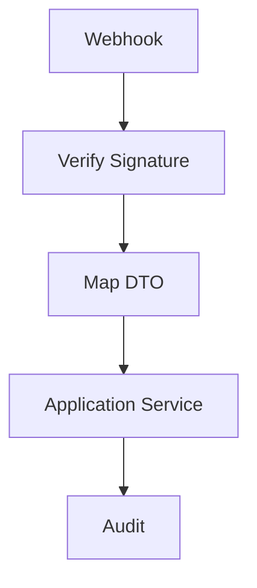
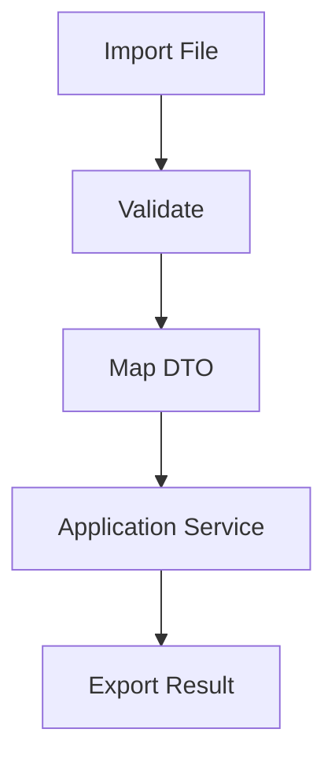

# Integration Framework

# Document Control

Document Name: Integration Framework
Document Path: knowledge/integration-framework.md
Document Type: Atlas Enterprise Canonical Specification
Version: 1.0
Status: Canonical Specification
Domain: Platform
Bounded Context: Platform
Owner: Project Atlas
Source of Truth: Atlas Integration Source of Truth
Last Updated: 2026-07-12

Related Specifications:
- knowledge/api-governance-framework.md
- knowledge/message-contract-catalog.md
- knowledge/domain-event-catalog.md
- knowledge/event-driven-architecture.md
- knowledge/application-service-catalog.md
- knowledge/domain-service-catalog.md
- knowledge/repository-catalog.md
- knowledge/service-catalog.md
- knowledge/system-module-catalog.md
- knowledge/security-framework.md
- knowledge/permission-framework.md
- knowledge/workflow-engine-framework.md
- knowledge/background-job-framework.md
- knowledge/scheduler-framework.md
- knowledge/automation-framework.md
- docs/04-DomainModel.md
- docs/05-DatabaseDesign.md
- docs/06-ERD.md
- docs/07-API.md

# Purpose

Integration Framework defines Atlas integration governance for REST API, External API, Internal API, Application Service, Domain Service, Message Contract, Domain Event, Integration Event, Workflow, Saga, Scheduler, Automation, Background Job, Notification, Authentication, Authorization, Webhook, File Exchange, ETL, Import, and Export interactions. It is the integration source of truth.

# Scope

- System Integration
- External Integration
- Internal Integration
- REST Integration
- Webhook Integration
- Message Integration
- File Integration
- ETL
- Import
- Export
- Synchronization
- Asynchronous Integration
- Request Response
- Publish Subscribe
- Event Driven Integration
- Anti Corruption Layer
- Adapter
- Gateway
- Facade

# Integration Principles

- Integrations use catalog-approved source and target systems.
- External payloads are translated through adapter or anti corruption layer before domain use.
- All integration calls require authentication, authorization, retry, timeout, audit, monitoring, and versioning.
- Integration failures must not corrupt Aggregate state.
- Secrets are managed outside payloads and rotated according to security rules.
- Integration contracts are versioned and observable.

# Integration Architecture

External or internal systems interact with Atlas only through API Governance, Message Contract Catalog, Event Driven Architecture, Integration Framework adapters, or catalog-approved file exchange. Domain Services and Aggregates do not call external systems directly.

# Complete Integration Catalog

## BankingApiIntegration

Integration Name: BankingApiIntegration
Display Name: BankingApiIntegration
Category: External Integration
Source System: Banking API
Target System: Atlas Integration
Purpose: Account and transaction import.
Business Meaning: BankingApiIntegration connects a catalog-approved source and target without redefining Atlas domain concepts.
Description: Integration uses adapter, gateway, DTO, message contract, audit, security, retry, timeout, monitoring, and failure controls.
Integration Pattern: REST Integration
Communication Style: Request Response
Protocol: REST, webhook, message, or file contract according to category.
Transport: HTTPS
Authentication: OAuth, API Key
Authorization: Permission and integration scope are required.
Encryption: TLS in transit and payload encryption when sensitive.
Payload: BankingImportDto payload with correlation metadata.
DTO: BankingImportDto
Message Contract: BankingTransactionImportedMessage
API: /api/v1/integrations/banking
Version: 1.0
Retry: Exponential retry for transient failures.
Timeout: Bounded timeout with no indefinite waits.
Compensation: Workflow or saga compensation only when cataloged.
Error Handling: Return integration error, retry, dead-letter, quarantine, or mark degraded according to failure mode.
Monitoring: Logs, traces, metrics, alerts, health checks, and dependency latency are required.
Audit: Request hash, response hash, source, target, actor or system actor, CorrelationId, CausationId, and result are recorded.
Security: Secret management, credential rotation, tenant isolation, Household isolation, and payload minimization apply.
Performance: p95 latency and throughput are measured per integration.
Availability: Circuit breaker and degraded behavior apply for external dependency failure.
Scalability: Integration supports batching, backoff, throttling, and parallelism when safe.
Dependencies: DashboardApplicationService, BlueprintApplicationService; CashFlowService; BankingTransactionImportedMessage; ExpenseRecorded, SalaryReceived
Example: BankingApiIntegration receives or sends BankingImportDto, routes through DashboardApplicationService, BlueprintApplicationService, may publish BankingTransactionImportedMessage, and aligns events ExpenseRecorded, SalaryReceived.
Integration Control 1: BankingApiIntegration preserves source system, target system, protocol, transport, authentication, authorization, encryption, payload, DTO, message contract, API version, retry, timeout, compensation, error handling, monitoring, audit, security, performance, availability, scalability, dependency mapping, and catalog boundary.
Integration Control 2: BankingApiIntegration preserves source system, target system, protocol, transport, authentication, authorization, encryption, payload, DTO, message contract, API version, retry, timeout, compensation, error handling, monitoring, audit, security, performance, availability, scalability, dependency mapping, and catalog boundary.
Integration Control 3: BankingApiIntegration preserves source system, target system, protocol, transport, authentication, authorization, encryption, payload, DTO, message contract, API version, retry, timeout, compensation, error handling, monitoring, audit, security, performance, availability, scalability, dependency mapping, and catalog boundary.
Integration Control 4: BankingApiIntegration preserves source system, target system, protocol, transport, authentication, authorization, encryption, payload, DTO, message contract, API version, retry, timeout, compensation, error handling, monitoring, audit, security, performance, availability, scalability, dependency mapping, and catalog boundary.
Integration Control 5: BankingApiIntegration preserves source system, target system, protocol, transport, authentication, authorization, encryption, payload, DTO, message contract, API version, retry, timeout, compensation, error handling, monitoring, audit, security, performance, availability, scalability, dependency mapping, and catalog boundary.
Integration Control 6: BankingApiIntegration preserves source system, target system, protocol, transport, authentication, authorization, encryption, payload, DTO, message contract, API version, retry, timeout, compensation, error handling, monitoring, audit, security, performance, availability, scalability, dependency mapping, and catalog boundary.
Integration Control 7: BankingApiIntegration preserves source system, target system, protocol, transport, authentication, authorization, encryption, payload, DTO, message contract, API version, retry, timeout, compensation, error handling, monitoring, audit, security, performance, availability, scalability, dependency mapping, and catalog boundary.
Integration Control 8: BankingApiIntegration preserves source system, target system, protocol, transport, authentication, authorization, encryption, payload, DTO, message contract, API version, retry, timeout, compensation, error handling, monitoring, audit, security, performance, availability, scalability, dependency mapping, and catalog boundary.
Integration Control 9: BankingApiIntegration preserves source system, target system, protocol, transport, authentication, authorization, encryption, payload, DTO, message contract, API version, retry, timeout, compensation, error handling, monitoring, audit, security, performance, availability, scalability, dependency mapping, and catalog boundary.
Integration Control 10: BankingApiIntegration preserves source system, target system, protocol, transport, authentication, authorization, encryption, payload, DTO, message contract, API version, retry, timeout, compensation, error handling, monitoring, audit, security, performance, availability, scalability, dependency mapping, and catalog boundary.
Integration Control 11: BankingApiIntegration preserves source system, target system, protocol, transport, authentication, authorization, encryption, payload, DTO, message contract, API version, retry, timeout, compensation, error handling, monitoring, audit, security, performance, availability, scalability, dependency mapping, and catalog boundary.
Integration Control 12: BankingApiIntegration preserves source system, target system, protocol, transport, authentication, authorization, encryption, payload, DTO, message contract, API version, retry, timeout, compensation, error handling, monitoring, audit, security, performance, availability, scalability, dependency mapping, and catalog boundary.
Integration Control 13: BankingApiIntegration preserves source system, target system, protocol, transport, authentication, authorization, encryption, payload, DTO, message contract, API version, retry, timeout, compensation, error handling, monitoring, audit, security, performance, availability, scalability, dependency mapping, and catalog boundary.
Integration Control 14: BankingApiIntegration preserves source system, target system, protocol, transport, authentication, authorization, encryption, payload, DTO, message contract, API version, retry, timeout, compensation, error handling, monitoring, audit, security, performance, availability, scalability, dependency mapping, and catalog boundary.
Integration Control 15: BankingApiIntegration preserves source system, target system, protocol, transport, authentication, authorization, encryption, payload, DTO, message contract, API version, retry, timeout, compensation, error handling, monitoring, audit, security, performance, availability, scalability, dependency mapping, and catalog boundary.
Integration Control 16: BankingApiIntegration preserves source system, target system, protocol, transport, authentication, authorization, encryption, payload, DTO, message contract, API version, retry, timeout, compensation, error handling, monitoring, audit, security, performance, availability, scalability, dependency mapping, and catalog boundary.
Integration Control 17: BankingApiIntegration preserves source system, target system, protocol, transport, authentication, authorization, encryption, payload, DTO, message contract, API version, retry, timeout, compensation, error handling, monitoring, audit, security, performance, availability, scalability, dependency mapping, and catalog boundary.
Integration Control 18: BankingApiIntegration preserves source system, target system, protocol, transport, authentication, authorization, encryption, payload, DTO, message contract, API version, retry, timeout, compensation, error handling, monitoring, audit, security, performance, availability, scalability, dependency mapping, and catalog boundary.
Integration Control 19: BankingApiIntegration preserves source system, target system, protocol, transport, authentication, authorization, encryption, payload, DTO, message contract, API version, retry, timeout, compensation, error handling, monitoring, audit, security, performance, availability, scalability, dependency mapping, and catalog boundary.
Integration Control 20: BankingApiIntegration preserves source system, target system, protocol, transport, authentication, authorization, encryption, payload, DTO, message contract, API version, retry, timeout, compensation, error handling, monitoring, audit, security, performance, availability, scalability, dependency mapping, and catalog boundary.
Integration Control 21: BankingApiIntegration preserves source system, target system, protocol, transport, authentication, authorization, encryption, payload, DTO, message contract, API version, retry, timeout, compensation, error handling, monitoring, audit, security, performance, availability, scalability, dependency mapping, and catalog boundary.
Integration Control 22: BankingApiIntegration preserves source system, target system, protocol, transport, authentication, authorization, encryption, payload, DTO, message contract, API version, retry, timeout, compensation, error handling, monitoring, audit, security, performance, availability, scalability, dependency mapping, and catalog boundary.
Integration Control 23: BankingApiIntegration preserves source system, target system, protocol, transport, authentication, authorization, encryption, payload, DTO, message contract, API version, retry, timeout, compensation, error handling, monitoring, audit, security, performance, availability, scalability, dependency mapping, and catalog boundary.
Integration Control 24: BankingApiIntegration preserves source system, target system, protocol, transport, authentication, authorization, encryption, payload, DTO, message contract, API version, retry, timeout, compensation, error handling, monitoring, audit, security, performance, availability, scalability, dependency mapping, and catalog boundary.
Integration Control 25: BankingApiIntegration preserves source system, target system, protocol, transport, authentication, authorization, encryption, payload, DTO, message contract, API version, retry, timeout, compensation, error handling, monitoring, audit, security, performance, availability, scalability, dependency mapping, and catalog boundary.
Integration Control 26: BankingApiIntegration preserves source system, target system, protocol, transport, authentication, authorization, encryption, payload, DTO, message contract, API version, retry, timeout, compensation, error handling, monitoring, audit, security, performance, availability, scalability, dependency mapping, and catalog boundary.
Integration Control 27: BankingApiIntegration preserves source system, target system, protocol, transport, authentication, authorization, encryption, payload, DTO, message contract, API version, retry, timeout, compensation, error handling, monitoring, audit, security, performance, availability, scalability, dependency mapping, and catalog boundary.
Integration Control 28: BankingApiIntegration preserves source system, target system, protocol, transport, authentication, authorization, encryption, payload, DTO, message contract, API version, retry, timeout, compensation, error handling, monitoring, audit, security, performance, availability, scalability, dependency mapping, and catalog boundary.
Integration Control 29: BankingApiIntegration preserves source system, target system, protocol, transport, authentication, authorization, encryption, payload, DTO, message contract, API version, retry, timeout, compensation, error handling, monitoring, audit, security, performance, availability, scalability, dependency mapping, and catalog boundary.
Integration Control 30: BankingApiIntegration preserves source system, target system, protocol, transport, authentication, authorization, encryption, payload, DTO, message contract, API version, retry, timeout, compensation, error handling, monitoring, audit, security, performance, availability, scalability, dependency mapping, and catalog boundary.
Integration Control 31: BankingApiIntegration preserves source system, target system, protocol, transport, authentication, authorization, encryption, payload, DTO, message contract, API version, retry, timeout, compensation, error handling, monitoring, audit, security, performance, availability, scalability, dependency mapping, and catalog boundary.
Integration Control 32: BankingApiIntegration preserves source system, target system, protocol, transport, authentication, authorization, encryption, payload, DTO, message contract, API version, retry, timeout, compensation, error handling, monitoring, audit, security, performance, availability, scalability, dependency mapping, and catalog boundary.
Integration Control 33: BankingApiIntegration preserves source system, target system, protocol, transport, authentication, authorization, encryption, payload, DTO, message contract, API version, retry, timeout, compensation, error handling, monitoring, audit, security, performance, availability, scalability, dependency mapping, and catalog boundary.
Integration Control 34: BankingApiIntegration preserves source system, target system, protocol, transport, authentication, authorization, encryption, payload, DTO, message contract, API version, retry, timeout, compensation, error handling, monitoring, audit, security, performance, availability, scalability, dependency mapping, and catalog boundary.
Integration Control 35: BankingApiIntegration preserves source system, target system, protocol, transport, authentication, authorization, encryption, payload, DTO, message contract, API version, retry, timeout, compensation, error handling, monitoring, audit, security, performance, availability, scalability, dependency mapping, and catalog boundary.
Integration Control 36: BankingApiIntegration preserves source system, target system, protocol, transport, authentication, authorization, encryption, payload, DTO, message contract, API version, retry, timeout, compensation, error handling, monitoring, audit, security, performance, availability, scalability, dependency mapping, and catalog boundary.
Integration Control 37: BankingApiIntegration preserves source system, target system, protocol, transport, authentication, authorization, encryption, payload, DTO, message contract, API version, retry, timeout, compensation, error handling, monitoring, audit, security, performance, availability, scalability, dependency mapping, and catalog boundary.
Integration Control 38: BankingApiIntegration preserves source system, target system, protocol, transport, authentication, authorization, encryption, payload, DTO, message contract, API version, retry, timeout, compensation, error handling, monitoring, audit, security, performance, availability, scalability, dependency mapping, and catalog boundary.
Integration Control 39: BankingApiIntegration preserves source system, target system, protocol, transport, authentication, authorization, encryption, payload, DTO, message contract, API version, retry, timeout, compensation, error handling, monitoring, audit, security, performance, availability, scalability, dependency mapping, and catalog boundary.
Integration Control 40: BankingApiIntegration preserves source system, target system, protocol, transport, authentication, authorization, encryption, payload, DTO, message contract, API version, retry, timeout, compensation, error handling, monitoring, audit, security, performance, availability, scalability, dependency mapping, and catalog boundary.
Integration Control 41: BankingApiIntegration preserves source system, target system, protocol, transport, authentication, authorization, encryption, payload, DTO, message contract, API version, retry, timeout, compensation, error handling, monitoring, audit, security, performance, availability, scalability, dependency mapping, and catalog boundary.
Integration Control 42: BankingApiIntegration preserves source system, target system, protocol, transport, authentication, authorization, encryption, payload, DTO, message contract, API version, retry, timeout, compensation, error handling, monitoring, audit, security, performance, availability, scalability, dependency mapping, and catalog boundary.
Integration Control 43: BankingApiIntegration preserves source system, target system, protocol, transport, authentication, authorization, encryption, payload, DTO, message contract, API version, retry, timeout, compensation, error handling, monitoring, audit, security, performance, availability, scalability, dependency mapping, and catalog boundary.
Integration Control 44: BankingApiIntegration preserves source system, target system, protocol, transport, authentication, authorization, encryption, payload, DTO, message contract, API version, retry, timeout, compensation, error handling, monitoring, audit, security, performance, availability, scalability, dependency mapping, and catalog boundary.
Integration Control 45: BankingApiIntegration preserves source system, target system, protocol, transport, authentication, authorization, encryption, payload, DTO, message contract, API version, retry, timeout, compensation, error handling, monitoring, audit, security, performance, availability, scalability, dependency mapping, and catalog boundary.
Integration Control 46: BankingApiIntegration preserves source system, target system, protocol, transport, authentication, authorization, encryption, payload, DTO, message contract, API version, retry, timeout, compensation, error handling, monitoring, audit, security, performance, availability, scalability, dependency mapping, and catalog boundary.
Integration Control 47: BankingApiIntegration preserves source system, target system, protocol, transport, authentication, authorization, encryption, payload, DTO, message contract, API version, retry, timeout, compensation, error handling, monitoring, audit, security, performance, availability, scalability, dependency mapping, and catalog boundary.
Integration Control 48: BankingApiIntegration preserves source system, target system, protocol, transport, authentication, authorization, encryption, payload, DTO, message contract, API version, retry, timeout, compensation, error handling, monitoring, audit, security, performance, availability, scalability, dependency mapping, and catalog boundary.
Integration Control 49: BankingApiIntegration preserves source system, target system, protocol, transport, authentication, authorization, encryption, payload, DTO, message contract, API version, retry, timeout, compensation, error handling, monitoring, audit, security, performance, availability, scalability, dependency mapping, and catalog boundary.
Integration Control 50: BankingApiIntegration preserves source system, target system, protocol, transport, authentication, authorization, encryption, payload, DTO, message contract, API version, retry, timeout, compensation, error handling, monitoring, audit, security, performance, availability, scalability, dependency mapping, and catalog boundary.
Integration Control 51: BankingApiIntegration preserves source system, target system, protocol, transport, authentication, authorization, encryption, payload, DTO, message contract, API version, retry, timeout, compensation, error handling, monitoring, audit, security, performance, availability, scalability, dependency mapping, and catalog boundary.
Integration Control 52: BankingApiIntegration preserves source system, target system, protocol, transport, authentication, authorization, encryption, payload, DTO, message contract, API version, retry, timeout, compensation, error handling, monitoring, audit, security, performance, availability, scalability, dependency mapping, and catalog boundary.
Integration Control 53: BankingApiIntegration preserves source system, target system, protocol, transport, authentication, authorization, encryption, payload, DTO, message contract, API version, retry, timeout, compensation, error handling, monitoring, audit, security, performance, availability, scalability, dependency mapping, and catalog boundary.
Integration Control 54: BankingApiIntegration preserves source system, target system, protocol, transport, authentication, authorization, encryption, payload, DTO, message contract, API version, retry, timeout, compensation, error handling, monitoring, audit, security, performance, availability, scalability, dependency mapping, and catalog boundary.
Integration Control 55: BankingApiIntegration preserves source system, target system, protocol, transport, authentication, authorization, encryption, payload, DTO, message contract, API version, retry, timeout, compensation, error handling, monitoring, audit, security, performance, availability, scalability, dependency mapping, and catalog boundary.
Integration Control 56: BankingApiIntegration preserves source system, target system, protocol, transport, authentication, authorization, encryption, payload, DTO, message contract, API version, retry, timeout, compensation, error handling, monitoring, audit, security, performance, availability, scalability, dependency mapping, and catalog boundary.
Integration Control 57: BankingApiIntegration preserves source system, target system, protocol, transport, authentication, authorization, encryption, payload, DTO, message contract, API version, retry, timeout, compensation, error handling, monitoring, audit, security, performance, availability, scalability, dependency mapping, and catalog boundary.
Integration Control 58: BankingApiIntegration preserves source system, target system, protocol, transport, authentication, authorization, encryption, payload, DTO, message contract, API version, retry, timeout, compensation, error handling, monitoring, audit, security, performance, availability, scalability, dependency mapping, and catalog boundary.
Integration Control 59: BankingApiIntegration preserves source system, target system, protocol, transport, authentication, authorization, encryption, payload, DTO, message contract, API version, retry, timeout, compensation, error handling, monitoring, audit, security, performance, availability, scalability, dependency mapping, and catalog boundary.
Integration Control 60: BankingApiIntegration preserves source system, target system, protocol, transport, authentication, authorization, encryption, payload, DTO, message contract, API version, retry, timeout, compensation, error handling, monitoring, audit, security, performance, availability, scalability, dependency mapping, and catalog boundary.
Integration Control 61: BankingApiIntegration preserves source system, target system, protocol, transport, authentication, authorization, encryption, payload, DTO, message contract, API version, retry, timeout, compensation, error handling, monitoring, audit, security, performance, availability, scalability, dependency mapping, and catalog boundary.
Integration Control 62: BankingApiIntegration preserves source system, target system, protocol, transport, authentication, authorization, encryption, payload, DTO, message contract, API version, retry, timeout, compensation, error handling, monitoring, audit, security, performance, availability, scalability, dependency mapping, and catalog boundary.
Integration Control 63: BankingApiIntegration preserves source system, target system, protocol, transport, authentication, authorization, encryption, payload, DTO, message contract, API version, retry, timeout, compensation, error handling, monitoring, audit, security, performance, availability, scalability, dependency mapping, and catalog boundary.
Integration Control 64: BankingApiIntegration preserves source system, target system, protocol, transport, authentication, authorization, encryption, payload, DTO, message contract, API version, retry, timeout, compensation, error handling, monitoring, audit, security, performance, availability, scalability, dependency mapping, and catalog boundary.
Integration Control 65: BankingApiIntegration preserves source system, target system, protocol, transport, authentication, authorization, encryption, payload, DTO, message contract, API version, retry, timeout, compensation, error handling, monitoring, audit, security, performance, availability, scalability, dependency mapping, and catalog boundary.
Integration Control 66: BankingApiIntegration preserves source system, target system, protocol, transport, authentication, authorization, encryption, payload, DTO, message contract, API version, retry, timeout, compensation, error handling, monitoring, audit, security, performance, availability, scalability, dependency mapping, and catalog boundary.
Integration Control 67: BankingApiIntegration preserves source system, target system, protocol, transport, authentication, authorization, encryption, payload, DTO, message contract, API version, retry, timeout, compensation, error handling, monitoring, audit, security, performance, availability, scalability, dependency mapping, and catalog boundary.
Integration Control 68: BankingApiIntegration preserves source system, target system, protocol, transport, authentication, authorization, encryption, payload, DTO, message contract, API version, retry, timeout, compensation, error handling, monitoring, audit, security, performance, availability, scalability, dependency mapping, and catalog boundary.
Integration Control 69: BankingApiIntegration preserves source system, target system, protocol, transport, authentication, authorization, encryption, payload, DTO, message contract, API version, retry, timeout, compensation, error handling, monitoring, audit, security, performance, availability, scalability, dependency mapping, and catalog boundary.
Integration Control 70: BankingApiIntegration preserves source system, target system, protocol, transport, authentication, authorization, encryption, payload, DTO, message contract, API version, retry, timeout, compensation, error handling, monitoring, audit, security, performance, availability, scalability, dependency mapping, and catalog boundary.
Integration Control 71: BankingApiIntegration preserves source system, target system, protocol, transport, authentication, authorization, encryption, payload, DTO, message contract, API version, retry, timeout, compensation, error handling, monitoring, audit, security, performance, availability, scalability, dependency mapping, and catalog boundary.
Integration Control 72: BankingApiIntegration preserves source system, target system, protocol, transport, authentication, authorization, encryption, payload, DTO, message contract, API version, retry, timeout, compensation, error handling, monitoring, audit, security, performance, availability, scalability, dependency mapping, and catalog boundary.
Integration Control 73: BankingApiIntegration preserves source system, target system, protocol, transport, authentication, authorization, encryption, payload, DTO, message contract, API version, retry, timeout, compensation, error handling, monitoring, audit, security, performance, availability, scalability, dependency mapping, and catalog boundary.
Integration Control 74: BankingApiIntegration preserves source system, target system, protocol, transport, authentication, authorization, encryption, payload, DTO, message contract, API version, retry, timeout, compensation, error handling, monitoring, audit, security, performance, availability, scalability, dependency mapping, and catalog boundary.
Integration Control 75: BankingApiIntegration preserves source system, target system, protocol, transport, authentication, authorization, encryption, payload, DTO, message contract, API version, retry, timeout, compensation, error handling, monitoring, audit, security, performance, availability, scalability, dependency mapping, and catalog boundary.
Integration Control 76: BankingApiIntegration preserves source system, target system, protocol, transport, authentication, authorization, encryption, payload, DTO, message contract, API version, retry, timeout, compensation, error handling, monitoring, audit, security, performance, availability, scalability, dependency mapping, and catalog boundary.
Integration Control 77: BankingApiIntegration preserves source system, target system, protocol, transport, authentication, authorization, encryption, payload, DTO, message contract, API version, retry, timeout, compensation, error handling, monitoring, audit, security, performance, availability, scalability, dependency mapping, and catalog boundary.
Integration Control 78: BankingApiIntegration preserves source system, target system, protocol, transport, authentication, authorization, encryption, payload, DTO, message contract, API version, retry, timeout, compensation, error handling, monitoring, audit, security, performance, availability, scalability, dependency mapping, and catalog boundary.
Integration Control 79: BankingApiIntegration preserves source system, target system, protocol, transport, authentication, authorization, encryption, payload, DTO, message contract, API version, retry, timeout, compensation, error handling, monitoring, audit, security, performance, availability, scalability, dependency mapping, and catalog boundary.
Integration Control 80: BankingApiIntegration preserves source system, target system, protocol, transport, authentication, authorization, encryption, payload, DTO, message contract, API version, retry, timeout, compensation, error handling, monitoring, audit, security, performance, availability, scalability, dependency mapping, and catalog boundary.
Integration Control 81: BankingApiIntegration preserves source system, target system, protocol, transport, authentication, authorization, encryption, payload, DTO, message contract, API version, retry, timeout, compensation, error handling, monitoring, audit, security, performance, availability, scalability, dependency mapping, and catalog boundary.
Integration Control 82: BankingApiIntegration preserves source system, target system, protocol, transport, authentication, authorization, encryption, payload, DTO, message contract, API version, retry, timeout, compensation, error handling, monitoring, audit, security, performance, availability, scalability, dependency mapping, and catalog boundary.
Integration Control 83: BankingApiIntegration preserves source system, target system, protocol, transport, authentication, authorization, encryption, payload, DTO, message contract, API version, retry, timeout, compensation, error handling, monitoring, audit, security, performance, availability, scalability, dependency mapping, and catalog boundary.
Integration Control 84: BankingApiIntegration preserves source system, target system, protocol, transport, authentication, authorization, encryption, payload, DTO, message contract, API version, retry, timeout, compensation, error handling, monitoring, audit, security, performance, availability, scalability, dependency mapping, and catalog boundary.
Integration Control 85: BankingApiIntegration preserves source system, target system, protocol, transport, authentication, authorization, encryption, payload, DTO, message contract, API version, retry, timeout, compensation, error handling, monitoring, audit, security, performance, availability, scalability, dependency mapping, and catalog boundary.
Integration Control 86: BankingApiIntegration preserves source system, target system, protocol, transport, authentication, authorization, encryption, payload, DTO, message contract, API version, retry, timeout, compensation, error handling, monitoring, audit, security, performance, availability, scalability, dependency mapping, and catalog boundary.
Integration Control 87: BankingApiIntegration preserves source system, target system, protocol, transport, authentication, authorization, encryption, payload, DTO, message contract, API version, retry, timeout, compensation, error handling, monitoring, audit, security, performance, availability, scalability, dependency mapping, and catalog boundary.
Integration Control 88: BankingApiIntegration preserves source system, target system, protocol, transport, authentication, authorization, encryption, payload, DTO, message contract, API version, retry, timeout, compensation, error handling, monitoring, audit, security, performance, availability, scalability, dependency mapping, and catalog boundary.
Integration Control 89: BankingApiIntegration preserves source system, target system, protocol, transport, authentication, authorization, encryption, payload, DTO, message contract, API version, retry, timeout, compensation, error handling, monitoring, audit, security, performance, availability, scalability, dependency mapping, and catalog boundary.
Integration Control 90: BankingApiIntegration preserves source system, target system, protocol, transport, authentication, authorization, encryption, payload, DTO, message contract, API version, retry, timeout, compensation, error handling, monitoring, audit, security, performance, availability, scalability, dependency mapping, and catalog boundary.
Integration Control 91: BankingApiIntegration preserves source system, target system, protocol, transport, authentication, authorization, encryption, payload, DTO, message contract, API version, retry, timeout, compensation, error handling, monitoring, audit, security, performance, availability, scalability, dependency mapping, and catalog boundary.
Integration Control 92: BankingApiIntegration preserves source system, target system, protocol, transport, authentication, authorization, encryption, payload, DTO, message contract, API version, retry, timeout, compensation, error handling, monitoring, audit, security, performance, availability, scalability, dependency mapping, and catalog boundary.
Integration Control 93: BankingApiIntegration preserves source system, target system, protocol, transport, authentication, authorization, encryption, payload, DTO, message contract, API version, retry, timeout, compensation, error handling, monitoring, audit, security, performance, availability, scalability, dependency mapping, and catalog boundary.
Integration Control 94: BankingApiIntegration preserves source system, target system, protocol, transport, authentication, authorization, encryption, payload, DTO, message contract, API version, retry, timeout, compensation, error handling, monitoring, audit, security, performance, availability, scalability, dependency mapping, and catalog boundary.
Integration Control 95: BankingApiIntegration preserves source system, target system, protocol, transport, authentication, authorization, encryption, payload, DTO, message contract, API version, retry, timeout, compensation, error handling, monitoring, audit, security, performance, availability, scalability, dependency mapping, and catalog boundary.

## BrokerageApiIntegration

Integration Name: BrokerageApiIntegration
Display Name: BrokerageApiIntegration
Category: External Integration
Source System: Brokerage API
Target System: Atlas Integration
Purpose: Portfolio and holding import.
Business Meaning: BrokerageApiIntegration connects a catalog-approved source and target without redefining Atlas domain concepts.
Description: Integration uses adapter, gateway, DTO, message contract, audit, security, retry, timeout, monitoring, and failure controls.
Integration Pattern: REST Integration
Communication Style: Request Response
Protocol: REST, webhook, message, or file contract according to category.
Transport: HTTPS
Authentication: OAuth, API Key
Authorization: Permission and integration scope are required.
Encryption: TLS in transit and payload encryption when sensitive.
Payload: BrokerageImportDto payload with correlation metadata.
DTO: BrokerageImportDto
Message Contract: PortfolioImportedMessage
API: /api/v1/integrations/brokerage
Version: 1.0
Retry: Exponential retry for transient failures.
Timeout: Bounded timeout with no indefinite waits.
Compensation: Workflow or saga compensation only when cataloged.
Error Handling: Return integration error, retry, dead-letter, quarantine, or mark degraded according to failure mode.
Monitoring: Logs, traces, metrics, alerts, health checks, and dependency latency are required.
Audit: Request hash, response hash, source, target, actor or system actor, CorrelationId, CausationId, and result are recorded.
Security: Secret management, credential rotation, tenant isolation, Household isolation, and payload minimization apply.
Performance: p95 latency and throughput are measured per integration.
Availability: Circuit breaker and degraded behavior apply for external dependency failure.
Scalability: Integration supports batching, backoff, throttling, and parallelism when safe.
Dependencies: PortfolioApplicationService; PortfolioService, AllocationService; PortfolioImportedMessage; PortfolioCreated, SecurityPurchased, SecuritySold
Example: BrokerageApiIntegration receives or sends BrokerageImportDto, routes through PortfolioApplicationService, may publish PortfolioImportedMessage, and aligns events PortfolioCreated, SecurityPurchased, SecuritySold.
Integration Control 1: BrokerageApiIntegration preserves source system, target system, protocol, transport, authentication, authorization, encryption, payload, DTO, message contract, API version, retry, timeout, compensation, error handling, monitoring, audit, security, performance, availability, scalability, dependency mapping, and catalog boundary.
Integration Control 2: BrokerageApiIntegration preserves source system, target system, protocol, transport, authentication, authorization, encryption, payload, DTO, message contract, API version, retry, timeout, compensation, error handling, monitoring, audit, security, performance, availability, scalability, dependency mapping, and catalog boundary.
Integration Control 3: BrokerageApiIntegration preserves source system, target system, protocol, transport, authentication, authorization, encryption, payload, DTO, message contract, API version, retry, timeout, compensation, error handling, monitoring, audit, security, performance, availability, scalability, dependency mapping, and catalog boundary.
Integration Control 4: BrokerageApiIntegration preserves source system, target system, protocol, transport, authentication, authorization, encryption, payload, DTO, message contract, API version, retry, timeout, compensation, error handling, monitoring, audit, security, performance, availability, scalability, dependency mapping, and catalog boundary.
Integration Control 5: BrokerageApiIntegration preserves source system, target system, protocol, transport, authentication, authorization, encryption, payload, DTO, message contract, API version, retry, timeout, compensation, error handling, monitoring, audit, security, performance, availability, scalability, dependency mapping, and catalog boundary.
Integration Control 6: BrokerageApiIntegration preserves source system, target system, protocol, transport, authentication, authorization, encryption, payload, DTO, message contract, API version, retry, timeout, compensation, error handling, monitoring, audit, security, performance, availability, scalability, dependency mapping, and catalog boundary.
Integration Control 7: BrokerageApiIntegration preserves source system, target system, protocol, transport, authentication, authorization, encryption, payload, DTO, message contract, API version, retry, timeout, compensation, error handling, monitoring, audit, security, performance, availability, scalability, dependency mapping, and catalog boundary.
Integration Control 8: BrokerageApiIntegration preserves source system, target system, protocol, transport, authentication, authorization, encryption, payload, DTO, message contract, API version, retry, timeout, compensation, error handling, monitoring, audit, security, performance, availability, scalability, dependency mapping, and catalog boundary.
Integration Control 9: BrokerageApiIntegration preserves source system, target system, protocol, transport, authentication, authorization, encryption, payload, DTO, message contract, API version, retry, timeout, compensation, error handling, monitoring, audit, security, performance, availability, scalability, dependency mapping, and catalog boundary.
Integration Control 10: BrokerageApiIntegration preserves source system, target system, protocol, transport, authentication, authorization, encryption, payload, DTO, message contract, API version, retry, timeout, compensation, error handling, monitoring, audit, security, performance, availability, scalability, dependency mapping, and catalog boundary.
Integration Control 11: BrokerageApiIntegration preserves source system, target system, protocol, transport, authentication, authorization, encryption, payload, DTO, message contract, API version, retry, timeout, compensation, error handling, monitoring, audit, security, performance, availability, scalability, dependency mapping, and catalog boundary.
Integration Control 12: BrokerageApiIntegration preserves source system, target system, protocol, transport, authentication, authorization, encryption, payload, DTO, message contract, API version, retry, timeout, compensation, error handling, monitoring, audit, security, performance, availability, scalability, dependency mapping, and catalog boundary.
Integration Control 13: BrokerageApiIntegration preserves source system, target system, protocol, transport, authentication, authorization, encryption, payload, DTO, message contract, API version, retry, timeout, compensation, error handling, monitoring, audit, security, performance, availability, scalability, dependency mapping, and catalog boundary.
Integration Control 14: BrokerageApiIntegration preserves source system, target system, protocol, transport, authentication, authorization, encryption, payload, DTO, message contract, API version, retry, timeout, compensation, error handling, monitoring, audit, security, performance, availability, scalability, dependency mapping, and catalog boundary.
Integration Control 15: BrokerageApiIntegration preserves source system, target system, protocol, transport, authentication, authorization, encryption, payload, DTO, message contract, API version, retry, timeout, compensation, error handling, monitoring, audit, security, performance, availability, scalability, dependency mapping, and catalog boundary.
Integration Control 16: BrokerageApiIntegration preserves source system, target system, protocol, transport, authentication, authorization, encryption, payload, DTO, message contract, API version, retry, timeout, compensation, error handling, monitoring, audit, security, performance, availability, scalability, dependency mapping, and catalog boundary.
Integration Control 17: BrokerageApiIntegration preserves source system, target system, protocol, transport, authentication, authorization, encryption, payload, DTO, message contract, API version, retry, timeout, compensation, error handling, monitoring, audit, security, performance, availability, scalability, dependency mapping, and catalog boundary.
Integration Control 18: BrokerageApiIntegration preserves source system, target system, protocol, transport, authentication, authorization, encryption, payload, DTO, message contract, API version, retry, timeout, compensation, error handling, monitoring, audit, security, performance, availability, scalability, dependency mapping, and catalog boundary.
Integration Control 19: BrokerageApiIntegration preserves source system, target system, protocol, transport, authentication, authorization, encryption, payload, DTO, message contract, API version, retry, timeout, compensation, error handling, monitoring, audit, security, performance, availability, scalability, dependency mapping, and catalog boundary.
Integration Control 20: BrokerageApiIntegration preserves source system, target system, protocol, transport, authentication, authorization, encryption, payload, DTO, message contract, API version, retry, timeout, compensation, error handling, monitoring, audit, security, performance, availability, scalability, dependency mapping, and catalog boundary.
Integration Control 21: BrokerageApiIntegration preserves source system, target system, protocol, transport, authentication, authorization, encryption, payload, DTO, message contract, API version, retry, timeout, compensation, error handling, monitoring, audit, security, performance, availability, scalability, dependency mapping, and catalog boundary.
Integration Control 22: BrokerageApiIntegration preserves source system, target system, protocol, transport, authentication, authorization, encryption, payload, DTO, message contract, API version, retry, timeout, compensation, error handling, monitoring, audit, security, performance, availability, scalability, dependency mapping, and catalog boundary.
Integration Control 23: BrokerageApiIntegration preserves source system, target system, protocol, transport, authentication, authorization, encryption, payload, DTO, message contract, API version, retry, timeout, compensation, error handling, monitoring, audit, security, performance, availability, scalability, dependency mapping, and catalog boundary.
Integration Control 24: BrokerageApiIntegration preserves source system, target system, protocol, transport, authentication, authorization, encryption, payload, DTO, message contract, API version, retry, timeout, compensation, error handling, monitoring, audit, security, performance, availability, scalability, dependency mapping, and catalog boundary.
Integration Control 25: BrokerageApiIntegration preserves source system, target system, protocol, transport, authentication, authorization, encryption, payload, DTO, message contract, API version, retry, timeout, compensation, error handling, monitoring, audit, security, performance, availability, scalability, dependency mapping, and catalog boundary.
Integration Control 26: BrokerageApiIntegration preserves source system, target system, protocol, transport, authentication, authorization, encryption, payload, DTO, message contract, API version, retry, timeout, compensation, error handling, monitoring, audit, security, performance, availability, scalability, dependency mapping, and catalog boundary.
Integration Control 27: BrokerageApiIntegration preserves source system, target system, protocol, transport, authentication, authorization, encryption, payload, DTO, message contract, API version, retry, timeout, compensation, error handling, monitoring, audit, security, performance, availability, scalability, dependency mapping, and catalog boundary.
Integration Control 28: BrokerageApiIntegration preserves source system, target system, protocol, transport, authentication, authorization, encryption, payload, DTO, message contract, API version, retry, timeout, compensation, error handling, monitoring, audit, security, performance, availability, scalability, dependency mapping, and catalog boundary.
Integration Control 29: BrokerageApiIntegration preserves source system, target system, protocol, transport, authentication, authorization, encryption, payload, DTO, message contract, API version, retry, timeout, compensation, error handling, monitoring, audit, security, performance, availability, scalability, dependency mapping, and catalog boundary.
Integration Control 30: BrokerageApiIntegration preserves source system, target system, protocol, transport, authentication, authorization, encryption, payload, DTO, message contract, API version, retry, timeout, compensation, error handling, monitoring, audit, security, performance, availability, scalability, dependency mapping, and catalog boundary.
Integration Control 31: BrokerageApiIntegration preserves source system, target system, protocol, transport, authentication, authorization, encryption, payload, DTO, message contract, API version, retry, timeout, compensation, error handling, monitoring, audit, security, performance, availability, scalability, dependency mapping, and catalog boundary.
Integration Control 32: BrokerageApiIntegration preserves source system, target system, protocol, transport, authentication, authorization, encryption, payload, DTO, message contract, API version, retry, timeout, compensation, error handling, monitoring, audit, security, performance, availability, scalability, dependency mapping, and catalog boundary.
Integration Control 33: BrokerageApiIntegration preserves source system, target system, protocol, transport, authentication, authorization, encryption, payload, DTO, message contract, API version, retry, timeout, compensation, error handling, monitoring, audit, security, performance, availability, scalability, dependency mapping, and catalog boundary.
Integration Control 34: BrokerageApiIntegration preserves source system, target system, protocol, transport, authentication, authorization, encryption, payload, DTO, message contract, API version, retry, timeout, compensation, error handling, monitoring, audit, security, performance, availability, scalability, dependency mapping, and catalog boundary.
Integration Control 35: BrokerageApiIntegration preserves source system, target system, protocol, transport, authentication, authorization, encryption, payload, DTO, message contract, API version, retry, timeout, compensation, error handling, monitoring, audit, security, performance, availability, scalability, dependency mapping, and catalog boundary.
Integration Control 36: BrokerageApiIntegration preserves source system, target system, protocol, transport, authentication, authorization, encryption, payload, DTO, message contract, API version, retry, timeout, compensation, error handling, monitoring, audit, security, performance, availability, scalability, dependency mapping, and catalog boundary.
Integration Control 37: BrokerageApiIntegration preserves source system, target system, protocol, transport, authentication, authorization, encryption, payload, DTO, message contract, API version, retry, timeout, compensation, error handling, monitoring, audit, security, performance, availability, scalability, dependency mapping, and catalog boundary.
Integration Control 38: BrokerageApiIntegration preserves source system, target system, protocol, transport, authentication, authorization, encryption, payload, DTO, message contract, API version, retry, timeout, compensation, error handling, monitoring, audit, security, performance, availability, scalability, dependency mapping, and catalog boundary.
Integration Control 39: BrokerageApiIntegration preserves source system, target system, protocol, transport, authentication, authorization, encryption, payload, DTO, message contract, API version, retry, timeout, compensation, error handling, monitoring, audit, security, performance, availability, scalability, dependency mapping, and catalog boundary.
Integration Control 40: BrokerageApiIntegration preserves source system, target system, protocol, transport, authentication, authorization, encryption, payload, DTO, message contract, API version, retry, timeout, compensation, error handling, monitoring, audit, security, performance, availability, scalability, dependency mapping, and catalog boundary.
Integration Control 41: BrokerageApiIntegration preserves source system, target system, protocol, transport, authentication, authorization, encryption, payload, DTO, message contract, API version, retry, timeout, compensation, error handling, monitoring, audit, security, performance, availability, scalability, dependency mapping, and catalog boundary.
Integration Control 42: BrokerageApiIntegration preserves source system, target system, protocol, transport, authentication, authorization, encryption, payload, DTO, message contract, API version, retry, timeout, compensation, error handling, monitoring, audit, security, performance, availability, scalability, dependency mapping, and catalog boundary.
Integration Control 43: BrokerageApiIntegration preserves source system, target system, protocol, transport, authentication, authorization, encryption, payload, DTO, message contract, API version, retry, timeout, compensation, error handling, monitoring, audit, security, performance, availability, scalability, dependency mapping, and catalog boundary.
Integration Control 44: BrokerageApiIntegration preserves source system, target system, protocol, transport, authentication, authorization, encryption, payload, DTO, message contract, API version, retry, timeout, compensation, error handling, monitoring, audit, security, performance, availability, scalability, dependency mapping, and catalog boundary.
Integration Control 45: BrokerageApiIntegration preserves source system, target system, protocol, transport, authentication, authorization, encryption, payload, DTO, message contract, API version, retry, timeout, compensation, error handling, monitoring, audit, security, performance, availability, scalability, dependency mapping, and catalog boundary.
Integration Control 46: BrokerageApiIntegration preserves source system, target system, protocol, transport, authentication, authorization, encryption, payload, DTO, message contract, API version, retry, timeout, compensation, error handling, monitoring, audit, security, performance, availability, scalability, dependency mapping, and catalog boundary.
Integration Control 47: BrokerageApiIntegration preserves source system, target system, protocol, transport, authentication, authorization, encryption, payload, DTO, message contract, API version, retry, timeout, compensation, error handling, monitoring, audit, security, performance, availability, scalability, dependency mapping, and catalog boundary.
Integration Control 48: BrokerageApiIntegration preserves source system, target system, protocol, transport, authentication, authorization, encryption, payload, DTO, message contract, API version, retry, timeout, compensation, error handling, monitoring, audit, security, performance, availability, scalability, dependency mapping, and catalog boundary.
Integration Control 49: BrokerageApiIntegration preserves source system, target system, protocol, transport, authentication, authorization, encryption, payload, DTO, message contract, API version, retry, timeout, compensation, error handling, monitoring, audit, security, performance, availability, scalability, dependency mapping, and catalog boundary.
Integration Control 50: BrokerageApiIntegration preserves source system, target system, protocol, transport, authentication, authorization, encryption, payload, DTO, message contract, API version, retry, timeout, compensation, error handling, monitoring, audit, security, performance, availability, scalability, dependency mapping, and catalog boundary.
Integration Control 51: BrokerageApiIntegration preserves source system, target system, protocol, transport, authentication, authorization, encryption, payload, DTO, message contract, API version, retry, timeout, compensation, error handling, monitoring, audit, security, performance, availability, scalability, dependency mapping, and catalog boundary.
Integration Control 52: BrokerageApiIntegration preserves source system, target system, protocol, transport, authentication, authorization, encryption, payload, DTO, message contract, API version, retry, timeout, compensation, error handling, monitoring, audit, security, performance, availability, scalability, dependency mapping, and catalog boundary.
Integration Control 53: BrokerageApiIntegration preserves source system, target system, protocol, transport, authentication, authorization, encryption, payload, DTO, message contract, API version, retry, timeout, compensation, error handling, monitoring, audit, security, performance, availability, scalability, dependency mapping, and catalog boundary.
Integration Control 54: BrokerageApiIntegration preserves source system, target system, protocol, transport, authentication, authorization, encryption, payload, DTO, message contract, API version, retry, timeout, compensation, error handling, monitoring, audit, security, performance, availability, scalability, dependency mapping, and catalog boundary.
Integration Control 55: BrokerageApiIntegration preserves source system, target system, protocol, transport, authentication, authorization, encryption, payload, DTO, message contract, API version, retry, timeout, compensation, error handling, monitoring, audit, security, performance, availability, scalability, dependency mapping, and catalog boundary.
Integration Control 56: BrokerageApiIntegration preserves source system, target system, protocol, transport, authentication, authorization, encryption, payload, DTO, message contract, API version, retry, timeout, compensation, error handling, monitoring, audit, security, performance, availability, scalability, dependency mapping, and catalog boundary.
Integration Control 57: BrokerageApiIntegration preserves source system, target system, protocol, transport, authentication, authorization, encryption, payload, DTO, message contract, API version, retry, timeout, compensation, error handling, monitoring, audit, security, performance, availability, scalability, dependency mapping, and catalog boundary.
Integration Control 58: BrokerageApiIntegration preserves source system, target system, protocol, transport, authentication, authorization, encryption, payload, DTO, message contract, API version, retry, timeout, compensation, error handling, monitoring, audit, security, performance, availability, scalability, dependency mapping, and catalog boundary.
Integration Control 59: BrokerageApiIntegration preserves source system, target system, protocol, transport, authentication, authorization, encryption, payload, DTO, message contract, API version, retry, timeout, compensation, error handling, monitoring, audit, security, performance, availability, scalability, dependency mapping, and catalog boundary.
Integration Control 60: BrokerageApiIntegration preserves source system, target system, protocol, transport, authentication, authorization, encryption, payload, DTO, message contract, API version, retry, timeout, compensation, error handling, monitoring, audit, security, performance, availability, scalability, dependency mapping, and catalog boundary.
Integration Control 61: BrokerageApiIntegration preserves source system, target system, protocol, transport, authentication, authorization, encryption, payload, DTO, message contract, API version, retry, timeout, compensation, error handling, monitoring, audit, security, performance, availability, scalability, dependency mapping, and catalog boundary.
Integration Control 62: BrokerageApiIntegration preserves source system, target system, protocol, transport, authentication, authorization, encryption, payload, DTO, message contract, API version, retry, timeout, compensation, error handling, monitoring, audit, security, performance, availability, scalability, dependency mapping, and catalog boundary.
Integration Control 63: BrokerageApiIntegration preserves source system, target system, protocol, transport, authentication, authorization, encryption, payload, DTO, message contract, API version, retry, timeout, compensation, error handling, monitoring, audit, security, performance, availability, scalability, dependency mapping, and catalog boundary.
Integration Control 64: BrokerageApiIntegration preserves source system, target system, protocol, transport, authentication, authorization, encryption, payload, DTO, message contract, API version, retry, timeout, compensation, error handling, monitoring, audit, security, performance, availability, scalability, dependency mapping, and catalog boundary.
Integration Control 65: BrokerageApiIntegration preserves source system, target system, protocol, transport, authentication, authorization, encryption, payload, DTO, message contract, API version, retry, timeout, compensation, error handling, monitoring, audit, security, performance, availability, scalability, dependency mapping, and catalog boundary.
Integration Control 66: BrokerageApiIntegration preserves source system, target system, protocol, transport, authentication, authorization, encryption, payload, DTO, message contract, API version, retry, timeout, compensation, error handling, monitoring, audit, security, performance, availability, scalability, dependency mapping, and catalog boundary.
Integration Control 67: BrokerageApiIntegration preserves source system, target system, protocol, transport, authentication, authorization, encryption, payload, DTO, message contract, API version, retry, timeout, compensation, error handling, monitoring, audit, security, performance, availability, scalability, dependency mapping, and catalog boundary.
Integration Control 68: BrokerageApiIntegration preserves source system, target system, protocol, transport, authentication, authorization, encryption, payload, DTO, message contract, API version, retry, timeout, compensation, error handling, monitoring, audit, security, performance, availability, scalability, dependency mapping, and catalog boundary.
Integration Control 69: BrokerageApiIntegration preserves source system, target system, protocol, transport, authentication, authorization, encryption, payload, DTO, message contract, API version, retry, timeout, compensation, error handling, monitoring, audit, security, performance, availability, scalability, dependency mapping, and catalog boundary.
Integration Control 70: BrokerageApiIntegration preserves source system, target system, protocol, transport, authentication, authorization, encryption, payload, DTO, message contract, API version, retry, timeout, compensation, error handling, monitoring, audit, security, performance, availability, scalability, dependency mapping, and catalog boundary.
Integration Control 71: BrokerageApiIntegration preserves source system, target system, protocol, transport, authentication, authorization, encryption, payload, DTO, message contract, API version, retry, timeout, compensation, error handling, monitoring, audit, security, performance, availability, scalability, dependency mapping, and catalog boundary.
Integration Control 72: BrokerageApiIntegration preserves source system, target system, protocol, transport, authentication, authorization, encryption, payload, DTO, message contract, API version, retry, timeout, compensation, error handling, monitoring, audit, security, performance, availability, scalability, dependency mapping, and catalog boundary.
Integration Control 73: BrokerageApiIntegration preserves source system, target system, protocol, transport, authentication, authorization, encryption, payload, DTO, message contract, API version, retry, timeout, compensation, error handling, monitoring, audit, security, performance, availability, scalability, dependency mapping, and catalog boundary.
Integration Control 74: BrokerageApiIntegration preserves source system, target system, protocol, transport, authentication, authorization, encryption, payload, DTO, message contract, API version, retry, timeout, compensation, error handling, monitoring, audit, security, performance, availability, scalability, dependency mapping, and catalog boundary.
Integration Control 75: BrokerageApiIntegration preserves source system, target system, protocol, transport, authentication, authorization, encryption, payload, DTO, message contract, API version, retry, timeout, compensation, error handling, monitoring, audit, security, performance, availability, scalability, dependency mapping, and catalog boundary.
Integration Control 76: BrokerageApiIntegration preserves source system, target system, protocol, transport, authentication, authorization, encryption, payload, DTO, message contract, API version, retry, timeout, compensation, error handling, monitoring, audit, security, performance, availability, scalability, dependency mapping, and catalog boundary.
Integration Control 77: BrokerageApiIntegration preserves source system, target system, protocol, transport, authentication, authorization, encryption, payload, DTO, message contract, API version, retry, timeout, compensation, error handling, monitoring, audit, security, performance, availability, scalability, dependency mapping, and catalog boundary.
Integration Control 78: BrokerageApiIntegration preserves source system, target system, protocol, transport, authentication, authorization, encryption, payload, DTO, message contract, API version, retry, timeout, compensation, error handling, monitoring, audit, security, performance, availability, scalability, dependency mapping, and catalog boundary.
Integration Control 79: BrokerageApiIntegration preserves source system, target system, protocol, transport, authentication, authorization, encryption, payload, DTO, message contract, API version, retry, timeout, compensation, error handling, monitoring, audit, security, performance, availability, scalability, dependency mapping, and catalog boundary.
Integration Control 80: BrokerageApiIntegration preserves source system, target system, protocol, transport, authentication, authorization, encryption, payload, DTO, message contract, API version, retry, timeout, compensation, error handling, monitoring, audit, security, performance, availability, scalability, dependency mapping, and catalog boundary.
Integration Control 81: BrokerageApiIntegration preserves source system, target system, protocol, transport, authentication, authorization, encryption, payload, DTO, message contract, API version, retry, timeout, compensation, error handling, monitoring, audit, security, performance, availability, scalability, dependency mapping, and catalog boundary.
Integration Control 82: BrokerageApiIntegration preserves source system, target system, protocol, transport, authentication, authorization, encryption, payload, DTO, message contract, API version, retry, timeout, compensation, error handling, monitoring, audit, security, performance, availability, scalability, dependency mapping, and catalog boundary.
Integration Control 83: BrokerageApiIntegration preserves source system, target system, protocol, transport, authentication, authorization, encryption, payload, DTO, message contract, API version, retry, timeout, compensation, error handling, monitoring, audit, security, performance, availability, scalability, dependency mapping, and catalog boundary.
Integration Control 84: BrokerageApiIntegration preserves source system, target system, protocol, transport, authentication, authorization, encryption, payload, DTO, message contract, API version, retry, timeout, compensation, error handling, monitoring, audit, security, performance, availability, scalability, dependency mapping, and catalog boundary.
Integration Control 85: BrokerageApiIntegration preserves source system, target system, protocol, transport, authentication, authorization, encryption, payload, DTO, message contract, API version, retry, timeout, compensation, error handling, monitoring, audit, security, performance, availability, scalability, dependency mapping, and catalog boundary.
Integration Control 86: BrokerageApiIntegration preserves source system, target system, protocol, transport, authentication, authorization, encryption, payload, DTO, message contract, API version, retry, timeout, compensation, error handling, monitoring, audit, security, performance, availability, scalability, dependency mapping, and catalog boundary.
Integration Control 87: BrokerageApiIntegration preserves source system, target system, protocol, transport, authentication, authorization, encryption, payload, DTO, message contract, API version, retry, timeout, compensation, error handling, monitoring, audit, security, performance, availability, scalability, dependency mapping, and catalog boundary.
Integration Control 88: BrokerageApiIntegration preserves source system, target system, protocol, transport, authentication, authorization, encryption, payload, DTO, message contract, API version, retry, timeout, compensation, error handling, monitoring, audit, security, performance, availability, scalability, dependency mapping, and catalog boundary.
Integration Control 89: BrokerageApiIntegration preserves source system, target system, protocol, transport, authentication, authorization, encryption, payload, DTO, message contract, API version, retry, timeout, compensation, error handling, monitoring, audit, security, performance, availability, scalability, dependency mapping, and catalog boundary.
Integration Control 90: BrokerageApiIntegration preserves source system, target system, protocol, transport, authentication, authorization, encryption, payload, DTO, message contract, API version, retry, timeout, compensation, error handling, monitoring, audit, security, performance, availability, scalability, dependency mapping, and catalog boundary.
Integration Control 91: BrokerageApiIntegration preserves source system, target system, protocol, transport, authentication, authorization, encryption, payload, DTO, message contract, API version, retry, timeout, compensation, error handling, monitoring, audit, security, performance, availability, scalability, dependency mapping, and catalog boundary.
Integration Control 92: BrokerageApiIntegration preserves source system, target system, protocol, transport, authentication, authorization, encryption, payload, DTO, message contract, API version, retry, timeout, compensation, error handling, monitoring, audit, security, performance, availability, scalability, dependency mapping, and catalog boundary.
Integration Control 93: BrokerageApiIntegration preserves source system, target system, protocol, transport, authentication, authorization, encryption, payload, DTO, message contract, API version, retry, timeout, compensation, error handling, monitoring, audit, security, performance, availability, scalability, dependency mapping, and catalog boundary.
Integration Control 94: BrokerageApiIntegration preserves source system, target system, protocol, transport, authentication, authorization, encryption, payload, DTO, message contract, API version, retry, timeout, compensation, error handling, monitoring, audit, security, performance, availability, scalability, dependency mapping, and catalog boundary.
Integration Control 95: BrokerageApiIntegration preserves source system, target system, protocol, transport, authentication, authorization, encryption, payload, DTO, message contract, API version, retry, timeout, compensation, error handling, monitoring, audit, security, performance, availability, scalability, dependency mapping, and catalog boundary.

## MarketDataIntegration

Integration Name: MarketDataIntegration
Display Name: MarketDataIntegration
Category: External Integration
Source System: Market Data Provider
Target System: Atlas Integration
Purpose: Market price and asset metadata import.
Business Meaning: MarketDataIntegration connects a catalog-approved source and target without redefining Atlas domain concepts.
Description: Integration uses adapter, gateway, DTO, message contract, audit, security, retry, timeout, monitoring, and failure controls.
Integration Pattern: REST Integration
Communication Style: Request Response
Protocol: REST, webhook, message, or file contract according to category.
Transport: HTTPS
Authentication: API Key
Authorization: Permission and integration scope are required.
Encryption: TLS in transit and payload encryption when sensitive.
Payload: MarketDataDto payload with correlation metadata.
DTO: MarketDataDto
Message Contract: MarketDataUpdatedMessage
API: /api/v1/integrations/market-data
Version: 1.0
Retry: Exponential retry for transient failures.
Timeout: Bounded timeout with no indefinite waits.
Compensation: Workflow or saga compensation only when cataloged.
Error Handling: Return integration error, retry, dead-letter, quarantine, or mark degraded according to failure mode.
Monitoring: Logs, traces, metrics, alerts, health checks, and dependency latency are required.
Audit: Request hash, response hash, source, target, actor or system actor, CorrelationId, CausationId, and result are recorded.
Security: Secret management, credential rotation, tenant isolation, Household isolation, and payload minimization apply.
Performance: p95 latency and throughput are measured per integration.
Availability: Circuit breaker and degraded behavior apply for external dependency failure.
Scalability: Integration supports batching, backoff, throttling, and parallelism when safe.
Dependencies: PortfolioApplicationService, ScenarioApplicationService; PortfolioService, ScenarioService; MarketDataUpdatedMessage; ScoreAdjusted
Example: MarketDataIntegration receives or sends MarketDataDto, routes through PortfolioApplicationService, ScenarioApplicationService, may publish MarketDataUpdatedMessage, and aligns events ScoreAdjusted.
Integration Control 1: MarketDataIntegration preserves source system, target system, protocol, transport, authentication, authorization, encryption, payload, DTO, message contract, API version, retry, timeout, compensation, error handling, monitoring, audit, security, performance, availability, scalability, dependency mapping, and catalog boundary.
Integration Control 2: MarketDataIntegration preserves source system, target system, protocol, transport, authentication, authorization, encryption, payload, DTO, message contract, API version, retry, timeout, compensation, error handling, monitoring, audit, security, performance, availability, scalability, dependency mapping, and catalog boundary.
Integration Control 3: MarketDataIntegration preserves source system, target system, protocol, transport, authentication, authorization, encryption, payload, DTO, message contract, API version, retry, timeout, compensation, error handling, monitoring, audit, security, performance, availability, scalability, dependency mapping, and catalog boundary.
Integration Control 4: MarketDataIntegration preserves source system, target system, protocol, transport, authentication, authorization, encryption, payload, DTO, message contract, API version, retry, timeout, compensation, error handling, monitoring, audit, security, performance, availability, scalability, dependency mapping, and catalog boundary.
Integration Control 5: MarketDataIntegration preserves source system, target system, protocol, transport, authentication, authorization, encryption, payload, DTO, message contract, API version, retry, timeout, compensation, error handling, monitoring, audit, security, performance, availability, scalability, dependency mapping, and catalog boundary.
Integration Control 6: MarketDataIntegration preserves source system, target system, protocol, transport, authentication, authorization, encryption, payload, DTO, message contract, API version, retry, timeout, compensation, error handling, monitoring, audit, security, performance, availability, scalability, dependency mapping, and catalog boundary.
Integration Control 7: MarketDataIntegration preserves source system, target system, protocol, transport, authentication, authorization, encryption, payload, DTO, message contract, API version, retry, timeout, compensation, error handling, monitoring, audit, security, performance, availability, scalability, dependency mapping, and catalog boundary.
Integration Control 8: MarketDataIntegration preserves source system, target system, protocol, transport, authentication, authorization, encryption, payload, DTO, message contract, API version, retry, timeout, compensation, error handling, monitoring, audit, security, performance, availability, scalability, dependency mapping, and catalog boundary.
Integration Control 9: MarketDataIntegration preserves source system, target system, protocol, transport, authentication, authorization, encryption, payload, DTO, message contract, API version, retry, timeout, compensation, error handling, monitoring, audit, security, performance, availability, scalability, dependency mapping, and catalog boundary.
Integration Control 10: MarketDataIntegration preserves source system, target system, protocol, transport, authentication, authorization, encryption, payload, DTO, message contract, API version, retry, timeout, compensation, error handling, monitoring, audit, security, performance, availability, scalability, dependency mapping, and catalog boundary.
Integration Control 11: MarketDataIntegration preserves source system, target system, protocol, transport, authentication, authorization, encryption, payload, DTO, message contract, API version, retry, timeout, compensation, error handling, monitoring, audit, security, performance, availability, scalability, dependency mapping, and catalog boundary.
Integration Control 12: MarketDataIntegration preserves source system, target system, protocol, transport, authentication, authorization, encryption, payload, DTO, message contract, API version, retry, timeout, compensation, error handling, monitoring, audit, security, performance, availability, scalability, dependency mapping, and catalog boundary.
Integration Control 13: MarketDataIntegration preserves source system, target system, protocol, transport, authentication, authorization, encryption, payload, DTO, message contract, API version, retry, timeout, compensation, error handling, monitoring, audit, security, performance, availability, scalability, dependency mapping, and catalog boundary.
Integration Control 14: MarketDataIntegration preserves source system, target system, protocol, transport, authentication, authorization, encryption, payload, DTO, message contract, API version, retry, timeout, compensation, error handling, monitoring, audit, security, performance, availability, scalability, dependency mapping, and catalog boundary.
Integration Control 15: MarketDataIntegration preserves source system, target system, protocol, transport, authentication, authorization, encryption, payload, DTO, message contract, API version, retry, timeout, compensation, error handling, monitoring, audit, security, performance, availability, scalability, dependency mapping, and catalog boundary.
Integration Control 16: MarketDataIntegration preserves source system, target system, protocol, transport, authentication, authorization, encryption, payload, DTO, message contract, API version, retry, timeout, compensation, error handling, monitoring, audit, security, performance, availability, scalability, dependency mapping, and catalog boundary.
Integration Control 17: MarketDataIntegration preserves source system, target system, protocol, transport, authentication, authorization, encryption, payload, DTO, message contract, API version, retry, timeout, compensation, error handling, monitoring, audit, security, performance, availability, scalability, dependency mapping, and catalog boundary.
Integration Control 18: MarketDataIntegration preserves source system, target system, protocol, transport, authentication, authorization, encryption, payload, DTO, message contract, API version, retry, timeout, compensation, error handling, monitoring, audit, security, performance, availability, scalability, dependency mapping, and catalog boundary.
Integration Control 19: MarketDataIntegration preserves source system, target system, protocol, transport, authentication, authorization, encryption, payload, DTO, message contract, API version, retry, timeout, compensation, error handling, monitoring, audit, security, performance, availability, scalability, dependency mapping, and catalog boundary.
Integration Control 20: MarketDataIntegration preserves source system, target system, protocol, transport, authentication, authorization, encryption, payload, DTO, message contract, API version, retry, timeout, compensation, error handling, monitoring, audit, security, performance, availability, scalability, dependency mapping, and catalog boundary.
Integration Control 21: MarketDataIntegration preserves source system, target system, protocol, transport, authentication, authorization, encryption, payload, DTO, message contract, API version, retry, timeout, compensation, error handling, monitoring, audit, security, performance, availability, scalability, dependency mapping, and catalog boundary.
Integration Control 22: MarketDataIntegration preserves source system, target system, protocol, transport, authentication, authorization, encryption, payload, DTO, message contract, API version, retry, timeout, compensation, error handling, monitoring, audit, security, performance, availability, scalability, dependency mapping, and catalog boundary.
Integration Control 23: MarketDataIntegration preserves source system, target system, protocol, transport, authentication, authorization, encryption, payload, DTO, message contract, API version, retry, timeout, compensation, error handling, monitoring, audit, security, performance, availability, scalability, dependency mapping, and catalog boundary.
Integration Control 24: MarketDataIntegration preserves source system, target system, protocol, transport, authentication, authorization, encryption, payload, DTO, message contract, API version, retry, timeout, compensation, error handling, monitoring, audit, security, performance, availability, scalability, dependency mapping, and catalog boundary.
Integration Control 25: MarketDataIntegration preserves source system, target system, protocol, transport, authentication, authorization, encryption, payload, DTO, message contract, API version, retry, timeout, compensation, error handling, monitoring, audit, security, performance, availability, scalability, dependency mapping, and catalog boundary.
Integration Control 26: MarketDataIntegration preserves source system, target system, protocol, transport, authentication, authorization, encryption, payload, DTO, message contract, API version, retry, timeout, compensation, error handling, monitoring, audit, security, performance, availability, scalability, dependency mapping, and catalog boundary.
Integration Control 27: MarketDataIntegration preserves source system, target system, protocol, transport, authentication, authorization, encryption, payload, DTO, message contract, API version, retry, timeout, compensation, error handling, monitoring, audit, security, performance, availability, scalability, dependency mapping, and catalog boundary.
Integration Control 28: MarketDataIntegration preserves source system, target system, protocol, transport, authentication, authorization, encryption, payload, DTO, message contract, API version, retry, timeout, compensation, error handling, monitoring, audit, security, performance, availability, scalability, dependency mapping, and catalog boundary.
Integration Control 29: MarketDataIntegration preserves source system, target system, protocol, transport, authentication, authorization, encryption, payload, DTO, message contract, API version, retry, timeout, compensation, error handling, monitoring, audit, security, performance, availability, scalability, dependency mapping, and catalog boundary.
Integration Control 30: MarketDataIntegration preserves source system, target system, protocol, transport, authentication, authorization, encryption, payload, DTO, message contract, API version, retry, timeout, compensation, error handling, monitoring, audit, security, performance, availability, scalability, dependency mapping, and catalog boundary.
Integration Control 31: MarketDataIntegration preserves source system, target system, protocol, transport, authentication, authorization, encryption, payload, DTO, message contract, API version, retry, timeout, compensation, error handling, monitoring, audit, security, performance, availability, scalability, dependency mapping, and catalog boundary.
Integration Control 32: MarketDataIntegration preserves source system, target system, protocol, transport, authentication, authorization, encryption, payload, DTO, message contract, API version, retry, timeout, compensation, error handling, monitoring, audit, security, performance, availability, scalability, dependency mapping, and catalog boundary.
Integration Control 33: MarketDataIntegration preserves source system, target system, protocol, transport, authentication, authorization, encryption, payload, DTO, message contract, API version, retry, timeout, compensation, error handling, monitoring, audit, security, performance, availability, scalability, dependency mapping, and catalog boundary.
Integration Control 34: MarketDataIntegration preserves source system, target system, protocol, transport, authentication, authorization, encryption, payload, DTO, message contract, API version, retry, timeout, compensation, error handling, monitoring, audit, security, performance, availability, scalability, dependency mapping, and catalog boundary.
Integration Control 35: MarketDataIntegration preserves source system, target system, protocol, transport, authentication, authorization, encryption, payload, DTO, message contract, API version, retry, timeout, compensation, error handling, monitoring, audit, security, performance, availability, scalability, dependency mapping, and catalog boundary.
Integration Control 36: MarketDataIntegration preserves source system, target system, protocol, transport, authentication, authorization, encryption, payload, DTO, message contract, API version, retry, timeout, compensation, error handling, monitoring, audit, security, performance, availability, scalability, dependency mapping, and catalog boundary.
Integration Control 37: MarketDataIntegration preserves source system, target system, protocol, transport, authentication, authorization, encryption, payload, DTO, message contract, API version, retry, timeout, compensation, error handling, monitoring, audit, security, performance, availability, scalability, dependency mapping, and catalog boundary.
Integration Control 38: MarketDataIntegration preserves source system, target system, protocol, transport, authentication, authorization, encryption, payload, DTO, message contract, API version, retry, timeout, compensation, error handling, monitoring, audit, security, performance, availability, scalability, dependency mapping, and catalog boundary.
Integration Control 39: MarketDataIntegration preserves source system, target system, protocol, transport, authentication, authorization, encryption, payload, DTO, message contract, API version, retry, timeout, compensation, error handling, monitoring, audit, security, performance, availability, scalability, dependency mapping, and catalog boundary.
Integration Control 40: MarketDataIntegration preserves source system, target system, protocol, transport, authentication, authorization, encryption, payload, DTO, message contract, API version, retry, timeout, compensation, error handling, monitoring, audit, security, performance, availability, scalability, dependency mapping, and catalog boundary.
Integration Control 41: MarketDataIntegration preserves source system, target system, protocol, transport, authentication, authorization, encryption, payload, DTO, message contract, API version, retry, timeout, compensation, error handling, monitoring, audit, security, performance, availability, scalability, dependency mapping, and catalog boundary.
Integration Control 42: MarketDataIntegration preserves source system, target system, protocol, transport, authentication, authorization, encryption, payload, DTO, message contract, API version, retry, timeout, compensation, error handling, monitoring, audit, security, performance, availability, scalability, dependency mapping, and catalog boundary.
Integration Control 43: MarketDataIntegration preserves source system, target system, protocol, transport, authentication, authorization, encryption, payload, DTO, message contract, API version, retry, timeout, compensation, error handling, monitoring, audit, security, performance, availability, scalability, dependency mapping, and catalog boundary.
Integration Control 44: MarketDataIntegration preserves source system, target system, protocol, transport, authentication, authorization, encryption, payload, DTO, message contract, API version, retry, timeout, compensation, error handling, monitoring, audit, security, performance, availability, scalability, dependency mapping, and catalog boundary.
Integration Control 45: MarketDataIntegration preserves source system, target system, protocol, transport, authentication, authorization, encryption, payload, DTO, message contract, API version, retry, timeout, compensation, error handling, monitoring, audit, security, performance, availability, scalability, dependency mapping, and catalog boundary.
Integration Control 46: MarketDataIntegration preserves source system, target system, protocol, transport, authentication, authorization, encryption, payload, DTO, message contract, API version, retry, timeout, compensation, error handling, monitoring, audit, security, performance, availability, scalability, dependency mapping, and catalog boundary.
Integration Control 47: MarketDataIntegration preserves source system, target system, protocol, transport, authentication, authorization, encryption, payload, DTO, message contract, API version, retry, timeout, compensation, error handling, monitoring, audit, security, performance, availability, scalability, dependency mapping, and catalog boundary.
Integration Control 48: MarketDataIntegration preserves source system, target system, protocol, transport, authentication, authorization, encryption, payload, DTO, message contract, API version, retry, timeout, compensation, error handling, monitoring, audit, security, performance, availability, scalability, dependency mapping, and catalog boundary.
Integration Control 49: MarketDataIntegration preserves source system, target system, protocol, transport, authentication, authorization, encryption, payload, DTO, message contract, API version, retry, timeout, compensation, error handling, monitoring, audit, security, performance, availability, scalability, dependency mapping, and catalog boundary.
Integration Control 50: MarketDataIntegration preserves source system, target system, protocol, transport, authentication, authorization, encryption, payload, DTO, message contract, API version, retry, timeout, compensation, error handling, monitoring, audit, security, performance, availability, scalability, dependency mapping, and catalog boundary.
Integration Control 51: MarketDataIntegration preserves source system, target system, protocol, transport, authentication, authorization, encryption, payload, DTO, message contract, API version, retry, timeout, compensation, error handling, monitoring, audit, security, performance, availability, scalability, dependency mapping, and catalog boundary.
Integration Control 52: MarketDataIntegration preserves source system, target system, protocol, transport, authentication, authorization, encryption, payload, DTO, message contract, API version, retry, timeout, compensation, error handling, monitoring, audit, security, performance, availability, scalability, dependency mapping, and catalog boundary.
Integration Control 53: MarketDataIntegration preserves source system, target system, protocol, transport, authentication, authorization, encryption, payload, DTO, message contract, API version, retry, timeout, compensation, error handling, monitoring, audit, security, performance, availability, scalability, dependency mapping, and catalog boundary.
Integration Control 54: MarketDataIntegration preserves source system, target system, protocol, transport, authentication, authorization, encryption, payload, DTO, message contract, API version, retry, timeout, compensation, error handling, monitoring, audit, security, performance, availability, scalability, dependency mapping, and catalog boundary.
Integration Control 55: MarketDataIntegration preserves source system, target system, protocol, transport, authentication, authorization, encryption, payload, DTO, message contract, API version, retry, timeout, compensation, error handling, monitoring, audit, security, performance, availability, scalability, dependency mapping, and catalog boundary.
Integration Control 56: MarketDataIntegration preserves source system, target system, protocol, transport, authentication, authorization, encryption, payload, DTO, message contract, API version, retry, timeout, compensation, error handling, monitoring, audit, security, performance, availability, scalability, dependency mapping, and catalog boundary.
Integration Control 57: MarketDataIntegration preserves source system, target system, protocol, transport, authentication, authorization, encryption, payload, DTO, message contract, API version, retry, timeout, compensation, error handling, monitoring, audit, security, performance, availability, scalability, dependency mapping, and catalog boundary.
Integration Control 58: MarketDataIntegration preserves source system, target system, protocol, transport, authentication, authorization, encryption, payload, DTO, message contract, API version, retry, timeout, compensation, error handling, monitoring, audit, security, performance, availability, scalability, dependency mapping, and catalog boundary.
Integration Control 59: MarketDataIntegration preserves source system, target system, protocol, transport, authentication, authorization, encryption, payload, DTO, message contract, API version, retry, timeout, compensation, error handling, monitoring, audit, security, performance, availability, scalability, dependency mapping, and catalog boundary.
Integration Control 60: MarketDataIntegration preserves source system, target system, protocol, transport, authentication, authorization, encryption, payload, DTO, message contract, API version, retry, timeout, compensation, error handling, monitoring, audit, security, performance, availability, scalability, dependency mapping, and catalog boundary.
Integration Control 61: MarketDataIntegration preserves source system, target system, protocol, transport, authentication, authorization, encryption, payload, DTO, message contract, API version, retry, timeout, compensation, error handling, monitoring, audit, security, performance, availability, scalability, dependency mapping, and catalog boundary.
Integration Control 62: MarketDataIntegration preserves source system, target system, protocol, transport, authentication, authorization, encryption, payload, DTO, message contract, API version, retry, timeout, compensation, error handling, monitoring, audit, security, performance, availability, scalability, dependency mapping, and catalog boundary.
Integration Control 63: MarketDataIntegration preserves source system, target system, protocol, transport, authentication, authorization, encryption, payload, DTO, message contract, API version, retry, timeout, compensation, error handling, monitoring, audit, security, performance, availability, scalability, dependency mapping, and catalog boundary.
Integration Control 64: MarketDataIntegration preserves source system, target system, protocol, transport, authentication, authorization, encryption, payload, DTO, message contract, API version, retry, timeout, compensation, error handling, monitoring, audit, security, performance, availability, scalability, dependency mapping, and catalog boundary.
Integration Control 65: MarketDataIntegration preserves source system, target system, protocol, transport, authentication, authorization, encryption, payload, DTO, message contract, API version, retry, timeout, compensation, error handling, monitoring, audit, security, performance, availability, scalability, dependency mapping, and catalog boundary.
Integration Control 66: MarketDataIntegration preserves source system, target system, protocol, transport, authentication, authorization, encryption, payload, DTO, message contract, API version, retry, timeout, compensation, error handling, monitoring, audit, security, performance, availability, scalability, dependency mapping, and catalog boundary.
Integration Control 67: MarketDataIntegration preserves source system, target system, protocol, transport, authentication, authorization, encryption, payload, DTO, message contract, API version, retry, timeout, compensation, error handling, monitoring, audit, security, performance, availability, scalability, dependency mapping, and catalog boundary.
Integration Control 68: MarketDataIntegration preserves source system, target system, protocol, transport, authentication, authorization, encryption, payload, DTO, message contract, API version, retry, timeout, compensation, error handling, monitoring, audit, security, performance, availability, scalability, dependency mapping, and catalog boundary.
Integration Control 69: MarketDataIntegration preserves source system, target system, protocol, transport, authentication, authorization, encryption, payload, DTO, message contract, API version, retry, timeout, compensation, error handling, monitoring, audit, security, performance, availability, scalability, dependency mapping, and catalog boundary.
Integration Control 70: MarketDataIntegration preserves source system, target system, protocol, transport, authentication, authorization, encryption, payload, DTO, message contract, API version, retry, timeout, compensation, error handling, monitoring, audit, security, performance, availability, scalability, dependency mapping, and catalog boundary.
Integration Control 71: MarketDataIntegration preserves source system, target system, protocol, transport, authentication, authorization, encryption, payload, DTO, message contract, API version, retry, timeout, compensation, error handling, monitoring, audit, security, performance, availability, scalability, dependency mapping, and catalog boundary.
Integration Control 72: MarketDataIntegration preserves source system, target system, protocol, transport, authentication, authorization, encryption, payload, DTO, message contract, API version, retry, timeout, compensation, error handling, monitoring, audit, security, performance, availability, scalability, dependency mapping, and catalog boundary.
Integration Control 73: MarketDataIntegration preserves source system, target system, protocol, transport, authentication, authorization, encryption, payload, DTO, message contract, API version, retry, timeout, compensation, error handling, monitoring, audit, security, performance, availability, scalability, dependency mapping, and catalog boundary.
Integration Control 74: MarketDataIntegration preserves source system, target system, protocol, transport, authentication, authorization, encryption, payload, DTO, message contract, API version, retry, timeout, compensation, error handling, monitoring, audit, security, performance, availability, scalability, dependency mapping, and catalog boundary.
Integration Control 75: MarketDataIntegration preserves source system, target system, protocol, transport, authentication, authorization, encryption, payload, DTO, message contract, API version, retry, timeout, compensation, error handling, monitoring, audit, security, performance, availability, scalability, dependency mapping, and catalog boundary.
Integration Control 76: MarketDataIntegration preserves source system, target system, protocol, transport, authentication, authorization, encryption, payload, DTO, message contract, API version, retry, timeout, compensation, error handling, monitoring, audit, security, performance, availability, scalability, dependency mapping, and catalog boundary.
Integration Control 77: MarketDataIntegration preserves source system, target system, protocol, transport, authentication, authorization, encryption, payload, DTO, message contract, API version, retry, timeout, compensation, error handling, monitoring, audit, security, performance, availability, scalability, dependency mapping, and catalog boundary.
Integration Control 78: MarketDataIntegration preserves source system, target system, protocol, transport, authentication, authorization, encryption, payload, DTO, message contract, API version, retry, timeout, compensation, error handling, monitoring, audit, security, performance, availability, scalability, dependency mapping, and catalog boundary.
Integration Control 79: MarketDataIntegration preserves source system, target system, protocol, transport, authentication, authorization, encryption, payload, DTO, message contract, API version, retry, timeout, compensation, error handling, monitoring, audit, security, performance, availability, scalability, dependency mapping, and catalog boundary.
Integration Control 80: MarketDataIntegration preserves source system, target system, protocol, transport, authentication, authorization, encryption, payload, DTO, message contract, API version, retry, timeout, compensation, error handling, monitoring, audit, security, performance, availability, scalability, dependency mapping, and catalog boundary.
Integration Control 81: MarketDataIntegration preserves source system, target system, protocol, transport, authentication, authorization, encryption, payload, DTO, message contract, API version, retry, timeout, compensation, error handling, monitoring, audit, security, performance, availability, scalability, dependency mapping, and catalog boundary.
Integration Control 82: MarketDataIntegration preserves source system, target system, protocol, transport, authentication, authorization, encryption, payload, DTO, message contract, API version, retry, timeout, compensation, error handling, monitoring, audit, security, performance, availability, scalability, dependency mapping, and catalog boundary.
Integration Control 83: MarketDataIntegration preserves source system, target system, protocol, transport, authentication, authorization, encryption, payload, DTO, message contract, API version, retry, timeout, compensation, error handling, monitoring, audit, security, performance, availability, scalability, dependency mapping, and catalog boundary.
Integration Control 84: MarketDataIntegration preserves source system, target system, protocol, transport, authentication, authorization, encryption, payload, DTO, message contract, API version, retry, timeout, compensation, error handling, monitoring, audit, security, performance, availability, scalability, dependency mapping, and catalog boundary.
Integration Control 85: MarketDataIntegration preserves source system, target system, protocol, transport, authentication, authorization, encryption, payload, DTO, message contract, API version, retry, timeout, compensation, error handling, monitoring, audit, security, performance, availability, scalability, dependency mapping, and catalog boundary.
Integration Control 86: MarketDataIntegration preserves source system, target system, protocol, transport, authentication, authorization, encryption, payload, DTO, message contract, API version, retry, timeout, compensation, error handling, monitoring, audit, security, performance, availability, scalability, dependency mapping, and catalog boundary.
Integration Control 87: MarketDataIntegration preserves source system, target system, protocol, transport, authentication, authorization, encryption, payload, DTO, message contract, API version, retry, timeout, compensation, error handling, monitoring, audit, security, performance, availability, scalability, dependency mapping, and catalog boundary.
Integration Control 88: MarketDataIntegration preserves source system, target system, protocol, transport, authentication, authorization, encryption, payload, DTO, message contract, API version, retry, timeout, compensation, error handling, monitoring, audit, security, performance, availability, scalability, dependency mapping, and catalog boundary.
Integration Control 89: MarketDataIntegration preserves source system, target system, protocol, transport, authentication, authorization, encryption, payload, DTO, message contract, API version, retry, timeout, compensation, error handling, monitoring, audit, security, performance, availability, scalability, dependency mapping, and catalog boundary.
Integration Control 90: MarketDataIntegration preserves source system, target system, protocol, transport, authentication, authorization, encryption, payload, DTO, message contract, API version, retry, timeout, compensation, error handling, monitoring, audit, security, performance, availability, scalability, dependency mapping, and catalog boundary.
Integration Control 91: MarketDataIntegration preserves source system, target system, protocol, transport, authentication, authorization, encryption, payload, DTO, message contract, API version, retry, timeout, compensation, error handling, monitoring, audit, security, performance, availability, scalability, dependency mapping, and catalog boundary.
Integration Control 92: MarketDataIntegration preserves source system, target system, protocol, transport, authentication, authorization, encryption, payload, DTO, message contract, API version, retry, timeout, compensation, error handling, monitoring, audit, security, performance, availability, scalability, dependency mapping, and catalog boundary.
Integration Control 93: MarketDataIntegration preserves source system, target system, protocol, transport, authentication, authorization, encryption, payload, DTO, message contract, API version, retry, timeout, compensation, error handling, monitoring, audit, security, performance, availability, scalability, dependency mapping, and catalog boundary.
Integration Control 94: MarketDataIntegration preserves source system, target system, protocol, transport, authentication, authorization, encryption, payload, DTO, message contract, API version, retry, timeout, compensation, error handling, monitoring, audit, security, performance, availability, scalability, dependency mapping, and catalog boundary.
Integration Control 95: MarketDataIntegration preserves source system, target system, protocol, transport, authentication, authorization, encryption, payload, DTO, message contract, API version, retry, timeout, compensation, error handling, monitoring, audit, security, performance, availability, scalability, dependency mapping, and catalog boundary.

## ExchangeRateIntegration

Integration Name: ExchangeRateIntegration
Display Name: ExchangeRateIntegration
Category: External Integration
Source System: Exchange Rate Provider
Target System: Atlas Integration
Purpose: Currency and exchange rate import.
Business Meaning: ExchangeRateIntegration connects a catalog-approved source and target without redefining Atlas domain concepts.
Description: Integration uses adapter, gateway, DTO, message contract, audit, security, retry, timeout, monitoring, and failure controls.
Integration Pattern: REST Integration
Communication Style: Request Response
Protocol: REST, webhook, message, or file contract according to category.
Transport: HTTPS
Authentication: API Key
Authorization: Permission and integration scope are required.
Encryption: TLS in transit and payload encryption when sensitive.
Payload: ExchangeRateDto payload with correlation metadata.
DTO: ExchangeRateDto
Message Contract: ExchangeRateUpdatedMessage
API: /api/v1/integrations/exchange-rates
Version: 1.0
Retry: Exponential retry for transient failures.
Timeout: Bounded timeout with no indefinite waits.
Compensation: Workflow or saga compensation only when cataloged.
Error Handling: Return integration error, retry, dead-letter, quarantine, or mark degraded according to failure mode.
Monitoring: Logs, traces, metrics, alerts, health checks, and dependency latency are required.
Audit: Request hash, response hash, source, target, actor or system actor, CorrelationId, CausationId, and result are recorded.
Security: Secret management, credential rotation, tenant isolation, Household isolation, and payload minimization apply.
Performance: p95 latency and throughput are measured per integration.
Availability: Circuit breaker and degraded behavior apply for external dependency failure.
Scalability: Integration supports batching, backoff, throttling, and parallelism when safe.
Dependencies: DashboardApplicationService, ScenarioApplicationService; CashFlowService, ScenarioService; ExchangeRateUpdatedMessage; ScenarioEvaluated
Example: ExchangeRateIntegration receives or sends ExchangeRateDto, routes through DashboardApplicationService, ScenarioApplicationService, may publish ExchangeRateUpdatedMessage, and aligns events ScenarioEvaluated.
Integration Control 1: ExchangeRateIntegration preserves source system, target system, protocol, transport, authentication, authorization, encryption, payload, DTO, message contract, API version, retry, timeout, compensation, error handling, monitoring, audit, security, performance, availability, scalability, dependency mapping, and catalog boundary.
Integration Control 2: ExchangeRateIntegration preserves source system, target system, protocol, transport, authentication, authorization, encryption, payload, DTO, message contract, API version, retry, timeout, compensation, error handling, monitoring, audit, security, performance, availability, scalability, dependency mapping, and catalog boundary.
Integration Control 3: ExchangeRateIntegration preserves source system, target system, protocol, transport, authentication, authorization, encryption, payload, DTO, message contract, API version, retry, timeout, compensation, error handling, monitoring, audit, security, performance, availability, scalability, dependency mapping, and catalog boundary.
Integration Control 4: ExchangeRateIntegration preserves source system, target system, protocol, transport, authentication, authorization, encryption, payload, DTO, message contract, API version, retry, timeout, compensation, error handling, monitoring, audit, security, performance, availability, scalability, dependency mapping, and catalog boundary.
Integration Control 5: ExchangeRateIntegration preserves source system, target system, protocol, transport, authentication, authorization, encryption, payload, DTO, message contract, API version, retry, timeout, compensation, error handling, monitoring, audit, security, performance, availability, scalability, dependency mapping, and catalog boundary.
Integration Control 6: ExchangeRateIntegration preserves source system, target system, protocol, transport, authentication, authorization, encryption, payload, DTO, message contract, API version, retry, timeout, compensation, error handling, monitoring, audit, security, performance, availability, scalability, dependency mapping, and catalog boundary.
Integration Control 7: ExchangeRateIntegration preserves source system, target system, protocol, transport, authentication, authorization, encryption, payload, DTO, message contract, API version, retry, timeout, compensation, error handling, monitoring, audit, security, performance, availability, scalability, dependency mapping, and catalog boundary.
Integration Control 8: ExchangeRateIntegration preserves source system, target system, protocol, transport, authentication, authorization, encryption, payload, DTO, message contract, API version, retry, timeout, compensation, error handling, monitoring, audit, security, performance, availability, scalability, dependency mapping, and catalog boundary.
Integration Control 9: ExchangeRateIntegration preserves source system, target system, protocol, transport, authentication, authorization, encryption, payload, DTO, message contract, API version, retry, timeout, compensation, error handling, monitoring, audit, security, performance, availability, scalability, dependency mapping, and catalog boundary.
Integration Control 10: ExchangeRateIntegration preserves source system, target system, protocol, transport, authentication, authorization, encryption, payload, DTO, message contract, API version, retry, timeout, compensation, error handling, monitoring, audit, security, performance, availability, scalability, dependency mapping, and catalog boundary.
Integration Control 11: ExchangeRateIntegration preserves source system, target system, protocol, transport, authentication, authorization, encryption, payload, DTO, message contract, API version, retry, timeout, compensation, error handling, monitoring, audit, security, performance, availability, scalability, dependency mapping, and catalog boundary.
Integration Control 12: ExchangeRateIntegration preserves source system, target system, protocol, transport, authentication, authorization, encryption, payload, DTO, message contract, API version, retry, timeout, compensation, error handling, monitoring, audit, security, performance, availability, scalability, dependency mapping, and catalog boundary.
Integration Control 13: ExchangeRateIntegration preserves source system, target system, protocol, transport, authentication, authorization, encryption, payload, DTO, message contract, API version, retry, timeout, compensation, error handling, monitoring, audit, security, performance, availability, scalability, dependency mapping, and catalog boundary.
Integration Control 14: ExchangeRateIntegration preserves source system, target system, protocol, transport, authentication, authorization, encryption, payload, DTO, message contract, API version, retry, timeout, compensation, error handling, monitoring, audit, security, performance, availability, scalability, dependency mapping, and catalog boundary.
Integration Control 15: ExchangeRateIntegration preserves source system, target system, protocol, transport, authentication, authorization, encryption, payload, DTO, message contract, API version, retry, timeout, compensation, error handling, monitoring, audit, security, performance, availability, scalability, dependency mapping, and catalog boundary.
Integration Control 16: ExchangeRateIntegration preserves source system, target system, protocol, transport, authentication, authorization, encryption, payload, DTO, message contract, API version, retry, timeout, compensation, error handling, monitoring, audit, security, performance, availability, scalability, dependency mapping, and catalog boundary.
Integration Control 17: ExchangeRateIntegration preserves source system, target system, protocol, transport, authentication, authorization, encryption, payload, DTO, message contract, API version, retry, timeout, compensation, error handling, monitoring, audit, security, performance, availability, scalability, dependency mapping, and catalog boundary.
Integration Control 18: ExchangeRateIntegration preserves source system, target system, protocol, transport, authentication, authorization, encryption, payload, DTO, message contract, API version, retry, timeout, compensation, error handling, monitoring, audit, security, performance, availability, scalability, dependency mapping, and catalog boundary.
Integration Control 19: ExchangeRateIntegration preserves source system, target system, protocol, transport, authentication, authorization, encryption, payload, DTO, message contract, API version, retry, timeout, compensation, error handling, monitoring, audit, security, performance, availability, scalability, dependency mapping, and catalog boundary.
Integration Control 20: ExchangeRateIntegration preserves source system, target system, protocol, transport, authentication, authorization, encryption, payload, DTO, message contract, API version, retry, timeout, compensation, error handling, monitoring, audit, security, performance, availability, scalability, dependency mapping, and catalog boundary.
Integration Control 21: ExchangeRateIntegration preserves source system, target system, protocol, transport, authentication, authorization, encryption, payload, DTO, message contract, API version, retry, timeout, compensation, error handling, monitoring, audit, security, performance, availability, scalability, dependency mapping, and catalog boundary.
Integration Control 22: ExchangeRateIntegration preserves source system, target system, protocol, transport, authentication, authorization, encryption, payload, DTO, message contract, API version, retry, timeout, compensation, error handling, monitoring, audit, security, performance, availability, scalability, dependency mapping, and catalog boundary.
Integration Control 23: ExchangeRateIntegration preserves source system, target system, protocol, transport, authentication, authorization, encryption, payload, DTO, message contract, API version, retry, timeout, compensation, error handling, monitoring, audit, security, performance, availability, scalability, dependency mapping, and catalog boundary.
Integration Control 24: ExchangeRateIntegration preserves source system, target system, protocol, transport, authentication, authorization, encryption, payload, DTO, message contract, API version, retry, timeout, compensation, error handling, monitoring, audit, security, performance, availability, scalability, dependency mapping, and catalog boundary.
Integration Control 25: ExchangeRateIntegration preserves source system, target system, protocol, transport, authentication, authorization, encryption, payload, DTO, message contract, API version, retry, timeout, compensation, error handling, monitoring, audit, security, performance, availability, scalability, dependency mapping, and catalog boundary.
Integration Control 26: ExchangeRateIntegration preserves source system, target system, protocol, transport, authentication, authorization, encryption, payload, DTO, message contract, API version, retry, timeout, compensation, error handling, monitoring, audit, security, performance, availability, scalability, dependency mapping, and catalog boundary.
Integration Control 27: ExchangeRateIntegration preserves source system, target system, protocol, transport, authentication, authorization, encryption, payload, DTO, message contract, API version, retry, timeout, compensation, error handling, monitoring, audit, security, performance, availability, scalability, dependency mapping, and catalog boundary.
Integration Control 28: ExchangeRateIntegration preserves source system, target system, protocol, transport, authentication, authorization, encryption, payload, DTO, message contract, API version, retry, timeout, compensation, error handling, monitoring, audit, security, performance, availability, scalability, dependency mapping, and catalog boundary.
Integration Control 29: ExchangeRateIntegration preserves source system, target system, protocol, transport, authentication, authorization, encryption, payload, DTO, message contract, API version, retry, timeout, compensation, error handling, monitoring, audit, security, performance, availability, scalability, dependency mapping, and catalog boundary.
Integration Control 30: ExchangeRateIntegration preserves source system, target system, protocol, transport, authentication, authorization, encryption, payload, DTO, message contract, API version, retry, timeout, compensation, error handling, monitoring, audit, security, performance, availability, scalability, dependency mapping, and catalog boundary.
Integration Control 31: ExchangeRateIntegration preserves source system, target system, protocol, transport, authentication, authorization, encryption, payload, DTO, message contract, API version, retry, timeout, compensation, error handling, monitoring, audit, security, performance, availability, scalability, dependency mapping, and catalog boundary.
Integration Control 32: ExchangeRateIntegration preserves source system, target system, protocol, transport, authentication, authorization, encryption, payload, DTO, message contract, API version, retry, timeout, compensation, error handling, monitoring, audit, security, performance, availability, scalability, dependency mapping, and catalog boundary.
Integration Control 33: ExchangeRateIntegration preserves source system, target system, protocol, transport, authentication, authorization, encryption, payload, DTO, message contract, API version, retry, timeout, compensation, error handling, monitoring, audit, security, performance, availability, scalability, dependency mapping, and catalog boundary.
Integration Control 34: ExchangeRateIntegration preserves source system, target system, protocol, transport, authentication, authorization, encryption, payload, DTO, message contract, API version, retry, timeout, compensation, error handling, monitoring, audit, security, performance, availability, scalability, dependency mapping, and catalog boundary.
Integration Control 35: ExchangeRateIntegration preserves source system, target system, protocol, transport, authentication, authorization, encryption, payload, DTO, message contract, API version, retry, timeout, compensation, error handling, monitoring, audit, security, performance, availability, scalability, dependency mapping, and catalog boundary.
Integration Control 36: ExchangeRateIntegration preserves source system, target system, protocol, transport, authentication, authorization, encryption, payload, DTO, message contract, API version, retry, timeout, compensation, error handling, monitoring, audit, security, performance, availability, scalability, dependency mapping, and catalog boundary.
Integration Control 37: ExchangeRateIntegration preserves source system, target system, protocol, transport, authentication, authorization, encryption, payload, DTO, message contract, API version, retry, timeout, compensation, error handling, monitoring, audit, security, performance, availability, scalability, dependency mapping, and catalog boundary.
Integration Control 38: ExchangeRateIntegration preserves source system, target system, protocol, transport, authentication, authorization, encryption, payload, DTO, message contract, API version, retry, timeout, compensation, error handling, monitoring, audit, security, performance, availability, scalability, dependency mapping, and catalog boundary.
Integration Control 39: ExchangeRateIntegration preserves source system, target system, protocol, transport, authentication, authorization, encryption, payload, DTO, message contract, API version, retry, timeout, compensation, error handling, monitoring, audit, security, performance, availability, scalability, dependency mapping, and catalog boundary.
Integration Control 40: ExchangeRateIntegration preserves source system, target system, protocol, transport, authentication, authorization, encryption, payload, DTO, message contract, API version, retry, timeout, compensation, error handling, monitoring, audit, security, performance, availability, scalability, dependency mapping, and catalog boundary.
Integration Control 41: ExchangeRateIntegration preserves source system, target system, protocol, transport, authentication, authorization, encryption, payload, DTO, message contract, API version, retry, timeout, compensation, error handling, monitoring, audit, security, performance, availability, scalability, dependency mapping, and catalog boundary.
Integration Control 42: ExchangeRateIntegration preserves source system, target system, protocol, transport, authentication, authorization, encryption, payload, DTO, message contract, API version, retry, timeout, compensation, error handling, monitoring, audit, security, performance, availability, scalability, dependency mapping, and catalog boundary.
Integration Control 43: ExchangeRateIntegration preserves source system, target system, protocol, transport, authentication, authorization, encryption, payload, DTO, message contract, API version, retry, timeout, compensation, error handling, monitoring, audit, security, performance, availability, scalability, dependency mapping, and catalog boundary.
Integration Control 44: ExchangeRateIntegration preserves source system, target system, protocol, transport, authentication, authorization, encryption, payload, DTO, message contract, API version, retry, timeout, compensation, error handling, monitoring, audit, security, performance, availability, scalability, dependency mapping, and catalog boundary.
Integration Control 45: ExchangeRateIntegration preserves source system, target system, protocol, transport, authentication, authorization, encryption, payload, DTO, message contract, API version, retry, timeout, compensation, error handling, monitoring, audit, security, performance, availability, scalability, dependency mapping, and catalog boundary.
Integration Control 46: ExchangeRateIntegration preserves source system, target system, protocol, transport, authentication, authorization, encryption, payload, DTO, message contract, API version, retry, timeout, compensation, error handling, monitoring, audit, security, performance, availability, scalability, dependency mapping, and catalog boundary.
Integration Control 47: ExchangeRateIntegration preserves source system, target system, protocol, transport, authentication, authorization, encryption, payload, DTO, message contract, API version, retry, timeout, compensation, error handling, monitoring, audit, security, performance, availability, scalability, dependency mapping, and catalog boundary.
Integration Control 48: ExchangeRateIntegration preserves source system, target system, protocol, transport, authentication, authorization, encryption, payload, DTO, message contract, API version, retry, timeout, compensation, error handling, monitoring, audit, security, performance, availability, scalability, dependency mapping, and catalog boundary.
Integration Control 49: ExchangeRateIntegration preserves source system, target system, protocol, transport, authentication, authorization, encryption, payload, DTO, message contract, API version, retry, timeout, compensation, error handling, monitoring, audit, security, performance, availability, scalability, dependency mapping, and catalog boundary.
Integration Control 50: ExchangeRateIntegration preserves source system, target system, protocol, transport, authentication, authorization, encryption, payload, DTO, message contract, API version, retry, timeout, compensation, error handling, monitoring, audit, security, performance, availability, scalability, dependency mapping, and catalog boundary.
Integration Control 51: ExchangeRateIntegration preserves source system, target system, protocol, transport, authentication, authorization, encryption, payload, DTO, message contract, API version, retry, timeout, compensation, error handling, monitoring, audit, security, performance, availability, scalability, dependency mapping, and catalog boundary.
Integration Control 52: ExchangeRateIntegration preserves source system, target system, protocol, transport, authentication, authorization, encryption, payload, DTO, message contract, API version, retry, timeout, compensation, error handling, monitoring, audit, security, performance, availability, scalability, dependency mapping, and catalog boundary.
Integration Control 53: ExchangeRateIntegration preserves source system, target system, protocol, transport, authentication, authorization, encryption, payload, DTO, message contract, API version, retry, timeout, compensation, error handling, monitoring, audit, security, performance, availability, scalability, dependency mapping, and catalog boundary.
Integration Control 54: ExchangeRateIntegration preserves source system, target system, protocol, transport, authentication, authorization, encryption, payload, DTO, message contract, API version, retry, timeout, compensation, error handling, monitoring, audit, security, performance, availability, scalability, dependency mapping, and catalog boundary.
Integration Control 55: ExchangeRateIntegration preserves source system, target system, protocol, transport, authentication, authorization, encryption, payload, DTO, message contract, API version, retry, timeout, compensation, error handling, monitoring, audit, security, performance, availability, scalability, dependency mapping, and catalog boundary.
Integration Control 56: ExchangeRateIntegration preserves source system, target system, protocol, transport, authentication, authorization, encryption, payload, DTO, message contract, API version, retry, timeout, compensation, error handling, monitoring, audit, security, performance, availability, scalability, dependency mapping, and catalog boundary.
Integration Control 57: ExchangeRateIntegration preserves source system, target system, protocol, transport, authentication, authorization, encryption, payload, DTO, message contract, API version, retry, timeout, compensation, error handling, monitoring, audit, security, performance, availability, scalability, dependency mapping, and catalog boundary.
Integration Control 58: ExchangeRateIntegration preserves source system, target system, protocol, transport, authentication, authorization, encryption, payload, DTO, message contract, API version, retry, timeout, compensation, error handling, monitoring, audit, security, performance, availability, scalability, dependency mapping, and catalog boundary.
Integration Control 59: ExchangeRateIntegration preserves source system, target system, protocol, transport, authentication, authorization, encryption, payload, DTO, message contract, API version, retry, timeout, compensation, error handling, monitoring, audit, security, performance, availability, scalability, dependency mapping, and catalog boundary.
Integration Control 60: ExchangeRateIntegration preserves source system, target system, protocol, transport, authentication, authorization, encryption, payload, DTO, message contract, API version, retry, timeout, compensation, error handling, monitoring, audit, security, performance, availability, scalability, dependency mapping, and catalog boundary.
Integration Control 61: ExchangeRateIntegration preserves source system, target system, protocol, transport, authentication, authorization, encryption, payload, DTO, message contract, API version, retry, timeout, compensation, error handling, monitoring, audit, security, performance, availability, scalability, dependency mapping, and catalog boundary.
Integration Control 62: ExchangeRateIntegration preserves source system, target system, protocol, transport, authentication, authorization, encryption, payload, DTO, message contract, API version, retry, timeout, compensation, error handling, monitoring, audit, security, performance, availability, scalability, dependency mapping, and catalog boundary.
Integration Control 63: ExchangeRateIntegration preserves source system, target system, protocol, transport, authentication, authorization, encryption, payload, DTO, message contract, API version, retry, timeout, compensation, error handling, monitoring, audit, security, performance, availability, scalability, dependency mapping, and catalog boundary.
Integration Control 64: ExchangeRateIntegration preserves source system, target system, protocol, transport, authentication, authorization, encryption, payload, DTO, message contract, API version, retry, timeout, compensation, error handling, monitoring, audit, security, performance, availability, scalability, dependency mapping, and catalog boundary.
Integration Control 65: ExchangeRateIntegration preserves source system, target system, protocol, transport, authentication, authorization, encryption, payload, DTO, message contract, API version, retry, timeout, compensation, error handling, monitoring, audit, security, performance, availability, scalability, dependency mapping, and catalog boundary.
Integration Control 66: ExchangeRateIntegration preserves source system, target system, protocol, transport, authentication, authorization, encryption, payload, DTO, message contract, API version, retry, timeout, compensation, error handling, monitoring, audit, security, performance, availability, scalability, dependency mapping, and catalog boundary.
Integration Control 67: ExchangeRateIntegration preserves source system, target system, protocol, transport, authentication, authorization, encryption, payload, DTO, message contract, API version, retry, timeout, compensation, error handling, monitoring, audit, security, performance, availability, scalability, dependency mapping, and catalog boundary.
Integration Control 68: ExchangeRateIntegration preserves source system, target system, protocol, transport, authentication, authorization, encryption, payload, DTO, message contract, API version, retry, timeout, compensation, error handling, monitoring, audit, security, performance, availability, scalability, dependency mapping, and catalog boundary.
Integration Control 69: ExchangeRateIntegration preserves source system, target system, protocol, transport, authentication, authorization, encryption, payload, DTO, message contract, API version, retry, timeout, compensation, error handling, monitoring, audit, security, performance, availability, scalability, dependency mapping, and catalog boundary.
Integration Control 70: ExchangeRateIntegration preserves source system, target system, protocol, transport, authentication, authorization, encryption, payload, DTO, message contract, API version, retry, timeout, compensation, error handling, monitoring, audit, security, performance, availability, scalability, dependency mapping, and catalog boundary.
Integration Control 71: ExchangeRateIntegration preserves source system, target system, protocol, transport, authentication, authorization, encryption, payload, DTO, message contract, API version, retry, timeout, compensation, error handling, monitoring, audit, security, performance, availability, scalability, dependency mapping, and catalog boundary.
Integration Control 72: ExchangeRateIntegration preserves source system, target system, protocol, transport, authentication, authorization, encryption, payload, DTO, message contract, API version, retry, timeout, compensation, error handling, monitoring, audit, security, performance, availability, scalability, dependency mapping, and catalog boundary.
Integration Control 73: ExchangeRateIntegration preserves source system, target system, protocol, transport, authentication, authorization, encryption, payload, DTO, message contract, API version, retry, timeout, compensation, error handling, monitoring, audit, security, performance, availability, scalability, dependency mapping, and catalog boundary.
Integration Control 74: ExchangeRateIntegration preserves source system, target system, protocol, transport, authentication, authorization, encryption, payload, DTO, message contract, API version, retry, timeout, compensation, error handling, monitoring, audit, security, performance, availability, scalability, dependency mapping, and catalog boundary.
Integration Control 75: ExchangeRateIntegration preserves source system, target system, protocol, transport, authentication, authorization, encryption, payload, DTO, message contract, API version, retry, timeout, compensation, error handling, monitoring, audit, security, performance, availability, scalability, dependency mapping, and catalog boundary.
Integration Control 76: ExchangeRateIntegration preserves source system, target system, protocol, transport, authentication, authorization, encryption, payload, DTO, message contract, API version, retry, timeout, compensation, error handling, monitoring, audit, security, performance, availability, scalability, dependency mapping, and catalog boundary.
Integration Control 77: ExchangeRateIntegration preserves source system, target system, protocol, transport, authentication, authorization, encryption, payload, DTO, message contract, API version, retry, timeout, compensation, error handling, monitoring, audit, security, performance, availability, scalability, dependency mapping, and catalog boundary.
Integration Control 78: ExchangeRateIntegration preserves source system, target system, protocol, transport, authentication, authorization, encryption, payload, DTO, message contract, API version, retry, timeout, compensation, error handling, monitoring, audit, security, performance, availability, scalability, dependency mapping, and catalog boundary.
Integration Control 79: ExchangeRateIntegration preserves source system, target system, protocol, transport, authentication, authorization, encryption, payload, DTO, message contract, API version, retry, timeout, compensation, error handling, monitoring, audit, security, performance, availability, scalability, dependency mapping, and catalog boundary.
Integration Control 80: ExchangeRateIntegration preserves source system, target system, protocol, transport, authentication, authorization, encryption, payload, DTO, message contract, API version, retry, timeout, compensation, error handling, monitoring, audit, security, performance, availability, scalability, dependency mapping, and catalog boundary.
Integration Control 81: ExchangeRateIntegration preserves source system, target system, protocol, transport, authentication, authorization, encryption, payload, DTO, message contract, API version, retry, timeout, compensation, error handling, monitoring, audit, security, performance, availability, scalability, dependency mapping, and catalog boundary.
Integration Control 82: ExchangeRateIntegration preserves source system, target system, protocol, transport, authentication, authorization, encryption, payload, DTO, message contract, API version, retry, timeout, compensation, error handling, monitoring, audit, security, performance, availability, scalability, dependency mapping, and catalog boundary.
Integration Control 83: ExchangeRateIntegration preserves source system, target system, protocol, transport, authentication, authorization, encryption, payload, DTO, message contract, API version, retry, timeout, compensation, error handling, monitoring, audit, security, performance, availability, scalability, dependency mapping, and catalog boundary.
Integration Control 84: ExchangeRateIntegration preserves source system, target system, protocol, transport, authentication, authorization, encryption, payload, DTO, message contract, API version, retry, timeout, compensation, error handling, monitoring, audit, security, performance, availability, scalability, dependency mapping, and catalog boundary.
Integration Control 85: ExchangeRateIntegration preserves source system, target system, protocol, transport, authentication, authorization, encryption, payload, DTO, message contract, API version, retry, timeout, compensation, error handling, monitoring, audit, security, performance, availability, scalability, dependency mapping, and catalog boundary.
Integration Control 86: ExchangeRateIntegration preserves source system, target system, protocol, transport, authentication, authorization, encryption, payload, DTO, message contract, API version, retry, timeout, compensation, error handling, monitoring, audit, security, performance, availability, scalability, dependency mapping, and catalog boundary.
Integration Control 87: ExchangeRateIntegration preserves source system, target system, protocol, transport, authentication, authorization, encryption, payload, DTO, message contract, API version, retry, timeout, compensation, error handling, monitoring, audit, security, performance, availability, scalability, dependency mapping, and catalog boundary.
Integration Control 88: ExchangeRateIntegration preserves source system, target system, protocol, transport, authentication, authorization, encryption, payload, DTO, message contract, API version, retry, timeout, compensation, error handling, monitoring, audit, security, performance, availability, scalability, dependency mapping, and catalog boundary.
Integration Control 89: ExchangeRateIntegration preserves source system, target system, protocol, transport, authentication, authorization, encryption, payload, DTO, message contract, API version, retry, timeout, compensation, error handling, monitoring, audit, security, performance, availability, scalability, dependency mapping, and catalog boundary.
Integration Control 90: ExchangeRateIntegration preserves source system, target system, protocol, transport, authentication, authorization, encryption, payload, DTO, message contract, API version, retry, timeout, compensation, error handling, monitoring, audit, security, performance, availability, scalability, dependency mapping, and catalog boundary.
Integration Control 91: ExchangeRateIntegration preserves source system, target system, protocol, transport, authentication, authorization, encryption, payload, DTO, message contract, API version, retry, timeout, compensation, error handling, monitoring, audit, security, performance, availability, scalability, dependency mapping, and catalog boundary.
Integration Control 92: ExchangeRateIntegration preserves source system, target system, protocol, transport, authentication, authorization, encryption, payload, DTO, message contract, API version, retry, timeout, compensation, error handling, monitoring, audit, security, performance, availability, scalability, dependency mapping, and catalog boundary.
Integration Control 93: ExchangeRateIntegration preserves source system, target system, protocol, transport, authentication, authorization, encryption, payload, DTO, message contract, API version, retry, timeout, compensation, error handling, monitoring, audit, security, performance, availability, scalability, dependency mapping, and catalog boundary.
Integration Control 94: ExchangeRateIntegration preserves source system, target system, protocol, transport, authentication, authorization, encryption, payload, DTO, message contract, API version, retry, timeout, compensation, error handling, monitoring, audit, security, performance, availability, scalability, dependency mapping, and catalog boundary.
Integration Control 95: ExchangeRateIntegration preserves source system, target system, protocol, transport, authentication, authorization, encryption, payload, DTO, message contract, API version, retry, timeout, compensation, error handling, monitoring, audit, security, performance, availability, scalability, dependency mapping, and catalog boundary.

## GovernmentOpenDataIntegration

Integration Name: GovernmentOpenDataIntegration
Display Name: GovernmentOpenDataIntegration
Category: External Integration
Source System: Government Open Data
Target System: Atlas Integration
Purpose: Public financial or housing assumptions import.
Business Meaning: GovernmentOpenDataIntegration connects a catalog-approved source and target without redefining Atlas domain concepts.
Description: Integration uses adapter, gateway, DTO, message contract, audit, security, retry, timeout, monitoring, and failure controls.
Integration Pattern: REST Integration
Communication Style: Request Response
Protocol: REST, webhook, message, or file contract according to category.
Transport: HTTPS
Authentication: API Key
Authorization: Permission and integration scope are required.
Encryption: TLS in transit and payload encryption when sensitive.
Payload: GovernmentOpenDataDto payload with correlation metadata.
DTO: GovernmentOpenDataDto
Message Contract: AssumptionVersionLoadedMessage
API: /api/v1/integrations/government-open-data
Version: 1.0
Retry: Exponential retry for transient failures.
Timeout: Bounded timeout with no indefinite waits.
Compensation: Workflow or saga compensation only when cataloged.
Error Handling: Return integration error, retry, dead-letter, quarantine, or mark degraded according to failure mode.
Monitoring: Logs, traces, metrics, alerts, health checks, and dependency latency are required.
Audit: Request hash, response hash, source, target, actor or system actor, CorrelationId, CausationId, and result are recorded.
Security: Secret management, credential rotation, tenant isolation, Household isolation, and payload minimization apply.
Performance: p95 latency and throughput are measured per integration.
Availability: Circuit breaker and degraded behavior apply for external dependency failure.
Scalability: Integration supports batching, backoff, throttling, and parallelism when safe.
Dependencies: ScenarioApplicationService, AdministrationApplicationService; ScenarioService; AssumptionVersionLoadedMessage; AssumptionVersionLoaded
Example: GovernmentOpenDataIntegration receives or sends GovernmentOpenDataDto, routes through ScenarioApplicationService, AdministrationApplicationService, may publish AssumptionVersionLoadedMessage, and aligns events AssumptionVersionLoaded.
Integration Control 1: GovernmentOpenDataIntegration preserves source system, target system, protocol, transport, authentication, authorization, encryption, payload, DTO, message contract, API version, retry, timeout, compensation, error handling, monitoring, audit, security, performance, availability, scalability, dependency mapping, and catalog boundary.
Integration Control 2: GovernmentOpenDataIntegration preserves source system, target system, protocol, transport, authentication, authorization, encryption, payload, DTO, message contract, API version, retry, timeout, compensation, error handling, monitoring, audit, security, performance, availability, scalability, dependency mapping, and catalog boundary.
Integration Control 3: GovernmentOpenDataIntegration preserves source system, target system, protocol, transport, authentication, authorization, encryption, payload, DTO, message contract, API version, retry, timeout, compensation, error handling, monitoring, audit, security, performance, availability, scalability, dependency mapping, and catalog boundary.
Integration Control 4: GovernmentOpenDataIntegration preserves source system, target system, protocol, transport, authentication, authorization, encryption, payload, DTO, message contract, API version, retry, timeout, compensation, error handling, monitoring, audit, security, performance, availability, scalability, dependency mapping, and catalog boundary.
Integration Control 5: GovernmentOpenDataIntegration preserves source system, target system, protocol, transport, authentication, authorization, encryption, payload, DTO, message contract, API version, retry, timeout, compensation, error handling, monitoring, audit, security, performance, availability, scalability, dependency mapping, and catalog boundary.
Integration Control 6: GovernmentOpenDataIntegration preserves source system, target system, protocol, transport, authentication, authorization, encryption, payload, DTO, message contract, API version, retry, timeout, compensation, error handling, monitoring, audit, security, performance, availability, scalability, dependency mapping, and catalog boundary.
Integration Control 7: GovernmentOpenDataIntegration preserves source system, target system, protocol, transport, authentication, authorization, encryption, payload, DTO, message contract, API version, retry, timeout, compensation, error handling, monitoring, audit, security, performance, availability, scalability, dependency mapping, and catalog boundary.
Integration Control 8: GovernmentOpenDataIntegration preserves source system, target system, protocol, transport, authentication, authorization, encryption, payload, DTO, message contract, API version, retry, timeout, compensation, error handling, monitoring, audit, security, performance, availability, scalability, dependency mapping, and catalog boundary.
Integration Control 9: GovernmentOpenDataIntegration preserves source system, target system, protocol, transport, authentication, authorization, encryption, payload, DTO, message contract, API version, retry, timeout, compensation, error handling, monitoring, audit, security, performance, availability, scalability, dependency mapping, and catalog boundary.
Integration Control 10: GovernmentOpenDataIntegration preserves source system, target system, protocol, transport, authentication, authorization, encryption, payload, DTO, message contract, API version, retry, timeout, compensation, error handling, monitoring, audit, security, performance, availability, scalability, dependency mapping, and catalog boundary.
Integration Control 11: GovernmentOpenDataIntegration preserves source system, target system, protocol, transport, authentication, authorization, encryption, payload, DTO, message contract, API version, retry, timeout, compensation, error handling, monitoring, audit, security, performance, availability, scalability, dependency mapping, and catalog boundary.
Integration Control 12: GovernmentOpenDataIntegration preserves source system, target system, protocol, transport, authentication, authorization, encryption, payload, DTO, message contract, API version, retry, timeout, compensation, error handling, monitoring, audit, security, performance, availability, scalability, dependency mapping, and catalog boundary.
Integration Control 13: GovernmentOpenDataIntegration preserves source system, target system, protocol, transport, authentication, authorization, encryption, payload, DTO, message contract, API version, retry, timeout, compensation, error handling, monitoring, audit, security, performance, availability, scalability, dependency mapping, and catalog boundary.
Integration Control 14: GovernmentOpenDataIntegration preserves source system, target system, protocol, transport, authentication, authorization, encryption, payload, DTO, message contract, API version, retry, timeout, compensation, error handling, monitoring, audit, security, performance, availability, scalability, dependency mapping, and catalog boundary.
Integration Control 15: GovernmentOpenDataIntegration preserves source system, target system, protocol, transport, authentication, authorization, encryption, payload, DTO, message contract, API version, retry, timeout, compensation, error handling, monitoring, audit, security, performance, availability, scalability, dependency mapping, and catalog boundary.
Integration Control 16: GovernmentOpenDataIntegration preserves source system, target system, protocol, transport, authentication, authorization, encryption, payload, DTO, message contract, API version, retry, timeout, compensation, error handling, monitoring, audit, security, performance, availability, scalability, dependency mapping, and catalog boundary.
Integration Control 17: GovernmentOpenDataIntegration preserves source system, target system, protocol, transport, authentication, authorization, encryption, payload, DTO, message contract, API version, retry, timeout, compensation, error handling, monitoring, audit, security, performance, availability, scalability, dependency mapping, and catalog boundary.
Integration Control 18: GovernmentOpenDataIntegration preserves source system, target system, protocol, transport, authentication, authorization, encryption, payload, DTO, message contract, API version, retry, timeout, compensation, error handling, monitoring, audit, security, performance, availability, scalability, dependency mapping, and catalog boundary.
Integration Control 19: GovernmentOpenDataIntegration preserves source system, target system, protocol, transport, authentication, authorization, encryption, payload, DTO, message contract, API version, retry, timeout, compensation, error handling, monitoring, audit, security, performance, availability, scalability, dependency mapping, and catalog boundary.
Integration Control 20: GovernmentOpenDataIntegration preserves source system, target system, protocol, transport, authentication, authorization, encryption, payload, DTO, message contract, API version, retry, timeout, compensation, error handling, monitoring, audit, security, performance, availability, scalability, dependency mapping, and catalog boundary.
Integration Control 21: GovernmentOpenDataIntegration preserves source system, target system, protocol, transport, authentication, authorization, encryption, payload, DTO, message contract, API version, retry, timeout, compensation, error handling, monitoring, audit, security, performance, availability, scalability, dependency mapping, and catalog boundary.
Integration Control 22: GovernmentOpenDataIntegration preserves source system, target system, protocol, transport, authentication, authorization, encryption, payload, DTO, message contract, API version, retry, timeout, compensation, error handling, monitoring, audit, security, performance, availability, scalability, dependency mapping, and catalog boundary.
Integration Control 23: GovernmentOpenDataIntegration preserves source system, target system, protocol, transport, authentication, authorization, encryption, payload, DTO, message contract, API version, retry, timeout, compensation, error handling, monitoring, audit, security, performance, availability, scalability, dependency mapping, and catalog boundary.
Integration Control 24: GovernmentOpenDataIntegration preserves source system, target system, protocol, transport, authentication, authorization, encryption, payload, DTO, message contract, API version, retry, timeout, compensation, error handling, monitoring, audit, security, performance, availability, scalability, dependency mapping, and catalog boundary.
Integration Control 25: GovernmentOpenDataIntegration preserves source system, target system, protocol, transport, authentication, authorization, encryption, payload, DTO, message contract, API version, retry, timeout, compensation, error handling, monitoring, audit, security, performance, availability, scalability, dependency mapping, and catalog boundary.
Integration Control 26: GovernmentOpenDataIntegration preserves source system, target system, protocol, transport, authentication, authorization, encryption, payload, DTO, message contract, API version, retry, timeout, compensation, error handling, monitoring, audit, security, performance, availability, scalability, dependency mapping, and catalog boundary.
Integration Control 27: GovernmentOpenDataIntegration preserves source system, target system, protocol, transport, authentication, authorization, encryption, payload, DTO, message contract, API version, retry, timeout, compensation, error handling, monitoring, audit, security, performance, availability, scalability, dependency mapping, and catalog boundary.
Integration Control 28: GovernmentOpenDataIntegration preserves source system, target system, protocol, transport, authentication, authorization, encryption, payload, DTO, message contract, API version, retry, timeout, compensation, error handling, monitoring, audit, security, performance, availability, scalability, dependency mapping, and catalog boundary.
Integration Control 29: GovernmentOpenDataIntegration preserves source system, target system, protocol, transport, authentication, authorization, encryption, payload, DTO, message contract, API version, retry, timeout, compensation, error handling, monitoring, audit, security, performance, availability, scalability, dependency mapping, and catalog boundary.
Integration Control 30: GovernmentOpenDataIntegration preserves source system, target system, protocol, transport, authentication, authorization, encryption, payload, DTO, message contract, API version, retry, timeout, compensation, error handling, monitoring, audit, security, performance, availability, scalability, dependency mapping, and catalog boundary.
Integration Control 31: GovernmentOpenDataIntegration preserves source system, target system, protocol, transport, authentication, authorization, encryption, payload, DTO, message contract, API version, retry, timeout, compensation, error handling, monitoring, audit, security, performance, availability, scalability, dependency mapping, and catalog boundary.
Integration Control 32: GovernmentOpenDataIntegration preserves source system, target system, protocol, transport, authentication, authorization, encryption, payload, DTO, message contract, API version, retry, timeout, compensation, error handling, monitoring, audit, security, performance, availability, scalability, dependency mapping, and catalog boundary.
Integration Control 33: GovernmentOpenDataIntegration preserves source system, target system, protocol, transport, authentication, authorization, encryption, payload, DTO, message contract, API version, retry, timeout, compensation, error handling, monitoring, audit, security, performance, availability, scalability, dependency mapping, and catalog boundary.
Integration Control 34: GovernmentOpenDataIntegration preserves source system, target system, protocol, transport, authentication, authorization, encryption, payload, DTO, message contract, API version, retry, timeout, compensation, error handling, monitoring, audit, security, performance, availability, scalability, dependency mapping, and catalog boundary.
Integration Control 35: GovernmentOpenDataIntegration preserves source system, target system, protocol, transport, authentication, authorization, encryption, payload, DTO, message contract, API version, retry, timeout, compensation, error handling, monitoring, audit, security, performance, availability, scalability, dependency mapping, and catalog boundary.
Integration Control 36: GovernmentOpenDataIntegration preserves source system, target system, protocol, transport, authentication, authorization, encryption, payload, DTO, message contract, API version, retry, timeout, compensation, error handling, monitoring, audit, security, performance, availability, scalability, dependency mapping, and catalog boundary.
Integration Control 37: GovernmentOpenDataIntegration preserves source system, target system, protocol, transport, authentication, authorization, encryption, payload, DTO, message contract, API version, retry, timeout, compensation, error handling, monitoring, audit, security, performance, availability, scalability, dependency mapping, and catalog boundary.
Integration Control 38: GovernmentOpenDataIntegration preserves source system, target system, protocol, transport, authentication, authorization, encryption, payload, DTO, message contract, API version, retry, timeout, compensation, error handling, monitoring, audit, security, performance, availability, scalability, dependency mapping, and catalog boundary.
Integration Control 39: GovernmentOpenDataIntegration preserves source system, target system, protocol, transport, authentication, authorization, encryption, payload, DTO, message contract, API version, retry, timeout, compensation, error handling, monitoring, audit, security, performance, availability, scalability, dependency mapping, and catalog boundary.
Integration Control 40: GovernmentOpenDataIntegration preserves source system, target system, protocol, transport, authentication, authorization, encryption, payload, DTO, message contract, API version, retry, timeout, compensation, error handling, monitoring, audit, security, performance, availability, scalability, dependency mapping, and catalog boundary.
Integration Control 41: GovernmentOpenDataIntegration preserves source system, target system, protocol, transport, authentication, authorization, encryption, payload, DTO, message contract, API version, retry, timeout, compensation, error handling, monitoring, audit, security, performance, availability, scalability, dependency mapping, and catalog boundary.
Integration Control 42: GovernmentOpenDataIntegration preserves source system, target system, protocol, transport, authentication, authorization, encryption, payload, DTO, message contract, API version, retry, timeout, compensation, error handling, monitoring, audit, security, performance, availability, scalability, dependency mapping, and catalog boundary.
Integration Control 43: GovernmentOpenDataIntegration preserves source system, target system, protocol, transport, authentication, authorization, encryption, payload, DTO, message contract, API version, retry, timeout, compensation, error handling, monitoring, audit, security, performance, availability, scalability, dependency mapping, and catalog boundary.
Integration Control 44: GovernmentOpenDataIntegration preserves source system, target system, protocol, transport, authentication, authorization, encryption, payload, DTO, message contract, API version, retry, timeout, compensation, error handling, monitoring, audit, security, performance, availability, scalability, dependency mapping, and catalog boundary.
Integration Control 45: GovernmentOpenDataIntegration preserves source system, target system, protocol, transport, authentication, authorization, encryption, payload, DTO, message contract, API version, retry, timeout, compensation, error handling, monitoring, audit, security, performance, availability, scalability, dependency mapping, and catalog boundary.
Integration Control 46: GovernmentOpenDataIntegration preserves source system, target system, protocol, transport, authentication, authorization, encryption, payload, DTO, message contract, API version, retry, timeout, compensation, error handling, monitoring, audit, security, performance, availability, scalability, dependency mapping, and catalog boundary.
Integration Control 47: GovernmentOpenDataIntegration preserves source system, target system, protocol, transport, authentication, authorization, encryption, payload, DTO, message contract, API version, retry, timeout, compensation, error handling, monitoring, audit, security, performance, availability, scalability, dependency mapping, and catalog boundary.
Integration Control 48: GovernmentOpenDataIntegration preserves source system, target system, protocol, transport, authentication, authorization, encryption, payload, DTO, message contract, API version, retry, timeout, compensation, error handling, monitoring, audit, security, performance, availability, scalability, dependency mapping, and catalog boundary.
Integration Control 49: GovernmentOpenDataIntegration preserves source system, target system, protocol, transport, authentication, authorization, encryption, payload, DTO, message contract, API version, retry, timeout, compensation, error handling, monitoring, audit, security, performance, availability, scalability, dependency mapping, and catalog boundary.
Integration Control 50: GovernmentOpenDataIntegration preserves source system, target system, protocol, transport, authentication, authorization, encryption, payload, DTO, message contract, API version, retry, timeout, compensation, error handling, monitoring, audit, security, performance, availability, scalability, dependency mapping, and catalog boundary.
Integration Control 51: GovernmentOpenDataIntegration preserves source system, target system, protocol, transport, authentication, authorization, encryption, payload, DTO, message contract, API version, retry, timeout, compensation, error handling, monitoring, audit, security, performance, availability, scalability, dependency mapping, and catalog boundary.
Integration Control 52: GovernmentOpenDataIntegration preserves source system, target system, protocol, transport, authentication, authorization, encryption, payload, DTO, message contract, API version, retry, timeout, compensation, error handling, monitoring, audit, security, performance, availability, scalability, dependency mapping, and catalog boundary.
Integration Control 53: GovernmentOpenDataIntegration preserves source system, target system, protocol, transport, authentication, authorization, encryption, payload, DTO, message contract, API version, retry, timeout, compensation, error handling, monitoring, audit, security, performance, availability, scalability, dependency mapping, and catalog boundary.
Integration Control 54: GovernmentOpenDataIntegration preserves source system, target system, protocol, transport, authentication, authorization, encryption, payload, DTO, message contract, API version, retry, timeout, compensation, error handling, monitoring, audit, security, performance, availability, scalability, dependency mapping, and catalog boundary.
Integration Control 55: GovernmentOpenDataIntegration preserves source system, target system, protocol, transport, authentication, authorization, encryption, payload, DTO, message contract, API version, retry, timeout, compensation, error handling, monitoring, audit, security, performance, availability, scalability, dependency mapping, and catalog boundary.
Integration Control 56: GovernmentOpenDataIntegration preserves source system, target system, protocol, transport, authentication, authorization, encryption, payload, DTO, message contract, API version, retry, timeout, compensation, error handling, monitoring, audit, security, performance, availability, scalability, dependency mapping, and catalog boundary.
Integration Control 57: GovernmentOpenDataIntegration preserves source system, target system, protocol, transport, authentication, authorization, encryption, payload, DTO, message contract, API version, retry, timeout, compensation, error handling, monitoring, audit, security, performance, availability, scalability, dependency mapping, and catalog boundary.
Integration Control 58: GovernmentOpenDataIntegration preserves source system, target system, protocol, transport, authentication, authorization, encryption, payload, DTO, message contract, API version, retry, timeout, compensation, error handling, monitoring, audit, security, performance, availability, scalability, dependency mapping, and catalog boundary.
Integration Control 59: GovernmentOpenDataIntegration preserves source system, target system, protocol, transport, authentication, authorization, encryption, payload, DTO, message contract, API version, retry, timeout, compensation, error handling, monitoring, audit, security, performance, availability, scalability, dependency mapping, and catalog boundary.
Integration Control 60: GovernmentOpenDataIntegration preserves source system, target system, protocol, transport, authentication, authorization, encryption, payload, DTO, message contract, API version, retry, timeout, compensation, error handling, monitoring, audit, security, performance, availability, scalability, dependency mapping, and catalog boundary.
Integration Control 61: GovernmentOpenDataIntegration preserves source system, target system, protocol, transport, authentication, authorization, encryption, payload, DTO, message contract, API version, retry, timeout, compensation, error handling, monitoring, audit, security, performance, availability, scalability, dependency mapping, and catalog boundary.
Integration Control 62: GovernmentOpenDataIntegration preserves source system, target system, protocol, transport, authentication, authorization, encryption, payload, DTO, message contract, API version, retry, timeout, compensation, error handling, monitoring, audit, security, performance, availability, scalability, dependency mapping, and catalog boundary.
Integration Control 63: GovernmentOpenDataIntegration preserves source system, target system, protocol, transport, authentication, authorization, encryption, payload, DTO, message contract, API version, retry, timeout, compensation, error handling, monitoring, audit, security, performance, availability, scalability, dependency mapping, and catalog boundary.
Integration Control 64: GovernmentOpenDataIntegration preserves source system, target system, protocol, transport, authentication, authorization, encryption, payload, DTO, message contract, API version, retry, timeout, compensation, error handling, monitoring, audit, security, performance, availability, scalability, dependency mapping, and catalog boundary.
Integration Control 65: GovernmentOpenDataIntegration preserves source system, target system, protocol, transport, authentication, authorization, encryption, payload, DTO, message contract, API version, retry, timeout, compensation, error handling, monitoring, audit, security, performance, availability, scalability, dependency mapping, and catalog boundary.
Integration Control 66: GovernmentOpenDataIntegration preserves source system, target system, protocol, transport, authentication, authorization, encryption, payload, DTO, message contract, API version, retry, timeout, compensation, error handling, monitoring, audit, security, performance, availability, scalability, dependency mapping, and catalog boundary.
Integration Control 67: GovernmentOpenDataIntegration preserves source system, target system, protocol, transport, authentication, authorization, encryption, payload, DTO, message contract, API version, retry, timeout, compensation, error handling, monitoring, audit, security, performance, availability, scalability, dependency mapping, and catalog boundary.
Integration Control 68: GovernmentOpenDataIntegration preserves source system, target system, protocol, transport, authentication, authorization, encryption, payload, DTO, message contract, API version, retry, timeout, compensation, error handling, monitoring, audit, security, performance, availability, scalability, dependency mapping, and catalog boundary.
Integration Control 69: GovernmentOpenDataIntegration preserves source system, target system, protocol, transport, authentication, authorization, encryption, payload, DTO, message contract, API version, retry, timeout, compensation, error handling, monitoring, audit, security, performance, availability, scalability, dependency mapping, and catalog boundary.
Integration Control 70: GovernmentOpenDataIntegration preserves source system, target system, protocol, transport, authentication, authorization, encryption, payload, DTO, message contract, API version, retry, timeout, compensation, error handling, monitoring, audit, security, performance, availability, scalability, dependency mapping, and catalog boundary.
Integration Control 71: GovernmentOpenDataIntegration preserves source system, target system, protocol, transport, authentication, authorization, encryption, payload, DTO, message contract, API version, retry, timeout, compensation, error handling, monitoring, audit, security, performance, availability, scalability, dependency mapping, and catalog boundary.
Integration Control 72: GovernmentOpenDataIntegration preserves source system, target system, protocol, transport, authentication, authorization, encryption, payload, DTO, message contract, API version, retry, timeout, compensation, error handling, monitoring, audit, security, performance, availability, scalability, dependency mapping, and catalog boundary.
Integration Control 73: GovernmentOpenDataIntegration preserves source system, target system, protocol, transport, authentication, authorization, encryption, payload, DTO, message contract, API version, retry, timeout, compensation, error handling, monitoring, audit, security, performance, availability, scalability, dependency mapping, and catalog boundary.
Integration Control 74: GovernmentOpenDataIntegration preserves source system, target system, protocol, transport, authentication, authorization, encryption, payload, DTO, message contract, API version, retry, timeout, compensation, error handling, monitoring, audit, security, performance, availability, scalability, dependency mapping, and catalog boundary.
Integration Control 75: GovernmentOpenDataIntegration preserves source system, target system, protocol, transport, authentication, authorization, encryption, payload, DTO, message contract, API version, retry, timeout, compensation, error handling, monitoring, audit, security, performance, availability, scalability, dependency mapping, and catalog boundary.
Integration Control 76: GovernmentOpenDataIntegration preserves source system, target system, protocol, transport, authentication, authorization, encryption, payload, DTO, message contract, API version, retry, timeout, compensation, error handling, monitoring, audit, security, performance, availability, scalability, dependency mapping, and catalog boundary.
Integration Control 77: GovernmentOpenDataIntegration preserves source system, target system, protocol, transport, authentication, authorization, encryption, payload, DTO, message contract, API version, retry, timeout, compensation, error handling, monitoring, audit, security, performance, availability, scalability, dependency mapping, and catalog boundary.
Integration Control 78: GovernmentOpenDataIntegration preserves source system, target system, protocol, transport, authentication, authorization, encryption, payload, DTO, message contract, API version, retry, timeout, compensation, error handling, monitoring, audit, security, performance, availability, scalability, dependency mapping, and catalog boundary.
Integration Control 79: GovernmentOpenDataIntegration preserves source system, target system, protocol, transport, authentication, authorization, encryption, payload, DTO, message contract, API version, retry, timeout, compensation, error handling, monitoring, audit, security, performance, availability, scalability, dependency mapping, and catalog boundary.
Integration Control 80: GovernmentOpenDataIntegration preserves source system, target system, protocol, transport, authentication, authorization, encryption, payload, DTO, message contract, API version, retry, timeout, compensation, error handling, monitoring, audit, security, performance, availability, scalability, dependency mapping, and catalog boundary.
Integration Control 81: GovernmentOpenDataIntegration preserves source system, target system, protocol, transport, authentication, authorization, encryption, payload, DTO, message contract, API version, retry, timeout, compensation, error handling, monitoring, audit, security, performance, availability, scalability, dependency mapping, and catalog boundary.
Integration Control 82: GovernmentOpenDataIntegration preserves source system, target system, protocol, transport, authentication, authorization, encryption, payload, DTO, message contract, API version, retry, timeout, compensation, error handling, monitoring, audit, security, performance, availability, scalability, dependency mapping, and catalog boundary.
Integration Control 83: GovernmentOpenDataIntegration preserves source system, target system, protocol, transport, authentication, authorization, encryption, payload, DTO, message contract, API version, retry, timeout, compensation, error handling, monitoring, audit, security, performance, availability, scalability, dependency mapping, and catalog boundary.
Integration Control 84: GovernmentOpenDataIntegration preserves source system, target system, protocol, transport, authentication, authorization, encryption, payload, DTO, message contract, API version, retry, timeout, compensation, error handling, monitoring, audit, security, performance, availability, scalability, dependency mapping, and catalog boundary.
Integration Control 85: GovernmentOpenDataIntegration preserves source system, target system, protocol, transport, authentication, authorization, encryption, payload, DTO, message contract, API version, retry, timeout, compensation, error handling, monitoring, audit, security, performance, availability, scalability, dependency mapping, and catalog boundary.
Integration Control 86: GovernmentOpenDataIntegration preserves source system, target system, protocol, transport, authentication, authorization, encryption, payload, DTO, message contract, API version, retry, timeout, compensation, error handling, monitoring, audit, security, performance, availability, scalability, dependency mapping, and catalog boundary.
Integration Control 87: GovernmentOpenDataIntegration preserves source system, target system, protocol, transport, authentication, authorization, encryption, payload, DTO, message contract, API version, retry, timeout, compensation, error handling, monitoring, audit, security, performance, availability, scalability, dependency mapping, and catalog boundary.
Integration Control 88: GovernmentOpenDataIntegration preserves source system, target system, protocol, transport, authentication, authorization, encryption, payload, DTO, message contract, API version, retry, timeout, compensation, error handling, monitoring, audit, security, performance, availability, scalability, dependency mapping, and catalog boundary.
Integration Control 89: GovernmentOpenDataIntegration preserves source system, target system, protocol, transport, authentication, authorization, encryption, payload, DTO, message contract, API version, retry, timeout, compensation, error handling, monitoring, audit, security, performance, availability, scalability, dependency mapping, and catalog boundary.
Integration Control 90: GovernmentOpenDataIntegration preserves source system, target system, protocol, transport, authentication, authorization, encryption, payload, DTO, message contract, API version, retry, timeout, compensation, error handling, monitoring, audit, security, performance, availability, scalability, dependency mapping, and catalog boundary.
Integration Control 91: GovernmentOpenDataIntegration preserves source system, target system, protocol, transport, authentication, authorization, encryption, payload, DTO, message contract, API version, retry, timeout, compensation, error handling, monitoring, audit, security, performance, availability, scalability, dependency mapping, and catalog boundary.
Integration Control 92: GovernmentOpenDataIntegration preserves source system, target system, protocol, transport, authentication, authorization, encryption, payload, DTO, message contract, API version, retry, timeout, compensation, error handling, monitoring, audit, security, performance, availability, scalability, dependency mapping, and catalog boundary.
Integration Control 93: GovernmentOpenDataIntegration preserves source system, target system, protocol, transport, authentication, authorization, encryption, payload, DTO, message contract, API version, retry, timeout, compensation, error handling, monitoring, audit, security, performance, availability, scalability, dependency mapping, and catalog boundary.
Integration Control 94: GovernmentOpenDataIntegration preserves source system, target system, protocol, transport, authentication, authorization, encryption, payload, DTO, message contract, API version, retry, timeout, compensation, error handling, monitoring, audit, security, performance, availability, scalability, dependency mapping, and catalog boundary.
Integration Control 95: GovernmentOpenDataIntegration preserves source system, target system, protocol, transport, authentication, authorization, encryption, payload, DTO, message contract, API version, retry, timeout, compensation, error handling, monitoring, audit, security, performance, availability, scalability, dependency mapping, and catalog boundary.

## NotificationProviderIntegration

Integration Name: NotificationProviderIntegration
Display Name: NotificationProviderIntegration
Category: External Integration
Source System: Notification Provider
Target System: Atlas Notification
Purpose: Generic notification provider integration.
Business Meaning: NotificationProviderIntegration connects a catalog-approved source and target without redefining Atlas domain concepts.
Description: Integration uses adapter, gateway, DTO, message contract, audit, security, retry, timeout, monitoring, and failure controls.
Integration Pattern: Message Integration
Communication Style: Publish Subscribe
Protocol: REST, webhook, message, or file contract according to category.
Transport: HTTPS or Message Bus
Authentication: API Key
Authorization: Permission and integration scope are required.
Encryption: TLS in transit and payload encryption when sensitive.
Payload: NotificationProviderDto payload with correlation metadata.
DTO: NotificationProviderDto
Message Contract: NotificationRequestedMessage
API: /api/v1/notifications
Version: 1.0
Retry: Exponential retry for transient failures.
Timeout: Bounded timeout with no indefinite waits.
Compensation: Workflow or saga compensation only when cataloged.
Error Handling: Return integration error, retry, dead-letter, quarantine, or mark degraded according to failure mode.
Monitoring: Logs, traces, metrics, alerts, health checks, and dependency latency are required.
Audit: Request hash, response hash, source, target, actor or system actor, CorrelationId, CausationId, and result are recorded.
Security: Secret management, credential rotation, tenant isolation, Household isolation, and payload minimization apply.
Performance: p95 latency and throughput are measured per integration.
Availability: Circuit breaker and degraded behavior apply for external dependency failure.
Scalability: Integration supports batching, backoff, throttling, and parallelism when safe.
Dependencies: NotificationApplicationService; ExplainabilityService; NotificationRequestedMessage; DecisionAccepted, RecommendationGenerated
Example: NotificationProviderIntegration receives or sends NotificationProviderDto, routes through NotificationApplicationService, may publish NotificationRequestedMessage, and aligns events DecisionAccepted, RecommendationGenerated.
Integration Control 1: NotificationProviderIntegration preserves source system, target system, protocol, transport, authentication, authorization, encryption, payload, DTO, message contract, API version, retry, timeout, compensation, error handling, monitoring, audit, security, performance, availability, scalability, dependency mapping, and catalog boundary.
Integration Control 2: NotificationProviderIntegration preserves source system, target system, protocol, transport, authentication, authorization, encryption, payload, DTO, message contract, API version, retry, timeout, compensation, error handling, monitoring, audit, security, performance, availability, scalability, dependency mapping, and catalog boundary.
Integration Control 3: NotificationProviderIntegration preserves source system, target system, protocol, transport, authentication, authorization, encryption, payload, DTO, message contract, API version, retry, timeout, compensation, error handling, monitoring, audit, security, performance, availability, scalability, dependency mapping, and catalog boundary.
Integration Control 4: NotificationProviderIntegration preserves source system, target system, protocol, transport, authentication, authorization, encryption, payload, DTO, message contract, API version, retry, timeout, compensation, error handling, monitoring, audit, security, performance, availability, scalability, dependency mapping, and catalog boundary.
Integration Control 5: NotificationProviderIntegration preserves source system, target system, protocol, transport, authentication, authorization, encryption, payload, DTO, message contract, API version, retry, timeout, compensation, error handling, monitoring, audit, security, performance, availability, scalability, dependency mapping, and catalog boundary.
Integration Control 6: NotificationProviderIntegration preserves source system, target system, protocol, transport, authentication, authorization, encryption, payload, DTO, message contract, API version, retry, timeout, compensation, error handling, monitoring, audit, security, performance, availability, scalability, dependency mapping, and catalog boundary.
Integration Control 7: NotificationProviderIntegration preserves source system, target system, protocol, transport, authentication, authorization, encryption, payload, DTO, message contract, API version, retry, timeout, compensation, error handling, monitoring, audit, security, performance, availability, scalability, dependency mapping, and catalog boundary.
Integration Control 8: NotificationProviderIntegration preserves source system, target system, protocol, transport, authentication, authorization, encryption, payload, DTO, message contract, API version, retry, timeout, compensation, error handling, monitoring, audit, security, performance, availability, scalability, dependency mapping, and catalog boundary.
Integration Control 9: NotificationProviderIntegration preserves source system, target system, protocol, transport, authentication, authorization, encryption, payload, DTO, message contract, API version, retry, timeout, compensation, error handling, monitoring, audit, security, performance, availability, scalability, dependency mapping, and catalog boundary.
Integration Control 10: NotificationProviderIntegration preserves source system, target system, protocol, transport, authentication, authorization, encryption, payload, DTO, message contract, API version, retry, timeout, compensation, error handling, monitoring, audit, security, performance, availability, scalability, dependency mapping, and catalog boundary.
Integration Control 11: NotificationProviderIntegration preserves source system, target system, protocol, transport, authentication, authorization, encryption, payload, DTO, message contract, API version, retry, timeout, compensation, error handling, monitoring, audit, security, performance, availability, scalability, dependency mapping, and catalog boundary.
Integration Control 12: NotificationProviderIntegration preserves source system, target system, protocol, transport, authentication, authorization, encryption, payload, DTO, message contract, API version, retry, timeout, compensation, error handling, monitoring, audit, security, performance, availability, scalability, dependency mapping, and catalog boundary.
Integration Control 13: NotificationProviderIntegration preserves source system, target system, protocol, transport, authentication, authorization, encryption, payload, DTO, message contract, API version, retry, timeout, compensation, error handling, monitoring, audit, security, performance, availability, scalability, dependency mapping, and catalog boundary.
Integration Control 14: NotificationProviderIntegration preserves source system, target system, protocol, transport, authentication, authorization, encryption, payload, DTO, message contract, API version, retry, timeout, compensation, error handling, monitoring, audit, security, performance, availability, scalability, dependency mapping, and catalog boundary.
Integration Control 15: NotificationProviderIntegration preserves source system, target system, protocol, transport, authentication, authorization, encryption, payload, DTO, message contract, API version, retry, timeout, compensation, error handling, monitoring, audit, security, performance, availability, scalability, dependency mapping, and catalog boundary.
Integration Control 16: NotificationProviderIntegration preserves source system, target system, protocol, transport, authentication, authorization, encryption, payload, DTO, message contract, API version, retry, timeout, compensation, error handling, monitoring, audit, security, performance, availability, scalability, dependency mapping, and catalog boundary.
Integration Control 17: NotificationProviderIntegration preserves source system, target system, protocol, transport, authentication, authorization, encryption, payload, DTO, message contract, API version, retry, timeout, compensation, error handling, monitoring, audit, security, performance, availability, scalability, dependency mapping, and catalog boundary.
Integration Control 18: NotificationProviderIntegration preserves source system, target system, protocol, transport, authentication, authorization, encryption, payload, DTO, message contract, API version, retry, timeout, compensation, error handling, monitoring, audit, security, performance, availability, scalability, dependency mapping, and catalog boundary.
Integration Control 19: NotificationProviderIntegration preserves source system, target system, protocol, transport, authentication, authorization, encryption, payload, DTO, message contract, API version, retry, timeout, compensation, error handling, monitoring, audit, security, performance, availability, scalability, dependency mapping, and catalog boundary.
Integration Control 20: NotificationProviderIntegration preserves source system, target system, protocol, transport, authentication, authorization, encryption, payload, DTO, message contract, API version, retry, timeout, compensation, error handling, monitoring, audit, security, performance, availability, scalability, dependency mapping, and catalog boundary.
Integration Control 21: NotificationProviderIntegration preserves source system, target system, protocol, transport, authentication, authorization, encryption, payload, DTO, message contract, API version, retry, timeout, compensation, error handling, monitoring, audit, security, performance, availability, scalability, dependency mapping, and catalog boundary.
Integration Control 22: NotificationProviderIntegration preserves source system, target system, protocol, transport, authentication, authorization, encryption, payload, DTO, message contract, API version, retry, timeout, compensation, error handling, monitoring, audit, security, performance, availability, scalability, dependency mapping, and catalog boundary.
Integration Control 23: NotificationProviderIntegration preserves source system, target system, protocol, transport, authentication, authorization, encryption, payload, DTO, message contract, API version, retry, timeout, compensation, error handling, monitoring, audit, security, performance, availability, scalability, dependency mapping, and catalog boundary.
Integration Control 24: NotificationProviderIntegration preserves source system, target system, protocol, transport, authentication, authorization, encryption, payload, DTO, message contract, API version, retry, timeout, compensation, error handling, monitoring, audit, security, performance, availability, scalability, dependency mapping, and catalog boundary.
Integration Control 25: NotificationProviderIntegration preserves source system, target system, protocol, transport, authentication, authorization, encryption, payload, DTO, message contract, API version, retry, timeout, compensation, error handling, monitoring, audit, security, performance, availability, scalability, dependency mapping, and catalog boundary.
Integration Control 26: NotificationProviderIntegration preserves source system, target system, protocol, transport, authentication, authorization, encryption, payload, DTO, message contract, API version, retry, timeout, compensation, error handling, monitoring, audit, security, performance, availability, scalability, dependency mapping, and catalog boundary.
Integration Control 27: NotificationProviderIntegration preserves source system, target system, protocol, transport, authentication, authorization, encryption, payload, DTO, message contract, API version, retry, timeout, compensation, error handling, monitoring, audit, security, performance, availability, scalability, dependency mapping, and catalog boundary.
Integration Control 28: NotificationProviderIntegration preserves source system, target system, protocol, transport, authentication, authorization, encryption, payload, DTO, message contract, API version, retry, timeout, compensation, error handling, monitoring, audit, security, performance, availability, scalability, dependency mapping, and catalog boundary.
Integration Control 29: NotificationProviderIntegration preserves source system, target system, protocol, transport, authentication, authorization, encryption, payload, DTO, message contract, API version, retry, timeout, compensation, error handling, monitoring, audit, security, performance, availability, scalability, dependency mapping, and catalog boundary.
Integration Control 30: NotificationProviderIntegration preserves source system, target system, protocol, transport, authentication, authorization, encryption, payload, DTO, message contract, API version, retry, timeout, compensation, error handling, monitoring, audit, security, performance, availability, scalability, dependency mapping, and catalog boundary.
Integration Control 31: NotificationProviderIntegration preserves source system, target system, protocol, transport, authentication, authorization, encryption, payload, DTO, message contract, API version, retry, timeout, compensation, error handling, monitoring, audit, security, performance, availability, scalability, dependency mapping, and catalog boundary.
Integration Control 32: NotificationProviderIntegration preserves source system, target system, protocol, transport, authentication, authorization, encryption, payload, DTO, message contract, API version, retry, timeout, compensation, error handling, monitoring, audit, security, performance, availability, scalability, dependency mapping, and catalog boundary.
Integration Control 33: NotificationProviderIntegration preserves source system, target system, protocol, transport, authentication, authorization, encryption, payload, DTO, message contract, API version, retry, timeout, compensation, error handling, monitoring, audit, security, performance, availability, scalability, dependency mapping, and catalog boundary.
Integration Control 34: NotificationProviderIntegration preserves source system, target system, protocol, transport, authentication, authorization, encryption, payload, DTO, message contract, API version, retry, timeout, compensation, error handling, monitoring, audit, security, performance, availability, scalability, dependency mapping, and catalog boundary.
Integration Control 35: NotificationProviderIntegration preserves source system, target system, protocol, transport, authentication, authorization, encryption, payload, DTO, message contract, API version, retry, timeout, compensation, error handling, monitoring, audit, security, performance, availability, scalability, dependency mapping, and catalog boundary.
Integration Control 36: NotificationProviderIntegration preserves source system, target system, protocol, transport, authentication, authorization, encryption, payload, DTO, message contract, API version, retry, timeout, compensation, error handling, monitoring, audit, security, performance, availability, scalability, dependency mapping, and catalog boundary.
Integration Control 37: NotificationProviderIntegration preserves source system, target system, protocol, transport, authentication, authorization, encryption, payload, DTO, message contract, API version, retry, timeout, compensation, error handling, monitoring, audit, security, performance, availability, scalability, dependency mapping, and catalog boundary.
Integration Control 38: NotificationProviderIntegration preserves source system, target system, protocol, transport, authentication, authorization, encryption, payload, DTO, message contract, API version, retry, timeout, compensation, error handling, monitoring, audit, security, performance, availability, scalability, dependency mapping, and catalog boundary.
Integration Control 39: NotificationProviderIntegration preserves source system, target system, protocol, transport, authentication, authorization, encryption, payload, DTO, message contract, API version, retry, timeout, compensation, error handling, monitoring, audit, security, performance, availability, scalability, dependency mapping, and catalog boundary.
Integration Control 40: NotificationProviderIntegration preserves source system, target system, protocol, transport, authentication, authorization, encryption, payload, DTO, message contract, API version, retry, timeout, compensation, error handling, monitoring, audit, security, performance, availability, scalability, dependency mapping, and catalog boundary.
Integration Control 41: NotificationProviderIntegration preserves source system, target system, protocol, transport, authentication, authorization, encryption, payload, DTO, message contract, API version, retry, timeout, compensation, error handling, monitoring, audit, security, performance, availability, scalability, dependency mapping, and catalog boundary.
Integration Control 42: NotificationProviderIntegration preserves source system, target system, protocol, transport, authentication, authorization, encryption, payload, DTO, message contract, API version, retry, timeout, compensation, error handling, monitoring, audit, security, performance, availability, scalability, dependency mapping, and catalog boundary.
Integration Control 43: NotificationProviderIntegration preserves source system, target system, protocol, transport, authentication, authorization, encryption, payload, DTO, message contract, API version, retry, timeout, compensation, error handling, monitoring, audit, security, performance, availability, scalability, dependency mapping, and catalog boundary.
Integration Control 44: NotificationProviderIntegration preserves source system, target system, protocol, transport, authentication, authorization, encryption, payload, DTO, message contract, API version, retry, timeout, compensation, error handling, monitoring, audit, security, performance, availability, scalability, dependency mapping, and catalog boundary.
Integration Control 45: NotificationProviderIntegration preserves source system, target system, protocol, transport, authentication, authorization, encryption, payload, DTO, message contract, API version, retry, timeout, compensation, error handling, monitoring, audit, security, performance, availability, scalability, dependency mapping, and catalog boundary.
Integration Control 46: NotificationProviderIntegration preserves source system, target system, protocol, transport, authentication, authorization, encryption, payload, DTO, message contract, API version, retry, timeout, compensation, error handling, monitoring, audit, security, performance, availability, scalability, dependency mapping, and catalog boundary.
Integration Control 47: NotificationProviderIntegration preserves source system, target system, protocol, transport, authentication, authorization, encryption, payload, DTO, message contract, API version, retry, timeout, compensation, error handling, monitoring, audit, security, performance, availability, scalability, dependency mapping, and catalog boundary.
Integration Control 48: NotificationProviderIntegration preserves source system, target system, protocol, transport, authentication, authorization, encryption, payload, DTO, message contract, API version, retry, timeout, compensation, error handling, monitoring, audit, security, performance, availability, scalability, dependency mapping, and catalog boundary.
Integration Control 49: NotificationProviderIntegration preserves source system, target system, protocol, transport, authentication, authorization, encryption, payload, DTO, message contract, API version, retry, timeout, compensation, error handling, monitoring, audit, security, performance, availability, scalability, dependency mapping, and catalog boundary.
Integration Control 50: NotificationProviderIntegration preserves source system, target system, protocol, transport, authentication, authorization, encryption, payload, DTO, message contract, API version, retry, timeout, compensation, error handling, monitoring, audit, security, performance, availability, scalability, dependency mapping, and catalog boundary.
Integration Control 51: NotificationProviderIntegration preserves source system, target system, protocol, transport, authentication, authorization, encryption, payload, DTO, message contract, API version, retry, timeout, compensation, error handling, monitoring, audit, security, performance, availability, scalability, dependency mapping, and catalog boundary.
Integration Control 52: NotificationProviderIntegration preserves source system, target system, protocol, transport, authentication, authorization, encryption, payload, DTO, message contract, API version, retry, timeout, compensation, error handling, monitoring, audit, security, performance, availability, scalability, dependency mapping, and catalog boundary.
Integration Control 53: NotificationProviderIntegration preserves source system, target system, protocol, transport, authentication, authorization, encryption, payload, DTO, message contract, API version, retry, timeout, compensation, error handling, monitoring, audit, security, performance, availability, scalability, dependency mapping, and catalog boundary.
Integration Control 54: NotificationProviderIntegration preserves source system, target system, protocol, transport, authentication, authorization, encryption, payload, DTO, message contract, API version, retry, timeout, compensation, error handling, monitoring, audit, security, performance, availability, scalability, dependency mapping, and catalog boundary.
Integration Control 55: NotificationProviderIntegration preserves source system, target system, protocol, transport, authentication, authorization, encryption, payload, DTO, message contract, API version, retry, timeout, compensation, error handling, monitoring, audit, security, performance, availability, scalability, dependency mapping, and catalog boundary.
Integration Control 56: NotificationProviderIntegration preserves source system, target system, protocol, transport, authentication, authorization, encryption, payload, DTO, message contract, API version, retry, timeout, compensation, error handling, monitoring, audit, security, performance, availability, scalability, dependency mapping, and catalog boundary.
Integration Control 57: NotificationProviderIntegration preserves source system, target system, protocol, transport, authentication, authorization, encryption, payload, DTO, message contract, API version, retry, timeout, compensation, error handling, monitoring, audit, security, performance, availability, scalability, dependency mapping, and catalog boundary.
Integration Control 58: NotificationProviderIntegration preserves source system, target system, protocol, transport, authentication, authorization, encryption, payload, DTO, message contract, API version, retry, timeout, compensation, error handling, monitoring, audit, security, performance, availability, scalability, dependency mapping, and catalog boundary.
Integration Control 59: NotificationProviderIntegration preserves source system, target system, protocol, transport, authentication, authorization, encryption, payload, DTO, message contract, API version, retry, timeout, compensation, error handling, monitoring, audit, security, performance, availability, scalability, dependency mapping, and catalog boundary.
Integration Control 60: NotificationProviderIntegration preserves source system, target system, protocol, transport, authentication, authorization, encryption, payload, DTO, message contract, API version, retry, timeout, compensation, error handling, monitoring, audit, security, performance, availability, scalability, dependency mapping, and catalog boundary.
Integration Control 61: NotificationProviderIntegration preserves source system, target system, protocol, transport, authentication, authorization, encryption, payload, DTO, message contract, API version, retry, timeout, compensation, error handling, monitoring, audit, security, performance, availability, scalability, dependency mapping, and catalog boundary.
Integration Control 62: NotificationProviderIntegration preserves source system, target system, protocol, transport, authentication, authorization, encryption, payload, DTO, message contract, API version, retry, timeout, compensation, error handling, monitoring, audit, security, performance, availability, scalability, dependency mapping, and catalog boundary.
Integration Control 63: NotificationProviderIntegration preserves source system, target system, protocol, transport, authentication, authorization, encryption, payload, DTO, message contract, API version, retry, timeout, compensation, error handling, monitoring, audit, security, performance, availability, scalability, dependency mapping, and catalog boundary.
Integration Control 64: NotificationProviderIntegration preserves source system, target system, protocol, transport, authentication, authorization, encryption, payload, DTO, message contract, API version, retry, timeout, compensation, error handling, monitoring, audit, security, performance, availability, scalability, dependency mapping, and catalog boundary.
Integration Control 65: NotificationProviderIntegration preserves source system, target system, protocol, transport, authentication, authorization, encryption, payload, DTO, message contract, API version, retry, timeout, compensation, error handling, monitoring, audit, security, performance, availability, scalability, dependency mapping, and catalog boundary.
Integration Control 66: NotificationProviderIntegration preserves source system, target system, protocol, transport, authentication, authorization, encryption, payload, DTO, message contract, API version, retry, timeout, compensation, error handling, monitoring, audit, security, performance, availability, scalability, dependency mapping, and catalog boundary.
Integration Control 67: NotificationProviderIntegration preserves source system, target system, protocol, transport, authentication, authorization, encryption, payload, DTO, message contract, API version, retry, timeout, compensation, error handling, monitoring, audit, security, performance, availability, scalability, dependency mapping, and catalog boundary.
Integration Control 68: NotificationProviderIntegration preserves source system, target system, protocol, transport, authentication, authorization, encryption, payload, DTO, message contract, API version, retry, timeout, compensation, error handling, monitoring, audit, security, performance, availability, scalability, dependency mapping, and catalog boundary.
Integration Control 69: NotificationProviderIntegration preserves source system, target system, protocol, transport, authentication, authorization, encryption, payload, DTO, message contract, API version, retry, timeout, compensation, error handling, monitoring, audit, security, performance, availability, scalability, dependency mapping, and catalog boundary.
Integration Control 70: NotificationProviderIntegration preserves source system, target system, protocol, transport, authentication, authorization, encryption, payload, DTO, message contract, API version, retry, timeout, compensation, error handling, monitoring, audit, security, performance, availability, scalability, dependency mapping, and catalog boundary.
Integration Control 71: NotificationProviderIntegration preserves source system, target system, protocol, transport, authentication, authorization, encryption, payload, DTO, message contract, API version, retry, timeout, compensation, error handling, monitoring, audit, security, performance, availability, scalability, dependency mapping, and catalog boundary.
Integration Control 72: NotificationProviderIntegration preserves source system, target system, protocol, transport, authentication, authorization, encryption, payload, DTO, message contract, API version, retry, timeout, compensation, error handling, monitoring, audit, security, performance, availability, scalability, dependency mapping, and catalog boundary.
Integration Control 73: NotificationProviderIntegration preserves source system, target system, protocol, transport, authentication, authorization, encryption, payload, DTO, message contract, API version, retry, timeout, compensation, error handling, monitoring, audit, security, performance, availability, scalability, dependency mapping, and catalog boundary.
Integration Control 74: NotificationProviderIntegration preserves source system, target system, protocol, transport, authentication, authorization, encryption, payload, DTO, message contract, API version, retry, timeout, compensation, error handling, monitoring, audit, security, performance, availability, scalability, dependency mapping, and catalog boundary.
Integration Control 75: NotificationProviderIntegration preserves source system, target system, protocol, transport, authentication, authorization, encryption, payload, DTO, message contract, API version, retry, timeout, compensation, error handling, monitoring, audit, security, performance, availability, scalability, dependency mapping, and catalog boundary.
Integration Control 76: NotificationProviderIntegration preserves source system, target system, protocol, transport, authentication, authorization, encryption, payload, DTO, message contract, API version, retry, timeout, compensation, error handling, monitoring, audit, security, performance, availability, scalability, dependency mapping, and catalog boundary.
Integration Control 77: NotificationProviderIntegration preserves source system, target system, protocol, transport, authentication, authorization, encryption, payload, DTO, message contract, API version, retry, timeout, compensation, error handling, monitoring, audit, security, performance, availability, scalability, dependency mapping, and catalog boundary.
Integration Control 78: NotificationProviderIntegration preserves source system, target system, protocol, transport, authentication, authorization, encryption, payload, DTO, message contract, API version, retry, timeout, compensation, error handling, monitoring, audit, security, performance, availability, scalability, dependency mapping, and catalog boundary.
Integration Control 79: NotificationProviderIntegration preserves source system, target system, protocol, transport, authentication, authorization, encryption, payload, DTO, message contract, API version, retry, timeout, compensation, error handling, monitoring, audit, security, performance, availability, scalability, dependency mapping, and catalog boundary.
Integration Control 80: NotificationProviderIntegration preserves source system, target system, protocol, transport, authentication, authorization, encryption, payload, DTO, message contract, API version, retry, timeout, compensation, error handling, monitoring, audit, security, performance, availability, scalability, dependency mapping, and catalog boundary.
Integration Control 81: NotificationProviderIntegration preserves source system, target system, protocol, transport, authentication, authorization, encryption, payload, DTO, message contract, API version, retry, timeout, compensation, error handling, monitoring, audit, security, performance, availability, scalability, dependency mapping, and catalog boundary.
Integration Control 82: NotificationProviderIntegration preserves source system, target system, protocol, transport, authentication, authorization, encryption, payload, DTO, message contract, API version, retry, timeout, compensation, error handling, monitoring, audit, security, performance, availability, scalability, dependency mapping, and catalog boundary.
Integration Control 83: NotificationProviderIntegration preserves source system, target system, protocol, transport, authentication, authorization, encryption, payload, DTO, message contract, API version, retry, timeout, compensation, error handling, monitoring, audit, security, performance, availability, scalability, dependency mapping, and catalog boundary.
Integration Control 84: NotificationProviderIntegration preserves source system, target system, protocol, transport, authentication, authorization, encryption, payload, DTO, message contract, API version, retry, timeout, compensation, error handling, monitoring, audit, security, performance, availability, scalability, dependency mapping, and catalog boundary.
Integration Control 85: NotificationProviderIntegration preserves source system, target system, protocol, transport, authentication, authorization, encryption, payload, DTO, message contract, API version, retry, timeout, compensation, error handling, monitoring, audit, security, performance, availability, scalability, dependency mapping, and catalog boundary.
Integration Control 86: NotificationProviderIntegration preserves source system, target system, protocol, transport, authentication, authorization, encryption, payload, DTO, message contract, API version, retry, timeout, compensation, error handling, monitoring, audit, security, performance, availability, scalability, dependency mapping, and catalog boundary.
Integration Control 87: NotificationProviderIntegration preserves source system, target system, protocol, transport, authentication, authorization, encryption, payload, DTO, message contract, API version, retry, timeout, compensation, error handling, monitoring, audit, security, performance, availability, scalability, dependency mapping, and catalog boundary.
Integration Control 88: NotificationProviderIntegration preserves source system, target system, protocol, transport, authentication, authorization, encryption, payload, DTO, message contract, API version, retry, timeout, compensation, error handling, monitoring, audit, security, performance, availability, scalability, dependency mapping, and catalog boundary.
Integration Control 89: NotificationProviderIntegration preserves source system, target system, protocol, transport, authentication, authorization, encryption, payload, DTO, message contract, API version, retry, timeout, compensation, error handling, monitoring, audit, security, performance, availability, scalability, dependency mapping, and catalog boundary.
Integration Control 90: NotificationProviderIntegration preserves source system, target system, protocol, transport, authentication, authorization, encryption, payload, DTO, message contract, API version, retry, timeout, compensation, error handling, monitoring, audit, security, performance, availability, scalability, dependency mapping, and catalog boundary.
Integration Control 91: NotificationProviderIntegration preserves source system, target system, protocol, transport, authentication, authorization, encryption, payload, DTO, message contract, API version, retry, timeout, compensation, error handling, monitoring, audit, security, performance, availability, scalability, dependency mapping, and catalog boundary.
Integration Control 92: NotificationProviderIntegration preserves source system, target system, protocol, transport, authentication, authorization, encryption, payload, DTO, message contract, API version, retry, timeout, compensation, error handling, monitoring, audit, security, performance, availability, scalability, dependency mapping, and catalog boundary.
Integration Control 93: NotificationProviderIntegration preserves source system, target system, protocol, transport, authentication, authorization, encryption, payload, DTO, message contract, API version, retry, timeout, compensation, error handling, monitoring, audit, security, performance, availability, scalability, dependency mapping, and catalog boundary.
Integration Control 94: NotificationProviderIntegration preserves source system, target system, protocol, transport, authentication, authorization, encryption, payload, DTO, message contract, API version, retry, timeout, compensation, error handling, monitoring, audit, security, performance, availability, scalability, dependency mapping, and catalog boundary.
Integration Control 95: NotificationProviderIntegration preserves source system, target system, protocol, transport, authentication, authorization, encryption, payload, DTO, message contract, API version, retry, timeout, compensation, error handling, monitoring, audit, security, performance, availability, scalability, dependency mapping, and catalog boundary.

## EmailIntegration

Integration Name: EmailIntegration
Display Name: EmailIntegration
Category: External Integration
Source System: Email Provider
Target System: Atlas Notification
Purpose: Email delivery integration.
Business Meaning: EmailIntegration connects a catalog-approved source and target without redefining Atlas domain concepts.
Description: Integration uses adapter, gateway, DTO, message contract, audit, security, retry, timeout, monitoring, and failure controls.
Integration Pattern: Webhook Integration
Communication Style: Request Response
Protocol: REST, webhook, message, or file contract according to category.
Transport: HTTPS
Authentication: API Key
Authorization: Permission and integration scope are required.
Encryption: TLS in transit and payload encryption when sensitive.
Payload: EmailDeliveryDto payload with correlation metadata.
DTO: EmailDeliveryDto
Message Contract: NotificationRequestedMessage
API: /api/v1/notifications
Version: 1.0
Retry: Exponential retry for transient failures.
Timeout: Bounded timeout with no indefinite waits.
Compensation: Workflow or saga compensation only when cataloged.
Error Handling: Return integration error, retry, dead-letter, quarantine, or mark degraded according to failure mode.
Monitoring: Logs, traces, metrics, alerts, health checks, and dependency latency are required.
Audit: Request hash, response hash, source, target, actor or system actor, CorrelationId, CausationId, and result are recorded.
Security: Secret management, credential rotation, tenant isolation, Household isolation, and payload minimization apply.
Performance: p95 latency and throughput are measured per integration.
Availability: Circuit breaker and degraded behavior apply for external dependency failure.
Scalability: Integration supports batching, backoff, throttling, and parallelism when safe.
Dependencies: NotificationApplicationService; ExplainabilityService; NotificationRequestedMessage; DecisionAccepted, DecisionRejected
Example: EmailIntegration receives or sends EmailDeliveryDto, routes through NotificationApplicationService, may publish NotificationRequestedMessage, and aligns events DecisionAccepted, DecisionRejected.
Integration Control 1: EmailIntegration preserves source system, target system, protocol, transport, authentication, authorization, encryption, payload, DTO, message contract, API version, retry, timeout, compensation, error handling, monitoring, audit, security, performance, availability, scalability, dependency mapping, and catalog boundary.
Integration Control 2: EmailIntegration preserves source system, target system, protocol, transport, authentication, authorization, encryption, payload, DTO, message contract, API version, retry, timeout, compensation, error handling, monitoring, audit, security, performance, availability, scalability, dependency mapping, and catalog boundary.
Integration Control 3: EmailIntegration preserves source system, target system, protocol, transport, authentication, authorization, encryption, payload, DTO, message contract, API version, retry, timeout, compensation, error handling, monitoring, audit, security, performance, availability, scalability, dependency mapping, and catalog boundary.
Integration Control 4: EmailIntegration preserves source system, target system, protocol, transport, authentication, authorization, encryption, payload, DTO, message contract, API version, retry, timeout, compensation, error handling, monitoring, audit, security, performance, availability, scalability, dependency mapping, and catalog boundary.
Integration Control 5: EmailIntegration preserves source system, target system, protocol, transport, authentication, authorization, encryption, payload, DTO, message contract, API version, retry, timeout, compensation, error handling, monitoring, audit, security, performance, availability, scalability, dependency mapping, and catalog boundary.
Integration Control 6: EmailIntegration preserves source system, target system, protocol, transport, authentication, authorization, encryption, payload, DTO, message contract, API version, retry, timeout, compensation, error handling, monitoring, audit, security, performance, availability, scalability, dependency mapping, and catalog boundary.
Integration Control 7: EmailIntegration preserves source system, target system, protocol, transport, authentication, authorization, encryption, payload, DTO, message contract, API version, retry, timeout, compensation, error handling, monitoring, audit, security, performance, availability, scalability, dependency mapping, and catalog boundary.
Integration Control 8: EmailIntegration preserves source system, target system, protocol, transport, authentication, authorization, encryption, payload, DTO, message contract, API version, retry, timeout, compensation, error handling, monitoring, audit, security, performance, availability, scalability, dependency mapping, and catalog boundary.
Integration Control 9: EmailIntegration preserves source system, target system, protocol, transport, authentication, authorization, encryption, payload, DTO, message contract, API version, retry, timeout, compensation, error handling, monitoring, audit, security, performance, availability, scalability, dependency mapping, and catalog boundary.
Integration Control 10: EmailIntegration preserves source system, target system, protocol, transport, authentication, authorization, encryption, payload, DTO, message contract, API version, retry, timeout, compensation, error handling, monitoring, audit, security, performance, availability, scalability, dependency mapping, and catalog boundary.
Integration Control 11: EmailIntegration preserves source system, target system, protocol, transport, authentication, authorization, encryption, payload, DTO, message contract, API version, retry, timeout, compensation, error handling, monitoring, audit, security, performance, availability, scalability, dependency mapping, and catalog boundary.
Integration Control 12: EmailIntegration preserves source system, target system, protocol, transport, authentication, authorization, encryption, payload, DTO, message contract, API version, retry, timeout, compensation, error handling, monitoring, audit, security, performance, availability, scalability, dependency mapping, and catalog boundary.
Integration Control 13: EmailIntegration preserves source system, target system, protocol, transport, authentication, authorization, encryption, payload, DTO, message contract, API version, retry, timeout, compensation, error handling, monitoring, audit, security, performance, availability, scalability, dependency mapping, and catalog boundary.
Integration Control 14: EmailIntegration preserves source system, target system, protocol, transport, authentication, authorization, encryption, payload, DTO, message contract, API version, retry, timeout, compensation, error handling, monitoring, audit, security, performance, availability, scalability, dependency mapping, and catalog boundary.
Integration Control 15: EmailIntegration preserves source system, target system, protocol, transport, authentication, authorization, encryption, payload, DTO, message contract, API version, retry, timeout, compensation, error handling, monitoring, audit, security, performance, availability, scalability, dependency mapping, and catalog boundary.
Integration Control 16: EmailIntegration preserves source system, target system, protocol, transport, authentication, authorization, encryption, payload, DTO, message contract, API version, retry, timeout, compensation, error handling, monitoring, audit, security, performance, availability, scalability, dependency mapping, and catalog boundary.
Integration Control 17: EmailIntegration preserves source system, target system, protocol, transport, authentication, authorization, encryption, payload, DTO, message contract, API version, retry, timeout, compensation, error handling, monitoring, audit, security, performance, availability, scalability, dependency mapping, and catalog boundary.
Integration Control 18: EmailIntegration preserves source system, target system, protocol, transport, authentication, authorization, encryption, payload, DTO, message contract, API version, retry, timeout, compensation, error handling, monitoring, audit, security, performance, availability, scalability, dependency mapping, and catalog boundary.
Integration Control 19: EmailIntegration preserves source system, target system, protocol, transport, authentication, authorization, encryption, payload, DTO, message contract, API version, retry, timeout, compensation, error handling, monitoring, audit, security, performance, availability, scalability, dependency mapping, and catalog boundary.
Integration Control 20: EmailIntegration preserves source system, target system, protocol, transport, authentication, authorization, encryption, payload, DTO, message contract, API version, retry, timeout, compensation, error handling, monitoring, audit, security, performance, availability, scalability, dependency mapping, and catalog boundary.
Integration Control 21: EmailIntegration preserves source system, target system, protocol, transport, authentication, authorization, encryption, payload, DTO, message contract, API version, retry, timeout, compensation, error handling, monitoring, audit, security, performance, availability, scalability, dependency mapping, and catalog boundary.
Integration Control 22: EmailIntegration preserves source system, target system, protocol, transport, authentication, authorization, encryption, payload, DTO, message contract, API version, retry, timeout, compensation, error handling, monitoring, audit, security, performance, availability, scalability, dependency mapping, and catalog boundary.
Integration Control 23: EmailIntegration preserves source system, target system, protocol, transport, authentication, authorization, encryption, payload, DTO, message contract, API version, retry, timeout, compensation, error handling, monitoring, audit, security, performance, availability, scalability, dependency mapping, and catalog boundary.
Integration Control 24: EmailIntegration preserves source system, target system, protocol, transport, authentication, authorization, encryption, payload, DTO, message contract, API version, retry, timeout, compensation, error handling, monitoring, audit, security, performance, availability, scalability, dependency mapping, and catalog boundary.
Integration Control 25: EmailIntegration preserves source system, target system, protocol, transport, authentication, authorization, encryption, payload, DTO, message contract, API version, retry, timeout, compensation, error handling, monitoring, audit, security, performance, availability, scalability, dependency mapping, and catalog boundary.
Integration Control 26: EmailIntegration preserves source system, target system, protocol, transport, authentication, authorization, encryption, payload, DTO, message contract, API version, retry, timeout, compensation, error handling, monitoring, audit, security, performance, availability, scalability, dependency mapping, and catalog boundary.
Integration Control 27: EmailIntegration preserves source system, target system, protocol, transport, authentication, authorization, encryption, payload, DTO, message contract, API version, retry, timeout, compensation, error handling, monitoring, audit, security, performance, availability, scalability, dependency mapping, and catalog boundary.
Integration Control 28: EmailIntegration preserves source system, target system, protocol, transport, authentication, authorization, encryption, payload, DTO, message contract, API version, retry, timeout, compensation, error handling, monitoring, audit, security, performance, availability, scalability, dependency mapping, and catalog boundary.
Integration Control 29: EmailIntegration preserves source system, target system, protocol, transport, authentication, authorization, encryption, payload, DTO, message contract, API version, retry, timeout, compensation, error handling, monitoring, audit, security, performance, availability, scalability, dependency mapping, and catalog boundary.
Integration Control 30: EmailIntegration preserves source system, target system, protocol, transport, authentication, authorization, encryption, payload, DTO, message contract, API version, retry, timeout, compensation, error handling, monitoring, audit, security, performance, availability, scalability, dependency mapping, and catalog boundary.
Integration Control 31: EmailIntegration preserves source system, target system, protocol, transport, authentication, authorization, encryption, payload, DTO, message contract, API version, retry, timeout, compensation, error handling, monitoring, audit, security, performance, availability, scalability, dependency mapping, and catalog boundary.
Integration Control 32: EmailIntegration preserves source system, target system, protocol, transport, authentication, authorization, encryption, payload, DTO, message contract, API version, retry, timeout, compensation, error handling, monitoring, audit, security, performance, availability, scalability, dependency mapping, and catalog boundary.
Integration Control 33: EmailIntegration preserves source system, target system, protocol, transport, authentication, authorization, encryption, payload, DTO, message contract, API version, retry, timeout, compensation, error handling, monitoring, audit, security, performance, availability, scalability, dependency mapping, and catalog boundary.
Integration Control 34: EmailIntegration preserves source system, target system, protocol, transport, authentication, authorization, encryption, payload, DTO, message contract, API version, retry, timeout, compensation, error handling, monitoring, audit, security, performance, availability, scalability, dependency mapping, and catalog boundary.
Integration Control 35: EmailIntegration preserves source system, target system, protocol, transport, authentication, authorization, encryption, payload, DTO, message contract, API version, retry, timeout, compensation, error handling, monitoring, audit, security, performance, availability, scalability, dependency mapping, and catalog boundary.
Integration Control 36: EmailIntegration preserves source system, target system, protocol, transport, authentication, authorization, encryption, payload, DTO, message contract, API version, retry, timeout, compensation, error handling, monitoring, audit, security, performance, availability, scalability, dependency mapping, and catalog boundary.
Integration Control 37: EmailIntegration preserves source system, target system, protocol, transport, authentication, authorization, encryption, payload, DTO, message contract, API version, retry, timeout, compensation, error handling, monitoring, audit, security, performance, availability, scalability, dependency mapping, and catalog boundary.
Integration Control 38: EmailIntegration preserves source system, target system, protocol, transport, authentication, authorization, encryption, payload, DTO, message contract, API version, retry, timeout, compensation, error handling, monitoring, audit, security, performance, availability, scalability, dependency mapping, and catalog boundary.
Integration Control 39: EmailIntegration preserves source system, target system, protocol, transport, authentication, authorization, encryption, payload, DTO, message contract, API version, retry, timeout, compensation, error handling, monitoring, audit, security, performance, availability, scalability, dependency mapping, and catalog boundary.
Integration Control 40: EmailIntegration preserves source system, target system, protocol, transport, authentication, authorization, encryption, payload, DTO, message contract, API version, retry, timeout, compensation, error handling, monitoring, audit, security, performance, availability, scalability, dependency mapping, and catalog boundary.
Integration Control 41: EmailIntegration preserves source system, target system, protocol, transport, authentication, authorization, encryption, payload, DTO, message contract, API version, retry, timeout, compensation, error handling, monitoring, audit, security, performance, availability, scalability, dependency mapping, and catalog boundary.
Integration Control 42: EmailIntegration preserves source system, target system, protocol, transport, authentication, authorization, encryption, payload, DTO, message contract, API version, retry, timeout, compensation, error handling, monitoring, audit, security, performance, availability, scalability, dependency mapping, and catalog boundary.
Integration Control 43: EmailIntegration preserves source system, target system, protocol, transport, authentication, authorization, encryption, payload, DTO, message contract, API version, retry, timeout, compensation, error handling, monitoring, audit, security, performance, availability, scalability, dependency mapping, and catalog boundary.
Integration Control 44: EmailIntegration preserves source system, target system, protocol, transport, authentication, authorization, encryption, payload, DTO, message contract, API version, retry, timeout, compensation, error handling, monitoring, audit, security, performance, availability, scalability, dependency mapping, and catalog boundary.
Integration Control 45: EmailIntegration preserves source system, target system, protocol, transport, authentication, authorization, encryption, payload, DTO, message contract, API version, retry, timeout, compensation, error handling, monitoring, audit, security, performance, availability, scalability, dependency mapping, and catalog boundary.
Integration Control 46: EmailIntegration preserves source system, target system, protocol, transport, authentication, authorization, encryption, payload, DTO, message contract, API version, retry, timeout, compensation, error handling, monitoring, audit, security, performance, availability, scalability, dependency mapping, and catalog boundary.
Integration Control 47: EmailIntegration preserves source system, target system, protocol, transport, authentication, authorization, encryption, payload, DTO, message contract, API version, retry, timeout, compensation, error handling, monitoring, audit, security, performance, availability, scalability, dependency mapping, and catalog boundary.
Integration Control 48: EmailIntegration preserves source system, target system, protocol, transport, authentication, authorization, encryption, payload, DTO, message contract, API version, retry, timeout, compensation, error handling, monitoring, audit, security, performance, availability, scalability, dependency mapping, and catalog boundary.
Integration Control 49: EmailIntegration preserves source system, target system, protocol, transport, authentication, authorization, encryption, payload, DTO, message contract, API version, retry, timeout, compensation, error handling, monitoring, audit, security, performance, availability, scalability, dependency mapping, and catalog boundary.
Integration Control 50: EmailIntegration preserves source system, target system, protocol, transport, authentication, authorization, encryption, payload, DTO, message contract, API version, retry, timeout, compensation, error handling, monitoring, audit, security, performance, availability, scalability, dependency mapping, and catalog boundary.
Integration Control 51: EmailIntegration preserves source system, target system, protocol, transport, authentication, authorization, encryption, payload, DTO, message contract, API version, retry, timeout, compensation, error handling, monitoring, audit, security, performance, availability, scalability, dependency mapping, and catalog boundary.
Integration Control 52: EmailIntegration preserves source system, target system, protocol, transport, authentication, authorization, encryption, payload, DTO, message contract, API version, retry, timeout, compensation, error handling, monitoring, audit, security, performance, availability, scalability, dependency mapping, and catalog boundary.
Integration Control 53: EmailIntegration preserves source system, target system, protocol, transport, authentication, authorization, encryption, payload, DTO, message contract, API version, retry, timeout, compensation, error handling, monitoring, audit, security, performance, availability, scalability, dependency mapping, and catalog boundary.
Integration Control 54: EmailIntegration preserves source system, target system, protocol, transport, authentication, authorization, encryption, payload, DTO, message contract, API version, retry, timeout, compensation, error handling, monitoring, audit, security, performance, availability, scalability, dependency mapping, and catalog boundary.
Integration Control 55: EmailIntegration preserves source system, target system, protocol, transport, authentication, authorization, encryption, payload, DTO, message contract, API version, retry, timeout, compensation, error handling, monitoring, audit, security, performance, availability, scalability, dependency mapping, and catalog boundary.
Integration Control 56: EmailIntegration preserves source system, target system, protocol, transport, authentication, authorization, encryption, payload, DTO, message contract, API version, retry, timeout, compensation, error handling, monitoring, audit, security, performance, availability, scalability, dependency mapping, and catalog boundary.
Integration Control 57: EmailIntegration preserves source system, target system, protocol, transport, authentication, authorization, encryption, payload, DTO, message contract, API version, retry, timeout, compensation, error handling, monitoring, audit, security, performance, availability, scalability, dependency mapping, and catalog boundary.
Integration Control 58: EmailIntegration preserves source system, target system, protocol, transport, authentication, authorization, encryption, payload, DTO, message contract, API version, retry, timeout, compensation, error handling, monitoring, audit, security, performance, availability, scalability, dependency mapping, and catalog boundary.
Integration Control 59: EmailIntegration preserves source system, target system, protocol, transport, authentication, authorization, encryption, payload, DTO, message contract, API version, retry, timeout, compensation, error handling, monitoring, audit, security, performance, availability, scalability, dependency mapping, and catalog boundary.
Integration Control 60: EmailIntegration preserves source system, target system, protocol, transport, authentication, authorization, encryption, payload, DTO, message contract, API version, retry, timeout, compensation, error handling, monitoring, audit, security, performance, availability, scalability, dependency mapping, and catalog boundary.
Integration Control 61: EmailIntegration preserves source system, target system, protocol, transport, authentication, authorization, encryption, payload, DTO, message contract, API version, retry, timeout, compensation, error handling, monitoring, audit, security, performance, availability, scalability, dependency mapping, and catalog boundary.
Integration Control 62: EmailIntegration preserves source system, target system, protocol, transport, authentication, authorization, encryption, payload, DTO, message contract, API version, retry, timeout, compensation, error handling, monitoring, audit, security, performance, availability, scalability, dependency mapping, and catalog boundary.
Integration Control 63: EmailIntegration preserves source system, target system, protocol, transport, authentication, authorization, encryption, payload, DTO, message contract, API version, retry, timeout, compensation, error handling, monitoring, audit, security, performance, availability, scalability, dependency mapping, and catalog boundary.
Integration Control 64: EmailIntegration preserves source system, target system, protocol, transport, authentication, authorization, encryption, payload, DTO, message contract, API version, retry, timeout, compensation, error handling, monitoring, audit, security, performance, availability, scalability, dependency mapping, and catalog boundary.
Integration Control 65: EmailIntegration preserves source system, target system, protocol, transport, authentication, authorization, encryption, payload, DTO, message contract, API version, retry, timeout, compensation, error handling, monitoring, audit, security, performance, availability, scalability, dependency mapping, and catalog boundary.
Integration Control 66: EmailIntegration preserves source system, target system, protocol, transport, authentication, authorization, encryption, payload, DTO, message contract, API version, retry, timeout, compensation, error handling, monitoring, audit, security, performance, availability, scalability, dependency mapping, and catalog boundary.
Integration Control 67: EmailIntegration preserves source system, target system, protocol, transport, authentication, authorization, encryption, payload, DTO, message contract, API version, retry, timeout, compensation, error handling, monitoring, audit, security, performance, availability, scalability, dependency mapping, and catalog boundary.
Integration Control 68: EmailIntegration preserves source system, target system, protocol, transport, authentication, authorization, encryption, payload, DTO, message contract, API version, retry, timeout, compensation, error handling, monitoring, audit, security, performance, availability, scalability, dependency mapping, and catalog boundary.
Integration Control 69: EmailIntegration preserves source system, target system, protocol, transport, authentication, authorization, encryption, payload, DTO, message contract, API version, retry, timeout, compensation, error handling, monitoring, audit, security, performance, availability, scalability, dependency mapping, and catalog boundary.
Integration Control 70: EmailIntegration preserves source system, target system, protocol, transport, authentication, authorization, encryption, payload, DTO, message contract, API version, retry, timeout, compensation, error handling, monitoring, audit, security, performance, availability, scalability, dependency mapping, and catalog boundary.
Integration Control 71: EmailIntegration preserves source system, target system, protocol, transport, authentication, authorization, encryption, payload, DTO, message contract, API version, retry, timeout, compensation, error handling, monitoring, audit, security, performance, availability, scalability, dependency mapping, and catalog boundary.
Integration Control 72: EmailIntegration preserves source system, target system, protocol, transport, authentication, authorization, encryption, payload, DTO, message contract, API version, retry, timeout, compensation, error handling, monitoring, audit, security, performance, availability, scalability, dependency mapping, and catalog boundary.
Integration Control 73: EmailIntegration preserves source system, target system, protocol, transport, authentication, authorization, encryption, payload, DTO, message contract, API version, retry, timeout, compensation, error handling, monitoring, audit, security, performance, availability, scalability, dependency mapping, and catalog boundary.
Integration Control 74: EmailIntegration preserves source system, target system, protocol, transport, authentication, authorization, encryption, payload, DTO, message contract, API version, retry, timeout, compensation, error handling, monitoring, audit, security, performance, availability, scalability, dependency mapping, and catalog boundary.
Integration Control 75: EmailIntegration preserves source system, target system, protocol, transport, authentication, authorization, encryption, payload, DTO, message contract, API version, retry, timeout, compensation, error handling, monitoring, audit, security, performance, availability, scalability, dependency mapping, and catalog boundary.
Integration Control 76: EmailIntegration preserves source system, target system, protocol, transport, authentication, authorization, encryption, payload, DTO, message contract, API version, retry, timeout, compensation, error handling, monitoring, audit, security, performance, availability, scalability, dependency mapping, and catalog boundary.
Integration Control 77: EmailIntegration preserves source system, target system, protocol, transport, authentication, authorization, encryption, payload, DTO, message contract, API version, retry, timeout, compensation, error handling, monitoring, audit, security, performance, availability, scalability, dependency mapping, and catalog boundary.
Integration Control 78: EmailIntegration preserves source system, target system, protocol, transport, authentication, authorization, encryption, payload, DTO, message contract, API version, retry, timeout, compensation, error handling, monitoring, audit, security, performance, availability, scalability, dependency mapping, and catalog boundary.
Integration Control 79: EmailIntegration preserves source system, target system, protocol, transport, authentication, authorization, encryption, payload, DTO, message contract, API version, retry, timeout, compensation, error handling, monitoring, audit, security, performance, availability, scalability, dependency mapping, and catalog boundary.
Integration Control 80: EmailIntegration preserves source system, target system, protocol, transport, authentication, authorization, encryption, payload, DTO, message contract, API version, retry, timeout, compensation, error handling, monitoring, audit, security, performance, availability, scalability, dependency mapping, and catalog boundary.
Integration Control 81: EmailIntegration preserves source system, target system, protocol, transport, authentication, authorization, encryption, payload, DTO, message contract, API version, retry, timeout, compensation, error handling, monitoring, audit, security, performance, availability, scalability, dependency mapping, and catalog boundary.
Integration Control 82: EmailIntegration preserves source system, target system, protocol, transport, authentication, authorization, encryption, payload, DTO, message contract, API version, retry, timeout, compensation, error handling, monitoring, audit, security, performance, availability, scalability, dependency mapping, and catalog boundary.
Integration Control 83: EmailIntegration preserves source system, target system, protocol, transport, authentication, authorization, encryption, payload, DTO, message contract, API version, retry, timeout, compensation, error handling, monitoring, audit, security, performance, availability, scalability, dependency mapping, and catalog boundary.
Integration Control 84: EmailIntegration preserves source system, target system, protocol, transport, authentication, authorization, encryption, payload, DTO, message contract, API version, retry, timeout, compensation, error handling, monitoring, audit, security, performance, availability, scalability, dependency mapping, and catalog boundary.
Integration Control 85: EmailIntegration preserves source system, target system, protocol, transport, authentication, authorization, encryption, payload, DTO, message contract, API version, retry, timeout, compensation, error handling, monitoring, audit, security, performance, availability, scalability, dependency mapping, and catalog boundary.
Integration Control 86: EmailIntegration preserves source system, target system, protocol, transport, authentication, authorization, encryption, payload, DTO, message contract, API version, retry, timeout, compensation, error handling, monitoring, audit, security, performance, availability, scalability, dependency mapping, and catalog boundary.
Integration Control 87: EmailIntegration preserves source system, target system, protocol, transport, authentication, authorization, encryption, payload, DTO, message contract, API version, retry, timeout, compensation, error handling, monitoring, audit, security, performance, availability, scalability, dependency mapping, and catalog boundary.
Integration Control 88: EmailIntegration preserves source system, target system, protocol, transport, authentication, authorization, encryption, payload, DTO, message contract, API version, retry, timeout, compensation, error handling, monitoring, audit, security, performance, availability, scalability, dependency mapping, and catalog boundary.
Integration Control 89: EmailIntegration preserves source system, target system, protocol, transport, authentication, authorization, encryption, payload, DTO, message contract, API version, retry, timeout, compensation, error handling, monitoring, audit, security, performance, availability, scalability, dependency mapping, and catalog boundary.
Integration Control 90: EmailIntegration preserves source system, target system, protocol, transport, authentication, authorization, encryption, payload, DTO, message contract, API version, retry, timeout, compensation, error handling, monitoring, audit, security, performance, availability, scalability, dependency mapping, and catalog boundary.
Integration Control 91: EmailIntegration preserves source system, target system, protocol, transport, authentication, authorization, encryption, payload, DTO, message contract, API version, retry, timeout, compensation, error handling, monitoring, audit, security, performance, availability, scalability, dependency mapping, and catalog boundary.
Integration Control 92: EmailIntegration preserves source system, target system, protocol, transport, authentication, authorization, encryption, payload, DTO, message contract, API version, retry, timeout, compensation, error handling, monitoring, audit, security, performance, availability, scalability, dependency mapping, and catalog boundary.
Integration Control 93: EmailIntegration preserves source system, target system, protocol, transport, authentication, authorization, encryption, payload, DTO, message contract, API version, retry, timeout, compensation, error handling, monitoring, audit, security, performance, availability, scalability, dependency mapping, and catalog boundary.
Integration Control 94: EmailIntegration preserves source system, target system, protocol, transport, authentication, authorization, encryption, payload, DTO, message contract, API version, retry, timeout, compensation, error handling, monitoring, audit, security, performance, availability, scalability, dependency mapping, and catalog boundary.
Integration Control 95: EmailIntegration preserves source system, target system, protocol, transport, authentication, authorization, encryption, payload, DTO, message contract, API version, retry, timeout, compensation, error handling, monitoring, audit, security, performance, availability, scalability, dependency mapping, and catalog boundary.

## SmsIntegration

Integration Name: SmsIntegration
Display Name: SmsIntegration
Category: External Integration
Source System: SMS Provider
Target System: Atlas Notification
Purpose: SMS delivery integration.
Business Meaning: SmsIntegration connects a catalog-approved source and target without redefining Atlas domain concepts.
Description: Integration uses adapter, gateway, DTO, message contract, audit, security, retry, timeout, monitoring, and failure controls.
Integration Pattern: Webhook Integration
Communication Style: Request Response
Protocol: REST, webhook, message, or file contract according to category.
Transport: HTTPS
Authentication: API Key
Authorization: Permission and integration scope are required.
Encryption: TLS in transit and payload encryption when sensitive.
Payload: SmsDeliveryDto payload with correlation metadata.
DTO: SmsDeliveryDto
Message Contract: NotificationRequestedMessage
API: /api/v1/notifications
Version: 1.0
Retry: Exponential retry for transient failures.
Timeout: Bounded timeout with no indefinite waits.
Compensation: Workflow or saga compensation only when cataloged.
Error Handling: Return integration error, retry, dead-letter, quarantine, or mark degraded according to failure mode.
Monitoring: Logs, traces, metrics, alerts, health checks, and dependency latency are required.
Audit: Request hash, response hash, source, target, actor or system actor, CorrelationId, CausationId, and result are recorded.
Security: Secret management, credential rotation, tenant isolation, Household isolation, and payload minimization apply.
Performance: p95 latency and throughput are measured per integration.
Availability: Circuit breaker and degraded behavior apply for external dependency failure.
Scalability: Integration supports batching, backoff, throttling, and parallelism when safe.
Dependencies: NotificationApplicationService; ExplainabilityService; NotificationRequestedMessage; DecisionAccepted
Example: SmsIntegration receives or sends SmsDeliveryDto, routes through NotificationApplicationService, may publish NotificationRequestedMessage, and aligns events DecisionAccepted.
Integration Control 1: SmsIntegration preserves source system, target system, protocol, transport, authentication, authorization, encryption, payload, DTO, message contract, API version, retry, timeout, compensation, error handling, monitoring, audit, security, performance, availability, scalability, dependency mapping, and catalog boundary.
Integration Control 2: SmsIntegration preserves source system, target system, protocol, transport, authentication, authorization, encryption, payload, DTO, message contract, API version, retry, timeout, compensation, error handling, monitoring, audit, security, performance, availability, scalability, dependency mapping, and catalog boundary.
Integration Control 3: SmsIntegration preserves source system, target system, protocol, transport, authentication, authorization, encryption, payload, DTO, message contract, API version, retry, timeout, compensation, error handling, monitoring, audit, security, performance, availability, scalability, dependency mapping, and catalog boundary.
Integration Control 4: SmsIntegration preserves source system, target system, protocol, transport, authentication, authorization, encryption, payload, DTO, message contract, API version, retry, timeout, compensation, error handling, monitoring, audit, security, performance, availability, scalability, dependency mapping, and catalog boundary.
Integration Control 5: SmsIntegration preserves source system, target system, protocol, transport, authentication, authorization, encryption, payload, DTO, message contract, API version, retry, timeout, compensation, error handling, monitoring, audit, security, performance, availability, scalability, dependency mapping, and catalog boundary.
Integration Control 6: SmsIntegration preserves source system, target system, protocol, transport, authentication, authorization, encryption, payload, DTO, message contract, API version, retry, timeout, compensation, error handling, monitoring, audit, security, performance, availability, scalability, dependency mapping, and catalog boundary.
Integration Control 7: SmsIntegration preserves source system, target system, protocol, transport, authentication, authorization, encryption, payload, DTO, message contract, API version, retry, timeout, compensation, error handling, monitoring, audit, security, performance, availability, scalability, dependency mapping, and catalog boundary.
Integration Control 8: SmsIntegration preserves source system, target system, protocol, transport, authentication, authorization, encryption, payload, DTO, message contract, API version, retry, timeout, compensation, error handling, monitoring, audit, security, performance, availability, scalability, dependency mapping, and catalog boundary.
Integration Control 9: SmsIntegration preserves source system, target system, protocol, transport, authentication, authorization, encryption, payload, DTO, message contract, API version, retry, timeout, compensation, error handling, monitoring, audit, security, performance, availability, scalability, dependency mapping, and catalog boundary.
Integration Control 10: SmsIntegration preserves source system, target system, protocol, transport, authentication, authorization, encryption, payload, DTO, message contract, API version, retry, timeout, compensation, error handling, monitoring, audit, security, performance, availability, scalability, dependency mapping, and catalog boundary.
Integration Control 11: SmsIntegration preserves source system, target system, protocol, transport, authentication, authorization, encryption, payload, DTO, message contract, API version, retry, timeout, compensation, error handling, monitoring, audit, security, performance, availability, scalability, dependency mapping, and catalog boundary.
Integration Control 12: SmsIntegration preserves source system, target system, protocol, transport, authentication, authorization, encryption, payload, DTO, message contract, API version, retry, timeout, compensation, error handling, monitoring, audit, security, performance, availability, scalability, dependency mapping, and catalog boundary.
Integration Control 13: SmsIntegration preserves source system, target system, protocol, transport, authentication, authorization, encryption, payload, DTO, message contract, API version, retry, timeout, compensation, error handling, monitoring, audit, security, performance, availability, scalability, dependency mapping, and catalog boundary.
Integration Control 14: SmsIntegration preserves source system, target system, protocol, transport, authentication, authorization, encryption, payload, DTO, message contract, API version, retry, timeout, compensation, error handling, monitoring, audit, security, performance, availability, scalability, dependency mapping, and catalog boundary.
Integration Control 15: SmsIntegration preserves source system, target system, protocol, transport, authentication, authorization, encryption, payload, DTO, message contract, API version, retry, timeout, compensation, error handling, monitoring, audit, security, performance, availability, scalability, dependency mapping, and catalog boundary.
Integration Control 16: SmsIntegration preserves source system, target system, protocol, transport, authentication, authorization, encryption, payload, DTO, message contract, API version, retry, timeout, compensation, error handling, monitoring, audit, security, performance, availability, scalability, dependency mapping, and catalog boundary.
Integration Control 17: SmsIntegration preserves source system, target system, protocol, transport, authentication, authorization, encryption, payload, DTO, message contract, API version, retry, timeout, compensation, error handling, monitoring, audit, security, performance, availability, scalability, dependency mapping, and catalog boundary.
Integration Control 18: SmsIntegration preserves source system, target system, protocol, transport, authentication, authorization, encryption, payload, DTO, message contract, API version, retry, timeout, compensation, error handling, monitoring, audit, security, performance, availability, scalability, dependency mapping, and catalog boundary.
Integration Control 19: SmsIntegration preserves source system, target system, protocol, transport, authentication, authorization, encryption, payload, DTO, message contract, API version, retry, timeout, compensation, error handling, monitoring, audit, security, performance, availability, scalability, dependency mapping, and catalog boundary.
Integration Control 20: SmsIntegration preserves source system, target system, protocol, transport, authentication, authorization, encryption, payload, DTO, message contract, API version, retry, timeout, compensation, error handling, monitoring, audit, security, performance, availability, scalability, dependency mapping, and catalog boundary.
Integration Control 21: SmsIntegration preserves source system, target system, protocol, transport, authentication, authorization, encryption, payload, DTO, message contract, API version, retry, timeout, compensation, error handling, monitoring, audit, security, performance, availability, scalability, dependency mapping, and catalog boundary.
Integration Control 22: SmsIntegration preserves source system, target system, protocol, transport, authentication, authorization, encryption, payload, DTO, message contract, API version, retry, timeout, compensation, error handling, monitoring, audit, security, performance, availability, scalability, dependency mapping, and catalog boundary.
Integration Control 23: SmsIntegration preserves source system, target system, protocol, transport, authentication, authorization, encryption, payload, DTO, message contract, API version, retry, timeout, compensation, error handling, monitoring, audit, security, performance, availability, scalability, dependency mapping, and catalog boundary.
Integration Control 24: SmsIntegration preserves source system, target system, protocol, transport, authentication, authorization, encryption, payload, DTO, message contract, API version, retry, timeout, compensation, error handling, monitoring, audit, security, performance, availability, scalability, dependency mapping, and catalog boundary.
Integration Control 25: SmsIntegration preserves source system, target system, protocol, transport, authentication, authorization, encryption, payload, DTO, message contract, API version, retry, timeout, compensation, error handling, monitoring, audit, security, performance, availability, scalability, dependency mapping, and catalog boundary.
Integration Control 26: SmsIntegration preserves source system, target system, protocol, transport, authentication, authorization, encryption, payload, DTO, message contract, API version, retry, timeout, compensation, error handling, monitoring, audit, security, performance, availability, scalability, dependency mapping, and catalog boundary.
Integration Control 27: SmsIntegration preserves source system, target system, protocol, transport, authentication, authorization, encryption, payload, DTO, message contract, API version, retry, timeout, compensation, error handling, monitoring, audit, security, performance, availability, scalability, dependency mapping, and catalog boundary.
Integration Control 28: SmsIntegration preserves source system, target system, protocol, transport, authentication, authorization, encryption, payload, DTO, message contract, API version, retry, timeout, compensation, error handling, monitoring, audit, security, performance, availability, scalability, dependency mapping, and catalog boundary.
Integration Control 29: SmsIntegration preserves source system, target system, protocol, transport, authentication, authorization, encryption, payload, DTO, message contract, API version, retry, timeout, compensation, error handling, monitoring, audit, security, performance, availability, scalability, dependency mapping, and catalog boundary.
Integration Control 30: SmsIntegration preserves source system, target system, protocol, transport, authentication, authorization, encryption, payload, DTO, message contract, API version, retry, timeout, compensation, error handling, monitoring, audit, security, performance, availability, scalability, dependency mapping, and catalog boundary.
Integration Control 31: SmsIntegration preserves source system, target system, protocol, transport, authentication, authorization, encryption, payload, DTO, message contract, API version, retry, timeout, compensation, error handling, monitoring, audit, security, performance, availability, scalability, dependency mapping, and catalog boundary.
Integration Control 32: SmsIntegration preserves source system, target system, protocol, transport, authentication, authorization, encryption, payload, DTO, message contract, API version, retry, timeout, compensation, error handling, monitoring, audit, security, performance, availability, scalability, dependency mapping, and catalog boundary.
Integration Control 33: SmsIntegration preserves source system, target system, protocol, transport, authentication, authorization, encryption, payload, DTO, message contract, API version, retry, timeout, compensation, error handling, monitoring, audit, security, performance, availability, scalability, dependency mapping, and catalog boundary.
Integration Control 34: SmsIntegration preserves source system, target system, protocol, transport, authentication, authorization, encryption, payload, DTO, message contract, API version, retry, timeout, compensation, error handling, monitoring, audit, security, performance, availability, scalability, dependency mapping, and catalog boundary.
Integration Control 35: SmsIntegration preserves source system, target system, protocol, transport, authentication, authorization, encryption, payload, DTO, message contract, API version, retry, timeout, compensation, error handling, monitoring, audit, security, performance, availability, scalability, dependency mapping, and catalog boundary.
Integration Control 36: SmsIntegration preserves source system, target system, protocol, transport, authentication, authorization, encryption, payload, DTO, message contract, API version, retry, timeout, compensation, error handling, monitoring, audit, security, performance, availability, scalability, dependency mapping, and catalog boundary.
Integration Control 37: SmsIntegration preserves source system, target system, protocol, transport, authentication, authorization, encryption, payload, DTO, message contract, API version, retry, timeout, compensation, error handling, monitoring, audit, security, performance, availability, scalability, dependency mapping, and catalog boundary.
Integration Control 38: SmsIntegration preserves source system, target system, protocol, transport, authentication, authorization, encryption, payload, DTO, message contract, API version, retry, timeout, compensation, error handling, monitoring, audit, security, performance, availability, scalability, dependency mapping, and catalog boundary.
Integration Control 39: SmsIntegration preserves source system, target system, protocol, transport, authentication, authorization, encryption, payload, DTO, message contract, API version, retry, timeout, compensation, error handling, monitoring, audit, security, performance, availability, scalability, dependency mapping, and catalog boundary.
Integration Control 40: SmsIntegration preserves source system, target system, protocol, transport, authentication, authorization, encryption, payload, DTO, message contract, API version, retry, timeout, compensation, error handling, monitoring, audit, security, performance, availability, scalability, dependency mapping, and catalog boundary.
Integration Control 41: SmsIntegration preserves source system, target system, protocol, transport, authentication, authorization, encryption, payload, DTO, message contract, API version, retry, timeout, compensation, error handling, monitoring, audit, security, performance, availability, scalability, dependency mapping, and catalog boundary.
Integration Control 42: SmsIntegration preserves source system, target system, protocol, transport, authentication, authorization, encryption, payload, DTO, message contract, API version, retry, timeout, compensation, error handling, monitoring, audit, security, performance, availability, scalability, dependency mapping, and catalog boundary.
Integration Control 43: SmsIntegration preserves source system, target system, protocol, transport, authentication, authorization, encryption, payload, DTO, message contract, API version, retry, timeout, compensation, error handling, monitoring, audit, security, performance, availability, scalability, dependency mapping, and catalog boundary.
Integration Control 44: SmsIntegration preserves source system, target system, protocol, transport, authentication, authorization, encryption, payload, DTO, message contract, API version, retry, timeout, compensation, error handling, monitoring, audit, security, performance, availability, scalability, dependency mapping, and catalog boundary.
Integration Control 45: SmsIntegration preserves source system, target system, protocol, transport, authentication, authorization, encryption, payload, DTO, message contract, API version, retry, timeout, compensation, error handling, monitoring, audit, security, performance, availability, scalability, dependency mapping, and catalog boundary.
Integration Control 46: SmsIntegration preserves source system, target system, protocol, transport, authentication, authorization, encryption, payload, DTO, message contract, API version, retry, timeout, compensation, error handling, monitoring, audit, security, performance, availability, scalability, dependency mapping, and catalog boundary.
Integration Control 47: SmsIntegration preserves source system, target system, protocol, transport, authentication, authorization, encryption, payload, DTO, message contract, API version, retry, timeout, compensation, error handling, monitoring, audit, security, performance, availability, scalability, dependency mapping, and catalog boundary.
Integration Control 48: SmsIntegration preserves source system, target system, protocol, transport, authentication, authorization, encryption, payload, DTO, message contract, API version, retry, timeout, compensation, error handling, monitoring, audit, security, performance, availability, scalability, dependency mapping, and catalog boundary.
Integration Control 49: SmsIntegration preserves source system, target system, protocol, transport, authentication, authorization, encryption, payload, DTO, message contract, API version, retry, timeout, compensation, error handling, monitoring, audit, security, performance, availability, scalability, dependency mapping, and catalog boundary.
Integration Control 50: SmsIntegration preserves source system, target system, protocol, transport, authentication, authorization, encryption, payload, DTO, message contract, API version, retry, timeout, compensation, error handling, monitoring, audit, security, performance, availability, scalability, dependency mapping, and catalog boundary.
Integration Control 51: SmsIntegration preserves source system, target system, protocol, transport, authentication, authorization, encryption, payload, DTO, message contract, API version, retry, timeout, compensation, error handling, monitoring, audit, security, performance, availability, scalability, dependency mapping, and catalog boundary.
Integration Control 52: SmsIntegration preserves source system, target system, protocol, transport, authentication, authorization, encryption, payload, DTO, message contract, API version, retry, timeout, compensation, error handling, monitoring, audit, security, performance, availability, scalability, dependency mapping, and catalog boundary.
Integration Control 53: SmsIntegration preserves source system, target system, protocol, transport, authentication, authorization, encryption, payload, DTO, message contract, API version, retry, timeout, compensation, error handling, monitoring, audit, security, performance, availability, scalability, dependency mapping, and catalog boundary.
Integration Control 54: SmsIntegration preserves source system, target system, protocol, transport, authentication, authorization, encryption, payload, DTO, message contract, API version, retry, timeout, compensation, error handling, monitoring, audit, security, performance, availability, scalability, dependency mapping, and catalog boundary.
Integration Control 55: SmsIntegration preserves source system, target system, protocol, transport, authentication, authorization, encryption, payload, DTO, message contract, API version, retry, timeout, compensation, error handling, monitoring, audit, security, performance, availability, scalability, dependency mapping, and catalog boundary.
Integration Control 56: SmsIntegration preserves source system, target system, protocol, transport, authentication, authorization, encryption, payload, DTO, message contract, API version, retry, timeout, compensation, error handling, monitoring, audit, security, performance, availability, scalability, dependency mapping, and catalog boundary.
Integration Control 57: SmsIntegration preserves source system, target system, protocol, transport, authentication, authorization, encryption, payload, DTO, message contract, API version, retry, timeout, compensation, error handling, monitoring, audit, security, performance, availability, scalability, dependency mapping, and catalog boundary.
Integration Control 58: SmsIntegration preserves source system, target system, protocol, transport, authentication, authorization, encryption, payload, DTO, message contract, API version, retry, timeout, compensation, error handling, monitoring, audit, security, performance, availability, scalability, dependency mapping, and catalog boundary.
Integration Control 59: SmsIntegration preserves source system, target system, protocol, transport, authentication, authorization, encryption, payload, DTO, message contract, API version, retry, timeout, compensation, error handling, monitoring, audit, security, performance, availability, scalability, dependency mapping, and catalog boundary.
Integration Control 60: SmsIntegration preserves source system, target system, protocol, transport, authentication, authorization, encryption, payload, DTO, message contract, API version, retry, timeout, compensation, error handling, monitoring, audit, security, performance, availability, scalability, dependency mapping, and catalog boundary.
Integration Control 61: SmsIntegration preserves source system, target system, protocol, transport, authentication, authorization, encryption, payload, DTO, message contract, API version, retry, timeout, compensation, error handling, monitoring, audit, security, performance, availability, scalability, dependency mapping, and catalog boundary.
Integration Control 62: SmsIntegration preserves source system, target system, protocol, transport, authentication, authorization, encryption, payload, DTO, message contract, API version, retry, timeout, compensation, error handling, monitoring, audit, security, performance, availability, scalability, dependency mapping, and catalog boundary.
Integration Control 63: SmsIntegration preserves source system, target system, protocol, transport, authentication, authorization, encryption, payload, DTO, message contract, API version, retry, timeout, compensation, error handling, monitoring, audit, security, performance, availability, scalability, dependency mapping, and catalog boundary.
Integration Control 64: SmsIntegration preserves source system, target system, protocol, transport, authentication, authorization, encryption, payload, DTO, message contract, API version, retry, timeout, compensation, error handling, monitoring, audit, security, performance, availability, scalability, dependency mapping, and catalog boundary.
Integration Control 65: SmsIntegration preserves source system, target system, protocol, transport, authentication, authorization, encryption, payload, DTO, message contract, API version, retry, timeout, compensation, error handling, monitoring, audit, security, performance, availability, scalability, dependency mapping, and catalog boundary.
Integration Control 66: SmsIntegration preserves source system, target system, protocol, transport, authentication, authorization, encryption, payload, DTO, message contract, API version, retry, timeout, compensation, error handling, monitoring, audit, security, performance, availability, scalability, dependency mapping, and catalog boundary.
Integration Control 67: SmsIntegration preserves source system, target system, protocol, transport, authentication, authorization, encryption, payload, DTO, message contract, API version, retry, timeout, compensation, error handling, monitoring, audit, security, performance, availability, scalability, dependency mapping, and catalog boundary.
Integration Control 68: SmsIntegration preserves source system, target system, protocol, transport, authentication, authorization, encryption, payload, DTO, message contract, API version, retry, timeout, compensation, error handling, monitoring, audit, security, performance, availability, scalability, dependency mapping, and catalog boundary.
Integration Control 69: SmsIntegration preserves source system, target system, protocol, transport, authentication, authorization, encryption, payload, DTO, message contract, API version, retry, timeout, compensation, error handling, monitoring, audit, security, performance, availability, scalability, dependency mapping, and catalog boundary.
Integration Control 70: SmsIntegration preserves source system, target system, protocol, transport, authentication, authorization, encryption, payload, DTO, message contract, API version, retry, timeout, compensation, error handling, monitoring, audit, security, performance, availability, scalability, dependency mapping, and catalog boundary.
Integration Control 71: SmsIntegration preserves source system, target system, protocol, transport, authentication, authorization, encryption, payload, DTO, message contract, API version, retry, timeout, compensation, error handling, monitoring, audit, security, performance, availability, scalability, dependency mapping, and catalog boundary.
Integration Control 72: SmsIntegration preserves source system, target system, protocol, transport, authentication, authorization, encryption, payload, DTO, message contract, API version, retry, timeout, compensation, error handling, monitoring, audit, security, performance, availability, scalability, dependency mapping, and catalog boundary.
Integration Control 73: SmsIntegration preserves source system, target system, protocol, transport, authentication, authorization, encryption, payload, DTO, message contract, API version, retry, timeout, compensation, error handling, monitoring, audit, security, performance, availability, scalability, dependency mapping, and catalog boundary.
Integration Control 74: SmsIntegration preserves source system, target system, protocol, transport, authentication, authorization, encryption, payload, DTO, message contract, API version, retry, timeout, compensation, error handling, monitoring, audit, security, performance, availability, scalability, dependency mapping, and catalog boundary.
Integration Control 75: SmsIntegration preserves source system, target system, protocol, transport, authentication, authorization, encryption, payload, DTO, message contract, API version, retry, timeout, compensation, error handling, monitoring, audit, security, performance, availability, scalability, dependency mapping, and catalog boundary.
Integration Control 76: SmsIntegration preserves source system, target system, protocol, transport, authentication, authorization, encryption, payload, DTO, message contract, API version, retry, timeout, compensation, error handling, monitoring, audit, security, performance, availability, scalability, dependency mapping, and catalog boundary.
Integration Control 77: SmsIntegration preserves source system, target system, protocol, transport, authentication, authorization, encryption, payload, DTO, message contract, API version, retry, timeout, compensation, error handling, monitoring, audit, security, performance, availability, scalability, dependency mapping, and catalog boundary.
Integration Control 78: SmsIntegration preserves source system, target system, protocol, transport, authentication, authorization, encryption, payload, DTO, message contract, API version, retry, timeout, compensation, error handling, monitoring, audit, security, performance, availability, scalability, dependency mapping, and catalog boundary.
Integration Control 79: SmsIntegration preserves source system, target system, protocol, transport, authentication, authorization, encryption, payload, DTO, message contract, API version, retry, timeout, compensation, error handling, monitoring, audit, security, performance, availability, scalability, dependency mapping, and catalog boundary.
Integration Control 80: SmsIntegration preserves source system, target system, protocol, transport, authentication, authorization, encryption, payload, DTO, message contract, API version, retry, timeout, compensation, error handling, monitoring, audit, security, performance, availability, scalability, dependency mapping, and catalog boundary.
Integration Control 81: SmsIntegration preserves source system, target system, protocol, transport, authentication, authorization, encryption, payload, DTO, message contract, API version, retry, timeout, compensation, error handling, monitoring, audit, security, performance, availability, scalability, dependency mapping, and catalog boundary.
Integration Control 82: SmsIntegration preserves source system, target system, protocol, transport, authentication, authorization, encryption, payload, DTO, message contract, API version, retry, timeout, compensation, error handling, monitoring, audit, security, performance, availability, scalability, dependency mapping, and catalog boundary.
Integration Control 83: SmsIntegration preserves source system, target system, protocol, transport, authentication, authorization, encryption, payload, DTO, message contract, API version, retry, timeout, compensation, error handling, monitoring, audit, security, performance, availability, scalability, dependency mapping, and catalog boundary.
Integration Control 84: SmsIntegration preserves source system, target system, protocol, transport, authentication, authorization, encryption, payload, DTO, message contract, API version, retry, timeout, compensation, error handling, monitoring, audit, security, performance, availability, scalability, dependency mapping, and catalog boundary.
Integration Control 85: SmsIntegration preserves source system, target system, protocol, transport, authentication, authorization, encryption, payload, DTO, message contract, API version, retry, timeout, compensation, error handling, monitoring, audit, security, performance, availability, scalability, dependency mapping, and catalog boundary.
Integration Control 86: SmsIntegration preserves source system, target system, protocol, transport, authentication, authorization, encryption, payload, DTO, message contract, API version, retry, timeout, compensation, error handling, monitoring, audit, security, performance, availability, scalability, dependency mapping, and catalog boundary.
Integration Control 87: SmsIntegration preserves source system, target system, protocol, transport, authentication, authorization, encryption, payload, DTO, message contract, API version, retry, timeout, compensation, error handling, monitoring, audit, security, performance, availability, scalability, dependency mapping, and catalog boundary.
Integration Control 88: SmsIntegration preserves source system, target system, protocol, transport, authentication, authorization, encryption, payload, DTO, message contract, API version, retry, timeout, compensation, error handling, monitoring, audit, security, performance, availability, scalability, dependency mapping, and catalog boundary.
Integration Control 89: SmsIntegration preserves source system, target system, protocol, transport, authentication, authorization, encryption, payload, DTO, message contract, API version, retry, timeout, compensation, error handling, monitoring, audit, security, performance, availability, scalability, dependency mapping, and catalog boundary.
Integration Control 90: SmsIntegration preserves source system, target system, protocol, transport, authentication, authorization, encryption, payload, DTO, message contract, API version, retry, timeout, compensation, error handling, monitoring, audit, security, performance, availability, scalability, dependency mapping, and catalog boundary.
Integration Control 91: SmsIntegration preserves source system, target system, protocol, transport, authentication, authorization, encryption, payload, DTO, message contract, API version, retry, timeout, compensation, error handling, monitoring, audit, security, performance, availability, scalability, dependency mapping, and catalog boundary.
Integration Control 92: SmsIntegration preserves source system, target system, protocol, transport, authentication, authorization, encryption, payload, DTO, message contract, API version, retry, timeout, compensation, error handling, monitoring, audit, security, performance, availability, scalability, dependency mapping, and catalog boundary.
Integration Control 93: SmsIntegration preserves source system, target system, protocol, transport, authentication, authorization, encryption, payload, DTO, message contract, API version, retry, timeout, compensation, error handling, monitoring, audit, security, performance, availability, scalability, dependency mapping, and catalog boundary.
Integration Control 94: SmsIntegration preserves source system, target system, protocol, transport, authentication, authorization, encryption, payload, DTO, message contract, API version, retry, timeout, compensation, error handling, monitoring, audit, security, performance, availability, scalability, dependency mapping, and catalog boundary.
Integration Control 95: SmsIntegration preserves source system, target system, protocol, transport, authentication, authorization, encryption, payload, DTO, message contract, API version, retry, timeout, compensation, error handling, monitoring, audit, security, performance, availability, scalability, dependency mapping, and catalog boundary.

## PushNotificationIntegration

Integration Name: PushNotificationIntegration
Display Name: PushNotificationIntegration
Category: External Integration
Source System: Push Provider
Target System: Atlas Notification
Purpose: Push notification delivery integration.
Business Meaning: PushNotificationIntegration connects a catalog-approved source and target without redefining Atlas domain concepts.
Description: Integration uses adapter, gateway, DTO, message contract, audit, security, retry, timeout, monitoring, and failure controls.
Integration Pattern: Webhook Integration
Communication Style: Request Response
Protocol: REST, webhook, message, or file contract according to category.
Transport: HTTPS
Authentication: API Key
Authorization: Permission and integration scope are required.
Encryption: TLS in transit and payload encryption when sensitive.
Payload: PushDeliveryDto payload with correlation metadata.
DTO: PushDeliveryDto
Message Contract: NotificationRequestedMessage
API: /api/v1/notifications
Version: 1.0
Retry: Exponential retry for transient failures.
Timeout: Bounded timeout with no indefinite waits.
Compensation: Workflow or saga compensation only when cataloged.
Error Handling: Return integration error, retry, dead-letter, quarantine, or mark degraded according to failure mode.
Monitoring: Logs, traces, metrics, alerts, health checks, and dependency latency are required.
Audit: Request hash, response hash, source, target, actor or system actor, CorrelationId, CausationId, and result are recorded.
Security: Secret management, credential rotation, tenant isolation, Household isolation, and payload minimization apply.
Performance: p95 latency and throughput are measured per integration.
Availability: Circuit breaker and degraded behavior apply for external dependency failure.
Scalability: Integration supports batching, backoff, throttling, and parallelism when safe.
Dependencies: NotificationApplicationService; ExplainabilityService; NotificationRequestedMessage; RecommendationGenerated
Example: PushNotificationIntegration receives or sends PushDeliveryDto, routes through NotificationApplicationService, may publish NotificationRequestedMessage, and aligns events RecommendationGenerated.
Integration Control 1: PushNotificationIntegration preserves source system, target system, protocol, transport, authentication, authorization, encryption, payload, DTO, message contract, API version, retry, timeout, compensation, error handling, monitoring, audit, security, performance, availability, scalability, dependency mapping, and catalog boundary.
Integration Control 2: PushNotificationIntegration preserves source system, target system, protocol, transport, authentication, authorization, encryption, payload, DTO, message contract, API version, retry, timeout, compensation, error handling, monitoring, audit, security, performance, availability, scalability, dependency mapping, and catalog boundary.
Integration Control 3: PushNotificationIntegration preserves source system, target system, protocol, transport, authentication, authorization, encryption, payload, DTO, message contract, API version, retry, timeout, compensation, error handling, monitoring, audit, security, performance, availability, scalability, dependency mapping, and catalog boundary.
Integration Control 4: PushNotificationIntegration preserves source system, target system, protocol, transport, authentication, authorization, encryption, payload, DTO, message contract, API version, retry, timeout, compensation, error handling, monitoring, audit, security, performance, availability, scalability, dependency mapping, and catalog boundary.
Integration Control 5: PushNotificationIntegration preserves source system, target system, protocol, transport, authentication, authorization, encryption, payload, DTO, message contract, API version, retry, timeout, compensation, error handling, monitoring, audit, security, performance, availability, scalability, dependency mapping, and catalog boundary.
Integration Control 6: PushNotificationIntegration preserves source system, target system, protocol, transport, authentication, authorization, encryption, payload, DTO, message contract, API version, retry, timeout, compensation, error handling, monitoring, audit, security, performance, availability, scalability, dependency mapping, and catalog boundary.
Integration Control 7: PushNotificationIntegration preserves source system, target system, protocol, transport, authentication, authorization, encryption, payload, DTO, message contract, API version, retry, timeout, compensation, error handling, monitoring, audit, security, performance, availability, scalability, dependency mapping, and catalog boundary.
Integration Control 8: PushNotificationIntegration preserves source system, target system, protocol, transport, authentication, authorization, encryption, payload, DTO, message contract, API version, retry, timeout, compensation, error handling, monitoring, audit, security, performance, availability, scalability, dependency mapping, and catalog boundary.
Integration Control 9: PushNotificationIntegration preserves source system, target system, protocol, transport, authentication, authorization, encryption, payload, DTO, message contract, API version, retry, timeout, compensation, error handling, monitoring, audit, security, performance, availability, scalability, dependency mapping, and catalog boundary.
Integration Control 10: PushNotificationIntegration preserves source system, target system, protocol, transport, authentication, authorization, encryption, payload, DTO, message contract, API version, retry, timeout, compensation, error handling, monitoring, audit, security, performance, availability, scalability, dependency mapping, and catalog boundary.
Integration Control 11: PushNotificationIntegration preserves source system, target system, protocol, transport, authentication, authorization, encryption, payload, DTO, message contract, API version, retry, timeout, compensation, error handling, monitoring, audit, security, performance, availability, scalability, dependency mapping, and catalog boundary.
Integration Control 12: PushNotificationIntegration preserves source system, target system, protocol, transport, authentication, authorization, encryption, payload, DTO, message contract, API version, retry, timeout, compensation, error handling, monitoring, audit, security, performance, availability, scalability, dependency mapping, and catalog boundary.
Integration Control 13: PushNotificationIntegration preserves source system, target system, protocol, transport, authentication, authorization, encryption, payload, DTO, message contract, API version, retry, timeout, compensation, error handling, monitoring, audit, security, performance, availability, scalability, dependency mapping, and catalog boundary.
Integration Control 14: PushNotificationIntegration preserves source system, target system, protocol, transport, authentication, authorization, encryption, payload, DTO, message contract, API version, retry, timeout, compensation, error handling, monitoring, audit, security, performance, availability, scalability, dependency mapping, and catalog boundary.
Integration Control 15: PushNotificationIntegration preserves source system, target system, protocol, transport, authentication, authorization, encryption, payload, DTO, message contract, API version, retry, timeout, compensation, error handling, monitoring, audit, security, performance, availability, scalability, dependency mapping, and catalog boundary.
Integration Control 16: PushNotificationIntegration preserves source system, target system, protocol, transport, authentication, authorization, encryption, payload, DTO, message contract, API version, retry, timeout, compensation, error handling, monitoring, audit, security, performance, availability, scalability, dependency mapping, and catalog boundary.
Integration Control 17: PushNotificationIntegration preserves source system, target system, protocol, transport, authentication, authorization, encryption, payload, DTO, message contract, API version, retry, timeout, compensation, error handling, monitoring, audit, security, performance, availability, scalability, dependency mapping, and catalog boundary.
Integration Control 18: PushNotificationIntegration preserves source system, target system, protocol, transport, authentication, authorization, encryption, payload, DTO, message contract, API version, retry, timeout, compensation, error handling, monitoring, audit, security, performance, availability, scalability, dependency mapping, and catalog boundary.
Integration Control 19: PushNotificationIntegration preserves source system, target system, protocol, transport, authentication, authorization, encryption, payload, DTO, message contract, API version, retry, timeout, compensation, error handling, monitoring, audit, security, performance, availability, scalability, dependency mapping, and catalog boundary.
Integration Control 20: PushNotificationIntegration preserves source system, target system, protocol, transport, authentication, authorization, encryption, payload, DTO, message contract, API version, retry, timeout, compensation, error handling, monitoring, audit, security, performance, availability, scalability, dependency mapping, and catalog boundary.
Integration Control 21: PushNotificationIntegration preserves source system, target system, protocol, transport, authentication, authorization, encryption, payload, DTO, message contract, API version, retry, timeout, compensation, error handling, monitoring, audit, security, performance, availability, scalability, dependency mapping, and catalog boundary.
Integration Control 22: PushNotificationIntegration preserves source system, target system, protocol, transport, authentication, authorization, encryption, payload, DTO, message contract, API version, retry, timeout, compensation, error handling, monitoring, audit, security, performance, availability, scalability, dependency mapping, and catalog boundary.
Integration Control 23: PushNotificationIntegration preserves source system, target system, protocol, transport, authentication, authorization, encryption, payload, DTO, message contract, API version, retry, timeout, compensation, error handling, monitoring, audit, security, performance, availability, scalability, dependency mapping, and catalog boundary.
Integration Control 24: PushNotificationIntegration preserves source system, target system, protocol, transport, authentication, authorization, encryption, payload, DTO, message contract, API version, retry, timeout, compensation, error handling, monitoring, audit, security, performance, availability, scalability, dependency mapping, and catalog boundary.
Integration Control 25: PushNotificationIntegration preserves source system, target system, protocol, transport, authentication, authorization, encryption, payload, DTO, message contract, API version, retry, timeout, compensation, error handling, monitoring, audit, security, performance, availability, scalability, dependency mapping, and catalog boundary.
Integration Control 26: PushNotificationIntegration preserves source system, target system, protocol, transport, authentication, authorization, encryption, payload, DTO, message contract, API version, retry, timeout, compensation, error handling, monitoring, audit, security, performance, availability, scalability, dependency mapping, and catalog boundary.
Integration Control 27: PushNotificationIntegration preserves source system, target system, protocol, transport, authentication, authorization, encryption, payload, DTO, message contract, API version, retry, timeout, compensation, error handling, monitoring, audit, security, performance, availability, scalability, dependency mapping, and catalog boundary.
Integration Control 28: PushNotificationIntegration preserves source system, target system, protocol, transport, authentication, authorization, encryption, payload, DTO, message contract, API version, retry, timeout, compensation, error handling, monitoring, audit, security, performance, availability, scalability, dependency mapping, and catalog boundary.
Integration Control 29: PushNotificationIntegration preserves source system, target system, protocol, transport, authentication, authorization, encryption, payload, DTO, message contract, API version, retry, timeout, compensation, error handling, monitoring, audit, security, performance, availability, scalability, dependency mapping, and catalog boundary.
Integration Control 30: PushNotificationIntegration preserves source system, target system, protocol, transport, authentication, authorization, encryption, payload, DTO, message contract, API version, retry, timeout, compensation, error handling, monitoring, audit, security, performance, availability, scalability, dependency mapping, and catalog boundary.
Integration Control 31: PushNotificationIntegration preserves source system, target system, protocol, transport, authentication, authorization, encryption, payload, DTO, message contract, API version, retry, timeout, compensation, error handling, monitoring, audit, security, performance, availability, scalability, dependency mapping, and catalog boundary.
Integration Control 32: PushNotificationIntegration preserves source system, target system, protocol, transport, authentication, authorization, encryption, payload, DTO, message contract, API version, retry, timeout, compensation, error handling, monitoring, audit, security, performance, availability, scalability, dependency mapping, and catalog boundary.
Integration Control 33: PushNotificationIntegration preserves source system, target system, protocol, transport, authentication, authorization, encryption, payload, DTO, message contract, API version, retry, timeout, compensation, error handling, monitoring, audit, security, performance, availability, scalability, dependency mapping, and catalog boundary.
Integration Control 34: PushNotificationIntegration preserves source system, target system, protocol, transport, authentication, authorization, encryption, payload, DTO, message contract, API version, retry, timeout, compensation, error handling, monitoring, audit, security, performance, availability, scalability, dependency mapping, and catalog boundary.
Integration Control 35: PushNotificationIntegration preserves source system, target system, protocol, transport, authentication, authorization, encryption, payload, DTO, message contract, API version, retry, timeout, compensation, error handling, monitoring, audit, security, performance, availability, scalability, dependency mapping, and catalog boundary.
Integration Control 36: PushNotificationIntegration preserves source system, target system, protocol, transport, authentication, authorization, encryption, payload, DTO, message contract, API version, retry, timeout, compensation, error handling, monitoring, audit, security, performance, availability, scalability, dependency mapping, and catalog boundary.
Integration Control 37: PushNotificationIntegration preserves source system, target system, protocol, transport, authentication, authorization, encryption, payload, DTO, message contract, API version, retry, timeout, compensation, error handling, monitoring, audit, security, performance, availability, scalability, dependency mapping, and catalog boundary.
Integration Control 38: PushNotificationIntegration preserves source system, target system, protocol, transport, authentication, authorization, encryption, payload, DTO, message contract, API version, retry, timeout, compensation, error handling, monitoring, audit, security, performance, availability, scalability, dependency mapping, and catalog boundary.
Integration Control 39: PushNotificationIntegration preserves source system, target system, protocol, transport, authentication, authorization, encryption, payload, DTO, message contract, API version, retry, timeout, compensation, error handling, monitoring, audit, security, performance, availability, scalability, dependency mapping, and catalog boundary.
Integration Control 40: PushNotificationIntegration preserves source system, target system, protocol, transport, authentication, authorization, encryption, payload, DTO, message contract, API version, retry, timeout, compensation, error handling, monitoring, audit, security, performance, availability, scalability, dependency mapping, and catalog boundary.
Integration Control 41: PushNotificationIntegration preserves source system, target system, protocol, transport, authentication, authorization, encryption, payload, DTO, message contract, API version, retry, timeout, compensation, error handling, monitoring, audit, security, performance, availability, scalability, dependency mapping, and catalog boundary.
Integration Control 42: PushNotificationIntegration preserves source system, target system, protocol, transport, authentication, authorization, encryption, payload, DTO, message contract, API version, retry, timeout, compensation, error handling, monitoring, audit, security, performance, availability, scalability, dependency mapping, and catalog boundary.
Integration Control 43: PushNotificationIntegration preserves source system, target system, protocol, transport, authentication, authorization, encryption, payload, DTO, message contract, API version, retry, timeout, compensation, error handling, monitoring, audit, security, performance, availability, scalability, dependency mapping, and catalog boundary.
Integration Control 44: PushNotificationIntegration preserves source system, target system, protocol, transport, authentication, authorization, encryption, payload, DTO, message contract, API version, retry, timeout, compensation, error handling, monitoring, audit, security, performance, availability, scalability, dependency mapping, and catalog boundary.
Integration Control 45: PushNotificationIntegration preserves source system, target system, protocol, transport, authentication, authorization, encryption, payload, DTO, message contract, API version, retry, timeout, compensation, error handling, monitoring, audit, security, performance, availability, scalability, dependency mapping, and catalog boundary.
Integration Control 46: PushNotificationIntegration preserves source system, target system, protocol, transport, authentication, authorization, encryption, payload, DTO, message contract, API version, retry, timeout, compensation, error handling, monitoring, audit, security, performance, availability, scalability, dependency mapping, and catalog boundary.
Integration Control 47: PushNotificationIntegration preserves source system, target system, protocol, transport, authentication, authorization, encryption, payload, DTO, message contract, API version, retry, timeout, compensation, error handling, monitoring, audit, security, performance, availability, scalability, dependency mapping, and catalog boundary.
Integration Control 48: PushNotificationIntegration preserves source system, target system, protocol, transport, authentication, authorization, encryption, payload, DTO, message contract, API version, retry, timeout, compensation, error handling, monitoring, audit, security, performance, availability, scalability, dependency mapping, and catalog boundary.
Integration Control 49: PushNotificationIntegration preserves source system, target system, protocol, transport, authentication, authorization, encryption, payload, DTO, message contract, API version, retry, timeout, compensation, error handling, monitoring, audit, security, performance, availability, scalability, dependency mapping, and catalog boundary.
Integration Control 50: PushNotificationIntegration preserves source system, target system, protocol, transport, authentication, authorization, encryption, payload, DTO, message contract, API version, retry, timeout, compensation, error handling, monitoring, audit, security, performance, availability, scalability, dependency mapping, and catalog boundary.
Integration Control 51: PushNotificationIntegration preserves source system, target system, protocol, transport, authentication, authorization, encryption, payload, DTO, message contract, API version, retry, timeout, compensation, error handling, monitoring, audit, security, performance, availability, scalability, dependency mapping, and catalog boundary.
Integration Control 52: PushNotificationIntegration preserves source system, target system, protocol, transport, authentication, authorization, encryption, payload, DTO, message contract, API version, retry, timeout, compensation, error handling, monitoring, audit, security, performance, availability, scalability, dependency mapping, and catalog boundary.
Integration Control 53: PushNotificationIntegration preserves source system, target system, protocol, transport, authentication, authorization, encryption, payload, DTO, message contract, API version, retry, timeout, compensation, error handling, monitoring, audit, security, performance, availability, scalability, dependency mapping, and catalog boundary.
Integration Control 54: PushNotificationIntegration preserves source system, target system, protocol, transport, authentication, authorization, encryption, payload, DTO, message contract, API version, retry, timeout, compensation, error handling, monitoring, audit, security, performance, availability, scalability, dependency mapping, and catalog boundary.
Integration Control 55: PushNotificationIntegration preserves source system, target system, protocol, transport, authentication, authorization, encryption, payload, DTO, message contract, API version, retry, timeout, compensation, error handling, monitoring, audit, security, performance, availability, scalability, dependency mapping, and catalog boundary.
Integration Control 56: PushNotificationIntegration preserves source system, target system, protocol, transport, authentication, authorization, encryption, payload, DTO, message contract, API version, retry, timeout, compensation, error handling, monitoring, audit, security, performance, availability, scalability, dependency mapping, and catalog boundary.
Integration Control 57: PushNotificationIntegration preserves source system, target system, protocol, transport, authentication, authorization, encryption, payload, DTO, message contract, API version, retry, timeout, compensation, error handling, monitoring, audit, security, performance, availability, scalability, dependency mapping, and catalog boundary.
Integration Control 58: PushNotificationIntegration preserves source system, target system, protocol, transport, authentication, authorization, encryption, payload, DTO, message contract, API version, retry, timeout, compensation, error handling, monitoring, audit, security, performance, availability, scalability, dependency mapping, and catalog boundary.
Integration Control 59: PushNotificationIntegration preserves source system, target system, protocol, transport, authentication, authorization, encryption, payload, DTO, message contract, API version, retry, timeout, compensation, error handling, monitoring, audit, security, performance, availability, scalability, dependency mapping, and catalog boundary.
Integration Control 60: PushNotificationIntegration preserves source system, target system, protocol, transport, authentication, authorization, encryption, payload, DTO, message contract, API version, retry, timeout, compensation, error handling, monitoring, audit, security, performance, availability, scalability, dependency mapping, and catalog boundary.
Integration Control 61: PushNotificationIntegration preserves source system, target system, protocol, transport, authentication, authorization, encryption, payload, DTO, message contract, API version, retry, timeout, compensation, error handling, monitoring, audit, security, performance, availability, scalability, dependency mapping, and catalog boundary.
Integration Control 62: PushNotificationIntegration preserves source system, target system, protocol, transport, authentication, authorization, encryption, payload, DTO, message contract, API version, retry, timeout, compensation, error handling, monitoring, audit, security, performance, availability, scalability, dependency mapping, and catalog boundary.
Integration Control 63: PushNotificationIntegration preserves source system, target system, protocol, transport, authentication, authorization, encryption, payload, DTO, message contract, API version, retry, timeout, compensation, error handling, monitoring, audit, security, performance, availability, scalability, dependency mapping, and catalog boundary.
Integration Control 64: PushNotificationIntegration preserves source system, target system, protocol, transport, authentication, authorization, encryption, payload, DTO, message contract, API version, retry, timeout, compensation, error handling, monitoring, audit, security, performance, availability, scalability, dependency mapping, and catalog boundary.
Integration Control 65: PushNotificationIntegration preserves source system, target system, protocol, transport, authentication, authorization, encryption, payload, DTO, message contract, API version, retry, timeout, compensation, error handling, monitoring, audit, security, performance, availability, scalability, dependency mapping, and catalog boundary.
Integration Control 66: PushNotificationIntegration preserves source system, target system, protocol, transport, authentication, authorization, encryption, payload, DTO, message contract, API version, retry, timeout, compensation, error handling, monitoring, audit, security, performance, availability, scalability, dependency mapping, and catalog boundary.
Integration Control 67: PushNotificationIntegration preserves source system, target system, protocol, transport, authentication, authorization, encryption, payload, DTO, message contract, API version, retry, timeout, compensation, error handling, monitoring, audit, security, performance, availability, scalability, dependency mapping, and catalog boundary.
Integration Control 68: PushNotificationIntegration preserves source system, target system, protocol, transport, authentication, authorization, encryption, payload, DTO, message contract, API version, retry, timeout, compensation, error handling, monitoring, audit, security, performance, availability, scalability, dependency mapping, and catalog boundary.
Integration Control 69: PushNotificationIntegration preserves source system, target system, protocol, transport, authentication, authorization, encryption, payload, DTO, message contract, API version, retry, timeout, compensation, error handling, monitoring, audit, security, performance, availability, scalability, dependency mapping, and catalog boundary.
Integration Control 70: PushNotificationIntegration preserves source system, target system, protocol, transport, authentication, authorization, encryption, payload, DTO, message contract, API version, retry, timeout, compensation, error handling, monitoring, audit, security, performance, availability, scalability, dependency mapping, and catalog boundary.
Integration Control 71: PushNotificationIntegration preserves source system, target system, protocol, transport, authentication, authorization, encryption, payload, DTO, message contract, API version, retry, timeout, compensation, error handling, monitoring, audit, security, performance, availability, scalability, dependency mapping, and catalog boundary.
Integration Control 72: PushNotificationIntegration preserves source system, target system, protocol, transport, authentication, authorization, encryption, payload, DTO, message contract, API version, retry, timeout, compensation, error handling, monitoring, audit, security, performance, availability, scalability, dependency mapping, and catalog boundary.
Integration Control 73: PushNotificationIntegration preserves source system, target system, protocol, transport, authentication, authorization, encryption, payload, DTO, message contract, API version, retry, timeout, compensation, error handling, monitoring, audit, security, performance, availability, scalability, dependency mapping, and catalog boundary.
Integration Control 74: PushNotificationIntegration preserves source system, target system, protocol, transport, authentication, authorization, encryption, payload, DTO, message contract, API version, retry, timeout, compensation, error handling, monitoring, audit, security, performance, availability, scalability, dependency mapping, and catalog boundary.
Integration Control 75: PushNotificationIntegration preserves source system, target system, protocol, transport, authentication, authorization, encryption, payload, DTO, message contract, API version, retry, timeout, compensation, error handling, monitoring, audit, security, performance, availability, scalability, dependency mapping, and catalog boundary.
Integration Control 76: PushNotificationIntegration preserves source system, target system, protocol, transport, authentication, authorization, encryption, payload, DTO, message contract, API version, retry, timeout, compensation, error handling, monitoring, audit, security, performance, availability, scalability, dependency mapping, and catalog boundary.
Integration Control 77: PushNotificationIntegration preserves source system, target system, protocol, transport, authentication, authorization, encryption, payload, DTO, message contract, API version, retry, timeout, compensation, error handling, monitoring, audit, security, performance, availability, scalability, dependency mapping, and catalog boundary.
Integration Control 78: PushNotificationIntegration preserves source system, target system, protocol, transport, authentication, authorization, encryption, payload, DTO, message contract, API version, retry, timeout, compensation, error handling, monitoring, audit, security, performance, availability, scalability, dependency mapping, and catalog boundary.
Integration Control 79: PushNotificationIntegration preserves source system, target system, protocol, transport, authentication, authorization, encryption, payload, DTO, message contract, API version, retry, timeout, compensation, error handling, monitoring, audit, security, performance, availability, scalability, dependency mapping, and catalog boundary.
Integration Control 80: PushNotificationIntegration preserves source system, target system, protocol, transport, authentication, authorization, encryption, payload, DTO, message contract, API version, retry, timeout, compensation, error handling, monitoring, audit, security, performance, availability, scalability, dependency mapping, and catalog boundary.
Integration Control 81: PushNotificationIntegration preserves source system, target system, protocol, transport, authentication, authorization, encryption, payload, DTO, message contract, API version, retry, timeout, compensation, error handling, monitoring, audit, security, performance, availability, scalability, dependency mapping, and catalog boundary.
Integration Control 82: PushNotificationIntegration preserves source system, target system, protocol, transport, authentication, authorization, encryption, payload, DTO, message contract, API version, retry, timeout, compensation, error handling, monitoring, audit, security, performance, availability, scalability, dependency mapping, and catalog boundary.
Integration Control 83: PushNotificationIntegration preserves source system, target system, protocol, transport, authentication, authorization, encryption, payload, DTO, message contract, API version, retry, timeout, compensation, error handling, monitoring, audit, security, performance, availability, scalability, dependency mapping, and catalog boundary.
Integration Control 84: PushNotificationIntegration preserves source system, target system, protocol, transport, authentication, authorization, encryption, payload, DTO, message contract, API version, retry, timeout, compensation, error handling, monitoring, audit, security, performance, availability, scalability, dependency mapping, and catalog boundary.
Integration Control 85: PushNotificationIntegration preserves source system, target system, protocol, transport, authentication, authorization, encryption, payload, DTO, message contract, API version, retry, timeout, compensation, error handling, monitoring, audit, security, performance, availability, scalability, dependency mapping, and catalog boundary.
Integration Control 86: PushNotificationIntegration preserves source system, target system, protocol, transport, authentication, authorization, encryption, payload, DTO, message contract, API version, retry, timeout, compensation, error handling, monitoring, audit, security, performance, availability, scalability, dependency mapping, and catalog boundary.
Integration Control 87: PushNotificationIntegration preserves source system, target system, protocol, transport, authentication, authorization, encryption, payload, DTO, message contract, API version, retry, timeout, compensation, error handling, monitoring, audit, security, performance, availability, scalability, dependency mapping, and catalog boundary.
Integration Control 88: PushNotificationIntegration preserves source system, target system, protocol, transport, authentication, authorization, encryption, payload, DTO, message contract, API version, retry, timeout, compensation, error handling, monitoring, audit, security, performance, availability, scalability, dependency mapping, and catalog boundary.
Integration Control 89: PushNotificationIntegration preserves source system, target system, protocol, transport, authentication, authorization, encryption, payload, DTO, message contract, API version, retry, timeout, compensation, error handling, monitoring, audit, security, performance, availability, scalability, dependency mapping, and catalog boundary.
Integration Control 90: PushNotificationIntegration preserves source system, target system, protocol, transport, authentication, authorization, encryption, payload, DTO, message contract, API version, retry, timeout, compensation, error handling, monitoring, audit, security, performance, availability, scalability, dependency mapping, and catalog boundary.
Integration Control 91: PushNotificationIntegration preserves source system, target system, protocol, transport, authentication, authorization, encryption, payload, DTO, message contract, API version, retry, timeout, compensation, error handling, monitoring, audit, security, performance, availability, scalability, dependency mapping, and catalog boundary.
Integration Control 92: PushNotificationIntegration preserves source system, target system, protocol, transport, authentication, authorization, encryption, payload, DTO, message contract, API version, retry, timeout, compensation, error handling, monitoring, audit, security, performance, availability, scalability, dependency mapping, and catalog boundary.
Integration Control 93: PushNotificationIntegration preserves source system, target system, protocol, transport, authentication, authorization, encryption, payload, DTO, message contract, API version, retry, timeout, compensation, error handling, monitoring, audit, security, performance, availability, scalability, dependency mapping, and catalog boundary.
Integration Control 94: PushNotificationIntegration preserves source system, target system, protocol, transport, authentication, authorization, encryption, payload, DTO, message contract, API version, retry, timeout, compensation, error handling, monitoring, audit, security, performance, availability, scalability, dependency mapping, and catalog boundary.
Integration Control 95: PushNotificationIntegration preserves source system, target system, protocol, transport, authentication, authorization, encryption, payload, DTO, message contract, API version, retry, timeout, compensation, error handling, monitoring, audit, security, performance, availability, scalability, dependency mapping, and catalog boundary.

## CalendarIntegration

Integration Name: CalendarIntegration
Display Name: CalendarIntegration
Category: External Integration
Source System: Calendar Provider
Target System: Atlas Automation
Purpose: Calendar reminder and scheduled action integration.
Business Meaning: CalendarIntegration connects a catalog-approved source and target without redefining Atlas domain concepts.
Description: Integration uses adapter, gateway, DTO, message contract, audit, security, retry, timeout, monitoring, and failure controls.
Integration Pattern: REST Integration
Communication Style: Request Response
Protocol: REST, webhook, message, or file contract according to category.
Transport: HTTPS
Authentication: OAuth
Authorization: Permission and integration scope are required.
Encryption: TLS in transit and payload encryption when sensitive.
Payload: CalendarEventDto payload with correlation metadata.
DTO: CalendarEventDto
Message Contract: CalendarEventRequestedMessage
API: /api/v1/integrations/calendar
Version: 1.0
Retry: Exponential retry for transient failures.
Timeout: Bounded timeout with no indefinite waits.
Compensation: Workflow or saga compensation only when cataloged.
Error Handling: Return integration error, retry, dead-letter, quarantine, or mark degraded according to failure mode.
Monitoring: Logs, traces, metrics, alerts, health checks, and dependency latency are required.
Audit: Request hash, response hash, source, target, actor or system actor, CorrelationId, CausationId, and result are recorded.
Security: Secret management, credential rotation, tenant isolation, Household isolation, and payload minimization apply.
Performance: p95 latency and throughput are measured per integration.
Availability: Circuit breaker and degraded behavior apply for external dependency failure.
Scalability: Integration supports batching, backoff, throttling, and parallelism when safe.
Dependencies: NotificationApplicationService, AdministrationApplicationService; DecisionService; CalendarEventRequestedMessage; DecisionAccepted
Example: CalendarIntegration receives or sends CalendarEventDto, routes through NotificationApplicationService, AdministrationApplicationService, may publish CalendarEventRequestedMessage, and aligns events DecisionAccepted.
Integration Control 1: CalendarIntegration preserves source system, target system, protocol, transport, authentication, authorization, encryption, payload, DTO, message contract, API version, retry, timeout, compensation, error handling, monitoring, audit, security, performance, availability, scalability, dependency mapping, and catalog boundary.
Integration Control 2: CalendarIntegration preserves source system, target system, protocol, transport, authentication, authorization, encryption, payload, DTO, message contract, API version, retry, timeout, compensation, error handling, monitoring, audit, security, performance, availability, scalability, dependency mapping, and catalog boundary.
Integration Control 3: CalendarIntegration preserves source system, target system, protocol, transport, authentication, authorization, encryption, payload, DTO, message contract, API version, retry, timeout, compensation, error handling, monitoring, audit, security, performance, availability, scalability, dependency mapping, and catalog boundary.
Integration Control 4: CalendarIntegration preserves source system, target system, protocol, transport, authentication, authorization, encryption, payload, DTO, message contract, API version, retry, timeout, compensation, error handling, monitoring, audit, security, performance, availability, scalability, dependency mapping, and catalog boundary.
Integration Control 5: CalendarIntegration preserves source system, target system, protocol, transport, authentication, authorization, encryption, payload, DTO, message contract, API version, retry, timeout, compensation, error handling, monitoring, audit, security, performance, availability, scalability, dependency mapping, and catalog boundary.
Integration Control 6: CalendarIntegration preserves source system, target system, protocol, transport, authentication, authorization, encryption, payload, DTO, message contract, API version, retry, timeout, compensation, error handling, monitoring, audit, security, performance, availability, scalability, dependency mapping, and catalog boundary.
Integration Control 7: CalendarIntegration preserves source system, target system, protocol, transport, authentication, authorization, encryption, payload, DTO, message contract, API version, retry, timeout, compensation, error handling, monitoring, audit, security, performance, availability, scalability, dependency mapping, and catalog boundary.
Integration Control 8: CalendarIntegration preserves source system, target system, protocol, transport, authentication, authorization, encryption, payload, DTO, message contract, API version, retry, timeout, compensation, error handling, monitoring, audit, security, performance, availability, scalability, dependency mapping, and catalog boundary.
Integration Control 9: CalendarIntegration preserves source system, target system, protocol, transport, authentication, authorization, encryption, payload, DTO, message contract, API version, retry, timeout, compensation, error handling, monitoring, audit, security, performance, availability, scalability, dependency mapping, and catalog boundary.
Integration Control 10: CalendarIntegration preserves source system, target system, protocol, transport, authentication, authorization, encryption, payload, DTO, message contract, API version, retry, timeout, compensation, error handling, monitoring, audit, security, performance, availability, scalability, dependency mapping, and catalog boundary.
Integration Control 11: CalendarIntegration preserves source system, target system, protocol, transport, authentication, authorization, encryption, payload, DTO, message contract, API version, retry, timeout, compensation, error handling, monitoring, audit, security, performance, availability, scalability, dependency mapping, and catalog boundary.
Integration Control 12: CalendarIntegration preserves source system, target system, protocol, transport, authentication, authorization, encryption, payload, DTO, message contract, API version, retry, timeout, compensation, error handling, monitoring, audit, security, performance, availability, scalability, dependency mapping, and catalog boundary.
Integration Control 13: CalendarIntegration preserves source system, target system, protocol, transport, authentication, authorization, encryption, payload, DTO, message contract, API version, retry, timeout, compensation, error handling, monitoring, audit, security, performance, availability, scalability, dependency mapping, and catalog boundary.
Integration Control 14: CalendarIntegration preserves source system, target system, protocol, transport, authentication, authorization, encryption, payload, DTO, message contract, API version, retry, timeout, compensation, error handling, monitoring, audit, security, performance, availability, scalability, dependency mapping, and catalog boundary.
Integration Control 15: CalendarIntegration preserves source system, target system, protocol, transport, authentication, authorization, encryption, payload, DTO, message contract, API version, retry, timeout, compensation, error handling, monitoring, audit, security, performance, availability, scalability, dependency mapping, and catalog boundary.
Integration Control 16: CalendarIntegration preserves source system, target system, protocol, transport, authentication, authorization, encryption, payload, DTO, message contract, API version, retry, timeout, compensation, error handling, monitoring, audit, security, performance, availability, scalability, dependency mapping, and catalog boundary.
Integration Control 17: CalendarIntegration preserves source system, target system, protocol, transport, authentication, authorization, encryption, payload, DTO, message contract, API version, retry, timeout, compensation, error handling, monitoring, audit, security, performance, availability, scalability, dependency mapping, and catalog boundary.
Integration Control 18: CalendarIntegration preserves source system, target system, protocol, transport, authentication, authorization, encryption, payload, DTO, message contract, API version, retry, timeout, compensation, error handling, monitoring, audit, security, performance, availability, scalability, dependency mapping, and catalog boundary.
Integration Control 19: CalendarIntegration preserves source system, target system, protocol, transport, authentication, authorization, encryption, payload, DTO, message contract, API version, retry, timeout, compensation, error handling, monitoring, audit, security, performance, availability, scalability, dependency mapping, and catalog boundary.
Integration Control 20: CalendarIntegration preserves source system, target system, protocol, transport, authentication, authorization, encryption, payload, DTO, message contract, API version, retry, timeout, compensation, error handling, monitoring, audit, security, performance, availability, scalability, dependency mapping, and catalog boundary.
Integration Control 21: CalendarIntegration preserves source system, target system, protocol, transport, authentication, authorization, encryption, payload, DTO, message contract, API version, retry, timeout, compensation, error handling, monitoring, audit, security, performance, availability, scalability, dependency mapping, and catalog boundary.
Integration Control 22: CalendarIntegration preserves source system, target system, protocol, transport, authentication, authorization, encryption, payload, DTO, message contract, API version, retry, timeout, compensation, error handling, monitoring, audit, security, performance, availability, scalability, dependency mapping, and catalog boundary.
Integration Control 23: CalendarIntegration preserves source system, target system, protocol, transport, authentication, authorization, encryption, payload, DTO, message contract, API version, retry, timeout, compensation, error handling, monitoring, audit, security, performance, availability, scalability, dependency mapping, and catalog boundary.
Integration Control 24: CalendarIntegration preserves source system, target system, protocol, transport, authentication, authorization, encryption, payload, DTO, message contract, API version, retry, timeout, compensation, error handling, monitoring, audit, security, performance, availability, scalability, dependency mapping, and catalog boundary.
Integration Control 25: CalendarIntegration preserves source system, target system, protocol, transport, authentication, authorization, encryption, payload, DTO, message contract, API version, retry, timeout, compensation, error handling, monitoring, audit, security, performance, availability, scalability, dependency mapping, and catalog boundary.
Integration Control 26: CalendarIntegration preserves source system, target system, protocol, transport, authentication, authorization, encryption, payload, DTO, message contract, API version, retry, timeout, compensation, error handling, monitoring, audit, security, performance, availability, scalability, dependency mapping, and catalog boundary.
Integration Control 27: CalendarIntegration preserves source system, target system, protocol, transport, authentication, authorization, encryption, payload, DTO, message contract, API version, retry, timeout, compensation, error handling, monitoring, audit, security, performance, availability, scalability, dependency mapping, and catalog boundary.
Integration Control 28: CalendarIntegration preserves source system, target system, protocol, transport, authentication, authorization, encryption, payload, DTO, message contract, API version, retry, timeout, compensation, error handling, monitoring, audit, security, performance, availability, scalability, dependency mapping, and catalog boundary.
Integration Control 29: CalendarIntegration preserves source system, target system, protocol, transport, authentication, authorization, encryption, payload, DTO, message contract, API version, retry, timeout, compensation, error handling, monitoring, audit, security, performance, availability, scalability, dependency mapping, and catalog boundary.
Integration Control 30: CalendarIntegration preserves source system, target system, protocol, transport, authentication, authorization, encryption, payload, DTO, message contract, API version, retry, timeout, compensation, error handling, monitoring, audit, security, performance, availability, scalability, dependency mapping, and catalog boundary.
Integration Control 31: CalendarIntegration preserves source system, target system, protocol, transport, authentication, authorization, encryption, payload, DTO, message contract, API version, retry, timeout, compensation, error handling, monitoring, audit, security, performance, availability, scalability, dependency mapping, and catalog boundary.
Integration Control 32: CalendarIntegration preserves source system, target system, protocol, transport, authentication, authorization, encryption, payload, DTO, message contract, API version, retry, timeout, compensation, error handling, monitoring, audit, security, performance, availability, scalability, dependency mapping, and catalog boundary.
Integration Control 33: CalendarIntegration preserves source system, target system, protocol, transport, authentication, authorization, encryption, payload, DTO, message contract, API version, retry, timeout, compensation, error handling, monitoring, audit, security, performance, availability, scalability, dependency mapping, and catalog boundary.
Integration Control 34: CalendarIntegration preserves source system, target system, protocol, transport, authentication, authorization, encryption, payload, DTO, message contract, API version, retry, timeout, compensation, error handling, monitoring, audit, security, performance, availability, scalability, dependency mapping, and catalog boundary.
Integration Control 35: CalendarIntegration preserves source system, target system, protocol, transport, authentication, authorization, encryption, payload, DTO, message contract, API version, retry, timeout, compensation, error handling, monitoring, audit, security, performance, availability, scalability, dependency mapping, and catalog boundary.
Integration Control 36: CalendarIntegration preserves source system, target system, protocol, transport, authentication, authorization, encryption, payload, DTO, message contract, API version, retry, timeout, compensation, error handling, monitoring, audit, security, performance, availability, scalability, dependency mapping, and catalog boundary.
Integration Control 37: CalendarIntegration preserves source system, target system, protocol, transport, authentication, authorization, encryption, payload, DTO, message contract, API version, retry, timeout, compensation, error handling, monitoring, audit, security, performance, availability, scalability, dependency mapping, and catalog boundary.
Integration Control 38: CalendarIntegration preserves source system, target system, protocol, transport, authentication, authorization, encryption, payload, DTO, message contract, API version, retry, timeout, compensation, error handling, monitoring, audit, security, performance, availability, scalability, dependency mapping, and catalog boundary.
Integration Control 39: CalendarIntegration preserves source system, target system, protocol, transport, authentication, authorization, encryption, payload, DTO, message contract, API version, retry, timeout, compensation, error handling, monitoring, audit, security, performance, availability, scalability, dependency mapping, and catalog boundary.
Integration Control 40: CalendarIntegration preserves source system, target system, protocol, transport, authentication, authorization, encryption, payload, DTO, message contract, API version, retry, timeout, compensation, error handling, monitoring, audit, security, performance, availability, scalability, dependency mapping, and catalog boundary.
Integration Control 41: CalendarIntegration preserves source system, target system, protocol, transport, authentication, authorization, encryption, payload, DTO, message contract, API version, retry, timeout, compensation, error handling, monitoring, audit, security, performance, availability, scalability, dependency mapping, and catalog boundary.
Integration Control 42: CalendarIntegration preserves source system, target system, protocol, transport, authentication, authorization, encryption, payload, DTO, message contract, API version, retry, timeout, compensation, error handling, monitoring, audit, security, performance, availability, scalability, dependency mapping, and catalog boundary.
Integration Control 43: CalendarIntegration preserves source system, target system, protocol, transport, authentication, authorization, encryption, payload, DTO, message contract, API version, retry, timeout, compensation, error handling, monitoring, audit, security, performance, availability, scalability, dependency mapping, and catalog boundary.
Integration Control 44: CalendarIntegration preserves source system, target system, protocol, transport, authentication, authorization, encryption, payload, DTO, message contract, API version, retry, timeout, compensation, error handling, monitoring, audit, security, performance, availability, scalability, dependency mapping, and catalog boundary.
Integration Control 45: CalendarIntegration preserves source system, target system, protocol, transport, authentication, authorization, encryption, payload, DTO, message contract, API version, retry, timeout, compensation, error handling, monitoring, audit, security, performance, availability, scalability, dependency mapping, and catalog boundary.
Integration Control 46: CalendarIntegration preserves source system, target system, protocol, transport, authentication, authorization, encryption, payload, DTO, message contract, API version, retry, timeout, compensation, error handling, monitoring, audit, security, performance, availability, scalability, dependency mapping, and catalog boundary.
Integration Control 47: CalendarIntegration preserves source system, target system, protocol, transport, authentication, authorization, encryption, payload, DTO, message contract, API version, retry, timeout, compensation, error handling, monitoring, audit, security, performance, availability, scalability, dependency mapping, and catalog boundary.
Integration Control 48: CalendarIntegration preserves source system, target system, protocol, transport, authentication, authorization, encryption, payload, DTO, message contract, API version, retry, timeout, compensation, error handling, monitoring, audit, security, performance, availability, scalability, dependency mapping, and catalog boundary.
Integration Control 49: CalendarIntegration preserves source system, target system, protocol, transport, authentication, authorization, encryption, payload, DTO, message contract, API version, retry, timeout, compensation, error handling, monitoring, audit, security, performance, availability, scalability, dependency mapping, and catalog boundary.
Integration Control 50: CalendarIntegration preserves source system, target system, protocol, transport, authentication, authorization, encryption, payload, DTO, message contract, API version, retry, timeout, compensation, error handling, monitoring, audit, security, performance, availability, scalability, dependency mapping, and catalog boundary.
Integration Control 51: CalendarIntegration preserves source system, target system, protocol, transport, authentication, authorization, encryption, payload, DTO, message contract, API version, retry, timeout, compensation, error handling, monitoring, audit, security, performance, availability, scalability, dependency mapping, and catalog boundary.
Integration Control 52: CalendarIntegration preserves source system, target system, protocol, transport, authentication, authorization, encryption, payload, DTO, message contract, API version, retry, timeout, compensation, error handling, monitoring, audit, security, performance, availability, scalability, dependency mapping, and catalog boundary.
Integration Control 53: CalendarIntegration preserves source system, target system, protocol, transport, authentication, authorization, encryption, payload, DTO, message contract, API version, retry, timeout, compensation, error handling, monitoring, audit, security, performance, availability, scalability, dependency mapping, and catalog boundary.
Integration Control 54: CalendarIntegration preserves source system, target system, protocol, transport, authentication, authorization, encryption, payload, DTO, message contract, API version, retry, timeout, compensation, error handling, monitoring, audit, security, performance, availability, scalability, dependency mapping, and catalog boundary.
Integration Control 55: CalendarIntegration preserves source system, target system, protocol, transport, authentication, authorization, encryption, payload, DTO, message contract, API version, retry, timeout, compensation, error handling, monitoring, audit, security, performance, availability, scalability, dependency mapping, and catalog boundary.
Integration Control 56: CalendarIntegration preserves source system, target system, protocol, transport, authentication, authorization, encryption, payload, DTO, message contract, API version, retry, timeout, compensation, error handling, monitoring, audit, security, performance, availability, scalability, dependency mapping, and catalog boundary.
Integration Control 57: CalendarIntegration preserves source system, target system, protocol, transport, authentication, authorization, encryption, payload, DTO, message contract, API version, retry, timeout, compensation, error handling, monitoring, audit, security, performance, availability, scalability, dependency mapping, and catalog boundary.
Integration Control 58: CalendarIntegration preserves source system, target system, protocol, transport, authentication, authorization, encryption, payload, DTO, message contract, API version, retry, timeout, compensation, error handling, monitoring, audit, security, performance, availability, scalability, dependency mapping, and catalog boundary.
Integration Control 59: CalendarIntegration preserves source system, target system, protocol, transport, authentication, authorization, encryption, payload, DTO, message contract, API version, retry, timeout, compensation, error handling, monitoring, audit, security, performance, availability, scalability, dependency mapping, and catalog boundary.
Integration Control 60: CalendarIntegration preserves source system, target system, protocol, transport, authentication, authorization, encryption, payload, DTO, message contract, API version, retry, timeout, compensation, error handling, monitoring, audit, security, performance, availability, scalability, dependency mapping, and catalog boundary.
Integration Control 61: CalendarIntegration preserves source system, target system, protocol, transport, authentication, authorization, encryption, payload, DTO, message contract, API version, retry, timeout, compensation, error handling, monitoring, audit, security, performance, availability, scalability, dependency mapping, and catalog boundary.
Integration Control 62: CalendarIntegration preserves source system, target system, protocol, transport, authentication, authorization, encryption, payload, DTO, message contract, API version, retry, timeout, compensation, error handling, monitoring, audit, security, performance, availability, scalability, dependency mapping, and catalog boundary.
Integration Control 63: CalendarIntegration preserves source system, target system, protocol, transport, authentication, authorization, encryption, payload, DTO, message contract, API version, retry, timeout, compensation, error handling, monitoring, audit, security, performance, availability, scalability, dependency mapping, and catalog boundary.
Integration Control 64: CalendarIntegration preserves source system, target system, protocol, transport, authentication, authorization, encryption, payload, DTO, message contract, API version, retry, timeout, compensation, error handling, monitoring, audit, security, performance, availability, scalability, dependency mapping, and catalog boundary.
Integration Control 65: CalendarIntegration preserves source system, target system, protocol, transport, authentication, authorization, encryption, payload, DTO, message contract, API version, retry, timeout, compensation, error handling, monitoring, audit, security, performance, availability, scalability, dependency mapping, and catalog boundary.
Integration Control 66: CalendarIntegration preserves source system, target system, protocol, transport, authentication, authorization, encryption, payload, DTO, message contract, API version, retry, timeout, compensation, error handling, monitoring, audit, security, performance, availability, scalability, dependency mapping, and catalog boundary.
Integration Control 67: CalendarIntegration preserves source system, target system, protocol, transport, authentication, authorization, encryption, payload, DTO, message contract, API version, retry, timeout, compensation, error handling, monitoring, audit, security, performance, availability, scalability, dependency mapping, and catalog boundary.
Integration Control 68: CalendarIntegration preserves source system, target system, protocol, transport, authentication, authorization, encryption, payload, DTO, message contract, API version, retry, timeout, compensation, error handling, monitoring, audit, security, performance, availability, scalability, dependency mapping, and catalog boundary.
Integration Control 69: CalendarIntegration preserves source system, target system, protocol, transport, authentication, authorization, encryption, payload, DTO, message contract, API version, retry, timeout, compensation, error handling, monitoring, audit, security, performance, availability, scalability, dependency mapping, and catalog boundary.
Integration Control 70: CalendarIntegration preserves source system, target system, protocol, transport, authentication, authorization, encryption, payload, DTO, message contract, API version, retry, timeout, compensation, error handling, monitoring, audit, security, performance, availability, scalability, dependency mapping, and catalog boundary.
Integration Control 71: CalendarIntegration preserves source system, target system, protocol, transport, authentication, authorization, encryption, payload, DTO, message contract, API version, retry, timeout, compensation, error handling, monitoring, audit, security, performance, availability, scalability, dependency mapping, and catalog boundary.
Integration Control 72: CalendarIntegration preserves source system, target system, protocol, transport, authentication, authorization, encryption, payload, DTO, message contract, API version, retry, timeout, compensation, error handling, monitoring, audit, security, performance, availability, scalability, dependency mapping, and catalog boundary.
Integration Control 73: CalendarIntegration preserves source system, target system, protocol, transport, authentication, authorization, encryption, payload, DTO, message contract, API version, retry, timeout, compensation, error handling, monitoring, audit, security, performance, availability, scalability, dependency mapping, and catalog boundary.
Integration Control 74: CalendarIntegration preserves source system, target system, protocol, transport, authentication, authorization, encryption, payload, DTO, message contract, API version, retry, timeout, compensation, error handling, monitoring, audit, security, performance, availability, scalability, dependency mapping, and catalog boundary.
Integration Control 75: CalendarIntegration preserves source system, target system, protocol, transport, authentication, authorization, encryption, payload, DTO, message contract, API version, retry, timeout, compensation, error handling, monitoring, audit, security, performance, availability, scalability, dependency mapping, and catalog boundary.
Integration Control 76: CalendarIntegration preserves source system, target system, protocol, transport, authentication, authorization, encryption, payload, DTO, message contract, API version, retry, timeout, compensation, error handling, monitoring, audit, security, performance, availability, scalability, dependency mapping, and catalog boundary.
Integration Control 77: CalendarIntegration preserves source system, target system, protocol, transport, authentication, authorization, encryption, payload, DTO, message contract, API version, retry, timeout, compensation, error handling, monitoring, audit, security, performance, availability, scalability, dependency mapping, and catalog boundary.
Integration Control 78: CalendarIntegration preserves source system, target system, protocol, transport, authentication, authorization, encryption, payload, DTO, message contract, API version, retry, timeout, compensation, error handling, monitoring, audit, security, performance, availability, scalability, dependency mapping, and catalog boundary.
Integration Control 79: CalendarIntegration preserves source system, target system, protocol, transport, authentication, authorization, encryption, payload, DTO, message contract, API version, retry, timeout, compensation, error handling, monitoring, audit, security, performance, availability, scalability, dependency mapping, and catalog boundary.
Integration Control 80: CalendarIntegration preserves source system, target system, protocol, transport, authentication, authorization, encryption, payload, DTO, message contract, API version, retry, timeout, compensation, error handling, monitoring, audit, security, performance, availability, scalability, dependency mapping, and catalog boundary.
Integration Control 81: CalendarIntegration preserves source system, target system, protocol, transport, authentication, authorization, encryption, payload, DTO, message contract, API version, retry, timeout, compensation, error handling, monitoring, audit, security, performance, availability, scalability, dependency mapping, and catalog boundary.
Integration Control 82: CalendarIntegration preserves source system, target system, protocol, transport, authentication, authorization, encryption, payload, DTO, message contract, API version, retry, timeout, compensation, error handling, monitoring, audit, security, performance, availability, scalability, dependency mapping, and catalog boundary.
Integration Control 83: CalendarIntegration preserves source system, target system, protocol, transport, authentication, authorization, encryption, payload, DTO, message contract, API version, retry, timeout, compensation, error handling, monitoring, audit, security, performance, availability, scalability, dependency mapping, and catalog boundary.
Integration Control 84: CalendarIntegration preserves source system, target system, protocol, transport, authentication, authorization, encryption, payload, DTO, message contract, API version, retry, timeout, compensation, error handling, monitoring, audit, security, performance, availability, scalability, dependency mapping, and catalog boundary.
Integration Control 85: CalendarIntegration preserves source system, target system, protocol, transport, authentication, authorization, encryption, payload, DTO, message contract, API version, retry, timeout, compensation, error handling, monitoring, audit, security, performance, availability, scalability, dependency mapping, and catalog boundary.
Integration Control 86: CalendarIntegration preserves source system, target system, protocol, transport, authentication, authorization, encryption, payload, DTO, message contract, API version, retry, timeout, compensation, error handling, monitoring, audit, security, performance, availability, scalability, dependency mapping, and catalog boundary.
Integration Control 87: CalendarIntegration preserves source system, target system, protocol, transport, authentication, authorization, encryption, payload, DTO, message contract, API version, retry, timeout, compensation, error handling, monitoring, audit, security, performance, availability, scalability, dependency mapping, and catalog boundary.
Integration Control 88: CalendarIntegration preserves source system, target system, protocol, transport, authentication, authorization, encryption, payload, DTO, message contract, API version, retry, timeout, compensation, error handling, monitoring, audit, security, performance, availability, scalability, dependency mapping, and catalog boundary.
Integration Control 89: CalendarIntegration preserves source system, target system, protocol, transport, authentication, authorization, encryption, payload, DTO, message contract, API version, retry, timeout, compensation, error handling, monitoring, audit, security, performance, availability, scalability, dependency mapping, and catalog boundary.
Integration Control 90: CalendarIntegration preserves source system, target system, protocol, transport, authentication, authorization, encryption, payload, DTO, message contract, API version, retry, timeout, compensation, error handling, monitoring, audit, security, performance, availability, scalability, dependency mapping, and catalog boundary.
Integration Control 91: CalendarIntegration preserves source system, target system, protocol, transport, authentication, authorization, encryption, payload, DTO, message contract, API version, retry, timeout, compensation, error handling, monitoring, audit, security, performance, availability, scalability, dependency mapping, and catalog boundary.
Integration Control 92: CalendarIntegration preserves source system, target system, protocol, transport, authentication, authorization, encryption, payload, DTO, message contract, API version, retry, timeout, compensation, error handling, monitoring, audit, security, performance, availability, scalability, dependency mapping, and catalog boundary.
Integration Control 93: CalendarIntegration preserves source system, target system, protocol, transport, authentication, authorization, encryption, payload, DTO, message contract, API version, retry, timeout, compensation, error handling, monitoring, audit, security, performance, availability, scalability, dependency mapping, and catalog boundary.
Integration Control 94: CalendarIntegration preserves source system, target system, protocol, transport, authentication, authorization, encryption, payload, DTO, message contract, API version, retry, timeout, compensation, error handling, monitoring, audit, security, performance, availability, scalability, dependency mapping, and catalog boundary.
Integration Control 95: CalendarIntegration preserves source system, target system, protocol, transport, authentication, authorization, encryption, payload, DTO, message contract, API version, retry, timeout, compensation, error handling, monitoring, audit, security, performance, availability, scalability, dependency mapping, and catalog boundary.

## ReportExportIntegration

Integration Name: ReportExportIntegration
Display Name: ReportExportIntegration
Category: File Integration
Source System: Atlas Reporting
Target System: External File Consumer
Purpose: Report export file exchange.
Business Meaning: ReportExportIntegration connects a catalog-approved source and target without redefining Atlas domain concepts.
Description: Integration uses adapter, gateway, DTO, message contract, audit, security, retry, timeout, monitoring, and failure controls.
Integration Pattern: File Integration
Communication Style: Export
Protocol: REST, webhook, message, or file contract according to category.
Transport: File
Authentication: Signed URL
Authorization: Permission and integration scope are required.
Encryption: TLS in transit and payload encryption when sensitive.
Payload: ExportDto payload with correlation metadata.
DTO: ExportDto
Message Contract: ReportGenerationRequestedMessage
API: /api/v1/reports
Version: 1.0
Retry: Exponential retry for transient failures.
Timeout: Bounded timeout with no indefinite waits.
Compensation: Workflow or saga compensation only when cataloged.
Error Handling: Return integration error, retry, dead-letter, quarantine, or mark degraded according to failure mode.
Monitoring: Logs, traces, metrics, alerts, health checks, and dependency latency are required.
Audit: Request hash, response hash, source, target, actor or system actor, CorrelationId, CausationId, and result are recorded.
Security: Secret management, credential rotation, tenant isolation, Household isolation, and payload minimization apply.
Performance: p95 latency and throughput are measured per integration.
Availability: Circuit breaker and degraded behavior apply for external dependency failure.
Scalability: Integration supports batching, backoff, throttling, and parallelism when safe.
Dependencies: ReportApplicationService; ExplainabilityService; ReportGenerationRequestedMessage; Report source events through read models
Example: ReportExportIntegration receives or sends ExportDto, routes through ReportApplicationService, may publish ReportGenerationRequestedMessage, and aligns events Report source events through read models.
Integration Control 1: ReportExportIntegration preserves source system, target system, protocol, transport, authentication, authorization, encryption, payload, DTO, message contract, API version, retry, timeout, compensation, error handling, monitoring, audit, security, performance, availability, scalability, dependency mapping, and catalog boundary.
Integration Control 2: ReportExportIntegration preserves source system, target system, protocol, transport, authentication, authorization, encryption, payload, DTO, message contract, API version, retry, timeout, compensation, error handling, monitoring, audit, security, performance, availability, scalability, dependency mapping, and catalog boundary.
Integration Control 3: ReportExportIntegration preserves source system, target system, protocol, transport, authentication, authorization, encryption, payload, DTO, message contract, API version, retry, timeout, compensation, error handling, monitoring, audit, security, performance, availability, scalability, dependency mapping, and catalog boundary.
Integration Control 4: ReportExportIntegration preserves source system, target system, protocol, transport, authentication, authorization, encryption, payload, DTO, message contract, API version, retry, timeout, compensation, error handling, monitoring, audit, security, performance, availability, scalability, dependency mapping, and catalog boundary.
Integration Control 5: ReportExportIntegration preserves source system, target system, protocol, transport, authentication, authorization, encryption, payload, DTO, message contract, API version, retry, timeout, compensation, error handling, monitoring, audit, security, performance, availability, scalability, dependency mapping, and catalog boundary.
Integration Control 6: ReportExportIntegration preserves source system, target system, protocol, transport, authentication, authorization, encryption, payload, DTO, message contract, API version, retry, timeout, compensation, error handling, monitoring, audit, security, performance, availability, scalability, dependency mapping, and catalog boundary.
Integration Control 7: ReportExportIntegration preserves source system, target system, protocol, transport, authentication, authorization, encryption, payload, DTO, message contract, API version, retry, timeout, compensation, error handling, monitoring, audit, security, performance, availability, scalability, dependency mapping, and catalog boundary.
Integration Control 8: ReportExportIntegration preserves source system, target system, protocol, transport, authentication, authorization, encryption, payload, DTO, message contract, API version, retry, timeout, compensation, error handling, monitoring, audit, security, performance, availability, scalability, dependency mapping, and catalog boundary.
Integration Control 9: ReportExportIntegration preserves source system, target system, protocol, transport, authentication, authorization, encryption, payload, DTO, message contract, API version, retry, timeout, compensation, error handling, monitoring, audit, security, performance, availability, scalability, dependency mapping, and catalog boundary.
Integration Control 10: ReportExportIntegration preserves source system, target system, protocol, transport, authentication, authorization, encryption, payload, DTO, message contract, API version, retry, timeout, compensation, error handling, monitoring, audit, security, performance, availability, scalability, dependency mapping, and catalog boundary.
Integration Control 11: ReportExportIntegration preserves source system, target system, protocol, transport, authentication, authorization, encryption, payload, DTO, message contract, API version, retry, timeout, compensation, error handling, monitoring, audit, security, performance, availability, scalability, dependency mapping, and catalog boundary.
Integration Control 12: ReportExportIntegration preserves source system, target system, protocol, transport, authentication, authorization, encryption, payload, DTO, message contract, API version, retry, timeout, compensation, error handling, monitoring, audit, security, performance, availability, scalability, dependency mapping, and catalog boundary.
Integration Control 13: ReportExportIntegration preserves source system, target system, protocol, transport, authentication, authorization, encryption, payload, DTO, message contract, API version, retry, timeout, compensation, error handling, monitoring, audit, security, performance, availability, scalability, dependency mapping, and catalog boundary.
Integration Control 14: ReportExportIntegration preserves source system, target system, protocol, transport, authentication, authorization, encryption, payload, DTO, message contract, API version, retry, timeout, compensation, error handling, monitoring, audit, security, performance, availability, scalability, dependency mapping, and catalog boundary.
Integration Control 15: ReportExportIntegration preserves source system, target system, protocol, transport, authentication, authorization, encryption, payload, DTO, message contract, API version, retry, timeout, compensation, error handling, monitoring, audit, security, performance, availability, scalability, dependency mapping, and catalog boundary.
Integration Control 16: ReportExportIntegration preserves source system, target system, protocol, transport, authentication, authorization, encryption, payload, DTO, message contract, API version, retry, timeout, compensation, error handling, monitoring, audit, security, performance, availability, scalability, dependency mapping, and catalog boundary.
Integration Control 17: ReportExportIntegration preserves source system, target system, protocol, transport, authentication, authorization, encryption, payload, DTO, message contract, API version, retry, timeout, compensation, error handling, monitoring, audit, security, performance, availability, scalability, dependency mapping, and catalog boundary.
Integration Control 18: ReportExportIntegration preserves source system, target system, protocol, transport, authentication, authorization, encryption, payload, DTO, message contract, API version, retry, timeout, compensation, error handling, monitoring, audit, security, performance, availability, scalability, dependency mapping, and catalog boundary.
Integration Control 19: ReportExportIntegration preserves source system, target system, protocol, transport, authentication, authorization, encryption, payload, DTO, message contract, API version, retry, timeout, compensation, error handling, monitoring, audit, security, performance, availability, scalability, dependency mapping, and catalog boundary.
Integration Control 20: ReportExportIntegration preserves source system, target system, protocol, transport, authentication, authorization, encryption, payload, DTO, message contract, API version, retry, timeout, compensation, error handling, monitoring, audit, security, performance, availability, scalability, dependency mapping, and catalog boundary.
Integration Control 21: ReportExportIntegration preserves source system, target system, protocol, transport, authentication, authorization, encryption, payload, DTO, message contract, API version, retry, timeout, compensation, error handling, monitoring, audit, security, performance, availability, scalability, dependency mapping, and catalog boundary.
Integration Control 22: ReportExportIntegration preserves source system, target system, protocol, transport, authentication, authorization, encryption, payload, DTO, message contract, API version, retry, timeout, compensation, error handling, monitoring, audit, security, performance, availability, scalability, dependency mapping, and catalog boundary.
Integration Control 23: ReportExportIntegration preserves source system, target system, protocol, transport, authentication, authorization, encryption, payload, DTO, message contract, API version, retry, timeout, compensation, error handling, monitoring, audit, security, performance, availability, scalability, dependency mapping, and catalog boundary.
Integration Control 24: ReportExportIntegration preserves source system, target system, protocol, transport, authentication, authorization, encryption, payload, DTO, message contract, API version, retry, timeout, compensation, error handling, monitoring, audit, security, performance, availability, scalability, dependency mapping, and catalog boundary.
Integration Control 25: ReportExportIntegration preserves source system, target system, protocol, transport, authentication, authorization, encryption, payload, DTO, message contract, API version, retry, timeout, compensation, error handling, monitoring, audit, security, performance, availability, scalability, dependency mapping, and catalog boundary.
Integration Control 26: ReportExportIntegration preserves source system, target system, protocol, transport, authentication, authorization, encryption, payload, DTO, message contract, API version, retry, timeout, compensation, error handling, monitoring, audit, security, performance, availability, scalability, dependency mapping, and catalog boundary.
Integration Control 27: ReportExportIntegration preserves source system, target system, protocol, transport, authentication, authorization, encryption, payload, DTO, message contract, API version, retry, timeout, compensation, error handling, monitoring, audit, security, performance, availability, scalability, dependency mapping, and catalog boundary.
Integration Control 28: ReportExportIntegration preserves source system, target system, protocol, transport, authentication, authorization, encryption, payload, DTO, message contract, API version, retry, timeout, compensation, error handling, monitoring, audit, security, performance, availability, scalability, dependency mapping, and catalog boundary.
Integration Control 29: ReportExportIntegration preserves source system, target system, protocol, transport, authentication, authorization, encryption, payload, DTO, message contract, API version, retry, timeout, compensation, error handling, monitoring, audit, security, performance, availability, scalability, dependency mapping, and catalog boundary.
Integration Control 30: ReportExportIntegration preserves source system, target system, protocol, transport, authentication, authorization, encryption, payload, DTO, message contract, API version, retry, timeout, compensation, error handling, monitoring, audit, security, performance, availability, scalability, dependency mapping, and catalog boundary.
Integration Control 31: ReportExportIntegration preserves source system, target system, protocol, transport, authentication, authorization, encryption, payload, DTO, message contract, API version, retry, timeout, compensation, error handling, monitoring, audit, security, performance, availability, scalability, dependency mapping, and catalog boundary.
Integration Control 32: ReportExportIntegration preserves source system, target system, protocol, transport, authentication, authorization, encryption, payload, DTO, message contract, API version, retry, timeout, compensation, error handling, monitoring, audit, security, performance, availability, scalability, dependency mapping, and catalog boundary.
Integration Control 33: ReportExportIntegration preserves source system, target system, protocol, transport, authentication, authorization, encryption, payload, DTO, message contract, API version, retry, timeout, compensation, error handling, monitoring, audit, security, performance, availability, scalability, dependency mapping, and catalog boundary.
Integration Control 34: ReportExportIntegration preserves source system, target system, protocol, transport, authentication, authorization, encryption, payload, DTO, message contract, API version, retry, timeout, compensation, error handling, monitoring, audit, security, performance, availability, scalability, dependency mapping, and catalog boundary.
Integration Control 35: ReportExportIntegration preserves source system, target system, protocol, transport, authentication, authorization, encryption, payload, DTO, message contract, API version, retry, timeout, compensation, error handling, monitoring, audit, security, performance, availability, scalability, dependency mapping, and catalog boundary.
Integration Control 36: ReportExportIntegration preserves source system, target system, protocol, transport, authentication, authorization, encryption, payload, DTO, message contract, API version, retry, timeout, compensation, error handling, monitoring, audit, security, performance, availability, scalability, dependency mapping, and catalog boundary.
Integration Control 37: ReportExportIntegration preserves source system, target system, protocol, transport, authentication, authorization, encryption, payload, DTO, message contract, API version, retry, timeout, compensation, error handling, monitoring, audit, security, performance, availability, scalability, dependency mapping, and catalog boundary.
Integration Control 38: ReportExportIntegration preserves source system, target system, protocol, transport, authentication, authorization, encryption, payload, DTO, message contract, API version, retry, timeout, compensation, error handling, monitoring, audit, security, performance, availability, scalability, dependency mapping, and catalog boundary.
Integration Control 39: ReportExportIntegration preserves source system, target system, protocol, transport, authentication, authorization, encryption, payload, DTO, message contract, API version, retry, timeout, compensation, error handling, monitoring, audit, security, performance, availability, scalability, dependency mapping, and catalog boundary.
Integration Control 40: ReportExportIntegration preserves source system, target system, protocol, transport, authentication, authorization, encryption, payload, DTO, message contract, API version, retry, timeout, compensation, error handling, monitoring, audit, security, performance, availability, scalability, dependency mapping, and catalog boundary.
Integration Control 41: ReportExportIntegration preserves source system, target system, protocol, transport, authentication, authorization, encryption, payload, DTO, message contract, API version, retry, timeout, compensation, error handling, monitoring, audit, security, performance, availability, scalability, dependency mapping, and catalog boundary.
Integration Control 42: ReportExportIntegration preserves source system, target system, protocol, transport, authentication, authorization, encryption, payload, DTO, message contract, API version, retry, timeout, compensation, error handling, monitoring, audit, security, performance, availability, scalability, dependency mapping, and catalog boundary.
Integration Control 43: ReportExportIntegration preserves source system, target system, protocol, transport, authentication, authorization, encryption, payload, DTO, message contract, API version, retry, timeout, compensation, error handling, monitoring, audit, security, performance, availability, scalability, dependency mapping, and catalog boundary.
Integration Control 44: ReportExportIntegration preserves source system, target system, protocol, transport, authentication, authorization, encryption, payload, DTO, message contract, API version, retry, timeout, compensation, error handling, monitoring, audit, security, performance, availability, scalability, dependency mapping, and catalog boundary.
Integration Control 45: ReportExportIntegration preserves source system, target system, protocol, transport, authentication, authorization, encryption, payload, DTO, message contract, API version, retry, timeout, compensation, error handling, monitoring, audit, security, performance, availability, scalability, dependency mapping, and catalog boundary.
Integration Control 46: ReportExportIntegration preserves source system, target system, protocol, transport, authentication, authorization, encryption, payload, DTO, message contract, API version, retry, timeout, compensation, error handling, monitoring, audit, security, performance, availability, scalability, dependency mapping, and catalog boundary.
Integration Control 47: ReportExportIntegration preserves source system, target system, protocol, transport, authentication, authorization, encryption, payload, DTO, message contract, API version, retry, timeout, compensation, error handling, monitoring, audit, security, performance, availability, scalability, dependency mapping, and catalog boundary.
Integration Control 48: ReportExportIntegration preserves source system, target system, protocol, transport, authentication, authorization, encryption, payload, DTO, message contract, API version, retry, timeout, compensation, error handling, monitoring, audit, security, performance, availability, scalability, dependency mapping, and catalog boundary.
Integration Control 49: ReportExportIntegration preserves source system, target system, protocol, transport, authentication, authorization, encryption, payload, DTO, message contract, API version, retry, timeout, compensation, error handling, monitoring, audit, security, performance, availability, scalability, dependency mapping, and catalog boundary.
Integration Control 50: ReportExportIntegration preserves source system, target system, protocol, transport, authentication, authorization, encryption, payload, DTO, message contract, API version, retry, timeout, compensation, error handling, monitoring, audit, security, performance, availability, scalability, dependency mapping, and catalog boundary.
Integration Control 51: ReportExportIntegration preserves source system, target system, protocol, transport, authentication, authorization, encryption, payload, DTO, message contract, API version, retry, timeout, compensation, error handling, monitoring, audit, security, performance, availability, scalability, dependency mapping, and catalog boundary.
Integration Control 52: ReportExportIntegration preserves source system, target system, protocol, transport, authentication, authorization, encryption, payload, DTO, message contract, API version, retry, timeout, compensation, error handling, monitoring, audit, security, performance, availability, scalability, dependency mapping, and catalog boundary.
Integration Control 53: ReportExportIntegration preserves source system, target system, protocol, transport, authentication, authorization, encryption, payload, DTO, message contract, API version, retry, timeout, compensation, error handling, monitoring, audit, security, performance, availability, scalability, dependency mapping, and catalog boundary.
Integration Control 54: ReportExportIntegration preserves source system, target system, protocol, transport, authentication, authorization, encryption, payload, DTO, message contract, API version, retry, timeout, compensation, error handling, monitoring, audit, security, performance, availability, scalability, dependency mapping, and catalog boundary.
Integration Control 55: ReportExportIntegration preserves source system, target system, protocol, transport, authentication, authorization, encryption, payload, DTO, message contract, API version, retry, timeout, compensation, error handling, monitoring, audit, security, performance, availability, scalability, dependency mapping, and catalog boundary.
Integration Control 56: ReportExportIntegration preserves source system, target system, protocol, transport, authentication, authorization, encryption, payload, DTO, message contract, API version, retry, timeout, compensation, error handling, monitoring, audit, security, performance, availability, scalability, dependency mapping, and catalog boundary.
Integration Control 57: ReportExportIntegration preserves source system, target system, protocol, transport, authentication, authorization, encryption, payload, DTO, message contract, API version, retry, timeout, compensation, error handling, monitoring, audit, security, performance, availability, scalability, dependency mapping, and catalog boundary.
Integration Control 58: ReportExportIntegration preserves source system, target system, protocol, transport, authentication, authorization, encryption, payload, DTO, message contract, API version, retry, timeout, compensation, error handling, monitoring, audit, security, performance, availability, scalability, dependency mapping, and catalog boundary.
Integration Control 59: ReportExportIntegration preserves source system, target system, protocol, transport, authentication, authorization, encryption, payload, DTO, message contract, API version, retry, timeout, compensation, error handling, monitoring, audit, security, performance, availability, scalability, dependency mapping, and catalog boundary.
Integration Control 60: ReportExportIntegration preserves source system, target system, protocol, transport, authentication, authorization, encryption, payload, DTO, message contract, API version, retry, timeout, compensation, error handling, monitoring, audit, security, performance, availability, scalability, dependency mapping, and catalog boundary.
Integration Control 61: ReportExportIntegration preserves source system, target system, protocol, transport, authentication, authorization, encryption, payload, DTO, message contract, API version, retry, timeout, compensation, error handling, monitoring, audit, security, performance, availability, scalability, dependency mapping, and catalog boundary.
Integration Control 62: ReportExportIntegration preserves source system, target system, protocol, transport, authentication, authorization, encryption, payload, DTO, message contract, API version, retry, timeout, compensation, error handling, monitoring, audit, security, performance, availability, scalability, dependency mapping, and catalog boundary.
Integration Control 63: ReportExportIntegration preserves source system, target system, protocol, transport, authentication, authorization, encryption, payload, DTO, message contract, API version, retry, timeout, compensation, error handling, monitoring, audit, security, performance, availability, scalability, dependency mapping, and catalog boundary.
Integration Control 64: ReportExportIntegration preserves source system, target system, protocol, transport, authentication, authorization, encryption, payload, DTO, message contract, API version, retry, timeout, compensation, error handling, monitoring, audit, security, performance, availability, scalability, dependency mapping, and catalog boundary.
Integration Control 65: ReportExportIntegration preserves source system, target system, protocol, transport, authentication, authorization, encryption, payload, DTO, message contract, API version, retry, timeout, compensation, error handling, monitoring, audit, security, performance, availability, scalability, dependency mapping, and catalog boundary.
Integration Control 66: ReportExportIntegration preserves source system, target system, protocol, transport, authentication, authorization, encryption, payload, DTO, message contract, API version, retry, timeout, compensation, error handling, monitoring, audit, security, performance, availability, scalability, dependency mapping, and catalog boundary.
Integration Control 67: ReportExportIntegration preserves source system, target system, protocol, transport, authentication, authorization, encryption, payload, DTO, message contract, API version, retry, timeout, compensation, error handling, monitoring, audit, security, performance, availability, scalability, dependency mapping, and catalog boundary.
Integration Control 68: ReportExportIntegration preserves source system, target system, protocol, transport, authentication, authorization, encryption, payload, DTO, message contract, API version, retry, timeout, compensation, error handling, monitoring, audit, security, performance, availability, scalability, dependency mapping, and catalog boundary.
Integration Control 69: ReportExportIntegration preserves source system, target system, protocol, transport, authentication, authorization, encryption, payload, DTO, message contract, API version, retry, timeout, compensation, error handling, monitoring, audit, security, performance, availability, scalability, dependency mapping, and catalog boundary.
Integration Control 70: ReportExportIntegration preserves source system, target system, protocol, transport, authentication, authorization, encryption, payload, DTO, message contract, API version, retry, timeout, compensation, error handling, monitoring, audit, security, performance, availability, scalability, dependency mapping, and catalog boundary.
Integration Control 71: ReportExportIntegration preserves source system, target system, protocol, transport, authentication, authorization, encryption, payload, DTO, message contract, API version, retry, timeout, compensation, error handling, monitoring, audit, security, performance, availability, scalability, dependency mapping, and catalog boundary.
Integration Control 72: ReportExportIntegration preserves source system, target system, protocol, transport, authentication, authorization, encryption, payload, DTO, message contract, API version, retry, timeout, compensation, error handling, monitoring, audit, security, performance, availability, scalability, dependency mapping, and catalog boundary.
Integration Control 73: ReportExportIntegration preserves source system, target system, protocol, transport, authentication, authorization, encryption, payload, DTO, message contract, API version, retry, timeout, compensation, error handling, monitoring, audit, security, performance, availability, scalability, dependency mapping, and catalog boundary.
Integration Control 74: ReportExportIntegration preserves source system, target system, protocol, transport, authentication, authorization, encryption, payload, DTO, message contract, API version, retry, timeout, compensation, error handling, monitoring, audit, security, performance, availability, scalability, dependency mapping, and catalog boundary.
Integration Control 75: ReportExportIntegration preserves source system, target system, protocol, transport, authentication, authorization, encryption, payload, DTO, message contract, API version, retry, timeout, compensation, error handling, monitoring, audit, security, performance, availability, scalability, dependency mapping, and catalog boundary.
Integration Control 76: ReportExportIntegration preserves source system, target system, protocol, transport, authentication, authorization, encryption, payload, DTO, message contract, API version, retry, timeout, compensation, error handling, monitoring, audit, security, performance, availability, scalability, dependency mapping, and catalog boundary.
Integration Control 77: ReportExportIntegration preserves source system, target system, protocol, transport, authentication, authorization, encryption, payload, DTO, message contract, API version, retry, timeout, compensation, error handling, monitoring, audit, security, performance, availability, scalability, dependency mapping, and catalog boundary.
Integration Control 78: ReportExportIntegration preserves source system, target system, protocol, transport, authentication, authorization, encryption, payload, DTO, message contract, API version, retry, timeout, compensation, error handling, monitoring, audit, security, performance, availability, scalability, dependency mapping, and catalog boundary.
Integration Control 79: ReportExportIntegration preserves source system, target system, protocol, transport, authentication, authorization, encryption, payload, DTO, message contract, API version, retry, timeout, compensation, error handling, monitoring, audit, security, performance, availability, scalability, dependency mapping, and catalog boundary.
Integration Control 80: ReportExportIntegration preserves source system, target system, protocol, transport, authentication, authorization, encryption, payload, DTO, message contract, API version, retry, timeout, compensation, error handling, monitoring, audit, security, performance, availability, scalability, dependency mapping, and catalog boundary.
Integration Control 81: ReportExportIntegration preserves source system, target system, protocol, transport, authentication, authorization, encryption, payload, DTO, message contract, API version, retry, timeout, compensation, error handling, monitoring, audit, security, performance, availability, scalability, dependency mapping, and catalog boundary.
Integration Control 82: ReportExportIntegration preserves source system, target system, protocol, transport, authentication, authorization, encryption, payload, DTO, message contract, API version, retry, timeout, compensation, error handling, monitoring, audit, security, performance, availability, scalability, dependency mapping, and catalog boundary.
Integration Control 83: ReportExportIntegration preserves source system, target system, protocol, transport, authentication, authorization, encryption, payload, DTO, message contract, API version, retry, timeout, compensation, error handling, monitoring, audit, security, performance, availability, scalability, dependency mapping, and catalog boundary.
Integration Control 84: ReportExportIntegration preserves source system, target system, protocol, transport, authentication, authorization, encryption, payload, DTO, message contract, API version, retry, timeout, compensation, error handling, monitoring, audit, security, performance, availability, scalability, dependency mapping, and catalog boundary.
Integration Control 85: ReportExportIntegration preserves source system, target system, protocol, transport, authentication, authorization, encryption, payload, DTO, message contract, API version, retry, timeout, compensation, error handling, monitoring, audit, security, performance, availability, scalability, dependency mapping, and catalog boundary.
Integration Control 86: ReportExportIntegration preserves source system, target system, protocol, transport, authentication, authorization, encryption, payload, DTO, message contract, API version, retry, timeout, compensation, error handling, monitoring, audit, security, performance, availability, scalability, dependency mapping, and catalog boundary.
Integration Control 87: ReportExportIntegration preserves source system, target system, protocol, transport, authentication, authorization, encryption, payload, DTO, message contract, API version, retry, timeout, compensation, error handling, monitoring, audit, security, performance, availability, scalability, dependency mapping, and catalog boundary.
Integration Control 88: ReportExportIntegration preserves source system, target system, protocol, transport, authentication, authorization, encryption, payload, DTO, message contract, API version, retry, timeout, compensation, error handling, monitoring, audit, security, performance, availability, scalability, dependency mapping, and catalog boundary.
Integration Control 89: ReportExportIntegration preserves source system, target system, protocol, transport, authentication, authorization, encryption, payload, DTO, message contract, API version, retry, timeout, compensation, error handling, monitoring, audit, security, performance, availability, scalability, dependency mapping, and catalog boundary.
Integration Control 90: ReportExportIntegration preserves source system, target system, protocol, transport, authentication, authorization, encryption, payload, DTO, message contract, API version, retry, timeout, compensation, error handling, monitoring, audit, security, performance, availability, scalability, dependency mapping, and catalog boundary.
Integration Control 91: ReportExportIntegration preserves source system, target system, protocol, transport, authentication, authorization, encryption, payload, DTO, message contract, API version, retry, timeout, compensation, error handling, monitoring, audit, security, performance, availability, scalability, dependency mapping, and catalog boundary.
Integration Control 92: ReportExportIntegration preserves source system, target system, protocol, transport, authentication, authorization, encryption, payload, DTO, message contract, API version, retry, timeout, compensation, error handling, monitoring, audit, security, performance, availability, scalability, dependency mapping, and catalog boundary.
Integration Control 93: ReportExportIntegration preserves source system, target system, protocol, transport, authentication, authorization, encryption, payload, DTO, message contract, API version, retry, timeout, compensation, error handling, monitoring, audit, security, performance, availability, scalability, dependency mapping, and catalog boundary.
Integration Control 94: ReportExportIntegration preserves source system, target system, protocol, transport, authentication, authorization, encryption, payload, DTO, message contract, API version, retry, timeout, compensation, error handling, monitoring, audit, security, performance, availability, scalability, dependency mapping, and catalog boundary.
Integration Control 95: ReportExportIntegration preserves source system, target system, protocol, transport, authentication, authorization, encryption, payload, DTO, message contract, API version, retry, timeout, compensation, error handling, monitoring, audit, security, performance, availability, scalability, dependency mapping, and catalog boundary.

## WebhookCallbackIntegration

Integration Name: WebhookCallbackIntegration
Display Name: WebhookCallbackIntegration
Category: Webhook Integration
Source System: External System
Target System: Atlas API
Purpose: Inbound callback or webhook processing.
Business Meaning: WebhookCallbackIntegration connects a catalog-approved source and target without redefining Atlas domain concepts.
Description: Integration uses adapter, gateway, DTO, message contract, audit, security, retry, timeout, monitoring, and failure controls.
Integration Pattern: Webhook Integration
Communication Style: Request Response
Protocol: REST, webhook, message, or file contract according to category.
Transport: HTTPS
Authentication: Signature
Authorization: Permission and integration scope are required.
Encryption: TLS in transit and payload encryption when sensitive.
Payload: WebhookCallbackDto payload with correlation metadata.
DTO: WebhookCallbackDto
Message Contract: WebhookReceivedMessage
API: /api/v1/integrations/webhooks
Version: 1.0
Retry: Exponential retry for transient failures.
Timeout: Bounded timeout with no indefinite waits.
Compensation: Workflow or saga compensation only when cataloged.
Error Handling: Return integration error, retry, dead-letter, quarantine, or mark degraded according to failure mode.
Monitoring: Logs, traces, metrics, alerts, health checks, and dependency latency are required.
Audit: Request hash, response hash, source, target, actor or system actor, CorrelationId, CausationId, and result are recorded.
Security: Secret management, credential rotation, tenant isolation, Household isolation, and payload minimization apply.
Performance: p95 latency and throughput are measured per integration.
Availability: Circuit breaker and degraded behavior apply for external dependency failure.
Scalability: Integration supports batching, backoff, throttling, and parallelism when safe.
Dependencies: AdministrationApplicationService; ScenarioService; WebhookReceivedMessage; ReplayCompleted
Example: WebhookCallbackIntegration receives or sends WebhookCallbackDto, routes through AdministrationApplicationService, may publish WebhookReceivedMessage, and aligns events ReplayCompleted.
Integration Control 1: WebhookCallbackIntegration preserves source system, target system, protocol, transport, authentication, authorization, encryption, payload, DTO, message contract, API version, retry, timeout, compensation, error handling, monitoring, audit, security, performance, availability, scalability, dependency mapping, and catalog boundary.
Integration Control 2: WebhookCallbackIntegration preserves source system, target system, protocol, transport, authentication, authorization, encryption, payload, DTO, message contract, API version, retry, timeout, compensation, error handling, monitoring, audit, security, performance, availability, scalability, dependency mapping, and catalog boundary.
Integration Control 3: WebhookCallbackIntegration preserves source system, target system, protocol, transport, authentication, authorization, encryption, payload, DTO, message contract, API version, retry, timeout, compensation, error handling, monitoring, audit, security, performance, availability, scalability, dependency mapping, and catalog boundary.
Integration Control 4: WebhookCallbackIntegration preserves source system, target system, protocol, transport, authentication, authorization, encryption, payload, DTO, message contract, API version, retry, timeout, compensation, error handling, monitoring, audit, security, performance, availability, scalability, dependency mapping, and catalog boundary.
Integration Control 5: WebhookCallbackIntegration preserves source system, target system, protocol, transport, authentication, authorization, encryption, payload, DTO, message contract, API version, retry, timeout, compensation, error handling, monitoring, audit, security, performance, availability, scalability, dependency mapping, and catalog boundary.
Integration Control 6: WebhookCallbackIntegration preserves source system, target system, protocol, transport, authentication, authorization, encryption, payload, DTO, message contract, API version, retry, timeout, compensation, error handling, monitoring, audit, security, performance, availability, scalability, dependency mapping, and catalog boundary.
Integration Control 7: WebhookCallbackIntegration preserves source system, target system, protocol, transport, authentication, authorization, encryption, payload, DTO, message contract, API version, retry, timeout, compensation, error handling, monitoring, audit, security, performance, availability, scalability, dependency mapping, and catalog boundary.
Integration Control 8: WebhookCallbackIntegration preserves source system, target system, protocol, transport, authentication, authorization, encryption, payload, DTO, message contract, API version, retry, timeout, compensation, error handling, monitoring, audit, security, performance, availability, scalability, dependency mapping, and catalog boundary.
Integration Control 9: WebhookCallbackIntegration preserves source system, target system, protocol, transport, authentication, authorization, encryption, payload, DTO, message contract, API version, retry, timeout, compensation, error handling, monitoring, audit, security, performance, availability, scalability, dependency mapping, and catalog boundary.
Integration Control 10: WebhookCallbackIntegration preserves source system, target system, protocol, transport, authentication, authorization, encryption, payload, DTO, message contract, API version, retry, timeout, compensation, error handling, monitoring, audit, security, performance, availability, scalability, dependency mapping, and catalog boundary.
Integration Control 11: WebhookCallbackIntegration preserves source system, target system, protocol, transport, authentication, authorization, encryption, payload, DTO, message contract, API version, retry, timeout, compensation, error handling, monitoring, audit, security, performance, availability, scalability, dependency mapping, and catalog boundary.
Integration Control 12: WebhookCallbackIntegration preserves source system, target system, protocol, transport, authentication, authorization, encryption, payload, DTO, message contract, API version, retry, timeout, compensation, error handling, monitoring, audit, security, performance, availability, scalability, dependency mapping, and catalog boundary.
Integration Control 13: WebhookCallbackIntegration preserves source system, target system, protocol, transport, authentication, authorization, encryption, payload, DTO, message contract, API version, retry, timeout, compensation, error handling, monitoring, audit, security, performance, availability, scalability, dependency mapping, and catalog boundary.
Integration Control 14: WebhookCallbackIntegration preserves source system, target system, protocol, transport, authentication, authorization, encryption, payload, DTO, message contract, API version, retry, timeout, compensation, error handling, monitoring, audit, security, performance, availability, scalability, dependency mapping, and catalog boundary.
Integration Control 15: WebhookCallbackIntegration preserves source system, target system, protocol, transport, authentication, authorization, encryption, payload, DTO, message contract, API version, retry, timeout, compensation, error handling, monitoring, audit, security, performance, availability, scalability, dependency mapping, and catalog boundary.
Integration Control 16: WebhookCallbackIntegration preserves source system, target system, protocol, transport, authentication, authorization, encryption, payload, DTO, message contract, API version, retry, timeout, compensation, error handling, monitoring, audit, security, performance, availability, scalability, dependency mapping, and catalog boundary.
Integration Control 17: WebhookCallbackIntegration preserves source system, target system, protocol, transport, authentication, authorization, encryption, payload, DTO, message contract, API version, retry, timeout, compensation, error handling, monitoring, audit, security, performance, availability, scalability, dependency mapping, and catalog boundary.
Integration Control 18: WebhookCallbackIntegration preserves source system, target system, protocol, transport, authentication, authorization, encryption, payload, DTO, message contract, API version, retry, timeout, compensation, error handling, monitoring, audit, security, performance, availability, scalability, dependency mapping, and catalog boundary.
Integration Control 19: WebhookCallbackIntegration preserves source system, target system, protocol, transport, authentication, authorization, encryption, payload, DTO, message contract, API version, retry, timeout, compensation, error handling, monitoring, audit, security, performance, availability, scalability, dependency mapping, and catalog boundary.
Integration Control 20: WebhookCallbackIntegration preserves source system, target system, protocol, transport, authentication, authorization, encryption, payload, DTO, message contract, API version, retry, timeout, compensation, error handling, monitoring, audit, security, performance, availability, scalability, dependency mapping, and catalog boundary.
Integration Control 21: WebhookCallbackIntegration preserves source system, target system, protocol, transport, authentication, authorization, encryption, payload, DTO, message contract, API version, retry, timeout, compensation, error handling, monitoring, audit, security, performance, availability, scalability, dependency mapping, and catalog boundary.
Integration Control 22: WebhookCallbackIntegration preserves source system, target system, protocol, transport, authentication, authorization, encryption, payload, DTO, message contract, API version, retry, timeout, compensation, error handling, monitoring, audit, security, performance, availability, scalability, dependency mapping, and catalog boundary.
Integration Control 23: WebhookCallbackIntegration preserves source system, target system, protocol, transport, authentication, authorization, encryption, payload, DTO, message contract, API version, retry, timeout, compensation, error handling, monitoring, audit, security, performance, availability, scalability, dependency mapping, and catalog boundary.
Integration Control 24: WebhookCallbackIntegration preserves source system, target system, protocol, transport, authentication, authorization, encryption, payload, DTO, message contract, API version, retry, timeout, compensation, error handling, monitoring, audit, security, performance, availability, scalability, dependency mapping, and catalog boundary.
Integration Control 25: WebhookCallbackIntegration preserves source system, target system, protocol, transport, authentication, authorization, encryption, payload, DTO, message contract, API version, retry, timeout, compensation, error handling, monitoring, audit, security, performance, availability, scalability, dependency mapping, and catalog boundary.
Integration Control 26: WebhookCallbackIntegration preserves source system, target system, protocol, transport, authentication, authorization, encryption, payload, DTO, message contract, API version, retry, timeout, compensation, error handling, monitoring, audit, security, performance, availability, scalability, dependency mapping, and catalog boundary.
Integration Control 27: WebhookCallbackIntegration preserves source system, target system, protocol, transport, authentication, authorization, encryption, payload, DTO, message contract, API version, retry, timeout, compensation, error handling, monitoring, audit, security, performance, availability, scalability, dependency mapping, and catalog boundary.
Integration Control 28: WebhookCallbackIntegration preserves source system, target system, protocol, transport, authentication, authorization, encryption, payload, DTO, message contract, API version, retry, timeout, compensation, error handling, monitoring, audit, security, performance, availability, scalability, dependency mapping, and catalog boundary.
Integration Control 29: WebhookCallbackIntegration preserves source system, target system, protocol, transport, authentication, authorization, encryption, payload, DTO, message contract, API version, retry, timeout, compensation, error handling, monitoring, audit, security, performance, availability, scalability, dependency mapping, and catalog boundary.
Integration Control 30: WebhookCallbackIntegration preserves source system, target system, protocol, transport, authentication, authorization, encryption, payload, DTO, message contract, API version, retry, timeout, compensation, error handling, monitoring, audit, security, performance, availability, scalability, dependency mapping, and catalog boundary.
Integration Control 31: WebhookCallbackIntegration preserves source system, target system, protocol, transport, authentication, authorization, encryption, payload, DTO, message contract, API version, retry, timeout, compensation, error handling, monitoring, audit, security, performance, availability, scalability, dependency mapping, and catalog boundary.
Integration Control 32: WebhookCallbackIntegration preserves source system, target system, protocol, transport, authentication, authorization, encryption, payload, DTO, message contract, API version, retry, timeout, compensation, error handling, monitoring, audit, security, performance, availability, scalability, dependency mapping, and catalog boundary.
Integration Control 33: WebhookCallbackIntegration preserves source system, target system, protocol, transport, authentication, authorization, encryption, payload, DTO, message contract, API version, retry, timeout, compensation, error handling, monitoring, audit, security, performance, availability, scalability, dependency mapping, and catalog boundary.
Integration Control 34: WebhookCallbackIntegration preserves source system, target system, protocol, transport, authentication, authorization, encryption, payload, DTO, message contract, API version, retry, timeout, compensation, error handling, monitoring, audit, security, performance, availability, scalability, dependency mapping, and catalog boundary.
Integration Control 35: WebhookCallbackIntegration preserves source system, target system, protocol, transport, authentication, authorization, encryption, payload, DTO, message contract, API version, retry, timeout, compensation, error handling, monitoring, audit, security, performance, availability, scalability, dependency mapping, and catalog boundary.
Integration Control 36: WebhookCallbackIntegration preserves source system, target system, protocol, transport, authentication, authorization, encryption, payload, DTO, message contract, API version, retry, timeout, compensation, error handling, monitoring, audit, security, performance, availability, scalability, dependency mapping, and catalog boundary.
Integration Control 37: WebhookCallbackIntegration preserves source system, target system, protocol, transport, authentication, authorization, encryption, payload, DTO, message contract, API version, retry, timeout, compensation, error handling, monitoring, audit, security, performance, availability, scalability, dependency mapping, and catalog boundary.
Integration Control 38: WebhookCallbackIntegration preserves source system, target system, protocol, transport, authentication, authorization, encryption, payload, DTO, message contract, API version, retry, timeout, compensation, error handling, monitoring, audit, security, performance, availability, scalability, dependency mapping, and catalog boundary.
Integration Control 39: WebhookCallbackIntegration preserves source system, target system, protocol, transport, authentication, authorization, encryption, payload, DTO, message contract, API version, retry, timeout, compensation, error handling, monitoring, audit, security, performance, availability, scalability, dependency mapping, and catalog boundary.
Integration Control 40: WebhookCallbackIntegration preserves source system, target system, protocol, transport, authentication, authorization, encryption, payload, DTO, message contract, API version, retry, timeout, compensation, error handling, monitoring, audit, security, performance, availability, scalability, dependency mapping, and catalog boundary.
Integration Control 41: WebhookCallbackIntegration preserves source system, target system, protocol, transport, authentication, authorization, encryption, payload, DTO, message contract, API version, retry, timeout, compensation, error handling, monitoring, audit, security, performance, availability, scalability, dependency mapping, and catalog boundary.
Integration Control 42: WebhookCallbackIntegration preserves source system, target system, protocol, transport, authentication, authorization, encryption, payload, DTO, message contract, API version, retry, timeout, compensation, error handling, monitoring, audit, security, performance, availability, scalability, dependency mapping, and catalog boundary.
Integration Control 43: WebhookCallbackIntegration preserves source system, target system, protocol, transport, authentication, authorization, encryption, payload, DTO, message contract, API version, retry, timeout, compensation, error handling, monitoring, audit, security, performance, availability, scalability, dependency mapping, and catalog boundary.
Integration Control 44: WebhookCallbackIntegration preserves source system, target system, protocol, transport, authentication, authorization, encryption, payload, DTO, message contract, API version, retry, timeout, compensation, error handling, monitoring, audit, security, performance, availability, scalability, dependency mapping, and catalog boundary.
Integration Control 45: WebhookCallbackIntegration preserves source system, target system, protocol, transport, authentication, authorization, encryption, payload, DTO, message contract, API version, retry, timeout, compensation, error handling, monitoring, audit, security, performance, availability, scalability, dependency mapping, and catalog boundary.
Integration Control 46: WebhookCallbackIntegration preserves source system, target system, protocol, transport, authentication, authorization, encryption, payload, DTO, message contract, API version, retry, timeout, compensation, error handling, monitoring, audit, security, performance, availability, scalability, dependency mapping, and catalog boundary.
Integration Control 47: WebhookCallbackIntegration preserves source system, target system, protocol, transport, authentication, authorization, encryption, payload, DTO, message contract, API version, retry, timeout, compensation, error handling, monitoring, audit, security, performance, availability, scalability, dependency mapping, and catalog boundary.
Integration Control 48: WebhookCallbackIntegration preserves source system, target system, protocol, transport, authentication, authorization, encryption, payload, DTO, message contract, API version, retry, timeout, compensation, error handling, monitoring, audit, security, performance, availability, scalability, dependency mapping, and catalog boundary.
Integration Control 49: WebhookCallbackIntegration preserves source system, target system, protocol, transport, authentication, authorization, encryption, payload, DTO, message contract, API version, retry, timeout, compensation, error handling, monitoring, audit, security, performance, availability, scalability, dependency mapping, and catalog boundary.
Integration Control 50: WebhookCallbackIntegration preserves source system, target system, protocol, transport, authentication, authorization, encryption, payload, DTO, message contract, API version, retry, timeout, compensation, error handling, monitoring, audit, security, performance, availability, scalability, dependency mapping, and catalog boundary.
Integration Control 51: WebhookCallbackIntegration preserves source system, target system, protocol, transport, authentication, authorization, encryption, payload, DTO, message contract, API version, retry, timeout, compensation, error handling, monitoring, audit, security, performance, availability, scalability, dependency mapping, and catalog boundary.
Integration Control 52: WebhookCallbackIntegration preserves source system, target system, protocol, transport, authentication, authorization, encryption, payload, DTO, message contract, API version, retry, timeout, compensation, error handling, monitoring, audit, security, performance, availability, scalability, dependency mapping, and catalog boundary.
Integration Control 53: WebhookCallbackIntegration preserves source system, target system, protocol, transport, authentication, authorization, encryption, payload, DTO, message contract, API version, retry, timeout, compensation, error handling, monitoring, audit, security, performance, availability, scalability, dependency mapping, and catalog boundary.
Integration Control 54: WebhookCallbackIntegration preserves source system, target system, protocol, transport, authentication, authorization, encryption, payload, DTO, message contract, API version, retry, timeout, compensation, error handling, monitoring, audit, security, performance, availability, scalability, dependency mapping, and catalog boundary.
Integration Control 55: WebhookCallbackIntegration preserves source system, target system, protocol, transport, authentication, authorization, encryption, payload, DTO, message contract, API version, retry, timeout, compensation, error handling, monitoring, audit, security, performance, availability, scalability, dependency mapping, and catalog boundary.
Integration Control 56: WebhookCallbackIntegration preserves source system, target system, protocol, transport, authentication, authorization, encryption, payload, DTO, message contract, API version, retry, timeout, compensation, error handling, monitoring, audit, security, performance, availability, scalability, dependency mapping, and catalog boundary.
Integration Control 57: WebhookCallbackIntegration preserves source system, target system, protocol, transport, authentication, authorization, encryption, payload, DTO, message contract, API version, retry, timeout, compensation, error handling, monitoring, audit, security, performance, availability, scalability, dependency mapping, and catalog boundary.
Integration Control 58: WebhookCallbackIntegration preserves source system, target system, protocol, transport, authentication, authorization, encryption, payload, DTO, message contract, API version, retry, timeout, compensation, error handling, monitoring, audit, security, performance, availability, scalability, dependency mapping, and catalog boundary.
Integration Control 59: WebhookCallbackIntegration preserves source system, target system, protocol, transport, authentication, authorization, encryption, payload, DTO, message contract, API version, retry, timeout, compensation, error handling, monitoring, audit, security, performance, availability, scalability, dependency mapping, and catalog boundary.
Integration Control 60: WebhookCallbackIntegration preserves source system, target system, protocol, transport, authentication, authorization, encryption, payload, DTO, message contract, API version, retry, timeout, compensation, error handling, monitoring, audit, security, performance, availability, scalability, dependency mapping, and catalog boundary.
Integration Control 61: WebhookCallbackIntegration preserves source system, target system, protocol, transport, authentication, authorization, encryption, payload, DTO, message contract, API version, retry, timeout, compensation, error handling, monitoring, audit, security, performance, availability, scalability, dependency mapping, and catalog boundary.
Integration Control 62: WebhookCallbackIntegration preserves source system, target system, protocol, transport, authentication, authorization, encryption, payload, DTO, message contract, API version, retry, timeout, compensation, error handling, monitoring, audit, security, performance, availability, scalability, dependency mapping, and catalog boundary.
Integration Control 63: WebhookCallbackIntegration preserves source system, target system, protocol, transport, authentication, authorization, encryption, payload, DTO, message contract, API version, retry, timeout, compensation, error handling, monitoring, audit, security, performance, availability, scalability, dependency mapping, and catalog boundary.
Integration Control 64: WebhookCallbackIntegration preserves source system, target system, protocol, transport, authentication, authorization, encryption, payload, DTO, message contract, API version, retry, timeout, compensation, error handling, monitoring, audit, security, performance, availability, scalability, dependency mapping, and catalog boundary.
Integration Control 65: WebhookCallbackIntegration preserves source system, target system, protocol, transport, authentication, authorization, encryption, payload, DTO, message contract, API version, retry, timeout, compensation, error handling, monitoring, audit, security, performance, availability, scalability, dependency mapping, and catalog boundary.
Integration Control 66: WebhookCallbackIntegration preserves source system, target system, protocol, transport, authentication, authorization, encryption, payload, DTO, message contract, API version, retry, timeout, compensation, error handling, monitoring, audit, security, performance, availability, scalability, dependency mapping, and catalog boundary.
Integration Control 67: WebhookCallbackIntegration preserves source system, target system, protocol, transport, authentication, authorization, encryption, payload, DTO, message contract, API version, retry, timeout, compensation, error handling, monitoring, audit, security, performance, availability, scalability, dependency mapping, and catalog boundary.
Integration Control 68: WebhookCallbackIntegration preserves source system, target system, protocol, transport, authentication, authorization, encryption, payload, DTO, message contract, API version, retry, timeout, compensation, error handling, monitoring, audit, security, performance, availability, scalability, dependency mapping, and catalog boundary.
Integration Control 69: WebhookCallbackIntegration preserves source system, target system, protocol, transport, authentication, authorization, encryption, payload, DTO, message contract, API version, retry, timeout, compensation, error handling, monitoring, audit, security, performance, availability, scalability, dependency mapping, and catalog boundary.
Integration Control 70: WebhookCallbackIntegration preserves source system, target system, protocol, transport, authentication, authorization, encryption, payload, DTO, message contract, API version, retry, timeout, compensation, error handling, monitoring, audit, security, performance, availability, scalability, dependency mapping, and catalog boundary.
Integration Control 71: WebhookCallbackIntegration preserves source system, target system, protocol, transport, authentication, authorization, encryption, payload, DTO, message contract, API version, retry, timeout, compensation, error handling, monitoring, audit, security, performance, availability, scalability, dependency mapping, and catalog boundary.
Integration Control 72: WebhookCallbackIntegration preserves source system, target system, protocol, transport, authentication, authorization, encryption, payload, DTO, message contract, API version, retry, timeout, compensation, error handling, monitoring, audit, security, performance, availability, scalability, dependency mapping, and catalog boundary.
Integration Control 73: WebhookCallbackIntegration preserves source system, target system, protocol, transport, authentication, authorization, encryption, payload, DTO, message contract, API version, retry, timeout, compensation, error handling, monitoring, audit, security, performance, availability, scalability, dependency mapping, and catalog boundary.
Integration Control 74: WebhookCallbackIntegration preserves source system, target system, protocol, transport, authentication, authorization, encryption, payload, DTO, message contract, API version, retry, timeout, compensation, error handling, monitoring, audit, security, performance, availability, scalability, dependency mapping, and catalog boundary.
Integration Control 75: WebhookCallbackIntegration preserves source system, target system, protocol, transport, authentication, authorization, encryption, payload, DTO, message contract, API version, retry, timeout, compensation, error handling, monitoring, audit, security, performance, availability, scalability, dependency mapping, and catalog boundary.
Integration Control 76: WebhookCallbackIntegration preserves source system, target system, protocol, transport, authentication, authorization, encryption, payload, DTO, message contract, API version, retry, timeout, compensation, error handling, monitoring, audit, security, performance, availability, scalability, dependency mapping, and catalog boundary.
Integration Control 77: WebhookCallbackIntegration preserves source system, target system, protocol, transport, authentication, authorization, encryption, payload, DTO, message contract, API version, retry, timeout, compensation, error handling, monitoring, audit, security, performance, availability, scalability, dependency mapping, and catalog boundary.
Integration Control 78: WebhookCallbackIntegration preserves source system, target system, protocol, transport, authentication, authorization, encryption, payload, DTO, message contract, API version, retry, timeout, compensation, error handling, monitoring, audit, security, performance, availability, scalability, dependency mapping, and catalog boundary.
Integration Control 79: WebhookCallbackIntegration preserves source system, target system, protocol, transport, authentication, authorization, encryption, payload, DTO, message contract, API version, retry, timeout, compensation, error handling, monitoring, audit, security, performance, availability, scalability, dependency mapping, and catalog boundary.
Integration Control 80: WebhookCallbackIntegration preserves source system, target system, protocol, transport, authentication, authorization, encryption, payload, DTO, message contract, API version, retry, timeout, compensation, error handling, monitoring, audit, security, performance, availability, scalability, dependency mapping, and catalog boundary.
Integration Control 81: WebhookCallbackIntegration preserves source system, target system, protocol, transport, authentication, authorization, encryption, payload, DTO, message contract, API version, retry, timeout, compensation, error handling, monitoring, audit, security, performance, availability, scalability, dependency mapping, and catalog boundary.
Integration Control 82: WebhookCallbackIntegration preserves source system, target system, protocol, transport, authentication, authorization, encryption, payload, DTO, message contract, API version, retry, timeout, compensation, error handling, monitoring, audit, security, performance, availability, scalability, dependency mapping, and catalog boundary.
Integration Control 83: WebhookCallbackIntegration preserves source system, target system, protocol, transport, authentication, authorization, encryption, payload, DTO, message contract, API version, retry, timeout, compensation, error handling, monitoring, audit, security, performance, availability, scalability, dependency mapping, and catalog boundary.
Integration Control 84: WebhookCallbackIntegration preserves source system, target system, protocol, transport, authentication, authorization, encryption, payload, DTO, message contract, API version, retry, timeout, compensation, error handling, monitoring, audit, security, performance, availability, scalability, dependency mapping, and catalog boundary.
Integration Control 85: WebhookCallbackIntegration preserves source system, target system, protocol, transport, authentication, authorization, encryption, payload, DTO, message contract, API version, retry, timeout, compensation, error handling, monitoring, audit, security, performance, availability, scalability, dependency mapping, and catalog boundary.
Integration Control 86: WebhookCallbackIntegration preserves source system, target system, protocol, transport, authentication, authorization, encryption, payload, DTO, message contract, API version, retry, timeout, compensation, error handling, monitoring, audit, security, performance, availability, scalability, dependency mapping, and catalog boundary.
Integration Control 87: WebhookCallbackIntegration preserves source system, target system, protocol, transport, authentication, authorization, encryption, payload, DTO, message contract, API version, retry, timeout, compensation, error handling, monitoring, audit, security, performance, availability, scalability, dependency mapping, and catalog boundary.
Integration Control 88: WebhookCallbackIntegration preserves source system, target system, protocol, transport, authentication, authorization, encryption, payload, DTO, message contract, API version, retry, timeout, compensation, error handling, monitoring, audit, security, performance, availability, scalability, dependency mapping, and catalog boundary.
Integration Control 89: WebhookCallbackIntegration preserves source system, target system, protocol, transport, authentication, authorization, encryption, payload, DTO, message contract, API version, retry, timeout, compensation, error handling, monitoring, audit, security, performance, availability, scalability, dependency mapping, and catalog boundary.
Integration Control 90: WebhookCallbackIntegration preserves source system, target system, protocol, transport, authentication, authorization, encryption, payload, DTO, message contract, API version, retry, timeout, compensation, error handling, monitoring, audit, security, performance, availability, scalability, dependency mapping, and catalog boundary.
Integration Control 91: WebhookCallbackIntegration preserves source system, target system, protocol, transport, authentication, authorization, encryption, payload, DTO, message contract, API version, retry, timeout, compensation, error handling, monitoring, audit, security, performance, availability, scalability, dependency mapping, and catalog boundary.
Integration Control 92: WebhookCallbackIntegration preserves source system, target system, protocol, transport, authentication, authorization, encryption, payload, DTO, message contract, API version, retry, timeout, compensation, error handling, monitoring, audit, security, performance, availability, scalability, dependency mapping, and catalog boundary.
Integration Control 93: WebhookCallbackIntegration preserves source system, target system, protocol, transport, authentication, authorization, encryption, payload, DTO, message contract, API version, retry, timeout, compensation, error handling, monitoring, audit, security, performance, availability, scalability, dependency mapping, and catalog boundary.
Integration Control 94: WebhookCallbackIntegration preserves source system, target system, protocol, transport, authentication, authorization, encryption, payload, DTO, message contract, API version, retry, timeout, compensation, error handling, monitoring, audit, security, performance, availability, scalability, dependency mapping, and catalog boundary.
Integration Control 95: WebhookCallbackIntegration preserves source system, target system, protocol, transport, authentication, authorization, encryption, payload, DTO, message contract, API version, retry, timeout, compensation, error handling, monitoring, audit, security, performance, availability, scalability, dependency mapping, and catalog boundary.

# Integration Matrix

| Integration | Source System | Target System | Application Service | Domain Service | API | Message Contract | Domain Event |
|---|---|---|---|---|---|---|---|
| BankingApiIntegration | Banking API | Atlas Integration | DashboardApplicationService, BlueprintApplicationService | CashFlowService | /api/v1/integrations/banking | BankingTransactionImportedMessage | ExpenseRecorded, SalaryReceived |
| BrokerageApiIntegration | Brokerage API | Atlas Integration | PortfolioApplicationService | PortfolioService, AllocationService | /api/v1/integrations/brokerage | PortfolioImportedMessage | PortfolioCreated, SecurityPurchased, SecuritySold |
| MarketDataIntegration | Market Data Provider | Atlas Integration | PortfolioApplicationService, ScenarioApplicationService | PortfolioService, ScenarioService | /api/v1/integrations/market-data | MarketDataUpdatedMessage | ScoreAdjusted |
| ExchangeRateIntegration | Exchange Rate Provider | Atlas Integration | DashboardApplicationService, ScenarioApplicationService | CashFlowService, ScenarioService | /api/v1/integrations/exchange-rates | ExchangeRateUpdatedMessage | ScenarioEvaluated |
| GovernmentOpenDataIntegration | Government Open Data | Atlas Integration | ScenarioApplicationService, AdministrationApplicationService | ScenarioService | /api/v1/integrations/government-open-data | AssumptionVersionLoadedMessage | AssumptionVersionLoaded |
| NotificationProviderIntegration | Notification Provider | Atlas Notification | NotificationApplicationService | ExplainabilityService | /api/v1/notifications | NotificationRequestedMessage | DecisionAccepted, RecommendationGenerated |
| EmailIntegration | Email Provider | Atlas Notification | NotificationApplicationService | ExplainabilityService | /api/v1/notifications | NotificationRequestedMessage | DecisionAccepted, DecisionRejected |
| SmsIntegration | SMS Provider | Atlas Notification | NotificationApplicationService | ExplainabilityService | /api/v1/notifications | NotificationRequestedMessage | DecisionAccepted |
| PushNotificationIntegration | Push Provider | Atlas Notification | NotificationApplicationService | ExplainabilityService | /api/v1/notifications | NotificationRequestedMessage | RecommendationGenerated |
| CalendarIntegration | Calendar Provider | Atlas Automation | NotificationApplicationService, AdministrationApplicationService | DecisionService | /api/v1/integrations/calendar | CalendarEventRequestedMessage | DecisionAccepted |
| ReportExportIntegration | Atlas Reporting | External File Consumer | ReportApplicationService | ExplainabilityService | /api/v1/reports | ReportGenerationRequestedMessage | Report source events through read models |
| WebhookCallbackIntegration | External System | Atlas API | AdministrationApplicationService | ScenarioService | /api/v1/integrations/webhooks | WebhookReceivedMessage | ReplayCompleted |

# System System Matrix

| Integration | Mapping | Source | Target | Control |
|---|---|---|---|---|
| BankingApiIntegration | Catalog-aligned | Banking API | Atlas Integration | Adapter, retry, timeout, audit, monitoring, and security required |
| BrokerageApiIntegration | Catalog-aligned | Brokerage API | Atlas Integration | Adapter, retry, timeout, audit, monitoring, and security required |
| MarketDataIntegration | Catalog-aligned | Market Data Provider | Atlas Integration | Adapter, retry, timeout, audit, monitoring, and security required |
| ExchangeRateIntegration | Catalog-aligned | Exchange Rate Provider | Atlas Integration | Adapter, retry, timeout, audit, monitoring, and security required |
| GovernmentOpenDataIntegration | Catalog-aligned | Government Open Data | Atlas Integration | Adapter, retry, timeout, audit, monitoring, and security required |
| NotificationProviderIntegration | Catalog-aligned | Notification Provider | Atlas Notification | Adapter, retry, timeout, audit, monitoring, and security required |
| EmailIntegration | Catalog-aligned | Email Provider | Atlas Notification | Adapter, retry, timeout, audit, monitoring, and security required |
| SmsIntegration | Catalog-aligned | SMS Provider | Atlas Notification | Adapter, retry, timeout, audit, monitoring, and security required |
| PushNotificationIntegration | Catalog-aligned | Push Provider | Atlas Notification | Adapter, retry, timeout, audit, monitoring, and security required |
| CalendarIntegration | Catalog-aligned | Calendar Provider | Atlas Automation | Adapter, retry, timeout, audit, monitoring, and security required |
| ReportExportIntegration | Catalog-aligned | Atlas Reporting | External File Consumer | Adapter, retry, timeout, audit, monitoring, and security required |
| WebhookCallbackIntegration | Catalog-aligned | External System | Atlas API | Adapter, retry, timeout, audit, monitoring, and security required |

# Module Module Matrix

| Integration | Mapping | Source | Target | Control |
|---|---|---|---|---|
| BankingApiIntegration | Catalog-aligned | Banking API | Atlas Integration | Adapter, retry, timeout, audit, monitoring, and security required |
| BrokerageApiIntegration | Catalog-aligned | Brokerage API | Atlas Integration | Adapter, retry, timeout, audit, monitoring, and security required |
| MarketDataIntegration | Catalog-aligned | Market Data Provider | Atlas Integration | Adapter, retry, timeout, audit, monitoring, and security required |
| ExchangeRateIntegration | Catalog-aligned | Exchange Rate Provider | Atlas Integration | Adapter, retry, timeout, audit, monitoring, and security required |
| GovernmentOpenDataIntegration | Catalog-aligned | Government Open Data | Atlas Integration | Adapter, retry, timeout, audit, monitoring, and security required |
| NotificationProviderIntegration | Catalog-aligned | Notification Provider | Atlas Notification | Adapter, retry, timeout, audit, monitoring, and security required |
| EmailIntegration | Catalog-aligned | Email Provider | Atlas Notification | Adapter, retry, timeout, audit, monitoring, and security required |
| SmsIntegration | Catalog-aligned | SMS Provider | Atlas Notification | Adapter, retry, timeout, audit, monitoring, and security required |
| PushNotificationIntegration | Catalog-aligned | Push Provider | Atlas Notification | Adapter, retry, timeout, audit, monitoring, and security required |
| CalendarIntegration | Catalog-aligned | Calendar Provider | Atlas Automation | Adapter, retry, timeout, audit, monitoring, and security required |
| ReportExportIntegration | Catalog-aligned | Atlas Reporting | External File Consumer | Adapter, retry, timeout, audit, monitoring, and security required |
| WebhookCallbackIntegration | Catalog-aligned | External System | Atlas API | Adapter, retry, timeout, audit, monitoring, and security required |

# Application Service External Matrix

| Integration | Mapping | Source | Target | Control |
|---|---|---|---|---|
| BankingApiIntegration | Catalog-aligned | Banking API | Atlas Integration | Adapter, retry, timeout, audit, monitoring, and security required |
| BrokerageApiIntegration | Catalog-aligned | Brokerage API | Atlas Integration | Adapter, retry, timeout, audit, monitoring, and security required |
| MarketDataIntegration | Catalog-aligned | Market Data Provider | Atlas Integration | Adapter, retry, timeout, audit, monitoring, and security required |
| ExchangeRateIntegration | Catalog-aligned | Exchange Rate Provider | Atlas Integration | Adapter, retry, timeout, audit, monitoring, and security required |
| GovernmentOpenDataIntegration | Catalog-aligned | Government Open Data | Atlas Integration | Adapter, retry, timeout, audit, monitoring, and security required |
| NotificationProviderIntegration | Catalog-aligned | Notification Provider | Atlas Notification | Adapter, retry, timeout, audit, monitoring, and security required |
| EmailIntegration | Catalog-aligned | Email Provider | Atlas Notification | Adapter, retry, timeout, audit, monitoring, and security required |
| SmsIntegration | Catalog-aligned | SMS Provider | Atlas Notification | Adapter, retry, timeout, audit, monitoring, and security required |
| PushNotificationIntegration | Catalog-aligned | Push Provider | Atlas Notification | Adapter, retry, timeout, audit, monitoring, and security required |
| CalendarIntegration | Catalog-aligned | Calendar Provider | Atlas Automation | Adapter, retry, timeout, audit, monitoring, and security required |
| ReportExportIntegration | Catalog-aligned | Atlas Reporting | External File Consumer | Adapter, retry, timeout, audit, monitoring, and security required |
| WebhookCallbackIntegration | Catalog-aligned | External System | Atlas API | Adapter, retry, timeout, audit, monitoring, and security required |

# Domain Event External Matrix

| Integration | Mapping | Source | Target | Control |
|---|---|---|---|---|
| BankingApiIntegration | Catalog-aligned | Banking API | Atlas Integration | Adapter, retry, timeout, audit, monitoring, and security required |
| BrokerageApiIntegration | Catalog-aligned | Brokerage API | Atlas Integration | Adapter, retry, timeout, audit, monitoring, and security required |
| MarketDataIntegration | Catalog-aligned | Market Data Provider | Atlas Integration | Adapter, retry, timeout, audit, monitoring, and security required |
| ExchangeRateIntegration | Catalog-aligned | Exchange Rate Provider | Atlas Integration | Adapter, retry, timeout, audit, monitoring, and security required |
| GovernmentOpenDataIntegration | Catalog-aligned | Government Open Data | Atlas Integration | Adapter, retry, timeout, audit, monitoring, and security required |
| NotificationProviderIntegration | Catalog-aligned | Notification Provider | Atlas Notification | Adapter, retry, timeout, audit, monitoring, and security required |
| EmailIntegration | Catalog-aligned | Email Provider | Atlas Notification | Adapter, retry, timeout, audit, monitoring, and security required |
| SmsIntegration | Catalog-aligned | SMS Provider | Atlas Notification | Adapter, retry, timeout, audit, monitoring, and security required |
| PushNotificationIntegration | Catalog-aligned | Push Provider | Atlas Notification | Adapter, retry, timeout, audit, monitoring, and security required |
| CalendarIntegration | Catalog-aligned | Calendar Provider | Atlas Automation | Adapter, retry, timeout, audit, monitoring, and security required |
| ReportExportIntegration | Catalog-aligned | Atlas Reporting | External File Consumer | Adapter, retry, timeout, audit, monitoring, and security required |
| WebhookCallbackIntegration | Catalog-aligned | External System | Atlas API | Adapter, retry, timeout, audit, monitoring, and security required |

# Message External Matrix

| Integration | Mapping | Source | Target | Control |
|---|---|---|---|---|
| BankingApiIntegration | Catalog-aligned | Banking API | Atlas Integration | Adapter, retry, timeout, audit, monitoring, and security required |
| BrokerageApiIntegration | Catalog-aligned | Brokerage API | Atlas Integration | Adapter, retry, timeout, audit, monitoring, and security required |
| MarketDataIntegration | Catalog-aligned | Market Data Provider | Atlas Integration | Adapter, retry, timeout, audit, monitoring, and security required |
| ExchangeRateIntegration | Catalog-aligned | Exchange Rate Provider | Atlas Integration | Adapter, retry, timeout, audit, monitoring, and security required |
| GovernmentOpenDataIntegration | Catalog-aligned | Government Open Data | Atlas Integration | Adapter, retry, timeout, audit, monitoring, and security required |
| NotificationProviderIntegration | Catalog-aligned | Notification Provider | Atlas Notification | Adapter, retry, timeout, audit, monitoring, and security required |
| EmailIntegration | Catalog-aligned | Email Provider | Atlas Notification | Adapter, retry, timeout, audit, monitoring, and security required |
| SmsIntegration | Catalog-aligned | SMS Provider | Atlas Notification | Adapter, retry, timeout, audit, monitoring, and security required |
| PushNotificationIntegration | Catalog-aligned | Push Provider | Atlas Notification | Adapter, retry, timeout, audit, monitoring, and security required |
| CalendarIntegration | Catalog-aligned | Calendar Provider | Atlas Automation | Adapter, retry, timeout, audit, monitoring, and security required |
| ReportExportIntegration | Catalog-aligned | Atlas Reporting | External File Consumer | Adapter, retry, timeout, audit, monitoring, and security required |
| WebhookCallbackIntegration | Catalog-aligned | External System | Atlas API | Adapter, retry, timeout, audit, monitoring, and security required |

# API External Matrix

| Integration | Mapping | Source | Target | Control |
|---|---|---|---|---|
| BankingApiIntegration | Catalog-aligned | Banking API | Atlas Integration | Adapter, retry, timeout, audit, monitoring, and security required |
| BrokerageApiIntegration | Catalog-aligned | Brokerage API | Atlas Integration | Adapter, retry, timeout, audit, monitoring, and security required |
| MarketDataIntegration | Catalog-aligned | Market Data Provider | Atlas Integration | Adapter, retry, timeout, audit, monitoring, and security required |
| ExchangeRateIntegration | Catalog-aligned | Exchange Rate Provider | Atlas Integration | Adapter, retry, timeout, audit, monitoring, and security required |
| GovernmentOpenDataIntegration | Catalog-aligned | Government Open Data | Atlas Integration | Adapter, retry, timeout, audit, monitoring, and security required |
| NotificationProviderIntegration | Catalog-aligned | Notification Provider | Atlas Notification | Adapter, retry, timeout, audit, monitoring, and security required |
| EmailIntegration | Catalog-aligned | Email Provider | Atlas Notification | Adapter, retry, timeout, audit, monitoring, and security required |
| SmsIntegration | Catalog-aligned | SMS Provider | Atlas Notification | Adapter, retry, timeout, audit, monitoring, and security required |
| PushNotificationIntegration | Catalog-aligned | Push Provider | Atlas Notification | Adapter, retry, timeout, audit, monitoring, and security required |
| CalendarIntegration | Catalog-aligned | Calendar Provider | Atlas Automation | Adapter, retry, timeout, audit, monitoring, and security required |
| ReportExportIntegration | Catalog-aligned | Atlas Reporting | External File Consumer | Adapter, retry, timeout, audit, monitoring, and security required |
| WebhookCallbackIntegration | Catalog-aligned | External System | Atlas API | Adapter, retry, timeout, audit, monitoring, and security required |

# Authentication Strategy

- Authentication Strategy rule 1 preserves source authorization, target authorization, protocol safety, retry safety, timeout safety, monitoring, audit, credential handling, versioning, and compatibility.
- Authentication Strategy rule 2 preserves source authorization, target authorization, protocol safety, retry safety, timeout safety, monitoring, audit, credential handling, versioning, and compatibility.
- Authentication Strategy rule 3 preserves source authorization, target authorization, protocol safety, retry safety, timeout safety, monitoring, audit, credential handling, versioning, and compatibility.
- Authentication Strategy rule 4 preserves source authorization, target authorization, protocol safety, retry safety, timeout safety, monitoring, audit, credential handling, versioning, and compatibility.
- Authentication Strategy rule 5 preserves source authorization, target authorization, protocol safety, retry safety, timeout safety, monitoring, audit, credential handling, versioning, and compatibility.
- Authentication Strategy rule 6 preserves source authorization, target authorization, protocol safety, retry safety, timeout safety, monitoring, audit, credential handling, versioning, and compatibility.
- Authentication Strategy rule 7 preserves source authorization, target authorization, protocol safety, retry safety, timeout safety, monitoring, audit, credential handling, versioning, and compatibility.
- Authentication Strategy rule 8 preserves source authorization, target authorization, protocol safety, retry safety, timeout safety, monitoring, audit, credential handling, versioning, and compatibility.

# Authorization Strategy

- Authorization Strategy rule 1 preserves source authorization, target authorization, protocol safety, retry safety, timeout safety, monitoring, audit, credential handling, versioning, and compatibility.
- Authorization Strategy rule 2 preserves source authorization, target authorization, protocol safety, retry safety, timeout safety, monitoring, audit, credential handling, versioning, and compatibility.
- Authorization Strategy rule 3 preserves source authorization, target authorization, protocol safety, retry safety, timeout safety, monitoring, audit, credential handling, versioning, and compatibility.
- Authorization Strategy rule 4 preserves source authorization, target authorization, protocol safety, retry safety, timeout safety, monitoring, audit, credential handling, versioning, and compatibility.
- Authorization Strategy rule 5 preserves source authorization, target authorization, protocol safety, retry safety, timeout safety, monitoring, audit, credential handling, versioning, and compatibility.
- Authorization Strategy rule 6 preserves source authorization, target authorization, protocol safety, retry safety, timeout safety, monitoring, audit, credential handling, versioning, and compatibility.
- Authorization Strategy rule 7 preserves source authorization, target authorization, protocol safety, retry safety, timeout safety, monitoring, audit, credential handling, versioning, and compatibility.
- Authorization Strategy rule 8 preserves source authorization, target authorization, protocol safety, retry safety, timeout safety, monitoring, audit, credential handling, versioning, and compatibility.

# API Key

- API Key rule 1 preserves source authorization, target authorization, protocol safety, retry safety, timeout safety, monitoring, audit, credential handling, versioning, and compatibility.
- API Key rule 2 preserves source authorization, target authorization, protocol safety, retry safety, timeout safety, monitoring, audit, credential handling, versioning, and compatibility.
- API Key rule 3 preserves source authorization, target authorization, protocol safety, retry safety, timeout safety, monitoring, audit, credential handling, versioning, and compatibility.
- API Key rule 4 preserves source authorization, target authorization, protocol safety, retry safety, timeout safety, monitoring, audit, credential handling, versioning, and compatibility.
- API Key rule 5 preserves source authorization, target authorization, protocol safety, retry safety, timeout safety, monitoring, audit, credential handling, versioning, and compatibility.
- API Key rule 6 preserves source authorization, target authorization, protocol safety, retry safety, timeout safety, monitoring, audit, credential handling, versioning, and compatibility.
- API Key rule 7 preserves source authorization, target authorization, protocol safety, retry safety, timeout safety, monitoring, audit, credential handling, versioning, and compatibility.
- API Key rule 8 preserves source authorization, target authorization, protocol safety, retry safety, timeout safety, monitoring, audit, credential handling, versioning, and compatibility.

# OAuth

- OAuth rule 1 preserves source authorization, target authorization, protocol safety, retry safety, timeout safety, monitoring, audit, credential handling, versioning, and compatibility.
- OAuth rule 2 preserves source authorization, target authorization, protocol safety, retry safety, timeout safety, monitoring, audit, credential handling, versioning, and compatibility.
- OAuth rule 3 preserves source authorization, target authorization, protocol safety, retry safety, timeout safety, monitoring, audit, credential handling, versioning, and compatibility.
- OAuth rule 4 preserves source authorization, target authorization, protocol safety, retry safety, timeout safety, monitoring, audit, credential handling, versioning, and compatibility.
- OAuth rule 5 preserves source authorization, target authorization, protocol safety, retry safety, timeout safety, monitoring, audit, credential handling, versioning, and compatibility.
- OAuth rule 6 preserves source authorization, target authorization, protocol safety, retry safety, timeout safety, monitoring, audit, credential handling, versioning, and compatibility.
- OAuth rule 7 preserves source authorization, target authorization, protocol safety, retry safety, timeout safety, monitoring, audit, credential handling, versioning, and compatibility.
- OAuth rule 8 preserves source authorization, target authorization, protocol safety, retry safety, timeout safety, monitoring, audit, credential handling, versioning, and compatibility.

# JWT

- JWT rule 1 preserves source authorization, target authorization, protocol safety, retry safety, timeout safety, monitoring, audit, credential handling, versioning, and compatibility.
- JWT rule 2 preserves source authorization, target authorization, protocol safety, retry safety, timeout safety, monitoring, audit, credential handling, versioning, and compatibility.
- JWT rule 3 preserves source authorization, target authorization, protocol safety, retry safety, timeout safety, monitoring, audit, credential handling, versioning, and compatibility.
- JWT rule 4 preserves source authorization, target authorization, protocol safety, retry safety, timeout safety, monitoring, audit, credential handling, versioning, and compatibility.
- JWT rule 5 preserves source authorization, target authorization, protocol safety, retry safety, timeout safety, monitoring, audit, credential handling, versioning, and compatibility.
- JWT rule 6 preserves source authorization, target authorization, protocol safety, retry safety, timeout safety, monitoring, audit, credential handling, versioning, and compatibility.
- JWT rule 7 preserves source authorization, target authorization, protocol safety, retry safety, timeout safety, monitoring, audit, credential handling, versioning, and compatibility.
- JWT rule 8 preserves source authorization, target authorization, protocol safety, retry safety, timeout safety, monitoring, audit, credential handling, versioning, and compatibility.

# mTLS

- mTLS rule 1 preserves source authorization, target authorization, protocol safety, retry safety, timeout safety, monitoring, audit, credential handling, versioning, and compatibility.
- mTLS rule 2 preserves source authorization, target authorization, protocol safety, retry safety, timeout safety, monitoring, audit, credential handling, versioning, and compatibility.
- mTLS rule 3 preserves source authorization, target authorization, protocol safety, retry safety, timeout safety, monitoring, audit, credential handling, versioning, and compatibility.
- mTLS rule 4 preserves source authorization, target authorization, protocol safety, retry safety, timeout safety, monitoring, audit, credential handling, versioning, and compatibility.
- mTLS rule 5 preserves source authorization, target authorization, protocol safety, retry safety, timeout safety, monitoring, audit, credential handling, versioning, and compatibility.
- mTLS rule 6 preserves source authorization, target authorization, protocol safety, retry safety, timeout safety, monitoring, audit, credential handling, versioning, and compatibility.
- mTLS rule 7 preserves source authorization, target authorization, protocol safety, retry safety, timeout safety, monitoring, audit, credential handling, versioning, and compatibility.
- mTLS rule 8 preserves source authorization, target authorization, protocol safety, retry safety, timeout safety, monitoring, audit, credential handling, versioning, and compatibility.

# Retry Strategy

- Retry Strategy rule 1 preserves source authorization, target authorization, protocol safety, retry safety, timeout safety, monitoring, audit, credential handling, versioning, and compatibility.
- Retry Strategy rule 2 preserves source authorization, target authorization, protocol safety, retry safety, timeout safety, monitoring, audit, credential handling, versioning, and compatibility.
- Retry Strategy rule 3 preserves source authorization, target authorization, protocol safety, retry safety, timeout safety, monitoring, audit, credential handling, versioning, and compatibility.
- Retry Strategy rule 4 preserves source authorization, target authorization, protocol safety, retry safety, timeout safety, monitoring, audit, credential handling, versioning, and compatibility.
- Retry Strategy rule 5 preserves source authorization, target authorization, protocol safety, retry safety, timeout safety, monitoring, audit, credential handling, versioning, and compatibility.
- Retry Strategy rule 6 preserves source authorization, target authorization, protocol safety, retry safety, timeout safety, monitoring, audit, credential handling, versioning, and compatibility.
- Retry Strategy rule 7 preserves source authorization, target authorization, protocol safety, retry safety, timeout safety, monitoring, audit, credential handling, versioning, and compatibility.
- Retry Strategy rule 8 preserves source authorization, target authorization, protocol safety, retry safety, timeout safety, monitoring, audit, credential handling, versioning, and compatibility.

# Timeout Strategy

- Timeout Strategy rule 1 preserves source authorization, target authorization, protocol safety, retry safety, timeout safety, monitoring, audit, credential handling, versioning, and compatibility.
- Timeout Strategy rule 2 preserves source authorization, target authorization, protocol safety, retry safety, timeout safety, monitoring, audit, credential handling, versioning, and compatibility.
- Timeout Strategy rule 3 preserves source authorization, target authorization, protocol safety, retry safety, timeout safety, monitoring, audit, credential handling, versioning, and compatibility.
- Timeout Strategy rule 4 preserves source authorization, target authorization, protocol safety, retry safety, timeout safety, monitoring, audit, credential handling, versioning, and compatibility.
- Timeout Strategy rule 5 preserves source authorization, target authorization, protocol safety, retry safety, timeout safety, monitoring, audit, credential handling, versioning, and compatibility.
- Timeout Strategy rule 6 preserves source authorization, target authorization, protocol safety, retry safety, timeout safety, monitoring, audit, credential handling, versioning, and compatibility.
- Timeout Strategy rule 7 preserves source authorization, target authorization, protocol safety, retry safety, timeout safety, monitoring, audit, credential handling, versioning, and compatibility.
- Timeout Strategy rule 8 preserves source authorization, target authorization, protocol safety, retry safety, timeout safety, monitoring, audit, credential handling, versioning, and compatibility.

# Circuit Breaker

- Circuit Breaker rule 1 preserves source authorization, target authorization, protocol safety, retry safety, timeout safety, monitoring, audit, credential handling, versioning, and compatibility.
- Circuit Breaker rule 2 preserves source authorization, target authorization, protocol safety, retry safety, timeout safety, monitoring, audit, credential handling, versioning, and compatibility.
- Circuit Breaker rule 3 preserves source authorization, target authorization, protocol safety, retry safety, timeout safety, monitoring, audit, credential handling, versioning, and compatibility.
- Circuit Breaker rule 4 preserves source authorization, target authorization, protocol safety, retry safety, timeout safety, monitoring, audit, credential handling, versioning, and compatibility.
- Circuit Breaker rule 5 preserves source authorization, target authorization, protocol safety, retry safety, timeout safety, monitoring, audit, credential handling, versioning, and compatibility.
- Circuit Breaker rule 6 preserves source authorization, target authorization, protocol safety, retry safety, timeout safety, monitoring, audit, credential handling, versioning, and compatibility.
- Circuit Breaker rule 7 preserves source authorization, target authorization, protocol safety, retry safety, timeout safety, monitoring, audit, credential handling, versioning, and compatibility.
- Circuit Breaker rule 8 preserves source authorization, target authorization, protocol safety, retry safety, timeout safety, monitoring, audit, credential handling, versioning, and compatibility.

# Bulkhead

- Bulkhead rule 1 preserves source authorization, target authorization, protocol safety, retry safety, timeout safety, monitoring, audit, credential handling, versioning, and compatibility.
- Bulkhead rule 2 preserves source authorization, target authorization, protocol safety, retry safety, timeout safety, monitoring, audit, credential handling, versioning, and compatibility.
- Bulkhead rule 3 preserves source authorization, target authorization, protocol safety, retry safety, timeout safety, monitoring, audit, credential handling, versioning, and compatibility.
- Bulkhead rule 4 preserves source authorization, target authorization, protocol safety, retry safety, timeout safety, monitoring, audit, credential handling, versioning, and compatibility.
- Bulkhead rule 5 preserves source authorization, target authorization, protocol safety, retry safety, timeout safety, monitoring, audit, credential handling, versioning, and compatibility.
- Bulkhead rule 6 preserves source authorization, target authorization, protocol safety, retry safety, timeout safety, monitoring, audit, credential handling, versioning, and compatibility.
- Bulkhead rule 7 preserves source authorization, target authorization, protocol safety, retry safety, timeout safety, monitoring, audit, credential handling, versioning, and compatibility.
- Bulkhead rule 8 preserves source authorization, target authorization, protocol safety, retry safety, timeout safety, monitoring, audit, credential handling, versioning, and compatibility.

# Rate Limiting

- Rate Limiting rule 1 preserves source authorization, target authorization, protocol safety, retry safety, timeout safety, monitoring, audit, credential handling, versioning, and compatibility.
- Rate Limiting rule 2 preserves source authorization, target authorization, protocol safety, retry safety, timeout safety, monitoring, audit, credential handling, versioning, and compatibility.
- Rate Limiting rule 3 preserves source authorization, target authorization, protocol safety, retry safety, timeout safety, monitoring, audit, credential handling, versioning, and compatibility.
- Rate Limiting rule 4 preserves source authorization, target authorization, protocol safety, retry safety, timeout safety, monitoring, audit, credential handling, versioning, and compatibility.
- Rate Limiting rule 5 preserves source authorization, target authorization, protocol safety, retry safety, timeout safety, monitoring, audit, credential handling, versioning, and compatibility.
- Rate Limiting rule 6 preserves source authorization, target authorization, protocol safety, retry safety, timeout safety, monitoring, audit, credential handling, versioning, and compatibility.
- Rate Limiting rule 7 preserves source authorization, target authorization, protocol safety, retry safety, timeout safety, monitoring, audit, credential handling, versioning, and compatibility.
- Rate Limiting rule 8 preserves source authorization, target authorization, protocol safety, retry safety, timeout safety, monitoring, audit, credential handling, versioning, and compatibility.

# Webhook Strategy

- Webhook Strategy rule 1 preserves source authorization, target authorization, protocol safety, retry safety, timeout safety, monitoring, audit, credential handling, versioning, and compatibility.
- Webhook Strategy rule 2 preserves source authorization, target authorization, protocol safety, retry safety, timeout safety, monitoring, audit, credential handling, versioning, and compatibility.
- Webhook Strategy rule 3 preserves source authorization, target authorization, protocol safety, retry safety, timeout safety, monitoring, audit, credential handling, versioning, and compatibility.
- Webhook Strategy rule 4 preserves source authorization, target authorization, protocol safety, retry safety, timeout safety, monitoring, audit, credential handling, versioning, and compatibility.
- Webhook Strategy rule 5 preserves source authorization, target authorization, protocol safety, retry safety, timeout safety, monitoring, audit, credential handling, versioning, and compatibility.
- Webhook Strategy rule 6 preserves source authorization, target authorization, protocol safety, retry safety, timeout safety, monitoring, audit, credential handling, versioning, and compatibility.
- Webhook Strategy rule 7 preserves source authorization, target authorization, protocol safety, retry safety, timeout safety, monitoring, audit, credential handling, versioning, and compatibility.
- Webhook Strategy rule 8 preserves source authorization, target authorization, protocol safety, retry safety, timeout safety, monitoring, audit, credential handling, versioning, and compatibility.

# Callback Strategy

- Callback Strategy rule 1 preserves source authorization, target authorization, protocol safety, retry safety, timeout safety, monitoring, audit, credential handling, versioning, and compatibility.
- Callback Strategy rule 2 preserves source authorization, target authorization, protocol safety, retry safety, timeout safety, monitoring, audit, credential handling, versioning, and compatibility.
- Callback Strategy rule 3 preserves source authorization, target authorization, protocol safety, retry safety, timeout safety, monitoring, audit, credential handling, versioning, and compatibility.
- Callback Strategy rule 4 preserves source authorization, target authorization, protocol safety, retry safety, timeout safety, monitoring, audit, credential handling, versioning, and compatibility.
- Callback Strategy rule 5 preserves source authorization, target authorization, protocol safety, retry safety, timeout safety, monitoring, audit, credential handling, versioning, and compatibility.
- Callback Strategy rule 6 preserves source authorization, target authorization, protocol safety, retry safety, timeout safety, monitoring, audit, credential handling, versioning, and compatibility.
- Callback Strategy rule 7 preserves source authorization, target authorization, protocol safety, retry safety, timeout safety, monitoring, audit, credential handling, versioning, and compatibility.
- Callback Strategy rule 8 preserves source authorization, target authorization, protocol safety, retry safety, timeout safety, monitoring, audit, credential handling, versioning, and compatibility.

# Polling Strategy

- Polling Strategy rule 1 preserves source authorization, target authorization, protocol safety, retry safety, timeout safety, monitoring, audit, credential handling, versioning, and compatibility.
- Polling Strategy rule 2 preserves source authorization, target authorization, protocol safety, retry safety, timeout safety, monitoring, audit, credential handling, versioning, and compatibility.
- Polling Strategy rule 3 preserves source authorization, target authorization, protocol safety, retry safety, timeout safety, monitoring, audit, credential handling, versioning, and compatibility.
- Polling Strategy rule 4 preserves source authorization, target authorization, protocol safety, retry safety, timeout safety, monitoring, audit, credential handling, versioning, and compatibility.
- Polling Strategy rule 5 preserves source authorization, target authorization, protocol safety, retry safety, timeout safety, monitoring, audit, credential handling, versioning, and compatibility.
- Polling Strategy rule 6 preserves source authorization, target authorization, protocol safety, retry safety, timeout safety, monitoring, audit, credential handling, versioning, and compatibility.
- Polling Strategy rule 7 preserves source authorization, target authorization, protocol safety, retry safety, timeout safety, monitoring, audit, credential handling, versioning, and compatibility.
- Polling Strategy rule 8 preserves source authorization, target authorization, protocol safety, retry safety, timeout safety, monitoring, audit, credential handling, versioning, and compatibility.

# Import Strategy

- Import Strategy rule 1 preserves source authorization, target authorization, protocol safety, retry safety, timeout safety, monitoring, audit, credential handling, versioning, and compatibility.
- Import Strategy rule 2 preserves source authorization, target authorization, protocol safety, retry safety, timeout safety, monitoring, audit, credential handling, versioning, and compatibility.
- Import Strategy rule 3 preserves source authorization, target authorization, protocol safety, retry safety, timeout safety, monitoring, audit, credential handling, versioning, and compatibility.
- Import Strategy rule 4 preserves source authorization, target authorization, protocol safety, retry safety, timeout safety, monitoring, audit, credential handling, versioning, and compatibility.
- Import Strategy rule 5 preserves source authorization, target authorization, protocol safety, retry safety, timeout safety, monitoring, audit, credential handling, versioning, and compatibility.
- Import Strategy rule 6 preserves source authorization, target authorization, protocol safety, retry safety, timeout safety, monitoring, audit, credential handling, versioning, and compatibility.
- Import Strategy rule 7 preserves source authorization, target authorization, protocol safety, retry safety, timeout safety, monitoring, audit, credential handling, versioning, and compatibility.
- Import Strategy rule 8 preserves source authorization, target authorization, protocol safety, retry safety, timeout safety, monitoring, audit, credential handling, versioning, and compatibility.

# Export Strategy

- Export Strategy rule 1 preserves source authorization, target authorization, protocol safety, retry safety, timeout safety, monitoring, audit, credential handling, versioning, and compatibility.
- Export Strategy rule 2 preserves source authorization, target authorization, protocol safety, retry safety, timeout safety, monitoring, audit, credential handling, versioning, and compatibility.
- Export Strategy rule 3 preserves source authorization, target authorization, protocol safety, retry safety, timeout safety, monitoring, audit, credential handling, versioning, and compatibility.
- Export Strategy rule 4 preserves source authorization, target authorization, protocol safety, retry safety, timeout safety, monitoring, audit, credential handling, versioning, and compatibility.
- Export Strategy rule 5 preserves source authorization, target authorization, protocol safety, retry safety, timeout safety, monitoring, audit, credential handling, versioning, and compatibility.
- Export Strategy rule 6 preserves source authorization, target authorization, protocol safety, retry safety, timeout safety, monitoring, audit, credential handling, versioning, and compatibility.
- Export Strategy rule 7 preserves source authorization, target authorization, protocol safety, retry safety, timeout safety, monitoring, audit, credential handling, versioning, and compatibility.
- Export Strategy rule 8 preserves source authorization, target authorization, protocol safety, retry safety, timeout safety, monitoring, audit, credential handling, versioning, and compatibility.

# ETL Strategy

- ETL Strategy rule 1 preserves source authorization, target authorization, protocol safety, retry safety, timeout safety, monitoring, audit, credential handling, versioning, and compatibility.
- ETL Strategy rule 2 preserves source authorization, target authorization, protocol safety, retry safety, timeout safety, monitoring, audit, credential handling, versioning, and compatibility.
- ETL Strategy rule 3 preserves source authorization, target authorization, protocol safety, retry safety, timeout safety, monitoring, audit, credential handling, versioning, and compatibility.
- ETL Strategy rule 4 preserves source authorization, target authorization, protocol safety, retry safety, timeout safety, monitoring, audit, credential handling, versioning, and compatibility.
- ETL Strategy rule 5 preserves source authorization, target authorization, protocol safety, retry safety, timeout safety, monitoring, audit, credential handling, versioning, and compatibility.
- ETL Strategy rule 6 preserves source authorization, target authorization, protocol safety, retry safety, timeout safety, monitoring, audit, credential handling, versioning, and compatibility.
- ETL Strategy rule 7 preserves source authorization, target authorization, protocol safety, retry safety, timeout safety, monitoring, audit, credential handling, versioning, and compatibility.
- ETL Strategy rule 8 preserves source authorization, target authorization, protocol safety, retry safety, timeout safety, monitoring, audit, credential handling, versioning, and compatibility.

# Error Recovery

- Error Recovery rule 1 preserves source authorization, target authorization, protocol safety, retry safety, timeout safety, monitoring, audit, credential handling, versioning, and compatibility.
- Error Recovery rule 2 preserves source authorization, target authorization, protocol safety, retry safety, timeout safety, monitoring, audit, credential handling, versioning, and compatibility.
- Error Recovery rule 3 preserves source authorization, target authorization, protocol safety, retry safety, timeout safety, monitoring, audit, credential handling, versioning, and compatibility.
- Error Recovery rule 4 preserves source authorization, target authorization, protocol safety, retry safety, timeout safety, monitoring, audit, credential handling, versioning, and compatibility.
- Error Recovery rule 5 preserves source authorization, target authorization, protocol safety, retry safety, timeout safety, monitoring, audit, credential handling, versioning, and compatibility.
- Error Recovery rule 6 preserves source authorization, target authorization, protocol safety, retry safety, timeout safety, monitoring, audit, credential handling, versioning, and compatibility.
- Error Recovery rule 7 preserves source authorization, target authorization, protocol safety, retry safety, timeout safety, monitoring, audit, credential handling, versioning, and compatibility.
- Error Recovery rule 8 preserves source authorization, target authorization, protocol safety, retry safety, timeout safety, monitoring, audit, credential handling, versioning, and compatibility.

# Observability

- Observability rule 1 preserves source authorization, target authorization, protocol safety, retry safety, timeout safety, monitoring, audit, credential handling, versioning, and compatibility.
- Observability rule 2 preserves source authorization, target authorization, protocol safety, retry safety, timeout safety, monitoring, audit, credential handling, versioning, and compatibility.
- Observability rule 3 preserves source authorization, target authorization, protocol safety, retry safety, timeout safety, monitoring, audit, credential handling, versioning, and compatibility.
- Observability rule 4 preserves source authorization, target authorization, protocol safety, retry safety, timeout safety, monitoring, audit, credential handling, versioning, and compatibility.
- Observability rule 5 preserves source authorization, target authorization, protocol safety, retry safety, timeout safety, monitoring, audit, credential handling, versioning, and compatibility.
- Observability rule 6 preserves source authorization, target authorization, protocol safety, retry safety, timeout safety, monitoring, audit, credential handling, versioning, and compatibility.
- Observability rule 7 preserves source authorization, target authorization, protocol safety, retry safety, timeout safety, monitoring, audit, credential handling, versioning, and compatibility.
- Observability rule 8 preserves source authorization, target authorization, protocol safety, retry safety, timeout safety, monitoring, audit, credential handling, versioning, and compatibility.

# Validation Rules

| Rule ID | Description | Condition | Validation | Blocking | Error |
|---|---|---|---|---|---|
| INT-VR-001 | Validate Integration Framework requirement 1. | Integration request, response, message, file, webhook, callback, import, export, or ETL run is processed. | Source, target, protocol, transport, authentication, authorization, payload, DTO, message contract, API, retry, timeout, compensation, error handling, monitoring, audit, security, performance, and dependency mappings are checked. | Yes | INT-ERR-001 |
| INT-VR-002 | Validate Integration Framework requirement 2. | Integration request, response, message, file, webhook, callback, import, export, or ETL run is processed. | Source, target, protocol, transport, authentication, authorization, payload, DTO, message contract, API, retry, timeout, compensation, error handling, monitoring, audit, security, performance, and dependency mappings are checked. | Yes | INT-ERR-002 |
| INT-VR-003 | Validate Integration Framework requirement 3. | Integration request, response, message, file, webhook, callback, import, export, or ETL run is processed. | Source, target, protocol, transport, authentication, authorization, payload, DTO, message contract, API, retry, timeout, compensation, error handling, monitoring, audit, security, performance, and dependency mappings are checked. | Yes | INT-ERR-003 |
| INT-VR-004 | Validate Integration Framework requirement 4. | Integration request, response, message, file, webhook, callback, import, export, or ETL run is processed. | Source, target, protocol, transport, authentication, authorization, payload, DTO, message contract, API, retry, timeout, compensation, error handling, monitoring, audit, security, performance, and dependency mappings are checked. | Yes | INT-ERR-004 |
| INT-VR-005 | Validate Integration Framework requirement 5. | Integration request, response, message, file, webhook, callback, import, export, or ETL run is processed. | Source, target, protocol, transport, authentication, authorization, payload, DTO, message contract, API, retry, timeout, compensation, error handling, monitoring, audit, security, performance, and dependency mappings are checked. | Yes | INT-ERR-005 |
| INT-VR-006 | Validate Integration Framework requirement 6. | Integration request, response, message, file, webhook, callback, import, export, or ETL run is processed. | Source, target, protocol, transport, authentication, authorization, payload, DTO, message contract, API, retry, timeout, compensation, error handling, monitoring, audit, security, performance, and dependency mappings are checked. | Yes | INT-ERR-006 |
| INT-VR-007 | Validate Integration Framework requirement 7. | Integration request, response, message, file, webhook, callback, import, export, or ETL run is processed. | Source, target, protocol, transport, authentication, authorization, payload, DTO, message contract, API, retry, timeout, compensation, error handling, monitoring, audit, security, performance, and dependency mappings are checked. | Yes | INT-ERR-007 |
| INT-VR-008 | Validate Integration Framework requirement 8. | Integration request, response, message, file, webhook, callback, import, export, or ETL run is processed. | Source, target, protocol, transport, authentication, authorization, payload, DTO, message contract, API, retry, timeout, compensation, error handling, monitoring, audit, security, performance, and dependency mappings are checked. | Yes | INT-ERR-008 |
| INT-VR-009 | Validate Integration Framework requirement 9. | Integration request, response, message, file, webhook, callback, import, export, or ETL run is processed. | Source, target, protocol, transport, authentication, authorization, payload, DTO, message contract, API, retry, timeout, compensation, error handling, monitoring, audit, security, performance, and dependency mappings are checked. | Yes | INT-ERR-009 |
| INT-VR-010 | Validate Integration Framework requirement 10. | Integration request, response, message, file, webhook, callback, import, export, or ETL run is processed. | Source, target, protocol, transport, authentication, authorization, payload, DTO, message contract, API, retry, timeout, compensation, error handling, monitoring, audit, security, performance, and dependency mappings are checked. | Yes | INT-ERR-010 |
| INT-VR-011 | Validate Integration Framework requirement 11. | Integration request, response, message, file, webhook, callback, import, export, or ETL run is processed. | Source, target, protocol, transport, authentication, authorization, payload, DTO, message contract, API, retry, timeout, compensation, error handling, monitoring, audit, security, performance, and dependency mappings are checked. | Yes | INT-ERR-011 |
| INT-VR-012 | Validate Integration Framework requirement 12. | Integration request, response, message, file, webhook, callback, import, export, or ETL run is processed. | Source, target, protocol, transport, authentication, authorization, payload, DTO, message contract, API, retry, timeout, compensation, error handling, monitoring, audit, security, performance, and dependency mappings are checked. | Yes | INT-ERR-012 |
| INT-VR-013 | Validate Integration Framework requirement 13. | Integration request, response, message, file, webhook, callback, import, export, or ETL run is processed. | Source, target, protocol, transport, authentication, authorization, payload, DTO, message contract, API, retry, timeout, compensation, error handling, monitoring, audit, security, performance, and dependency mappings are checked. | Yes | INT-ERR-013 |
| INT-VR-014 | Validate Integration Framework requirement 14. | Integration request, response, message, file, webhook, callback, import, export, or ETL run is processed. | Source, target, protocol, transport, authentication, authorization, payload, DTO, message contract, API, retry, timeout, compensation, error handling, monitoring, audit, security, performance, and dependency mappings are checked. | Yes | INT-ERR-014 |
| INT-VR-015 | Validate Integration Framework requirement 15. | Integration request, response, message, file, webhook, callback, import, export, or ETL run is processed. | Source, target, protocol, transport, authentication, authorization, payload, DTO, message contract, API, retry, timeout, compensation, error handling, monitoring, audit, security, performance, and dependency mappings are checked. | Yes | INT-ERR-015 |
| INT-VR-016 | Validate Integration Framework requirement 16. | Integration request, response, message, file, webhook, callback, import, export, or ETL run is processed. | Source, target, protocol, transport, authentication, authorization, payload, DTO, message contract, API, retry, timeout, compensation, error handling, monitoring, audit, security, performance, and dependency mappings are checked. | Yes | INT-ERR-016 |
| INT-VR-017 | Validate Integration Framework requirement 17. | Integration request, response, message, file, webhook, callback, import, export, or ETL run is processed. | Source, target, protocol, transport, authentication, authorization, payload, DTO, message contract, API, retry, timeout, compensation, error handling, monitoring, audit, security, performance, and dependency mappings are checked. | Yes | INT-ERR-017 |
| INT-VR-018 | Validate Integration Framework requirement 18. | Integration request, response, message, file, webhook, callback, import, export, or ETL run is processed. | Source, target, protocol, transport, authentication, authorization, payload, DTO, message contract, API, retry, timeout, compensation, error handling, monitoring, audit, security, performance, and dependency mappings are checked. | Yes | INT-ERR-018 |
| INT-VR-019 | Validate Integration Framework requirement 19. | Integration request, response, message, file, webhook, callback, import, export, or ETL run is processed. | Source, target, protocol, transport, authentication, authorization, payload, DTO, message contract, API, retry, timeout, compensation, error handling, monitoring, audit, security, performance, and dependency mappings are checked. | Yes | INT-ERR-019 |
| INT-VR-020 | Validate Integration Framework requirement 20. | Integration request, response, message, file, webhook, callback, import, export, or ETL run is processed. | Source, target, protocol, transport, authentication, authorization, payload, DTO, message contract, API, retry, timeout, compensation, error handling, monitoring, audit, security, performance, and dependency mappings are checked. | Yes | INT-ERR-020 |
| INT-VR-021 | Validate Integration Framework requirement 21. | Integration request, response, message, file, webhook, callback, import, export, or ETL run is processed. | Source, target, protocol, transport, authentication, authorization, payload, DTO, message contract, API, retry, timeout, compensation, error handling, monitoring, audit, security, performance, and dependency mappings are checked. | Yes | INT-ERR-021 |
| INT-VR-022 | Validate Integration Framework requirement 22. | Integration request, response, message, file, webhook, callback, import, export, or ETL run is processed. | Source, target, protocol, transport, authentication, authorization, payload, DTO, message contract, API, retry, timeout, compensation, error handling, monitoring, audit, security, performance, and dependency mappings are checked. | Yes | INT-ERR-022 |
| INT-VR-023 | Validate Integration Framework requirement 23. | Integration request, response, message, file, webhook, callback, import, export, or ETL run is processed. | Source, target, protocol, transport, authentication, authorization, payload, DTO, message contract, API, retry, timeout, compensation, error handling, monitoring, audit, security, performance, and dependency mappings are checked. | Yes | INT-ERR-023 |
| INT-VR-024 | Validate Integration Framework requirement 24. | Integration request, response, message, file, webhook, callback, import, export, or ETL run is processed. | Source, target, protocol, transport, authentication, authorization, payload, DTO, message contract, API, retry, timeout, compensation, error handling, monitoring, audit, security, performance, and dependency mappings are checked. | Yes | INT-ERR-024 |
| INT-VR-025 | Validate Integration Framework requirement 25. | Integration request, response, message, file, webhook, callback, import, export, or ETL run is processed. | Source, target, protocol, transport, authentication, authorization, payload, DTO, message contract, API, retry, timeout, compensation, error handling, monitoring, audit, security, performance, and dependency mappings are checked. | Yes | INT-ERR-025 |
| INT-VR-026 | Validate Integration Framework requirement 26. | Integration request, response, message, file, webhook, callback, import, export, or ETL run is processed. | Source, target, protocol, transport, authentication, authorization, payload, DTO, message contract, API, retry, timeout, compensation, error handling, monitoring, audit, security, performance, and dependency mappings are checked. | Yes | INT-ERR-026 |
| INT-VR-027 | Validate Integration Framework requirement 27. | Integration request, response, message, file, webhook, callback, import, export, or ETL run is processed. | Source, target, protocol, transport, authentication, authorization, payload, DTO, message contract, API, retry, timeout, compensation, error handling, monitoring, audit, security, performance, and dependency mappings are checked. | Yes | INT-ERR-027 |
| INT-VR-028 | Validate Integration Framework requirement 28. | Integration request, response, message, file, webhook, callback, import, export, or ETL run is processed. | Source, target, protocol, transport, authentication, authorization, payload, DTO, message contract, API, retry, timeout, compensation, error handling, monitoring, audit, security, performance, and dependency mappings are checked. | Yes | INT-ERR-028 |
| INT-VR-029 | Validate Integration Framework requirement 29. | Integration request, response, message, file, webhook, callback, import, export, or ETL run is processed. | Source, target, protocol, transport, authentication, authorization, payload, DTO, message contract, API, retry, timeout, compensation, error handling, monitoring, audit, security, performance, and dependency mappings are checked. | Yes | INT-ERR-029 |
| INT-VR-030 | Validate Integration Framework requirement 30. | Integration request, response, message, file, webhook, callback, import, export, or ETL run is processed. | Source, target, protocol, transport, authentication, authorization, payload, DTO, message contract, API, retry, timeout, compensation, error handling, monitoring, audit, security, performance, and dependency mappings are checked. | Yes | INT-ERR-030 |
| INT-VR-031 | Validate Integration Framework requirement 31. | Integration request, response, message, file, webhook, callback, import, export, or ETL run is processed. | Source, target, protocol, transport, authentication, authorization, payload, DTO, message contract, API, retry, timeout, compensation, error handling, monitoring, audit, security, performance, and dependency mappings are checked. | Yes | INT-ERR-031 |
| INT-VR-032 | Validate Integration Framework requirement 32. | Integration request, response, message, file, webhook, callback, import, export, or ETL run is processed. | Source, target, protocol, transport, authentication, authorization, payload, DTO, message contract, API, retry, timeout, compensation, error handling, monitoring, audit, security, performance, and dependency mappings are checked. | Yes | INT-ERR-032 |
| INT-VR-033 | Validate Integration Framework requirement 33. | Integration request, response, message, file, webhook, callback, import, export, or ETL run is processed. | Source, target, protocol, transport, authentication, authorization, payload, DTO, message contract, API, retry, timeout, compensation, error handling, monitoring, audit, security, performance, and dependency mappings are checked. | Yes | INT-ERR-033 |
| INT-VR-034 | Validate Integration Framework requirement 34. | Integration request, response, message, file, webhook, callback, import, export, or ETL run is processed. | Source, target, protocol, transport, authentication, authorization, payload, DTO, message contract, API, retry, timeout, compensation, error handling, monitoring, audit, security, performance, and dependency mappings are checked. | Yes | INT-ERR-034 |
| INT-VR-035 | Validate Integration Framework requirement 35. | Integration request, response, message, file, webhook, callback, import, export, or ETL run is processed. | Source, target, protocol, transport, authentication, authorization, payload, DTO, message contract, API, retry, timeout, compensation, error handling, monitoring, audit, security, performance, and dependency mappings are checked. | Yes | INT-ERR-035 |
| INT-VR-036 | Validate Integration Framework requirement 36. | Integration request, response, message, file, webhook, callback, import, export, or ETL run is processed. | Source, target, protocol, transport, authentication, authorization, payload, DTO, message contract, API, retry, timeout, compensation, error handling, monitoring, audit, security, performance, and dependency mappings are checked. | Yes | INT-ERR-036 |
| INT-VR-037 | Validate Integration Framework requirement 37. | Integration request, response, message, file, webhook, callback, import, export, or ETL run is processed. | Source, target, protocol, transport, authentication, authorization, payload, DTO, message contract, API, retry, timeout, compensation, error handling, monitoring, audit, security, performance, and dependency mappings are checked. | Yes | INT-ERR-037 |
| INT-VR-038 | Validate Integration Framework requirement 38. | Integration request, response, message, file, webhook, callback, import, export, or ETL run is processed. | Source, target, protocol, transport, authentication, authorization, payload, DTO, message contract, API, retry, timeout, compensation, error handling, monitoring, audit, security, performance, and dependency mappings are checked. | Yes | INT-ERR-038 |
| INT-VR-039 | Validate Integration Framework requirement 39. | Integration request, response, message, file, webhook, callback, import, export, or ETL run is processed. | Source, target, protocol, transport, authentication, authorization, payload, DTO, message contract, API, retry, timeout, compensation, error handling, monitoring, audit, security, performance, and dependency mappings are checked. | Yes | INT-ERR-039 |
| INT-VR-040 | Validate Integration Framework requirement 40. | Integration request, response, message, file, webhook, callback, import, export, or ETL run is processed. | Source, target, protocol, transport, authentication, authorization, payload, DTO, message contract, API, retry, timeout, compensation, error handling, monitoring, audit, security, performance, and dependency mappings are checked. | Yes | INT-ERR-040 |

# Business Rules

1. INT-BR-001 Trigger: integration call, webhook, callback, import, export, ETL, message publish, message consume, scheduler run, automation run, background job, retry, timeout, or circuit breaker transition. Input: integration name, source system, target system, payload, DTO, message contract, API, authentication context, authorization context, TenantId, HouseholdId, CorrelationId, CausationId, retry count, timeout, and audit context. Logic: enforce catalog-approved integration, no uncataloged external system, adapter boundary, anti corruption layer, protocol, transport, authentication, authorization, encryption, secret management, credential rotation, retry, timeout, circuit breaker, bulkhead, rate limiting, webhook safety, polling safety, import safety, export safety, ETL safety, error recovery, observability, tenant isolation, Household isolation, and audit consistency. Result: integration succeeds, retries, fails closed, degrades, quarantines, or returns catalog error. Exception: invalid credentials, invalid schema, unauthorized target, timeout, poison payload, or incompatible version is blocked. Audit: integration history is recorded.
2. INT-BR-002 Trigger: integration call, webhook, callback, import, export, ETL, message publish, message consume, scheduler run, automation run, background job, retry, timeout, or circuit breaker transition. Input: integration name, source system, target system, payload, DTO, message contract, API, authentication context, authorization context, TenantId, HouseholdId, CorrelationId, CausationId, retry count, timeout, and audit context. Logic: enforce catalog-approved integration, no uncataloged external system, adapter boundary, anti corruption layer, protocol, transport, authentication, authorization, encryption, secret management, credential rotation, retry, timeout, circuit breaker, bulkhead, rate limiting, webhook safety, polling safety, import safety, export safety, ETL safety, error recovery, observability, tenant isolation, Household isolation, and audit consistency. Result: integration succeeds, retries, fails closed, degrades, quarantines, or returns catalog error. Exception: invalid credentials, invalid schema, unauthorized target, timeout, poison payload, or incompatible version is blocked. Audit: integration history is recorded.
3. INT-BR-003 Trigger: integration call, webhook, callback, import, export, ETL, message publish, message consume, scheduler run, automation run, background job, retry, timeout, or circuit breaker transition. Input: integration name, source system, target system, payload, DTO, message contract, API, authentication context, authorization context, TenantId, HouseholdId, CorrelationId, CausationId, retry count, timeout, and audit context. Logic: enforce catalog-approved integration, no uncataloged external system, adapter boundary, anti corruption layer, protocol, transport, authentication, authorization, encryption, secret management, credential rotation, retry, timeout, circuit breaker, bulkhead, rate limiting, webhook safety, polling safety, import safety, export safety, ETL safety, error recovery, observability, tenant isolation, Household isolation, and audit consistency. Result: integration succeeds, retries, fails closed, degrades, quarantines, or returns catalog error. Exception: invalid credentials, invalid schema, unauthorized target, timeout, poison payload, or incompatible version is blocked. Audit: integration history is recorded.
4. INT-BR-004 Trigger: integration call, webhook, callback, import, export, ETL, message publish, message consume, scheduler run, automation run, background job, retry, timeout, or circuit breaker transition. Input: integration name, source system, target system, payload, DTO, message contract, API, authentication context, authorization context, TenantId, HouseholdId, CorrelationId, CausationId, retry count, timeout, and audit context. Logic: enforce catalog-approved integration, no uncataloged external system, adapter boundary, anti corruption layer, protocol, transport, authentication, authorization, encryption, secret management, credential rotation, retry, timeout, circuit breaker, bulkhead, rate limiting, webhook safety, polling safety, import safety, export safety, ETL safety, error recovery, observability, tenant isolation, Household isolation, and audit consistency. Result: integration succeeds, retries, fails closed, degrades, quarantines, or returns catalog error. Exception: invalid credentials, invalid schema, unauthorized target, timeout, poison payload, or incompatible version is blocked. Audit: integration history is recorded.
5. INT-BR-005 Trigger: integration call, webhook, callback, import, export, ETL, message publish, message consume, scheduler run, automation run, background job, retry, timeout, or circuit breaker transition. Input: integration name, source system, target system, payload, DTO, message contract, API, authentication context, authorization context, TenantId, HouseholdId, CorrelationId, CausationId, retry count, timeout, and audit context. Logic: enforce catalog-approved integration, no uncataloged external system, adapter boundary, anti corruption layer, protocol, transport, authentication, authorization, encryption, secret management, credential rotation, retry, timeout, circuit breaker, bulkhead, rate limiting, webhook safety, polling safety, import safety, export safety, ETL safety, error recovery, observability, tenant isolation, Household isolation, and audit consistency. Result: integration succeeds, retries, fails closed, degrades, quarantines, or returns catalog error. Exception: invalid credentials, invalid schema, unauthorized target, timeout, poison payload, or incompatible version is blocked. Audit: integration history is recorded.
6. INT-BR-006 Trigger: integration call, webhook, callback, import, export, ETL, message publish, message consume, scheduler run, automation run, background job, retry, timeout, or circuit breaker transition. Input: integration name, source system, target system, payload, DTO, message contract, API, authentication context, authorization context, TenantId, HouseholdId, CorrelationId, CausationId, retry count, timeout, and audit context. Logic: enforce catalog-approved integration, no uncataloged external system, adapter boundary, anti corruption layer, protocol, transport, authentication, authorization, encryption, secret management, credential rotation, retry, timeout, circuit breaker, bulkhead, rate limiting, webhook safety, polling safety, import safety, export safety, ETL safety, error recovery, observability, tenant isolation, Household isolation, and audit consistency. Result: integration succeeds, retries, fails closed, degrades, quarantines, or returns catalog error. Exception: invalid credentials, invalid schema, unauthorized target, timeout, poison payload, or incompatible version is blocked. Audit: integration history is recorded.
7. INT-BR-007 Trigger: integration call, webhook, callback, import, export, ETL, message publish, message consume, scheduler run, automation run, background job, retry, timeout, or circuit breaker transition. Input: integration name, source system, target system, payload, DTO, message contract, API, authentication context, authorization context, TenantId, HouseholdId, CorrelationId, CausationId, retry count, timeout, and audit context. Logic: enforce catalog-approved integration, no uncataloged external system, adapter boundary, anti corruption layer, protocol, transport, authentication, authorization, encryption, secret management, credential rotation, retry, timeout, circuit breaker, bulkhead, rate limiting, webhook safety, polling safety, import safety, export safety, ETL safety, error recovery, observability, tenant isolation, Household isolation, and audit consistency. Result: integration succeeds, retries, fails closed, degrades, quarantines, or returns catalog error. Exception: invalid credentials, invalid schema, unauthorized target, timeout, poison payload, or incompatible version is blocked. Audit: integration history is recorded.
8. INT-BR-008 Trigger: integration call, webhook, callback, import, export, ETL, message publish, message consume, scheduler run, automation run, background job, retry, timeout, or circuit breaker transition. Input: integration name, source system, target system, payload, DTO, message contract, API, authentication context, authorization context, TenantId, HouseholdId, CorrelationId, CausationId, retry count, timeout, and audit context. Logic: enforce catalog-approved integration, no uncataloged external system, adapter boundary, anti corruption layer, protocol, transport, authentication, authorization, encryption, secret management, credential rotation, retry, timeout, circuit breaker, bulkhead, rate limiting, webhook safety, polling safety, import safety, export safety, ETL safety, error recovery, observability, tenant isolation, Household isolation, and audit consistency. Result: integration succeeds, retries, fails closed, degrades, quarantines, or returns catalog error. Exception: invalid credentials, invalid schema, unauthorized target, timeout, poison payload, or incompatible version is blocked. Audit: integration history is recorded.
9. INT-BR-009 Trigger: integration call, webhook, callback, import, export, ETL, message publish, message consume, scheduler run, automation run, background job, retry, timeout, or circuit breaker transition. Input: integration name, source system, target system, payload, DTO, message contract, API, authentication context, authorization context, TenantId, HouseholdId, CorrelationId, CausationId, retry count, timeout, and audit context. Logic: enforce catalog-approved integration, no uncataloged external system, adapter boundary, anti corruption layer, protocol, transport, authentication, authorization, encryption, secret management, credential rotation, retry, timeout, circuit breaker, bulkhead, rate limiting, webhook safety, polling safety, import safety, export safety, ETL safety, error recovery, observability, tenant isolation, Household isolation, and audit consistency. Result: integration succeeds, retries, fails closed, degrades, quarantines, or returns catalog error. Exception: invalid credentials, invalid schema, unauthorized target, timeout, poison payload, or incompatible version is blocked. Audit: integration history is recorded.
10. INT-BR-010 Trigger: integration call, webhook, callback, import, export, ETL, message publish, message consume, scheduler run, automation run, background job, retry, timeout, or circuit breaker transition. Input: integration name, source system, target system, payload, DTO, message contract, API, authentication context, authorization context, TenantId, HouseholdId, CorrelationId, CausationId, retry count, timeout, and audit context. Logic: enforce catalog-approved integration, no uncataloged external system, adapter boundary, anti corruption layer, protocol, transport, authentication, authorization, encryption, secret management, credential rotation, retry, timeout, circuit breaker, bulkhead, rate limiting, webhook safety, polling safety, import safety, export safety, ETL safety, error recovery, observability, tenant isolation, Household isolation, and audit consistency. Result: integration succeeds, retries, fails closed, degrades, quarantines, or returns catalog error. Exception: invalid credentials, invalid schema, unauthorized target, timeout, poison payload, or incompatible version is blocked. Audit: integration history is recorded.
11. INT-BR-011 Trigger: integration call, webhook, callback, import, export, ETL, message publish, message consume, scheduler run, automation run, background job, retry, timeout, or circuit breaker transition. Input: integration name, source system, target system, payload, DTO, message contract, API, authentication context, authorization context, TenantId, HouseholdId, CorrelationId, CausationId, retry count, timeout, and audit context. Logic: enforce catalog-approved integration, no uncataloged external system, adapter boundary, anti corruption layer, protocol, transport, authentication, authorization, encryption, secret management, credential rotation, retry, timeout, circuit breaker, bulkhead, rate limiting, webhook safety, polling safety, import safety, export safety, ETL safety, error recovery, observability, tenant isolation, Household isolation, and audit consistency. Result: integration succeeds, retries, fails closed, degrades, quarantines, or returns catalog error. Exception: invalid credentials, invalid schema, unauthorized target, timeout, poison payload, or incompatible version is blocked. Audit: integration history is recorded.
12. INT-BR-012 Trigger: integration call, webhook, callback, import, export, ETL, message publish, message consume, scheduler run, automation run, background job, retry, timeout, or circuit breaker transition. Input: integration name, source system, target system, payload, DTO, message contract, API, authentication context, authorization context, TenantId, HouseholdId, CorrelationId, CausationId, retry count, timeout, and audit context. Logic: enforce catalog-approved integration, no uncataloged external system, adapter boundary, anti corruption layer, protocol, transport, authentication, authorization, encryption, secret management, credential rotation, retry, timeout, circuit breaker, bulkhead, rate limiting, webhook safety, polling safety, import safety, export safety, ETL safety, error recovery, observability, tenant isolation, Household isolation, and audit consistency. Result: integration succeeds, retries, fails closed, degrades, quarantines, or returns catalog error. Exception: invalid credentials, invalid schema, unauthorized target, timeout, poison payload, or incompatible version is blocked. Audit: integration history is recorded.
13. INT-BR-013 Trigger: integration call, webhook, callback, import, export, ETL, message publish, message consume, scheduler run, automation run, background job, retry, timeout, or circuit breaker transition. Input: integration name, source system, target system, payload, DTO, message contract, API, authentication context, authorization context, TenantId, HouseholdId, CorrelationId, CausationId, retry count, timeout, and audit context. Logic: enforce catalog-approved integration, no uncataloged external system, adapter boundary, anti corruption layer, protocol, transport, authentication, authorization, encryption, secret management, credential rotation, retry, timeout, circuit breaker, bulkhead, rate limiting, webhook safety, polling safety, import safety, export safety, ETL safety, error recovery, observability, tenant isolation, Household isolation, and audit consistency. Result: integration succeeds, retries, fails closed, degrades, quarantines, or returns catalog error. Exception: invalid credentials, invalid schema, unauthorized target, timeout, poison payload, or incompatible version is blocked. Audit: integration history is recorded.
14. INT-BR-014 Trigger: integration call, webhook, callback, import, export, ETL, message publish, message consume, scheduler run, automation run, background job, retry, timeout, or circuit breaker transition. Input: integration name, source system, target system, payload, DTO, message contract, API, authentication context, authorization context, TenantId, HouseholdId, CorrelationId, CausationId, retry count, timeout, and audit context. Logic: enforce catalog-approved integration, no uncataloged external system, adapter boundary, anti corruption layer, protocol, transport, authentication, authorization, encryption, secret management, credential rotation, retry, timeout, circuit breaker, bulkhead, rate limiting, webhook safety, polling safety, import safety, export safety, ETL safety, error recovery, observability, tenant isolation, Household isolation, and audit consistency. Result: integration succeeds, retries, fails closed, degrades, quarantines, or returns catalog error. Exception: invalid credentials, invalid schema, unauthorized target, timeout, poison payload, or incompatible version is blocked. Audit: integration history is recorded.
15. INT-BR-015 Trigger: integration call, webhook, callback, import, export, ETL, message publish, message consume, scheduler run, automation run, background job, retry, timeout, or circuit breaker transition. Input: integration name, source system, target system, payload, DTO, message contract, API, authentication context, authorization context, TenantId, HouseholdId, CorrelationId, CausationId, retry count, timeout, and audit context. Logic: enforce catalog-approved integration, no uncataloged external system, adapter boundary, anti corruption layer, protocol, transport, authentication, authorization, encryption, secret management, credential rotation, retry, timeout, circuit breaker, bulkhead, rate limiting, webhook safety, polling safety, import safety, export safety, ETL safety, error recovery, observability, tenant isolation, Household isolation, and audit consistency. Result: integration succeeds, retries, fails closed, degrades, quarantines, or returns catalog error. Exception: invalid credentials, invalid schema, unauthorized target, timeout, poison payload, or incompatible version is blocked. Audit: integration history is recorded.
16. INT-BR-016 Trigger: integration call, webhook, callback, import, export, ETL, message publish, message consume, scheduler run, automation run, background job, retry, timeout, or circuit breaker transition. Input: integration name, source system, target system, payload, DTO, message contract, API, authentication context, authorization context, TenantId, HouseholdId, CorrelationId, CausationId, retry count, timeout, and audit context. Logic: enforce catalog-approved integration, no uncataloged external system, adapter boundary, anti corruption layer, protocol, transport, authentication, authorization, encryption, secret management, credential rotation, retry, timeout, circuit breaker, bulkhead, rate limiting, webhook safety, polling safety, import safety, export safety, ETL safety, error recovery, observability, tenant isolation, Household isolation, and audit consistency. Result: integration succeeds, retries, fails closed, degrades, quarantines, or returns catalog error. Exception: invalid credentials, invalid schema, unauthorized target, timeout, poison payload, or incompatible version is blocked. Audit: integration history is recorded.
17. INT-BR-017 Trigger: integration call, webhook, callback, import, export, ETL, message publish, message consume, scheduler run, automation run, background job, retry, timeout, or circuit breaker transition. Input: integration name, source system, target system, payload, DTO, message contract, API, authentication context, authorization context, TenantId, HouseholdId, CorrelationId, CausationId, retry count, timeout, and audit context. Logic: enforce catalog-approved integration, no uncataloged external system, adapter boundary, anti corruption layer, protocol, transport, authentication, authorization, encryption, secret management, credential rotation, retry, timeout, circuit breaker, bulkhead, rate limiting, webhook safety, polling safety, import safety, export safety, ETL safety, error recovery, observability, tenant isolation, Household isolation, and audit consistency. Result: integration succeeds, retries, fails closed, degrades, quarantines, or returns catalog error. Exception: invalid credentials, invalid schema, unauthorized target, timeout, poison payload, or incompatible version is blocked. Audit: integration history is recorded.
18. INT-BR-018 Trigger: integration call, webhook, callback, import, export, ETL, message publish, message consume, scheduler run, automation run, background job, retry, timeout, or circuit breaker transition. Input: integration name, source system, target system, payload, DTO, message contract, API, authentication context, authorization context, TenantId, HouseholdId, CorrelationId, CausationId, retry count, timeout, and audit context. Logic: enforce catalog-approved integration, no uncataloged external system, adapter boundary, anti corruption layer, protocol, transport, authentication, authorization, encryption, secret management, credential rotation, retry, timeout, circuit breaker, bulkhead, rate limiting, webhook safety, polling safety, import safety, export safety, ETL safety, error recovery, observability, tenant isolation, Household isolation, and audit consistency. Result: integration succeeds, retries, fails closed, degrades, quarantines, or returns catalog error. Exception: invalid credentials, invalid schema, unauthorized target, timeout, poison payload, or incompatible version is blocked. Audit: integration history is recorded.
19. INT-BR-019 Trigger: integration call, webhook, callback, import, export, ETL, message publish, message consume, scheduler run, automation run, background job, retry, timeout, or circuit breaker transition. Input: integration name, source system, target system, payload, DTO, message contract, API, authentication context, authorization context, TenantId, HouseholdId, CorrelationId, CausationId, retry count, timeout, and audit context. Logic: enforce catalog-approved integration, no uncataloged external system, adapter boundary, anti corruption layer, protocol, transport, authentication, authorization, encryption, secret management, credential rotation, retry, timeout, circuit breaker, bulkhead, rate limiting, webhook safety, polling safety, import safety, export safety, ETL safety, error recovery, observability, tenant isolation, Household isolation, and audit consistency. Result: integration succeeds, retries, fails closed, degrades, quarantines, or returns catalog error. Exception: invalid credentials, invalid schema, unauthorized target, timeout, poison payload, or incompatible version is blocked. Audit: integration history is recorded.
20. INT-BR-020 Trigger: integration call, webhook, callback, import, export, ETL, message publish, message consume, scheduler run, automation run, background job, retry, timeout, or circuit breaker transition. Input: integration name, source system, target system, payload, DTO, message contract, API, authentication context, authorization context, TenantId, HouseholdId, CorrelationId, CausationId, retry count, timeout, and audit context. Logic: enforce catalog-approved integration, no uncataloged external system, adapter boundary, anti corruption layer, protocol, transport, authentication, authorization, encryption, secret management, credential rotation, retry, timeout, circuit breaker, bulkhead, rate limiting, webhook safety, polling safety, import safety, export safety, ETL safety, error recovery, observability, tenant isolation, Household isolation, and audit consistency. Result: integration succeeds, retries, fails closed, degrades, quarantines, or returns catalog error. Exception: invalid credentials, invalid schema, unauthorized target, timeout, poison payload, or incompatible version is blocked. Audit: integration history is recorded.
21. INT-BR-021 Trigger: integration call, webhook, callback, import, export, ETL, message publish, message consume, scheduler run, automation run, background job, retry, timeout, or circuit breaker transition. Input: integration name, source system, target system, payload, DTO, message contract, API, authentication context, authorization context, TenantId, HouseholdId, CorrelationId, CausationId, retry count, timeout, and audit context. Logic: enforce catalog-approved integration, no uncataloged external system, adapter boundary, anti corruption layer, protocol, transport, authentication, authorization, encryption, secret management, credential rotation, retry, timeout, circuit breaker, bulkhead, rate limiting, webhook safety, polling safety, import safety, export safety, ETL safety, error recovery, observability, tenant isolation, Household isolation, and audit consistency. Result: integration succeeds, retries, fails closed, degrades, quarantines, or returns catalog error. Exception: invalid credentials, invalid schema, unauthorized target, timeout, poison payload, or incompatible version is blocked. Audit: integration history is recorded.
22. INT-BR-022 Trigger: integration call, webhook, callback, import, export, ETL, message publish, message consume, scheduler run, automation run, background job, retry, timeout, or circuit breaker transition. Input: integration name, source system, target system, payload, DTO, message contract, API, authentication context, authorization context, TenantId, HouseholdId, CorrelationId, CausationId, retry count, timeout, and audit context. Logic: enforce catalog-approved integration, no uncataloged external system, adapter boundary, anti corruption layer, protocol, transport, authentication, authorization, encryption, secret management, credential rotation, retry, timeout, circuit breaker, bulkhead, rate limiting, webhook safety, polling safety, import safety, export safety, ETL safety, error recovery, observability, tenant isolation, Household isolation, and audit consistency. Result: integration succeeds, retries, fails closed, degrades, quarantines, or returns catalog error. Exception: invalid credentials, invalid schema, unauthorized target, timeout, poison payload, or incompatible version is blocked. Audit: integration history is recorded.
23. INT-BR-023 Trigger: integration call, webhook, callback, import, export, ETL, message publish, message consume, scheduler run, automation run, background job, retry, timeout, or circuit breaker transition. Input: integration name, source system, target system, payload, DTO, message contract, API, authentication context, authorization context, TenantId, HouseholdId, CorrelationId, CausationId, retry count, timeout, and audit context. Logic: enforce catalog-approved integration, no uncataloged external system, adapter boundary, anti corruption layer, protocol, transport, authentication, authorization, encryption, secret management, credential rotation, retry, timeout, circuit breaker, bulkhead, rate limiting, webhook safety, polling safety, import safety, export safety, ETL safety, error recovery, observability, tenant isolation, Household isolation, and audit consistency. Result: integration succeeds, retries, fails closed, degrades, quarantines, or returns catalog error. Exception: invalid credentials, invalid schema, unauthorized target, timeout, poison payload, or incompatible version is blocked. Audit: integration history is recorded.
24. INT-BR-024 Trigger: integration call, webhook, callback, import, export, ETL, message publish, message consume, scheduler run, automation run, background job, retry, timeout, or circuit breaker transition. Input: integration name, source system, target system, payload, DTO, message contract, API, authentication context, authorization context, TenantId, HouseholdId, CorrelationId, CausationId, retry count, timeout, and audit context. Logic: enforce catalog-approved integration, no uncataloged external system, adapter boundary, anti corruption layer, protocol, transport, authentication, authorization, encryption, secret management, credential rotation, retry, timeout, circuit breaker, bulkhead, rate limiting, webhook safety, polling safety, import safety, export safety, ETL safety, error recovery, observability, tenant isolation, Household isolation, and audit consistency. Result: integration succeeds, retries, fails closed, degrades, quarantines, or returns catalog error. Exception: invalid credentials, invalid schema, unauthorized target, timeout, poison payload, or incompatible version is blocked. Audit: integration history is recorded.
25. INT-BR-025 Trigger: integration call, webhook, callback, import, export, ETL, message publish, message consume, scheduler run, automation run, background job, retry, timeout, or circuit breaker transition. Input: integration name, source system, target system, payload, DTO, message contract, API, authentication context, authorization context, TenantId, HouseholdId, CorrelationId, CausationId, retry count, timeout, and audit context. Logic: enforce catalog-approved integration, no uncataloged external system, adapter boundary, anti corruption layer, protocol, transport, authentication, authorization, encryption, secret management, credential rotation, retry, timeout, circuit breaker, bulkhead, rate limiting, webhook safety, polling safety, import safety, export safety, ETL safety, error recovery, observability, tenant isolation, Household isolation, and audit consistency. Result: integration succeeds, retries, fails closed, degrades, quarantines, or returns catalog error. Exception: invalid credentials, invalid schema, unauthorized target, timeout, poison payload, or incompatible version is blocked. Audit: integration history is recorded.
26. INT-BR-026 Trigger: integration call, webhook, callback, import, export, ETL, message publish, message consume, scheduler run, automation run, background job, retry, timeout, or circuit breaker transition. Input: integration name, source system, target system, payload, DTO, message contract, API, authentication context, authorization context, TenantId, HouseholdId, CorrelationId, CausationId, retry count, timeout, and audit context. Logic: enforce catalog-approved integration, no uncataloged external system, adapter boundary, anti corruption layer, protocol, transport, authentication, authorization, encryption, secret management, credential rotation, retry, timeout, circuit breaker, bulkhead, rate limiting, webhook safety, polling safety, import safety, export safety, ETL safety, error recovery, observability, tenant isolation, Household isolation, and audit consistency. Result: integration succeeds, retries, fails closed, degrades, quarantines, or returns catalog error. Exception: invalid credentials, invalid schema, unauthorized target, timeout, poison payload, or incompatible version is blocked. Audit: integration history is recorded.
27. INT-BR-027 Trigger: integration call, webhook, callback, import, export, ETL, message publish, message consume, scheduler run, automation run, background job, retry, timeout, or circuit breaker transition. Input: integration name, source system, target system, payload, DTO, message contract, API, authentication context, authorization context, TenantId, HouseholdId, CorrelationId, CausationId, retry count, timeout, and audit context. Logic: enforce catalog-approved integration, no uncataloged external system, adapter boundary, anti corruption layer, protocol, transport, authentication, authorization, encryption, secret management, credential rotation, retry, timeout, circuit breaker, bulkhead, rate limiting, webhook safety, polling safety, import safety, export safety, ETL safety, error recovery, observability, tenant isolation, Household isolation, and audit consistency. Result: integration succeeds, retries, fails closed, degrades, quarantines, or returns catalog error. Exception: invalid credentials, invalid schema, unauthorized target, timeout, poison payload, or incompatible version is blocked. Audit: integration history is recorded.
28. INT-BR-028 Trigger: integration call, webhook, callback, import, export, ETL, message publish, message consume, scheduler run, automation run, background job, retry, timeout, or circuit breaker transition. Input: integration name, source system, target system, payload, DTO, message contract, API, authentication context, authorization context, TenantId, HouseholdId, CorrelationId, CausationId, retry count, timeout, and audit context. Logic: enforce catalog-approved integration, no uncataloged external system, adapter boundary, anti corruption layer, protocol, transport, authentication, authorization, encryption, secret management, credential rotation, retry, timeout, circuit breaker, bulkhead, rate limiting, webhook safety, polling safety, import safety, export safety, ETL safety, error recovery, observability, tenant isolation, Household isolation, and audit consistency. Result: integration succeeds, retries, fails closed, degrades, quarantines, or returns catalog error. Exception: invalid credentials, invalid schema, unauthorized target, timeout, poison payload, or incompatible version is blocked. Audit: integration history is recorded.
29. INT-BR-029 Trigger: integration call, webhook, callback, import, export, ETL, message publish, message consume, scheduler run, automation run, background job, retry, timeout, or circuit breaker transition. Input: integration name, source system, target system, payload, DTO, message contract, API, authentication context, authorization context, TenantId, HouseholdId, CorrelationId, CausationId, retry count, timeout, and audit context. Logic: enforce catalog-approved integration, no uncataloged external system, adapter boundary, anti corruption layer, protocol, transport, authentication, authorization, encryption, secret management, credential rotation, retry, timeout, circuit breaker, bulkhead, rate limiting, webhook safety, polling safety, import safety, export safety, ETL safety, error recovery, observability, tenant isolation, Household isolation, and audit consistency. Result: integration succeeds, retries, fails closed, degrades, quarantines, or returns catalog error. Exception: invalid credentials, invalid schema, unauthorized target, timeout, poison payload, or incompatible version is blocked. Audit: integration history is recorded.
30. INT-BR-030 Trigger: integration call, webhook, callback, import, export, ETL, message publish, message consume, scheduler run, automation run, background job, retry, timeout, or circuit breaker transition. Input: integration name, source system, target system, payload, DTO, message contract, API, authentication context, authorization context, TenantId, HouseholdId, CorrelationId, CausationId, retry count, timeout, and audit context. Logic: enforce catalog-approved integration, no uncataloged external system, adapter boundary, anti corruption layer, protocol, transport, authentication, authorization, encryption, secret management, credential rotation, retry, timeout, circuit breaker, bulkhead, rate limiting, webhook safety, polling safety, import safety, export safety, ETL safety, error recovery, observability, tenant isolation, Household isolation, and audit consistency. Result: integration succeeds, retries, fails closed, degrades, quarantines, or returns catalog error. Exception: invalid credentials, invalid schema, unauthorized target, timeout, poison payload, or incompatible version is blocked. Audit: integration history is recorded.
31. INT-BR-031 Trigger: integration call, webhook, callback, import, export, ETL, message publish, message consume, scheduler run, automation run, background job, retry, timeout, or circuit breaker transition. Input: integration name, source system, target system, payload, DTO, message contract, API, authentication context, authorization context, TenantId, HouseholdId, CorrelationId, CausationId, retry count, timeout, and audit context. Logic: enforce catalog-approved integration, no uncataloged external system, adapter boundary, anti corruption layer, protocol, transport, authentication, authorization, encryption, secret management, credential rotation, retry, timeout, circuit breaker, bulkhead, rate limiting, webhook safety, polling safety, import safety, export safety, ETL safety, error recovery, observability, tenant isolation, Household isolation, and audit consistency. Result: integration succeeds, retries, fails closed, degrades, quarantines, or returns catalog error. Exception: invalid credentials, invalid schema, unauthorized target, timeout, poison payload, or incompatible version is blocked. Audit: integration history is recorded.
32. INT-BR-032 Trigger: integration call, webhook, callback, import, export, ETL, message publish, message consume, scheduler run, automation run, background job, retry, timeout, or circuit breaker transition. Input: integration name, source system, target system, payload, DTO, message contract, API, authentication context, authorization context, TenantId, HouseholdId, CorrelationId, CausationId, retry count, timeout, and audit context. Logic: enforce catalog-approved integration, no uncataloged external system, adapter boundary, anti corruption layer, protocol, transport, authentication, authorization, encryption, secret management, credential rotation, retry, timeout, circuit breaker, bulkhead, rate limiting, webhook safety, polling safety, import safety, export safety, ETL safety, error recovery, observability, tenant isolation, Household isolation, and audit consistency. Result: integration succeeds, retries, fails closed, degrades, quarantines, or returns catalog error. Exception: invalid credentials, invalid schema, unauthorized target, timeout, poison payload, or incompatible version is blocked. Audit: integration history is recorded.
33. INT-BR-033 Trigger: integration call, webhook, callback, import, export, ETL, message publish, message consume, scheduler run, automation run, background job, retry, timeout, or circuit breaker transition. Input: integration name, source system, target system, payload, DTO, message contract, API, authentication context, authorization context, TenantId, HouseholdId, CorrelationId, CausationId, retry count, timeout, and audit context. Logic: enforce catalog-approved integration, no uncataloged external system, adapter boundary, anti corruption layer, protocol, transport, authentication, authorization, encryption, secret management, credential rotation, retry, timeout, circuit breaker, bulkhead, rate limiting, webhook safety, polling safety, import safety, export safety, ETL safety, error recovery, observability, tenant isolation, Household isolation, and audit consistency. Result: integration succeeds, retries, fails closed, degrades, quarantines, or returns catalog error. Exception: invalid credentials, invalid schema, unauthorized target, timeout, poison payload, or incompatible version is blocked. Audit: integration history is recorded.
34. INT-BR-034 Trigger: integration call, webhook, callback, import, export, ETL, message publish, message consume, scheduler run, automation run, background job, retry, timeout, or circuit breaker transition. Input: integration name, source system, target system, payload, DTO, message contract, API, authentication context, authorization context, TenantId, HouseholdId, CorrelationId, CausationId, retry count, timeout, and audit context. Logic: enforce catalog-approved integration, no uncataloged external system, adapter boundary, anti corruption layer, protocol, transport, authentication, authorization, encryption, secret management, credential rotation, retry, timeout, circuit breaker, bulkhead, rate limiting, webhook safety, polling safety, import safety, export safety, ETL safety, error recovery, observability, tenant isolation, Household isolation, and audit consistency. Result: integration succeeds, retries, fails closed, degrades, quarantines, or returns catalog error. Exception: invalid credentials, invalid schema, unauthorized target, timeout, poison payload, or incompatible version is blocked. Audit: integration history is recorded.
35. INT-BR-035 Trigger: integration call, webhook, callback, import, export, ETL, message publish, message consume, scheduler run, automation run, background job, retry, timeout, or circuit breaker transition. Input: integration name, source system, target system, payload, DTO, message contract, API, authentication context, authorization context, TenantId, HouseholdId, CorrelationId, CausationId, retry count, timeout, and audit context. Logic: enforce catalog-approved integration, no uncataloged external system, adapter boundary, anti corruption layer, protocol, transport, authentication, authorization, encryption, secret management, credential rotation, retry, timeout, circuit breaker, bulkhead, rate limiting, webhook safety, polling safety, import safety, export safety, ETL safety, error recovery, observability, tenant isolation, Household isolation, and audit consistency. Result: integration succeeds, retries, fails closed, degrades, quarantines, or returns catalog error. Exception: invalid credentials, invalid schema, unauthorized target, timeout, poison payload, or incompatible version is blocked. Audit: integration history is recorded.
36. INT-BR-036 Trigger: integration call, webhook, callback, import, export, ETL, message publish, message consume, scheduler run, automation run, background job, retry, timeout, or circuit breaker transition. Input: integration name, source system, target system, payload, DTO, message contract, API, authentication context, authorization context, TenantId, HouseholdId, CorrelationId, CausationId, retry count, timeout, and audit context. Logic: enforce catalog-approved integration, no uncataloged external system, adapter boundary, anti corruption layer, protocol, transport, authentication, authorization, encryption, secret management, credential rotation, retry, timeout, circuit breaker, bulkhead, rate limiting, webhook safety, polling safety, import safety, export safety, ETL safety, error recovery, observability, tenant isolation, Household isolation, and audit consistency. Result: integration succeeds, retries, fails closed, degrades, quarantines, or returns catalog error. Exception: invalid credentials, invalid schema, unauthorized target, timeout, poison payload, or incompatible version is blocked. Audit: integration history is recorded.
37. INT-BR-037 Trigger: integration call, webhook, callback, import, export, ETL, message publish, message consume, scheduler run, automation run, background job, retry, timeout, or circuit breaker transition. Input: integration name, source system, target system, payload, DTO, message contract, API, authentication context, authorization context, TenantId, HouseholdId, CorrelationId, CausationId, retry count, timeout, and audit context. Logic: enforce catalog-approved integration, no uncataloged external system, adapter boundary, anti corruption layer, protocol, transport, authentication, authorization, encryption, secret management, credential rotation, retry, timeout, circuit breaker, bulkhead, rate limiting, webhook safety, polling safety, import safety, export safety, ETL safety, error recovery, observability, tenant isolation, Household isolation, and audit consistency. Result: integration succeeds, retries, fails closed, degrades, quarantines, or returns catalog error. Exception: invalid credentials, invalid schema, unauthorized target, timeout, poison payload, or incompatible version is blocked. Audit: integration history is recorded.
38. INT-BR-038 Trigger: integration call, webhook, callback, import, export, ETL, message publish, message consume, scheduler run, automation run, background job, retry, timeout, or circuit breaker transition. Input: integration name, source system, target system, payload, DTO, message contract, API, authentication context, authorization context, TenantId, HouseholdId, CorrelationId, CausationId, retry count, timeout, and audit context. Logic: enforce catalog-approved integration, no uncataloged external system, adapter boundary, anti corruption layer, protocol, transport, authentication, authorization, encryption, secret management, credential rotation, retry, timeout, circuit breaker, bulkhead, rate limiting, webhook safety, polling safety, import safety, export safety, ETL safety, error recovery, observability, tenant isolation, Household isolation, and audit consistency. Result: integration succeeds, retries, fails closed, degrades, quarantines, or returns catalog error. Exception: invalid credentials, invalid schema, unauthorized target, timeout, poison payload, or incompatible version is blocked. Audit: integration history is recorded.
39. INT-BR-039 Trigger: integration call, webhook, callback, import, export, ETL, message publish, message consume, scheduler run, automation run, background job, retry, timeout, or circuit breaker transition. Input: integration name, source system, target system, payload, DTO, message contract, API, authentication context, authorization context, TenantId, HouseholdId, CorrelationId, CausationId, retry count, timeout, and audit context. Logic: enforce catalog-approved integration, no uncataloged external system, adapter boundary, anti corruption layer, protocol, transport, authentication, authorization, encryption, secret management, credential rotation, retry, timeout, circuit breaker, bulkhead, rate limiting, webhook safety, polling safety, import safety, export safety, ETL safety, error recovery, observability, tenant isolation, Household isolation, and audit consistency. Result: integration succeeds, retries, fails closed, degrades, quarantines, or returns catalog error. Exception: invalid credentials, invalid schema, unauthorized target, timeout, poison payload, or incompatible version is blocked. Audit: integration history is recorded.
40. INT-BR-040 Trigger: integration call, webhook, callback, import, export, ETL, message publish, message consume, scheduler run, automation run, background job, retry, timeout, or circuit breaker transition. Input: integration name, source system, target system, payload, DTO, message contract, API, authentication context, authorization context, TenantId, HouseholdId, CorrelationId, CausationId, retry count, timeout, and audit context. Logic: enforce catalog-approved integration, no uncataloged external system, adapter boundary, anti corruption layer, protocol, transport, authentication, authorization, encryption, secret management, credential rotation, retry, timeout, circuit breaker, bulkhead, rate limiting, webhook safety, polling safety, import safety, export safety, ETL safety, error recovery, observability, tenant isolation, Household isolation, and audit consistency. Result: integration succeeds, retries, fails closed, degrades, quarantines, or returns catalog error. Exception: invalid credentials, invalid schema, unauthorized target, timeout, poison payload, or incompatible version is blocked. Audit: integration history is recorded.
41. INT-BR-041 Trigger: integration call, webhook, callback, import, export, ETL, message publish, message consume, scheduler run, automation run, background job, retry, timeout, or circuit breaker transition. Input: integration name, source system, target system, payload, DTO, message contract, API, authentication context, authorization context, TenantId, HouseholdId, CorrelationId, CausationId, retry count, timeout, and audit context. Logic: enforce catalog-approved integration, no uncataloged external system, adapter boundary, anti corruption layer, protocol, transport, authentication, authorization, encryption, secret management, credential rotation, retry, timeout, circuit breaker, bulkhead, rate limiting, webhook safety, polling safety, import safety, export safety, ETL safety, error recovery, observability, tenant isolation, Household isolation, and audit consistency. Result: integration succeeds, retries, fails closed, degrades, quarantines, or returns catalog error. Exception: invalid credentials, invalid schema, unauthorized target, timeout, poison payload, or incompatible version is blocked. Audit: integration history is recorded.
42. INT-BR-042 Trigger: integration call, webhook, callback, import, export, ETL, message publish, message consume, scheduler run, automation run, background job, retry, timeout, or circuit breaker transition. Input: integration name, source system, target system, payload, DTO, message contract, API, authentication context, authorization context, TenantId, HouseholdId, CorrelationId, CausationId, retry count, timeout, and audit context. Logic: enforce catalog-approved integration, no uncataloged external system, adapter boundary, anti corruption layer, protocol, transport, authentication, authorization, encryption, secret management, credential rotation, retry, timeout, circuit breaker, bulkhead, rate limiting, webhook safety, polling safety, import safety, export safety, ETL safety, error recovery, observability, tenant isolation, Household isolation, and audit consistency. Result: integration succeeds, retries, fails closed, degrades, quarantines, or returns catalog error. Exception: invalid credentials, invalid schema, unauthorized target, timeout, poison payload, or incompatible version is blocked. Audit: integration history is recorded.
43. INT-BR-043 Trigger: integration call, webhook, callback, import, export, ETL, message publish, message consume, scheduler run, automation run, background job, retry, timeout, or circuit breaker transition. Input: integration name, source system, target system, payload, DTO, message contract, API, authentication context, authorization context, TenantId, HouseholdId, CorrelationId, CausationId, retry count, timeout, and audit context. Logic: enforce catalog-approved integration, no uncataloged external system, adapter boundary, anti corruption layer, protocol, transport, authentication, authorization, encryption, secret management, credential rotation, retry, timeout, circuit breaker, bulkhead, rate limiting, webhook safety, polling safety, import safety, export safety, ETL safety, error recovery, observability, tenant isolation, Household isolation, and audit consistency. Result: integration succeeds, retries, fails closed, degrades, quarantines, or returns catalog error. Exception: invalid credentials, invalid schema, unauthorized target, timeout, poison payload, or incompatible version is blocked. Audit: integration history is recorded.
44. INT-BR-044 Trigger: integration call, webhook, callback, import, export, ETL, message publish, message consume, scheduler run, automation run, background job, retry, timeout, or circuit breaker transition. Input: integration name, source system, target system, payload, DTO, message contract, API, authentication context, authorization context, TenantId, HouseholdId, CorrelationId, CausationId, retry count, timeout, and audit context. Logic: enforce catalog-approved integration, no uncataloged external system, adapter boundary, anti corruption layer, protocol, transport, authentication, authorization, encryption, secret management, credential rotation, retry, timeout, circuit breaker, bulkhead, rate limiting, webhook safety, polling safety, import safety, export safety, ETL safety, error recovery, observability, tenant isolation, Household isolation, and audit consistency. Result: integration succeeds, retries, fails closed, degrades, quarantines, or returns catalog error. Exception: invalid credentials, invalid schema, unauthorized target, timeout, poison payload, or incompatible version is blocked. Audit: integration history is recorded.
45. INT-BR-045 Trigger: integration call, webhook, callback, import, export, ETL, message publish, message consume, scheduler run, automation run, background job, retry, timeout, or circuit breaker transition. Input: integration name, source system, target system, payload, DTO, message contract, API, authentication context, authorization context, TenantId, HouseholdId, CorrelationId, CausationId, retry count, timeout, and audit context. Logic: enforce catalog-approved integration, no uncataloged external system, adapter boundary, anti corruption layer, protocol, transport, authentication, authorization, encryption, secret management, credential rotation, retry, timeout, circuit breaker, bulkhead, rate limiting, webhook safety, polling safety, import safety, export safety, ETL safety, error recovery, observability, tenant isolation, Household isolation, and audit consistency. Result: integration succeeds, retries, fails closed, degrades, quarantines, or returns catalog error. Exception: invalid credentials, invalid schema, unauthorized target, timeout, poison payload, or incompatible version is blocked. Audit: integration history is recorded.
46. INT-BR-046 Trigger: integration call, webhook, callback, import, export, ETL, message publish, message consume, scheduler run, automation run, background job, retry, timeout, or circuit breaker transition. Input: integration name, source system, target system, payload, DTO, message contract, API, authentication context, authorization context, TenantId, HouseholdId, CorrelationId, CausationId, retry count, timeout, and audit context. Logic: enforce catalog-approved integration, no uncataloged external system, adapter boundary, anti corruption layer, protocol, transport, authentication, authorization, encryption, secret management, credential rotation, retry, timeout, circuit breaker, bulkhead, rate limiting, webhook safety, polling safety, import safety, export safety, ETL safety, error recovery, observability, tenant isolation, Household isolation, and audit consistency. Result: integration succeeds, retries, fails closed, degrades, quarantines, or returns catalog error. Exception: invalid credentials, invalid schema, unauthorized target, timeout, poison payload, or incompatible version is blocked. Audit: integration history is recorded.
47. INT-BR-047 Trigger: integration call, webhook, callback, import, export, ETL, message publish, message consume, scheduler run, automation run, background job, retry, timeout, or circuit breaker transition. Input: integration name, source system, target system, payload, DTO, message contract, API, authentication context, authorization context, TenantId, HouseholdId, CorrelationId, CausationId, retry count, timeout, and audit context. Logic: enforce catalog-approved integration, no uncataloged external system, adapter boundary, anti corruption layer, protocol, transport, authentication, authorization, encryption, secret management, credential rotation, retry, timeout, circuit breaker, bulkhead, rate limiting, webhook safety, polling safety, import safety, export safety, ETL safety, error recovery, observability, tenant isolation, Household isolation, and audit consistency. Result: integration succeeds, retries, fails closed, degrades, quarantines, or returns catalog error. Exception: invalid credentials, invalid schema, unauthorized target, timeout, poison payload, or incompatible version is blocked. Audit: integration history is recorded.
48. INT-BR-048 Trigger: integration call, webhook, callback, import, export, ETL, message publish, message consume, scheduler run, automation run, background job, retry, timeout, or circuit breaker transition. Input: integration name, source system, target system, payload, DTO, message contract, API, authentication context, authorization context, TenantId, HouseholdId, CorrelationId, CausationId, retry count, timeout, and audit context. Logic: enforce catalog-approved integration, no uncataloged external system, adapter boundary, anti corruption layer, protocol, transport, authentication, authorization, encryption, secret management, credential rotation, retry, timeout, circuit breaker, bulkhead, rate limiting, webhook safety, polling safety, import safety, export safety, ETL safety, error recovery, observability, tenant isolation, Household isolation, and audit consistency. Result: integration succeeds, retries, fails closed, degrades, quarantines, or returns catalog error. Exception: invalid credentials, invalid schema, unauthorized target, timeout, poison payload, or incompatible version is blocked. Audit: integration history is recorded.
49. INT-BR-049 Trigger: integration call, webhook, callback, import, export, ETL, message publish, message consume, scheduler run, automation run, background job, retry, timeout, or circuit breaker transition. Input: integration name, source system, target system, payload, DTO, message contract, API, authentication context, authorization context, TenantId, HouseholdId, CorrelationId, CausationId, retry count, timeout, and audit context. Logic: enforce catalog-approved integration, no uncataloged external system, adapter boundary, anti corruption layer, protocol, transport, authentication, authorization, encryption, secret management, credential rotation, retry, timeout, circuit breaker, bulkhead, rate limiting, webhook safety, polling safety, import safety, export safety, ETL safety, error recovery, observability, tenant isolation, Household isolation, and audit consistency. Result: integration succeeds, retries, fails closed, degrades, quarantines, or returns catalog error. Exception: invalid credentials, invalid schema, unauthorized target, timeout, poison payload, or incompatible version is blocked. Audit: integration history is recorded.
50. INT-BR-050 Trigger: integration call, webhook, callback, import, export, ETL, message publish, message consume, scheduler run, automation run, background job, retry, timeout, or circuit breaker transition. Input: integration name, source system, target system, payload, DTO, message contract, API, authentication context, authorization context, TenantId, HouseholdId, CorrelationId, CausationId, retry count, timeout, and audit context. Logic: enforce catalog-approved integration, no uncataloged external system, adapter boundary, anti corruption layer, protocol, transport, authentication, authorization, encryption, secret management, credential rotation, retry, timeout, circuit breaker, bulkhead, rate limiting, webhook safety, polling safety, import safety, export safety, ETL safety, error recovery, observability, tenant isolation, Household isolation, and audit consistency. Result: integration succeeds, retries, fails closed, degrades, quarantines, or returns catalog error. Exception: invalid credentials, invalid schema, unauthorized target, timeout, poison payload, or incompatible version is blocked. Audit: integration history is recorded.
51. INT-BR-051 Trigger: integration call, webhook, callback, import, export, ETL, message publish, message consume, scheduler run, automation run, background job, retry, timeout, or circuit breaker transition. Input: integration name, source system, target system, payload, DTO, message contract, API, authentication context, authorization context, TenantId, HouseholdId, CorrelationId, CausationId, retry count, timeout, and audit context. Logic: enforce catalog-approved integration, no uncataloged external system, adapter boundary, anti corruption layer, protocol, transport, authentication, authorization, encryption, secret management, credential rotation, retry, timeout, circuit breaker, bulkhead, rate limiting, webhook safety, polling safety, import safety, export safety, ETL safety, error recovery, observability, tenant isolation, Household isolation, and audit consistency. Result: integration succeeds, retries, fails closed, degrades, quarantines, or returns catalog error. Exception: invalid credentials, invalid schema, unauthorized target, timeout, poison payload, or incompatible version is blocked. Audit: integration history is recorded.
52. INT-BR-052 Trigger: integration call, webhook, callback, import, export, ETL, message publish, message consume, scheduler run, automation run, background job, retry, timeout, or circuit breaker transition. Input: integration name, source system, target system, payload, DTO, message contract, API, authentication context, authorization context, TenantId, HouseholdId, CorrelationId, CausationId, retry count, timeout, and audit context. Logic: enforce catalog-approved integration, no uncataloged external system, adapter boundary, anti corruption layer, protocol, transport, authentication, authorization, encryption, secret management, credential rotation, retry, timeout, circuit breaker, bulkhead, rate limiting, webhook safety, polling safety, import safety, export safety, ETL safety, error recovery, observability, tenant isolation, Household isolation, and audit consistency. Result: integration succeeds, retries, fails closed, degrades, quarantines, or returns catalog error. Exception: invalid credentials, invalid schema, unauthorized target, timeout, poison payload, or incompatible version is blocked. Audit: integration history is recorded.
53. INT-BR-053 Trigger: integration call, webhook, callback, import, export, ETL, message publish, message consume, scheduler run, automation run, background job, retry, timeout, or circuit breaker transition. Input: integration name, source system, target system, payload, DTO, message contract, API, authentication context, authorization context, TenantId, HouseholdId, CorrelationId, CausationId, retry count, timeout, and audit context. Logic: enforce catalog-approved integration, no uncataloged external system, adapter boundary, anti corruption layer, protocol, transport, authentication, authorization, encryption, secret management, credential rotation, retry, timeout, circuit breaker, bulkhead, rate limiting, webhook safety, polling safety, import safety, export safety, ETL safety, error recovery, observability, tenant isolation, Household isolation, and audit consistency. Result: integration succeeds, retries, fails closed, degrades, quarantines, or returns catalog error. Exception: invalid credentials, invalid schema, unauthorized target, timeout, poison payload, or incompatible version is blocked. Audit: integration history is recorded.
54. INT-BR-054 Trigger: integration call, webhook, callback, import, export, ETL, message publish, message consume, scheduler run, automation run, background job, retry, timeout, or circuit breaker transition. Input: integration name, source system, target system, payload, DTO, message contract, API, authentication context, authorization context, TenantId, HouseholdId, CorrelationId, CausationId, retry count, timeout, and audit context. Logic: enforce catalog-approved integration, no uncataloged external system, adapter boundary, anti corruption layer, protocol, transport, authentication, authorization, encryption, secret management, credential rotation, retry, timeout, circuit breaker, bulkhead, rate limiting, webhook safety, polling safety, import safety, export safety, ETL safety, error recovery, observability, tenant isolation, Household isolation, and audit consistency. Result: integration succeeds, retries, fails closed, degrades, quarantines, or returns catalog error. Exception: invalid credentials, invalid schema, unauthorized target, timeout, poison payload, or incompatible version is blocked. Audit: integration history is recorded.
55. INT-BR-055 Trigger: integration call, webhook, callback, import, export, ETL, message publish, message consume, scheduler run, automation run, background job, retry, timeout, or circuit breaker transition. Input: integration name, source system, target system, payload, DTO, message contract, API, authentication context, authorization context, TenantId, HouseholdId, CorrelationId, CausationId, retry count, timeout, and audit context. Logic: enforce catalog-approved integration, no uncataloged external system, adapter boundary, anti corruption layer, protocol, transport, authentication, authorization, encryption, secret management, credential rotation, retry, timeout, circuit breaker, bulkhead, rate limiting, webhook safety, polling safety, import safety, export safety, ETL safety, error recovery, observability, tenant isolation, Household isolation, and audit consistency. Result: integration succeeds, retries, fails closed, degrades, quarantines, or returns catalog error. Exception: invalid credentials, invalid schema, unauthorized target, timeout, poison payload, or incompatible version is blocked. Audit: integration history is recorded.
56. INT-BR-056 Trigger: integration call, webhook, callback, import, export, ETL, message publish, message consume, scheduler run, automation run, background job, retry, timeout, or circuit breaker transition. Input: integration name, source system, target system, payload, DTO, message contract, API, authentication context, authorization context, TenantId, HouseholdId, CorrelationId, CausationId, retry count, timeout, and audit context. Logic: enforce catalog-approved integration, no uncataloged external system, adapter boundary, anti corruption layer, protocol, transport, authentication, authorization, encryption, secret management, credential rotation, retry, timeout, circuit breaker, bulkhead, rate limiting, webhook safety, polling safety, import safety, export safety, ETL safety, error recovery, observability, tenant isolation, Household isolation, and audit consistency. Result: integration succeeds, retries, fails closed, degrades, quarantines, or returns catalog error. Exception: invalid credentials, invalid schema, unauthorized target, timeout, poison payload, or incompatible version is blocked. Audit: integration history is recorded.
57. INT-BR-057 Trigger: integration call, webhook, callback, import, export, ETL, message publish, message consume, scheduler run, automation run, background job, retry, timeout, or circuit breaker transition. Input: integration name, source system, target system, payload, DTO, message contract, API, authentication context, authorization context, TenantId, HouseholdId, CorrelationId, CausationId, retry count, timeout, and audit context. Logic: enforce catalog-approved integration, no uncataloged external system, adapter boundary, anti corruption layer, protocol, transport, authentication, authorization, encryption, secret management, credential rotation, retry, timeout, circuit breaker, bulkhead, rate limiting, webhook safety, polling safety, import safety, export safety, ETL safety, error recovery, observability, tenant isolation, Household isolation, and audit consistency. Result: integration succeeds, retries, fails closed, degrades, quarantines, or returns catalog error. Exception: invalid credentials, invalid schema, unauthorized target, timeout, poison payload, or incompatible version is blocked. Audit: integration history is recorded.
58. INT-BR-058 Trigger: integration call, webhook, callback, import, export, ETL, message publish, message consume, scheduler run, automation run, background job, retry, timeout, or circuit breaker transition. Input: integration name, source system, target system, payload, DTO, message contract, API, authentication context, authorization context, TenantId, HouseholdId, CorrelationId, CausationId, retry count, timeout, and audit context. Logic: enforce catalog-approved integration, no uncataloged external system, adapter boundary, anti corruption layer, protocol, transport, authentication, authorization, encryption, secret management, credential rotation, retry, timeout, circuit breaker, bulkhead, rate limiting, webhook safety, polling safety, import safety, export safety, ETL safety, error recovery, observability, tenant isolation, Household isolation, and audit consistency. Result: integration succeeds, retries, fails closed, degrades, quarantines, or returns catalog error. Exception: invalid credentials, invalid schema, unauthorized target, timeout, poison payload, or incompatible version is blocked. Audit: integration history is recorded.
59. INT-BR-059 Trigger: integration call, webhook, callback, import, export, ETL, message publish, message consume, scheduler run, automation run, background job, retry, timeout, or circuit breaker transition. Input: integration name, source system, target system, payload, DTO, message contract, API, authentication context, authorization context, TenantId, HouseholdId, CorrelationId, CausationId, retry count, timeout, and audit context. Logic: enforce catalog-approved integration, no uncataloged external system, adapter boundary, anti corruption layer, protocol, transport, authentication, authorization, encryption, secret management, credential rotation, retry, timeout, circuit breaker, bulkhead, rate limiting, webhook safety, polling safety, import safety, export safety, ETL safety, error recovery, observability, tenant isolation, Household isolation, and audit consistency. Result: integration succeeds, retries, fails closed, degrades, quarantines, or returns catalog error. Exception: invalid credentials, invalid schema, unauthorized target, timeout, poison payload, or incompatible version is blocked. Audit: integration history is recorded.
60. INT-BR-060 Trigger: integration call, webhook, callback, import, export, ETL, message publish, message consume, scheduler run, automation run, background job, retry, timeout, or circuit breaker transition. Input: integration name, source system, target system, payload, DTO, message contract, API, authentication context, authorization context, TenantId, HouseholdId, CorrelationId, CausationId, retry count, timeout, and audit context. Logic: enforce catalog-approved integration, no uncataloged external system, adapter boundary, anti corruption layer, protocol, transport, authentication, authorization, encryption, secret management, credential rotation, retry, timeout, circuit breaker, bulkhead, rate limiting, webhook safety, polling safety, import safety, export safety, ETL safety, error recovery, observability, tenant isolation, Household isolation, and audit consistency. Result: integration succeeds, retries, fails closed, degrades, quarantines, or returns catalog error. Exception: invalid credentials, invalid schema, unauthorized target, timeout, poison payload, or incompatible version is blocked. Audit: integration history is recorded.
61. INT-BR-061 Trigger: integration call, webhook, callback, import, export, ETL, message publish, message consume, scheduler run, automation run, background job, retry, timeout, or circuit breaker transition. Input: integration name, source system, target system, payload, DTO, message contract, API, authentication context, authorization context, TenantId, HouseholdId, CorrelationId, CausationId, retry count, timeout, and audit context. Logic: enforce catalog-approved integration, no uncataloged external system, adapter boundary, anti corruption layer, protocol, transport, authentication, authorization, encryption, secret management, credential rotation, retry, timeout, circuit breaker, bulkhead, rate limiting, webhook safety, polling safety, import safety, export safety, ETL safety, error recovery, observability, tenant isolation, Household isolation, and audit consistency. Result: integration succeeds, retries, fails closed, degrades, quarantines, or returns catalog error. Exception: invalid credentials, invalid schema, unauthorized target, timeout, poison payload, or incompatible version is blocked. Audit: integration history is recorded.
62. INT-BR-062 Trigger: integration call, webhook, callback, import, export, ETL, message publish, message consume, scheduler run, automation run, background job, retry, timeout, or circuit breaker transition. Input: integration name, source system, target system, payload, DTO, message contract, API, authentication context, authorization context, TenantId, HouseholdId, CorrelationId, CausationId, retry count, timeout, and audit context. Logic: enforce catalog-approved integration, no uncataloged external system, adapter boundary, anti corruption layer, protocol, transport, authentication, authorization, encryption, secret management, credential rotation, retry, timeout, circuit breaker, bulkhead, rate limiting, webhook safety, polling safety, import safety, export safety, ETL safety, error recovery, observability, tenant isolation, Household isolation, and audit consistency. Result: integration succeeds, retries, fails closed, degrades, quarantines, or returns catalog error. Exception: invalid credentials, invalid schema, unauthorized target, timeout, poison payload, or incompatible version is blocked. Audit: integration history is recorded.
63. INT-BR-063 Trigger: integration call, webhook, callback, import, export, ETL, message publish, message consume, scheduler run, automation run, background job, retry, timeout, or circuit breaker transition. Input: integration name, source system, target system, payload, DTO, message contract, API, authentication context, authorization context, TenantId, HouseholdId, CorrelationId, CausationId, retry count, timeout, and audit context. Logic: enforce catalog-approved integration, no uncataloged external system, adapter boundary, anti corruption layer, protocol, transport, authentication, authorization, encryption, secret management, credential rotation, retry, timeout, circuit breaker, bulkhead, rate limiting, webhook safety, polling safety, import safety, export safety, ETL safety, error recovery, observability, tenant isolation, Household isolation, and audit consistency. Result: integration succeeds, retries, fails closed, degrades, quarantines, or returns catalog error. Exception: invalid credentials, invalid schema, unauthorized target, timeout, poison payload, or incompatible version is blocked. Audit: integration history is recorded.
64. INT-BR-064 Trigger: integration call, webhook, callback, import, export, ETL, message publish, message consume, scheduler run, automation run, background job, retry, timeout, or circuit breaker transition. Input: integration name, source system, target system, payload, DTO, message contract, API, authentication context, authorization context, TenantId, HouseholdId, CorrelationId, CausationId, retry count, timeout, and audit context. Logic: enforce catalog-approved integration, no uncataloged external system, adapter boundary, anti corruption layer, protocol, transport, authentication, authorization, encryption, secret management, credential rotation, retry, timeout, circuit breaker, bulkhead, rate limiting, webhook safety, polling safety, import safety, export safety, ETL safety, error recovery, observability, tenant isolation, Household isolation, and audit consistency. Result: integration succeeds, retries, fails closed, degrades, quarantines, or returns catalog error. Exception: invalid credentials, invalid schema, unauthorized target, timeout, poison payload, or incompatible version is blocked. Audit: integration history is recorded.
65. INT-BR-065 Trigger: integration call, webhook, callback, import, export, ETL, message publish, message consume, scheduler run, automation run, background job, retry, timeout, or circuit breaker transition. Input: integration name, source system, target system, payload, DTO, message contract, API, authentication context, authorization context, TenantId, HouseholdId, CorrelationId, CausationId, retry count, timeout, and audit context. Logic: enforce catalog-approved integration, no uncataloged external system, adapter boundary, anti corruption layer, protocol, transport, authentication, authorization, encryption, secret management, credential rotation, retry, timeout, circuit breaker, bulkhead, rate limiting, webhook safety, polling safety, import safety, export safety, ETL safety, error recovery, observability, tenant isolation, Household isolation, and audit consistency. Result: integration succeeds, retries, fails closed, degrades, quarantines, or returns catalog error. Exception: invalid credentials, invalid schema, unauthorized target, timeout, poison payload, or incompatible version is blocked. Audit: integration history is recorded.
66. INT-BR-066 Trigger: integration call, webhook, callback, import, export, ETL, message publish, message consume, scheduler run, automation run, background job, retry, timeout, or circuit breaker transition. Input: integration name, source system, target system, payload, DTO, message contract, API, authentication context, authorization context, TenantId, HouseholdId, CorrelationId, CausationId, retry count, timeout, and audit context. Logic: enforce catalog-approved integration, no uncataloged external system, adapter boundary, anti corruption layer, protocol, transport, authentication, authorization, encryption, secret management, credential rotation, retry, timeout, circuit breaker, bulkhead, rate limiting, webhook safety, polling safety, import safety, export safety, ETL safety, error recovery, observability, tenant isolation, Household isolation, and audit consistency. Result: integration succeeds, retries, fails closed, degrades, quarantines, or returns catalog error. Exception: invalid credentials, invalid schema, unauthorized target, timeout, poison payload, or incompatible version is blocked. Audit: integration history is recorded.
67. INT-BR-067 Trigger: integration call, webhook, callback, import, export, ETL, message publish, message consume, scheduler run, automation run, background job, retry, timeout, or circuit breaker transition. Input: integration name, source system, target system, payload, DTO, message contract, API, authentication context, authorization context, TenantId, HouseholdId, CorrelationId, CausationId, retry count, timeout, and audit context. Logic: enforce catalog-approved integration, no uncataloged external system, adapter boundary, anti corruption layer, protocol, transport, authentication, authorization, encryption, secret management, credential rotation, retry, timeout, circuit breaker, bulkhead, rate limiting, webhook safety, polling safety, import safety, export safety, ETL safety, error recovery, observability, tenant isolation, Household isolation, and audit consistency. Result: integration succeeds, retries, fails closed, degrades, quarantines, or returns catalog error. Exception: invalid credentials, invalid schema, unauthorized target, timeout, poison payload, or incompatible version is blocked. Audit: integration history is recorded.
68. INT-BR-068 Trigger: integration call, webhook, callback, import, export, ETL, message publish, message consume, scheduler run, automation run, background job, retry, timeout, or circuit breaker transition. Input: integration name, source system, target system, payload, DTO, message contract, API, authentication context, authorization context, TenantId, HouseholdId, CorrelationId, CausationId, retry count, timeout, and audit context. Logic: enforce catalog-approved integration, no uncataloged external system, adapter boundary, anti corruption layer, protocol, transport, authentication, authorization, encryption, secret management, credential rotation, retry, timeout, circuit breaker, bulkhead, rate limiting, webhook safety, polling safety, import safety, export safety, ETL safety, error recovery, observability, tenant isolation, Household isolation, and audit consistency. Result: integration succeeds, retries, fails closed, degrades, quarantines, or returns catalog error. Exception: invalid credentials, invalid schema, unauthorized target, timeout, poison payload, or incompatible version is blocked. Audit: integration history is recorded.
69. INT-BR-069 Trigger: integration call, webhook, callback, import, export, ETL, message publish, message consume, scheduler run, automation run, background job, retry, timeout, or circuit breaker transition. Input: integration name, source system, target system, payload, DTO, message contract, API, authentication context, authorization context, TenantId, HouseholdId, CorrelationId, CausationId, retry count, timeout, and audit context. Logic: enforce catalog-approved integration, no uncataloged external system, adapter boundary, anti corruption layer, protocol, transport, authentication, authorization, encryption, secret management, credential rotation, retry, timeout, circuit breaker, bulkhead, rate limiting, webhook safety, polling safety, import safety, export safety, ETL safety, error recovery, observability, tenant isolation, Household isolation, and audit consistency. Result: integration succeeds, retries, fails closed, degrades, quarantines, or returns catalog error. Exception: invalid credentials, invalid schema, unauthorized target, timeout, poison payload, or incompatible version is blocked. Audit: integration history is recorded.
70. INT-BR-070 Trigger: integration call, webhook, callback, import, export, ETL, message publish, message consume, scheduler run, automation run, background job, retry, timeout, or circuit breaker transition. Input: integration name, source system, target system, payload, DTO, message contract, API, authentication context, authorization context, TenantId, HouseholdId, CorrelationId, CausationId, retry count, timeout, and audit context. Logic: enforce catalog-approved integration, no uncataloged external system, adapter boundary, anti corruption layer, protocol, transport, authentication, authorization, encryption, secret management, credential rotation, retry, timeout, circuit breaker, bulkhead, rate limiting, webhook safety, polling safety, import safety, export safety, ETL safety, error recovery, observability, tenant isolation, Household isolation, and audit consistency. Result: integration succeeds, retries, fails closed, degrades, quarantines, or returns catalog error. Exception: invalid credentials, invalid schema, unauthorized target, timeout, poison payload, or incompatible version is blocked. Audit: integration history is recorded.
71. INT-BR-071 Trigger: integration call, webhook, callback, import, export, ETL, message publish, message consume, scheduler run, automation run, background job, retry, timeout, or circuit breaker transition. Input: integration name, source system, target system, payload, DTO, message contract, API, authentication context, authorization context, TenantId, HouseholdId, CorrelationId, CausationId, retry count, timeout, and audit context. Logic: enforce catalog-approved integration, no uncataloged external system, adapter boundary, anti corruption layer, protocol, transport, authentication, authorization, encryption, secret management, credential rotation, retry, timeout, circuit breaker, bulkhead, rate limiting, webhook safety, polling safety, import safety, export safety, ETL safety, error recovery, observability, tenant isolation, Household isolation, and audit consistency. Result: integration succeeds, retries, fails closed, degrades, quarantines, or returns catalog error. Exception: invalid credentials, invalid schema, unauthorized target, timeout, poison payload, or incompatible version is blocked. Audit: integration history is recorded.
72. INT-BR-072 Trigger: integration call, webhook, callback, import, export, ETL, message publish, message consume, scheduler run, automation run, background job, retry, timeout, or circuit breaker transition. Input: integration name, source system, target system, payload, DTO, message contract, API, authentication context, authorization context, TenantId, HouseholdId, CorrelationId, CausationId, retry count, timeout, and audit context. Logic: enforce catalog-approved integration, no uncataloged external system, adapter boundary, anti corruption layer, protocol, transport, authentication, authorization, encryption, secret management, credential rotation, retry, timeout, circuit breaker, bulkhead, rate limiting, webhook safety, polling safety, import safety, export safety, ETL safety, error recovery, observability, tenant isolation, Household isolation, and audit consistency. Result: integration succeeds, retries, fails closed, degrades, quarantines, or returns catalog error. Exception: invalid credentials, invalid schema, unauthorized target, timeout, poison payload, or incompatible version is blocked. Audit: integration history is recorded.
73. INT-BR-073 Trigger: integration call, webhook, callback, import, export, ETL, message publish, message consume, scheduler run, automation run, background job, retry, timeout, or circuit breaker transition. Input: integration name, source system, target system, payload, DTO, message contract, API, authentication context, authorization context, TenantId, HouseholdId, CorrelationId, CausationId, retry count, timeout, and audit context. Logic: enforce catalog-approved integration, no uncataloged external system, adapter boundary, anti corruption layer, protocol, transport, authentication, authorization, encryption, secret management, credential rotation, retry, timeout, circuit breaker, bulkhead, rate limiting, webhook safety, polling safety, import safety, export safety, ETL safety, error recovery, observability, tenant isolation, Household isolation, and audit consistency. Result: integration succeeds, retries, fails closed, degrades, quarantines, or returns catalog error. Exception: invalid credentials, invalid schema, unauthorized target, timeout, poison payload, or incompatible version is blocked. Audit: integration history is recorded.
74. INT-BR-074 Trigger: integration call, webhook, callback, import, export, ETL, message publish, message consume, scheduler run, automation run, background job, retry, timeout, or circuit breaker transition. Input: integration name, source system, target system, payload, DTO, message contract, API, authentication context, authorization context, TenantId, HouseholdId, CorrelationId, CausationId, retry count, timeout, and audit context. Logic: enforce catalog-approved integration, no uncataloged external system, adapter boundary, anti corruption layer, protocol, transport, authentication, authorization, encryption, secret management, credential rotation, retry, timeout, circuit breaker, bulkhead, rate limiting, webhook safety, polling safety, import safety, export safety, ETL safety, error recovery, observability, tenant isolation, Household isolation, and audit consistency. Result: integration succeeds, retries, fails closed, degrades, quarantines, or returns catalog error. Exception: invalid credentials, invalid schema, unauthorized target, timeout, poison payload, or incompatible version is blocked. Audit: integration history is recorded.
75. INT-BR-075 Trigger: integration call, webhook, callback, import, export, ETL, message publish, message consume, scheduler run, automation run, background job, retry, timeout, or circuit breaker transition. Input: integration name, source system, target system, payload, DTO, message contract, API, authentication context, authorization context, TenantId, HouseholdId, CorrelationId, CausationId, retry count, timeout, and audit context. Logic: enforce catalog-approved integration, no uncataloged external system, adapter boundary, anti corruption layer, protocol, transport, authentication, authorization, encryption, secret management, credential rotation, retry, timeout, circuit breaker, bulkhead, rate limiting, webhook safety, polling safety, import safety, export safety, ETL safety, error recovery, observability, tenant isolation, Household isolation, and audit consistency. Result: integration succeeds, retries, fails closed, degrades, quarantines, or returns catalog error. Exception: invalid credentials, invalid schema, unauthorized target, timeout, poison payload, or incompatible version is blocked. Audit: integration history is recorded.
76. INT-BR-076 Trigger: integration call, webhook, callback, import, export, ETL, message publish, message consume, scheduler run, automation run, background job, retry, timeout, or circuit breaker transition. Input: integration name, source system, target system, payload, DTO, message contract, API, authentication context, authorization context, TenantId, HouseholdId, CorrelationId, CausationId, retry count, timeout, and audit context. Logic: enforce catalog-approved integration, no uncataloged external system, adapter boundary, anti corruption layer, protocol, transport, authentication, authorization, encryption, secret management, credential rotation, retry, timeout, circuit breaker, bulkhead, rate limiting, webhook safety, polling safety, import safety, export safety, ETL safety, error recovery, observability, tenant isolation, Household isolation, and audit consistency. Result: integration succeeds, retries, fails closed, degrades, quarantines, or returns catalog error. Exception: invalid credentials, invalid schema, unauthorized target, timeout, poison payload, or incompatible version is blocked. Audit: integration history is recorded.
77. INT-BR-077 Trigger: integration call, webhook, callback, import, export, ETL, message publish, message consume, scheduler run, automation run, background job, retry, timeout, or circuit breaker transition. Input: integration name, source system, target system, payload, DTO, message contract, API, authentication context, authorization context, TenantId, HouseholdId, CorrelationId, CausationId, retry count, timeout, and audit context. Logic: enforce catalog-approved integration, no uncataloged external system, adapter boundary, anti corruption layer, protocol, transport, authentication, authorization, encryption, secret management, credential rotation, retry, timeout, circuit breaker, bulkhead, rate limiting, webhook safety, polling safety, import safety, export safety, ETL safety, error recovery, observability, tenant isolation, Household isolation, and audit consistency. Result: integration succeeds, retries, fails closed, degrades, quarantines, or returns catalog error. Exception: invalid credentials, invalid schema, unauthorized target, timeout, poison payload, or incompatible version is blocked. Audit: integration history is recorded.
78. INT-BR-078 Trigger: integration call, webhook, callback, import, export, ETL, message publish, message consume, scheduler run, automation run, background job, retry, timeout, or circuit breaker transition. Input: integration name, source system, target system, payload, DTO, message contract, API, authentication context, authorization context, TenantId, HouseholdId, CorrelationId, CausationId, retry count, timeout, and audit context. Logic: enforce catalog-approved integration, no uncataloged external system, adapter boundary, anti corruption layer, protocol, transport, authentication, authorization, encryption, secret management, credential rotation, retry, timeout, circuit breaker, bulkhead, rate limiting, webhook safety, polling safety, import safety, export safety, ETL safety, error recovery, observability, tenant isolation, Household isolation, and audit consistency. Result: integration succeeds, retries, fails closed, degrades, quarantines, or returns catalog error. Exception: invalid credentials, invalid schema, unauthorized target, timeout, poison payload, or incompatible version is blocked. Audit: integration history is recorded.
79. INT-BR-079 Trigger: integration call, webhook, callback, import, export, ETL, message publish, message consume, scheduler run, automation run, background job, retry, timeout, or circuit breaker transition. Input: integration name, source system, target system, payload, DTO, message contract, API, authentication context, authorization context, TenantId, HouseholdId, CorrelationId, CausationId, retry count, timeout, and audit context. Logic: enforce catalog-approved integration, no uncataloged external system, adapter boundary, anti corruption layer, protocol, transport, authentication, authorization, encryption, secret management, credential rotation, retry, timeout, circuit breaker, bulkhead, rate limiting, webhook safety, polling safety, import safety, export safety, ETL safety, error recovery, observability, tenant isolation, Household isolation, and audit consistency. Result: integration succeeds, retries, fails closed, degrades, quarantines, or returns catalog error. Exception: invalid credentials, invalid schema, unauthorized target, timeout, poison payload, or incompatible version is blocked. Audit: integration history is recorded.
80. INT-BR-080 Trigger: integration call, webhook, callback, import, export, ETL, message publish, message consume, scheduler run, automation run, background job, retry, timeout, or circuit breaker transition. Input: integration name, source system, target system, payload, DTO, message contract, API, authentication context, authorization context, TenantId, HouseholdId, CorrelationId, CausationId, retry count, timeout, and audit context. Logic: enforce catalog-approved integration, no uncataloged external system, adapter boundary, anti corruption layer, protocol, transport, authentication, authorization, encryption, secret management, credential rotation, retry, timeout, circuit breaker, bulkhead, rate limiting, webhook safety, polling safety, import safety, export safety, ETL safety, error recovery, observability, tenant isolation, Household isolation, and audit consistency. Result: integration succeeds, retries, fails closed, degrades, quarantines, or returns catalog error. Exception: invalid credentials, invalid schema, unauthorized target, timeout, poison payload, or incompatible version is blocked. Audit: integration history is recorded.
81. INT-BR-081 Trigger: integration call, webhook, callback, import, export, ETL, message publish, message consume, scheduler run, automation run, background job, retry, timeout, or circuit breaker transition. Input: integration name, source system, target system, payload, DTO, message contract, API, authentication context, authorization context, TenantId, HouseholdId, CorrelationId, CausationId, retry count, timeout, and audit context. Logic: enforce catalog-approved integration, no uncataloged external system, adapter boundary, anti corruption layer, protocol, transport, authentication, authorization, encryption, secret management, credential rotation, retry, timeout, circuit breaker, bulkhead, rate limiting, webhook safety, polling safety, import safety, export safety, ETL safety, error recovery, observability, tenant isolation, Household isolation, and audit consistency. Result: integration succeeds, retries, fails closed, degrades, quarantines, or returns catalog error. Exception: invalid credentials, invalid schema, unauthorized target, timeout, poison payload, or incompatible version is blocked. Audit: integration history is recorded.
82. INT-BR-082 Trigger: integration call, webhook, callback, import, export, ETL, message publish, message consume, scheduler run, automation run, background job, retry, timeout, or circuit breaker transition. Input: integration name, source system, target system, payload, DTO, message contract, API, authentication context, authorization context, TenantId, HouseholdId, CorrelationId, CausationId, retry count, timeout, and audit context. Logic: enforce catalog-approved integration, no uncataloged external system, adapter boundary, anti corruption layer, protocol, transport, authentication, authorization, encryption, secret management, credential rotation, retry, timeout, circuit breaker, bulkhead, rate limiting, webhook safety, polling safety, import safety, export safety, ETL safety, error recovery, observability, tenant isolation, Household isolation, and audit consistency. Result: integration succeeds, retries, fails closed, degrades, quarantines, or returns catalog error. Exception: invalid credentials, invalid schema, unauthorized target, timeout, poison payload, or incompatible version is blocked. Audit: integration history is recorded.
83. INT-BR-083 Trigger: integration call, webhook, callback, import, export, ETL, message publish, message consume, scheduler run, automation run, background job, retry, timeout, or circuit breaker transition. Input: integration name, source system, target system, payload, DTO, message contract, API, authentication context, authorization context, TenantId, HouseholdId, CorrelationId, CausationId, retry count, timeout, and audit context. Logic: enforce catalog-approved integration, no uncataloged external system, adapter boundary, anti corruption layer, protocol, transport, authentication, authorization, encryption, secret management, credential rotation, retry, timeout, circuit breaker, bulkhead, rate limiting, webhook safety, polling safety, import safety, export safety, ETL safety, error recovery, observability, tenant isolation, Household isolation, and audit consistency. Result: integration succeeds, retries, fails closed, degrades, quarantines, or returns catalog error. Exception: invalid credentials, invalid schema, unauthorized target, timeout, poison payload, or incompatible version is blocked. Audit: integration history is recorded.
84. INT-BR-084 Trigger: integration call, webhook, callback, import, export, ETL, message publish, message consume, scheduler run, automation run, background job, retry, timeout, or circuit breaker transition. Input: integration name, source system, target system, payload, DTO, message contract, API, authentication context, authorization context, TenantId, HouseholdId, CorrelationId, CausationId, retry count, timeout, and audit context. Logic: enforce catalog-approved integration, no uncataloged external system, adapter boundary, anti corruption layer, protocol, transport, authentication, authorization, encryption, secret management, credential rotation, retry, timeout, circuit breaker, bulkhead, rate limiting, webhook safety, polling safety, import safety, export safety, ETL safety, error recovery, observability, tenant isolation, Household isolation, and audit consistency. Result: integration succeeds, retries, fails closed, degrades, quarantines, or returns catalog error. Exception: invalid credentials, invalid schema, unauthorized target, timeout, poison payload, or incompatible version is blocked. Audit: integration history is recorded.
85. INT-BR-085 Trigger: integration call, webhook, callback, import, export, ETL, message publish, message consume, scheduler run, automation run, background job, retry, timeout, or circuit breaker transition. Input: integration name, source system, target system, payload, DTO, message contract, API, authentication context, authorization context, TenantId, HouseholdId, CorrelationId, CausationId, retry count, timeout, and audit context. Logic: enforce catalog-approved integration, no uncataloged external system, adapter boundary, anti corruption layer, protocol, transport, authentication, authorization, encryption, secret management, credential rotation, retry, timeout, circuit breaker, bulkhead, rate limiting, webhook safety, polling safety, import safety, export safety, ETL safety, error recovery, observability, tenant isolation, Household isolation, and audit consistency. Result: integration succeeds, retries, fails closed, degrades, quarantines, or returns catalog error. Exception: invalid credentials, invalid schema, unauthorized target, timeout, poison payload, or incompatible version is blocked. Audit: integration history is recorded.
86. INT-BR-086 Trigger: integration call, webhook, callback, import, export, ETL, message publish, message consume, scheduler run, automation run, background job, retry, timeout, or circuit breaker transition. Input: integration name, source system, target system, payload, DTO, message contract, API, authentication context, authorization context, TenantId, HouseholdId, CorrelationId, CausationId, retry count, timeout, and audit context. Logic: enforce catalog-approved integration, no uncataloged external system, adapter boundary, anti corruption layer, protocol, transport, authentication, authorization, encryption, secret management, credential rotation, retry, timeout, circuit breaker, bulkhead, rate limiting, webhook safety, polling safety, import safety, export safety, ETL safety, error recovery, observability, tenant isolation, Household isolation, and audit consistency. Result: integration succeeds, retries, fails closed, degrades, quarantines, or returns catalog error. Exception: invalid credentials, invalid schema, unauthorized target, timeout, poison payload, or incompatible version is blocked. Audit: integration history is recorded.
87. INT-BR-087 Trigger: integration call, webhook, callback, import, export, ETL, message publish, message consume, scheduler run, automation run, background job, retry, timeout, or circuit breaker transition. Input: integration name, source system, target system, payload, DTO, message contract, API, authentication context, authorization context, TenantId, HouseholdId, CorrelationId, CausationId, retry count, timeout, and audit context. Logic: enforce catalog-approved integration, no uncataloged external system, adapter boundary, anti corruption layer, protocol, transport, authentication, authorization, encryption, secret management, credential rotation, retry, timeout, circuit breaker, bulkhead, rate limiting, webhook safety, polling safety, import safety, export safety, ETL safety, error recovery, observability, tenant isolation, Household isolation, and audit consistency. Result: integration succeeds, retries, fails closed, degrades, quarantines, or returns catalog error. Exception: invalid credentials, invalid schema, unauthorized target, timeout, poison payload, or incompatible version is blocked. Audit: integration history is recorded.
88. INT-BR-088 Trigger: integration call, webhook, callback, import, export, ETL, message publish, message consume, scheduler run, automation run, background job, retry, timeout, or circuit breaker transition. Input: integration name, source system, target system, payload, DTO, message contract, API, authentication context, authorization context, TenantId, HouseholdId, CorrelationId, CausationId, retry count, timeout, and audit context. Logic: enforce catalog-approved integration, no uncataloged external system, adapter boundary, anti corruption layer, protocol, transport, authentication, authorization, encryption, secret management, credential rotation, retry, timeout, circuit breaker, bulkhead, rate limiting, webhook safety, polling safety, import safety, export safety, ETL safety, error recovery, observability, tenant isolation, Household isolation, and audit consistency. Result: integration succeeds, retries, fails closed, degrades, quarantines, or returns catalog error. Exception: invalid credentials, invalid schema, unauthorized target, timeout, poison payload, or incompatible version is blocked. Audit: integration history is recorded.
89. INT-BR-089 Trigger: integration call, webhook, callback, import, export, ETL, message publish, message consume, scheduler run, automation run, background job, retry, timeout, or circuit breaker transition. Input: integration name, source system, target system, payload, DTO, message contract, API, authentication context, authorization context, TenantId, HouseholdId, CorrelationId, CausationId, retry count, timeout, and audit context. Logic: enforce catalog-approved integration, no uncataloged external system, adapter boundary, anti corruption layer, protocol, transport, authentication, authorization, encryption, secret management, credential rotation, retry, timeout, circuit breaker, bulkhead, rate limiting, webhook safety, polling safety, import safety, export safety, ETL safety, error recovery, observability, tenant isolation, Household isolation, and audit consistency. Result: integration succeeds, retries, fails closed, degrades, quarantines, or returns catalog error. Exception: invalid credentials, invalid schema, unauthorized target, timeout, poison payload, or incompatible version is blocked. Audit: integration history is recorded.
90. INT-BR-090 Trigger: integration call, webhook, callback, import, export, ETL, message publish, message consume, scheduler run, automation run, background job, retry, timeout, or circuit breaker transition. Input: integration name, source system, target system, payload, DTO, message contract, API, authentication context, authorization context, TenantId, HouseholdId, CorrelationId, CausationId, retry count, timeout, and audit context. Logic: enforce catalog-approved integration, no uncataloged external system, adapter boundary, anti corruption layer, protocol, transport, authentication, authorization, encryption, secret management, credential rotation, retry, timeout, circuit breaker, bulkhead, rate limiting, webhook safety, polling safety, import safety, export safety, ETL safety, error recovery, observability, tenant isolation, Household isolation, and audit consistency. Result: integration succeeds, retries, fails closed, degrades, quarantines, or returns catalog error. Exception: invalid credentials, invalid schema, unauthorized target, timeout, poison payload, or incompatible version is blocked. Audit: integration history is recorded.
91. INT-BR-091 Trigger: integration call, webhook, callback, import, export, ETL, message publish, message consume, scheduler run, automation run, background job, retry, timeout, or circuit breaker transition. Input: integration name, source system, target system, payload, DTO, message contract, API, authentication context, authorization context, TenantId, HouseholdId, CorrelationId, CausationId, retry count, timeout, and audit context. Logic: enforce catalog-approved integration, no uncataloged external system, adapter boundary, anti corruption layer, protocol, transport, authentication, authorization, encryption, secret management, credential rotation, retry, timeout, circuit breaker, bulkhead, rate limiting, webhook safety, polling safety, import safety, export safety, ETL safety, error recovery, observability, tenant isolation, Household isolation, and audit consistency. Result: integration succeeds, retries, fails closed, degrades, quarantines, or returns catalog error. Exception: invalid credentials, invalid schema, unauthorized target, timeout, poison payload, or incompatible version is blocked. Audit: integration history is recorded.
92. INT-BR-092 Trigger: integration call, webhook, callback, import, export, ETL, message publish, message consume, scheduler run, automation run, background job, retry, timeout, or circuit breaker transition. Input: integration name, source system, target system, payload, DTO, message contract, API, authentication context, authorization context, TenantId, HouseholdId, CorrelationId, CausationId, retry count, timeout, and audit context. Logic: enforce catalog-approved integration, no uncataloged external system, adapter boundary, anti corruption layer, protocol, transport, authentication, authorization, encryption, secret management, credential rotation, retry, timeout, circuit breaker, bulkhead, rate limiting, webhook safety, polling safety, import safety, export safety, ETL safety, error recovery, observability, tenant isolation, Household isolation, and audit consistency. Result: integration succeeds, retries, fails closed, degrades, quarantines, or returns catalog error. Exception: invalid credentials, invalid schema, unauthorized target, timeout, poison payload, or incompatible version is blocked. Audit: integration history is recorded.
93. INT-BR-093 Trigger: integration call, webhook, callback, import, export, ETL, message publish, message consume, scheduler run, automation run, background job, retry, timeout, or circuit breaker transition. Input: integration name, source system, target system, payload, DTO, message contract, API, authentication context, authorization context, TenantId, HouseholdId, CorrelationId, CausationId, retry count, timeout, and audit context. Logic: enforce catalog-approved integration, no uncataloged external system, adapter boundary, anti corruption layer, protocol, transport, authentication, authorization, encryption, secret management, credential rotation, retry, timeout, circuit breaker, bulkhead, rate limiting, webhook safety, polling safety, import safety, export safety, ETL safety, error recovery, observability, tenant isolation, Household isolation, and audit consistency. Result: integration succeeds, retries, fails closed, degrades, quarantines, or returns catalog error. Exception: invalid credentials, invalid schema, unauthorized target, timeout, poison payload, or incompatible version is blocked. Audit: integration history is recorded.
94. INT-BR-094 Trigger: integration call, webhook, callback, import, export, ETL, message publish, message consume, scheduler run, automation run, background job, retry, timeout, or circuit breaker transition. Input: integration name, source system, target system, payload, DTO, message contract, API, authentication context, authorization context, TenantId, HouseholdId, CorrelationId, CausationId, retry count, timeout, and audit context. Logic: enforce catalog-approved integration, no uncataloged external system, adapter boundary, anti corruption layer, protocol, transport, authentication, authorization, encryption, secret management, credential rotation, retry, timeout, circuit breaker, bulkhead, rate limiting, webhook safety, polling safety, import safety, export safety, ETL safety, error recovery, observability, tenant isolation, Household isolation, and audit consistency. Result: integration succeeds, retries, fails closed, degrades, quarantines, or returns catalog error. Exception: invalid credentials, invalid schema, unauthorized target, timeout, poison payload, or incompatible version is blocked. Audit: integration history is recorded.
95. INT-BR-095 Trigger: integration call, webhook, callback, import, export, ETL, message publish, message consume, scheduler run, automation run, background job, retry, timeout, or circuit breaker transition. Input: integration name, source system, target system, payload, DTO, message contract, API, authentication context, authorization context, TenantId, HouseholdId, CorrelationId, CausationId, retry count, timeout, and audit context. Logic: enforce catalog-approved integration, no uncataloged external system, adapter boundary, anti corruption layer, protocol, transport, authentication, authorization, encryption, secret management, credential rotation, retry, timeout, circuit breaker, bulkhead, rate limiting, webhook safety, polling safety, import safety, export safety, ETL safety, error recovery, observability, tenant isolation, Household isolation, and audit consistency. Result: integration succeeds, retries, fails closed, degrades, quarantines, or returns catalog error. Exception: invalid credentials, invalid schema, unauthorized target, timeout, poison payload, or incompatible version is blocked. Audit: integration history is recorded.
96. INT-BR-096 Trigger: integration call, webhook, callback, import, export, ETL, message publish, message consume, scheduler run, automation run, background job, retry, timeout, or circuit breaker transition. Input: integration name, source system, target system, payload, DTO, message contract, API, authentication context, authorization context, TenantId, HouseholdId, CorrelationId, CausationId, retry count, timeout, and audit context. Logic: enforce catalog-approved integration, no uncataloged external system, adapter boundary, anti corruption layer, protocol, transport, authentication, authorization, encryption, secret management, credential rotation, retry, timeout, circuit breaker, bulkhead, rate limiting, webhook safety, polling safety, import safety, export safety, ETL safety, error recovery, observability, tenant isolation, Household isolation, and audit consistency. Result: integration succeeds, retries, fails closed, degrades, quarantines, or returns catalog error. Exception: invalid credentials, invalid schema, unauthorized target, timeout, poison payload, or incompatible version is blocked. Audit: integration history is recorded.
97. INT-BR-097 Trigger: integration call, webhook, callback, import, export, ETL, message publish, message consume, scheduler run, automation run, background job, retry, timeout, or circuit breaker transition. Input: integration name, source system, target system, payload, DTO, message contract, API, authentication context, authorization context, TenantId, HouseholdId, CorrelationId, CausationId, retry count, timeout, and audit context. Logic: enforce catalog-approved integration, no uncataloged external system, adapter boundary, anti corruption layer, protocol, transport, authentication, authorization, encryption, secret management, credential rotation, retry, timeout, circuit breaker, bulkhead, rate limiting, webhook safety, polling safety, import safety, export safety, ETL safety, error recovery, observability, tenant isolation, Household isolation, and audit consistency. Result: integration succeeds, retries, fails closed, degrades, quarantines, or returns catalog error. Exception: invalid credentials, invalid schema, unauthorized target, timeout, poison payload, or incompatible version is blocked. Audit: integration history is recorded.
98. INT-BR-098 Trigger: integration call, webhook, callback, import, export, ETL, message publish, message consume, scheduler run, automation run, background job, retry, timeout, or circuit breaker transition. Input: integration name, source system, target system, payload, DTO, message contract, API, authentication context, authorization context, TenantId, HouseholdId, CorrelationId, CausationId, retry count, timeout, and audit context. Logic: enforce catalog-approved integration, no uncataloged external system, adapter boundary, anti corruption layer, protocol, transport, authentication, authorization, encryption, secret management, credential rotation, retry, timeout, circuit breaker, bulkhead, rate limiting, webhook safety, polling safety, import safety, export safety, ETL safety, error recovery, observability, tenant isolation, Household isolation, and audit consistency. Result: integration succeeds, retries, fails closed, degrades, quarantines, or returns catalog error. Exception: invalid credentials, invalid schema, unauthorized target, timeout, poison payload, or incompatible version is blocked. Audit: integration history is recorded.
99. INT-BR-099 Trigger: integration call, webhook, callback, import, export, ETL, message publish, message consume, scheduler run, automation run, background job, retry, timeout, or circuit breaker transition. Input: integration name, source system, target system, payload, DTO, message contract, API, authentication context, authorization context, TenantId, HouseholdId, CorrelationId, CausationId, retry count, timeout, and audit context. Logic: enforce catalog-approved integration, no uncataloged external system, adapter boundary, anti corruption layer, protocol, transport, authentication, authorization, encryption, secret management, credential rotation, retry, timeout, circuit breaker, bulkhead, rate limiting, webhook safety, polling safety, import safety, export safety, ETL safety, error recovery, observability, tenant isolation, Household isolation, and audit consistency. Result: integration succeeds, retries, fails closed, degrades, quarantines, or returns catalog error. Exception: invalid credentials, invalid schema, unauthorized target, timeout, poison payload, or incompatible version is blocked. Audit: integration history is recorded.
100. INT-BR-100 Trigger: integration call, webhook, callback, import, export, ETL, message publish, message consume, scheduler run, automation run, background job, retry, timeout, or circuit breaker transition. Input: integration name, source system, target system, payload, DTO, message contract, API, authentication context, authorization context, TenantId, HouseholdId, CorrelationId, CausationId, retry count, timeout, and audit context. Logic: enforce catalog-approved integration, no uncataloged external system, adapter boundary, anti corruption layer, protocol, transport, authentication, authorization, encryption, secret management, credential rotation, retry, timeout, circuit breaker, bulkhead, rate limiting, webhook safety, polling safety, import safety, export safety, ETL safety, error recovery, observability, tenant isolation, Household isolation, and audit consistency. Result: integration succeeds, retries, fails closed, degrades, quarantines, or returns catalog error. Exception: invalid credentials, invalid schema, unauthorized target, timeout, poison payload, or incompatible version is blocked. Audit: integration history is recorded.

# Security

- Encryption is enforced for all integrations, payloads, credentials, callbacks, webhooks, imports, exports, ETL jobs, and external API calls.
- Secret Management is enforced for all integrations, payloads, credentials, callbacks, webhooks, imports, exports, ETL jobs, and external API calls.
- Credential Rotation is enforced for all integrations, payloads, credentials, callbacks, webhooks, imports, exports, ETL jobs, and external API calls.
- Tenant Isolation is enforced for all integrations, payloads, credentials, callbacks, webhooks, imports, exports, ETL jobs, and external API calls.
- Household Isolation is enforced for all integrations, payloads, credentials, callbacks, webhooks, imports, exports, ETL jobs, and external API calls.

# Audit

- Integration History is recorded with source, target, payload hash, result, retry count, latency, and error code.
- CorrelationId is recorded with source, target, payload hash, result, retry count, latency, and error code.
- CausationId is recorded with source, target, payload hash, result, retry count, latency, and error code.
- Request is recorded with source, target, payload hash, result, retry count, latency, and error code.
- Response is recorded with source, target, payload hash, result, retry count, latency, and error code.

# Performance

- Latency is measured per integration with dependency timing, circuit breaker state, retry count, timeout count, and degradation status.
- Throughput is measured per integration with dependency timing, circuit breaker state, retry count, timeout count, and degradation status.
- Availability is measured per integration with dependency timing, circuit breaker state, retry count, timeout count, and degradation status.
- Retry is measured per integration with dependency timing, circuit breaker state, retry count, timeout count, and degradation status.

# Mermaid

## Integration Landscape

## System Context

## API Flow

## Webhook Flow

## Message Flow

## Import Export Flow

# Testing

## Contract Test
- Verify Contract Test Integration Framework behavior case 1 with source, target, protocol, authentication, authorization, payload, DTO, message contract, API, retry, timeout, circuit breaker, rate limiting, webhook, import, export, ETL, monitoring, audit, security, and performance.
- Verify Contract Test Integration Framework behavior case 2 with source, target, protocol, authentication, authorization, payload, DTO, message contract, API, retry, timeout, circuit breaker, rate limiting, webhook, import, export, ETL, monitoring, audit, security, and performance.
- Verify Contract Test Integration Framework behavior case 3 with source, target, protocol, authentication, authorization, payload, DTO, message contract, API, retry, timeout, circuit breaker, rate limiting, webhook, import, export, ETL, monitoring, audit, security, and performance.
- Verify Contract Test Integration Framework behavior case 4 with source, target, protocol, authentication, authorization, payload, DTO, message contract, API, retry, timeout, circuit breaker, rate limiting, webhook, import, export, ETL, monitoring, audit, security, and performance.
- Verify Contract Test Integration Framework behavior case 5 with source, target, protocol, authentication, authorization, payload, DTO, message contract, API, retry, timeout, circuit breaker, rate limiting, webhook, import, export, ETL, monitoring, audit, security, and performance.
- Verify Contract Test Integration Framework behavior case 6 with source, target, protocol, authentication, authorization, payload, DTO, message contract, API, retry, timeout, circuit breaker, rate limiting, webhook, import, export, ETL, monitoring, audit, security, and performance.
- Verify Contract Test Integration Framework behavior case 7 with source, target, protocol, authentication, authorization, payload, DTO, message contract, API, retry, timeout, circuit breaker, rate limiting, webhook, import, export, ETL, monitoring, audit, security, and performance.
- Verify Contract Test Integration Framework behavior case 8 with source, target, protocol, authentication, authorization, payload, DTO, message contract, API, retry, timeout, circuit breaker, rate limiting, webhook, import, export, ETL, monitoring, audit, security, and performance.
- Verify Contract Test Integration Framework behavior case 9 with source, target, protocol, authentication, authorization, payload, DTO, message contract, API, retry, timeout, circuit breaker, rate limiting, webhook, import, export, ETL, monitoring, audit, security, and performance.
- Verify Contract Test Integration Framework behavior case 10 with source, target, protocol, authentication, authorization, payload, DTO, message contract, API, retry, timeout, circuit breaker, rate limiting, webhook, import, export, ETL, monitoring, audit, security, and performance.
- Verify Contract Test Integration Framework behavior case 11 with source, target, protocol, authentication, authorization, payload, DTO, message contract, API, retry, timeout, circuit breaker, rate limiting, webhook, import, export, ETL, monitoring, audit, security, and performance.
- Verify Contract Test Integration Framework behavior case 12 with source, target, protocol, authentication, authorization, payload, DTO, message contract, API, retry, timeout, circuit breaker, rate limiting, webhook, import, export, ETL, monitoring, audit, security, and performance.
- Verify Contract Test Integration Framework behavior case 13 with source, target, protocol, authentication, authorization, payload, DTO, message contract, API, retry, timeout, circuit breaker, rate limiting, webhook, import, export, ETL, monitoring, audit, security, and performance.
- Verify Contract Test Integration Framework behavior case 14 with source, target, protocol, authentication, authorization, payload, DTO, message contract, API, retry, timeout, circuit breaker, rate limiting, webhook, import, export, ETL, monitoring, audit, security, and performance.
- Verify Contract Test Integration Framework behavior case 15 with source, target, protocol, authentication, authorization, payload, DTO, message contract, API, retry, timeout, circuit breaker, rate limiting, webhook, import, export, ETL, monitoring, audit, security, and performance.
- Verify Contract Test Integration Framework behavior case 16 with source, target, protocol, authentication, authorization, payload, DTO, message contract, API, retry, timeout, circuit breaker, rate limiting, webhook, import, export, ETL, monitoring, audit, security, and performance.
- Verify Contract Test Integration Framework behavior case 17 with source, target, protocol, authentication, authorization, payload, DTO, message contract, API, retry, timeout, circuit breaker, rate limiting, webhook, import, export, ETL, monitoring, audit, security, and performance.
- Verify Contract Test Integration Framework behavior case 18 with source, target, protocol, authentication, authorization, payload, DTO, message contract, API, retry, timeout, circuit breaker, rate limiting, webhook, import, export, ETL, monitoring, audit, security, and performance.
- Verify Contract Test Integration Framework behavior case 19 with source, target, protocol, authentication, authorization, payload, DTO, message contract, API, retry, timeout, circuit breaker, rate limiting, webhook, import, export, ETL, monitoring, audit, security, and performance.
- Verify Contract Test Integration Framework behavior case 20 with source, target, protocol, authentication, authorization, payload, DTO, message contract, API, retry, timeout, circuit breaker, rate limiting, webhook, import, export, ETL, monitoring, audit, security, and performance.

## Integration Test
- Verify Integration Test Integration Framework behavior case 1 with source, target, protocol, authentication, authorization, payload, DTO, message contract, API, retry, timeout, circuit breaker, rate limiting, webhook, import, export, ETL, monitoring, audit, security, and performance.
- Verify Integration Test Integration Framework behavior case 2 with source, target, protocol, authentication, authorization, payload, DTO, message contract, API, retry, timeout, circuit breaker, rate limiting, webhook, import, export, ETL, monitoring, audit, security, and performance.
- Verify Integration Test Integration Framework behavior case 3 with source, target, protocol, authentication, authorization, payload, DTO, message contract, API, retry, timeout, circuit breaker, rate limiting, webhook, import, export, ETL, monitoring, audit, security, and performance.
- Verify Integration Test Integration Framework behavior case 4 with source, target, protocol, authentication, authorization, payload, DTO, message contract, API, retry, timeout, circuit breaker, rate limiting, webhook, import, export, ETL, monitoring, audit, security, and performance.
- Verify Integration Test Integration Framework behavior case 5 with source, target, protocol, authentication, authorization, payload, DTO, message contract, API, retry, timeout, circuit breaker, rate limiting, webhook, import, export, ETL, monitoring, audit, security, and performance.
- Verify Integration Test Integration Framework behavior case 6 with source, target, protocol, authentication, authorization, payload, DTO, message contract, API, retry, timeout, circuit breaker, rate limiting, webhook, import, export, ETL, monitoring, audit, security, and performance.
- Verify Integration Test Integration Framework behavior case 7 with source, target, protocol, authentication, authorization, payload, DTO, message contract, API, retry, timeout, circuit breaker, rate limiting, webhook, import, export, ETL, monitoring, audit, security, and performance.
- Verify Integration Test Integration Framework behavior case 8 with source, target, protocol, authentication, authorization, payload, DTO, message contract, API, retry, timeout, circuit breaker, rate limiting, webhook, import, export, ETL, monitoring, audit, security, and performance.
- Verify Integration Test Integration Framework behavior case 9 with source, target, protocol, authentication, authorization, payload, DTO, message contract, API, retry, timeout, circuit breaker, rate limiting, webhook, import, export, ETL, monitoring, audit, security, and performance.
- Verify Integration Test Integration Framework behavior case 10 with source, target, protocol, authentication, authorization, payload, DTO, message contract, API, retry, timeout, circuit breaker, rate limiting, webhook, import, export, ETL, monitoring, audit, security, and performance.
- Verify Integration Test Integration Framework behavior case 11 with source, target, protocol, authentication, authorization, payload, DTO, message contract, API, retry, timeout, circuit breaker, rate limiting, webhook, import, export, ETL, monitoring, audit, security, and performance.
- Verify Integration Test Integration Framework behavior case 12 with source, target, protocol, authentication, authorization, payload, DTO, message contract, API, retry, timeout, circuit breaker, rate limiting, webhook, import, export, ETL, monitoring, audit, security, and performance.
- Verify Integration Test Integration Framework behavior case 13 with source, target, protocol, authentication, authorization, payload, DTO, message contract, API, retry, timeout, circuit breaker, rate limiting, webhook, import, export, ETL, monitoring, audit, security, and performance.
- Verify Integration Test Integration Framework behavior case 14 with source, target, protocol, authentication, authorization, payload, DTO, message contract, API, retry, timeout, circuit breaker, rate limiting, webhook, import, export, ETL, monitoring, audit, security, and performance.
- Verify Integration Test Integration Framework behavior case 15 with source, target, protocol, authentication, authorization, payload, DTO, message contract, API, retry, timeout, circuit breaker, rate limiting, webhook, import, export, ETL, monitoring, audit, security, and performance.
- Verify Integration Test Integration Framework behavior case 16 with source, target, protocol, authentication, authorization, payload, DTO, message contract, API, retry, timeout, circuit breaker, rate limiting, webhook, import, export, ETL, monitoring, audit, security, and performance.
- Verify Integration Test Integration Framework behavior case 17 with source, target, protocol, authentication, authorization, payload, DTO, message contract, API, retry, timeout, circuit breaker, rate limiting, webhook, import, export, ETL, monitoring, audit, security, and performance.
- Verify Integration Test Integration Framework behavior case 18 with source, target, protocol, authentication, authorization, payload, DTO, message contract, API, retry, timeout, circuit breaker, rate limiting, webhook, import, export, ETL, monitoring, audit, security, and performance.
- Verify Integration Test Integration Framework behavior case 19 with source, target, protocol, authentication, authorization, payload, DTO, message contract, API, retry, timeout, circuit breaker, rate limiting, webhook, import, export, ETL, monitoring, audit, security, and performance.
- Verify Integration Test Integration Framework behavior case 20 with source, target, protocol, authentication, authorization, payload, DTO, message contract, API, retry, timeout, circuit breaker, rate limiting, webhook, import, export, ETL, monitoring, audit, security, and performance.

## Compatibility Test
- Verify Compatibility Test Integration Framework behavior case 1 with source, target, protocol, authentication, authorization, payload, DTO, message contract, API, retry, timeout, circuit breaker, rate limiting, webhook, import, export, ETL, monitoring, audit, security, and performance.
- Verify Compatibility Test Integration Framework behavior case 2 with source, target, protocol, authentication, authorization, payload, DTO, message contract, API, retry, timeout, circuit breaker, rate limiting, webhook, import, export, ETL, monitoring, audit, security, and performance.
- Verify Compatibility Test Integration Framework behavior case 3 with source, target, protocol, authentication, authorization, payload, DTO, message contract, API, retry, timeout, circuit breaker, rate limiting, webhook, import, export, ETL, monitoring, audit, security, and performance.
- Verify Compatibility Test Integration Framework behavior case 4 with source, target, protocol, authentication, authorization, payload, DTO, message contract, API, retry, timeout, circuit breaker, rate limiting, webhook, import, export, ETL, monitoring, audit, security, and performance.
- Verify Compatibility Test Integration Framework behavior case 5 with source, target, protocol, authentication, authorization, payload, DTO, message contract, API, retry, timeout, circuit breaker, rate limiting, webhook, import, export, ETL, monitoring, audit, security, and performance.
- Verify Compatibility Test Integration Framework behavior case 6 with source, target, protocol, authentication, authorization, payload, DTO, message contract, API, retry, timeout, circuit breaker, rate limiting, webhook, import, export, ETL, monitoring, audit, security, and performance.
- Verify Compatibility Test Integration Framework behavior case 7 with source, target, protocol, authentication, authorization, payload, DTO, message contract, API, retry, timeout, circuit breaker, rate limiting, webhook, import, export, ETL, monitoring, audit, security, and performance.
- Verify Compatibility Test Integration Framework behavior case 8 with source, target, protocol, authentication, authorization, payload, DTO, message contract, API, retry, timeout, circuit breaker, rate limiting, webhook, import, export, ETL, monitoring, audit, security, and performance.
- Verify Compatibility Test Integration Framework behavior case 9 with source, target, protocol, authentication, authorization, payload, DTO, message contract, API, retry, timeout, circuit breaker, rate limiting, webhook, import, export, ETL, monitoring, audit, security, and performance.
- Verify Compatibility Test Integration Framework behavior case 10 with source, target, protocol, authentication, authorization, payload, DTO, message contract, API, retry, timeout, circuit breaker, rate limiting, webhook, import, export, ETL, monitoring, audit, security, and performance.
- Verify Compatibility Test Integration Framework behavior case 11 with source, target, protocol, authentication, authorization, payload, DTO, message contract, API, retry, timeout, circuit breaker, rate limiting, webhook, import, export, ETL, monitoring, audit, security, and performance.
- Verify Compatibility Test Integration Framework behavior case 12 with source, target, protocol, authentication, authorization, payload, DTO, message contract, API, retry, timeout, circuit breaker, rate limiting, webhook, import, export, ETL, monitoring, audit, security, and performance.
- Verify Compatibility Test Integration Framework behavior case 13 with source, target, protocol, authentication, authorization, payload, DTO, message contract, API, retry, timeout, circuit breaker, rate limiting, webhook, import, export, ETL, monitoring, audit, security, and performance.
- Verify Compatibility Test Integration Framework behavior case 14 with source, target, protocol, authentication, authorization, payload, DTO, message contract, API, retry, timeout, circuit breaker, rate limiting, webhook, import, export, ETL, monitoring, audit, security, and performance.
- Verify Compatibility Test Integration Framework behavior case 15 with source, target, protocol, authentication, authorization, payload, DTO, message contract, API, retry, timeout, circuit breaker, rate limiting, webhook, import, export, ETL, monitoring, audit, security, and performance.
- Verify Compatibility Test Integration Framework behavior case 16 with source, target, protocol, authentication, authorization, payload, DTO, message contract, API, retry, timeout, circuit breaker, rate limiting, webhook, import, export, ETL, monitoring, audit, security, and performance.
- Verify Compatibility Test Integration Framework behavior case 17 with source, target, protocol, authentication, authorization, payload, DTO, message contract, API, retry, timeout, circuit breaker, rate limiting, webhook, import, export, ETL, monitoring, audit, security, and performance.
- Verify Compatibility Test Integration Framework behavior case 18 with source, target, protocol, authentication, authorization, payload, DTO, message contract, API, retry, timeout, circuit breaker, rate limiting, webhook, import, export, ETL, monitoring, audit, security, and performance.
- Verify Compatibility Test Integration Framework behavior case 19 with source, target, protocol, authentication, authorization, payload, DTO, message contract, API, retry, timeout, circuit breaker, rate limiting, webhook, import, export, ETL, monitoring, audit, security, and performance.
- Verify Compatibility Test Integration Framework behavior case 20 with source, target, protocol, authentication, authorization, payload, DTO, message contract, API, retry, timeout, circuit breaker, rate limiting, webhook, import, export, ETL, monitoring, audit, security, and performance.

## Security Test
- Verify Security Test Integration Framework behavior case 1 with source, target, protocol, authentication, authorization, payload, DTO, message contract, API, retry, timeout, circuit breaker, rate limiting, webhook, import, export, ETL, monitoring, audit, security, and performance.
- Verify Security Test Integration Framework behavior case 2 with source, target, protocol, authentication, authorization, payload, DTO, message contract, API, retry, timeout, circuit breaker, rate limiting, webhook, import, export, ETL, monitoring, audit, security, and performance.
- Verify Security Test Integration Framework behavior case 3 with source, target, protocol, authentication, authorization, payload, DTO, message contract, API, retry, timeout, circuit breaker, rate limiting, webhook, import, export, ETL, monitoring, audit, security, and performance.
- Verify Security Test Integration Framework behavior case 4 with source, target, protocol, authentication, authorization, payload, DTO, message contract, API, retry, timeout, circuit breaker, rate limiting, webhook, import, export, ETL, monitoring, audit, security, and performance.
- Verify Security Test Integration Framework behavior case 5 with source, target, protocol, authentication, authorization, payload, DTO, message contract, API, retry, timeout, circuit breaker, rate limiting, webhook, import, export, ETL, monitoring, audit, security, and performance.
- Verify Security Test Integration Framework behavior case 6 with source, target, protocol, authentication, authorization, payload, DTO, message contract, API, retry, timeout, circuit breaker, rate limiting, webhook, import, export, ETL, monitoring, audit, security, and performance.
- Verify Security Test Integration Framework behavior case 7 with source, target, protocol, authentication, authorization, payload, DTO, message contract, API, retry, timeout, circuit breaker, rate limiting, webhook, import, export, ETL, monitoring, audit, security, and performance.
- Verify Security Test Integration Framework behavior case 8 with source, target, protocol, authentication, authorization, payload, DTO, message contract, API, retry, timeout, circuit breaker, rate limiting, webhook, import, export, ETL, monitoring, audit, security, and performance.
- Verify Security Test Integration Framework behavior case 9 with source, target, protocol, authentication, authorization, payload, DTO, message contract, API, retry, timeout, circuit breaker, rate limiting, webhook, import, export, ETL, monitoring, audit, security, and performance.
- Verify Security Test Integration Framework behavior case 10 with source, target, protocol, authentication, authorization, payload, DTO, message contract, API, retry, timeout, circuit breaker, rate limiting, webhook, import, export, ETL, monitoring, audit, security, and performance.
- Verify Security Test Integration Framework behavior case 11 with source, target, protocol, authentication, authorization, payload, DTO, message contract, API, retry, timeout, circuit breaker, rate limiting, webhook, import, export, ETL, monitoring, audit, security, and performance.
- Verify Security Test Integration Framework behavior case 12 with source, target, protocol, authentication, authorization, payload, DTO, message contract, API, retry, timeout, circuit breaker, rate limiting, webhook, import, export, ETL, monitoring, audit, security, and performance.
- Verify Security Test Integration Framework behavior case 13 with source, target, protocol, authentication, authorization, payload, DTO, message contract, API, retry, timeout, circuit breaker, rate limiting, webhook, import, export, ETL, monitoring, audit, security, and performance.
- Verify Security Test Integration Framework behavior case 14 with source, target, protocol, authentication, authorization, payload, DTO, message contract, API, retry, timeout, circuit breaker, rate limiting, webhook, import, export, ETL, monitoring, audit, security, and performance.
- Verify Security Test Integration Framework behavior case 15 with source, target, protocol, authentication, authorization, payload, DTO, message contract, API, retry, timeout, circuit breaker, rate limiting, webhook, import, export, ETL, monitoring, audit, security, and performance.
- Verify Security Test Integration Framework behavior case 16 with source, target, protocol, authentication, authorization, payload, DTO, message contract, API, retry, timeout, circuit breaker, rate limiting, webhook, import, export, ETL, monitoring, audit, security, and performance.
- Verify Security Test Integration Framework behavior case 17 with source, target, protocol, authentication, authorization, payload, DTO, message contract, API, retry, timeout, circuit breaker, rate limiting, webhook, import, export, ETL, monitoring, audit, security, and performance.
- Verify Security Test Integration Framework behavior case 18 with source, target, protocol, authentication, authorization, payload, DTO, message contract, API, retry, timeout, circuit breaker, rate limiting, webhook, import, export, ETL, monitoring, audit, security, and performance.
- Verify Security Test Integration Framework behavior case 19 with source, target, protocol, authentication, authorization, payload, DTO, message contract, API, retry, timeout, circuit breaker, rate limiting, webhook, import, export, ETL, monitoring, audit, security, and performance.
- Verify Security Test Integration Framework behavior case 20 with source, target, protocol, authentication, authorization, payload, DTO, message contract, API, retry, timeout, circuit breaker, rate limiting, webhook, import, export, ETL, monitoring, audit, security, and performance.

## Performance Test
- Verify Performance Test Integration Framework behavior case 1 with source, target, protocol, authentication, authorization, payload, DTO, message contract, API, retry, timeout, circuit breaker, rate limiting, webhook, import, export, ETL, monitoring, audit, security, and performance.
- Verify Performance Test Integration Framework behavior case 2 with source, target, protocol, authentication, authorization, payload, DTO, message contract, API, retry, timeout, circuit breaker, rate limiting, webhook, import, export, ETL, monitoring, audit, security, and performance.
- Verify Performance Test Integration Framework behavior case 3 with source, target, protocol, authentication, authorization, payload, DTO, message contract, API, retry, timeout, circuit breaker, rate limiting, webhook, import, export, ETL, monitoring, audit, security, and performance.
- Verify Performance Test Integration Framework behavior case 4 with source, target, protocol, authentication, authorization, payload, DTO, message contract, API, retry, timeout, circuit breaker, rate limiting, webhook, import, export, ETL, monitoring, audit, security, and performance.
- Verify Performance Test Integration Framework behavior case 5 with source, target, protocol, authentication, authorization, payload, DTO, message contract, API, retry, timeout, circuit breaker, rate limiting, webhook, import, export, ETL, monitoring, audit, security, and performance.
- Verify Performance Test Integration Framework behavior case 6 with source, target, protocol, authentication, authorization, payload, DTO, message contract, API, retry, timeout, circuit breaker, rate limiting, webhook, import, export, ETL, monitoring, audit, security, and performance.
- Verify Performance Test Integration Framework behavior case 7 with source, target, protocol, authentication, authorization, payload, DTO, message contract, API, retry, timeout, circuit breaker, rate limiting, webhook, import, export, ETL, monitoring, audit, security, and performance.
- Verify Performance Test Integration Framework behavior case 8 with source, target, protocol, authentication, authorization, payload, DTO, message contract, API, retry, timeout, circuit breaker, rate limiting, webhook, import, export, ETL, monitoring, audit, security, and performance.
- Verify Performance Test Integration Framework behavior case 9 with source, target, protocol, authentication, authorization, payload, DTO, message contract, API, retry, timeout, circuit breaker, rate limiting, webhook, import, export, ETL, monitoring, audit, security, and performance.
- Verify Performance Test Integration Framework behavior case 10 with source, target, protocol, authentication, authorization, payload, DTO, message contract, API, retry, timeout, circuit breaker, rate limiting, webhook, import, export, ETL, monitoring, audit, security, and performance.
- Verify Performance Test Integration Framework behavior case 11 with source, target, protocol, authentication, authorization, payload, DTO, message contract, API, retry, timeout, circuit breaker, rate limiting, webhook, import, export, ETL, monitoring, audit, security, and performance.
- Verify Performance Test Integration Framework behavior case 12 with source, target, protocol, authentication, authorization, payload, DTO, message contract, API, retry, timeout, circuit breaker, rate limiting, webhook, import, export, ETL, monitoring, audit, security, and performance.
- Verify Performance Test Integration Framework behavior case 13 with source, target, protocol, authentication, authorization, payload, DTO, message contract, API, retry, timeout, circuit breaker, rate limiting, webhook, import, export, ETL, monitoring, audit, security, and performance.
- Verify Performance Test Integration Framework behavior case 14 with source, target, protocol, authentication, authorization, payload, DTO, message contract, API, retry, timeout, circuit breaker, rate limiting, webhook, import, export, ETL, monitoring, audit, security, and performance.
- Verify Performance Test Integration Framework behavior case 15 with source, target, protocol, authentication, authorization, payload, DTO, message contract, API, retry, timeout, circuit breaker, rate limiting, webhook, import, export, ETL, monitoring, audit, security, and performance.
- Verify Performance Test Integration Framework behavior case 16 with source, target, protocol, authentication, authorization, payload, DTO, message contract, API, retry, timeout, circuit breaker, rate limiting, webhook, import, export, ETL, monitoring, audit, security, and performance.
- Verify Performance Test Integration Framework behavior case 17 with source, target, protocol, authentication, authorization, payload, DTO, message contract, API, retry, timeout, circuit breaker, rate limiting, webhook, import, export, ETL, monitoring, audit, security, and performance.
- Verify Performance Test Integration Framework behavior case 18 with source, target, protocol, authentication, authorization, payload, DTO, message contract, API, retry, timeout, circuit breaker, rate limiting, webhook, import, export, ETL, monitoring, audit, security, and performance.
- Verify Performance Test Integration Framework behavior case 19 with source, target, protocol, authentication, authorization, payload, DTO, message contract, API, retry, timeout, circuit breaker, rate limiting, webhook, import, export, ETL, monitoring, audit, security, and performance.
- Verify Performance Test Integration Framework behavior case 20 with source, target, protocol, authentication, authorization, payload, DTO, message contract, API, retry, timeout, circuit breaker, rate limiting, webhook, import, export, ETL, monitoring, audit, security, and performance.

# Edge Cases

1. Integration edge case 1: source system, target system, protocol, transport, authentication, authorization, encryption, payload, DTO, message contract, API, version, retry, timeout, compensation, error handling, monitoring, audit, security, performance, availability, scalability, credential, webhook, import, export, or ETL mapping is incomplete or conflicting.
2. Integration edge case 2: source system, target system, protocol, transport, authentication, authorization, encryption, payload, DTO, message contract, API, version, retry, timeout, compensation, error handling, monitoring, audit, security, performance, availability, scalability, credential, webhook, import, export, or ETL mapping is incomplete or conflicting.
3. Integration edge case 3: source system, target system, protocol, transport, authentication, authorization, encryption, payload, DTO, message contract, API, version, retry, timeout, compensation, error handling, monitoring, audit, security, performance, availability, scalability, credential, webhook, import, export, or ETL mapping is incomplete or conflicting.
4. Integration edge case 4: source system, target system, protocol, transport, authentication, authorization, encryption, payload, DTO, message contract, API, version, retry, timeout, compensation, error handling, monitoring, audit, security, performance, availability, scalability, credential, webhook, import, export, or ETL mapping is incomplete or conflicting.
5. Integration edge case 5: source system, target system, protocol, transport, authentication, authorization, encryption, payload, DTO, message contract, API, version, retry, timeout, compensation, error handling, monitoring, audit, security, performance, availability, scalability, credential, webhook, import, export, or ETL mapping is incomplete or conflicting.
6. Integration edge case 6: source system, target system, protocol, transport, authentication, authorization, encryption, payload, DTO, message contract, API, version, retry, timeout, compensation, error handling, monitoring, audit, security, performance, availability, scalability, credential, webhook, import, export, or ETL mapping is incomplete or conflicting.
7. Integration edge case 7: source system, target system, protocol, transport, authentication, authorization, encryption, payload, DTO, message contract, API, version, retry, timeout, compensation, error handling, monitoring, audit, security, performance, availability, scalability, credential, webhook, import, export, or ETL mapping is incomplete or conflicting.
8. Integration edge case 8: source system, target system, protocol, transport, authentication, authorization, encryption, payload, DTO, message contract, API, version, retry, timeout, compensation, error handling, monitoring, audit, security, performance, availability, scalability, credential, webhook, import, export, or ETL mapping is incomplete or conflicting.
9. Integration edge case 9: source system, target system, protocol, transport, authentication, authorization, encryption, payload, DTO, message contract, API, version, retry, timeout, compensation, error handling, monitoring, audit, security, performance, availability, scalability, credential, webhook, import, export, or ETL mapping is incomplete or conflicting.
10. Integration edge case 10: source system, target system, protocol, transport, authentication, authorization, encryption, payload, DTO, message contract, API, version, retry, timeout, compensation, error handling, monitoring, audit, security, performance, availability, scalability, credential, webhook, import, export, or ETL mapping is incomplete or conflicting.
11. Integration edge case 11: source system, target system, protocol, transport, authentication, authorization, encryption, payload, DTO, message contract, API, version, retry, timeout, compensation, error handling, monitoring, audit, security, performance, availability, scalability, credential, webhook, import, export, or ETL mapping is incomplete or conflicting.
12. Integration edge case 12: source system, target system, protocol, transport, authentication, authorization, encryption, payload, DTO, message contract, API, version, retry, timeout, compensation, error handling, monitoring, audit, security, performance, availability, scalability, credential, webhook, import, export, or ETL mapping is incomplete or conflicting.
13. Integration edge case 13: source system, target system, protocol, transport, authentication, authorization, encryption, payload, DTO, message contract, API, version, retry, timeout, compensation, error handling, monitoring, audit, security, performance, availability, scalability, credential, webhook, import, export, or ETL mapping is incomplete or conflicting.
14. Integration edge case 14: source system, target system, protocol, transport, authentication, authorization, encryption, payload, DTO, message contract, API, version, retry, timeout, compensation, error handling, monitoring, audit, security, performance, availability, scalability, credential, webhook, import, export, or ETL mapping is incomplete or conflicting.
15. Integration edge case 15: source system, target system, protocol, transport, authentication, authorization, encryption, payload, DTO, message contract, API, version, retry, timeout, compensation, error handling, monitoring, audit, security, performance, availability, scalability, credential, webhook, import, export, or ETL mapping is incomplete or conflicting.
16. Integration edge case 16: source system, target system, protocol, transport, authentication, authorization, encryption, payload, DTO, message contract, API, version, retry, timeout, compensation, error handling, monitoring, audit, security, performance, availability, scalability, credential, webhook, import, export, or ETL mapping is incomplete or conflicting.
17. Integration edge case 17: source system, target system, protocol, transport, authentication, authorization, encryption, payload, DTO, message contract, API, version, retry, timeout, compensation, error handling, monitoring, audit, security, performance, availability, scalability, credential, webhook, import, export, or ETL mapping is incomplete or conflicting.
18. Integration edge case 18: source system, target system, protocol, transport, authentication, authorization, encryption, payload, DTO, message contract, API, version, retry, timeout, compensation, error handling, monitoring, audit, security, performance, availability, scalability, credential, webhook, import, export, or ETL mapping is incomplete or conflicting.
19. Integration edge case 19: source system, target system, protocol, transport, authentication, authorization, encryption, payload, DTO, message contract, API, version, retry, timeout, compensation, error handling, monitoring, audit, security, performance, availability, scalability, credential, webhook, import, export, or ETL mapping is incomplete or conflicting.
20. Integration edge case 20: source system, target system, protocol, transport, authentication, authorization, encryption, payload, DTO, message contract, API, version, retry, timeout, compensation, error handling, monitoring, audit, security, performance, availability, scalability, credential, webhook, import, export, or ETL mapping is incomplete or conflicting.
21. Integration edge case 21: source system, target system, protocol, transport, authentication, authorization, encryption, payload, DTO, message contract, API, version, retry, timeout, compensation, error handling, monitoring, audit, security, performance, availability, scalability, credential, webhook, import, export, or ETL mapping is incomplete or conflicting.
22. Integration edge case 22: source system, target system, protocol, transport, authentication, authorization, encryption, payload, DTO, message contract, API, version, retry, timeout, compensation, error handling, monitoring, audit, security, performance, availability, scalability, credential, webhook, import, export, or ETL mapping is incomplete or conflicting.
23. Integration edge case 23: source system, target system, protocol, transport, authentication, authorization, encryption, payload, DTO, message contract, API, version, retry, timeout, compensation, error handling, monitoring, audit, security, performance, availability, scalability, credential, webhook, import, export, or ETL mapping is incomplete or conflicting.
24. Integration edge case 24: source system, target system, protocol, transport, authentication, authorization, encryption, payload, DTO, message contract, API, version, retry, timeout, compensation, error handling, monitoring, audit, security, performance, availability, scalability, credential, webhook, import, export, or ETL mapping is incomplete or conflicting.
25. Integration edge case 25: source system, target system, protocol, transport, authentication, authorization, encryption, payload, DTO, message contract, API, version, retry, timeout, compensation, error handling, monitoring, audit, security, performance, availability, scalability, credential, webhook, import, export, or ETL mapping is incomplete or conflicting.
26. Integration edge case 26: source system, target system, protocol, transport, authentication, authorization, encryption, payload, DTO, message contract, API, version, retry, timeout, compensation, error handling, monitoring, audit, security, performance, availability, scalability, credential, webhook, import, export, or ETL mapping is incomplete or conflicting.
27. Integration edge case 27: source system, target system, protocol, transport, authentication, authorization, encryption, payload, DTO, message contract, API, version, retry, timeout, compensation, error handling, monitoring, audit, security, performance, availability, scalability, credential, webhook, import, export, or ETL mapping is incomplete or conflicting.
28. Integration edge case 28: source system, target system, protocol, transport, authentication, authorization, encryption, payload, DTO, message contract, API, version, retry, timeout, compensation, error handling, monitoring, audit, security, performance, availability, scalability, credential, webhook, import, export, or ETL mapping is incomplete or conflicting.
29. Integration edge case 29: source system, target system, protocol, transport, authentication, authorization, encryption, payload, DTO, message contract, API, version, retry, timeout, compensation, error handling, monitoring, audit, security, performance, availability, scalability, credential, webhook, import, export, or ETL mapping is incomplete or conflicting.
30. Integration edge case 30: source system, target system, protocol, transport, authentication, authorization, encryption, payload, DTO, message contract, API, version, retry, timeout, compensation, error handling, monitoring, audit, security, performance, availability, scalability, credential, webhook, import, export, or ETL mapping is incomplete or conflicting.
31. Integration edge case 31: source system, target system, protocol, transport, authentication, authorization, encryption, payload, DTO, message contract, API, version, retry, timeout, compensation, error handling, monitoring, audit, security, performance, availability, scalability, credential, webhook, import, export, or ETL mapping is incomplete or conflicting.
32. Integration edge case 32: source system, target system, protocol, transport, authentication, authorization, encryption, payload, DTO, message contract, API, version, retry, timeout, compensation, error handling, monitoring, audit, security, performance, availability, scalability, credential, webhook, import, export, or ETL mapping is incomplete or conflicting.
33. Integration edge case 33: source system, target system, protocol, transport, authentication, authorization, encryption, payload, DTO, message contract, API, version, retry, timeout, compensation, error handling, monitoring, audit, security, performance, availability, scalability, credential, webhook, import, export, or ETL mapping is incomplete or conflicting.
34. Integration edge case 34: source system, target system, protocol, transport, authentication, authorization, encryption, payload, DTO, message contract, API, version, retry, timeout, compensation, error handling, monitoring, audit, security, performance, availability, scalability, credential, webhook, import, export, or ETL mapping is incomplete or conflicting.
35. Integration edge case 35: source system, target system, protocol, transport, authentication, authorization, encryption, payload, DTO, message contract, API, version, retry, timeout, compensation, error handling, monitoring, audit, security, performance, availability, scalability, credential, webhook, import, export, or ETL mapping is incomplete or conflicting.
36. Integration edge case 36: source system, target system, protocol, transport, authentication, authorization, encryption, payload, DTO, message contract, API, version, retry, timeout, compensation, error handling, monitoring, audit, security, performance, availability, scalability, credential, webhook, import, export, or ETL mapping is incomplete or conflicting.
37. Integration edge case 37: source system, target system, protocol, transport, authentication, authorization, encryption, payload, DTO, message contract, API, version, retry, timeout, compensation, error handling, monitoring, audit, security, performance, availability, scalability, credential, webhook, import, export, or ETL mapping is incomplete or conflicting.
38. Integration edge case 38: source system, target system, protocol, transport, authentication, authorization, encryption, payload, DTO, message contract, API, version, retry, timeout, compensation, error handling, monitoring, audit, security, performance, availability, scalability, credential, webhook, import, export, or ETL mapping is incomplete or conflicting.
39. Integration edge case 39: source system, target system, protocol, transport, authentication, authorization, encryption, payload, DTO, message contract, API, version, retry, timeout, compensation, error handling, monitoring, audit, security, performance, availability, scalability, credential, webhook, import, export, or ETL mapping is incomplete or conflicting.
40. Integration edge case 40: source system, target system, protocol, transport, authentication, authorization, encryption, payload, DTO, message contract, API, version, retry, timeout, compensation, error handling, monitoring, audit, security, performance, availability, scalability, credential, webhook, import, export, or ETL mapping is incomplete or conflicting.
41. Integration edge case 41: source system, target system, protocol, transport, authentication, authorization, encryption, payload, DTO, message contract, API, version, retry, timeout, compensation, error handling, monitoring, audit, security, performance, availability, scalability, credential, webhook, import, export, or ETL mapping is incomplete or conflicting.
42. Integration edge case 42: source system, target system, protocol, transport, authentication, authorization, encryption, payload, DTO, message contract, API, version, retry, timeout, compensation, error handling, monitoring, audit, security, performance, availability, scalability, credential, webhook, import, export, or ETL mapping is incomplete or conflicting.
43. Integration edge case 43: source system, target system, protocol, transport, authentication, authorization, encryption, payload, DTO, message contract, API, version, retry, timeout, compensation, error handling, monitoring, audit, security, performance, availability, scalability, credential, webhook, import, export, or ETL mapping is incomplete or conflicting.
44. Integration edge case 44: source system, target system, protocol, transport, authentication, authorization, encryption, payload, DTO, message contract, API, version, retry, timeout, compensation, error handling, monitoring, audit, security, performance, availability, scalability, credential, webhook, import, export, or ETL mapping is incomplete or conflicting.
45. Integration edge case 45: source system, target system, protocol, transport, authentication, authorization, encryption, payload, DTO, message contract, API, version, retry, timeout, compensation, error handling, monitoring, audit, security, performance, availability, scalability, credential, webhook, import, export, or ETL mapping is incomplete or conflicting.
46. Integration edge case 46: source system, target system, protocol, transport, authentication, authorization, encryption, payload, DTO, message contract, API, version, retry, timeout, compensation, error handling, monitoring, audit, security, performance, availability, scalability, credential, webhook, import, export, or ETL mapping is incomplete or conflicting.
47. Integration edge case 47: source system, target system, protocol, transport, authentication, authorization, encryption, payload, DTO, message contract, API, version, retry, timeout, compensation, error handling, monitoring, audit, security, performance, availability, scalability, credential, webhook, import, export, or ETL mapping is incomplete or conflicting.
48. Integration edge case 48: source system, target system, protocol, transport, authentication, authorization, encryption, payload, DTO, message contract, API, version, retry, timeout, compensation, error handling, monitoring, audit, security, performance, availability, scalability, credential, webhook, import, export, or ETL mapping is incomplete or conflicting.
49. Integration edge case 49: source system, target system, protocol, transport, authentication, authorization, encryption, payload, DTO, message contract, API, version, retry, timeout, compensation, error handling, monitoring, audit, security, performance, availability, scalability, credential, webhook, import, export, or ETL mapping is incomplete or conflicting.
50. Integration edge case 50: source system, target system, protocol, transport, authentication, authorization, encryption, payload, DTO, message contract, API, version, retry, timeout, compensation, error handling, monitoring, audit, security, performance, availability, scalability, credential, webhook, import, export, or ETL mapping is incomplete or conflicting.

# Final Consistency Matrix

| Integration | Application Service | Domain Service | API | Message Contract | Domain Event | Workflow | Scheduler | Automation | Notification | Security |
|---|---|---|---|---|---|---|---|---|---|---|
| BankingApiIntegration | DashboardApplicationService, BlueprintApplicationService | CashFlowService | /api/v1/integrations/banking | BankingTransactionImportedMessage | ExpenseRecorded, SalaryReceived | Cash flow workflow | Supported when scheduled | Supported when automated | Conditional | Required |
| BrokerageApiIntegration | PortfolioApplicationService | PortfolioService, AllocationService | /api/v1/integrations/brokerage | PortfolioImportedMessage | PortfolioCreated, SecurityPurchased, SecuritySold | Portfolio workflow | Supported when scheduled | Supported when automated | Conditional | Required |
| MarketDataIntegration | PortfolioApplicationService, ScenarioApplicationService | PortfolioService, ScenarioService | /api/v1/integrations/market-data | MarketDataUpdatedMessage | ScoreAdjusted | Scenario workflow | Supported when scheduled | Supported when automated | Conditional | Required |
| ExchangeRateIntegration | DashboardApplicationService, ScenarioApplicationService | CashFlowService, ScenarioService | /api/v1/integrations/exchange-rates | ExchangeRateUpdatedMessage | ScenarioEvaluated | Scenario workflow | Supported when scheduled | Supported when automated | Conditional | Required |
| GovernmentOpenDataIntegration | ScenarioApplicationService, AdministrationApplicationService | ScenarioService | /api/v1/integrations/government-open-data | AssumptionVersionLoadedMessage | AssumptionVersionLoaded | Administration workflow | Supported when scheduled | Supported when automated | Conditional | Required |
| NotificationProviderIntegration | NotificationApplicationService | ExplainabilityService | /api/v1/notifications | NotificationRequestedMessage | DecisionAccepted, RecommendationGenerated | Notification workflow | Supported when scheduled | Supported when automated | Conditional | Required |
| EmailIntegration | NotificationApplicationService | ExplainabilityService | /api/v1/notifications | NotificationRequestedMessage | DecisionAccepted, DecisionRejected | Notification workflow | Supported when scheduled | Supported when automated | Conditional | Required |
| SmsIntegration | NotificationApplicationService | ExplainabilityService | /api/v1/notifications | NotificationRequestedMessage | DecisionAccepted | Notification workflow | Supported when scheduled | Supported when automated | Conditional | Required |
| PushNotificationIntegration | NotificationApplicationService | ExplainabilityService | /api/v1/notifications | NotificationRequestedMessage | RecommendationGenerated | Notification workflow | Supported when scheduled | Supported when automated | Conditional | Required |
| CalendarIntegration | NotificationApplicationService, AdministrationApplicationService | DecisionService | /api/v1/integrations/calendar | CalendarEventRequestedMessage | DecisionAccepted | Automation workflow | Supported when scheduled | Supported when automated | Conditional | Required |
| ReportExportIntegration | ReportApplicationService | ExplainabilityService | /api/v1/reports | ReportGenerationRequestedMessage | Report source events through read models | Report workflow | Supported when scheduled | Supported when automated | Conditional | Required |
| WebhookCallbackIntegration | AdministrationApplicationService | ScenarioService | /api/v1/integrations/webhooks | WebhookReceivedMessage | ReplayCompleted | Integration workflow | Supported when scheduled | Supported when automated | Conditional | Required |

# Completion Checklist

- Every Integration maps to Source.
- Every Integration maps to Target.
- Every Integration maps to Protocol.
- Every Integration maps to Authentication.
- Every Integration maps to Retry.
- Every Integration maps to Timeout.
- Every Integration maps to Audit.
- Every Integration maps to Monitoring.
- Only catalog-approved Integrations are present.
- No incomplete work marker is present.
- No unresolved preparation marker is present.
- Mermaid diagrams are present.
- Markdown structure is complete.
- Integration Framework is the integration source of truth.

# Version History

| Version | Date | Description |
|---|---|---|
| 1.0 | 2026-07-12 | Upgraded to Atlas Enterprise Canonical Specification and Integration Source of Truth. |
