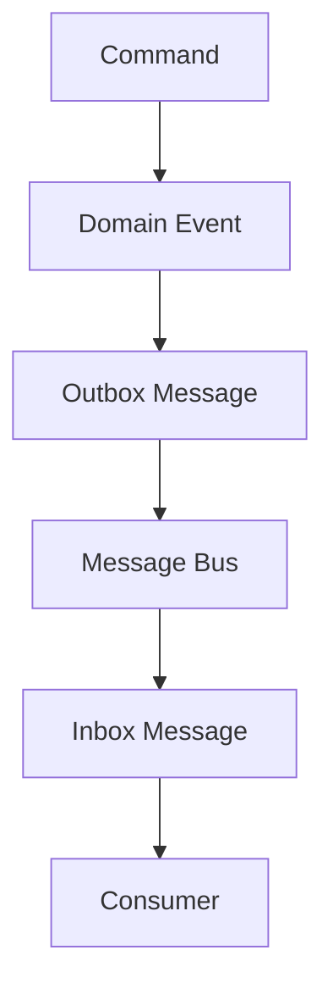
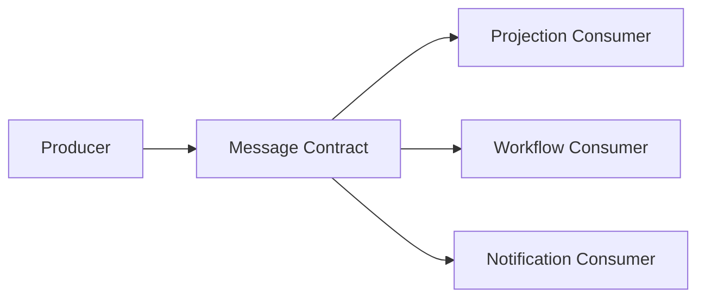
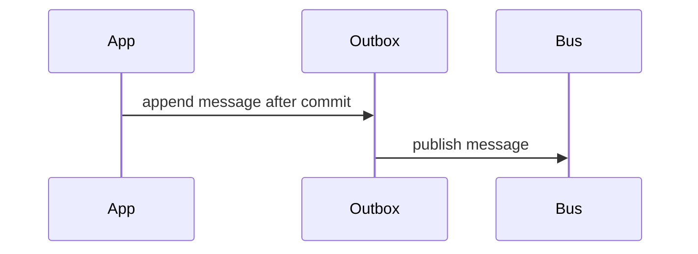
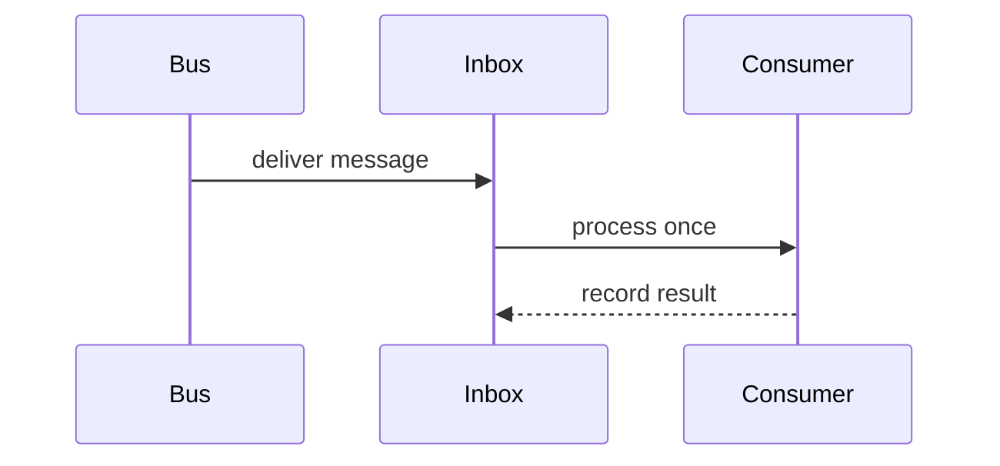
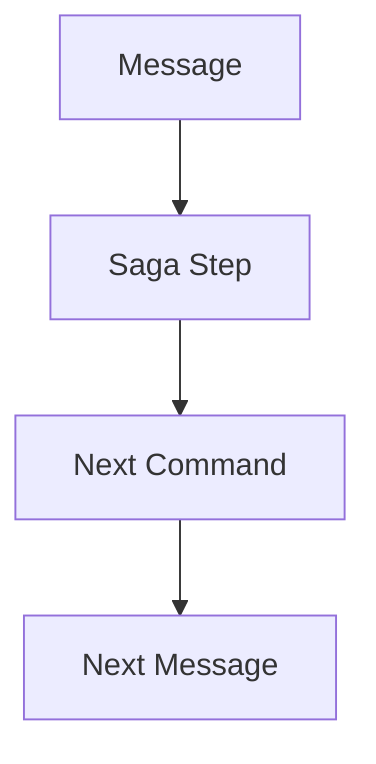
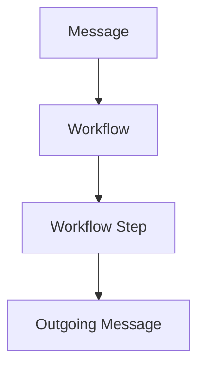

# Message Contract Catalog

# Document Control

Document Name: Message Contract Catalog
Document Path: knowledge/message-contract-catalog.md
Document Type: Atlas Enterprise Canonical Specification
Version: 1.0
Status: Canonical Specification
Domain: Platform
Bounded Context: Platform
Owner: Project Atlas
Source of Truth: Atlas Message Contract Source of Truth
Last Updated: 2026-07-12

Related Specifications:
- knowledge/domain-event-catalog.md
- knowledge/command-catalog.md
- knowledge/repository-catalog.md
- knowledge/application-service-catalog.md
- knowledge/domain-service-catalog.md
- knowledge/service-catalog.md
- knowledge/event-taxonomy.md
- knowledge/event-driven-architecture.md
- knowledge/api-governance-framework.md
- knowledge/integration-framework.md
- knowledge/workflow-engine-framework.md
- knowledge/background-job-framework.md
- knowledge/scheduler-framework.md
- knowledge/automation-framework.md
- knowledge/system-module-catalog.md
- docs/07-API.md

# Purpose

Message Contract Catalog defines approved Atlas message contracts for Domain Event, Integration Event, Application Event, Outbox, Inbox, Message Bus, Workflow, Saga, Automation, Background Job, Notification, Scheduler, API Callback, Webhook, and Projection processing. It is the message contract source of truth for producer, consumer, schema, version, payload, correlation, causation, validation, audit, retry, and delivery behavior.

# Scope

- Domain Message
- Integration Message
- Application Message
- Notification Message
- Projection Message
- Callback Message
- Webhook Message
- Outbox Message
- Inbox Message
- Message Envelope
- Message Metadata
- Schema Version
- Correlation
- Causation
- Idempotency
- Ordering
- Retry
- Dead Letter

# Message Contract Standard

Every Message Contract entry uses the following Enterprise contract and is derived from catalog-approved commands, domain events, services, modules, workflows, automations, jobs, schedulers, notifications, or integrations.

# Complete Message Contract Catalog

## SalaryReceivedMessage

Message Name: SalaryReceivedMessage
Display Name: SalaryReceivedMessage
Category: Domain Message
Purpose: Cash flow income fact for messaging.
Business Meaning: SalaryReceivedMessage transports an immutable Atlas fact or application request without redefining the domain model.
Description: Message envelope carries payload, metadata, correlation, causation, ordering, idempotency, security, audit, and delivery controls.
Producer: DashboardApplicationService
Consumers: Timeline, Decision Engine, Dashboard
Trigger: RecordIncome or SalaryReceived
Source Command: RecordIncome
Source Event: SalaryReceived
Payload: SalaryReceived payload, AggregateId, HouseholdId, TenantId when available, occurredAt, schemaVersion
Headers: MessageId, MessageName, MessageType, SchemaVersion, CorrelationId, CausationId, Producer, TenantId, HouseholdId, TraceId
Metadata: ProducedAt, ProducerVersion, PayloadHash, RetryCount, OrderingKey, IdempotencyKey
CorrelationId: Required
CausationId: Required when message is derived from command, event, workflow, saga, scheduler, automation, background job, callback, or webhook.
TenantId: Required when tenant scope exists.
HouseholdId: Required for Household-scoped messages.
Version: 1.0
Schema: SalaryReceivedMessage v1 JSON schema
Serialization: JSON UTF-8
Compression: Optional for large projection or report payloads.
Encryption: Required when payload contains sensitive data.
Ordering: Ordered by AggregateId or HouseholdId depending on consumer requirement.
Delivery Guarantee: At least once delivery with idempotent consumers.
Retry Policy: Exponential retry for transient failure and no retry for deterministic validation failure.
Dead Letter Policy: Poison messages move to dead letter with error code, retry count, payload hash, and audit reference.
Idempotency: MessageId plus consumer name plus payload hash prevents duplicate side effects.
Validation: Envelope, headers, schema version, payload, tenant scope, Household scope, correlation, causation, and consumer authorization are validated.
Audit: Producer, consumer, MessageId, schema version, payload hash, retry count, processing result, CorrelationId, and CausationId are recorded.
Security: Authorization, signing, integrity, tenant isolation, Household isolation, encryption, and minimum payload exposure are enforced.
Example JSON: {"messageName":"SalaryReceivedMessage","schemaVersion":"1.0","correlationId":"CorrelationId","causationId":"CausationId","payload":{"sourceEvent":"SalaryReceived"}}
Message Control 1: SalaryReceivedMessage preserves producer mapping, consumer mapping, source command, source event, schema version, envelope, payload, headers, metadata, correlation, causation, tenant isolation, Household isolation, serialization, compression, encryption, ordering, retry, dead letter, idempotency, validation, audit, security, and delivery guarantee.
Message Control 2: SalaryReceivedMessage preserves producer mapping, consumer mapping, source command, source event, schema version, envelope, payload, headers, metadata, correlation, causation, tenant isolation, Household isolation, serialization, compression, encryption, ordering, retry, dead letter, idempotency, validation, audit, security, and delivery guarantee.
Message Control 3: SalaryReceivedMessage preserves producer mapping, consumer mapping, source command, source event, schema version, envelope, payload, headers, metadata, correlation, causation, tenant isolation, Household isolation, serialization, compression, encryption, ordering, retry, dead letter, idempotency, validation, audit, security, and delivery guarantee.
Message Control 4: SalaryReceivedMessage preserves producer mapping, consumer mapping, source command, source event, schema version, envelope, payload, headers, metadata, correlation, causation, tenant isolation, Household isolation, serialization, compression, encryption, ordering, retry, dead letter, idempotency, validation, audit, security, and delivery guarantee.
Message Control 5: SalaryReceivedMessage preserves producer mapping, consumer mapping, source command, source event, schema version, envelope, payload, headers, metadata, correlation, causation, tenant isolation, Household isolation, serialization, compression, encryption, ordering, retry, dead letter, idempotency, validation, audit, security, and delivery guarantee.
Message Control 6: SalaryReceivedMessage preserves producer mapping, consumer mapping, source command, source event, schema version, envelope, payload, headers, metadata, correlation, causation, tenant isolation, Household isolation, serialization, compression, encryption, ordering, retry, dead letter, idempotency, validation, audit, security, and delivery guarantee.
Message Control 7: SalaryReceivedMessage preserves producer mapping, consumer mapping, source command, source event, schema version, envelope, payload, headers, metadata, correlation, causation, tenant isolation, Household isolation, serialization, compression, encryption, ordering, retry, dead letter, idempotency, validation, audit, security, and delivery guarantee.
Message Control 8: SalaryReceivedMessage preserves producer mapping, consumer mapping, source command, source event, schema version, envelope, payload, headers, metadata, correlation, causation, tenant isolation, Household isolation, serialization, compression, encryption, ordering, retry, dead letter, idempotency, validation, audit, security, and delivery guarantee.
Message Control 9: SalaryReceivedMessage preserves producer mapping, consumer mapping, source command, source event, schema version, envelope, payload, headers, metadata, correlation, causation, tenant isolation, Household isolation, serialization, compression, encryption, ordering, retry, dead letter, idempotency, validation, audit, security, and delivery guarantee.
Message Control 10: SalaryReceivedMessage preserves producer mapping, consumer mapping, source command, source event, schema version, envelope, payload, headers, metadata, correlation, causation, tenant isolation, Household isolation, serialization, compression, encryption, ordering, retry, dead letter, idempotency, validation, audit, security, and delivery guarantee.
Message Control 11: SalaryReceivedMessage preserves producer mapping, consumer mapping, source command, source event, schema version, envelope, payload, headers, metadata, correlation, causation, tenant isolation, Household isolation, serialization, compression, encryption, ordering, retry, dead letter, idempotency, validation, audit, security, and delivery guarantee.
Message Control 12: SalaryReceivedMessage preserves producer mapping, consumer mapping, source command, source event, schema version, envelope, payload, headers, metadata, correlation, causation, tenant isolation, Household isolation, serialization, compression, encryption, ordering, retry, dead letter, idempotency, validation, audit, security, and delivery guarantee.
Message Control 13: SalaryReceivedMessage preserves producer mapping, consumer mapping, source command, source event, schema version, envelope, payload, headers, metadata, correlation, causation, tenant isolation, Household isolation, serialization, compression, encryption, ordering, retry, dead letter, idempotency, validation, audit, security, and delivery guarantee.
Message Control 14: SalaryReceivedMessage preserves producer mapping, consumer mapping, source command, source event, schema version, envelope, payload, headers, metadata, correlation, causation, tenant isolation, Household isolation, serialization, compression, encryption, ordering, retry, dead letter, idempotency, validation, audit, security, and delivery guarantee.
Message Control 15: SalaryReceivedMessage preserves producer mapping, consumer mapping, source command, source event, schema version, envelope, payload, headers, metadata, correlation, causation, tenant isolation, Household isolation, serialization, compression, encryption, ordering, retry, dead letter, idempotency, validation, audit, security, and delivery guarantee.
Message Control 16: SalaryReceivedMessage preserves producer mapping, consumer mapping, source command, source event, schema version, envelope, payload, headers, metadata, correlation, causation, tenant isolation, Household isolation, serialization, compression, encryption, ordering, retry, dead letter, idempotency, validation, audit, security, and delivery guarantee.
Message Control 17: SalaryReceivedMessage preserves producer mapping, consumer mapping, source command, source event, schema version, envelope, payload, headers, metadata, correlation, causation, tenant isolation, Household isolation, serialization, compression, encryption, ordering, retry, dead letter, idempotency, validation, audit, security, and delivery guarantee.
Message Control 18: SalaryReceivedMessage preserves producer mapping, consumer mapping, source command, source event, schema version, envelope, payload, headers, metadata, correlation, causation, tenant isolation, Household isolation, serialization, compression, encryption, ordering, retry, dead letter, idempotency, validation, audit, security, and delivery guarantee.
Message Control 19: SalaryReceivedMessage preserves producer mapping, consumer mapping, source command, source event, schema version, envelope, payload, headers, metadata, correlation, causation, tenant isolation, Household isolation, serialization, compression, encryption, ordering, retry, dead letter, idempotency, validation, audit, security, and delivery guarantee.
Message Control 20: SalaryReceivedMessage preserves producer mapping, consumer mapping, source command, source event, schema version, envelope, payload, headers, metadata, correlation, causation, tenant isolation, Household isolation, serialization, compression, encryption, ordering, retry, dead letter, idempotency, validation, audit, security, and delivery guarantee.
Message Control 21: SalaryReceivedMessage preserves producer mapping, consumer mapping, source command, source event, schema version, envelope, payload, headers, metadata, correlation, causation, tenant isolation, Household isolation, serialization, compression, encryption, ordering, retry, dead letter, idempotency, validation, audit, security, and delivery guarantee.
Message Control 22: SalaryReceivedMessage preserves producer mapping, consumer mapping, source command, source event, schema version, envelope, payload, headers, metadata, correlation, causation, tenant isolation, Household isolation, serialization, compression, encryption, ordering, retry, dead letter, idempotency, validation, audit, security, and delivery guarantee.
Message Control 23: SalaryReceivedMessage preserves producer mapping, consumer mapping, source command, source event, schema version, envelope, payload, headers, metadata, correlation, causation, tenant isolation, Household isolation, serialization, compression, encryption, ordering, retry, dead letter, idempotency, validation, audit, security, and delivery guarantee.
Message Control 24: SalaryReceivedMessage preserves producer mapping, consumer mapping, source command, source event, schema version, envelope, payload, headers, metadata, correlation, causation, tenant isolation, Household isolation, serialization, compression, encryption, ordering, retry, dead letter, idempotency, validation, audit, security, and delivery guarantee.
Message Control 25: SalaryReceivedMessage preserves producer mapping, consumer mapping, source command, source event, schema version, envelope, payload, headers, metadata, correlation, causation, tenant isolation, Household isolation, serialization, compression, encryption, ordering, retry, dead letter, idempotency, validation, audit, security, and delivery guarantee.
Message Control 26: SalaryReceivedMessage preserves producer mapping, consumer mapping, source command, source event, schema version, envelope, payload, headers, metadata, correlation, causation, tenant isolation, Household isolation, serialization, compression, encryption, ordering, retry, dead letter, idempotency, validation, audit, security, and delivery guarantee.
Message Control 27: SalaryReceivedMessage preserves producer mapping, consumer mapping, source command, source event, schema version, envelope, payload, headers, metadata, correlation, causation, tenant isolation, Household isolation, serialization, compression, encryption, ordering, retry, dead letter, idempotency, validation, audit, security, and delivery guarantee.
Message Control 28: SalaryReceivedMessage preserves producer mapping, consumer mapping, source command, source event, schema version, envelope, payload, headers, metadata, correlation, causation, tenant isolation, Household isolation, serialization, compression, encryption, ordering, retry, dead letter, idempotency, validation, audit, security, and delivery guarantee.
Message Control 29: SalaryReceivedMessage preserves producer mapping, consumer mapping, source command, source event, schema version, envelope, payload, headers, metadata, correlation, causation, tenant isolation, Household isolation, serialization, compression, encryption, ordering, retry, dead letter, idempotency, validation, audit, security, and delivery guarantee.
Message Control 30: SalaryReceivedMessage preserves producer mapping, consumer mapping, source command, source event, schema version, envelope, payload, headers, metadata, correlation, causation, tenant isolation, Household isolation, serialization, compression, encryption, ordering, retry, dead letter, idempotency, validation, audit, security, and delivery guarantee.
Message Control 31: SalaryReceivedMessage preserves producer mapping, consumer mapping, source command, source event, schema version, envelope, payload, headers, metadata, correlation, causation, tenant isolation, Household isolation, serialization, compression, encryption, ordering, retry, dead letter, idempotency, validation, audit, security, and delivery guarantee.
Message Control 32: SalaryReceivedMessage preserves producer mapping, consumer mapping, source command, source event, schema version, envelope, payload, headers, metadata, correlation, causation, tenant isolation, Household isolation, serialization, compression, encryption, ordering, retry, dead letter, idempotency, validation, audit, security, and delivery guarantee.
Message Control 33: SalaryReceivedMessage preserves producer mapping, consumer mapping, source command, source event, schema version, envelope, payload, headers, metadata, correlation, causation, tenant isolation, Household isolation, serialization, compression, encryption, ordering, retry, dead letter, idempotency, validation, audit, security, and delivery guarantee.
Message Control 34: SalaryReceivedMessage preserves producer mapping, consumer mapping, source command, source event, schema version, envelope, payload, headers, metadata, correlation, causation, tenant isolation, Household isolation, serialization, compression, encryption, ordering, retry, dead letter, idempotency, validation, audit, security, and delivery guarantee.
Message Control 35: SalaryReceivedMessage preserves producer mapping, consumer mapping, source command, source event, schema version, envelope, payload, headers, metadata, correlation, causation, tenant isolation, Household isolation, serialization, compression, encryption, ordering, retry, dead letter, idempotency, validation, audit, security, and delivery guarantee.
Message Control 36: SalaryReceivedMessage preserves producer mapping, consumer mapping, source command, source event, schema version, envelope, payload, headers, metadata, correlation, causation, tenant isolation, Household isolation, serialization, compression, encryption, ordering, retry, dead letter, idempotency, validation, audit, security, and delivery guarantee.
Message Control 37: SalaryReceivedMessage preserves producer mapping, consumer mapping, source command, source event, schema version, envelope, payload, headers, metadata, correlation, causation, tenant isolation, Household isolation, serialization, compression, encryption, ordering, retry, dead letter, idempotency, validation, audit, security, and delivery guarantee.
Message Control 38: SalaryReceivedMessage preserves producer mapping, consumer mapping, source command, source event, schema version, envelope, payload, headers, metadata, correlation, causation, tenant isolation, Household isolation, serialization, compression, encryption, ordering, retry, dead letter, idempotency, validation, audit, security, and delivery guarantee.
Message Control 39: SalaryReceivedMessage preserves producer mapping, consumer mapping, source command, source event, schema version, envelope, payload, headers, metadata, correlation, causation, tenant isolation, Household isolation, serialization, compression, encryption, ordering, retry, dead letter, idempotency, validation, audit, security, and delivery guarantee.
Message Control 40: SalaryReceivedMessage preserves producer mapping, consumer mapping, source command, source event, schema version, envelope, payload, headers, metadata, correlation, causation, tenant isolation, Household isolation, serialization, compression, encryption, ordering, retry, dead letter, idempotency, validation, audit, security, and delivery guarantee.
Message Control 41: SalaryReceivedMessage preserves producer mapping, consumer mapping, source command, source event, schema version, envelope, payload, headers, metadata, correlation, causation, tenant isolation, Household isolation, serialization, compression, encryption, ordering, retry, dead letter, idempotency, validation, audit, security, and delivery guarantee.
Message Control 42: SalaryReceivedMessage preserves producer mapping, consumer mapping, source command, source event, schema version, envelope, payload, headers, metadata, correlation, causation, tenant isolation, Household isolation, serialization, compression, encryption, ordering, retry, dead letter, idempotency, validation, audit, security, and delivery guarantee.
Message Control 43: SalaryReceivedMessage preserves producer mapping, consumer mapping, source command, source event, schema version, envelope, payload, headers, metadata, correlation, causation, tenant isolation, Household isolation, serialization, compression, encryption, ordering, retry, dead letter, idempotency, validation, audit, security, and delivery guarantee.
Message Control 44: SalaryReceivedMessage preserves producer mapping, consumer mapping, source command, source event, schema version, envelope, payload, headers, metadata, correlation, causation, tenant isolation, Household isolation, serialization, compression, encryption, ordering, retry, dead letter, idempotency, validation, audit, security, and delivery guarantee.
Message Control 45: SalaryReceivedMessage preserves producer mapping, consumer mapping, source command, source event, schema version, envelope, payload, headers, metadata, correlation, causation, tenant isolation, Household isolation, serialization, compression, encryption, ordering, retry, dead letter, idempotency, validation, audit, security, and delivery guarantee.

## ExpenseRecordedMessage

Message Name: ExpenseRecordedMessage
Display Name: ExpenseRecordedMessage
Category: Domain Message
Purpose: Cash flow expense fact for messaging.
Business Meaning: ExpenseRecordedMessage transports an immutable Atlas fact or application request without redefining the domain model.
Description: Message envelope carries payload, metadata, correlation, causation, ordering, idempotency, security, audit, and delivery controls.
Producer: DashboardApplicationService
Consumers: Budget Projection, Dashboard
Trigger: RecordExpense or ExpenseRecorded
Source Command: RecordExpense
Source Event: ExpenseRecorded
Payload: ExpenseRecorded payload, AggregateId, HouseholdId, TenantId when available, occurredAt, schemaVersion
Headers: MessageId, MessageName, MessageType, SchemaVersion, CorrelationId, CausationId, Producer, TenantId, HouseholdId, TraceId
Metadata: ProducedAt, ProducerVersion, PayloadHash, RetryCount, OrderingKey, IdempotencyKey
CorrelationId: Required
CausationId: Required when message is derived from command, event, workflow, saga, scheduler, automation, background job, callback, or webhook.
TenantId: Required when tenant scope exists.
HouseholdId: Required for Household-scoped messages.
Version: 1.0
Schema: ExpenseRecordedMessage v1 JSON schema
Serialization: JSON UTF-8
Compression: Optional for large projection or report payloads.
Encryption: Required when payload contains sensitive data.
Ordering: Ordered by AggregateId or HouseholdId depending on consumer requirement.
Delivery Guarantee: At least once delivery with idempotent consumers.
Retry Policy: Exponential retry for transient failure and no retry for deterministic validation failure.
Dead Letter Policy: Poison messages move to dead letter with error code, retry count, payload hash, and audit reference.
Idempotency: MessageId plus consumer name plus payload hash prevents duplicate side effects.
Validation: Envelope, headers, schema version, payload, tenant scope, Household scope, correlation, causation, and consumer authorization are validated.
Audit: Producer, consumer, MessageId, schema version, payload hash, retry count, processing result, CorrelationId, and CausationId are recorded.
Security: Authorization, signing, integrity, tenant isolation, Household isolation, encryption, and minimum payload exposure are enforced.
Example JSON: {"messageName":"ExpenseRecordedMessage","schemaVersion":"1.0","correlationId":"CorrelationId","causationId":"CausationId","payload":{"sourceEvent":"ExpenseRecorded"}}
Message Control 1: ExpenseRecordedMessage preserves producer mapping, consumer mapping, source command, source event, schema version, envelope, payload, headers, metadata, correlation, causation, tenant isolation, Household isolation, serialization, compression, encryption, ordering, retry, dead letter, idempotency, validation, audit, security, and delivery guarantee.
Message Control 2: ExpenseRecordedMessage preserves producer mapping, consumer mapping, source command, source event, schema version, envelope, payload, headers, metadata, correlation, causation, tenant isolation, Household isolation, serialization, compression, encryption, ordering, retry, dead letter, idempotency, validation, audit, security, and delivery guarantee.
Message Control 3: ExpenseRecordedMessage preserves producer mapping, consumer mapping, source command, source event, schema version, envelope, payload, headers, metadata, correlation, causation, tenant isolation, Household isolation, serialization, compression, encryption, ordering, retry, dead letter, idempotency, validation, audit, security, and delivery guarantee.
Message Control 4: ExpenseRecordedMessage preserves producer mapping, consumer mapping, source command, source event, schema version, envelope, payload, headers, metadata, correlation, causation, tenant isolation, Household isolation, serialization, compression, encryption, ordering, retry, dead letter, idempotency, validation, audit, security, and delivery guarantee.
Message Control 5: ExpenseRecordedMessage preserves producer mapping, consumer mapping, source command, source event, schema version, envelope, payload, headers, metadata, correlation, causation, tenant isolation, Household isolation, serialization, compression, encryption, ordering, retry, dead letter, idempotency, validation, audit, security, and delivery guarantee.
Message Control 6: ExpenseRecordedMessage preserves producer mapping, consumer mapping, source command, source event, schema version, envelope, payload, headers, metadata, correlation, causation, tenant isolation, Household isolation, serialization, compression, encryption, ordering, retry, dead letter, idempotency, validation, audit, security, and delivery guarantee.
Message Control 7: ExpenseRecordedMessage preserves producer mapping, consumer mapping, source command, source event, schema version, envelope, payload, headers, metadata, correlation, causation, tenant isolation, Household isolation, serialization, compression, encryption, ordering, retry, dead letter, idempotency, validation, audit, security, and delivery guarantee.
Message Control 8: ExpenseRecordedMessage preserves producer mapping, consumer mapping, source command, source event, schema version, envelope, payload, headers, metadata, correlation, causation, tenant isolation, Household isolation, serialization, compression, encryption, ordering, retry, dead letter, idempotency, validation, audit, security, and delivery guarantee.
Message Control 9: ExpenseRecordedMessage preserves producer mapping, consumer mapping, source command, source event, schema version, envelope, payload, headers, metadata, correlation, causation, tenant isolation, Household isolation, serialization, compression, encryption, ordering, retry, dead letter, idempotency, validation, audit, security, and delivery guarantee.
Message Control 10: ExpenseRecordedMessage preserves producer mapping, consumer mapping, source command, source event, schema version, envelope, payload, headers, metadata, correlation, causation, tenant isolation, Household isolation, serialization, compression, encryption, ordering, retry, dead letter, idempotency, validation, audit, security, and delivery guarantee.
Message Control 11: ExpenseRecordedMessage preserves producer mapping, consumer mapping, source command, source event, schema version, envelope, payload, headers, metadata, correlation, causation, tenant isolation, Household isolation, serialization, compression, encryption, ordering, retry, dead letter, idempotency, validation, audit, security, and delivery guarantee.
Message Control 12: ExpenseRecordedMessage preserves producer mapping, consumer mapping, source command, source event, schema version, envelope, payload, headers, metadata, correlation, causation, tenant isolation, Household isolation, serialization, compression, encryption, ordering, retry, dead letter, idempotency, validation, audit, security, and delivery guarantee.
Message Control 13: ExpenseRecordedMessage preserves producer mapping, consumer mapping, source command, source event, schema version, envelope, payload, headers, metadata, correlation, causation, tenant isolation, Household isolation, serialization, compression, encryption, ordering, retry, dead letter, idempotency, validation, audit, security, and delivery guarantee.
Message Control 14: ExpenseRecordedMessage preserves producer mapping, consumer mapping, source command, source event, schema version, envelope, payload, headers, metadata, correlation, causation, tenant isolation, Household isolation, serialization, compression, encryption, ordering, retry, dead letter, idempotency, validation, audit, security, and delivery guarantee.
Message Control 15: ExpenseRecordedMessage preserves producer mapping, consumer mapping, source command, source event, schema version, envelope, payload, headers, metadata, correlation, causation, tenant isolation, Household isolation, serialization, compression, encryption, ordering, retry, dead letter, idempotency, validation, audit, security, and delivery guarantee.
Message Control 16: ExpenseRecordedMessage preserves producer mapping, consumer mapping, source command, source event, schema version, envelope, payload, headers, metadata, correlation, causation, tenant isolation, Household isolation, serialization, compression, encryption, ordering, retry, dead letter, idempotency, validation, audit, security, and delivery guarantee.
Message Control 17: ExpenseRecordedMessage preserves producer mapping, consumer mapping, source command, source event, schema version, envelope, payload, headers, metadata, correlation, causation, tenant isolation, Household isolation, serialization, compression, encryption, ordering, retry, dead letter, idempotency, validation, audit, security, and delivery guarantee.
Message Control 18: ExpenseRecordedMessage preserves producer mapping, consumer mapping, source command, source event, schema version, envelope, payload, headers, metadata, correlation, causation, tenant isolation, Household isolation, serialization, compression, encryption, ordering, retry, dead letter, idempotency, validation, audit, security, and delivery guarantee.
Message Control 19: ExpenseRecordedMessage preserves producer mapping, consumer mapping, source command, source event, schema version, envelope, payload, headers, metadata, correlation, causation, tenant isolation, Household isolation, serialization, compression, encryption, ordering, retry, dead letter, idempotency, validation, audit, security, and delivery guarantee.
Message Control 20: ExpenseRecordedMessage preserves producer mapping, consumer mapping, source command, source event, schema version, envelope, payload, headers, metadata, correlation, causation, tenant isolation, Household isolation, serialization, compression, encryption, ordering, retry, dead letter, idempotency, validation, audit, security, and delivery guarantee.
Message Control 21: ExpenseRecordedMessage preserves producer mapping, consumer mapping, source command, source event, schema version, envelope, payload, headers, metadata, correlation, causation, tenant isolation, Household isolation, serialization, compression, encryption, ordering, retry, dead letter, idempotency, validation, audit, security, and delivery guarantee.
Message Control 22: ExpenseRecordedMessage preserves producer mapping, consumer mapping, source command, source event, schema version, envelope, payload, headers, metadata, correlation, causation, tenant isolation, Household isolation, serialization, compression, encryption, ordering, retry, dead letter, idempotency, validation, audit, security, and delivery guarantee.
Message Control 23: ExpenseRecordedMessage preserves producer mapping, consumer mapping, source command, source event, schema version, envelope, payload, headers, metadata, correlation, causation, tenant isolation, Household isolation, serialization, compression, encryption, ordering, retry, dead letter, idempotency, validation, audit, security, and delivery guarantee.
Message Control 24: ExpenseRecordedMessage preserves producer mapping, consumer mapping, source command, source event, schema version, envelope, payload, headers, metadata, correlation, causation, tenant isolation, Household isolation, serialization, compression, encryption, ordering, retry, dead letter, idempotency, validation, audit, security, and delivery guarantee.
Message Control 25: ExpenseRecordedMessage preserves producer mapping, consumer mapping, source command, source event, schema version, envelope, payload, headers, metadata, correlation, causation, tenant isolation, Household isolation, serialization, compression, encryption, ordering, retry, dead letter, idempotency, validation, audit, security, and delivery guarantee.
Message Control 26: ExpenseRecordedMessage preserves producer mapping, consumer mapping, source command, source event, schema version, envelope, payload, headers, metadata, correlation, causation, tenant isolation, Household isolation, serialization, compression, encryption, ordering, retry, dead letter, idempotency, validation, audit, security, and delivery guarantee.
Message Control 27: ExpenseRecordedMessage preserves producer mapping, consumer mapping, source command, source event, schema version, envelope, payload, headers, metadata, correlation, causation, tenant isolation, Household isolation, serialization, compression, encryption, ordering, retry, dead letter, idempotency, validation, audit, security, and delivery guarantee.
Message Control 28: ExpenseRecordedMessage preserves producer mapping, consumer mapping, source command, source event, schema version, envelope, payload, headers, metadata, correlation, causation, tenant isolation, Household isolation, serialization, compression, encryption, ordering, retry, dead letter, idempotency, validation, audit, security, and delivery guarantee.
Message Control 29: ExpenseRecordedMessage preserves producer mapping, consumer mapping, source command, source event, schema version, envelope, payload, headers, metadata, correlation, causation, tenant isolation, Household isolation, serialization, compression, encryption, ordering, retry, dead letter, idempotency, validation, audit, security, and delivery guarantee.
Message Control 30: ExpenseRecordedMessage preserves producer mapping, consumer mapping, source command, source event, schema version, envelope, payload, headers, metadata, correlation, causation, tenant isolation, Household isolation, serialization, compression, encryption, ordering, retry, dead letter, idempotency, validation, audit, security, and delivery guarantee.
Message Control 31: ExpenseRecordedMessage preserves producer mapping, consumer mapping, source command, source event, schema version, envelope, payload, headers, metadata, correlation, causation, tenant isolation, Household isolation, serialization, compression, encryption, ordering, retry, dead letter, idempotency, validation, audit, security, and delivery guarantee.
Message Control 32: ExpenseRecordedMessage preserves producer mapping, consumer mapping, source command, source event, schema version, envelope, payload, headers, metadata, correlation, causation, tenant isolation, Household isolation, serialization, compression, encryption, ordering, retry, dead letter, idempotency, validation, audit, security, and delivery guarantee.
Message Control 33: ExpenseRecordedMessage preserves producer mapping, consumer mapping, source command, source event, schema version, envelope, payload, headers, metadata, correlation, causation, tenant isolation, Household isolation, serialization, compression, encryption, ordering, retry, dead letter, idempotency, validation, audit, security, and delivery guarantee.
Message Control 34: ExpenseRecordedMessage preserves producer mapping, consumer mapping, source command, source event, schema version, envelope, payload, headers, metadata, correlation, causation, tenant isolation, Household isolation, serialization, compression, encryption, ordering, retry, dead letter, idempotency, validation, audit, security, and delivery guarantee.
Message Control 35: ExpenseRecordedMessage preserves producer mapping, consumer mapping, source command, source event, schema version, envelope, payload, headers, metadata, correlation, causation, tenant isolation, Household isolation, serialization, compression, encryption, ordering, retry, dead letter, idempotency, validation, audit, security, and delivery guarantee.
Message Control 36: ExpenseRecordedMessage preserves producer mapping, consumer mapping, source command, source event, schema version, envelope, payload, headers, metadata, correlation, causation, tenant isolation, Household isolation, serialization, compression, encryption, ordering, retry, dead letter, idempotency, validation, audit, security, and delivery guarantee.
Message Control 37: ExpenseRecordedMessage preserves producer mapping, consumer mapping, source command, source event, schema version, envelope, payload, headers, metadata, correlation, causation, tenant isolation, Household isolation, serialization, compression, encryption, ordering, retry, dead letter, idempotency, validation, audit, security, and delivery guarantee.
Message Control 38: ExpenseRecordedMessage preserves producer mapping, consumer mapping, source command, source event, schema version, envelope, payload, headers, metadata, correlation, causation, tenant isolation, Household isolation, serialization, compression, encryption, ordering, retry, dead letter, idempotency, validation, audit, security, and delivery guarantee.
Message Control 39: ExpenseRecordedMessage preserves producer mapping, consumer mapping, source command, source event, schema version, envelope, payload, headers, metadata, correlation, causation, tenant isolation, Household isolation, serialization, compression, encryption, ordering, retry, dead letter, idempotency, validation, audit, security, and delivery guarantee.
Message Control 40: ExpenseRecordedMessage preserves producer mapping, consumer mapping, source command, source event, schema version, envelope, payload, headers, metadata, correlation, causation, tenant isolation, Household isolation, serialization, compression, encryption, ordering, retry, dead letter, idempotency, validation, audit, security, and delivery guarantee.
Message Control 41: ExpenseRecordedMessage preserves producer mapping, consumer mapping, source command, source event, schema version, envelope, payload, headers, metadata, correlation, causation, tenant isolation, Household isolation, serialization, compression, encryption, ordering, retry, dead letter, idempotency, validation, audit, security, and delivery guarantee.
Message Control 42: ExpenseRecordedMessage preserves producer mapping, consumer mapping, source command, source event, schema version, envelope, payload, headers, metadata, correlation, causation, tenant isolation, Household isolation, serialization, compression, encryption, ordering, retry, dead letter, idempotency, validation, audit, security, and delivery guarantee.
Message Control 43: ExpenseRecordedMessage preserves producer mapping, consumer mapping, source command, source event, schema version, envelope, payload, headers, metadata, correlation, causation, tenant isolation, Household isolation, serialization, compression, encryption, ordering, retry, dead letter, idempotency, validation, audit, security, and delivery guarantee.
Message Control 44: ExpenseRecordedMessage preserves producer mapping, consumer mapping, source command, source event, schema version, envelope, payload, headers, metadata, correlation, causation, tenant isolation, Household isolation, serialization, compression, encryption, ordering, retry, dead letter, idempotency, validation, audit, security, and delivery guarantee.
Message Control 45: ExpenseRecordedMessage preserves producer mapping, consumer mapping, source command, source event, schema version, envelope, payload, headers, metadata, correlation, causation, tenant isolation, Household isolation, serialization, compression, encryption, ordering, retry, dead letter, idempotency, validation, audit, security, and delivery guarantee.

## PortfolioCreatedMessage

Message Name: PortfolioCreatedMessage
Display Name: PortfolioCreatedMessage
Category: Domain Message
Purpose: Portfolio creation fact for messaging.
Business Meaning: PortfolioCreatedMessage transports an immutable Atlas fact or application request without redefining the domain model.
Description: Message envelope carries payload, metadata, correlation, causation, ordering, idempotency, security, audit, and delivery controls.
Producer: PortfolioApplicationService
Consumers: Dashboard, Scenario, Decision Engine
Trigger: CreatePortfolio or PortfolioCreated
Source Command: CreatePortfolio
Source Event: PortfolioCreated
Payload: PortfolioCreated payload, AggregateId, HouseholdId, TenantId when available, occurredAt, schemaVersion
Headers: MessageId, MessageName, MessageType, SchemaVersion, CorrelationId, CausationId, Producer, TenantId, HouseholdId, TraceId
Metadata: ProducedAt, ProducerVersion, PayloadHash, RetryCount, OrderingKey, IdempotencyKey
CorrelationId: Required
CausationId: Required when message is derived from command, event, workflow, saga, scheduler, automation, background job, callback, or webhook.
TenantId: Required when tenant scope exists.
HouseholdId: Required for Household-scoped messages.
Version: 1.0
Schema: PortfolioCreatedMessage v1 JSON schema
Serialization: JSON UTF-8
Compression: Optional for large projection or report payloads.
Encryption: Required when payload contains sensitive data.
Ordering: Ordered by AggregateId or HouseholdId depending on consumer requirement.
Delivery Guarantee: At least once delivery with idempotent consumers.
Retry Policy: Exponential retry for transient failure and no retry for deterministic validation failure.
Dead Letter Policy: Poison messages move to dead letter with error code, retry count, payload hash, and audit reference.
Idempotency: MessageId plus consumer name plus payload hash prevents duplicate side effects.
Validation: Envelope, headers, schema version, payload, tenant scope, Household scope, correlation, causation, and consumer authorization are validated.
Audit: Producer, consumer, MessageId, schema version, payload hash, retry count, processing result, CorrelationId, and CausationId are recorded.
Security: Authorization, signing, integrity, tenant isolation, Household isolation, encryption, and minimum payload exposure are enforced.
Example JSON: {"messageName":"PortfolioCreatedMessage","schemaVersion":"1.0","correlationId":"CorrelationId","causationId":"CausationId","payload":{"sourceEvent":"PortfolioCreated"}}
Message Control 1: PortfolioCreatedMessage preserves producer mapping, consumer mapping, source command, source event, schema version, envelope, payload, headers, metadata, correlation, causation, tenant isolation, Household isolation, serialization, compression, encryption, ordering, retry, dead letter, idempotency, validation, audit, security, and delivery guarantee.
Message Control 2: PortfolioCreatedMessage preserves producer mapping, consumer mapping, source command, source event, schema version, envelope, payload, headers, metadata, correlation, causation, tenant isolation, Household isolation, serialization, compression, encryption, ordering, retry, dead letter, idempotency, validation, audit, security, and delivery guarantee.
Message Control 3: PortfolioCreatedMessage preserves producer mapping, consumer mapping, source command, source event, schema version, envelope, payload, headers, metadata, correlation, causation, tenant isolation, Household isolation, serialization, compression, encryption, ordering, retry, dead letter, idempotency, validation, audit, security, and delivery guarantee.
Message Control 4: PortfolioCreatedMessage preserves producer mapping, consumer mapping, source command, source event, schema version, envelope, payload, headers, metadata, correlation, causation, tenant isolation, Household isolation, serialization, compression, encryption, ordering, retry, dead letter, idempotency, validation, audit, security, and delivery guarantee.
Message Control 5: PortfolioCreatedMessage preserves producer mapping, consumer mapping, source command, source event, schema version, envelope, payload, headers, metadata, correlation, causation, tenant isolation, Household isolation, serialization, compression, encryption, ordering, retry, dead letter, idempotency, validation, audit, security, and delivery guarantee.
Message Control 6: PortfolioCreatedMessage preserves producer mapping, consumer mapping, source command, source event, schema version, envelope, payload, headers, metadata, correlation, causation, tenant isolation, Household isolation, serialization, compression, encryption, ordering, retry, dead letter, idempotency, validation, audit, security, and delivery guarantee.
Message Control 7: PortfolioCreatedMessage preserves producer mapping, consumer mapping, source command, source event, schema version, envelope, payload, headers, metadata, correlation, causation, tenant isolation, Household isolation, serialization, compression, encryption, ordering, retry, dead letter, idempotency, validation, audit, security, and delivery guarantee.
Message Control 8: PortfolioCreatedMessage preserves producer mapping, consumer mapping, source command, source event, schema version, envelope, payload, headers, metadata, correlation, causation, tenant isolation, Household isolation, serialization, compression, encryption, ordering, retry, dead letter, idempotency, validation, audit, security, and delivery guarantee.
Message Control 9: PortfolioCreatedMessage preserves producer mapping, consumer mapping, source command, source event, schema version, envelope, payload, headers, metadata, correlation, causation, tenant isolation, Household isolation, serialization, compression, encryption, ordering, retry, dead letter, idempotency, validation, audit, security, and delivery guarantee.
Message Control 10: PortfolioCreatedMessage preserves producer mapping, consumer mapping, source command, source event, schema version, envelope, payload, headers, metadata, correlation, causation, tenant isolation, Household isolation, serialization, compression, encryption, ordering, retry, dead letter, idempotency, validation, audit, security, and delivery guarantee.
Message Control 11: PortfolioCreatedMessage preserves producer mapping, consumer mapping, source command, source event, schema version, envelope, payload, headers, metadata, correlation, causation, tenant isolation, Household isolation, serialization, compression, encryption, ordering, retry, dead letter, idempotency, validation, audit, security, and delivery guarantee.
Message Control 12: PortfolioCreatedMessage preserves producer mapping, consumer mapping, source command, source event, schema version, envelope, payload, headers, metadata, correlation, causation, tenant isolation, Household isolation, serialization, compression, encryption, ordering, retry, dead letter, idempotency, validation, audit, security, and delivery guarantee.
Message Control 13: PortfolioCreatedMessage preserves producer mapping, consumer mapping, source command, source event, schema version, envelope, payload, headers, metadata, correlation, causation, tenant isolation, Household isolation, serialization, compression, encryption, ordering, retry, dead letter, idempotency, validation, audit, security, and delivery guarantee.
Message Control 14: PortfolioCreatedMessage preserves producer mapping, consumer mapping, source command, source event, schema version, envelope, payload, headers, metadata, correlation, causation, tenant isolation, Household isolation, serialization, compression, encryption, ordering, retry, dead letter, idempotency, validation, audit, security, and delivery guarantee.
Message Control 15: PortfolioCreatedMessage preserves producer mapping, consumer mapping, source command, source event, schema version, envelope, payload, headers, metadata, correlation, causation, tenant isolation, Household isolation, serialization, compression, encryption, ordering, retry, dead letter, idempotency, validation, audit, security, and delivery guarantee.
Message Control 16: PortfolioCreatedMessage preserves producer mapping, consumer mapping, source command, source event, schema version, envelope, payload, headers, metadata, correlation, causation, tenant isolation, Household isolation, serialization, compression, encryption, ordering, retry, dead letter, idempotency, validation, audit, security, and delivery guarantee.
Message Control 17: PortfolioCreatedMessage preserves producer mapping, consumer mapping, source command, source event, schema version, envelope, payload, headers, metadata, correlation, causation, tenant isolation, Household isolation, serialization, compression, encryption, ordering, retry, dead letter, idempotency, validation, audit, security, and delivery guarantee.
Message Control 18: PortfolioCreatedMessage preserves producer mapping, consumer mapping, source command, source event, schema version, envelope, payload, headers, metadata, correlation, causation, tenant isolation, Household isolation, serialization, compression, encryption, ordering, retry, dead letter, idempotency, validation, audit, security, and delivery guarantee.
Message Control 19: PortfolioCreatedMessage preserves producer mapping, consumer mapping, source command, source event, schema version, envelope, payload, headers, metadata, correlation, causation, tenant isolation, Household isolation, serialization, compression, encryption, ordering, retry, dead letter, idempotency, validation, audit, security, and delivery guarantee.
Message Control 20: PortfolioCreatedMessage preserves producer mapping, consumer mapping, source command, source event, schema version, envelope, payload, headers, metadata, correlation, causation, tenant isolation, Household isolation, serialization, compression, encryption, ordering, retry, dead letter, idempotency, validation, audit, security, and delivery guarantee.
Message Control 21: PortfolioCreatedMessage preserves producer mapping, consumer mapping, source command, source event, schema version, envelope, payload, headers, metadata, correlation, causation, tenant isolation, Household isolation, serialization, compression, encryption, ordering, retry, dead letter, idempotency, validation, audit, security, and delivery guarantee.
Message Control 22: PortfolioCreatedMessage preserves producer mapping, consumer mapping, source command, source event, schema version, envelope, payload, headers, metadata, correlation, causation, tenant isolation, Household isolation, serialization, compression, encryption, ordering, retry, dead letter, idempotency, validation, audit, security, and delivery guarantee.
Message Control 23: PortfolioCreatedMessage preserves producer mapping, consumer mapping, source command, source event, schema version, envelope, payload, headers, metadata, correlation, causation, tenant isolation, Household isolation, serialization, compression, encryption, ordering, retry, dead letter, idempotency, validation, audit, security, and delivery guarantee.
Message Control 24: PortfolioCreatedMessage preserves producer mapping, consumer mapping, source command, source event, schema version, envelope, payload, headers, metadata, correlation, causation, tenant isolation, Household isolation, serialization, compression, encryption, ordering, retry, dead letter, idempotency, validation, audit, security, and delivery guarantee.
Message Control 25: PortfolioCreatedMessage preserves producer mapping, consumer mapping, source command, source event, schema version, envelope, payload, headers, metadata, correlation, causation, tenant isolation, Household isolation, serialization, compression, encryption, ordering, retry, dead letter, idempotency, validation, audit, security, and delivery guarantee.
Message Control 26: PortfolioCreatedMessage preserves producer mapping, consumer mapping, source command, source event, schema version, envelope, payload, headers, metadata, correlation, causation, tenant isolation, Household isolation, serialization, compression, encryption, ordering, retry, dead letter, idempotency, validation, audit, security, and delivery guarantee.
Message Control 27: PortfolioCreatedMessage preserves producer mapping, consumer mapping, source command, source event, schema version, envelope, payload, headers, metadata, correlation, causation, tenant isolation, Household isolation, serialization, compression, encryption, ordering, retry, dead letter, idempotency, validation, audit, security, and delivery guarantee.
Message Control 28: PortfolioCreatedMessage preserves producer mapping, consumer mapping, source command, source event, schema version, envelope, payload, headers, metadata, correlation, causation, tenant isolation, Household isolation, serialization, compression, encryption, ordering, retry, dead letter, idempotency, validation, audit, security, and delivery guarantee.
Message Control 29: PortfolioCreatedMessage preserves producer mapping, consumer mapping, source command, source event, schema version, envelope, payload, headers, metadata, correlation, causation, tenant isolation, Household isolation, serialization, compression, encryption, ordering, retry, dead letter, idempotency, validation, audit, security, and delivery guarantee.
Message Control 30: PortfolioCreatedMessage preserves producer mapping, consumer mapping, source command, source event, schema version, envelope, payload, headers, metadata, correlation, causation, tenant isolation, Household isolation, serialization, compression, encryption, ordering, retry, dead letter, idempotency, validation, audit, security, and delivery guarantee.
Message Control 31: PortfolioCreatedMessage preserves producer mapping, consumer mapping, source command, source event, schema version, envelope, payload, headers, metadata, correlation, causation, tenant isolation, Household isolation, serialization, compression, encryption, ordering, retry, dead letter, idempotency, validation, audit, security, and delivery guarantee.
Message Control 32: PortfolioCreatedMessage preserves producer mapping, consumer mapping, source command, source event, schema version, envelope, payload, headers, metadata, correlation, causation, tenant isolation, Household isolation, serialization, compression, encryption, ordering, retry, dead letter, idempotency, validation, audit, security, and delivery guarantee.
Message Control 33: PortfolioCreatedMessage preserves producer mapping, consumer mapping, source command, source event, schema version, envelope, payload, headers, metadata, correlation, causation, tenant isolation, Household isolation, serialization, compression, encryption, ordering, retry, dead letter, idempotency, validation, audit, security, and delivery guarantee.
Message Control 34: PortfolioCreatedMessage preserves producer mapping, consumer mapping, source command, source event, schema version, envelope, payload, headers, metadata, correlation, causation, tenant isolation, Household isolation, serialization, compression, encryption, ordering, retry, dead letter, idempotency, validation, audit, security, and delivery guarantee.
Message Control 35: PortfolioCreatedMessage preserves producer mapping, consumer mapping, source command, source event, schema version, envelope, payload, headers, metadata, correlation, causation, tenant isolation, Household isolation, serialization, compression, encryption, ordering, retry, dead letter, idempotency, validation, audit, security, and delivery guarantee.
Message Control 36: PortfolioCreatedMessage preserves producer mapping, consumer mapping, source command, source event, schema version, envelope, payload, headers, metadata, correlation, causation, tenant isolation, Household isolation, serialization, compression, encryption, ordering, retry, dead letter, idempotency, validation, audit, security, and delivery guarantee.
Message Control 37: PortfolioCreatedMessage preserves producer mapping, consumer mapping, source command, source event, schema version, envelope, payload, headers, metadata, correlation, causation, tenant isolation, Household isolation, serialization, compression, encryption, ordering, retry, dead letter, idempotency, validation, audit, security, and delivery guarantee.
Message Control 38: PortfolioCreatedMessage preserves producer mapping, consumer mapping, source command, source event, schema version, envelope, payload, headers, metadata, correlation, causation, tenant isolation, Household isolation, serialization, compression, encryption, ordering, retry, dead letter, idempotency, validation, audit, security, and delivery guarantee.
Message Control 39: PortfolioCreatedMessage preserves producer mapping, consumer mapping, source command, source event, schema version, envelope, payload, headers, metadata, correlation, causation, tenant isolation, Household isolation, serialization, compression, encryption, ordering, retry, dead letter, idempotency, validation, audit, security, and delivery guarantee.
Message Control 40: PortfolioCreatedMessage preserves producer mapping, consumer mapping, source command, source event, schema version, envelope, payload, headers, metadata, correlation, causation, tenant isolation, Household isolation, serialization, compression, encryption, ordering, retry, dead letter, idempotency, validation, audit, security, and delivery guarantee.
Message Control 41: PortfolioCreatedMessage preserves producer mapping, consumer mapping, source command, source event, schema version, envelope, payload, headers, metadata, correlation, causation, tenant isolation, Household isolation, serialization, compression, encryption, ordering, retry, dead letter, idempotency, validation, audit, security, and delivery guarantee.
Message Control 42: PortfolioCreatedMessage preserves producer mapping, consumer mapping, source command, source event, schema version, envelope, payload, headers, metadata, correlation, causation, tenant isolation, Household isolation, serialization, compression, encryption, ordering, retry, dead letter, idempotency, validation, audit, security, and delivery guarantee.
Message Control 43: PortfolioCreatedMessage preserves producer mapping, consumer mapping, source command, source event, schema version, envelope, payload, headers, metadata, correlation, causation, tenant isolation, Household isolation, serialization, compression, encryption, ordering, retry, dead letter, idempotency, validation, audit, security, and delivery guarantee.
Message Control 44: PortfolioCreatedMessage preserves producer mapping, consumer mapping, source command, source event, schema version, envelope, payload, headers, metadata, correlation, causation, tenant isolation, Household isolation, serialization, compression, encryption, ordering, retry, dead letter, idempotency, validation, audit, security, and delivery guarantee.
Message Control 45: PortfolioCreatedMessage preserves producer mapping, consumer mapping, source command, source event, schema version, envelope, payload, headers, metadata, correlation, causation, tenant isolation, Household isolation, serialization, compression, encryption, ordering, retry, dead letter, idempotency, validation, audit, security, and delivery guarantee.

## SecurityPurchasedMessage

Message Name: SecurityPurchasedMessage
Display Name: SecurityPurchasedMessage
Category: Domain Message
Purpose: Security purchase fact for messaging.
Business Meaning: SecurityPurchasedMessage transports an immutable Atlas fact or application request without redefining the domain model.
Description: Message envelope carries payload, metadata, correlation, causation, ordering, idempotency, security, audit, and delivery controls.
Producer: PortfolioApplicationService
Consumers: Dashboard, Allocation Projection, Scenario
Trigger: BuySecurity or SecurityPurchased
Source Command: BuySecurity
Source Event: SecurityPurchased
Payload: SecurityPurchased payload, AggregateId, HouseholdId, TenantId when available, occurredAt, schemaVersion
Headers: MessageId, MessageName, MessageType, SchemaVersion, CorrelationId, CausationId, Producer, TenantId, HouseholdId, TraceId
Metadata: ProducedAt, ProducerVersion, PayloadHash, RetryCount, OrderingKey, IdempotencyKey
CorrelationId: Required
CausationId: Required when message is derived from command, event, workflow, saga, scheduler, automation, background job, callback, or webhook.
TenantId: Required when tenant scope exists.
HouseholdId: Required for Household-scoped messages.
Version: 1.0
Schema: SecurityPurchasedMessage v1 JSON schema
Serialization: JSON UTF-8
Compression: Optional for large projection or report payloads.
Encryption: Required when payload contains sensitive data.
Ordering: Ordered by AggregateId or HouseholdId depending on consumer requirement.
Delivery Guarantee: At least once delivery with idempotent consumers.
Retry Policy: Exponential retry for transient failure and no retry for deterministic validation failure.
Dead Letter Policy: Poison messages move to dead letter with error code, retry count, payload hash, and audit reference.
Idempotency: MessageId plus consumer name plus payload hash prevents duplicate side effects.
Validation: Envelope, headers, schema version, payload, tenant scope, Household scope, correlation, causation, and consumer authorization are validated.
Audit: Producer, consumer, MessageId, schema version, payload hash, retry count, processing result, CorrelationId, and CausationId are recorded.
Security: Authorization, signing, integrity, tenant isolation, Household isolation, encryption, and minimum payload exposure are enforced.
Example JSON: {"messageName":"SecurityPurchasedMessage","schemaVersion":"1.0","correlationId":"CorrelationId","causationId":"CausationId","payload":{"sourceEvent":"SecurityPurchased"}}
Message Control 1: SecurityPurchasedMessage preserves producer mapping, consumer mapping, source command, source event, schema version, envelope, payload, headers, metadata, correlation, causation, tenant isolation, Household isolation, serialization, compression, encryption, ordering, retry, dead letter, idempotency, validation, audit, security, and delivery guarantee.
Message Control 2: SecurityPurchasedMessage preserves producer mapping, consumer mapping, source command, source event, schema version, envelope, payload, headers, metadata, correlation, causation, tenant isolation, Household isolation, serialization, compression, encryption, ordering, retry, dead letter, idempotency, validation, audit, security, and delivery guarantee.
Message Control 3: SecurityPurchasedMessage preserves producer mapping, consumer mapping, source command, source event, schema version, envelope, payload, headers, metadata, correlation, causation, tenant isolation, Household isolation, serialization, compression, encryption, ordering, retry, dead letter, idempotency, validation, audit, security, and delivery guarantee.
Message Control 4: SecurityPurchasedMessage preserves producer mapping, consumer mapping, source command, source event, schema version, envelope, payload, headers, metadata, correlation, causation, tenant isolation, Household isolation, serialization, compression, encryption, ordering, retry, dead letter, idempotency, validation, audit, security, and delivery guarantee.
Message Control 5: SecurityPurchasedMessage preserves producer mapping, consumer mapping, source command, source event, schema version, envelope, payload, headers, metadata, correlation, causation, tenant isolation, Household isolation, serialization, compression, encryption, ordering, retry, dead letter, idempotency, validation, audit, security, and delivery guarantee.
Message Control 6: SecurityPurchasedMessage preserves producer mapping, consumer mapping, source command, source event, schema version, envelope, payload, headers, metadata, correlation, causation, tenant isolation, Household isolation, serialization, compression, encryption, ordering, retry, dead letter, idempotency, validation, audit, security, and delivery guarantee.
Message Control 7: SecurityPurchasedMessage preserves producer mapping, consumer mapping, source command, source event, schema version, envelope, payload, headers, metadata, correlation, causation, tenant isolation, Household isolation, serialization, compression, encryption, ordering, retry, dead letter, idempotency, validation, audit, security, and delivery guarantee.
Message Control 8: SecurityPurchasedMessage preserves producer mapping, consumer mapping, source command, source event, schema version, envelope, payload, headers, metadata, correlation, causation, tenant isolation, Household isolation, serialization, compression, encryption, ordering, retry, dead letter, idempotency, validation, audit, security, and delivery guarantee.
Message Control 9: SecurityPurchasedMessage preserves producer mapping, consumer mapping, source command, source event, schema version, envelope, payload, headers, metadata, correlation, causation, tenant isolation, Household isolation, serialization, compression, encryption, ordering, retry, dead letter, idempotency, validation, audit, security, and delivery guarantee.
Message Control 10: SecurityPurchasedMessage preserves producer mapping, consumer mapping, source command, source event, schema version, envelope, payload, headers, metadata, correlation, causation, tenant isolation, Household isolation, serialization, compression, encryption, ordering, retry, dead letter, idempotency, validation, audit, security, and delivery guarantee.
Message Control 11: SecurityPurchasedMessage preserves producer mapping, consumer mapping, source command, source event, schema version, envelope, payload, headers, metadata, correlation, causation, tenant isolation, Household isolation, serialization, compression, encryption, ordering, retry, dead letter, idempotency, validation, audit, security, and delivery guarantee.
Message Control 12: SecurityPurchasedMessage preserves producer mapping, consumer mapping, source command, source event, schema version, envelope, payload, headers, metadata, correlation, causation, tenant isolation, Household isolation, serialization, compression, encryption, ordering, retry, dead letter, idempotency, validation, audit, security, and delivery guarantee.
Message Control 13: SecurityPurchasedMessage preserves producer mapping, consumer mapping, source command, source event, schema version, envelope, payload, headers, metadata, correlation, causation, tenant isolation, Household isolation, serialization, compression, encryption, ordering, retry, dead letter, idempotency, validation, audit, security, and delivery guarantee.
Message Control 14: SecurityPurchasedMessage preserves producer mapping, consumer mapping, source command, source event, schema version, envelope, payload, headers, metadata, correlation, causation, tenant isolation, Household isolation, serialization, compression, encryption, ordering, retry, dead letter, idempotency, validation, audit, security, and delivery guarantee.
Message Control 15: SecurityPurchasedMessage preserves producer mapping, consumer mapping, source command, source event, schema version, envelope, payload, headers, metadata, correlation, causation, tenant isolation, Household isolation, serialization, compression, encryption, ordering, retry, dead letter, idempotency, validation, audit, security, and delivery guarantee.
Message Control 16: SecurityPurchasedMessage preserves producer mapping, consumer mapping, source command, source event, schema version, envelope, payload, headers, metadata, correlation, causation, tenant isolation, Household isolation, serialization, compression, encryption, ordering, retry, dead letter, idempotency, validation, audit, security, and delivery guarantee.
Message Control 17: SecurityPurchasedMessage preserves producer mapping, consumer mapping, source command, source event, schema version, envelope, payload, headers, metadata, correlation, causation, tenant isolation, Household isolation, serialization, compression, encryption, ordering, retry, dead letter, idempotency, validation, audit, security, and delivery guarantee.
Message Control 18: SecurityPurchasedMessage preserves producer mapping, consumer mapping, source command, source event, schema version, envelope, payload, headers, metadata, correlation, causation, tenant isolation, Household isolation, serialization, compression, encryption, ordering, retry, dead letter, idempotency, validation, audit, security, and delivery guarantee.
Message Control 19: SecurityPurchasedMessage preserves producer mapping, consumer mapping, source command, source event, schema version, envelope, payload, headers, metadata, correlation, causation, tenant isolation, Household isolation, serialization, compression, encryption, ordering, retry, dead letter, idempotency, validation, audit, security, and delivery guarantee.
Message Control 20: SecurityPurchasedMessage preserves producer mapping, consumer mapping, source command, source event, schema version, envelope, payload, headers, metadata, correlation, causation, tenant isolation, Household isolation, serialization, compression, encryption, ordering, retry, dead letter, idempotency, validation, audit, security, and delivery guarantee.
Message Control 21: SecurityPurchasedMessage preserves producer mapping, consumer mapping, source command, source event, schema version, envelope, payload, headers, metadata, correlation, causation, tenant isolation, Household isolation, serialization, compression, encryption, ordering, retry, dead letter, idempotency, validation, audit, security, and delivery guarantee.
Message Control 22: SecurityPurchasedMessage preserves producer mapping, consumer mapping, source command, source event, schema version, envelope, payload, headers, metadata, correlation, causation, tenant isolation, Household isolation, serialization, compression, encryption, ordering, retry, dead letter, idempotency, validation, audit, security, and delivery guarantee.
Message Control 23: SecurityPurchasedMessage preserves producer mapping, consumer mapping, source command, source event, schema version, envelope, payload, headers, metadata, correlation, causation, tenant isolation, Household isolation, serialization, compression, encryption, ordering, retry, dead letter, idempotency, validation, audit, security, and delivery guarantee.
Message Control 24: SecurityPurchasedMessage preserves producer mapping, consumer mapping, source command, source event, schema version, envelope, payload, headers, metadata, correlation, causation, tenant isolation, Household isolation, serialization, compression, encryption, ordering, retry, dead letter, idempotency, validation, audit, security, and delivery guarantee.
Message Control 25: SecurityPurchasedMessage preserves producer mapping, consumer mapping, source command, source event, schema version, envelope, payload, headers, metadata, correlation, causation, tenant isolation, Household isolation, serialization, compression, encryption, ordering, retry, dead letter, idempotency, validation, audit, security, and delivery guarantee.
Message Control 26: SecurityPurchasedMessage preserves producer mapping, consumer mapping, source command, source event, schema version, envelope, payload, headers, metadata, correlation, causation, tenant isolation, Household isolation, serialization, compression, encryption, ordering, retry, dead letter, idempotency, validation, audit, security, and delivery guarantee.
Message Control 27: SecurityPurchasedMessage preserves producer mapping, consumer mapping, source command, source event, schema version, envelope, payload, headers, metadata, correlation, causation, tenant isolation, Household isolation, serialization, compression, encryption, ordering, retry, dead letter, idempotency, validation, audit, security, and delivery guarantee.
Message Control 28: SecurityPurchasedMessage preserves producer mapping, consumer mapping, source command, source event, schema version, envelope, payload, headers, metadata, correlation, causation, tenant isolation, Household isolation, serialization, compression, encryption, ordering, retry, dead letter, idempotency, validation, audit, security, and delivery guarantee.
Message Control 29: SecurityPurchasedMessage preserves producer mapping, consumer mapping, source command, source event, schema version, envelope, payload, headers, metadata, correlation, causation, tenant isolation, Household isolation, serialization, compression, encryption, ordering, retry, dead letter, idempotency, validation, audit, security, and delivery guarantee.
Message Control 30: SecurityPurchasedMessage preserves producer mapping, consumer mapping, source command, source event, schema version, envelope, payload, headers, metadata, correlation, causation, tenant isolation, Household isolation, serialization, compression, encryption, ordering, retry, dead letter, idempotency, validation, audit, security, and delivery guarantee.
Message Control 31: SecurityPurchasedMessage preserves producer mapping, consumer mapping, source command, source event, schema version, envelope, payload, headers, metadata, correlation, causation, tenant isolation, Household isolation, serialization, compression, encryption, ordering, retry, dead letter, idempotency, validation, audit, security, and delivery guarantee.
Message Control 32: SecurityPurchasedMessage preserves producer mapping, consumer mapping, source command, source event, schema version, envelope, payload, headers, metadata, correlation, causation, tenant isolation, Household isolation, serialization, compression, encryption, ordering, retry, dead letter, idempotency, validation, audit, security, and delivery guarantee.
Message Control 33: SecurityPurchasedMessage preserves producer mapping, consumer mapping, source command, source event, schema version, envelope, payload, headers, metadata, correlation, causation, tenant isolation, Household isolation, serialization, compression, encryption, ordering, retry, dead letter, idempotency, validation, audit, security, and delivery guarantee.
Message Control 34: SecurityPurchasedMessage preserves producer mapping, consumer mapping, source command, source event, schema version, envelope, payload, headers, metadata, correlation, causation, tenant isolation, Household isolation, serialization, compression, encryption, ordering, retry, dead letter, idempotency, validation, audit, security, and delivery guarantee.
Message Control 35: SecurityPurchasedMessage preserves producer mapping, consumer mapping, source command, source event, schema version, envelope, payload, headers, metadata, correlation, causation, tenant isolation, Household isolation, serialization, compression, encryption, ordering, retry, dead letter, idempotency, validation, audit, security, and delivery guarantee.
Message Control 36: SecurityPurchasedMessage preserves producer mapping, consumer mapping, source command, source event, schema version, envelope, payload, headers, metadata, correlation, causation, tenant isolation, Household isolation, serialization, compression, encryption, ordering, retry, dead letter, idempotency, validation, audit, security, and delivery guarantee.
Message Control 37: SecurityPurchasedMessage preserves producer mapping, consumer mapping, source command, source event, schema version, envelope, payload, headers, metadata, correlation, causation, tenant isolation, Household isolation, serialization, compression, encryption, ordering, retry, dead letter, idempotency, validation, audit, security, and delivery guarantee.
Message Control 38: SecurityPurchasedMessage preserves producer mapping, consumer mapping, source command, source event, schema version, envelope, payload, headers, metadata, correlation, causation, tenant isolation, Household isolation, serialization, compression, encryption, ordering, retry, dead letter, idempotency, validation, audit, security, and delivery guarantee.
Message Control 39: SecurityPurchasedMessage preserves producer mapping, consumer mapping, source command, source event, schema version, envelope, payload, headers, metadata, correlation, causation, tenant isolation, Household isolation, serialization, compression, encryption, ordering, retry, dead letter, idempotency, validation, audit, security, and delivery guarantee.
Message Control 40: SecurityPurchasedMessage preserves producer mapping, consumer mapping, source command, source event, schema version, envelope, payload, headers, metadata, correlation, causation, tenant isolation, Household isolation, serialization, compression, encryption, ordering, retry, dead letter, idempotency, validation, audit, security, and delivery guarantee.
Message Control 41: SecurityPurchasedMessage preserves producer mapping, consumer mapping, source command, source event, schema version, envelope, payload, headers, metadata, correlation, causation, tenant isolation, Household isolation, serialization, compression, encryption, ordering, retry, dead letter, idempotency, validation, audit, security, and delivery guarantee.
Message Control 42: SecurityPurchasedMessage preserves producer mapping, consumer mapping, source command, source event, schema version, envelope, payload, headers, metadata, correlation, causation, tenant isolation, Household isolation, serialization, compression, encryption, ordering, retry, dead letter, idempotency, validation, audit, security, and delivery guarantee.
Message Control 43: SecurityPurchasedMessage preserves producer mapping, consumer mapping, source command, source event, schema version, envelope, payload, headers, metadata, correlation, causation, tenant isolation, Household isolation, serialization, compression, encryption, ordering, retry, dead letter, idempotency, validation, audit, security, and delivery guarantee.
Message Control 44: SecurityPurchasedMessage preserves producer mapping, consumer mapping, source command, source event, schema version, envelope, payload, headers, metadata, correlation, causation, tenant isolation, Household isolation, serialization, compression, encryption, ordering, retry, dead letter, idempotency, validation, audit, security, and delivery guarantee.
Message Control 45: SecurityPurchasedMessage preserves producer mapping, consumer mapping, source command, source event, schema version, envelope, payload, headers, metadata, correlation, causation, tenant isolation, Household isolation, serialization, compression, encryption, ordering, retry, dead letter, idempotency, validation, audit, security, and delivery guarantee.

## SecuritySoldMessage

Message Name: SecuritySoldMessage
Display Name: SecuritySoldMessage
Category: Domain Message
Purpose: Security sale fact for messaging.
Business Meaning: SecuritySoldMessage transports an immutable Atlas fact or application request without redefining the domain model.
Description: Message envelope carries payload, metadata, correlation, causation, ordering, idempotency, security, audit, and delivery controls.
Producer: PortfolioApplicationService
Consumers: Dashboard, Allocation Projection, Scenario
Trigger: SellSecurity or SecuritySold
Source Command: SellSecurity
Source Event: SecuritySold
Payload: SecuritySold payload, AggregateId, HouseholdId, TenantId when available, occurredAt, schemaVersion
Headers: MessageId, MessageName, MessageType, SchemaVersion, CorrelationId, CausationId, Producer, TenantId, HouseholdId, TraceId
Metadata: ProducedAt, ProducerVersion, PayloadHash, RetryCount, OrderingKey, IdempotencyKey
CorrelationId: Required
CausationId: Required when message is derived from command, event, workflow, saga, scheduler, automation, background job, callback, or webhook.
TenantId: Required when tenant scope exists.
HouseholdId: Required for Household-scoped messages.
Version: 1.0
Schema: SecuritySoldMessage v1 JSON schema
Serialization: JSON UTF-8
Compression: Optional for large projection or report payloads.
Encryption: Required when payload contains sensitive data.
Ordering: Ordered by AggregateId or HouseholdId depending on consumer requirement.
Delivery Guarantee: At least once delivery with idempotent consumers.
Retry Policy: Exponential retry for transient failure and no retry for deterministic validation failure.
Dead Letter Policy: Poison messages move to dead letter with error code, retry count, payload hash, and audit reference.
Idempotency: MessageId plus consumer name plus payload hash prevents duplicate side effects.
Validation: Envelope, headers, schema version, payload, tenant scope, Household scope, correlation, causation, and consumer authorization are validated.
Audit: Producer, consumer, MessageId, schema version, payload hash, retry count, processing result, CorrelationId, and CausationId are recorded.
Security: Authorization, signing, integrity, tenant isolation, Household isolation, encryption, and minimum payload exposure are enforced.
Example JSON: {"messageName":"SecuritySoldMessage","schemaVersion":"1.0","correlationId":"CorrelationId","causationId":"CausationId","payload":{"sourceEvent":"SecuritySold"}}
Message Control 1: SecuritySoldMessage preserves producer mapping, consumer mapping, source command, source event, schema version, envelope, payload, headers, metadata, correlation, causation, tenant isolation, Household isolation, serialization, compression, encryption, ordering, retry, dead letter, idempotency, validation, audit, security, and delivery guarantee.
Message Control 2: SecuritySoldMessage preserves producer mapping, consumer mapping, source command, source event, schema version, envelope, payload, headers, metadata, correlation, causation, tenant isolation, Household isolation, serialization, compression, encryption, ordering, retry, dead letter, idempotency, validation, audit, security, and delivery guarantee.
Message Control 3: SecuritySoldMessage preserves producer mapping, consumer mapping, source command, source event, schema version, envelope, payload, headers, metadata, correlation, causation, tenant isolation, Household isolation, serialization, compression, encryption, ordering, retry, dead letter, idempotency, validation, audit, security, and delivery guarantee.
Message Control 4: SecuritySoldMessage preserves producer mapping, consumer mapping, source command, source event, schema version, envelope, payload, headers, metadata, correlation, causation, tenant isolation, Household isolation, serialization, compression, encryption, ordering, retry, dead letter, idempotency, validation, audit, security, and delivery guarantee.
Message Control 5: SecuritySoldMessage preserves producer mapping, consumer mapping, source command, source event, schema version, envelope, payload, headers, metadata, correlation, causation, tenant isolation, Household isolation, serialization, compression, encryption, ordering, retry, dead letter, idempotency, validation, audit, security, and delivery guarantee.
Message Control 6: SecuritySoldMessage preserves producer mapping, consumer mapping, source command, source event, schema version, envelope, payload, headers, metadata, correlation, causation, tenant isolation, Household isolation, serialization, compression, encryption, ordering, retry, dead letter, idempotency, validation, audit, security, and delivery guarantee.
Message Control 7: SecuritySoldMessage preserves producer mapping, consumer mapping, source command, source event, schema version, envelope, payload, headers, metadata, correlation, causation, tenant isolation, Household isolation, serialization, compression, encryption, ordering, retry, dead letter, idempotency, validation, audit, security, and delivery guarantee.
Message Control 8: SecuritySoldMessage preserves producer mapping, consumer mapping, source command, source event, schema version, envelope, payload, headers, metadata, correlation, causation, tenant isolation, Household isolation, serialization, compression, encryption, ordering, retry, dead letter, idempotency, validation, audit, security, and delivery guarantee.
Message Control 9: SecuritySoldMessage preserves producer mapping, consumer mapping, source command, source event, schema version, envelope, payload, headers, metadata, correlation, causation, tenant isolation, Household isolation, serialization, compression, encryption, ordering, retry, dead letter, idempotency, validation, audit, security, and delivery guarantee.
Message Control 10: SecuritySoldMessage preserves producer mapping, consumer mapping, source command, source event, schema version, envelope, payload, headers, metadata, correlation, causation, tenant isolation, Household isolation, serialization, compression, encryption, ordering, retry, dead letter, idempotency, validation, audit, security, and delivery guarantee.
Message Control 11: SecuritySoldMessage preserves producer mapping, consumer mapping, source command, source event, schema version, envelope, payload, headers, metadata, correlation, causation, tenant isolation, Household isolation, serialization, compression, encryption, ordering, retry, dead letter, idempotency, validation, audit, security, and delivery guarantee.
Message Control 12: SecuritySoldMessage preserves producer mapping, consumer mapping, source command, source event, schema version, envelope, payload, headers, metadata, correlation, causation, tenant isolation, Household isolation, serialization, compression, encryption, ordering, retry, dead letter, idempotency, validation, audit, security, and delivery guarantee.
Message Control 13: SecuritySoldMessage preserves producer mapping, consumer mapping, source command, source event, schema version, envelope, payload, headers, metadata, correlation, causation, tenant isolation, Household isolation, serialization, compression, encryption, ordering, retry, dead letter, idempotency, validation, audit, security, and delivery guarantee.
Message Control 14: SecuritySoldMessage preserves producer mapping, consumer mapping, source command, source event, schema version, envelope, payload, headers, metadata, correlation, causation, tenant isolation, Household isolation, serialization, compression, encryption, ordering, retry, dead letter, idempotency, validation, audit, security, and delivery guarantee.
Message Control 15: SecuritySoldMessage preserves producer mapping, consumer mapping, source command, source event, schema version, envelope, payload, headers, metadata, correlation, causation, tenant isolation, Household isolation, serialization, compression, encryption, ordering, retry, dead letter, idempotency, validation, audit, security, and delivery guarantee.
Message Control 16: SecuritySoldMessage preserves producer mapping, consumer mapping, source command, source event, schema version, envelope, payload, headers, metadata, correlation, causation, tenant isolation, Household isolation, serialization, compression, encryption, ordering, retry, dead letter, idempotency, validation, audit, security, and delivery guarantee.
Message Control 17: SecuritySoldMessage preserves producer mapping, consumer mapping, source command, source event, schema version, envelope, payload, headers, metadata, correlation, causation, tenant isolation, Household isolation, serialization, compression, encryption, ordering, retry, dead letter, idempotency, validation, audit, security, and delivery guarantee.
Message Control 18: SecuritySoldMessage preserves producer mapping, consumer mapping, source command, source event, schema version, envelope, payload, headers, metadata, correlation, causation, tenant isolation, Household isolation, serialization, compression, encryption, ordering, retry, dead letter, idempotency, validation, audit, security, and delivery guarantee.
Message Control 19: SecuritySoldMessage preserves producer mapping, consumer mapping, source command, source event, schema version, envelope, payload, headers, metadata, correlation, causation, tenant isolation, Household isolation, serialization, compression, encryption, ordering, retry, dead letter, idempotency, validation, audit, security, and delivery guarantee.
Message Control 20: SecuritySoldMessage preserves producer mapping, consumer mapping, source command, source event, schema version, envelope, payload, headers, metadata, correlation, causation, tenant isolation, Household isolation, serialization, compression, encryption, ordering, retry, dead letter, idempotency, validation, audit, security, and delivery guarantee.
Message Control 21: SecuritySoldMessage preserves producer mapping, consumer mapping, source command, source event, schema version, envelope, payload, headers, metadata, correlation, causation, tenant isolation, Household isolation, serialization, compression, encryption, ordering, retry, dead letter, idempotency, validation, audit, security, and delivery guarantee.
Message Control 22: SecuritySoldMessage preserves producer mapping, consumer mapping, source command, source event, schema version, envelope, payload, headers, metadata, correlation, causation, tenant isolation, Household isolation, serialization, compression, encryption, ordering, retry, dead letter, idempotency, validation, audit, security, and delivery guarantee.
Message Control 23: SecuritySoldMessage preserves producer mapping, consumer mapping, source command, source event, schema version, envelope, payload, headers, metadata, correlation, causation, tenant isolation, Household isolation, serialization, compression, encryption, ordering, retry, dead letter, idempotency, validation, audit, security, and delivery guarantee.
Message Control 24: SecuritySoldMessage preserves producer mapping, consumer mapping, source command, source event, schema version, envelope, payload, headers, metadata, correlation, causation, tenant isolation, Household isolation, serialization, compression, encryption, ordering, retry, dead letter, idempotency, validation, audit, security, and delivery guarantee.
Message Control 25: SecuritySoldMessage preserves producer mapping, consumer mapping, source command, source event, schema version, envelope, payload, headers, metadata, correlation, causation, tenant isolation, Household isolation, serialization, compression, encryption, ordering, retry, dead letter, idempotency, validation, audit, security, and delivery guarantee.
Message Control 26: SecuritySoldMessage preserves producer mapping, consumer mapping, source command, source event, schema version, envelope, payload, headers, metadata, correlation, causation, tenant isolation, Household isolation, serialization, compression, encryption, ordering, retry, dead letter, idempotency, validation, audit, security, and delivery guarantee.
Message Control 27: SecuritySoldMessage preserves producer mapping, consumer mapping, source command, source event, schema version, envelope, payload, headers, metadata, correlation, causation, tenant isolation, Household isolation, serialization, compression, encryption, ordering, retry, dead letter, idempotency, validation, audit, security, and delivery guarantee.
Message Control 28: SecuritySoldMessage preserves producer mapping, consumer mapping, source command, source event, schema version, envelope, payload, headers, metadata, correlation, causation, tenant isolation, Household isolation, serialization, compression, encryption, ordering, retry, dead letter, idempotency, validation, audit, security, and delivery guarantee.
Message Control 29: SecuritySoldMessage preserves producer mapping, consumer mapping, source command, source event, schema version, envelope, payload, headers, metadata, correlation, causation, tenant isolation, Household isolation, serialization, compression, encryption, ordering, retry, dead letter, idempotency, validation, audit, security, and delivery guarantee.
Message Control 30: SecuritySoldMessage preserves producer mapping, consumer mapping, source command, source event, schema version, envelope, payload, headers, metadata, correlation, causation, tenant isolation, Household isolation, serialization, compression, encryption, ordering, retry, dead letter, idempotency, validation, audit, security, and delivery guarantee.
Message Control 31: SecuritySoldMessage preserves producer mapping, consumer mapping, source command, source event, schema version, envelope, payload, headers, metadata, correlation, causation, tenant isolation, Household isolation, serialization, compression, encryption, ordering, retry, dead letter, idempotency, validation, audit, security, and delivery guarantee.
Message Control 32: SecuritySoldMessage preserves producer mapping, consumer mapping, source command, source event, schema version, envelope, payload, headers, metadata, correlation, causation, tenant isolation, Household isolation, serialization, compression, encryption, ordering, retry, dead letter, idempotency, validation, audit, security, and delivery guarantee.
Message Control 33: SecuritySoldMessage preserves producer mapping, consumer mapping, source command, source event, schema version, envelope, payload, headers, metadata, correlation, causation, tenant isolation, Household isolation, serialization, compression, encryption, ordering, retry, dead letter, idempotency, validation, audit, security, and delivery guarantee.
Message Control 34: SecuritySoldMessage preserves producer mapping, consumer mapping, source command, source event, schema version, envelope, payload, headers, metadata, correlation, causation, tenant isolation, Household isolation, serialization, compression, encryption, ordering, retry, dead letter, idempotency, validation, audit, security, and delivery guarantee.
Message Control 35: SecuritySoldMessage preserves producer mapping, consumer mapping, source command, source event, schema version, envelope, payload, headers, metadata, correlation, causation, tenant isolation, Household isolation, serialization, compression, encryption, ordering, retry, dead letter, idempotency, validation, audit, security, and delivery guarantee.
Message Control 36: SecuritySoldMessage preserves producer mapping, consumer mapping, source command, source event, schema version, envelope, payload, headers, metadata, correlation, causation, tenant isolation, Household isolation, serialization, compression, encryption, ordering, retry, dead letter, idempotency, validation, audit, security, and delivery guarantee.
Message Control 37: SecuritySoldMessage preserves producer mapping, consumer mapping, source command, source event, schema version, envelope, payload, headers, metadata, correlation, causation, tenant isolation, Household isolation, serialization, compression, encryption, ordering, retry, dead letter, idempotency, validation, audit, security, and delivery guarantee.
Message Control 38: SecuritySoldMessage preserves producer mapping, consumer mapping, source command, source event, schema version, envelope, payload, headers, metadata, correlation, causation, tenant isolation, Household isolation, serialization, compression, encryption, ordering, retry, dead letter, idempotency, validation, audit, security, and delivery guarantee.
Message Control 39: SecuritySoldMessage preserves producer mapping, consumer mapping, source command, source event, schema version, envelope, payload, headers, metadata, correlation, causation, tenant isolation, Household isolation, serialization, compression, encryption, ordering, retry, dead letter, idempotency, validation, audit, security, and delivery guarantee.
Message Control 40: SecuritySoldMessage preserves producer mapping, consumer mapping, source command, source event, schema version, envelope, payload, headers, metadata, correlation, causation, tenant isolation, Household isolation, serialization, compression, encryption, ordering, retry, dead letter, idempotency, validation, audit, security, and delivery guarantee.
Message Control 41: SecuritySoldMessage preserves producer mapping, consumer mapping, source command, source event, schema version, envelope, payload, headers, metadata, correlation, causation, tenant isolation, Household isolation, serialization, compression, encryption, ordering, retry, dead letter, idempotency, validation, audit, security, and delivery guarantee.
Message Control 42: SecuritySoldMessage preserves producer mapping, consumer mapping, source command, source event, schema version, envelope, payload, headers, metadata, correlation, causation, tenant isolation, Household isolation, serialization, compression, encryption, ordering, retry, dead letter, idempotency, validation, audit, security, and delivery guarantee.
Message Control 43: SecuritySoldMessage preserves producer mapping, consumer mapping, source command, source event, schema version, envelope, payload, headers, metadata, correlation, causation, tenant isolation, Household isolation, serialization, compression, encryption, ordering, retry, dead letter, idempotency, validation, audit, security, and delivery guarantee.
Message Control 44: SecuritySoldMessage preserves producer mapping, consumer mapping, source command, source event, schema version, envelope, payload, headers, metadata, correlation, causation, tenant isolation, Household isolation, serialization, compression, encryption, ordering, retry, dead letter, idempotency, validation, audit, security, and delivery guarantee.
Message Control 45: SecuritySoldMessage preserves producer mapping, consumer mapping, source command, source event, schema version, envelope, payload, headers, metadata, correlation, causation, tenant isolation, Household isolation, serialization, compression, encryption, ordering, retry, dead letter, idempotency, validation, audit, security, and delivery guarantee.

## PortfolioRebalancedMessage

Message Name: PortfolioRebalancedMessage
Display Name: PortfolioRebalancedMessage
Category: Domain Message
Purpose: Portfolio rebalance fact for messaging.
Business Meaning: PortfolioRebalancedMessage transports an immutable Atlas fact or application request without redefining the domain model.
Description: Message envelope carries payload, metadata, correlation, causation, ordering, idempotency, security, audit, and delivery controls.
Producer: PortfolioApplicationService
Consumers: Risk Projection, Scenario
Trigger: RebalancePortfolio or PortfolioRebalanced
Source Command: RebalancePortfolio
Source Event: PortfolioRebalanced
Payload: PortfolioRebalanced payload, AggregateId, HouseholdId, TenantId when available, occurredAt, schemaVersion
Headers: MessageId, MessageName, MessageType, SchemaVersion, CorrelationId, CausationId, Producer, TenantId, HouseholdId, TraceId
Metadata: ProducedAt, ProducerVersion, PayloadHash, RetryCount, OrderingKey, IdempotencyKey
CorrelationId: Required
CausationId: Required when message is derived from command, event, workflow, saga, scheduler, automation, background job, callback, or webhook.
TenantId: Required when tenant scope exists.
HouseholdId: Required for Household-scoped messages.
Version: 1.0
Schema: PortfolioRebalancedMessage v1 JSON schema
Serialization: JSON UTF-8
Compression: Optional for large projection or report payloads.
Encryption: Required when payload contains sensitive data.
Ordering: Ordered by AggregateId or HouseholdId depending on consumer requirement.
Delivery Guarantee: At least once delivery with idempotent consumers.
Retry Policy: Exponential retry for transient failure and no retry for deterministic validation failure.
Dead Letter Policy: Poison messages move to dead letter with error code, retry count, payload hash, and audit reference.
Idempotency: MessageId plus consumer name plus payload hash prevents duplicate side effects.
Validation: Envelope, headers, schema version, payload, tenant scope, Household scope, correlation, causation, and consumer authorization are validated.
Audit: Producer, consumer, MessageId, schema version, payload hash, retry count, processing result, CorrelationId, and CausationId are recorded.
Security: Authorization, signing, integrity, tenant isolation, Household isolation, encryption, and minimum payload exposure are enforced.
Example JSON: {"messageName":"PortfolioRebalancedMessage","schemaVersion":"1.0","correlationId":"CorrelationId","causationId":"CausationId","payload":{"sourceEvent":"PortfolioRebalanced"}}
Message Control 1: PortfolioRebalancedMessage preserves producer mapping, consumer mapping, source command, source event, schema version, envelope, payload, headers, metadata, correlation, causation, tenant isolation, Household isolation, serialization, compression, encryption, ordering, retry, dead letter, idempotency, validation, audit, security, and delivery guarantee.
Message Control 2: PortfolioRebalancedMessage preserves producer mapping, consumer mapping, source command, source event, schema version, envelope, payload, headers, metadata, correlation, causation, tenant isolation, Household isolation, serialization, compression, encryption, ordering, retry, dead letter, idempotency, validation, audit, security, and delivery guarantee.
Message Control 3: PortfolioRebalancedMessage preserves producer mapping, consumer mapping, source command, source event, schema version, envelope, payload, headers, metadata, correlation, causation, tenant isolation, Household isolation, serialization, compression, encryption, ordering, retry, dead letter, idempotency, validation, audit, security, and delivery guarantee.
Message Control 4: PortfolioRebalancedMessage preserves producer mapping, consumer mapping, source command, source event, schema version, envelope, payload, headers, metadata, correlation, causation, tenant isolation, Household isolation, serialization, compression, encryption, ordering, retry, dead letter, idempotency, validation, audit, security, and delivery guarantee.
Message Control 5: PortfolioRebalancedMessage preserves producer mapping, consumer mapping, source command, source event, schema version, envelope, payload, headers, metadata, correlation, causation, tenant isolation, Household isolation, serialization, compression, encryption, ordering, retry, dead letter, idempotency, validation, audit, security, and delivery guarantee.
Message Control 6: PortfolioRebalancedMessage preserves producer mapping, consumer mapping, source command, source event, schema version, envelope, payload, headers, metadata, correlation, causation, tenant isolation, Household isolation, serialization, compression, encryption, ordering, retry, dead letter, idempotency, validation, audit, security, and delivery guarantee.
Message Control 7: PortfolioRebalancedMessage preserves producer mapping, consumer mapping, source command, source event, schema version, envelope, payload, headers, metadata, correlation, causation, tenant isolation, Household isolation, serialization, compression, encryption, ordering, retry, dead letter, idempotency, validation, audit, security, and delivery guarantee.
Message Control 8: PortfolioRebalancedMessage preserves producer mapping, consumer mapping, source command, source event, schema version, envelope, payload, headers, metadata, correlation, causation, tenant isolation, Household isolation, serialization, compression, encryption, ordering, retry, dead letter, idempotency, validation, audit, security, and delivery guarantee.
Message Control 9: PortfolioRebalancedMessage preserves producer mapping, consumer mapping, source command, source event, schema version, envelope, payload, headers, metadata, correlation, causation, tenant isolation, Household isolation, serialization, compression, encryption, ordering, retry, dead letter, idempotency, validation, audit, security, and delivery guarantee.
Message Control 10: PortfolioRebalancedMessage preserves producer mapping, consumer mapping, source command, source event, schema version, envelope, payload, headers, metadata, correlation, causation, tenant isolation, Household isolation, serialization, compression, encryption, ordering, retry, dead letter, idempotency, validation, audit, security, and delivery guarantee.
Message Control 11: PortfolioRebalancedMessage preserves producer mapping, consumer mapping, source command, source event, schema version, envelope, payload, headers, metadata, correlation, causation, tenant isolation, Household isolation, serialization, compression, encryption, ordering, retry, dead letter, idempotency, validation, audit, security, and delivery guarantee.
Message Control 12: PortfolioRebalancedMessage preserves producer mapping, consumer mapping, source command, source event, schema version, envelope, payload, headers, metadata, correlation, causation, tenant isolation, Household isolation, serialization, compression, encryption, ordering, retry, dead letter, idempotency, validation, audit, security, and delivery guarantee.
Message Control 13: PortfolioRebalancedMessage preserves producer mapping, consumer mapping, source command, source event, schema version, envelope, payload, headers, metadata, correlation, causation, tenant isolation, Household isolation, serialization, compression, encryption, ordering, retry, dead letter, idempotency, validation, audit, security, and delivery guarantee.
Message Control 14: PortfolioRebalancedMessage preserves producer mapping, consumer mapping, source command, source event, schema version, envelope, payload, headers, metadata, correlation, causation, tenant isolation, Household isolation, serialization, compression, encryption, ordering, retry, dead letter, idempotency, validation, audit, security, and delivery guarantee.
Message Control 15: PortfolioRebalancedMessage preserves producer mapping, consumer mapping, source command, source event, schema version, envelope, payload, headers, metadata, correlation, causation, tenant isolation, Household isolation, serialization, compression, encryption, ordering, retry, dead letter, idempotency, validation, audit, security, and delivery guarantee.
Message Control 16: PortfolioRebalancedMessage preserves producer mapping, consumer mapping, source command, source event, schema version, envelope, payload, headers, metadata, correlation, causation, tenant isolation, Household isolation, serialization, compression, encryption, ordering, retry, dead letter, idempotency, validation, audit, security, and delivery guarantee.
Message Control 17: PortfolioRebalancedMessage preserves producer mapping, consumer mapping, source command, source event, schema version, envelope, payload, headers, metadata, correlation, causation, tenant isolation, Household isolation, serialization, compression, encryption, ordering, retry, dead letter, idempotency, validation, audit, security, and delivery guarantee.
Message Control 18: PortfolioRebalancedMessage preserves producer mapping, consumer mapping, source command, source event, schema version, envelope, payload, headers, metadata, correlation, causation, tenant isolation, Household isolation, serialization, compression, encryption, ordering, retry, dead letter, idempotency, validation, audit, security, and delivery guarantee.
Message Control 19: PortfolioRebalancedMessage preserves producer mapping, consumer mapping, source command, source event, schema version, envelope, payload, headers, metadata, correlation, causation, tenant isolation, Household isolation, serialization, compression, encryption, ordering, retry, dead letter, idempotency, validation, audit, security, and delivery guarantee.
Message Control 20: PortfolioRebalancedMessage preserves producer mapping, consumer mapping, source command, source event, schema version, envelope, payload, headers, metadata, correlation, causation, tenant isolation, Household isolation, serialization, compression, encryption, ordering, retry, dead letter, idempotency, validation, audit, security, and delivery guarantee.
Message Control 21: PortfolioRebalancedMessage preserves producer mapping, consumer mapping, source command, source event, schema version, envelope, payload, headers, metadata, correlation, causation, tenant isolation, Household isolation, serialization, compression, encryption, ordering, retry, dead letter, idempotency, validation, audit, security, and delivery guarantee.
Message Control 22: PortfolioRebalancedMessage preserves producer mapping, consumer mapping, source command, source event, schema version, envelope, payload, headers, metadata, correlation, causation, tenant isolation, Household isolation, serialization, compression, encryption, ordering, retry, dead letter, idempotency, validation, audit, security, and delivery guarantee.
Message Control 23: PortfolioRebalancedMessage preserves producer mapping, consumer mapping, source command, source event, schema version, envelope, payload, headers, metadata, correlation, causation, tenant isolation, Household isolation, serialization, compression, encryption, ordering, retry, dead letter, idempotency, validation, audit, security, and delivery guarantee.
Message Control 24: PortfolioRebalancedMessage preserves producer mapping, consumer mapping, source command, source event, schema version, envelope, payload, headers, metadata, correlation, causation, tenant isolation, Household isolation, serialization, compression, encryption, ordering, retry, dead letter, idempotency, validation, audit, security, and delivery guarantee.
Message Control 25: PortfolioRebalancedMessage preserves producer mapping, consumer mapping, source command, source event, schema version, envelope, payload, headers, metadata, correlation, causation, tenant isolation, Household isolation, serialization, compression, encryption, ordering, retry, dead letter, idempotency, validation, audit, security, and delivery guarantee.
Message Control 26: PortfolioRebalancedMessage preserves producer mapping, consumer mapping, source command, source event, schema version, envelope, payload, headers, metadata, correlation, causation, tenant isolation, Household isolation, serialization, compression, encryption, ordering, retry, dead letter, idempotency, validation, audit, security, and delivery guarantee.
Message Control 27: PortfolioRebalancedMessage preserves producer mapping, consumer mapping, source command, source event, schema version, envelope, payload, headers, metadata, correlation, causation, tenant isolation, Household isolation, serialization, compression, encryption, ordering, retry, dead letter, idempotency, validation, audit, security, and delivery guarantee.
Message Control 28: PortfolioRebalancedMessage preserves producer mapping, consumer mapping, source command, source event, schema version, envelope, payload, headers, metadata, correlation, causation, tenant isolation, Household isolation, serialization, compression, encryption, ordering, retry, dead letter, idempotency, validation, audit, security, and delivery guarantee.
Message Control 29: PortfolioRebalancedMessage preserves producer mapping, consumer mapping, source command, source event, schema version, envelope, payload, headers, metadata, correlation, causation, tenant isolation, Household isolation, serialization, compression, encryption, ordering, retry, dead letter, idempotency, validation, audit, security, and delivery guarantee.
Message Control 30: PortfolioRebalancedMessage preserves producer mapping, consumer mapping, source command, source event, schema version, envelope, payload, headers, metadata, correlation, causation, tenant isolation, Household isolation, serialization, compression, encryption, ordering, retry, dead letter, idempotency, validation, audit, security, and delivery guarantee.
Message Control 31: PortfolioRebalancedMessage preserves producer mapping, consumer mapping, source command, source event, schema version, envelope, payload, headers, metadata, correlation, causation, tenant isolation, Household isolation, serialization, compression, encryption, ordering, retry, dead letter, idempotency, validation, audit, security, and delivery guarantee.
Message Control 32: PortfolioRebalancedMessage preserves producer mapping, consumer mapping, source command, source event, schema version, envelope, payload, headers, metadata, correlation, causation, tenant isolation, Household isolation, serialization, compression, encryption, ordering, retry, dead letter, idempotency, validation, audit, security, and delivery guarantee.
Message Control 33: PortfolioRebalancedMessage preserves producer mapping, consumer mapping, source command, source event, schema version, envelope, payload, headers, metadata, correlation, causation, tenant isolation, Household isolation, serialization, compression, encryption, ordering, retry, dead letter, idempotency, validation, audit, security, and delivery guarantee.
Message Control 34: PortfolioRebalancedMessage preserves producer mapping, consumer mapping, source command, source event, schema version, envelope, payload, headers, metadata, correlation, causation, tenant isolation, Household isolation, serialization, compression, encryption, ordering, retry, dead letter, idempotency, validation, audit, security, and delivery guarantee.
Message Control 35: PortfolioRebalancedMessage preserves producer mapping, consumer mapping, source command, source event, schema version, envelope, payload, headers, metadata, correlation, causation, tenant isolation, Household isolation, serialization, compression, encryption, ordering, retry, dead letter, idempotency, validation, audit, security, and delivery guarantee.
Message Control 36: PortfolioRebalancedMessage preserves producer mapping, consumer mapping, source command, source event, schema version, envelope, payload, headers, metadata, correlation, causation, tenant isolation, Household isolation, serialization, compression, encryption, ordering, retry, dead letter, idempotency, validation, audit, security, and delivery guarantee.
Message Control 37: PortfolioRebalancedMessage preserves producer mapping, consumer mapping, source command, source event, schema version, envelope, payload, headers, metadata, correlation, causation, tenant isolation, Household isolation, serialization, compression, encryption, ordering, retry, dead letter, idempotency, validation, audit, security, and delivery guarantee.
Message Control 38: PortfolioRebalancedMessage preserves producer mapping, consumer mapping, source command, source event, schema version, envelope, payload, headers, metadata, correlation, causation, tenant isolation, Household isolation, serialization, compression, encryption, ordering, retry, dead letter, idempotency, validation, audit, security, and delivery guarantee.
Message Control 39: PortfolioRebalancedMessage preserves producer mapping, consumer mapping, source command, source event, schema version, envelope, payload, headers, metadata, correlation, causation, tenant isolation, Household isolation, serialization, compression, encryption, ordering, retry, dead letter, idempotency, validation, audit, security, and delivery guarantee.
Message Control 40: PortfolioRebalancedMessage preserves producer mapping, consumer mapping, source command, source event, schema version, envelope, payload, headers, metadata, correlation, causation, tenant isolation, Household isolation, serialization, compression, encryption, ordering, retry, dead letter, idempotency, validation, audit, security, and delivery guarantee.
Message Control 41: PortfolioRebalancedMessage preserves producer mapping, consumer mapping, source command, source event, schema version, envelope, payload, headers, metadata, correlation, causation, tenant isolation, Household isolation, serialization, compression, encryption, ordering, retry, dead letter, idempotency, validation, audit, security, and delivery guarantee.
Message Control 42: PortfolioRebalancedMessage preserves producer mapping, consumer mapping, source command, source event, schema version, envelope, payload, headers, metadata, correlation, causation, tenant isolation, Household isolation, serialization, compression, encryption, ordering, retry, dead letter, idempotency, validation, audit, security, and delivery guarantee.
Message Control 43: PortfolioRebalancedMessage preserves producer mapping, consumer mapping, source command, source event, schema version, envelope, payload, headers, metadata, correlation, causation, tenant isolation, Household isolation, serialization, compression, encryption, ordering, retry, dead letter, idempotency, validation, audit, security, and delivery guarantee.
Message Control 44: PortfolioRebalancedMessage preserves producer mapping, consumer mapping, source command, source event, schema version, envelope, payload, headers, metadata, correlation, causation, tenant isolation, Household isolation, serialization, compression, encryption, ordering, retry, dead letter, idempotency, validation, audit, security, and delivery guarantee.
Message Control 45: PortfolioRebalancedMessage preserves producer mapping, consumer mapping, source command, source event, schema version, envelope, payload, headers, metadata, correlation, causation, tenant isolation, Household isolation, serialization, compression, encryption, ordering, retry, dead letter, idempotency, validation, audit, security, and delivery guarantee.

## LoanCreatedMessage

Message Name: LoanCreatedMessage
Display Name: LoanCreatedMessage
Category: Domain Message
Purpose: Loan creation fact for messaging.
Business Meaning: LoanCreatedMessage transports an immutable Atlas fact or application request without redefining the domain model.
Description: Message envelope carries payload, metadata, correlation, causation, ordering, idempotency, security, audit, and delivery controls.
Producer: LoanApplicationService
Consumers: Cash Flow Projection, Dashboard, Scenario
Trigger: CreateLoan or LoanCreated
Source Command: CreateLoan
Source Event: LoanCreated
Payload: LoanCreated payload, AggregateId, HouseholdId, TenantId when available, occurredAt, schemaVersion
Headers: MessageId, MessageName, MessageType, SchemaVersion, CorrelationId, CausationId, Producer, TenantId, HouseholdId, TraceId
Metadata: ProducedAt, ProducerVersion, PayloadHash, RetryCount, OrderingKey, IdempotencyKey
CorrelationId: Required
CausationId: Required when message is derived from command, event, workflow, saga, scheduler, automation, background job, callback, or webhook.
TenantId: Required when tenant scope exists.
HouseholdId: Required for Household-scoped messages.
Version: 1.0
Schema: LoanCreatedMessage v1 JSON schema
Serialization: JSON UTF-8
Compression: Optional for large projection or report payloads.
Encryption: Required when payload contains sensitive data.
Ordering: Ordered by AggregateId or HouseholdId depending on consumer requirement.
Delivery Guarantee: At least once delivery with idempotent consumers.
Retry Policy: Exponential retry for transient failure and no retry for deterministic validation failure.
Dead Letter Policy: Poison messages move to dead letter with error code, retry count, payload hash, and audit reference.
Idempotency: MessageId plus consumer name plus payload hash prevents duplicate side effects.
Validation: Envelope, headers, schema version, payload, tenant scope, Household scope, correlation, causation, and consumer authorization are validated.
Audit: Producer, consumer, MessageId, schema version, payload hash, retry count, processing result, CorrelationId, and CausationId are recorded.
Security: Authorization, signing, integrity, tenant isolation, Household isolation, encryption, and minimum payload exposure are enforced.
Example JSON: {"messageName":"LoanCreatedMessage","schemaVersion":"1.0","correlationId":"CorrelationId","causationId":"CausationId","payload":{"sourceEvent":"LoanCreated"}}
Message Control 1: LoanCreatedMessage preserves producer mapping, consumer mapping, source command, source event, schema version, envelope, payload, headers, metadata, correlation, causation, tenant isolation, Household isolation, serialization, compression, encryption, ordering, retry, dead letter, idempotency, validation, audit, security, and delivery guarantee.
Message Control 2: LoanCreatedMessage preserves producer mapping, consumer mapping, source command, source event, schema version, envelope, payload, headers, metadata, correlation, causation, tenant isolation, Household isolation, serialization, compression, encryption, ordering, retry, dead letter, idempotency, validation, audit, security, and delivery guarantee.
Message Control 3: LoanCreatedMessage preserves producer mapping, consumer mapping, source command, source event, schema version, envelope, payload, headers, metadata, correlation, causation, tenant isolation, Household isolation, serialization, compression, encryption, ordering, retry, dead letter, idempotency, validation, audit, security, and delivery guarantee.
Message Control 4: LoanCreatedMessage preserves producer mapping, consumer mapping, source command, source event, schema version, envelope, payload, headers, metadata, correlation, causation, tenant isolation, Household isolation, serialization, compression, encryption, ordering, retry, dead letter, idempotency, validation, audit, security, and delivery guarantee.
Message Control 5: LoanCreatedMessage preserves producer mapping, consumer mapping, source command, source event, schema version, envelope, payload, headers, metadata, correlation, causation, tenant isolation, Household isolation, serialization, compression, encryption, ordering, retry, dead letter, idempotency, validation, audit, security, and delivery guarantee.
Message Control 6: LoanCreatedMessage preserves producer mapping, consumer mapping, source command, source event, schema version, envelope, payload, headers, metadata, correlation, causation, tenant isolation, Household isolation, serialization, compression, encryption, ordering, retry, dead letter, idempotency, validation, audit, security, and delivery guarantee.
Message Control 7: LoanCreatedMessage preserves producer mapping, consumer mapping, source command, source event, schema version, envelope, payload, headers, metadata, correlation, causation, tenant isolation, Household isolation, serialization, compression, encryption, ordering, retry, dead letter, idempotency, validation, audit, security, and delivery guarantee.
Message Control 8: LoanCreatedMessage preserves producer mapping, consumer mapping, source command, source event, schema version, envelope, payload, headers, metadata, correlation, causation, tenant isolation, Household isolation, serialization, compression, encryption, ordering, retry, dead letter, idempotency, validation, audit, security, and delivery guarantee.
Message Control 9: LoanCreatedMessage preserves producer mapping, consumer mapping, source command, source event, schema version, envelope, payload, headers, metadata, correlation, causation, tenant isolation, Household isolation, serialization, compression, encryption, ordering, retry, dead letter, idempotency, validation, audit, security, and delivery guarantee.
Message Control 10: LoanCreatedMessage preserves producer mapping, consumer mapping, source command, source event, schema version, envelope, payload, headers, metadata, correlation, causation, tenant isolation, Household isolation, serialization, compression, encryption, ordering, retry, dead letter, idempotency, validation, audit, security, and delivery guarantee.
Message Control 11: LoanCreatedMessage preserves producer mapping, consumer mapping, source command, source event, schema version, envelope, payload, headers, metadata, correlation, causation, tenant isolation, Household isolation, serialization, compression, encryption, ordering, retry, dead letter, idempotency, validation, audit, security, and delivery guarantee.
Message Control 12: LoanCreatedMessage preserves producer mapping, consumer mapping, source command, source event, schema version, envelope, payload, headers, metadata, correlation, causation, tenant isolation, Household isolation, serialization, compression, encryption, ordering, retry, dead letter, idempotency, validation, audit, security, and delivery guarantee.
Message Control 13: LoanCreatedMessage preserves producer mapping, consumer mapping, source command, source event, schema version, envelope, payload, headers, metadata, correlation, causation, tenant isolation, Household isolation, serialization, compression, encryption, ordering, retry, dead letter, idempotency, validation, audit, security, and delivery guarantee.
Message Control 14: LoanCreatedMessage preserves producer mapping, consumer mapping, source command, source event, schema version, envelope, payload, headers, metadata, correlation, causation, tenant isolation, Household isolation, serialization, compression, encryption, ordering, retry, dead letter, idempotency, validation, audit, security, and delivery guarantee.
Message Control 15: LoanCreatedMessage preserves producer mapping, consumer mapping, source command, source event, schema version, envelope, payload, headers, metadata, correlation, causation, tenant isolation, Household isolation, serialization, compression, encryption, ordering, retry, dead letter, idempotency, validation, audit, security, and delivery guarantee.
Message Control 16: LoanCreatedMessage preserves producer mapping, consumer mapping, source command, source event, schema version, envelope, payload, headers, metadata, correlation, causation, tenant isolation, Household isolation, serialization, compression, encryption, ordering, retry, dead letter, idempotency, validation, audit, security, and delivery guarantee.
Message Control 17: LoanCreatedMessage preserves producer mapping, consumer mapping, source command, source event, schema version, envelope, payload, headers, metadata, correlation, causation, tenant isolation, Household isolation, serialization, compression, encryption, ordering, retry, dead letter, idempotency, validation, audit, security, and delivery guarantee.
Message Control 18: LoanCreatedMessage preserves producer mapping, consumer mapping, source command, source event, schema version, envelope, payload, headers, metadata, correlation, causation, tenant isolation, Household isolation, serialization, compression, encryption, ordering, retry, dead letter, idempotency, validation, audit, security, and delivery guarantee.
Message Control 19: LoanCreatedMessage preserves producer mapping, consumer mapping, source command, source event, schema version, envelope, payload, headers, metadata, correlation, causation, tenant isolation, Household isolation, serialization, compression, encryption, ordering, retry, dead letter, idempotency, validation, audit, security, and delivery guarantee.
Message Control 20: LoanCreatedMessage preserves producer mapping, consumer mapping, source command, source event, schema version, envelope, payload, headers, metadata, correlation, causation, tenant isolation, Household isolation, serialization, compression, encryption, ordering, retry, dead letter, idempotency, validation, audit, security, and delivery guarantee.
Message Control 21: LoanCreatedMessage preserves producer mapping, consumer mapping, source command, source event, schema version, envelope, payload, headers, metadata, correlation, causation, tenant isolation, Household isolation, serialization, compression, encryption, ordering, retry, dead letter, idempotency, validation, audit, security, and delivery guarantee.
Message Control 22: LoanCreatedMessage preserves producer mapping, consumer mapping, source command, source event, schema version, envelope, payload, headers, metadata, correlation, causation, tenant isolation, Household isolation, serialization, compression, encryption, ordering, retry, dead letter, idempotency, validation, audit, security, and delivery guarantee.
Message Control 23: LoanCreatedMessage preserves producer mapping, consumer mapping, source command, source event, schema version, envelope, payload, headers, metadata, correlation, causation, tenant isolation, Household isolation, serialization, compression, encryption, ordering, retry, dead letter, idempotency, validation, audit, security, and delivery guarantee.
Message Control 24: LoanCreatedMessage preserves producer mapping, consumer mapping, source command, source event, schema version, envelope, payload, headers, metadata, correlation, causation, tenant isolation, Household isolation, serialization, compression, encryption, ordering, retry, dead letter, idempotency, validation, audit, security, and delivery guarantee.
Message Control 25: LoanCreatedMessage preserves producer mapping, consumer mapping, source command, source event, schema version, envelope, payload, headers, metadata, correlation, causation, tenant isolation, Household isolation, serialization, compression, encryption, ordering, retry, dead letter, idempotency, validation, audit, security, and delivery guarantee.
Message Control 26: LoanCreatedMessage preserves producer mapping, consumer mapping, source command, source event, schema version, envelope, payload, headers, metadata, correlation, causation, tenant isolation, Household isolation, serialization, compression, encryption, ordering, retry, dead letter, idempotency, validation, audit, security, and delivery guarantee.
Message Control 27: LoanCreatedMessage preserves producer mapping, consumer mapping, source command, source event, schema version, envelope, payload, headers, metadata, correlation, causation, tenant isolation, Household isolation, serialization, compression, encryption, ordering, retry, dead letter, idempotency, validation, audit, security, and delivery guarantee.
Message Control 28: LoanCreatedMessage preserves producer mapping, consumer mapping, source command, source event, schema version, envelope, payload, headers, metadata, correlation, causation, tenant isolation, Household isolation, serialization, compression, encryption, ordering, retry, dead letter, idempotency, validation, audit, security, and delivery guarantee.
Message Control 29: LoanCreatedMessage preserves producer mapping, consumer mapping, source command, source event, schema version, envelope, payload, headers, metadata, correlation, causation, tenant isolation, Household isolation, serialization, compression, encryption, ordering, retry, dead letter, idempotency, validation, audit, security, and delivery guarantee.
Message Control 30: LoanCreatedMessage preserves producer mapping, consumer mapping, source command, source event, schema version, envelope, payload, headers, metadata, correlation, causation, tenant isolation, Household isolation, serialization, compression, encryption, ordering, retry, dead letter, idempotency, validation, audit, security, and delivery guarantee.
Message Control 31: LoanCreatedMessage preserves producer mapping, consumer mapping, source command, source event, schema version, envelope, payload, headers, metadata, correlation, causation, tenant isolation, Household isolation, serialization, compression, encryption, ordering, retry, dead letter, idempotency, validation, audit, security, and delivery guarantee.
Message Control 32: LoanCreatedMessage preserves producer mapping, consumer mapping, source command, source event, schema version, envelope, payload, headers, metadata, correlation, causation, tenant isolation, Household isolation, serialization, compression, encryption, ordering, retry, dead letter, idempotency, validation, audit, security, and delivery guarantee.
Message Control 33: LoanCreatedMessage preserves producer mapping, consumer mapping, source command, source event, schema version, envelope, payload, headers, metadata, correlation, causation, tenant isolation, Household isolation, serialization, compression, encryption, ordering, retry, dead letter, idempotency, validation, audit, security, and delivery guarantee.
Message Control 34: LoanCreatedMessage preserves producer mapping, consumer mapping, source command, source event, schema version, envelope, payload, headers, metadata, correlation, causation, tenant isolation, Household isolation, serialization, compression, encryption, ordering, retry, dead letter, idempotency, validation, audit, security, and delivery guarantee.
Message Control 35: LoanCreatedMessage preserves producer mapping, consumer mapping, source command, source event, schema version, envelope, payload, headers, metadata, correlation, causation, tenant isolation, Household isolation, serialization, compression, encryption, ordering, retry, dead letter, idempotency, validation, audit, security, and delivery guarantee.
Message Control 36: LoanCreatedMessage preserves producer mapping, consumer mapping, source command, source event, schema version, envelope, payload, headers, metadata, correlation, causation, tenant isolation, Household isolation, serialization, compression, encryption, ordering, retry, dead letter, idempotency, validation, audit, security, and delivery guarantee.
Message Control 37: LoanCreatedMessage preserves producer mapping, consumer mapping, source command, source event, schema version, envelope, payload, headers, metadata, correlation, causation, tenant isolation, Household isolation, serialization, compression, encryption, ordering, retry, dead letter, idempotency, validation, audit, security, and delivery guarantee.
Message Control 38: LoanCreatedMessage preserves producer mapping, consumer mapping, source command, source event, schema version, envelope, payload, headers, metadata, correlation, causation, tenant isolation, Household isolation, serialization, compression, encryption, ordering, retry, dead letter, idempotency, validation, audit, security, and delivery guarantee.
Message Control 39: LoanCreatedMessage preserves producer mapping, consumer mapping, source command, source event, schema version, envelope, payload, headers, metadata, correlation, causation, tenant isolation, Household isolation, serialization, compression, encryption, ordering, retry, dead letter, idempotency, validation, audit, security, and delivery guarantee.
Message Control 40: LoanCreatedMessage preserves producer mapping, consumer mapping, source command, source event, schema version, envelope, payload, headers, metadata, correlation, causation, tenant isolation, Household isolation, serialization, compression, encryption, ordering, retry, dead letter, idempotency, validation, audit, security, and delivery guarantee.
Message Control 41: LoanCreatedMessage preserves producer mapping, consumer mapping, source command, source event, schema version, envelope, payload, headers, metadata, correlation, causation, tenant isolation, Household isolation, serialization, compression, encryption, ordering, retry, dead letter, idempotency, validation, audit, security, and delivery guarantee.
Message Control 42: LoanCreatedMessage preserves producer mapping, consumer mapping, source command, source event, schema version, envelope, payload, headers, metadata, correlation, causation, tenant isolation, Household isolation, serialization, compression, encryption, ordering, retry, dead letter, idempotency, validation, audit, security, and delivery guarantee.
Message Control 43: LoanCreatedMessage preserves producer mapping, consumer mapping, source command, source event, schema version, envelope, payload, headers, metadata, correlation, causation, tenant isolation, Household isolation, serialization, compression, encryption, ordering, retry, dead letter, idempotency, validation, audit, security, and delivery guarantee.
Message Control 44: LoanCreatedMessage preserves producer mapping, consumer mapping, source command, source event, schema version, envelope, payload, headers, metadata, correlation, causation, tenant isolation, Household isolation, serialization, compression, encryption, ordering, retry, dead letter, idempotency, validation, audit, security, and delivery guarantee.
Message Control 45: LoanCreatedMessage preserves producer mapping, consumer mapping, source command, source event, schema version, envelope, payload, headers, metadata, correlation, causation, tenant isolation, Household isolation, serialization, compression, encryption, ordering, retry, dead letter, idempotency, validation, audit, security, and delivery guarantee.

## LoanPaymentMadeMessage

Message Name: LoanPaymentMadeMessage
Display Name: LoanPaymentMadeMessage
Category: Domain Message
Purpose: Loan payment fact for messaging.
Business Meaning: LoanPaymentMadeMessage transports an immutable Atlas fact or application request without redefining the domain model.
Description: Message envelope carries payload, metadata, correlation, causation, ordering, idempotency, security, audit, and delivery controls.
Producer: LoanApplicationService
Consumers: Cash Flow Projection, Dashboard, Scenario
Trigger: RecordLoanPayment or LoanPaymentMade
Source Command: RecordLoanPayment
Source Event: LoanPaymentMade
Payload: LoanPaymentMade payload, AggregateId, HouseholdId, TenantId when available, occurredAt, schemaVersion
Headers: MessageId, MessageName, MessageType, SchemaVersion, CorrelationId, CausationId, Producer, TenantId, HouseholdId, TraceId
Metadata: ProducedAt, ProducerVersion, PayloadHash, RetryCount, OrderingKey, IdempotencyKey
CorrelationId: Required
CausationId: Required when message is derived from command, event, workflow, saga, scheduler, automation, background job, callback, or webhook.
TenantId: Required when tenant scope exists.
HouseholdId: Required for Household-scoped messages.
Version: 1.0
Schema: LoanPaymentMadeMessage v1 JSON schema
Serialization: JSON UTF-8
Compression: Optional for large projection or report payloads.
Encryption: Required when payload contains sensitive data.
Ordering: Ordered by AggregateId or HouseholdId depending on consumer requirement.
Delivery Guarantee: At least once delivery with idempotent consumers.
Retry Policy: Exponential retry for transient failure and no retry for deterministic validation failure.
Dead Letter Policy: Poison messages move to dead letter with error code, retry count, payload hash, and audit reference.
Idempotency: MessageId plus consumer name plus payload hash prevents duplicate side effects.
Validation: Envelope, headers, schema version, payload, tenant scope, Household scope, correlation, causation, and consumer authorization are validated.
Audit: Producer, consumer, MessageId, schema version, payload hash, retry count, processing result, CorrelationId, and CausationId are recorded.
Security: Authorization, signing, integrity, tenant isolation, Household isolation, encryption, and minimum payload exposure are enforced.
Example JSON: {"messageName":"LoanPaymentMadeMessage","schemaVersion":"1.0","correlationId":"CorrelationId","causationId":"CausationId","payload":{"sourceEvent":"LoanPaymentMade"}}
Message Control 1: LoanPaymentMadeMessage preserves producer mapping, consumer mapping, source command, source event, schema version, envelope, payload, headers, metadata, correlation, causation, tenant isolation, Household isolation, serialization, compression, encryption, ordering, retry, dead letter, idempotency, validation, audit, security, and delivery guarantee.
Message Control 2: LoanPaymentMadeMessage preserves producer mapping, consumer mapping, source command, source event, schema version, envelope, payload, headers, metadata, correlation, causation, tenant isolation, Household isolation, serialization, compression, encryption, ordering, retry, dead letter, idempotency, validation, audit, security, and delivery guarantee.
Message Control 3: LoanPaymentMadeMessage preserves producer mapping, consumer mapping, source command, source event, schema version, envelope, payload, headers, metadata, correlation, causation, tenant isolation, Household isolation, serialization, compression, encryption, ordering, retry, dead letter, idempotency, validation, audit, security, and delivery guarantee.
Message Control 4: LoanPaymentMadeMessage preserves producer mapping, consumer mapping, source command, source event, schema version, envelope, payload, headers, metadata, correlation, causation, tenant isolation, Household isolation, serialization, compression, encryption, ordering, retry, dead letter, idempotency, validation, audit, security, and delivery guarantee.
Message Control 5: LoanPaymentMadeMessage preserves producer mapping, consumer mapping, source command, source event, schema version, envelope, payload, headers, metadata, correlation, causation, tenant isolation, Household isolation, serialization, compression, encryption, ordering, retry, dead letter, idempotency, validation, audit, security, and delivery guarantee.
Message Control 6: LoanPaymentMadeMessage preserves producer mapping, consumer mapping, source command, source event, schema version, envelope, payload, headers, metadata, correlation, causation, tenant isolation, Household isolation, serialization, compression, encryption, ordering, retry, dead letter, idempotency, validation, audit, security, and delivery guarantee.
Message Control 7: LoanPaymentMadeMessage preserves producer mapping, consumer mapping, source command, source event, schema version, envelope, payload, headers, metadata, correlation, causation, tenant isolation, Household isolation, serialization, compression, encryption, ordering, retry, dead letter, idempotency, validation, audit, security, and delivery guarantee.
Message Control 8: LoanPaymentMadeMessage preserves producer mapping, consumer mapping, source command, source event, schema version, envelope, payload, headers, metadata, correlation, causation, tenant isolation, Household isolation, serialization, compression, encryption, ordering, retry, dead letter, idempotency, validation, audit, security, and delivery guarantee.
Message Control 9: LoanPaymentMadeMessage preserves producer mapping, consumer mapping, source command, source event, schema version, envelope, payload, headers, metadata, correlation, causation, tenant isolation, Household isolation, serialization, compression, encryption, ordering, retry, dead letter, idempotency, validation, audit, security, and delivery guarantee.
Message Control 10: LoanPaymentMadeMessage preserves producer mapping, consumer mapping, source command, source event, schema version, envelope, payload, headers, metadata, correlation, causation, tenant isolation, Household isolation, serialization, compression, encryption, ordering, retry, dead letter, idempotency, validation, audit, security, and delivery guarantee.
Message Control 11: LoanPaymentMadeMessage preserves producer mapping, consumer mapping, source command, source event, schema version, envelope, payload, headers, metadata, correlation, causation, tenant isolation, Household isolation, serialization, compression, encryption, ordering, retry, dead letter, idempotency, validation, audit, security, and delivery guarantee.
Message Control 12: LoanPaymentMadeMessage preserves producer mapping, consumer mapping, source command, source event, schema version, envelope, payload, headers, metadata, correlation, causation, tenant isolation, Household isolation, serialization, compression, encryption, ordering, retry, dead letter, idempotency, validation, audit, security, and delivery guarantee.
Message Control 13: LoanPaymentMadeMessage preserves producer mapping, consumer mapping, source command, source event, schema version, envelope, payload, headers, metadata, correlation, causation, tenant isolation, Household isolation, serialization, compression, encryption, ordering, retry, dead letter, idempotency, validation, audit, security, and delivery guarantee.
Message Control 14: LoanPaymentMadeMessage preserves producer mapping, consumer mapping, source command, source event, schema version, envelope, payload, headers, metadata, correlation, causation, tenant isolation, Household isolation, serialization, compression, encryption, ordering, retry, dead letter, idempotency, validation, audit, security, and delivery guarantee.
Message Control 15: LoanPaymentMadeMessage preserves producer mapping, consumer mapping, source command, source event, schema version, envelope, payload, headers, metadata, correlation, causation, tenant isolation, Household isolation, serialization, compression, encryption, ordering, retry, dead letter, idempotency, validation, audit, security, and delivery guarantee.
Message Control 16: LoanPaymentMadeMessage preserves producer mapping, consumer mapping, source command, source event, schema version, envelope, payload, headers, metadata, correlation, causation, tenant isolation, Household isolation, serialization, compression, encryption, ordering, retry, dead letter, idempotency, validation, audit, security, and delivery guarantee.
Message Control 17: LoanPaymentMadeMessage preserves producer mapping, consumer mapping, source command, source event, schema version, envelope, payload, headers, metadata, correlation, causation, tenant isolation, Household isolation, serialization, compression, encryption, ordering, retry, dead letter, idempotency, validation, audit, security, and delivery guarantee.
Message Control 18: LoanPaymentMadeMessage preserves producer mapping, consumer mapping, source command, source event, schema version, envelope, payload, headers, metadata, correlation, causation, tenant isolation, Household isolation, serialization, compression, encryption, ordering, retry, dead letter, idempotency, validation, audit, security, and delivery guarantee.
Message Control 19: LoanPaymentMadeMessage preserves producer mapping, consumer mapping, source command, source event, schema version, envelope, payload, headers, metadata, correlation, causation, tenant isolation, Household isolation, serialization, compression, encryption, ordering, retry, dead letter, idempotency, validation, audit, security, and delivery guarantee.
Message Control 20: LoanPaymentMadeMessage preserves producer mapping, consumer mapping, source command, source event, schema version, envelope, payload, headers, metadata, correlation, causation, tenant isolation, Household isolation, serialization, compression, encryption, ordering, retry, dead letter, idempotency, validation, audit, security, and delivery guarantee.
Message Control 21: LoanPaymentMadeMessage preserves producer mapping, consumer mapping, source command, source event, schema version, envelope, payload, headers, metadata, correlation, causation, tenant isolation, Household isolation, serialization, compression, encryption, ordering, retry, dead letter, idempotency, validation, audit, security, and delivery guarantee.
Message Control 22: LoanPaymentMadeMessage preserves producer mapping, consumer mapping, source command, source event, schema version, envelope, payload, headers, metadata, correlation, causation, tenant isolation, Household isolation, serialization, compression, encryption, ordering, retry, dead letter, idempotency, validation, audit, security, and delivery guarantee.
Message Control 23: LoanPaymentMadeMessage preserves producer mapping, consumer mapping, source command, source event, schema version, envelope, payload, headers, metadata, correlation, causation, tenant isolation, Household isolation, serialization, compression, encryption, ordering, retry, dead letter, idempotency, validation, audit, security, and delivery guarantee.
Message Control 24: LoanPaymentMadeMessage preserves producer mapping, consumer mapping, source command, source event, schema version, envelope, payload, headers, metadata, correlation, causation, tenant isolation, Household isolation, serialization, compression, encryption, ordering, retry, dead letter, idempotency, validation, audit, security, and delivery guarantee.
Message Control 25: LoanPaymentMadeMessage preserves producer mapping, consumer mapping, source command, source event, schema version, envelope, payload, headers, metadata, correlation, causation, tenant isolation, Household isolation, serialization, compression, encryption, ordering, retry, dead letter, idempotency, validation, audit, security, and delivery guarantee.
Message Control 26: LoanPaymentMadeMessage preserves producer mapping, consumer mapping, source command, source event, schema version, envelope, payload, headers, metadata, correlation, causation, tenant isolation, Household isolation, serialization, compression, encryption, ordering, retry, dead letter, idempotency, validation, audit, security, and delivery guarantee.
Message Control 27: LoanPaymentMadeMessage preserves producer mapping, consumer mapping, source command, source event, schema version, envelope, payload, headers, metadata, correlation, causation, tenant isolation, Household isolation, serialization, compression, encryption, ordering, retry, dead letter, idempotency, validation, audit, security, and delivery guarantee.
Message Control 28: LoanPaymentMadeMessage preserves producer mapping, consumer mapping, source command, source event, schema version, envelope, payload, headers, metadata, correlation, causation, tenant isolation, Household isolation, serialization, compression, encryption, ordering, retry, dead letter, idempotency, validation, audit, security, and delivery guarantee.
Message Control 29: LoanPaymentMadeMessage preserves producer mapping, consumer mapping, source command, source event, schema version, envelope, payload, headers, metadata, correlation, causation, tenant isolation, Household isolation, serialization, compression, encryption, ordering, retry, dead letter, idempotency, validation, audit, security, and delivery guarantee.
Message Control 30: LoanPaymentMadeMessage preserves producer mapping, consumer mapping, source command, source event, schema version, envelope, payload, headers, metadata, correlation, causation, tenant isolation, Household isolation, serialization, compression, encryption, ordering, retry, dead letter, idempotency, validation, audit, security, and delivery guarantee.
Message Control 31: LoanPaymentMadeMessage preserves producer mapping, consumer mapping, source command, source event, schema version, envelope, payload, headers, metadata, correlation, causation, tenant isolation, Household isolation, serialization, compression, encryption, ordering, retry, dead letter, idempotency, validation, audit, security, and delivery guarantee.
Message Control 32: LoanPaymentMadeMessage preserves producer mapping, consumer mapping, source command, source event, schema version, envelope, payload, headers, metadata, correlation, causation, tenant isolation, Household isolation, serialization, compression, encryption, ordering, retry, dead letter, idempotency, validation, audit, security, and delivery guarantee.
Message Control 33: LoanPaymentMadeMessage preserves producer mapping, consumer mapping, source command, source event, schema version, envelope, payload, headers, metadata, correlation, causation, tenant isolation, Household isolation, serialization, compression, encryption, ordering, retry, dead letter, idempotency, validation, audit, security, and delivery guarantee.
Message Control 34: LoanPaymentMadeMessage preserves producer mapping, consumer mapping, source command, source event, schema version, envelope, payload, headers, metadata, correlation, causation, tenant isolation, Household isolation, serialization, compression, encryption, ordering, retry, dead letter, idempotency, validation, audit, security, and delivery guarantee.
Message Control 35: LoanPaymentMadeMessage preserves producer mapping, consumer mapping, source command, source event, schema version, envelope, payload, headers, metadata, correlation, causation, tenant isolation, Household isolation, serialization, compression, encryption, ordering, retry, dead letter, idempotency, validation, audit, security, and delivery guarantee.
Message Control 36: LoanPaymentMadeMessage preserves producer mapping, consumer mapping, source command, source event, schema version, envelope, payload, headers, metadata, correlation, causation, tenant isolation, Household isolation, serialization, compression, encryption, ordering, retry, dead letter, idempotency, validation, audit, security, and delivery guarantee.
Message Control 37: LoanPaymentMadeMessage preserves producer mapping, consumer mapping, source command, source event, schema version, envelope, payload, headers, metadata, correlation, causation, tenant isolation, Household isolation, serialization, compression, encryption, ordering, retry, dead letter, idempotency, validation, audit, security, and delivery guarantee.
Message Control 38: LoanPaymentMadeMessage preserves producer mapping, consumer mapping, source command, source event, schema version, envelope, payload, headers, metadata, correlation, causation, tenant isolation, Household isolation, serialization, compression, encryption, ordering, retry, dead letter, idempotency, validation, audit, security, and delivery guarantee.
Message Control 39: LoanPaymentMadeMessage preserves producer mapping, consumer mapping, source command, source event, schema version, envelope, payload, headers, metadata, correlation, causation, tenant isolation, Household isolation, serialization, compression, encryption, ordering, retry, dead letter, idempotency, validation, audit, security, and delivery guarantee.
Message Control 40: LoanPaymentMadeMessage preserves producer mapping, consumer mapping, source command, source event, schema version, envelope, payload, headers, metadata, correlation, causation, tenant isolation, Household isolation, serialization, compression, encryption, ordering, retry, dead letter, idempotency, validation, audit, security, and delivery guarantee.
Message Control 41: LoanPaymentMadeMessage preserves producer mapping, consumer mapping, source command, source event, schema version, envelope, payload, headers, metadata, correlation, causation, tenant isolation, Household isolation, serialization, compression, encryption, ordering, retry, dead letter, idempotency, validation, audit, security, and delivery guarantee.
Message Control 42: LoanPaymentMadeMessage preserves producer mapping, consumer mapping, source command, source event, schema version, envelope, payload, headers, metadata, correlation, causation, tenant isolation, Household isolation, serialization, compression, encryption, ordering, retry, dead letter, idempotency, validation, audit, security, and delivery guarantee.
Message Control 43: LoanPaymentMadeMessage preserves producer mapping, consumer mapping, source command, source event, schema version, envelope, payload, headers, metadata, correlation, causation, tenant isolation, Household isolation, serialization, compression, encryption, ordering, retry, dead letter, idempotency, validation, audit, security, and delivery guarantee.
Message Control 44: LoanPaymentMadeMessage preserves producer mapping, consumer mapping, source command, source event, schema version, envelope, payload, headers, metadata, correlation, causation, tenant isolation, Household isolation, serialization, compression, encryption, ordering, retry, dead letter, idempotency, validation, audit, security, and delivery guarantee.
Message Control 45: LoanPaymentMadeMessage preserves producer mapping, consumer mapping, source command, source event, schema version, envelope, payload, headers, metadata, correlation, causation, tenant isolation, Household isolation, serialization, compression, encryption, ordering, retry, dead letter, idempotency, validation, audit, security, and delivery guarantee.

## LoanRefinancedMessage

Message Name: LoanRefinancedMessage
Display Name: LoanRefinancedMessage
Category: Domain Message
Purpose: Loan refinance fact for messaging.
Business Meaning: LoanRefinancedMessage transports an immutable Atlas fact or application request without redefining the domain model.
Description: Message envelope carries payload, metadata, correlation, causation, ordering, idempotency, security, audit, and delivery controls.
Producer: LoanApplicationService
Consumers: Cash Flow Projection, Dashboard, Scenario
Trigger: RefinanceLoan or LoanRefinanced
Source Command: RefinanceLoan
Source Event: LoanRefinanced
Payload: LoanRefinanced payload, AggregateId, HouseholdId, TenantId when available, occurredAt, schemaVersion
Headers: MessageId, MessageName, MessageType, SchemaVersion, CorrelationId, CausationId, Producer, TenantId, HouseholdId, TraceId
Metadata: ProducedAt, ProducerVersion, PayloadHash, RetryCount, OrderingKey, IdempotencyKey
CorrelationId: Required
CausationId: Required when message is derived from command, event, workflow, saga, scheduler, automation, background job, callback, or webhook.
TenantId: Required when tenant scope exists.
HouseholdId: Required for Household-scoped messages.
Version: 1.0
Schema: LoanRefinancedMessage v1 JSON schema
Serialization: JSON UTF-8
Compression: Optional for large projection or report payloads.
Encryption: Required when payload contains sensitive data.
Ordering: Ordered by AggregateId or HouseholdId depending on consumer requirement.
Delivery Guarantee: At least once delivery with idempotent consumers.
Retry Policy: Exponential retry for transient failure and no retry for deterministic validation failure.
Dead Letter Policy: Poison messages move to dead letter with error code, retry count, payload hash, and audit reference.
Idempotency: MessageId plus consumer name plus payload hash prevents duplicate side effects.
Validation: Envelope, headers, schema version, payload, tenant scope, Household scope, correlation, causation, and consumer authorization are validated.
Audit: Producer, consumer, MessageId, schema version, payload hash, retry count, processing result, CorrelationId, and CausationId are recorded.
Security: Authorization, signing, integrity, tenant isolation, Household isolation, encryption, and minimum payload exposure are enforced.
Example JSON: {"messageName":"LoanRefinancedMessage","schemaVersion":"1.0","correlationId":"CorrelationId","causationId":"CausationId","payload":{"sourceEvent":"LoanRefinanced"}}
Message Control 1: LoanRefinancedMessage preserves producer mapping, consumer mapping, source command, source event, schema version, envelope, payload, headers, metadata, correlation, causation, tenant isolation, Household isolation, serialization, compression, encryption, ordering, retry, dead letter, idempotency, validation, audit, security, and delivery guarantee.
Message Control 2: LoanRefinancedMessage preserves producer mapping, consumer mapping, source command, source event, schema version, envelope, payload, headers, metadata, correlation, causation, tenant isolation, Household isolation, serialization, compression, encryption, ordering, retry, dead letter, idempotency, validation, audit, security, and delivery guarantee.
Message Control 3: LoanRefinancedMessage preserves producer mapping, consumer mapping, source command, source event, schema version, envelope, payload, headers, metadata, correlation, causation, tenant isolation, Household isolation, serialization, compression, encryption, ordering, retry, dead letter, idempotency, validation, audit, security, and delivery guarantee.
Message Control 4: LoanRefinancedMessage preserves producer mapping, consumer mapping, source command, source event, schema version, envelope, payload, headers, metadata, correlation, causation, tenant isolation, Household isolation, serialization, compression, encryption, ordering, retry, dead letter, idempotency, validation, audit, security, and delivery guarantee.
Message Control 5: LoanRefinancedMessage preserves producer mapping, consumer mapping, source command, source event, schema version, envelope, payload, headers, metadata, correlation, causation, tenant isolation, Household isolation, serialization, compression, encryption, ordering, retry, dead letter, idempotency, validation, audit, security, and delivery guarantee.
Message Control 6: LoanRefinancedMessage preserves producer mapping, consumer mapping, source command, source event, schema version, envelope, payload, headers, metadata, correlation, causation, tenant isolation, Household isolation, serialization, compression, encryption, ordering, retry, dead letter, idempotency, validation, audit, security, and delivery guarantee.
Message Control 7: LoanRefinancedMessage preserves producer mapping, consumer mapping, source command, source event, schema version, envelope, payload, headers, metadata, correlation, causation, tenant isolation, Household isolation, serialization, compression, encryption, ordering, retry, dead letter, idempotency, validation, audit, security, and delivery guarantee.
Message Control 8: LoanRefinancedMessage preserves producer mapping, consumer mapping, source command, source event, schema version, envelope, payload, headers, metadata, correlation, causation, tenant isolation, Household isolation, serialization, compression, encryption, ordering, retry, dead letter, idempotency, validation, audit, security, and delivery guarantee.
Message Control 9: LoanRefinancedMessage preserves producer mapping, consumer mapping, source command, source event, schema version, envelope, payload, headers, metadata, correlation, causation, tenant isolation, Household isolation, serialization, compression, encryption, ordering, retry, dead letter, idempotency, validation, audit, security, and delivery guarantee.
Message Control 10: LoanRefinancedMessage preserves producer mapping, consumer mapping, source command, source event, schema version, envelope, payload, headers, metadata, correlation, causation, tenant isolation, Household isolation, serialization, compression, encryption, ordering, retry, dead letter, idempotency, validation, audit, security, and delivery guarantee.
Message Control 11: LoanRefinancedMessage preserves producer mapping, consumer mapping, source command, source event, schema version, envelope, payload, headers, metadata, correlation, causation, tenant isolation, Household isolation, serialization, compression, encryption, ordering, retry, dead letter, idempotency, validation, audit, security, and delivery guarantee.
Message Control 12: LoanRefinancedMessage preserves producer mapping, consumer mapping, source command, source event, schema version, envelope, payload, headers, metadata, correlation, causation, tenant isolation, Household isolation, serialization, compression, encryption, ordering, retry, dead letter, idempotency, validation, audit, security, and delivery guarantee.
Message Control 13: LoanRefinancedMessage preserves producer mapping, consumer mapping, source command, source event, schema version, envelope, payload, headers, metadata, correlation, causation, tenant isolation, Household isolation, serialization, compression, encryption, ordering, retry, dead letter, idempotency, validation, audit, security, and delivery guarantee.
Message Control 14: LoanRefinancedMessage preserves producer mapping, consumer mapping, source command, source event, schema version, envelope, payload, headers, metadata, correlation, causation, tenant isolation, Household isolation, serialization, compression, encryption, ordering, retry, dead letter, idempotency, validation, audit, security, and delivery guarantee.
Message Control 15: LoanRefinancedMessage preserves producer mapping, consumer mapping, source command, source event, schema version, envelope, payload, headers, metadata, correlation, causation, tenant isolation, Household isolation, serialization, compression, encryption, ordering, retry, dead letter, idempotency, validation, audit, security, and delivery guarantee.
Message Control 16: LoanRefinancedMessage preserves producer mapping, consumer mapping, source command, source event, schema version, envelope, payload, headers, metadata, correlation, causation, tenant isolation, Household isolation, serialization, compression, encryption, ordering, retry, dead letter, idempotency, validation, audit, security, and delivery guarantee.
Message Control 17: LoanRefinancedMessage preserves producer mapping, consumer mapping, source command, source event, schema version, envelope, payload, headers, metadata, correlation, causation, tenant isolation, Household isolation, serialization, compression, encryption, ordering, retry, dead letter, idempotency, validation, audit, security, and delivery guarantee.
Message Control 18: LoanRefinancedMessage preserves producer mapping, consumer mapping, source command, source event, schema version, envelope, payload, headers, metadata, correlation, causation, tenant isolation, Household isolation, serialization, compression, encryption, ordering, retry, dead letter, idempotency, validation, audit, security, and delivery guarantee.
Message Control 19: LoanRefinancedMessage preserves producer mapping, consumer mapping, source command, source event, schema version, envelope, payload, headers, metadata, correlation, causation, tenant isolation, Household isolation, serialization, compression, encryption, ordering, retry, dead letter, idempotency, validation, audit, security, and delivery guarantee.
Message Control 20: LoanRefinancedMessage preserves producer mapping, consumer mapping, source command, source event, schema version, envelope, payload, headers, metadata, correlation, causation, tenant isolation, Household isolation, serialization, compression, encryption, ordering, retry, dead letter, idempotency, validation, audit, security, and delivery guarantee.
Message Control 21: LoanRefinancedMessage preserves producer mapping, consumer mapping, source command, source event, schema version, envelope, payload, headers, metadata, correlation, causation, tenant isolation, Household isolation, serialization, compression, encryption, ordering, retry, dead letter, idempotency, validation, audit, security, and delivery guarantee.
Message Control 22: LoanRefinancedMessage preserves producer mapping, consumer mapping, source command, source event, schema version, envelope, payload, headers, metadata, correlation, causation, tenant isolation, Household isolation, serialization, compression, encryption, ordering, retry, dead letter, idempotency, validation, audit, security, and delivery guarantee.
Message Control 23: LoanRefinancedMessage preserves producer mapping, consumer mapping, source command, source event, schema version, envelope, payload, headers, metadata, correlation, causation, tenant isolation, Household isolation, serialization, compression, encryption, ordering, retry, dead letter, idempotency, validation, audit, security, and delivery guarantee.
Message Control 24: LoanRefinancedMessage preserves producer mapping, consumer mapping, source command, source event, schema version, envelope, payload, headers, metadata, correlation, causation, tenant isolation, Household isolation, serialization, compression, encryption, ordering, retry, dead letter, idempotency, validation, audit, security, and delivery guarantee.
Message Control 25: LoanRefinancedMessage preserves producer mapping, consumer mapping, source command, source event, schema version, envelope, payload, headers, metadata, correlation, causation, tenant isolation, Household isolation, serialization, compression, encryption, ordering, retry, dead letter, idempotency, validation, audit, security, and delivery guarantee.
Message Control 26: LoanRefinancedMessage preserves producer mapping, consumer mapping, source command, source event, schema version, envelope, payload, headers, metadata, correlation, causation, tenant isolation, Household isolation, serialization, compression, encryption, ordering, retry, dead letter, idempotency, validation, audit, security, and delivery guarantee.
Message Control 27: LoanRefinancedMessage preserves producer mapping, consumer mapping, source command, source event, schema version, envelope, payload, headers, metadata, correlation, causation, tenant isolation, Household isolation, serialization, compression, encryption, ordering, retry, dead letter, idempotency, validation, audit, security, and delivery guarantee.
Message Control 28: LoanRefinancedMessage preserves producer mapping, consumer mapping, source command, source event, schema version, envelope, payload, headers, metadata, correlation, causation, tenant isolation, Household isolation, serialization, compression, encryption, ordering, retry, dead letter, idempotency, validation, audit, security, and delivery guarantee.
Message Control 29: LoanRefinancedMessage preserves producer mapping, consumer mapping, source command, source event, schema version, envelope, payload, headers, metadata, correlation, causation, tenant isolation, Household isolation, serialization, compression, encryption, ordering, retry, dead letter, idempotency, validation, audit, security, and delivery guarantee.
Message Control 30: LoanRefinancedMessage preserves producer mapping, consumer mapping, source command, source event, schema version, envelope, payload, headers, metadata, correlation, causation, tenant isolation, Household isolation, serialization, compression, encryption, ordering, retry, dead letter, idempotency, validation, audit, security, and delivery guarantee.
Message Control 31: LoanRefinancedMessage preserves producer mapping, consumer mapping, source command, source event, schema version, envelope, payload, headers, metadata, correlation, causation, tenant isolation, Household isolation, serialization, compression, encryption, ordering, retry, dead letter, idempotency, validation, audit, security, and delivery guarantee.
Message Control 32: LoanRefinancedMessage preserves producer mapping, consumer mapping, source command, source event, schema version, envelope, payload, headers, metadata, correlation, causation, tenant isolation, Household isolation, serialization, compression, encryption, ordering, retry, dead letter, idempotency, validation, audit, security, and delivery guarantee.
Message Control 33: LoanRefinancedMessage preserves producer mapping, consumer mapping, source command, source event, schema version, envelope, payload, headers, metadata, correlation, causation, tenant isolation, Household isolation, serialization, compression, encryption, ordering, retry, dead letter, idempotency, validation, audit, security, and delivery guarantee.
Message Control 34: LoanRefinancedMessage preserves producer mapping, consumer mapping, source command, source event, schema version, envelope, payload, headers, metadata, correlation, causation, tenant isolation, Household isolation, serialization, compression, encryption, ordering, retry, dead letter, idempotency, validation, audit, security, and delivery guarantee.
Message Control 35: LoanRefinancedMessage preserves producer mapping, consumer mapping, source command, source event, schema version, envelope, payload, headers, metadata, correlation, causation, tenant isolation, Household isolation, serialization, compression, encryption, ordering, retry, dead letter, idempotency, validation, audit, security, and delivery guarantee.
Message Control 36: LoanRefinancedMessage preserves producer mapping, consumer mapping, source command, source event, schema version, envelope, payload, headers, metadata, correlation, causation, tenant isolation, Household isolation, serialization, compression, encryption, ordering, retry, dead letter, idempotency, validation, audit, security, and delivery guarantee.
Message Control 37: LoanRefinancedMessage preserves producer mapping, consumer mapping, source command, source event, schema version, envelope, payload, headers, metadata, correlation, causation, tenant isolation, Household isolation, serialization, compression, encryption, ordering, retry, dead letter, idempotency, validation, audit, security, and delivery guarantee.
Message Control 38: LoanRefinancedMessage preserves producer mapping, consumer mapping, source command, source event, schema version, envelope, payload, headers, metadata, correlation, causation, tenant isolation, Household isolation, serialization, compression, encryption, ordering, retry, dead letter, idempotency, validation, audit, security, and delivery guarantee.
Message Control 39: LoanRefinancedMessage preserves producer mapping, consumer mapping, source command, source event, schema version, envelope, payload, headers, metadata, correlation, causation, tenant isolation, Household isolation, serialization, compression, encryption, ordering, retry, dead letter, idempotency, validation, audit, security, and delivery guarantee.
Message Control 40: LoanRefinancedMessage preserves producer mapping, consumer mapping, source command, source event, schema version, envelope, payload, headers, metadata, correlation, causation, tenant isolation, Household isolation, serialization, compression, encryption, ordering, retry, dead letter, idempotency, validation, audit, security, and delivery guarantee.
Message Control 41: LoanRefinancedMessage preserves producer mapping, consumer mapping, source command, source event, schema version, envelope, payload, headers, metadata, correlation, causation, tenant isolation, Household isolation, serialization, compression, encryption, ordering, retry, dead letter, idempotency, validation, audit, security, and delivery guarantee.
Message Control 42: LoanRefinancedMessage preserves producer mapping, consumer mapping, source command, source event, schema version, envelope, payload, headers, metadata, correlation, causation, tenant isolation, Household isolation, serialization, compression, encryption, ordering, retry, dead letter, idempotency, validation, audit, security, and delivery guarantee.
Message Control 43: LoanRefinancedMessage preserves producer mapping, consumer mapping, source command, source event, schema version, envelope, payload, headers, metadata, correlation, causation, tenant isolation, Household isolation, serialization, compression, encryption, ordering, retry, dead letter, idempotency, validation, audit, security, and delivery guarantee.
Message Control 44: LoanRefinancedMessage preserves producer mapping, consumer mapping, source command, source event, schema version, envelope, payload, headers, metadata, correlation, causation, tenant isolation, Household isolation, serialization, compression, encryption, ordering, retry, dead letter, idempotency, validation, audit, security, and delivery guarantee.
Message Control 45: LoanRefinancedMessage preserves producer mapping, consumer mapping, source command, source event, schema version, envelope, payload, headers, metadata, correlation, causation, tenant isolation, Household isolation, serialization, compression, encryption, ordering, retry, dead letter, idempotency, validation, audit, security, and delivery guarantee.

## HomePurchasedMessage

Message Name: HomePurchasedMessage
Display Name: HomePurchasedMessage
Category: Domain Message
Purpose: Home purchase fact for messaging.
Business Meaning: HomePurchasedMessage transports an immutable Atlas fact or application request without redefining the domain model.
Description: Message envelope carries payload, metadata, correlation, causation, ordering, idempotency, security, audit, and delivery controls.
Producer: BlueprintApplicationService
Consumers: Dashboard, Scenario, Net Worth Projection
Trigger: PurchaseHome or HomePurchased
Source Command: PurchaseHome
Source Event: HomePurchased
Payload: HomePurchased payload, AggregateId, HouseholdId, TenantId when available, occurredAt, schemaVersion
Headers: MessageId, MessageName, MessageType, SchemaVersion, CorrelationId, CausationId, Producer, TenantId, HouseholdId, TraceId
Metadata: ProducedAt, ProducerVersion, PayloadHash, RetryCount, OrderingKey, IdempotencyKey
CorrelationId: Required
CausationId: Required when message is derived from command, event, workflow, saga, scheduler, automation, background job, callback, or webhook.
TenantId: Required when tenant scope exists.
HouseholdId: Required for Household-scoped messages.
Version: 1.0
Schema: HomePurchasedMessage v1 JSON schema
Serialization: JSON UTF-8
Compression: Optional for large projection or report payloads.
Encryption: Required when payload contains sensitive data.
Ordering: Ordered by AggregateId or HouseholdId depending on consumer requirement.
Delivery Guarantee: At least once delivery with idempotent consumers.
Retry Policy: Exponential retry for transient failure and no retry for deterministic validation failure.
Dead Letter Policy: Poison messages move to dead letter with error code, retry count, payload hash, and audit reference.
Idempotency: MessageId plus consumer name plus payload hash prevents duplicate side effects.
Validation: Envelope, headers, schema version, payload, tenant scope, Household scope, correlation, causation, and consumer authorization are validated.
Audit: Producer, consumer, MessageId, schema version, payload hash, retry count, processing result, CorrelationId, and CausationId are recorded.
Security: Authorization, signing, integrity, tenant isolation, Household isolation, encryption, and minimum payload exposure are enforced.
Example JSON: {"messageName":"HomePurchasedMessage","schemaVersion":"1.0","correlationId":"CorrelationId","causationId":"CausationId","payload":{"sourceEvent":"HomePurchased"}}
Message Control 1: HomePurchasedMessage preserves producer mapping, consumer mapping, source command, source event, schema version, envelope, payload, headers, metadata, correlation, causation, tenant isolation, Household isolation, serialization, compression, encryption, ordering, retry, dead letter, idempotency, validation, audit, security, and delivery guarantee.
Message Control 2: HomePurchasedMessage preserves producer mapping, consumer mapping, source command, source event, schema version, envelope, payload, headers, metadata, correlation, causation, tenant isolation, Household isolation, serialization, compression, encryption, ordering, retry, dead letter, idempotency, validation, audit, security, and delivery guarantee.
Message Control 3: HomePurchasedMessage preserves producer mapping, consumer mapping, source command, source event, schema version, envelope, payload, headers, metadata, correlation, causation, tenant isolation, Household isolation, serialization, compression, encryption, ordering, retry, dead letter, idempotency, validation, audit, security, and delivery guarantee.
Message Control 4: HomePurchasedMessage preserves producer mapping, consumer mapping, source command, source event, schema version, envelope, payload, headers, metadata, correlation, causation, tenant isolation, Household isolation, serialization, compression, encryption, ordering, retry, dead letter, idempotency, validation, audit, security, and delivery guarantee.
Message Control 5: HomePurchasedMessage preserves producer mapping, consumer mapping, source command, source event, schema version, envelope, payload, headers, metadata, correlation, causation, tenant isolation, Household isolation, serialization, compression, encryption, ordering, retry, dead letter, idempotency, validation, audit, security, and delivery guarantee.
Message Control 6: HomePurchasedMessage preserves producer mapping, consumer mapping, source command, source event, schema version, envelope, payload, headers, metadata, correlation, causation, tenant isolation, Household isolation, serialization, compression, encryption, ordering, retry, dead letter, idempotency, validation, audit, security, and delivery guarantee.
Message Control 7: HomePurchasedMessage preserves producer mapping, consumer mapping, source command, source event, schema version, envelope, payload, headers, metadata, correlation, causation, tenant isolation, Household isolation, serialization, compression, encryption, ordering, retry, dead letter, idempotency, validation, audit, security, and delivery guarantee.
Message Control 8: HomePurchasedMessage preserves producer mapping, consumer mapping, source command, source event, schema version, envelope, payload, headers, metadata, correlation, causation, tenant isolation, Household isolation, serialization, compression, encryption, ordering, retry, dead letter, idempotency, validation, audit, security, and delivery guarantee.
Message Control 9: HomePurchasedMessage preserves producer mapping, consumer mapping, source command, source event, schema version, envelope, payload, headers, metadata, correlation, causation, tenant isolation, Household isolation, serialization, compression, encryption, ordering, retry, dead letter, idempotency, validation, audit, security, and delivery guarantee.
Message Control 10: HomePurchasedMessage preserves producer mapping, consumer mapping, source command, source event, schema version, envelope, payload, headers, metadata, correlation, causation, tenant isolation, Household isolation, serialization, compression, encryption, ordering, retry, dead letter, idempotency, validation, audit, security, and delivery guarantee.
Message Control 11: HomePurchasedMessage preserves producer mapping, consumer mapping, source command, source event, schema version, envelope, payload, headers, metadata, correlation, causation, tenant isolation, Household isolation, serialization, compression, encryption, ordering, retry, dead letter, idempotency, validation, audit, security, and delivery guarantee.
Message Control 12: HomePurchasedMessage preserves producer mapping, consumer mapping, source command, source event, schema version, envelope, payload, headers, metadata, correlation, causation, tenant isolation, Household isolation, serialization, compression, encryption, ordering, retry, dead letter, idempotency, validation, audit, security, and delivery guarantee.
Message Control 13: HomePurchasedMessage preserves producer mapping, consumer mapping, source command, source event, schema version, envelope, payload, headers, metadata, correlation, causation, tenant isolation, Household isolation, serialization, compression, encryption, ordering, retry, dead letter, idempotency, validation, audit, security, and delivery guarantee.
Message Control 14: HomePurchasedMessage preserves producer mapping, consumer mapping, source command, source event, schema version, envelope, payload, headers, metadata, correlation, causation, tenant isolation, Household isolation, serialization, compression, encryption, ordering, retry, dead letter, idempotency, validation, audit, security, and delivery guarantee.
Message Control 15: HomePurchasedMessage preserves producer mapping, consumer mapping, source command, source event, schema version, envelope, payload, headers, metadata, correlation, causation, tenant isolation, Household isolation, serialization, compression, encryption, ordering, retry, dead letter, idempotency, validation, audit, security, and delivery guarantee.
Message Control 16: HomePurchasedMessage preserves producer mapping, consumer mapping, source command, source event, schema version, envelope, payload, headers, metadata, correlation, causation, tenant isolation, Household isolation, serialization, compression, encryption, ordering, retry, dead letter, idempotency, validation, audit, security, and delivery guarantee.
Message Control 17: HomePurchasedMessage preserves producer mapping, consumer mapping, source command, source event, schema version, envelope, payload, headers, metadata, correlation, causation, tenant isolation, Household isolation, serialization, compression, encryption, ordering, retry, dead letter, idempotency, validation, audit, security, and delivery guarantee.
Message Control 18: HomePurchasedMessage preserves producer mapping, consumer mapping, source command, source event, schema version, envelope, payload, headers, metadata, correlation, causation, tenant isolation, Household isolation, serialization, compression, encryption, ordering, retry, dead letter, idempotency, validation, audit, security, and delivery guarantee.
Message Control 19: HomePurchasedMessage preserves producer mapping, consumer mapping, source command, source event, schema version, envelope, payload, headers, metadata, correlation, causation, tenant isolation, Household isolation, serialization, compression, encryption, ordering, retry, dead letter, idempotency, validation, audit, security, and delivery guarantee.
Message Control 20: HomePurchasedMessage preserves producer mapping, consumer mapping, source command, source event, schema version, envelope, payload, headers, metadata, correlation, causation, tenant isolation, Household isolation, serialization, compression, encryption, ordering, retry, dead letter, idempotency, validation, audit, security, and delivery guarantee.
Message Control 21: HomePurchasedMessage preserves producer mapping, consumer mapping, source command, source event, schema version, envelope, payload, headers, metadata, correlation, causation, tenant isolation, Household isolation, serialization, compression, encryption, ordering, retry, dead letter, idempotency, validation, audit, security, and delivery guarantee.
Message Control 22: HomePurchasedMessage preserves producer mapping, consumer mapping, source command, source event, schema version, envelope, payload, headers, metadata, correlation, causation, tenant isolation, Household isolation, serialization, compression, encryption, ordering, retry, dead letter, idempotency, validation, audit, security, and delivery guarantee.
Message Control 23: HomePurchasedMessage preserves producer mapping, consumer mapping, source command, source event, schema version, envelope, payload, headers, metadata, correlation, causation, tenant isolation, Household isolation, serialization, compression, encryption, ordering, retry, dead letter, idempotency, validation, audit, security, and delivery guarantee.
Message Control 24: HomePurchasedMessage preserves producer mapping, consumer mapping, source command, source event, schema version, envelope, payload, headers, metadata, correlation, causation, tenant isolation, Household isolation, serialization, compression, encryption, ordering, retry, dead letter, idempotency, validation, audit, security, and delivery guarantee.
Message Control 25: HomePurchasedMessage preserves producer mapping, consumer mapping, source command, source event, schema version, envelope, payload, headers, metadata, correlation, causation, tenant isolation, Household isolation, serialization, compression, encryption, ordering, retry, dead letter, idempotency, validation, audit, security, and delivery guarantee.
Message Control 26: HomePurchasedMessage preserves producer mapping, consumer mapping, source command, source event, schema version, envelope, payload, headers, metadata, correlation, causation, tenant isolation, Household isolation, serialization, compression, encryption, ordering, retry, dead letter, idempotency, validation, audit, security, and delivery guarantee.
Message Control 27: HomePurchasedMessage preserves producer mapping, consumer mapping, source command, source event, schema version, envelope, payload, headers, metadata, correlation, causation, tenant isolation, Household isolation, serialization, compression, encryption, ordering, retry, dead letter, idempotency, validation, audit, security, and delivery guarantee.
Message Control 28: HomePurchasedMessage preserves producer mapping, consumer mapping, source command, source event, schema version, envelope, payload, headers, metadata, correlation, causation, tenant isolation, Household isolation, serialization, compression, encryption, ordering, retry, dead letter, idempotency, validation, audit, security, and delivery guarantee.
Message Control 29: HomePurchasedMessage preserves producer mapping, consumer mapping, source command, source event, schema version, envelope, payload, headers, metadata, correlation, causation, tenant isolation, Household isolation, serialization, compression, encryption, ordering, retry, dead letter, idempotency, validation, audit, security, and delivery guarantee.
Message Control 30: HomePurchasedMessage preserves producer mapping, consumer mapping, source command, source event, schema version, envelope, payload, headers, metadata, correlation, causation, tenant isolation, Household isolation, serialization, compression, encryption, ordering, retry, dead letter, idempotency, validation, audit, security, and delivery guarantee.
Message Control 31: HomePurchasedMessage preserves producer mapping, consumer mapping, source command, source event, schema version, envelope, payload, headers, metadata, correlation, causation, tenant isolation, Household isolation, serialization, compression, encryption, ordering, retry, dead letter, idempotency, validation, audit, security, and delivery guarantee.
Message Control 32: HomePurchasedMessage preserves producer mapping, consumer mapping, source command, source event, schema version, envelope, payload, headers, metadata, correlation, causation, tenant isolation, Household isolation, serialization, compression, encryption, ordering, retry, dead letter, idempotency, validation, audit, security, and delivery guarantee.
Message Control 33: HomePurchasedMessage preserves producer mapping, consumer mapping, source command, source event, schema version, envelope, payload, headers, metadata, correlation, causation, tenant isolation, Household isolation, serialization, compression, encryption, ordering, retry, dead letter, idempotency, validation, audit, security, and delivery guarantee.
Message Control 34: HomePurchasedMessage preserves producer mapping, consumer mapping, source command, source event, schema version, envelope, payload, headers, metadata, correlation, causation, tenant isolation, Household isolation, serialization, compression, encryption, ordering, retry, dead letter, idempotency, validation, audit, security, and delivery guarantee.
Message Control 35: HomePurchasedMessage preserves producer mapping, consumer mapping, source command, source event, schema version, envelope, payload, headers, metadata, correlation, causation, tenant isolation, Household isolation, serialization, compression, encryption, ordering, retry, dead letter, idempotency, validation, audit, security, and delivery guarantee.
Message Control 36: HomePurchasedMessage preserves producer mapping, consumer mapping, source command, source event, schema version, envelope, payload, headers, metadata, correlation, causation, tenant isolation, Household isolation, serialization, compression, encryption, ordering, retry, dead letter, idempotency, validation, audit, security, and delivery guarantee.
Message Control 37: HomePurchasedMessage preserves producer mapping, consumer mapping, source command, source event, schema version, envelope, payload, headers, metadata, correlation, causation, tenant isolation, Household isolation, serialization, compression, encryption, ordering, retry, dead letter, idempotency, validation, audit, security, and delivery guarantee.
Message Control 38: HomePurchasedMessage preserves producer mapping, consumer mapping, source command, source event, schema version, envelope, payload, headers, metadata, correlation, causation, tenant isolation, Household isolation, serialization, compression, encryption, ordering, retry, dead letter, idempotency, validation, audit, security, and delivery guarantee.
Message Control 39: HomePurchasedMessage preserves producer mapping, consumer mapping, source command, source event, schema version, envelope, payload, headers, metadata, correlation, causation, tenant isolation, Household isolation, serialization, compression, encryption, ordering, retry, dead letter, idempotency, validation, audit, security, and delivery guarantee.
Message Control 40: HomePurchasedMessage preserves producer mapping, consumer mapping, source command, source event, schema version, envelope, payload, headers, metadata, correlation, causation, tenant isolation, Household isolation, serialization, compression, encryption, ordering, retry, dead letter, idempotency, validation, audit, security, and delivery guarantee.
Message Control 41: HomePurchasedMessage preserves producer mapping, consumer mapping, source command, source event, schema version, envelope, payload, headers, metadata, correlation, causation, tenant isolation, Household isolation, serialization, compression, encryption, ordering, retry, dead letter, idempotency, validation, audit, security, and delivery guarantee.
Message Control 42: HomePurchasedMessage preserves producer mapping, consumer mapping, source command, source event, schema version, envelope, payload, headers, metadata, correlation, causation, tenant isolation, Household isolation, serialization, compression, encryption, ordering, retry, dead letter, idempotency, validation, audit, security, and delivery guarantee.
Message Control 43: HomePurchasedMessage preserves producer mapping, consumer mapping, source command, source event, schema version, envelope, payload, headers, metadata, correlation, causation, tenant isolation, Household isolation, serialization, compression, encryption, ordering, retry, dead letter, idempotency, validation, audit, security, and delivery guarantee.
Message Control 44: HomePurchasedMessage preserves producer mapping, consumer mapping, source command, source event, schema version, envelope, payload, headers, metadata, correlation, causation, tenant isolation, Household isolation, serialization, compression, encryption, ordering, retry, dead letter, idempotency, validation, audit, security, and delivery guarantee.
Message Control 45: HomePurchasedMessage preserves producer mapping, consumer mapping, source command, source event, schema version, envelope, payload, headers, metadata, correlation, causation, tenant isolation, Household isolation, serialization, compression, encryption, ordering, retry, dead letter, idempotency, validation, audit, security, and delivery guarantee.

## HomeSoldMessage

Message Name: HomeSoldMessage
Display Name: HomeSoldMessage
Category: Domain Message
Purpose: Home sale fact for messaging.
Business Meaning: HomeSoldMessage transports an immutable Atlas fact or application request without redefining the domain model.
Description: Message envelope carries payload, metadata, correlation, causation, ordering, idempotency, security, audit, and delivery controls.
Producer: BlueprintApplicationService
Consumers: Dashboard, Scenario, Tax Projection
Trigger: SellHome or HomeSold
Source Command: SellHome
Source Event: HomeSold
Payload: HomeSold payload, AggregateId, HouseholdId, TenantId when available, occurredAt, schemaVersion
Headers: MessageId, MessageName, MessageType, SchemaVersion, CorrelationId, CausationId, Producer, TenantId, HouseholdId, TraceId
Metadata: ProducedAt, ProducerVersion, PayloadHash, RetryCount, OrderingKey, IdempotencyKey
CorrelationId: Required
CausationId: Required when message is derived from command, event, workflow, saga, scheduler, automation, background job, callback, or webhook.
TenantId: Required when tenant scope exists.
HouseholdId: Required for Household-scoped messages.
Version: 1.0
Schema: HomeSoldMessage v1 JSON schema
Serialization: JSON UTF-8
Compression: Optional for large projection or report payloads.
Encryption: Required when payload contains sensitive data.
Ordering: Ordered by AggregateId or HouseholdId depending on consumer requirement.
Delivery Guarantee: At least once delivery with idempotent consumers.
Retry Policy: Exponential retry for transient failure and no retry for deterministic validation failure.
Dead Letter Policy: Poison messages move to dead letter with error code, retry count, payload hash, and audit reference.
Idempotency: MessageId plus consumer name plus payload hash prevents duplicate side effects.
Validation: Envelope, headers, schema version, payload, tenant scope, Household scope, correlation, causation, and consumer authorization are validated.
Audit: Producer, consumer, MessageId, schema version, payload hash, retry count, processing result, CorrelationId, and CausationId are recorded.
Security: Authorization, signing, integrity, tenant isolation, Household isolation, encryption, and minimum payload exposure are enforced.
Example JSON: {"messageName":"HomeSoldMessage","schemaVersion":"1.0","correlationId":"CorrelationId","causationId":"CausationId","payload":{"sourceEvent":"HomeSold"}}
Message Control 1: HomeSoldMessage preserves producer mapping, consumer mapping, source command, source event, schema version, envelope, payload, headers, metadata, correlation, causation, tenant isolation, Household isolation, serialization, compression, encryption, ordering, retry, dead letter, idempotency, validation, audit, security, and delivery guarantee.
Message Control 2: HomeSoldMessage preserves producer mapping, consumer mapping, source command, source event, schema version, envelope, payload, headers, metadata, correlation, causation, tenant isolation, Household isolation, serialization, compression, encryption, ordering, retry, dead letter, idempotency, validation, audit, security, and delivery guarantee.
Message Control 3: HomeSoldMessage preserves producer mapping, consumer mapping, source command, source event, schema version, envelope, payload, headers, metadata, correlation, causation, tenant isolation, Household isolation, serialization, compression, encryption, ordering, retry, dead letter, idempotency, validation, audit, security, and delivery guarantee.
Message Control 4: HomeSoldMessage preserves producer mapping, consumer mapping, source command, source event, schema version, envelope, payload, headers, metadata, correlation, causation, tenant isolation, Household isolation, serialization, compression, encryption, ordering, retry, dead letter, idempotency, validation, audit, security, and delivery guarantee.
Message Control 5: HomeSoldMessage preserves producer mapping, consumer mapping, source command, source event, schema version, envelope, payload, headers, metadata, correlation, causation, tenant isolation, Household isolation, serialization, compression, encryption, ordering, retry, dead letter, idempotency, validation, audit, security, and delivery guarantee.
Message Control 6: HomeSoldMessage preserves producer mapping, consumer mapping, source command, source event, schema version, envelope, payload, headers, metadata, correlation, causation, tenant isolation, Household isolation, serialization, compression, encryption, ordering, retry, dead letter, idempotency, validation, audit, security, and delivery guarantee.
Message Control 7: HomeSoldMessage preserves producer mapping, consumer mapping, source command, source event, schema version, envelope, payload, headers, metadata, correlation, causation, tenant isolation, Household isolation, serialization, compression, encryption, ordering, retry, dead letter, idempotency, validation, audit, security, and delivery guarantee.
Message Control 8: HomeSoldMessage preserves producer mapping, consumer mapping, source command, source event, schema version, envelope, payload, headers, metadata, correlation, causation, tenant isolation, Household isolation, serialization, compression, encryption, ordering, retry, dead letter, idempotency, validation, audit, security, and delivery guarantee.
Message Control 9: HomeSoldMessage preserves producer mapping, consumer mapping, source command, source event, schema version, envelope, payload, headers, metadata, correlation, causation, tenant isolation, Household isolation, serialization, compression, encryption, ordering, retry, dead letter, idempotency, validation, audit, security, and delivery guarantee.
Message Control 10: HomeSoldMessage preserves producer mapping, consumer mapping, source command, source event, schema version, envelope, payload, headers, metadata, correlation, causation, tenant isolation, Household isolation, serialization, compression, encryption, ordering, retry, dead letter, idempotency, validation, audit, security, and delivery guarantee.
Message Control 11: HomeSoldMessage preserves producer mapping, consumer mapping, source command, source event, schema version, envelope, payload, headers, metadata, correlation, causation, tenant isolation, Household isolation, serialization, compression, encryption, ordering, retry, dead letter, idempotency, validation, audit, security, and delivery guarantee.
Message Control 12: HomeSoldMessage preserves producer mapping, consumer mapping, source command, source event, schema version, envelope, payload, headers, metadata, correlation, causation, tenant isolation, Household isolation, serialization, compression, encryption, ordering, retry, dead letter, idempotency, validation, audit, security, and delivery guarantee.
Message Control 13: HomeSoldMessage preserves producer mapping, consumer mapping, source command, source event, schema version, envelope, payload, headers, metadata, correlation, causation, tenant isolation, Household isolation, serialization, compression, encryption, ordering, retry, dead letter, idempotency, validation, audit, security, and delivery guarantee.
Message Control 14: HomeSoldMessage preserves producer mapping, consumer mapping, source command, source event, schema version, envelope, payload, headers, metadata, correlation, causation, tenant isolation, Household isolation, serialization, compression, encryption, ordering, retry, dead letter, idempotency, validation, audit, security, and delivery guarantee.
Message Control 15: HomeSoldMessage preserves producer mapping, consumer mapping, source command, source event, schema version, envelope, payload, headers, metadata, correlation, causation, tenant isolation, Household isolation, serialization, compression, encryption, ordering, retry, dead letter, idempotency, validation, audit, security, and delivery guarantee.
Message Control 16: HomeSoldMessage preserves producer mapping, consumer mapping, source command, source event, schema version, envelope, payload, headers, metadata, correlation, causation, tenant isolation, Household isolation, serialization, compression, encryption, ordering, retry, dead letter, idempotency, validation, audit, security, and delivery guarantee.
Message Control 17: HomeSoldMessage preserves producer mapping, consumer mapping, source command, source event, schema version, envelope, payload, headers, metadata, correlation, causation, tenant isolation, Household isolation, serialization, compression, encryption, ordering, retry, dead letter, idempotency, validation, audit, security, and delivery guarantee.
Message Control 18: HomeSoldMessage preserves producer mapping, consumer mapping, source command, source event, schema version, envelope, payload, headers, metadata, correlation, causation, tenant isolation, Household isolation, serialization, compression, encryption, ordering, retry, dead letter, idempotency, validation, audit, security, and delivery guarantee.
Message Control 19: HomeSoldMessage preserves producer mapping, consumer mapping, source command, source event, schema version, envelope, payload, headers, metadata, correlation, causation, tenant isolation, Household isolation, serialization, compression, encryption, ordering, retry, dead letter, idempotency, validation, audit, security, and delivery guarantee.
Message Control 20: HomeSoldMessage preserves producer mapping, consumer mapping, source command, source event, schema version, envelope, payload, headers, metadata, correlation, causation, tenant isolation, Household isolation, serialization, compression, encryption, ordering, retry, dead letter, idempotency, validation, audit, security, and delivery guarantee.
Message Control 21: HomeSoldMessage preserves producer mapping, consumer mapping, source command, source event, schema version, envelope, payload, headers, metadata, correlation, causation, tenant isolation, Household isolation, serialization, compression, encryption, ordering, retry, dead letter, idempotency, validation, audit, security, and delivery guarantee.
Message Control 22: HomeSoldMessage preserves producer mapping, consumer mapping, source command, source event, schema version, envelope, payload, headers, metadata, correlation, causation, tenant isolation, Household isolation, serialization, compression, encryption, ordering, retry, dead letter, idempotency, validation, audit, security, and delivery guarantee.
Message Control 23: HomeSoldMessage preserves producer mapping, consumer mapping, source command, source event, schema version, envelope, payload, headers, metadata, correlation, causation, tenant isolation, Household isolation, serialization, compression, encryption, ordering, retry, dead letter, idempotency, validation, audit, security, and delivery guarantee.
Message Control 24: HomeSoldMessage preserves producer mapping, consumer mapping, source command, source event, schema version, envelope, payload, headers, metadata, correlation, causation, tenant isolation, Household isolation, serialization, compression, encryption, ordering, retry, dead letter, idempotency, validation, audit, security, and delivery guarantee.
Message Control 25: HomeSoldMessage preserves producer mapping, consumer mapping, source command, source event, schema version, envelope, payload, headers, metadata, correlation, causation, tenant isolation, Household isolation, serialization, compression, encryption, ordering, retry, dead letter, idempotency, validation, audit, security, and delivery guarantee.
Message Control 26: HomeSoldMessage preserves producer mapping, consumer mapping, source command, source event, schema version, envelope, payload, headers, metadata, correlation, causation, tenant isolation, Household isolation, serialization, compression, encryption, ordering, retry, dead letter, idempotency, validation, audit, security, and delivery guarantee.
Message Control 27: HomeSoldMessage preserves producer mapping, consumer mapping, source command, source event, schema version, envelope, payload, headers, metadata, correlation, causation, tenant isolation, Household isolation, serialization, compression, encryption, ordering, retry, dead letter, idempotency, validation, audit, security, and delivery guarantee.
Message Control 28: HomeSoldMessage preserves producer mapping, consumer mapping, source command, source event, schema version, envelope, payload, headers, metadata, correlation, causation, tenant isolation, Household isolation, serialization, compression, encryption, ordering, retry, dead letter, idempotency, validation, audit, security, and delivery guarantee.
Message Control 29: HomeSoldMessage preserves producer mapping, consumer mapping, source command, source event, schema version, envelope, payload, headers, metadata, correlation, causation, tenant isolation, Household isolation, serialization, compression, encryption, ordering, retry, dead letter, idempotency, validation, audit, security, and delivery guarantee.
Message Control 30: HomeSoldMessage preserves producer mapping, consumer mapping, source command, source event, schema version, envelope, payload, headers, metadata, correlation, causation, tenant isolation, Household isolation, serialization, compression, encryption, ordering, retry, dead letter, idempotency, validation, audit, security, and delivery guarantee.
Message Control 31: HomeSoldMessage preserves producer mapping, consumer mapping, source command, source event, schema version, envelope, payload, headers, metadata, correlation, causation, tenant isolation, Household isolation, serialization, compression, encryption, ordering, retry, dead letter, idempotency, validation, audit, security, and delivery guarantee.
Message Control 32: HomeSoldMessage preserves producer mapping, consumer mapping, source command, source event, schema version, envelope, payload, headers, metadata, correlation, causation, tenant isolation, Household isolation, serialization, compression, encryption, ordering, retry, dead letter, idempotency, validation, audit, security, and delivery guarantee.
Message Control 33: HomeSoldMessage preserves producer mapping, consumer mapping, source command, source event, schema version, envelope, payload, headers, metadata, correlation, causation, tenant isolation, Household isolation, serialization, compression, encryption, ordering, retry, dead letter, idempotency, validation, audit, security, and delivery guarantee.
Message Control 34: HomeSoldMessage preserves producer mapping, consumer mapping, source command, source event, schema version, envelope, payload, headers, metadata, correlation, causation, tenant isolation, Household isolation, serialization, compression, encryption, ordering, retry, dead letter, idempotency, validation, audit, security, and delivery guarantee.
Message Control 35: HomeSoldMessage preserves producer mapping, consumer mapping, source command, source event, schema version, envelope, payload, headers, metadata, correlation, causation, tenant isolation, Household isolation, serialization, compression, encryption, ordering, retry, dead letter, idempotency, validation, audit, security, and delivery guarantee.
Message Control 36: HomeSoldMessage preserves producer mapping, consumer mapping, source command, source event, schema version, envelope, payload, headers, metadata, correlation, causation, tenant isolation, Household isolation, serialization, compression, encryption, ordering, retry, dead letter, idempotency, validation, audit, security, and delivery guarantee.
Message Control 37: HomeSoldMessage preserves producer mapping, consumer mapping, source command, source event, schema version, envelope, payload, headers, metadata, correlation, causation, tenant isolation, Household isolation, serialization, compression, encryption, ordering, retry, dead letter, idempotency, validation, audit, security, and delivery guarantee.
Message Control 38: HomeSoldMessage preserves producer mapping, consumer mapping, source command, source event, schema version, envelope, payload, headers, metadata, correlation, causation, tenant isolation, Household isolation, serialization, compression, encryption, ordering, retry, dead letter, idempotency, validation, audit, security, and delivery guarantee.
Message Control 39: HomeSoldMessage preserves producer mapping, consumer mapping, source command, source event, schema version, envelope, payload, headers, metadata, correlation, causation, tenant isolation, Household isolation, serialization, compression, encryption, ordering, retry, dead letter, idempotency, validation, audit, security, and delivery guarantee.
Message Control 40: HomeSoldMessage preserves producer mapping, consumer mapping, source command, source event, schema version, envelope, payload, headers, metadata, correlation, causation, tenant isolation, Household isolation, serialization, compression, encryption, ordering, retry, dead letter, idempotency, validation, audit, security, and delivery guarantee.
Message Control 41: HomeSoldMessage preserves producer mapping, consumer mapping, source command, source event, schema version, envelope, payload, headers, metadata, correlation, causation, tenant isolation, Household isolation, serialization, compression, encryption, ordering, retry, dead letter, idempotency, validation, audit, security, and delivery guarantee.
Message Control 42: HomeSoldMessage preserves producer mapping, consumer mapping, source command, source event, schema version, envelope, payload, headers, metadata, correlation, causation, tenant isolation, Household isolation, serialization, compression, encryption, ordering, retry, dead letter, idempotency, validation, audit, security, and delivery guarantee.
Message Control 43: HomeSoldMessage preserves producer mapping, consumer mapping, source command, source event, schema version, envelope, payload, headers, metadata, correlation, causation, tenant isolation, Household isolation, serialization, compression, encryption, ordering, retry, dead letter, idempotency, validation, audit, security, and delivery guarantee.
Message Control 44: HomeSoldMessage preserves producer mapping, consumer mapping, source command, source event, schema version, envelope, payload, headers, metadata, correlation, causation, tenant isolation, Household isolation, serialization, compression, encryption, ordering, retry, dead letter, idempotency, validation, audit, security, and delivery guarantee.
Message Control 45: HomeSoldMessage preserves producer mapping, consumer mapping, source command, source event, schema version, envelope, payload, headers, metadata, correlation, causation, tenant isolation, Household isolation, serialization, compression, encryption, ordering, retry, dead letter, idempotency, validation, audit, security, and delivery guarantee.

## HomeValueUpdatedMessage

Message Name: HomeValueUpdatedMessage
Display Name: HomeValueUpdatedMessage
Category: Domain Message
Purpose: Home value update fact for messaging.
Business Meaning: HomeValueUpdatedMessage transports an immutable Atlas fact or application request without redefining the domain model.
Description: Message envelope carries payload, metadata, correlation, causation, ordering, idempotency, security, audit, and delivery controls.
Producer: DashboardApplicationService
Consumers: Dashboard, Scenario, Net Worth Projection
Trigger: UpdatePropertyValue or HomeValueUpdated
Source Command: UpdatePropertyValue
Source Event: HomeValueUpdated
Payload: HomeValueUpdated payload, AggregateId, HouseholdId, TenantId when available, occurredAt, schemaVersion
Headers: MessageId, MessageName, MessageType, SchemaVersion, CorrelationId, CausationId, Producer, TenantId, HouseholdId, TraceId
Metadata: ProducedAt, ProducerVersion, PayloadHash, RetryCount, OrderingKey, IdempotencyKey
CorrelationId: Required
CausationId: Required when message is derived from command, event, workflow, saga, scheduler, automation, background job, callback, or webhook.
TenantId: Required when tenant scope exists.
HouseholdId: Required for Household-scoped messages.
Version: 1.0
Schema: HomeValueUpdatedMessage v1 JSON schema
Serialization: JSON UTF-8
Compression: Optional for large projection or report payloads.
Encryption: Required when payload contains sensitive data.
Ordering: Ordered by AggregateId or HouseholdId depending on consumer requirement.
Delivery Guarantee: At least once delivery with idempotent consumers.
Retry Policy: Exponential retry for transient failure and no retry for deterministic validation failure.
Dead Letter Policy: Poison messages move to dead letter with error code, retry count, payload hash, and audit reference.
Idempotency: MessageId plus consumer name plus payload hash prevents duplicate side effects.
Validation: Envelope, headers, schema version, payload, tenant scope, Household scope, correlation, causation, and consumer authorization are validated.
Audit: Producer, consumer, MessageId, schema version, payload hash, retry count, processing result, CorrelationId, and CausationId are recorded.
Security: Authorization, signing, integrity, tenant isolation, Household isolation, encryption, and minimum payload exposure are enforced.
Example JSON: {"messageName":"HomeValueUpdatedMessage","schemaVersion":"1.0","correlationId":"CorrelationId","causationId":"CausationId","payload":{"sourceEvent":"HomeValueUpdated"}}
Message Control 1: HomeValueUpdatedMessage preserves producer mapping, consumer mapping, source command, source event, schema version, envelope, payload, headers, metadata, correlation, causation, tenant isolation, Household isolation, serialization, compression, encryption, ordering, retry, dead letter, idempotency, validation, audit, security, and delivery guarantee.
Message Control 2: HomeValueUpdatedMessage preserves producer mapping, consumer mapping, source command, source event, schema version, envelope, payload, headers, metadata, correlation, causation, tenant isolation, Household isolation, serialization, compression, encryption, ordering, retry, dead letter, idempotency, validation, audit, security, and delivery guarantee.
Message Control 3: HomeValueUpdatedMessage preserves producer mapping, consumer mapping, source command, source event, schema version, envelope, payload, headers, metadata, correlation, causation, tenant isolation, Household isolation, serialization, compression, encryption, ordering, retry, dead letter, idempotency, validation, audit, security, and delivery guarantee.
Message Control 4: HomeValueUpdatedMessage preserves producer mapping, consumer mapping, source command, source event, schema version, envelope, payload, headers, metadata, correlation, causation, tenant isolation, Household isolation, serialization, compression, encryption, ordering, retry, dead letter, idempotency, validation, audit, security, and delivery guarantee.
Message Control 5: HomeValueUpdatedMessage preserves producer mapping, consumer mapping, source command, source event, schema version, envelope, payload, headers, metadata, correlation, causation, tenant isolation, Household isolation, serialization, compression, encryption, ordering, retry, dead letter, idempotency, validation, audit, security, and delivery guarantee.
Message Control 6: HomeValueUpdatedMessage preserves producer mapping, consumer mapping, source command, source event, schema version, envelope, payload, headers, metadata, correlation, causation, tenant isolation, Household isolation, serialization, compression, encryption, ordering, retry, dead letter, idempotency, validation, audit, security, and delivery guarantee.
Message Control 7: HomeValueUpdatedMessage preserves producer mapping, consumer mapping, source command, source event, schema version, envelope, payload, headers, metadata, correlation, causation, tenant isolation, Household isolation, serialization, compression, encryption, ordering, retry, dead letter, idempotency, validation, audit, security, and delivery guarantee.
Message Control 8: HomeValueUpdatedMessage preserves producer mapping, consumer mapping, source command, source event, schema version, envelope, payload, headers, metadata, correlation, causation, tenant isolation, Household isolation, serialization, compression, encryption, ordering, retry, dead letter, idempotency, validation, audit, security, and delivery guarantee.
Message Control 9: HomeValueUpdatedMessage preserves producer mapping, consumer mapping, source command, source event, schema version, envelope, payload, headers, metadata, correlation, causation, tenant isolation, Household isolation, serialization, compression, encryption, ordering, retry, dead letter, idempotency, validation, audit, security, and delivery guarantee.
Message Control 10: HomeValueUpdatedMessage preserves producer mapping, consumer mapping, source command, source event, schema version, envelope, payload, headers, metadata, correlation, causation, tenant isolation, Household isolation, serialization, compression, encryption, ordering, retry, dead letter, idempotency, validation, audit, security, and delivery guarantee.
Message Control 11: HomeValueUpdatedMessage preserves producer mapping, consumer mapping, source command, source event, schema version, envelope, payload, headers, metadata, correlation, causation, tenant isolation, Household isolation, serialization, compression, encryption, ordering, retry, dead letter, idempotency, validation, audit, security, and delivery guarantee.
Message Control 12: HomeValueUpdatedMessage preserves producer mapping, consumer mapping, source command, source event, schema version, envelope, payload, headers, metadata, correlation, causation, tenant isolation, Household isolation, serialization, compression, encryption, ordering, retry, dead letter, idempotency, validation, audit, security, and delivery guarantee.
Message Control 13: HomeValueUpdatedMessage preserves producer mapping, consumer mapping, source command, source event, schema version, envelope, payload, headers, metadata, correlation, causation, tenant isolation, Household isolation, serialization, compression, encryption, ordering, retry, dead letter, idempotency, validation, audit, security, and delivery guarantee.
Message Control 14: HomeValueUpdatedMessage preserves producer mapping, consumer mapping, source command, source event, schema version, envelope, payload, headers, metadata, correlation, causation, tenant isolation, Household isolation, serialization, compression, encryption, ordering, retry, dead letter, idempotency, validation, audit, security, and delivery guarantee.
Message Control 15: HomeValueUpdatedMessage preserves producer mapping, consumer mapping, source command, source event, schema version, envelope, payload, headers, metadata, correlation, causation, tenant isolation, Household isolation, serialization, compression, encryption, ordering, retry, dead letter, idempotency, validation, audit, security, and delivery guarantee.
Message Control 16: HomeValueUpdatedMessage preserves producer mapping, consumer mapping, source command, source event, schema version, envelope, payload, headers, metadata, correlation, causation, tenant isolation, Household isolation, serialization, compression, encryption, ordering, retry, dead letter, idempotency, validation, audit, security, and delivery guarantee.
Message Control 17: HomeValueUpdatedMessage preserves producer mapping, consumer mapping, source command, source event, schema version, envelope, payload, headers, metadata, correlation, causation, tenant isolation, Household isolation, serialization, compression, encryption, ordering, retry, dead letter, idempotency, validation, audit, security, and delivery guarantee.
Message Control 18: HomeValueUpdatedMessage preserves producer mapping, consumer mapping, source command, source event, schema version, envelope, payload, headers, metadata, correlation, causation, tenant isolation, Household isolation, serialization, compression, encryption, ordering, retry, dead letter, idempotency, validation, audit, security, and delivery guarantee.
Message Control 19: HomeValueUpdatedMessage preserves producer mapping, consumer mapping, source command, source event, schema version, envelope, payload, headers, metadata, correlation, causation, tenant isolation, Household isolation, serialization, compression, encryption, ordering, retry, dead letter, idempotency, validation, audit, security, and delivery guarantee.
Message Control 20: HomeValueUpdatedMessage preserves producer mapping, consumer mapping, source command, source event, schema version, envelope, payload, headers, metadata, correlation, causation, tenant isolation, Household isolation, serialization, compression, encryption, ordering, retry, dead letter, idempotency, validation, audit, security, and delivery guarantee.
Message Control 21: HomeValueUpdatedMessage preserves producer mapping, consumer mapping, source command, source event, schema version, envelope, payload, headers, metadata, correlation, causation, tenant isolation, Household isolation, serialization, compression, encryption, ordering, retry, dead letter, idempotency, validation, audit, security, and delivery guarantee.
Message Control 22: HomeValueUpdatedMessage preserves producer mapping, consumer mapping, source command, source event, schema version, envelope, payload, headers, metadata, correlation, causation, tenant isolation, Household isolation, serialization, compression, encryption, ordering, retry, dead letter, idempotency, validation, audit, security, and delivery guarantee.
Message Control 23: HomeValueUpdatedMessage preserves producer mapping, consumer mapping, source command, source event, schema version, envelope, payload, headers, metadata, correlation, causation, tenant isolation, Household isolation, serialization, compression, encryption, ordering, retry, dead letter, idempotency, validation, audit, security, and delivery guarantee.
Message Control 24: HomeValueUpdatedMessage preserves producer mapping, consumer mapping, source command, source event, schema version, envelope, payload, headers, metadata, correlation, causation, tenant isolation, Household isolation, serialization, compression, encryption, ordering, retry, dead letter, idempotency, validation, audit, security, and delivery guarantee.
Message Control 25: HomeValueUpdatedMessage preserves producer mapping, consumer mapping, source command, source event, schema version, envelope, payload, headers, metadata, correlation, causation, tenant isolation, Household isolation, serialization, compression, encryption, ordering, retry, dead letter, idempotency, validation, audit, security, and delivery guarantee.
Message Control 26: HomeValueUpdatedMessage preserves producer mapping, consumer mapping, source command, source event, schema version, envelope, payload, headers, metadata, correlation, causation, tenant isolation, Household isolation, serialization, compression, encryption, ordering, retry, dead letter, idempotency, validation, audit, security, and delivery guarantee.
Message Control 27: HomeValueUpdatedMessage preserves producer mapping, consumer mapping, source command, source event, schema version, envelope, payload, headers, metadata, correlation, causation, tenant isolation, Household isolation, serialization, compression, encryption, ordering, retry, dead letter, idempotency, validation, audit, security, and delivery guarantee.
Message Control 28: HomeValueUpdatedMessage preserves producer mapping, consumer mapping, source command, source event, schema version, envelope, payload, headers, metadata, correlation, causation, tenant isolation, Household isolation, serialization, compression, encryption, ordering, retry, dead letter, idempotency, validation, audit, security, and delivery guarantee.
Message Control 29: HomeValueUpdatedMessage preserves producer mapping, consumer mapping, source command, source event, schema version, envelope, payload, headers, metadata, correlation, causation, tenant isolation, Household isolation, serialization, compression, encryption, ordering, retry, dead letter, idempotency, validation, audit, security, and delivery guarantee.
Message Control 30: HomeValueUpdatedMessage preserves producer mapping, consumer mapping, source command, source event, schema version, envelope, payload, headers, metadata, correlation, causation, tenant isolation, Household isolation, serialization, compression, encryption, ordering, retry, dead letter, idempotency, validation, audit, security, and delivery guarantee.
Message Control 31: HomeValueUpdatedMessage preserves producer mapping, consumer mapping, source command, source event, schema version, envelope, payload, headers, metadata, correlation, causation, tenant isolation, Household isolation, serialization, compression, encryption, ordering, retry, dead letter, idempotency, validation, audit, security, and delivery guarantee.
Message Control 32: HomeValueUpdatedMessage preserves producer mapping, consumer mapping, source command, source event, schema version, envelope, payload, headers, metadata, correlation, causation, tenant isolation, Household isolation, serialization, compression, encryption, ordering, retry, dead letter, idempotency, validation, audit, security, and delivery guarantee.
Message Control 33: HomeValueUpdatedMessage preserves producer mapping, consumer mapping, source command, source event, schema version, envelope, payload, headers, metadata, correlation, causation, tenant isolation, Household isolation, serialization, compression, encryption, ordering, retry, dead letter, idempotency, validation, audit, security, and delivery guarantee.
Message Control 34: HomeValueUpdatedMessage preserves producer mapping, consumer mapping, source command, source event, schema version, envelope, payload, headers, metadata, correlation, causation, tenant isolation, Household isolation, serialization, compression, encryption, ordering, retry, dead letter, idempotency, validation, audit, security, and delivery guarantee.
Message Control 35: HomeValueUpdatedMessage preserves producer mapping, consumer mapping, source command, source event, schema version, envelope, payload, headers, metadata, correlation, causation, tenant isolation, Household isolation, serialization, compression, encryption, ordering, retry, dead letter, idempotency, validation, audit, security, and delivery guarantee.
Message Control 36: HomeValueUpdatedMessage preserves producer mapping, consumer mapping, source command, source event, schema version, envelope, payload, headers, metadata, correlation, causation, tenant isolation, Household isolation, serialization, compression, encryption, ordering, retry, dead letter, idempotency, validation, audit, security, and delivery guarantee.
Message Control 37: HomeValueUpdatedMessage preserves producer mapping, consumer mapping, source command, source event, schema version, envelope, payload, headers, metadata, correlation, causation, tenant isolation, Household isolation, serialization, compression, encryption, ordering, retry, dead letter, idempotency, validation, audit, security, and delivery guarantee.
Message Control 38: HomeValueUpdatedMessage preserves producer mapping, consumer mapping, source command, source event, schema version, envelope, payload, headers, metadata, correlation, causation, tenant isolation, Household isolation, serialization, compression, encryption, ordering, retry, dead letter, idempotency, validation, audit, security, and delivery guarantee.
Message Control 39: HomeValueUpdatedMessage preserves producer mapping, consumer mapping, source command, source event, schema version, envelope, payload, headers, metadata, correlation, causation, tenant isolation, Household isolation, serialization, compression, encryption, ordering, retry, dead letter, idempotency, validation, audit, security, and delivery guarantee.
Message Control 40: HomeValueUpdatedMessage preserves producer mapping, consumer mapping, source command, source event, schema version, envelope, payload, headers, metadata, correlation, causation, tenant isolation, Household isolation, serialization, compression, encryption, ordering, retry, dead letter, idempotency, validation, audit, security, and delivery guarantee.
Message Control 41: HomeValueUpdatedMessage preserves producer mapping, consumer mapping, source command, source event, schema version, envelope, payload, headers, metadata, correlation, causation, tenant isolation, Household isolation, serialization, compression, encryption, ordering, retry, dead letter, idempotency, validation, audit, security, and delivery guarantee.
Message Control 42: HomeValueUpdatedMessage preserves producer mapping, consumer mapping, source command, source event, schema version, envelope, payload, headers, metadata, correlation, causation, tenant isolation, Household isolation, serialization, compression, encryption, ordering, retry, dead letter, idempotency, validation, audit, security, and delivery guarantee.
Message Control 43: HomeValueUpdatedMessage preserves producer mapping, consumer mapping, source command, source event, schema version, envelope, payload, headers, metadata, correlation, causation, tenant isolation, Household isolation, serialization, compression, encryption, ordering, retry, dead letter, idempotency, validation, audit, security, and delivery guarantee.
Message Control 44: HomeValueUpdatedMessage preserves producer mapping, consumer mapping, source command, source event, schema version, envelope, payload, headers, metadata, correlation, causation, tenant isolation, Household isolation, serialization, compression, encryption, ordering, retry, dead letter, idempotency, validation, audit, security, and delivery guarantee.
Message Control 45: HomeValueUpdatedMessage preserves producer mapping, consumer mapping, source command, source event, schema version, envelope, payload, headers, metadata, correlation, causation, tenant isolation, Household isolation, serialization, compression, encryption, ordering, retry, dead letter, idempotency, validation, audit, security, and delivery guarantee.

## PolicyIssuedMessage

Message Name: PolicyIssuedMessage
Display Name: PolicyIssuedMessage
Category: Domain Message
Purpose: Policy issue fact for messaging.
Business Meaning: PolicyIssuedMessage transports an immutable Atlas fact or application request without redefining the domain model.
Description: Message envelope carries payload, metadata, correlation, causation, ordering, idempotency, security, audit, and delivery controls.
Producer: IPSApplicationService
Consumers: Risk Projection, Dashboard, Recommendation Engine
Trigger: IssuePolicy or PolicyIssued
Source Command: IssuePolicy
Source Event: PolicyIssued
Payload: PolicyIssued payload, AggregateId, HouseholdId, TenantId when available, occurredAt, schemaVersion
Headers: MessageId, MessageName, MessageType, SchemaVersion, CorrelationId, CausationId, Producer, TenantId, HouseholdId, TraceId
Metadata: ProducedAt, ProducerVersion, PayloadHash, RetryCount, OrderingKey, IdempotencyKey
CorrelationId: Required
CausationId: Required when message is derived from command, event, workflow, saga, scheduler, automation, background job, callback, or webhook.
TenantId: Required when tenant scope exists.
HouseholdId: Required for Household-scoped messages.
Version: 1.0
Schema: PolicyIssuedMessage v1 JSON schema
Serialization: JSON UTF-8
Compression: Optional for large projection or report payloads.
Encryption: Required when payload contains sensitive data.
Ordering: Ordered by AggregateId or HouseholdId depending on consumer requirement.
Delivery Guarantee: At least once delivery with idempotent consumers.
Retry Policy: Exponential retry for transient failure and no retry for deterministic validation failure.
Dead Letter Policy: Poison messages move to dead letter with error code, retry count, payload hash, and audit reference.
Idempotency: MessageId plus consumer name plus payload hash prevents duplicate side effects.
Validation: Envelope, headers, schema version, payload, tenant scope, Household scope, correlation, causation, and consumer authorization are validated.
Audit: Producer, consumer, MessageId, schema version, payload hash, retry count, processing result, CorrelationId, and CausationId are recorded.
Security: Authorization, signing, integrity, tenant isolation, Household isolation, encryption, and minimum payload exposure are enforced.
Example JSON: {"messageName":"PolicyIssuedMessage","schemaVersion":"1.0","correlationId":"CorrelationId","causationId":"CausationId","payload":{"sourceEvent":"PolicyIssued"}}
Message Control 1: PolicyIssuedMessage preserves producer mapping, consumer mapping, source command, source event, schema version, envelope, payload, headers, metadata, correlation, causation, tenant isolation, Household isolation, serialization, compression, encryption, ordering, retry, dead letter, idempotency, validation, audit, security, and delivery guarantee.
Message Control 2: PolicyIssuedMessage preserves producer mapping, consumer mapping, source command, source event, schema version, envelope, payload, headers, metadata, correlation, causation, tenant isolation, Household isolation, serialization, compression, encryption, ordering, retry, dead letter, idempotency, validation, audit, security, and delivery guarantee.
Message Control 3: PolicyIssuedMessage preserves producer mapping, consumer mapping, source command, source event, schema version, envelope, payload, headers, metadata, correlation, causation, tenant isolation, Household isolation, serialization, compression, encryption, ordering, retry, dead letter, idempotency, validation, audit, security, and delivery guarantee.
Message Control 4: PolicyIssuedMessage preserves producer mapping, consumer mapping, source command, source event, schema version, envelope, payload, headers, metadata, correlation, causation, tenant isolation, Household isolation, serialization, compression, encryption, ordering, retry, dead letter, idempotency, validation, audit, security, and delivery guarantee.
Message Control 5: PolicyIssuedMessage preserves producer mapping, consumer mapping, source command, source event, schema version, envelope, payload, headers, metadata, correlation, causation, tenant isolation, Household isolation, serialization, compression, encryption, ordering, retry, dead letter, idempotency, validation, audit, security, and delivery guarantee.
Message Control 6: PolicyIssuedMessage preserves producer mapping, consumer mapping, source command, source event, schema version, envelope, payload, headers, metadata, correlation, causation, tenant isolation, Household isolation, serialization, compression, encryption, ordering, retry, dead letter, idempotency, validation, audit, security, and delivery guarantee.
Message Control 7: PolicyIssuedMessage preserves producer mapping, consumer mapping, source command, source event, schema version, envelope, payload, headers, metadata, correlation, causation, tenant isolation, Household isolation, serialization, compression, encryption, ordering, retry, dead letter, idempotency, validation, audit, security, and delivery guarantee.
Message Control 8: PolicyIssuedMessage preserves producer mapping, consumer mapping, source command, source event, schema version, envelope, payload, headers, metadata, correlation, causation, tenant isolation, Household isolation, serialization, compression, encryption, ordering, retry, dead letter, idempotency, validation, audit, security, and delivery guarantee.
Message Control 9: PolicyIssuedMessage preserves producer mapping, consumer mapping, source command, source event, schema version, envelope, payload, headers, metadata, correlation, causation, tenant isolation, Household isolation, serialization, compression, encryption, ordering, retry, dead letter, idempotency, validation, audit, security, and delivery guarantee.
Message Control 10: PolicyIssuedMessage preserves producer mapping, consumer mapping, source command, source event, schema version, envelope, payload, headers, metadata, correlation, causation, tenant isolation, Household isolation, serialization, compression, encryption, ordering, retry, dead letter, idempotency, validation, audit, security, and delivery guarantee.
Message Control 11: PolicyIssuedMessage preserves producer mapping, consumer mapping, source command, source event, schema version, envelope, payload, headers, metadata, correlation, causation, tenant isolation, Household isolation, serialization, compression, encryption, ordering, retry, dead letter, idempotency, validation, audit, security, and delivery guarantee.
Message Control 12: PolicyIssuedMessage preserves producer mapping, consumer mapping, source command, source event, schema version, envelope, payload, headers, metadata, correlation, causation, tenant isolation, Household isolation, serialization, compression, encryption, ordering, retry, dead letter, idempotency, validation, audit, security, and delivery guarantee.
Message Control 13: PolicyIssuedMessage preserves producer mapping, consumer mapping, source command, source event, schema version, envelope, payload, headers, metadata, correlation, causation, tenant isolation, Household isolation, serialization, compression, encryption, ordering, retry, dead letter, idempotency, validation, audit, security, and delivery guarantee.
Message Control 14: PolicyIssuedMessage preserves producer mapping, consumer mapping, source command, source event, schema version, envelope, payload, headers, metadata, correlation, causation, tenant isolation, Household isolation, serialization, compression, encryption, ordering, retry, dead letter, idempotency, validation, audit, security, and delivery guarantee.
Message Control 15: PolicyIssuedMessage preserves producer mapping, consumer mapping, source command, source event, schema version, envelope, payload, headers, metadata, correlation, causation, tenant isolation, Household isolation, serialization, compression, encryption, ordering, retry, dead letter, idempotency, validation, audit, security, and delivery guarantee.
Message Control 16: PolicyIssuedMessage preserves producer mapping, consumer mapping, source command, source event, schema version, envelope, payload, headers, metadata, correlation, causation, tenant isolation, Household isolation, serialization, compression, encryption, ordering, retry, dead letter, idempotency, validation, audit, security, and delivery guarantee.
Message Control 17: PolicyIssuedMessage preserves producer mapping, consumer mapping, source command, source event, schema version, envelope, payload, headers, metadata, correlation, causation, tenant isolation, Household isolation, serialization, compression, encryption, ordering, retry, dead letter, idempotency, validation, audit, security, and delivery guarantee.
Message Control 18: PolicyIssuedMessage preserves producer mapping, consumer mapping, source command, source event, schema version, envelope, payload, headers, metadata, correlation, causation, tenant isolation, Household isolation, serialization, compression, encryption, ordering, retry, dead letter, idempotency, validation, audit, security, and delivery guarantee.
Message Control 19: PolicyIssuedMessage preserves producer mapping, consumer mapping, source command, source event, schema version, envelope, payload, headers, metadata, correlation, causation, tenant isolation, Household isolation, serialization, compression, encryption, ordering, retry, dead letter, idempotency, validation, audit, security, and delivery guarantee.
Message Control 20: PolicyIssuedMessage preserves producer mapping, consumer mapping, source command, source event, schema version, envelope, payload, headers, metadata, correlation, causation, tenant isolation, Household isolation, serialization, compression, encryption, ordering, retry, dead letter, idempotency, validation, audit, security, and delivery guarantee.
Message Control 21: PolicyIssuedMessage preserves producer mapping, consumer mapping, source command, source event, schema version, envelope, payload, headers, metadata, correlation, causation, tenant isolation, Household isolation, serialization, compression, encryption, ordering, retry, dead letter, idempotency, validation, audit, security, and delivery guarantee.
Message Control 22: PolicyIssuedMessage preserves producer mapping, consumer mapping, source command, source event, schema version, envelope, payload, headers, metadata, correlation, causation, tenant isolation, Household isolation, serialization, compression, encryption, ordering, retry, dead letter, idempotency, validation, audit, security, and delivery guarantee.
Message Control 23: PolicyIssuedMessage preserves producer mapping, consumer mapping, source command, source event, schema version, envelope, payload, headers, metadata, correlation, causation, tenant isolation, Household isolation, serialization, compression, encryption, ordering, retry, dead letter, idempotency, validation, audit, security, and delivery guarantee.
Message Control 24: PolicyIssuedMessage preserves producer mapping, consumer mapping, source command, source event, schema version, envelope, payload, headers, metadata, correlation, causation, tenant isolation, Household isolation, serialization, compression, encryption, ordering, retry, dead letter, idempotency, validation, audit, security, and delivery guarantee.
Message Control 25: PolicyIssuedMessage preserves producer mapping, consumer mapping, source command, source event, schema version, envelope, payload, headers, metadata, correlation, causation, tenant isolation, Household isolation, serialization, compression, encryption, ordering, retry, dead letter, idempotency, validation, audit, security, and delivery guarantee.
Message Control 26: PolicyIssuedMessage preserves producer mapping, consumer mapping, source command, source event, schema version, envelope, payload, headers, metadata, correlation, causation, tenant isolation, Household isolation, serialization, compression, encryption, ordering, retry, dead letter, idempotency, validation, audit, security, and delivery guarantee.
Message Control 27: PolicyIssuedMessage preserves producer mapping, consumer mapping, source command, source event, schema version, envelope, payload, headers, metadata, correlation, causation, tenant isolation, Household isolation, serialization, compression, encryption, ordering, retry, dead letter, idempotency, validation, audit, security, and delivery guarantee.
Message Control 28: PolicyIssuedMessage preserves producer mapping, consumer mapping, source command, source event, schema version, envelope, payload, headers, metadata, correlation, causation, tenant isolation, Household isolation, serialization, compression, encryption, ordering, retry, dead letter, idempotency, validation, audit, security, and delivery guarantee.
Message Control 29: PolicyIssuedMessage preserves producer mapping, consumer mapping, source command, source event, schema version, envelope, payload, headers, metadata, correlation, causation, tenant isolation, Household isolation, serialization, compression, encryption, ordering, retry, dead letter, idempotency, validation, audit, security, and delivery guarantee.
Message Control 30: PolicyIssuedMessage preserves producer mapping, consumer mapping, source command, source event, schema version, envelope, payload, headers, metadata, correlation, causation, tenant isolation, Household isolation, serialization, compression, encryption, ordering, retry, dead letter, idempotency, validation, audit, security, and delivery guarantee.
Message Control 31: PolicyIssuedMessage preserves producer mapping, consumer mapping, source command, source event, schema version, envelope, payload, headers, metadata, correlation, causation, tenant isolation, Household isolation, serialization, compression, encryption, ordering, retry, dead letter, idempotency, validation, audit, security, and delivery guarantee.
Message Control 32: PolicyIssuedMessage preserves producer mapping, consumer mapping, source command, source event, schema version, envelope, payload, headers, metadata, correlation, causation, tenant isolation, Household isolation, serialization, compression, encryption, ordering, retry, dead letter, idempotency, validation, audit, security, and delivery guarantee.
Message Control 33: PolicyIssuedMessage preserves producer mapping, consumer mapping, source command, source event, schema version, envelope, payload, headers, metadata, correlation, causation, tenant isolation, Household isolation, serialization, compression, encryption, ordering, retry, dead letter, idempotency, validation, audit, security, and delivery guarantee.
Message Control 34: PolicyIssuedMessage preserves producer mapping, consumer mapping, source command, source event, schema version, envelope, payload, headers, metadata, correlation, causation, tenant isolation, Household isolation, serialization, compression, encryption, ordering, retry, dead letter, idempotency, validation, audit, security, and delivery guarantee.
Message Control 35: PolicyIssuedMessage preserves producer mapping, consumer mapping, source command, source event, schema version, envelope, payload, headers, metadata, correlation, causation, tenant isolation, Household isolation, serialization, compression, encryption, ordering, retry, dead letter, idempotency, validation, audit, security, and delivery guarantee.
Message Control 36: PolicyIssuedMessage preserves producer mapping, consumer mapping, source command, source event, schema version, envelope, payload, headers, metadata, correlation, causation, tenant isolation, Household isolation, serialization, compression, encryption, ordering, retry, dead letter, idempotency, validation, audit, security, and delivery guarantee.
Message Control 37: PolicyIssuedMessage preserves producer mapping, consumer mapping, source command, source event, schema version, envelope, payload, headers, metadata, correlation, causation, tenant isolation, Household isolation, serialization, compression, encryption, ordering, retry, dead letter, idempotency, validation, audit, security, and delivery guarantee.
Message Control 38: PolicyIssuedMessage preserves producer mapping, consumer mapping, source command, source event, schema version, envelope, payload, headers, metadata, correlation, causation, tenant isolation, Household isolation, serialization, compression, encryption, ordering, retry, dead letter, idempotency, validation, audit, security, and delivery guarantee.
Message Control 39: PolicyIssuedMessage preserves producer mapping, consumer mapping, source command, source event, schema version, envelope, payload, headers, metadata, correlation, causation, tenant isolation, Household isolation, serialization, compression, encryption, ordering, retry, dead letter, idempotency, validation, audit, security, and delivery guarantee.
Message Control 40: PolicyIssuedMessage preserves producer mapping, consumer mapping, source command, source event, schema version, envelope, payload, headers, metadata, correlation, causation, tenant isolation, Household isolation, serialization, compression, encryption, ordering, retry, dead letter, idempotency, validation, audit, security, and delivery guarantee.
Message Control 41: PolicyIssuedMessage preserves producer mapping, consumer mapping, source command, source event, schema version, envelope, payload, headers, metadata, correlation, causation, tenant isolation, Household isolation, serialization, compression, encryption, ordering, retry, dead letter, idempotency, validation, audit, security, and delivery guarantee.
Message Control 42: PolicyIssuedMessage preserves producer mapping, consumer mapping, source command, source event, schema version, envelope, payload, headers, metadata, correlation, causation, tenant isolation, Household isolation, serialization, compression, encryption, ordering, retry, dead letter, idempotency, validation, audit, security, and delivery guarantee.
Message Control 43: PolicyIssuedMessage preserves producer mapping, consumer mapping, source command, source event, schema version, envelope, payload, headers, metadata, correlation, causation, tenant isolation, Household isolation, serialization, compression, encryption, ordering, retry, dead letter, idempotency, validation, audit, security, and delivery guarantee.
Message Control 44: PolicyIssuedMessage preserves producer mapping, consumer mapping, source command, source event, schema version, envelope, payload, headers, metadata, correlation, causation, tenant isolation, Household isolation, serialization, compression, encryption, ordering, retry, dead letter, idempotency, validation, audit, security, and delivery guarantee.
Message Control 45: PolicyIssuedMessage preserves producer mapping, consumer mapping, source command, source event, schema version, envelope, payload, headers, metadata, correlation, causation, tenant isolation, Household isolation, serialization, compression, encryption, ordering, retry, dead letter, idempotency, validation, audit, security, and delivery guarantee.

## PremiumPaidMessage

Message Name: PremiumPaidMessage
Display Name: PremiumPaidMessage
Category: Domain Message
Purpose: Premium payment fact for messaging.
Business Meaning: PremiumPaidMessage transports an immutable Atlas fact or application request without redefining the domain model.
Description: Message envelope carries payload, metadata, correlation, causation, ordering, idempotency, security, audit, and delivery controls.
Producer: IPSApplicationService
Consumers: Cash Flow Projection, Dashboard
Trigger: PayPremium or PremiumPaid
Source Command: PayPremium
Source Event: PremiumPaid
Payload: PremiumPaid payload, AggregateId, HouseholdId, TenantId when available, occurredAt, schemaVersion
Headers: MessageId, MessageName, MessageType, SchemaVersion, CorrelationId, CausationId, Producer, TenantId, HouseholdId, TraceId
Metadata: ProducedAt, ProducerVersion, PayloadHash, RetryCount, OrderingKey, IdempotencyKey
CorrelationId: Required
CausationId: Required when message is derived from command, event, workflow, saga, scheduler, automation, background job, callback, or webhook.
TenantId: Required when tenant scope exists.
HouseholdId: Required for Household-scoped messages.
Version: 1.0
Schema: PremiumPaidMessage v1 JSON schema
Serialization: JSON UTF-8
Compression: Optional for large projection or report payloads.
Encryption: Required when payload contains sensitive data.
Ordering: Ordered by AggregateId or HouseholdId depending on consumer requirement.
Delivery Guarantee: At least once delivery with idempotent consumers.
Retry Policy: Exponential retry for transient failure and no retry for deterministic validation failure.
Dead Letter Policy: Poison messages move to dead letter with error code, retry count, payload hash, and audit reference.
Idempotency: MessageId plus consumer name plus payload hash prevents duplicate side effects.
Validation: Envelope, headers, schema version, payload, tenant scope, Household scope, correlation, causation, and consumer authorization are validated.
Audit: Producer, consumer, MessageId, schema version, payload hash, retry count, processing result, CorrelationId, and CausationId are recorded.
Security: Authorization, signing, integrity, tenant isolation, Household isolation, encryption, and minimum payload exposure are enforced.
Example JSON: {"messageName":"PremiumPaidMessage","schemaVersion":"1.0","correlationId":"CorrelationId","causationId":"CausationId","payload":{"sourceEvent":"PremiumPaid"}}
Message Control 1: PremiumPaidMessage preserves producer mapping, consumer mapping, source command, source event, schema version, envelope, payload, headers, metadata, correlation, causation, tenant isolation, Household isolation, serialization, compression, encryption, ordering, retry, dead letter, idempotency, validation, audit, security, and delivery guarantee.
Message Control 2: PremiumPaidMessage preserves producer mapping, consumer mapping, source command, source event, schema version, envelope, payload, headers, metadata, correlation, causation, tenant isolation, Household isolation, serialization, compression, encryption, ordering, retry, dead letter, idempotency, validation, audit, security, and delivery guarantee.
Message Control 3: PremiumPaidMessage preserves producer mapping, consumer mapping, source command, source event, schema version, envelope, payload, headers, metadata, correlation, causation, tenant isolation, Household isolation, serialization, compression, encryption, ordering, retry, dead letter, idempotency, validation, audit, security, and delivery guarantee.
Message Control 4: PremiumPaidMessage preserves producer mapping, consumer mapping, source command, source event, schema version, envelope, payload, headers, metadata, correlation, causation, tenant isolation, Household isolation, serialization, compression, encryption, ordering, retry, dead letter, idempotency, validation, audit, security, and delivery guarantee.
Message Control 5: PremiumPaidMessage preserves producer mapping, consumer mapping, source command, source event, schema version, envelope, payload, headers, metadata, correlation, causation, tenant isolation, Household isolation, serialization, compression, encryption, ordering, retry, dead letter, idempotency, validation, audit, security, and delivery guarantee.
Message Control 6: PremiumPaidMessage preserves producer mapping, consumer mapping, source command, source event, schema version, envelope, payload, headers, metadata, correlation, causation, tenant isolation, Household isolation, serialization, compression, encryption, ordering, retry, dead letter, idempotency, validation, audit, security, and delivery guarantee.
Message Control 7: PremiumPaidMessage preserves producer mapping, consumer mapping, source command, source event, schema version, envelope, payload, headers, metadata, correlation, causation, tenant isolation, Household isolation, serialization, compression, encryption, ordering, retry, dead letter, idempotency, validation, audit, security, and delivery guarantee.
Message Control 8: PremiumPaidMessage preserves producer mapping, consumer mapping, source command, source event, schema version, envelope, payload, headers, metadata, correlation, causation, tenant isolation, Household isolation, serialization, compression, encryption, ordering, retry, dead letter, idempotency, validation, audit, security, and delivery guarantee.
Message Control 9: PremiumPaidMessage preserves producer mapping, consumer mapping, source command, source event, schema version, envelope, payload, headers, metadata, correlation, causation, tenant isolation, Household isolation, serialization, compression, encryption, ordering, retry, dead letter, idempotency, validation, audit, security, and delivery guarantee.
Message Control 10: PremiumPaidMessage preserves producer mapping, consumer mapping, source command, source event, schema version, envelope, payload, headers, metadata, correlation, causation, tenant isolation, Household isolation, serialization, compression, encryption, ordering, retry, dead letter, idempotency, validation, audit, security, and delivery guarantee.
Message Control 11: PremiumPaidMessage preserves producer mapping, consumer mapping, source command, source event, schema version, envelope, payload, headers, metadata, correlation, causation, tenant isolation, Household isolation, serialization, compression, encryption, ordering, retry, dead letter, idempotency, validation, audit, security, and delivery guarantee.
Message Control 12: PremiumPaidMessage preserves producer mapping, consumer mapping, source command, source event, schema version, envelope, payload, headers, metadata, correlation, causation, tenant isolation, Household isolation, serialization, compression, encryption, ordering, retry, dead letter, idempotency, validation, audit, security, and delivery guarantee.
Message Control 13: PremiumPaidMessage preserves producer mapping, consumer mapping, source command, source event, schema version, envelope, payload, headers, metadata, correlation, causation, tenant isolation, Household isolation, serialization, compression, encryption, ordering, retry, dead letter, idempotency, validation, audit, security, and delivery guarantee.
Message Control 14: PremiumPaidMessage preserves producer mapping, consumer mapping, source command, source event, schema version, envelope, payload, headers, metadata, correlation, causation, tenant isolation, Household isolation, serialization, compression, encryption, ordering, retry, dead letter, idempotency, validation, audit, security, and delivery guarantee.
Message Control 15: PremiumPaidMessage preserves producer mapping, consumer mapping, source command, source event, schema version, envelope, payload, headers, metadata, correlation, causation, tenant isolation, Household isolation, serialization, compression, encryption, ordering, retry, dead letter, idempotency, validation, audit, security, and delivery guarantee.
Message Control 16: PremiumPaidMessage preserves producer mapping, consumer mapping, source command, source event, schema version, envelope, payload, headers, metadata, correlation, causation, tenant isolation, Household isolation, serialization, compression, encryption, ordering, retry, dead letter, idempotency, validation, audit, security, and delivery guarantee.
Message Control 17: PremiumPaidMessage preserves producer mapping, consumer mapping, source command, source event, schema version, envelope, payload, headers, metadata, correlation, causation, tenant isolation, Household isolation, serialization, compression, encryption, ordering, retry, dead letter, idempotency, validation, audit, security, and delivery guarantee.
Message Control 18: PremiumPaidMessage preserves producer mapping, consumer mapping, source command, source event, schema version, envelope, payload, headers, metadata, correlation, causation, tenant isolation, Household isolation, serialization, compression, encryption, ordering, retry, dead letter, idempotency, validation, audit, security, and delivery guarantee.
Message Control 19: PremiumPaidMessage preserves producer mapping, consumer mapping, source command, source event, schema version, envelope, payload, headers, metadata, correlation, causation, tenant isolation, Household isolation, serialization, compression, encryption, ordering, retry, dead letter, idempotency, validation, audit, security, and delivery guarantee.
Message Control 20: PremiumPaidMessage preserves producer mapping, consumer mapping, source command, source event, schema version, envelope, payload, headers, metadata, correlation, causation, tenant isolation, Household isolation, serialization, compression, encryption, ordering, retry, dead letter, idempotency, validation, audit, security, and delivery guarantee.
Message Control 21: PremiumPaidMessage preserves producer mapping, consumer mapping, source command, source event, schema version, envelope, payload, headers, metadata, correlation, causation, tenant isolation, Household isolation, serialization, compression, encryption, ordering, retry, dead letter, idempotency, validation, audit, security, and delivery guarantee.
Message Control 22: PremiumPaidMessage preserves producer mapping, consumer mapping, source command, source event, schema version, envelope, payload, headers, metadata, correlation, causation, tenant isolation, Household isolation, serialization, compression, encryption, ordering, retry, dead letter, idempotency, validation, audit, security, and delivery guarantee.
Message Control 23: PremiumPaidMessage preserves producer mapping, consumer mapping, source command, source event, schema version, envelope, payload, headers, metadata, correlation, causation, tenant isolation, Household isolation, serialization, compression, encryption, ordering, retry, dead letter, idempotency, validation, audit, security, and delivery guarantee.
Message Control 24: PremiumPaidMessage preserves producer mapping, consumer mapping, source command, source event, schema version, envelope, payload, headers, metadata, correlation, causation, tenant isolation, Household isolation, serialization, compression, encryption, ordering, retry, dead letter, idempotency, validation, audit, security, and delivery guarantee.
Message Control 25: PremiumPaidMessage preserves producer mapping, consumer mapping, source command, source event, schema version, envelope, payload, headers, metadata, correlation, causation, tenant isolation, Household isolation, serialization, compression, encryption, ordering, retry, dead letter, idempotency, validation, audit, security, and delivery guarantee.
Message Control 26: PremiumPaidMessage preserves producer mapping, consumer mapping, source command, source event, schema version, envelope, payload, headers, metadata, correlation, causation, tenant isolation, Household isolation, serialization, compression, encryption, ordering, retry, dead letter, idempotency, validation, audit, security, and delivery guarantee.
Message Control 27: PremiumPaidMessage preserves producer mapping, consumer mapping, source command, source event, schema version, envelope, payload, headers, metadata, correlation, causation, tenant isolation, Household isolation, serialization, compression, encryption, ordering, retry, dead letter, idempotency, validation, audit, security, and delivery guarantee.
Message Control 28: PremiumPaidMessage preserves producer mapping, consumer mapping, source command, source event, schema version, envelope, payload, headers, metadata, correlation, causation, tenant isolation, Household isolation, serialization, compression, encryption, ordering, retry, dead letter, idempotency, validation, audit, security, and delivery guarantee.
Message Control 29: PremiumPaidMessage preserves producer mapping, consumer mapping, source command, source event, schema version, envelope, payload, headers, metadata, correlation, causation, tenant isolation, Household isolation, serialization, compression, encryption, ordering, retry, dead letter, idempotency, validation, audit, security, and delivery guarantee.
Message Control 30: PremiumPaidMessage preserves producer mapping, consumer mapping, source command, source event, schema version, envelope, payload, headers, metadata, correlation, causation, tenant isolation, Household isolation, serialization, compression, encryption, ordering, retry, dead letter, idempotency, validation, audit, security, and delivery guarantee.
Message Control 31: PremiumPaidMessage preserves producer mapping, consumer mapping, source command, source event, schema version, envelope, payload, headers, metadata, correlation, causation, tenant isolation, Household isolation, serialization, compression, encryption, ordering, retry, dead letter, idempotency, validation, audit, security, and delivery guarantee.
Message Control 32: PremiumPaidMessage preserves producer mapping, consumer mapping, source command, source event, schema version, envelope, payload, headers, metadata, correlation, causation, tenant isolation, Household isolation, serialization, compression, encryption, ordering, retry, dead letter, idempotency, validation, audit, security, and delivery guarantee.
Message Control 33: PremiumPaidMessage preserves producer mapping, consumer mapping, source command, source event, schema version, envelope, payload, headers, metadata, correlation, causation, tenant isolation, Household isolation, serialization, compression, encryption, ordering, retry, dead letter, idempotency, validation, audit, security, and delivery guarantee.
Message Control 34: PremiumPaidMessage preserves producer mapping, consumer mapping, source command, source event, schema version, envelope, payload, headers, metadata, correlation, causation, tenant isolation, Household isolation, serialization, compression, encryption, ordering, retry, dead letter, idempotency, validation, audit, security, and delivery guarantee.
Message Control 35: PremiumPaidMessage preserves producer mapping, consumer mapping, source command, source event, schema version, envelope, payload, headers, metadata, correlation, causation, tenant isolation, Household isolation, serialization, compression, encryption, ordering, retry, dead letter, idempotency, validation, audit, security, and delivery guarantee.
Message Control 36: PremiumPaidMessage preserves producer mapping, consumer mapping, source command, source event, schema version, envelope, payload, headers, metadata, correlation, causation, tenant isolation, Household isolation, serialization, compression, encryption, ordering, retry, dead letter, idempotency, validation, audit, security, and delivery guarantee.
Message Control 37: PremiumPaidMessage preserves producer mapping, consumer mapping, source command, source event, schema version, envelope, payload, headers, metadata, correlation, causation, tenant isolation, Household isolation, serialization, compression, encryption, ordering, retry, dead letter, idempotency, validation, audit, security, and delivery guarantee.
Message Control 38: PremiumPaidMessage preserves producer mapping, consumer mapping, source command, source event, schema version, envelope, payload, headers, metadata, correlation, causation, tenant isolation, Household isolation, serialization, compression, encryption, ordering, retry, dead letter, idempotency, validation, audit, security, and delivery guarantee.
Message Control 39: PremiumPaidMessage preserves producer mapping, consumer mapping, source command, source event, schema version, envelope, payload, headers, metadata, correlation, causation, tenant isolation, Household isolation, serialization, compression, encryption, ordering, retry, dead letter, idempotency, validation, audit, security, and delivery guarantee.
Message Control 40: PremiumPaidMessage preserves producer mapping, consumer mapping, source command, source event, schema version, envelope, payload, headers, metadata, correlation, causation, tenant isolation, Household isolation, serialization, compression, encryption, ordering, retry, dead letter, idempotency, validation, audit, security, and delivery guarantee.
Message Control 41: PremiumPaidMessage preserves producer mapping, consumer mapping, source command, source event, schema version, envelope, payload, headers, metadata, correlation, causation, tenant isolation, Household isolation, serialization, compression, encryption, ordering, retry, dead letter, idempotency, validation, audit, security, and delivery guarantee.
Message Control 42: PremiumPaidMessage preserves producer mapping, consumer mapping, source command, source event, schema version, envelope, payload, headers, metadata, correlation, causation, tenant isolation, Household isolation, serialization, compression, encryption, ordering, retry, dead letter, idempotency, validation, audit, security, and delivery guarantee.
Message Control 43: PremiumPaidMessage preserves producer mapping, consumer mapping, source command, source event, schema version, envelope, payload, headers, metadata, correlation, causation, tenant isolation, Household isolation, serialization, compression, encryption, ordering, retry, dead letter, idempotency, validation, audit, security, and delivery guarantee.
Message Control 44: PremiumPaidMessage preserves producer mapping, consumer mapping, source command, source event, schema version, envelope, payload, headers, metadata, correlation, causation, tenant isolation, Household isolation, serialization, compression, encryption, ordering, retry, dead letter, idempotency, validation, audit, security, and delivery guarantee.
Message Control 45: PremiumPaidMessage preserves producer mapping, consumer mapping, source command, source event, schema version, envelope, payload, headers, metadata, correlation, causation, tenant isolation, Household isolation, serialization, compression, encryption, ordering, retry, dead letter, idempotency, validation, audit, security, and delivery guarantee.

## RetirementPlanUpdatedMessage

Message Name: RetirementPlanUpdatedMessage
Display Name: RetirementPlanUpdatedMessage
Category: Domain Message
Purpose: Retirement plan update fact for messaging.
Business Meaning: RetirementPlanUpdatedMessage transports an immutable Atlas fact or application request without redefining the domain model.
Description: Message envelope carries payload, metadata, correlation, causation, ordering, idempotency, security, audit, and delivery controls.
Producer: BlueprintApplicationService
Consumers: Scenario, Dashboard, Recommendation Engine
Trigger: UpdateRetirementPlan or RetirementPlanUpdated
Source Command: UpdateRetirementPlan
Source Event: RetirementPlanUpdated
Payload: RetirementPlanUpdated payload, AggregateId, HouseholdId, TenantId when available, occurredAt, schemaVersion
Headers: MessageId, MessageName, MessageType, SchemaVersion, CorrelationId, CausationId, Producer, TenantId, HouseholdId, TraceId
Metadata: ProducedAt, ProducerVersion, PayloadHash, RetryCount, OrderingKey, IdempotencyKey
CorrelationId: Required
CausationId: Required when message is derived from command, event, workflow, saga, scheduler, automation, background job, callback, or webhook.
TenantId: Required when tenant scope exists.
HouseholdId: Required for Household-scoped messages.
Version: 1.0
Schema: RetirementPlanUpdatedMessage v1 JSON schema
Serialization: JSON UTF-8
Compression: Optional for large projection or report payloads.
Encryption: Required when payload contains sensitive data.
Ordering: Ordered by AggregateId or HouseholdId depending on consumer requirement.
Delivery Guarantee: At least once delivery with idempotent consumers.
Retry Policy: Exponential retry for transient failure and no retry for deterministic validation failure.
Dead Letter Policy: Poison messages move to dead letter with error code, retry count, payload hash, and audit reference.
Idempotency: MessageId plus consumer name plus payload hash prevents duplicate side effects.
Validation: Envelope, headers, schema version, payload, tenant scope, Household scope, correlation, causation, and consumer authorization are validated.
Audit: Producer, consumer, MessageId, schema version, payload hash, retry count, processing result, CorrelationId, and CausationId are recorded.
Security: Authorization, signing, integrity, tenant isolation, Household isolation, encryption, and minimum payload exposure are enforced.
Example JSON: {"messageName":"RetirementPlanUpdatedMessage","schemaVersion":"1.0","correlationId":"CorrelationId","causationId":"CausationId","payload":{"sourceEvent":"RetirementPlanUpdated"}}
Message Control 1: RetirementPlanUpdatedMessage preserves producer mapping, consumer mapping, source command, source event, schema version, envelope, payload, headers, metadata, correlation, causation, tenant isolation, Household isolation, serialization, compression, encryption, ordering, retry, dead letter, idempotency, validation, audit, security, and delivery guarantee.
Message Control 2: RetirementPlanUpdatedMessage preserves producer mapping, consumer mapping, source command, source event, schema version, envelope, payload, headers, metadata, correlation, causation, tenant isolation, Household isolation, serialization, compression, encryption, ordering, retry, dead letter, idempotency, validation, audit, security, and delivery guarantee.
Message Control 3: RetirementPlanUpdatedMessage preserves producer mapping, consumer mapping, source command, source event, schema version, envelope, payload, headers, metadata, correlation, causation, tenant isolation, Household isolation, serialization, compression, encryption, ordering, retry, dead letter, idempotency, validation, audit, security, and delivery guarantee.
Message Control 4: RetirementPlanUpdatedMessage preserves producer mapping, consumer mapping, source command, source event, schema version, envelope, payload, headers, metadata, correlation, causation, tenant isolation, Household isolation, serialization, compression, encryption, ordering, retry, dead letter, idempotency, validation, audit, security, and delivery guarantee.
Message Control 5: RetirementPlanUpdatedMessage preserves producer mapping, consumer mapping, source command, source event, schema version, envelope, payload, headers, metadata, correlation, causation, tenant isolation, Household isolation, serialization, compression, encryption, ordering, retry, dead letter, idempotency, validation, audit, security, and delivery guarantee.
Message Control 6: RetirementPlanUpdatedMessage preserves producer mapping, consumer mapping, source command, source event, schema version, envelope, payload, headers, metadata, correlation, causation, tenant isolation, Household isolation, serialization, compression, encryption, ordering, retry, dead letter, idempotency, validation, audit, security, and delivery guarantee.
Message Control 7: RetirementPlanUpdatedMessage preserves producer mapping, consumer mapping, source command, source event, schema version, envelope, payload, headers, metadata, correlation, causation, tenant isolation, Household isolation, serialization, compression, encryption, ordering, retry, dead letter, idempotency, validation, audit, security, and delivery guarantee.
Message Control 8: RetirementPlanUpdatedMessage preserves producer mapping, consumer mapping, source command, source event, schema version, envelope, payload, headers, metadata, correlation, causation, tenant isolation, Household isolation, serialization, compression, encryption, ordering, retry, dead letter, idempotency, validation, audit, security, and delivery guarantee.
Message Control 9: RetirementPlanUpdatedMessage preserves producer mapping, consumer mapping, source command, source event, schema version, envelope, payload, headers, metadata, correlation, causation, tenant isolation, Household isolation, serialization, compression, encryption, ordering, retry, dead letter, idempotency, validation, audit, security, and delivery guarantee.
Message Control 10: RetirementPlanUpdatedMessage preserves producer mapping, consumer mapping, source command, source event, schema version, envelope, payload, headers, metadata, correlation, causation, tenant isolation, Household isolation, serialization, compression, encryption, ordering, retry, dead letter, idempotency, validation, audit, security, and delivery guarantee.
Message Control 11: RetirementPlanUpdatedMessage preserves producer mapping, consumer mapping, source command, source event, schema version, envelope, payload, headers, metadata, correlation, causation, tenant isolation, Household isolation, serialization, compression, encryption, ordering, retry, dead letter, idempotency, validation, audit, security, and delivery guarantee.
Message Control 12: RetirementPlanUpdatedMessage preserves producer mapping, consumer mapping, source command, source event, schema version, envelope, payload, headers, metadata, correlation, causation, tenant isolation, Household isolation, serialization, compression, encryption, ordering, retry, dead letter, idempotency, validation, audit, security, and delivery guarantee.
Message Control 13: RetirementPlanUpdatedMessage preserves producer mapping, consumer mapping, source command, source event, schema version, envelope, payload, headers, metadata, correlation, causation, tenant isolation, Household isolation, serialization, compression, encryption, ordering, retry, dead letter, idempotency, validation, audit, security, and delivery guarantee.
Message Control 14: RetirementPlanUpdatedMessage preserves producer mapping, consumer mapping, source command, source event, schema version, envelope, payload, headers, metadata, correlation, causation, tenant isolation, Household isolation, serialization, compression, encryption, ordering, retry, dead letter, idempotency, validation, audit, security, and delivery guarantee.
Message Control 15: RetirementPlanUpdatedMessage preserves producer mapping, consumer mapping, source command, source event, schema version, envelope, payload, headers, metadata, correlation, causation, tenant isolation, Household isolation, serialization, compression, encryption, ordering, retry, dead letter, idempotency, validation, audit, security, and delivery guarantee.
Message Control 16: RetirementPlanUpdatedMessage preserves producer mapping, consumer mapping, source command, source event, schema version, envelope, payload, headers, metadata, correlation, causation, tenant isolation, Household isolation, serialization, compression, encryption, ordering, retry, dead letter, idempotency, validation, audit, security, and delivery guarantee.
Message Control 17: RetirementPlanUpdatedMessage preserves producer mapping, consumer mapping, source command, source event, schema version, envelope, payload, headers, metadata, correlation, causation, tenant isolation, Household isolation, serialization, compression, encryption, ordering, retry, dead letter, idempotency, validation, audit, security, and delivery guarantee.
Message Control 18: RetirementPlanUpdatedMessage preserves producer mapping, consumer mapping, source command, source event, schema version, envelope, payload, headers, metadata, correlation, causation, tenant isolation, Household isolation, serialization, compression, encryption, ordering, retry, dead letter, idempotency, validation, audit, security, and delivery guarantee.
Message Control 19: RetirementPlanUpdatedMessage preserves producer mapping, consumer mapping, source command, source event, schema version, envelope, payload, headers, metadata, correlation, causation, tenant isolation, Household isolation, serialization, compression, encryption, ordering, retry, dead letter, idempotency, validation, audit, security, and delivery guarantee.
Message Control 20: RetirementPlanUpdatedMessage preserves producer mapping, consumer mapping, source command, source event, schema version, envelope, payload, headers, metadata, correlation, causation, tenant isolation, Household isolation, serialization, compression, encryption, ordering, retry, dead letter, idempotency, validation, audit, security, and delivery guarantee.
Message Control 21: RetirementPlanUpdatedMessage preserves producer mapping, consumer mapping, source command, source event, schema version, envelope, payload, headers, metadata, correlation, causation, tenant isolation, Household isolation, serialization, compression, encryption, ordering, retry, dead letter, idempotency, validation, audit, security, and delivery guarantee.
Message Control 22: RetirementPlanUpdatedMessage preserves producer mapping, consumer mapping, source command, source event, schema version, envelope, payload, headers, metadata, correlation, causation, tenant isolation, Household isolation, serialization, compression, encryption, ordering, retry, dead letter, idempotency, validation, audit, security, and delivery guarantee.
Message Control 23: RetirementPlanUpdatedMessage preserves producer mapping, consumer mapping, source command, source event, schema version, envelope, payload, headers, metadata, correlation, causation, tenant isolation, Household isolation, serialization, compression, encryption, ordering, retry, dead letter, idempotency, validation, audit, security, and delivery guarantee.
Message Control 24: RetirementPlanUpdatedMessage preserves producer mapping, consumer mapping, source command, source event, schema version, envelope, payload, headers, metadata, correlation, causation, tenant isolation, Household isolation, serialization, compression, encryption, ordering, retry, dead letter, idempotency, validation, audit, security, and delivery guarantee.
Message Control 25: RetirementPlanUpdatedMessage preserves producer mapping, consumer mapping, source command, source event, schema version, envelope, payload, headers, metadata, correlation, causation, tenant isolation, Household isolation, serialization, compression, encryption, ordering, retry, dead letter, idempotency, validation, audit, security, and delivery guarantee.
Message Control 26: RetirementPlanUpdatedMessage preserves producer mapping, consumer mapping, source command, source event, schema version, envelope, payload, headers, metadata, correlation, causation, tenant isolation, Household isolation, serialization, compression, encryption, ordering, retry, dead letter, idempotency, validation, audit, security, and delivery guarantee.
Message Control 27: RetirementPlanUpdatedMessage preserves producer mapping, consumer mapping, source command, source event, schema version, envelope, payload, headers, metadata, correlation, causation, tenant isolation, Household isolation, serialization, compression, encryption, ordering, retry, dead letter, idempotency, validation, audit, security, and delivery guarantee.
Message Control 28: RetirementPlanUpdatedMessage preserves producer mapping, consumer mapping, source command, source event, schema version, envelope, payload, headers, metadata, correlation, causation, tenant isolation, Household isolation, serialization, compression, encryption, ordering, retry, dead letter, idempotency, validation, audit, security, and delivery guarantee.
Message Control 29: RetirementPlanUpdatedMessage preserves producer mapping, consumer mapping, source command, source event, schema version, envelope, payload, headers, metadata, correlation, causation, tenant isolation, Household isolation, serialization, compression, encryption, ordering, retry, dead letter, idempotency, validation, audit, security, and delivery guarantee.
Message Control 30: RetirementPlanUpdatedMessage preserves producer mapping, consumer mapping, source command, source event, schema version, envelope, payload, headers, metadata, correlation, causation, tenant isolation, Household isolation, serialization, compression, encryption, ordering, retry, dead letter, idempotency, validation, audit, security, and delivery guarantee.
Message Control 31: RetirementPlanUpdatedMessage preserves producer mapping, consumer mapping, source command, source event, schema version, envelope, payload, headers, metadata, correlation, causation, tenant isolation, Household isolation, serialization, compression, encryption, ordering, retry, dead letter, idempotency, validation, audit, security, and delivery guarantee.
Message Control 32: RetirementPlanUpdatedMessage preserves producer mapping, consumer mapping, source command, source event, schema version, envelope, payload, headers, metadata, correlation, causation, tenant isolation, Household isolation, serialization, compression, encryption, ordering, retry, dead letter, idempotency, validation, audit, security, and delivery guarantee.
Message Control 33: RetirementPlanUpdatedMessage preserves producer mapping, consumer mapping, source command, source event, schema version, envelope, payload, headers, metadata, correlation, causation, tenant isolation, Household isolation, serialization, compression, encryption, ordering, retry, dead letter, idempotency, validation, audit, security, and delivery guarantee.
Message Control 34: RetirementPlanUpdatedMessage preserves producer mapping, consumer mapping, source command, source event, schema version, envelope, payload, headers, metadata, correlation, causation, tenant isolation, Household isolation, serialization, compression, encryption, ordering, retry, dead letter, idempotency, validation, audit, security, and delivery guarantee.
Message Control 35: RetirementPlanUpdatedMessage preserves producer mapping, consumer mapping, source command, source event, schema version, envelope, payload, headers, metadata, correlation, causation, tenant isolation, Household isolation, serialization, compression, encryption, ordering, retry, dead letter, idempotency, validation, audit, security, and delivery guarantee.
Message Control 36: RetirementPlanUpdatedMessage preserves producer mapping, consumer mapping, source command, source event, schema version, envelope, payload, headers, metadata, correlation, causation, tenant isolation, Household isolation, serialization, compression, encryption, ordering, retry, dead letter, idempotency, validation, audit, security, and delivery guarantee.
Message Control 37: RetirementPlanUpdatedMessage preserves producer mapping, consumer mapping, source command, source event, schema version, envelope, payload, headers, metadata, correlation, causation, tenant isolation, Household isolation, serialization, compression, encryption, ordering, retry, dead letter, idempotency, validation, audit, security, and delivery guarantee.
Message Control 38: RetirementPlanUpdatedMessage preserves producer mapping, consumer mapping, source command, source event, schema version, envelope, payload, headers, metadata, correlation, causation, tenant isolation, Household isolation, serialization, compression, encryption, ordering, retry, dead letter, idempotency, validation, audit, security, and delivery guarantee.
Message Control 39: RetirementPlanUpdatedMessage preserves producer mapping, consumer mapping, source command, source event, schema version, envelope, payload, headers, metadata, correlation, causation, tenant isolation, Household isolation, serialization, compression, encryption, ordering, retry, dead letter, idempotency, validation, audit, security, and delivery guarantee.
Message Control 40: RetirementPlanUpdatedMessage preserves producer mapping, consumer mapping, source command, source event, schema version, envelope, payload, headers, metadata, correlation, causation, tenant isolation, Household isolation, serialization, compression, encryption, ordering, retry, dead letter, idempotency, validation, audit, security, and delivery guarantee.
Message Control 41: RetirementPlanUpdatedMessage preserves producer mapping, consumer mapping, source command, source event, schema version, envelope, payload, headers, metadata, correlation, causation, tenant isolation, Household isolation, serialization, compression, encryption, ordering, retry, dead letter, idempotency, validation, audit, security, and delivery guarantee.
Message Control 42: RetirementPlanUpdatedMessage preserves producer mapping, consumer mapping, source command, source event, schema version, envelope, payload, headers, metadata, correlation, causation, tenant isolation, Household isolation, serialization, compression, encryption, ordering, retry, dead letter, idempotency, validation, audit, security, and delivery guarantee.
Message Control 43: RetirementPlanUpdatedMessage preserves producer mapping, consumer mapping, source command, source event, schema version, envelope, payload, headers, metadata, correlation, causation, tenant isolation, Household isolation, serialization, compression, encryption, ordering, retry, dead letter, idempotency, validation, audit, security, and delivery guarantee.
Message Control 44: RetirementPlanUpdatedMessage preserves producer mapping, consumer mapping, source command, source event, schema version, envelope, payload, headers, metadata, correlation, causation, tenant isolation, Household isolation, serialization, compression, encryption, ordering, retry, dead letter, idempotency, validation, audit, security, and delivery guarantee.
Message Control 45: RetirementPlanUpdatedMessage preserves producer mapping, consumer mapping, source command, source event, schema version, envelope, payload, headers, metadata, correlation, causation, tenant isolation, Household isolation, serialization, compression, encryption, ordering, retry, dead letter, idempotency, validation, audit, security, and delivery guarantee.

## ScenarioEvaluatedMessage

Message Name: ScenarioEvaluatedMessage
Display Name: ScenarioEvaluatedMessage
Category: Domain Message
Purpose: Scenario evaluation fact for messaging.
Business Meaning: ScenarioEvaluatedMessage transports an immutable Atlas fact or application request without redefining the domain model.
Description: Message envelope carries payload, metadata, correlation, causation, ordering, idempotency, security, audit, and delivery controls.
Producer: ScenarioApplicationService
Consumers: Decision Engine, Recommendation Engine, Dashboard
Trigger: EvaluateScenario or ScenarioEvaluated
Source Command: EvaluateScenario
Source Event: ScenarioEvaluated
Payload: ScenarioEvaluated payload, AggregateId, HouseholdId, TenantId when available, occurredAt, schemaVersion
Headers: MessageId, MessageName, MessageType, SchemaVersion, CorrelationId, CausationId, Producer, TenantId, HouseholdId, TraceId
Metadata: ProducedAt, ProducerVersion, PayloadHash, RetryCount, OrderingKey, IdempotencyKey
CorrelationId: Required
CausationId: Required when message is derived from command, event, workflow, saga, scheduler, automation, background job, callback, or webhook.
TenantId: Required when tenant scope exists.
HouseholdId: Required for Household-scoped messages.
Version: 1.0
Schema: ScenarioEvaluatedMessage v1 JSON schema
Serialization: JSON UTF-8
Compression: Optional for large projection or report payloads.
Encryption: Required when payload contains sensitive data.
Ordering: Ordered by AggregateId or HouseholdId depending on consumer requirement.
Delivery Guarantee: At least once delivery with idempotent consumers.
Retry Policy: Exponential retry for transient failure and no retry for deterministic validation failure.
Dead Letter Policy: Poison messages move to dead letter with error code, retry count, payload hash, and audit reference.
Idempotency: MessageId plus consumer name plus payload hash prevents duplicate side effects.
Validation: Envelope, headers, schema version, payload, tenant scope, Household scope, correlation, causation, and consumer authorization are validated.
Audit: Producer, consumer, MessageId, schema version, payload hash, retry count, processing result, CorrelationId, and CausationId are recorded.
Security: Authorization, signing, integrity, tenant isolation, Household isolation, encryption, and minimum payload exposure are enforced.
Example JSON: {"messageName":"ScenarioEvaluatedMessage","schemaVersion":"1.0","correlationId":"CorrelationId","causationId":"CausationId","payload":{"sourceEvent":"ScenarioEvaluated"}}
Message Control 1: ScenarioEvaluatedMessage preserves producer mapping, consumer mapping, source command, source event, schema version, envelope, payload, headers, metadata, correlation, causation, tenant isolation, Household isolation, serialization, compression, encryption, ordering, retry, dead letter, idempotency, validation, audit, security, and delivery guarantee.
Message Control 2: ScenarioEvaluatedMessage preserves producer mapping, consumer mapping, source command, source event, schema version, envelope, payload, headers, metadata, correlation, causation, tenant isolation, Household isolation, serialization, compression, encryption, ordering, retry, dead letter, idempotency, validation, audit, security, and delivery guarantee.
Message Control 3: ScenarioEvaluatedMessage preserves producer mapping, consumer mapping, source command, source event, schema version, envelope, payload, headers, metadata, correlation, causation, tenant isolation, Household isolation, serialization, compression, encryption, ordering, retry, dead letter, idempotency, validation, audit, security, and delivery guarantee.
Message Control 4: ScenarioEvaluatedMessage preserves producer mapping, consumer mapping, source command, source event, schema version, envelope, payload, headers, metadata, correlation, causation, tenant isolation, Household isolation, serialization, compression, encryption, ordering, retry, dead letter, idempotency, validation, audit, security, and delivery guarantee.
Message Control 5: ScenarioEvaluatedMessage preserves producer mapping, consumer mapping, source command, source event, schema version, envelope, payload, headers, metadata, correlation, causation, tenant isolation, Household isolation, serialization, compression, encryption, ordering, retry, dead letter, idempotency, validation, audit, security, and delivery guarantee.
Message Control 6: ScenarioEvaluatedMessage preserves producer mapping, consumer mapping, source command, source event, schema version, envelope, payload, headers, metadata, correlation, causation, tenant isolation, Household isolation, serialization, compression, encryption, ordering, retry, dead letter, idempotency, validation, audit, security, and delivery guarantee.
Message Control 7: ScenarioEvaluatedMessage preserves producer mapping, consumer mapping, source command, source event, schema version, envelope, payload, headers, metadata, correlation, causation, tenant isolation, Household isolation, serialization, compression, encryption, ordering, retry, dead letter, idempotency, validation, audit, security, and delivery guarantee.
Message Control 8: ScenarioEvaluatedMessage preserves producer mapping, consumer mapping, source command, source event, schema version, envelope, payload, headers, metadata, correlation, causation, tenant isolation, Household isolation, serialization, compression, encryption, ordering, retry, dead letter, idempotency, validation, audit, security, and delivery guarantee.
Message Control 9: ScenarioEvaluatedMessage preserves producer mapping, consumer mapping, source command, source event, schema version, envelope, payload, headers, metadata, correlation, causation, tenant isolation, Household isolation, serialization, compression, encryption, ordering, retry, dead letter, idempotency, validation, audit, security, and delivery guarantee.
Message Control 10: ScenarioEvaluatedMessage preserves producer mapping, consumer mapping, source command, source event, schema version, envelope, payload, headers, metadata, correlation, causation, tenant isolation, Household isolation, serialization, compression, encryption, ordering, retry, dead letter, idempotency, validation, audit, security, and delivery guarantee.
Message Control 11: ScenarioEvaluatedMessage preserves producer mapping, consumer mapping, source command, source event, schema version, envelope, payload, headers, metadata, correlation, causation, tenant isolation, Household isolation, serialization, compression, encryption, ordering, retry, dead letter, idempotency, validation, audit, security, and delivery guarantee.
Message Control 12: ScenarioEvaluatedMessage preserves producer mapping, consumer mapping, source command, source event, schema version, envelope, payload, headers, metadata, correlation, causation, tenant isolation, Household isolation, serialization, compression, encryption, ordering, retry, dead letter, idempotency, validation, audit, security, and delivery guarantee.
Message Control 13: ScenarioEvaluatedMessage preserves producer mapping, consumer mapping, source command, source event, schema version, envelope, payload, headers, metadata, correlation, causation, tenant isolation, Household isolation, serialization, compression, encryption, ordering, retry, dead letter, idempotency, validation, audit, security, and delivery guarantee.
Message Control 14: ScenarioEvaluatedMessage preserves producer mapping, consumer mapping, source command, source event, schema version, envelope, payload, headers, metadata, correlation, causation, tenant isolation, Household isolation, serialization, compression, encryption, ordering, retry, dead letter, idempotency, validation, audit, security, and delivery guarantee.
Message Control 15: ScenarioEvaluatedMessage preserves producer mapping, consumer mapping, source command, source event, schema version, envelope, payload, headers, metadata, correlation, causation, tenant isolation, Household isolation, serialization, compression, encryption, ordering, retry, dead letter, idempotency, validation, audit, security, and delivery guarantee.
Message Control 16: ScenarioEvaluatedMessage preserves producer mapping, consumer mapping, source command, source event, schema version, envelope, payload, headers, metadata, correlation, causation, tenant isolation, Household isolation, serialization, compression, encryption, ordering, retry, dead letter, idempotency, validation, audit, security, and delivery guarantee.
Message Control 17: ScenarioEvaluatedMessage preserves producer mapping, consumer mapping, source command, source event, schema version, envelope, payload, headers, metadata, correlation, causation, tenant isolation, Household isolation, serialization, compression, encryption, ordering, retry, dead letter, idempotency, validation, audit, security, and delivery guarantee.
Message Control 18: ScenarioEvaluatedMessage preserves producer mapping, consumer mapping, source command, source event, schema version, envelope, payload, headers, metadata, correlation, causation, tenant isolation, Household isolation, serialization, compression, encryption, ordering, retry, dead letter, idempotency, validation, audit, security, and delivery guarantee.
Message Control 19: ScenarioEvaluatedMessage preserves producer mapping, consumer mapping, source command, source event, schema version, envelope, payload, headers, metadata, correlation, causation, tenant isolation, Household isolation, serialization, compression, encryption, ordering, retry, dead letter, idempotency, validation, audit, security, and delivery guarantee.
Message Control 20: ScenarioEvaluatedMessage preserves producer mapping, consumer mapping, source command, source event, schema version, envelope, payload, headers, metadata, correlation, causation, tenant isolation, Household isolation, serialization, compression, encryption, ordering, retry, dead letter, idempotency, validation, audit, security, and delivery guarantee.
Message Control 21: ScenarioEvaluatedMessage preserves producer mapping, consumer mapping, source command, source event, schema version, envelope, payload, headers, metadata, correlation, causation, tenant isolation, Household isolation, serialization, compression, encryption, ordering, retry, dead letter, idempotency, validation, audit, security, and delivery guarantee.
Message Control 22: ScenarioEvaluatedMessage preserves producer mapping, consumer mapping, source command, source event, schema version, envelope, payload, headers, metadata, correlation, causation, tenant isolation, Household isolation, serialization, compression, encryption, ordering, retry, dead letter, idempotency, validation, audit, security, and delivery guarantee.
Message Control 23: ScenarioEvaluatedMessage preserves producer mapping, consumer mapping, source command, source event, schema version, envelope, payload, headers, metadata, correlation, causation, tenant isolation, Household isolation, serialization, compression, encryption, ordering, retry, dead letter, idempotency, validation, audit, security, and delivery guarantee.
Message Control 24: ScenarioEvaluatedMessage preserves producer mapping, consumer mapping, source command, source event, schema version, envelope, payload, headers, metadata, correlation, causation, tenant isolation, Household isolation, serialization, compression, encryption, ordering, retry, dead letter, idempotency, validation, audit, security, and delivery guarantee.
Message Control 25: ScenarioEvaluatedMessage preserves producer mapping, consumer mapping, source command, source event, schema version, envelope, payload, headers, metadata, correlation, causation, tenant isolation, Household isolation, serialization, compression, encryption, ordering, retry, dead letter, idempotency, validation, audit, security, and delivery guarantee.
Message Control 26: ScenarioEvaluatedMessage preserves producer mapping, consumer mapping, source command, source event, schema version, envelope, payload, headers, metadata, correlation, causation, tenant isolation, Household isolation, serialization, compression, encryption, ordering, retry, dead letter, idempotency, validation, audit, security, and delivery guarantee.
Message Control 27: ScenarioEvaluatedMessage preserves producer mapping, consumer mapping, source command, source event, schema version, envelope, payload, headers, metadata, correlation, causation, tenant isolation, Household isolation, serialization, compression, encryption, ordering, retry, dead letter, idempotency, validation, audit, security, and delivery guarantee.
Message Control 28: ScenarioEvaluatedMessage preserves producer mapping, consumer mapping, source command, source event, schema version, envelope, payload, headers, metadata, correlation, causation, tenant isolation, Household isolation, serialization, compression, encryption, ordering, retry, dead letter, idempotency, validation, audit, security, and delivery guarantee.
Message Control 29: ScenarioEvaluatedMessage preserves producer mapping, consumer mapping, source command, source event, schema version, envelope, payload, headers, metadata, correlation, causation, tenant isolation, Household isolation, serialization, compression, encryption, ordering, retry, dead letter, idempotency, validation, audit, security, and delivery guarantee.
Message Control 30: ScenarioEvaluatedMessage preserves producer mapping, consumer mapping, source command, source event, schema version, envelope, payload, headers, metadata, correlation, causation, tenant isolation, Household isolation, serialization, compression, encryption, ordering, retry, dead letter, idempotency, validation, audit, security, and delivery guarantee.
Message Control 31: ScenarioEvaluatedMessage preserves producer mapping, consumer mapping, source command, source event, schema version, envelope, payload, headers, metadata, correlation, causation, tenant isolation, Household isolation, serialization, compression, encryption, ordering, retry, dead letter, idempotency, validation, audit, security, and delivery guarantee.
Message Control 32: ScenarioEvaluatedMessage preserves producer mapping, consumer mapping, source command, source event, schema version, envelope, payload, headers, metadata, correlation, causation, tenant isolation, Household isolation, serialization, compression, encryption, ordering, retry, dead letter, idempotency, validation, audit, security, and delivery guarantee.
Message Control 33: ScenarioEvaluatedMessage preserves producer mapping, consumer mapping, source command, source event, schema version, envelope, payload, headers, metadata, correlation, causation, tenant isolation, Household isolation, serialization, compression, encryption, ordering, retry, dead letter, idempotency, validation, audit, security, and delivery guarantee.
Message Control 34: ScenarioEvaluatedMessage preserves producer mapping, consumer mapping, source command, source event, schema version, envelope, payload, headers, metadata, correlation, causation, tenant isolation, Household isolation, serialization, compression, encryption, ordering, retry, dead letter, idempotency, validation, audit, security, and delivery guarantee.
Message Control 35: ScenarioEvaluatedMessage preserves producer mapping, consumer mapping, source command, source event, schema version, envelope, payload, headers, metadata, correlation, causation, tenant isolation, Household isolation, serialization, compression, encryption, ordering, retry, dead letter, idempotency, validation, audit, security, and delivery guarantee.
Message Control 36: ScenarioEvaluatedMessage preserves producer mapping, consumer mapping, source command, source event, schema version, envelope, payload, headers, metadata, correlation, causation, tenant isolation, Household isolation, serialization, compression, encryption, ordering, retry, dead letter, idempotency, validation, audit, security, and delivery guarantee.
Message Control 37: ScenarioEvaluatedMessage preserves producer mapping, consumer mapping, source command, source event, schema version, envelope, payload, headers, metadata, correlation, causation, tenant isolation, Household isolation, serialization, compression, encryption, ordering, retry, dead letter, idempotency, validation, audit, security, and delivery guarantee.
Message Control 38: ScenarioEvaluatedMessage preserves producer mapping, consumer mapping, source command, source event, schema version, envelope, payload, headers, metadata, correlation, causation, tenant isolation, Household isolation, serialization, compression, encryption, ordering, retry, dead letter, idempotency, validation, audit, security, and delivery guarantee.
Message Control 39: ScenarioEvaluatedMessage preserves producer mapping, consumer mapping, source command, source event, schema version, envelope, payload, headers, metadata, correlation, causation, tenant isolation, Household isolation, serialization, compression, encryption, ordering, retry, dead letter, idempotency, validation, audit, security, and delivery guarantee.
Message Control 40: ScenarioEvaluatedMessage preserves producer mapping, consumer mapping, source command, source event, schema version, envelope, payload, headers, metadata, correlation, causation, tenant isolation, Household isolation, serialization, compression, encryption, ordering, retry, dead letter, idempotency, validation, audit, security, and delivery guarantee.
Message Control 41: ScenarioEvaluatedMessage preserves producer mapping, consumer mapping, source command, source event, schema version, envelope, payload, headers, metadata, correlation, causation, tenant isolation, Household isolation, serialization, compression, encryption, ordering, retry, dead letter, idempotency, validation, audit, security, and delivery guarantee.
Message Control 42: ScenarioEvaluatedMessage preserves producer mapping, consumer mapping, source command, source event, schema version, envelope, payload, headers, metadata, correlation, causation, tenant isolation, Household isolation, serialization, compression, encryption, ordering, retry, dead letter, idempotency, validation, audit, security, and delivery guarantee.
Message Control 43: ScenarioEvaluatedMessage preserves producer mapping, consumer mapping, source command, source event, schema version, envelope, payload, headers, metadata, correlation, causation, tenant isolation, Household isolation, serialization, compression, encryption, ordering, retry, dead letter, idempotency, validation, audit, security, and delivery guarantee.
Message Control 44: ScenarioEvaluatedMessage preserves producer mapping, consumer mapping, source command, source event, schema version, envelope, payload, headers, metadata, correlation, causation, tenant isolation, Household isolation, serialization, compression, encryption, ordering, retry, dead letter, idempotency, validation, audit, security, and delivery guarantee.
Message Control 45: ScenarioEvaluatedMessage preserves producer mapping, consumer mapping, source command, source event, schema version, envelope, payload, headers, metadata, correlation, causation, tenant isolation, Household isolation, serialization, compression, encryption, ordering, retry, dead letter, idempotency, validation, audit, security, and delivery guarantee.

## RecommendationGeneratedMessage

Message Name: RecommendationGeneratedMessage
Display Name: RecommendationGeneratedMessage
Category: Domain Message
Purpose: Recommendation generation fact for messaging.
Business Meaning: RecommendationGeneratedMessage transports an immutable Atlas fact or application request without redefining the domain model.
Description: Message envelope carries payload, metadata, correlation, causation, ordering, idempotency, security, audit, and delivery controls.
Producer: DecisionApplicationService
Consumers: Dashboard, Notification, Workflow
Trigger: EvaluateScenario or RecommendationGenerated
Source Command: EvaluateScenario
Source Event: RecommendationGenerated
Payload: RecommendationGenerated payload, AggregateId, HouseholdId, TenantId when available, occurredAt, schemaVersion
Headers: MessageId, MessageName, MessageType, SchemaVersion, CorrelationId, CausationId, Producer, TenantId, HouseholdId, TraceId
Metadata: ProducedAt, ProducerVersion, PayloadHash, RetryCount, OrderingKey, IdempotencyKey
CorrelationId: Required
CausationId: Required when message is derived from command, event, workflow, saga, scheduler, automation, background job, callback, or webhook.
TenantId: Required when tenant scope exists.
HouseholdId: Required for Household-scoped messages.
Version: 1.0
Schema: RecommendationGeneratedMessage v1 JSON schema
Serialization: JSON UTF-8
Compression: Optional for large projection or report payloads.
Encryption: Required when payload contains sensitive data.
Ordering: Ordered by AggregateId or HouseholdId depending on consumer requirement.
Delivery Guarantee: At least once delivery with idempotent consumers.
Retry Policy: Exponential retry for transient failure and no retry for deterministic validation failure.
Dead Letter Policy: Poison messages move to dead letter with error code, retry count, payload hash, and audit reference.
Idempotency: MessageId plus consumer name plus payload hash prevents duplicate side effects.
Validation: Envelope, headers, schema version, payload, tenant scope, Household scope, correlation, causation, and consumer authorization are validated.
Audit: Producer, consumer, MessageId, schema version, payload hash, retry count, processing result, CorrelationId, and CausationId are recorded.
Security: Authorization, signing, integrity, tenant isolation, Household isolation, encryption, and minimum payload exposure are enforced.
Example JSON: {"messageName":"RecommendationGeneratedMessage","schemaVersion":"1.0","correlationId":"CorrelationId","causationId":"CausationId","payload":{"sourceEvent":"RecommendationGenerated"}}
Message Control 1: RecommendationGeneratedMessage preserves producer mapping, consumer mapping, source command, source event, schema version, envelope, payload, headers, metadata, correlation, causation, tenant isolation, Household isolation, serialization, compression, encryption, ordering, retry, dead letter, idempotency, validation, audit, security, and delivery guarantee.
Message Control 2: RecommendationGeneratedMessage preserves producer mapping, consumer mapping, source command, source event, schema version, envelope, payload, headers, metadata, correlation, causation, tenant isolation, Household isolation, serialization, compression, encryption, ordering, retry, dead letter, idempotency, validation, audit, security, and delivery guarantee.
Message Control 3: RecommendationGeneratedMessage preserves producer mapping, consumer mapping, source command, source event, schema version, envelope, payload, headers, metadata, correlation, causation, tenant isolation, Household isolation, serialization, compression, encryption, ordering, retry, dead letter, idempotency, validation, audit, security, and delivery guarantee.
Message Control 4: RecommendationGeneratedMessage preserves producer mapping, consumer mapping, source command, source event, schema version, envelope, payload, headers, metadata, correlation, causation, tenant isolation, Household isolation, serialization, compression, encryption, ordering, retry, dead letter, idempotency, validation, audit, security, and delivery guarantee.
Message Control 5: RecommendationGeneratedMessage preserves producer mapping, consumer mapping, source command, source event, schema version, envelope, payload, headers, metadata, correlation, causation, tenant isolation, Household isolation, serialization, compression, encryption, ordering, retry, dead letter, idempotency, validation, audit, security, and delivery guarantee.
Message Control 6: RecommendationGeneratedMessage preserves producer mapping, consumer mapping, source command, source event, schema version, envelope, payload, headers, metadata, correlation, causation, tenant isolation, Household isolation, serialization, compression, encryption, ordering, retry, dead letter, idempotency, validation, audit, security, and delivery guarantee.
Message Control 7: RecommendationGeneratedMessage preserves producer mapping, consumer mapping, source command, source event, schema version, envelope, payload, headers, metadata, correlation, causation, tenant isolation, Household isolation, serialization, compression, encryption, ordering, retry, dead letter, idempotency, validation, audit, security, and delivery guarantee.
Message Control 8: RecommendationGeneratedMessage preserves producer mapping, consumer mapping, source command, source event, schema version, envelope, payload, headers, metadata, correlation, causation, tenant isolation, Household isolation, serialization, compression, encryption, ordering, retry, dead letter, idempotency, validation, audit, security, and delivery guarantee.
Message Control 9: RecommendationGeneratedMessage preserves producer mapping, consumer mapping, source command, source event, schema version, envelope, payload, headers, metadata, correlation, causation, tenant isolation, Household isolation, serialization, compression, encryption, ordering, retry, dead letter, idempotency, validation, audit, security, and delivery guarantee.
Message Control 10: RecommendationGeneratedMessage preserves producer mapping, consumer mapping, source command, source event, schema version, envelope, payload, headers, metadata, correlation, causation, tenant isolation, Household isolation, serialization, compression, encryption, ordering, retry, dead letter, idempotency, validation, audit, security, and delivery guarantee.
Message Control 11: RecommendationGeneratedMessage preserves producer mapping, consumer mapping, source command, source event, schema version, envelope, payload, headers, metadata, correlation, causation, tenant isolation, Household isolation, serialization, compression, encryption, ordering, retry, dead letter, idempotency, validation, audit, security, and delivery guarantee.
Message Control 12: RecommendationGeneratedMessage preserves producer mapping, consumer mapping, source command, source event, schema version, envelope, payload, headers, metadata, correlation, causation, tenant isolation, Household isolation, serialization, compression, encryption, ordering, retry, dead letter, idempotency, validation, audit, security, and delivery guarantee.
Message Control 13: RecommendationGeneratedMessage preserves producer mapping, consumer mapping, source command, source event, schema version, envelope, payload, headers, metadata, correlation, causation, tenant isolation, Household isolation, serialization, compression, encryption, ordering, retry, dead letter, idempotency, validation, audit, security, and delivery guarantee.
Message Control 14: RecommendationGeneratedMessage preserves producer mapping, consumer mapping, source command, source event, schema version, envelope, payload, headers, metadata, correlation, causation, tenant isolation, Household isolation, serialization, compression, encryption, ordering, retry, dead letter, idempotency, validation, audit, security, and delivery guarantee.
Message Control 15: RecommendationGeneratedMessage preserves producer mapping, consumer mapping, source command, source event, schema version, envelope, payload, headers, metadata, correlation, causation, tenant isolation, Household isolation, serialization, compression, encryption, ordering, retry, dead letter, idempotency, validation, audit, security, and delivery guarantee.
Message Control 16: RecommendationGeneratedMessage preserves producer mapping, consumer mapping, source command, source event, schema version, envelope, payload, headers, metadata, correlation, causation, tenant isolation, Household isolation, serialization, compression, encryption, ordering, retry, dead letter, idempotency, validation, audit, security, and delivery guarantee.
Message Control 17: RecommendationGeneratedMessage preserves producer mapping, consumer mapping, source command, source event, schema version, envelope, payload, headers, metadata, correlation, causation, tenant isolation, Household isolation, serialization, compression, encryption, ordering, retry, dead letter, idempotency, validation, audit, security, and delivery guarantee.
Message Control 18: RecommendationGeneratedMessage preserves producer mapping, consumer mapping, source command, source event, schema version, envelope, payload, headers, metadata, correlation, causation, tenant isolation, Household isolation, serialization, compression, encryption, ordering, retry, dead letter, idempotency, validation, audit, security, and delivery guarantee.
Message Control 19: RecommendationGeneratedMessage preserves producer mapping, consumer mapping, source command, source event, schema version, envelope, payload, headers, metadata, correlation, causation, tenant isolation, Household isolation, serialization, compression, encryption, ordering, retry, dead letter, idempotency, validation, audit, security, and delivery guarantee.
Message Control 20: RecommendationGeneratedMessage preserves producer mapping, consumer mapping, source command, source event, schema version, envelope, payload, headers, metadata, correlation, causation, tenant isolation, Household isolation, serialization, compression, encryption, ordering, retry, dead letter, idempotency, validation, audit, security, and delivery guarantee.
Message Control 21: RecommendationGeneratedMessage preserves producer mapping, consumer mapping, source command, source event, schema version, envelope, payload, headers, metadata, correlation, causation, tenant isolation, Household isolation, serialization, compression, encryption, ordering, retry, dead letter, idempotency, validation, audit, security, and delivery guarantee.
Message Control 22: RecommendationGeneratedMessage preserves producer mapping, consumer mapping, source command, source event, schema version, envelope, payload, headers, metadata, correlation, causation, tenant isolation, Household isolation, serialization, compression, encryption, ordering, retry, dead letter, idempotency, validation, audit, security, and delivery guarantee.
Message Control 23: RecommendationGeneratedMessage preserves producer mapping, consumer mapping, source command, source event, schema version, envelope, payload, headers, metadata, correlation, causation, tenant isolation, Household isolation, serialization, compression, encryption, ordering, retry, dead letter, idempotency, validation, audit, security, and delivery guarantee.
Message Control 24: RecommendationGeneratedMessage preserves producer mapping, consumer mapping, source command, source event, schema version, envelope, payload, headers, metadata, correlation, causation, tenant isolation, Household isolation, serialization, compression, encryption, ordering, retry, dead letter, idempotency, validation, audit, security, and delivery guarantee.
Message Control 25: RecommendationGeneratedMessage preserves producer mapping, consumer mapping, source command, source event, schema version, envelope, payload, headers, metadata, correlation, causation, tenant isolation, Household isolation, serialization, compression, encryption, ordering, retry, dead letter, idempotency, validation, audit, security, and delivery guarantee.
Message Control 26: RecommendationGeneratedMessage preserves producer mapping, consumer mapping, source command, source event, schema version, envelope, payload, headers, metadata, correlation, causation, tenant isolation, Household isolation, serialization, compression, encryption, ordering, retry, dead letter, idempotency, validation, audit, security, and delivery guarantee.
Message Control 27: RecommendationGeneratedMessage preserves producer mapping, consumer mapping, source command, source event, schema version, envelope, payload, headers, metadata, correlation, causation, tenant isolation, Household isolation, serialization, compression, encryption, ordering, retry, dead letter, idempotency, validation, audit, security, and delivery guarantee.
Message Control 28: RecommendationGeneratedMessage preserves producer mapping, consumer mapping, source command, source event, schema version, envelope, payload, headers, metadata, correlation, causation, tenant isolation, Household isolation, serialization, compression, encryption, ordering, retry, dead letter, idempotency, validation, audit, security, and delivery guarantee.
Message Control 29: RecommendationGeneratedMessage preserves producer mapping, consumer mapping, source command, source event, schema version, envelope, payload, headers, metadata, correlation, causation, tenant isolation, Household isolation, serialization, compression, encryption, ordering, retry, dead letter, idempotency, validation, audit, security, and delivery guarantee.
Message Control 30: RecommendationGeneratedMessage preserves producer mapping, consumer mapping, source command, source event, schema version, envelope, payload, headers, metadata, correlation, causation, tenant isolation, Household isolation, serialization, compression, encryption, ordering, retry, dead letter, idempotency, validation, audit, security, and delivery guarantee.
Message Control 31: RecommendationGeneratedMessage preserves producer mapping, consumer mapping, source command, source event, schema version, envelope, payload, headers, metadata, correlation, causation, tenant isolation, Household isolation, serialization, compression, encryption, ordering, retry, dead letter, idempotency, validation, audit, security, and delivery guarantee.
Message Control 32: RecommendationGeneratedMessage preserves producer mapping, consumer mapping, source command, source event, schema version, envelope, payload, headers, metadata, correlation, causation, tenant isolation, Household isolation, serialization, compression, encryption, ordering, retry, dead letter, idempotency, validation, audit, security, and delivery guarantee.
Message Control 33: RecommendationGeneratedMessage preserves producer mapping, consumer mapping, source command, source event, schema version, envelope, payload, headers, metadata, correlation, causation, tenant isolation, Household isolation, serialization, compression, encryption, ordering, retry, dead letter, idempotency, validation, audit, security, and delivery guarantee.
Message Control 34: RecommendationGeneratedMessage preserves producer mapping, consumer mapping, source command, source event, schema version, envelope, payload, headers, metadata, correlation, causation, tenant isolation, Household isolation, serialization, compression, encryption, ordering, retry, dead letter, idempotency, validation, audit, security, and delivery guarantee.
Message Control 35: RecommendationGeneratedMessage preserves producer mapping, consumer mapping, source command, source event, schema version, envelope, payload, headers, metadata, correlation, causation, tenant isolation, Household isolation, serialization, compression, encryption, ordering, retry, dead letter, idempotency, validation, audit, security, and delivery guarantee.
Message Control 36: RecommendationGeneratedMessage preserves producer mapping, consumer mapping, source command, source event, schema version, envelope, payload, headers, metadata, correlation, causation, tenant isolation, Household isolation, serialization, compression, encryption, ordering, retry, dead letter, idempotency, validation, audit, security, and delivery guarantee.
Message Control 37: RecommendationGeneratedMessage preserves producer mapping, consumer mapping, source command, source event, schema version, envelope, payload, headers, metadata, correlation, causation, tenant isolation, Household isolation, serialization, compression, encryption, ordering, retry, dead letter, idempotency, validation, audit, security, and delivery guarantee.
Message Control 38: RecommendationGeneratedMessage preserves producer mapping, consumer mapping, source command, source event, schema version, envelope, payload, headers, metadata, correlation, causation, tenant isolation, Household isolation, serialization, compression, encryption, ordering, retry, dead letter, idempotency, validation, audit, security, and delivery guarantee.
Message Control 39: RecommendationGeneratedMessage preserves producer mapping, consumer mapping, source command, source event, schema version, envelope, payload, headers, metadata, correlation, causation, tenant isolation, Household isolation, serialization, compression, encryption, ordering, retry, dead letter, idempotency, validation, audit, security, and delivery guarantee.
Message Control 40: RecommendationGeneratedMessage preserves producer mapping, consumer mapping, source command, source event, schema version, envelope, payload, headers, metadata, correlation, causation, tenant isolation, Household isolation, serialization, compression, encryption, ordering, retry, dead letter, idempotency, validation, audit, security, and delivery guarantee.
Message Control 41: RecommendationGeneratedMessage preserves producer mapping, consumer mapping, source command, source event, schema version, envelope, payload, headers, metadata, correlation, causation, tenant isolation, Household isolation, serialization, compression, encryption, ordering, retry, dead letter, idempotency, validation, audit, security, and delivery guarantee.
Message Control 42: RecommendationGeneratedMessage preserves producer mapping, consumer mapping, source command, source event, schema version, envelope, payload, headers, metadata, correlation, causation, tenant isolation, Household isolation, serialization, compression, encryption, ordering, retry, dead letter, idempotency, validation, audit, security, and delivery guarantee.
Message Control 43: RecommendationGeneratedMessage preserves producer mapping, consumer mapping, source command, source event, schema version, envelope, payload, headers, metadata, correlation, causation, tenant isolation, Household isolation, serialization, compression, encryption, ordering, retry, dead letter, idempotency, validation, audit, security, and delivery guarantee.
Message Control 44: RecommendationGeneratedMessage preserves producer mapping, consumer mapping, source command, source event, schema version, envelope, payload, headers, metadata, correlation, causation, tenant isolation, Household isolation, serialization, compression, encryption, ordering, retry, dead letter, idempotency, validation, audit, security, and delivery guarantee.
Message Control 45: RecommendationGeneratedMessage preserves producer mapping, consumer mapping, source command, source event, schema version, envelope, payload, headers, metadata, correlation, causation, tenant isolation, Household isolation, serialization, compression, encryption, ordering, retry, dead letter, idempotency, validation, audit, security, and delivery guarantee.

## DecisionAcceptedMessage

Message Name: DecisionAcceptedMessage
Display Name: DecisionAcceptedMessage
Category: Domain Message
Purpose: Decision acceptance fact for messaging.
Business Meaning: DecisionAcceptedMessage transports an immutable Atlas fact or application request without redefining the domain model.
Description: Message envelope carries payload, metadata, correlation, causation, ordering, idempotency, security, audit, and delivery controls.
Producer: DecisionApplicationService
Consumers: Workflow, Execution Plan, Audit
Trigger: AcceptRecommendation or DecisionAccepted
Source Command: AcceptRecommendation
Source Event: DecisionAccepted
Payload: DecisionAccepted payload, AggregateId, HouseholdId, TenantId when available, occurredAt, schemaVersion
Headers: MessageId, MessageName, MessageType, SchemaVersion, CorrelationId, CausationId, Producer, TenantId, HouseholdId, TraceId
Metadata: ProducedAt, ProducerVersion, PayloadHash, RetryCount, OrderingKey, IdempotencyKey
CorrelationId: Required
CausationId: Required when message is derived from command, event, workflow, saga, scheduler, automation, background job, callback, or webhook.
TenantId: Required when tenant scope exists.
HouseholdId: Required for Household-scoped messages.
Version: 1.0
Schema: DecisionAcceptedMessage v1 JSON schema
Serialization: JSON UTF-8
Compression: Optional for large projection or report payloads.
Encryption: Required when payload contains sensitive data.
Ordering: Ordered by AggregateId or HouseholdId depending on consumer requirement.
Delivery Guarantee: At least once delivery with idempotent consumers.
Retry Policy: Exponential retry for transient failure and no retry for deterministic validation failure.
Dead Letter Policy: Poison messages move to dead letter with error code, retry count, payload hash, and audit reference.
Idempotency: MessageId plus consumer name plus payload hash prevents duplicate side effects.
Validation: Envelope, headers, schema version, payload, tenant scope, Household scope, correlation, causation, and consumer authorization are validated.
Audit: Producer, consumer, MessageId, schema version, payload hash, retry count, processing result, CorrelationId, and CausationId are recorded.
Security: Authorization, signing, integrity, tenant isolation, Household isolation, encryption, and minimum payload exposure are enforced.
Example JSON: {"messageName":"DecisionAcceptedMessage","schemaVersion":"1.0","correlationId":"CorrelationId","causationId":"CausationId","payload":{"sourceEvent":"DecisionAccepted"}}
Message Control 1: DecisionAcceptedMessage preserves producer mapping, consumer mapping, source command, source event, schema version, envelope, payload, headers, metadata, correlation, causation, tenant isolation, Household isolation, serialization, compression, encryption, ordering, retry, dead letter, idempotency, validation, audit, security, and delivery guarantee.
Message Control 2: DecisionAcceptedMessage preserves producer mapping, consumer mapping, source command, source event, schema version, envelope, payload, headers, metadata, correlation, causation, tenant isolation, Household isolation, serialization, compression, encryption, ordering, retry, dead letter, idempotency, validation, audit, security, and delivery guarantee.
Message Control 3: DecisionAcceptedMessage preserves producer mapping, consumer mapping, source command, source event, schema version, envelope, payload, headers, metadata, correlation, causation, tenant isolation, Household isolation, serialization, compression, encryption, ordering, retry, dead letter, idempotency, validation, audit, security, and delivery guarantee.
Message Control 4: DecisionAcceptedMessage preserves producer mapping, consumer mapping, source command, source event, schema version, envelope, payload, headers, metadata, correlation, causation, tenant isolation, Household isolation, serialization, compression, encryption, ordering, retry, dead letter, idempotency, validation, audit, security, and delivery guarantee.
Message Control 5: DecisionAcceptedMessage preserves producer mapping, consumer mapping, source command, source event, schema version, envelope, payload, headers, metadata, correlation, causation, tenant isolation, Household isolation, serialization, compression, encryption, ordering, retry, dead letter, idempotency, validation, audit, security, and delivery guarantee.
Message Control 6: DecisionAcceptedMessage preserves producer mapping, consumer mapping, source command, source event, schema version, envelope, payload, headers, metadata, correlation, causation, tenant isolation, Household isolation, serialization, compression, encryption, ordering, retry, dead letter, idempotency, validation, audit, security, and delivery guarantee.
Message Control 7: DecisionAcceptedMessage preserves producer mapping, consumer mapping, source command, source event, schema version, envelope, payload, headers, metadata, correlation, causation, tenant isolation, Household isolation, serialization, compression, encryption, ordering, retry, dead letter, idempotency, validation, audit, security, and delivery guarantee.
Message Control 8: DecisionAcceptedMessage preserves producer mapping, consumer mapping, source command, source event, schema version, envelope, payload, headers, metadata, correlation, causation, tenant isolation, Household isolation, serialization, compression, encryption, ordering, retry, dead letter, idempotency, validation, audit, security, and delivery guarantee.
Message Control 9: DecisionAcceptedMessage preserves producer mapping, consumer mapping, source command, source event, schema version, envelope, payload, headers, metadata, correlation, causation, tenant isolation, Household isolation, serialization, compression, encryption, ordering, retry, dead letter, idempotency, validation, audit, security, and delivery guarantee.
Message Control 10: DecisionAcceptedMessage preserves producer mapping, consumer mapping, source command, source event, schema version, envelope, payload, headers, metadata, correlation, causation, tenant isolation, Household isolation, serialization, compression, encryption, ordering, retry, dead letter, idempotency, validation, audit, security, and delivery guarantee.
Message Control 11: DecisionAcceptedMessage preserves producer mapping, consumer mapping, source command, source event, schema version, envelope, payload, headers, metadata, correlation, causation, tenant isolation, Household isolation, serialization, compression, encryption, ordering, retry, dead letter, idempotency, validation, audit, security, and delivery guarantee.
Message Control 12: DecisionAcceptedMessage preserves producer mapping, consumer mapping, source command, source event, schema version, envelope, payload, headers, metadata, correlation, causation, tenant isolation, Household isolation, serialization, compression, encryption, ordering, retry, dead letter, idempotency, validation, audit, security, and delivery guarantee.
Message Control 13: DecisionAcceptedMessage preserves producer mapping, consumer mapping, source command, source event, schema version, envelope, payload, headers, metadata, correlation, causation, tenant isolation, Household isolation, serialization, compression, encryption, ordering, retry, dead letter, idempotency, validation, audit, security, and delivery guarantee.
Message Control 14: DecisionAcceptedMessage preserves producer mapping, consumer mapping, source command, source event, schema version, envelope, payload, headers, metadata, correlation, causation, tenant isolation, Household isolation, serialization, compression, encryption, ordering, retry, dead letter, idempotency, validation, audit, security, and delivery guarantee.
Message Control 15: DecisionAcceptedMessage preserves producer mapping, consumer mapping, source command, source event, schema version, envelope, payload, headers, metadata, correlation, causation, tenant isolation, Household isolation, serialization, compression, encryption, ordering, retry, dead letter, idempotency, validation, audit, security, and delivery guarantee.
Message Control 16: DecisionAcceptedMessage preserves producer mapping, consumer mapping, source command, source event, schema version, envelope, payload, headers, metadata, correlation, causation, tenant isolation, Household isolation, serialization, compression, encryption, ordering, retry, dead letter, idempotency, validation, audit, security, and delivery guarantee.
Message Control 17: DecisionAcceptedMessage preserves producer mapping, consumer mapping, source command, source event, schema version, envelope, payload, headers, metadata, correlation, causation, tenant isolation, Household isolation, serialization, compression, encryption, ordering, retry, dead letter, idempotency, validation, audit, security, and delivery guarantee.
Message Control 18: DecisionAcceptedMessage preserves producer mapping, consumer mapping, source command, source event, schema version, envelope, payload, headers, metadata, correlation, causation, tenant isolation, Household isolation, serialization, compression, encryption, ordering, retry, dead letter, idempotency, validation, audit, security, and delivery guarantee.
Message Control 19: DecisionAcceptedMessage preserves producer mapping, consumer mapping, source command, source event, schema version, envelope, payload, headers, metadata, correlation, causation, tenant isolation, Household isolation, serialization, compression, encryption, ordering, retry, dead letter, idempotency, validation, audit, security, and delivery guarantee.
Message Control 20: DecisionAcceptedMessage preserves producer mapping, consumer mapping, source command, source event, schema version, envelope, payload, headers, metadata, correlation, causation, tenant isolation, Household isolation, serialization, compression, encryption, ordering, retry, dead letter, idempotency, validation, audit, security, and delivery guarantee.
Message Control 21: DecisionAcceptedMessage preserves producer mapping, consumer mapping, source command, source event, schema version, envelope, payload, headers, metadata, correlation, causation, tenant isolation, Household isolation, serialization, compression, encryption, ordering, retry, dead letter, idempotency, validation, audit, security, and delivery guarantee.
Message Control 22: DecisionAcceptedMessage preserves producer mapping, consumer mapping, source command, source event, schema version, envelope, payload, headers, metadata, correlation, causation, tenant isolation, Household isolation, serialization, compression, encryption, ordering, retry, dead letter, idempotency, validation, audit, security, and delivery guarantee.
Message Control 23: DecisionAcceptedMessage preserves producer mapping, consumer mapping, source command, source event, schema version, envelope, payload, headers, metadata, correlation, causation, tenant isolation, Household isolation, serialization, compression, encryption, ordering, retry, dead letter, idempotency, validation, audit, security, and delivery guarantee.
Message Control 24: DecisionAcceptedMessage preserves producer mapping, consumer mapping, source command, source event, schema version, envelope, payload, headers, metadata, correlation, causation, tenant isolation, Household isolation, serialization, compression, encryption, ordering, retry, dead letter, idempotency, validation, audit, security, and delivery guarantee.
Message Control 25: DecisionAcceptedMessage preserves producer mapping, consumer mapping, source command, source event, schema version, envelope, payload, headers, metadata, correlation, causation, tenant isolation, Household isolation, serialization, compression, encryption, ordering, retry, dead letter, idempotency, validation, audit, security, and delivery guarantee.
Message Control 26: DecisionAcceptedMessage preserves producer mapping, consumer mapping, source command, source event, schema version, envelope, payload, headers, metadata, correlation, causation, tenant isolation, Household isolation, serialization, compression, encryption, ordering, retry, dead letter, idempotency, validation, audit, security, and delivery guarantee.
Message Control 27: DecisionAcceptedMessage preserves producer mapping, consumer mapping, source command, source event, schema version, envelope, payload, headers, metadata, correlation, causation, tenant isolation, Household isolation, serialization, compression, encryption, ordering, retry, dead letter, idempotency, validation, audit, security, and delivery guarantee.
Message Control 28: DecisionAcceptedMessage preserves producer mapping, consumer mapping, source command, source event, schema version, envelope, payload, headers, metadata, correlation, causation, tenant isolation, Household isolation, serialization, compression, encryption, ordering, retry, dead letter, idempotency, validation, audit, security, and delivery guarantee.
Message Control 29: DecisionAcceptedMessage preserves producer mapping, consumer mapping, source command, source event, schema version, envelope, payload, headers, metadata, correlation, causation, tenant isolation, Household isolation, serialization, compression, encryption, ordering, retry, dead letter, idempotency, validation, audit, security, and delivery guarantee.
Message Control 30: DecisionAcceptedMessage preserves producer mapping, consumer mapping, source command, source event, schema version, envelope, payload, headers, metadata, correlation, causation, tenant isolation, Household isolation, serialization, compression, encryption, ordering, retry, dead letter, idempotency, validation, audit, security, and delivery guarantee.
Message Control 31: DecisionAcceptedMessage preserves producer mapping, consumer mapping, source command, source event, schema version, envelope, payload, headers, metadata, correlation, causation, tenant isolation, Household isolation, serialization, compression, encryption, ordering, retry, dead letter, idempotency, validation, audit, security, and delivery guarantee.
Message Control 32: DecisionAcceptedMessage preserves producer mapping, consumer mapping, source command, source event, schema version, envelope, payload, headers, metadata, correlation, causation, tenant isolation, Household isolation, serialization, compression, encryption, ordering, retry, dead letter, idempotency, validation, audit, security, and delivery guarantee.
Message Control 33: DecisionAcceptedMessage preserves producer mapping, consumer mapping, source command, source event, schema version, envelope, payload, headers, metadata, correlation, causation, tenant isolation, Household isolation, serialization, compression, encryption, ordering, retry, dead letter, idempotency, validation, audit, security, and delivery guarantee.
Message Control 34: DecisionAcceptedMessage preserves producer mapping, consumer mapping, source command, source event, schema version, envelope, payload, headers, metadata, correlation, causation, tenant isolation, Household isolation, serialization, compression, encryption, ordering, retry, dead letter, idempotency, validation, audit, security, and delivery guarantee.
Message Control 35: DecisionAcceptedMessage preserves producer mapping, consumer mapping, source command, source event, schema version, envelope, payload, headers, metadata, correlation, causation, tenant isolation, Household isolation, serialization, compression, encryption, ordering, retry, dead letter, idempotency, validation, audit, security, and delivery guarantee.
Message Control 36: DecisionAcceptedMessage preserves producer mapping, consumer mapping, source command, source event, schema version, envelope, payload, headers, metadata, correlation, causation, tenant isolation, Household isolation, serialization, compression, encryption, ordering, retry, dead letter, idempotency, validation, audit, security, and delivery guarantee.
Message Control 37: DecisionAcceptedMessage preserves producer mapping, consumer mapping, source command, source event, schema version, envelope, payload, headers, metadata, correlation, causation, tenant isolation, Household isolation, serialization, compression, encryption, ordering, retry, dead letter, idempotency, validation, audit, security, and delivery guarantee.
Message Control 38: DecisionAcceptedMessage preserves producer mapping, consumer mapping, source command, source event, schema version, envelope, payload, headers, metadata, correlation, causation, tenant isolation, Household isolation, serialization, compression, encryption, ordering, retry, dead letter, idempotency, validation, audit, security, and delivery guarantee.
Message Control 39: DecisionAcceptedMessage preserves producer mapping, consumer mapping, source command, source event, schema version, envelope, payload, headers, metadata, correlation, causation, tenant isolation, Household isolation, serialization, compression, encryption, ordering, retry, dead letter, idempotency, validation, audit, security, and delivery guarantee.
Message Control 40: DecisionAcceptedMessage preserves producer mapping, consumer mapping, source command, source event, schema version, envelope, payload, headers, metadata, correlation, causation, tenant isolation, Household isolation, serialization, compression, encryption, ordering, retry, dead letter, idempotency, validation, audit, security, and delivery guarantee.
Message Control 41: DecisionAcceptedMessage preserves producer mapping, consumer mapping, source command, source event, schema version, envelope, payload, headers, metadata, correlation, causation, tenant isolation, Household isolation, serialization, compression, encryption, ordering, retry, dead letter, idempotency, validation, audit, security, and delivery guarantee.
Message Control 42: DecisionAcceptedMessage preserves producer mapping, consumer mapping, source command, source event, schema version, envelope, payload, headers, metadata, correlation, causation, tenant isolation, Household isolation, serialization, compression, encryption, ordering, retry, dead letter, idempotency, validation, audit, security, and delivery guarantee.
Message Control 43: DecisionAcceptedMessage preserves producer mapping, consumer mapping, source command, source event, schema version, envelope, payload, headers, metadata, correlation, causation, tenant isolation, Household isolation, serialization, compression, encryption, ordering, retry, dead letter, idempotency, validation, audit, security, and delivery guarantee.
Message Control 44: DecisionAcceptedMessage preserves producer mapping, consumer mapping, source command, source event, schema version, envelope, payload, headers, metadata, correlation, causation, tenant isolation, Household isolation, serialization, compression, encryption, ordering, retry, dead letter, idempotency, validation, audit, security, and delivery guarantee.
Message Control 45: DecisionAcceptedMessage preserves producer mapping, consumer mapping, source command, source event, schema version, envelope, payload, headers, metadata, correlation, causation, tenant isolation, Household isolation, serialization, compression, encryption, ordering, retry, dead letter, idempotency, validation, audit, security, and delivery guarantee.

## DecisionRejectedMessage

Message Name: DecisionRejectedMessage
Display Name: DecisionRejectedMessage
Category: Domain Message
Purpose: Decision rejection fact for messaging.
Business Meaning: DecisionRejectedMessage transports an immutable Atlas fact or application request without redefining the domain model.
Description: Message envelope carries payload, metadata, correlation, causation, ordering, idempotency, security, audit, and delivery controls.
Producer: DecisionApplicationService
Consumers: Workflow, Recommendation Engine, Audit
Trigger: RejectRecommendation or DecisionRejected
Source Command: RejectRecommendation
Source Event: DecisionRejected
Payload: DecisionRejected payload, AggregateId, HouseholdId, TenantId when available, occurredAt, schemaVersion
Headers: MessageId, MessageName, MessageType, SchemaVersion, CorrelationId, CausationId, Producer, TenantId, HouseholdId, TraceId
Metadata: ProducedAt, ProducerVersion, PayloadHash, RetryCount, OrderingKey, IdempotencyKey
CorrelationId: Required
CausationId: Required when message is derived from command, event, workflow, saga, scheduler, automation, background job, callback, or webhook.
TenantId: Required when tenant scope exists.
HouseholdId: Required for Household-scoped messages.
Version: 1.0
Schema: DecisionRejectedMessage v1 JSON schema
Serialization: JSON UTF-8
Compression: Optional for large projection or report payloads.
Encryption: Required when payload contains sensitive data.
Ordering: Ordered by AggregateId or HouseholdId depending on consumer requirement.
Delivery Guarantee: At least once delivery with idempotent consumers.
Retry Policy: Exponential retry for transient failure and no retry for deterministic validation failure.
Dead Letter Policy: Poison messages move to dead letter with error code, retry count, payload hash, and audit reference.
Idempotency: MessageId plus consumer name plus payload hash prevents duplicate side effects.
Validation: Envelope, headers, schema version, payload, tenant scope, Household scope, correlation, causation, and consumer authorization are validated.
Audit: Producer, consumer, MessageId, schema version, payload hash, retry count, processing result, CorrelationId, and CausationId are recorded.
Security: Authorization, signing, integrity, tenant isolation, Household isolation, encryption, and minimum payload exposure are enforced.
Example JSON: {"messageName":"DecisionRejectedMessage","schemaVersion":"1.0","correlationId":"CorrelationId","causationId":"CausationId","payload":{"sourceEvent":"DecisionRejected"}}
Message Control 1: DecisionRejectedMessage preserves producer mapping, consumer mapping, source command, source event, schema version, envelope, payload, headers, metadata, correlation, causation, tenant isolation, Household isolation, serialization, compression, encryption, ordering, retry, dead letter, idempotency, validation, audit, security, and delivery guarantee.
Message Control 2: DecisionRejectedMessage preserves producer mapping, consumer mapping, source command, source event, schema version, envelope, payload, headers, metadata, correlation, causation, tenant isolation, Household isolation, serialization, compression, encryption, ordering, retry, dead letter, idempotency, validation, audit, security, and delivery guarantee.
Message Control 3: DecisionRejectedMessage preserves producer mapping, consumer mapping, source command, source event, schema version, envelope, payload, headers, metadata, correlation, causation, tenant isolation, Household isolation, serialization, compression, encryption, ordering, retry, dead letter, idempotency, validation, audit, security, and delivery guarantee.
Message Control 4: DecisionRejectedMessage preserves producer mapping, consumer mapping, source command, source event, schema version, envelope, payload, headers, metadata, correlation, causation, tenant isolation, Household isolation, serialization, compression, encryption, ordering, retry, dead letter, idempotency, validation, audit, security, and delivery guarantee.
Message Control 5: DecisionRejectedMessage preserves producer mapping, consumer mapping, source command, source event, schema version, envelope, payload, headers, metadata, correlation, causation, tenant isolation, Household isolation, serialization, compression, encryption, ordering, retry, dead letter, idempotency, validation, audit, security, and delivery guarantee.
Message Control 6: DecisionRejectedMessage preserves producer mapping, consumer mapping, source command, source event, schema version, envelope, payload, headers, metadata, correlation, causation, tenant isolation, Household isolation, serialization, compression, encryption, ordering, retry, dead letter, idempotency, validation, audit, security, and delivery guarantee.
Message Control 7: DecisionRejectedMessage preserves producer mapping, consumer mapping, source command, source event, schema version, envelope, payload, headers, metadata, correlation, causation, tenant isolation, Household isolation, serialization, compression, encryption, ordering, retry, dead letter, idempotency, validation, audit, security, and delivery guarantee.
Message Control 8: DecisionRejectedMessage preserves producer mapping, consumer mapping, source command, source event, schema version, envelope, payload, headers, metadata, correlation, causation, tenant isolation, Household isolation, serialization, compression, encryption, ordering, retry, dead letter, idempotency, validation, audit, security, and delivery guarantee.
Message Control 9: DecisionRejectedMessage preserves producer mapping, consumer mapping, source command, source event, schema version, envelope, payload, headers, metadata, correlation, causation, tenant isolation, Household isolation, serialization, compression, encryption, ordering, retry, dead letter, idempotency, validation, audit, security, and delivery guarantee.
Message Control 10: DecisionRejectedMessage preserves producer mapping, consumer mapping, source command, source event, schema version, envelope, payload, headers, metadata, correlation, causation, tenant isolation, Household isolation, serialization, compression, encryption, ordering, retry, dead letter, idempotency, validation, audit, security, and delivery guarantee.
Message Control 11: DecisionRejectedMessage preserves producer mapping, consumer mapping, source command, source event, schema version, envelope, payload, headers, metadata, correlation, causation, tenant isolation, Household isolation, serialization, compression, encryption, ordering, retry, dead letter, idempotency, validation, audit, security, and delivery guarantee.
Message Control 12: DecisionRejectedMessage preserves producer mapping, consumer mapping, source command, source event, schema version, envelope, payload, headers, metadata, correlation, causation, tenant isolation, Household isolation, serialization, compression, encryption, ordering, retry, dead letter, idempotency, validation, audit, security, and delivery guarantee.
Message Control 13: DecisionRejectedMessage preserves producer mapping, consumer mapping, source command, source event, schema version, envelope, payload, headers, metadata, correlation, causation, tenant isolation, Household isolation, serialization, compression, encryption, ordering, retry, dead letter, idempotency, validation, audit, security, and delivery guarantee.
Message Control 14: DecisionRejectedMessage preserves producer mapping, consumer mapping, source command, source event, schema version, envelope, payload, headers, metadata, correlation, causation, tenant isolation, Household isolation, serialization, compression, encryption, ordering, retry, dead letter, idempotency, validation, audit, security, and delivery guarantee.
Message Control 15: DecisionRejectedMessage preserves producer mapping, consumer mapping, source command, source event, schema version, envelope, payload, headers, metadata, correlation, causation, tenant isolation, Household isolation, serialization, compression, encryption, ordering, retry, dead letter, idempotency, validation, audit, security, and delivery guarantee.
Message Control 16: DecisionRejectedMessage preserves producer mapping, consumer mapping, source command, source event, schema version, envelope, payload, headers, metadata, correlation, causation, tenant isolation, Household isolation, serialization, compression, encryption, ordering, retry, dead letter, idempotency, validation, audit, security, and delivery guarantee.
Message Control 17: DecisionRejectedMessage preserves producer mapping, consumer mapping, source command, source event, schema version, envelope, payload, headers, metadata, correlation, causation, tenant isolation, Household isolation, serialization, compression, encryption, ordering, retry, dead letter, idempotency, validation, audit, security, and delivery guarantee.
Message Control 18: DecisionRejectedMessage preserves producer mapping, consumer mapping, source command, source event, schema version, envelope, payload, headers, metadata, correlation, causation, tenant isolation, Household isolation, serialization, compression, encryption, ordering, retry, dead letter, idempotency, validation, audit, security, and delivery guarantee.
Message Control 19: DecisionRejectedMessage preserves producer mapping, consumer mapping, source command, source event, schema version, envelope, payload, headers, metadata, correlation, causation, tenant isolation, Household isolation, serialization, compression, encryption, ordering, retry, dead letter, idempotency, validation, audit, security, and delivery guarantee.
Message Control 20: DecisionRejectedMessage preserves producer mapping, consumer mapping, source command, source event, schema version, envelope, payload, headers, metadata, correlation, causation, tenant isolation, Household isolation, serialization, compression, encryption, ordering, retry, dead letter, idempotency, validation, audit, security, and delivery guarantee.
Message Control 21: DecisionRejectedMessage preserves producer mapping, consumer mapping, source command, source event, schema version, envelope, payload, headers, metadata, correlation, causation, tenant isolation, Household isolation, serialization, compression, encryption, ordering, retry, dead letter, idempotency, validation, audit, security, and delivery guarantee.
Message Control 22: DecisionRejectedMessage preserves producer mapping, consumer mapping, source command, source event, schema version, envelope, payload, headers, metadata, correlation, causation, tenant isolation, Household isolation, serialization, compression, encryption, ordering, retry, dead letter, idempotency, validation, audit, security, and delivery guarantee.
Message Control 23: DecisionRejectedMessage preserves producer mapping, consumer mapping, source command, source event, schema version, envelope, payload, headers, metadata, correlation, causation, tenant isolation, Household isolation, serialization, compression, encryption, ordering, retry, dead letter, idempotency, validation, audit, security, and delivery guarantee.
Message Control 24: DecisionRejectedMessage preserves producer mapping, consumer mapping, source command, source event, schema version, envelope, payload, headers, metadata, correlation, causation, tenant isolation, Household isolation, serialization, compression, encryption, ordering, retry, dead letter, idempotency, validation, audit, security, and delivery guarantee.
Message Control 25: DecisionRejectedMessage preserves producer mapping, consumer mapping, source command, source event, schema version, envelope, payload, headers, metadata, correlation, causation, tenant isolation, Household isolation, serialization, compression, encryption, ordering, retry, dead letter, idempotency, validation, audit, security, and delivery guarantee.
Message Control 26: DecisionRejectedMessage preserves producer mapping, consumer mapping, source command, source event, schema version, envelope, payload, headers, metadata, correlation, causation, tenant isolation, Household isolation, serialization, compression, encryption, ordering, retry, dead letter, idempotency, validation, audit, security, and delivery guarantee.
Message Control 27: DecisionRejectedMessage preserves producer mapping, consumer mapping, source command, source event, schema version, envelope, payload, headers, metadata, correlation, causation, tenant isolation, Household isolation, serialization, compression, encryption, ordering, retry, dead letter, idempotency, validation, audit, security, and delivery guarantee.
Message Control 28: DecisionRejectedMessage preserves producer mapping, consumer mapping, source command, source event, schema version, envelope, payload, headers, metadata, correlation, causation, tenant isolation, Household isolation, serialization, compression, encryption, ordering, retry, dead letter, idempotency, validation, audit, security, and delivery guarantee.
Message Control 29: DecisionRejectedMessage preserves producer mapping, consumer mapping, source command, source event, schema version, envelope, payload, headers, metadata, correlation, causation, tenant isolation, Household isolation, serialization, compression, encryption, ordering, retry, dead letter, idempotency, validation, audit, security, and delivery guarantee.
Message Control 30: DecisionRejectedMessage preserves producer mapping, consumer mapping, source command, source event, schema version, envelope, payload, headers, metadata, correlation, causation, tenant isolation, Household isolation, serialization, compression, encryption, ordering, retry, dead letter, idempotency, validation, audit, security, and delivery guarantee.
Message Control 31: DecisionRejectedMessage preserves producer mapping, consumer mapping, source command, source event, schema version, envelope, payload, headers, metadata, correlation, causation, tenant isolation, Household isolation, serialization, compression, encryption, ordering, retry, dead letter, idempotency, validation, audit, security, and delivery guarantee.
Message Control 32: DecisionRejectedMessage preserves producer mapping, consumer mapping, source command, source event, schema version, envelope, payload, headers, metadata, correlation, causation, tenant isolation, Household isolation, serialization, compression, encryption, ordering, retry, dead letter, idempotency, validation, audit, security, and delivery guarantee.
Message Control 33: DecisionRejectedMessage preserves producer mapping, consumer mapping, source command, source event, schema version, envelope, payload, headers, metadata, correlation, causation, tenant isolation, Household isolation, serialization, compression, encryption, ordering, retry, dead letter, idempotency, validation, audit, security, and delivery guarantee.
Message Control 34: DecisionRejectedMessage preserves producer mapping, consumer mapping, source command, source event, schema version, envelope, payload, headers, metadata, correlation, causation, tenant isolation, Household isolation, serialization, compression, encryption, ordering, retry, dead letter, idempotency, validation, audit, security, and delivery guarantee.
Message Control 35: DecisionRejectedMessage preserves producer mapping, consumer mapping, source command, source event, schema version, envelope, payload, headers, metadata, correlation, causation, tenant isolation, Household isolation, serialization, compression, encryption, ordering, retry, dead letter, idempotency, validation, audit, security, and delivery guarantee.
Message Control 36: DecisionRejectedMessage preserves producer mapping, consumer mapping, source command, source event, schema version, envelope, payload, headers, metadata, correlation, causation, tenant isolation, Household isolation, serialization, compression, encryption, ordering, retry, dead letter, idempotency, validation, audit, security, and delivery guarantee.
Message Control 37: DecisionRejectedMessage preserves producer mapping, consumer mapping, source command, source event, schema version, envelope, payload, headers, metadata, correlation, causation, tenant isolation, Household isolation, serialization, compression, encryption, ordering, retry, dead letter, idempotency, validation, audit, security, and delivery guarantee.
Message Control 38: DecisionRejectedMessage preserves producer mapping, consumer mapping, source command, source event, schema version, envelope, payload, headers, metadata, correlation, causation, tenant isolation, Household isolation, serialization, compression, encryption, ordering, retry, dead letter, idempotency, validation, audit, security, and delivery guarantee.
Message Control 39: DecisionRejectedMessage preserves producer mapping, consumer mapping, source command, source event, schema version, envelope, payload, headers, metadata, correlation, causation, tenant isolation, Household isolation, serialization, compression, encryption, ordering, retry, dead letter, idempotency, validation, audit, security, and delivery guarantee.
Message Control 40: DecisionRejectedMessage preserves producer mapping, consumer mapping, source command, source event, schema version, envelope, payload, headers, metadata, correlation, causation, tenant isolation, Household isolation, serialization, compression, encryption, ordering, retry, dead letter, idempotency, validation, audit, security, and delivery guarantee.
Message Control 41: DecisionRejectedMessage preserves producer mapping, consumer mapping, source command, source event, schema version, envelope, payload, headers, metadata, correlation, causation, tenant isolation, Household isolation, serialization, compression, encryption, ordering, retry, dead letter, idempotency, validation, audit, security, and delivery guarantee.
Message Control 42: DecisionRejectedMessage preserves producer mapping, consumer mapping, source command, source event, schema version, envelope, payload, headers, metadata, correlation, causation, tenant isolation, Household isolation, serialization, compression, encryption, ordering, retry, dead letter, idempotency, validation, audit, security, and delivery guarantee.
Message Control 43: DecisionRejectedMessage preserves producer mapping, consumer mapping, source command, source event, schema version, envelope, payload, headers, metadata, correlation, causation, tenant isolation, Household isolation, serialization, compression, encryption, ordering, retry, dead letter, idempotency, validation, audit, security, and delivery guarantee.
Message Control 44: DecisionRejectedMessage preserves producer mapping, consumer mapping, source command, source event, schema version, envelope, payload, headers, metadata, correlation, causation, tenant isolation, Household isolation, serialization, compression, encryption, ordering, retry, dead letter, idempotency, validation, audit, security, and delivery guarantee.
Message Control 45: DecisionRejectedMessage preserves producer mapping, consumer mapping, source command, source event, schema version, envelope, payload, headers, metadata, correlation, causation, tenant isolation, Household isolation, serialization, compression, encryption, ordering, retry, dead letter, idempotency, validation, audit, security, and delivery guarantee.

## RuleEvaluatedMessage

Message Name: RuleEvaluatedMessage
Display Name: RuleEvaluatedMessage
Category: Projection Message
Purpose: Rule evaluation fact for projection messaging.
Business Meaning: RuleEvaluatedMessage transports an immutable Atlas fact or application request without redefining the domain model.
Description: Message envelope carries payload, metadata, correlation, causation, ordering, idempotency, security, audit, and delivery controls.
Producer: ScenarioApplicationService
Consumers: Explainability, Audit, Dashboard
Trigger: EvaluateScenario or RuleEvaluated
Source Command: EvaluateScenario
Source Event: RuleEvaluated
Payload: RuleEvaluated payload, AggregateId, HouseholdId, TenantId when available, occurredAt, schemaVersion
Headers: MessageId, MessageName, MessageType, SchemaVersion, CorrelationId, CausationId, Producer, TenantId, HouseholdId, TraceId
Metadata: ProducedAt, ProducerVersion, PayloadHash, RetryCount, OrderingKey, IdempotencyKey
CorrelationId: Required
CausationId: Required when message is derived from command, event, workflow, saga, scheduler, automation, background job, callback, or webhook.
TenantId: Required when tenant scope exists.
HouseholdId: Required for Household-scoped messages.
Version: 1.0
Schema: RuleEvaluatedMessage v1 JSON schema
Serialization: JSON UTF-8
Compression: Optional for large projection or report payloads.
Encryption: Required when payload contains sensitive data.
Ordering: Ordered by AggregateId or HouseholdId depending on consumer requirement.
Delivery Guarantee: At least once delivery with idempotent consumers.
Retry Policy: Exponential retry for transient failure and no retry for deterministic validation failure.
Dead Letter Policy: Poison messages move to dead letter with error code, retry count, payload hash, and audit reference.
Idempotency: MessageId plus consumer name plus payload hash prevents duplicate side effects.
Validation: Envelope, headers, schema version, payload, tenant scope, Household scope, correlation, causation, and consumer authorization are validated.
Audit: Producer, consumer, MessageId, schema version, payload hash, retry count, processing result, CorrelationId, and CausationId are recorded.
Security: Authorization, signing, integrity, tenant isolation, Household isolation, encryption, and minimum payload exposure are enforced.
Example JSON: {"messageName":"RuleEvaluatedMessage","schemaVersion":"1.0","correlationId":"CorrelationId","causationId":"CausationId","payload":{"sourceEvent":"RuleEvaluated"}}
Message Control 1: RuleEvaluatedMessage preserves producer mapping, consumer mapping, source command, source event, schema version, envelope, payload, headers, metadata, correlation, causation, tenant isolation, Household isolation, serialization, compression, encryption, ordering, retry, dead letter, idempotency, validation, audit, security, and delivery guarantee.
Message Control 2: RuleEvaluatedMessage preserves producer mapping, consumer mapping, source command, source event, schema version, envelope, payload, headers, metadata, correlation, causation, tenant isolation, Household isolation, serialization, compression, encryption, ordering, retry, dead letter, idempotency, validation, audit, security, and delivery guarantee.
Message Control 3: RuleEvaluatedMessage preserves producer mapping, consumer mapping, source command, source event, schema version, envelope, payload, headers, metadata, correlation, causation, tenant isolation, Household isolation, serialization, compression, encryption, ordering, retry, dead letter, idempotency, validation, audit, security, and delivery guarantee.
Message Control 4: RuleEvaluatedMessage preserves producer mapping, consumer mapping, source command, source event, schema version, envelope, payload, headers, metadata, correlation, causation, tenant isolation, Household isolation, serialization, compression, encryption, ordering, retry, dead letter, idempotency, validation, audit, security, and delivery guarantee.
Message Control 5: RuleEvaluatedMessage preserves producer mapping, consumer mapping, source command, source event, schema version, envelope, payload, headers, metadata, correlation, causation, tenant isolation, Household isolation, serialization, compression, encryption, ordering, retry, dead letter, idempotency, validation, audit, security, and delivery guarantee.
Message Control 6: RuleEvaluatedMessage preserves producer mapping, consumer mapping, source command, source event, schema version, envelope, payload, headers, metadata, correlation, causation, tenant isolation, Household isolation, serialization, compression, encryption, ordering, retry, dead letter, idempotency, validation, audit, security, and delivery guarantee.
Message Control 7: RuleEvaluatedMessage preserves producer mapping, consumer mapping, source command, source event, schema version, envelope, payload, headers, metadata, correlation, causation, tenant isolation, Household isolation, serialization, compression, encryption, ordering, retry, dead letter, idempotency, validation, audit, security, and delivery guarantee.
Message Control 8: RuleEvaluatedMessage preserves producer mapping, consumer mapping, source command, source event, schema version, envelope, payload, headers, metadata, correlation, causation, tenant isolation, Household isolation, serialization, compression, encryption, ordering, retry, dead letter, idempotency, validation, audit, security, and delivery guarantee.
Message Control 9: RuleEvaluatedMessage preserves producer mapping, consumer mapping, source command, source event, schema version, envelope, payload, headers, metadata, correlation, causation, tenant isolation, Household isolation, serialization, compression, encryption, ordering, retry, dead letter, idempotency, validation, audit, security, and delivery guarantee.
Message Control 10: RuleEvaluatedMessage preserves producer mapping, consumer mapping, source command, source event, schema version, envelope, payload, headers, metadata, correlation, causation, tenant isolation, Household isolation, serialization, compression, encryption, ordering, retry, dead letter, idempotency, validation, audit, security, and delivery guarantee.
Message Control 11: RuleEvaluatedMessage preserves producer mapping, consumer mapping, source command, source event, schema version, envelope, payload, headers, metadata, correlation, causation, tenant isolation, Household isolation, serialization, compression, encryption, ordering, retry, dead letter, idempotency, validation, audit, security, and delivery guarantee.
Message Control 12: RuleEvaluatedMessage preserves producer mapping, consumer mapping, source command, source event, schema version, envelope, payload, headers, metadata, correlation, causation, tenant isolation, Household isolation, serialization, compression, encryption, ordering, retry, dead letter, idempotency, validation, audit, security, and delivery guarantee.
Message Control 13: RuleEvaluatedMessage preserves producer mapping, consumer mapping, source command, source event, schema version, envelope, payload, headers, metadata, correlation, causation, tenant isolation, Household isolation, serialization, compression, encryption, ordering, retry, dead letter, idempotency, validation, audit, security, and delivery guarantee.
Message Control 14: RuleEvaluatedMessage preserves producer mapping, consumer mapping, source command, source event, schema version, envelope, payload, headers, metadata, correlation, causation, tenant isolation, Household isolation, serialization, compression, encryption, ordering, retry, dead letter, idempotency, validation, audit, security, and delivery guarantee.
Message Control 15: RuleEvaluatedMessage preserves producer mapping, consumer mapping, source command, source event, schema version, envelope, payload, headers, metadata, correlation, causation, tenant isolation, Household isolation, serialization, compression, encryption, ordering, retry, dead letter, idempotency, validation, audit, security, and delivery guarantee.
Message Control 16: RuleEvaluatedMessage preserves producer mapping, consumer mapping, source command, source event, schema version, envelope, payload, headers, metadata, correlation, causation, tenant isolation, Household isolation, serialization, compression, encryption, ordering, retry, dead letter, idempotency, validation, audit, security, and delivery guarantee.
Message Control 17: RuleEvaluatedMessage preserves producer mapping, consumer mapping, source command, source event, schema version, envelope, payload, headers, metadata, correlation, causation, tenant isolation, Household isolation, serialization, compression, encryption, ordering, retry, dead letter, idempotency, validation, audit, security, and delivery guarantee.
Message Control 18: RuleEvaluatedMessage preserves producer mapping, consumer mapping, source command, source event, schema version, envelope, payload, headers, metadata, correlation, causation, tenant isolation, Household isolation, serialization, compression, encryption, ordering, retry, dead letter, idempotency, validation, audit, security, and delivery guarantee.
Message Control 19: RuleEvaluatedMessage preserves producer mapping, consumer mapping, source command, source event, schema version, envelope, payload, headers, metadata, correlation, causation, tenant isolation, Household isolation, serialization, compression, encryption, ordering, retry, dead letter, idempotency, validation, audit, security, and delivery guarantee.
Message Control 20: RuleEvaluatedMessage preserves producer mapping, consumer mapping, source command, source event, schema version, envelope, payload, headers, metadata, correlation, causation, tenant isolation, Household isolation, serialization, compression, encryption, ordering, retry, dead letter, idempotency, validation, audit, security, and delivery guarantee.
Message Control 21: RuleEvaluatedMessage preserves producer mapping, consumer mapping, source command, source event, schema version, envelope, payload, headers, metadata, correlation, causation, tenant isolation, Household isolation, serialization, compression, encryption, ordering, retry, dead letter, idempotency, validation, audit, security, and delivery guarantee.
Message Control 22: RuleEvaluatedMessage preserves producer mapping, consumer mapping, source command, source event, schema version, envelope, payload, headers, metadata, correlation, causation, tenant isolation, Household isolation, serialization, compression, encryption, ordering, retry, dead letter, idempotency, validation, audit, security, and delivery guarantee.
Message Control 23: RuleEvaluatedMessage preserves producer mapping, consumer mapping, source command, source event, schema version, envelope, payload, headers, metadata, correlation, causation, tenant isolation, Household isolation, serialization, compression, encryption, ordering, retry, dead letter, idempotency, validation, audit, security, and delivery guarantee.
Message Control 24: RuleEvaluatedMessage preserves producer mapping, consumer mapping, source command, source event, schema version, envelope, payload, headers, metadata, correlation, causation, tenant isolation, Household isolation, serialization, compression, encryption, ordering, retry, dead letter, idempotency, validation, audit, security, and delivery guarantee.
Message Control 25: RuleEvaluatedMessage preserves producer mapping, consumer mapping, source command, source event, schema version, envelope, payload, headers, metadata, correlation, causation, tenant isolation, Household isolation, serialization, compression, encryption, ordering, retry, dead letter, idempotency, validation, audit, security, and delivery guarantee.
Message Control 26: RuleEvaluatedMessage preserves producer mapping, consumer mapping, source command, source event, schema version, envelope, payload, headers, metadata, correlation, causation, tenant isolation, Household isolation, serialization, compression, encryption, ordering, retry, dead letter, idempotency, validation, audit, security, and delivery guarantee.
Message Control 27: RuleEvaluatedMessage preserves producer mapping, consumer mapping, source command, source event, schema version, envelope, payload, headers, metadata, correlation, causation, tenant isolation, Household isolation, serialization, compression, encryption, ordering, retry, dead letter, idempotency, validation, audit, security, and delivery guarantee.
Message Control 28: RuleEvaluatedMessage preserves producer mapping, consumer mapping, source command, source event, schema version, envelope, payload, headers, metadata, correlation, causation, tenant isolation, Household isolation, serialization, compression, encryption, ordering, retry, dead letter, idempotency, validation, audit, security, and delivery guarantee.
Message Control 29: RuleEvaluatedMessage preserves producer mapping, consumer mapping, source command, source event, schema version, envelope, payload, headers, metadata, correlation, causation, tenant isolation, Household isolation, serialization, compression, encryption, ordering, retry, dead letter, idempotency, validation, audit, security, and delivery guarantee.
Message Control 30: RuleEvaluatedMessage preserves producer mapping, consumer mapping, source command, source event, schema version, envelope, payload, headers, metadata, correlation, causation, tenant isolation, Household isolation, serialization, compression, encryption, ordering, retry, dead letter, idempotency, validation, audit, security, and delivery guarantee.
Message Control 31: RuleEvaluatedMessage preserves producer mapping, consumer mapping, source command, source event, schema version, envelope, payload, headers, metadata, correlation, causation, tenant isolation, Household isolation, serialization, compression, encryption, ordering, retry, dead letter, idempotency, validation, audit, security, and delivery guarantee.
Message Control 32: RuleEvaluatedMessage preserves producer mapping, consumer mapping, source command, source event, schema version, envelope, payload, headers, metadata, correlation, causation, tenant isolation, Household isolation, serialization, compression, encryption, ordering, retry, dead letter, idempotency, validation, audit, security, and delivery guarantee.
Message Control 33: RuleEvaluatedMessage preserves producer mapping, consumer mapping, source command, source event, schema version, envelope, payload, headers, metadata, correlation, causation, tenant isolation, Household isolation, serialization, compression, encryption, ordering, retry, dead letter, idempotency, validation, audit, security, and delivery guarantee.
Message Control 34: RuleEvaluatedMessage preserves producer mapping, consumer mapping, source command, source event, schema version, envelope, payload, headers, metadata, correlation, causation, tenant isolation, Household isolation, serialization, compression, encryption, ordering, retry, dead letter, idempotency, validation, audit, security, and delivery guarantee.
Message Control 35: RuleEvaluatedMessage preserves producer mapping, consumer mapping, source command, source event, schema version, envelope, payload, headers, metadata, correlation, causation, tenant isolation, Household isolation, serialization, compression, encryption, ordering, retry, dead letter, idempotency, validation, audit, security, and delivery guarantee.
Message Control 36: RuleEvaluatedMessage preserves producer mapping, consumer mapping, source command, source event, schema version, envelope, payload, headers, metadata, correlation, causation, tenant isolation, Household isolation, serialization, compression, encryption, ordering, retry, dead letter, idempotency, validation, audit, security, and delivery guarantee.
Message Control 37: RuleEvaluatedMessage preserves producer mapping, consumer mapping, source command, source event, schema version, envelope, payload, headers, metadata, correlation, causation, tenant isolation, Household isolation, serialization, compression, encryption, ordering, retry, dead letter, idempotency, validation, audit, security, and delivery guarantee.
Message Control 38: RuleEvaluatedMessage preserves producer mapping, consumer mapping, source command, source event, schema version, envelope, payload, headers, metadata, correlation, causation, tenant isolation, Household isolation, serialization, compression, encryption, ordering, retry, dead letter, idempotency, validation, audit, security, and delivery guarantee.
Message Control 39: RuleEvaluatedMessage preserves producer mapping, consumer mapping, source command, source event, schema version, envelope, payload, headers, metadata, correlation, causation, tenant isolation, Household isolation, serialization, compression, encryption, ordering, retry, dead letter, idempotency, validation, audit, security, and delivery guarantee.
Message Control 40: RuleEvaluatedMessage preserves producer mapping, consumer mapping, source command, source event, schema version, envelope, payload, headers, metadata, correlation, causation, tenant isolation, Household isolation, serialization, compression, encryption, ordering, retry, dead letter, idempotency, validation, audit, security, and delivery guarantee.
Message Control 41: RuleEvaluatedMessage preserves producer mapping, consumer mapping, source command, source event, schema version, envelope, payload, headers, metadata, correlation, causation, tenant isolation, Household isolation, serialization, compression, encryption, ordering, retry, dead letter, idempotency, validation, audit, security, and delivery guarantee.
Message Control 42: RuleEvaluatedMessage preserves producer mapping, consumer mapping, source command, source event, schema version, envelope, payload, headers, metadata, correlation, causation, tenant isolation, Household isolation, serialization, compression, encryption, ordering, retry, dead letter, idempotency, validation, audit, security, and delivery guarantee.
Message Control 43: RuleEvaluatedMessage preserves producer mapping, consumer mapping, source command, source event, schema version, envelope, payload, headers, metadata, correlation, causation, tenant isolation, Household isolation, serialization, compression, encryption, ordering, retry, dead letter, idempotency, validation, audit, security, and delivery guarantee.
Message Control 44: RuleEvaluatedMessage preserves producer mapping, consumer mapping, source command, source event, schema version, envelope, payload, headers, metadata, correlation, causation, tenant isolation, Household isolation, serialization, compression, encryption, ordering, retry, dead letter, idempotency, validation, audit, security, and delivery guarantee.
Message Control 45: RuleEvaluatedMessage preserves producer mapping, consumer mapping, source command, source event, schema version, envelope, payload, headers, metadata, correlation, causation, tenant isolation, Household isolation, serialization, compression, encryption, ordering, retry, dead letter, idempotency, validation, audit, security, and delivery guarantee.

## HardConstraintTriggeredMessage

Message Name: HardConstraintTriggeredMessage
Display Name: HardConstraintTriggeredMessage
Category: Projection Message
Purpose: Hard constraint fact for projection messaging.
Business Meaning: HardConstraintTriggeredMessage transports an immutable Atlas fact or application request without redefining the domain model.
Description: Message envelope carries payload, metadata, correlation, causation, ordering, idempotency, security, audit, and delivery controls.
Producer: ScenarioApplicationService
Consumers: Explainability, Audit, Dashboard
Trigger: EvaluateScenario or HardConstraintTriggered
Source Command: EvaluateScenario
Source Event: HardConstraintTriggered
Payload: HardConstraintTriggered payload, AggregateId, HouseholdId, TenantId when available, occurredAt, schemaVersion
Headers: MessageId, MessageName, MessageType, SchemaVersion, CorrelationId, CausationId, Producer, TenantId, HouseholdId, TraceId
Metadata: ProducedAt, ProducerVersion, PayloadHash, RetryCount, OrderingKey, IdempotencyKey
CorrelationId: Required
CausationId: Required when message is derived from command, event, workflow, saga, scheduler, automation, background job, callback, or webhook.
TenantId: Required when tenant scope exists.
HouseholdId: Required for Household-scoped messages.
Version: 1.0
Schema: HardConstraintTriggeredMessage v1 JSON schema
Serialization: JSON UTF-8
Compression: Optional for large projection or report payloads.
Encryption: Required when payload contains sensitive data.
Ordering: Ordered by AggregateId or HouseholdId depending on consumer requirement.
Delivery Guarantee: At least once delivery with idempotent consumers.
Retry Policy: Exponential retry for transient failure and no retry for deterministic validation failure.
Dead Letter Policy: Poison messages move to dead letter with error code, retry count, payload hash, and audit reference.
Idempotency: MessageId plus consumer name plus payload hash prevents duplicate side effects.
Validation: Envelope, headers, schema version, payload, tenant scope, Household scope, correlation, causation, and consumer authorization are validated.
Audit: Producer, consumer, MessageId, schema version, payload hash, retry count, processing result, CorrelationId, and CausationId are recorded.
Security: Authorization, signing, integrity, tenant isolation, Household isolation, encryption, and minimum payload exposure are enforced.
Example JSON: {"messageName":"HardConstraintTriggeredMessage","schemaVersion":"1.0","correlationId":"CorrelationId","causationId":"CausationId","payload":{"sourceEvent":"HardConstraintTriggered"}}
Message Control 1: HardConstraintTriggeredMessage preserves producer mapping, consumer mapping, source command, source event, schema version, envelope, payload, headers, metadata, correlation, causation, tenant isolation, Household isolation, serialization, compression, encryption, ordering, retry, dead letter, idempotency, validation, audit, security, and delivery guarantee.
Message Control 2: HardConstraintTriggeredMessage preserves producer mapping, consumer mapping, source command, source event, schema version, envelope, payload, headers, metadata, correlation, causation, tenant isolation, Household isolation, serialization, compression, encryption, ordering, retry, dead letter, idempotency, validation, audit, security, and delivery guarantee.
Message Control 3: HardConstraintTriggeredMessage preserves producer mapping, consumer mapping, source command, source event, schema version, envelope, payload, headers, metadata, correlation, causation, tenant isolation, Household isolation, serialization, compression, encryption, ordering, retry, dead letter, idempotency, validation, audit, security, and delivery guarantee.
Message Control 4: HardConstraintTriggeredMessage preserves producer mapping, consumer mapping, source command, source event, schema version, envelope, payload, headers, metadata, correlation, causation, tenant isolation, Household isolation, serialization, compression, encryption, ordering, retry, dead letter, idempotency, validation, audit, security, and delivery guarantee.
Message Control 5: HardConstraintTriggeredMessage preserves producer mapping, consumer mapping, source command, source event, schema version, envelope, payload, headers, metadata, correlation, causation, tenant isolation, Household isolation, serialization, compression, encryption, ordering, retry, dead letter, idempotency, validation, audit, security, and delivery guarantee.
Message Control 6: HardConstraintTriggeredMessage preserves producer mapping, consumer mapping, source command, source event, schema version, envelope, payload, headers, metadata, correlation, causation, tenant isolation, Household isolation, serialization, compression, encryption, ordering, retry, dead letter, idempotency, validation, audit, security, and delivery guarantee.
Message Control 7: HardConstraintTriggeredMessage preserves producer mapping, consumer mapping, source command, source event, schema version, envelope, payload, headers, metadata, correlation, causation, tenant isolation, Household isolation, serialization, compression, encryption, ordering, retry, dead letter, idempotency, validation, audit, security, and delivery guarantee.
Message Control 8: HardConstraintTriggeredMessage preserves producer mapping, consumer mapping, source command, source event, schema version, envelope, payload, headers, metadata, correlation, causation, tenant isolation, Household isolation, serialization, compression, encryption, ordering, retry, dead letter, idempotency, validation, audit, security, and delivery guarantee.
Message Control 9: HardConstraintTriggeredMessage preserves producer mapping, consumer mapping, source command, source event, schema version, envelope, payload, headers, metadata, correlation, causation, tenant isolation, Household isolation, serialization, compression, encryption, ordering, retry, dead letter, idempotency, validation, audit, security, and delivery guarantee.
Message Control 10: HardConstraintTriggeredMessage preserves producer mapping, consumer mapping, source command, source event, schema version, envelope, payload, headers, metadata, correlation, causation, tenant isolation, Household isolation, serialization, compression, encryption, ordering, retry, dead letter, idempotency, validation, audit, security, and delivery guarantee.
Message Control 11: HardConstraintTriggeredMessage preserves producer mapping, consumer mapping, source command, source event, schema version, envelope, payload, headers, metadata, correlation, causation, tenant isolation, Household isolation, serialization, compression, encryption, ordering, retry, dead letter, idempotency, validation, audit, security, and delivery guarantee.
Message Control 12: HardConstraintTriggeredMessage preserves producer mapping, consumer mapping, source command, source event, schema version, envelope, payload, headers, metadata, correlation, causation, tenant isolation, Household isolation, serialization, compression, encryption, ordering, retry, dead letter, idempotency, validation, audit, security, and delivery guarantee.
Message Control 13: HardConstraintTriggeredMessage preserves producer mapping, consumer mapping, source command, source event, schema version, envelope, payload, headers, metadata, correlation, causation, tenant isolation, Household isolation, serialization, compression, encryption, ordering, retry, dead letter, idempotency, validation, audit, security, and delivery guarantee.
Message Control 14: HardConstraintTriggeredMessage preserves producer mapping, consumer mapping, source command, source event, schema version, envelope, payload, headers, metadata, correlation, causation, tenant isolation, Household isolation, serialization, compression, encryption, ordering, retry, dead letter, idempotency, validation, audit, security, and delivery guarantee.
Message Control 15: HardConstraintTriggeredMessage preserves producer mapping, consumer mapping, source command, source event, schema version, envelope, payload, headers, metadata, correlation, causation, tenant isolation, Household isolation, serialization, compression, encryption, ordering, retry, dead letter, idempotency, validation, audit, security, and delivery guarantee.
Message Control 16: HardConstraintTriggeredMessage preserves producer mapping, consumer mapping, source command, source event, schema version, envelope, payload, headers, metadata, correlation, causation, tenant isolation, Household isolation, serialization, compression, encryption, ordering, retry, dead letter, idempotency, validation, audit, security, and delivery guarantee.
Message Control 17: HardConstraintTriggeredMessage preserves producer mapping, consumer mapping, source command, source event, schema version, envelope, payload, headers, metadata, correlation, causation, tenant isolation, Household isolation, serialization, compression, encryption, ordering, retry, dead letter, idempotency, validation, audit, security, and delivery guarantee.
Message Control 18: HardConstraintTriggeredMessage preserves producer mapping, consumer mapping, source command, source event, schema version, envelope, payload, headers, metadata, correlation, causation, tenant isolation, Household isolation, serialization, compression, encryption, ordering, retry, dead letter, idempotency, validation, audit, security, and delivery guarantee.
Message Control 19: HardConstraintTriggeredMessage preserves producer mapping, consumer mapping, source command, source event, schema version, envelope, payload, headers, metadata, correlation, causation, tenant isolation, Household isolation, serialization, compression, encryption, ordering, retry, dead letter, idempotency, validation, audit, security, and delivery guarantee.
Message Control 20: HardConstraintTriggeredMessage preserves producer mapping, consumer mapping, source command, source event, schema version, envelope, payload, headers, metadata, correlation, causation, tenant isolation, Household isolation, serialization, compression, encryption, ordering, retry, dead letter, idempotency, validation, audit, security, and delivery guarantee.
Message Control 21: HardConstraintTriggeredMessage preserves producer mapping, consumer mapping, source command, source event, schema version, envelope, payload, headers, metadata, correlation, causation, tenant isolation, Household isolation, serialization, compression, encryption, ordering, retry, dead letter, idempotency, validation, audit, security, and delivery guarantee.
Message Control 22: HardConstraintTriggeredMessage preserves producer mapping, consumer mapping, source command, source event, schema version, envelope, payload, headers, metadata, correlation, causation, tenant isolation, Household isolation, serialization, compression, encryption, ordering, retry, dead letter, idempotency, validation, audit, security, and delivery guarantee.
Message Control 23: HardConstraintTriggeredMessage preserves producer mapping, consumer mapping, source command, source event, schema version, envelope, payload, headers, metadata, correlation, causation, tenant isolation, Household isolation, serialization, compression, encryption, ordering, retry, dead letter, idempotency, validation, audit, security, and delivery guarantee.
Message Control 24: HardConstraintTriggeredMessage preserves producer mapping, consumer mapping, source command, source event, schema version, envelope, payload, headers, metadata, correlation, causation, tenant isolation, Household isolation, serialization, compression, encryption, ordering, retry, dead letter, idempotency, validation, audit, security, and delivery guarantee.
Message Control 25: HardConstraintTriggeredMessage preserves producer mapping, consumer mapping, source command, source event, schema version, envelope, payload, headers, metadata, correlation, causation, tenant isolation, Household isolation, serialization, compression, encryption, ordering, retry, dead letter, idempotency, validation, audit, security, and delivery guarantee.
Message Control 26: HardConstraintTriggeredMessage preserves producer mapping, consumer mapping, source command, source event, schema version, envelope, payload, headers, metadata, correlation, causation, tenant isolation, Household isolation, serialization, compression, encryption, ordering, retry, dead letter, idempotency, validation, audit, security, and delivery guarantee.
Message Control 27: HardConstraintTriggeredMessage preserves producer mapping, consumer mapping, source command, source event, schema version, envelope, payload, headers, metadata, correlation, causation, tenant isolation, Household isolation, serialization, compression, encryption, ordering, retry, dead letter, idempotency, validation, audit, security, and delivery guarantee.
Message Control 28: HardConstraintTriggeredMessage preserves producer mapping, consumer mapping, source command, source event, schema version, envelope, payload, headers, metadata, correlation, causation, tenant isolation, Household isolation, serialization, compression, encryption, ordering, retry, dead letter, idempotency, validation, audit, security, and delivery guarantee.
Message Control 29: HardConstraintTriggeredMessage preserves producer mapping, consumer mapping, source command, source event, schema version, envelope, payload, headers, metadata, correlation, causation, tenant isolation, Household isolation, serialization, compression, encryption, ordering, retry, dead letter, idempotency, validation, audit, security, and delivery guarantee.
Message Control 30: HardConstraintTriggeredMessage preserves producer mapping, consumer mapping, source command, source event, schema version, envelope, payload, headers, metadata, correlation, causation, tenant isolation, Household isolation, serialization, compression, encryption, ordering, retry, dead letter, idempotency, validation, audit, security, and delivery guarantee.
Message Control 31: HardConstraintTriggeredMessage preserves producer mapping, consumer mapping, source command, source event, schema version, envelope, payload, headers, metadata, correlation, causation, tenant isolation, Household isolation, serialization, compression, encryption, ordering, retry, dead letter, idempotency, validation, audit, security, and delivery guarantee.
Message Control 32: HardConstraintTriggeredMessage preserves producer mapping, consumer mapping, source command, source event, schema version, envelope, payload, headers, metadata, correlation, causation, tenant isolation, Household isolation, serialization, compression, encryption, ordering, retry, dead letter, idempotency, validation, audit, security, and delivery guarantee.
Message Control 33: HardConstraintTriggeredMessage preserves producer mapping, consumer mapping, source command, source event, schema version, envelope, payload, headers, metadata, correlation, causation, tenant isolation, Household isolation, serialization, compression, encryption, ordering, retry, dead letter, idempotency, validation, audit, security, and delivery guarantee.
Message Control 34: HardConstraintTriggeredMessage preserves producer mapping, consumer mapping, source command, source event, schema version, envelope, payload, headers, metadata, correlation, causation, tenant isolation, Household isolation, serialization, compression, encryption, ordering, retry, dead letter, idempotency, validation, audit, security, and delivery guarantee.
Message Control 35: HardConstraintTriggeredMessage preserves producer mapping, consumer mapping, source command, source event, schema version, envelope, payload, headers, metadata, correlation, causation, tenant isolation, Household isolation, serialization, compression, encryption, ordering, retry, dead letter, idempotency, validation, audit, security, and delivery guarantee.
Message Control 36: HardConstraintTriggeredMessage preserves producer mapping, consumer mapping, source command, source event, schema version, envelope, payload, headers, metadata, correlation, causation, tenant isolation, Household isolation, serialization, compression, encryption, ordering, retry, dead letter, idempotency, validation, audit, security, and delivery guarantee.
Message Control 37: HardConstraintTriggeredMessage preserves producer mapping, consumer mapping, source command, source event, schema version, envelope, payload, headers, metadata, correlation, causation, tenant isolation, Household isolation, serialization, compression, encryption, ordering, retry, dead letter, idempotency, validation, audit, security, and delivery guarantee.
Message Control 38: HardConstraintTriggeredMessage preserves producer mapping, consumer mapping, source command, source event, schema version, envelope, payload, headers, metadata, correlation, causation, tenant isolation, Household isolation, serialization, compression, encryption, ordering, retry, dead letter, idempotency, validation, audit, security, and delivery guarantee.
Message Control 39: HardConstraintTriggeredMessage preserves producer mapping, consumer mapping, source command, source event, schema version, envelope, payload, headers, metadata, correlation, causation, tenant isolation, Household isolation, serialization, compression, encryption, ordering, retry, dead letter, idempotency, validation, audit, security, and delivery guarantee.
Message Control 40: HardConstraintTriggeredMessage preserves producer mapping, consumer mapping, source command, source event, schema version, envelope, payload, headers, metadata, correlation, causation, tenant isolation, Household isolation, serialization, compression, encryption, ordering, retry, dead letter, idempotency, validation, audit, security, and delivery guarantee.
Message Control 41: HardConstraintTriggeredMessage preserves producer mapping, consumer mapping, source command, source event, schema version, envelope, payload, headers, metadata, correlation, causation, tenant isolation, Household isolation, serialization, compression, encryption, ordering, retry, dead letter, idempotency, validation, audit, security, and delivery guarantee.
Message Control 42: HardConstraintTriggeredMessage preserves producer mapping, consumer mapping, source command, source event, schema version, envelope, payload, headers, metadata, correlation, causation, tenant isolation, Household isolation, serialization, compression, encryption, ordering, retry, dead letter, idempotency, validation, audit, security, and delivery guarantee.
Message Control 43: HardConstraintTriggeredMessage preserves producer mapping, consumer mapping, source command, source event, schema version, envelope, payload, headers, metadata, correlation, causation, tenant isolation, Household isolation, serialization, compression, encryption, ordering, retry, dead letter, idempotency, validation, audit, security, and delivery guarantee.
Message Control 44: HardConstraintTriggeredMessage preserves producer mapping, consumer mapping, source command, source event, schema version, envelope, payload, headers, metadata, correlation, causation, tenant isolation, Household isolation, serialization, compression, encryption, ordering, retry, dead letter, idempotency, validation, audit, security, and delivery guarantee.
Message Control 45: HardConstraintTriggeredMessage preserves producer mapping, consumer mapping, source command, source event, schema version, envelope, payload, headers, metadata, correlation, causation, tenant isolation, Household isolation, serialization, compression, encryption, ordering, retry, dead letter, idempotency, validation, audit, security, and delivery guarantee.

## ScoreAdjustedMessage

Message Name: ScoreAdjustedMessage
Display Name: ScoreAdjustedMessage
Category: Projection Message
Purpose: Score adjustment fact for projection messaging.
Business Meaning: ScoreAdjustedMessage transports an immutable Atlas fact or application request without redefining the domain model.
Description: Message envelope carries payload, metadata, correlation, causation, ordering, idempotency, security, audit, and delivery controls.
Producer: ScenarioApplicationService
Consumers: Explainability, Audit, Dashboard
Trigger: EvaluateScenario or ScoreAdjusted
Source Command: EvaluateScenario
Source Event: ScoreAdjusted
Payload: ScoreAdjusted payload, AggregateId, HouseholdId, TenantId when available, occurredAt, schemaVersion
Headers: MessageId, MessageName, MessageType, SchemaVersion, CorrelationId, CausationId, Producer, TenantId, HouseholdId, TraceId
Metadata: ProducedAt, ProducerVersion, PayloadHash, RetryCount, OrderingKey, IdempotencyKey
CorrelationId: Required
CausationId: Required when message is derived from command, event, workflow, saga, scheduler, automation, background job, callback, or webhook.
TenantId: Required when tenant scope exists.
HouseholdId: Required for Household-scoped messages.
Version: 1.0
Schema: ScoreAdjustedMessage v1 JSON schema
Serialization: JSON UTF-8
Compression: Optional for large projection or report payloads.
Encryption: Required when payload contains sensitive data.
Ordering: Ordered by AggregateId or HouseholdId depending on consumer requirement.
Delivery Guarantee: At least once delivery with idempotent consumers.
Retry Policy: Exponential retry for transient failure and no retry for deterministic validation failure.
Dead Letter Policy: Poison messages move to dead letter with error code, retry count, payload hash, and audit reference.
Idempotency: MessageId plus consumer name plus payload hash prevents duplicate side effects.
Validation: Envelope, headers, schema version, payload, tenant scope, Household scope, correlation, causation, and consumer authorization are validated.
Audit: Producer, consumer, MessageId, schema version, payload hash, retry count, processing result, CorrelationId, and CausationId are recorded.
Security: Authorization, signing, integrity, tenant isolation, Household isolation, encryption, and minimum payload exposure are enforced.
Example JSON: {"messageName":"ScoreAdjustedMessage","schemaVersion":"1.0","correlationId":"CorrelationId","causationId":"CausationId","payload":{"sourceEvent":"ScoreAdjusted"}}
Message Control 1: ScoreAdjustedMessage preserves producer mapping, consumer mapping, source command, source event, schema version, envelope, payload, headers, metadata, correlation, causation, tenant isolation, Household isolation, serialization, compression, encryption, ordering, retry, dead letter, idempotency, validation, audit, security, and delivery guarantee.
Message Control 2: ScoreAdjustedMessage preserves producer mapping, consumer mapping, source command, source event, schema version, envelope, payload, headers, metadata, correlation, causation, tenant isolation, Household isolation, serialization, compression, encryption, ordering, retry, dead letter, idempotency, validation, audit, security, and delivery guarantee.
Message Control 3: ScoreAdjustedMessage preserves producer mapping, consumer mapping, source command, source event, schema version, envelope, payload, headers, metadata, correlation, causation, tenant isolation, Household isolation, serialization, compression, encryption, ordering, retry, dead letter, idempotency, validation, audit, security, and delivery guarantee.
Message Control 4: ScoreAdjustedMessage preserves producer mapping, consumer mapping, source command, source event, schema version, envelope, payload, headers, metadata, correlation, causation, tenant isolation, Household isolation, serialization, compression, encryption, ordering, retry, dead letter, idempotency, validation, audit, security, and delivery guarantee.
Message Control 5: ScoreAdjustedMessage preserves producer mapping, consumer mapping, source command, source event, schema version, envelope, payload, headers, metadata, correlation, causation, tenant isolation, Household isolation, serialization, compression, encryption, ordering, retry, dead letter, idempotency, validation, audit, security, and delivery guarantee.
Message Control 6: ScoreAdjustedMessage preserves producer mapping, consumer mapping, source command, source event, schema version, envelope, payload, headers, metadata, correlation, causation, tenant isolation, Household isolation, serialization, compression, encryption, ordering, retry, dead letter, idempotency, validation, audit, security, and delivery guarantee.
Message Control 7: ScoreAdjustedMessage preserves producer mapping, consumer mapping, source command, source event, schema version, envelope, payload, headers, metadata, correlation, causation, tenant isolation, Household isolation, serialization, compression, encryption, ordering, retry, dead letter, idempotency, validation, audit, security, and delivery guarantee.
Message Control 8: ScoreAdjustedMessage preserves producer mapping, consumer mapping, source command, source event, schema version, envelope, payload, headers, metadata, correlation, causation, tenant isolation, Household isolation, serialization, compression, encryption, ordering, retry, dead letter, idempotency, validation, audit, security, and delivery guarantee.
Message Control 9: ScoreAdjustedMessage preserves producer mapping, consumer mapping, source command, source event, schema version, envelope, payload, headers, metadata, correlation, causation, tenant isolation, Household isolation, serialization, compression, encryption, ordering, retry, dead letter, idempotency, validation, audit, security, and delivery guarantee.
Message Control 10: ScoreAdjustedMessage preserves producer mapping, consumer mapping, source command, source event, schema version, envelope, payload, headers, metadata, correlation, causation, tenant isolation, Household isolation, serialization, compression, encryption, ordering, retry, dead letter, idempotency, validation, audit, security, and delivery guarantee.
Message Control 11: ScoreAdjustedMessage preserves producer mapping, consumer mapping, source command, source event, schema version, envelope, payload, headers, metadata, correlation, causation, tenant isolation, Household isolation, serialization, compression, encryption, ordering, retry, dead letter, idempotency, validation, audit, security, and delivery guarantee.
Message Control 12: ScoreAdjustedMessage preserves producer mapping, consumer mapping, source command, source event, schema version, envelope, payload, headers, metadata, correlation, causation, tenant isolation, Household isolation, serialization, compression, encryption, ordering, retry, dead letter, idempotency, validation, audit, security, and delivery guarantee.
Message Control 13: ScoreAdjustedMessage preserves producer mapping, consumer mapping, source command, source event, schema version, envelope, payload, headers, metadata, correlation, causation, tenant isolation, Household isolation, serialization, compression, encryption, ordering, retry, dead letter, idempotency, validation, audit, security, and delivery guarantee.
Message Control 14: ScoreAdjustedMessage preserves producer mapping, consumer mapping, source command, source event, schema version, envelope, payload, headers, metadata, correlation, causation, tenant isolation, Household isolation, serialization, compression, encryption, ordering, retry, dead letter, idempotency, validation, audit, security, and delivery guarantee.
Message Control 15: ScoreAdjustedMessage preserves producer mapping, consumer mapping, source command, source event, schema version, envelope, payload, headers, metadata, correlation, causation, tenant isolation, Household isolation, serialization, compression, encryption, ordering, retry, dead letter, idempotency, validation, audit, security, and delivery guarantee.
Message Control 16: ScoreAdjustedMessage preserves producer mapping, consumer mapping, source command, source event, schema version, envelope, payload, headers, metadata, correlation, causation, tenant isolation, Household isolation, serialization, compression, encryption, ordering, retry, dead letter, idempotency, validation, audit, security, and delivery guarantee.
Message Control 17: ScoreAdjustedMessage preserves producer mapping, consumer mapping, source command, source event, schema version, envelope, payload, headers, metadata, correlation, causation, tenant isolation, Household isolation, serialization, compression, encryption, ordering, retry, dead letter, idempotency, validation, audit, security, and delivery guarantee.
Message Control 18: ScoreAdjustedMessage preserves producer mapping, consumer mapping, source command, source event, schema version, envelope, payload, headers, metadata, correlation, causation, tenant isolation, Household isolation, serialization, compression, encryption, ordering, retry, dead letter, idempotency, validation, audit, security, and delivery guarantee.
Message Control 19: ScoreAdjustedMessage preserves producer mapping, consumer mapping, source command, source event, schema version, envelope, payload, headers, metadata, correlation, causation, tenant isolation, Household isolation, serialization, compression, encryption, ordering, retry, dead letter, idempotency, validation, audit, security, and delivery guarantee.
Message Control 20: ScoreAdjustedMessage preserves producer mapping, consumer mapping, source command, source event, schema version, envelope, payload, headers, metadata, correlation, causation, tenant isolation, Household isolation, serialization, compression, encryption, ordering, retry, dead letter, idempotency, validation, audit, security, and delivery guarantee.
Message Control 21: ScoreAdjustedMessage preserves producer mapping, consumer mapping, source command, source event, schema version, envelope, payload, headers, metadata, correlation, causation, tenant isolation, Household isolation, serialization, compression, encryption, ordering, retry, dead letter, idempotency, validation, audit, security, and delivery guarantee.
Message Control 22: ScoreAdjustedMessage preserves producer mapping, consumer mapping, source command, source event, schema version, envelope, payload, headers, metadata, correlation, causation, tenant isolation, Household isolation, serialization, compression, encryption, ordering, retry, dead letter, idempotency, validation, audit, security, and delivery guarantee.
Message Control 23: ScoreAdjustedMessage preserves producer mapping, consumer mapping, source command, source event, schema version, envelope, payload, headers, metadata, correlation, causation, tenant isolation, Household isolation, serialization, compression, encryption, ordering, retry, dead letter, idempotency, validation, audit, security, and delivery guarantee.
Message Control 24: ScoreAdjustedMessage preserves producer mapping, consumer mapping, source command, source event, schema version, envelope, payload, headers, metadata, correlation, causation, tenant isolation, Household isolation, serialization, compression, encryption, ordering, retry, dead letter, idempotency, validation, audit, security, and delivery guarantee.
Message Control 25: ScoreAdjustedMessage preserves producer mapping, consumer mapping, source command, source event, schema version, envelope, payload, headers, metadata, correlation, causation, tenant isolation, Household isolation, serialization, compression, encryption, ordering, retry, dead letter, idempotency, validation, audit, security, and delivery guarantee.
Message Control 26: ScoreAdjustedMessage preserves producer mapping, consumer mapping, source command, source event, schema version, envelope, payload, headers, metadata, correlation, causation, tenant isolation, Household isolation, serialization, compression, encryption, ordering, retry, dead letter, idempotency, validation, audit, security, and delivery guarantee.
Message Control 27: ScoreAdjustedMessage preserves producer mapping, consumer mapping, source command, source event, schema version, envelope, payload, headers, metadata, correlation, causation, tenant isolation, Household isolation, serialization, compression, encryption, ordering, retry, dead letter, idempotency, validation, audit, security, and delivery guarantee.
Message Control 28: ScoreAdjustedMessage preserves producer mapping, consumer mapping, source command, source event, schema version, envelope, payload, headers, metadata, correlation, causation, tenant isolation, Household isolation, serialization, compression, encryption, ordering, retry, dead letter, idempotency, validation, audit, security, and delivery guarantee.
Message Control 29: ScoreAdjustedMessage preserves producer mapping, consumer mapping, source command, source event, schema version, envelope, payload, headers, metadata, correlation, causation, tenant isolation, Household isolation, serialization, compression, encryption, ordering, retry, dead letter, idempotency, validation, audit, security, and delivery guarantee.
Message Control 30: ScoreAdjustedMessage preserves producer mapping, consumer mapping, source command, source event, schema version, envelope, payload, headers, metadata, correlation, causation, tenant isolation, Household isolation, serialization, compression, encryption, ordering, retry, dead letter, idempotency, validation, audit, security, and delivery guarantee.
Message Control 31: ScoreAdjustedMessage preserves producer mapping, consumer mapping, source command, source event, schema version, envelope, payload, headers, metadata, correlation, causation, tenant isolation, Household isolation, serialization, compression, encryption, ordering, retry, dead letter, idempotency, validation, audit, security, and delivery guarantee.
Message Control 32: ScoreAdjustedMessage preserves producer mapping, consumer mapping, source command, source event, schema version, envelope, payload, headers, metadata, correlation, causation, tenant isolation, Household isolation, serialization, compression, encryption, ordering, retry, dead letter, idempotency, validation, audit, security, and delivery guarantee.
Message Control 33: ScoreAdjustedMessage preserves producer mapping, consumer mapping, source command, source event, schema version, envelope, payload, headers, metadata, correlation, causation, tenant isolation, Household isolation, serialization, compression, encryption, ordering, retry, dead letter, idempotency, validation, audit, security, and delivery guarantee.
Message Control 34: ScoreAdjustedMessage preserves producer mapping, consumer mapping, source command, source event, schema version, envelope, payload, headers, metadata, correlation, causation, tenant isolation, Household isolation, serialization, compression, encryption, ordering, retry, dead letter, idempotency, validation, audit, security, and delivery guarantee.
Message Control 35: ScoreAdjustedMessage preserves producer mapping, consumer mapping, source command, source event, schema version, envelope, payload, headers, metadata, correlation, causation, tenant isolation, Household isolation, serialization, compression, encryption, ordering, retry, dead letter, idempotency, validation, audit, security, and delivery guarantee.
Message Control 36: ScoreAdjustedMessage preserves producer mapping, consumer mapping, source command, source event, schema version, envelope, payload, headers, metadata, correlation, causation, tenant isolation, Household isolation, serialization, compression, encryption, ordering, retry, dead letter, idempotency, validation, audit, security, and delivery guarantee.
Message Control 37: ScoreAdjustedMessage preserves producer mapping, consumer mapping, source command, source event, schema version, envelope, payload, headers, metadata, correlation, causation, tenant isolation, Household isolation, serialization, compression, encryption, ordering, retry, dead letter, idempotency, validation, audit, security, and delivery guarantee.
Message Control 38: ScoreAdjustedMessage preserves producer mapping, consumer mapping, source command, source event, schema version, envelope, payload, headers, metadata, correlation, causation, tenant isolation, Household isolation, serialization, compression, encryption, ordering, retry, dead letter, idempotency, validation, audit, security, and delivery guarantee.
Message Control 39: ScoreAdjustedMessage preserves producer mapping, consumer mapping, source command, source event, schema version, envelope, payload, headers, metadata, correlation, causation, tenant isolation, Household isolation, serialization, compression, encryption, ordering, retry, dead letter, idempotency, validation, audit, security, and delivery guarantee.
Message Control 40: ScoreAdjustedMessage preserves producer mapping, consumer mapping, source command, source event, schema version, envelope, payload, headers, metadata, correlation, causation, tenant isolation, Household isolation, serialization, compression, encryption, ordering, retry, dead letter, idempotency, validation, audit, security, and delivery guarantee.
Message Control 41: ScoreAdjustedMessage preserves producer mapping, consumer mapping, source command, source event, schema version, envelope, payload, headers, metadata, correlation, causation, tenant isolation, Household isolation, serialization, compression, encryption, ordering, retry, dead letter, idempotency, validation, audit, security, and delivery guarantee.
Message Control 42: ScoreAdjustedMessage preserves producer mapping, consumer mapping, source command, source event, schema version, envelope, payload, headers, metadata, correlation, causation, tenant isolation, Household isolation, serialization, compression, encryption, ordering, retry, dead letter, idempotency, validation, audit, security, and delivery guarantee.
Message Control 43: ScoreAdjustedMessage preserves producer mapping, consumer mapping, source command, source event, schema version, envelope, payload, headers, metadata, correlation, causation, tenant isolation, Household isolation, serialization, compression, encryption, ordering, retry, dead letter, idempotency, validation, audit, security, and delivery guarantee.
Message Control 44: ScoreAdjustedMessage preserves producer mapping, consumer mapping, source command, source event, schema version, envelope, payload, headers, metadata, correlation, causation, tenant isolation, Household isolation, serialization, compression, encryption, ordering, retry, dead letter, idempotency, validation, audit, security, and delivery guarantee.
Message Control 45: ScoreAdjustedMessage preserves producer mapping, consumer mapping, source command, source event, schema version, envelope, payload, headers, metadata, correlation, causation, tenant isolation, Household isolation, serialization, compression, encryption, ordering, retry, dead letter, idempotency, validation, audit, security, and delivery guarantee.

## SnapshotCreatedMessage

Message Name: SnapshotCreatedMessage
Display Name: SnapshotCreatedMessage
Category: Application Message
Purpose: Snapshot creation fact for replay messaging.
Business Meaning: SnapshotCreatedMessage transports an immutable Atlas fact or application request without redefining the domain model.
Description: Message envelope carries payload, metadata, correlation, causation, ordering, idempotency, security, audit, and delivery controls.
Producer: ScenarioApplicationService
Consumers: Audit, Replay, Diagnostics
Trigger: ReplayScenario or SnapshotCreated
Source Command: ReplayScenario
Source Event: SnapshotCreated
Payload: SnapshotCreated payload, AggregateId, HouseholdId, TenantId when available, occurredAt, schemaVersion
Headers: MessageId, MessageName, MessageType, SchemaVersion, CorrelationId, CausationId, Producer, TenantId, HouseholdId, TraceId
Metadata: ProducedAt, ProducerVersion, PayloadHash, RetryCount, OrderingKey, IdempotencyKey
CorrelationId: Required
CausationId: Required when message is derived from command, event, workflow, saga, scheduler, automation, background job, callback, or webhook.
TenantId: Required when tenant scope exists.
HouseholdId: Required for Household-scoped messages.
Version: 1.0
Schema: SnapshotCreatedMessage v1 JSON schema
Serialization: JSON UTF-8
Compression: Optional for large projection or report payloads.
Encryption: Required when payload contains sensitive data.
Ordering: Ordered by AggregateId or HouseholdId depending on consumer requirement.
Delivery Guarantee: At least once delivery with idempotent consumers.
Retry Policy: Exponential retry for transient failure and no retry for deterministic validation failure.
Dead Letter Policy: Poison messages move to dead letter with error code, retry count, payload hash, and audit reference.
Idempotency: MessageId plus consumer name plus payload hash prevents duplicate side effects.
Validation: Envelope, headers, schema version, payload, tenant scope, Household scope, correlation, causation, and consumer authorization are validated.
Audit: Producer, consumer, MessageId, schema version, payload hash, retry count, processing result, CorrelationId, and CausationId are recorded.
Security: Authorization, signing, integrity, tenant isolation, Household isolation, encryption, and minimum payload exposure are enforced.
Example JSON: {"messageName":"SnapshotCreatedMessage","schemaVersion":"1.0","correlationId":"CorrelationId","causationId":"CausationId","payload":{"sourceEvent":"SnapshotCreated"}}
Message Control 1: SnapshotCreatedMessage preserves producer mapping, consumer mapping, source command, source event, schema version, envelope, payload, headers, metadata, correlation, causation, tenant isolation, Household isolation, serialization, compression, encryption, ordering, retry, dead letter, idempotency, validation, audit, security, and delivery guarantee.
Message Control 2: SnapshotCreatedMessage preserves producer mapping, consumer mapping, source command, source event, schema version, envelope, payload, headers, metadata, correlation, causation, tenant isolation, Household isolation, serialization, compression, encryption, ordering, retry, dead letter, idempotency, validation, audit, security, and delivery guarantee.
Message Control 3: SnapshotCreatedMessage preserves producer mapping, consumer mapping, source command, source event, schema version, envelope, payload, headers, metadata, correlation, causation, tenant isolation, Household isolation, serialization, compression, encryption, ordering, retry, dead letter, idempotency, validation, audit, security, and delivery guarantee.
Message Control 4: SnapshotCreatedMessage preserves producer mapping, consumer mapping, source command, source event, schema version, envelope, payload, headers, metadata, correlation, causation, tenant isolation, Household isolation, serialization, compression, encryption, ordering, retry, dead letter, idempotency, validation, audit, security, and delivery guarantee.
Message Control 5: SnapshotCreatedMessage preserves producer mapping, consumer mapping, source command, source event, schema version, envelope, payload, headers, metadata, correlation, causation, tenant isolation, Household isolation, serialization, compression, encryption, ordering, retry, dead letter, idempotency, validation, audit, security, and delivery guarantee.
Message Control 6: SnapshotCreatedMessage preserves producer mapping, consumer mapping, source command, source event, schema version, envelope, payload, headers, metadata, correlation, causation, tenant isolation, Household isolation, serialization, compression, encryption, ordering, retry, dead letter, idempotency, validation, audit, security, and delivery guarantee.
Message Control 7: SnapshotCreatedMessage preserves producer mapping, consumer mapping, source command, source event, schema version, envelope, payload, headers, metadata, correlation, causation, tenant isolation, Household isolation, serialization, compression, encryption, ordering, retry, dead letter, idempotency, validation, audit, security, and delivery guarantee.
Message Control 8: SnapshotCreatedMessage preserves producer mapping, consumer mapping, source command, source event, schema version, envelope, payload, headers, metadata, correlation, causation, tenant isolation, Household isolation, serialization, compression, encryption, ordering, retry, dead letter, idempotency, validation, audit, security, and delivery guarantee.
Message Control 9: SnapshotCreatedMessage preserves producer mapping, consumer mapping, source command, source event, schema version, envelope, payload, headers, metadata, correlation, causation, tenant isolation, Household isolation, serialization, compression, encryption, ordering, retry, dead letter, idempotency, validation, audit, security, and delivery guarantee.
Message Control 10: SnapshotCreatedMessage preserves producer mapping, consumer mapping, source command, source event, schema version, envelope, payload, headers, metadata, correlation, causation, tenant isolation, Household isolation, serialization, compression, encryption, ordering, retry, dead letter, idempotency, validation, audit, security, and delivery guarantee.
Message Control 11: SnapshotCreatedMessage preserves producer mapping, consumer mapping, source command, source event, schema version, envelope, payload, headers, metadata, correlation, causation, tenant isolation, Household isolation, serialization, compression, encryption, ordering, retry, dead letter, idempotency, validation, audit, security, and delivery guarantee.
Message Control 12: SnapshotCreatedMessage preserves producer mapping, consumer mapping, source command, source event, schema version, envelope, payload, headers, metadata, correlation, causation, tenant isolation, Household isolation, serialization, compression, encryption, ordering, retry, dead letter, idempotency, validation, audit, security, and delivery guarantee.
Message Control 13: SnapshotCreatedMessage preserves producer mapping, consumer mapping, source command, source event, schema version, envelope, payload, headers, metadata, correlation, causation, tenant isolation, Household isolation, serialization, compression, encryption, ordering, retry, dead letter, idempotency, validation, audit, security, and delivery guarantee.
Message Control 14: SnapshotCreatedMessage preserves producer mapping, consumer mapping, source command, source event, schema version, envelope, payload, headers, metadata, correlation, causation, tenant isolation, Household isolation, serialization, compression, encryption, ordering, retry, dead letter, idempotency, validation, audit, security, and delivery guarantee.
Message Control 15: SnapshotCreatedMessage preserves producer mapping, consumer mapping, source command, source event, schema version, envelope, payload, headers, metadata, correlation, causation, tenant isolation, Household isolation, serialization, compression, encryption, ordering, retry, dead letter, idempotency, validation, audit, security, and delivery guarantee.
Message Control 16: SnapshotCreatedMessage preserves producer mapping, consumer mapping, source command, source event, schema version, envelope, payload, headers, metadata, correlation, causation, tenant isolation, Household isolation, serialization, compression, encryption, ordering, retry, dead letter, idempotency, validation, audit, security, and delivery guarantee.
Message Control 17: SnapshotCreatedMessage preserves producer mapping, consumer mapping, source command, source event, schema version, envelope, payload, headers, metadata, correlation, causation, tenant isolation, Household isolation, serialization, compression, encryption, ordering, retry, dead letter, idempotency, validation, audit, security, and delivery guarantee.
Message Control 18: SnapshotCreatedMessage preserves producer mapping, consumer mapping, source command, source event, schema version, envelope, payload, headers, metadata, correlation, causation, tenant isolation, Household isolation, serialization, compression, encryption, ordering, retry, dead letter, idempotency, validation, audit, security, and delivery guarantee.
Message Control 19: SnapshotCreatedMessage preserves producer mapping, consumer mapping, source command, source event, schema version, envelope, payload, headers, metadata, correlation, causation, tenant isolation, Household isolation, serialization, compression, encryption, ordering, retry, dead letter, idempotency, validation, audit, security, and delivery guarantee.
Message Control 20: SnapshotCreatedMessage preserves producer mapping, consumer mapping, source command, source event, schema version, envelope, payload, headers, metadata, correlation, causation, tenant isolation, Household isolation, serialization, compression, encryption, ordering, retry, dead letter, idempotency, validation, audit, security, and delivery guarantee.
Message Control 21: SnapshotCreatedMessage preserves producer mapping, consumer mapping, source command, source event, schema version, envelope, payload, headers, metadata, correlation, causation, tenant isolation, Household isolation, serialization, compression, encryption, ordering, retry, dead letter, idempotency, validation, audit, security, and delivery guarantee.
Message Control 22: SnapshotCreatedMessage preserves producer mapping, consumer mapping, source command, source event, schema version, envelope, payload, headers, metadata, correlation, causation, tenant isolation, Household isolation, serialization, compression, encryption, ordering, retry, dead letter, idempotency, validation, audit, security, and delivery guarantee.
Message Control 23: SnapshotCreatedMessage preserves producer mapping, consumer mapping, source command, source event, schema version, envelope, payload, headers, metadata, correlation, causation, tenant isolation, Household isolation, serialization, compression, encryption, ordering, retry, dead letter, idempotency, validation, audit, security, and delivery guarantee.
Message Control 24: SnapshotCreatedMessage preserves producer mapping, consumer mapping, source command, source event, schema version, envelope, payload, headers, metadata, correlation, causation, tenant isolation, Household isolation, serialization, compression, encryption, ordering, retry, dead letter, idempotency, validation, audit, security, and delivery guarantee.
Message Control 25: SnapshotCreatedMessage preserves producer mapping, consumer mapping, source command, source event, schema version, envelope, payload, headers, metadata, correlation, causation, tenant isolation, Household isolation, serialization, compression, encryption, ordering, retry, dead letter, idempotency, validation, audit, security, and delivery guarantee.
Message Control 26: SnapshotCreatedMessage preserves producer mapping, consumer mapping, source command, source event, schema version, envelope, payload, headers, metadata, correlation, causation, tenant isolation, Household isolation, serialization, compression, encryption, ordering, retry, dead letter, idempotency, validation, audit, security, and delivery guarantee.
Message Control 27: SnapshotCreatedMessage preserves producer mapping, consumer mapping, source command, source event, schema version, envelope, payload, headers, metadata, correlation, causation, tenant isolation, Household isolation, serialization, compression, encryption, ordering, retry, dead letter, idempotency, validation, audit, security, and delivery guarantee.
Message Control 28: SnapshotCreatedMessage preserves producer mapping, consumer mapping, source command, source event, schema version, envelope, payload, headers, metadata, correlation, causation, tenant isolation, Household isolation, serialization, compression, encryption, ordering, retry, dead letter, idempotency, validation, audit, security, and delivery guarantee.
Message Control 29: SnapshotCreatedMessage preserves producer mapping, consumer mapping, source command, source event, schema version, envelope, payload, headers, metadata, correlation, causation, tenant isolation, Household isolation, serialization, compression, encryption, ordering, retry, dead letter, idempotency, validation, audit, security, and delivery guarantee.
Message Control 30: SnapshotCreatedMessage preserves producer mapping, consumer mapping, source command, source event, schema version, envelope, payload, headers, metadata, correlation, causation, tenant isolation, Household isolation, serialization, compression, encryption, ordering, retry, dead letter, idempotency, validation, audit, security, and delivery guarantee.
Message Control 31: SnapshotCreatedMessage preserves producer mapping, consumer mapping, source command, source event, schema version, envelope, payload, headers, metadata, correlation, causation, tenant isolation, Household isolation, serialization, compression, encryption, ordering, retry, dead letter, idempotency, validation, audit, security, and delivery guarantee.
Message Control 32: SnapshotCreatedMessage preserves producer mapping, consumer mapping, source command, source event, schema version, envelope, payload, headers, metadata, correlation, causation, tenant isolation, Household isolation, serialization, compression, encryption, ordering, retry, dead letter, idempotency, validation, audit, security, and delivery guarantee.
Message Control 33: SnapshotCreatedMessage preserves producer mapping, consumer mapping, source command, source event, schema version, envelope, payload, headers, metadata, correlation, causation, tenant isolation, Household isolation, serialization, compression, encryption, ordering, retry, dead letter, idempotency, validation, audit, security, and delivery guarantee.
Message Control 34: SnapshotCreatedMessage preserves producer mapping, consumer mapping, source command, source event, schema version, envelope, payload, headers, metadata, correlation, causation, tenant isolation, Household isolation, serialization, compression, encryption, ordering, retry, dead letter, idempotency, validation, audit, security, and delivery guarantee.
Message Control 35: SnapshotCreatedMessage preserves producer mapping, consumer mapping, source command, source event, schema version, envelope, payload, headers, metadata, correlation, causation, tenant isolation, Household isolation, serialization, compression, encryption, ordering, retry, dead letter, idempotency, validation, audit, security, and delivery guarantee.
Message Control 36: SnapshotCreatedMessage preserves producer mapping, consumer mapping, source command, source event, schema version, envelope, payload, headers, metadata, correlation, causation, tenant isolation, Household isolation, serialization, compression, encryption, ordering, retry, dead letter, idempotency, validation, audit, security, and delivery guarantee.
Message Control 37: SnapshotCreatedMessage preserves producer mapping, consumer mapping, source command, source event, schema version, envelope, payload, headers, metadata, correlation, causation, tenant isolation, Household isolation, serialization, compression, encryption, ordering, retry, dead letter, idempotency, validation, audit, security, and delivery guarantee.
Message Control 38: SnapshotCreatedMessage preserves producer mapping, consumer mapping, source command, source event, schema version, envelope, payload, headers, metadata, correlation, causation, tenant isolation, Household isolation, serialization, compression, encryption, ordering, retry, dead letter, idempotency, validation, audit, security, and delivery guarantee.
Message Control 39: SnapshotCreatedMessage preserves producer mapping, consumer mapping, source command, source event, schema version, envelope, payload, headers, metadata, correlation, causation, tenant isolation, Household isolation, serialization, compression, encryption, ordering, retry, dead letter, idempotency, validation, audit, security, and delivery guarantee.
Message Control 40: SnapshotCreatedMessage preserves producer mapping, consumer mapping, source command, source event, schema version, envelope, payload, headers, metadata, correlation, causation, tenant isolation, Household isolation, serialization, compression, encryption, ordering, retry, dead letter, idempotency, validation, audit, security, and delivery guarantee.
Message Control 41: SnapshotCreatedMessage preserves producer mapping, consumer mapping, source command, source event, schema version, envelope, payload, headers, metadata, correlation, causation, tenant isolation, Household isolation, serialization, compression, encryption, ordering, retry, dead letter, idempotency, validation, audit, security, and delivery guarantee.
Message Control 42: SnapshotCreatedMessage preserves producer mapping, consumer mapping, source command, source event, schema version, envelope, payload, headers, metadata, correlation, causation, tenant isolation, Household isolation, serialization, compression, encryption, ordering, retry, dead letter, idempotency, validation, audit, security, and delivery guarantee.
Message Control 43: SnapshotCreatedMessage preserves producer mapping, consumer mapping, source command, source event, schema version, envelope, payload, headers, metadata, correlation, causation, tenant isolation, Household isolation, serialization, compression, encryption, ordering, retry, dead letter, idempotency, validation, audit, security, and delivery guarantee.
Message Control 44: SnapshotCreatedMessage preserves producer mapping, consumer mapping, source command, source event, schema version, envelope, payload, headers, metadata, correlation, causation, tenant isolation, Household isolation, serialization, compression, encryption, ordering, retry, dead letter, idempotency, validation, audit, security, and delivery guarantee.
Message Control 45: SnapshotCreatedMessage preserves producer mapping, consumer mapping, source command, source event, schema version, envelope, payload, headers, metadata, correlation, causation, tenant isolation, Household isolation, serialization, compression, encryption, ordering, retry, dead letter, idempotency, validation, audit, security, and delivery guarantee.

## ReplayCompletedMessage

Message Name: ReplayCompletedMessage
Display Name: ReplayCompletedMessage
Category: Application Message
Purpose: Replay completion fact for messaging.
Business Meaning: ReplayCompletedMessage transports an immutable Atlas fact or application request without redefining the domain model.
Description: Message envelope carries payload, metadata, correlation, causation, ordering, idempotency, security, audit, and delivery controls.
Producer: ScenarioApplicationService
Consumers: Audit, Diagnostics
Trigger: ReplayScenario or ReplayCompleted
Source Command: ReplayScenario
Source Event: ReplayCompleted
Payload: ReplayCompleted payload, AggregateId, HouseholdId, TenantId when available, occurredAt, schemaVersion
Headers: MessageId, MessageName, MessageType, SchemaVersion, CorrelationId, CausationId, Producer, TenantId, HouseholdId, TraceId
Metadata: ProducedAt, ProducerVersion, PayloadHash, RetryCount, OrderingKey, IdempotencyKey
CorrelationId: Required
CausationId: Required when message is derived from command, event, workflow, saga, scheduler, automation, background job, callback, or webhook.
TenantId: Required when tenant scope exists.
HouseholdId: Required for Household-scoped messages.
Version: 1.0
Schema: ReplayCompletedMessage v1 JSON schema
Serialization: JSON UTF-8
Compression: Optional for large projection or report payloads.
Encryption: Required when payload contains sensitive data.
Ordering: Ordered by AggregateId or HouseholdId depending on consumer requirement.
Delivery Guarantee: At least once delivery with idempotent consumers.
Retry Policy: Exponential retry for transient failure and no retry for deterministic validation failure.
Dead Letter Policy: Poison messages move to dead letter with error code, retry count, payload hash, and audit reference.
Idempotency: MessageId plus consumer name plus payload hash prevents duplicate side effects.
Validation: Envelope, headers, schema version, payload, tenant scope, Household scope, correlation, causation, and consumer authorization are validated.
Audit: Producer, consumer, MessageId, schema version, payload hash, retry count, processing result, CorrelationId, and CausationId are recorded.
Security: Authorization, signing, integrity, tenant isolation, Household isolation, encryption, and minimum payload exposure are enforced.
Example JSON: {"messageName":"ReplayCompletedMessage","schemaVersion":"1.0","correlationId":"CorrelationId","causationId":"CausationId","payload":{"sourceEvent":"ReplayCompleted"}}
Message Control 1: ReplayCompletedMessage preserves producer mapping, consumer mapping, source command, source event, schema version, envelope, payload, headers, metadata, correlation, causation, tenant isolation, Household isolation, serialization, compression, encryption, ordering, retry, dead letter, idempotency, validation, audit, security, and delivery guarantee.
Message Control 2: ReplayCompletedMessage preserves producer mapping, consumer mapping, source command, source event, schema version, envelope, payload, headers, metadata, correlation, causation, tenant isolation, Household isolation, serialization, compression, encryption, ordering, retry, dead letter, idempotency, validation, audit, security, and delivery guarantee.
Message Control 3: ReplayCompletedMessage preserves producer mapping, consumer mapping, source command, source event, schema version, envelope, payload, headers, metadata, correlation, causation, tenant isolation, Household isolation, serialization, compression, encryption, ordering, retry, dead letter, idempotency, validation, audit, security, and delivery guarantee.
Message Control 4: ReplayCompletedMessage preserves producer mapping, consumer mapping, source command, source event, schema version, envelope, payload, headers, metadata, correlation, causation, tenant isolation, Household isolation, serialization, compression, encryption, ordering, retry, dead letter, idempotency, validation, audit, security, and delivery guarantee.
Message Control 5: ReplayCompletedMessage preserves producer mapping, consumer mapping, source command, source event, schema version, envelope, payload, headers, metadata, correlation, causation, tenant isolation, Household isolation, serialization, compression, encryption, ordering, retry, dead letter, idempotency, validation, audit, security, and delivery guarantee.
Message Control 6: ReplayCompletedMessage preserves producer mapping, consumer mapping, source command, source event, schema version, envelope, payload, headers, metadata, correlation, causation, tenant isolation, Household isolation, serialization, compression, encryption, ordering, retry, dead letter, idempotency, validation, audit, security, and delivery guarantee.
Message Control 7: ReplayCompletedMessage preserves producer mapping, consumer mapping, source command, source event, schema version, envelope, payload, headers, metadata, correlation, causation, tenant isolation, Household isolation, serialization, compression, encryption, ordering, retry, dead letter, idempotency, validation, audit, security, and delivery guarantee.
Message Control 8: ReplayCompletedMessage preserves producer mapping, consumer mapping, source command, source event, schema version, envelope, payload, headers, metadata, correlation, causation, tenant isolation, Household isolation, serialization, compression, encryption, ordering, retry, dead letter, idempotency, validation, audit, security, and delivery guarantee.
Message Control 9: ReplayCompletedMessage preserves producer mapping, consumer mapping, source command, source event, schema version, envelope, payload, headers, metadata, correlation, causation, tenant isolation, Household isolation, serialization, compression, encryption, ordering, retry, dead letter, idempotency, validation, audit, security, and delivery guarantee.
Message Control 10: ReplayCompletedMessage preserves producer mapping, consumer mapping, source command, source event, schema version, envelope, payload, headers, metadata, correlation, causation, tenant isolation, Household isolation, serialization, compression, encryption, ordering, retry, dead letter, idempotency, validation, audit, security, and delivery guarantee.
Message Control 11: ReplayCompletedMessage preserves producer mapping, consumer mapping, source command, source event, schema version, envelope, payload, headers, metadata, correlation, causation, tenant isolation, Household isolation, serialization, compression, encryption, ordering, retry, dead letter, idempotency, validation, audit, security, and delivery guarantee.
Message Control 12: ReplayCompletedMessage preserves producer mapping, consumer mapping, source command, source event, schema version, envelope, payload, headers, metadata, correlation, causation, tenant isolation, Household isolation, serialization, compression, encryption, ordering, retry, dead letter, idempotency, validation, audit, security, and delivery guarantee.
Message Control 13: ReplayCompletedMessage preserves producer mapping, consumer mapping, source command, source event, schema version, envelope, payload, headers, metadata, correlation, causation, tenant isolation, Household isolation, serialization, compression, encryption, ordering, retry, dead letter, idempotency, validation, audit, security, and delivery guarantee.
Message Control 14: ReplayCompletedMessage preserves producer mapping, consumer mapping, source command, source event, schema version, envelope, payload, headers, metadata, correlation, causation, tenant isolation, Household isolation, serialization, compression, encryption, ordering, retry, dead letter, idempotency, validation, audit, security, and delivery guarantee.
Message Control 15: ReplayCompletedMessage preserves producer mapping, consumer mapping, source command, source event, schema version, envelope, payload, headers, metadata, correlation, causation, tenant isolation, Household isolation, serialization, compression, encryption, ordering, retry, dead letter, idempotency, validation, audit, security, and delivery guarantee.
Message Control 16: ReplayCompletedMessage preserves producer mapping, consumer mapping, source command, source event, schema version, envelope, payload, headers, metadata, correlation, causation, tenant isolation, Household isolation, serialization, compression, encryption, ordering, retry, dead letter, idempotency, validation, audit, security, and delivery guarantee.
Message Control 17: ReplayCompletedMessage preserves producer mapping, consumer mapping, source command, source event, schema version, envelope, payload, headers, metadata, correlation, causation, tenant isolation, Household isolation, serialization, compression, encryption, ordering, retry, dead letter, idempotency, validation, audit, security, and delivery guarantee.
Message Control 18: ReplayCompletedMessage preserves producer mapping, consumer mapping, source command, source event, schema version, envelope, payload, headers, metadata, correlation, causation, tenant isolation, Household isolation, serialization, compression, encryption, ordering, retry, dead letter, idempotency, validation, audit, security, and delivery guarantee.
Message Control 19: ReplayCompletedMessage preserves producer mapping, consumer mapping, source command, source event, schema version, envelope, payload, headers, metadata, correlation, causation, tenant isolation, Household isolation, serialization, compression, encryption, ordering, retry, dead letter, idempotency, validation, audit, security, and delivery guarantee.
Message Control 20: ReplayCompletedMessage preserves producer mapping, consumer mapping, source command, source event, schema version, envelope, payload, headers, metadata, correlation, causation, tenant isolation, Household isolation, serialization, compression, encryption, ordering, retry, dead letter, idempotency, validation, audit, security, and delivery guarantee.
Message Control 21: ReplayCompletedMessage preserves producer mapping, consumer mapping, source command, source event, schema version, envelope, payload, headers, metadata, correlation, causation, tenant isolation, Household isolation, serialization, compression, encryption, ordering, retry, dead letter, idempotency, validation, audit, security, and delivery guarantee.
Message Control 22: ReplayCompletedMessage preserves producer mapping, consumer mapping, source command, source event, schema version, envelope, payload, headers, metadata, correlation, causation, tenant isolation, Household isolation, serialization, compression, encryption, ordering, retry, dead letter, idempotency, validation, audit, security, and delivery guarantee.
Message Control 23: ReplayCompletedMessage preserves producer mapping, consumer mapping, source command, source event, schema version, envelope, payload, headers, metadata, correlation, causation, tenant isolation, Household isolation, serialization, compression, encryption, ordering, retry, dead letter, idempotency, validation, audit, security, and delivery guarantee.
Message Control 24: ReplayCompletedMessage preserves producer mapping, consumer mapping, source command, source event, schema version, envelope, payload, headers, metadata, correlation, causation, tenant isolation, Household isolation, serialization, compression, encryption, ordering, retry, dead letter, idempotency, validation, audit, security, and delivery guarantee.
Message Control 25: ReplayCompletedMessage preserves producer mapping, consumer mapping, source command, source event, schema version, envelope, payload, headers, metadata, correlation, causation, tenant isolation, Household isolation, serialization, compression, encryption, ordering, retry, dead letter, idempotency, validation, audit, security, and delivery guarantee.
Message Control 26: ReplayCompletedMessage preserves producer mapping, consumer mapping, source command, source event, schema version, envelope, payload, headers, metadata, correlation, causation, tenant isolation, Household isolation, serialization, compression, encryption, ordering, retry, dead letter, idempotency, validation, audit, security, and delivery guarantee.
Message Control 27: ReplayCompletedMessage preserves producer mapping, consumer mapping, source command, source event, schema version, envelope, payload, headers, metadata, correlation, causation, tenant isolation, Household isolation, serialization, compression, encryption, ordering, retry, dead letter, idempotency, validation, audit, security, and delivery guarantee.
Message Control 28: ReplayCompletedMessage preserves producer mapping, consumer mapping, source command, source event, schema version, envelope, payload, headers, metadata, correlation, causation, tenant isolation, Household isolation, serialization, compression, encryption, ordering, retry, dead letter, idempotency, validation, audit, security, and delivery guarantee.
Message Control 29: ReplayCompletedMessage preserves producer mapping, consumer mapping, source command, source event, schema version, envelope, payload, headers, metadata, correlation, causation, tenant isolation, Household isolation, serialization, compression, encryption, ordering, retry, dead letter, idempotency, validation, audit, security, and delivery guarantee.
Message Control 30: ReplayCompletedMessage preserves producer mapping, consumer mapping, source command, source event, schema version, envelope, payload, headers, metadata, correlation, causation, tenant isolation, Household isolation, serialization, compression, encryption, ordering, retry, dead letter, idempotency, validation, audit, security, and delivery guarantee.
Message Control 31: ReplayCompletedMessage preserves producer mapping, consumer mapping, source command, source event, schema version, envelope, payload, headers, metadata, correlation, causation, tenant isolation, Household isolation, serialization, compression, encryption, ordering, retry, dead letter, idempotency, validation, audit, security, and delivery guarantee.
Message Control 32: ReplayCompletedMessage preserves producer mapping, consumer mapping, source command, source event, schema version, envelope, payload, headers, metadata, correlation, causation, tenant isolation, Household isolation, serialization, compression, encryption, ordering, retry, dead letter, idempotency, validation, audit, security, and delivery guarantee.
Message Control 33: ReplayCompletedMessage preserves producer mapping, consumer mapping, source command, source event, schema version, envelope, payload, headers, metadata, correlation, causation, tenant isolation, Household isolation, serialization, compression, encryption, ordering, retry, dead letter, idempotency, validation, audit, security, and delivery guarantee.
Message Control 34: ReplayCompletedMessage preserves producer mapping, consumer mapping, source command, source event, schema version, envelope, payload, headers, metadata, correlation, causation, tenant isolation, Household isolation, serialization, compression, encryption, ordering, retry, dead letter, idempotency, validation, audit, security, and delivery guarantee.
Message Control 35: ReplayCompletedMessage preserves producer mapping, consumer mapping, source command, source event, schema version, envelope, payload, headers, metadata, correlation, causation, tenant isolation, Household isolation, serialization, compression, encryption, ordering, retry, dead letter, idempotency, validation, audit, security, and delivery guarantee.
Message Control 36: ReplayCompletedMessage preserves producer mapping, consumer mapping, source command, source event, schema version, envelope, payload, headers, metadata, correlation, causation, tenant isolation, Household isolation, serialization, compression, encryption, ordering, retry, dead letter, idempotency, validation, audit, security, and delivery guarantee.
Message Control 37: ReplayCompletedMessage preserves producer mapping, consumer mapping, source command, source event, schema version, envelope, payload, headers, metadata, correlation, causation, tenant isolation, Household isolation, serialization, compression, encryption, ordering, retry, dead letter, idempotency, validation, audit, security, and delivery guarantee.
Message Control 38: ReplayCompletedMessage preserves producer mapping, consumer mapping, source command, source event, schema version, envelope, payload, headers, metadata, correlation, causation, tenant isolation, Household isolation, serialization, compression, encryption, ordering, retry, dead letter, idempotency, validation, audit, security, and delivery guarantee.
Message Control 39: ReplayCompletedMessage preserves producer mapping, consumer mapping, source command, source event, schema version, envelope, payload, headers, metadata, correlation, causation, tenant isolation, Household isolation, serialization, compression, encryption, ordering, retry, dead letter, idempotency, validation, audit, security, and delivery guarantee.
Message Control 40: ReplayCompletedMessage preserves producer mapping, consumer mapping, source command, source event, schema version, envelope, payload, headers, metadata, correlation, causation, tenant isolation, Household isolation, serialization, compression, encryption, ordering, retry, dead letter, idempotency, validation, audit, security, and delivery guarantee.
Message Control 41: ReplayCompletedMessage preserves producer mapping, consumer mapping, source command, source event, schema version, envelope, payload, headers, metadata, correlation, causation, tenant isolation, Household isolation, serialization, compression, encryption, ordering, retry, dead letter, idempotency, validation, audit, security, and delivery guarantee.
Message Control 42: ReplayCompletedMessage preserves producer mapping, consumer mapping, source command, source event, schema version, envelope, payload, headers, metadata, correlation, causation, tenant isolation, Household isolation, serialization, compression, encryption, ordering, retry, dead letter, idempotency, validation, audit, security, and delivery guarantee.
Message Control 43: ReplayCompletedMessage preserves producer mapping, consumer mapping, source command, source event, schema version, envelope, payload, headers, metadata, correlation, causation, tenant isolation, Household isolation, serialization, compression, encryption, ordering, retry, dead letter, idempotency, validation, audit, security, and delivery guarantee.
Message Control 44: ReplayCompletedMessage preserves producer mapping, consumer mapping, source command, source event, schema version, envelope, payload, headers, metadata, correlation, causation, tenant isolation, Household isolation, serialization, compression, encryption, ordering, retry, dead letter, idempotency, validation, audit, security, and delivery guarantee.
Message Control 45: ReplayCompletedMessage preserves producer mapping, consumer mapping, source command, source event, schema version, envelope, payload, headers, metadata, correlation, causation, tenant isolation, Household isolation, serialization, compression, encryption, ordering, retry, dead letter, idempotency, validation, audit, security, and delivery guarantee.

## NotificationRequestedMessage

Message Name: NotificationRequestedMessage
Display Name: NotificationRequestedMessage
Category: Notification Message
Purpose: Notification request derived from decision or recommendation message.
Business Meaning: NotificationRequestedMessage transports an immutable Atlas fact or application request without redefining the domain model.
Description: Message envelope carries payload, metadata, correlation, causation, ordering, idempotency, security, audit, and delivery controls.
Producer: NotificationApplicationService
Consumers: NotificationService, EmailService
Trigger: Notification delivery commands from catalog-aligned handlers or DecisionAccepted, DecisionRejected, RecommendationGenerated
Source Command: Notification delivery commands from catalog-aligned handlers
Source Event: DecisionAccepted, DecisionRejected, RecommendationGenerated
Payload: Notification payload, AggregateId, HouseholdId, TenantId when available, occurredAt, schemaVersion
Headers: MessageId, MessageName, MessageType, SchemaVersion, CorrelationId, CausationId, Producer, TenantId, HouseholdId, TraceId
Metadata: ProducedAt, ProducerVersion, PayloadHash, RetryCount, OrderingKey, IdempotencyKey
CorrelationId: Required
CausationId: Required when message is derived from command, event, workflow, saga, scheduler, automation, background job, callback, or webhook.
TenantId: Required when tenant scope exists.
HouseholdId: Required for Household-scoped messages.
Version: 1.0
Schema: NotificationRequestedMessage v1 JSON schema
Serialization: JSON UTF-8
Compression: Optional for large projection or report payloads.
Encryption: Required when payload contains sensitive data.
Ordering: Ordered by AggregateId or HouseholdId depending on consumer requirement.
Delivery Guarantee: At least once delivery with idempotent consumers.
Retry Policy: Exponential retry for transient failure and no retry for deterministic validation failure.
Dead Letter Policy: Poison messages move to dead letter with error code, retry count, payload hash, and audit reference.
Idempotency: MessageId plus consumer name plus payload hash prevents duplicate side effects.
Validation: Envelope, headers, schema version, payload, tenant scope, Household scope, correlation, causation, and consumer authorization are validated.
Audit: Producer, consumer, MessageId, schema version, payload hash, retry count, processing result, CorrelationId, and CausationId are recorded.
Security: Authorization, signing, integrity, tenant isolation, Household isolation, encryption, and minimum payload exposure are enforced.
Example JSON: {"messageName":"NotificationRequestedMessage","schemaVersion":"1.0","correlationId":"CorrelationId","causationId":"CausationId","payload":{"sourceEvent":"DecisionAccepted, DecisionRejected, RecommendationGenerated"}}
Message Control 1: NotificationRequestedMessage preserves producer mapping, consumer mapping, source command, source event, schema version, envelope, payload, headers, metadata, correlation, causation, tenant isolation, Household isolation, serialization, compression, encryption, ordering, retry, dead letter, idempotency, validation, audit, security, and delivery guarantee.
Message Control 2: NotificationRequestedMessage preserves producer mapping, consumer mapping, source command, source event, schema version, envelope, payload, headers, metadata, correlation, causation, tenant isolation, Household isolation, serialization, compression, encryption, ordering, retry, dead letter, idempotency, validation, audit, security, and delivery guarantee.
Message Control 3: NotificationRequestedMessage preserves producer mapping, consumer mapping, source command, source event, schema version, envelope, payload, headers, metadata, correlation, causation, tenant isolation, Household isolation, serialization, compression, encryption, ordering, retry, dead letter, idempotency, validation, audit, security, and delivery guarantee.
Message Control 4: NotificationRequestedMessage preserves producer mapping, consumer mapping, source command, source event, schema version, envelope, payload, headers, metadata, correlation, causation, tenant isolation, Household isolation, serialization, compression, encryption, ordering, retry, dead letter, idempotency, validation, audit, security, and delivery guarantee.
Message Control 5: NotificationRequestedMessage preserves producer mapping, consumer mapping, source command, source event, schema version, envelope, payload, headers, metadata, correlation, causation, tenant isolation, Household isolation, serialization, compression, encryption, ordering, retry, dead letter, idempotency, validation, audit, security, and delivery guarantee.
Message Control 6: NotificationRequestedMessage preserves producer mapping, consumer mapping, source command, source event, schema version, envelope, payload, headers, metadata, correlation, causation, tenant isolation, Household isolation, serialization, compression, encryption, ordering, retry, dead letter, idempotency, validation, audit, security, and delivery guarantee.
Message Control 7: NotificationRequestedMessage preserves producer mapping, consumer mapping, source command, source event, schema version, envelope, payload, headers, metadata, correlation, causation, tenant isolation, Household isolation, serialization, compression, encryption, ordering, retry, dead letter, idempotency, validation, audit, security, and delivery guarantee.
Message Control 8: NotificationRequestedMessage preserves producer mapping, consumer mapping, source command, source event, schema version, envelope, payload, headers, metadata, correlation, causation, tenant isolation, Household isolation, serialization, compression, encryption, ordering, retry, dead letter, idempotency, validation, audit, security, and delivery guarantee.
Message Control 9: NotificationRequestedMessage preserves producer mapping, consumer mapping, source command, source event, schema version, envelope, payload, headers, metadata, correlation, causation, tenant isolation, Household isolation, serialization, compression, encryption, ordering, retry, dead letter, idempotency, validation, audit, security, and delivery guarantee.
Message Control 10: NotificationRequestedMessage preserves producer mapping, consumer mapping, source command, source event, schema version, envelope, payload, headers, metadata, correlation, causation, tenant isolation, Household isolation, serialization, compression, encryption, ordering, retry, dead letter, idempotency, validation, audit, security, and delivery guarantee.
Message Control 11: NotificationRequestedMessage preserves producer mapping, consumer mapping, source command, source event, schema version, envelope, payload, headers, metadata, correlation, causation, tenant isolation, Household isolation, serialization, compression, encryption, ordering, retry, dead letter, idempotency, validation, audit, security, and delivery guarantee.
Message Control 12: NotificationRequestedMessage preserves producer mapping, consumer mapping, source command, source event, schema version, envelope, payload, headers, metadata, correlation, causation, tenant isolation, Household isolation, serialization, compression, encryption, ordering, retry, dead letter, idempotency, validation, audit, security, and delivery guarantee.
Message Control 13: NotificationRequestedMessage preserves producer mapping, consumer mapping, source command, source event, schema version, envelope, payload, headers, metadata, correlation, causation, tenant isolation, Household isolation, serialization, compression, encryption, ordering, retry, dead letter, idempotency, validation, audit, security, and delivery guarantee.
Message Control 14: NotificationRequestedMessage preserves producer mapping, consumer mapping, source command, source event, schema version, envelope, payload, headers, metadata, correlation, causation, tenant isolation, Household isolation, serialization, compression, encryption, ordering, retry, dead letter, idempotency, validation, audit, security, and delivery guarantee.
Message Control 15: NotificationRequestedMessage preserves producer mapping, consumer mapping, source command, source event, schema version, envelope, payload, headers, metadata, correlation, causation, tenant isolation, Household isolation, serialization, compression, encryption, ordering, retry, dead letter, idempotency, validation, audit, security, and delivery guarantee.
Message Control 16: NotificationRequestedMessage preserves producer mapping, consumer mapping, source command, source event, schema version, envelope, payload, headers, metadata, correlation, causation, tenant isolation, Household isolation, serialization, compression, encryption, ordering, retry, dead letter, idempotency, validation, audit, security, and delivery guarantee.
Message Control 17: NotificationRequestedMessage preserves producer mapping, consumer mapping, source command, source event, schema version, envelope, payload, headers, metadata, correlation, causation, tenant isolation, Household isolation, serialization, compression, encryption, ordering, retry, dead letter, idempotency, validation, audit, security, and delivery guarantee.
Message Control 18: NotificationRequestedMessage preserves producer mapping, consumer mapping, source command, source event, schema version, envelope, payload, headers, metadata, correlation, causation, tenant isolation, Household isolation, serialization, compression, encryption, ordering, retry, dead letter, idempotency, validation, audit, security, and delivery guarantee.
Message Control 19: NotificationRequestedMessage preserves producer mapping, consumer mapping, source command, source event, schema version, envelope, payload, headers, metadata, correlation, causation, tenant isolation, Household isolation, serialization, compression, encryption, ordering, retry, dead letter, idempotency, validation, audit, security, and delivery guarantee.
Message Control 20: NotificationRequestedMessage preserves producer mapping, consumer mapping, source command, source event, schema version, envelope, payload, headers, metadata, correlation, causation, tenant isolation, Household isolation, serialization, compression, encryption, ordering, retry, dead letter, idempotency, validation, audit, security, and delivery guarantee.
Message Control 21: NotificationRequestedMessage preserves producer mapping, consumer mapping, source command, source event, schema version, envelope, payload, headers, metadata, correlation, causation, tenant isolation, Household isolation, serialization, compression, encryption, ordering, retry, dead letter, idempotency, validation, audit, security, and delivery guarantee.
Message Control 22: NotificationRequestedMessage preserves producer mapping, consumer mapping, source command, source event, schema version, envelope, payload, headers, metadata, correlation, causation, tenant isolation, Household isolation, serialization, compression, encryption, ordering, retry, dead letter, idempotency, validation, audit, security, and delivery guarantee.
Message Control 23: NotificationRequestedMessage preserves producer mapping, consumer mapping, source command, source event, schema version, envelope, payload, headers, metadata, correlation, causation, tenant isolation, Household isolation, serialization, compression, encryption, ordering, retry, dead letter, idempotency, validation, audit, security, and delivery guarantee.
Message Control 24: NotificationRequestedMessage preserves producer mapping, consumer mapping, source command, source event, schema version, envelope, payload, headers, metadata, correlation, causation, tenant isolation, Household isolation, serialization, compression, encryption, ordering, retry, dead letter, idempotency, validation, audit, security, and delivery guarantee.
Message Control 25: NotificationRequestedMessage preserves producer mapping, consumer mapping, source command, source event, schema version, envelope, payload, headers, metadata, correlation, causation, tenant isolation, Household isolation, serialization, compression, encryption, ordering, retry, dead letter, idempotency, validation, audit, security, and delivery guarantee.
Message Control 26: NotificationRequestedMessage preserves producer mapping, consumer mapping, source command, source event, schema version, envelope, payload, headers, metadata, correlation, causation, tenant isolation, Household isolation, serialization, compression, encryption, ordering, retry, dead letter, idempotency, validation, audit, security, and delivery guarantee.
Message Control 27: NotificationRequestedMessage preserves producer mapping, consumer mapping, source command, source event, schema version, envelope, payload, headers, metadata, correlation, causation, tenant isolation, Household isolation, serialization, compression, encryption, ordering, retry, dead letter, idempotency, validation, audit, security, and delivery guarantee.
Message Control 28: NotificationRequestedMessage preserves producer mapping, consumer mapping, source command, source event, schema version, envelope, payload, headers, metadata, correlation, causation, tenant isolation, Household isolation, serialization, compression, encryption, ordering, retry, dead letter, idempotency, validation, audit, security, and delivery guarantee.
Message Control 29: NotificationRequestedMessage preserves producer mapping, consumer mapping, source command, source event, schema version, envelope, payload, headers, metadata, correlation, causation, tenant isolation, Household isolation, serialization, compression, encryption, ordering, retry, dead letter, idempotency, validation, audit, security, and delivery guarantee.
Message Control 30: NotificationRequestedMessage preserves producer mapping, consumer mapping, source command, source event, schema version, envelope, payload, headers, metadata, correlation, causation, tenant isolation, Household isolation, serialization, compression, encryption, ordering, retry, dead letter, idempotency, validation, audit, security, and delivery guarantee.
Message Control 31: NotificationRequestedMessage preserves producer mapping, consumer mapping, source command, source event, schema version, envelope, payload, headers, metadata, correlation, causation, tenant isolation, Household isolation, serialization, compression, encryption, ordering, retry, dead letter, idempotency, validation, audit, security, and delivery guarantee.
Message Control 32: NotificationRequestedMessage preserves producer mapping, consumer mapping, source command, source event, schema version, envelope, payload, headers, metadata, correlation, causation, tenant isolation, Household isolation, serialization, compression, encryption, ordering, retry, dead letter, idempotency, validation, audit, security, and delivery guarantee.
Message Control 33: NotificationRequestedMessage preserves producer mapping, consumer mapping, source command, source event, schema version, envelope, payload, headers, metadata, correlation, causation, tenant isolation, Household isolation, serialization, compression, encryption, ordering, retry, dead letter, idempotency, validation, audit, security, and delivery guarantee.
Message Control 34: NotificationRequestedMessage preserves producer mapping, consumer mapping, source command, source event, schema version, envelope, payload, headers, metadata, correlation, causation, tenant isolation, Household isolation, serialization, compression, encryption, ordering, retry, dead letter, idempotency, validation, audit, security, and delivery guarantee.
Message Control 35: NotificationRequestedMessage preserves producer mapping, consumer mapping, source command, source event, schema version, envelope, payload, headers, metadata, correlation, causation, tenant isolation, Household isolation, serialization, compression, encryption, ordering, retry, dead letter, idempotency, validation, audit, security, and delivery guarantee.
Message Control 36: NotificationRequestedMessage preserves producer mapping, consumer mapping, source command, source event, schema version, envelope, payload, headers, metadata, correlation, causation, tenant isolation, Household isolation, serialization, compression, encryption, ordering, retry, dead letter, idempotency, validation, audit, security, and delivery guarantee.
Message Control 37: NotificationRequestedMessage preserves producer mapping, consumer mapping, source command, source event, schema version, envelope, payload, headers, metadata, correlation, causation, tenant isolation, Household isolation, serialization, compression, encryption, ordering, retry, dead letter, idempotency, validation, audit, security, and delivery guarantee.
Message Control 38: NotificationRequestedMessage preserves producer mapping, consumer mapping, source command, source event, schema version, envelope, payload, headers, metadata, correlation, causation, tenant isolation, Household isolation, serialization, compression, encryption, ordering, retry, dead letter, idempotency, validation, audit, security, and delivery guarantee.
Message Control 39: NotificationRequestedMessage preserves producer mapping, consumer mapping, source command, source event, schema version, envelope, payload, headers, metadata, correlation, causation, tenant isolation, Household isolation, serialization, compression, encryption, ordering, retry, dead letter, idempotency, validation, audit, security, and delivery guarantee.
Message Control 40: NotificationRequestedMessage preserves producer mapping, consumer mapping, source command, source event, schema version, envelope, payload, headers, metadata, correlation, causation, tenant isolation, Household isolation, serialization, compression, encryption, ordering, retry, dead letter, idempotency, validation, audit, security, and delivery guarantee.
Message Control 41: NotificationRequestedMessage preserves producer mapping, consumer mapping, source command, source event, schema version, envelope, payload, headers, metadata, correlation, causation, tenant isolation, Household isolation, serialization, compression, encryption, ordering, retry, dead letter, idempotency, validation, audit, security, and delivery guarantee.
Message Control 42: NotificationRequestedMessage preserves producer mapping, consumer mapping, source command, source event, schema version, envelope, payload, headers, metadata, correlation, causation, tenant isolation, Household isolation, serialization, compression, encryption, ordering, retry, dead letter, idempotency, validation, audit, security, and delivery guarantee.
Message Control 43: NotificationRequestedMessage preserves producer mapping, consumer mapping, source command, source event, schema version, envelope, payload, headers, metadata, correlation, causation, tenant isolation, Household isolation, serialization, compression, encryption, ordering, retry, dead letter, idempotency, validation, audit, security, and delivery guarantee.
Message Control 44: NotificationRequestedMessage preserves producer mapping, consumer mapping, source command, source event, schema version, envelope, payload, headers, metadata, correlation, causation, tenant isolation, Household isolation, serialization, compression, encryption, ordering, retry, dead letter, idempotency, validation, audit, security, and delivery guarantee.
Message Control 45: NotificationRequestedMessage preserves producer mapping, consumer mapping, source command, source event, schema version, envelope, payload, headers, metadata, correlation, causation, tenant isolation, Household isolation, serialization, compression, encryption, ordering, retry, dead letter, idempotency, validation, audit, security, and delivery guarantee.

## ReportGenerationRequestedMessage

Message Name: ReportGenerationRequestedMessage
Display Name: ReportGenerationRequestedMessage
Category: Application Message
Purpose: Report generation request derived from report use case.
Business Meaning: ReportGenerationRequestedMessage transports an immutable Atlas fact or application request without redefining the domain model.
Description: Message envelope carries payload, metadata, correlation, causation, ordering, idempotency, security, audit, and delivery controls.
Producer: ReportApplicationService
Consumers: FileStorageService, AuditService
Trigger: Report generation commands from catalog-aligned handlers or Report source events through read models
Source Command: Report generation commands from catalog-aligned handlers
Source Event: Report source events through read models
Payload: Report payload, AggregateId, HouseholdId, TenantId when available, occurredAt, schemaVersion
Headers: MessageId, MessageName, MessageType, SchemaVersion, CorrelationId, CausationId, Producer, TenantId, HouseholdId, TraceId
Metadata: ProducedAt, ProducerVersion, PayloadHash, RetryCount, OrderingKey, IdempotencyKey
CorrelationId: Required
CausationId: Required when message is derived from command, event, workflow, saga, scheduler, automation, background job, callback, or webhook.
TenantId: Required when tenant scope exists.
HouseholdId: Required for Household-scoped messages.
Version: 1.0
Schema: ReportGenerationRequestedMessage v1 JSON schema
Serialization: JSON UTF-8
Compression: Optional for large projection or report payloads.
Encryption: Required when payload contains sensitive data.
Ordering: Ordered by AggregateId or HouseholdId depending on consumer requirement.
Delivery Guarantee: At least once delivery with idempotent consumers.
Retry Policy: Exponential retry for transient failure and no retry for deterministic validation failure.
Dead Letter Policy: Poison messages move to dead letter with error code, retry count, payload hash, and audit reference.
Idempotency: MessageId plus consumer name plus payload hash prevents duplicate side effects.
Validation: Envelope, headers, schema version, payload, tenant scope, Household scope, correlation, causation, and consumer authorization are validated.
Audit: Producer, consumer, MessageId, schema version, payload hash, retry count, processing result, CorrelationId, and CausationId are recorded.
Security: Authorization, signing, integrity, tenant isolation, Household isolation, encryption, and minimum payload exposure are enforced.
Example JSON: {"messageName":"ReportGenerationRequestedMessage","schemaVersion":"1.0","correlationId":"CorrelationId","causationId":"CausationId","payload":{"sourceEvent":"Report source events through read models"}}
Message Control 1: ReportGenerationRequestedMessage preserves producer mapping, consumer mapping, source command, source event, schema version, envelope, payload, headers, metadata, correlation, causation, tenant isolation, Household isolation, serialization, compression, encryption, ordering, retry, dead letter, idempotency, validation, audit, security, and delivery guarantee.
Message Control 2: ReportGenerationRequestedMessage preserves producer mapping, consumer mapping, source command, source event, schema version, envelope, payload, headers, metadata, correlation, causation, tenant isolation, Household isolation, serialization, compression, encryption, ordering, retry, dead letter, idempotency, validation, audit, security, and delivery guarantee.
Message Control 3: ReportGenerationRequestedMessage preserves producer mapping, consumer mapping, source command, source event, schema version, envelope, payload, headers, metadata, correlation, causation, tenant isolation, Household isolation, serialization, compression, encryption, ordering, retry, dead letter, idempotency, validation, audit, security, and delivery guarantee.
Message Control 4: ReportGenerationRequestedMessage preserves producer mapping, consumer mapping, source command, source event, schema version, envelope, payload, headers, metadata, correlation, causation, tenant isolation, Household isolation, serialization, compression, encryption, ordering, retry, dead letter, idempotency, validation, audit, security, and delivery guarantee.
Message Control 5: ReportGenerationRequestedMessage preserves producer mapping, consumer mapping, source command, source event, schema version, envelope, payload, headers, metadata, correlation, causation, tenant isolation, Household isolation, serialization, compression, encryption, ordering, retry, dead letter, idempotency, validation, audit, security, and delivery guarantee.
Message Control 6: ReportGenerationRequestedMessage preserves producer mapping, consumer mapping, source command, source event, schema version, envelope, payload, headers, metadata, correlation, causation, tenant isolation, Household isolation, serialization, compression, encryption, ordering, retry, dead letter, idempotency, validation, audit, security, and delivery guarantee.
Message Control 7: ReportGenerationRequestedMessage preserves producer mapping, consumer mapping, source command, source event, schema version, envelope, payload, headers, metadata, correlation, causation, tenant isolation, Household isolation, serialization, compression, encryption, ordering, retry, dead letter, idempotency, validation, audit, security, and delivery guarantee.
Message Control 8: ReportGenerationRequestedMessage preserves producer mapping, consumer mapping, source command, source event, schema version, envelope, payload, headers, metadata, correlation, causation, tenant isolation, Household isolation, serialization, compression, encryption, ordering, retry, dead letter, idempotency, validation, audit, security, and delivery guarantee.
Message Control 9: ReportGenerationRequestedMessage preserves producer mapping, consumer mapping, source command, source event, schema version, envelope, payload, headers, metadata, correlation, causation, tenant isolation, Household isolation, serialization, compression, encryption, ordering, retry, dead letter, idempotency, validation, audit, security, and delivery guarantee.
Message Control 10: ReportGenerationRequestedMessage preserves producer mapping, consumer mapping, source command, source event, schema version, envelope, payload, headers, metadata, correlation, causation, tenant isolation, Household isolation, serialization, compression, encryption, ordering, retry, dead letter, idempotency, validation, audit, security, and delivery guarantee.
Message Control 11: ReportGenerationRequestedMessage preserves producer mapping, consumer mapping, source command, source event, schema version, envelope, payload, headers, metadata, correlation, causation, tenant isolation, Household isolation, serialization, compression, encryption, ordering, retry, dead letter, idempotency, validation, audit, security, and delivery guarantee.
Message Control 12: ReportGenerationRequestedMessage preserves producer mapping, consumer mapping, source command, source event, schema version, envelope, payload, headers, metadata, correlation, causation, tenant isolation, Household isolation, serialization, compression, encryption, ordering, retry, dead letter, idempotency, validation, audit, security, and delivery guarantee.
Message Control 13: ReportGenerationRequestedMessage preserves producer mapping, consumer mapping, source command, source event, schema version, envelope, payload, headers, metadata, correlation, causation, tenant isolation, Household isolation, serialization, compression, encryption, ordering, retry, dead letter, idempotency, validation, audit, security, and delivery guarantee.
Message Control 14: ReportGenerationRequestedMessage preserves producer mapping, consumer mapping, source command, source event, schema version, envelope, payload, headers, metadata, correlation, causation, tenant isolation, Household isolation, serialization, compression, encryption, ordering, retry, dead letter, idempotency, validation, audit, security, and delivery guarantee.
Message Control 15: ReportGenerationRequestedMessage preserves producer mapping, consumer mapping, source command, source event, schema version, envelope, payload, headers, metadata, correlation, causation, tenant isolation, Household isolation, serialization, compression, encryption, ordering, retry, dead letter, idempotency, validation, audit, security, and delivery guarantee.
Message Control 16: ReportGenerationRequestedMessage preserves producer mapping, consumer mapping, source command, source event, schema version, envelope, payload, headers, metadata, correlation, causation, tenant isolation, Household isolation, serialization, compression, encryption, ordering, retry, dead letter, idempotency, validation, audit, security, and delivery guarantee.
Message Control 17: ReportGenerationRequestedMessage preserves producer mapping, consumer mapping, source command, source event, schema version, envelope, payload, headers, metadata, correlation, causation, tenant isolation, Household isolation, serialization, compression, encryption, ordering, retry, dead letter, idempotency, validation, audit, security, and delivery guarantee.
Message Control 18: ReportGenerationRequestedMessage preserves producer mapping, consumer mapping, source command, source event, schema version, envelope, payload, headers, metadata, correlation, causation, tenant isolation, Household isolation, serialization, compression, encryption, ordering, retry, dead letter, idempotency, validation, audit, security, and delivery guarantee.
Message Control 19: ReportGenerationRequestedMessage preserves producer mapping, consumer mapping, source command, source event, schema version, envelope, payload, headers, metadata, correlation, causation, tenant isolation, Household isolation, serialization, compression, encryption, ordering, retry, dead letter, idempotency, validation, audit, security, and delivery guarantee.
Message Control 20: ReportGenerationRequestedMessage preserves producer mapping, consumer mapping, source command, source event, schema version, envelope, payload, headers, metadata, correlation, causation, tenant isolation, Household isolation, serialization, compression, encryption, ordering, retry, dead letter, idempotency, validation, audit, security, and delivery guarantee.
Message Control 21: ReportGenerationRequestedMessage preserves producer mapping, consumer mapping, source command, source event, schema version, envelope, payload, headers, metadata, correlation, causation, tenant isolation, Household isolation, serialization, compression, encryption, ordering, retry, dead letter, idempotency, validation, audit, security, and delivery guarantee.
Message Control 22: ReportGenerationRequestedMessage preserves producer mapping, consumer mapping, source command, source event, schema version, envelope, payload, headers, metadata, correlation, causation, tenant isolation, Household isolation, serialization, compression, encryption, ordering, retry, dead letter, idempotency, validation, audit, security, and delivery guarantee.
Message Control 23: ReportGenerationRequestedMessage preserves producer mapping, consumer mapping, source command, source event, schema version, envelope, payload, headers, metadata, correlation, causation, tenant isolation, Household isolation, serialization, compression, encryption, ordering, retry, dead letter, idempotency, validation, audit, security, and delivery guarantee.
Message Control 24: ReportGenerationRequestedMessage preserves producer mapping, consumer mapping, source command, source event, schema version, envelope, payload, headers, metadata, correlation, causation, tenant isolation, Household isolation, serialization, compression, encryption, ordering, retry, dead letter, idempotency, validation, audit, security, and delivery guarantee.
Message Control 25: ReportGenerationRequestedMessage preserves producer mapping, consumer mapping, source command, source event, schema version, envelope, payload, headers, metadata, correlation, causation, tenant isolation, Household isolation, serialization, compression, encryption, ordering, retry, dead letter, idempotency, validation, audit, security, and delivery guarantee.
Message Control 26: ReportGenerationRequestedMessage preserves producer mapping, consumer mapping, source command, source event, schema version, envelope, payload, headers, metadata, correlation, causation, tenant isolation, Household isolation, serialization, compression, encryption, ordering, retry, dead letter, idempotency, validation, audit, security, and delivery guarantee.
Message Control 27: ReportGenerationRequestedMessage preserves producer mapping, consumer mapping, source command, source event, schema version, envelope, payload, headers, metadata, correlation, causation, tenant isolation, Household isolation, serialization, compression, encryption, ordering, retry, dead letter, idempotency, validation, audit, security, and delivery guarantee.
Message Control 28: ReportGenerationRequestedMessage preserves producer mapping, consumer mapping, source command, source event, schema version, envelope, payload, headers, metadata, correlation, causation, tenant isolation, Household isolation, serialization, compression, encryption, ordering, retry, dead letter, idempotency, validation, audit, security, and delivery guarantee.
Message Control 29: ReportGenerationRequestedMessage preserves producer mapping, consumer mapping, source command, source event, schema version, envelope, payload, headers, metadata, correlation, causation, tenant isolation, Household isolation, serialization, compression, encryption, ordering, retry, dead letter, idempotency, validation, audit, security, and delivery guarantee.
Message Control 30: ReportGenerationRequestedMessage preserves producer mapping, consumer mapping, source command, source event, schema version, envelope, payload, headers, metadata, correlation, causation, tenant isolation, Household isolation, serialization, compression, encryption, ordering, retry, dead letter, idempotency, validation, audit, security, and delivery guarantee.
Message Control 31: ReportGenerationRequestedMessage preserves producer mapping, consumer mapping, source command, source event, schema version, envelope, payload, headers, metadata, correlation, causation, tenant isolation, Household isolation, serialization, compression, encryption, ordering, retry, dead letter, idempotency, validation, audit, security, and delivery guarantee.
Message Control 32: ReportGenerationRequestedMessage preserves producer mapping, consumer mapping, source command, source event, schema version, envelope, payload, headers, metadata, correlation, causation, tenant isolation, Household isolation, serialization, compression, encryption, ordering, retry, dead letter, idempotency, validation, audit, security, and delivery guarantee.
Message Control 33: ReportGenerationRequestedMessage preserves producer mapping, consumer mapping, source command, source event, schema version, envelope, payload, headers, metadata, correlation, causation, tenant isolation, Household isolation, serialization, compression, encryption, ordering, retry, dead letter, idempotency, validation, audit, security, and delivery guarantee.
Message Control 34: ReportGenerationRequestedMessage preserves producer mapping, consumer mapping, source command, source event, schema version, envelope, payload, headers, metadata, correlation, causation, tenant isolation, Household isolation, serialization, compression, encryption, ordering, retry, dead letter, idempotency, validation, audit, security, and delivery guarantee.
Message Control 35: ReportGenerationRequestedMessage preserves producer mapping, consumer mapping, source command, source event, schema version, envelope, payload, headers, metadata, correlation, causation, tenant isolation, Household isolation, serialization, compression, encryption, ordering, retry, dead letter, idempotency, validation, audit, security, and delivery guarantee.
Message Control 36: ReportGenerationRequestedMessage preserves producer mapping, consumer mapping, source command, source event, schema version, envelope, payload, headers, metadata, correlation, causation, tenant isolation, Household isolation, serialization, compression, encryption, ordering, retry, dead letter, idempotency, validation, audit, security, and delivery guarantee.
Message Control 37: ReportGenerationRequestedMessage preserves producer mapping, consumer mapping, source command, source event, schema version, envelope, payload, headers, metadata, correlation, causation, tenant isolation, Household isolation, serialization, compression, encryption, ordering, retry, dead letter, idempotency, validation, audit, security, and delivery guarantee.
Message Control 38: ReportGenerationRequestedMessage preserves producer mapping, consumer mapping, source command, source event, schema version, envelope, payload, headers, metadata, correlation, causation, tenant isolation, Household isolation, serialization, compression, encryption, ordering, retry, dead letter, idempotency, validation, audit, security, and delivery guarantee.
Message Control 39: ReportGenerationRequestedMessage preserves producer mapping, consumer mapping, source command, source event, schema version, envelope, payload, headers, metadata, correlation, causation, tenant isolation, Household isolation, serialization, compression, encryption, ordering, retry, dead letter, idempotency, validation, audit, security, and delivery guarantee.
Message Control 40: ReportGenerationRequestedMessage preserves producer mapping, consumer mapping, source command, source event, schema version, envelope, payload, headers, metadata, correlation, causation, tenant isolation, Household isolation, serialization, compression, encryption, ordering, retry, dead letter, idempotency, validation, audit, security, and delivery guarantee.
Message Control 41: ReportGenerationRequestedMessage preserves producer mapping, consumer mapping, source command, source event, schema version, envelope, payload, headers, metadata, correlation, causation, tenant isolation, Household isolation, serialization, compression, encryption, ordering, retry, dead letter, idempotency, validation, audit, security, and delivery guarantee.
Message Control 42: ReportGenerationRequestedMessage preserves producer mapping, consumer mapping, source command, source event, schema version, envelope, payload, headers, metadata, correlation, causation, tenant isolation, Household isolation, serialization, compression, encryption, ordering, retry, dead letter, idempotency, validation, audit, security, and delivery guarantee.
Message Control 43: ReportGenerationRequestedMessage preserves producer mapping, consumer mapping, source command, source event, schema version, envelope, payload, headers, metadata, correlation, causation, tenant isolation, Household isolation, serialization, compression, encryption, ordering, retry, dead letter, idempotency, validation, audit, security, and delivery guarantee.
Message Control 44: ReportGenerationRequestedMessage preserves producer mapping, consumer mapping, source command, source event, schema version, envelope, payload, headers, metadata, correlation, causation, tenant isolation, Household isolation, serialization, compression, encryption, ordering, retry, dead letter, idempotency, validation, audit, security, and delivery guarantee.
Message Control 45: ReportGenerationRequestedMessage preserves producer mapping, consumer mapping, source command, source event, schema version, envelope, payload, headers, metadata, correlation, causation, tenant isolation, Household isolation, serialization, compression, encryption, ordering, retry, dead letter, idempotency, validation, audit, security, and delivery guarantee.

# Message Classification Matrix

| Message | Category | Producer | Consumers | Source Command | Source Event |
|---|---|---|---|---|---|
| SalaryReceivedMessage | Domain Message | DashboardApplicationService | Timeline, Decision Engine, Dashboard | RecordIncome | SalaryReceived |
| ExpenseRecordedMessage | Domain Message | DashboardApplicationService | Budget Projection, Dashboard | RecordExpense | ExpenseRecorded |
| PortfolioCreatedMessage | Domain Message | PortfolioApplicationService | Dashboard, Scenario, Decision Engine | CreatePortfolio | PortfolioCreated |
| SecurityPurchasedMessage | Domain Message | PortfolioApplicationService | Dashboard, Allocation Projection, Scenario | BuySecurity | SecurityPurchased |
| SecuritySoldMessage | Domain Message | PortfolioApplicationService | Dashboard, Allocation Projection, Scenario | SellSecurity | SecuritySold |
| PortfolioRebalancedMessage | Domain Message | PortfolioApplicationService | Risk Projection, Scenario | RebalancePortfolio | PortfolioRebalanced |
| LoanCreatedMessage | Domain Message | LoanApplicationService | Cash Flow Projection, Dashboard, Scenario | CreateLoan | LoanCreated |
| LoanPaymentMadeMessage | Domain Message | LoanApplicationService | Cash Flow Projection, Dashboard, Scenario | RecordLoanPayment | LoanPaymentMade |
| LoanRefinancedMessage | Domain Message | LoanApplicationService | Cash Flow Projection, Dashboard, Scenario | RefinanceLoan | LoanRefinanced |
| HomePurchasedMessage | Domain Message | BlueprintApplicationService | Dashboard, Scenario, Net Worth Projection | PurchaseHome | HomePurchased |
| HomeSoldMessage | Domain Message | BlueprintApplicationService | Dashboard, Scenario, Tax Projection | SellHome | HomeSold |
| HomeValueUpdatedMessage | Domain Message | DashboardApplicationService | Dashboard, Scenario, Net Worth Projection | UpdatePropertyValue | HomeValueUpdated |
| PolicyIssuedMessage | Domain Message | IPSApplicationService | Risk Projection, Dashboard, Recommendation Engine | IssuePolicy | PolicyIssued |
| PremiumPaidMessage | Domain Message | IPSApplicationService | Cash Flow Projection, Dashboard | PayPremium | PremiumPaid |
| RetirementPlanUpdatedMessage | Domain Message | BlueprintApplicationService | Scenario, Dashboard, Recommendation Engine | UpdateRetirementPlan | RetirementPlanUpdated |
| ScenarioEvaluatedMessage | Domain Message | ScenarioApplicationService | Decision Engine, Recommendation Engine, Dashboard | EvaluateScenario | ScenarioEvaluated |
| RecommendationGeneratedMessage | Domain Message | DecisionApplicationService | Dashboard, Notification, Workflow | EvaluateScenario | RecommendationGenerated |
| DecisionAcceptedMessage | Domain Message | DecisionApplicationService | Workflow, Execution Plan, Audit | AcceptRecommendation | DecisionAccepted |
| DecisionRejectedMessage | Domain Message | DecisionApplicationService | Workflow, Recommendation Engine, Audit | RejectRecommendation | DecisionRejected |
| RuleEvaluatedMessage | Projection Message | ScenarioApplicationService | Explainability, Audit, Dashboard | EvaluateScenario | RuleEvaluated |
| HardConstraintTriggeredMessage | Projection Message | ScenarioApplicationService | Explainability, Audit, Dashboard | EvaluateScenario | HardConstraintTriggered |
| ScoreAdjustedMessage | Projection Message | ScenarioApplicationService | Explainability, Audit, Dashboard | EvaluateScenario | ScoreAdjusted |
| SnapshotCreatedMessage | Application Message | ScenarioApplicationService | Audit, Replay, Diagnostics | ReplayScenario | SnapshotCreated |
| ReplayCompletedMessage | Application Message | ScenarioApplicationService | Audit, Diagnostics | ReplayScenario | ReplayCompleted |
| NotificationRequestedMessage | Notification Message | NotificationApplicationService | NotificationService, EmailService | Notification delivery commands from catalog-aligned handlers | DecisionAccepted, DecisionRejected, RecommendationGenerated |
| ReportGenerationRequestedMessage | Application Message | ReportApplicationService | FileStorageService, AuditService | Report generation commands from catalog-aligned handlers | Report source events through read models |

# Producer Consumer Matrix

| Message | Mapping | Producer | Consumer | Control |
|---|---|---|---|---|
| SalaryReceivedMessage | Catalog-aligned | DashboardApplicationService | Timeline, Decision Engine, Dashboard | Correlation, causation, idempotency, audit, and retry required |
| ExpenseRecordedMessage | Catalog-aligned | DashboardApplicationService | Budget Projection, Dashboard | Correlation, causation, idempotency, audit, and retry required |
| PortfolioCreatedMessage | Catalog-aligned | PortfolioApplicationService | Dashboard, Scenario, Decision Engine | Correlation, causation, idempotency, audit, and retry required |
| SecurityPurchasedMessage | Catalog-aligned | PortfolioApplicationService | Dashboard, Allocation Projection, Scenario | Correlation, causation, idempotency, audit, and retry required |
| SecuritySoldMessage | Catalog-aligned | PortfolioApplicationService | Dashboard, Allocation Projection, Scenario | Correlation, causation, idempotency, audit, and retry required |
| PortfolioRebalancedMessage | Catalog-aligned | PortfolioApplicationService | Risk Projection, Scenario | Correlation, causation, idempotency, audit, and retry required |
| LoanCreatedMessage | Catalog-aligned | LoanApplicationService | Cash Flow Projection, Dashboard, Scenario | Correlation, causation, idempotency, audit, and retry required |
| LoanPaymentMadeMessage | Catalog-aligned | LoanApplicationService | Cash Flow Projection, Dashboard, Scenario | Correlation, causation, idempotency, audit, and retry required |
| LoanRefinancedMessage | Catalog-aligned | LoanApplicationService | Cash Flow Projection, Dashboard, Scenario | Correlation, causation, idempotency, audit, and retry required |
| HomePurchasedMessage | Catalog-aligned | BlueprintApplicationService | Dashboard, Scenario, Net Worth Projection | Correlation, causation, idempotency, audit, and retry required |
| HomeSoldMessage | Catalog-aligned | BlueprintApplicationService | Dashboard, Scenario, Tax Projection | Correlation, causation, idempotency, audit, and retry required |
| HomeValueUpdatedMessage | Catalog-aligned | DashboardApplicationService | Dashboard, Scenario, Net Worth Projection | Correlation, causation, idempotency, audit, and retry required |
| PolicyIssuedMessage | Catalog-aligned | IPSApplicationService | Risk Projection, Dashboard, Recommendation Engine | Correlation, causation, idempotency, audit, and retry required |
| PremiumPaidMessage | Catalog-aligned | IPSApplicationService | Cash Flow Projection, Dashboard | Correlation, causation, idempotency, audit, and retry required |
| RetirementPlanUpdatedMessage | Catalog-aligned | BlueprintApplicationService | Scenario, Dashboard, Recommendation Engine | Correlation, causation, idempotency, audit, and retry required |
| ScenarioEvaluatedMessage | Catalog-aligned | ScenarioApplicationService | Decision Engine, Recommendation Engine, Dashboard | Correlation, causation, idempotency, audit, and retry required |
| RecommendationGeneratedMessage | Catalog-aligned | DecisionApplicationService | Dashboard, Notification, Workflow | Correlation, causation, idempotency, audit, and retry required |
| DecisionAcceptedMessage | Catalog-aligned | DecisionApplicationService | Workflow, Execution Plan, Audit | Correlation, causation, idempotency, audit, and retry required |
| DecisionRejectedMessage | Catalog-aligned | DecisionApplicationService | Workflow, Recommendation Engine, Audit | Correlation, causation, idempotency, audit, and retry required |
| RuleEvaluatedMessage | Catalog-aligned | ScenarioApplicationService | Explainability, Audit, Dashboard | Correlation, causation, idempotency, audit, and retry required |
| HardConstraintTriggeredMessage | Catalog-aligned | ScenarioApplicationService | Explainability, Audit, Dashboard | Correlation, causation, idempotency, audit, and retry required |
| ScoreAdjustedMessage | Catalog-aligned | ScenarioApplicationService | Explainability, Audit, Dashboard | Correlation, causation, idempotency, audit, and retry required |
| SnapshotCreatedMessage | Catalog-aligned | ScenarioApplicationService | Audit, Replay, Diagnostics | Correlation, causation, idempotency, audit, and retry required |
| ReplayCompletedMessage | Catalog-aligned | ScenarioApplicationService | Audit, Diagnostics | Correlation, causation, idempotency, audit, and retry required |
| NotificationRequestedMessage | Catalog-aligned | NotificationApplicationService | NotificationService, EmailService | Correlation, causation, idempotency, audit, and retry required |
| ReportGenerationRequestedMessage | Catalog-aligned | ReportApplicationService | FileStorageService, AuditService | Correlation, causation, idempotency, audit, and retry required |

# Command Message Matrix

| Message | Mapping | Producer | Consumer | Control |
|---|---|---|---|---|
| SalaryReceivedMessage | Catalog-aligned | DashboardApplicationService | Timeline, Decision Engine, Dashboard | Correlation, causation, idempotency, audit, and retry required |
| ExpenseRecordedMessage | Catalog-aligned | DashboardApplicationService | Budget Projection, Dashboard | Correlation, causation, idempotency, audit, and retry required |
| PortfolioCreatedMessage | Catalog-aligned | PortfolioApplicationService | Dashboard, Scenario, Decision Engine | Correlation, causation, idempotency, audit, and retry required |
| SecurityPurchasedMessage | Catalog-aligned | PortfolioApplicationService | Dashboard, Allocation Projection, Scenario | Correlation, causation, idempotency, audit, and retry required |
| SecuritySoldMessage | Catalog-aligned | PortfolioApplicationService | Dashboard, Allocation Projection, Scenario | Correlation, causation, idempotency, audit, and retry required |
| PortfolioRebalancedMessage | Catalog-aligned | PortfolioApplicationService | Risk Projection, Scenario | Correlation, causation, idempotency, audit, and retry required |
| LoanCreatedMessage | Catalog-aligned | LoanApplicationService | Cash Flow Projection, Dashboard, Scenario | Correlation, causation, idempotency, audit, and retry required |
| LoanPaymentMadeMessage | Catalog-aligned | LoanApplicationService | Cash Flow Projection, Dashboard, Scenario | Correlation, causation, idempotency, audit, and retry required |
| LoanRefinancedMessage | Catalog-aligned | LoanApplicationService | Cash Flow Projection, Dashboard, Scenario | Correlation, causation, idempotency, audit, and retry required |
| HomePurchasedMessage | Catalog-aligned | BlueprintApplicationService | Dashboard, Scenario, Net Worth Projection | Correlation, causation, idempotency, audit, and retry required |
| HomeSoldMessage | Catalog-aligned | BlueprintApplicationService | Dashboard, Scenario, Tax Projection | Correlation, causation, idempotency, audit, and retry required |
| HomeValueUpdatedMessage | Catalog-aligned | DashboardApplicationService | Dashboard, Scenario, Net Worth Projection | Correlation, causation, idempotency, audit, and retry required |
| PolicyIssuedMessage | Catalog-aligned | IPSApplicationService | Risk Projection, Dashboard, Recommendation Engine | Correlation, causation, idempotency, audit, and retry required |
| PremiumPaidMessage | Catalog-aligned | IPSApplicationService | Cash Flow Projection, Dashboard | Correlation, causation, idempotency, audit, and retry required |
| RetirementPlanUpdatedMessage | Catalog-aligned | BlueprintApplicationService | Scenario, Dashboard, Recommendation Engine | Correlation, causation, idempotency, audit, and retry required |
| ScenarioEvaluatedMessage | Catalog-aligned | ScenarioApplicationService | Decision Engine, Recommendation Engine, Dashboard | Correlation, causation, idempotency, audit, and retry required |
| RecommendationGeneratedMessage | Catalog-aligned | DecisionApplicationService | Dashboard, Notification, Workflow | Correlation, causation, idempotency, audit, and retry required |
| DecisionAcceptedMessage | Catalog-aligned | DecisionApplicationService | Workflow, Execution Plan, Audit | Correlation, causation, idempotency, audit, and retry required |
| DecisionRejectedMessage | Catalog-aligned | DecisionApplicationService | Workflow, Recommendation Engine, Audit | Correlation, causation, idempotency, audit, and retry required |
| RuleEvaluatedMessage | Catalog-aligned | ScenarioApplicationService | Explainability, Audit, Dashboard | Correlation, causation, idempotency, audit, and retry required |
| HardConstraintTriggeredMessage | Catalog-aligned | ScenarioApplicationService | Explainability, Audit, Dashboard | Correlation, causation, idempotency, audit, and retry required |
| ScoreAdjustedMessage | Catalog-aligned | ScenarioApplicationService | Explainability, Audit, Dashboard | Correlation, causation, idempotency, audit, and retry required |
| SnapshotCreatedMessage | Catalog-aligned | ScenarioApplicationService | Audit, Replay, Diagnostics | Correlation, causation, idempotency, audit, and retry required |
| ReplayCompletedMessage | Catalog-aligned | ScenarioApplicationService | Audit, Diagnostics | Correlation, causation, idempotency, audit, and retry required |
| NotificationRequestedMessage | Catalog-aligned | NotificationApplicationService | NotificationService, EmailService | Correlation, causation, idempotency, audit, and retry required |
| ReportGenerationRequestedMessage | Catalog-aligned | ReportApplicationService | FileStorageService, AuditService | Correlation, causation, idempotency, audit, and retry required |

# Event Message Matrix

| Message | Mapping | Producer | Consumer | Control |
|---|---|---|---|---|
| SalaryReceivedMessage | Catalog-aligned | DashboardApplicationService | Timeline, Decision Engine, Dashboard | Correlation, causation, idempotency, audit, and retry required |
| ExpenseRecordedMessage | Catalog-aligned | DashboardApplicationService | Budget Projection, Dashboard | Correlation, causation, idempotency, audit, and retry required |
| PortfolioCreatedMessage | Catalog-aligned | PortfolioApplicationService | Dashboard, Scenario, Decision Engine | Correlation, causation, idempotency, audit, and retry required |
| SecurityPurchasedMessage | Catalog-aligned | PortfolioApplicationService | Dashboard, Allocation Projection, Scenario | Correlation, causation, idempotency, audit, and retry required |
| SecuritySoldMessage | Catalog-aligned | PortfolioApplicationService | Dashboard, Allocation Projection, Scenario | Correlation, causation, idempotency, audit, and retry required |
| PortfolioRebalancedMessage | Catalog-aligned | PortfolioApplicationService | Risk Projection, Scenario | Correlation, causation, idempotency, audit, and retry required |
| LoanCreatedMessage | Catalog-aligned | LoanApplicationService | Cash Flow Projection, Dashboard, Scenario | Correlation, causation, idempotency, audit, and retry required |
| LoanPaymentMadeMessage | Catalog-aligned | LoanApplicationService | Cash Flow Projection, Dashboard, Scenario | Correlation, causation, idempotency, audit, and retry required |
| LoanRefinancedMessage | Catalog-aligned | LoanApplicationService | Cash Flow Projection, Dashboard, Scenario | Correlation, causation, idempotency, audit, and retry required |
| HomePurchasedMessage | Catalog-aligned | BlueprintApplicationService | Dashboard, Scenario, Net Worth Projection | Correlation, causation, idempotency, audit, and retry required |
| HomeSoldMessage | Catalog-aligned | BlueprintApplicationService | Dashboard, Scenario, Tax Projection | Correlation, causation, idempotency, audit, and retry required |
| HomeValueUpdatedMessage | Catalog-aligned | DashboardApplicationService | Dashboard, Scenario, Net Worth Projection | Correlation, causation, idempotency, audit, and retry required |
| PolicyIssuedMessage | Catalog-aligned | IPSApplicationService | Risk Projection, Dashboard, Recommendation Engine | Correlation, causation, idempotency, audit, and retry required |
| PremiumPaidMessage | Catalog-aligned | IPSApplicationService | Cash Flow Projection, Dashboard | Correlation, causation, idempotency, audit, and retry required |
| RetirementPlanUpdatedMessage | Catalog-aligned | BlueprintApplicationService | Scenario, Dashboard, Recommendation Engine | Correlation, causation, idempotency, audit, and retry required |
| ScenarioEvaluatedMessage | Catalog-aligned | ScenarioApplicationService | Decision Engine, Recommendation Engine, Dashboard | Correlation, causation, idempotency, audit, and retry required |
| RecommendationGeneratedMessage | Catalog-aligned | DecisionApplicationService | Dashboard, Notification, Workflow | Correlation, causation, idempotency, audit, and retry required |
| DecisionAcceptedMessage | Catalog-aligned | DecisionApplicationService | Workflow, Execution Plan, Audit | Correlation, causation, idempotency, audit, and retry required |
| DecisionRejectedMessage | Catalog-aligned | DecisionApplicationService | Workflow, Recommendation Engine, Audit | Correlation, causation, idempotency, audit, and retry required |
| RuleEvaluatedMessage | Catalog-aligned | ScenarioApplicationService | Explainability, Audit, Dashboard | Correlation, causation, idempotency, audit, and retry required |
| HardConstraintTriggeredMessage | Catalog-aligned | ScenarioApplicationService | Explainability, Audit, Dashboard | Correlation, causation, idempotency, audit, and retry required |
| ScoreAdjustedMessage | Catalog-aligned | ScenarioApplicationService | Explainability, Audit, Dashboard | Correlation, causation, idempotency, audit, and retry required |
| SnapshotCreatedMessage | Catalog-aligned | ScenarioApplicationService | Audit, Replay, Diagnostics | Correlation, causation, idempotency, audit, and retry required |
| ReplayCompletedMessage | Catalog-aligned | ScenarioApplicationService | Audit, Diagnostics | Correlation, causation, idempotency, audit, and retry required |
| NotificationRequestedMessage | Catalog-aligned | NotificationApplicationService | NotificationService, EmailService | Correlation, causation, idempotency, audit, and retry required |
| ReportGenerationRequestedMessage | Catalog-aligned | ReportApplicationService | FileStorageService, AuditService | Correlation, causation, idempotency, audit, and retry required |

# Workflow Message Matrix

| Message | Mapping | Producer | Consumer | Control |
|---|---|---|---|---|
| SalaryReceivedMessage | Catalog-aligned | DashboardApplicationService | Timeline, Decision Engine, Dashboard | Correlation, causation, idempotency, audit, and retry required |
| ExpenseRecordedMessage | Catalog-aligned | DashboardApplicationService | Budget Projection, Dashboard | Correlation, causation, idempotency, audit, and retry required |
| PortfolioCreatedMessage | Catalog-aligned | PortfolioApplicationService | Dashboard, Scenario, Decision Engine | Correlation, causation, idempotency, audit, and retry required |
| SecurityPurchasedMessage | Catalog-aligned | PortfolioApplicationService | Dashboard, Allocation Projection, Scenario | Correlation, causation, idempotency, audit, and retry required |
| SecuritySoldMessage | Catalog-aligned | PortfolioApplicationService | Dashboard, Allocation Projection, Scenario | Correlation, causation, idempotency, audit, and retry required |
| PortfolioRebalancedMessage | Catalog-aligned | PortfolioApplicationService | Risk Projection, Scenario | Correlation, causation, idempotency, audit, and retry required |
| LoanCreatedMessage | Catalog-aligned | LoanApplicationService | Cash Flow Projection, Dashboard, Scenario | Correlation, causation, idempotency, audit, and retry required |
| LoanPaymentMadeMessage | Catalog-aligned | LoanApplicationService | Cash Flow Projection, Dashboard, Scenario | Correlation, causation, idempotency, audit, and retry required |
| LoanRefinancedMessage | Catalog-aligned | LoanApplicationService | Cash Flow Projection, Dashboard, Scenario | Correlation, causation, idempotency, audit, and retry required |
| HomePurchasedMessage | Catalog-aligned | BlueprintApplicationService | Dashboard, Scenario, Net Worth Projection | Correlation, causation, idempotency, audit, and retry required |
| HomeSoldMessage | Catalog-aligned | BlueprintApplicationService | Dashboard, Scenario, Tax Projection | Correlation, causation, idempotency, audit, and retry required |
| HomeValueUpdatedMessage | Catalog-aligned | DashboardApplicationService | Dashboard, Scenario, Net Worth Projection | Correlation, causation, idempotency, audit, and retry required |
| PolicyIssuedMessage | Catalog-aligned | IPSApplicationService | Risk Projection, Dashboard, Recommendation Engine | Correlation, causation, idempotency, audit, and retry required |
| PremiumPaidMessage | Catalog-aligned | IPSApplicationService | Cash Flow Projection, Dashboard | Correlation, causation, idempotency, audit, and retry required |
| RetirementPlanUpdatedMessage | Catalog-aligned | BlueprintApplicationService | Scenario, Dashboard, Recommendation Engine | Correlation, causation, idempotency, audit, and retry required |
| ScenarioEvaluatedMessage | Catalog-aligned | ScenarioApplicationService | Decision Engine, Recommendation Engine, Dashboard | Correlation, causation, idempotency, audit, and retry required |
| RecommendationGeneratedMessage | Catalog-aligned | DecisionApplicationService | Dashboard, Notification, Workflow | Correlation, causation, idempotency, audit, and retry required |
| DecisionAcceptedMessage | Catalog-aligned | DecisionApplicationService | Workflow, Execution Plan, Audit | Correlation, causation, idempotency, audit, and retry required |
| DecisionRejectedMessage | Catalog-aligned | DecisionApplicationService | Workflow, Recommendation Engine, Audit | Correlation, causation, idempotency, audit, and retry required |
| RuleEvaluatedMessage | Catalog-aligned | ScenarioApplicationService | Explainability, Audit, Dashboard | Correlation, causation, idempotency, audit, and retry required |
| HardConstraintTriggeredMessage | Catalog-aligned | ScenarioApplicationService | Explainability, Audit, Dashboard | Correlation, causation, idempotency, audit, and retry required |
| ScoreAdjustedMessage | Catalog-aligned | ScenarioApplicationService | Explainability, Audit, Dashboard | Correlation, causation, idempotency, audit, and retry required |
| SnapshotCreatedMessage | Catalog-aligned | ScenarioApplicationService | Audit, Replay, Diagnostics | Correlation, causation, idempotency, audit, and retry required |
| ReplayCompletedMessage | Catalog-aligned | ScenarioApplicationService | Audit, Diagnostics | Correlation, causation, idempotency, audit, and retry required |
| NotificationRequestedMessage | Catalog-aligned | NotificationApplicationService | NotificationService, EmailService | Correlation, causation, idempotency, audit, and retry required |
| ReportGenerationRequestedMessage | Catalog-aligned | ReportApplicationService | FileStorageService, AuditService | Correlation, causation, idempotency, audit, and retry required |

# Saga Message Matrix

| Message | Mapping | Producer | Consumer | Control |
|---|---|---|---|---|
| SalaryReceivedMessage | Catalog-aligned | DashboardApplicationService | Timeline, Decision Engine, Dashboard | Correlation, causation, idempotency, audit, and retry required |
| ExpenseRecordedMessage | Catalog-aligned | DashboardApplicationService | Budget Projection, Dashboard | Correlation, causation, idempotency, audit, and retry required |
| PortfolioCreatedMessage | Catalog-aligned | PortfolioApplicationService | Dashboard, Scenario, Decision Engine | Correlation, causation, idempotency, audit, and retry required |
| SecurityPurchasedMessage | Catalog-aligned | PortfolioApplicationService | Dashboard, Allocation Projection, Scenario | Correlation, causation, idempotency, audit, and retry required |
| SecuritySoldMessage | Catalog-aligned | PortfolioApplicationService | Dashboard, Allocation Projection, Scenario | Correlation, causation, idempotency, audit, and retry required |
| PortfolioRebalancedMessage | Catalog-aligned | PortfolioApplicationService | Risk Projection, Scenario | Correlation, causation, idempotency, audit, and retry required |
| LoanCreatedMessage | Catalog-aligned | LoanApplicationService | Cash Flow Projection, Dashboard, Scenario | Correlation, causation, idempotency, audit, and retry required |
| LoanPaymentMadeMessage | Catalog-aligned | LoanApplicationService | Cash Flow Projection, Dashboard, Scenario | Correlation, causation, idempotency, audit, and retry required |
| LoanRefinancedMessage | Catalog-aligned | LoanApplicationService | Cash Flow Projection, Dashboard, Scenario | Correlation, causation, idempotency, audit, and retry required |
| HomePurchasedMessage | Catalog-aligned | BlueprintApplicationService | Dashboard, Scenario, Net Worth Projection | Correlation, causation, idempotency, audit, and retry required |
| HomeSoldMessage | Catalog-aligned | BlueprintApplicationService | Dashboard, Scenario, Tax Projection | Correlation, causation, idempotency, audit, and retry required |
| HomeValueUpdatedMessage | Catalog-aligned | DashboardApplicationService | Dashboard, Scenario, Net Worth Projection | Correlation, causation, idempotency, audit, and retry required |
| PolicyIssuedMessage | Catalog-aligned | IPSApplicationService | Risk Projection, Dashboard, Recommendation Engine | Correlation, causation, idempotency, audit, and retry required |
| PremiumPaidMessage | Catalog-aligned | IPSApplicationService | Cash Flow Projection, Dashboard | Correlation, causation, idempotency, audit, and retry required |
| RetirementPlanUpdatedMessage | Catalog-aligned | BlueprintApplicationService | Scenario, Dashboard, Recommendation Engine | Correlation, causation, idempotency, audit, and retry required |
| ScenarioEvaluatedMessage | Catalog-aligned | ScenarioApplicationService | Decision Engine, Recommendation Engine, Dashboard | Correlation, causation, idempotency, audit, and retry required |
| RecommendationGeneratedMessage | Catalog-aligned | DecisionApplicationService | Dashboard, Notification, Workflow | Correlation, causation, idempotency, audit, and retry required |
| DecisionAcceptedMessage | Catalog-aligned | DecisionApplicationService | Workflow, Execution Plan, Audit | Correlation, causation, idempotency, audit, and retry required |
| DecisionRejectedMessage | Catalog-aligned | DecisionApplicationService | Workflow, Recommendation Engine, Audit | Correlation, causation, idempotency, audit, and retry required |
| RuleEvaluatedMessage | Catalog-aligned | ScenarioApplicationService | Explainability, Audit, Dashboard | Correlation, causation, idempotency, audit, and retry required |
| HardConstraintTriggeredMessage | Catalog-aligned | ScenarioApplicationService | Explainability, Audit, Dashboard | Correlation, causation, idempotency, audit, and retry required |
| ScoreAdjustedMessage | Catalog-aligned | ScenarioApplicationService | Explainability, Audit, Dashboard | Correlation, causation, idempotency, audit, and retry required |
| SnapshotCreatedMessage | Catalog-aligned | ScenarioApplicationService | Audit, Replay, Diagnostics | Correlation, causation, idempotency, audit, and retry required |
| ReplayCompletedMessage | Catalog-aligned | ScenarioApplicationService | Audit, Diagnostics | Correlation, causation, idempotency, audit, and retry required |
| NotificationRequestedMessage | Catalog-aligned | NotificationApplicationService | NotificationService, EmailService | Correlation, causation, idempotency, audit, and retry required |
| ReportGenerationRequestedMessage | Catalog-aligned | ReportApplicationService | FileStorageService, AuditService | Correlation, causation, idempotency, audit, and retry required |

# Automation Message Matrix

| Message | Mapping | Producer | Consumer | Control |
|---|---|---|---|---|
| SalaryReceivedMessage | Catalog-aligned | DashboardApplicationService | Timeline, Decision Engine, Dashboard | Correlation, causation, idempotency, audit, and retry required |
| ExpenseRecordedMessage | Catalog-aligned | DashboardApplicationService | Budget Projection, Dashboard | Correlation, causation, idempotency, audit, and retry required |
| PortfolioCreatedMessage | Catalog-aligned | PortfolioApplicationService | Dashboard, Scenario, Decision Engine | Correlation, causation, idempotency, audit, and retry required |
| SecurityPurchasedMessage | Catalog-aligned | PortfolioApplicationService | Dashboard, Allocation Projection, Scenario | Correlation, causation, idempotency, audit, and retry required |
| SecuritySoldMessage | Catalog-aligned | PortfolioApplicationService | Dashboard, Allocation Projection, Scenario | Correlation, causation, idempotency, audit, and retry required |
| PortfolioRebalancedMessage | Catalog-aligned | PortfolioApplicationService | Risk Projection, Scenario | Correlation, causation, idempotency, audit, and retry required |
| LoanCreatedMessage | Catalog-aligned | LoanApplicationService | Cash Flow Projection, Dashboard, Scenario | Correlation, causation, idempotency, audit, and retry required |
| LoanPaymentMadeMessage | Catalog-aligned | LoanApplicationService | Cash Flow Projection, Dashboard, Scenario | Correlation, causation, idempotency, audit, and retry required |
| LoanRefinancedMessage | Catalog-aligned | LoanApplicationService | Cash Flow Projection, Dashboard, Scenario | Correlation, causation, idempotency, audit, and retry required |
| HomePurchasedMessage | Catalog-aligned | BlueprintApplicationService | Dashboard, Scenario, Net Worth Projection | Correlation, causation, idempotency, audit, and retry required |
| HomeSoldMessage | Catalog-aligned | BlueprintApplicationService | Dashboard, Scenario, Tax Projection | Correlation, causation, idempotency, audit, and retry required |
| HomeValueUpdatedMessage | Catalog-aligned | DashboardApplicationService | Dashboard, Scenario, Net Worth Projection | Correlation, causation, idempotency, audit, and retry required |
| PolicyIssuedMessage | Catalog-aligned | IPSApplicationService | Risk Projection, Dashboard, Recommendation Engine | Correlation, causation, idempotency, audit, and retry required |
| PremiumPaidMessage | Catalog-aligned | IPSApplicationService | Cash Flow Projection, Dashboard | Correlation, causation, idempotency, audit, and retry required |
| RetirementPlanUpdatedMessage | Catalog-aligned | BlueprintApplicationService | Scenario, Dashboard, Recommendation Engine | Correlation, causation, idempotency, audit, and retry required |
| ScenarioEvaluatedMessage | Catalog-aligned | ScenarioApplicationService | Decision Engine, Recommendation Engine, Dashboard | Correlation, causation, idempotency, audit, and retry required |
| RecommendationGeneratedMessage | Catalog-aligned | DecisionApplicationService | Dashboard, Notification, Workflow | Correlation, causation, idempotency, audit, and retry required |
| DecisionAcceptedMessage | Catalog-aligned | DecisionApplicationService | Workflow, Execution Plan, Audit | Correlation, causation, idempotency, audit, and retry required |
| DecisionRejectedMessage | Catalog-aligned | DecisionApplicationService | Workflow, Recommendation Engine, Audit | Correlation, causation, idempotency, audit, and retry required |
| RuleEvaluatedMessage | Catalog-aligned | ScenarioApplicationService | Explainability, Audit, Dashboard | Correlation, causation, idempotency, audit, and retry required |
| HardConstraintTriggeredMessage | Catalog-aligned | ScenarioApplicationService | Explainability, Audit, Dashboard | Correlation, causation, idempotency, audit, and retry required |
| ScoreAdjustedMessage | Catalog-aligned | ScenarioApplicationService | Explainability, Audit, Dashboard | Correlation, causation, idempotency, audit, and retry required |
| SnapshotCreatedMessage | Catalog-aligned | ScenarioApplicationService | Audit, Replay, Diagnostics | Correlation, causation, idempotency, audit, and retry required |
| ReplayCompletedMessage | Catalog-aligned | ScenarioApplicationService | Audit, Diagnostics | Correlation, causation, idempotency, audit, and retry required |
| NotificationRequestedMessage | Catalog-aligned | NotificationApplicationService | NotificationService, EmailService | Correlation, causation, idempotency, audit, and retry required |
| ReportGenerationRequestedMessage | Catalog-aligned | ReportApplicationService | FileStorageService, AuditService | Correlation, causation, idempotency, audit, and retry required |

# Scheduler Message Matrix

| Message | Mapping | Producer | Consumer | Control |
|---|---|---|---|---|
| SalaryReceivedMessage | Catalog-aligned | DashboardApplicationService | Timeline, Decision Engine, Dashboard | Correlation, causation, idempotency, audit, and retry required |
| ExpenseRecordedMessage | Catalog-aligned | DashboardApplicationService | Budget Projection, Dashboard | Correlation, causation, idempotency, audit, and retry required |
| PortfolioCreatedMessage | Catalog-aligned | PortfolioApplicationService | Dashboard, Scenario, Decision Engine | Correlation, causation, idempotency, audit, and retry required |
| SecurityPurchasedMessage | Catalog-aligned | PortfolioApplicationService | Dashboard, Allocation Projection, Scenario | Correlation, causation, idempotency, audit, and retry required |
| SecuritySoldMessage | Catalog-aligned | PortfolioApplicationService | Dashboard, Allocation Projection, Scenario | Correlation, causation, idempotency, audit, and retry required |
| PortfolioRebalancedMessage | Catalog-aligned | PortfolioApplicationService | Risk Projection, Scenario | Correlation, causation, idempotency, audit, and retry required |
| LoanCreatedMessage | Catalog-aligned | LoanApplicationService | Cash Flow Projection, Dashboard, Scenario | Correlation, causation, idempotency, audit, and retry required |
| LoanPaymentMadeMessage | Catalog-aligned | LoanApplicationService | Cash Flow Projection, Dashboard, Scenario | Correlation, causation, idempotency, audit, and retry required |
| LoanRefinancedMessage | Catalog-aligned | LoanApplicationService | Cash Flow Projection, Dashboard, Scenario | Correlation, causation, idempotency, audit, and retry required |
| HomePurchasedMessage | Catalog-aligned | BlueprintApplicationService | Dashboard, Scenario, Net Worth Projection | Correlation, causation, idempotency, audit, and retry required |
| HomeSoldMessage | Catalog-aligned | BlueprintApplicationService | Dashboard, Scenario, Tax Projection | Correlation, causation, idempotency, audit, and retry required |
| HomeValueUpdatedMessage | Catalog-aligned | DashboardApplicationService | Dashboard, Scenario, Net Worth Projection | Correlation, causation, idempotency, audit, and retry required |
| PolicyIssuedMessage | Catalog-aligned | IPSApplicationService | Risk Projection, Dashboard, Recommendation Engine | Correlation, causation, idempotency, audit, and retry required |
| PremiumPaidMessage | Catalog-aligned | IPSApplicationService | Cash Flow Projection, Dashboard | Correlation, causation, idempotency, audit, and retry required |
| RetirementPlanUpdatedMessage | Catalog-aligned | BlueprintApplicationService | Scenario, Dashboard, Recommendation Engine | Correlation, causation, idempotency, audit, and retry required |
| ScenarioEvaluatedMessage | Catalog-aligned | ScenarioApplicationService | Decision Engine, Recommendation Engine, Dashboard | Correlation, causation, idempotency, audit, and retry required |
| RecommendationGeneratedMessage | Catalog-aligned | DecisionApplicationService | Dashboard, Notification, Workflow | Correlation, causation, idempotency, audit, and retry required |
| DecisionAcceptedMessage | Catalog-aligned | DecisionApplicationService | Workflow, Execution Plan, Audit | Correlation, causation, idempotency, audit, and retry required |
| DecisionRejectedMessage | Catalog-aligned | DecisionApplicationService | Workflow, Recommendation Engine, Audit | Correlation, causation, idempotency, audit, and retry required |
| RuleEvaluatedMessage | Catalog-aligned | ScenarioApplicationService | Explainability, Audit, Dashboard | Correlation, causation, idempotency, audit, and retry required |
| HardConstraintTriggeredMessage | Catalog-aligned | ScenarioApplicationService | Explainability, Audit, Dashboard | Correlation, causation, idempotency, audit, and retry required |
| ScoreAdjustedMessage | Catalog-aligned | ScenarioApplicationService | Explainability, Audit, Dashboard | Correlation, causation, idempotency, audit, and retry required |
| SnapshotCreatedMessage | Catalog-aligned | ScenarioApplicationService | Audit, Replay, Diagnostics | Correlation, causation, idempotency, audit, and retry required |
| ReplayCompletedMessage | Catalog-aligned | ScenarioApplicationService | Audit, Diagnostics | Correlation, causation, idempotency, audit, and retry required |
| NotificationRequestedMessage | Catalog-aligned | NotificationApplicationService | NotificationService, EmailService | Correlation, causation, idempotency, audit, and retry required |
| ReportGenerationRequestedMessage | Catalog-aligned | ReportApplicationService | FileStorageService, AuditService | Correlation, causation, idempotency, audit, and retry required |

# Notification Message Matrix

| Message | Mapping | Producer | Consumer | Control |
|---|---|---|---|---|
| SalaryReceivedMessage | Catalog-aligned | DashboardApplicationService | Timeline, Decision Engine, Dashboard | Correlation, causation, idempotency, audit, and retry required |
| ExpenseRecordedMessage | Catalog-aligned | DashboardApplicationService | Budget Projection, Dashboard | Correlation, causation, idempotency, audit, and retry required |
| PortfolioCreatedMessage | Catalog-aligned | PortfolioApplicationService | Dashboard, Scenario, Decision Engine | Correlation, causation, idempotency, audit, and retry required |
| SecurityPurchasedMessage | Catalog-aligned | PortfolioApplicationService | Dashboard, Allocation Projection, Scenario | Correlation, causation, idempotency, audit, and retry required |
| SecuritySoldMessage | Catalog-aligned | PortfolioApplicationService | Dashboard, Allocation Projection, Scenario | Correlation, causation, idempotency, audit, and retry required |
| PortfolioRebalancedMessage | Catalog-aligned | PortfolioApplicationService | Risk Projection, Scenario | Correlation, causation, idempotency, audit, and retry required |
| LoanCreatedMessage | Catalog-aligned | LoanApplicationService | Cash Flow Projection, Dashboard, Scenario | Correlation, causation, idempotency, audit, and retry required |
| LoanPaymentMadeMessage | Catalog-aligned | LoanApplicationService | Cash Flow Projection, Dashboard, Scenario | Correlation, causation, idempotency, audit, and retry required |
| LoanRefinancedMessage | Catalog-aligned | LoanApplicationService | Cash Flow Projection, Dashboard, Scenario | Correlation, causation, idempotency, audit, and retry required |
| HomePurchasedMessage | Catalog-aligned | BlueprintApplicationService | Dashboard, Scenario, Net Worth Projection | Correlation, causation, idempotency, audit, and retry required |
| HomeSoldMessage | Catalog-aligned | BlueprintApplicationService | Dashboard, Scenario, Tax Projection | Correlation, causation, idempotency, audit, and retry required |
| HomeValueUpdatedMessage | Catalog-aligned | DashboardApplicationService | Dashboard, Scenario, Net Worth Projection | Correlation, causation, idempotency, audit, and retry required |
| PolicyIssuedMessage | Catalog-aligned | IPSApplicationService | Risk Projection, Dashboard, Recommendation Engine | Correlation, causation, idempotency, audit, and retry required |
| PremiumPaidMessage | Catalog-aligned | IPSApplicationService | Cash Flow Projection, Dashboard | Correlation, causation, idempotency, audit, and retry required |
| RetirementPlanUpdatedMessage | Catalog-aligned | BlueprintApplicationService | Scenario, Dashboard, Recommendation Engine | Correlation, causation, idempotency, audit, and retry required |
| ScenarioEvaluatedMessage | Catalog-aligned | ScenarioApplicationService | Decision Engine, Recommendation Engine, Dashboard | Correlation, causation, idempotency, audit, and retry required |
| RecommendationGeneratedMessage | Catalog-aligned | DecisionApplicationService | Dashboard, Notification, Workflow | Correlation, causation, idempotency, audit, and retry required |
| DecisionAcceptedMessage | Catalog-aligned | DecisionApplicationService | Workflow, Execution Plan, Audit | Correlation, causation, idempotency, audit, and retry required |
| DecisionRejectedMessage | Catalog-aligned | DecisionApplicationService | Workflow, Recommendation Engine, Audit | Correlation, causation, idempotency, audit, and retry required |
| RuleEvaluatedMessage | Catalog-aligned | ScenarioApplicationService | Explainability, Audit, Dashboard | Correlation, causation, idempotency, audit, and retry required |
| HardConstraintTriggeredMessage | Catalog-aligned | ScenarioApplicationService | Explainability, Audit, Dashboard | Correlation, causation, idempotency, audit, and retry required |
| ScoreAdjustedMessage | Catalog-aligned | ScenarioApplicationService | Explainability, Audit, Dashboard | Correlation, causation, idempotency, audit, and retry required |
| SnapshotCreatedMessage | Catalog-aligned | ScenarioApplicationService | Audit, Replay, Diagnostics | Correlation, causation, idempotency, audit, and retry required |
| ReplayCompletedMessage | Catalog-aligned | ScenarioApplicationService | Audit, Diagnostics | Correlation, causation, idempotency, audit, and retry required |
| NotificationRequestedMessage | Catalog-aligned | NotificationApplicationService | NotificationService, EmailService | Correlation, causation, idempotency, audit, and retry required |
| ReportGenerationRequestedMessage | Catalog-aligned | ReportApplicationService | FileStorageService, AuditService | Correlation, causation, idempotency, audit, and retry required |

# Schema Versioning Strategy

- Schema Versioning Strategy rule 1 preserves stable schema versioning, compatible payload evolution, required envelope metadata, JSON UTF-8 serialization, enum stability, decimal precision, DateTime convention, and consumer safety.
- Schema Versioning Strategy rule 2 preserves stable schema versioning, compatible payload evolution, required envelope metadata, JSON UTF-8 serialization, enum stability, decimal precision, DateTime convention, and consumer safety.
- Schema Versioning Strategy rule 3 preserves stable schema versioning, compatible payload evolution, required envelope metadata, JSON UTF-8 serialization, enum stability, decimal precision, DateTime convention, and consumer safety.
- Schema Versioning Strategy rule 4 preserves stable schema versioning, compatible payload evolution, required envelope metadata, JSON UTF-8 serialization, enum stability, decimal precision, DateTime convention, and consumer safety.
- Schema Versioning Strategy rule 5 preserves stable schema versioning, compatible payload evolution, required envelope metadata, JSON UTF-8 serialization, enum stability, decimal precision, DateTime convention, and consumer safety.
- Schema Versioning Strategy rule 6 preserves stable schema versioning, compatible payload evolution, required envelope metadata, JSON UTF-8 serialization, enum stability, decimal precision, DateTime convention, and consumer safety.
- Schema Versioning Strategy rule 7 preserves stable schema versioning, compatible payload evolution, required envelope metadata, JSON UTF-8 serialization, enum stability, decimal precision, DateTime convention, and consumer safety.
- Schema Versioning Strategy rule 8 preserves stable schema versioning, compatible payload evolution, required envelope metadata, JSON UTF-8 serialization, enum stability, decimal precision, DateTime convention, and consumer safety.
- Schema Versioning Strategy rule 9 preserves stable schema versioning, compatible payload evolution, required envelope metadata, JSON UTF-8 serialization, enum stability, decimal precision, DateTime convention, and consumer safety.
- Schema Versioning Strategy rule 10 preserves stable schema versioning, compatible payload evolution, required envelope metadata, JSON UTF-8 serialization, enum stability, decimal precision, DateTime convention, and consumer safety.

# Backward Compatibility

- Backward Compatibility rule 1 preserves stable schema versioning, compatible payload evolution, required envelope metadata, JSON UTF-8 serialization, enum stability, decimal precision, DateTime convention, and consumer safety.
- Backward Compatibility rule 2 preserves stable schema versioning, compatible payload evolution, required envelope metadata, JSON UTF-8 serialization, enum stability, decimal precision, DateTime convention, and consumer safety.
- Backward Compatibility rule 3 preserves stable schema versioning, compatible payload evolution, required envelope metadata, JSON UTF-8 serialization, enum stability, decimal precision, DateTime convention, and consumer safety.
- Backward Compatibility rule 4 preserves stable schema versioning, compatible payload evolution, required envelope metadata, JSON UTF-8 serialization, enum stability, decimal precision, DateTime convention, and consumer safety.
- Backward Compatibility rule 5 preserves stable schema versioning, compatible payload evolution, required envelope metadata, JSON UTF-8 serialization, enum stability, decimal precision, DateTime convention, and consumer safety.
- Backward Compatibility rule 6 preserves stable schema versioning, compatible payload evolution, required envelope metadata, JSON UTF-8 serialization, enum stability, decimal precision, DateTime convention, and consumer safety.
- Backward Compatibility rule 7 preserves stable schema versioning, compatible payload evolution, required envelope metadata, JSON UTF-8 serialization, enum stability, decimal precision, DateTime convention, and consumer safety.
- Backward Compatibility rule 8 preserves stable schema versioning, compatible payload evolution, required envelope metadata, JSON UTF-8 serialization, enum stability, decimal precision, DateTime convention, and consumer safety.
- Backward Compatibility rule 9 preserves stable schema versioning, compatible payload evolution, required envelope metadata, JSON UTF-8 serialization, enum stability, decimal precision, DateTime convention, and consumer safety.
- Backward Compatibility rule 10 preserves stable schema versioning, compatible payload evolution, required envelope metadata, JSON UTF-8 serialization, enum stability, decimal precision, DateTime convention, and consumer safety.

# Forward Compatibility

- Forward Compatibility rule 1 preserves stable schema versioning, compatible payload evolution, required envelope metadata, JSON UTF-8 serialization, enum stability, decimal precision, DateTime convention, and consumer safety.
- Forward Compatibility rule 2 preserves stable schema versioning, compatible payload evolution, required envelope metadata, JSON UTF-8 serialization, enum stability, decimal precision, DateTime convention, and consumer safety.
- Forward Compatibility rule 3 preserves stable schema versioning, compatible payload evolution, required envelope metadata, JSON UTF-8 serialization, enum stability, decimal precision, DateTime convention, and consumer safety.
- Forward Compatibility rule 4 preserves stable schema versioning, compatible payload evolution, required envelope metadata, JSON UTF-8 serialization, enum stability, decimal precision, DateTime convention, and consumer safety.
- Forward Compatibility rule 5 preserves stable schema versioning, compatible payload evolution, required envelope metadata, JSON UTF-8 serialization, enum stability, decimal precision, DateTime convention, and consumer safety.
- Forward Compatibility rule 6 preserves stable schema versioning, compatible payload evolution, required envelope metadata, JSON UTF-8 serialization, enum stability, decimal precision, DateTime convention, and consumer safety.
- Forward Compatibility rule 7 preserves stable schema versioning, compatible payload evolution, required envelope metadata, JSON UTF-8 serialization, enum stability, decimal precision, DateTime convention, and consumer safety.
- Forward Compatibility rule 8 preserves stable schema versioning, compatible payload evolution, required envelope metadata, JSON UTF-8 serialization, enum stability, decimal precision, DateTime convention, and consumer safety.
- Forward Compatibility rule 9 preserves stable schema versioning, compatible payload evolution, required envelope metadata, JSON UTF-8 serialization, enum stability, decimal precision, DateTime convention, and consumer safety.
- Forward Compatibility rule 10 preserves stable schema versioning, compatible payload evolution, required envelope metadata, JSON UTF-8 serialization, enum stability, decimal precision, DateTime convention, and consumer safety.

# Evolution Rules

- Evolution Rules rule 1 preserves stable schema versioning, compatible payload evolution, required envelope metadata, JSON UTF-8 serialization, enum stability, decimal precision, DateTime convention, and consumer safety.
- Evolution Rules rule 2 preserves stable schema versioning, compatible payload evolution, required envelope metadata, JSON UTF-8 serialization, enum stability, decimal precision, DateTime convention, and consumer safety.
- Evolution Rules rule 3 preserves stable schema versioning, compatible payload evolution, required envelope metadata, JSON UTF-8 serialization, enum stability, decimal precision, DateTime convention, and consumer safety.
- Evolution Rules rule 4 preserves stable schema versioning, compatible payload evolution, required envelope metadata, JSON UTF-8 serialization, enum stability, decimal precision, DateTime convention, and consumer safety.
- Evolution Rules rule 5 preserves stable schema versioning, compatible payload evolution, required envelope metadata, JSON UTF-8 serialization, enum stability, decimal precision, DateTime convention, and consumer safety.
- Evolution Rules rule 6 preserves stable schema versioning, compatible payload evolution, required envelope metadata, JSON UTF-8 serialization, enum stability, decimal precision, DateTime convention, and consumer safety.
- Evolution Rules rule 7 preserves stable schema versioning, compatible payload evolution, required envelope metadata, JSON UTF-8 serialization, enum stability, decimal precision, DateTime convention, and consumer safety.
- Evolution Rules rule 8 preserves stable schema versioning, compatible payload evolution, required envelope metadata, JSON UTF-8 serialization, enum stability, decimal precision, DateTime convention, and consumer safety.
- Evolution Rules rule 9 preserves stable schema versioning, compatible payload evolution, required envelope metadata, JSON UTF-8 serialization, enum stability, decimal precision, DateTime convention, and consumer safety.
- Evolution Rules rule 10 preserves stable schema versioning, compatible payload evolution, required envelope metadata, JSON UTF-8 serialization, enum stability, decimal precision, DateTime convention, and consumer safety.

# Serialization Rules

- Serialization Rules rule 1 preserves stable schema versioning, compatible payload evolution, required envelope metadata, JSON UTF-8 serialization, enum stability, decimal precision, DateTime convention, and consumer safety.
- Serialization Rules rule 2 preserves stable schema versioning, compatible payload evolution, required envelope metadata, JSON UTF-8 serialization, enum stability, decimal precision, DateTime convention, and consumer safety.
- Serialization Rules rule 3 preserves stable schema versioning, compatible payload evolution, required envelope metadata, JSON UTF-8 serialization, enum stability, decimal precision, DateTime convention, and consumer safety.
- Serialization Rules rule 4 preserves stable schema versioning, compatible payload evolution, required envelope metadata, JSON UTF-8 serialization, enum stability, decimal precision, DateTime convention, and consumer safety.
- Serialization Rules rule 5 preserves stable schema versioning, compatible payload evolution, required envelope metadata, JSON UTF-8 serialization, enum stability, decimal precision, DateTime convention, and consumer safety.
- Serialization Rules rule 6 preserves stable schema versioning, compatible payload evolution, required envelope metadata, JSON UTF-8 serialization, enum stability, decimal precision, DateTime convention, and consumer safety.
- Serialization Rules rule 7 preserves stable schema versioning, compatible payload evolution, required envelope metadata, JSON UTF-8 serialization, enum stability, decimal precision, DateTime convention, and consumer safety.
- Serialization Rules rule 8 preserves stable schema versioning, compatible payload evolution, required envelope metadata, JSON UTF-8 serialization, enum stability, decimal precision, DateTime convention, and consumer safety.
- Serialization Rules rule 9 preserves stable schema versioning, compatible payload evolution, required envelope metadata, JSON UTF-8 serialization, enum stability, decimal precision, DateTime convention, and consumer safety.
- Serialization Rules rule 10 preserves stable schema versioning, compatible payload evolution, required envelope metadata, JSON UTF-8 serialization, enum stability, decimal precision, DateTime convention, and consumer safety.

# Validation Rules

| Rule ID | Description | Condition | Validation | Blocking | Error |
|---|---|---|---|---|---|
| MSG-VR-001 | Validate Message Contract requirement 1. | Message is produced, serialized, published, consumed, retried, replayed, or dead-lettered. | Producer, consumer, source command, source event, schema, version, payload, headers, metadata, correlation, causation, tenant, Household, ordering, idempotency, validation, audit, and security are checked. | Yes | MSG-ERR-001 |
| MSG-VR-002 | Validate Message Contract requirement 2. | Message is produced, serialized, published, consumed, retried, replayed, or dead-lettered. | Producer, consumer, source command, source event, schema, version, payload, headers, metadata, correlation, causation, tenant, Household, ordering, idempotency, validation, audit, and security are checked. | Yes | MSG-ERR-002 |
| MSG-VR-003 | Validate Message Contract requirement 3. | Message is produced, serialized, published, consumed, retried, replayed, or dead-lettered. | Producer, consumer, source command, source event, schema, version, payload, headers, metadata, correlation, causation, tenant, Household, ordering, idempotency, validation, audit, and security are checked. | Yes | MSG-ERR-003 |
| MSG-VR-004 | Validate Message Contract requirement 4. | Message is produced, serialized, published, consumed, retried, replayed, or dead-lettered. | Producer, consumer, source command, source event, schema, version, payload, headers, metadata, correlation, causation, tenant, Household, ordering, idempotency, validation, audit, and security are checked. | Yes | MSG-ERR-004 |
| MSG-VR-005 | Validate Message Contract requirement 5. | Message is produced, serialized, published, consumed, retried, replayed, or dead-lettered. | Producer, consumer, source command, source event, schema, version, payload, headers, metadata, correlation, causation, tenant, Household, ordering, idempotency, validation, audit, and security are checked. | Yes | MSG-ERR-005 |
| MSG-VR-006 | Validate Message Contract requirement 6. | Message is produced, serialized, published, consumed, retried, replayed, or dead-lettered. | Producer, consumer, source command, source event, schema, version, payload, headers, metadata, correlation, causation, tenant, Household, ordering, idempotency, validation, audit, and security are checked. | Yes | MSG-ERR-006 |
| MSG-VR-007 | Validate Message Contract requirement 7. | Message is produced, serialized, published, consumed, retried, replayed, or dead-lettered. | Producer, consumer, source command, source event, schema, version, payload, headers, metadata, correlation, causation, tenant, Household, ordering, idempotency, validation, audit, and security are checked. | Yes | MSG-ERR-007 |
| MSG-VR-008 | Validate Message Contract requirement 8. | Message is produced, serialized, published, consumed, retried, replayed, or dead-lettered. | Producer, consumer, source command, source event, schema, version, payload, headers, metadata, correlation, causation, tenant, Household, ordering, idempotency, validation, audit, and security are checked. | Yes | MSG-ERR-008 |
| MSG-VR-009 | Validate Message Contract requirement 9. | Message is produced, serialized, published, consumed, retried, replayed, or dead-lettered. | Producer, consumer, source command, source event, schema, version, payload, headers, metadata, correlation, causation, tenant, Household, ordering, idempotency, validation, audit, and security are checked. | Yes | MSG-ERR-009 |
| MSG-VR-010 | Validate Message Contract requirement 10. | Message is produced, serialized, published, consumed, retried, replayed, or dead-lettered. | Producer, consumer, source command, source event, schema, version, payload, headers, metadata, correlation, causation, tenant, Household, ordering, idempotency, validation, audit, and security are checked. | Yes | MSG-ERR-010 |
| MSG-VR-011 | Validate Message Contract requirement 11. | Message is produced, serialized, published, consumed, retried, replayed, or dead-lettered. | Producer, consumer, source command, source event, schema, version, payload, headers, metadata, correlation, causation, tenant, Household, ordering, idempotency, validation, audit, and security are checked. | Yes | MSG-ERR-011 |
| MSG-VR-012 | Validate Message Contract requirement 12. | Message is produced, serialized, published, consumed, retried, replayed, or dead-lettered. | Producer, consumer, source command, source event, schema, version, payload, headers, metadata, correlation, causation, tenant, Household, ordering, idempotency, validation, audit, and security are checked. | Yes | MSG-ERR-012 |
| MSG-VR-013 | Validate Message Contract requirement 13. | Message is produced, serialized, published, consumed, retried, replayed, or dead-lettered. | Producer, consumer, source command, source event, schema, version, payload, headers, metadata, correlation, causation, tenant, Household, ordering, idempotency, validation, audit, and security are checked. | Yes | MSG-ERR-013 |
| MSG-VR-014 | Validate Message Contract requirement 14. | Message is produced, serialized, published, consumed, retried, replayed, or dead-lettered. | Producer, consumer, source command, source event, schema, version, payload, headers, metadata, correlation, causation, tenant, Household, ordering, idempotency, validation, audit, and security are checked. | Yes | MSG-ERR-014 |
| MSG-VR-015 | Validate Message Contract requirement 15. | Message is produced, serialized, published, consumed, retried, replayed, or dead-lettered. | Producer, consumer, source command, source event, schema, version, payload, headers, metadata, correlation, causation, tenant, Household, ordering, idempotency, validation, audit, and security are checked. | Yes | MSG-ERR-015 |
| MSG-VR-016 | Validate Message Contract requirement 16. | Message is produced, serialized, published, consumed, retried, replayed, or dead-lettered. | Producer, consumer, source command, source event, schema, version, payload, headers, metadata, correlation, causation, tenant, Household, ordering, idempotency, validation, audit, and security are checked. | Yes | MSG-ERR-016 |
| MSG-VR-017 | Validate Message Contract requirement 17. | Message is produced, serialized, published, consumed, retried, replayed, or dead-lettered. | Producer, consumer, source command, source event, schema, version, payload, headers, metadata, correlation, causation, tenant, Household, ordering, idempotency, validation, audit, and security are checked. | Yes | MSG-ERR-017 |
| MSG-VR-018 | Validate Message Contract requirement 18. | Message is produced, serialized, published, consumed, retried, replayed, or dead-lettered. | Producer, consumer, source command, source event, schema, version, payload, headers, metadata, correlation, causation, tenant, Household, ordering, idempotency, validation, audit, and security are checked. | Yes | MSG-ERR-018 |
| MSG-VR-019 | Validate Message Contract requirement 19. | Message is produced, serialized, published, consumed, retried, replayed, or dead-lettered. | Producer, consumer, source command, source event, schema, version, payload, headers, metadata, correlation, causation, tenant, Household, ordering, idempotency, validation, audit, and security are checked. | Yes | MSG-ERR-019 |
| MSG-VR-020 | Validate Message Contract requirement 20. | Message is produced, serialized, published, consumed, retried, replayed, or dead-lettered. | Producer, consumer, source command, source event, schema, version, payload, headers, metadata, correlation, causation, tenant, Household, ordering, idempotency, validation, audit, and security are checked. | Yes | MSG-ERR-020 |
| MSG-VR-021 | Validate Message Contract requirement 21. | Message is produced, serialized, published, consumed, retried, replayed, or dead-lettered. | Producer, consumer, source command, source event, schema, version, payload, headers, metadata, correlation, causation, tenant, Household, ordering, idempotency, validation, audit, and security are checked. | Yes | MSG-ERR-021 |
| MSG-VR-022 | Validate Message Contract requirement 22. | Message is produced, serialized, published, consumed, retried, replayed, or dead-lettered. | Producer, consumer, source command, source event, schema, version, payload, headers, metadata, correlation, causation, tenant, Household, ordering, idempotency, validation, audit, and security are checked. | Yes | MSG-ERR-022 |
| MSG-VR-023 | Validate Message Contract requirement 23. | Message is produced, serialized, published, consumed, retried, replayed, or dead-lettered. | Producer, consumer, source command, source event, schema, version, payload, headers, metadata, correlation, causation, tenant, Household, ordering, idempotency, validation, audit, and security are checked. | Yes | MSG-ERR-023 |
| MSG-VR-024 | Validate Message Contract requirement 24. | Message is produced, serialized, published, consumed, retried, replayed, or dead-lettered. | Producer, consumer, source command, source event, schema, version, payload, headers, metadata, correlation, causation, tenant, Household, ordering, idempotency, validation, audit, and security are checked. | Yes | MSG-ERR-024 |
| MSG-VR-025 | Validate Message Contract requirement 25. | Message is produced, serialized, published, consumed, retried, replayed, or dead-lettered. | Producer, consumer, source command, source event, schema, version, payload, headers, metadata, correlation, causation, tenant, Household, ordering, idempotency, validation, audit, and security are checked. | Yes | MSG-ERR-025 |
| MSG-VR-026 | Validate Message Contract requirement 26. | Message is produced, serialized, published, consumed, retried, replayed, or dead-lettered. | Producer, consumer, source command, source event, schema, version, payload, headers, metadata, correlation, causation, tenant, Household, ordering, idempotency, validation, audit, and security are checked. | Yes | MSG-ERR-026 |
| MSG-VR-027 | Validate Message Contract requirement 27. | Message is produced, serialized, published, consumed, retried, replayed, or dead-lettered. | Producer, consumer, source command, source event, schema, version, payload, headers, metadata, correlation, causation, tenant, Household, ordering, idempotency, validation, audit, and security are checked. | Yes | MSG-ERR-027 |
| MSG-VR-028 | Validate Message Contract requirement 28. | Message is produced, serialized, published, consumed, retried, replayed, or dead-lettered. | Producer, consumer, source command, source event, schema, version, payload, headers, metadata, correlation, causation, tenant, Household, ordering, idempotency, validation, audit, and security are checked. | Yes | MSG-ERR-028 |
| MSG-VR-029 | Validate Message Contract requirement 29. | Message is produced, serialized, published, consumed, retried, replayed, or dead-lettered. | Producer, consumer, source command, source event, schema, version, payload, headers, metadata, correlation, causation, tenant, Household, ordering, idempotency, validation, audit, and security are checked. | Yes | MSG-ERR-029 |
| MSG-VR-030 | Validate Message Contract requirement 30. | Message is produced, serialized, published, consumed, retried, replayed, or dead-lettered. | Producer, consumer, source command, source event, schema, version, payload, headers, metadata, correlation, causation, tenant, Household, ordering, idempotency, validation, audit, and security are checked. | Yes | MSG-ERR-030 |
| MSG-VR-031 | Validate Message Contract requirement 31. | Message is produced, serialized, published, consumed, retried, replayed, or dead-lettered. | Producer, consumer, source command, source event, schema, version, payload, headers, metadata, correlation, causation, tenant, Household, ordering, idempotency, validation, audit, and security are checked. | Yes | MSG-ERR-031 |
| MSG-VR-032 | Validate Message Contract requirement 32. | Message is produced, serialized, published, consumed, retried, replayed, or dead-lettered. | Producer, consumer, source command, source event, schema, version, payload, headers, metadata, correlation, causation, tenant, Household, ordering, idempotency, validation, audit, and security are checked. | Yes | MSG-ERR-032 |
| MSG-VR-033 | Validate Message Contract requirement 33. | Message is produced, serialized, published, consumed, retried, replayed, or dead-lettered. | Producer, consumer, source command, source event, schema, version, payload, headers, metadata, correlation, causation, tenant, Household, ordering, idempotency, validation, audit, and security are checked. | Yes | MSG-ERR-033 |
| MSG-VR-034 | Validate Message Contract requirement 34. | Message is produced, serialized, published, consumed, retried, replayed, or dead-lettered. | Producer, consumer, source command, source event, schema, version, payload, headers, metadata, correlation, causation, tenant, Household, ordering, idempotency, validation, audit, and security are checked. | Yes | MSG-ERR-034 |
| MSG-VR-035 | Validate Message Contract requirement 35. | Message is produced, serialized, published, consumed, retried, replayed, or dead-lettered. | Producer, consumer, source command, source event, schema, version, payload, headers, metadata, correlation, causation, tenant, Household, ordering, idempotency, validation, audit, and security are checked. | Yes | MSG-ERR-035 |
| MSG-VR-036 | Validate Message Contract requirement 36. | Message is produced, serialized, published, consumed, retried, replayed, or dead-lettered. | Producer, consumer, source command, source event, schema, version, payload, headers, metadata, correlation, causation, tenant, Household, ordering, idempotency, validation, audit, and security are checked. | Yes | MSG-ERR-036 |
| MSG-VR-037 | Validate Message Contract requirement 37. | Message is produced, serialized, published, consumed, retried, replayed, or dead-lettered. | Producer, consumer, source command, source event, schema, version, payload, headers, metadata, correlation, causation, tenant, Household, ordering, idempotency, validation, audit, and security are checked. | Yes | MSG-ERR-037 |
| MSG-VR-038 | Validate Message Contract requirement 38. | Message is produced, serialized, published, consumed, retried, replayed, or dead-lettered. | Producer, consumer, source command, source event, schema, version, payload, headers, metadata, correlation, causation, tenant, Household, ordering, idempotency, validation, audit, and security are checked. | Yes | MSG-ERR-038 |
| MSG-VR-039 | Validate Message Contract requirement 39. | Message is produced, serialized, published, consumed, retried, replayed, or dead-lettered. | Producer, consumer, source command, source event, schema, version, payload, headers, metadata, correlation, causation, tenant, Household, ordering, idempotency, validation, audit, and security are checked. | Yes | MSG-ERR-039 |
| MSG-VR-040 | Validate Message Contract requirement 40. | Message is produced, serialized, published, consumed, retried, replayed, or dead-lettered. | Producer, consumer, source command, source event, schema, version, payload, headers, metadata, correlation, causation, tenant, Household, ordering, idempotency, validation, audit, and security are checked. | Yes | MSG-ERR-040 |

# Business Rules

1. MSG-BR-001 Trigger: message production, outbox append, bus publish, inbox receive, workflow progress, saga step, automation run, scheduler run, background job, notification, callback, webhook, projection update, retry, replay, or dead letter. Input: message envelope, headers, payload, producer, consumer, command, event, schema version, CorrelationId, CausationId, TenantId, HouseholdId, ordering key, idempotency key, and audit context. Logic: enforce catalog-approved message contract, no uncataloged message, source command mapping, source event mapping, schema compatibility, serialization, tenant isolation, Household isolation, encryption, signing, integrity, ordering, idempotency, retry, dead letter, replay safety, consumer authorization, projection safety, notification safety, and audit consistency. Result: message is accepted, ignored as duplicate, retried, dead-lettered, or rejected with catalog error. Exception: invalid schema, missing metadata, unauthorized consumer, poison payload, or incompatible version is blocked. Audit: processing history is recorded.
2. MSG-BR-002 Trigger: message production, outbox append, bus publish, inbox receive, workflow progress, saga step, automation run, scheduler run, background job, notification, callback, webhook, projection update, retry, replay, or dead letter. Input: message envelope, headers, payload, producer, consumer, command, event, schema version, CorrelationId, CausationId, TenantId, HouseholdId, ordering key, idempotency key, and audit context. Logic: enforce catalog-approved message contract, no uncataloged message, source command mapping, source event mapping, schema compatibility, serialization, tenant isolation, Household isolation, encryption, signing, integrity, ordering, idempotency, retry, dead letter, replay safety, consumer authorization, projection safety, notification safety, and audit consistency. Result: message is accepted, ignored as duplicate, retried, dead-lettered, or rejected with catalog error. Exception: invalid schema, missing metadata, unauthorized consumer, poison payload, or incompatible version is blocked. Audit: processing history is recorded.
3. MSG-BR-003 Trigger: message production, outbox append, bus publish, inbox receive, workflow progress, saga step, automation run, scheduler run, background job, notification, callback, webhook, projection update, retry, replay, or dead letter. Input: message envelope, headers, payload, producer, consumer, command, event, schema version, CorrelationId, CausationId, TenantId, HouseholdId, ordering key, idempotency key, and audit context. Logic: enforce catalog-approved message contract, no uncataloged message, source command mapping, source event mapping, schema compatibility, serialization, tenant isolation, Household isolation, encryption, signing, integrity, ordering, idempotency, retry, dead letter, replay safety, consumer authorization, projection safety, notification safety, and audit consistency. Result: message is accepted, ignored as duplicate, retried, dead-lettered, or rejected with catalog error. Exception: invalid schema, missing metadata, unauthorized consumer, poison payload, or incompatible version is blocked. Audit: processing history is recorded.
4. MSG-BR-004 Trigger: message production, outbox append, bus publish, inbox receive, workflow progress, saga step, automation run, scheduler run, background job, notification, callback, webhook, projection update, retry, replay, or dead letter. Input: message envelope, headers, payload, producer, consumer, command, event, schema version, CorrelationId, CausationId, TenantId, HouseholdId, ordering key, idempotency key, and audit context. Logic: enforce catalog-approved message contract, no uncataloged message, source command mapping, source event mapping, schema compatibility, serialization, tenant isolation, Household isolation, encryption, signing, integrity, ordering, idempotency, retry, dead letter, replay safety, consumer authorization, projection safety, notification safety, and audit consistency. Result: message is accepted, ignored as duplicate, retried, dead-lettered, or rejected with catalog error. Exception: invalid schema, missing metadata, unauthorized consumer, poison payload, or incompatible version is blocked. Audit: processing history is recorded.
5. MSG-BR-005 Trigger: message production, outbox append, bus publish, inbox receive, workflow progress, saga step, automation run, scheduler run, background job, notification, callback, webhook, projection update, retry, replay, or dead letter. Input: message envelope, headers, payload, producer, consumer, command, event, schema version, CorrelationId, CausationId, TenantId, HouseholdId, ordering key, idempotency key, and audit context. Logic: enforce catalog-approved message contract, no uncataloged message, source command mapping, source event mapping, schema compatibility, serialization, tenant isolation, Household isolation, encryption, signing, integrity, ordering, idempotency, retry, dead letter, replay safety, consumer authorization, projection safety, notification safety, and audit consistency. Result: message is accepted, ignored as duplicate, retried, dead-lettered, or rejected with catalog error. Exception: invalid schema, missing metadata, unauthorized consumer, poison payload, or incompatible version is blocked. Audit: processing history is recorded.
6. MSG-BR-006 Trigger: message production, outbox append, bus publish, inbox receive, workflow progress, saga step, automation run, scheduler run, background job, notification, callback, webhook, projection update, retry, replay, or dead letter. Input: message envelope, headers, payload, producer, consumer, command, event, schema version, CorrelationId, CausationId, TenantId, HouseholdId, ordering key, idempotency key, and audit context. Logic: enforce catalog-approved message contract, no uncataloged message, source command mapping, source event mapping, schema compatibility, serialization, tenant isolation, Household isolation, encryption, signing, integrity, ordering, idempotency, retry, dead letter, replay safety, consumer authorization, projection safety, notification safety, and audit consistency. Result: message is accepted, ignored as duplicate, retried, dead-lettered, or rejected with catalog error. Exception: invalid schema, missing metadata, unauthorized consumer, poison payload, or incompatible version is blocked. Audit: processing history is recorded.
7. MSG-BR-007 Trigger: message production, outbox append, bus publish, inbox receive, workflow progress, saga step, automation run, scheduler run, background job, notification, callback, webhook, projection update, retry, replay, or dead letter. Input: message envelope, headers, payload, producer, consumer, command, event, schema version, CorrelationId, CausationId, TenantId, HouseholdId, ordering key, idempotency key, and audit context. Logic: enforce catalog-approved message contract, no uncataloged message, source command mapping, source event mapping, schema compatibility, serialization, tenant isolation, Household isolation, encryption, signing, integrity, ordering, idempotency, retry, dead letter, replay safety, consumer authorization, projection safety, notification safety, and audit consistency. Result: message is accepted, ignored as duplicate, retried, dead-lettered, or rejected with catalog error. Exception: invalid schema, missing metadata, unauthorized consumer, poison payload, or incompatible version is blocked. Audit: processing history is recorded.
8. MSG-BR-008 Trigger: message production, outbox append, bus publish, inbox receive, workflow progress, saga step, automation run, scheduler run, background job, notification, callback, webhook, projection update, retry, replay, or dead letter. Input: message envelope, headers, payload, producer, consumer, command, event, schema version, CorrelationId, CausationId, TenantId, HouseholdId, ordering key, idempotency key, and audit context. Logic: enforce catalog-approved message contract, no uncataloged message, source command mapping, source event mapping, schema compatibility, serialization, tenant isolation, Household isolation, encryption, signing, integrity, ordering, idempotency, retry, dead letter, replay safety, consumer authorization, projection safety, notification safety, and audit consistency. Result: message is accepted, ignored as duplicate, retried, dead-lettered, or rejected with catalog error. Exception: invalid schema, missing metadata, unauthorized consumer, poison payload, or incompatible version is blocked. Audit: processing history is recorded.
9. MSG-BR-009 Trigger: message production, outbox append, bus publish, inbox receive, workflow progress, saga step, automation run, scheduler run, background job, notification, callback, webhook, projection update, retry, replay, or dead letter. Input: message envelope, headers, payload, producer, consumer, command, event, schema version, CorrelationId, CausationId, TenantId, HouseholdId, ordering key, idempotency key, and audit context. Logic: enforce catalog-approved message contract, no uncataloged message, source command mapping, source event mapping, schema compatibility, serialization, tenant isolation, Household isolation, encryption, signing, integrity, ordering, idempotency, retry, dead letter, replay safety, consumer authorization, projection safety, notification safety, and audit consistency. Result: message is accepted, ignored as duplicate, retried, dead-lettered, or rejected with catalog error. Exception: invalid schema, missing metadata, unauthorized consumer, poison payload, or incompatible version is blocked. Audit: processing history is recorded.
10. MSG-BR-010 Trigger: message production, outbox append, bus publish, inbox receive, workflow progress, saga step, automation run, scheduler run, background job, notification, callback, webhook, projection update, retry, replay, or dead letter. Input: message envelope, headers, payload, producer, consumer, command, event, schema version, CorrelationId, CausationId, TenantId, HouseholdId, ordering key, idempotency key, and audit context. Logic: enforce catalog-approved message contract, no uncataloged message, source command mapping, source event mapping, schema compatibility, serialization, tenant isolation, Household isolation, encryption, signing, integrity, ordering, idempotency, retry, dead letter, replay safety, consumer authorization, projection safety, notification safety, and audit consistency. Result: message is accepted, ignored as duplicate, retried, dead-lettered, or rejected with catalog error. Exception: invalid schema, missing metadata, unauthorized consumer, poison payload, or incompatible version is blocked. Audit: processing history is recorded.
11. MSG-BR-011 Trigger: message production, outbox append, bus publish, inbox receive, workflow progress, saga step, automation run, scheduler run, background job, notification, callback, webhook, projection update, retry, replay, or dead letter. Input: message envelope, headers, payload, producer, consumer, command, event, schema version, CorrelationId, CausationId, TenantId, HouseholdId, ordering key, idempotency key, and audit context. Logic: enforce catalog-approved message contract, no uncataloged message, source command mapping, source event mapping, schema compatibility, serialization, tenant isolation, Household isolation, encryption, signing, integrity, ordering, idempotency, retry, dead letter, replay safety, consumer authorization, projection safety, notification safety, and audit consistency. Result: message is accepted, ignored as duplicate, retried, dead-lettered, or rejected with catalog error. Exception: invalid schema, missing metadata, unauthorized consumer, poison payload, or incompatible version is blocked. Audit: processing history is recorded.
12. MSG-BR-012 Trigger: message production, outbox append, bus publish, inbox receive, workflow progress, saga step, automation run, scheduler run, background job, notification, callback, webhook, projection update, retry, replay, or dead letter. Input: message envelope, headers, payload, producer, consumer, command, event, schema version, CorrelationId, CausationId, TenantId, HouseholdId, ordering key, idempotency key, and audit context. Logic: enforce catalog-approved message contract, no uncataloged message, source command mapping, source event mapping, schema compatibility, serialization, tenant isolation, Household isolation, encryption, signing, integrity, ordering, idempotency, retry, dead letter, replay safety, consumer authorization, projection safety, notification safety, and audit consistency. Result: message is accepted, ignored as duplicate, retried, dead-lettered, or rejected with catalog error. Exception: invalid schema, missing metadata, unauthorized consumer, poison payload, or incompatible version is blocked. Audit: processing history is recorded.
13. MSG-BR-013 Trigger: message production, outbox append, bus publish, inbox receive, workflow progress, saga step, automation run, scheduler run, background job, notification, callback, webhook, projection update, retry, replay, or dead letter. Input: message envelope, headers, payload, producer, consumer, command, event, schema version, CorrelationId, CausationId, TenantId, HouseholdId, ordering key, idempotency key, and audit context. Logic: enforce catalog-approved message contract, no uncataloged message, source command mapping, source event mapping, schema compatibility, serialization, tenant isolation, Household isolation, encryption, signing, integrity, ordering, idempotency, retry, dead letter, replay safety, consumer authorization, projection safety, notification safety, and audit consistency. Result: message is accepted, ignored as duplicate, retried, dead-lettered, or rejected with catalog error. Exception: invalid schema, missing metadata, unauthorized consumer, poison payload, or incompatible version is blocked. Audit: processing history is recorded.
14. MSG-BR-014 Trigger: message production, outbox append, bus publish, inbox receive, workflow progress, saga step, automation run, scheduler run, background job, notification, callback, webhook, projection update, retry, replay, or dead letter. Input: message envelope, headers, payload, producer, consumer, command, event, schema version, CorrelationId, CausationId, TenantId, HouseholdId, ordering key, idempotency key, and audit context. Logic: enforce catalog-approved message contract, no uncataloged message, source command mapping, source event mapping, schema compatibility, serialization, tenant isolation, Household isolation, encryption, signing, integrity, ordering, idempotency, retry, dead letter, replay safety, consumer authorization, projection safety, notification safety, and audit consistency. Result: message is accepted, ignored as duplicate, retried, dead-lettered, or rejected with catalog error. Exception: invalid schema, missing metadata, unauthorized consumer, poison payload, or incompatible version is blocked. Audit: processing history is recorded.
15. MSG-BR-015 Trigger: message production, outbox append, bus publish, inbox receive, workflow progress, saga step, automation run, scheduler run, background job, notification, callback, webhook, projection update, retry, replay, or dead letter. Input: message envelope, headers, payload, producer, consumer, command, event, schema version, CorrelationId, CausationId, TenantId, HouseholdId, ordering key, idempotency key, and audit context. Logic: enforce catalog-approved message contract, no uncataloged message, source command mapping, source event mapping, schema compatibility, serialization, tenant isolation, Household isolation, encryption, signing, integrity, ordering, idempotency, retry, dead letter, replay safety, consumer authorization, projection safety, notification safety, and audit consistency. Result: message is accepted, ignored as duplicate, retried, dead-lettered, or rejected with catalog error. Exception: invalid schema, missing metadata, unauthorized consumer, poison payload, or incompatible version is blocked. Audit: processing history is recorded.
16. MSG-BR-016 Trigger: message production, outbox append, bus publish, inbox receive, workflow progress, saga step, automation run, scheduler run, background job, notification, callback, webhook, projection update, retry, replay, or dead letter. Input: message envelope, headers, payload, producer, consumer, command, event, schema version, CorrelationId, CausationId, TenantId, HouseholdId, ordering key, idempotency key, and audit context. Logic: enforce catalog-approved message contract, no uncataloged message, source command mapping, source event mapping, schema compatibility, serialization, tenant isolation, Household isolation, encryption, signing, integrity, ordering, idempotency, retry, dead letter, replay safety, consumer authorization, projection safety, notification safety, and audit consistency. Result: message is accepted, ignored as duplicate, retried, dead-lettered, or rejected with catalog error. Exception: invalid schema, missing metadata, unauthorized consumer, poison payload, or incompatible version is blocked. Audit: processing history is recorded.
17. MSG-BR-017 Trigger: message production, outbox append, bus publish, inbox receive, workflow progress, saga step, automation run, scheduler run, background job, notification, callback, webhook, projection update, retry, replay, or dead letter. Input: message envelope, headers, payload, producer, consumer, command, event, schema version, CorrelationId, CausationId, TenantId, HouseholdId, ordering key, idempotency key, and audit context. Logic: enforce catalog-approved message contract, no uncataloged message, source command mapping, source event mapping, schema compatibility, serialization, tenant isolation, Household isolation, encryption, signing, integrity, ordering, idempotency, retry, dead letter, replay safety, consumer authorization, projection safety, notification safety, and audit consistency. Result: message is accepted, ignored as duplicate, retried, dead-lettered, or rejected with catalog error. Exception: invalid schema, missing metadata, unauthorized consumer, poison payload, or incompatible version is blocked. Audit: processing history is recorded.
18. MSG-BR-018 Trigger: message production, outbox append, bus publish, inbox receive, workflow progress, saga step, automation run, scheduler run, background job, notification, callback, webhook, projection update, retry, replay, or dead letter. Input: message envelope, headers, payload, producer, consumer, command, event, schema version, CorrelationId, CausationId, TenantId, HouseholdId, ordering key, idempotency key, and audit context. Logic: enforce catalog-approved message contract, no uncataloged message, source command mapping, source event mapping, schema compatibility, serialization, tenant isolation, Household isolation, encryption, signing, integrity, ordering, idempotency, retry, dead letter, replay safety, consumer authorization, projection safety, notification safety, and audit consistency. Result: message is accepted, ignored as duplicate, retried, dead-lettered, or rejected with catalog error. Exception: invalid schema, missing metadata, unauthorized consumer, poison payload, or incompatible version is blocked. Audit: processing history is recorded.
19. MSG-BR-019 Trigger: message production, outbox append, bus publish, inbox receive, workflow progress, saga step, automation run, scheduler run, background job, notification, callback, webhook, projection update, retry, replay, or dead letter. Input: message envelope, headers, payload, producer, consumer, command, event, schema version, CorrelationId, CausationId, TenantId, HouseholdId, ordering key, idempotency key, and audit context. Logic: enforce catalog-approved message contract, no uncataloged message, source command mapping, source event mapping, schema compatibility, serialization, tenant isolation, Household isolation, encryption, signing, integrity, ordering, idempotency, retry, dead letter, replay safety, consumer authorization, projection safety, notification safety, and audit consistency. Result: message is accepted, ignored as duplicate, retried, dead-lettered, or rejected with catalog error. Exception: invalid schema, missing metadata, unauthorized consumer, poison payload, or incompatible version is blocked. Audit: processing history is recorded.
20. MSG-BR-020 Trigger: message production, outbox append, bus publish, inbox receive, workflow progress, saga step, automation run, scheduler run, background job, notification, callback, webhook, projection update, retry, replay, or dead letter. Input: message envelope, headers, payload, producer, consumer, command, event, schema version, CorrelationId, CausationId, TenantId, HouseholdId, ordering key, idempotency key, and audit context. Logic: enforce catalog-approved message contract, no uncataloged message, source command mapping, source event mapping, schema compatibility, serialization, tenant isolation, Household isolation, encryption, signing, integrity, ordering, idempotency, retry, dead letter, replay safety, consumer authorization, projection safety, notification safety, and audit consistency. Result: message is accepted, ignored as duplicate, retried, dead-lettered, or rejected with catalog error. Exception: invalid schema, missing metadata, unauthorized consumer, poison payload, or incompatible version is blocked. Audit: processing history is recorded.
21. MSG-BR-021 Trigger: message production, outbox append, bus publish, inbox receive, workflow progress, saga step, automation run, scheduler run, background job, notification, callback, webhook, projection update, retry, replay, or dead letter. Input: message envelope, headers, payload, producer, consumer, command, event, schema version, CorrelationId, CausationId, TenantId, HouseholdId, ordering key, idempotency key, and audit context. Logic: enforce catalog-approved message contract, no uncataloged message, source command mapping, source event mapping, schema compatibility, serialization, tenant isolation, Household isolation, encryption, signing, integrity, ordering, idempotency, retry, dead letter, replay safety, consumer authorization, projection safety, notification safety, and audit consistency. Result: message is accepted, ignored as duplicate, retried, dead-lettered, or rejected with catalog error. Exception: invalid schema, missing metadata, unauthorized consumer, poison payload, or incompatible version is blocked. Audit: processing history is recorded.
22. MSG-BR-022 Trigger: message production, outbox append, bus publish, inbox receive, workflow progress, saga step, automation run, scheduler run, background job, notification, callback, webhook, projection update, retry, replay, or dead letter. Input: message envelope, headers, payload, producer, consumer, command, event, schema version, CorrelationId, CausationId, TenantId, HouseholdId, ordering key, idempotency key, and audit context. Logic: enforce catalog-approved message contract, no uncataloged message, source command mapping, source event mapping, schema compatibility, serialization, tenant isolation, Household isolation, encryption, signing, integrity, ordering, idempotency, retry, dead letter, replay safety, consumer authorization, projection safety, notification safety, and audit consistency. Result: message is accepted, ignored as duplicate, retried, dead-lettered, or rejected with catalog error. Exception: invalid schema, missing metadata, unauthorized consumer, poison payload, or incompatible version is blocked. Audit: processing history is recorded.
23. MSG-BR-023 Trigger: message production, outbox append, bus publish, inbox receive, workflow progress, saga step, automation run, scheduler run, background job, notification, callback, webhook, projection update, retry, replay, or dead letter. Input: message envelope, headers, payload, producer, consumer, command, event, schema version, CorrelationId, CausationId, TenantId, HouseholdId, ordering key, idempotency key, and audit context. Logic: enforce catalog-approved message contract, no uncataloged message, source command mapping, source event mapping, schema compatibility, serialization, tenant isolation, Household isolation, encryption, signing, integrity, ordering, idempotency, retry, dead letter, replay safety, consumer authorization, projection safety, notification safety, and audit consistency. Result: message is accepted, ignored as duplicate, retried, dead-lettered, or rejected with catalog error. Exception: invalid schema, missing metadata, unauthorized consumer, poison payload, or incompatible version is blocked. Audit: processing history is recorded.
24. MSG-BR-024 Trigger: message production, outbox append, bus publish, inbox receive, workflow progress, saga step, automation run, scheduler run, background job, notification, callback, webhook, projection update, retry, replay, or dead letter. Input: message envelope, headers, payload, producer, consumer, command, event, schema version, CorrelationId, CausationId, TenantId, HouseholdId, ordering key, idempotency key, and audit context. Logic: enforce catalog-approved message contract, no uncataloged message, source command mapping, source event mapping, schema compatibility, serialization, tenant isolation, Household isolation, encryption, signing, integrity, ordering, idempotency, retry, dead letter, replay safety, consumer authorization, projection safety, notification safety, and audit consistency. Result: message is accepted, ignored as duplicate, retried, dead-lettered, or rejected with catalog error. Exception: invalid schema, missing metadata, unauthorized consumer, poison payload, or incompatible version is blocked. Audit: processing history is recorded.
25. MSG-BR-025 Trigger: message production, outbox append, bus publish, inbox receive, workflow progress, saga step, automation run, scheduler run, background job, notification, callback, webhook, projection update, retry, replay, or dead letter. Input: message envelope, headers, payload, producer, consumer, command, event, schema version, CorrelationId, CausationId, TenantId, HouseholdId, ordering key, idempotency key, and audit context. Logic: enforce catalog-approved message contract, no uncataloged message, source command mapping, source event mapping, schema compatibility, serialization, tenant isolation, Household isolation, encryption, signing, integrity, ordering, idempotency, retry, dead letter, replay safety, consumer authorization, projection safety, notification safety, and audit consistency. Result: message is accepted, ignored as duplicate, retried, dead-lettered, or rejected with catalog error. Exception: invalid schema, missing metadata, unauthorized consumer, poison payload, or incompatible version is blocked. Audit: processing history is recorded.
26. MSG-BR-026 Trigger: message production, outbox append, bus publish, inbox receive, workflow progress, saga step, automation run, scheduler run, background job, notification, callback, webhook, projection update, retry, replay, or dead letter. Input: message envelope, headers, payload, producer, consumer, command, event, schema version, CorrelationId, CausationId, TenantId, HouseholdId, ordering key, idempotency key, and audit context. Logic: enforce catalog-approved message contract, no uncataloged message, source command mapping, source event mapping, schema compatibility, serialization, tenant isolation, Household isolation, encryption, signing, integrity, ordering, idempotency, retry, dead letter, replay safety, consumer authorization, projection safety, notification safety, and audit consistency. Result: message is accepted, ignored as duplicate, retried, dead-lettered, or rejected with catalog error. Exception: invalid schema, missing metadata, unauthorized consumer, poison payload, or incompatible version is blocked. Audit: processing history is recorded.
27. MSG-BR-027 Trigger: message production, outbox append, bus publish, inbox receive, workflow progress, saga step, automation run, scheduler run, background job, notification, callback, webhook, projection update, retry, replay, or dead letter. Input: message envelope, headers, payload, producer, consumer, command, event, schema version, CorrelationId, CausationId, TenantId, HouseholdId, ordering key, idempotency key, and audit context. Logic: enforce catalog-approved message contract, no uncataloged message, source command mapping, source event mapping, schema compatibility, serialization, tenant isolation, Household isolation, encryption, signing, integrity, ordering, idempotency, retry, dead letter, replay safety, consumer authorization, projection safety, notification safety, and audit consistency. Result: message is accepted, ignored as duplicate, retried, dead-lettered, or rejected with catalog error. Exception: invalid schema, missing metadata, unauthorized consumer, poison payload, or incompatible version is blocked. Audit: processing history is recorded.
28. MSG-BR-028 Trigger: message production, outbox append, bus publish, inbox receive, workflow progress, saga step, automation run, scheduler run, background job, notification, callback, webhook, projection update, retry, replay, or dead letter. Input: message envelope, headers, payload, producer, consumer, command, event, schema version, CorrelationId, CausationId, TenantId, HouseholdId, ordering key, idempotency key, and audit context. Logic: enforce catalog-approved message contract, no uncataloged message, source command mapping, source event mapping, schema compatibility, serialization, tenant isolation, Household isolation, encryption, signing, integrity, ordering, idempotency, retry, dead letter, replay safety, consumer authorization, projection safety, notification safety, and audit consistency. Result: message is accepted, ignored as duplicate, retried, dead-lettered, or rejected with catalog error. Exception: invalid schema, missing metadata, unauthorized consumer, poison payload, or incompatible version is blocked. Audit: processing history is recorded.
29. MSG-BR-029 Trigger: message production, outbox append, bus publish, inbox receive, workflow progress, saga step, automation run, scheduler run, background job, notification, callback, webhook, projection update, retry, replay, or dead letter. Input: message envelope, headers, payload, producer, consumer, command, event, schema version, CorrelationId, CausationId, TenantId, HouseholdId, ordering key, idempotency key, and audit context. Logic: enforce catalog-approved message contract, no uncataloged message, source command mapping, source event mapping, schema compatibility, serialization, tenant isolation, Household isolation, encryption, signing, integrity, ordering, idempotency, retry, dead letter, replay safety, consumer authorization, projection safety, notification safety, and audit consistency. Result: message is accepted, ignored as duplicate, retried, dead-lettered, or rejected with catalog error. Exception: invalid schema, missing metadata, unauthorized consumer, poison payload, or incompatible version is blocked. Audit: processing history is recorded.
30. MSG-BR-030 Trigger: message production, outbox append, bus publish, inbox receive, workflow progress, saga step, automation run, scheduler run, background job, notification, callback, webhook, projection update, retry, replay, or dead letter. Input: message envelope, headers, payload, producer, consumer, command, event, schema version, CorrelationId, CausationId, TenantId, HouseholdId, ordering key, idempotency key, and audit context. Logic: enforce catalog-approved message contract, no uncataloged message, source command mapping, source event mapping, schema compatibility, serialization, tenant isolation, Household isolation, encryption, signing, integrity, ordering, idempotency, retry, dead letter, replay safety, consumer authorization, projection safety, notification safety, and audit consistency. Result: message is accepted, ignored as duplicate, retried, dead-lettered, or rejected with catalog error. Exception: invalid schema, missing metadata, unauthorized consumer, poison payload, or incompatible version is blocked. Audit: processing history is recorded.
31. MSG-BR-031 Trigger: message production, outbox append, bus publish, inbox receive, workflow progress, saga step, automation run, scheduler run, background job, notification, callback, webhook, projection update, retry, replay, or dead letter. Input: message envelope, headers, payload, producer, consumer, command, event, schema version, CorrelationId, CausationId, TenantId, HouseholdId, ordering key, idempotency key, and audit context. Logic: enforce catalog-approved message contract, no uncataloged message, source command mapping, source event mapping, schema compatibility, serialization, tenant isolation, Household isolation, encryption, signing, integrity, ordering, idempotency, retry, dead letter, replay safety, consumer authorization, projection safety, notification safety, and audit consistency. Result: message is accepted, ignored as duplicate, retried, dead-lettered, or rejected with catalog error. Exception: invalid schema, missing metadata, unauthorized consumer, poison payload, or incompatible version is blocked. Audit: processing history is recorded.
32. MSG-BR-032 Trigger: message production, outbox append, bus publish, inbox receive, workflow progress, saga step, automation run, scheduler run, background job, notification, callback, webhook, projection update, retry, replay, or dead letter. Input: message envelope, headers, payload, producer, consumer, command, event, schema version, CorrelationId, CausationId, TenantId, HouseholdId, ordering key, idempotency key, and audit context. Logic: enforce catalog-approved message contract, no uncataloged message, source command mapping, source event mapping, schema compatibility, serialization, tenant isolation, Household isolation, encryption, signing, integrity, ordering, idempotency, retry, dead letter, replay safety, consumer authorization, projection safety, notification safety, and audit consistency. Result: message is accepted, ignored as duplicate, retried, dead-lettered, or rejected with catalog error. Exception: invalid schema, missing metadata, unauthorized consumer, poison payload, or incompatible version is blocked. Audit: processing history is recorded.
33. MSG-BR-033 Trigger: message production, outbox append, bus publish, inbox receive, workflow progress, saga step, automation run, scheduler run, background job, notification, callback, webhook, projection update, retry, replay, or dead letter. Input: message envelope, headers, payload, producer, consumer, command, event, schema version, CorrelationId, CausationId, TenantId, HouseholdId, ordering key, idempotency key, and audit context. Logic: enforce catalog-approved message contract, no uncataloged message, source command mapping, source event mapping, schema compatibility, serialization, tenant isolation, Household isolation, encryption, signing, integrity, ordering, idempotency, retry, dead letter, replay safety, consumer authorization, projection safety, notification safety, and audit consistency. Result: message is accepted, ignored as duplicate, retried, dead-lettered, or rejected with catalog error. Exception: invalid schema, missing metadata, unauthorized consumer, poison payload, or incompatible version is blocked. Audit: processing history is recorded.
34. MSG-BR-034 Trigger: message production, outbox append, bus publish, inbox receive, workflow progress, saga step, automation run, scheduler run, background job, notification, callback, webhook, projection update, retry, replay, or dead letter. Input: message envelope, headers, payload, producer, consumer, command, event, schema version, CorrelationId, CausationId, TenantId, HouseholdId, ordering key, idempotency key, and audit context. Logic: enforce catalog-approved message contract, no uncataloged message, source command mapping, source event mapping, schema compatibility, serialization, tenant isolation, Household isolation, encryption, signing, integrity, ordering, idempotency, retry, dead letter, replay safety, consumer authorization, projection safety, notification safety, and audit consistency. Result: message is accepted, ignored as duplicate, retried, dead-lettered, or rejected with catalog error. Exception: invalid schema, missing metadata, unauthorized consumer, poison payload, or incompatible version is blocked. Audit: processing history is recorded.
35. MSG-BR-035 Trigger: message production, outbox append, bus publish, inbox receive, workflow progress, saga step, automation run, scheduler run, background job, notification, callback, webhook, projection update, retry, replay, or dead letter. Input: message envelope, headers, payload, producer, consumer, command, event, schema version, CorrelationId, CausationId, TenantId, HouseholdId, ordering key, idempotency key, and audit context. Logic: enforce catalog-approved message contract, no uncataloged message, source command mapping, source event mapping, schema compatibility, serialization, tenant isolation, Household isolation, encryption, signing, integrity, ordering, idempotency, retry, dead letter, replay safety, consumer authorization, projection safety, notification safety, and audit consistency. Result: message is accepted, ignored as duplicate, retried, dead-lettered, or rejected with catalog error. Exception: invalid schema, missing metadata, unauthorized consumer, poison payload, or incompatible version is blocked. Audit: processing history is recorded.
36. MSG-BR-036 Trigger: message production, outbox append, bus publish, inbox receive, workflow progress, saga step, automation run, scheduler run, background job, notification, callback, webhook, projection update, retry, replay, or dead letter. Input: message envelope, headers, payload, producer, consumer, command, event, schema version, CorrelationId, CausationId, TenantId, HouseholdId, ordering key, idempotency key, and audit context. Logic: enforce catalog-approved message contract, no uncataloged message, source command mapping, source event mapping, schema compatibility, serialization, tenant isolation, Household isolation, encryption, signing, integrity, ordering, idempotency, retry, dead letter, replay safety, consumer authorization, projection safety, notification safety, and audit consistency. Result: message is accepted, ignored as duplicate, retried, dead-lettered, or rejected with catalog error. Exception: invalid schema, missing metadata, unauthorized consumer, poison payload, or incompatible version is blocked. Audit: processing history is recorded.
37. MSG-BR-037 Trigger: message production, outbox append, bus publish, inbox receive, workflow progress, saga step, automation run, scheduler run, background job, notification, callback, webhook, projection update, retry, replay, or dead letter. Input: message envelope, headers, payload, producer, consumer, command, event, schema version, CorrelationId, CausationId, TenantId, HouseholdId, ordering key, idempotency key, and audit context. Logic: enforce catalog-approved message contract, no uncataloged message, source command mapping, source event mapping, schema compatibility, serialization, tenant isolation, Household isolation, encryption, signing, integrity, ordering, idempotency, retry, dead letter, replay safety, consumer authorization, projection safety, notification safety, and audit consistency. Result: message is accepted, ignored as duplicate, retried, dead-lettered, or rejected with catalog error. Exception: invalid schema, missing metadata, unauthorized consumer, poison payload, or incompatible version is blocked. Audit: processing history is recorded.
38. MSG-BR-038 Trigger: message production, outbox append, bus publish, inbox receive, workflow progress, saga step, automation run, scheduler run, background job, notification, callback, webhook, projection update, retry, replay, or dead letter. Input: message envelope, headers, payload, producer, consumer, command, event, schema version, CorrelationId, CausationId, TenantId, HouseholdId, ordering key, idempotency key, and audit context. Logic: enforce catalog-approved message contract, no uncataloged message, source command mapping, source event mapping, schema compatibility, serialization, tenant isolation, Household isolation, encryption, signing, integrity, ordering, idempotency, retry, dead letter, replay safety, consumer authorization, projection safety, notification safety, and audit consistency. Result: message is accepted, ignored as duplicate, retried, dead-lettered, or rejected with catalog error. Exception: invalid schema, missing metadata, unauthorized consumer, poison payload, or incompatible version is blocked. Audit: processing history is recorded.
39. MSG-BR-039 Trigger: message production, outbox append, bus publish, inbox receive, workflow progress, saga step, automation run, scheduler run, background job, notification, callback, webhook, projection update, retry, replay, or dead letter. Input: message envelope, headers, payload, producer, consumer, command, event, schema version, CorrelationId, CausationId, TenantId, HouseholdId, ordering key, idempotency key, and audit context. Logic: enforce catalog-approved message contract, no uncataloged message, source command mapping, source event mapping, schema compatibility, serialization, tenant isolation, Household isolation, encryption, signing, integrity, ordering, idempotency, retry, dead letter, replay safety, consumer authorization, projection safety, notification safety, and audit consistency. Result: message is accepted, ignored as duplicate, retried, dead-lettered, or rejected with catalog error. Exception: invalid schema, missing metadata, unauthorized consumer, poison payload, or incompatible version is blocked. Audit: processing history is recorded.
40. MSG-BR-040 Trigger: message production, outbox append, bus publish, inbox receive, workflow progress, saga step, automation run, scheduler run, background job, notification, callback, webhook, projection update, retry, replay, or dead letter. Input: message envelope, headers, payload, producer, consumer, command, event, schema version, CorrelationId, CausationId, TenantId, HouseholdId, ordering key, idempotency key, and audit context. Logic: enforce catalog-approved message contract, no uncataloged message, source command mapping, source event mapping, schema compatibility, serialization, tenant isolation, Household isolation, encryption, signing, integrity, ordering, idempotency, retry, dead letter, replay safety, consumer authorization, projection safety, notification safety, and audit consistency. Result: message is accepted, ignored as duplicate, retried, dead-lettered, or rejected with catalog error. Exception: invalid schema, missing metadata, unauthorized consumer, poison payload, or incompatible version is blocked. Audit: processing history is recorded.
41. MSG-BR-041 Trigger: message production, outbox append, bus publish, inbox receive, workflow progress, saga step, automation run, scheduler run, background job, notification, callback, webhook, projection update, retry, replay, or dead letter. Input: message envelope, headers, payload, producer, consumer, command, event, schema version, CorrelationId, CausationId, TenantId, HouseholdId, ordering key, idempotency key, and audit context. Logic: enforce catalog-approved message contract, no uncataloged message, source command mapping, source event mapping, schema compatibility, serialization, tenant isolation, Household isolation, encryption, signing, integrity, ordering, idempotency, retry, dead letter, replay safety, consumer authorization, projection safety, notification safety, and audit consistency. Result: message is accepted, ignored as duplicate, retried, dead-lettered, or rejected with catalog error. Exception: invalid schema, missing metadata, unauthorized consumer, poison payload, or incompatible version is blocked. Audit: processing history is recorded.
42. MSG-BR-042 Trigger: message production, outbox append, bus publish, inbox receive, workflow progress, saga step, automation run, scheduler run, background job, notification, callback, webhook, projection update, retry, replay, or dead letter. Input: message envelope, headers, payload, producer, consumer, command, event, schema version, CorrelationId, CausationId, TenantId, HouseholdId, ordering key, idempotency key, and audit context. Logic: enforce catalog-approved message contract, no uncataloged message, source command mapping, source event mapping, schema compatibility, serialization, tenant isolation, Household isolation, encryption, signing, integrity, ordering, idempotency, retry, dead letter, replay safety, consumer authorization, projection safety, notification safety, and audit consistency. Result: message is accepted, ignored as duplicate, retried, dead-lettered, or rejected with catalog error. Exception: invalid schema, missing metadata, unauthorized consumer, poison payload, or incompatible version is blocked. Audit: processing history is recorded.
43. MSG-BR-043 Trigger: message production, outbox append, bus publish, inbox receive, workflow progress, saga step, automation run, scheduler run, background job, notification, callback, webhook, projection update, retry, replay, or dead letter. Input: message envelope, headers, payload, producer, consumer, command, event, schema version, CorrelationId, CausationId, TenantId, HouseholdId, ordering key, idempotency key, and audit context. Logic: enforce catalog-approved message contract, no uncataloged message, source command mapping, source event mapping, schema compatibility, serialization, tenant isolation, Household isolation, encryption, signing, integrity, ordering, idempotency, retry, dead letter, replay safety, consumer authorization, projection safety, notification safety, and audit consistency. Result: message is accepted, ignored as duplicate, retried, dead-lettered, or rejected with catalog error. Exception: invalid schema, missing metadata, unauthorized consumer, poison payload, or incompatible version is blocked. Audit: processing history is recorded.
44. MSG-BR-044 Trigger: message production, outbox append, bus publish, inbox receive, workflow progress, saga step, automation run, scheduler run, background job, notification, callback, webhook, projection update, retry, replay, or dead letter. Input: message envelope, headers, payload, producer, consumer, command, event, schema version, CorrelationId, CausationId, TenantId, HouseholdId, ordering key, idempotency key, and audit context. Logic: enforce catalog-approved message contract, no uncataloged message, source command mapping, source event mapping, schema compatibility, serialization, tenant isolation, Household isolation, encryption, signing, integrity, ordering, idempotency, retry, dead letter, replay safety, consumer authorization, projection safety, notification safety, and audit consistency. Result: message is accepted, ignored as duplicate, retried, dead-lettered, or rejected with catalog error. Exception: invalid schema, missing metadata, unauthorized consumer, poison payload, or incompatible version is blocked. Audit: processing history is recorded.
45. MSG-BR-045 Trigger: message production, outbox append, bus publish, inbox receive, workflow progress, saga step, automation run, scheduler run, background job, notification, callback, webhook, projection update, retry, replay, or dead letter. Input: message envelope, headers, payload, producer, consumer, command, event, schema version, CorrelationId, CausationId, TenantId, HouseholdId, ordering key, idempotency key, and audit context. Logic: enforce catalog-approved message contract, no uncataloged message, source command mapping, source event mapping, schema compatibility, serialization, tenant isolation, Household isolation, encryption, signing, integrity, ordering, idempotency, retry, dead letter, replay safety, consumer authorization, projection safety, notification safety, and audit consistency. Result: message is accepted, ignored as duplicate, retried, dead-lettered, or rejected with catalog error. Exception: invalid schema, missing metadata, unauthorized consumer, poison payload, or incompatible version is blocked. Audit: processing history is recorded.
46. MSG-BR-046 Trigger: message production, outbox append, bus publish, inbox receive, workflow progress, saga step, automation run, scheduler run, background job, notification, callback, webhook, projection update, retry, replay, or dead letter. Input: message envelope, headers, payload, producer, consumer, command, event, schema version, CorrelationId, CausationId, TenantId, HouseholdId, ordering key, idempotency key, and audit context. Logic: enforce catalog-approved message contract, no uncataloged message, source command mapping, source event mapping, schema compatibility, serialization, tenant isolation, Household isolation, encryption, signing, integrity, ordering, idempotency, retry, dead letter, replay safety, consumer authorization, projection safety, notification safety, and audit consistency. Result: message is accepted, ignored as duplicate, retried, dead-lettered, or rejected with catalog error. Exception: invalid schema, missing metadata, unauthorized consumer, poison payload, or incompatible version is blocked. Audit: processing history is recorded.
47. MSG-BR-047 Trigger: message production, outbox append, bus publish, inbox receive, workflow progress, saga step, automation run, scheduler run, background job, notification, callback, webhook, projection update, retry, replay, or dead letter. Input: message envelope, headers, payload, producer, consumer, command, event, schema version, CorrelationId, CausationId, TenantId, HouseholdId, ordering key, idempotency key, and audit context. Logic: enforce catalog-approved message contract, no uncataloged message, source command mapping, source event mapping, schema compatibility, serialization, tenant isolation, Household isolation, encryption, signing, integrity, ordering, idempotency, retry, dead letter, replay safety, consumer authorization, projection safety, notification safety, and audit consistency. Result: message is accepted, ignored as duplicate, retried, dead-lettered, or rejected with catalog error. Exception: invalid schema, missing metadata, unauthorized consumer, poison payload, or incompatible version is blocked. Audit: processing history is recorded.
48. MSG-BR-048 Trigger: message production, outbox append, bus publish, inbox receive, workflow progress, saga step, automation run, scheduler run, background job, notification, callback, webhook, projection update, retry, replay, or dead letter. Input: message envelope, headers, payload, producer, consumer, command, event, schema version, CorrelationId, CausationId, TenantId, HouseholdId, ordering key, idempotency key, and audit context. Logic: enforce catalog-approved message contract, no uncataloged message, source command mapping, source event mapping, schema compatibility, serialization, tenant isolation, Household isolation, encryption, signing, integrity, ordering, idempotency, retry, dead letter, replay safety, consumer authorization, projection safety, notification safety, and audit consistency. Result: message is accepted, ignored as duplicate, retried, dead-lettered, or rejected with catalog error. Exception: invalid schema, missing metadata, unauthorized consumer, poison payload, or incompatible version is blocked. Audit: processing history is recorded.
49. MSG-BR-049 Trigger: message production, outbox append, bus publish, inbox receive, workflow progress, saga step, automation run, scheduler run, background job, notification, callback, webhook, projection update, retry, replay, or dead letter. Input: message envelope, headers, payload, producer, consumer, command, event, schema version, CorrelationId, CausationId, TenantId, HouseholdId, ordering key, idempotency key, and audit context. Logic: enforce catalog-approved message contract, no uncataloged message, source command mapping, source event mapping, schema compatibility, serialization, tenant isolation, Household isolation, encryption, signing, integrity, ordering, idempotency, retry, dead letter, replay safety, consumer authorization, projection safety, notification safety, and audit consistency. Result: message is accepted, ignored as duplicate, retried, dead-lettered, or rejected with catalog error. Exception: invalid schema, missing metadata, unauthorized consumer, poison payload, or incompatible version is blocked. Audit: processing history is recorded.
50. MSG-BR-050 Trigger: message production, outbox append, bus publish, inbox receive, workflow progress, saga step, automation run, scheduler run, background job, notification, callback, webhook, projection update, retry, replay, or dead letter. Input: message envelope, headers, payload, producer, consumer, command, event, schema version, CorrelationId, CausationId, TenantId, HouseholdId, ordering key, idempotency key, and audit context. Logic: enforce catalog-approved message contract, no uncataloged message, source command mapping, source event mapping, schema compatibility, serialization, tenant isolation, Household isolation, encryption, signing, integrity, ordering, idempotency, retry, dead letter, replay safety, consumer authorization, projection safety, notification safety, and audit consistency. Result: message is accepted, ignored as duplicate, retried, dead-lettered, or rejected with catalog error. Exception: invalid schema, missing metadata, unauthorized consumer, poison payload, or incompatible version is blocked. Audit: processing history is recorded.
51. MSG-BR-051 Trigger: message production, outbox append, bus publish, inbox receive, workflow progress, saga step, automation run, scheduler run, background job, notification, callback, webhook, projection update, retry, replay, or dead letter. Input: message envelope, headers, payload, producer, consumer, command, event, schema version, CorrelationId, CausationId, TenantId, HouseholdId, ordering key, idempotency key, and audit context. Logic: enforce catalog-approved message contract, no uncataloged message, source command mapping, source event mapping, schema compatibility, serialization, tenant isolation, Household isolation, encryption, signing, integrity, ordering, idempotency, retry, dead letter, replay safety, consumer authorization, projection safety, notification safety, and audit consistency. Result: message is accepted, ignored as duplicate, retried, dead-lettered, or rejected with catalog error. Exception: invalid schema, missing metadata, unauthorized consumer, poison payload, or incompatible version is blocked. Audit: processing history is recorded.
52. MSG-BR-052 Trigger: message production, outbox append, bus publish, inbox receive, workflow progress, saga step, automation run, scheduler run, background job, notification, callback, webhook, projection update, retry, replay, or dead letter. Input: message envelope, headers, payload, producer, consumer, command, event, schema version, CorrelationId, CausationId, TenantId, HouseholdId, ordering key, idempotency key, and audit context. Logic: enforce catalog-approved message contract, no uncataloged message, source command mapping, source event mapping, schema compatibility, serialization, tenant isolation, Household isolation, encryption, signing, integrity, ordering, idempotency, retry, dead letter, replay safety, consumer authorization, projection safety, notification safety, and audit consistency. Result: message is accepted, ignored as duplicate, retried, dead-lettered, or rejected with catalog error. Exception: invalid schema, missing metadata, unauthorized consumer, poison payload, or incompatible version is blocked. Audit: processing history is recorded.
53. MSG-BR-053 Trigger: message production, outbox append, bus publish, inbox receive, workflow progress, saga step, automation run, scheduler run, background job, notification, callback, webhook, projection update, retry, replay, or dead letter. Input: message envelope, headers, payload, producer, consumer, command, event, schema version, CorrelationId, CausationId, TenantId, HouseholdId, ordering key, idempotency key, and audit context. Logic: enforce catalog-approved message contract, no uncataloged message, source command mapping, source event mapping, schema compatibility, serialization, tenant isolation, Household isolation, encryption, signing, integrity, ordering, idempotency, retry, dead letter, replay safety, consumer authorization, projection safety, notification safety, and audit consistency. Result: message is accepted, ignored as duplicate, retried, dead-lettered, or rejected with catalog error. Exception: invalid schema, missing metadata, unauthorized consumer, poison payload, or incompatible version is blocked. Audit: processing history is recorded.
54. MSG-BR-054 Trigger: message production, outbox append, bus publish, inbox receive, workflow progress, saga step, automation run, scheduler run, background job, notification, callback, webhook, projection update, retry, replay, or dead letter. Input: message envelope, headers, payload, producer, consumer, command, event, schema version, CorrelationId, CausationId, TenantId, HouseholdId, ordering key, idempotency key, and audit context. Logic: enforce catalog-approved message contract, no uncataloged message, source command mapping, source event mapping, schema compatibility, serialization, tenant isolation, Household isolation, encryption, signing, integrity, ordering, idempotency, retry, dead letter, replay safety, consumer authorization, projection safety, notification safety, and audit consistency. Result: message is accepted, ignored as duplicate, retried, dead-lettered, or rejected with catalog error. Exception: invalid schema, missing metadata, unauthorized consumer, poison payload, or incompatible version is blocked. Audit: processing history is recorded.
55. MSG-BR-055 Trigger: message production, outbox append, bus publish, inbox receive, workflow progress, saga step, automation run, scheduler run, background job, notification, callback, webhook, projection update, retry, replay, or dead letter. Input: message envelope, headers, payload, producer, consumer, command, event, schema version, CorrelationId, CausationId, TenantId, HouseholdId, ordering key, idempotency key, and audit context. Logic: enforce catalog-approved message contract, no uncataloged message, source command mapping, source event mapping, schema compatibility, serialization, tenant isolation, Household isolation, encryption, signing, integrity, ordering, idempotency, retry, dead letter, replay safety, consumer authorization, projection safety, notification safety, and audit consistency. Result: message is accepted, ignored as duplicate, retried, dead-lettered, or rejected with catalog error. Exception: invalid schema, missing metadata, unauthorized consumer, poison payload, or incompatible version is blocked. Audit: processing history is recorded.
56. MSG-BR-056 Trigger: message production, outbox append, bus publish, inbox receive, workflow progress, saga step, automation run, scheduler run, background job, notification, callback, webhook, projection update, retry, replay, or dead letter. Input: message envelope, headers, payload, producer, consumer, command, event, schema version, CorrelationId, CausationId, TenantId, HouseholdId, ordering key, idempotency key, and audit context. Logic: enforce catalog-approved message contract, no uncataloged message, source command mapping, source event mapping, schema compatibility, serialization, tenant isolation, Household isolation, encryption, signing, integrity, ordering, idempotency, retry, dead letter, replay safety, consumer authorization, projection safety, notification safety, and audit consistency. Result: message is accepted, ignored as duplicate, retried, dead-lettered, or rejected with catalog error. Exception: invalid schema, missing metadata, unauthorized consumer, poison payload, or incompatible version is blocked. Audit: processing history is recorded.
57. MSG-BR-057 Trigger: message production, outbox append, bus publish, inbox receive, workflow progress, saga step, automation run, scheduler run, background job, notification, callback, webhook, projection update, retry, replay, or dead letter. Input: message envelope, headers, payload, producer, consumer, command, event, schema version, CorrelationId, CausationId, TenantId, HouseholdId, ordering key, idempotency key, and audit context. Logic: enforce catalog-approved message contract, no uncataloged message, source command mapping, source event mapping, schema compatibility, serialization, tenant isolation, Household isolation, encryption, signing, integrity, ordering, idempotency, retry, dead letter, replay safety, consumer authorization, projection safety, notification safety, and audit consistency. Result: message is accepted, ignored as duplicate, retried, dead-lettered, or rejected with catalog error. Exception: invalid schema, missing metadata, unauthorized consumer, poison payload, or incompatible version is blocked. Audit: processing history is recorded.
58. MSG-BR-058 Trigger: message production, outbox append, bus publish, inbox receive, workflow progress, saga step, automation run, scheduler run, background job, notification, callback, webhook, projection update, retry, replay, or dead letter. Input: message envelope, headers, payload, producer, consumer, command, event, schema version, CorrelationId, CausationId, TenantId, HouseholdId, ordering key, idempotency key, and audit context. Logic: enforce catalog-approved message contract, no uncataloged message, source command mapping, source event mapping, schema compatibility, serialization, tenant isolation, Household isolation, encryption, signing, integrity, ordering, idempotency, retry, dead letter, replay safety, consumer authorization, projection safety, notification safety, and audit consistency. Result: message is accepted, ignored as duplicate, retried, dead-lettered, or rejected with catalog error. Exception: invalid schema, missing metadata, unauthorized consumer, poison payload, or incompatible version is blocked. Audit: processing history is recorded.
59. MSG-BR-059 Trigger: message production, outbox append, bus publish, inbox receive, workflow progress, saga step, automation run, scheduler run, background job, notification, callback, webhook, projection update, retry, replay, or dead letter. Input: message envelope, headers, payload, producer, consumer, command, event, schema version, CorrelationId, CausationId, TenantId, HouseholdId, ordering key, idempotency key, and audit context. Logic: enforce catalog-approved message contract, no uncataloged message, source command mapping, source event mapping, schema compatibility, serialization, tenant isolation, Household isolation, encryption, signing, integrity, ordering, idempotency, retry, dead letter, replay safety, consumer authorization, projection safety, notification safety, and audit consistency. Result: message is accepted, ignored as duplicate, retried, dead-lettered, or rejected with catalog error. Exception: invalid schema, missing metadata, unauthorized consumer, poison payload, or incompatible version is blocked. Audit: processing history is recorded.
60. MSG-BR-060 Trigger: message production, outbox append, bus publish, inbox receive, workflow progress, saga step, automation run, scheduler run, background job, notification, callback, webhook, projection update, retry, replay, or dead letter. Input: message envelope, headers, payload, producer, consumer, command, event, schema version, CorrelationId, CausationId, TenantId, HouseholdId, ordering key, idempotency key, and audit context. Logic: enforce catalog-approved message contract, no uncataloged message, source command mapping, source event mapping, schema compatibility, serialization, tenant isolation, Household isolation, encryption, signing, integrity, ordering, idempotency, retry, dead letter, replay safety, consumer authorization, projection safety, notification safety, and audit consistency. Result: message is accepted, ignored as duplicate, retried, dead-lettered, or rejected with catalog error. Exception: invalid schema, missing metadata, unauthorized consumer, poison payload, or incompatible version is blocked. Audit: processing history is recorded.
61. MSG-BR-061 Trigger: message production, outbox append, bus publish, inbox receive, workflow progress, saga step, automation run, scheduler run, background job, notification, callback, webhook, projection update, retry, replay, or dead letter. Input: message envelope, headers, payload, producer, consumer, command, event, schema version, CorrelationId, CausationId, TenantId, HouseholdId, ordering key, idempotency key, and audit context. Logic: enforce catalog-approved message contract, no uncataloged message, source command mapping, source event mapping, schema compatibility, serialization, tenant isolation, Household isolation, encryption, signing, integrity, ordering, idempotency, retry, dead letter, replay safety, consumer authorization, projection safety, notification safety, and audit consistency. Result: message is accepted, ignored as duplicate, retried, dead-lettered, or rejected with catalog error. Exception: invalid schema, missing metadata, unauthorized consumer, poison payload, or incompatible version is blocked. Audit: processing history is recorded.
62. MSG-BR-062 Trigger: message production, outbox append, bus publish, inbox receive, workflow progress, saga step, automation run, scheduler run, background job, notification, callback, webhook, projection update, retry, replay, or dead letter. Input: message envelope, headers, payload, producer, consumer, command, event, schema version, CorrelationId, CausationId, TenantId, HouseholdId, ordering key, idempotency key, and audit context. Logic: enforce catalog-approved message contract, no uncataloged message, source command mapping, source event mapping, schema compatibility, serialization, tenant isolation, Household isolation, encryption, signing, integrity, ordering, idempotency, retry, dead letter, replay safety, consumer authorization, projection safety, notification safety, and audit consistency. Result: message is accepted, ignored as duplicate, retried, dead-lettered, or rejected with catalog error. Exception: invalid schema, missing metadata, unauthorized consumer, poison payload, or incompatible version is blocked. Audit: processing history is recorded.
63. MSG-BR-063 Trigger: message production, outbox append, bus publish, inbox receive, workflow progress, saga step, automation run, scheduler run, background job, notification, callback, webhook, projection update, retry, replay, or dead letter. Input: message envelope, headers, payload, producer, consumer, command, event, schema version, CorrelationId, CausationId, TenantId, HouseholdId, ordering key, idempotency key, and audit context. Logic: enforce catalog-approved message contract, no uncataloged message, source command mapping, source event mapping, schema compatibility, serialization, tenant isolation, Household isolation, encryption, signing, integrity, ordering, idempotency, retry, dead letter, replay safety, consumer authorization, projection safety, notification safety, and audit consistency. Result: message is accepted, ignored as duplicate, retried, dead-lettered, or rejected with catalog error. Exception: invalid schema, missing metadata, unauthorized consumer, poison payload, or incompatible version is blocked. Audit: processing history is recorded.
64. MSG-BR-064 Trigger: message production, outbox append, bus publish, inbox receive, workflow progress, saga step, automation run, scheduler run, background job, notification, callback, webhook, projection update, retry, replay, or dead letter. Input: message envelope, headers, payload, producer, consumer, command, event, schema version, CorrelationId, CausationId, TenantId, HouseholdId, ordering key, idempotency key, and audit context. Logic: enforce catalog-approved message contract, no uncataloged message, source command mapping, source event mapping, schema compatibility, serialization, tenant isolation, Household isolation, encryption, signing, integrity, ordering, idempotency, retry, dead letter, replay safety, consumer authorization, projection safety, notification safety, and audit consistency. Result: message is accepted, ignored as duplicate, retried, dead-lettered, or rejected with catalog error. Exception: invalid schema, missing metadata, unauthorized consumer, poison payload, or incompatible version is blocked. Audit: processing history is recorded.
65. MSG-BR-065 Trigger: message production, outbox append, bus publish, inbox receive, workflow progress, saga step, automation run, scheduler run, background job, notification, callback, webhook, projection update, retry, replay, or dead letter. Input: message envelope, headers, payload, producer, consumer, command, event, schema version, CorrelationId, CausationId, TenantId, HouseholdId, ordering key, idempotency key, and audit context. Logic: enforce catalog-approved message contract, no uncataloged message, source command mapping, source event mapping, schema compatibility, serialization, tenant isolation, Household isolation, encryption, signing, integrity, ordering, idempotency, retry, dead letter, replay safety, consumer authorization, projection safety, notification safety, and audit consistency. Result: message is accepted, ignored as duplicate, retried, dead-lettered, or rejected with catalog error. Exception: invalid schema, missing metadata, unauthorized consumer, poison payload, or incompatible version is blocked. Audit: processing history is recorded.
66. MSG-BR-066 Trigger: message production, outbox append, bus publish, inbox receive, workflow progress, saga step, automation run, scheduler run, background job, notification, callback, webhook, projection update, retry, replay, or dead letter. Input: message envelope, headers, payload, producer, consumer, command, event, schema version, CorrelationId, CausationId, TenantId, HouseholdId, ordering key, idempotency key, and audit context. Logic: enforce catalog-approved message contract, no uncataloged message, source command mapping, source event mapping, schema compatibility, serialization, tenant isolation, Household isolation, encryption, signing, integrity, ordering, idempotency, retry, dead letter, replay safety, consumer authorization, projection safety, notification safety, and audit consistency. Result: message is accepted, ignored as duplicate, retried, dead-lettered, or rejected with catalog error. Exception: invalid schema, missing metadata, unauthorized consumer, poison payload, or incompatible version is blocked. Audit: processing history is recorded.
67. MSG-BR-067 Trigger: message production, outbox append, bus publish, inbox receive, workflow progress, saga step, automation run, scheduler run, background job, notification, callback, webhook, projection update, retry, replay, or dead letter. Input: message envelope, headers, payload, producer, consumer, command, event, schema version, CorrelationId, CausationId, TenantId, HouseholdId, ordering key, idempotency key, and audit context. Logic: enforce catalog-approved message contract, no uncataloged message, source command mapping, source event mapping, schema compatibility, serialization, tenant isolation, Household isolation, encryption, signing, integrity, ordering, idempotency, retry, dead letter, replay safety, consumer authorization, projection safety, notification safety, and audit consistency. Result: message is accepted, ignored as duplicate, retried, dead-lettered, or rejected with catalog error. Exception: invalid schema, missing metadata, unauthorized consumer, poison payload, or incompatible version is blocked. Audit: processing history is recorded.
68. MSG-BR-068 Trigger: message production, outbox append, bus publish, inbox receive, workflow progress, saga step, automation run, scheduler run, background job, notification, callback, webhook, projection update, retry, replay, or dead letter. Input: message envelope, headers, payload, producer, consumer, command, event, schema version, CorrelationId, CausationId, TenantId, HouseholdId, ordering key, idempotency key, and audit context. Logic: enforce catalog-approved message contract, no uncataloged message, source command mapping, source event mapping, schema compatibility, serialization, tenant isolation, Household isolation, encryption, signing, integrity, ordering, idempotency, retry, dead letter, replay safety, consumer authorization, projection safety, notification safety, and audit consistency. Result: message is accepted, ignored as duplicate, retried, dead-lettered, or rejected with catalog error. Exception: invalid schema, missing metadata, unauthorized consumer, poison payload, or incompatible version is blocked. Audit: processing history is recorded.
69. MSG-BR-069 Trigger: message production, outbox append, bus publish, inbox receive, workflow progress, saga step, automation run, scheduler run, background job, notification, callback, webhook, projection update, retry, replay, or dead letter. Input: message envelope, headers, payload, producer, consumer, command, event, schema version, CorrelationId, CausationId, TenantId, HouseholdId, ordering key, idempotency key, and audit context. Logic: enforce catalog-approved message contract, no uncataloged message, source command mapping, source event mapping, schema compatibility, serialization, tenant isolation, Household isolation, encryption, signing, integrity, ordering, idempotency, retry, dead letter, replay safety, consumer authorization, projection safety, notification safety, and audit consistency. Result: message is accepted, ignored as duplicate, retried, dead-lettered, or rejected with catalog error. Exception: invalid schema, missing metadata, unauthorized consumer, poison payload, or incompatible version is blocked. Audit: processing history is recorded.
70. MSG-BR-070 Trigger: message production, outbox append, bus publish, inbox receive, workflow progress, saga step, automation run, scheduler run, background job, notification, callback, webhook, projection update, retry, replay, or dead letter. Input: message envelope, headers, payload, producer, consumer, command, event, schema version, CorrelationId, CausationId, TenantId, HouseholdId, ordering key, idempotency key, and audit context. Logic: enforce catalog-approved message contract, no uncataloged message, source command mapping, source event mapping, schema compatibility, serialization, tenant isolation, Household isolation, encryption, signing, integrity, ordering, idempotency, retry, dead letter, replay safety, consumer authorization, projection safety, notification safety, and audit consistency. Result: message is accepted, ignored as duplicate, retried, dead-lettered, or rejected with catalog error. Exception: invalid schema, missing metadata, unauthorized consumer, poison payload, or incompatible version is blocked. Audit: processing history is recorded.
71. MSG-BR-071 Trigger: message production, outbox append, bus publish, inbox receive, workflow progress, saga step, automation run, scheduler run, background job, notification, callback, webhook, projection update, retry, replay, or dead letter. Input: message envelope, headers, payload, producer, consumer, command, event, schema version, CorrelationId, CausationId, TenantId, HouseholdId, ordering key, idempotency key, and audit context. Logic: enforce catalog-approved message contract, no uncataloged message, source command mapping, source event mapping, schema compatibility, serialization, tenant isolation, Household isolation, encryption, signing, integrity, ordering, idempotency, retry, dead letter, replay safety, consumer authorization, projection safety, notification safety, and audit consistency. Result: message is accepted, ignored as duplicate, retried, dead-lettered, or rejected with catalog error. Exception: invalid schema, missing metadata, unauthorized consumer, poison payload, or incompatible version is blocked. Audit: processing history is recorded.
72. MSG-BR-072 Trigger: message production, outbox append, bus publish, inbox receive, workflow progress, saga step, automation run, scheduler run, background job, notification, callback, webhook, projection update, retry, replay, or dead letter. Input: message envelope, headers, payload, producer, consumer, command, event, schema version, CorrelationId, CausationId, TenantId, HouseholdId, ordering key, idempotency key, and audit context. Logic: enforce catalog-approved message contract, no uncataloged message, source command mapping, source event mapping, schema compatibility, serialization, tenant isolation, Household isolation, encryption, signing, integrity, ordering, idempotency, retry, dead letter, replay safety, consumer authorization, projection safety, notification safety, and audit consistency. Result: message is accepted, ignored as duplicate, retried, dead-lettered, or rejected with catalog error. Exception: invalid schema, missing metadata, unauthorized consumer, poison payload, or incompatible version is blocked. Audit: processing history is recorded.
73. MSG-BR-073 Trigger: message production, outbox append, bus publish, inbox receive, workflow progress, saga step, automation run, scheduler run, background job, notification, callback, webhook, projection update, retry, replay, or dead letter. Input: message envelope, headers, payload, producer, consumer, command, event, schema version, CorrelationId, CausationId, TenantId, HouseholdId, ordering key, idempotency key, and audit context. Logic: enforce catalog-approved message contract, no uncataloged message, source command mapping, source event mapping, schema compatibility, serialization, tenant isolation, Household isolation, encryption, signing, integrity, ordering, idempotency, retry, dead letter, replay safety, consumer authorization, projection safety, notification safety, and audit consistency. Result: message is accepted, ignored as duplicate, retried, dead-lettered, or rejected with catalog error. Exception: invalid schema, missing metadata, unauthorized consumer, poison payload, or incompatible version is blocked. Audit: processing history is recorded.
74. MSG-BR-074 Trigger: message production, outbox append, bus publish, inbox receive, workflow progress, saga step, automation run, scheduler run, background job, notification, callback, webhook, projection update, retry, replay, or dead letter. Input: message envelope, headers, payload, producer, consumer, command, event, schema version, CorrelationId, CausationId, TenantId, HouseholdId, ordering key, idempotency key, and audit context. Logic: enforce catalog-approved message contract, no uncataloged message, source command mapping, source event mapping, schema compatibility, serialization, tenant isolation, Household isolation, encryption, signing, integrity, ordering, idempotency, retry, dead letter, replay safety, consumer authorization, projection safety, notification safety, and audit consistency. Result: message is accepted, ignored as duplicate, retried, dead-lettered, or rejected with catalog error. Exception: invalid schema, missing metadata, unauthorized consumer, poison payload, or incompatible version is blocked. Audit: processing history is recorded.
75. MSG-BR-075 Trigger: message production, outbox append, bus publish, inbox receive, workflow progress, saga step, automation run, scheduler run, background job, notification, callback, webhook, projection update, retry, replay, or dead letter. Input: message envelope, headers, payload, producer, consumer, command, event, schema version, CorrelationId, CausationId, TenantId, HouseholdId, ordering key, idempotency key, and audit context. Logic: enforce catalog-approved message contract, no uncataloged message, source command mapping, source event mapping, schema compatibility, serialization, tenant isolation, Household isolation, encryption, signing, integrity, ordering, idempotency, retry, dead letter, replay safety, consumer authorization, projection safety, notification safety, and audit consistency. Result: message is accepted, ignored as duplicate, retried, dead-lettered, or rejected with catalog error. Exception: invalid schema, missing metadata, unauthorized consumer, poison payload, or incompatible version is blocked. Audit: processing history is recorded.
76. MSG-BR-076 Trigger: message production, outbox append, bus publish, inbox receive, workflow progress, saga step, automation run, scheduler run, background job, notification, callback, webhook, projection update, retry, replay, or dead letter. Input: message envelope, headers, payload, producer, consumer, command, event, schema version, CorrelationId, CausationId, TenantId, HouseholdId, ordering key, idempotency key, and audit context. Logic: enforce catalog-approved message contract, no uncataloged message, source command mapping, source event mapping, schema compatibility, serialization, tenant isolation, Household isolation, encryption, signing, integrity, ordering, idempotency, retry, dead letter, replay safety, consumer authorization, projection safety, notification safety, and audit consistency. Result: message is accepted, ignored as duplicate, retried, dead-lettered, or rejected with catalog error. Exception: invalid schema, missing metadata, unauthorized consumer, poison payload, or incompatible version is blocked. Audit: processing history is recorded.
77. MSG-BR-077 Trigger: message production, outbox append, bus publish, inbox receive, workflow progress, saga step, automation run, scheduler run, background job, notification, callback, webhook, projection update, retry, replay, or dead letter. Input: message envelope, headers, payload, producer, consumer, command, event, schema version, CorrelationId, CausationId, TenantId, HouseholdId, ordering key, idempotency key, and audit context. Logic: enforce catalog-approved message contract, no uncataloged message, source command mapping, source event mapping, schema compatibility, serialization, tenant isolation, Household isolation, encryption, signing, integrity, ordering, idempotency, retry, dead letter, replay safety, consumer authorization, projection safety, notification safety, and audit consistency. Result: message is accepted, ignored as duplicate, retried, dead-lettered, or rejected with catalog error. Exception: invalid schema, missing metadata, unauthorized consumer, poison payload, or incompatible version is blocked. Audit: processing history is recorded.
78. MSG-BR-078 Trigger: message production, outbox append, bus publish, inbox receive, workflow progress, saga step, automation run, scheduler run, background job, notification, callback, webhook, projection update, retry, replay, or dead letter. Input: message envelope, headers, payload, producer, consumer, command, event, schema version, CorrelationId, CausationId, TenantId, HouseholdId, ordering key, idempotency key, and audit context. Logic: enforce catalog-approved message contract, no uncataloged message, source command mapping, source event mapping, schema compatibility, serialization, tenant isolation, Household isolation, encryption, signing, integrity, ordering, idempotency, retry, dead letter, replay safety, consumer authorization, projection safety, notification safety, and audit consistency. Result: message is accepted, ignored as duplicate, retried, dead-lettered, or rejected with catalog error. Exception: invalid schema, missing metadata, unauthorized consumer, poison payload, or incompatible version is blocked. Audit: processing history is recorded.
79. MSG-BR-079 Trigger: message production, outbox append, bus publish, inbox receive, workflow progress, saga step, automation run, scheduler run, background job, notification, callback, webhook, projection update, retry, replay, or dead letter. Input: message envelope, headers, payload, producer, consumer, command, event, schema version, CorrelationId, CausationId, TenantId, HouseholdId, ordering key, idempotency key, and audit context. Logic: enforce catalog-approved message contract, no uncataloged message, source command mapping, source event mapping, schema compatibility, serialization, tenant isolation, Household isolation, encryption, signing, integrity, ordering, idempotency, retry, dead letter, replay safety, consumer authorization, projection safety, notification safety, and audit consistency. Result: message is accepted, ignored as duplicate, retried, dead-lettered, or rejected with catalog error. Exception: invalid schema, missing metadata, unauthorized consumer, poison payload, or incompatible version is blocked. Audit: processing history is recorded.
80. MSG-BR-080 Trigger: message production, outbox append, bus publish, inbox receive, workflow progress, saga step, automation run, scheduler run, background job, notification, callback, webhook, projection update, retry, replay, or dead letter. Input: message envelope, headers, payload, producer, consumer, command, event, schema version, CorrelationId, CausationId, TenantId, HouseholdId, ordering key, idempotency key, and audit context. Logic: enforce catalog-approved message contract, no uncataloged message, source command mapping, source event mapping, schema compatibility, serialization, tenant isolation, Household isolation, encryption, signing, integrity, ordering, idempotency, retry, dead letter, replay safety, consumer authorization, projection safety, notification safety, and audit consistency. Result: message is accepted, ignored as duplicate, retried, dead-lettered, or rejected with catalog error. Exception: invalid schema, missing metadata, unauthorized consumer, poison payload, or incompatible version is blocked. Audit: processing history is recorded.
81. MSG-BR-081 Trigger: message production, outbox append, bus publish, inbox receive, workflow progress, saga step, automation run, scheduler run, background job, notification, callback, webhook, projection update, retry, replay, or dead letter. Input: message envelope, headers, payload, producer, consumer, command, event, schema version, CorrelationId, CausationId, TenantId, HouseholdId, ordering key, idempotency key, and audit context. Logic: enforce catalog-approved message contract, no uncataloged message, source command mapping, source event mapping, schema compatibility, serialization, tenant isolation, Household isolation, encryption, signing, integrity, ordering, idempotency, retry, dead letter, replay safety, consumer authorization, projection safety, notification safety, and audit consistency. Result: message is accepted, ignored as duplicate, retried, dead-lettered, or rejected with catalog error. Exception: invalid schema, missing metadata, unauthorized consumer, poison payload, or incompatible version is blocked. Audit: processing history is recorded.
82. MSG-BR-082 Trigger: message production, outbox append, bus publish, inbox receive, workflow progress, saga step, automation run, scheduler run, background job, notification, callback, webhook, projection update, retry, replay, or dead letter. Input: message envelope, headers, payload, producer, consumer, command, event, schema version, CorrelationId, CausationId, TenantId, HouseholdId, ordering key, idempotency key, and audit context. Logic: enforce catalog-approved message contract, no uncataloged message, source command mapping, source event mapping, schema compatibility, serialization, tenant isolation, Household isolation, encryption, signing, integrity, ordering, idempotency, retry, dead letter, replay safety, consumer authorization, projection safety, notification safety, and audit consistency. Result: message is accepted, ignored as duplicate, retried, dead-lettered, or rejected with catalog error. Exception: invalid schema, missing metadata, unauthorized consumer, poison payload, or incompatible version is blocked. Audit: processing history is recorded.
83. MSG-BR-083 Trigger: message production, outbox append, bus publish, inbox receive, workflow progress, saga step, automation run, scheduler run, background job, notification, callback, webhook, projection update, retry, replay, or dead letter. Input: message envelope, headers, payload, producer, consumer, command, event, schema version, CorrelationId, CausationId, TenantId, HouseholdId, ordering key, idempotency key, and audit context. Logic: enforce catalog-approved message contract, no uncataloged message, source command mapping, source event mapping, schema compatibility, serialization, tenant isolation, Household isolation, encryption, signing, integrity, ordering, idempotency, retry, dead letter, replay safety, consumer authorization, projection safety, notification safety, and audit consistency. Result: message is accepted, ignored as duplicate, retried, dead-lettered, or rejected with catalog error. Exception: invalid schema, missing metadata, unauthorized consumer, poison payload, or incompatible version is blocked. Audit: processing history is recorded.
84. MSG-BR-084 Trigger: message production, outbox append, bus publish, inbox receive, workflow progress, saga step, automation run, scheduler run, background job, notification, callback, webhook, projection update, retry, replay, or dead letter. Input: message envelope, headers, payload, producer, consumer, command, event, schema version, CorrelationId, CausationId, TenantId, HouseholdId, ordering key, idempotency key, and audit context. Logic: enforce catalog-approved message contract, no uncataloged message, source command mapping, source event mapping, schema compatibility, serialization, tenant isolation, Household isolation, encryption, signing, integrity, ordering, idempotency, retry, dead letter, replay safety, consumer authorization, projection safety, notification safety, and audit consistency. Result: message is accepted, ignored as duplicate, retried, dead-lettered, or rejected with catalog error. Exception: invalid schema, missing metadata, unauthorized consumer, poison payload, or incompatible version is blocked. Audit: processing history is recorded.
85. MSG-BR-085 Trigger: message production, outbox append, bus publish, inbox receive, workflow progress, saga step, automation run, scheduler run, background job, notification, callback, webhook, projection update, retry, replay, or dead letter. Input: message envelope, headers, payload, producer, consumer, command, event, schema version, CorrelationId, CausationId, TenantId, HouseholdId, ordering key, idempotency key, and audit context. Logic: enforce catalog-approved message contract, no uncataloged message, source command mapping, source event mapping, schema compatibility, serialization, tenant isolation, Household isolation, encryption, signing, integrity, ordering, idempotency, retry, dead letter, replay safety, consumer authorization, projection safety, notification safety, and audit consistency. Result: message is accepted, ignored as duplicate, retried, dead-lettered, or rejected with catalog error. Exception: invalid schema, missing metadata, unauthorized consumer, poison payload, or incompatible version is blocked. Audit: processing history is recorded.
86. MSG-BR-086 Trigger: message production, outbox append, bus publish, inbox receive, workflow progress, saga step, automation run, scheduler run, background job, notification, callback, webhook, projection update, retry, replay, or dead letter. Input: message envelope, headers, payload, producer, consumer, command, event, schema version, CorrelationId, CausationId, TenantId, HouseholdId, ordering key, idempotency key, and audit context. Logic: enforce catalog-approved message contract, no uncataloged message, source command mapping, source event mapping, schema compatibility, serialization, tenant isolation, Household isolation, encryption, signing, integrity, ordering, idempotency, retry, dead letter, replay safety, consumer authorization, projection safety, notification safety, and audit consistency. Result: message is accepted, ignored as duplicate, retried, dead-lettered, or rejected with catalog error. Exception: invalid schema, missing metadata, unauthorized consumer, poison payload, or incompatible version is blocked. Audit: processing history is recorded.
87. MSG-BR-087 Trigger: message production, outbox append, bus publish, inbox receive, workflow progress, saga step, automation run, scheduler run, background job, notification, callback, webhook, projection update, retry, replay, or dead letter. Input: message envelope, headers, payload, producer, consumer, command, event, schema version, CorrelationId, CausationId, TenantId, HouseholdId, ordering key, idempotency key, and audit context. Logic: enforce catalog-approved message contract, no uncataloged message, source command mapping, source event mapping, schema compatibility, serialization, tenant isolation, Household isolation, encryption, signing, integrity, ordering, idempotency, retry, dead letter, replay safety, consumer authorization, projection safety, notification safety, and audit consistency. Result: message is accepted, ignored as duplicate, retried, dead-lettered, or rejected with catalog error. Exception: invalid schema, missing metadata, unauthorized consumer, poison payload, or incompatible version is blocked. Audit: processing history is recorded.
88. MSG-BR-088 Trigger: message production, outbox append, bus publish, inbox receive, workflow progress, saga step, automation run, scheduler run, background job, notification, callback, webhook, projection update, retry, replay, or dead letter. Input: message envelope, headers, payload, producer, consumer, command, event, schema version, CorrelationId, CausationId, TenantId, HouseholdId, ordering key, idempotency key, and audit context. Logic: enforce catalog-approved message contract, no uncataloged message, source command mapping, source event mapping, schema compatibility, serialization, tenant isolation, Household isolation, encryption, signing, integrity, ordering, idempotency, retry, dead letter, replay safety, consumer authorization, projection safety, notification safety, and audit consistency. Result: message is accepted, ignored as duplicate, retried, dead-lettered, or rejected with catalog error. Exception: invalid schema, missing metadata, unauthorized consumer, poison payload, or incompatible version is blocked. Audit: processing history is recorded.
89. MSG-BR-089 Trigger: message production, outbox append, bus publish, inbox receive, workflow progress, saga step, automation run, scheduler run, background job, notification, callback, webhook, projection update, retry, replay, or dead letter. Input: message envelope, headers, payload, producer, consumer, command, event, schema version, CorrelationId, CausationId, TenantId, HouseholdId, ordering key, idempotency key, and audit context. Logic: enforce catalog-approved message contract, no uncataloged message, source command mapping, source event mapping, schema compatibility, serialization, tenant isolation, Household isolation, encryption, signing, integrity, ordering, idempotency, retry, dead letter, replay safety, consumer authorization, projection safety, notification safety, and audit consistency. Result: message is accepted, ignored as duplicate, retried, dead-lettered, or rejected with catalog error. Exception: invalid schema, missing metadata, unauthorized consumer, poison payload, or incompatible version is blocked. Audit: processing history is recorded.
90. MSG-BR-090 Trigger: message production, outbox append, bus publish, inbox receive, workflow progress, saga step, automation run, scheduler run, background job, notification, callback, webhook, projection update, retry, replay, or dead letter. Input: message envelope, headers, payload, producer, consumer, command, event, schema version, CorrelationId, CausationId, TenantId, HouseholdId, ordering key, idempotency key, and audit context. Logic: enforce catalog-approved message contract, no uncataloged message, source command mapping, source event mapping, schema compatibility, serialization, tenant isolation, Household isolation, encryption, signing, integrity, ordering, idempotency, retry, dead letter, replay safety, consumer authorization, projection safety, notification safety, and audit consistency. Result: message is accepted, ignored as duplicate, retried, dead-lettered, or rejected with catalog error. Exception: invalid schema, missing metadata, unauthorized consumer, poison payload, or incompatible version is blocked. Audit: processing history is recorded.
91. MSG-BR-091 Trigger: message production, outbox append, bus publish, inbox receive, workflow progress, saga step, automation run, scheduler run, background job, notification, callback, webhook, projection update, retry, replay, or dead letter. Input: message envelope, headers, payload, producer, consumer, command, event, schema version, CorrelationId, CausationId, TenantId, HouseholdId, ordering key, idempotency key, and audit context. Logic: enforce catalog-approved message contract, no uncataloged message, source command mapping, source event mapping, schema compatibility, serialization, tenant isolation, Household isolation, encryption, signing, integrity, ordering, idempotency, retry, dead letter, replay safety, consumer authorization, projection safety, notification safety, and audit consistency. Result: message is accepted, ignored as duplicate, retried, dead-lettered, or rejected with catalog error. Exception: invalid schema, missing metadata, unauthorized consumer, poison payload, or incompatible version is blocked. Audit: processing history is recorded.
92. MSG-BR-092 Trigger: message production, outbox append, bus publish, inbox receive, workflow progress, saga step, automation run, scheduler run, background job, notification, callback, webhook, projection update, retry, replay, or dead letter. Input: message envelope, headers, payload, producer, consumer, command, event, schema version, CorrelationId, CausationId, TenantId, HouseholdId, ordering key, idempotency key, and audit context. Logic: enforce catalog-approved message contract, no uncataloged message, source command mapping, source event mapping, schema compatibility, serialization, tenant isolation, Household isolation, encryption, signing, integrity, ordering, idempotency, retry, dead letter, replay safety, consumer authorization, projection safety, notification safety, and audit consistency. Result: message is accepted, ignored as duplicate, retried, dead-lettered, or rejected with catalog error. Exception: invalid schema, missing metadata, unauthorized consumer, poison payload, or incompatible version is blocked. Audit: processing history is recorded.
93. MSG-BR-093 Trigger: message production, outbox append, bus publish, inbox receive, workflow progress, saga step, automation run, scheduler run, background job, notification, callback, webhook, projection update, retry, replay, or dead letter. Input: message envelope, headers, payload, producer, consumer, command, event, schema version, CorrelationId, CausationId, TenantId, HouseholdId, ordering key, idempotency key, and audit context. Logic: enforce catalog-approved message contract, no uncataloged message, source command mapping, source event mapping, schema compatibility, serialization, tenant isolation, Household isolation, encryption, signing, integrity, ordering, idempotency, retry, dead letter, replay safety, consumer authorization, projection safety, notification safety, and audit consistency. Result: message is accepted, ignored as duplicate, retried, dead-lettered, or rejected with catalog error. Exception: invalid schema, missing metadata, unauthorized consumer, poison payload, or incompatible version is blocked. Audit: processing history is recorded.
94. MSG-BR-094 Trigger: message production, outbox append, bus publish, inbox receive, workflow progress, saga step, automation run, scheduler run, background job, notification, callback, webhook, projection update, retry, replay, or dead letter. Input: message envelope, headers, payload, producer, consumer, command, event, schema version, CorrelationId, CausationId, TenantId, HouseholdId, ordering key, idempotency key, and audit context. Logic: enforce catalog-approved message contract, no uncataloged message, source command mapping, source event mapping, schema compatibility, serialization, tenant isolation, Household isolation, encryption, signing, integrity, ordering, idempotency, retry, dead letter, replay safety, consumer authorization, projection safety, notification safety, and audit consistency. Result: message is accepted, ignored as duplicate, retried, dead-lettered, or rejected with catalog error. Exception: invalid schema, missing metadata, unauthorized consumer, poison payload, or incompatible version is blocked. Audit: processing history is recorded.
95. MSG-BR-095 Trigger: message production, outbox append, bus publish, inbox receive, workflow progress, saga step, automation run, scheduler run, background job, notification, callback, webhook, projection update, retry, replay, or dead letter. Input: message envelope, headers, payload, producer, consumer, command, event, schema version, CorrelationId, CausationId, TenantId, HouseholdId, ordering key, idempotency key, and audit context. Logic: enforce catalog-approved message contract, no uncataloged message, source command mapping, source event mapping, schema compatibility, serialization, tenant isolation, Household isolation, encryption, signing, integrity, ordering, idempotency, retry, dead letter, replay safety, consumer authorization, projection safety, notification safety, and audit consistency. Result: message is accepted, ignored as duplicate, retried, dead-lettered, or rejected with catalog error. Exception: invalid schema, missing metadata, unauthorized consumer, poison payload, or incompatible version is blocked. Audit: processing history is recorded.
96. MSG-BR-096 Trigger: message production, outbox append, bus publish, inbox receive, workflow progress, saga step, automation run, scheduler run, background job, notification, callback, webhook, projection update, retry, replay, or dead letter. Input: message envelope, headers, payload, producer, consumer, command, event, schema version, CorrelationId, CausationId, TenantId, HouseholdId, ordering key, idempotency key, and audit context. Logic: enforce catalog-approved message contract, no uncataloged message, source command mapping, source event mapping, schema compatibility, serialization, tenant isolation, Household isolation, encryption, signing, integrity, ordering, idempotency, retry, dead letter, replay safety, consumer authorization, projection safety, notification safety, and audit consistency. Result: message is accepted, ignored as duplicate, retried, dead-lettered, or rejected with catalog error. Exception: invalid schema, missing metadata, unauthorized consumer, poison payload, or incompatible version is blocked. Audit: processing history is recorded.
97. MSG-BR-097 Trigger: message production, outbox append, bus publish, inbox receive, workflow progress, saga step, automation run, scheduler run, background job, notification, callback, webhook, projection update, retry, replay, or dead letter. Input: message envelope, headers, payload, producer, consumer, command, event, schema version, CorrelationId, CausationId, TenantId, HouseholdId, ordering key, idempotency key, and audit context. Logic: enforce catalog-approved message contract, no uncataloged message, source command mapping, source event mapping, schema compatibility, serialization, tenant isolation, Household isolation, encryption, signing, integrity, ordering, idempotency, retry, dead letter, replay safety, consumer authorization, projection safety, notification safety, and audit consistency. Result: message is accepted, ignored as duplicate, retried, dead-lettered, or rejected with catalog error. Exception: invalid schema, missing metadata, unauthorized consumer, poison payload, or incompatible version is blocked. Audit: processing history is recorded.
98. MSG-BR-098 Trigger: message production, outbox append, bus publish, inbox receive, workflow progress, saga step, automation run, scheduler run, background job, notification, callback, webhook, projection update, retry, replay, or dead letter. Input: message envelope, headers, payload, producer, consumer, command, event, schema version, CorrelationId, CausationId, TenantId, HouseholdId, ordering key, idempotency key, and audit context. Logic: enforce catalog-approved message contract, no uncataloged message, source command mapping, source event mapping, schema compatibility, serialization, tenant isolation, Household isolation, encryption, signing, integrity, ordering, idempotency, retry, dead letter, replay safety, consumer authorization, projection safety, notification safety, and audit consistency. Result: message is accepted, ignored as duplicate, retried, dead-lettered, or rejected with catalog error. Exception: invalid schema, missing metadata, unauthorized consumer, poison payload, or incompatible version is blocked. Audit: processing history is recorded.
99. MSG-BR-099 Trigger: message production, outbox append, bus publish, inbox receive, workflow progress, saga step, automation run, scheduler run, background job, notification, callback, webhook, projection update, retry, replay, or dead letter. Input: message envelope, headers, payload, producer, consumer, command, event, schema version, CorrelationId, CausationId, TenantId, HouseholdId, ordering key, idempotency key, and audit context. Logic: enforce catalog-approved message contract, no uncataloged message, source command mapping, source event mapping, schema compatibility, serialization, tenant isolation, Household isolation, encryption, signing, integrity, ordering, idempotency, retry, dead letter, replay safety, consumer authorization, projection safety, notification safety, and audit consistency. Result: message is accepted, ignored as duplicate, retried, dead-lettered, or rejected with catalog error. Exception: invalid schema, missing metadata, unauthorized consumer, poison payload, or incompatible version is blocked. Audit: processing history is recorded.
100. MSG-BR-100 Trigger: message production, outbox append, bus publish, inbox receive, workflow progress, saga step, automation run, scheduler run, background job, notification, callback, webhook, projection update, retry, replay, or dead letter. Input: message envelope, headers, payload, producer, consumer, command, event, schema version, CorrelationId, CausationId, TenantId, HouseholdId, ordering key, idempotency key, and audit context. Logic: enforce catalog-approved message contract, no uncataloged message, source command mapping, source event mapping, schema compatibility, serialization, tenant isolation, Household isolation, encryption, signing, integrity, ordering, idempotency, retry, dead letter, replay safety, consumer authorization, projection safety, notification safety, and audit consistency. Result: message is accepted, ignored as duplicate, retried, dead-lettered, or rejected with catalog error. Exception: invalid schema, missing metadata, unauthorized consumer, poison payload, or incompatible version is blocked. Audit: processing history is recorded.

# Security

- Encryption is enforced for message production, transport, inbox processing, projection, notification, callback, webhook, automation, scheduler, and background job consumption.
- Signing is enforced for message production, transport, inbox processing, projection, notification, callback, webhook, automation, scheduler, and background job consumption.
- Integrity is enforced for message production, transport, inbox processing, projection, notification, callback, webhook, automation, scheduler, and background job consumption.
- Authorization is enforced for message production, transport, inbox processing, projection, notification, callback, webhook, automation, scheduler, and background job consumption.
- Tenant Isolation is enforced for message production, transport, inbox processing, projection, notification, callback, webhook, automation, scheduler, and background job consumption.

# Audit

- CorrelationId is recorded for every message processing result, retry, replay, duplicate detection, and dead letter transition.
- CausationId is recorded for every message processing result, retry, replay, duplicate detection, and dead letter transition.
- Producer is recorded for every message processing result, retry, replay, duplicate detection, and dead letter transition.
- Consumer is recorded for every message processing result, retry, replay, duplicate detection, and dead letter transition.
- Replay History is recorded for every message processing result, retry, replay, duplicate detection, and dead letter transition.

# Performance

- Message Size is governed by bounded payloads, batch-safe ordering, consumer idempotency, observable lag, retry metrics, and compression when payload size requires it.
- Throughput is governed by bounded payloads, batch-safe ordering, consumer idempotency, observable lag, retry metrics, and compression when payload size requires it.
- Latency is governed by bounded payloads, batch-safe ordering, consumer idempotency, observable lag, retry metrics, and compression when payload size requires it.
- Compression is governed by bounded payloads, batch-safe ordering, consumer idempotency, observable lag, retry metrics, and compression when payload size requires it.
- Batching is governed by bounded payloads, batch-safe ordering, consumer idempotency, observable lag, retry metrics, and compression when payload size requires it.

# Mermaid

## Message Flow

## Producer Consumer Diagram

## Outbox Flow

## Inbox Flow

## Saga Messaging

## Workflow Messaging

# Testing

## Schema Test
- Verify Schema Test Message Contract behavior case 1 with producer, consumer, command, event, schema, version, payload, headers, metadata, serialization, correlation, causation, ordering, idempotency, retry, dead letter, audit, security, and performance.
- Verify Schema Test Message Contract behavior case 2 with producer, consumer, command, event, schema, version, payload, headers, metadata, serialization, correlation, causation, ordering, idempotency, retry, dead letter, audit, security, and performance.
- Verify Schema Test Message Contract behavior case 3 with producer, consumer, command, event, schema, version, payload, headers, metadata, serialization, correlation, causation, ordering, idempotency, retry, dead letter, audit, security, and performance.
- Verify Schema Test Message Contract behavior case 4 with producer, consumer, command, event, schema, version, payload, headers, metadata, serialization, correlation, causation, ordering, idempotency, retry, dead letter, audit, security, and performance.
- Verify Schema Test Message Contract behavior case 5 with producer, consumer, command, event, schema, version, payload, headers, metadata, serialization, correlation, causation, ordering, idempotency, retry, dead letter, audit, security, and performance.
- Verify Schema Test Message Contract behavior case 6 with producer, consumer, command, event, schema, version, payload, headers, metadata, serialization, correlation, causation, ordering, idempotency, retry, dead letter, audit, security, and performance.
- Verify Schema Test Message Contract behavior case 7 with producer, consumer, command, event, schema, version, payload, headers, metadata, serialization, correlation, causation, ordering, idempotency, retry, dead letter, audit, security, and performance.
- Verify Schema Test Message Contract behavior case 8 with producer, consumer, command, event, schema, version, payload, headers, metadata, serialization, correlation, causation, ordering, idempotency, retry, dead letter, audit, security, and performance.
- Verify Schema Test Message Contract behavior case 9 with producer, consumer, command, event, schema, version, payload, headers, metadata, serialization, correlation, causation, ordering, idempotency, retry, dead letter, audit, security, and performance.
- Verify Schema Test Message Contract behavior case 10 with producer, consumer, command, event, schema, version, payload, headers, metadata, serialization, correlation, causation, ordering, idempotency, retry, dead letter, audit, security, and performance.
- Verify Schema Test Message Contract behavior case 11 with producer, consumer, command, event, schema, version, payload, headers, metadata, serialization, correlation, causation, ordering, idempotency, retry, dead letter, audit, security, and performance.
- Verify Schema Test Message Contract behavior case 12 with producer, consumer, command, event, schema, version, payload, headers, metadata, serialization, correlation, causation, ordering, idempotency, retry, dead letter, audit, security, and performance.
- Verify Schema Test Message Contract behavior case 13 with producer, consumer, command, event, schema, version, payload, headers, metadata, serialization, correlation, causation, ordering, idempotency, retry, dead letter, audit, security, and performance.
- Verify Schema Test Message Contract behavior case 14 with producer, consumer, command, event, schema, version, payload, headers, metadata, serialization, correlation, causation, ordering, idempotency, retry, dead letter, audit, security, and performance.
- Verify Schema Test Message Contract behavior case 15 with producer, consumer, command, event, schema, version, payload, headers, metadata, serialization, correlation, causation, ordering, idempotency, retry, dead letter, audit, security, and performance.
- Verify Schema Test Message Contract behavior case 16 with producer, consumer, command, event, schema, version, payload, headers, metadata, serialization, correlation, causation, ordering, idempotency, retry, dead letter, audit, security, and performance.
- Verify Schema Test Message Contract behavior case 17 with producer, consumer, command, event, schema, version, payload, headers, metadata, serialization, correlation, causation, ordering, idempotency, retry, dead letter, audit, security, and performance.

## Compatibility Test
- Verify Compatibility Test Message Contract behavior case 1 with producer, consumer, command, event, schema, version, payload, headers, metadata, serialization, correlation, causation, ordering, idempotency, retry, dead letter, audit, security, and performance.
- Verify Compatibility Test Message Contract behavior case 2 with producer, consumer, command, event, schema, version, payload, headers, metadata, serialization, correlation, causation, ordering, idempotency, retry, dead letter, audit, security, and performance.
- Verify Compatibility Test Message Contract behavior case 3 with producer, consumer, command, event, schema, version, payload, headers, metadata, serialization, correlation, causation, ordering, idempotency, retry, dead letter, audit, security, and performance.
- Verify Compatibility Test Message Contract behavior case 4 with producer, consumer, command, event, schema, version, payload, headers, metadata, serialization, correlation, causation, ordering, idempotency, retry, dead letter, audit, security, and performance.
- Verify Compatibility Test Message Contract behavior case 5 with producer, consumer, command, event, schema, version, payload, headers, metadata, serialization, correlation, causation, ordering, idempotency, retry, dead letter, audit, security, and performance.
- Verify Compatibility Test Message Contract behavior case 6 with producer, consumer, command, event, schema, version, payload, headers, metadata, serialization, correlation, causation, ordering, idempotency, retry, dead letter, audit, security, and performance.
- Verify Compatibility Test Message Contract behavior case 7 with producer, consumer, command, event, schema, version, payload, headers, metadata, serialization, correlation, causation, ordering, idempotency, retry, dead letter, audit, security, and performance.
- Verify Compatibility Test Message Contract behavior case 8 with producer, consumer, command, event, schema, version, payload, headers, metadata, serialization, correlation, causation, ordering, idempotency, retry, dead letter, audit, security, and performance.
- Verify Compatibility Test Message Contract behavior case 9 with producer, consumer, command, event, schema, version, payload, headers, metadata, serialization, correlation, causation, ordering, idempotency, retry, dead letter, audit, security, and performance.
- Verify Compatibility Test Message Contract behavior case 10 with producer, consumer, command, event, schema, version, payload, headers, metadata, serialization, correlation, causation, ordering, idempotency, retry, dead letter, audit, security, and performance.
- Verify Compatibility Test Message Contract behavior case 11 with producer, consumer, command, event, schema, version, payload, headers, metadata, serialization, correlation, causation, ordering, idempotency, retry, dead letter, audit, security, and performance.
- Verify Compatibility Test Message Contract behavior case 12 with producer, consumer, command, event, schema, version, payload, headers, metadata, serialization, correlation, causation, ordering, idempotency, retry, dead letter, audit, security, and performance.
- Verify Compatibility Test Message Contract behavior case 13 with producer, consumer, command, event, schema, version, payload, headers, metadata, serialization, correlation, causation, ordering, idempotency, retry, dead letter, audit, security, and performance.
- Verify Compatibility Test Message Contract behavior case 14 with producer, consumer, command, event, schema, version, payload, headers, metadata, serialization, correlation, causation, ordering, idempotency, retry, dead letter, audit, security, and performance.
- Verify Compatibility Test Message Contract behavior case 15 with producer, consumer, command, event, schema, version, payload, headers, metadata, serialization, correlation, causation, ordering, idempotency, retry, dead letter, audit, security, and performance.
- Verify Compatibility Test Message Contract behavior case 16 with producer, consumer, command, event, schema, version, payload, headers, metadata, serialization, correlation, causation, ordering, idempotency, retry, dead letter, audit, security, and performance.
- Verify Compatibility Test Message Contract behavior case 17 with producer, consumer, command, event, schema, version, payload, headers, metadata, serialization, correlation, causation, ordering, idempotency, retry, dead letter, audit, security, and performance.

## Serialization Test
- Verify Serialization Test Message Contract behavior case 1 with producer, consumer, command, event, schema, version, payload, headers, metadata, serialization, correlation, causation, ordering, idempotency, retry, dead letter, audit, security, and performance.
- Verify Serialization Test Message Contract behavior case 2 with producer, consumer, command, event, schema, version, payload, headers, metadata, serialization, correlation, causation, ordering, idempotency, retry, dead letter, audit, security, and performance.
- Verify Serialization Test Message Contract behavior case 3 with producer, consumer, command, event, schema, version, payload, headers, metadata, serialization, correlation, causation, ordering, idempotency, retry, dead letter, audit, security, and performance.
- Verify Serialization Test Message Contract behavior case 4 with producer, consumer, command, event, schema, version, payload, headers, metadata, serialization, correlation, causation, ordering, idempotency, retry, dead letter, audit, security, and performance.
- Verify Serialization Test Message Contract behavior case 5 with producer, consumer, command, event, schema, version, payload, headers, metadata, serialization, correlation, causation, ordering, idempotency, retry, dead letter, audit, security, and performance.
- Verify Serialization Test Message Contract behavior case 6 with producer, consumer, command, event, schema, version, payload, headers, metadata, serialization, correlation, causation, ordering, idempotency, retry, dead letter, audit, security, and performance.
- Verify Serialization Test Message Contract behavior case 7 with producer, consumer, command, event, schema, version, payload, headers, metadata, serialization, correlation, causation, ordering, idempotency, retry, dead letter, audit, security, and performance.
- Verify Serialization Test Message Contract behavior case 8 with producer, consumer, command, event, schema, version, payload, headers, metadata, serialization, correlation, causation, ordering, idempotency, retry, dead letter, audit, security, and performance.
- Verify Serialization Test Message Contract behavior case 9 with producer, consumer, command, event, schema, version, payload, headers, metadata, serialization, correlation, causation, ordering, idempotency, retry, dead letter, audit, security, and performance.
- Verify Serialization Test Message Contract behavior case 10 with producer, consumer, command, event, schema, version, payload, headers, metadata, serialization, correlation, causation, ordering, idempotency, retry, dead letter, audit, security, and performance.
- Verify Serialization Test Message Contract behavior case 11 with producer, consumer, command, event, schema, version, payload, headers, metadata, serialization, correlation, causation, ordering, idempotency, retry, dead letter, audit, security, and performance.
- Verify Serialization Test Message Contract behavior case 12 with producer, consumer, command, event, schema, version, payload, headers, metadata, serialization, correlation, causation, ordering, idempotency, retry, dead letter, audit, security, and performance.
- Verify Serialization Test Message Contract behavior case 13 with producer, consumer, command, event, schema, version, payload, headers, metadata, serialization, correlation, causation, ordering, idempotency, retry, dead letter, audit, security, and performance.
- Verify Serialization Test Message Contract behavior case 14 with producer, consumer, command, event, schema, version, payload, headers, metadata, serialization, correlation, causation, ordering, idempotency, retry, dead letter, audit, security, and performance.
- Verify Serialization Test Message Contract behavior case 15 with producer, consumer, command, event, schema, version, payload, headers, metadata, serialization, correlation, causation, ordering, idempotency, retry, dead letter, audit, security, and performance.
- Verify Serialization Test Message Contract behavior case 16 with producer, consumer, command, event, schema, version, payload, headers, metadata, serialization, correlation, causation, ordering, idempotency, retry, dead letter, audit, security, and performance.
- Verify Serialization Test Message Contract behavior case 17 with producer, consumer, command, event, schema, version, payload, headers, metadata, serialization, correlation, causation, ordering, idempotency, retry, dead letter, audit, security, and performance.

## Replay Test
- Verify Replay Test Message Contract behavior case 1 with producer, consumer, command, event, schema, version, payload, headers, metadata, serialization, correlation, causation, ordering, idempotency, retry, dead letter, audit, security, and performance.
- Verify Replay Test Message Contract behavior case 2 with producer, consumer, command, event, schema, version, payload, headers, metadata, serialization, correlation, causation, ordering, idempotency, retry, dead letter, audit, security, and performance.
- Verify Replay Test Message Contract behavior case 3 with producer, consumer, command, event, schema, version, payload, headers, metadata, serialization, correlation, causation, ordering, idempotency, retry, dead letter, audit, security, and performance.
- Verify Replay Test Message Contract behavior case 4 with producer, consumer, command, event, schema, version, payload, headers, metadata, serialization, correlation, causation, ordering, idempotency, retry, dead letter, audit, security, and performance.
- Verify Replay Test Message Contract behavior case 5 with producer, consumer, command, event, schema, version, payload, headers, metadata, serialization, correlation, causation, ordering, idempotency, retry, dead letter, audit, security, and performance.
- Verify Replay Test Message Contract behavior case 6 with producer, consumer, command, event, schema, version, payload, headers, metadata, serialization, correlation, causation, ordering, idempotency, retry, dead letter, audit, security, and performance.
- Verify Replay Test Message Contract behavior case 7 with producer, consumer, command, event, schema, version, payload, headers, metadata, serialization, correlation, causation, ordering, idempotency, retry, dead letter, audit, security, and performance.
- Verify Replay Test Message Contract behavior case 8 with producer, consumer, command, event, schema, version, payload, headers, metadata, serialization, correlation, causation, ordering, idempotency, retry, dead letter, audit, security, and performance.
- Verify Replay Test Message Contract behavior case 9 with producer, consumer, command, event, schema, version, payload, headers, metadata, serialization, correlation, causation, ordering, idempotency, retry, dead letter, audit, security, and performance.
- Verify Replay Test Message Contract behavior case 10 with producer, consumer, command, event, schema, version, payload, headers, metadata, serialization, correlation, causation, ordering, idempotency, retry, dead letter, audit, security, and performance.
- Verify Replay Test Message Contract behavior case 11 with producer, consumer, command, event, schema, version, payload, headers, metadata, serialization, correlation, causation, ordering, idempotency, retry, dead letter, audit, security, and performance.
- Verify Replay Test Message Contract behavior case 12 with producer, consumer, command, event, schema, version, payload, headers, metadata, serialization, correlation, causation, ordering, idempotency, retry, dead letter, audit, security, and performance.
- Verify Replay Test Message Contract behavior case 13 with producer, consumer, command, event, schema, version, payload, headers, metadata, serialization, correlation, causation, ordering, idempotency, retry, dead letter, audit, security, and performance.
- Verify Replay Test Message Contract behavior case 14 with producer, consumer, command, event, schema, version, payload, headers, metadata, serialization, correlation, causation, ordering, idempotency, retry, dead letter, audit, security, and performance.
- Verify Replay Test Message Contract behavior case 15 with producer, consumer, command, event, schema, version, payload, headers, metadata, serialization, correlation, causation, ordering, idempotency, retry, dead letter, audit, security, and performance.
- Verify Replay Test Message Contract behavior case 16 with producer, consumer, command, event, schema, version, payload, headers, metadata, serialization, correlation, causation, ordering, idempotency, retry, dead letter, audit, security, and performance.
- Verify Replay Test Message Contract behavior case 17 with producer, consumer, command, event, schema, version, payload, headers, metadata, serialization, correlation, causation, ordering, idempotency, retry, dead letter, audit, security, and performance.

## Idempotency Test
- Verify Idempotency Test Message Contract behavior case 1 with producer, consumer, command, event, schema, version, payload, headers, metadata, serialization, correlation, causation, ordering, idempotency, retry, dead letter, audit, security, and performance.
- Verify Idempotency Test Message Contract behavior case 2 with producer, consumer, command, event, schema, version, payload, headers, metadata, serialization, correlation, causation, ordering, idempotency, retry, dead letter, audit, security, and performance.
- Verify Idempotency Test Message Contract behavior case 3 with producer, consumer, command, event, schema, version, payload, headers, metadata, serialization, correlation, causation, ordering, idempotency, retry, dead letter, audit, security, and performance.
- Verify Idempotency Test Message Contract behavior case 4 with producer, consumer, command, event, schema, version, payload, headers, metadata, serialization, correlation, causation, ordering, idempotency, retry, dead letter, audit, security, and performance.
- Verify Idempotency Test Message Contract behavior case 5 with producer, consumer, command, event, schema, version, payload, headers, metadata, serialization, correlation, causation, ordering, idempotency, retry, dead letter, audit, security, and performance.
- Verify Idempotency Test Message Contract behavior case 6 with producer, consumer, command, event, schema, version, payload, headers, metadata, serialization, correlation, causation, ordering, idempotency, retry, dead letter, audit, security, and performance.
- Verify Idempotency Test Message Contract behavior case 7 with producer, consumer, command, event, schema, version, payload, headers, metadata, serialization, correlation, causation, ordering, idempotency, retry, dead letter, audit, security, and performance.
- Verify Idempotency Test Message Contract behavior case 8 with producer, consumer, command, event, schema, version, payload, headers, metadata, serialization, correlation, causation, ordering, idempotency, retry, dead letter, audit, security, and performance.
- Verify Idempotency Test Message Contract behavior case 9 with producer, consumer, command, event, schema, version, payload, headers, metadata, serialization, correlation, causation, ordering, idempotency, retry, dead letter, audit, security, and performance.
- Verify Idempotency Test Message Contract behavior case 10 with producer, consumer, command, event, schema, version, payload, headers, metadata, serialization, correlation, causation, ordering, idempotency, retry, dead letter, audit, security, and performance.
- Verify Idempotency Test Message Contract behavior case 11 with producer, consumer, command, event, schema, version, payload, headers, metadata, serialization, correlation, causation, ordering, idempotency, retry, dead letter, audit, security, and performance.
- Verify Idempotency Test Message Contract behavior case 12 with producer, consumer, command, event, schema, version, payload, headers, metadata, serialization, correlation, causation, ordering, idempotency, retry, dead letter, audit, security, and performance.
- Verify Idempotency Test Message Contract behavior case 13 with producer, consumer, command, event, schema, version, payload, headers, metadata, serialization, correlation, causation, ordering, idempotency, retry, dead letter, audit, security, and performance.
- Verify Idempotency Test Message Contract behavior case 14 with producer, consumer, command, event, schema, version, payload, headers, metadata, serialization, correlation, causation, ordering, idempotency, retry, dead letter, audit, security, and performance.
- Verify Idempotency Test Message Contract behavior case 15 with producer, consumer, command, event, schema, version, payload, headers, metadata, serialization, correlation, causation, ordering, idempotency, retry, dead letter, audit, security, and performance.
- Verify Idempotency Test Message Contract behavior case 16 with producer, consumer, command, event, schema, version, payload, headers, metadata, serialization, correlation, causation, ordering, idempotency, retry, dead letter, audit, security, and performance.
- Verify Idempotency Test Message Contract behavior case 17 with producer, consumer, command, event, schema, version, payload, headers, metadata, serialization, correlation, causation, ordering, idempotency, retry, dead letter, audit, security, and performance.

## Performance Test
- Verify Performance Test Message Contract behavior case 1 with producer, consumer, command, event, schema, version, payload, headers, metadata, serialization, correlation, causation, ordering, idempotency, retry, dead letter, audit, security, and performance.
- Verify Performance Test Message Contract behavior case 2 with producer, consumer, command, event, schema, version, payload, headers, metadata, serialization, correlation, causation, ordering, idempotency, retry, dead letter, audit, security, and performance.
- Verify Performance Test Message Contract behavior case 3 with producer, consumer, command, event, schema, version, payload, headers, metadata, serialization, correlation, causation, ordering, idempotency, retry, dead letter, audit, security, and performance.
- Verify Performance Test Message Contract behavior case 4 with producer, consumer, command, event, schema, version, payload, headers, metadata, serialization, correlation, causation, ordering, idempotency, retry, dead letter, audit, security, and performance.
- Verify Performance Test Message Contract behavior case 5 with producer, consumer, command, event, schema, version, payload, headers, metadata, serialization, correlation, causation, ordering, idempotency, retry, dead letter, audit, security, and performance.
- Verify Performance Test Message Contract behavior case 6 with producer, consumer, command, event, schema, version, payload, headers, metadata, serialization, correlation, causation, ordering, idempotency, retry, dead letter, audit, security, and performance.
- Verify Performance Test Message Contract behavior case 7 with producer, consumer, command, event, schema, version, payload, headers, metadata, serialization, correlation, causation, ordering, idempotency, retry, dead letter, audit, security, and performance.
- Verify Performance Test Message Contract behavior case 8 with producer, consumer, command, event, schema, version, payload, headers, metadata, serialization, correlation, causation, ordering, idempotency, retry, dead letter, audit, security, and performance.
- Verify Performance Test Message Contract behavior case 9 with producer, consumer, command, event, schema, version, payload, headers, metadata, serialization, correlation, causation, ordering, idempotency, retry, dead letter, audit, security, and performance.
- Verify Performance Test Message Contract behavior case 10 with producer, consumer, command, event, schema, version, payload, headers, metadata, serialization, correlation, causation, ordering, idempotency, retry, dead letter, audit, security, and performance.
- Verify Performance Test Message Contract behavior case 11 with producer, consumer, command, event, schema, version, payload, headers, metadata, serialization, correlation, causation, ordering, idempotency, retry, dead letter, audit, security, and performance.
- Verify Performance Test Message Contract behavior case 12 with producer, consumer, command, event, schema, version, payload, headers, metadata, serialization, correlation, causation, ordering, idempotency, retry, dead letter, audit, security, and performance.
- Verify Performance Test Message Contract behavior case 13 with producer, consumer, command, event, schema, version, payload, headers, metadata, serialization, correlation, causation, ordering, idempotency, retry, dead letter, audit, security, and performance.
- Verify Performance Test Message Contract behavior case 14 with producer, consumer, command, event, schema, version, payload, headers, metadata, serialization, correlation, causation, ordering, idempotency, retry, dead letter, audit, security, and performance.
- Verify Performance Test Message Contract behavior case 15 with producer, consumer, command, event, schema, version, payload, headers, metadata, serialization, correlation, causation, ordering, idempotency, retry, dead letter, audit, security, and performance.
- Verify Performance Test Message Contract behavior case 16 with producer, consumer, command, event, schema, version, payload, headers, metadata, serialization, correlation, causation, ordering, idempotency, retry, dead letter, audit, security, and performance.
- Verify Performance Test Message Contract behavior case 17 with producer, consumer, command, event, schema, version, payload, headers, metadata, serialization, correlation, causation, ordering, idempotency, retry, dead letter, audit, security, and performance.

# Edge Cases

1. Message edge case 1: message name, category, producer, consumer, command, event, payload, header, metadata, schema, version, correlation, causation, tenant, Household, serialization, compression, encryption, ordering, retry, dead letter, idempotency, validation, audit, or security mapping is incomplete or conflicting.
2. Message edge case 2: message name, category, producer, consumer, command, event, payload, header, metadata, schema, version, correlation, causation, tenant, Household, serialization, compression, encryption, ordering, retry, dead letter, idempotency, validation, audit, or security mapping is incomplete or conflicting.
3. Message edge case 3: message name, category, producer, consumer, command, event, payload, header, metadata, schema, version, correlation, causation, tenant, Household, serialization, compression, encryption, ordering, retry, dead letter, idempotency, validation, audit, or security mapping is incomplete or conflicting.
4. Message edge case 4: message name, category, producer, consumer, command, event, payload, header, metadata, schema, version, correlation, causation, tenant, Household, serialization, compression, encryption, ordering, retry, dead letter, idempotency, validation, audit, or security mapping is incomplete or conflicting.
5. Message edge case 5: message name, category, producer, consumer, command, event, payload, header, metadata, schema, version, correlation, causation, tenant, Household, serialization, compression, encryption, ordering, retry, dead letter, idempotency, validation, audit, or security mapping is incomplete or conflicting.
6. Message edge case 6: message name, category, producer, consumer, command, event, payload, header, metadata, schema, version, correlation, causation, tenant, Household, serialization, compression, encryption, ordering, retry, dead letter, idempotency, validation, audit, or security mapping is incomplete or conflicting.
7. Message edge case 7: message name, category, producer, consumer, command, event, payload, header, metadata, schema, version, correlation, causation, tenant, Household, serialization, compression, encryption, ordering, retry, dead letter, idempotency, validation, audit, or security mapping is incomplete or conflicting.
8. Message edge case 8: message name, category, producer, consumer, command, event, payload, header, metadata, schema, version, correlation, causation, tenant, Household, serialization, compression, encryption, ordering, retry, dead letter, idempotency, validation, audit, or security mapping is incomplete or conflicting.
9. Message edge case 9: message name, category, producer, consumer, command, event, payload, header, metadata, schema, version, correlation, causation, tenant, Household, serialization, compression, encryption, ordering, retry, dead letter, idempotency, validation, audit, or security mapping is incomplete or conflicting.
10. Message edge case 10: message name, category, producer, consumer, command, event, payload, header, metadata, schema, version, correlation, causation, tenant, Household, serialization, compression, encryption, ordering, retry, dead letter, idempotency, validation, audit, or security mapping is incomplete or conflicting.
11. Message edge case 11: message name, category, producer, consumer, command, event, payload, header, metadata, schema, version, correlation, causation, tenant, Household, serialization, compression, encryption, ordering, retry, dead letter, idempotency, validation, audit, or security mapping is incomplete or conflicting.
12. Message edge case 12: message name, category, producer, consumer, command, event, payload, header, metadata, schema, version, correlation, causation, tenant, Household, serialization, compression, encryption, ordering, retry, dead letter, idempotency, validation, audit, or security mapping is incomplete or conflicting.
13. Message edge case 13: message name, category, producer, consumer, command, event, payload, header, metadata, schema, version, correlation, causation, tenant, Household, serialization, compression, encryption, ordering, retry, dead letter, idempotency, validation, audit, or security mapping is incomplete or conflicting.
14. Message edge case 14: message name, category, producer, consumer, command, event, payload, header, metadata, schema, version, correlation, causation, tenant, Household, serialization, compression, encryption, ordering, retry, dead letter, idempotency, validation, audit, or security mapping is incomplete or conflicting.
15. Message edge case 15: message name, category, producer, consumer, command, event, payload, header, metadata, schema, version, correlation, causation, tenant, Household, serialization, compression, encryption, ordering, retry, dead letter, idempotency, validation, audit, or security mapping is incomplete or conflicting.
16. Message edge case 16: message name, category, producer, consumer, command, event, payload, header, metadata, schema, version, correlation, causation, tenant, Household, serialization, compression, encryption, ordering, retry, dead letter, idempotency, validation, audit, or security mapping is incomplete or conflicting.
17. Message edge case 17: message name, category, producer, consumer, command, event, payload, header, metadata, schema, version, correlation, causation, tenant, Household, serialization, compression, encryption, ordering, retry, dead letter, idempotency, validation, audit, or security mapping is incomplete or conflicting.
18. Message edge case 18: message name, category, producer, consumer, command, event, payload, header, metadata, schema, version, correlation, causation, tenant, Household, serialization, compression, encryption, ordering, retry, dead letter, idempotency, validation, audit, or security mapping is incomplete or conflicting.
19. Message edge case 19: message name, category, producer, consumer, command, event, payload, header, metadata, schema, version, correlation, causation, tenant, Household, serialization, compression, encryption, ordering, retry, dead letter, idempotency, validation, audit, or security mapping is incomplete or conflicting.
20. Message edge case 20: message name, category, producer, consumer, command, event, payload, header, metadata, schema, version, correlation, causation, tenant, Household, serialization, compression, encryption, ordering, retry, dead letter, idempotency, validation, audit, or security mapping is incomplete or conflicting.
21. Message edge case 21: message name, category, producer, consumer, command, event, payload, header, metadata, schema, version, correlation, causation, tenant, Household, serialization, compression, encryption, ordering, retry, dead letter, idempotency, validation, audit, or security mapping is incomplete or conflicting.
22. Message edge case 22: message name, category, producer, consumer, command, event, payload, header, metadata, schema, version, correlation, causation, tenant, Household, serialization, compression, encryption, ordering, retry, dead letter, idempotency, validation, audit, or security mapping is incomplete or conflicting.
23. Message edge case 23: message name, category, producer, consumer, command, event, payload, header, metadata, schema, version, correlation, causation, tenant, Household, serialization, compression, encryption, ordering, retry, dead letter, idempotency, validation, audit, or security mapping is incomplete or conflicting.
24. Message edge case 24: message name, category, producer, consumer, command, event, payload, header, metadata, schema, version, correlation, causation, tenant, Household, serialization, compression, encryption, ordering, retry, dead letter, idempotency, validation, audit, or security mapping is incomplete or conflicting.
25. Message edge case 25: message name, category, producer, consumer, command, event, payload, header, metadata, schema, version, correlation, causation, tenant, Household, serialization, compression, encryption, ordering, retry, dead letter, idempotency, validation, audit, or security mapping is incomplete or conflicting.
26. Message edge case 26: message name, category, producer, consumer, command, event, payload, header, metadata, schema, version, correlation, causation, tenant, Household, serialization, compression, encryption, ordering, retry, dead letter, idempotency, validation, audit, or security mapping is incomplete or conflicting.
27. Message edge case 27: message name, category, producer, consumer, command, event, payload, header, metadata, schema, version, correlation, causation, tenant, Household, serialization, compression, encryption, ordering, retry, dead letter, idempotency, validation, audit, or security mapping is incomplete or conflicting.
28. Message edge case 28: message name, category, producer, consumer, command, event, payload, header, metadata, schema, version, correlation, causation, tenant, Household, serialization, compression, encryption, ordering, retry, dead letter, idempotency, validation, audit, or security mapping is incomplete or conflicting.
29. Message edge case 29: message name, category, producer, consumer, command, event, payload, header, metadata, schema, version, correlation, causation, tenant, Household, serialization, compression, encryption, ordering, retry, dead letter, idempotency, validation, audit, or security mapping is incomplete or conflicting.
30. Message edge case 30: message name, category, producer, consumer, command, event, payload, header, metadata, schema, version, correlation, causation, tenant, Household, serialization, compression, encryption, ordering, retry, dead letter, idempotency, validation, audit, or security mapping is incomplete or conflicting.
31. Message edge case 31: message name, category, producer, consumer, command, event, payload, header, metadata, schema, version, correlation, causation, tenant, Household, serialization, compression, encryption, ordering, retry, dead letter, idempotency, validation, audit, or security mapping is incomplete or conflicting.
32. Message edge case 32: message name, category, producer, consumer, command, event, payload, header, metadata, schema, version, correlation, causation, tenant, Household, serialization, compression, encryption, ordering, retry, dead letter, idempotency, validation, audit, or security mapping is incomplete or conflicting.
33. Message edge case 33: message name, category, producer, consumer, command, event, payload, header, metadata, schema, version, correlation, causation, tenant, Household, serialization, compression, encryption, ordering, retry, dead letter, idempotency, validation, audit, or security mapping is incomplete or conflicting.
34. Message edge case 34: message name, category, producer, consumer, command, event, payload, header, metadata, schema, version, correlation, causation, tenant, Household, serialization, compression, encryption, ordering, retry, dead letter, idempotency, validation, audit, or security mapping is incomplete or conflicting.
35. Message edge case 35: message name, category, producer, consumer, command, event, payload, header, metadata, schema, version, correlation, causation, tenant, Household, serialization, compression, encryption, ordering, retry, dead letter, idempotency, validation, audit, or security mapping is incomplete or conflicting.
36. Message edge case 36: message name, category, producer, consumer, command, event, payload, header, metadata, schema, version, correlation, causation, tenant, Household, serialization, compression, encryption, ordering, retry, dead letter, idempotency, validation, audit, or security mapping is incomplete or conflicting.
37. Message edge case 37: message name, category, producer, consumer, command, event, payload, header, metadata, schema, version, correlation, causation, tenant, Household, serialization, compression, encryption, ordering, retry, dead letter, idempotency, validation, audit, or security mapping is incomplete or conflicting.
38. Message edge case 38: message name, category, producer, consumer, command, event, payload, header, metadata, schema, version, correlation, causation, tenant, Household, serialization, compression, encryption, ordering, retry, dead letter, idempotency, validation, audit, or security mapping is incomplete or conflicting.
39. Message edge case 39: message name, category, producer, consumer, command, event, payload, header, metadata, schema, version, correlation, causation, tenant, Household, serialization, compression, encryption, ordering, retry, dead letter, idempotency, validation, audit, or security mapping is incomplete or conflicting.
40. Message edge case 40: message name, category, producer, consumer, command, event, payload, header, metadata, schema, version, correlation, causation, tenant, Household, serialization, compression, encryption, ordering, retry, dead letter, idempotency, validation, audit, or security mapping is incomplete or conflicting.
41. Message edge case 41: message name, category, producer, consumer, command, event, payload, header, metadata, schema, version, correlation, causation, tenant, Household, serialization, compression, encryption, ordering, retry, dead letter, idempotency, validation, audit, or security mapping is incomplete or conflicting.
42. Message edge case 42: message name, category, producer, consumer, command, event, payload, header, metadata, schema, version, correlation, causation, tenant, Household, serialization, compression, encryption, ordering, retry, dead letter, idempotency, validation, audit, or security mapping is incomplete or conflicting.
43. Message edge case 43: message name, category, producer, consumer, command, event, payload, header, metadata, schema, version, correlation, causation, tenant, Household, serialization, compression, encryption, ordering, retry, dead letter, idempotency, validation, audit, or security mapping is incomplete or conflicting.
44. Message edge case 44: message name, category, producer, consumer, command, event, payload, header, metadata, schema, version, correlation, causation, tenant, Household, serialization, compression, encryption, ordering, retry, dead letter, idempotency, validation, audit, or security mapping is incomplete or conflicting.
45. Message edge case 45: message name, category, producer, consumer, command, event, payload, header, metadata, schema, version, correlation, causation, tenant, Household, serialization, compression, encryption, ordering, retry, dead letter, idempotency, validation, audit, or security mapping is incomplete or conflicting.
46. Message edge case 46: message name, category, producer, consumer, command, event, payload, header, metadata, schema, version, correlation, causation, tenant, Household, serialization, compression, encryption, ordering, retry, dead letter, idempotency, validation, audit, or security mapping is incomplete or conflicting.
47. Message edge case 47: message name, category, producer, consumer, command, event, payload, header, metadata, schema, version, correlation, causation, tenant, Household, serialization, compression, encryption, ordering, retry, dead letter, idempotency, validation, audit, or security mapping is incomplete or conflicting.
48. Message edge case 48: message name, category, producer, consumer, command, event, payload, header, metadata, schema, version, correlation, causation, tenant, Household, serialization, compression, encryption, ordering, retry, dead letter, idempotency, validation, audit, or security mapping is incomplete or conflicting.
49. Message edge case 49: message name, category, producer, consumer, command, event, payload, header, metadata, schema, version, correlation, causation, tenant, Household, serialization, compression, encryption, ordering, retry, dead letter, idempotency, validation, audit, or security mapping is incomplete or conflicting.
50. Message edge case 50: message name, category, producer, consumer, command, event, payload, header, metadata, schema, version, correlation, causation, tenant, Household, serialization, compression, encryption, ordering, retry, dead letter, idempotency, validation, audit, or security mapping is incomplete or conflicting.

# Final Consistency Matrix

| Message | Command | Domain Event | Workflow | Saga | Automation | Scheduler | Notification | Producer | Consumer |
|---|---|---|---|---|---|---|---|---|---|
| SalaryReceivedMessage | RecordIncome | SalaryReceived | Catalog-aligned | Correlation based | Supported | Supported | Conditional | DashboardApplicationService | Timeline, Decision Engine, Dashboard |
| ExpenseRecordedMessage | RecordExpense | ExpenseRecorded | Catalog-aligned | Correlation based | Supported | Supported | Conditional | DashboardApplicationService | Budget Projection, Dashboard |
| PortfolioCreatedMessage | CreatePortfolio | PortfolioCreated | Catalog-aligned | Correlation based | Supported | Supported | Conditional | PortfolioApplicationService | Dashboard, Scenario, Decision Engine |
| SecurityPurchasedMessage | BuySecurity | SecurityPurchased | Catalog-aligned | Correlation based | Supported | Supported | Conditional | PortfolioApplicationService | Dashboard, Allocation Projection, Scenario |
| SecuritySoldMessage | SellSecurity | SecuritySold | Catalog-aligned | Correlation based | Supported | Supported | Conditional | PortfolioApplicationService | Dashboard, Allocation Projection, Scenario |
| PortfolioRebalancedMessage | RebalancePortfolio | PortfolioRebalanced | Catalog-aligned | Correlation based | Supported | Supported | Conditional | PortfolioApplicationService | Risk Projection, Scenario |
| LoanCreatedMessage | CreateLoan | LoanCreated | Catalog-aligned | Correlation based | Supported | Supported | Conditional | LoanApplicationService | Cash Flow Projection, Dashboard, Scenario |
| LoanPaymentMadeMessage | RecordLoanPayment | LoanPaymentMade | Catalog-aligned | Correlation based | Supported | Supported | Conditional | LoanApplicationService | Cash Flow Projection, Dashboard, Scenario |
| LoanRefinancedMessage | RefinanceLoan | LoanRefinanced | Catalog-aligned | Correlation based | Supported | Supported | Conditional | LoanApplicationService | Cash Flow Projection, Dashboard, Scenario |
| HomePurchasedMessage | PurchaseHome | HomePurchased | Catalog-aligned | Correlation based | Supported | Supported | Conditional | BlueprintApplicationService | Dashboard, Scenario, Net Worth Projection |
| HomeSoldMessage | SellHome | HomeSold | Catalog-aligned | Correlation based | Supported | Supported | Conditional | BlueprintApplicationService | Dashboard, Scenario, Tax Projection |
| HomeValueUpdatedMessage | UpdatePropertyValue | HomeValueUpdated | Catalog-aligned | Correlation based | Supported | Supported | Conditional | DashboardApplicationService | Dashboard, Scenario, Net Worth Projection |
| PolicyIssuedMessage | IssuePolicy | PolicyIssued | Catalog-aligned | Correlation based | Supported | Supported | Conditional | IPSApplicationService | Risk Projection, Dashboard, Recommendation Engine |
| PremiumPaidMessage | PayPremium | PremiumPaid | Catalog-aligned | Correlation based | Supported | Supported | Conditional | IPSApplicationService | Cash Flow Projection, Dashboard |
| RetirementPlanUpdatedMessage | UpdateRetirementPlan | RetirementPlanUpdated | Catalog-aligned | Correlation based | Supported | Supported | Conditional | BlueprintApplicationService | Scenario, Dashboard, Recommendation Engine |
| ScenarioEvaluatedMessage | EvaluateScenario | ScenarioEvaluated | Catalog-aligned | Correlation based | Supported | Supported | Conditional | ScenarioApplicationService | Decision Engine, Recommendation Engine, Dashboard |
| RecommendationGeneratedMessage | EvaluateScenario | RecommendationGenerated | Catalog-aligned | Correlation based | Supported | Supported | Conditional | DecisionApplicationService | Dashboard, Notification, Workflow |
| DecisionAcceptedMessage | AcceptRecommendation | DecisionAccepted | Catalog-aligned | Correlation based | Supported | Supported | Conditional | DecisionApplicationService | Workflow, Execution Plan, Audit |
| DecisionRejectedMessage | RejectRecommendation | DecisionRejected | Catalog-aligned | Correlation based | Supported | Supported | Conditional | DecisionApplicationService | Workflow, Recommendation Engine, Audit |
| RuleEvaluatedMessage | EvaluateScenario | RuleEvaluated | Catalog-aligned | Correlation based | Supported | Supported | Conditional | ScenarioApplicationService | Explainability, Audit, Dashboard |
| HardConstraintTriggeredMessage | EvaluateScenario | HardConstraintTriggered | Catalog-aligned | Correlation based | Supported | Supported | Conditional | ScenarioApplicationService | Explainability, Audit, Dashboard |
| ScoreAdjustedMessage | EvaluateScenario | ScoreAdjusted | Catalog-aligned | Correlation based | Supported | Supported | Conditional | ScenarioApplicationService | Explainability, Audit, Dashboard |
| SnapshotCreatedMessage | ReplayScenario | SnapshotCreated | Catalog-aligned | Correlation based | Supported | Supported | Conditional | ScenarioApplicationService | Audit, Replay, Diagnostics |
| ReplayCompletedMessage | ReplayScenario | ReplayCompleted | Catalog-aligned | Correlation based | Supported | Supported | Conditional | ScenarioApplicationService | Audit, Diagnostics |
| NotificationRequestedMessage | Notification delivery commands from catalog-aligned handlers | DecisionAccepted, DecisionRejected, RecommendationGenerated | Catalog-aligned | Correlation based | Supported | Supported | Conditional | NotificationApplicationService | NotificationService, EmailService |
| ReportGenerationRequestedMessage | Report generation commands from catalog-aligned handlers | Report source events through read models | Catalog-aligned | Correlation based | Supported | Supported | Conditional | ReportApplicationService | FileStorageService, AuditService |

# Completion Checklist

- Every Message maps to Producer.
- Every Message maps to Consumer.
- Every Message defines Schema.
- Every Message defines Version.
- Every Message defines Payload.
- Every Message defines CorrelationId.
- Every Message defines CausationId.
- Every Message defines Validation.
- Every Message defines Audit.
- Only catalog-approved Messages are present.
- No incomplete work marker is present.
- No unresolved preparation marker is present.
- Mermaid diagrams are present.
- Markdown structure is complete.
- Message Contract Catalog is the message contract source of truth.

# Version History

| Version | Date | Description |
|---|---|---|
| 1.0 | 2026-07-12 | Upgraded to Atlas Enterprise Canonical Specification and Message Contract Source of Truth. |
