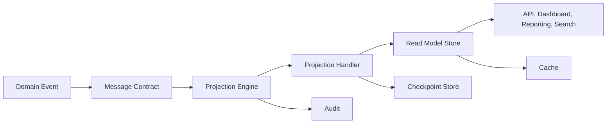
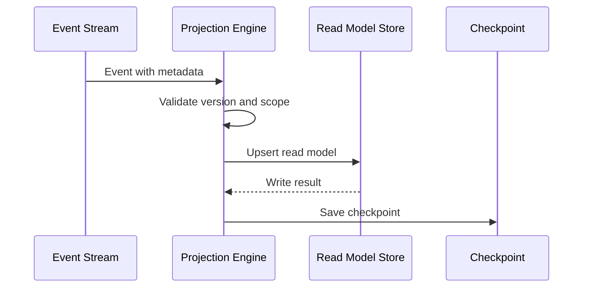
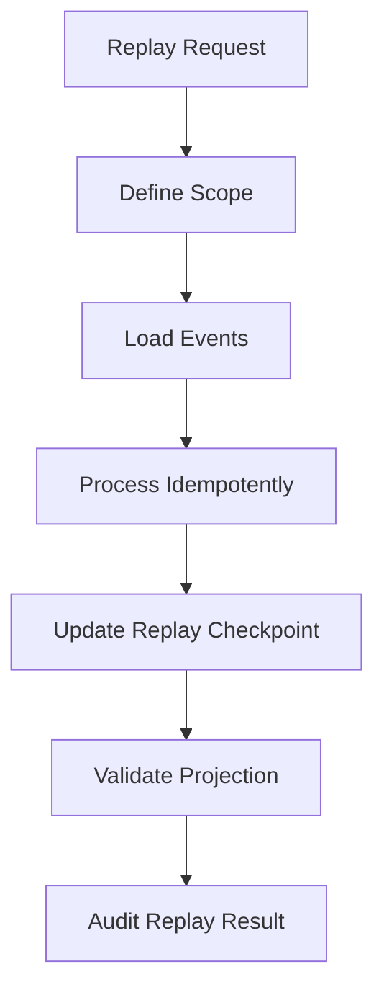
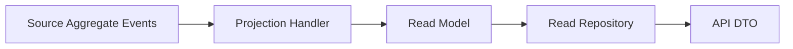
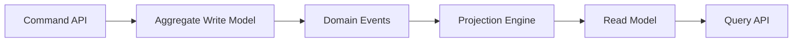
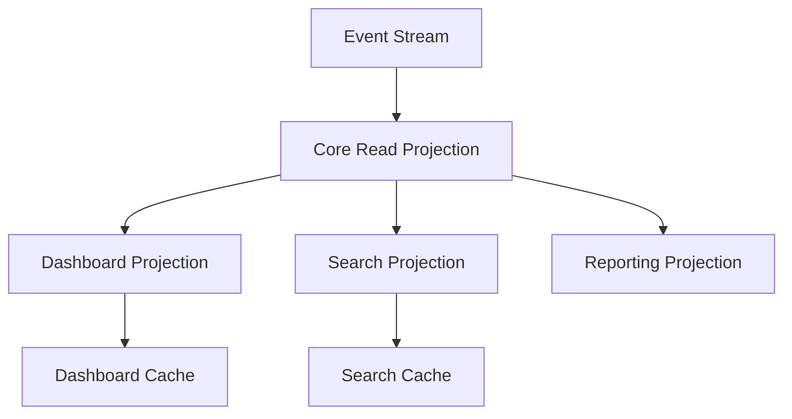

# Projection Engine Framework

# Document Control

Document Name: Projection Engine Framework
Document Path: knowledge/projection-engine-framework.md
Document Type: Atlas Enterprise Canonical Specification
Version: 1.0
Status: Canonical Specification
Domain: Platform
Bounded Context: Platform
Owner: Project Atlas
Source of Truth: Atlas Projection Engine Source of Truth
Last Updated: 2026-07-13

Related Specifications:
- knowledge/domain-event-catalog.md
- knowledge/message-contract-catalog.md
- knowledge/event-driven-architecture.md
- knowledge/repository-catalog.md
- knowledge/application-service-catalog.md
- knowledge/domain-service-catalog.md
- knowledge/cache-strategy-framework.md
- knowledge/database-governance-framework.md
- knowledge/data-governance-framework.md
- knowledge/service-catalog.md
- knowledge/system-module-catalog.md
- knowledge/api-governance-framework.md
- knowledge/workflow-engine-framework.md
- knowledge/background-job-framework.md
- knowledge/scheduler-framework.md
- knowledge/automation-framework.md
- docs/05-DatabaseDesign.md
- docs/06-ERD.md
- docs/07-API.md

# Purpose

Projection Engine Framework defines the canonical Atlas projection model. It is the source of truth for projection pipelines, read models, CQRS read-side behavior, materialized views, projection snapshots, projection versions, rebuilds, replays, synchronization, dependencies, consistency, refresh, recovery, checkpoints, monitoring, and projection-driven API, dashboard, reporting, analytics, search, cache, workflow, automation, scheduler, background job, and notification integration.

This document does not create new Atlas business domains. It consolidates projection behavior required by Domain Events, Message Contracts, Event Driven Architecture, Read Models, CQRS, Repositories, Application Services, APIs, Dashboards, Reporting, Analytics, Search, Cache, Workflows, Automation, Schedulers, Background Jobs, and Notifications.

# Scope

- Projection
- Projection Engine
- Projection Pipeline
- Read Model
- CQRS Read Side
- Materialized View
- Projection Snapshot
- Projection Version
- Projection Rebuild
- Projection Replay
- Projection Synchronization
- Projection Dependency
- Projection Consistency
- Projection Refresh
- Projection Recovery
- Projection Checkpoint
- Domain Event
- Message Contract
- Repository
- Application Service
- API
- Dashboard
- Reporting
- Analytics
- Search
- Cache
- Workflow
- Automation
- Scheduler
- Background Job
- Notification

# Projection Engine Principles

- Projections are derived read-side representations and must not replace the source of business truth.
- Every projection must declare source events, source aggregate, read model, storage, owner, version, checkpoint, replay strategy, rebuild strategy, consistency strategy, cache strategy, monitoring, and audit behavior.
- Every read model must preserve data classification, TenantId, HouseholdId when applicable, permission scope, lineage, and source version.
- Every projection pipeline must process events idempotently.
- Every projection must tolerate duplicate events, delayed events, reordered events when allowed by event contract, and replayed historical events.
- Every projection rebuild must be versioned, auditable, monitored, and safe for readers.
- Every projection checkpoint must identify the source stream position, projection version, consumer identity, and processing status.
- Every projection used by API, dashboard, analytics, search, cache, workflow, automation, scheduler, background job, or notification must declare staleness and consistency expectations.
- Every projection failure must be observable and recoverable.
- Projection security, audit, data governance, database governance, and cache rules must align with their canonical frameworks.

# Projection Concept Definitions

| Concept | Canonical Meaning | Required Usage |
| --- | --- | --- |
| Projection | Derived representation built from domain events, messages, repository state, or approved source records. | Used for read optimization, reporting, dashboards, search, and integration read models. |
| Projection Engine | Processing component that consumes source changes and materializes read models. | Owns ordering, checkpoint, retry, replay, rebuild, and monitoring behavior. |
| Projection Pipeline | End-to-end path from event or source record to read model, cache, index, report, or dashboard. | Must be versioned and observable. |
| Read Model | Query-optimized model derived from source truth. | Must preserve lineage, classification, tenant, household, and permission constraints. |
| CQRS Read Side | Read-only side optimized separately from command write model. | Must not accept business mutations as source truth. |
| Materialized View | Database-backed persisted query or projection. | Requires refresh policy, owner, version, and staleness rules. |
| Projection Snapshot | Point-in-time captured projection state. | Used for rebuild, replay acceleration, diagnostics, or recovery. |
| Projection Version | Version of projection logic, schema, storage, and serialization. | Required for migration, rebuild, and compatibility. |
| Projection Rebuild | Regeneration of projection from source events or records. | Requires strategy, checkpoint, validation, and audit. |
| Projection Replay | Reprocessing historical events into a projection. | Requires idempotency, ordering, checkpoint, and version control. |
| Projection Synchronization | Alignment between source truth and derived read model. | Requires consistency and lag monitoring. |
| Projection Dependency | Upstream source or downstream consumer dependency. | Must be declared to control rebuild order and invalidation. |
| Projection Consistency | Contract describing staleness and read guarantees. | Required for every projection. |
| Projection Refresh | Update operation that brings projection closer to source state. | May be event-driven, scheduled, manual, or rebuild-driven. |
| Projection Recovery | Process for resuming or repairing failed projection processing. | Requires checkpoint and audit. |
| Projection Checkpoint | Durable marker of processed source position. | Required for replay, retry, and monitoring. |

# Projection Architecture

Atlas projection architecture is event-first and read-model oriented.

1. Aggregate or application service emits a Domain Event following Domain Event Catalog rules.
2. Message Contract carries event payload and metadata through Event Driven Architecture.
3. Projection Engine consumes source event, validates schema version, TenantId, HouseholdId, classification, ordering key, and idempotency key.
4. Projection handler transforms event data into read model changes.
5. Projection Repository writes projection tables, materialized views, search documents, dashboard metrics, analytics rows, or cache metadata.
6. Projection Checkpoint records source position, projection version, consumer, status, and timestamp.
7. Cache Strategy invalidates or refreshes affected read caches and response caches.
8. API, dashboard, reporting, analytics, search, workflow, automation, scheduler, background job, and notification consumers read from governed read models.
9. Audit records projection replay, rebuild, refresh, failure, recovery, and administrative actions.

# Complete Projection Catalog

Every projection must use this Enterprise contract.

| Field | Requirement |
| --- | --- |
| Projection Name | Stable PascalCase name ending with Projection. |
| Display Name | Human-readable label. |
| Category | ReadModel, Dashboard, Reporting, Analytics, Search, Cache, Notification, Workflow, Operational, MaterializedView. |
| Purpose | Why the projection exists. |
| Business Meaning | Business, operational, reporting, analytics, search, or notification meaning. |
| Description | Exact derived state and consumer behavior. |
| Read Model | Read model produced by the projection. |
| Source Aggregate | Aggregate or source record that owns truth. |
| Source Events | Domain Events or message contracts consumed. |
| Message Contract | Contract name and version when consumed from message bus. |
| Repository | Projection repository or read repository owner. |
| Application Service | Service consuming or orchestrating the projection. |
| API | API routes or DTOs reading the projection. |
| Dashboard | Dashboard widgets or metrics using the projection. |
| Analytics | Analytics data set or reporting model. |
| Search | Search index or search document mapping. |
| Cache | Cache keys and invalidation behavior. |
| Workflow | Workflow dependency or trigger. |
| Automation | Automation dependency or trigger. |
| Scheduler | Scheduled refresh, rebuild, or reconciliation job. |
| Background Job | Worker responsible for processing, replay, or rebuild. |
| Dependencies | Upstream and downstream projection dependencies. |
| Projection Strategy | Event-driven, scheduled, repository-snapshot, materialized view, hybrid, or manual. |
| Replay Strategy | Full stream, bounded range, tenant scope, aggregate scope, or snapshot-assisted. |
| Rebuild Strategy | In-place, blue-green, shadow table, materialized view refresh, or rolling. |
| Consistency Strategy | Strong, read-your-write, bounded stale, eventual, or best-effort. |
| Checkpoint Strategy | Per stream, per partition, per tenant, per aggregate, per handler, or global. |
| Refresh Strategy | Event, scheduled, refresh-ahead, manual, or dependency-driven. |
| Version Strategy | Schema version, handler version, source event version, and read model version. |
| Storage | Table, materialized view, search index, cache, analytics store, or report store. |
| Database Mapping | Schema, table, view, index, partition, retention, and archive mapping. |
| Security | Permission, tenant, household, classification, masking, and encryption rules. |
| Audit | Replay, rebuild, refresh, failure, recovery, and administrative audit requirements. |
| Performance | Processing SLA, replay throughput, refresh latency, query latency, and storage target. |
| Monitoring | Lag, checkpoint, failure, throughput, duration, stale reads, and consumer health. |
| Metrics | Event count, processed count, skipped count, retry count, lag, rebuild progress, query usage. |
| Example | Minimal valid projection event-to-read-model scenario. |

# Projection Matrix

| Projection Category | Source | Primary Consumer | Consistency |
| --- | --- | --- | --- |
| ReadModel | Domain Event or repository state | API and Application Service | Bounded stale or read-your-write. |
| Dashboard | Projection table or analytics data | Dashboard widget | Bounded stale. |
| Reporting | Projection or materialized view | Reports and exports | Bounded stale with generated timestamp. |
| Analytics | Event stream and historical records | Metrics and analysis | Eventual with lineage. |
| Search | Domain Event or repository snapshot | Search API | Eventual with index version. |
| Cache | Projection or read model | API and UI | TTL-bound and invalidated. |
| Notification | Domain Event or read model | Notification service | Eventual or event-driven. |
| Operational | Job, scheduler, workflow, or integration state | Operators and monitoring | Bounded stale. |

# Read Model Matrix

| Read Model Type | Required Fields |
| --- | --- |
| Tenant Read Model | TenantId, source version, projection version, updated_at, classification. |
| Household Read Model | TenantId, HouseholdId, source version, projection version, updated_at, classification. |
| API Read Model | Query keys, DTO version, permission scope, masking metadata, updated_at. |
| Dashboard Read Model | Metric id, aggregation window, source version, generated_at, staleness. |
| Search Read Model | Document id, source id, index version, classification, delete marker. |
| Reporting Read Model | Report source, filter scope, aggregation rule, generated_at, lineage. |

# Domain Event to Projection Matrix

| Domain Event Category | Projection Requirement |
| --- | --- |
| Business Event | Update business read models, dashboards, reporting, search, and cache invalidation. |
| Integration Event | Update integration delivery, partner status, and operational read models. |
| Projection Event | Update dependent projections and refresh downstream caches. |
| Notification Event | Update notification delivery read model and recipient status. |
| Audit Event | Update audit search projection when classification and permission allow it. |
| Outbox Event | Update publish status and operational monitoring projection. |
| Inbox Event | Update consume status, duplicate detection, and retry projection. |

# Repository to Projection Matrix

| Repository Type | Projection Responsibility |
| --- | --- |
| Aggregate Repository | Emits or persists changes that projection consumes through events or snapshots. |
| Read Repository | Serves projection-backed read models and enforces tenant and household filters. |
| Projection Repository | Owns projection storage, checkpoint writes, rebuild writes, and query indexes. |
| Search Repository | Owns search document projection and delete propagation. |
| Audit Repository | Owns audit projection and evidence search model. |
| Archive Repository | Provides archive metadata projection and restore visibility. |

# API to Projection Matrix

| API Use | Projection Rule |
| --- | --- |
| Query API | May read projections when staleness and permission are acceptable. |
| Command API | Must not mutate projection as source truth; mutation occurs through command and source model. |
| Dashboard API | Reads dashboard projections with generated timestamp and staleness metadata. |
| Search API | Reads search projections with index version and delete propagation rules. |
| Report API | Reads reporting projections and records generation evidence. |
| Export API | Reads projection only when lineage, classification, and permission are valid. |

# Dashboard Matrix

| Dashboard Area | Projection Requirement |
| --- | --- |
| Financial Health | Source metrics, generated time, assumptions, household scope, and staleness. |
| Net Worth | Asset and liability events, household scope, currency, and projection version. |
| Cash Flow | Income, expense, schedule, projection version, and time range. |
| Portfolio | Holdings, performance, allocation, valuation time, and source lineage. |
| Goal Progress | Goal events, contribution events, projection version, and household scope. |
| Risk | Risk score inputs, rule version, generated time, and classification. |

# Replay Strategy

- Replay must consume events from a deterministic source order.
- Replay must preserve TenantId, HouseholdId, CorrelationId, CausationId, event version, and classification.
- Replay must be idempotent and safe to retry.
- Replay may run by full stream, event range, tenant, household, aggregate, projection, or time window.
- Replay must not emit duplicate external notifications unless explicitly configured as dry-run or suppressed replay.
- Replay must record start, scope, checkpoint, progress, failure, completion, and actor.

# Rebuild Strategy

- Rebuild must define target projection version and source range.
- Rebuild may use shadow tables, blue-green projection switching, in-place repair, materialized view refresh, or rolling rebuild.
- Rebuild must validate row counts, checksums, source positions, tenant scope, and classification.
- Rebuild must not expose partially rebuilt read models unless consistency strategy permits it.
- Rebuild must invalidate or refresh affected cache keys.
- Rebuild must be auditable.

# Checkpoint Strategy

- Checkpoints must be durable.
- Checkpoints must record projection name, projection version, handler version, source stream, partition, event position, timestamp, and status.
- Checkpoint writes must be idempotent.
- Failed events must not advance checkpoint beyond unprocessed required state.
- Poison events must have quarantine, retry, skip, or manual resolution policy.
- Checkpoint lag must be monitored.

# Consistency Strategy

- Strong consistency is required only when projection is explicitly part of the command response contract.
- Read-your-write is required when API promises immediate visibility after command completion.
- Bounded stale consistency is allowed for dashboards, reports, summary read models, and expensive projections.
- Eventual consistency is allowed for search, analytics, notification status, and historical reporting when staleness is visible or acceptable.
- Best-effort projections may be used only for non-critical operational insights.

# Validation Rules

- Projection Name is required.
- Projection Category is required.
- Projection Owner is required.
- Read Model is required.
- Source Aggregate is required when projection derives from aggregate events.
- Source Events are required.
- Message Contract version is required when events are consumed from messaging.
- Projection Strategy is required.
- Replay Strategy is required.
- Rebuild Strategy is required.
- Consistency Strategy is required.
- Checkpoint Strategy is required.
- Refresh Strategy is required.
- Version Strategy is required.
- Storage mapping is required.
- Database Mapping is required for persisted projections.
- Cache mapping is required when projection is cached.
- API mapping is required when projection is served through API.
- Dashboard mapping is required when projection feeds dashboard.
- Search mapping is required when projection feeds search.
- Analytics mapping is required when projection feeds analytics.
- TenantId is required for tenant-scoped projections.
- HouseholdId is required for household-scoped projections.
- Data classification is required.
- Permission rules are required for protected read models.
- Projection handler must be idempotent.
- Projection handler must tolerate duplicate events.
- Projection handler must validate event version.
- Projection handler must validate required metadata.
- Checkpoint must not advance on required processing failure.
- Replay must define scope.
- Rebuild must define validation.
- Refresh must define trigger.
- Monitoring metrics are required.
- Performance targets are required.
- Projection failures must be observable.
- Administrative replay and rebuild must be audited.
- Projection schema changes must update projection version.
- Read model DTO changes must update DTO or API version when exposed externally.
- Delete propagation is required for search and read models.
- Archive and purge propagation is required for retained projections.
- Cache invalidation is required for changed projection output.

# Business Rules

- Projection is derived data, not source truth.
- Source truth remains in approved aggregate, repository, event stream, or governed database table.
- Projection must not accept direct business mutation from API.
- Projection updates must be caused by source event, approved repository snapshot, scheduled refresh, rebuild, or administrative repair.
- Projection handler must be deterministic for the same event and version.
- Projection handler must be idempotent.
- Duplicate events must not duplicate read model rows.
- Out-of-order events must be handled by ordering key, sequence, version check, or retry policy.
- Missing events must be detected through checkpoint lag, sequence gaps, or reconciliation.
- Poison events must not block unrelated partitions indefinitely.
- Replay must not send normal user notifications unless replay policy allows it.
- Replay must preserve original event metadata.
- Replay must identify replay actor or service actor.
- Replay must not create false business audit mutations.
- Rebuild must not weaken classification.
- Rebuild must not remove tenant isolation.
- Rebuild must not remove household isolation.
- Rebuild must not expose partial data to normal readers unless designed for rolling consistency.
- Shadow rebuild must switch readers atomically.
- In-place rebuild must have reader staleness policy.
- Projection version changes must be backward compatible or migration-controlled.
- Read model schema must include projection version.
- Projection storage must include updated timestamp.
- Projection storage must include source position where applicable.
- Projection storage must include TenantId when tenant-scoped.
- Projection storage must include HouseholdId when household-scoped.
- Projection storage must include classification.
- Projection query indexes must support primary API and dashboard access paths.
- Projection cache keys must include projection version.
- Projection cache keys must include tenant and household scope when applicable.
- Search projections must propagate deletes.
- Search projections must propagate archive and purge state.
- Dashboard projections must expose generated time.
- Dashboard projections must expose staleness where relevant.
- Reporting projections must preserve source lineage.
- Analytics projections must preserve aggregation rule.
- Notification projections must preserve delivery status and suppression state.
- Workflow projections must preserve workflow run and step context.
- Automation projections must preserve trigger and action context.
- Scheduler projections must preserve schedule run context.
- Background job projections must preserve job run context.
- Projection refresh must not overload source repositories.
- Projection rebuild must run in bounded batches for large data sets.
- Projection replay must run with controlled throughput.
- Projection lag must be monitored.
- Projection failure must be visible to owner.
- Projection recovery must be documented.
- Projection storage must follow Database Governance Framework.
- Projection cache must follow Cache Strategy Framework.
- Projection read access must follow Permission Framework and API Governance.
- Projection audit must follow Audit Framework.
- Projection data handling must follow Data Governance Framework.
- Projection messages must follow Message Contract Catalog.
- Projection event consumption must follow Event Driven Architecture.
- Projection Framework conflicts are resolved by this document unless Security, Audit, Compliance, Data Governance, Database Governance, Cache Strategy, Tenant, or legal rules impose stricter controls.

# Security

## Read Permission

- Projection read access requires the same or stricter permission than source data.
- Projection APIs must not expose fields hidden by source permissions.
- Report and dashboard projections must enforce permission before display or export.

## Tenant Isolation

- Tenant-scoped projections must include TenantId in storage, indexes, cache keys, checkpoints, and queries.
- Cross-tenant projections require explicit administrative permission and approved aggregation or anonymization.

## Household Isolation

- Household-scoped projections must include HouseholdId in storage, indexes, cache keys, checkpoints, and queries.
- Household membership changes must invalidate affected read projections and caches when required.

## Encryption

- Projection storage containing protected data must be encrypted according to classification.
- Projection snapshots, replay files, and rebuild staging tables must follow the same encryption rules as primary projection storage.

# Audit

## Replay History

- Replay start, scope, actor, source range, projection version, checkpoint, progress, completion, failure, and skipped events must be audited.

## Projection History

- Projection creation, version change, schema change, dependency change, storage change, and decommission must retain history.

## Refresh History

- Scheduled refresh, event refresh, manual refresh, rebuild refresh, and cache refresh must record outcome when operationally material.

# Performance

| Area | Requirement |
| --- | --- |
| Projection SLA | Each projection must define processing lag, query latency, rebuild duration, and failure recovery targets. |
| Replay Throughput | Replay must define batch size, concurrency, partitioning, backpressure, and source protection. |
| Refresh Latency | Refresh latency must be monitored for event-driven, scheduled, materialized view, and cache-backed projections. |

# Mermaid

## Projection Architecture

## Projection Flow

## Replay Flow

## Read Model Diagram

## CQRS Diagram

## Projection Dependency Diagram

# Testing

| Test Type | Required Coverage |
| --- | --- |
| Projection Test | Event handling, idempotency, duplicate events, version validation, storage write, and checkpoint write. |
| Replay Test | Full replay, scoped replay, retry, duplicate event handling, poison event handling, and replay audit. |
| Rebuild Test | Shadow rebuild, in-place rebuild, validation, switch-over, cache invalidation, and reader behavior. |
| Performance Test | Processing lag, query latency, replay throughput, rebuild duration, batch size, and source backpressure. |
| Consistency Test | Strong, read-your-write, bounded stale, eventual, delete propagation, archive propagation, and cache coherence. |

# Edge Cases

- Event arrives without TenantId.
- Event arrives without HouseholdId for household projection.
- Event version is unknown.
- Event is duplicated.
- Event arrives out of order.
- Event sequence gap is detected.
- Event payload classification is missing.
- Event is valid but projection schema is outdated.
- Projection handler throws after read model write but before checkpoint.
- Checkpoint advances before read model write.
- Checkpoint store is unavailable.
- Read model store is unavailable.
- Cache invalidation fails after projection update.
- Projection update succeeds but search index update fails.
- Search index delete propagation fails.
- Archive event does not update projection.
- Purge event does not remove projection data.
- Replay processes event that already affected read model.
- Replay accidentally emits notification.
- Replay scope includes multiple tenants without approval.
- Rebuild exposes partial data.
- Shadow rebuild switch fails.
- Materialized view refresh times out.
- Projection version changes during replay.
- Source event contract changes during deployment.
- DTO version changes without projection version.
- Projection cache serves old version.
- Dashboard shows stale generated time.
- Report uses projection without lineage.
- Analytics projection loses aggregation rule.
- Tenant is suspended during rebuild.
- Household membership changes while cache is warm.
- Permission changes while projection API cache is valid.
- Legal hold changes after archive projection update.
- Projection table partition is missing.
- Projection index is missing for common API query.
- Rebuild row count differs from source count.
- Replay throughput overloads source event store.
- Poison event blocks a partition.
- Quarantined event is forgotten.
- Background job restarts with stale checkpoint.
- Scheduler runs two rebuilds concurrently.
- Automation triggers projection refresh while rebuild is active.
- Workflow reads projection before consistency window closes.
- Integration event maps to unknown source aggregate.
- Notification read model misses suppression state.
- Projection snapshot is older than checkpoint.
- Snapshot restore weakens classification.
- Encryption key rotation makes snapshot unreadable.
- Projection administrative repair lacks audit.
- Projection owner is missing.
- Projection dependency cycle is introduced.
- Downstream projection rebuild order is wrong.
- Projection lag monitoring misses stalled consumer.
- Query API hides staleness metadata required by consumer.
- Read model contains raw PII where masking is required.

# Final Consistency Matrix

| Area | Required Projection Alignment |
| --- | --- |
| Projection | Uses this framework as canonical source of truth. |
| Read Model | Source lineage, version, TenantId, HouseholdId, classification, and permission are preserved. |
| Domain Event | Source events, versions, ordering, idempotency, and metadata are mapped. |
| Message Contract | Contract version and payload metadata are consumed safely. |
| Repository | Projection storage, checkpoint, query filters, transaction behavior, and rebuild support are defined. |
| Application Service | Read orchestration, consistency promise, and projection visibility are defined. |
| API | Query APIs expose projections with permission, staleness, DTO version, and masking. |
| Dashboard | Metrics include source, generated time, scope, and staleness. |
| Analytics | Derived data includes source, aggregation, refresh, and lineage. |
| Cache | Projection cache keys, invalidation, refresh, and version rules are defined. |

# Completion Checklist

- Projection source event requirement is defined.
- Projection read model requirement is defined.
- Projection replay strategy is defined.
- Projection rebuild strategy is defined.
- Projection checkpoint strategy is defined.
- Projection version strategy is defined.
- Projection consistency strategy is defined.
- Projection refresh strategy is defined.
- Projection monitoring requirement is defined.
- Projection performance target is defined.
- Domain Event mapping is defined.
- Repository mapping is defined.
- API mapping is defined.
- Dashboard mapping is defined.
- Cache mapping is defined.
- Validation rules are complete.
- Business rules are complete.
- Security rules are complete.
- Audit rules are complete.
- Mermaid diagrams are syntactically valid.
- Markdown structure is valid.
- No placeholder terms are present.
- No draft-only status is present.
- No temporary catalog entries are present.
