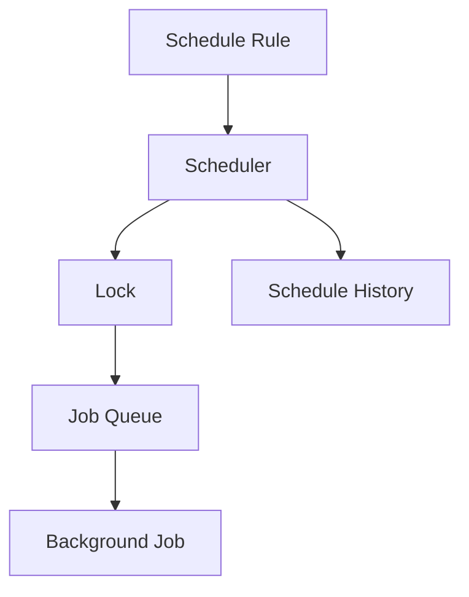
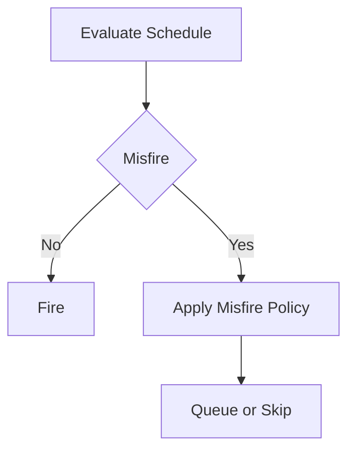
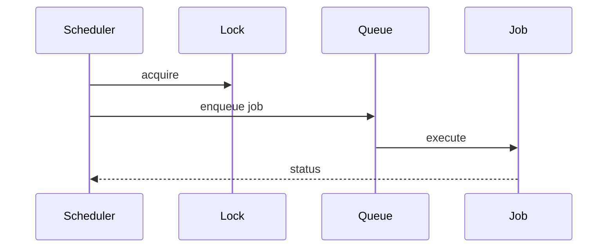
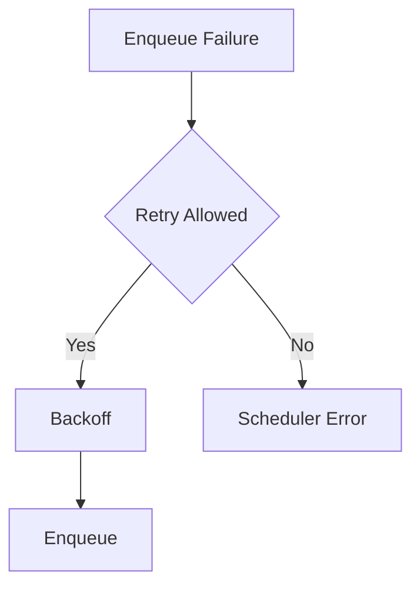
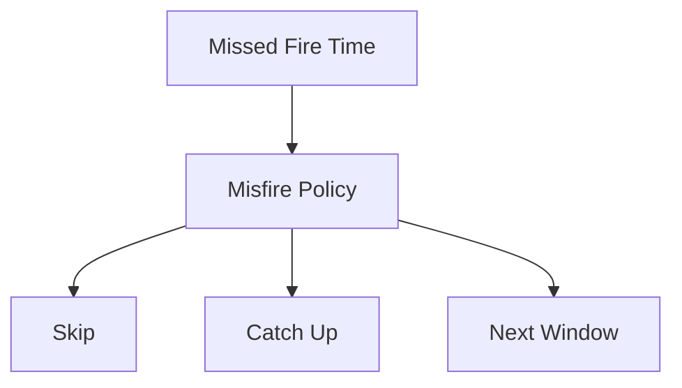
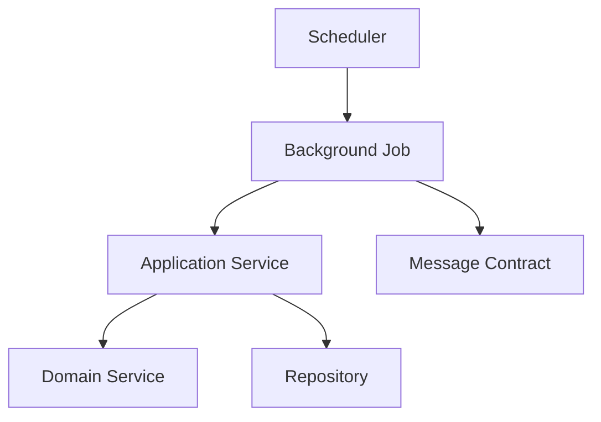

# Scheduler Framework

# Document Control

Document Name: Scheduler Framework
Document Path: knowledge/scheduler-framework.md
Document Type: Atlas Enterprise Canonical Specification
Version: 1.0
Status: Canonical Specification
Domain: Platform
Bounded Context: Platform
Owner: Project Atlas
Source of Truth: Atlas Scheduler Source of Truth
Last Updated: 2026-07-12

Related Specifications:
- knowledge/background-job-framework.md
- knowledge/workflow-engine-framework.md
- knowledge/application-service-catalog.md
- knowledge/domain-service-catalog.md
- knowledge/command-catalog.md
- knowledge/domain-event-catalog.md
- knowledge/message-contract-catalog.md
- knowledge/event-driven-architecture.md
- knowledge/integration-framework.md
- knowledge/service-catalog.md
- knowledge/system-module-catalog.md
- knowledge/api-governance-framework.md
- knowledge/automation-framework.md
- knowledge/projection-engine-framework.md
- docs/04-DomainModel.md
- docs/05-DatabaseDesign.md
- docs/06-ERD.md
- docs/07-API.md

# Purpose

Scheduler Framework defines approved Atlas scheduling for Background Jobs, Workflows, Automation, Application Services, Domain Services, Commands, Domain Events, Message Contracts, Notifications, Projections, Batch work, Maintenance, Cache Refresh, and Integration Polling. It is the scheduler source of truth for triggers, schedule rules, retry, misfire policy, concurrency, audit, and performance.

# Scope

- Scheduler
- Recurring Scheduler
- One Time Scheduler
- Cron Scheduler
- Calendar Scheduler
- Interval Scheduler
- Delayed Scheduler
- Manual Scheduler
- Maintenance Scheduler
- Polling Scheduler
- Retry Scheduler
- Catch-up Scheduler

# Scheduler Principles

- Every scheduler has a trigger and schedule rule.
- Every scheduler has timezone, misfire, catch-up, retry, timeout, concurrency, lock, audit, and metrics behavior.
- Schedulers start catalog-approved Background Jobs or service operations only.
- Schedulers do not bypass Application Service, Domain Service, Command, Repository, or Message Contract boundaries.
- Misfire and catch-up must be deterministic and auditable.
- Concurrent runs are controlled by scheduler and job lock strategy.

# Scheduler Architecture

Schedulers create deterministic execution opportunities for Background Jobs, Workflows, Automations, Projections, Imports, Exports, Maintenance, Cache Refresh, Outbox, and Inbox processing. Execution ownership remains with the scheduled job or service.

# Complete Scheduler Catalog

## ScenarioEvaluationScheduler

Scheduler Name: ScenarioEvaluationScheduler
Display Name: ScenarioEvaluationScheduler
Category: Recurring Scheduler
Purpose: Schedule scenario evaluation jobs.
Business Meaning: ScenarioEvaluationScheduler controls when approved Atlas work is queued without redefining domain behavior.
Description: Scheduler evaluates time, rule, trigger, misfire, catch-up, concurrency, lock, retry, timeout, and audit before queueing work.
Trigger: Cron trigger
Schedule Type: Cron
Cron Expression: 0 */6 * * *
Calendar Rule: 0 */6 * * *
Interval: 0 */6 * * *
Timezone: Asia/Taipei
Misfire Policy: Skip duplicate active run
Catch-up Policy: Catch up latest only
Retry Policy: Retry scheduler enqueue failure only when idempotency permits.
Timeout Policy: Scheduler decision must complete within bounded scheduling SLA.
Execution Window: Configured by schedule rule and module maintenance window when applicable.
Concurrency Policy: Single active run per scheduler scope unless explicitly parallel-safe.
Lock Strategy: Lock by scheduler name, job name, HouseholdId, aggregate id, batch id, or message id as applicable.
Execution Owner: ScenarioEvaluationJob
Application Service: ScenarioApplicationService
Domain Service: ScenarioService
Background Job: ScenarioEvaluationJob
Workflow: Scenario workflow
Automation: Scenario automation
Commands: EvaluateScenario
Domain Events: ScenarioEvaluated
Repositories: ScenarioRepository
Dependencies: ScenarioEvaluationJob; ScenarioApplicationService; ScenarioService; ScenarioRepository; ScenarioEvaluatedMessage
Transaction Boundary: Scheduler enqueue is atomic with schedule history update.
Consistency Boundary: Scheduled execution is eventually consistent with job processing and event publication.
Idempotency: SchedulerName plus scheduled fire time plus scope plus input hash.
Checkpoint: Schedule history records evaluated, queued, skipped, failed, misfired, caught-up, and completed states.
Failure Handling: Retry enqueue, skip duplicate, mark misfire, queue catch-up, or fail with scheduler error.
Audit: Execution history, CorrelationId, CausationId, Schedule History, actor or system actor, scheduled time, actual time, and result.
Logging: Scheduler name, rule, fire time, decision, lock result, queue result, and error code.
Metrics: Scheduling SLA, execution latency, queue throughput, misfire count, catch-up count, retry count, and lock wait.
Security: Authorization, permission, tenant isolation, Household isolation, and system actor controls.
Performance: Scheduling decision p95, queue latency, throughput, and dependency latency are measured.
Example: ScenarioEvaluationScheduler evaluates 0 */6 * * *, applies Skip duplicate active run, queues ScenarioEvaluationJob, and audits the result.
Scheduler Control 1: ScenarioEvaluationScheduler preserves trigger, schedule type, cron expression, calendar rule, interval, timezone, misfire policy, catch-up policy, retry policy, timeout policy, execution window, concurrency policy, lock strategy, execution owner, application service, domain service, background job, workflow, automation, command, domain event, repository, dependency, transaction boundary, consistency boundary, idempotency, checkpoint, failure handling, audit, logging, metrics, security, and performance.
Scheduler Control 2: ScenarioEvaluationScheduler preserves trigger, schedule type, cron expression, calendar rule, interval, timezone, misfire policy, catch-up policy, retry policy, timeout policy, execution window, concurrency policy, lock strategy, execution owner, application service, domain service, background job, workflow, automation, command, domain event, repository, dependency, transaction boundary, consistency boundary, idempotency, checkpoint, failure handling, audit, logging, metrics, security, and performance.
Scheduler Control 3: ScenarioEvaluationScheduler preserves trigger, schedule type, cron expression, calendar rule, interval, timezone, misfire policy, catch-up policy, retry policy, timeout policy, execution window, concurrency policy, lock strategy, execution owner, application service, domain service, background job, workflow, automation, command, domain event, repository, dependency, transaction boundary, consistency boundary, idempotency, checkpoint, failure handling, audit, logging, metrics, security, and performance.
Scheduler Control 4: ScenarioEvaluationScheduler preserves trigger, schedule type, cron expression, calendar rule, interval, timezone, misfire policy, catch-up policy, retry policy, timeout policy, execution window, concurrency policy, lock strategy, execution owner, application service, domain service, background job, workflow, automation, command, domain event, repository, dependency, transaction boundary, consistency boundary, idempotency, checkpoint, failure handling, audit, logging, metrics, security, and performance.
Scheduler Control 5: ScenarioEvaluationScheduler preserves trigger, schedule type, cron expression, calendar rule, interval, timezone, misfire policy, catch-up policy, retry policy, timeout policy, execution window, concurrency policy, lock strategy, execution owner, application service, domain service, background job, workflow, automation, command, domain event, repository, dependency, transaction boundary, consistency boundary, idempotency, checkpoint, failure handling, audit, logging, metrics, security, and performance.
Scheduler Control 6: ScenarioEvaluationScheduler preserves trigger, schedule type, cron expression, calendar rule, interval, timezone, misfire policy, catch-up policy, retry policy, timeout policy, execution window, concurrency policy, lock strategy, execution owner, application service, domain service, background job, workflow, automation, command, domain event, repository, dependency, transaction boundary, consistency boundary, idempotency, checkpoint, failure handling, audit, logging, metrics, security, and performance.
Scheduler Control 7: ScenarioEvaluationScheduler preserves trigger, schedule type, cron expression, calendar rule, interval, timezone, misfire policy, catch-up policy, retry policy, timeout policy, execution window, concurrency policy, lock strategy, execution owner, application service, domain service, background job, workflow, automation, command, domain event, repository, dependency, transaction boundary, consistency boundary, idempotency, checkpoint, failure handling, audit, logging, metrics, security, and performance.
Scheduler Control 8: ScenarioEvaluationScheduler preserves trigger, schedule type, cron expression, calendar rule, interval, timezone, misfire policy, catch-up policy, retry policy, timeout policy, execution window, concurrency policy, lock strategy, execution owner, application service, domain service, background job, workflow, automation, command, domain event, repository, dependency, transaction boundary, consistency boundary, idempotency, checkpoint, failure handling, audit, logging, metrics, security, and performance.
Scheduler Control 9: ScenarioEvaluationScheduler preserves trigger, schedule type, cron expression, calendar rule, interval, timezone, misfire policy, catch-up policy, retry policy, timeout policy, execution window, concurrency policy, lock strategy, execution owner, application service, domain service, background job, workflow, automation, command, domain event, repository, dependency, transaction boundary, consistency boundary, idempotency, checkpoint, failure handling, audit, logging, metrics, security, and performance.
Scheduler Control 10: ScenarioEvaluationScheduler preserves trigger, schedule type, cron expression, calendar rule, interval, timezone, misfire policy, catch-up policy, retry policy, timeout policy, execution window, concurrency policy, lock strategy, execution owner, application service, domain service, background job, workflow, automation, command, domain event, repository, dependency, transaction boundary, consistency boundary, idempotency, checkpoint, failure handling, audit, logging, metrics, security, and performance.
Scheduler Control 11: ScenarioEvaluationScheduler preserves trigger, schedule type, cron expression, calendar rule, interval, timezone, misfire policy, catch-up policy, retry policy, timeout policy, execution window, concurrency policy, lock strategy, execution owner, application service, domain service, background job, workflow, automation, command, domain event, repository, dependency, transaction boundary, consistency boundary, idempotency, checkpoint, failure handling, audit, logging, metrics, security, and performance.
Scheduler Control 12: ScenarioEvaluationScheduler preserves trigger, schedule type, cron expression, calendar rule, interval, timezone, misfire policy, catch-up policy, retry policy, timeout policy, execution window, concurrency policy, lock strategy, execution owner, application service, domain service, background job, workflow, automation, command, domain event, repository, dependency, transaction boundary, consistency boundary, idempotency, checkpoint, failure handling, audit, logging, metrics, security, and performance.
Scheduler Control 13: ScenarioEvaluationScheduler preserves trigger, schedule type, cron expression, calendar rule, interval, timezone, misfire policy, catch-up policy, retry policy, timeout policy, execution window, concurrency policy, lock strategy, execution owner, application service, domain service, background job, workflow, automation, command, domain event, repository, dependency, transaction boundary, consistency boundary, idempotency, checkpoint, failure handling, audit, logging, metrics, security, and performance.
Scheduler Control 14: ScenarioEvaluationScheduler preserves trigger, schedule type, cron expression, calendar rule, interval, timezone, misfire policy, catch-up policy, retry policy, timeout policy, execution window, concurrency policy, lock strategy, execution owner, application service, domain service, background job, workflow, automation, command, domain event, repository, dependency, transaction boundary, consistency boundary, idempotency, checkpoint, failure handling, audit, logging, metrics, security, and performance.
Scheduler Control 15: ScenarioEvaluationScheduler preserves trigger, schedule type, cron expression, calendar rule, interval, timezone, misfire policy, catch-up policy, retry policy, timeout policy, execution window, concurrency policy, lock strategy, execution owner, application service, domain service, background job, workflow, automation, command, domain event, repository, dependency, transaction boundary, consistency boundary, idempotency, checkpoint, failure handling, audit, logging, metrics, security, and performance.
Scheduler Control 16: ScenarioEvaluationScheduler preserves trigger, schedule type, cron expression, calendar rule, interval, timezone, misfire policy, catch-up policy, retry policy, timeout policy, execution window, concurrency policy, lock strategy, execution owner, application service, domain service, background job, workflow, automation, command, domain event, repository, dependency, transaction boundary, consistency boundary, idempotency, checkpoint, failure handling, audit, logging, metrics, security, and performance.
Scheduler Control 17: ScenarioEvaluationScheduler preserves trigger, schedule type, cron expression, calendar rule, interval, timezone, misfire policy, catch-up policy, retry policy, timeout policy, execution window, concurrency policy, lock strategy, execution owner, application service, domain service, background job, workflow, automation, command, domain event, repository, dependency, transaction boundary, consistency boundary, idempotency, checkpoint, failure handling, audit, logging, metrics, security, and performance.
Scheduler Control 18: ScenarioEvaluationScheduler preserves trigger, schedule type, cron expression, calendar rule, interval, timezone, misfire policy, catch-up policy, retry policy, timeout policy, execution window, concurrency policy, lock strategy, execution owner, application service, domain service, background job, workflow, automation, command, domain event, repository, dependency, transaction boundary, consistency boundary, idempotency, checkpoint, failure handling, audit, logging, metrics, security, and performance.
Scheduler Control 19: ScenarioEvaluationScheduler preserves trigger, schedule type, cron expression, calendar rule, interval, timezone, misfire policy, catch-up policy, retry policy, timeout policy, execution window, concurrency policy, lock strategy, execution owner, application service, domain service, background job, workflow, automation, command, domain event, repository, dependency, transaction boundary, consistency boundary, idempotency, checkpoint, failure handling, audit, logging, metrics, security, and performance.
Scheduler Control 20: ScenarioEvaluationScheduler preserves trigger, schedule type, cron expression, calendar rule, interval, timezone, misfire policy, catch-up policy, retry policy, timeout policy, execution window, concurrency policy, lock strategy, execution owner, application service, domain service, background job, workflow, automation, command, domain event, repository, dependency, transaction boundary, consistency boundary, idempotency, checkpoint, failure handling, audit, logging, metrics, security, and performance.
Scheduler Control 21: ScenarioEvaluationScheduler preserves trigger, schedule type, cron expression, calendar rule, interval, timezone, misfire policy, catch-up policy, retry policy, timeout policy, execution window, concurrency policy, lock strategy, execution owner, application service, domain service, background job, workflow, automation, command, domain event, repository, dependency, transaction boundary, consistency boundary, idempotency, checkpoint, failure handling, audit, logging, metrics, security, and performance.
Scheduler Control 22: ScenarioEvaluationScheduler preserves trigger, schedule type, cron expression, calendar rule, interval, timezone, misfire policy, catch-up policy, retry policy, timeout policy, execution window, concurrency policy, lock strategy, execution owner, application service, domain service, background job, workflow, automation, command, domain event, repository, dependency, transaction boundary, consistency boundary, idempotency, checkpoint, failure handling, audit, logging, metrics, security, and performance.
Scheduler Control 23: ScenarioEvaluationScheduler preserves trigger, schedule type, cron expression, calendar rule, interval, timezone, misfire policy, catch-up policy, retry policy, timeout policy, execution window, concurrency policy, lock strategy, execution owner, application service, domain service, background job, workflow, automation, command, domain event, repository, dependency, transaction boundary, consistency boundary, idempotency, checkpoint, failure handling, audit, logging, metrics, security, and performance.
Scheduler Control 24: ScenarioEvaluationScheduler preserves trigger, schedule type, cron expression, calendar rule, interval, timezone, misfire policy, catch-up policy, retry policy, timeout policy, execution window, concurrency policy, lock strategy, execution owner, application service, domain service, background job, workflow, automation, command, domain event, repository, dependency, transaction boundary, consistency boundary, idempotency, checkpoint, failure handling, audit, logging, metrics, security, and performance.
Scheduler Control 25: ScenarioEvaluationScheduler preserves trigger, schedule type, cron expression, calendar rule, interval, timezone, misfire policy, catch-up policy, retry policy, timeout policy, execution window, concurrency policy, lock strategy, execution owner, application service, domain service, background job, workflow, automation, command, domain event, repository, dependency, transaction boundary, consistency boundary, idempotency, checkpoint, failure handling, audit, logging, metrics, security, and performance.
Scheduler Control 26: ScenarioEvaluationScheduler preserves trigger, schedule type, cron expression, calendar rule, interval, timezone, misfire policy, catch-up policy, retry policy, timeout policy, execution window, concurrency policy, lock strategy, execution owner, application service, domain service, background job, workflow, automation, command, domain event, repository, dependency, transaction boundary, consistency boundary, idempotency, checkpoint, failure handling, audit, logging, metrics, security, and performance.
Scheduler Control 27: ScenarioEvaluationScheduler preserves trigger, schedule type, cron expression, calendar rule, interval, timezone, misfire policy, catch-up policy, retry policy, timeout policy, execution window, concurrency policy, lock strategy, execution owner, application service, domain service, background job, workflow, automation, command, domain event, repository, dependency, transaction boundary, consistency boundary, idempotency, checkpoint, failure handling, audit, logging, metrics, security, and performance.
Scheduler Control 28: ScenarioEvaluationScheduler preserves trigger, schedule type, cron expression, calendar rule, interval, timezone, misfire policy, catch-up policy, retry policy, timeout policy, execution window, concurrency policy, lock strategy, execution owner, application service, domain service, background job, workflow, automation, command, domain event, repository, dependency, transaction boundary, consistency boundary, idempotency, checkpoint, failure handling, audit, logging, metrics, security, and performance.
Scheduler Control 29: ScenarioEvaluationScheduler preserves trigger, schedule type, cron expression, calendar rule, interval, timezone, misfire policy, catch-up policy, retry policy, timeout policy, execution window, concurrency policy, lock strategy, execution owner, application service, domain service, background job, workflow, automation, command, domain event, repository, dependency, transaction boundary, consistency boundary, idempotency, checkpoint, failure handling, audit, logging, metrics, security, and performance.
Scheduler Control 30: ScenarioEvaluationScheduler preserves trigger, schedule type, cron expression, calendar rule, interval, timezone, misfire policy, catch-up policy, retry policy, timeout policy, execution window, concurrency policy, lock strategy, execution owner, application service, domain service, background job, workflow, automation, command, domain event, repository, dependency, transaction boundary, consistency boundary, idempotency, checkpoint, failure handling, audit, logging, metrics, security, and performance.
Scheduler Control 31: ScenarioEvaluationScheduler preserves trigger, schedule type, cron expression, calendar rule, interval, timezone, misfire policy, catch-up policy, retry policy, timeout policy, execution window, concurrency policy, lock strategy, execution owner, application service, domain service, background job, workflow, automation, command, domain event, repository, dependency, transaction boundary, consistency boundary, idempotency, checkpoint, failure handling, audit, logging, metrics, security, and performance.
Scheduler Control 32: ScenarioEvaluationScheduler preserves trigger, schedule type, cron expression, calendar rule, interval, timezone, misfire policy, catch-up policy, retry policy, timeout policy, execution window, concurrency policy, lock strategy, execution owner, application service, domain service, background job, workflow, automation, command, domain event, repository, dependency, transaction boundary, consistency boundary, idempotency, checkpoint, failure handling, audit, logging, metrics, security, and performance.
Scheduler Control 33: ScenarioEvaluationScheduler preserves trigger, schedule type, cron expression, calendar rule, interval, timezone, misfire policy, catch-up policy, retry policy, timeout policy, execution window, concurrency policy, lock strategy, execution owner, application service, domain service, background job, workflow, automation, command, domain event, repository, dependency, transaction boundary, consistency boundary, idempotency, checkpoint, failure handling, audit, logging, metrics, security, and performance.
Scheduler Control 34: ScenarioEvaluationScheduler preserves trigger, schedule type, cron expression, calendar rule, interval, timezone, misfire policy, catch-up policy, retry policy, timeout policy, execution window, concurrency policy, lock strategy, execution owner, application service, domain service, background job, workflow, automation, command, domain event, repository, dependency, transaction boundary, consistency boundary, idempotency, checkpoint, failure handling, audit, logging, metrics, security, and performance.
Scheduler Control 35: ScenarioEvaluationScheduler preserves trigger, schedule type, cron expression, calendar rule, interval, timezone, misfire policy, catch-up policy, retry policy, timeout policy, execution window, concurrency policy, lock strategy, execution owner, application service, domain service, background job, workflow, automation, command, domain event, repository, dependency, transaction boundary, consistency boundary, idempotency, checkpoint, failure handling, audit, logging, metrics, security, and performance.
Scheduler Control 36: ScenarioEvaluationScheduler preserves trigger, schedule type, cron expression, calendar rule, interval, timezone, misfire policy, catch-up policy, retry policy, timeout policy, execution window, concurrency policy, lock strategy, execution owner, application service, domain service, background job, workflow, automation, command, domain event, repository, dependency, transaction boundary, consistency boundary, idempotency, checkpoint, failure handling, audit, logging, metrics, security, and performance.
Scheduler Control 37: ScenarioEvaluationScheduler preserves trigger, schedule type, cron expression, calendar rule, interval, timezone, misfire policy, catch-up policy, retry policy, timeout policy, execution window, concurrency policy, lock strategy, execution owner, application service, domain service, background job, workflow, automation, command, domain event, repository, dependency, transaction boundary, consistency boundary, idempotency, checkpoint, failure handling, audit, logging, metrics, security, and performance.
Scheduler Control 38: ScenarioEvaluationScheduler preserves trigger, schedule type, cron expression, calendar rule, interval, timezone, misfire policy, catch-up policy, retry policy, timeout policy, execution window, concurrency policy, lock strategy, execution owner, application service, domain service, background job, workflow, automation, command, domain event, repository, dependency, transaction boundary, consistency boundary, idempotency, checkpoint, failure handling, audit, logging, metrics, security, and performance.
Scheduler Control 39: ScenarioEvaluationScheduler preserves trigger, schedule type, cron expression, calendar rule, interval, timezone, misfire policy, catch-up policy, retry policy, timeout policy, execution window, concurrency policy, lock strategy, execution owner, application service, domain service, background job, workflow, automation, command, domain event, repository, dependency, transaction boundary, consistency boundary, idempotency, checkpoint, failure handling, audit, logging, metrics, security, and performance.
Scheduler Control 40: ScenarioEvaluationScheduler preserves trigger, schedule type, cron expression, calendar rule, interval, timezone, misfire policy, catch-up policy, retry policy, timeout policy, execution window, concurrency policy, lock strategy, execution owner, application service, domain service, background job, workflow, automation, command, domain event, repository, dependency, transaction boundary, consistency boundary, idempotency, checkpoint, failure handling, audit, logging, metrics, security, and performance.
Scheduler Control 41: ScenarioEvaluationScheduler preserves trigger, schedule type, cron expression, calendar rule, interval, timezone, misfire policy, catch-up policy, retry policy, timeout policy, execution window, concurrency policy, lock strategy, execution owner, application service, domain service, background job, workflow, automation, command, domain event, repository, dependency, transaction boundary, consistency boundary, idempotency, checkpoint, failure handling, audit, logging, metrics, security, and performance.
Scheduler Control 42: ScenarioEvaluationScheduler preserves trigger, schedule type, cron expression, calendar rule, interval, timezone, misfire policy, catch-up policy, retry policy, timeout policy, execution window, concurrency policy, lock strategy, execution owner, application service, domain service, background job, workflow, automation, command, domain event, repository, dependency, transaction boundary, consistency boundary, idempotency, checkpoint, failure handling, audit, logging, metrics, security, and performance.
Scheduler Control 43: ScenarioEvaluationScheduler preserves trigger, schedule type, cron expression, calendar rule, interval, timezone, misfire policy, catch-up policy, retry policy, timeout policy, execution window, concurrency policy, lock strategy, execution owner, application service, domain service, background job, workflow, automation, command, domain event, repository, dependency, transaction boundary, consistency boundary, idempotency, checkpoint, failure handling, audit, logging, metrics, security, and performance.
Scheduler Control 44: ScenarioEvaluationScheduler preserves trigger, schedule type, cron expression, calendar rule, interval, timezone, misfire policy, catch-up policy, retry policy, timeout policy, execution window, concurrency policy, lock strategy, execution owner, application service, domain service, background job, workflow, automation, command, domain event, repository, dependency, transaction boundary, consistency boundary, idempotency, checkpoint, failure handling, audit, logging, metrics, security, and performance.
Scheduler Control 45: ScenarioEvaluationScheduler preserves trigger, schedule type, cron expression, calendar rule, interval, timezone, misfire policy, catch-up policy, retry policy, timeout policy, execution window, concurrency policy, lock strategy, execution owner, application service, domain service, background job, workflow, automation, command, domain event, repository, dependency, transaction boundary, consistency boundary, idempotency, checkpoint, failure handling, audit, logging, metrics, security, and performance.
Scheduler Control 46: ScenarioEvaluationScheduler preserves trigger, schedule type, cron expression, calendar rule, interval, timezone, misfire policy, catch-up policy, retry policy, timeout policy, execution window, concurrency policy, lock strategy, execution owner, application service, domain service, background job, workflow, automation, command, domain event, repository, dependency, transaction boundary, consistency boundary, idempotency, checkpoint, failure handling, audit, logging, metrics, security, and performance.
Scheduler Control 47: ScenarioEvaluationScheduler preserves trigger, schedule type, cron expression, calendar rule, interval, timezone, misfire policy, catch-up policy, retry policy, timeout policy, execution window, concurrency policy, lock strategy, execution owner, application service, domain service, background job, workflow, automation, command, domain event, repository, dependency, transaction boundary, consistency boundary, idempotency, checkpoint, failure handling, audit, logging, metrics, security, and performance.
Scheduler Control 48: ScenarioEvaluationScheduler preserves trigger, schedule type, cron expression, calendar rule, interval, timezone, misfire policy, catch-up policy, retry policy, timeout policy, execution window, concurrency policy, lock strategy, execution owner, application service, domain service, background job, workflow, automation, command, domain event, repository, dependency, transaction boundary, consistency boundary, idempotency, checkpoint, failure handling, audit, logging, metrics, security, and performance.
Scheduler Control 49: ScenarioEvaluationScheduler preserves trigger, schedule type, cron expression, calendar rule, interval, timezone, misfire policy, catch-up policy, retry policy, timeout policy, execution window, concurrency policy, lock strategy, execution owner, application service, domain service, background job, workflow, automation, command, domain event, repository, dependency, transaction boundary, consistency boundary, idempotency, checkpoint, failure handling, audit, logging, metrics, security, and performance.
Scheduler Control 50: ScenarioEvaluationScheduler preserves trigger, schedule type, cron expression, calendar rule, interval, timezone, misfire policy, catch-up policy, retry policy, timeout policy, execution window, concurrency policy, lock strategy, execution owner, application service, domain service, background job, workflow, automation, command, domain event, repository, dependency, transaction boundary, consistency boundary, idempotency, checkpoint, failure handling, audit, logging, metrics, security, and performance.
Scheduler Control 51: ScenarioEvaluationScheduler preserves trigger, schedule type, cron expression, calendar rule, interval, timezone, misfire policy, catch-up policy, retry policy, timeout policy, execution window, concurrency policy, lock strategy, execution owner, application service, domain service, background job, workflow, automation, command, domain event, repository, dependency, transaction boundary, consistency boundary, idempotency, checkpoint, failure handling, audit, logging, metrics, security, and performance.
Scheduler Control 52: ScenarioEvaluationScheduler preserves trigger, schedule type, cron expression, calendar rule, interval, timezone, misfire policy, catch-up policy, retry policy, timeout policy, execution window, concurrency policy, lock strategy, execution owner, application service, domain service, background job, workflow, automation, command, domain event, repository, dependency, transaction boundary, consistency boundary, idempotency, checkpoint, failure handling, audit, logging, metrics, security, and performance.
Scheduler Control 53: ScenarioEvaluationScheduler preserves trigger, schedule type, cron expression, calendar rule, interval, timezone, misfire policy, catch-up policy, retry policy, timeout policy, execution window, concurrency policy, lock strategy, execution owner, application service, domain service, background job, workflow, automation, command, domain event, repository, dependency, transaction boundary, consistency boundary, idempotency, checkpoint, failure handling, audit, logging, metrics, security, and performance.
Scheduler Control 54: ScenarioEvaluationScheduler preserves trigger, schedule type, cron expression, calendar rule, interval, timezone, misfire policy, catch-up policy, retry policy, timeout policy, execution window, concurrency policy, lock strategy, execution owner, application service, domain service, background job, workflow, automation, command, domain event, repository, dependency, transaction boundary, consistency boundary, idempotency, checkpoint, failure handling, audit, logging, metrics, security, and performance.
Scheduler Control 55: ScenarioEvaluationScheduler preserves trigger, schedule type, cron expression, calendar rule, interval, timezone, misfire policy, catch-up policy, retry policy, timeout policy, execution window, concurrency policy, lock strategy, execution owner, application service, domain service, background job, workflow, automation, command, domain event, repository, dependency, transaction boundary, consistency boundary, idempotency, checkpoint, failure handling, audit, logging, metrics, security, and performance.
Scheduler Control 56: ScenarioEvaluationScheduler preserves trigger, schedule type, cron expression, calendar rule, interval, timezone, misfire policy, catch-up policy, retry policy, timeout policy, execution window, concurrency policy, lock strategy, execution owner, application service, domain service, background job, workflow, automation, command, domain event, repository, dependency, transaction boundary, consistency boundary, idempotency, checkpoint, failure handling, audit, logging, metrics, security, and performance.
Scheduler Control 57: ScenarioEvaluationScheduler preserves trigger, schedule type, cron expression, calendar rule, interval, timezone, misfire policy, catch-up policy, retry policy, timeout policy, execution window, concurrency policy, lock strategy, execution owner, application service, domain service, background job, workflow, automation, command, domain event, repository, dependency, transaction boundary, consistency boundary, idempotency, checkpoint, failure handling, audit, logging, metrics, security, and performance.
Scheduler Control 58: ScenarioEvaluationScheduler preserves trigger, schedule type, cron expression, calendar rule, interval, timezone, misfire policy, catch-up policy, retry policy, timeout policy, execution window, concurrency policy, lock strategy, execution owner, application service, domain service, background job, workflow, automation, command, domain event, repository, dependency, transaction boundary, consistency boundary, idempotency, checkpoint, failure handling, audit, logging, metrics, security, and performance.
Scheduler Control 59: ScenarioEvaluationScheduler preserves trigger, schedule type, cron expression, calendar rule, interval, timezone, misfire policy, catch-up policy, retry policy, timeout policy, execution window, concurrency policy, lock strategy, execution owner, application service, domain service, background job, workflow, automation, command, domain event, repository, dependency, transaction boundary, consistency boundary, idempotency, checkpoint, failure handling, audit, logging, metrics, security, and performance.
Scheduler Control 60: ScenarioEvaluationScheduler preserves trigger, schedule type, cron expression, calendar rule, interval, timezone, misfire policy, catch-up policy, retry policy, timeout policy, execution window, concurrency policy, lock strategy, execution owner, application service, domain service, background job, workflow, automation, command, domain event, repository, dependency, transaction boundary, consistency boundary, idempotency, checkpoint, failure handling, audit, logging, metrics, security, and performance.
Scheduler Control 61: ScenarioEvaluationScheduler preserves trigger, schedule type, cron expression, calendar rule, interval, timezone, misfire policy, catch-up policy, retry policy, timeout policy, execution window, concurrency policy, lock strategy, execution owner, application service, domain service, background job, workflow, automation, command, domain event, repository, dependency, transaction boundary, consistency boundary, idempotency, checkpoint, failure handling, audit, logging, metrics, security, and performance.
Scheduler Control 62: ScenarioEvaluationScheduler preserves trigger, schedule type, cron expression, calendar rule, interval, timezone, misfire policy, catch-up policy, retry policy, timeout policy, execution window, concurrency policy, lock strategy, execution owner, application service, domain service, background job, workflow, automation, command, domain event, repository, dependency, transaction boundary, consistency boundary, idempotency, checkpoint, failure handling, audit, logging, metrics, security, and performance.
Scheduler Control 63: ScenarioEvaluationScheduler preserves trigger, schedule type, cron expression, calendar rule, interval, timezone, misfire policy, catch-up policy, retry policy, timeout policy, execution window, concurrency policy, lock strategy, execution owner, application service, domain service, background job, workflow, automation, command, domain event, repository, dependency, transaction boundary, consistency boundary, idempotency, checkpoint, failure handling, audit, logging, metrics, security, and performance.
Scheduler Control 64: ScenarioEvaluationScheduler preserves trigger, schedule type, cron expression, calendar rule, interval, timezone, misfire policy, catch-up policy, retry policy, timeout policy, execution window, concurrency policy, lock strategy, execution owner, application service, domain service, background job, workflow, automation, command, domain event, repository, dependency, transaction boundary, consistency boundary, idempotency, checkpoint, failure handling, audit, logging, metrics, security, and performance.
Scheduler Control 65: ScenarioEvaluationScheduler preserves trigger, schedule type, cron expression, calendar rule, interval, timezone, misfire policy, catch-up policy, retry policy, timeout policy, execution window, concurrency policy, lock strategy, execution owner, application service, domain service, background job, workflow, automation, command, domain event, repository, dependency, transaction boundary, consistency boundary, idempotency, checkpoint, failure handling, audit, logging, metrics, security, and performance.
Scheduler Control 66: ScenarioEvaluationScheduler preserves trigger, schedule type, cron expression, calendar rule, interval, timezone, misfire policy, catch-up policy, retry policy, timeout policy, execution window, concurrency policy, lock strategy, execution owner, application service, domain service, background job, workflow, automation, command, domain event, repository, dependency, transaction boundary, consistency boundary, idempotency, checkpoint, failure handling, audit, logging, metrics, security, and performance.
Scheduler Control 67: ScenarioEvaluationScheduler preserves trigger, schedule type, cron expression, calendar rule, interval, timezone, misfire policy, catch-up policy, retry policy, timeout policy, execution window, concurrency policy, lock strategy, execution owner, application service, domain service, background job, workflow, automation, command, domain event, repository, dependency, transaction boundary, consistency boundary, idempotency, checkpoint, failure handling, audit, logging, metrics, security, and performance.
Scheduler Control 68: ScenarioEvaluationScheduler preserves trigger, schedule type, cron expression, calendar rule, interval, timezone, misfire policy, catch-up policy, retry policy, timeout policy, execution window, concurrency policy, lock strategy, execution owner, application service, domain service, background job, workflow, automation, command, domain event, repository, dependency, transaction boundary, consistency boundary, idempotency, checkpoint, failure handling, audit, logging, metrics, security, and performance.
Scheduler Control 69: ScenarioEvaluationScheduler preserves trigger, schedule type, cron expression, calendar rule, interval, timezone, misfire policy, catch-up policy, retry policy, timeout policy, execution window, concurrency policy, lock strategy, execution owner, application service, domain service, background job, workflow, automation, command, domain event, repository, dependency, transaction boundary, consistency boundary, idempotency, checkpoint, failure handling, audit, logging, metrics, security, and performance.
Scheduler Control 70: ScenarioEvaluationScheduler preserves trigger, schedule type, cron expression, calendar rule, interval, timezone, misfire policy, catch-up policy, retry policy, timeout policy, execution window, concurrency policy, lock strategy, execution owner, application service, domain service, background job, workflow, automation, command, domain event, repository, dependency, transaction boundary, consistency boundary, idempotency, checkpoint, failure handling, audit, logging, metrics, security, and performance.
Scheduler Control 71: ScenarioEvaluationScheduler preserves trigger, schedule type, cron expression, calendar rule, interval, timezone, misfire policy, catch-up policy, retry policy, timeout policy, execution window, concurrency policy, lock strategy, execution owner, application service, domain service, background job, workflow, automation, command, domain event, repository, dependency, transaction boundary, consistency boundary, idempotency, checkpoint, failure handling, audit, logging, metrics, security, and performance.
Scheduler Control 72: ScenarioEvaluationScheduler preserves trigger, schedule type, cron expression, calendar rule, interval, timezone, misfire policy, catch-up policy, retry policy, timeout policy, execution window, concurrency policy, lock strategy, execution owner, application service, domain service, background job, workflow, automation, command, domain event, repository, dependency, transaction boundary, consistency boundary, idempotency, checkpoint, failure handling, audit, logging, metrics, security, and performance.
Scheduler Control 73: ScenarioEvaluationScheduler preserves trigger, schedule type, cron expression, calendar rule, interval, timezone, misfire policy, catch-up policy, retry policy, timeout policy, execution window, concurrency policy, lock strategy, execution owner, application service, domain service, background job, workflow, automation, command, domain event, repository, dependency, transaction boundary, consistency boundary, idempotency, checkpoint, failure handling, audit, logging, metrics, security, and performance.
Scheduler Control 74: ScenarioEvaluationScheduler preserves trigger, schedule type, cron expression, calendar rule, interval, timezone, misfire policy, catch-up policy, retry policy, timeout policy, execution window, concurrency policy, lock strategy, execution owner, application service, domain service, background job, workflow, automation, command, domain event, repository, dependency, transaction boundary, consistency boundary, idempotency, checkpoint, failure handling, audit, logging, metrics, security, and performance.
Scheduler Control 75: ScenarioEvaluationScheduler preserves trigger, schedule type, cron expression, calendar rule, interval, timezone, misfire policy, catch-up policy, retry policy, timeout policy, execution window, concurrency policy, lock strategy, execution owner, application service, domain service, background job, workflow, automation, command, domain event, repository, dependency, transaction boundary, consistency boundary, idempotency, checkpoint, failure handling, audit, logging, metrics, security, and performance.
Scheduler Control 76: ScenarioEvaluationScheduler preserves trigger, schedule type, cron expression, calendar rule, interval, timezone, misfire policy, catch-up policy, retry policy, timeout policy, execution window, concurrency policy, lock strategy, execution owner, application service, domain service, background job, workflow, automation, command, domain event, repository, dependency, transaction boundary, consistency boundary, idempotency, checkpoint, failure handling, audit, logging, metrics, security, and performance.
Scheduler Control 77: ScenarioEvaluationScheduler preserves trigger, schedule type, cron expression, calendar rule, interval, timezone, misfire policy, catch-up policy, retry policy, timeout policy, execution window, concurrency policy, lock strategy, execution owner, application service, domain service, background job, workflow, automation, command, domain event, repository, dependency, transaction boundary, consistency boundary, idempotency, checkpoint, failure handling, audit, logging, metrics, security, and performance.
Scheduler Control 78: ScenarioEvaluationScheduler preserves trigger, schedule type, cron expression, calendar rule, interval, timezone, misfire policy, catch-up policy, retry policy, timeout policy, execution window, concurrency policy, lock strategy, execution owner, application service, domain service, background job, workflow, automation, command, domain event, repository, dependency, transaction boundary, consistency boundary, idempotency, checkpoint, failure handling, audit, logging, metrics, security, and performance.
Scheduler Control 79: ScenarioEvaluationScheduler preserves trigger, schedule type, cron expression, calendar rule, interval, timezone, misfire policy, catch-up policy, retry policy, timeout policy, execution window, concurrency policy, lock strategy, execution owner, application service, domain service, background job, workflow, automation, command, domain event, repository, dependency, transaction boundary, consistency boundary, idempotency, checkpoint, failure handling, audit, logging, metrics, security, and performance.
Scheduler Control 80: ScenarioEvaluationScheduler preserves trigger, schedule type, cron expression, calendar rule, interval, timezone, misfire policy, catch-up policy, retry policy, timeout policy, execution window, concurrency policy, lock strategy, execution owner, application service, domain service, background job, workflow, automation, command, domain event, repository, dependency, transaction boundary, consistency boundary, idempotency, checkpoint, failure handling, audit, logging, metrics, security, and performance.
Scheduler Control 81: ScenarioEvaluationScheduler preserves trigger, schedule type, cron expression, calendar rule, interval, timezone, misfire policy, catch-up policy, retry policy, timeout policy, execution window, concurrency policy, lock strategy, execution owner, application service, domain service, background job, workflow, automation, command, domain event, repository, dependency, transaction boundary, consistency boundary, idempotency, checkpoint, failure handling, audit, logging, metrics, security, and performance.
Scheduler Control 82: ScenarioEvaluationScheduler preserves trigger, schedule type, cron expression, calendar rule, interval, timezone, misfire policy, catch-up policy, retry policy, timeout policy, execution window, concurrency policy, lock strategy, execution owner, application service, domain service, background job, workflow, automation, command, domain event, repository, dependency, transaction boundary, consistency boundary, idempotency, checkpoint, failure handling, audit, logging, metrics, security, and performance.
Scheduler Control 83: ScenarioEvaluationScheduler preserves trigger, schedule type, cron expression, calendar rule, interval, timezone, misfire policy, catch-up policy, retry policy, timeout policy, execution window, concurrency policy, lock strategy, execution owner, application service, domain service, background job, workflow, automation, command, domain event, repository, dependency, transaction boundary, consistency boundary, idempotency, checkpoint, failure handling, audit, logging, metrics, security, and performance.
Scheduler Control 84: ScenarioEvaluationScheduler preserves trigger, schedule type, cron expression, calendar rule, interval, timezone, misfire policy, catch-up policy, retry policy, timeout policy, execution window, concurrency policy, lock strategy, execution owner, application service, domain service, background job, workflow, automation, command, domain event, repository, dependency, transaction boundary, consistency boundary, idempotency, checkpoint, failure handling, audit, logging, metrics, security, and performance.
Scheduler Control 85: ScenarioEvaluationScheduler preserves trigger, schedule type, cron expression, calendar rule, interval, timezone, misfire policy, catch-up policy, retry policy, timeout policy, execution window, concurrency policy, lock strategy, execution owner, application service, domain service, background job, workflow, automation, command, domain event, repository, dependency, transaction boundary, consistency boundary, idempotency, checkpoint, failure handling, audit, logging, metrics, security, and performance.
Scheduler Control 86: ScenarioEvaluationScheduler preserves trigger, schedule type, cron expression, calendar rule, interval, timezone, misfire policy, catch-up policy, retry policy, timeout policy, execution window, concurrency policy, lock strategy, execution owner, application service, domain service, background job, workflow, automation, command, domain event, repository, dependency, transaction boundary, consistency boundary, idempotency, checkpoint, failure handling, audit, logging, metrics, security, and performance.
Scheduler Control 87: ScenarioEvaluationScheduler preserves trigger, schedule type, cron expression, calendar rule, interval, timezone, misfire policy, catch-up policy, retry policy, timeout policy, execution window, concurrency policy, lock strategy, execution owner, application service, domain service, background job, workflow, automation, command, domain event, repository, dependency, transaction boundary, consistency boundary, idempotency, checkpoint, failure handling, audit, logging, metrics, security, and performance.
Scheduler Control 88: ScenarioEvaluationScheduler preserves trigger, schedule type, cron expression, calendar rule, interval, timezone, misfire policy, catch-up policy, retry policy, timeout policy, execution window, concurrency policy, lock strategy, execution owner, application service, domain service, background job, workflow, automation, command, domain event, repository, dependency, transaction boundary, consistency boundary, idempotency, checkpoint, failure handling, audit, logging, metrics, security, and performance.
Scheduler Control 89: ScenarioEvaluationScheduler preserves trigger, schedule type, cron expression, calendar rule, interval, timezone, misfire policy, catch-up policy, retry policy, timeout policy, execution window, concurrency policy, lock strategy, execution owner, application service, domain service, background job, workflow, automation, command, domain event, repository, dependency, transaction boundary, consistency boundary, idempotency, checkpoint, failure handling, audit, logging, metrics, security, and performance.
Scheduler Control 90: ScenarioEvaluationScheduler preserves trigger, schedule type, cron expression, calendar rule, interval, timezone, misfire policy, catch-up policy, retry policy, timeout policy, execution window, concurrency policy, lock strategy, execution owner, application service, domain service, background job, workflow, automation, command, domain event, repository, dependency, transaction boundary, consistency boundary, idempotency, checkpoint, failure handling, audit, logging, metrics, security, and performance.
Scheduler Control 91: ScenarioEvaluationScheduler preserves trigger, schedule type, cron expression, calendar rule, interval, timezone, misfire policy, catch-up policy, retry policy, timeout policy, execution window, concurrency policy, lock strategy, execution owner, application service, domain service, background job, workflow, automation, command, domain event, repository, dependency, transaction boundary, consistency boundary, idempotency, checkpoint, failure handling, audit, logging, metrics, security, and performance.
Scheduler Control 92: ScenarioEvaluationScheduler preserves trigger, schedule type, cron expression, calendar rule, interval, timezone, misfire policy, catch-up policy, retry policy, timeout policy, execution window, concurrency policy, lock strategy, execution owner, application service, domain service, background job, workflow, automation, command, domain event, repository, dependency, transaction boundary, consistency boundary, idempotency, checkpoint, failure handling, audit, logging, metrics, security, and performance.
Scheduler Control 93: ScenarioEvaluationScheduler preserves trigger, schedule type, cron expression, calendar rule, interval, timezone, misfire policy, catch-up policy, retry policy, timeout policy, execution window, concurrency policy, lock strategy, execution owner, application service, domain service, background job, workflow, automation, command, domain event, repository, dependency, transaction boundary, consistency boundary, idempotency, checkpoint, failure handling, audit, logging, metrics, security, and performance.
Scheduler Control 94: ScenarioEvaluationScheduler preserves trigger, schedule type, cron expression, calendar rule, interval, timezone, misfire policy, catch-up policy, retry policy, timeout policy, execution window, concurrency policy, lock strategy, execution owner, application service, domain service, background job, workflow, automation, command, domain event, repository, dependency, transaction boundary, consistency boundary, idempotency, checkpoint, failure handling, audit, logging, metrics, security, and performance.
Scheduler Control 95: ScenarioEvaluationScheduler preserves trigger, schedule type, cron expression, calendar rule, interval, timezone, misfire policy, catch-up policy, retry policy, timeout policy, execution window, concurrency policy, lock strategy, execution owner, application service, domain service, background job, workflow, automation, command, domain event, repository, dependency, transaction boundary, consistency boundary, idempotency, checkpoint, failure handling, audit, logging, metrics, security, and performance.
Scheduler Control 96: ScenarioEvaluationScheduler preserves trigger, schedule type, cron expression, calendar rule, interval, timezone, misfire policy, catch-up policy, retry policy, timeout policy, execution window, concurrency policy, lock strategy, execution owner, application service, domain service, background job, workflow, automation, command, domain event, repository, dependency, transaction boundary, consistency boundary, idempotency, checkpoint, failure handling, audit, logging, metrics, security, and performance.
Scheduler Control 97: ScenarioEvaluationScheduler preserves trigger, schedule type, cron expression, calendar rule, interval, timezone, misfire policy, catch-up policy, retry policy, timeout policy, execution window, concurrency policy, lock strategy, execution owner, application service, domain service, background job, workflow, automation, command, domain event, repository, dependency, transaction boundary, consistency boundary, idempotency, checkpoint, failure handling, audit, logging, metrics, security, and performance.
Scheduler Control 98: ScenarioEvaluationScheduler preserves trigger, schedule type, cron expression, calendar rule, interval, timezone, misfire policy, catch-up policy, retry policy, timeout policy, execution window, concurrency policy, lock strategy, execution owner, application service, domain service, background job, workflow, automation, command, domain event, repository, dependency, transaction boundary, consistency boundary, idempotency, checkpoint, failure handling, audit, logging, metrics, security, and performance.
Scheduler Control 99: ScenarioEvaluationScheduler preserves trigger, schedule type, cron expression, calendar rule, interval, timezone, misfire policy, catch-up policy, retry policy, timeout policy, execution window, concurrency policy, lock strategy, execution owner, application service, domain service, background job, workflow, automation, command, domain event, repository, dependency, transaction boundary, consistency boundary, idempotency, checkpoint, failure handling, audit, logging, metrics, security, and performance.
Scheduler Control 100: ScenarioEvaluationScheduler preserves trigger, schedule type, cron expression, calendar rule, interval, timezone, misfire policy, catch-up policy, retry policy, timeout policy, execution window, concurrency policy, lock strategy, execution owner, application service, domain service, background job, workflow, automation, command, domain event, repository, dependency, transaction boundary, consistency boundary, idempotency, checkpoint, failure handling, audit, logging, metrics, security, and performance.
Scheduler Control 101: ScenarioEvaluationScheduler preserves trigger, schedule type, cron expression, calendar rule, interval, timezone, misfire policy, catch-up policy, retry policy, timeout policy, execution window, concurrency policy, lock strategy, execution owner, application service, domain service, background job, workflow, automation, command, domain event, repository, dependency, transaction boundary, consistency boundary, idempotency, checkpoint, failure handling, audit, logging, metrics, security, and performance.
Scheduler Control 102: ScenarioEvaluationScheduler preserves trigger, schedule type, cron expression, calendar rule, interval, timezone, misfire policy, catch-up policy, retry policy, timeout policy, execution window, concurrency policy, lock strategy, execution owner, application service, domain service, background job, workflow, automation, command, domain event, repository, dependency, transaction boundary, consistency boundary, idempotency, checkpoint, failure handling, audit, logging, metrics, security, and performance.
Scheduler Control 103: ScenarioEvaluationScheduler preserves trigger, schedule type, cron expression, calendar rule, interval, timezone, misfire policy, catch-up policy, retry policy, timeout policy, execution window, concurrency policy, lock strategy, execution owner, application service, domain service, background job, workflow, automation, command, domain event, repository, dependency, transaction boundary, consistency boundary, idempotency, checkpoint, failure handling, audit, logging, metrics, security, and performance.
Scheduler Control 104: ScenarioEvaluationScheduler preserves trigger, schedule type, cron expression, calendar rule, interval, timezone, misfire policy, catch-up policy, retry policy, timeout policy, execution window, concurrency policy, lock strategy, execution owner, application service, domain service, background job, workflow, automation, command, domain event, repository, dependency, transaction boundary, consistency boundary, idempotency, checkpoint, failure handling, audit, logging, metrics, security, and performance.
Scheduler Control 105: ScenarioEvaluationScheduler preserves trigger, schedule type, cron expression, calendar rule, interval, timezone, misfire policy, catch-up policy, retry policy, timeout policy, execution window, concurrency policy, lock strategy, execution owner, application service, domain service, background job, workflow, automation, command, domain event, repository, dependency, transaction boundary, consistency boundary, idempotency, checkpoint, failure handling, audit, logging, metrics, security, and performance.

## ScenarioReplayScheduler

Scheduler Name: ScenarioReplayScheduler
Display Name: ScenarioReplayScheduler
Category: Manual Scheduler
Purpose: Schedule replay jobs for audit or diagnostics.
Business Meaning: ScenarioReplayScheduler controls when approved Atlas work is queued without redefining domain behavior.
Description: Scheduler evaluates time, rule, trigger, misfire, catch-up, concurrency, lock, retry, timeout, and audit before queueing work.
Trigger: Manual trigger
Schedule Type: Manual
Cron Expression: None
Calendar Rule: None
Interval: None
Timezone: Asia/Taipei
Misfire Policy: No automatic retry on duplicate
Catch-up Policy: No catch-up
Retry Policy: Retry scheduler enqueue failure only when idempotency permits.
Timeout Policy: Scheduler decision must complete within bounded scheduling SLA.
Execution Window: Configured by schedule rule and module maintenance window when applicable.
Concurrency Policy: Single active run per scheduler scope unless explicitly parallel-safe.
Lock Strategy: Lock by scheduler name, job name, HouseholdId, aggregate id, batch id, or message id as applicable.
Execution Owner: ScenarioReplayJob
Application Service: ScenarioApplicationService
Domain Service: ScenarioService
Background Job: ScenarioReplayJob
Workflow: Replay workflow
Automation: Administration automation
Commands: ReplayScenario
Domain Events: ReplayCompleted
Repositories: ScenarioRepository, AuditRepository
Dependencies: ScenarioReplayJob; ScenarioApplicationService; ScenarioService; ScenarioRepository, AuditRepository; ReplayCompletedMessage
Transaction Boundary: Scheduler enqueue is atomic with schedule history update.
Consistency Boundary: Scheduled execution is eventually consistent with job processing and event publication.
Idempotency: SchedulerName plus scheduled fire time plus scope plus input hash.
Checkpoint: Schedule history records evaluated, queued, skipped, failed, misfired, caught-up, and completed states.
Failure Handling: Retry enqueue, skip duplicate, mark misfire, queue catch-up, or fail with scheduler error.
Audit: Execution history, CorrelationId, CausationId, Schedule History, actor or system actor, scheduled time, actual time, and result.
Logging: Scheduler name, rule, fire time, decision, lock result, queue result, and error code.
Metrics: Scheduling SLA, execution latency, queue throughput, misfire count, catch-up count, retry count, and lock wait.
Security: Authorization, permission, tenant isolation, Household isolation, and system actor controls.
Performance: Scheduling decision p95, queue latency, throughput, and dependency latency are measured.
Example: ScenarioReplayScheduler evaluates None, applies No automatic retry on duplicate, queues ScenarioReplayJob, and audits the result.
Scheduler Control 1: ScenarioReplayScheduler preserves trigger, schedule type, cron expression, calendar rule, interval, timezone, misfire policy, catch-up policy, retry policy, timeout policy, execution window, concurrency policy, lock strategy, execution owner, application service, domain service, background job, workflow, automation, command, domain event, repository, dependency, transaction boundary, consistency boundary, idempotency, checkpoint, failure handling, audit, logging, metrics, security, and performance.
Scheduler Control 2: ScenarioReplayScheduler preserves trigger, schedule type, cron expression, calendar rule, interval, timezone, misfire policy, catch-up policy, retry policy, timeout policy, execution window, concurrency policy, lock strategy, execution owner, application service, domain service, background job, workflow, automation, command, domain event, repository, dependency, transaction boundary, consistency boundary, idempotency, checkpoint, failure handling, audit, logging, metrics, security, and performance.
Scheduler Control 3: ScenarioReplayScheduler preserves trigger, schedule type, cron expression, calendar rule, interval, timezone, misfire policy, catch-up policy, retry policy, timeout policy, execution window, concurrency policy, lock strategy, execution owner, application service, domain service, background job, workflow, automation, command, domain event, repository, dependency, transaction boundary, consistency boundary, idempotency, checkpoint, failure handling, audit, logging, metrics, security, and performance.
Scheduler Control 4: ScenarioReplayScheduler preserves trigger, schedule type, cron expression, calendar rule, interval, timezone, misfire policy, catch-up policy, retry policy, timeout policy, execution window, concurrency policy, lock strategy, execution owner, application service, domain service, background job, workflow, automation, command, domain event, repository, dependency, transaction boundary, consistency boundary, idempotency, checkpoint, failure handling, audit, logging, metrics, security, and performance.
Scheduler Control 5: ScenarioReplayScheduler preserves trigger, schedule type, cron expression, calendar rule, interval, timezone, misfire policy, catch-up policy, retry policy, timeout policy, execution window, concurrency policy, lock strategy, execution owner, application service, domain service, background job, workflow, automation, command, domain event, repository, dependency, transaction boundary, consistency boundary, idempotency, checkpoint, failure handling, audit, logging, metrics, security, and performance.
Scheduler Control 6: ScenarioReplayScheduler preserves trigger, schedule type, cron expression, calendar rule, interval, timezone, misfire policy, catch-up policy, retry policy, timeout policy, execution window, concurrency policy, lock strategy, execution owner, application service, domain service, background job, workflow, automation, command, domain event, repository, dependency, transaction boundary, consistency boundary, idempotency, checkpoint, failure handling, audit, logging, metrics, security, and performance.
Scheduler Control 7: ScenarioReplayScheduler preserves trigger, schedule type, cron expression, calendar rule, interval, timezone, misfire policy, catch-up policy, retry policy, timeout policy, execution window, concurrency policy, lock strategy, execution owner, application service, domain service, background job, workflow, automation, command, domain event, repository, dependency, transaction boundary, consistency boundary, idempotency, checkpoint, failure handling, audit, logging, metrics, security, and performance.
Scheduler Control 8: ScenarioReplayScheduler preserves trigger, schedule type, cron expression, calendar rule, interval, timezone, misfire policy, catch-up policy, retry policy, timeout policy, execution window, concurrency policy, lock strategy, execution owner, application service, domain service, background job, workflow, automation, command, domain event, repository, dependency, transaction boundary, consistency boundary, idempotency, checkpoint, failure handling, audit, logging, metrics, security, and performance.
Scheduler Control 9: ScenarioReplayScheduler preserves trigger, schedule type, cron expression, calendar rule, interval, timezone, misfire policy, catch-up policy, retry policy, timeout policy, execution window, concurrency policy, lock strategy, execution owner, application service, domain service, background job, workflow, automation, command, domain event, repository, dependency, transaction boundary, consistency boundary, idempotency, checkpoint, failure handling, audit, logging, metrics, security, and performance.
Scheduler Control 10: ScenarioReplayScheduler preserves trigger, schedule type, cron expression, calendar rule, interval, timezone, misfire policy, catch-up policy, retry policy, timeout policy, execution window, concurrency policy, lock strategy, execution owner, application service, domain service, background job, workflow, automation, command, domain event, repository, dependency, transaction boundary, consistency boundary, idempotency, checkpoint, failure handling, audit, logging, metrics, security, and performance.
Scheduler Control 11: ScenarioReplayScheduler preserves trigger, schedule type, cron expression, calendar rule, interval, timezone, misfire policy, catch-up policy, retry policy, timeout policy, execution window, concurrency policy, lock strategy, execution owner, application service, domain service, background job, workflow, automation, command, domain event, repository, dependency, transaction boundary, consistency boundary, idempotency, checkpoint, failure handling, audit, logging, metrics, security, and performance.
Scheduler Control 12: ScenarioReplayScheduler preserves trigger, schedule type, cron expression, calendar rule, interval, timezone, misfire policy, catch-up policy, retry policy, timeout policy, execution window, concurrency policy, lock strategy, execution owner, application service, domain service, background job, workflow, automation, command, domain event, repository, dependency, transaction boundary, consistency boundary, idempotency, checkpoint, failure handling, audit, logging, metrics, security, and performance.
Scheduler Control 13: ScenarioReplayScheduler preserves trigger, schedule type, cron expression, calendar rule, interval, timezone, misfire policy, catch-up policy, retry policy, timeout policy, execution window, concurrency policy, lock strategy, execution owner, application service, domain service, background job, workflow, automation, command, domain event, repository, dependency, transaction boundary, consistency boundary, idempotency, checkpoint, failure handling, audit, logging, metrics, security, and performance.
Scheduler Control 14: ScenarioReplayScheduler preserves trigger, schedule type, cron expression, calendar rule, interval, timezone, misfire policy, catch-up policy, retry policy, timeout policy, execution window, concurrency policy, lock strategy, execution owner, application service, domain service, background job, workflow, automation, command, domain event, repository, dependency, transaction boundary, consistency boundary, idempotency, checkpoint, failure handling, audit, logging, metrics, security, and performance.
Scheduler Control 15: ScenarioReplayScheduler preserves trigger, schedule type, cron expression, calendar rule, interval, timezone, misfire policy, catch-up policy, retry policy, timeout policy, execution window, concurrency policy, lock strategy, execution owner, application service, domain service, background job, workflow, automation, command, domain event, repository, dependency, transaction boundary, consistency boundary, idempotency, checkpoint, failure handling, audit, logging, metrics, security, and performance.
Scheduler Control 16: ScenarioReplayScheduler preserves trigger, schedule type, cron expression, calendar rule, interval, timezone, misfire policy, catch-up policy, retry policy, timeout policy, execution window, concurrency policy, lock strategy, execution owner, application service, domain service, background job, workflow, automation, command, domain event, repository, dependency, transaction boundary, consistency boundary, idempotency, checkpoint, failure handling, audit, logging, metrics, security, and performance.
Scheduler Control 17: ScenarioReplayScheduler preserves trigger, schedule type, cron expression, calendar rule, interval, timezone, misfire policy, catch-up policy, retry policy, timeout policy, execution window, concurrency policy, lock strategy, execution owner, application service, domain service, background job, workflow, automation, command, domain event, repository, dependency, transaction boundary, consistency boundary, idempotency, checkpoint, failure handling, audit, logging, metrics, security, and performance.
Scheduler Control 18: ScenarioReplayScheduler preserves trigger, schedule type, cron expression, calendar rule, interval, timezone, misfire policy, catch-up policy, retry policy, timeout policy, execution window, concurrency policy, lock strategy, execution owner, application service, domain service, background job, workflow, automation, command, domain event, repository, dependency, transaction boundary, consistency boundary, idempotency, checkpoint, failure handling, audit, logging, metrics, security, and performance.
Scheduler Control 19: ScenarioReplayScheduler preserves trigger, schedule type, cron expression, calendar rule, interval, timezone, misfire policy, catch-up policy, retry policy, timeout policy, execution window, concurrency policy, lock strategy, execution owner, application service, domain service, background job, workflow, automation, command, domain event, repository, dependency, transaction boundary, consistency boundary, idempotency, checkpoint, failure handling, audit, logging, metrics, security, and performance.
Scheduler Control 20: ScenarioReplayScheduler preserves trigger, schedule type, cron expression, calendar rule, interval, timezone, misfire policy, catch-up policy, retry policy, timeout policy, execution window, concurrency policy, lock strategy, execution owner, application service, domain service, background job, workflow, automation, command, domain event, repository, dependency, transaction boundary, consistency boundary, idempotency, checkpoint, failure handling, audit, logging, metrics, security, and performance.
Scheduler Control 21: ScenarioReplayScheduler preserves trigger, schedule type, cron expression, calendar rule, interval, timezone, misfire policy, catch-up policy, retry policy, timeout policy, execution window, concurrency policy, lock strategy, execution owner, application service, domain service, background job, workflow, automation, command, domain event, repository, dependency, transaction boundary, consistency boundary, idempotency, checkpoint, failure handling, audit, logging, metrics, security, and performance.
Scheduler Control 22: ScenarioReplayScheduler preserves trigger, schedule type, cron expression, calendar rule, interval, timezone, misfire policy, catch-up policy, retry policy, timeout policy, execution window, concurrency policy, lock strategy, execution owner, application service, domain service, background job, workflow, automation, command, domain event, repository, dependency, transaction boundary, consistency boundary, idempotency, checkpoint, failure handling, audit, logging, metrics, security, and performance.
Scheduler Control 23: ScenarioReplayScheduler preserves trigger, schedule type, cron expression, calendar rule, interval, timezone, misfire policy, catch-up policy, retry policy, timeout policy, execution window, concurrency policy, lock strategy, execution owner, application service, domain service, background job, workflow, automation, command, domain event, repository, dependency, transaction boundary, consistency boundary, idempotency, checkpoint, failure handling, audit, logging, metrics, security, and performance.
Scheduler Control 24: ScenarioReplayScheduler preserves trigger, schedule type, cron expression, calendar rule, interval, timezone, misfire policy, catch-up policy, retry policy, timeout policy, execution window, concurrency policy, lock strategy, execution owner, application service, domain service, background job, workflow, automation, command, domain event, repository, dependency, transaction boundary, consistency boundary, idempotency, checkpoint, failure handling, audit, logging, metrics, security, and performance.
Scheduler Control 25: ScenarioReplayScheduler preserves trigger, schedule type, cron expression, calendar rule, interval, timezone, misfire policy, catch-up policy, retry policy, timeout policy, execution window, concurrency policy, lock strategy, execution owner, application service, domain service, background job, workflow, automation, command, domain event, repository, dependency, transaction boundary, consistency boundary, idempotency, checkpoint, failure handling, audit, logging, metrics, security, and performance.
Scheduler Control 26: ScenarioReplayScheduler preserves trigger, schedule type, cron expression, calendar rule, interval, timezone, misfire policy, catch-up policy, retry policy, timeout policy, execution window, concurrency policy, lock strategy, execution owner, application service, domain service, background job, workflow, automation, command, domain event, repository, dependency, transaction boundary, consistency boundary, idempotency, checkpoint, failure handling, audit, logging, metrics, security, and performance.
Scheduler Control 27: ScenarioReplayScheduler preserves trigger, schedule type, cron expression, calendar rule, interval, timezone, misfire policy, catch-up policy, retry policy, timeout policy, execution window, concurrency policy, lock strategy, execution owner, application service, domain service, background job, workflow, automation, command, domain event, repository, dependency, transaction boundary, consistency boundary, idempotency, checkpoint, failure handling, audit, logging, metrics, security, and performance.
Scheduler Control 28: ScenarioReplayScheduler preserves trigger, schedule type, cron expression, calendar rule, interval, timezone, misfire policy, catch-up policy, retry policy, timeout policy, execution window, concurrency policy, lock strategy, execution owner, application service, domain service, background job, workflow, automation, command, domain event, repository, dependency, transaction boundary, consistency boundary, idempotency, checkpoint, failure handling, audit, logging, metrics, security, and performance.
Scheduler Control 29: ScenarioReplayScheduler preserves trigger, schedule type, cron expression, calendar rule, interval, timezone, misfire policy, catch-up policy, retry policy, timeout policy, execution window, concurrency policy, lock strategy, execution owner, application service, domain service, background job, workflow, automation, command, domain event, repository, dependency, transaction boundary, consistency boundary, idempotency, checkpoint, failure handling, audit, logging, metrics, security, and performance.
Scheduler Control 30: ScenarioReplayScheduler preserves trigger, schedule type, cron expression, calendar rule, interval, timezone, misfire policy, catch-up policy, retry policy, timeout policy, execution window, concurrency policy, lock strategy, execution owner, application service, domain service, background job, workflow, automation, command, domain event, repository, dependency, transaction boundary, consistency boundary, idempotency, checkpoint, failure handling, audit, logging, metrics, security, and performance.
Scheduler Control 31: ScenarioReplayScheduler preserves trigger, schedule type, cron expression, calendar rule, interval, timezone, misfire policy, catch-up policy, retry policy, timeout policy, execution window, concurrency policy, lock strategy, execution owner, application service, domain service, background job, workflow, automation, command, domain event, repository, dependency, transaction boundary, consistency boundary, idempotency, checkpoint, failure handling, audit, logging, metrics, security, and performance.
Scheduler Control 32: ScenarioReplayScheduler preserves trigger, schedule type, cron expression, calendar rule, interval, timezone, misfire policy, catch-up policy, retry policy, timeout policy, execution window, concurrency policy, lock strategy, execution owner, application service, domain service, background job, workflow, automation, command, domain event, repository, dependency, transaction boundary, consistency boundary, idempotency, checkpoint, failure handling, audit, logging, metrics, security, and performance.
Scheduler Control 33: ScenarioReplayScheduler preserves trigger, schedule type, cron expression, calendar rule, interval, timezone, misfire policy, catch-up policy, retry policy, timeout policy, execution window, concurrency policy, lock strategy, execution owner, application service, domain service, background job, workflow, automation, command, domain event, repository, dependency, transaction boundary, consistency boundary, idempotency, checkpoint, failure handling, audit, logging, metrics, security, and performance.
Scheduler Control 34: ScenarioReplayScheduler preserves trigger, schedule type, cron expression, calendar rule, interval, timezone, misfire policy, catch-up policy, retry policy, timeout policy, execution window, concurrency policy, lock strategy, execution owner, application service, domain service, background job, workflow, automation, command, domain event, repository, dependency, transaction boundary, consistency boundary, idempotency, checkpoint, failure handling, audit, logging, metrics, security, and performance.
Scheduler Control 35: ScenarioReplayScheduler preserves trigger, schedule type, cron expression, calendar rule, interval, timezone, misfire policy, catch-up policy, retry policy, timeout policy, execution window, concurrency policy, lock strategy, execution owner, application service, domain service, background job, workflow, automation, command, domain event, repository, dependency, transaction boundary, consistency boundary, idempotency, checkpoint, failure handling, audit, logging, metrics, security, and performance.
Scheduler Control 36: ScenarioReplayScheduler preserves trigger, schedule type, cron expression, calendar rule, interval, timezone, misfire policy, catch-up policy, retry policy, timeout policy, execution window, concurrency policy, lock strategy, execution owner, application service, domain service, background job, workflow, automation, command, domain event, repository, dependency, transaction boundary, consistency boundary, idempotency, checkpoint, failure handling, audit, logging, metrics, security, and performance.
Scheduler Control 37: ScenarioReplayScheduler preserves trigger, schedule type, cron expression, calendar rule, interval, timezone, misfire policy, catch-up policy, retry policy, timeout policy, execution window, concurrency policy, lock strategy, execution owner, application service, domain service, background job, workflow, automation, command, domain event, repository, dependency, transaction boundary, consistency boundary, idempotency, checkpoint, failure handling, audit, logging, metrics, security, and performance.
Scheduler Control 38: ScenarioReplayScheduler preserves trigger, schedule type, cron expression, calendar rule, interval, timezone, misfire policy, catch-up policy, retry policy, timeout policy, execution window, concurrency policy, lock strategy, execution owner, application service, domain service, background job, workflow, automation, command, domain event, repository, dependency, transaction boundary, consistency boundary, idempotency, checkpoint, failure handling, audit, logging, metrics, security, and performance.
Scheduler Control 39: ScenarioReplayScheduler preserves trigger, schedule type, cron expression, calendar rule, interval, timezone, misfire policy, catch-up policy, retry policy, timeout policy, execution window, concurrency policy, lock strategy, execution owner, application service, domain service, background job, workflow, automation, command, domain event, repository, dependency, transaction boundary, consistency boundary, idempotency, checkpoint, failure handling, audit, logging, metrics, security, and performance.
Scheduler Control 40: ScenarioReplayScheduler preserves trigger, schedule type, cron expression, calendar rule, interval, timezone, misfire policy, catch-up policy, retry policy, timeout policy, execution window, concurrency policy, lock strategy, execution owner, application service, domain service, background job, workflow, automation, command, domain event, repository, dependency, transaction boundary, consistency boundary, idempotency, checkpoint, failure handling, audit, logging, metrics, security, and performance.
Scheduler Control 41: ScenarioReplayScheduler preserves trigger, schedule type, cron expression, calendar rule, interval, timezone, misfire policy, catch-up policy, retry policy, timeout policy, execution window, concurrency policy, lock strategy, execution owner, application service, domain service, background job, workflow, automation, command, domain event, repository, dependency, transaction boundary, consistency boundary, idempotency, checkpoint, failure handling, audit, logging, metrics, security, and performance.
Scheduler Control 42: ScenarioReplayScheduler preserves trigger, schedule type, cron expression, calendar rule, interval, timezone, misfire policy, catch-up policy, retry policy, timeout policy, execution window, concurrency policy, lock strategy, execution owner, application service, domain service, background job, workflow, automation, command, domain event, repository, dependency, transaction boundary, consistency boundary, idempotency, checkpoint, failure handling, audit, logging, metrics, security, and performance.
Scheduler Control 43: ScenarioReplayScheduler preserves trigger, schedule type, cron expression, calendar rule, interval, timezone, misfire policy, catch-up policy, retry policy, timeout policy, execution window, concurrency policy, lock strategy, execution owner, application service, domain service, background job, workflow, automation, command, domain event, repository, dependency, transaction boundary, consistency boundary, idempotency, checkpoint, failure handling, audit, logging, metrics, security, and performance.
Scheduler Control 44: ScenarioReplayScheduler preserves trigger, schedule type, cron expression, calendar rule, interval, timezone, misfire policy, catch-up policy, retry policy, timeout policy, execution window, concurrency policy, lock strategy, execution owner, application service, domain service, background job, workflow, automation, command, domain event, repository, dependency, transaction boundary, consistency boundary, idempotency, checkpoint, failure handling, audit, logging, metrics, security, and performance.
Scheduler Control 45: ScenarioReplayScheduler preserves trigger, schedule type, cron expression, calendar rule, interval, timezone, misfire policy, catch-up policy, retry policy, timeout policy, execution window, concurrency policy, lock strategy, execution owner, application service, domain service, background job, workflow, automation, command, domain event, repository, dependency, transaction boundary, consistency boundary, idempotency, checkpoint, failure handling, audit, logging, metrics, security, and performance.
Scheduler Control 46: ScenarioReplayScheduler preserves trigger, schedule type, cron expression, calendar rule, interval, timezone, misfire policy, catch-up policy, retry policy, timeout policy, execution window, concurrency policy, lock strategy, execution owner, application service, domain service, background job, workflow, automation, command, domain event, repository, dependency, transaction boundary, consistency boundary, idempotency, checkpoint, failure handling, audit, logging, metrics, security, and performance.
Scheduler Control 47: ScenarioReplayScheduler preserves trigger, schedule type, cron expression, calendar rule, interval, timezone, misfire policy, catch-up policy, retry policy, timeout policy, execution window, concurrency policy, lock strategy, execution owner, application service, domain service, background job, workflow, automation, command, domain event, repository, dependency, transaction boundary, consistency boundary, idempotency, checkpoint, failure handling, audit, logging, metrics, security, and performance.
Scheduler Control 48: ScenarioReplayScheduler preserves trigger, schedule type, cron expression, calendar rule, interval, timezone, misfire policy, catch-up policy, retry policy, timeout policy, execution window, concurrency policy, lock strategy, execution owner, application service, domain service, background job, workflow, automation, command, domain event, repository, dependency, transaction boundary, consistency boundary, idempotency, checkpoint, failure handling, audit, logging, metrics, security, and performance.
Scheduler Control 49: ScenarioReplayScheduler preserves trigger, schedule type, cron expression, calendar rule, interval, timezone, misfire policy, catch-up policy, retry policy, timeout policy, execution window, concurrency policy, lock strategy, execution owner, application service, domain service, background job, workflow, automation, command, domain event, repository, dependency, transaction boundary, consistency boundary, idempotency, checkpoint, failure handling, audit, logging, metrics, security, and performance.
Scheduler Control 50: ScenarioReplayScheduler preserves trigger, schedule type, cron expression, calendar rule, interval, timezone, misfire policy, catch-up policy, retry policy, timeout policy, execution window, concurrency policy, lock strategy, execution owner, application service, domain service, background job, workflow, automation, command, domain event, repository, dependency, transaction boundary, consistency boundary, idempotency, checkpoint, failure handling, audit, logging, metrics, security, and performance.
Scheduler Control 51: ScenarioReplayScheduler preserves trigger, schedule type, cron expression, calendar rule, interval, timezone, misfire policy, catch-up policy, retry policy, timeout policy, execution window, concurrency policy, lock strategy, execution owner, application service, domain service, background job, workflow, automation, command, domain event, repository, dependency, transaction boundary, consistency boundary, idempotency, checkpoint, failure handling, audit, logging, metrics, security, and performance.
Scheduler Control 52: ScenarioReplayScheduler preserves trigger, schedule type, cron expression, calendar rule, interval, timezone, misfire policy, catch-up policy, retry policy, timeout policy, execution window, concurrency policy, lock strategy, execution owner, application service, domain service, background job, workflow, automation, command, domain event, repository, dependency, transaction boundary, consistency boundary, idempotency, checkpoint, failure handling, audit, logging, metrics, security, and performance.
Scheduler Control 53: ScenarioReplayScheduler preserves trigger, schedule type, cron expression, calendar rule, interval, timezone, misfire policy, catch-up policy, retry policy, timeout policy, execution window, concurrency policy, lock strategy, execution owner, application service, domain service, background job, workflow, automation, command, domain event, repository, dependency, transaction boundary, consistency boundary, idempotency, checkpoint, failure handling, audit, logging, metrics, security, and performance.
Scheduler Control 54: ScenarioReplayScheduler preserves trigger, schedule type, cron expression, calendar rule, interval, timezone, misfire policy, catch-up policy, retry policy, timeout policy, execution window, concurrency policy, lock strategy, execution owner, application service, domain service, background job, workflow, automation, command, domain event, repository, dependency, transaction boundary, consistency boundary, idempotency, checkpoint, failure handling, audit, logging, metrics, security, and performance.
Scheduler Control 55: ScenarioReplayScheduler preserves trigger, schedule type, cron expression, calendar rule, interval, timezone, misfire policy, catch-up policy, retry policy, timeout policy, execution window, concurrency policy, lock strategy, execution owner, application service, domain service, background job, workflow, automation, command, domain event, repository, dependency, transaction boundary, consistency boundary, idempotency, checkpoint, failure handling, audit, logging, metrics, security, and performance.
Scheduler Control 56: ScenarioReplayScheduler preserves trigger, schedule type, cron expression, calendar rule, interval, timezone, misfire policy, catch-up policy, retry policy, timeout policy, execution window, concurrency policy, lock strategy, execution owner, application service, domain service, background job, workflow, automation, command, domain event, repository, dependency, transaction boundary, consistency boundary, idempotency, checkpoint, failure handling, audit, logging, metrics, security, and performance.
Scheduler Control 57: ScenarioReplayScheduler preserves trigger, schedule type, cron expression, calendar rule, interval, timezone, misfire policy, catch-up policy, retry policy, timeout policy, execution window, concurrency policy, lock strategy, execution owner, application service, domain service, background job, workflow, automation, command, domain event, repository, dependency, transaction boundary, consistency boundary, idempotency, checkpoint, failure handling, audit, logging, metrics, security, and performance.
Scheduler Control 58: ScenarioReplayScheduler preserves trigger, schedule type, cron expression, calendar rule, interval, timezone, misfire policy, catch-up policy, retry policy, timeout policy, execution window, concurrency policy, lock strategy, execution owner, application service, domain service, background job, workflow, automation, command, domain event, repository, dependency, transaction boundary, consistency boundary, idempotency, checkpoint, failure handling, audit, logging, metrics, security, and performance.
Scheduler Control 59: ScenarioReplayScheduler preserves trigger, schedule type, cron expression, calendar rule, interval, timezone, misfire policy, catch-up policy, retry policy, timeout policy, execution window, concurrency policy, lock strategy, execution owner, application service, domain service, background job, workflow, automation, command, domain event, repository, dependency, transaction boundary, consistency boundary, idempotency, checkpoint, failure handling, audit, logging, metrics, security, and performance.
Scheduler Control 60: ScenarioReplayScheduler preserves trigger, schedule type, cron expression, calendar rule, interval, timezone, misfire policy, catch-up policy, retry policy, timeout policy, execution window, concurrency policy, lock strategy, execution owner, application service, domain service, background job, workflow, automation, command, domain event, repository, dependency, transaction boundary, consistency boundary, idempotency, checkpoint, failure handling, audit, logging, metrics, security, and performance.
Scheduler Control 61: ScenarioReplayScheduler preserves trigger, schedule type, cron expression, calendar rule, interval, timezone, misfire policy, catch-up policy, retry policy, timeout policy, execution window, concurrency policy, lock strategy, execution owner, application service, domain service, background job, workflow, automation, command, domain event, repository, dependency, transaction boundary, consistency boundary, idempotency, checkpoint, failure handling, audit, logging, metrics, security, and performance.
Scheduler Control 62: ScenarioReplayScheduler preserves trigger, schedule type, cron expression, calendar rule, interval, timezone, misfire policy, catch-up policy, retry policy, timeout policy, execution window, concurrency policy, lock strategy, execution owner, application service, domain service, background job, workflow, automation, command, domain event, repository, dependency, transaction boundary, consistency boundary, idempotency, checkpoint, failure handling, audit, logging, metrics, security, and performance.
Scheduler Control 63: ScenarioReplayScheduler preserves trigger, schedule type, cron expression, calendar rule, interval, timezone, misfire policy, catch-up policy, retry policy, timeout policy, execution window, concurrency policy, lock strategy, execution owner, application service, domain service, background job, workflow, automation, command, domain event, repository, dependency, transaction boundary, consistency boundary, idempotency, checkpoint, failure handling, audit, logging, metrics, security, and performance.
Scheduler Control 64: ScenarioReplayScheduler preserves trigger, schedule type, cron expression, calendar rule, interval, timezone, misfire policy, catch-up policy, retry policy, timeout policy, execution window, concurrency policy, lock strategy, execution owner, application service, domain service, background job, workflow, automation, command, domain event, repository, dependency, transaction boundary, consistency boundary, idempotency, checkpoint, failure handling, audit, logging, metrics, security, and performance.
Scheduler Control 65: ScenarioReplayScheduler preserves trigger, schedule type, cron expression, calendar rule, interval, timezone, misfire policy, catch-up policy, retry policy, timeout policy, execution window, concurrency policy, lock strategy, execution owner, application service, domain service, background job, workflow, automation, command, domain event, repository, dependency, transaction boundary, consistency boundary, idempotency, checkpoint, failure handling, audit, logging, metrics, security, and performance.
Scheduler Control 66: ScenarioReplayScheduler preserves trigger, schedule type, cron expression, calendar rule, interval, timezone, misfire policy, catch-up policy, retry policy, timeout policy, execution window, concurrency policy, lock strategy, execution owner, application service, domain service, background job, workflow, automation, command, domain event, repository, dependency, transaction boundary, consistency boundary, idempotency, checkpoint, failure handling, audit, logging, metrics, security, and performance.
Scheduler Control 67: ScenarioReplayScheduler preserves trigger, schedule type, cron expression, calendar rule, interval, timezone, misfire policy, catch-up policy, retry policy, timeout policy, execution window, concurrency policy, lock strategy, execution owner, application service, domain service, background job, workflow, automation, command, domain event, repository, dependency, transaction boundary, consistency boundary, idempotency, checkpoint, failure handling, audit, logging, metrics, security, and performance.
Scheduler Control 68: ScenarioReplayScheduler preserves trigger, schedule type, cron expression, calendar rule, interval, timezone, misfire policy, catch-up policy, retry policy, timeout policy, execution window, concurrency policy, lock strategy, execution owner, application service, domain service, background job, workflow, automation, command, domain event, repository, dependency, transaction boundary, consistency boundary, idempotency, checkpoint, failure handling, audit, logging, metrics, security, and performance.
Scheduler Control 69: ScenarioReplayScheduler preserves trigger, schedule type, cron expression, calendar rule, interval, timezone, misfire policy, catch-up policy, retry policy, timeout policy, execution window, concurrency policy, lock strategy, execution owner, application service, domain service, background job, workflow, automation, command, domain event, repository, dependency, transaction boundary, consistency boundary, idempotency, checkpoint, failure handling, audit, logging, metrics, security, and performance.
Scheduler Control 70: ScenarioReplayScheduler preserves trigger, schedule type, cron expression, calendar rule, interval, timezone, misfire policy, catch-up policy, retry policy, timeout policy, execution window, concurrency policy, lock strategy, execution owner, application service, domain service, background job, workflow, automation, command, domain event, repository, dependency, transaction boundary, consistency boundary, idempotency, checkpoint, failure handling, audit, logging, metrics, security, and performance.
Scheduler Control 71: ScenarioReplayScheduler preserves trigger, schedule type, cron expression, calendar rule, interval, timezone, misfire policy, catch-up policy, retry policy, timeout policy, execution window, concurrency policy, lock strategy, execution owner, application service, domain service, background job, workflow, automation, command, domain event, repository, dependency, transaction boundary, consistency boundary, idempotency, checkpoint, failure handling, audit, logging, metrics, security, and performance.
Scheduler Control 72: ScenarioReplayScheduler preserves trigger, schedule type, cron expression, calendar rule, interval, timezone, misfire policy, catch-up policy, retry policy, timeout policy, execution window, concurrency policy, lock strategy, execution owner, application service, domain service, background job, workflow, automation, command, domain event, repository, dependency, transaction boundary, consistency boundary, idempotency, checkpoint, failure handling, audit, logging, metrics, security, and performance.
Scheduler Control 73: ScenarioReplayScheduler preserves trigger, schedule type, cron expression, calendar rule, interval, timezone, misfire policy, catch-up policy, retry policy, timeout policy, execution window, concurrency policy, lock strategy, execution owner, application service, domain service, background job, workflow, automation, command, domain event, repository, dependency, transaction boundary, consistency boundary, idempotency, checkpoint, failure handling, audit, logging, metrics, security, and performance.
Scheduler Control 74: ScenarioReplayScheduler preserves trigger, schedule type, cron expression, calendar rule, interval, timezone, misfire policy, catch-up policy, retry policy, timeout policy, execution window, concurrency policy, lock strategy, execution owner, application service, domain service, background job, workflow, automation, command, domain event, repository, dependency, transaction boundary, consistency boundary, idempotency, checkpoint, failure handling, audit, logging, metrics, security, and performance.
Scheduler Control 75: ScenarioReplayScheduler preserves trigger, schedule type, cron expression, calendar rule, interval, timezone, misfire policy, catch-up policy, retry policy, timeout policy, execution window, concurrency policy, lock strategy, execution owner, application service, domain service, background job, workflow, automation, command, domain event, repository, dependency, transaction boundary, consistency boundary, idempotency, checkpoint, failure handling, audit, logging, metrics, security, and performance.
Scheduler Control 76: ScenarioReplayScheduler preserves trigger, schedule type, cron expression, calendar rule, interval, timezone, misfire policy, catch-up policy, retry policy, timeout policy, execution window, concurrency policy, lock strategy, execution owner, application service, domain service, background job, workflow, automation, command, domain event, repository, dependency, transaction boundary, consistency boundary, idempotency, checkpoint, failure handling, audit, logging, metrics, security, and performance.
Scheduler Control 77: ScenarioReplayScheduler preserves trigger, schedule type, cron expression, calendar rule, interval, timezone, misfire policy, catch-up policy, retry policy, timeout policy, execution window, concurrency policy, lock strategy, execution owner, application service, domain service, background job, workflow, automation, command, domain event, repository, dependency, transaction boundary, consistency boundary, idempotency, checkpoint, failure handling, audit, logging, metrics, security, and performance.
Scheduler Control 78: ScenarioReplayScheduler preserves trigger, schedule type, cron expression, calendar rule, interval, timezone, misfire policy, catch-up policy, retry policy, timeout policy, execution window, concurrency policy, lock strategy, execution owner, application service, domain service, background job, workflow, automation, command, domain event, repository, dependency, transaction boundary, consistency boundary, idempotency, checkpoint, failure handling, audit, logging, metrics, security, and performance.
Scheduler Control 79: ScenarioReplayScheduler preserves trigger, schedule type, cron expression, calendar rule, interval, timezone, misfire policy, catch-up policy, retry policy, timeout policy, execution window, concurrency policy, lock strategy, execution owner, application service, domain service, background job, workflow, automation, command, domain event, repository, dependency, transaction boundary, consistency boundary, idempotency, checkpoint, failure handling, audit, logging, metrics, security, and performance.
Scheduler Control 80: ScenarioReplayScheduler preserves trigger, schedule type, cron expression, calendar rule, interval, timezone, misfire policy, catch-up policy, retry policy, timeout policy, execution window, concurrency policy, lock strategy, execution owner, application service, domain service, background job, workflow, automation, command, domain event, repository, dependency, transaction boundary, consistency boundary, idempotency, checkpoint, failure handling, audit, logging, metrics, security, and performance.
Scheduler Control 81: ScenarioReplayScheduler preserves trigger, schedule type, cron expression, calendar rule, interval, timezone, misfire policy, catch-up policy, retry policy, timeout policy, execution window, concurrency policy, lock strategy, execution owner, application service, domain service, background job, workflow, automation, command, domain event, repository, dependency, transaction boundary, consistency boundary, idempotency, checkpoint, failure handling, audit, logging, metrics, security, and performance.
Scheduler Control 82: ScenarioReplayScheduler preserves trigger, schedule type, cron expression, calendar rule, interval, timezone, misfire policy, catch-up policy, retry policy, timeout policy, execution window, concurrency policy, lock strategy, execution owner, application service, domain service, background job, workflow, automation, command, domain event, repository, dependency, transaction boundary, consistency boundary, idempotency, checkpoint, failure handling, audit, logging, metrics, security, and performance.
Scheduler Control 83: ScenarioReplayScheduler preserves trigger, schedule type, cron expression, calendar rule, interval, timezone, misfire policy, catch-up policy, retry policy, timeout policy, execution window, concurrency policy, lock strategy, execution owner, application service, domain service, background job, workflow, automation, command, domain event, repository, dependency, transaction boundary, consistency boundary, idempotency, checkpoint, failure handling, audit, logging, metrics, security, and performance.
Scheduler Control 84: ScenarioReplayScheduler preserves trigger, schedule type, cron expression, calendar rule, interval, timezone, misfire policy, catch-up policy, retry policy, timeout policy, execution window, concurrency policy, lock strategy, execution owner, application service, domain service, background job, workflow, automation, command, domain event, repository, dependency, transaction boundary, consistency boundary, idempotency, checkpoint, failure handling, audit, logging, metrics, security, and performance.
Scheduler Control 85: ScenarioReplayScheduler preserves trigger, schedule type, cron expression, calendar rule, interval, timezone, misfire policy, catch-up policy, retry policy, timeout policy, execution window, concurrency policy, lock strategy, execution owner, application service, domain service, background job, workflow, automation, command, domain event, repository, dependency, transaction boundary, consistency boundary, idempotency, checkpoint, failure handling, audit, logging, metrics, security, and performance.
Scheduler Control 86: ScenarioReplayScheduler preserves trigger, schedule type, cron expression, calendar rule, interval, timezone, misfire policy, catch-up policy, retry policy, timeout policy, execution window, concurrency policy, lock strategy, execution owner, application service, domain service, background job, workflow, automation, command, domain event, repository, dependency, transaction boundary, consistency boundary, idempotency, checkpoint, failure handling, audit, logging, metrics, security, and performance.
Scheduler Control 87: ScenarioReplayScheduler preserves trigger, schedule type, cron expression, calendar rule, interval, timezone, misfire policy, catch-up policy, retry policy, timeout policy, execution window, concurrency policy, lock strategy, execution owner, application service, domain service, background job, workflow, automation, command, domain event, repository, dependency, transaction boundary, consistency boundary, idempotency, checkpoint, failure handling, audit, logging, metrics, security, and performance.
Scheduler Control 88: ScenarioReplayScheduler preserves trigger, schedule type, cron expression, calendar rule, interval, timezone, misfire policy, catch-up policy, retry policy, timeout policy, execution window, concurrency policy, lock strategy, execution owner, application service, domain service, background job, workflow, automation, command, domain event, repository, dependency, transaction boundary, consistency boundary, idempotency, checkpoint, failure handling, audit, logging, metrics, security, and performance.
Scheduler Control 89: ScenarioReplayScheduler preserves trigger, schedule type, cron expression, calendar rule, interval, timezone, misfire policy, catch-up policy, retry policy, timeout policy, execution window, concurrency policy, lock strategy, execution owner, application service, domain service, background job, workflow, automation, command, domain event, repository, dependency, transaction boundary, consistency boundary, idempotency, checkpoint, failure handling, audit, logging, metrics, security, and performance.
Scheduler Control 90: ScenarioReplayScheduler preserves trigger, schedule type, cron expression, calendar rule, interval, timezone, misfire policy, catch-up policy, retry policy, timeout policy, execution window, concurrency policy, lock strategy, execution owner, application service, domain service, background job, workflow, automation, command, domain event, repository, dependency, transaction boundary, consistency boundary, idempotency, checkpoint, failure handling, audit, logging, metrics, security, and performance.
Scheduler Control 91: ScenarioReplayScheduler preserves trigger, schedule type, cron expression, calendar rule, interval, timezone, misfire policy, catch-up policy, retry policy, timeout policy, execution window, concurrency policy, lock strategy, execution owner, application service, domain service, background job, workflow, automation, command, domain event, repository, dependency, transaction boundary, consistency boundary, idempotency, checkpoint, failure handling, audit, logging, metrics, security, and performance.
Scheduler Control 92: ScenarioReplayScheduler preserves trigger, schedule type, cron expression, calendar rule, interval, timezone, misfire policy, catch-up policy, retry policy, timeout policy, execution window, concurrency policy, lock strategy, execution owner, application service, domain service, background job, workflow, automation, command, domain event, repository, dependency, transaction boundary, consistency boundary, idempotency, checkpoint, failure handling, audit, logging, metrics, security, and performance.
Scheduler Control 93: ScenarioReplayScheduler preserves trigger, schedule type, cron expression, calendar rule, interval, timezone, misfire policy, catch-up policy, retry policy, timeout policy, execution window, concurrency policy, lock strategy, execution owner, application service, domain service, background job, workflow, automation, command, domain event, repository, dependency, transaction boundary, consistency boundary, idempotency, checkpoint, failure handling, audit, logging, metrics, security, and performance.
Scheduler Control 94: ScenarioReplayScheduler preserves trigger, schedule type, cron expression, calendar rule, interval, timezone, misfire policy, catch-up policy, retry policy, timeout policy, execution window, concurrency policy, lock strategy, execution owner, application service, domain service, background job, workflow, automation, command, domain event, repository, dependency, transaction boundary, consistency boundary, idempotency, checkpoint, failure handling, audit, logging, metrics, security, and performance.
Scheduler Control 95: ScenarioReplayScheduler preserves trigger, schedule type, cron expression, calendar rule, interval, timezone, misfire policy, catch-up policy, retry policy, timeout policy, execution window, concurrency policy, lock strategy, execution owner, application service, domain service, background job, workflow, automation, command, domain event, repository, dependency, transaction boundary, consistency boundary, idempotency, checkpoint, failure handling, audit, logging, metrics, security, and performance.
Scheduler Control 96: ScenarioReplayScheduler preserves trigger, schedule type, cron expression, calendar rule, interval, timezone, misfire policy, catch-up policy, retry policy, timeout policy, execution window, concurrency policy, lock strategy, execution owner, application service, domain service, background job, workflow, automation, command, domain event, repository, dependency, transaction boundary, consistency boundary, idempotency, checkpoint, failure handling, audit, logging, metrics, security, and performance.
Scheduler Control 97: ScenarioReplayScheduler preserves trigger, schedule type, cron expression, calendar rule, interval, timezone, misfire policy, catch-up policy, retry policy, timeout policy, execution window, concurrency policy, lock strategy, execution owner, application service, domain service, background job, workflow, automation, command, domain event, repository, dependency, transaction boundary, consistency boundary, idempotency, checkpoint, failure handling, audit, logging, metrics, security, and performance.
Scheduler Control 98: ScenarioReplayScheduler preserves trigger, schedule type, cron expression, calendar rule, interval, timezone, misfire policy, catch-up policy, retry policy, timeout policy, execution window, concurrency policy, lock strategy, execution owner, application service, domain service, background job, workflow, automation, command, domain event, repository, dependency, transaction boundary, consistency boundary, idempotency, checkpoint, failure handling, audit, logging, metrics, security, and performance.
Scheduler Control 99: ScenarioReplayScheduler preserves trigger, schedule type, cron expression, calendar rule, interval, timezone, misfire policy, catch-up policy, retry policy, timeout policy, execution window, concurrency policy, lock strategy, execution owner, application service, domain service, background job, workflow, automation, command, domain event, repository, dependency, transaction boundary, consistency boundary, idempotency, checkpoint, failure handling, audit, logging, metrics, security, and performance.
Scheduler Control 100: ScenarioReplayScheduler preserves trigger, schedule type, cron expression, calendar rule, interval, timezone, misfire policy, catch-up policy, retry policy, timeout policy, execution window, concurrency policy, lock strategy, execution owner, application service, domain service, background job, workflow, automation, command, domain event, repository, dependency, transaction boundary, consistency boundary, idempotency, checkpoint, failure handling, audit, logging, metrics, security, and performance.
Scheduler Control 101: ScenarioReplayScheduler preserves trigger, schedule type, cron expression, calendar rule, interval, timezone, misfire policy, catch-up policy, retry policy, timeout policy, execution window, concurrency policy, lock strategy, execution owner, application service, domain service, background job, workflow, automation, command, domain event, repository, dependency, transaction boundary, consistency boundary, idempotency, checkpoint, failure handling, audit, logging, metrics, security, and performance.
Scheduler Control 102: ScenarioReplayScheduler preserves trigger, schedule type, cron expression, calendar rule, interval, timezone, misfire policy, catch-up policy, retry policy, timeout policy, execution window, concurrency policy, lock strategy, execution owner, application service, domain service, background job, workflow, automation, command, domain event, repository, dependency, transaction boundary, consistency boundary, idempotency, checkpoint, failure handling, audit, logging, metrics, security, and performance.
Scheduler Control 103: ScenarioReplayScheduler preserves trigger, schedule type, cron expression, calendar rule, interval, timezone, misfire policy, catch-up policy, retry policy, timeout policy, execution window, concurrency policy, lock strategy, execution owner, application service, domain service, background job, workflow, automation, command, domain event, repository, dependency, transaction boundary, consistency boundary, idempotency, checkpoint, failure handling, audit, logging, metrics, security, and performance.
Scheduler Control 104: ScenarioReplayScheduler preserves trigger, schedule type, cron expression, calendar rule, interval, timezone, misfire policy, catch-up policy, retry policy, timeout policy, execution window, concurrency policy, lock strategy, execution owner, application service, domain service, background job, workflow, automation, command, domain event, repository, dependency, transaction boundary, consistency boundary, idempotency, checkpoint, failure handling, audit, logging, metrics, security, and performance.
Scheduler Control 105: ScenarioReplayScheduler preserves trigger, schedule type, cron expression, calendar rule, interval, timezone, misfire policy, catch-up policy, retry policy, timeout policy, execution window, concurrency policy, lock strategy, execution owner, application service, domain service, background job, workflow, automation, command, domain event, repository, dependency, transaction boundary, consistency boundary, idempotency, checkpoint, failure handling, audit, logging, metrics, security, and performance.

## ProjectionRefreshScheduler

Scheduler Name: ProjectionRefreshScheduler
Display Name: ProjectionRefreshScheduler
Category: Interval Scheduler
Purpose: Schedule projection refresh processing.
Business Meaning: ProjectionRefreshScheduler controls when approved Atlas work is queued without redefining domain behavior.
Description: Scheduler evaluates time, rule, trigger, misfire, catch-up, concurrency, lock, retry, timeout, and audit before queueing work.
Trigger: Interval trigger
Schedule Type: Interval
Cron Expression: Every 5 minutes
Calendar Rule: Every 5 minutes
Interval: Every 5 minutes
Timezone: Asia/Taipei
Misfire Policy: Coalesce missed intervals
Catch-up Policy: Catch up by checkpoint
Retry Policy: Retry scheduler enqueue failure only when idempotency permits.
Timeout Policy: Scheduler decision must complete within bounded scheduling SLA.
Execution Window: Configured by schedule rule and module maintenance window when applicable.
Concurrency Policy: Single active run per scheduler scope unless explicitly parallel-safe.
Lock Strategy: Lock by scheduler name, job name, HouseholdId, aggregate id, batch id, or message id as applicable.
Execution Owner: ProjectionRefreshJob
Application Service: DashboardApplicationService
Domain Service: ScenarioService, PortfolioService, LoanService
Background Job: ProjectionRefreshJob
Workflow: Projection workflow
Automation: Projection automation
Commands: Projection update commands from catalog-aligned handlers
Domain Events: ScenarioEvaluated, PortfolioRebalanced, LoanPaymentMade
Repositories: ScenarioRepository, PortfolioRepository, LoanRepository
Dependencies: ProjectionRefreshJob; DashboardApplicationService; ScenarioService, PortfolioService, LoanService; ScenarioRepository, PortfolioRepository, LoanRepository; Projection messages
Transaction Boundary: Scheduler enqueue is atomic with schedule history update.
Consistency Boundary: Scheduled execution is eventually consistent with job processing and event publication.
Idempotency: SchedulerName plus scheduled fire time plus scope plus input hash.
Checkpoint: Schedule history records evaluated, queued, skipped, failed, misfired, caught-up, and completed states.
Failure Handling: Retry enqueue, skip duplicate, mark misfire, queue catch-up, or fail with scheduler error.
Audit: Execution history, CorrelationId, CausationId, Schedule History, actor or system actor, scheduled time, actual time, and result.
Logging: Scheduler name, rule, fire time, decision, lock result, queue result, and error code.
Metrics: Scheduling SLA, execution latency, queue throughput, misfire count, catch-up count, retry count, and lock wait.
Security: Authorization, permission, tenant isolation, Household isolation, and system actor controls.
Performance: Scheduling decision p95, queue latency, throughput, and dependency latency are measured.
Example: ProjectionRefreshScheduler evaluates Every 5 minutes, applies Coalesce missed intervals, queues ProjectionRefreshJob, and audits the result.
Scheduler Control 1: ProjectionRefreshScheduler preserves trigger, schedule type, cron expression, calendar rule, interval, timezone, misfire policy, catch-up policy, retry policy, timeout policy, execution window, concurrency policy, lock strategy, execution owner, application service, domain service, background job, workflow, automation, command, domain event, repository, dependency, transaction boundary, consistency boundary, idempotency, checkpoint, failure handling, audit, logging, metrics, security, and performance.
Scheduler Control 2: ProjectionRefreshScheduler preserves trigger, schedule type, cron expression, calendar rule, interval, timezone, misfire policy, catch-up policy, retry policy, timeout policy, execution window, concurrency policy, lock strategy, execution owner, application service, domain service, background job, workflow, automation, command, domain event, repository, dependency, transaction boundary, consistency boundary, idempotency, checkpoint, failure handling, audit, logging, metrics, security, and performance.
Scheduler Control 3: ProjectionRefreshScheduler preserves trigger, schedule type, cron expression, calendar rule, interval, timezone, misfire policy, catch-up policy, retry policy, timeout policy, execution window, concurrency policy, lock strategy, execution owner, application service, domain service, background job, workflow, automation, command, domain event, repository, dependency, transaction boundary, consistency boundary, idempotency, checkpoint, failure handling, audit, logging, metrics, security, and performance.
Scheduler Control 4: ProjectionRefreshScheduler preserves trigger, schedule type, cron expression, calendar rule, interval, timezone, misfire policy, catch-up policy, retry policy, timeout policy, execution window, concurrency policy, lock strategy, execution owner, application service, domain service, background job, workflow, automation, command, domain event, repository, dependency, transaction boundary, consistency boundary, idempotency, checkpoint, failure handling, audit, logging, metrics, security, and performance.
Scheduler Control 5: ProjectionRefreshScheduler preserves trigger, schedule type, cron expression, calendar rule, interval, timezone, misfire policy, catch-up policy, retry policy, timeout policy, execution window, concurrency policy, lock strategy, execution owner, application service, domain service, background job, workflow, automation, command, domain event, repository, dependency, transaction boundary, consistency boundary, idempotency, checkpoint, failure handling, audit, logging, metrics, security, and performance.
Scheduler Control 6: ProjectionRefreshScheduler preserves trigger, schedule type, cron expression, calendar rule, interval, timezone, misfire policy, catch-up policy, retry policy, timeout policy, execution window, concurrency policy, lock strategy, execution owner, application service, domain service, background job, workflow, automation, command, domain event, repository, dependency, transaction boundary, consistency boundary, idempotency, checkpoint, failure handling, audit, logging, metrics, security, and performance.
Scheduler Control 7: ProjectionRefreshScheduler preserves trigger, schedule type, cron expression, calendar rule, interval, timezone, misfire policy, catch-up policy, retry policy, timeout policy, execution window, concurrency policy, lock strategy, execution owner, application service, domain service, background job, workflow, automation, command, domain event, repository, dependency, transaction boundary, consistency boundary, idempotency, checkpoint, failure handling, audit, logging, metrics, security, and performance.
Scheduler Control 8: ProjectionRefreshScheduler preserves trigger, schedule type, cron expression, calendar rule, interval, timezone, misfire policy, catch-up policy, retry policy, timeout policy, execution window, concurrency policy, lock strategy, execution owner, application service, domain service, background job, workflow, automation, command, domain event, repository, dependency, transaction boundary, consistency boundary, idempotency, checkpoint, failure handling, audit, logging, metrics, security, and performance.
Scheduler Control 9: ProjectionRefreshScheduler preserves trigger, schedule type, cron expression, calendar rule, interval, timezone, misfire policy, catch-up policy, retry policy, timeout policy, execution window, concurrency policy, lock strategy, execution owner, application service, domain service, background job, workflow, automation, command, domain event, repository, dependency, transaction boundary, consistency boundary, idempotency, checkpoint, failure handling, audit, logging, metrics, security, and performance.
Scheduler Control 10: ProjectionRefreshScheduler preserves trigger, schedule type, cron expression, calendar rule, interval, timezone, misfire policy, catch-up policy, retry policy, timeout policy, execution window, concurrency policy, lock strategy, execution owner, application service, domain service, background job, workflow, automation, command, domain event, repository, dependency, transaction boundary, consistency boundary, idempotency, checkpoint, failure handling, audit, logging, metrics, security, and performance.
Scheduler Control 11: ProjectionRefreshScheduler preserves trigger, schedule type, cron expression, calendar rule, interval, timezone, misfire policy, catch-up policy, retry policy, timeout policy, execution window, concurrency policy, lock strategy, execution owner, application service, domain service, background job, workflow, automation, command, domain event, repository, dependency, transaction boundary, consistency boundary, idempotency, checkpoint, failure handling, audit, logging, metrics, security, and performance.
Scheduler Control 12: ProjectionRefreshScheduler preserves trigger, schedule type, cron expression, calendar rule, interval, timezone, misfire policy, catch-up policy, retry policy, timeout policy, execution window, concurrency policy, lock strategy, execution owner, application service, domain service, background job, workflow, automation, command, domain event, repository, dependency, transaction boundary, consistency boundary, idempotency, checkpoint, failure handling, audit, logging, metrics, security, and performance.
Scheduler Control 13: ProjectionRefreshScheduler preserves trigger, schedule type, cron expression, calendar rule, interval, timezone, misfire policy, catch-up policy, retry policy, timeout policy, execution window, concurrency policy, lock strategy, execution owner, application service, domain service, background job, workflow, automation, command, domain event, repository, dependency, transaction boundary, consistency boundary, idempotency, checkpoint, failure handling, audit, logging, metrics, security, and performance.
Scheduler Control 14: ProjectionRefreshScheduler preserves trigger, schedule type, cron expression, calendar rule, interval, timezone, misfire policy, catch-up policy, retry policy, timeout policy, execution window, concurrency policy, lock strategy, execution owner, application service, domain service, background job, workflow, automation, command, domain event, repository, dependency, transaction boundary, consistency boundary, idempotency, checkpoint, failure handling, audit, logging, metrics, security, and performance.
Scheduler Control 15: ProjectionRefreshScheduler preserves trigger, schedule type, cron expression, calendar rule, interval, timezone, misfire policy, catch-up policy, retry policy, timeout policy, execution window, concurrency policy, lock strategy, execution owner, application service, domain service, background job, workflow, automation, command, domain event, repository, dependency, transaction boundary, consistency boundary, idempotency, checkpoint, failure handling, audit, logging, metrics, security, and performance.
Scheduler Control 16: ProjectionRefreshScheduler preserves trigger, schedule type, cron expression, calendar rule, interval, timezone, misfire policy, catch-up policy, retry policy, timeout policy, execution window, concurrency policy, lock strategy, execution owner, application service, domain service, background job, workflow, automation, command, domain event, repository, dependency, transaction boundary, consistency boundary, idempotency, checkpoint, failure handling, audit, logging, metrics, security, and performance.
Scheduler Control 17: ProjectionRefreshScheduler preserves trigger, schedule type, cron expression, calendar rule, interval, timezone, misfire policy, catch-up policy, retry policy, timeout policy, execution window, concurrency policy, lock strategy, execution owner, application service, domain service, background job, workflow, automation, command, domain event, repository, dependency, transaction boundary, consistency boundary, idempotency, checkpoint, failure handling, audit, logging, metrics, security, and performance.
Scheduler Control 18: ProjectionRefreshScheduler preserves trigger, schedule type, cron expression, calendar rule, interval, timezone, misfire policy, catch-up policy, retry policy, timeout policy, execution window, concurrency policy, lock strategy, execution owner, application service, domain service, background job, workflow, automation, command, domain event, repository, dependency, transaction boundary, consistency boundary, idempotency, checkpoint, failure handling, audit, logging, metrics, security, and performance.
Scheduler Control 19: ProjectionRefreshScheduler preserves trigger, schedule type, cron expression, calendar rule, interval, timezone, misfire policy, catch-up policy, retry policy, timeout policy, execution window, concurrency policy, lock strategy, execution owner, application service, domain service, background job, workflow, automation, command, domain event, repository, dependency, transaction boundary, consistency boundary, idempotency, checkpoint, failure handling, audit, logging, metrics, security, and performance.
Scheduler Control 20: ProjectionRefreshScheduler preserves trigger, schedule type, cron expression, calendar rule, interval, timezone, misfire policy, catch-up policy, retry policy, timeout policy, execution window, concurrency policy, lock strategy, execution owner, application service, domain service, background job, workflow, automation, command, domain event, repository, dependency, transaction boundary, consistency boundary, idempotency, checkpoint, failure handling, audit, logging, metrics, security, and performance.
Scheduler Control 21: ProjectionRefreshScheduler preserves trigger, schedule type, cron expression, calendar rule, interval, timezone, misfire policy, catch-up policy, retry policy, timeout policy, execution window, concurrency policy, lock strategy, execution owner, application service, domain service, background job, workflow, automation, command, domain event, repository, dependency, transaction boundary, consistency boundary, idempotency, checkpoint, failure handling, audit, logging, metrics, security, and performance.
Scheduler Control 22: ProjectionRefreshScheduler preserves trigger, schedule type, cron expression, calendar rule, interval, timezone, misfire policy, catch-up policy, retry policy, timeout policy, execution window, concurrency policy, lock strategy, execution owner, application service, domain service, background job, workflow, automation, command, domain event, repository, dependency, transaction boundary, consistency boundary, idempotency, checkpoint, failure handling, audit, logging, metrics, security, and performance.
Scheduler Control 23: ProjectionRefreshScheduler preserves trigger, schedule type, cron expression, calendar rule, interval, timezone, misfire policy, catch-up policy, retry policy, timeout policy, execution window, concurrency policy, lock strategy, execution owner, application service, domain service, background job, workflow, automation, command, domain event, repository, dependency, transaction boundary, consistency boundary, idempotency, checkpoint, failure handling, audit, logging, metrics, security, and performance.
Scheduler Control 24: ProjectionRefreshScheduler preserves trigger, schedule type, cron expression, calendar rule, interval, timezone, misfire policy, catch-up policy, retry policy, timeout policy, execution window, concurrency policy, lock strategy, execution owner, application service, domain service, background job, workflow, automation, command, domain event, repository, dependency, transaction boundary, consistency boundary, idempotency, checkpoint, failure handling, audit, logging, metrics, security, and performance.
Scheduler Control 25: ProjectionRefreshScheduler preserves trigger, schedule type, cron expression, calendar rule, interval, timezone, misfire policy, catch-up policy, retry policy, timeout policy, execution window, concurrency policy, lock strategy, execution owner, application service, domain service, background job, workflow, automation, command, domain event, repository, dependency, transaction boundary, consistency boundary, idempotency, checkpoint, failure handling, audit, logging, metrics, security, and performance.
Scheduler Control 26: ProjectionRefreshScheduler preserves trigger, schedule type, cron expression, calendar rule, interval, timezone, misfire policy, catch-up policy, retry policy, timeout policy, execution window, concurrency policy, lock strategy, execution owner, application service, domain service, background job, workflow, automation, command, domain event, repository, dependency, transaction boundary, consistency boundary, idempotency, checkpoint, failure handling, audit, logging, metrics, security, and performance.
Scheduler Control 27: ProjectionRefreshScheduler preserves trigger, schedule type, cron expression, calendar rule, interval, timezone, misfire policy, catch-up policy, retry policy, timeout policy, execution window, concurrency policy, lock strategy, execution owner, application service, domain service, background job, workflow, automation, command, domain event, repository, dependency, transaction boundary, consistency boundary, idempotency, checkpoint, failure handling, audit, logging, metrics, security, and performance.
Scheduler Control 28: ProjectionRefreshScheduler preserves trigger, schedule type, cron expression, calendar rule, interval, timezone, misfire policy, catch-up policy, retry policy, timeout policy, execution window, concurrency policy, lock strategy, execution owner, application service, domain service, background job, workflow, automation, command, domain event, repository, dependency, transaction boundary, consistency boundary, idempotency, checkpoint, failure handling, audit, logging, metrics, security, and performance.
Scheduler Control 29: ProjectionRefreshScheduler preserves trigger, schedule type, cron expression, calendar rule, interval, timezone, misfire policy, catch-up policy, retry policy, timeout policy, execution window, concurrency policy, lock strategy, execution owner, application service, domain service, background job, workflow, automation, command, domain event, repository, dependency, transaction boundary, consistency boundary, idempotency, checkpoint, failure handling, audit, logging, metrics, security, and performance.
Scheduler Control 30: ProjectionRefreshScheduler preserves trigger, schedule type, cron expression, calendar rule, interval, timezone, misfire policy, catch-up policy, retry policy, timeout policy, execution window, concurrency policy, lock strategy, execution owner, application service, domain service, background job, workflow, automation, command, domain event, repository, dependency, transaction boundary, consistency boundary, idempotency, checkpoint, failure handling, audit, logging, metrics, security, and performance.
Scheduler Control 31: ProjectionRefreshScheduler preserves trigger, schedule type, cron expression, calendar rule, interval, timezone, misfire policy, catch-up policy, retry policy, timeout policy, execution window, concurrency policy, lock strategy, execution owner, application service, domain service, background job, workflow, automation, command, domain event, repository, dependency, transaction boundary, consistency boundary, idempotency, checkpoint, failure handling, audit, logging, metrics, security, and performance.
Scheduler Control 32: ProjectionRefreshScheduler preserves trigger, schedule type, cron expression, calendar rule, interval, timezone, misfire policy, catch-up policy, retry policy, timeout policy, execution window, concurrency policy, lock strategy, execution owner, application service, domain service, background job, workflow, automation, command, domain event, repository, dependency, transaction boundary, consistency boundary, idempotency, checkpoint, failure handling, audit, logging, metrics, security, and performance.
Scheduler Control 33: ProjectionRefreshScheduler preserves trigger, schedule type, cron expression, calendar rule, interval, timezone, misfire policy, catch-up policy, retry policy, timeout policy, execution window, concurrency policy, lock strategy, execution owner, application service, domain service, background job, workflow, automation, command, domain event, repository, dependency, transaction boundary, consistency boundary, idempotency, checkpoint, failure handling, audit, logging, metrics, security, and performance.
Scheduler Control 34: ProjectionRefreshScheduler preserves trigger, schedule type, cron expression, calendar rule, interval, timezone, misfire policy, catch-up policy, retry policy, timeout policy, execution window, concurrency policy, lock strategy, execution owner, application service, domain service, background job, workflow, automation, command, domain event, repository, dependency, transaction boundary, consistency boundary, idempotency, checkpoint, failure handling, audit, logging, metrics, security, and performance.
Scheduler Control 35: ProjectionRefreshScheduler preserves trigger, schedule type, cron expression, calendar rule, interval, timezone, misfire policy, catch-up policy, retry policy, timeout policy, execution window, concurrency policy, lock strategy, execution owner, application service, domain service, background job, workflow, automation, command, domain event, repository, dependency, transaction boundary, consistency boundary, idempotency, checkpoint, failure handling, audit, logging, metrics, security, and performance.
Scheduler Control 36: ProjectionRefreshScheduler preserves trigger, schedule type, cron expression, calendar rule, interval, timezone, misfire policy, catch-up policy, retry policy, timeout policy, execution window, concurrency policy, lock strategy, execution owner, application service, domain service, background job, workflow, automation, command, domain event, repository, dependency, transaction boundary, consistency boundary, idempotency, checkpoint, failure handling, audit, logging, metrics, security, and performance.
Scheduler Control 37: ProjectionRefreshScheduler preserves trigger, schedule type, cron expression, calendar rule, interval, timezone, misfire policy, catch-up policy, retry policy, timeout policy, execution window, concurrency policy, lock strategy, execution owner, application service, domain service, background job, workflow, automation, command, domain event, repository, dependency, transaction boundary, consistency boundary, idempotency, checkpoint, failure handling, audit, logging, metrics, security, and performance.
Scheduler Control 38: ProjectionRefreshScheduler preserves trigger, schedule type, cron expression, calendar rule, interval, timezone, misfire policy, catch-up policy, retry policy, timeout policy, execution window, concurrency policy, lock strategy, execution owner, application service, domain service, background job, workflow, automation, command, domain event, repository, dependency, transaction boundary, consistency boundary, idempotency, checkpoint, failure handling, audit, logging, metrics, security, and performance.
Scheduler Control 39: ProjectionRefreshScheduler preserves trigger, schedule type, cron expression, calendar rule, interval, timezone, misfire policy, catch-up policy, retry policy, timeout policy, execution window, concurrency policy, lock strategy, execution owner, application service, domain service, background job, workflow, automation, command, domain event, repository, dependency, transaction boundary, consistency boundary, idempotency, checkpoint, failure handling, audit, logging, metrics, security, and performance.
Scheduler Control 40: ProjectionRefreshScheduler preserves trigger, schedule type, cron expression, calendar rule, interval, timezone, misfire policy, catch-up policy, retry policy, timeout policy, execution window, concurrency policy, lock strategy, execution owner, application service, domain service, background job, workflow, automation, command, domain event, repository, dependency, transaction boundary, consistency boundary, idempotency, checkpoint, failure handling, audit, logging, metrics, security, and performance.
Scheduler Control 41: ProjectionRefreshScheduler preserves trigger, schedule type, cron expression, calendar rule, interval, timezone, misfire policy, catch-up policy, retry policy, timeout policy, execution window, concurrency policy, lock strategy, execution owner, application service, domain service, background job, workflow, automation, command, domain event, repository, dependency, transaction boundary, consistency boundary, idempotency, checkpoint, failure handling, audit, logging, metrics, security, and performance.
Scheduler Control 42: ProjectionRefreshScheduler preserves trigger, schedule type, cron expression, calendar rule, interval, timezone, misfire policy, catch-up policy, retry policy, timeout policy, execution window, concurrency policy, lock strategy, execution owner, application service, domain service, background job, workflow, automation, command, domain event, repository, dependency, transaction boundary, consistency boundary, idempotency, checkpoint, failure handling, audit, logging, metrics, security, and performance.
Scheduler Control 43: ProjectionRefreshScheduler preserves trigger, schedule type, cron expression, calendar rule, interval, timezone, misfire policy, catch-up policy, retry policy, timeout policy, execution window, concurrency policy, lock strategy, execution owner, application service, domain service, background job, workflow, automation, command, domain event, repository, dependency, transaction boundary, consistency boundary, idempotency, checkpoint, failure handling, audit, logging, metrics, security, and performance.
Scheduler Control 44: ProjectionRefreshScheduler preserves trigger, schedule type, cron expression, calendar rule, interval, timezone, misfire policy, catch-up policy, retry policy, timeout policy, execution window, concurrency policy, lock strategy, execution owner, application service, domain service, background job, workflow, automation, command, domain event, repository, dependency, transaction boundary, consistency boundary, idempotency, checkpoint, failure handling, audit, logging, metrics, security, and performance.
Scheduler Control 45: ProjectionRefreshScheduler preserves trigger, schedule type, cron expression, calendar rule, interval, timezone, misfire policy, catch-up policy, retry policy, timeout policy, execution window, concurrency policy, lock strategy, execution owner, application service, domain service, background job, workflow, automation, command, domain event, repository, dependency, transaction boundary, consistency boundary, idempotency, checkpoint, failure handling, audit, logging, metrics, security, and performance.
Scheduler Control 46: ProjectionRefreshScheduler preserves trigger, schedule type, cron expression, calendar rule, interval, timezone, misfire policy, catch-up policy, retry policy, timeout policy, execution window, concurrency policy, lock strategy, execution owner, application service, domain service, background job, workflow, automation, command, domain event, repository, dependency, transaction boundary, consistency boundary, idempotency, checkpoint, failure handling, audit, logging, metrics, security, and performance.
Scheduler Control 47: ProjectionRefreshScheduler preserves trigger, schedule type, cron expression, calendar rule, interval, timezone, misfire policy, catch-up policy, retry policy, timeout policy, execution window, concurrency policy, lock strategy, execution owner, application service, domain service, background job, workflow, automation, command, domain event, repository, dependency, transaction boundary, consistency boundary, idempotency, checkpoint, failure handling, audit, logging, metrics, security, and performance.
Scheduler Control 48: ProjectionRefreshScheduler preserves trigger, schedule type, cron expression, calendar rule, interval, timezone, misfire policy, catch-up policy, retry policy, timeout policy, execution window, concurrency policy, lock strategy, execution owner, application service, domain service, background job, workflow, automation, command, domain event, repository, dependency, transaction boundary, consistency boundary, idempotency, checkpoint, failure handling, audit, logging, metrics, security, and performance.
Scheduler Control 49: ProjectionRefreshScheduler preserves trigger, schedule type, cron expression, calendar rule, interval, timezone, misfire policy, catch-up policy, retry policy, timeout policy, execution window, concurrency policy, lock strategy, execution owner, application service, domain service, background job, workflow, automation, command, domain event, repository, dependency, transaction boundary, consistency boundary, idempotency, checkpoint, failure handling, audit, logging, metrics, security, and performance.
Scheduler Control 50: ProjectionRefreshScheduler preserves trigger, schedule type, cron expression, calendar rule, interval, timezone, misfire policy, catch-up policy, retry policy, timeout policy, execution window, concurrency policy, lock strategy, execution owner, application service, domain service, background job, workflow, automation, command, domain event, repository, dependency, transaction boundary, consistency boundary, idempotency, checkpoint, failure handling, audit, logging, metrics, security, and performance.
Scheduler Control 51: ProjectionRefreshScheduler preserves trigger, schedule type, cron expression, calendar rule, interval, timezone, misfire policy, catch-up policy, retry policy, timeout policy, execution window, concurrency policy, lock strategy, execution owner, application service, domain service, background job, workflow, automation, command, domain event, repository, dependency, transaction boundary, consistency boundary, idempotency, checkpoint, failure handling, audit, logging, metrics, security, and performance.
Scheduler Control 52: ProjectionRefreshScheduler preserves trigger, schedule type, cron expression, calendar rule, interval, timezone, misfire policy, catch-up policy, retry policy, timeout policy, execution window, concurrency policy, lock strategy, execution owner, application service, domain service, background job, workflow, automation, command, domain event, repository, dependency, transaction boundary, consistency boundary, idempotency, checkpoint, failure handling, audit, logging, metrics, security, and performance.
Scheduler Control 53: ProjectionRefreshScheduler preserves trigger, schedule type, cron expression, calendar rule, interval, timezone, misfire policy, catch-up policy, retry policy, timeout policy, execution window, concurrency policy, lock strategy, execution owner, application service, domain service, background job, workflow, automation, command, domain event, repository, dependency, transaction boundary, consistency boundary, idempotency, checkpoint, failure handling, audit, logging, metrics, security, and performance.
Scheduler Control 54: ProjectionRefreshScheduler preserves trigger, schedule type, cron expression, calendar rule, interval, timezone, misfire policy, catch-up policy, retry policy, timeout policy, execution window, concurrency policy, lock strategy, execution owner, application service, domain service, background job, workflow, automation, command, domain event, repository, dependency, transaction boundary, consistency boundary, idempotency, checkpoint, failure handling, audit, logging, metrics, security, and performance.
Scheduler Control 55: ProjectionRefreshScheduler preserves trigger, schedule type, cron expression, calendar rule, interval, timezone, misfire policy, catch-up policy, retry policy, timeout policy, execution window, concurrency policy, lock strategy, execution owner, application service, domain service, background job, workflow, automation, command, domain event, repository, dependency, transaction boundary, consistency boundary, idempotency, checkpoint, failure handling, audit, logging, metrics, security, and performance.
Scheduler Control 56: ProjectionRefreshScheduler preserves trigger, schedule type, cron expression, calendar rule, interval, timezone, misfire policy, catch-up policy, retry policy, timeout policy, execution window, concurrency policy, lock strategy, execution owner, application service, domain service, background job, workflow, automation, command, domain event, repository, dependency, transaction boundary, consistency boundary, idempotency, checkpoint, failure handling, audit, logging, metrics, security, and performance.
Scheduler Control 57: ProjectionRefreshScheduler preserves trigger, schedule type, cron expression, calendar rule, interval, timezone, misfire policy, catch-up policy, retry policy, timeout policy, execution window, concurrency policy, lock strategy, execution owner, application service, domain service, background job, workflow, automation, command, domain event, repository, dependency, transaction boundary, consistency boundary, idempotency, checkpoint, failure handling, audit, logging, metrics, security, and performance.
Scheduler Control 58: ProjectionRefreshScheduler preserves trigger, schedule type, cron expression, calendar rule, interval, timezone, misfire policy, catch-up policy, retry policy, timeout policy, execution window, concurrency policy, lock strategy, execution owner, application service, domain service, background job, workflow, automation, command, domain event, repository, dependency, transaction boundary, consistency boundary, idempotency, checkpoint, failure handling, audit, logging, metrics, security, and performance.
Scheduler Control 59: ProjectionRefreshScheduler preserves trigger, schedule type, cron expression, calendar rule, interval, timezone, misfire policy, catch-up policy, retry policy, timeout policy, execution window, concurrency policy, lock strategy, execution owner, application service, domain service, background job, workflow, automation, command, domain event, repository, dependency, transaction boundary, consistency boundary, idempotency, checkpoint, failure handling, audit, logging, metrics, security, and performance.
Scheduler Control 60: ProjectionRefreshScheduler preserves trigger, schedule type, cron expression, calendar rule, interval, timezone, misfire policy, catch-up policy, retry policy, timeout policy, execution window, concurrency policy, lock strategy, execution owner, application service, domain service, background job, workflow, automation, command, domain event, repository, dependency, transaction boundary, consistency boundary, idempotency, checkpoint, failure handling, audit, logging, metrics, security, and performance.
Scheduler Control 61: ProjectionRefreshScheduler preserves trigger, schedule type, cron expression, calendar rule, interval, timezone, misfire policy, catch-up policy, retry policy, timeout policy, execution window, concurrency policy, lock strategy, execution owner, application service, domain service, background job, workflow, automation, command, domain event, repository, dependency, transaction boundary, consistency boundary, idempotency, checkpoint, failure handling, audit, logging, metrics, security, and performance.
Scheduler Control 62: ProjectionRefreshScheduler preserves trigger, schedule type, cron expression, calendar rule, interval, timezone, misfire policy, catch-up policy, retry policy, timeout policy, execution window, concurrency policy, lock strategy, execution owner, application service, domain service, background job, workflow, automation, command, domain event, repository, dependency, transaction boundary, consistency boundary, idempotency, checkpoint, failure handling, audit, logging, metrics, security, and performance.
Scheduler Control 63: ProjectionRefreshScheduler preserves trigger, schedule type, cron expression, calendar rule, interval, timezone, misfire policy, catch-up policy, retry policy, timeout policy, execution window, concurrency policy, lock strategy, execution owner, application service, domain service, background job, workflow, automation, command, domain event, repository, dependency, transaction boundary, consistency boundary, idempotency, checkpoint, failure handling, audit, logging, metrics, security, and performance.
Scheduler Control 64: ProjectionRefreshScheduler preserves trigger, schedule type, cron expression, calendar rule, interval, timezone, misfire policy, catch-up policy, retry policy, timeout policy, execution window, concurrency policy, lock strategy, execution owner, application service, domain service, background job, workflow, automation, command, domain event, repository, dependency, transaction boundary, consistency boundary, idempotency, checkpoint, failure handling, audit, logging, metrics, security, and performance.
Scheduler Control 65: ProjectionRefreshScheduler preserves trigger, schedule type, cron expression, calendar rule, interval, timezone, misfire policy, catch-up policy, retry policy, timeout policy, execution window, concurrency policy, lock strategy, execution owner, application service, domain service, background job, workflow, automation, command, domain event, repository, dependency, transaction boundary, consistency boundary, idempotency, checkpoint, failure handling, audit, logging, metrics, security, and performance.
Scheduler Control 66: ProjectionRefreshScheduler preserves trigger, schedule type, cron expression, calendar rule, interval, timezone, misfire policy, catch-up policy, retry policy, timeout policy, execution window, concurrency policy, lock strategy, execution owner, application service, domain service, background job, workflow, automation, command, domain event, repository, dependency, transaction boundary, consistency boundary, idempotency, checkpoint, failure handling, audit, logging, metrics, security, and performance.
Scheduler Control 67: ProjectionRefreshScheduler preserves trigger, schedule type, cron expression, calendar rule, interval, timezone, misfire policy, catch-up policy, retry policy, timeout policy, execution window, concurrency policy, lock strategy, execution owner, application service, domain service, background job, workflow, automation, command, domain event, repository, dependency, transaction boundary, consistency boundary, idempotency, checkpoint, failure handling, audit, logging, metrics, security, and performance.
Scheduler Control 68: ProjectionRefreshScheduler preserves trigger, schedule type, cron expression, calendar rule, interval, timezone, misfire policy, catch-up policy, retry policy, timeout policy, execution window, concurrency policy, lock strategy, execution owner, application service, domain service, background job, workflow, automation, command, domain event, repository, dependency, transaction boundary, consistency boundary, idempotency, checkpoint, failure handling, audit, logging, metrics, security, and performance.
Scheduler Control 69: ProjectionRefreshScheduler preserves trigger, schedule type, cron expression, calendar rule, interval, timezone, misfire policy, catch-up policy, retry policy, timeout policy, execution window, concurrency policy, lock strategy, execution owner, application service, domain service, background job, workflow, automation, command, domain event, repository, dependency, transaction boundary, consistency boundary, idempotency, checkpoint, failure handling, audit, logging, metrics, security, and performance.
Scheduler Control 70: ProjectionRefreshScheduler preserves trigger, schedule type, cron expression, calendar rule, interval, timezone, misfire policy, catch-up policy, retry policy, timeout policy, execution window, concurrency policy, lock strategy, execution owner, application service, domain service, background job, workflow, automation, command, domain event, repository, dependency, transaction boundary, consistency boundary, idempotency, checkpoint, failure handling, audit, logging, metrics, security, and performance.
Scheduler Control 71: ProjectionRefreshScheduler preserves trigger, schedule type, cron expression, calendar rule, interval, timezone, misfire policy, catch-up policy, retry policy, timeout policy, execution window, concurrency policy, lock strategy, execution owner, application service, domain service, background job, workflow, automation, command, domain event, repository, dependency, transaction boundary, consistency boundary, idempotency, checkpoint, failure handling, audit, logging, metrics, security, and performance.
Scheduler Control 72: ProjectionRefreshScheduler preserves trigger, schedule type, cron expression, calendar rule, interval, timezone, misfire policy, catch-up policy, retry policy, timeout policy, execution window, concurrency policy, lock strategy, execution owner, application service, domain service, background job, workflow, automation, command, domain event, repository, dependency, transaction boundary, consistency boundary, idempotency, checkpoint, failure handling, audit, logging, metrics, security, and performance.
Scheduler Control 73: ProjectionRefreshScheduler preserves trigger, schedule type, cron expression, calendar rule, interval, timezone, misfire policy, catch-up policy, retry policy, timeout policy, execution window, concurrency policy, lock strategy, execution owner, application service, domain service, background job, workflow, automation, command, domain event, repository, dependency, transaction boundary, consistency boundary, idempotency, checkpoint, failure handling, audit, logging, metrics, security, and performance.
Scheduler Control 74: ProjectionRefreshScheduler preserves trigger, schedule type, cron expression, calendar rule, interval, timezone, misfire policy, catch-up policy, retry policy, timeout policy, execution window, concurrency policy, lock strategy, execution owner, application service, domain service, background job, workflow, automation, command, domain event, repository, dependency, transaction boundary, consistency boundary, idempotency, checkpoint, failure handling, audit, logging, metrics, security, and performance.
Scheduler Control 75: ProjectionRefreshScheduler preserves trigger, schedule type, cron expression, calendar rule, interval, timezone, misfire policy, catch-up policy, retry policy, timeout policy, execution window, concurrency policy, lock strategy, execution owner, application service, domain service, background job, workflow, automation, command, domain event, repository, dependency, transaction boundary, consistency boundary, idempotency, checkpoint, failure handling, audit, logging, metrics, security, and performance.
Scheduler Control 76: ProjectionRefreshScheduler preserves trigger, schedule type, cron expression, calendar rule, interval, timezone, misfire policy, catch-up policy, retry policy, timeout policy, execution window, concurrency policy, lock strategy, execution owner, application service, domain service, background job, workflow, automation, command, domain event, repository, dependency, transaction boundary, consistency boundary, idempotency, checkpoint, failure handling, audit, logging, metrics, security, and performance.
Scheduler Control 77: ProjectionRefreshScheduler preserves trigger, schedule type, cron expression, calendar rule, interval, timezone, misfire policy, catch-up policy, retry policy, timeout policy, execution window, concurrency policy, lock strategy, execution owner, application service, domain service, background job, workflow, automation, command, domain event, repository, dependency, transaction boundary, consistency boundary, idempotency, checkpoint, failure handling, audit, logging, metrics, security, and performance.
Scheduler Control 78: ProjectionRefreshScheduler preserves trigger, schedule type, cron expression, calendar rule, interval, timezone, misfire policy, catch-up policy, retry policy, timeout policy, execution window, concurrency policy, lock strategy, execution owner, application service, domain service, background job, workflow, automation, command, domain event, repository, dependency, transaction boundary, consistency boundary, idempotency, checkpoint, failure handling, audit, logging, metrics, security, and performance.
Scheduler Control 79: ProjectionRefreshScheduler preserves trigger, schedule type, cron expression, calendar rule, interval, timezone, misfire policy, catch-up policy, retry policy, timeout policy, execution window, concurrency policy, lock strategy, execution owner, application service, domain service, background job, workflow, automation, command, domain event, repository, dependency, transaction boundary, consistency boundary, idempotency, checkpoint, failure handling, audit, logging, metrics, security, and performance.
Scheduler Control 80: ProjectionRefreshScheduler preserves trigger, schedule type, cron expression, calendar rule, interval, timezone, misfire policy, catch-up policy, retry policy, timeout policy, execution window, concurrency policy, lock strategy, execution owner, application service, domain service, background job, workflow, automation, command, domain event, repository, dependency, transaction boundary, consistency boundary, idempotency, checkpoint, failure handling, audit, logging, metrics, security, and performance.
Scheduler Control 81: ProjectionRefreshScheduler preserves trigger, schedule type, cron expression, calendar rule, interval, timezone, misfire policy, catch-up policy, retry policy, timeout policy, execution window, concurrency policy, lock strategy, execution owner, application service, domain service, background job, workflow, automation, command, domain event, repository, dependency, transaction boundary, consistency boundary, idempotency, checkpoint, failure handling, audit, logging, metrics, security, and performance.
Scheduler Control 82: ProjectionRefreshScheduler preserves trigger, schedule type, cron expression, calendar rule, interval, timezone, misfire policy, catch-up policy, retry policy, timeout policy, execution window, concurrency policy, lock strategy, execution owner, application service, domain service, background job, workflow, automation, command, domain event, repository, dependency, transaction boundary, consistency boundary, idempotency, checkpoint, failure handling, audit, logging, metrics, security, and performance.
Scheduler Control 83: ProjectionRefreshScheduler preserves trigger, schedule type, cron expression, calendar rule, interval, timezone, misfire policy, catch-up policy, retry policy, timeout policy, execution window, concurrency policy, lock strategy, execution owner, application service, domain service, background job, workflow, automation, command, domain event, repository, dependency, transaction boundary, consistency boundary, idempotency, checkpoint, failure handling, audit, logging, metrics, security, and performance.
Scheduler Control 84: ProjectionRefreshScheduler preserves trigger, schedule type, cron expression, calendar rule, interval, timezone, misfire policy, catch-up policy, retry policy, timeout policy, execution window, concurrency policy, lock strategy, execution owner, application service, domain service, background job, workflow, automation, command, domain event, repository, dependency, transaction boundary, consistency boundary, idempotency, checkpoint, failure handling, audit, logging, metrics, security, and performance.
Scheduler Control 85: ProjectionRefreshScheduler preserves trigger, schedule type, cron expression, calendar rule, interval, timezone, misfire policy, catch-up policy, retry policy, timeout policy, execution window, concurrency policy, lock strategy, execution owner, application service, domain service, background job, workflow, automation, command, domain event, repository, dependency, transaction boundary, consistency boundary, idempotency, checkpoint, failure handling, audit, logging, metrics, security, and performance.
Scheduler Control 86: ProjectionRefreshScheduler preserves trigger, schedule type, cron expression, calendar rule, interval, timezone, misfire policy, catch-up policy, retry policy, timeout policy, execution window, concurrency policy, lock strategy, execution owner, application service, domain service, background job, workflow, automation, command, domain event, repository, dependency, transaction boundary, consistency boundary, idempotency, checkpoint, failure handling, audit, logging, metrics, security, and performance.
Scheduler Control 87: ProjectionRefreshScheduler preserves trigger, schedule type, cron expression, calendar rule, interval, timezone, misfire policy, catch-up policy, retry policy, timeout policy, execution window, concurrency policy, lock strategy, execution owner, application service, domain service, background job, workflow, automation, command, domain event, repository, dependency, transaction boundary, consistency boundary, idempotency, checkpoint, failure handling, audit, logging, metrics, security, and performance.
Scheduler Control 88: ProjectionRefreshScheduler preserves trigger, schedule type, cron expression, calendar rule, interval, timezone, misfire policy, catch-up policy, retry policy, timeout policy, execution window, concurrency policy, lock strategy, execution owner, application service, domain service, background job, workflow, automation, command, domain event, repository, dependency, transaction boundary, consistency boundary, idempotency, checkpoint, failure handling, audit, logging, metrics, security, and performance.
Scheduler Control 89: ProjectionRefreshScheduler preserves trigger, schedule type, cron expression, calendar rule, interval, timezone, misfire policy, catch-up policy, retry policy, timeout policy, execution window, concurrency policy, lock strategy, execution owner, application service, domain service, background job, workflow, automation, command, domain event, repository, dependency, transaction boundary, consistency boundary, idempotency, checkpoint, failure handling, audit, logging, metrics, security, and performance.
Scheduler Control 90: ProjectionRefreshScheduler preserves trigger, schedule type, cron expression, calendar rule, interval, timezone, misfire policy, catch-up policy, retry policy, timeout policy, execution window, concurrency policy, lock strategy, execution owner, application service, domain service, background job, workflow, automation, command, domain event, repository, dependency, transaction boundary, consistency boundary, idempotency, checkpoint, failure handling, audit, logging, metrics, security, and performance.
Scheduler Control 91: ProjectionRefreshScheduler preserves trigger, schedule type, cron expression, calendar rule, interval, timezone, misfire policy, catch-up policy, retry policy, timeout policy, execution window, concurrency policy, lock strategy, execution owner, application service, domain service, background job, workflow, automation, command, domain event, repository, dependency, transaction boundary, consistency boundary, idempotency, checkpoint, failure handling, audit, logging, metrics, security, and performance.
Scheduler Control 92: ProjectionRefreshScheduler preserves trigger, schedule type, cron expression, calendar rule, interval, timezone, misfire policy, catch-up policy, retry policy, timeout policy, execution window, concurrency policy, lock strategy, execution owner, application service, domain service, background job, workflow, automation, command, domain event, repository, dependency, transaction boundary, consistency boundary, idempotency, checkpoint, failure handling, audit, logging, metrics, security, and performance.
Scheduler Control 93: ProjectionRefreshScheduler preserves trigger, schedule type, cron expression, calendar rule, interval, timezone, misfire policy, catch-up policy, retry policy, timeout policy, execution window, concurrency policy, lock strategy, execution owner, application service, domain service, background job, workflow, automation, command, domain event, repository, dependency, transaction boundary, consistency boundary, idempotency, checkpoint, failure handling, audit, logging, metrics, security, and performance.
Scheduler Control 94: ProjectionRefreshScheduler preserves trigger, schedule type, cron expression, calendar rule, interval, timezone, misfire policy, catch-up policy, retry policy, timeout policy, execution window, concurrency policy, lock strategy, execution owner, application service, domain service, background job, workflow, automation, command, domain event, repository, dependency, transaction boundary, consistency boundary, idempotency, checkpoint, failure handling, audit, logging, metrics, security, and performance.
Scheduler Control 95: ProjectionRefreshScheduler preserves trigger, schedule type, cron expression, calendar rule, interval, timezone, misfire policy, catch-up policy, retry policy, timeout policy, execution window, concurrency policy, lock strategy, execution owner, application service, domain service, background job, workflow, automation, command, domain event, repository, dependency, transaction boundary, consistency boundary, idempotency, checkpoint, failure handling, audit, logging, metrics, security, and performance.
Scheduler Control 96: ProjectionRefreshScheduler preserves trigger, schedule type, cron expression, calendar rule, interval, timezone, misfire policy, catch-up policy, retry policy, timeout policy, execution window, concurrency policy, lock strategy, execution owner, application service, domain service, background job, workflow, automation, command, domain event, repository, dependency, transaction boundary, consistency boundary, idempotency, checkpoint, failure handling, audit, logging, metrics, security, and performance.
Scheduler Control 97: ProjectionRefreshScheduler preserves trigger, schedule type, cron expression, calendar rule, interval, timezone, misfire policy, catch-up policy, retry policy, timeout policy, execution window, concurrency policy, lock strategy, execution owner, application service, domain service, background job, workflow, automation, command, domain event, repository, dependency, transaction boundary, consistency boundary, idempotency, checkpoint, failure handling, audit, logging, metrics, security, and performance.
Scheduler Control 98: ProjectionRefreshScheduler preserves trigger, schedule type, cron expression, calendar rule, interval, timezone, misfire policy, catch-up policy, retry policy, timeout policy, execution window, concurrency policy, lock strategy, execution owner, application service, domain service, background job, workflow, automation, command, domain event, repository, dependency, transaction boundary, consistency boundary, idempotency, checkpoint, failure handling, audit, logging, metrics, security, and performance.
Scheduler Control 99: ProjectionRefreshScheduler preserves trigger, schedule type, cron expression, calendar rule, interval, timezone, misfire policy, catch-up policy, retry policy, timeout policy, execution window, concurrency policy, lock strategy, execution owner, application service, domain service, background job, workflow, automation, command, domain event, repository, dependency, transaction boundary, consistency boundary, idempotency, checkpoint, failure handling, audit, logging, metrics, security, and performance.
Scheduler Control 100: ProjectionRefreshScheduler preserves trigger, schedule type, cron expression, calendar rule, interval, timezone, misfire policy, catch-up policy, retry policy, timeout policy, execution window, concurrency policy, lock strategy, execution owner, application service, domain service, background job, workflow, automation, command, domain event, repository, dependency, transaction boundary, consistency boundary, idempotency, checkpoint, failure handling, audit, logging, metrics, security, and performance.
Scheduler Control 101: ProjectionRefreshScheduler preserves trigger, schedule type, cron expression, calendar rule, interval, timezone, misfire policy, catch-up policy, retry policy, timeout policy, execution window, concurrency policy, lock strategy, execution owner, application service, domain service, background job, workflow, automation, command, domain event, repository, dependency, transaction boundary, consistency boundary, idempotency, checkpoint, failure handling, audit, logging, metrics, security, and performance.
Scheduler Control 102: ProjectionRefreshScheduler preserves trigger, schedule type, cron expression, calendar rule, interval, timezone, misfire policy, catch-up policy, retry policy, timeout policy, execution window, concurrency policy, lock strategy, execution owner, application service, domain service, background job, workflow, automation, command, domain event, repository, dependency, transaction boundary, consistency boundary, idempotency, checkpoint, failure handling, audit, logging, metrics, security, and performance.
Scheduler Control 103: ProjectionRefreshScheduler preserves trigger, schedule type, cron expression, calendar rule, interval, timezone, misfire policy, catch-up policy, retry policy, timeout policy, execution window, concurrency policy, lock strategy, execution owner, application service, domain service, background job, workflow, automation, command, domain event, repository, dependency, transaction boundary, consistency boundary, idempotency, checkpoint, failure handling, audit, logging, metrics, security, and performance.
Scheduler Control 104: ProjectionRefreshScheduler preserves trigger, schedule type, cron expression, calendar rule, interval, timezone, misfire policy, catch-up policy, retry policy, timeout policy, execution window, concurrency policy, lock strategy, execution owner, application service, domain service, background job, workflow, automation, command, domain event, repository, dependency, transaction boundary, consistency boundary, idempotency, checkpoint, failure handling, audit, logging, metrics, security, and performance.
Scheduler Control 105: ProjectionRefreshScheduler preserves trigger, schedule type, cron expression, calendar rule, interval, timezone, misfire policy, catch-up policy, retry policy, timeout policy, execution window, concurrency policy, lock strategy, execution owner, application service, domain service, background job, workflow, automation, command, domain event, repository, dependency, transaction boundary, consistency boundary, idempotency, checkpoint, failure handling, audit, logging, metrics, security, and performance.

## NotificationDispatchScheduler

Scheduler Name: NotificationDispatchScheduler
Display Name: NotificationDispatchScheduler
Category: Interval Scheduler
Purpose: Schedule notification dispatch.
Business Meaning: NotificationDispatchScheduler controls when approved Atlas work is queued without redefining domain behavior.
Description: Scheduler evaluates time, rule, trigger, misfire, catch-up, concurrency, lock, retry, timeout, and audit before queueing work.
Trigger: Interval trigger
Schedule Type: Interval
Cron Expression: Every 1 minute
Calendar Rule: Every 1 minute
Interval: Every 1 minute
Timezone: Asia/Taipei
Misfire Policy: Coalesce missed intervals
Catch-up Policy: Catch up by message id
Retry Policy: Retry scheduler enqueue failure only when idempotency permits.
Timeout Policy: Scheduler decision must complete within bounded scheduling SLA.
Execution Window: Configured by schedule rule and module maintenance window when applicable.
Concurrency Policy: Single active run per scheduler scope unless explicitly parallel-safe.
Lock Strategy: Lock by scheduler name, job name, HouseholdId, aggregate id, batch id, or message id as applicable.
Execution Owner: NotificationDispatchJob
Application Service: NotificationApplicationService
Domain Service: ExplainabilityService, DecisionService
Background Job: NotificationDispatchJob
Workflow: Notification workflow
Automation: Notification automation
Commands: Notification delivery commands from catalog-aligned handlers
Domain Events: DecisionAccepted, DecisionRejected, RecommendationGenerated
Repositories: NotificationRepository
Dependencies: NotificationDispatchJob; NotificationApplicationService; ExplainabilityService, DecisionService; NotificationRepository; NotificationRequestedMessage
Transaction Boundary: Scheduler enqueue is atomic with schedule history update.
Consistency Boundary: Scheduled execution is eventually consistent with job processing and event publication.
Idempotency: SchedulerName plus scheduled fire time plus scope plus input hash.
Checkpoint: Schedule history records evaluated, queued, skipped, failed, misfired, caught-up, and completed states.
Failure Handling: Retry enqueue, skip duplicate, mark misfire, queue catch-up, or fail with scheduler error.
Audit: Execution history, CorrelationId, CausationId, Schedule History, actor or system actor, scheduled time, actual time, and result.
Logging: Scheduler name, rule, fire time, decision, lock result, queue result, and error code.
Metrics: Scheduling SLA, execution latency, queue throughput, misfire count, catch-up count, retry count, and lock wait.
Security: Authorization, permission, tenant isolation, Household isolation, and system actor controls.
Performance: Scheduling decision p95, queue latency, throughput, and dependency latency are measured.
Example: NotificationDispatchScheduler evaluates Every 1 minute, applies Coalesce missed intervals, queues NotificationDispatchJob, and audits the result.
Scheduler Control 1: NotificationDispatchScheduler preserves trigger, schedule type, cron expression, calendar rule, interval, timezone, misfire policy, catch-up policy, retry policy, timeout policy, execution window, concurrency policy, lock strategy, execution owner, application service, domain service, background job, workflow, automation, command, domain event, repository, dependency, transaction boundary, consistency boundary, idempotency, checkpoint, failure handling, audit, logging, metrics, security, and performance.
Scheduler Control 2: NotificationDispatchScheduler preserves trigger, schedule type, cron expression, calendar rule, interval, timezone, misfire policy, catch-up policy, retry policy, timeout policy, execution window, concurrency policy, lock strategy, execution owner, application service, domain service, background job, workflow, automation, command, domain event, repository, dependency, transaction boundary, consistency boundary, idempotency, checkpoint, failure handling, audit, logging, metrics, security, and performance.
Scheduler Control 3: NotificationDispatchScheduler preserves trigger, schedule type, cron expression, calendar rule, interval, timezone, misfire policy, catch-up policy, retry policy, timeout policy, execution window, concurrency policy, lock strategy, execution owner, application service, domain service, background job, workflow, automation, command, domain event, repository, dependency, transaction boundary, consistency boundary, idempotency, checkpoint, failure handling, audit, logging, metrics, security, and performance.
Scheduler Control 4: NotificationDispatchScheduler preserves trigger, schedule type, cron expression, calendar rule, interval, timezone, misfire policy, catch-up policy, retry policy, timeout policy, execution window, concurrency policy, lock strategy, execution owner, application service, domain service, background job, workflow, automation, command, domain event, repository, dependency, transaction boundary, consistency boundary, idempotency, checkpoint, failure handling, audit, logging, metrics, security, and performance.
Scheduler Control 5: NotificationDispatchScheduler preserves trigger, schedule type, cron expression, calendar rule, interval, timezone, misfire policy, catch-up policy, retry policy, timeout policy, execution window, concurrency policy, lock strategy, execution owner, application service, domain service, background job, workflow, automation, command, domain event, repository, dependency, transaction boundary, consistency boundary, idempotency, checkpoint, failure handling, audit, logging, metrics, security, and performance.
Scheduler Control 6: NotificationDispatchScheduler preserves trigger, schedule type, cron expression, calendar rule, interval, timezone, misfire policy, catch-up policy, retry policy, timeout policy, execution window, concurrency policy, lock strategy, execution owner, application service, domain service, background job, workflow, automation, command, domain event, repository, dependency, transaction boundary, consistency boundary, idempotency, checkpoint, failure handling, audit, logging, metrics, security, and performance.
Scheduler Control 7: NotificationDispatchScheduler preserves trigger, schedule type, cron expression, calendar rule, interval, timezone, misfire policy, catch-up policy, retry policy, timeout policy, execution window, concurrency policy, lock strategy, execution owner, application service, domain service, background job, workflow, automation, command, domain event, repository, dependency, transaction boundary, consistency boundary, idempotency, checkpoint, failure handling, audit, logging, metrics, security, and performance.
Scheduler Control 8: NotificationDispatchScheduler preserves trigger, schedule type, cron expression, calendar rule, interval, timezone, misfire policy, catch-up policy, retry policy, timeout policy, execution window, concurrency policy, lock strategy, execution owner, application service, domain service, background job, workflow, automation, command, domain event, repository, dependency, transaction boundary, consistency boundary, idempotency, checkpoint, failure handling, audit, logging, metrics, security, and performance.
Scheduler Control 9: NotificationDispatchScheduler preserves trigger, schedule type, cron expression, calendar rule, interval, timezone, misfire policy, catch-up policy, retry policy, timeout policy, execution window, concurrency policy, lock strategy, execution owner, application service, domain service, background job, workflow, automation, command, domain event, repository, dependency, transaction boundary, consistency boundary, idempotency, checkpoint, failure handling, audit, logging, metrics, security, and performance.
Scheduler Control 10: NotificationDispatchScheduler preserves trigger, schedule type, cron expression, calendar rule, interval, timezone, misfire policy, catch-up policy, retry policy, timeout policy, execution window, concurrency policy, lock strategy, execution owner, application service, domain service, background job, workflow, automation, command, domain event, repository, dependency, transaction boundary, consistency boundary, idempotency, checkpoint, failure handling, audit, logging, metrics, security, and performance.
Scheduler Control 11: NotificationDispatchScheduler preserves trigger, schedule type, cron expression, calendar rule, interval, timezone, misfire policy, catch-up policy, retry policy, timeout policy, execution window, concurrency policy, lock strategy, execution owner, application service, domain service, background job, workflow, automation, command, domain event, repository, dependency, transaction boundary, consistency boundary, idempotency, checkpoint, failure handling, audit, logging, metrics, security, and performance.
Scheduler Control 12: NotificationDispatchScheduler preserves trigger, schedule type, cron expression, calendar rule, interval, timezone, misfire policy, catch-up policy, retry policy, timeout policy, execution window, concurrency policy, lock strategy, execution owner, application service, domain service, background job, workflow, automation, command, domain event, repository, dependency, transaction boundary, consistency boundary, idempotency, checkpoint, failure handling, audit, logging, metrics, security, and performance.
Scheduler Control 13: NotificationDispatchScheduler preserves trigger, schedule type, cron expression, calendar rule, interval, timezone, misfire policy, catch-up policy, retry policy, timeout policy, execution window, concurrency policy, lock strategy, execution owner, application service, domain service, background job, workflow, automation, command, domain event, repository, dependency, transaction boundary, consistency boundary, idempotency, checkpoint, failure handling, audit, logging, metrics, security, and performance.
Scheduler Control 14: NotificationDispatchScheduler preserves trigger, schedule type, cron expression, calendar rule, interval, timezone, misfire policy, catch-up policy, retry policy, timeout policy, execution window, concurrency policy, lock strategy, execution owner, application service, domain service, background job, workflow, automation, command, domain event, repository, dependency, transaction boundary, consistency boundary, idempotency, checkpoint, failure handling, audit, logging, metrics, security, and performance.
Scheduler Control 15: NotificationDispatchScheduler preserves trigger, schedule type, cron expression, calendar rule, interval, timezone, misfire policy, catch-up policy, retry policy, timeout policy, execution window, concurrency policy, lock strategy, execution owner, application service, domain service, background job, workflow, automation, command, domain event, repository, dependency, transaction boundary, consistency boundary, idempotency, checkpoint, failure handling, audit, logging, metrics, security, and performance.
Scheduler Control 16: NotificationDispatchScheduler preserves trigger, schedule type, cron expression, calendar rule, interval, timezone, misfire policy, catch-up policy, retry policy, timeout policy, execution window, concurrency policy, lock strategy, execution owner, application service, domain service, background job, workflow, automation, command, domain event, repository, dependency, transaction boundary, consistency boundary, idempotency, checkpoint, failure handling, audit, logging, metrics, security, and performance.
Scheduler Control 17: NotificationDispatchScheduler preserves trigger, schedule type, cron expression, calendar rule, interval, timezone, misfire policy, catch-up policy, retry policy, timeout policy, execution window, concurrency policy, lock strategy, execution owner, application service, domain service, background job, workflow, automation, command, domain event, repository, dependency, transaction boundary, consistency boundary, idempotency, checkpoint, failure handling, audit, logging, metrics, security, and performance.
Scheduler Control 18: NotificationDispatchScheduler preserves trigger, schedule type, cron expression, calendar rule, interval, timezone, misfire policy, catch-up policy, retry policy, timeout policy, execution window, concurrency policy, lock strategy, execution owner, application service, domain service, background job, workflow, automation, command, domain event, repository, dependency, transaction boundary, consistency boundary, idempotency, checkpoint, failure handling, audit, logging, metrics, security, and performance.
Scheduler Control 19: NotificationDispatchScheduler preserves trigger, schedule type, cron expression, calendar rule, interval, timezone, misfire policy, catch-up policy, retry policy, timeout policy, execution window, concurrency policy, lock strategy, execution owner, application service, domain service, background job, workflow, automation, command, domain event, repository, dependency, transaction boundary, consistency boundary, idempotency, checkpoint, failure handling, audit, logging, metrics, security, and performance.
Scheduler Control 20: NotificationDispatchScheduler preserves trigger, schedule type, cron expression, calendar rule, interval, timezone, misfire policy, catch-up policy, retry policy, timeout policy, execution window, concurrency policy, lock strategy, execution owner, application service, domain service, background job, workflow, automation, command, domain event, repository, dependency, transaction boundary, consistency boundary, idempotency, checkpoint, failure handling, audit, logging, metrics, security, and performance.
Scheduler Control 21: NotificationDispatchScheduler preserves trigger, schedule type, cron expression, calendar rule, interval, timezone, misfire policy, catch-up policy, retry policy, timeout policy, execution window, concurrency policy, lock strategy, execution owner, application service, domain service, background job, workflow, automation, command, domain event, repository, dependency, transaction boundary, consistency boundary, idempotency, checkpoint, failure handling, audit, logging, metrics, security, and performance.
Scheduler Control 22: NotificationDispatchScheduler preserves trigger, schedule type, cron expression, calendar rule, interval, timezone, misfire policy, catch-up policy, retry policy, timeout policy, execution window, concurrency policy, lock strategy, execution owner, application service, domain service, background job, workflow, automation, command, domain event, repository, dependency, transaction boundary, consistency boundary, idempotency, checkpoint, failure handling, audit, logging, metrics, security, and performance.
Scheduler Control 23: NotificationDispatchScheduler preserves trigger, schedule type, cron expression, calendar rule, interval, timezone, misfire policy, catch-up policy, retry policy, timeout policy, execution window, concurrency policy, lock strategy, execution owner, application service, domain service, background job, workflow, automation, command, domain event, repository, dependency, transaction boundary, consistency boundary, idempotency, checkpoint, failure handling, audit, logging, metrics, security, and performance.
Scheduler Control 24: NotificationDispatchScheduler preserves trigger, schedule type, cron expression, calendar rule, interval, timezone, misfire policy, catch-up policy, retry policy, timeout policy, execution window, concurrency policy, lock strategy, execution owner, application service, domain service, background job, workflow, automation, command, domain event, repository, dependency, transaction boundary, consistency boundary, idempotency, checkpoint, failure handling, audit, logging, metrics, security, and performance.
Scheduler Control 25: NotificationDispatchScheduler preserves trigger, schedule type, cron expression, calendar rule, interval, timezone, misfire policy, catch-up policy, retry policy, timeout policy, execution window, concurrency policy, lock strategy, execution owner, application service, domain service, background job, workflow, automation, command, domain event, repository, dependency, transaction boundary, consistency boundary, idempotency, checkpoint, failure handling, audit, logging, metrics, security, and performance.
Scheduler Control 26: NotificationDispatchScheduler preserves trigger, schedule type, cron expression, calendar rule, interval, timezone, misfire policy, catch-up policy, retry policy, timeout policy, execution window, concurrency policy, lock strategy, execution owner, application service, domain service, background job, workflow, automation, command, domain event, repository, dependency, transaction boundary, consistency boundary, idempotency, checkpoint, failure handling, audit, logging, metrics, security, and performance.
Scheduler Control 27: NotificationDispatchScheduler preserves trigger, schedule type, cron expression, calendar rule, interval, timezone, misfire policy, catch-up policy, retry policy, timeout policy, execution window, concurrency policy, lock strategy, execution owner, application service, domain service, background job, workflow, automation, command, domain event, repository, dependency, transaction boundary, consistency boundary, idempotency, checkpoint, failure handling, audit, logging, metrics, security, and performance.
Scheduler Control 28: NotificationDispatchScheduler preserves trigger, schedule type, cron expression, calendar rule, interval, timezone, misfire policy, catch-up policy, retry policy, timeout policy, execution window, concurrency policy, lock strategy, execution owner, application service, domain service, background job, workflow, automation, command, domain event, repository, dependency, transaction boundary, consistency boundary, idempotency, checkpoint, failure handling, audit, logging, metrics, security, and performance.
Scheduler Control 29: NotificationDispatchScheduler preserves trigger, schedule type, cron expression, calendar rule, interval, timezone, misfire policy, catch-up policy, retry policy, timeout policy, execution window, concurrency policy, lock strategy, execution owner, application service, domain service, background job, workflow, automation, command, domain event, repository, dependency, transaction boundary, consistency boundary, idempotency, checkpoint, failure handling, audit, logging, metrics, security, and performance.
Scheduler Control 30: NotificationDispatchScheduler preserves trigger, schedule type, cron expression, calendar rule, interval, timezone, misfire policy, catch-up policy, retry policy, timeout policy, execution window, concurrency policy, lock strategy, execution owner, application service, domain service, background job, workflow, automation, command, domain event, repository, dependency, transaction boundary, consistency boundary, idempotency, checkpoint, failure handling, audit, logging, metrics, security, and performance.
Scheduler Control 31: NotificationDispatchScheduler preserves trigger, schedule type, cron expression, calendar rule, interval, timezone, misfire policy, catch-up policy, retry policy, timeout policy, execution window, concurrency policy, lock strategy, execution owner, application service, domain service, background job, workflow, automation, command, domain event, repository, dependency, transaction boundary, consistency boundary, idempotency, checkpoint, failure handling, audit, logging, metrics, security, and performance.
Scheduler Control 32: NotificationDispatchScheduler preserves trigger, schedule type, cron expression, calendar rule, interval, timezone, misfire policy, catch-up policy, retry policy, timeout policy, execution window, concurrency policy, lock strategy, execution owner, application service, domain service, background job, workflow, automation, command, domain event, repository, dependency, transaction boundary, consistency boundary, idempotency, checkpoint, failure handling, audit, logging, metrics, security, and performance.
Scheduler Control 33: NotificationDispatchScheduler preserves trigger, schedule type, cron expression, calendar rule, interval, timezone, misfire policy, catch-up policy, retry policy, timeout policy, execution window, concurrency policy, lock strategy, execution owner, application service, domain service, background job, workflow, automation, command, domain event, repository, dependency, transaction boundary, consistency boundary, idempotency, checkpoint, failure handling, audit, logging, metrics, security, and performance.
Scheduler Control 34: NotificationDispatchScheduler preserves trigger, schedule type, cron expression, calendar rule, interval, timezone, misfire policy, catch-up policy, retry policy, timeout policy, execution window, concurrency policy, lock strategy, execution owner, application service, domain service, background job, workflow, automation, command, domain event, repository, dependency, transaction boundary, consistency boundary, idempotency, checkpoint, failure handling, audit, logging, metrics, security, and performance.
Scheduler Control 35: NotificationDispatchScheduler preserves trigger, schedule type, cron expression, calendar rule, interval, timezone, misfire policy, catch-up policy, retry policy, timeout policy, execution window, concurrency policy, lock strategy, execution owner, application service, domain service, background job, workflow, automation, command, domain event, repository, dependency, transaction boundary, consistency boundary, idempotency, checkpoint, failure handling, audit, logging, metrics, security, and performance.
Scheduler Control 36: NotificationDispatchScheduler preserves trigger, schedule type, cron expression, calendar rule, interval, timezone, misfire policy, catch-up policy, retry policy, timeout policy, execution window, concurrency policy, lock strategy, execution owner, application service, domain service, background job, workflow, automation, command, domain event, repository, dependency, transaction boundary, consistency boundary, idempotency, checkpoint, failure handling, audit, logging, metrics, security, and performance.
Scheduler Control 37: NotificationDispatchScheduler preserves trigger, schedule type, cron expression, calendar rule, interval, timezone, misfire policy, catch-up policy, retry policy, timeout policy, execution window, concurrency policy, lock strategy, execution owner, application service, domain service, background job, workflow, automation, command, domain event, repository, dependency, transaction boundary, consistency boundary, idempotency, checkpoint, failure handling, audit, logging, metrics, security, and performance.
Scheduler Control 38: NotificationDispatchScheduler preserves trigger, schedule type, cron expression, calendar rule, interval, timezone, misfire policy, catch-up policy, retry policy, timeout policy, execution window, concurrency policy, lock strategy, execution owner, application service, domain service, background job, workflow, automation, command, domain event, repository, dependency, transaction boundary, consistency boundary, idempotency, checkpoint, failure handling, audit, logging, metrics, security, and performance.
Scheduler Control 39: NotificationDispatchScheduler preserves trigger, schedule type, cron expression, calendar rule, interval, timezone, misfire policy, catch-up policy, retry policy, timeout policy, execution window, concurrency policy, lock strategy, execution owner, application service, domain service, background job, workflow, automation, command, domain event, repository, dependency, transaction boundary, consistency boundary, idempotency, checkpoint, failure handling, audit, logging, metrics, security, and performance.
Scheduler Control 40: NotificationDispatchScheduler preserves trigger, schedule type, cron expression, calendar rule, interval, timezone, misfire policy, catch-up policy, retry policy, timeout policy, execution window, concurrency policy, lock strategy, execution owner, application service, domain service, background job, workflow, automation, command, domain event, repository, dependency, transaction boundary, consistency boundary, idempotency, checkpoint, failure handling, audit, logging, metrics, security, and performance.
Scheduler Control 41: NotificationDispatchScheduler preserves trigger, schedule type, cron expression, calendar rule, interval, timezone, misfire policy, catch-up policy, retry policy, timeout policy, execution window, concurrency policy, lock strategy, execution owner, application service, domain service, background job, workflow, automation, command, domain event, repository, dependency, transaction boundary, consistency boundary, idempotency, checkpoint, failure handling, audit, logging, metrics, security, and performance.
Scheduler Control 42: NotificationDispatchScheduler preserves trigger, schedule type, cron expression, calendar rule, interval, timezone, misfire policy, catch-up policy, retry policy, timeout policy, execution window, concurrency policy, lock strategy, execution owner, application service, domain service, background job, workflow, automation, command, domain event, repository, dependency, transaction boundary, consistency boundary, idempotency, checkpoint, failure handling, audit, logging, metrics, security, and performance.
Scheduler Control 43: NotificationDispatchScheduler preserves trigger, schedule type, cron expression, calendar rule, interval, timezone, misfire policy, catch-up policy, retry policy, timeout policy, execution window, concurrency policy, lock strategy, execution owner, application service, domain service, background job, workflow, automation, command, domain event, repository, dependency, transaction boundary, consistency boundary, idempotency, checkpoint, failure handling, audit, logging, metrics, security, and performance.
Scheduler Control 44: NotificationDispatchScheduler preserves trigger, schedule type, cron expression, calendar rule, interval, timezone, misfire policy, catch-up policy, retry policy, timeout policy, execution window, concurrency policy, lock strategy, execution owner, application service, domain service, background job, workflow, automation, command, domain event, repository, dependency, transaction boundary, consistency boundary, idempotency, checkpoint, failure handling, audit, logging, metrics, security, and performance.
Scheduler Control 45: NotificationDispatchScheduler preserves trigger, schedule type, cron expression, calendar rule, interval, timezone, misfire policy, catch-up policy, retry policy, timeout policy, execution window, concurrency policy, lock strategy, execution owner, application service, domain service, background job, workflow, automation, command, domain event, repository, dependency, transaction boundary, consistency boundary, idempotency, checkpoint, failure handling, audit, logging, metrics, security, and performance.
Scheduler Control 46: NotificationDispatchScheduler preserves trigger, schedule type, cron expression, calendar rule, interval, timezone, misfire policy, catch-up policy, retry policy, timeout policy, execution window, concurrency policy, lock strategy, execution owner, application service, domain service, background job, workflow, automation, command, domain event, repository, dependency, transaction boundary, consistency boundary, idempotency, checkpoint, failure handling, audit, logging, metrics, security, and performance.
Scheduler Control 47: NotificationDispatchScheduler preserves trigger, schedule type, cron expression, calendar rule, interval, timezone, misfire policy, catch-up policy, retry policy, timeout policy, execution window, concurrency policy, lock strategy, execution owner, application service, domain service, background job, workflow, automation, command, domain event, repository, dependency, transaction boundary, consistency boundary, idempotency, checkpoint, failure handling, audit, logging, metrics, security, and performance.
Scheduler Control 48: NotificationDispatchScheduler preserves trigger, schedule type, cron expression, calendar rule, interval, timezone, misfire policy, catch-up policy, retry policy, timeout policy, execution window, concurrency policy, lock strategy, execution owner, application service, domain service, background job, workflow, automation, command, domain event, repository, dependency, transaction boundary, consistency boundary, idempotency, checkpoint, failure handling, audit, logging, metrics, security, and performance.
Scheduler Control 49: NotificationDispatchScheduler preserves trigger, schedule type, cron expression, calendar rule, interval, timezone, misfire policy, catch-up policy, retry policy, timeout policy, execution window, concurrency policy, lock strategy, execution owner, application service, domain service, background job, workflow, automation, command, domain event, repository, dependency, transaction boundary, consistency boundary, idempotency, checkpoint, failure handling, audit, logging, metrics, security, and performance.
Scheduler Control 50: NotificationDispatchScheduler preserves trigger, schedule type, cron expression, calendar rule, interval, timezone, misfire policy, catch-up policy, retry policy, timeout policy, execution window, concurrency policy, lock strategy, execution owner, application service, domain service, background job, workflow, automation, command, domain event, repository, dependency, transaction boundary, consistency boundary, idempotency, checkpoint, failure handling, audit, logging, metrics, security, and performance.
Scheduler Control 51: NotificationDispatchScheduler preserves trigger, schedule type, cron expression, calendar rule, interval, timezone, misfire policy, catch-up policy, retry policy, timeout policy, execution window, concurrency policy, lock strategy, execution owner, application service, domain service, background job, workflow, automation, command, domain event, repository, dependency, transaction boundary, consistency boundary, idempotency, checkpoint, failure handling, audit, logging, metrics, security, and performance.
Scheduler Control 52: NotificationDispatchScheduler preserves trigger, schedule type, cron expression, calendar rule, interval, timezone, misfire policy, catch-up policy, retry policy, timeout policy, execution window, concurrency policy, lock strategy, execution owner, application service, domain service, background job, workflow, automation, command, domain event, repository, dependency, transaction boundary, consistency boundary, idempotency, checkpoint, failure handling, audit, logging, metrics, security, and performance.
Scheduler Control 53: NotificationDispatchScheduler preserves trigger, schedule type, cron expression, calendar rule, interval, timezone, misfire policy, catch-up policy, retry policy, timeout policy, execution window, concurrency policy, lock strategy, execution owner, application service, domain service, background job, workflow, automation, command, domain event, repository, dependency, transaction boundary, consistency boundary, idempotency, checkpoint, failure handling, audit, logging, metrics, security, and performance.
Scheduler Control 54: NotificationDispatchScheduler preserves trigger, schedule type, cron expression, calendar rule, interval, timezone, misfire policy, catch-up policy, retry policy, timeout policy, execution window, concurrency policy, lock strategy, execution owner, application service, domain service, background job, workflow, automation, command, domain event, repository, dependency, transaction boundary, consistency boundary, idempotency, checkpoint, failure handling, audit, logging, metrics, security, and performance.
Scheduler Control 55: NotificationDispatchScheduler preserves trigger, schedule type, cron expression, calendar rule, interval, timezone, misfire policy, catch-up policy, retry policy, timeout policy, execution window, concurrency policy, lock strategy, execution owner, application service, domain service, background job, workflow, automation, command, domain event, repository, dependency, transaction boundary, consistency boundary, idempotency, checkpoint, failure handling, audit, logging, metrics, security, and performance.
Scheduler Control 56: NotificationDispatchScheduler preserves trigger, schedule type, cron expression, calendar rule, interval, timezone, misfire policy, catch-up policy, retry policy, timeout policy, execution window, concurrency policy, lock strategy, execution owner, application service, domain service, background job, workflow, automation, command, domain event, repository, dependency, transaction boundary, consistency boundary, idempotency, checkpoint, failure handling, audit, logging, metrics, security, and performance.
Scheduler Control 57: NotificationDispatchScheduler preserves trigger, schedule type, cron expression, calendar rule, interval, timezone, misfire policy, catch-up policy, retry policy, timeout policy, execution window, concurrency policy, lock strategy, execution owner, application service, domain service, background job, workflow, automation, command, domain event, repository, dependency, transaction boundary, consistency boundary, idempotency, checkpoint, failure handling, audit, logging, metrics, security, and performance.
Scheduler Control 58: NotificationDispatchScheduler preserves trigger, schedule type, cron expression, calendar rule, interval, timezone, misfire policy, catch-up policy, retry policy, timeout policy, execution window, concurrency policy, lock strategy, execution owner, application service, domain service, background job, workflow, automation, command, domain event, repository, dependency, transaction boundary, consistency boundary, idempotency, checkpoint, failure handling, audit, logging, metrics, security, and performance.
Scheduler Control 59: NotificationDispatchScheduler preserves trigger, schedule type, cron expression, calendar rule, interval, timezone, misfire policy, catch-up policy, retry policy, timeout policy, execution window, concurrency policy, lock strategy, execution owner, application service, domain service, background job, workflow, automation, command, domain event, repository, dependency, transaction boundary, consistency boundary, idempotency, checkpoint, failure handling, audit, logging, metrics, security, and performance.
Scheduler Control 60: NotificationDispatchScheduler preserves trigger, schedule type, cron expression, calendar rule, interval, timezone, misfire policy, catch-up policy, retry policy, timeout policy, execution window, concurrency policy, lock strategy, execution owner, application service, domain service, background job, workflow, automation, command, domain event, repository, dependency, transaction boundary, consistency boundary, idempotency, checkpoint, failure handling, audit, logging, metrics, security, and performance.
Scheduler Control 61: NotificationDispatchScheduler preserves trigger, schedule type, cron expression, calendar rule, interval, timezone, misfire policy, catch-up policy, retry policy, timeout policy, execution window, concurrency policy, lock strategy, execution owner, application service, domain service, background job, workflow, automation, command, domain event, repository, dependency, transaction boundary, consistency boundary, idempotency, checkpoint, failure handling, audit, logging, metrics, security, and performance.
Scheduler Control 62: NotificationDispatchScheduler preserves trigger, schedule type, cron expression, calendar rule, interval, timezone, misfire policy, catch-up policy, retry policy, timeout policy, execution window, concurrency policy, lock strategy, execution owner, application service, domain service, background job, workflow, automation, command, domain event, repository, dependency, transaction boundary, consistency boundary, idempotency, checkpoint, failure handling, audit, logging, metrics, security, and performance.
Scheduler Control 63: NotificationDispatchScheduler preserves trigger, schedule type, cron expression, calendar rule, interval, timezone, misfire policy, catch-up policy, retry policy, timeout policy, execution window, concurrency policy, lock strategy, execution owner, application service, domain service, background job, workflow, automation, command, domain event, repository, dependency, transaction boundary, consistency boundary, idempotency, checkpoint, failure handling, audit, logging, metrics, security, and performance.
Scheduler Control 64: NotificationDispatchScheduler preserves trigger, schedule type, cron expression, calendar rule, interval, timezone, misfire policy, catch-up policy, retry policy, timeout policy, execution window, concurrency policy, lock strategy, execution owner, application service, domain service, background job, workflow, automation, command, domain event, repository, dependency, transaction boundary, consistency boundary, idempotency, checkpoint, failure handling, audit, logging, metrics, security, and performance.
Scheduler Control 65: NotificationDispatchScheduler preserves trigger, schedule type, cron expression, calendar rule, interval, timezone, misfire policy, catch-up policy, retry policy, timeout policy, execution window, concurrency policy, lock strategy, execution owner, application service, domain service, background job, workflow, automation, command, domain event, repository, dependency, transaction boundary, consistency boundary, idempotency, checkpoint, failure handling, audit, logging, metrics, security, and performance.
Scheduler Control 66: NotificationDispatchScheduler preserves trigger, schedule type, cron expression, calendar rule, interval, timezone, misfire policy, catch-up policy, retry policy, timeout policy, execution window, concurrency policy, lock strategy, execution owner, application service, domain service, background job, workflow, automation, command, domain event, repository, dependency, transaction boundary, consistency boundary, idempotency, checkpoint, failure handling, audit, logging, metrics, security, and performance.
Scheduler Control 67: NotificationDispatchScheduler preserves trigger, schedule type, cron expression, calendar rule, interval, timezone, misfire policy, catch-up policy, retry policy, timeout policy, execution window, concurrency policy, lock strategy, execution owner, application service, domain service, background job, workflow, automation, command, domain event, repository, dependency, transaction boundary, consistency boundary, idempotency, checkpoint, failure handling, audit, logging, metrics, security, and performance.
Scheduler Control 68: NotificationDispatchScheduler preserves trigger, schedule type, cron expression, calendar rule, interval, timezone, misfire policy, catch-up policy, retry policy, timeout policy, execution window, concurrency policy, lock strategy, execution owner, application service, domain service, background job, workflow, automation, command, domain event, repository, dependency, transaction boundary, consistency boundary, idempotency, checkpoint, failure handling, audit, logging, metrics, security, and performance.
Scheduler Control 69: NotificationDispatchScheduler preserves trigger, schedule type, cron expression, calendar rule, interval, timezone, misfire policy, catch-up policy, retry policy, timeout policy, execution window, concurrency policy, lock strategy, execution owner, application service, domain service, background job, workflow, automation, command, domain event, repository, dependency, transaction boundary, consistency boundary, idempotency, checkpoint, failure handling, audit, logging, metrics, security, and performance.
Scheduler Control 70: NotificationDispatchScheduler preserves trigger, schedule type, cron expression, calendar rule, interval, timezone, misfire policy, catch-up policy, retry policy, timeout policy, execution window, concurrency policy, lock strategy, execution owner, application service, domain service, background job, workflow, automation, command, domain event, repository, dependency, transaction boundary, consistency boundary, idempotency, checkpoint, failure handling, audit, logging, metrics, security, and performance.
Scheduler Control 71: NotificationDispatchScheduler preserves trigger, schedule type, cron expression, calendar rule, interval, timezone, misfire policy, catch-up policy, retry policy, timeout policy, execution window, concurrency policy, lock strategy, execution owner, application service, domain service, background job, workflow, automation, command, domain event, repository, dependency, transaction boundary, consistency boundary, idempotency, checkpoint, failure handling, audit, logging, metrics, security, and performance.
Scheduler Control 72: NotificationDispatchScheduler preserves trigger, schedule type, cron expression, calendar rule, interval, timezone, misfire policy, catch-up policy, retry policy, timeout policy, execution window, concurrency policy, lock strategy, execution owner, application service, domain service, background job, workflow, automation, command, domain event, repository, dependency, transaction boundary, consistency boundary, idempotency, checkpoint, failure handling, audit, logging, metrics, security, and performance.
Scheduler Control 73: NotificationDispatchScheduler preserves trigger, schedule type, cron expression, calendar rule, interval, timezone, misfire policy, catch-up policy, retry policy, timeout policy, execution window, concurrency policy, lock strategy, execution owner, application service, domain service, background job, workflow, automation, command, domain event, repository, dependency, transaction boundary, consistency boundary, idempotency, checkpoint, failure handling, audit, logging, metrics, security, and performance.
Scheduler Control 74: NotificationDispatchScheduler preserves trigger, schedule type, cron expression, calendar rule, interval, timezone, misfire policy, catch-up policy, retry policy, timeout policy, execution window, concurrency policy, lock strategy, execution owner, application service, domain service, background job, workflow, automation, command, domain event, repository, dependency, transaction boundary, consistency boundary, idempotency, checkpoint, failure handling, audit, logging, metrics, security, and performance.
Scheduler Control 75: NotificationDispatchScheduler preserves trigger, schedule type, cron expression, calendar rule, interval, timezone, misfire policy, catch-up policy, retry policy, timeout policy, execution window, concurrency policy, lock strategy, execution owner, application service, domain service, background job, workflow, automation, command, domain event, repository, dependency, transaction boundary, consistency boundary, idempotency, checkpoint, failure handling, audit, logging, metrics, security, and performance.
Scheduler Control 76: NotificationDispatchScheduler preserves trigger, schedule type, cron expression, calendar rule, interval, timezone, misfire policy, catch-up policy, retry policy, timeout policy, execution window, concurrency policy, lock strategy, execution owner, application service, domain service, background job, workflow, automation, command, domain event, repository, dependency, transaction boundary, consistency boundary, idempotency, checkpoint, failure handling, audit, logging, metrics, security, and performance.
Scheduler Control 77: NotificationDispatchScheduler preserves trigger, schedule type, cron expression, calendar rule, interval, timezone, misfire policy, catch-up policy, retry policy, timeout policy, execution window, concurrency policy, lock strategy, execution owner, application service, domain service, background job, workflow, automation, command, domain event, repository, dependency, transaction boundary, consistency boundary, idempotency, checkpoint, failure handling, audit, logging, metrics, security, and performance.
Scheduler Control 78: NotificationDispatchScheduler preserves trigger, schedule type, cron expression, calendar rule, interval, timezone, misfire policy, catch-up policy, retry policy, timeout policy, execution window, concurrency policy, lock strategy, execution owner, application service, domain service, background job, workflow, automation, command, domain event, repository, dependency, transaction boundary, consistency boundary, idempotency, checkpoint, failure handling, audit, logging, metrics, security, and performance.
Scheduler Control 79: NotificationDispatchScheduler preserves trigger, schedule type, cron expression, calendar rule, interval, timezone, misfire policy, catch-up policy, retry policy, timeout policy, execution window, concurrency policy, lock strategy, execution owner, application service, domain service, background job, workflow, automation, command, domain event, repository, dependency, transaction boundary, consistency boundary, idempotency, checkpoint, failure handling, audit, logging, metrics, security, and performance.
Scheduler Control 80: NotificationDispatchScheduler preserves trigger, schedule type, cron expression, calendar rule, interval, timezone, misfire policy, catch-up policy, retry policy, timeout policy, execution window, concurrency policy, lock strategy, execution owner, application service, domain service, background job, workflow, automation, command, domain event, repository, dependency, transaction boundary, consistency boundary, idempotency, checkpoint, failure handling, audit, logging, metrics, security, and performance.
Scheduler Control 81: NotificationDispatchScheduler preserves trigger, schedule type, cron expression, calendar rule, interval, timezone, misfire policy, catch-up policy, retry policy, timeout policy, execution window, concurrency policy, lock strategy, execution owner, application service, domain service, background job, workflow, automation, command, domain event, repository, dependency, transaction boundary, consistency boundary, idempotency, checkpoint, failure handling, audit, logging, metrics, security, and performance.
Scheduler Control 82: NotificationDispatchScheduler preserves trigger, schedule type, cron expression, calendar rule, interval, timezone, misfire policy, catch-up policy, retry policy, timeout policy, execution window, concurrency policy, lock strategy, execution owner, application service, domain service, background job, workflow, automation, command, domain event, repository, dependency, transaction boundary, consistency boundary, idempotency, checkpoint, failure handling, audit, logging, metrics, security, and performance.
Scheduler Control 83: NotificationDispatchScheduler preserves trigger, schedule type, cron expression, calendar rule, interval, timezone, misfire policy, catch-up policy, retry policy, timeout policy, execution window, concurrency policy, lock strategy, execution owner, application service, domain service, background job, workflow, automation, command, domain event, repository, dependency, transaction boundary, consistency boundary, idempotency, checkpoint, failure handling, audit, logging, metrics, security, and performance.
Scheduler Control 84: NotificationDispatchScheduler preserves trigger, schedule type, cron expression, calendar rule, interval, timezone, misfire policy, catch-up policy, retry policy, timeout policy, execution window, concurrency policy, lock strategy, execution owner, application service, domain service, background job, workflow, automation, command, domain event, repository, dependency, transaction boundary, consistency boundary, idempotency, checkpoint, failure handling, audit, logging, metrics, security, and performance.
Scheduler Control 85: NotificationDispatchScheduler preserves trigger, schedule type, cron expression, calendar rule, interval, timezone, misfire policy, catch-up policy, retry policy, timeout policy, execution window, concurrency policy, lock strategy, execution owner, application service, domain service, background job, workflow, automation, command, domain event, repository, dependency, transaction boundary, consistency boundary, idempotency, checkpoint, failure handling, audit, logging, metrics, security, and performance.
Scheduler Control 86: NotificationDispatchScheduler preserves trigger, schedule type, cron expression, calendar rule, interval, timezone, misfire policy, catch-up policy, retry policy, timeout policy, execution window, concurrency policy, lock strategy, execution owner, application service, domain service, background job, workflow, automation, command, domain event, repository, dependency, transaction boundary, consistency boundary, idempotency, checkpoint, failure handling, audit, logging, metrics, security, and performance.
Scheduler Control 87: NotificationDispatchScheduler preserves trigger, schedule type, cron expression, calendar rule, interval, timezone, misfire policy, catch-up policy, retry policy, timeout policy, execution window, concurrency policy, lock strategy, execution owner, application service, domain service, background job, workflow, automation, command, domain event, repository, dependency, transaction boundary, consistency boundary, idempotency, checkpoint, failure handling, audit, logging, metrics, security, and performance.
Scheduler Control 88: NotificationDispatchScheduler preserves trigger, schedule type, cron expression, calendar rule, interval, timezone, misfire policy, catch-up policy, retry policy, timeout policy, execution window, concurrency policy, lock strategy, execution owner, application service, domain service, background job, workflow, automation, command, domain event, repository, dependency, transaction boundary, consistency boundary, idempotency, checkpoint, failure handling, audit, logging, metrics, security, and performance.
Scheduler Control 89: NotificationDispatchScheduler preserves trigger, schedule type, cron expression, calendar rule, interval, timezone, misfire policy, catch-up policy, retry policy, timeout policy, execution window, concurrency policy, lock strategy, execution owner, application service, domain service, background job, workflow, automation, command, domain event, repository, dependency, transaction boundary, consistency boundary, idempotency, checkpoint, failure handling, audit, logging, metrics, security, and performance.
Scheduler Control 90: NotificationDispatchScheduler preserves trigger, schedule type, cron expression, calendar rule, interval, timezone, misfire policy, catch-up policy, retry policy, timeout policy, execution window, concurrency policy, lock strategy, execution owner, application service, domain service, background job, workflow, automation, command, domain event, repository, dependency, transaction boundary, consistency boundary, idempotency, checkpoint, failure handling, audit, logging, metrics, security, and performance.
Scheduler Control 91: NotificationDispatchScheduler preserves trigger, schedule type, cron expression, calendar rule, interval, timezone, misfire policy, catch-up policy, retry policy, timeout policy, execution window, concurrency policy, lock strategy, execution owner, application service, domain service, background job, workflow, automation, command, domain event, repository, dependency, transaction boundary, consistency boundary, idempotency, checkpoint, failure handling, audit, logging, metrics, security, and performance.
Scheduler Control 92: NotificationDispatchScheduler preserves trigger, schedule type, cron expression, calendar rule, interval, timezone, misfire policy, catch-up policy, retry policy, timeout policy, execution window, concurrency policy, lock strategy, execution owner, application service, domain service, background job, workflow, automation, command, domain event, repository, dependency, transaction boundary, consistency boundary, idempotency, checkpoint, failure handling, audit, logging, metrics, security, and performance.
Scheduler Control 93: NotificationDispatchScheduler preserves trigger, schedule type, cron expression, calendar rule, interval, timezone, misfire policy, catch-up policy, retry policy, timeout policy, execution window, concurrency policy, lock strategy, execution owner, application service, domain service, background job, workflow, automation, command, domain event, repository, dependency, transaction boundary, consistency boundary, idempotency, checkpoint, failure handling, audit, logging, metrics, security, and performance.
Scheduler Control 94: NotificationDispatchScheduler preserves trigger, schedule type, cron expression, calendar rule, interval, timezone, misfire policy, catch-up policy, retry policy, timeout policy, execution window, concurrency policy, lock strategy, execution owner, application service, domain service, background job, workflow, automation, command, domain event, repository, dependency, transaction boundary, consistency boundary, idempotency, checkpoint, failure handling, audit, logging, metrics, security, and performance.
Scheduler Control 95: NotificationDispatchScheduler preserves trigger, schedule type, cron expression, calendar rule, interval, timezone, misfire policy, catch-up policy, retry policy, timeout policy, execution window, concurrency policy, lock strategy, execution owner, application service, domain service, background job, workflow, automation, command, domain event, repository, dependency, transaction boundary, consistency boundary, idempotency, checkpoint, failure handling, audit, logging, metrics, security, and performance.
Scheduler Control 96: NotificationDispatchScheduler preserves trigger, schedule type, cron expression, calendar rule, interval, timezone, misfire policy, catch-up policy, retry policy, timeout policy, execution window, concurrency policy, lock strategy, execution owner, application service, domain service, background job, workflow, automation, command, domain event, repository, dependency, transaction boundary, consistency boundary, idempotency, checkpoint, failure handling, audit, logging, metrics, security, and performance.
Scheduler Control 97: NotificationDispatchScheduler preserves trigger, schedule type, cron expression, calendar rule, interval, timezone, misfire policy, catch-up policy, retry policy, timeout policy, execution window, concurrency policy, lock strategy, execution owner, application service, domain service, background job, workflow, automation, command, domain event, repository, dependency, transaction boundary, consistency boundary, idempotency, checkpoint, failure handling, audit, logging, metrics, security, and performance.
Scheduler Control 98: NotificationDispatchScheduler preserves trigger, schedule type, cron expression, calendar rule, interval, timezone, misfire policy, catch-up policy, retry policy, timeout policy, execution window, concurrency policy, lock strategy, execution owner, application service, domain service, background job, workflow, automation, command, domain event, repository, dependency, transaction boundary, consistency boundary, idempotency, checkpoint, failure handling, audit, logging, metrics, security, and performance.
Scheduler Control 99: NotificationDispatchScheduler preserves trigger, schedule type, cron expression, calendar rule, interval, timezone, misfire policy, catch-up policy, retry policy, timeout policy, execution window, concurrency policy, lock strategy, execution owner, application service, domain service, background job, workflow, automation, command, domain event, repository, dependency, transaction boundary, consistency boundary, idempotency, checkpoint, failure handling, audit, logging, metrics, security, and performance.
Scheduler Control 100: NotificationDispatchScheduler preserves trigger, schedule type, cron expression, calendar rule, interval, timezone, misfire policy, catch-up policy, retry policy, timeout policy, execution window, concurrency policy, lock strategy, execution owner, application service, domain service, background job, workflow, automation, command, domain event, repository, dependency, transaction boundary, consistency boundary, idempotency, checkpoint, failure handling, audit, logging, metrics, security, and performance.
Scheduler Control 101: NotificationDispatchScheduler preserves trigger, schedule type, cron expression, calendar rule, interval, timezone, misfire policy, catch-up policy, retry policy, timeout policy, execution window, concurrency policy, lock strategy, execution owner, application service, domain service, background job, workflow, automation, command, domain event, repository, dependency, transaction boundary, consistency boundary, idempotency, checkpoint, failure handling, audit, logging, metrics, security, and performance.
Scheduler Control 102: NotificationDispatchScheduler preserves trigger, schedule type, cron expression, calendar rule, interval, timezone, misfire policy, catch-up policy, retry policy, timeout policy, execution window, concurrency policy, lock strategy, execution owner, application service, domain service, background job, workflow, automation, command, domain event, repository, dependency, transaction boundary, consistency boundary, idempotency, checkpoint, failure handling, audit, logging, metrics, security, and performance.
Scheduler Control 103: NotificationDispatchScheduler preserves trigger, schedule type, cron expression, calendar rule, interval, timezone, misfire policy, catch-up policy, retry policy, timeout policy, execution window, concurrency policy, lock strategy, execution owner, application service, domain service, background job, workflow, automation, command, domain event, repository, dependency, transaction boundary, consistency boundary, idempotency, checkpoint, failure handling, audit, logging, metrics, security, and performance.
Scheduler Control 104: NotificationDispatchScheduler preserves trigger, schedule type, cron expression, calendar rule, interval, timezone, misfire policy, catch-up policy, retry policy, timeout policy, execution window, concurrency policy, lock strategy, execution owner, application service, domain service, background job, workflow, automation, command, domain event, repository, dependency, transaction boundary, consistency boundary, idempotency, checkpoint, failure handling, audit, logging, metrics, security, and performance.
Scheduler Control 105: NotificationDispatchScheduler preserves trigger, schedule type, cron expression, calendar rule, interval, timezone, misfire policy, catch-up policy, retry policy, timeout policy, execution window, concurrency policy, lock strategy, execution owner, application service, domain service, background job, workflow, automation, command, domain event, repository, dependency, transaction boundary, consistency boundary, idempotency, checkpoint, failure handling, audit, logging, metrics, security, and performance.

## ReportGenerationScheduler

Scheduler Name: ReportGenerationScheduler
Display Name: ReportGenerationScheduler
Category: One Time Scheduler
Purpose: Schedule report generation work.
Business Meaning: ReportGenerationScheduler controls when approved Atlas work is queued without redefining domain behavior.
Description: Scheduler evaluates time, rule, trigger, misfire, catch-up, concurrency, lock, retry, timeout, and audit before queueing work.
Trigger: One Time trigger
Schedule Type: One Time
Cron Expression: On demand
Calendar Rule: On demand
Interval: On demand
Timezone: Asia/Taipei
Misfire Policy: No duplicate run
Catch-up Policy: No catch-up
Retry Policy: Retry scheduler enqueue failure only when idempotency permits.
Timeout Policy: Scheduler decision must complete within bounded scheduling SLA.
Execution Window: Configured by schedule rule and module maintenance window when applicable.
Concurrency Policy: Single active run per scheduler scope unless explicitly parallel-safe.
Lock Strategy: Lock by scheduler name, job name, HouseholdId, aggregate id, batch id, or message id as applicable.
Execution Owner: ReportGenerationJob
Application Service: ReportApplicationService
Domain Service: ExplainabilityService, ScenarioService, PortfolioService, LoanService
Background Job: ReportGenerationJob
Workflow: Report workflow
Automation: Report automation
Commands: Report generation commands from catalog-aligned handlers
Domain Events: Report source events through read models
Repositories: AuditRepository, ScenarioRepository, DecisionRepository
Dependencies: ReportGenerationJob; ReportApplicationService; ExplainabilityService, ScenarioService, PortfolioService, LoanService; AuditRepository, ScenarioRepository, DecisionRepository; ReportGenerationRequestedMessage
Transaction Boundary: Scheduler enqueue is atomic with schedule history update.
Consistency Boundary: Scheduled execution is eventually consistent with job processing and event publication.
Idempotency: SchedulerName plus scheduled fire time plus scope plus input hash.
Checkpoint: Schedule history records evaluated, queued, skipped, failed, misfired, caught-up, and completed states.
Failure Handling: Retry enqueue, skip duplicate, mark misfire, queue catch-up, or fail with scheduler error.
Audit: Execution history, CorrelationId, CausationId, Schedule History, actor or system actor, scheduled time, actual time, and result.
Logging: Scheduler name, rule, fire time, decision, lock result, queue result, and error code.
Metrics: Scheduling SLA, execution latency, queue throughput, misfire count, catch-up count, retry count, and lock wait.
Security: Authorization, permission, tenant isolation, Household isolation, and system actor controls.
Performance: Scheduling decision p95, queue latency, throughput, and dependency latency are measured.
Example: ReportGenerationScheduler evaluates On demand, applies No duplicate run, queues ReportGenerationJob, and audits the result.
Scheduler Control 1: ReportGenerationScheduler preserves trigger, schedule type, cron expression, calendar rule, interval, timezone, misfire policy, catch-up policy, retry policy, timeout policy, execution window, concurrency policy, lock strategy, execution owner, application service, domain service, background job, workflow, automation, command, domain event, repository, dependency, transaction boundary, consistency boundary, idempotency, checkpoint, failure handling, audit, logging, metrics, security, and performance.
Scheduler Control 2: ReportGenerationScheduler preserves trigger, schedule type, cron expression, calendar rule, interval, timezone, misfire policy, catch-up policy, retry policy, timeout policy, execution window, concurrency policy, lock strategy, execution owner, application service, domain service, background job, workflow, automation, command, domain event, repository, dependency, transaction boundary, consistency boundary, idempotency, checkpoint, failure handling, audit, logging, metrics, security, and performance.
Scheduler Control 3: ReportGenerationScheduler preserves trigger, schedule type, cron expression, calendar rule, interval, timezone, misfire policy, catch-up policy, retry policy, timeout policy, execution window, concurrency policy, lock strategy, execution owner, application service, domain service, background job, workflow, automation, command, domain event, repository, dependency, transaction boundary, consistency boundary, idempotency, checkpoint, failure handling, audit, logging, metrics, security, and performance.
Scheduler Control 4: ReportGenerationScheduler preserves trigger, schedule type, cron expression, calendar rule, interval, timezone, misfire policy, catch-up policy, retry policy, timeout policy, execution window, concurrency policy, lock strategy, execution owner, application service, domain service, background job, workflow, automation, command, domain event, repository, dependency, transaction boundary, consistency boundary, idempotency, checkpoint, failure handling, audit, logging, metrics, security, and performance.
Scheduler Control 5: ReportGenerationScheduler preserves trigger, schedule type, cron expression, calendar rule, interval, timezone, misfire policy, catch-up policy, retry policy, timeout policy, execution window, concurrency policy, lock strategy, execution owner, application service, domain service, background job, workflow, automation, command, domain event, repository, dependency, transaction boundary, consistency boundary, idempotency, checkpoint, failure handling, audit, logging, metrics, security, and performance.
Scheduler Control 6: ReportGenerationScheduler preserves trigger, schedule type, cron expression, calendar rule, interval, timezone, misfire policy, catch-up policy, retry policy, timeout policy, execution window, concurrency policy, lock strategy, execution owner, application service, domain service, background job, workflow, automation, command, domain event, repository, dependency, transaction boundary, consistency boundary, idempotency, checkpoint, failure handling, audit, logging, metrics, security, and performance.
Scheduler Control 7: ReportGenerationScheduler preserves trigger, schedule type, cron expression, calendar rule, interval, timezone, misfire policy, catch-up policy, retry policy, timeout policy, execution window, concurrency policy, lock strategy, execution owner, application service, domain service, background job, workflow, automation, command, domain event, repository, dependency, transaction boundary, consistency boundary, idempotency, checkpoint, failure handling, audit, logging, metrics, security, and performance.
Scheduler Control 8: ReportGenerationScheduler preserves trigger, schedule type, cron expression, calendar rule, interval, timezone, misfire policy, catch-up policy, retry policy, timeout policy, execution window, concurrency policy, lock strategy, execution owner, application service, domain service, background job, workflow, automation, command, domain event, repository, dependency, transaction boundary, consistency boundary, idempotency, checkpoint, failure handling, audit, logging, metrics, security, and performance.
Scheduler Control 9: ReportGenerationScheduler preserves trigger, schedule type, cron expression, calendar rule, interval, timezone, misfire policy, catch-up policy, retry policy, timeout policy, execution window, concurrency policy, lock strategy, execution owner, application service, domain service, background job, workflow, automation, command, domain event, repository, dependency, transaction boundary, consistency boundary, idempotency, checkpoint, failure handling, audit, logging, metrics, security, and performance.
Scheduler Control 10: ReportGenerationScheduler preserves trigger, schedule type, cron expression, calendar rule, interval, timezone, misfire policy, catch-up policy, retry policy, timeout policy, execution window, concurrency policy, lock strategy, execution owner, application service, domain service, background job, workflow, automation, command, domain event, repository, dependency, transaction boundary, consistency boundary, idempotency, checkpoint, failure handling, audit, logging, metrics, security, and performance.
Scheduler Control 11: ReportGenerationScheduler preserves trigger, schedule type, cron expression, calendar rule, interval, timezone, misfire policy, catch-up policy, retry policy, timeout policy, execution window, concurrency policy, lock strategy, execution owner, application service, domain service, background job, workflow, automation, command, domain event, repository, dependency, transaction boundary, consistency boundary, idempotency, checkpoint, failure handling, audit, logging, metrics, security, and performance.
Scheduler Control 12: ReportGenerationScheduler preserves trigger, schedule type, cron expression, calendar rule, interval, timezone, misfire policy, catch-up policy, retry policy, timeout policy, execution window, concurrency policy, lock strategy, execution owner, application service, domain service, background job, workflow, automation, command, domain event, repository, dependency, transaction boundary, consistency boundary, idempotency, checkpoint, failure handling, audit, logging, metrics, security, and performance.
Scheduler Control 13: ReportGenerationScheduler preserves trigger, schedule type, cron expression, calendar rule, interval, timezone, misfire policy, catch-up policy, retry policy, timeout policy, execution window, concurrency policy, lock strategy, execution owner, application service, domain service, background job, workflow, automation, command, domain event, repository, dependency, transaction boundary, consistency boundary, idempotency, checkpoint, failure handling, audit, logging, metrics, security, and performance.
Scheduler Control 14: ReportGenerationScheduler preserves trigger, schedule type, cron expression, calendar rule, interval, timezone, misfire policy, catch-up policy, retry policy, timeout policy, execution window, concurrency policy, lock strategy, execution owner, application service, domain service, background job, workflow, automation, command, domain event, repository, dependency, transaction boundary, consistency boundary, idempotency, checkpoint, failure handling, audit, logging, metrics, security, and performance.
Scheduler Control 15: ReportGenerationScheduler preserves trigger, schedule type, cron expression, calendar rule, interval, timezone, misfire policy, catch-up policy, retry policy, timeout policy, execution window, concurrency policy, lock strategy, execution owner, application service, domain service, background job, workflow, automation, command, domain event, repository, dependency, transaction boundary, consistency boundary, idempotency, checkpoint, failure handling, audit, logging, metrics, security, and performance.
Scheduler Control 16: ReportGenerationScheduler preserves trigger, schedule type, cron expression, calendar rule, interval, timezone, misfire policy, catch-up policy, retry policy, timeout policy, execution window, concurrency policy, lock strategy, execution owner, application service, domain service, background job, workflow, automation, command, domain event, repository, dependency, transaction boundary, consistency boundary, idempotency, checkpoint, failure handling, audit, logging, metrics, security, and performance.
Scheduler Control 17: ReportGenerationScheduler preserves trigger, schedule type, cron expression, calendar rule, interval, timezone, misfire policy, catch-up policy, retry policy, timeout policy, execution window, concurrency policy, lock strategy, execution owner, application service, domain service, background job, workflow, automation, command, domain event, repository, dependency, transaction boundary, consistency boundary, idempotency, checkpoint, failure handling, audit, logging, metrics, security, and performance.
Scheduler Control 18: ReportGenerationScheduler preserves trigger, schedule type, cron expression, calendar rule, interval, timezone, misfire policy, catch-up policy, retry policy, timeout policy, execution window, concurrency policy, lock strategy, execution owner, application service, domain service, background job, workflow, automation, command, domain event, repository, dependency, transaction boundary, consistency boundary, idempotency, checkpoint, failure handling, audit, logging, metrics, security, and performance.
Scheduler Control 19: ReportGenerationScheduler preserves trigger, schedule type, cron expression, calendar rule, interval, timezone, misfire policy, catch-up policy, retry policy, timeout policy, execution window, concurrency policy, lock strategy, execution owner, application service, domain service, background job, workflow, automation, command, domain event, repository, dependency, transaction boundary, consistency boundary, idempotency, checkpoint, failure handling, audit, logging, metrics, security, and performance.
Scheduler Control 20: ReportGenerationScheduler preserves trigger, schedule type, cron expression, calendar rule, interval, timezone, misfire policy, catch-up policy, retry policy, timeout policy, execution window, concurrency policy, lock strategy, execution owner, application service, domain service, background job, workflow, automation, command, domain event, repository, dependency, transaction boundary, consistency boundary, idempotency, checkpoint, failure handling, audit, logging, metrics, security, and performance.
Scheduler Control 21: ReportGenerationScheduler preserves trigger, schedule type, cron expression, calendar rule, interval, timezone, misfire policy, catch-up policy, retry policy, timeout policy, execution window, concurrency policy, lock strategy, execution owner, application service, domain service, background job, workflow, automation, command, domain event, repository, dependency, transaction boundary, consistency boundary, idempotency, checkpoint, failure handling, audit, logging, metrics, security, and performance.
Scheduler Control 22: ReportGenerationScheduler preserves trigger, schedule type, cron expression, calendar rule, interval, timezone, misfire policy, catch-up policy, retry policy, timeout policy, execution window, concurrency policy, lock strategy, execution owner, application service, domain service, background job, workflow, automation, command, domain event, repository, dependency, transaction boundary, consistency boundary, idempotency, checkpoint, failure handling, audit, logging, metrics, security, and performance.
Scheduler Control 23: ReportGenerationScheduler preserves trigger, schedule type, cron expression, calendar rule, interval, timezone, misfire policy, catch-up policy, retry policy, timeout policy, execution window, concurrency policy, lock strategy, execution owner, application service, domain service, background job, workflow, automation, command, domain event, repository, dependency, transaction boundary, consistency boundary, idempotency, checkpoint, failure handling, audit, logging, metrics, security, and performance.
Scheduler Control 24: ReportGenerationScheduler preserves trigger, schedule type, cron expression, calendar rule, interval, timezone, misfire policy, catch-up policy, retry policy, timeout policy, execution window, concurrency policy, lock strategy, execution owner, application service, domain service, background job, workflow, automation, command, domain event, repository, dependency, transaction boundary, consistency boundary, idempotency, checkpoint, failure handling, audit, logging, metrics, security, and performance.
Scheduler Control 25: ReportGenerationScheduler preserves trigger, schedule type, cron expression, calendar rule, interval, timezone, misfire policy, catch-up policy, retry policy, timeout policy, execution window, concurrency policy, lock strategy, execution owner, application service, domain service, background job, workflow, automation, command, domain event, repository, dependency, transaction boundary, consistency boundary, idempotency, checkpoint, failure handling, audit, logging, metrics, security, and performance.
Scheduler Control 26: ReportGenerationScheduler preserves trigger, schedule type, cron expression, calendar rule, interval, timezone, misfire policy, catch-up policy, retry policy, timeout policy, execution window, concurrency policy, lock strategy, execution owner, application service, domain service, background job, workflow, automation, command, domain event, repository, dependency, transaction boundary, consistency boundary, idempotency, checkpoint, failure handling, audit, logging, metrics, security, and performance.
Scheduler Control 27: ReportGenerationScheduler preserves trigger, schedule type, cron expression, calendar rule, interval, timezone, misfire policy, catch-up policy, retry policy, timeout policy, execution window, concurrency policy, lock strategy, execution owner, application service, domain service, background job, workflow, automation, command, domain event, repository, dependency, transaction boundary, consistency boundary, idempotency, checkpoint, failure handling, audit, logging, metrics, security, and performance.
Scheduler Control 28: ReportGenerationScheduler preserves trigger, schedule type, cron expression, calendar rule, interval, timezone, misfire policy, catch-up policy, retry policy, timeout policy, execution window, concurrency policy, lock strategy, execution owner, application service, domain service, background job, workflow, automation, command, domain event, repository, dependency, transaction boundary, consistency boundary, idempotency, checkpoint, failure handling, audit, logging, metrics, security, and performance.
Scheduler Control 29: ReportGenerationScheduler preserves trigger, schedule type, cron expression, calendar rule, interval, timezone, misfire policy, catch-up policy, retry policy, timeout policy, execution window, concurrency policy, lock strategy, execution owner, application service, domain service, background job, workflow, automation, command, domain event, repository, dependency, transaction boundary, consistency boundary, idempotency, checkpoint, failure handling, audit, logging, metrics, security, and performance.
Scheduler Control 30: ReportGenerationScheduler preserves trigger, schedule type, cron expression, calendar rule, interval, timezone, misfire policy, catch-up policy, retry policy, timeout policy, execution window, concurrency policy, lock strategy, execution owner, application service, domain service, background job, workflow, automation, command, domain event, repository, dependency, transaction boundary, consistency boundary, idempotency, checkpoint, failure handling, audit, logging, metrics, security, and performance.
Scheduler Control 31: ReportGenerationScheduler preserves trigger, schedule type, cron expression, calendar rule, interval, timezone, misfire policy, catch-up policy, retry policy, timeout policy, execution window, concurrency policy, lock strategy, execution owner, application service, domain service, background job, workflow, automation, command, domain event, repository, dependency, transaction boundary, consistency boundary, idempotency, checkpoint, failure handling, audit, logging, metrics, security, and performance.
Scheduler Control 32: ReportGenerationScheduler preserves trigger, schedule type, cron expression, calendar rule, interval, timezone, misfire policy, catch-up policy, retry policy, timeout policy, execution window, concurrency policy, lock strategy, execution owner, application service, domain service, background job, workflow, automation, command, domain event, repository, dependency, transaction boundary, consistency boundary, idempotency, checkpoint, failure handling, audit, logging, metrics, security, and performance.
Scheduler Control 33: ReportGenerationScheduler preserves trigger, schedule type, cron expression, calendar rule, interval, timezone, misfire policy, catch-up policy, retry policy, timeout policy, execution window, concurrency policy, lock strategy, execution owner, application service, domain service, background job, workflow, automation, command, domain event, repository, dependency, transaction boundary, consistency boundary, idempotency, checkpoint, failure handling, audit, logging, metrics, security, and performance.
Scheduler Control 34: ReportGenerationScheduler preserves trigger, schedule type, cron expression, calendar rule, interval, timezone, misfire policy, catch-up policy, retry policy, timeout policy, execution window, concurrency policy, lock strategy, execution owner, application service, domain service, background job, workflow, automation, command, domain event, repository, dependency, transaction boundary, consistency boundary, idempotency, checkpoint, failure handling, audit, logging, metrics, security, and performance.
Scheduler Control 35: ReportGenerationScheduler preserves trigger, schedule type, cron expression, calendar rule, interval, timezone, misfire policy, catch-up policy, retry policy, timeout policy, execution window, concurrency policy, lock strategy, execution owner, application service, domain service, background job, workflow, automation, command, domain event, repository, dependency, transaction boundary, consistency boundary, idempotency, checkpoint, failure handling, audit, logging, metrics, security, and performance.
Scheduler Control 36: ReportGenerationScheduler preserves trigger, schedule type, cron expression, calendar rule, interval, timezone, misfire policy, catch-up policy, retry policy, timeout policy, execution window, concurrency policy, lock strategy, execution owner, application service, domain service, background job, workflow, automation, command, domain event, repository, dependency, transaction boundary, consistency boundary, idempotency, checkpoint, failure handling, audit, logging, metrics, security, and performance.
Scheduler Control 37: ReportGenerationScheduler preserves trigger, schedule type, cron expression, calendar rule, interval, timezone, misfire policy, catch-up policy, retry policy, timeout policy, execution window, concurrency policy, lock strategy, execution owner, application service, domain service, background job, workflow, automation, command, domain event, repository, dependency, transaction boundary, consistency boundary, idempotency, checkpoint, failure handling, audit, logging, metrics, security, and performance.
Scheduler Control 38: ReportGenerationScheduler preserves trigger, schedule type, cron expression, calendar rule, interval, timezone, misfire policy, catch-up policy, retry policy, timeout policy, execution window, concurrency policy, lock strategy, execution owner, application service, domain service, background job, workflow, automation, command, domain event, repository, dependency, transaction boundary, consistency boundary, idempotency, checkpoint, failure handling, audit, logging, metrics, security, and performance.
Scheduler Control 39: ReportGenerationScheduler preserves trigger, schedule type, cron expression, calendar rule, interval, timezone, misfire policy, catch-up policy, retry policy, timeout policy, execution window, concurrency policy, lock strategy, execution owner, application service, domain service, background job, workflow, automation, command, domain event, repository, dependency, transaction boundary, consistency boundary, idempotency, checkpoint, failure handling, audit, logging, metrics, security, and performance.
Scheduler Control 40: ReportGenerationScheduler preserves trigger, schedule type, cron expression, calendar rule, interval, timezone, misfire policy, catch-up policy, retry policy, timeout policy, execution window, concurrency policy, lock strategy, execution owner, application service, domain service, background job, workflow, automation, command, domain event, repository, dependency, transaction boundary, consistency boundary, idempotency, checkpoint, failure handling, audit, logging, metrics, security, and performance.
Scheduler Control 41: ReportGenerationScheduler preserves trigger, schedule type, cron expression, calendar rule, interval, timezone, misfire policy, catch-up policy, retry policy, timeout policy, execution window, concurrency policy, lock strategy, execution owner, application service, domain service, background job, workflow, automation, command, domain event, repository, dependency, transaction boundary, consistency boundary, idempotency, checkpoint, failure handling, audit, logging, metrics, security, and performance.
Scheduler Control 42: ReportGenerationScheduler preserves trigger, schedule type, cron expression, calendar rule, interval, timezone, misfire policy, catch-up policy, retry policy, timeout policy, execution window, concurrency policy, lock strategy, execution owner, application service, domain service, background job, workflow, automation, command, domain event, repository, dependency, transaction boundary, consistency boundary, idempotency, checkpoint, failure handling, audit, logging, metrics, security, and performance.
Scheduler Control 43: ReportGenerationScheduler preserves trigger, schedule type, cron expression, calendar rule, interval, timezone, misfire policy, catch-up policy, retry policy, timeout policy, execution window, concurrency policy, lock strategy, execution owner, application service, domain service, background job, workflow, automation, command, domain event, repository, dependency, transaction boundary, consistency boundary, idempotency, checkpoint, failure handling, audit, logging, metrics, security, and performance.
Scheduler Control 44: ReportGenerationScheduler preserves trigger, schedule type, cron expression, calendar rule, interval, timezone, misfire policy, catch-up policy, retry policy, timeout policy, execution window, concurrency policy, lock strategy, execution owner, application service, domain service, background job, workflow, automation, command, domain event, repository, dependency, transaction boundary, consistency boundary, idempotency, checkpoint, failure handling, audit, logging, metrics, security, and performance.
Scheduler Control 45: ReportGenerationScheduler preserves trigger, schedule type, cron expression, calendar rule, interval, timezone, misfire policy, catch-up policy, retry policy, timeout policy, execution window, concurrency policy, lock strategy, execution owner, application service, domain service, background job, workflow, automation, command, domain event, repository, dependency, transaction boundary, consistency boundary, idempotency, checkpoint, failure handling, audit, logging, metrics, security, and performance.
Scheduler Control 46: ReportGenerationScheduler preserves trigger, schedule type, cron expression, calendar rule, interval, timezone, misfire policy, catch-up policy, retry policy, timeout policy, execution window, concurrency policy, lock strategy, execution owner, application service, domain service, background job, workflow, automation, command, domain event, repository, dependency, transaction boundary, consistency boundary, idempotency, checkpoint, failure handling, audit, logging, metrics, security, and performance.
Scheduler Control 47: ReportGenerationScheduler preserves trigger, schedule type, cron expression, calendar rule, interval, timezone, misfire policy, catch-up policy, retry policy, timeout policy, execution window, concurrency policy, lock strategy, execution owner, application service, domain service, background job, workflow, automation, command, domain event, repository, dependency, transaction boundary, consistency boundary, idempotency, checkpoint, failure handling, audit, logging, metrics, security, and performance.
Scheduler Control 48: ReportGenerationScheduler preserves trigger, schedule type, cron expression, calendar rule, interval, timezone, misfire policy, catch-up policy, retry policy, timeout policy, execution window, concurrency policy, lock strategy, execution owner, application service, domain service, background job, workflow, automation, command, domain event, repository, dependency, transaction boundary, consistency boundary, idempotency, checkpoint, failure handling, audit, logging, metrics, security, and performance.
Scheduler Control 49: ReportGenerationScheduler preserves trigger, schedule type, cron expression, calendar rule, interval, timezone, misfire policy, catch-up policy, retry policy, timeout policy, execution window, concurrency policy, lock strategy, execution owner, application service, domain service, background job, workflow, automation, command, domain event, repository, dependency, transaction boundary, consistency boundary, idempotency, checkpoint, failure handling, audit, logging, metrics, security, and performance.
Scheduler Control 50: ReportGenerationScheduler preserves trigger, schedule type, cron expression, calendar rule, interval, timezone, misfire policy, catch-up policy, retry policy, timeout policy, execution window, concurrency policy, lock strategy, execution owner, application service, domain service, background job, workflow, automation, command, domain event, repository, dependency, transaction boundary, consistency boundary, idempotency, checkpoint, failure handling, audit, logging, metrics, security, and performance.
Scheduler Control 51: ReportGenerationScheduler preserves trigger, schedule type, cron expression, calendar rule, interval, timezone, misfire policy, catch-up policy, retry policy, timeout policy, execution window, concurrency policy, lock strategy, execution owner, application service, domain service, background job, workflow, automation, command, domain event, repository, dependency, transaction boundary, consistency boundary, idempotency, checkpoint, failure handling, audit, logging, metrics, security, and performance.
Scheduler Control 52: ReportGenerationScheduler preserves trigger, schedule type, cron expression, calendar rule, interval, timezone, misfire policy, catch-up policy, retry policy, timeout policy, execution window, concurrency policy, lock strategy, execution owner, application service, domain service, background job, workflow, automation, command, domain event, repository, dependency, transaction boundary, consistency boundary, idempotency, checkpoint, failure handling, audit, logging, metrics, security, and performance.
Scheduler Control 53: ReportGenerationScheduler preserves trigger, schedule type, cron expression, calendar rule, interval, timezone, misfire policy, catch-up policy, retry policy, timeout policy, execution window, concurrency policy, lock strategy, execution owner, application service, domain service, background job, workflow, automation, command, domain event, repository, dependency, transaction boundary, consistency boundary, idempotency, checkpoint, failure handling, audit, logging, metrics, security, and performance.
Scheduler Control 54: ReportGenerationScheduler preserves trigger, schedule type, cron expression, calendar rule, interval, timezone, misfire policy, catch-up policy, retry policy, timeout policy, execution window, concurrency policy, lock strategy, execution owner, application service, domain service, background job, workflow, automation, command, domain event, repository, dependency, transaction boundary, consistency boundary, idempotency, checkpoint, failure handling, audit, logging, metrics, security, and performance.
Scheduler Control 55: ReportGenerationScheduler preserves trigger, schedule type, cron expression, calendar rule, interval, timezone, misfire policy, catch-up policy, retry policy, timeout policy, execution window, concurrency policy, lock strategy, execution owner, application service, domain service, background job, workflow, automation, command, domain event, repository, dependency, transaction boundary, consistency boundary, idempotency, checkpoint, failure handling, audit, logging, metrics, security, and performance.
Scheduler Control 56: ReportGenerationScheduler preserves trigger, schedule type, cron expression, calendar rule, interval, timezone, misfire policy, catch-up policy, retry policy, timeout policy, execution window, concurrency policy, lock strategy, execution owner, application service, domain service, background job, workflow, automation, command, domain event, repository, dependency, transaction boundary, consistency boundary, idempotency, checkpoint, failure handling, audit, logging, metrics, security, and performance.
Scheduler Control 57: ReportGenerationScheduler preserves trigger, schedule type, cron expression, calendar rule, interval, timezone, misfire policy, catch-up policy, retry policy, timeout policy, execution window, concurrency policy, lock strategy, execution owner, application service, domain service, background job, workflow, automation, command, domain event, repository, dependency, transaction boundary, consistency boundary, idempotency, checkpoint, failure handling, audit, logging, metrics, security, and performance.
Scheduler Control 58: ReportGenerationScheduler preserves trigger, schedule type, cron expression, calendar rule, interval, timezone, misfire policy, catch-up policy, retry policy, timeout policy, execution window, concurrency policy, lock strategy, execution owner, application service, domain service, background job, workflow, automation, command, domain event, repository, dependency, transaction boundary, consistency boundary, idempotency, checkpoint, failure handling, audit, logging, metrics, security, and performance.
Scheduler Control 59: ReportGenerationScheduler preserves trigger, schedule type, cron expression, calendar rule, interval, timezone, misfire policy, catch-up policy, retry policy, timeout policy, execution window, concurrency policy, lock strategy, execution owner, application service, domain service, background job, workflow, automation, command, domain event, repository, dependency, transaction boundary, consistency boundary, idempotency, checkpoint, failure handling, audit, logging, metrics, security, and performance.
Scheduler Control 60: ReportGenerationScheduler preserves trigger, schedule type, cron expression, calendar rule, interval, timezone, misfire policy, catch-up policy, retry policy, timeout policy, execution window, concurrency policy, lock strategy, execution owner, application service, domain service, background job, workflow, automation, command, domain event, repository, dependency, transaction boundary, consistency boundary, idempotency, checkpoint, failure handling, audit, logging, metrics, security, and performance.
Scheduler Control 61: ReportGenerationScheduler preserves trigger, schedule type, cron expression, calendar rule, interval, timezone, misfire policy, catch-up policy, retry policy, timeout policy, execution window, concurrency policy, lock strategy, execution owner, application service, domain service, background job, workflow, automation, command, domain event, repository, dependency, transaction boundary, consistency boundary, idempotency, checkpoint, failure handling, audit, logging, metrics, security, and performance.
Scheduler Control 62: ReportGenerationScheduler preserves trigger, schedule type, cron expression, calendar rule, interval, timezone, misfire policy, catch-up policy, retry policy, timeout policy, execution window, concurrency policy, lock strategy, execution owner, application service, domain service, background job, workflow, automation, command, domain event, repository, dependency, transaction boundary, consistency boundary, idempotency, checkpoint, failure handling, audit, logging, metrics, security, and performance.
Scheduler Control 63: ReportGenerationScheduler preserves trigger, schedule type, cron expression, calendar rule, interval, timezone, misfire policy, catch-up policy, retry policy, timeout policy, execution window, concurrency policy, lock strategy, execution owner, application service, domain service, background job, workflow, automation, command, domain event, repository, dependency, transaction boundary, consistency boundary, idempotency, checkpoint, failure handling, audit, logging, metrics, security, and performance.
Scheduler Control 64: ReportGenerationScheduler preserves trigger, schedule type, cron expression, calendar rule, interval, timezone, misfire policy, catch-up policy, retry policy, timeout policy, execution window, concurrency policy, lock strategy, execution owner, application service, domain service, background job, workflow, automation, command, domain event, repository, dependency, transaction boundary, consistency boundary, idempotency, checkpoint, failure handling, audit, logging, metrics, security, and performance.
Scheduler Control 65: ReportGenerationScheduler preserves trigger, schedule type, cron expression, calendar rule, interval, timezone, misfire policy, catch-up policy, retry policy, timeout policy, execution window, concurrency policy, lock strategy, execution owner, application service, domain service, background job, workflow, automation, command, domain event, repository, dependency, transaction boundary, consistency boundary, idempotency, checkpoint, failure handling, audit, logging, metrics, security, and performance.
Scheduler Control 66: ReportGenerationScheduler preserves trigger, schedule type, cron expression, calendar rule, interval, timezone, misfire policy, catch-up policy, retry policy, timeout policy, execution window, concurrency policy, lock strategy, execution owner, application service, domain service, background job, workflow, automation, command, domain event, repository, dependency, transaction boundary, consistency boundary, idempotency, checkpoint, failure handling, audit, logging, metrics, security, and performance.
Scheduler Control 67: ReportGenerationScheduler preserves trigger, schedule type, cron expression, calendar rule, interval, timezone, misfire policy, catch-up policy, retry policy, timeout policy, execution window, concurrency policy, lock strategy, execution owner, application service, domain service, background job, workflow, automation, command, domain event, repository, dependency, transaction boundary, consistency boundary, idempotency, checkpoint, failure handling, audit, logging, metrics, security, and performance.
Scheduler Control 68: ReportGenerationScheduler preserves trigger, schedule type, cron expression, calendar rule, interval, timezone, misfire policy, catch-up policy, retry policy, timeout policy, execution window, concurrency policy, lock strategy, execution owner, application service, domain service, background job, workflow, automation, command, domain event, repository, dependency, transaction boundary, consistency boundary, idempotency, checkpoint, failure handling, audit, logging, metrics, security, and performance.
Scheduler Control 69: ReportGenerationScheduler preserves trigger, schedule type, cron expression, calendar rule, interval, timezone, misfire policy, catch-up policy, retry policy, timeout policy, execution window, concurrency policy, lock strategy, execution owner, application service, domain service, background job, workflow, automation, command, domain event, repository, dependency, transaction boundary, consistency boundary, idempotency, checkpoint, failure handling, audit, logging, metrics, security, and performance.
Scheduler Control 70: ReportGenerationScheduler preserves trigger, schedule type, cron expression, calendar rule, interval, timezone, misfire policy, catch-up policy, retry policy, timeout policy, execution window, concurrency policy, lock strategy, execution owner, application service, domain service, background job, workflow, automation, command, domain event, repository, dependency, transaction boundary, consistency boundary, idempotency, checkpoint, failure handling, audit, logging, metrics, security, and performance.
Scheduler Control 71: ReportGenerationScheduler preserves trigger, schedule type, cron expression, calendar rule, interval, timezone, misfire policy, catch-up policy, retry policy, timeout policy, execution window, concurrency policy, lock strategy, execution owner, application service, domain service, background job, workflow, automation, command, domain event, repository, dependency, transaction boundary, consistency boundary, idempotency, checkpoint, failure handling, audit, logging, metrics, security, and performance.
Scheduler Control 72: ReportGenerationScheduler preserves trigger, schedule type, cron expression, calendar rule, interval, timezone, misfire policy, catch-up policy, retry policy, timeout policy, execution window, concurrency policy, lock strategy, execution owner, application service, domain service, background job, workflow, automation, command, domain event, repository, dependency, transaction boundary, consistency boundary, idempotency, checkpoint, failure handling, audit, logging, metrics, security, and performance.
Scheduler Control 73: ReportGenerationScheduler preserves trigger, schedule type, cron expression, calendar rule, interval, timezone, misfire policy, catch-up policy, retry policy, timeout policy, execution window, concurrency policy, lock strategy, execution owner, application service, domain service, background job, workflow, automation, command, domain event, repository, dependency, transaction boundary, consistency boundary, idempotency, checkpoint, failure handling, audit, logging, metrics, security, and performance.
Scheduler Control 74: ReportGenerationScheduler preserves trigger, schedule type, cron expression, calendar rule, interval, timezone, misfire policy, catch-up policy, retry policy, timeout policy, execution window, concurrency policy, lock strategy, execution owner, application service, domain service, background job, workflow, automation, command, domain event, repository, dependency, transaction boundary, consistency boundary, idempotency, checkpoint, failure handling, audit, logging, metrics, security, and performance.
Scheduler Control 75: ReportGenerationScheduler preserves trigger, schedule type, cron expression, calendar rule, interval, timezone, misfire policy, catch-up policy, retry policy, timeout policy, execution window, concurrency policy, lock strategy, execution owner, application service, domain service, background job, workflow, automation, command, domain event, repository, dependency, transaction boundary, consistency boundary, idempotency, checkpoint, failure handling, audit, logging, metrics, security, and performance.
Scheduler Control 76: ReportGenerationScheduler preserves trigger, schedule type, cron expression, calendar rule, interval, timezone, misfire policy, catch-up policy, retry policy, timeout policy, execution window, concurrency policy, lock strategy, execution owner, application service, domain service, background job, workflow, automation, command, domain event, repository, dependency, transaction boundary, consistency boundary, idempotency, checkpoint, failure handling, audit, logging, metrics, security, and performance.
Scheduler Control 77: ReportGenerationScheduler preserves trigger, schedule type, cron expression, calendar rule, interval, timezone, misfire policy, catch-up policy, retry policy, timeout policy, execution window, concurrency policy, lock strategy, execution owner, application service, domain service, background job, workflow, automation, command, domain event, repository, dependency, transaction boundary, consistency boundary, idempotency, checkpoint, failure handling, audit, logging, metrics, security, and performance.
Scheduler Control 78: ReportGenerationScheduler preserves trigger, schedule type, cron expression, calendar rule, interval, timezone, misfire policy, catch-up policy, retry policy, timeout policy, execution window, concurrency policy, lock strategy, execution owner, application service, domain service, background job, workflow, automation, command, domain event, repository, dependency, transaction boundary, consistency boundary, idempotency, checkpoint, failure handling, audit, logging, metrics, security, and performance.
Scheduler Control 79: ReportGenerationScheduler preserves trigger, schedule type, cron expression, calendar rule, interval, timezone, misfire policy, catch-up policy, retry policy, timeout policy, execution window, concurrency policy, lock strategy, execution owner, application service, domain service, background job, workflow, automation, command, domain event, repository, dependency, transaction boundary, consistency boundary, idempotency, checkpoint, failure handling, audit, logging, metrics, security, and performance.
Scheduler Control 80: ReportGenerationScheduler preserves trigger, schedule type, cron expression, calendar rule, interval, timezone, misfire policy, catch-up policy, retry policy, timeout policy, execution window, concurrency policy, lock strategy, execution owner, application service, domain service, background job, workflow, automation, command, domain event, repository, dependency, transaction boundary, consistency boundary, idempotency, checkpoint, failure handling, audit, logging, metrics, security, and performance.
Scheduler Control 81: ReportGenerationScheduler preserves trigger, schedule type, cron expression, calendar rule, interval, timezone, misfire policy, catch-up policy, retry policy, timeout policy, execution window, concurrency policy, lock strategy, execution owner, application service, domain service, background job, workflow, automation, command, domain event, repository, dependency, transaction boundary, consistency boundary, idempotency, checkpoint, failure handling, audit, logging, metrics, security, and performance.
Scheduler Control 82: ReportGenerationScheduler preserves trigger, schedule type, cron expression, calendar rule, interval, timezone, misfire policy, catch-up policy, retry policy, timeout policy, execution window, concurrency policy, lock strategy, execution owner, application service, domain service, background job, workflow, automation, command, domain event, repository, dependency, transaction boundary, consistency boundary, idempotency, checkpoint, failure handling, audit, logging, metrics, security, and performance.
Scheduler Control 83: ReportGenerationScheduler preserves trigger, schedule type, cron expression, calendar rule, interval, timezone, misfire policy, catch-up policy, retry policy, timeout policy, execution window, concurrency policy, lock strategy, execution owner, application service, domain service, background job, workflow, automation, command, domain event, repository, dependency, transaction boundary, consistency boundary, idempotency, checkpoint, failure handling, audit, logging, metrics, security, and performance.
Scheduler Control 84: ReportGenerationScheduler preserves trigger, schedule type, cron expression, calendar rule, interval, timezone, misfire policy, catch-up policy, retry policy, timeout policy, execution window, concurrency policy, lock strategy, execution owner, application service, domain service, background job, workflow, automation, command, domain event, repository, dependency, transaction boundary, consistency boundary, idempotency, checkpoint, failure handling, audit, logging, metrics, security, and performance.
Scheduler Control 85: ReportGenerationScheduler preserves trigger, schedule type, cron expression, calendar rule, interval, timezone, misfire policy, catch-up policy, retry policy, timeout policy, execution window, concurrency policy, lock strategy, execution owner, application service, domain service, background job, workflow, automation, command, domain event, repository, dependency, transaction boundary, consistency boundary, idempotency, checkpoint, failure handling, audit, logging, metrics, security, and performance.
Scheduler Control 86: ReportGenerationScheduler preserves trigger, schedule type, cron expression, calendar rule, interval, timezone, misfire policy, catch-up policy, retry policy, timeout policy, execution window, concurrency policy, lock strategy, execution owner, application service, domain service, background job, workflow, automation, command, domain event, repository, dependency, transaction boundary, consistency boundary, idempotency, checkpoint, failure handling, audit, logging, metrics, security, and performance.
Scheduler Control 87: ReportGenerationScheduler preserves trigger, schedule type, cron expression, calendar rule, interval, timezone, misfire policy, catch-up policy, retry policy, timeout policy, execution window, concurrency policy, lock strategy, execution owner, application service, domain service, background job, workflow, automation, command, domain event, repository, dependency, transaction boundary, consistency boundary, idempotency, checkpoint, failure handling, audit, logging, metrics, security, and performance.
Scheduler Control 88: ReportGenerationScheduler preserves trigger, schedule type, cron expression, calendar rule, interval, timezone, misfire policy, catch-up policy, retry policy, timeout policy, execution window, concurrency policy, lock strategy, execution owner, application service, domain service, background job, workflow, automation, command, domain event, repository, dependency, transaction boundary, consistency boundary, idempotency, checkpoint, failure handling, audit, logging, metrics, security, and performance.
Scheduler Control 89: ReportGenerationScheduler preserves trigger, schedule type, cron expression, calendar rule, interval, timezone, misfire policy, catch-up policy, retry policy, timeout policy, execution window, concurrency policy, lock strategy, execution owner, application service, domain service, background job, workflow, automation, command, domain event, repository, dependency, transaction boundary, consistency boundary, idempotency, checkpoint, failure handling, audit, logging, metrics, security, and performance.
Scheduler Control 90: ReportGenerationScheduler preserves trigger, schedule type, cron expression, calendar rule, interval, timezone, misfire policy, catch-up policy, retry policy, timeout policy, execution window, concurrency policy, lock strategy, execution owner, application service, domain service, background job, workflow, automation, command, domain event, repository, dependency, transaction boundary, consistency boundary, idempotency, checkpoint, failure handling, audit, logging, metrics, security, and performance.
Scheduler Control 91: ReportGenerationScheduler preserves trigger, schedule type, cron expression, calendar rule, interval, timezone, misfire policy, catch-up policy, retry policy, timeout policy, execution window, concurrency policy, lock strategy, execution owner, application service, domain service, background job, workflow, automation, command, domain event, repository, dependency, transaction boundary, consistency boundary, idempotency, checkpoint, failure handling, audit, logging, metrics, security, and performance.
Scheduler Control 92: ReportGenerationScheduler preserves trigger, schedule type, cron expression, calendar rule, interval, timezone, misfire policy, catch-up policy, retry policy, timeout policy, execution window, concurrency policy, lock strategy, execution owner, application service, domain service, background job, workflow, automation, command, domain event, repository, dependency, transaction boundary, consistency boundary, idempotency, checkpoint, failure handling, audit, logging, metrics, security, and performance.
Scheduler Control 93: ReportGenerationScheduler preserves trigger, schedule type, cron expression, calendar rule, interval, timezone, misfire policy, catch-up policy, retry policy, timeout policy, execution window, concurrency policy, lock strategy, execution owner, application service, domain service, background job, workflow, automation, command, domain event, repository, dependency, transaction boundary, consistency boundary, idempotency, checkpoint, failure handling, audit, logging, metrics, security, and performance.
Scheduler Control 94: ReportGenerationScheduler preserves trigger, schedule type, cron expression, calendar rule, interval, timezone, misfire policy, catch-up policy, retry policy, timeout policy, execution window, concurrency policy, lock strategy, execution owner, application service, domain service, background job, workflow, automation, command, domain event, repository, dependency, transaction boundary, consistency boundary, idempotency, checkpoint, failure handling, audit, logging, metrics, security, and performance.
Scheduler Control 95: ReportGenerationScheduler preserves trigger, schedule type, cron expression, calendar rule, interval, timezone, misfire policy, catch-up policy, retry policy, timeout policy, execution window, concurrency policy, lock strategy, execution owner, application service, domain service, background job, workflow, automation, command, domain event, repository, dependency, transaction boundary, consistency boundary, idempotency, checkpoint, failure handling, audit, logging, metrics, security, and performance.
Scheduler Control 96: ReportGenerationScheduler preserves trigger, schedule type, cron expression, calendar rule, interval, timezone, misfire policy, catch-up policy, retry policy, timeout policy, execution window, concurrency policy, lock strategy, execution owner, application service, domain service, background job, workflow, automation, command, domain event, repository, dependency, transaction boundary, consistency boundary, idempotency, checkpoint, failure handling, audit, logging, metrics, security, and performance.
Scheduler Control 97: ReportGenerationScheduler preserves trigger, schedule type, cron expression, calendar rule, interval, timezone, misfire policy, catch-up policy, retry policy, timeout policy, execution window, concurrency policy, lock strategy, execution owner, application service, domain service, background job, workflow, automation, command, domain event, repository, dependency, transaction boundary, consistency boundary, idempotency, checkpoint, failure handling, audit, logging, metrics, security, and performance.
Scheduler Control 98: ReportGenerationScheduler preserves trigger, schedule type, cron expression, calendar rule, interval, timezone, misfire policy, catch-up policy, retry policy, timeout policy, execution window, concurrency policy, lock strategy, execution owner, application service, domain service, background job, workflow, automation, command, domain event, repository, dependency, transaction boundary, consistency boundary, idempotency, checkpoint, failure handling, audit, logging, metrics, security, and performance.
Scheduler Control 99: ReportGenerationScheduler preserves trigger, schedule type, cron expression, calendar rule, interval, timezone, misfire policy, catch-up policy, retry policy, timeout policy, execution window, concurrency policy, lock strategy, execution owner, application service, domain service, background job, workflow, automation, command, domain event, repository, dependency, transaction boundary, consistency boundary, idempotency, checkpoint, failure handling, audit, logging, metrics, security, and performance.
Scheduler Control 100: ReportGenerationScheduler preserves trigger, schedule type, cron expression, calendar rule, interval, timezone, misfire policy, catch-up policy, retry policy, timeout policy, execution window, concurrency policy, lock strategy, execution owner, application service, domain service, background job, workflow, automation, command, domain event, repository, dependency, transaction boundary, consistency boundary, idempotency, checkpoint, failure handling, audit, logging, metrics, security, and performance.
Scheduler Control 101: ReportGenerationScheduler preserves trigger, schedule type, cron expression, calendar rule, interval, timezone, misfire policy, catch-up policy, retry policy, timeout policy, execution window, concurrency policy, lock strategy, execution owner, application service, domain service, background job, workflow, automation, command, domain event, repository, dependency, transaction boundary, consistency boundary, idempotency, checkpoint, failure handling, audit, logging, metrics, security, and performance.
Scheduler Control 102: ReportGenerationScheduler preserves trigger, schedule type, cron expression, calendar rule, interval, timezone, misfire policy, catch-up policy, retry policy, timeout policy, execution window, concurrency policy, lock strategy, execution owner, application service, domain service, background job, workflow, automation, command, domain event, repository, dependency, transaction boundary, consistency boundary, idempotency, checkpoint, failure handling, audit, logging, metrics, security, and performance.
Scheduler Control 103: ReportGenerationScheduler preserves trigger, schedule type, cron expression, calendar rule, interval, timezone, misfire policy, catch-up policy, retry policy, timeout policy, execution window, concurrency policy, lock strategy, execution owner, application service, domain service, background job, workflow, automation, command, domain event, repository, dependency, transaction boundary, consistency boundary, idempotency, checkpoint, failure handling, audit, logging, metrics, security, and performance.
Scheduler Control 104: ReportGenerationScheduler preserves trigger, schedule type, cron expression, calendar rule, interval, timezone, misfire policy, catch-up policy, retry policy, timeout policy, execution window, concurrency policy, lock strategy, execution owner, application service, domain service, background job, workflow, automation, command, domain event, repository, dependency, transaction boundary, consistency boundary, idempotency, checkpoint, failure handling, audit, logging, metrics, security, and performance.
Scheduler Control 105: ReportGenerationScheduler preserves trigger, schedule type, cron expression, calendar rule, interval, timezone, misfire policy, catch-up policy, retry policy, timeout policy, execution window, concurrency policy, lock strategy, execution owner, application service, domain service, background job, workflow, automation, command, domain event, repository, dependency, transaction boundary, consistency boundary, idempotency, checkpoint, failure handling, audit, logging, metrics, security, and performance.

## BankingImportScheduler

Scheduler Name: BankingImportScheduler
Display Name: BankingImportScheduler
Category: Cron Scheduler
Purpose: Schedule banking import.
Business Meaning: BankingImportScheduler controls when approved Atlas work is queued without redefining domain behavior.
Description: Scheduler evaluates time, rule, trigger, misfire, catch-up, concurrency, lock, retry, timeout, and audit before queueing work.
Trigger: Cron trigger
Schedule Type: Cron
Cron Expression: 0 3 * * *
Calendar Rule: 0 3 * * *
Interval: 0 3 * * *
Timezone: Asia/Taipei
Misfire Policy: Run next window only
Catch-up Policy: Catch up one missed run
Retry Policy: Retry scheduler enqueue failure only when idempotency permits.
Timeout Policy: Scheduler decision must complete within bounded scheduling SLA.
Execution Window: Configured by schedule rule and module maintenance window when applicable.
Concurrency Policy: Single active run per scheduler scope unless explicitly parallel-safe.
Lock Strategy: Lock by scheduler name, job name, HouseholdId, aggregate id, batch id, or message id as applicable.
Execution Owner: BankingImportJob
Application Service: BlueprintApplicationService, DashboardApplicationService
Domain Service: CashFlowService
Background Job: BankingImportJob
Workflow: Cash flow workflow
Automation: Import automation
Commands: RecordIncome, RecordExpense
Domain Events: SalaryReceived, ExpenseRecorded
Repositories: HouseholdRepository, AuditRepository
Dependencies: BankingImportJob; BlueprintApplicationService, DashboardApplicationService; CashFlowService; HouseholdRepository, AuditRepository; BankingTransactionImportedMessage
Transaction Boundary: Scheduler enqueue is atomic with schedule history update.
Consistency Boundary: Scheduled execution is eventually consistent with job processing and event publication.
Idempotency: SchedulerName plus scheduled fire time plus scope plus input hash.
Checkpoint: Schedule history records evaluated, queued, skipped, failed, misfired, caught-up, and completed states.
Failure Handling: Retry enqueue, skip duplicate, mark misfire, queue catch-up, or fail with scheduler error.
Audit: Execution history, CorrelationId, CausationId, Schedule History, actor or system actor, scheduled time, actual time, and result.
Logging: Scheduler name, rule, fire time, decision, lock result, queue result, and error code.
Metrics: Scheduling SLA, execution latency, queue throughput, misfire count, catch-up count, retry count, and lock wait.
Security: Authorization, permission, tenant isolation, Household isolation, and system actor controls.
Performance: Scheduling decision p95, queue latency, throughput, and dependency latency are measured.
Example: BankingImportScheduler evaluates 0 3 * * *, applies Run next window only, queues BankingImportJob, and audits the result.
Scheduler Control 1: BankingImportScheduler preserves trigger, schedule type, cron expression, calendar rule, interval, timezone, misfire policy, catch-up policy, retry policy, timeout policy, execution window, concurrency policy, lock strategy, execution owner, application service, domain service, background job, workflow, automation, command, domain event, repository, dependency, transaction boundary, consistency boundary, idempotency, checkpoint, failure handling, audit, logging, metrics, security, and performance.
Scheduler Control 2: BankingImportScheduler preserves trigger, schedule type, cron expression, calendar rule, interval, timezone, misfire policy, catch-up policy, retry policy, timeout policy, execution window, concurrency policy, lock strategy, execution owner, application service, domain service, background job, workflow, automation, command, domain event, repository, dependency, transaction boundary, consistency boundary, idempotency, checkpoint, failure handling, audit, logging, metrics, security, and performance.
Scheduler Control 3: BankingImportScheduler preserves trigger, schedule type, cron expression, calendar rule, interval, timezone, misfire policy, catch-up policy, retry policy, timeout policy, execution window, concurrency policy, lock strategy, execution owner, application service, domain service, background job, workflow, automation, command, domain event, repository, dependency, transaction boundary, consistency boundary, idempotency, checkpoint, failure handling, audit, logging, metrics, security, and performance.
Scheduler Control 4: BankingImportScheduler preserves trigger, schedule type, cron expression, calendar rule, interval, timezone, misfire policy, catch-up policy, retry policy, timeout policy, execution window, concurrency policy, lock strategy, execution owner, application service, domain service, background job, workflow, automation, command, domain event, repository, dependency, transaction boundary, consistency boundary, idempotency, checkpoint, failure handling, audit, logging, metrics, security, and performance.
Scheduler Control 5: BankingImportScheduler preserves trigger, schedule type, cron expression, calendar rule, interval, timezone, misfire policy, catch-up policy, retry policy, timeout policy, execution window, concurrency policy, lock strategy, execution owner, application service, domain service, background job, workflow, automation, command, domain event, repository, dependency, transaction boundary, consistency boundary, idempotency, checkpoint, failure handling, audit, logging, metrics, security, and performance.
Scheduler Control 6: BankingImportScheduler preserves trigger, schedule type, cron expression, calendar rule, interval, timezone, misfire policy, catch-up policy, retry policy, timeout policy, execution window, concurrency policy, lock strategy, execution owner, application service, domain service, background job, workflow, automation, command, domain event, repository, dependency, transaction boundary, consistency boundary, idempotency, checkpoint, failure handling, audit, logging, metrics, security, and performance.
Scheduler Control 7: BankingImportScheduler preserves trigger, schedule type, cron expression, calendar rule, interval, timezone, misfire policy, catch-up policy, retry policy, timeout policy, execution window, concurrency policy, lock strategy, execution owner, application service, domain service, background job, workflow, automation, command, domain event, repository, dependency, transaction boundary, consistency boundary, idempotency, checkpoint, failure handling, audit, logging, metrics, security, and performance.
Scheduler Control 8: BankingImportScheduler preserves trigger, schedule type, cron expression, calendar rule, interval, timezone, misfire policy, catch-up policy, retry policy, timeout policy, execution window, concurrency policy, lock strategy, execution owner, application service, domain service, background job, workflow, automation, command, domain event, repository, dependency, transaction boundary, consistency boundary, idempotency, checkpoint, failure handling, audit, logging, metrics, security, and performance.
Scheduler Control 9: BankingImportScheduler preserves trigger, schedule type, cron expression, calendar rule, interval, timezone, misfire policy, catch-up policy, retry policy, timeout policy, execution window, concurrency policy, lock strategy, execution owner, application service, domain service, background job, workflow, automation, command, domain event, repository, dependency, transaction boundary, consistency boundary, idempotency, checkpoint, failure handling, audit, logging, metrics, security, and performance.
Scheduler Control 10: BankingImportScheduler preserves trigger, schedule type, cron expression, calendar rule, interval, timezone, misfire policy, catch-up policy, retry policy, timeout policy, execution window, concurrency policy, lock strategy, execution owner, application service, domain service, background job, workflow, automation, command, domain event, repository, dependency, transaction boundary, consistency boundary, idempotency, checkpoint, failure handling, audit, logging, metrics, security, and performance.
Scheduler Control 11: BankingImportScheduler preserves trigger, schedule type, cron expression, calendar rule, interval, timezone, misfire policy, catch-up policy, retry policy, timeout policy, execution window, concurrency policy, lock strategy, execution owner, application service, domain service, background job, workflow, automation, command, domain event, repository, dependency, transaction boundary, consistency boundary, idempotency, checkpoint, failure handling, audit, logging, metrics, security, and performance.
Scheduler Control 12: BankingImportScheduler preserves trigger, schedule type, cron expression, calendar rule, interval, timezone, misfire policy, catch-up policy, retry policy, timeout policy, execution window, concurrency policy, lock strategy, execution owner, application service, domain service, background job, workflow, automation, command, domain event, repository, dependency, transaction boundary, consistency boundary, idempotency, checkpoint, failure handling, audit, logging, metrics, security, and performance.
Scheduler Control 13: BankingImportScheduler preserves trigger, schedule type, cron expression, calendar rule, interval, timezone, misfire policy, catch-up policy, retry policy, timeout policy, execution window, concurrency policy, lock strategy, execution owner, application service, domain service, background job, workflow, automation, command, domain event, repository, dependency, transaction boundary, consistency boundary, idempotency, checkpoint, failure handling, audit, logging, metrics, security, and performance.
Scheduler Control 14: BankingImportScheduler preserves trigger, schedule type, cron expression, calendar rule, interval, timezone, misfire policy, catch-up policy, retry policy, timeout policy, execution window, concurrency policy, lock strategy, execution owner, application service, domain service, background job, workflow, automation, command, domain event, repository, dependency, transaction boundary, consistency boundary, idempotency, checkpoint, failure handling, audit, logging, metrics, security, and performance.
Scheduler Control 15: BankingImportScheduler preserves trigger, schedule type, cron expression, calendar rule, interval, timezone, misfire policy, catch-up policy, retry policy, timeout policy, execution window, concurrency policy, lock strategy, execution owner, application service, domain service, background job, workflow, automation, command, domain event, repository, dependency, transaction boundary, consistency boundary, idempotency, checkpoint, failure handling, audit, logging, metrics, security, and performance.
Scheduler Control 16: BankingImportScheduler preserves trigger, schedule type, cron expression, calendar rule, interval, timezone, misfire policy, catch-up policy, retry policy, timeout policy, execution window, concurrency policy, lock strategy, execution owner, application service, domain service, background job, workflow, automation, command, domain event, repository, dependency, transaction boundary, consistency boundary, idempotency, checkpoint, failure handling, audit, logging, metrics, security, and performance.
Scheduler Control 17: BankingImportScheduler preserves trigger, schedule type, cron expression, calendar rule, interval, timezone, misfire policy, catch-up policy, retry policy, timeout policy, execution window, concurrency policy, lock strategy, execution owner, application service, domain service, background job, workflow, automation, command, domain event, repository, dependency, transaction boundary, consistency boundary, idempotency, checkpoint, failure handling, audit, logging, metrics, security, and performance.
Scheduler Control 18: BankingImportScheduler preserves trigger, schedule type, cron expression, calendar rule, interval, timezone, misfire policy, catch-up policy, retry policy, timeout policy, execution window, concurrency policy, lock strategy, execution owner, application service, domain service, background job, workflow, automation, command, domain event, repository, dependency, transaction boundary, consistency boundary, idempotency, checkpoint, failure handling, audit, logging, metrics, security, and performance.
Scheduler Control 19: BankingImportScheduler preserves trigger, schedule type, cron expression, calendar rule, interval, timezone, misfire policy, catch-up policy, retry policy, timeout policy, execution window, concurrency policy, lock strategy, execution owner, application service, domain service, background job, workflow, automation, command, domain event, repository, dependency, transaction boundary, consistency boundary, idempotency, checkpoint, failure handling, audit, logging, metrics, security, and performance.
Scheduler Control 20: BankingImportScheduler preserves trigger, schedule type, cron expression, calendar rule, interval, timezone, misfire policy, catch-up policy, retry policy, timeout policy, execution window, concurrency policy, lock strategy, execution owner, application service, domain service, background job, workflow, automation, command, domain event, repository, dependency, transaction boundary, consistency boundary, idempotency, checkpoint, failure handling, audit, logging, metrics, security, and performance.
Scheduler Control 21: BankingImportScheduler preserves trigger, schedule type, cron expression, calendar rule, interval, timezone, misfire policy, catch-up policy, retry policy, timeout policy, execution window, concurrency policy, lock strategy, execution owner, application service, domain service, background job, workflow, automation, command, domain event, repository, dependency, transaction boundary, consistency boundary, idempotency, checkpoint, failure handling, audit, logging, metrics, security, and performance.
Scheduler Control 22: BankingImportScheduler preserves trigger, schedule type, cron expression, calendar rule, interval, timezone, misfire policy, catch-up policy, retry policy, timeout policy, execution window, concurrency policy, lock strategy, execution owner, application service, domain service, background job, workflow, automation, command, domain event, repository, dependency, transaction boundary, consistency boundary, idempotency, checkpoint, failure handling, audit, logging, metrics, security, and performance.
Scheduler Control 23: BankingImportScheduler preserves trigger, schedule type, cron expression, calendar rule, interval, timezone, misfire policy, catch-up policy, retry policy, timeout policy, execution window, concurrency policy, lock strategy, execution owner, application service, domain service, background job, workflow, automation, command, domain event, repository, dependency, transaction boundary, consistency boundary, idempotency, checkpoint, failure handling, audit, logging, metrics, security, and performance.
Scheduler Control 24: BankingImportScheduler preserves trigger, schedule type, cron expression, calendar rule, interval, timezone, misfire policy, catch-up policy, retry policy, timeout policy, execution window, concurrency policy, lock strategy, execution owner, application service, domain service, background job, workflow, automation, command, domain event, repository, dependency, transaction boundary, consistency boundary, idempotency, checkpoint, failure handling, audit, logging, metrics, security, and performance.
Scheduler Control 25: BankingImportScheduler preserves trigger, schedule type, cron expression, calendar rule, interval, timezone, misfire policy, catch-up policy, retry policy, timeout policy, execution window, concurrency policy, lock strategy, execution owner, application service, domain service, background job, workflow, automation, command, domain event, repository, dependency, transaction boundary, consistency boundary, idempotency, checkpoint, failure handling, audit, logging, metrics, security, and performance.
Scheduler Control 26: BankingImportScheduler preserves trigger, schedule type, cron expression, calendar rule, interval, timezone, misfire policy, catch-up policy, retry policy, timeout policy, execution window, concurrency policy, lock strategy, execution owner, application service, domain service, background job, workflow, automation, command, domain event, repository, dependency, transaction boundary, consistency boundary, idempotency, checkpoint, failure handling, audit, logging, metrics, security, and performance.
Scheduler Control 27: BankingImportScheduler preserves trigger, schedule type, cron expression, calendar rule, interval, timezone, misfire policy, catch-up policy, retry policy, timeout policy, execution window, concurrency policy, lock strategy, execution owner, application service, domain service, background job, workflow, automation, command, domain event, repository, dependency, transaction boundary, consistency boundary, idempotency, checkpoint, failure handling, audit, logging, metrics, security, and performance.
Scheduler Control 28: BankingImportScheduler preserves trigger, schedule type, cron expression, calendar rule, interval, timezone, misfire policy, catch-up policy, retry policy, timeout policy, execution window, concurrency policy, lock strategy, execution owner, application service, domain service, background job, workflow, automation, command, domain event, repository, dependency, transaction boundary, consistency boundary, idempotency, checkpoint, failure handling, audit, logging, metrics, security, and performance.
Scheduler Control 29: BankingImportScheduler preserves trigger, schedule type, cron expression, calendar rule, interval, timezone, misfire policy, catch-up policy, retry policy, timeout policy, execution window, concurrency policy, lock strategy, execution owner, application service, domain service, background job, workflow, automation, command, domain event, repository, dependency, transaction boundary, consistency boundary, idempotency, checkpoint, failure handling, audit, logging, metrics, security, and performance.
Scheduler Control 30: BankingImportScheduler preserves trigger, schedule type, cron expression, calendar rule, interval, timezone, misfire policy, catch-up policy, retry policy, timeout policy, execution window, concurrency policy, lock strategy, execution owner, application service, domain service, background job, workflow, automation, command, domain event, repository, dependency, transaction boundary, consistency boundary, idempotency, checkpoint, failure handling, audit, logging, metrics, security, and performance.
Scheduler Control 31: BankingImportScheduler preserves trigger, schedule type, cron expression, calendar rule, interval, timezone, misfire policy, catch-up policy, retry policy, timeout policy, execution window, concurrency policy, lock strategy, execution owner, application service, domain service, background job, workflow, automation, command, domain event, repository, dependency, transaction boundary, consistency boundary, idempotency, checkpoint, failure handling, audit, logging, metrics, security, and performance.
Scheduler Control 32: BankingImportScheduler preserves trigger, schedule type, cron expression, calendar rule, interval, timezone, misfire policy, catch-up policy, retry policy, timeout policy, execution window, concurrency policy, lock strategy, execution owner, application service, domain service, background job, workflow, automation, command, domain event, repository, dependency, transaction boundary, consistency boundary, idempotency, checkpoint, failure handling, audit, logging, metrics, security, and performance.
Scheduler Control 33: BankingImportScheduler preserves trigger, schedule type, cron expression, calendar rule, interval, timezone, misfire policy, catch-up policy, retry policy, timeout policy, execution window, concurrency policy, lock strategy, execution owner, application service, domain service, background job, workflow, automation, command, domain event, repository, dependency, transaction boundary, consistency boundary, idempotency, checkpoint, failure handling, audit, logging, metrics, security, and performance.
Scheduler Control 34: BankingImportScheduler preserves trigger, schedule type, cron expression, calendar rule, interval, timezone, misfire policy, catch-up policy, retry policy, timeout policy, execution window, concurrency policy, lock strategy, execution owner, application service, domain service, background job, workflow, automation, command, domain event, repository, dependency, transaction boundary, consistency boundary, idempotency, checkpoint, failure handling, audit, logging, metrics, security, and performance.
Scheduler Control 35: BankingImportScheduler preserves trigger, schedule type, cron expression, calendar rule, interval, timezone, misfire policy, catch-up policy, retry policy, timeout policy, execution window, concurrency policy, lock strategy, execution owner, application service, domain service, background job, workflow, automation, command, domain event, repository, dependency, transaction boundary, consistency boundary, idempotency, checkpoint, failure handling, audit, logging, metrics, security, and performance.
Scheduler Control 36: BankingImportScheduler preserves trigger, schedule type, cron expression, calendar rule, interval, timezone, misfire policy, catch-up policy, retry policy, timeout policy, execution window, concurrency policy, lock strategy, execution owner, application service, domain service, background job, workflow, automation, command, domain event, repository, dependency, transaction boundary, consistency boundary, idempotency, checkpoint, failure handling, audit, logging, metrics, security, and performance.
Scheduler Control 37: BankingImportScheduler preserves trigger, schedule type, cron expression, calendar rule, interval, timezone, misfire policy, catch-up policy, retry policy, timeout policy, execution window, concurrency policy, lock strategy, execution owner, application service, domain service, background job, workflow, automation, command, domain event, repository, dependency, transaction boundary, consistency boundary, idempotency, checkpoint, failure handling, audit, logging, metrics, security, and performance.
Scheduler Control 38: BankingImportScheduler preserves trigger, schedule type, cron expression, calendar rule, interval, timezone, misfire policy, catch-up policy, retry policy, timeout policy, execution window, concurrency policy, lock strategy, execution owner, application service, domain service, background job, workflow, automation, command, domain event, repository, dependency, transaction boundary, consistency boundary, idempotency, checkpoint, failure handling, audit, logging, metrics, security, and performance.
Scheduler Control 39: BankingImportScheduler preserves trigger, schedule type, cron expression, calendar rule, interval, timezone, misfire policy, catch-up policy, retry policy, timeout policy, execution window, concurrency policy, lock strategy, execution owner, application service, domain service, background job, workflow, automation, command, domain event, repository, dependency, transaction boundary, consistency boundary, idempotency, checkpoint, failure handling, audit, logging, metrics, security, and performance.
Scheduler Control 40: BankingImportScheduler preserves trigger, schedule type, cron expression, calendar rule, interval, timezone, misfire policy, catch-up policy, retry policy, timeout policy, execution window, concurrency policy, lock strategy, execution owner, application service, domain service, background job, workflow, automation, command, domain event, repository, dependency, transaction boundary, consistency boundary, idempotency, checkpoint, failure handling, audit, logging, metrics, security, and performance.
Scheduler Control 41: BankingImportScheduler preserves trigger, schedule type, cron expression, calendar rule, interval, timezone, misfire policy, catch-up policy, retry policy, timeout policy, execution window, concurrency policy, lock strategy, execution owner, application service, domain service, background job, workflow, automation, command, domain event, repository, dependency, transaction boundary, consistency boundary, idempotency, checkpoint, failure handling, audit, logging, metrics, security, and performance.
Scheduler Control 42: BankingImportScheduler preserves trigger, schedule type, cron expression, calendar rule, interval, timezone, misfire policy, catch-up policy, retry policy, timeout policy, execution window, concurrency policy, lock strategy, execution owner, application service, domain service, background job, workflow, automation, command, domain event, repository, dependency, transaction boundary, consistency boundary, idempotency, checkpoint, failure handling, audit, logging, metrics, security, and performance.
Scheduler Control 43: BankingImportScheduler preserves trigger, schedule type, cron expression, calendar rule, interval, timezone, misfire policy, catch-up policy, retry policy, timeout policy, execution window, concurrency policy, lock strategy, execution owner, application service, domain service, background job, workflow, automation, command, domain event, repository, dependency, transaction boundary, consistency boundary, idempotency, checkpoint, failure handling, audit, logging, metrics, security, and performance.
Scheduler Control 44: BankingImportScheduler preserves trigger, schedule type, cron expression, calendar rule, interval, timezone, misfire policy, catch-up policy, retry policy, timeout policy, execution window, concurrency policy, lock strategy, execution owner, application service, domain service, background job, workflow, automation, command, domain event, repository, dependency, transaction boundary, consistency boundary, idempotency, checkpoint, failure handling, audit, logging, metrics, security, and performance.
Scheduler Control 45: BankingImportScheduler preserves trigger, schedule type, cron expression, calendar rule, interval, timezone, misfire policy, catch-up policy, retry policy, timeout policy, execution window, concurrency policy, lock strategy, execution owner, application service, domain service, background job, workflow, automation, command, domain event, repository, dependency, transaction boundary, consistency boundary, idempotency, checkpoint, failure handling, audit, logging, metrics, security, and performance.
Scheduler Control 46: BankingImportScheduler preserves trigger, schedule type, cron expression, calendar rule, interval, timezone, misfire policy, catch-up policy, retry policy, timeout policy, execution window, concurrency policy, lock strategy, execution owner, application service, domain service, background job, workflow, automation, command, domain event, repository, dependency, transaction boundary, consistency boundary, idempotency, checkpoint, failure handling, audit, logging, metrics, security, and performance.
Scheduler Control 47: BankingImportScheduler preserves trigger, schedule type, cron expression, calendar rule, interval, timezone, misfire policy, catch-up policy, retry policy, timeout policy, execution window, concurrency policy, lock strategy, execution owner, application service, domain service, background job, workflow, automation, command, domain event, repository, dependency, transaction boundary, consistency boundary, idempotency, checkpoint, failure handling, audit, logging, metrics, security, and performance.
Scheduler Control 48: BankingImportScheduler preserves trigger, schedule type, cron expression, calendar rule, interval, timezone, misfire policy, catch-up policy, retry policy, timeout policy, execution window, concurrency policy, lock strategy, execution owner, application service, domain service, background job, workflow, automation, command, domain event, repository, dependency, transaction boundary, consistency boundary, idempotency, checkpoint, failure handling, audit, logging, metrics, security, and performance.
Scheduler Control 49: BankingImportScheduler preserves trigger, schedule type, cron expression, calendar rule, interval, timezone, misfire policy, catch-up policy, retry policy, timeout policy, execution window, concurrency policy, lock strategy, execution owner, application service, domain service, background job, workflow, automation, command, domain event, repository, dependency, transaction boundary, consistency boundary, idempotency, checkpoint, failure handling, audit, logging, metrics, security, and performance.
Scheduler Control 50: BankingImportScheduler preserves trigger, schedule type, cron expression, calendar rule, interval, timezone, misfire policy, catch-up policy, retry policy, timeout policy, execution window, concurrency policy, lock strategy, execution owner, application service, domain service, background job, workflow, automation, command, domain event, repository, dependency, transaction boundary, consistency boundary, idempotency, checkpoint, failure handling, audit, logging, metrics, security, and performance.
Scheduler Control 51: BankingImportScheduler preserves trigger, schedule type, cron expression, calendar rule, interval, timezone, misfire policy, catch-up policy, retry policy, timeout policy, execution window, concurrency policy, lock strategy, execution owner, application service, domain service, background job, workflow, automation, command, domain event, repository, dependency, transaction boundary, consistency boundary, idempotency, checkpoint, failure handling, audit, logging, metrics, security, and performance.
Scheduler Control 52: BankingImportScheduler preserves trigger, schedule type, cron expression, calendar rule, interval, timezone, misfire policy, catch-up policy, retry policy, timeout policy, execution window, concurrency policy, lock strategy, execution owner, application service, domain service, background job, workflow, automation, command, domain event, repository, dependency, transaction boundary, consistency boundary, idempotency, checkpoint, failure handling, audit, logging, metrics, security, and performance.
Scheduler Control 53: BankingImportScheduler preserves trigger, schedule type, cron expression, calendar rule, interval, timezone, misfire policy, catch-up policy, retry policy, timeout policy, execution window, concurrency policy, lock strategy, execution owner, application service, domain service, background job, workflow, automation, command, domain event, repository, dependency, transaction boundary, consistency boundary, idempotency, checkpoint, failure handling, audit, logging, metrics, security, and performance.
Scheduler Control 54: BankingImportScheduler preserves trigger, schedule type, cron expression, calendar rule, interval, timezone, misfire policy, catch-up policy, retry policy, timeout policy, execution window, concurrency policy, lock strategy, execution owner, application service, domain service, background job, workflow, automation, command, domain event, repository, dependency, transaction boundary, consistency boundary, idempotency, checkpoint, failure handling, audit, logging, metrics, security, and performance.
Scheduler Control 55: BankingImportScheduler preserves trigger, schedule type, cron expression, calendar rule, interval, timezone, misfire policy, catch-up policy, retry policy, timeout policy, execution window, concurrency policy, lock strategy, execution owner, application service, domain service, background job, workflow, automation, command, domain event, repository, dependency, transaction boundary, consistency boundary, idempotency, checkpoint, failure handling, audit, logging, metrics, security, and performance.
Scheduler Control 56: BankingImportScheduler preserves trigger, schedule type, cron expression, calendar rule, interval, timezone, misfire policy, catch-up policy, retry policy, timeout policy, execution window, concurrency policy, lock strategy, execution owner, application service, domain service, background job, workflow, automation, command, domain event, repository, dependency, transaction boundary, consistency boundary, idempotency, checkpoint, failure handling, audit, logging, metrics, security, and performance.
Scheduler Control 57: BankingImportScheduler preserves trigger, schedule type, cron expression, calendar rule, interval, timezone, misfire policy, catch-up policy, retry policy, timeout policy, execution window, concurrency policy, lock strategy, execution owner, application service, domain service, background job, workflow, automation, command, domain event, repository, dependency, transaction boundary, consistency boundary, idempotency, checkpoint, failure handling, audit, logging, metrics, security, and performance.
Scheduler Control 58: BankingImportScheduler preserves trigger, schedule type, cron expression, calendar rule, interval, timezone, misfire policy, catch-up policy, retry policy, timeout policy, execution window, concurrency policy, lock strategy, execution owner, application service, domain service, background job, workflow, automation, command, domain event, repository, dependency, transaction boundary, consistency boundary, idempotency, checkpoint, failure handling, audit, logging, metrics, security, and performance.
Scheduler Control 59: BankingImportScheduler preserves trigger, schedule type, cron expression, calendar rule, interval, timezone, misfire policy, catch-up policy, retry policy, timeout policy, execution window, concurrency policy, lock strategy, execution owner, application service, domain service, background job, workflow, automation, command, domain event, repository, dependency, transaction boundary, consistency boundary, idempotency, checkpoint, failure handling, audit, logging, metrics, security, and performance.
Scheduler Control 60: BankingImportScheduler preserves trigger, schedule type, cron expression, calendar rule, interval, timezone, misfire policy, catch-up policy, retry policy, timeout policy, execution window, concurrency policy, lock strategy, execution owner, application service, domain service, background job, workflow, automation, command, domain event, repository, dependency, transaction boundary, consistency boundary, idempotency, checkpoint, failure handling, audit, logging, metrics, security, and performance.
Scheduler Control 61: BankingImportScheduler preserves trigger, schedule type, cron expression, calendar rule, interval, timezone, misfire policy, catch-up policy, retry policy, timeout policy, execution window, concurrency policy, lock strategy, execution owner, application service, domain service, background job, workflow, automation, command, domain event, repository, dependency, transaction boundary, consistency boundary, idempotency, checkpoint, failure handling, audit, logging, metrics, security, and performance.
Scheduler Control 62: BankingImportScheduler preserves trigger, schedule type, cron expression, calendar rule, interval, timezone, misfire policy, catch-up policy, retry policy, timeout policy, execution window, concurrency policy, lock strategy, execution owner, application service, domain service, background job, workflow, automation, command, domain event, repository, dependency, transaction boundary, consistency boundary, idempotency, checkpoint, failure handling, audit, logging, metrics, security, and performance.
Scheduler Control 63: BankingImportScheduler preserves trigger, schedule type, cron expression, calendar rule, interval, timezone, misfire policy, catch-up policy, retry policy, timeout policy, execution window, concurrency policy, lock strategy, execution owner, application service, domain service, background job, workflow, automation, command, domain event, repository, dependency, transaction boundary, consistency boundary, idempotency, checkpoint, failure handling, audit, logging, metrics, security, and performance.
Scheduler Control 64: BankingImportScheduler preserves trigger, schedule type, cron expression, calendar rule, interval, timezone, misfire policy, catch-up policy, retry policy, timeout policy, execution window, concurrency policy, lock strategy, execution owner, application service, domain service, background job, workflow, automation, command, domain event, repository, dependency, transaction boundary, consistency boundary, idempotency, checkpoint, failure handling, audit, logging, metrics, security, and performance.
Scheduler Control 65: BankingImportScheduler preserves trigger, schedule type, cron expression, calendar rule, interval, timezone, misfire policy, catch-up policy, retry policy, timeout policy, execution window, concurrency policy, lock strategy, execution owner, application service, domain service, background job, workflow, automation, command, domain event, repository, dependency, transaction boundary, consistency boundary, idempotency, checkpoint, failure handling, audit, logging, metrics, security, and performance.
Scheduler Control 66: BankingImportScheduler preserves trigger, schedule type, cron expression, calendar rule, interval, timezone, misfire policy, catch-up policy, retry policy, timeout policy, execution window, concurrency policy, lock strategy, execution owner, application service, domain service, background job, workflow, automation, command, domain event, repository, dependency, transaction boundary, consistency boundary, idempotency, checkpoint, failure handling, audit, logging, metrics, security, and performance.
Scheduler Control 67: BankingImportScheduler preserves trigger, schedule type, cron expression, calendar rule, interval, timezone, misfire policy, catch-up policy, retry policy, timeout policy, execution window, concurrency policy, lock strategy, execution owner, application service, domain service, background job, workflow, automation, command, domain event, repository, dependency, transaction boundary, consistency boundary, idempotency, checkpoint, failure handling, audit, logging, metrics, security, and performance.
Scheduler Control 68: BankingImportScheduler preserves trigger, schedule type, cron expression, calendar rule, interval, timezone, misfire policy, catch-up policy, retry policy, timeout policy, execution window, concurrency policy, lock strategy, execution owner, application service, domain service, background job, workflow, automation, command, domain event, repository, dependency, transaction boundary, consistency boundary, idempotency, checkpoint, failure handling, audit, logging, metrics, security, and performance.
Scheduler Control 69: BankingImportScheduler preserves trigger, schedule type, cron expression, calendar rule, interval, timezone, misfire policy, catch-up policy, retry policy, timeout policy, execution window, concurrency policy, lock strategy, execution owner, application service, domain service, background job, workflow, automation, command, domain event, repository, dependency, transaction boundary, consistency boundary, idempotency, checkpoint, failure handling, audit, logging, metrics, security, and performance.
Scheduler Control 70: BankingImportScheduler preserves trigger, schedule type, cron expression, calendar rule, interval, timezone, misfire policy, catch-up policy, retry policy, timeout policy, execution window, concurrency policy, lock strategy, execution owner, application service, domain service, background job, workflow, automation, command, domain event, repository, dependency, transaction boundary, consistency boundary, idempotency, checkpoint, failure handling, audit, logging, metrics, security, and performance.
Scheduler Control 71: BankingImportScheduler preserves trigger, schedule type, cron expression, calendar rule, interval, timezone, misfire policy, catch-up policy, retry policy, timeout policy, execution window, concurrency policy, lock strategy, execution owner, application service, domain service, background job, workflow, automation, command, domain event, repository, dependency, transaction boundary, consistency boundary, idempotency, checkpoint, failure handling, audit, logging, metrics, security, and performance.
Scheduler Control 72: BankingImportScheduler preserves trigger, schedule type, cron expression, calendar rule, interval, timezone, misfire policy, catch-up policy, retry policy, timeout policy, execution window, concurrency policy, lock strategy, execution owner, application service, domain service, background job, workflow, automation, command, domain event, repository, dependency, transaction boundary, consistency boundary, idempotency, checkpoint, failure handling, audit, logging, metrics, security, and performance.
Scheduler Control 73: BankingImportScheduler preserves trigger, schedule type, cron expression, calendar rule, interval, timezone, misfire policy, catch-up policy, retry policy, timeout policy, execution window, concurrency policy, lock strategy, execution owner, application service, domain service, background job, workflow, automation, command, domain event, repository, dependency, transaction boundary, consistency boundary, idempotency, checkpoint, failure handling, audit, logging, metrics, security, and performance.
Scheduler Control 74: BankingImportScheduler preserves trigger, schedule type, cron expression, calendar rule, interval, timezone, misfire policy, catch-up policy, retry policy, timeout policy, execution window, concurrency policy, lock strategy, execution owner, application service, domain service, background job, workflow, automation, command, domain event, repository, dependency, transaction boundary, consistency boundary, idempotency, checkpoint, failure handling, audit, logging, metrics, security, and performance.
Scheduler Control 75: BankingImportScheduler preserves trigger, schedule type, cron expression, calendar rule, interval, timezone, misfire policy, catch-up policy, retry policy, timeout policy, execution window, concurrency policy, lock strategy, execution owner, application service, domain service, background job, workflow, automation, command, domain event, repository, dependency, transaction boundary, consistency boundary, idempotency, checkpoint, failure handling, audit, logging, metrics, security, and performance.
Scheduler Control 76: BankingImportScheduler preserves trigger, schedule type, cron expression, calendar rule, interval, timezone, misfire policy, catch-up policy, retry policy, timeout policy, execution window, concurrency policy, lock strategy, execution owner, application service, domain service, background job, workflow, automation, command, domain event, repository, dependency, transaction boundary, consistency boundary, idempotency, checkpoint, failure handling, audit, logging, metrics, security, and performance.
Scheduler Control 77: BankingImportScheduler preserves trigger, schedule type, cron expression, calendar rule, interval, timezone, misfire policy, catch-up policy, retry policy, timeout policy, execution window, concurrency policy, lock strategy, execution owner, application service, domain service, background job, workflow, automation, command, domain event, repository, dependency, transaction boundary, consistency boundary, idempotency, checkpoint, failure handling, audit, logging, metrics, security, and performance.
Scheduler Control 78: BankingImportScheduler preserves trigger, schedule type, cron expression, calendar rule, interval, timezone, misfire policy, catch-up policy, retry policy, timeout policy, execution window, concurrency policy, lock strategy, execution owner, application service, domain service, background job, workflow, automation, command, domain event, repository, dependency, transaction boundary, consistency boundary, idempotency, checkpoint, failure handling, audit, logging, metrics, security, and performance.
Scheduler Control 79: BankingImportScheduler preserves trigger, schedule type, cron expression, calendar rule, interval, timezone, misfire policy, catch-up policy, retry policy, timeout policy, execution window, concurrency policy, lock strategy, execution owner, application service, domain service, background job, workflow, automation, command, domain event, repository, dependency, transaction boundary, consistency boundary, idempotency, checkpoint, failure handling, audit, logging, metrics, security, and performance.
Scheduler Control 80: BankingImportScheduler preserves trigger, schedule type, cron expression, calendar rule, interval, timezone, misfire policy, catch-up policy, retry policy, timeout policy, execution window, concurrency policy, lock strategy, execution owner, application service, domain service, background job, workflow, automation, command, domain event, repository, dependency, transaction boundary, consistency boundary, idempotency, checkpoint, failure handling, audit, logging, metrics, security, and performance.
Scheduler Control 81: BankingImportScheduler preserves trigger, schedule type, cron expression, calendar rule, interval, timezone, misfire policy, catch-up policy, retry policy, timeout policy, execution window, concurrency policy, lock strategy, execution owner, application service, domain service, background job, workflow, automation, command, domain event, repository, dependency, transaction boundary, consistency boundary, idempotency, checkpoint, failure handling, audit, logging, metrics, security, and performance.
Scheduler Control 82: BankingImportScheduler preserves trigger, schedule type, cron expression, calendar rule, interval, timezone, misfire policy, catch-up policy, retry policy, timeout policy, execution window, concurrency policy, lock strategy, execution owner, application service, domain service, background job, workflow, automation, command, domain event, repository, dependency, transaction boundary, consistency boundary, idempotency, checkpoint, failure handling, audit, logging, metrics, security, and performance.
Scheduler Control 83: BankingImportScheduler preserves trigger, schedule type, cron expression, calendar rule, interval, timezone, misfire policy, catch-up policy, retry policy, timeout policy, execution window, concurrency policy, lock strategy, execution owner, application service, domain service, background job, workflow, automation, command, domain event, repository, dependency, transaction boundary, consistency boundary, idempotency, checkpoint, failure handling, audit, logging, metrics, security, and performance.
Scheduler Control 84: BankingImportScheduler preserves trigger, schedule type, cron expression, calendar rule, interval, timezone, misfire policy, catch-up policy, retry policy, timeout policy, execution window, concurrency policy, lock strategy, execution owner, application service, domain service, background job, workflow, automation, command, domain event, repository, dependency, transaction boundary, consistency boundary, idempotency, checkpoint, failure handling, audit, logging, metrics, security, and performance.
Scheduler Control 85: BankingImportScheduler preserves trigger, schedule type, cron expression, calendar rule, interval, timezone, misfire policy, catch-up policy, retry policy, timeout policy, execution window, concurrency policy, lock strategy, execution owner, application service, domain service, background job, workflow, automation, command, domain event, repository, dependency, transaction boundary, consistency boundary, idempotency, checkpoint, failure handling, audit, logging, metrics, security, and performance.
Scheduler Control 86: BankingImportScheduler preserves trigger, schedule type, cron expression, calendar rule, interval, timezone, misfire policy, catch-up policy, retry policy, timeout policy, execution window, concurrency policy, lock strategy, execution owner, application service, domain service, background job, workflow, automation, command, domain event, repository, dependency, transaction boundary, consistency boundary, idempotency, checkpoint, failure handling, audit, logging, metrics, security, and performance.
Scheduler Control 87: BankingImportScheduler preserves trigger, schedule type, cron expression, calendar rule, interval, timezone, misfire policy, catch-up policy, retry policy, timeout policy, execution window, concurrency policy, lock strategy, execution owner, application service, domain service, background job, workflow, automation, command, domain event, repository, dependency, transaction boundary, consistency boundary, idempotency, checkpoint, failure handling, audit, logging, metrics, security, and performance.
Scheduler Control 88: BankingImportScheduler preserves trigger, schedule type, cron expression, calendar rule, interval, timezone, misfire policy, catch-up policy, retry policy, timeout policy, execution window, concurrency policy, lock strategy, execution owner, application service, domain service, background job, workflow, automation, command, domain event, repository, dependency, transaction boundary, consistency boundary, idempotency, checkpoint, failure handling, audit, logging, metrics, security, and performance.
Scheduler Control 89: BankingImportScheduler preserves trigger, schedule type, cron expression, calendar rule, interval, timezone, misfire policy, catch-up policy, retry policy, timeout policy, execution window, concurrency policy, lock strategy, execution owner, application service, domain service, background job, workflow, automation, command, domain event, repository, dependency, transaction boundary, consistency boundary, idempotency, checkpoint, failure handling, audit, logging, metrics, security, and performance.
Scheduler Control 90: BankingImportScheduler preserves trigger, schedule type, cron expression, calendar rule, interval, timezone, misfire policy, catch-up policy, retry policy, timeout policy, execution window, concurrency policy, lock strategy, execution owner, application service, domain service, background job, workflow, automation, command, domain event, repository, dependency, transaction boundary, consistency boundary, idempotency, checkpoint, failure handling, audit, logging, metrics, security, and performance.
Scheduler Control 91: BankingImportScheduler preserves trigger, schedule type, cron expression, calendar rule, interval, timezone, misfire policy, catch-up policy, retry policy, timeout policy, execution window, concurrency policy, lock strategy, execution owner, application service, domain service, background job, workflow, automation, command, domain event, repository, dependency, transaction boundary, consistency boundary, idempotency, checkpoint, failure handling, audit, logging, metrics, security, and performance.
Scheduler Control 92: BankingImportScheduler preserves trigger, schedule type, cron expression, calendar rule, interval, timezone, misfire policy, catch-up policy, retry policy, timeout policy, execution window, concurrency policy, lock strategy, execution owner, application service, domain service, background job, workflow, automation, command, domain event, repository, dependency, transaction boundary, consistency boundary, idempotency, checkpoint, failure handling, audit, logging, metrics, security, and performance.
Scheduler Control 93: BankingImportScheduler preserves trigger, schedule type, cron expression, calendar rule, interval, timezone, misfire policy, catch-up policy, retry policy, timeout policy, execution window, concurrency policy, lock strategy, execution owner, application service, domain service, background job, workflow, automation, command, domain event, repository, dependency, transaction boundary, consistency boundary, idempotency, checkpoint, failure handling, audit, logging, metrics, security, and performance.
Scheduler Control 94: BankingImportScheduler preserves trigger, schedule type, cron expression, calendar rule, interval, timezone, misfire policy, catch-up policy, retry policy, timeout policy, execution window, concurrency policy, lock strategy, execution owner, application service, domain service, background job, workflow, automation, command, domain event, repository, dependency, transaction boundary, consistency boundary, idempotency, checkpoint, failure handling, audit, logging, metrics, security, and performance.
Scheduler Control 95: BankingImportScheduler preserves trigger, schedule type, cron expression, calendar rule, interval, timezone, misfire policy, catch-up policy, retry policy, timeout policy, execution window, concurrency policy, lock strategy, execution owner, application service, domain service, background job, workflow, automation, command, domain event, repository, dependency, transaction boundary, consistency boundary, idempotency, checkpoint, failure handling, audit, logging, metrics, security, and performance.
Scheduler Control 96: BankingImportScheduler preserves trigger, schedule type, cron expression, calendar rule, interval, timezone, misfire policy, catch-up policy, retry policy, timeout policy, execution window, concurrency policy, lock strategy, execution owner, application service, domain service, background job, workflow, automation, command, domain event, repository, dependency, transaction boundary, consistency boundary, idempotency, checkpoint, failure handling, audit, logging, metrics, security, and performance.
Scheduler Control 97: BankingImportScheduler preserves trigger, schedule type, cron expression, calendar rule, interval, timezone, misfire policy, catch-up policy, retry policy, timeout policy, execution window, concurrency policy, lock strategy, execution owner, application service, domain service, background job, workflow, automation, command, domain event, repository, dependency, transaction boundary, consistency boundary, idempotency, checkpoint, failure handling, audit, logging, metrics, security, and performance.
Scheduler Control 98: BankingImportScheduler preserves trigger, schedule type, cron expression, calendar rule, interval, timezone, misfire policy, catch-up policy, retry policy, timeout policy, execution window, concurrency policy, lock strategy, execution owner, application service, domain service, background job, workflow, automation, command, domain event, repository, dependency, transaction boundary, consistency boundary, idempotency, checkpoint, failure handling, audit, logging, metrics, security, and performance.
Scheduler Control 99: BankingImportScheduler preserves trigger, schedule type, cron expression, calendar rule, interval, timezone, misfire policy, catch-up policy, retry policy, timeout policy, execution window, concurrency policy, lock strategy, execution owner, application service, domain service, background job, workflow, automation, command, domain event, repository, dependency, transaction boundary, consistency boundary, idempotency, checkpoint, failure handling, audit, logging, metrics, security, and performance.
Scheduler Control 100: BankingImportScheduler preserves trigger, schedule type, cron expression, calendar rule, interval, timezone, misfire policy, catch-up policy, retry policy, timeout policy, execution window, concurrency policy, lock strategy, execution owner, application service, domain service, background job, workflow, automation, command, domain event, repository, dependency, transaction boundary, consistency boundary, idempotency, checkpoint, failure handling, audit, logging, metrics, security, and performance.
Scheduler Control 101: BankingImportScheduler preserves trigger, schedule type, cron expression, calendar rule, interval, timezone, misfire policy, catch-up policy, retry policy, timeout policy, execution window, concurrency policy, lock strategy, execution owner, application service, domain service, background job, workflow, automation, command, domain event, repository, dependency, transaction boundary, consistency boundary, idempotency, checkpoint, failure handling, audit, logging, metrics, security, and performance.
Scheduler Control 102: BankingImportScheduler preserves trigger, schedule type, cron expression, calendar rule, interval, timezone, misfire policy, catch-up policy, retry policy, timeout policy, execution window, concurrency policy, lock strategy, execution owner, application service, domain service, background job, workflow, automation, command, domain event, repository, dependency, transaction boundary, consistency boundary, idempotency, checkpoint, failure handling, audit, logging, metrics, security, and performance.
Scheduler Control 103: BankingImportScheduler preserves trigger, schedule type, cron expression, calendar rule, interval, timezone, misfire policy, catch-up policy, retry policy, timeout policy, execution window, concurrency policy, lock strategy, execution owner, application service, domain service, background job, workflow, automation, command, domain event, repository, dependency, transaction boundary, consistency boundary, idempotency, checkpoint, failure handling, audit, logging, metrics, security, and performance.
Scheduler Control 104: BankingImportScheduler preserves trigger, schedule type, cron expression, calendar rule, interval, timezone, misfire policy, catch-up policy, retry policy, timeout policy, execution window, concurrency policy, lock strategy, execution owner, application service, domain service, background job, workflow, automation, command, domain event, repository, dependency, transaction boundary, consistency boundary, idempotency, checkpoint, failure handling, audit, logging, metrics, security, and performance.
Scheduler Control 105: BankingImportScheduler preserves trigger, schedule type, cron expression, calendar rule, interval, timezone, misfire policy, catch-up policy, retry policy, timeout policy, execution window, concurrency policy, lock strategy, execution owner, application service, domain service, background job, workflow, automation, command, domain event, repository, dependency, transaction boundary, consistency boundary, idempotency, checkpoint, failure handling, audit, logging, metrics, security, and performance.

## BrokerageImportScheduler

Scheduler Name: BrokerageImportScheduler
Display Name: BrokerageImportScheduler
Category: Cron Scheduler
Purpose: Schedule brokerage import.
Business Meaning: BrokerageImportScheduler controls when approved Atlas work is queued without redefining domain behavior.
Description: Scheduler evaluates time, rule, trigger, misfire, catch-up, concurrency, lock, retry, timeout, and audit before queueing work.
Trigger: Cron trigger
Schedule Type: Cron
Cron Expression: 30 3 * * *
Calendar Rule: 30 3 * * *
Interval: 30 3 * * *
Timezone: Asia/Taipei
Misfire Policy: Run next window only
Catch-up Policy: Catch up one missed run
Retry Policy: Retry scheduler enqueue failure only when idempotency permits.
Timeout Policy: Scheduler decision must complete within bounded scheduling SLA.
Execution Window: Configured by schedule rule and module maintenance window when applicable.
Concurrency Policy: Single active run per scheduler scope unless explicitly parallel-safe.
Lock Strategy: Lock by scheduler name, job name, HouseholdId, aggregate id, batch id, or message id as applicable.
Execution Owner: BrokerageImportJob
Application Service: PortfolioApplicationService
Domain Service: PortfolioService, AllocationService
Background Job: BrokerageImportJob
Workflow: Portfolio workflow
Automation: Import automation
Commands: CreatePortfolio, BuySecurity, SellSecurity
Domain Events: PortfolioCreated, SecurityPurchased, SecuritySold
Repositories: PortfolioRepository, AssetRepository, AuditRepository
Dependencies: BrokerageImportJob; PortfolioApplicationService; PortfolioService, AllocationService; PortfolioRepository, AssetRepository, AuditRepository; PortfolioImportedMessage
Transaction Boundary: Scheduler enqueue is atomic with schedule history update.
Consistency Boundary: Scheduled execution is eventually consistent with job processing and event publication.
Idempotency: SchedulerName plus scheduled fire time plus scope plus input hash.
Checkpoint: Schedule history records evaluated, queued, skipped, failed, misfired, caught-up, and completed states.
Failure Handling: Retry enqueue, skip duplicate, mark misfire, queue catch-up, or fail with scheduler error.
Audit: Execution history, CorrelationId, CausationId, Schedule History, actor or system actor, scheduled time, actual time, and result.
Logging: Scheduler name, rule, fire time, decision, lock result, queue result, and error code.
Metrics: Scheduling SLA, execution latency, queue throughput, misfire count, catch-up count, retry count, and lock wait.
Security: Authorization, permission, tenant isolation, Household isolation, and system actor controls.
Performance: Scheduling decision p95, queue latency, throughput, and dependency latency are measured.
Example: BrokerageImportScheduler evaluates 30 3 * * *, applies Run next window only, queues BrokerageImportJob, and audits the result.
Scheduler Control 1: BrokerageImportScheduler preserves trigger, schedule type, cron expression, calendar rule, interval, timezone, misfire policy, catch-up policy, retry policy, timeout policy, execution window, concurrency policy, lock strategy, execution owner, application service, domain service, background job, workflow, automation, command, domain event, repository, dependency, transaction boundary, consistency boundary, idempotency, checkpoint, failure handling, audit, logging, metrics, security, and performance.
Scheduler Control 2: BrokerageImportScheduler preserves trigger, schedule type, cron expression, calendar rule, interval, timezone, misfire policy, catch-up policy, retry policy, timeout policy, execution window, concurrency policy, lock strategy, execution owner, application service, domain service, background job, workflow, automation, command, domain event, repository, dependency, transaction boundary, consistency boundary, idempotency, checkpoint, failure handling, audit, logging, metrics, security, and performance.
Scheduler Control 3: BrokerageImportScheduler preserves trigger, schedule type, cron expression, calendar rule, interval, timezone, misfire policy, catch-up policy, retry policy, timeout policy, execution window, concurrency policy, lock strategy, execution owner, application service, domain service, background job, workflow, automation, command, domain event, repository, dependency, transaction boundary, consistency boundary, idempotency, checkpoint, failure handling, audit, logging, metrics, security, and performance.
Scheduler Control 4: BrokerageImportScheduler preserves trigger, schedule type, cron expression, calendar rule, interval, timezone, misfire policy, catch-up policy, retry policy, timeout policy, execution window, concurrency policy, lock strategy, execution owner, application service, domain service, background job, workflow, automation, command, domain event, repository, dependency, transaction boundary, consistency boundary, idempotency, checkpoint, failure handling, audit, logging, metrics, security, and performance.
Scheduler Control 5: BrokerageImportScheduler preserves trigger, schedule type, cron expression, calendar rule, interval, timezone, misfire policy, catch-up policy, retry policy, timeout policy, execution window, concurrency policy, lock strategy, execution owner, application service, domain service, background job, workflow, automation, command, domain event, repository, dependency, transaction boundary, consistency boundary, idempotency, checkpoint, failure handling, audit, logging, metrics, security, and performance.
Scheduler Control 6: BrokerageImportScheduler preserves trigger, schedule type, cron expression, calendar rule, interval, timezone, misfire policy, catch-up policy, retry policy, timeout policy, execution window, concurrency policy, lock strategy, execution owner, application service, domain service, background job, workflow, automation, command, domain event, repository, dependency, transaction boundary, consistency boundary, idempotency, checkpoint, failure handling, audit, logging, metrics, security, and performance.
Scheduler Control 7: BrokerageImportScheduler preserves trigger, schedule type, cron expression, calendar rule, interval, timezone, misfire policy, catch-up policy, retry policy, timeout policy, execution window, concurrency policy, lock strategy, execution owner, application service, domain service, background job, workflow, automation, command, domain event, repository, dependency, transaction boundary, consistency boundary, idempotency, checkpoint, failure handling, audit, logging, metrics, security, and performance.
Scheduler Control 8: BrokerageImportScheduler preserves trigger, schedule type, cron expression, calendar rule, interval, timezone, misfire policy, catch-up policy, retry policy, timeout policy, execution window, concurrency policy, lock strategy, execution owner, application service, domain service, background job, workflow, automation, command, domain event, repository, dependency, transaction boundary, consistency boundary, idempotency, checkpoint, failure handling, audit, logging, metrics, security, and performance.
Scheduler Control 9: BrokerageImportScheduler preserves trigger, schedule type, cron expression, calendar rule, interval, timezone, misfire policy, catch-up policy, retry policy, timeout policy, execution window, concurrency policy, lock strategy, execution owner, application service, domain service, background job, workflow, automation, command, domain event, repository, dependency, transaction boundary, consistency boundary, idempotency, checkpoint, failure handling, audit, logging, metrics, security, and performance.
Scheduler Control 10: BrokerageImportScheduler preserves trigger, schedule type, cron expression, calendar rule, interval, timezone, misfire policy, catch-up policy, retry policy, timeout policy, execution window, concurrency policy, lock strategy, execution owner, application service, domain service, background job, workflow, automation, command, domain event, repository, dependency, transaction boundary, consistency boundary, idempotency, checkpoint, failure handling, audit, logging, metrics, security, and performance.
Scheduler Control 11: BrokerageImportScheduler preserves trigger, schedule type, cron expression, calendar rule, interval, timezone, misfire policy, catch-up policy, retry policy, timeout policy, execution window, concurrency policy, lock strategy, execution owner, application service, domain service, background job, workflow, automation, command, domain event, repository, dependency, transaction boundary, consistency boundary, idempotency, checkpoint, failure handling, audit, logging, metrics, security, and performance.
Scheduler Control 12: BrokerageImportScheduler preserves trigger, schedule type, cron expression, calendar rule, interval, timezone, misfire policy, catch-up policy, retry policy, timeout policy, execution window, concurrency policy, lock strategy, execution owner, application service, domain service, background job, workflow, automation, command, domain event, repository, dependency, transaction boundary, consistency boundary, idempotency, checkpoint, failure handling, audit, logging, metrics, security, and performance.
Scheduler Control 13: BrokerageImportScheduler preserves trigger, schedule type, cron expression, calendar rule, interval, timezone, misfire policy, catch-up policy, retry policy, timeout policy, execution window, concurrency policy, lock strategy, execution owner, application service, domain service, background job, workflow, automation, command, domain event, repository, dependency, transaction boundary, consistency boundary, idempotency, checkpoint, failure handling, audit, logging, metrics, security, and performance.
Scheduler Control 14: BrokerageImportScheduler preserves trigger, schedule type, cron expression, calendar rule, interval, timezone, misfire policy, catch-up policy, retry policy, timeout policy, execution window, concurrency policy, lock strategy, execution owner, application service, domain service, background job, workflow, automation, command, domain event, repository, dependency, transaction boundary, consistency boundary, idempotency, checkpoint, failure handling, audit, logging, metrics, security, and performance.
Scheduler Control 15: BrokerageImportScheduler preserves trigger, schedule type, cron expression, calendar rule, interval, timezone, misfire policy, catch-up policy, retry policy, timeout policy, execution window, concurrency policy, lock strategy, execution owner, application service, domain service, background job, workflow, automation, command, domain event, repository, dependency, transaction boundary, consistency boundary, idempotency, checkpoint, failure handling, audit, logging, metrics, security, and performance.
Scheduler Control 16: BrokerageImportScheduler preserves trigger, schedule type, cron expression, calendar rule, interval, timezone, misfire policy, catch-up policy, retry policy, timeout policy, execution window, concurrency policy, lock strategy, execution owner, application service, domain service, background job, workflow, automation, command, domain event, repository, dependency, transaction boundary, consistency boundary, idempotency, checkpoint, failure handling, audit, logging, metrics, security, and performance.
Scheduler Control 17: BrokerageImportScheduler preserves trigger, schedule type, cron expression, calendar rule, interval, timezone, misfire policy, catch-up policy, retry policy, timeout policy, execution window, concurrency policy, lock strategy, execution owner, application service, domain service, background job, workflow, automation, command, domain event, repository, dependency, transaction boundary, consistency boundary, idempotency, checkpoint, failure handling, audit, logging, metrics, security, and performance.
Scheduler Control 18: BrokerageImportScheduler preserves trigger, schedule type, cron expression, calendar rule, interval, timezone, misfire policy, catch-up policy, retry policy, timeout policy, execution window, concurrency policy, lock strategy, execution owner, application service, domain service, background job, workflow, automation, command, domain event, repository, dependency, transaction boundary, consistency boundary, idempotency, checkpoint, failure handling, audit, logging, metrics, security, and performance.
Scheduler Control 19: BrokerageImportScheduler preserves trigger, schedule type, cron expression, calendar rule, interval, timezone, misfire policy, catch-up policy, retry policy, timeout policy, execution window, concurrency policy, lock strategy, execution owner, application service, domain service, background job, workflow, automation, command, domain event, repository, dependency, transaction boundary, consistency boundary, idempotency, checkpoint, failure handling, audit, logging, metrics, security, and performance.
Scheduler Control 20: BrokerageImportScheduler preserves trigger, schedule type, cron expression, calendar rule, interval, timezone, misfire policy, catch-up policy, retry policy, timeout policy, execution window, concurrency policy, lock strategy, execution owner, application service, domain service, background job, workflow, automation, command, domain event, repository, dependency, transaction boundary, consistency boundary, idempotency, checkpoint, failure handling, audit, logging, metrics, security, and performance.
Scheduler Control 21: BrokerageImportScheduler preserves trigger, schedule type, cron expression, calendar rule, interval, timezone, misfire policy, catch-up policy, retry policy, timeout policy, execution window, concurrency policy, lock strategy, execution owner, application service, domain service, background job, workflow, automation, command, domain event, repository, dependency, transaction boundary, consistency boundary, idempotency, checkpoint, failure handling, audit, logging, metrics, security, and performance.
Scheduler Control 22: BrokerageImportScheduler preserves trigger, schedule type, cron expression, calendar rule, interval, timezone, misfire policy, catch-up policy, retry policy, timeout policy, execution window, concurrency policy, lock strategy, execution owner, application service, domain service, background job, workflow, automation, command, domain event, repository, dependency, transaction boundary, consistency boundary, idempotency, checkpoint, failure handling, audit, logging, metrics, security, and performance.
Scheduler Control 23: BrokerageImportScheduler preserves trigger, schedule type, cron expression, calendar rule, interval, timezone, misfire policy, catch-up policy, retry policy, timeout policy, execution window, concurrency policy, lock strategy, execution owner, application service, domain service, background job, workflow, automation, command, domain event, repository, dependency, transaction boundary, consistency boundary, idempotency, checkpoint, failure handling, audit, logging, metrics, security, and performance.
Scheduler Control 24: BrokerageImportScheduler preserves trigger, schedule type, cron expression, calendar rule, interval, timezone, misfire policy, catch-up policy, retry policy, timeout policy, execution window, concurrency policy, lock strategy, execution owner, application service, domain service, background job, workflow, automation, command, domain event, repository, dependency, transaction boundary, consistency boundary, idempotency, checkpoint, failure handling, audit, logging, metrics, security, and performance.
Scheduler Control 25: BrokerageImportScheduler preserves trigger, schedule type, cron expression, calendar rule, interval, timezone, misfire policy, catch-up policy, retry policy, timeout policy, execution window, concurrency policy, lock strategy, execution owner, application service, domain service, background job, workflow, automation, command, domain event, repository, dependency, transaction boundary, consistency boundary, idempotency, checkpoint, failure handling, audit, logging, metrics, security, and performance.
Scheduler Control 26: BrokerageImportScheduler preserves trigger, schedule type, cron expression, calendar rule, interval, timezone, misfire policy, catch-up policy, retry policy, timeout policy, execution window, concurrency policy, lock strategy, execution owner, application service, domain service, background job, workflow, automation, command, domain event, repository, dependency, transaction boundary, consistency boundary, idempotency, checkpoint, failure handling, audit, logging, metrics, security, and performance.
Scheduler Control 27: BrokerageImportScheduler preserves trigger, schedule type, cron expression, calendar rule, interval, timezone, misfire policy, catch-up policy, retry policy, timeout policy, execution window, concurrency policy, lock strategy, execution owner, application service, domain service, background job, workflow, automation, command, domain event, repository, dependency, transaction boundary, consistency boundary, idempotency, checkpoint, failure handling, audit, logging, metrics, security, and performance.
Scheduler Control 28: BrokerageImportScheduler preserves trigger, schedule type, cron expression, calendar rule, interval, timezone, misfire policy, catch-up policy, retry policy, timeout policy, execution window, concurrency policy, lock strategy, execution owner, application service, domain service, background job, workflow, automation, command, domain event, repository, dependency, transaction boundary, consistency boundary, idempotency, checkpoint, failure handling, audit, logging, metrics, security, and performance.
Scheduler Control 29: BrokerageImportScheduler preserves trigger, schedule type, cron expression, calendar rule, interval, timezone, misfire policy, catch-up policy, retry policy, timeout policy, execution window, concurrency policy, lock strategy, execution owner, application service, domain service, background job, workflow, automation, command, domain event, repository, dependency, transaction boundary, consistency boundary, idempotency, checkpoint, failure handling, audit, logging, metrics, security, and performance.
Scheduler Control 30: BrokerageImportScheduler preserves trigger, schedule type, cron expression, calendar rule, interval, timezone, misfire policy, catch-up policy, retry policy, timeout policy, execution window, concurrency policy, lock strategy, execution owner, application service, domain service, background job, workflow, automation, command, domain event, repository, dependency, transaction boundary, consistency boundary, idempotency, checkpoint, failure handling, audit, logging, metrics, security, and performance.
Scheduler Control 31: BrokerageImportScheduler preserves trigger, schedule type, cron expression, calendar rule, interval, timezone, misfire policy, catch-up policy, retry policy, timeout policy, execution window, concurrency policy, lock strategy, execution owner, application service, domain service, background job, workflow, automation, command, domain event, repository, dependency, transaction boundary, consistency boundary, idempotency, checkpoint, failure handling, audit, logging, metrics, security, and performance.
Scheduler Control 32: BrokerageImportScheduler preserves trigger, schedule type, cron expression, calendar rule, interval, timezone, misfire policy, catch-up policy, retry policy, timeout policy, execution window, concurrency policy, lock strategy, execution owner, application service, domain service, background job, workflow, automation, command, domain event, repository, dependency, transaction boundary, consistency boundary, idempotency, checkpoint, failure handling, audit, logging, metrics, security, and performance.
Scheduler Control 33: BrokerageImportScheduler preserves trigger, schedule type, cron expression, calendar rule, interval, timezone, misfire policy, catch-up policy, retry policy, timeout policy, execution window, concurrency policy, lock strategy, execution owner, application service, domain service, background job, workflow, automation, command, domain event, repository, dependency, transaction boundary, consistency boundary, idempotency, checkpoint, failure handling, audit, logging, metrics, security, and performance.
Scheduler Control 34: BrokerageImportScheduler preserves trigger, schedule type, cron expression, calendar rule, interval, timezone, misfire policy, catch-up policy, retry policy, timeout policy, execution window, concurrency policy, lock strategy, execution owner, application service, domain service, background job, workflow, automation, command, domain event, repository, dependency, transaction boundary, consistency boundary, idempotency, checkpoint, failure handling, audit, logging, metrics, security, and performance.
Scheduler Control 35: BrokerageImportScheduler preserves trigger, schedule type, cron expression, calendar rule, interval, timezone, misfire policy, catch-up policy, retry policy, timeout policy, execution window, concurrency policy, lock strategy, execution owner, application service, domain service, background job, workflow, automation, command, domain event, repository, dependency, transaction boundary, consistency boundary, idempotency, checkpoint, failure handling, audit, logging, metrics, security, and performance.
Scheduler Control 36: BrokerageImportScheduler preserves trigger, schedule type, cron expression, calendar rule, interval, timezone, misfire policy, catch-up policy, retry policy, timeout policy, execution window, concurrency policy, lock strategy, execution owner, application service, domain service, background job, workflow, automation, command, domain event, repository, dependency, transaction boundary, consistency boundary, idempotency, checkpoint, failure handling, audit, logging, metrics, security, and performance.
Scheduler Control 37: BrokerageImportScheduler preserves trigger, schedule type, cron expression, calendar rule, interval, timezone, misfire policy, catch-up policy, retry policy, timeout policy, execution window, concurrency policy, lock strategy, execution owner, application service, domain service, background job, workflow, automation, command, domain event, repository, dependency, transaction boundary, consistency boundary, idempotency, checkpoint, failure handling, audit, logging, metrics, security, and performance.
Scheduler Control 38: BrokerageImportScheduler preserves trigger, schedule type, cron expression, calendar rule, interval, timezone, misfire policy, catch-up policy, retry policy, timeout policy, execution window, concurrency policy, lock strategy, execution owner, application service, domain service, background job, workflow, automation, command, domain event, repository, dependency, transaction boundary, consistency boundary, idempotency, checkpoint, failure handling, audit, logging, metrics, security, and performance.
Scheduler Control 39: BrokerageImportScheduler preserves trigger, schedule type, cron expression, calendar rule, interval, timezone, misfire policy, catch-up policy, retry policy, timeout policy, execution window, concurrency policy, lock strategy, execution owner, application service, domain service, background job, workflow, automation, command, domain event, repository, dependency, transaction boundary, consistency boundary, idempotency, checkpoint, failure handling, audit, logging, metrics, security, and performance.
Scheduler Control 40: BrokerageImportScheduler preserves trigger, schedule type, cron expression, calendar rule, interval, timezone, misfire policy, catch-up policy, retry policy, timeout policy, execution window, concurrency policy, lock strategy, execution owner, application service, domain service, background job, workflow, automation, command, domain event, repository, dependency, transaction boundary, consistency boundary, idempotency, checkpoint, failure handling, audit, logging, metrics, security, and performance.
Scheduler Control 41: BrokerageImportScheduler preserves trigger, schedule type, cron expression, calendar rule, interval, timezone, misfire policy, catch-up policy, retry policy, timeout policy, execution window, concurrency policy, lock strategy, execution owner, application service, domain service, background job, workflow, automation, command, domain event, repository, dependency, transaction boundary, consistency boundary, idempotency, checkpoint, failure handling, audit, logging, metrics, security, and performance.
Scheduler Control 42: BrokerageImportScheduler preserves trigger, schedule type, cron expression, calendar rule, interval, timezone, misfire policy, catch-up policy, retry policy, timeout policy, execution window, concurrency policy, lock strategy, execution owner, application service, domain service, background job, workflow, automation, command, domain event, repository, dependency, transaction boundary, consistency boundary, idempotency, checkpoint, failure handling, audit, logging, metrics, security, and performance.
Scheduler Control 43: BrokerageImportScheduler preserves trigger, schedule type, cron expression, calendar rule, interval, timezone, misfire policy, catch-up policy, retry policy, timeout policy, execution window, concurrency policy, lock strategy, execution owner, application service, domain service, background job, workflow, automation, command, domain event, repository, dependency, transaction boundary, consistency boundary, idempotency, checkpoint, failure handling, audit, logging, metrics, security, and performance.
Scheduler Control 44: BrokerageImportScheduler preserves trigger, schedule type, cron expression, calendar rule, interval, timezone, misfire policy, catch-up policy, retry policy, timeout policy, execution window, concurrency policy, lock strategy, execution owner, application service, domain service, background job, workflow, automation, command, domain event, repository, dependency, transaction boundary, consistency boundary, idempotency, checkpoint, failure handling, audit, logging, metrics, security, and performance.
Scheduler Control 45: BrokerageImportScheduler preserves trigger, schedule type, cron expression, calendar rule, interval, timezone, misfire policy, catch-up policy, retry policy, timeout policy, execution window, concurrency policy, lock strategy, execution owner, application service, domain service, background job, workflow, automation, command, domain event, repository, dependency, transaction boundary, consistency boundary, idempotency, checkpoint, failure handling, audit, logging, metrics, security, and performance.
Scheduler Control 46: BrokerageImportScheduler preserves trigger, schedule type, cron expression, calendar rule, interval, timezone, misfire policy, catch-up policy, retry policy, timeout policy, execution window, concurrency policy, lock strategy, execution owner, application service, domain service, background job, workflow, automation, command, domain event, repository, dependency, transaction boundary, consistency boundary, idempotency, checkpoint, failure handling, audit, logging, metrics, security, and performance.
Scheduler Control 47: BrokerageImportScheduler preserves trigger, schedule type, cron expression, calendar rule, interval, timezone, misfire policy, catch-up policy, retry policy, timeout policy, execution window, concurrency policy, lock strategy, execution owner, application service, domain service, background job, workflow, automation, command, domain event, repository, dependency, transaction boundary, consistency boundary, idempotency, checkpoint, failure handling, audit, logging, metrics, security, and performance.
Scheduler Control 48: BrokerageImportScheduler preserves trigger, schedule type, cron expression, calendar rule, interval, timezone, misfire policy, catch-up policy, retry policy, timeout policy, execution window, concurrency policy, lock strategy, execution owner, application service, domain service, background job, workflow, automation, command, domain event, repository, dependency, transaction boundary, consistency boundary, idempotency, checkpoint, failure handling, audit, logging, metrics, security, and performance.
Scheduler Control 49: BrokerageImportScheduler preserves trigger, schedule type, cron expression, calendar rule, interval, timezone, misfire policy, catch-up policy, retry policy, timeout policy, execution window, concurrency policy, lock strategy, execution owner, application service, domain service, background job, workflow, automation, command, domain event, repository, dependency, transaction boundary, consistency boundary, idempotency, checkpoint, failure handling, audit, logging, metrics, security, and performance.
Scheduler Control 50: BrokerageImportScheduler preserves trigger, schedule type, cron expression, calendar rule, interval, timezone, misfire policy, catch-up policy, retry policy, timeout policy, execution window, concurrency policy, lock strategy, execution owner, application service, domain service, background job, workflow, automation, command, domain event, repository, dependency, transaction boundary, consistency boundary, idempotency, checkpoint, failure handling, audit, logging, metrics, security, and performance.
Scheduler Control 51: BrokerageImportScheduler preserves trigger, schedule type, cron expression, calendar rule, interval, timezone, misfire policy, catch-up policy, retry policy, timeout policy, execution window, concurrency policy, lock strategy, execution owner, application service, domain service, background job, workflow, automation, command, domain event, repository, dependency, transaction boundary, consistency boundary, idempotency, checkpoint, failure handling, audit, logging, metrics, security, and performance.
Scheduler Control 52: BrokerageImportScheduler preserves trigger, schedule type, cron expression, calendar rule, interval, timezone, misfire policy, catch-up policy, retry policy, timeout policy, execution window, concurrency policy, lock strategy, execution owner, application service, domain service, background job, workflow, automation, command, domain event, repository, dependency, transaction boundary, consistency boundary, idempotency, checkpoint, failure handling, audit, logging, metrics, security, and performance.
Scheduler Control 53: BrokerageImportScheduler preserves trigger, schedule type, cron expression, calendar rule, interval, timezone, misfire policy, catch-up policy, retry policy, timeout policy, execution window, concurrency policy, lock strategy, execution owner, application service, domain service, background job, workflow, automation, command, domain event, repository, dependency, transaction boundary, consistency boundary, idempotency, checkpoint, failure handling, audit, logging, metrics, security, and performance.
Scheduler Control 54: BrokerageImportScheduler preserves trigger, schedule type, cron expression, calendar rule, interval, timezone, misfire policy, catch-up policy, retry policy, timeout policy, execution window, concurrency policy, lock strategy, execution owner, application service, domain service, background job, workflow, automation, command, domain event, repository, dependency, transaction boundary, consistency boundary, idempotency, checkpoint, failure handling, audit, logging, metrics, security, and performance.
Scheduler Control 55: BrokerageImportScheduler preserves trigger, schedule type, cron expression, calendar rule, interval, timezone, misfire policy, catch-up policy, retry policy, timeout policy, execution window, concurrency policy, lock strategy, execution owner, application service, domain service, background job, workflow, automation, command, domain event, repository, dependency, transaction boundary, consistency boundary, idempotency, checkpoint, failure handling, audit, logging, metrics, security, and performance.
Scheduler Control 56: BrokerageImportScheduler preserves trigger, schedule type, cron expression, calendar rule, interval, timezone, misfire policy, catch-up policy, retry policy, timeout policy, execution window, concurrency policy, lock strategy, execution owner, application service, domain service, background job, workflow, automation, command, domain event, repository, dependency, transaction boundary, consistency boundary, idempotency, checkpoint, failure handling, audit, logging, metrics, security, and performance.
Scheduler Control 57: BrokerageImportScheduler preserves trigger, schedule type, cron expression, calendar rule, interval, timezone, misfire policy, catch-up policy, retry policy, timeout policy, execution window, concurrency policy, lock strategy, execution owner, application service, domain service, background job, workflow, automation, command, domain event, repository, dependency, transaction boundary, consistency boundary, idempotency, checkpoint, failure handling, audit, logging, metrics, security, and performance.
Scheduler Control 58: BrokerageImportScheduler preserves trigger, schedule type, cron expression, calendar rule, interval, timezone, misfire policy, catch-up policy, retry policy, timeout policy, execution window, concurrency policy, lock strategy, execution owner, application service, domain service, background job, workflow, automation, command, domain event, repository, dependency, transaction boundary, consistency boundary, idempotency, checkpoint, failure handling, audit, logging, metrics, security, and performance.
Scheduler Control 59: BrokerageImportScheduler preserves trigger, schedule type, cron expression, calendar rule, interval, timezone, misfire policy, catch-up policy, retry policy, timeout policy, execution window, concurrency policy, lock strategy, execution owner, application service, domain service, background job, workflow, automation, command, domain event, repository, dependency, transaction boundary, consistency boundary, idempotency, checkpoint, failure handling, audit, logging, metrics, security, and performance.
Scheduler Control 60: BrokerageImportScheduler preserves trigger, schedule type, cron expression, calendar rule, interval, timezone, misfire policy, catch-up policy, retry policy, timeout policy, execution window, concurrency policy, lock strategy, execution owner, application service, domain service, background job, workflow, automation, command, domain event, repository, dependency, transaction boundary, consistency boundary, idempotency, checkpoint, failure handling, audit, logging, metrics, security, and performance.
Scheduler Control 61: BrokerageImportScheduler preserves trigger, schedule type, cron expression, calendar rule, interval, timezone, misfire policy, catch-up policy, retry policy, timeout policy, execution window, concurrency policy, lock strategy, execution owner, application service, domain service, background job, workflow, automation, command, domain event, repository, dependency, transaction boundary, consistency boundary, idempotency, checkpoint, failure handling, audit, logging, metrics, security, and performance.
Scheduler Control 62: BrokerageImportScheduler preserves trigger, schedule type, cron expression, calendar rule, interval, timezone, misfire policy, catch-up policy, retry policy, timeout policy, execution window, concurrency policy, lock strategy, execution owner, application service, domain service, background job, workflow, automation, command, domain event, repository, dependency, transaction boundary, consistency boundary, idempotency, checkpoint, failure handling, audit, logging, metrics, security, and performance.
Scheduler Control 63: BrokerageImportScheduler preserves trigger, schedule type, cron expression, calendar rule, interval, timezone, misfire policy, catch-up policy, retry policy, timeout policy, execution window, concurrency policy, lock strategy, execution owner, application service, domain service, background job, workflow, automation, command, domain event, repository, dependency, transaction boundary, consistency boundary, idempotency, checkpoint, failure handling, audit, logging, metrics, security, and performance.
Scheduler Control 64: BrokerageImportScheduler preserves trigger, schedule type, cron expression, calendar rule, interval, timezone, misfire policy, catch-up policy, retry policy, timeout policy, execution window, concurrency policy, lock strategy, execution owner, application service, domain service, background job, workflow, automation, command, domain event, repository, dependency, transaction boundary, consistency boundary, idempotency, checkpoint, failure handling, audit, logging, metrics, security, and performance.
Scheduler Control 65: BrokerageImportScheduler preserves trigger, schedule type, cron expression, calendar rule, interval, timezone, misfire policy, catch-up policy, retry policy, timeout policy, execution window, concurrency policy, lock strategy, execution owner, application service, domain service, background job, workflow, automation, command, domain event, repository, dependency, transaction boundary, consistency boundary, idempotency, checkpoint, failure handling, audit, logging, metrics, security, and performance.
Scheduler Control 66: BrokerageImportScheduler preserves trigger, schedule type, cron expression, calendar rule, interval, timezone, misfire policy, catch-up policy, retry policy, timeout policy, execution window, concurrency policy, lock strategy, execution owner, application service, domain service, background job, workflow, automation, command, domain event, repository, dependency, transaction boundary, consistency boundary, idempotency, checkpoint, failure handling, audit, logging, metrics, security, and performance.
Scheduler Control 67: BrokerageImportScheduler preserves trigger, schedule type, cron expression, calendar rule, interval, timezone, misfire policy, catch-up policy, retry policy, timeout policy, execution window, concurrency policy, lock strategy, execution owner, application service, domain service, background job, workflow, automation, command, domain event, repository, dependency, transaction boundary, consistency boundary, idempotency, checkpoint, failure handling, audit, logging, metrics, security, and performance.
Scheduler Control 68: BrokerageImportScheduler preserves trigger, schedule type, cron expression, calendar rule, interval, timezone, misfire policy, catch-up policy, retry policy, timeout policy, execution window, concurrency policy, lock strategy, execution owner, application service, domain service, background job, workflow, automation, command, domain event, repository, dependency, transaction boundary, consistency boundary, idempotency, checkpoint, failure handling, audit, logging, metrics, security, and performance.
Scheduler Control 69: BrokerageImportScheduler preserves trigger, schedule type, cron expression, calendar rule, interval, timezone, misfire policy, catch-up policy, retry policy, timeout policy, execution window, concurrency policy, lock strategy, execution owner, application service, domain service, background job, workflow, automation, command, domain event, repository, dependency, transaction boundary, consistency boundary, idempotency, checkpoint, failure handling, audit, logging, metrics, security, and performance.
Scheduler Control 70: BrokerageImportScheduler preserves trigger, schedule type, cron expression, calendar rule, interval, timezone, misfire policy, catch-up policy, retry policy, timeout policy, execution window, concurrency policy, lock strategy, execution owner, application service, domain service, background job, workflow, automation, command, domain event, repository, dependency, transaction boundary, consistency boundary, idempotency, checkpoint, failure handling, audit, logging, metrics, security, and performance.
Scheduler Control 71: BrokerageImportScheduler preserves trigger, schedule type, cron expression, calendar rule, interval, timezone, misfire policy, catch-up policy, retry policy, timeout policy, execution window, concurrency policy, lock strategy, execution owner, application service, domain service, background job, workflow, automation, command, domain event, repository, dependency, transaction boundary, consistency boundary, idempotency, checkpoint, failure handling, audit, logging, metrics, security, and performance.
Scheduler Control 72: BrokerageImportScheduler preserves trigger, schedule type, cron expression, calendar rule, interval, timezone, misfire policy, catch-up policy, retry policy, timeout policy, execution window, concurrency policy, lock strategy, execution owner, application service, domain service, background job, workflow, automation, command, domain event, repository, dependency, transaction boundary, consistency boundary, idempotency, checkpoint, failure handling, audit, logging, metrics, security, and performance.
Scheduler Control 73: BrokerageImportScheduler preserves trigger, schedule type, cron expression, calendar rule, interval, timezone, misfire policy, catch-up policy, retry policy, timeout policy, execution window, concurrency policy, lock strategy, execution owner, application service, domain service, background job, workflow, automation, command, domain event, repository, dependency, transaction boundary, consistency boundary, idempotency, checkpoint, failure handling, audit, logging, metrics, security, and performance.
Scheduler Control 74: BrokerageImportScheduler preserves trigger, schedule type, cron expression, calendar rule, interval, timezone, misfire policy, catch-up policy, retry policy, timeout policy, execution window, concurrency policy, lock strategy, execution owner, application service, domain service, background job, workflow, automation, command, domain event, repository, dependency, transaction boundary, consistency boundary, idempotency, checkpoint, failure handling, audit, logging, metrics, security, and performance.
Scheduler Control 75: BrokerageImportScheduler preserves trigger, schedule type, cron expression, calendar rule, interval, timezone, misfire policy, catch-up policy, retry policy, timeout policy, execution window, concurrency policy, lock strategy, execution owner, application service, domain service, background job, workflow, automation, command, domain event, repository, dependency, transaction boundary, consistency boundary, idempotency, checkpoint, failure handling, audit, logging, metrics, security, and performance.
Scheduler Control 76: BrokerageImportScheduler preserves trigger, schedule type, cron expression, calendar rule, interval, timezone, misfire policy, catch-up policy, retry policy, timeout policy, execution window, concurrency policy, lock strategy, execution owner, application service, domain service, background job, workflow, automation, command, domain event, repository, dependency, transaction boundary, consistency boundary, idempotency, checkpoint, failure handling, audit, logging, metrics, security, and performance.
Scheduler Control 77: BrokerageImportScheduler preserves trigger, schedule type, cron expression, calendar rule, interval, timezone, misfire policy, catch-up policy, retry policy, timeout policy, execution window, concurrency policy, lock strategy, execution owner, application service, domain service, background job, workflow, automation, command, domain event, repository, dependency, transaction boundary, consistency boundary, idempotency, checkpoint, failure handling, audit, logging, metrics, security, and performance.
Scheduler Control 78: BrokerageImportScheduler preserves trigger, schedule type, cron expression, calendar rule, interval, timezone, misfire policy, catch-up policy, retry policy, timeout policy, execution window, concurrency policy, lock strategy, execution owner, application service, domain service, background job, workflow, automation, command, domain event, repository, dependency, transaction boundary, consistency boundary, idempotency, checkpoint, failure handling, audit, logging, metrics, security, and performance.
Scheduler Control 79: BrokerageImportScheduler preserves trigger, schedule type, cron expression, calendar rule, interval, timezone, misfire policy, catch-up policy, retry policy, timeout policy, execution window, concurrency policy, lock strategy, execution owner, application service, domain service, background job, workflow, automation, command, domain event, repository, dependency, transaction boundary, consistency boundary, idempotency, checkpoint, failure handling, audit, logging, metrics, security, and performance.
Scheduler Control 80: BrokerageImportScheduler preserves trigger, schedule type, cron expression, calendar rule, interval, timezone, misfire policy, catch-up policy, retry policy, timeout policy, execution window, concurrency policy, lock strategy, execution owner, application service, domain service, background job, workflow, automation, command, domain event, repository, dependency, transaction boundary, consistency boundary, idempotency, checkpoint, failure handling, audit, logging, metrics, security, and performance.
Scheduler Control 81: BrokerageImportScheduler preserves trigger, schedule type, cron expression, calendar rule, interval, timezone, misfire policy, catch-up policy, retry policy, timeout policy, execution window, concurrency policy, lock strategy, execution owner, application service, domain service, background job, workflow, automation, command, domain event, repository, dependency, transaction boundary, consistency boundary, idempotency, checkpoint, failure handling, audit, logging, metrics, security, and performance.
Scheduler Control 82: BrokerageImportScheduler preserves trigger, schedule type, cron expression, calendar rule, interval, timezone, misfire policy, catch-up policy, retry policy, timeout policy, execution window, concurrency policy, lock strategy, execution owner, application service, domain service, background job, workflow, automation, command, domain event, repository, dependency, transaction boundary, consistency boundary, idempotency, checkpoint, failure handling, audit, logging, metrics, security, and performance.
Scheduler Control 83: BrokerageImportScheduler preserves trigger, schedule type, cron expression, calendar rule, interval, timezone, misfire policy, catch-up policy, retry policy, timeout policy, execution window, concurrency policy, lock strategy, execution owner, application service, domain service, background job, workflow, automation, command, domain event, repository, dependency, transaction boundary, consistency boundary, idempotency, checkpoint, failure handling, audit, logging, metrics, security, and performance.
Scheduler Control 84: BrokerageImportScheduler preserves trigger, schedule type, cron expression, calendar rule, interval, timezone, misfire policy, catch-up policy, retry policy, timeout policy, execution window, concurrency policy, lock strategy, execution owner, application service, domain service, background job, workflow, automation, command, domain event, repository, dependency, transaction boundary, consistency boundary, idempotency, checkpoint, failure handling, audit, logging, metrics, security, and performance.
Scheduler Control 85: BrokerageImportScheduler preserves trigger, schedule type, cron expression, calendar rule, interval, timezone, misfire policy, catch-up policy, retry policy, timeout policy, execution window, concurrency policy, lock strategy, execution owner, application service, domain service, background job, workflow, automation, command, domain event, repository, dependency, transaction boundary, consistency boundary, idempotency, checkpoint, failure handling, audit, logging, metrics, security, and performance.
Scheduler Control 86: BrokerageImportScheduler preserves trigger, schedule type, cron expression, calendar rule, interval, timezone, misfire policy, catch-up policy, retry policy, timeout policy, execution window, concurrency policy, lock strategy, execution owner, application service, domain service, background job, workflow, automation, command, domain event, repository, dependency, transaction boundary, consistency boundary, idempotency, checkpoint, failure handling, audit, logging, metrics, security, and performance.
Scheduler Control 87: BrokerageImportScheduler preserves trigger, schedule type, cron expression, calendar rule, interval, timezone, misfire policy, catch-up policy, retry policy, timeout policy, execution window, concurrency policy, lock strategy, execution owner, application service, domain service, background job, workflow, automation, command, domain event, repository, dependency, transaction boundary, consistency boundary, idempotency, checkpoint, failure handling, audit, logging, metrics, security, and performance.
Scheduler Control 88: BrokerageImportScheduler preserves trigger, schedule type, cron expression, calendar rule, interval, timezone, misfire policy, catch-up policy, retry policy, timeout policy, execution window, concurrency policy, lock strategy, execution owner, application service, domain service, background job, workflow, automation, command, domain event, repository, dependency, transaction boundary, consistency boundary, idempotency, checkpoint, failure handling, audit, logging, metrics, security, and performance.
Scheduler Control 89: BrokerageImportScheduler preserves trigger, schedule type, cron expression, calendar rule, interval, timezone, misfire policy, catch-up policy, retry policy, timeout policy, execution window, concurrency policy, lock strategy, execution owner, application service, domain service, background job, workflow, automation, command, domain event, repository, dependency, transaction boundary, consistency boundary, idempotency, checkpoint, failure handling, audit, logging, metrics, security, and performance.
Scheduler Control 90: BrokerageImportScheduler preserves trigger, schedule type, cron expression, calendar rule, interval, timezone, misfire policy, catch-up policy, retry policy, timeout policy, execution window, concurrency policy, lock strategy, execution owner, application service, domain service, background job, workflow, automation, command, domain event, repository, dependency, transaction boundary, consistency boundary, idempotency, checkpoint, failure handling, audit, logging, metrics, security, and performance.
Scheduler Control 91: BrokerageImportScheduler preserves trigger, schedule type, cron expression, calendar rule, interval, timezone, misfire policy, catch-up policy, retry policy, timeout policy, execution window, concurrency policy, lock strategy, execution owner, application service, domain service, background job, workflow, automation, command, domain event, repository, dependency, transaction boundary, consistency boundary, idempotency, checkpoint, failure handling, audit, logging, metrics, security, and performance.
Scheduler Control 92: BrokerageImportScheduler preserves trigger, schedule type, cron expression, calendar rule, interval, timezone, misfire policy, catch-up policy, retry policy, timeout policy, execution window, concurrency policy, lock strategy, execution owner, application service, domain service, background job, workflow, automation, command, domain event, repository, dependency, transaction boundary, consistency boundary, idempotency, checkpoint, failure handling, audit, logging, metrics, security, and performance.
Scheduler Control 93: BrokerageImportScheduler preserves trigger, schedule type, cron expression, calendar rule, interval, timezone, misfire policy, catch-up policy, retry policy, timeout policy, execution window, concurrency policy, lock strategy, execution owner, application service, domain service, background job, workflow, automation, command, domain event, repository, dependency, transaction boundary, consistency boundary, idempotency, checkpoint, failure handling, audit, logging, metrics, security, and performance.
Scheduler Control 94: BrokerageImportScheduler preserves trigger, schedule type, cron expression, calendar rule, interval, timezone, misfire policy, catch-up policy, retry policy, timeout policy, execution window, concurrency policy, lock strategy, execution owner, application service, domain service, background job, workflow, automation, command, domain event, repository, dependency, transaction boundary, consistency boundary, idempotency, checkpoint, failure handling, audit, logging, metrics, security, and performance.
Scheduler Control 95: BrokerageImportScheduler preserves trigger, schedule type, cron expression, calendar rule, interval, timezone, misfire policy, catch-up policy, retry policy, timeout policy, execution window, concurrency policy, lock strategy, execution owner, application service, domain service, background job, workflow, automation, command, domain event, repository, dependency, transaction boundary, consistency boundary, idempotency, checkpoint, failure handling, audit, logging, metrics, security, and performance.
Scheduler Control 96: BrokerageImportScheduler preserves trigger, schedule type, cron expression, calendar rule, interval, timezone, misfire policy, catch-up policy, retry policy, timeout policy, execution window, concurrency policy, lock strategy, execution owner, application service, domain service, background job, workflow, automation, command, domain event, repository, dependency, transaction boundary, consistency boundary, idempotency, checkpoint, failure handling, audit, logging, metrics, security, and performance.
Scheduler Control 97: BrokerageImportScheduler preserves trigger, schedule type, cron expression, calendar rule, interval, timezone, misfire policy, catch-up policy, retry policy, timeout policy, execution window, concurrency policy, lock strategy, execution owner, application service, domain service, background job, workflow, automation, command, domain event, repository, dependency, transaction boundary, consistency boundary, idempotency, checkpoint, failure handling, audit, logging, metrics, security, and performance.
Scheduler Control 98: BrokerageImportScheduler preserves trigger, schedule type, cron expression, calendar rule, interval, timezone, misfire policy, catch-up policy, retry policy, timeout policy, execution window, concurrency policy, lock strategy, execution owner, application service, domain service, background job, workflow, automation, command, domain event, repository, dependency, transaction boundary, consistency boundary, idempotency, checkpoint, failure handling, audit, logging, metrics, security, and performance.
Scheduler Control 99: BrokerageImportScheduler preserves trigger, schedule type, cron expression, calendar rule, interval, timezone, misfire policy, catch-up policy, retry policy, timeout policy, execution window, concurrency policy, lock strategy, execution owner, application service, domain service, background job, workflow, automation, command, domain event, repository, dependency, transaction boundary, consistency boundary, idempotency, checkpoint, failure handling, audit, logging, metrics, security, and performance.
Scheduler Control 100: BrokerageImportScheduler preserves trigger, schedule type, cron expression, calendar rule, interval, timezone, misfire policy, catch-up policy, retry policy, timeout policy, execution window, concurrency policy, lock strategy, execution owner, application service, domain service, background job, workflow, automation, command, domain event, repository, dependency, transaction boundary, consistency boundary, idempotency, checkpoint, failure handling, audit, logging, metrics, security, and performance.
Scheduler Control 101: BrokerageImportScheduler preserves trigger, schedule type, cron expression, calendar rule, interval, timezone, misfire policy, catch-up policy, retry policy, timeout policy, execution window, concurrency policy, lock strategy, execution owner, application service, domain service, background job, workflow, automation, command, domain event, repository, dependency, transaction boundary, consistency boundary, idempotency, checkpoint, failure handling, audit, logging, metrics, security, and performance.
Scheduler Control 102: BrokerageImportScheduler preserves trigger, schedule type, cron expression, calendar rule, interval, timezone, misfire policy, catch-up policy, retry policy, timeout policy, execution window, concurrency policy, lock strategy, execution owner, application service, domain service, background job, workflow, automation, command, domain event, repository, dependency, transaction boundary, consistency boundary, idempotency, checkpoint, failure handling, audit, logging, metrics, security, and performance.
Scheduler Control 103: BrokerageImportScheduler preserves trigger, schedule type, cron expression, calendar rule, interval, timezone, misfire policy, catch-up policy, retry policy, timeout policy, execution window, concurrency policy, lock strategy, execution owner, application service, domain service, background job, workflow, automation, command, domain event, repository, dependency, transaction boundary, consistency boundary, idempotency, checkpoint, failure handling, audit, logging, metrics, security, and performance.
Scheduler Control 104: BrokerageImportScheduler preserves trigger, schedule type, cron expression, calendar rule, interval, timezone, misfire policy, catch-up policy, retry policy, timeout policy, execution window, concurrency policy, lock strategy, execution owner, application service, domain service, background job, workflow, automation, command, domain event, repository, dependency, transaction boundary, consistency boundary, idempotency, checkpoint, failure handling, audit, logging, metrics, security, and performance.
Scheduler Control 105: BrokerageImportScheduler preserves trigger, schedule type, cron expression, calendar rule, interval, timezone, misfire policy, catch-up policy, retry policy, timeout policy, execution window, concurrency policy, lock strategy, execution owner, application service, domain service, background job, workflow, automation, command, domain event, repository, dependency, transaction boundary, consistency boundary, idempotency, checkpoint, failure handling, audit, logging, metrics, security, and performance.

## CacheRefreshScheduler

Scheduler Name: CacheRefreshScheduler
Display Name: CacheRefreshScheduler
Category: Interval Scheduler
Purpose: Schedule cache refresh.
Business Meaning: CacheRefreshScheduler controls when approved Atlas work is queued without redefining domain behavior.
Description: Scheduler evaluates time, rule, trigger, misfire, catch-up, concurrency, lock, retry, timeout, and audit before queueing work.
Trigger: Interval trigger
Schedule Type: Interval
Cron Expression: Every 10 minutes
Calendar Rule: Every 10 minutes
Interval: Every 10 minutes
Timezone: Asia/Taipei
Misfire Policy: Coalesce missed intervals
Catch-up Policy: Catch up latest only
Retry Policy: Retry scheduler enqueue failure only when idempotency permits.
Timeout Policy: Scheduler decision must complete within bounded scheduling SLA.
Execution Window: Configured by schedule rule and module maintenance window when applicable.
Concurrency Policy: Single active run per scheduler scope unless explicitly parallel-safe.
Lock Strategy: Lock by scheduler name, job name, HouseholdId, aggregate id, batch id, or message id as applicable.
Execution Owner: CacheRefreshJob
Application Service: DashboardApplicationService
Domain Service: CashFlowService, PortfolioService, LoanService
Background Job: CacheRefreshJob
Workflow: Dashboard refresh workflow
Automation: Cache automation
Commands: Read cache refresh operation
Domain Events: SalaryReceived, ExpenseRecorded, PortfolioRebalanced
Repositories: HouseholdRepository, PortfolioRepository, LoanRepository
Dependencies: CacheRefreshJob; DashboardApplicationService; CashFlowService, PortfolioService, LoanService; HouseholdRepository, PortfolioRepository, LoanRepository; CacheRefreshMessage
Transaction Boundary: Scheduler enqueue is atomic with schedule history update.
Consistency Boundary: Scheduled execution is eventually consistent with job processing and event publication.
Idempotency: SchedulerName plus scheduled fire time plus scope plus input hash.
Checkpoint: Schedule history records evaluated, queued, skipped, failed, misfired, caught-up, and completed states.
Failure Handling: Retry enqueue, skip duplicate, mark misfire, queue catch-up, or fail with scheduler error.
Audit: Execution history, CorrelationId, CausationId, Schedule History, actor or system actor, scheduled time, actual time, and result.
Logging: Scheduler name, rule, fire time, decision, lock result, queue result, and error code.
Metrics: Scheduling SLA, execution latency, queue throughput, misfire count, catch-up count, retry count, and lock wait.
Security: Authorization, permission, tenant isolation, Household isolation, and system actor controls.
Performance: Scheduling decision p95, queue latency, throughput, and dependency latency are measured.
Example: CacheRefreshScheduler evaluates Every 10 minutes, applies Coalesce missed intervals, queues CacheRefreshJob, and audits the result.
Scheduler Control 1: CacheRefreshScheduler preserves trigger, schedule type, cron expression, calendar rule, interval, timezone, misfire policy, catch-up policy, retry policy, timeout policy, execution window, concurrency policy, lock strategy, execution owner, application service, domain service, background job, workflow, automation, command, domain event, repository, dependency, transaction boundary, consistency boundary, idempotency, checkpoint, failure handling, audit, logging, metrics, security, and performance.
Scheduler Control 2: CacheRefreshScheduler preserves trigger, schedule type, cron expression, calendar rule, interval, timezone, misfire policy, catch-up policy, retry policy, timeout policy, execution window, concurrency policy, lock strategy, execution owner, application service, domain service, background job, workflow, automation, command, domain event, repository, dependency, transaction boundary, consistency boundary, idempotency, checkpoint, failure handling, audit, logging, metrics, security, and performance.
Scheduler Control 3: CacheRefreshScheduler preserves trigger, schedule type, cron expression, calendar rule, interval, timezone, misfire policy, catch-up policy, retry policy, timeout policy, execution window, concurrency policy, lock strategy, execution owner, application service, domain service, background job, workflow, automation, command, domain event, repository, dependency, transaction boundary, consistency boundary, idempotency, checkpoint, failure handling, audit, logging, metrics, security, and performance.
Scheduler Control 4: CacheRefreshScheduler preserves trigger, schedule type, cron expression, calendar rule, interval, timezone, misfire policy, catch-up policy, retry policy, timeout policy, execution window, concurrency policy, lock strategy, execution owner, application service, domain service, background job, workflow, automation, command, domain event, repository, dependency, transaction boundary, consistency boundary, idempotency, checkpoint, failure handling, audit, logging, metrics, security, and performance.
Scheduler Control 5: CacheRefreshScheduler preserves trigger, schedule type, cron expression, calendar rule, interval, timezone, misfire policy, catch-up policy, retry policy, timeout policy, execution window, concurrency policy, lock strategy, execution owner, application service, domain service, background job, workflow, automation, command, domain event, repository, dependency, transaction boundary, consistency boundary, idempotency, checkpoint, failure handling, audit, logging, metrics, security, and performance.
Scheduler Control 6: CacheRefreshScheduler preserves trigger, schedule type, cron expression, calendar rule, interval, timezone, misfire policy, catch-up policy, retry policy, timeout policy, execution window, concurrency policy, lock strategy, execution owner, application service, domain service, background job, workflow, automation, command, domain event, repository, dependency, transaction boundary, consistency boundary, idempotency, checkpoint, failure handling, audit, logging, metrics, security, and performance.
Scheduler Control 7: CacheRefreshScheduler preserves trigger, schedule type, cron expression, calendar rule, interval, timezone, misfire policy, catch-up policy, retry policy, timeout policy, execution window, concurrency policy, lock strategy, execution owner, application service, domain service, background job, workflow, automation, command, domain event, repository, dependency, transaction boundary, consistency boundary, idempotency, checkpoint, failure handling, audit, logging, metrics, security, and performance.
Scheduler Control 8: CacheRefreshScheduler preserves trigger, schedule type, cron expression, calendar rule, interval, timezone, misfire policy, catch-up policy, retry policy, timeout policy, execution window, concurrency policy, lock strategy, execution owner, application service, domain service, background job, workflow, automation, command, domain event, repository, dependency, transaction boundary, consistency boundary, idempotency, checkpoint, failure handling, audit, logging, metrics, security, and performance.
Scheduler Control 9: CacheRefreshScheduler preserves trigger, schedule type, cron expression, calendar rule, interval, timezone, misfire policy, catch-up policy, retry policy, timeout policy, execution window, concurrency policy, lock strategy, execution owner, application service, domain service, background job, workflow, automation, command, domain event, repository, dependency, transaction boundary, consistency boundary, idempotency, checkpoint, failure handling, audit, logging, metrics, security, and performance.
Scheduler Control 10: CacheRefreshScheduler preserves trigger, schedule type, cron expression, calendar rule, interval, timezone, misfire policy, catch-up policy, retry policy, timeout policy, execution window, concurrency policy, lock strategy, execution owner, application service, domain service, background job, workflow, automation, command, domain event, repository, dependency, transaction boundary, consistency boundary, idempotency, checkpoint, failure handling, audit, logging, metrics, security, and performance.
Scheduler Control 11: CacheRefreshScheduler preserves trigger, schedule type, cron expression, calendar rule, interval, timezone, misfire policy, catch-up policy, retry policy, timeout policy, execution window, concurrency policy, lock strategy, execution owner, application service, domain service, background job, workflow, automation, command, domain event, repository, dependency, transaction boundary, consistency boundary, idempotency, checkpoint, failure handling, audit, logging, metrics, security, and performance.
Scheduler Control 12: CacheRefreshScheduler preserves trigger, schedule type, cron expression, calendar rule, interval, timezone, misfire policy, catch-up policy, retry policy, timeout policy, execution window, concurrency policy, lock strategy, execution owner, application service, domain service, background job, workflow, automation, command, domain event, repository, dependency, transaction boundary, consistency boundary, idempotency, checkpoint, failure handling, audit, logging, metrics, security, and performance.
Scheduler Control 13: CacheRefreshScheduler preserves trigger, schedule type, cron expression, calendar rule, interval, timezone, misfire policy, catch-up policy, retry policy, timeout policy, execution window, concurrency policy, lock strategy, execution owner, application service, domain service, background job, workflow, automation, command, domain event, repository, dependency, transaction boundary, consistency boundary, idempotency, checkpoint, failure handling, audit, logging, metrics, security, and performance.
Scheduler Control 14: CacheRefreshScheduler preserves trigger, schedule type, cron expression, calendar rule, interval, timezone, misfire policy, catch-up policy, retry policy, timeout policy, execution window, concurrency policy, lock strategy, execution owner, application service, domain service, background job, workflow, automation, command, domain event, repository, dependency, transaction boundary, consistency boundary, idempotency, checkpoint, failure handling, audit, logging, metrics, security, and performance.
Scheduler Control 15: CacheRefreshScheduler preserves trigger, schedule type, cron expression, calendar rule, interval, timezone, misfire policy, catch-up policy, retry policy, timeout policy, execution window, concurrency policy, lock strategy, execution owner, application service, domain service, background job, workflow, automation, command, domain event, repository, dependency, transaction boundary, consistency boundary, idempotency, checkpoint, failure handling, audit, logging, metrics, security, and performance.
Scheduler Control 16: CacheRefreshScheduler preserves trigger, schedule type, cron expression, calendar rule, interval, timezone, misfire policy, catch-up policy, retry policy, timeout policy, execution window, concurrency policy, lock strategy, execution owner, application service, domain service, background job, workflow, automation, command, domain event, repository, dependency, transaction boundary, consistency boundary, idempotency, checkpoint, failure handling, audit, logging, metrics, security, and performance.
Scheduler Control 17: CacheRefreshScheduler preserves trigger, schedule type, cron expression, calendar rule, interval, timezone, misfire policy, catch-up policy, retry policy, timeout policy, execution window, concurrency policy, lock strategy, execution owner, application service, domain service, background job, workflow, automation, command, domain event, repository, dependency, transaction boundary, consistency boundary, idempotency, checkpoint, failure handling, audit, logging, metrics, security, and performance.
Scheduler Control 18: CacheRefreshScheduler preserves trigger, schedule type, cron expression, calendar rule, interval, timezone, misfire policy, catch-up policy, retry policy, timeout policy, execution window, concurrency policy, lock strategy, execution owner, application service, domain service, background job, workflow, automation, command, domain event, repository, dependency, transaction boundary, consistency boundary, idempotency, checkpoint, failure handling, audit, logging, metrics, security, and performance.
Scheduler Control 19: CacheRefreshScheduler preserves trigger, schedule type, cron expression, calendar rule, interval, timezone, misfire policy, catch-up policy, retry policy, timeout policy, execution window, concurrency policy, lock strategy, execution owner, application service, domain service, background job, workflow, automation, command, domain event, repository, dependency, transaction boundary, consistency boundary, idempotency, checkpoint, failure handling, audit, logging, metrics, security, and performance.
Scheduler Control 20: CacheRefreshScheduler preserves trigger, schedule type, cron expression, calendar rule, interval, timezone, misfire policy, catch-up policy, retry policy, timeout policy, execution window, concurrency policy, lock strategy, execution owner, application service, domain service, background job, workflow, automation, command, domain event, repository, dependency, transaction boundary, consistency boundary, idempotency, checkpoint, failure handling, audit, logging, metrics, security, and performance.
Scheduler Control 21: CacheRefreshScheduler preserves trigger, schedule type, cron expression, calendar rule, interval, timezone, misfire policy, catch-up policy, retry policy, timeout policy, execution window, concurrency policy, lock strategy, execution owner, application service, domain service, background job, workflow, automation, command, domain event, repository, dependency, transaction boundary, consistency boundary, idempotency, checkpoint, failure handling, audit, logging, metrics, security, and performance.
Scheduler Control 22: CacheRefreshScheduler preserves trigger, schedule type, cron expression, calendar rule, interval, timezone, misfire policy, catch-up policy, retry policy, timeout policy, execution window, concurrency policy, lock strategy, execution owner, application service, domain service, background job, workflow, automation, command, domain event, repository, dependency, transaction boundary, consistency boundary, idempotency, checkpoint, failure handling, audit, logging, metrics, security, and performance.
Scheduler Control 23: CacheRefreshScheduler preserves trigger, schedule type, cron expression, calendar rule, interval, timezone, misfire policy, catch-up policy, retry policy, timeout policy, execution window, concurrency policy, lock strategy, execution owner, application service, domain service, background job, workflow, automation, command, domain event, repository, dependency, transaction boundary, consistency boundary, idempotency, checkpoint, failure handling, audit, logging, metrics, security, and performance.
Scheduler Control 24: CacheRefreshScheduler preserves trigger, schedule type, cron expression, calendar rule, interval, timezone, misfire policy, catch-up policy, retry policy, timeout policy, execution window, concurrency policy, lock strategy, execution owner, application service, domain service, background job, workflow, automation, command, domain event, repository, dependency, transaction boundary, consistency boundary, idempotency, checkpoint, failure handling, audit, logging, metrics, security, and performance.
Scheduler Control 25: CacheRefreshScheduler preserves trigger, schedule type, cron expression, calendar rule, interval, timezone, misfire policy, catch-up policy, retry policy, timeout policy, execution window, concurrency policy, lock strategy, execution owner, application service, domain service, background job, workflow, automation, command, domain event, repository, dependency, transaction boundary, consistency boundary, idempotency, checkpoint, failure handling, audit, logging, metrics, security, and performance.
Scheduler Control 26: CacheRefreshScheduler preserves trigger, schedule type, cron expression, calendar rule, interval, timezone, misfire policy, catch-up policy, retry policy, timeout policy, execution window, concurrency policy, lock strategy, execution owner, application service, domain service, background job, workflow, automation, command, domain event, repository, dependency, transaction boundary, consistency boundary, idempotency, checkpoint, failure handling, audit, logging, metrics, security, and performance.
Scheduler Control 27: CacheRefreshScheduler preserves trigger, schedule type, cron expression, calendar rule, interval, timezone, misfire policy, catch-up policy, retry policy, timeout policy, execution window, concurrency policy, lock strategy, execution owner, application service, domain service, background job, workflow, automation, command, domain event, repository, dependency, transaction boundary, consistency boundary, idempotency, checkpoint, failure handling, audit, logging, metrics, security, and performance.
Scheduler Control 28: CacheRefreshScheduler preserves trigger, schedule type, cron expression, calendar rule, interval, timezone, misfire policy, catch-up policy, retry policy, timeout policy, execution window, concurrency policy, lock strategy, execution owner, application service, domain service, background job, workflow, automation, command, domain event, repository, dependency, transaction boundary, consistency boundary, idempotency, checkpoint, failure handling, audit, logging, metrics, security, and performance.
Scheduler Control 29: CacheRefreshScheduler preserves trigger, schedule type, cron expression, calendar rule, interval, timezone, misfire policy, catch-up policy, retry policy, timeout policy, execution window, concurrency policy, lock strategy, execution owner, application service, domain service, background job, workflow, automation, command, domain event, repository, dependency, transaction boundary, consistency boundary, idempotency, checkpoint, failure handling, audit, logging, metrics, security, and performance.
Scheduler Control 30: CacheRefreshScheduler preserves trigger, schedule type, cron expression, calendar rule, interval, timezone, misfire policy, catch-up policy, retry policy, timeout policy, execution window, concurrency policy, lock strategy, execution owner, application service, domain service, background job, workflow, automation, command, domain event, repository, dependency, transaction boundary, consistency boundary, idempotency, checkpoint, failure handling, audit, logging, metrics, security, and performance.
Scheduler Control 31: CacheRefreshScheduler preserves trigger, schedule type, cron expression, calendar rule, interval, timezone, misfire policy, catch-up policy, retry policy, timeout policy, execution window, concurrency policy, lock strategy, execution owner, application service, domain service, background job, workflow, automation, command, domain event, repository, dependency, transaction boundary, consistency boundary, idempotency, checkpoint, failure handling, audit, logging, metrics, security, and performance.
Scheduler Control 32: CacheRefreshScheduler preserves trigger, schedule type, cron expression, calendar rule, interval, timezone, misfire policy, catch-up policy, retry policy, timeout policy, execution window, concurrency policy, lock strategy, execution owner, application service, domain service, background job, workflow, automation, command, domain event, repository, dependency, transaction boundary, consistency boundary, idempotency, checkpoint, failure handling, audit, logging, metrics, security, and performance.
Scheduler Control 33: CacheRefreshScheduler preserves trigger, schedule type, cron expression, calendar rule, interval, timezone, misfire policy, catch-up policy, retry policy, timeout policy, execution window, concurrency policy, lock strategy, execution owner, application service, domain service, background job, workflow, automation, command, domain event, repository, dependency, transaction boundary, consistency boundary, idempotency, checkpoint, failure handling, audit, logging, metrics, security, and performance.
Scheduler Control 34: CacheRefreshScheduler preserves trigger, schedule type, cron expression, calendar rule, interval, timezone, misfire policy, catch-up policy, retry policy, timeout policy, execution window, concurrency policy, lock strategy, execution owner, application service, domain service, background job, workflow, automation, command, domain event, repository, dependency, transaction boundary, consistency boundary, idempotency, checkpoint, failure handling, audit, logging, metrics, security, and performance.
Scheduler Control 35: CacheRefreshScheduler preserves trigger, schedule type, cron expression, calendar rule, interval, timezone, misfire policy, catch-up policy, retry policy, timeout policy, execution window, concurrency policy, lock strategy, execution owner, application service, domain service, background job, workflow, automation, command, domain event, repository, dependency, transaction boundary, consistency boundary, idempotency, checkpoint, failure handling, audit, logging, metrics, security, and performance.
Scheduler Control 36: CacheRefreshScheduler preserves trigger, schedule type, cron expression, calendar rule, interval, timezone, misfire policy, catch-up policy, retry policy, timeout policy, execution window, concurrency policy, lock strategy, execution owner, application service, domain service, background job, workflow, automation, command, domain event, repository, dependency, transaction boundary, consistency boundary, idempotency, checkpoint, failure handling, audit, logging, metrics, security, and performance.
Scheduler Control 37: CacheRefreshScheduler preserves trigger, schedule type, cron expression, calendar rule, interval, timezone, misfire policy, catch-up policy, retry policy, timeout policy, execution window, concurrency policy, lock strategy, execution owner, application service, domain service, background job, workflow, automation, command, domain event, repository, dependency, transaction boundary, consistency boundary, idempotency, checkpoint, failure handling, audit, logging, metrics, security, and performance.
Scheduler Control 38: CacheRefreshScheduler preserves trigger, schedule type, cron expression, calendar rule, interval, timezone, misfire policy, catch-up policy, retry policy, timeout policy, execution window, concurrency policy, lock strategy, execution owner, application service, domain service, background job, workflow, automation, command, domain event, repository, dependency, transaction boundary, consistency boundary, idempotency, checkpoint, failure handling, audit, logging, metrics, security, and performance.
Scheduler Control 39: CacheRefreshScheduler preserves trigger, schedule type, cron expression, calendar rule, interval, timezone, misfire policy, catch-up policy, retry policy, timeout policy, execution window, concurrency policy, lock strategy, execution owner, application service, domain service, background job, workflow, automation, command, domain event, repository, dependency, transaction boundary, consistency boundary, idempotency, checkpoint, failure handling, audit, logging, metrics, security, and performance.
Scheduler Control 40: CacheRefreshScheduler preserves trigger, schedule type, cron expression, calendar rule, interval, timezone, misfire policy, catch-up policy, retry policy, timeout policy, execution window, concurrency policy, lock strategy, execution owner, application service, domain service, background job, workflow, automation, command, domain event, repository, dependency, transaction boundary, consistency boundary, idempotency, checkpoint, failure handling, audit, logging, metrics, security, and performance.
Scheduler Control 41: CacheRefreshScheduler preserves trigger, schedule type, cron expression, calendar rule, interval, timezone, misfire policy, catch-up policy, retry policy, timeout policy, execution window, concurrency policy, lock strategy, execution owner, application service, domain service, background job, workflow, automation, command, domain event, repository, dependency, transaction boundary, consistency boundary, idempotency, checkpoint, failure handling, audit, logging, metrics, security, and performance.
Scheduler Control 42: CacheRefreshScheduler preserves trigger, schedule type, cron expression, calendar rule, interval, timezone, misfire policy, catch-up policy, retry policy, timeout policy, execution window, concurrency policy, lock strategy, execution owner, application service, domain service, background job, workflow, automation, command, domain event, repository, dependency, transaction boundary, consistency boundary, idempotency, checkpoint, failure handling, audit, logging, metrics, security, and performance.
Scheduler Control 43: CacheRefreshScheduler preserves trigger, schedule type, cron expression, calendar rule, interval, timezone, misfire policy, catch-up policy, retry policy, timeout policy, execution window, concurrency policy, lock strategy, execution owner, application service, domain service, background job, workflow, automation, command, domain event, repository, dependency, transaction boundary, consistency boundary, idempotency, checkpoint, failure handling, audit, logging, metrics, security, and performance.
Scheduler Control 44: CacheRefreshScheduler preserves trigger, schedule type, cron expression, calendar rule, interval, timezone, misfire policy, catch-up policy, retry policy, timeout policy, execution window, concurrency policy, lock strategy, execution owner, application service, domain service, background job, workflow, automation, command, domain event, repository, dependency, transaction boundary, consistency boundary, idempotency, checkpoint, failure handling, audit, logging, metrics, security, and performance.
Scheduler Control 45: CacheRefreshScheduler preserves trigger, schedule type, cron expression, calendar rule, interval, timezone, misfire policy, catch-up policy, retry policy, timeout policy, execution window, concurrency policy, lock strategy, execution owner, application service, domain service, background job, workflow, automation, command, domain event, repository, dependency, transaction boundary, consistency boundary, idempotency, checkpoint, failure handling, audit, logging, metrics, security, and performance.
Scheduler Control 46: CacheRefreshScheduler preserves trigger, schedule type, cron expression, calendar rule, interval, timezone, misfire policy, catch-up policy, retry policy, timeout policy, execution window, concurrency policy, lock strategy, execution owner, application service, domain service, background job, workflow, automation, command, domain event, repository, dependency, transaction boundary, consistency boundary, idempotency, checkpoint, failure handling, audit, logging, metrics, security, and performance.
Scheduler Control 47: CacheRefreshScheduler preserves trigger, schedule type, cron expression, calendar rule, interval, timezone, misfire policy, catch-up policy, retry policy, timeout policy, execution window, concurrency policy, lock strategy, execution owner, application service, domain service, background job, workflow, automation, command, domain event, repository, dependency, transaction boundary, consistency boundary, idempotency, checkpoint, failure handling, audit, logging, metrics, security, and performance.
Scheduler Control 48: CacheRefreshScheduler preserves trigger, schedule type, cron expression, calendar rule, interval, timezone, misfire policy, catch-up policy, retry policy, timeout policy, execution window, concurrency policy, lock strategy, execution owner, application service, domain service, background job, workflow, automation, command, domain event, repository, dependency, transaction boundary, consistency boundary, idempotency, checkpoint, failure handling, audit, logging, metrics, security, and performance.
Scheduler Control 49: CacheRefreshScheduler preserves trigger, schedule type, cron expression, calendar rule, interval, timezone, misfire policy, catch-up policy, retry policy, timeout policy, execution window, concurrency policy, lock strategy, execution owner, application service, domain service, background job, workflow, automation, command, domain event, repository, dependency, transaction boundary, consistency boundary, idempotency, checkpoint, failure handling, audit, logging, metrics, security, and performance.
Scheduler Control 50: CacheRefreshScheduler preserves trigger, schedule type, cron expression, calendar rule, interval, timezone, misfire policy, catch-up policy, retry policy, timeout policy, execution window, concurrency policy, lock strategy, execution owner, application service, domain service, background job, workflow, automation, command, domain event, repository, dependency, transaction boundary, consistency boundary, idempotency, checkpoint, failure handling, audit, logging, metrics, security, and performance.
Scheduler Control 51: CacheRefreshScheduler preserves trigger, schedule type, cron expression, calendar rule, interval, timezone, misfire policy, catch-up policy, retry policy, timeout policy, execution window, concurrency policy, lock strategy, execution owner, application service, domain service, background job, workflow, automation, command, domain event, repository, dependency, transaction boundary, consistency boundary, idempotency, checkpoint, failure handling, audit, logging, metrics, security, and performance.
Scheduler Control 52: CacheRefreshScheduler preserves trigger, schedule type, cron expression, calendar rule, interval, timezone, misfire policy, catch-up policy, retry policy, timeout policy, execution window, concurrency policy, lock strategy, execution owner, application service, domain service, background job, workflow, automation, command, domain event, repository, dependency, transaction boundary, consistency boundary, idempotency, checkpoint, failure handling, audit, logging, metrics, security, and performance.
Scheduler Control 53: CacheRefreshScheduler preserves trigger, schedule type, cron expression, calendar rule, interval, timezone, misfire policy, catch-up policy, retry policy, timeout policy, execution window, concurrency policy, lock strategy, execution owner, application service, domain service, background job, workflow, automation, command, domain event, repository, dependency, transaction boundary, consistency boundary, idempotency, checkpoint, failure handling, audit, logging, metrics, security, and performance.
Scheduler Control 54: CacheRefreshScheduler preserves trigger, schedule type, cron expression, calendar rule, interval, timezone, misfire policy, catch-up policy, retry policy, timeout policy, execution window, concurrency policy, lock strategy, execution owner, application service, domain service, background job, workflow, automation, command, domain event, repository, dependency, transaction boundary, consistency boundary, idempotency, checkpoint, failure handling, audit, logging, metrics, security, and performance.
Scheduler Control 55: CacheRefreshScheduler preserves trigger, schedule type, cron expression, calendar rule, interval, timezone, misfire policy, catch-up policy, retry policy, timeout policy, execution window, concurrency policy, lock strategy, execution owner, application service, domain service, background job, workflow, automation, command, domain event, repository, dependency, transaction boundary, consistency boundary, idempotency, checkpoint, failure handling, audit, logging, metrics, security, and performance.
Scheduler Control 56: CacheRefreshScheduler preserves trigger, schedule type, cron expression, calendar rule, interval, timezone, misfire policy, catch-up policy, retry policy, timeout policy, execution window, concurrency policy, lock strategy, execution owner, application service, domain service, background job, workflow, automation, command, domain event, repository, dependency, transaction boundary, consistency boundary, idempotency, checkpoint, failure handling, audit, logging, metrics, security, and performance.
Scheduler Control 57: CacheRefreshScheduler preserves trigger, schedule type, cron expression, calendar rule, interval, timezone, misfire policy, catch-up policy, retry policy, timeout policy, execution window, concurrency policy, lock strategy, execution owner, application service, domain service, background job, workflow, automation, command, domain event, repository, dependency, transaction boundary, consistency boundary, idempotency, checkpoint, failure handling, audit, logging, metrics, security, and performance.
Scheduler Control 58: CacheRefreshScheduler preserves trigger, schedule type, cron expression, calendar rule, interval, timezone, misfire policy, catch-up policy, retry policy, timeout policy, execution window, concurrency policy, lock strategy, execution owner, application service, domain service, background job, workflow, automation, command, domain event, repository, dependency, transaction boundary, consistency boundary, idempotency, checkpoint, failure handling, audit, logging, metrics, security, and performance.
Scheduler Control 59: CacheRefreshScheduler preserves trigger, schedule type, cron expression, calendar rule, interval, timezone, misfire policy, catch-up policy, retry policy, timeout policy, execution window, concurrency policy, lock strategy, execution owner, application service, domain service, background job, workflow, automation, command, domain event, repository, dependency, transaction boundary, consistency boundary, idempotency, checkpoint, failure handling, audit, logging, metrics, security, and performance.
Scheduler Control 60: CacheRefreshScheduler preserves trigger, schedule type, cron expression, calendar rule, interval, timezone, misfire policy, catch-up policy, retry policy, timeout policy, execution window, concurrency policy, lock strategy, execution owner, application service, domain service, background job, workflow, automation, command, domain event, repository, dependency, transaction boundary, consistency boundary, idempotency, checkpoint, failure handling, audit, logging, metrics, security, and performance.
Scheduler Control 61: CacheRefreshScheduler preserves trigger, schedule type, cron expression, calendar rule, interval, timezone, misfire policy, catch-up policy, retry policy, timeout policy, execution window, concurrency policy, lock strategy, execution owner, application service, domain service, background job, workflow, automation, command, domain event, repository, dependency, transaction boundary, consistency boundary, idempotency, checkpoint, failure handling, audit, logging, metrics, security, and performance.
Scheduler Control 62: CacheRefreshScheduler preserves trigger, schedule type, cron expression, calendar rule, interval, timezone, misfire policy, catch-up policy, retry policy, timeout policy, execution window, concurrency policy, lock strategy, execution owner, application service, domain service, background job, workflow, automation, command, domain event, repository, dependency, transaction boundary, consistency boundary, idempotency, checkpoint, failure handling, audit, logging, metrics, security, and performance.
Scheduler Control 63: CacheRefreshScheduler preserves trigger, schedule type, cron expression, calendar rule, interval, timezone, misfire policy, catch-up policy, retry policy, timeout policy, execution window, concurrency policy, lock strategy, execution owner, application service, domain service, background job, workflow, automation, command, domain event, repository, dependency, transaction boundary, consistency boundary, idempotency, checkpoint, failure handling, audit, logging, metrics, security, and performance.
Scheduler Control 64: CacheRefreshScheduler preserves trigger, schedule type, cron expression, calendar rule, interval, timezone, misfire policy, catch-up policy, retry policy, timeout policy, execution window, concurrency policy, lock strategy, execution owner, application service, domain service, background job, workflow, automation, command, domain event, repository, dependency, transaction boundary, consistency boundary, idempotency, checkpoint, failure handling, audit, logging, metrics, security, and performance.
Scheduler Control 65: CacheRefreshScheduler preserves trigger, schedule type, cron expression, calendar rule, interval, timezone, misfire policy, catch-up policy, retry policy, timeout policy, execution window, concurrency policy, lock strategy, execution owner, application service, domain service, background job, workflow, automation, command, domain event, repository, dependency, transaction boundary, consistency boundary, idempotency, checkpoint, failure handling, audit, logging, metrics, security, and performance.
Scheduler Control 66: CacheRefreshScheduler preserves trigger, schedule type, cron expression, calendar rule, interval, timezone, misfire policy, catch-up policy, retry policy, timeout policy, execution window, concurrency policy, lock strategy, execution owner, application service, domain service, background job, workflow, automation, command, domain event, repository, dependency, transaction boundary, consistency boundary, idempotency, checkpoint, failure handling, audit, logging, metrics, security, and performance.
Scheduler Control 67: CacheRefreshScheduler preserves trigger, schedule type, cron expression, calendar rule, interval, timezone, misfire policy, catch-up policy, retry policy, timeout policy, execution window, concurrency policy, lock strategy, execution owner, application service, domain service, background job, workflow, automation, command, domain event, repository, dependency, transaction boundary, consistency boundary, idempotency, checkpoint, failure handling, audit, logging, metrics, security, and performance.
Scheduler Control 68: CacheRefreshScheduler preserves trigger, schedule type, cron expression, calendar rule, interval, timezone, misfire policy, catch-up policy, retry policy, timeout policy, execution window, concurrency policy, lock strategy, execution owner, application service, domain service, background job, workflow, automation, command, domain event, repository, dependency, transaction boundary, consistency boundary, idempotency, checkpoint, failure handling, audit, logging, metrics, security, and performance.
Scheduler Control 69: CacheRefreshScheduler preserves trigger, schedule type, cron expression, calendar rule, interval, timezone, misfire policy, catch-up policy, retry policy, timeout policy, execution window, concurrency policy, lock strategy, execution owner, application service, domain service, background job, workflow, automation, command, domain event, repository, dependency, transaction boundary, consistency boundary, idempotency, checkpoint, failure handling, audit, logging, metrics, security, and performance.
Scheduler Control 70: CacheRefreshScheduler preserves trigger, schedule type, cron expression, calendar rule, interval, timezone, misfire policy, catch-up policy, retry policy, timeout policy, execution window, concurrency policy, lock strategy, execution owner, application service, domain service, background job, workflow, automation, command, domain event, repository, dependency, transaction boundary, consistency boundary, idempotency, checkpoint, failure handling, audit, logging, metrics, security, and performance.
Scheduler Control 71: CacheRefreshScheduler preserves trigger, schedule type, cron expression, calendar rule, interval, timezone, misfire policy, catch-up policy, retry policy, timeout policy, execution window, concurrency policy, lock strategy, execution owner, application service, domain service, background job, workflow, automation, command, domain event, repository, dependency, transaction boundary, consistency boundary, idempotency, checkpoint, failure handling, audit, logging, metrics, security, and performance.
Scheduler Control 72: CacheRefreshScheduler preserves trigger, schedule type, cron expression, calendar rule, interval, timezone, misfire policy, catch-up policy, retry policy, timeout policy, execution window, concurrency policy, lock strategy, execution owner, application service, domain service, background job, workflow, automation, command, domain event, repository, dependency, transaction boundary, consistency boundary, idempotency, checkpoint, failure handling, audit, logging, metrics, security, and performance.
Scheduler Control 73: CacheRefreshScheduler preserves trigger, schedule type, cron expression, calendar rule, interval, timezone, misfire policy, catch-up policy, retry policy, timeout policy, execution window, concurrency policy, lock strategy, execution owner, application service, domain service, background job, workflow, automation, command, domain event, repository, dependency, transaction boundary, consistency boundary, idempotency, checkpoint, failure handling, audit, logging, metrics, security, and performance.
Scheduler Control 74: CacheRefreshScheduler preserves trigger, schedule type, cron expression, calendar rule, interval, timezone, misfire policy, catch-up policy, retry policy, timeout policy, execution window, concurrency policy, lock strategy, execution owner, application service, domain service, background job, workflow, automation, command, domain event, repository, dependency, transaction boundary, consistency boundary, idempotency, checkpoint, failure handling, audit, logging, metrics, security, and performance.
Scheduler Control 75: CacheRefreshScheduler preserves trigger, schedule type, cron expression, calendar rule, interval, timezone, misfire policy, catch-up policy, retry policy, timeout policy, execution window, concurrency policy, lock strategy, execution owner, application service, domain service, background job, workflow, automation, command, domain event, repository, dependency, transaction boundary, consistency boundary, idempotency, checkpoint, failure handling, audit, logging, metrics, security, and performance.
Scheduler Control 76: CacheRefreshScheduler preserves trigger, schedule type, cron expression, calendar rule, interval, timezone, misfire policy, catch-up policy, retry policy, timeout policy, execution window, concurrency policy, lock strategy, execution owner, application service, domain service, background job, workflow, automation, command, domain event, repository, dependency, transaction boundary, consistency boundary, idempotency, checkpoint, failure handling, audit, logging, metrics, security, and performance.
Scheduler Control 77: CacheRefreshScheduler preserves trigger, schedule type, cron expression, calendar rule, interval, timezone, misfire policy, catch-up policy, retry policy, timeout policy, execution window, concurrency policy, lock strategy, execution owner, application service, domain service, background job, workflow, automation, command, domain event, repository, dependency, transaction boundary, consistency boundary, idempotency, checkpoint, failure handling, audit, logging, metrics, security, and performance.
Scheduler Control 78: CacheRefreshScheduler preserves trigger, schedule type, cron expression, calendar rule, interval, timezone, misfire policy, catch-up policy, retry policy, timeout policy, execution window, concurrency policy, lock strategy, execution owner, application service, domain service, background job, workflow, automation, command, domain event, repository, dependency, transaction boundary, consistency boundary, idempotency, checkpoint, failure handling, audit, logging, metrics, security, and performance.
Scheduler Control 79: CacheRefreshScheduler preserves trigger, schedule type, cron expression, calendar rule, interval, timezone, misfire policy, catch-up policy, retry policy, timeout policy, execution window, concurrency policy, lock strategy, execution owner, application service, domain service, background job, workflow, automation, command, domain event, repository, dependency, transaction boundary, consistency boundary, idempotency, checkpoint, failure handling, audit, logging, metrics, security, and performance.
Scheduler Control 80: CacheRefreshScheduler preserves trigger, schedule type, cron expression, calendar rule, interval, timezone, misfire policy, catch-up policy, retry policy, timeout policy, execution window, concurrency policy, lock strategy, execution owner, application service, domain service, background job, workflow, automation, command, domain event, repository, dependency, transaction boundary, consistency boundary, idempotency, checkpoint, failure handling, audit, logging, metrics, security, and performance.
Scheduler Control 81: CacheRefreshScheduler preserves trigger, schedule type, cron expression, calendar rule, interval, timezone, misfire policy, catch-up policy, retry policy, timeout policy, execution window, concurrency policy, lock strategy, execution owner, application service, domain service, background job, workflow, automation, command, domain event, repository, dependency, transaction boundary, consistency boundary, idempotency, checkpoint, failure handling, audit, logging, metrics, security, and performance.
Scheduler Control 82: CacheRefreshScheduler preserves trigger, schedule type, cron expression, calendar rule, interval, timezone, misfire policy, catch-up policy, retry policy, timeout policy, execution window, concurrency policy, lock strategy, execution owner, application service, domain service, background job, workflow, automation, command, domain event, repository, dependency, transaction boundary, consistency boundary, idempotency, checkpoint, failure handling, audit, logging, metrics, security, and performance.
Scheduler Control 83: CacheRefreshScheduler preserves trigger, schedule type, cron expression, calendar rule, interval, timezone, misfire policy, catch-up policy, retry policy, timeout policy, execution window, concurrency policy, lock strategy, execution owner, application service, domain service, background job, workflow, automation, command, domain event, repository, dependency, transaction boundary, consistency boundary, idempotency, checkpoint, failure handling, audit, logging, metrics, security, and performance.
Scheduler Control 84: CacheRefreshScheduler preserves trigger, schedule type, cron expression, calendar rule, interval, timezone, misfire policy, catch-up policy, retry policy, timeout policy, execution window, concurrency policy, lock strategy, execution owner, application service, domain service, background job, workflow, automation, command, domain event, repository, dependency, transaction boundary, consistency boundary, idempotency, checkpoint, failure handling, audit, logging, metrics, security, and performance.
Scheduler Control 85: CacheRefreshScheduler preserves trigger, schedule type, cron expression, calendar rule, interval, timezone, misfire policy, catch-up policy, retry policy, timeout policy, execution window, concurrency policy, lock strategy, execution owner, application service, domain service, background job, workflow, automation, command, domain event, repository, dependency, transaction boundary, consistency boundary, idempotency, checkpoint, failure handling, audit, logging, metrics, security, and performance.
Scheduler Control 86: CacheRefreshScheduler preserves trigger, schedule type, cron expression, calendar rule, interval, timezone, misfire policy, catch-up policy, retry policy, timeout policy, execution window, concurrency policy, lock strategy, execution owner, application service, domain service, background job, workflow, automation, command, domain event, repository, dependency, transaction boundary, consistency boundary, idempotency, checkpoint, failure handling, audit, logging, metrics, security, and performance.
Scheduler Control 87: CacheRefreshScheduler preserves trigger, schedule type, cron expression, calendar rule, interval, timezone, misfire policy, catch-up policy, retry policy, timeout policy, execution window, concurrency policy, lock strategy, execution owner, application service, domain service, background job, workflow, automation, command, domain event, repository, dependency, transaction boundary, consistency boundary, idempotency, checkpoint, failure handling, audit, logging, metrics, security, and performance.
Scheduler Control 88: CacheRefreshScheduler preserves trigger, schedule type, cron expression, calendar rule, interval, timezone, misfire policy, catch-up policy, retry policy, timeout policy, execution window, concurrency policy, lock strategy, execution owner, application service, domain service, background job, workflow, automation, command, domain event, repository, dependency, transaction boundary, consistency boundary, idempotency, checkpoint, failure handling, audit, logging, metrics, security, and performance.
Scheduler Control 89: CacheRefreshScheduler preserves trigger, schedule type, cron expression, calendar rule, interval, timezone, misfire policy, catch-up policy, retry policy, timeout policy, execution window, concurrency policy, lock strategy, execution owner, application service, domain service, background job, workflow, automation, command, domain event, repository, dependency, transaction boundary, consistency boundary, idempotency, checkpoint, failure handling, audit, logging, metrics, security, and performance.
Scheduler Control 90: CacheRefreshScheduler preserves trigger, schedule type, cron expression, calendar rule, interval, timezone, misfire policy, catch-up policy, retry policy, timeout policy, execution window, concurrency policy, lock strategy, execution owner, application service, domain service, background job, workflow, automation, command, domain event, repository, dependency, transaction boundary, consistency boundary, idempotency, checkpoint, failure handling, audit, logging, metrics, security, and performance.
Scheduler Control 91: CacheRefreshScheduler preserves trigger, schedule type, cron expression, calendar rule, interval, timezone, misfire policy, catch-up policy, retry policy, timeout policy, execution window, concurrency policy, lock strategy, execution owner, application service, domain service, background job, workflow, automation, command, domain event, repository, dependency, transaction boundary, consistency boundary, idempotency, checkpoint, failure handling, audit, logging, metrics, security, and performance.
Scheduler Control 92: CacheRefreshScheduler preserves trigger, schedule type, cron expression, calendar rule, interval, timezone, misfire policy, catch-up policy, retry policy, timeout policy, execution window, concurrency policy, lock strategy, execution owner, application service, domain service, background job, workflow, automation, command, domain event, repository, dependency, transaction boundary, consistency boundary, idempotency, checkpoint, failure handling, audit, logging, metrics, security, and performance.
Scheduler Control 93: CacheRefreshScheduler preserves trigger, schedule type, cron expression, calendar rule, interval, timezone, misfire policy, catch-up policy, retry policy, timeout policy, execution window, concurrency policy, lock strategy, execution owner, application service, domain service, background job, workflow, automation, command, domain event, repository, dependency, transaction boundary, consistency boundary, idempotency, checkpoint, failure handling, audit, logging, metrics, security, and performance.
Scheduler Control 94: CacheRefreshScheduler preserves trigger, schedule type, cron expression, calendar rule, interval, timezone, misfire policy, catch-up policy, retry policy, timeout policy, execution window, concurrency policy, lock strategy, execution owner, application service, domain service, background job, workflow, automation, command, domain event, repository, dependency, transaction boundary, consistency boundary, idempotency, checkpoint, failure handling, audit, logging, metrics, security, and performance.
Scheduler Control 95: CacheRefreshScheduler preserves trigger, schedule type, cron expression, calendar rule, interval, timezone, misfire policy, catch-up policy, retry policy, timeout policy, execution window, concurrency policy, lock strategy, execution owner, application service, domain service, background job, workflow, automation, command, domain event, repository, dependency, transaction boundary, consistency boundary, idempotency, checkpoint, failure handling, audit, logging, metrics, security, and performance.
Scheduler Control 96: CacheRefreshScheduler preserves trigger, schedule type, cron expression, calendar rule, interval, timezone, misfire policy, catch-up policy, retry policy, timeout policy, execution window, concurrency policy, lock strategy, execution owner, application service, domain service, background job, workflow, automation, command, domain event, repository, dependency, transaction boundary, consistency boundary, idempotency, checkpoint, failure handling, audit, logging, metrics, security, and performance.
Scheduler Control 97: CacheRefreshScheduler preserves trigger, schedule type, cron expression, calendar rule, interval, timezone, misfire policy, catch-up policy, retry policy, timeout policy, execution window, concurrency policy, lock strategy, execution owner, application service, domain service, background job, workflow, automation, command, domain event, repository, dependency, transaction boundary, consistency boundary, idempotency, checkpoint, failure handling, audit, logging, metrics, security, and performance.
Scheduler Control 98: CacheRefreshScheduler preserves trigger, schedule type, cron expression, calendar rule, interval, timezone, misfire policy, catch-up policy, retry policy, timeout policy, execution window, concurrency policy, lock strategy, execution owner, application service, domain service, background job, workflow, automation, command, domain event, repository, dependency, transaction boundary, consistency boundary, idempotency, checkpoint, failure handling, audit, logging, metrics, security, and performance.
Scheduler Control 99: CacheRefreshScheduler preserves trigger, schedule type, cron expression, calendar rule, interval, timezone, misfire policy, catch-up policy, retry policy, timeout policy, execution window, concurrency policy, lock strategy, execution owner, application service, domain service, background job, workflow, automation, command, domain event, repository, dependency, transaction boundary, consistency boundary, idempotency, checkpoint, failure handling, audit, logging, metrics, security, and performance.
Scheduler Control 100: CacheRefreshScheduler preserves trigger, schedule type, cron expression, calendar rule, interval, timezone, misfire policy, catch-up policy, retry policy, timeout policy, execution window, concurrency policy, lock strategy, execution owner, application service, domain service, background job, workflow, automation, command, domain event, repository, dependency, transaction boundary, consistency boundary, idempotency, checkpoint, failure handling, audit, logging, metrics, security, and performance.
Scheduler Control 101: CacheRefreshScheduler preserves trigger, schedule type, cron expression, calendar rule, interval, timezone, misfire policy, catch-up policy, retry policy, timeout policy, execution window, concurrency policy, lock strategy, execution owner, application service, domain service, background job, workflow, automation, command, domain event, repository, dependency, transaction boundary, consistency boundary, idempotency, checkpoint, failure handling, audit, logging, metrics, security, and performance.
Scheduler Control 102: CacheRefreshScheduler preserves trigger, schedule type, cron expression, calendar rule, interval, timezone, misfire policy, catch-up policy, retry policy, timeout policy, execution window, concurrency policy, lock strategy, execution owner, application service, domain service, background job, workflow, automation, command, domain event, repository, dependency, transaction boundary, consistency boundary, idempotency, checkpoint, failure handling, audit, logging, metrics, security, and performance.
Scheduler Control 103: CacheRefreshScheduler preserves trigger, schedule type, cron expression, calendar rule, interval, timezone, misfire policy, catch-up policy, retry policy, timeout policy, execution window, concurrency policy, lock strategy, execution owner, application service, domain service, background job, workflow, automation, command, domain event, repository, dependency, transaction boundary, consistency boundary, idempotency, checkpoint, failure handling, audit, logging, metrics, security, and performance.
Scheduler Control 104: CacheRefreshScheduler preserves trigger, schedule type, cron expression, calendar rule, interval, timezone, misfire policy, catch-up policy, retry policy, timeout policy, execution window, concurrency policy, lock strategy, execution owner, application service, domain service, background job, workflow, automation, command, domain event, repository, dependency, transaction boundary, consistency boundary, idempotency, checkpoint, failure handling, audit, logging, metrics, security, and performance.
Scheduler Control 105: CacheRefreshScheduler preserves trigger, schedule type, cron expression, calendar rule, interval, timezone, misfire policy, catch-up policy, retry policy, timeout policy, execution window, concurrency policy, lock strategy, execution owner, application service, domain service, background job, workflow, automation, command, domain event, repository, dependency, transaction boundary, consistency boundary, idempotency, checkpoint, failure handling, audit, logging, metrics, security, and performance.

## OutboxPublishScheduler

Scheduler Name: OutboxPublishScheduler
Display Name: OutboxPublishScheduler
Category: Interval Scheduler
Purpose: Schedule outbox publishing.
Business Meaning: OutboxPublishScheduler controls when approved Atlas work is queued without redefining domain behavior.
Description: Scheduler evaluates time, rule, trigger, misfire, catch-up, concurrency, lock, retry, timeout, and audit before queueing work.
Trigger: Interval trigger
Schedule Type: Interval
Cron Expression: Every 30 seconds
Calendar Rule: Every 30 seconds
Interval: Every 30 seconds
Timezone: Asia/Taipei
Misfire Policy: Coalesce missed intervals
Catch-up Policy: Catch up all pending by checkpoint
Retry Policy: Retry scheduler enqueue failure only when idempotency permits.
Timeout Policy: Scheduler decision must complete within bounded scheduling SLA.
Execution Window: Configured by schedule rule and module maintenance window when applicable.
Concurrency Policy: Single active run per scheduler scope unless explicitly parallel-safe.
Lock Strategy: Lock by scheduler name, job name, HouseholdId, aggregate id, batch id, or message id as applicable.
Execution Owner: OutboxPublishJob
Application Service: AdministrationApplicationService
Domain Service: ExplainabilityService
Background Job: OutboxPublishJob
Workflow: Event publishing workflow
Automation: Outbox automation
Commands: Outbox publish operation
Domain Events: All catalog domain events
Repositories: AuditRepository
Dependencies: OutboxPublishJob; AdministrationApplicationService; ExplainabilityService; AuditRepository; All catalog messages
Transaction Boundary: Scheduler enqueue is atomic with schedule history update.
Consistency Boundary: Scheduled execution is eventually consistent with job processing and event publication.
Idempotency: SchedulerName plus scheduled fire time plus scope plus input hash.
Checkpoint: Schedule history records evaluated, queued, skipped, failed, misfired, caught-up, and completed states.
Failure Handling: Retry enqueue, skip duplicate, mark misfire, queue catch-up, or fail with scheduler error.
Audit: Execution history, CorrelationId, CausationId, Schedule History, actor or system actor, scheduled time, actual time, and result.
Logging: Scheduler name, rule, fire time, decision, lock result, queue result, and error code.
Metrics: Scheduling SLA, execution latency, queue throughput, misfire count, catch-up count, retry count, and lock wait.
Security: Authorization, permission, tenant isolation, Household isolation, and system actor controls.
Performance: Scheduling decision p95, queue latency, throughput, and dependency latency are measured.
Example: OutboxPublishScheduler evaluates Every 30 seconds, applies Coalesce missed intervals, queues OutboxPublishJob, and audits the result.
Scheduler Control 1: OutboxPublishScheduler preserves trigger, schedule type, cron expression, calendar rule, interval, timezone, misfire policy, catch-up policy, retry policy, timeout policy, execution window, concurrency policy, lock strategy, execution owner, application service, domain service, background job, workflow, automation, command, domain event, repository, dependency, transaction boundary, consistency boundary, idempotency, checkpoint, failure handling, audit, logging, metrics, security, and performance.
Scheduler Control 2: OutboxPublishScheduler preserves trigger, schedule type, cron expression, calendar rule, interval, timezone, misfire policy, catch-up policy, retry policy, timeout policy, execution window, concurrency policy, lock strategy, execution owner, application service, domain service, background job, workflow, automation, command, domain event, repository, dependency, transaction boundary, consistency boundary, idempotency, checkpoint, failure handling, audit, logging, metrics, security, and performance.
Scheduler Control 3: OutboxPublishScheduler preserves trigger, schedule type, cron expression, calendar rule, interval, timezone, misfire policy, catch-up policy, retry policy, timeout policy, execution window, concurrency policy, lock strategy, execution owner, application service, domain service, background job, workflow, automation, command, domain event, repository, dependency, transaction boundary, consistency boundary, idempotency, checkpoint, failure handling, audit, logging, metrics, security, and performance.
Scheduler Control 4: OutboxPublishScheduler preserves trigger, schedule type, cron expression, calendar rule, interval, timezone, misfire policy, catch-up policy, retry policy, timeout policy, execution window, concurrency policy, lock strategy, execution owner, application service, domain service, background job, workflow, automation, command, domain event, repository, dependency, transaction boundary, consistency boundary, idempotency, checkpoint, failure handling, audit, logging, metrics, security, and performance.
Scheduler Control 5: OutboxPublishScheduler preserves trigger, schedule type, cron expression, calendar rule, interval, timezone, misfire policy, catch-up policy, retry policy, timeout policy, execution window, concurrency policy, lock strategy, execution owner, application service, domain service, background job, workflow, automation, command, domain event, repository, dependency, transaction boundary, consistency boundary, idempotency, checkpoint, failure handling, audit, logging, metrics, security, and performance.
Scheduler Control 6: OutboxPublishScheduler preserves trigger, schedule type, cron expression, calendar rule, interval, timezone, misfire policy, catch-up policy, retry policy, timeout policy, execution window, concurrency policy, lock strategy, execution owner, application service, domain service, background job, workflow, automation, command, domain event, repository, dependency, transaction boundary, consistency boundary, idempotency, checkpoint, failure handling, audit, logging, metrics, security, and performance.
Scheduler Control 7: OutboxPublishScheduler preserves trigger, schedule type, cron expression, calendar rule, interval, timezone, misfire policy, catch-up policy, retry policy, timeout policy, execution window, concurrency policy, lock strategy, execution owner, application service, domain service, background job, workflow, automation, command, domain event, repository, dependency, transaction boundary, consistency boundary, idempotency, checkpoint, failure handling, audit, logging, metrics, security, and performance.
Scheduler Control 8: OutboxPublishScheduler preserves trigger, schedule type, cron expression, calendar rule, interval, timezone, misfire policy, catch-up policy, retry policy, timeout policy, execution window, concurrency policy, lock strategy, execution owner, application service, domain service, background job, workflow, automation, command, domain event, repository, dependency, transaction boundary, consistency boundary, idempotency, checkpoint, failure handling, audit, logging, metrics, security, and performance.
Scheduler Control 9: OutboxPublishScheduler preserves trigger, schedule type, cron expression, calendar rule, interval, timezone, misfire policy, catch-up policy, retry policy, timeout policy, execution window, concurrency policy, lock strategy, execution owner, application service, domain service, background job, workflow, automation, command, domain event, repository, dependency, transaction boundary, consistency boundary, idempotency, checkpoint, failure handling, audit, logging, metrics, security, and performance.
Scheduler Control 10: OutboxPublishScheduler preserves trigger, schedule type, cron expression, calendar rule, interval, timezone, misfire policy, catch-up policy, retry policy, timeout policy, execution window, concurrency policy, lock strategy, execution owner, application service, domain service, background job, workflow, automation, command, domain event, repository, dependency, transaction boundary, consistency boundary, idempotency, checkpoint, failure handling, audit, logging, metrics, security, and performance.
Scheduler Control 11: OutboxPublishScheduler preserves trigger, schedule type, cron expression, calendar rule, interval, timezone, misfire policy, catch-up policy, retry policy, timeout policy, execution window, concurrency policy, lock strategy, execution owner, application service, domain service, background job, workflow, automation, command, domain event, repository, dependency, transaction boundary, consistency boundary, idempotency, checkpoint, failure handling, audit, logging, metrics, security, and performance.
Scheduler Control 12: OutboxPublishScheduler preserves trigger, schedule type, cron expression, calendar rule, interval, timezone, misfire policy, catch-up policy, retry policy, timeout policy, execution window, concurrency policy, lock strategy, execution owner, application service, domain service, background job, workflow, automation, command, domain event, repository, dependency, transaction boundary, consistency boundary, idempotency, checkpoint, failure handling, audit, logging, metrics, security, and performance.
Scheduler Control 13: OutboxPublishScheduler preserves trigger, schedule type, cron expression, calendar rule, interval, timezone, misfire policy, catch-up policy, retry policy, timeout policy, execution window, concurrency policy, lock strategy, execution owner, application service, domain service, background job, workflow, automation, command, domain event, repository, dependency, transaction boundary, consistency boundary, idempotency, checkpoint, failure handling, audit, logging, metrics, security, and performance.
Scheduler Control 14: OutboxPublishScheduler preserves trigger, schedule type, cron expression, calendar rule, interval, timezone, misfire policy, catch-up policy, retry policy, timeout policy, execution window, concurrency policy, lock strategy, execution owner, application service, domain service, background job, workflow, automation, command, domain event, repository, dependency, transaction boundary, consistency boundary, idempotency, checkpoint, failure handling, audit, logging, metrics, security, and performance.
Scheduler Control 15: OutboxPublishScheduler preserves trigger, schedule type, cron expression, calendar rule, interval, timezone, misfire policy, catch-up policy, retry policy, timeout policy, execution window, concurrency policy, lock strategy, execution owner, application service, domain service, background job, workflow, automation, command, domain event, repository, dependency, transaction boundary, consistency boundary, idempotency, checkpoint, failure handling, audit, logging, metrics, security, and performance.
Scheduler Control 16: OutboxPublishScheduler preserves trigger, schedule type, cron expression, calendar rule, interval, timezone, misfire policy, catch-up policy, retry policy, timeout policy, execution window, concurrency policy, lock strategy, execution owner, application service, domain service, background job, workflow, automation, command, domain event, repository, dependency, transaction boundary, consistency boundary, idempotency, checkpoint, failure handling, audit, logging, metrics, security, and performance.
Scheduler Control 17: OutboxPublishScheduler preserves trigger, schedule type, cron expression, calendar rule, interval, timezone, misfire policy, catch-up policy, retry policy, timeout policy, execution window, concurrency policy, lock strategy, execution owner, application service, domain service, background job, workflow, automation, command, domain event, repository, dependency, transaction boundary, consistency boundary, idempotency, checkpoint, failure handling, audit, logging, metrics, security, and performance.
Scheduler Control 18: OutboxPublishScheduler preserves trigger, schedule type, cron expression, calendar rule, interval, timezone, misfire policy, catch-up policy, retry policy, timeout policy, execution window, concurrency policy, lock strategy, execution owner, application service, domain service, background job, workflow, automation, command, domain event, repository, dependency, transaction boundary, consistency boundary, idempotency, checkpoint, failure handling, audit, logging, metrics, security, and performance.
Scheduler Control 19: OutboxPublishScheduler preserves trigger, schedule type, cron expression, calendar rule, interval, timezone, misfire policy, catch-up policy, retry policy, timeout policy, execution window, concurrency policy, lock strategy, execution owner, application service, domain service, background job, workflow, automation, command, domain event, repository, dependency, transaction boundary, consistency boundary, idempotency, checkpoint, failure handling, audit, logging, metrics, security, and performance.
Scheduler Control 20: OutboxPublishScheduler preserves trigger, schedule type, cron expression, calendar rule, interval, timezone, misfire policy, catch-up policy, retry policy, timeout policy, execution window, concurrency policy, lock strategy, execution owner, application service, domain service, background job, workflow, automation, command, domain event, repository, dependency, transaction boundary, consistency boundary, idempotency, checkpoint, failure handling, audit, logging, metrics, security, and performance.
Scheduler Control 21: OutboxPublishScheduler preserves trigger, schedule type, cron expression, calendar rule, interval, timezone, misfire policy, catch-up policy, retry policy, timeout policy, execution window, concurrency policy, lock strategy, execution owner, application service, domain service, background job, workflow, automation, command, domain event, repository, dependency, transaction boundary, consistency boundary, idempotency, checkpoint, failure handling, audit, logging, metrics, security, and performance.
Scheduler Control 22: OutboxPublishScheduler preserves trigger, schedule type, cron expression, calendar rule, interval, timezone, misfire policy, catch-up policy, retry policy, timeout policy, execution window, concurrency policy, lock strategy, execution owner, application service, domain service, background job, workflow, automation, command, domain event, repository, dependency, transaction boundary, consistency boundary, idempotency, checkpoint, failure handling, audit, logging, metrics, security, and performance.
Scheduler Control 23: OutboxPublishScheduler preserves trigger, schedule type, cron expression, calendar rule, interval, timezone, misfire policy, catch-up policy, retry policy, timeout policy, execution window, concurrency policy, lock strategy, execution owner, application service, domain service, background job, workflow, automation, command, domain event, repository, dependency, transaction boundary, consistency boundary, idempotency, checkpoint, failure handling, audit, logging, metrics, security, and performance.
Scheduler Control 24: OutboxPublishScheduler preserves trigger, schedule type, cron expression, calendar rule, interval, timezone, misfire policy, catch-up policy, retry policy, timeout policy, execution window, concurrency policy, lock strategy, execution owner, application service, domain service, background job, workflow, automation, command, domain event, repository, dependency, transaction boundary, consistency boundary, idempotency, checkpoint, failure handling, audit, logging, metrics, security, and performance.
Scheduler Control 25: OutboxPublishScheduler preserves trigger, schedule type, cron expression, calendar rule, interval, timezone, misfire policy, catch-up policy, retry policy, timeout policy, execution window, concurrency policy, lock strategy, execution owner, application service, domain service, background job, workflow, automation, command, domain event, repository, dependency, transaction boundary, consistency boundary, idempotency, checkpoint, failure handling, audit, logging, metrics, security, and performance.
Scheduler Control 26: OutboxPublishScheduler preserves trigger, schedule type, cron expression, calendar rule, interval, timezone, misfire policy, catch-up policy, retry policy, timeout policy, execution window, concurrency policy, lock strategy, execution owner, application service, domain service, background job, workflow, automation, command, domain event, repository, dependency, transaction boundary, consistency boundary, idempotency, checkpoint, failure handling, audit, logging, metrics, security, and performance.
Scheduler Control 27: OutboxPublishScheduler preserves trigger, schedule type, cron expression, calendar rule, interval, timezone, misfire policy, catch-up policy, retry policy, timeout policy, execution window, concurrency policy, lock strategy, execution owner, application service, domain service, background job, workflow, automation, command, domain event, repository, dependency, transaction boundary, consistency boundary, idempotency, checkpoint, failure handling, audit, logging, metrics, security, and performance.
Scheduler Control 28: OutboxPublishScheduler preserves trigger, schedule type, cron expression, calendar rule, interval, timezone, misfire policy, catch-up policy, retry policy, timeout policy, execution window, concurrency policy, lock strategy, execution owner, application service, domain service, background job, workflow, automation, command, domain event, repository, dependency, transaction boundary, consistency boundary, idempotency, checkpoint, failure handling, audit, logging, metrics, security, and performance.
Scheduler Control 29: OutboxPublishScheduler preserves trigger, schedule type, cron expression, calendar rule, interval, timezone, misfire policy, catch-up policy, retry policy, timeout policy, execution window, concurrency policy, lock strategy, execution owner, application service, domain service, background job, workflow, automation, command, domain event, repository, dependency, transaction boundary, consistency boundary, idempotency, checkpoint, failure handling, audit, logging, metrics, security, and performance.
Scheduler Control 30: OutboxPublishScheduler preserves trigger, schedule type, cron expression, calendar rule, interval, timezone, misfire policy, catch-up policy, retry policy, timeout policy, execution window, concurrency policy, lock strategy, execution owner, application service, domain service, background job, workflow, automation, command, domain event, repository, dependency, transaction boundary, consistency boundary, idempotency, checkpoint, failure handling, audit, logging, metrics, security, and performance.
Scheduler Control 31: OutboxPublishScheduler preserves trigger, schedule type, cron expression, calendar rule, interval, timezone, misfire policy, catch-up policy, retry policy, timeout policy, execution window, concurrency policy, lock strategy, execution owner, application service, domain service, background job, workflow, automation, command, domain event, repository, dependency, transaction boundary, consistency boundary, idempotency, checkpoint, failure handling, audit, logging, metrics, security, and performance.
Scheduler Control 32: OutboxPublishScheduler preserves trigger, schedule type, cron expression, calendar rule, interval, timezone, misfire policy, catch-up policy, retry policy, timeout policy, execution window, concurrency policy, lock strategy, execution owner, application service, domain service, background job, workflow, automation, command, domain event, repository, dependency, transaction boundary, consistency boundary, idempotency, checkpoint, failure handling, audit, logging, metrics, security, and performance.
Scheduler Control 33: OutboxPublishScheduler preserves trigger, schedule type, cron expression, calendar rule, interval, timezone, misfire policy, catch-up policy, retry policy, timeout policy, execution window, concurrency policy, lock strategy, execution owner, application service, domain service, background job, workflow, automation, command, domain event, repository, dependency, transaction boundary, consistency boundary, idempotency, checkpoint, failure handling, audit, logging, metrics, security, and performance.
Scheduler Control 34: OutboxPublishScheduler preserves trigger, schedule type, cron expression, calendar rule, interval, timezone, misfire policy, catch-up policy, retry policy, timeout policy, execution window, concurrency policy, lock strategy, execution owner, application service, domain service, background job, workflow, automation, command, domain event, repository, dependency, transaction boundary, consistency boundary, idempotency, checkpoint, failure handling, audit, logging, metrics, security, and performance.
Scheduler Control 35: OutboxPublishScheduler preserves trigger, schedule type, cron expression, calendar rule, interval, timezone, misfire policy, catch-up policy, retry policy, timeout policy, execution window, concurrency policy, lock strategy, execution owner, application service, domain service, background job, workflow, automation, command, domain event, repository, dependency, transaction boundary, consistency boundary, idempotency, checkpoint, failure handling, audit, logging, metrics, security, and performance.
Scheduler Control 36: OutboxPublishScheduler preserves trigger, schedule type, cron expression, calendar rule, interval, timezone, misfire policy, catch-up policy, retry policy, timeout policy, execution window, concurrency policy, lock strategy, execution owner, application service, domain service, background job, workflow, automation, command, domain event, repository, dependency, transaction boundary, consistency boundary, idempotency, checkpoint, failure handling, audit, logging, metrics, security, and performance.
Scheduler Control 37: OutboxPublishScheduler preserves trigger, schedule type, cron expression, calendar rule, interval, timezone, misfire policy, catch-up policy, retry policy, timeout policy, execution window, concurrency policy, lock strategy, execution owner, application service, domain service, background job, workflow, automation, command, domain event, repository, dependency, transaction boundary, consistency boundary, idempotency, checkpoint, failure handling, audit, logging, metrics, security, and performance.
Scheduler Control 38: OutboxPublishScheduler preserves trigger, schedule type, cron expression, calendar rule, interval, timezone, misfire policy, catch-up policy, retry policy, timeout policy, execution window, concurrency policy, lock strategy, execution owner, application service, domain service, background job, workflow, automation, command, domain event, repository, dependency, transaction boundary, consistency boundary, idempotency, checkpoint, failure handling, audit, logging, metrics, security, and performance.
Scheduler Control 39: OutboxPublishScheduler preserves trigger, schedule type, cron expression, calendar rule, interval, timezone, misfire policy, catch-up policy, retry policy, timeout policy, execution window, concurrency policy, lock strategy, execution owner, application service, domain service, background job, workflow, automation, command, domain event, repository, dependency, transaction boundary, consistency boundary, idempotency, checkpoint, failure handling, audit, logging, metrics, security, and performance.
Scheduler Control 40: OutboxPublishScheduler preserves trigger, schedule type, cron expression, calendar rule, interval, timezone, misfire policy, catch-up policy, retry policy, timeout policy, execution window, concurrency policy, lock strategy, execution owner, application service, domain service, background job, workflow, automation, command, domain event, repository, dependency, transaction boundary, consistency boundary, idempotency, checkpoint, failure handling, audit, logging, metrics, security, and performance.
Scheduler Control 41: OutboxPublishScheduler preserves trigger, schedule type, cron expression, calendar rule, interval, timezone, misfire policy, catch-up policy, retry policy, timeout policy, execution window, concurrency policy, lock strategy, execution owner, application service, domain service, background job, workflow, automation, command, domain event, repository, dependency, transaction boundary, consistency boundary, idempotency, checkpoint, failure handling, audit, logging, metrics, security, and performance.
Scheduler Control 42: OutboxPublishScheduler preserves trigger, schedule type, cron expression, calendar rule, interval, timezone, misfire policy, catch-up policy, retry policy, timeout policy, execution window, concurrency policy, lock strategy, execution owner, application service, domain service, background job, workflow, automation, command, domain event, repository, dependency, transaction boundary, consistency boundary, idempotency, checkpoint, failure handling, audit, logging, metrics, security, and performance.
Scheduler Control 43: OutboxPublishScheduler preserves trigger, schedule type, cron expression, calendar rule, interval, timezone, misfire policy, catch-up policy, retry policy, timeout policy, execution window, concurrency policy, lock strategy, execution owner, application service, domain service, background job, workflow, automation, command, domain event, repository, dependency, transaction boundary, consistency boundary, idempotency, checkpoint, failure handling, audit, logging, metrics, security, and performance.
Scheduler Control 44: OutboxPublishScheduler preserves trigger, schedule type, cron expression, calendar rule, interval, timezone, misfire policy, catch-up policy, retry policy, timeout policy, execution window, concurrency policy, lock strategy, execution owner, application service, domain service, background job, workflow, automation, command, domain event, repository, dependency, transaction boundary, consistency boundary, idempotency, checkpoint, failure handling, audit, logging, metrics, security, and performance.
Scheduler Control 45: OutboxPublishScheduler preserves trigger, schedule type, cron expression, calendar rule, interval, timezone, misfire policy, catch-up policy, retry policy, timeout policy, execution window, concurrency policy, lock strategy, execution owner, application service, domain service, background job, workflow, automation, command, domain event, repository, dependency, transaction boundary, consistency boundary, idempotency, checkpoint, failure handling, audit, logging, metrics, security, and performance.
Scheduler Control 46: OutboxPublishScheduler preserves trigger, schedule type, cron expression, calendar rule, interval, timezone, misfire policy, catch-up policy, retry policy, timeout policy, execution window, concurrency policy, lock strategy, execution owner, application service, domain service, background job, workflow, automation, command, domain event, repository, dependency, transaction boundary, consistency boundary, idempotency, checkpoint, failure handling, audit, logging, metrics, security, and performance.
Scheduler Control 47: OutboxPublishScheduler preserves trigger, schedule type, cron expression, calendar rule, interval, timezone, misfire policy, catch-up policy, retry policy, timeout policy, execution window, concurrency policy, lock strategy, execution owner, application service, domain service, background job, workflow, automation, command, domain event, repository, dependency, transaction boundary, consistency boundary, idempotency, checkpoint, failure handling, audit, logging, metrics, security, and performance.
Scheduler Control 48: OutboxPublishScheduler preserves trigger, schedule type, cron expression, calendar rule, interval, timezone, misfire policy, catch-up policy, retry policy, timeout policy, execution window, concurrency policy, lock strategy, execution owner, application service, domain service, background job, workflow, automation, command, domain event, repository, dependency, transaction boundary, consistency boundary, idempotency, checkpoint, failure handling, audit, logging, metrics, security, and performance.
Scheduler Control 49: OutboxPublishScheduler preserves trigger, schedule type, cron expression, calendar rule, interval, timezone, misfire policy, catch-up policy, retry policy, timeout policy, execution window, concurrency policy, lock strategy, execution owner, application service, domain service, background job, workflow, automation, command, domain event, repository, dependency, transaction boundary, consistency boundary, idempotency, checkpoint, failure handling, audit, logging, metrics, security, and performance.
Scheduler Control 50: OutboxPublishScheduler preserves trigger, schedule type, cron expression, calendar rule, interval, timezone, misfire policy, catch-up policy, retry policy, timeout policy, execution window, concurrency policy, lock strategy, execution owner, application service, domain service, background job, workflow, automation, command, domain event, repository, dependency, transaction boundary, consistency boundary, idempotency, checkpoint, failure handling, audit, logging, metrics, security, and performance.
Scheduler Control 51: OutboxPublishScheduler preserves trigger, schedule type, cron expression, calendar rule, interval, timezone, misfire policy, catch-up policy, retry policy, timeout policy, execution window, concurrency policy, lock strategy, execution owner, application service, domain service, background job, workflow, automation, command, domain event, repository, dependency, transaction boundary, consistency boundary, idempotency, checkpoint, failure handling, audit, logging, metrics, security, and performance.
Scheduler Control 52: OutboxPublishScheduler preserves trigger, schedule type, cron expression, calendar rule, interval, timezone, misfire policy, catch-up policy, retry policy, timeout policy, execution window, concurrency policy, lock strategy, execution owner, application service, domain service, background job, workflow, automation, command, domain event, repository, dependency, transaction boundary, consistency boundary, idempotency, checkpoint, failure handling, audit, logging, metrics, security, and performance.
Scheduler Control 53: OutboxPublishScheduler preserves trigger, schedule type, cron expression, calendar rule, interval, timezone, misfire policy, catch-up policy, retry policy, timeout policy, execution window, concurrency policy, lock strategy, execution owner, application service, domain service, background job, workflow, automation, command, domain event, repository, dependency, transaction boundary, consistency boundary, idempotency, checkpoint, failure handling, audit, logging, metrics, security, and performance.
Scheduler Control 54: OutboxPublishScheduler preserves trigger, schedule type, cron expression, calendar rule, interval, timezone, misfire policy, catch-up policy, retry policy, timeout policy, execution window, concurrency policy, lock strategy, execution owner, application service, domain service, background job, workflow, automation, command, domain event, repository, dependency, transaction boundary, consistency boundary, idempotency, checkpoint, failure handling, audit, logging, metrics, security, and performance.
Scheduler Control 55: OutboxPublishScheduler preserves trigger, schedule type, cron expression, calendar rule, interval, timezone, misfire policy, catch-up policy, retry policy, timeout policy, execution window, concurrency policy, lock strategy, execution owner, application service, domain service, background job, workflow, automation, command, domain event, repository, dependency, transaction boundary, consistency boundary, idempotency, checkpoint, failure handling, audit, logging, metrics, security, and performance.
Scheduler Control 56: OutboxPublishScheduler preserves trigger, schedule type, cron expression, calendar rule, interval, timezone, misfire policy, catch-up policy, retry policy, timeout policy, execution window, concurrency policy, lock strategy, execution owner, application service, domain service, background job, workflow, automation, command, domain event, repository, dependency, transaction boundary, consistency boundary, idempotency, checkpoint, failure handling, audit, logging, metrics, security, and performance.
Scheduler Control 57: OutboxPublishScheduler preserves trigger, schedule type, cron expression, calendar rule, interval, timezone, misfire policy, catch-up policy, retry policy, timeout policy, execution window, concurrency policy, lock strategy, execution owner, application service, domain service, background job, workflow, automation, command, domain event, repository, dependency, transaction boundary, consistency boundary, idempotency, checkpoint, failure handling, audit, logging, metrics, security, and performance.
Scheduler Control 58: OutboxPublishScheduler preserves trigger, schedule type, cron expression, calendar rule, interval, timezone, misfire policy, catch-up policy, retry policy, timeout policy, execution window, concurrency policy, lock strategy, execution owner, application service, domain service, background job, workflow, automation, command, domain event, repository, dependency, transaction boundary, consistency boundary, idempotency, checkpoint, failure handling, audit, logging, metrics, security, and performance.
Scheduler Control 59: OutboxPublishScheduler preserves trigger, schedule type, cron expression, calendar rule, interval, timezone, misfire policy, catch-up policy, retry policy, timeout policy, execution window, concurrency policy, lock strategy, execution owner, application service, domain service, background job, workflow, automation, command, domain event, repository, dependency, transaction boundary, consistency boundary, idempotency, checkpoint, failure handling, audit, logging, metrics, security, and performance.
Scheduler Control 60: OutboxPublishScheduler preserves trigger, schedule type, cron expression, calendar rule, interval, timezone, misfire policy, catch-up policy, retry policy, timeout policy, execution window, concurrency policy, lock strategy, execution owner, application service, domain service, background job, workflow, automation, command, domain event, repository, dependency, transaction boundary, consistency boundary, idempotency, checkpoint, failure handling, audit, logging, metrics, security, and performance.
Scheduler Control 61: OutboxPublishScheduler preserves trigger, schedule type, cron expression, calendar rule, interval, timezone, misfire policy, catch-up policy, retry policy, timeout policy, execution window, concurrency policy, lock strategy, execution owner, application service, domain service, background job, workflow, automation, command, domain event, repository, dependency, transaction boundary, consistency boundary, idempotency, checkpoint, failure handling, audit, logging, metrics, security, and performance.
Scheduler Control 62: OutboxPublishScheduler preserves trigger, schedule type, cron expression, calendar rule, interval, timezone, misfire policy, catch-up policy, retry policy, timeout policy, execution window, concurrency policy, lock strategy, execution owner, application service, domain service, background job, workflow, automation, command, domain event, repository, dependency, transaction boundary, consistency boundary, idempotency, checkpoint, failure handling, audit, logging, metrics, security, and performance.
Scheduler Control 63: OutboxPublishScheduler preserves trigger, schedule type, cron expression, calendar rule, interval, timezone, misfire policy, catch-up policy, retry policy, timeout policy, execution window, concurrency policy, lock strategy, execution owner, application service, domain service, background job, workflow, automation, command, domain event, repository, dependency, transaction boundary, consistency boundary, idempotency, checkpoint, failure handling, audit, logging, metrics, security, and performance.
Scheduler Control 64: OutboxPublishScheduler preserves trigger, schedule type, cron expression, calendar rule, interval, timezone, misfire policy, catch-up policy, retry policy, timeout policy, execution window, concurrency policy, lock strategy, execution owner, application service, domain service, background job, workflow, automation, command, domain event, repository, dependency, transaction boundary, consistency boundary, idempotency, checkpoint, failure handling, audit, logging, metrics, security, and performance.
Scheduler Control 65: OutboxPublishScheduler preserves trigger, schedule type, cron expression, calendar rule, interval, timezone, misfire policy, catch-up policy, retry policy, timeout policy, execution window, concurrency policy, lock strategy, execution owner, application service, domain service, background job, workflow, automation, command, domain event, repository, dependency, transaction boundary, consistency boundary, idempotency, checkpoint, failure handling, audit, logging, metrics, security, and performance.
Scheduler Control 66: OutboxPublishScheduler preserves trigger, schedule type, cron expression, calendar rule, interval, timezone, misfire policy, catch-up policy, retry policy, timeout policy, execution window, concurrency policy, lock strategy, execution owner, application service, domain service, background job, workflow, automation, command, domain event, repository, dependency, transaction boundary, consistency boundary, idempotency, checkpoint, failure handling, audit, logging, metrics, security, and performance.
Scheduler Control 67: OutboxPublishScheduler preserves trigger, schedule type, cron expression, calendar rule, interval, timezone, misfire policy, catch-up policy, retry policy, timeout policy, execution window, concurrency policy, lock strategy, execution owner, application service, domain service, background job, workflow, automation, command, domain event, repository, dependency, transaction boundary, consistency boundary, idempotency, checkpoint, failure handling, audit, logging, metrics, security, and performance.
Scheduler Control 68: OutboxPublishScheduler preserves trigger, schedule type, cron expression, calendar rule, interval, timezone, misfire policy, catch-up policy, retry policy, timeout policy, execution window, concurrency policy, lock strategy, execution owner, application service, domain service, background job, workflow, automation, command, domain event, repository, dependency, transaction boundary, consistency boundary, idempotency, checkpoint, failure handling, audit, logging, metrics, security, and performance.
Scheduler Control 69: OutboxPublishScheduler preserves trigger, schedule type, cron expression, calendar rule, interval, timezone, misfire policy, catch-up policy, retry policy, timeout policy, execution window, concurrency policy, lock strategy, execution owner, application service, domain service, background job, workflow, automation, command, domain event, repository, dependency, transaction boundary, consistency boundary, idempotency, checkpoint, failure handling, audit, logging, metrics, security, and performance.
Scheduler Control 70: OutboxPublishScheduler preserves trigger, schedule type, cron expression, calendar rule, interval, timezone, misfire policy, catch-up policy, retry policy, timeout policy, execution window, concurrency policy, lock strategy, execution owner, application service, domain service, background job, workflow, automation, command, domain event, repository, dependency, transaction boundary, consistency boundary, idempotency, checkpoint, failure handling, audit, logging, metrics, security, and performance.
Scheduler Control 71: OutboxPublishScheduler preserves trigger, schedule type, cron expression, calendar rule, interval, timezone, misfire policy, catch-up policy, retry policy, timeout policy, execution window, concurrency policy, lock strategy, execution owner, application service, domain service, background job, workflow, automation, command, domain event, repository, dependency, transaction boundary, consistency boundary, idempotency, checkpoint, failure handling, audit, logging, metrics, security, and performance.
Scheduler Control 72: OutboxPublishScheduler preserves trigger, schedule type, cron expression, calendar rule, interval, timezone, misfire policy, catch-up policy, retry policy, timeout policy, execution window, concurrency policy, lock strategy, execution owner, application service, domain service, background job, workflow, automation, command, domain event, repository, dependency, transaction boundary, consistency boundary, idempotency, checkpoint, failure handling, audit, logging, metrics, security, and performance.
Scheduler Control 73: OutboxPublishScheduler preserves trigger, schedule type, cron expression, calendar rule, interval, timezone, misfire policy, catch-up policy, retry policy, timeout policy, execution window, concurrency policy, lock strategy, execution owner, application service, domain service, background job, workflow, automation, command, domain event, repository, dependency, transaction boundary, consistency boundary, idempotency, checkpoint, failure handling, audit, logging, metrics, security, and performance.
Scheduler Control 74: OutboxPublishScheduler preserves trigger, schedule type, cron expression, calendar rule, interval, timezone, misfire policy, catch-up policy, retry policy, timeout policy, execution window, concurrency policy, lock strategy, execution owner, application service, domain service, background job, workflow, automation, command, domain event, repository, dependency, transaction boundary, consistency boundary, idempotency, checkpoint, failure handling, audit, logging, metrics, security, and performance.
Scheduler Control 75: OutboxPublishScheduler preserves trigger, schedule type, cron expression, calendar rule, interval, timezone, misfire policy, catch-up policy, retry policy, timeout policy, execution window, concurrency policy, lock strategy, execution owner, application service, domain service, background job, workflow, automation, command, domain event, repository, dependency, transaction boundary, consistency boundary, idempotency, checkpoint, failure handling, audit, logging, metrics, security, and performance.
Scheduler Control 76: OutboxPublishScheduler preserves trigger, schedule type, cron expression, calendar rule, interval, timezone, misfire policy, catch-up policy, retry policy, timeout policy, execution window, concurrency policy, lock strategy, execution owner, application service, domain service, background job, workflow, automation, command, domain event, repository, dependency, transaction boundary, consistency boundary, idempotency, checkpoint, failure handling, audit, logging, metrics, security, and performance.
Scheduler Control 77: OutboxPublishScheduler preserves trigger, schedule type, cron expression, calendar rule, interval, timezone, misfire policy, catch-up policy, retry policy, timeout policy, execution window, concurrency policy, lock strategy, execution owner, application service, domain service, background job, workflow, automation, command, domain event, repository, dependency, transaction boundary, consistency boundary, idempotency, checkpoint, failure handling, audit, logging, metrics, security, and performance.
Scheduler Control 78: OutboxPublishScheduler preserves trigger, schedule type, cron expression, calendar rule, interval, timezone, misfire policy, catch-up policy, retry policy, timeout policy, execution window, concurrency policy, lock strategy, execution owner, application service, domain service, background job, workflow, automation, command, domain event, repository, dependency, transaction boundary, consistency boundary, idempotency, checkpoint, failure handling, audit, logging, metrics, security, and performance.
Scheduler Control 79: OutboxPublishScheduler preserves trigger, schedule type, cron expression, calendar rule, interval, timezone, misfire policy, catch-up policy, retry policy, timeout policy, execution window, concurrency policy, lock strategy, execution owner, application service, domain service, background job, workflow, automation, command, domain event, repository, dependency, transaction boundary, consistency boundary, idempotency, checkpoint, failure handling, audit, logging, metrics, security, and performance.
Scheduler Control 80: OutboxPublishScheduler preserves trigger, schedule type, cron expression, calendar rule, interval, timezone, misfire policy, catch-up policy, retry policy, timeout policy, execution window, concurrency policy, lock strategy, execution owner, application service, domain service, background job, workflow, automation, command, domain event, repository, dependency, transaction boundary, consistency boundary, idempotency, checkpoint, failure handling, audit, logging, metrics, security, and performance.
Scheduler Control 81: OutboxPublishScheduler preserves trigger, schedule type, cron expression, calendar rule, interval, timezone, misfire policy, catch-up policy, retry policy, timeout policy, execution window, concurrency policy, lock strategy, execution owner, application service, domain service, background job, workflow, automation, command, domain event, repository, dependency, transaction boundary, consistency boundary, idempotency, checkpoint, failure handling, audit, logging, metrics, security, and performance.
Scheduler Control 82: OutboxPublishScheduler preserves trigger, schedule type, cron expression, calendar rule, interval, timezone, misfire policy, catch-up policy, retry policy, timeout policy, execution window, concurrency policy, lock strategy, execution owner, application service, domain service, background job, workflow, automation, command, domain event, repository, dependency, transaction boundary, consistency boundary, idempotency, checkpoint, failure handling, audit, logging, metrics, security, and performance.
Scheduler Control 83: OutboxPublishScheduler preserves trigger, schedule type, cron expression, calendar rule, interval, timezone, misfire policy, catch-up policy, retry policy, timeout policy, execution window, concurrency policy, lock strategy, execution owner, application service, domain service, background job, workflow, automation, command, domain event, repository, dependency, transaction boundary, consistency boundary, idempotency, checkpoint, failure handling, audit, logging, metrics, security, and performance.
Scheduler Control 84: OutboxPublishScheduler preserves trigger, schedule type, cron expression, calendar rule, interval, timezone, misfire policy, catch-up policy, retry policy, timeout policy, execution window, concurrency policy, lock strategy, execution owner, application service, domain service, background job, workflow, automation, command, domain event, repository, dependency, transaction boundary, consistency boundary, idempotency, checkpoint, failure handling, audit, logging, metrics, security, and performance.
Scheduler Control 85: OutboxPublishScheduler preserves trigger, schedule type, cron expression, calendar rule, interval, timezone, misfire policy, catch-up policy, retry policy, timeout policy, execution window, concurrency policy, lock strategy, execution owner, application service, domain service, background job, workflow, automation, command, domain event, repository, dependency, transaction boundary, consistency boundary, idempotency, checkpoint, failure handling, audit, logging, metrics, security, and performance.
Scheduler Control 86: OutboxPublishScheduler preserves trigger, schedule type, cron expression, calendar rule, interval, timezone, misfire policy, catch-up policy, retry policy, timeout policy, execution window, concurrency policy, lock strategy, execution owner, application service, domain service, background job, workflow, automation, command, domain event, repository, dependency, transaction boundary, consistency boundary, idempotency, checkpoint, failure handling, audit, logging, metrics, security, and performance.
Scheduler Control 87: OutboxPublishScheduler preserves trigger, schedule type, cron expression, calendar rule, interval, timezone, misfire policy, catch-up policy, retry policy, timeout policy, execution window, concurrency policy, lock strategy, execution owner, application service, domain service, background job, workflow, automation, command, domain event, repository, dependency, transaction boundary, consistency boundary, idempotency, checkpoint, failure handling, audit, logging, metrics, security, and performance.
Scheduler Control 88: OutboxPublishScheduler preserves trigger, schedule type, cron expression, calendar rule, interval, timezone, misfire policy, catch-up policy, retry policy, timeout policy, execution window, concurrency policy, lock strategy, execution owner, application service, domain service, background job, workflow, automation, command, domain event, repository, dependency, transaction boundary, consistency boundary, idempotency, checkpoint, failure handling, audit, logging, metrics, security, and performance.
Scheduler Control 89: OutboxPublishScheduler preserves trigger, schedule type, cron expression, calendar rule, interval, timezone, misfire policy, catch-up policy, retry policy, timeout policy, execution window, concurrency policy, lock strategy, execution owner, application service, domain service, background job, workflow, automation, command, domain event, repository, dependency, transaction boundary, consistency boundary, idempotency, checkpoint, failure handling, audit, logging, metrics, security, and performance.
Scheduler Control 90: OutboxPublishScheduler preserves trigger, schedule type, cron expression, calendar rule, interval, timezone, misfire policy, catch-up policy, retry policy, timeout policy, execution window, concurrency policy, lock strategy, execution owner, application service, domain service, background job, workflow, automation, command, domain event, repository, dependency, transaction boundary, consistency boundary, idempotency, checkpoint, failure handling, audit, logging, metrics, security, and performance.
Scheduler Control 91: OutboxPublishScheduler preserves trigger, schedule type, cron expression, calendar rule, interval, timezone, misfire policy, catch-up policy, retry policy, timeout policy, execution window, concurrency policy, lock strategy, execution owner, application service, domain service, background job, workflow, automation, command, domain event, repository, dependency, transaction boundary, consistency boundary, idempotency, checkpoint, failure handling, audit, logging, metrics, security, and performance.
Scheduler Control 92: OutboxPublishScheduler preserves trigger, schedule type, cron expression, calendar rule, interval, timezone, misfire policy, catch-up policy, retry policy, timeout policy, execution window, concurrency policy, lock strategy, execution owner, application service, domain service, background job, workflow, automation, command, domain event, repository, dependency, transaction boundary, consistency boundary, idempotency, checkpoint, failure handling, audit, logging, metrics, security, and performance.
Scheduler Control 93: OutboxPublishScheduler preserves trigger, schedule type, cron expression, calendar rule, interval, timezone, misfire policy, catch-up policy, retry policy, timeout policy, execution window, concurrency policy, lock strategy, execution owner, application service, domain service, background job, workflow, automation, command, domain event, repository, dependency, transaction boundary, consistency boundary, idempotency, checkpoint, failure handling, audit, logging, metrics, security, and performance.
Scheduler Control 94: OutboxPublishScheduler preserves trigger, schedule type, cron expression, calendar rule, interval, timezone, misfire policy, catch-up policy, retry policy, timeout policy, execution window, concurrency policy, lock strategy, execution owner, application service, domain service, background job, workflow, automation, command, domain event, repository, dependency, transaction boundary, consistency boundary, idempotency, checkpoint, failure handling, audit, logging, metrics, security, and performance.
Scheduler Control 95: OutboxPublishScheduler preserves trigger, schedule type, cron expression, calendar rule, interval, timezone, misfire policy, catch-up policy, retry policy, timeout policy, execution window, concurrency policy, lock strategy, execution owner, application service, domain service, background job, workflow, automation, command, domain event, repository, dependency, transaction boundary, consistency boundary, idempotency, checkpoint, failure handling, audit, logging, metrics, security, and performance.
Scheduler Control 96: OutboxPublishScheduler preserves trigger, schedule type, cron expression, calendar rule, interval, timezone, misfire policy, catch-up policy, retry policy, timeout policy, execution window, concurrency policy, lock strategy, execution owner, application service, domain service, background job, workflow, automation, command, domain event, repository, dependency, transaction boundary, consistency boundary, idempotency, checkpoint, failure handling, audit, logging, metrics, security, and performance.
Scheduler Control 97: OutboxPublishScheduler preserves trigger, schedule type, cron expression, calendar rule, interval, timezone, misfire policy, catch-up policy, retry policy, timeout policy, execution window, concurrency policy, lock strategy, execution owner, application service, domain service, background job, workflow, automation, command, domain event, repository, dependency, transaction boundary, consistency boundary, idempotency, checkpoint, failure handling, audit, logging, metrics, security, and performance.
Scheduler Control 98: OutboxPublishScheduler preserves trigger, schedule type, cron expression, calendar rule, interval, timezone, misfire policy, catch-up policy, retry policy, timeout policy, execution window, concurrency policy, lock strategy, execution owner, application service, domain service, background job, workflow, automation, command, domain event, repository, dependency, transaction boundary, consistency boundary, idempotency, checkpoint, failure handling, audit, logging, metrics, security, and performance.
Scheduler Control 99: OutboxPublishScheduler preserves trigger, schedule type, cron expression, calendar rule, interval, timezone, misfire policy, catch-up policy, retry policy, timeout policy, execution window, concurrency policy, lock strategy, execution owner, application service, domain service, background job, workflow, automation, command, domain event, repository, dependency, transaction boundary, consistency boundary, idempotency, checkpoint, failure handling, audit, logging, metrics, security, and performance.
Scheduler Control 100: OutboxPublishScheduler preserves trigger, schedule type, cron expression, calendar rule, interval, timezone, misfire policy, catch-up policy, retry policy, timeout policy, execution window, concurrency policy, lock strategy, execution owner, application service, domain service, background job, workflow, automation, command, domain event, repository, dependency, transaction boundary, consistency boundary, idempotency, checkpoint, failure handling, audit, logging, metrics, security, and performance.
Scheduler Control 101: OutboxPublishScheduler preserves trigger, schedule type, cron expression, calendar rule, interval, timezone, misfire policy, catch-up policy, retry policy, timeout policy, execution window, concurrency policy, lock strategy, execution owner, application service, domain service, background job, workflow, automation, command, domain event, repository, dependency, transaction boundary, consistency boundary, idempotency, checkpoint, failure handling, audit, logging, metrics, security, and performance.
Scheduler Control 102: OutboxPublishScheduler preserves trigger, schedule type, cron expression, calendar rule, interval, timezone, misfire policy, catch-up policy, retry policy, timeout policy, execution window, concurrency policy, lock strategy, execution owner, application service, domain service, background job, workflow, automation, command, domain event, repository, dependency, transaction boundary, consistency boundary, idempotency, checkpoint, failure handling, audit, logging, metrics, security, and performance.
Scheduler Control 103: OutboxPublishScheduler preserves trigger, schedule type, cron expression, calendar rule, interval, timezone, misfire policy, catch-up policy, retry policy, timeout policy, execution window, concurrency policy, lock strategy, execution owner, application service, domain service, background job, workflow, automation, command, domain event, repository, dependency, transaction boundary, consistency boundary, idempotency, checkpoint, failure handling, audit, logging, metrics, security, and performance.
Scheduler Control 104: OutboxPublishScheduler preserves trigger, schedule type, cron expression, calendar rule, interval, timezone, misfire policy, catch-up policy, retry policy, timeout policy, execution window, concurrency policy, lock strategy, execution owner, application service, domain service, background job, workflow, automation, command, domain event, repository, dependency, transaction boundary, consistency boundary, idempotency, checkpoint, failure handling, audit, logging, metrics, security, and performance.
Scheduler Control 105: OutboxPublishScheduler preserves trigger, schedule type, cron expression, calendar rule, interval, timezone, misfire policy, catch-up policy, retry policy, timeout policy, execution window, concurrency policy, lock strategy, execution owner, application service, domain service, background job, workflow, automation, command, domain event, repository, dependency, transaction boundary, consistency boundary, idempotency, checkpoint, failure handling, audit, logging, metrics, security, and performance.

## InboxProcessScheduler

Scheduler Name: InboxProcessScheduler
Display Name: InboxProcessScheduler
Category: Interval Scheduler
Purpose: Schedule inbox processing.
Business Meaning: InboxProcessScheduler controls when approved Atlas work is queued without redefining domain behavior.
Description: Scheduler evaluates time, rule, trigger, misfire, catch-up, concurrency, lock, retry, timeout, and audit before queueing work.
Trigger: Interval trigger
Schedule Type: Interval
Cron Expression: Every 30 seconds
Calendar Rule: Every 30 seconds
Interval: Every 30 seconds
Timezone: Asia/Taipei
Misfire Policy: Coalesce missed intervals
Catch-up Policy: Catch up all pending by checkpoint
Retry Policy: Retry scheduler enqueue failure only when idempotency permits.
Timeout Policy: Scheduler decision must complete within bounded scheduling SLA.
Execution Window: Configured by schedule rule and module maintenance window when applicable.
Concurrency Policy: Single active run per scheduler scope unless explicitly parallel-safe.
Lock Strategy: Lock by scheduler name, job name, HouseholdId, aggregate id, batch id, or message id as applicable.
Execution Owner: InboxProcessJob
Application Service: AdministrationApplicationService
Domain Service: ScenarioService
Background Job: InboxProcessJob
Workflow: Inbox processing workflow
Automation: Inbox automation
Commands: Inbox process operation
Domain Events: All consumed domain events
Repositories: AuditRepository
Dependencies: InboxProcessJob; AdministrationApplicationService; ScenarioService; AuditRepository; All consumed messages
Transaction Boundary: Scheduler enqueue is atomic with schedule history update.
Consistency Boundary: Scheduled execution is eventually consistent with job processing and event publication.
Idempotency: SchedulerName plus scheduled fire time plus scope plus input hash.
Checkpoint: Schedule history records evaluated, queued, skipped, failed, misfired, caught-up, and completed states.
Failure Handling: Retry enqueue, skip duplicate, mark misfire, queue catch-up, or fail with scheduler error.
Audit: Execution history, CorrelationId, CausationId, Schedule History, actor or system actor, scheduled time, actual time, and result.
Logging: Scheduler name, rule, fire time, decision, lock result, queue result, and error code.
Metrics: Scheduling SLA, execution latency, queue throughput, misfire count, catch-up count, retry count, and lock wait.
Security: Authorization, permission, tenant isolation, Household isolation, and system actor controls.
Performance: Scheduling decision p95, queue latency, throughput, and dependency latency are measured.
Example: InboxProcessScheduler evaluates Every 30 seconds, applies Coalesce missed intervals, queues InboxProcessJob, and audits the result.
Scheduler Control 1: InboxProcessScheduler preserves trigger, schedule type, cron expression, calendar rule, interval, timezone, misfire policy, catch-up policy, retry policy, timeout policy, execution window, concurrency policy, lock strategy, execution owner, application service, domain service, background job, workflow, automation, command, domain event, repository, dependency, transaction boundary, consistency boundary, idempotency, checkpoint, failure handling, audit, logging, metrics, security, and performance.
Scheduler Control 2: InboxProcessScheduler preserves trigger, schedule type, cron expression, calendar rule, interval, timezone, misfire policy, catch-up policy, retry policy, timeout policy, execution window, concurrency policy, lock strategy, execution owner, application service, domain service, background job, workflow, automation, command, domain event, repository, dependency, transaction boundary, consistency boundary, idempotency, checkpoint, failure handling, audit, logging, metrics, security, and performance.
Scheduler Control 3: InboxProcessScheduler preserves trigger, schedule type, cron expression, calendar rule, interval, timezone, misfire policy, catch-up policy, retry policy, timeout policy, execution window, concurrency policy, lock strategy, execution owner, application service, domain service, background job, workflow, automation, command, domain event, repository, dependency, transaction boundary, consistency boundary, idempotency, checkpoint, failure handling, audit, logging, metrics, security, and performance.
Scheduler Control 4: InboxProcessScheduler preserves trigger, schedule type, cron expression, calendar rule, interval, timezone, misfire policy, catch-up policy, retry policy, timeout policy, execution window, concurrency policy, lock strategy, execution owner, application service, domain service, background job, workflow, automation, command, domain event, repository, dependency, transaction boundary, consistency boundary, idempotency, checkpoint, failure handling, audit, logging, metrics, security, and performance.
Scheduler Control 5: InboxProcessScheduler preserves trigger, schedule type, cron expression, calendar rule, interval, timezone, misfire policy, catch-up policy, retry policy, timeout policy, execution window, concurrency policy, lock strategy, execution owner, application service, domain service, background job, workflow, automation, command, domain event, repository, dependency, transaction boundary, consistency boundary, idempotency, checkpoint, failure handling, audit, logging, metrics, security, and performance.
Scheduler Control 6: InboxProcessScheduler preserves trigger, schedule type, cron expression, calendar rule, interval, timezone, misfire policy, catch-up policy, retry policy, timeout policy, execution window, concurrency policy, lock strategy, execution owner, application service, domain service, background job, workflow, automation, command, domain event, repository, dependency, transaction boundary, consistency boundary, idempotency, checkpoint, failure handling, audit, logging, metrics, security, and performance.
Scheduler Control 7: InboxProcessScheduler preserves trigger, schedule type, cron expression, calendar rule, interval, timezone, misfire policy, catch-up policy, retry policy, timeout policy, execution window, concurrency policy, lock strategy, execution owner, application service, domain service, background job, workflow, automation, command, domain event, repository, dependency, transaction boundary, consistency boundary, idempotency, checkpoint, failure handling, audit, logging, metrics, security, and performance.
Scheduler Control 8: InboxProcessScheduler preserves trigger, schedule type, cron expression, calendar rule, interval, timezone, misfire policy, catch-up policy, retry policy, timeout policy, execution window, concurrency policy, lock strategy, execution owner, application service, domain service, background job, workflow, automation, command, domain event, repository, dependency, transaction boundary, consistency boundary, idempotency, checkpoint, failure handling, audit, logging, metrics, security, and performance.
Scheduler Control 9: InboxProcessScheduler preserves trigger, schedule type, cron expression, calendar rule, interval, timezone, misfire policy, catch-up policy, retry policy, timeout policy, execution window, concurrency policy, lock strategy, execution owner, application service, domain service, background job, workflow, automation, command, domain event, repository, dependency, transaction boundary, consistency boundary, idempotency, checkpoint, failure handling, audit, logging, metrics, security, and performance.
Scheduler Control 10: InboxProcessScheduler preserves trigger, schedule type, cron expression, calendar rule, interval, timezone, misfire policy, catch-up policy, retry policy, timeout policy, execution window, concurrency policy, lock strategy, execution owner, application service, domain service, background job, workflow, automation, command, domain event, repository, dependency, transaction boundary, consistency boundary, idempotency, checkpoint, failure handling, audit, logging, metrics, security, and performance.
Scheduler Control 11: InboxProcessScheduler preserves trigger, schedule type, cron expression, calendar rule, interval, timezone, misfire policy, catch-up policy, retry policy, timeout policy, execution window, concurrency policy, lock strategy, execution owner, application service, domain service, background job, workflow, automation, command, domain event, repository, dependency, transaction boundary, consistency boundary, idempotency, checkpoint, failure handling, audit, logging, metrics, security, and performance.
Scheduler Control 12: InboxProcessScheduler preserves trigger, schedule type, cron expression, calendar rule, interval, timezone, misfire policy, catch-up policy, retry policy, timeout policy, execution window, concurrency policy, lock strategy, execution owner, application service, domain service, background job, workflow, automation, command, domain event, repository, dependency, transaction boundary, consistency boundary, idempotency, checkpoint, failure handling, audit, logging, metrics, security, and performance.
Scheduler Control 13: InboxProcessScheduler preserves trigger, schedule type, cron expression, calendar rule, interval, timezone, misfire policy, catch-up policy, retry policy, timeout policy, execution window, concurrency policy, lock strategy, execution owner, application service, domain service, background job, workflow, automation, command, domain event, repository, dependency, transaction boundary, consistency boundary, idempotency, checkpoint, failure handling, audit, logging, metrics, security, and performance.
Scheduler Control 14: InboxProcessScheduler preserves trigger, schedule type, cron expression, calendar rule, interval, timezone, misfire policy, catch-up policy, retry policy, timeout policy, execution window, concurrency policy, lock strategy, execution owner, application service, domain service, background job, workflow, automation, command, domain event, repository, dependency, transaction boundary, consistency boundary, idempotency, checkpoint, failure handling, audit, logging, metrics, security, and performance.
Scheduler Control 15: InboxProcessScheduler preserves trigger, schedule type, cron expression, calendar rule, interval, timezone, misfire policy, catch-up policy, retry policy, timeout policy, execution window, concurrency policy, lock strategy, execution owner, application service, domain service, background job, workflow, automation, command, domain event, repository, dependency, transaction boundary, consistency boundary, idempotency, checkpoint, failure handling, audit, logging, metrics, security, and performance.
Scheduler Control 16: InboxProcessScheduler preserves trigger, schedule type, cron expression, calendar rule, interval, timezone, misfire policy, catch-up policy, retry policy, timeout policy, execution window, concurrency policy, lock strategy, execution owner, application service, domain service, background job, workflow, automation, command, domain event, repository, dependency, transaction boundary, consistency boundary, idempotency, checkpoint, failure handling, audit, logging, metrics, security, and performance.
Scheduler Control 17: InboxProcessScheduler preserves trigger, schedule type, cron expression, calendar rule, interval, timezone, misfire policy, catch-up policy, retry policy, timeout policy, execution window, concurrency policy, lock strategy, execution owner, application service, domain service, background job, workflow, automation, command, domain event, repository, dependency, transaction boundary, consistency boundary, idempotency, checkpoint, failure handling, audit, logging, metrics, security, and performance.
Scheduler Control 18: InboxProcessScheduler preserves trigger, schedule type, cron expression, calendar rule, interval, timezone, misfire policy, catch-up policy, retry policy, timeout policy, execution window, concurrency policy, lock strategy, execution owner, application service, domain service, background job, workflow, automation, command, domain event, repository, dependency, transaction boundary, consistency boundary, idempotency, checkpoint, failure handling, audit, logging, metrics, security, and performance.
Scheduler Control 19: InboxProcessScheduler preserves trigger, schedule type, cron expression, calendar rule, interval, timezone, misfire policy, catch-up policy, retry policy, timeout policy, execution window, concurrency policy, lock strategy, execution owner, application service, domain service, background job, workflow, automation, command, domain event, repository, dependency, transaction boundary, consistency boundary, idempotency, checkpoint, failure handling, audit, logging, metrics, security, and performance.
Scheduler Control 20: InboxProcessScheduler preserves trigger, schedule type, cron expression, calendar rule, interval, timezone, misfire policy, catch-up policy, retry policy, timeout policy, execution window, concurrency policy, lock strategy, execution owner, application service, domain service, background job, workflow, automation, command, domain event, repository, dependency, transaction boundary, consistency boundary, idempotency, checkpoint, failure handling, audit, logging, metrics, security, and performance.
Scheduler Control 21: InboxProcessScheduler preserves trigger, schedule type, cron expression, calendar rule, interval, timezone, misfire policy, catch-up policy, retry policy, timeout policy, execution window, concurrency policy, lock strategy, execution owner, application service, domain service, background job, workflow, automation, command, domain event, repository, dependency, transaction boundary, consistency boundary, idempotency, checkpoint, failure handling, audit, logging, metrics, security, and performance.
Scheduler Control 22: InboxProcessScheduler preserves trigger, schedule type, cron expression, calendar rule, interval, timezone, misfire policy, catch-up policy, retry policy, timeout policy, execution window, concurrency policy, lock strategy, execution owner, application service, domain service, background job, workflow, automation, command, domain event, repository, dependency, transaction boundary, consistency boundary, idempotency, checkpoint, failure handling, audit, logging, metrics, security, and performance.
Scheduler Control 23: InboxProcessScheduler preserves trigger, schedule type, cron expression, calendar rule, interval, timezone, misfire policy, catch-up policy, retry policy, timeout policy, execution window, concurrency policy, lock strategy, execution owner, application service, domain service, background job, workflow, automation, command, domain event, repository, dependency, transaction boundary, consistency boundary, idempotency, checkpoint, failure handling, audit, logging, metrics, security, and performance.
Scheduler Control 24: InboxProcessScheduler preserves trigger, schedule type, cron expression, calendar rule, interval, timezone, misfire policy, catch-up policy, retry policy, timeout policy, execution window, concurrency policy, lock strategy, execution owner, application service, domain service, background job, workflow, automation, command, domain event, repository, dependency, transaction boundary, consistency boundary, idempotency, checkpoint, failure handling, audit, logging, metrics, security, and performance.
Scheduler Control 25: InboxProcessScheduler preserves trigger, schedule type, cron expression, calendar rule, interval, timezone, misfire policy, catch-up policy, retry policy, timeout policy, execution window, concurrency policy, lock strategy, execution owner, application service, domain service, background job, workflow, automation, command, domain event, repository, dependency, transaction boundary, consistency boundary, idempotency, checkpoint, failure handling, audit, logging, metrics, security, and performance.
Scheduler Control 26: InboxProcessScheduler preserves trigger, schedule type, cron expression, calendar rule, interval, timezone, misfire policy, catch-up policy, retry policy, timeout policy, execution window, concurrency policy, lock strategy, execution owner, application service, domain service, background job, workflow, automation, command, domain event, repository, dependency, transaction boundary, consistency boundary, idempotency, checkpoint, failure handling, audit, logging, metrics, security, and performance.
Scheduler Control 27: InboxProcessScheduler preserves trigger, schedule type, cron expression, calendar rule, interval, timezone, misfire policy, catch-up policy, retry policy, timeout policy, execution window, concurrency policy, lock strategy, execution owner, application service, domain service, background job, workflow, automation, command, domain event, repository, dependency, transaction boundary, consistency boundary, idempotency, checkpoint, failure handling, audit, logging, metrics, security, and performance.
Scheduler Control 28: InboxProcessScheduler preserves trigger, schedule type, cron expression, calendar rule, interval, timezone, misfire policy, catch-up policy, retry policy, timeout policy, execution window, concurrency policy, lock strategy, execution owner, application service, domain service, background job, workflow, automation, command, domain event, repository, dependency, transaction boundary, consistency boundary, idempotency, checkpoint, failure handling, audit, logging, metrics, security, and performance.
Scheduler Control 29: InboxProcessScheduler preserves trigger, schedule type, cron expression, calendar rule, interval, timezone, misfire policy, catch-up policy, retry policy, timeout policy, execution window, concurrency policy, lock strategy, execution owner, application service, domain service, background job, workflow, automation, command, domain event, repository, dependency, transaction boundary, consistency boundary, idempotency, checkpoint, failure handling, audit, logging, metrics, security, and performance.
Scheduler Control 30: InboxProcessScheduler preserves trigger, schedule type, cron expression, calendar rule, interval, timezone, misfire policy, catch-up policy, retry policy, timeout policy, execution window, concurrency policy, lock strategy, execution owner, application service, domain service, background job, workflow, automation, command, domain event, repository, dependency, transaction boundary, consistency boundary, idempotency, checkpoint, failure handling, audit, logging, metrics, security, and performance.
Scheduler Control 31: InboxProcessScheduler preserves trigger, schedule type, cron expression, calendar rule, interval, timezone, misfire policy, catch-up policy, retry policy, timeout policy, execution window, concurrency policy, lock strategy, execution owner, application service, domain service, background job, workflow, automation, command, domain event, repository, dependency, transaction boundary, consistency boundary, idempotency, checkpoint, failure handling, audit, logging, metrics, security, and performance.
Scheduler Control 32: InboxProcessScheduler preserves trigger, schedule type, cron expression, calendar rule, interval, timezone, misfire policy, catch-up policy, retry policy, timeout policy, execution window, concurrency policy, lock strategy, execution owner, application service, domain service, background job, workflow, automation, command, domain event, repository, dependency, transaction boundary, consistency boundary, idempotency, checkpoint, failure handling, audit, logging, metrics, security, and performance.
Scheduler Control 33: InboxProcessScheduler preserves trigger, schedule type, cron expression, calendar rule, interval, timezone, misfire policy, catch-up policy, retry policy, timeout policy, execution window, concurrency policy, lock strategy, execution owner, application service, domain service, background job, workflow, automation, command, domain event, repository, dependency, transaction boundary, consistency boundary, idempotency, checkpoint, failure handling, audit, logging, metrics, security, and performance.
Scheduler Control 34: InboxProcessScheduler preserves trigger, schedule type, cron expression, calendar rule, interval, timezone, misfire policy, catch-up policy, retry policy, timeout policy, execution window, concurrency policy, lock strategy, execution owner, application service, domain service, background job, workflow, automation, command, domain event, repository, dependency, transaction boundary, consistency boundary, idempotency, checkpoint, failure handling, audit, logging, metrics, security, and performance.
Scheduler Control 35: InboxProcessScheduler preserves trigger, schedule type, cron expression, calendar rule, interval, timezone, misfire policy, catch-up policy, retry policy, timeout policy, execution window, concurrency policy, lock strategy, execution owner, application service, domain service, background job, workflow, automation, command, domain event, repository, dependency, transaction boundary, consistency boundary, idempotency, checkpoint, failure handling, audit, logging, metrics, security, and performance.
Scheduler Control 36: InboxProcessScheduler preserves trigger, schedule type, cron expression, calendar rule, interval, timezone, misfire policy, catch-up policy, retry policy, timeout policy, execution window, concurrency policy, lock strategy, execution owner, application service, domain service, background job, workflow, automation, command, domain event, repository, dependency, transaction boundary, consistency boundary, idempotency, checkpoint, failure handling, audit, logging, metrics, security, and performance.
Scheduler Control 37: InboxProcessScheduler preserves trigger, schedule type, cron expression, calendar rule, interval, timezone, misfire policy, catch-up policy, retry policy, timeout policy, execution window, concurrency policy, lock strategy, execution owner, application service, domain service, background job, workflow, automation, command, domain event, repository, dependency, transaction boundary, consistency boundary, idempotency, checkpoint, failure handling, audit, logging, metrics, security, and performance.
Scheduler Control 38: InboxProcessScheduler preserves trigger, schedule type, cron expression, calendar rule, interval, timezone, misfire policy, catch-up policy, retry policy, timeout policy, execution window, concurrency policy, lock strategy, execution owner, application service, domain service, background job, workflow, automation, command, domain event, repository, dependency, transaction boundary, consistency boundary, idempotency, checkpoint, failure handling, audit, logging, metrics, security, and performance.
Scheduler Control 39: InboxProcessScheduler preserves trigger, schedule type, cron expression, calendar rule, interval, timezone, misfire policy, catch-up policy, retry policy, timeout policy, execution window, concurrency policy, lock strategy, execution owner, application service, domain service, background job, workflow, automation, command, domain event, repository, dependency, transaction boundary, consistency boundary, idempotency, checkpoint, failure handling, audit, logging, metrics, security, and performance.
Scheduler Control 40: InboxProcessScheduler preserves trigger, schedule type, cron expression, calendar rule, interval, timezone, misfire policy, catch-up policy, retry policy, timeout policy, execution window, concurrency policy, lock strategy, execution owner, application service, domain service, background job, workflow, automation, command, domain event, repository, dependency, transaction boundary, consistency boundary, idempotency, checkpoint, failure handling, audit, logging, metrics, security, and performance.
Scheduler Control 41: InboxProcessScheduler preserves trigger, schedule type, cron expression, calendar rule, interval, timezone, misfire policy, catch-up policy, retry policy, timeout policy, execution window, concurrency policy, lock strategy, execution owner, application service, domain service, background job, workflow, automation, command, domain event, repository, dependency, transaction boundary, consistency boundary, idempotency, checkpoint, failure handling, audit, logging, metrics, security, and performance.
Scheduler Control 42: InboxProcessScheduler preserves trigger, schedule type, cron expression, calendar rule, interval, timezone, misfire policy, catch-up policy, retry policy, timeout policy, execution window, concurrency policy, lock strategy, execution owner, application service, domain service, background job, workflow, automation, command, domain event, repository, dependency, transaction boundary, consistency boundary, idempotency, checkpoint, failure handling, audit, logging, metrics, security, and performance.
Scheduler Control 43: InboxProcessScheduler preserves trigger, schedule type, cron expression, calendar rule, interval, timezone, misfire policy, catch-up policy, retry policy, timeout policy, execution window, concurrency policy, lock strategy, execution owner, application service, domain service, background job, workflow, automation, command, domain event, repository, dependency, transaction boundary, consistency boundary, idempotency, checkpoint, failure handling, audit, logging, metrics, security, and performance.
Scheduler Control 44: InboxProcessScheduler preserves trigger, schedule type, cron expression, calendar rule, interval, timezone, misfire policy, catch-up policy, retry policy, timeout policy, execution window, concurrency policy, lock strategy, execution owner, application service, domain service, background job, workflow, automation, command, domain event, repository, dependency, transaction boundary, consistency boundary, idempotency, checkpoint, failure handling, audit, logging, metrics, security, and performance.
Scheduler Control 45: InboxProcessScheduler preserves trigger, schedule type, cron expression, calendar rule, interval, timezone, misfire policy, catch-up policy, retry policy, timeout policy, execution window, concurrency policy, lock strategy, execution owner, application service, domain service, background job, workflow, automation, command, domain event, repository, dependency, transaction boundary, consistency boundary, idempotency, checkpoint, failure handling, audit, logging, metrics, security, and performance.
Scheduler Control 46: InboxProcessScheduler preserves trigger, schedule type, cron expression, calendar rule, interval, timezone, misfire policy, catch-up policy, retry policy, timeout policy, execution window, concurrency policy, lock strategy, execution owner, application service, domain service, background job, workflow, automation, command, domain event, repository, dependency, transaction boundary, consistency boundary, idempotency, checkpoint, failure handling, audit, logging, metrics, security, and performance.
Scheduler Control 47: InboxProcessScheduler preserves trigger, schedule type, cron expression, calendar rule, interval, timezone, misfire policy, catch-up policy, retry policy, timeout policy, execution window, concurrency policy, lock strategy, execution owner, application service, domain service, background job, workflow, automation, command, domain event, repository, dependency, transaction boundary, consistency boundary, idempotency, checkpoint, failure handling, audit, logging, metrics, security, and performance.
Scheduler Control 48: InboxProcessScheduler preserves trigger, schedule type, cron expression, calendar rule, interval, timezone, misfire policy, catch-up policy, retry policy, timeout policy, execution window, concurrency policy, lock strategy, execution owner, application service, domain service, background job, workflow, automation, command, domain event, repository, dependency, transaction boundary, consistency boundary, idempotency, checkpoint, failure handling, audit, logging, metrics, security, and performance.
Scheduler Control 49: InboxProcessScheduler preserves trigger, schedule type, cron expression, calendar rule, interval, timezone, misfire policy, catch-up policy, retry policy, timeout policy, execution window, concurrency policy, lock strategy, execution owner, application service, domain service, background job, workflow, automation, command, domain event, repository, dependency, transaction boundary, consistency boundary, idempotency, checkpoint, failure handling, audit, logging, metrics, security, and performance.
Scheduler Control 50: InboxProcessScheduler preserves trigger, schedule type, cron expression, calendar rule, interval, timezone, misfire policy, catch-up policy, retry policy, timeout policy, execution window, concurrency policy, lock strategy, execution owner, application service, domain service, background job, workflow, automation, command, domain event, repository, dependency, transaction boundary, consistency boundary, idempotency, checkpoint, failure handling, audit, logging, metrics, security, and performance.
Scheduler Control 51: InboxProcessScheduler preserves trigger, schedule type, cron expression, calendar rule, interval, timezone, misfire policy, catch-up policy, retry policy, timeout policy, execution window, concurrency policy, lock strategy, execution owner, application service, domain service, background job, workflow, automation, command, domain event, repository, dependency, transaction boundary, consistency boundary, idempotency, checkpoint, failure handling, audit, logging, metrics, security, and performance.
Scheduler Control 52: InboxProcessScheduler preserves trigger, schedule type, cron expression, calendar rule, interval, timezone, misfire policy, catch-up policy, retry policy, timeout policy, execution window, concurrency policy, lock strategy, execution owner, application service, domain service, background job, workflow, automation, command, domain event, repository, dependency, transaction boundary, consistency boundary, idempotency, checkpoint, failure handling, audit, logging, metrics, security, and performance.
Scheduler Control 53: InboxProcessScheduler preserves trigger, schedule type, cron expression, calendar rule, interval, timezone, misfire policy, catch-up policy, retry policy, timeout policy, execution window, concurrency policy, lock strategy, execution owner, application service, domain service, background job, workflow, automation, command, domain event, repository, dependency, transaction boundary, consistency boundary, idempotency, checkpoint, failure handling, audit, logging, metrics, security, and performance.
Scheduler Control 54: InboxProcessScheduler preserves trigger, schedule type, cron expression, calendar rule, interval, timezone, misfire policy, catch-up policy, retry policy, timeout policy, execution window, concurrency policy, lock strategy, execution owner, application service, domain service, background job, workflow, automation, command, domain event, repository, dependency, transaction boundary, consistency boundary, idempotency, checkpoint, failure handling, audit, logging, metrics, security, and performance.
Scheduler Control 55: InboxProcessScheduler preserves trigger, schedule type, cron expression, calendar rule, interval, timezone, misfire policy, catch-up policy, retry policy, timeout policy, execution window, concurrency policy, lock strategy, execution owner, application service, domain service, background job, workflow, automation, command, domain event, repository, dependency, transaction boundary, consistency boundary, idempotency, checkpoint, failure handling, audit, logging, metrics, security, and performance.
Scheduler Control 56: InboxProcessScheduler preserves trigger, schedule type, cron expression, calendar rule, interval, timezone, misfire policy, catch-up policy, retry policy, timeout policy, execution window, concurrency policy, lock strategy, execution owner, application service, domain service, background job, workflow, automation, command, domain event, repository, dependency, transaction boundary, consistency boundary, idempotency, checkpoint, failure handling, audit, logging, metrics, security, and performance.
Scheduler Control 57: InboxProcessScheduler preserves trigger, schedule type, cron expression, calendar rule, interval, timezone, misfire policy, catch-up policy, retry policy, timeout policy, execution window, concurrency policy, lock strategy, execution owner, application service, domain service, background job, workflow, automation, command, domain event, repository, dependency, transaction boundary, consistency boundary, idempotency, checkpoint, failure handling, audit, logging, metrics, security, and performance.
Scheduler Control 58: InboxProcessScheduler preserves trigger, schedule type, cron expression, calendar rule, interval, timezone, misfire policy, catch-up policy, retry policy, timeout policy, execution window, concurrency policy, lock strategy, execution owner, application service, domain service, background job, workflow, automation, command, domain event, repository, dependency, transaction boundary, consistency boundary, idempotency, checkpoint, failure handling, audit, logging, metrics, security, and performance.
Scheduler Control 59: InboxProcessScheduler preserves trigger, schedule type, cron expression, calendar rule, interval, timezone, misfire policy, catch-up policy, retry policy, timeout policy, execution window, concurrency policy, lock strategy, execution owner, application service, domain service, background job, workflow, automation, command, domain event, repository, dependency, transaction boundary, consistency boundary, idempotency, checkpoint, failure handling, audit, logging, metrics, security, and performance.
Scheduler Control 60: InboxProcessScheduler preserves trigger, schedule type, cron expression, calendar rule, interval, timezone, misfire policy, catch-up policy, retry policy, timeout policy, execution window, concurrency policy, lock strategy, execution owner, application service, domain service, background job, workflow, automation, command, domain event, repository, dependency, transaction boundary, consistency boundary, idempotency, checkpoint, failure handling, audit, logging, metrics, security, and performance.
Scheduler Control 61: InboxProcessScheduler preserves trigger, schedule type, cron expression, calendar rule, interval, timezone, misfire policy, catch-up policy, retry policy, timeout policy, execution window, concurrency policy, lock strategy, execution owner, application service, domain service, background job, workflow, automation, command, domain event, repository, dependency, transaction boundary, consistency boundary, idempotency, checkpoint, failure handling, audit, logging, metrics, security, and performance.
Scheduler Control 62: InboxProcessScheduler preserves trigger, schedule type, cron expression, calendar rule, interval, timezone, misfire policy, catch-up policy, retry policy, timeout policy, execution window, concurrency policy, lock strategy, execution owner, application service, domain service, background job, workflow, automation, command, domain event, repository, dependency, transaction boundary, consistency boundary, idempotency, checkpoint, failure handling, audit, logging, metrics, security, and performance.
Scheduler Control 63: InboxProcessScheduler preserves trigger, schedule type, cron expression, calendar rule, interval, timezone, misfire policy, catch-up policy, retry policy, timeout policy, execution window, concurrency policy, lock strategy, execution owner, application service, domain service, background job, workflow, automation, command, domain event, repository, dependency, transaction boundary, consistency boundary, idempotency, checkpoint, failure handling, audit, logging, metrics, security, and performance.
Scheduler Control 64: InboxProcessScheduler preserves trigger, schedule type, cron expression, calendar rule, interval, timezone, misfire policy, catch-up policy, retry policy, timeout policy, execution window, concurrency policy, lock strategy, execution owner, application service, domain service, background job, workflow, automation, command, domain event, repository, dependency, transaction boundary, consistency boundary, idempotency, checkpoint, failure handling, audit, logging, metrics, security, and performance.
Scheduler Control 65: InboxProcessScheduler preserves trigger, schedule type, cron expression, calendar rule, interval, timezone, misfire policy, catch-up policy, retry policy, timeout policy, execution window, concurrency policy, lock strategy, execution owner, application service, domain service, background job, workflow, automation, command, domain event, repository, dependency, transaction boundary, consistency boundary, idempotency, checkpoint, failure handling, audit, logging, metrics, security, and performance.
Scheduler Control 66: InboxProcessScheduler preserves trigger, schedule type, cron expression, calendar rule, interval, timezone, misfire policy, catch-up policy, retry policy, timeout policy, execution window, concurrency policy, lock strategy, execution owner, application service, domain service, background job, workflow, automation, command, domain event, repository, dependency, transaction boundary, consistency boundary, idempotency, checkpoint, failure handling, audit, logging, metrics, security, and performance.
Scheduler Control 67: InboxProcessScheduler preserves trigger, schedule type, cron expression, calendar rule, interval, timezone, misfire policy, catch-up policy, retry policy, timeout policy, execution window, concurrency policy, lock strategy, execution owner, application service, domain service, background job, workflow, automation, command, domain event, repository, dependency, transaction boundary, consistency boundary, idempotency, checkpoint, failure handling, audit, logging, metrics, security, and performance.
Scheduler Control 68: InboxProcessScheduler preserves trigger, schedule type, cron expression, calendar rule, interval, timezone, misfire policy, catch-up policy, retry policy, timeout policy, execution window, concurrency policy, lock strategy, execution owner, application service, domain service, background job, workflow, automation, command, domain event, repository, dependency, transaction boundary, consistency boundary, idempotency, checkpoint, failure handling, audit, logging, metrics, security, and performance.
Scheduler Control 69: InboxProcessScheduler preserves trigger, schedule type, cron expression, calendar rule, interval, timezone, misfire policy, catch-up policy, retry policy, timeout policy, execution window, concurrency policy, lock strategy, execution owner, application service, domain service, background job, workflow, automation, command, domain event, repository, dependency, transaction boundary, consistency boundary, idempotency, checkpoint, failure handling, audit, logging, metrics, security, and performance.
Scheduler Control 70: InboxProcessScheduler preserves trigger, schedule type, cron expression, calendar rule, interval, timezone, misfire policy, catch-up policy, retry policy, timeout policy, execution window, concurrency policy, lock strategy, execution owner, application service, domain service, background job, workflow, automation, command, domain event, repository, dependency, transaction boundary, consistency boundary, idempotency, checkpoint, failure handling, audit, logging, metrics, security, and performance.
Scheduler Control 71: InboxProcessScheduler preserves trigger, schedule type, cron expression, calendar rule, interval, timezone, misfire policy, catch-up policy, retry policy, timeout policy, execution window, concurrency policy, lock strategy, execution owner, application service, domain service, background job, workflow, automation, command, domain event, repository, dependency, transaction boundary, consistency boundary, idempotency, checkpoint, failure handling, audit, logging, metrics, security, and performance.
Scheduler Control 72: InboxProcessScheduler preserves trigger, schedule type, cron expression, calendar rule, interval, timezone, misfire policy, catch-up policy, retry policy, timeout policy, execution window, concurrency policy, lock strategy, execution owner, application service, domain service, background job, workflow, automation, command, domain event, repository, dependency, transaction boundary, consistency boundary, idempotency, checkpoint, failure handling, audit, logging, metrics, security, and performance.
Scheduler Control 73: InboxProcessScheduler preserves trigger, schedule type, cron expression, calendar rule, interval, timezone, misfire policy, catch-up policy, retry policy, timeout policy, execution window, concurrency policy, lock strategy, execution owner, application service, domain service, background job, workflow, automation, command, domain event, repository, dependency, transaction boundary, consistency boundary, idempotency, checkpoint, failure handling, audit, logging, metrics, security, and performance.
Scheduler Control 74: InboxProcessScheduler preserves trigger, schedule type, cron expression, calendar rule, interval, timezone, misfire policy, catch-up policy, retry policy, timeout policy, execution window, concurrency policy, lock strategy, execution owner, application service, domain service, background job, workflow, automation, command, domain event, repository, dependency, transaction boundary, consistency boundary, idempotency, checkpoint, failure handling, audit, logging, metrics, security, and performance.
Scheduler Control 75: InboxProcessScheduler preserves trigger, schedule type, cron expression, calendar rule, interval, timezone, misfire policy, catch-up policy, retry policy, timeout policy, execution window, concurrency policy, lock strategy, execution owner, application service, domain service, background job, workflow, automation, command, domain event, repository, dependency, transaction boundary, consistency boundary, idempotency, checkpoint, failure handling, audit, logging, metrics, security, and performance.
Scheduler Control 76: InboxProcessScheduler preserves trigger, schedule type, cron expression, calendar rule, interval, timezone, misfire policy, catch-up policy, retry policy, timeout policy, execution window, concurrency policy, lock strategy, execution owner, application service, domain service, background job, workflow, automation, command, domain event, repository, dependency, transaction boundary, consistency boundary, idempotency, checkpoint, failure handling, audit, logging, metrics, security, and performance.
Scheduler Control 77: InboxProcessScheduler preserves trigger, schedule type, cron expression, calendar rule, interval, timezone, misfire policy, catch-up policy, retry policy, timeout policy, execution window, concurrency policy, lock strategy, execution owner, application service, domain service, background job, workflow, automation, command, domain event, repository, dependency, transaction boundary, consistency boundary, idempotency, checkpoint, failure handling, audit, logging, metrics, security, and performance.
Scheduler Control 78: InboxProcessScheduler preserves trigger, schedule type, cron expression, calendar rule, interval, timezone, misfire policy, catch-up policy, retry policy, timeout policy, execution window, concurrency policy, lock strategy, execution owner, application service, domain service, background job, workflow, automation, command, domain event, repository, dependency, transaction boundary, consistency boundary, idempotency, checkpoint, failure handling, audit, logging, metrics, security, and performance.
Scheduler Control 79: InboxProcessScheduler preserves trigger, schedule type, cron expression, calendar rule, interval, timezone, misfire policy, catch-up policy, retry policy, timeout policy, execution window, concurrency policy, lock strategy, execution owner, application service, domain service, background job, workflow, automation, command, domain event, repository, dependency, transaction boundary, consistency boundary, idempotency, checkpoint, failure handling, audit, logging, metrics, security, and performance.
Scheduler Control 80: InboxProcessScheduler preserves trigger, schedule type, cron expression, calendar rule, interval, timezone, misfire policy, catch-up policy, retry policy, timeout policy, execution window, concurrency policy, lock strategy, execution owner, application service, domain service, background job, workflow, automation, command, domain event, repository, dependency, transaction boundary, consistency boundary, idempotency, checkpoint, failure handling, audit, logging, metrics, security, and performance.
Scheduler Control 81: InboxProcessScheduler preserves trigger, schedule type, cron expression, calendar rule, interval, timezone, misfire policy, catch-up policy, retry policy, timeout policy, execution window, concurrency policy, lock strategy, execution owner, application service, domain service, background job, workflow, automation, command, domain event, repository, dependency, transaction boundary, consistency boundary, idempotency, checkpoint, failure handling, audit, logging, metrics, security, and performance.
Scheduler Control 82: InboxProcessScheduler preserves trigger, schedule type, cron expression, calendar rule, interval, timezone, misfire policy, catch-up policy, retry policy, timeout policy, execution window, concurrency policy, lock strategy, execution owner, application service, domain service, background job, workflow, automation, command, domain event, repository, dependency, transaction boundary, consistency boundary, idempotency, checkpoint, failure handling, audit, logging, metrics, security, and performance.
Scheduler Control 83: InboxProcessScheduler preserves trigger, schedule type, cron expression, calendar rule, interval, timezone, misfire policy, catch-up policy, retry policy, timeout policy, execution window, concurrency policy, lock strategy, execution owner, application service, domain service, background job, workflow, automation, command, domain event, repository, dependency, transaction boundary, consistency boundary, idempotency, checkpoint, failure handling, audit, logging, metrics, security, and performance.
Scheduler Control 84: InboxProcessScheduler preserves trigger, schedule type, cron expression, calendar rule, interval, timezone, misfire policy, catch-up policy, retry policy, timeout policy, execution window, concurrency policy, lock strategy, execution owner, application service, domain service, background job, workflow, automation, command, domain event, repository, dependency, transaction boundary, consistency boundary, idempotency, checkpoint, failure handling, audit, logging, metrics, security, and performance.
Scheduler Control 85: InboxProcessScheduler preserves trigger, schedule type, cron expression, calendar rule, interval, timezone, misfire policy, catch-up policy, retry policy, timeout policy, execution window, concurrency policy, lock strategy, execution owner, application service, domain service, background job, workflow, automation, command, domain event, repository, dependency, transaction boundary, consistency boundary, idempotency, checkpoint, failure handling, audit, logging, metrics, security, and performance.
Scheduler Control 86: InboxProcessScheduler preserves trigger, schedule type, cron expression, calendar rule, interval, timezone, misfire policy, catch-up policy, retry policy, timeout policy, execution window, concurrency policy, lock strategy, execution owner, application service, domain service, background job, workflow, automation, command, domain event, repository, dependency, transaction boundary, consistency boundary, idempotency, checkpoint, failure handling, audit, logging, metrics, security, and performance.
Scheduler Control 87: InboxProcessScheduler preserves trigger, schedule type, cron expression, calendar rule, interval, timezone, misfire policy, catch-up policy, retry policy, timeout policy, execution window, concurrency policy, lock strategy, execution owner, application service, domain service, background job, workflow, automation, command, domain event, repository, dependency, transaction boundary, consistency boundary, idempotency, checkpoint, failure handling, audit, logging, metrics, security, and performance.
Scheduler Control 88: InboxProcessScheduler preserves trigger, schedule type, cron expression, calendar rule, interval, timezone, misfire policy, catch-up policy, retry policy, timeout policy, execution window, concurrency policy, lock strategy, execution owner, application service, domain service, background job, workflow, automation, command, domain event, repository, dependency, transaction boundary, consistency boundary, idempotency, checkpoint, failure handling, audit, logging, metrics, security, and performance.
Scheduler Control 89: InboxProcessScheduler preserves trigger, schedule type, cron expression, calendar rule, interval, timezone, misfire policy, catch-up policy, retry policy, timeout policy, execution window, concurrency policy, lock strategy, execution owner, application service, domain service, background job, workflow, automation, command, domain event, repository, dependency, transaction boundary, consistency boundary, idempotency, checkpoint, failure handling, audit, logging, metrics, security, and performance.
Scheduler Control 90: InboxProcessScheduler preserves trigger, schedule type, cron expression, calendar rule, interval, timezone, misfire policy, catch-up policy, retry policy, timeout policy, execution window, concurrency policy, lock strategy, execution owner, application service, domain service, background job, workflow, automation, command, domain event, repository, dependency, transaction boundary, consistency boundary, idempotency, checkpoint, failure handling, audit, logging, metrics, security, and performance.
Scheduler Control 91: InboxProcessScheduler preserves trigger, schedule type, cron expression, calendar rule, interval, timezone, misfire policy, catch-up policy, retry policy, timeout policy, execution window, concurrency policy, lock strategy, execution owner, application service, domain service, background job, workflow, automation, command, domain event, repository, dependency, transaction boundary, consistency boundary, idempotency, checkpoint, failure handling, audit, logging, metrics, security, and performance.
Scheduler Control 92: InboxProcessScheduler preserves trigger, schedule type, cron expression, calendar rule, interval, timezone, misfire policy, catch-up policy, retry policy, timeout policy, execution window, concurrency policy, lock strategy, execution owner, application service, domain service, background job, workflow, automation, command, domain event, repository, dependency, transaction boundary, consistency boundary, idempotency, checkpoint, failure handling, audit, logging, metrics, security, and performance.
Scheduler Control 93: InboxProcessScheduler preserves trigger, schedule type, cron expression, calendar rule, interval, timezone, misfire policy, catch-up policy, retry policy, timeout policy, execution window, concurrency policy, lock strategy, execution owner, application service, domain service, background job, workflow, automation, command, domain event, repository, dependency, transaction boundary, consistency boundary, idempotency, checkpoint, failure handling, audit, logging, metrics, security, and performance.
Scheduler Control 94: InboxProcessScheduler preserves trigger, schedule type, cron expression, calendar rule, interval, timezone, misfire policy, catch-up policy, retry policy, timeout policy, execution window, concurrency policy, lock strategy, execution owner, application service, domain service, background job, workflow, automation, command, domain event, repository, dependency, transaction boundary, consistency boundary, idempotency, checkpoint, failure handling, audit, logging, metrics, security, and performance.
Scheduler Control 95: InboxProcessScheduler preserves trigger, schedule type, cron expression, calendar rule, interval, timezone, misfire policy, catch-up policy, retry policy, timeout policy, execution window, concurrency policy, lock strategy, execution owner, application service, domain service, background job, workflow, automation, command, domain event, repository, dependency, transaction boundary, consistency boundary, idempotency, checkpoint, failure handling, audit, logging, metrics, security, and performance.
Scheduler Control 96: InboxProcessScheduler preserves trigger, schedule type, cron expression, calendar rule, interval, timezone, misfire policy, catch-up policy, retry policy, timeout policy, execution window, concurrency policy, lock strategy, execution owner, application service, domain service, background job, workflow, automation, command, domain event, repository, dependency, transaction boundary, consistency boundary, idempotency, checkpoint, failure handling, audit, logging, metrics, security, and performance.
Scheduler Control 97: InboxProcessScheduler preserves trigger, schedule type, cron expression, calendar rule, interval, timezone, misfire policy, catch-up policy, retry policy, timeout policy, execution window, concurrency policy, lock strategy, execution owner, application service, domain service, background job, workflow, automation, command, domain event, repository, dependency, transaction boundary, consistency boundary, idempotency, checkpoint, failure handling, audit, logging, metrics, security, and performance.
Scheduler Control 98: InboxProcessScheduler preserves trigger, schedule type, cron expression, calendar rule, interval, timezone, misfire policy, catch-up policy, retry policy, timeout policy, execution window, concurrency policy, lock strategy, execution owner, application service, domain service, background job, workflow, automation, command, domain event, repository, dependency, transaction boundary, consistency boundary, idempotency, checkpoint, failure handling, audit, logging, metrics, security, and performance.
Scheduler Control 99: InboxProcessScheduler preserves trigger, schedule type, cron expression, calendar rule, interval, timezone, misfire policy, catch-up policy, retry policy, timeout policy, execution window, concurrency policy, lock strategy, execution owner, application service, domain service, background job, workflow, automation, command, domain event, repository, dependency, transaction boundary, consistency boundary, idempotency, checkpoint, failure handling, audit, logging, metrics, security, and performance.
Scheduler Control 100: InboxProcessScheduler preserves trigger, schedule type, cron expression, calendar rule, interval, timezone, misfire policy, catch-up policy, retry policy, timeout policy, execution window, concurrency policy, lock strategy, execution owner, application service, domain service, background job, workflow, automation, command, domain event, repository, dependency, transaction boundary, consistency boundary, idempotency, checkpoint, failure handling, audit, logging, metrics, security, and performance.
Scheduler Control 101: InboxProcessScheduler preserves trigger, schedule type, cron expression, calendar rule, interval, timezone, misfire policy, catch-up policy, retry policy, timeout policy, execution window, concurrency policy, lock strategy, execution owner, application service, domain service, background job, workflow, automation, command, domain event, repository, dependency, transaction boundary, consistency boundary, idempotency, checkpoint, failure handling, audit, logging, metrics, security, and performance.
Scheduler Control 102: InboxProcessScheduler preserves trigger, schedule type, cron expression, calendar rule, interval, timezone, misfire policy, catch-up policy, retry policy, timeout policy, execution window, concurrency policy, lock strategy, execution owner, application service, domain service, background job, workflow, automation, command, domain event, repository, dependency, transaction boundary, consistency boundary, idempotency, checkpoint, failure handling, audit, logging, metrics, security, and performance.
Scheduler Control 103: InboxProcessScheduler preserves trigger, schedule type, cron expression, calendar rule, interval, timezone, misfire policy, catch-up policy, retry policy, timeout policy, execution window, concurrency policy, lock strategy, execution owner, application service, domain service, background job, workflow, automation, command, domain event, repository, dependency, transaction boundary, consistency boundary, idempotency, checkpoint, failure handling, audit, logging, metrics, security, and performance.
Scheduler Control 104: InboxProcessScheduler preserves trigger, schedule type, cron expression, calendar rule, interval, timezone, misfire policy, catch-up policy, retry policy, timeout policy, execution window, concurrency policy, lock strategy, execution owner, application service, domain service, background job, workflow, automation, command, domain event, repository, dependency, transaction boundary, consistency boundary, idempotency, checkpoint, failure handling, audit, logging, metrics, security, and performance.
Scheduler Control 105: InboxProcessScheduler preserves trigger, schedule type, cron expression, calendar rule, interval, timezone, misfire policy, catch-up policy, retry policy, timeout policy, execution window, concurrency policy, lock strategy, execution owner, application service, domain service, background job, workflow, automation, command, domain event, repository, dependency, transaction boundary, consistency boundary, idempotency, checkpoint, failure handling, audit, logging, metrics, security, and performance.

## CleanupScheduler

Scheduler Name: CleanupScheduler
Display Name: CleanupScheduler
Category: Maintenance Scheduler
Purpose: Schedule cleanup job.
Business Meaning: CleanupScheduler controls when approved Atlas work is queued without redefining domain behavior.
Description: Scheduler evaluates time, rule, trigger, misfire, catch-up, concurrency, lock, retry, timeout, and audit before queueing work.
Trigger: Cron trigger
Schedule Type: Cron
Cron Expression: 0 2 * * *
Calendar Rule: 0 2 * * *
Interval: 0 2 * * *
Timezone: Asia/Taipei
Misfire Policy: Run next window only
Catch-up Policy: No catch-up
Retry Policy: Retry scheduler enqueue failure only when idempotency permits.
Timeout Policy: Scheduler decision must complete within bounded scheduling SLA.
Execution Window: Configured by schedule rule and module maintenance window when applicable.
Concurrency Policy: Single active run per scheduler scope unless explicitly parallel-safe.
Lock Strategy: Lock by scheduler name, job name, HouseholdId, aggregate id, batch id, or message id as applicable.
Execution Owner: CleanupJob
Application Service: AdministrationApplicationService
Domain Service: ExplainabilityService
Background Job: CleanupJob
Workflow: Administration workflow
Automation: Maintenance automation
Commands: Cleanup operation
Domain Events: Audit and operational events
Repositories: AuditRepository
Dependencies: CleanupJob; AdministrationApplicationService; ExplainabilityService; AuditRepository; CleanupMessage
Transaction Boundary: Scheduler enqueue is atomic with schedule history update.
Consistency Boundary: Scheduled execution is eventually consistent with job processing and event publication.
Idempotency: SchedulerName plus scheduled fire time plus scope plus input hash.
Checkpoint: Schedule history records evaluated, queued, skipped, failed, misfired, caught-up, and completed states.
Failure Handling: Retry enqueue, skip duplicate, mark misfire, queue catch-up, or fail with scheduler error.
Audit: Execution history, CorrelationId, CausationId, Schedule History, actor or system actor, scheduled time, actual time, and result.
Logging: Scheduler name, rule, fire time, decision, lock result, queue result, and error code.
Metrics: Scheduling SLA, execution latency, queue throughput, misfire count, catch-up count, retry count, and lock wait.
Security: Authorization, permission, tenant isolation, Household isolation, and system actor controls.
Performance: Scheduling decision p95, queue latency, throughput, and dependency latency are measured.
Example: CleanupScheduler evaluates 0 2 * * *, applies Run next window only, queues CleanupJob, and audits the result.
Scheduler Control 1: CleanupScheduler preserves trigger, schedule type, cron expression, calendar rule, interval, timezone, misfire policy, catch-up policy, retry policy, timeout policy, execution window, concurrency policy, lock strategy, execution owner, application service, domain service, background job, workflow, automation, command, domain event, repository, dependency, transaction boundary, consistency boundary, idempotency, checkpoint, failure handling, audit, logging, metrics, security, and performance.
Scheduler Control 2: CleanupScheduler preserves trigger, schedule type, cron expression, calendar rule, interval, timezone, misfire policy, catch-up policy, retry policy, timeout policy, execution window, concurrency policy, lock strategy, execution owner, application service, domain service, background job, workflow, automation, command, domain event, repository, dependency, transaction boundary, consistency boundary, idempotency, checkpoint, failure handling, audit, logging, metrics, security, and performance.
Scheduler Control 3: CleanupScheduler preserves trigger, schedule type, cron expression, calendar rule, interval, timezone, misfire policy, catch-up policy, retry policy, timeout policy, execution window, concurrency policy, lock strategy, execution owner, application service, domain service, background job, workflow, automation, command, domain event, repository, dependency, transaction boundary, consistency boundary, idempotency, checkpoint, failure handling, audit, logging, metrics, security, and performance.
Scheduler Control 4: CleanupScheduler preserves trigger, schedule type, cron expression, calendar rule, interval, timezone, misfire policy, catch-up policy, retry policy, timeout policy, execution window, concurrency policy, lock strategy, execution owner, application service, domain service, background job, workflow, automation, command, domain event, repository, dependency, transaction boundary, consistency boundary, idempotency, checkpoint, failure handling, audit, logging, metrics, security, and performance.
Scheduler Control 5: CleanupScheduler preserves trigger, schedule type, cron expression, calendar rule, interval, timezone, misfire policy, catch-up policy, retry policy, timeout policy, execution window, concurrency policy, lock strategy, execution owner, application service, domain service, background job, workflow, automation, command, domain event, repository, dependency, transaction boundary, consistency boundary, idempotency, checkpoint, failure handling, audit, logging, metrics, security, and performance.
Scheduler Control 6: CleanupScheduler preserves trigger, schedule type, cron expression, calendar rule, interval, timezone, misfire policy, catch-up policy, retry policy, timeout policy, execution window, concurrency policy, lock strategy, execution owner, application service, domain service, background job, workflow, automation, command, domain event, repository, dependency, transaction boundary, consistency boundary, idempotency, checkpoint, failure handling, audit, logging, metrics, security, and performance.
Scheduler Control 7: CleanupScheduler preserves trigger, schedule type, cron expression, calendar rule, interval, timezone, misfire policy, catch-up policy, retry policy, timeout policy, execution window, concurrency policy, lock strategy, execution owner, application service, domain service, background job, workflow, automation, command, domain event, repository, dependency, transaction boundary, consistency boundary, idempotency, checkpoint, failure handling, audit, logging, metrics, security, and performance.
Scheduler Control 8: CleanupScheduler preserves trigger, schedule type, cron expression, calendar rule, interval, timezone, misfire policy, catch-up policy, retry policy, timeout policy, execution window, concurrency policy, lock strategy, execution owner, application service, domain service, background job, workflow, automation, command, domain event, repository, dependency, transaction boundary, consistency boundary, idempotency, checkpoint, failure handling, audit, logging, metrics, security, and performance.
Scheduler Control 9: CleanupScheduler preserves trigger, schedule type, cron expression, calendar rule, interval, timezone, misfire policy, catch-up policy, retry policy, timeout policy, execution window, concurrency policy, lock strategy, execution owner, application service, domain service, background job, workflow, automation, command, domain event, repository, dependency, transaction boundary, consistency boundary, idempotency, checkpoint, failure handling, audit, logging, metrics, security, and performance.
Scheduler Control 10: CleanupScheduler preserves trigger, schedule type, cron expression, calendar rule, interval, timezone, misfire policy, catch-up policy, retry policy, timeout policy, execution window, concurrency policy, lock strategy, execution owner, application service, domain service, background job, workflow, automation, command, domain event, repository, dependency, transaction boundary, consistency boundary, idempotency, checkpoint, failure handling, audit, logging, metrics, security, and performance.
Scheduler Control 11: CleanupScheduler preserves trigger, schedule type, cron expression, calendar rule, interval, timezone, misfire policy, catch-up policy, retry policy, timeout policy, execution window, concurrency policy, lock strategy, execution owner, application service, domain service, background job, workflow, automation, command, domain event, repository, dependency, transaction boundary, consistency boundary, idempotency, checkpoint, failure handling, audit, logging, metrics, security, and performance.
Scheduler Control 12: CleanupScheduler preserves trigger, schedule type, cron expression, calendar rule, interval, timezone, misfire policy, catch-up policy, retry policy, timeout policy, execution window, concurrency policy, lock strategy, execution owner, application service, domain service, background job, workflow, automation, command, domain event, repository, dependency, transaction boundary, consistency boundary, idempotency, checkpoint, failure handling, audit, logging, metrics, security, and performance.
Scheduler Control 13: CleanupScheduler preserves trigger, schedule type, cron expression, calendar rule, interval, timezone, misfire policy, catch-up policy, retry policy, timeout policy, execution window, concurrency policy, lock strategy, execution owner, application service, domain service, background job, workflow, automation, command, domain event, repository, dependency, transaction boundary, consistency boundary, idempotency, checkpoint, failure handling, audit, logging, metrics, security, and performance.
Scheduler Control 14: CleanupScheduler preserves trigger, schedule type, cron expression, calendar rule, interval, timezone, misfire policy, catch-up policy, retry policy, timeout policy, execution window, concurrency policy, lock strategy, execution owner, application service, domain service, background job, workflow, automation, command, domain event, repository, dependency, transaction boundary, consistency boundary, idempotency, checkpoint, failure handling, audit, logging, metrics, security, and performance.
Scheduler Control 15: CleanupScheduler preserves trigger, schedule type, cron expression, calendar rule, interval, timezone, misfire policy, catch-up policy, retry policy, timeout policy, execution window, concurrency policy, lock strategy, execution owner, application service, domain service, background job, workflow, automation, command, domain event, repository, dependency, transaction boundary, consistency boundary, idempotency, checkpoint, failure handling, audit, logging, metrics, security, and performance.
Scheduler Control 16: CleanupScheduler preserves trigger, schedule type, cron expression, calendar rule, interval, timezone, misfire policy, catch-up policy, retry policy, timeout policy, execution window, concurrency policy, lock strategy, execution owner, application service, domain service, background job, workflow, automation, command, domain event, repository, dependency, transaction boundary, consistency boundary, idempotency, checkpoint, failure handling, audit, logging, metrics, security, and performance.
Scheduler Control 17: CleanupScheduler preserves trigger, schedule type, cron expression, calendar rule, interval, timezone, misfire policy, catch-up policy, retry policy, timeout policy, execution window, concurrency policy, lock strategy, execution owner, application service, domain service, background job, workflow, automation, command, domain event, repository, dependency, transaction boundary, consistency boundary, idempotency, checkpoint, failure handling, audit, logging, metrics, security, and performance.
Scheduler Control 18: CleanupScheduler preserves trigger, schedule type, cron expression, calendar rule, interval, timezone, misfire policy, catch-up policy, retry policy, timeout policy, execution window, concurrency policy, lock strategy, execution owner, application service, domain service, background job, workflow, automation, command, domain event, repository, dependency, transaction boundary, consistency boundary, idempotency, checkpoint, failure handling, audit, logging, metrics, security, and performance.
Scheduler Control 19: CleanupScheduler preserves trigger, schedule type, cron expression, calendar rule, interval, timezone, misfire policy, catch-up policy, retry policy, timeout policy, execution window, concurrency policy, lock strategy, execution owner, application service, domain service, background job, workflow, automation, command, domain event, repository, dependency, transaction boundary, consistency boundary, idempotency, checkpoint, failure handling, audit, logging, metrics, security, and performance.
Scheduler Control 20: CleanupScheduler preserves trigger, schedule type, cron expression, calendar rule, interval, timezone, misfire policy, catch-up policy, retry policy, timeout policy, execution window, concurrency policy, lock strategy, execution owner, application service, domain service, background job, workflow, automation, command, domain event, repository, dependency, transaction boundary, consistency boundary, idempotency, checkpoint, failure handling, audit, logging, metrics, security, and performance.
Scheduler Control 21: CleanupScheduler preserves trigger, schedule type, cron expression, calendar rule, interval, timezone, misfire policy, catch-up policy, retry policy, timeout policy, execution window, concurrency policy, lock strategy, execution owner, application service, domain service, background job, workflow, automation, command, domain event, repository, dependency, transaction boundary, consistency boundary, idempotency, checkpoint, failure handling, audit, logging, metrics, security, and performance.
Scheduler Control 22: CleanupScheduler preserves trigger, schedule type, cron expression, calendar rule, interval, timezone, misfire policy, catch-up policy, retry policy, timeout policy, execution window, concurrency policy, lock strategy, execution owner, application service, domain service, background job, workflow, automation, command, domain event, repository, dependency, transaction boundary, consistency boundary, idempotency, checkpoint, failure handling, audit, logging, metrics, security, and performance.
Scheduler Control 23: CleanupScheduler preserves trigger, schedule type, cron expression, calendar rule, interval, timezone, misfire policy, catch-up policy, retry policy, timeout policy, execution window, concurrency policy, lock strategy, execution owner, application service, domain service, background job, workflow, automation, command, domain event, repository, dependency, transaction boundary, consistency boundary, idempotency, checkpoint, failure handling, audit, logging, metrics, security, and performance.
Scheduler Control 24: CleanupScheduler preserves trigger, schedule type, cron expression, calendar rule, interval, timezone, misfire policy, catch-up policy, retry policy, timeout policy, execution window, concurrency policy, lock strategy, execution owner, application service, domain service, background job, workflow, automation, command, domain event, repository, dependency, transaction boundary, consistency boundary, idempotency, checkpoint, failure handling, audit, logging, metrics, security, and performance.
Scheduler Control 25: CleanupScheduler preserves trigger, schedule type, cron expression, calendar rule, interval, timezone, misfire policy, catch-up policy, retry policy, timeout policy, execution window, concurrency policy, lock strategy, execution owner, application service, domain service, background job, workflow, automation, command, domain event, repository, dependency, transaction boundary, consistency boundary, idempotency, checkpoint, failure handling, audit, logging, metrics, security, and performance.
Scheduler Control 26: CleanupScheduler preserves trigger, schedule type, cron expression, calendar rule, interval, timezone, misfire policy, catch-up policy, retry policy, timeout policy, execution window, concurrency policy, lock strategy, execution owner, application service, domain service, background job, workflow, automation, command, domain event, repository, dependency, transaction boundary, consistency boundary, idempotency, checkpoint, failure handling, audit, logging, metrics, security, and performance.
Scheduler Control 27: CleanupScheduler preserves trigger, schedule type, cron expression, calendar rule, interval, timezone, misfire policy, catch-up policy, retry policy, timeout policy, execution window, concurrency policy, lock strategy, execution owner, application service, domain service, background job, workflow, automation, command, domain event, repository, dependency, transaction boundary, consistency boundary, idempotency, checkpoint, failure handling, audit, logging, metrics, security, and performance.
Scheduler Control 28: CleanupScheduler preserves trigger, schedule type, cron expression, calendar rule, interval, timezone, misfire policy, catch-up policy, retry policy, timeout policy, execution window, concurrency policy, lock strategy, execution owner, application service, domain service, background job, workflow, automation, command, domain event, repository, dependency, transaction boundary, consistency boundary, idempotency, checkpoint, failure handling, audit, logging, metrics, security, and performance.
Scheduler Control 29: CleanupScheduler preserves trigger, schedule type, cron expression, calendar rule, interval, timezone, misfire policy, catch-up policy, retry policy, timeout policy, execution window, concurrency policy, lock strategy, execution owner, application service, domain service, background job, workflow, automation, command, domain event, repository, dependency, transaction boundary, consistency boundary, idempotency, checkpoint, failure handling, audit, logging, metrics, security, and performance.
Scheduler Control 30: CleanupScheduler preserves trigger, schedule type, cron expression, calendar rule, interval, timezone, misfire policy, catch-up policy, retry policy, timeout policy, execution window, concurrency policy, lock strategy, execution owner, application service, domain service, background job, workflow, automation, command, domain event, repository, dependency, transaction boundary, consistency boundary, idempotency, checkpoint, failure handling, audit, logging, metrics, security, and performance.
Scheduler Control 31: CleanupScheduler preserves trigger, schedule type, cron expression, calendar rule, interval, timezone, misfire policy, catch-up policy, retry policy, timeout policy, execution window, concurrency policy, lock strategy, execution owner, application service, domain service, background job, workflow, automation, command, domain event, repository, dependency, transaction boundary, consistency boundary, idempotency, checkpoint, failure handling, audit, logging, metrics, security, and performance.
Scheduler Control 32: CleanupScheduler preserves trigger, schedule type, cron expression, calendar rule, interval, timezone, misfire policy, catch-up policy, retry policy, timeout policy, execution window, concurrency policy, lock strategy, execution owner, application service, domain service, background job, workflow, automation, command, domain event, repository, dependency, transaction boundary, consistency boundary, idempotency, checkpoint, failure handling, audit, logging, metrics, security, and performance.
Scheduler Control 33: CleanupScheduler preserves trigger, schedule type, cron expression, calendar rule, interval, timezone, misfire policy, catch-up policy, retry policy, timeout policy, execution window, concurrency policy, lock strategy, execution owner, application service, domain service, background job, workflow, automation, command, domain event, repository, dependency, transaction boundary, consistency boundary, idempotency, checkpoint, failure handling, audit, logging, metrics, security, and performance.
Scheduler Control 34: CleanupScheduler preserves trigger, schedule type, cron expression, calendar rule, interval, timezone, misfire policy, catch-up policy, retry policy, timeout policy, execution window, concurrency policy, lock strategy, execution owner, application service, domain service, background job, workflow, automation, command, domain event, repository, dependency, transaction boundary, consistency boundary, idempotency, checkpoint, failure handling, audit, logging, metrics, security, and performance.
Scheduler Control 35: CleanupScheduler preserves trigger, schedule type, cron expression, calendar rule, interval, timezone, misfire policy, catch-up policy, retry policy, timeout policy, execution window, concurrency policy, lock strategy, execution owner, application service, domain service, background job, workflow, automation, command, domain event, repository, dependency, transaction boundary, consistency boundary, idempotency, checkpoint, failure handling, audit, logging, metrics, security, and performance.
Scheduler Control 36: CleanupScheduler preserves trigger, schedule type, cron expression, calendar rule, interval, timezone, misfire policy, catch-up policy, retry policy, timeout policy, execution window, concurrency policy, lock strategy, execution owner, application service, domain service, background job, workflow, automation, command, domain event, repository, dependency, transaction boundary, consistency boundary, idempotency, checkpoint, failure handling, audit, logging, metrics, security, and performance.
Scheduler Control 37: CleanupScheduler preserves trigger, schedule type, cron expression, calendar rule, interval, timezone, misfire policy, catch-up policy, retry policy, timeout policy, execution window, concurrency policy, lock strategy, execution owner, application service, domain service, background job, workflow, automation, command, domain event, repository, dependency, transaction boundary, consistency boundary, idempotency, checkpoint, failure handling, audit, logging, metrics, security, and performance.
Scheduler Control 38: CleanupScheduler preserves trigger, schedule type, cron expression, calendar rule, interval, timezone, misfire policy, catch-up policy, retry policy, timeout policy, execution window, concurrency policy, lock strategy, execution owner, application service, domain service, background job, workflow, automation, command, domain event, repository, dependency, transaction boundary, consistency boundary, idempotency, checkpoint, failure handling, audit, logging, metrics, security, and performance.
Scheduler Control 39: CleanupScheduler preserves trigger, schedule type, cron expression, calendar rule, interval, timezone, misfire policy, catch-up policy, retry policy, timeout policy, execution window, concurrency policy, lock strategy, execution owner, application service, domain service, background job, workflow, automation, command, domain event, repository, dependency, transaction boundary, consistency boundary, idempotency, checkpoint, failure handling, audit, logging, metrics, security, and performance.
Scheduler Control 40: CleanupScheduler preserves trigger, schedule type, cron expression, calendar rule, interval, timezone, misfire policy, catch-up policy, retry policy, timeout policy, execution window, concurrency policy, lock strategy, execution owner, application service, domain service, background job, workflow, automation, command, domain event, repository, dependency, transaction boundary, consistency boundary, idempotency, checkpoint, failure handling, audit, logging, metrics, security, and performance.
Scheduler Control 41: CleanupScheduler preserves trigger, schedule type, cron expression, calendar rule, interval, timezone, misfire policy, catch-up policy, retry policy, timeout policy, execution window, concurrency policy, lock strategy, execution owner, application service, domain service, background job, workflow, automation, command, domain event, repository, dependency, transaction boundary, consistency boundary, idempotency, checkpoint, failure handling, audit, logging, metrics, security, and performance.
Scheduler Control 42: CleanupScheduler preserves trigger, schedule type, cron expression, calendar rule, interval, timezone, misfire policy, catch-up policy, retry policy, timeout policy, execution window, concurrency policy, lock strategy, execution owner, application service, domain service, background job, workflow, automation, command, domain event, repository, dependency, transaction boundary, consistency boundary, idempotency, checkpoint, failure handling, audit, logging, metrics, security, and performance.
Scheduler Control 43: CleanupScheduler preserves trigger, schedule type, cron expression, calendar rule, interval, timezone, misfire policy, catch-up policy, retry policy, timeout policy, execution window, concurrency policy, lock strategy, execution owner, application service, domain service, background job, workflow, automation, command, domain event, repository, dependency, transaction boundary, consistency boundary, idempotency, checkpoint, failure handling, audit, logging, metrics, security, and performance.
Scheduler Control 44: CleanupScheduler preserves trigger, schedule type, cron expression, calendar rule, interval, timezone, misfire policy, catch-up policy, retry policy, timeout policy, execution window, concurrency policy, lock strategy, execution owner, application service, domain service, background job, workflow, automation, command, domain event, repository, dependency, transaction boundary, consistency boundary, idempotency, checkpoint, failure handling, audit, logging, metrics, security, and performance.
Scheduler Control 45: CleanupScheduler preserves trigger, schedule type, cron expression, calendar rule, interval, timezone, misfire policy, catch-up policy, retry policy, timeout policy, execution window, concurrency policy, lock strategy, execution owner, application service, domain service, background job, workflow, automation, command, domain event, repository, dependency, transaction boundary, consistency boundary, idempotency, checkpoint, failure handling, audit, logging, metrics, security, and performance.
Scheduler Control 46: CleanupScheduler preserves trigger, schedule type, cron expression, calendar rule, interval, timezone, misfire policy, catch-up policy, retry policy, timeout policy, execution window, concurrency policy, lock strategy, execution owner, application service, domain service, background job, workflow, automation, command, domain event, repository, dependency, transaction boundary, consistency boundary, idempotency, checkpoint, failure handling, audit, logging, metrics, security, and performance.
Scheduler Control 47: CleanupScheduler preserves trigger, schedule type, cron expression, calendar rule, interval, timezone, misfire policy, catch-up policy, retry policy, timeout policy, execution window, concurrency policy, lock strategy, execution owner, application service, domain service, background job, workflow, automation, command, domain event, repository, dependency, transaction boundary, consistency boundary, idempotency, checkpoint, failure handling, audit, logging, metrics, security, and performance.
Scheduler Control 48: CleanupScheduler preserves trigger, schedule type, cron expression, calendar rule, interval, timezone, misfire policy, catch-up policy, retry policy, timeout policy, execution window, concurrency policy, lock strategy, execution owner, application service, domain service, background job, workflow, automation, command, domain event, repository, dependency, transaction boundary, consistency boundary, idempotency, checkpoint, failure handling, audit, logging, metrics, security, and performance.
Scheduler Control 49: CleanupScheduler preserves trigger, schedule type, cron expression, calendar rule, interval, timezone, misfire policy, catch-up policy, retry policy, timeout policy, execution window, concurrency policy, lock strategy, execution owner, application service, domain service, background job, workflow, automation, command, domain event, repository, dependency, transaction boundary, consistency boundary, idempotency, checkpoint, failure handling, audit, logging, metrics, security, and performance.
Scheduler Control 50: CleanupScheduler preserves trigger, schedule type, cron expression, calendar rule, interval, timezone, misfire policy, catch-up policy, retry policy, timeout policy, execution window, concurrency policy, lock strategy, execution owner, application service, domain service, background job, workflow, automation, command, domain event, repository, dependency, transaction boundary, consistency boundary, idempotency, checkpoint, failure handling, audit, logging, metrics, security, and performance.
Scheduler Control 51: CleanupScheduler preserves trigger, schedule type, cron expression, calendar rule, interval, timezone, misfire policy, catch-up policy, retry policy, timeout policy, execution window, concurrency policy, lock strategy, execution owner, application service, domain service, background job, workflow, automation, command, domain event, repository, dependency, transaction boundary, consistency boundary, idempotency, checkpoint, failure handling, audit, logging, metrics, security, and performance.
Scheduler Control 52: CleanupScheduler preserves trigger, schedule type, cron expression, calendar rule, interval, timezone, misfire policy, catch-up policy, retry policy, timeout policy, execution window, concurrency policy, lock strategy, execution owner, application service, domain service, background job, workflow, automation, command, domain event, repository, dependency, transaction boundary, consistency boundary, idempotency, checkpoint, failure handling, audit, logging, metrics, security, and performance.
Scheduler Control 53: CleanupScheduler preserves trigger, schedule type, cron expression, calendar rule, interval, timezone, misfire policy, catch-up policy, retry policy, timeout policy, execution window, concurrency policy, lock strategy, execution owner, application service, domain service, background job, workflow, automation, command, domain event, repository, dependency, transaction boundary, consistency boundary, idempotency, checkpoint, failure handling, audit, logging, metrics, security, and performance.
Scheduler Control 54: CleanupScheduler preserves trigger, schedule type, cron expression, calendar rule, interval, timezone, misfire policy, catch-up policy, retry policy, timeout policy, execution window, concurrency policy, lock strategy, execution owner, application service, domain service, background job, workflow, automation, command, domain event, repository, dependency, transaction boundary, consistency boundary, idempotency, checkpoint, failure handling, audit, logging, metrics, security, and performance.
Scheduler Control 55: CleanupScheduler preserves trigger, schedule type, cron expression, calendar rule, interval, timezone, misfire policy, catch-up policy, retry policy, timeout policy, execution window, concurrency policy, lock strategy, execution owner, application service, domain service, background job, workflow, automation, command, domain event, repository, dependency, transaction boundary, consistency boundary, idempotency, checkpoint, failure handling, audit, logging, metrics, security, and performance.
Scheduler Control 56: CleanupScheduler preserves trigger, schedule type, cron expression, calendar rule, interval, timezone, misfire policy, catch-up policy, retry policy, timeout policy, execution window, concurrency policy, lock strategy, execution owner, application service, domain service, background job, workflow, automation, command, domain event, repository, dependency, transaction boundary, consistency boundary, idempotency, checkpoint, failure handling, audit, logging, metrics, security, and performance.
Scheduler Control 57: CleanupScheduler preserves trigger, schedule type, cron expression, calendar rule, interval, timezone, misfire policy, catch-up policy, retry policy, timeout policy, execution window, concurrency policy, lock strategy, execution owner, application service, domain service, background job, workflow, automation, command, domain event, repository, dependency, transaction boundary, consistency boundary, idempotency, checkpoint, failure handling, audit, logging, metrics, security, and performance.
Scheduler Control 58: CleanupScheduler preserves trigger, schedule type, cron expression, calendar rule, interval, timezone, misfire policy, catch-up policy, retry policy, timeout policy, execution window, concurrency policy, lock strategy, execution owner, application service, domain service, background job, workflow, automation, command, domain event, repository, dependency, transaction boundary, consistency boundary, idempotency, checkpoint, failure handling, audit, logging, metrics, security, and performance.
Scheduler Control 59: CleanupScheduler preserves trigger, schedule type, cron expression, calendar rule, interval, timezone, misfire policy, catch-up policy, retry policy, timeout policy, execution window, concurrency policy, lock strategy, execution owner, application service, domain service, background job, workflow, automation, command, domain event, repository, dependency, transaction boundary, consistency boundary, idempotency, checkpoint, failure handling, audit, logging, metrics, security, and performance.
Scheduler Control 60: CleanupScheduler preserves trigger, schedule type, cron expression, calendar rule, interval, timezone, misfire policy, catch-up policy, retry policy, timeout policy, execution window, concurrency policy, lock strategy, execution owner, application service, domain service, background job, workflow, automation, command, domain event, repository, dependency, transaction boundary, consistency boundary, idempotency, checkpoint, failure handling, audit, logging, metrics, security, and performance.
Scheduler Control 61: CleanupScheduler preserves trigger, schedule type, cron expression, calendar rule, interval, timezone, misfire policy, catch-up policy, retry policy, timeout policy, execution window, concurrency policy, lock strategy, execution owner, application service, domain service, background job, workflow, automation, command, domain event, repository, dependency, transaction boundary, consistency boundary, idempotency, checkpoint, failure handling, audit, logging, metrics, security, and performance.
Scheduler Control 62: CleanupScheduler preserves trigger, schedule type, cron expression, calendar rule, interval, timezone, misfire policy, catch-up policy, retry policy, timeout policy, execution window, concurrency policy, lock strategy, execution owner, application service, domain service, background job, workflow, automation, command, domain event, repository, dependency, transaction boundary, consistency boundary, idempotency, checkpoint, failure handling, audit, logging, metrics, security, and performance.
Scheduler Control 63: CleanupScheduler preserves trigger, schedule type, cron expression, calendar rule, interval, timezone, misfire policy, catch-up policy, retry policy, timeout policy, execution window, concurrency policy, lock strategy, execution owner, application service, domain service, background job, workflow, automation, command, domain event, repository, dependency, transaction boundary, consistency boundary, idempotency, checkpoint, failure handling, audit, logging, metrics, security, and performance.
Scheduler Control 64: CleanupScheduler preserves trigger, schedule type, cron expression, calendar rule, interval, timezone, misfire policy, catch-up policy, retry policy, timeout policy, execution window, concurrency policy, lock strategy, execution owner, application service, domain service, background job, workflow, automation, command, domain event, repository, dependency, transaction boundary, consistency boundary, idempotency, checkpoint, failure handling, audit, logging, metrics, security, and performance.
Scheduler Control 65: CleanupScheduler preserves trigger, schedule type, cron expression, calendar rule, interval, timezone, misfire policy, catch-up policy, retry policy, timeout policy, execution window, concurrency policy, lock strategy, execution owner, application service, domain service, background job, workflow, automation, command, domain event, repository, dependency, transaction boundary, consistency boundary, idempotency, checkpoint, failure handling, audit, logging, metrics, security, and performance.
Scheduler Control 66: CleanupScheduler preserves trigger, schedule type, cron expression, calendar rule, interval, timezone, misfire policy, catch-up policy, retry policy, timeout policy, execution window, concurrency policy, lock strategy, execution owner, application service, domain service, background job, workflow, automation, command, domain event, repository, dependency, transaction boundary, consistency boundary, idempotency, checkpoint, failure handling, audit, logging, metrics, security, and performance.
Scheduler Control 67: CleanupScheduler preserves trigger, schedule type, cron expression, calendar rule, interval, timezone, misfire policy, catch-up policy, retry policy, timeout policy, execution window, concurrency policy, lock strategy, execution owner, application service, domain service, background job, workflow, automation, command, domain event, repository, dependency, transaction boundary, consistency boundary, idempotency, checkpoint, failure handling, audit, logging, metrics, security, and performance.
Scheduler Control 68: CleanupScheduler preserves trigger, schedule type, cron expression, calendar rule, interval, timezone, misfire policy, catch-up policy, retry policy, timeout policy, execution window, concurrency policy, lock strategy, execution owner, application service, domain service, background job, workflow, automation, command, domain event, repository, dependency, transaction boundary, consistency boundary, idempotency, checkpoint, failure handling, audit, logging, metrics, security, and performance.
Scheduler Control 69: CleanupScheduler preserves trigger, schedule type, cron expression, calendar rule, interval, timezone, misfire policy, catch-up policy, retry policy, timeout policy, execution window, concurrency policy, lock strategy, execution owner, application service, domain service, background job, workflow, automation, command, domain event, repository, dependency, transaction boundary, consistency boundary, idempotency, checkpoint, failure handling, audit, logging, metrics, security, and performance.
Scheduler Control 70: CleanupScheduler preserves trigger, schedule type, cron expression, calendar rule, interval, timezone, misfire policy, catch-up policy, retry policy, timeout policy, execution window, concurrency policy, lock strategy, execution owner, application service, domain service, background job, workflow, automation, command, domain event, repository, dependency, transaction boundary, consistency boundary, idempotency, checkpoint, failure handling, audit, logging, metrics, security, and performance.
Scheduler Control 71: CleanupScheduler preserves trigger, schedule type, cron expression, calendar rule, interval, timezone, misfire policy, catch-up policy, retry policy, timeout policy, execution window, concurrency policy, lock strategy, execution owner, application service, domain service, background job, workflow, automation, command, domain event, repository, dependency, transaction boundary, consistency boundary, idempotency, checkpoint, failure handling, audit, logging, metrics, security, and performance.
Scheduler Control 72: CleanupScheduler preserves trigger, schedule type, cron expression, calendar rule, interval, timezone, misfire policy, catch-up policy, retry policy, timeout policy, execution window, concurrency policy, lock strategy, execution owner, application service, domain service, background job, workflow, automation, command, domain event, repository, dependency, transaction boundary, consistency boundary, idempotency, checkpoint, failure handling, audit, logging, metrics, security, and performance.
Scheduler Control 73: CleanupScheduler preserves trigger, schedule type, cron expression, calendar rule, interval, timezone, misfire policy, catch-up policy, retry policy, timeout policy, execution window, concurrency policy, lock strategy, execution owner, application service, domain service, background job, workflow, automation, command, domain event, repository, dependency, transaction boundary, consistency boundary, idempotency, checkpoint, failure handling, audit, logging, metrics, security, and performance.
Scheduler Control 74: CleanupScheduler preserves trigger, schedule type, cron expression, calendar rule, interval, timezone, misfire policy, catch-up policy, retry policy, timeout policy, execution window, concurrency policy, lock strategy, execution owner, application service, domain service, background job, workflow, automation, command, domain event, repository, dependency, transaction boundary, consistency boundary, idempotency, checkpoint, failure handling, audit, logging, metrics, security, and performance.
Scheduler Control 75: CleanupScheduler preserves trigger, schedule type, cron expression, calendar rule, interval, timezone, misfire policy, catch-up policy, retry policy, timeout policy, execution window, concurrency policy, lock strategy, execution owner, application service, domain service, background job, workflow, automation, command, domain event, repository, dependency, transaction boundary, consistency boundary, idempotency, checkpoint, failure handling, audit, logging, metrics, security, and performance.
Scheduler Control 76: CleanupScheduler preserves trigger, schedule type, cron expression, calendar rule, interval, timezone, misfire policy, catch-up policy, retry policy, timeout policy, execution window, concurrency policy, lock strategy, execution owner, application service, domain service, background job, workflow, automation, command, domain event, repository, dependency, transaction boundary, consistency boundary, idempotency, checkpoint, failure handling, audit, logging, metrics, security, and performance.
Scheduler Control 77: CleanupScheduler preserves trigger, schedule type, cron expression, calendar rule, interval, timezone, misfire policy, catch-up policy, retry policy, timeout policy, execution window, concurrency policy, lock strategy, execution owner, application service, domain service, background job, workflow, automation, command, domain event, repository, dependency, transaction boundary, consistency boundary, idempotency, checkpoint, failure handling, audit, logging, metrics, security, and performance.
Scheduler Control 78: CleanupScheduler preserves trigger, schedule type, cron expression, calendar rule, interval, timezone, misfire policy, catch-up policy, retry policy, timeout policy, execution window, concurrency policy, lock strategy, execution owner, application service, domain service, background job, workflow, automation, command, domain event, repository, dependency, transaction boundary, consistency boundary, idempotency, checkpoint, failure handling, audit, logging, metrics, security, and performance.
Scheduler Control 79: CleanupScheduler preserves trigger, schedule type, cron expression, calendar rule, interval, timezone, misfire policy, catch-up policy, retry policy, timeout policy, execution window, concurrency policy, lock strategy, execution owner, application service, domain service, background job, workflow, automation, command, domain event, repository, dependency, transaction boundary, consistency boundary, idempotency, checkpoint, failure handling, audit, logging, metrics, security, and performance.
Scheduler Control 80: CleanupScheduler preserves trigger, schedule type, cron expression, calendar rule, interval, timezone, misfire policy, catch-up policy, retry policy, timeout policy, execution window, concurrency policy, lock strategy, execution owner, application service, domain service, background job, workflow, automation, command, domain event, repository, dependency, transaction boundary, consistency boundary, idempotency, checkpoint, failure handling, audit, logging, metrics, security, and performance.
Scheduler Control 81: CleanupScheduler preserves trigger, schedule type, cron expression, calendar rule, interval, timezone, misfire policy, catch-up policy, retry policy, timeout policy, execution window, concurrency policy, lock strategy, execution owner, application service, domain service, background job, workflow, automation, command, domain event, repository, dependency, transaction boundary, consistency boundary, idempotency, checkpoint, failure handling, audit, logging, metrics, security, and performance.
Scheduler Control 82: CleanupScheduler preserves trigger, schedule type, cron expression, calendar rule, interval, timezone, misfire policy, catch-up policy, retry policy, timeout policy, execution window, concurrency policy, lock strategy, execution owner, application service, domain service, background job, workflow, automation, command, domain event, repository, dependency, transaction boundary, consistency boundary, idempotency, checkpoint, failure handling, audit, logging, metrics, security, and performance.
Scheduler Control 83: CleanupScheduler preserves trigger, schedule type, cron expression, calendar rule, interval, timezone, misfire policy, catch-up policy, retry policy, timeout policy, execution window, concurrency policy, lock strategy, execution owner, application service, domain service, background job, workflow, automation, command, domain event, repository, dependency, transaction boundary, consistency boundary, idempotency, checkpoint, failure handling, audit, logging, metrics, security, and performance.
Scheduler Control 84: CleanupScheduler preserves trigger, schedule type, cron expression, calendar rule, interval, timezone, misfire policy, catch-up policy, retry policy, timeout policy, execution window, concurrency policy, lock strategy, execution owner, application service, domain service, background job, workflow, automation, command, domain event, repository, dependency, transaction boundary, consistency boundary, idempotency, checkpoint, failure handling, audit, logging, metrics, security, and performance.
Scheduler Control 85: CleanupScheduler preserves trigger, schedule type, cron expression, calendar rule, interval, timezone, misfire policy, catch-up policy, retry policy, timeout policy, execution window, concurrency policy, lock strategy, execution owner, application service, domain service, background job, workflow, automation, command, domain event, repository, dependency, transaction boundary, consistency boundary, idempotency, checkpoint, failure handling, audit, logging, metrics, security, and performance.
Scheduler Control 86: CleanupScheduler preserves trigger, schedule type, cron expression, calendar rule, interval, timezone, misfire policy, catch-up policy, retry policy, timeout policy, execution window, concurrency policy, lock strategy, execution owner, application service, domain service, background job, workflow, automation, command, domain event, repository, dependency, transaction boundary, consistency boundary, idempotency, checkpoint, failure handling, audit, logging, metrics, security, and performance.
Scheduler Control 87: CleanupScheduler preserves trigger, schedule type, cron expression, calendar rule, interval, timezone, misfire policy, catch-up policy, retry policy, timeout policy, execution window, concurrency policy, lock strategy, execution owner, application service, domain service, background job, workflow, automation, command, domain event, repository, dependency, transaction boundary, consistency boundary, idempotency, checkpoint, failure handling, audit, logging, metrics, security, and performance.
Scheduler Control 88: CleanupScheduler preserves trigger, schedule type, cron expression, calendar rule, interval, timezone, misfire policy, catch-up policy, retry policy, timeout policy, execution window, concurrency policy, lock strategy, execution owner, application service, domain service, background job, workflow, automation, command, domain event, repository, dependency, transaction boundary, consistency boundary, idempotency, checkpoint, failure handling, audit, logging, metrics, security, and performance.
Scheduler Control 89: CleanupScheduler preserves trigger, schedule type, cron expression, calendar rule, interval, timezone, misfire policy, catch-up policy, retry policy, timeout policy, execution window, concurrency policy, lock strategy, execution owner, application service, domain service, background job, workflow, automation, command, domain event, repository, dependency, transaction boundary, consistency boundary, idempotency, checkpoint, failure handling, audit, logging, metrics, security, and performance.
Scheduler Control 90: CleanupScheduler preserves trigger, schedule type, cron expression, calendar rule, interval, timezone, misfire policy, catch-up policy, retry policy, timeout policy, execution window, concurrency policy, lock strategy, execution owner, application service, domain service, background job, workflow, automation, command, domain event, repository, dependency, transaction boundary, consistency boundary, idempotency, checkpoint, failure handling, audit, logging, metrics, security, and performance.
Scheduler Control 91: CleanupScheduler preserves trigger, schedule type, cron expression, calendar rule, interval, timezone, misfire policy, catch-up policy, retry policy, timeout policy, execution window, concurrency policy, lock strategy, execution owner, application service, domain service, background job, workflow, automation, command, domain event, repository, dependency, transaction boundary, consistency boundary, idempotency, checkpoint, failure handling, audit, logging, metrics, security, and performance.
Scheduler Control 92: CleanupScheduler preserves trigger, schedule type, cron expression, calendar rule, interval, timezone, misfire policy, catch-up policy, retry policy, timeout policy, execution window, concurrency policy, lock strategy, execution owner, application service, domain service, background job, workflow, automation, command, domain event, repository, dependency, transaction boundary, consistency boundary, idempotency, checkpoint, failure handling, audit, logging, metrics, security, and performance.
Scheduler Control 93: CleanupScheduler preserves trigger, schedule type, cron expression, calendar rule, interval, timezone, misfire policy, catch-up policy, retry policy, timeout policy, execution window, concurrency policy, lock strategy, execution owner, application service, domain service, background job, workflow, automation, command, domain event, repository, dependency, transaction boundary, consistency boundary, idempotency, checkpoint, failure handling, audit, logging, metrics, security, and performance.
Scheduler Control 94: CleanupScheduler preserves trigger, schedule type, cron expression, calendar rule, interval, timezone, misfire policy, catch-up policy, retry policy, timeout policy, execution window, concurrency policy, lock strategy, execution owner, application service, domain service, background job, workflow, automation, command, domain event, repository, dependency, transaction boundary, consistency boundary, idempotency, checkpoint, failure handling, audit, logging, metrics, security, and performance.
Scheduler Control 95: CleanupScheduler preserves trigger, schedule type, cron expression, calendar rule, interval, timezone, misfire policy, catch-up policy, retry policy, timeout policy, execution window, concurrency policy, lock strategy, execution owner, application service, domain service, background job, workflow, automation, command, domain event, repository, dependency, transaction boundary, consistency boundary, idempotency, checkpoint, failure handling, audit, logging, metrics, security, and performance.
Scheduler Control 96: CleanupScheduler preserves trigger, schedule type, cron expression, calendar rule, interval, timezone, misfire policy, catch-up policy, retry policy, timeout policy, execution window, concurrency policy, lock strategy, execution owner, application service, domain service, background job, workflow, automation, command, domain event, repository, dependency, transaction boundary, consistency boundary, idempotency, checkpoint, failure handling, audit, logging, metrics, security, and performance.
Scheduler Control 97: CleanupScheduler preserves trigger, schedule type, cron expression, calendar rule, interval, timezone, misfire policy, catch-up policy, retry policy, timeout policy, execution window, concurrency policy, lock strategy, execution owner, application service, domain service, background job, workflow, automation, command, domain event, repository, dependency, transaction boundary, consistency boundary, idempotency, checkpoint, failure handling, audit, logging, metrics, security, and performance.
Scheduler Control 98: CleanupScheduler preserves trigger, schedule type, cron expression, calendar rule, interval, timezone, misfire policy, catch-up policy, retry policy, timeout policy, execution window, concurrency policy, lock strategy, execution owner, application service, domain service, background job, workflow, automation, command, domain event, repository, dependency, transaction boundary, consistency boundary, idempotency, checkpoint, failure handling, audit, logging, metrics, security, and performance.
Scheduler Control 99: CleanupScheduler preserves trigger, schedule type, cron expression, calendar rule, interval, timezone, misfire policy, catch-up policy, retry policy, timeout policy, execution window, concurrency policy, lock strategy, execution owner, application service, domain service, background job, workflow, automation, command, domain event, repository, dependency, transaction boundary, consistency boundary, idempotency, checkpoint, failure handling, audit, logging, metrics, security, and performance.
Scheduler Control 100: CleanupScheduler preserves trigger, schedule type, cron expression, calendar rule, interval, timezone, misfire policy, catch-up policy, retry policy, timeout policy, execution window, concurrency policy, lock strategy, execution owner, application service, domain service, background job, workflow, automation, command, domain event, repository, dependency, transaction boundary, consistency boundary, idempotency, checkpoint, failure handling, audit, logging, metrics, security, and performance.
Scheduler Control 101: CleanupScheduler preserves trigger, schedule type, cron expression, calendar rule, interval, timezone, misfire policy, catch-up policy, retry policy, timeout policy, execution window, concurrency policy, lock strategy, execution owner, application service, domain service, background job, workflow, automation, command, domain event, repository, dependency, transaction boundary, consistency boundary, idempotency, checkpoint, failure handling, audit, logging, metrics, security, and performance.
Scheduler Control 102: CleanupScheduler preserves trigger, schedule type, cron expression, calendar rule, interval, timezone, misfire policy, catch-up policy, retry policy, timeout policy, execution window, concurrency policy, lock strategy, execution owner, application service, domain service, background job, workflow, automation, command, domain event, repository, dependency, transaction boundary, consistency boundary, idempotency, checkpoint, failure handling, audit, logging, metrics, security, and performance.
Scheduler Control 103: CleanupScheduler preserves trigger, schedule type, cron expression, calendar rule, interval, timezone, misfire policy, catch-up policy, retry policy, timeout policy, execution window, concurrency policy, lock strategy, execution owner, application service, domain service, background job, workflow, automation, command, domain event, repository, dependency, transaction boundary, consistency boundary, idempotency, checkpoint, failure handling, audit, logging, metrics, security, and performance.
Scheduler Control 104: CleanupScheduler preserves trigger, schedule type, cron expression, calendar rule, interval, timezone, misfire policy, catch-up policy, retry policy, timeout policy, execution window, concurrency policy, lock strategy, execution owner, application service, domain service, background job, workflow, automation, command, domain event, repository, dependency, transaction boundary, consistency boundary, idempotency, checkpoint, failure handling, audit, logging, metrics, security, and performance.
Scheduler Control 105: CleanupScheduler preserves trigger, schedule type, cron expression, calendar rule, interval, timezone, misfire policy, catch-up policy, retry policy, timeout policy, execution window, concurrency policy, lock strategy, execution owner, application service, domain service, background job, workflow, automation, command, domain event, repository, dependency, transaction boundary, consistency boundary, idempotency, checkpoint, failure handling, audit, logging, metrics, security, and performance.

## BackupScheduler

Scheduler Name: BackupScheduler
Display Name: BackupScheduler
Category: Maintenance Scheduler
Purpose: Schedule backup job.
Business Meaning: BackupScheduler controls when approved Atlas work is queued without redefining domain behavior.
Description: Scheduler evaluates time, rule, trigger, misfire, catch-up, concurrency, lock, retry, timeout, and audit before queueing work.
Trigger: Cron trigger
Schedule Type: Cron
Cron Expression: 0 1 * * *
Calendar Rule: 0 1 * * *
Interval: 0 1 * * *
Timezone: Asia/Taipei
Misfire Policy: Run next window only
Catch-up Policy: Catch up one missed run
Retry Policy: Retry scheduler enqueue failure only when idempotency permits.
Timeout Policy: Scheduler decision must complete within bounded scheduling SLA.
Execution Window: Configured by schedule rule and module maintenance window when applicable.
Concurrency Policy: Single active run per scheduler scope unless explicitly parallel-safe.
Lock Strategy: Lock by scheduler name, job name, HouseholdId, aggregate id, batch id, or message id as applicable.
Execution Owner: BackupJob
Application Service: AdministrationApplicationService
Domain Service: ExplainabilityService
Background Job: BackupJob
Workflow: Administration workflow
Automation: Backup automation
Commands: Backup operation
Domain Events: Audit and backup events
Repositories: AuditRepository
Dependencies: BackupJob; AdministrationApplicationService; ExplainabilityService; AuditRepository; BackupCompletedMessage
Transaction Boundary: Scheduler enqueue is atomic with schedule history update.
Consistency Boundary: Scheduled execution is eventually consistent with job processing and event publication.
Idempotency: SchedulerName plus scheduled fire time plus scope plus input hash.
Checkpoint: Schedule history records evaluated, queued, skipped, failed, misfired, caught-up, and completed states.
Failure Handling: Retry enqueue, skip duplicate, mark misfire, queue catch-up, or fail with scheduler error.
Audit: Execution history, CorrelationId, CausationId, Schedule History, actor or system actor, scheduled time, actual time, and result.
Logging: Scheduler name, rule, fire time, decision, lock result, queue result, and error code.
Metrics: Scheduling SLA, execution latency, queue throughput, misfire count, catch-up count, retry count, and lock wait.
Security: Authorization, permission, tenant isolation, Household isolation, and system actor controls.
Performance: Scheduling decision p95, queue latency, throughput, and dependency latency are measured.
Example: BackupScheduler evaluates 0 1 * * *, applies Run next window only, queues BackupJob, and audits the result.
Scheduler Control 1: BackupScheduler preserves trigger, schedule type, cron expression, calendar rule, interval, timezone, misfire policy, catch-up policy, retry policy, timeout policy, execution window, concurrency policy, lock strategy, execution owner, application service, domain service, background job, workflow, automation, command, domain event, repository, dependency, transaction boundary, consistency boundary, idempotency, checkpoint, failure handling, audit, logging, metrics, security, and performance.
Scheduler Control 2: BackupScheduler preserves trigger, schedule type, cron expression, calendar rule, interval, timezone, misfire policy, catch-up policy, retry policy, timeout policy, execution window, concurrency policy, lock strategy, execution owner, application service, domain service, background job, workflow, automation, command, domain event, repository, dependency, transaction boundary, consistency boundary, idempotency, checkpoint, failure handling, audit, logging, metrics, security, and performance.
Scheduler Control 3: BackupScheduler preserves trigger, schedule type, cron expression, calendar rule, interval, timezone, misfire policy, catch-up policy, retry policy, timeout policy, execution window, concurrency policy, lock strategy, execution owner, application service, domain service, background job, workflow, automation, command, domain event, repository, dependency, transaction boundary, consistency boundary, idempotency, checkpoint, failure handling, audit, logging, metrics, security, and performance.
Scheduler Control 4: BackupScheduler preserves trigger, schedule type, cron expression, calendar rule, interval, timezone, misfire policy, catch-up policy, retry policy, timeout policy, execution window, concurrency policy, lock strategy, execution owner, application service, domain service, background job, workflow, automation, command, domain event, repository, dependency, transaction boundary, consistency boundary, idempotency, checkpoint, failure handling, audit, logging, metrics, security, and performance.
Scheduler Control 5: BackupScheduler preserves trigger, schedule type, cron expression, calendar rule, interval, timezone, misfire policy, catch-up policy, retry policy, timeout policy, execution window, concurrency policy, lock strategy, execution owner, application service, domain service, background job, workflow, automation, command, domain event, repository, dependency, transaction boundary, consistency boundary, idempotency, checkpoint, failure handling, audit, logging, metrics, security, and performance.
Scheduler Control 6: BackupScheduler preserves trigger, schedule type, cron expression, calendar rule, interval, timezone, misfire policy, catch-up policy, retry policy, timeout policy, execution window, concurrency policy, lock strategy, execution owner, application service, domain service, background job, workflow, automation, command, domain event, repository, dependency, transaction boundary, consistency boundary, idempotency, checkpoint, failure handling, audit, logging, metrics, security, and performance.
Scheduler Control 7: BackupScheduler preserves trigger, schedule type, cron expression, calendar rule, interval, timezone, misfire policy, catch-up policy, retry policy, timeout policy, execution window, concurrency policy, lock strategy, execution owner, application service, domain service, background job, workflow, automation, command, domain event, repository, dependency, transaction boundary, consistency boundary, idempotency, checkpoint, failure handling, audit, logging, metrics, security, and performance.
Scheduler Control 8: BackupScheduler preserves trigger, schedule type, cron expression, calendar rule, interval, timezone, misfire policy, catch-up policy, retry policy, timeout policy, execution window, concurrency policy, lock strategy, execution owner, application service, domain service, background job, workflow, automation, command, domain event, repository, dependency, transaction boundary, consistency boundary, idempotency, checkpoint, failure handling, audit, logging, metrics, security, and performance.
Scheduler Control 9: BackupScheduler preserves trigger, schedule type, cron expression, calendar rule, interval, timezone, misfire policy, catch-up policy, retry policy, timeout policy, execution window, concurrency policy, lock strategy, execution owner, application service, domain service, background job, workflow, automation, command, domain event, repository, dependency, transaction boundary, consistency boundary, idempotency, checkpoint, failure handling, audit, logging, metrics, security, and performance.
Scheduler Control 10: BackupScheduler preserves trigger, schedule type, cron expression, calendar rule, interval, timezone, misfire policy, catch-up policy, retry policy, timeout policy, execution window, concurrency policy, lock strategy, execution owner, application service, domain service, background job, workflow, automation, command, domain event, repository, dependency, transaction boundary, consistency boundary, idempotency, checkpoint, failure handling, audit, logging, metrics, security, and performance.
Scheduler Control 11: BackupScheduler preserves trigger, schedule type, cron expression, calendar rule, interval, timezone, misfire policy, catch-up policy, retry policy, timeout policy, execution window, concurrency policy, lock strategy, execution owner, application service, domain service, background job, workflow, automation, command, domain event, repository, dependency, transaction boundary, consistency boundary, idempotency, checkpoint, failure handling, audit, logging, metrics, security, and performance.
Scheduler Control 12: BackupScheduler preserves trigger, schedule type, cron expression, calendar rule, interval, timezone, misfire policy, catch-up policy, retry policy, timeout policy, execution window, concurrency policy, lock strategy, execution owner, application service, domain service, background job, workflow, automation, command, domain event, repository, dependency, transaction boundary, consistency boundary, idempotency, checkpoint, failure handling, audit, logging, metrics, security, and performance.
Scheduler Control 13: BackupScheduler preserves trigger, schedule type, cron expression, calendar rule, interval, timezone, misfire policy, catch-up policy, retry policy, timeout policy, execution window, concurrency policy, lock strategy, execution owner, application service, domain service, background job, workflow, automation, command, domain event, repository, dependency, transaction boundary, consistency boundary, idempotency, checkpoint, failure handling, audit, logging, metrics, security, and performance.
Scheduler Control 14: BackupScheduler preserves trigger, schedule type, cron expression, calendar rule, interval, timezone, misfire policy, catch-up policy, retry policy, timeout policy, execution window, concurrency policy, lock strategy, execution owner, application service, domain service, background job, workflow, automation, command, domain event, repository, dependency, transaction boundary, consistency boundary, idempotency, checkpoint, failure handling, audit, logging, metrics, security, and performance.
Scheduler Control 15: BackupScheduler preserves trigger, schedule type, cron expression, calendar rule, interval, timezone, misfire policy, catch-up policy, retry policy, timeout policy, execution window, concurrency policy, lock strategy, execution owner, application service, domain service, background job, workflow, automation, command, domain event, repository, dependency, transaction boundary, consistency boundary, idempotency, checkpoint, failure handling, audit, logging, metrics, security, and performance.
Scheduler Control 16: BackupScheduler preserves trigger, schedule type, cron expression, calendar rule, interval, timezone, misfire policy, catch-up policy, retry policy, timeout policy, execution window, concurrency policy, lock strategy, execution owner, application service, domain service, background job, workflow, automation, command, domain event, repository, dependency, transaction boundary, consistency boundary, idempotency, checkpoint, failure handling, audit, logging, metrics, security, and performance.
Scheduler Control 17: BackupScheduler preserves trigger, schedule type, cron expression, calendar rule, interval, timezone, misfire policy, catch-up policy, retry policy, timeout policy, execution window, concurrency policy, lock strategy, execution owner, application service, domain service, background job, workflow, automation, command, domain event, repository, dependency, transaction boundary, consistency boundary, idempotency, checkpoint, failure handling, audit, logging, metrics, security, and performance.
Scheduler Control 18: BackupScheduler preserves trigger, schedule type, cron expression, calendar rule, interval, timezone, misfire policy, catch-up policy, retry policy, timeout policy, execution window, concurrency policy, lock strategy, execution owner, application service, domain service, background job, workflow, automation, command, domain event, repository, dependency, transaction boundary, consistency boundary, idempotency, checkpoint, failure handling, audit, logging, metrics, security, and performance.
Scheduler Control 19: BackupScheduler preserves trigger, schedule type, cron expression, calendar rule, interval, timezone, misfire policy, catch-up policy, retry policy, timeout policy, execution window, concurrency policy, lock strategy, execution owner, application service, domain service, background job, workflow, automation, command, domain event, repository, dependency, transaction boundary, consistency boundary, idempotency, checkpoint, failure handling, audit, logging, metrics, security, and performance.
Scheduler Control 20: BackupScheduler preserves trigger, schedule type, cron expression, calendar rule, interval, timezone, misfire policy, catch-up policy, retry policy, timeout policy, execution window, concurrency policy, lock strategy, execution owner, application service, domain service, background job, workflow, automation, command, domain event, repository, dependency, transaction boundary, consistency boundary, idempotency, checkpoint, failure handling, audit, logging, metrics, security, and performance.
Scheduler Control 21: BackupScheduler preserves trigger, schedule type, cron expression, calendar rule, interval, timezone, misfire policy, catch-up policy, retry policy, timeout policy, execution window, concurrency policy, lock strategy, execution owner, application service, domain service, background job, workflow, automation, command, domain event, repository, dependency, transaction boundary, consistency boundary, idempotency, checkpoint, failure handling, audit, logging, metrics, security, and performance.
Scheduler Control 22: BackupScheduler preserves trigger, schedule type, cron expression, calendar rule, interval, timezone, misfire policy, catch-up policy, retry policy, timeout policy, execution window, concurrency policy, lock strategy, execution owner, application service, domain service, background job, workflow, automation, command, domain event, repository, dependency, transaction boundary, consistency boundary, idempotency, checkpoint, failure handling, audit, logging, metrics, security, and performance.
Scheduler Control 23: BackupScheduler preserves trigger, schedule type, cron expression, calendar rule, interval, timezone, misfire policy, catch-up policy, retry policy, timeout policy, execution window, concurrency policy, lock strategy, execution owner, application service, domain service, background job, workflow, automation, command, domain event, repository, dependency, transaction boundary, consistency boundary, idempotency, checkpoint, failure handling, audit, logging, metrics, security, and performance.
Scheduler Control 24: BackupScheduler preserves trigger, schedule type, cron expression, calendar rule, interval, timezone, misfire policy, catch-up policy, retry policy, timeout policy, execution window, concurrency policy, lock strategy, execution owner, application service, domain service, background job, workflow, automation, command, domain event, repository, dependency, transaction boundary, consistency boundary, idempotency, checkpoint, failure handling, audit, logging, metrics, security, and performance.
Scheduler Control 25: BackupScheduler preserves trigger, schedule type, cron expression, calendar rule, interval, timezone, misfire policy, catch-up policy, retry policy, timeout policy, execution window, concurrency policy, lock strategy, execution owner, application service, domain service, background job, workflow, automation, command, domain event, repository, dependency, transaction boundary, consistency boundary, idempotency, checkpoint, failure handling, audit, logging, metrics, security, and performance.
Scheduler Control 26: BackupScheduler preserves trigger, schedule type, cron expression, calendar rule, interval, timezone, misfire policy, catch-up policy, retry policy, timeout policy, execution window, concurrency policy, lock strategy, execution owner, application service, domain service, background job, workflow, automation, command, domain event, repository, dependency, transaction boundary, consistency boundary, idempotency, checkpoint, failure handling, audit, logging, metrics, security, and performance.
Scheduler Control 27: BackupScheduler preserves trigger, schedule type, cron expression, calendar rule, interval, timezone, misfire policy, catch-up policy, retry policy, timeout policy, execution window, concurrency policy, lock strategy, execution owner, application service, domain service, background job, workflow, automation, command, domain event, repository, dependency, transaction boundary, consistency boundary, idempotency, checkpoint, failure handling, audit, logging, metrics, security, and performance.
Scheduler Control 28: BackupScheduler preserves trigger, schedule type, cron expression, calendar rule, interval, timezone, misfire policy, catch-up policy, retry policy, timeout policy, execution window, concurrency policy, lock strategy, execution owner, application service, domain service, background job, workflow, automation, command, domain event, repository, dependency, transaction boundary, consistency boundary, idempotency, checkpoint, failure handling, audit, logging, metrics, security, and performance.
Scheduler Control 29: BackupScheduler preserves trigger, schedule type, cron expression, calendar rule, interval, timezone, misfire policy, catch-up policy, retry policy, timeout policy, execution window, concurrency policy, lock strategy, execution owner, application service, domain service, background job, workflow, automation, command, domain event, repository, dependency, transaction boundary, consistency boundary, idempotency, checkpoint, failure handling, audit, logging, metrics, security, and performance.
Scheduler Control 30: BackupScheduler preserves trigger, schedule type, cron expression, calendar rule, interval, timezone, misfire policy, catch-up policy, retry policy, timeout policy, execution window, concurrency policy, lock strategy, execution owner, application service, domain service, background job, workflow, automation, command, domain event, repository, dependency, transaction boundary, consistency boundary, idempotency, checkpoint, failure handling, audit, logging, metrics, security, and performance.
Scheduler Control 31: BackupScheduler preserves trigger, schedule type, cron expression, calendar rule, interval, timezone, misfire policy, catch-up policy, retry policy, timeout policy, execution window, concurrency policy, lock strategy, execution owner, application service, domain service, background job, workflow, automation, command, domain event, repository, dependency, transaction boundary, consistency boundary, idempotency, checkpoint, failure handling, audit, logging, metrics, security, and performance.
Scheduler Control 32: BackupScheduler preserves trigger, schedule type, cron expression, calendar rule, interval, timezone, misfire policy, catch-up policy, retry policy, timeout policy, execution window, concurrency policy, lock strategy, execution owner, application service, domain service, background job, workflow, automation, command, domain event, repository, dependency, transaction boundary, consistency boundary, idempotency, checkpoint, failure handling, audit, logging, metrics, security, and performance.
Scheduler Control 33: BackupScheduler preserves trigger, schedule type, cron expression, calendar rule, interval, timezone, misfire policy, catch-up policy, retry policy, timeout policy, execution window, concurrency policy, lock strategy, execution owner, application service, domain service, background job, workflow, automation, command, domain event, repository, dependency, transaction boundary, consistency boundary, idempotency, checkpoint, failure handling, audit, logging, metrics, security, and performance.
Scheduler Control 34: BackupScheduler preserves trigger, schedule type, cron expression, calendar rule, interval, timezone, misfire policy, catch-up policy, retry policy, timeout policy, execution window, concurrency policy, lock strategy, execution owner, application service, domain service, background job, workflow, automation, command, domain event, repository, dependency, transaction boundary, consistency boundary, idempotency, checkpoint, failure handling, audit, logging, metrics, security, and performance.
Scheduler Control 35: BackupScheduler preserves trigger, schedule type, cron expression, calendar rule, interval, timezone, misfire policy, catch-up policy, retry policy, timeout policy, execution window, concurrency policy, lock strategy, execution owner, application service, domain service, background job, workflow, automation, command, domain event, repository, dependency, transaction boundary, consistency boundary, idempotency, checkpoint, failure handling, audit, logging, metrics, security, and performance.
Scheduler Control 36: BackupScheduler preserves trigger, schedule type, cron expression, calendar rule, interval, timezone, misfire policy, catch-up policy, retry policy, timeout policy, execution window, concurrency policy, lock strategy, execution owner, application service, domain service, background job, workflow, automation, command, domain event, repository, dependency, transaction boundary, consistency boundary, idempotency, checkpoint, failure handling, audit, logging, metrics, security, and performance.
Scheduler Control 37: BackupScheduler preserves trigger, schedule type, cron expression, calendar rule, interval, timezone, misfire policy, catch-up policy, retry policy, timeout policy, execution window, concurrency policy, lock strategy, execution owner, application service, domain service, background job, workflow, automation, command, domain event, repository, dependency, transaction boundary, consistency boundary, idempotency, checkpoint, failure handling, audit, logging, metrics, security, and performance.
Scheduler Control 38: BackupScheduler preserves trigger, schedule type, cron expression, calendar rule, interval, timezone, misfire policy, catch-up policy, retry policy, timeout policy, execution window, concurrency policy, lock strategy, execution owner, application service, domain service, background job, workflow, automation, command, domain event, repository, dependency, transaction boundary, consistency boundary, idempotency, checkpoint, failure handling, audit, logging, metrics, security, and performance.
Scheduler Control 39: BackupScheduler preserves trigger, schedule type, cron expression, calendar rule, interval, timezone, misfire policy, catch-up policy, retry policy, timeout policy, execution window, concurrency policy, lock strategy, execution owner, application service, domain service, background job, workflow, automation, command, domain event, repository, dependency, transaction boundary, consistency boundary, idempotency, checkpoint, failure handling, audit, logging, metrics, security, and performance.
Scheduler Control 40: BackupScheduler preserves trigger, schedule type, cron expression, calendar rule, interval, timezone, misfire policy, catch-up policy, retry policy, timeout policy, execution window, concurrency policy, lock strategy, execution owner, application service, domain service, background job, workflow, automation, command, domain event, repository, dependency, transaction boundary, consistency boundary, idempotency, checkpoint, failure handling, audit, logging, metrics, security, and performance.
Scheduler Control 41: BackupScheduler preserves trigger, schedule type, cron expression, calendar rule, interval, timezone, misfire policy, catch-up policy, retry policy, timeout policy, execution window, concurrency policy, lock strategy, execution owner, application service, domain service, background job, workflow, automation, command, domain event, repository, dependency, transaction boundary, consistency boundary, idempotency, checkpoint, failure handling, audit, logging, metrics, security, and performance.
Scheduler Control 42: BackupScheduler preserves trigger, schedule type, cron expression, calendar rule, interval, timezone, misfire policy, catch-up policy, retry policy, timeout policy, execution window, concurrency policy, lock strategy, execution owner, application service, domain service, background job, workflow, automation, command, domain event, repository, dependency, transaction boundary, consistency boundary, idempotency, checkpoint, failure handling, audit, logging, metrics, security, and performance.
Scheduler Control 43: BackupScheduler preserves trigger, schedule type, cron expression, calendar rule, interval, timezone, misfire policy, catch-up policy, retry policy, timeout policy, execution window, concurrency policy, lock strategy, execution owner, application service, domain service, background job, workflow, automation, command, domain event, repository, dependency, transaction boundary, consistency boundary, idempotency, checkpoint, failure handling, audit, logging, metrics, security, and performance.
Scheduler Control 44: BackupScheduler preserves trigger, schedule type, cron expression, calendar rule, interval, timezone, misfire policy, catch-up policy, retry policy, timeout policy, execution window, concurrency policy, lock strategy, execution owner, application service, domain service, background job, workflow, automation, command, domain event, repository, dependency, transaction boundary, consistency boundary, idempotency, checkpoint, failure handling, audit, logging, metrics, security, and performance.
Scheduler Control 45: BackupScheduler preserves trigger, schedule type, cron expression, calendar rule, interval, timezone, misfire policy, catch-up policy, retry policy, timeout policy, execution window, concurrency policy, lock strategy, execution owner, application service, domain service, background job, workflow, automation, command, domain event, repository, dependency, transaction boundary, consistency boundary, idempotency, checkpoint, failure handling, audit, logging, metrics, security, and performance.
Scheduler Control 46: BackupScheduler preserves trigger, schedule type, cron expression, calendar rule, interval, timezone, misfire policy, catch-up policy, retry policy, timeout policy, execution window, concurrency policy, lock strategy, execution owner, application service, domain service, background job, workflow, automation, command, domain event, repository, dependency, transaction boundary, consistency boundary, idempotency, checkpoint, failure handling, audit, logging, metrics, security, and performance.
Scheduler Control 47: BackupScheduler preserves trigger, schedule type, cron expression, calendar rule, interval, timezone, misfire policy, catch-up policy, retry policy, timeout policy, execution window, concurrency policy, lock strategy, execution owner, application service, domain service, background job, workflow, automation, command, domain event, repository, dependency, transaction boundary, consistency boundary, idempotency, checkpoint, failure handling, audit, logging, metrics, security, and performance.
Scheduler Control 48: BackupScheduler preserves trigger, schedule type, cron expression, calendar rule, interval, timezone, misfire policy, catch-up policy, retry policy, timeout policy, execution window, concurrency policy, lock strategy, execution owner, application service, domain service, background job, workflow, automation, command, domain event, repository, dependency, transaction boundary, consistency boundary, idempotency, checkpoint, failure handling, audit, logging, metrics, security, and performance.
Scheduler Control 49: BackupScheduler preserves trigger, schedule type, cron expression, calendar rule, interval, timezone, misfire policy, catch-up policy, retry policy, timeout policy, execution window, concurrency policy, lock strategy, execution owner, application service, domain service, background job, workflow, automation, command, domain event, repository, dependency, transaction boundary, consistency boundary, idempotency, checkpoint, failure handling, audit, logging, metrics, security, and performance.
Scheduler Control 50: BackupScheduler preserves trigger, schedule type, cron expression, calendar rule, interval, timezone, misfire policy, catch-up policy, retry policy, timeout policy, execution window, concurrency policy, lock strategy, execution owner, application service, domain service, background job, workflow, automation, command, domain event, repository, dependency, transaction boundary, consistency boundary, idempotency, checkpoint, failure handling, audit, logging, metrics, security, and performance.
Scheduler Control 51: BackupScheduler preserves trigger, schedule type, cron expression, calendar rule, interval, timezone, misfire policy, catch-up policy, retry policy, timeout policy, execution window, concurrency policy, lock strategy, execution owner, application service, domain service, background job, workflow, automation, command, domain event, repository, dependency, transaction boundary, consistency boundary, idempotency, checkpoint, failure handling, audit, logging, metrics, security, and performance.
Scheduler Control 52: BackupScheduler preserves trigger, schedule type, cron expression, calendar rule, interval, timezone, misfire policy, catch-up policy, retry policy, timeout policy, execution window, concurrency policy, lock strategy, execution owner, application service, domain service, background job, workflow, automation, command, domain event, repository, dependency, transaction boundary, consistency boundary, idempotency, checkpoint, failure handling, audit, logging, metrics, security, and performance.
Scheduler Control 53: BackupScheduler preserves trigger, schedule type, cron expression, calendar rule, interval, timezone, misfire policy, catch-up policy, retry policy, timeout policy, execution window, concurrency policy, lock strategy, execution owner, application service, domain service, background job, workflow, automation, command, domain event, repository, dependency, transaction boundary, consistency boundary, idempotency, checkpoint, failure handling, audit, logging, metrics, security, and performance.
Scheduler Control 54: BackupScheduler preserves trigger, schedule type, cron expression, calendar rule, interval, timezone, misfire policy, catch-up policy, retry policy, timeout policy, execution window, concurrency policy, lock strategy, execution owner, application service, domain service, background job, workflow, automation, command, domain event, repository, dependency, transaction boundary, consistency boundary, idempotency, checkpoint, failure handling, audit, logging, metrics, security, and performance.
Scheduler Control 55: BackupScheduler preserves trigger, schedule type, cron expression, calendar rule, interval, timezone, misfire policy, catch-up policy, retry policy, timeout policy, execution window, concurrency policy, lock strategy, execution owner, application service, domain service, background job, workflow, automation, command, domain event, repository, dependency, transaction boundary, consistency boundary, idempotency, checkpoint, failure handling, audit, logging, metrics, security, and performance.
Scheduler Control 56: BackupScheduler preserves trigger, schedule type, cron expression, calendar rule, interval, timezone, misfire policy, catch-up policy, retry policy, timeout policy, execution window, concurrency policy, lock strategy, execution owner, application service, domain service, background job, workflow, automation, command, domain event, repository, dependency, transaction boundary, consistency boundary, idempotency, checkpoint, failure handling, audit, logging, metrics, security, and performance.
Scheduler Control 57: BackupScheduler preserves trigger, schedule type, cron expression, calendar rule, interval, timezone, misfire policy, catch-up policy, retry policy, timeout policy, execution window, concurrency policy, lock strategy, execution owner, application service, domain service, background job, workflow, automation, command, domain event, repository, dependency, transaction boundary, consistency boundary, idempotency, checkpoint, failure handling, audit, logging, metrics, security, and performance.
Scheduler Control 58: BackupScheduler preserves trigger, schedule type, cron expression, calendar rule, interval, timezone, misfire policy, catch-up policy, retry policy, timeout policy, execution window, concurrency policy, lock strategy, execution owner, application service, domain service, background job, workflow, automation, command, domain event, repository, dependency, transaction boundary, consistency boundary, idempotency, checkpoint, failure handling, audit, logging, metrics, security, and performance.
Scheduler Control 59: BackupScheduler preserves trigger, schedule type, cron expression, calendar rule, interval, timezone, misfire policy, catch-up policy, retry policy, timeout policy, execution window, concurrency policy, lock strategy, execution owner, application service, domain service, background job, workflow, automation, command, domain event, repository, dependency, transaction boundary, consistency boundary, idempotency, checkpoint, failure handling, audit, logging, metrics, security, and performance.
Scheduler Control 60: BackupScheduler preserves trigger, schedule type, cron expression, calendar rule, interval, timezone, misfire policy, catch-up policy, retry policy, timeout policy, execution window, concurrency policy, lock strategy, execution owner, application service, domain service, background job, workflow, automation, command, domain event, repository, dependency, transaction boundary, consistency boundary, idempotency, checkpoint, failure handling, audit, logging, metrics, security, and performance.
Scheduler Control 61: BackupScheduler preserves trigger, schedule type, cron expression, calendar rule, interval, timezone, misfire policy, catch-up policy, retry policy, timeout policy, execution window, concurrency policy, lock strategy, execution owner, application service, domain service, background job, workflow, automation, command, domain event, repository, dependency, transaction boundary, consistency boundary, idempotency, checkpoint, failure handling, audit, logging, metrics, security, and performance.
Scheduler Control 62: BackupScheduler preserves trigger, schedule type, cron expression, calendar rule, interval, timezone, misfire policy, catch-up policy, retry policy, timeout policy, execution window, concurrency policy, lock strategy, execution owner, application service, domain service, background job, workflow, automation, command, domain event, repository, dependency, transaction boundary, consistency boundary, idempotency, checkpoint, failure handling, audit, logging, metrics, security, and performance.
Scheduler Control 63: BackupScheduler preserves trigger, schedule type, cron expression, calendar rule, interval, timezone, misfire policy, catch-up policy, retry policy, timeout policy, execution window, concurrency policy, lock strategy, execution owner, application service, domain service, background job, workflow, automation, command, domain event, repository, dependency, transaction boundary, consistency boundary, idempotency, checkpoint, failure handling, audit, logging, metrics, security, and performance.
Scheduler Control 64: BackupScheduler preserves trigger, schedule type, cron expression, calendar rule, interval, timezone, misfire policy, catch-up policy, retry policy, timeout policy, execution window, concurrency policy, lock strategy, execution owner, application service, domain service, background job, workflow, automation, command, domain event, repository, dependency, transaction boundary, consistency boundary, idempotency, checkpoint, failure handling, audit, logging, metrics, security, and performance.
Scheduler Control 65: BackupScheduler preserves trigger, schedule type, cron expression, calendar rule, interval, timezone, misfire policy, catch-up policy, retry policy, timeout policy, execution window, concurrency policy, lock strategy, execution owner, application service, domain service, background job, workflow, automation, command, domain event, repository, dependency, transaction boundary, consistency boundary, idempotency, checkpoint, failure handling, audit, logging, metrics, security, and performance.
Scheduler Control 66: BackupScheduler preserves trigger, schedule type, cron expression, calendar rule, interval, timezone, misfire policy, catch-up policy, retry policy, timeout policy, execution window, concurrency policy, lock strategy, execution owner, application service, domain service, background job, workflow, automation, command, domain event, repository, dependency, transaction boundary, consistency boundary, idempotency, checkpoint, failure handling, audit, logging, metrics, security, and performance.
Scheduler Control 67: BackupScheduler preserves trigger, schedule type, cron expression, calendar rule, interval, timezone, misfire policy, catch-up policy, retry policy, timeout policy, execution window, concurrency policy, lock strategy, execution owner, application service, domain service, background job, workflow, automation, command, domain event, repository, dependency, transaction boundary, consistency boundary, idempotency, checkpoint, failure handling, audit, logging, metrics, security, and performance.
Scheduler Control 68: BackupScheduler preserves trigger, schedule type, cron expression, calendar rule, interval, timezone, misfire policy, catch-up policy, retry policy, timeout policy, execution window, concurrency policy, lock strategy, execution owner, application service, domain service, background job, workflow, automation, command, domain event, repository, dependency, transaction boundary, consistency boundary, idempotency, checkpoint, failure handling, audit, logging, metrics, security, and performance.
Scheduler Control 69: BackupScheduler preserves trigger, schedule type, cron expression, calendar rule, interval, timezone, misfire policy, catch-up policy, retry policy, timeout policy, execution window, concurrency policy, lock strategy, execution owner, application service, domain service, background job, workflow, automation, command, domain event, repository, dependency, transaction boundary, consistency boundary, idempotency, checkpoint, failure handling, audit, logging, metrics, security, and performance.
Scheduler Control 70: BackupScheduler preserves trigger, schedule type, cron expression, calendar rule, interval, timezone, misfire policy, catch-up policy, retry policy, timeout policy, execution window, concurrency policy, lock strategy, execution owner, application service, domain service, background job, workflow, automation, command, domain event, repository, dependency, transaction boundary, consistency boundary, idempotency, checkpoint, failure handling, audit, logging, metrics, security, and performance.
Scheduler Control 71: BackupScheduler preserves trigger, schedule type, cron expression, calendar rule, interval, timezone, misfire policy, catch-up policy, retry policy, timeout policy, execution window, concurrency policy, lock strategy, execution owner, application service, domain service, background job, workflow, automation, command, domain event, repository, dependency, transaction boundary, consistency boundary, idempotency, checkpoint, failure handling, audit, logging, metrics, security, and performance.
Scheduler Control 72: BackupScheduler preserves trigger, schedule type, cron expression, calendar rule, interval, timezone, misfire policy, catch-up policy, retry policy, timeout policy, execution window, concurrency policy, lock strategy, execution owner, application service, domain service, background job, workflow, automation, command, domain event, repository, dependency, transaction boundary, consistency boundary, idempotency, checkpoint, failure handling, audit, logging, metrics, security, and performance.
Scheduler Control 73: BackupScheduler preserves trigger, schedule type, cron expression, calendar rule, interval, timezone, misfire policy, catch-up policy, retry policy, timeout policy, execution window, concurrency policy, lock strategy, execution owner, application service, domain service, background job, workflow, automation, command, domain event, repository, dependency, transaction boundary, consistency boundary, idempotency, checkpoint, failure handling, audit, logging, metrics, security, and performance.
Scheduler Control 74: BackupScheduler preserves trigger, schedule type, cron expression, calendar rule, interval, timezone, misfire policy, catch-up policy, retry policy, timeout policy, execution window, concurrency policy, lock strategy, execution owner, application service, domain service, background job, workflow, automation, command, domain event, repository, dependency, transaction boundary, consistency boundary, idempotency, checkpoint, failure handling, audit, logging, metrics, security, and performance.
Scheduler Control 75: BackupScheduler preserves trigger, schedule type, cron expression, calendar rule, interval, timezone, misfire policy, catch-up policy, retry policy, timeout policy, execution window, concurrency policy, lock strategy, execution owner, application service, domain service, background job, workflow, automation, command, domain event, repository, dependency, transaction boundary, consistency boundary, idempotency, checkpoint, failure handling, audit, logging, metrics, security, and performance.
Scheduler Control 76: BackupScheduler preserves trigger, schedule type, cron expression, calendar rule, interval, timezone, misfire policy, catch-up policy, retry policy, timeout policy, execution window, concurrency policy, lock strategy, execution owner, application service, domain service, background job, workflow, automation, command, domain event, repository, dependency, transaction boundary, consistency boundary, idempotency, checkpoint, failure handling, audit, logging, metrics, security, and performance.
Scheduler Control 77: BackupScheduler preserves trigger, schedule type, cron expression, calendar rule, interval, timezone, misfire policy, catch-up policy, retry policy, timeout policy, execution window, concurrency policy, lock strategy, execution owner, application service, domain service, background job, workflow, automation, command, domain event, repository, dependency, transaction boundary, consistency boundary, idempotency, checkpoint, failure handling, audit, logging, metrics, security, and performance.
Scheduler Control 78: BackupScheduler preserves trigger, schedule type, cron expression, calendar rule, interval, timezone, misfire policy, catch-up policy, retry policy, timeout policy, execution window, concurrency policy, lock strategy, execution owner, application service, domain service, background job, workflow, automation, command, domain event, repository, dependency, transaction boundary, consistency boundary, idempotency, checkpoint, failure handling, audit, logging, metrics, security, and performance.
Scheduler Control 79: BackupScheduler preserves trigger, schedule type, cron expression, calendar rule, interval, timezone, misfire policy, catch-up policy, retry policy, timeout policy, execution window, concurrency policy, lock strategy, execution owner, application service, domain service, background job, workflow, automation, command, domain event, repository, dependency, transaction boundary, consistency boundary, idempotency, checkpoint, failure handling, audit, logging, metrics, security, and performance.
Scheduler Control 80: BackupScheduler preserves trigger, schedule type, cron expression, calendar rule, interval, timezone, misfire policy, catch-up policy, retry policy, timeout policy, execution window, concurrency policy, lock strategy, execution owner, application service, domain service, background job, workflow, automation, command, domain event, repository, dependency, transaction boundary, consistency boundary, idempotency, checkpoint, failure handling, audit, logging, metrics, security, and performance.
Scheduler Control 81: BackupScheduler preserves trigger, schedule type, cron expression, calendar rule, interval, timezone, misfire policy, catch-up policy, retry policy, timeout policy, execution window, concurrency policy, lock strategy, execution owner, application service, domain service, background job, workflow, automation, command, domain event, repository, dependency, transaction boundary, consistency boundary, idempotency, checkpoint, failure handling, audit, logging, metrics, security, and performance.
Scheduler Control 82: BackupScheduler preserves trigger, schedule type, cron expression, calendar rule, interval, timezone, misfire policy, catch-up policy, retry policy, timeout policy, execution window, concurrency policy, lock strategy, execution owner, application service, domain service, background job, workflow, automation, command, domain event, repository, dependency, transaction boundary, consistency boundary, idempotency, checkpoint, failure handling, audit, logging, metrics, security, and performance.
Scheduler Control 83: BackupScheduler preserves trigger, schedule type, cron expression, calendar rule, interval, timezone, misfire policy, catch-up policy, retry policy, timeout policy, execution window, concurrency policy, lock strategy, execution owner, application service, domain service, background job, workflow, automation, command, domain event, repository, dependency, transaction boundary, consistency boundary, idempotency, checkpoint, failure handling, audit, logging, metrics, security, and performance.
Scheduler Control 84: BackupScheduler preserves trigger, schedule type, cron expression, calendar rule, interval, timezone, misfire policy, catch-up policy, retry policy, timeout policy, execution window, concurrency policy, lock strategy, execution owner, application service, domain service, background job, workflow, automation, command, domain event, repository, dependency, transaction boundary, consistency boundary, idempotency, checkpoint, failure handling, audit, logging, metrics, security, and performance.
Scheduler Control 85: BackupScheduler preserves trigger, schedule type, cron expression, calendar rule, interval, timezone, misfire policy, catch-up policy, retry policy, timeout policy, execution window, concurrency policy, lock strategy, execution owner, application service, domain service, background job, workflow, automation, command, domain event, repository, dependency, transaction boundary, consistency boundary, idempotency, checkpoint, failure handling, audit, logging, metrics, security, and performance.
Scheduler Control 86: BackupScheduler preserves trigger, schedule type, cron expression, calendar rule, interval, timezone, misfire policy, catch-up policy, retry policy, timeout policy, execution window, concurrency policy, lock strategy, execution owner, application service, domain service, background job, workflow, automation, command, domain event, repository, dependency, transaction boundary, consistency boundary, idempotency, checkpoint, failure handling, audit, logging, metrics, security, and performance.
Scheduler Control 87: BackupScheduler preserves trigger, schedule type, cron expression, calendar rule, interval, timezone, misfire policy, catch-up policy, retry policy, timeout policy, execution window, concurrency policy, lock strategy, execution owner, application service, domain service, background job, workflow, automation, command, domain event, repository, dependency, transaction boundary, consistency boundary, idempotency, checkpoint, failure handling, audit, logging, metrics, security, and performance.
Scheduler Control 88: BackupScheduler preserves trigger, schedule type, cron expression, calendar rule, interval, timezone, misfire policy, catch-up policy, retry policy, timeout policy, execution window, concurrency policy, lock strategy, execution owner, application service, domain service, background job, workflow, automation, command, domain event, repository, dependency, transaction boundary, consistency boundary, idempotency, checkpoint, failure handling, audit, logging, metrics, security, and performance.
Scheduler Control 89: BackupScheduler preserves trigger, schedule type, cron expression, calendar rule, interval, timezone, misfire policy, catch-up policy, retry policy, timeout policy, execution window, concurrency policy, lock strategy, execution owner, application service, domain service, background job, workflow, automation, command, domain event, repository, dependency, transaction boundary, consistency boundary, idempotency, checkpoint, failure handling, audit, logging, metrics, security, and performance.
Scheduler Control 90: BackupScheduler preserves trigger, schedule type, cron expression, calendar rule, interval, timezone, misfire policy, catch-up policy, retry policy, timeout policy, execution window, concurrency policy, lock strategy, execution owner, application service, domain service, background job, workflow, automation, command, domain event, repository, dependency, transaction boundary, consistency boundary, idempotency, checkpoint, failure handling, audit, logging, metrics, security, and performance.
Scheduler Control 91: BackupScheduler preserves trigger, schedule type, cron expression, calendar rule, interval, timezone, misfire policy, catch-up policy, retry policy, timeout policy, execution window, concurrency policy, lock strategy, execution owner, application service, domain service, background job, workflow, automation, command, domain event, repository, dependency, transaction boundary, consistency boundary, idempotency, checkpoint, failure handling, audit, logging, metrics, security, and performance.
Scheduler Control 92: BackupScheduler preserves trigger, schedule type, cron expression, calendar rule, interval, timezone, misfire policy, catch-up policy, retry policy, timeout policy, execution window, concurrency policy, lock strategy, execution owner, application service, domain service, background job, workflow, automation, command, domain event, repository, dependency, transaction boundary, consistency boundary, idempotency, checkpoint, failure handling, audit, logging, metrics, security, and performance.
Scheduler Control 93: BackupScheduler preserves trigger, schedule type, cron expression, calendar rule, interval, timezone, misfire policy, catch-up policy, retry policy, timeout policy, execution window, concurrency policy, lock strategy, execution owner, application service, domain service, background job, workflow, automation, command, domain event, repository, dependency, transaction boundary, consistency boundary, idempotency, checkpoint, failure handling, audit, logging, metrics, security, and performance.
Scheduler Control 94: BackupScheduler preserves trigger, schedule type, cron expression, calendar rule, interval, timezone, misfire policy, catch-up policy, retry policy, timeout policy, execution window, concurrency policy, lock strategy, execution owner, application service, domain service, background job, workflow, automation, command, domain event, repository, dependency, transaction boundary, consistency boundary, idempotency, checkpoint, failure handling, audit, logging, metrics, security, and performance.
Scheduler Control 95: BackupScheduler preserves trigger, schedule type, cron expression, calendar rule, interval, timezone, misfire policy, catch-up policy, retry policy, timeout policy, execution window, concurrency policy, lock strategy, execution owner, application service, domain service, background job, workflow, automation, command, domain event, repository, dependency, transaction boundary, consistency boundary, idempotency, checkpoint, failure handling, audit, logging, metrics, security, and performance.
Scheduler Control 96: BackupScheduler preserves trigger, schedule type, cron expression, calendar rule, interval, timezone, misfire policy, catch-up policy, retry policy, timeout policy, execution window, concurrency policy, lock strategy, execution owner, application service, domain service, background job, workflow, automation, command, domain event, repository, dependency, transaction boundary, consistency boundary, idempotency, checkpoint, failure handling, audit, logging, metrics, security, and performance.
Scheduler Control 97: BackupScheduler preserves trigger, schedule type, cron expression, calendar rule, interval, timezone, misfire policy, catch-up policy, retry policy, timeout policy, execution window, concurrency policy, lock strategy, execution owner, application service, domain service, background job, workflow, automation, command, domain event, repository, dependency, transaction boundary, consistency boundary, idempotency, checkpoint, failure handling, audit, logging, metrics, security, and performance.
Scheduler Control 98: BackupScheduler preserves trigger, schedule type, cron expression, calendar rule, interval, timezone, misfire policy, catch-up policy, retry policy, timeout policy, execution window, concurrency policy, lock strategy, execution owner, application service, domain service, background job, workflow, automation, command, domain event, repository, dependency, transaction boundary, consistency boundary, idempotency, checkpoint, failure handling, audit, logging, metrics, security, and performance.
Scheduler Control 99: BackupScheduler preserves trigger, schedule type, cron expression, calendar rule, interval, timezone, misfire policy, catch-up policy, retry policy, timeout policy, execution window, concurrency policy, lock strategy, execution owner, application service, domain service, background job, workflow, automation, command, domain event, repository, dependency, transaction boundary, consistency boundary, idempotency, checkpoint, failure handling, audit, logging, metrics, security, and performance.
Scheduler Control 100: BackupScheduler preserves trigger, schedule type, cron expression, calendar rule, interval, timezone, misfire policy, catch-up policy, retry policy, timeout policy, execution window, concurrency policy, lock strategy, execution owner, application service, domain service, background job, workflow, automation, command, domain event, repository, dependency, transaction boundary, consistency boundary, idempotency, checkpoint, failure handling, audit, logging, metrics, security, and performance.
Scheduler Control 101: BackupScheduler preserves trigger, schedule type, cron expression, calendar rule, interval, timezone, misfire policy, catch-up policy, retry policy, timeout policy, execution window, concurrency policy, lock strategy, execution owner, application service, domain service, background job, workflow, automation, command, domain event, repository, dependency, transaction boundary, consistency boundary, idempotency, checkpoint, failure handling, audit, logging, metrics, security, and performance.
Scheduler Control 102: BackupScheduler preserves trigger, schedule type, cron expression, calendar rule, interval, timezone, misfire policy, catch-up policy, retry policy, timeout policy, execution window, concurrency policy, lock strategy, execution owner, application service, domain service, background job, workflow, automation, command, domain event, repository, dependency, transaction boundary, consistency boundary, idempotency, checkpoint, failure handling, audit, logging, metrics, security, and performance.
Scheduler Control 103: BackupScheduler preserves trigger, schedule type, cron expression, calendar rule, interval, timezone, misfire policy, catch-up policy, retry policy, timeout policy, execution window, concurrency policy, lock strategy, execution owner, application service, domain service, background job, workflow, automation, command, domain event, repository, dependency, transaction boundary, consistency boundary, idempotency, checkpoint, failure handling, audit, logging, metrics, security, and performance.
Scheduler Control 104: BackupScheduler preserves trigger, schedule type, cron expression, calendar rule, interval, timezone, misfire policy, catch-up policy, retry policy, timeout policy, execution window, concurrency policy, lock strategy, execution owner, application service, domain service, background job, workflow, automation, command, domain event, repository, dependency, transaction boundary, consistency boundary, idempotency, checkpoint, failure handling, audit, logging, metrics, security, and performance.
Scheduler Control 105: BackupScheduler preserves trigger, schedule type, cron expression, calendar rule, interval, timezone, misfire policy, catch-up policy, retry policy, timeout policy, execution window, concurrency policy, lock strategy, execution owner, application service, domain service, background job, workflow, automation, command, domain event, repository, dependency, transaction boundary, consistency boundary, idempotency, checkpoint, failure handling, audit, logging, metrics, security, and performance.

# Scheduler Matrix

| Scheduler | Background Job | Workflow | Automation | Application Service | Domain Service | Repository | Command | Domain Event | Message Contract |
|---|---|---|---|---|---|---|---|---|---|
| ScenarioEvaluationScheduler | ScenarioEvaluationJob | Scenario workflow | Scenario automation | ScenarioApplicationService | ScenarioService | ScenarioRepository | EvaluateScenario | ScenarioEvaluated | ScenarioEvaluatedMessage |
| ScenarioReplayScheduler | ScenarioReplayJob | Replay workflow | Administration automation | ScenarioApplicationService | ScenarioService | ScenarioRepository, AuditRepository | ReplayScenario | ReplayCompleted | ReplayCompletedMessage |
| ProjectionRefreshScheduler | ProjectionRefreshJob | Projection workflow | Projection automation | DashboardApplicationService | ScenarioService, PortfolioService, LoanService | ScenarioRepository, PortfolioRepository, LoanRepository | Projection update commands from catalog-aligned handlers | ScenarioEvaluated, PortfolioRebalanced, LoanPaymentMade | Projection messages |
| NotificationDispatchScheduler | NotificationDispatchJob | Notification workflow | Notification automation | NotificationApplicationService | ExplainabilityService, DecisionService | NotificationRepository | Notification delivery commands from catalog-aligned handlers | DecisionAccepted, DecisionRejected, RecommendationGenerated | NotificationRequestedMessage |
| ReportGenerationScheduler | ReportGenerationJob | Report workflow | Report automation | ReportApplicationService | ExplainabilityService, ScenarioService, PortfolioService, LoanService | AuditRepository, ScenarioRepository, DecisionRepository | Report generation commands from catalog-aligned handlers | Report source events through read models | ReportGenerationRequestedMessage |
| BankingImportScheduler | BankingImportJob | Cash flow workflow | Import automation | BlueprintApplicationService, DashboardApplicationService | CashFlowService | HouseholdRepository, AuditRepository | RecordIncome, RecordExpense | SalaryReceived, ExpenseRecorded | BankingTransactionImportedMessage |
| BrokerageImportScheduler | BrokerageImportJob | Portfolio workflow | Import automation | PortfolioApplicationService | PortfolioService, AllocationService | PortfolioRepository, AssetRepository, AuditRepository | CreatePortfolio, BuySecurity, SellSecurity | PortfolioCreated, SecurityPurchased, SecuritySold | PortfolioImportedMessage |
| CacheRefreshScheduler | CacheRefreshJob | Dashboard refresh workflow | Cache automation | DashboardApplicationService | CashFlowService, PortfolioService, LoanService | HouseholdRepository, PortfolioRepository, LoanRepository | Read cache refresh operation | SalaryReceived, ExpenseRecorded, PortfolioRebalanced | CacheRefreshMessage |
| OutboxPublishScheduler | OutboxPublishJob | Event publishing workflow | Outbox automation | AdministrationApplicationService | ExplainabilityService | AuditRepository | Outbox publish operation | All catalog domain events | All catalog messages |
| InboxProcessScheduler | InboxProcessJob | Inbox processing workflow | Inbox automation | AdministrationApplicationService | ScenarioService | AuditRepository | Inbox process operation | All consumed domain events | All consumed messages |
| CleanupScheduler | CleanupJob | Administration workflow | Maintenance automation | AdministrationApplicationService | ExplainabilityService | AuditRepository | Cleanup operation | Audit and operational events | CleanupMessage |
| BackupScheduler | BackupJob | Administration workflow | Backup automation | AdministrationApplicationService | ExplainabilityService | AuditRepository | Backup operation | Audit and backup events | BackupCompletedMessage |

# Background Job Matrix

| Scheduler | Mapping | Owner | Control |
|---|---|---|---|
| ScenarioEvaluationScheduler | ScenarioEvaluationJob; Scenario workflow; EvaluateScenario; ScenarioEvaluated | ScenarioApplicationService | Deterministic, locked, audited, retry-safe |
| ScenarioReplayScheduler | ScenarioReplayJob; Replay workflow; ReplayScenario; ReplayCompleted | ScenarioApplicationService | Deterministic, locked, audited, retry-safe |
| ProjectionRefreshScheduler | ProjectionRefreshJob; Projection workflow; Projection update commands from catalog-aligned handlers; ScenarioEvaluated, PortfolioRebalanced, LoanPaymentMade | DashboardApplicationService | Deterministic, locked, audited, retry-safe |
| NotificationDispatchScheduler | NotificationDispatchJob; Notification workflow; Notification delivery commands from catalog-aligned handlers; DecisionAccepted, DecisionRejected, RecommendationGenerated | NotificationApplicationService | Deterministic, locked, audited, retry-safe |
| ReportGenerationScheduler | ReportGenerationJob; Report workflow; Report generation commands from catalog-aligned handlers; Report source events through read models | ReportApplicationService | Deterministic, locked, audited, retry-safe |
| BankingImportScheduler | BankingImportJob; Cash flow workflow; RecordIncome, RecordExpense; SalaryReceived, ExpenseRecorded | BlueprintApplicationService, DashboardApplicationService | Deterministic, locked, audited, retry-safe |
| BrokerageImportScheduler | BrokerageImportJob; Portfolio workflow; CreatePortfolio, BuySecurity, SellSecurity; PortfolioCreated, SecurityPurchased, SecuritySold | PortfolioApplicationService | Deterministic, locked, audited, retry-safe |
| CacheRefreshScheduler | CacheRefreshJob; Dashboard refresh workflow; Read cache refresh operation; SalaryReceived, ExpenseRecorded, PortfolioRebalanced | DashboardApplicationService | Deterministic, locked, audited, retry-safe |
| OutboxPublishScheduler | OutboxPublishJob; Event publishing workflow; Outbox publish operation; All catalog domain events | AdministrationApplicationService | Deterministic, locked, audited, retry-safe |
| InboxProcessScheduler | InboxProcessJob; Inbox processing workflow; Inbox process operation; All consumed domain events | AdministrationApplicationService | Deterministic, locked, audited, retry-safe |
| CleanupScheduler | CleanupJob; Administration workflow; Cleanup operation; Audit and operational events | AdministrationApplicationService | Deterministic, locked, audited, retry-safe |
| BackupScheduler | BackupJob; Administration workflow; Backup operation; Audit and backup events | AdministrationApplicationService | Deterministic, locked, audited, retry-safe |

# Workflow Matrix

| Scheduler | Mapping | Owner | Control |
|---|---|---|---|
| ScenarioEvaluationScheduler | ScenarioEvaluationJob; Scenario workflow; EvaluateScenario; ScenarioEvaluated | ScenarioApplicationService | Deterministic, locked, audited, retry-safe |
| ScenarioReplayScheduler | ScenarioReplayJob; Replay workflow; ReplayScenario; ReplayCompleted | ScenarioApplicationService | Deterministic, locked, audited, retry-safe |
| ProjectionRefreshScheduler | ProjectionRefreshJob; Projection workflow; Projection update commands from catalog-aligned handlers; ScenarioEvaluated, PortfolioRebalanced, LoanPaymentMade | DashboardApplicationService | Deterministic, locked, audited, retry-safe |
| NotificationDispatchScheduler | NotificationDispatchJob; Notification workflow; Notification delivery commands from catalog-aligned handlers; DecisionAccepted, DecisionRejected, RecommendationGenerated | NotificationApplicationService | Deterministic, locked, audited, retry-safe |
| ReportGenerationScheduler | ReportGenerationJob; Report workflow; Report generation commands from catalog-aligned handlers; Report source events through read models | ReportApplicationService | Deterministic, locked, audited, retry-safe |
| BankingImportScheduler | BankingImportJob; Cash flow workflow; RecordIncome, RecordExpense; SalaryReceived, ExpenseRecorded | BlueprintApplicationService, DashboardApplicationService | Deterministic, locked, audited, retry-safe |
| BrokerageImportScheduler | BrokerageImportJob; Portfolio workflow; CreatePortfolio, BuySecurity, SellSecurity; PortfolioCreated, SecurityPurchased, SecuritySold | PortfolioApplicationService | Deterministic, locked, audited, retry-safe |
| CacheRefreshScheduler | CacheRefreshJob; Dashboard refresh workflow; Read cache refresh operation; SalaryReceived, ExpenseRecorded, PortfolioRebalanced | DashboardApplicationService | Deterministic, locked, audited, retry-safe |
| OutboxPublishScheduler | OutboxPublishJob; Event publishing workflow; Outbox publish operation; All catalog domain events | AdministrationApplicationService | Deterministic, locked, audited, retry-safe |
| InboxProcessScheduler | InboxProcessJob; Inbox processing workflow; Inbox process operation; All consumed domain events | AdministrationApplicationService | Deterministic, locked, audited, retry-safe |
| CleanupScheduler | CleanupJob; Administration workflow; Cleanup operation; Audit and operational events | AdministrationApplicationService | Deterministic, locked, audited, retry-safe |
| BackupScheduler | BackupJob; Administration workflow; Backup operation; Audit and backup events | AdministrationApplicationService | Deterministic, locked, audited, retry-safe |

# Automation Matrix

| Scheduler | Mapping | Owner | Control |
|---|---|---|---|
| ScenarioEvaluationScheduler | ScenarioEvaluationJob; Scenario workflow; EvaluateScenario; ScenarioEvaluated | ScenarioApplicationService | Deterministic, locked, audited, retry-safe |
| ScenarioReplayScheduler | ScenarioReplayJob; Replay workflow; ReplayScenario; ReplayCompleted | ScenarioApplicationService | Deterministic, locked, audited, retry-safe |
| ProjectionRefreshScheduler | ProjectionRefreshJob; Projection workflow; Projection update commands from catalog-aligned handlers; ScenarioEvaluated, PortfolioRebalanced, LoanPaymentMade | DashboardApplicationService | Deterministic, locked, audited, retry-safe |
| NotificationDispatchScheduler | NotificationDispatchJob; Notification workflow; Notification delivery commands from catalog-aligned handlers; DecisionAccepted, DecisionRejected, RecommendationGenerated | NotificationApplicationService | Deterministic, locked, audited, retry-safe |
| ReportGenerationScheduler | ReportGenerationJob; Report workflow; Report generation commands from catalog-aligned handlers; Report source events through read models | ReportApplicationService | Deterministic, locked, audited, retry-safe |
| BankingImportScheduler | BankingImportJob; Cash flow workflow; RecordIncome, RecordExpense; SalaryReceived, ExpenseRecorded | BlueprintApplicationService, DashboardApplicationService | Deterministic, locked, audited, retry-safe |
| BrokerageImportScheduler | BrokerageImportJob; Portfolio workflow; CreatePortfolio, BuySecurity, SellSecurity; PortfolioCreated, SecurityPurchased, SecuritySold | PortfolioApplicationService | Deterministic, locked, audited, retry-safe |
| CacheRefreshScheduler | CacheRefreshJob; Dashboard refresh workflow; Read cache refresh operation; SalaryReceived, ExpenseRecorded, PortfolioRebalanced | DashboardApplicationService | Deterministic, locked, audited, retry-safe |
| OutboxPublishScheduler | OutboxPublishJob; Event publishing workflow; Outbox publish operation; All catalog domain events | AdministrationApplicationService | Deterministic, locked, audited, retry-safe |
| InboxProcessScheduler | InboxProcessJob; Inbox processing workflow; Inbox process operation; All consumed domain events | AdministrationApplicationService | Deterministic, locked, audited, retry-safe |
| CleanupScheduler | CleanupJob; Administration workflow; Cleanup operation; Audit and operational events | AdministrationApplicationService | Deterministic, locked, audited, retry-safe |
| BackupScheduler | BackupJob; Administration workflow; Backup operation; Audit and backup events | AdministrationApplicationService | Deterministic, locked, audited, retry-safe |

# Command Matrix

| Scheduler | Mapping | Owner | Control |
|---|---|---|---|
| ScenarioEvaluationScheduler | ScenarioEvaluationJob; Scenario workflow; EvaluateScenario; ScenarioEvaluated | ScenarioApplicationService | Deterministic, locked, audited, retry-safe |
| ScenarioReplayScheduler | ScenarioReplayJob; Replay workflow; ReplayScenario; ReplayCompleted | ScenarioApplicationService | Deterministic, locked, audited, retry-safe |
| ProjectionRefreshScheduler | ProjectionRefreshJob; Projection workflow; Projection update commands from catalog-aligned handlers; ScenarioEvaluated, PortfolioRebalanced, LoanPaymentMade | DashboardApplicationService | Deterministic, locked, audited, retry-safe |
| NotificationDispatchScheduler | NotificationDispatchJob; Notification workflow; Notification delivery commands from catalog-aligned handlers; DecisionAccepted, DecisionRejected, RecommendationGenerated | NotificationApplicationService | Deterministic, locked, audited, retry-safe |
| ReportGenerationScheduler | ReportGenerationJob; Report workflow; Report generation commands from catalog-aligned handlers; Report source events through read models | ReportApplicationService | Deterministic, locked, audited, retry-safe |
| BankingImportScheduler | BankingImportJob; Cash flow workflow; RecordIncome, RecordExpense; SalaryReceived, ExpenseRecorded | BlueprintApplicationService, DashboardApplicationService | Deterministic, locked, audited, retry-safe |
| BrokerageImportScheduler | BrokerageImportJob; Portfolio workflow; CreatePortfolio, BuySecurity, SellSecurity; PortfolioCreated, SecurityPurchased, SecuritySold | PortfolioApplicationService | Deterministic, locked, audited, retry-safe |
| CacheRefreshScheduler | CacheRefreshJob; Dashboard refresh workflow; Read cache refresh operation; SalaryReceived, ExpenseRecorded, PortfolioRebalanced | DashboardApplicationService | Deterministic, locked, audited, retry-safe |
| OutboxPublishScheduler | OutboxPublishJob; Event publishing workflow; Outbox publish operation; All catalog domain events | AdministrationApplicationService | Deterministic, locked, audited, retry-safe |
| InboxProcessScheduler | InboxProcessJob; Inbox processing workflow; Inbox process operation; All consumed domain events | AdministrationApplicationService | Deterministic, locked, audited, retry-safe |
| CleanupScheduler | CleanupJob; Administration workflow; Cleanup operation; Audit and operational events | AdministrationApplicationService | Deterministic, locked, audited, retry-safe |
| BackupScheduler | BackupJob; Administration workflow; Backup operation; Audit and backup events | AdministrationApplicationService | Deterministic, locked, audited, retry-safe |

# Domain Event Matrix

| Scheduler | Mapping | Owner | Control |
|---|---|---|---|
| ScenarioEvaluationScheduler | ScenarioEvaluationJob; Scenario workflow; EvaluateScenario; ScenarioEvaluated | ScenarioApplicationService | Deterministic, locked, audited, retry-safe |
| ScenarioReplayScheduler | ScenarioReplayJob; Replay workflow; ReplayScenario; ReplayCompleted | ScenarioApplicationService | Deterministic, locked, audited, retry-safe |
| ProjectionRefreshScheduler | ProjectionRefreshJob; Projection workflow; Projection update commands from catalog-aligned handlers; ScenarioEvaluated, PortfolioRebalanced, LoanPaymentMade | DashboardApplicationService | Deterministic, locked, audited, retry-safe |
| NotificationDispatchScheduler | NotificationDispatchJob; Notification workflow; Notification delivery commands from catalog-aligned handlers; DecisionAccepted, DecisionRejected, RecommendationGenerated | NotificationApplicationService | Deterministic, locked, audited, retry-safe |
| ReportGenerationScheduler | ReportGenerationJob; Report workflow; Report generation commands from catalog-aligned handlers; Report source events through read models | ReportApplicationService | Deterministic, locked, audited, retry-safe |
| BankingImportScheduler | BankingImportJob; Cash flow workflow; RecordIncome, RecordExpense; SalaryReceived, ExpenseRecorded | BlueprintApplicationService, DashboardApplicationService | Deterministic, locked, audited, retry-safe |
| BrokerageImportScheduler | BrokerageImportJob; Portfolio workflow; CreatePortfolio, BuySecurity, SellSecurity; PortfolioCreated, SecurityPurchased, SecuritySold | PortfolioApplicationService | Deterministic, locked, audited, retry-safe |
| CacheRefreshScheduler | CacheRefreshJob; Dashboard refresh workflow; Read cache refresh operation; SalaryReceived, ExpenseRecorded, PortfolioRebalanced | DashboardApplicationService | Deterministic, locked, audited, retry-safe |
| OutboxPublishScheduler | OutboxPublishJob; Event publishing workflow; Outbox publish operation; All catalog domain events | AdministrationApplicationService | Deterministic, locked, audited, retry-safe |
| InboxProcessScheduler | InboxProcessJob; Inbox processing workflow; Inbox process operation; All consumed domain events | AdministrationApplicationService | Deterministic, locked, audited, retry-safe |
| CleanupScheduler | CleanupJob; Administration workflow; Cleanup operation; Audit and operational events | AdministrationApplicationService | Deterministic, locked, audited, retry-safe |
| BackupScheduler | BackupJob; Administration workflow; Backup operation; Audit and backup events | AdministrationApplicationService | Deterministic, locked, audited, retry-safe |

# Cron Strategy

- Cron Strategy rule 1 preserves deterministic schedule evaluation, timezone safety, duplicate prevention, lock discipline, bounded retry, misfire handling, catch-up safety, audit, metrics, and catalog error handling.
- Cron Strategy rule 2 preserves deterministic schedule evaluation, timezone safety, duplicate prevention, lock discipline, bounded retry, misfire handling, catch-up safety, audit, metrics, and catalog error handling.
- Cron Strategy rule 3 preserves deterministic schedule evaluation, timezone safety, duplicate prevention, lock discipline, bounded retry, misfire handling, catch-up safety, audit, metrics, and catalog error handling.
- Cron Strategy rule 4 preserves deterministic schedule evaluation, timezone safety, duplicate prevention, lock discipline, bounded retry, misfire handling, catch-up safety, audit, metrics, and catalog error handling.
- Cron Strategy rule 5 preserves deterministic schedule evaluation, timezone safety, duplicate prevention, lock discipline, bounded retry, misfire handling, catch-up safety, audit, metrics, and catalog error handling.
- Cron Strategy rule 6 preserves deterministic schedule evaluation, timezone safety, duplicate prevention, lock discipline, bounded retry, misfire handling, catch-up safety, audit, metrics, and catalog error handling.
- Cron Strategy rule 7 preserves deterministic schedule evaluation, timezone safety, duplicate prevention, lock discipline, bounded retry, misfire handling, catch-up safety, audit, metrics, and catalog error handling.
- Cron Strategy rule 8 preserves deterministic schedule evaluation, timezone safety, duplicate prevention, lock discipline, bounded retry, misfire handling, catch-up safety, audit, metrics, and catalog error handling.
- Cron Strategy rule 9 preserves deterministic schedule evaluation, timezone safety, duplicate prevention, lock discipline, bounded retry, misfire handling, catch-up safety, audit, metrics, and catalog error handling.
- Cron Strategy rule 10 preserves deterministic schedule evaluation, timezone safety, duplicate prevention, lock discipline, bounded retry, misfire handling, catch-up safety, audit, metrics, and catalog error handling.
- Cron Strategy rule 11 preserves deterministic schedule evaluation, timezone safety, duplicate prevention, lock discipline, bounded retry, misfire handling, catch-up safety, audit, metrics, and catalog error handling.
- Cron Strategy rule 12 preserves deterministic schedule evaluation, timezone safety, duplicate prevention, lock discipline, bounded retry, misfire handling, catch-up safety, audit, metrics, and catalog error handling.

# Calendar Strategy

- Calendar Strategy rule 1 preserves deterministic schedule evaluation, timezone safety, duplicate prevention, lock discipline, bounded retry, misfire handling, catch-up safety, audit, metrics, and catalog error handling.
- Calendar Strategy rule 2 preserves deterministic schedule evaluation, timezone safety, duplicate prevention, lock discipline, bounded retry, misfire handling, catch-up safety, audit, metrics, and catalog error handling.
- Calendar Strategy rule 3 preserves deterministic schedule evaluation, timezone safety, duplicate prevention, lock discipline, bounded retry, misfire handling, catch-up safety, audit, metrics, and catalog error handling.
- Calendar Strategy rule 4 preserves deterministic schedule evaluation, timezone safety, duplicate prevention, lock discipline, bounded retry, misfire handling, catch-up safety, audit, metrics, and catalog error handling.
- Calendar Strategy rule 5 preserves deterministic schedule evaluation, timezone safety, duplicate prevention, lock discipline, bounded retry, misfire handling, catch-up safety, audit, metrics, and catalog error handling.
- Calendar Strategy rule 6 preserves deterministic schedule evaluation, timezone safety, duplicate prevention, lock discipline, bounded retry, misfire handling, catch-up safety, audit, metrics, and catalog error handling.
- Calendar Strategy rule 7 preserves deterministic schedule evaluation, timezone safety, duplicate prevention, lock discipline, bounded retry, misfire handling, catch-up safety, audit, metrics, and catalog error handling.
- Calendar Strategy rule 8 preserves deterministic schedule evaluation, timezone safety, duplicate prevention, lock discipline, bounded retry, misfire handling, catch-up safety, audit, metrics, and catalog error handling.
- Calendar Strategy rule 9 preserves deterministic schedule evaluation, timezone safety, duplicate prevention, lock discipline, bounded retry, misfire handling, catch-up safety, audit, metrics, and catalog error handling.
- Calendar Strategy rule 10 preserves deterministic schedule evaluation, timezone safety, duplicate prevention, lock discipline, bounded retry, misfire handling, catch-up safety, audit, metrics, and catalog error handling.
- Calendar Strategy rule 11 preserves deterministic schedule evaluation, timezone safety, duplicate prevention, lock discipline, bounded retry, misfire handling, catch-up safety, audit, metrics, and catalog error handling.
- Calendar Strategy rule 12 preserves deterministic schedule evaluation, timezone safety, duplicate prevention, lock discipline, bounded retry, misfire handling, catch-up safety, audit, metrics, and catalog error handling.

# Retry Strategy

- Retry Strategy rule 1 preserves deterministic schedule evaluation, timezone safety, duplicate prevention, lock discipline, bounded retry, misfire handling, catch-up safety, audit, metrics, and catalog error handling.
- Retry Strategy rule 2 preserves deterministic schedule evaluation, timezone safety, duplicate prevention, lock discipline, bounded retry, misfire handling, catch-up safety, audit, metrics, and catalog error handling.
- Retry Strategy rule 3 preserves deterministic schedule evaluation, timezone safety, duplicate prevention, lock discipline, bounded retry, misfire handling, catch-up safety, audit, metrics, and catalog error handling.
- Retry Strategy rule 4 preserves deterministic schedule evaluation, timezone safety, duplicate prevention, lock discipline, bounded retry, misfire handling, catch-up safety, audit, metrics, and catalog error handling.
- Retry Strategy rule 5 preserves deterministic schedule evaluation, timezone safety, duplicate prevention, lock discipline, bounded retry, misfire handling, catch-up safety, audit, metrics, and catalog error handling.
- Retry Strategy rule 6 preserves deterministic schedule evaluation, timezone safety, duplicate prevention, lock discipline, bounded retry, misfire handling, catch-up safety, audit, metrics, and catalog error handling.
- Retry Strategy rule 7 preserves deterministic schedule evaluation, timezone safety, duplicate prevention, lock discipline, bounded retry, misfire handling, catch-up safety, audit, metrics, and catalog error handling.
- Retry Strategy rule 8 preserves deterministic schedule evaluation, timezone safety, duplicate prevention, lock discipline, bounded retry, misfire handling, catch-up safety, audit, metrics, and catalog error handling.
- Retry Strategy rule 9 preserves deterministic schedule evaluation, timezone safety, duplicate prevention, lock discipline, bounded retry, misfire handling, catch-up safety, audit, metrics, and catalog error handling.
- Retry Strategy rule 10 preserves deterministic schedule evaluation, timezone safety, duplicate prevention, lock discipline, bounded retry, misfire handling, catch-up safety, audit, metrics, and catalog error handling.
- Retry Strategy rule 11 preserves deterministic schedule evaluation, timezone safety, duplicate prevention, lock discipline, bounded retry, misfire handling, catch-up safety, audit, metrics, and catalog error handling.
- Retry Strategy rule 12 preserves deterministic schedule evaluation, timezone safety, duplicate prevention, lock discipline, bounded retry, misfire handling, catch-up safety, audit, metrics, and catalog error handling.

# Misfire Strategy

- Misfire Strategy rule 1 preserves deterministic schedule evaluation, timezone safety, duplicate prevention, lock discipline, bounded retry, misfire handling, catch-up safety, audit, metrics, and catalog error handling.
- Misfire Strategy rule 2 preserves deterministic schedule evaluation, timezone safety, duplicate prevention, lock discipline, bounded retry, misfire handling, catch-up safety, audit, metrics, and catalog error handling.
- Misfire Strategy rule 3 preserves deterministic schedule evaluation, timezone safety, duplicate prevention, lock discipline, bounded retry, misfire handling, catch-up safety, audit, metrics, and catalog error handling.
- Misfire Strategy rule 4 preserves deterministic schedule evaluation, timezone safety, duplicate prevention, lock discipline, bounded retry, misfire handling, catch-up safety, audit, metrics, and catalog error handling.
- Misfire Strategy rule 5 preserves deterministic schedule evaluation, timezone safety, duplicate prevention, lock discipline, bounded retry, misfire handling, catch-up safety, audit, metrics, and catalog error handling.
- Misfire Strategy rule 6 preserves deterministic schedule evaluation, timezone safety, duplicate prevention, lock discipline, bounded retry, misfire handling, catch-up safety, audit, metrics, and catalog error handling.
- Misfire Strategy rule 7 preserves deterministic schedule evaluation, timezone safety, duplicate prevention, lock discipline, bounded retry, misfire handling, catch-up safety, audit, metrics, and catalog error handling.
- Misfire Strategy rule 8 preserves deterministic schedule evaluation, timezone safety, duplicate prevention, lock discipline, bounded retry, misfire handling, catch-up safety, audit, metrics, and catalog error handling.
- Misfire Strategy rule 9 preserves deterministic schedule evaluation, timezone safety, duplicate prevention, lock discipline, bounded retry, misfire handling, catch-up safety, audit, metrics, and catalog error handling.
- Misfire Strategy rule 10 preserves deterministic schedule evaluation, timezone safety, duplicate prevention, lock discipline, bounded retry, misfire handling, catch-up safety, audit, metrics, and catalog error handling.
- Misfire Strategy rule 11 preserves deterministic schedule evaluation, timezone safety, duplicate prevention, lock discipline, bounded retry, misfire handling, catch-up safety, audit, metrics, and catalog error handling.
- Misfire Strategy rule 12 preserves deterministic schedule evaluation, timezone safety, duplicate prevention, lock discipline, bounded retry, misfire handling, catch-up safety, audit, metrics, and catalog error handling.

# Catch-up Strategy

- Catch-up Strategy rule 1 preserves deterministic schedule evaluation, timezone safety, duplicate prevention, lock discipline, bounded retry, misfire handling, catch-up safety, audit, metrics, and catalog error handling.
- Catch-up Strategy rule 2 preserves deterministic schedule evaluation, timezone safety, duplicate prevention, lock discipline, bounded retry, misfire handling, catch-up safety, audit, metrics, and catalog error handling.
- Catch-up Strategy rule 3 preserves deterministic schedule evaluation, timezone safety, duplicate prevention, lock discipline, bounded retry, misfire handling, catch-up safety, audit, metrics, and catalog error handling.
- Catch-up Strategy rule 4 preserves deterministic schedule evaluation, timezone safety, duplicate prevention, lock discipline, bounded retry, misfire handling, catch-up safety, audit, metrics, and catalog error handling.
- Catch-up Strategy rule 5 preserves deterministic schedule evaluation, timezone safety, duplicate prevention, lock discipline, bounded retry, misfire handling, catch-up safety, audit, metrics, and catalog error handling.
- Catch-up Strategy rule 6 preserves deterministic schedule evaluation, timezone safety, duplicate prevention, lock discipline, bounded retry, misfire handling, catch-up safety, audit, metrics, and catalog error handling.
- Catch-up Strategy rule 7 preserves deterministic schedule evaluation, timezone safety, duplicate prevention, lock discipline, bounded retry, misfire handling, catch-up safety, audit, metrics, and catalog error handling.
- Catch-up Strategy rule 8 preserves deterministic schedule evaluation, timezone safety, duplicate prevention, lock discipline, bounded retry, misfire handling, catch-up safety, audit, metrics, and catalog error handling.
- Catch-up Strategy rule 9 preserves deterministic schedule evaluation, timezone safety, duplicate prevention, lock discipline, bounded retry, misfire handling, catch-up safety, audit, metrics, and catalog error handling.
- Catch-up Strategy rule 10 preserves deterministic schedule evaluation, timezone safety, duplicate prevention, lock discipline, bounded retry, misfire handling, catch-up safety, audit, metrics, and catalog error handling.
- Catch-up Strategy rule 11 preserves deterministic schedule evaluation, timezone safety, duplicate prevention, lock discipline, bounded retry, misfire handling, catch-up safety, audit, metrics, and catalog error handling.
- Catch-up Strategy rule 12 preserves deterministic schedule evaluation, timezone safety, duplicate prevention, lock discipline, bounded retry, misfire handling, catch-up safety, audit, metrics, and catalog error handling.

# Concurrency Strategy

- Concurrency Strategy rule 1 preserves deterministic schedule evaluation, timezone safety, duplicate prevention, lock discipline, bounded retry, misfire handling, catch-up safety, audit, metrics, and catalog error handling.
- Concurrency Strategy rule 2 preserves deterministic schedule evaluation, timezone safety, duplicate prevention, lock discipline, bounded retry, misfire handling, catch-up safety, audit, metrics, and catalog error handling.
- Concurrency Strategy rule 3 preserves deterministic schedule evaluation, timezone safety, duplicate prevention, lock discipline, bounded retry, misfire handling, catch-up safety, audit, metrics, and catalog error handling.
- Concurrency Strategy rule 4 preserves deterministic schedule evaluation, timezone safety, duplicate prevention, lock discipline, bounded retry, misfire handling, catch-up safety, audit, metrics, and catalog error handling.
- Concurrency Strategy rule 5 preserves deterministic schedule evaluation, timezone safety, duplicate prevention, lock discipline, bounded retry, misfire handling, catch-up safety, audit, metrics, and catalog error handling.
- Concurrency Strategy rule 6 preserves deterministic schedule evaluation, timezone safety, duplicate prevention, lock discipline, bounded retry, misfire handling, catch-up safety, audit, metrics, and catalog error handling.
- Concurrency Strategy rule 7 preserves deterministic schedule evaluation, timezone safety, duplicate prevention, lock discipline, bounded retry, misfire handling, catch-up safety, audit, metrics, and catalog error handling.
- Concurrency Strategy rule 8 preserves deterministic schedule evaluation, timezone safety, duplicate prevention, lock discipline, bounded retry, misfire handling, catch-up safety, audit, metrics, and catalog error handling.
- Concurrency Strategy rule 9 preserves deterministic schedule evaluation, timezone safety, duplicate prevention, lock discipline, bounded retry, misfire handling, catch-up safety, audit, metrics, and catalog error handling.
- Concurrency Strategy rule 10 preserves deterministic schedule evaluation, timezone safety, duplicate prevention, lock discipline, bounded retry, misfire handling, catch-up safety, audit, metrics, and catalog error handling.
- Concurrency Strategy rule 11 preserves deterministic schedule evaluation, timezone safety, duplicate prevention, lock discipline, bounded retry, misfire handling, catch-up safety, audit, metrics, and catalog error handling.
- Concurrency Strategy rule 12 preserves deterministic schedule evaluation, timezone safety, duplicate prevention, lock discipline, bounded retry, misfire handling, catch-up safety, audit, metrics, and catalog error handling.

# Validation Rules

| Rule ID | Description | Condition | Validation | Blocking | Error |
|---|---|---|---|---|---|
| SCH-VR-001 | Validate Scheduler requirement 1. | Schedule is created, evaluated, fired, misfired, caught up, retried, locked, queued, cancelled, or completed. | Trigger, schedule rule, timezone, misfire, catch-up, retry, timeout, execution window, concurrency, lock, owner, job, workflow, automation, command, event, repository, idempotency, checkpoint, audit, security, and performance are checked. | Yes | SCH-ERR-001 |
| SCH-VR-002 | Validate Scheduler requirement 2. | Schedule is created, evaluated, fired, misfired, caught up, retried, locked, queued, cancelled, or completed. | Trigger, schedule rule, timezone, misfire, catch-up, retry, timeout, execution window, concurrency, lock, owner, job, workflow, automation, command, event, repository, idempotency, checkpoint, audit, security, and performance are checked. | Yes | SCH-ERR-002 |
| SCH-VR-003 | Validate Scheduler requirement 3. | Schedule is created, evaluated, fired, misfired, caught up, retried, locked, queued, cancelled, or completed. | Trigger, schedule rule, timezone, misfire, catch-up, retry, timeout, execution window, concurrency, lock, owner, job, workflow, automation, command, event, repository, idempotency, checkpoint, audit, security, and performance are checked. | Yes | SCH-ERR-003 |
| SCH-VR-004 | Validate Scheduler requirement 4. | Schedule is created, evaluated, fired, misfired, caught up, retried, locked, queued, cancelled, or completed. | Trigger, schedule rule, timezone, misfire, catch-up, retry, timeout, execution window, concurrency, lock, owner, job, workflow, automation, command, event, repository, idempotency, checkpoint, audit, security, and performance are checked. | Yes | SCH-ERR-004 |
| SCH-VR-005 | Validate Scheduler requirement 5. | Schedule is created, evaluated, fired, misfired, caught up, retried, locked, queued, cancelled, or completed. | Trigger, schedule rule, timezone, misfire, catch-up, retry, timeout, execution window, concurrency, lock, owner, job, workflow, automation, command, event, repository, idempotency, checkpoint, audit, security, and performance are checked. | Yes | SCH-ERR-005 |
| SCH-VR-006 | Validate Scheduler requirement 6. | Schedule is created, evaluated, fired, misfired, caught up, retried, locked, queued, cancelled, or completed. | Trigger, schedule rule, timezone, misfire, catch-up, retry, timeout, execution window, concurrency, lock, owner, job, workflow, automation, command, event, repository, idempotency, checkpoint, audit, security, and performance are checked. | Yes | SCH-ERR-006 |
| SCH-VR-007 | Validate Scheduler requirement 7. | Schedule is created, evaluated, fired, misfired, caught up, retried, locked, queued, cancelled, or completed. | Trigger, schedule rule, timezone, misfire, catch-up, retry, timeout, execution window, concurrency, lock, owner, job, workflow, automation, command, event, repository, idempotency, checkpoint, audit, security, and performance are checked. | Yes | SCH-ERR-007 |
| SCH-VR-008 | Validate Scheduler requirement 8. | Schedule is created, evaluated, fired, misfired, caught up, retried, locked, queued, cancelled, or completed. | Trigger, schedule rule, timezone, misfire, catch-up, retry, timeout, execution window, concurrency, lock, owner, job, workflow, automation, command, event, repository, idempotency, checkpoint, audit, security, and performance are checked. | Yes | SCH-ERR-008 |
| SCH-VR-009 | Validate Scheduler requirement 9. | Schedule is created, evaluated, fired, misfired, caught up, retried, locked, queued, cancelled, or completed. | Trigger, schedule rule, timezone, misfire, catch-up, retry, timeout, execution window, concurrency, lock, owner, job, workflow, automation, command, event, repository, idempotency, checkpoint, audit, security, and performance are checked. | Yes | SCH-ERR-009 |
| SCH-VR-010 | Validate Scheduler requirement 10. | Schedule is created, evaluated, fired, misfired, caught up, retried, locked, queued, cancelled, or completed. | Trigger, schedule rule, timezone, misfire, catch-up, retry, timeout, execution window, concurrency, lock, owner, job, workflow, automation, command, event, repository, idempotency, checkpoint, audit, security, and performance are checked. | Yes | SCH-ERR-010 |
| SCH-VR-011 | Validate Scheduler requirement 11. | Schedule is created, evaluated, fired, misfired, caught up, retried, locked, queued, cancelled, or completed. | Trigger, schedule rule, timezone, misfire, catch-up, retry, timeout, execution window, concurrency, lock, owner, job, workflow, automation, command, event, repository, idempotency, checkpoint, audit, security, and performance are checked. | Yes | SCH-ERR-011 |
| SCH-VR-012 | Validate Scheduler requirement 12. | Schedule is created, evaluated, fired, misfired, caught up, retried, locked, queued, cancelled, or completed. | Trigger, schedule rule, timezone, misfire, catch-up, retry, timeout, execution window, concurrency, lock, owner, job, workflow, automation, command, event, repository, idempotency, checkpoint, audit, security, and performance are checked. | Yes | SCH-ERR-012 |
| SCH-VR-013 | Validate Scheduler requirement 13. | Schedule is created, evaluated, fired, misfired, caught up, retried, locked, queued, cancelled, or completed. | Trigger, schedule rule, timezone, misfire, catch-up, retry, timeout, execution window, concurrency, lock, owner, job, workflow, automation, command, event, repository, idempotency, checkpoint, audit, security, and performance are checked. | Yes | SCH-ERR-013 |
| SCH-VR-014 | Validate Scheduler requirement 14. | Schedule is created, evaluated, fired, misfired, caught up, retried, locked, queued, cancelled, or completed. | Trigger, schedule rule, timezone, misfire, catch-up, retry, timeout, execution window, concurrency, lock, owner, job, workflow, automation, command, event, repository, idempotency, checkpoint, audit, security, and performance are checked. | Yes | SCH-ERR-014 |
| SCH-VR-015 | Validate Scheduler requirement 15. | Schedule is created, evaluated, fired, misfired, caught up, retried, locked, queued, cancelled, or completed. | Trigger, schedule rule, timezone, misfire, catch-up, retry, timeout, execution window, concurrency, lock, owner, job, workflow, automation, command, event, repository, idempotency, checkpoint, audit, security, and performance are checked. | Yes | SCH-ERR-015 |
| SCH-VR-016 | Validate Scheduler requirement 16. | Schedule is created, evaluated, fired, misfired, caught up, retried, locked, queued, cancelled, or completed. | Trigger, schedule rule, timezone, misfire, catch-up, retry, timeout, execution window, concurrency, lock, owner, job, workflow, automation, command, event, repository, idempotency, checkpoint, audit, security, and performance are checked. | Yes | SCH-ERR-016 |
| SCH-VR-017 | Validate Scheduler requirement 17. | Schedule is created, evaluated, fired, misfired, caught up, retried, locked, queued, cancelled, or completed. | Trigger, schedule rule, timezone, misfire, catch-up, retry, timeout, execution window, concurrency, lock, owner, job, workflow, automation, command, event, repository, idempotency, checkpoint, audit, security, and performance are checked. | Yes | SCH-ERR-017 |
| SCH-VR-018 | Validate Scheduler requirement 18. | Schedule is created, evaluated, fired, misfired, caught up, retried, locked, queued, cancelled, or completed. | Trigger, schedule rule, timezone, misfire, catch-up, retry, timeout, execution window, concurrency, lock, owner, job, workflow, automation, command, event, repository, idempotency, checkpoint, audit, security, and performance are checked. | Yes | SCH-ERR-018 |
| SCH-VR-019 | Validate Scheduler requirement 19. | Schedule is created, evaluated, fired, misfired, caught up, retried, locked, queued, cancelled, or completed. | Trigger, schedule rule, timezone, misfire, catch-up, retry, timeout, execution window, concurrency, lock, owner, job, workflow, automation, command, event, repository, idempotency, checkpoint, audit, security, and performance are checked. | Yes | SCH-ERR-019 |
| SCH-VR-020 | Validate Scheduler requirement 20. | Schedule is created, evaluated, fired, misfired, caught up, retried, locked, queued, cancelled, or completed. | Trigger, schedule rule, timezone, misfire, catch-up, retry, timeout, execution window, concurrency, lock, owner, job, workflow, automation, command, event, repository, idempotency, checkpoint, audit, security, and performance are checked. | Yes | SCH-ERR-020 |
| SCH-VR-021 | Validate Scheduler requirement 21. | Schedule is created, evaluated, fired, misfired, caught up, retried, locked, queued, cancelled, or completed. | Trigger, schedule rule, timezone, misfire, catch-up, retry, timeout, execution window, concurrency, lock, owner, job, workflow, automation, command, event, repository, idempotency, checkpoint, audit, security, and performance are checked. | Yes | SCH-ERR-021 |
| SCH-VR-022 | Validate Scheduler requirement 22. | Schedule is created, evaluated, fired, misfired, caught up, retried, locked, queued, cancelled, or completed. | Trigger, schedule rule, timezone, misfire, catch-up, retry, timeout, execution window, concurrency, lock, owner, job, workflow, automation, command, event, repository, idempotency, checkpoint, audit, security, and performance are checked. | Yes | SCH-ERR-022 |
| SCH-VR-023 | Validate Scheduler requirement 23. | Schedule is created, evaluated, fired, misfired, caught up, retried, locked, queued, cancelled, or completed. | Trigger, schedule rule, timezone, misfire, catch-up, retry, timeout, execution window, concurrency, lock, owner, job, workflow, automation, command, event, repository, idempotency, checkpoint, audit, security, and performance are checked. | Yes | SCH-ERR-023 |
| SCH-VR-024 | Validate Scheduler requirement 24. | Schedule is created, evaluated, fired, misfired, caught up, retried, locked, queued, cancelled, or completed. | Trigger, schedule rule, timezone, misfire, catch-up, retry, timeout, execution window, concurrency, lock, owner, job, workflow, automation, command, event, repository, idempotency, checkpoint, audit, security, and performance are checked. | Yes | SCH-ERR-024 |
| SCH-VR-025 | Validate Scheduler requirement 25. | Schedule is created, evaluated, fired, misfired, caught up, retried, locked, queued, cancelled, or completed. | Trigger, schedule rule, timezone, misfire, catch-up, retry, timeout, execution window, concurrency, lock, owner, job, workflow, automation, command, event, repository, idempotency, checkpoint, audit, security, and performance are checked. | Yes | SCH-ERR-025 |
| SCH-VR-026 | Validate Scheduler requirement 26. | Schedule is created, evaluated, fired, misfired, caught up, retried, locked, queued, cancelled, or completed. | Trigger, schedule rule, timezone, misfire, catch-up, retry, timeout, execution window, concurrency, lock, owner, job, workflow, automation, command, event, repository, idempotency, checkpoint, audit, security, and performance are checked. | Yes | SCH-ERR-026 |
| SCH-VR-027 | Validate Scheduler requirement 27. | Schedule is created, evaluated, fired, misfired, caught up, retried, locked, queued, cancelled, or completed. | Trigger, schedule rule, timezone, misfire, catch-up, retry, timeout, execution window, concurrency, lock, owner, job, workflow, automation, command, event, repository, idempotency, checkpoint, audit, security, and performance are checked. | Yes | SCH-ERR-027 |
| SCH-VR-028 | Validate Scheduler requirement 28. | Schedule is created, evaluated, fired, misfired, caught up, retried, locked, queued, cancelled, or completed. | Trigger, schedule rule, timezone, misfire, catch-up, retry, timeout, execution window, concurrency, lock, owner, job, workflow, automation, command, event, repository, idempotency, checkpoint, audit, security, and performance are checked. | Yes | SCH-ERR-028 |
| SCH-VR-029 | Validate Scheduler requirement 29. | Schedule is created, evaluated, fired, misfired, caught up, retried, locked, queued, cancelled, or completed. | Trigger, schedule rule, timezone, misfire, catch-up, retry, timeout, execution window, concurrency, lock, owner, job, workflow, automation, command, event, repository, idempotency, checkpoint, audit, security, and performance are checked. | Yes | SCH-ERR-029 |
| SCH-VR-030 | Validate Scheduler requirement 30. | Schedule is created, evaluated, fired, misfired, caught up, retried, locked, queued, cancelled, or completed. | Trigger, schedule rule, timezone, misfire, catch-up, retry, timeout, execution window, concurrency, lock, owner, job, workflow, automation, command, event, repository, idempotency, checkpoint, audit, security, and performance are checked. | Yes | SCH-ERR-030 |
| SCH-VR-031 | Validate Scheduler requirement 31. | Schedule is created, evaluated, fired, misfired, caught up, retried, locked, queued, cancelled, or completed. | Trigger, schedule rule, timezone, misfire, catch-up, retry, timeout, execution window, concurrency, lock, owner, job, workflow, automation, command, event, repository, idempotency, checkpoint, audit, security, and performance are checked. | Yes | SCH-ERR-031 |
| SCH-VR-032 | Validate Scheduler requirement 32. | Schedule is created, evaluated, fired, misfired, caught up, retried, locked, queued, cancelled, or completed. | Trigger, schedule rule, timezone, misfire, catch-up, retry, timeout, execution window, concurrency, lock, owner, job, workflow, automation, command, event, repository, idempotency, checkpoint, audit, security, and performance are checked. | Yes | SCH-ERR-032 |
| SCH-VR-033 | Validate Scheduler requirement 33. | Schedule is created, evaluated, fired, misfired, caught up, retried, locked, queued, cancelled, or completed. | Trigger, schedule rule, timezone, misfire, catch-up, retry, timeout, execution window, concurrency, lock, owner, job, workflow, automation, command, event, repository, idempotency, checkpoint, audit, security, and performance are checked. | Yes | SCH-ERR-033 |
| SCH-VR-034 | Validate Scheduler requirement 34. | Schedule is created, evaluated, fired, misfired, caught up, retried, locked, queued, cancelled, or completed. | Trigger, schedule rule, timezone, misfire, catch-up, retry, timeout, execution window, concurrency, lock, owner, job, workflow, automation, command, event, repository, idempotency, checkpoint, audit, security, and performance are checked. | Yes | SCH-ERR-034 |
| SCH-VR-035 | Validate Scheduler requirement 35. | Schedule is created, evaluated, fired, misfired, caught up, retried, locked, queued, cancelled, or completed. | Trigger, schedule rule, timezone, misfire, catch-up, retry, timeout, execution window, concurrency, lock, owner, job, workflow, automation, command, event, repository, idempotency, checkpoint, audit, security, and performance are checked. | Yes | SCH-ERR-035 |
| SCH-VR-036 | Validate Scheduler requirement 36. | Schedule is created, evaluated, fired, misfired, caught up, retried, locked, queued, cancelled, or completed. | Trigger, schedule rule, timezone, misfire, catch-up, retry, timeout, execution window, concurrency, lock, owner, job, workflow, automation, command, event, repository, idempotency, checkpoint, audit, security, and performance are checked. | Yes | SCH-ERR-036 |
| SCH-VR-037 | Validate Scheduler requirement 37. | Schedule is created, evaluated, fired, misfired, caught up, retried, locked, queued, cancelled, or completed. | Trigger, schedule rule, timezone, misfire, catch-up, retry, timeout, execution window, concurrency, lock, owner, job, workflow, automation, command, event, repository, idempotency, checkpoint, audit, security, and performance are checked. | Yes | SCH-ERR-037 |
| SCH-VR-038 | Validate Scheduler requirement 38. | Schedule is created, evaluated, fired, misfired, caught up, retried, locked, queued, cancelled, or completed. | Trigger, schedule rule, timezone, misfire, catch-up, retry, timeout, execution window, concurrency, lock, owner, job, workflow, automation, command, event, repository, idempotency, checkpoint, audit, security, and performance are checked. | Yes | SCH-ERR-038 |
| SCH-VR-039 | Validate Scheduler requirement 39. | Schedule is created, evaluated, fired, misfired, caught up, retried, locked, queued, cancelled, or completed. | Trigger, schedule rule, timezone, misfire, catch-up, retry, timeout, execution window, concurrency, lock, owner, job, workflow, automation, command, event, repository, idempotency, checkpoint, audit, security, and performance are checked. | Yes | SCH-ERR-039 |
| SCH-VR-040 | Validate Scheduler requirement 40. | Schedule is created, evaluated, fired, misfired, caught up, retried, locked, queued, cancelled, or completed. | Trigger, schedule rule, timezone, misfire, catch-up, retry, timeout, execution window, concurrency, lock, owner, job, workflow, automation, command, event, repository, idempotency, checkpoint, audit, security, and performance are checked. | Yes | SCH-ERR-040 |

# Business Rules

1. SCH-BR-001 Trigger: scheduler definition, schedule evaluation, fire time, misfire, catch-up, retry, lock acquisition, job queue, workflow start, automation run, cancellation, or schedule history update. Input: scheduler name, trigger, schedule type, cron expression, calendar rule, interval, timezone, misfire policy, catch-up policy, retry policy, timeout policy, execution owner, job, workflow, automation, command, event, repository, lock key, scheduled time, actual time, CorrelationId, CausationId, and audit context. Logic: enforce catalog-approved scheduler, no hidden scheduler, deterministic schedule rule, timezone validity, misfire policy, catch-up safety, concurrency policy, lock strategy, idempotency, queue safety, retry limit, timeout, service boundary, repository boundary, security, logging, metrics, audit, and performance consistency. Result: schedule evaluates, queues, skips, catches up, retries, misfires, cancels, or fails with catalog error. Exception: invalid cron, duplicate active run, stale lock, unauthorized context, invalid catch-up, or dependency failure is blocked. Audit: schedule history is recorded.
2. SCH-BR-002 Trigger: scheduler definition, schedule evaluation, fire time, misfire, catch-up, retry, lock acquisition, job queue, workflow start, automation run, cancellation, or schedule history update. Input: scheduler name, trigger, schedule type, cron expression, calendar rule, interval, timezone, misfire policy, catch-up policy, retry policy, timeout policy, execution owner, job, workflow, automation, command, event, repository, lock key, scheduled time, actual time, CorrelationId, CausationId, and audit context. Logic: enforce catalog-approved scheduler, no hidden scheduler, deterministic schedule rule, timezone validity, misfire policy, catch-up safety, concurrency policy, lock strategy, idempotency, queue safety, retry limit, timeout, service boundary, repository boundary, security, logging, metrics, audit, and performance consistency. Result: schedule evaluates, queues, skips, catches up, retries, misfires, cancels, or fails with catalog error. Exception: invalid cron, duplicate active run, stale lock, unauthorized context, invalid catch-up, or dependency failure is blocked. Audit: schedule history is recorded.
3. SCH-BR-003 Trigger: scheduler definition, schedule evaluation, fire time, misfire, catch-up, retry, lock acquisition, job queue, workflow start, automation run, cancellation, or schedule history update. Input: scheduler name, trigger, schedule type, cron expression, calendar rule, interval, timezone, misfire policy, catch-up policy, retry policy, timeout policy, execution owner, job, workflow, automation, command, event, repository, lock key, scheduled time, actual time, CorrelationId, CausationId, and audit context. Logic: enforce catalog-approved scheduler, no hidden scheduler, deterministic schedule rule, timezone validity, misfire policy, catch-up safety, concurrency policy, lock strategy, idempotency, queue safety, retry limit, timeout, service boundary, repository boundary, security, logging, metrics, audit, and performance consistency. Result: schedule evaluates, queues, skips, catches up, retries, misfires, cancels, or fails with catalog error. Exception: invalid cron, duplicate active run, stale lock, unauthorized context, invalid catch-up, or dependency failure is blocked. Audit: schedule history is recorded.
4. SCH-BR-004 Trigger: scheduler definition, schedule evaluation, fire time, misfire, catch-up, retry, lock acquisition, job queue, workflow start, automation run, cancellation, or schedule history update. Input: scheduler name, trigger, schedule type, cron expression, calendar rule, interval, timezone, misfire policy, catch-up policy, retry policy, timeout policy, execution owner, job, workflow, automation, command, event, repository, lock key, scheduled time, actual time, CorrelationId, CausationId, and audit context. Logic: enforce catalog-approved scheduler, no hidden scheduler, deterministic schedule rule, timezone validity, misfire policy, catch-up safety, concurrency policy, lock strategy, idempotency, queue safety, retry limit, timeout, service boundary, repository boundary, security, logging, metrics, audit, and performance consistency. Result: schedule evaluates, queues, skips, catches up, retries, misfires, cancels, or fails with catalog error. Exception: invalid cron, duplicate active run, stale lock, unauthorized context, invalid catch-up, or dependency failure is blocked. Audit: schedule history is recorded.
5. SCH-BR-005 Trigger: scheduler definition, schedule evaluation, fire time, misfire, catch-up, retry, lock acquisition, job queue, workflow start, automation run, cancellation, or schedule history update. Input: scheduler name, trigger, schedule type, cron expression, calendar rule, interval, timezone, misfire policy, catch-up policy, retry policy, timeout policy, execution owner, job, workflow, automation, command, event, repository, lock key, scheduled time, actual time, CorrelationId, CausationId, and audit context. Logic: enforce catalog-approved scheduler, no hidden scheduler, deterministic schedule rule, timezone validity, misfire policy, catch-up safety, concurrency policy, lock strategy, idempotency, queue safety, retry limit, timeout, service boundary, repository boundary, security, logging, metrics, audit, and performance consistency. Result: schedule evaluates, queues, skips, catches up, retries, misfires, cancels, or fails with catalog error. Exception: invalid cron, duplicate active run, stale lock, unauthorized context, invalid catch-up, or dependency failure is blocked. Audit: schedule history is recorded.
6. SCH-BR-006 Trigger: scheduler definition, schedule evaluation, fire time, misfire, catch-up, retry, lock acquisition, job queue, workflow start, automation run, cancellation, or schedule history update. Input: scheduler name, trigger, schedule type, cron expression, calendar rule, interval, timezone, misfire policy, catch-up policy, retry policy, timeout policy, execution owner, job, workflow, automation, command, event, repository, lock key, scheduled time, actual time, CorrelationId, CausationId, and audit context. Logic: enforce catalog-approved scheduler, no hidden scheduler, deterministic schedule rule, timezone validity, misfire policy, catch-up safety, concurrency policy, lock strategy, idempotency, queue safety, retry limit, timeout, service boundary, repository boundary, security, logging, metrics, audit, and performance consistency. Result: schedule evaluates, queues, skips, catches up, retries, misfires, cancels, or fails with catalog error. Exception: invalid cron, duplicate active run, stale lock, unauthorized context, invalid catch-up, or dependency failure is blocked. Audit: schedule history is recorded.
7. SCH-BR-007 Trigger: scheduler definition, schedule evaluation, fire time, misfire, catch-up, retry, lock acquisition, job queue, workflow start, automation run, cancellation, or schedule history update. Input: scheduler name, trigger, schedule type, cron expression, calendar rule, interval, timezone, misfire policy, catch-up policy, retry policy, timeout policy, execution owner, job, workflow, automation, command, event, repository, lock key, scheduled time, actual time, CorrelationId, CausationId, and audit context. Logic: enforce catalog-approved scheduler, no hidden scheduler, deterministic schedule rule, timezone validity, misfire policy, catch-up safety, concurrency policy, lock strategy, idempotency, queue safety, retry limit, timeout, service boundary, repository boundary, security, logging, metrics, audit, and performance consistency. Result: schedule evaluates, queues, skips, catches up, retries, misfires, cancels, or fails with catalog error. Exception: invalid cron, duplicate active run, stale lock, unauthorized context, invalid catch-up, or dependency failure is blocked. Audit: schedule history is recorded.
8. SCH-BR-008 Trigger: scheduler definition, schedule evaluation, fire time, misfire, catch-up, retry, lock acquisition, job queue, workflow start, automation run, cancellation, or schedule history update. Input: scheduler name, trigger, schedule type, cron expression, calendar rule, interval, timezone, misfire policy, catch-up policy, retry policy, timeout policy, execution owner, job, workflow, automation, command, event, repository, lock key, scheduled time, actual time, CorrelationId, CausationId, and audit context. Logic: enforce catalog-approved scheduler, no hidden scheduler, deterministic schedule rule, timezone validity, misfire policy, catch-up safety, concurrency policy, lock strategy, idempotency, queue safety, retry limit, timeout, service boundary, repository boundary, security, logging, metrics, audit, and performance consistency. Result: schedule evaluates, queues, skips, catches up, retries, misfires, cancels, or fails with catalog error. Exception: invalid cron, duplicate active run, stale lock, unauthorized context, invalid catch-up, or dependency failure is blocked. Audit: schedule history is recorded.
9. SCH-BR-009 Trigger: scheduler definition, schedule evaluation, fire time, misfire, catch-up, retry, lock acquisition, job queue, workflow start, automation run, cancellation, or schedule history update. Input: scheduler name, trigger, schedule type, cron expression, calendar rule, interval, timezone, misfire policy, catch-up policy, retry policy, timeout policy, execution owner, job, workflow, automation, command, event, repository, lock key, scheduled time, actual time, CorrelationId, CausationId, and audit context. Logic: enforce catalog-approved scheduler, no hidden scheduler, deterministic schedule rule, timezone validity, misfire policy, catch-up safety, concurrency policy, lock strategy, idempotency, queue safety, retry limit, timeout, service boundary, repository boundary, security, logging, metrics, audit, and performance consistency. Result: schedule evaluates, queues, skips, catches up, retries, misfires, cancels, or fails with catalog error. Exception: invalid cron, duplicate active run, stale lock, unauthorized context, invalid catch-up, or dependency failure is blocked. Audit: schedule history is recorded.
10. SCH-BR-010 Trigger: scheduler definition, schedule evaluation, fire time, misfire, catch-up, retry, lock acquisition, job queue, workflow start, automation run, cancellation, or schedule history update. Input: scheduler name, trigger, schedule type, cron expression, calendar rule, interval, timezone, misfire policy, catch-up policy, retry policy, timeout policy, execution owner, job, workflow, automation, command, event, repository, lock key, scheduled time, actual time, CorrelationId, CausationId, and audit context. Logic: enforce catalog-approved scheduler, no hidden scheduler, deterministic schedule rule, timezone validity, misfire policy, catch-up safety, concurrency policy, lock strategy, idempotency, queue safety, retry limit, timeout, service boundary, repository boundary, security, logging, metrics, audit, and performance consistency. Result: schedule evaluates, queues, skips, catches up, retries, misfires, cancels, or fails with catalog error. Exception: invalid cron, duplicate active run, stale lock, unauthorized context, invalid catch-up, or dependency failure is blocked. Audit: schedule history is recorded.
11. SCH-BR-011 Trigger: scheduler definition, schedule evaluation, fire time, misfire, catch-up, retry, lock acquisition, job queue, workflow start, automation run, cancellation, or schedule history update. Input: scheduler name, trigger, schedule type, cron expression, calendar rule, interval, timezone, misfire policy, catch-up policy, retry policy, timeout policy, execution owner, job, workflow, automation, command, event, repository, lock key, scheduled time, actual time, CorrelationId, CausationId, and audit context. Logic: enforce catalog-approved scheduler, no hidden scheduler, deterministic schedule rule, timezone validity, misfire policy, catch-up safety, concurrency policy, lock strategy, idempotency, queue safety, retry limit, timeout, service boundary, repository boundary, security, logging, metrics, audit, and performance consistency. Result: schedule evaluates, queues, skips, catches up, retries, misfires, cancels, or fails with catalog error. Exception: invalid cron, duplicate active run, stale lock, unauthorized context, invalid catch-up, or dependency failure is blocked. Audit: schedule history is recorded.
12. SCH-BR-012 Trigger: scheduler definition, schedule evaluation, fire time, misfire, catch-up, retry, lock acquisition, job queue, workflow start, automation run, cancellation, or schedule history update. Input: scheduler name, trigger, schedule type, cron expression, calendar rule, interval, timezone, misfire policy, catch-up policy, retry policy, timeout policy, execution owner, job, workflow, automation, command, event, repository, lock key, scheduled time, actual time, CorrelationId, CausationId, and audit context. Logic: enforce catalog-approved scheduler, no hidden scheduler, deterministic schedule rule, timezone validity, misfire policy, catch-up safety, concurrency policy, lock strategy, idempotency, queue safety, retry limit, timeout, service boundary, repository boundary, security, logging, metrics, audit, and performance consistency. Result: schedule evaluates, queues, skips, catches up, retries, misfires, cancels, or fails with catalog error. Exception: invalid cron, duplicate active run, stale lock, unauthorized context, invalid catch-up, or dependency failure is blocked. Audit: schedule history is recorded.
13. SCH-BR-013 Trigger: scheduler definition, schedule evaluation, fire time, misfire, catch-up, retry, lock acquisition, job queue, workflow start, automation run, cancellation, or schedule history update. Input: scheduler name, trigger, schedule type, cron expression, calendar rule, interval, timezone, misfire policy, catch-up policy, retry policy, timeout policy, execution owner, job, workflow, automation, command, event, repository, lock key, scheduled time, actual time, CorrelationId, CausationId, and audit context. Logic: enforce catalog-approved scheduler, no hidden scheduler, deterministic schedule rule, timezone validity, misfire policy, catch-up safety, concurrency policy, lock strategy, idempotency, queue safety, retry limit, timeout, service boundary, repository boundary, security, logging, metrics, audit, and performance consistency. Result: schedule evaluates, queues, skips, catches up, retries, misfires, cancels, or fails with catalog error. Exception: invalid cron, duplicate active run, stale lock, unauthorized context, invalid catch-up, or dependency failure is blocked. Audit: schedule history is recorded.
14. SCH-BR-014 Trigger: scheduler definition, schedule evaluation, fire time, misfire, catch-up, retry, lock acquisition, job queue, workflow start, automation run, cancellation, or schedule history update. Input: scheduler name, trigger, schedule type, cron expression, calendar rule, interval, timezone, misfire policy, catch-up policy, retry policy, timeout policy, execution owner, job, workflow, automation, command, event, repository, lock key, scheduled time, actual time, CorrelationId, CausationId, and audit context. Logic: enforce catalog-approved scheduler, no hidden scheduler, deterministic schedule rule, timezone validity, misfire policy, catch-up safety, concurrency policy, lock strategy, idempotency, queue safety, retry limit, timeout, service boundary, repository boundary, security, logging, metrics, audit, and performance consistency. Result: schedule evaluates, queues, skips, catches up, retries, misfires, cancels, or fails with catalog error. Exception: invalid cron, duplicate active run, stale lock, unauthorized context, invalid catch-up, or dependency failure is blocked. Audit: schedule history is recorded.
15. SCH-BR-015 Trigger: scheduler definition, schedule evaluation, fire time, misfire, catch-up, retry, lock acquisition, job queue, workflow start, automation run, cancellation, or schedule history update. Input: scheduler name, trigger, schedule type, cron expression, calendar rule, interval, timezone, misfire policy, catch-up policy, retry policy, timeout policy, execution owner, job, workflow, automation, command, event, repository, lock key, scheduled time, actual time, CorrelationId, CausationId, and audit context. Logic: enforce catalog-approved scheduler, no hidden scheduler, deterministic schedule rule, timezone validity, misfire policy, catch-up safety, concurrency policy, lock strategy, idempotency, queue safety, retry limit, timeout, service boundary, repository boundary, security, logging, metrics, audit, and performance consistency. Result: schedule evaluates, queues, skips, catches up, retries, misfires, cancels, or fails with catalog error. Exception: invalid cron, duplicate active run, stale lock, unauthorized context, invalid catch-up, or dependency failure is blocked. Audit: schedule history is recorded.
16. SCH-BR-016 Trigger: scheduler definition, schedule evaluation, fire time, misfire, catch-up, retry, lock acquisition, job queue, workflow start, automation run, cancellation, or schedule history update. Input: scheduler name, trigger, schedule type, cron expression, calendar rule, interval, timezone, misfire policy, catch-up policy, retry policy, timeout policy, execution owner, job, workflow, automation, command, event, repository, lock key, scheduled time, actual time, CorrelationId, CausationId, and audit context. Logic: enforce catalog-approved scheduler, no hidden scheduler, deterministic schedule rule, timezone validity, misfire policy, catch-up safety, concurrency policy, lock strategy, idempotency, queue safety, retry limit, timeout, service boundary, repository boundary, security, logging, metrics, audit, and performance consistency. Result: schedule evaluates, queues, skips, catches up, retries, misfires, cancels, or fails with catalog error. Exception: invalid cron, duplicate active run, stale lock, unauthorized context, invalid catch-up, or dependency failure is blocked. Audit: schedule history is recorded.
17. SCH-BR-017 Trigger: scheduler definition, schedule evaluation, fire time, misfire, catch-up, retry, lock acquisition, job queue, workflow start, automation run, cancellation, or schedule history update. Input: scheduler name, trigger, schedule type, cron expression, calendar rule, interval, timezone, misfire policy, catch-up policy, retry policy, timeout policy, execution owner, job, workflow, automation, command, event, repository, lock key, scheduled time, actual time, CorrelationId, CausationId, and audit context. Logic: enforce catalog-approved scheduler, no hidden scheduler, deterministic schedule rule, timezone validity, misfire policy, catch-up safety, concurrency policy, lock strategy, idempotency, queue safety, retry limit, timeout, service boundary, repository boundary, security, logging, metrics, audit, and performance consistency. Result: schedule evaluates, queues, skips, catches up, retries, misfires, cancels, or fails with catalog error. Exception: invalid cron, duplicate active run, stale lock, unauthorized context, invalid catch-up, or dependency failure is blocked. Audit: schedule history is recorded.
18. SCH-BR-018 Trigger: scheduler definition, schedule evaluation, fire time, misfire, catch-up, retry, lock acquisition, job queue, workflow start, automation run, cancellation, or schedule history update. Input: scheduler name, trigger, schedule type, cron expression, calendar rule, interval, timezone, misfire policy, catch-up policy, retry policy, timeout policy, execution owner, job, workflow, automation, command, event, repository, lock key, scheduled time, actual time, CorrelationId, CausationId, and audit context. Logic: enforce catalog-approved scheduler, no hidden scheduler, deterministic schedule rule, timezone validity, misfire policy, catch-up safety, concurrency policy, lock strategy, idempotency, queue safety, retry limit, timeout, service boundary, repository boundary, security, logging, metrics, audit, and performance consistency. Result: schedule evaluates, queues, skips, catches up, retries, misfires, cancels, or fails with catalog error. Exception: invalid cron, duplicate active run, stale lock, unauthorized context, invalid catch-up, or dependency failure is blocked. Audit: schedule history is recorded.
19. SCH-BR-019 Trigger: scheduler definition, schedule evaluation, fire time, misfire, catch-up, retry, lock acquisition, job queue, workflow start, automation run, cancellation, or schedule history update. Input: scheduler name, trigger, schedule type, cron expression, calendar rule, interval, timezone, misfire policy, catch-up policy, retry policy, timeout policy, execution owner, job, workflow, automation, command, event, repository, lock key, scheduled time, actual time, CorrelationId, CausationId, and audit context. Logic: enforce catalog-approved scheduler, no hidden scheduler, deterministic schedule rule, timezone validity, misfire policy, catch-up safety, concurrency policy, lock strategy, idempotency, queue safety, retry limit, timeout, service boundary, repository boundary, security, logging, metrics, audit, and performance consistency. Result: schedule evaluates, queues, skips, catches up, retries, misfires, cancels, or fails with catalog error. Exception: invalid cron, duplicate active run, stale lock, unauthorized context, invalid catch-up, or dependency failure is blocked. Audit: schedule history is recorded.
20. SCH-BR-020 Trigger: scheduler definition, schedule evaluation, fire time, misfire, catch-up, retry, lock acquisition, job queue, workflow start, automation run, cancellation, or schedule history update. Input: scheduler name, trigger, schedule type, cron expression, calendar rule, interval, timezone, misfire policy, catch-up policy, retry policy, timeout policy, execution owner, job, workflow, automation, command, event, repository, lock key, scheduled time, actual time, CorrelationId, CausationId, and audit context. Logic: enforce catalog-approved scheduler, no hidden scheduler, deterministic schedule rule, timezone validity, misfire policy, catch-up safety, concurrency policy, lock strategy, idempotency, queue safety, retry limit, timeout, service boundary, repository boundary, security, logging, metrics, audit, and performance consistency. Result: schedule evaluates, queues, skips, catches up, retries, misfires, cancels, or fails with catalog error. Exception: invalid cron, duplicate active run, stale lock, unauthorized context, invalid catch-up, or dependency failure is blocked. Audit: schedule history is recorded.
21. SCH-BR-021 Trigger: scheduler definition, schedule evaluation, fire time, misfire, catch-up, retry, lock acquisition, job queue, workflow start, automation run, cancellation, or schedule history update. Input: scheduler name, trigger, schedule type, cron expression, calendar rule, interval, timezone, misfire policy, catch-up policy, retry policy, timeout policy, execution owner, job, workflow, automation, command, event, repository, lock key, scheduled time, actual time, CorrelationId, CausationId, and audit context. Logic: enforce catalog-approved scheduler, no hidden scheduler, deterministic schedule rule, timezone validity, misfire policy, catch-up safety, concurrency policy, lock strategy, idempotency, queue safety, retry limit, timeout, service boundary, repository boundary, security, logging, metrics, audit, and performance consistency. Result: schedule evaluates, queues, skips, catches up, retries, misfires, cancels, or fails with catalog error. Exception: invalid cron, duplicate active run, stale lock, unauthorized context, invalid catch-up, or dependency failure is blocked. Audit: schedule history is recorded.
22. SCH-BR-022 Trigger: scheduler definition, schedule evaluation, fire time, misfire, catch-up, retry, lock acquisition, job queue, workflow start, automation run, cancellation, or schedule history update. Input: scheduler name, trigger, schedule type, cron expression, calendar rule, interval, timezone, misfire policy, catch-up policy, retry policy, timeout policy, execution owner, job, workflow, automation, command, event, repository, lock key, scheduled time, actual time, CorrelationId, CausationId, and audit context. Logic: enforce catalog-approved scheduler, no hidden scheduler, deterministic schedule rule, timezone validity, misfire policy, catch-up safety, concurrency policy, lock strategy, idempotency, queue safety, retry limit, timeout, service boundary, repository boundary, security, logging, metrics, audit, and performance consistency. Result: schedule evaluates, queues, skips, catches up, retries, misfires, cancels, or fails with catalog error. Exception: invalid cron, duplicate active run, stale lock, unauthorized context, invalid catch-up, or dependency failure is blocked. Audit: schedule history is recorded.
23. SCH-BR-023 Trigger: scheduler definition, schedule evaluation, fire time, misfire, catch-up, retry, lock acquisition, job queue, workflow start, automation run, cancellation, or schedule history update. Input: scheduler name, trigger, schedule type, cron expression, calendar rule, interval, timezone, misfire policy, catch-up policy, retry policy, timeout policy, execution owner, job, workflow, automation, command, event, repository, lock key, scheduled time, actual time, CorrelationId, CausationId, and audit context. Logic: enforce catalog-approved scheduler, no hidden scheduler, deterministic schedule rule, timezone validity, misfire policy, catch-up safety, concurrency policy, lock strategy, idempotency, queue safety, retry limit, timeout, service boundary, repository boundary, security, logging, metrics, audit, and performance consistency. Result: schedule evaluates, queues, skips, catches up, retries, misfires, cancels, or fails with catalog error. Exception: invalid cron, duplicate active run, stale lock, unauthorized context, invalid catch-up, or dependency failure is blocked. Audit: schedule history is recorded.
24. SCH-BR-024 Trigger: scheduler definition, schedule evaluation, fire time, misfire, catch-up, retry, lock acquisition, job queue, workflow start, automation run, cancellation, or schedule history update. Input: scheduler name, trigger, schedule type, cron expression, calendar rule, interval, timezone, misfire policy, catch-up policy, retry policy, timeout policy, execution owner, job, workflow, automation, command, event, repository, lock key, scheduled time, actual time, CorrelationId, CausationId, and audit context. Logic: enforce catalog-approved scheduler, no hidden scheduler, deterministic schedule rule, timezone validity, misfire policy, catch-up safety, concurrency policy, lock strategy, idempotency, queue safety, retry limit, timeout, service boundary, repository boundary, security, logging, metrics, audit, and performance consistency. Result: schedule evaluates, queues, skips, catches up, retries, misfires, cancels, or fails with catalog error. Exception: invalid cron, duplicate active run, stale lock, unauthorized context, invalid catch-up, or dependency failure is blocked. Audit: schedule history is recorded.
25. SCH-BR-025 Trigger: scheduler definition, schedule evaluation, fire time, misfire, catch-up, retry, lock acquisition, job queue, workflow start, automation run, cancellation, or schedule history update. Input: scheduler name, trigger, schedule type, cron expression, calendar rule, interval, timezone, misfire policy, catch-up policy, retry policy, timeout policy, execution owner, job, workflow, automation, command, event, repository, lock key, scheduled time, actual time, CorrelationId, CausationId, and audit context. Logic: enforce catalog-approved scheduler, no hidden scheduler, deterministic schedule rule, timezone validity, misfire policy, catch-up safety, concurrency policy, lock strategy, idempotency, queue safety, retry limit, timeout, service boundary, repository boundary, security, logging, metrics, audit, and performance consistency. Result: schedule evaluates, queues, skips, catches up, retries, misfires, cancels, or fails with catalog error. Exception: invalid cron, duplicate active run, stale lock, unauthorized context, invalid catch-up, or dependency failure is blocked. Audit: schedule history is recorded.
26. SCH-BR-026 Trigger: scheduler definition, schedule evaluation, fire time, misfire, catch-up, retry, lock acquisition, job queue, workflow start, automation run, cancellation, or schedule history update. Input: scheduler name, trigger, schedule type, cron expression, calendar rule, interval, timezone, misfire policy, catch-up policy, retry policy, timeout policy, execution owner, job, workflow, automation, command, event, repository, lock key, scheduled time, actual time, CorrelationId, CausationId, and audit context. Logic: enforce catalog-approved scheduler, no hidden scheduler, deterministic schedule rule, timezone validity, misfire policy, catch-up safety, concurrency policy, lock strategy, idempotency, queue safety, retry limit, timeout, service boundary, repository boundary, security, logging, metrics, audit, and performance consistency. Result: schedule evaluates, queues, skips, catches up, retries, misfires, cancels, or fails with catalog error. Exception: invalid cron, duplicate active run, stale lock, unauthorized context, invalid catch-up, or dependency failure is blocked. Audit: schedule history is recorded.
27. SCH-BR-027 Trigger: scheduler definition, schedule evaluation, fire time, misfire, catch-up, retry, lock acquisition, job queue, workflow start, automation run, cancellation, or schedule history update. Input: scheduler name, trigger, schedule type, cron expression, calendar rule, interval, timezone, misfire policy, catch-up policy, retry policy, timeout policy, execution owner, job, workflow, automation, command, event, repository, lock key, scheduled time, actual time, CorrelationId, CausationId, and audit context. Logic: enforce catalog-approved scheduler, no hidden scheduler, deterministic schedule rule, timezone validity, misfire policy, catch-up safety, concurrency policy, lock strategy, idempotency, queue safety, retry limit, timeout, service boundary, repository boundary, security, logging, metrics, audit, and performance consistency. Result: schedule evaluates, queues, skips, catches up, retries, misfires, cancels, or fails with catalog error. Exception: invalid cron, duplicate active run, stale lock, unauthorized context, invalid catch-up, or dependency failure is blocked. Audit: schedule history is recorded.
28. SCH-BR-028 Trigger: scheduler definition, schedule evaluation, fire time, misfire, catch-up, retry, lock acquisition, job queue, workflow start, automation run, cancellation, or schedule history update. Input: scheduler name, trigger, schedule type, cron expression, calendar rule, interval, timezone, misfire policy, catch-up policy, retry policy, timeout policy, execution owner, job, workflow, automation, command, event, repository, lock key, scheduled time, actual time, CorrelationId, CausationId, and audit context. Logic: enforce catalog-approved scheduler, no hidden scheduler, deterministic schedule rule, timezone validity, misfire policy, catch-up safety, concurrency policy, lock strategy, idempotency, queue safety, retry limit, timeout, service boundary, repository boundary, security, logging, metrics, audit, and performance consistency. Result: schedule evaluates, queues, skips, catches up, retries, misfires, cancels, or fails with catalog error. Exception: invalid cron, duplicate active run, stale lock, unauthorized context, invalid catch-up, or dependency failure is blocked. Audit: schedule history is recorded.
29. SCH-BR-029 Trigger: scheduler definition, schedule evaluation, fire time, misfire, catch-up, retry, lock acquisition, job queue, workflow start, automation run, cancellation, or schedule history update. Input: scheduler name, trigger, schedule type, cron expression, calendar rule, interval, timezone, misfire policy, catch-up policy, retry policy, timeout policy, execution owner, job, workflow, automation, command, event, repository, lock key, scheduled time, actual time, CorrelationId, CausationId, and audit context. Logic: enforce catalog-approved scheduler, no hidden scheduler, deterministic schedule rule, timezone validity, misfire policy, catch-up safety, concurrency policy, lock strategy, idempotency, queue safety, retry limit, timeout, service boundary, repository boundary, security, logging, metrics, audit, and performance consistency. Result: schedule evaluates, queues, skips, catches up, retries, misfires, cancels, or fails with catalog error. Exception: invalid cron, duplicate active run, stale lock, unauthorized context, invalid catch-up, or dependency failure is blocked. Audit: schedule history is recorded.
30. SCH-BR-030 Trigger: scheduler definition, schedule evaluation, fire time, misfire, catch-up, retry, lock acquisition, job queue, workflow start, automation run, cancellation, or schedule history update. Input: scheduler name, trigger, schedule type, cron expression, calendar rule, interval, timezone, misfire policy, catch-up policy, retry policy, timeout policy, execution owner, job, workflow, automation, command, event, repository, lock key, scheduled time, actual time, CorrelationId, CausationId, and audit context. Logic: enforce catalog-approved scheduler, no hidden scheduler, deterministic schedule rule, timezone validity, misfire policy, catch-up safety, concurrency policy, lock strategy, idempotency, queue safety, retry limit, timeout, service boundary, repository boundary, security, logging, metrics, audit, and performance consistency. Result: schedule evaluates, queues, skips, catches up, retries, misfires, cancels, or fails with catalog error. Exception: invalid cron, duplicate active run, stale lock, unauthorized context, invalid catch-up, or dependency failure is blocked. Audit: schedule history is recorded.
31. SCH-BR-031 Trigger: scheduler definition, schedule evaluation, fire time, misfire, catch-up, retry, lock acquisition, job queue, workflow start, automation run, cancellation, or schedule history update. Input: scheduler name, trigger, schedule type, cron expression, calendar rule, interval, timezone, misfire policy, catch-up policy, retry policy, timeout policy, execution owner, job, workflow, automation, command, event, repository, lock key, scheduled time, actual time, CorrelationId, CausationId, and audit context. Logic: enforce catalog-approved scheduler, no hidden scheduler, deterministic schedule rule, timezone validity, misfire policy, catch-up safety, concurrency policy, lock strategy, idempotency, queue safety, retry limit, timeout, service boundary, repository boundary, security, logging, metrics, audit, and performance consistency. Result: schedule evaluates, queues, skips, catches up, retries, misfires, cancels, or fails with catalog error. Exception: invalid cron, duplicate active run, stale lock, unauthorized context, invalid catch-up, or dependency failure is blocked. Audit: schedule history is recorded.
32. SCH-BR-032 Trigger: scheduler definition, schedule evaluation, fire time, misfire, catch-up, retry, lock acquisition, job queue, workflow start, automation run, cancellation, or schedule history update. Input: scheduler name, trigger, schedule type, cron expression, calendar rule, interval, timezone, misfire policy, catch-up policy, retry policy, timeout policy, execution owner, job, workflow, automation, command, event, repository, lock key, scheduled time, actual time, CorrelationId, CausationId, and audit context. Logic: enforce catalog-approved scheduler, no hidden scheduler, deterministic schedule rule, timezone validity, misfire policy, catch-up safety, concurrency policy, lock strategy, idempotency, queue safety, retry limit, timeout, service boundary, repository boundary, security, logging, metrics, audit, and performance consistency. Result: schedule evaluates, queues, skips, catches up, retries, misfires, cancels, or fails with catalog error. Exception: invalid cron, duplicate active run, stale lock, unauthorized context, invalid catch-up, or dependency failure is blocked. Audit: schedule history is recorded.
33. SCH-BR-033 Trigger: scheduler definition, schedule evaluation, fire time, misfire, catch-up, retry, lock acquisition, job queue, workflow start, automation run, cancellation, or schedule history update. Input: scheduler name, trigger, schedule type, cron expression, calendar rule, interval, timezone, misfire policy, catch-up policy, retry policy, timeout policy, execution owner, job, workflow, automation, command, event, repository, lock key, scheduled time, actual time, CorrelationId, CausationId, and audit context. Logic: enforce catalog-approved scheduler, no hidden scheduler, deterministic schedule rule, timezone validity, misfire policy, catch-up safety, concurrency policy, lock strategy, idempotency, queue safety, retry limit, timeout, service boundary, repository boundary, security, logging, metrics, audit, and performance consistency. Result: schedule evaluates, queues, skips, catches up, retries, misfires, cancels, or fails with catalog error. Exception: invalid cron, duplicate active run, stale lock, unauthorized context, invalid catch-up, or dependency failure is blocked. Audit: schedule history is recorded.
34. SCH-BR-034 Trigger: scheduler definition, schedule evaluation, fire time, misfire, catch-up, retry, lock acquisition, job queue, workflow start, automation run, cancellation, or schedule history update. Input: scheduler name, trigger, schedule type, cron expression, calendar rule, interval, timezone, misfire policy, catch-up policy, retry policy, timeout policy, execution owner, job, workflow, automation, command, event, repository, lock key, scheduled time, actual time, CorrelationId, CausationId, and audit context. Logic: enforce catalog-approved scheduler, no hidden scheduler, deterministic schedule rule, timezone validity, misfire policy, catch-up safety, concurrency policy, lock strategy, idempotency, queue safety, retry limit, timeout, service boundary, repository boundary, security, logging, metrics, audit, and performance consistency. Result: schedule evaluates, queues, skips, catches up, retries, misfires, cancels, or fails with catalog error. Exception: invalid cron, duplicate active run, stale lock, unauthorized context, invalid catch-up, or dependency failure is blocked. Audit: schedule history is recorded.
35. SCH-BR-035 Trigger: scheduler definition, schedule evaluation, fire time, misfire, catch-up, retry, lock acquisition, job queue, workflow start, automation run, cancellation, or schedule history update. Input: scheduler name, trigger, schedule type, cron expression, calendar rule, interval, timezone, misfire policy, catch-up policy, retry policy, timeout policy, execution owner, job, workflow, automation, command, event, repository, lock key, scheduled time, actual time, CorrelationId, CausationId, and audit context. Logic: enforce catalog-approved scheduler, no hidden scheduler, deterministic schedule rule, timezone validity, misfire policy, catch-up safety, concurrency policy, lock strategy, idempotency, queue safety, retry limit, timeout, service boundary, repository boundary, security, logging, metrics, audit, and performance consistency. Result: schedule evaluates, queues, skips, catches up, retries, misfires, cancels, or fails with catalog error. Exception: invalid cron, duplicate active run, stale lock, unauthorized context, invalid catch-up, or dependency failure is blocked. Audit: schedule history is recorded.
36. SCH-BR-036 Trigger: scheduler definition, schedule evaluation, fire time, misfire, catch-up, retry, lock acquisition, job queue, workflow start, automation run, cancellation, or schedule history update. Input: scheduler name, trigger, schedule type, cron expression, calendar rule, interval, timezone, misfire policy, catch-up policy, retry policy, timeout policy, execution owner, job, workflow, automation, command, event, repository, lock key, scheduled time, actual time, CorrelationId, CausationId, and audit context. Logic: enforce catalog-approved scheduler, no hidden scheduler, deterministic schedule rule, timezone validity, misfire policy, catch-up safety, concurrency policy, lock strategy, idempotency, queue safety, retry limit, timeout, service boundary, repository boundary, security, logging, metrics, audit, and performance consistency. Result: schedule evaluates, queues, skips, catches up, retries, misfires, cancels, or fails with catalog error. Exception: invalid cron, duplicate active run, stale lock, unauthorized context, invalid catch-up, or dependency failure is blocked. Audit: schedule history is recorded.
37. SCH-BR-037 Trigger: scheduler definition, schedule evaluation, fire time, misfire, catch-up, retry, lock acquisition, job queue, workflow start, automation run, cancellation, or schedule history update. Input: scheduler name, trigger, schedule type, cron expression, calendar rule, interval, timezone, misfire policy, catch-up policy, retry policy, timeout policy, execution owner, job, workflow, automation, command, event, repository, lock key, scheduled time, actual time, CorrelationId, CausationId, and audit context. Logic: enforce catalog-approved scheduler, no hidden scheduler, deterministic schedule rule, timezone validity, misfire policy, catch-up safety, concurrency policy, lock strategy, idempotency, queue safety, retry limit, timeout, service boundary, repository boundary, security, logging, metrics, audit, and performance consistency. Result: schedule evaluates, queues, skips, catches up, retries, misfires, cancels, or fails with catalog error. Exception: invalid cron, duplicate active run, stale lock, unauthorized context, invalid catch-up, or dependency failure is blocked. Audit: schedule history is recorded.
38. SCH-BR-038 Trigger: scheduler definition, schedule evaluation, fire time, misfire, catch-up, retry, lock acquisition, job queue, workflow start, automation run, cancellation, or schedule history update. Input: scheduler name, trigger, schedule type, cron expression, calendar rule, interval, timezone, misfire policy, catch-up policy, retry policy, timeout policy, execution owner, job, workflow, automation, command, event, repository, lock key, scheduled time, actual time, CorrelationId, CausationId, and audit context. Logic: enforce catalog-approved scheduler, no hidden scheduler, deterministic schedule rule, timezone validity, misfire policy, catch-up safety, concurrency policy, lock strategy, idempotency, queue safety, retry limit, timeout, service boundary, repository boundary, security, logging, metrics, audit, and performance consistency. Result: schedule evaluates, queues, skips, catches up, retries, misfires, cancels, or fails with catalog error. Exception: invalid cron, duplicate active run, stale lock, unauthorized context, invalid catch-up, or dependency failure is blocked. Audit: schedule history is recorded.
39. SCH-BR-039 Trigger: scheduler definition, schedule evaluation, fire time, misfire, catch-up, retry, lock acquisition, job queue, workflow start, automation run, cancellation, or schedule history update. Input: scheduler name, trigger, schedule type, cron expression, calendar rule, interval, timezone, misfire policy, catch-up policy, retry policy, timeout policy, execution owner, job, workflow, automation, command, event, repository, lock key, scheduled time, actual time, CorrelationId, CausationId, and audit context. Logic: enforce catalog-approved scheduler, no hidden scheduler, deterministic schedule rule, timezone validity, misfire policy, catch-up safety, concurrency policy, lock strategy, idempotency, queue safety, retry limit, timeout, service boundary, repository boundary, security, logging, metrics, audit, and performance consistency. Result: schedule evaluates, queues, skips, catches up, retries, misfires, cancels, or fails with catalog error. Exception: invalid cron, duplicate active run, stale lock, unauthorized context, invalid catch-up, or dependency failure is blocked. Audit: schedule history is recorded.
40. SCH-BR-040 Trigger: scheduler definition, schedule evaluation, fire time, misfire, catch-up, retry, lock acquisition, job queue, workflow start, automation run, cancellation, or schedule history update. Input: scheduler name, trigger, schedule type, cron expression, calendar rule, interval, timezone, misfire policy, catch-up policy, retry policy, timeout policy, execution owner, job, workflow, automation, command, event, repository, lock key, scheduled time, actual time, CorrelationId, CausationId, and audit context. Logic: enforce catalog-approved scheduler, no hidden scheduler, deterministic schedule rule, timezone validity, misfire policy, catch-up safety, concurrency policy, lock strategy, idempotency, queue safety, retry limit, timeout, service boundary, repository boundary, security, logging, metrics, audit, and performance consistency. Result: schedule evaluates, queues, skips, catches up, retries, misfires, cancels, or fails with catalog error. Exception: invalid cron, duplicate active run, stale lock, unauthorized context, invalid catch-up, or dependency failure is blocked. Audit: schedule history is recorded.
41. SCH-BR-041 Trigger: scheduler definition, schedule evaluation, fire time, misfire, catch-up, retry, lock acquisition, job queue, workflow start, automation run, cancellation, or schedule history update. Input: scheduler name, trigger, schedule type, cron expression, calendar rule, interval, timezone, misfire policy, catch-up policy, retry policy, timeout policy, execution owner, job, workflow, automation, command, event, repository, lock key, scheduled time, actual time, CorrelationId, CausationId, and audit context. Logic: enforce catalog-approved scheduler, no hidden scheduler, deterministic schedule rule, timezone validity, misfire policy, catch-up safety, concurrency policy, lock strategy, idempotency, queue safety, retry limit, timeout, service boundary, repository boundary, security, logging, metrics, audit, and performance consistency. Result: schedule evaluates, queues, skips, catches up, retries, misfires, cancels, or fails with catalog error. Exception: invalid cron, duplicate active run, stale lock, unauthorized context, invalid catch-up, or dependency failure is blocked. Audit: schedule history is recorded.
42. SCH-BR-042 Trigger: scheduler definition, schedule evaluation, fire time, misfire, catch-up, retry, lock acquisition, job queue, workflow start, automation run, cancellation, or schedule history update. Input: scheduler name, trigger, schedule type, cron expression, calendar rule, interval, timezone, misfire policy, catch-up policy, retry policy, timeout policy, execution owner, job, workflow, automation, command, event, repository, lock key, scheduled time, actual time, CorrelationId, CausationId, and audit context. Logic: enforce catalog-approved scheduler, no hidden scheduler, deterministic schedule rule, timezone validity, misfire policy, catch-up safety, concurrency policy, lock strategy, idempotency, queue safety, retry limit, timeout, service boundary, repository boundary, security, logging, metrics, audit, and performance consistency. Result: schedule evaluates, queues, skips, catches up, retries, misfires, cancels, or fails with catalog error. Exception: invalid cron, duplicate active run, stale lock, unauthorized context, invalid catch-up, or dependency failure is blocked. Audit: schedule history is recorded.
43. SCH-BR-043 Trigger: scheduler definition, schedule evaluation, fire time, misfire, catch-up, retry, lock acquisition, job queue, workflow start, automation run, cancellation, or schedule history update. Input: scheduler name, trigger, schedule type, cron expression, calendar rule, interval, timezone, misfire policy, catch-up policy, retry policy, timeout policy, execution owner, job, workflow, automation, command, event, repository, lock key, scheduled time, actual time, CorrelationId, CausationId, and audit context. Logic: enforce catalog-approved scheduler, no hidden scheduler, deterministic schedule rule, timezone validity, misfire policy, catch-up safety, concurrency policy, lock strategy, idempotency, queue safety, retry limit, timeout, service boundary, repository boundary, security, logging, metrics, audit, and performance consistency. Result: schedule evaluates, queues, skips, catches up, retries, misfires, cancels, or fails with catalog error. Exception: invalid cron, duplicate active run, stale lock, unauthorized context, invalid catch-up, or dependency failure is blocked. Audit: schedule history is recorded.
44. SCH-BR-044 Trigger: scheduler definition, schedule evaluation, fire time, misfire, catch-up, retry, lock acquisition, job queue, workflow start, automation run, cancellation, or schedule history update. Input: scheduler name, trigger, schedule type, cron expression, calendar rule, interval, timezone, misfire policy, catch-up policy, retry policy, timeout policy, execution owner, job, workflow, automation, command, event, repository, lock key, scheduled time, actual time, CorrelationId, CausationId, and audit context. Logic: enforce catalog-approved scheduler, no hidden scheduler, deterministic schedule rule, timezone validity, misfire policy, catch-up safety, concurrency policy, lock strategy, idempotency, queue safety, retry limit, timeout, service boundary, repository boundary, security, logging, metrics, audit, and performance consistency. Result: schedule evaluates, queues, skips, catches up, retries, misfires, cancels, or fails with catalog error. Exception: invalid cron, duplicate active run, stale lock, unauthorized context, invalid catch-up, or dependency failure is blocked. Audit: schedule history is recorded.
45. SCH-BR-045 Trigger: scheduler definition, schedule evaluation, fire time, misfire, catch-up, retry, lock acquisition, job queue, workflow start, automation run, cancellation, or schedule history update. Input: scheduler name, trigger, schedule type, cron expression, calendar rule, interval, timezone, misfire policy, catch-up policy, retry policy, timeout policy, execution owner, job, workflow, automation, command, event, repository, lock key, scheduled time, actual time, CorrelationId, CausationId, and audit context. Logic: enforce catalog-approved scheduler, no hidden scheduler, deterministic schedule rule, timezone validity, misfire policy, catch-up safety, concurrency policy, lock strategy, idempotency, queue safety, retry limit, timeout, service boundary, repository boundary, security, logging, metrics, audit, and performance consistency. Result: schedule evaluates, queues, skips, catches up, retries, misfires, cancels, or fails with catalog error. Exception: invalid cron, duplicate active run, stale lock, unauthorized context, invalid catch-up, or dependency failure is blocked. Audit: schedule history is recorded.
46. SCH-BR-046 Trigger: scheduler definition, schedule evaluation, fire time, misfire, catch-up, retry, lock acquisition, job queue, workflow start, automation run, cancellation, or schedule history update. Input: scheduler name, trigger, schedule type, cron expression, calendar rule, interval, timezone, misfire policy, catch-up policy, retry policy, timeout policy, execution owner, job, workflow, automation, command, event, repository, lock key, scheduled time, actual time, CorrelationId, CausationId, and audit context. Logic: enforce catalog-approved scheduler, no hidden scheduler, deterministic schedule rule, timezone validity, misfire policy, catch-up safety, concurrency policy, lock strategy, idempotency, queue safety, retry limit, timeout, service boundary, repository boundary, security, logging, metrics, audit, and performance consistency. Result: schedule evaluates, queues, skips, catches up, retries, misfires, cancels, or fails with catalog error. Exception: invalid cron, duplicate active run, stale lock, unauthorized context, invalid catch-up, or dependency failure is blocked. Audit: schedule history is recorded.
47. SCH-BR-047 Trigger: scheduler definition, schedule evaluation, fire time, misfire, catch-up, retry, lock acquisition, job queue, workflow start, automation run, cancellation, or schedule history update. Input: scheduler name, trigger, schedule type, cron expression, calendar rule, interval, timezone, misfire policy, catch-up policy, retry policy, timeout policy, execution owner, job, workflow, automation, command, event, repository, lock key, scheduled time, actual time, CorrelationId, CausationId, and audit context. Logic: enforce catalog-approved scheduler, no hidden scheduler, deterministic schedule rule, timezone validity, misfire policy, catch-up safety, concurrency policy, lock strategy, idempotency, queue safety, retry limit, timeout, service boundary, repository boundary, security, logging, metrics, audit, and performance consistency. Result: schedule evaluates, queues, skips, catches up, retries, misfires, cancels, or fails with catalog error. Exception: invalid cron, duplicate active run, stale lock, unauthorized context, invalid catch-up, or dependency failure is blocked. Audit: schedule history is recorded.
48. SCH-BR-048 Trigger: scheduler definition, schedule evaluation, fire time, misfire, catch-up, retry, lock acquisition, job queue, workflow start, automation run, cancellation, or schedule history update. Input: scheduler name, trigger, schedule type, cron expression, calendar rule, interval, timezone, misfire policy, catch-up policy, retry policy, timeout policy, execution owner, job, workflow, automation, command, event, repository, lock key, scheduled time, actual time, CorrelationId, CausationId, and audit context. Logic: enforce catalog-approved scheduler, no hidden scheduler, deterministic schedule rule, timezone validity, misfire policy, catch-up safety, concurrency policy, lock strategy, idempotency, queue safety, retry limit, timeout, service boundary, repository boundary, security, logging, metrics, audit, and performance consistency. Result: schedule evaluates, queues, skips, catches up, retries, misfires, cancels, or fails with catalog error. Exception: invalid cron, duplicate active run, stale lock, unauthorized context, invalid catch-up, or dependency failure is blocked. Audit: schedule history is recorded.
49. SCH-BR-049 Trigger: scheduler definition, schedule evaluation, fire time, misfire, catch-up, retry, lock acquisition, job queue, workflow start, automation run, cancellation, or schedule history update. Input: scheduler name, trigger, schedule type, cron expression, calendar rule, interval, timezone, misfire policy, catch-up policy, retry policy, timeout policy, execution owner, job, workflow, automation, command, event, repository, lock key, scheduled time, actual time, CorrelationId, CausationId, and audit context. Logic: enforce catalog-approved scheduler, no hidden scheduler, deterministic schedule rule, timezone validity, misfire policy, catch-up safety, concurrency policy, lock strategy, idempotency, queue safety, retry limit, timeout, service boundary, repository boundary, security, logging, metrics, audit, and performance consistency. Result: schedule evaluates, queues, skips, catches up, retries, misfires, cancels, or fails with catalog error. Exception: invalid cron, duplicate active run, stale lock, unauthorized context, invalid catch-up, or dependency failure is blocked. Audit: schedule history is recorded.
50. SCH-BR-050 Trigger: scheduler definition, schedule evaluation, fire time, misfire, catch-up, retry, lock acquisition, job queue, workflow start, automation run, cancellation, or schedule history update. Input: scheduler name, trigger, schedule type, cron expression, calendar rule, interval, timezone, misfire policy, catch-up policy, retry policy, timeout policy, execution owner, job, workflow, automation, command, event, repository, lock key, scheduled time, actual time, CorrelationId, CausationId, and audit context. Logic: enforce catalog-approved scheduler, no hidden scheduler, deterministic schedule rule, timezone validity, misfire policy, catch-up safety, concurrency policy, lock strategy, idempotency, queue safety, retry limit, timeout, service boundary, repository boundary, security, logging, metrics, audit, and performance consistency. Result: schedule evaluates, queues, skips, catches up, retries, misfires, cancels, or fails with catalog error. Exception: invalid cron, duplicate active run, stale lock, unauthorized context, invalid catch-up, or dependency failure is blocked. Audit: schedule history is recorded.
51. SCH-BR-051 Trigger: scheduler definition, schedule evaluation, fire time, misfire, catch-up, retry, lock acquisition, job queue, workflow start, automation run, cancellation, or schedule history update. Input: scheduler name, trigger, schedule type, cron expression, calendar rule, interval, timezone, misfire policy, catch-up policy, retry policy, timeout policy, execution owner, job, workflow, automation, command, event, repository, lock key, scheduled time, actual time, CorrelationId, CausationId, and audit context. Logic: enforce catalog-approved scheduler, no hidden scheduler, deterministic schedule rule, timezone validity, misfire policy, catch-up safety, concurrency policy, lock strategy, idempotency, queue safety, retry limit, timeout, service boundary, repository boundary, security, logging, metrics, audit, and performance consistency. Result: schedule evaluates, queues, skips, catches up, retries, misfires, cancels, or fails with catalog error. Exception: invalid cron, duplicate active run, stale lock, unauthorized context, invalid catch-up, or dependency failure is blocked. Audit: schedule history is recorded.
52. SCH-BR-052 Trigger: scheduler definition, schedule evaluation, fire time, misfire, catch-up, retry, lock acquisition, job queue, workflow start, automation run, cancellation, or schedule history update. Input: scheduler name, trigger, schedule type, cron expression, calendar rule, interval, timezone, misfire policy, catch-up policy, retry policy, timeout policy, execution owner, job, workflow, automation, command, event, repository, lock key, scheduled time, actual time, CorrelationId, CausationId, and audit context. Logic: enforce catalog-approved scheduler, no hidden scheduler, deterministic schedule rule, timezone validity, misfire policy, catch-up safety, concurrency policy, lock strategy, idempotency, queue safety, retry limit, timeout, service boundary, repository boundary, security, logging, metrics, audit, and performance consistency. Result: schedule evaluates, queues, skips, catches up, retries, misfires, cancels, or fails with catalog error. Exception: invalid cron, duplicate active run, stale lock, unauthorized context, invalid catch-up, or dependency failure is blocked. Audit: schedule history is recorded.
53. SCH-BR-053 Trigger: scheduler definition, schedule evaluation, fire time, misfire, catch-up, retry, lock acquisition, job queue, workflow start, automation run, cancellation, or schedule history update. Input: scheduler name, trigger, schedule type, cron expression, calendar rule, interval, timezone, misfire policy, catch-up policy, retry policy, timeout policy, execution owner, job, workflow, automation, command, event, repository, lock key, scheduled time, actual time, CorrelationId, CausationId, and audit context. Logic: enforce catalog-approved scheduler, no hidden scheduler, deterministic schedule rule, timezone validity, misfire policy, catch-up safety, concurrency policy, lock strategy, idempotency, queue safety, retry limit, timeout, service boundary, repository boundary, security, logging, metrics, audit, and performance consistency. Result: schedule evaluates, queues, skips, catches up, retries, misfires, cancels, or fails with catalog error. Exception: invalid cron, duplicate active run, stale lock, unauthorized context, invalid catch-up, or dependency failure is blocked. Audit: schedule history is recorded.
54. SCH-BR-054 Trigger: scheduler definition, schedule evaluation, fire time, misfire, catch-up, retry, lock acquisition, job queue, workflow start, automation run, cancellation, or schedule history update. Input: scheduler name, trigger, schedule type, cron expression, calendar rule, interval, timezone, misfire policy, catch-up policy, retry policy, timeout policy, execution owner, job, workflow, automation, command, event, repository, lock key, scheduled time, actual time, CorrelationId, CausationId, and audit context. Logic: enforce catalog-approved scheduler, no hidden scheduler, deterministic schedule rule, timezone validity, misfire policy, catch-up safety, concurrency policy, lock strategy, idempotency, queue safety, retry limit, timeout, service boundary, repository boundary, security, logging, metrics, audit, and performance consistency. Result: schedule evaluates, queues, skips, catches up, retries, misfires, cancels, or fails with catalog error. Exception: invalid cron, duplicate active run, stale lock, unauthorized context, invalid catch-up, or dependency failure is blocked. Audit: schedule history is recorded.
55. SCH-BR-055 Trigger: scheduler definition, schedule evaluation, fire time, misfire, catch-up, retry, lock acquisition, job queue, workflow start, automation run, cancellation, or schedule history update. Input: scheduler name, trigger, schedule type, cron expression, calendar rule, interval, timezone, misfire policy, catch-up policy, retry policy, timeout policy, execution owner, job, workflow, automation, command, event, repository, lock key, scheduled time, actual time, CorrelationId, CausationId, and audit context. Logic: enforce catalog-approved scheduler, no hidden scheduler, deterministic schedule rule, timezone validity, misfire policy, catch-up safety, concurrency policy, lock strategy, idempotency, queue safety, retry limit, timeout, service boundary, repository boundary, security, logging, metrics, audit, and performance consistency. Result: schedule evaluates, queues, skips, catches up, retries, misfires, cancels, or fails with catalog error. Exception: invalid cron, duplicate active run, stale lock, unauthorized context, invalid catch-up, or dependency failure is blocked. Audit: schedule history is recorded.
56. SCH-BR-056 Trigger: scheduler definition, schedule evaluation, fire time, misfire, catch-up, retry, lock acquisition, job queue, workflow start, automation run, cancellation, or schedule history update. Input: scheduler name, trigger, schedule type, cron expression, calendar rule, interval, timezone, misfire policy, catch-up policy, retry policy, timeout policy, execution owner, job, workflow, automation, command, event, repository, lock key, scheduled time, actual time, CorrelationId, CausationId, and audit context. Logic: enforce catalog-approved scheduler, no hidden scheduler, deterministic schedule rule, timezone validity, misfire policy, catch-up safety, concurrency policy, lock strategy, idempotency, queue safety, retry limit, timeout, service boundary, repository boundary, security, logging, metrics, audit, and performance consistency. Result: schedule evaluates, queues, skips, catches up, retries, misfires, cancels, or fails with catalog error. Exception: invalid cron, duplicate active run, stale lock, unauthorized context, invalid catch-up, or dependency failure is blocked. Audit: schedule history is recorded.
57. SCH-BR-057 Trigger: scheduler definition, schedule evaluation, fire time, misfire, catch-up, retry, lock acquisition, job queue, workflow start, automation run, cancellation, or schedule history update. Input: scheduler name, trigger, schedule type, cron expression, calendar rule, interval, timezone, misfire policy, catch-up policy, retry policy, timeout policy, execution owner, job, workflow, automation, command, event, repository, lock key, scheduled time, actual time, CorrelationId, CausationId, and audit context. Logic: enforce catalog-approved scheduler, no hidden scheduler, deterministic schedule rule, timezone validity, misfire policy, catch-up safety, concurrency policy, lock strategy, idempotency, queue safety, retry limit, timeout, service boundary, repository boundary, security, logging, metrics, audit, and performance consistency. Result: schedule evaluates, queues, skips, catches up, retries, misfires, cancels, or fails with catalog error. Exception: invalid cron, duplicate active run, stale lock, unauthorized context, invalid catch-up, or dependency failure is blocked. Audit: schedule history is recorded.
58. SCH-BR-058 Trigger: scheduler definition, schedule evaluation, fire time, misfire, catch-up, retry, lock acquisition, job queue, workflow start, automation run, cancellation, or schedule history update. Input: scheduler name, trigger, schedule type, cron expression, calendar rule, interval, timezone, misfire policy, catch-up policy, retry policy, timeout policy, execution owner, job, workflow, automation, command, event, repository, lock key, scheduled time, actual time, CorrelationId, CausationId, and audit context. Logic: enforce catalog-approved scheduler, no hidden scheduler, deterministic schedule rule, timezone validity, misfire policy, catch-up safety, concurrency policy, lock strategy, idempotency, queue safety, retry limit, timeout, service boundary, repository boundary, security, logging, metrics, audit, and performance consistency. Result: schedule evaluates, queues, skips, catches up, retries, misfires, cancels, or fails with catalog error. Exception: invalid cron, duplicate active run, stale lock, unauthorized context, invalid catch-up, or dependency failure is blocked. Audit: schedule history is recorded.
59. SCH-BR-059 Trigger: scheduler definition, schedule evaluation, fire time, misfire, catch-up, retry, lock acquisition, job queue, workflow start, automation run, cancellation, or schedule history update. Input: scheduler name, trigger, schedule type, cron expression, calendar rule, interval, timezone, misfire policy, catch-up policy, retry policy, timeout policy, execution owner, job, workflow, automation, command, event, repository, lock key, scheduled time, actual time, CorrelationId, CausationId, and audit context. Logic: enforce catalog-approved scheduler, no hidden scheduler, deterministic schedule rule, timezone validity, misfire policy, catch-up safety, concurrency policy, lock strategy, idempotency, queue safety, retry limit, timeout, service boundary, repository boundary, security, logging, metrics, audit, and performance consistency. Result: schedule evaluates, queues, skips, catches up, retries, misfires, cancels, or fails with catalog error. Exception: invalid cron, duplicate active run, stale lock, unauthorized context, invalid catch-up, or dependency failure is blocked. Audit: schedule history is recorded.
60. SCH-BR-060 Trigger: scheduler definition, schedule evaluation, fire time, misfire, catch-up, retry, lock acquisition, job queue, workflow start, automation run, cancellation, or schedule history update. Input: scheduler name, trigger, schedule type, cron expression, calendar rule, interval, timezone, misfire policy, catch-up policy, retry policy, timeout policy, execution owner, job, workflow, automation, command, event, repository, lock key, scheduled time, actual time, CorrelationId, CausationId, and audit context. Logic: enforce catalog-approved scheduler, no hidden scheduler, deterministic schedule rule, timezone validity, misfire policy, catch-up safety, concurrency policy, lock strategy, idempotency, queue safety, retry limit, timeout, service boundary, repository boundary, security, logging, metrics, audit, and performance consistency. Result: schedule evaluates, queues, skips, catches up, retries, misfires, cancels, or fails with catalog error. Exception: invalid cron, duplicate active run, stale lock, unauthorized context, invalid catch-up, or dependency failure is blocked. Audit: schedule history is recorded.
61. SCH-BR-061 Trigger: scheduler definition, schedule evaluation, fire time, misfire, catch-up, retry, lock acquisition, job queue, workflow start, automation run, cancellation, or schedule history update. Input: scheduler name, trigger, schedule type, cron expression, calendar rule, interval, timezone, misfire policy, catch-up policy, retry policy, timeout policy, execution owner, job, workflow, automation, command, event, repository, lock key, scheduled time, actual time, CorrelationId, CausationId, and audit context. Logic: enforce catalog-approved scheduler, no hidden scheduler, deterministic schedule rule, timezone validity, misfire policy, catch-up safety, concurrency policy, lock strategy, idempotency, queue safety, retry limit, timeout, service boundary, repository boundary, security, logging, metrics, audit, and performance consistency. Result: schedule evaluates, queues, skips, catches up, retries, misfires, cancels, or fails with catalog error. Exception: invalid cron, duplicate active run, stale lock, unauthorized context, invalid catch-up, or dependency failure is blocked. Audit: schedule history is recorded.
62. SCH-BR-062 Trigger: scheduler definition, schedule evaluation, fire time, misfire, catch-up, retry, lock acquisition, job queue, workflow start, automation run, cancellation, or schedule history update. Input: scheduler name, trigger, schedule type, cron expression, calendar rule, interval, timezone, misfire policy, catch-up policy, retry policy, timeout policy, execution owner, job, workflow, automation, command, event, repository, lock key, scheduled time, actual time, CorrelationId, CausationId, and audit context. Logic: enforce catalog-approved scheduler, no hidden scheduler, deterministic schedule rule, timezone validity, misfire policy, catch-up safety, concurrency policy, lock strategy, idempotency, queue safety, retry limit, timeout, service boundary, repository boundary, security, logging, metrics, audit, and performance consistency. Result: schedule evaluates, queues, skips, catches up, retries, misfires, cancels, or fails with catalog error. Exception: invalid cron, duplicate active run, stale lock, unauthorized context, invalid catch-up, or dependency failure is blocked. Audit: schedule history is recorded.
63. SCH-BR-063 Trigger: scheduler definition, schedule evaluation, fire time, misfire, catch-up, retry, lock acquisition, job queue, workflow start, automation run, cancellation, or schedule history update. Input: scheduler name, trigger, schedule type, cron expression, calendar rule, interval, timezone, misfire policy, catch-up policy, retry policy, timeout policy, execution owner, job, workflow, automation, command, event, repository, lock key, scheduled time, actual time, CorrelationId, CausationId, and audit context. Logic: enforce catalog-approved scheduler, no hidden scheduler, deterministic schedule rule, timezone validity, misfire policy, catch-up safety, concurrency policy, lock strategy, idempotency, queue safety, retry limit, timeout, service boundary, repository boundary, security, logging, metrics, audit, and performance consistency. Result: schedule evaluates, queues, skips, catches up, retries, misfires, cancels, or fails with catalog error. Exception: invalid cron, duplicate active run, stale lock, unauthorized context, invalid catch-up, or dependency failure is blocked. Audit: schedule history is recorded.
64. SCH-BR-064 Trigger: scheduler definition, schedule evaluation, fire time, misfire, catch-up, retry, lock acquisition, job queue, workflow start, automation run, cancellation, or schedule history update. Input: scheduler name, trigger, schedule type, cron expression, calendar rule, interval, timezone, misfire policy, catch-up policy, retry policy, timeout policy, execution owner, job, workflow, automation, command, event, repository, lock key, scheduled time, actual time, CorrelationId, CausationId, and audit context. Logic: enforce catalog-approved scheduler, no hidden scheduler, deterministic schedule rule, timezone validity, misfire policy, catch-up safety, concurrency policy, lock strategy, idempotency, queue safety, retry limit, timeout, service boundary, repository boundary, security, logging, metrics, audit, and performance consistency. Result: schedule evaluates, queues, skips, catches up, retries, misfires, cancels, or fails with catalog error. Exception: invalid cron, duplicate active run, stale lock, unauthorized context, invalid catch-up, or dependency failure is blocked. Audit: schedule history is recorded.
65. SCH-BR-065 Trigger: scheduler definition, schedule evaluation, fire time, misfire, catch-up, retry, lock acquisition, job queue, workflow start, automation run, cancellation, or schedule history update. Input: scheduler name, trigger, schedule type, cron expression, calendar rule, interval, timezone, misfire policy, catch-up policy, retry policy, timeout policy, execution owner, job, workflow, automation, command, event, repository, lock key, scheduled time, actual time, CorrelationId, CausationId, and audit context. Logic: enforce catalog-approved scheduler, no hidden scheduler, deterministic schedule rule, timezone validity, misfire policy, catch-up safety, concurrency policy, lock strategy, idempotency, queue safety, retry limit, timeout, service boundary, repository boundary, security, logging, metrics, audit, and performance consistency. Result: schedule evaluates, queues, skips, catches up, retries, misfires, cancels, or fails with catalog error. Exception: invalid cron, duplicate active run, stale lock, unauthorized context, invalid catch-up, or dependency failure is blocked. Audit: schedule history is recorded.
66. SCH-BR-066 Trigger: scheduler definition, schedule evaluation, fire time, misfire, catch-up, retry, lock acquisition, job queue, workflow start, automation run, cancellation, or schedule history update. Input: scheduler name, trigger, schedule type, cron expression, calendar rule, interval, timezone, misfire policy, catch-up policy, retry policy, timeout policy, execution owner, job, workflow, automation, command, event, repository, lock key, scheduled time, actual time, CorrelationId, CausationId, and audit context. Logic: enforce catalog-approved scheduler, no hidden scheduler, deterministic schedule rule, timezone validity, misfire policy, catch-up safety, concurrency policy, lock strategy, idempotency, queue safety, retry limit, timeout, service boundary, repository boundary, security, logging, metrics, audit, and performance consistency. Result: schedule evaluates, queues, skips, catches up, retries, misfires, cancels, or fails with catalog error. Exception: invalid cron, duplicate active run, stale lock, unauthorized context, invalid catch-up, or dependency failure is blocked. Audit: schedule history is recorded.
67. SCH-BR-067 Trigger: scheduler definition, schedule evaluation, fire time, misfire, catch-up, retry, lock acquisition, job queue, workflow start, automation run, cancellation, or schedule history update. Input: scheduler name, trigger, schedule type, cron expression, calendar rule, interval, timezone, misfire policy, catch-up policy, retry policy, timeout policy, execution owner, job, workflow, automation, command, event, repository, lock key, scheduled time, actual time, CorrelationId, CausationId, and audit context. Logic: enforce catalog-approved scheduler, no hidden scheduler, deterministic schedule rule, timezone validity, misfire policy, catch-up safety, concurrency policy, lock strategy, idempotency, queue safety, retry limit, timeout, service boundary, repository boundary, security, logging, metrics, audit, and performance consistency. Result: schedule evaluates, queues, skips, catches up, retries, misfires, cancels, or fails with catalog error. Exception: invalid cron, duplicate active run, stale lock, unauthorized context, invalid catch-up, or dependency failure is blocked. Audit: schedule history is recorded.
68. SCH-BR-068 Trigger: scheduler definition, schedule evaluation, fire time, misfire, catch-up, retry, lock acquisition, job queue, workflow start, automation run, cancellation, or schedule history update. Input: scheduler name, trigger, schedule type, cron expression, calendar rule, interval, timezone, misfire policy, catch-up policy, retry policy, timeout policy, execution owner, job, workflow, automation, command, event, repository, lock key, scheduled time, actual time, CorrelationId, CausationId, and audit context. Logic: enforce catalog-approved scheduler, no hidden scheduler, deterministic schedule rule, timezone validity, misfire policy, catch-up safety, concurrency policy, lock strategy, idempotency, queue safety, retry limit, timeout, service boundary, repository boundary, security, logging, metrics, audit, and performance consistency. Result: schedule evaluates, queues, skips, catches up, retries, misfires, cancels, or fails with catalog error. Exception: invalid cron, duplicate active run, stale lock, unauthorized context, invalid catch-up, or dependency failure is blocked. Audit: schedule history is recorded.
69. SCH-BR-069 Trigger: scheduler definition, schedule evaluation, fire time, misfire, catch-up, retry, lock acquisition, job queue, workflow start, automation run, cancellation, or schedule history update. Input: scheduler name, trigger, schedule type, cron expression, calendar rule, interval, timezone, misfire policy, catch-up policy, retry policy, timeout policy, execution owner, job, workflow, automation, command, event, repository, lock key, scheduled time, actual time, CorrelationId, CausationId, and audit context. Logic: enforce catalog-approved scheduler, no hidden scheduler, deterministic schedule rule, timezone validity, misfire policy, catch-up safety, concurrency policy, lock strategy, idempotency, queue safety, retry limit, timeout, service boundary, repository boundary, security, logging, metrics, audit, and performance consistency. Result: schedule evaluates, queues, skips, catches up, retries, misfires, cancels, or fails with catalog error. Exception: invalid cron, duplicate active run, stale lock, unauthorized context, invalid catch-up, or dependency failure is blocked. Audit: schedule history is recorded.
70. SCH-BR-070 Trigger: scheduler definition, schedule evaluation, fire time, misfire, catch-up, retry, lock acquisition, job queue, workflow start, automation run, cancellation, or schedule history update. Input: scheduler name, trigger, schedule type, cron expression, calendar rule, interval, timezone, misfire policy, catch-up policy, retry policy, timeout policy, execution owner, job, workflow, automation, command, event, repository, lock key, scheduled time, actual time, CorrelationId, CausationId, and audit context. Logic: enforce catalog-approved scheduler, no hidden scheduler, deterministic schedule rule, timezone validity, misfire policy, catch-up safety, concurrency policy, lock strategy, idempotency, queue safety, retry limit, timeout, service boundary, repository boundary, security, logging, metrics, audit, and performance consistency. Result: schedule evaluates, queues, skips, catches up, retries, misfires, cancels, or fails with catalog error. Exception: invalid cron, duplicate active run, stale lock, unauthorized context, invalid catch-up, or dependency failure is blocked. Audit: schedule history is recorded.
71. SCH-BR-071 Trigger: scheduler definition, schedule evaluation, fire time, misfire, catch-up, retry, lock acquisition, job queue, workflow start, automation run, cancellation, or schedule history update. Input: scheduler name, trigger, schedule type, cron expression, calendar rule, interval, timezone, misfire policy, catch-up policy, retry policy, timeout policy, execution owner, job, workflow, automation, command, event, repository, lock key, scheduled time, actual time, CorrelationId, CausationId, and audit context. Logic: enforce catalog-approved scheduler, no hidden scheduler, deterministic schedule rule, timezone validity, misfire policy, catch-up safety, concurrency policy, lock strategy, idempotency, queue safety, retry limit, timeout, service boundary, repository boundary, security, logging, metrics, audit, and performance consistency. Result: schedule evaluates, queues, skips, catches up, retries, misfires, cancels, or fails with catalog error. Exception: invalid cron, duplicate active run, stale lock, unauthorized context, invalid catch-up, or dependency failure is blocked. Audit: schedule history is recorded.
72. SCH-BR-072 Trigger: scheduler definition, schedule evaluation, fire time, misfire, catch-up, retry, lock acquisition, job queue, workflow start, automation run, cancellation, or schedule history update. Input: scheduler name, trigger, schedule type, cron expression, calendar rule, interval, timezone, misfire policy, catch-up policy, retry policy, timeout policy, execution owner, job, workflow, automation, command, event, repository, lock key, scheduled time, actual time, CorrelationId, CausationId, and audit context. Logic: enforce catalog-approved scheduler, no hidden scheduler, deterministic schedule rule, timezone validity, misfire policy, catch-up safety, concurrency policy, lock strategy, idempotency, queue safety, retry limit, timeout, service boundary, repository boundary, security, logging, metrics, audit, and performance consistency. Result: schedule evaluates, queues, skips, catches up, retries, misfires, cancels, or fails with catalog error. Exception: invalid cron, duplicate active run, stale lock, unauthorized context, invalid catch-up, or dependency failure is blocked. Audit: schedule history is recorded.
73. SCH-BR-073 Trigger: scheduler definition, schedule evaluation, fire time, misfire, catch-up, retry, lock acquisition, job queue, workflow start, automation run, cancellation, or schedule history update. Input: scheduler name, trigger, schedule type, cron expression, calendar rule, interval, timezone, misfire policy, catch-up policy, retry policy, timeout policy, execution owner, job, workflow, automation, command, event, repository, lock key, scheduled time, actual time, CorrelationId, CausationId, and audit context. Logic: enforce catalog-approved scheduler, no hidden scheduler, deterministic schedule rule, timezone validity, misfire policy, catch-up safety, concurrency policy, lock strategy, idempotency, queue safety, retry limit, timeout, service boundary, repository boundary, security, logging, metrics, audit, and performance consistency. Result: schedule evaluates, queues, skips, catches up, retries, misfires, cancels, or fails with catalog error. Exception: invalid cron, duplicate active run, stale lock, unauthorized context, invalid catch-up, or dependency failure is blocked. Audit: schedule history is recorded.
74. SCH-BR-074 Trigger: scheduler definition, schedule evaluation, fire time, misfire, catch-up, retry, lock acquisition, job queue, workflow start, automation run, cancellation, or schedule history update. Input: scheduler name, trigger, schedule type, cron expression, calendar rule, interval, timezone, misfire policy, catch-up policy, retry policy, timeout policy, execution owner, job, workflow, automation, command, event, repository, lock key, scheduled time, actual time, CorrelationId, CausationId, and audit context. Logic: enforce catalog-approved scheduler, no hidden scheduler, deterministic schedule rule, timezone validity, misfire policy, catch-up safety, concurrency policy, lock strategy, idempotency, queue safety, retry limit, timeout, service boundary, repository boundary, security, logging, metrics, audit, and performance consistency. Result: schedule evaluates, queues, skips, catches up, retries, misfires, cancels, or fails with catalog error. Exception: invalid cron, duplicate active run, stale lock, unauthorized context, invalid catch-up, or dependency failure is blocked. Audit: schedule history is recorded.
75. SCH-BR-075 Trigger: scheduler definition, schedule evaluation, fire time, misfire, catch-up, retry, lock acquisition, job queue, workflow start, automation run, cancellation, or schedule history update. Input: scheduler name, trigger, schedule type, cron expression, calendar rule, interval, timezone, misfire policy, catch-up policy, retry policy, timeout policy, execution owner, job, workflow, automation, command, event, repository, lock key, scheduled time, actual time, CorrelationId, CausationId, and audit context. Logic: enforce catalog-approved scheduler, no hidden scheduler, deterministic schedule rule, timezone validity, misfire policy, catch-up safety, concurrency policy, lock strategy, idempotency, queue safety, retry limit, timeout, service boundary, repository boundary, security, logging, metrics, audit, and performance consistency. Result: schedule evaluates, queues, skips, catches up, retries, misfires, cancels, or fails with catalog error. Exception: invalid cron, duplicate active run, stale lock, unauthorized context, invalid catch-up, or dependency failure is blocked. Audit: schedule history is recorded.
76. SCH-BR-076 Trigger: scheduler definition, schedule evaluation, fire time, misfire, catch-up, retry, lock acquisition, job queue, workflow start, automation run, cancellation, or schedule history update. Input: scheduler name, trigger, schedule type, cron expression, calendar rule, interval, timezone, misfire policy, catch-up policy, retry policy, timeout policy, execution owner, job, workflow, automation, command, event, repository, lock key, scheduled time, actual time, CorrelationId, CausationId, and audit context. Logic: enforce catalog-approved scheduler, no hidden scheduler, deterministic schedule rule, timezone validity, misfire policy, catch-up safety, concurrency policy, lock strategy, idempotency, queue safety, retry limit, timeout, service boundary, repository boundary, security, logging, metrics, audit, and performance consistency. Result: schedule evaluates, queues, skips, catches up, retries, misfires, cancels, or fails with catalog error. Exception: invalid cron, duplicate active run, stale lock, unauthorized context, invalid catch-up, or dependency failure is blocked. Audit: schedule history is recorded.
77. SCH-BR-077 Trigger: scheduler definition, schedule evaluation, fire time, misfire, catch-up, retry, lock acquisition, job queue, workflow start, automation run, cancellation, or schedule history update. Input: scheduler name, trigger, schedule type, cron expression, calendar rule, interval, timezone, misfire policy, catch-up policy, retry policy, timeout policy, execution owner, job, workflow, automation, command, event, repository, lock key, scheduled time, actual time, CorrelationId, CausationId, and audit context. Logic: enforce catalog-approved scheduler, no hidden scheduler, deterministic schedule rule, timezone validity, misfire policy, catch-up safety, concurrency policy, lock strategy, idempotency, queue safety, retry limit, timeout, service boundary, repository boundary, security, logging, metrics, audit, and performance consistency. Result: schedule evaluates, queues, skips, catches up, retries, misfires, cancels, or fails with catalog error. Exception: invalid cron, duplicate active run, stale lock, unauthorized context, invalid catch-up, or dependency failure is blocked. Audit: schedule history is recorded.
78. SCH-BR-078 Trigger: scheduler definition, schedule evaluation, fire time, misfire, catch-up, retry, lock acquisition, job queue, workflow start, automation run, cancellation, or schedule history update. Input: scheduler name, trigger, schedule type, cron expression, calendar rule, interval, timezone, misfire policy, catch-up policy, retry policy, timeout policy, execution owner, job, workflow, automation, command, event, repository, lock key, scheduled time, actual time, CorrelationId, CausationId, and audit context. Logic: enforce catalog-approved scheduler, no hidden scheduler, deterministic schedule rule, timezone validity, misfire policy, catch-up safety, concurrency policy, lock strategy, idempotency, queue safety, retry limit, timeout, service boundary, repository boundary, security, logging, metrics, audit, and performance consistency. Result: schedule evaluates, queues, skips, catches up, retries, misfires, cancels, or fails with catalog error. Exception: invalid cron, duplicate active run, stale lock, unauthorized context, invalid catch-up, or dependency failure is blocked. Audit: schedule history is recorded.
79. SCH-BR-079 Trigger: scheduler definition, schedule evaluation, fire time, misfire, catch-up, retry, lock acquisition, job queue, workflow start, automation run, cancellation, or schedule history update. Input: scheduler name, trigger, schedule type, cron expression, calendar rule, interval, timezone, misfire policy, catch-up policy, retry policy, timeout policy, execution owner, job, workflow, automation, command, event, repository, lock key, scheduled time, actual time, CorrelationId, CausationId, and audit context. Logic: enforce catalog-approved scheduler, no hidden scheduler, deterministic schedule rule, timezone validity, misfire policy, catch-up safety, concurrency policy, lock strategy, idempotency, queue safety, retry limit, timeout, service boundary, repository boundary, security, logging, metrics, audit, and performance consistency. Result: schedule evaluates, queues, skips, catches up, retries, misfires, cancels, or fails with catalog error. Exception: invalid cron, duplicate active run, stale lock, unauthorized context, invalid catch-up, or dependency failure is blocked. Audit: schedule history is recorded.
80. SCH-BR-080 Trigger: scheduler definition, schedule evaluation, fire time, misfire, catch-up, retry, lock acquisition, job queue, workflow start, automation run, cancellation, or schedule history update. Input: scheduler name, trigger, schedule type, cron expression, calendar rule, interval, timezone, misfire policy, catch-up policy, retry policy, timeout policy, execution owner, job, workflow, automation, command, event, repository, lock key, scheduled time, actual time, CorrelationId, CausationId, and audit context. Logic: enforce catalog-approved scheduler, no hidden scheduler, deterministic schedule rule, timezone validity, misfire policy, catch-up safety, concurrency policy, lock strategy, idempotency, queue safety, retry limit, timeout, service boundary, repository boundary, security, logging, metrics, audit, and performance consistency. Result: schedule evaluates, queues, skips, catches up, retries, misfires, cancels, or fails with catalog error. Exception: invalid cron, duplicate active run, stale lock, unauthorized context, invalid catch-up, or dependency failure is blocked. Audit: schedule history is recorded.
81. SCH-BR-081 Trigger: scheduler definition, schedule evaluation, fire time, misfire, catch-up, retry, lock acquisition, job queue, workflow start, automation run, cancellation, or schedule history update. Input: scheduler name, trigger, schedule type, cron expression, calendar rule, interval, timezone, misfire policy, catch-up policy, retry policy, timeout policy, execution owner, job, workflow, automation, command, event, repository, lock key, scheduled time, actual time, CorrelationId, CausationId, and audit context. Logic: enforce catalog-approved scheduler, no hidden scheduler, deterministic schedule rule, timezone validity, misfire policy, catch-up safety, concurrency policy, lock strategy, idempotency, queue safety, retry limit, timeout, service boundary, repository boundary, security, logging, metrics, audit, and performance consistency. Result: schedule evaluates, queues, skips, catches up, retries, misfires, cancels, or fails with catalog error. Exception: invalid cron, duplicate active run, stale lock, unauthorized context, invalid catch-up, or dependency failure is blocked. Audit: schedule history is recorded.
82. SCH-BR-082 Trigger: scheduler definition, schedule evaluation, fire time, misfire, catch-up, retry, lock acquisition, job queue, workflow start, automation run, cancellation, or schedule history update. Input: scheduler name, trigger, schedule type, cron expression, calendar rule, interval, timezone, misfire policy, catch-up policy, retry policy, timeout policy, execution owner, job, workflow, automation, command, event, repository, lock key, scheduled time, actual time, CorrelationId, CausationId, and audit context. Logic: enforce catalog-approved scheduler, no hidden scheduler, deterministic schedule rule, timezone validity, misfire policy, catch-up safety, concurrency policy, lock strategy, idempotency, queue safety, retry limit, timeout, service boundary, repository boundary, security, logging, metrics, audit, and performance consistency. Result: schedule evaluates, queues, skips, catches up, retries, misfires, cancels, or fails with catalog error. Exception: invalid cron, duplicate active run, stale lock, unauthorized context, invalid catch-up, or dependency failure is blocked. Audit: schedule history is recorded.
83. SCH-BR-083 Trigger: scheduler definition, schedule evaluation, fire time, misfire, catch-up, retry, lock acquisition, job queue, workflow start, automation run, cancellation, or schedule history update. Input: scheduler name, trigger, schedule type, cron expression, calendar rule, interval, timezone, misfire policy, catch-up policy, retry policy, timeout policy, execution owner, job, workflow, automation, command, event, repository, lock key, scheduled time, actual time, CorrelationId, CausationId, and audit context. Logic: enforce catalog-approved scheduler, no hidden scheduler, deterministic schedule rule, timezone validity, misfire policy, catch-up safety, concurrency policy, lock strategy, idempotency, queue safety, retry limit, timeout, service boundary, repository boundary, security, logging, metrics, audit, and performance consistency. Result: schedule evaluates, queues, skips, catches up, retries, misfires, cancels, or fails with catalog error. Exception: invalid cron, duplicate active run, stale lock, unauthorized context, invalid catch-up, or dependency failure is blocked. Audit: schedule history is recorded.
84. SCH-BR-084 Trigger: scheduler definition, schedule evaluation, fire time, misfire, catch-up, retry, lock acquisition, job queue, workflow start, automation run, cancellation, or schedule history update. Input: scheduler name, trigger, schedule type, cron expression, calendar rule, interval, timezone, misfire policy, catch-up policy, retry policy, timeout policy, execution owner, job, workflow, automation, command, event, repository, lock key, scheduled time, actual time, CorrelationId, CausationId, and audit context. Logic: enforce catalog-approved scheduler, no hidden scheduler, deterministic schedule rule, timezone validity, misfire policy, catch-up safety, concurrency policy, lock strategy, idempotency, queue safety, retry limit, timeout, service boundary, repository boundary, security, logging, metrics, audit, and performance consistency. Result: schedule evaluates, queues, skips, catches up, retries, misfires, cancels, or fails with catalog error. Exception: invalid cron, duplicate active run, stale lock, unauthorized context, invalid catch-up, or dependency failure is blocked. Audit: schedule history is recorded.
85. SCH-BR-085 Trigger: scheduler definition, schedule evaluation, fire time, misfire, catch-up, retry, lock acquisition, job queue, workflow start, automation run, cancellation, or schedule history update. Input: scheduler name, trigger, schedule type, cron expression, calendar rule, interval, timezone, misfire policy, catch-up policy, retry policy, timeout policy, execution owner, job, workflow, automation, command, event, repository, lock key, scheduled time, actual time, CorrelationId, CausationId, and audit context. Logic: enforce catalog-approved scheduler, no hidden scheduler, deterministic schedule rule, timezone validity, misfire policy, catch-up safety, concurrency policy, lock strategy, idempotency, queue safety, retry limit, timeout, service boundary, repository boundary, security, logging, metrics, audit, and performance consistency. Result: schedule evaluates, queues, skips, catches up, retries, misfires, cancels, or fails with catalog error. Exception: invalid cron, duplicate active run, stale lock, unauthorized context, invalid catch-up, or dependency failure is blocked. Audit: schedule history is recorded.
86. SCH-BR-086 Trigger: scheduler definition, schedule evaluation, fire time, misfire, catch-up, retry, lock acquisition, job queue, workflow start, automation run, cancellation, or schedule history update. Input: scheduler name, trigger, schedule type, cron expression, calendar rule, interval, timezone, misfire policy, catch-up policy, retry policy, timeout policy, execution owner, job, workflow, automation, command, event, repository, lock key, scheduled time, actual time, CorrelationId, CausationId, and audit context. Logic: enforce catalog-approved scheduler, no hidden scheduler, deterministic schedule rule, timezone validity, misfire policy, catch-up safety, concurrency policy, lock strategy, idempotency, queue safety, retry limit, timeout, service boundary, repository boundary, security, logging, metrics, audit, and performance consistency. Result: schedule evaluates, queues, skips, catches up, retries, misfires, cancels, or fails with catalog error. Exception: invalid cron, duplicate active run, stale lock, unauthorized context, invalid catch-up, or dependency failure is blocked. Audit: schedule history is recorded.
87. SCH-BR-087 Trigger: scheduler definition, schedule evaluation, fire time, misfire, catch-up, retry, lock acquisition, job queue, workflow start, automation run, cancellation, or schedule history update. Input: scheduler name, trigger, schedule type, cron expression, calendar rule, interval, timezone, misfire policy, catch-up policy, retry policy, timeout policy, execution owner, job, workflow, automation, command, event, repository, lock key, scheduled time, actual time, CorrelationId, CausationId, and audit context. Logic: enforce catalog-approved scheduler, no hidden scheduler, deterministic schedule rule, timezone validity, misfire policy, catch-up safety, concurrency policy, lock strategy, idempotency, queue safety, retry limit, timeout, service boundary, repository boundary, security, logging, metrics, audit, and performance consistency. Result: schedule evaluates, queues, skips, catches up, retries, misfires, cancels, or fails with catalog error. Exception: invalid cron, duplicate active run, stale lock, unauthorized context, invalid catch-up, or dependency failure is blocked. Audit: schedule history is recorded.
88. SCH-BR-088 Trigger: scheduler definition, schedule evaluation, fire time, misfire, catch-up, retry, lock acquisition, job queue, workflow start, automation run, cancellation, or schedule history update. Input: scheduler name, trigger, schedule type, cron expression, calendar rule, interval, timezone, misfire policy, catch-up policy, retry policy, timeout policy, execution owner, job, workflow, automation, command, event, repository, lock key, scheduled time, actual time, CorrelationId, CausationId, and audit context. Logic: enforce catalog-approved scheduler, no hidden scheduler, deterministic schedule rule, timezone validity, misfire policy, catch-up safety, concurrency policy, lock strategy, idempotency, queue safety, retry limit, timeout, service boundary, repository boundary, security, logging, metrics, audit, and performance consistency. Result: schedule evaluates, queues, skips, catches up, retries, misfires, cancels, or fails with catalog error. Exception: invalid cron, duplicate active run, stale lock, unauthorized context, invalid catch-up, or dependency failure is blocked. Audit: schedule history is recorded.
89. SCH-BR-089 Trigger: scheduler definition, schedule evaluation, fire time, misfire, catch-up, retry, lock acquisition, job queue, workflow start, automation run, cancellation, or schedule history update. Input: scheduler name, trigger, schedule type, cron expression, calendar rule, interval, timezone, misfire policy, catch-up policy, retry policy, timeout policy, execution owner, job, workflow, automation, command, event, repository, lock key, scheduled time, actual time, CorrelationId, CausationId, and audit context. Logic: enforce catalog-approved scheduler, no hidden scheduler, deterministic schedule rule, timezone validity, misfire policy, catch-up safety, concurrency policy, lock strategy, idempotency, queue safety, retry limit, timeout, service boundary, repository boundary, security, logging, metrics, audit, and performance consistency. Result: schedule evaluates, queues, skips, catches up, retries, misfires, cancels, or fails with catalog error. Exception: invalid cron, duplicate active run, stale lock, unauthorized context, invalid catch-up, or dependency failure is blocked. Audit: schedule history is recorded.
90. SCH-BR-090 Trigger: scheduler definition, schedule evaluation, fire time, misfire, catch-up, retry, lock acquisition, job queue, workflow start, automation run, cancellation, or schedule history update. Input: scheduler name, trigger, schedule type, cron expression, calendar rule, interval, timezone, misfire policy, catch-up policy, retry policy, timeout policy, execution owner, job, workflow, automation, command, event, repository, lock key, scheduled time, actual time, CorrelationId, CausationId, and audit context. Logic: enforce catalog-approved scheduler, no hidden scheduler, deterministic schedule rule, timezone validity, misfire policy, catch-up safety, concurrency policy, lock strategy, idempotency, queue safety, retry limit, timeout, service boundary, repository boundary, security, logging, metrics, audit, and performance consistency. Result: schedule evaluates, queues, skips, catches up, retries, misfires, cancels, or fails with catalog error. Exception: invalid cron, duplicate active run, stale lock, unauthorized context, invalid catch-up, or dependency failure is blocked. Audit: schedule history is recorded.
91. SCH-BR-091 Trigger: scheduler definition, schedule evaluation, fire time, misfire, catch-up, retry, lock acquisition, job queue, workflow start, automation run, cancellation, or schedule history update. Input: scheduler name, trigger, schedule type, cron expression, calendar rule, interval, timezone, misfire policy, catch-up policy, retry policy, timeout policy, execution owner, job, workflow, automation, command, event, repository, lock key, scheduled time, actual time, CorrelationId, CausationId, and audit context. Logic: enforce catalog-approved scheduler, no hidden scheduler, deterministic schedule rule, timezone validity, misfire policy, catch-up safety, concurrency policy, lock strategy, idempotency, queue safety, retry limit, timeout, service boundary, repository boundary, security, logging, metrics, audit, and performance consistency. Result: schedule evaluates, queues, skips, catches up, retries, misfires, cancels, or fails with catalog error. Exception: invalid cron, duplicate active run, stale lock, unauthorized context, invalid catch-up, or dependency failure is blocked. Audit: schedule history is recorded.
92. SCH-BR-092 Trigger: scheduler definition, schedule evaluation, fire time, misfire, catch-up, retry, lock acquisition, job queue, workflow start, automation run, cancellation, or schedule history update. Input: scheduler name, trigger, schedule type, cron expression, calendar rule, interval, timezone, misfire policy, catch-up policy, retry policy, timeout policy, execution owner, job, workflow, automation, command, event, repository, lock key, scheduled time, actual time, CorrelationId, CausationId, and audit context. Logic: enforce catalog-approved scheduler, no hidden scheduler, deterministic schedule rule, timezone validity, misfire policy, catch-up safety, concurrency policy, lock strategy, idempotency, queue safety, retry limit, timeout, service boundary, repository boundary, security, logging, metrics, audit, and performance consistency. Result: schedule evaluates, queues, skips, catches up, retries, misfires, cancels, or fails with catalog error. Exception: invalid cron, duplicate active run, stale lock, unauthorized context, invalid catch-up, or dependency failure is blocked. Audit: schedule history is recorded.
93. SCH-BR-093 Trigger: scheduler definition, schedule evaluation, fire time, misfire, catch-up, retry, lock acquisition, job queue, workflow start, automation run, cancellation, or schedule history update. Input: scheduler name, trigger, schedule type, cron expression, calendar rule, interval, timezone, misfire policy, catch-up policy, retry policy, timeout policy, execution owner, job, workflow, automation, command, event, repository, lock key, scheduled time, actual time, CorrelationId, CausationId, and audit context. Logic: enforce catalog-approved scheduler, no hidden scheduler, deterministic schedule rule, timezone validity, misfire policy, catch-up safety, concurrency policy, lock strategy, idempotency, queue safety, retry limit, timeout, service boundary, repository boundary, security, logging, metrics, audit, and performance consistency. Result: schedule evaluates, queues, skips, catches up, retries, misfires, cancels, or fails with catalog error. Exception: invalid cron, duplicate active run, stale lock, unauthorized context, invalid catch-up, or dependency failure is blocked. Audit: schedule history is recorded.
94. SCH-BR-094 Trigger: scheduler definition, schedule evaluation, fire time, misfire, catch-up, retry, lock acquisition, job queue, workflow start, automation run, cancellation, or schedule history update. Input: scheduler name, trigger, schedule type, cron expression, calendar rule, interval, timezone, misfire policy, catch-up policy, retry policy, timeout policy, execution owner, job, workflow, automation, command, event, repository, lock key, scheduled time, actual time, CorrelationId, CausationId, and audit context. Logic: enforce catalog-approved scheduler, no hidden scheduler, deterministic schedule rule, timezone validity, misfire policy, catch-up safety, concurrency policy, lock strategy, idempotency, queue safety, retry limit, timeout, service boundary, repository boundary, security, logging, metrics, audit, and performance consistency. Result: schedule evaluates, queues, skips, catches up, retries, misfires, cancels, or fails with catalog error. Exception: invalid cron, duplicate active run, stale lock, unauthorized context, invalid catch-up, or dependency failure is blocked. Audit: schedule history is recorded.
95. SCH-BR-095 Trigger: scheduler definition, schedule evaluation, fire time, misfire, catch-up, retry, lock acquisition, job queue, workflow start, automation run, cancellation, or schedule history update. Input: scheduler name, trigger, schedule type, cron expression, calendar rule, interval, timezone, misfire policy, catch-up policy, retry policy, timeout policy, execution owner, job, workflow, automation, command, event, repository, lock key, scheduled time, actual time, CorrelationId, CausationId, and audit context. Logic: enforce catalog-approved scheduler, no hidden scheduler, deterministic schedule rule, timezone validity, misfire policy, catch-up safety, concurrency policy, lock strategy, idempotency, queue safety, retry limit, timeout, service boundary, repository boundary, security, logging, metrics, audit, and performance consistency. Result: schedule evaluates, queues, skips, catches up, retries, misfires, cancels, or fails with catalog error. Exception: invalid cron, duplicate active run, stale lock, unauthorized context, invalid catch-up, or dependency failure is blocked. Audit: schedule history is recorded.
96. SCH-BR-096 Trigger: scheduler definition, schedule evaluation, fire time, misfire, catch-up, retry, lock acquisition, job queue, workflow start, automation run, cancellation, or schedule history update. Input: scheduler name, trigger, schedule type, cron expression, calendar rule, interval, timezone, misfire policy, catch-up policy, retry policy, timeout policy, execution owner, job, workflow, automation, command, event, repository, lock key, scheduled time, actual time, CorrelationId, CausationId, and audit context. Logic: enforce catalog-approved scheduler, no hidden scheduler, deterministic schedule rule, timezone validity, misfire policy, catch-up safety, concurrency policy, lock strategy, idempotency, queue safety, retry limit, timeout, service boundary, repository boundary, security, logging, metrics, audit, and performance consistency. Result: schedule evaluates, queues, skips, catches up, retries, misfires, cancels, or fails with catalog error. Exception: invalid cron, duplicate active run, stale lock, unauthorized context, invalid catch-up, or dependency failure is blocked. Audit: schedule history is recorded.
97. SCH-BR-097 Trigger: scheduler definition, schedule evaluation, fire time, misfire, catch-up, retry, lock acquisition, job queue, workflow start, automation run, cancellation, or schedule history update. Input: scheduler name, trigger, schedule type, cron expression, calendar rule, interval, timezone, misfire policy, catch-up policy, retry policy, timeout policy, execution owner, job, workflow, automation, command, event, repository, lock key, scheduled time, actual time, CorrelationId, CausationId, and audit context. Logic: enforce catalog-approved scheduler, no hidden scheduler, deterministic schedule rule, timezone validity, misfire policy, catch-up safety, concurrency policy, lock strategy, idempotency, queue safety, retry limit, timeout, service boundary, repository boundary, security, logging, metrics, audit, and performance consistency. Result: schedule evaluates, queues, skips, catches up, retries, misfires, cancels, or fails with catalog error. Exception: invalid cron, duplicate active run, stale lock, unauthorized context, invalid catch-up, or dependency failure is blocked. Audit: schedule history is recorded.
98. SCH-BR-098 Trigger: scheduler definition, schedule evaluation, fire time, misfire, catch-up, retry, lock acquisition, job queue, workflow start, automation run, cancellation, or schedule history update. Input: scheduler name, trigger, schedule type, cron expression, calendar rule, interval, timezone, misfire policy, catch-up policy, retry policy, timeout policy, execution owner, job, workflow, automation, command, event, repository, lock key, scheduled time, actual time, CorrelationId, CausationId, and audit context. Logic: enforce catalog-approved scheduler, no hidden scheduler, deterministic schedule rule, timezone validity, misfire policy, catch-up safety, concurrency policy, lock strategy, idempotency, queue safety, retry limit, timeout, service boundary, repository boundary, security, logging, metrics, audit, and performance consistency. Result: schedule evaluates, queues, skips, catches up, retries, misfires, cancels, or fails with catalog error. Exception: invalid cron, duplicate active run, stale lock, unauthorized context, invalid catch-up, or dependency failure is blocked. Audit: schedule history is recorded.
99. SCH-BR-099 Trigger: scheduler definition, schedule evaluation, fire time, misfire, catch-up, retry, lock acquisition, job queue, workflow start, automation run, cancellation, or schedule history update. Input: scheduler name, trigger, schedule type, cron expression, calendar rule, interval, timezone, misfire policy, catch-up policy, retry policy, timeout policy, execution owner, job, workflow, automation, command, event, repository, lock key, scheduled time, actual time, CorrelationId, CausationId, and audit context. Logic: enforce catalog-approved scheduler, no hidden scheduler, deterministic schedule rule, timezone validity, misfire policy, catch-up safety, concurrency policy, lock strategy, idempotency, queue safety, retry limit, timeout, service boundary, repository boundary, security, logging, metrics, audit, and performance consistency. Result: schedule evaluates, queues, skips, catches up, retries, misfires, cancels, or fails with catalog error. Exception: invalid cron, duplicate active run, stale lock, unauthorized context, invalid catch-up, or dependency failure is blocked. Audit: schedule history is recorded.
100. SCH-BR-100 Trigger: scheduler definition, schedule evaluation, fire time, misfire, catch-up, retry, lock acquisition, job queue, workflow start, automation run, cancellation, or schedule history update. Input: scheduler name, trigger, schedule type, cron expression, calendar rule, interval, timezone, misfire policy, catch-up policy, retry policy, timeout policy, execution owner, job, workflow, automation, command, event, repository, lock key, scheduled time, actual time, CorrelationId, CausationId, and audit context. Logic: enforce catalog-approved scheduler, no hidden scheduler, deterministic schedule rule, timezone validity, misfire policy, catch-up safety, concurrency policy, lock strategy, idempotency, queue safety, retry limit, timeout, service boundary, repository boundary, security, logging, metrics, audit, and performance consistency. Result: schedule evaluates, queues, skips, catches up, retries, misfires, cancels, or fails with catalog error. Exception: invalid cron, duplicate active run, stale lock, unauthorized context, invalid catch-up, or dependency failure is blocked. Audit: schedule history is recorded.

# Security

- Authorization is enforced before scheduler creation, update, deletion, fire, job queue, workflow start, automation run, repository access, or service invocation.
- Permission is enforced before scheduler creation, update, deletion, fire, job queue, workflow start, automation run, repository access, or service invocation.
- Tenant Isolation is enforced before scheduler creation, update, deletion, fire, job queue, workflow start, automation run, repository access, or service invocation.
- Household Isolation is enforced before scheduler creation, update, deletion, fire, job queue, workflow start, automation run, repository access, or service invocation.

# Audit

- Execution History is recorded with scheduler name, scheduled time, actual time, rule, lock result, queue result, retry count, misfire state, catch-up state, and error code.
- CorrelationId is recorded with scheduler name, scheduled time, actual time, rule, lock result, queue result, retry count, misfire state, catch-up state, and error code.
- CausationId is recorded with scheduler name, scheduled time, actual time, rule, lock result, queue result, retry count, misfire state, catch-up state, and error code.
- Schedule History is recorded with scheduler name, scheduled time, actual time, rule, lock result, queue result, retry count, misfire state, catch-up state, and error code.

# Performance

- Scheduling SLA is measured per scheduler with fire time drift, queue latency, lock wait, retry count, misfire count, catch-up count, and dependency timing.
- Execution Latency is measured per scheduler with fire time drift, queue latency, lock wait, retry count, misfire count, catch-up count, and dependency timing.
- Queue Throughput is measured per scheduler with fire time drift, queue latency, lock wait, retry count, misfire count, catch-up count, and dependency timing.

# Mermaid

## Scheduler Architecture

## Scheduling Flow

## Execution Flow

## Retry Flow

## Misfire Flow

## Dependency Diagram

# Testing

## Scheduler Test
- Verify Scheduler Test Scheduler Framework behavior case 1 with trigger, schedule rule, timezone, misfire, catch-up, retry, timeout, execution window, concurrency, lock, background job, workflow, automation, command, event, audit, security, and performance.
- Verify Scheduler Test Scheduler Framework behavior case 2 with trigger, schedule rule, timezone, misfire, catch-up, retry, timeout, execution window, concurrency, lock, background job, workflow, automation, command, event, audit, security, and performance.
- Verify Scheduler Test Scheduler Framework behavior case 3 with trigger, schedule rule, timezone, misfire, catch-up, retry, timeout, execution window, concurrency, lock, background job, workflow, automation, command, event, audit, security, and performance.
- Verify Scheduler Test Scheduler Framework behavior case 4 with trigger, schedule rule, timezone, misfire, catch-up, retry, timeout, execution window, concurrency, lock, background job, workflow, automation, command, event, audit, security, and performance.
- Verify Scheduler Test Scheduler Framework behavior case 5 with trigger, schedule rule, timezone, misfire, catch-up, retry, timeout, execution window, concurrency, lock, background job, workflow, automation, command, event, audit, security, and performance.
- Verify Scheduler Test Scheduler Framework behavior case 6 with trigger, schedule rule, timezone, misfire, catch-up, retry, timeout, execution window, concurrency, lock, background job, workflow, automation, command, event, audit, security, and performance.
- Verify Scheduler Test Scheduler Framework behavior case 7 with trigger, schedule rule, timezone, misfire, catch-up, retry, timeout, execution window, concurrency, lock, background job, workflow, automation, command, event, audit, security, and performance.
- Verify Scheduler Test Scheduler Framework behavior case 8 with trigger, schedule rule, timezone, misfire, catch-up, retry, timeout, execution window, concurrency, lock, background job, workflow, automation, command, event, audit, security, and performance.
- Verify Scheduler Test Scheduler Framework behavior case 9 with trigger, schedule rule, timezone, misfire, catch-up, retry, timeout, execution window, concurrency, lock, background job, workflow, automation, command, event, audit, security, and performance.
- Verify Scheduler Test Scheduler Framework behavior case 10 with trigger, schedule rule, timezone, misfire, catch-up, retry, timeout, execution window, concurrency, lock, background job, workflow, automation, command, event, audit, security, and performance.
- Verify Scheduler Test Scheduler Framework behavior case 11 with trigger, schedule rule, timezone, misfire, catch-up, retry, timeout, execution window, concurrency, lock, background job, workflow, automation, command, event, audit, security, and performance.
- Verify Scheduler Test Scheduler Framework behavior case 12 with trigger, schedule rule, timezone, misfire, catch-up, retry, timeout, execution window, concurrency, lock, background job, workflow, automation, command, event, audit, security, and performance.
- Verify Scheduler Test Scheduler Framework behavior case 13 with trigger, schedule rule, timezone, misfire, catch-up, retry, timeout, execution window, concurrency, lock, background job, workflow, automation, command, event, audit, security, and performance.
- Verify Scheduler Test Scheduler Framework behavior case 14 with trigger, schedule rule, timezone, misfire, catch-up, retry, timeout, execution window, concurrency, lock, background job, workflow, automation, command, event, audit, security, and performance.
- Verify Scheduler Test Scheduler Framework behavior case 15 with trigger, schedule rule, timezone, misfire, catch-up, retry, timeout, execution window, concurrency, lock, background job, workflow, automation, command, event, audit, security, and performance.
- Verify Scheduler Test Scheduler Framework behavior case 16 with trigger, schedule rule, timezone, misfire, catch-up, retry, timeout, execution window, concurrency, lock, background job, workflow, automation, command, event, audit, security, and performance.
- Verify Scheduler Test Scheduler Framework behavior case 17 with trigger, schedule rule, timezone, misfire, catch-up, retry, timeout, execution window, concurrency, lock, background job, workflow, automation, command, event, audit, security, and performance.

## Cron Test
- Verify Cron Test Scheduler Framework behavior case 1 with trigger, schedule rule, timezone, misfire, catch-up, retry, timeout, execution window, concurrency, lock, background job, workflow, automation, command, event, audit, security, and performance.
- Verify Cron Test Scheduler Framework behavior case 2 with trigger, schedule rule, timezone, misfire, catch-up, retry, timeout, execution window, concurrency, lock, background job, workflow, automation, command, event, audit, security, and performance.
- Verify Cron Test Scheduler Framework behavior case 3 with trigger, schedule rule, timezone, misfire, catch-up, retry, timeout, execution window, concurrency, lock, background job, workflow, automation, command, event, audit, security, and performance.
- Verify Cron Test Scheduler Framework behavior case 4 with trigger, schedule rule, timezone, misfire, catch-up, retry, timeout, execution window, concurrency, lock, background job, workflow, automation, command, event, audit, security, and performance.
- Verify Cron Test Scheduler Framework behavior case 5 with trigger, schedule rule, timezone, misfire, catch-up, retry, timeout, execution window, concurrency, lock, background job, workflow, automation, command, event, audit, security, and performance.
- Verify Cron Test Scheduler Framework behavior case 6 with trigger, schedule rule, timezone, misfire, catch-up, retry, timeout, execution window, concurrency, lock, background job, workflow, automation, command, event, audit, security, and performance.
- Verify Cron Test Scheduler Framework behavior case 7 with trigger, schedule rule, timezone, misfire, catch-up, retry, timeout, execution window, concurrency, lock, background job, workflow, automation, command, event, audit, security, and performance.
- Verify Cron Test Scheduler Framework behavior case 8 with trigger, schedule rule, timezone, misfire, catch-up, retry, timeout, execution window, concurrency, lock, background job, workflow, automation, command, event, audit, security, and performance.
- Verify Cron Test Scheduler Framework behavior case 9 with trigger, schedule rule, timezone, misfire, catch-up, retry, timeout, execution window, concurrency, lock, background job, workflow, automation, command, event, audit, security, and performance.
- Verify Cron Test Scheduler Framework behavior case 10 with trigger, schedule rule, timezone, misfire, catch-up, retry, timeout, execution window, concurrency, lock, background job, workflow, automation, command, event, audit, security, and performance.
- Verify Cron Test Scheduler Framework behavior case 11 with trigger, schedule rule, timezone, misfire, catch-up, retry, timeout, execution window, concurrency, lock, background job, workflow, automation, command, event, audit, security, and performance.
- Verify Cron Test Scheduler Framework behavior case 12 with trigger, schedule rule, timezone, misfire, catch-up, retry, timeout, execution window, concurrency, lock, background job, workflow, automation, command, event, audit, security, and performance.
- Verify Cron Test Scheduler Framework behavior case 13 with trigger, schedule rule, timezone, misfire, catch-up, retry, timeout, execution window, concurrency, lock, background job, workflow, automation, command, event, audit, security, and performance.
- Verify Cron Test Scheduler Framework behavior case 14 with trigger, schedule rule, timezone, misfire, catch-up, retry, timeout, execution window, concurrency, lock, background job, workflow, automation, command, event, audit, security, and performance.
- Verify Cron Test Scheduler Framework behavior case 15 with trigger, schedule rule, timezone, misfire, catch-up, retry, timeout, execution window, concurrency, lock, background job, workflow, automation, command, event, audit, security, and performance.
- Verify Cron Test Scheduler Framework behavior case 16 with trigger, schedule rule, timezone, misfire, catch-up, retry, timeout, execution window, concurrency, lock, background job, workflow, automation, command, event, audit, security, and performance.
- Verify Cron Test Scheduler Framework behavior case 17 with trigger, schedule rule, timezone, misfire, catch-up, retry, timeout, execution window, concurrency, lock, background job, workflow, automation, command, event, audit, security, and performance.

## Calendar Test
- Verify Calendar Test Scheduler Framework behavior case 1 with trigger, schedule rule, timezone, misfire, catch-up, retry, timeout, execution window, concurrency, lock, background job, workflow, automation, command, event, audit, security, and performance.
- Verify Calendar Test Scheduler Framework behavior case 2 with trigger, schedule rule, timezone, misfire, catch-up, retry, timeout, execution window, concurrency, lock, background job, workflow, automation, command, event, audit, security, and performance.
- Verify Calendar Test Scheduler Framework behavior case 3 with trigger, schedule rule, timezone, misfire, catch-up, retry, timeout, execution window, concurrency, lock, background job, workflow, automation, command, event, audit, security, and performance.
- Verify Calendar Test Scheduler Framework behavior case 4 with trigger, schedule rule, timezone, misfire, catch-up, retry, timeout, execution window, concurrency, lock, background job, workflow, automation, command, event, audit, security, and performance.
- Verify Calendar Test Scheduler Framework behavior case 5 with trigger, schedule rule, timezone, misfire, catch-up, retry, timeout, execution window, concurrency, lock, background job, workflow, automation, command, event, audit, security, and performance.
- Verify Calendar Test Scheduler Framework behavior case 6 with trigger, schedule rule, timezone, misfire, catch-up, retry, timeout, execution window, concurrency, lock, background job, workflow, automation, command, event, audit, security, and performance.
- Verify Calendar Test Scheduler Framework behavior case 7 with trigger, schedule rule, timezone, misfire, catch-up, retry, timeout, execution window, concurrency, lock, background job, workflow, automation, command, event, audit, security, and performance.
- Verify Calendar Test Scheduler Framework behavior case 8 with trigger, schedule rule, timezone, misfire, catch-up, retry, timeout, execution window, concurrency, lock, background job, workflow, automation, command, event, audit, security, and performance.
- Verify Calendar Test Scheduler Framework behavior case 9 with trigger, schedule rule, timezone, misfire, catch-up, retry, timeout, execution window, concurrency, lock, background job, workflow, automation, command, event, audit, security, and performance.
- Verify Calendar Test Scheduler Framework behavior case 10 with trigger, schedule rule, timezone, misfire, catch-up, retry, timeout, execution window, concurrency, lock, background job, workflow, automation, command, event, audit, security, and performance.
- Verify Calendar Test Scheduler Framework behavior case 11 with trigger, schedule rule, timezone, misfire, catch-up, retry, timeout, execution window, concurrency, lock, background job, workflow, automation, command, event, audit, security, and performance.
- Verify Calendar Test Scheduler Framework behavior case 12 with trigger, schedule rule, timezone, misfire, catch-up, retry, timeout, execution window, concurrency, lock, background job, workflow, automation, command, event, audit, security, and performance.
- Verify Calendar Test Scheduler Framework behavior case 13 with trigger, schedule rule, timezone, misfire, catch-up, retry, timeout, execution window, concurrency, lock, background job, workflow, automation, command, event, audit, security, and performance.
- Verify Calendar Test Scheduler Framework behavior case 14 with trigger, schedule rule, timezone, misfire, catch-up, retry, timeout, execution window, concurrency, lock, background job, workflow, automation, command, event, audit, security, and performance.
- Verify Calendar Test Scheduler Framework behavior case 15 with trigger, schedule rule, timezone, misfire, catch-up, retry, timeout, execution window, concurrency, lock, background job, workflow, automation, command, event, audit, security, and performance.
- Verify Calendar Test Scheduler Framework behavior case 16 with trigger, schedule rule, timezone, misfire, catch-up, retry, timeout, execution window, concurrency, lock, background job, workflow, automation, command, event, audit, security, and performance.
- Verify Calendar Test Scheduler Framework behavior case 17 with trigger, schedule rule, timezone, misfire, catch-up, retry, timeout, execution window, concurrency, lock, background job, workflow, automation, command, event, audit, security, and performance.

## Retry Test
- Verify Retry Test Scheduler Framework behavior case 1 with trigger, schedule rule, timezone, misfire, catch-up, retry, timeout, execution window, concurrency, lock, background job, workflow, automation, command, event, audit, security, and performance.
- Verify Retry Test Scheduler Framework behavior case 2 with trigger, schedule rule, timezone, misfire, catch-up, retry, timeout, execution window, concurrency, lock, background job, workflow, automation, command, event, audit, security, and performance.
- Verify Retry Test Scheduler Framework behavior case 3 with trigger, schedule rule, timezone, misfire, catch-up, retry, timeout, execution window, concurrency, lock, background job, workflow, automation, command, event, audit, security, and performance.
- Verify Retry Test Scheduler Framework behavior case 4 with trigger, schedule rule, timezone, misfire, catch-up, retry, timeout, execution window, concurrency, lock, background job, workflow, automation, command, event, audit, security, and performance.
- Verify Retry Test Scheduler Framework behavior case 5 with trigger, schedule rule, timezone, misfire, catch-up, retry, timeout, execution window, concurrency, lock, background job, workflow, automation, command, event, audit, security, and performance.
- Verify Retry Test Scheduler Framework behavior case 6 with trigger, schedule rule, timezone, misfire, catch-up, retry, timeout, execution window, concurrency, lock, background job, workflow, automation, command, event, audit, security, and performance.
- Verify Retry Test Scheduler Framework behavior case 7 with trigger, schedule rule, timezone, misfire, catch-up, retry, timeout, execution window, concurrency, lock, background job, workflow, automation, command, event, audit, security, and performance.
- Verify Retry Test Scheduler Framework behavior case 8 with trigger, schedule rule, timezone, misfire, catch-up, retry, timeout, execution window, concurrency, lock, background job, workflow, automation, command, event, audit, security, and performance.
- Verify Retry Test Scheduler Framework behavior case 9 with trigger, schedule rule, timezone, misfire, catch-up, retry, timeout, execution window, concurrency, lock, background job, workflow, automation, command, event, audit, security, and performance.
- Verify Retry Test Scheduler Framework behavior case 10 with trigger, schedule rule, timezone, misfire, catch-up, retry, timeout, execution window, concurrency, lock, background job, workflow, automation, command, event, audit, security, and performance.
- Verify Retry Test Scheduler Framework behavior case 11 with trigger, schedule rule, timezone, misfire, catch-up, retry, timeout, execution window, concurrency, lock, background job, workflow, automation, command, event, audit, security, and performance.
- Verify Retry Test Scheduler Framework behavior case 12 with trigger, schedule rule, timezone, misfire, catch-up, retry, timeout, execution window, concurrency, lock, background job, workflow, automation, command, event, audit, security, and performance.
- Verify Retry Test Scheduler Framework behavior case 13 with trigger, schedule rule, timezone, misfire, catch-up, retry, timeout, execution window, concurrency, lock, background job, workflow, automation, command, event, audit, security, and performance.
- Verify Retry Test Scheduler Framework behavior case 14 with trigger, schedule rule, timezone, misfire, catch-up, retry, timeout, execution window, concurrency, lock, background job, workflow, automation, command, event, audit, security, and performance.
- Verify Retry Test Scheduler Framework behavior case 15 with trigger, schedule rule, timezone, misfire, catch-up, retry, timeout, execution window, concurrency, lock, background job, workflow, automation, command, event, audit, security, and performance.
- Verify Retry Test Scheduler Framework behavior case 16 with trigger, schedule rule, timezone, misfire, catch-up, retry, timeout, execution window, concurrency, lock, background job, workflow, automation, command, event, audit, security, and performance.
- Verify Retry Test Scheduler Framework behavior case 17 with trigger, schedule rule, timezone, misfire, catch-up, retry, timeout, execution window, concurrency, lock, background job, workflow, automation, command, event, audit, security, and performance.

## Misfire Test
- Verify Misfire Test Scheduler Framework behavior case 1 with trigger, schedule rule, timezone, misfire, catch-up, retry, timeout, execution window, concurrency, lock, background job, workflow, automation, command, event, audit, security, and performance.
- Verify Misfire Test Scheduler Framework behavior case 2 with trigger, schedule rule, timezone, misfire, catch-up, retry, timeout, execution window, concurrency, lock, background job, workflow, automation, command, event, audit, security, and performance.
- Verify Misfire Test Scheduler Framework behavior case 3 with trigger, schedule rule, timezone, misfire, catch-up, retry, timeout, execution window, concurrency, lock, background job, workflow, automation, command, event, audit, security, and performance.
- Verify Misfire Test Scheduler Framework behavior case 4 with trigger, schedule rule, timezone, misfire, catch-up, retry, timeout, execution window, concurrency, lock, background job, workflow, automation, command, event, audit, security, and performance.
- Verify Misfire Test Scheduler Framework behavior case 5 with trigger, schedule rule, timezone, misfire, catch-up, retry, timeout, execution window, concurrency, lock, background job, workflow, automation, command, event, audit, security, and performance.
- Verify Misfire Test Scheduler Framework behavior case 6 with trigger, schedule rule, timezone, misfire, catch-up, retry, timeout, execution window, concurrency, lock, background job, workflow, automation, command, event, audit, security, and performance.
- Verify Misfire Test Scheduler Framework behavior case 7 with trigger, schedule rule, timezone, misfire, catch-up, retry, timeout, execution window, concurrency, lock, background job, workflow, automation, command, event, audit, security, and performance.
- Verify Misfire Test Scheduler Framework behavior case 8 with trigger, schedule rule, timezone, misfire, catch-up, retry, timeout, execution window, concurrency, lock, background job, workflow, automation, command, event, audit, security, and performance.
- Verify Misfire Test Scheduler Framework behavior case 9 with trigger, schedule rule, timezone, misfire, catch-up, retry, timeout, execution window, concurrency, lock, background job, workflow, automation, command, event, audit, security, and performance.
- Verify Misfire Test Scheduler Framework behavior case 10 with trigger, schedule rule, timezone, misfire, catch-up, retry, timeout, execution window, concurrency, lock, background job, workflow, automation, command, event, audit, security, and performance.
- Verify Misfire Test Scheduler Framework behavior case 11 with trigger, schedule rule, timezone, misfire, catch-up, retry, timeout, execution window, concurrency, lock, background job, workflow, automation, command, event, audit, security, and performance.
- Verify Misfire Test Scheduler Framework behavior case 12 with trigger, schedule rule, timezone, misfire, catch-up, retry, timeout, execution window, concurrency, lock, background job, workflow, automation, command, event, audit, security, and performance.
- Verify Misfire Test Scheduler Framework behavior case 13 with trigger, schedule rule, timezone, misfire, catch-up, retry, timeout, execution window, concurrency, lock, background job, workflow, automation, command, event, audit, security, and performance.
- Verify Misfire Test Scheduler Framework behavior case 14 with trigger, schedule rule, timezone, misfire, catch-up, retry, timeout, execution window, concurrency, lock, background job, workflow, automation, command, event, audit, security, and performance.
- Verify Misfire Test Scheduler Framework behavior case 15 with trigger, schedule rule, timezone, misfire, catch-up, retry, timeout, execution window, concurrency, lock, background job, workflow, automation, command, event, audit, security, and performance.
- Verify Misfire Test Scheduler Framework behavior case 16 with trigger, schedule rule, timezone, misfire, catch-up, retry, timeout, execution window, concurrency, lock, background job, workflow, automation, command, event, audit, security, and performance.
- Verify Misfire Test Scheduler Framework behavior case 17 with trigger, schedule rule, timezone, misfire, catch-up, retry, timeout, execution window, concurrency, lock, background job, workflow, automation, command, event, audit, security, and performance.

## Performance Test
- Verify Performance Test Scheduler Framework behavior case 1 with trigger, schedule rule, timezone, misfire, catch-up, retry, timeout, execution window, concurrency, lock, background job, workflow, automation, command, event, audit, security, and performance.
- Verify Performance Test Scheduler Framework behavior case 2 with trigger, schedule rule, timezone, misfire, catch-up, retry, timeout, execution window, concurrency, lock, background job, workflow, automation, command, event, audit, security, and performance.
- Verify Performance Test Scheduler Framework behavior case 3 with trigger, schedule rule, timezone, misfire, catch-up, retry, timeout, execution window, concurrency, lock, background job, workflow, automation, command, event, audit, security, and performance.
- Verify Performance Test Scheduler Framework behavior case 4 with trigger, schedule rule, timezone, misfire, catch-up, retry, timeout, execution window, concurrency, lock, background job, workflow, automation, command, event, audit, security, and performance.
- Verify Performance Test Scheduler Framework behavior case 5 with trigger, schedule rule, timezone, misfire, catch-up, retry, timeout, execution window, concurrency, lock, background job, workflow, automation, command, event, audit, security, and performance.
- Verify Performance Test Scheduler Framework behavior case 6 with trigger, schedule rule, timezone, misfire, catch-up, retry, timeout, execution window, concurrency, lock, background job, workflow, automation, command, event, audit, security, and performance.
- Verify Performance Test Scheduler Framework behavior case 7 with trigger, schedule rule, timezone, misfire, catch-up, retry, timeout, execution window, concurrency, lock, background job, workflow, automation, command, event, audit, security, and performance.
- Verify Performance Test Scheduler Framework behavior case 8 with trigger, schedule rule, timezone, misfire, catch-up, retry, timeout, execution window, concurrency, lock, background job, workflow, automation, command, event, audit, security, and performance.
- Verify Performance Test Scheduler Framework behavior case 9 with trigger, schedule rule, timezone, misfire, catch-up, retry, timeout, execution window, concurrency, lock, background job, workflow, automation, command, event, audit, security, and performance.
- Verify Performance Test Scheduler Framework behavior case 10 with trigger, schedule rule, timezone, misfire, catch-up, retry, timeout, execution window, concurrency, lock, background job, workflow, automation, command, event, audit, security, and performance.
- Verify Performance Test Scheduler Framework behavior case 11 with trigger, schedule rule, timezone, misfire, catch-up, retry, timeout, execution window, concurrency, lock, background job, workflow, automation, command, event, audit, security, and performance.
- Verify Performance Test Scheduler Framework behavior case 12 with trigger, schedule rule, timezone, misfire, catch-up, retry, timeout, execution window, concurrency, lock, background job, workflow, automation, command, event, audit, security, and performance.
- Verify Performance Test Scheduler Framework behavior case 13 with trigger, schedule rule, timezone, misfire, catch-up, retry, timeout, execution window, concurrency, lock, background job, workflow, automation, command, event, audit, security, and performance.
- Verify Performance Test Scheduler Framework behavior case 14 with trigger, schedule rule, timezone, misfire, catch-up, retry, timeout, execution window, concurrency, lock, background job, workflow, automation, command, event, audit, security, and performance.
- Verify Performance Test Scheduler Framework behavior case 15 with trigger, schedule rule, timezone, misfire, catch-up, retry, timeout, execution window, concurrency, lock, background job, workflow, automation, command, event, audit, security, and performance.
- Verify Performance Test Scheduler Framework behavior case 16 with trigger, schedule rule, timezone, misfire, catch-up, retry, timeout, execution window, concurrency, lock, background job, workflow, automation, command, event, audit, security, and performance.
- Verify Performance Test Scheduler Framework behavior case 17 with trigger, schedule rule, timezone, misfire, catch-up, retry, timeout, execution window, concurrency, lock, background job, workflow, automation, command, event, audit, security, and performance.

# Edge Cases

1. Scheduler edge case 1: trigger, schedule rule, cron expression, calendar rule, interval, timezone, misfire policy, catch-up policy, retry policy, timeout policy, execution window, concurrency policy, lock strategy, execution owner, job, workflow, automation, command, domain event, repository, message contract, idempotency, checkpoint, audit, logging, metrics, security, or performance mapping is incomplete or conflicting.
2. Scheduler edge case 2: trigger, schedule rule, cron expression, calendar rule, interval, timezone, misfire policy, catch-up policy, retry policy, timeout policy, execution window, concurrency policy, lock strategy, execution owner, job, workflow, automation, command, domain event, repository, message contract, idempotency, checkpoint, audit, logging, metrics, security, or performance mapping is incomplete or conflicting.
3. Scheduler edge case 3: trigger, schedule rule, cron expression, calendar rule, interval, timezone, misfire policy, catch-up policy, retry policy, timeout policy, execution window, concurrency policy, lock strategy, execution owner, job, workflow, automation, command, domain event, repository, message contract, idempotency, checkpoint, audit, logging, metrics, security, or performance mapping is incomplete or conflicting.
4. Scheduler edge case 4: trigger, schedule rule, cron expression, calendar rule, interval, timezone, misfire policy, catch-up policy, retry policy, timeout policy, execution window, concurrency policy, lock strategy, execution owner, job, workflow, automation, command, domain event, repository, message contract, idempotency, checkpoint, audit, logging, metrics, security, or performance mapping is incomplete or conflicting.
5. Scheduler edge case 5: trigger, schedule rule, cron expression, calendar rule, interval, timezone, misfire policy, catch-up policy, retry policy, timeout policy, execution window, concurrency policy, lock strategy, execution owner, job, workflow, automation, command, domain event, repository, message contract, idempotency, checkpoint, audit, logging, metrics, security, or performance mapping is incomplete or conflicting.
6. Scheduler edge case 6: trigger, schedule rule, cron expression, calendar rule, interval, timezone, misfire policy, catch-up policy, retry policy, timeout policy, execution window, concurrency policy, lock strategy, execution owner, job, workflow, automation, command, domain event, repository, message contract, idempotency, checkpoint, audit, logging, metrics, security, or performance mapping is incomplete or conflicting.
7. Scheduler edge case 7: trigger, schedule rule, cron expression, calendar rule, interval, timezone, misfire policy, catch-up policy, retry policy, timeout policy, execution window, concurrency policy, lock strategy, execution owner, job, workflow, automation, command, domain event, repository, message contract, idempotency, checkpoint, audit, logging, metrics, security, or performance mapping is incomplete or conflicting.
8. Scheduler edge case 8: trigger, schedule rule, cron expression, calendar rule, interval, timezone, misfire policy, catch-up policy, retry policy, timeout policy, execution window, concurrency policy, lock strategy, execution owner, job, workflow, automation, command, domain event, repository, message contract, idempotency, checkpoint, audit, logging, metrics, security, or performance mapping is incomplete or conflicting.
9. Scheduler edge case 9: trigger, schedule rule, cron expression, calendar rule, interval, timezone, misfire policy, catch-up policy, retry policy, timeout policy, execution window, concurrency policy, lock strategy, execution owner, job, workflow, automation, command, domain event, repository, message contract, idempotency, checkpoint, audit, logging, metrics, security, or performance mapping is incomplete or conflicting.
10. Scheduler edge case 10: trigger, schedule rule, cron expression, calendar rule, interval, timezone, misfire policy, catch-up policy, retry policy, timeout policy, execution window, concurrency policy, lock strategy, execution owner, job, workflow, automation, command, domain event, repository, message contract, idempotency, checkpoint, audit, logging, metrics, security, or performance mapping is incomplete or conflicting.
11. Scheduler edge case 11: trigger, schedule rule, cron expression, calendar rule, interval, timezone, misfire policy, catch-up policy, retry policy, timeout policy, execution window, concurrency policy, lock strategy, execution owner, job, workflow, automation, command, domain event, repository, message contract, idempotency, checkpoint, audit, logging, metrics, security, or performance mapping is incomplete or conflicting.
12. Scheduler edge case 12: trigger, schedule rule, cron expression, calendar rule, interval, timezone, misfire policy, catch-up policy, retry policy, timeout policy, execution window, concurrency policy, lock strategy, execution owner, job, workflow, automation, command, domain event, repository, message contract, idempotency, checkpoint, audit, logging, metrics, security, or performance mapping is incomplete or conflicting.
13. Scheduler edge case 13: trigger, schedule rule, cron expression, calendar rule, interval, timezone, misfire policy, catch-up policy, retry policy, timeout policy, execution window, concurrency policy, lock strategy, execution owner, job, workflow, automation, command, domain event, repository, message contract, idempotency, checkpoint, audit, logging, metrics, security, or performance mapping is incomplete or conflicting.
14. Scheduler edge case 14: trigger, schedule rule, cron expression, calendar rule, interval, timezone, misfire policy, catch-up policy, retry policy, timeout policy, execution window, concurrency policy, lock strategy, execution owner, job, workflow, automation, command, domain event, repository, message contract, idempotency, checkpoint, audit, logging, metrics, security, or performance mapping is incomplete or conflicting.
15. Scheduler edge case 15: trigger, schedule rule, cron expression, calendar rule, interval, timezone, misfire policy, catch-up policy, retry policy, timeout policy, execution window, concurrency policy, lock strategy, execution owner, job, workflow, automation, command, domain event, repository, message contract, idempotency, checkpoint, audit, logging, metrics, security, or performance mapping is incomplete or conflicting.
16. Scheduler edge case 16: trigger, schedule rule, cron expression, calendar rule, interval, timezone, misfire policy, catch-up policy, retry policy, timeout policy, execution window, concurrency policy, lock strategy, execution owner, job, workflow, automation, command, domain event, repository, message contract, idempotency, checkpoint, audit, logging, metrics, security, or performance mapping is incomplete or conflicting.
17. Scheduler edge case 17: trigger, schedule rule, cron expression, calendar rule, interval, timezone, misfire policy, catch-up policy, retry policy, timeout policy, execution window, concurrency policy, lock strategy, execution owner, job, workflow, automation, command, domain event, repository, message contract, idempotency, checkpoint, audit, logging, metrics, security, or performance mapping is incomplete or conflicting.
18. Scheduler edge case 18: trigger, schedule rule, cron expression, calendar rule, interval, timezone, misfire policy, catch-up policy, retry policy, timeout policy, execution window, concurrency policy, lock strategy, execution owner, job, workflow, automation, command, domain event, repository, message contract, idempotency, checkpoint, audit, logging, metrics, security, or performance mapping is incomplete or conflicting.
19. Scheduler edge case 19: trigger, schedule rule, cron expression, calendar rule, interval, timezone, misfire policy, catch-up policy, retry policy, timeout policy, execution window, concurrency policy, lock strategy, execution owner, job, workflow, automation, command, domain event, repository, message contract, idempotency, checkpoint, audit, logging, metrics, security, or performance mapping is incomplete or conflicting.
20. Scheduler edge case 20: trigger, schedule rule, cron expression, calendar rule, interval, timezone, misfire policy, catch-up policy, retry policy, timeout policy, execution window, concurrency policy, lock strategy, execution owner, job, workflow, automation, command, domain event, repository, message contract, idempotency, checkpoint, audit, logging, metrics, security, or performance mapping is incomplete or conflicting.
21. Scheduler edge case 21: trigger, schedule rule, cron expression, calendar rule, interval, timezone, misfire policy, catch-up policy, retry policy, timeout policy, execution window, concurrency policy, lock strategy, execution owner, job, workflow, automation, command, domain event, repository, message contract, idempotency, checkpoint, audit, logging, metrics, security, or performance mapping is incomplete or conflicting.
22. Scheduler edge case 22: trigger, schedule rule, cron expression, calendar rule, interval, timezone, misfire policy, catch-up policy, retry policy, timeout policy, execution window, concurrency policy, lock strategy, execution owner, job, workflow, automation, command, domain event, repository, message contract, idempotency, checkpoint, audit, logging, metrics, security, or performance mapping is incomplete or conflicting.
23. Scheduler edge case 23: trigger, schedule rule, cron expression, calendar rule, interval, timezone, misfire policy, catch-up policy, retry policy, timeout policy, execution window, concurrency policy, lock strategy, execution owner, job, workflow, automation, command, domain event, repository, message contract, idempotency, checkpoint, audit, logging, metrics, security, or performance mapping is incomplete or conflicting.
24. Scheduler edge case 24: trigger, schedule rule, cron expression, calendar rule, interval, timezone, misfire policy, catch-up policy, retry policy, timeout policy, execution window, concurrency policy, lock strategy, execution owner, job, workflow, automation, command, domain event, repository, message contract, idempotency, checkpoint, audit, logging, metrics, security, or performance mapping is incomplete or conflicting.
25. Scheduler edge case 25: trigger, schedule rule, cron expression, calendar rule, interval, timezone, misfire policy, catch-up policy, retry policy, timeout policy, execution window, concurrency policy, lock strategy, execution owner, job, workflow, automation, command, domain event, repository, message contract, idempotency, checkpoint, audit, logging, metrics, security, or performance mapping is incomplete or conflicting.
26. Scheduler edge case 26: trigger, schedule rule, cron expression, calendar rule, interval, timezone, misfire policy, catch-up policy, retry policy, timeout policy, execution window, concurrency policy, lock strategy, execution owner, job, workflow, automation, command, domain event, repository, message contract, idempotency, checkpoint, audit, logging, metrics, security, or performance mapping is incomplete or conflicting.
27. Scheduler edge case 27: trigger, schedule rule, cron expression, calendar rule, interval, timezone, misfire policy, catch-up policy, retry policy, timeout policy, execution window, concurrency policy, lock strategy, execution owner, job, workflow, automation, command, domain event, repository, message contract, idempotency, checkpoint, audit, logging, metrics, security, or performance mapping is incomplete or conflicting.
28. Scheduler edge case 28: trigger, schedule rule, cron expression, calendar rule, interval, timezone, misfire policy, catch-up policy, retry policy, timeout policy, execution window, concurrency policy, lock strategy, execution owner, job, workflow, automation, command, domain event, repository, message contract, idempotency, checkpoint, audit, logging, metrics, security, or performance mapping is incomplete or conflicting.
29. Scheduler edge case 29: trigger, schedule rule, cron expression, calendar rule, interval, timezone, misfire policy, catch-up policy, retry policy, timeout policy, execution window, concurrency policy, lock strategy, execution owner, job, workflow, automation, command, domain event, repository, message contract, idempotency, checkpoint, audit, logging, metrics, security, or performance mapping is incomplete or conflicting.
30. Scheduler edge case 30: trigger, schedule rule, cron expression, calendar rule, interval, timezone, misfire policy, catch-up policy, retry policy, timeout policy, execution window, concurrency policy, lock strategy, execution owner, job, workflow, automation, command, domain event, repository, message contract, idempotency, checkpoint, audit, logging, metrics, security, or performance mapping is incomplete or conflicting.
31. Scheduler edge case 31: trigger, schedule rule, cron expression, calendar rule, interval, timezone, misfire policy, catch-up policy, retry policy, timeout policy, execution window, concurrency policy, lock strategy, execution owner, job, workflow, automation, command, domain event, repository, message contract, idempotency, checkpoint, audit, logging, metrics, security, or performance mapping is incomplete or conflicting.
32. Scheduler edge case 32: trigger, schedule rule, cron expression, calendar rule, interval, timezone, misfire policy, catch-up policy, retry policy, timeout policy, execution window, concurrency policy, lock strategy, execution owner, job, workflow, automation, command, domain event, repository, message contract, idempotency, checkpoint, audit, logging, metrics, security, or performance mapping is incomplete or conflicting.
33. Scheduler edge case 33: trigger, schedule rule, cron expression, calendar rule, interval, timezone, misfire policy, catch-up policy, retry policy, timeout policy, execution window, concurrency policy, lock strategy, execution owner, job, workflow, automation, command, domain event, repository, message contract, idempotency, checkpoint, audit, logging, metrics, security, or performance mapping is incomplete or conflicting.
34. Scheduler edge case 34: trigger, schedule rule, cron expression, calendar rule, interval, timezone, misfire policy, catch-up policy, retry policy, timeout policy, execution window, concurrency policy, lock strategy, execution owner, job, workflow, automation, command, domain event, repository, message contract, idempotency, checkpoint, audit, logging, metrics, security, or performance mapping is incomplete or conflicting.
35. Scheduler edge case 35: trigger, schedule rule, cron expression, calendar rule, interval, timezone, misfire policy, catch-up policy, retry policy, timeout policy, execution window, concurrency policy, lock strategy, execution owner, job, workflow, automation, command, domain event, repository, message contract, idempotency, checkpoint, audit, logging, metrics, security, or performance mapping is incomplete or conflicting.
36. Scheduler edge case 36: trigger, schedule rule, cron expression, calendar rule, interval, timezone, misfire policy, catch-up policy, retry policy, timeout policy, execution window, concurrency policy, lock strategy, execution owner, job, workflow, automation, command, domain event, repository, message contract, idempotency, checkpoint, audit, logging, metrics, security, or performance mapping is incomplete or conflicting.
37. Scheduler edge case 37: trigger, schedule rule, cron expression, calendar rule, interval, timezone, misfire policy, catch-up policy, retry policy, timeout policy, execution window, concurrency policy, lock strategy, execution owner, job, workflow, automation, command, domain event, repository, message contract, idempotency, checkpoint, audit, logging, metrics, security, or performance mapping is incomplete or conflicting.
38. Scheduler edge case 38: trigger, schedule rule, cron expression, calendar rule, interval, timezone, misfire policy, catch-up policy, retry policy, timeout policy, execution window, concurrency policy, lock strategy, execution owner, job, workflow, automation, command, domain event, repository, message contract, idempotency, checkpoint, audit, logging, metrics, security, or performance mapping is incomplete or conflicting.
39. Scheduler edge case 39: trigger, schedule rule, cron expression, calendar rule, interval, timezone, misfire policy, catch-up policy, retry policy, timeout policy, execution window, concurrency policy, lock strategy, execution owner, job, workflow, automation, command, domain event, repository, message contract, idempotency, checkpoint, audit, logging, metrics, security, or performance mapping is incomplete or conflicting.
40. Scheduler edge case 40: trigger, schedule rule, cron expression, calendar rule, interval, timezone, misfire policy, catch-up policy, retry policy, timeout policy, execution window, concurrency policy, lock strategy, execution owner, job, workflow, automation, command, domain event, repository, message contract, idempotency, checkpoint, audit, logging, metrics, security, or performance mapping is incomplete or conflicting.
41. Scheduler edge case 41: trigger, schedule rule, cron expression, calendar rule, interval, timezone, misfire policy, catch-up policy, retry policy, timeout policy, execution window, concurrency policy, lock strategy, execution owner, job, workflow, automation, command, domain event, repository, message contract, idempotency, checkpoint, audit, logging, metrics, security, or performance mapping is incomplete or conflicting.
42. Scheduler edge case 42: trigger, schedule rule, cron expression, calendar rule, interval, timezone, misfire policy, catch-up policy, retry policy, timeout policy, execution window, concurrency policy, lock strategy, execution owner, job, workflow, automation, command, domain event, repository, message contract, idempotency, checkpoint, audit, logging, metrics, security, or performance mapping is incomplete or conflicting.
43. Scheduler edge case 43: trigger, schedule rule, cron expression, calendar rule, interval, timezone, misfire policy, catch-up policy, retry policy, timeout policy, execution window, concurrency policy, lock strategy, execution owner, job, workflow, automation, command, domain event, repository, message contract, idempotency, checkpoint, audit, logging, metrics, security, or performance mapping is incomplete or conflicting.
44. Scheduler edge case 44: trigger, schedule rule, cron expression, calendar rule, interval, timezone, misfire policy, catch-up policy, retry policy, timeout policy, execution window, concurrency policy, lock strategy, execution owner, job, workflow, automation, command, domain event, repository, message contract, idempotency, checkpoint, audit, logging, metrics, security, or performance mapping is incomplete or conflicting.
45. Scheduler edge case 45: trigger, schedule rule, cron expression, calendar rule, interval, timezone, misfire policy, catch-up policy, retry policy, timeout policy, execution window, concurrency policy, lock strategy, execution owner, job, workflow, automation, command, domain event, repository, message contract, idempotency, checkpoint, audit, logging, metrics, security, or performance mapping is incomplete or conflicting.
46. Scheduler edge case 46: trigger, schedule rule, cron expression, calendar rule, interval, timezone, misfire policy, catch-up policy, retry policy, timeout policy, execution window, concurrency policy, lock strategy, execution owner, job, workflow, automation, command, domain event, repository, message contract, idempotency, checkpoint, audit, logging, metrics, security, or performance mapping is incomplete or conflicting.
47. Scheduler edge case 47: trigger, schedule rule, cron expression, calendar rule, interval, timezone, misfire policy, catch-up policy, retry policy, timeout policy, execution window, concurrency policy, lock strategy, execution owner, job, workflow, automation, command, domain event, repository, message contract, idempotency, checkpoint, audit, logging, metrics, security, or performance mapping is incomplete or conflicting.
48. Scheduler edge case 48: trigger, schedule rule, cron expression, calendar rule, interval, timezone, misfire policy, catch-up policy, retry policy, timeout policy, execution window, concurrency policy, lock strategy, execution owner, job, workflow, automation, command, domain event, repository, message contract, idempotency, checkpoint, audit, logging, metrics, security, or performance mapping is incomplete or conflicting.
49. Scheduler edge case 49: trigger, schedule rule, cron expression, calendar rule, interval, timezone, misfire policy, catch-up policy, retry policy, timeout policy, execution window, concurrency policy, lock strategy, execution owner, job, workflow, automation, command, domain event, repository, message contract, idempotency, checkpoint, audit, logging, metrics, security, or performance mapping is incomplete or conflicting.
50. Scheduler edge case 50: trigger, schedule rule, cron expression, calendar rule, interval, timezone, misfire policy, catch-up policy, retry policy, timeout policy, execution window, concurrency policy, lock strategy, execution owner, job, workflow, automation, command, domain event, repository, message contract, idempotency, checkpoint, audit, logging, metrics, security, or performance mapping is incomplete or conflicting.

# Final Consistency Matrix

| Scheduler | Background Job | Workflow | Automation | Application Service | Domain Service | Repository | Command | Domain Event | Message Contract |
|---|---|---|---|---|---|---|---|---|---|
| ScenarioEvaluationScheduler | ScenarioEvaluationJob | Scenario workflow | Scenario automation | ScenarioApplicationService | ScenarioService | ScenarioRepository | EvaluateScenario | ScenarioEvaluated | ScenarioEvaluatedMessage |
| ScenarioReplayScheduler | ScenarioReplayJob | Replay workflow | Administration automation | ScenarioApplicationService | ScenarioService | ScenarioRepository, AuditRepository | ReplayScenario | ReplayCompleted | ReplayCompletedMessage |
| ProjectionRefreshScheduler | ProjectionRefreshJob | Projection workflow | Projection automation | DashboardApplicationService | ScenarioService, PortfolioService, LoanService | ScenarioRepository, PortfolioRepository, LoanRepository | Projection update commands from catalog-aligned handlers | ScenarioEvaluated, PortfolioRebalanced, LoanPaymentMade | Projection messages |
| NotificationDispatchScheduler | NotificationDispatchJob | Notification workflow | Notification automation | NotificationApplicationService | ExplainabilityService, DecisionService | NotificationRepository | Notification delivery commands from catalog-aligned handlers | DecisionAccepted, DecisionRejected, RecommendationGenerated | NotificationRequestedMessage |
| ReportGenerationScheduler | ReportGenerationJob | Report workflow | Report automation | ReportApplicationService | ExplainabilityService, ScenarioService, PortfolioService, LoanService | AuditRepository, ScenarioRepository, DecisionRepository | Report generation commands from catalog-aligned handlers | Report source events through read models | ReportGenerationRequestedMessage |
| BankingImportScheduler | BankingImportJob | Cash flow workflow | Import automation | BlueprintApplicationService, DashboardApplicationService | CashFlowService | HouseholdRepository, AuditRepository | RecordIncome, RecordExpense | SalaryReceived, ExpenseRecorded | BankingTransactionImportedMessage |
| BrokerageImportScheduler | BrokerageImportJob | Portfolio workflow | Import automation | PortfolioApplicationService | PortfolioService, AllocationService | PortfolioRepository, AssetRepository, AuditRepository | CreatePortfolio, BuySecurity, SellSecurity | PortfolioCreated, SecurityPurchased, SecuritySold | PortfolioImportedMessage |
| CacheRefreshScheduler | CacheRefreshJob | Dashboard refresh workflow | Cache automation | DashboardApplicationService | CashFlowService, PortfolioService, LoanService | HouseholdRepository, PortfolioRepository, LoanRepository | Read cache refresh operation | SalaryReceived, ExpenseRecorded, PortfolioRebalanced | CacheRefreshMessage |
| OutboxPublishScheduler | OutboxPublishJob | Event publishing workflow | Outbox automation | AdministrationApplicationService | ExplainabilityService | AuditRepository | Outbox publish operation | All catalog domain events | All catalog messages |
| InboxProcessScheduler | InboxProcessJob | Inbox processing workflow | Inbox automation | AdministrationApplicationService | ScenarioService | AuditRepository | Inbox process operation | All consumed domain events | All consumed messages |
| CleanupScheduler | CleanupJob | Administration workflow | Maintenance automation | AdministrationApplicationService | ExplainabilityService | AuditRepository | Cleanup operation | Audit and operational events | CleanupMessage |
| BackupScheduler | BackupJob | Administration workflow | Backup automation | AdministrationApplicationService | ExplainabilityService | AuditRepository | Backup operation | Audit and backup events | BackupCompletedMessage |

# Completion Checklist

- Every Scheduler defines Trigger.
- Every Scheduler defines Schedule Rule.
- Every Scheduler defines Retry.
- Every Scheduler defines Misfire Policy.
- Every Scheduler defines Concurrency Strategy.
- Every Scheduler defines Audit.
- Every Scheduler defines Performance Target.
- Only catalog-approved Schedulers are present.
- No incomplete work marker is present.
- No unresolved preparation marker is present.
- Mermaid diagrams are present.
- Markdown structure is complete.
- Scheduler Framework is the scheduler source of truth.

# Version History

| Version | Date | Description |
|---|---|---|
| 1.0 | 2026-07-12 | Upgraded to Atlas Enterprise Canonical Specification and Scheduler Source of Truth. |
