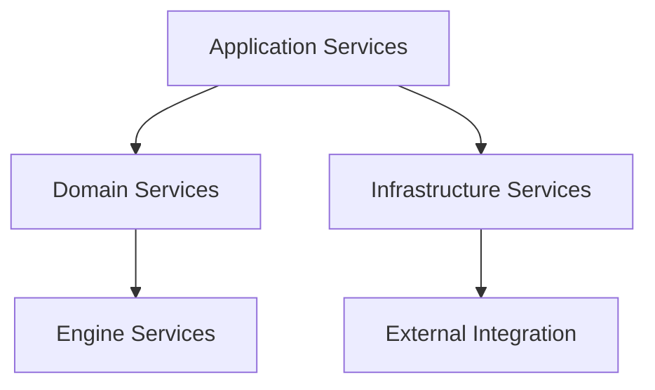
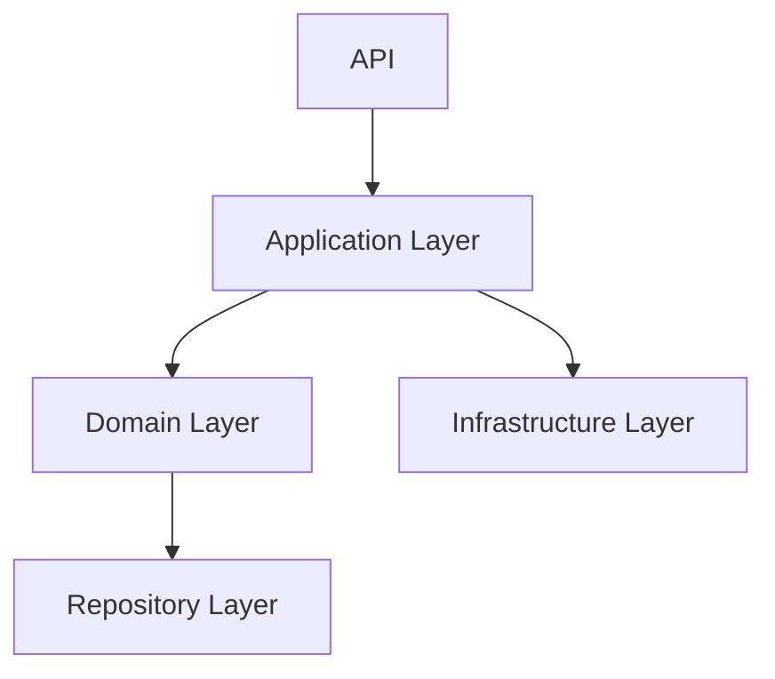
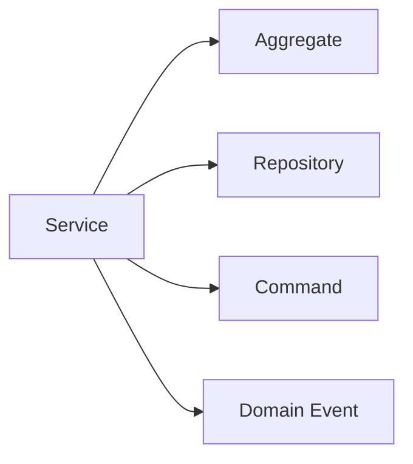
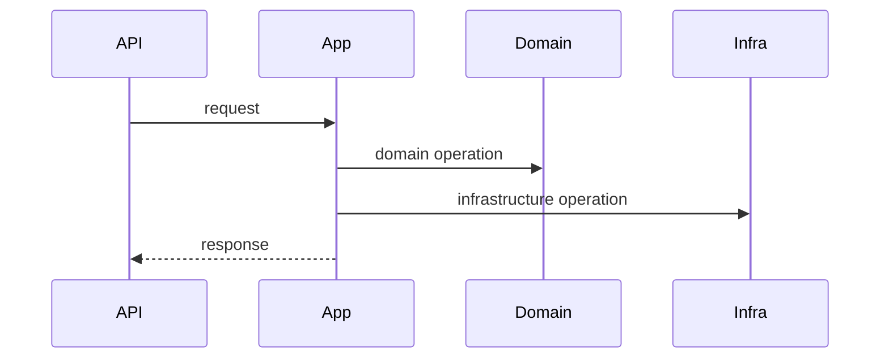
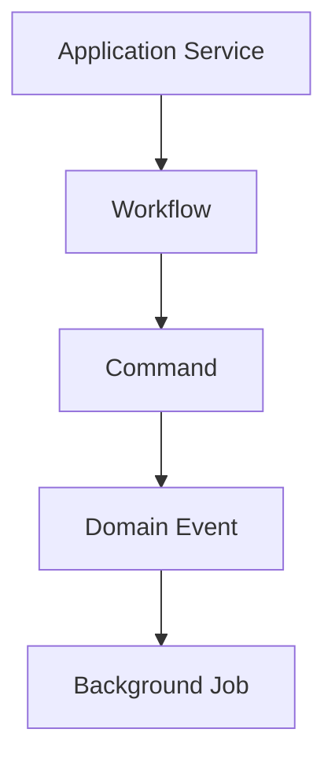
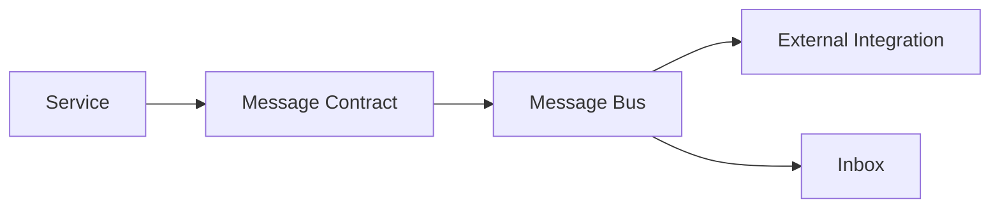

# Service Catalog

# Document Control

Document Name: Service Catalog
Document Path: knowledge/service-catalog.md
Document Type: Atlas Enterprise Canonical Specification
Version: 1.0
Status: Canonical Specification
Domain: Platform
Bounded Context: Platform
Owner: Project Atlas
Source of Truth: Atlas Service Source of Truth
Last Updated: 2026-07-12

Related Specifications:
- knowledge/domain-service-catalog.md
- knowledge/application-service-catalog.md
- knowledge/repository-catalog.md
- knowledge/aggregate-catalog.md
- knowledge/entity-catalog.md
- knowledge/command-catalog.md
- knowledge/domain-event-catalog.md
- knowledge/system-module-catalog.md
- knowledge/workflow-engine-framework.md
- knowledge/background-job-framework.md
- knowledge/scheduler-framework.md
- knowledge/automation-framework.md
- knowledge/api-governance-framework.md
- knowledge/message-contract-catalog.md
- knowledge/event-driven-architecture.md
- knowledge/integration-framework.md
- docs/04-DomainModel.md
- docs/05-DatabaseDesign.md
- docs/06-ERD.md
- docs/07-API.md

# Purpose

Service Catalog defines every approved Atlas Service across Domain Service, Application Service, Infrastructure Service, Engine, Workflow, Scheduler, Automation, Background Job, Integration, Repository, API, Message Bus, and Notification boundaries. It is the service source of truth for ownership, dependencies, operations, security, transactions, observability, and performance.

# Scope

- Application Service
- Domain Service
- Infrastructure Service
- Engine Service
- Integration Service
- Workflow Service
- Scheduler Service
- Automation Service
- Background Job Service
- Notification Service
- Projection Service
- Calculation Service
- Simulation Service
- Optimization Service
- Decision Service
- Recommendation Service

# Service Classification Standard

Every Service is classified by category, layer, owner, dependencies, consumers, interfaces, operations, transaction behavior, security, observability, and failure strategy.

# Complete Service Catalog

## DecisionApplicationService

Service Name: DecisionApplicationService
Display Name: DecisionApplicationService
Category: Application Service
Layer: Application Layer
Domain: Decision
Bounded Context: Decision Intelligence
Module: Decision
Purpose: Decision use case orchestration.
Business Meaning: DecisionApplicationService provides a catalog-approved Atlas service capability without redefining Atlas business concepts.
Responsibilities: Execute its cataloged service role, preserve boundaries, coordinate dependencies, enforce security context, and expose observable outcomes.
Non Responsibilities: No uncataloged domain ownership, no bypass of Aggregate or Repository ownership, no hidden transaction boundary, and no unapproved external dependency.
Owner: DecisionApplicationService
Dependencies: DecisionService, ScoringService, ExplainabilityService, DecisionRepository, ScenarioRepository
Consumers: API, Workflow, Command Handler
Interfaces: API, internal method, message handler, scheduler, workflow, or job interface when cataloged.
Public Operations: AcceptRecommendation, RejectRecommendation
Input DTO: DecisionDto, RecommendationDto input or internal request context.
Output DTO: DecisionDto, RecommendationDto output or domain result.
Repository Dependencies: DecisionService, ScoringService, ExplainabilityService, DecisionRepository, ScenarioRepository
Aggregate Dependencies: DecisionSession, Recommendation, Scenario
Command Dependencies: AcceptRecommendation, RejectRecommendation
Domain Event Dependencies: RecommendationGenerated, DecisionAccepted, DecisionRejected
External Dependencies: Only dependencies cataloged through Integration Framework or Service Catalog.
Workflow Dependencies: Catalog-aligned workflow when applicable.
Authorization: Caller authorization context is required before sensitive operation.
Transaction Boundary: Application Service transaction behavior follows owner catalog and caller boundary.
Consistency Boundary: Aggregate or use case consistency boundary as defined by Command, Repository, Domain Service, or Application Service catalog.
Concurrency: Version, lock, or idempotency controls are propagated where needed.
Idempotency: External mutations and asynchronous handlers use idempotency key or event id.
Retry: Retry only transient failures with known state and safe idempotency.
Compensation: Compensation uses workflow or saga catalog when applicable.
Caching: Cache only read-only deterministic outputs with scoped keys.
Logging: Structured logs include service name, operation, result, error code, and correlation identifiers.
Metrics: Latency, throughput, error rate, retry count, cache hit rate, and dependency timing are recorded.
Audit: Invocation, execution, CorrelationId, CausationId, actor, and result are recorded when business state or evidence is affected.
Security: Tenant isolation, Household isolation, permission, and data classification are respected.
Performance Target: p95 target follows owning service category and must be observable.
Failure Strategy: Return catalog error, retry transient failure, dead-letter asynchronous poison messages, or compensate through workflow when cataloged.
Example: DecisionApplicationService serves API, Workflow, Command Handler, depends on DecisionService, ScoringService, ExplainabilityService, DecisionRepository, ScenarioRepository, handles AcceptRecommendation, RejectRecommendation, and aligns events RecommendationGenerated, DecisionAccepted, DecisionRejected.
Service Control 1: DecisionApplicationService preserves category, layer, owner, dependency mapping, consumer mapping, interface contract, operation boundary, transaction boundary, consistency boundary, authorization, idempotency, retry, compensation, caching, logging, metrics, audit, security, performance target, and failure strategy.
Service Control 2: DecisionApplicationService preserves category, layer, owner, dependency mapping, consumer mapping, interface contract, operation boundary, transaction boundary, consistency boundary, authorization, idempotency, retry, compensation, caching, logging, metrics, audit, security, performance target, and failure strategy.
Service Control 3: DecisionApplicationService preserves category, layer, owner, dependency mapping, consumer mapping, interface contract, operation boundary, transaction boundary, consistency boundary, authorization, idempotency, retry, compensation, caching, logging, metrics, audit, security, performance target, and failure strategy.
Service Control 4: DecisionApplicationService preserves category, layer, owner, dependency mapping, consumer mapping, interface contract, operation boundary, transaction boundary, consistency boundary, authorization, idempotency, retry, compensation, caching, logging, metrics, audit, security, performance target, and failure strategy.
Service Control 5: DecisionApplicationService preserves category, layer, owner, dependency mapping, consumer mapping, interface contract, operation boundary, transaction boundary, consistency boundary, authorization, idempotency, retry, compensation, caching, logging, metrics, audit, security, performance target, and failure strategy.
Service Control 6: DecisionApplicationService preserves category, layer, owner, dependency mapping, consumer mapping, interface contract, operation boundary, transaction boundary, consistency boundary, authorization, idempotency, retry, compensation, caching, logging, metrics, audit, security, performance target, and failure strategy.
Service Control 7: DecisionApplicationService preserves category, layer, owner, dependency mapping, consumer mapping, interface contract, operation boundary, transaction boundary, consistency boundary, authorization, idempotency, retry, compensation, caching, logging, metrics, audit, security, performance target, and failure strategy.
Service Control 8: DecisionApplicationService preserves category, layer, owner, dependency mapping, consumer mapping, interface contract, operation boundary, transaction boundary, consistency boundary, authorization, idempotency, retry, compensation, caching, logging, metrics, audit, security, performance target, and failure strategy.
Service Control 9: DecisionApplicationService preserves category, layer, owner, dependency mapping, consumer mapping, interface contract, operation boundary, transaction boundary, consistency boundary, authorization, idempotency, retry, compensation, caching, logging, metrics, audit, security, performance target, and failure strategy.
Service Control 10: DecisionApplicationService preserves category, layer, owner, dependency mapping, consumer mapping, interface contract, operation boundary, transaction boundary, consistency boundary, authorization, idempotency, retry, compensation, caching, logging, metrics, audit, security, performance target, and failure strategy.
Service Control 11: DecisionApplicationService preserves category, layer, owner, dependency mapping, consumer mapping, interface contract, operation boundary, transaction boundary, consistency boundary, authorization, idempotency, retry, compensation, caching, logging, metrics, audit, security, performance target, and failure strategy.
Service Control 12: DecisionApplicationService preserves category, layer, owner, dependency mapping, consumer mapping, interface contract, operation boundary, transaction boundary, consistency boundary, authorization, idempotency, retry, compensation, caching, logging, metrics, audit, security, performance target, and failure strategy.
Service Control 13: DecisionApplicationService preserves category, layer, owner, dependency mapping, consumer mapping, interface contract, operation boundary, transaction boundary, consistency boundary, authorization, idempotency, retry, compensation, caching, logging, metrics, audit, security, performance target, and failure strategy.
Service Control 14: DecisionApplicationService preserves category, layer, owner, dependency mapping, consumer mapping, interface contract, operation boundary, transaction boundary, consistency boundary, authorization, idempotency, retry, compensation, caching, logging, metrics, audit, security, performance target, and failure strategy.
Service Control 15: DecisionApplicationService preserves category, layer, owner, dependency mapping, consumer mapping, interface contract, operation boundary, transaction boundary, consistency boundary, authorization, idempotency, retry, compensation, caching, logging, metrics, audit, security, performance target, and failure strategy.
Service Control 16: DecisionApplicationService preserves category, layer, owner, dependency mapping, consumer mapping, interface contract, operation boundary, transaction boundary, consistency boundary, authorization, idempotency, retry, compensation, caching, logging, metrics, audit, security, performance target, and failure strategy.
Service Control 17: DecisionApplicationService preserves category, layer, owner, dependency mapping, consumer mapping, interface contract, operation boundary, transaction boundary, consistency boundary, authorization, idempotency, retry, compensation, caching, logging, metrics, audit, security, performance target, and failure strategy.
Service Control 18: DecisionApplicationService preserves category, layer, owner, dependency mapping, consumer mapping, interface contract, operation boundary, transaction boundary, consistency boundary, authorization, idempotency, retry, compensation, caching, logging, metrics, audit, security, performance target, and failure strategy.
Service Control 19: DecisionApplicationService preserves category, layer, owner, dependency mapping, consumer mapping, interface contract, operation boundary, transaction boundary, consistency boundary, authorization, idempotency, retry, compensation, caching, logging, metrics, audit, security, performance target, and failure strategy.
Service Control 20: DecisionApplicationService preserves category, layer, owner, dependency mapping, consumer mapping, interface contract, operation boundary, transaction boundary, consistency boundary, authorization, idempotency, retry, compensation, caching, logging, metrics, audit, security, performance target, and failure strategy.
Service Control 21: DecisionApplicationService preserves category, layer, owner, dependency mapping, consumer mapping, interface contract, operation boundary, transaction boundary, consistency boundary, authorization, idempotency, retry, compensation, caching, logging, metrics, audit, security, performance target, and failure strategy.
Service Control 22: DecisionApplicationService preserves category, layer, owner, dependency mapping, consumer mapping, interface contract, operation boundary, transaction boundary, consistency boundary, authorization, idempotency, retry, compensation, caching, logging, metrics, audit, security, performance target, and failure strategy.
Service Control 23: DecisionApplicationService preserves category, layer, owner, dependency mapping, consumer mapping, interface contract, operation boundary, transaction boundary, consistency boundary, authorization, idempotency, retry, compensation, caching, logging, metrics, audit, security, performance target, and failure strategy.
Service Control 24: DecisionApplicationService preserves category, layer, owner, dependency mapping, consumer mapping, interface contract, operation boundary, transaction boundary, consistency boundary, authorization, idempotency, retry, compensation, caching, logging, metrics, audit, security, performance target, and failure strategy.
Service Control 25: DecisionApplicationService preserves category, layer, owner, dependency mapping, consumer mapping, interface contract, operation boundary, transaction boundary, consistency boundary, authorization, idempotency, retry, compensation, caching, logging, metrics, audit, security, performance target, and failure strategy.
Service Control 26: DecisionApplicationService preserves category, layer, owner, dependency mapping, consumer mapping, interface contract, operation boundary, transaction boundary, consistency boundary, authorization, idempotency, retry, compensation, caching, logging, metrics, audit, security, performance target, and failure strategy.
Service Control 27: DecisionApplicationService preserves category, layer, owner, dependency mapping, consumer mapping, interface contract, operation boundary, transaction boundary, consistency boundary, authorization, idempotency, retry, compensation, caching, logging, metrics, audit, security, performance target, and failure strategy.
Service Control 28: DecisionApplicationService preserves category, layer, owner, dependency mapping, consumer mapping, interface contract, operation boundary, transaction boundary, consistency boundary, authorization, idempotency, retry, compensation, caching, logging, metrics, audit, security, performance target, and failure strategy.
Service Control 29: DecisionApplicationService preserves category, layer, owner, dependency mapping, consumer mapping, interface contract, operation boundary, transaction boundary, consistency boundary, authorization, idempotency, retry, compensation, caching, logging, metrics, audit, security, performance target, and failure strategy.
Service Control 30: DecisionApplicationService preserves category, layer, owner, dependency mapping, consumer mapping, interface contract, operation boundary, transaction boundary, consistency boundary, authorization, idempotency, retry, compensation, caching, logging, metrics, audit, security, performance target, and failure strategy.
Service Control 31: DecisionApplicationService preserves category, layer, owner, dependency mapping, consumer mapping, interface contract, operation boundary, transaction boundary, consistency boundary, authorization, idempotency, retry, compensation, caching, logging, metrics, audit, security, performance target, and failure strategy.
Service Control 32: DecisionApplicationService preserves category, layer, owner, dependency mapping, consumer mapping, interface contract, operation boundary, transaction boundary, consistency boundary, authorization, idempotency, retry, compensation, caching, logging, metrics, audit, security, performance target, and failure strategy.
Service Control 33: DecisionApplicationService preserves category, layer, owner, dependency mapping, consumer mapping, interface contract, operation boundary, transaction boundary, consistency boundary, authorization, idempotency, retry, compensation, caching, logging, metrics, audit, security, performance target, and failure strategy.
Service Control 34: DecisionApplicationService preserves category, layer, owner, dependency mapping, consumer mapping, interface contract, operation boundary, transaction boundary, consistency boundary, authorization, idempotency, retry, compensation, caching, logging, metrics, audit, security, performance target, and failure strategy.
Service Control 35: DecisionApplicationService preserves category, layer, owner, dependency mapping, consumer mapping, interface contract, operation boundary, transaction boundary, consistency boundary, authorization, idempotency, retry, compensation, caching, logging, metrics, audit, security, performance target, and failure strategy.
Service Control 36: DecisionApplicationService preserves category, layer, owner, dependency mapping, consumer mapping, interface contract, operation boundary, transaction boundary, consistency boundary, authorization, idempotency, retry, compensation, caching, logging, metrics, audit, security, performance target, and failure strategy.
Service Control 37: DecisionApplicationService preserves category, layer, owner, dependency mapping, consumer mapping, interface contract, operation boundary, transaction boundary, consistency boundary, authorization, idempotency, retry, compensation, caching, logging, metrics, audit, security, performance target, and failure strategy.
Service Control 38: DecisionApplicationService preserves category, layer, owner, dependency mapping, consumer mapping, interface contract, operation boundary, transaction boundary, consistency boundary, authorization, idempotency, retry, compensation, caching, logging, metrics, audit, security, performance target, and failure strategy.
Service Control 39: DecisionApplicationService preserves category, layer, owner, dependency mapping, consumer mapping, interface contract, operation boundary, transaction boundary, consistency boundary, authorization, idempotency, retry, compensation, caching, logging, metrics, audit, security, performance target, and failure strategy.
Service Control 40: DecisionApplicationService preserves category, layer, owner, dependency mapping, consumer mapping, interface contract, operation boundary, transaction boundary, consistency boundary, authorization, idempotency, retry, compensation, caching, logging, metrics, audit, security, performance target, and failure strategy.
Service Control 41: DecisionApplicationService preserves category, layer, owner, dependency mapping, consumer mapping, interface contract, operation boundary, transaction boundary, consistency boundary, authorization, idempotency, retry, compensation, caching, logging, metrics, audit, security, performance target, and failure strategy.
Service Control 42: DecisionApplicationService preserves category, layer, owner, dependency mapping, consumer mapping, interface contract, operation boundary, transaction boundary, consistency boundary, authorization, idempotency, retry, compensation, caching, logging, metrics, audit, security, performance target, and failure strategy.
Service Control 43: DecisionApplicationService preserves category, layer, owner, dependency mapping, consumer mapping, interface contract, operation boundary, transaction boundary, consistency boundary, authorization, idempotency, retry, compensation, caching, logging, metrics, audit, security, performance target, and failure strategy.
Service Control 44: DecisionApplicationService preserves category, layer, owner, dependency mapping, consumer mapping, interface contract, operation boundary, transaction boundary, consistency boundary, authorization, idempotency, retry, compensation, caching, logging, metrics, audit, security, performance target, and failure strategy.
Service Control 45: DecisionApplicationService preserves category, layer, owner, dependency mapping, consumer mapping, interface contract, operation boundary, transaction boundary, consistency boundary, authorization, idempotency, retry, compensation, caching, logging, metrics, audit, security, performance target, and failure strategy.
Service Control 46: DecisionApplicationService preserves category, layer, owner, dependency mapping, consumer mapping, interface contract, operation boundary, transaction boundary, consistency boundary, authorization, idempotency, retry, compensation, caching, logging, metrics, audit, security, performance target, and failure strategy.
Service Control 47: DecisionApplicationService preserves category, layer, owner, dependency mapping, consumer mapping, interface contract, operation boundary, transaction boundary, consistency boundary, authorization, idempotency, retry, compensation, caching, logging, metrics, audit, security, performance target, and failure strategy.
Service Control 48: DecisionApplicationService preserves category, layer, owner, dependency mapping, consumer mapping, interface contract, operation boundary, transaction boundary, consistency boundary, authorization, idempotency, retry, compensation, caching, logging, metrics, audit, security, performance target, and failure strategy.
Service Control 49: DecisionApplicationService preserves category, layer, owner, dependency mapping, consumer mapping, interface contract, operation boundary, transaction boundary, consistency boundary, authorization, idempotency, retry, compensation, caching, logging, metrics, audit, security, performance target, and failure strategy.
Service Control 50: DecisionApplicationService preserves category, layer, owner, dependency mapping, consumer mapping, interface contract, operation boundary, transaction boundary, consistency boundary, authorization, idempotency, retry, compensation, caching, logging, metrics, audit, security, performance target, and failure strategy.
Service Control 51: DecisionApplicationService preserves category, layer, owner, dependency mapping, consumer mapping, interface contract, operation boundary, transaction boundary, consistency boundary, authorization, idempotency, retry, compensation, caching, logging, metrics, audit, security, performance target, and failure strategy.
Service Control 52: DecisionApplicationService preserves category, layer, owner, dependency mapping, consumer mapping, interface contract, operation boundary, transaction boundary, consistency boundary, authorization, idempotency, retry, compensation, caching, logging, metrics, audit, security, performance target, and failure strategy.
Service Control 53: DecisionApplicationService preserves category, layer, owner, dependency mapping, consumer mapping, interface contract, operation boundary, transaction boundary, consistency boundary, authorization, idempotency, retry, compensation, caching, logging, metrics, audit, security, performance target, and failure strategy.
Service Control 54: DecisionApplicationService preserves category, layer, owner, dependency mapping, consumer mapping, interface contract, operation boundary, transaction boundary, consistency boundary, authorization, idempotency, retry, compensation, caching, logging, metrics, audit, security, performance target, and failure strategy.
Service Control 55: DecisionApplicationService preserves category, layer, owner, dependency mapping, consumer mapping, interface contract, operation boundary, transaction boundary, consistency boundary, authorization, idempotency, retry, compensation, caching, logging, metrics, audit, security, performance target, and failure strategy.
Service Control 56: DecisionApplicationService preserves category, layer, owner, dependency mapping, consumer mapping, interface contract, operation boundary, transaction boundary, consistency boundary, authorization, idempotency, retry, compensation, caching, logging, metrics, audit, security, performance target, and failure strategy.
Service Control 57: DecisionApplicationService preserves category, layer, owner, dependency mapping, consumer mapping, interface contract, operation boundary, transaction boundary, consistency boundary, authorization, idempotency, retry, compensation, caching, logging, metrics, audit, security, performance target, and failure strategy.
Service Control 58: DecisionApplicationService preserves category, layer, owner, dependency mapping, consumer mapping, interface contract, operation boundary, transaction boundary, consistency boundary, authorization, idempotency, retry, compensation, caching, logging, metrics, audit, security, performance target, and failure strategy.
Service Control 59: DecisionApplicationService preserves category, layer, owner, dependency mapping, consumer mapping, interface contract, operation boundary, transaction boundary, consistency boundary, authorization, idempotency, retry, compensation, caching, logging, metrics, audit, security, performance target, and failure strategy.
Service Control 60: DecisionApplicationService preserves category, layer, owner, dependency mapping, consumer mapping, interface contract, operation boundary, transaction boundary, consistency boundary, authorization, idempotency, retry, compensation, caching, logging, metrics, audit, security, performance target, and failure strategy.
Service Control 61: DecisionApplicationService preserves category, layer, owner, dependency mapping, consumer mapping, interface contract, operation boundary, transaction boundary, consistency boundary, authorization, idempotency, retry, compensation, caching, logging, metrics, audit, security, performance target, and failure strategy.
Service Control 62: DecisionApplicationService preserves category, layer, owner, dependency mapping, consumer mapping, interface contract, operation boundary, transaction boundary, consistency boundary, authorization, idempotency, retry, compensation, caching, logging, metrics, audit, security, performance target, and failure strategy.
Service Control 63: DecisionApplicationService preserves category, layer, owner, dependency mapping, consumer mapping, interface contract, operation boundary, transaction boundary, consistency boundary, authorization, idempotency, retry, compensation, caching, logging, metrics, audit, security, performance target, and failure strategy.
Service Control 64: DecisionApplicationService preserves category, layer, owner, dependency mapping, consumer mapping, interface contract, operation boundary, transaction boundary, consistency boundary, authorization, idempotency, retry, compensation, caching, logging, metrics, audit, security, performance target, and failure strategy.
Service Control 65: DecisionApplicationService preserves category, layer, owner, dependency mapping, consumer mapping, interface contract, operation boundary, transaction boundary, consistency boundary, authorization, idempotency, retry, compensation, caching, logging, metrics, audit, security, performance target, and failure strategy.

## ScenarioApplicationService

Service Name: ScenarioApplicationService
Display Name: ScenarioApplicationService
Category: Application Service
Layer: Application Layer
Domain: Scenario
Bounded Context: Decision Intelligence
Module: Scenario
Purpose: Scenario evaluation and replay orchestration.
Business Meaning: ScenarioApplicationService provides a catalog-approved Atlas service capability without redefining Atlas business concepts.
Responsibilities: Execute its cataloged service role, preserve boundaries, coordinate dependencies, enforce security context, and expose observable outcomes.
Non Responsibilities: No uncataloged domain ownership, no bypass of Aggregate or Repository ownership, no hidden transaction boundary, and no unapproved external dependency.
Owner: ScenarioApplicationService
Dependencies: ScenarioService, ScoringService, RiskService, ScenarioRepository, DecisionRepository
Consumers: API, Scheduler, Workflow
Interfaces: API, internal method, message handler, scheduler, workflow, or job interface when cataloged.
Public Operations: EvaluateScenario, ReplayScenario
Input DTO: ScenarioDto, ScenarioResultDto input or internal request context.
Output DTO: ScenarioDto, ScenarioResultDto output or domain result.
Repository Dependencies: ScenarioService, ScoringService, RiskService, ScenarioRepository, DecisionRepository
Aggregate Dependencies: Scenario, DecisionSession
Command Dependencies: EvaluateScenario, ReplayScenario
Domain Event Dependencies: ScenarioEvaluated, SnapshotCreated, ReplayCompleted
External Dependencies: Only dependencies cataloged through Integration Framework or Service Catalog.
Workflow Dependencies: Catalog-aligned workflow when applicable.
Authorization: Caller authorization context is required before sensitive operation.
Transaction Boundary: Application Service transaction behavior follows owner catalog and caller boundary.
Consistency Boundary: Aggregate or use case consistency boundary as defined by Command, Repository, Domain Service, or Application Service catalog.
Concurrency: Version, lock, or idempotency controls are propagated where needed.
Idempotency: External mutations and asynchronous handlers use idempotency key or event id.
Retry: Retry only transient failures with known state and safe idempotency.
Compensation: Compensation uses workflow or saga catalog when applicable.
Caching: Cache only read-only deterministic outputs with scoped keys.
Logging: Structured logs include service name, operation, result, error code, and correlation identifiers.
Metrics: Latency, throughput, error rate, retry count, cache hit rate, and dependency timing are recorded.
Audit: Invocation, execution, CorrelationId, CausationId, actor, and result are recorded when business state or evidence is affected.
Security: Tenant isolation, Household isolation, permission, and data classification are respected.
Performance Target: p95 target follows owning service category and must be observable.
Failure Strategy: Return catalog error, retry transient failure, dead-letter asynchronous poison messages, or compensate through workflow when cataloged.
Example: ScenarioApplicationService serves API, Scheduler, Workflow, depends on ScenarioService, ScoringService, RiskService, ScenarioRepository, DecisionRepository, handles EvaluateScenario, ReplayScenario, and aligns events ScenarioEvaluated, SnapshotCreated, ReplayCompleted.
Service Control 1: ScenarioApplicationService preserves category, layer, owner, dependency mapping, consumer mapping, interface contract, operation boundary, transaction boundary, consistency boundary, authorization, idempotency, retry, compensation, caching, logging, metrics, audit, security, performance target, and failure strategy.
Service Control 2: ScenarioApplicationService preserves category, layer, owner, dependency mapping, consumer mapping, interface contract, operation boundary, transaction boundary, consistency boundary, authorization, idempotency, retry, compensation, caching, logging, metrics, audit, security, performance target, and failure strategy.
Service Control 3: ScenarioApplicationService preserves category, layer, owner, dependency mapping, consumer mapping, interface contract, operation boundary, transaction boundary, consistency boundary, authorization, idempotency, retry, compensation, caching, logging, metrics, audit, security, performance target, and failure strategy.
Service Control 4: ScenarioApplicationService preserves category, layer, owner, dependency mapping, consumer mapping, interface contract, operation boundary, transaction boundary, consistency boundary, authorization, idempotency, retry, compensation, caching, logging, metrics, audit, security, performance target, and failure strategy.
Service Control 5: ScenarioApplicationService preserves category, layer, owner, dependency mapping, consumer mapping, interface contract, operation boundary, transaction boundary, consistency boundary, authorization, idempotency, retry, compensation, caching, logging, metrics, audit, security, performance target, and failure strategy.
Service Control 6: ScenarioApplicationService preserves category, layer, owner, dependency mapping, consumer mapping, interface contract, operation boundary, transaction boundary, consistency boundary, authorization, idempotency, retry, compensation, caching, logging, metrics, audit, security, performance target, and failure strategy.
Service Control 7: ScenarioApplicationService preserves category, layer, owner, dependency mapping, consumer mapping, interface contract, operation boundary, transaction boundary, consistency boundary, authorization, idempotency, retry, compensation, caching, logging, metrics, audit, security, performance target, and failure strategy.
Service Control 8: ScenarioApplicationService preserves category, layer, owner, dependency mapping, consumer mapping, interface contract, operation boundary, transaction boundary, consistency boundary, authorization, idempotency, retry, compensation, caching, logging, metrics, audit, security, performance target, and failure strategy.
Service Control 9: ScenarioApplicationService preserves category, layer, owner, dependency mapping, consumer mapping, interface contract, operation boundary, transaction boundary, consistency boundary, authorization, idempotency, retry, compensation, caching, logging, metrics, audit, security, performance target, and failure strategy.
Service Control 10: ScenarioApplicationService preserves category, layer, owner, dependency mapping, consumer mapping, interface contract, operation boundary, transaction boundary, consistency boundary, authorization, idempotency, retry, compensation, caching, logging, metrics, audit, security, performance target, and failure strategy.
Service Control 11: ScenarioApplicationService preserves category, layer, owner, dependency mapping, consumer mapping, interface contract, operation boundary, transaction boundary, consistency boundary, authorization, idempotency, retry, compensation, caching, logging, metrics, audit, security, performance target, and failure strategy.
Service Control 12: ScenarioApplicationService preserves category, layer, owner, dependency mapping, consumer mapping, interface contract, operation boundary, transaction boundary, consistency boundary, authorization, idempotency, retry, compensation, caching, logging, metrics, audit, security, performance target, and failure strategy.
Service Control 13: ScenarioApplicationService preserves category, layer, owner, dependency mapping, consumer mapping, interface contract, operation boundary, transaction boundary, consistency boundary, authorization, idempotency, retry, compensation, caching, logging, metrics, audit, security, performance target, and failure strategy.
Service Control 14: ScenarioApplicationService preserves category, layer, owner, dependency mapping, consumer mapping, interface contract, operation boundary, transaction boundary, consistency boundary, authorization, idempotency, retry, compensation, caching, logging, metrics, audit, security, performance target, and failure strategy.
Service Control 15: ScenarioApplicationService preserves category, layer, owner, dependency mapping, consumer mapping, interface contract, operation boundary, transaction boundary, consistency boundary, authorization, idempotency, retry, compensation, caching, logging, metrics, audit, security, performance target, and failure strategy.
Service Control 16: ScenarioApplicationService preserves category, layer, owner, dependency mapping, consumer mapping, interface contract, operation boundary, transaction boundary, consistency boundary, authorization, idempotency, retry, compensation, caching, logging, metrics, audit, security, performance target, and failure strategy.
Service Control 17: ScenarioApplicationService preserves category, layer, owner, dependency mapping, consumer mapping, interface contract, operation boundary, transaction boundary, consistency boundary, authorization, idempotency, retry, compensation, caching, logging, metrics, audit, security, performance target, and failure strategy.
Service Control 18: ScenarioApplicationService preserves category, layer, owner, dependency mapping, consumer mapping, interface contract, operation boundary, transaction boundary, consistency boundary, authorization, idempotency, retry, compensation, caching, logging, metrics, audit, security, performance target, and failure strategy.
Service Control 19: ScenarioApplicationService preserves category, layer, owner, dependency mapping, consumer mapping, interface contract, operation boundary, transaction boundary, consistency boundary, authorization, idempotency, retry, compensation, caching, logging, metrics, audit, security, performance target, and failure strategy.
Service Control 20: ScenarioApplicationService preserves category, layer, owner, dependency mapping, consumer mapping, interface contract, operation boundary, transaction boundary, consistency boundary, authorization, idempotency, retry, compensation, caching, logging, metrics, audit, security, performance target, and failure strategy.
Service Control 21: ScenarioApplicationService preserves category, layer, owner, dependency mapping, consumer mapping, interface contract, operation boundary, transaction boundary, consistency boundary, authorization, idempotency, retry, compensation, caching, logging, metrics, audit, security, performance target, and failure strategy.
Service Control 22: ScenarioApplicationService preserves category, layer, owner, dependency mapping, consumer mapping, interface contract, operation boundary, transaction boundary, consistency boundary, authorization, idempotency, retry, compensation, caching, logging, metrics, audit, security, performance target, and failure strategy.
Service Control 23: ScenarioApplicationService preserves category, layer, owner, dependency mapping, consumer mapping, interface contract, operation boundary, transaction boundary, consistency boundary, authorization, idempotency, retry, compensation, caching, logging, metrics, audit, security, performance target, and failure strategy.
Service Control 24: ScenarioApplicationService preserves category, layer, owner, dependency mapping, consumer mapping, interface contract, operation boundary, transaction boundary, consistency boundary, authorization, idempotency, retry, compensation, caching, logging, metrics, audit, security, performance target, and failure strategy.
Service Control 25: ScenarioApplicationService preserves category, layer, owner, dependency mapping, consumer mapping, interface contract, operation boundary, transaction boundary, consistency boundary, authorization, idempotency, retry, compensation, caching, logging, metrics, audit, security, performance target, and failure strategy.
Service Control 26: ScenarioApplicationService preserves category, layer, owner, dependency mapping, consumer mapping, interface contract, operation boundary, transaction boundary, consistency boundary, authorization, idempotency, retry, compensation, caching, logging, metrics, audit, security, performance target, and failure strategy.
Service Control 27: ScenarioApplicationService preserves category, layer, owner, dependency mapping, consumer mapping, interface contract, operation boundary, transaction boundary, consistency boundary, authorization, idempotency, retry, compensation, caching, logging, metrics, audit, security, performance target, and failure strategy.
Service Control 28: ScenarioApplicationService preserves category, layer, owner, dependency mapping, consumer mapping, interface contract, operation boundary, transaction boundary, consistency boundary, authorization, idempotency, retry, compensation, caching, logging, metrics, audit, security, performance target, and failure strategy.
Service Control 29: ScenarioApplicationService preserves category, layer, owner, dependency mapping, consumer mapping, interface contract, operation boundary, transaction boundary, consistency boundary, authorization, idempotency, retry, compensation, caching, logging, metrics, audit, security, performance target, and failure strategy.
Service Control 30: ScenarioApplicationService preserves category, layer, owner, dependency mapping, consumer mapping, interface contract, operation boundary, transaction boundary, consistency boundary, authorization, idempotency, retry, compensation, caching, logging, metrics, audit, security, performance target, and failure strategy.
Service Control 31: ScenarioApplicationService preserves category, layer, owner, dependency mapping, consumer mapping, interface contract, operation boundary, transaction boundary, consistency boundary, authorization, idempotency, retry, compensation, caching, logging, metrics, audit, security, performance target, and failure strategy.
Service Control 32: ScenarioApplicationService preserves category, layer, owner, dependency mapping, consumer mapping, interface contract, operation boundary, transaction boundary, consistency boundary, authorization, idempotency, retry, compensation, caching, logging, metrics, audit, security, performance target, and failure strategy.
Service Control 33: ScenarioApplicationService preserves category, layer, owner, dependency mapping, consumer mapping, interface contract, operation boundary, transaction boundary, consistency boundary, authorization, idempotency, retry, compensation, caching, logging, metrics, audit, security, performance target, and failure strategy.
Service Control 34: ScenarioApplicationService preserves category, layer, owner, dependency mapping, consumer mapping, interface contract, operation boundary, transaction boundary, consistency boundary, authorization, idempotency, retry, compensation, caching, logging, metrics, audit, security, performance target, and failure strategy.
Service Control 35: ScenarioApplicationService preserves category, layer, owner, dependency mapping, consumer mapping, interface contract, operation boundary, transaction boundary, consistency boundary, authorization, idempotency, retry, compensation, caching, logging, metrics, audit, security, performance target, and failure strategy.
Service Control 36: ScenarioApplicationService preserves category, layer, owner, dependency mapping, consumer mapping, interface contract, operation boundary, transaction boundary, consistency boundary, authorization, idempotency, retry, compensation, caching, logging, metrics, audit, security, performance target, and failure strategy.
Service Control 37: ScenarioApplicationService preserves category, layer, owner, dependency mapping, consumer mapping, interface contract, operation boundary, transaction boundary, consistency boundary, authorization, idempotency, retry, compensation, caching, logging, metrics, audit, security, performance target, and failure strategy.
Service Control 38: ScenarioApplicationService preserves category, layer, owner, dependency mapping, consumer mapping, interface contract, operation boundary, transaction boundary, consistency boundary, authorization, idempotency, retry, compensation, caching, logging, metrics, audit, security, performance target, and failure strategy.
Service Control 39: ScenarioApplicationService preserves category, layer, owner, dependency mapping, consumer mapping, interface contract, operation boundary, transaction boundary, consistency boundary, authorization, idempotency, retry, compensation, caching, logging, metrics, audit, security, performance target, and failure strategy.
Service Control 40: ScenarioApplicationService preserves category, layer, owner, dependency mapping, consumer mapping, interface contract, operation boundary, transaction boundary, consistency boundary, authorization, idempotency, retry, compensation, caching, logging, metrics, audit, security, performance target, and failure strategy.
Service Control 41: ScenarioApplicationService preserves category, layer, owner, dependency mapping, consumer mapping, interface contract, operation boundary, transaction boundary, consistency boundary, authorization, idempotency, retry, compensation, caching, logging, metrics, audit, security, performance target, and failure strategy.
Service Control 42: ScenarioApplicationService preserves category, layer, owner, dependency mapping, consumer mapping, interface contract, operation boundary, transaction boundary, consistency boundary, authorization, idempotency, retry, compensation, caching, logging, metrics, audit, security, performance target, and failure strategy.
Service Control 43: ScenarioApplicationService preserves category, layer, owner, dependency mapping, consumer mapping, interface contract, operation boundary, transaction boundary, consistency boundary, authorization, idempotency, retry, compensation, caching, logging, metrics, audit, security, performance target, and failure strategy.
Service Control 44: ScenarioApplicationService preserves category, layer, owner, dependency mapping, consumer mapping, interface contract, operation boundary, transaction boundary, consistency boundary, authorization, idempotency, retry, compensation, caching, logging, metrics, audit, security, performance target, and failure strategy.
Service Control 45: ScenarioApplicationService preserves category, layer, owner, dependency mapping, consumer mapping, interface contract, operation boundary, transaction boundary, consistency boundary, authorization, idempotency, retry, compensation, caching, logging, metrics, audit, security, performance target, and failure strategy.
Service Control 46: ScenarioApplicationService preserves category, layer, owner, dependency mapping, consumer mapping, interface contract, operation boundary, transaction boundary, consistency boundary, authorization, idempotency, retry, compensation, caching, logging, metrics, audit, security, performance target, and failure strategy.
Service Control 47: ScenarioApplicationService preserves category, layer, owner, dependency mapping, consumer mapping, interface contract, operation boundary, transaction boundary, consistency boundary, authorization, idempotency, retry, compensation, caching, logging, metrics, audit, security, performance target, and failure strategy.
Service Control 48: ScenarioApplicationService preserves category, layer, owner, dependency mapping, consumer mapping, interface contract, operation boundary, transaction boundary, consistency boundary, authorization, idempotency, retry, compensation, caching, logging, metrics, audit, security, performance target, and failure strategy.
Service Control 49: ScenarioApplicationService preserves category, layer, owner, dependency mapping, consumer mapping, interface contract, operation boundary, transaction boundary, consistency boundary, authorization, idempotency, retry, compensation, caching, logging, metrics, audit, security, performance target, and failure strategy.
Service Control 50: ScenarioApplicationService preserves category, layer, owner, dependency mapping, consumer mapping, interface contract, operation boundary, transaction boundary, consistency boundary, authorization, idempotency, retry, compensation, caching, logging, metrics, audit, security, performance target, and failure strategy.
Service Control 51: ScenarioApplicationService preserves category, layer, owner, dependency mapping, consumer mapping, interface contract, operation boundary, transaction boundary, consistency boundary, authorization, idempotency, retry, compensation, caching, logging, metrics, audit, security, performance target, and failure strategy.
Service Control 52: ScenarioApplicationService preserves category, layer, owner, dependency mapping, consumer mapping, interface contract, operation boundary, transaction boundary, consistency boundary, authorization, idempotency, retry, compensation, caching, logging, metrics, audit, security, performance target, and failure strategy.
Service Control 53: ScenarioApplicationService preserves category, layer, owner, dependency mapping, consumer mapping, interface contract, operation boundary, transaction boundary, consistency boundary, authorization, idempotency, retry, compensation, caching, logging, metrics, audit, security, performance target, and failure strategy.
Service Control 54: ScenarioApplicationService preserves category, layer, owner, dependency mapping, consumer mapping, interface contract, operation boundary, transaction boundary, consistency boundary, authorization, idempotency, retry, compensation, caching, logging, metrics, audit, security, performance target, and failure strategy.
Service Control 55: ScenarioApplicationService preserves category, layer, owner, dependency mapping, consumer mapping, interface contract, operation boundary, transaction boundary, consistency boundary, authorization, idempotency, retry, compensation, caching, logging, metrics, audit, security, performance target, and failure strategy.
Service Control 56: ScenarioApplicationService preserves category, layer, owner, dependency mapping, consumer mapping, interface contract, operation boundary, transaction boundary, consistency boundary, authorization, idempotency, retry, compensation, caching, logging, metrics, audit, security, performance target, and failure strategy.
Service Control 57: ScenarioApplicationService preserves category, layer, owner, dependency mapping, consumer mapping, interface contract, operation boundary, transaction boundary, consistency boundary, authorization, idempotency, retry, compensation, caching, logging, metrics, audit, security, performance target, and failure strategy.
Service Control 58: ScenarioApplicationService preserves category, layer, owner, dependency mapping, consumer mapping, interface contract, operation boundary, transaction boundary, consistency boundary, authorization, idempotency, retry, compensation, caching, logging, metrics, audit, security, performance target, and failure strategy.
Service Control 59: ScenarioApplicationService preserves category, layer, owner, dependency mapping, consumer mapping, interface contract, operation boundary, transaction boundary, consistency boundary, authorization, idempotency, retry, compensation, caching, logging, metrics, audit, security, performance target, and failure strategy.
Service Control 60: ScenarioApplicationService preserves category, layer, owner, dependency mapping, consumer mapping, interface contract, operation boundary, transaction boundary, consistency boundary, authorization, idempotency, retry, compensation, caching, logging, metrics, audit, security, performance target, and failure strategy.
Service Control 61: ScenarioApplicationService preserves category, layer, owner, dependency mapping, consumer mapping, interface contract, operation boundary, transaction boundary, consistency boundary, authorization, idempotency, retry, compensation, caching, logging, metrics, audit, security, performance target, and failure strategy.
Service Control 62: ScenarioApplicationService preserves category, layer, owner, dependency mapping, consumer mapping, interface contract, operation boundary, transaction boundary, consistency boundary, authorization, idempotency, retry, compensation, caching, logging, metrics, audit, security, performance target, and failure strategy.
Service Control 63: ScenarioApplicationService preserves category, layer, owner, dependency mapping, consumer mapping, interface contract, operation boundary, transaction boundary, consistency boundary, authorization, idempotency, retry, compensation, caching, logging, metrics, audit, security, performance target, and failure strategy.
Service Control 64: ScenarioApplicationService preserves category, layer, owner, dependency mapping, consumer mapping, interface contract, operation boundary, transaction boundary, consistency boundary, authorization, idempotency, retry, compensation, caching, logging, metrics, audit, security, performance target, and failure strategy.
Service Control 65: ScenarioApplicationService preserves category, layer, owner, dependency mapping, consumer mapping, interface contract, operation boundary, transaction boundary, consistency boundary, authorization, idempotency, retry, compensation, caching, logging, metrics, audit, security, performance target, and failure strategy.

## GoalApplicationService

Service Name: GoalApplicationService
Display Name: GoalApplicationService
Category: Application Service
Layer: Application Layer
Domain: Goal
Bounded Context: Financial Planning
Module: Goal
Purpose: Goal use case orchestration retained from Service Catalog.
Business Meaning: GoalApplicationService provides a catalog-approved Atlas service capability without redefining Atlas business concepts.
Responsibilities: Execute its cataloged service role, preserve boundaries, coordinate dependencies, enforce security context, and expose observable outcomes.
Non Responsibilities: No uncataloged domain ownership, no bypass of Aggregate or Repository ownership, no hidden transaction boundary, and no unapproved external dependency.
Owner: GoalApplicationService
Dependencies: GoalRepository, RetirementService, CashFlowService
Consumers: API, Workflow
Interfaces: API, internal method, message handler, scheduler, workflow, or job interface when cataloged.
Public Operations: UpdateRetirementPlan
Input DTO: GoalDto input or internal request context.
Output DTO: GoalDto output or domain result.
Repository Dependencies: GoalRepository, RetirementService, CashFlowService
Aggregate Dependencies: GoalPlan, RetirementPlan
Command Dependencies: UpdateRetirementPlan
Domain Event Dependencies: RetirementPlanUpdated, RetirementGoalReached
External Dependencies: Only dependencies cataloged through Integration Framework or Service Catalog.
Workflow Dependencies: Catalog-aligned workflow when applicable.
Authorization: Caller authorization context is required before sensitive operation.
Transaction Boundary: Application Service transaction behavior follows owner catalog and caller boundary.
Consistency Boundary: Aggregate or use case consistency boundary as defined by Command, Repository, Domain Service, or Application Service catalog.
Concurrency: Version, lock, or idempotency controls are propagated where needed.
Idempotency: External mutations and asynchronous handlers use idempotency key or event id.
Retry: Retry only transient failures with known state and safe idempotency.
Compensation: Compensation uses workflow or saga catalog when applicable.
Caching: Cache only read-only deterministic outputs with scoped keys.
Logging: Structured logs include service name, operation, result, error code, and correlation identifiers.
Metrics: Latency, throughput, error rate, retry count, cache hit rate, and dependency timing are recorded.
Audit: Invocation, execution, CorrelationId, CausationId, actor, and result are recorded when business state or evidence is affected.
Security: Tenant isolation, Household isolation, permission, and data classification are respected.
Performance Target: p95 target follows owning service category and must be observable.
Failure Strategy: Return catalog error, retry transient failure, dead-letter asynchronous poison messages, or compensate through workflow when cataloged.
Example: GoalApplicationService serves API, Workflow, depends on GoalRepository, RetirementService, CashFlowService, handles UpdateRetirementPlan, and aligns events RetirementPlanUpdated, RetirementGoalReached.
Service Control 1: GoalApplicationService preserves category, layer, owner, dependency mapping, consumer mapping, interface contract, operation boundary, transaction boundary, consistency boundary, authorization, idempotency, retry, compensation, caching, logging, metrics, audit, security, performance target, and failure strategy.
Service Control 2: GoalApplicationService preserves category, layer, owner, dependency mapping, consumer mapping, interface contract, operation boundary, transaction boundary, consistency boundary, authorization, idempotency, retry, compensation, caching, logging, metrics, audit, security, performance target, and failure strategy.
Service Control 3: GoalApplicationService preserves category, layer, owner, dependency mapping, consumer mapping, interface contract, operation boundary, transaction boundary, consistency boundary, authorization, idempotency, retry, compensation, caching, logging, metrics, audit, security, performance target, and failure strategy.
Service Control 4: GoalApplicationService preserves category, layer, owner, dependency mapping, consumer mapping, interface contract, operation boundary, transaction boundary, consistency boundary, authorization, idempotency, retry, compensation, caching, logging, metrics, audit, security, performance target, and failure strategy.
Service Control 5: GoalApplicationService preserves category, layer, owner, dependency mapping, consumer mapping, interface contract, operation boundary, transaction boundary, consistency boundary, authorization, idempotency, retry, compensation, caching, logging, metrics, audit, security, performance target, and failure strategy.
Service Control 6: GoalApplicationService preserves category, layer, owner, dependency mapping, consumer mapping, interface contract, operation boundary, transaction boundary, consistency boundary, authorization, idempotency, retry, compensation, caching, logging, metrics, audit, security, performance target, and failure strategy.
Service Control 7: GoalApplicationService preserves category, layer, owner, dependency mapping, consumer mapping, interface contract, operation boundary, transaction boundary, consistency boundary, authorization, idempotency, retry, compensation, caching, logging, metrics, audit, security, performance target, and failure strategy.
Service Control 8: GoalApplicationService preserves category, layer, owner, dependency mapping, consumer mapping, interface contract, operation boundary, transaction boundary, consistency boundary, authorization, idempotency, retry, compensation, caching, logging, metrics, audit, security, performance target, and failure strategy.
Service Control 9: GoalApplicationService preserves category, layer, owner, dependency mapping, consumer mapping, interface contract, operation boundary, transaction boundary, consistency boundary, authorization, idempotency, retry, compensation, caching, logging, metrics, audit, security, performance target, and failure strategy.
Service Control 10: GoalApplicationService preserves category, layer, owner, dependency mapping, consumer mapping, interface contract, operation boundary, transaction boundary, consistency boundary, authorization, idempotency, retry, compensation, caching, logging, metrics, audit, security, performance target, and failure strategy.
Service Control 11: GoalApplicationService preserves category, layer, owner, dependency mapping, consumer mapping, interface contract, operation boundary, transaction boundary, consistency boundary, authorization, idempotency, retry, compensation, caching, logging, metrics, audit, security, performance target, and failure strategy.
Service Control 12: GoalApplicationService preserves category, layer, owner, dependency mapping, consumer mapping, interface contract, operation boundary, transaction boundary, consistency boundary, authorization, idempotency, retry, compensation, caching, logging, metrics, audit, security, performance target, and failure strategy.
Service Control 13: GoalApplicationService preserves category, layer, owner, dependency mapping, consumer mapping, interface contract, operation boundary, transaction boundary, consistency boundary, authorization, idempotency, retry, compensation, caching, logging, metrics, audit, security, performance target, and failure strategy.
Service Control 14: GoalApplicationService preserves category, layer, owner, dependency mapping, consumer mapping, interface contract, operation boundary, transaction boundary, consistency boundary, authorization, idempotency, retry, compensation, caching, logging, metrics, audit, security, performance target, and failure strategy.
Service Control 15: GoalApplicationService preserves category, layer, owner, dependency mapping, consumer mapping, interface contract, operation boundary, transaction boundary, consistency boundary, authorization, idempotency, retry, compensation, caching, logging, metrics, audit, security, performance target, and failure strategy.
Service Control 16: GoalApplicationService preserves category, layer, owner, dependency mapping, consumer mapping, interface contract, operation boundary, transaction boundary, consistency boundary, authorization, idempotency, retry, compensation, caching, logging, metrics, audit, security, performance target, and failure strategy.
Service Control 17: GoalApplicationService preserves category, layer, owner, dependency mapping, consumer mapping, interface contract, operation boundary, transaction boundary, consistency boundary, authorization, idempotency, retry, compensation, caching, logging, metrics, audit, security, performance target, and failure strategy.
Service Control 18: GoalApplicationService preserves category, layer, owner, dependency mapping, consumer mapping, interface contract, operation boundary, transaction boundary, consistency boundary, authorization, idempotency, retry, compensation, caching, logging, metrics, audit, security, performance target, and failure strategy.
Service Control 19: GoalApplicationService preserves category, layer, owner, dependency mapping, consumer mapping, interface contract, operation boundary, transaction boundary, consistency boundary, authorization, idempotency, retry, compensation, caching, logging, metrics, audit, security, performance target, and failure strategy.
Service Control 20: GoalApplicationService preserves category, layer, owner, dependency mapping, consumer mapping, interface contract, operation boundary, transaction boundary, consistency boundary, authorization, idempotency, retry, compensation, caching, logging, metrics, audit, security, performance target, and failure strategy.
Service Control 21: GoalApplicationService preserves category, layer, owner, dependency mapping, consumer mapping, interface contract, operation boundary, transaction boundary, consistency boundary, authorization, idempotency, retry, compensation, caching, logging, metrics, audit, security, performance target, and failure strategy.
Service Control 22: GoalApplicationService preserves category, layer, owner, dependency mapping, consumer mapping, interface contract, operation boundary, transaction boundary, consistency boundary, authorization, idempotency, retry, compensation, caching, logging, metrics, audit, security, performance target, and failure strategy.
Service Control 23: GoalApplicationService preserves category, layer, owner, dependency mapping, consumer mapping, interface contract, operation boundary, transaction boundary, consistency boundary, authorization, idempotency, retry, compensation, caching, logging, metrics, audit, security, performance target, and failure strategy.
Service Control 24: GoalApplicationService preserves category, layer, owner, dependency mapping, consumer mapping, interface contract, operation boundary, transaction boundary, consistency boundary, authorization, idempotency, retry, compensation, caching, logging, metrics, audit, security, performance target, and failure strategy.
Service Control 25: GoalApplicationService preserves category, layer, owner, dependency mapping, consumer mapping, interface contract, operation boundary, transaction boundary, consistency boundary, authorization, idempotency, retry, compensation, caching, logging, metrics, audit, security, performance target, and failure strategy.
Service Control 26: GoalApplicationService preserves category, layer, owner, dependency mapping, consumer mapping, interface contract, operation boundary, transaction boundary, consistency boundary, authorization, idempotency, retry, compensation, caching, logging, metrics, audit, security, performance target, and failure strategy.
Service Control 27: GoalApplicationService preserves category, layer, owner, dependency mapping, consumer mapping, interface contract, operation boundary, transaction boundary, consistency boundary, authorization, idempotency, retry, compensation, caching, logging, metrics, audit, security, performance target, and failure strategy.
Service Control 28: GoalApplicationService preserves category, layer, owner, dependency mapping, consumer mapping, interface contract, operation boundary, transaction boundary, consistency boundary, authorization, idempotency, retry, compensation, caching, logging, metrics, audit, security, performance target, and failure strategy.
Service Control 29: GoalApplicationService preserves category, layer, owner, dependency mapping, consumer mapping, interface contract, operation boundary, transaction boundary, consistency boundary, authorization, idempotency, retry, compensation, caching, logging, metrics, audit, security, performance target, and failure strategy.
Service Control 30: GoalApplicationService preserves category, layer, owner, dependency mapping, consumer mapping, interface contract, operation boundary, transaction boundary, consistency boundary, authorization, idempotency, retry, compensation, caching, logging, metrics, audit, security, performance target, and failure strategy.
Service Control 31: GoalApplicationService preserves category, layer, owner, dependency mapping, consumer mapping, interface contract, operation boundary, transaction boundary, consistency boundary, authorization, idempotency, retry, compensation, caching, logging, metrics, audit, security, performance target, and failure strategy.
Service Control 32: GoalApplicationService preserves category, layer, owner, dependency mapping, consumer mapping, interface contract, operation boundary, transaction boundary, consistency boundary, authorization, idempotency, retry, compensation, caching, logging, metrics, audit, security, performance target, and failure strategy.
Service Control 33: GoalApplicationService preserves category, layer, owner, dependency mapping, consumer mapping, interface contract, operation boundary, transaction boundary, consistency boundary, authorization, idempotency, retry, compensation, caching, logging, metrics, audit, security, performance target, and failure strategy.
Service Control 34: GoalApplicationService preserves category, layer, owner, dependency mapping, consumer mapping, interface contract, operation boundary, transaction boundary, consistency boundary, authorization, idempotency, retry, compensation, caching, logging, metrics, audit, security, performance target, and failure strategy.
Service Control 35: GoalApplicationService preserves category, layer, owner, dependency mapping, consumer mapping, interface contract, operation boundary, transaction boundary, consistency boundary, authorization, idempotency, retry, compensation, caching, logging, metrics, audit, security, performance target, and failure strategy.
Service Control 36: GoalApplicationService preserves category, layer, owner, dependency mapping, consumer mapping, interface contract, operation boundary, transaction boundary, consistency boundary, authorization, idempotency, retry, compensation, caching, logging, metrics, audit, security, performance target, and failure strategy.
Service Control 37: GoalApplicationService preserves category, layer, owner, dependency mapping, consumer mapping, interface contract, operation boundary, transaction boundary, consistency boundary, authorization, idempotency, retry, compensation, caching, logging, metrics, audit, security, performance target, and failure strategy.
Service Control 38: GoalApplicationService preserves category, layer, owner, dependency mapping, consumer mapping, interface contract, operation boundary, transaction boundary, consistency boundary, authorization, idempotency, retry, compensation, caching, logging, metrics, audit, security, performance target, and failure strategy.
Service Control 39: GoalApplicationService preserves category, layer, owner, dependency mapping, consumer mapping, interface contract, operation boundary, transaction boundary, consistency boundary, authorization, idempotency, retry, compensation, caching, logging, metrics, audit, security, performance target, and failure strategy.
Service Control 40: GoalApplicationService preserves category, layer, owner, dependency mapping, consumer mapping, interface contract, operation boundary, transaction boundary, consistency boundary, authorization, idempotency, retry, compensation, caching, logging, metrics, audit, security, performance target, and failure strategy.
Service Control 41: GoalApplicationService preserves category, layer, owner, dependency mapping, consumer mapping, interface contract, operation boundary, transaction boundary, consistency boundary, authorization, idempotency, retry, compensation, caching, logging, metrics, audit, security, performance target, and failure strategy.
Service Control 42: GoalApplicationService preserves category, layer, owner, dependency mapping, consumer mapping, interface contract, operation boundary, transaction boundary, consistency boundary, authorization, idempotency, retry, compensation, caching, logging, metrics, audit, security, performance target, and failure strategy.
Service Control 43: GoalApplicationService preserves category, layer, owner, dependency mapping, consumer mapping, interface contract, operation boundary, transaction boundary, consistency boundary, authorization, idempotency, retry, compensation, caching, logging, metrics, audit, security, performance target, and failure strategy.
Service Control 44: GoalApplicationService preserves category, layer, owner, dependency mapping, consumer mapping, interface contract, operation boundary, transaction boundary, consistency boundary, authorization, idempotency, retry, compensation, caching, logging, metrics, audit, security, performance target, and failure strategy.
Service Control 45: GoalApplicationService preserves category, layer, owner, dependency mapping, consumer mapping, interface contract, operation boundary, transaction boundary, consistency boundary, authorization, idempotency, retry, compensation, caching, logging, metrics, audit, security, performance target, and failure strategy.
Service Control 46: GoalApplicationService preserves category, layer, owner, dependency mapping, consumer mapping, interface contract, operation boundary, transaction boundary, consistency boundary, authorization, idempotency, retry, compensation, caching, logging, metrics, audit, security, performance target, and failure strategy.
Service Control 47: GoalApplicationService preserves category, layer, owner, dependency mapping, consumer mapping, interface contract, operation boundary, transaction boundary, consistency boundary, authorization, idempotency, retry, compensation, caching, logging, metrics, audit, security, performance target, and failure strategy.
Service Control 48: GoalApplicationService preserves category, layer, owner, dependency mapping, consumer mapping, interface contract, operation boundary, transaction boundary, consistency boundary, authorization, idempotency, retry, compensation, caching, logging, metrics, audit, security, performance target, and failure strategy.
Service Control 49: GoalApplicationService preserves category, layer, owner, dependency mapping, consumer mapping, interface contract, operation boundary, transaction boundary, consistency boundary, authorization, idempotency, retry, compensation, caching, logging, metrics, audit, security, performance target, and failure strategy.
Service Control 50: GoalApplicationService preserves category, layer, owner, dependency mapping, consumer mapping, interface contract, operation boundary, transaction boundary, consistency boundary, authorization, idempotency, retry, compensation, caching, logging, metrics, audit, security, performance target, and failure strategy.
Service Control 51: GoalApplicationService preserves category, layer, owner, dependency mapping, consumer mapping, interface contract, operation boundary, transaction boundary, consistency boundary, authorization, idempotency, retry, compensation, caching, logging, metrics, audit, security, performance target, and failure strategy.
Service Control 52: GoalApplicationService preserves category, layer, owner, dependency mapping, consumer mapping, interface contract, operation boundary, transaction boundary, consistency boundary, authorization, idempotency, retry, compensation, caching, logging, metrics, audit, security, performance target, and failure strategy.
Service Control 53: GoalApplicationService preserves category, layer, owner, dependency mapping, consumer mapping, interface contract, operation boundary, transaction boundary, consistency boundary, authorization, idempotency, retry, compensation, caching, logging, metrics, audit, security, performance target, and failure strategy.
Service Control 54: GoalApplicationService preserves category, layer, owner, dependency mapping, consumer mapping, interface contract, operation boundary, transaction boundary, consistency boundary, authorization, idempotency, retry, compensation, caching, logging, metrics, audit, security, performance target, and failure strategy.
Service Control 55: GoalApplicationService preserves category, layer, owner, dependency mapping, consumer mapping, interface contract, operation boundary, transaction boundary, consistency boundary, authorization, idempotency, retry, compensation, caching, logging, metrics, audit, security, performance target, and failure strategy.
Service Control 56: GoalApplicationService preserves category, layer, owner, dependency mapping, consumer mapping, interface contract, operation boundary, transaction boundary, consistency boundary, authorization, idempotency, retry, compensation, caching, logging, metrics, audit, security, performance target, and failure strategy.
Service Control 57: GoalApplicationService preserves category, layer, owner, dependency mapping, consumer mapping, interface contract, operation boundary, transaction boundary, consistency boundary, authorization, idempotency, retry, compensation, caching, logging, metrics, audit, security, performance target, and failure strategy.
Service Control 58: GoalApplicationService preserves category, layer, owner, dependency mapping, consumer mapping, interface contract, operation boundary, transaction boundary, consistency boundary, authorization, idempotency, retry, compensation, caching, logging, metrics, audit, security, performance target, and failure strategy.
Service Control 59: GoalApplicationService preserves category, layer, owner, dependency mapping, consumer mapping, interface contract, operation boundary, transaction boundary, consistency boundary, authorization, idempotency, retry, compensation, caching, logging, metrics, audit, security, performance target, and failure strategy.
Service Control 60: GoalApplicationService preserves category, layer, owner, dependency mapping, consumer mapping, interface contract, operation boundary, transaction boundary, consistency boundary, authorization, idempotency, retry, compensation, caching, logging, metrics, audit, security, performance target, and failure strategy.
Service Control 61: GoalApplicationService preserves category, layer, owner, dependency mapping, consumer mapping, interface contract, operation boundary, transaction boundary, consistency boundary, authorization, idempotency, retry, compensation, caching, logging, metrics, audit, security, performance target, and failure strategy.
Service Control 62: GoalApplicationService preserves category, layer, owner, dependency mapping, consumer mapping, interface contract, operation boundary, transaction boundary, consistency boundary, authorization, idempotency, retry, compensation, caching, logging, metrics, audit, security, performance target, and failure strategy.
Service Control 63: GoalApplicationService preserves category, layer, owner, dependency mapping, consumer mapping, interface contract, operation boundary, transaction boundary, consistency boundary, authorization, idempotency, retry, compensation, caching, logging, metrics, audit, security, performance target, and failure strategy.
Service Control 64: GoalApplicationService preserves category, layer, owner, dependency mapping, consumer mapping, interface contract, operation boundary, transaction boundary, consistency boundary, authorization, idempotency, retry, compensation, caching, logging, metrics, audit, security, performance target, and failure strategy.
Service Control 65: GoalApplicationService preserves category, layer, owner, dependency mapping, consumer mapping, interface contract, operation boundary, transaction boundary, consistency boundary, authorization, idempotency, retry, compensation, caching, logging, metrics, audit, security, performance target, and failure strategy.

## PortfolioApplicationService

Service Name: PortfolioApplicationService
Display Name: PortfolioApplicationService
Category: Application Service
Layer: Application Layer
Domain: Investment
Bounded Context: Portfolio
Module: Portfolio
Purpose: Portfolio use case orchestration retained from Service Catalog.
Business Meaning: PortfolioApplicationService provides a catalog-approved Atlas service capability without redefining Atlas business concepts.
Responsibilities: Execute its cataloged service role, preserve boundaries, coordinate dependencies, enforce security context, and expose observable outcomes.
Non Responsibilities: No uncataloged domain ownership, no bypass of Aggregate or Repository ownership, no hidden transaction boundary, and no unapproved external dependency.
Owner: PortfolioApplicationService
Dependencies: PortfolioRepository, PortfolioService, AllocationService
Consumers: API, Workflow
Interfaces: API, internal method, message handler, scheduler, workflow, or job interface when cataloged.
Public Operations: CreatePortfolio, BuySecurity, SellSecurity, RebalancePortfolio
Input DTO: PortfolioDto input or internal request context.
Output DTO: PortfolioDto output or domain result.
Repository Dependencies: PortfolioRepository, PortfolioService, AllocationService
Aggregate Dependencies: AssetPortfolio
Command Dependencies: CreatePortfolio, BuySecurity, SellSecurity, RebalancePortfolio
Domain Event Dependencies: PortfolioCreated, SecurityPurchased, SecuritySold, PortfolioRebalanced
External Dependencies: Only dependencies cataloged through Integration Framework or Service Catalog.
Workflow Dependencies: Catalog-aligned workflow when applicable.
Authorization: Caller authorization context is required before sensitive operation.
Transaction Boundary: Application Service transaction behavior follows owner catalog and caller boundary.
Consistency Boundary: Aggregate or use case consistency boundary as defined by Command, Repository, Domain Service, or Application Service catalog.
Concurrency: Version, lock, or idempotency controls are propagated where needed.
Idempotency: External mutations and asynchronous handlers use idempotency key or event id.
Retry: Retry only transient failures with known state and safe idempotency.
Compensation: Compensation uses workflow or saga catalog when applicable.
Caching: Cache only read-only deterministic outputs with scoped keys.
Logging: Structured logs include service name, operation, result, error code, and correlation identifiers.
Metrics: Latency, throughput, error rate, retry count, cache hit rate, and dependency timing are recorded.
Audit: Invocation, execution, CorrelationId, CausationId, actor, and result are recorded when business state or evidence is affected.
Security: Tenant isolation, Household isolation, permission, and data classification are respected.
Performance Target: p95 target follows owning service category and must be observable.
Failure Strategy: Return catalog error, retry transient failure, dead-letter asynchronous poison messages, or compensate through workflow when cataloged.
Example: PortfolioApplicationService serves API, Workflow, depends on PortfolioRepository, PortfolioService, AllocationService, handles CreatePortfolio, BuySecurity, SellSecurity, RebalancePortfolio, and aligns events PortfolioCreated, SecurityPurchased, SecuritySold, PortfolioRebalanced.
Service Control 1: PortfolioApplicationService preserves category, layer, owner, dependency mapping, consumer mapping, interface contract, operation boundary, transaction boundary, consistency boundary, authorization, idempotency, retry, compensation, caching, logging, metrics, audit, security, performance target, and failure strategy.
Service Control 2: PortfolioApplicationService preserves category, layer, owner, dependency mapping, consumer mapping, interface contract, operation boundary, transaction boundary, consistency boundary, authorization, idempotency, retry, compensation, caching, logging, metrics, audit, security, performance target, and failure strategy.
Service Control 3: PortfolioApplicationService preserves category, layer, owner, dependency mapping, consumer mapping, interface contract, operation boundary, transaction boundary, consistency boundary, authorization, idempotency, retry, compensation, caching, logging, metrics, audit, security, performance target, and failure strategy.
Service Control 4: PortfolioApplicationService preserves category, layer, owner, dependency mapping, consumer mapping, interface contract, operation boundary, transaction boundary, consistency boundary, authorization, idempotency, retry, compensation, caching, logging, metrics, audit, security, performance target, and failure strategy.
Service Control 5: PortfolioApplicationService preserves category, layer, owner, dependency mapping, consumer mapping, interface contract, operation boundary, transaction boundary, consistency boundary, authorization, idempotency, retry, compensation, caching, logging, metrics, audit, security, performance target, and failure strategy.
Service Control 6: PortfolioApplicationService preserves category, layer, owner, dependency mapping, consumer mapping, interface contract, operation boundary, transaction boundary, consistency boundary, authorization, idempotency, retry, compensation, caching, logging, metrics, audit, security, performance target, and failure strategy.
Service Control 7: PortfolioApplicationService preserves category, layer, owner, dependency mapping, consumer mapping, interface contract, operation boundary, transaction boundary, consistency boundary, authorization, idempotency, retry, compensation, caching, logging, metrics, audit, security, performance target, and failure strategy.
Service Control 8: PortfolioApplicationService preserves category, layer, owner, dependency mapping, consumer mapping, interface contract, operation boundary, transaction boundary, consistency boundary, authorization, idempotency, retry, compensation, caching, logging, metrics, audit, security, performance target, and failure strategy.
Service Control 9: PortfolioApplicationService preserves category, layer, owner, dependency mapping, consumer mapping, interface contract, operation boundary, transaction boundary, consistency boundary, authorization, idempotency, retry, compensation, caching, logging, metrics, audit, security, performance target, and failure strategy.
Service Control 10: PortfolioApplicationService preserves category, layer, owner, dependency mapping, consumer mapping, interface contract, operation boundary, transaction boundary, consistency boundary, authorization, idempotency, retry, compensation, caching, logging, metrics, audit, security, performance target, and failure strategy.
Service Control 11: PortfolioApplicationService preserves category, layer, owner, dependency mapping, consumer mapping, interface contract, operation boundary, transaction boundary, consistency boundary, authorization, idempotency, retry, compensation, caching, logging, metrics, audit, security, performance target, and failure strategy.
Service Control 12: PortfolioApplicationService preserves category, layer, owner, dependency mapping, consumer mapping, interface contract, operation boundary, transaction boundary, consistency boundary, authorization, idempotency, retry, compensation, caching, logging, metrics, audit, security, performance target, and failure strategy.
Service Control 13: PortfolioApplicationService preserves category, layer, owner, dependency mapping, consumer mapping, interface contract, operation boundary, transaction boundary, consistency boundary, authorization, idempotency, retry, compensation, caching, logging, metrics, audit, security, performance target, and failure strategy.
Service Control 14: PortfolioApplicationService preserves category, layer, owner, dependency mapping, consumer mapping, interface contract, operation boundary, transaction boundary, consistency boundary, authorization, idempotency, retry, compensation, caching, logging, metrics, audit, security, performance target, and failure strategy.
Service Control 15: PortfolioApplicationService preserves category, layer, owner, dependency mapping, consumer mapping, interface contract, operation boundary, transaction boundary, consistency boundary, authorization, idempotency, retry, compensation, caching, logging, metrics, audit, security, performance target, and failure strategy.
Service Control 16: PortfolioApplicationService preserves category, layer, owner, dependency mapping, consumer mapping, interface contract, operation boundary, transaction boundary, consistency boundary, authorization, idempotency, retry, compensation, caching, logging, metrics, audit, security, performance target, and failure strategy.
Service Control 17: PortfolioApplicationService preserves category, layer, owner, dependency mapping, consumer mapping, interface contract, operation boundary, transaction boundary, consistency boundary, authorization, idempotency, retry, compensation, caching, logging, metrics, audit, security, performance target, and failure strategy.
Service Control 18: PortfolioApplicationService preserves category, layer, owner, dependency mapping, consumer mapping, interface contract, operation boundary, transaction boundary, consistency boundary, authorization, idempotency, retry, compensation, caching, logging, metrics, audit, security, performance target, and failure strategy.
Service Control 19: PortfolioApplicationService preserves category, layer, owner, dependency mapping, consumer mapping, interface contract, operation boundary, transaction boundary, consistency boundary, authorization, idempotency, retry, compensation, caching, logging, metrics, audit, security, performance target, and failure strategy.
Service Control 20: PortfolioApplicationService preserves category, layer, owner, dependency mapping, consumer mapping, interface contract, operation boundary, transaction boundary, consistency boundary, authorization, idempotency, retry, compensation, caching, logging, metrics, audit, security, performance target, and failure strategy.
Service Control 21: PortfolioApplicationService preserves category, layer, owner, dependency mapping, consumer mapping, interface contract, operation boundary, transaction boundary, consistency boundary, authorization, idempotency, retry, compensation, caching, logging, metrics, audit, security, performance target, and failure strategy.
Service Control 22: PortfolioApplicationService preserves category, layer, owner, dependency mapping, consumer mapping, interface contract, operation boundary, transaction boundary, consistency boundary, authorization, idempotency, retry, compensation, caching, logging, metrics, audit, security, performance target, and failure strategy.
Service Control 23: PortfolioApplicationService preserves category, layer, owner, dependency mapping, consumer mapping, interface contract, operation boundary, transaction boundary, consistency boundary, authorization, idempotency, retry, compensation, caching, logging, metrics, audit, security, performance target, and failure strategy.
Service Control 24: PortfolioApplicationService preserves category, layer, owner, dependency mapping, consumer mapping, interface contract, operation boundary, transaction boundary, consistency boundary, authorization, idempotency, retry, compensation, caching, logging, metrics, audit, security, performance target, and failure strategy.
Service Control 25: PortfolioApplicationService preserves category, layer, owner, dependency mapping, consumer mapping, interface contract, operation boundary, transaction boundary, consistency boundary, authorization, idempotency, retry, compensation, caching, logging, metrics, audit, security, performance target, and failure strategy.
Service Control 26: PortfolioApplicationService preserves category, layer, owner, dependency mapping, consumer mapping, interface contract, operation boundary, transaction boundary, consistency boundary, authorization, idempotency, retry, compensation, caching, logging, metrics, audit, security, performance target, and failure strategy.
Service Control 27: PortfolioApplicationService preserves category, layer, owner, dependency mapping, consumer mapping, interface contract, operation boundary, transaction boundary, consistency boundary, authorization, idempotency, retry, compensation, caching, logging, metrics, audit, security, performance target, and failure strategy.
Service Control 28: PortfolioApplicationService preserves category, layer, owner, dependency mapping, consumer mapping, interface contract, operation boundary, transaction boundary, consistency boundary, authorization, idempotency, retry, compensation, caching, logging, metrics, audit, security, performance target, and failure strategy.
Service Control 29: PortfolioApplicationService preserves category, layer, owner, dependency mapping, consumer mapping, interface contract, operation boundary, transaction boundary, consistency boundary, authorization, idempotency, retry, compensation, caching, logging, metrics, audit, security, performance target, and failure strategy.
Service Control 30: PortfolioApplicationService preserves category, layer, owner, dependency mapping, consumer mapping, interface contract, operation boundary, transaction boundary, consistency boundary, authorization, idempotency, retry, compensation, caching, logging, metrics, audit, security, performance target, and failure strategy.
Service Control 31: PortfolioApplicationService preserves category, layer, owner, dependency mapping, consumer mapping, interface contract, operation boundary, transaction boundary, consistency boundary, authorization, idempotency, retry, compensation, caching, logging, metrics, audit, security, performance target, and failure strategy.
Service Control 32: PortfolioApplicationService preserves category, layer, owner, dependency mapping, consumer mapping, interface contract, operation boundary, transaction boundary, consistency boundary, authorization, idempotency, retry, compensation, caching, logging, metrics, audit, security, performance target, and failure strategy.
Service Control 33: PortfolioApplicationService preserves category, layer, owner, dependency mapping, consumer mapping, interface contract, operation boundary, transaction boundary, consistency boundary, authorization, idempotency, retry, compensation, caching, logging, metrics, audit, security, performance target, and failure strategy.
Service Control 34: PortfolioApplicationService preserves category, layer, owner, dependency mapping, consumer mapping, interface contract, operation boundary, transaction boundary, consistency boundary, authorization, idempotency, retry, compensation, caching, logging, metrics, audit, security, performance target, and failure strategy.
Service Control 35: PortfolioApplicationService preserves category, layer, owner, dependency mapping, consumer mapping, interface contract, operation boundary, transaction boundary, consistency boundary, authorization, idempotency, retry, compensation, caching, logging, metrics, audit, security, performance target, and failure strategy.
Service Control 36: PortfolioApplicationService preserves category, layer, owner, dependency mapping, consumer mapping, interface contract, operation boundary, transaction boundary, consistency boundary, authorization, idempotency, retry, compensation, caching, logging, metrics, audit, security, performance target, and failure strategy.
Service Control 37: PortfolioApplicationService preserves category, layer, owner, dependency mapping, consumer mapping, interface contract, operation boundary, transaction boundary, consistency boundary, authorization, idempotency, retry, compensation, caching, logging, metrics, audit, security, performance target, and failure strategy.
Service Control 38: PortfolioApplicationService preserves category, layer, owner, dependency mapping, consumer mapping, interface contract, operation boundary, transaction boundary, consistency boundary, authorization, idempotency, retry, compensation, caching, logging, metrics, audit, security, performance target, and failure strategy.
Service Control 39: PortfolioApplicationService preserves category, layer, owner, dependency mapping, consumer mapping, interface contract, operation boundary, transaction boundary, consistency boundary, authorization, idempotency, retry, compensation, caching, logging, metrics, audit, security, performance target, and failure strategy.
Service Control 40: PortfolioApplicationService preserves category, layer, owner, dependency mapping, consumer mapping, interface contract, operation boundary, transaction boundary, consistency boundary, authorization, idempotency, retry, compensation, caching, logging, metrics, audit, security, performance target, and failure strategy.
Service Control 41: PortfolioApplicationService preserves category, layer, owner, dependency mapping, consumer mapping, interface contract, operation boundary, transaction boundary, consistency boundary, authorization, idempotency, retry, compensation, caching, logging, metrics, audit, security, performance target, and failure strategy.
Service Control 42: PortfolioApplicationService preserves category, layer, owner, dependency mapping, consumer mapping, interface contract, operation boundary, transaction boundary, consistency boundary, authorization, idempotency, retry, compensation, caching, logging, metrics, audit, security, performance target, and failure strategy.
Service Control 43: PortfolioApplicationService preserves category, layer, owner, dependency mapping, consumer mapping, interface contract, operation boundary, transaction boundary, consistency boundary, authorization, idempotency, retry, compensation, caching, logging, metrics, audit, security, performance target, and failure strategy.
Service Control 44: PortfolioApplicationService preserves category, layer, owner, dependency mapping, consumer mapping, interface contract, operation boundary, transaction boundary, consistency boundary, authorization, idempotency, retry, compensation, caching, logging, metrics, audit, security, performance target, and failure strategy.
Service Control 45: PortfolioApplicationService preserves category, layer, owner, dependency mapping, consumer mapping, interface contract, operation boundary, transaction boundary, consistency boundary, authorization, idempotency, retry, compensation, caching, logging, metrics, audit, security, performance target, and failure strategy.
Service Control 46: PortfolioApplicationService preserves category, layer, owner, dependency mapping, consumer mapping, interface contract, operation boundary, transaction boundary, consistency boundary, authorization, idempotency, retry, compensation, caching, logging, metrics, audit, security, performance target, and failure strategy.
Service Control 47: PortfolioApplicationService preserves category, layer, owner, dependency mapping, consumer mapping, interface contract, operation boundary, transaction boundary, consistency boundary, authorization, idempotency, retry, compensation, caching, logging, metrics, audit, security, performance target, and failure strategy.
Service Control 48: PortfolioApplicationService preserves category, layer, owner, dependency mapping, consumer mapping, interface contract, operation boundary, transaction boundary, consistency boundary, authorization, idempotency, retry, compensation, caching, logging, metrics, audit, security, performance target, and failure strategy.
Service Control 49: PortfolioApplicationService preserves category, layer, owner, dependency mapping, consumer mapping, interface contract, operation boundary, transaction boundary, consistency boundary, authorization, idempotency, retry, compensation, caching, logging, metrics, audit, security, performance target, and failure strategy.
Service Control 50: PortfolioApplicationService preserves category, layer, owner, dependency mapping, consumer mapping, interface contract, operation boundary, transaction boundary, consistency boundary, authorization, idempotency, retry, compensation, caching, logging, metrics, audit, security, performance target, and failure strategy.
Service Control 51: PortfolioApplicationService preserves category, layer, owner, dependency mapping, consumer mapping, interface contract, operation boundary, transaction boundary, consistency boundary, authorization, idempotency, retry, compensation, caching, logging, metrics, audit, security, performance target, and failure strategy.
Service Control 52: PortfolioApplicationService preserves category, layer, owner, dependency mapping, consumer mapping, interface contract, operation boundary, transaction boundary, consistency boundary, authorization, idempotency, retry, compensation, caching, logging, metrics, audit, security, performance target, and failure strategy.
Service Control 53: PortfolioApplicationService preserves category, layer, owner, dependency mapping, consumer mapping, interface contract, operation boundary, transaction boundary, consistency boundary, authorization, idempotency, retry, compensation, caching, logging, metrics, audit, security, performance target, and failure strategy.
Service Control 54: PortfolioApplicationService preserves category, layer, owner, dependency mapping, consumer mapping, interface contract, operation boundary, transaction boundary, consistency boundary, authorization, idempotency, retry, compensation, caching, logging, metrics, audit, security, performance target, and failure strategy.
Service Control 55: PortfolioApplicationService preserves category, layer, owner, dependency mapping, consumer mapping, interface contract, operation boundary, transaction boundary, consistency boundary, authorization, idempotency, retry, compensation, caching, logging, metrics, audit, security, performance target, and failure strategy.
Service Control 56: PortfolioApplicationService preserves category, layer, owner, dependency mapping, consumer mapping, interface contract, operation boundary, transaction boundary, consistency boundary, authorization, idempotency, retry, compensation, caching, logging, metrics, audit, security, performance target, and failure strategy.
Service Control 57: PortfolioApplicationService preserves category, layer, owner, dependency mapping, consumer mapping, interface contract, operation boundary, transaction boundary, consistency boundary, authorization, idempotency, retry, compensation, caching, logging, metrics, audit, security, performance target, and failure strategy.
Service Control 58: PortfolioApplicationService preserves category, layer, owner, dependency mapping, consumer mapping, interface contract, operation boundary, transaction boundary, consistency boundary, authorization, idempotency, retry, compensation, caching, logging, metrics, audit, security, performance target, and failure strategy.
Service Control 59: PortfolioApplicationService preserves category, layer, owner, dependency mapping, consumer mapping, interface contract, operation boundary, transaction boundary, consistency boundary, authorization, idempotency, retry, compensation, caching, logging, metrics, audit, security, performance target, and failure strategy.
Service Control 60: PortfolioApplicationService preserves category, layer, owner, dependency mapping, consumer mapping, interface contract, operation boundary, transaction boundary, consistency boundary, authorization, idempotency, retry, compensation, caching, logging, metrics, audit, security, performance target, and failure strategy.
Service Control 61: PortfolioApplicationService preserves category, layer, owner, dependency mapping, consumer mapping, interface contract, operation boundary, transaction boundary, consistency boundary, authorization, idempotency, retry, compensation, caching, logging, metrics, audit, security, performance target, and failure strategy.
Service Control 62: PortfolioApplicationService preserves category, layer, owner, dependency mapping, consumer mapping, interface contract, operation boundary, transaction boundary, consistency boundary, authorization, idempotency, retry, compensation, caching, logging, metrics, audit, security, performance target, and failure strategy.
Service Control 63: PortfolioApplicationService preserves category, layer, owner, dependency mapping, consumer mapping, interface contract, operation boundary, transaction boundary, consistency boundary, authorization, idempotency, retry, compensation, caching, logging, metrics, audit, security, performance target, and failure strategy.
Service Control 64: PortfolioApplicationService preserves category, layer, owner, dependency mapping, consumer mapping, interface contract, operation boundary, transaction boundary, consistency boundary, authorization, idempotency, retry, compensation, caching, logging, metrics, audit, security, performance target, and failure strategy.
Service Control 65: PortfolioApplicationService preserves category, layer, owner, dependency mapping, consumer mapping, interface contract, operation boundary, transaction boundary, consistency boundary, authorization, idempotency, retry, compensation, caching, logging, metrics, audit, security, performance target, and failure strategy.

## LoanApplicationService

Service Name: LoanApplicationService
Display Name: LoanApplicationService
Category: Application Service
Layer: Application Layer
Domain: Loan
Bounded Context: Liability
Module: Loan
Purpose: Loan use case orchestration retained from Service Catalog.
Business Meaning: LoanApplicationService provides a catalog-approved Atlas service capability without redefining Atlas business concepts.
Responsibilities: Execute its cataloged service role, preserve boundaries, coordinate dependencies, enforce security context, and expose observable outcomes.
Non Responsibilities: No uncataloged domain ownership, no bypass of Aggregate or Repository ownership, no hidden transaction boundary, and no unapproved external dependency.
Owner: LoanApplicationService
Dependencies: LoanRepository, LoanService
Consumers: API, Workflow
Interfaces: API, internal method, message handler, scheduler, workflow, or job interface when cataloged.
Public Operations: CreateLoan, RecordLoanPayment, RefinanceLoan
Input DTO: LoanDto input or internal request context.
Output DTO: LoanDto output or domain result.
Repository Dependencies: LoanRepository, LoanService
Aggregate Dependencies: Loan
Command Dependencies: CreateLoan, RecordLoanPayment, RefinanceLoan
Domain Event Dependencies: LoanCreated, LoanPaymentMade, LoanRefinanced, LoanClosed
External Dependencies: Only dependencies cataloged through Integration Framework or Service Catalog.
Workflow Dependencies: Catalog-aligned workflow when applicable.
Authorization: Caller authorization context is required before sensitive operation.
Transaction Boundary: Application Service transaction behavior follows owner catalog and caller boundary.
Consistency Boundary: Aggregate or use case consistency boundary as defined by Command, Repository, Domain Service, or Application Service catalog.
Concurrency: Version, lock, or idempotency controls are propagated where needed.
Idempotency: External mutations and asynchronous handlers use idempotency key or event id.
Retry: Retry only transient failures with known state and safe idempotency.
Compensation: Compensation uses workflow or saga catalog when applicable.
Caching: Cache only read-only deterministic outputs with scoped keys.
Logging: Structured logs include service name, operation, result, error code, and correlation identifiers.
Metrics: Latency, throughput, error rate, retry count, cache hit rate, and dependency timing are recorded.
Audit: Invocation, execution, CorrelationId, CausationId, actor, and result are recorded when business state or evidence is affected.
Security: Tenant isolation, Household isolation, permission, and data classification are respected.
Performance Target: p95 target follows owning service category and must be observable.
Failure Strategy: Return catalog error, retry transient failure, dead-letter asynchronous poison messages, or compensate through workflow when cataloged.
Example: LoanApplicationService serves API, Workflow, depends on LoanRepository, LoanService, handles CreateLoan, RecordLoanPayment, RefinanceLoan, and aligns events LoanCreated, LoanPaymentMade, LoanRefinanced, LoanClosed.
Service Control 1: LoanApplicationService preserves category, layer, owner, dependency mapping, consumer mapping, interface contract, operation boundary, transaction boundary, consistency boundary, authorization, idempotency, retry, compensation, caching, logging, metrics, audit, security, performance target, and failure strategy.
Service Control 2: LoanApplicationService preserves category, layer, owner, dependency mapping, consumer mapping, interface contract, operation boundary, transaction boundary, consistency boundary, authorization, idempotency, retry, compensation, caching, logging, metrics, audit, security, performance target, and failure strategy.
Service Control 3: LoanApplicationService preserves category, layer, owner, dependency mapping, consumer mapping, interface contract, operation boundary, transaction boundary, consistency boundary, authorization, idempotency, retry, compensation, caching, logging, metrics, audit, security, performance target, and failure strategy.
Service Control 4: LoanApplicationService preserves category, layer, owner, dependency mapping, consumer mapping, interface contract, operation boundary, transaction boundary, consistency boundary, authorization, idempotency, retry, compensation, caching, logging, metrics, audit, security, performance target, and failure strategy.
Service Control 5: LoanApplicationService preserves category, layer, owner, dependency mapping, consumer mapping, interface contract, operation boundary, transaction boundary, consistency boundary, authorization, idempotency, retry, compensation, caching, logging, metrics, audit, security, performance target, and failure strategy.
Service Control 6: LoanApplicationService preserves category, layer, owner, dependency mapping, consumer mapping, interface contract, operation boundary, transaction boundary, consistency boundary, authorization, idempotency, retry, compensation, caching, logging, metrics, audit, security, performance target, and failure strategy.
Service Control 7: LoanApplicationService preserves category, layer, owner, dependency mapping, consumer mapping, interface contract, operation boundary, transaction boundary, consistency boundary, authorization, idempotency, retry, compensation, caching, logging, metrics, audit, security, performance target, and failure strategy.
Service Control 8: LoanApplicationService preserves category, layer, owner, dependency mapping, consumer mapping, interface contract, operation boundary, transaction boundary, consistency boundary, authorization, idempotency, retry, compensation, caching, logging, metrics, audit, security, performance target, and failure strategy.
Service Control 9: LoanApplicationService preserves category, layer, owner, dependency mapping, consumer mapping, interface contract, operation boundary, transaction boundary, consistency boundary, authorization, idempotency, retry, compensation, caching, logging, metrics, audit, security, performance target, and failure strategy.
Service Control 10: LoanApplicationService preserves category, layer, owner, dependency mapping, consumer mapping, interface contract, operation boundary, transaction boundary, consistency boundary, authorization, idempotency, retry, compensation, caching, logging, metrics, audit, security, performance target, and failure strategy.
Service Control 11: LoanApplicationService preserves category, layer, owner, dependency mapping, consumer mapping, interface contract, operation boundary, transaction boundary, consistency boundary, authorization, idempotency, retry, compensation, caching, logging, metrics, audit, security, performance target, and failure strategy.
Service Control 12: LoanApplicationService preserves category, layer, owner, dependency mapping, consumer mapping, interface contract, operation boundary, transaction boundary, consistency boundary, authorization, idempotency, retry, compensation, caching, logging, metrics, audit, security, performance target, and failure strategy.
Service Control 13: LoanApplicationService preserves category, layer, owner, dependency mapping, consumer mapping, interface contract, operation boundary, transaction boundary, consistency boundary, authorization, idempotency, retry, compensation, caching, logging, metrics, audit, security, performance target, and failure strategy.
Service Control 14: LoanApplicationService preserves category, layer, owner, dependency mapping, consumer mapping, interface contract, operation boundary, transaction boundary, consistency boundary, authorization, idempotency, retry, compensation, caching, logging, metrics, audit, security, performance target, and failure strategy.
Service Control 15: LoanApplicationService preserves category, layer, owner, dependency mapping, consumer mapping, interface contract, operation boundary, transaction boundary, consistency boundary, authorization, idempotency, retry, compensation, caching, logging, metrics, audit, security, performance target, and failure strategy.
Service Control 16: LoanApplicationService preserves category, layer, owner, dependency mapping, consumer mapping, interface contract, operation boundary, transaction boundary, consistency boundary, authorization, idempotency, retry, compensation, caching, logging, metrics, audit, security, performance target, and failure strategy.
Service Control 17: LoanApplicationService preserves category, layer, owner, dependency mapping, consumer mapping, interface contract, operation boundary, transaction boundary, consistency boundary, authorization, idempotency, retry, compensation, caching, logging, metrics, audit, security, performance target, and failure strategy.
Service Control 18: LoanApplicationService preserves category, layer, owner, dependency mapping, consumer mapping, interface contract, operation boundary, transaction boundary, consistency boundary, authorization, idempotency, retry, compensation, caching, logging, metrics, audit, security, performance target, and failure strategy.
Service Control 19: LoanApplicationService preserves category, layer, owner, dependency mapping, consumer mapping, interface contract, operation boundary, transaction boundary, consistency boundary, authorization, idempotency, retry, compensation, caching, logging, metrics, audit, security, performance target, and failure strategy.
Service Control 20: LoanApplicationService preserves category, layer, owner, dependency mapping, consumer mapping, interface contract, operation boundary, transaction boundary, consistency boundary, authorization, idempotency, retry, compensation, caching, logging, metrics, audit, security, performance target, and failure strategy.
Service Control 21: LoanApplicationService preserves category, layer, owner, dependency mapping, consumer mapping, interface contract, operation boundary, transaction boundary, consistency boundary, authorization, idempotency, retry, compensation, caching, logging, metrics, audit, security, performance target, and failure strategy.
Service Control 22: LoanApplicationService preserves category, layer, owner, dependency mapping, consumer mapping, interface contract, operation boundary, transaction boundary, consistency boundary, authorization, idempotency, retry, compensation, caching, logging, metrics, audit, security, performance target, and failure strategy.
Service Control 23: LoanApplicationService preserves category, layer, owner, dependency mapping, consumer mapping, interface contract, operation boundary, transaction boundary, consistency boundary, authorization, idempotency, retry, compensation, caching, logging, metrics, audit, security, performance target, and failure strategy.
Service Control 24: LoanApplicationService preserves category, layer, owner, dependency mapping, consumer mapping, interface contract, operation boundary, transaction boundary, consistency boundary, authorization, idempotency, retry, compensation, caching, logging, metrics, audit, security, performance target, and failure strategy.
Service Control 25: LoanApplicationService preserves category, layer, owner, dependency mapping, consumer mapping, interface contract, operation boundary, transaction boundary, consistency boundary, authorization, idempotency, retry, compensation, caching, logging, metrics, audit, security, performance target, and failure strategy.
Service Control 26: LoanApplicationService preserves category, layer, owner, dependency mapping, consumer mapping, interface contract, operation boundary, transaction boundary, consistency boundary, authorization, idempotency, retry, compensation, caching, logging, metrics, audit, security, performance target, and failure strategy.
Service Control 27: LoanApplicationService preserves category, layer, owner, dependency mapping, consumer mapping, interface contract, operation boundary, transaction boundary, consistency boundary, authorization, idempotency, retry, compensation, caching, logging, metrics, audit, security, performance target, and failure strategy.
Service Control 28: LoanApplicationService preserves category, layer, owner, dependency mapping, consumer mapping, interface contract, operation boundary, transaction boundary, consistency boundary, authorization, idempotency, retry, compensation, caching, logging, metrics, audit, security, performance target, and failure strategy.
Service Control 29: LoanApplicationService preserves category, layer, owner, dependency mapping, consumer mapping, interface contract, operation boundary, transaction boundary, consistency boundary, authorization, idempotency, retry, compensation, caching, logging, metrics, audit, security, performance target, and failure strategy.
Service Control 30: LoanApplicationService preserves category, layer, owner, dependency mapping, consumer mapping, interface contract, operation boundary, transaction boundary, consistency boundary, authorization, idempotency, retry, compensation, caching, logging, metrics, audit, security, performance target, and failure strategy.
Service Control 31: LoanApplicationService preserves category, layer, owner, dependency mapping, consumer mapping, interface contract, operation boundary, transaction boundary, consistency boundary, authorization, idempotency, retry, compensation, caching, logging, metrics, audit, security, performance target, and failure strategy.
Service Control 32: LoanApplicationService preserves category, layer, owner, dependency mapping, consumer mapping, interface contract, operation boundary, transaction boundary, consistency boundary, authorization, idempotency, retry, compensation, caching, logging, metrics, audit, security, performance target, and failure strategy.
Service Control 33: LoanApplicationService preserves category, layer, owner, dependency mapping, consumer mapping, interface contract, operation boundary, transaction boundary, consistency boundary, authorization, idempotency, retry, compensation, caching, logging, metrics, audit, security, performance target, and failure strategy.
Service Control 34: LoanApplicationService preserves category, layer, owner, dependency mapping, consumer mapping, interface contract, operation boundary, transaction boundary, consistency boundary, authorization, idempotency, retry, compensation, caching, logging, metrics, audit, security, performance target, and failure strategy.
Service Control 35: LoanApplicationService preserves category, layer, owner, dependency mapping, consumer mapping, interface contract, operation boundary, transaction boundary, consistency boundary, authorization, idempotency, retry, compensation, caching, logging, metrics, audit, security, performance target, and failure strategy.
Service Control 36: LoanApplicationService preserves category, layer, owner, dependency mapping, consumer mapping, interface contract, operation boundary, transaction boundary, consistency boundary, authorization, idempotency, retry, compensation, caching, logging, metrics, audit, security, performance target, and failure strategy.
Service Control 37: LoanApplicationService preserves category, layer, owner, dependency mapping, consumer mapping, interface contract, operation boundary, transaction boundary, consistency boundary, authorization, idempotency, retry, compensation, caching, logging, metrics, audit, security, performance target, and failure strategy.
Service Control 38: LoanApplicationService preserves category, layer, owner, dependency mapping, consumer mapping, interface contract, operation boundary, transaction boundary, consistency boundary, authorization, idempotency, retry, compensation, caching, logging, metrics, audit, security, performance target, and failure strategy.
Service Control 39: LoanApplicationService preserves category, layer, owner, dependency mapping, consumer mapping, interface contract, operation boundary, transaction boundary, consistency boundary, authorization, idempotency, retry, compensation, caching, logging, metrics, audit, security, performance target, and failure strategy.
Service Control 40: LoanApplicationService preserves category, layer, owner, dependency mapping, consumer mapping, interface contract, operation boundary, transaction boundary, consistency boundary, authorization, idempotency, retry, compensation, caching, logging, metrics, audit, security, performance target, and failure strategy.
Service Control 41: LoanApplicationService preserves category, layer, owner, dependency mapping, consumer mapping, interface contract, operation boundary, transaction boundary, consistency boundary, authorization, idempotency, retry, compensation, caching, logging, metrics, audit, security, performance target, and failure strategy.
Service Control 42: LoanApplicationService preserves category, layer, owner, dependency mapping, consumer mapping, interface contract, operation boundary, transaction boundary, consistency boundary, authorization, idempotency, retry, compensation, caching, logging, metrics, audit, security, performance target, and failure strategy.
Service Control 43: LoanApplicationService preserves category, layer, owner, dependency mapping, consumer mapping, interface contract, operation boundary, transaction boundary, consistency boundary, authorization, idempotency, retry, compensation, caching, logging, metrics, audit, security, performance target, and failure strategy.
Service Control 44: LoanApplicationService preserves category, layer, owner, dependency mapping, consumer mapping, interface contract, operation boundary, transaction boundary, consistency boundary, authorization, idempotency, retry, compensation, caching, logging, metrics, audit, security, performance target, and failure strategy.
Service Control 45: LoanApplicationService preserves category, layer, owner, dependency mapping, consumer mapping, interface contract, operation boundary, transaction boundary, consistency boundary, authorization, idempotency, retry, compensation, caching, logging, metrics, audit, security, performance target, and failure strategy.
Service Control 46: LoanApplicationService preserves category, layer, owner, dependency mapping, consumer mapping, interface contract, operation boundary, transaction boundary, consistency boundary, authorization, idempotency, retry, compensation, caching, logging, metrics, audit, security, performance target, and failure strategy.
Service Control 47: LoanApplicationService preserves category, layer, owner, dependency mapping, consumer mapping, interface contract, operation boundary, transaction boundary, consistency boundary, authorization, idempotency, retry, compensation, caching, logging, metrics, audit, security, performance target, and failure strategy.
Service Control 48: LoanApplicationService preserves category, layer, owner, dependency mapping, consumer mapping, interface contract, operation boundary, transaction boundary, consistency boundary, authorization, idempotency, retry, compensation, caching, logging, metrics, audit, security, performance target, and failure strategy.
Service Control 49: LoanApplicationService preserves category, layer, owner, dependency mapping, consumer mapping, interface contract, operation boundary, transaction boundary, consistency boundary, authorization, idempotency, retry, compensation, caching, logging, metrics, audit, security, performance target, and failure strategy.
Service Control 50: LoanApplicationService preserves category, layer, owner, dependency mapping, consumer mapping, interface contract, operation boundary, transaction boundary, consistency boundary, authorization, idempotency, retry, compensation, caching, logging, metrics, audit, security, performance target, and failure strategy.
Service Control 51: LoanApplicationService preserves category, layer, owner, dependency mapping, consumer mapping, interface contract, operation boundary, transaction boundary, consistency boundary, authorization, idempotency, retry, compensation, caching, logging, metrics, audit, security, performance target, and failure strategy.
Service Control 52: LoanApplicationService preserves category, layer, owner, dependency mapping, consumer mapping, interface contract, operation boundary, transaction boundary, consistency boundary, authorization, idempotency, retry, compensation, caching, logging, metrics, audit, security, performance target, and failure strategy.
Service Control 53: LoanApplicationService preserves category, layer, owner, dependency mapping, consumer mapping, interface contract, operation boundary, transaction boundary, consistency boundary, authorization, idempotency, retry, compensation, caching, logging, metrics, audit, security, performance target, and failure strategy.
Service Control 54: LoanApplicationService preserves category, layer, owner, dependency mapping, consumer mapping, interface contract, operation boundary, transaction boundary, consistency boundary, authorization, idempotency, retry, compensation, caching, logging, metrics, audit, security, performance target, and failure strategy.
Service Control 55: LoanApplicationService preserves category, layer, owner, dependency mapping, consumer mapping, interface contract, operation boundary, transaction boundary, consistency boundary, authorization, idempotency, retry, compensation, caching, logging, metrics, audit, security, performance target, and failure strategy.
Service Control 56: LoanApplicationService preserves category, layer, owner, dependency mapping, consumer mapping, interface contract, operation boundary, transaction boundary, consistency boundary, authorization, idempotency, retry, compensation, caching, logging, metrics, audit, security, performance target, and failure strategy.
Service Control 57: LoanApplicationService preserves category, layer, owner, dependency mapping, consumer mapping, interface contract, operation boundary, transaction boundary, consistency boundary, authorization, idempotency, retry, compensation, caching, logging, metrics, audit, security, performance target, and failure strategy.
Service Control 58: LoanApplicationService preserves category, layer, owner, dependency mapping, consumer mapping, interface contract, operation boundary, transaction boundary, consistency boundary, authorization, idempotency, retry, compensation, caching, logging, metrics, audit, security, performance target, and failure strategy.
Service Control 59: LoanApplicationService preserves category, layer, owner, dependency mapping, consumer mapping, interface contract, operation boundary, transaction boundary, consistency boundary, authorization, idempotency, retry, compensation, caching, logging, metrics, audit, security, performance target, and failure strategy.
Service Control 60: LoanApplicationService preserves category, layer, owner, dependency mapping, consumer mapping, interface contract, operation boundary, transaction boundary, consistency boundary, authorization, idempotency, retry, compensation, caching, logging, metrics, audit, security, performance target, and failure strategy.
Service Control 61: LoanApplicationService preserves category, layer, owner, dependency mapping, consumer mapping, interface contract, operation boundary, transaction boundary, consistency boundary, authorization, idempotency, retry, compensation, caching, logging, metrics, audit, security, performance target, and failure strategy.
Service Control 62: LoanApplicationService preserves category, layer, owner, dependency mapping, consumer mapping, interface contract, operation boundary, transaction boundary, consistency boundary, authorization, idempotency, retry, compensation, caching, logging, metrics, audit, security, performance target, and failure strategy.
Service Control 63: LoanApplicationService preserves category, layer, owner, dependency mapping, consumer mapping, interface contract, operation boundary, transaction boundary, consistency boundary, authorization, idempotency, retry, compensation, caching, logging, metrics, audit, security, performance target, and failure strategy.
Service Control 64: LoanApplicationService preserves category, layer, owner, dependency mapping, consumer mapping, interface contract, operation boundary, transaction boundary, consistency boundary, authorization, idempotency, retry, compensation, caching, logging, metrics, audit, security, performance target, and failure strategy.
Service Control 65: LoanApplicationService preserves category, layer, owner, dependency mapping, consumer mapping, interface contract, operation boundary, transaction boundary, consistency boundary, authorization, idempotency, retry, compensation, caching, logging, metrics, audit, security, performance target, and failure strategy.

## DashboardApplicationService

Service Name: DashboardApplicationService
Display Name: DashboardApplicationService
Category: Application Service
Layer: Application Layer
Domain: Dashboard
Bounded Context: Experience
Module: Dashboard
Purpose: Dashboard read and summary orchestration.
Business Meaning: DashboardApplicationService provides a catalog-approved Atlas service capability without redefining Atlas business concepts.
Responsibilities: Execute its cataloged service role, preserve boundaries, coordinate dependencies, enforce security context, and expose observable outcomes.
Non Responsibilities: No uncataloged domain ownership, no bypass of Aggregate or Repository ownership, no hidden transaction boundary, and no unapproved external dependency.
Owner: DashboardApplicationService
Dependencies: CashFlowService, PortfolioService, LoanService, RetirementService, HouseholdRepository, PortfolioRepository, LoanRepository
Consumers: API, Query Handler
Interfaces: API, internal method, message handler, scheduler, workflow, or job interface when cataloged.
Public Operations: RecordIncome, RecordExpense, UpdatePropertyValue
Input DTO: DashboardDto input or internal request context.
Output DTO: DashboardDto output or domain result.
Repository Dependencies: CashFlowService, PortfolioService, LoanService, RetirementService, HouseholdRepository, PortfolioRepository, LoanRepository
Aggregate Dependencies: Household, AssetPortfolio, LiabilityPortfolio, GoalPlan, Scenario
Command Dependencies: RecordIncome, RecordExpense, UpdatePropertyValue
Domain Event Dependencies: SalaryReceived, ExpenseRecorded, HomeValueUpdated
External Dependencies: Only dependencies cataloged through Integration Framework or Service Catalog.
Workflow Dependencies: Catalog-aligned workflow when applicable.
Authorization: Caller authorization context is required before sensitive operation.
Transaction Boundary: Application Service transaction behavior follows owner catalog and caller boundary.
Consistency Boundary: Aggregate or use case consistency boundary as defined by Command, Repository, Domain Service, or Application Service catalog.
Concurrency: Version, lock, or idempotency controls are propagated where needed.
Idempotency: External mutations and asynchronous handlers use idempotency key or event id.
Retry: Retry only transient failures with known state and safe idempotency.
Compensation: Compensation uses workflow or saga catalog when applicable.
Caching: Cache only read-only deterministic outputs with scoped keys.
Logging: Structured logs include service name, operation, result, error code, and correlation identifiers.
Metrics: Latency, throughput, error rate, retry count, cache hit rate, and dependency timing are recorded.
Audit: Invocation, execution, CorrelationId, CausationId, actor, and result are recorded when business state or evidence is affected.
Security: Tenant isolation, Household isolation, permission, and data classification are respected.
Performance Target: p95 target follows owning service category and must be observable.
Failure Strategy: Return catalog error, retry transient failure, dead-letter asynchronous poison messages, or compensate through workflow when cataloged.
Example: DashboardApplicationService serves API, Query Handler, depends on CashFlowService, PortfolioService, LoanService, RetirementService, HouseholdRepository, PortfolioRepository, LoanRepository, handles RecordIncome, RecordExpense, UpdatePropertyValue, and aligns events SalaryReceived, ExpenseRecorded, HomeValueUpdated.
Service Control 1: DashboardApplicationService preserves category, layer, owner, dependency mapping, consumer mapping, interface contract, operation boundary, transaction boundary, consistency boundary, authorization, idempotency, retry, compensation, caching, logging, metrics, audit, security, performance target, and failure strategy.
Service Control 2: DashboardApplicationService preserves category, layer, owner, dependency mapping, consumer mapping, interface contract, operation boundary, transaction boundary, consistency boundary, authorization, idempotency, retry, compensation, caching, logging, metrics, audit, security, performance target, and failure strategy.
Service Control 3: DashboardApplicationService preserves category, layer, owner, dependency mapping, consumer mapping, interface contract, operation boundary, transaction boundary, consistency boundary, authorization, idempotency, retry, compensation, caching, logging, metrics, audit, security, performance target, and failure strategy.
Service Control 4: DashboardApplicationService preserves category, layer, owner, dependency mapping, consumer mapping, interface contract, operation boundary, transaction boundary, consistency boundary, authorization, idempotency, retry, compensation, caching, logging, metrics, audit, security, performance target, and failure strategy.
Service Control 5: DashboardApplicationService preserves category, layer, owner, dependency mapping, consumer mapping, interface contract, operation boundary, transaction boundary, consistency boundary, authorization, idempotency, retry, compensation, caching, logging, metrics, audit, security, performance target, and failure strategy.
Service Control 6: DashboardApplicationService preserves category, layer, owner, dependency mapping, consumer mapping, interface contract, operation boundary, transaction boundary, consistency boundary, authorization, idempotency, retry, compensation, caching, logging, metrics, audit, security, performance target, and failure strategy.
Service Control 7: DashboardApplicationService preserves category, layer, owner, dependency mapping, consumer mapping, interface contract, operation boundary, transaction boundary, consistency boundary, authorization, idempotency, retry, compensation, caching, logging, metrics, audit, security, performance target, and failure strategy.
Service Control 8: DashboardApplicationService preserves category, layer, owner, dependency mapping, consumer mapping, interface contract, operation boundary, transaction boundary, consistency boundary, authorization, idempotency, retry, compensation, caching, logging, metrics, audit, security, performance target, and failure strategy.
Service Control 9: DashboardApplicationService preserves category, layer, owner, dependency mapping, consumer mapping, interface contract, operation boundary, transaction boundary, consistency boundary, authorization, idempotency, retry, compensation, caching, logging, metrics, audit, security, performance target, and failure strategy.
Service Control 10: DashboardApplicationService preserves category, layer, owner, dependency mapping, consumer mapping, interface contract, operation boundary, transaction boundary, consistency boundary, authorization, idempotency, retry, compensation, caching, logging, metrics, audit, security, performance target, and failure strategy.
Service Control 11: DashboardApplicationService preserves category, layer, owner, dependency mapping, consumer mapping, interface contract, operation boundary, transaction boundary, consistency boundary, authorization, idempotency, retry, compensation, caching, logging, metrics, audit, security, performance target, and failure strategy.
Service Control 12: DashboardApplicationService preserves category, layer, owner, dependency mapping, consumer mapping, interface contract, operation boundary, transaction boundary, consistency boundary, authorization, idempotency, retry, compensation, caching, logging, metrics, audit, security, performance target, and failure strategy.
Service Control 13: DashboardApplicationService preserves category, layer, owner, dependency mapping, consumer mapping, interface contract, operation boundary, transaction boundary, consistency boundary, authorization, idempotency, retry, compensation, caching, logging, metrics, audit, security, performance target, and failure strategy.
Service Control 14: DashboardApplicationService preserves category, layer, owner, dependency mapping, consumer mapping, interface contract, operation boundary, transaction boundary, consistency boundary, authorization, idempotency, retry, compensation, caching, logging, metrics, audit, security, performance target, and failure strategy.
Service Control 15: DashboardApplicationService preserves category, layer, owner, dependency mapping, consumer mapping, interface contract, operation boundary, transaction boundary, consistency boundary, authorization, idempotency, retry, compensation, caching, logging, metrics, audit, security, performance target, and failure strategy.
Service Control 16: DashboardApplicationService preserves category, layer, owner, dependency mapping, consumer mapping, interface contract, operation boundary, transaction boundary, consistency boundary, authorization, idempotency, retry, compensation, caching, logging, metrics, audit, security, performance target, and failure strategy.
Service Control 17: DashboardApplicationService preserves category, layer, owner, dependency mapping, consumer mapping, interface contract, operation boundary, transaction boundary, consistency boundary, authorization, idempotency, retry, compensation, caching, logging, metrics, audit, security, performance target, and failure strategy.
Service Control 18: DashboardApplicationService preserves category, layer, owner, dependency mapping, consumer mapping, interface contract, operation boundary, transaction boundary, consistency boundary, authorization, idempotency, retry, compensation, caching, logging, metrics, audit, security, performance target, and failure strategy.
Service Control 19: DashboardApplicationService preserves category, layer, owner, dependency mapping, consumer mapping, interface contract, operation boundary, transaction boundary, consistency boundary, authorization, idempotency, retry, compensation, caching, logging, metrics, audit, security, performance target, and failure strategy.
Service Control 20: DashboardApplicationService preserves category, layer, owner, dependency mapping, consumer mapping, interface contract, operation boundary, transaction boundary, consistency boundary, authorization, idempotency, retry, compensation, caching, logging, metrics, audit, security, performance target, and failure strategy.
Service Control 21: DashboardApplicationService preserves category, layer, owner, dependency mapping, consumer mapping, interface contract, operation boundary, transaction boundary, consistency boundary, authorization, idempotency, retry, compensation, caching, logging, metrics, audit, security, performance target, and failure strategy.
Service Control 22: DashboardApplicationService preserves category, layer, owner, dependency mapping, consumer mapping, interface contract, operation boundary, transaction boundary, consistency boundary, authorization, idempotency, retry, compensation, caching, logging, metrics, audit, security, performance target, and failure strategy.
Service Control 23: DashboardApplicationService preserves category, layer, owner, dependency mapping, consumer mapping, interface contract, operation boundary, transaction boundary, consistency boundary, authorization, idempotency, retry, compensation, caching, logging, metrics, audit, security, performance target, and failure strategy.
Service Control 24: DashboardApplicationService preserves category, layer, owner, dependency mapping, consumer mapping, interface contract, operation boundary, transaction boundary, consistency boundary, authorization, idempotency, retry, compensation, caching, logging, metrics, audit, security, performance target, and failure strategy.
Service Control 25: DashboardApplicationService preserves category, layer, owner, dependency mapping, consumer mapping, interface contract, operation boundary, transaction boundary, consistency boundary, authorization, idempotency, retry, compensation, caching, logging, metrics, audit, security, performance target, and failure strategy.
Service Control 26: DashboardApplicationService preserves category, layer, owner, dependency mapping, consumer mapping, interface contract, operation boundary, transaction boundary, consistency boundary, authorization, idempotency, retry, compensation, caching, logging, metrics, audit, security, performance target, and failure strategy.
Service Control 27: DashboardApplicationService preserves category, layer, owner, dependency mapping, consumer mapping, interface contract, operation boundary, transaction boundary, consistency boundary, authorization, idempotency, retry, compensation, caching, logging, metrics, audit, security, performance target, and failure strategy.
Service Control 28: DashboardApplicationService preserves category, layer, owner, dependency mapping, consumer mapping, interface contract, operation boundary, transaction boundary, consistency boundary, authorization, idempotency, retry, compensation, caching, logging, metrics, audit, security, performance target, and failure strategy.
Service Control 29: DashboardApplicationService preserves category, layer, owner, dependency mapping, consumer mapping, interface contract, operation boundary, transaction boundary, consistency boundary, authorization, idempotency, retry, compensation, caching, logging, metrics, audit, security, performance target, and failure strategy.
Service Control 30: DashboardApplicationService preserves category, layer, owner, dependency mapping, consumer mapping, interface contract, operation boundary, transaction boundary, consistency boundary, authorization, idempotency, retry, compensation, caching, logging, metrics, audit, security, performance target, and failure strategy.
Service Control 31: DashboardApplicationService preserves category, layer, owner, dependency mapping, consumer mapping, interface contract, operation boundary, transaction boundary, consistency boundary, authorization, idempotency, retry, compensation, caching, logging, metrics, audit, security, performance target, and failure strategy.
Service Control 32: DashboardApplicationService preserves category, layer, owner, dependency mapping, consumer mapping, interface contract, operation boundary, transaction boundary, consistency boundary, authorization, idempotency, retry, compensation, caching, logging, metrics, audit, security, performance target, and failure strategy.
Service Control 33: DashboardApplicationService preserves category, layer, owner, dependency mapping, consumer mapping, interface contract, operation boundary, transaction boundary, consistency boundary, authorization, idempotency, retry, compensation, caching, logging, metrics, audit, security, performance target, and failure strategy.
Service Control 34: DashboardApplicationService preserves category, layer, owner, dependency mapping, consumer mapping, interface contract, operation boundary, transaction boundary, consistency boundary, authorization, idempotency, retry, compensation, caching, logging, metrics, audit, security, performance target, and failure strategy.
Service Control 35: DashboardApplicationService preserves category, layer, owner, dependency mapping, consumer mapping, interface contract, operation boundary, transaction boundary, consistency boundary, authorization, idempotency, retry, compensation, caching, logging, metrics, audit, security, performance target, and failure strategy.
Service Control 36: DashboardApplicationService preserves category, layer, owner, dependency mapping, consumer mapping, interface contract, operation boundary, transaction boundary, consistency boundary, authorization, idempotency, retry, compensation, caching, logging, metrics, audit, security, performance target, and failure strategy.
Service Control 37: DashboardApplicationService preserves category, layer, owner, dependency mapping, consumer mapping, interface contract, operation boundary, transaction boundary, consistency boundary, authorization, idempotency, retry, compensation, caching, logging, metrics, audit, security, performance target, and failure strategy.
Service Control 38: DashboardApplicationService preserves category, layer, owner, dependency mapping, consumer mapping, interface contract, operation boundary, transaction boundary, consistency boundary, authorization, idempotency, retry, compensation, caching, logging, metrics, audit, security, performance target, and failure strategy.
Service Control 39: DashboardApplicationService preserves category, layer, owner, dependency mapping, consumer mapping, interface contract, operation boundary, transaction boundary, consistency boundary, authorization, idempotency, retry, compensation, caching, logging, metrics, audit, security, performance target, and failure strategy.
Service Control 40: DashboardApplicationService preserves category, layer, owner, dependency mapping, consumer mapping, interface contract, operation boundary, transaction boundary, consistency boundary, authorization, idempotency, retry, compensation, caching, logging, metrics, audit, security, performance target, and failure strategy.
Service Control 41: DashboardApplicationService preserves category, layer, owner, dependency mapping, consumer mapping, interface contract, operation boundary, transaction boundary, consistency boundary, authorization, idempotency, retry, compensation, caching, logging, metrics, audit, security, performance target, and failure strategy.
Service Control 42: DashboardApplicationService preserves category, layer, owner, dependency mapping, consumer mapping, interface contract, operation boundary, transaction boundary, consistency boundary, authorization, idempotency, retry, compensation, caching, logging, metrics, audit, security, performance target, and failure strategy.
Service Control 43: DashboardApplicationService preserves category, layer, owner, dependency mapping, consumer mapping, interface contract, operation boundary, transaction boundary, consistency boundary, authorization, idempotency, retry, compensation, caching, logging, metrics, audit, security, performance target, and failure strategy.
Service Control 44: DashboardApplicationService preserves category, layer, owner, dependency mapping, consumer mapping, interface contract, operation boundary, transaction boundary, consistency boundary, authorization, idempotency, retry, compensation, caching, logging, metrics, audit, security, performance target, and failure strategy.
Service Control 45: DashboardApplicationService preserves category, layer, owner, dependency mapping, consumer mapping, interface contract, operation boundary, transaction boundary, consistency boundary, authorization, idempotency, retry, compensation, caching, logging, metrics, audit, security, performance target, and failure strategy.
Service Control 46: DashboardApplicationService preserves category, layer, owner, dependency mapping, consumer mapping, interface contract, operation boundary, transaction boundary, consistency boundary, authorization, idempotency, retry, compensation, caching, logging, metrics, audit, security, performance target, and failure strategy.
Service Control 47: DashboardApplicationService preserves category, layer, owner, dependency mapping, consumer mapping, interface contract, operation boundary, transaction boundary, consistency boundary, authorization, idempotency, retry, compensation, caching, logging, metrics, audit, security, performance target, and failure strategy.
Service Control 48: DashboardApplicationService preserves category, layer, owner, dependency mapping, consumer mapping, interface contract, operation boundary, transaction boundary, consistency boundary, authorization, idempotency, retry, compensation, caching, logging, metrics, audit, security, performance target, and failure strategy.
Service Control 49: DashboardApplicationService preserves category, layer, owner, dependency mapping, consumer mapping, interface contract, operation boundary, transaction boundary, consistency boundary, authorization, idempotency, retry, compensation, caching, logging, metrics, audit, security, performance target, and failure strategy.
Service Control 50: DashboardApplicationService preserves category, layer, owner, dependency mapping, consumer mapping, interface contract, operation boundary, transaction boundary, consistency boundary, authorization, idempotency, retry, compensation, caching, logging, metrics, audit, security, performance target, and failure strategy.
Service Control 51: DashboardApplicationService preserves category, layer, owner, dependency mapping, consumer mapping, interface contract, operation boundary, transaction boundary, consistency boundary, authorization, idempotency, retry, compensation, caching, logging, metrics, audit, security, performance target, and failure strategy.
Service Control 52: DashboardApplicationService preserves category, layer, owner, dependency mapping, consumer mapping, interface contract, operation boundary, transaction boundary, consistency boundary, authorization, idempotency, retry, compensation, caching, logging, metrics, audit, security, performance target, and failure strategy.
Service Control 53: DashboardApplicationService preserves category, layer, owner, dependency mapping, consumer mapping, interface contract, operation boundary, transaction boundary, consistency boundary, authorization, idempotency, retry, compensation, caching, logging, metrics, audit, security, performance target, and failure strategy.
Service Control 54: DashboardApplicationService preserves category, layer, owner, dependency mapping, consumer mapping, interface contract, operation boundary, transaction boundary, consistency boundary, authorization, idempotency, retry, compensation, caching, logging, metrics, audit, security, performance target, and failure strategy.
Service Control 55: DashboardApplicationService preserves category, layer, owner, dependency mapping, consumer mapping, interface contract, operation boundary, transaction boundary, consistency boundary, authorization, idempotency, retry, compensation, caching, logging, metrics, audit, security, performance target, and failure strategy.
Service Control 56: DashboardApplicationService preserves category, layer, owner, dependency mapping, consumer mapping, interface contract, operation boundary, transaction boundary, consistency boundary, authorization, idempotency, retry, compensation, caching, logging, metrics, audit, security, performance target, and failure strategy.
Service Control 57: DashboardApplicationService preserves category, layer, owner, dependency mapping, consumer mapping, interface contract, operation boundary, transaction boundary, consistency boundary, authorization, idempotency, retry, compensation, caching, logging, metrics, audit, security, performance target, and failure strategy.
Service Control 58: DashboardApplicationService preserves category, layer, owner, dependency mapping, consumer mapping, interface contract, operation boundary, transaction boundary, consistency boundary, authorization, idempotency, retry, compensation, caching, logging, metrics, audit, security, performance target, and failure strategy.
Service Control 59: DashboardApplicationService preserves category, layer, owner, dependency mapping, consumer mapping, interface contract, operation boundary, transaction boundary, consistency boundary, authorization, idempotency, retry, compensation, caching, logging, metrics, audit, security, performance target, and failure strategy.
Service Control 60: DashboardApplicationService preserves category, layer, owner, dependency mapping, consumer mapping, interface contract, operation boundary, transaction boundary, consistency boundary, authorization, idempotency, retry, compensation, caching, logging, metrics, audit, security, performance target, and failure strategy.
Service Control 61: DashboardApplicationService preserves category, layer, owner, dependency mapping, consumer mapping, interface contract, operation boundary, transaction boundary, consistency boundary, authorization, idempotency, retry, compensation, caching, logging, metrics, audit, security, performance target, and failure strategy.
Service Control 62: DashboardApplicationService preserves category, layer, owner, dependency mapping, consumer mapping, interface contract, operation boundary, transaction boundary, consistency boundary, authorization, idempotency, retry, compensation, caching, logging, metrics, audit, security, performance target, and failure strategy.
Service Control 63: DashboardApplicationService preserves category, layer, owner, dependency mapping, consumer mapping, interface contract, operation boundary, transaction boundary, consistency boundary, authorization, idempotency, retry, compensation, caching, logging, metrics, audit, security, performance target, and failure strategy.
Service Control 64: DashboardApplicationService preserves category, layer, owner, dependency mapping, consumer mapping, interface contract, operation boundary, transaction boundary, consistency boundary, authorization, idempotency, retry, compensation, caching, logging, metrics, audit, security, performance target, and failure strategy.
Service Control 65: DashboardApplicationService preserves category, layer, owner, dependency mapping, consumer mapping, interface contract, operation boundary, transaction boundary, consistency boundary, authorization, idempotency, retry, compensation, caching, logging, metrics, audit, security, performance target, and failure strategy.

## UserApplicationService

Service Name: UserApplicationService
Display Name: UserApplicationService
Category: Application Service
Layer: Application Layer
Domain: Identity
Bounded Context: Identity
Module: Identity
Purpose: User and Household application orchestration.
Business Meaning: UserApplicationService provides a catalog-approved Atlas service capability without redefining Atlas business concepts.
Responsibilities: Execute its cataloged service role, preserve boundaries, coordinate dependencies, enforce security context, and expose observable outcomes.
Non Responsibilities: No uncataloged domain ownership, no bypass of Aggregate or Repository ownership, no hidden transaction boundary, and no unapproved external dependency.
Owner: UserApplicationService
Dependencies: UserRepository, HouseholdRepository, AuditRepository
Consumers: API
Interfaces: API, internal method, message handler, scheduler, workflow, or job interface when cataloged.
Public Operations: Identity commands and access queries
Input DTO: UserDto, HouseholdDto input or internal request context.
Output DTO: UserDto, HouseholdDto output or domain result.
Repository Dependencies: UserRepository, HouseholdRepository, AuditRepository
Aggregate Dependencies: User, Household
Command Dependencies: Identity commands and access queries
Domain Event Dependencies: Identity and access events
External Dependencies: Only dependencies cataloged through Integration Framework or Service Catalog.
Workflow Dependencies: Catalog-aligned workflow when applicable.
Authorization: Caller authorization context is required before sensitive operation.
Transaction Boundary: Application Service transaction behavior follows owner catalog and caller boundary.
Consistency Boundary: Aggregate or use case consistency boundary as defined by Command, Repository, Domain Service, or Application Service catalog.
Concurrency: Version, lock, or idempotency controls are propagated where needed.
Idempotency: External mutations and asynchronous handlers use idempotency key or event id.
Retry: Retry only transient failures with known state and safe idempotency.
Compensation: Compensation uses workflow or saga catalog when applicable.
Caching: Cache only read-only deterministic outputs with scoped keys.
Logging: Structured logs include service name, operation, result, error code, and correlation identifiers.
Metrics: Latency, throughput, error rate, retry count, cache hit rate, and dependency timing are recorded.
Audit: Invocation, execution, CorrelationId, CausationId, actor, and result are recorded when business state or evidence is affected.
Security: Tenant isolation, Household isolation, permission, and data classification are respected.
Performance Target: p95 target follows owning service category and must be observable.
Failure Strategy: Return catalog error, retry transient failure, dead-letter asynchronous poison messages, or compensate through workflow when cataloged.
Example: UserApplicationService serves API, depends on UserRepository, HouseholdRepository, AuditRepository, handles Identity commands and access queries, and aligns events Identity and access events.
Service Control 1: UserApplicationService preserves category, layer, owner, dependency mapping, consumer mapping, interface contract, operation boundary, transaction boundary, consistency boundary, authorization, idempotency, retry, compensation, caching, logging, metrics, audit, security, performance target, and failure strategy.
Service Control 2: UserApplicationService preserves category, layer, owner, dependency mapping, consumer mapping, interface contract, operation boundary, transaction boundary, consistency boundary, authorization, idempotency, retry, compensation, caching, logging, metrics, audit, security, performance target, and failure strategy.
Service Control 3: UserApplicationService preserves category, layer, owner, dependency mapping, consumer mapping, interface contract, operation boundary, transaction boundary, consistency boundary, authorization, idempotency, retry, compensation, caching, logging, metrics, audit, security, performance target, and failure strategy.
Service Control 4: UserApplicationService preserves category, layer, owner, dependency mapping, consumer mapping, interface contract, operation boundary, transaction boundary, consistency boundary, authorization, idempotency, retry, compensation, caching, logging, metrics, audit, security, performance target, and failure strategy.
Service Control 5: UserApplicationService preserves category, layer, owner, dependency mapping, consumer mapping, interface contract, operation boundary, transaction boundary, consistency boundary, authorization, idempotency, retry, compensation, caching, logging, metrics, audit, security, performance target, and failure strategy.
Service Control 6: UserApplicationService preserves category, layer, owner, dependency mapping, consumer mapping, interface contract, operation boundary, transaction boundary, consistency boundary, authorization, idempotency, retry, compensation, caching, logging, metrics, audit, security, performance target, and failure strategy.
Service Control 7: UserApplicationService preserves category, layer, owner, dependency mapping, consumer mapping, interface contract, operation boundary, transaction boundary, consistency boundary, authorization, idempotency, retry, compensation, caching, logging, metrics, audit, security, performance target, and failure strategy.
Service Control 8: UserApplicationService preserves category, layer, owner, dependency mapping, consumer mapping, interface contract, operation boundary, transaction boundary, consistency boundary, authorization, idempotency, retry, compensation, caching, logging, metrics, audit, security, performance target, and failure strategy.
Service Control 9: UserApplicationService preserves category, layer, owner, dependency mapping, consumer mapping, interface contract, operation boundary, transaction boundary, consistency boundary, authorization, idempotency, retry, compensation, caching, logging, metrics, audit, security, performance target, and failure strategy.
Service Control 10: UserApplicationService preserves category, layer, owner, dependency mapping, consumer mapping, interface contract, operation boundary, transaction boundary, consistency boundary, authorization, idempotency, retry, compensation, caching, logging, metrics, audit, security, performance target, and failure strategy.
Service Control 11: UserApplicationService preserves category, layer, owner, dependency mapping, consumer mapping, interface contract, operation boundary, transaction boundary, consistency boundary, authorization, idempotency, retry, compensation, caching, logging, metrics, audit, security, performance target, and failure strategy.
Service Control 12: UserApplicationService preserves category, layer, owner, dependency mapping, consumer mapping, interface contract, operation boundary, transaction boundary, consistency boundary, authorization, idempotency, retry, compensation, caching, logging, metrics, audit, security, performance target, and failure strategy.
Service Control 13: UserApplicationService preserves category, layer, owner, dependency mapping, consumer mapping, interface contract, operation boundary, transaction boundary, consistency boundary, authorization, idempotency, retry, compensation, caching, logging, metrics, audit, security, performance target, and failure strategy.
Service Control 14: UserApplicationService preserves category, layer, owner, dependency mapping, consumer mapping, interface contract, operation boundary, transaction boundary, consistency boundary, authorization, idempotency, retry, compensation, caching, logging, metrics, audit, security, performance target, and failure strategy.
Service Control 15: UserApplicationService preserves category, layer, owner, dependency mapping, consumer mapping, interface contract, operation boundary, transaction boundary, consistency boundary, authorization, idempotency, retry, compensation, caching, logging, metrics, audit, security, performance target, and failure strategy.
Service Control 16: UserApplicationService preserves category, layer, owner, dependency mapping, consumer mapping, interface contract, operation boundary, transaction boundary, consistency boundary, authorization, idempotency, retry, compensation, caching, logging, metrics, audit, security, performance target, and failure strategy.
Service Control 17: UserApplicationService preserves category, layer, owner, dependency mapping, consumer mapping, interface contract, operation boundary, transaction boundary, consistency boundary, authorization, idempotency, retry, compensation, caching, logging, metrics, audit, security, performance target, and failure strategy.
Service Control 18: UserApplicationService preserves category, layer, owner, dependency mapping, consumer mapping, interface contract, operation boundary, transaction boundary, consistency boundary, authorization, idempotency, retry, compensation, caching, logging, metrics, audit, security, performance target, and failure strategy.
Service Control 19: UserApplicationService preserves category, layer, owner, dependency mapping, consumer mapping, interface contract, operation boundary, transaction boundary, consistency boundary, authorization, idempotency, retry, compensation, caching, logging, metrics, audit, security, performance target, and failure strategy.
Service Control 20: UserApplicationService preserves category, layer, owner, dependency mapping, consumer mapping, interface contract, operation boundary, transaction boundary, consistency boundary, authorization, idempotency, retry, compensation, caching, logging, metrics, audit, security, performance target, and failure strategy.
Service Control 21: UserApplicationService preserves category, layer, owner, dependency mapping, consumer mapping, interface contract, operation boundary, transaction boundary, consistency boundary, authorization, idempotency, retry, compensation, caching, logging, metrics, audit, security, performance target, and failure strategy.
Service Control 22: UserApplicationService preserves category, layer, owner, dependency mapping, consumer mapping, interface contract, operation boundary, transaction boundary, consistency boundary, authorization, idempotency, retry, compensation, caching, logging, metrics, audit, security, performance target, and failure strategy.
Service Control 23: UserApplicationService preserves category, layer, owner, dependency mapping, consumer mapping, interface contract, operation boundary, transaction boundary, consistency boundary, authorization, idempotency, retry, compensation, caching, logging, metrics, audit, security, performance target, and failure strategy.
Service Control 24: UserApplicationService preserves category, layer, owner, dependency mapping, consumer mapping, interface contract, operation boundary, transaction boundary, consistency boundary, authorization, idempotency, retry, compensation, caching, logging, metrics, audit, security, performance target, and failure strategy.
Service Control 25: UserApplicationService preserves category, layer, owner, dependency mapping, consumer mapping, interface contract, operation boundary, transaction boundary, consistency boundary, authorization, idempotency, retry, compensation, caching, logging, metrics, audit, security, performance target, and failure strategy.
Service Control 26: UserApplicationService preserves category, layer, owner, dependency mapping, consumer mapping, interface contract, operation boundary, transaction boundary, consistency boundary, authorization, idempotency, retry, compensation, caching, logging, metrics, audit, security, performance target, and failure strategy.
Service Control 27: UserApplicationService preserves category, layer, owner, dependency mapping, consumer mapping, interface contract, operation boundary, transaction boundary, consistency boundary, authorization, idempotency, retry, compensation, caching, logging, metrics, audit, security, performance target, and failure strategy.
Service Control 28: UserApplicationService preserves category, layer, owner, dependency mapping, consumer mapping, interface contract, operation boundary, transaction boundary, consistency boundary, authorization, idempotency, retry, compensation, caching, logging, metrics, audit, security, performance target, and failure strategy.
Service Control 29: UserApplicationService preserves category, layer, owner, dependency mapping, consumer mapping, interface contract, operation boundary, transaction boundary, consistency boundary, authorization, idempotency, retry, compensation, caching, logging, metrics, audit, security, performance target, and failure strategy.
Service Control 30: UserApplicationService preserves category, layer, owner, dependency mapping, consumer mapping, interface contract, operation boundary, transaction boundary, consistency boundary, authorization, idempotency, retry, compensation, caching, logging, metrics, audit, security, performance target, and failure strategy.
Service Control 31: UserApplicationService preserves category, layer, owner, dependency mapping, consumer mapping, interface contract, operation boundary, transaction boundary, consistency boundary, authorization, idempotency, retry, compensation, caching, logging, metrics, audit, security, performance target, and failure strategy.
Service Control 32: UserApplicationService preserves category, layer, owner, dependency mapping, consumer mapping, interface contract, operation boundary, transaction boundary, consistency boundary, authorization, idempotency, retry, compensation, caching, logging, metrics, audit, security, performance target, and failure strategy.
Service Control 33: UserApplicationService preserves category, layer, owner, dependency mapping, consumer mapping, interface contract, operation boundary, transaction boundary, consistency boundary, authorization, idempotency, retry, compensation, caching, logging, metrics, audit, security, performance target, and failure strategy.
Service Control 34: UserApplicationService preserves category, layer, owner, dependency mapping, consumer mapping, interface contract, operation boundary, transaction boundary, consistency boundary, authorization, idempotency, retry, compensation, caching, logging, metrics, audit, security, performance target, and failure strategy.
Service Control 35: UserApplicationService preserves category, layer, owner, dependency mapping, consumer mapping, interface contract, operation boundary, transaction boundary, consistency boundary, authorization, idempotency, retry, compensation, caching, logging, metrics, audit, security, performance target, and failure strategy.
Service Control 36: UserApplicationService preserves category, layer, owner, dependency mapping, consumer mapping, interface contract, operation boundary, transaction boundary, consistency boundary, authorization, idempotency, retry, compensation, caching, logging, metrics, audit, security, performance target, and failure strategy.
Service Control 37: UserApplicationService preserves category, layer, owner, dependency mapping, consumer mapping, interface contract, operation boundary, transaction boundary, consistency boundary, authorization, idempotency, retry, compensation, caching, logging, metrics, audit, security, performance target, and failure strategy.
Service Control 38: UserApplicationService preserves category, layer, owner, dependency mapping, consumer mapping, interface contract, operation boundary, transaction boundary, consistency boundary, authorization, idempotency, retry, compensation, caching, logging, metrics, audit, security, performance target, and failure strategy.
Service Control 39: UserApplicationService preserves category, layer, owner, dependency mapping, consumer mapping, interface contract, operation boundary, transaction boundary, consistency boundary, authorization, idempotency, retry, compensation, caching, logging, metrics, audit, security, performance target, and failure strategy.
Service Control 40: UserApplicationService preserves category, layer, owner, dependency mapping, consumer mapping, interface contract, operation boundary, transaction boundary, consistency boundary, authorization, idempotency, retry, compensation, caching, logging, metrics, audit, security, performance target, and failure strategy.
Service Control 41: UserApplicationService preserves category, layer, owner, dependency mapping, consumer mapping, interface contract, operation boundary, transaction boundary, consistency boundary, authorization, idempotency, retry, compensation, caching, logging, metrics, audit, security, performance target, and failure strategy.
Service Control 42: UserApplicationService preserves category, layer, owner, dependency mapping, consumer mapping, interface contract, operation boundary, transaction boundary, consistency boundary, authorization, idempotency, retry, compensation, caching, logging, metrics, audit, security, performance target, and failure strategy.
Service Control 43: UserApplicationService preserves category, layer, owner, dependency mapping, consumer mapping, interface contract, operation boundary, transaction boundary, consistency boundary, authorization, idempotency, retry, compensation, caching, logging, metrics, audit, security, performance target, and failure strategy.
Service Control 44: UserApplicationService preserves category, layer, owner, dependency mapping, consumer mapping, interface contract, operation boundary, transaction boundary, consistency boundary, authorization, idempotency, retry, compensation, caching, logging, metrics, audit, security, performance target, and failure strategy.
Service Control 45: UserApplicationService preserves category, layer, owner, dependency mapping, consumer mapping, interface contract, operation boundary, transaction boundary, consistency boundary, authorization, idempotency, retry, compensation, caching, logging, metrics, audit, security, performance target, and failure strategy.
Service Control 46: UserApplicationService preserves category, layer, owner, dependency mapping, consumer mapping, interface contract, operation boundary, transaction boundary, consistency boundary, authorization, idempotency, retry, compensation, caching, logging, metrics, audit, security, performance target, and failure strategy.
Service Control 47: UserApplicationService preserves category, layer, owner, dependency mapping, consumer mapping, interface contract, operation boundary, transaction boundary, consistency boundary, authorization, idempotency, retry, compensation, caching, logging, metrics, audit, security, performance target, and failure strategy.
Service Control 48: UserApplicationService preserves category, layer, owner, dependency mapping, consumer mapping, interface contract, operation boundary, transaction boundary, consistency boundary, authorization, idempotency, retry, compensation, caching, logging, metrics, audit, security, performance target, and failure strategy.
Service Control 49: UserApplicationService preserves category, layer, owner, dependency mapping, consumer mapping, interface contract, operation boundary, transaction boundary, consistency boundary, authorization, idempotency, retry, compensation, caching, logging, metrics, audit, security, performance target, and failure strategy.
Service Control 50: UserApplicationService preserves category, layer, owner, dependency mapping, consumer mapping, interface contract, operation boundary, transaction boundary, consistency boundary, authorization, idempotency, retry, compensation, caching, logging, metrics, audit, security, performance target, and failure strategy.
Service Control 51: UserApplicationService preserves category, layer, owner, dependency mapping, consumer mapping, interface contract, operation boundary, transaction boundary, consistency boundary, authorization, idempotency, retry, compensation, caching, logging, metrics, audit, security, performance target, and failure strategy.
Service Control 52: UserApplicationService preserves category, layer, owner, dependency mapping, consumer mapping, interface contract, operation boundary, transaction boundary, consistency boundary, authorization, idempotency, retry, compensation, caching, logging, metrics, audit, security, performance target, and failure strategy.
Service Control 53: UserApplicationService preserves category, layer, owner, dependency mapping, consumer mapping, interface contract, operation boundary, transaction boundary, consistency boundary, authorization, idempotency, retry, compensation, caching, logging, metrics, audit, security, performance target, and failure strategy.
Service Control 54: UserApplicationService preserves category, layer, owner, dependency mapping, consumer mapping, interface contract, operation boundary, transaction boundary, consistency boundary, authorization, idempotency, retry, compensation, caching, logging, metrics, audit, security, performance target, and failure strategy.
Service Control 55: UserApplicationService preserves category, layer, owner, dependency mapping, consumer mapping, interface contract, operation boundary, transaction boundary, consistency boundary, authorization, idempotency, retry, compensation, caching, logging, metrics, audit, security, performance target, and failure strategy.
Service Control 56: UserApplicationService preserves category, layer, owner, dependency mapping, consumer mapping, interface contract, operation boundary, transaction boundary, consistency boundary, authorization, idempotency, retry, compensation, caching, logging, metrics, audit, security, performance target, and failure strategy.
Service Control 57: UserApplicationService preserves category, layer, owner, dependency mapping, consumer mapping, interface contract, operation boundary, transaction boundary, consistency boundary, authorization, idempotency, retry, compensation, caching, logging, metrics, audit, security, performance target, and failure strategy.
Service Control 58: UserApplicationService preserves category, layer, owner, dependency mapping, consumer mapping, interface contract, operation boundary, transaction boundary, consistency boundary, authorization, idempotency, retry, compensation, caching, logging, metrics, audit, security, performance target, and failure strategy.
Service Control 59: UserApplicationService preserves category, layer, owner, dependency mapping, consumer mapping, interface contract, operation boundary, transaction boundary, consistency boundary, authorization, idempotency, retry, compensation, caching, logging, metrics, audit, security, performance target, and failure strategy.
Service Control 60: UserApplicationService preserves category, layer, owner, dependency mapping, consumer mapping, interface contract, operation boundary, transaction boundary, consistency boundary, authorization, idempotency, retry, compensation, caching, logging, metrics, audit, security, performance target, and failure strategy.
Service Control 61: UserApplicationService preserves category, layer, owner, dependency mapping, consumer mapping, interface contract, operation boundary, transaction boundary, consistency boundary, authorization, idempotency, retry, compensation, caching, logging, metrics, audit, security, performance target, and failure strategy.
Service Control 62: UserApplicationService preserves category, layer, owner, dependency mapping, consumer mapping, interface contract, operation boundary, transaction boundary, consistency boundary, authorization, idempotency, retry, compensation, caching, logging, metrics, audit, security, performance target, and failure strategy.
Service Control 63: UserApplicationService preserves category, layer, owner, dependency mapping, consumer mapping, interface contract, operation boundary, transaction boundary, consistency boundary, authorization, idempotency, retry, compensation, caching, logging, metrics, audit, security, performance target, and failure strategy.
Service Control 64: UserApplicationService preserves category, layer, owner, dependency mapping, consumer mapping, interface contract, operation boundary, transaction boundary, consistency boundary, authorization, idempotency, retry, compensation, caching, logging, metrics, audit, security, performance target, and failure strategy.
Service Control 65: UserApplicationService preserves category, layer, owner, dependency mapping, consumer mapping, interface contract, operation boundary, transaction boundary, consistency boundary, authorization, idempotency, retry, compensation, caching, logging, metrics, audit, security, performance target, and failure strategy.

## BlueprintApplicationService

Service Name: BlueprintApplicationService
Display Name: BlueprintApplicationService
Category: Application Service
Layer: Application Layer
Domain: Financial Planning
Bounded Context: Blueprint
Module: Blueprint
Purpose: Blueprint planning orchestration.
Business Meaning: BlueprintApplicationService provides a catalog-approved Atlas service capability without redefining Atlas business concepts.
Responsibilities: Execute its cataloged service role, preserve boundaries, coordinate dependencies, enforce security context, and expose observable outcomes.
Non Responsibilities: No uncataloged domain ownership, no bypass of Aggregate or Repository ownership, no hidden transaction boundary, and no unapproved external dependency.
Owner: BlueprintApplicationService
Dependencies: HouseholdRepository, GoalRepository, PropertyRepository, CashFlowService, RetirementService, PortfolioService
Consumers: API, Workflow
Interfaces: API, internal method, message handler, scheduler, workflow, or job interface when cataloged.
Public Operations: RecordIncome, RecordExpense, UpdateRetirementPlan, PurchaseHome, SellHome
Input DTO: BlueprintDto input or internal request context.
Output DTO: BlueprintDto output or domain result.
Repository Dependencies: HouseholdRepository, GoalRepository, PropertyRepository, CashFlowService, RetirementService, PortfolioService
Aggregate Dependencies: Household, GoalPlan, RetirementPlan, Property
Command Dependencies: RecordIncome, RecordExpense, UpdateRetirementPlan, PurchaseHome, SellHome
Domain Event Dependencies: SalaryReceived, ExpenseRecorded, RetirementPlanUpdated, HomePurchased, HomeSold
External Dependencies: Only dependencies cataloged through Integration Framework or Service Catalog.
Workflow Dependencies: Catalog-aligned workflow when applicable.
Authorization: Caller authorization context is required before sensitive operation.
Transaction Boundary: Application Service transaction behavior follows owner catalog and caller boundary.
Consistency Boundary: Aggregate or use case consistency boundary as defined by Command, Repository, Domain Service, or Application Service catalog.
Concurrency: Version, lock, or idempotency controls are propagated where needed.
Idempotency: External mutations and asynchronous handlers use idempotency key or event id.
Retry: Retry only transient failures with known state and safe idempotency.
Compensation: Compensation uses workflow or saga catalog when applicable.
Caching: Cache only read-only deterministic outputs with scoped keys.
Logging: Structured logs include service name, operation, result, error code, and correlation identifiers.
Metrics: Latency, throughput, error rate, retry count, cache hit rate, and dependency timing are recorded.
Audit: Invocation, execution, CorrelationId, CausationId, actor, and result are recorded when business state or evidence is affected.
Security: Tenant isolation, Household isolation, permission, and data classification are respected.
Performance Target: p95 target follows owning service category and must be observable.
Failure Strategy: Return catalog error, retry transient failure, dead-letter asynchronous poison messages, or compensate through workflow when cataloged.
Example: BlueprintApplicationService serves API, Workflow, depends on HouseholdRepository, GoalRepository, PropertyRepository, CashFlowService, RetirementService, PortfolioService, handles RecordIncome, RecordExpense, UpdateRetirementPlan, PurchaseHome, SellHome, and aligns events SalaryReceived, ExpenseRecorded, RetirementPlanUpdated, HomePurchased, HomeSold.
Service Control 1: BlueprintApplicationService preserves category, layer, owner, dependency mapping, consumer mapping, interface contract, operation boundary, transaction boundary, consistency boundary, authorization, idempotency, retry, compensation, caching, logging, metrics, audit, security, performance target, and failure strategy.
Service Control 2: BlueprintApplicationService preserves category, layer, owner, dependency mapping, consumer mapping, interface contract, operation boundary, transaction boundary, consistency boundary, authorization, idempotency, retry, compensation, caching, logging, metrics, audit, security, performance target, and failure strategy.
Service Control 3: BlueprintApplicationService preserves category, layer, owner, dependency mapping, consumer mapping, interface contract, operation boundary, transaction boundary, consistency boundary, authorization, idempotency, retry, compensation, caching, logging, metrics, audit, security, performance target, and failure strategy.
Service Control 4: BlueprintApplicationService preserves category, layer, owner, dependency mapping, consumer mapping, interface contract, operation boundary, transaction boundary, consistency boundary, authorization, idempotency, retry, compensation, caching, logging, metrics, audit, security, performance target, and failure strategy.
Service Control 5: BlueprintApplicationService preserves category, layer, owner, dependency mapping, consumer mapping, interface contract, operation boundary, transaction boundary, consistency boundary, authorization, idempotency, retry, compensation, caching, logging, metrics, audit, security, performance target, and failure strategy.
Service Control 6: BlueprintApplicationService preserves category, layer, owner, dependency mapping, consumer mapping, interface contract, operation boundary, transaction boundary, consistency boundary, authorization, idempotency, retry, compensation, caching, logging, metrics, audit, security, performance target, and failure strategy.
Service Control 7: BlueprintApplicationService preserves category, layer, owner, dependency mapping, consumer mapping, interface contract, operation boundary, transaction boundary, consistency boundary, authorization, idempotency, retry, compensation, caching, logging, metrics, audit, security, performance target, and failure strategy.
Service Control 8: BlueprintApplicationService preserves category, layer, owner, dependency mapping, consumer mapping, interface contract, operation boundary, transaction boundary, consistency boundary, authorization, idempotency, retry, compensation, caching, logging, metrics, audit, security, performance target, and failure strategy.
Service Control 9: BlueprintApplicationService preserves category, layer, owner, dependency mapping, consumer mapping, interface contract, operation boundary, transaction boundary, consistency boundary, authorization, idempotency, retry, compensation, caching, logging, metrics, audit, security, performance target, and failure strategy.
Service Control 10: BlueprintApplicationService preserves category, layer, owner, dependency mapping, consumer mapping, interface contract, operation boundary, transaction boundary, consistency boundary, authorization, idempotency, retry, compensation, caching, logging, metrics, audit, security, performance target, and failure strategy.
Service Control 11: BlueprintApplicationService preserves category, layer, owner, dependency mapping, consumer mapping, interface contract, operation boundary, transaction boundary, consistency boundary, authorization, idempotency, retry, compensation, caching, logging, metrics, audit, security, performance target, and failure strategy.
Service Control 12: BlueprintApplicationService preserves category, layer, owner, dependency mapping, consumer mapping, interface contract, operation boundary, transaction boundary, consistency boundary, authorization, idempotency, retry, compensation, caching, logging, metrics, audit, security, performance target, and failure strategy.
Service Control 13: BlueprintApplicationService preserves category, layer, owner, dependency mapping, consumer mapping, interface contract, operation boundary, transaction boundary, consistency boundary, authorization, idempotency, retry, compensation, caching, logging, metrics, audit, security, performance target, and failure strategy.
Service Control 14: BlueprintApplicationService preserves category, layer, owner, dependency mapping, consumer mapping, interface contract, operation boundary, transaction boundary, consistency boundary, authorization, idempotency, retry, compensation, caching, logging, metrics, audit, security, performance target, and failure strategy.
Service Control 15: BlueprintApplicationService preserves category, layer, owner, dependency mapping, consumer mapping, interface contract, operation boundary, transaction boundary, consistency boundary, authorization, idempotency, retry, compensation, caching, logging, metrics, audit, security, performance target, and failure strategy.
Service Control 16: BlueprintApplicationService preserves category, layer, owner, dependency mapping, consumer mapping, interface contract, operation boundary, transaction boundary, consistency boundary, authorization, idempotency, retry, compensation, caching, logging, metrics, audit, security, performance target, and failure strategy.
Service Control 17: BlueprintApplicationService preserves category, layer, owner, dependency mapping, consumer mapping, interface contract, operation boundary, transaction boundary, consistency boundary, authorization, idempotency, retry, compensation, caching, logging, metrics, audit, security, performance target, and failure strategy.
Service Control 18: BlueprintApplicationService preserves category, layer, owner, dependency mapping, consumer mapping, interface contract, operation boundary, transaction boundary, consistency boundary, authorization, idempotency, retry, compensation, caching, logging, metrics, audit, security, performance target, and failure strategy.
Service Control 19: BlueprintApplicationService preserves category, layer, owner, dependency mapping, consumer mapping, interface contract, operation boundary, transaction boundary, consistency boundary, authorization, idempotency, retry, compensation, caching, logging, metrics, audit, security, performance target, and failure strategy.
Service Control 20: BlueprintApplicationService preserves category, layer, owner, dependency mapping, consumer mapping, interface contract, operation boundary, transaction boundary, consistency boundary, authorization, idempotency, retry, compensation, caching, logging, metrics, audit, security, performance target, and failure strategy.
Service Control 21: BlueprintApplicationService preserves category, layer, owner, dependency mapping, consumer mapping, interface contract, operation boundary, transaction boundary, consistency boundary, authorization, idempotency, retry, compensation, caching, logging, metrics, audit, security, performance target, and failure strategy.
Service Control 22: BlueprintApplicationService preserves category, layer, owner, dependency mapping, consumer mapping, interface contract, operation boundary, transaction boundary, consistency boundary, authorization, idempotency, retry, compensation, caching, logging, metrics, audit, security, performance target, and failure strategy.
Service Control 23: BlueprintApplicationService preserves category, layer, owner, dependency mapping, consumer mapping, interface contract, operation boundary, transaction boundary, consistency boundary, authorization, idempotency, retry, compensation, caching, logging, metrics, audit, security, performance target, and failure strategy.
Service Control 24: BlueprintApplicationService preserves category, layer, owner, dependency mapping, consumer mapping, interface contract, operation boundary, transaction boundary, consistency boundary, authorization, idempotency, retry, compensation, caching, logging, metrics, audit, security, performance target, and failure strategy.
Service Control 25: BlueprintApplicationService preserves category, layer, owner, dependency mapping, consumer mapping, interface contract, operation boundary, transaction boundary, consistency boundary, authorization, idempotency, retry, compensation, caching, logging, metrics, audit, security, performance target, and failure strategy.
Service Control 26: BlueprintApplicationService preserves category, layer, owner, dependency mapping, consumer mapping, interface contract, operation boundary, transaction boundary, consistency boundary, authorization, idempotency, retry, compensation, caching, logging, metrics, audit, security, performance target, and failure strategy.
Service Control 27: BlueprintApplicationService preserves category, layer, owner, dependency mapping, consumer mapping, interface contract, operation boundary, transaction boundary, consistency boundary, authorization, idempotency, retry, compensation, caching, logging, metrics, audit, security, performance target, and failure strategy.
Service Control 28: BlueprintApplicationService preserves category, layer, owner, dependency mapping, consumer mapping, interface contract, operation boundary, transaction boundary, consistency boundary, authorization, idempotency, retry, compensation, caching, logging, metrics, audit, security, performance target, and failure strategy.
Service Control 29: BlueprintApplicationService preserves category, layer, owner, dependency mapping, consumer mapping, interface contract, operation boundary, transaction boundary, consistency boundary, authorization, idempotency, retry, compensation, caching, logging, metrics, audit, security, performance target, and failure strategy.
Service Control 30: BlueprintApplicationService preserves category, layer, owner, dependency mapping, consumer mapping, interface contract, operation boundary, transaction boundary, consistency boundary, authorization, idempotency, retry, compensation, caching, logging, metrics, audit, security, performance target, and failure strategy.
Service Control 31: BlueprintApplicationService preserves category, layer, owner, dependency mapping, consumer mapping, interface contract, operation boundary, transaction boundary, consistency boundary, authorization, idempotency, retry, compensation, caching, logging, metrics, audit, security, performance target, and failure strategy.
Service Control 32: BlueprintApplicationService preserves category, layer, owner, dependency mapping, consumer mapping, interface contract, operation boundary, transaction boundary, consistency boundary, authorization, idempotency, retry, compensation, caching, logging, metrics, audit, security, performance target, and failure strategy.
Service Control 33: BlueprintApplicationService preserves category, layer, owner, dependency mapping, consumer mapping, interface contract, operation boundary, transaction boundary, consistency boundary, authorization, idempotency, retry, compensation, caching, logging, metrics, audit, security, performance target, and failure strategy.
Service Control 34: BlueprintApplicationService preserves category, layer, owner, dependency mapping, consumer mapping, interface contract, operation boundary, transaction boundary, consistency boundary, authorization, idempotency, retry, compensation, caching, logging, metrics, audit, security, performance target, and failure strategy.
Service Control 35: BlueprintApplicationService preserves category, layer, owner, dependency mapping, consumer mapping, interface contract, operation boundary, transaction boundary, consistency boundary, authorization, idempotency, retry, compensation, caching, logging, metrics, audit, security, performance target, and failure strategy.
Service Control 36: BlueprintApplicationService preserves category, layer, owner, dependency mapping, consumer mapping, interface contract, operation boundary, transaction boundary, consistency boundary, authorization, idempotency, retry, compensation, caching, logging, metrics, audit, security, performance target, and failure strategy.
Service Control 37: BlueprintApplicationService preserves category, layer, owner, dependency mapping, consumer mapping, interface contract, operation boundary, transaction boundary, consistency boundary, authorization, idempotency, retry, compensation, caching, logging, metrics, audit, security, performance target, and failure strategy.
Service Control 38: BlueprintApplicationService preserves category, layer, owner, dependency mapping, consumer mapping, interface contract, operation boundary, transaction boundary, consistency boundary, authorization, idempotency, retry, compensation, caching, logging, metrics, audit, security, performance target, and failure strategy.
Service Control 39: BlueprintApplicationService preserves category, layer, owner, dependency mapping, consumer mapping, interface contract, operation boundary, transaction boundary, consistency boundary, authorization, idempotency, retry, compensation, caching, logging, metrics, audit, security, performance target, and failure strategy.
Service Control 40: BlueprintApplicationService preserves category, layer, owner, dependency mapping, consumer mapping, interface contract, operation boundary, transaction boundary, consistency boundary, authorization, idempotency, retry, compensation, caching, logging, metrics, audit, security, performance target, and failure strategy.
Service Control 41: BlueprintApplicationService preserves category, layer, owner, dependency mapping, consumer mapping, interface contract, operation boundary, transaction boundary, consistency boundary, authorization, idempotency, retry, compensation, caching, logging, metrics, audit, security, performance target, and failure strategy.
Service Control 42: BlueprintApplicationService preserves category, layer, owner, dependency mapping, consumer mapping, interface contract, operation boundary, transaction boundary, consistency boundary, authorization, idempotency, retry, compensation, caching, logging, metrics, audit, security, performance target, and failure strategy.
Service Control 43: BlueprintApplicationService preserves category, layer, owner, dependency mapping, consumer mapping, interface contract, operation boundary, transaction boundary, consistency boundary, authorization, idempotency, retry, compensation, caching, logging, metrics, audit, security, performance target, and failure strategy.
Service Control 44: BlueprintApplicationService preserves category, layer, owner, dependency mapping, consumer mapping, interface contract, operation boundary, transaction boundary, consistency boundary, authorization, idempotency, retry, compensation, caching, logging, metrics, audit, security, performance target, and failure strategy.
Service Control 45: BlueprintApplicationService preserves category, layer, owner, dependency mapping, consumer mapping, interface contract, operation boundary, transaction boundary, consistency boundary, authorization, idempotency, retry, compensation, caching, logging, metrics, audit, security, performance target, and failure strategy.
Service Control 46: BlueprintApplicationService preserves category, layer, owner, dependency mapping, consumer mapping, interface contract, operation boundary, transaction boundary, consistency boundary, authorization, idempotency, retry, compensation, caching, logging, metrics, audit, security, performance target, and failure strategy.
Service Control 47: BlueprintApplicationService preserves category, layer, owner, dependency mapping, consumer mapping, interface contract, operation boundary, transaction boundary, consistency boundary, authorization, idempotency, retry, compensation, caching, logging, metrics, audit, security, performance target, and failure strategy.
Service Control 48: BlueprintApplicationService preserves category, layer, owner, dependency mapping, consumer mapping, interface contract, operation boundary, transaction boundary, consistency boundary, authorization, idempotency, retry, compensation, caching, logging, metrics, audit, security, performance target, and failure strategy.
Service Control 49: BlueprintApplicationService preserves category, layer, owner, dependency mapping, consumer mapping, interface contract, operation boundary, transaction boundary, consistency boundary, authorization, idempotency, retry, compensation, caching, logging, metrics, audit, security, performance target, and failure strategy.
Service Control 50: BlueprintApplicationService preserves category, layer, owner, dependency mapping, consumer mapping, interface contract, operation boundary, transaction boundary, consistency boundary, authorization, idempotency, retry, compensation, caching, logging, metrics, audit, security, performance target, and failure strategy.
Service Control 51: BlueprintApplicationService preserves category, layer, owner, dependency mapping, consumer mapping, interface contract, operation boundary, transaction boundary, consistency boundary, authorization, idempotency, retry, compensation, caching, logging, metrics, audit, security, performance target, and failure strategy.
Service Control 52: BlueprintApplicationService preserves category, layer, owner, dependency mapping, consumer mapping, interface contract, operation boundary, transaction boundary, consistency boundary, authorization, idempotency, retry, compensation, caching, logging, metrics, audit, security, performance target, and failure strategy.
Service Control 53: BlueprintApplicationService preserves category, layer, owner, dependency mapping, consumer mapping, interface contract, operation boundary, transaction boundary, consistency boundary, authorization, idempotency, retry, compensation, caching, logging, metrics, audit, security, performance target, and failure strategy.
Service Control 54: BlueprintApplicationService preserves category, layer, owner, dependency mapping, consumer mapping, interface contract, operation boundary, transaction boundary, consistency boundary, authorization, idempotency, retry, compensation, caching, logging, metrics, audit, security, performance target, and failure strategy.
Service Control 55: BlueprintApplicationService preserves category, layer, owner, dependency mapping, consumer mapping, interface contract, operation boundary, transaction boundary, consistency boundary, authorization, idempotency, retry, compensation, caching, logging, metrics, audit, security, performance target, and failure strategy.
Service Control 56: BlueprintApplicationService preserves category, layer, owner, dependency mapping, consumer mapping, interface contract, operation boundary, transaction boundary, consistency boundary, authorization, idempotency, retry, compensation, caching, logging, metrics, audit, security, performance target, and failure strategy.
Service Control 57: BlueprintApplicationService preserves category, layer, owner, dependency mapping, consumer mapping, interface contract, operation boundary, transaction boundary, consistency boundary, authorization, idempotency, retry, compensation, caching, logging, metrics, audit, security, performance target, and failure strategy.
Service Control 58: BlueprintApplicationService preserves category, layer, owner, dependency mapping, consumer mapping, interface contract, operation boundary, transaction boundary, consistency boundary, authorization, idempotency, retry, compensation, caching, logging, metrics, audit, security, performance target, and failure strategy.
Service Control 59: BlueprintApplicationService preserves category, layer, owner, dependency mapping, consumer mapping, interface contract, operation boundary, transaction boundary, consistency boundary, authorization, idempotency, retry, compensation, caching, logging, metrics, audit, security, performance target, and failure strategy.
Service Control 60: BlueprintApplicationService preserves category, layer, owner, dependency mapping, consumer mapping, interface contract, operation boundary, transaction boundary, consistency boundary, authorization, idempotency, retry, compensation, caching, logging, metrics, audit, security, performance target, and failure strategy.
Service Control 61: BlueprintApplicationService preserves category, layer, owner, dependency mapping, consumer mapping, interface contract, operation boundary, transaction boundary, consistency boundary, authorization, idempotency, retry, compensation, caching, logging, metrics, audit, security, performance target, and failure strategy.
Service Control 62: BlueprintApplicationService preserves category, layer, owner, dependency mapping, consumer mapping, interface contract, operation boundary, transaction boundary, consistency boundary, authorization, idempotency, retry, compensation, caching, logging, metrics, audit, security, performance target, and failure strategy.
Service Control 63: BlueprintApplicationService preserves category, layer, owner, dependency mapping, consumer mapping, interface contract, operation boundary, transaction boundary, consistency boundary, authorization, idempotency, retry, compensation, caching, logging, metrics, audit, security, performance target, and failure strategy.
Service Control 64: BlueprintApplicationService preserves category, layer, owner, dependency mapping, consumer mapping, interface contract, operation boundary, transaction boundary, consistency boundary, authorization, idempotency, retry, compensation, caching, logging, metrics, audit, security, performance target, and failure strategy.
Service Control 65: BlueprintApplicationService preserves category, layer, owner, dependency mapping, consumer mapping, interface contract, operation boundary, transaction boundary, consistency boundary, authorization, idempotency, retry, compensation, caching, logging, metrics, audit, security, performance target, and failure strategy.

## IPSApplicationService

Service Name: IPSApplicationService
Display Name: IPSApplicationService
Category: Application Service
Layer: Application Layer
Domain: Protection
Bounded Context: Insurance Planning
Module: IPS
Purpose: Insurance and protection orchestration.
Business Meaning: IPSApplicationService provides a catalog-approved Atlas service capability without redefining Atlas business concepts.
Responsibilities: Execute its cataloged service role, preserve boundaries, coordinate dependencies, enforce security context, and expose observable outcomes.
Non Responsibilities: No uncataloged domain ownership, no bypass of Aggregate or Repository ownership, no hidden transaction boundary, and no unapproved external dependency.
Owner: IPSApplicationService
Dependencies: RiskService, CashFlowService, HouseholdRepository, ScenarioRepository
Consumers: API, Workflow
Interfaces: API, internal method, message handler, scheduler, workflow, or job interface when cataloged.
Public Operations: IssuePolicy, PayPremium
Input DTO: PolicyDto input or internal request context.
Output DTO: PolicyDto output or domain result.
Repository Dependencies: RiskService, CashFlowService, HouseholdRepository, ScenarioRepository
Aggregate Dependencies: Policy, Household, Scenario
Command Dependencies: IssuePolicy, PayPremium
Domain Event Dependencies: PolicyIssued, PremiumPaid, CoverageUpdated
External Dependencies: Only dependencies cataloged through Integration Framework or Service Catalog.
Workflow Dependencies: Catalog-aligned workflow when applicable.
Authorization: Caller authorization context is required before sensitive operation.
Transaction Boundary: Application Service transaction behavior follows owner catalog and caller boundary.
Consistency Boundary: Aggregate or use case consistency boundary as defined by Command, Repository, Domain Service, or Application Service catalog.
Concurrency: Version, lock, or idempotency controls are propagated where needed.
Idempotency: External mutations and asynchronous handlers use idempotency key or event id.
Retry: Retry only transient failures with known state and safe idempotency.
Compensation: Compensation uses workflow or saga catalog when applicable.
Caching: Cache only read-only deterministic outputs with scoped keys.
Logging: Structured logs include service name, operation, result, error code, and correlation identifiers.
Metrics: Latency, throughput, error rate, retry count, cache hit rate, and dependency timing are recorded.
Audit: Invocation, execution, CorrelationId, CausationId, actor, and result are recorded when business state or evidence is affected.
Security: Tenant isolation, Household isolation, permission, and data classification are respected.
Performance Target: p95 target follows owning service category and must be observable.
Failure Strategy: Return catalog error, retry transient failure, dead-letter asynchronous poison messages, or compensate through workflow when cataloged.
Example: IPSApplicationService serves API, Workflow, depends on RiskService, CashFlowService, HouseholdRepository, ScenarioRepository, handles IssuePolicy, PayPremium, and aligns events PolicyIssued, PremiumPaid, CoverageUpdated.
Service Control 1: IPSApplicationService preserves category, layer, owner, dependency mapping, consumer mapping, interface contract, operation boundary, transaction boundary, consistency boundary, authorization, idempotency, retry, compensation, caching, logging, metrics, audit, security, performance target, and failure strategy.
Service Control 2: IPSApplicationService preserves category, layer, owner, dependency mapping, consumer mapping, interface contract, operation boundary, transaction boundary, consistency boundary, authorization, idempotency, retry, compensation, caching, logging, metrics, audit, security, performance target, and failure strategy.
Service Control 3: IPSApplicationService preserves category, layer, owner, dependency mapping, consumer mapping, interface contract, operation boundary, transaction boundary, consistency boundary, authorization, idempotency, retry, compensation, caching, logging, metrics, audit, security, performance target, and failure strategy.
Service Control 4: IPSApplicationService preserves category, layer, owner, dependency mapping, consumer mapping, interface contract, operation boundary, transaction boundary, consistency boundary, authorization, idempotency, retry, compensation, caching, logging, metrics, audit, security, performance target, and failure strategy.
Service Control 5: IPSApplicationService preserves category, layer, owner, dependency mapping, consumer mapping, interface contract, operation boundary, transaction boundary, consistency boundary, authorization, idempotency, retry, compensation, caching, logging, metrics, audit, security, performance target, and failure strategy.
Service Control 6: IPSApplicationService preserves category, layer, owner, dependency mapping, consumer mapping, interface contract, operation boundary, transaction boundary, consistency boundary, authorization, idempotency, retry, compensation, caching, logging, metrics, audit, security, performance target, and failure strategy.
Service Control 7: IPSApplicationService preserves category, layer, owner, dependency mapping, consumer mapping, interface contract, operation boundary, transaction boundary, consistency boundary, authorization, idempotency, retry, compensation, caching, logging, metrics, audit, security, performance target, and failure strategy.
Service Control 8: IPSApplicationService preserves category, layer, owner, dependency mapping, consumer mapping, interface contract, operation boundary, transaction boundary, consistency boundary, authorization, idempotency, retry, compensation, caching, logging, metrics, audit, security, performance target, and failure strategy.
Service Control 9: IPSApplicationService preserves category, layer, owner, dependency mapping, consumer mapping, interface contract, operation boundary, transaction boundary, consistency boundary, authorization, idempotency, retry, compensation, caching, logging, metrics, audit, security, performance target, and failure strategy.
Service Control 10: IPSApplicationService preserves category, layer, owner, dependency mapping, consumer mapping, interface contract, operation boundary, transaction boundary, consistency boundary, authorization, idempotency, retry, compensation, caching, logging, metrics, audit, security, performance target, and failure strategy.
Service Control 11: IPSApplicationService preserves category, layer, owner, dependency mapping, consumer mapping, interface contract, operation boundary, transaction boundary, consistency boundary, authorization, idempotency, retry, compensation, caching, logging, metrics, audit, security, performance target, and failure strategy.
Service Control 12: IPSApplicationService preserves category, layer, owner, dependency mapping, consumer mapping, interface contract, operation boundary, transaction boundary, consistency boundary, authorization, idempotency, retry, compensation, caching, logging, metrics, audit, security, performance target, and failure strategy.
Service Control 13: IPSApplicationService preserves category, layer, owner, dependency mapping, consumer mapping, interface contract, operation boundary, transaction boundary, consistency boundary, authorization, idempotency, retry, compensation, caching, logging, metrics, audit, security, performance target, and failure strategy.
Service Control 14: IPSApplicationService preserves category, layer, owner, dependency mapping, consumer mapping, interface contract, operation boundary, transaction boundary, consistency boundary, authorization, idempotency, retry, compensation, caching, logging, metrics, audit, security, performance target, and failure strategy.
Service Control 15: IPSApplicationService preserves category, layer, owner, dependency mapping, consumer mapping, interface contract, operation boundary, transaction boundary, consistency boundary, authorization, idempotency, retry, compensation, caching, logging, metrics, audit, security, performance target, and failure strategy.
Service Control 16: IPSApplicationService preserves category, layer, owner, dependency mapping, consumer mapping, interface contract, operation boundary, transaction boundary, consistency boundary, authorization, idempotency, retry, compensation, caching, logging, metrics, audit, security, performance target, and failure strategy.
Service Control 17: IPSApplicationService preserves category, layer, owner, dependency mapping, consumer mapping, interface contract, operation boundary, transaction boundary, consistency boundary, authorization, idempotency, retry, compensation, caching, logging, metrics, audit, security, performance target, and failure strategy.
Service Control 18: IPSApplicationService preserves category, layer, owner, dependency mapping, consumer mapping, interface contract, operation boundary, transaction boundary, consistency boundary, authorization, idempotency, retry, compensation, caching, logging, metrics, audit, security, performance target, and failure strategy.
Service Control 19: IPSApplicationService preserves category, layer, owner, dependency mapping, consumer mapping, interface contract, operation boundary, transaction boundary, consistency boundary, authorization, idempotency, retry, compensation, caching, logging, metrics, audit, security, performance target, and failure strategy.
Service Control 20: IPSApplicationService preserves category, layer, owner, dependency mapping, consumer mapping, interface contract, operation boundary, transaction boundary, consistency boundary, authorization, idempotency, retry, compensation, caching, logging, metrics, audit, security, performance target, and failure strategy.
Service Control 21: IPSApplicationService preserves category, layer, owner, dependency mapping, consumer mapping, interface contract, operation boundary, transaction boundary, consistency boundary, authorization, idempotency, retry, compensation, caching, logging, metrics, audit, security, performance target, and failure strategy.
Service Control 22: IPSApplicationService preserves category, layer, owner, dependency mapping, consumer mapping, interface contract, operation boundary, transaction boundary, consistency boundary, authorization, idempotency, retry, compensation, caching, logging, metrics, audit, security, performance target, and failure strategy.
Service Control 23: IPSApplicationService preserves category, layer, owner, dependency mapping, consumer mapping, interface contract, operation boundary, transaction boundary, consistency boundary, authorization, idempotency, retry, compensation, caching, logging, metrics, audit, security, performance target, and failure strategy.
Service Control 24: IPSApplicationService preserves category, layer, owner, dependency mapping, consumer mapping, interface contract, operation boundary, transaction boundary, consistency boundary, authorization, idempotency, retry, compensation, caching, logging, metrics, audit, security, performance target, and failure strategy.
Service Control 25: IPSApplicationService preserves category, layer, owner, dependency mapping, consumer mapping, interface contract, operation boundary, transaction boundary, consistency boundary, authorization, idempotency, retry, compensation, caching, logging, metrics, audit, security, performance target, and failure strategy.
Service Control 26: IPSApplicationService preserves category, layer, owner, dependency mapping, consumer mapping, interface contract, operation boundary, transaction boundary, consistency boundary, authorization, idempotency, retry, compensation, caching, logging, metrics, audit, security, performance target, and failure strategy.
Service Control 27: IPSApplicationService preserves category, layer, owner, dependency mapping, consumer mapping, interface contract, operation boundary, transaction boundary, consistency boundary, authorization, idempotency, retry, compensation, caching, logging, metrics, audit, security, performance target, and failure strategy.
Service Control 28: IPSApplicationService preserves category, layer, owner, dependency mapping, consumer mapping, interface contract, operation boundary, transaction boundary, consistency boundary, authorization, idempotency, retry, compensation, caching, logging, metrics, audit, security, performance target, and failure strategy.
Service Control 29: IPSApplicationService preserves category, layer, owner, dependency mapping, consumer mapping, interface contract, operation boundary, transaction boundary, consistency boundary, authorization, idempotency, retry, compensation, caching, logging, metrics, audit, security, performance target, and failure strategy.
Service Control 30: IPSApplicationService preserves category, layer, owner, dependency mapping, consumer mapping, interface contract, operation boundary, transaction boundary, consistency boundary, authorization, idempotency, retry, compensation, caching, logging, metrics, audit, security, performance target, and failure strategy.
Service Control 31: IPSApplicationService preserves category, layer, owner, dependency mapping, consumer mapping, interface contract, operation boundary, transaction boundary, consistency boundary, authorization, idempotency, retry, compensation, caching, logging, metrics, audit, security, performance target, and failure strategy.
Service Control 32: IPSApplicationService preserves category, layer, owner, dependency mapping, consumer mapping, interface contract, operation boundary, transaction boundary, consistency boundary, authorization, idempotency, retry, compensation, caching, logging, metrics, audit, security, performance target, and failure strategy.
Service Control 33: IPSApplicationService preserves category, layer, owner, dependency mapping, consumer mapping, interface contract, operation boundary, transaction boundary, consistency boundary, authorization, idempotency, retry, compensation, caching, logging, metrics, audit, security, performance target, and failure strategy.
Service Control 34: IPSApplicationService preserves category, layer, owner, dependency mapping, consumer mapping, interface contract, operation boundary, transaction boundary, consistency boundary, authorization, idempotency, retry, compensation, caching, logging, metrics, audit, security, performance target, and failure strategy.
Service Control 35: IPSApplicationService preserves category, layer, owner, dependency mapping, consumer mapping, interface contract, operation boundary, transaction boundary, consistency boundary, authorization, idempotency, retry, compensation, caching, logging, metrics, audit, security, performance target, and failure strategy.
Service Control 36: IPSApplicationService preserves category, layer, owner, dependency mapping, consumer mapping, interface contract, operation boundary, transaction boundary, consistency boundary, authorization, idempotency, retry, compensation, caching, logging, metrics, audit, security, performance target, and failure strategy.
Service Control 37: IPSApplicationService preserves category, layer, owner, dependency mapping, consumer mapping, interface contract, operation boundary, transaction boundary, consistency boundary, authorization, idempotency, retry, compensation, caching, logging, metrics, audit, security, performance target, and failure strategy.
Service Control 38: IPSApplicationService preserves category, layer, owner, dependency mapping, consumer mapping, interface contract, operation boundary, transaction boundary, consistency boundary, authorization, idempotency, retry, compensation, caching, logging, metrics, audit, security, performance target, and failure strategy.
Service Control 39: IPSApplicationService preserves category, layer, owner, dependency mapping, consumer mapping, interface contract, operation boundary, transaction boundary, consistency boundary, authorization, idempotency, retry, compensation, caching, logging, metrics, audit, security, performance target, and failure strategy.
Service Control 40: IPSApplicationService preserves category, layer, owner, dependency mapping, consumer mapping, interface contract, operation boundary, transaction boundary, consistency boundary, authorization, idempotency, retry, compensation, caching, logging, metrics, audit, security, performance target, and failure strategy.
Service Control 41: IPSApplicationService preserves category, layer, owner, dependency mapping, consumer mapping, interface contract, operation boundary, transaction boundary, consistency boundary, authorization, idempotency, retry, compensation, caching, logging, metrics, audit, security, performance target, and failure strategy.
Service Control 42: IPSApplicationService preserves category, layer, owner, dependency mapping, consumer mapping, interface contract, operation boundary, transaction boundary, consistency boundary, authorization, idempotency, retry, compensation, caching, logging, metrics, audit, security, performance target, and failure strategy.
Service Control 43: IPSApplicationService preserves category, layer, owner, dependency mapping, consumer mapping, interface contract, operation boundary, transaction boundary, consistency boundary, authorization, idempotency, retry, compensation, caching, logging, metrics, audit, security, performance target, and failure strategy.
Service Control 44: IPSApplicationService preserves category, layer, owner, dependency mapping, consumer mapping, interface contract, operation boundary, transaction boundary, consistency boundary, authorization, idempotency, retry, compensation, caching, logging, metrics, audit, security, performance target, and failure strategy.
Service Control 45: IPSApplicationService preserves category, layer, owner, dependency mapping, consumer mapping, interface contract, operation boundary, transaction boundary, consistency boundary, authorization, idempotency, retry, compensation, caching, logging, metrics, audit, security, performance target, and failure strategy.
Service Control 46: IPSApplicationService preserves category, layer, owner, dependency mapping, consumer mapping, interface contract, operation boundary, transaction boundary, consistency boundary, authorization, idempotency, retry, compensation, caching, logging, metrics, audit, security, performance target, and failure strategy.
Service Control 47: IPSApplicationService preserves category, layer, owner, dependency mapping, consumer mapping, interface contract, operation boundary, transaction boundary, consistency boundary, authorization, idempotency, retry, compensation, caching, logging, metrics, audit, security, performance target, and failure strategy.
Service Control 48: IPSApplicationService preserves category, layer, owner, dependency mapping, consumer mapping, interface contract, operation boundary, transaction boundary, consistency boundary, authorization, idempotency, retry, compensation, caching, logging, metrics, audit, security, performance target, and failure strategy.
Service Control 49: IPSApplicationService preserves category, layer, owner, dependency mapping, consumer mapping, interface contract, operation boundary, transaction boundary, consistency boundary, authorization, idempotency, retry, compensation, caching, logging, metrics, audit, security, performance target, and failure strategy.
Service Control 50: IPSApplicationService preserves category, layer, owner, dependency mapping, consumer mapping, interface contract, operation boundary, transaction boundary, consistency boundary, authorization, idempotency, retry, compensation, caching, logging, metrics, audit, security, performance target, and failure strategy.
Service Control 51: IPSApplicationService preserves category, layer, owner, dependency mapping, consumer mapping, interface contract, operation boundary, transaction boundary, consistency boundary, authorization, idempotency, retry, compensation, caching, logging, metrics, audit, security, performance target, and failure strategy.
Service Control 52: IPSApplicationService preserves category, layer, owner, dependency mapping, consumer mapping, interface contract, operation boundary, transaction boundary, consistency boundary, authorization, idempotency, retry, compensation, caching, logging, metrics, audit, security, performance target, and failure strategy.
Service Control 53: IPSApplicationService preserves category, layer, owner, dependency mapping, consumer mapping, interface contract, operation boundary, transaction boundary, consistency boundary, authorization, idempotency, retry, compensation, caching, logging, metrics, audit, security, performance target, and failure strategy.
Service Control 54: IPSApplicationService preserves category, layer, owner, dependency mapping, consumer mapping, interface contract, operation boundary, transaction boundary, consistency boundary, authorization, idempotency, retry, compensation, caching, logging, metrics, audit, security, performance target, and failure strategy.
Service Control 55: IPSApplicationService preserves category, layer, owner, dependency mapping, consumer mapping, interface contract, operation boundary, transaction boundary, consistency boundary, authorization, idempotency, retry, compensation, caching, logging, metrics, audit, security, performance target, and failure strategy.
Service Control 56: IPSApplicationService preserves category, layer, owner, dependency mapping, consumer mapping, interface contract, operation boundary, transaction boundary, consistency boundary, authorization, idempotency, retry, compensation, caching, logging, metrics, audit, security, performance target, and failure strategy.
Service Control 57: IPSApplicationService preserves category, layer, owner, dependency mapping, consumer mapping, interface contract, operation boundary, transaction boundary, consistency boundary, authorization, idempotency, retry, compensation, caching, logging, metrics, audit, security, performance target, and failure strategy.
Service Control 58: IPSApplicationService preserves category, layer, owner, dependency mapping, consumer mapping, interface contract, operation boundary, transaction boundary, consistency boundary, authorization, idempotency, retry, compensation, caching, logging, metrics, audit, security, performance target, and failure strategy.
Service Control 59: IPSApplicationService preserves category, layer, owner, dependency mapping, consumer mapping, interface contract, operation boundary, transaction boundary, consistency boundary, authorization, idempotency, retry, compensation, caching, logging, metrics, audit, security, performance target, and failure strategy.
Service Control 60: IPSApplicationService preserves category, layer, owner, dependency mapping, consumer mapping, interface contract, operation boundary, transaction boundary, consistency boundary, authorization, idempotency, retry, compensation, caching, logging, metrics, audit, security, performance target, and failure strategy.
Service Control 61: IPSApplicationService preserves category, layer, owner, dependency mapping, consumer mapping, interface contract, operation boundary, transaction boundary, consistency boundary, authorization, idempotency, retry, compensation, caching, logging, metrics, audit, security, performance target, and failure strategy.
Service Control 62: IPSApplicationService preserves category, layer, owner, dependency mapping, consumer mapping, interface contract, operation boundary, transaction boundary, consistency boundary, authorization, idempotency, retry, compensation, caching, logging, metrics, audit, security, performance target, and failure strategy.
Service Control 63: IPSApplicationService preserves category, layer, owner, dependency mapping, consumer mapping, interface contract, operation boundary, transaction boundary, consistency boundary, authorization, idempotency, retry, compensation, caching, logging, metrics, audit, security, performance target, and failure strategy.
Service Control 64: IPSApplicationService preserves category, layer, owner, dependency mapping, consumer mapping, interface contract, operation boundary, transaction boundary, consistency boundary, authorization, idempotency, retry, compensation, caching, logging, metrics, audit, security, performance target, and failure strategy.
Service Control 65: IPSApplicationService preserves category, layer, owner, dependency mapping, consumer mapping, interface contract, operation boundary, transaction boundary, consistency boundary, authorization, idempotency, retry, compensation, caching, logging, metrics, audit, security, performance target, and failure strategy.

## NotificationApplicationService

Service Name: NotificationApplicationService
Display Name: NotificationApplicationService
Category: Application Service
Layer: Application Layer
Domain: Notification
Bounded Context: Platform
Module: Notification
Purpose: Notification application orchestration.
Business Meaning: NotificationApplicationService provides a catalog-approved Atlas service capability without redefining Atlas business concepts.
Responsibilities: Execute its cataloged service role, preserve boundaries, coordinate dependencies, enforce security context, and expose observable outcomes.
Non Responsibilities: No uncataloged domain ownership, no bypass of Aggregate or Repository ownership, no hidden transaction boundary, and no unapproved external dependency.
Owner: NotificationApplicationService
Dependencies: NotificationRepository, DecisionRepository, AuditRepository, ExplainabilityService
Consumers: API, Background Job
Interfaces: API, internal method, message handler, scheduler, workflow, or job interface when cataloged.
Public Operations: Notification delivery commands from catalog-aligned handlers
Input DTO: NotificationDto input or internal request context.
Output DTO: NotificationDto output or domain result.
Repository Dependencies: NotificationRepository, DecisionRepository, AuditRepository, ExplainabilityService
Aggregate Dependencies: Notification, DecisionSession, Recommendation
Command Dependencies: Notification delivery commands from catalog-aligned handlers
Domain Event Dependencies: DecisionAccepted, DecisionRejected, RecommendationGenerated
External Dependencies: Only dependencies cataloged through Integration Framework or Service Catalog.
Workflow Dependencies: Catalog-aligned workflow when applicable.
Authorization: Caller authorization context is required before sensitive operation.
Transaction Boundary: Application Service transaction behavior follows owner catalog and caller boundary.
Consistency Boundary: Aggregate or use case consistency boundary as defined by Command, Repository, Domain Service, or Application Service catalog.
Concurrency: Version, lock, or idempotency controls are propagated where needed.
Idempotency: External mutations and asynchronous handlers use idempotency key or event id.
Retry: Retry only transient failures with known state and safe idempotency.
Compensation: Compensation uses workflow or saga catalog when applicable.
Caching: Cache only read-only deterministic outputs with scoped keys.
Logging: Structured logs include service name, operation, result, error code, and correlation identifiers.
Metrics: Latency, throughput, error rate, retry count, cache hit rate, and dependency timing are recorded.
Audit: Invocation, execution, CorrelationId, CausationId, actor, and result are recorded when business state or evidence is affected.
Security: Tenant isolation, Household isolation, permission, and data classification are respected.
Performance Target: p95 target follows owning service category and must be observable.
Failure Strategy: Return catalog error, retry transient failure, dead-letter asynchronous poison messages, or compensate through workflow when cataloged.
Example: NotificationApplicationService serves API, Background Job, depends on NotificationRepository, DecisionRepository, AuditRepository, ExplainabilityService, handles Notification delivery commands from catalog-aligned handlers, and aligns events DecisionAccepted, DecisionRejected, RecommendationGenerated.
Service Control 1: NotificationApplicationService preserves category, layer, owner, dependency mapping, consumer mapping, interface contract, operation boundary, transaction boundary, consistency boundary, authorization, idempotency, retry, compensation, caching, logging, metrics, audit, security, performance target, and failure strategy.
Service Control 2: NotificationApplicationService preserves category, layer, owner, dependency mapping, consumer mapping, interface contract, operation boundary, transaction boundary, consistency boundary, authorization, idempotency, retry, compensation, caching, logging, metrics, audit, security, performance target, and failure strategy.
Service Control 3: NotificationApplicationService preserves category, layer, owner, dependency mapping, consumer mapping, interface contract, operation boundary, transaction boundary, consistency boundary, authorization, idempotency, retry, compensation, caching, logging, metrics, audit, security, performance target, and failure strategy.
Service Control 4: NotificationApplicationService preserves category, layer, owner, dependency mapping, consumer mapping, interface contract, operation boundary, transaction boundary, consistency boundary, authorization, idempotency, retry, compensation, caching, logging, metrics, audit, security, performance target, and failure strategy.
Service Control 5: NotificationApplicationService preserves category, layer, owner, dependency mapping, consumer mapping, interface contract, operation boundary, transaction boundary, consistency boundary, authorization, idempotency, retry, compensation, caching, logging, metrics, audit, security, performance target, and failure strategy.
Service Control 6: NotificationApplicationService preserves category, layer, owner, dependency mapping, consumer mapping, interface contract, operation boundary, transaction boundary, consistency boundary, authorization, idempotency, retry, compensation, caching, logging, metrics, audit, security, performance target, and failure strategy.
Service Control 7: NotificationApplicationService preserves category, layer, owner, dependency mapping, consumer mapping, interface contract, operation boundary, transaction boundary, consistency boundary, authorization, idempotency, retry, compensation, caching, logging, metrics, audit, security, performance target, and failure strategy.
Service Control 8: NotificationApplicationService preserves category, layer, owner, dependency mapping, consumer mapping, interface contract, operation boundary, transaction boundary, consistency boundary, authorization, idempotency, retry, compensation, caching, logging, metrics, audit, security, performance target, and failure strategy.
Service Control 9: NotificationApplicationService preserves category, layer, owner, dependency mapping, consumer mapping, interface contract, operation boundary, transaction boundary, consistency boundary, authorization, idempotency, retry, compensation, caching, logging, metrics, audit, security, performance target, and failure strategy.
Service Control 10: NotificationApplicationService preserves category, layer, owner, dependency mapping, consumer mapping, interface contract, operation boundary, transaction boundary, consistency boundary, authorization, idempotency, retry, compensation, caching, logging, metrics, audit, security, performance target, and failure strategy.
Service Control 11: NotificationApplicationService preserves category, layer, owner, dependency mapping, consumer mapping, interface contract, operation boundary, transaction boundary, consistency boundary, authorization, idempotency, retry, compensation, caching, logging, metrics, audit, security, performance target, and failure strategy.
Service Control 12: NotificationApplicationService preserves category, layer, owner, dependency mapping, consumer mapping, interface contract, operation boundary, transaction boundary, consistency boundary, authorization, idempotency, retry, compensation, caching, logging, metrics, audit, security, performance target, and failure strategy.
Service Control 13: NotificationApplicationService preserves category, layer, owner, dependency mapping, consumer mapping, interface contract, operation boundary, transaction boundary, consistency boundary, authorization, idempotency, retry, compensation, caching, logging, metrics, audit, security, performance target, and failure strategy.
Service Control 14: NotificationApplicationService preserves category, layer, owner, dependency mapping, consumer mapping, interface contract, operation boundary, transaction boundary, consistency boundary, authorization, idempotency, retry, compensation, caching, logging, metrics, audit, security, performance target, and failure strategy.
Service Control 15: NotificationApplicationService preserves category, layer, owner, dependency mapping, consumer mapping, interface contract, operation boundary, transaction boundary, consistency boundary, authorization, idempotency, retry, compensation, caching, logging, metrics, audit, security, performance target, and failure strategy.
Service Control 16: NotificationApplicationService preserves category, layer, owner, dependency mapping, consumer mapping, interface contract, operation boundary, transaction boundary, consistency boundary, authorization, idempotency, retry, compensation, caching, logging, metrics, audit, security, performance target, and failure strategy.
Service Control 17: NotificationApplicationService preserves category, layer, owner, dependency mapping, consumer mapping, interface contract, operation boundary, transaction boundary, consistency boundary, authorization, idempotency, retry, compensation, caching, logging, metrics, audit, security, performance target, and failure strategy.
Service Control 18: NotificationApplicationService preserves category, layer, owner, dependency mapping, consumer mapping, interface contract, operation boundary, transaction boundary, consistency boundary, authorization, idempotency, retry, compensation, caching, logging, metrics, audit, security, performance target, and failure strategy.
Service Control 19: NotificationApplicationService preserves category, layer, owner, dependency mapping, consumer mapping, interface contract, operation boundary, transaction boundary, consistency boundary, authorization, idempotency, retry, compensation, caching, logging, metrics, audit, security, performance target, and failure strategy.
Service Control 20: NotificationApplicationService preserves category, layer, owner, dependency mapping, consumer mapping, interface contract, operation boundary, transaction boundary, consistency boundary, authorization, idempotency, retry, compensation, caching, logging, metrics, audit, security, performance target, and failure strategy.
Service Control 21: NotificationApplicationService preserves category, layer, owner, dependency mapping, consumer mapping, interface contract, operation boundary, transaction boundary, consistency boundary, authorization, idempotency, retry, compensation, caching, logging, metrics, audit, security, performance target, and failure strategy.
Service Control 22: NotificationApplicationService preserves category, layer, owner, dependency mapping, consumer mapping, interface contract, operation boundary, transaction boundary, consistency boundary, authorization, idempotency, retry, compensation, caching, logging, metrics, audit, security, performance target, and failure strategy.
Service Control 23: NotificationApplicationService preserves category, layer, owner, dependency mapping, consumer mapping, interface contract, operation boundary, transaction boundary, consistency boundary, authorization, idempotency, retry, compensation, caching, logging, metrics, audit, security, performance target, and failure strategy.
Service Control 24: NotificationApplicationService preserves category, layer, owner, dependency mapping, consumer mapping, interface contract, operation boundary, transaction boundary, consistency boundary, authorization, idempotency, retry, compensation, caching, logging, metrics, audit, security, performance target, and failure strategy.
Service Control 25: NotificationApplicationService preserves category, layer, owner, dependency mapping, consumer mapping, interface contract, operation boundary, transaction boundary, consistency boundary, authorization, idempotency, retry, compensation, caching, logging, metrics, audit, security, performance target, and failure strategy.
Service Control 26: NotificationApplicationService preserves category, layer, owner, dependency mapping, consumer mapping, interface contract, operation boundary, transaction boundary, consistency boundary, authorization, idempotency, retry, compensation, caching, logging, metrics, audit, security, performance target, and failure strategy.
Service Control 27: NotificationApplicationService preserves category, layer, owner, dependency mapping, consumer mapping, interface contract, operation boundary, transaction boundary, consistency boundary, authorization, idempotency, retry, compensation, caching, logging, metrics, audit, security, performance target, and failure strategy.
Service Control 28: NotificationApplicationService preserves category, layer, owner, dependency mapping, consumer mapping, interface contract, operation boundary, transaction boundary, consistency boundary, authorization, idempotency, retry, compensation, caching, logging, metrics, audit, security, performance target, and failure strategy.
Service Control 29: NotificationApplicationService preserves category, layer, owner, dependency mapping, consumer mapping, interface contract, operation boundary, transaction boundary, consistency boundary, authorization, idempotency, retry, compensation, caching, logging, metrics, audit, security, performance target, and failure strategy.
Service Control 30: NotificationApplicationService preserves category, layer, owner, dependency mapping, consumer mapping, interface contract, operation boundary, transaction boundary, consistency boundary, authorization, idempotency, retry, compensation, caching, logging, metrics, audit, security, performance target, and failure strategy.
Service Control 31: NotificationApplicationService preserves category, layer, owner, dependency mapping, consumer mapping, interface contract, operation boundary, transaction boundary, consistency boundary, authorization, idempotency, retry, compensation, caching, logging, metrics, audit, security, performance target, and failure strategy.
Service Control 32: NotificationApplicationService preserves category, layer, owner, dependency mapping, consumer mapping, interface contract, operation boundary, transaction boundary, consistency boundary, authorization, idempotency, retry, compensation, caching, logging, metrics, audit, security, performance target, and failure strategy.
Service Control 33: NotificationApplicationService preserves category, layer, owner, dependency mapping, consumer mapping, interface contract, operation boundary, transaction boundary, consistency boundary, authorization, idempotency, retry, compensation, caching, logging, metrics, audit, security, performance target, and failure strategy.
Service Control 34: NotificationApplicationService preserves category, layer, owner, dependency mapping, consumer mapping, interface contract, operation boundary, transaction boundary, consistency boundary, authorization, idempotency, retry, compensation, caching, logging, metrics, audit, security, performance target, and failure strategy.
Service Control 35: NotificationApplicationService preserves category, layer, owner, dependency mapping, consumer mapping, interface contract, operation boundary, transaction boundary, consistency boundary, authorization, idempotency, retry, compensation, caching, logging, metrics, audit, security, performance target, and failure strategy.
Service Control 36: NotificationApplicationService preserves category, layer, owner, dependency mapping, consumer mapping, interface contract, operation boundary, transaction boundary, consistency boundary, authorization, idempotency, retry, compensation, caching, logging, metrics, audit, security, performance target, and failure strategy.
Service Control 37: NotificationApplicationService preserves category, layer, owner, dependency mapping, consumer mapping, interface contract, operation boundary, transaction boundary, consistency boundary, authorization, idempotency, retry, compensation, caching, logging, metrics, audit, security, performance target, and failure strategy.
Service Control 38: NotificationApplicationService preserves category, layer, owner, dependency mapping, consumer mapping, interface contract, operation boundary, transaction boundary, consistency boundary, authorization, idempotency, retry, compensation, caching, logging, metrics, audit, security, performance target, and failure strategy.
Service Control 39: NotificationApplicationService preserves category, layer, owner, dependency mapping, consumer mapping, interface contract, operation boundary, transaction boundary, consistency boundary, authorization, idempotency, retry, compensation, caching, logging, metrics, audit, security, performance target, and failure strategy.
Service Control 40: NotificationApplicationService preserves category, layer, owner, dependency mapping, consumer mapping, interface contract, operation boundary, transaction boundary, consistency boundary, authorization, idempotency, retry, compensation, caching, logging, metrics, audit, security, performance target, and failure strategy.
Service Control 41: NotificationApplicationService preserves category, layer, owner, dependency mapping, consumer mapping, interface contract, operation boundary, transaction boundary, consistency boundary, authorization, idempotency, retry, compensation, caching, logging, metrics, audit, security, performance target, and failure strategy.
Service Control 42: NotificationApplicationService preserves category, layer, owner, dependency mapping, consumer mapping, interface contract, operation boundary, transaction boundary, consistency boundary, authorization, idempotency, retry, compensation, caching, logging, metrics, audit, security, performance target, and failure strategy.
Service Control 43: NotificationApplicationService preserves category, layer, owner, dependency mapping, consumer mapping, interface contract, operation boundary, transaction boundary, consistency boundary, authorization, idempotency, retry, compensation, caching, logging, metrics, audit, security, performance target, and failure strategy.
Service Control 44: NotificationApplicationService preserves category, layer, owner, dependency mapping, consumer mapping, interface contract, operation boundary, transaction boundary, consistency boundary, authorization, idempotency, retry, compensation, caching, logging, metrics, audit, security, performance target, and failure strategy.
Service Control 45: NotificationApplicationService preserves category, layer, owner, dependency mapping, consumer mapping, interface contract, operation boundary, transaction boundary, consistency boundary, authorization, idempotency, retry, compensation, caching, logging, metrics, audit, security, performance target, and failure strategy.
Service Control 46: NotificationApplicationService preserves category, layer, owner, dependency mapping, consumer mapping, interface contract, operation boundary, transaction boundary, consistency boundary, authorization, idempotency, retry, compensation, caching, logging, metrics, audit, security, performance target, and failure strategy.
Service Control 47: NotificationApplicationService preserves category, layer, owner, dependency mapping, consumer mapping, interface contract, operation boundary, transaction boundary, consistency boundary, authorization, idempotency, retry, compensation, caching, logging, metrics, audit, security, performance target, and failure strategy.
Service Control 48: NotificationApplicationService preserves category, layer, owner, dependency mapping, consumer mapping, interface contract, operation boundary, transaction boundary, consistency boundary, authorization, idempotency, retry, compensation, caching, logging, metrics, audit, security, performance target, and failure strategy.
Service Control 49: NotificationApplicationService preserves category, layer, owner, dependency mapping, consumer mapping, interface contract, operation boundary, transaction boundary, consistency boundary, authorization, idempotency, retry, compensation, caching, logging, metrics, audit, security, performance target, and failure strategy.
Service Control 50: NotificationApplicationService preserves category, layer, owner, dependency mapping, consumer mapping, interface contract, operation boundary, transaction boundary, consistency boundary, authorization, idempotency, retry, compensation, caching, logging, metrics, audit, security, performance target, and failure strategy.
Service Control 51: NotificationApplicationService preserves category, layer, owner, dependency mapping, consumer mapping, interface contract, operation boundary, transaction boundary, consistency boundary, authorization, idempotency, retry, compensation, caching, logging, metrics, audit, security, performance target, and failure strategy.
Service Control 52: NotificationApplicationService preserves category, layer, owner, dependency mapping, consumer mapping, interface contract, operation boundary, transaction boundary, consistency boundary, authorization, idempotency, retry, compensation, caching, logging, metrics, audit, security, performance target, and failure strategy.
Service Control 53: NotificationApplicationService preserves category, layer, owner, dependency mapping, consumer mapping, interface contract, operation boundary, transaction boundary, consistency boundary, authorization, idempotency, retry, compensation, caching, logging, metrics, audit, security, performance target, and failure strategy.
Service Control 54: NotificationApplicationService preserves category, layer, owner, dependency mapping, consumer mapping, interface contract, operation boundary, transaction boundary, consistency boundary, authorization, idempotency, retry, compensation, caching, logging, metrics, audit, security, performance target, and failure strategy.
Service Control 55: NotificationApplicationService preserves category, layer, owner, dependency mapping, consumer mapping, interface contract, operation boundary, transaction boundary, consistency boundary, authorization, idempotency, retry, compensation, caching, logging, metrics, audit, security, performance target, and failure strategy.
Service Control 56: NotificationApplicationService preserves category, layer, owner, dependency mapping, consumer mapping, interface contract, operation boundary, transaction boundary, consistency boundary, authorization, idempotency, retry, compensation, caching, logging, metrics, audit, security, performance target, and failure strategy.
Service Control 57: NotificationApplicationService preserves category, layer, owner, dependency mapping, consumer mapping, interface contract, operation boundary, transaction boundary, consistency boundary, authorization, idempotency, retry, compensation, caching, logging, metrics, audit, security, performance target, and failure strategy.
Service Control 58: NotificationApplicationService preserves category, layer, owner, dependency mapping, consumer mapping, interface contract, operation boundary, transaction boundary, consistency boundary, authorization, idempotency, retry, compensation, caching, logging, metrics, audit, security, performance target, and failure strategy.
Service Control 59: NotificationApplicationService preserves category, layer, owner, dependency mapping, consumer mapping, interface contract, operation boundary, transaction boundary, consistency boundary, authorization, idempotency, retry, compensation, caching, logging, metrics, audit, security, performance target, and failure strategy.
Service Control 60: NotificationApplicationService preserves category, layer, owner, dependency mapping, consumer mapping, interface contract, operation boundary, transaction boundary, consistency boundary, authorization, idempotency, retry, compensation, caching, logging, metrics, audit, security, performance target, and failure strategy.
Service Control 61: NotificationApplicationService preserves category, layer, owner, dependency mapping, consumer mapping, interface contract, operation boundary, transaction boundary, consistency boundary, authorization, idempotency, retry, compensation, caching, logging, metrics, audit, security, performance target, and failure strategy.
Service Control 62: NotificationApplicationService preserves category, layer, owner, dependency mapping, consumer mapping, interface contract, operation boundary, transaction boundary, consistency boundary, authorization, idempotency, retry, compensation, caching, logging, metrics, audit, security, performance target, and failure strategy.
Service Control 63: NotificationApplicationService preserves category, layer, owner, dependency mapping, consumer mapping, interface contract, operation boundary, transaction boundary, consistency boundary, authorization, idempotency, retry, compensation, caching, logging, metrics, audit, security, performance target, and failure strategy.
Service Control 64: NotificationApplicationService preserves category, layer, owner, dependency mapping, consumer mapping, interface contract, operation boundary, transaction boundary, consistency boundary, authorization, idempotency, retry, compensation, caching, logging, metrics, audit, security, performance target, and failure strategy.
Service Control 65: NotificationApplicationService preserves category, layer, owner, dependency mapping, consumer mapping, interface contract, operation boundary, transaction boundary, consistency boundary, authorization, idempotency, retry, compensation, caching, logging, metrics, audit, security, performance target, and failure strategy.

## ReportApplicationService

Service Name: ReportApplicationService
Display Name: ReportApplicationService
Category: Application Service
Layer: Application Layer
Domain: Report
Bounded Context: Platform
Module: Report
Purpose: Report generation and export orchestration.
Business Meaning: ReportApplicationService provides a catalog-approved Atlas service capability without redefining Atlas business concepts.
Responsibilities: Execute its cataloged service role, preserve boundaries, coordinate dependencies, enforce security context, and expose observable outcomes.
Non Responsibilities: No uncataloged domain ownership, no bypass of Aggregate or Repository ownership, no hidden transaction boundary, and no unapproved external dependency.
Owner: ReportApplicationService
Dependencies: HouseholdRepository, ScenarioRepository, DecisionRepository, PortfolioRepository, LoanRepository, AuditRepository
Consumers: API, Background Job
Interfaces: API, internal method, message handler, scheduler, workflow, or job interface when cataloged.
Public Operations: Report generation commands from catalog-aligned handlers
Input DTO: ReportDto input or internal request context.
Output DTO: ReportDto output or domain result.
Repository Dependencies: HouseholdRepository, ScenarioRepository, DecisionRepository, PortfolioRepository, LoanRepository, AuditRepository
Aggregate Dependencies: Household, Scenario, DecisionSession, AssetPortfolio, Loan, Policy
Command Dependencies: Report generation commands from catalog-aligned handlers
Domain Event Dependencies: Report source events through read models
External Dependencies: Only dependencies cataloged through Integration Framework or Service Catalog.
Workflow Dependencies: Catalog-aligned workflow when applicable.
Authorization: Caller authorization context is required before sensitive operation.
Transaction Boundary: Application Service transaction behavior follows owner catalog and caller boundary.
Consistency Boundary: Aggregate or use case consistency boundary as defined by Command, Repository, Domain Service, or Application Service catalog.
Concurrency: Version, lock, or idempotency controls are propagated where needed.
Idempotency: External mutations and asynchronous handlers use idempotency key or event id.
Retry: Retry only transient failures with known state and safe idempotency.
Compensation: Compensation uses workflow or saga catalog when applicable.
Caching: Cache only read-only deterministic outputs with scoped keys.
Logging: Structured logs include service name, operation, result, error code, and correlation identifiers.
Metrics: Latency, throughput, error rate, retry count, cache hit rate, and dependency timing are recorded.
Audit: Invocation, execution, CorrelationId, CausationId, actor, and result are recorded when business state or evidence is affected.
Security: Tenant isolation, Household isolation, permission, and data classification are respected.
Performance Target: p95 target follows owning service category and must be observable.
Failure Strategy: Return catalog error, retry transient failure, dead-letter asynchronous poison messages, or compensate through workflow when cataloged.
Example: ReportApplicationService serves API, Background Job, depends on HouseholdRepository, ScenarioRepository, DecisionRepository, PortfolioRepository, LoanRepository, AuditRepository, handles Report generation commands from catalog-aligned handlers, and aligns events Report source events through read models.
Service Control 1: ReportApplicationService preserves category, layer, owner, dependency mapping, consumer mapping, interface contract, operation boundary, transaction boundary, consistency boundary, authorization, idempotency, retry, compensation, caching, logging, metrics, audit, security, performance target, and failure strategy.
Service Control 2: ReportApplicationService preserves category, layer, owner, dependency mapping, consumer mapping, interface contract, operation boundary, transaction boundary, consistency boundary, authorization, idempotency, retry, compensation, caching, logging, metrics, audit, security, performance target, and failure strategy.
Service Control 3: ReportApplicationService preserves category, layer, owner, dependency mapping, consumer mapping, interface contract, operation boundary, transaction boundary, consistency boundary, authorization, idempotency, retry, compensation, caching, logging, metrics, audit, security, performance target, and failure strategy.
Service Control 4: ReportApplicationService preserves category, layer, owner, dependency mapping, consumer mapping, interface contract, operation boundary, transaction boundary, consistency boundary, authorization, idempotency, retry, compensation, caching, logging, metrics, audit, security, performance target, and failure strategy.
Service Control 5: ReportApplicationService preserves category, layer, owner, dependency mapping, consumer mapping, interface contract, operation boundary, transaction boundary, consistency boundary, authorization, idempotency, retry, compensation, caching, logging, metrics, audit, security, performance target, and failure strategy.
Service Control 6: ReportApplicationService preserves category, layer, owner, dependency mapping, consumer mapping, interface contract, operation boundary, transaction boundary, consistency boundary, authorization, idempotency, retry, compensation, caching, logging, metrics, audit, security, performance target, and failure strategy.
Service Control 7: ReportApplicationService preserves category, layer, owner, dependency mapping, consumer mapping, interface contract, operation boundary, transaction boundary, consistency boundary, authorization, idempotency, retry, compensation, caching, logging, metrics, audit, security, performance target, and failure strategy.
Service Control 8: ReportApplicationService preserves category, layer, owner, dependency mapping, consumer mapping, interface contract, operation boundary, transaction boundary, consistency boundary, authorization, idempotency, retry, compensation, caching, logging, metrics, audit, security, performance target, and failure strategy.
Service Control 9: ReportApplicationService preserves category, layer, owner, dependency mapping, consumer mapping, interface contract, operation boundary, transaction boundary, consistency boundary, authorization, idempotency, retry, compensation, caching, logging, metrics, audit, security, performance target, and failure strategy.
Service Control 10: ReportApplicationService preserves category, layer, owner, dependency mapping, consumer mapping, interface contract, operation boundary, transaction boundary, consistency boundary, authorization, idempotency, retry, compensation, caching, logging, metrics, audit, security, performance target, and failure strategy.
Service Control 11: ReportApplicationService preserves category, layer, owner, dependency mapping, consumer mapping, interface contract, operation boundary, transaction boundary, consistency boundary, authorization, idempotency, retry, compensation, caching, logging, metrics, audit, security, performance target, and failure strategy.
Service Control 12: ReportApplicationService preserves category, layer, owner, dependency mapping, consumer mapping, interface contract, operation boundary, transaction boundary, consistency boundary, authorization, idempotency, retry, compensation, caching, logging, metrics, audit, security, performance target, and failure strategy.
Service Control 13: ReportApplicationService preserves category, layer, owner, dependency mapping, consumer mapping, interface contract, operation boundary, transaction boundary, consistency boundary, authorization, idempotency, retry, compensation, caching, logging, metrics, audit, security, performance target, and failure strategy.
Service Control 14: ReportApplicationService preserves category, layer, owner, dependency mapping, consumer mapping, interface contract, operation boundary, transaction boundary, consistency boundary, authorization, idempotency, retry, compensation, caching, logging, metrics, audit, security, performance target, and failure strategy.
Service Control 15: ReportApplicationService preserves category, layer, owner, dependency mapping, consumer mapping, interface contract, operation boundary, transaction boundary, consistency boundary, authorization, idempotency, retry, compensation, caching, logging, metrics, audit, security, performance target, and failure strategy.
Service Control 16: ReportApplicationService preserves category, layer, owner, dependency mapping, consumer mapping, interface contract, operation boundary, transaction boundary, consistency boundary, authorization, idempotency, retry, compensation, caching, logging, metrics, audit, security, performance target, and failure strategy.
Service Control 17: ReportApplicationService preserves category, layer, owner, dependency mapping, consumer mapping, interface contract, operation boundary, transaction boundary, consistency boundary, authorization, idempotency, retry, compensation, caching, logging, metrics, audit, security, performance target, and failure strategy.
Service Control 18: ReportApplicationService preserves category, layer, owner, dependency mapping, consumer mapping, interface contract, operation boundary, transaction boundary, consistency boundary, authorization, idempotency, retry, compensation, caching, logging, metrics, audit, security, performance target, and failure strategy.
Service Control 19: ReportApplicationService preserves category, layer, owner, dependency mapping, consumer mapping, interface contract, operation boundary, transaction boundary, consistency boundary, authorization, idempotency, retry, compensation, caching, logging, metrics, audit, security, performance target, and failure strategy.
Service Control 20: ReportApplicationService preserves category, layer, owner, dependency mapping, consumer mapping, interface contract, operation boundary, transaction boundary, consistency boundary, authorization, idempotency, retry, compensation, caching, logging, metrics, audit, security, performance target, and failure strategy.
Service Control 21: ReportApplicationService preserves category, layer, owner, dependency mapping, consumer mapping, interface contract, operation boundary, transaction boundary, consistency boundary, authorization, idempotency, retry, compensation, caching, logging, metrics, audit, security, performance target, and failure strategy.
Service Control 22: ReportApplicationService preserves category, layer, owner, dependency mapping, consumer mapping, interface contract, operation boundary, transaction boundary, consistency boundary, authorization, idempotency, retry, compensation, caching, logging, metrics, audit, security, performance target, and failure strategy.
Service Control 23: ReportApplicationService preserves category, layer, owner, dependency mapping, consumer mapping, interface contract, operation boundary, transaction boundary, consistency boundary, authorization, idempotency, retry, compensation, caching, logging, metrics, audit, security, performance target, and failure strategy.
Service Control 24: ReportApplicationService preserves category, layer, owner, dependency mapping, consumer mapping, interface contract, operation boundary, transaction boundary, consistency boundary, authorization, idempotency, retry, compensation, caching, logging, metrics, audit, security, performance target, and failure strategy.
Service Control 25: ReportApplicationService preserves category, layer, owner, dependency mapping, consumer mapping, interface contract, operation boundary, transaction boundary, consistency boundary, authorization, idempotency, retry, compensation, caching, logging, metrics, audit, security, performance target, and failure strategy.
Service Control 26: ReportApplicationService preserves category, layer, owner, dependency mapping, consumer mapping, interface contract, operation boundary, transaction boundary, consistency boundary, authorization, idempotency, retry, compensation, caching, logging, metrics, audit, security, performance target, and failure strategy.
Service Control 27: ReportApplicationService preserves category, layer, owner, dependency mapping, consumer mapping, interface contract, operation boundary, transaction boundary, consistency boundary, authorization, idempotency, retry, compensation, caching, logging, metrics, audit, security, performance target, and failure strategy.
Service Control 28: ReportApplicationService preserves category, layer, owner, dependency mapping, consumer mapping, interface contract, operation boundary, transaction boundary, consistency boundary, authorization, idempotency, retry, compensation, caching, logging, metrics, audit, security, performance target, and failure strategy.
Service Control 29: ReportApplicationService preserves category, layer, owner, dependency mapping, consumer mapping, interface contract, operation boundary, transaction boundary, consistency boundary, authorization, idempotency, retry, compensation, caching, logging, metrics, audit, security, performance target, and failure strategy.
Service Control 30: ReportApplicationService preserves category, layer, owner, dependency mapping, consumer mapping, interface contract, operation boundary, transaction boundary, consistency boundary, authorization, idempotency, retry, compensation, caching, logging, metrics, audit, security, performance target, and failure strategy.
Service Control 31: ReportApplicationService preserves category, layer, owner, dependency mapping, consumer mapping, interface contract, operation boundary, transaction boundary, consistency boundary, authorization, idempotency, retry, compensation, caching, logging, metrics, audit, security, performance target, and failure strategy.
Service Control 32: ReportApplicationService preserves category, layer, owner, dependency mapping, consumer mapping, interface contract, operation boundary, transaction boundary, consistency boundary, authorization, idempotency, retry, compensation, caching, logging, metrics, audit, security, performance target, and failure strategy.
Service Control 33: ReportApplicationService preserves category, layer, owner, dependency mapping, consumer mapping, interface contract, operation boundary, transaction boundary, consistency boundary, authorization, idempotency, retry, compensation, caching, logging, metrics, audit, security, performance target, and failure strategy.
Service Control 34: ReportApplicationService preserves category, layer, owner, dependency mapping, consumer mapping, interface contract, operation boundary, transaction boundary, consistency boundary, authorization, idempotency, retry, compensation, caching, logging, metrics, audit, security, performance target, and failure strategy.
Service Control 35: ReportApplicationService preserves category, layer, owner, dependency mapping, consumer mapping, interface contract, operation boundary, transaction boundary, consistency boundary, authorization, idempotency, retry, compensation, caching, logging, metrics, audit, security, performance target, and failure strategy.
Service Control 36: ReportApplicationService preserves category, layer, owner, dependency mapping, consumer mapping, interface contract, operation boundary, transaction boundary, consistency boundary, authorization, idempotency, retry, compensation, caching, logging, metrics, audit, security, performance target, and failure strategy.
Service Control 37: ReportApplicationService preserves category, layer, owner, dependency mapping, consumer mapping, interface contract, operation boundary, transaction boundary, consistency boundary, authorization, idempotency, retry, compensation, caching, logging, metrics, audit, security, performance target, and failure strategy.
Service Control 38: ReportApplicationService preserves category, layer, owner, dependency mapping, consumer mapping, interface contract, operation boundary, transaction boundary, consistency boundary, authorization, idempotency, retry, compensation, caching, logging, metrics, audit, security, performance target, and failure strategy.
Service Control 39: ReportApplicationService preserves category, layer, owner, dependency mapping, consumer mapping, interface contract, operation boundary, transaction boundary, consistency boundary, authorization, idempotency, retry, compensation, caching, logging, metrics, audit, security, performance target, and failure strategy.
Service Control 40: ReportApplicationService preserves category, layer, owner, dependency mapping, consumer mapping, interface contract, operation boundary, transaction boundary, consistency boundary, authorization, idempotency, retry, compensation, caching, logging, metrics, audit, security, performance target, and failure strategy.
Service Control 41: ReportApplicationService preserves category, layer, owner, dependency mapping, consumer mapping, interface contract, operation boundary, transaction boundary, consistency boundary, authorization, idempotency, retry, compensation, caching, logging, metrics, audit, security, performance target, and failure strategy.
Service Control 42: ReportApplicationService preserves category, layer, owner, dependency mapping, consumer mapping, interface contract, operation boundary, transaction boundary, consistency boundary, authorization, idempotency, retry, compensation, caching, logging, metrics, audit, security, performance target, and failure strategy.
Service Control 43: ReportApplicationService preserves category, layer, owner, dependency mapping, consumer mapping, interface contract, operation boundary, transaction boundary, consistency boundary, authorization, idempotency, retry, compensation, caching, logging, metrics, audit, security, performance target, and failure strategy.
Service Control 44: ReportApplicationService preserves category, layer, owner, dependency mapping, consumer mapping, interface contract, operation boundary, transaction boundary, consistency boundary, authorization, idempotency, retry, compensation, caching, logging, metrics, audit, security, performance target, and failure strategy.
Service Control 45: ReportApplicationService preserves category, layer, owner, dependency mapping, consumer mapping, interface contract, operation boundary, transaction boundary, consistency boundary, authorization, idempotency, retry, compensation, caching, logging, metrics, audit, security, performance target, and failure strategy.
Service Control 46: ReportApplicationService preserves category, layer, owner, dependency mapping, consumer mapping, interface contract, operation boundary, transaction boundary, consistency boundary, authorization, idempotency, retry, compensation, caching, logging, metrics, audit, security, performance target, and failure strategy.
Service Control 47: ReportApplicationService preserves category, layer, owner, dependency mapping, consumer mapping, interface contract, operation boundary, transaction boundary, consistency boundary, authorization, idempotency, retry, compensation, caching, logging, metrics, audit, security, performance target, and failure strategy.
Service Control 48: ReportApplicationService preserves category, layer, owner, dependency mapping, consumer mapping, interface contract, operation boundary, transaction boundary, consistency boundary, authorization, idempotency, retry, compensation, caching, logging, metrics, audit, security, performance target, and failure strategy.
Service Control 49: ReportApplicationService preserves category, layer, owner, dependency mapping, consumer mapping, interface contract, operation boundary, transaction boundary, consistency boundary, authorization, idempotency, retry, compensation, caching, logging, metrics, audit, security, performance target, and failure strategy.
Service Control 50: ReportApplicationService preserves category, layer, owner, dependency mapping, consumer mapping, interface contract, operation boundary, transaction boundary, consistency boundary, authorization, idempotency, retry, compensation, caching, logging, metrics, audit, security, performance target, and failure strategy.
Service Control 51: ReportApplicationService preserves category, layer, owner, dependency mapping, consumer mapping, interface contract, operation boundary, transaction boundary, consistency boundary, authorization, idempotency, retry, compensation, caching, logging, metrics, audit, security, performance target, and failure strategy.
Service Control 52: ReportApplicationService preserves category, layer, owner, dependency mapping, consumer mapping, interface contract, operation boundary, transaction boundary, consistency boundary, authorization, idempotency, retry, compensation, caching, logging, metrics, audit, security, performance target, and failure strategy.
Service Control 53: ReportApplicationService preserves category, layer, owner, dependency mapping, consumer mapping, interface contract, operation boundary, transaction boundary, consistency boundary, authorization, idempotency, retry, compensation, caching, logging, metrics, audit, security, performance target, and failure strategy.
Service Control 54: ReportApplicationService preserves category, layer, owner, dependency mapping, consumer mapping, interface contract, operation boundary, transaction boundary, consistency boundary, authorization, idempotency, retry, compensation, caching, logging, metrics, audit, security, performance target, and failure strategy.
Service Control 55: ReportApplicationService preserves category, layer, owner, dependency mapping, consumer mapping, interface contract, operation boundary, transaction boundary, consistency boundary, authorization, idempotency, retry, compensation, caching, logging, metrics, audit, security, performance target, and failure strategy.
Service Control 56: ReportApplicationService preserves category, layer, owner, dependency mapping, consumer mapping, interface contract, operation boundary, transaction boundary, consistency boundary, authorization, idempotency, retry, compensation, caching, logging, metrics, audit, security, performance target, and failure strategy.
Service Control 57: ReportApplicationService preserves category, layer, owner, dependency mapping, consumer mapping, interface contract, operation boundary, transaction boundary, consistency boundary, authorization, idempotency, retry, compensation, caching, logging, metrics, audit, security, performance target, and failure strategy.
Service Control 58: ReportApplicationService preserves category, layer, owner, dependency mapping, consumer mapping, interface contract, operation boundary, transaction boundary, consistency boundary, authorization, idempotency, retry, compensation, caching, logging, metrics, audit, security, performance target, and failure strategy.
Service Control 59: ReportApplicationService preserves category, layer, owner, dependency mapping, consumer mapping, interface contract, operation boundary, transaction boundary, consistency boundary, authorization, idempotency, retry, compensation, caching, logging, metrics, audit, security, performance target, and failure strategy.
Service Control 60: ReportApplicationService preserves category, layer, owner, dependency mapping, consumer mapping, interface contract, operation boundary, transaction boundary, consistency boundary, authorization, idempotency, retry, compensation, caching, logging, metrics, audit, security, performance target, and failure strategy.
Service Control 61: ReportApplicationService preserves category, layer, owner, dependency mapping, consumer mapping, interface contract, operation boundary, transaction boundary, consistency boundary, authorization, idempotency, retry, compensation, caching, logging, metrics, audit, security, performance target, and failure strategy.
Service Control 62: ReportApplicationService preserves category, layer, owner, dependency mapping, consumer mapping, interface contract, operation boundary, transaction boundary, consistency boundary, authorization, idempotency, retry, compensation, caching, logging, metrics, audit, security, performance target, and failure strategy.
Service Control 63: ReportApplicationService preserves category, layer, owner, dependency mapping, consumer mapping, interface contract, operation boundary, transaction boundary, consistency boundary, authorization, idempotency, retry, compensation, caching, logging, metrics, audit, security, performance target, and failure strategy.
Service Control 64: ReportApplicationService preserves category, layer, owner, dependency mapping, consumer mapping, interface contract, operation boundary, transaction boundary, consistency boundary, authorization, idempotency, retry, compensation, caching, logging, metrics, audit, security, performance target, and failure strategy.
Service Control 65: ReportApplicationService preserves category, layer, owner, dependency mapping, consumer mapping, interface contract, operation boundary, transaction boundary, consistency boundary, authorization, idempotency, retry, compensation, caching, logging, metrics, audit, security, performance target, and failure strategy.

## AdministrationApplicationService

Service Name: AdministrationApplicationService
Display Name: AdministrationApplicationService
Category: Application Service
Layer: Application Layer
Domain: Administration
Bounded Context: Platform
Module: Administration
Purpose: Administration and audit orchestration.
Business Meaning: AdministrationApplicationService provides a catalog-approved Atlas service capability without redefining Atlas business concepts.
Responsibilities: Execute its cataloged service role, preserve boundaries, coordinate dependencies, enforce security context, and expose observable outcomes.
Non Responsibilities: No uncataloged domain ownership, no bypass of Aggregate or Repository ownership, no hidden transaction boundary, and no unapproved external dependency.
Owner: AdministrationApplicationService
Dependencies: AuditRepository, ScenarioRepository, NotificationRepository, HouseholdRepository, ScenarioService
Consumers: API, Scheduler
Interfaces: API, internal method, message handler, scheduler, workflow, or job interface when cataloged.
Public Operations: ReplayScenario
Input DTO: AdministrationDto input or internal request context.
Output DTO: AdministrationDto output or domain result.
Repository Dependencies: AuditRepository, ScenarioRepository, NotificationRepository, HouseholdRepository, ScenarioService
Aggregate Dependencies: Configuration, Scenario, Notification, Household
Command Dependencies: ReplayScenario
Domain Event Dependencies: SnapshotCreated, ReplayCompleted
External Dependencies: Only dependencies cataloged through Integration Framework or Service Catalog.
Workflow Dependencies: Catalog-aligned workflow when applicable.
Authorization: Caller authorization context is required before sensitive operation.
Transaction Boundary: Application Service transaction behavior follows owner catalog and caller boundary.
Consistency Boundary: Aggregate or use case consistency boundary as defined by Command, Repository, Domain Service, or Application Service catalog.
Concurrency: Version, lock, or idempotency controls are propagated where needed.
Idempotency: External mutations and asynchronous handlers use idempotency key or event id.
Retry: Retry only transient failures with known state and safe idempotency.
Compensation: Compensation uses workflow or saga catalog when applicable.
Caching: Cache only read-only deterministic outputs with scoped keys.
Logging: Structured logs include service name, operation, result, error code, and correlation identifiers.
Metrics: Latency, throughput, error rate, retry count, cache hit rate, and dependency timing are recorded.
Audit: Invocation, execution, CorrelationId, CausationId, actor, and result are recorded when business state or evidence is affected.
Security: Tenant isolation, Household isolation, permission, and data classification are respected.
Performance Target: p95 target follows owning service category and must be observable.
Failure Strategy: Return catalog error, retry transient failure, dead-letter asynchronous poison messages, or compensate through workflow when cataloged.
Example: AdministrationApplicationService serves API, Scheduler, depends on AuditRepository, ScenarioRepository, NotificationRepository, HouseholdRepository, ScenarioService, handles ReplayScenario, and aligns events SnapshotCreated, ReplayCompleted.
Service Control 1: AdministrationApplicationService preserves category, layer, owner, dependency mapping, consumer mapping, interface contract, operation boundary, transaction boundary, consistency boundary, authorization, idempotency, retry, compensation, caching, logging, metrics, audit, security, performance target, and failure strategy.
Service Control 2: AdministrationApplicationService preserves category, layer, owner, dependency mapping, consumer mapping, interface contract, operation boundary, transaction boundary, consistency boundary, authorization, idempotency, retry, compensation, caching, logging, metrics, audit, security, performance target, and failure strategy.
Service Control 3: AdministrationApplicationService preserves category, layer, owner, dependency mapping, consumer mapping, interface contract, operation boundary, transaction boundary, consistency boundary, authorization, idempotency, retry, compensation, caching, logging, metrics, audit, security, performance target, and failure strategy.
Service Control 4: AdministrationApplicationService preserves category, layer, owner, dependency mapping, consumer mapping, interface contract, operation boundary, transaction boundary, consistency boundary, authorization, idempotency, retry, compensation, caching, logging, metrics, audit, security, performance target, and failure strategy.
Service Control 5: AdministrationApplicationService preserves category, layer, owner, dependency mapping, consumer mapping, interface contract, operation boundary, transaction boundary, consistency boundary, authorization, idempotency, retry, compensation, caching, logging, metrics, audit, security, performance target, and failure strategy.
Service Control 6: AdministrationApplicationService preserves category, layer, owner, dependency mapping, consumer mapping, interface contract, operation boundary, transaction boundary, consistency boundary, authorization, idempotency, retry, compensation, caching, logging, metrics, audit, security, performance target, and failure strategy.
Service Control 7: AdministrationApplicationService preserves category, layer, owner, dependency mapping, consumer mapping, interface contract, operation boundary, transaction boundary, consistency boundary, authorization, idempotency, retry, compensation, caching, logging, metrics, audit, security, performance target, and failure strategy.
Service Control 8: AdministrationApplicationService preserves category, layer, owner, dependency mapping, consumer mapping, interface contract, operation boundary, transaction boundary, consistency boundary, authorization, idempotency, retry, compensation, caching, logging, metrics, audit, security, performance target, and failure strategy.
Service Control 9: AdministrationApplicationService preserves category, layer, owner, dependency mapping, consumer mapping, interface contract, operation boundary, transaction boundary, consistency boundary, authorization, idempotency, retry, compensation, caching, logging, metrics, audit, security, performance target, and failure strategy.
Service Control 10: AdministrationApplicationService preserves category, layer, owner, dependency mapping, consumer mapping, interface contract, operation boundary, transaction boundary, consistency boundary, authorization, idempotency, retry, compensation, caching, logging, metrics, audit, security, performance target, and failure strategy.
Service Control 11: AdministrationApplicationService preserves category, layer, owner, dependency mapping, consumer mapping, interface contract, operation boundary, transaction boundary, consistency boundary, authorization, idempotency, retry, compensation, caching, logging, metrics, audit, security, performance target, and failure strategy.
Service Control 12: AdministrationApplicationService preserves category, layer, owner, dependency mapping, consumer mapping, interface contract, operation boundary, transaction boundary, consistency boundary, authorization, idempotency, retry, compensation, caching, logging, metrics, audit, security, performance target, and failure strategy.
Service Control 13: AdministrationApplicationService preserves category, layer, owner, dependency mapping, consumer mapping, interface contract, operation boundary, transaction boundary, consistency boundary, authorization, idempotency, retry, compensation, caching, logging, metrics, audit, security, performance target, and failure strategy.
Service Control 14: AdministrationApplicationService preserves category, layer, owner, dependency mapping, consumer mapping, interface contract, operation boundary, transaction boundary, consistency boundary, authorization, idempotency, retry, compensation, caching, logging, metrics, audit, security, performance target, and failure strategy.
Service Control 15: AdministrationApplicationService preserves category, layer, owner, dependency mapping, consumer mapping, interface contract, operation boundary, transaction boundary, consistency boundary, authorization, idempotency, retry, compensation, caching, logging, metrics, audit, security, performance target, and failure strategy.
Service Control 16: AdministrationApplicationService preserves category, layer, owner, dependency mapping, consumer mapping, interface contract, operation boundary, transaction boundary, consistency boundary, authorization, idempotency, retry, compensation, caching, logging, metrics, audit, security, performance target, and failure strategy.
Service Control 17: AdministrationApplicationService preserves category, layer, owner, dependency mapping, consumer mapping, interface contract, operation boundary, transaction boundary, consistency boundary, authorization, idempotency, retry, compensation, caching, logging, metrics, audit, security, performance target, and failure strategy.
Service Control 18: AdministrationApplicationService preserves category, layer, owner, dependency mapping, consumer mapping, interface contract, operation boundary, transaction boundary, consistency boundary, authorization, idempotency, retry, compensation, caching, logging, metrics, audit, security, performance target, and failure strategy.
Service Control 19: AdministrationApplicationService preserves category, layer, owner, dependency mapping, consumer mapping, interface contract, operation boundary, transaction boundary, consistency boundary, authorization, idempotency, retry, compensation, caching, logging, metrics, audit, security, performance target, and failure strategy.
Service Control 20: AdministrationApplicationService preserves category, layer, owner, dependency mapping, consumer mapping, interface contract, operation boundary, transaction boundary, consistency boundary, authorization, idempotency, retry, compensation, caching, logging, metrics, audit, security, performance target, and failure strategy.
Service Control 21: AdministrationApplicationService preserves category, layer, owner, dependency mapping, consumer mapping, interface contract, operation boundary, transaction boundary, consistency boundary, authorization, idempotency, retry, compensation, caching, logging, metrics, audit, security, performance target, and failure strategy.
Service Control 22: AdministrationApplicationService preserves category, layer, owner, dependency mapping, consumer mapping, interface contract, operation boundary, transaction boundary, consistency boundary, authorization, idempotency, retry, compensation, caching, logging, metrics, audit, security, performance target, and failure strategy.
Service Control 23: AdministrationApplicationService preserves category, layer, owner, dependency mapping, consumer mapping, interface contract, operation boundary, transaction boundary, consistency boundary, authorization, idempotency, retry, compensation, caching, logging, metrics, audit, security, performance target, and failure strategy.
Service Control 24: AdministrationApplicationService preserves category, layer, owner, dependency mapping, consumer mapping, interface contract, operation boundary, transaction boundary, consistency boundary, authorization, idempotency, retry, compensation, caching, logging, metrics, audit, security, performance target, and failure strategy.
Service Control 25: AdministrationApplicationService preserves category, layer, owner, dependency mapping, consumer mapping, interface contract, operation boundary, transaction boundary, consistency boundary, authorization, idempotency, retry, compensation, caching, logging, metrics, audit, security, performance target, and failure strategy.
Service Control 26: AdministrationApplicationService preserves category, layer, owner, dependency mapping, consumer mapping, interface contract, operation boundary, transaction boundary, consistency boundary, authorization, idempotency, retry, compensation, caching, logging, metrics, audit, security, performance target, and failure strategy.
Service Control 27: AdministrationApplicationService preserves category, layer, owner, dependency mapping, consumer mapping, interface contract, operation boundary, transaction boundary, consistency boundary, authorization, idempotency, retry, compensation, caching, logging, metrics, audit, security, performance target, and failure strategy.
Service Control 28: AdministrationApplicationService preserves category, layer, owner, dependency mapping, consumer mapping, interface contract, operation boundary, transaction boundary, consistency boundary, authorization, idempotency, retry, compensation, caching, logging, metrics, audit, security, performance target, and failure strategy.
Service Control 29: AdministrationApplicationService preserves category, layer, owner, dependency mapping, consumer mapping, interface contract, operation boundary, transaction boundary, consistency boundary, authorization, idempotency, retry, compensation, caching, logging, metrics, audit, security, performance target, and failure strategy.
Service Control 30: AdministrationApplicationService preserves category, layer, owner, dependency mapping, consumer mapping, interface contract, operation boundary, transaction boundary, consistency boundary, authorization, idempotency, retry, compensation, caching, logging, metrics, audit, security, performance target, and failure strategy.
Service Control 31: AdministrationApplicationService preserves category, layer, owner, dependency mapping, consumer mapping, interface contract, operation boundary, transaction boundary, consistency boundary, authorization, idempotency, retry, compensation, caching, logging, metrics, audit, security, performance target, and failure strategy.
Service Control 32: AdministrationApplicationService preserves category, layer, owner, dependency mapping, consumer mapping, interface contract, operation boundary, transaction boundary, consistency boundary, authorization, idempotency, retry, compensation, caching, logging, metrics, audit, security, performance target, and failure strategy.
Service Control 33: AdministrationApplicationService preserves category, layer, owner, dependency mapping, consumer mapping, interface contract, operation boundary, transaction boundary, consistency boundary, authorization, idempotency, retry, compensation, caching, logging, metrics, audit, security, performance target, and failure strategy.
Service Control 34: AdministrationApplicationService preserves category, layer, owner, dependency mapping, consumer mapping, interface contract, operation boundary, transaction boundary, consistency boundary, authorization, idempotency, retry, compensation, caching, logging, metrics, audit, security, performance target, and failure strategy.
Service Control 35: AdministrationApplicationService preserves category, layer, owner, dependency mapping, consumer mapping, interface contract, operation boundary, transaction boundary, consistency boundary, authorization, idempotency, retry, compensation, caching, logging, metrics, audit, security, performance target, and failure strategy.
Service Control 36: AdministrationApplicationService preserves category, layer, owner, dependency mapping, consumer mapping, interface contract, operation boundary, transaction boundary, consistency boundary, authorization, idempotency, retry, compensation, caching, logging, metrics, audit, security, performance target, and failure strategy.
Service Control 37: AdministrationApplicationService preserves category, layer, owner, dependency mapping, consumer mapping, interface contract, operation boundary, transaction boundary, consistency boundary, authorization, idempotency, retry, compensation, caching, logging, metrics, audit, security, performance target, and failure strategy.
Service Control 38: AdministrationApplicationService preserves category, layer, owner, dependency mapping, consumer mapping, interface contract, operation boundary, transaction boundary, consistency boundary, authorization, idempotency, retry, compensation, caching, logging, metrics, audit, security, performance target, and failure strategy.
Service Control 39: AdministrationApplicationService preserves category, layer, owner, dependency mapping, consumer mapping, interface contract, operation boundary, transaction boundary, consistency boundary, authorization, idempotency, retry, compensation, caching, logging, metrics, audit, security, performance target, and failure strategy.
Service Control 40: AdministrationApplicationService preserves category, layer, owner, dependency mapping, consumer mapping, interface contract, operation boundary, transaction boundary, consistency boundary, authorization, idempotency, retry, compensation, caching, logging, metrics, audit, security, performance target, and failure strategy.
Service Control 41: AdministrationApplicationService preserves category, layer, owner, dependency mapping, consumer mapping, interface contract, operation boundary, transaction boundary, consistency boundary, authorization, idempotency, retry, compensation, caching, logging, metrics, audit, security, performance target, and failure strategy.
Service Control 42: AdministrationApplicationService preserves category, layer, owner, dependency mapping, consumer mapping, interface contract, operation boundary, transaction boundary, consistency boundary, authorization, idempotency, retry, compensation, caching, logging, metrics, audit, security, performance target, and failure strategy.
Service Control 43: AdministrationApplicationService preserves category, layer, owner, dependency mapping, consumer mapping, interface contract, operation boundary, transaction boundary, consistency boundary, authorization, idempotency, retry, compensation, caching, logging, metrics, audit, security, performance target, and failure strategy.
Service Control 44: AdministrationApplicationService preserves category, layer, owner, dependency mapping, consumer mapping, interface contract, operation boundary, transaction boundary, consistency boundary, authorization, idempotency, retry, compensation, caching, logging, metrics, audit, security, performance target, and failure strategy.
Service Control 45: AdministrationApplicationService preserves category, layer, owner, dependency mapping, consumer mapping, interface contract, operation boundary, transaction boundary, consistency boundary, authorization, idempotency, retry, compensation, caching, logging, metrics, audit, security, performance target, and failure strategy.
Service Control 46: AdministrationApplicationService preserves category, layer, owner, dependency mapping, consumer mapping, interface contract, operation boundary, transaction boundary, consistency boundary, authorization, idempotency, retry, compensation, caching, logging, metrics, audit, security, performance target, and failure strategy.
Service Control 47: AdministrationApplicationService preserves category, layer, owner, dependency mapping, consumer mapping, interface contract, operation boundary, transaction boundary, consistency boundary, authorization, idempotency, retry, compensation, caching, logging, metrics, audit, security, performance target, and failure strategy.
Service Control 48: AdministrationApplicationService preserves category, layer, owner, dependency mapping, consumer mapping, interface contract, operation boundary, transaction boundary, consistency boundary, authorization, idempotency, retry, compensation, caching, logging, metrics, audit, security, performance target, and failure strategy.
Service Control 49: AdministrationApplicationService preserves category, layer, owner, dependency mapping, consumer mapping, interface contract, operation boundary, transaction boundary, consistency boundary, authorization, idempotency, retry, compensation, caching, logging, metrics, audit, security, performance target, and failure strategy.
Service Control 50: AdministrationApplicationService preserves category, layer, owner, dependency mapping, consumer mapping, interface contract, operation boundary, transaction boundary, consistency boundary, authorization, idempotency, retry, compensation, caching, logging, metrics, audit, security, performance target, and failure strategy.
Service Control 51: AdministrationApplicationService preserves category, layer, owner, dependency mapping, consumer mapping, interface contract, operation boundary, transaction boundary, consistency boundary, authorization, idempotency, retry, compensation, caching, logging, metrics, audit, security, performance target, and failure strategy.
Service Control 52: AdministrationApplicationService preserves category, layer, owner, dependency mapping, consumer mapping, interface contract, operation boundary, transaction boundary, consistency boundary, authorization, idempotency, retry, compensation, caching, logging, metrics, audit, security, performance target, and failure strategy.
Service Control 53: AdministrationApplicationService preserves category, layer, owner, dependency mapping, consumer mapping, interface contract, operation boundary, transaction boundary, consistency boundary, authorization, idempotency, retry, compensation, caching, logging, metrics, audit, security, performance target, and failure strategy.
Service Control 54: AdministrationApplicationService preserves category, layer, owner, dependency mapping, consumer mapping, interface contract, operation boundary, transaction boundary, consistency boundary, authorization, idempotency, retry, compensation, caching, logging, metrics, audit, security, performance target, and failure strategy.
Service Control 55: AdministrationApplicationService preserves category, layer, owner, dependency mapping, consumer mapping, interface contract, operation boundary, transaction boundary, consistency boundary, authorization, idempotency, retry, compensation, caching, logging, metrics, audit, security, performance target, and failure strategy.
Service Control 56: AdministrationApplicationService preserves category, layer, owner, dependency mapping, consumer mapping, interface contract, operation boundary, transaction boundary, consistency boundary, authorization, idempotency, retry, compensation, caching, logging, metrics, audit, security, performance target, and failure strategy.
Service Control 57: AdministrationApplicationService preserves category, layer, owner, dependency mapping, consumer mapping, interface contract, operation boundary, transaction boundary, consistency boundary, authorization, idempotency, retry, compensation, caching, logging, metrics, audit, security, performance target, and failure strategy.
Service Control 58: AdministrationApplicationService preserves category, layer, owner, dependency mapping, consumer mapping, interface contract, operation boundary, transaction boundary, consistency boundary, authorization, idempotency, retry, compensation, caching, logging, metrics, audit, security, performance target, and failure strategy.
Service Control 59: AdministrationApplicationService preserves category, layer, owner, dependency mapping, consumer mapping, interface contract, operation boundary, transaction boundary, consistency boundary, authorization, idempotency, retry, compensation, caching, logging, metrics, audit, security, performance target, and failure strategy.
Service Control 60: AdministrationApplicationService preserves category, layer, owner, dependency mapping, consumer mapping, interface contract, operation boundary, transaction boundary, consistency boundary, authorization, idempotency, retry, compensation, caching, logging, metrics, audit, security, performance target, and failure strategy.
Service Control 61: AdministrationApplicationService preserves category, layer, owner, dependency mapping, consumer mapping, interface contract, operation boundary, transaction boundary, consistency boundary, authorization, idempotency, retry, compensation, caching, logging, metrics, audit, security, performance target, and failure strategy.
Service Control 62: AdministrationApplicationService preserves category, layer, owner, dependency mapping, consumer mapping, interface contract, operation boundary, transaction boundary, consistency boundary, authorization, idempotency, retry, compensation, caching, logging, metrics, audit, security, performance target, and failure strategy.
Service Control 63: AdministrationApplicationService preserves category, layer, owner, dependency mapping, consumer mapping, interface contract, operation boundary, transaction boundary, consistency boundary, authorization, idempotency, retry, compensation, caching, logging, metrics, audit, security, performance target, and failure strategy.
Service Control 64: AdministrationApplicationService preserves category, layer, owner, dependency mapping, consumer mapping, interface contract, operation boundary, transaction boundary, consistency boundary, authorization, idempotency, retry, compensation, caching, logging, metrics, audit, security, performance target, and failure strategy.
Service Control 65: AdministrationApplicationService preserves category, layer, owner, dependency mapping, consumer mapping, interface contract, operation boundary, transaction boundary, consistency boundary, authorization, idempotency, retry, compensation, caching, logging, metrics, audit, security, performance target, and failure strategy.

## DecisionService

Service Name: DecisionService
Display Name: DecisionService
Category: Domain Service
Layer: Domain Layer
Domain: Decision
Bounded Context: Decision Intelligence
Module: Decision
Purpose: Recommendation and decision domain coordination.
Business Meaning: DecisionService provides a catalog-approved Atlas service capability without redefining Atlas business concepts.
Responsibilities: Execute its cataloged service role, preserve boundaries, coordinate dependencies, enforce security context, and expose observable outcomes.
Non Responsibilities: No uncataloged domain ownership, no bypass of Aggregate or Repository ownership, no hidden transaction boundary, and no unapproved external dependency.
Owner: Domain Service Catalog
Dependencies: DecisionRepository, ScenarioRepository, Rule Engine
Consumers: Application Service, Command Handler
Interfaces: API, internal method, message handler, scheduler, workflow, or job interface when cataloged.
Public Operations: EvaluateScenario, AcceptRecommendation, RejectRecommendation
Input DTO: DecisionResult input or internal request context.
Output DTO: DecisionResult output or domain result.
Repository Dependencies: DecisionRepository, ScenarioRepository, Rule Engine
Aggregate Dependencies: DecisionSession, Recommendation, Scenario
Command Dependencies: EvaluateScenario, AcceptRecommendation, RejectRecommendation
Domain Event Dependencies: ScenarioEvaluated, RecommendationGenerated, DecisionAccepted, DecisionRejected
External Dependencies: Only dependencies cataloged through Integration Framework or Service Catalog.
Workflow Dependencies: Catalog-aligned workflow when applicable.
Authorization: Caller authorization context is required before sensitive operation.
Transaction Boundary: Domain Service transaction behavior follows owner catalog and caller boundary.
Consistency Boundary: Aggregate or use case consistency boundary as defined by Command, Repository, Domain Service, or Application Service catalog.
Concurrency: Version, lock, or idempotency controls are propagated where needed.
Idempotency: External mutations and asynchronous handlers use idempotency key or event id.
Retry: Retry only transient failures with known state and safe idempotency.
Compensation: Compensation uses workflow or saga catalog when applicable.
Caching: Cache only read-only deterministic outputs with scoped keys.
Logging: Structured logs include service name, operation, result, error code, and correlation identifiers.
Metrics: Latency, throughput, error rate, retry count, cache hit rate, and dependency timing are recorded.
Audit: Invocation, execution, CorrelationId, CausationId, actor, and result are recorded when business state or evidence is affected.
Security: Tenant isolation, Household isolation, permission, and data classification are respected.
Performance Target: p95 target follows owning service category and must be observable.
Failure Strategy: Return catalog error, retry transient failure, dead-letter asynchronous poison messages, or compensate through workflow when cataloged.
Example: DecisionService serves Application Service, Command Handler, depends on DecisionRepository, ScenarioRepository, Rule Engine, handles EvaluateScenario, AcceptRecommendation, RejectRecommendation, and aligns events ScenarioEvaluated, RecommendationGenerated, DecisionAccepted, DecisionRejected.
Service Control 1: DecisionService preserves category, layer, owner, dependency mapping, consumer mapping, interface contract, operation boundary, transaction boundary, consistency boundary, authorization, idempotency, retry, compensation, caching, logging, metrics, audit, security, performance target, and failure strategy.
Service Control 2: DecisionService preserves category, layer, owner, dependency mapping, consumer mapping, interface contract, operation boundary, transaction boundary, consistency boundary, authorization, idempotency, retry, compensation, caching, logging, metrics, audit, security, performance target, and failure strategy.
Service Control 3: DecisionService preserves category, layer, owner, dependency mapping, consumer mapping, interface contract, operation boundary, transaction boundary, consistency boundary, authorization, idempotency, retry, compensation, caching, logging, metrics, audit, security, performance target, and failure strategy.
Service Control 4: DecisionService preserves category, layer, owner, dependency mapping, consumer mapping, interface contract, operation boundary, transaction boundary, consistency boundary, authorization, idempotency, retry, compensation, caching, logging, metrics, audit, security, performance target, and failure strategy.
Service Control 5: DecisionService preserves category, layer, owner, dependency mapping, consumer mapping, interface contract, operation boundary, transaction boundary, consistency boundary, authorization, idempotency, retry, compensation, caching, logging, metrics, audit, security, performance target, and failure strategy.
Service Control 6: DecisionService preserves category, layer, owner, dependency mapping, consumer mapping, interface contract, operation boundary, transaction boundary, consistency boundary, authorization, idempotency, retry, compensation, caching, logging, metrics, audit, security, performance target, and failure strategy.
Service Control 7: DecisionService preserves category, layer, owner, dependency mapping, consumer mapping, interface contract, operation boundary, transaction boundary, consistency boundary, authorization, idempotency, retry, compensation, caching, logging, metrics, audit, security, performance target, and failure strategy.
Service Control 8: DecisionService preserves category, layer, owner, dependency mapping, consumer mapping, interface contract, operation boundary, transaction boundary, consistency boundary, authorization, idempotency, retry, compensation, caching, logging, metrics, audit, security, performance target, and failure strategy.
Service Control 9: DecisionService preserves category, layer, owner, dependency mapping, consumer mapping, interface contract, operation boundary, transaction boundary, consistency boundary, authorization, idempotency, retry, compensation, caching, logging, metrics, audit, security, performance target, and failure strategy.
Service Control 10: DecisionService preserves category, layer, owner, dependency mapping, consumer mapping, interface contract, operation boundary, transaction boundary, consistency boundary, authorization, idempotency, retry, compensation, caching, logging, metrics, audit, security, performance target, and failure strategy.
Service Control 11: DecisionService preserves category, layer, owner, dependency mapping, consumer mapping, interface contract, operation boundary, transaction boundary, consistency boundary, authorization, idempotency, retry, compensation, caching, logging, metrics, audit, security, performance target, and failure strategy.
Service Control 12: DecisionService preserves category, layer, owner, dependency mapping, consumer mapping, interface contract, operation boundary, transaction boundary, consistency boundary, authorization, idempotency, retry, compensation, caching, logging, metrics, audit, security, performance target, and failure strategy.
Service Control 13: DecisionService preserves category, layer, owner, dependency mapping, consumer mapping, interface contract, operation boundary, transaction boundary, consistency boundary, authorization, idempotency, retry, compensation, caching, logging, metrics, audit, security, performance target, and failure strategy.
Service Control 14: DecisionService preserves category, layer, owner, dependency mapping, consumer mapping, interface contract, operation boundary, transaction boundary, consistency boundary, authorization, idempotency, retry, compensation, caching, logging, metrics, audit, security, performance target, and failure strategy.
Service Control 15: DecisionService preserves category, layer, owner, dependency mapping, consumer mapping, interface contract, operation boundary, transaction boundary, consistency boundary, authorization, idempotency, retry, compensation, caching, logging, metrics, audit, security, performance target, and failure strategy.
Service Control 16: DecisionService preserves category, layer, owner, dependency mapping, consumer mapping, interface contract, operation boundary, transaction boundary, consistency boundary, authorization, idempotency, retry, compensation, caching, logging, metrics, audit, security, performance target, and failure strategy.
Service Control 17: DecisionService preserves category, layer, owner, dependency mapping, consumer mapping, interface contract, operation boundary, transaction boundary, consistency boundary, authorization, idempotency, retry, compensation, caching, logging, metrics, audit, security, performance target, and failure strategy.
Service Control 18: DecisionService preserves category, layer, owner, dependency mapping, consumer mapping, interface contract, operation boundary, transaction boundary, consistency boundary, authorization, idempotency, retry, compensation, caching, logging, metrics, audit, security, performance target, and failure strategy.
Service Control 19: DecisionService preserves category, layer, owner, dependency mapping, consumer mapping, interface contract, operation boundary, transaction boundary, consistency boundary, authorization, idempotency, retry, compensation, caching, logging, metrics, audit, security, performance target, and failure strategy.
Service Control 20: DecisionService preserves category, layer, owner, dependency mapping, consumer mapping, interface contract, operation boundary, transaction boundary, consistency boundary, authorization, idempotency, retry, compensation, caching, logging, metrics, audit, security, performance target, and failure strategy.
Service Control 21: DecisionService preserves category, layer, owner, dependency mapping, consumer mapping, interface contract, operation boundary, transaction boundary, consistency boundary, authorization, idempotency, retry, compensation, caching, logging, metrics, audit, security, performance target, and failure strategy.
Service Control 22: DecisionService preserves category, layer, owner, dependency mapping, consumer mapping, interface contract, operation boundary, transaction boundary, consistency boundary, authorization, idempotency, retry, compensation, caching, logging, metrics, audit, security, performance target, and failure strategy.
Service Control 23: DecisionService preserves category, layer, owner, dependency mapping, consumer mapping, interface contract, operation boundary, transaction boundary, consistency boundary, authorization, idempotency, retry, compensation, caching, logging, metrics, audit, security, performance target, and failure strategy.
Service Control 24: DecisionService preserves category, layer, owner, dependency mapping, consumer mapping, interface contract, operation boundary, transaction boundary, consistency boundary, authorization, idempotency, retry, compensation, caching, logging, metrics, audit, security, performance target, and failure strategy.
Service Control 25: DecisionService preserves category, layer, owner, dependency mapping, consumer mapping, interface contract, operation boundary, transaction boundary, consistency boundary, authorization, idempotency, retry, compensation, caching, logging, metrics, audit, security, performance target, and failure strategy.
Service Control 26: DecisionService preserves category, layer, owner, dependency mapping, consumer mapping, interface contract, operation boundary, transaction boundary, consistency boundary, authorization, idempotency, retry, compensation, caching, logging, metrics, audit, security, performance target, and failure strategy.
Service Control 27: DecisionService preserves category, layer, owner, dependency mapping, consumer mapping, interface contract, operation boundary, transaction boundary, consistency boundary, authorization, idempotency, retry, compensation, caching, logging, metrics, audit, security, performance target, and failure strategy.
Service Control 28: DecisionService preserves category, layer, owner, dependency mapping, consumer mapping, interface contract, operation boundary, transaction boundary, consistency boundary, authorization, idempotency, retry, compensation, caching, logging, metrics, audit, security, performance target, and failure strategy.
Service Control 29: DecisionService preserves category, layer, owner, dependency mapping, consumer mapping, interface contract, operation boundary, transaction boundary, consistency boundary, authorization, idempotency, retry, compensation, caching, logging, metrics, audit, security, performance target, and failure strategy.
Service Control 30: DecisionService preserves category, layer, owner, dependency mapping, consumer mapping, interface contract, operation boundary, transaction boundary, consistency boundary, authorization, idempotency, retry, compensation, caching, logging, metrics, audit, security, performance target, and failure strategy.
Service Control 31: DecisionService preserves category, layer, owner, dependency mapping, consumer mapping, interface contract, operation boundary, transaction boundary, consistency boundary, authorization, idempotency, retry, compensation, caching, logging, metrics, audit, security, performance target, and failure strategy.
Service Control 32: DecisionService preserves category, layer, owner, dependency mapping, consumer mapping, interface contract, operation boundary, transaction boundary, consistency boundary, authorization, idempotency, retry, compensation, caching, logging, metrics, audit, security, performance target, and failure strategy.
Service Control 33: DecisionService preserves category, layer, owner, dependency mapping, consumer mapping, interface contract, operation boundary, transaction boundary, consistency boundary, authorization, idempotency, retry, compensation, caching, logging, metrics, audit, security, performance target, and failure strategy.
Service Control 34: DecisionService preserves category, layer, owner, dependency mapping, consumer mapping, interface contract, operation boundary, transaction boundary, consistency boundary, authorization, idempotency, retry, compensation, caching, logging, metrics, audit, security, performance target, and failure strategy.
Service Control 35: DecisionService preserves category, layer, owner, dependency mapping, consumer mapping, interface contract, operation boundary, transaction boundary, consistency boundary, authorization, idempotency, retry, compensation, caching, logging, metrics, audit, security, performance target, and failure strategy.
Service Control 36: DecisionService preserves category, layer, owner, dependency mapping, consumer mapping, interface contract, operation boundary, transaction boundary, consistency boundary, authorization, idempotency, retry, compensation, caching, logging, metrics, audit, security, performance target, and failure strategy.
Service Control 37: DecisionService preserves category, layer, owner, dependency mapping, consumer mapping, interface contract, operation boundary, transaction boundary, consistency boundary, authorization, idempotency, retry, compensation, caching, logging, metrics, audit, security, performance target, and failure strategy.
Service Control 38: DecisionService preserves category, layer, owner, dependency mapping, consumer mapping, interface contract, operation boundary, transaction boundary, consistency boundary, authorization, idempotency, retry, compensation, caching, logging, metrics, audit, security, performance target, and failure strategy.
Service Control 39: DecisionService preserves category, layer, owner, dependency mapping, consumer mapping, interface contract, operation boundary, transaction boundary, consistency boundary, authorization, idempotency, retry, compensation, caching, logging, metrics, audit, security, performance target, and failure strategy.
Service Control 40: DecisionService preserves category, layer, owner, dependency mapping, consumer mapping, interface contract, operation boundary, transaction boundary, consistency boundary, authorization, idempotency, retry, compensation, caching, logging, metrics, audit, security, performance target, and failure strategy.
Service Control 41: DecisionService preserves category, layer, owner, dependency mapping, consumer mapping, interface contract, operation boundary, transaction boundary, consistency boundary, authorization, idempotency, retry, compensation, caching, logging, metrics, audit, security, performance target, and failure strategy.
Service Control 42: DecisionService preserves category, layer, owner, dependency mapping, consumer mapping, interface contract, operation boundary, transaction boundary, consistency boundary, authorization, idempotency, retry, compensation, caching, logging, metrics, audit, security, performance target, and failure strategy.
Service Control 43: DecisionService preserves category, layer, owner, dependency mapping, consumer mapping, interface contract, operation boundary, transaction boundary, consistency boundary, authorization, idempotency, retry, compensation, caching, logging, metrics, audit, security, performance target, and failure strategy.
Service Control 44: DecisionService preserves category, layer, owner, dependency mapping, consumer mapping, interface contract, operation boundary, transaction boundary, consistency boundary, authorization, idempotency, retry, compensation, caching, logging, metrics, audit, security, performance target, and failure strategy.
Service Control 45: DecisionService preserves category, layer, owner, dependency mapping, consumer mapping, interface contract, operation boundary, transaction boundary, consistency boundary, authorization, idempotency, retry, compensation, caching, logging, metrics, audit, security, performance target, and failure strategy.
Service Control 46: DecisionService preserves category, layer, owner, dependency mapping, consumer mapping, interface contract, operation boundary, transaction boundary, consistency boundary, authorization, idempotency, retry, compensation, caching, logging, metrics, audit, security, performance target, and failure strategy.
Service Control 47: DecisionService preserves category, layer, owner, dependency mapping, consumer mapping, interface contract, operation boundary, transaction boundary, consistency boundary, authorization, idempotency, retry, compensation, caching, logging, metrics, audit, security, performance target, and failure strategy.
Service Control 48: DecisionService preserves category, layer, owner, dependency mapping, consumer mapping, interface contract, operation boundary, transaction boundary, consistency boundary, authorization, idempotency, retry, compensation, caching, logging, metrics, audit, security, performance target, and failure strategy.
Service Control 49: DecisionService preserves category, layer, owner, dependency mapping, consumer mapping, interface contract, operation boundary, transaction boundary, consistency boundary, authorization, idempotency, retry, compensation, caching, logging, metrics, audit, security, performance target, and failure strategy.
Service Control 50: DecisionService preserves category, layer, owner, dependency mapping, consumer mapping, interface contract, operation boundary, transaction boundary, consistency boundary, authorization, idempotency, retry, compensation, caching, logging, metrics, audit, security, performance target, and failure strategy.
Service Control 51: DecisionService preserves category, layer, owner, dependency mapping, consumer mapping, interface contract, operation boundary, transaction boundary, consistency boundary, authorization, idempotency, retry, compensation, caching, logging, metrics, audit, security, performance target, and failure strategy.
Service Control 52: DecisionService preserves category, layer, owner, dependency mapping, consumer mapping, interface contract, operation boundary, transaction boundary, consistency boundary, authorization, idempotency, retry, compensation, caching, logging, metrics, audit, security, performance target, and failure strategy.
Service Control 53: DecisionService preserves category, layer, owner, dependency mapping, consumer mapping, interface contract, operation boundary, transaction boundary, consistency boundary, authorization, idempotency, retry, compensation, caching, logging, metrics, audit, security, performance target, and failure strategy.
Service Control 54: DecisionService preserves category, layer, owner, dependency mapping, consumer mapping, interface contract, operation boundary, transaction boundary, consistency boundary, authorization, idempotency, retry, compensation, caching, logging, metrics, audit, security, performance target, and failure strategy.
Service Control 55: DecisionService preserves category, layer, owner, dependency mapping, consumer mapping, interface contract, operation boundary, transaction boundary, consistency boundary, authorization, idempotency, retry, compensation, caching, logging, metrics, audit, security, performance target, and failure strategy.
Service Control 56: DecisionService preserves category, layer, owner, dependency mapping, consumer mapping, interface contract, operation boundary, transaction boundary, consistency boundary, authorization, idempotency, retry, compensation, caching, logging, metrics, audit, security, performance target, and failure strategy.
Service Control 57: DecisionService preserves category, layer, owner, dependency mapping, consumer mapping, interface contract, operation boundary, transaction boundary, consistency boundary, authorization, idempotency, retry, compensation, caching, logging, metrics, audit, security, performance target, and failure strategy.
Service Control 58: DecisionService preserves category, layer, owner, dependency mapping, consumer mapping, interface contract, operation boundary, transaction boundary, consistency boundary, authorization, idempotency, retry, compensation, caching, logging, metrics, audit, security, performance target, and failure strategy.
Service Control 59: DecisionService preserves category, layer, owner, dependency mapping, consumer mapping, interface contract, operation boundary, transaction boundary, consistency boundary, authorization, idempotency, retry, compensation, caching, logging, metrics, audit, security, performance target, and failure strategy.
Service Control 60: DecisionService preserves category, layer, owner, dependency mapping, consumer mapping, interface contract, operation boundary, transaction boundary, consistency boundary, authorization, idempotency, retry, compensation, caching, logging, metrics, audit, security, performance target, and failure strategy.
Service Control 61: DecisionService preserves category, layer, owner, dependency mapping, consumer mapping, interface contract, operation boundary, transaction boundary, consistency boundary, authorization, idempotency, retry, compensation, caching, logging, metrics, audit, security, performance target, and failure strategy.
Service Control 62: DecisionService preserves category, layer, owner, dependency mapping, consumer mapping, interface contract, operation boundary, transaction boundary, consistency boundary, authorization, idempotency, retry, compensation, caching, logging, metrics, audit, security, performance target, and failure strategy.
Service Control 63: DecisionService preserves category, layer, owner, dependency mapping, consumer mapping, interface contract, operation boundary, transaction boundary, consistency boundary, authorization, idempotency, retry, compensation, caching, logging, metrics, audit, security, performance target, and failure strategy.
Service Control 64: DecisionService preserves category, layer, owner, dependency mapping, consumer mapping, interface contract, operation boundary, transaction boundary, consistency boundary, authorization, idempotency, retry, compensation, caching, logging, metrics, audit, security, performance target, and failure strategy.
Service Control 65: DecisionService preserves category, layer, owner, dependency mapping, consumer mapping, interface contract, operation boundary, transaction boundary, consistency boundary, authorization, idempotency, retry, compensation, caching, logging, metrics, audit, security, performance target, and failure strategy.

## ScoringService

Service Name: ScoringService
Display Name: ScoringService
Category: Domain Service
Layer: Domain Layer
Domain: Scoring
Bounded Context: Decision Intelligence
Module: Scoring
Purpose: Decision score and rule score calculation.
Business Meaning: ScoringService provides a catalog-approved Atlas service capability without redefining Atlas business concepts.
Responsibilities: Execute its cataloged service role, preserve boundaries, coordinate dependencies, enforce security context, and expose observable outcomes.
Non Responsibilities: No uncataloged domain ownership, no bypass of Aggregate or Repository ownership, no hidden transaction boundary, and no unapproved external dependency.
Owner: Domain Service Catalog
Dependencies: ScenarioRepository, DecisionRepository, Rule Engine, Calculation Engine
Consumers: ScenarioService, DecisionService
Interfaces: API, internal method, message handler, scheduler, workflow, or job interface when cataloged.
Public Operations: EvaluateScenario
Input DTO: ScoreResult input or internal request context.
Output DTO: ScoreResult output or domain result.
Repository Dependencies: ScenarioRepository, DecisionRepository, Rule Engine, Calculation Engine
Aggregate Dependencies: Scenario, DecisionSession, Recommendation
Command Dependencies: EvaluateScenario
Domain Event Dependencies: RuleEvaluated, HardConstraintTriggered, ScoreAdjusted
External Dependencies: Only dependencies cataloged through Integration Framework or Service Catalog.
Workflow Dependencies: Catalog-aligned workflow when applicable.
Authorization: Caller authorization context is required before sensitive operation.
Transaction Boundary: Domain Service transaction behavior follows owner catalog and caller boundary.
Consistency Boundary: Aggregate or use case consistency boundary as defined by Command, Repository, Domain Service, or Application Service catalog.
Concurrency: Version, lock, or idempotency controls are propagated where needed.
Idempotency: External mutations and asynchronous handlers use idempotency key or event id.
Retry: Retry only transient failures with known state and safe idempotency.
Compensation: Compensation uses workflow or saga catalog when applicable.
Caching: Cache only read-only deterministic outputs with scoped keys.
Logging: Structured logs include service name, operation, result, error code, and correlation identifiers.
Metrics: Latency, throughput, error rate, retry count, cache hit rate, and dependency timing are recorded.
Audit: Invocation, execution, CorrelationId, CausationId, actor, and result are recorded when business state or evidence is affected.
Security: Tenant isolation, Household isolation, permission, and data classification are respected.
Performance Target: p95 target follows owning service category and must be observable.
Failure Strategy: Return catalog error, retry transient failure, dead-letter asynchronous poison messages, or compensate through workflow when cataloged.
Example: ScoringService serves ScenarioService, DecisionService, depends on ScenarioRepository, DecisionRepository, Rule Engine, Calculation Engine, handles EvaluateScenario, and aligns events RuleEvaluated, HardConstraintTriggered, ScoreAdjusted.
Service Control 1: ScoringService preserves category, layer, owner, dependency mapping, consumer mapping, interface contract, operation boundary, transaction boundary, consistency boundary, authorization, idempotency, retry, compensation, caching, logging, metrics, audit, security, performance target, and failure strategy.
Service Control 2: ScoringService preserves category, layer, owner, dependency mapping, consumer mapping, interface contract, operation boundary, transaction boundary, consistency boundary, authorization, idempotency, retry, compensation, caching, logging, metrics, audit, security, performance target, and failure strategy.
Service Control 3: ScoringService preserves category, layer, owner, dependency mapping, consumer mapping, interface contract, operation boundary, transaction boundary, consistency boundary, authorization, idempotency, retry, compensation, caching, logging, metrics, audit, security, performance target, and failure strategy.
Service Control 4: ScoringService preserves category, layer, owner, dependency mapping, consumer mapping, interface contract, operation boundary, transaction boundary, consistency boundary, authorization, idempotency, retry, compensation, caching, logging, metrics, audit, security, performance target, and failure strategy.
Service Control 5: ScoringService preserves category, layer, owner, dependency mapping, consumer mapping, interface contract, operation boundary, transaction boundary, consistency boundary, authorization, idempotency, retry, compensation, caching, logging, metrics, audit, security, performance target, and failure strategy.
Service Control 6: ScoringService preserves category, layer, owner, dependency mapping, consumer mapping, interface contract, operation boundary, transaction boundary, consistency boundary, authorization, idempotency, retry, compensation, caching, logging, metrics, audit, security, performance target, and failure strategy.
Service Control 7: ScoringService preserves category, layer, owner, dependency mapping, consumer mapping, interface contract, operation boundary, transaction boundary, consistency boundary, authorization, idempotency, retry, compensation, caching, logging, metrics, audit, security, performance target, and failure strategy.
Service Control 8: ScoringService preserves category, layer, owner, dependency mapping, consumer mapping, interface contract, operation boundary, transaction boundary, consistency boundary, authorization, idempotency, retry, compensation, caching, logging, metrics, audit, security, performance target, and failure strategy.
Service Control 9: ScoringService preserves category, layer, owner, dependency mapping, consumer mapping, interface contract, operation boundary, transaction boundary, consistency boundary, authorization, idempotency, retry, compensation, caching, logging, metrics, audit, security, performance target, and failure strategy.
Service Control 10: ScoringService preserves category, layer, owner, dependency mapping, consumer mapping, interface contract, operation boundary, transaction boundary, consistency boundary, authorization, idempotency, retry, compensation, caching, logging, metrics, audit, security, performance target, and failure strategy.
Service Control 11: ScoringService preserves category, layer, owner, dependency mapping, consumer mapping, interface contract, operation boundary, transaction boundary, consistency boundary, authorization, idempotency, retry, compensation, caching, logging, metrics, audit, security, performance target, and failure strategy.
Service Control 12: ScoringService preserves category, layer, owner, dependency mapping, consumer mapping, interface contract, operation boundary, transaction boundary, consistency boundary, authorization, idempotency, retry, compensation, caching, logging, metrics, audit, security, performance target, and failure strategy.
Service Control 13: ScoringService preserves category, layer, owner, dependency mapping, consumer mapping, interface contract, operation boundary, transaction boundary, consistency boundary, authorization, idempotency, retry, compensation, caching, logging, metrics, audit, security, performance target, and failure strategy.
Service Control 14: ScoringService preserves category, layer, owner, dependency mapping, consumer mapping, interface contract, operation boundary, transaction boundary, consistency boundary, authorization, idempotency, retry, compensation, caching, logging, metrics, audit, security, performance target, and failure strategy.
Service Control 15: ScoringService preserves category, layer, owner, dependency mapping, consumer mapping, interface contract, operation boundary, transaction boundary, consistency boundary, authorization, idempotency, retry, compensation, caching, logging, metrics, audit, security, performance target, and failure strategy.
Service Control 16: ScoringService preserves category, layer, owner, dependency mapping, consumer mapping, interface contract, operation boundary, transaction boundary, consistency boundary, authorization, idempotency, retry, compensation, caching, logging, metrics, audit, security, performance target, and failure strategy.
Service Control 17: ScoringService preserves category, layer, owner, dependency mapping, consumer mapping, interface contract, operation boundary, transaction boundary, consistency boundary, authorization, idempotency, retry, compensation, caching, logging, metrics, audit, security, performance target, and failure strategy.
Service Control 18: ScoringService preserves category, layer, owner, dependency mapping, consumer mapping, interface contract, operation boundary, transaction boundary, consistency boundary, authorization, idempotency, retry, compensation, caching, logging, metrics, audit, security, performance target, and failure strategy.
Service Control 19: ScoringService preserves category, layer, owner, dependency mapping, consumer mapping, interface contract, operation boundary, transaction boundary, consistency boundary, authorization, idempotency, retry, compensation, caching, logging, metrics, audit, security, performance target, and failure strategy.
Service Control 20: ScoringService preserves category, layer, owner, dependency mapping, consumer mapping, interface contract, operation boundary, transaction boundary, consistency boundary, authorization, idempotency, retry, compensation, caching, logging, metrics, audit, security, performance target, and failure strategy.
Service Control 21: ScoringService preserves category, layer, owner, dependency mapping, consumer mapping, interface contract, operation boundary, transaction boundary, consistency boundary, authorization, idempotency, retry, compensation, caching, logging, metrics, audit, security, performance target, and failure strategy.
Service Control 22: ScoringService preserves category, layer, owner, dependency mapping, consumer mapping, interface contract, operation boundary, transaction boundary, consistency boundary, authorization, idempotency, retry, compensation, caching, logging, metrics, audit, security, performance target, and failure strategy.
Service Control 23: ScoringService preserves category, layer, owner, dependency mapping, consumer mapping, interface contract, operation boundary, transaction boundary, consistency boundary, authorization, idempotency, retry, compensation, caching, logging, metrics, audit, security, performance target, and failure strategy.
Service Control 24: ScoringService preserves category, layer, owner, dependency mapping, consumer mapping, interface contract, operation boundary, transaction boundary, consistency boundary, authorization, idempotency, retry, compensation, caching, logging, metrics, audit, security, performance target, and failure strategy.
Service Control 25: ScoringService preserves category, layer, owner, dependency mapping, consumer mapping, interface contract, operation boundary, transaction boundary, consistency boundary, authorization, idempotency, retry, compensation, caching, logging, metrics, audit, security, performance target, and failure strategy.
Service Control 26: ScoringService preserves category, layer, owner, dependency mapping, consumer mapping, interface contract, operation boundary, transaction boundary, consistency boundary, authorization, idempotency, retry, compensation, caching, logging, metrics, audit, security, performance target, and failure strategy.
Service Control 27: ScoringService preserves category, layer, owner, dependency mapping, consumer mapping, interface contract, operation boundary, transaction boundary, consistency boundary, authorization, idempotency, retry, compensation, caching, logging, metrics, audit, security, performance target, and failure strategy.
Service Control 28: ScoringService preserves category, layer, owner, dependency mapping, consumer mapping, interface contract, operation boundary, transaction boundary, consistency boundary, authorization, idempotency, retry, compensation, caching, logging, metrics, audit, security, performance target, and failure strategy.
Service Control 29: ScoringService preserves category, layer, owner, dependency mapping, consumer mapping, interface contract, operation boundary, transaction boundary, consistency boundary, authorization, idempotency, retry, compensation, caching, logging, metrics, audit, security, performance target, and failure strategy.
Service Control 30: ScoringService preserves category, layer, owner, dependency mapping, consumer mapping, interface contract, operation boundary, transaction boundary, consistency boundary, authorization, idempotency, retry, compensation, caching, logging, metrics, audit, security, performance target, and failure strategy.
Service Control 31: ScoringService preserves category, layer, owner, dependency mapping, consumer mapping, interface contract, operation boundary, transaction boundary, consistency boundary, authorization, idempotency, retry, compensation, caching, logging, metrics, audit, security, performance target, and failure strategy.
Service Control 32: ScoringService preserves category, layer, owner, dependency mapping, consumer mapping, interface contract, operation boundary, transaction boundary, consistency boundary, authorization, idempotency, retry, compensation, caching, logging, metrics, audit, security, performance target, and failure strategy.
Service Control 33: ScoringService preserves category, layer, owner, dependency mapping, consumer mapping, interface contract, operation boundary, transaction boundary, consistency boundary, authorization, idempotency, retry, compensation, caching, logging, metrics, audit, security, performance target, and failure strategy.
Service Control 34: ScoringService preserves category, layer, owner, dependency mapping, consumer mapping, interface contract, operation boundary, transaction boundary, consistency boundary, authorization, idempotency, retry, compensation, caching, logging, metrics, audit, security, performance target, and failure strategy.
Service Control 35: ScoringService preserves category, layer, owner, dependency mapping, consumer mapping, interface contract, operation boundary, transaction boundary, consistency boundary, authorization, idempotency, retry, compensation, caching, logging, metrics, audit, security, performance target, and failure strategy.
Service Control 36: ScoringService preserves category, layer, owner, dependency mapping, consumer mapping, interface contract, operation boundary, transaction boundary, consistency boundary, authorization, idempotency, retry, compensation, caching, logging, metrics, audit, security, performance target, and failure strategy.
Service Control 37: ScoringService preserves category, layer, owner, dependency mapping, consumer mapping, interface contract, operation boundary, transaction boundary, consistency boundary, authorization, idempotency, retry, compensation, caching, logging, metrics, audit, security, performance target, and failure strategy.
Service Control 38: ScoringService preserves category, layer, owner, dependency mapping, consumer mapping, interface contract, operation boundary, transaction boundary, consistency boundary, authorization, idempotency, retry, compensation, caching, logging, metrics, audit, security, performance target, and failure strategy.
Service Control 39: ScoringService preserves category, layer, owner, dependency mapping, consumer mapping, interface contract, operation boundary, transaction boundary, consistency boundary, authorization, idempotency, retry, compensation, caching, logging, metrics, audit, security, performance target, and failure strategy.
Service Control 40: ScoringService preserves category, layer, owner, dependency mapping, consumer mapping, interface contract, operation boundary, transaction boundary, consistency boundary, authorization, idempotency, retry, compensation, caching, logging, metrics, audit, security, performance target, and failure strategy.
Service Control 41: ScoringService preserves category, layer, owner, dependency mapping, consumer mapping, interface contract, operation boundary, transaction boundary, consistency boundary, authorization, idempotency, retry, compensation, caching, logging, metrics, audit, security, performance target, and failure strategy.
Service Control 42: ScoringService preserves category, layer, owner, dependency mapping, consumer mapping, interface contract, operation boundary, transaction boundary, consistency boundary, authorization, idempotency, retry, compensation, caching, logging, metrics, audit, security, performance target, and failure strategy.
Service Control 43: ScoringService preserves category, layer, owner, dependency mapping, consumer mapping, interface contract, operation boundary, transaction boundary, consistency boundary, authorization, idempotency, retry, compensation, caching, logging, metrics, audit, security, performance target, and failure strategy.
Service Control 44: ScoringService preserves category, layer, owner, dependency mapping, consumer mapping, interface contract, operation boundary, transaction boundary, consistency boundary, authorization, idempotency, retry, compensation, caching, logging, metrics, audit, security, performance target, and failure strategy.
Service Control 45: ScoringService preserves category, layer, owner, dependency mapping, consumer mapping, interface contract, operation boundary, transaction boundary, consistency boundary, authorization, idempotency, retry, compensation, caching, logging, metrics, audit, security, performance target, and failure strategy.
Service Control 46: ScoringService preserves category, layer, owner, dependency mapping, consumer mapping, interface contract, operation boundary, transaction boundary, consistency boundary, authorization, idempotency, retry, compensation, caching, logging, metrics, audit, security, performance target, and failure strategy.
Service Control 47: ScoringService preserves category, layer, owner, dependency mapping, consumer mapping, interface contract, operation boundary, transaction boundary, consistency boundary, authorization, idempotency, retry, compensation, caching, logging, metrics, audit, security, performance target, and failure strategy.
Service Control 48: ScoringService preserves category, layer, owner, dependency mapping, consumer mapping, interface contract, operation boundary, transaction boundary, consistency boundary, authorization, idempotency, retry, compensation, caching, logging, metrics, audit, security, performance target, and failure strategy.
Service Control 49: ScoringService preserves category, layer, owner, dependency mapping, consumer mapping, interface contract, operation boundary, transaction boundary, consistency boundary, authorization, idempotency, retry, compensation, caching, logging, metrics, audit, security, performance target, and failure strategy.
Service Control 50: ScoringService preserves category, layer, owner, dependency mapping, consumer mapping, interface contract, operation boundary, transaction boundary, consistency boundary, authorization, idempotency, retry, compensation, caching, logging, metrics, audit, security, performance target, and failure strategy.
Service Control 51: ScoringService preserves category, layer, owner, dependency mapping, consumer mapping, interface contract, operation boundary, transaction boundary, consistency boundary, authorization, idempotency, retry, compensation, caching, logging, metrics, audit, security, performance target, and failure strategy.
Service Control 52: ScoringService preserves category, layer, owner, dependency mapping, consumer mapping, interface contract, operation boundary, transaction boundary, consistency boundary, authorization, idempotency, retry, compensation, caching, logging, metrics, audit, security, performance target, and failure strategy.
Service Control 53: ScoringService preserves category, layer, owner, dependency mapping, consumer mapping, interface contract, operation boundary, transaction boundary, consistency boundary, authorization, idempotency, retry, compensation, caching, logging, metrics, audit, security, performance target, and failure strategy.
Service Control 54: ScoringService preserves category, layer, owner, dependency mapping, consumer mapping, interface contract, operation boundary, transaction boundary, consistency boundary, authorization, idempotency, retry, compensation, caching, logging, metrics, audit, security, performance target, and failure strategy.
Service Control 55: ScoringService preserves category, layer, owner, dependency mapping, consumer mapping, interface contract, operation boundary, transaction boundary, consistency boundary, authorization, idempotency, retry, compensation, caching, logging, metrics, audit, security, performance target, and failure strategy.
Service Control 56: ScoringService preserves category, layer, owner, dependency mapping, consumer mapping, interface contract, operation boundary, transaction boundary, consistency boundary, authorization, idempotency, retry, compensation, caching, logging, metrics, audit, security, performance target, and failure strategy.
Service Control 57: ScoringService preserves category, layer, owner, dependency mapping, consumer mapping, interface contract, operation boundary, transaction boundary, consistency boundary, authorization, idempotency, retry, compensation, caching, logging, metrics, audit, security, performance target, and failure strategy.
Service Control 58: ScoringService preserves category, layer, owner, dependency mapping, consumer mapping, interface contract, operation boundary, transaction boundary, consistency boundary, authorization, idempotency, retry, compensation, caching, logging, metrics, audit, security, performance target, and failure strategy.
Service Control 59: ScoringService preserves category, layer, owner, dependency mapping, consumer mapping, interface contract, operation boundary, transaction boundary, consistency boundary, authorization, idempotency, retry, compensation, caching, logging, metrics, audit, security, performance target, and failure strategy.
Service Control 60: ScoringService preserves category, layer, owner, dependency mapping, consumer mapping, interface contract, operation boundary, transaction boundary, consistency boundary, authorization, idempotency, retry, compensation, caching, logging, metrics, audit, security, performance target, and failure strategy.
Service Control 61: ScoringService preserves category, layer, owner, dependency mapping, consumer mapping, interface contract, operation boundary, transaction boundary, consistency boundary, authorization, idempotency, retry, compensation, caching, logging, metrics, audit, security, performance target, and failure strategy.
Service Control 62: ScoringService preserves category, layer, owner, dependency mapping, consumer mapping, interface contract, operation boundary, transaction boundary, consistency boundary, authorization, idempotency, retry, compensation, caching, logging, metrics, audit, security, performance target, and failure strategy.
Service Control 63: ScoringService preserves category, layer, owner, dependency mapping, consumer mapping, interface contract, operation boundary, transaction boundary, consistency boundary, authorization, idempotency, retry, compensation, caching, logging, metrics, audit, security, performance target, and failure strategy.
Service Control 64: ScoringService preserves category, layer, owner, dependency mapping, consumer mapping, interface contract, operation boundary, transaction boundary, consistency boundary, authorization, idempotency, retry, compensation, caching, logging, metrics, audit, security, performance target, and failure strategy.
Service Control 65: ScoringService preserves category, layer, owner, dependency mapping, consumer mapping, interface contract, operation boundary, transaction boundary, consistency boundary, authorization, idempotency, retry, compensation, caching, logging, metrics, audit, security, performance target, and failure strategy.

## CashFlowService

Service Name: CashFlowService
Display Name: CashFlowService
Category: Domain Service
Layer: Domain Layer
Domain: Cash Flow
Bounded Context: Financial Planning
Module: CashFlow
Purpose: Cash flow calculations.
Business Meaning: CashFlowService provides a catalog-approved Atlas service capability without redefining Atlas business concepts.
Responsibilities: Execute its cataloged service role, preserve boundaries, coordinate dependencies, enforce security context, and expose observable outcomes.
Non Responsibilities: No uncataloged domain ownership, no bypass of Aggregate or Repository ownership, no hidden transaction boundary, and no unapproved external dependency.
Owner: Domain Service Catalog
Dependencies: HouseholdRepository, LoanRepository, Calculation Engine, Projection Engine
Consumers: Application Service, Domain Service
Interfaces: API, internal method, message handler, scheduler, workflow, or job interface when cataloged.
Public Operations: RecordIncome, RecordExpense, RecordLoanPayment, PayPremium
Input DTO: CashFlowResult input or internal request context.
Output DTO: CashFlowResult output or domain result.
Repository Dependencies: HouseholdRepository, LoanRepository, Calculation Engine, Projection Engine
Aggregate Dependencies: Household, GoalPlan, Loan, Policy
Command Dependencies: RecordIncome, RecordExpense, RecordLoanPayment, PayPremium
Domain Event Dependencies: SalaryReceived, BonusReceived, ExpenseRecorded, PassiveIncomeReceived
External Dependencies: Only dependencies cataloged through Integration Framework or Service Catalog.
Workflow Dependencies: Catalog-aligned workflow when applicable.
Authorization: Caller authorization context is required before sensitive operation.
Transaction Boundary: Domain Service transaction behavior follows owner catalog and caller boundary.
Consistency Boundary: Aggregate or use case consistency boundary as defined by Command, Repository, Domain Service, or Application Service catalog.
Concurrency: Version, lock, or idempotency controls are propagated where needed.
Idempotency: External mutations and asynchronous handlers use idempotency key or event id.
Retry: Retry only transient failures with known state and safe idempotency.
Compensation: Compensation uses workflow or saga catalog when applicable.
Caching: Cache only read-only deterministic outputs with scoped keys.
Logging: Structured logs include service name, operation, result, error code, and correlation identifiers.
Metrics: Latency, throughput, error rate, retry count, cache hit rate, and dependency timing are recorded.
Audit: Invocation, execution, CorrelationId, CausationId, actor, and result are recorded when business state or evidence is affected.
Security: Tenant isolation, Household isolation, permission, and data classification are respected.
Performance Target: p95 target follows owning service category and must be observable.
Failure Strategy: Return catalog error, retry transient failure, dead-letter asynchronous poison messages, or compensate through workflow when cataloged.
Example: CashFlowService serves Application Service, Domain Service, depends on HouseholdRepository, LoanRepository, Calculation Engine, Projection Engine, handles RecordIncome, RecordExpense, RecordLoanPayment, PayPremium, and aligns events SalaryReceived, BonusReceived, ExpenseRecorded, PassiveIncomeReceived.
Service Control 1: CashFlowService preserves category, layer, owner, dependency mapping, consumer mapping, interface contract, operation boundary, transaction boundary, consistency boundary, authorization, idempotency, retry, compensation, caching, logging, metrics, audit, security, performance target, and failure strategy.
Service Control 2: CashFlowService preserves category, layer, owner, dependency mapping, consumer mapping, interface contract, operation boundary, transaction boundary, consistency boundary, authorization, idempotency, retry, compensation, caching, logging, metrics, audit, security, performance target, and failure strategy.
Service Control 3: CashFlowService preserves category, layer, owner, dependency mapping, consumer mapping, interface contract, operation boundary, transaction boundary, consistency boundary, authorization, idempotency, retry, compensation, caching, logging, metrics, audit, security, performance target, and failure strategy.
Service Control 4: CashFlowService preserves category, layer, owner, dependency mapping, consumer mapping, interface contract, operation boundary, transaction boundary, consistency boundary, authorization, idempotency, retry, compensation, caching, logging, metrics, audit, security, performance target, and failure strategy.
Service Control 5: CashFlowService preserves category, layer, owner, dependency mapping, consumer mapping, interface contract, operation boundary, transaction boundary, consistency boundary, authorization, idempotency, retry, compensation, caching, logging, metrics, audit, security, performance target, and failure strategy.
Service Control 6: CashFlowService preserves category, layer, owner, dependency mapping, consumer mapping, interface contract, operation boundary, transaction boundary, consistency boundary, authorization, idempotency, retry, compensation, caching, logging, metrics, audit, security, performance target, and failure strategy.
Service Control 7: CashFlowService preserves category, layer, owner, dependency mapping, consumer mapping, interface contract, operation boundary, transaction boundary, consistency boundary, authorization, idempotency, retry, compensation, caching, logging, metrics, audit, security, performance target, and failure strategy.
Service Control 8: CashFlowService preserves category, layer, owner, dependency mapping, consumer mapping, interface contract, operation boundary, transaction boundary, consistency boundary, authorization, idempotency, retry, compensation, caching, logging, metrics, audit, security, performance target, and failure strategy.
Service Control 9: CashFlowService preserves category, layer, owner, dependency mapping, consumer mapping, interface contract, operation boundary, transaction boundary, consistency boundary, authorization, idempotency, retry, compensation, caching, logging, metrics, audit, security, performance target, and failure strategy.
Service Control 10: CashFlowService preserves category, layer, owner, dependency mapping, consumer mapping, interface contract, operation boundary, transaction boundary, consistency boundary, authorization, idempotency, retry, compensation, caching, logging, metrics, audit, security, performance target, and failure strategy.
Service Control 11: CashFlowService preserves category, layer, owner, dependency mapping, consumer mapping, interface contract, operation boundary, transaction boundary, consistency boundary, authorization, idempotency, retry, compensation, caching, logging, metrics, audit, security, performance target, and failure strategy.
Service Control 12: CashFlowService preserves category, layer, owner, dependency mapping, consumer mapping, interface contract, operation boundary, transaction boundary, consistency boundary, authorization, idempotency, retry, compensation, caching, logging, metrics, audit, security, performance target, and failure strategy.
Service Control 13: CashFlowService preserves category, layer, owner, dependency mapping, consumer mapping, interface contract, operation boundary, transaction boundary, consistency boundary, authorization, idempotency, retry, compensation, caching, logging, metrics, audit, security, performance target, and failure strategy.
Service Control 14: CashFlowService preserves category, layer, owner, dependency mapping, consumer mapping, interface contract, operation boundary, transaction boundary, consistency boundary, authorization, idempotency, retry, compensation, caching, logging, metrics, audit, security, performance target, and failure strategy.
Service Control 15: CashFlowService preserves category, layer, owner, dependency mapping, consumer mapping, interface contract, operation boundary, transaction boundary, consistency boundary, authorization, idempotency, retry, compensation, caching, logging, metrics, audit, security, performance target, and failure strategy.
Service Control 16: CashFlowService preserves category, layer, owner, dependency mapping, consumer mapping, interface contract, operation boundary, transaction boundary, consistency boundary, authorization, idempotency, retry, compensation, caching, logging, metrics, audit, security, performance target, and failure strategy.
Service Control 17: CashFlowService preserves category, layer, owner, dependency mapping, consumer mapping, interface contract, operation boundary, transaction boundary, consistency boundary, authorization, idempotency, retry, compensation, caching, logging, metrics, audit, security, performance target, and failure strategy.
Service Control 18: CashFlowService preserves category, layer, owner, dependency mapping, consumer mapping, interface contract, operation boundary, transaction boundary, consistency boundary, authorization, idempotency, retry, compensation, caching, logging, metrics, audit, security, performance target, and failure strategy.
Service Control 19: CashFlowService preserves category, layer, owner, dependency mapping, consumer mapping, interface contract, operation boundary, transaction boundary, consistency boundary, authorization, idempotency, retry, compensation, caching, logging, metrics, audit, security, performance target, and failure strategy.
Service Control 20: CashFlowService preserves category, layer, owner, dependency mapping, consumer mapping, interface contract, operation boundary, transaction boundary, consistency boundary, authorization, idempotency, retry, compensation, caching, logging, metrics, audit, security, performance target, and failure strategy.
Service Control 21: CashFlowService preserves category, layer, owner, dependency mapping, consumer mapping, interface contract, operation boundary, transaction boundary, consistency boundary, authorization, idempotency, retry, compensation, caching, logging, metrics, audit, security, performance target, and failure strategy.
Service Control 22: CashFlowService preserves category, layer, owner, dependency mapping, consumer mapping, interface contract, operation boundary, transaction boundary, consistency boundary, authorization, idempotency, retry, compensation, caching, logging, metrics, audit, security, performance target, and failure strategy.
Service Control 23: CashFlowService preserves category, layer, owner, dependency mapping, consumer mapping, interface contract, operation boundary, transaction boundary, consistency boundary, authorization, idempotency, retry, compensation, caching, logging, metrics, audit, security, performance target, and failure strategy.
Service Control 24: CashFlowService preserves category, layer, owner, dependency mapping, consumer mapping, interface contract, operation boundary, transaction boundary, consistency boundary, authorization, idempotency, retry, compensation, caching, logging, metrics, audit, security, performance target, and failure strategy.
Service Control 25: CashFlowService preserves category, layer, owner, dependency mapping, consumer mapping, interface contract, operation boundary, transaction boundary, consistency boundary, authorization, idempotency, retry, compensation, caching, logging, metrics, audit, security, performance target, and failure strategy.
Service Control 26: CashFlowService preserves category, layer, owner, dependency mapping, consumer mapping, interface contract, operation boundary, transaction boundary, consistency boundary, authorization, idempotency, retry, compensation, caching, logging, metrics, audit, security, performance target, and failure strategy.
Service Control 27: CashFlowService preserves category, layer, owner, dependency mapping, consumer mapping, interface contract, operation boundary, transaction boundary, consistency boundary, authorization, idempotency, retry, compensation, caching, logging, metrics, audit, security, performance target, and failure strategy.
Service Control 28: CashFlowService preserves category, layer, owner, dependency mapping, consumer mapping, interface contract, operation boundary, transaction boundary, consistency boundary, authorization, idempotency, retry, compensation, caching, logging, metrics, audit, security, performance target, and failure strategy.
Service Control 29: CashFlowService preserves category, layer, owner, dependency mapping, consumer mapping, interface contract, operation boundary, transaction boundary, consistency boundary, authorization, idempotency, retry, compensation, caching, logging, metrics, audit, security, performance target, and failure strategy.
Service Control 30: CashFlowService preserves category, layer, owner, dependency mapping, consumer mapping, interface contract, operation boundary, transaction boundary, consistency boundary, authorization, idempotency, retry, compensation, caching, logging, metrics, audit, security, performance target, and failure strategy.
Service Control 31: CashFlowService preserves category, layer, owner, dependency mapping, consumer mapping, interface contract, operation boundary, transaction boundary, consistency boundary, authorization, idempotency, retry, compensation, caching, logging, metrics, audit, security, performance target, and failure strategy.
Service Control 32: CashFlowService preserves category, layer, owner, dependency mapping, consumer mapping, interface contract, operation boundary, transaction boundary, consistency boundary, authorization, idempotency, retry, compensation, caching, logging, metrics, audit, security, performance target, and failure strategy.
Service Control 33: CashFlowService preserves category, layer, owner, dependency mapping, consumer mapping, interface contract, operation boundary, transaction boundary, consistency boundary, authorization, idempotency, retry, compensation, caching, logging, metrics, audit, security, performance target, and failure strategy.
Service Control 34: CashFlowService preserves category, layer, owner, dependency mapping, consumer mapping, interface contract, operation boundary, transaction boundary, consistency boundary, authorization, idempotency, retry, compensation, caching, logging, metrics, audit, security, performance target, and failure strategy.
Service Control 35: CashFlowService preserves category, layer, owner, dependency mapping, consumer mapping, interface contract, operation boundary, transaction boundary, consistency boundary, authorization, idempotency, retry, compensation, caching, logging, metrics, audit, security, performance target, and failure strategy.
Service Control 36: CashFlowService preserves category, layer, owner, dependency mapping, consumer mapping, interface contract, operation boundary, transaction boundary, consistency boundary, authorization, idempotency, retry, compensation, caching, logging, metrics, audit, security, performance target, and failure strategy.
Service Control 37: CashFlowService preserves category, layer, owner, dependency mapping, consumer mapping, interface contract, operation boundary, transaction boundary, consistency boundary, authorization, idempotency, retry, compensation, caching, logging, metrics, audit, security, performance target, and failure strategy.
Service Control 38: CashFlowService preserves category, layer, owner, dependency mapping, consumer mapping, interface contract, operation boundary, transaction boundary, consistency boundary, authorization, idempotency, retry, compensation, caching, logging, metrics, audit, security, performance target, and failure strategy.
Service Control 39: CashFlowService preserves category, layer, owner, dependency mapping, consumer mapping, interface contract, operation boundary, transaction boundary, consistency boundary, authorization, idempotency, retry, compensation, caching, logging, metrics, audit, security, performance target, and failure strategy.
Service Control 40: CashFlowService preserves category, layer, owner, dependency mapping, consumer mapping, interface contract, operation boundary, transaction boundary, consistency boundary, authorization, idempotency, retry, compensation, caching, logging, metrics, audit, security, performance target, and failure strategy.
Service Control 41: CashFlowService preserves category, layer, owner, dependency mapping, consumer mapping, interface contract, operation boundary, transaction boundary, consistency boundary, authorization, idempotency, retry, compensation, caching, logging, metrics, audit, security, performance target, and failure strategy.
Service Control 42: CashFlowService preserves category, layer, owner, dependency mapping, consumer mapping, interface contract, operation boundary, transaction boundary, consistency boundary, authorization, idempotency, retry, compensation, caching, logging, metrics, audit, security, performance target, and failure strategy.
Service Control 43: CashFlowService preserves category, layer, owner, dependency mapping, consumer mapping, interface contract, operation boundary, transaction boundary, consistency boundary, authorization, idempotency, retry, compensation, caching, logging, metrics, audit, security, performance target, and failure strategy.
Service Control 44: CashFlowService preserves category, layer, owner, dependency mapping, consumer mapping, interface contract, operation boundary, transaction boundary, consistency boundary, authorization, idempotency, retry, compensation, caching, logging, metrics, audit, security, performance target, and failure strategy.
Service Control 45: CashFlowService preserves category, layer, owner, dependency mapping, consumer mapping, interface contract, operation boundary, transaction boundary, consistency boundary, authorization, idempotency, retry, compensation, caching, logging, metrics, audit, security, performance target, and failure strategy.
Service Control 46: CashFlowService preserves category, layer, owner, dependency mapping, consumer mapping, interface contract, operation boundary, transaction boundary, consistency boundary, authorization, idempotency, retry, compensation, caching, logging, metrics, audit, security, performance target, and failure strategy.
Service Control 47: CashFlowService preserves category, layer, owner, dependency mapping, consumer mapping, interface contract, operation boundary, transaction boundary, consistency boundary, authorization, idempotency, retry, compensation, caching, logging, metrics, audit, security, performance target, and failure strategy.
Service Control 48: CashFlowService preserves category, layer, owner, dependency mapping, consumer mapping, interface contract, operation boundary, transaction boundary, consistency boundary, authorization, idempotency, retry, compensation, caching, logging, metrics, audit, security, performance target, and failure strategy.
Service Control 49: CashFlowService preserves category, layer, owner, dependency mapping, consumer mapping, interface contract, operation boundary, transaction boundary, consistency boundary, authorization, idempotency, retry, compensation, caching, logging, metrics, audit, security, performance target, and failure strategy.
Service Control 50: CashFlowService preserves category, layer, owner, dependency mapping, consumer mapping, interface contract, operation boundary, transaction boundary, consistency boundary, authorization, idempotency, retry, compensation, caching, logging, metrics, audit, security, performance target, and failure strategy.
Service Control 51: CashFlowService preserves category, layer, owner, dependency mapping, consumer mapping, interface contract, operation boundary, transaction boundary, consistency boundary, authorization, idempotency, retry, compensation, caching, logging, metrics, audit, security, performance target, and failure strategy.
Service Control 52: CashFlowService preserves category, layer, owner, dependency mapping, consumer mapping, interface contract, operation boundary, transaction boundary, consistency boundary, authorization, idempotency, retry, compensation, caching, logging, metrics, audit, security, performance target, and failure strategy.
Service Control 53: CashFlowService preserves category, layer, owner, dependency mapping, consumer mapping, interface contract, operation boundary, transaction boundary, consistency boundary, authorization, idempotency, retry, compensation, caching, logging, metrics, audit, security, performance target, and failure strategy.
Service Control 54: CashFlowService preserves category, layer, owner, dependency mapping, consumer mapping, interface contract, operation boundary, transaction boundary, consistency boundary, authorization, idempotency, retry, compensation, caching, logging, metrics, audit, security, performance target, and failure strategy.
Service Control 55: CashFlowService preserves category, layer, owner, dependency mapping, consumer mapping, interface contract, operation boundary, transaction boundary, consistency boundary, authorization, idempotency, retry, compensation, caching, logging, metrics, audit, security, performance target, and failure strategy.
Service Control 56: CashFlowService preserves category, layer, owner, dependency mapping, consumer mapping, interface contract, operation boundary, transaction boundary, consistency boundary, authorization, idempotency, retry, compensation, caching, logging, metrics, audit, security, performance target, and failure strategy.
Service Control 57: CashFlowService preserves category, layer, owner, dependency mapping, consumer mapping, interface contract, operation boundary, transaction boundary, consistency boundary, authorization, idempotency, retry, compensation, caching, logging, metrics, audit, security, performance target, and failure strategy.
Service Control 58: CashFlowService preserves category, layer, owner, dependency mapping, consumer mapping, interface contract, operation boundary, transaction boundary, consistency boundary, authorization, idempotency, retry, compensation, caching, logging, metrics, audit, security, performance target, and failure strategy.
Service Control 59: CashFlowService preserves category, layer, owner, dependency mapping, consumer mapping, interface contract, operation boundary, transaction boundary, consistency boundary, authorization, idempotency, retry, compensation, caching, logging, metrics, audit, security, performance target, and failure strategy.
Service Control 60: CashFlowService preserves category, layer, owner, dependency mapping, consumer mapping, interface contract, operation boundary, transaction boundary, consistency boundary, authorization, idempotency, retry, compensation, caching, logging, metrics, audit, security, performance target, and failure strategy.
Service Control 61: CashFlowService preserves category, layer, owner, dependency mapping, consumer mapping, interface contract, operation boundary, transaction boundary, consistency boundary, authorization, idempotency, retry, compensation, caching, logging, metrics, audit, security, performance target, and failure strategy.
Service Control 62: CashFlowService preserves category, layer, owner, dependency mapping, consumer mapping, interface contract, operation boundary, transaction boundary, consistency boundary, authorization, idempotency, retry, compensation, caching, logging, metrics, audit, security, performance target, and failure strategy.
Service Control 63: CashFlowService preserves category, layer, owner, dependency mapping, consumer mapping, interface contract, operation boundary, transaction boundary, consistency boundary, authorization, idempotency, retry, compensation, caching, logging, metrics, audit, security, performance target, and failure strategy.
Service Control 64: CashFlowService preserves category, layer, owner, dependency mapping, consumer mapping, interface contract, operation boundary, transaction boundary, consistency boundary, authorization, idempotency, retry, compensation, caching, logging, metrics, audit, security, performance target, and failure strategy.
Service Control 65: CashFlowService preserves category, layer, owner, dependency mapping, consumer mapping, interface contract, operation boundary, transaction boundary, consistency boundary, authorization, idempotency, retry, compensation, caching, logging, metrics, audit, security, performance target, and failure strategy.

## RetirementService

Service Name: RetirementService
Display Name: RetirementService
Category: Domain Service
Layer: Domain Layer
Domain: Retirement
Bounded Context: Financial Planning
Module: Retirement
Purpose: Retirement projection and evaluation.
Business Meaning: RetirementService provides a catalog-approved Atlas service capability without redefining Atlas business concepts.
Responsibilities: Execute its cataloged service role, preserve boundaries, coordinate dependencies, enforce security context, and expose observable outcomes.
Non Responsibilities: No uncataloged domain ownership, no bypass of Aggregate or Repository ownership, no hidden transaction boundary, and no unapproved external dependency.
Owner: Domain Service Catalog
Dependencies: GoalRepository, ScenarioRepository, Projection Engine, Simulation Engine, Optimization Engine
Consumers: Application Service, Domain Service
Interfaces: API, internal method, message handler, scheduler, workflow, or job interface when cataloged.
Public Operations: UpdateRetirementPlan, EvaluateScenario
Input DTO: RetirementResult input or internal request context.
Output DTO: RetirementResult output or domain result.
Repository Dependencies: GoalRepository, ScenarioRepository, Projection Engine, Simulation Engine, Optimization Engine
Aggregate Dependencies: RetirementPlan, GoalPlan, Scenario
Command Dependencies: UpdateRetirementPlan, EvaluateScenario
Domain Event Dependencies: RetirementPlanUpdated, RetirementGoalReached, RetirementWithdrawalStarted
External Dependencies: Only dependencies cataloged through Integration Framework or Service Catalog.
Workflow Dependencies: Catalog-aligned workflow when applicable.
Authorization: Caller authorization context is required before sensitive operation.
Transaction Boundary: Domain Service transaction behavior follows owner catalog and caller boundary.
Consistency Boundary: Aggregate or use case consistency boundary as defined by Command, Repository, Domain Service, or Application Service catalog.
Concurrency: Version, lock, or idempotency controls are propagated where needed.
Idempotency: External mutations and asynchronous handlers use idempotency key or event id.
Retry: Retry only transient failures with known state and safe idempotency.
Compensation: Compensation uses workflow or saga catalog when applicable.
Caching: Cache only read-only deterministic outputs with scoped keys.
Logging: Structured logs include service name, operation, result, error code, and correlation identifiers.
Metrics: Latency, throughput, error rate, retry count, cache hit rate, and dependency timing are recorded.
Audit: Invocation, execution, CorrelationId, CausationId, actor, and result are recorded when business state or evidence is affected.
Security: Tenant isolation, Household isolation, permission, and data classification are respected.
Performance Target: p95 target follows owning service category and must be observable.
Failure Strategy: Return catalog error, retry transient failure, dead-letter asynchronous poison messages, or compensate through workflow when cataloged.
Example: RetirementService serves Application Service, Domain Service, depends on GoalRepository, ScenarioRepository, Projection Engine, Simulation Engine, Optimization Engine, handles UpdateRetirementPlan, EvaluateScenario, and aligns events RetirementPlanUpdated, RetirementGoalReached, RetirementWithdrawalStarted.
Service Control 1: RetirementService preserves category, layer, owner, dependency mapping, consumer mapping, interface contract, operation boundary, transaction boundary, consistency boundary, authorization, idempotency, retry, compensation, caching, logging, metrics, audit, security, performance target, and failure strategy.
Service Control 2: RetirementService preserves category, layer, owner, dependency mapping, consumer mapping, interface contract, operation boundary, transaction boundary, consistency boundary, authorization, idempotency, retry, compensation, caching, logging, metrics, audit, security, performance target, and failure strategy.
Service Control 3: RetirementService preserves category, layer, owner, dependency mapping, consumer mapping, interface contract, operation boundary, transaction boundary, consistency boundary, authorization, idempotency, retry, compensation, caching, logging, metrics, audit, security, performance target, and failure strategy.
Service Control 4: RetirementService preserves category, layer, owner, dependency mapping, consumer mapping, interface contract, operation boundary, transaction boundary, consistency boundary, authorization, idempotency, retry, compensation, caching, logging, metrics, audit, security, performance target, and failure strategy.
Service Control 5: RetirementService preserves category, layer, owner, dependency mapping, consumer mapping, interface contract, operation boundary, transaction boundary, consistency boundary, authorization, idempotency, retry, compensation, caching, logging, metrics, audit, security, performance target, and failure strategy.
Service Control 6: RetirementService preserves category, layer, owner, dependency mapping, consumer mapping, interface contract, operation boundary, transaction boundary, consistency boundary, authorization, idempotency, retry, compensation, caching, logging, metrics, audit, security, performance target, and failure strategy.
Service Control 7: RetirementService preserves category, layer, owner, dependency mapping, consumer mapping, interface contract, operation boundary, transaction boundary, consistency boundary, authorization, idempotency, retry, compensation, caching, logging, metrics, audit, security, performance target, and failure strategy.
Service Control 8: RetirementService preserves category, layer, owner, dependency mapping, consumer mapping, interface contract, operation boundary, transaction boundary, consistency boundary, authorization, idempotency, retry, compensation, caching, logging, metrics, audit, security, performance target, and failure strategy.
Service Control 9: RetirementService preserves category, layer, owner, dependency mapping, consumer mapping, interface contract, operation boundary, transaction boundary, consistency boundary, authorization, idempotency, retry, compensation, caching, logging, metrics, audit, security, performance target, and failure strategy.
Service Control 10: RetirementService preserves category, layer, owner, dependency mapping, consumer mapping, interface contract, operation boundary, transaction boundary, consistency boundary, authorization, idempotency, retry, compensation, caching, logging, metrics, audit, security, performance target, and failure strategy.
Service Control 11: RetirementService preserves category, layer, owner, dependency mapping, consumer mapping, interface contract, operation boundary, transaction boundary, consistency boundary, authorization, idempotency, retry, compensation, caching, logging, metrics, audit, security, performance target, and failure strategy.
Service Control 12: RetirementService preserves category, layer, owner, dependency mapping, consumer mapping, interface contract, operation boundary, transaction boundary, consistency boundary, authorization, idempotency, retry, compensation, caching, logging, metrics, audit, security, performance target, and failure strategy.
Service Control 13: RetirementService preserves category, layer, owner, dependency mapping, consumer mapping, interface contract, operation boundary, transaction boundary, consistency boundary, authorization, idempotency, retry, compensation, caching, logging, metrics, audit, security, performance target, and failure strategy.
Service Control 14: RetirementService preserves category, layer, owner, dependency mapping, consumer mapping, interface contract, operation boundary, transaction boundary, consistency boundary, authorization, idempotency, retry, compensation, caching, logging, metrics, audit, security, performance target, and failure strategy.
Service Control 15: RetirementService preserves category, layer, owner, dependency mapping, consumer mapping, interface contract, operation boundary, transaction boundary, consistency boundary, authorization, idempotency, retry, compensation, caching, logging, metrics, audit, security, performance target, and failure strategy.
Service Control 16: RetirementService preserves category, layer, owner, dependency mapping, consumer mapping, interface contract, operation boundary, transaction boundary, consistency boundary, authorization, idempotency, retry, compensation, caching, logging, metrics, audit, security, performance target, and failure strategy.
Service Control 17: RetirementService preserves category, layer, owner, dependency mapping, consumer mapping, interface contract, operation boundary, transaction boundary, consistency boundary, authorization, idempotency, retry, compensation, caching, logging, metrics, audit, security, performance target, and failure strategy.
Service Control 18: RetirementService preserves category, layer, owner, dependency mapping, consumer mapping, interface contract, operation boundary, transaction boundary, consistency boundary, authorization, idempotency, retry, compensation, caching, logging, metrics, audit, security, performance target, and failure strategy.
Service Control 19: RetirementService preserves category, layer, owner, dependency mapping, consumer mapping, interface contract, operation boundary, transaction boundary, consistency boundary, authorization, idempotency, retry, compensation, caching, logging, metrics, audit, security, performance target, and failure strategy.
Service Control 20: RetirementService preserves category, layer, owner, dependency mapping, consumer mapping, interface contract, operation boundary, transaction boundary, consistency boundary, authorization, idempotency, retry, compensation, caching, logging, metrics, audit, security, performance target, and failure strategy.
Service Control 21: RetirementService preserves category, layer, owner, dependency mapping, consumer mapping, interface contract, operation boundary, transaction boundary, consistency boundary, authorization, idempotency, retry, compensation, caching, logging, metrics, audit, security, performance target, and failure strategy.
Service Control 22: RetirementService preserves category, layer, owner, dependency mapping, consumer mapping, interface contract, operation boundary, transaction boundary, consistency boundary, authorization, idempotency, retry, compensation, caching, logging, metrics, audit, security, performance target, and failure strategy.
Service Control 23: RetirementService preserves category, layer, owner, dependency mapping, consumer mapping, interface contract, operation boundary, transaction boundary, consistency boundary, authorization, idempotency, retry, compensation, caching, logging, metrics, audit, security, performance target, and failure strategy.
Service Control 24: RetirementService preserves category, layer, owner, dependency mapping, consumer mapping, interface contract, operation boundary, transaction boundary, consistency boundary, authorization, idempotency, retry, compensation, caching, logging, metrics, audit, security, performance target, and failure strategy.
Service Control 25: RetirementService preserves category, layer, owner, dependency mapping, consumer mapping, interface contract, operation boundary, transaction boundary, consistency boundary, authorization, idempotency, retry, compensation, caching, logging, metrics, audit, security, performance target, and failure strategy.
Service Control 26: RetirementService preserves category, layer, owner, dependency mapping, consumer mapping, interface contract, operation boundary, transaction boundary, consistency boundary, authorization, idempotency, retry, compensation, caching, logging, metrics, audit, security, performance target, and failure strategy.
Service Control 27: RetirementService preserves category, layer, owner, dependency mapping, consumer mapping, interface contract, operation boundary, transaction boundary, consistency boundary, authorization, idempotency, retry, compensation, caching, logging, metrics, audit, security, performance target, and failure strategy.
Service Control 28: RetirementService preserves category, layer, owner, dependency mapping, consumer mapping, interface contract, operation boundary, transaction boundary, consistency boundary, authorization, idempotency, retry, compensation, caching, logging, metrics, audit, security, performance target, and failure strategy.
Service Control 29: RetirementService preserves category, layer, owner, dependency mapping, consumer mapping, interface contract, operation boundary, transaction boundary, consistency boundary, authorization, idempotency, retry, compensation, caching, logging, metrics, audit, security, performance target, and failure strategy.
Service Control 30: RetirementService preserves category, layer, owner, dependency mapping, consumer mapping, interface contract, operation boundary, transaction boundary, consistency boundary, authorization, idempotency, retry, compensation, caching, logging, metrics, audit, security, performance target, and failure strategy.
Service Control 31: RetirementService preserves category, layer, owner, dependency mapping, consumer mapping, interface contract, operation boundary, transaction boundary, consistency boundary, authorization, idempotency, retry, compensation, caching, logging, metrics, audit, security, performance target, and failure strategy.
Service Control 32: RetirementService preserves category, layer, owner, dependency mapping, consumer mapping, interface contract, operation boundary, transaction boundary, consistency boundary, authorization, idempotency, retry, compensation, caching, logging, metrics, audit, security, performance target, and failure strategy.
Service Control 33: RetirementService preserves category, layer, owner, dependency mapping, consumer mapping, interface contract, operation boundary, transaction boundary, consistency boundary, authorization, idempotency, retry, compensation, caching, logging, metrics, audit, security, performance target, and failure strategy.
Service Control 34: RetirementService preserves category, layer, owner, dependency mapping, consumer mapping, interface contract, operation boundary, transaction boundary, consistency boundary, authorization, idempotency, retry, compensation, caching, logging, metrics, audit, security, performance target, and failure strategy.
Service Control 35: RetirementService preserves category, layer, owner, dependency mapping, consumer mapping, interface contract, operation boundary, transaction boundary, consistency boundary, authorization, idempotency, retry, compensation, caching, logging, metrics, audit, security, performance target, and failure strategy.
Service Control 36: RetirementService preserves category, layer, owner, dependency mapping, consumer mapping, interface contract, operation boundary, transaction boundary, consistency boundary, authorization, idempotency, retry, compensation, caching, logging, metrics, audit, security, performance target, and failure strategy.
Service Control 37: RetirementService preserves category, layer, owner, dependency mapping, consumer mapping, interface contract, operation boundary, transaction boundary, consistency boundary, authorization, idempotency, retry, compensation, caching, logging, metrics, audit, security, performance target, and failure strategy.
Service Control 38: RetirementService preserves category, layer, owner, dependency mapping, consumer mapping, interface contract, operation boundary, transaction boundary, consistency boundary, authorization, idempotency, retry, compensation, caching, logging, metrics, audit, security, performance target, and failure strategy.
Service Control 39: RetirementService preserves category, layer, owner, dependency mapping, consumer mapping, interface contract, operation boundary, transaction boundary, consistency boundary, authorization, idempotency, retry, compensation, caching, logging, metrics, audit, security, performance target, and failure strategy.
Service Control 40: RetirementService preserves category, layer, owner, dependency mapping, consumer mapping, interface contract, operation boundary, transaction boundary, consistency boundary, authorization, idempotency, retry, compensation, caching, logging, metrics, audit, security, performance target, and failure strategy.
Service Control 41: RetirementService preserves category, layer, owner, dependency mapping, consumer mapping, interface contract, operation boundary, transaction boundary, consistency boundary, authorization, idempotency, retry, compensation, caching, logging, metrics, audit, security, performance target, and failure strategy.
Service Control 42: RetirementService preserves category, layer, owner, dependency mapping, consumer mapping, interface contract, operation boundary, transaction boundary, consistency boundary, authorization, idempotency, retry, compensation, caching, logging, metrics, audit, security, performance target, and failure strategy.
Service Control 43: RetirementService preserves category, layer, owner, dependency mapping, consumer mapping, interface contract, operation boundary, transaction boundary, consistency boundary, authorization, idempotency, retry, compensation, caching, logging, metrics, audit, security, performance target, and failure strategy.
Service Control 44: RetirementService preserves category, layer, owner, dependency mapping, consumer mapping, interface contract, operation boundary, transaction boundary, consistency boundary, authorization, idempotency, retry, compensation, caching, logging, metrics, audit, security, performance target, and failure strategy.
Service Control 45: RetirementService preserves category, layer, owner, dependency mapping, consumer mapping, interface contract, operation boundary, transaction boundary, consistency boundary, authorization, idempotency, retry, compensation, caching, logging, metrics, audit, security, performance target, and failure strategy.
Service Control 46: RetirementService preserves category, layer, owner, dependency mapping, consumer mapping, interface contract, operation boundary, transaction boundary, consistency boundary, authorization, idempotency, retry, compensation, caching, logging, metrics, audit, security, performance target, and failure strategy.
Service Control 47: RetirementService preserves category, layer, owner, dependency mapping, consumer mapping, interface contract, operation boundary, transaction boundary, consistency boundary, authorization, idempotency, retry, compensation, caching, logging, metrics, audit, security, performance target, and failure strategy.
Service Control 48: RetirementService preserves category, layer, owner, dependency mapping, consumer mapping, interface contract, operation boundary, transaction boundary, consistency boundary, authorization, idempotency, retry, compensation, caching, logging, metrics, audit, security, performance target, and failure strategy.
Service Control 49: RetirementService preserves category, layer, owner, dependency mapping, consumer mapping, interface contract, operation boundary, transaction boundary, consistency boundary, authorization, idempotency, retry, compensation, caching, logging, metrics, audit, security, performance target, and failure strategy.
Service Control 50: RetirementService preserves category, layer, owner, dependency mapping, consumer mapping, interface contract, operation boundary, transaction boundary, consistency boundary, authorization, idempotency, retry, compensation, caching, logging, metrics, audit, security, performance target, and failure strategy.
Service Control 51: RetirementService preserves category, layer, owner, dependency mapping, consumer mapping, interface contract, operation boundary, transaction boundary, consistency boundary, authorization, idempotency, retry, compensation, caching, logging, metrics, audit, security, performance target, and failure strategy.
Service Control 52: RetirementService preserves category, layer, owner, dependency mapping, consumer mapping, interface contract, operation boundary, transaction boundary, consistency boundary, authorization, idempotency, retry, compensation, caching, logging, metrics, audit, security, performance target, and failure strategy.
Service Control 53: RetirementService preserves category, layer, owner, dependency mapping, consumer mapping, interface contract, operation boundary, transaction boundary, consistency boundary, authorization, idempotency, retry, compensation, caching, logging, metrics, audit, security, performance target, and failure strategy.
Service Control 54: RetirementService preserves category, layer, owner, dependency mapping, consumer mapping, interface contract, operation boundary, transaction boundary, consistency boundary, authorization, idempotency, retry, compensation, caching, logging, metrics, audit, security, performance target, and failure strategy.
Service Control 55: RetirementService preserves category, layer, owner, dependency mapping, consumer mapping, interface contract, operation boundary, transaction boundary, consistency boundary, authorization, idempotency, retry, compensation, caching, logging, metrics, audit, security, performance target, and failure strategy.
Service Control 56: RetirementService preserves category, layer, owner, dependency mapping, consumer mapping, interface contract, operation boundary, transaction boundary, consistency boundary, authorization, idempotency, retry, compensation, caching, logging, metrics, audit, security, performance target, and failure strategy.
Service Control 57: RetirementService preserves category, layer, owner, dependency mapping, consumer mapping, interface contract, operation boundary, transaction boundary, consistency boundary, authorization, idempotency, retry, compensation, caching, logging, metrics, audit, security, performance target, and failure strategy.
Service Control 58: RetirementService preserves category, layer, owner, dependency mapping, consumer mapping, interface contract, operation boundary, transaction boundary, consistency boundary, authorization, idempotency, retry, compensation, caching, logging, metrics, audit, security, performance target, and failure strategy.
Service Control 59: RetirementService preserves category, layer, owner, dependency mapping, consumer mapping, interface contract, operation boundary, transaction boundary, consistency boundary, authorization, idempotency, retry, compensation, caching, logging, metrics, audit, security, performance target, and failure strategy.
Service Control 60: RetirementService preserves category, layer, owner, dependency mapping, consumer mapping, interface contract, operation boundary, transaction boundary, consistency boundary, authorization, idempotency, retry, compensation, caching, logging, metrics, audit, security, performance target, and failure strategy.
Service Control 61: RetirementService preserves category, layer, owner, dependency mapping, consumer mapping, interface contract, operation boundary, transaction boundary, consistency boundary, authorization, idempotency, retry, compensation, caching, logging, metrics, audit, security, performance target, and failure strategy.
Service Control 62: RetirementService preserves category, layer, owner, dependency mapping, consumer mapping, interface contract, operation boundary, transaction boundary, consistency boundary, authorization, idempotency, retry, compensation, caching, logging, metrics, audit, security, performance target, and failure strategy.
Service Control 63: RetirementService preserves category, layer, owner, dependency mapping, consumer mapping, interface contract, operation boundary, transaction boundary, consistency boundary, authorization, idempotency, retry, compensation, caching, logging, metrics, audit, security, performance target, and failure strategy.
Service Control 64: RetirementService preserves category, layer, owner, dependency mapping, consumer mapping, interface contract, operation boundary, transaction boundary, consistency boundary, authorization, idempotency, retry, compensation, caching, logging, metrics, audit, security, performance target, and failure strategy.
Service Control 65: RetirementService preserves category, layer, owner, dependency mapping, consumer mapping, interface contract, operation boundary, transaction boundary, consistency boundary, authorization, idempotency, retry, compensation, caching, logging, metrics, audit, security, performance target, and failure strategy.

## AllocationService

Service Name: AllocationService
Display Name: AllocationService
Category: Domain Service
Layer: Domain Layer
Domain: Allocation
Bounded Context: Portfolio
Module: Allocation
Purpose: Asset allocation validation and optimization.
Business Meaning: AllocationService provides a catalog-approved Atlas service capability without redefining Atlas business concepts.
Responsibilities: Execute its cataloged service role, preserve boundaries, coordinate dependencies, enforce security context, and expose observable outcomes.
Non Responsibilities: No uncataloged domain ownership, no bypass of Aggregate or Repository ownership, no hidden transaction boundary, and no unapproved external dependency.
Owner: Domain Service Catalog
Dependencies: PortfolioRepository, GoalRepository, ScenarioRepository, Optimization Engine
Consumers: PortfolioApplicationService, ScenarioService
Interfaces: API, internal method, message handler, scheduler, workflow, or job interface when cataloged.
Public Operations: RebalancePortfolio, EvaluateScenario
Input DTO: AllocationResult input or internal request context.
Output DTO: AllocationResult output or domain result.
Repository Dependencies: PortfolioRepository, GoalRepository, ScenarioRepository, Optimization Engine
Aggregate Dependencies: AssetPortfolio, GoalPlan, Scenario
Command Dependencies: RebalancePortfolio, EvaluateScenario
Domain Event Dependencies: PortfolioRebalanced, ScoreAdjusted, RecommendationGenerated
External Dependencies: Only dependencies cataloged through Integration Framework or Service Catalog.
Workflow Dependencies: Catalog-aligned workflow when applicable.
Authorization: Caller authorization context is required before sensitive operation.
Transaction Boundary: Domain Service transaction behavior follows owner catalog and caller boundary.
Consistency Boundary: Aggregate or use case consistency boundary as defined by Command, Repository, Domain Service, or Application Service catalog.
Concurrency: Version, lock, or idempotency controls are propagated where needed.
Idempotency: External mutations and asynchronous handlers use idempotency key or event id.
Retry: Retry only transient failures with known state and safe idempotency.
Compensation: Compensation uses workflow or saga catalog when applicable.
Caching: Cache only read-only deterministic outputs with scoped keys.
Logging: Structured logs include service name, operation, result, error code, and correlation identifiers.
Metrics: Latency, throughput, error rate, retry count, cache hit rate, and dependency timing are recorded.
Audit: Invocation, execution, CorrelationId, CausationId, actor, and result are recorded when business state or evidence is affected.
Security: Tenant isolation, Household isolation, permission, and data classification are respected.
Performance Target: p95 target follows owning service category and must be observable.
Failure Strategy: Return catalog error, retry transient failure, dead-letter asynchronous poison messages, or compensate through workflow when cataloged.
Example: AllocationService serves PortfolioApplicationService, ScenarioService, depends on PortfolioRepository, GoalRepository, ScenarioRepository, Optimization Engine, handles RebalancePortfolio, EvaluateScenario, and aligns events PortfolioRebalanced, ScoreAdjusted, RecommendationGenerated.
Service Control 1: AllocationService preserves category, layer, owner, dependency mapping, consumer mapping, interface contract, operation boundary, transaction boundary, consistency boundary, authorization, idempotency, retry, compensation, caching, logging, metrics, audit, security, performance target, and failure strategy.
Service Control 2: AllocationService preserves category, layer, owner, dependency mapping, consumer mapping, interface contract, operation boundary, transaction boundary, consistency boundary, authorization, idempotency, retry, compensation, caching, logging, metrics, audit, security, performance target, and failure strategy.
Service Control 3: AllocationService preserves category, layer, owner, dependency mapping, consumer mapping, interface contract, operation boundary, transaction boundary, consistency boundary, authorization, idempotency, retry, compensation, caching, logging, metrics, audit, security, performance target, and failure strategy.
Service Control 4: AllocationService preserves category, layer, owner, dependency mapping, consumer mapping, interface contract, operation boundary, transaction boundary, consistency boundary, authorization, idempotency, retry, compensation, caching, logging, metrics, audit, security, performance target, and failure strategy.
Service Control 5: AllocationService preserves category, layer, owner, dependency mapping, consumer mapping, interface contract, operation boundary, transaction boundary, consistency boundary, authorization, idempotency, retry, compensation, caching, logging, metrics, audit, security, performance target, and failure strategy.
Service Control 6: AllocationService preserves category, layer, owner, dependency mapping, consumer mapping, interface contract, operation boundary, transaction boundary, consistency boundary, authorization, idempotency, retry, compensation, caching, logging, metrics, audit, security, performance target, and failure strategy.
Service Control 7: AllocationService preserves category, layer, owner, dependency mapping, consumer mapping, interface contract, operation boundary, transaction boundary, consistency boundary, authorization, idempotency, retry, compensation, caching, logging, metrics, audit, security, performance target, and failure strategy.
Service Control 8: AllocationService preserves category, layer, owner, dependency mapping, consumer mapping, interface contract, operation boundary, transaction boundary, consistency boundary, authorization, idempotency, retry, compensation, caching, logging, metrics, audit, security, performance target, and failure strategy.
Service Control 9: AllocationService preserves category, layer, owner, dependency mapping, consumer mapping, interface contract, operation boundary, transaction boundary, consistency boundary, authorization, idempotency, retry, compensation, caching, logging, metrics, audit, security, performance target, and failure strategy.
Service Control 10: AllocationService preserves category, layer, owner, dependency mapping, consumer mapping, interface contract, operation boundary, transaction boundary, consistency boundary, authorization, idempotency, retry, compensation, caching, logging, metrics, audit, security, performance target, and failure strategy.
Service Control 11: AllocationService preserves category, layer, owner, dependency mapping, consumer mapping, interface contract, operation boundary, transaction boundary, consistency boundary, authorization, idempotency, retry, compensation, caching, logging, metrics, audit, security, performance target, and failure strategy.
Service Control 12: AllocationService preserves category, layer, owner, dependency mapping, consumer mapping, interface contract, operation boundary, transaction boundary, consistency boundary, authorization, idempotency, retry, compensation, caching, logging, metrics, audit, security, performance target, and failure strategy.
Service Control 13: AllocationService preserves category, layer, owner, dependency mapping, consumer mapping, interface contract, operation boundary, transaction boundary, consistency boundary, authorization, idempotency, retry, compensation, caching, logging, metrics, audit, security, performance target, and failure strategy.
Service Control 14: AllocationService preserves category, layer, owner, dependency mapping, consumer mapping, interface contract, operation boundary, transaction boundary, consistency boundary, authorization, idempotency, retry, compensation, caching, logging, metrics, audit, security, performance target, and failure strategy.
Service Control 15: AllocationService preserves category, layer, owner, dependency mapping, consumer mapping, interface contract, operation boundary, transaction boundary, consistency boundary, authorization, idempotency, retry, compensation, caching, logging, metrics, audit, security, performance target, and failure strategy.
Service Control 16: AllocationService preserves category, layer, owner, dependency mapping, consumer mapping, interface contract, operation boundary, transaction boundary, consistency boundary, authorization, idempotency, retry, compensation, caching, logging, metrics, audit, security, performance target, and failure strategy.
Service Control 17: AllocationService preserves category, layer, owner, dependency mapping, consumer mapping, interface contract, operation boundary, transaction boundary, consistency boundary, authorization, idempotency, retry, compensation, caching, logging, metrics, audit, security, performance target, and failure strategy.
Service Control 18: AllocationService preserves category, layer, owner, dependency mapping, consumer mapping, interface contract, operation boundary, transaction boundary, consistency boundary, authorization, idempotency, retry, compensation, caching, logging, metrics, audit, security, performance target, and failure strategy.
Service Control 19: AllocationService preserves category, layer, owner, dependency mapping, consumer mapping, interface contract, operation boundary, transaction boundary, consistency boundary, authorization, idempotency, retry, compensation, caching, logging, metrics, audit, security, performance target, and failure strategy.
Service Control 20: AllocationService preserves category, layer, owner, dependency mapping, consumer mapping, interface contract, operation boundary, transaction boundary, consistency boundary, authorization, idempotency, retry, compensation, caching, logging, metrics, audit, security, performance target, and failure strategy.
Service Control 21: AllocationService preserves category, layer, owner, dependency mapping, consumer mapping, interface contract, operation boundary, transaction boundary, consistency boundary, authorization, idempotency, retry, compensation, caching, logging, metrics, audit, security, performance target, and failure strategy.
Service Control 22: AllocationService preserves category, layer, owner, dependency mapping, consumer mapping, interface contract, operation boundary, transaction boundary, consistency boundary, authorization, idempotency, retry, compensation, caching, logging, metrics, audit, security, performance target, and failure strategy.
Service Control 23: AllocationService preserves category, layer, owner, dependency mapping, consumer mapping, interface contract, operation boundary, transaction boundary, consistency boundary, authorization, idempotency, retry, compensation, caching, logging, metrics, audit, security, performance target, and failure strategy.
Service Control 24: AllocationService preserves category, layer, owner, dependency mapping, consumer mapping, interface contract, operation boundary, transaction boundary, consistency boundary, authorization, idempotency, retry, compensation, caching, logging, metrics, audit, security, performance target, and failure strategy.
Service Control 25: AllocationService preserves category, layer, owner, dependency mapping, consumer mapping, interface contract, operation boundary, transaction boundary, consistency boundary, authorization, idempotency, retry, compensation, caching, logging, metrics, audit, security, performance target, and failure strategy.
Service Control 26: AllocationService preserves category, layer, owner, dependency mapping, consumer mapping, interface contract, operation boundary, transaction boundary, consistency boundary, authorization, idempotency, retry, compensation, caching, logging, metrics, audit, security, performance target, and failure strategy.
Service Control 27: AllocationService preserves category, layer, owner, dependency mapping, consumer mapping, interface contract, operation boundary, transaction boundary, consistency boundary, authorization, idempotency, retry, compensation, caching, logging, metrics, audit, security, performance target, and failure strategy.
Service Control 28: AllocationService preserves category, layer, owner, dependency mapping, consumer mapping, interface contract, operation boundary, transaction boundary, consistency boundary, authorization, idempotency, retry, compensation, caching, logging, metrics, audit, security, performance target, and failure strategy.
Service Control 29: AllocationService preserves category, layer, owner, dependency mapping, consumer mapping, interface contract, operation boundary, transaction boundary, consistency boundary, authorization, idempotency, retry, compensation, caching, logging, metrics, audit, security, performance target, and failure strategy.
Service Control 30: AllocationService preserves category, layer, owner, dependency mapping, consumer mapping, interface contract, operation boundary, transaction boundary, consistency boundary, authorization, idempotency, retry, compensation, caching, logging, metrics, audit, security, performance target, and failure strategy.
Service Control 31: AllocationService preserves category, layer, owner, dependency mapping, consumer mapping, interface contract, operation boundary, transaction boundary, consistency boundary, authorization, idempotency, retry, compensation, caching, logging, metrics, audit, security, performance target, and failure strategy.
Service Control 32: AllocationService preserves category, layer, owner, dependency mapping, consumer mapping, interface contract, operation boundary, transaction boundary, consistency boundary, authorization, idempotency, retry, compensation, caching, logging, metrics, audit, security, performance target, and failure strategy.
Service Control 33: AllocationService preserves category, layer, owner, dependency mapping, consumer mapping, interface contract, operation boundary, transaction boundary, consistency boundary, authorization, idempotency, retry, compensation, caching, logging, metrics, audit, security, performance target, and failure strategy.
Service Control 34: AllocationService preserves category, layer, owner, dependency mapping, consumer mapping, interface contract, operation boundary, transaction boundary, consistency boundary, authorization, idempotency, retry, compensation, caching, logging, metrics, audit, security, performance target, and failure strategy.
Service Control 35: AllocationService preserves category, layer, owner, dependency mapping, consumer mapping, interface contract, operation boundary, transaction boundary, consistency boundary, authorization, idempotency, retry, compensation, caching, logging, metrics, audit, security, performance target, and failure strategy.
Service Control 36: AllocationService preserves category, layer, owner, dependency mapping, consumer mapping, interface contract, operation boundary, transaction boundary, consistency boundary, authorization, idempotency, retry, compensation, caching, logging, metrics, audit, security, performance target, and failure strategy.
Service Control 37: AllocationService preserves category, layer, owner, dependency mapping, consumer mapping, interface contract, operation boundary, transaction boundary, consistency boundary, authorization, idempotency, retry, compensation, caching, logging, metrics, audit, security, performance target, and failure strategy.
Service Control 38: AllocationService preserves category, layer, owner, dependency mapping, consumer mapping, interface contract, operation boundary, transaction boundary, consistency boundary, authorization, idempotency, retry, compensation, caching, logging, metrics, audit, security, performance target, and failure strategy.
Service Control 39: AllocationService preserves category, layer, owner, dependency mapping, consumer mapping, interface contract, operation boundary, transaction boundary, consistency boundary, authorization, idempotency, retry, compensation, caching, logging, metrics, audit, security, performance target, and failure strategy.
Service Control 40: AllocationService preserves category, layer, owner, dependency mapping, consumer mapping, interface contract, operation boundary, transaction boundary, consistency boundary, authorization, idempotency, retry, compensation, caching, logging, metrics, audit, security, performance target, and failure strategy.
Service Control 41: AllocationService preserves category, layer, owner, dependency mapping, consumer mapping, interface contract, operation boundary, transaction boundary, consistency boundary, authorization, idempotency, retry, compensation, caching, logging, metrics, audit, security, performance target, and failure strategy.
Service Control 42: AllocationService preserves category, layer, owner, dependency mapping, consumer mapping, interface contract, operation boundary, transaction boundary, consistency boundary, authorization, idempotency, retry, compensation, caching, logging, metrics, audit, security, performance target, and failure strategy.
Service Control 43: AllocationService preserves category, layer, owner, dependency mapping, consumer mapping, interface contract, operation boundary, transaction boundary, consistency boundary, authorization, idempotency, retry, compensation, caching, logging, metrics, audit, security, performance target, and failure strategy.
Service Control 44: AllocationService preserves category, layer, owner, dependency mapping, consumer mapping, interface contract, operation boundary, transaction boundary, consistency boundary, authorization, idempotency, retry, compensation, caching, logging, metrics, audit, security, performance target, and failure strategy.
Service Control 45: AllocationService preserves category, layer, owner, dependency mapping, consumer mapping, interface contract, operation boundary, transaction boundary, consistency boundary, authorization, idempotency, retry, compensation, caching, logging, metrics, audit, security, performance target, and failure strategy.
Service Control 46: AllocationService preserves category, layer, owner, dependency mapping, consumer mapping, interface contract, operation boundary, transaction boundary, consistency boundary, authorization, idempotency, retry, compensation, caching, logging, metrics, audit, security, performance target, and failure strategy.
Service Control 47: AllocationService preserves category, layer, owner, dependency mapping, consumer mapping, interface contract, operation boundary, transaction boundary, consistency boundary, authorization, idempotency, retry, compensation, caching, logging, metrics, audit, security, performance target, and failure strategy.
Service Control 48: AllocationService preserves category, layer, owner, dependency mapping, consumer mapping, interface contract, operation boundary, transaction boundary, consistency boundary, authorization, idempotency, retry, compensation, caching, logging, metrics, audit, security, performance target, and failure strategy.
Service Control 49: AllocationService preserves category, layer, owner, dependency mapping, consumer mapping, interface contract, operation boundary, transaction boundary, consistency boundary, authorization, idempotency, retry, compensation, caching, logging, metrics, audit, security, performance target, and failure strategy.
Service Control 50: AllocationService preserves category, layer, owner, dependency mapping, consumer mapping, interface contract, operation boundary, transaction boundary, consistency boundary, authorization, idempotency, retry, compensation, caching, logging, metrics, audit, security, performance target, and failure strategy.
Service Control 51: AllocationService preserves category, layer, owner, dependency mapping, consumer mapping, interface contract, operation boundary, transaction boundary, consistency boundary, authorization, idempotency, retry, compensation, caching, logging, metrics, audit, security, performance target, and failure strategy.
Service Control 52: AllocationService preserves category, layer, owner, dependency mapping, consumer mapping, interface contract, operation boundary, transaction boundary, consistency boundary, authorization, idempotency, retry, compensation, caching, logging, metrics, audit, security, performance target, and failure strategy.
Service Control 53: AllocationService preserves category, layer, owner, dependency mapping, consumer mapping, interface contract, operation boundary, transaction boundary, consistency boundary, authorization, idempotency, retry, compensation, caching, logging, metrics, audit, security, performance target, and failure strategy.
Service Control 54: AllocationService preserves category, layer, owner, dependency mapping, consumer mapping, interface contract, operation boundary, transaction boundary, consistency boundary, authorization, idempotency, retry, compensation, caching, logging, metrics, audit, security, performance target, and failure strategy.
Service Control 55: AllocationService preserves category, layer, owner, dependency mapping, consumer mapping, interface contract, operation boundary, transaction boundary, consistency boundary, authorization, idempotency, retry, compensation, caching, logging, metrics, audit, security, performance target, and failure strategy.
Service Control 56: AllocationService preserves category, layer, owner, dependency mapping, consumer mapping, interface contract, operation boundary, transaction boundary, consistency boundary, authorization, idempotency, retry, compensation, caching, logging, metrics, audit, security, performance target, and failure strategy.
Service Control 57: AllocationService preserves category, layer, owner, dependency mapping, consumer mapping, interface contract, operation boundary, transaction boundary, consistency boundary, authorization, idempotency, retry, compensation, caching, logging, metrics, audit, security, performance target, and failure strategy.
Service Control 58: AllocationService preserves category, layer, owner, dependency mapping, consumer mapping, interface contract, operation boundary, transaction boundary, consistency boundary, authorization, idempotency, retry, compensation, caching, logging, metrics, audit, security, performance target, and failure strategy.
Service Control 59: AllocationService preserves category, layer, owner, dependency mapping, consumer mapping, interface contract, operation boundary, transaction boundary, consistency boundary, authorization, idempotency, retry, compensation, caching, logging, metrics, audit, security, performance target, and failure strategy.
Service Control 60: AllocationService preserves category, layer, owner, dependency mapping, consumer mapping, interface contract, operation boundary, transaction boundary, consistency boundary, authorization, idempotency, retry, compensation, caching, logging, metrics, audit, security, performance target, and failure strategy.
Service Control 61: AllocationService preserves category, layer, owner, dependency mapping, consumer mapping, interface contract, operation boundary, transaction boundary, consistency boundary, authorization, idempotency, retry, compensation, caching, logging, metrics, audit, security, performance target, and failure strategy.
Service Control 62: AllocationService preserves category, layer, owner, dependency mapping, consumer mapping, interface contract, operation boundary, transaction boundary, consistency boundary, authorization, idempotency, retry, compensation, caching, logging, metrics, audit, security, performance target, and failure strategy.
Service Control 63: AllocationService preserves category, layer, owner, dependency mapping, consumer mapping, interface contract, operation boundary, transaction boundary, consistency boundary, authorization, idempotency, retry, compensation, caching, logging, metrics, audit, security, performance target, and failure strategy.
Service Control 64: AllocationService preserves category, layer, owner, dependency mapping, consumer mapping, interface contract, operation boundary, transaction boundary, consistency boundary, authorization, idempotency, retry, compensation, caching, logging, metrics, audit, security, performance target, and failure strategy.
Service Control 65: AllocationService preserves category, layer, owner, dependency mapping, consumer mapping, interface contract, operation boundary, transaction boundary, consistency boundary, authorization, idempotency, retry, compensation, caching, logging, metrics, audit, security, performance target, and failure strategy.

## ExplainabilityService

Service Name: ExplainabilityService
Display Name: ExplainabilityService
Category: Domain Service
Layer: Domain Layer
Domain: Explainability
Bounded Context: Decision Intelligence
Module: Explainability
Purpose: Decision rationale and audit explanation.
Business Meaning: ExplainabilityService provides a catalog-approved Atlas service capability without redefining Atlas business concepts.
Responsibilities: Execute its cataloged service role, preserve boundaries, coordinate dependencies, enforce security context, and expose observable outcomes.
Non Responsibilities: No uncataloged domain ownership, no bypass of Aggregate or Repository ownership, no hidden transaction boundary, and no unapproved external dependency.
Owner: Domain Service Catalog
Dependencies: DecisionRepository, ScenarioRepository, NotificationRepository, AuditRepository, Rule Engine
Consumers: Application Service, ReportApplicationService
Interfaces: API, internal method, message handler, scheduler, workflow, or job interface when cataloged.
Public Operations: AcceptRecommendation, RejectRecommendation, ReplayScenario
Input DTO: ExplanationResult input or internal request context.
Output DTO: ExplanationResult output or domain result.
Repository Dependencies: DecisionRepository, ScenarioRepository, NotificationRepository, AuditRepository, Rule Engine
Aggregate Dependencies: DecisionSession, Scenario, Recommendation, Notification
Command Dependencies: AcceptRecommendation, RejectRecommendation, ReplayScenario
Domain Event Dependencies: DecisionAccepted, DecisionRejected, RuleEvaluated, ReplayCompleted
External Dependencies: Only dependencies cataloged through Integration Framework or Service Catalog.
Workflow Dependencies: Catalog-aligned workflow when applicable.
Authorization: Caller authorization context is required before sensitive operation.
Transaction Boundary: Domain Service transaction behavior follows owner catalog and caller boundary.
Consistency Boundary: Aggregate or use case consistency boundary as defined by Command, Repository, Domain Service, or Application Service catalog.
Concurrency: Version, lock, or idempotency controls are propagated where needed.
Idempotency: External mutations and asynchronous handlers use idempotency key or event id.
Retry: Retry only transient failures with known state and safe idempotency.
Compensation: Compensation uses workflow or saga catalog when applicable.
Caching: Cache only read-only deterministic outputs with scoped keys.
Logging: Structured logs include service name, operation, result, error code, and correlation identifiers.
Metrics: Latency, throughput, error rate, retry count, cache hit rate, and dependency timing are recorded.
Audit: Invocation, execution, CorrelationId, CausationId, actor, and result are recorded when business state or evidence is affected.
Security: Tenant isolation, Household isolation, permission, and data classification are respected.
Performance Target: p95 target follows owning service category and must be observable.
Failure Strategy: Return catalog error, retry transient failure, dead-letter asynchronous poison messages, or compensate through workflow when cataloged.
Example: ExplainabilityService serves Application Service, ReportApplicationService, depends on DecisionRepository, ScenarioRepository, NotificationRepository, AuditRepository, Rule Engine, handles AcceptRecommendation, RejectRecommendation, ReplayScenario, and aligns events DecisionAccepted, DecisionRejected, RuleEvaluated, ReplayCompleted.
Service Control 1: ExplainabilityService preserves category, layer, owner, dependency mapping, consumer mapping, interface contract, operation boundary, transaction boundary, consistency boundary, authorization, idempotency, retry, compensation, caching, logging, metrics, audit, security, performance target, and failure strategy.
Service Control 2: ExplainabilityService preserves category, layer, owner, dependency mapping, consumer mapping, interface contract, operation boundary, transaction boundary, consistency boundary, authorization, idempotency, retry, compensation, caching, logging, metrics, audit, security, performance target, and failure strategy.
Service Control 3: ExplainabilityService preserves category, layer, owner, dependency mapping, consumer mapping, interface contract, operation boundary, transaction boundary, consistency boundary, authorization, idempotency, retry, compensation, caching, logging, metrics, audit, security, performance target, and failure strategy.
Service Control 4: ExplainabilityService preserves category, layer, owner, dependency mapping, consumer mapping, interface contract, operation boundary, transaction boundary, consistency boundary, authorization, idempotency, retry, compensation, caching, logging, metrics, audit, security, performance target, and failure strategy.
Service Control 5: ExplainabilityService preserves category, layer, owner, dependency mapping, consumer mapping, interface contract, operation boundary, transaction boundary, consistency boundary, authorization, idempotency, retry, compensation, caching, logging, metrics, audit, security, performance target, and failure strategy.
Service Control 6: ExplainabilityService preserves category, layer, owner, dependency mapping, consumer mapping, interface contract, operation boundary, transaction boundary, consistency boundary, authorization, idempotency, retry, compensation, caching, logging, metrics, audit, security, performance target, and failure strategy.
Service Control 7: ExplainabilityService preserves category, layer, owner, dependency mapping, consumer mapping, interface contract, operation boundary, transaction boundary, consistency boundary, authorization, idempotency, retry, compensation, caching, logging, metrics, audit, security, performance target, and failure strategy.
Service Control 8: ExplainabilityService preserves category, layer, owner, dependency mapping, consumer mapping, interface contract, operation boundary, transaction boundary, consistency boundary, authorization, idempotency, retry, compensation, caching, logging, metrics, audit, security, performance target, and failure strategy.
Service Control 9: ExplainabilityService preserves category, layer, owner, dependency mapping, consumer mapping, interface contract, operation boundary, transaction boundary, consistency boundary, authorization, idempotency, retry, compensation, caching, logging, metrics, audit, security, performance target, and failure strategy.
Service Control 10: ExplainabilityService preserves category, layer, owner, dependency mapping, consumer mapping, interface contract, operation boundary, transaction boundary, consistency boundary, authorization, idempotency, retry, compensation, caching, logging, metrics, audit, security, performance target, and failure strategy.
Service Control 11: ExplainabilityService preserves category, layer, owner, dependency mapping, consumer mapping, interface contract, operation boundary, transaction boundary, consistency boundary, authorization, idempotency, retry, compensation, caching, logging, metrics, audit, security, performance target, and failure strategy.
Service Control 12: ExplainabilityService preserves category, layer, owner, dependency mapping, consumer mapping, interface contract, operation boundary, transaction boundary, consistency boundary, authorization, idempotency, retry, compensation, caching, logging, metrics, audit, security, performance target, and failure strategy.
Service Control 13: ExplainabilityService preserves category, layer, owner, dependency mapping, consumer mapping, interface contract, operation boundary, transaction boundary, consistency boundary, authorization, idempotency, retry, compensation, caching, logging, metrics, audit, security, performance target, and failure strategy.
Service Control 14: ExplainabilityService preserves category, layer, owner, dependency mapping, consumer mapping, interface contract, operation boundary, transaction boundary, consistency boundary, authorization, idempotency, retry, compensation, caching, logging, metrics, audit, security, performance target, and failure strategy.
Service Control 15: ExplainabilityService preserves category, layer, owner, dependency mapping, consumer mapping, interface contract, operation boundary, transaction boundary, consistency boundary, authorization, idempotency, retry, compensation, caching, logging, metrics, audit, security, performance target, and failure strategy.
Service Control 16: ExplainabilityService preserves category, layer, owner, dependency mapping, consumer mapping, interface contract, operation boundary, transaction boundary, consistency boundary, authorization, idempotency, retry, compensation, caching, logging, metrics, audit, security, performance target, and failure strategy.
Service Control 17: ExplainabilityService preserves category, layer, owner, dependency mapping, consumer mapping, interface contract, operation boundary, transaction boundary, consistency boundary, authorization, idempotency, retry, compensation, caching, logging, metrics, audit, security, performance target, and failure strategy.
Service Control 18: ExplainabilityService preserves category, layer, owner, dependency mapping, consumer mapping, interface contract, operation boundary, transaction boundary, consistency boundary, authorization, idempotency, retry, compensation, caching, logging, metrics, audit, security, performance target, and failure strategy.
Service Control 19: ExplainabilityService preserves category, layer, owner, dependency mapping, consumer mapping, interface contract, operation boundary, transaction boundary, consistency boundary, authorization, idempotency, retry, compensation, caching, logging, metrics, audit, security, performance target, and failure strategy.
Service Control 20: ExplainabilityService preserves category, layer, owner, dependency mapping, consumer mapping, interface contract, operation boundary, transaction boundary, consistency boundary, authorization, idempotency, retry, compensation, caching, logging, metrics, audit, security, performance target, and failure strategy.
Service Control 21: ExplainabilityService preserves category, layer, owner, dependency mapping, consumer mapping, interface contract, operation boundary, transaction boundary, consistency boundary, authorization, idempotency, retry, compensation, caching, logging, metrics, audit, security, performance target, and failure strategy.
Service Control 22: ExplainabilityService preserves category, layer, owner, dependency mapping, consumer mapping, interface contract, operation boundary, transaction boundary, consistency boundary, authorization, idempotency, retry, compensation, caching, logging, metrics, audit, security, performance target, and failure strategy.
Service Control 23: ExplainabilityService preserves category, layer, owner, dependency mapping, consumer mapping, interface contract, operation boundary, transaction boundary, consistency boundary, authorization, idempotency, retry, compensation, caching, logging, metrics, audit, security, performance target, and failure strategy.
Service Control 24: ExplainabilityService preserves category, layer, owner, dependency mapping, consumer mapping, interface contract, operation boundary, transaction boundary, consistency boundary, authorization, idempotency, retry, compensation, caching, logging, metrics, audit, security, performance target, and failure strategy.
Service Control 25: ExplainabilityService preserves category, layer, owner, dependency mapping, consumer mapping, interface contract, operation boundary, transaction boundary, consistency boundary, authorization, idempotency, retry, compensation, caching, logging, metrics, audit, security, performance target, and failure strategy.
Service Control 26: ExplainabilityService preserves category, layer, owner, dependency mapping, consumer mapping, interface contract, operation boundary, transaction boundary, consistency boundary, authorization, idempotency, retry, compensation, caching, logging, metrics, audit, security, performance target, and failure strategy.
Service Control 27: ExplainabilityService preserves category, layer, owner, dependency mapping, consumer mapping, interface contract, operation boundary, transaction boundary, consistency boundary, authorization, idempotency, retry, compensation, caching, logging, metrics, audit, security, performance target, and failure strategy.
Service Control 28: ExplainabilityService preserves category, layer, owner, dependency mapping, consumer mapping, interface contract, operation boundary, transaction boundary, consistency boundary, authorization, idempotency, retry, compensation, caching, logging, metrics, audit, security, performance target, and failure strategy.
Service Control 29: ExplainabilityService preserves category, layer, owner, dependency mapping, consumer mapping, interface contract, operation boundary, transaction boundary, consistency boundary, authorization, idempotency, retry, compensation, caching, logging, metrics, audit, security, performance target, and failure strategy.
Service Control 30: ExplainabilityService preserves category, layer, owner, dependency mapping, consumer mapping, interface contract, operation boundary, transaction boundary, consistency boundary, authorization, idempotency, retry, compensation, caching, logging, metrics, audit, security, performance target, and failure strategy.
Service Control 31: ExplainabilityService preserves category, layer, owner, dependency mapping, consumer mapping, interface contract, operation boundary, transaction boundary, consistency boundary, authorization, idempotency, retry, compensation, caching, logging, metrics, audit, security, performance target, and failure strategy.
Service Control 32: ExplainabilityService preserves category, layer, owner, dependency mapping, consumer mapping, interface contract, operation boundary, transaction boundary, consistency boundary, authorization, idempotency, retry, compensation, caching, logging, metrics, audit, security, performance target, and failure strategy.
Service Control 33: ExplainabilityService preserves category, layer, owner, dependency mapping, consumer mapping, interface contract, operation boundary, transaction boundary, consistency boundary, authorization, idempotency, retry, compensation, caching, logging, metrics, audit, security, performance target, and failure strategy.
Service Control 34: ExplainabilityService preserves category, layer, owner, dependency mapping, consumer mapping, interface contract, operation boundary, transaction boundary, consistency boundary, authorization, idempotency, retry, compensation, caching, logging, metrics, audit, security, performance target, and failure strategy.
Service Control 35: ExplainabilityService preserves category, layer, owner, dependency mapping, consumer mapping, interface contract, operation boundary, transaction boundary, consistency boundary, authorization, idempotency, retry, compensation, caching, logging, metrics, audit, security, performance target, and failure strategy.
Service Control 36: ExplainabilityService preserves category, layer, owner, dependency mapping, consumer mapping, interface contract, operation boundary, transaction boundary, consistency boundary, authorization, idempotency, retry, compensation, caching, logging, metrics, audit, security, performance target, and failure strategy.
Service Control 37: ExplainabilityService preserves category, layer, owner, dependency mapping, consumer mapping, interface contract, operation boundary, transaction boundary, consistency boundary, authorization, idempotency, retry, compensation, caching, logging, metrics, audit, security, performance target, and failure strategy.
Service Control 38: ExplainabilityService preserves category, layer, owner, dependency mapping, consumer mapping, interface contract, operation boundary, transaction boundary, consistency boundary, authorization, idempotency, retry, compensation, caching, logging, metrics, audit, security, performance target, and failure strategy.
Service Control 39: ExplainabilityService preserves category, layer, owner, dependency mapping, consumer mapping, interface contract, operation boundary, transaction boundary, consistency boundary, authorization, idempotency, retry, compensation, caching, logging, metrics, audit, security, performance target, and failure strategy.
Service Control 40: ExplainabilityService preserves category, layer, owner, dependency mapping, consumer mapping, interface contract, operation boundary, transaction boundary, consistency boundary, authorization, idempotency, retry, compensation, caching, logging, metrics, audit, security, performance target, and failure strategy.
Service Control 41: ExplainabilityService preserves category, layer, owner, dependency mapping, consumer mapping, interface contract, operation boundary, transaction boundary, consistency boundary, authorization, idempotency, retry, compensation, caching, logging, metrics, audit, security, performance target, and failure strategy.
Service Control 42: ExplainabilityService preserves category, layer, owner, dependency mapping, consumer mapping, interface contract, operation boundary, transaction boundary, consistency boundary, authorization, idempotency, retry, compensation, caching, logging, metrics, audit, security, performance target, and failure strategy.
Service Control 43: ExplainabilityService preserves category, layer, owner, dependency mapping, consumer mapping, interface contract, operation boundary, transaction boundary, consistency boundary, authorization, idempotency, retry, compensation, caching, logging, metrics, audit, security, performance target, and failure strategy.
Service Control 44: ExplainabilityService preserves category, layer, owner, dependency mapping, consumer mapping, interface contract, operation boundary, transaction boundary, consistency boundary, authorization, idempotency, retry, compensation, caching, logging, metrics, audit, security, performance target, and failure strategy.
Service Control 45: ExplainabilityService preserves category, layer, owner, dependency mapping, consumer mapping, interface contract, operation boundary, transaction boundary, consistency boundary, authorization, idempotency, retry, compensation, caching, logging, metrics, audit, security, performance target, and failure strategy.
Service Control 46: ExplainabilityService preserves category, layer, owner, dependency mapping, consumer mapping, interface contract, operation boundary, transaction boundary, consistency boundary, authorization, idempotency, retry, compensation, caching, logging, metrics, audit, security, performance target, and failure strategy.
Service Control 47: ExplainabilityService preserves category, layer, owner, dependency mapping, consumer mapping, interface contract, operation boundary, transaction boundary, consistency boundary, authorization, idempotency, retry, compensation, caching, logging, metrics, audit, security, performance target, and failure strategy.
Service Control 48: ExplainabilityService preserves category, layer, owner, dependency mapping, consumer mapping, interface contract, operation boundary, transaction boundary, consistency boundary, authorization, idempotency, retry, compensation, caching, logging, metrics, audit, security, performance target, and failure strategy.
Service Control 49: ExplainabilityService preserves category, layer, owner, dependency mapping, consumer mapping, interface contract, operation boundary, transaction boundary, consistency boundary, authorization, idempotency, retry, compensation, caching, logging, metrics, audit, security, performance target, and failure strategy.
Service Control 50: ExplainabilityService preserves category, layer, owner, dependency mapping, consumer mapping, interface contract, operation boundary, transaction boundary, consistency boundary, authorization, idempotency, retry, compensation, caching, logging, metrics, audit, security, performance target, and failure strategy.
Service Control 51: ExplainabilityService preserves category, layer, owner, dependency mapping, consumer mapping, interface contract, operation boundary, transaction boundary, consistency boundary, authorization, idempotency, retry, compensation, caching, logging, metrics, audit, security, performance target, and failure strategy.
Service Control 52: ExplainabilityService preserves category, layer, owner, dependency mapping, consumer mapping, interface contract, operation boundary, transaction boundary, consistency boundary, authorization, idempotency, retry, compensation, caching, logging, metrics, audit, security, performance target, and failure strategy.
Service Control 53: ExplainabilityService preserves category, layer, owner, dependency mapping, consumer mapping, interface contract, operation boundary, transaction boundary, consistency boundary, authorization, idempotency, retry, compensation, caching, logging, metrics, audit, security, performance target, and failure strategy.
Service Control 54: ExplainabilityService preserves category, layer, owner, dependency mapping, consumer mapping, interface contract, operation boundary, transaction boundary, consistency boundary, authorization, idempotency, retry, compensation, caching, logging, metrics, audit, security, performance target, and failure strategy.
Service Control 55: ExplainabilityService preserves category, layer, owner, dependency mapping, consumer mapping, interface contract, operation boundary, transaction boundary, consistency boundary, authorization, idempotency, retry, compensation, caching, logging, metrics, audit, security, performance target, and failure strategy.
Service Control 56: ExplainabilityService preserves category, layer, owner, dependency mapping, consumer mapping, interface contract, operation boundary, transaction boundary, consistency boundary, authorization, idempotency, retry, compensation, caching, logging, metrics, audit, security, performance target, and failure strategy.
Service Control 57: ExplainabilityService preserves category, layer, owner, dependency mapping, consumer mapping, interface contract, operation boundary, transaction boundary, consistency boundary, authorization, idempotency, retry, compensation, caching, logging, metrics, audit, security, performance target, and failure strategy.
Service Control 58: ExplainabilityService preserves category, layer, owner, dependency mapping, consumer mapping, interface contract, operation boundary, transaction boundary, consistency boundary, authorization, idempotency, retry, compensation, caching, logging, metrics, audit, security, performance target, and failure strategy.
Service Control 59: ExplainabilityService preserves category, layer, owner, dependency mapping, consumer mapping, interface contract, operation boundary, transaction boundary, consistency boundary, authorization, idempotency, retry, compensation, caching, logging, metrics, audit, security, performance target, and failure strategy.
Service Control 60: ExplainabilityService preserves category, layer, owner, dependency mapping, consumer mapping, interface contract, operation boundary, transaction boundary, consistency boundary, authorization, idempotency, retry, compensation, caching, logging, metrics, audit, security, performance target, and failure strategy.
Service Control 61: ExplainabilityService preserves category, layer, owner, dependency mapping, consumer mapping, interface contract, operation boundary, transaction boundary, consistency boundary, authorization, idempotency, retry, compensation, caching, logging, metrics, audit, security, performance target, and failure strategy.
Service Control 62: ExplainabilityService preserves category, layer, owner, dependency mapping, consumer mapping, interface contract, operation boundary, transaction boundary, consistency boundary, authorization, idempotency, retry, compensation, caching, logging, metrics, audit, security, performance target, and failure strategy.
Service Control 63: ExplainabilityService preserves category, layer, owner, dependency mapping, consumer mapping, interface contract, operation boundary, transaction boundary, consistency boundary, authorization, idempotency, retry, compensation, caching, logging, metrics, audit, security, performance target, and failure strategy.
Service Control 64: ExplainabilityService preserves category, layer, owner, dependency mapping, consumer mapping, interface contract, operation boundary, transaction boundary, consistency boundary, authorization, idempotency, retry, compensation, caching, logging, metrics, audit, security, performance target, and failure strategy.
Service Control 65: ExplainabilityService preserves category, layer, owner, dependency mapping, consumer mapping, interface contract, operation boundary, transaction boundary, consistency boundary, authorization, idempotency, retry, compensation, caching, logging, metrics, audit, security, performance target, and failure strategy.

## PortfolioService

Service Name: PortfolioService
Display Name: PortfolioService
Category: Domain Service
Layer: Domain Layer
Domain: Investment
Bounded Context: Portfolio
Module: Portfolio
Purpose: Portfolio and asset analysis.
Business Meaning: PortfolioService provides a catalog-approved Atlas service capability without redefining Atlas business concepts.
Responsibilities: Execute its cataloged service role, preserve boundaries, coordinate dependencies, enforce security context, and expose observable outcomes.
Non Responsibilities: No uncataloged domain ownership, no bypass of Aggregate or Repository ownership, no hidden transaction boundary, and no unapproved external dependency.
Owner: Domain Service Catalog
Dependencies: AssetRepository, PortfolioRepository, PropertyRepository, Calculation Engine, Projection Engine
Consumers: Application Service, Domain Service
Interfaces: API, internal method, message handler, scheduler, workflow, or job interface when cataloged.
Public Operations: CreatePortfolio, BuySecurity, SellSecurity, PurchaseHome, SellHome, UpdatePropertyValue
Input DTO: PortfolioResult input or internal request context.
Output DTO: PortfolioResult output or domain result.
Repository Dependencies: AssetRepository, PortfolioRepository, PropertyRepository, Calculation Engine, Projection Engine
Aggregate Dependencies: AssetPortfolio, Property
Command Dependencies: CreatePortfolio, BuySecurity, SellSecurity, PurchaseHome, SellHome, UpdatePropertyValue
Domain Event Dependencies: PortfolioCreated, SecurityPurchased, SecuritySold, HomePurchased, HomeSold, HomeValueUpdated
External Dependencies: Only dependencies cataloged through Integration Framework or Service Catalog.
Workflow Dependencies: Catalog-aligned workflow when applicable.
Authorization: Caller authorization context is required before sensitive operation.
Transaction Boundary: Domain Service transaction behavior follows owner catalog and caller boundary.
Consistency Boundary: Aggregate or use case consistency boundary as defined by Command, Repository, Domain Service, or Application Service catalog.
Concurrency: Version, lock, or idempotency controls are propagated where needed.
Idempotency: External mutations and asynchronous handlers use idempotency key or event id.
Retry: Retry only transient failures with known state and safe idempotency.
Compensation: Compensation uses workflow or saga catalog when applicable.
Caching: Cache only read-only deterministic outputs with scoped keys.
Logging: Structured logs include service name, operation, result, error code, and correlation identifiers.
Metrics: Latency, throughput, error rate, retry count, cache hit rate, and dependency timing are recorded.
Audit: Invocation, execution, CorrelationId, CausationId, actor, and result are recorded when business state or evidence is affected.
Security: Tenant isolation, Household isolation, permission, and data classification are respected.
Performance Target: p95 target follows owning service category and must be observable.
Failure Strategy: Return catalog error, retry transient failure, dead-letter asynchronous poison messages, or compensate through workflow when cataloged.
Example: PortfolioService serves Application Service, Domain Service, depends on AssetRepository, PortfolioRepository, PropertyRepository, Calculation Engine, Projection Engine, handles CreatePortfolio, BuySecurity, SellSecurity, PurchaseHome, SellHome, UpdatePropertyValue, and aligns events PortfolioCreated, SecurityPurchased, SecuritySold, HomePurchased, HomeSold, HomeValueUpdated.
Service Control 1: PortfolioService preserves category, layer, owner, dependency mapping, consumer mapping, interface contract, operation boundary, transaction boundary, consistency boundary, authorization, idempotency, retry, compensation, caching, logging, metrics, audit, security, performance target, and failure strategy.
Service Control 2: PortfolioService preserves category, layer, owner, dependency mapping, consumer mapping, interface contract, operation boundary, transaction boundary, consistency boundary, authorization, idempotency, retry, compensation, caching, logging, metrics, audit, security, performance target, and failure strategy.
Service Control 3: PortfolioService preserves category, layer, owner, dependency mapping, consumer mapping, interface contract, operation boundary, transaction boundary, consistency boundary, authorization, idempotency, retry, compensation, caching, logging, metrics, audit, security, performance target, and failure strategy.
Service Control 4: PortfolioService preserves category, layer, owner, dependency mapping, consumer mapping, interface contract, operation boundary, transaction boundary, consistency boundary, authorization, idempotency, retry, compensation, caching, logging, metrics, audit, security, performance target, and failure strategy.
Service Control 5: PortfolioService preserves category, layer, owner, dependency mapping, consumer mapping, interface contract, operation boundary, transaction boundary, consistency boundary, authorization, idempotency, retry, compensation, caching, logging, metrics, audit, security, performance target, and failure strategy.
Service Control 6: PortfolioService preserves category, layer, owner, dependency mapping, consumer mapping, interface contract, operation boundary, transaction boundary, consistency boundary, authorization, idempotency, retry, compensation, caching, logging, metrics, audit, security, performance target, and failure strategy.
Service Control 7: PortfolioService preserves category, layer, owner, dependency mapping, consumer mapping, interface contract, operation boundary, transaction boundary, consistency boundary, authorization, idempotency, retry, compensation, caching, logging, metrics, audit, security, performance target, and failure strategy.
Service Control 8: PortfolioService preserves category, layer, owner, dependency mapping, consumer mapping, interface contract, operation boundary, transaction boundary, consistency boundary, authorization, idempotency, retry, compensation, caching, logging, metrics, audit, security, performance target, and failure strategy.
Service Control 9: PortfolioService preserves category, layer, owner, dependency mapping, consumer mapping, interface contract, operation boundary, transaction boundary, consistency boundary, authorization, idempotency, retry, compensation, caching, logging, metrics, audit, security, performance target, and failure strategy.
Service Control 10: PortfolioService preserves category, layer, owner, dependency mapping, consumer mapping, interface contract, operation boundary, transaction boundary, consistency boundary, authorization, idempotency, retry, compensation, caching, logging, metrics, audit, security, performance target, and failure strategy.
Service Control 11: PortfolioService preserves category, layer, owner, dependency mapping, consumer mapping, interface contract, operation boundary, transaction boundary, consistency boundary, authorization, idempotency, retry, compensation, caching, logging, metrics, audit, security, performance target, and failure strategy.
Service Control 12: PortfolioService preserves category, layer, owner, dependency mapping, consumer mapping, interface contract, operation boundary, transaction boundary, consistency boundary, authorization, idempotency, retry, compensation, caching, logging, metrics, audit, security, performance target, and failure strategy.
Service Control 13: PortfolioService preserves category, layer, owner, dependency mapping, consumer mapping, interface contract, operation boundary, transaction boundary, consistency boundary, authorization, idempotency, retry, compensation, caching, logging, metrics, audit, security, performance target, and failure strategy.
Service Control 14: PortfolioService preserves category, layer, owner, dependency mapping, consumer mapping, interface contract, operation boundary, transaction boundary, consistency boundary, authorization, idempotency, retry, compensation, caching, logging, metrics, audit, security, performance target, and failure strategy.
Service Control 15: PortfolioService preserves category, layer, owner, dependency mapping, consumer mapping, interface contract, operation boundary, transaction boundary, consistency boundary, authorization, idempotency, retry, compensation, caching, logging, metrics, audit, security, performance target, and failure strategy.
Service Control 16: PortfolioService preserves category, layer, owner, dependency mapping, consumer mapping, interface contract, operation boundary, transaction boundary, consistency boundary, authorization, idempotency, retry, compensation, caching, logging, metrics, audit, security, performance target, and failure strategy.
Service Control 17: PortfolioService preserves category, layer, owner, dependency mapping, consumer mapping, interface contract, operation boundary, transaction boundary, consistency boundary, authorization, idempotency, retry, compensation, caching, logging, metrics, audit, security, performance target, and failure strategy.
Service Control 18: PortfolioService preserves category, layer, owner, dependency mapping, consumer mapping, interface contract, operation boundary, transaction boundary, consistency boundary, authorization, idempotency, retry, compensation, caching, logging, metrics, audit, security, performance target, and failure strategy.
Service Control 19: PortfolioService preserves category, layer, owner, dependency mapping, consumer mapping, interface contract, operation boundary, transaction boundary, consistency boundary, authorization, idempotency, retry, compensation, caching, logging, metrics, audit, security, performance target, and failure strategy.
Service Control 20: PortfolioService preserves category, layer, owner, dependency mapping, consumer mapping, interface contract, operation boundary, transaction boundary, consistency boundary, authorization, idempotency, retry, compensation, caching, logging, metrics, audit, security, performance target, and failure strategy.
Service Control 21: PortfolioService preserves category, layer, owner, dependency mapping, consumer mapping, interface contract, operation boundary, transaction boundary, consistency boundary, authorization, idempotency, retry, compensation, caching, logging, metrics, audit, security, performance target, and failure strategy.
Service Control 22: PortfolioService preserves category, layer, owner, dependency mapping, consumer mapping, interface contract, operation boundary, transaction boundary, consistency boundary, authorization, idempotency, retry, compensation, caching, logging, metrics, audit, security, performance target, and failure strategy.
Service Control 23: PortfolioService preserves category, layer, owner, dependency mapping, consumer mapping, interface contract, operation boundary, transaction boundary, consistency boundary, authorization, idempotency, retry, compensation, caching, logging, metrics, audit, security, performance target, and failure strategy.
Service Control 24: PortfolioService preserves category, layer, owner, dependency mapping, consumer mapping, interface contract, operation boundary, transaction boundary, consistency boundary, authorization, idempotency, retry, compensation, caching, logging, metrics, audit, security, performance target, and failure strategy.
Service Control 25: PortfolioService preserves category, layer, owner, dependency mapping, consumer mapping, interface contract, operation boundary, transaction boundary, consistency boundary, authorization, idempotency, retry, compensation, caching, logging, metrics, audit, security, performance target, and failure strategy.
Service Control 26: PortfolioService preserves category, layer, owner, dependency mapping, consumer mapping, interface contract, operation boundary, transaction boundary, consistency boundary, authorization, idempotency, retry, compensation, caching, logging, metrics, audit, security, performance target, and failure strategy.
Service Control 27: PortfolioService preserves category, layer, owner, dependency mapping, consumer mapping, interface contract, operation boundary, transaction boundary, consistency boundary, authorization, idempotency, retry, compensation, caching, logging, metrics, audit, security, performance target, and failure strategy.
Service Control 28: PortfolioService preserves category, layer, owner, dependency mapping, consumer mapping, interface contract, operation boundary, transaction boundary, consistency boundary, authorization, idempotency, retry, compensation, caching, logging, metrics, audit, security, performance target, and failure strategy.
Service Control 29: PortfolioService preserves category, layer, owner, dependency mapping, consumer mapping, interface contract, operation boundary, transaction boundary, consistency boundary, authorization, idempotency, retry, compensation, caching, logging, metrics, audit, security, performance target, and failure strategy.
Service Control 30: PortfolioService preserves category, layer, owner, dependency mapping, consumer mapping, interface contract, operation boundary, transaction boundary, consistency boundary, authorization, idempotency, retry, compensation, caching, logging, metrics, audit, security, performance target, and failure strategy.
Service Control 31: PortfolioService preserves category, layer, owner, dependency mapping, consumer mapping, interface contract, operation boundary, transaction boundary, consistency boundary, authorization, idempotency, retry, compensation, caching, logging, metrics, audit, security, performance target, and failure strategy.
Service Control 32: PortfolioService preserves category, layer, owner, dependency mapping, consumer mapping, interface contract, operation boundary, transaction boundary, consistency boundary, authorization, idempotency, retry, compensation, caching, logging, metrics, audit, security, performance target, and failure strategy.
Service Control 33: PortfolioService preserves category, layer, owner, dependency mapping, consumer mapping, interface contract, operation boundary, transaction boundary, consistency boundary, authorization, idempotency, retry, compensation, caching, logging, metrics, audit, security, performance target, and failure strategy.
Service Control 34: PortfolioService preserves category, layer, owner, dependency mapping, consumer mapping, interface contract, operation boundary, transaction boundary, consistency boundary, authorization, idempotency, retry, compensation, caching, logging, metrics, audit, security, performance target, and failure strategy.
Service Control 35: PortfolioService preserves category, layer, owner, dependency mapping, consumer mapping, interface contract, operation boundary, transaction boundary, consistency boundary, authorization, idempotency, retry, compensation, caching, logging, metrics, audit, security, performance target, and failure strategy.
Service Control 36: PortfolioService preserves category, layer, owner, dependency mapping, consumer mapping, interface contract, operation boundary, transaction boundary, consistency boundary, authorization, idempotency, retry, compensation, caching, logging, metrics, audit, security, performance target, and failure strategy.
Service Control 37: PortfolioService preserves category, layer, owner, dependency mapping, consumer mapping, interface contract, operation boundary, transaction boundary, consistency boundary, authorization, idempotency, retry, compensation, caching, logging, metrics, audit, security, performance target, and failure strategy.
Service Control 38: PortfolioService preserves category, layer, owner, dependency mapping, consumer mapping, interface contract, operation boundary, transaction boundary, consistency boundary, authorization, idempotency, retry, compensation, caching, logging, metrics, audit, security, performance target, and failure strategy.
Service Control 39: PortfolioService preserves category, layer, owner, dependency mapping, consumer mapping, interface contract, operation boundary, transaction boundary, consistency boundary, authorization, idempotency, retry, compensation, caching, logging, metrics, audit, security, performance target, and failure strategy.
Service Control 40: PortfolioService preserves category, layer, owner, dependency mapping, consumer mapping, interface contract, operation boundary, transaction boundary, consistency boundary, authorization, idempotency, retry, compensation, caching, logging, metrics, audit, security, performance target, and failure strategy.
Service Control 41: PortfolioService preserves category, layer, owner, dependency mapping, consumer mapping, interface contract, operation boundary, transaction boundary, consistency boundary, authorization, idempotency, retry, compensation, caching, logging, metrics, audit, security, performance target, and failure strategy.
Service Control 42: PortfolioService preserves category, layer, owner, dependency mapping, consumer mapping, interface contract, operation boundary, transaction boundary, consistency boundary, authorization, idempotency, retry, compensation, caching, logging, metrics, audit, security, performance target, and failure strategy.
Service Control 43: PortfolioService preserves category, layer, owner, dependency mapping, consumer mapping, interface contract, operation boundary, transaction boundary, consistency boundary, authorization, idempotency, retry, compensation, caching, logging, metrics, audit, security, performance target, and failure strategy.
Service Control 44: PortfolioService preserves category, layer, owner, dependency mapping, consumer mapping, interface contract, operation boundary, transaction boundary, consistency boundary, authorization, idempotency, retry, compensation, caching, logging, metrics, audit, security, performance target, and failure strategy.
Service Control 45: PortfolioService preserves category, layer, owner, dependency mapping, consumer mapping, interface contract, operation boundary, transaction boundary, consistency boundary, authorization, idempotency, retry, compensation, caching, logging, metrics, audit, security, performance target, and failure strategy.
Service Control 46: PortfolioService preserves category, layer, owner, dependency mapping, consumer mapping, interface contract, operation boundary, transaction boundary, consistency boundary, authorization, idempotency, retry, compensation, caching, logging, metrics, audit, security, performance target, and failure strategy.
Service Control 47: PortfolioService preserves category, layer, owner, dependency mapping, consumer mapping, interface contract, operation boundary, transaction boundary, consistency boundary, authorization, idempotency, retry, compensation, caching, logging, metrics, audit, security, performance target, and failure strategy.
Service Control 48: PortfolioService preserves category, layer, owner, dependency mapping, consumer mapping, interface contract, operation boundary, transaction boundary, consistency boundary, authorization, idempotency, retry, compensation, caching, logging, metrics, audit, security, performance target, and failure strategy.
Service Control 49: PortfolioService preserves category, layer, owner, dependency mapping, consumer mapping, interface contract, operation boundary, transaction boundary, consistency boundary, authorization, idempotency, retry, compensation, caching, logging, metrics, audit, security, performance target, and failure strategy.
Service Control 50: PortfolioService preserves category, layer, owner, dependency mapping, consumer mapping, interface contract, operation boundary, transaction boundary, consistency boundary, authorization, idempotency, retry, compensation, caching, logging, metrics, audit, security, performance target, and failure strategy.
Service Control 51: PortfolioService preserves category, layer, owner, dependency mapping, consumer mapping, interface contract, operation boundary, transaction boundary, consistency boundary, authorization, idempotency, retry, compensation, caching, logging, metrics, audit, security, performance target, and failure strategy.
Service Control 52: PortfolioService preserves category, layer, owner, dependency mapping, consumer mapping, interface contract, operation boundary, transaction boundary, consistency boundary, authorization, idempotency, retry, compensation, caching, logging, metrics, audit, security, performance target, and failure strategy.
Service Control 53: PortfolioService preserves category, layer, owner, dependency mapping, consumer mapping, interface contract, operation boundary, transaction boundary, consistency boundary, authorization, idempotency, retry, compensation, caching, logging, metrics, audit, security, performance target, and failure strategy.
Service Control 54: PortfolioService preserves category, layer, owner, dependency mapping, consumer mapping, interface contract, operation boundary, transaction boundary, consistency boundary, authorization, idempotency, retry, compensation, caching, logging, metrics, audit, security, performance target, and failure strategy.
Service Control 55: PortfolioService preserves category, layer, owner, dependency mapping, consumer mapping, interface contract, operation boundary, transaction boundary, consistency boundary, authorization, idempotency, retry, compensation, caching, logging, metrics, audit, security, performance target, and failure strategy.
Service Control 56: PortfolioService preserves category, layer, owner, dependency mapping, consumer mapping, interface contract, operation boundary, transaction boundary, consistency boundary, authorization, idempotency, retry, compensation, caching, logging, metrics, audit, security, performance target, and failure strategy.
Service Control 57: PortfolioService preserves category, layer, owner, dependency mapping, consumer mapping, interface contract, operation boundary, transaction boundary, consistency boundary, authorization, idempotency, retry, compensation, caching, logging, metrics, audit, security, performance target, and failure strategy.
Service Control 58: PortfolioService preserves category, layer, owner, dependency mapping, consumer mapping, interface contract, operation boundary, transaction boundary, consistency boundary, authorization, idempotency, retry, compensation, caching, logging, metrics, audit, security, performance target, and failure strategy.
Service Control 59: PortfolioService preserves category, layer, owner, dependency mapping, consumer mapping, interface contract, operation boundary, transaction boundary, consistency boundary, authorization, idempotency, retry, compensation, caching, logging, metrics, audit, security, performance target, and failure strategy.
Service Control 60: PortfolioService preserves category, layer, owner, dependency mapping, consumer mapping, interface contract, operation boundary, transaction boundary, consistency boundary, authorization, idempotency, retry, compensation, caching, logging, metrics, audit, security, performance target, and failure strategy.
Service Control 61: PortfolioService preserves category, layer, owner, dependency mapping, consumer mapping, interface contract, operation boundary, transaction boundary, consistency boundary, authorization, idempotency, retry, compensation, caching, logging, metrics, audit, security, performance target, and failure strategy.
Service Control 62: PortfolioService preserves category, layer, owner, dependency mapping, consumer mapping, interface contract, operation boundary, transaction boundary, consistency boundary, authorization, idempotency, retry, compensation, caching, logging, metrics, audit, security, performance target, and failure strategy.
Service Control 63: PortfolioService preserves category, layer, owner, dependency mapping, consumer mapping, interface contract, operation boundary, transaction boundary, consistency boundary, authorization, idempotency, retry, compensation, caching, logging, metrics, audit, security, performance target, and failure strategy.
Service Control 64: PortfolioService preserves category, layer, owner, dependency mapping, consumer mapping, interface contract, operation boundary, transaction boundary, consistency boundary, authorization, idempotency, retry, compensation, caching, logging, metrics, audit, security, performance target, and failure strategy.
Service Control 65: PortfolioService preserves category, layer, owner, dependency mapping, consumer mapping, interface contract, operation boundary, transaction boundary, consistency boundary, authorization, idempotency, retry, compensation, caching, logging, metrics, audit, security, performance target, and failure strategy.

## LoanService

Service Name: LoanService
Display Name: LoanService
Category: Domain Service
Layer: Domain Layer
Domain: Loan
Bounded Context: Liability
Module: Loan
Purpose: Loan and mortgage calculation.
Business Meaning: LoanService provides a catalog-approved Atlas service capability without redefining Atlas business concepts.
Responsibilities: Execute its cataloged service role, preserve boundaries, coordinate dependencies, enforce security context, and expose observable outcomes.
Non Responsibilities: No uncataloged domain ownership, no bypass of Aggregate or Repository ownership, no hidden transaction boundary, and no unapproved external dependency.
Owner: Domain Service Catalog
Dependencies: LoanRepository, LiabilityRepository, Calculation Engine, Optimization Engine, Projection Engine
Consumers: LoanApplicationService, DashboardApplicationService
Interfaces: API, internal method, message handler, scheduler, workflow, or job interface when cataloged.
Public Operations: CreateLoan, RecordLoanPayment, RefinanceLoan
Input DTO: LoanResult input or internal request context.
Output DTO: LoanResult output or domain result.
Repository Dependencies: LoanRepository, LiabilityRepository, Calculation Engine, Optimization Engine, Projection Engine
Aggregate Dependencies: Loan, LiabilityPortfolio
Command Dependencies: CreateLoan, RecordLoanPayment, RefinanceLoan
Domain Event Dependencies: LoanCreated, LoanPaymentMade, LoanRefinanced, LoanClosed
External Dependencies: Only dependencies cataloged through Integration Framework or Service Catalog.
Workflow Dependencies: Catalog-aligned workflow when applicable.
Authorization: Caller authorization context is required before sensitive operation.
Transaction Boundary: Domain Service transaction behavior follows owner catalog and caller boundary.
Consistency Boundary: Aggregate or use case consistency boundary as defined by Command, Repository, Domain Service, or Application Service catalog.
Concurrency: Version, lock, or idempotency controls are propagated where needed.
Idempotency: External mutations and asynchronous handlers use idempotency key or event id.
Retry: Retry only transient failures with known state and safe idempotency.
Compensation: Compensation uses workflow or saga catalog when applicable.
Caching: Cache only read-only deterministic outputs with scoped keys.
Logging: Structured logs include service name, operation, result, error code, and correlation identifiers.
Metrics: Latency, throughput, error rate, retry count, cache hit rate, and dependency timing are recorded.
Audit: Invocation, execution, CorrelationId, CausationId, actor, and result are recorded when business state or evidence is affected.
Security: Tenant isolation, Household isolation, permission, and data classification are respected.
Performance Target: p95 target follows owning service category and must be observable.
Failure Strategy: Return catalog error, retry transient failure, dead-letter asynchronous poison messages, or compensate through workflow when cataloged.
Example: LoanService serves LoanApplicationService, DashboardApplicationService, depends on LoanRepository, LiabilityRepository, Calculation Engine, Optimization Engine, Projection Engine, handles CreateLoan, RecordLoanPayment, RefinanceLoan, and aligns events LoanCreated, LoanPaymentMade, LoanRefinanced, LoanClosed.
Service Control 1: LoanService preserves category, layer, owner, dependency mapping, consumer mapping, interface contract, operation boundary, transaction boundary, consistency boundary, authorization, idempotency, retry, compensation, caching, logging, metrics, audit, security, performance target, and failure strategy.
Service Control 2: LoanService preserves category, layer, owner, dependency mapping, consumer mapping, interface contract, operation boundary, transaction boundary, consistency boundary, authorization, idempotency, retry, compensation, caching, logging, metrics, audit, security, performance target, and failure strategy.
Service Control 3: LoanService preserves category, layer, owner, dependency mapping, consumer mapping, interface contract, operation boundary, transaction boundary, consistency boundary, authorization, idempotency, retry, compensation, caching, logging, metrics, audit, security, performance target, and failure strategy.
Service Control 4: LoanService preserves category, layer, owner, dependency mapping, consumer mapping, interface contract, operation boundary, transaction boundary, consistency boundary, authorization, idempotency, retry, compensation, caching, logging, metrics, audit, security, performance target, and failure strategy.
Service Control 5: LoanService preserves category, layer, owner, dependency mapping, consumer mapping, interface contract, operation boundary, transaction boundary, consistency boundary, authorization, idempotency, retry, compensation, caching, logging, metrics, audit, security, performance target, and failure strategy.
Service Control 6: LoanService preserves category, layer, owner, dependency mapping, consumer mapping, interface contract, operation boundary, transaction boundary, consistency boundary, authorization, idempotency, retry, compensation, caching, logging, metrics, audit, security, performance target, and failure strategy.
Service Control 7: LoanService preserves category, layer, owner, dependency mapping, consumer mapping, interface contract, operation boundary, transaction boundary, consistency boundary, authorization, idempotency, retry, compensation, caching, logging, metrics, audit, security, performance target, and failure strategy.
Service Control 8: LoanService preserves category, layer, owner, dependency mapping, consumer mapping, interface contract, operation boundary, transaction boundary, consistency boundary, authorization, idempotency, retry, compensation, caching, logging, metrics, audit, security, performance target, and failure strategy.
Service Control 9: LoanService preserves category, layer, owner, dependency mapping, consumer mapping, interface contract, operation boundary, transaction boundary, consistency boundary, authorization, idempotency, retry, compensation, caching, logging, metrics, audit, security, performance target, and failure strategy.
Service Control 10: LoanService preserves category, layer, owner, dependency mapping, consumer mapping, interface contract, operation boundary, transaction boundary, consistency boundary, authorization, idempotency, retry, compensation, caching, logging, metrics, audit, security, performance target, and failure strategy.
Service Control 11: LoanService preserves category, layer, owner, dependency mapping, consumer mapping, interface contract, operation boundary, transaction boundary, consistency boundary, authorization, idempotency, retry, compensation, caching, logging, metrics, audit, security, performance target, and failure strategy.
Service Control 12: LoanService preserves category, layer, owner, dependency mapping, consumer mapping, interface contract, operation boundary, transaction boundary, consistency boundary, authorization, idempotency, retry, compensation, caching, logging, metrics, audit, security, performance target, and failure strategy.
Service Control 13: LoanService preserves category, layer, owner, dependency mapping, consumer mapping, interface contract, operation boundary, transaction boundary, consistency boundary, authorization, idempotency, retry, compensation, caching, logging, metrics, audit, security, performance target, and failure strategy.
Service Control 14: LoanService preserves category, layer, owner, dependency mapping, consumer mapping, interface contract, operation boundary, transaction boundary, consistency boundary, authorization, idempotency, retry, compensation, caching, logging, metrics, audit, security, performance target, and failure strategy.
Service Control 15: LoanService preserves category, layer, owner, dependency mapping, consumer mapping, interface contract, operation boundary, transaction boundary, consistency boundary, authorization, idempotency, retry, compensation, caching, logging, metrics, audit, security, performance target, and failure strategy.
Service Control 16: LoanService preserves category, layer, owner, dependency mapping, consumer mapping, interface contract, operation boundary, transaction boundary, consistency boundary, authorization, idempotency, retry, compensation, caching, logging, metrics, audit, security, performance target, and failure strategy.
Service Control 17: LoanService preserves category, layer, owner, dependency mapping, consumer mapping, interface contract, operation boundary, transaction boundary, consistency boundary, authorization, idempotency, retry, compensation, caching, logging, metrics, audit, security, performance target, and failure strategy.
Service Control 18: LoanService preserves category, layer, owner, dependency mapping, consumer mapping, interface contract, operation boundary, transaction boundary, consistency boundary, authorization, idempotency, retry, compensation, caching, logging, metrics, audit, security, performance target, and failure strategy.
Service Control 19: LoanService preserves category, layer, owner, dependency mapping, consumer mapping, interface contract, operation boundary, transaction boundary, consistency boundary, authorization, idempotency, retry, compensation, caching, logging, metrics, audit, security, performance target, and failure strategy.
Service Control 20: LoanService preserves category, layer, owner, dependency mapping, consumer mapping, interface contract, operation boundary, transaction boundary, consistency boundary, authorization, idempotency, retry, compensation, caching, logging, metrics, audit, security, performance target, and failure strategy.
Service Control 21: LoanService preserves category, layer, owner, dependency mapping, consumer mapping, interface contract, operation boundary, transaction boundary, consistency boundary, authorization, idempotency, retry, compensation, caching, logging, metrics, audit, security, performance target, and failure strategy.
Service Control 22: LoanService preserves category, layer, owner, dependency mapping, consumer mapping, interface contract, operation boundary, transaction boundary, consistency boundary, authorization, idempotency, retry, compensation, caching, logging, metrics, audit, security, performance target, and failure strategy.
Service Control 23: LoanService preserves category, layer, owner, dependency mapping, consumer mapping, interface contract, operation boundary, transaction boundary, consistency boundary, authorization, idempotency, retry, compensation, caching, logging, metrics, audit, security, performance target, and failure strategy.
Service Control 24: LoanService preserves category, layer, owner, dependency mapping, consumer mapping, interface contract, operation boundary, transaction boundary, consistency boundary, authorization, idempotency, retry, compensation, caching, logging, metrics, audit, security, performance target, and failure strategy.
Service Control 25: LoanService preserves category, layer, owner, dependency mapping, consumer mapping, interface contract, operation boundary, transaction boundary, consistency boundary, authorization, idempotency, retry, compensation, caching, logging, metrics, audit, security, performance target, and failure strategy.
Service Control 26: LoanService preserves category, layer, owner, dependency mapping, consumer mapping, interface contract, operation boundary, transaction boundary, consistency boundary, authorization, idempotency, retry, compensation, caching, logging, metrics, audit, security, performance target, and failure strategy.
Service Control 27: LoanService preserves category, layer, owner, dependency mapping, consumer mapping, interface contract, operation boundary, transaction boundary, consistency boundary, authorization, idempotency, retry, compensation, caching, logging, metrics, audit, security, performance target, and failure strategy.
Service Control 28: LoanService preserves category, layer, owner, dependency mapping, consumer mapping, interface contract, operation boundary, transaction boundary, consistency boundary, authorization, idempotency, retry, compensation, caching, logging, metrics, audit, security, performance target, and failure strategy.
Service Control 29: LoanService preserves category, layer, owner, dependency mapping, consumer mapping, interface contract, operation boundary, transaction boundary, consistency boundary, authorization, idempotency, retry, compensation, caching, logging, metrics, audit, security, performance target, and failure strategy.
Service Control 30: LoanService preserves category, layer, owner, dependency mapping, consumer mapping, interface contract, operation boundary, transaction boundary, consistency boundary, authorization, idempotency, retry, compensation, caching, logging, metrics, audit, security, performance target, and failure strategy.
Service Control 31: LoanService preserves category, layer, owner, dependency mapping, consumer mapping, interface contract, operation boundary, transaction boundary, consistency boundary, authorization, idempotency, retry, compensation, caching, logging, metrics, audit, security, performance target, and failure strategy.
Service Control 32: LoanService preserves category, layer, owner, dependency mapping, consumer mapping, interface contract, operation boundary, transaction boundary, consistency boundary, authorization, idempotency, retry, compensation, caching, logging, metrics, audit, security, performance target, and failure strategy.
Service Control 33: LoanService preserves category, layer, owner, dependency mapping, consumer mapping, interface contract, operation boundary, transaction boundary, consistency boundary, authorization, idempotency, retry, compensation, caching, logging, metrics, audit, security, performance target, and failure strategy.
Service Control 34: LoanService preserves category, layer, owner, dependency mapping, consumer mapping, interface contract, operation boundary, transaction boundary, consistency boundary, authorization, idempotency, retry, compensation, caching, logging, metrics, audit, security, performance target, and failure strategy.
Service Control 35: LoanService preserves category, layer, owner, dependency mapping, consumer mapping, interface contract, operation boundary, transaction boundary, consistency boundary, authorization, idempotency, retry, compensation, caching, logging, metrics, audit, security, performance target, and failure strategy.
Service Control 36: LoanService preserves category, layer, owner, dependency mapping, consumer mapping, interface contract, operation boundary, transaction boundary, consistency boundary, authorization, idempotency, retry, compensation, caching, logging, metrics, audit, security, performance target, and failure strategy.
Service Control 37: LoanService preserves category, layer, owner, dependency mapping, consumer mapping, interface contract, operation boundary, transaction boundary, consistency boundary, authorization, idempotency, retry, compensation, caching, logging, metrics, audit, security, performance target, and failure strategy.
Service Control 38: LoanService preserves category, layer, owner, dependency mapping, consumer mapping, interface contract, operation boundary, transaction boundary, consistency boundary, authorization, idempotency, retry, compensation, caching, logging, metrics, audit, security, performance target, and failure strategy.
Service Control 39: LoanService preserves category, layer, owner, dependency mapping, consumer mapping, interface contract, operation boundary, transaction boundary, consistency boundary, authorization, idempotency, retry, compensation, caching, logging, metrics, audit, security, performance target, and failure strategy.
Service Control 40: LoanService preserves category, layer, owner, dependency mapping, consumer mapping, interface contract, operation boundary, transaction boundary, consistency boundary, authorization, idempotency, retry, compensation, caching, logging, metrics, audit, security, performance target, and failure strategy.
Service Control 41: LoanService preserves category, layer, owner, dependency mapping, consumer mapping, interface contract, operation boundary, transaction boundary, consistency boundary, authorization, idempotency, retry, compensation, caching, logging, metrics, audit, security, performance target, and failure strategy.
Service Control 42: LoanService preserves category, layer, owner, dependency mapping, consumer mapping, interface contract, operation boundary, transaction boundary, consistency boundary, authorization, idempotency, retry, compensation, caching, logging, metrics, audit, security, performance target, and failure strategy.
Service Control 43: LoanService preserves category, layer, owner, dependency mapping, consumer mapping, interface contract, operation boundary, transaction boundary, consistency boundary, authorization, idempotency, retry, compensation, caching, logging, metrics, audit, security, performance target, and failure strategy.
Service Control 44: LoanService preserves category, layer, owner, dependency mapping, consumer mapping, interface contract, operation boundary, transaction boundary, consistency boundary, authorization, idempotency, retry, compensation, caching, logging, metrics, audit, security, performance target, and failure strategy.
Service Control 45: LoanService preserves category, layer, owner, dependency mapping, consumer mapping, interface contract, operation boundary, transaction boundary, consistency boundary, authorization, idempotency, retry, compensation, caching, logging, metrics, audit, security, performance target, and failure strategy.
Service Control 46: LoanService preserves category, layer, owner, dependency mapping, consumer mapping, interface contract, operation boundary, transaction boundary, consistency boundary, authorization, idempotency, retry, compensation, caching, logging, metrics, audit, security, performance target, and failure strategy.
Service Control 47: LoanService preserves category, layer, owner, dependency mapping, consumer mapping, interface contract, operation boundary, transaction boundary, consistency boundary, authorization, idempotency, retry, compensation, caching, logging, metrics, audit, security, performance target, and failure strategy.
Service Control 48: LoanService preserves category, layer, owner, dependency mapping, consumer mapping, interface contract, operation boundary, transaction boundary, consistency boundary, authorization, idempotency, retry, compensation, caching, logging, metrics, audit, security, performance target, and failure strategy.
Service Control 49: LoanService preserves category, layer, owner, dependency mapping, consumer mapping, interface contract, operation boundary, transaction boundary, consistency boundary, authorization, idempotency, retry, compensation, caching, logging, metrics, audit, security, performance target, and failure strategy.
Service Control 50: LoanService preserves category, layer, owner, dependency mapping, consumer mapping, interface contract, operation boundary, transaction boundary, consistency boundary, authorization, idempotency, retry, compensation, caching, logging, metrics, audit, security, performance target, and failure strategy.
Service Control 51: LoanService preserves category, layer, owner, dependency mapping, consumer mapping, interface contract, operation boundary, transaction boundary, consistency boundary, authorization, idempotency, retry, compensation, caching, logging, metrics, audit, security, performance target, and failure strategy.
Service Control 52: LoanService preserves category, layer, owner, dependency mapping, consumer mapping, interface contract, operation boundary, transaction boundary, consistency boundary, authorization, idempotency, retry, compensation, caching, logging, metrics, audit, security, performance target, and failure strategy.
Service Control 53: LoanService preserves category, layer, owner, dependency mapping, consumer mapping, interface contract, operation boundary, transaction boundary, consistency boundary, authorization, idempotency, retry, compensation, caching, logging, metrics, audit, security, performance target, and failure strategy.
Service Control 54: LoanService preserves category, layer, owner, dependency mapping, consumer mapping, interface contract, operation boundary, transaction boundary, consistency boundary, authorization, idempotency, retry, compensation, caching, logging, metrics, audit, security, performance target, and failure strategy.
Service Control 55: LoanService preserves category, layer, owner, dependency mapping, consumer mapping, interface contract, operation boundary, transaction boundary, consistency boundary, authorization, idempotency, retry, compensation, caching, logging, metrics, audit, security, performance target, and failure strategy.
Service Control 56: LoanService preserves category, layer, owner, dependency mapping, consumer mapping, interface contract, operation boundary, transaction boundary, consistency boundary, authorization, idempotency, retry, compensation, caching, logging, metrics, audit, security, performance target, and failure strategy.
Service Control 57: LoanService preserves category, layer, owner, dependency mapping, consumer mapping, interface contract, operation boundary, transaction boundary, consistency boundary, authorization, idempotency, retry, compensation, caching, logging, metrics, audit, security, performance target, and failure strategy.
Service Control 58: LoanService preserves category, layer, owner, dependency mapping, consumer mapping, interface contract, operation boundary, transaction boundary, consistency boundary, authorization, idempotency, retry, compensation, caching, logging, metrics, audit, security, performance target, and failure strategy.
Service Control 59: LoanService preserves category, layer, owner, dependency mapping, consumer mapping, interface contract, operation boundary, transaction boundary, consistency boundary, authorization, idempotency, retry, compensation, caching, logging, metrics, audit, security, performance target, and failure strategy.
Service Control 60: LoanService preserves category, layer, owner, dependency mapping, consumer mapping, interface contract, operation boundary, transaction boundary, consistency boundary, authorization, idempotency, retry, compensation, caching, logging, metrics, audit, security, performance target, and failure strategy.
Service Control 61: LoanService preserves category, layer, owner, dependency mapping, consumer mapping, interface contract, operation boundary, transaction boundary, consistency boundary, authorization, idempotency, retry, compensation, caching, logging, metrics, audit, security, performance target, and failure strategy.
Service Control 62: LoanService preserves category, layer, owner, dependency mapping, consumer mapping, interface contract, operation boundary, transaction boundary, consistency boundary, authorization, idempotency, retry, compensation, caching, logging, metrics, audit, security, performance target, and failure strategy.
Service Control 63: LoanService preserves category, layer, owner, dependency mapping, consumer mapping, interface contract, operation boundary, transaction boundary, consistency boundary, authorization, idempotency, retry, compensation, caching, logging, metrics, audit, security, performance target, and failure strategy.
Service Control 64: LoanService preserves category, layer, owner, dependency mapping, consumer mapping, interface contract, operation boundary, transaction boundary, consistency boundary, authorization, idempotency, retry, compensation, caching, logging, metrics, audit, security, performance target, and failure strategy.
Service Control 65: LoanService preserves category, layer, owner, dependency mapping, consumer mapping, interface contract, operation boundary, transaction boundary, consistency boundary, authorization, idempotency, retry, compensation, caching, logging, metrics, audit, security, performance target, and failure strategy.

## ScenarioService

Service Name: ScenarioService
Display Name: ScenarioService
Category: Domain Service
Layer: Domain Layer
Domain: Scenario
Bounded Context: Decision Intelligence
Module: Scenario
Purpose: Scenario comparison, replay, and evaluation.
Business Meaning: ScenarioService provides a catalog-approved Atlas service capability without redefining Atlas business concepts.
Responsibilities: Execute its cataloged service role, preserve boundaries, coordinate dependencies, enforce security context, and expose observable outcomes.
Non Responsibilities: No uncataloged domain ownership, no bypass of Aggregate or Repository ownership, no hidden transaction boundary, and no unapproved external dependency.
Owner: Domain Service Catalog
Dependencies: ScenarioRepository, DecisionRepository, Simulation Engine, Projection Engine, Rule Engine
Consumers: ScenarioApplicationService, AdministrationApplicationService
Interfaces: API, internal method, message handler, scheduler, workflow, or job interface when cataloged.
Public Operations: EvaluateScenario, ReplayScenario
Input DTO: ScenarioResult input or internal request context.
Output DTO: ScenarioResult output or domain result.
Repository Dependencies: ScenarioRepository, DecisionRepository, Simulation Engine, Projection Engine, Rule Engine
Aggregate Dependencies: Scenario, DecisionSession
Command Dependencies: EvaluateScenario, ReplayScenario
Domain Event Dependencies: ScenarioEvaluated, SnapshotCreated, ReplayCompleted
External Dependencies: Only dependencies cataloged through Integration Framework or Service Catalog.
Workflow Dependencies: Catalog-aligned workflow when applicable.
Authorization: Caller authorization context is required before sensitive operation.
Transaction Boundary: Domain Service transaction behavior follows owner catalog and caller boundary.
Consistency Boundary: Aggregate or use case consistency boundary as defined by Command, Repository, Domain Service, or Application Service catalog.
Concurrency: Version, lock, or idempotency controls are propagated where needed.
Idempotency: External mutations and asynchronous handlers use idempotency key or event id.
Retry: Retry only transient failures with known state and safe idempotency.
Compensation: Compensation uses workflow or saga catalog when applicable.
Caching: Cache only read-only deterministic outputs with scoped keys.
Logging: Structured logs include service name, operation, result, error code, and correlation identifiers.
Metrics: Latency, throughput, error rate, retry count, cache hit rate, and dependency timing are recorded.
Audit: Invocation, execution, CorrelationId, CausationId, actor, and result are recorded when business state or evidence is affected.
Security: Tenant isolation, Household isolation, permission, and data classification are respected.
Performance Target: p95 target follows owning service category and must be observable.
Failure Strategy: Return catalog error, retry transient failure, dead-letter asynchronous poison messages, or compensate through workflow when cataloged.
Example: ScenarioService serves ScenarioApplicationService, AdministrationApplicationService, depends on ScenarioRepository, DecisionRepository, Simulation Engine, Projection Engine, Rule Engine, handles EvaluateScenario, ReplayScenario, and aligns events ScenarioEvaluated, SnapshotCreated, ReplayCompleted.
Service Control 1: ScenarioService preserves category, layer, owner, dependency mapping, consumer mapping, interface contract, operation boundary, transaction boundary, consistency boundary, authorization, idempotency, retry, compensation, caching, logging, metrics, audit, security, performance target, and failure strategy.
Service Control 2: ScenarioService preserves category, layer, owner, dependency mapping, consumer mapping, interface contract, operation boundary, transaction boundary, consistency boundary, authorization, idempotency, retry, compensation, caching, logging, metrics, audit, security, performance target, and failure strategy.
Service Control 3: ScenarioService preserves category, layer, owner, dependency mapping, consumer mapping, interface contract, operation boundary, transaction boundary, consistency boundary, authorization, idempotency, retry, compensation, caching, logging, metrics, audit, security, performance target, and failure strategy.
Service Control 4: ScenarioService preserves category, layer, owner, dependency mapping, consumer mapping, interface contract, operation boundary, transaction boundary, consistency boundary, authorization, idempotency, retry, compensation, caching, logging, metrics, audit, security, performance target, and failure strategy.
Service Control 5: ScenarioService preserves category, layer, owner, dependency mapping, consumer mapping, interface contract, operation boundary, transaction boundary, consistency boundary, authorization, idempotency, retry, compensation, caching, logging, metrics, audit, security, performance target, and failure strategy.
Service Control 6: ScenarioService preserves category, layer, owner, dependency mapping, consumer mapping, interface contract, operation boundary, transaction boundary, consistency boundary, authorization, idempotency, retry, compensation, caching, logging, metrics, audit, security, performance target, and failure strategy.
Service Control 7: ScenarioService preserves category, layer, owner, dependency mapping, consumer mapping, interface contract, operation boundary, transaction boundary, consistency boundary, authorization, idempotency, retry, compensation, caching, logging, metrics, audit, security, performance target, and failure strategy.
Service Control 8: ScenarioService preserves category, layer, owner, dependency mapping, consumer mapping, interface contract, operation boundary, transaction boundary, consistency boundary, authorization, idempotency, retry, compensation, caching, logging, metrics, audit, security, performance target, and failure strategy.
Service Control 9: ScenarioService preserves category, layer, owner, dependency mapping, consumer mapping, interface contract, operation boundary, transaction boundary, consistency boundary, authorization, idempotency, retry, compensation, caching, logging, metrics, audit, security, performance target, and failure strategy.
Service Control 10: ScenarioService preserves category, layer, owner, dependency mapping, consumer mapping, interface contract, operation boundary, transaction boundary, consistency boundary, authorization, idempotency, retry, compensation, caching, logging, metrics, audit, security, performance target, and failure strategy.
Service Control 11: ScenarioService preserves category, layer, owner, dependency mapping, consumer mapping, interface contract, operation boundary, transaction boundary, consistency boundary, authorization, idempotency, retry, compensation, caching, logging, metrics, audit, security, performance target, and failure strategy.
Service Control 12: ScenarioService preserves category, layer, owner, dependency mapping, consumer mapping, interface contract, operation boundary, transaction boundary, consistency boundary, authorization, idempotency, retry, compensation, caching, logging, metrics, audit, security, performance target, and failure strategy.
Service Control 13: ScenarioService preserves category, layer, owner, dependency mapping, consumer mapping, interface contract, operation boundary, transaction boundary, consistency boundary, authorization, idempotency, retry, compensation, caching, logging, metrics, audit, security, performance target, and failure strategy.
Service Control 14: ScenarioService preserves category, layer, owner, dependency mapping, consumer mapping, interface contract, operation boundary, transaction boundary, consistency boundary, authorization, idempotency, retry, compensation, caching, logging, metrics, audit, security, performance target, and failure strategy.
Service Control 15: ScenarioService preserves category, layer, owner, dependency mapping, consumer mapping, interface contract, operation boundary, transaction boundary, consistency boundary, authorization, idempotency, retry, compensation, caching, logging, metrics, audit, security, performance target, and failure strategy.
Service Control 16: ScenarioService preserves category, layer, owner, dependency mapping, consumer mapping, interface contract, operation boundary, transaction boundary, consistency boundary, authorization, idempotency, retry, compensation, caching, logging, metrics, audit, security, performance target, and failure strategy.
Service Control 17: ScenarioService preserves category, layer, owner, dependency mapping, consumer mapping, interface contract, operation boundary, transaction boundary, consistency boundary, authorization, idempotency, retry, compensation, caching, logging, metrics, audit, security, performance target, and failure strategy.
Service Control 18: ScenarioService preserves category, layer, owner, dependency mapping, consumer mapping, interface contract, operation boundary, transaction boundary, consistency boundary, authorization, idempotency, retry, compensation, caching, logging, metrics, audit, security, performance target, and failure strategy.
Service Control 19: ScenarioService preserves category, layer, owner, dependency mapping, consumer mapping, interface contract, operation boundary, transaction boundary, consistency boundary, authorization, idempotency, retry, compensation, caching, logging, metrics, audit, security, performance target, and failure strategy.
Service Control 20: ScenarioService preserves category, layer, owner, dependency mapping, consumer mapping, interface contract, operation boundary, transaction boundary, consistency boundary, authorization, idempotency, retry, compensation, caching, logging, metrics, audit, security, performance target, and failure strategy.
Service Control 21: ScenarioService preserves category, layer, owner, dependency mapping, consumer mapping, interface contract, operation boundary, transaction boundary, consistency boundary, authorization, idempotency, retry, compensation, caching, logging, metrics, audit, security, performance target, and failure strategy.
Service Control 22: ScenarioService preserves category, layer, owner, dependency mapping, consumer mapping, interface contract, operation boundary, transaction boundary, consistency boundary, authorization, idempotency, retry, compensation, caching, logging, metrics, audit, security, performance target, and failure strategy.
Service Control 23: ScenarioService preserves category, layer, owner, dependency mapping, consumer mapping, interface contract, operation boundary, transaction boundary, consistency boundary, authorization, idempotency, retry, compensation, caching, logging, metrics, audit, security, performance target, and failure strategy.
Service Control 24: ScenarioService preserves category, layer, owner, dependency mapping, consumer mapping, interface contract, operation boundary, transaction boundary, consistency boundary, authorization, idempotency, retry, compensation, caching, logging, metrics, audit, security, performance target, and failure strategy.
Service Control 25: ScenarioService preserves category, layer, owner, dependency mapping, consumer mapping, interface contract, operation boundary, transaction boundary, consistency boundary, authorization, idempotency, retry, compensation, caching, logging, metrics, audit, security, performance target, and failure strategy.
Service Control 26: ScenarioService preserves category, layer, owner, dependency mapping, consumer mapping, interface contract, operation boundary, transaction boundary, consistency boundary, authorization, idempotency, retry, compensation, caching, logging, metrics, audit, security, performance target, and failure strategy.
Service Control 27: ScenarioService preserves category, layer, owner, dependency mapping, consumer mapping, interface contract, operation boundary, transaction boundary, consistency boundary, authorization, idempotency, retry, compensation, caching, logging, metrics, audit, security, performance target, and failure strategy.
Service Control 28: ScenarioService preserves category, layer, owner, dependency mapping, consumer mapping, interface contract, operation boundary, transaction boundary, consistency boundary, authorization, idempotency, retry, compensation, caching, logging, metrics, audit, security, performance target, and failure strategy.
Service Control 29: ScenarioService preserves category, layer, owner, dependency mapping, consumer mapping, interface contract, operation boundary, transaction boundary, consistency boundary, authorization, idempotency, retry, compensation, caching, logging, metrics, audit, security, performance target, and failure strategy.
Service Control 30: ScenarioService preserves category, layer, owner, dependency mapping, consumer mapping, interface contract, operation boundary, transaction boundary, consistency boundary, authorization, idempotency, retry, compensation, caching, logging, metrics, audit, security, performance target, and failure strategy.
Service Control 31: ScenarioService preserves category, layer, owner, dependency mapping, consumer mapping, interface contract, operation boundary, transaction boundary, consistency boundary, authorization, idempotency, retry, compensation, caching, logging, metrics, audit, security, performance target, and failure strategy.
Service Control 32: ScenarioService preserves category, layer, owner, dependency mapping, consumer mapping, interface contract, operation boundary, transaction boundary, consistency boundary, authorization, idempotency, retry, compensation, caching, logging, metrics, audit, security, performance target, and failure strategy.
Service Control 33: ScenarioService preserves category, layer, owner, dependency mapping, consumer mapping, interface contract, operation boundary, transaction boundary, consistency boundary, authorization, idempotency, retry, compensation, caching, logging, metrics, audit, security, performance target, and failure strategy.
Service Control 34: ScenarioService preserves category, layer, owner, dependency mapping, consumer mapping, interface contract, operation boundary, transaction boundary, consistency boundary, authorization, idempotency, retry, compensation, caching, logging, metrics, audit, security, performance target, and failure strategy.
Service Control 35: ScenarioService preserves category, layer, owner, dependency mapping, consumer mapping, interface contract, operation boundary, transaction boundary, consistency boundary, authorization, idempotency, retry, compensation, caching, logging, metrics, audit, security, performance target, and failure strategy.
Service Control 36: ScenarioService preserves category, layer, owner, dependency mapping, consumer mapping, interface contract, operation boundary, transaction boundary, consistency boundary, authorization, idempotency, retry, compensation, caching, logging, metrics, audit, security, performance target, and failure strategy.
Service Control 37: ScenarioService preserves category, layer, owner, dependency mapping, consumer mapping, interface contract, operation boundary, transaction boundary, consistency boundary, authorization, idempotency, retry, compensation, caching, logging, metrics, audit, security, performance target, and failure strategy.
Service Control 38: ScenarioService preserves category, layer, owner, dependency mapping, consumer mapping, interface contract, operation boundary, transaction boundary, consistency boundary, authorization, idempotency, retry, compensation, caching, logging, metrics, audit, security, performance target, and failure strategy.
Service Control 39: ScenarioService preserves category, layer, owner, dependency mapping, consumer mapping, interface contract, operation boundary, transaction boundary, consistency boundary, authorization, idempotency, retry, compensation, caching, logging, metrics, audit, security, performance target, and failure strategy.
Service Control 40: ScenarioService preserves category, layer, owner, dependency mapping, consumer mapping, interface contract, operation boundary, transaction boundary, consistency boundary, authorization, idempotency, retry, compensation, caching, logging, metrics, audit, security, performance target, and failure strategy.
Service Control 41: ScenarioService preserves category, layer, owner, dependency mapping, consumer mapping, interface contract, operation boundary, transaction boundary, consistency boundary, authorization, idempotency, retry, compensation, caching, logging, metrics, audit, security, performance target, and failure strategy.
Service Control 42: ScenarioService preserves category, layer, owner, dependency mapping, consumer mapping, interface contract, operation boundary, transaction boundary, consistency boundary, authorization, idempotency, retry, compensation, caching, logging, metrics, audit, security, performance target, and failure strategy.
Service Control 43: ScenarioService preserves category, layer, owner, dependency mapping, consumer mapping, interface contract, operation boundary, transaction boundary, consistency boundary, authorization, idempotency, retry, compensation, caching, logging, metrics, audit, security, performance target, and failure strategy.
Service Control 44: ScenarioService preserves category, layer, owner, dependency mapping, consumer mapping, interface contract, operation boundary, transaction boundary, consistency boundary, authorization, idempotency, retry, compensation, caching, logging, metrics, audit, security, performance target, and failure strategy.
Service Control 45: ScenarioService preserves category, layer, owner, dependency mapping, consumer mapping, interface contract, operation boundary, transaction boundary, consistency boundary, authorization, idempotency, retry, compensation, caching, logging, metrics, audit, security, performance target, and failure strategy.
Service Control 46: ScenarioService preserves category, layer, owner, dependency mapping, consumer mapping, interface contract, operation boundary, transaction boundary, consistency boundary, authorization, idempotency, retry, compensation, caching, logging, metrics, audit, security, performance target, and failure strategy.
Service Control 47: ScenarioService preserves category, layer, owner, dependency mapping, consumer mapping, interface contract, operation boundary, transaction boundary, consistency boundary, authorization, idempotency, retry, compensation, caching, logging, metrics, audit, security, performance target, and failure strategy.
Service Control 48: ScenarioService preserves category, layer, owner, dependency mapping, consumer mapping, interface contract, operation boundary, transaction boundary, consistency boundary, authorization, idempotency, retry, compensation, caching, logging, metrics, audit, security, performance target, and failure strategy.
Service Control 49: ScenarioService preserves category, layer, owner, dependency mapping, consumer mapping, interface contract, operation boundary, transaction boundary, consistency boundary, authorization, idempotency, retry, compensation, caching, logging, metrics, audit, security, performance target, and failure strategy.
Service Control 50: ScenarioService preserves category, layer, owner, dependency mapping, consumer mapping, interface contract, operation boundary, transaction boundary, consistency boundary, authorization, idempotency, retry, compensation, caching, logging, metrics, audit, security, performance target, and failure strategy.
Service Control 51: ScenarioService preserves category, layer, owner, dependency mapping, consumer mapping, interface contract, operation boundary, transaction boundary, consistency boundary, authorization, idempotency, retry, compensation, caching, logging, metrics, audit, security, performance target, and failure strategy.
Service Control 52: ScenarioService preserves category, layer, owner, dependency mapping, consumer mapping, interface contract, operation boundary, transaction boundary, consistency boundary, authorization, idempotency, retry, compensation, caching, logging, metrics, audit, security, performance target, and failure strategy.
Service Control 53: ScenarioService preserves category, layer, owner, dependency mapping, consumer mapping, interface contract, operation boundary, transaction boundary, consistency boundary, authorization, idempotency, retry, compensation, caching, logging, metrics, audit, security, performance target, and failure strategy.
Service Control 54: ScenarioService preserves category, layer, owner, dependency mapping, consumer mapping, interface contract, operation boundary, transaction boundary, consistency boundary, authorization, idempotency, retry, compensation, caching, logging, metrics, audit, security, performance target, and failure strategy.
Service Control 55: ScenarioService preserves category, layer, owner, dependency mapping, consumer mapping, interface contract, operation boundary, transaction boundary, consistency boundary, authorization, idempotency, retry, compensation, caching, logging, metrics, audit, security, performance target, and failure strategy.
Service Control 56: ScenarioService preserves category, layer, owner, dependency mapping, consumer mapping, interface contract, operation boundary, transaction boundary, consistency boundary, authorization, idempotency, retry, compensation, caching, logging, metrics, audit, security, performance target, and failure strategy.
Service Control 57: ScenarioService preserves category, layer, owner, dependency mapping, consumer mapping, interface contract, operation boundary, transaction boundary, consistency boundary, authorization, idempotency, retry, compensation, caching, logging, metrics, audit, security, performance target, and failure strategy.
Service Control 58: ScenarioService preserves category, layer, owner, dependency mapping, consumer mapping, interface contract, operation boundary, transaction boundary, consistency boundary, authorization, idempotency, retry, compensation, caching, logging, metrics, audit, security, performance target, and failure strategy.
Service Control 59: ScenarioService preserves category, layer, owner, dependency mapping, consumer mapping, interface contract, operation boundary, transaction boundary, consistency boundary, authorization, idempotency, retry, compensation, caching, logging, metrics, audit, security, performance target, and failure strategy.
Service Control 60: ScenarioService preserves category, layer, owner, dependency mapping, consumer mapping, interface contract, operation boundary, transaction boundary, consistency boundary, authorization, idempotency, retry, compensation, caching, logging, metrics, audit, security, performance target, and failure strategy.
Service Control 61: ScenarioService preserves category, layer, owner, dependency mapping, consumer mapping, interface contract, operation boundary, transaction boundary, consistency boundary, authorization, idempotency, retry, compensation, caching, logging, metrics, audit, security, performance target, and failure strategy.
Service Control 62: ScenarioService preserves category, layer, owner, dependency mapping, consumer mapping, interface contract, operation boundary, transaction boundary, consistency boundary, authorization, idempotency, retry, compensation, caching, logging, metrics, audit, security, performance target, and failure strategy.
Service Control 63: ScenarioService preserves category, layer, owner, dependency mapping, consumer mapping, interface contract, operation boundary, transaction boundary, consistency boundary, authorization, idempotency, retry, compensation, caching, logging, metrics, audit, security, performance target, and failure strategy.
Service Control 64: ScenarioService preserves category, layer, owner, dependency mapping, consumer mapping, interface contract, operation boundary, transaction boundary, consistency boundary, authorization, idempotency, retry, compensation, caching, logging, metrics, audit, security, performance target, and failure strategy.
Service Control 65: ScenarioService preserves category, layer, owner, dependency mapping, consumer mapping, interface contract, operation boundary, transaction boundary, consistency boundary, authorization, idempotency, retry, compensation, caching, logging, metrics, audit, security, performance target, and failure strategy.

## RiskService

Service Name: RiskService
Display Name: RiskService
Category: Domain Service
Layer: Domain Layer
Domain: Risk
Bounded Context: Protection
Module: Risk
Purpose: Risk evaluation and insurance gap assessment.
Business Meaning: RiskService provides a catalog-approved Atlas service capability without redefining Atlas business concepts.
Responsibilities: Execute its cataloged service role, preserve boundaries, coordinate dependencies, enforce security context, and expose observable outcomes.
Non Responsibilities: No uncataloged domain ownership, no bypass of Aggregate or Repository ownership, no hidden transaction boundary, and no unapproved external dependency.
Owner: Domain Service Catalog
Dependencies: ScenarioRepository, PortfolioRepository, Rule Engine, Calculation Engine
Consumers: IPSApplicationService, ScenarioApplicationService
Interfaces: API, internal method, message handler, scheduler, workflow, or job interface when cataloged.
Public Operations: IssuePolicy, PayPremium, EvaluateScenario
Input DTO: RiskResult input or internal request context.
Output DTO: RiskResult output or domain result.
Repository Dependencies: ScenarioRepository, PortfolioRepository, Rule Engine, Calculation Engine
Aggregate Dependencies: Policy, Scenario, AssetPortfolio, DecisionSession
Command Dependencies: IssuePolicy, PayPremium, EvaluateScenario
Domain Event Dependencies: PolicyIssued, PremiumPaid, CoverageUpdated, HardConstraintTriggered
External Dependencies: Only dependencies cataloged through Integration Framework or Service Catalog.
Workflow Dependencies: Catalog-aligned workflow when applicable.
Authorization: Caller authorization context is required before sensitive operation.
Transaction Boundary: Domain Service transaction behavior follows owner catalog and caller boundary.
Consistency Boundary: Aggregate or use case consistency boundary as defined by Command, Repository, Domain Service, or Application Service catalog.
Concurrency: Version, lock, or idempotency controls are propagated where needed.
Idempotency: External mutations and asynchronous handlers use idempotency key or event id.
Retry: Retry only transient failures with known state and safe idempotency.
Compensation: Compensation uses workflow or saga catalog when applicable.
Caching: Cache only read-only deterministic outputs with scoped keys.
Logging: Structured logs include service name, operation, result, error code, and correlation identifiers.
Metrics: Latency, throughput, error rate, retry count, cache hit rate, and dependency timing are recorded.
Audit: Invocation, execution, CorrelationId, CausationId, actor, and result are recorded when business state or evidence is affected.
Security: Tenant isolation, Household isolation, permission, and data classification are respected.
Performance Target: p95 target follows owning service category and must be observable.
Failure Strategy: Return catalog error, retry transient failure, dead-letter asynchronous poison messages, or compensate through workflow when cataloged.
Example: RiskService serves IPSApplicationService, ScenarioApplicationService, depends on ScenarioRepository, PortfolioRepository, Rule Engine, Calculation Engine, handles IssuePolicy, PayPremium, EvaluateScenario, and aligns events PolicyIssued, PremiumPaid, CoverageUpdated, HardConstraintTriggered.
Service Control 1: RiskService preserves category, layer, owner, dependency mapping, consumer mapping, interface contract, operation boundary, transaction boundary, consistency boundary, authorization, idempotency, retry, compensation, caching, logging, metrics, audit, security, performance target, and failure strategy.
Service Control 2: RiskService preserves category, layer, owner, dependency mapping, consumer mapping, interface contract, operation boundary, transaction boundary, consistency boundary, authorization, idempotency, retry, compensation, caching, logging, metrics, audit, security, performance target, and failure strategy.
Service Control 3: RiskService preserves category, layer, owner, dependency mapping, consumer mapping, interface contract, operation boundary, transaction boundary, consistency boundary, authorization, idempotency, retry, compensation, caching, logging, metrics, audit, security, performance target, and failure strategy.
Service Control 4: RiskService preserves category, layer, owner, dependency mapping, consumer mapping, interface contract, operation boundary, transaction boundary, consistency boundary, authorization, idempotency, retry, compensation, caching, logging, metrics, audit, security, performance target, and failure strategy.
Service Control 5: RiskService preserves category, layer, owner, dependency mapping, consumer mapping, interface contract, operation boundary, transaction boundary, consistency boundary, authorization, idempotency, retry, compensation, caching, logging, metrics, audit, security, performance target, and failure strategy.
Service Control 6: RiskService preserves category, layer, owner, dependency mapping, consumer mapping, interface contract, operation boundary, transaction boundary, consistency boundary, authorization, idempotency, retry, compensation, caching, logging, metrics, audit, security, performance target, and failure strategy.
Service Control 7: RiskService preserves category, layer, owner, dependency mapping, consumer mapping, interface contract, operation boundary, transaction boundary, consistency boundary, authorization, idempotency, retry, compensation, caching, logging, metrics, audit, security, performance target, and failure strategy.
Service Control 8: RiskService preserves category, layer, owner, dependency mapping, consumer mapping, interface contract, operation boundary, transaction boundary, consistency boundary, authorization, idempotency, retry, compensation, caching, logging, metrics, audit, security, performance target, and failure strategy.
Service Control 9: RiskService preserves category, layer, owner, dependency mapping, consumer mapping, interface contract, operation boundary, transaction boundary, consistency boundary, authorization, idempotency, retry, compensation, caching, logging, metrics, audit, security, performance target, and failure strategy.
Service Control 10: RiskService preserves category, layer, owner, dependency mapping, consumer mapping, interface contract, operation boundary, transaction boundary, consistency boundary, authorization, idempotency, retry, compensation, caching, logging, metrics, audit, security, performance target, and failure strategy.
Service Control 11: RiskService preserves category, layer, owner, dependency mapping, consumer mapping, interface contract, operation boundary, transaction boundary, consistency boundary, authorization, idempotency, retry, compensation, caching, logging, metrics, audit, security, performance target, and failure strategy.
Service Control 12: RiskService preserves category, layer, owner, dependency mapping, consumer mapping, interface contract, operation boundary, transaction boundary, consistency boundary, authorization, idempotency, retry, compensation, caching, logging, metrics, audit, security, performance target, and failure strategy.
Service Control 13: RiskService preserves category, layer, owner, dependency mapping, consumer mapping, interface contract, operation boundary, transaction boundary, consistency boundary, authorization, idempotency, retry, compensation, caching, logging, metrics, audit, security, performance target, and failure strategy.
Service Control 14: RiskService preserves category, layer, owner, dependency mapping, consumer mapping, interface contract, operation boundary, transaction boundary, consistency boundary, authorization, idempotency, retry, compensation, caching, logging, metrics, audit, security, performance target, and failure strategy.
Service Control 15: RiskService preserves category, layer, owner, dependency mapping, consumer mapping, interface contract, operation boundary, transaction boundary, consistency boundary, authorization, idempotency, retry, compensation, caching, logging, metrics, audit, security, performance target, and failure strategy.
Service Control 16: RiskService preserves category, layer, owner, dependency mapping, consumer mapping, interface contract, operation boundary, transaction boundary, consistency boundary, authorization, idempotency, retry, compensation, caching, logging, metrics, audit, security, performance target, and failure strategy.
Service Control 17: RiskService preserves category, layer, owner, dependency mapping, consumer mapping, interface contract, operation boundary, transaction boundary, consistency boundary, authorization, idempotency, retry, compensation, caching, logging, metrics, audit, security, performance target, and failure strategy.
Service Control 18: RiskService preserves category, layer, owner, dependency mapping, consumer mapping, interface contract, operation boundary, transaction boundary, consistency boundary, authorization, idempotency, retry, compensation, caching, logging, metrics, audit, security, performance target, and failure strategy.
Service Control 19: RiskService preserves category, layer, owner, dependency mapping, consumer mapping, interface contract, operation boundary, transaction boundary, consistency boundary, authorization, idempotency, retry, compensation, caching, logging, metrics, audit, security, performance target, and failure strategy.
Service Control 20: RiskService preserves category, layer, owner, dependency mapping, consumer mapping, interface contract, operation boundary, transaction boundary, consistency boundary, authorization, idempotency, retry, compensation, caching, logging, metrics, audit, security, performance target, and failure strategy.
Service Control 21: RiskService preserves category, layer, owner, dependency mapping, consumer mapping, interface contract, operation boundary, transaction boundary, consistency boundary, authorization, idempotency, retry, compensation, caching, logging, metrics, audit, security, performance target, and failure strategy.
Service Control 22: RiskService preserves category, layer, owner, dependency mapping, consumer mapping, interface contract, operation boundary, transaction boundary, consistency boundary, authorization, idempotency, retry, compensation, caching, logging, metrics, audit, security, performance target, and failure strategy.
Service Control 23: RiskService preserves category, layer, owner, dependency mapping, consumer mapping, interface contract, operation boundary, transaction boundary, consistency boundary, authorization, idempotency, retry, compensation, caching, logging, metrics, audit, security, performance target, and failure strategy.
Service Control 24: RiskService preserves category, layer, owner, dependency mapping, consumer mapping, interface contract, operation boundary, transaction boundary, consistency boundary, authorization, idempotency, retry, compensation, caching, logging, metrics, audit, security, performance target, and failure strategy.
Service Control 25: RiskService preserves category, layer, owner, dependency mapping, consumer mapping, interface contract, operation boundary, transaction boundary, consistency boundary, authorization, idempotency, retry, compensation, caching, logging, metrics, audit, security, performance target, and failure strategy.
Service Control 26: RiskService preserves category, layer, owner, dependency mapping, consumer mapping, interface contract, operation boundary, transaction boundary, consistency boundary, authorization, idempotency, retry, compensation, caching, logging, metrics, audit, security, performance target, and failure strategy.
Service Control 27: RiskService preserves category, layer, owner, dependency mapping, consumer mapping, interface contract, operation boundary, transaction boundary, consistency boundary, authorization, idempotency, retry, compensation, caching, logging, metrics, audit, security, performance target, and failure strategy.
Service Control 28: RiskService preserves category, layer, owner, dependency mapping, consumer mapping, interface contract, operation boundary, transaction boundary, consistency boundary, authorization, idempotency, retry, compensation, caching, logging, metrics, audit, security, performance target, and failure strategy.
Service Control 29: RiskService preserves category, layer, owner, dependency mapping, consumer mapping, interface contract, operation boundary, transaction boundary, consistency boundary, authorization, idempotency, retry, compensation, caching, logging, metrics, audit, security, performance target, and failure strategy.
Service Control 30: RiskService preserves category, layer, owner, dependency mapping, consumer mapping, interface contract, operation boundary, transaction boundary, consistency boundary, authorization, idempotency, retry, compensation, caching, logging, metrics, audit, security, performance target, and failure strategy.
Service Control 31: RiskService preserves category, layer, owner, dependency mapping, consumer mapping, interface contract, operation boundary, transaction boundary, consistency boundary, authorization, idempotency, retry, compensation, caching, logging, metrics, audit, security, performance target, and failure strategy.
Service Control 32: RiskService preserves category, layer, owner, dependency mapping, consumer mapping, interface contract, operation boundary, transaction boundary, consistency boundary, authorization, idempotency, retry, compensation, caching, logging, metrics, audit, security, performance target, and failure strategy.
Service Control 33: RiskService preserves category, layer, owner, dependency mapping, consumer mapping, interface contract, operation boundary, transaction boundary, consistency boundary, authorization, idempotency, retry, compensation, caching, logging, metrics, audit, security, performance target, and failure strategy.
Service Control 34: RiskService preserves category, layer, owner, dependency mapping, consumer mapping, interface contract, operation boundary, transaction boundary, consistency boundary, authorization, idempotency, retry, compensation, caching, logging, metrics, audit, security, performance target, and failure strategy.
Service Control 35: RiskService preserves category, layer, owner, dependency mapping, consumer mapping, interface contract, operation boundary, transaction boundary, consistency boundary, authorization, idempotency, retry, compensation, caching, logging, metrics, audit, security, performance target, and failure strategy.
Service Control 36: RiskService preserves category, layer, owner, dependency mapping, consumer mapping, interface contract, operation boundary, transaction boundary, consistency boundary, authorization, idempotency, retry, compensation, caching, logging, metrics, audit, security, performance target, and failure strategy.
Service Control 37: RiskService preserves category, layer, owner, dependency mapping, consumer mapping, interface contract, operation boundary, transaction boundary, consistency boundary, authorization, idempotency, retry, compensation, caching, logging, metrics, audit, security, performance target, and failure strategy.
Service Control 38: RiskService preserves category, layer, owner, dependency mapping, consumer mapping, interface contract, operation boundary, transaction boundary, consistency boundary, authorization, idempotency, retry, compensation, caching, logging, metrics, audit, security, performance target, and failure strategy.
Service Control 39: RiskService preserves category, layer, owner, dependency mapping, consumer mapping, interface contract, operation boundary, transaction boundary, consistency boundary, authorization, idempotency, retry, compensation, caching, logging, metrics, audit, security, performance target, and failure strategy.
Service Control 40: RiskService preserves category, layer, owner, dependency mapping, consumer mapping, interface contract, operation boundary, transaction boundary, consistency boundary, authorization, idempotency, retry, compensation, caching, logging, metrics, audit, security, performance target, and failure strategy.
Service Control 41: RiskService preserves category, layer, owner, dependency mapping, consumer mapping, interface contract, operation boundary, transaction boundary, consistency boundary, authorization, idempotency, retry, compensation, caching, logging, metrics, audit, security, performance target, and failure strategy.
Service Control 42: RiskService preserves category, layer, owner, dependency mapping, consumer mapping, interface contract, operation boundary, transaction boundary, consistency boundary, authorization, idempotency, retry, compensation, caching, logging, metrics, audit, security, performance target, and failure strategy.
Service Control 43: RiskService preserves category, layer, owner, dependency mapping, consumer mapping, interface contract, operation boundary, transaction boundary, consistency boundary, authorization, idempotency, retry, compensation, caching, logging, metrics, audit, security, performance target, and failure strategy.
Service Control 44: RiskService preserves category, layer, owner, dependency mapping, consumer mapping, interface contract, operation boundary, transaction boundary, consistency boundary, authorization, idempotency, retry, compensation, caching, logging, metrics, audit, security, performance target, and failure strategy.
Service Control 45: RiskService preserves category, layer, owner, dependency mapping, consumer mapping, interface contract, operation boundary, transaction boundary, consistency boundary, authorization, idempotency, retry, compensation, caching, logging, metrics, audit, security, performance target, and failure strategy.
Service Control 46: RiskService preserves category, layer, owner, dependency mapping, consumer mapping, interface contract, operation boundary, transaction boundary, consistency boundary, authorization, idempotency, retry, compensation, caching, logging, metrics, audit, security, performance target, and failure strategy.
Service Control 47: RiskService preserves category, layer, owner, dependency mapping, consumer mapping, interface contract, operation boundary, transaction boundary, consistency boundary, authorization, idempotency, retry, compensation, caching, logging, metrics, audit, security, performance target, and failure strategy.
Service Control 48: RiskService preserves category, layer, owner, dependency mapping, consumer mapping, interface contract, operation boundary, transaction boundary, consistency boundary, authorization, idempotency, retry, compensation, caching, logging, metrics, audit, security, performance target, and failure strategy.
Service Control 49: RiskService preserves category, layer, owner, dependency mapping, consumer mapping, interface contract, operation boundary, transaction boundary, consistency boundary, authorization, idempotency, retry, compensation, caching, logging, metrics, audit, security, performance target, and failure strategy.
Service Control 50: RiskService preserves category, layer, owner, dependency mapping, consumer mapping, interface contract, operation boundary, transaction boundary, consistency boundary, authorization, idempotency, retry, compensation, caching, logging, metrics, audit, security, performance target, and failure strategy.
Service Control 51: RiskService preserves category, layer, owner, dependency mapping, consumer mapping, interface contract, operation boundary, transaction boundary, consistency boundary, authorization, idempotency, retry, compensation, caching, logging, metrics, audit, security, performance target, and failure strategy.
Service Control 52: RiskService preserves category, layer, owner, dependency mapping, consumer mapping, interface contract, operation boundary, transaction boundary, consistency boundary, authorization, idempotency, retry, compensation, caching, logging, metrics, audit, security, performance target, and failure strategy.
Service Control 53: RiskService preserves category, layer, owner, dependency mapping, consumer mapping, interface contract, operation boundary, transaction boundary, consistency boundary, authorization, idempotency, retry, compensation, caching, logging, metrics, audit, security, performance target, and failure strategy.
Service Control 54: RiskService preserves category, layer, owner, dependency mapping, consumer mapping, interface contract, operation boundary, transaction boundary, consistency boundary, authorization, idempotency, retry, compensation, caching, logging, metrics, audit, security, performance target, and failure strategy.
Service Control 55: RiskService preserves category, layer, owner, dependency mapping, consumer mapping, interface contract, operation boundary, transaction boundary, consistency boundary, authorization, idempotency, retry, compensation, caching, logging, metrics, audit, security, performance target, and failure strategy.
Service Control 56: RiskService preserves category, layer, owner, dependency mapping, consumer mapping, interface contract, operation boundary, transaction boundary, consistency boundary, authorization, idempotency, retry, compensation, caching, logging, metrics, audit, security, performance target, and failure strategy.
Service Control 57: RiskService preserves category, layer, owner, dependency mapping, consumer mapping, interface contract, operation boundary, transaction boundary, consistency boundary, authorization, idempotency, retry, compensation, caching, logging, metrics, audit, security, performance target, and failure strategy.
Service Control 58: RiskService preserves category, layer, owner, dependency mapping, consumer mapping, interface contract, operation boundary, transaction boundary, consistency boundary, authorization, idempotency, retry, compensation, caching, logging, metrics, audit, security, performance target, and failure strategy.
Service Control 59: RiskService preserves category, layer, owner, dependency mapping, consumer mapping, interface contract, operation boundary, transaction boundary, consistency boundary, authorization, idempotency, retry, compensation, caching, logging, metrics, audit, security, performance target, and failure strategy.
Service Control 60: RiskService preserves category, layer, owner, dependency mapping, consumer mapping, interface contract, operation boundary, transaction boundary, consistency boundary, authorization, idempotency, retry, compensation, caching, logging, metrics, audit, security, performance target, and failure strategy.
Service Control 61: RiskService preserves category, layer, owner, dependency mapping, consumer mapping, interface contract, operation boundary, transaction boundary, consistency boundary, authorization, idempotency, retry, compensation, caching, logging, metrics, audit, security, performance target, and failure strategy.
Service Control 62: RiskService preserves category, layer, owner, dependency mapping, consumer mapping, interface contract, operation boundary, transaction boundary, consistency boundary, authorization, idempotency, retry, compensation, caching, logging, metrics, audit, security, performance target, and failure strategy.
Service Control 63: RiskService preserves category, layer, owner, dependency mapping, consumer mapping, interface contract, operation boundary, transaction boundary, consistency boundary, authorization, idempotency, retry, compensation, caching, logging, metrics, audit, security, performance target, and failure strategy.
Service Control 64: RiskService preserves category, layer, owner, dependency mapping, consumer mapping, interface contract, operation boundary, transaction boundary, consistency boundary, authorization, idempotency, retry, compensation, caching, logging, metrics, audit, security, performance target, and failure strategy.
Service Control 65: RiskService preserves category, layer, owner, dependency mapping, consumer mapping, interface contract, operation boundary, transaction boundary, consistency boundary, authorization, idempotency, retry, compensation, caching, logging, metrics, audit, security, performance target, and failure strategy.

## EmailService

Service Name: EmailService
Display Name: EmailService
Category: Infrastructure Service
Layer: Infrastructure Layer
Domain: Notification
Bounded Context: Platform
Module: Notification
Purpose: Email delivery infrastructure.
Business Meaning: EmailService provides a catalog-approved Atlas service capability without redefining Atlas business concepts.
Responsibilities: Execute its cataloged service role, preserve boundaries, coordinate dependencies, enforce security context, and expose observable outcomes.
Non Responsibilities: No uncataloged domain ownership, no bypass of Aggregate or Repository ownership, no hidden transaction boundary, and no unapproved external dependency.
Owner: Service Catalog
Dependencies: NotificationRepository, ExternalApiService
Consumers: NotificationApplicationService
Interfaces: API, internal method, message handler, scheduler, workflow, or job interface when cataloged.
Public Operations: Notification delivery commands from catalog-aligned handlers
Input DTO: EmailDeliveryResult input or internal request context.
Output DTO: EmailDeliveryResult output or domain result.
Repository Dependencies: NotificationRepository, ExternalApiService
Aggregate Dependencies: Notification
Command Dependencies: Notification delivery commands from catalog-aligned handlers
Domain Event Dependencies: Notification events
External Dependencies: Only dependencies cataloged through Integration Framework or Service Catalog.
Workflow Dependencies: Catalog-aligned workflow when applicable.
Authorization: Caller authorization context is required before sensitive operation.
Transaction Boundary: Infrastructure Service transaction behavior follows owner catalog and caller boundary.
Consistency Boundary: Aggregate or use case consistency boundary as defined by Command, Repository, Domain Service, or Application Service catalog.
Concurrency: Version, lock, or idempotency controls are propagated where needed.
Idempotency: External mutations and asynchronous handlers use idempotency key or event id.
Retry: Retry only transient failures with known state and safe idempotency.
Compensation: Compensation uses workflow or saga catalog when applicable.
Caching: Cache only read-only deterministic outputs with scoped keys.
Logging: Structured logs include service name, operation, result, error code, and correlation identifiers.
Metrics: Latency, throughput, error rate, retry count, cache hit rate, and dependency timing are recorded.
Audit: Invocation, execution, CorrelationId, CausationId, actor, and result are recorded when business state or evidence is affected.
Security: Tenant isolation, Household isolation, permission, and data classification are respected.
Performance Target: p95 target follows owning service category and must be observable.
Failure Strategy: Return catalog error, retry transient failure, dead-letter asynchronous poison messages, or compensate through workflow when cataloged.
Example: EmailService serves NotificationApplicationService, depends on NotificationRepository, ExternalApiService, handles Notification delivery commands from catalog-aligned handlers, and aligns events Notification events.
Service Control 1: EmailService preserves category, layer, owner, dependency mapping, consumer mapping, interface contract, operation boundary, transaction boundary, consistency boundary, authorization, idempotency, retry, compensation, caching, logging, metrics, audit, security, performance target, and failure strategy.
Service Control 2: EmailService preserves category, layer, owner, dependency mapping, consumer mapping, interface contract, operation boundary, transaction boundary, consistency boundary, authorization, idempotency, retry, compensation, caching, logging, metrics, audit, security, performance target, and failure strategy.
Service Control 3: EmailService preserves category, layer, owner, dependency mapping, consumer mapping, interface contract, operation boundary, transaction boundary, consistency boundary, authorization, idempotency, retry, compensation, caching, logging, metrics, audit, security, performance target, and failure strategy.
Service Control 4: EmailService preserves category, layer, owner, dependency mapping, consumer mapping, interface contract, operation boundary, transaction boundary, consistency boundary, authorization, idempotency, retry, compensation, caching, logging, metrics, audit, security, performance target, and failure strategy.
Service Control 5: EmailService preserves category, layer, owner, dependency mapping, consumer mapping, interface contract, operation boundary, transaction boundary, consistency boundary, authorization, idempotency, retry, compensation, caching, logging, metrics, audit, security, performance target, and failure strategy.
Service Control 6: EmailService preserves category, layer, owner, dependency mapping, consumer mapping, interface contract, operation boundary, transaction boundary, consistency boundary, authorization, idempotency, retry, compensation, caching, logging, metrics, audit, security, performance target, and failure strategy.
Service Control 7: EmailService preserves category, layer, owner, dependency mapping, consumer mapping, interface contract, operation boundary, transaction boundary, consistency boundary, authorization, idempotency, retry, compensation, caching, logging, metrics, audit, security, performance target, and failure strategy.
Service Control 8: EmailService preserves category, layer, owner, dependency mapping, consumer mapping, interface contract, operation boundary, transaction boundary, consistency boundary, authorization, idempotency, retry, compensation, caching, logging, metrics, audit, security, performance target, and failure strategy.
Service Control 9: EmailService preserves category, layer, owner, dependency mapping, consumer mapping, interface contract, operation boundary, transaction boundary, consistency boundary, authorization, idempotency, retry, compensation, caching, logging, metrics, audit, security, performance target, and failure strategy.
Service Control 10: EmailService preserves category, layer, owner, dependency mapping, consumer mapping, interface contract, operation boundary, transaction boundary, consistency boundary, authorization, idempotency, retry, compensation, caching, logging, metrics, audit, security, performance target, and failure strategy.
Service Control 11: EmailService preserves category, layer, owner, dependency mapping, consumer mapping, interface contract, operation boundary, transaction boundary, consistency boundary, authorization, idempotency, retry, compensation, caching, logging, metrics, audit, security, performance target, and failure strategy.
Service Control 12: EmailService preserves category, layer, owner, dependency mapping, consumer mapping, interface contract, operation boundary, transaction boundary, consistency boundary, authorization, idempotency, retry, compensation, caching, logging, metrics, audit, security, performance target, and failure strategy.
Service Control 13: EmailService preserves category, layer, owner, dependency mapping, consumer mapping, interface contract, operation boundary, transaction boundary, consistency boundary, authorization, idempotency, retry, compensation, caching, logging, metrics, audit, security, performance target, and failure strategy.
Service Control 14: EmailService preserves category, layer, owner, dependency mapping, consumer mapping, interface contract, operation boundary, transaction boundary, consistency boundary, authorization, idempotency, retry, compensation, caching, logging, metrics, audit, security, performance target, and failure strategy.
Service Control 15: EmailService preserves category, layer, owner, dependency mapping, consumer mapping, interface contract, operation boundary, transaction boundary, consistency boundary, authorization, idempotency, retry, compensation, caching, logging, metrics, audit, security, performance target, and failure strategy.
Service Control 16: EmailService preserves category, layer, owner, dependency mapping, consumer mapping, interface contract, operation boundary, transaction boundary, consistency boundary, authorization, idempotency, retry, compensation, caching, logging, metrics, audit, security, performance target, and failure strategy.
Service Control 17: EmailService preserves category, layer, owner, dependency mapping, consumer mapping, interface contract, operation boundary, transaction boundary, consistency boundary, authorization, idempotency, retry, compensation, caching, logging, metrics, audit, security, performance target, and failure strategy.
Service Control 18: EmailService preserves category, layer, owner, dependency mapping, consumer mapping, interface contract, operation boundary, transaction boundary, consistency boundary, authorization, idempotency, retry, compensation, caching, logging, metrics, audit, security, performance target, and failure strategy.
Service Control 19: EmailService preserves category, layer, owner, dependency mapping, consumer mapping, interface contract, operation boundary, transaction boundary, consistency boundary, authorization, idempotency, retry, compensation, caching, logging, metrics, audit, security, performance target, and failure strategy.
Service Control 20: EmailService preserves category, layer, owner, dependency mapping, consumer mapping, interface contract, operation boundary, transaction boundary, consistency boundary, authorization, idempotency, retry, compensation, caching, logging, metrics, audit, security, performance target, and failure strategy.
Service Control 21: EmailService preserves category, layer, owner, dependency mapping, consumer mapping, interface contract, operation boundary, transaction boundary, consistency boundary, authorization, idempotency, retry, compensation, caching, logging, metrics, audit, security, performance target, and failure strategy.
Service Control 22: EmailService preserves category, layer, owner, dependency mapping, consumer mapping, interface contract, operation boundary, transaction boundary, consistency boundary, authorization, idempotency, retry, compensation, caching, logging, metrics, audit, security, performance target, and failure strategy.
Service Control 23: EmailService preserves category, layer, owner, dependency mapping, consumer mapping, interface contract, operation boundary, transaction boundary, consistency boundary, authorization, idempotency, retry, compensation, caching, logging, metrics, audit, security, performance target, and failure strategy.
Service Control 24: EmailService preserves category, layer, owner, dependency mapping, consumer mapping, interface contract, operation boundary, transaction boundary, consistency boundary, authorization, idempotency, retry, compensation, caching, logging, metrics, audit, security, performance target, and failure strategy.
Service Control 25: EmailService preserves category, layer, owner, dependency mapping, consumer mapping, interface contract, operation boundary, transaction boundary, consistency boundary, authorization, idempotency, retry, compensation, caching, logging, metrics, audit, security, performance target, and failure strategy.
Service Control 26: EmailService preserves category, layer, owner, dependency mapping, consumer mapping, interface contract, operation boundary, transaction boundary, consistency boundary, authorization, idempotency, retry, compensation, caching, logging, metrics, audit, security, performance target, and failure strategy.
Service Control 27: EmailService preserves category, layer, owner, dependency mapping, consumer mapping, interface contract, operation boundary, transaction boundary, consistency boundary, authorization, idempotency, retry, compensation, caching, logging, metrics, audit, security, performance target, and failure strategy.
Service Control 28: EmailService preserves category, layer, owner, dependency mapping, consumer mapping, interface contract, operation boundary, transaction boundary, consistency boundary, authorization, idempotency, retry, compensation, caching, logging, metrics, audit, security, performance target, and failure strategy.
Service Control 29: EmailService preserves category, layer, owner, dependency mapping, consumer mapping, interface contract, operation boundary, transaction boundary, consistency boundary, authorization, idempotency, retry, compensation, caching, logging, metrics, audit, security, performance target, and failure strategy.
Service Control 30: EmailService preserves category, layer, owner, dependency mapping, consumer mapping, interface contract, operation boundary, transaction boundary, consistency boundary, authorization, idempotency, retry, compensation, caching, logging, metrics, audit, security, performance target, and failure strategy.
Service Control 31: EmailService preserves category, layer, owner, dependency mapping, consumer mapping, interface contract, operation boundary, transaction boundary, consistency boundary, authorization, idempotency, retry, compensation, caching, logging, metrics, audit, security, performance target, and failure strategy.
Service Control 32: EmailService preserves category, layer, owner, dependency mapping, consumer mapping, interface contract, operation boundary, transaction boundary, consistency boundary, authorization, idempotency, retry, compensation, caching, logging, metrics, audit, security, performance target, and failure strategy.
Service Control 33: EmailService preserves category, layer, owner, dependency mapping, consumer mapping, interface contract, operation boundary, transaction boundary, consistency boundary, authorization, idempotency, retry, compensation, caching, logging, metrics, audit, security, performance target, and failure strategy.
Service Control 34: EmailService preserves category, layer, owner, dependency mapping, consumer mapping, interface contract, operation boundary, transaction boundary, consistency boundary, authorization, idempotency, retry, compensation, caching, logging, metrics, audit, security, performance target, and failure strategy.
Service Control 35: EmailService preserves category, layer, owner, dependency mapping, consumer mapping, interface contract, operation boundary, transaction boundary, consistency boundary, authorization, idempotency, retry, compensation, caching, logging, metrics, audit, security, performance target, and failure strategy.
Service Control 36: EmailService preserves category, layer, owner, dependency mapping, consumer mapping, interface contract, operation boundary, transaction boundary, consistency boundary, authorization, idempotency, retry, compensation, caching, logging, metrics, audit, security, performance target, and failure strategy.
Service Control 37: EmailService preserves category, layer, owner, dependency mapping, consumer mapping, interface contract, operation boundary, transaction boundary, consistency boundary, authorization, idempotency, retry, compensation, caching, logging, metrics, audit, security, performance target, and failure strategy.
Service Control 38: EmailService preserves category, layer, owner, dependency mapping, consumer mapping, interface contract, operation boundary, transaction boundary, consistency boundary, authorization, idempotency, retry, compensation, caching, logging, metrics, audit, security, performance target, and failure strategy.
Service Control 39: EmailService preserves category, layer, owner, dependency mapping, consumer mapping, interface contract, operation boundary, transaction boundary, consistency boundary, authorization, idempotency, retry, compensation, caching, logging, metrics, audit, security, performance target, and failure strategy.
Service Control 40: EmailService preserves category, layer, owner, dependency mapping, consumer mapping, interface contract, operation boundary, transaction boundary, consistency boundary, authorization, idempotency, retry, compensation, caching, logging, metrics, audit, security, performance target, and failure strategy.
Service Control 41: EmailService preserves category, layer, owner, dependency mapping, consumer mapping, interface contract, operation boundary, transaction boundary, consistency boundary, authorization, idempotency, retry, compensation, caching, logging, metrics, audit, security, performance target, and failure strategy.
Service Control 42: EmailService preserves category, layer, owner, dependency mapping, consumer mapping, interface contract, operation boundary, transaction boundary, consistency boundary, authorization, idempotency, retry, compensation, caching, logging, metrics, audit, security, performance target, and failure strategy.
Service Control 43: EmailService preserves category, layer, owner, dependency mapping, consumer mapping, interface contract, operation boundary, transaction boundary, consistency boundary, authorization, idempotency, retry, compensation, caching, logging, metrics, audit, security, performance target, and failure strategy.
Service Control 44: EmailService preserves category, layer, owner, dependency mapping, consumer mapping, interface contract, operation boundary, transaction boundary, consistency boundary, authorization, idempotency, retry, compensation, caching, logging, metrics, audit, security, performance target, and failure strategy.
Service Control 45: EmailService preserves category, layer, owner, dependency mapping, consumer mapping, interface contract, operation boundary, transaction boundary, consistency boundary, authorization, idempotency, retry, compensation, caching, logging, metrics, audit, security, performance target, and failure strategy.
Service Control 46: EmailService preserves category, layer, owner, dependency mapping, consumer mapping, interface contract, operation boundary, transaction boundary, consistency boundary, authorization, idempotency, retry, compensation, caching, logging, metrics, audit, security, performance target, and failure strategy.
Service Control 47: EmailService preserves category, layer, owner, dependency mapping, consumer mapping, interface contract, operation boundary, transaction boundary, consistency boundary, authorization, idempotency, retry, compensation, caching, logging, metrics, audit, security, performance target, and failure strategy.
Service Control 48: EmailService preserves category, layer, owner, dependency mapping, consumer mapping, interface contract, operation boundary, transaction boundary, consistency boundary, authorization, idempotency, retry, compensation, caching, logging, metrics, audit, security, performance target, and failure strategy.
Service Control 49: EmailService preserves category, layer, owner, dependency mapping, consumer mapping, interface contract, operation boundary, transaction boundary, consistency boundary, authorization, idempotency, retry, compensation, caching, logging, metrics, audit, security, performance target, and failure strategy.
Service Control 50: EmailService preserves category, layer, owner, dependency mapping, consumer mapping, interface contract, operation boundary, transaction boundary, consistency boundary, authorization, idempotency, retry, compensation, caching, logging, metrics, audit, security, performance target, and failure strategy.
Service Control 51: EmailService preserves category, layer, owner, dependency mapping, consumer mapping, interface contract, operation boundary, transaction boundary, consistency boundary, authorization, idempotency, retry, compensation, caching, logging, metrics, audit, security, performance target, and failure strategy.
Service Control 52: EmailService preserves category, layer, owner, dependency mapping, consumer mapping, interface contract, operation boundary, transaction boundary, consistency boundary, authorization, idempotency, retry, compensation, caching, logging, metrics, audit, security, performance target, and failure strategy.
Service Control 53: EmailService preserves category, layer, owner, dependency mapping, consumer mapping, interface contract, operation boundary, transaction boundary, consistency boundary, authorization, idempotency, retry, compensation, caching, logging, metrics, audit, security, performance target, and failure strategy.
Service Control 54: EmailService preserves category, layer, owner, dependency mapping, consumer mapping, interface contract, operation boundary, transaction boundary, consistency boundary, authorization, idempotency, retry, compensation, caching, logging, metrics, audit, security, performance target, and failure strategy.
Service Control 55: EmailService preserves category, layer, owner, dependency mapping, consumer mapping, interface contract, operation boundary, transaction boundary, consistency boundary, authorization, idempotency, retry, compensation, caching, logging, metrics, audit, security, performance target, and failure strategy.
Service Control 56: EmailService preserves category, layer, owner, dependency mapping, consumer mapping, interface contract, operation boundary, transaction boundary, consistency boundary, authorization, idempotency, retry, compensation, caching, logging, metrics, audit, security, performance target, and failure strategy.
Service Control 57: EmailService preserves category, layer, owner, dependency mapping, consumer mapping, interface contract, operation boundary, transaction boundary, consistency boundary, authorization, idempotency, retry, compensation, caching, logging, metrics, audit, security, performance target, and failure strategy.
Service Control 58: EmailService preserves category, layer, owner, dependency mapping, consumer mapping, interface contract, operation boundary, transaction boundary, consistency boundary, authorization, idempotency, retry, compensation, caching, logging, metrics, audit, security, performance target, and failure strategy.
Service Control 59: EmailService preserves category, layer, owner, dependency mapping, consumer mapping, interface contract, operation boundary, transaction boundary, consistency boundary, authorization, idempotency, retry, compensation, caching, logging, metrics, audit, security, performance target, and failure strategy.
Service Control 60: EmailService preserves category, layer, owner, dependency mapping, consumer mapping, interface contract, operation boundary, transaction boundary, consistency boundary, authorization, idempotency, retry, compensation, caching, logging, metrics, audit, security, performance target, and failure strategy.
Service Control 61: EmailService preserves category, layer, owner, dependency mapping, consumer mapping, interface contract, operation boundary, transaction boundary, consistency boundary, authorization, idempotency, retry, compensation, caching, logging, metrics, audit, security, performance target, and failure strategy.
Service Control 62: EmailService preserves category, layer, owner, dependency mapping, consumer mapping, interface contract, operation boundary, transaction boundary, consistency boundary, authorization, idempotency, retry, compensation, caching, logging, metrics, audit, security, performance target, and failure strategy.
Service Control 63: EmailService preserves category, layer, owner, dependency mapping, consumer mapping, interface contract, operation boundary, transaction boundary, consistency boundary, authorization, idempotency, retry, compensation, caching, logging, metrics, audit, security, performance target, and failure strategy.
Service Control 64: EmailService preserves category, layer, owner, dependency mapping, consumer mapping, interface contract, operation boundary, transaction boundary, consistency boundary, authorization, idempotency, retry, compensation, caching, logging, metrics, audit, security, performance target, and failure strategy.
Service Control 65: EmailService preserves category, layer, owner, dependency mapping, consumer mapping, interface contract, operation boundary, transaction boundary, consistency boundary, authorization, idempotency, retry, compensation, caching, logging, metrics, audit, security, performance target, and failure strategy.

## NotificationService

Service Name: NotificationService
Display Name: NotificationService
Category: Infrastructure Service
Layer: Infrastructure Layer
Domain: Notification
Bounded Context: Platform
Module: Notification
Purpose: Notification dispatch infrastructure.
Business Meaning: NotificationService provides a catalog-approved Atlas service capability without redefining Atlas business concepts.
Responsibilities: Execute its cataloged service role, preserve boundaries, coordinate dependencies, enforce security context, and expose observable outcomes.
Non Responsibilities: No uncataloged domain ownership, no bypass of Aggregate or Repository ownership, no hidden transaction boundary, and no unapproved external dependency.
Owner: Service Catalog
Dependencies: NotificationRepository, EmailService
Consumers: NotificationApplicationService
Interfaces: API, internal method, message handler, scheduler, workflow, or job interface when cataloged.
Public Operations: Notification delivery commands from catalog-aligned handlers
Input DTO: NotificationDeliveryResult input or internal request context.
Output DTO: NotificationDeliveryResult output or domain result.
Repository Dependencies: NotificationRepository, EmailService
Aggregate Dependencies: Notification
Command Dependencies: Notification delivery commands from catalog-aligned handlers
Domain Event Dependencies: Notification events
External Dependencies: Only dependencies cataloged through Integration Framework or Service Catalog.
Workflow Dependencies: Catalog-aligned workflow when applicable.
Authorization: Caller authorization context is required before sensitive operation.
Transaction Boundary: Infrastructure Service transaction behavior follows owner catalog and caller boundary.
Consistency Boundary: Aggregate or use case consistency boundary as defined by Command, Repository, Domain Service, or Application Service catalog.
Concurrency: Version, lock, or idempotency controls are propagated where needed.
Idempotency: External mutations and asynchronous handlers use idempotency key or event id.
Retry: Retry only transient failures with known state and safe idempotency.
Compensation: Compensation uses workflow or saga catalog when applicable.
Caching: Cache only read-only deterministic outputs with scoped keys.
Logging: Structured logs include service name, operation, result, error code, and correlation identifiers.
Metrics: Latency, throughput, error rate, retry count, cache hit rate, and dependency timing are recorded.
Audit: Invocation, execution, CorrelationId, CausationId, actor, and result are recorded when business state or evidence is affected.
Security: Tenant isolation, Household isolation, permission, and data classification are respected.
Performance Target: p95 target follows owning service category and must be observable.
Failure Strategy: Return catalog error, retry transient failure, dead-letter asynchronous poison messages, or compensate through workflow when cataloged.
Example: NotificationService serves NotificationApplicationService, depends on NotificationRepository, EmailService, handles Notification delivery commands from catalog-aligned handlers, and aligns events Notification events.
Service Control 1: NotificationService preserves category, layer, owner, dependency mapping, consumer mapping, interface contract, operation boundary, transaction boundary, consistency boundary, authorization, idempotency, retry, compensation, caching, logging, metrics, audit, security, performance target, and failure strategy.
Service Control 2: NotificationService preserves category, layer, owner, dependency mapping, consumer mapping, interface contract, operation boundary, transaction boundary, consistency boundary, authorization, idempotency, retry, compensation, caching, logging, metrics, audit, security, performance target, and failure strategy.
Service Control 3: NotificationService preserves category, layer, owner, dependency mapping, consumer mapping, interface contract, operation boundary, transaction boundary, consistency boundary, authorization, idempotency, retry, compensation, caching, logging, metrics, audit, security, performance target, and failure strategy.
Service Control 4: NotificationService preserves category, layer, owner, dependency mapping, consumer mapping, interface contract, operation boundary, transaction boundary, consistency boundary, authorization, idempotency, retry, compensation, caching, logging, metrics, audit, security, performance target, and failure strategy.
Service Control 5: NotificationService preserves category, layer, owner, dependency mapping, consumer mapping, interface contract, operation boundary, transaction boundary, consistency boundary, authorization, idempotency, retry, compensation, caching, logging, metrics, audit, security, performance target, and failure strategy.
Service Control 6: NotificationService preserves category, layer, owner, dependency mapping, consumer mapping, interface contract, operation boundary, transaction boundary, consistency boundary, authorization, idempotency, retry, compensation, caching, logging, metrics, audit, security, performance target, and failure strategy.
Service Control 7: NotificationService preserves category, layer, owner, dependency mapping, consumer mapping, interface contract, operation boundary, transaction boundary, consistency boundary, authorization, idempotency, retry, compensation, caching, logging, metrics, audit, security, performance target, and failure strategy.
Service Control 8: NotificationService preserves category, layer, owner, dependency mapping, consumer mapping, interface contract, operation boundary, transaction boundary, consistency boundary, authorization, idempotency, retry, compensation, caching, logging, metrics, audit, security, performance target, and failure strategy.
Service Control 9: NotificationService preserves category, layer, owner, dependency mapping, consumer mapping, interface contract, operation boundary, transaction boundary, consistency boundary, authorization, idempotency, retry, compensation, caching, logging, metrics, audit, security, performance target, and failure strategy.
Service Control 10: NotificationService preserves category, layer, owner, dependency mapping, consumer mapping, interface contract, operation boundary, transaction boundary, consistency boundary, authorization, idempotency, retry, compensation, caching, logging, metrics, audit, security, performance target, and failure strategy.
Service Control 11: NotificationService preserves category, layer, owner, dependency mapping, consumer mapping, interface contract, operation boundary, transaction boundary, consistency boundary, authorization, idempotency, retry, compensation, caching, logging, metrics, audit, security, performance target, and failure strategy.
Service Control 12: NotificationService preserves category, layer, owner, dependency mapping, consumer mapping, interface contract, operation boundary, transaction boundary, consistency boundary, authorization, idempotency, retry, compensation, caching, logging, metrics, audit, security, performance target, and failure strategy.
Service Control 13: NotificationService preserves category, layer, owner, dependency mapping, consumer mapping, interface contract, operation boundary, transaction boundary, consistency boundary, authorization, idempotency, retry, compensation, caching, logging, metrics, audit, security, performance target, and failure strategy.
Service Control 14: NotificationService preserves category, layer, owner, dependency mapping, consumer mapping, interface contract, operation boundary, transaction boundary, consistency boundary, authorization, idempotency, retry, compensation, caching, logging, metrics, audit, security, performance target, and failure strategy.
Service Control 15: NotificationService preserves category, layer, owner, dependency mapping, consumer mapping, interface contract, operation boundary, transaction boundary, consistency boundary, authorization, idempotency, retry, compensation, caching, logging, metrics, audit, security, performance target, and failure strategy.
Service Control 16: NotificationService preserves category, layer, owner, dependency mapping, consumer mapping, interface contract, operation boundary, transaction boundary, consistency boundary, authorization, idempotency, retry, compensation, caching, logging, metrics, audit, security, performance target, and failure strategy.
Service Control 17: NotificationService preserves category, layer, owner, dependency mapping, consumer mapping, interface contract, operation boundary, transaction boundary, consistency boundary, authorization, idempotency, retry, compensation, caching, logging, metrics, audit, security, performance target, and failure strategy.
Service Control 18: NotificationService preserves category, layer, owner, dependency mapping, consumer mapping, interface contract, operation boundary, transaction boundary, consistency boundary, authorization, idempotency, retry, compensation, caching, logging, metrics, audit, security, performance target, and failure strategy.
Service Control 19: NotificationService preserves category, layer, owner, dependency mapping, consumer mapping, interface contract, operation boundary, transaction boundary, consistency boundary, authorization, idempotency, retry, compensation, caching, logging, metrics, audit, security, performance target, and failure strategy.
Service Control 20: NotificationService preserves category, layer, owner, dependency mapping, consumer mapping, interface contract, operation boundary, transaction boundary, consistency boundary, authorization, idempotency, retry, compensation, caching, logging, metrics, audit, security, performance target, and failure strategy.
Service Control 21: NotificationService preserves category, layer, owner, dependency mapping, consumer mapping, interface contract, operation boundary, transaction boundary, consistency boundary, authorization, idempotency, retry, compensation, caching, logging, metrics, audit, security, performance target, and failure strategy.
Service Control 22: NotificationService preserves category, layer, owner, dependency mapping, consumer mapping, interface contract, operation boundary, transaction boundary, consistency boundary, authorization, idempotency, retry, compensation, caching, logging, metrics, audit, security, performance target, and failure strategy.
Service Control 23: NotificationService preserves category, layer, owner, dependency mapping, consumer mapping, interface contract, operation boundary, transaction boundary, consistency boundary, authorization, idempotency, retry, compensation, caching, logging, metrics, audit, security, performance target, and failure strategy.
Service Control 24: NotificationService preserves category, layer, owner, dependency mapping, consumer mapping, interface contract, operation boundary, transaction boundary, consistency boundary, authorization, idempotency, retry, compensation, caching, logging, metrics, audit, security, performance target, and failure strategy.
Service Control 25: NotificationService preserves category, layer, owner, dependency mapping, consumer mapping, interface contract, operation boundary, transaction boundary, consistency boundary, authorization, idempotency, retry, compensation, caching, logging, metrics, audit, security, performance target, and failure strategy.
Service Control 26: NotificationService preserves category, layer, owner, dependency mapping, consumer mapping, interface contract, operation boundary, transaction boundary, consistency boundary, authorization, idempotency, retry, compensation, caching, logging, metrics, audit, security, performance target, and failure strategy.
Service Control 27: NotificationService preserves category, layer, owner, dependency mapping, consumer mapping, interface contract, operation boundary, transaction boundary, consistency boundary, authorization, idempotency, retry, compensation, caching, logging, metrics, audit, security, performance target, and failure strategy.
Service Control 28: NotificationService preserves category, layer, owner, dependency mapping, consumer mapping, interface contract, operation boundary, transaction boundary, consistency boundary, authorization, idempotency, retry, compensation, caching, logging, metrics, audit, security, performance target, and failure strategy.
Service Control 29: NotificationService preserves category, layer, owner, dependency mapping, consumer mapping, interface contract, operation boundary, transaction boundary, consistency boundary, authorization, idempotency, retry, compensation, caching, logging, metrics, audit, security, performance target, and failure strategy.
Service Control 30: NotificationService preserves category, layer, owner, dependency mapping, consumer mapping, interface contract, operation boundary, transaction boundary, consistency boundary, authorization, idempotency, retry, compensation, caching, logging, metrics, audit, security, performance target, and failure strategy.
Service Control 31: NotificationService preserves category, layer, owner, dependency mapping, consumer mapping, interface contract, operation boundary, transaction boundary, consistency boundary, authorization, idempotency, retry, compensation, caching, logging, metrics, audit, security, performance target, and failure strategy.
Service Control 32: NotificationService preserves category, layer, owner, dependency mapping, consumer mapping, interface contract, operation boundary, transaction boundary, consistency boundary, authorization, idempotency, retry, compensation, caching, logging, metrics, audit, security, performance target, and failure strategy.
Service Control 33: NotificationService preserves category, layer, owner, dependency mapping, consumer mapping, interface contract, operation boundary, transaction boundary, consistency boundary, authorization, idempotency, retry, compensation, caching, logging, metrics, audit, security, performance target, and failure strategy.
Service Control 34: NotificationService preserves category, layer, owner, dependency mapping, consumer mapping, interface contract, operation boundary, transaction boundary, consistency boundary, authorization, idempotency, retry, compensation, caching, logging, metrics, audit, security, performance target, and failure strategy.
Service Control 35: NotificationService preserves category, layer, owner, dependency mapping, consumer mapping, interface contract, operation boundary, transaction boundary, consistency boundary, authorization, idempotency, retry, compensation, caching, logging, metrics, audit, security, performance target, and failure strategy.
Service Control 36: NotificationService preserves category, layer, owner, dependency mapping, consumer mapping, interface contract, operation boundary, transaction boundary, consistency boundary, authorization, idempotency, retry, compensation, caching, logging, metrics, audit, security, performance target, and failure strategy.
Service Control 37: NotificationService preserves category, layer, owner, dependency mapping, consumer mapping, interface contract, operation boundary, transaction boundary, consistency boundary, authorization, idempotency, retry, compensation, caching, logging, metrics, audit, security, performance target, and failure strategy.
Service Control 38: NotificationService preserves category, layer, owner, dependency mapping, consumer mapping, interface contract, operation boundary, transaction boundary, consistency boundary, authorization, idempotency, retry, compensation, caching, logging, metrics, audit, security, performance target, and failure strategy.
Service Control 39: NotificationService preserves category, layer, owner, dependency mapping, consumer mapping, interface contract, operation boundary, transaction boundary, consistency boundary, authorization, idempotency, retry, compensation, caching, logging, metrics, audit, security, performance target, and failure strategy.
Service Control 40: NotificationService preserves category, layer, owner, dependency mapping, consumer mapping, interface contract, operation boundary, transaction boundary, consistency boundary, authorization, idempotency, retry, compensation, caching, logging, metrics, audit, security, performance target, and failure strategy.
Service Control 41: NotificationService preserves category, layer, owner, dependency mapping, consumer mapping, interface contract, operation boundary, transaction boundary, consistency boundary, authorization, idempotency, retry, compensation, caching, logging, metrics, audit, security, performance target, and failure strategy.
Service Control 42: NotificationService preserves category, layer, owner, dependency mapping, consumer mapping, interface contract, operation boundary, transaction boundary, consistency boundary, authorization, idempotency, retry, compensation, caching, logging, metrics, audit, security, performance target, and failure strategy.
Service Control 43: NotificationService preserves category, layer, owner, dependency mapping, consumer mapping, interface contract, operation boundary, transaction boundary, consistency boundary, authorization, idempotency, retry, compensation, caching, logging, metrics, audit, security, performance target, and failure strategy.
Service Control 44: NotificationService preserves category, layer, owner, dependency mapping, consumer mapping, interface contract, operation boundary, transaction boundary, consistency boundary, authorization, idempotency, retry, compensation, caching, logging, metrics, audit, security, performance target, and failure strategy.
Service Control 45: NotificationService preserves category, layer, owner, dependency mapping, consumer mapping, interface contract, operation boundary, transaction boundary, consistency boundary, authorization, idempotency, retry, compensation, caching, logging, metrics, audit, security, performance target, and failure strategy.
Service Control 46: NotificationService preserves category, layer, owner, dependency mapping, consumer mapping, interface contract, operation boundary, transaction boundary, consistency boundary, authorization, idempotency, retry, compensation, caching, logging, metrics, audit, security, performance target, and failure strategy.
Service Control 47: NotificationService preserves category, layer, owner, dependency mapping, consumer mapping, interface contract, operation boundary, transaction boundary, consistency boundary, authorization, idempotency, retry, compensation, caching, logging, metrics, audit, security, performance target, and failure strategy.
Service Control 48: NotificationService preserves category, layer, owner, dependency mapping, consumer mapping, interface contract, operation boundary, transaction boundary, consistency boundary, authorization, idempotency, retry, compensation, caching, logging, metrics, audit, security, performance target, and failure strategy.
Service Control 49: NotificationService preserves category, layer, owner, dependency mapping, consumer mapping, interface contract, operation boundary, transaction boundary, consistency boundary, authorization, idempotency, retry, compensation, caching, logging, metrics, audit, security, performance target, and failure strategy.
Service Control 50: NotificationService preserves category, layer, owner, dependency mapping, consumer mapping, interface contract, operation boundary, transaction boundary, consistency boundary, authorization, idempotency, retry, compensation, caching, logging, metrics, audit, security, performance target, and failure strategy.
Service Control 51: NotificationService preserves category, layer, owner, dependency mapping, consumer mapping, interface contract, operation boundary, transaction boundary, consistency boundary, authorization, idempotency, retry, compensation, caching, logging, metrics, audit, security, performance target, and failure strategy.
Service Control 52: NotificationService preserves category, layer, owner, dependency mapping, consumer mapping, interface contract, operation boundary, transaction boundary, consistency boundary, authorization, idempotency, retry, compensation, caching, logging, metrics, audit, security, performance target, and failure strategy.
Service Control 53: NotificationService preserves category, layer, owner, dependency mapping, consumer mapping, interface contract, operation boundary, transaction boundary, consistency boundary, authorization, idempotency, retry, compensation, caching, logging, metrics, audit, security, performance target, and failure strategy.
Service Control 54: NotificationService preserves category, layer, owner, dependency mapping, consumer mapping, interface contract, operation boundary, transaction boundary, consistency boundary, authorization, idempotency, retry, compensation, caching, logging, metrics, audit, security, performance target, and failure strategy.
Service Control 55: NotificationService preserves category, layer, owner, dependency mapping, consumer mapping, interface contract, operation boundary, transaction boundary, consistency boundary, authorization, idempotency, retry, compensation, caching, logging, metrics, audit, security, performance target, and failure strategy.
Service Control 56: NotificationService preserves category, layer, owner, dependency mapping, consumer mapping, interface contract, operation boundary, transaction boundary, consistency boundary, authorization, idempotency, retry, compensation, caching, logging, metrics, audit, security, performance target, and failure strategy.
Service Control 57: NotificationService preserves category, layer, owner, dependency mapping, consumer mapping, interface contract, operation boundary, transaction boundary, consistency boundary, authorization, idempotency, retry, compensation, caching, logging, metrics, audit, security, performance target, and failure strategy.
Service Control 58: NotificationService preserves category, layer, owner, dependency mapping, consumer mapping, interface contract, operation boundary, transaction boundary, consistency boundary, authorization, idempotency, retry, compensation, caching, logging, metrics, audit, security, performance target, and failure strategy.
Service Control 59: NotificationService preserves category, layer, owner, dependency mapping, consumer mapping, interface contract, operation boundary, transaction boundary, consistency boundary, authorization, idempotency, retry, compensation, caching, logging, metrics, audit, security, performance target, and failure strategy.
Service Control 60: NotificationService preserves category, layer, owner, dependency mapping, consumer mapping, interface contract, operation boundary, transaction boundary, consistency boundary, authorization, idempotency, retry, compensation, caching, logging, metrics, audit, security, performance target, and failure strategy.
Service Control 61: NotificationService preserves category, layer, owner, dependency mapping, consumer mapping, interface contract, operation boundary, transaction boundary, consistency boundary, authorization, idempotency, retry, compensation, caching, logging, metrics, audit, security, performance target, and failure strategy.
Service Control 62: NotificationService preserves category, layer, owner, dependency mapping, consumer mapping, interface contract, operation boundary, transaction boundary, consistency boundary, authorization, idempotency, retry, compensation, caching, logging, metrics, audit, security, performance target, and failure strategy.
Service Control 63: NotificationService preserves category, layer, owner, dependency mapping, consumer mapping, interface contract, operation boundary, transaction boundary, consistency boundary, authorization, idempotency, retry, compensation, caching, logging, metrics, audit, security, performance target, and failure strategy.
Service Control 64: NotificationService preserves category, layer, owner, dependency mapping, consumer mapping, interface contract, operation boundary, transaction boundary, consistency boundary, authorization, idempotency, retry, compensation, caching, logging, metrics, audit, security, performance target, and failure strategy.
Service Control 65: NotificationService preserves category, layer, owner, dependency mapping, consumer mapping, interface contract, operation boundary, transaction boundary, consistency boundary, authorization, idempotency, retry, compensation, caching, logging, metrics, audit, security, performance target, and failure strategy.

## FileStorageService

Service Name: FileStorageService
Display Name: FileStorageService
Category: Infrastructure Service
Layer: Infrastructure Layer
Domain: Report
Bounded Context: Platform
Module: Storage
Purpose: File storage infrastructure.
Business Meaning: FileStorageService provides a catalog-approved Atlas service capability without redefining Atlas business concepts.
Responsibilities: Execute its cataloged service role, preserve boundaries, coordinate dependencies, enforce security context, and expose observable outcomes.
Non Responsibilities: No uncataloged domain ownership, no bypass of Aggregate or Repository ownership, no hidden transaction boundary, and no unapproved external dependency.
Owner: Service Catalog
Dependencies: ReportApplicationService, AuditRepository
Consumers: ReportApplicationService
Interfaces: API, internal method, message handler, scheduler, workflow, or job interface when cataloged.
Public Operations: Report generation commands from catalog-aligned handlers
Input DTO: StorageResult input or internal request context.
Output DTO: StorageResult output or domain result.
Repository Dependencies: ReportApplicationService, AuditRepository
Aggregate Dependencies: Report
Command Dependencies: Report generation commands from catalog-aligned handlers
Domain Event Dependencies: Report source events through read models
External Dependencies: Only dependencies cataloged through Integration Framework or Service Catalog.
Workflow Dependencies: Catalog-aligned workflow when applicable.
Authorization: Caller authorization context is required before sensitive operation.
Transaction Boundary: Infrastructure Service transaction behavior follows owner catalog and caller boundary.
Consistency Boundary: Aggregate or use case consistency boundary as defined by Command, Repository, Domain Service, or Application Service catalog.
Concurrency: Version, lock, or idempotency controls are propagated where needed.
Idempotency: External mutations and asynchronous handlers use idempotency key or event id.
Retry: Retry only transient failures with known state and safe idempotency.
Compensation: Compensation uses workflow or saga catalog when applicable.
Caching: Cache only read-only deterministic outputs with scoped keys.
Logging: Structured logs include service name, operation, result, error code, and correlation identifiers.
Metrics: Latency, throughput, error rate, retry count, cache hit rate, and dependency timing are recorded.
Audit: Invocation, execution, CorrelationId, CausationId, actor, and result are recorded when business state or evidence is affected.
Security: Tenant isolation, Household isolation, permission, and data classification are respected.
Performance Target: p95 target follows owning service category and must be observable.
Failure Strategy: Return catalog error, retry transient failure, dead-letter asynchronous poison messages, or compensate through workflow when cataloged.
Example: FileStorageService serves ReportApplicationService, depends on ReportApplicationService, AuditRepository, handles Report generation commands from catalog-aligned handlers, and aligns events Report source events through read models.
Service Control 1: FileStorageService preserves category, layer, owner, dependency mapping, consumer mapping, interface contract, operation boundary, transaction boundary, consistency boundary, authorization, idempotency, retry, compensation, caching, logging, metrics, audit, security, performance target, and failure strategy.
Service Control 2: FileStorageService preserves category, layer, owner, dependency mapping, consumer mapping, interface contract, operation boundary, transaction boundary, consistency boundary, authorization, idempotency, retry, compensation, caching, logging, metrics, audit, security, performance target, and failure strategy.
Service Control 3: FileStorageService preserves category, layer, owner, dependency mapping, consumer mapping, interface contract, operation boundary, transaction boundary, consistency boundary, authorization, idempotency, retry, compensation, caching, logging, metrics, audit, security, performance target, and failure strategy.
Service Control 4: FileStorageService preserves category, layer, owner, dependency mapping, consumer mapping, interface contract, operation boundary, transaction boundary, consistency boundary, authorization, idempotency, retry, compensation, caching, logging, metrics, audit, security, performance target, and failure strategy.
Service Control 5: FileStorageService preserves category, layer, owner, dependency mapping, consumer mapping, interface contract, operation boundary, transaction boundary, consistency boundary, authorization, idempotency, retry, compensation, caching, logging, metrics, audit, security, performance target, and failure strategy.
Service Control 6: FileStorageService preserves category, layer, owner, dependency mapping, consumer mapping, interface contract, operation boundary, transaction boundary, consistency boundary, authorization, idempotency, retry, compensation, caching, logging, metrics, audit, security, performance target, and failure strategy.
Service Control 7: FileStorageService preserves category, layer, owner, dependency mapping, consumer mapping, interface contract, operation boundary, transaction boundary, consistency boundary, authorization, idempotency, retry, compensation, caching, logging, metrics, audit, security, performance target, and failure strategy.
Service Control 8: FileStorageService preserves category, layer, owner, dependency mapping, consumer mapping, interface contract, operation boundary, transaction boundary, consistency boundary, authorization, idempotency, retry, compensation, caching, logging, metrics, audit, security, performance target, and failure strategy.
Service Control 9: FileStorageService preserves category, layer, owner, dependency mapping, consumer mapping, interface contract, operation boundary, transaction boundary, consistency boundary, authorization, idempotency, retry, compensation, caching, logging, metrics, audit, security, performance target, and failure strategy.
Service Control 10: FileStorageService preserves category, layer, owner, dependency mapping, consumer mapping, interface contract, operation boundary, transaction boundary, consistency boundary, authorization, idempotency, retry, compensation, caching, logging, metrics, audit, security, performance target, and failure strategy.
Service Control 11: FileStorageService preserves category, layer, owner, dependency mapping, consumer mapping, interface contract, operation boundary, transaction boundary, consistency boundary, authorization, idempotency, retry, compensation, caching, logging, metrics, audit, security, performance target, and failure strategy.
Service Control 12: FileStorageService preserves category, layer, owner, dependency mapping, consumer mapping, interface contract, operation boundary, transaction boundary, consistency boundary, authorization, idempotency, retry, compensation, caching, logging, metrics, audit, security, performance target, and failure strategy.
Service Control 13: FileStorageService preserves category, layer, owner, dependency mapping, consumer mapping, interface contract, operation boundary, transaction boundary, consistency boundary, authorization, idempotency, retry, compensation, caching, logging, metrics, audit, security, performance target, and failure strategy.
Service Control 14: FileStorageService preserves category, layer, owner, dependency mapping, consumer mapping, interface contract, operation boundary, transaction boundary, consistency boundary, authorization, idempotency, retry, compensation, caching, logging, metrics, audit, security, performance target, and failure strategy.
Service Control 15: FileStorageService preserves category, layer, owner, dependency mapping, consumer mapping, interface contract, operation boundary, transaction boundary, consistency boundary, authorization, idempotency, retry, compensation, caching, logging, metrics, audit, security, performance target, and failure strategy.
Service Control 16: FileStorageService preserves category, layer, owner, dependency mapping, consumer mapping, interface contract, operation boundary, transaction boundary, consistency boundary, authorization, idempotency, retry, compensation, caching, logging, metrics, audit, security, performance target, and failure strategy.
Service Control 17: FileStorageService preserves category, layer, owner, dependency mapping, consumer mapping, interface contract, operation boundary, transaction boundary, consistency boundary, authorization, idempotency, retry, compensation, caching, logging, metrics, audit, security, performance target, and failure strategy.
Service Control 18: FileStorageService preserves category, layer, owner, dependency mapping, consumer mapping, interface contract, operation boundary, transaction boundary, consistency boundary, authorization, idempotency, retry, compensation, caching, logging, metrics, audit, security, performance target, and failure strategy.
Service Control 19: FileStorageService preserves category, layer, owner, dependency mapping, consumer mapping, interface contract, operation boundary, transaction boundary, consistency boundary, authorization, idempotency, retry, compensation, caching, logging, metrics, audit, security, performance target, and failure strategy.
Service Control 20: FileStorageService preserves category, layer, owner, dependency mapping, consumer mapping, interface contract, operation boundary, transaction boundary, consistency boundary, authorization, idempotency, retry, compensation, caching, logging, metrics, audit, security, performance target, and failure strategy.
Service Control 21: FileStorageService preserves category, layer, owner, dependency mapping, consumer mapping, interface contract, operation boundary, transaction boundary, consistency boundary, authorization, idempotency, retry, compensation, caching, logging, metrics, audit, security, performance target, and failure strategy.
Service Control 22: FileStorageService preserves category, layer, owner, dependency mapping, consumer mapping, interface contract, operation boundary, transaction boundary, consistency boundary, authorization, idempotency, retry, compensation, caching, logging, metrics, audit, security, performance target, and failure strategy.
Service Control 23: FileStorageService preserves category, layer, owner, dependency mapping, consumer mapping, interface contract, operation boundary, transaction boundary, consistency boundary, authorization, idempotency, retry, compensation, caching, logging, metrics, audit, security, performance target, and failure strategy.
Service Control 24: FileStorageService preserves category, layer, owner, dependency mapping, consumer mapping, interface contract, operation boundary, transaction boundary, consistency boundary, authorization, idempotency, retry, compensation, caching, logging, metrics, audit, security, performance target, and failure strategy.
Service Control 25: FileStorageService preserves category, layer, owner, dependency mapping, consumer mapping, interface contract, operation boundary, transaction boundary, consistency boundary, authorization, idempotency, retry, compensation, caching, logging, metrics, audit, security, performance target, and failure strategy.
Service Control 26: FileStorageService preserves category, layer, owner, dependency mapping, consumer mapping, interface contract, operation boundary, transaction boundary, consistency boundary, authorization, idempotency, retry, compensation, caching, logging, metrics, audit, security, performance target, and failure strategy.
Service Control 27: FileStorageService preserves category, layer, owner, dependency mapping, consumer mapping, interface contract, operation boundary, transaction boundary, consistency boundary, authorization, idempotency, retry, compensation, caching, logging, metrics, audit, security, performance target, and failure strategy.
Service Control 28: FileStorageService preserves category, layer, owner, dependency mapping, consumer mapping, interface contract, operation boundary, transaction boundary, consistency boundary, authorization, idempotency, retry, compensation, caching, logging, metrics, audit, security, performance target, and failure strategy.
Service Control 29: FileStorageService preserves category, layer, owner, dependency mapping, consumer mapping, interface contract, operation boundary, transaction boundary, consistency boundary, authorization, idempotency, retry, compensation, caching, logging, metrics, audit, security, performance target, and failure strategy.
Service Control 30: FileStorageService preserves category, layer, owner, dependency mapping, consumer mapping, interface contract, operation boundary, transaction boundary, consistency boundary, authorization, idempotency, retry, compensation, caching, logging, metrics, audit, security, performance target, and failure strategy.
Service Control 31: FileStorageService preserves category, layer, owner, dependency mapping, consumer mapping, interface contract, operation boundary, transaction boundary, consistency boundary, authorization, idempotency, retry, compensation, caching, logging, metrics, audit, security, performance target, and failure strategy.
Service Control 32: FileStorageService preserves category, layer, owner, dependency mapping, consumer mapping, interface contract, operation boundary, transaction boundary, consistency boundary, authorization, idempotency, retry, compensation, caching, logging, metrics, audit, security, performance target, and failure strategy.
Service Control 33: FileStorageService preserves category, layer, owner, dependency mapping, consumer mapping, interface contract, operation boundary, transaction boundary, consistency boundary, authorization, idempotency, retry, compensation, caching, logging, metrics, audit, security, performance target, and failure strategy.
Service Control 34: FileStorageService preserves category, layer, owner, dependency mapping, consumer mapping, interface contract, operation boundary, transaction boundary, consistency boundary, authorization, idempotency, retry, compensation, caching, logging, metrics, audit, security, performance target, and failure strategy.
Service Control 35: FileStorageService preserves category, layer, owner, dependency mapping, consumer mapping, interface contract, operation boundary, transaction boundary, consistency boundary, authorization, idempotency, retry, compensation, caching, logging, metrics, audit, security, performance target, and failure strategy.
Service Control 36: FileStorageService preserves category, layer, owner, dependency mapping, consumer mapping, interface contract, operation boundary, transaction boundary, consistency boundary, authorization, idempotency, retry, compensation, caching, logging, metrics, audit, security, performance target, and failure strategy.
Service Control 37: FileStorageService preserves category, layer, owner, dependency mapping, consumer mapping, interface contract, operation boundary, transaction boundary, consistency boundary, authorization, idempotency, retry, compensation, caching, logging, metrics, audit, security, performance target, and failure strategy.
Service Control 38: FileStorageService preserves category, layer, owner, dependency mapping, consumer mapping, interface contract, operation boundary, transaction boundary, consistency boundary, authorization, idempotency, retry, compensation, caching, logging, metrics, audit, security, performance target, and failure strategy.
Service Control 39: FileStorageService preserves category, layer, owner, dependency mapping, consumer mapping, interface contract, operation boundary, transaction boundary, consistency boundary, authorization, idempotency, retry, compensation, caching, logging, metrics, audit, security, performance target, and failure strategy.
Service Control 40: FileStorageService preserves category, layer, owner, dependency mapping, consumer mapping, interface contract, operation boundary, transaction boundary, consistency boundary, authorization, idempotency, retry, compensation, caching, logging, metrics, audit, security, performance target, and failure strategy.
Service Control 41: FileStorageService preserves category, layer, owner, dependency mapping, consumer mapping, interface contract, operation boundary, transaction boundary, consistency boundary, authorization, idempotency, retry, compensation, caching, logging, metrics, audit, security, performance target, and failure strategy.
Service Control 42: FileStorageService preserves category, layer, owner, dependency mapping, consumer mapping, interface contract, operation boundary, transaction boundary, consistency boundary, authorization, idempotency, retry, compensation, caching, logging, metrics, audit, security, performance target, and failure strategy.
Service Control 43: FileStorageService preserves category, layer, owner, dependency mapping, consumer mapping, interface contract, operation boundary, transaction boundary, consistency boundary, authorization, idempotency, retry, compensation, caching, logging, metrics, audit, security, performance target, and failure strategy.
Service Control 44: FileStorageService preserves category, layer, owner, dependency mapping, consumer mapping, interface contract, operation boundary, transaction boundary, consistency boundary, authorization, idempotency, retry, compensation, caching, logging, metrics, audit, security, performance target, and failure strategy.
Service Control 45: FileStorageService preserves category, layer, owner, dependency mapping, consumer mapping, interface contract, operation boundary, transaction boundary, consistency boundary, authorization, idempotency, retry, compensation, caching, logging, metrics, audit, security, performance target, and failure strategy.
Service Control 46: FileStorageService preserves category, layer, owner, dependency mapping, consumer mapping, interface contract, operation boundary, transaction boundary, consistency boundary, authorization, idempotency, retry, compensation, caching, logging, metrics, audit, security, performance target, and failure strategy.
Service Control 47: FileStorageService preserves category, layer, owner, dependency mapping, consumer mapping, interface contract, operation boundary, transaction boundary, consistency boundary, authorization, idempotency, retry, compensation, caching, logging, metrics, audit, security, performance target, and failure strategy.
Service Control 48: FileStorageService preserves category, layer, owner, dependency mapping, consumer mapping, interface contract, operation boundary, transaction boundary, consistency boundary, authorization, idempotency, retry, compensation, caching, logging, metrics, audit, security, performance target, and failure strategy.
Service Control 49: FileStorageService preserves category, layer, owner, dependency mapping, consumer mapping, interface contract, operation boundary, transaction boundary, consistency boundary, authorization, idempotency, retry, compensation, caching, logging, metrics, audit, security, performance target, and failure strategy.
Service Control 50: FileStorageService preserves category, layer, owner, dependency mapping, consumer mapping, interface contract, operation boundary, transaction boundary, consistency boundary, authorization, idempotency, retry, compensation, caching, logging, metrics, audit, security, performance target, and failure strategy.
Service Control 51: FileStorageService preserves category, layer, owner, dependency mapping, consumer mapping, interface contract, operation boundary, transaction boundary, consistency boundary, authorization, idempotency, retry, compensation, caching, logging, metrics, audit, security, performance target, and failure strategy.
Service Control 52: FileStorageService preserves category, layer, owner, dependency mapping, consumer mapping, interface contract, operation boundary, transaction boundary, consistency boundary, authorization, idempotency, retry, compensation, caching, logging, metrics, audit, security, performance target, and failure strategy.
Service Control 53: FileStorageService preserves category, layer, owner, dependency mapping, consumer mapping, interface contract, operation boundary, transaction boundary, consistency boundary, authorization, idempotency, retry, compensation, caching, logging, metrics, audit, security, performance target, and failure strategy.
Service Control 54: FileStorageService preserves category, layer, owner, dependency mapping, consumer mapping, interface contract, operation boundary, transaction boundary, consistency boundary, authorization, idempotency, retry, compensation, caching, logging, metrics, audit, security, performance target, and failure strategy.
Service Control 55: FileStorageService preserves category, layer, owner, dependency mapping, consumer mapping, interface contract, operation boundary, transaction boundary, consistency boundary, authorization, idempotency, retry, compensation, caching, logging, metrics, audit, security, performance target, and failure strategy.
Service Control 56: FileStorageService preserves category, layer, owner, dependency mapping, consumer mapping, interface contract, operation boundary, transaction boundary, consistency boundary, authorization, idempotency, retry, compensation, caching, logging, metrics, audit, security, performance target, and failure strategy.
Service Control 57: FileStorageService preserves category, layer, owner, dependency mapping, consumer mapping, interface contract, operation boundary, transaction boundary, consistency boundary, authorization, idempotency, retry, compensation, caching, logging, metrics, audit, security, performance target, and failure strategy.
Service Control 58: FileStorageService preserves category, layer, owner, dependency mapping, consumer mapping, interface contract, operation boundary, transaction boundary, consistency boundary, authorization, idempotency, retry, compensation, caching, logging, metrics, audit, security, performance target, and failure strategy.
Service Control 59: FileStorageService preserves category, layer, owner, dependency mapping, consumer mapping, interface contract, operation boundary, transaction boundary, consistency boundary, authorization, idempotency, retry, compensation, caching, logging, metrics, audit, security, performance target, and failure strategy.
Service Control 60: FileStorageService preserves category, layer, owner, dependency mapping, consumer mapping, interface contract, operation boundary, transaction boundary, consistency boundary, authorization, idempotency, retry, compensation, caching, logging, metrics, audit, security, performance target, and failure strategy.
Service Control 61: FileStorageService preserves category, layer, owner, dependency mapping, consumer mapping, interface contract, operation boundary, transaction boundary, consistency boundary, authorization, idempotency, retry, compensation, caching, logging, metrics, audit, security, performance target, and failure strategy.
Service Control 62: FileStorageService preserves category, layer, owner, dependency mapping, consumer mapping, interface contract, operation boundary, transaction boundary, consistency boundary, authorization, idempotency, retry, compensation, caching, logging, metrics, audit, security, performance target, and failure strategy.
Service Control 63: FileStorageService preserves category, layer, owner, dependency mapping, consumer mapping, interface contract, operation boundary, transaction boundary, consistency boundary, authorization, idempotency, retry, compensation, caching, logging, metrics, audit, security, performance target, and failure strategy.
Service Control 64: FileStorageService preserves category, layer, owner, dependency mapping, consumer mapping, interface contract, operation boundary, transaction boundary, consistency boundary, authorization, idempotency, retry, compensation, caching, logging, metrics, audit, security, performance target, and failure strategy.
Service Control 65: FileStorageService preserves category, layer, owner, dependency mapping, consumer mapping, interface contract, operation boundary, transaction boundary, consistency boundary, authorization, idempotency, retry, compensation, caching, logging, metrics, audit, security, performance target, and failure strategy.

## AuditService

Service Name: AuditService
Display Name: AuditService
Category: Infrastructure Service
Layer: Infrastructure Layer
Domain: Audit
Bounded Context: Platform
Module: Audit
Purpose: Audit persistence and retrieval infrastructure.
Business Meaning: AuditService provides a catalog-approved Atlas service capability without redefining Atlas business concepts.
Responsibilities: Execute its cataloged service role, preserve boundaries, coordinate dependencies, enforce security context, and expose observable outcomes.
Non Responsibilities: No uncataloged domain ownership, no bypass of Aggregate or Repository ownership, no hidden transaction boundary, and no unapproved external dependency.
Owner: Service Catalog
Dependencies: AuditRepository
Consumers: All Application Services
Interfaces: API, internal method, message handler, scheduler, workflow, or job interface when cataloged.
Public Operations: All catalog commands
Input DTO: AuditResult input or internal request context.
Output DTO: AuditResult output or domain result.
Repository Dependencies: AuditRepository
Aggregate Dependencies: Audit
Command Dependencies: All catalog commands
Domain Event Dependencies: All catalog domain events
External Dependencies: Only dependencies cataloged through Integration Framework or Service Catalog.
Workflow Dependencies: Catalog-aligned workflow when applicable.
Authorization: Caller authorization context is required before sensitive operation.
Transaction Boundary: Infrastructure Service transaction behavior follows owner catalog and caller boundary.
Consistency Boundary: Aggregate or use case consistency boundary as defined by Command, Repository, Domain Service, or Application Service catalog.
Concurrency: Version, lock, or idempotency controls are propagated where needed.
Idempotency: External mutations and asynchronous handlers use idempotency key or event id.
Retry: Retry only transient failures with known state and safe idempotency.
Compensation: Compensation uses workflow or saga catalog when applicable.
Caching: Cache only read-only deterministic outputs with scoped keys.
Logging: Structured logs include service name, operation, result, error code, and correlation identifiers.
Metrics: Latency, throughput, error rate, retry count, cache hit rate, and dependency timing are recorded.
Audit: Invocation, execution, CorrelationId, CausationId, actor, and result are recorded when business state or evidence is affected.
Security: Tenant isolation, Household isolation, permission, and data classification are respected.
Performance Target: p95 target follows owning service category and must be observable.
Failure Strategy: Return catalog error, retry transient failure, dead-letter asynchronous poison messages, or compensate through workflow when cataloged.
Example: AuditService serves All Application Services, depends on AuditRepository, handles All catalog commands, and aligns events All catalog domain events.
Service Control 1: AuditService preserves category, layer, owner, dependency mapping, consumer mapping, interface contract, operation boundary, transaction boundary, consistency boundary, authorization, idempotency, retry, compensation, caching, logging, metrics, audit, security, performance target, and failure strategy.
Service Control 2: AuditService preserves category, layer, owner, dependency mapping, consumer mapping, interface contract, operation boundary, transaction boundary, consistency boundary, authorization, idempotency, retry, compensation, caching, logging, metrics, audit, security, performance target, and failure strategy.
Service Control 3: AuditService preserves category, layer, owner, dependency mapping, consumer mapping, interface contract, operation boundary, transaction boundary, consistency boundary, authorization, idempotency, retry, compensation, caching, logging, metrics, audit, security, performance target, and failure strategy.
Service Control 4: AuditService preserves category, layer, owner, dependency mapping, consumer mapping, interface contract, operation boundary, transaction boundary, consistency boundary, authorization, idempotency, retry, compensation, caching, logging, metrics, audit, security, performance target, and failure strategy.
Service Control 5: AuditService preserves category, layer, owner, dependency mapping, consumer mapping, interface contract, operation boundary, transaction boundary, consistency boundary, authorization, idempotency, retry, compensation, caching, logging, metrics, audit, security, performance target, and failure strategy.
Service Control 6: AuditService preserves category, layer, owner, dependency mapping, consumer mapping, interface contract, operation boundary, transaction boundary, consistency boundary, authorization, idempotency, retry, compensation, caching, logging, metrics, audit, security, performance target, and failure strategy.
Service Control 7: AuditService preserves category, layer, owner, dependency mapping, consumer mapping, interface contract, operation boundary, transaction boundary, consistency boundary, authorization, idempotency, retry, compensation, caching, logging, metrics, audit, security, performance target, and failure strategy.
Service Control 8: AuditService preserves category, layer, owner, dependency mapping, consumer mapping, interface contract, operation boundary, transaction boundary, consistency boundary, authorization, idempotency, retry, compensation, caching, logging, metrics, audit, security, performance target, and failure strategy.
Service Control 9: AuditService preserves category, layer, owner, dependency mapping, consumer mapping, interface contract, operation boundary, transaction boundary, consistency boundary, authorization, idempotency, retry, compensation, caching, logging, metrics, audit, security, performance target, and failure strategy.
Service Control 10: AuditService preserves category, layer, owner, dependency mapping, consumer mapping, interface contract, operation boundary, transaction boundary, consistency boundary, authorization, idempotency, retry, compensation, caching, logging, metrics, audit, security, performance target, and failure strategy.
Service Control 11: AuditService preserves category, layer, owner, dependency mapping, consumer mapping, interface contract, operation boundary, transaction boundary, consistency boundary, authorization, idempotency, retry, compensation, caching, logging, metrics, audit, security, performance target, and failure strategy.
Service Control 12: AuditService preserves category, layer, owner, dependency mapping, consumer mapping, interface contract, operation boundary, transaction boundary, consistency boundary, authorization, idempotency, retry, compensation, caching, logging, metrics, audit, security, performance target, and failure strategy.
Service Control 13: AuditService preserves category, layer, owner, dependency mapping, consumer mapping, interface contract, operation boundary, transaction boundary, consistency boundary, authorization, idempotency, retry, compensation, caching, logging, metrics, audit, security, performance target, and failure strategy.
Service Control 14: AuditService preserves category, layer, owner, dependency mapping, consumer mapping, interface contract, operation boundary, transaction boundary, consistency boundary, authorization, idempotency, retry, compensation, caching, logging, metrics, audit, security, performance target, and failure strategy.
Service Control 15: AuditService preserves category, layer, owner, dependency mapping, consumer mapping, interface contract, operation boundary, transaction boundary, consistency boundary, authorization, idempotency, retry, compensation, caching, logging, metrics, audit, security, performance target, and failure strategy.
Service Control 16: AuditService preserves category, layer, owner, dependency mapping, consumer mapping, interface contract, operation boundary, transaction boundary, consistency boundary, authorization, idempotency, retry, compensation, caching, logging, metrics, audit, security, performance target, and failure strategy.
Service Control 17: AuditService preserves category, layer, owner, dependency mapping, consumer mapping, interface contract, operation boundary, transaction boundary, consistency boundary, authorization, idempotency, retry, compensation, caching, logging, metrics, audit, security, performance target, and failure strategy.
Service Control 18: AuditService preserves category, layer, owner, dependency mapping, consumer mapping, interface contract, operation boundary, transaction boundary, consistency boundary, authorization, idempotency, retry, compensation, caching, logging, metrics, audit, security, performance target, and failure strategy.
Service Control 19: AuditService preserves category, layer, owner, dependency mapping, consumer mapping, interface contract, operation boundary, transaction boundary, consistency boundary, authorization, idempotency, retry, compensation, caching, logging, metrics, audit, security, performance target, and failure strategy.
Service Control 20: AuditService preserves category, layer, owner, dependency mapping, consumer mapping, interface contract, operation boundary, transaction boundary, consistency boundary, authorization, idempotency, retry, compensation, caching, logging, metrics, audit, security, performance target, and failure strategy.
Service Control 21: AuditService preserves category, layer, owner, dependency mapping, consumer mapping, interface contract, operation boundary, transaction boundary, consistency boundary, authorization, idempotency, retry, compensation, caching, logging, metrics, audit, security, performance target, and failure strategy.
Service Control 22: AuditService preserves category, layer, owner, dependency mapping, consumer mapping, interface contract, operation boundary, transaction boundary, consistency boundary, authorization, idempotency, retry, compensation, caching, logging, metrics, audit, security, performance target, and failure strategy.
Service Control 23: AuditService preserves category, layer, owner, dependency mapping, consumer mapping, interface contract, operation boundary, transaction boundary, consistency boundary, authorization, idempotency, retry, compensation, caching, logging, metrics, audit, security, performance target, and failure strategy.
Service Control 24: AuditService preserves category, layer, owner, dependency mapping, consumer mapping, interface contract, operation boundary, transaction boundary, consistency boundary, authorization, idempotency, retry, compensation, caching, logging, metrics, audit, security, performance target, and failure strategy.
Service Control 25: AuditService preserves category, layer, owner, dependency mapping, consumer mapping, interface contract, operation boundary, transaction boundary, consistency boundary, authorization, idempotency, retry, compensation, caching, logging, metrics, audit, security, performance target, and failure strategy.
Service Control 26: AuditService preserves category, layer, owner, dependency mapping, consumer mapping, interface contract, operation boundary, transaction boundary, consistency boundary, authorization, idempotency, retry, compensation, caching, logging, metrics, audit, security, performance target, and failure strategy.
Service Control 27: AuditService preserves category, layer, owner, dependency mapping, consumer mapping, interface contract, operation boundary, transaction boundary, consistency boundary, authorization, idempotency, retry, compensation, caching, logging, metrics, audit, security, performance target, and failure strategy.
Service Control 28: AuditService preserves category, layer, owner, dependency mapping, consumer mapping, interface contract, operation boundary, transaction boundary, consistency boundary, authorization, idempotency, retry, compensation, caching, logging, metrics, audit, security, performance target, and failure strategy.
Service Control 29: AuditService preserves category, layer, owner, dependency mapping, consumer mapping, interface contract, operation boundary, transaction boundary, consistency boundary, authorization, idempotency, retry, compensation, caching, logging, metrics, audit, security, performance target, and failure strategy.
Service Control 30: AuditService preserves category, layer, owner, dependency mapping, consumer mapping, interface contract, operation boundary, transaction boundary, consistency boundary, authorization, idempotency, retry, compensation, caching, logging, metrics, audit, security, performance target, and failure strategy.
Service Control 31: AuditService preserves category, layer, owner, dependency mapping, consumer mapping, interface contract, operation boundary, transaction boundary, consistency boundary, authorization, idempotency, retry, compensation, caching, logging, metrics, audit, security, performance target, and failure strategy.
Service Control 32: AuditService preserves category, layer, owner, dependency mapping, consumer mapping, interface contract, operation boundary, transaction boundary, consistency boundary, authorization, idempotency, retry, compensation, caching, logging, metrics, audit, security, performance target, and failure strategy.
Service Control 33: AuditService preserves category, layer, owner, dependency mapping, consumer mapping, interface contract, operation boundary, transaction boundary, consistency boundary, authorization, idempotency, retry, compensation, caching, logging, metrics, audit, security, performance target, and failure strategy.
Service Control 34: AuditService preserves category, layer, owner, dependency mapping, consumer mapping, interface contract, operation boundary, transaction boundary, consistency boundary, authorization, idempotency, retry, compensation, caching, logging, metrics, audit, security, performance target, and failure strategy.
Service Control 35: AuditService preserves category, layer, owner, dependency mapping, consumer mapping, interface contract, operation boundary, transaction boundary, consistency boundary, authorization, idempotency, retry, compensation, caching, logging, metrics, audit, security, performance target, and failure strategy.
Service Control 36: AuditService preserves category, layer, owner, dependency mapping, consumer mapping, interface contract, operation boundary, transaction boundary, consistency boundary, authorization, idempotency, retry, compensation, caching, logging, metrics, audit, security, performance target, and failure strategy.
Service Control 37: AuditService preserves category, layer, owner, dependency mapping, consumer mapping, interface contract, operation boundary, transaction boundary, consistency boundary, authorization, idempotency, retry, compensation, caching, logging, metrics, audit, security, performance target, and failure strategy.
Service Control 38: AuditService preserves category, layer, owner, dependency mapping, consumer mapping, interface contract, operation boundary, transaction boundary, consistency boundary, authorization, idempotency, retry, compensation, caching, logging, metrics, audit, security, performance target, and failure strategy.
Service Control 39: AuditService preserves category, layer, owner, dependency mapping, consumer mapping, interface contract, operation boundary, transaction boundary, consistency boundary, authorization, idempotency, retry, compensation, caching, logging, metrics, audit, security, performance target, and failure strategy.
Service Control 40: AuditService preserves category, layer, owner, dependency mapping, consumer mapping, interface contract, operation boundary, transaction boundary, consistency boundary, authorization, idempotency, retry, compensation, caching, logging, metrics, audit, security, performance target, and failure strategy.
Service Control 41: AuditService preserves category, layer, owner, dependency mapping, consumer mapping, interface contract, operation boundary, transaction boundary, consistency boundary, authorization, idempotency, retry, compensation, caching, logging, metrics, audit, security, performance target, and failure strategy.
Service Control 42: AuditService preserves category, layer, owner, dependency mapping, consumer mapping, interface contract, operation boundary, transaction boundary, consistency boundary, authorization, idempotency, retry, compensation, caching, logging, metrics, audit, security, performance target, and failure strategy.
Service Control 43: AuditService preserves category, layer, owner, dependency mapping, consumer mapping, interface contract, operation boundary, transaction boundary, consistency boundary, authorization, idempotency, retry, compensation, caching, logging, metrics, audit, security, performance target, and failure strategy.
Service Control 44: AuditService preserves category, layer, owner, dependency mapping, consumer mapping, interface contract, operation boundary, transaction boundary, consistency boundary, authorization, idempotency, retry, compensation, caching, logging, metrics, audit, security, performance target, and failure strategy.
Service Control 45: AuditService preserves category, layer, owner, dependency mapping, consumer mapping, interface contract, operation boundary, transaction boundary, consistency boundary, authorization, idempotency, retry, compensation, caching, logging, metrics, audit, security, performance target, and failure strategy.
Service Control 46: AuditService preserves category, layer, owner, dependency mapping, consumer mapping, interface contract, operation boundary, transaction boundary, consistency boundary, authorization, idempotency, retry, compensation, caching, logging, metrics, audit, security, performance target, and failure strategy.
Service Control 47: AuditService preserves category, layer, owner, dependency mapping, consumer mapping, interface contract, operation boundary, transaction boundary, consistency boundary, authorization, idempotency, retry, compensation, caching, logging, metrics, audit, security, performance target, and failure strategy.
Service Control 48: AuditService preserves category, layer, owner, dependency mapping, consumer mapping, interface contract, operation boundary, transaction boundary, consistency boundary, authorization, idempotency, retry, compensation, caching, logging, metrics, audit, security, performance target, and failure strategy.
Service Control 49: AuditService preserves category, layer, owner, dependency mapping, consumer mapping, interface contract, operation boundary, transaction boundary, consistency boundary, authorization, idempotency, retry, compensation, caching, logging, metrics, audit, security, performance target, and failure strategy.
Service Control 50: AuditService preserves category, layer, owner, dependency mapping, consumer mapping, interface contract, operation boundary, transaction boundary, consistency boundary, authorization, idempotency, retry, compensation, caching, logging, metrics, audit, security, performance target, and failure strategy.
Service Control 51: AuditService preserves category, layer, owner, dependency mapping, consumer mapping, interface contract, operation boundary, transaction boundary, consistency boundary, authorization, idempotency, retry, compensation, caching, logging, metrics, audit, security, performance target, and failure strategy.
Service Control 52: AuditService preserves category, layer, owner, dependency mapping, consumer mapping, interface contract, operation boundary, transaction boundary, consistency boundary, authorization, idempotency, retry, compensation, caching, logging, metrics, audit, security, performance target, and failure strategy.
Service Control 53: AuditService preserves category, layer, owner, dependency mapping, consumer mapping, interface contract, operation boundary, transaction boundary, consistency boundary, authorization, idempotency, retry, compensation, caching, logging, metrics, audit, security, performance target, and failure strategy.
Service Control 54: AuditService preserves category, layer, owner, dependency mapping, consumer mapping, interface contract, operation boundary, transaction boundary, consistency boundary, authorization, idempotency, retry, compensation, caching, logging, metrics, audit, security, performance target, and failure strategy.
Service Control 55: AuditService preserves category, layer, owner, dependency mapping, consumer mapping, interface contract, operation boundary, transaction boundary, consistency boundary, authorization, idempotency, retry, compensation, caching, logging, metrics, audit, security, performance target, and failure strategy.
Service Control 56: AuditService preserves category, layer, owner, dependency mapping, consumer mapping, interface contract, operation boundary, transaction boundary, consistency boundary, authorization, idempotency, retry, compensation, caching, logging, metrics, audit, security, performance target, and failure strategy.
Service Control 57: AuditService preserves category, layer, owner, dependency mapping, consumer mapping, interface contract, operation boundary, transaction boundary, consistency boundary, authorization, idempotency, retry, compensation, caching, logging, metrics, audit, security, performance target, and failure strategy.
Service Control 58: AuditService preserves category, layer, owner, dependency mapping, consumer mapping, interface contract, operation boundary, transaction boundary, consistency boundary, authorization, idempotency, retry, compensation, caching, logging, metrics, audit, security, performance target, and failure strategy.
Service Control 59: AuditService preserves category, layer, owner, dependency mapping, consumer mapping, interface contract, operation boundary, transaction boundary, consistency boundary, authorization, idempotency, retry, compensation, caching, logging, metrics, audit, security, performance target, and failure strategy.
Service Control 60: AuditService preserves category, layer, owner, dependency mapping, consumer mapping, interface contract, operation boundary, transaction boundary, consistency boundary, authorization, idempotency, retry, compensation, caching, logging, metrics, audit, security, performance target, and failure strategy.
Service Control 61: AuditService preserves category, layer, owner, dependency mapping, consumer mapping, interface contract, operation boundary, transaction boundary, consistency boundary, authorization, idempotency, retry, compensation, caching, logging, metrics, audit, security, performance target, and failure strategy.
Service Control 62: AuditService preserves category, layer, owner, dependency mapping, consumer mapping, interface contract, operation boundary, transaction boundary, consistency boundary, authorization, idempotency, retry, compensation, caching, logging, metrics, audit, security, performance target, and failure strategy.
Service Control 63: AuditService preserves category, layer, owner, dependency mapping, consumer mapping, interface contract, operation boundary, transaction boundary, consistency boundary, authorization, idempotency, retry, compensation, caching, logging, metrics, audit, security, performance target, and failure strategy.
Service Control 64: AuditService preserves category, layer, owner, dependency mapping, consumer mapping, interface contract, operation boundary, transaction boundary, consistency boundary, authorization, idempotency, retry, compensation, caching, logging, metrics, audit, security, performance target, and failure strategy.
Service Control 65: AuditService preserves category, layer, owner, dependency mapping, consumer mapping, interface contract, operation boundary, transaction boundary, consistency boundary, authorization, idempotency, retry, compensation, caching, logging, metrics, audit, security, performance target, and failure strategy.

## SchedulerService

Service Name: SchedulerService
Display Name: SchedulerService
Category: Infrastructure Service
Layer: Infrastructure Layer
Domain: Scheduler
Bounded Context: Platform
Module: Scheduler
Purpose: Scheduler execution infrastructure.
Business Meaning: SchedulerService provides a catalog-approved Atlas service capability without redefining Atlas business concepts.
Responsibilities: Execute its cataloged service role, preserve boundaries, coordinate dependencies, enforce security context, and expose observable outcomes.
Non Responsibilities: No uncataloged domain ownership, no bypass of Aggregate or Repository ownership, no hidden transaction boundary, and no unapproved external dependency.
Owner: Service Catalog
Dependencies: AuditRepository, ScenarioApplicationService, AdministrationApplicationService
Consumers: Scheduler
Interfaces: API, internal method, message handler, scheduler, workflow, or job interface when cataloged.
Public Operations: EvaluateScenario, ReplayScenario
Input DTO: ScheduleResult input or internal request context.
Output DTO: ScheduleResult output or domain result.
Repository Dependencies: AuditRepository, ScenarioApplicationService, AdministrationApplicationService
Aggregate Dependencies: Configuration, Scenario
Command Dependencies: EvaluateScenario, ReplayScenario
Domain Event Dependencies: ScenarioEvaluated, ReplayCompleted
External Dependencies: Only dependencies cataloged through Integration Framework or Service Catalog.
Workflow Dependencies: Catalog-aligned workflow when applicable.
Authorization: Caller authorization context is required before sensitive operation.
Transaction Boundary: Infrastructure Service transaction behavior follows owner catalog and caller boundary.
Consistency Boundary: Aggregate or use case consistency boundary as defined by Command, Repository, Domain Service, or Application Service catalog.
Concurrency: Version, lock, or idempotency controls are propagated where needed.
Idempotency: External mutations and asynchronous handlers use idempotency key or event id.
Retry: Retry only transient failures with known state and safe idempotency.
Compensation: Compensation uses workflow or saga catalog when applicable.
Caching: Cache only read-only deterministic outputs with scoped keys.
Logging: Structured logs include service name, operation, result, error code, and correlation identifiers.
Metrics: Latency, throughput, error rate, retry count, cache hit rate, and dependency timing are recorded.
Audit: Invocation, execution, CorrelationId, CausationId, actor, and result are recorded when business state or evidence is affected.
Security: Tenant isolation, Household isolation, permission, and data classification are respected.
Performance Target: p95 target follows owning service category and must be observable.
Failure Strategy: Return catalog error, retry transient failure, dead-letter asynchronous poison messages, or compensate through workflow when cataloged.
Example: SchedulerService serves Scheduler, depends on AuditRepository, ScenarioApplicationService, AdministrationApplicationService, handles EvaluateScenario, ReplayScenario, and aligns events ScenarioEvaluated, ReplayCompleted.
Service Control 1: SchedulerService preserves category, layer, owner, dependency mapping, consumer mapping, interface contract, operation boundary, transaction boundary, consistency boundary, authorization, idempotency, retry, compensation, caching, logging, metrics, audit, security, performance target, and failure strategy.
Service Control 2: SchedulerService preserves category, layer, owner, dependency mapping, consumer mapping, interface contract, operation boundary, transaction boundary, consistency boundary, authorization, idempotency, retry, compensation, caching, logging, metrics, audit, security, performance target, and failure strategy.
Service Control 3: SchedulerService preserves category, layer, owner, dependency mapping, consumer mapping, interface contract, operation boundary, transaction boundary, consistency boundary, authorization, idempotency, retry, compensation, caching, logging, metrics, audit, security, performance target, and failure strategy.
Service Control 4: SchedulerService preserves category, layer, owner, dependency mapping, consumer mapping, interface contract, operation boundary, transaction boundary, consistency boundary, authorization, idempotency, retry, compensation, caching, logging, metrics, audit, security, performance target, and failure strategy.
Service Control 5: SchedulerService preserves category, layer, owner, dependency mapping, consumer mapping, interface contract, operation boundary, transaction boundary, consistency boundary, authorization, idempotency, retry, compensation, caching, logging, metrics, audit, security, performance target, and failure strategy.
Service Control 6: SchedulerService preserves category, layer, owner, dependency mapping, consumer mapping, interface contract, operation boundary, transaction boundary, consistency boundary, authorization, idempotency, retry, compensation, caching, logging, metrics, audit, security, performance target, and failure strategy.
Service Control 7: SchedulerService preserves category, layer, owner, dependency mapping, consumer mapping, interface contract, operation boundary, transaction boundary, consistency boundary, authorization, idempotency, retry, compensation, caching, logging, metrics, audit, security, performance target, and failure strategy.
Service Control 8: SchedulerService preserves category, layer, owner, dependency mapping, consumer mapping, interface contract, operation boundary, transaction boundary, consistency boundary, authorization, idempotency, retry, compensation, caching, logging, metrics, audit, security, performance target, and failure strategy.
Service Control 9: SchedulerService preserves category, layer, owner, dependency mapping, consumer mapping, interface contract, operation boundary, transaction boundary, consistency boundary, authorization, idempotency, retry, compensation, caching, logging, metrics, audit, security, performance target, and failure strategy.
Service Control 10: SchedulerService preserves category, layer, owner, dependency mapping, consumer mapping, interface contract, operation boundary, transaction boundary, consistency boundary, authorization, idempotency, retry, compensation, caching, logging, metrics, audit, security, performance target, and failure strategy.
Service Control 11: SchedulerService preserves category, layer, owner, dependency mapping, consumer mapping, interface contract, operation boundary, transaction boundary, consistency boundary, authorization, idempotency, retry, compensation, caching, logging, metrics, audit, security, performance target, and failure strategy.
Service Control 12: SchedulerService preserves category, layer, owner, dependency mapping, consumer mapping, interface contract, operation boundary, transaction boundary, consistency boundary, authorization, idempotency, retry, compensation, caching, logging, metrics, audit, security, performance target, and failure strategy.
Service Control 13: SchedulerService preserves category, layer, owner, dependency mapping, consumer mapping, interface contract, operation boundary, transaction boundary, consistency boundary, authorization, idempotency, retry, compensation, caching, logging, metrics, audit, security, performance target, and failure strategy.
Service Control 14: SchedulerService preserves category, layer, owner, dependency mapping, consumer mapping, interface contract, operation boundary, transaction boundary, consistency boundary, authorization, idempotency, retry, compensation, caching, logging, metrics, audit, security, performance target, and failure strategy.
Service Control 15: SchedulerService preserves category, layer, owner, dependency mapping, consumer mapping, interface contract, operation boundary, transaction boundary, consistency boundary, authorization, idempotency, retry, compensation, caching, logging, metrics, audit, security, performance target, and failure strategy.
Service Control 16: SchedulerService preserves category, layer, owner, dependency mapping, consumer mapping, interface contract, operation boundary, transaction boundary, consistency boundary, authorization, idempotency, retry, compensation, caching, logging, metrics, audit, security, performance target, and failure strategy.
Service Control 17: SchedulerService preserves category, layer, owner, dependency mapping, consumer mapping, interface contract, operation boundary, transaction boundary, consistency boundary, authorization, idempotency, retry, compensation, caching, logging, metrics, audit, security, performance target, and failure strategy.
Service Control 18: SchedulerService preserves category, layer, owner, dependency mapping, consumer mapping, interface contract, operation boundary, transaction boundary, consistency boundary, authorization, idempotency, retry, compensation, caching, logging, metrics, audit, security, performance target, and failure strategy.
Service Control 19: SchedulerService preserves category, layer, owner, dependency mapping, consumer mapping, interface contract, operation boundary, transaction boundary, consistency boundary, authorization, idempotency, retry, compensation, caching, logging, metrics, audit, security, performance target, and failure strategy.
Service Control 20: SchedulerService preserves category, layer, owner, dependency mapping, consumer mapping, interface contract, operation boundary, transaction boundary, consistency boundary, authorization, idempotency, retry, compensation, caching, logging, metrics, audit, security, performance target, and failure strategy.
Service Control 21: SchedulerService preserves category, layer, owner, dependency mapping, consumer mapping, interface contract, operation boundary, transaction boundary, consistency boundary, authorization, idempotency, retry, compensation, caching, logging, metrics, audit, security, performance target, and failure strategy.
Service Control 22: SchedulerService preserves category, layer, owner, dependency mapping, consumer mapping, interface contract, operation boundary, transaction boundary, consistency boundary, authorization, idempotency, retry, compensation, caching, logging, metrics, audit, security, performance target, and failure strategy.
Service Control 23: SchedulerService preserves category, layer, owner, dependency mapping, consumer mapping, interface contract, operation boundary, transaction boundary, consistency boundary, authorization, idempotency, retry, compensation, caching, logging, metrics, audit, security, performance target, and failure strategy.
Service Control 24: SchedulerService preserves category, layer, owner, dependency mapping, consumer mapping, interface contract, operation boundary, transaction boundary, consistency boundary, authorization, idempotency, retry, compensation, caching, logging, metrics, audit, security, performance target, and failure strategy.
Service Control 25: SchedulerService preserves category, layer, owner, dependency mapping, consumer mapping, interface contract, operation boundary, transaction boundary, consistency boundary, authorization, idempotency, retry, compensation, caching, logging, metrics, audit, security, performance target, and failure strategy.
Service Control 26: SchedulerService preserves category, layer, owner, dependency mapping, consumer mapping, interface contract, operation boundary, transaction boundary, consistency boundary, authorization, idempotency, retry, compensation, caching, logging, metrics, audit, security, performance target, and failure strategy.
Service Control 27: SchedulerService preserves category, layer, owner, dependency mapping, consumer mapping, interface contract, operation boundary, transaction boundary, consistency boundary, authorization, idempotency, retry, compensation, caching, logging, metrics, audit, security, performance target, and failure strategy.
Service Control 28: SchedulerService preserves category, layer, owner, dependency mapping, consumer mapping, interface contract, operation boundary, transaction boundary, consistency boundary, authorization, idempotency, retry, compensation, caching, logging, metrics, audit, security, performance target, and failure strategy.
Service Control 29: SchedulerService preserves category, layer, owner, dependency mapping, consumer mapping, interface contract, operation boundary, transaction boundary, consistency boundary, authorization, idempotency, retry, compensation, caching, logging, metrics, audit, security, performance target, and failure strategy.
Service Control 30: SchedulerService preserves category, layer, owner, dependency mapping, consumer mapping, interface contract, operation boundary, transaction boundary, consistency boundary, authorization, idempotency, retry, compensation, caching, logging, metrics, audit, security, performance target, and failure strategy.
Service Control 31: SchedulerService preserves category, layer, owner, dependency mapping, consumer mapping, interface contract, operation boundary, transaction boundary, consistency boundary, authorization, idempotency, retry, compensation, caching, logging, metrics, audit, security, performance target, and failure strategy.
Service Control 32: SchedulerService preserves category, layer, owner, dependency mapping, consumer mapping, interface contract, operation boundary, transaction boundary, consistency boundary, authorization, idempotency, retry, compensation, caching, logging, metrics, audit, security, performance target, and failure strategy.
Service Control 33: SchedulerService preserves category, layer, owner, dependency mapping, consumer mapping, interface contract, operation boundary, transaction boundary, consistency boundary, authorization, idempotency, retry, compensation, caching, logging, metrics, audit, security, performance target, and failure strategy.
Service Control 34: SchedulerService preserves category, layer, owner, dependency mapping, consumer mapping, interface contract, operation boundary, transaction boundary, consistency boundary, authorization, idempotency, retry, compensation, caching, logging, metrics, audit, security, performance target, and failure strategy.
Service Control 35: SchedulerService preserves category, layer, owner, dependency mapping, consumer mapping, interface contract, operation boundary, transaction boundary, consistency boundary, authorization, idempotency, retry, compensation, caching, logging, metrics, audit, security, performance target, and failure strategy.
Service Control 36: SchedulerService preserves category, layer, owner, dependency mapping, consumer mapping, interface contract, operation boundary, transaction boundary, consistency boundary, authorization, idempotency, retry, compensation, caching, logging, metrics, audit, security, performance target, and failure strategy.
Service Control 37: SchedulerService preserves category, layer, owner, dependency mapping, consumer mapping, interface contract, operation boundary, transaction boundary, consistency boundary, authorization, idempotency, retry, compensation, caching, logging, metrics, audit, security, performance target, and failure strategy.
Service Control 38: SchedulerService preserves category, layer, owner, dependency mapping, consumer mapping, interface contract, operation boundary, transaction boundary, consistency boundary, authorization, idempotency, retry, compensation, caching, logging, metrics, audit, security, performance target, and failure strategy.
Service Control 39: SchedulerService preserves category, layer, owner, dependency mapping, consumer mapping, interface contract, operation boundary, transaction boundary, consistency boundary, authorization, idempotency, retry, compensation, caching, logging, metrics, audit, security, performance target, and failure strategy.
Service Control 40: SchedulerService preserves category, layer, owner, dependency mapping, consumer mapping, interface contract, operation boundary, transaction boundary, consistency boundary, authorization, idempotency, retry, compensation, caching, logging, metrics, audit, security, performance target, and failure strategy.
Service Control 41: SchedulerService preserves category, layer, owner, dependency mapping, consumer mapping, interface contract, operation boundary, transaction boundary, consistency boundary, authorization, idempotency, retry, compensation, caching, logging, metrics, audit, security, performance target, and failure strategy.
Service Control 42: SchedulerService preserves category, layer, owner, dependency mapping, consumer mapping, interface contract, operation boundary, transaction boundary, consistency boundary, authorization, idempotency, retry, compensation, caching, logging, metrics, audit, security, performance target, and failure strategy.
Service Control 43: SchedulerService preserves category, layer, owner, dependency mapping, consumer mapping, interface contract, operation boundary, transaction boundary, consistency boundary, authorization, idempotency, retry, compensation, caching, logging, metrics, audit, security, performance target, and failure strategy.
Service Control 44: SchedulerService preserves category, layer, owner, dependency mapping, consumer mapping, interface contract, operation boundary, transaction boundary, consistency boundary, authorization, idempotency, retry, compensation, caching, logging, metrics, audit, security, performance target, and failure strategy.
Service Control 45: SchedulerService preserves category, layer, owner, dependency mapping, consumer mapping, interface contract, operation boundary, transaction boundary, consistency boundary, authorization, idempotency, retry, compensation, caching, logging, metrics, audit, security, performance target, and failure strategy.
Service Control 46: SchedulerService preserves category, layer, owner, dependency mapping, consumer mapping, interface contract, operation boundary, transaction boundary, consistency boundary, authorization, idempotency, retry, compensation, caching, logging, metrics, audit, security, performance target, and failure strategy.
Service Control 47: SchedulerService preserves category, layer, owner, dependency mapping, consumer mapping, interface contract, operation boundary, transaction boundary, consistency boundary, authorization, idempotency, retry, compensation, caching, logging, metrics, audit, security, performance target, and failure strategy.
Service Control 48: SchedulerService preserves category, layer, owner, dependency mapping, consumer mapping, interface contract, operation boundary, transaction boundary, consistency boundary, authorization, idempotency, retry, compensation, caching, logging, metrics, audit, security, performance target, and failure strategy.
Service Control 49: SchedulerService preserves category, layer, owner, dependency mapping, consumer mapping, interface contract, operation boundary, transaction boundary, consistency boundary, authorization, idempotency, retry, compensation, caching, logging, metrics, audit, security, performance target, and failure strategy.
Service Control 50: SchedulerService preserves category, layer, owner, dependency mapping, consumer mapping, interface contract, operation boundary, transaction boundary, consistency boundary, authorization, idempotency, retry, compensation, caching, logging, metrics, audit, security, performance target, and failure strategy.
Service Control 51: SchedulerService preserves category, layer, owner, dependency mapping, consumer mapping, interface contract, operation boundary, transaction boundary, consistency boundary, authorization, idempotency, retry, compensation, caching, logging, metrics, audit, security, performance target, and failure strategy.
Service Control 52: SchedulerService preserves category, layer, owner, dependency mapping, consumer mapping, interface contract, operation boundary, transaction boundary, consistency boundary, authorization, idempotency, retry, compensation, caching, logging, metrics, audit, security, performance target, and failure strategy.
Service Control 53: SchedulerService preserves category, layer, owner, dependency mapping, consumer mapping, interface contract, operation boundary, transaction boundary, consistency boundary, authorization, idempotency, retry, compensation, caching, logging, metrics, audit, security, performance target, and failure strategy.
Service Control 54: SchedulerService preserves category, layer, owner, dependency mapping, consumer mapping, interface contract, operation boundary, transaction boundary, consistency boundary, authorization, idempotency, retry, compensation, caching, logging, metrics, audit, security, performance target, and failure strategy.
Service Control 55: SchedulerService preserves category, layer, owner, dependency mapping, consumer mapping, interface contract, operation boundary, transaction boundary, consistency boundary, authorization, idempotency, retry, compensation, caching, logging, metrics, audit, security, performance target, and failure strategy.
Service Control 56: SchedulerService preserves category, layer, owner, dependency mapping, consumer mapping, interface contract, operation boundary, transaction boundary, consistency boundary, authorization, idempotency, retry, compensation, caching, logging, metrics, audit, security, performance target, and failure strategy.
Service Control 57: SchedulerService preserves category, layer, owner, dependency mapping, consumer mapping, interface contract, operation boundary, transaction boundary, consistency boundary, authorization, idempotency, retry, compensation, caching, logging, metrics, audit, security, performance target, and failure strategy.
Service Control 58: SchedulerService preserves category, layer, owner, dependency mapping, consumer mapping, interface contract, operation boundary, transaction boundary, consistency boundary, authorization, idempotency, retry, compensation, caching, logging, metrics, audit, security, performance target, and failure strategy.
Service Control 59: SchedulerService preserves category, layer, owner, dependency mapping, consumer mapping, interface contract, operation boundary, transaction boundary, consistency boundary, authorization, idempotency, retry, compensation, caching, logging, metrics, audit, security, performance target, and failure strategy.
Service Control 60: SchedulerService preserves category, layer, owner, dependency mapping, consumer mapping, interface contract, operation boundary, transaction boundary, consistency boundary, authorization, idempotency, retry, compensation, caching, logging, metrics, audit, security, performance target, and failure strategy.
Service Control 61: SchedulerService preserves category, layer, owner, dependency mapping, consumer mapping, interface contract, operation boundary, transaction boundary, consistency boundary, authorization, idempotency, retry, compensation, caching, logging, metrics, audit, security, performance target, and failure strategy.
Service Control 62: SchedulerService preserves category, layer, owner, dependency mapping, consumer mapping, interface contract, operation boundary, transaction boundary, consistency boundary, authorization, idempotency, retry, compensation, caching, logging, metrics, audit, security, performance target, and failure strategy.
Service Control 63: SchedulerService preserves category, layer, owner, dependency mapping, consumer mapping, interface contract, operation boundary, transaction boundary, consistency boundary, authorization, idempotency, retry, compensation, caching, logging, metrics, audit, security, performance target, and failure strategy.
Service Control 64: SchedulerService preserves category, layer, owner, dependency mapping, consumer mapping, interface contract, operation boundary, transaction boundary, consistency boundary, authorization, idempotency, retry, compensation, caching, logging, metrics, audit, security, performance target, and failure strategy.
Service Control 65: SchedulerService preserves category, layer, owner, dependency mapping, consumer mapping, interface contract, operation boundary, transaction boundary, consistency boundary, authorization, idempotency, retry, compensation, caching, logging, metrics, audit, security, performance target, and failure strategy.

## BackupService

Service Name: BackupService
Display Name: BackupService
Category: Infrastructure Service
Layer: Infrastructure Layer
Domain: Administration
Bounded Context: Platform
Module: Backup
Purpose: Backup infrastructure service.
Business Meaning: BackupService provides a catalog-approved Atlas service capability without redefining Atlas business concepts.
Responsibilities: Execute its cataloged service role, preserve boundaries, coordinate dependencies, enforce security context, and expose observable outcomes.
Non Responsibilities: No uncataloged domain ownership, no bypass of Aggregate or Repository ownership, no hidden transaction boundary, and no unapproved external dependency.
Owner: Service Catalog
Dependencies: AuditRepository
Consumers: AdministrationApplicationService
Interfaces: API, internal method, message handler, scheduler, workflow, or job interface when cataloged.
Public Operations: Administration operations
Input DTO: BackupResult input or internal request context.
Output DTO: BackupResult output or domain result.
Repository Dependencies: AuditRepository
Aggregate Dependencies: Configuration
Command Dependencies: Administration operations
Domain Event Dependencies: Audit and backup events
External Dependencies: Only dependencies cataloged through Integration Framework or Service Catalog.
Workflow Dependencies: Catalog-aligned workflow when applicable.
Authorization: Caller authorization context is required before sensitive operation.
Transaction Boundary: Infrastructure Service transaction behavior follows owner catalog and caller boundary.
Consistency Boundary: Aggregate or use case consistency boundary as defined by Command, Repository, Domain Service, or Application Service catalog.
Concurrency: Version, lock, or idempotency controls are propagated where needed.
Idempotency: External mutations and asynchronous handlers use idempotency key or event id.
Retry: Retry only transient failures with known state and safe idempotency.
Compensation: Compensation uses workflow or saga catalog when applicable.
Caching: Cache only read-only deterministic outputs with scoped keys.
Logging: Structured logs include service name, operation, result, error code, and correlation identifiers.
Metrics: Latency, throughput, error rate, retry count, cache hit rate, and dependency timing are recorded.
Audit: Invocation, execution, CorrelationId, CausationId, actor, and result are recorded when business state or evidence is affected.
Security: Tenant isolation, Household isolation, permission, and data classification are respected.
Performance Target: p95 target follows owning service category and must be observable.
Failure Strategy: Return catalog error, retry transient failure, dead-letter asynchronous poison messages, or compensate through workflow when cataloged.
Example: BackupService serves AdministrationApplicationService, depends on AuditRepository, handles Administration operations, and aligns events Audit and backup events.
Service Control 1: BackupService preserves category, layer, owner, dependency mapping, consumer mapping, interface contract, operation boundary, transaction boundary, consistency boundary, authorization, idempotency, retry, compensation, caching, logging, metrics, audit, security, performance target, and failure strategy.
Service Control 2: BackupService preserves category, layer, owner, dependency mapping, consumer mapping, interface contract, operation boundary, transaction boundary, consistency boundary, authorization, idempotency, retry, compensation, caching, logging, metrics, audit, security, performance target, and failure strategy.
Service Control 3: BackupService preserves category, layer, owner, dependency mapping, consumer mapping, interface contract, operation boundary, transaction boundary, consistency boundary, authorization, idempotency, retry, compensation, caching, logging, metrics, audit, security, performance target, and failure strategy.
Service Control 4: BackupService preserves category, layer, owner, dependency mapping, consumer mapping, interface contract, operation boundary, transaction boundary, consistency boundary, authorization, idempotency, retry, compensation, caching, logging, metrics, audit, security, performance target, and failure strategy.
Service Control 5: BackupService preserves category, layer, owner, dependency mapping, consumer mapping, interface contract, operation boundary, transaction boundary, consistency boundary, authorization, idempotency, retry, compensation, caching, logging, metrics, audit, security, performance target, and failure strategy.
Service Control 6: BackupService preserves category, layer, owner, dependency mapping, consumer mapping, interface contract, operation boundary, transaction boundary, consistency boundary, authorization, idempotency, retry, compensation, caching, logging, metrics, audit, security, performance target, and failure strategy.
Service Control 7: BackupService preserves category, layer, owner, dependency mapping, consumer mapping, interface contract, operation boundary, transaction boundary, consistency boundary, authorization, idempotency, retry, compensation, caching, logging, metrics, audit, security, performance target, and failure strategy.
Service Control 8: BackupService preserves category, layer, owner, dependency mapping, consumer mapping, interface contract, operation boundary, transaction boundary, consistency boundary, authorization, idempotency, retry, compensation, caching, logging, metrics, audit, security, performance target, and failure strategy.
Service Control 9: BackupService preserves category, layer, owner, dependency mapping, consumer mapping, interface contract, operation boundary, transaction boundary, consistency boundary, authorization, idempotency, retry, compensation, caching, logging, metrics, audit, security, performance target, and failure strategy.
Service Control 10: BackupService preserves category, layer, owner, dependency mapping, consumer mapping, interface contract, operation boundary, transaction boundary, consistency boundary, authorization, idempotency, retry, compensation, caching, logging, metrics, audit, security, performance target, and failure strategy.
Service Control 11: BackupService preserves category, layer, owner, dependency mapping, consumer mapping, interface contract, operation boundary, transaction boundary, consistency boundary, authorization, idempotency, retry, compensation, caching, logging, metrics, audit, security, performance target, and failure strategy.
Service Control 12: BackupService preserves category, layer, owner, dependency mapping, consumer mapping, interface contract, operation boundary, transaction boundary, consistency boundary, authorization, idempotency, retry, compensation, caching, logging, metrics, audit, security, performance target, and failure strategy.
Service Control 13: BackupService preserves category, layer, owner, dependency mapping, consumer mapping, interface contract, operation boundary, transaction boundary, consistency boundary, authorization, idempotency, retry, compensation, caching, logging, metrics, audit, security, performance target, and failure strategy.
Service Control 14: BackupService preserves category, layer, owner, dependency mapping, consumer mapping, interface contract, operation boundary, transaction boundary, consistency boundary, authorization, idempotency, retry, compensation, caching, logging, metrics, audit, security, performance target, and failure strategy.
Service Control 15: BackupService preserves category, layer, owner, dependency mapping, consumer mapping, interface contract, operation boundary, transaction boundary, consistency boundary, authorization, idempotency, retry, compensation, caching, logging, metrics, audit, security, performance target, and failure strategy.
Service Control 16: BackupService preserves category, layer, owner, dependency mapping, consumer mapping, interface contract, operation boundary, transaction boundary, consistency boundary, authorization, idempotency, retry, compensation, caching, logging, metrics, audit, security, performance target, and failure strategy.
Service Control 17: BackupService preserves category, layer, owner, dependency mapping, consumer mapping, interface contract, operation boundary, transaction boundary, consistency boundary, authorization, idempotency, retry, compensation, caching, logging, metrics, audit, security, performance target, and failure strategy.
Service Control 18: BackupService preserves category, layer, owner, dependency mapping, consumer mapping, interface contract, operation boundary, transaction boundary, consistency boundary, authorization, idempotency, retry, compensation, caching, logging, metrics, audit, security, performance target, and failure strategy.
Service Control 19: BackupService preserves category, layer, owner, dependency mapping, consumer mapping, interface contract, operation boundary, transaction boundary, consistency boundary, authorization, idempotency, retry, compensation, caching, logging, metrics, audit, security, performance target, and failure strategy.
Service Control 20: BackupService preserves category, layer, owner, dependency mapping, consumer mapping, interface contract, operation boundary, transaction boundary, consistency boundary, authorization, idempotency, retry, compensation, caching, logging, metrics, audit, security, performance target, and failure strategy.
Service Control 21: BackupService preserves category, layer, owner, dependency mapping, consumer mapping, interface contract, operation boundary, transaction boundary, consistency boundary, authorization, idempotency, retry, compensation, caching, logging, metrics, audit, security, performance target, and failure strategy.
Service Control 22: BackupService preserves category, layer, owner, dependency mapping, consumer mapping, interface contract, operation boundary, transaction boundary, consistency boundary, authorization, idempotency, retry, compensation, caching, logging, metrics, audit, security, performance target, and failure strategy.
Service Control 23: BackupService preserves category, layer, owner, dependency mapping, consumer mapping, interface contract, operation boundary, transaction boundary, consistency boundary, authorization, idempotency, retry, compensation, caching, logging, metrics, audit, security, performance target, and failure strategy.
Service Control 24: BackupService preserves category, layer, owner, dependency mapping, consumer mapping, interface contract, operation boundary, transaction boundary, consistency boundary, authorization, idempotency, retry, compensation, caching, logging, metrics, audit, security, performance target, and failure strategy.
Service Control 25: BackupService preserves category, layer, owner, dependency mapping, consumer mapping, interface contract, operation boundary, transaction boundary, consistency boundary, authorization, idempotency, retry, compensation, caching, logging, metrics, audit, security, performance target, and failure strategy.
Service Control 26: BackupService preserves category, layer, owner, dependency mapping, consumer mapping, interface contract, operation boundary, transaction boundary, consistency boundary, authorization, idempotency, retry, compensation, caching, logging, metrics, audit, security, performance target, and failure strategy.
Service Control 27: BackupService preserves category, layer, owner, dependency mapping, consumer mapping, interface contract, operation boundary, transaction boundary, consistency boundary, authorization, idempotency, retry, compensation, caching, logging, metrics, audit, security, performance target, and failure strategy.
Service Control 28: BackupService preserves category, layer, owner, dependency mapping, consumer mapping, interface contract, operation boundary, transaction boundary, consistency boundary, authorization, idempotency, retry, compensation, caching, logging, metrics, audit, security, performance target, and failure strategy.
Service Control 29: BackupService preserves category, layer, owner, dependency mapping, consumer mapping, interface contract, operation boundary, transaction boundary, consistency boundary, authorization, idempotency, retry, compensation, caching, logging, metrics, audit, security, performance target, and failure strategy.
Service Control 30: BackupService preserves category, layer, owner, dependency mapping, consumer mapping, interface contract, operation boundary, transaction boundary, consistency boundary, authorization, idempotency, retry, compensation, caching, logging, metrics, audit, security, performance target, and failure strategy.
Service Control 31: BackupService preserves category, layer, owner, dependency mapping, consumer mapping, interface contract, operation boundary, transaction boundary, consistency boundary, authorization, idempotency, retry, compensation, caching, logging, metrics, audit, security, performance target, and failure strategy.
Service Control 32: BackupService preserves category, layer, owner, dependency mapping, consumer mapping, interface contract, operation boundary, transaction boundary, consistency boundary, authorization, idempotency, retry, compensation, caching, logging, metrics, audit, security, performance target, and failure strategy.
Service Control 33: BackupService preserves category, layer, owner, dependency mapping, consumer mapping, interface contract, operation boundary, transaction boundary, consistency boundary, authorization, idempotency, retry, compensation, caching, logging, metrics, audit, security, performance target, and failure strategy.
Service Control 34: BackupService preserves category, layer, owner, dependency mapping, consumer mapping, interface contract, operation boundary, transaction boundary, consistency boundary, authorization, idempotency, retry, compensation, caching, logging, metrics, audit, security, performance target, and failure strategy.
Service Control 35: BackupService preserves category, layer, owner, dependency mapping, consumer mapping, interface contract, operation boundary, transaction boundary, consistency boundary, authorization, idempotency, retry, compensation, caching, logging, metrics, audit, security, performance target, and failure strategy.
Service Control 36: BackupService preserves category, layer, owner, dependency mapping, consumer mapping, interface contract, operation boundary, transaction boundary, consistency boundary, authorization, idempotency, retry, compensation, caching, logging, metrics, audit, security, performance target, and failure strategy.
Service Control 37: BackupService preserves category, layer, owner, dependency mapping, consumer mapping, interface contract, operation boundary, transaction boundary, consistency boundary, authorization, idempotency, retry, compensation, caching, logging, metrics, audit, security, performance target, and failure strategy.
Service Control 38: BackupService preserves category, layer, owner, dependency mapping, consumer mapping, interface contract, operation boundary, transaction boundary, consistency boundary, authorization, idempotency, retry, compensation, caching, logging, metrics, audit, security, performance target, and failure strategy.
Service Control 39: BackupService preserves category, layer, owner, dependency mapping, consumer mapping, interface contract, operation boundary, transaction boundary, consistency boundary, authorization, idempotency, retry, compensation, caching, logging, metrics, audit, security, performance target, and failure strategy.
Service Control 40: BackupService preserves category, layer, owner, dependency mapping, consumer mapping, interface contract, operation boundary, transaction boundary, consistency boundary, authorization, idempotency, retry, compensation, caching, logging, metrics, audit, security, performance target, and failure strategy.
Service Control 41: BackupService preserves category, layer, owner, dependency mapping, consumer mapping, interface contract, operation boundary, transaction boundary, consistency boundary, authorization, idempotency, retry, compensation, caching, logging, metrics, audit, security, performance target, and failure strategy.
Service Control 42: BackupService preserves category, layer, owner, dependency mapping, consumer mapping, interface contract, operation boundary, transaction boundary, consistency boundary, authorization, idempotency, retry, compensation, caching, logging, metrics, audit, security, performance target, and failure strategy.
Service Control 43: BackupService preserves category, layer, owner, dependency mapping, consumer mapping, interface contract, operation boundary, transaction boundary, consistency boundary, authorization, idempotency, retry, compensation, caching, logging, metrics, audit, security, performance target, and failure strategy.
Service Control 44: BackupService preserves category, layer, owner, dependency mapping, consumer mapping, interface contract, operation boundary, transaction boundary, consistency boundary, authorization, idempotency, retry, compensation, caching, logging, metrics, audit, security, performance target, and failure strategy.
Service Control 45: BackupService preserves category, layer, owner, dependency mapping, consumer mapping, interface contract, operation boundary, transaction boundary, consistency boundary, authorization, idempotency, retry, compensation, caching, logging, metrics, audit, security, performance target, and failure strategy.
Service Control 46: BackupService preserves category, layer, owner, dependency mapping, consumer mapping, interface contract, operation boundary, transaction boundary, consistency boundary, authorization, idempotency, retry, compensation, caching, logging, metrics, audit, security, performance target, and failure strategy.
Service Control 47: BackupService preserves category, layer, owner, dependency mapping, consumer mapping, interface contract, operation boundary, transaction boundary, consistency boundary, authorization, idempotency, retry, compensation, caching, logging, metrics, audit, security, performance target, and failure strategy.
Service Control 48: BackupService preserves category, layer, owner, dependency mapping, consumer mapping, interface contract, operation boundary, transaction boundary, consistency boundary, authorization, idempotency, retry, compensation, caching, logging, metrics, audit, security, performance target, and failure strategy.
Service Control 49: BackupService preserves category, layer, owner, dependency mapping, consumer mapping, interface contract, operation boundary, transaction boundary, consistency boundary, authorization, idempotency, retry, compensation, caching, logging, metrics, audit, security, performance target, and failure strategy.
Service Control 50: BackupService preserves category, layer, owner, dependency mapping, consumer mapping, interface contract, operation boundary, transaction boundary, consistency boundary, authorization, idempotency, retry, compensation, caching, logging, metrics, audit, security, performance target, and failure strategy.
Service Control 51: BackupService preserves category, layer, owner, dependency mapping, consumer mapping, interface contract, operation boundary, transaction boundary, consistency boundary, authorization, idempotency, retry, compensation, caching, logging, metrics, audit, security, performance target, and failure strategy.
Service Control 52: BackupService preserves category, layer, owner, dependency mapping, consumer mapping, interface contract, operation boundary, transaction boundary, consistency boundary, authorization, idempotency, retry, compensation, caching, logging, metrics, audit, security, performance target, and failure strategy.
Service Control 53: BackupService preserves category, layer, owner, dependency mapping, consumer mapping, interface contract, operation boundary, transaction boundary, consistency boundary, authorization, idempotency, retry, compensation, caching, logging, metrics, audit, security, performance target, and failure strategy.
Service Control 54: BackupService preserves category, layer, owner, dependency mapping, consumer mapping, interface contract, operation boundary, transaction boundary, consistency boundary, authorization, idempotency, retry, compensation, caching, logging, metrics, audit, security, performance target, and failure strategy.
Service Control 55: BackupService preserves category, layer, owner, dependency mapping, consumer mapping, interface contract, operation boundary, transaction boundary, consistency boundary, authorization, idempotency, retry, compensation, caching, logging, metrics, audit, security, performance target, and failure strategy.
Service Control 56: BackupService preserves category, layer, owner, dependency mapping, consumer mapping, interface contract, operation boundary, transaction boundary, consistency boundary, authorization, idempotency, retry, compensation, caching, logging, metrics, audit, security, performance target, and failure strategy.
Service Control 57: BackupService preserves category, layer, owner, dependency mapping, consumer mapping, interface contract, operation boundary, transaction boundary, consistency boundary, authorization, idempotency, retry, compensation, caching, logging, metrics, audit, security, performance target, and failure strategy.
Service Control 58: BackupService preserves category, layer, owner, dependency mapping, consumer mapping, interface contract, operation boundary, transaction boundary, consistency boundary, authorization, idempotency, retry, compensation, caching, logging, metrics, audit, security, performance target, and failure strategy.
Service Control 59: BackupService preserves category, layer, owner, dependency mapping, consumer mapping, interface contract, operation boundary, transaction boundary, consistency boundary, authorization, idempotency, retry, compensation, caching, logging, metrics, audit, security, performance target, and failure strategy.
Service Control 60: BackupService preserves category, layer, owner, dependency mapping, consumer mapping, interface contract, operation boundary, transaction boundary, consistency boundary, authorization, idempotency, retry, compensation, caching, logging, metrics, audit, security, performance target, and failure strategy.
Service Control 61: BackupService preserves category, layer, owner, dependency mapping, consumer mapping, interface contract, operation boundary, transaction boundary, consistency boundary, authorization, idempotency, retry, compensation, caching, logging, metrics, audit, security, performance target, and failure strategy.
Service Control 62: BackupService preserves category, layer, owner, dependency mapping, consumer mapping, interface contract, operation boundary, transaction boundary, consistency boundary, authorization, idempotency, retry, compensation, caching, logging, metrics, audit, security, performance target, and failure strategy.
Service Control 63: BackupService preserves category, layer, owner, dependency mapping, consumer mapping, interface contract, operation boundary, transaction boundary, consistency boundary, authorization, idempotency, retry, compensation, caching, logging, metrics, audit, security, performance target, and failure strategy.
Service Control 64: BackupService preserves category, layer, owner, dependency mapping, consumer mapping, interface contract, operation boundary, transaction boundary, consistency boundary, authorization, idempotency, retry, compensation, caching, logging, metrics, audit, security, performance target, and failure strategy.
Service Control 65: BackupService preserves category, layer, owner, dependency mapping, consumer mapping, interface contract, operation boundary, transaction boundary, consistency boundary, authorization, idempotency, retry, compensation, caching, logging, metrics, audit, security, performance target, and failure strategy.

## CacheService

Service Name: CacheService
Display Name: CacheService
Category: Infrastructure Service
Layer: Infrastructure Layer
Domain: Platform
Bounded Context: Platform
Module: Cache
Purpose: Cache infrastructure service.
Business Meaning: CacheService provides a catalog-approved Atlas service capability without redefining Atlas business concepts.
Responsibilities: Execute its cataloged service role, preserve boundaries, coordinate dependencies, enforce security context, and expose observable outcomes.
Non Responsibilities: No uncataloged domain ownership, no bypass of Aggregate or Repository ownership, no hidden transaction boundary, and no unapproved external dependency.
Owner: Service Catalog
Dependencies: Repositories, Projection handlers
Consumers: Application Services, Query Handlers
Interfaces: API, internal method, message handler, scheduler, workflow, or job interface when cataloged.
Public Operations: Read queries and cache invalidation
Input DTO: CacheResult input or internal request context.
Output DTO: CacheResult output or domain result.
Repository Dependencies: Repositories, Projection handlers
Aggregate Dependencies: Read Models
Command Dependencies: Read queries and cache invalidation
Domain Event Dependencies: Domain events with cache impact
External Dependencies: Only dependencies cataloged through Integration Framework or Service Catalog.
Workflow Dependencies: Catalog-aligned workflow when applicable.
Authorization: Caller authorization context is required before sensitive operation.
Transaction Boundary: Infrastructure Service transaction behavior follows owner catalog and caller boundary.
Consistency Boundary: Aggregate or use case consistency boundary as defined by Command, Repository, Domain Service, or Application Service catalog.
Concurrency: Version, lock, or idempotency controls are propagated where needed.
Idempotency: External mutations and asynchronous handlers use idempotency key or event id.
Retry: Retry only transient failures with known state and safe idempotency.
Compensation: Compensation uses workflow or saga catalog when applicable.
Caching: Cache only read-only deterministic outputs with scoped keys.
Logging: Structured logs include service name, operation, result, error code, and correlation identifiers.
Metrics: Latency, throughput, error rate, retry count, cache hit rate, and dependency timing are recorded.
Audit: Invocation, execution, CorrelationId, CausationId, actor, and result are recorded when business state or evidence is affected.
Security: Tenant isolation, Household isolation, permission, and data classification are respected.
Performance Target: p95 target follows owning service category and must be observable.
Failure Strategy: Return catalog error, retry transient failure, dead-letter asynchronous poison messages, or compensate through workflow when cataloged.
Example: CacheService serves Application Services, Query Handlers, depends on Repositories, Projection handlers, handles Read queries and cache invalidation, and aligns events Domain events with cache impact.
Service Control 1: CacheService preserves category, layer, owner, dependency mapping, consumer mapping, interface contract, operation boundary, transaction boundary, consistency boundary, authorization, idempotency, retry, compensation, caching, logging, metrics, audit, security, performance target, and failure strategy.
Service Control 2: CacheService preserves category, layer, owner, dependency mapping, consumer mapping, interface contract, operation boundary, transaction boundary, consistency boundary, authorization, idempotency, retry, compensation, caching, logging, metrics, audit, security, performance target, and failure strategy.
Service Control 3: CacheService preserves category, layer, owner, dependency mapping, consumer mapping, interface contract, operation boundary, transaction boundary, consistency boundary, authorization, idempotency, retry, compensation, caching, logging, metrics, audit, security, performance target, and failure strategy.
Service Control 4: CacheService preserves category, layer, owner, dependency mapping, consumer mapping, interface contract, operation boundary, transaction boundary, consistency boundary, authorization, idempotency, retry, compensation, caching, logging, metrics, audit, security, performance target, and failure strategy.
Service Control 5: CacheService preserves category, layer, owner, dependency mapping, consumer mapping, interface contract, operation boundary, transaction boundary, consistency boundary, authorization, idempotency, retry, compensation, caching, logging, metrics, audit, security, performance target, and failure strategy.
Service Control 6: CacheService preserves category, layer, owner, dependency mapping, consumer mapping, interface contract, operation boundary, transaction boundary, consistency boundary, authorization, idempotency, retry, compensation, caching, logging, metrics, audit, security, performance target, and failure strategy.
Service Control 7: CacheService preserves category, layer, owner, dependency mapping, consumer mapping, interface contract, operation boundary, transaction boundary, consistency boundary, authorization, idempotency, retry, compensation, caching, logging, metrics, audit, security, performance target, and failure strategy.
Service Control 8: CacheService preserves category, layer, owner, dependency mapping, consumer mapping, interface contract, operation boundary, transaction boundary, consistency boundary, authorization, idempotency, retry, compensation, caching, logging, metrics, audit, security, performance target, and failure strategy.
Service Control 9: CacheService preserves category, layer, owner, dependency mapping, consumer mapping, interface contract, operation boundary, transaction boundary, consistency boundary, authorization, idempotency, retry, compensation, caching, logging, metrics, audit, security, performance target, and failure strategy.
Service Control 10: CacheService preserves category, layer, owner, dependency mapping, consumer mapping, interface contract, operation boundary, transaction boundary, consistency boundary, authorization, idempotency, retry, compensation, caching, logging, metrics, audit, security, performance target, and failure strategy.
Service Control 11: CacheService preserves category, layer, owner, dependency mapping, consumer mapping, interface contract, operation boundary, transaction boundary, consistency boundary, authorization, idempotency, retry, compensation, caching, logging, metrics, audit, security, performance target, and failure strategy.
Service Control 12: CacheService preserves category, layer, owner, dependency mapping, consumer mapping, interface contract, operation boundary, transaction boundary, consistency boundary, authorization, idempotency, retry, compensation, caching, logging, metrics, audit, security, performance target, and failure strategy.
Service Control 13: CacheService preserves category, layer, owner, dependency mapping, consumer mapping, interface contract, operation boundary, transaction boundary, consistency boundary, authorization, idempotency, retry, compensation, caching, logging, metrics, audit, security, performance target, and failure strategy.
Service Control 14: CacheService preserves category, layer, owner, dependency mapping, consumer mapping, interface contract, operation boundary, transaction boundary, consistency boundary, authorization, idempotency, retry, compensation, caching, logging, metrics, audit, security, performance target, and failure strategy.
Service Control 15: CacheService preserves category, layer, owner, dependency mapping, consumer mapping, interface contract, operation boundary, transaction boundary, consistency boundary, authorization, idempotency, retry, compensation, caching, logging, metrics, audit, security, performance target, and failure strategy.
Service Control 16: CacheService preserves category, layer, owner, dependency mapping, consumer mapping, interface contract, operation boundary, transaction boundary, consistency boundary, authorization, idempotency, retry, compensation, caching, logging, metrics, audit, security, performance target, and failure strategy.
Service Control 17: CacheService preserves category, layer, owner, dependency mapping, consumer mapping, interface contract, operation boundary, transaction boundary, consistency boundary, authorization, idempotency, retry, compensation, caching, logging, metrics, audit, security, performance target, and failure strategy.
Service Control 18: CacheService preserves category, layer, owner, dependency mapping, consumer mapping, interface contract, operation boundary, transaction boundary, consistency boundary, authorization, idempotency, retry, compensation, caching, logging, metrics, audit, security, performance target, and failure strategy.
Service Control 19: CacheService preserves category, layer, owner, dependency mapping, consumer mapping, interface contract, operation boundary, transaction boundary, consistency boundary, authorization, idempotency, retry, compensation, caching, logging, metrics, audit, security, performance target, and failure strategy.
Service Control 20: CacheService preserves category, layer, owner, dependency mapping, consumer mapping, interface contract, operation boundary, transaction boundary, consistency boundary, authorization, idempotency, retry, compensation, caching, logging, metrics, audit, security, performance target, and failure strategy.
Service Control 21: CacheService preserves category, layer, owner, dependency mapping, consumer mapping, interface contract, operation boundary, transaction boundary, consistency boundary, authorization, idempotency, retry, compensation, caching, logging, metrics, audit, security, performance target, and failure strategy.
Service Control 22: CacheService preserves category, layer, owner, dependency mapping, consumer mapping, interface contract, operation boundary, transaction boundary, consistency boundary, authorization, idempotency, retry, compensation, caching, logging, metrics, audit, security, performance target, and failure strategy.
Service Control 23: CacheService preserves category, layer, owner, dependency mapping, consumer mapping, interface contract, operation boundary, transaction boundary, consistency boundary, authorization, idempotency, retry, compensation, caching, logging, metrics, audit, security, performance target, and failure strategy.
Service Control 24: CacheService preserves category, layer, owner, dependency mapping, consumer mapping, interface contract, operation boundary, transaction boundary, consistency boundary, authorization, idempotency, retry, compensation, caching, logging, metrics, audit, security, performance target, and failure strategy.
Service Control 25: CacheService preserves category, layer, owner, dependency mapping, consumer mapping, interface contract, operation boundary, transaction boundary, consistency boundary, authorization, idempotency, retry, compensation, caching, logging, metrics, audit, security, performance target, and failure strategy.
Service Control 26: CacheService preserves category, layer, owner, dependency mapping, consumer mapping, interface contract, operation boundary, transaction boundary, consistency boundary, authorization, idempotency, retry, compensation, caching, logging, metrics, audit, security, performance target, and failure strategy.
Service Control 27: CacheService preserves category, layer, owner, dependency mapping, consumer mapping, interface contract, operation boundary, transaction boundary, consistency boundary, authorization, idempotency, retry, compensation, caching, logging, metrics, audit, security, performance target, and failure strategy.
Service Control 28: CacheService preserves category, layer, owner, dependency mapping, consumer mapping, interface contract, operation boundary, transaction boundary, consistency boundary, authorization, idempotency, retry, compensation, caching, logging, metrics, audit, security, performance target, and failure strategy.
Service Control 29: CacheService preserves category, layer, owner, dependency mapping, consumer mapping, interface contract, operation boundary, transaction boundary, consistency boundary, authorization, idempotency, retry, compensation, caching, logging, metrics, audit, security, performance target, and failure strategy.
Service Control 30: CacheService preserves category, layer, owner, dependency mapping, consumer mapping, interface contract, operation boundary, transaction boundary, consistency boundary, authorization, idempotency, retry, compensation, caching, logging, metrics, audit, security, performance target, and failure strategy.
Service Control 31: CacheService preserves category, layer, owner, dependency mapping, consumer mapping, interface contract, operation boundary, transaction boundary, consistency boundary, authorization, idempotency, retry, compensation, caching, logging, metrics, audit, security, performance target, and failure strategy.
Service Control 32: CacheService preserves category, layer, owner, dependency mapping, consumer mapping, interface contract, operation boundary, transaction boundary, consistency boundary, authorization, idempotency, retry, compensation, caching, logging, metrics, audit, security, performance target, and failure strategy.
Service Control 33: CacheService preserves category, layer, owner, dependency mapping, consumer mapping, interface contract, operation boundary, transaction boundary, consistency boundary, authorization, idempotency, retry, compensation, caching, logging, metrics, audit, security, performance target, and failure strategy.
Service Control 34: CacheService preserves category, layer, owner, dependency mapping, consumer mapping, interface contract, operation boundary, transaction boundary, consistency boundary, authorization, idempotency, retry, compensation, caching, logging, metrics, audit, security, performance target, and failure strategy.
Service Control 35: CacheService preserves category, layer, owner, dependency mapping, consumer mapping, interface contract, operation boundary, transaction boundary, consistency boundary, authorization, idempotency, retry, compensation, caching, logging, metrics, audit, security, performance target, and failure strategy.
Service Control 36: CacheService preserves category, layer, owner, dependency mapping, consumer mapping, interface contract, operation boundary, transaction boundary, consistency boundary, authorization, idempotency, retry, compensation, caching, logging, metrics, audit, security, performance target, and failure strategy.
Service Control 37: CacheService preserves category, layer, owner, dependency mapping, consumer mapping, interface contract, operation boundary, transaction boundary, consistency boundary, authorization, idempotency, retry, compensation, caching, logging, metrics, audit, security, performance target, and failure strategy.
Service Control 38: CacheService preserves category, layer, owner, dependency mapping, consumer mapping, interface contract, operation boundary, transaction boundary, consistency boundary, authorization, idempotency, retry, compensation, caching, logging, metrics, audit, security, performance target, and failure strategy.
Service Control 39: CacheService preserves category, layer, owner, dependency mapping, consumer mapping, interface contract, operation boundary, transaction boundary, consistency boundary, authorization, idempotency, retry, compensation, caching, logging, metrics, audit, security, performance target, and failure strategy.
Service Control 40: CacheService preserves category, layer, owner, dependency mapping, consumer mapping, interface contract, operation boundary, transaction boundary, consistency boundary, authorization, idempotency, retry, compensation, caching, logging, metrics, audit, security, performance target, and failure strategy.
Service Control 41: CacheService preserves category, layer, owner, dependency mapping, consumer mapping, interface contract, operation boundary, transaction boundary, consistency boundary, authorization, idempotency, retry, compensation, caching, logging, metrics, audit, security, performance target, and failure strategy.
Service Control 42: CacheService preserves category, layer, owner, dependency mapping, consumer mapping, interface contract, operation boundary, transaction boundary, consistency boundary, authorization, idempotency, retry, compensation, caching, logging, metrics, audit, security, performance target, and failure strategy.
Service Control 43: CacheService preserves category, layer, owner, dependency mapping, consumer mapping, interface contract, operation boundary, transaction boundary, consistency boundary, authorization, idempotency, retry, compensation, caching, logging, metrics, audit, security, performance target, and failure strategy.
Service Control 44: CacheService preserves category, layer, owner, dependency mapping, consumer mapping, interface contract, operation boundary, transaction boundary, consistency boundary, authorization, idempotency, retry, compensation, caching, logging, metrics, audit, security, performance target, and failure strategy.
Service Control 45: CacheService preserves category, layer, owner, dependency mapping, consumer mapping, interface contract, operation boundary, transaction boundary, consistency boundary, authorization, idempotency, retry, compensation, caching, logging, metrics, audit, security, performance target, and failure strategy.
Service Control 46: CacheService preserves category, layer, owner, dependency mapping, consumer mapping, interface contract, operation boundary, transaction boundary, consistency boundary, authorization, idempotency, retry, compensation, caching, logging, metrics, audit, security, performance target, and failure strategy.
Service Control 47: CacheService preserves category, layer, owner, dependency mapping, consumer mapping, interface contract, operation boundary, transaction boundary, consistency boundary, authorization, idempotency, retry, compensation, caching, logging, metrics, audit, security, performance target, and failure strategy.
Service Control 48: CacheService preserves category, layer, owner, dependency mapping, consumer mapping, interface contract, operation boundary, transaction boundary, consistency boundary, authorization, idempotency, retry, compensation, caching, logging, metrics, audit, security, performance target, and failure strategy.
Service Control 49: CacheService preserves category, layer, owner, dependency mapping, consumer mapping, interface contract, operation boundary, transaction boundary, consistency boundary, authorization, idempotency, retry, compensation, caching, logging, metrics, audit, security, performance target, and failure strategy.
Service Control 50: CacheService preserves category, layer, owner, dependency mapping, consumer mapping, interface contract, operation boundary, transaction boundary, consistency boundary, authorization, idempotency, retry, compensation, caching, logging, metrics, audit, security, performance target, and failure strategy.
Service Control 51: CacheService preserves category, layer, owner, dependency mapping, consumer mapping, interface contract, operation boundary, transaction boundary, consistency boundary, authorization, idempotency, retry, compensation, caching, logging, metrics, audit, security, performance target, and failure strategy.
Service Control 52: CacheService preserves category, layer, owner, dependency mapping, consumer mapping, interface contract, operation boundary, transaction boundary, consistency boundary, authorization, idempotency, retry, compensation, caching, logging, metrics, audit, security, performance target, and failure strategy.
Service Control 53: CacheService preserves category, layer, owner, dependency mapping, consumer mapping, interface contract, operation boundary, transaction boundary, consistency boundary, authorization, idempotency, retry, compensation, caching, logging, metrics, audit, security, performance target, and failure strategy.
Service Control 54: CacheService preserves category, layer, owner, dependency mapping, consumer mapping, interface contract, operation boundary, transaction boundary, consistency boundary, authorization, idempotency, retry, compensation, caching, logging, metrics, audit, security, performance target, and failure strategy.
Service Control 55: CacheService preserves category, layer, owner, dependency mapping, consumer mapping, interface contract, operation boundary, transaction boundary, consistency boundary, authorization, idempotency, retry, compensation, caching, logging, metrics, audit, security, performance target, and failure strategy.
Service Control 56: CacheService preserves category, layer, owner, dependency mapping, consumer mapping, interface contract, operation boundary, transaction boundary, consistency boundary, authorization, idempotency, retry, compensation, caching, logging, metrics, audit, security, performance target, and failure strategy.
Service Control 57: CacheService preserves category, layer, owner, dependency mapping, consumer mapping, interface contract, operation boundary, transaction boundary, consistency boundary, authorization, idempotency, retry, compensation, caching, logging, metrics, audit, security, performance target, and failure strategy.
Service Control 58: CacheService preserves category, layer, owner, dependency mapping, consumer mapping, interface contract, operation boundary, transaction boundary, consistency boundary, authorization, idempotency, retry, compensation, caching, logging, metrics, audit, security, performance target, and failure strategy.
Service Control 59: CacheService preserves category, layer, owner, dependency mapping, consumer mapping, interface contract, operation boundary, transaction boundary, consistency boundary, authorization, idempotency, retry, compensation, caching, logging, metrics, audit, security, performance target, and failure strategy.
Service Control 60: CacheService preserves category, layer, owner, dependency mapping, consumer mapping, interface contract, operation boundary, transaction boundary, consistency boundary, authorization, idempotency, retry, compensation, caching, logging, metrics, audit, security, performance target, and failure strategy.
Service Control 61: CacheService preserves category, layer, owner, dependency mapping, consumer mapping, interface contract, operation boundary, transaction boundary, consistency boundary, authorization, idempotency, retry, compensation, caching, logging, metrics, audit, security, performance target, and failure strategy.
Service Control 62: CacheService preserves category, layer, owner, dependency mapping, consumer mapping, interface contract, operation boundary, transaction boundary, consistency boundary, authorization, idempotency, retry, compensation, caching, logging, metrics, audit, security, performance target, and failure strategy.
Service Control 63: CacheService preserves category, layer, owner, dependency mapping, consumer mapping, interface contract, operation boundary, transaction boundary, consistency boundary, authorization, idempotency, retry, compensation, caching, logging, metrics, audit, security, performance target, and failure strategy.
Service Control 64: CacheService preserves category, layer, owner, dependency mapping, consumer mapping, interface contract, operation boundary, transaction boundary, consistency boundary, authorization, idempotency, retry, compensation, caching, logging, metrics, audit, security, performance target, and failure strategy.
Service Control 65: CacheService preserves category, layer, owner, dependency mapping, consumer mapping, interface contract, operation boundary, transaction boundary, consistency boundary, authorization, idempotency, retry, compensation, caching, logging, metrics, audit, security, performance target, and failure strategy.

## ExternalApiService

Service Name: ExternalApiService
Display Name: ExternalApiService
Category: Infrastructure Service
Layer: Infrastructure Layer
Domain: Integration
Bounded Context: Platform
Module: Integration
Purpose: External API integration infrastructure.
Business Meaning: ExternalApiService provides a catalog-approved Atlas service capability without redefining Atlas business concepts.
Responsibilities: Execute its cataloged service role, preserve boundaries, coordinate dependencies, enforce security context, and expose observable outcomes.
Non Responsibilities: No uncataloged domain ownership, no bypass of Aggregate or Repository ownership, no hidden transaction boundary, and no unapproved external dependency.
Owner: Service Catalog
Dependencies: Message Contract Catalog, Integration Framework
Consumers: Application Services, Infrastructure Services
Interfaces: API, internal method, message handler, scheduler, workflow, or job interface when cataloged.
Public Operations: Integration operations
Input DTO: ExternalApiResult input or internal request context.
Output DTO: ExternalApiResult output or domain result.
Repository Dependencies: Message Contract Catalog, Integration Framework
Aggregate Dependencies: Integration context
Command Dependencies: Integration operations
Domain Event Dependencies: Integration and audit events
External Dependencies: Only dependencies cataloged through Integration Framework or Service Catalog.
Workflow Dependencies: Catalog-aligned workflow when applicable.
Authorization: Caller authorization context is required before sensitive operation.
Transaction Boundary: Infrastructure Service transaction behavior follows owner catalog and caller boundary.
Consistency Boundary: Aggregate or use case consistency boundary as defined by Command, Repository, Domain Service, or Application Service catalog.
Concurrency: Version, lock, or idempotency controls are propagated where needed.
Idempotency: External mutations and asynchronous handlers use idempotency key or event id.
Retry: Retry only transient failures with known state and safe idempotency.
Compensation: Compensation uses workflow or saga catalog when applicable.
Caching: Cache only read-only deterministic outputs with scoped keys.
Logging: Structured logs include service name, operation, result, error code, and correlation identifiers.
Metrics: Latency, throughput, error rate, retry count, cache hit rate, and dependency timing are recorded.
Audit: Invocation, execution, CorrelationId, CausationId, actor, and result are recorded when business state or evidence is affected.
Security: Tenant isolation, Household isolation, permission, and data classification are respected.
Performance Target: p95 target follows owning service category and must be observable.
Failure Strategy: Return catalog error, retry transient failure, dead-letter asynchronous poison messages, or compensate through workflow when cataloged.
Example: ExternalApiService serves Application Services, Infrastructure Services, depends on Message Contract Catalog, Integration Framework, handles Integration operations, and aligns events Integration and audit events.
Service Control 1: ExternalApiService preserves category, layer, owner, dependency mapping, consumer mapping, interface contract, operation boundary, transaction boundary, consistency boundary, authorization, idempotency, retry, compensation, caching, logging, metrics, audit, security, performance target, and failure strategy.
Service Control 2: ExternalApiService preserves category, layer, owner, dependency mapping, consumer mapping, interface contract, operation boundary, transaction boundary, consistency boundary, authorization, idempotency, retry, compensation, caching, logging, metrics, audit, security, performance target, and failure strategy.
Service Control 3: ExternalApiService preserves category, layer, owner, dependency mapping, consumer mapping, interface contract, operation boundary, transaction boundary, consistency boundary, authorization, idempotency, retry, compensation, caching, logging, metrics, audit, security, performance target, and failure strategy.
Service Control 4: ExternalApiService preserves category, layer, owner, dependency mapping, consumer mapping, interface contract, operation boundary, transaction boundary, consistency boundary, authorization, idempotency, retry, compensation, caching, logging, metrics, audit, security, performance target, and failure strategy.
Service Control 5: ExternalApiService preserves category, layer, owner, dependency mapping, consumer mapping, interface contract, operation boundary, transaction boundary, consistency boundary, authorization, idempotency, retry, compensation, caching, logging, metrics, audit, security, performance target, and failure strategy.
Service Control 6: ExternalApiService preserves category, layer, owner, dependency mapping, consumer mapping, interface contract, operation boundary, transaction boundary, consistency boundary, authorization, idempotency, retry, compensation, caching, logging, metrics, audit, security, performance target, and failure strategy.
Service Control 7: ExternalApiService preserves category, layer, owner, dependency mapping, consumer mapping, interface contract, operation boundary, transaction boundary, consistency boundary, authorization, idempotency, retry, compensation, caching, logging, metrics, audit, security, performance target, and failure strategy.
Service Control 8: ExternalApiService preserves category, layer, owner, dependency mapping, consumer mapping, interface contract, operation boundary, transaction boundary, consistency boundary, authorization, idempotency, retry, compensation, caching, logging, metrics, audit, security, performance target, and failure strategy.
Service Control 9: ExternalApiService preserves category, layer, owner, dependency mapping, consumer mapping, interface contract, operation boundary, transaction boundary, consistency boundary, authorization, idempotency, retry, compensation, caching, logging, metrics, audit, security, performance target, and failure strategy.
Service Control 10: ExternalApiService preserves category, layer, owner, dependency mapping, consumer mapping, interface contract, operation boundary, transaction boundary, consistency boundary, authorization, idempotency, retry, compensation, caching, logging, metrics, audit, security, performance target, and failure strategy.
Service Control 11: ExternalApiService preserves category, layer, owner, dependency mapping, consumer mapping, interface contract, operation boundary, transaction boundary, consistency boundary, authorization, idempotency, retry, compensation, caching, logging, metrics, audit, security, performance target, and failure strategy.
Service Control 12: ExternalApiService preserves category, layer, owner, dependency mapping, consumer mapping, interface contract, operation boundary, transaction boundary, consistency boundary, authorization, idempotency, retry, compensation, caching, logging, metrics, audit, security, performance target, and failure strategy.
Service Control 13: ExternalApiService preserves category, layer, owner, dependency mapping, consumer mapping, interface contract, operation boundary, transaction boundary, consistency boundary, authorization, idempotency, retry, compensation, caching, logging, metrics, audit, security, performance target, and failure strategy.
Service Control 14: ExternalApiService preserves category, layer, owner, dependency mapping, consumer mapping, interface contract, operation boundary, transaction boundary, consistency boundary, authorization, idempotency, retry, compensation, caching, logging, metrics, audit, security, performance target, and failure strategy.
Service Control 15: ExternalApiService preserves category, layer, owner, dependency mapping, consumer mapping, interface contract, operation boundary, transaction boundary, consistency boundary, authorization, idempotency, retry, compensation, caching, logging, metrics, audit, security, performance target, and failure strategy.
Service Control 16: ExternalApiService preserves category, layer, owner, dependency mapping, consumer mapping, interface contract, operation boundary, transaction boundary, consistency boundary, authorization, idempotency, retry, compensation, caching, logging, metrics, audit, security, performance target, and failure strategy.
Service Control 17: ExternalApiService preserves category, layer, owner, dependency mapping, consumer mapping, interface contract, operation boundary, transaction boundary, consistency boundary, authorization, idempotency, retry, compensation, caching, logging, metrics, audit, security, performance target, and failure strategy.
Service Control 18: ExternalApiService preserves category, layer, owner, dependency mapping, consumer mapping, interface contract, operation boundary, transaction boundary, consistency boundary, authorization, idempotency, retry, compensation, caching, logging, metrics, audit, security, performance target, and failure strategy.
Service Control 19: ExternalApiService preserves category, layer, owner, dependency mapping, consumer mapping, interface contract, operation boundary, transaction boundary, consistency boundary, authorization, idempotency, retry, compensation, caching, logging, metrics, audit, security, performance target, and failure strategy.
Service Control 20: ExternalApiService preserves category, layer, owner, dependency mapping, consumer mapping, interface contract, operation boundary, transaction boundary, consistency boundary, authorization, idempotency, retry, compensation, caching, logging, metrics, audit, security, performance target, and failure strategy.
Service Control 21: ExternalApiService preserves category, layer, owner, dependency mapping, consumer mapping, interface contract, operation boundary, transaction boundary, consistency boundary, authorization, idempotency, retry, compensation, caching, logging, metrics, audit, security, performance target, and failure strategy.
Service Control 22: ExternalApiService preserves category, layer, owner, dependency mapping, consumer mapping, interface contract, operation boundary, transaction boundary, consistency boundary, authorization, idempotency, retry, compensation, caching, logging, metrics, audit, security, performance target, and failure strategy.
Service Control 23: ExternalApiService preserves category, layer, owner, dependency mapping, consumer mapping, interface contract, operation boundary, transaction boundary, consistency boundary, authorization, idempotency, retry, compensation, caching, logging, metrics, audit, security, performance target, and failure strategy.
Service Control 24: ExternalApiService preserves category, layer, owner, dependency mapping, consumer mapping, interface contract, operation boundary, transaction boundary, consistency boundary, authorization, idempotency, retry, compensation, caching, logging, metrics, audit, security, performance target, and failure strategy.
Service Control 25: ExternalApiService preserves category, layer, owner, dependency mapping, consumer mapping, interface contract, operation boundary, transaction boundary, consistency boundary, authorization, idempotency, retry, compensation, caching, logging, metrics, audit, security, performance target, and failure strategy.
Service Control 26: ExternalApiService preserves category, layer, owner, dependency mapping, consumer mapping, interface contract, operation boundary, transaction boundary, consistency boundary, authorization, idempotency, retry, compensation, caching, logging, metrics, audit, security, performance target, and failure strategy.
Service Control 27: ExternalApiService preserves category, layer, owner, dependency mapping, consumer mapping, interface contract, operation boundary, transaction boundary, consistency boundary, authorization, idempotency, retry, compensation, caching, logging, metrics, audit, security, performance target, and failure strategy.
Service Control 28: ExternalApiService preserves category, layer, owner, dependency mapping, consumer mapping, interface contract, operation boundary, transaction boundary, consistency boundary, authorization, idempotency, retry, compensation, caching, logging, metrics, audit, security, performance target, and failure strategy.
Service Control 29: ExternalApiService preserves category, layer, owner, dependency mapping, consumer mapping, interface contract, operation boundary, transaction boundary, consistency boundary, authorization, idempotency, retry, compensation, caching, logging, metrics, audit, security, performance target, and failure strategy.
Service Control 30: ExternalApiService preserves category, layer, owner, dependency mapping, consumer mapping, interface contract, operation boundary, transaction boundary, consistency boundary, authorization, idempotency, retry, compensation, caching, logging, metrics, audit, security, performance target, and failure strategy.
Service Control 31: ExternalApiService preserves category, layer, owner, dependency mapping, consumer mapping, interface contract, operation boundary, transaction boundary, consistency boundary, authorization, idempotency, retry, compensation, caching, logging, metrics, audit, security, performance target, and failure strategy.
Service Control 32: ExternalApiService preserves category, layer, owner, dependency mapping, consumer mapping, interface contract, operation boundary, transaction boundary, consistency boundary, authorization, idempotency, retry, compensation, caching, logging, metrics, audit, security, performance target, and failure strategy.
Service Control 33: ExternalApiService preserves category, layer, owner, dependency mapping, consumer mapping, interface contract, operation boundary, transaction boundary, consistency boundary, authorization, idempotency, retry, compensation, caching, logging, metrics, audit, security, performance target, and failure strategy.
Service Control 34: ExternalApiService preserves category, layer, owner, dependency mapping, consumer mapping, interface contract, operation boundary, transaction boundary, consistency boundary, authorization, idempotency, retry, compensation, caching, logging, metrics, audit, security, performance target, and failure strategy.
Service Control 35: ExternalApiService preserves category, layer, owner, dependency mapping, consumer mapping, interface contract, operation boundary, transaction boundary, consistency boundary, authorization, idempotency, retry, compensation, caching, logging, metrics, audit, security, performance target, and failure strategy.
Service Control 36: ExternalApiService preserves category, layer, owner, dependency mapping, consumer mapping, interface contract, operation boundary, transaction boundary, consistency boundary, authorization, idempotency, retry, compensation, caching, logging, metrics, audit, security, performance target, and failure strategy.
Service Control 37: ExternalApiService preserves category, layer, owner, dependency mapping, consumer mapping, interface contract, operation boundary, transaction boundary, consistency boundary, authorization, idempotency, retry, compensation, caching, logging, metrics, audit, security, performance target, and failure strategy.
Service Control 38: ExternalApiService preserves category, layer, owner, dependency mapping, consumer mapping, interface contract, operation boundary, transaction boundary, consistency boundary, authorization, idempotency, retry, compensation, caching, logging, metrics, audit, security, performance target, and failure strategy.
Service Control 39: ExternalApiService preserves category, layer, owner, dependency mapping, consumer mapping, interface contract, operation boundary, transaction boundary, consistency boundary, authorization, idempotency, retry, compensation, caching, logging, metrics, audit, security, performance target, and failure strategy.
Service Control 40: ExternalApiService preserves category, layer, owner, dependency mapping, consumer mapping, interface contract, operation boundary, transaction boundary, consistency boundary, authorization, idempotency, retry, compensation, caching, logging, metrics, audit, security, performance target, and failure strategy.
Service Control 41: ExternalApiService preserves category, layer, owner, dependency mapping, consumer mapping, interface contract, operation boundary, transaction boundary, consistency boundary, authorization, idempotency, retry, compensation, caching, logging, metrics, audit, security, performance target, and failure strategy.
Service Control 42: ExternalApiService preserves category, layer, owner, dependency mapping, consumer mapping, interface contract, operation boundary, transaction boundary, consistency boundary, authorization, idempotency, retry, compensation, caching, logging, metrics, audit, security, performance target, and failure strategy.
Service Control 43: ExternalApiService preserves category, layer, owner, dependency mapping, consumer mapping, interface contract, operation boundary, transaction boundary, consistency boundary, authorization, idempotency, retry, compensation, caching, logging, metrics, audit, security, performance target, and failure strategy.
Service Control 44: ExternalApiService preserves category, layer, owner, dependency mapping, consumer mapping, interface contract, operation boundary, transaction boundary, consistency boundary, authorization, idempotency, retry, compensation, caching, logging, metrics, audit, security, performance target, and failure strategy.
Service Control 45: ExternalApiService preserves category, layer, owner, dependency mapping, consumer mapping, interface contract, operation boundary, transaction boundary, consistency boundary, authorization, idempotency, retry, compensation, caching, logging, metrics, audit, security, performance target, and failure strategy.
Service Control 46: ExternalApiService preserves category, layer, owner, dependency mapping, consumer mapping, interface contract, operation boundary, transaction boundary, consistency boundary, authorization, idempotency, retry, compensation, caching, logging, metrics, audit, security, performance target, and failure strategy.
Service Control 47: ExternalApiService preserves category, layer, owner, dependency mapping, consumer mapping, interface contract, operation boundary, transaction boundary, consistency boundary, authorization, idempotency, retry, compensation, caching, logging, metrics, audit, security, performance target, and failure strategy.
Service Control 48: ExternalApiService preserves category, layer, owner, dependency mapping, consumer mapping, interface contract, operation boundary, transaction boundary, consistency boundary, authorization, idempotency, retry, compensation, caching, logging, metrics, audit, security, performance target, and failure strategy.
Service Control 49: ExternalApiService preserves category, layer, owner, dependency mapping, consumer mapping, interface contract, operation boundary, transaction boundary, consistency boundary, authorization, idempotency, retry, compensation, caching, logging, metrics, audit, security, performance target, and failure strategy.
Service Control 50: ExternalApiService preserves category, layer, owner, dependency mapping, consumer mapping, interface contract, operation boundary, transaction boundary, consistency boundary, authorization, idempotency, retry, compensation, caching, logging, metrics, audit, security, performance target, and failure strategy.
Service Control 51: ExternalApiService preserves category, layer, owner, dependency mapping, consumer mapping, interface contract, operation boundary, transaction boundary, consistency boundary, authorization, idempotency, retry, compensation, caching, logging, metrics, audit, security, performance target, and failure strategy.
Service Control 52: ExternalApiService preserves category, layer, owner, dependency mapping, consumer mapping, interface contract, operation boundary, transaction boundary, consistency boundary, authorization, idempotency, retry, compensation, caching, logging, metrics, audit, security, performance target, and failure strategy.
Service Control 53: ExternalApiService preserves category, layer, owner, dependency mapping, consumer mapping, interface contract, operation boundary, transaction boundary, consistency boundary, authorization, idempotency, retry, compensation, caching, logging, metrics, audit, security, performance target, and failure strategy.
Service Control 54: ExternalApiService preserves category, layer, owner, dependency mapping, consumer mapping, interface contract, operation boundary, transaction boundary, consistency boundary, authorization, idempotency, retry, compensation, caching, logging, metrics, audit, security, performance target, and failure strategy.
Service Control 55: ExternalApiService preserves category, layer, owner, dependency mapping, consumer mapping, interface contract, operation boundary, transaction boundary, consistency boundary, authorization, idempotency, retry, compensation, caching, logging, metrics, audit, security, performance target, and failure strategy.
Service Control 56: ExternalApiService preserves category, layer, owner, dependency mapping, consumer mapping, interface contract, operation boundary, transaction boundary, consistency boundary, authorization, idempotency, retry, compensation, caching, logging, metrics, audit, security, performance target, and failure strategy.
Service Control 57: ExternalApiService preserves category, layer, owner, dependency mapping, consumer mapping, interface contract, operation boundary, transaction boundary, consistency boundary, authorization, idempotency, retry, compensation, caching, logging, metrics, audit, security, performance target, and failure strategy.
Service Control 58: ExternalApiService preserves category, layer, owner, dependency mapping, consumer mapping, interface contract, operation boundary, transaction boundary, consistency boundary, authorization, idempotency, retry, compensation, caching, logging, metrics, audit, security, performance target, and failure strategy.
Service Control 59: ExternalApiService preserves category, layer, owner, dependency mapping, consumer mapping, interface contract, operation boundary, transaction boundary, consistency boundary, authorization, idempotency, retry, compensation, caching, logging, metrics, audit, security, performance target, and failure strategy.
Service Control 60: ExternalApiService preserves category, layer, owner, dependency mapping, consumer mapping, interface contract, operation boundary, transaction boundary, consistency boundary, authorization, idempotency, retry, compensation, caching, logging, metrics, audit, security, performance target, and failure strategy.
Service Control 61: ExternalApiService preserves category, layer, owner, dependency mapping, consumer mapping, interface contract, operation boundary, transaction boundary, consistency boundary, authorization, idempotency, retry, compensation, caching, logging, metrics, audit, security, performance target, and failure strategy.
Service Control 62: ExternalApiService preserves category, layer, owner, dependency mapping, consumer mapping, interface contract, operation boundary, transaction boundary, consistency boundary, authorization, idempotency, retry, compensation, caching, logging, metrics, audit, security, performance target, and failure strategy.
Service Control 63: ExternalApiService preserves category, layer, owner, dependency mapping, consumer mapping, interface contract, operation boundary, transaction boundary, consistency boundary, authorization, idempotency, retry, compensation, caching, logging, metrics, audit, security, performance target, and failure strategy.
Service Control 64: ExternalApiService preserves category, layer, owner, dependency mapping, consumer mapping, interface contract, operation boundary, transaction boundary, consistency boundary, authorization, idempotency, retry, compensation, caching, logging, metrics, audit, security, performance target, and failure strategy.
Service Control 65: ExternalApiService preserves category, layer, owner, dependency mapping, consumer mapping, interface contract, operation boundary, transaction boundary, consistency boundary, authorization, idempotency, retry, compensation, caching, logging, metrics, audit, security, performance target, and failure strategy.

# Service Dependency Matrix

| Service | Aggregate | Repository | Domain Service | Application Service | Command | Domain Event | Workflow | Background Job | Scheduler | Automation | External Integration |
|---|---|---|---|---|---|---|---|---|---|---|---|
| DecisionApplicationService | DecisionSession, Recommendation, Scenario | DecisionService, ScoringService, ExplainabilityService, DecisionRepository, ScenarioRepository | Catalog-aligned | Catalog-aligned | AcceptRecommendation, RejectRecommendation | RecommendationGenerated, DecisionAccepted, DecisionRejected | Catalog-aligned | Supported when asynchronous | Supported when scheduled | Catalog-approved | Catalog-approved |
| ScenarioApplicationService | Scenario, DecisionSession | ScenarioService, ScoringService, RiskService, ScenarioRepository, DecisionRepository | Catalog-aligned | Catalog-aligned | EvaluateScenario, ReplayScenario | ScenarioEvaluated, SnapshotCreated, ReplayCompleted | Catalog-aligned | Supported when asynchronous | Supported when scheduled | Catalog-approved | Catalog-approved |
| GoalApplicationService | GoalPlan, RetirementPlan | GoalRepository, RetirementService, CashFlowService | Catalog-aligned | Catalog-aligned | UpdateRetirementPlan | RetirementPlanUpdated, RetirementGoalReached | Catalog-aligned | Supported when asynchronous | Supported when scheduled | Catalog-approved | Catalog-approved |
| PortfolioApplicationService | AssetPortfolio | PortfolioRepository, PortfolioService, AllocationService | Catalog-aligned | Catalog-aligned | CreatePortfolio, BuySecurity, SellSecurity, RebalancePortfolio | PortfolioCreated, SecurityPurchased, SecuritySold, PortfolioRebalanced | Catalog-aligned | Supported when asynchronous | Supported when scheduled | Catalog-approved | Catalog-approved |
| LoanApplicationService | Loan | LoanRepository, LoanService | Catalog-aligned | Catalog-aligned | CreateLoan, RecordLoanPayment, RefinanceLoan | LoanCreated, LoanPaymentMade, LoanRefinanced, LoanClosed | Catalog-aligned | Supported when asynchronous | Supported when scheduled | Catalog-approved | Catalog-approved |
| DashboardApplicationService | Household, AssetPortfolio, LiabilityPortfolio, GoalPlan, Scenario | CashFlowService, PortfolioService, LoanService, RetirementService, HouseholdRepository, PortfolioRepository, LoanRepository | Catalog-aligned | Catalog-aligned | RecordIncome, RecordExpense, UpdatePropertyValue | SalaryReceived, ExpenseRecorded, HomeValueUpdated | Catalog-aligned | Supported when asynchronous | Supported when scheduled | Catalog-approved | Catalog-approved |
| UserApplicationService | User, Household | UserRepository, HouseholdRepository, AuditRepository | Catalog-aligned | Catalog-aligned | Identity commands and access queries | Identity and access events | Catalog-aligned | Supported when asynchronous | Supported when scheduled | Catalog-approved | Catalog-approved |
| BlueprintApplicationService | Household, GoalPlan, RetirementPlan, Property | HouseholdRepository, GoalRepository, PropertyRepository, CashFlowService, RetirementService, PortfolioService | Catalog-aligned | Catalog-aligned | RecordIncome, RecordExpense, UpdateRetirementPlan, PurchaseHome, SellHome | SalaryReceived, ExpenseRecorded, RetirementPlanUpdated, HomePurchased, HomeSold | Catalog-aligned | Supported when asynchronous | Supported when scheduled | Catalog-approved | Catalog-approved |
| IPSApplicationService | Policy, Household, Scenario | RiskService, CashFlowService, HouseholdRepository, ScenarioRepository | Catalog-aligned | Catalog-aligned | IssuePolicy, PayPremium | PolicyIssued, PremiumPaid, CoverageUpdated | Catalog-aligned | Supported when asynchronous | Supported when scheduled | Catalog-approved | Catalog-approved |
| NotificationApplicationService | Notification, DecisionSession, Recommendation | NotificationRepository, DecisionRepository, AuditRepository, ExplainabilityService | Catalog-aligned | Catalog-aligned | Notification delivery commands from catalog-aligned handlers | DecisionAccepted, DecisionRejected, RecommendationGenerated | Catalog-aligned | Supported when asynchronous | Supported when scheduled | Catalog-approved | Catalog-approved |
| ReportApplicationService | Household, Scenario, DecisionSession, AssetPortfolio, Loan, Policy | HouseholdRepository, ScenarioRepository, DecisionRepository, PortfolioRepository, LoanRepository, AuditRepository | Catalog-aligned | Catalog-aligned | Report generation commands from catalog-aligned handlers | Report source events through read models | Catalog-aligned | Supported when asynchronous | Supported when scheduled | Catalog-approved | Catalog-approved |
| AdministrationApplicationService | Configuration, Scenario, Notification, Household | AuditRepository, ScenarioRepository, NotificationRepository, HouseholdRepository, ScenarioService | Catalog-aligned | Catalog-aligned | ReplayScenario | SnapshotCreated, ReplayCompleted | Catalog-aligned | Supported when asynchronous | Supported when scheduled | Catalog-approved | Catalog-approved |
| DecisionService | DecisionSession, Recommendation, Scenario | DecisionRepository, ScenarioRepository, Rule Engine | Catalog-aligned | Catalog-aligned | EvaluateScenario, AcceptRecommendation, RejectRecommendation | ScenarioEvaluated, RecommendationGenerated, DecisionAccepted, DecisionRejected | Catalog-aligned | Supported when asynchronous | Supported when scheduled | Catalog-approved | Catalog-approved |
| ScoringService | Scenario, DecisionSession, Recommendation | ScenarioRepository, DecisionRepository, Rule Engine, Calculation Engine | Catalog-aligned | Catalog-aligned | EvaluateScenario | RuleEvaluated, HardConstraintTriggered, ScoreAdjusted | Catalog-aligned | Supported when asynchronous | Supported when scheduled | Catalog-approved | Catalog-approved |
| CashFlowService | Household, GoalPlan, Loan, Policy | HouseholdRepository, LoanRepository, Calculation Engine, Projection Engine | Catalog-aligned | Catalog-aligned | RecordIncome, RecordExpense, RecordLoanPayment, PayPremium | SalaryReceived, BonusReceived, ExpenseRecorded, PassiveIncomeReceived | Catalog-aligned | Supported when asynchronous | Supported when scheduled | Catalog-approved | Catalog-approved |
| RetirementService | RetirementPlan, GoalPlan, Scenario | GoalRepository, ScenarioRepository, Projection Engine, Simulation Engine, Optimization Engine | Catalog-aligned | Catalog-aligned | UpdateRetirementPlan, EvaluateScenario | RetirementPlanUpdated, RetirementGoalReached, RetirementWithdrawalStarted | Catalog-aligned | Supported when asynchronous | Supported when scheduled | Catalog-approved | Catalog-approved |
| AllocationService | AssetPortfolio, GoalPlan, Scenario | PortfolioRepository, GoalRepository, ScenarioRepository, Optimization Engine | Catalog-aligned | Catalog-aligned | RebalancePortfolio, EvaluateScenario | PortfolioRebalanced, ScoreAdjusted, RecommendationGenerated | Catalog-aligned | Supported when asynchronous | Supported when scheduled | Catalog-approved | Catalog-approved |
| ExplainabilityService | DecisionSession, Scenario, Recommendation, Notification | DecisionRepository, ScenarioRepository, NotificationRepository, AuditRepository, Rule Engine | Catalog-aligned | Catalog-aligned | AcceptRecommendation, RejectRecommendation, ReplayScenario | DecisionAccepted, DecisionRejected, RuleEvaluated, ReplayCompleted | Catalog-aligned | Supported when asynchronous | Supported when scheduled | Catalog-approved | Catalog-approved |
| PortfolioService | AssetPortfolio, Property | AssetRepository, PortfolioRepository, PropertyRepository, Calculation Engine, Projection Engine | Catalog-aligned | Catalog-aligned | CreatePortfolio, BuySecurity, SellSecurity, PurchaseHome, SellHome, UpdatePropertyValue | PortfolioCreated, SecurityPurchased, SecuritySold, HomePurchased, HomeSold, HomeValueUpdated | Catalog-aligned | Supported when asynchronous | Supported when scheduled | Catalog-approved | Catalog-approved |
| LoanService | Loan, LiabilityPortfolio | LoanRepository, LiabilityRepository, Calculation Engine, Optimization Engine, Projection Engine | Catalog-aligned | Catalog-aligned | CreateLoan, RecordLoanPayment, RefinanceLoan | LoanCreated, LoanPaymentMade, LoanRefinanced, LoanClosed | Catalog-aligned | Supported when asynchronous | Supported when scheduled | Catalog-approved | Catalog-approved |
| ScenarioService | Scenario, DecisionSession | ScenarioRepository, DecisionRepository, Simulation Engine, Projection Engine, Rule Engine | Catalog-aligned | Catalog-aligned | EvaluateScenario, ReplayScenario | ScenarioEvaluated, SnapshotCreated, ReplayCompleted | Catalog-aligned | Supported when asynchronous | Supported when scheduled | Catalog-approved | Catalog-approved |
| RiskService | Policy, Scenario, AssetPortfolio, DecisionSession | ScenarioRepository, PortfolioRepository, Rule Engine, Calculation Engine | Catalog-aligned | Catalog-aligned | IssuePolicy, PayPremium, EvaluateScenario | PolicyIssued, PremiumPaid, CoverageUpdated, HardConstraintTriggered | Catalog-aligned | Supported when asynchronous | Supported when scheduled | Catalog-approved | Catalog-approved |
| EmailService | Notification | NotificationRepository, ExternalApiService | Catalog-aligned | Catalog-aligned | Notification delivery commands from catalog-aligned handlers | Notification events | Catalog-aligned | Supported when asynchronous | Supported when scheduled | Catalog-approved | Catalog-approved |
| NotificationService | Notification | NotificationRepository, EmailService | Catalog-aligned | Catalog-aligned | Notification delivery commands from catalog-aligned handlers | Notification events | Catalog-aligned | Supported when asynchronous | Supported when scheduled | Catalog-approved | Catalog-approved |
| FileStorageService | Report | ReportApplicationService, AuditRepository | Catalog-aligned | Catalog-aligned | Report generation commands from catalog-aligned handlers | Report source events through read models | Catalog-aligned | Supported when asynchronous | Supported when scheduled | Catalog-approved | Catalog-approved |
| AuditService | Audit | AuditRepository | Catalog-aligned | Catalog-aligned | All catalog commands | All catalog domain events | Catalog-aligned | Supported when asynchronous | Supported when scheduled | Catalog-approved | Catalog-approved |
| SchedulerService | Configuration, Scenario | AuditRepository, ScenarioApplicationService, AdministrationApplicationService | Catalog-aligned | Catalog-aligned | EvaluateScenario, ReplayScenario | ScenarioEvaluated, ReplayCompleted | Catalog-aligned | Supported when asynchronous | Supported when scheduled | Catalog-approved | Catalog-approved |
| BackupService | Configuration | AuditRepository | Catalog-aligned | Catalog-aligned | Administration operations | Audit and backup events | Catalog-aligned | Supported when asynchronous | Supported when scheduled | Catalog-approved | Catalog-approved |
| CacheService | Read Models | Repositories, Projection handlers | Catalog-aligned | Catalog-aligned | Read queries and cache invalidation | Domain events with cache impact | Catalog-aligned | Supported when asynchronous | Supported when scheduled | Catalog-approved | Catalog-approved |
| ExternalApiService | Integration context | Message Contract Catalog, Integration Framework | Catalog-aligned | Catalog-aligned | Integration operations | Integration and audit events | Catalog-aligned | Supported when asynchronous | Supported when scheduled | Catalog-approved | Catalog-approved |

# Service Aggregate Matrix

| Service | Category | Dependency | Consumer | Control |
|---|---|---|---|---|
| DecisionApplicationService | Application Service | DecisionService, ScoringService, ExplainabilityService, DecisionRepository, ScenarioRepository | API, Workflow, Command Handler | Authorized, observable, audited, and catalog-aligned |
| ScenarioApplicationService | Application Service | ScenarioService, ScoringService, RiskService, ScenarioRepository, DecisionRepository | API, Scheduler, Workflow | Authorized, observable, audited, and catalog-aligned |
| GoalApplicationService | Application Service | GoalRepository, RetirementService, CashFlowService | API, Workflow | Authorized, observable, audited, and catalog-aligned |
| PortfolioApplicationService | Application Service | PortfolioRepository, PortfolioService, AllocationService | API, Workflow | Authorized, observable, audited, and catalog-aligned |
| LoanApplicationService | Application Service | LoanRepository, LoanService | API, Workflow | Authorized, observable, audited, and catalog-aligned |
| DashboardApplicationService | Application Service | CashFlowService, PortfolioService, LoanService, RetirementService, HouseholdRepository, PortfolioRepository, LoanRepository | API, Query Handler | Authorized, observable, audited, and catalog-aligned |
| UserApplicationService | Application Service | UserRepository, HouseholdRepository, AuditRepository | API | Authorized, observable, audited, and catalog-aligned |
| BlueprintApplicationService | Application Service | HouseholdRepository, GoalRepository, PropertyRepository, CashFlowService, RetirementService, PortfolioService | API, Workflow | Authorized, observable, audited, and catalog-aligned |
| IPSApplicationService | Application Service | RiskService, CashFlowService, HouseholdRepository, ScenarioRepository | API, Workflow | Authorized, observable, audited, and catalog-aligned |
| NotificationApplicationService | Application Service | NotificationRepository, DecisionRepository, AuditRepository, ExplainabilityService | API, Background Job | Authorized, observable, audited, and catalog-aligned |
| ReportApplicationService | Application Service | HouseholdRepository, ScenarioRepository, DecisionRepository, PortfolioRepository, LoanRepository, AuditRepository | API, Background Job | Authorized, observable, audited, and catalog-aligned |
| AdministrationApplicationService | Application Service | AuditRepository, ScenarioRepository, NotificationRepository, HouseholdRepository, ScenarioService | API, Scheduler | Authorized, observable, audited, and catalog-aligned |
| DecisionService | Domain Service | DecisionRepository, ScenarioRepository, Rule Engine | Application Service, Command Handler | Authorized, observable, audited, and catalog-aligned |
| ScoringService | Domain Service | ScenarioRepository, DecisionRepository, Rule Engine, Calculation Engine | ScenarioService, DecisionService | Authorized, observable, audited, and catalog-aligned |
| CashFlowService | Domain Service | HouseholdRepository, LoanRepository, Calculation Engine, Projection Engine | Application Service, Domain Service | Authorized, observable, audited, and catalog-aligned |
| RetirementService | Domain Service | GoalRepository, ScenarioRepository, Projection Engine, Simulation Engine, Optimization Engine | Application Service, Domain Service | Authorized, observable, audited, and catalog-aligned |
| AllocationService | Domain Service | PortfolioRepository, GoalRepository, ScenarioRepository, Optimization Engine | PortfolioApplicationService, ScenarioService | Authorized, observable, audited, and catalog-aligned |
| ExplainabilityService | Domain Service | DecisionRepository, ScenarioRepository, NotificationRepository, AuditRepository, Rule Engine | Application Service, ReportApplicationService | Authorized, observable, audited, and catalog-aligned |
| PortfolioService | Domain Service | AssetRepository, PortfolioRepository, PropertyRepository, Calculation Engine, Projection Engine | Application Service, Domain Service | Authorized, observable, audited, and catalog-aligned |
| LoanService | Domain Service | LoanRepository, LiabilityRepository, Calculation Engine, Optimization Engine, Projection Engine | LoanApplicationService, DashboardApplicationService | Authorized, observable, audited, and catalog-aligned |
| ScenarioService | Domain Service | ScenarioRepository, DecisionRepository, Simulation Engine, Projection Engine, Rule Engine | ScenarioApplicationService, AdministrationApplicationService | Authorized, observable, audited, and catalog-aligned |
| RiskService | Domain Service | ScenarioRepository, PortfolioRepository, Rule Engine, Calculation Engine | IPSApplicationService, ScenarioApplicationService | Authorized, observable, audited, and catalog-aligned |
| EmailService | Infrastructure Service | NotificationRepository, ExternalApiService | NotificationApplicationService | Authorized, observable, audited, and catalog-aligned |
| NotificationService | Infrastructure Service | NotificationRepository, EmailService | NotificationApplicationService | Authorized, observable, audited, and catalog-aligned |
| FileStorageService | Infrastructure Service | ReportApplicationService, AuditRepository | ReportApplicationService | Authorized, observable, audited, and catalog-aligned |
| AuditService | Infrastructure Service | AuditRepository | All Application Services | Authorized, observable, audited, and catalog-aligned |
| SchedulerService | Infrastructure Service | AuditRepository, ScenarioApplicationService, AdministrationApplicationService | Scheduler | Authorized, observable, audited, and catalog-aligned |
| BackupService | Infrastructure Service | AuditRepository | AdministrationApplicationService | Authorized, observable, audited, and catalog-aligned |
| CacheService | Infrastructure Service | Repositories, Projection handlers | Application Services, Query Handlers | Authorized, observable, audited, and catalog-aligned |
| ExternalApiService | Infrastructure Service | Message Contract Catalog, Integration Framework | Application Services, Infrastructure Services | Authorized, observable, audited, and catalog-aligned |

# Service Repository Matrix

| Service | Category | Dependency | Consumer | Control |
|---|---|---|---|---|
| DecisionApplicationService | Application Service | DecisionService, ScoringService, ExplainabilityService, DecisionRepository, ScenarioRepository | API, Workflow, Command Handler | Authorized, observable, audited, and catalog-aligned |
| ScenarioApplicationService | Application Service | ScenarioService, ScoringService, RiskService, ScenarioRepository, DecisionRepository | API, Scheduler, Workflow | Authorized, observable, audited, and catalog-aligned |
| GoalApplicationService | Application Service | GoalRepository, RetirementService, CashFlowService | API, Workflow | Authorized, observable, audited, and catalog-aligned |
| PortfolioApplicationService | Application Service | PortfolioRepository, PortfolioService, AllocationService | API, Workflow | Authorized, observable, audited, and catalog-aligned |
| LoanApplicationService | Application Service | LoanRepository, LoanService | API, Workflow | Authorized, observable, audited, and catalog-aligned |
| DashboardApplicationService | Application Service | CashFlowService, PortfolioService, LoanService, RetirementService, HouseholdRepository, PortfolioRepository, LoanRepository | API, Query Handler | Authorized, observable, audited, and catalog-aligned |
| UserApplicationService | Application Service | UserRepository, HouseholdRepository, AuditRepository | API | Authorized, observable, audited, and catalog-aligned |
| BlueprintApplicationService | Application Service | HouseholdRepository, GoalRepository, PropertyRepository, CashFlowService, RetirementService, PortfolioService | API, Workflow | Authorized, observable, audited, and catalog-aligned |
| IPSApplicationService | Application Service | RiskService, CashFlowService, HouseholdRepository, ScenarioRepository | API, Workflow | Authorized, observable, audited, and catalog-aligned |
| NotificationApplicationService | Application Service | NotificationRepository, DecisionRepository, AuditRepository, ExplainabilityService | API, Background Job | Authorized, observable, audited, and catalog-aligned |
| ReportApplicationService | Application Service | HouseholdRepository, ScenarioRepository, DecisionRepository, PortfolioRepository, LoanRepository, AuditRepository | API, Background Job | Authorized, observable, audited, and catalog-aligned |
| AdministrationApplicationService | Application Service | AuditRepository, ScenarioRepository, NotificationRepository, HouseholdRepository, ScenarioService | API, Scheduler | Authorized, observable, audited, and catalog-aligned |
| DecisionService | Domain Service | DecisionRepository, ScenarioRepository, Rule Engine | Application Service, Command Handler | Authorized, observable, audited, and catalog-aligned |
| ScoringService | Domain Service | ScenarioRepository, DecisionRepository, Rule Engine, Calculation Engine | ScenarioService, DecisionService | Authorized, observable, audited, and catalog-aligned |
| CashFlowService | Domain Service | HouseholdRepository, LoanRepository, Calculation Engine, Projection Engine | Application Service, Domain Service | Authorized, observable, audited, and catalog-aligned |
| RetirementService | Domain Service | GoalRepository, ScenarioRepository, Projection Engine, Simulation Engine, Optimization Engine | Application Service, Domain Service | Authorized, observable, audited, and catalog-aligned |
| AllocationService | Domain Service | PortfolioRepository, GoalRepository, ScenarioRepository, Optimization Engine | PortfolioApplicationService, ScenarioService | Authorized, observable, audited, and catalog-aligned |
| ExplainabilityService | Domain Service | DecisionRepository, ScenarioRepository, NotificationRepository, AuditRepository, Rule Engine | Application Service, ReportApplicationService | Authorized, observable, audited, and catalog-aligned |
| PortfolioService | Domain Service | AssetRepository, PortfolioRepository, PropertyRepository, Calculation Engine, Projection Engine | Application Service, Domain Service | Authorized, observable, audited, and catalog-aligned |
| LoanService | Domain Service | LoanRepository, LiabilityRepository, Calculation Engine, Optimization Engine, Projection Engine | LoanApplicationService, DashboardApplicationService | Authorized, observable, audited, and catalog-aligned |
| ScenarioService | Domain Service | ScenarioRepository, DecisionRepository, Simulation Engine, Projection Engine, Rule Engine | ScenarioApplicationService, AdministrationApplicationService | Authorized, observable, audited, and catalog-aligned |
| RiskService | Domain Service | ScenarioRepository, PortfolioRepository, Rule Engine, Calculation Engine | IPSApplicationService, ScenarioApplicationService | Authorized, observable, audited, and catalog-aligned |
| EmailService | Infrastructure Service | NotificationRepository, ExternalApiService | NotificationApplicationService | Authorized, observable, audited, and catalog-aligned |
| NotificationService | Infrastructure Service | NotificationRepository, EmailService | NotificationApplicationService | Authorized, observable, audited, and catalog-aligned |
| FileStorageService | Infrastructure Service | ReportApplicationService, AuditRepository | ReportApplicationService | Authorized, observable, audited, and catalog-aligned |
| AuditService | Infrastructure Service | AuditRepository | All Application Services | Authorized, observable, audited, and catalog-aligned |
| SchedulerService | Infrastructure Service | AuditRepository, ScenarioApplicationService, AdministrationApplicationService | Scheduler | Authorized, observable, audited, and catalog-aligned |
| BackupService | Infrastructure Service | AuditRepository | AdministrationApplicationService | Authorized, observable, audited, and catalog-aligned |
| CacheService | Infrastructure Service | Repositories, Projection handlers | Application Services, Query Handlers | Authorized, observable, audited, and catalog-aligned |
| ExternalApiService | Infrastructure Service | Message Contract Catalog, Integration Framework | Application Services, Infrastructure Services | Authorized, observable, audited, and catalog-aligned |

# Service Domain Service Matrix

| Service | Category | Dependency | Consumer | Control |
|---|---|---|---|---|
| DecisionApplicationService | Application Service | DecisionService, ScoringService, ExplainabilityService, DecisionRepository, ScenarioRepository | API, Workflow, Command Handler | Authorized, observable, audited, and catalog-aligned |
| ScenarioApplicationService | Application Service | ScenarioService, ScoringService, RiskService, ScenarioRepository, DecisionRepository | API, Scheduler, Workflow | Authorized, observable, audited, and catalog-aligned |
| GoalApplicationService | Application Service | GoalRepository, RetirementService, CashFlowService | API, Workflow | Authorized, observable, audited, and catalog-aligned |
| PortfolioApplicationService | Application Service | PortfolioRepository, PortfolioService, AllocationService | API, Workflow | Authorized, observable, audited, and catalog-aligned |
| LoanApplicationService | Application Service | LoanRepository, LoanService | API, Workflow | Authorized, observable, audited, and catalog-aligned |
| DashboardApplicationService | Application Service | CashFlowService, PortfolioService, LoanService, RetirementService, HouseholdRepository, PortfolioRepository, LoanRepository | API, Query Handler | Authorized, observable, audited, and catalog-aligned |
| UserApplicationService | Application Service | UserRepository, HouseholdRepository, AuditRepository | API | Authorized, observable, audited, and catalog-aligned |
| BlueprintApplicationService | Application Service | HouseholdRepository, GoalRepository, PropertyRepository, CashFlowService, RetirementService, PortfolioService | API, Workflow | Authorized, observable, audited, and catalog-aligned |
| IPSApplicationService | Application Service | RiskService, CashFlowService, HouseholdRepository, ScenarioRepository | API, Workflow | Authorized, observable, audited, and catalog-aligned |
| NotificationApplicationService | Application Service | NotificationRepository, DecisionRepository, AuditRepository, ExplainabilityService | API, Background Job | Authorized, observable, audited, and catalog-aligned |
| ReportApplicationService | Application Service | HouseholdRepository, ScenarioRepository, DecisionRepository, PortfolioRepository, LoanRepository, AuditRepository | API, Background Job | Authorized, observable, audited, and catalog-aligned |
| AdministrationApplicationService | Application Service | AuditRepository, ScenarioRepository, NotificationRepository, HouseholdRepository, ScenarioService | API, Scheduler | Authorized, observable, audited, and catalog-aligned |
| DecisionService | Domain Service | DecisionRepository, ScenarioRepository, Rule Engine | Application Service, Command Handler | Authorized, observable, audited, and catalog-aligned |
| ScoringService | Domain Service | ScenarioRepository, DecisionRepository, Rule Engine, Calculation Engine | ScenarioService, DecisionService | Authorized, observable, audited, and catalog-aligned |
| CashFlowService | Domain Service | HouseholdRepository, LoanRepository, Calculation Engine, Projection Engine | Application Service, Domain Service | Authorized, observable, audited, and catalog-aligned |
| RetirementService | Domain Service | GoalRepository, ScenarioRepository, Projection Engine, Simulation Engine, Optimization Engine | Application Service, Domain Service | Authorized, observable, audited, and catalog-aligned |
| AllocationService | Domain Service | PortfolioRepository, GoalRepository, ScenarioRepository, Optimization Engine | PortfolioApplicationService, ScenarioService | Authorized, observable, audited, and catalog-aligned |
| ExplainabilityService | Domain Service | DecisionRepository, ScenarioRepository, NotificationRepository, AuditRepository, Rule Engine | Application Service, ReportApplicationService | Authorized, observable, audited, and catalog-aligned |
| PortfolioService | Domain Service | AssetRepository, PortfolioRepository, PropertyRepository, Calculation Engine, Projection Engine | Application Service, Domain Service | Authorized, observable, audited, and catalog-aligned |
| LoanService | Domain Service | LoanRepository, LiabilityRepository, Calculation Engine, Optimization Engine, Projection Engine | LoanApplicationService, DashboardApplicationService | Authorized, observable, audited, and catalog-aligned |
| ScenarioService | Domain Service | ScenarioRepository, DecisionRepository, Simulation Engine, Projection Engine, Rule Engine | ScenarioApplicationService, AdministrationApplicationService | Authorized, observable, audited, and catalog-aligned |
| RiskService | Domain Service | ScenarioRepository, PortfolioRepository, Rule Engine, Calculation Engine | IPSApplicationService, ScenarioApplicationService | Authorized, observable, audited, and catalog-aligned |
| EmailService | Infrastructure Service | NotificationRepository, ExternalApiService | NotificationApplicationService | Authorized, observable, audited, and catalog-aligned |
| NotificationService | Infrastructure Service | NotificationRepository, EmailService | NotificationApplicationService | Authorized, observable, audited, and catalog-aligned |
| FileStorageService | Infrastructure Service | ReportApplicationService, AuditRepository | ReportApplicationService | Authorized, observable, audited, and catalog-aligned |
| AuditService | Infrastructure Service | AuditRepository | All Application Services | Authorized, observable, audited, and catalog-aligned |
| SchedulerService | Infrastructure Service | AuditRepository, ScenarioApplicationService, AdministrationApplicationService | Scheduler | Authorized, observable, audited, and catalog-aligned |
| BackupService | Infrastructure Service | AuditRepository | AdministrationApplicationService | Authorized, observable, audited, and catalog-aligned |
| CacheService | Infrastructure Service | Repositories, Projection handlers | Application Services, Query Handlers | Authorized, observable, audited, and catalog-aligned |
| ExternalApiService | Infrastructure Service | Message Contract Catalog, Integration Framework | Application Services, Infrastructure Services | Authorized, observable, audited, and catalog-aligned |

# Service Application Service Matrix

| Service | Category | Dependency | Consumer | Control |
|---|---|---|---|---|
| DecisionApplicationService | Application Service | DecisionService, ScoringService, ExplainabilityService, DecisionRepository, ScenarioRepository | API, Workflow, Command Handler | Authorized, observable, audited, and catalog-aligned |
| ScenarioApplicationService | Application Service | ScenarioService, ScoringService, RiskService, ScenarioRepository, DecisionRepository | API, Scheduler, Workflow | Authorized, observable, audited, and catalog-aligned |
| GoalApplicationService | Application Service | GoalRepository, RetirementService, CashFlowService | API, Workflow | Authorized, observable, audited, and catalog-aligned |
| PortfolioApplicationService | Application Service | PortfolioRepository, PortfolioService, AllocationService | API, Workflow | Authorized, observable, audited, and catalog-aligned |
| LoanApplicationService | Application Service | LoanRepository, LoanService | API, Workflow | Authorized, observable, audited, and catalog-aligned |
| DashboardApplicationService | Application Service | CashFlowService, PortfolioService, LoanService, RetirementService, HouseholdRepository, PortfolioRepository, LoanRepository | API, Query Handler | Authorized, observable, audited, and catalog-aligned |
| UserApplicationService | Application Service | UserRepository, HouseholdRepository, AuditRepository | API | Authorized, observable, audited, and catalog-aligned |
| BlueprintApplicationService | Application Service | HouseholdRepository, GoalRepository, PropertyRepository, CashFlowService, RetirementService, PortfolioService | API, Workflow | Authorized, observable, audited, and catalog-aligned |
| IPSApplicationService | Application Service | RiskService, CashFlowService, HouseholdRepository, ScenarioRepository | API, Workflow | Authorized, observable, audited, and catalog-aligned |
| NotificationApplicationService | Application Service | NotificationRepository, DecisionRepository, AuditRepository, ExplainabilityService | API, Background Job | Authorized, observable, audited, and catalog-aligned |
| ReportApplicationService | Application Service | HouseholdRepository, ScenarioRepository, DecisionRepository, PortfolioRepository, LoanRepository, AuditRepository | API, Background Job | Authorized, observable, audited, and catalog-aligned |
| AdministrationApplicationService | Application Service | AuditRepository, ScenarioRepository, NotificationRepository, HouseholdRepository, ScenarioService | API, Scheduler | Authorized, observable, audited, and catalog-aligned |
| DecisionService | Domain Service | DecisionRepository, ScenarioRepository, Rule Engine | Application Service, Command Handler | Authorized, observable, audited, and catalog-aligned |
| ScoringService | Domain Service | ScenarioRepository, DecisionRepository, Rule Engine, Calculation Engine | ScenarioService, DecisionService | Authorized, observable, audited, and catalog-aligned |
| CashFlowService | Domain Service | HouseholdRepository, LoanRepository, Calculation Engine, Projection Engine | Application Service, Domain Service | Authorized, observable, audited, and catalog-aligned |
| RetirementService | Domain Service | GoalRepository, ScenarioRepository, Projection Engine, Simulation Engine, Optimization Engine | Application Service, Domain Service | Authorized, observable, audited, and catalog-aligned |
| AllocationService | Domain Service | PortfolioRepository, GoalRepository, ScenarioRepository, Optimization Engine | PortfolioApplicationService, ScenarioService | Authorized, observable, audited, and catalog-aligned |
| ExplainabilityService | Domain Service | DecisionRepository, ScenarioRepository, NotificationRepository, AuditRepository, Rule Engine | Application Service, ReportApplicationService | Authorized, observable, audited, and catalog-aligned |
| PortfolioService | Domain Service | AssetRepository, PortfolioRepository, PropertyRepository, Calculation Engine, Projection Engine | Application Service, Domain Service | Authorized, observable, audited, and catalog-aligned |
| LoanService | Domain Service | LoanRepository, LiabilityRepository, Calculation Engine, Optimization Engine, Projection Engine | LoanApplicationService, DashboardApplicationService | Authorized, observable, audited, and catalog-aligned |
| ScenarioService | Domain Service | ScenarioRepository, DecisionRepository, Simulation Engine, Projection Engine, Rule Engine | ScenarioApplicationService, AdministrationApplicationService | Authorized, observable, audited, and catalog-aligned |
| RiskService | Domain Service | ScenarioRepository, PortfolioRepository, Rule Engine, Calculation Engine | IPSApplicationService, ScenarioApplicationService | Authorized, observable, audited, and catalog-aligned |
| EmailService | Infrastructure Service | NotificationRepository, ExternalApiService | NotificationApplicationService | Authorized, observable, audited, and catalog-aligned |
| NotificationService | Infrastructure Service | NotificationRepository, EmailService | NotificationApplicationService | Authorized, observable, audited, and catalog-aligned |
| FileStorageService | Infrastructure Service | ReportApplicationService, AuditRepository | ReportApplicationService | Authorized, observable, audited, and catalog-aligned |
| AuditService | Infrastructure Service | AuditRepository | All Application Services | Authorized, observable, audited, and catalog-aligned |
| SchedulerService | Infrastructure Service | AuditRepository, ScenarioApplicationService, AdministrationApplicationService | Scheduler | Authorized, observable, audited, and catalog-aligned |
| BackupService | Infrastructure Service | AuditRepository | AdministrationApplicationService | Authorized, observable, audited, and catalog-aligned |
| CacheService | Infrastructure Service | Repositories, Projection handlers | Application Services, Query Handlers | Authorized, observable, audited, and catalog-aligned |
| ExternalApiService | Infrastructure Service | Message Contract Catalog, Integration Framework | Application Services, Infrastructure Services | Authorized, observable, audited, and catalog-aligned |

# Service Command Matrix

| Service | Category | Dependency | Consumer | Control |
|---|---|---|---|---|
| DecisionApplicationService | Application Service | DecisionService, ScoringService, ExplainabilityService, DecisionRepository, ScenarioRepository | API, Workflow, Command Handler | Authorized, observable, audited, and catalog-aligned |
| ScenarioApplicationService | Application Service | ScenarioService, ScoringService, RiskService, ScenarioRepository, DecisionRepository | API, Scheduler, Workflow | Authorized, observable, audited, and catalog-aligned |
| GoalApplicationService | Application Service | GoalRepository, RetirementService, CashFlowService | API, Workflow | Authorized, observable, audited, and catalog-aligned |
| PortfolioApplicationService | Application Service | PortfolioRepository, PortfolioService, AllocationService | API, Workflow | Authorized, observable, audited, and catalog-aligned |
| LoanApplicationService | Application Service | LoanRepository, LoanService | API, Workflow | Authorized, observable, audited, and catalog-aligned |
| DashboardApplicationService | Application Service | CashFlowService, PortfolioService, LoanService, RetirementService, HouseholdRepository, PortfolioRepository, LoanRepository | API, Query Handler | Authorized, observable, audited, and catalog-aligned |
| UserApplicationService | Application Service | UserRepository, HouseholdRepository, AuditRepository | API | Authorized, observable, audited, and catalog-aligned |
| BlueprintApplicationService | Application Service | HouseholdRepository, GoalRepository, PropertyRepository, CashFlowService, RetirementService, PortfolioService | API, Workflow | Authorized, observable, audited, and catalog-aligned |
| IPSApplicationService | Application Service | RiskService, CashFlowService, HouseholdRepository, ScenarioRepository | API, Workflow | Authorized, observable, audited, and catalog-aligned |
| NotificationApplicationService | Application Service | NotificationRepository, DecisionRepository, AuditRepository, ExplainabilityService | API, Background Job | Authorized, observable, audited, and catalog-aligned |
| ReportApplicationService | Application Service | HouseholdRepository, ScenarioRepository, DecisionRepository, PortfolioRepository, LoanRepository, AuditRepository | API, Background Job | Authorized, observable, audited, and catalog-aligned |
| AdministrationApplicationService | Application Service | AuditRepository, ScenarioRepository, NotificationRepository, HouseholdRepository, ScenarioService | API, Scheduler | Authorized, observable, audited, and catalog-aligned |
| DecisionService | Domain Service | DecisionRepository, ScenarioRepository, Rule Engine | Application Service, Command Handler | Authorized, observable, audited, and catalog-aligned |
| ScoringService | Domain Service | ScenarioRepository, DecisionRepository, Rule Engine, Calculation Engine | ScenarioService, DecisionService | Authorized, observable, audited, and catalog-aligned |
| CashFlowService | Domain Service | HouseholdRepository, LoanRepository, Calculation Engine, Projection Engine | Application Service, Domain Service | Authorized, observable, audited, and catalog-aligned |
| RetirementService | Domain Service | GoalRepository, ScenarioRepository, Projection Engine, Simulation Engine, Optimization Engine | Application Service, Domain Service | Authorized, observable, audited, and catalog-aligned |
| AllocationService | Domain Service | PortfolioRepository, GoalRepository, ScenarioRepository, Optimization Engine | PortfolioApplicationService, ScenarioService | Authorized, observable, audited, and catalog-aligned |
| ExplainabilityService | Domain Service | DecisionRepository, ScenarioRepository, NotificationRepository, AuditRepository, Rule Engine | Application Service, ReportApplicationService | Authorized, observable, audited, and catalog-aligned |
| PortfolioService | Domain Service | AssetRepository, PortfolioRepository, PropertyRepository, Calculation Engine, Projection Engine | Application Service, Domain Service | Authorized, observable, audited, and catalog-aligned |
| LoanService | Domain Service | LoanRepository, LiabilityRepository, Calculation Engine, Optimization Engine, Projection Engine | LoanApplicationService, DashboardApplicationService | Authorized, observable, audited, and catalog-aligned |
| ScenarioService | Domain Service | ScenarioRepository, DecisionRepository, Simulation Engine, Projection Engine, Rule Engine | ScenarioApplicationService, AdministrationApplicationService | Authorized, observable, audited, and catalog-aligned |
| RiskService | Domain Service | ScenarioRepository, PortfolioRepository, Rule Engine, Calculation Engine | IPSApplicationService, ScenarioApplicationService | Authorized, observable, audited, and catalog-aligned |
| EmailService | Infrastructure Service | NotificationRepository, ExternalApiService | NotificationApplicationService | Authorized, observable, audited, and catalog-aligned |
| NotificationService | Infrastructure Service | NotificationRepository, EmailService | NotificationApplicationService | Authorized, observable, audited, and catalog-aligned |
| FileStorageService | Infrastructure Service | ReportApplicationService, AuditRepository | ReportApplicationService | Authorized, observable, audited, and catalog-aligned |
| AuditService | Infrastructure Service | AuditRepository | All Application Services | Authorized, observable, audited, and catalog-aligned |
| SchedulerService | Infrastructure Service | AuditRepository, ScenarioApplicationService, AdministrationApplicationService | Scheduler | Authorized, observable, audited, and catalog-aligned |
| BackupService | Infrastructure Service | AuditRepository | AdministrationApplicationService | Authorized, observable, audited, and catalog-aligned |
| CacheService | Infrastructure Service | Repositories, Projection handlers | Application Services, Query Handlers | Authorized, observable, audited, and catalog-aligned |
| ExternalApiService | Infrastructure Service | Message Contract Catalog, Integration Framework | Application Services, Infrastructure Services | Authorized, observable, audited, and catalog-aligned |

# Service Domain Event Matrix

| Service | Category | Dependency | Consumer | Control |
|---|---|---|---|---|
| DecisionApplicationService | Application Service | DecisionService, ScoringService, ExplainabilityService, DecisionRepository, ScenarioRepository | API, Workflow, Command Handler | Authorized, observable, audited, and catalog-aligned |
| ScenarioApplicationService | Application Service | ScenarioService, ScoringService, RiskService, ScenarioRepository, DecisionRepository | API, Scheduler, Workflow | Authorized, observable, audited, and catalog-aligned |
| GoalApplicationService | Application Service | GoalRepository, RetirementService, CashFlowService | API, Workflow | Authorized, observable, audited, and catalog-aligned |
| PortfolioApplicationService | Application Service | PortfolioRepository, PortfolioService, AllocationService | API, Workflow | Authorized, observable, audited, and catalog-aligned |
| LoanApplicationService | Application Service | LoanRepository, LoanService | API, Workflow | Authorized, observable, audited, and catalog-aligned |
| DashboardApplicationService | Application Service | CashFlowService, PortfolioService, LoanService, RetirementService, HouseholdRepository, PortfolioRepository, LoanRepository | API, Query Handler | Authorized, observable, audited, and catalog-aligned |
| UserApplicationService | Application Service | UserRepository, HouseholdRepository, AuditRepository | API | Authorized, observable, audited, and catalog-aligned |
| BlueprintApplicationService | Application Service | HouseholdRepository, GoalRepository, PropertyRepository, CashFlowService, RetirementService, PortfolioService | API, Workflow | Authorized, observable, audited, and catalog-aligned |
| IPSApplicationService | Application Service | RiskService, CashFlowService, HouseholdRepository, ScenarioRepository | API, Workflow | Authorized, observable, audited, and catalog-aligned |
| NotificationApplicationService | Application Service | NotificationRepository, DecisionRepository, AuditRepository, ExplainabilityService | API, Background Job | Authorized, observable, audited, and catalog-aligned |
| ReportApplicationService | Application Service | HouseholdRepository, ScenarioRepository, DecisionRepository, PortfolioRepository, LoanRepository, AuditRepository | API, Background Job | Authorized, observable, audited, and catalog-aligned |
| AdministrationApplicationService | Application Service | AuditRepository, ScenarioRepository, NotificationRepository, HouseholdRepository, ScenarioService | API, Scheduler | Authorized, observable, audited, and catalog-aligned |
| DecisionService | Domain Service | DecisionRepository, ScenarioRepository, Rule Engine | Application Service, Command Handler | Authorized, observable, audited, and catalog-aligned |
| ScoringService | Domain Service | ScenarioRepository, DecisionRepository, Rule Engine, Calculation Engine | ScenarioService, DecisionService | Authorized, observable, audited, and catalog-aligned |
| CashFlowService | Domain Service | HouseholdRepository, LoanRepository, Calculation Engine, Projection Engine | Application Service, Domain Service | Authorized, observable, audited, and catalog-aligned |
| RetirementService | Domain Service | GoalRepository, ScenarioRepository, Projection Engine, Simulation Engine, Optimization Engine | Application Service, Domain Service | Authorized, observable, audited, and catalog-aligned |
| AllocationService | Domain Service | PortfolioRepository, GoalRepository, ScenarioRepository, Optimization Engine | PortfolioApplicationService, ScenarioService | Authorized, observable, audited, and catalog-aligned |
| ExplainabilityService | Domain Service | DecisionRepository, ScenarioRepository, NotificationRepository, AuditRepository, Rule Engine | Application Service, ReportApplicationService | Authorized, observable, audited, and catalog-aligned |
| PortfolioService | Domain Service | AssetRepository, PortfolioRepository, PropertyRepository, Calculation Engine, Projection Engine | Application Service, Domain Service | Authorized, observable, audited, and catalog-aligned |
| LoanService | Domain Service | LoanRepository, LiabilityRepository, Calculation Engine, Optimization Engine, Projection Engine | LoanApplicationService, DashboardApplicationService | Authorized, observable, audited, and catalog-aligned |
| ScenarioService | Domain Service | ScenarioRepository, DecisionRepository, Simulation Engine, Projection Engine, Rule Engine | ScenarioApplicationService, AdministrationApplicationService | Authorized, observable, audited, and catalog-aligned |
| RiskService | Domain Service | ScenarioRepository, PortfolioRepository, Rule Engine, Calculation Engine | IPSApplicationService, ScenarioApplicationService | Authorized, observable, audited, and catalog-aligned |
| EmailService | Infrastructure Service | NotificationRepository, ExternalApiService | NotificationApplicationService | Authorized, observable, audited, and catalog-aligned |
| NotificationService | Infrastructure Service | NotificationRepository, EmailService | NotificationApplicationService | Authorized, observable, audited, and catalog-aligned |
| FileStorageService | Infrastructure Service | ReportApplicationService, AuditRepository | ReportApplicationService | Authorized, observable, audited, and catalog-aligned |
| AuditService | Infrastructure Service | AuditRepository | All Application Services | Authorized, observable, audited, and catalog-aligned |
| SchedulerService | Infrastructure Service | AuditRepository, ScenarioApplicationService, AdministrationApplicationService | Scheduler | Authorized, observable, audited, and catalog-aligned |
| BackupService | Infrastructure Service | AuditRepository | AdministrationApplicationService | Authorized, observable, audited, and catalog-aligned |
| CacheService | Infrastructure Service | Repositories, Projection handlers | Application Services, Query Handlers | Authorized, observable, audited, and catalog-aligned |
| ExternalApiService | Infrastructure Service | Message Contract Catalog, Integration Framework | Application Services, Infrastructure Services | Authorized, observable, audited, and catalog-aligned |

# Service Workflow Matrix

| Service | Category | Dependency | Consumer | Control |
|---|---|---|---|---|
| DecisionApplicationService | Application Service | DecisionService, ScoringService, ExplainabilityService, DecisionRepository, ScenarioRepository | API, Workflow, Command Handler | Authorized, observable, audited, and catalog-aligned |
| ScenarioApplicationService | Application Service | ScenarioService, ScoringService, RiskService, ScenarioRepository, DecisionRepository | API, Scheduler, Workflow | Authorized, observable, audited, and catalog-aligned |
| GoalApplicationService | Application Service | GoalRepository, RetirementService, CashFlowService | API, Workflow | Authorized, observable, audited, and catalog-aligned |
| PortfolioApplicationService | Application Service | PortfolioRepository, PortfolioService, AllocationService | API, Workflow | Authorized, observable, audited, and catalog-aligned |
| LoanApplicationService | Application Service | LoanRepository, LoanService | API, Workflow | Authorized, observable, audited, and catalog-aligned |
| DashboardApplicationService | Application Service | CashFlowService, PortfolioService, LoanService, RetirementService, HouseholdRepository, PortfolioRepository, LoanRepository | API, Query Handler | Authorized, observable, audited, and catalog-aligned |
| UserApplicationService | Application Service | UserRepository, HouseholdRepository, AuditRepository | API | Authorized, observable, audited, and catalog-aligned |
| BlueprintApplicationService | Application Service | HouseholdRepository, GoalRepository, PropertyRepository, CashFlowService, RetirementService, PortfolioService | API, Workflow | Authorized, observable, audited, and catalog-aligned |
| IPSApplicationService | Application Service | RiskService, CashFlowService, HouseholdRepository, ScenarioRepository | API, Workflow | Authorized, observable, audited, and catalog-aligned |
| NotificationApplicationService | Application Service | NotificationRepository, DecisionRepository, AuditRepository, ExplainabilityService | API, Background Job | Authorized, observable, audited, and catalog-aligned |
| ReportApplicationService | Application Service | HouseholdRepository, ScenarioRepository, DecisionRepository, PortfolioRepository, LoanRepository, AuditRepository | API, Background Job | Authorized, observable, audited, and catalog-aligned |
| AdministrationApplicationService | Application Service | AuditRepository, ScenarioRepository, NotificationRepository, HouseholdRepository, ScenarioService | API, Scheduler | Authorized, observable, audited, and catalog-aligned |
| DecisionService | Domain Service | DecisionRepository, ScenarioRepository, Rule Engine | Application Service, Command Handler | Authorized, observable, audited, and catalog-aligned |
| ScoringService | Domain Service | ScenarioRepository, DecisionRepository, Rule Engine, Calculation Engine | ScenarioService, DecisionService | Authorized, observable, audited, and catalog-aligned |
| CashFlowService | Domain Service | HouseholdRepository, LoanRepository, Calculation Engine, Projection Engine | Application Service, Domain Service | Authorized, observable, audited, and catalog-aligned |
| RetirementService | Domain Service | GoalRepository, ScenarioRepository, Projection Engine, Simulation Engine, Optimization Engine | Application Service, Domain Service | Authorized, observable, audited, and catalog-aligned |
| AllocationService | Domain Service | PortfolioRepository, GoalRepository, ScenarioRepository, Optimization Engine | PortfolioApplicationService, ScenarioService | Authorized, observable, audited, and catalog-aligned |
| ExplainabilityService | Domain Service | DecisionRepository, ScenarioRepository, NotificationRepository, AuditRepository, Rule Engine | Application Service, ReportApplicationService | Authorized, observable, audited, and catalog-aligned |
| PortfolioService | Domain Service | AssetRepository, PortfolioRepository, PropertyRepository, Calculation Engine, Projection Engine | Application Service, Domain Service | Authorized, observable, audited, and catalog-aligned |
| LoanService | Domain Service | LoanRepository, LiabilityRepository, Calculation Engine, Optimization Engine, Projection Engine | LoanApplicationService, DashboardApplicationService | Authorized, observable, audited, and catalog-aligned |
| ScenarioService | Domain Service | ScenarioRepository, DecisionRepository, Simulation Engine, Projection Engine, Rule Engine | ScenarioApplicationService, AdministrationApplicationService | Authorized, observable, audited, and catalog-aligned |
| RiskService | Domain Service | ScenarioRepository, PortfolioRepository, Rule Engine, Calculation Engine | IPSApplicationService, ScenarioApplicationService | Authorized, observable, audited, and catalog-aligned |
| EmailService | Infrastructure Service | NotificationRepository, ExternalApiService | NotificationApplicationService | Authorized, observable, audited, and catalog-aligned |
| NotificationService | Infrastructure Service | NotificationRepository, EmailService | NotificationApplicationService | Authorized, observable, audited, and catalog-aligned |
| FileStorageService | Infrastructure Service | ReportApplicationService, AuditRepository | ReportApplicationService | Authorized, observable, audited, and catalog-aligned |
| AuditService | Infrastructure Service | AuditRepository | All Application Services | Authorized, observable, audited, and catalog-aligned |
| SchedulerService | Infrastructure Service | AuditRepository, ScenarioApplicationService, AdministrationApplicationService | Scheduler | Authorized, observable, audited, and catalog-aligned |
| BackupService | Infrastructure Service | AuditRepository | AdministrationApplicationService | Authorized, observable, audited, and catalog-aligned |
| CacheService | Infrastructure Service | Repositories, Projection handlers | Application Services, Query Handlers | Authorized, observable, audited, and catalog-aligned |
| ExternalApiService | Infrastructure Service | Message Contract Catalog, Integration Framework | Application Services, Infrastructure Services | Authorized, observable, audited, and catalog-aligned |

# Service Background Job Matrix

| Service | Category | Dependency | Consumer | Control |
|---|---|---|---|---|
| DecisionApplicationService | Application Service | DecisionService, ScoringService, ExplainabilityService, DecisionRepository, ScenarioRepository | API, Workflow, Command Handler | Authorized, observable, audited, and catalog-aligned |
| ScenarioApplicationService | Application Service | ScenarioService, ScoringService, RiskService, ScenarioRepository, DecisionRepository | API, Scheduler, Workflow | Authorized, observable, audited, and catalog-aligned |
| GoalApplicationService | Application Service | GoalRepository, RetirementService, CashFlowService | API, Workflow | Authorized, observable, audited, and catalog-aligned |
| PortfolioApplicationService | Application Service | PortfolioRepository, PortfolioService, AllocationService | API, Workflow | Authorized, observable, audited, and catalog-aligned |
| LoanApplicationService | Application Service | LoanRepository, LoanService | API, Workflow | Authorized, observable, audited, and catalog-aligned |
| DashboardApplicationService | Application Service | CashFlowService, PortfolioService, LoanService, RetirementService, HouseholdRepository, PortfolioRepository, LoanRepository | API, Query Handler | Authorized, observable, audited, and catalog-aligned |
| UserApplicationService | Application Service | UserRepository, HouseholdRepository, AuditRepository | API | Authorized, observable, audited, and catalog-aligned |
| BlueprintApplicationService | Application Service | HouseholdRepository, GoalRepository, PropertyRepository, CashFlowService, RetirementService, PortfolioService | API, Workflow | Authorized, observable, audited, and catalog-aligned |
| IPSApplicationService | Application Service | RiskService, CashFlowService, HouseholdRepository, ScenarioRepository | API, Workflow | Authorized, observable, audited, and catalog-aligned |
| NotificationApplicationService | Application Service | NotificationRepository, DecisionRepository, AuditRepository, ExplainabilityService | API, Background Job | Authorized, observable, audited, and catalog-aligned |
| ReportApplicationService | Application Service | HouseholdRepository, ScenarioRepository, DecisionRepository, PortfolioRepository, LoanRepository, AuditRepository | API, Background Job | Authorized, observable, audited, and catalog-aligned |
| AdministrationApplicationService | Application Service | AuditRepository, ScenarioRepository, NotificationRepository, HouseholdRepository, ScenarioService | API, Scheduler | Authorized, observable, audited, and catalog-aligned |
| DecisionService | Domain Service | DecisionRepository, ScenarioRepository, Rule Engine | Application Service, Command Handler | Authorized, observable, audited, and catalog-aligned |
| ScoringService | Domain Service | ScenarioRepository, DecisionRepository, Rule Engine, Calculation Engine | ScenarioService, DecisionService | Authorized, observable, audited, and catalog-aligned |
| CashFlowService | Domain Service | HouseholdRepository, LoanRepository, Calculation Engine, Projection Engine | Application Service, Domain Service | Authorized, observable, audited, and catalog-aligned |
| RetirementService | Domain Service | GoalRepository, ScenarioRepository, Projection Engine, Simulation Engine, Optimization Engine | Application Service, Domain Service | Authorized, observable, audited, and catalog-aligned |
| AllocationService | Domain Service | PortfolioRepository, GoalRepository, ScenarioRepository, Optimization Engine | PortfolioApplicationService, ScenarioService | Authorized, observable, audited, and catalog-aligned |
| ExplainabilityService | Domain Service | DecisionRepository, ScenarioRepository, NotificationRepository, AuditRepository, Rule Engine | Application Service, ReportApplicationService | Authorized, observable, audited, and catalog-aligned |
| PortfolioService | Domain Service | AssetRepository, PortfolioRepository, PropertyRepository, Calculation Engine, Projection Engine | Application Service, Domain Service | Authorized, observable, audited, and catalog-aligned |
| LoanService | Domain Service | LoanRepository, LiabilityRepository, Calculation Engine, Optimization Engine, Projection Engine | LoanApplicationService, DashboardApplicationService | Authorized, observable, audited, and catalog-aligned |
| ScenarioService | Domain Service | ScenarioRepository, DecisionRepository, Simulation Engine, Projection Engine, Rule Engine | ScenarioApplicationService, AdministrationApplicationService | Authorized, observable, audited, and catalog-aligned |
| RiskService | Domain Service | ScenarioRepository, PortfolioRepository, Rule Engine, Calculation Engine | IPSApplicationService, ScenarioApplicationService | Authorized, observable, audited, and catalog-aligned |
| EmailService | Infrastructure Service | NotificationRepository, ExternalApiService | NotificationApplicationService | Authorized, observable, audited, and catalog-aligned |
| NotificationService | Infrastructure Service | NotificationRepository, EmailService | NotificationApplicationService | Authorized, observable, audited, and catalog-aligned |
| FileStorageService | Infrastructure Service | ReportApplicationService, AuditRepository | ReportApplicationService | Authorized, observable, audited, and catalog-aligned |
| AuditService | Infrastructure Service | AuditRepository | All Application Services | Authorized, observable, audited, and catalog-aligned |
| SchedulerService | Infrastructure Service | AuditRepository, ScenarioApplicationService, AdministrationApplicationService | Scheduler | Authorized, observable, audited, and catalog-aligned |
| BackupService | Infrastructure Service | AuditRepository | AdministrationApplicationService | Authorized, observable, audited, and catalog-aligned |
| CacheService | Infrastructure Service | Repositories, Projection handlers | Application Services, Query Handlers | Authorized, observable, audited, and catalog-aligned |
| ExternalApiService | Infrastructure Service | Message Contract Catalog, Integration Framework | Application Services, Infrastructure Services | Authorized, observable, audited, and catalog-aligned |

# Service Scheduler Matrix

| Service | Category | Dependency | Consumer | Control |
|---|---|---|---|---|
| DecisionApplicationService | Application Service | DecisionService, ScoringService, ExplainabilityService, DecisionRepository, ScenarioRepository | API, Workflow, Command Handler | Authorized, observable, audited, and catalog-aligned |
| ScenarioApplicationService | Application Service | ScenarioService, ScoringService, RiskService, ScenarioRepository, DecisionRepository | API, Scheduler, Workflow | Authorized, observable, audited, and catalog-aligned |
| GoalApplicationService | Application Service | GoalRepository, RetirementService, CashFlowService | API, Workflow | Authorized, observable, audited, and catalog-aligned |
| PortfolioApplicationService | Application Service | PortfolioRepository, PortfolioService, AllocationService | API, Workflow | Authorized, observable, audited, and catalog-aligned |
| LoanApplicationService | Application Service | LoanRepository, LoanService | API, Workflow | Authorized, observable, audited, and catalog-aligned |
| DashboardApplicationService | Application Service | CashFlowService, PortfolioService, LoanService, RetirementService, HouseholdRepository, PortfolioRepository, LoanRepository | API, Query Handler | Authorized, observable, audited, and catalog-aligned |
| UserApplicationService | Application Service | UserRepository, HouseholdRepository, AuditRepository | API | Authorized, observable, audited, and catalog-aligned |
| BlueprintApplicationService | Application Service | HouseholdRepository, GoalRepository, PropertyRepository, CashFlowService, RetirementService, PortfolioService | API, Workflow | Authorized, observable, audited, and catalog-aligned |
| IPSApplicationService | Application Service | RiskService, CashFlowService, HouseholdRepository, ScenarioRepository | API, Workflow | Authorized, observable, audited, and catalog-aligned |
| NotificationApplicationService | Application Service | NotificationRepository, DecisionRepository, AuditRepository, ExplainabilityService | API, Background Job | Authorized, observable, audited, and catalog-aligned |
| ReportApplicationService | Application Service | HouseholdRepository, ScenarioRepository, DecisionRepository, PortfolioRepository, LoanRepository, AuditRepository | API, Background Job | Authorized, observable, audited, and catalog-aligned |
| AdministrationApplicationService | Application Service | AuditRepository, ScenarioRepository, NotificationRepository, HouseholdRepository, ScenarioService | API, Scheduler | Authorized, observable, audited, and catalog-aligned |
| DecisionService | Domain Service | DecisionRepository, ScenarioRepository, Rule Engine | Application Service, Command Handler | Authorized, observable, audited, and catalog-aligned |
| ScoringService | Domain Service | ScenarioRepository, DecisionRepository, Rule Engine, Calculation Engine | ScenarioService, DecisionService | Authorized, observable, audited, and catalog-aligned |
| CashFlowService | Domain Service | HouseholdRepository, LoanRepository, Calculation Engine, Projection Engine | Application Service, Domain Service | Authorized, observable, audited, and catalog-aligned |
| RetirementService | Domain Service | GoalRepository, ScenarioRepository, Projection Engine, Simulation Engine, Optimization Engine | Application Service, Domain Service | Authorized, observable, audited, and catalog-aligned |
| AllocationService | Domain Service | PortfolioRepository, GoalRepository, ScenarioRepository, Optimization Engine | PortfolioApplicationService, ScenarioService | Authorized, observable, audited, and catalog-aligned |
| ExplainabilityService | Domain Service | DecisionRepository, ScenarioRepository, NotificationRepository, AuditRepository, Rule Engine | Application Service, ReportApplicationService | Authorized, observable, audited, and catalog-aligned |
| PortfolioService | Domain Service | AssetRepository, PortfolioRepository, PropertyRepository, Calculation Engine, Projection Engine | Application Service, Domain Service | Authorized, observable, audited, and catalog-aligned |
| LoanService | Domain Service | LoanRepository, LiabilityRepository, Calculation Engine, Optimization Engine, Projection Engine | LoanApplicationService, DashboardApplicationService | Authorized, observable, audited, and catalog-aligned |
| ScenarioService | Domain Service | ScenarioRepository, DecisionRepository, Simulation Engine, Projection Engine, Rule Engine | ScenarioApplicationService, AdministrationApplicationService | Authorized, observable, audited, and catalog-aligned |
| RiskService | Domain Service | ScenarioRepository, PortfolioRepository, Rule Engine, Calculation Engine | IPSApplicationService, ScenarioApplicationService | Authorized, observable, audited, and catalog-aligned |
| EmailService | Infrastructure Service | NotificationRepository, ExternalApiService | NotificationApplicationService | Authorized, observable, audited, and catalog-aligned |
| NotificationService | Infrastructure Service | NotificationRepository, EmailService | NotificationApplicationService | Authorized, observable, audited, and catalog-aligned |
| FileStorageService | Infrastructure Service | ReportApplicationService, AuditRepository | ReportApplicationService | Authorized, observable, audited, and catalog-aligned |
| AuditService | Infrastructure Service | AuditRepository | All Application Services | Authorized, observable, audited, and catalog-aligned |
| SchedulerService | Infrastructure Service | AuditRepository, ScenarioApplicationService, AdministrationApplicationService | Scheduler | Authorized, observable, audited, and catalog-aligned |
| BackupService | Infrastructure Service | AuditRepository | AdministrationApplicationService | Authorized, observable, audited, and catalog-aligned |
| CacheService | Infrastructure Service | Repositories, Projection handlers | Application Services, Query Handlers | Authorized, observable, audited, and catalog-aligned |
| ExternalApiService | Infrastructure Service | Message Contract Catalog, Integration Framework | Application Services, Infrastructure Services | Authorized, observable, audited, and catalog-aligned |

# Service Automation Matrix

| Service | Category | Dependency | Consumer | Control |
|---|---|---|---|---|
| DecisionApplicationService | Application Service | DecisionService, ScoringService, ExplainabilityService, DecisionRepository, ScenarioRepository | API, Workflow, Command Handler | Authorized, observable, audited, and catalog-aligned |
| ScenarioApplicationService | Application Service | ScenarioService, ScoringService, RiskService, ScenarioRepository, DecisionRepository | API, Scheduler, Workflow | Authorized, observable, audited, and catalog-aligned |
| GoalApplicationService | Application Service | GoalRepository, RetirementService, CashFlowService | API, Workflow | Authorized, observable, audited, and catalog-aligned |
| PortfolioApplicationService | Application Service | PortfolioRepository, PortfolioService, AllocationService | API, Workflow | Authorized, observable, audited, and catalog-aligned |
| LoanApplicationService | Application Service | LoanRepository, LoanService | API, Workflow | Authorized, observable, audited, and catalog-aligned |
| DashboardApplicationService | Application Service | CashFlowService, PortfolioService, LoanService, RetirementService, HouseholdRepository, PortfolioRepository, LoanRepository | API, Query Handler | Authorized, observable, audited, and catalog-aligned |
| UserApplicationService | Application Service | UserRepository, HouseholdRepository, AuditRepository | API | Authorized, observable, audited, and catalog-aligned |
| BlueprintApplicationService | Application Service | HouseholdRepository, GoalRepository, PropertyRepository, CashFlowService, RetirementService, PortfolioService | API, Workflow | Authorized, observable, audited, and catalog-aligned |
| IPSApplicationService | Application Service | RiskService, CashFlowService, HouseholdRepository, ScenarioRepository | API, Workflow | Authorized, observable, audited, and catalog-aligned |
| NotificationApplicationService | Application Service | NotificationRepository, DecisionRepository, AuditRepository, ExplainabilityService | API, Background Job | Authorized, observable, audited, and catalog-aligned |
| ReportApplicationService | Application Service | HouseholdRepository, ScenarioRepository, DecisionRepository, PortfolioRepository, LoanRepository, AuditRepository | API, Background Job | Authorized, observable, audited, and catalog-aligned |
| AdministrationApplicationService | Application Service | AuditRepository, ScenarioRepository, NotificationRepository, HouseholdRepository, ScenarioService | API, Scheduler | Authorized, observable, audited, and catalog-aligned |
| DecisionService | Domain Service | DecisionRepository, ScenarioRepository, Rule Engine | Application Service, Command Handler | Authorized, observable, audited, and catalog-aligned |
| ScoringService | Domain Service | ScenarioRepository, DecisionRepository, Rule Engine, Calculation Engine | ScenarioService, DecisionService | Authorized, observable, audited, and catalog-aligned |
| CashFlowService | Domain Service | HouseholdRepository, LoanRepository, Calculation Engine, Projection Engine | Application Service, Domain Service | Authorized, observable, audited, and catalog-aligned |
| RetirementService | Domain Service | GoalRepository, ScenarioRepository, Projection Engine, Simulation Engine, Optimization Engine | Application Service, Domain Service | Authorized, observable, audited, and catalog-aligned |
| AllocationService | Domain Service | PortfolioRepository, GoalRepository, ScenarioRepository, Optimization Engine | PortfolioApplicationService, ScenarioService | Authorized, observable, audited, and catalog-aligned |
| ExplainabilityService | Domain Service | DecisionRepository, ScenarioRepository, NotificationRepository, AuditRepository, Rule Engine | Application Service, ReportApplicationService | Authorized, observable, audited, and catalog-aligned |
| PortfolioService | Domain Service | AssetRepository, PortfolioRepository, PropertyRepository, Calculation Engine, Projection Engine | Application Service, Domain Service | Authorized, observable, audited, and catalog-aligned |
| LoanService | Domain Service | LoanRepository, LiabilityRepository, Calculation Engine, Optimization Engine, Projection Engine | LoanApplicationService, DashboardApplicationService | Authorized, observable, audited, and catalog-aligned |
| ScenarioService | Domain Service | ScenarioRepository, DecisionRepository, Simulation Engine, Projection Engine, Rule Engine | ScenarioApplicationService, AdministrationApplicationService | Authorized, observable, audited, and catalog-aligned |
| RiskService | Domain Service | ScenarioRepository, PortfolioRepository, Rule Engine, Calculation Engine | IPSApplicationService, ScenarioApplicationService | Authorized, observable, audited, and catalog-aligned |
| EmailService | Infrastructure Service | NotificationRepository, ExternalApiService | NotificationApplicationService | Authorized, observable, audited, and catalog-aligned |
| NotificationService | Infrastructure Service | NotificationRepository, EmailService | NotificationApplicationService | Authorized, observable, audited, and catalog-aligned |
| FileStorageService | Infrastructure Service | ReportApplicationService, AuditRepository | ReportApplicationService | Authorized, observable, audited, and catalog-aligned |
| AuditService | Infrastructure Service | AuditRepository | All Application Services | Authorized, observable, audited, and catalog-aligned |
| SchedulerService | Infrastructure Service | AuditRepository, ScenarioApplicationService, AdministrationApplicationService | Scheduler | Authorized, observable, audited, and catalog-aligned |
| BackupService | Infrastructure Service | AuditRepository | AdministrationApplicationService | Authorized, observable, audited, and catalog-aligned |
| CacheService | Infrastructure Service | Repositories, Projection handlers | Application Services, Query Handlers | Authorized, observable, audited, and catalog-aligned |
| ExternalApiService | Infrastructure Service | Message Contract Catalog, Integration Framework | Application Services, Infrastructure Services | Authorized, observable, audited, and catalog-aligned |

# Service External Integration Matrix

| Service | Category | Dependency | Consumer | Control |
|---|---|---|---|---|
| DecisionApplicationService | Application Service | DecisionService, ScoringService, ExplainabilityService, DecisionRepository, ScenarioRepository | API, Workflow, Command Handler | Authorized, observable, audited, and catalog-aligned |
| ScenarioApplicationService | Application Service | ScenarioService, ScoringService, RiskService, ScenarioRepository, DecisionRepository | API, Scheduler, Workflow | Authorized, observable, audited, and catalog-aligned |
| GoalApplicationService | Application Service | GoalRepository, RetirementService, CashFlowService | API, Workflow | Authorized, observable, audited, and catalog-aligned |
| PortfolioApplicationService | Application Service | PortfolioRepository, PortfolioService, AllocationService | API, Workflow | Authorized, observable, audited, and catalog-aligned |
| LoanApplicationService | Application Service | LoanRepository, LoanService | API, Workflow | Authorized, observable, audited, and catalog-aligned |
| DashboardApplicationService | Application Service | CashFlowService, PortfolioService, LoanService, RetirementService, HouseholdRepository, PortfolioRepository, LoanRepository | API, Query Handler | Authorized, observable, audited, and catalog-aligned |
| UserApplicationService | Application Service | UserRepository, HouseholdRepository, AuditRepository | API | Authorized, observable, audited, and catalog-aligned |
| BlueprintApplicationService | Application Service | HouseholdRepository, GoalRepository, PropertyRepository, CashFlowService, RetirementService, PortfolioService | API, Workflow | Authorized, observable, audited, and catalog-aligned |
| IPSApplicationService | Application Service | RiskService, CashFlowService, HouseholdRepository, ScenarioRepository | API, Workflow | Authorized, observable, audited, and catalog-aligned |
| NotificationApplicationService | Application Service | NotificationRepository, DecisionRepository, AuditRepository, ExplainabilityService | API, Background Job | Authorized, observable, audited, and catalog-aligned |
| ReportApplicationService | Application Service | HouseholdRepository, ScenarioRepository, DecisionRepository, PortfolioRepository, LoanRepository, AuditRepository | API, Background Job | Authorized, observable, audited, and catalog-aligned |
| AdministrationApplicationService | Application Service | AuditRepository, ScenarioRepository, NotificationRepository, HouseholdRepository, ScenarioService | API, Scheduler | Authorized, observable, audited, and catalog-aligned |
| DecisionService | Domain Service | DecisionRepository, ScenarioRepository, Rule Engine | Application Service, Command Handler | Authorized, observable, audited, and catalog-aligned |
| ScoringService | Domain Service | ScenarioRepository, DecisionRepository, Rule Engine, Calculation Engine | ScenarioService, DecisionService | Authorized, observable, audited, and catalog-aligned |
| CashFlowService | Domain Service | HouseholdRepository, LoanRepository, Calculation Engine, Projection Engine | Application Service, Domain Service | Authorized, observable, audited, and catalog-aligned |
| RetirementService | Domain Service | GoalRepository, ScenarioRepository, Projection Engine, Simulation Engine, Optimization Engine | Application Service, Domain Service | Authorized, observable, audited, and catalog-aligned |
| AllocationService | Domain Service | PortfolioRepository, GoalRepository, ScenarioRepository, Optimization Engine | PortfolioApplicationService, ScenarioService | Authorized, observable, audited, and catalog-aligned |
| ExplainabilityService | Domain Service | DecisionRepository, ScenarioRepository, NotificationRepository, AuditRepository, Rule Engine | Application Service, ReportApplicationService | Authorized, observable, audited, and catalog-aligned |
| PortfolioService | Domain Service | AssetRepository, PortfolioRepository, PropertyRepository, Calculation Engine, Projection Engine | Application Service, Domain Service | Authorized, observable, audited, and catalog-aligned |
| LoanService | Domain Service | LoanRepository, LiabilityRepository, Calculation Engine, Optimization Engine, Projection Engine | LoanApplicationService, DashboardApplicationService | Authorized, observable, audited, and catalog-aligned |
| ScenarioService | Domain Service | ScenarioRepository, DecisionRepository, Simulation Engine, Projection Engine, Rule Engine | ScenarioApplicationService, AdministrationApplicationService | Authorized, observable, audited, and catalog-aligned |
| RiskService | Domain Service | ScenarioRepository, PortfolioRepository, Rule Engine, Calculation Engine | IPSApplicationService, ScenarioApplicationService | Authorized, observable, audited, and catalog-aligned |
| EmailService | Infrastructure Service | NotificationRepository, ExternalApiService | NotificationApplicationService | Authorized, observable, audited, and catalog-aligned |
| NotificationService | Infrastructure Service | NotificationRepository, EmailService | NotificationApplicationService | Authorized, observable, audited, and catalog-aligned |
| FileStorageService | Infrastructure Service | ReportApplicationService, AuditRepository | ReportApplicationService | Authorized, observable, audited, and catalog-aligned |
| AuditService | Infrastructure Service | AuditRepository | All Application Services | Authorized, observable, audited, and catalog-aligned |
| SchedulerService | Infrastructure Service | AuditRepository, ScenarioApplicationService, AdministrationApplicationService | Scheduler | Authorized, observable, audited, and catalog-aligned |
| BackupService | Infrastructure Service | AuditRepository | AdministrationApplicationService | Authorized, observable, audited, and catalog-aligned |
| CacheService | Infrastructure Service | Repositories, Projection handlers | Application Services, Query Handlers | Authorized, observable, audited, and catalog-aligned |
| ExternalApiService | Infrastructure Service | Message Contract Catalog, Integration Framework | Application Services, Infrastructure Services | Authorized, observable, audited, and catalog-aligned |

# Capability Matrix

| Service | Category | Dependency | Consumer | Control |
|---|---|---|---|---|
| DecisionApplicationService | Application Service | DecisionService, ScoringService, ExplainabilityService, DecisionRepository, ScenarioRepository | API, Workflow, Command Handler | Authorized, observable, audited, and catalog-aligned |
| ScenarioApplicationService | Application Service | ScenarioService, ScoringService, RiskService, ScenarioRepository, DecisionRepository | API, Scheduler, Workflow | Authorized, observable, audited, and catalog-aligned |
| GoalApplicationService | Application Service | GoalRepository, RetirementService, CashFlowService | API, Workflow | Authorized, observable, audited, and catalog-aligned |
| PortfolioApplicationService | Application Service | PortfolioRepository, PortfolioService, AllocationService | API, Workflow | Authorized, observable, audited, and catalog-aligned |
| LoanApplicationService | Application Service | LoanRepository, LoanService | API, Workflow | Authorized, observable, audited, and catalog-aligned |
| DashboardApplicationService | Application Service | CashFlowService, PortfolioService, LoanService, RetirementService, HouseholdRepository, PortfolioRepository, LoanRepository | API, Query Handler | Authorized, observable, audited, and catalog-aligned |
| UserApplicationService | Application Service | UserRepository, HouseholdRepository, AuditRepository | API | Authorized, observable, audited, and catalog-aligned |
| BlueprintApplicationService | Application Service | HouseholdRepository, GoalRepository, PropertyRepository, CashFlowService, RetirementService, PortfolioService | API, Workflow | Authorized, observable, audited, and catalog-aligned |
| IPSApplicationService | Application Service | RiskService, CashFlowService, HouseholdRepository, ScenarioRepository | API, Workflow | Authorized, observable, audited, and catalog-aligned |
| NotificationApplicationService | Application Service | NotificationRepository, DecisionRepository, AuditRepository, ExplainabilityService | API, Background Job | Authorized, observable, audited, and catalog-aligned |
| ReportApplicationService | Application Service | HouseholdRepository, ScenarioRepository, DecisionRepository, PortfolioRepository, LoanRepository, AuditRepository | API, Background Job | Authorized, observable, audited, and catalog-aligned |
| AdministrationApplicationService | Application Service | AuditRepository, ScenarioRepository, NotificationRepository, HouseholdRepository, ScenarioService | API, Scheduler | Authorized, observable, audited, and catalog-aligned |
| DecisionService | Domain Service | DecisionRepository, ScenarioRepository, Rule Engine | Application Service, Command Handler | Authorized, observable, audited, and catalog-aligned |
| ScoringService | Domain Service | ScenarioRepository, DecisionRepository, Rule Engine, Calculation Engine | ScenarioService, DecisionService | Authorized, observable, audited, and catalog-aligned |
| CashFlowService | Domain Service | HouseholdRepository, LoanRepository, Calculation Engine, Projection Engine | Application Service, Domain Service | Authorized, observable, audited, and catalog-aligned |
| RetirementService | Domain Service | GoalRepository, ScenarioRepository, Projection Engine, Simulation Engine, Optimization Engine | Application Service, Domain Service | Authorized, observable, audited, and catalog-aligned |
| AllocationService | Domain Service | PortfolioRepository, GoalRepository, ScenarioRepository, Optimization Engine | PortfolioApplicationService, ScenarioService | Authorized, observable, audited, and catalog-aligned |
| ExplainabilityService | Domain Service | DecisionRepository, ScenarioRepository, NotificationRepository, AuditRepository, Rule Engine | Application Service, ReportApplicationService | Authorized, observable, audited, and catalog-aligned |
| PortfolioService | Domain Service | AssetRepository, PortfolioRepository, PropertyRepository, Calculation Engine, Projection Engine | Application Service, Domain Service | Authorized, observable, audited, and catalog-aligned |
| LoanService | Domain Service | LoanRepository, LiabilityRepository, Calculation Engine, Optimization Engine, Projection Engine | LoanApplicationService, DashboardApplicationService | Authorized, observable, audited, and catalog-aligned |
| ScenarioService | Domain Service | ScenarioRepository, DecisionRepository, Simulation Engine, Projection Engine, Rule Engine | ScenarioApplicationService, AdministrationApplicationService | Authorized, observable, audited, and catalog-aligned |
| RiskService | Domain Service | ScenarioRepository, PortfolioRepository, Rule Engine, Calculation Engine | IPSApplicationService, ScenarioApplicationService | Authorized, observable, audited, and catalog-aligned |
| EmailService | Infrastructure Service | NotificationRepository, ExternalApiService | NotificationApplicationService | Authorized, observable, audited, and catalog-aligned |
| NotificationService | Infrastructure Service | NotificationRepository, EmailService | NotificationApplicationService | Authorized, observable, audited, and catalog-aligned |
| FileStorageService | Infrastructure Service | ReportApplicationService, AuditRepository | ReportApplicationService | Authorized, observable, audited, and catalog-aligned |
| AuditService | Infrastructure Service | AuditRepository | All Application Services | Authorized, observable, audited, and catalog-aligned |
| SchedulerService | Infrastructure Service | AuditRepository, ScenarioApplicationService, AdministrationApplicationService | Scheduler | Authorized, observable, audited, and catalog-aligned |
| BackupService | Infrastructure Service | AuditRepository | AdministrationApplicationService | Authorized, observable, audited, and catalog-aligned |
| CacheService | Infrastructure Service | Repositories, Projection handlers | Application Services, Query Handlers | Authorized, observable, audited, and catalog-aligned |
| ExternalApiService | Infrastructure Service | Message Contract Catalog, Integration Framework | Application Services, Infrastructure Services | Authorized, observable, audited, and catalog-aligned |

# Dependency Matrix

| Service | Category | Dependency | Consumer | Control |
|---|---|---|---|---|
| DecisionApplicationService | Application Service | DecisionService, ScoringService, ExplainabilityService, DecisionRepository, ScenarioRepository | API, Workflow, Command Handler | Authorized, observable, audited, and catalog-aligned |
| ScenarioApplicationService | Application Service | ScenarioService, ScoringService, RiskService, ScenarioRepository, DecisionRepository | API, Scheduler, Workflow | Authorized, observable, audited, and catalog-aligned |
| GoalApplicationService | Application Service | GoalRepository, RetirementService, CashFlowService | API, Workflow | Authorized, observable, audited, and catalog-aligned |
| PortfolioApplicationService | Application Service | PortfolioRepository, PortfolioService, AllocationService | API, Workflow | Authorized, observable, audited, and catalog-aligned |
| LoanApplicationService | Application Service | LoanRepository, LoanService | API, Workflow | Authorized, observable, audited, and catalog-aligned |
| DashboardApplicationService | Application Service | CashFlowService, PortfolioService, LoanService, RetirementService, HouseholdRepository, PortfolioRepository, LoanRepository | API, Query Handler | Authorized, observable, audited, and catalog-aligned |
| UserApplicationService | Application Service | UserRepository, HouseholdRepository, AuditRepository | API | Authorized, observable, audited, and catalog-aligned |
| BlueprintApplicationService | Application Service | HouseholdRepository, GoalRepository, PropertyRepository, CashFlowService, RetirementService, PortfolioService | API, Workflow | Authorized, observable, audited, and catalog-aligned |
| IPSApplicationService | Application Service | RiskService, CashFlowService, HouseholdRepository, ScenarioRepository | API, Workflow | Authorized, observable, audited, and catalog-aligned |
| NotificationApplicationService | Application Service | NotificationRepository, DecisionRepository, AuditRepository, ExplainabilityService | API, Background Job | Authorized, observable, audited, and catalog-aligned |
| ReportApplicationService | Application Service | HouseholdRepository, ScenarioRepository, DecisionRepository, PortfolioRepository, LoanRepository, AuditRepository | API, Background Job | Authorized, observable, audited, and catalog-aligned |
| AdministrationApplicationService | Application Service | AuditRepository, ScenarioRepository, NotificationRepository, HouseholdRepository, ScenarioService | API, Scheduler | Authorized, observable, audited, and catalog-aligned |
| DecisionService | Domain Service | DecisionRepository, ScenarioRepository, Rule Engine | Application Service, Command Handler | Authorized, observable, audited, and catalog-aligned |
| ScoringService | Domain Service | ScenarioRepository, DecisionRepository, Rule Engine, Calculation Engine | ScenarioService, DecisionService | Authorized, observable, audited, and catalog-aligned |
| CashFlowService | Domain Service | HouseholdRepository, LoanRepository, Calculation Engine, Projection Engine | Application Service, Domain Service | Authorized, observable, audited, and catalog-aligned |
| RetirementService | Domain Service | GoalRepository, ScenarioRepository, Projection Engine, Simulation Engine, Optimization Engine | Application Service, Domain Service | Authorized, observable, audited, and catalog-aligned |
| AllocationService | Domain Service | PortfolioRepository, GoalRepository, ScenarioRepository, Optimization Engine | PortfolioApplicationService, ScenarioService | Authorized, observable, audited, and catalog-aligned |
| ExplainabilityService | Domain Service | DecisionRepository, ScenarioRepository, NotificationRepository, AuditRepository, Rule Engine | Application Service, ReportApplicationService | Authorized, observable, audited, and catalog-aligned |
| PortfolioService | Domain Service | AssetRepository, PortfolioRepository, PropertyRepository, Calculation Engine, Projection Engine | Application Service, Domain Service | Authorized, observable, audited, and catalog-aligned |
| LoanService | Domain Service | LoanRepository, LiabilityRepository, Calculation Engine, Optimization Engine, Projection Engine | LoanApplicationService, DashboardApplicationService | Authorized, observable, audited, and catalog-aligned |
| ScenarioService | Domain Service | ScenarioRepository, DecisionRepository, Simulation Engine, Projection Engine, Rule Engine | ScenarioApplicationService, AdministrationApplicationService | Authorized, observable, audited, and catalog-aligned |
| RiskService | Domain Service | ScenarioRepository, PortfolioRepository, Rule Engine, Calculation Engine | IPSApplicationService, ScenarioApplicationService | Authorized, observable, audited, and catalog-aligned |
| EmailService | Infrastructure Service | NotificationRepository, ExternalApiService | NotificationApplicationService | Authorized, observable, audited, and catalog-aligned |
| NotificationService | Infrastructure Service | NotificationRepository, EmailService | NotificationApplicationService | Authorized, observable, audited, and catalog-aligned |
| FileStorageService | Infrastructure Service | ReportApplicationService, AuditRepository | ReportApplicationService | Authorized, observable, audited, and catalog-aligned |
| AuditService | Infrastructure Service | AuditRepository | All Application Services | Authorized, observable, audited, and catalog-aligned |
| SchedulerService | Infrastructure Service | AuditRepository, ScenarioApplicationService, AdministrationApplicationService | Scheduler | Authorized, observable, audited, and catalog-aligned |
| BackupService | Infrastructure Service | AuditRepository | AdministrationApplicationService | Authorized, observable, audited, and catalog-aligned |
| CacheService | Infrastructure Service | Repositories, Projection handlers | Application Services, Query Handlers | Authorized, observable, audited, and catalog-aligned |
| ExternalApiService | Infrastructure Service | Message Contract Catalog, Integration Framework | Application Services, Infrastructure Services | Authorized, observable, audited, and catalog-aligned |

# Communication Matrix

| Service | Category | Dependency | Consumer | Control |
|---|---|---|---|---|
| DecisionApplicationService | Application Service | DecisionService, ScoringService, ExplainabilityService, DecisionRepository, ScenarioRepository | API, Workflow, Command Handler | Authorized, observable, audited, and catalog-aligned |
| ScenarioApplicationService | Application Service | ScenarioService, ScoringService, RiskService, ScenarioRepository, DecisionRepository | API, Scheduler, Workflow | Authorized, observable, audited, and catalog-aligned |
| GoalApplicationService | Application Service | GoalRepository, RetirementService, CashFlowService | API, Workflow | Authorized, observable, audited, and catalog-aligned |
| PortfolioApplicationService | Application Service | PortfolioRepository, PortfolioService, AllocationService | API, Workflow | Authorized, observable, audited, and catalog-aligned |
| LoanApplicationService | Application Service | LoanRepository, LoanService | API, Workflow | Authorized, observable, audited, and catalog-aligned |
| DashboardApplicationService | Application Service | CashFlowService, PortfolioService, LoanService, RetirementService, HouseholdRepository, PortfolioRepository, LoanRepository | API, Query Handler | Authorized, observable, audited, and catalog-aligned |
| UserApplicationService | Application Service | UserRepository, HouseholdRepository, AuditRepository | API | Authorized, observable, audited, and catalog-aligned |
| BlueprintApplicationService | Application Service | HouseholdRepository, GoalRepository, PropertyRepository, CashFlowService, RetirementService, PortfolioService | API, Workflow | Authorized, observable, audited, and catalog-aligned |
| IPSApplicationService | Application Service | RiskService, CashFlowService, HouseholdRepository, ScenarioRepository | API, Workflow | Authorized, observable, audited, and catalog-aligned |
| NotificationApplicationService | Application Service | NotificationRepository, DecisionRepository, AuditRepository, ExplainabilityService | API, Background Job | Authorized, observable, audited, and catalog-aligned |
| ReportApplicationService | Application Service | HouseholdRepository, ScenarioRepository, DecisionRepository, PortfolioRepository, LoanRepository, AuditRepository | API, Background Job | Authorized, observable, audited, and catalog-aligned |
| AdministrationApplicationService | Application Service | AuditRepository, ScenarioRepository, NotificationRepository, HouseholdRepository, ScenarioService | API, Scheduler | Authorized, observable, audited, and catalog-aligned |
| DecisionService | Domain Service | DecisionRepository, ScenarioRepository, Rule Engine | Application Service, Command Handler | Authorized, observable, audited, and catalog-aligned |
| ScoringService | Domain Service | ScenarioRepository, DecisionRepository, Rule Engine, Calculation Engine | ScenarioService, DecisionService | Authorized, observable, audited, and catalog-aligned |
| CashFlowService | Domain Service | HouseholdRepository, LoanRepository, Calculation Engine, Projection Engine | Application Service, Domain Service | Authorized, observable, audited, and catalog-aligned |
| RetirementService | Domain Service | GoalRepository, ScenarioRepository, Projection Engine, Simulation Engine, Optimization Engine | Application Service, Domain Service | Authorized, observable, audited, and catalog-aligned |
| AllocationService | Domain Service | PortfolioRepository, GoalRepository, ScenarioRepository, Optimization Engine | PortfolioApplicationService, ScenarioService | Authorized, observable, audited, and catalog-aligned |
| ExplainabilityService | Domain Service | DecisionRepository, ScenarioRepository, NotificationRepository, AuditRepository, Rule Engine | Application Service, ReportApplicationService | Authorized, observable, audited, and catalog-aligned |
| PortfolioService | Domain Service | AssetRepository, PortfolioRepository, PropertyRepository, Calculation Engine, Projection Engine | Application Service, Domain Service | Authorized, observable, audited, and catalog-aligned |
| LoanService | Domain Service | LoanRepository, LiabilityRepository, Calculation Engine, Optimization Engine, Projection Engine | LoanApplicationService, DashboardApplicationService | Authorized, observable, audited, and catalog-aligned |
| ScenarioService | Domain Service | ScenarioRepository, DecisionRepository, Simulation Engine, Projection Engine, Rule Engine | ScenarioApplicationService, AdministrationApplicationService | Authorized, observable, audited, and catalog-aligned |
| RiskService | Domain Service | ScenarioRepository, PortfolioRepository, Rule Engine, Calculation Engine | IPSApplicationService, ScenarioApplicationService | Authorized, observable, audited, and catalog-aligned |
| EmailService | Infrastructure Service | NotificationRepository, ExternalApiService | NotificationApplicationService | Authorized, observable, audited, and catalog-aligned |
| NotificationService | Infrastructure Service | NotificationRepository, EmailService | NotificationApplicationService | Authorized, observable, audited, and catalog-aligned |
| FileStorageService | Infrastructure Service | ReportApplicationService, AuditRepository | ReportApplicationService | Authorized, observable, audited, and catalog-aligned |
| AuditService | Infrastructure Service | AuditRepository | All Application Services | Authorized, observable, audited, and catalog-aligned |
| SchedulerService | Infrastructure Service | AuditRepository, ScenarioApplicationService, AdministrationApplicationService | Scheduler | Authorized, observable, audited, and catalog-aligned |
| BackupService | Infrastructure Service | AuditRepository | AdministrationApplicationService | Authorized, observable, audited, and catalog-aligned |
| CacheService | Infrastructure Service | Repositories, Projection handlers | Application Services, Query Handlers | Authorized, observable, audited, and catalog-aligned |
| ExternalApiService | Infrastructure Service | Message Contract Catalog, Integration Framework | Application Services, Infrastructure Services | Authorized, observable, audited, and catalog-aligned |

# Transaction Matrix

| Service | Category | Dependency | Consumer | Control |
|---|---|---|---|---|
| DecisionApplicationService | Application Service | DecisionService, ScoringService, ExplainabilityService, DecisionRepository, ScenarioRepository | API, Workflow, Command Handler | Authorized, observable, audited, and catalog-aligned |
| ScenarioApplicationService | Application Service | ScenarioService, ScoringService, RiskService, ScenarioRepository, DecisionRepository | API, Scheduler, Workflow | Authorized, observable, audited, and catalog-aligned |
| GoalApplicationService | Application Service | GoalRepository, RetirementService, CashFlowService | API, Workflow | Authorized, observable, audited, and catalog-aligned |
| PortfolioApplicationService | Application Service | PortfolioRepository, PortfolioService, AllocationService | API, Workflow | Authorized, observable, audited, and catalog-aligned |
| LoanApplicationService | Application Service | LoanRepository, LoanService | API, Workflow | Authorized, observable, audited, and catalog-aligned |
| DashboardApplicationService | Application Service | CashFlowService, PortfolioService, LoanService, RetirementService, HouseholdRepository, PortfolioRepository, LoanRepository | API, Query Handler | Authorized, observable, audited, and catalog-aligned |
| UserApplicationService | Application Service | UserRepository, HouseholdRepository, AuditRepository | API | Authorized, observable, audited, and catalog-aligned |
| BlueprintApplicationService | Application Service | HouseholdRepository, GoalRepository, PropertyRepository, CashFlowService, RetirementService, PortfolioService | API, Workflow | Authorized, observable, audited, and catalog-aligned |
| IPSApplicationService | Application Service | RiskService, CashFlowService, HouseholdRepository, ScenarioRepository | API, Workflow | Authorized, observable, audited, and catalog-aligned |
| NotificationApplicationService | Application Service | NotificationRepository, DecisionRepository, AuditRepository, ExplainabilityService | API, Background Job | Authorized, observable, audited, and catalog-aligned |
| ReportApplicationService | Application Service | HouseholdRepository, ScenarioRepository, DecisionRepository, PortfolioRepository, LoanRepository, AuditRepository | API, Background Job | Authorized, observable, audited, and catalog-aligned |
| AdministrationApplicationService | Application Service | AuditRepository, ScenarioRepository, NotificationRepository, HouseholdRepository, ScenarioService | API, Scheduler | Authorized, observable, audited, and catalog-aligned |
| DecisionService | Domain Service | DecisionRepository, ScenarioRepository, Rule Engine | Application Service, Command Handler | Authorized, observable, audited, and catalog-aligned |
| ScoringService | Domain Service | ScenarioRepository, DecisionRepository, Rule Engine, Calculation Engine | ScenarioService, DecisionService | Authorized, observable, audited, and catalog-aligned |
| CashFlowService | Domain Service | HouseholdRepository, LoanRepository, Calculation Engine, Projection Engine | Application Service, Domain Service | Authorized, observable, audited, and catalog-aligned |
| RetirementService | Domain Service | GoalRepository, ScenarioRepository, Projection Engine, Simulation Engine, Optimization Engine | Application Service, Domain Service | Authorized, observable, audited, and catalog-aligned |
| AllocationService | Domain Service | PortfolioRepository, GoalRepository, ScenarioRepository, Optimization Engine | PortfolioApplicationService, ScenarioService | Authorized, observable, audited, and catalog-aligned |
| ExplainabilityService | Domain Service | DecisionRepository, ScenarioRepository, NotificationRepository, AuditRepository, Rule Engine | Application Service, ReportApplicationService | Authorized, observable, audited, and catalog-aligned |
| PortfolioService | Domain Service | AssetRepository, PortfolioRepository, PropertyRepository, Calculation Engine, Projection Engine | Application Service, Domain Service | Authorized, observable, audited, and catalog-aligned |
| LoanService | Domain Service | LoanRepository, LiabilityRepository, Calculation Engine, Optimization Engine, Projection Engine | LoanApplicationService, DashboardApplicationService | Authorized, observable, audited, and catalog-aligned |
| ScenarioService | Domain Service | ScenarioRepository, DecisionRepository, Simulation Engine, Projection Engine, Rule Engine | ScenarioApplicationService, AdministrationApplicationService | Authorized, observable, audited, and catalog-aligned |
| RiskService | Domain Service | ScenarioRepository, PortfolioRepository, Rule Engine, Calculation Engine | IPSApplicationService, ScenarioApplicationService | Authorized, observable, audited, and catalog-aligned |
| EmailService | Infrastructure Service | NotificationRepository, ExternalApiService | NotificationApplicationService | Authorized, observable, audited, and catalog-aligned |
| NotificationService | Infrastructure Service | NotificationRepository, EmailService | NotificationApplicationService | Authorized, observable, audited, and catalog-aligned |
| FileStorageService | Infrastructure Service | ReportApplicationService, AuditRepository | ReportApplicationService | Authorized, observable, audited, and catalog-aligned |
| AuditService | Infrastructure Service | AuditRepository | All Application Services | Authorized, observable, audited, and catalog-aligned |
| SchedulerService | Infrastructure Service | AuditRepository, ScenarioApplicationService, AdministrationApplicationService | Scheduler | Authorized, observable, audited, and catalog-aligned |
| BackupService | Infrastructure Service | AuditRepository | AdministrationApplicationService | Authorized, observable, audited, and catalog-aligned |
| CacheService | Infrastructure Service | Repositories, Projection handlers | Application Services, Query Handlers | Authorized, observable, audited, and catalog-aligned |
| ExternalApiService | Infrastructure Service | Message Contract Catalog, Integration Framework | Application Services, Infrastructure Services | Authorized, observable, audited, and catalog-aligned |

# Validation Rules

| Rule ID | Description | Condition | Validation | Blocking | Error |
|---|---|---|---|---|---|
| SVC-VR-001 | Validate Service Catalog requirement 1. | Service is defined, invoked, integrated, scheduled, automated, or observed. | Service name, category, owner, dependency, consumer, interface, operation, transaction, security, audit, performance, failure strategy, and catalog mapping are checked. | Yes | SVC-ERR-001 |
| SVC-VR-002 | Validate Service Catalog requirement 2. | Service is defined, invoked, integrated, scheduled, automated, or observed. | Service name, category, owner, dependency, consumer, interface, operation, transaction, security, audit, performance, failure strategy, and catalog mapping are checked. | Yes | SVC-ERR-002 |
| SVC-VR-003 | Validate Service Catalog requirement 3. | Service is defined, invoked, integrated, scheduled, automated, or observed. | Service name, category, owner, dependency, consumer, interface, operation, transaction, security, audit, performance, failure strategy, and catalog mapping are checked. | Yes | SVC-ERR-003 |
| SVC-VR-004 | Validate Service Catalog requirement 4. | Service is defined, invoked, integrated, scheduled, automated, or observed. | Service name, category, owner, dependency, consumer, interface, operation, transaction, security, audit, performance, failure strategy, and catalog mapping are checked. | Yes | SVC-ERR-004 |
| SVC-VR-005 | Validate Service Catalog requirement 5. | Service is defined, invoked, integrated, scheduled, automated, or observed. | Service name, category, owner, dependency, consumer, interface, operation, transaction, security, audit, performance, failure strategy, and catalog mapping are checked. | Yes | SVC-ERR-005 |
| SVC-VR-006 | Validate Service Catalog requirement 6. | Service is defined, invoked, integrated, scheduled, automated, or observed. | Service name, category, owner, dependency, consumer, interface, operation, transaction, security, audit, performance, failure strategy, and catalog mapping are checked. | Yes | SVC-ERR-006 |
| SVC-VR-007 | Validate Service Catalog requirement 7. | Service is defined, invoked, integrated, scheduled, automated, or observed. | Service name, category, owner, dependency, consumer, interface, operation, transaction, security, audit, performance, failure strategy, and catalog mapping are checked. | Yes | SVC-ERR-007 |
| SVC-VR-008 | Validate Service Catalog requirement 8. | Service is defined, invoked, integrated, scheduled, automated, or observed. | Service name, category, owner, dependency, consumer, interface, operation, transaction, security, audit, performance, failure strategy, and catalog mapping are checked. | Yes | SVC-ERR-008 |
| SVC-VR-009 | Validate Service Catalog requirement 9. | Service is defined, invoked, integrated, scheduled, automated, or observed. | Service name, category, owner, dependency, consumer, interface, operation, transaction, security, audit, performance, failure strategy, and catalog mapping are checked. | Yes | SVC-ERR-009 |
| SVC-VR-010 | Validate Service Catalog requirement 10. | Service is defined, invoked, integrated, scheduled, automated, or observed. | Service name, category, owner, dependency, consumer, interface, operation, transaction, security, audit, performance, failure strategy, and catalog mapping are checked. | Yes | SVC-ERR-010 |
| SVC-VR-011 | Validate Service Catalog requirement 11. | Service is defined, invoked, integrated, scheduled, automated, or observed. | Service name, category, owner, dependency, consumer, interface, operation, transaction, security, audit, performance, failure strategy, and catalog mapping are checked. | Yes | SVC-ERR-011 |
| SVC-VR-012 | Validate Service Catalog requirement 12. | Service is defined, invoked, integrated, scheduled, automated, or observed. | Service name, category, owner, dependency, consumer, interface, operation, transaction, security, audit, performance, failure strategy, and catalog mapping are checked. | Yes | SVC-ERR-012 |
| SVC-VR-013 | Validate Service Catalog requirement 13. | Service is defined, invoked, integrated, scheduled, automated, or observed. | Service name, category, owner, dependency, consumer, interface, operation, transaction, security, audit, performance, failure strategy, and catalog mapping are checked. | Yes | SVC-ERR-013 |
| SVC-VR-014 | Validate Service Catalog requirement 14. | Service is defined, invoked, integrated, scheduled, automated, or observed. | Service name, category, owner, dependency, consumer, interface, operation, transaction, security, audit, performance, failure strategy, and catalog mapping are checked. | Yes | SVC-ERR-014 |
| SVC-VR-015 | Validate Service Catalog requirement 15. | Service is defined, invoked, integrated, scheduled, automated, or observed. | Service name, category, owner, dependency, consumer, interface, operation, transaction, security, audit, performance, failure strategy, and catalog mapping are checked. | Yes | SVC-ERR-015 |
| SVC-VR-016 | Validate Service Catalog requirement 16. | Service is defined, invoked, integrated, scheduled, automated, or observed. | Service name, category, owner, dependency, consumer, interface, operation, transaction, security, audit, performance, failure strategy, and catalog mapping are checked. | Yes | SVC-ERR-016 |
| SVC-VR-017 | Validate Service Catalog requirement 17. | Service is defined, invoked, integrated, scheduled, automated, or observed. | Service name, category, owner, dependency, consumer, interface, operation, transaction, security, audit, performance, failure strategy, and catalog mapping are checked. | Yes | SVC-ERR-017 |
| SVC-VR-018 | Validate Service Catalog requirement 18. | Service is defined, invoked, integrated, scheduled, automated, or observed. | Service name, category, owner, dependency, consumer, interface, operation, transaction, security, audit, performance, failure strategy, and catalog mapping are checked. | Yes | SVC-ERR-018 |
| SVC-VR-019 | Validate Service Catalog requirement 19. | Service is defined, invoked, integrated, scheduled, automated, or observed. | Service name, category, owner, dependency, consumer, interface, operation, transaction, security, audit, performance, failure strategy, and catalog mapping are checked. | Yes | SVC-ERR-019 |
| SVC-VR-020 | Validate Service Catalog requirement 20. | Service is defined, invoked, integrated, scheduled, automated, or observed. | Service name, category, owner, dependency, consumer, interface, operation, transaction, security, audit, performance, failure strategy, and catalog mapping are checked. | Yes | SVC-ERR-020 |
| SVC-VR-021 | Validate Service Catalog requirement 21. | Service is defined, invoked, integrated, scheduled, automated, or observed. | Service name, category, owner, dependency, consumer, interface, operation, transaction, security, audit, performance, failure strategy, and catalog mapping are checked. | Yes | SVC-ERR-021 |
| SVC-VR-022 | Validate Service Catalog requirement 22. | Service is defined, invoked, integrated, scheduled, automated, or observed. | Service name, category, owner, dependency, consumer, interface, operation, transaction, security, audit, performance, failure strategy, and catalog mapping are checked. | Yes | SVC-ERR-022 |
| SVC-VR-023 | Validate Service Catalog requirement 23. | Service is defined, invoked, integrated, scheduled, automated, or observed. | Service name, category, owner, dependency, consumer, interface, operation, transaction, security, audit, performance, failure strategy, and catalog mapping are checked. | Yes | SVC-ERR-023 |
| SVC-VR-024 | Validate Service Catalog requirement 24. | Service is defined, invoked, integrated, scheduled, automated, or observed. | Service name, category, owner, dependency, consumer, interface, operation, transaction, security, audit, performance, failure strategy, and catalog mapping are checked. | Yes | SVC-ERR-024 |
| SVC-VR-025 | Validate Service Catalog requirement 25. | Service is defined, invoked, integrated, scheduled, automated, or observed. | Service name, category, owner, dependency, consumer, interface, operation, transaction, security, audit, performance, failure strategy, and catalog mapping are checked. | Yes | SVC-ERR-025 |
| SVC-VR-026 | Validate Service Catalog requirement 26. | Service is defined, invoked, integrated, scheduled, automated, or observed. | Service name, category, owner, dependency, consumer, interface, operation, transaction, security, audit, performance, failure strategy, and catalog mapping are checked. | Yes | SVC-ERR-026 |
| SVC-VR-027 | Validate Service Catalog requirement 27. | Service is defined, invoked, integrated, scheduled, automated, or observed. | Service name, category, owner, dependency, consumer, interface, operation, transaction, security, audit, performance, failure strategy, and catalog mapping are checked. | Yes | SVC-ERR-027 |
| SVC-VR-028 | Validate Service Catalog requirement 28. | Service is defined, invoked, integrated, scheduled, automated, or observed. | Service name, category, owner, dependency, consumer, interface, operation, transaction, security, audit, performance, failure strategy, and catalog mapping are checked. | Yes | SVC-ERR-028 |
| SVC-VR-029 | Validate Service Catalog requirement 29. | Service is defined, invoked, integrated, scheduled, automated, or observed. | Service name, category, owner, dependency, consumer, interface, operation, transaction, security, audit, performance, failure strategy, and catalog mapping are checked. | Yes | SVC-ERR-029 |
| SVC-VR-030 | Validate Service Catalog requirement 30. | Service is defined, invoked, integrated, scheduled, automated, or observed. | Service name, category, owner, dependency, consumer, interface, operation, transaction, security, audit, performance, failure strategy, and catalog mapping are checked. | Yes | SVC-ERR-030 |
| SVC-VR-031 | Validate Service Catalog requirement 31. | Service is defined, invoked, integrated, scheduled, automated, or observed. | Service name, category, owner, dependency, consumer, interface, operation, transaction, security, audit, performance, failure strategy, and catalog mapping are checked. | Yes | SVC-ERR-031 |
| SVC-VR-032 | Validate Service Catalog requirement 32. | Service is defined, invoked, integrated, scheduled, automated, or observed. | Service name, category, owner, dependency, consumer, interface, operation, transaction, security, audit, performance, failure strategy, and catalog mapping are checked. | Yes | SVC-ERR-032 |
| SVC-VR-033 | Validate Service Catalog requirement 33. | Service is defined, invoked, integrated, scheduled, automated, or observed. | Service name, category, owner, dependency, consumer, interface, operation, transaction, security, audit, performance, failure strategy, and catalog mapping are checked. | Yes | SVC-ERR-033 |
| SVC-VR-034 | Validate Service Catalog requirement 34. | Service is defined, invoked, integrated, scheduled, automated, or observed. | Service name, category, owner, dependency, consumer, interface, operation, transaction, security, audit, performance, failure strategy, and catalog mapping are checked. | Yes | SVC-ERR-034 |
| SVC-VR-035 | Validate Service Catalog requirement 35. | Service is defined, invoked, integrated, scheduled, automated, or observed. | Service name, category, owner, dependency, consumer, interface, operation, transaction, security, audit, performance, failure strategy, and catalog mapping are checked. | Yes | SVC-ERR-035 |
| SVC-VR-036 | Validate Service Catalog requirement 36. | Service is defined, invoked, integrated, scheduled, automated, or observed. | Service name, category, owner, dependency, consumer, interface, operation, transaction, security, audit, performance, failure strategy, and catalog mapping are checked. | Yes | SVC-ERR-036 |
| SVC-VR-037 | Validate Service Catalog requirement 37. | Service is defined, invoked, integrated, scheduled, automated, or observed. | Service name, category, owner, dependency, consumer, interface, operation, transaction, security, audit, performance, failure strategy, and catalog mapping are checked. | Yes | SVC-ERR-037 |
| SVC-VR-038 | Validate Service Catalog requirement 38. | Service is defined, invoked, integrated, scheduled, automated, or observed. | Service name, category, owner, dependency, consumer, interface, operation, transaction, security, audit, performance, failure strategy, and catalog mapping are checked. | Yes | SVC-ERR-038 |
| SVC-VR-039 | Validate Service Catalog requirement 39. | Service is defined, invoked, integrated, scheduled, automated, or observed. | Service name, category, owner, dependency, consumer, interface, operation, transaction, security, audit, performance, failure strategy, and catalog mapping are checked. | Yes | SVC-ERR-039 |
| SVC-VR-040 | Validate Service Catalog requirement 40. | Service is defined, invoked, integrated, scheduled, automated, or observed. | Service name, category, owner, dependency, consumer, interface, operation, transaction, security, audit, performance, failure strategy, and catalog mapping are checked. | Yes | SVC-ERR-040 |

# Business Rules

1. SVC-BR-001 Trigger: service definition or invocation. Input: service identity, category, owner, dependencies, consumers, operation, command, event, workflow, scheduler, automation, background job, API, DTO, transaction context, security context, and observability context. Logic: enforce catalog-approved service classification, no uncataloged dependency, boundary ownership, authorization, tenant isolation, Household isolation, idempotency, retry, compensation, caching, logging, metrics, audit, performance target, and failure strategy. Result: service is accepted, invoked, rejected, retried, or compensated according to catalog rules. Exception: unknown service, invalid dependency, missing security context, or unobservable failure is blocked. Audit: service execution is recorded.
2. SVC-BR-002 Trigger: service definition or invocation. Input: service identity, category, owner, dependencies, consumers, operation, command, event, workflow, scheduler, automation, background job, API, DTO, transaction context, security context, and observability context. Logic: enforce catalog-approved service classification, no uncataloged dependency, boundary ownership, authorization, tenant isolation, Household isolation, idempotency, retry, compensation, caching, logging, metrics, audit, performance target, and failure strategy. Result: service is accepted, invoked, rejected, retried, or compensated according to catalog rules. Exception: unknown service, invalid dependency, missing security context, or unobservable failure is blocked. Audit: service execution is recorded.
3. SVC-BR-003 Trigger: service definition or invocation. Input: service identity, category, owner, dependencies, consumers, operation, command, event, workflow, scheduler, automation, background job, API, DTO, transaction context, security context, and observability context. Logic: enforce catalog-approved service classification, no uncataloged dependency, boundary ownership, authorization, tenant isolation, Household isolation, idempotency, retry, compensation, caching, logging, metrics, audit, performance target, and failure strategy. Result: service is accepted, invoked, rejected, retried, or compensated according to catalog rules. Exception: unknown service, invalid dependency, missing security context, or unobservable failure is blocked. Audit: service execution is recorded.
4. SVC-BR-004 Trigger: service definition or invocation. Input: service identity, category, owner, dependencies, consumers, operation, command, event, workflow, scheduler, automation, background job, API, DTO, transaction context, security context, and observability context. Logic: enforce catalog-approved service classification, no uncataloged dependency, boundary ownership, authorization, tenant isolation, Household isolation, idempotency, retry, compensation, caching, logging, metrics, audit, performance target, and failure strategy. Result: service is accepted, invoked, rejected, retried, or compensated according to catalog rules. Exception: unknown service, invalid dependency, missing security context, or unobservable failure is blocked. Audit: service execution is recorded.
5. SVC-BR-005 Trigger: service definition or invocation. Input: service identity, category, owner, dependencies, consumers, operation, command, event, workflow, scheduler, automation, background job, API, DTO, transaction context, security context, and observability context. Logic: enforce catalog-approved service classification, no uncataloged dependency, boundary ownership, authorization, tenant isolation, Household isolation, idempotency, retry, compensation, caching, logging, metrics, audit, performance target, and failure strategy. Result: service is accepted, invoked, rejected, retried, or compensated according to catalog rules. Exception: unknown service, invalid dependency, missing security context, or unobservable failure is blocked. Audit: service execution is recorded.
6. SVC-BR-006 Trigger: service definition or invocation. Input: service identity, category, owner, dependencies, consumers, operation, command, event, workflow, scheduler, automation, background job, API, DTO, transaction context, security context, and observability context. Logic: enforce catalog-approved service classification, no uncataloged dependency, boundary ownership, authorization, tenant isolation, Household isolation, idempotency, retry, compensation, caching, logging, metrics, audit, performance target, and failure strategy. Result: service is accepted, invoked, rejected, retried, or compensated according to catalog rules. Exception: unknown service, invalid dependency, missing security context, or unobservable failure is blocked. Audit: service execution is recorded.
7. SVC-BR-007 Trigger: service definition or invocation. Input: service identity, category, owner, dependencies, consumers, operation, command, event, workflow, scheduler, automation, background job, API, DTO, transaction context, security context, and observability context. Logic: enforce catalog-approved service classification, no uncataloged dependency, boundary ownership, authorization, tenant isolation, Household isolation, idempotency, retry, compensation, caching, logging, metrics, audit, performance target, and failure strategy. Result: service is accepted, invoked, rejected, retried, or compensated according to catalog rules. Exception: unknown service, invalid dependency, missing security context, or unobservable failure is blocked. Audit: service execution is recorded.
8. SVC-BR-008 Trigger: service definition or invocation. Input: service identity, category, owner, dependencies, consumers, operation, command, event, workflow, scheduler, automation, background job, API, DTO, transaction context, security context, and observability context. Logic: enforce catalog-approved service classification, no uncataloged dependency, boundary ownership, authorization, tenant isolation, Household isolation, idempotency, retry, compensation, caching, logging, metrics, audit, performance target, and failure strategy. Result: service is accepted, invoked, rejected, retried, or compensated according to catalog rules. Exception: unknown service, invalid dependency, missing security context, or unobservable failure is blocked. Audit: service execution is recorded.
9. SVC-BR-009 Trigger: service definition or invocation. Input: service identity, category, owner, dependencies, consumers, operation, command, event, workflow, scheduler, automation, background job, API, DTO, transaction context, security context, and observability context. Logic: enforce catalog-approved service classification, no uncataloged dependency, boundary ownership, authorization, tenant isolation, Household isolation, idempotency, retry, compensation, caching, logging, metrics, audit, performance target, and failure strategy. Result: service is accepted, invoked, rejected, retried, or compensated according to catalog rules. Exception: unknown service, invalid dependency, missing security context, or unobservable failure is blocked. Audit: service execution is recorded.
10. SVC-BR-010 Trigger: service definition or invocation. Input: service identity, category, owner, dependencies, consumers, operation, command, event, workflow, scheduler, automation, background job, API, DTO, transaction context, security context, and observability context. Logic: enforce catalog-approved service classification, no uncataloged dependency, boundary ownership, authorization, tenant isolation, Household isolation, idempotency, retry, compensation, caching, logging, metrics, audit, performance target, and failure strategy. Result: service is accepted, invoked, rejected, retried, or compensated according to catalog rules. Exception: unknown service, invalid dependency, missing security context, or unobservable failure is blocked. Audit: service execution is recorded.
11. SVC-BR-011 Trigger: service definition or invocation. Input: service identity, category, owner, dependencies, consumers, operation, command, event, workflow, scheduler, automation, background job, API, DTO, transaction context, security context, and observability context. Logic: enforce catalog-approved service classification, no uncataloged dependency, boundary ownership, authorization, tenant isolation, Household isolation, idempotency, retry, compensation, caching, logging, metrics, audit, performance target, and failure strategy. Result: service is accepted, invoked, rejected, retried, or compensated according to catalog rules. Exception: unknown service, invalid dependency, missing security context, or unobservable failure is blocked. Audit: service execution is recorded.
12. SVC-BR-012 Trigger: service definition or invocation. Input: service identity, category, owner, dependencies, consumers, operation, command, event, workflow, scheduler, automation, background job, API, DTO, transaction context, security context, and observability context. Logic: enforce catalog-approved service classification, no uncataloged dependency, boundary ownership, authorization, tenant isolation, Household isolation, idempotency, retry, compensation, caching, logging, metrics, audit, performance target, and failure strategy. Result: service is accepted, invoked, rejected, retried, or compensated according to catalog rules. Exception: unknown service, invalid dependency, missing security context, or unobservable failure is blocked. Audit: service execution is recorded.
13. SVC-BR-013 Trigger: service definition or invocation. Input: service identity, category, owner, dependencies, consumers, operation, command, event, workflow, scheduler, automation, background job, API, DTO, transaction context, security context, and observability context. Logic: enforce catalog-approved service classification, no uncataloged dependency, boundary ownership, authorization, tenant isolation, Household isolation, idempotency, retry, compensation, caching, logging, metrics, audit, performance target, and failure strategy. Result: service is accepted, invoked, rejected, retried, or compensated according to catalog rules. Exception: unknown service, invalid dependency, missing security context, or unobservable failure is blocked. Audit: service execution is recorded.
14. SVC-BR-014 Trigger: service definition or invocation. Input: service identity, category, owner, dependencies, consumers, operation, command, event, workflow, scheduler, automation, background job, API, DTO, transaction context, security context, and observability context. Logic: enforce catalog-approved service classification, no uncataloged dependency, boundary ownership, authorization, tenant isolation, Household isolation, idempotency, retry, compensation, caching, logging, metrics, audit, performance target, and failure strategy. Result: service is accepted, invoked, rejected, retried, or compensated according to catalog rules. Exception: unknown service, invalid dependency, missing security context, or unobservable failure is blocked. Audit: service execution is recorded.
15. SVC-BR-015 Trigger: service definition or invocation. Input: service identity, category, owner, dependencies, consumers, operation, command, event, workflow, scheduler, automation, background job, API, DTO, transaction context, security context, and observability context. Logic: enforce catalog-approved service classification, no uncataloged dependency, boundary ownership, authorization, tenant isolation, Household isolation, idempotency, retry, compensation, caching, logging, metrics, audit, performance target, and failure strategy. Result: service is accepted, invoked, rejected, retried, or compensated according to catalog rules. Exception: unknown service, invalid dependency, missing security context, or unobservable failure is blocked. Audit: service execution is recorded.
16. SVC-BR-016 Trigger: service definition or invocation. Input: service identity, category, owner, dependencies, consumers, operation, command, event, workflow, scheduler, automation, background job, API, DTO, transaction context, security context, and observability context. Logic: enforce catalog-approved service classification, no uncataloged dependency, boundary ownership, authorization, tenant isolation, Household isolation, idempotency, retry, compensation, caching, logging, metrics, audit, performance target, and failure strategy. Result: service is accepted, invoked, rejected, retried, or compensated according to catalog rules. Exception: unknown service, invalid dependency, missing security context, or unobservable failure is blocked. Audit: service execution is recorded.
17. SVC-BR-017 Trigger: service definition or invocation. Input: service identity, category, owner, dependencies, consumers, operation, command, event, workflow, scheduler, automation, background job, API, DTO, transaction context, security context, and observability context. Logic: enforce catalog-approved service classification, no uncataloged dependency, boundary ownership, authorization, tenant isolation, Household isolation, idempotency, retry, compensation, caching, logging, metrics, audit, performance target, and failure strategy. Result: service is accepted, invoked, rejected, retried, or compensated according to catalog rules. Exception: unknown service, invalid dependency, missing security context, or unobservable failure is blocked. Audit: service execution is recorded.
18. SVC-BR-018 Trigger: service definition or invocation. Input: service identity, category, owner, dependencies, consumers, operation, command, event, workflow, scheduler, automation, background job, API, DTO, transaction context, security context, and observability context. Logic: enforce catalog-approved service classification, no uncataloged dependency, boundary ownership, authorization, tenant isolation, Household isolation, idempotency, retry, compensation, caching, logging, metrics, audit, performance target, and failure strategy. Result: service is accepted, invoked, rejected, retried, or compensated according to catalog rules. Exception: unknown service, invalid dependency, missing security context, or unobservable failure is blocked. Audit: service execution is recorded.
19. SVC-BR-019 Trigger: service definition or invocation. Input: service identity, category, owner, dependencies, consumers, operation, command, event, workflow, scheduler, automation, background job, API, DTO, transaction context, security context, and observability context. Logic: enforce catalog-approved service classification, no uncataloged dependency, boundary ownership, authorization, tenant isolation, Household isolation, idempotency, retry, compensation, caching, logging, metrics, audit, performance target, and failure strategy. Result: service is accepted, invoked, rejected, retried, or compensated according to catalog rules. Exception: unknown service, invalid dependency, missing security context, or unobservable failure is blocked. Audit: service execution is recorded.
20. SVC-BR-020 Trigger: service definition or invocation. Input: service identity, category, owner, dependencies, consumers, operation, command, event, workflow, scheduler, automation, background job, API, DTO, transaction context, security context, and observability context. Logic: enforce catalog-approved service classification, no uncataloged dependency, boundary ownership, authorization, tenant isolation, Household isolation, idempotency, retry, compensation, caching, logging, metrics, audit, performance target, and failure strategy. Result: service is accepted, invoked, rejected, retried, or compensated according to catalog rules. Exception: unknown service, invalid dependency, missing security context, or unobservable failure is blocked. Audit: service execution is recorded.
21. SVC-BR-021 Trigger: service definition or invocation. Input: service identity, category, owner, dependencies, consumers, operation, command, event, workflow, scheduler, automation, background job, API, DTO, transaction context, security context, and observability context. Logic: enforce catalog-approved service classification, no uncataloged dependency, boundary ownership, authorization, tenant isolation, Household isolation, idempotency, retry, compensation, caching, logging, metrics, audit, performance target, and failure strategy. Result: service is accepted, invoked, rejected, retried, or compensated according to catalog rules. Exception: unknown service, invalid dependency, missing security context, or unobservable failure is blocked. Audit: service execution is recorded.
22. SVC-BR-022 Trigger: service definition or invocation. Input: service identity, category, owner, dependencies, consumers, operation, command, event, workflow, scheduler, automation, background job, API, DTO, transaction context, security context, and observability context. Logic: enforce catalog-approved service classification, no uncataloged dependency, boundary ownership, authorization, tenant isolation, Household isolation, idempotency, retry, compensation, caching, logging, metrics, audit, performance target, and failure strategy. Result: service is accepted, invoked, rejected, retried, or compensated according to catalog rules. Exception: unknown service, invalid dependency, missing security context, or unobservable failure is blocked. Audit: service execution is recorded.
23. SVC-BR-023 Trigger: service definition or invocation. Input: service identity, category, owner, dependencies, consumers, operation, command, event, workflow, scheduler, automation, background job, API, DTO, transaction context, security context, and observability context. Logic: enforce catalog-approved service classification, no uncataloged dependency, boundary ownership, authorization, tenant isolation, Household isolation, idempotency, retry, compensation, caching, logging, metrics, audit, performance target, and failure strategy. Result: service is accepted, invoked, rejected, retried, or compensated according to catalog rules. Exception: unknown service, invalid dependency, missing security context, or unobservable failure is blocked. Audit: service execution is recorded.
24. SVC-BR-024 Trigger: service definition or invocation. Input: service identity, category, owner, dependencies, consumers, operation, command, event, workflow, scheduler, automation, background job, API, DTO, transaction context, security context, and observability context. Logic: enforce catalog-approved service classification, no uncataloged dependency, boundary ownership, authorization, tenant isolation, Household isolation, idempotency, retry, compensation, caching, logging, metrics, audit, performance target, and failure strategy. Result: service is accepted, invoked, rejected, retried, or compensated according to catalog rules. Exception: unknown service, invalid dependency, missing security context, or unobservable failure is blocked. Audit: service execution is recorded.
25. SVC-BR-025 Trigger: service definition or invocation. Input: service identity, category, owner, dependencies, consumers, operation, command, event, workflow, scheduler, automation, background job, API, DTO, transaction context, security context, and observability context. Logic: enforce catalog-approved service classification, no uncataloged dependency, boundary ownership, authorization, tenant isolation, Household isolation, idempotency, retry, compensation, caching, logging, metrics, audit, performance target, and failure strategy. Result: service is accepted, invoked, rejected, retried, or compensated according to catalog rules. Exception: unknown service, invalid dependency, missing security context, or unobservable failure is blocked. Audit: service execution is recorded.
26. SVC-BR-026 Trigger: service definition or invocation. Input: service identity, category, owner, dependencies, consumers, operation, command, event, workflow, scheduler, automation, background job, API, DTO, transaction context, security context, and observability context. Logic: enforce catalog-approved service classification, no uncataloged dependency, boundary ownership, authorization, tenant isolation, Household isolation, idempotency, retry, compensation, caching, logging, metrics, audit, performance target, and failure strategy. Result: service is accepted, invoked, rejected, retried, or compensated according to catalog rules. Exception: unknown service, invalid dependency, missing security context, or unobservable failure is blocked. Audit: service execution is recorded.
27. SVC-BR-027 Trigger: service definition or invocation. Input: service identity, category, owner, dependencies, consumers, operation, command, event, workflow, scheduler, automation, background job, API, DTO, transaction context, security context, and observability context. Logic: enforce catalog-approved service classification, no uncataloged dependency, boundary ownership, authorization, tenant isolation, Household isolation, idempotency, retry, compensation, caching, logging, metrics, audit, performance target, and failure strategy. Result: service is accepted, invoked, rejected, retried, or compensated according to catalog rules. Exception: unknown service, invalid dependency, missing security context, or unobservable failure is blocked. Audit: service execution is recorded.
28. SVC-BR-028 Trigger: service definition or invocation. Input: service identity, category, owner, dependencies, consumers, operation, command, event, workflow, scheduler, automation, background job, API, DTO, transaction context, security context, and observability context. Logic: enforce catalog-approved service classification, no uncataloged dependency, boundary ownership, authorization, tenant isolation, Household isolation, idempotency, retry, compensation, caching, logging, metrics, audit, performance target, and failure strategy. Result: service is accepted, invoked, rejected, retried, or compensated according to catalog rules. Exception: unknown service, invalid dependency, missing security context, or unobservable failure is blocked. Audit: service execution is recorded.
29. SVC-BR-029 Trigger: service definition or invocation. Input: service identity, category, owner, dependencies, consumers, operation, command, event, workflow, scheduler, automation, background job, API, DTO, transaction context, security context, and observability context. Logic: enforce catalog-approved service classification, no uncataloged dependency, boundary ownership, authorization, tenant isolation, Household isolation, idempotency, retry, compensation, caching, logging, metrics, audit, performance target, and failure strategy. Result: service is accepted, invoked, rejected, retried, or compensated according to catalog rules. Exception: unknown service, invalid dependency, missing security context, or unobservable failure is blocked. Audit: service execution is recorded.
30. SVC-BR-030 Trigger: service definition or invocation. Input: service identity, category, owner, dependencies, consumers, operation, command, event, workflow, scheduler, automation, background job, API, DTO, transaction context, security context, and observability context. Logic: enforce catalog-approved service classification, no uncataloged dependency, boundary ownership, authorization, tenant isolation, Household isolation, idempotency, retry, compensation, caching, logging, metrics, audit, performance target, and failure strategy. Result: service is accepted, invoked, rejected, retried, or compensated according to catalog rules. Exception: unknown service, invalid dependency, missing security context, or unobservable failure is blocked. Audit: service execution is recorded.
31. SVC-BR-031 Trigger: service definition or invocation. Input: service identity, category, owner, dependencies, consumers, operation, command, event, workflow, scheduler, automation, background job, API, DTO, transaction context, security context, and observability context. Logic: enforce catalog-approved service classification, no uncataloged dependency, boundary ownership, authorization, tenant isolation, Household isolation, idempotency, retry, compensation, caching, logging, metrics, audit, performance target, and failure strategy. Result: service is accepted, invoked, rejected, retried, or compensated according to catalog rules. Exception: unknown service, invalid dependency, missing security context, or unobservable failure is blocked. Audit: service execution is recorded.
32. SVC-BR-032 Trigger: service definition or invocation. Input: service identity, category, owner, dependencies, consumers, operation, command, event, workflow, scheduler, automation, background job, API, DTO, transaction context, security context, and observability context. Logic: enforce catalog-approved service classification, no uncataloged dependency, boundary ownership, authorization, tenant isolation, Household isolation, idempotency, retry, compensation, caching, logging, metrics, audit, performance target, and failure strategy. Result: service is accepted, invoked, rejected, retried, or compensated according to catalog rules. Exception: unknown service, invalid dependency, missing security context, or unobservable failure is blocked. Audit: service execution is recorded.
33. SVC-BR-033 Trigger: service definition or invocation. Input: service identity, category, owner, dependencies, consumers, operation, command, event, workflow, scheduler, automation, background job, API, DTO, transaction context, security context, and observability context. Logic: enforce catalog-approved service classification, no uncataloged dependency, boundary ownership, authorization, tenant isolation, Household isolation, idempotency, retry, compensation, caching, logging, metrics, audit, performance target, and failure strategy. Result: service is accepted, invoked, rejected, retried, or compensated according to catalog rules. Exception: unknown service, invalid dependency, missing security context, or unobservable failure is blocked. Audit: service execution is recorded.
34. SVC-BR-034 Trigger: service definition or invocation. Input: service identity, category, owner, dependencies, consumers, operation, command, event, workflow, scheduler, automation, background job, API, DTO, transaction context, security context, and observability context. Logic: enforce catalog-approved service classification, no uncataloged dependency, boundary ownership, authorization, tenant isolation, Household isolation, idempotency, retry, compensation, caching, logging, metrics, audit, performance target, and failure strategy. Result: service is accepted, invoked, rejected, retried, or compensated according to catalog rules. Exception: unknown service, invalid dependency, missing security context, or unobservable failure is blocked. Audit: service execution is recorded.
35. SVC-BR-035 Trigger: service definition or invocation. Input: service identity, category, owner, dependencies, consumers, operation, command, event, workflow, scheduler, automation, background job, API, DTO, transaction context, security context, and observability context. Logic: enforce catalog-approved service classification, no uncataloged dependency, boundary ownership, authorization, tenant isolation, Household isolation, idempotency, retry, compensation, caching, logging, metrics, audit, performance target, and failure strategy. Result: service is accepted, invoked, rejected, retried, or compensated according to catalog rules. Exception: unknown service, invalid dependency, missing security context, or unobservable failure is blocked. Audit: service execution is recorded.
36. SVC-BR-036 Trigger: service definition or invocation. Input: service identity, category, owner, dependencies, consumers, operation, command, event, workflow, scheduler, automation, background job, API, DTO, transaction context, security context, and observability context. Logic: enforce catalog-approved service classification, no uncataloged dependency, boundary ownership, authorization, tenant isolation, Household isolation, idempotency, retry, compensation, caching, logging, metrics, audit, performance target, and failure strategy. Result: service is accepted, invoked, rejected, retried, or compensated according to catalog rules. Exception: unknown service, invalid dependency, missing security context, or unobservable failure is blocked. Audit: service execution is recorded.
37. SVC-BR-037 Trigger: service definition or invocation. Input: service identity, category, owner, dependencies, consumers, operation, command, event, workflow, scheduler, automation, background job, API, DTO, transaction context, security context, and observability context. Logic: enforce catalog-approved service classification, no uncataloged dependency, boundary ownership, authorization, tenant isolation, Household isolation, idempotency, retry, compensation, caching, logging, metrics, audit, performance target, and failure strategy. Result: service is accepted, invoked, rejected, retried, or compensated according to catalog rules. Exception: unknown service, invalid dependency, missing security context, or unobservable failure is blocked. Audit: service execution is recorded.
38. SVC-BR-038 Trigger: service definition or invocation. Input: service identity, category, owner, dependencies, consumers, operation, command, event, workflow, scheduler, automation, background job, API, DTO, transaction context, security context, and observability context. Logic: enforce catalog-approved service classification, no uncataloged dependency, boundary ownership, authorization, tenant isolation, Household isolation, idempotency, retry, compensation, caching, logging, metrics, audit, performance target, and failure strategy. Result: service is accepted, invoked, rejected, retried, or compensated according to catalog rules. Exception: unknown service, invalid dependency, missing security context, or unobservable failure is blocked. Audit: service execution is recorded.
39. SVC-BR-039 Trigger: service definition or invocation. Input: service identity, category, owner, dependencies, consumers, operation, command, event, workflow, scheduler, automation, background job, API, DTO, transaction context, security context, and observability context. Logic: enforce catalog-approved service classification, no uncataloged dependency, boundary ownership, authorization, tenant isolation, Household isolation, idempotency, retry, compensation, caching, logging, metrics, audit, performance target, and failure strategy. Result: service is accepted, invoked, rejected, retried, or compensated according to catalog rules. Exception: unknown service, invalid dependency, missing security context, or unobservable failure is blocked. Audit: service execution is recorded.
40. SVC-BR-040 Trigger: service definition or invocation. Input: service identity, category, owner, dependencies, consumers, operation, command, event, workflow, scheduler, automation, background job, API, DTO, transaction context, security context, and observability context. Logic: enforce catalog-approved service classification, no uncataloged dependency, boundary ownership, authorization, tenant isolation, Household isolation, idempotency, retry, compensation, caching, logging, metrics, audit, performance target, and failure strategy. Result: service is accepted, invoked, rejected, retried, or compensated according to catalog rules. Exception: unknown service, invalid dependency, missing security context, or unobservable failure is blocked. Audit: service execution is recorded.
41. SVC-BR-041 Trigger: service definition or invocation. Input: service identity, category, owner, dependencies, consumers, operation, command, event, workflow, scheduler, automation, background job, API, DTO, transaction context, security context, and observability context. Logic: enforce catalog-approved service classification, no uncataloged dependency, boundary ownership, authorization, tenant isolation, Household isolation, idempotency, retry, compensation, caching, logging, metrics, audit, performance target, and failure strategy. Result: service is accepted, invoked, rejected, retried, or compensated according to catalog rules. Exception: unknown service, invalid dependency, missing security context, or unobservable failure is blocked. Audit: service execution is recorded.
42. SVC-BR-042 Trigger: service definition or invocation. Input: service identity, category, owner, dependencies, consumers, operation, command, event, workflow, scheduler, automation, background job, API, DTO, transaction context, security context, and observability context. Logic: enforce catalog-approved service classification, no uncataloged dependency, boundary ownership, authorization, tenant isolation, Household isolation, idempotency, retry, compensation, caching, logging, metrics, audit, performance target, and failure strategy. Result: service is accepted, invoked, rejected, retried, or compensated according to catalog rules. Exception: unknown service, invalid dependency, missing security context, or unobservable failure is blocked. Audit: service execution is recorded.
43. SVC-BR-043 Trigger: service definition or invocation. Input: service identity, category, owner, dependencies, consumers, operation, command, event, workflow, scheduler, automation, background job, API, DTO, transaction context, security context, and observability context. Logic: enforce catalog-approved service classification, no uncataloged dependency, boundary ownership, authorization, tenant isolation, Household isolation, idempotency, retry, compensation, caching, logging, metrics, audit, performance target, and failure strategy. Result: service is accepted, invoked, rejected, retried, or compensated according to catalog rules. Exception: unknown service, invalid dependency, missing security context, or unobservable failure is blocked. Audit: service execution is recorded.
44. SVC-BR-044 Trigger: service definition or invocation. Input: service identity, category, owner, dependencies, consumers, operation, command, event, workflow, scheduler, automation, background job, API, DTO, transaction context, security context, and observability context. Logic: enforce catalog-approved service classification, no uncataloged dependency, boundary ownership, authorization, tenant isolation, Household isolation, idempotency, retry, compensation, caching, logging, metrics, audit, performance target, and failure strategy. Result: service is accepted, invoked, rejected, retried, or compensated according to catalog rules. Exception: unknown service, invalid dependency, missing security context, or unobservable failure is blocked. Audit: service execution is recorded.
45. SVC-BR-045 Trigger: service definition or invocation. Input: service identity, category, owner, dependencies, consumers, operation, command, event, workflow, scheduler, automation, background job, API, DTO, transaction context, security context, and observability context. Logic: enforce catalog-approved service classification, no uncataloged dependency, boundary ownership, authorization, tenant isolation, Household isolation, idempotency, retry, compensation, caching, logging, metrics, audit, performance target, and failure strategy. Result: service is accepted, invoked, rejected, retried, or compensated according to catalog rules. Exception: unknown service, invalid dependency, missing security context, or unobservable failure is blocked. Audit: service execution is recorded.
46. SVC-BR-046 Trigger: service definition or invocation. Input: service identity, category, owner, dependencies, consumers, operation, command, event, workflow, scheduler, automation, background job, API, DTO, transaction context, security context, and observability context. Logic: enforce catalog-approved service classification, no uncataloged dependency, boundary ownership, authorization, tenant isolation, Household isolation, idempotency, retry, compensation, caching, logging, metrics, audit, performance target, and failure strategy. Result: service is accepted, invoked, rejected, retried, or compensated according to catalog rules. Exception: unknown service, invalid dependency, missing security context, or unobservable failure is blocked. Audit: service execution is recorded.
47. SVC-BR-047 Trigger: service definition or invocation. Input: service identity, category, owner, dependencies, consumers, operation, command, event, workflow, scheduler, automation, background job, API, DTO, transaction context, security context, and observability context. Logic: enforce catalog-approved service classification, no uncataloged dependency, boundary ownership, authorization, tenant isolation, Household isolation, idempotency, retry, compensation, caching, logging, metrics, audit, performance target, and failure strategy. Result: service is accepted, invoked, rejected, retried, or compensated according to catalog rules. Exception: unknown service, invalid dependency, missing security context, or unobservable failure is blocked. Audit: service execution is recorded.
48. SVC-BR-048 Trigger: service definition or invocation. Input: service identity, category, owner, dependencies, consumers, operation, command, event, workflow, scheduler, automation, background job, API, DTO, transaction context, security context, and observability context. Logic: enforce catalog-approved service classification, no uncataloged dependency, boundary ownership, authorization, tenant isolation, Household isolation, idempotency, retry, compensation, caching, logging, metrics, audit, performance target, and failure strategy. Result: service is accepted, invoked, rejected, retried, or compensated according to catalog rules. Exception: unknown service, invalid dependency, missing security context, or unobservable failure is blocked. Audit: service execution is recorded.
49. SVC-BR-049 Trigger: service definition or invocation. Input: service identity, category, owner, dependencies, consumers, operation, command, event, workflow, scheduler, automation, background job, API, DTO, transaction context, security context, and observability context. Logic: enforce catalog-approved service classification, no uncataloged dependency, boundary ownership, authorization, tenant isolation, Household isolation, idempotency, retry, compensation, caching, logging, metrics, audit, performance target, and failure strategy. Result: service is accepted, invoked, rejected, retried, or compensated according to catalog rules. Exception: unknown service, invalid dependency, missing security context, or unobservable failure is blocked. Audit: service execution is recorded.
50. SVC-BR-050 Trigger: service definition or invocation. Input: service identity, category, owner, dependencies, consumers, operation, command, event, workflow, scheduler, automation, background job, API, DTO, transaction context, security context, and observability context. Logic: enforce catalog-approved service classification, no uncataloged dependency, boundary ownership, authorization, tenant isolation, Household isolation, idempotency, retry, compensation, caching, logging, metrics, audit, performance target, and failure strategy. Result: service is accepted, invoked, rejected, retried, or compensated according to catalog rules. Exception: unknown service, invalid dependency, missing security context, or unobservable failure is blocked. Audit: service execution is recorded.
51. SVC-BR-051 Trigger: service definition or invocation. Input: service identity, category, owner, dependencies, consumers, operation, command, event, workflow, scheduler, automation, background job, API, DTO, transaction context, security context, and observability context. Logic: enforce catalog-approved service classification, no uncataloged dependency, boundary ownership, authorization, tenant isolation, Household isolation, idempotency, retry, compensation, caching, logging, metrics, audit, performance target, and failure strategy. Result: service is accepted, invoked, rejected, retried, or compensated according to catalog rules. Exception: unknown service, invalid dependency, missing security context, or unobservable failure is blocked. Audit: service execution is recorded.
52. SVC-BR-052 Trigger: service definition or invocation. Input: service identity, category, owner, dependencies, consumers, operation, command, event, workflow, scheduler, automation, background job, API, DTO, transaction context, security context, and observability context. Logic: enforce catalog-approved service classification, no uncataloged dependency, boundary ownership, authorization, tenant isolation, Household isolation, idempotency, retry, compensation, caching, logging, metrics, audit, performance target, and failure strategy. Result: service is accepted, invoked, rejected, retried, or compensated according to catalog rules. Exception: unknown service, invalid dependency, missing security context, or unobservable failure is blocked. Audit: service execution is recorded.
53. SVC-BR-053 Trigger: service definition or invocation. Input: service identity, category, owner, dependencies, consumers, operation, command, event, workflow, scheduler, automation, background job, API, DTO, transaction context, security context, and observability context. Logic: enforce catalog-approved service classification, no uncataloged dependency, boundary ownership, authorization, tenant isolation, Household isolation, idempotency, retry, compensation, caching, logging, metrics, audit, performance target, and failure strategy. Result: service is accepted, invoked, rejected, retried, or compensated according to catalog rules. Exception: unknown service, invalid dependency, missing security context, or unobservable failure is blocked. Audit: service execution is recorded.
54. SVC-BR-054 Trigger: service definition or invocation. Input: service identity, category, owner, dependencies, consumers, operation, command, event, workflow, scheduler, automation, background job, API, DTO, transaction context, security context, and observability context. Logic: enforce catalog-approved service classification, no uncataloged dependency, boundary ownership, authorization, tenant isolation, Household isolation, idempotency, retry, compensation, caching, logging, metrics, audit, performance target, and failure strategy. Result: service is accepted, invoked, rejected, retried, or compensated according to catalog rules. Exception: unknown service, invalid dependency, missing security context, or unobservable failure is blocked. Audit: service execution is recorded.
55. SVC-BR-055 Trigger: service definition or invocation. Input: service identity, category, owner, dependencies, consumers, operation, command, event, workflow, scheduler, automation, background job, API, DTO, transaction context, security context, and observability context. Logic: enforce catalog-approved service classification, no uncataloged dependency, boundary ownership, authorization, tenant isolation, Household isolation, idempotency, retry, compensation, caching, logging, metrics, audit, performance target, and failure strategy. Result: service is accepted, invoked, rejected, retried, or compensated according to catalog rules. Exception: unknown service, invalid dependency, missing security context, or unobservable failure is blocked. Audit: service execution is recorded.
56. SVC-BR-056 Trigger: service definition or invocation. Input: service identity, category, owner, dependencies, consumers, operation, command, event, workflow, scheduler, automation, background job, API, DTO, transaction context, security context, and observability context. Logic: enforce catalog-approved service classification, no uncataloged dependency, boundary ownership, authorization, tenant isolation, Household isolation, idempotency, retry, compensation, caching, logging, metrics, audit, performance target, and failure strategy. Result: service is accepted, invoked, rejected, retried, or compensated according to catalog rules. Exception: unknown service, invalid dependency, missing security context, or unobservable failure is blocked. Audit: service execution is recorded.
57. SVC-BR-057 Trigger: service definition or invocation. Input: service identity, category, owner, dependencies, consumers, operation, command, event, workflow, scheduler, automation, background job, API, DTO, transaction context, security context, and observability context. Logic: enforce catalog-approved service classification, no uncataloged dependency, boundary ownership, authorization, tenant isolation, Household isolation, idempotency, retry, compensation, caching, logging, metrics, audit, performance target, and failure strategy. Result: service is accepted, invoked, rejected, retried, or compensated according to catalog rules. Exception: unknown service, invalid dependency, missing security context, or unobservable failure is blocked. Audit: service execution is recorded.
58. SVC-BR-058 Trigger: service definition or invocation. Input: service identity, category, owner, dependencies, consumers, operation, command, event, workflow, scheduler, automation, background job, API, DTO, transaction context, security context, and observability context. Logic: enforce catalog-approved service classification, no uncataloged dependency, boundary ownership, authorization, tenant isolation, Household isolation, idempotency, retry, compensation, caching, logging, metrics, audit, performance target, and failure strategy. Result: service is accepted, invoked, rejected, retried, or compensated according to catalog rules. Exception: unknown service, invalid dependency, missing security context, or unobservable failure is blocked. Audit: service execution is recorded.
59. SVC-BR-059 Trigger: service definition or invocation. Input: service identity, category, owner, dependencies, consumers, operation, command, event, workflow, scheduler, automation, background job, API, DTO, transaction context, security context, and observability context. Logic: enforce catalog-approved service classification, no uncataloged dependency, boundary ownership, authorization, tenant isolation, Household isolation, idempotency, retry, compensation, caching, logging, metrics, audit, performance target, and failure strategy. Result: service is accepted, invoked, rejected, retried, or compensated according to catalog rules. Exception: unknown service, invalid dependency, missing security context, or unobservable failure is blocked. Audit: service execution is recorded.
60. SVC-BR-060 Trigger: service definition or invocation. Input: service identity, category, owner, dependencies, consumers, operation, command, event, workflow, scheduler, automation, background job, API, DTO, transaction context, security context, and observability context. Logic: enforce catalog-approved service classification, no uncataloged dependency, boundary ownership, authorization, tenant isolation, Household isolation, idempotency, retry, compensation, caching, logging, metrics, audit, performance target, and failure strategy. Result: service is accepted, invoked, rejected, retried, or compensated according to catalog rules. Exception: unknown service, invalid dependency, missing security context, or unobservable failure is blocked. Audit: service execution is recorded.
61. SVC-BR-061 Trigger: service definition or invocation. Input: service identity, category, owner, dependencies, consumers, operation, command, event, workflow, scheduler, automation, background job, API, DTO, transaction context, security context, and observability context. Logic: enforce catalog-approved service classification, no uncataloged dependency, boundary ownership, authorization, tenant isolation, Household isolation, idempotency, retry, compensation, caching, logging, metrics, audit, performance target, and failure strategy. Result: service is accepted, invoked, rejected, retried, or compensated according to catalog rules. Exception: unknown service, invalid dependency, missing security context, or unobservable failure is blocked. Audit: service execution is recorded.
62. SVC-BR-062 Trigger: service definition or invocation. Input: service identity, category, owner, dependencies, consumers, operation, command, event, workflow, scheduler, automation, background job, API, DTO, transaction context, security context, and observability context. Logic: enforce catalog-approved service classification, no uncataloged dependency, boundary ownership, authorization, tenant isolation, Household isolation, idempotency, retry, compensation, caching, logging, metrics, audit, performance target, and failure strategy. Result: service is accepted, invoked, rejected, retried, or compensated according to catalog rules. Exception: unknown service, invalid dependency, missing security context, or unobservable failure is blocked. Audit: service execution is recorded.
63. SVC-BR-063 Trigger: service definition or invocation. Input: service identity, category, owner, dependencies, consumers, operation, command, event, workflow, scheduler, automation, background job, API, DTO, transaction context, security context, and observability context. Logic: enforce catalog-approved service classification, no uncataloged dependency, boundary ownership, authorization, tenant isolation, Household isolation, idempotency, retry, compensation, caching, logging, metrics, audit, performance target, and failure strategy. Result: service is accepted, invoked, rejected, retried, or compensated according to catalog rules. Exception: unknown service, invalid dependency, missing security context, or unobservable failure is blocked. Audit: service execution is recorded.
64. SVC-BR-064 Trigger: service definition or invocation. Input: service identity, category, owner, dependencies, consumers, operation, command, event, workflow, scheduler, automation, background job, API, DTO, transaction context, security context, and observability context. Logic: enforce catalog-approved service classification, no uncataloged dependency, boundary ownership, authorization, tenant isolation, Household isolation, idempotency, retry, compensation, caching, logging, metrics, audit, performance target, and failure strategy. Result: service is accepted, invoked, rejected, retried, or compensated according to catalog rules. Exception: unknown service, invalid dependency, missing security context, or unobservable failure is blocked. Audit: service execution is recorded.
65. SVC-BR-065 Trigger: service definition or invocation. Input: service identity, category, owner, dependencies, consumers, operation, command, event, workflow, scheduler, automation, background job, API, DTO, transaction context, security context, and observability context. Logic: enforce catalog-approved service classification, no uncataloged dependency, boundary ownership, authorization, tenant isolation, Household isolation, idempotency, retry, compensation, caching, logging, metrics, audit, performance target, and failure strategy. Result: service is accepted, invoked, rejected, retried, or compensated according to catalog rules. Exception: unknown service, invalid dependency, missing security context, or unobservable failure is blocked. Audit: service execution is recorded.
66. SVC-BR-066 Trigger: service definition or invocation. Input: service identity, category, owner, dependencies, consumers, operation, command, event, workflow, scheduler, automation, background job, API, DTO, transaction context, security context, and observability context. Logic: enforce catalog-approved service classification, no uncataloged dependency, boundary ownership, authorization, tenant isolation, Household isolation, idempotency, retry, compensation, caching, logging, metrics, audit, performance target, and failure strategy. Result: service is accepted, invoked, rejected, retried, or compensated according to catalog rules. Exception: unknown service, invalid dependency, missing security context, or unobservable failure is blocked. Audit: service execution is recorded.
67. SVC-BR-067 Trigger: service definition or invocation. Input: service identity, category, owner, dependencies, consumers, operation, command, event, workflow, scheduler, automation, background job, API, DTO, transaction context, security context, and observability context. Logic: enforce catalog-approved service classification, no uncataloged dependency, boundary ownership, authorization, tenant isolation, Household isolation, idempotency, retry, compensation, caching, logging, metrics, audit, performance target, and failure strategy. Result: service is accepted, invoked, rejected, retried, or compensated according to catalog rules. Exception: unknown service, invalid dependency, missing security context, or unobservable failure is blocked. Audit: service execution is recorded.
68. SVC-BR-068 Trigger: service definition or invocation. Input: service identity, category, owner, dependencies, consumers, operation, command, event, workflow, scheduler, automation, background job, API, DTO, transaction context, security context, and observability context. Logic: enforce catalog-approved service classification, no uncataloged dependency, boundary ownership, authorization, tenant isolation, Household isolation, idempotency, retry, compensation, caching, logging, metrics, audit, performance target, and failure strategy. Result: service is accepted, invoked, rejected, retried, or compensated according to catalog rules. Exception: unknown service, invalid dependency, missing security context, or unobservable failure is blocked. Audit: service execution is recorded.
69. SVC-BR-069 Trigger: service definition or invocation. Input: service identity, category, owner, dependencies, consumers, operation, command, event, workflow, scheduler, automation, background job, API, DTO, transaction context, security context, and observability context. Logic: enforce catalog-approved service classification, no uncataloged dependency, boundary ownership, authorization, tenant isolation, Household isolation, idempotency, retry, compensation, caching, logging, metrics, audit, performance target, and failure strategy. Result: service is accepted, invoked, rejected, retried, or compensated according to catalog rules. Exception: unknown service, invalid dependency, missing security context, or unobservable failure is blocked. Audit: service execution is recorded.
70. SVC-BR-070 Trigger: service definition or invocation. Input: service identity, category, owner, dependencies, consumers, operation, command, event, workflow, scheduler, automation, background job, API, DTO, transaction context, security context, and observability context. Logic: enforce catalog-approved service classification, no uncataloged dependency, boundary ownership, authorization, tenant isolation, Household isolation, idempotency, retry, compensation, caching, logging, metrics, audit, performance target, and failure strategy. Result: service is accepted, invoked, rejected, retried, or compensated according to catalog rules. Exception: unknown service, invalid dependency, missing security context, or unobservable failure is blocked. Audit: service execution is recorded.
71. SVC-BR-071 Trigger: service definition or invocation. Input: service identity, category, owner, dependencies, consumers, operation, command, event, workflow, scheduler, automation, background job, API, DTO, transaction context, security context, and observability context. Logic: enforce catalog-approved service classification, no uncataloged dependency, boundary ownership, authorization, tenant isolation, Household isolation, idempotency, retry, compensation, caching, logging, metrics, audit, performance target, and failure strategy. Result: service is accepted, invoked, rejected, retried, or compensated according to catalog rules. Exception: unknown service, invalid dependency, missing security context, or unobservable failure is blocked. Audit: service execution is recorded.
72. SVC-BR-072 Trigger: service definition or invocation. Input: service identity, category, owner, dependencies, consumers, operation, command, event, workflow, scheduler, automation, background job, API, DTO, transaction context, security context, and observability context. Logic: enforce catalog-approved service classification, no uncataloged dependency, boundary ownership, authorization, tenant isolation, Household isolation, idempotency, retry, compensation, caching, logging, metrics, audit, performance target, and failure strategy. Result: service is accepted, invoked, rejected, retried, or compensated according to catalog rules. Exception: unknown service, invalid dependency, missing security context, or unobservable failure is blocked. Audit: service execution is recorded.
73. SVC-BR-073 Trigger: service definition or invocation. Input: service identity, category, owner, dependencies, consumers, operation, command, event, workflow, scheduler, automation, background job, API, DTO, transaction context, security context, and observability context. Logic: enforce catalog-approved service classification, no uncataloged dependency, boundary ownership, authorization, tenant isolation, Household isolation, idempotency, retry, compensation, caching, logging, metrics, audit, performance target, and failure strategy. Result: service is accepted, invoked, rejected, retried, or compensated according to catalog rules. Exception: unknown service, invalid dependency, missing security context, or unobservable failure is blocked. Audit: service execution is recorded.
74. SVC-BR-074 Trigger: service definition or invocation. Input: service identity, category, owner, dependencies, consumers, operation, command, event, workflow, scheduler, automation, background job, API, DTO, transaction context, security context, and observability context. Logic: enforce catalog-approved service classification, no uncataloged dependency, boundary ownership, authorization, tenant isolation, Household isolation, idempotency, retry, compensation, caching, logging, metrics, audit, performance target, and failure strategy. Result: service is accepted, invoked, rejected, retried, or compensated according to catalog rules. Exception: unknown service, invalid dependency, missing security context, or unobservable failure is blocked. Audit: service execution is recorded.
75. SVC-BR-075 Trigger: service definition or invocation. Input: service identity, category, owner, dependencies, consumers, operation, command, event, workflow, scheduler, automation, background job, API, DTO, transaction context, security context, and observability context. Logic: enforce catalog-approved service classification, no uncataloged dependency, boundary ownership, authorization, tenant isolation, Household isolation, idempotency, retry, compensation, caching, logging, metrics, audit, performance target, and failure strategy. Result: service is accepted, invoked, rejected, retried, or compensated according to catalog rules. Exception: unknown service, invalid dependency, missing security context, or unobservable failure is blocked. Audit: service execution is recorded.
76. SVC-BR-076 Trigger: service definition or invocation. Input: service identity, category, owner, dependencies, consumers, operation, command, event, workflow, scheduler, automation, background job, API, DTO, transaction context, security context, and observability context. Logic: enforce catalog-approved service classification, no uncataloged dependency, boundary ownership, authorization, tenant isolation, Household isolation, idempotency, retry, compensation, caching, logging, metrics, audit, performance target, and failure strategy. Result: service is accepted, invoked, rejected, retried, or compensated according to catalog rules. Exception: unknown service, invalid dependency, missing security context, or unobservable failure is blocked. Audit: service execution is recorded.
77. SVC-BR-077 Trigger: service definition or invocation. Input: service identity, category, owner, dependencies, consumers, operation, command, event, workflow, scheduler, automation, background job, API, DTO, transaction context, security context, and observability context. Logic: enforce catalog-approved service classification, no uncataloged dependency, boundary ownership, authorization, tenant isolation, Household isolation, idempotency, retry, compensation, caching, logging, metrics, audit, performance target, and failure strategy. Result: service is accepted, invoked, rejected, retried, or compensated according to catalog rules. Exception: unknown service, invalid dependency, missing security context, or unobservable failure is blocked. Audit: service execution is recorded.
78. SVC-BR-078 Trigger: service definition or invocation. Input: service identity, category, owner, dependencies, consumers, operation, command, event, workflow, scheduler, automation, background job, API, DTO, transaction context, security context, and observability context. Logic: enforce catalog-approved service classification, no uncataloged dependency, boundary ownership, authorization, tenant isolation, Household isolation, idempotency, retry, compensation, caching, logging, metrics, audit, performance target, and failure strategy. Result: service is accepted, invoked, rejected, retried, or compensated according to catalog rules. Exception: unknown service, invalid dependency, missing security context, or unobservable failure is blocked. Audit: service execution is recorded.
79. SVC-BR-079 Trigger: service definition or invocation. Input: service identity, category, owner, dependencies, consumers, operation, command, event, workflow, scheduler, automation, background job, API, DTO, transaction context, security context, and observability context. Logic: enforce catalog-approved service classification, no uncataloged dependency, boundary ownership, authorization, tenant isolation, Household isolation, idempotency, retry, compensation, caching, logging, metrics, audit, performance target, and failure strategy. Result: service is accepted, invoked, rejected, retried, or compensated according to catalog rules. Exception: unknown service, invalid dependency, missing security context, or unobservable failure is blocked. Audit: service execution is recorded.
80. SVC-BR-080 Trigger: service definition or invocation. Input: service identity, category, owner, dependencies, consumers, operation, command, event, workflow, scheduler, automation, background job, API, DTO, transaction context, security context, and observability context. Logic: enforce catalog-approved service classification, no uncataloged dependency, boundary ownership, authorization, tenant isolation, Household isolation, idempotency, retry, compensation, caching, logging, metrics, audit, performance target, and failure strategy. Result: service is accepted, invoked, rejected, retried, or compensated according to catalog rules. Exception: unknown service, invalid dependency, missing security context, or unobservable failure is blocked. Audit: service execution is recorded.
81. SVC-BR-081 Trigger: service definition or invocation. Input: service identity, category, owner, dependencies, consumers, operation, command, event, workflow, scheduler, automation, background job, API, DTO, transaction context, security context, and observability context. Logic: enforce catalog-approved service classification, no uncataloged dependency, boundary ownership, authorization, tenant isolation, Household isolation, idempotency, retry, compensation, caching, logging, metrics, audit, performance target, and failure strategy. Result: service is accepted, invoked, rejected, retried, or compensated according to catalog rules. Exception: unknown service, invalid dependency, missing security context, or unobservable failure is blocked. Audit: service execution is recorded.
82. SVC-BR-082 Trigger: service definition or invocation. Input: service identity, category, owner, dependencies, consumers, operation, command, event, workflow, scheduler, automation, background job, API, DTO, transaction context, security context, and observability context. Logic: enforce catalog-approved service classification, no uncataloged dependency, boundary ownership, authorization, tenant isolation, Household isolation, idempotency, retry, compensation, caching, logging, metrics, audit, performance target, and failure strategy. Result: service is accepted, invoked, rejected, retried, or compensated according to catalog rules. Exception: unknown service, invalid dependency, missing security context, or unobservable failure is blocked. Audit: service execution is recorded.
83. SVC-BR-083 Trigger: service definition or invocation. Input: service identity, category, owner, dependencies, consumers, operation, command, event, workflow, scheduler, automation, background job, API, DTO, transaction context, security context, and observability context. Logic: enforce catalog-approved service classification, no uncataloged dependency, boundary ownership, authorization, tenant isolation, Household isolation, idempotency, retry, compensation, caching, logging, metrics, audit, performance target, and failure strategy. Result: service is accepted, invoked, rejected, retried, or compensated according to catalog rules. Exception: unknown service, invalid dependency, missing security context, or unobservable failure is blocked. Audit: service execution is recorded.
84. SVC-BR-084 Trigger: service definition or invocation. Input: service identity, category, owner, dependencies, consumers, operation, command, event, workflow, scheduler, automation, background job, API, DTO, transaction context, security context, and observability context. Logic: enforce catalog-approved service classification, no uncataloged dependency, boundary ownership, authorization, tenant isolation, Household isolation, idempotency, retry, compensation, caching, logging, metrics, audit, performance target, and failure strategy. Result: service is accepted, invoked, rejected, retried, or compensated according to catalog rules. Exception: unknown service, invalid dependency, missing security context, or unobservable failure is blocked. Audit: service execution is recorded.
85. SVC-BR-085 Trigger: service definition or invocation. Input: service identity, category, owner, dependencies, consumers, operation, command, event, workflow, scheduler, automation, background job, API, DTO, transaction context, security context, and observability context. Logic: enforce catalog-approved service classification, no uncataloged dependency, boundary ownership, authorization, tenant isolation, Household isolation, idempotency, retry, compensation, caching, logging, metrics, audit, performance target, and failure strategy. Result: service is accepted, invoked, rejected, retried, or compensated according to catalog rules. Exception: unknown service, invalid dependency, missing security context, or unobservable failure is blocked. Audit: service execution is recorded.
86. SVC-BR-086 Trigger: service definition or invocation. Input: service identity, category, owner, dependencies, consumers, operation, command, event, workflow, scheduler, automation, background job, API, DTO, transaction context, security context, and observability context. Logic: enforce catalog-approved service classification, no uncataloged dependency, boundary ownership, authorization, tenant isolation, Household isolation, idempotency, retry, compensation, caching, logging, metrics, audit, performance target, and failure strategy. Result: service is accepted, invoked, rejected, retried, or compensated according to catalog rules. Exception: unknown service, invalid dependency, missing security context, or unobservable failure is blocked. Audit: service execution is recorded.
87. SVC-BR-087 Trigger: service definition or invocation. Input: service identity, category, owner, dependencies, consumers, operation, command, event, workflow, scheduler, automation, background job, API, DTO, transaction context, security context, and observability context. Logic: enforce catalog-approved service classification, no uncataloged dependency, boundary ownership, authorization, tenant isolation, Household isolation, idempotency, retry, compensation, caching, logging, metrics, audit, performance target, and failure strategy. Result: service is accepted, invoked, rejected, retried, or compensated according to catalog rules. Exception: unknown service, invalid dependency, missing security context, or unobservable failure is blocked. Audit: service execution is recorded.
88. SVC-BR-088 Trigger: service definition or invocation. Input: service identity, category, owner, dependencies, consumers, operation, command, event, workflow, scheduler, automation, background job, API, DTO, transaction context, security context, and observability context. Logic: enforce catalog-approved service classification, no uncataloged dependency, boundary ownership, authorization, tenant isolation, Household isolation, idempotency, retry, compensation, caching, logging, metrics, audit, performance target, and failure strategy. Result: service is accepted, invoked, rejected, retried, or compensated according to catalog rules. Exception: unknown service, invalid dependency, missing security context, or unobservable failure is blocked. Audit: service execution is recorded.
89. SVC-BR-089 Trigger: service definition or invocation. Input: service identity, category, owner, dependencies, consumers, operation, command, event, workflow, scheduler, automation, background job, API, DTO, transaction context, security context, and observability context. Logic: enforce catalog-approved service classification, no uncataloged dependency, boundary ownership, authorization, tenant isolation, Household isolation, idempotency, retry, compensation, caching, logging, metrics, audit, performance target, and failure strategy. Result: service is accepted, invoked, rejected, retried, or compensated according to catalog rules. Exception: unknown service, invalid dependency, missing security context, or unobservable failure is blocked. Audit: service execution is recorded.
90. SVC-BR-090 Trigger: service definition or invocation. Input: service identity, category, owner, dependencies, consumers, operation, command, event, workflow, scheduler, automation, background job, API, DTO, transaction context, security context, and observability context. Logic: enforce catalog-approved service classification, no uncataloged dependency, boundary ownership, authorization, tenant isolation, Household isolation, idempotency, retry, compensation, caching, logging, metrics, audit, performance target, and failure strategy. Result: service is accepted, invoked, rejected, retried, or compensated according to catalog rules. Exception: unknown service, invalid dependency, missing security context, or unobservable failure is blocked. Audit: service execution is recorded.
91. SVC-BR-091 Trigger: service definition or invocation. Input: service identity, category, owner, dependencies, consumers, operation, command, event, workflow, scheduler, automation, background job, API, DTO, transaction context, security context, and observability context. Logic: enforce catalog-approved service classification, no uncataloged dependency, boundary ownership, authorization, tenant isolation, Household isolation, idempotency, retry, compensation, caching, logging, metrics, audit, performance target, and failure strategy. Result: service is accepted, invoked, rejected, retried, or compensated according to catalog rules. Exception: unknown service, invalid dependency, missing security context, or unobservable failure is blocked. Audit: service execution is recorded.
92. SVC-BR-092 Trigger: service definition or invocation. Input: service identity, category, owner, dependencies, consumers, operation, command, event, workflow, scheduler, automation, background job, API, DTO, transaction context, security context, and observability context. Logic: enforce catalog-approved service classification, no uncataloged dependency, boundary ownership, authorization, tenant isolation, Household isolation, idempotency, retry, compensation, caching, logging, metrics, audit, performance target, and failure strategy. Result: service is accepted, invoked, rejected, retried, or compensated according to catalog rules. Exception: unknown service, invalid dependency, missing security context, or unobservable failure is blocked. Audit: service execution is recorded.
93. SVC-BR-093 Trigger: service definition or invocation. Input: service identity, category, owner, dependencies, consumers, operation, command, event, workflow, scheduler, automation, background job, API, DTO, transaction context, security context, and observability context. Logic: enforce catalog-approved service classification, no uncataloged dependency, boundary ownership, authorization, tenant isolation, Household isolation, idempotency, retry, compensation, caching, logging, metrics, audit, performance target, and failure strategy. Result: service is accepted, invoked, rejected, retried, or compensated according to catalog rules. Exception: unknown service, invalid dependency, missing security context, or unobservable failure is blocked. Audit: service execution is recorded.
94. SVC-BR-094 Trigger: service definition or invocation. Input: service identity, category, owner, dependencies, consumers, operation, command, event, workflow, scheduler, automation, background job, API, DTO, transaction context, security context, and observability context. Logic: enforce catalog-approved service classification, no uncataloged dependency, boundary ownership, authorization, tenant isolation, Household isolation, idempotency, retry, compensation, caching, logging, metrics, audit, performance target, and failure strategy. Result: service is accepted, invoked, rejected, retried, or compensated according to catalog rules. Exception: unknown service, invalid dependency, missing security context, or unobservable failure is blocked. Audit: service execution is recorded.
95. SVC-BR-095 Trigger: service definition or invocation. Input: service identity, category, owner, dependencies, consumers, operation, command, event, workflow, scheduler, automation, background job, API, DTO, transaction context, security context, and observability context. Logic: enforce catalog-approved service classification, no uncataloged dependency, boundary ownership, authorization, tenant isolation, Household isolation, idempotency, retry, compensation, caching, logging, metrics, audit, performance target, and failure strategy. Result: service is accepted, invoked, rejected, retried, or compensated according to catalog rules. Exception: unknown service, invalid dependency, missing security context, or unobservable failure is blocked. Audit: service execution is recorded.
96. SVC-BR-096 Trigger: service definition or invocation. Input: service identity, category, owner, dependencies, consumers, operation, command, event, workflow, scheduler, automation, background job, API, DTO, transaction context, security context, and observability context. Logic: enforce catalog-approved service classification, no uncataloged dependency, boundary ownership, authorization, tenant isolation, Household isolation, idempotency, retry, compensation, caching, logging, metrics, audit, performance target, and failure strategy. Result: service is accepted, invoked, rejected, retried, or compensated according to catalog rules. Exception: unknown service, invalid dependency, missing security context, or unobservable failure is blocked. Audit: service execution is recorded.
97. SVC-BR-097 Trigger: service definition or invocation. Input: service identity, category, owner, dependencies, consumers, operation, command, event, workflow, scheduler, automation, background job, API, DTO, transaction context, security context, and observability context. Logic: enforce catalog-approved service classification, no uncataloged dependency, boundary ownership, authorization, tenant isolation, Household isolation, idempotency, retry, compensation, caching, logging, metrics, audit, performance target, and failure strategy. Result: service is accepted, invoked, rejected, retried, or compensated according to catalog rules. Exception: unknown service, invalid dependency, missing security context, or unobservable failure is blocked. Audit: service execution is recorded.
98. SVC-BR-098 Trigger: service definition or invocation. Input: service identity, category, owner, dependencies, consumers, operation, command, event, workflow, scheduler, automation, background job, API, DTO, transaction context, security context, and observability context. Logic: enforce catalog-approved service classification, no uncataloged dependency, boundary ownership, authorization, tenant isolation, Household isolation, idempotency, retry, compensation, caching, logging, metrics, audit, performance target, and failure strategy. Result: service is accepted, invoked, rejected, retried, or compensated according to catalog rules. Exception: unknown service, invalid dependency, missing security context, or unobservable failure is blocked. Audit: service execution is recorded.
99. SVC-BR-099 Trigger: service definition or invocation. Input: service identity, category, owner, dependencies, consumers, operation, command, event, workflow, scheduler, automation, background job, API, DTO, transaction context, security context, and observability context. Logic: enforce catalog-approved service classification, no uncataloged dependency, boundary ownership, authorization, tenant isolation, Household isolation, idempotency, retry, compensation, caching, logging, metrics, audit, performance target, and failure strategy. Result: service is accepted, invoked, rejected, retried, or compensated according to catalog rules. Exception: unknown service, invalid dependency, missing security context, or unobservable failure is blocked. Audit: service execution is recorded.
100. SVC-BR-100 Trigger: service definition or invocation. Input: service identity, category, owner, dependencies, consumers, operation, command, event, workflow, scheduler, automation, background job, API, DTO, transaction context, security context, and observability context. Logic: enforce catalog-approved service classification, no uncataloged dependency, boundary ownership, authorization, tenant isolation, Household isolation, idempotency, retry, compensation, caching, logging, metrics, audit, performance target, and failure strategy. Result: service is accepted, invoked, rejected, retried, or compensated according to catalog rules. Exception: unknown service, invalid dependency, missing security context, or unobservable failure is blocked. Audit: service execution is recorded.

# Security

- Authorization is enforced for every service operation before data access, command execution, event handling, workflow progress, integration call, notification, or cache exposure.
- Permission is enforced for every service operation before data access, command execution, event handling, workflow progress, integration call, notification, or cache exposure.
- Tenant Isolation is enforced for every service operation before data access, command execution, event handling, workflow progress, integration call, notification, or cache exposure.
- Household Isolation is enforced for every service operation before data access, command execution, event handling, workflow progress, integration call, notification, or cache exposure.

# Audit

- Invocation is captured for service operations that affect state, evidence, workflow, integration, notification, scheduler, or background job execution.
- Execution is captured for service operations that affect state, evidence, workflow, integration, notification, scheduler, or background job execution.
- CorrelationId is captured for service operations that affect state, evidence, workflow, integration, notification, scheduler, or background job execution.
- CausationId is captured for service operations that affect state, evidence, workflow, integration, notification, scheduler, or background job execution.

# Performance

- Latency is measured with service name, category, dependency timing, operation, result, and error code.
- Throughput is measured with service name, category, dependency timing, operation, result, and error code.
- Availability is measured with service name, category, dependency timing, operation, result, and error code.
- Retry is measured with service name, category, dependency timing, operation, result, and error code.
- Timeout is measured with service name, category, dependency timing, operation, result, and error code.
- Caching is measured with service name, category, dependency timing, operation, result, and error code.

# Mermaid

## Service Landscape

## Layer Diagram

## Dependency Diagram

## Communication Diagram

## Workflow Diagram

## Integration Diagram

# Testing

## Unit Test
- Verify Unit Test Service Catalog behavior case 1 with category, owner, dependency, consumer, interface, transaction, security, idempotency, retry, compensation, caching, logging, metrics, audit, performance, and failure strategy.
- Verify Unit Test Service Catalog behavior case 2 with category, owner, dependency, consumer, interface, transaction, security, idempotency, retry, compensation, caching, logging, metrics, audit, performance, and failure strategy.
- Verify Unit Test Service Catalog behavior case 3 with category, owner, dependency, consumer, interface, transaction, security, idempotency, retry, compensation, caching, logging, metrics, audit, performance, and failure strategy.
- Verify Unit Test Service Catalog behavior case 4 with category, owner, dependency, consumer, interface, transaction, security, idempotency, retry, compensation, caching, logging, metrics, audit, performance, and failure strategy.
- Verify Unit Test Service Catalog behavior case 5 with category, owner, dependency, consumer, interface, transaction, security, idempotency, retry, compensation, caching, logging, metrics, audit, performance, and failure strategy.
- Verify Unit Test Service Catalog behavior case 6 with category, owner, dependency, consumer, interface, transaction, security, idempotency, retry, compensation, caching, logging, metrics, audit, performance, and failure strategy.
- Verify Unit Test Service Catalog behavior case 7 with category, owner, dependency, consumer, interface, transaction, security, idempotency, retry, compensation, caching, logging, metrics, audit, performance, and failure strategy.
- Verify Unit Test Service Catalog behavior case 8 with category, owner, dependency, consumer, interface, transaction, security, idempotency, retry, compensation, caching, logging, metrics, audit, performance, and failure strategy.
- Verify Unit Test Service Catalog behavior case 9 with category, owner, dependency, consumer, interface, transaction, security, idempotency, retry, compensation, caching, logging, metrics, audit, performance, and failure strategy.
- Verify Unit Test Service Catalog behavior case 10 with category, owner, dependency, consumer, interface, transaction, security, idempotency, retry, compensation, caching, logging, metrics, audit, performance, and failure strategy.
- Verify Unit Test Service Catalog behavior case 11 with category, owner, dependency, consumer, interface, transaction, security, idempotency, retry, compensation, caching, logging, metrics, audit, performance, and failure strategy.
- Verify Unit Test Service Catalog behavior case 12 with category, owner, dependency, consumer, interface, transaction, security, idempotency, retry, compensation, caching, logging, metrics, audit, performance, and failure strategy.
- Verify Unit Test Service Catalog behavior case 13 with category, owner, dependency, consumer, interface, transaction, security, idempotency, retry, compensation, caching, logging, metrics, audit, performance, and failure strategy.
- Verify Unit Test Service Catalog behavior case 14 with category, owner, dependency, consumer, interface, transaction, security, idempotency, retry, compensation, caching, logging, metrics, audit, performance, and failure strategy.
- Verify Unit Test Service Catalog behavior case 15 with category, owner, dependency, consumer, interface, transaction, security, idempotency, retry, compensation, caching, logging, metrics, audit, performance, and failure strategy.
- Verify Unit Test Service Catalog behavior case 16 with category, owner, dependency, consumer, interface, transaction, security, idempotency, retry, compensation, caching, logging, metrics, audit, performance, and failure strategy.
- Verify Unit Test Service Catalog behavior case 17 with category, owner, dependency, consumer, interface, transaction, security, idempotency, retry, compensation, caching, logging, metrics, audit, performance, and failure strategy.

## Integration Test
- Verify Integration Test Service Catalog behavior case 1 with category, owner, dependency, consumer, interface, transaction, security, idempotency, retry, compensation, caching, logging, metrics, audit, performance, and failure strategy.
- Verify Integration Test Service Catalog behavior case 2 with category, owner, dependency, consumer, interface, transaction, security, idempotency, retry, compensation, caching, logging, metrics, audit, performance, and failure strategy.
- Verify Integration Test Service Catalog behavior case 3 with category, owner, dependency, consumer, interface, transaction, security, idempotency, retry, compensation, caching, logging, metrics, audit, performance, and failure strategy.
- Verify Integration Test Service Catalog behavior case 4 with category, owner, dependency, consumer, interface, transaction, security, idempotency, retry, compensation, caching, logging, metrics, audit, performance, and failure strategy.
- Verify Integration Test Service Catalog behavior case 5 with category, owner, dependency, consumer, interface, transaction, security, idempotency, retry, compensation, caching, logging, metrics, audit, performance, and failure strategy.
- Verify Integration Test Service Catalog behavior case 6 with category, owner, dependency, consumer, interface, transaction, security, idempotency, retry, compensation, caching, logging, metrics, audit, performance, and failure strategy.
- Verify Integration Test Service Catalog behavior case 7 with category, owner, dependency, consumer, interface, transaction, security, idempotency, retry, compensation, caching, logging, metrics, audit, performance, and failure strategy.
- Verify Integration Test Service Catalog behavior case 8 with category, owner, dependency, consumer, interface, transaction, security, idempotency, retry, compensation, caching, logging, metrics, audit, performance, and failure strategy.
- Verify Integration Test Service Catalog behavior case 9 with category, owner, dependency, consumer, interface, transaction, security, idempotency, retry, compensation, caching, logging, metrics, audit, performance, and failure strategy.
- Verify Integration Test Service Catalog behavior case 10 with category, owner, dependency, consumer, interface, transaction, security, idempotency, retry, compensation, caching, logging, metrics, audit, performance, and failure strategy.
- Verify Integration Test Service Catalog behavior case 11 with category, owner, dependency, consumer, interface, transaction, security, idempotency, retry, compensation, caching, logging, metrics, audit, performance, and failure strategy.
- Verify Integration Test Service Catalog behavior case 12 with category, owner, dependency, consumer, interface, transaction, security, idempotency, retry, compensation, caching, logging, metrics, audit, performance, and failure strategy.
- Verify Integration Test Service Catalog behavior case 13 with category, owner, dependency, consumer, interface, transaction, security, idempotency, retry, compensation, caching, logging, metrics, audit, performance, and failure strategy.
- Verify Integration Test Service Catalog behavior case 14 with category, owner, dependency, consumer, interface, transaction, security, idempotency, retry, compensation, caching, logging, metrics, audit, performance, and failure strategy.
- Verify Integration Test Service Catalog behavior case 15 with category, owner, dependency, consumer, interface, transaction, security, idempotency, retry, compensation, caching, logging, metrics, audit, performance, and failure strategy.
- Verify Integration Test Service Catalog behavior case 16 with category, owner, dependency, consumer, interface, transaction, security, idempotency, retry, compensation, caching, logging, metrics, audit, performance, and failure strategy.
- Verify Integration Test Service Catalog behavior case 17 with category, owner, dependency, consumer, interface, transaction, security, idempotency, retry, compensation, caching, logging, metrics, audit, performance, and failure strategy.

## Contract Test
- Verify Contract Test Service Catalog behavior case 1 with category, owner, dependency, consumer, interface, transaction, security, idempotency, retry, compensation, caching, logging, metrics, audit, performance, and failure strategy.
- Verify Contract Test Service Catalog behavior case 2 with category, owner, dependency, consumer, interface, transaction, security, idempotency, retry, compensation, caching, logging, metrics, audit, performance, and failure strategy.
- Verify Contract Test Service Catalog behavior case 3 with category, owner, dependency, consumer, interface, transaction, security, idempotency, retry, compensation, caching, logging, metrics, audit, performance, and failure strategy.
- Verify Contract Test Service Catalog behavior case 4 with category, owner, dependency, consumer, interface, transaction, security, idempotency, retry, compensation, caching, logging, metrics, audit, performance, and failure strategy.
- Verify Contract Test Service Catalog behavior case 5 with category, owner, dependency, consumer, interface, transaction, security, idempotency, retry, compensation, caching, logging, metrics, audit, performance, and failure strategy.
- Verify Contract Test Service Catalog behavior case 6 with category, owner, dependency, consumer, interface, transaction, security, idempotency, retry, compensation, caching, logging, metrics, audit, performance, and failure strategy.
- Verify Contract Test Service Catalog behavior case 7 with category, owner, dependency, consumer, interface, transaction, security, idempotency, retry, compensation, caching, logging, metrics, audit, performance, and failure strategy.
- Verify Contract Test Service Catalog behavior case 8 with category, owner, dependency, consumer, interface, transaction, security, idempotency, retry, compensation, caching, logging, metrics, audit, performance, and failure strategy.
- Verify Contract Test Service Catalog behavior case 9 with category, owner, dependency, consumer, interface, transaction, security, idempotency, retry, compensation, caching, logging, metrics, audit, performance, and failure strategy.
- Verify Contract Test Service Catalog behavior case 10 with category, owner, dependency, consumer, interface, transaction, security, idempotency, retry, compensation, caching, logging, metrics, audit, performance, and failure strategy.
- Verify Contract Test Service Catalog behavior case 11 with category, owner, dependency, consumer, interface, transaction, security, idempotency, retry, compensation, caching, logging, metrics, audit, performance, and failure strategy.
- Verify Contract Test Service Catalog behavior case 12 with category, owner, dependency, consumer, interface, transaction, security, idempotency, retry, compensation, caching, logging, metrics, audit, performance, and failure strategy.
- Verify Contract Test Service Catalog behavior case 13 with category, owner, dependency, consumer, interface, transaction, security, idempotency, retry, compensation, caching, logging, metrics, audit, performance, and failure strategy.
- Verify Contract Test Service Catalog behavior case 14 with category, owner, dependency, consumer, interface, transaction, security, idempotency, retry, compensation, caching, logging, metrics, audit, performance, and failure strategy.
- Verify Contract Test Service Catalog behavior case 15 with category, owner, dependency, consumer, interface, transaction, security, idempotency, retry, compensation, caching, logging, metrics, audit, performance, and failure strategy.
- Verify Contract Test Service Catalog behavior case 16 with category, owner, dependency, consumer, interface, transaction, security, idempotency, retry, compensation, caching, logging, metrics, audit, performance, and failure strategy.
- Verify Contract Test Service Catalog behavior case 17 with category, owner, dependency, consumer, interface, transaction, security, idempotency, retry, compensation, caching, logging, metrics, audit, performance, and failure strategy.

## Performance Test
- Verify Performance Test Service Catalog behavior case 1 with category, owner, dependency, consumer, interface, transaction, security, idempotency, retry, compensation, caching, logging, metrics, audit, performance, and failure strategy.
- Verify Performance Test Service Catalog behavior case 2 with category, owner, dependency, consumer, interface, transaction, security, idempotency, retry, compensation, caching, logging, metrics, audit, performance, and failure strategy.
- Verify Performance Test Service Catalog behavior case 3 with category, owner, dependency, consumer, interface, transaction, security, idempotency, retry, compensation, caching, logging, metrics, audit, performance, and failure strategy.
- Verify Performance Test Service Catalog behavior case 4 with category, owner, dependency, consumer, interface, transaction, security, idempotency, retry, compensation, caching, logging, metrics, audit, performance, and failure strategy.
- Verify Performance Test Service Catalog behavior case 5 with category, owner, dependency, consumer, interface, transaction, security, idempotency, retry, compensation, caching, logging, metrics, audit, performance, and failure strategy.
- Verify Performance Test Service Catalog behavior case 6 with category, owner, dependency, consumer, interface, transaction, security, idempotency, retry, compensation, caching, logging, metrics, audit, performance, and failure strategy.
- Verify Performance Test Service Catalog behavior case 7 with category, owner, dependency, consumer, interface, transaction, security, idempotency, retry, compensation, caching, logging, metrics, audit, performance, and failure strategy.
- Verify Performance Test Service Catalog behavior case 8 with category, owner, dependency, consumer, interface, transaction, security, idempotency, retry, compensation, caching, logging, metrics, audit, performance, and failure strategy.
- Verify Performance Test Service Catalog behavior case 9 with category, owner, dependency, consumer, interface, transaction, security, idempotency, retry, compensation, caching, logging, metrics, audit, performance, and failure strategy.
- Verify Performance Test Service Catalog behavior case 10 with category, owner, dependency, consumer, interface, transaction, security, idempotency, retry, compensation, caching, logging, metrics, audit, performance, and failure strategy.
- Verify Performance Test Service Catalog behavior case 11 with category, owner, dependency, consumer, interface, transaction, security, idempotency, retry, compensation, caching, logging, metrics, audit, performance, and failure strategy.
- Verify Performance Test Service Catalog behavior case 12 with category, owner, dependency, consumer, interface, transaction, security, idempotency, retry, compensation, caching, logging, metrics, audit, performance, and failure strategy.
- Verify Performance Test Service Catalog behavior case 13 with category, owner, dependency, consumer, interface, transaction, security, idempotency, retry, compensation, caching, logging, metrics, audit, performance, and failure strategy.
- Verify Performance Test Service Catalog behavior case 14 with category, owner, dependency, consumer, interface, transaction, security, idempotency, retry, compensation, caching, logging, metrics, audit, performance, and failure strategy.
- Verify Performance Test Service Catalog behavior case 15 with category, owner, dependency, consumer, interface, transaction, security, idempotency, retry, compensation, caching, logging, metrics, audit, performance, and failure strategy.
- Verify Performance Test Service Catalog behavior case 16 with category, owner, dependency, consumer, interface, transaction, security, idempotency, retry, compensation, caching, logging, metrics, audit, performance, and failure strategy.
- Verify Performance Test Service Catalog behavior case 17 with category, owner, dependency, consumer, interface, transaction, security, idempotency, retry, compensation, caching, logging, metrics, audit, performance, and failure strategy.

## Security Test
- Verify Security Test Service Catalog behavior case 1 with category, owner, dependency, consumer, interface, transaction, security, idempotency, retry, compensation, caching, logging, metrics, audit, performance, and failure strategy.
- Verify Security Test Service Catalog behavior case 2 with category, owner, dependency, consumer, interface, transaction, security, idempotency, retry, compensation, caching, logging, metrics, audit, performance, and failure strategy.
- Verify Security Test Service Catalog behavior case 3 with category, owner, dependency, consumer, interface, transaction, security, idempotency, retry, compensation, caching, logging, metrics, audit, performance, and failure strategy.
- Verify Security Test Service Catalog behavior case 4 with category, owner, dependency, consumer, interface, transaction, security, idempotency, retry, compensation, caching, logging, metrics, audit, performance, and failure strategy.
- Verify Security Test Service Catalog behavior case 5 with category, owner, dependency, consumer, interface, transaction, security, idempotency, retry, compensation, caching, logging, metrics, audit, performance, and failure strategy.
- Verify Security Test Service Catalog behavior case 6 with category, owner, dependency, consumer, interface, transaction, security, idempotency, retry, compensation, caching, logging, metrics, audit, performance, and failure strategy.
- Verify Security Test Service Catalog behavior case 7 with category, owner, dependency, consumer, interface, transaction, security, idempotency, retry, compensation, caching, logging, metrics, audit, performance, and failure strategy.
- Verify Security Test Service Catalog behavior case 8 with category, owner, dependency, consumer, interface, transaction, security, idempotency, retry, compensation, caching, logging, metrics, audit, performance, and failure strategy.
- Verify Security Test Service Catalog behavior case 9 with category, owner, dependency, consumer, interface, transaction, security, idempotency, retry, compensation, caching, logging, metrics, audit, performance, and failure strategy.
- Verify Security Test Service Catalog behavior case 10 with category, owner, dependency, consumer, interface, transaction, security, idempotency, retry, compensation, caching, logging, metrics, audit, performance, and failure strategy.
- Verify Security Test Service Catalog behavior case 11 with category, owner, dependency, consumer, interface, transaction, security, idempotency, retry, compensation, caching, logging, metrics, audit, performance, and failure strategy.
- Verify Security Test Service Catalog behavior case 12 with category, owner, dependency, consumer, interface, transaction, security, idempotency, retry, compensation, caching, logging, metrics, audit, performance, and failure strategy.
- Verify Security Test Service Catalog behavior case 13 with category, owner, dependency, consumer, interface, transaction, security, idempotency, retry, compensation, caching, logging, metrics, audit, performance, and failure strategy.
- Verify Security Test Service Catalog behavior case 14 with category, owner, dependency, consumer, interface, transaction, security, idempotency, retry, compensation, caching, logging, metrics, audit, performance, and failure strategy.
- Verify Security Test Service Catalog behavior case 15 with category, owner, dependency, consumer, interface, transaction, security, idempotency, retry, compensation, caching, logging, metrics, audit, performance, and failure strategy.
- Verify Security Test Service Catalog behavior case 16 with category, owner, dependency, consumer, interface, transaction, security, idempotency, retry, compensation, caching, logging, metrics, audit, performance, and failure strategy.
- Verify Security Test Service Catalog behavior case 17 with category, owner, dependency, consumer, interface, transaction, security, idempotency, retry, compensation, caching, logging, metrics, audit, performance, and failure strategy.

## Workflow Test
- Verify Workflow Test Service Catalog behavior case 1 with category, owner, dependency, consumer, interface, transaction, security, idempotency, retry, compensation, caching, logging, metrics, audit, performance, and failure strategy.
- Verify Workflow Test Service Catalog behavior case 2 with category, owner, dependency, consumer, interface, transaction, security, idempotency, retry, compensation, caching, logging, metrics, audit, performance, and failure strategy.
- Verify Workflow Test Service Catalog behavior case 3 with category, owner, dependency, consumer, interface, transaction, security, idempotency, retry, compensation, caching, logging, metrics, audit, performance, and failure strategy.
- Verify Workflow Test Service Catalog behavior case 4 with category, owner, dependency, consumer, interface, transaction, security, idempotency, retry, compensation, caching, logging, metrics, audit, performance, and failure strategy.
- Verify Workflow Test Service Catalog behavior case 5 with category, owner, dependency, consumer, interface, transaction, security, idempotency, retry, compensation, caching, logging, metrics, audit, performance, and failure strategy.
- Verify Workflow Test Service Catalog behavior case 6 with category, owner, dependency, consumer, interface, transaction, security, idempotency, retry, compensation, caching, logging, metrics, audit, performance, and failure strategy.
- Verify Workflow Test Service Catalog behavior case 7 with category, owner, dependency, consumer, interface, transaction, security, idempotency, retry, compensation, caching, logging, metrics, audit, performance, and failure strategy.
- Verify Workflow Test Service Catalog behavior case 8 with category, owner, dependency, consumer, interface, transaction, security, idempotency, retry, compensation, caching, logging, metrics, audit, performance, and failure strategy.
- Verify Workflow Test Service Catalog behavior case 9 with category, owner, dependency, consumer, interface, transaction, security, idempotency, retry, compensation, caching, logging, metrics, audit, performance, and failure strategy.
- Verify Workflow Test Service Catalog behavior case 10 with category, owner, dependency, consumer, interface, transaction, security, idempotency, retry, compensation, caching, logging, metrics, audit, performance, and failure strategy.
- Verify Workflow Test Service Catalog behavior case 11 with category, owner, dependency, consumer, interface, transaction, security, idempotency, retry, compensation, caching, logging, metrics, audit, performance, and failure strategy.
- Verify Workflow Test Service Catalog behavior case 12 with category, owner, dependency, consumer, interface, transaction, security, idempotency, retry, compensation, caching, logging, metrics, audit, performance, and failure strategy.
- Verify Workflow Test Service Catalog behavior case 13 with category, owner, dependency, consumer, interface, transaction, security, idempotency, retry, compensation, caching, logging, metrics, audit, performance, and failure strategy.
- Verify Workflow Test Service Catalog behavior case 14 with category, owner, dependency, consumer, interface, transaction, security, idempotency, retry, compensation, caching, logging, metrics, audit, performance, and failure strategy.
- Verify Workflow Test Service Catalog behavior case 15 with category, owner, dependency, consumer, interface, transaction, security, idempotency, retry, compensation, caching, logging, metrics, audit, performance, and failure strategy.
- Verify Workflow Test Service Catalog behavior case 16 with category, owner, dependency, consumer, interface, transaction, security, idempotency, retry, compensation, caching, logging, metrics, audit, performance, and failure strategy.
- Verify Workflow Test Service Catalog behavior case 17 with category, owner, dependency, consumer, interface, transaction, security, idempotency, retry, compensation, caching, logging, metrics, audit, performance, and failure strategy.

# Edge Cases

1. Service edge case 1: service name, category, layer, owner, dependency, consumer, interface, command, event, workflow, scheduler, automation, background job, API, DTO, external integration, transaction, security, idempotency, retry, timeout, caching, logging, metrics, audit, performance, or failure strategy is incomplete or conflicting.
2. Service edge case 2: service name, category, layer, owner, dependency, consumer, interface, command, event, workflow, scheduler, automation, background job, API, DTO, external integration, transaction, security, idempotency, retry, timeout, caching, logging, metrics, audit, performance, or failure strategy is incomplete or conflicting.
3. Service edge case 3: service name, category, layer, owner, dependency, consumer, interface, command, event, workflow, scheduler, automation, background job, API, DTO, external integration, transaction, security, idempotency, retry, timeout, caching, logging, metrics, audit, performance, or failure strategy is incomplete or conflicting.
4. Service edge case 4: service name, category, layer, owner, dependency, consumer, interface, command, event, workflow, scheduler, automation, background job, API, DTO, external integration, transaction, security, idempotency, retry, timeout, caching, logging, metrics, audit, performance, or failure strategy is incomplete or conflicting.
5. Service edge case 5: service name, category, layer, owner, dependency, consumer, interface, command, event, workflow, scheduler, automation, background job, API, DTO, external integration, transaction, security, idempotency, retry, timeout, caching, logging, metrics, audit, performance, or failure strategy is incomplete or conflicting.
6. Service edge case 6: service name, category, layer, owner, dependency, consumer, interface, command, event, workflow, scheduler, automation, background job, API, DTO, external integration, transaction, security, idempotency, retry, timeout, caching, logging, metrics, audit, performance, or failure strategy is incomplete or conflicting.
7. Service edge case 7: service name, category, layer, owner, dependency, consumer, interface, command, event, workflow, scheduler, automation, background job, API, DTO, external integration, transaction, security, idempotency, retry, timeout, caching, logging, metrics, audit, performance, or failure strategy is incomplete or conflicting.
8. Service edge case 8: service name, category, layer, owner, dependency, consumer, interface, command, event, workflow, scheduler, automation, background job, API, DTO, external integration, transaction, security, idempotency, retry, timeout, caching, logging, metrics, audit, performance, or failure strategy is incomplete or conflicting.
9. Service edge case 9: service name, category, layer, owner, dependency, consumer, interface, command, event, workflow, scheduler, automation, background job, API, DTO, external integration, transaction, security, idempotency, retry, timeout, caching, logging, metrics, audit, performance, or failure strategy is incomplete or conflicting.
10. Service edge case 10: service name, category, layer, owner, dependency, consumer, interface, command, event, workflow, scheduler, automation, background job, API, DTO, external integration, transaction, security, idempotency, retry, timeout, caching, logging, metrics, audit, performance, or failure strategy is incomplete or conflicting.
11. Service edge case 11: service name, category, layer, owner, dependency, consumer, interface, command, event, workflow, scheduler, automation, background job, API, DTO, external integration, transaction, security, idempotency, retry, timeout, caching, logging, metrics, audit, performance, or failure strategy is incomplete or conflicting.
12. Service edge case 12: service name, category, layer, owner, dependency, consumer, interface, command, event, workflow, scheduler, automation, background job, API, DTO, external integration, transaction, security, idempotency, retry, timeout, caching, logging, metrics, audit, performance, or failure strategy is incomplete or conflicting.
13. Service edge case 13: service name, category, layer, owner, dependency, consumer, interface, command, event, workflow, scheduler, automation, background job, API, DTO, external integration, transaction, security, idempotency, retry, timeout, caching, logging, metrics, audit, performance, or failure strategy is incomplete or conflicting.
14. Service edge case 14: service name, category, layer, owner, dependency, consumer, interface, command, event, workflow, scheduler, automation, background job, API, DTO, external integration, transaction, security, idempotency, retry, timeout, caching, logging, metrics, audit, performance, or failure strategy is incomplete or conflicting.
15. Service edge case 15: service name, category, layer, owner, dependency, consumer, interface, command, event, workflow, scheduler, automation, background job, API, DTO, external integration, transaction, security, idempotency, retry, timeout, caching, logging, metrics, audit, performance, or failure strategy is incomplete or conflicting.
16. Service edge case 16: service name, category, layer, owner, dependency, consumer, interface, command, event, workflow, scheduler, automation, background job, API, DTO, external integration, transaction, security, idempotency, retry, timeout, caching, logging, metrics, audit, performance, or failure strategy is incomplete or conflicting.
17. Service edge case 17: service name, category, layer, owner, dependency, consumer, interface, command, event, workflow, scheduler, automation, background job, API, DTO, external integration, transaction, security, idempotency, retry, timeout, caching, logging, metrics, audit, performance, or failure strategy is incomplete or conflicting.
18. Service edge case 18: service name, category, layer, owner, dependency, consumer, interface, command, event, workflow, scheduler, automation, background job, API, DTO, external integration, transaction, security, idempotency, retry, timeout, caching, logging, metrics, audit, performance, or failure strategy is incomplete or conflicting.
19. Service edge case 19: service name, category, layer, owner, dependency, consumer, interface, command, event, workflow, scheduler, automation, background job, API, DTO, external integration, transaction, security, idempotency, retry, timeout, caching, logging, metrics, audit, performance, or failure strategy is incomplete or conflicting.
20. Service edge case 20: service name, category, layer, owner, dependency, consumer, interface, command, event, workflow, scheduler, automation, background job, API, DTO, external integration, transaction, security, idempotency, retry, timeout, caching, logging, metrics, audit, performance, or failure strategy is incomplete or conflicting.
21. Service edge case 21: service name, category, layer, owner, dependency, consumer, interface, command, event, workflow, scheduler, automation, background job, API, DTO, external integration, transaction, security, idempotency, retry, timeout, caching, logging, metrics, audit, performance, or failure strategy is incomplete or conflicting.
22. Service edge case 22: service name, category, layer, owner, dependency, consumer, interface, command, event, workflow, scheduler, automation, background job, API, DTO, external integration, transaction, security, idempotency, retry, timeout, caching, logging, metrics, audit, performance, or failure strategy is incomplete or conflicting.
23. Service edge case 23: service name, category, layer, owner, dependency, consumer, interface, command, event, workflow, scheduler, automation, background job, API, DTO, external integration, transaction, security, idempotency, retry, timeout, caching, logging, metrics, audit, performance, or failure strategy is incomplete or conflicting.
24. Service edge case 24: service name, category, layer, owner, dependency, consumer, interface, command, event, workflow, scheduler, automation, background job, API, DTO, external integration, transaction, security, idempotency, retry, timeout, caching, logging, metrics, audit, performance, or failure strategy is incomplete or conflicting.
25. Service edge case 25: service name, category, layer, owner, dependency, consumer, interface, command, event, workflow, scheduler, automation, background job, API, DTO, external integration, transaction, security, idempotency, retry, timeout, caching, logging, metrics, audit, performance, or failure strategy is incomplete or conflicting.
26. Service edge case 26: service name, category, layer, owner, dependency, consumer, interface, command, event, workflow, scheduler, automation, background job, API, DTO, external integration, transaction, security, idempotency, retry, timeout, caching, logging, metrics, audit, performance, or failure strategy is incomplete or conflicting.
27. Service edge case 27: service name, category, layer, owner, dependency, consumer, interface, command, event, workflow, scheduler, automation, background job, API, DTO, external integration, transaction, security, idempotency, retry, timeout, caching, logging, metrics, audit, performance, or failure strategy is incomplete or conflicting.
28. Service edge case 28: service name, category, layer, owner, dependency, consumer, interface, command, event, workflow, scheduler, automation, background job, API, DTO, external integration, transaction, security, idempotency, retry, timeout, caching, logging, metrics, audit, performance, or failure strategy is incomplete or conflicting.
29. Service edge case 29: service name, category, layer, owner, dependency, consumer, interface, command, event, workflow, scheduler, automation, background job, API, DTO, external integration, transaction, security, idempotency, retry, timeout, caching, logging, metrics, audit, performance, or failure strategy is incomplete or conflicting.
30. Service edge case 30: service name, category, layer, owner, dependency, consumer, interface, command, event, workflow, scheduler, automation, background job, API, DTO, external integration, transaction, security, idempotency, retry, timeout, caching, logging, metrics, audit, performance, or failure strategy is incomplete or conflicting.
31. Service edge case 31: service name, category, layer, owner, dependency, consumer, interface, command, event, workflow, scheduler, automation, background job, API, DTO, external integration, transaction, security, idempotency, retry, timeout, caching, logging, metrics, audit, performance, or failure strategy is incomplete or conflicting.
32. Service edge case 32: service name, category, layer, owner, dependency, consumer, interface, command, event, workflow, scheduler, automation, background job, API, DTO, external integration, transaction, security, idempotency, retry, timeout, caching, logging, metrics, audit, performance, or failure strategy is incomplete or conflicting.
33. Service edge case 33: service name, category, layer, owner, dependency, consumer, interface, command, event, workflow, scheduler, automation, background job, API, DTO, external integration, transaction, security, idempotency, retry, timeout, caching, logging, metrics, audit, performance, or failure strategy is incomplete or conflicting.
34. Service edge case 34: service name, category, layer, owner, dependency, consumer, interface, command, event, workflow, scheduler, automation, background job, API, DTO, external integration, transaction, security, idempotency, retry, timeout, caching, logging, metrics, audit, performance, or failure strategy is incomplete or conflicting.
35. Service edge case 35: service name, category, layer, owner, dependency, consumer, interface, command, event, workflow, scheduler, automation, background job, API, DTO, external integration, transaction, security, idempotency, retry, timeout, caching, logging, metrics, audit, performance, or failure strategy is incomplete or conflicting.
36. Service edge case 36: service name, category, layer, owner, dependency, consumer, interface, command, event, workflow, scheduler, automation, background job, API, DTO, external integration, transaction, security, idempotency, retry, timeout, caching, logging, metrics, audit, performance, or failure strategy is incomplete or conflicting.
37. Service edge case 37: service name, category, layer, owner, dependency, consumer, interface, command, event, workflow, scheduler, automation, background job, API, DTO, external integration, transaction, security, idempotency, retry, timeout, caching, logging, metrics, audit, performance, or failure strategy is incomplete or conflicting.
38. Service edge case 38: service name, category, layer, owner, dependency, consumer, interface, command, event, workflow, scheduler, automation, background job, API, DTO, external integration, transaction, security, idempotency, retry, timeout, caching, logging, metrics, audit, performance, or failure strategy is incomplete or conflicting.
39. Service edge case 39: service name, category, layer, owner, dependency, consumer, interface, command, event, workflow, scheduler, automation, background job, API, DTO, external integration, transaction, security, idempotency, retry, timeout, caching, logging, metrics, audit, performance, or failure strategy is incomplete or conflicting.
40. Service edge case 40: service name, category, layer, owner, dependency, consumer, interface, command, event, workflow, scheduler, automation, background job, API, DTO, external integration, transaction, security, idempotency, retry, timeout, caching, logging, metrics, audit, performance, or failure strategy is incomplete or conflicting.
41. Service edge case 41: service name, category, layer, owner, dependency, consumer, interface, command, event, workflow, scheduler, automation, background job, API, DTO, external integration, transaction, security, idempotency, retry, timeout, caching, logging, metrics, audit, performance, or failure strategy is incomplete or conflicting.
42. Service edge case 42: service name, category, layer, owner, dependency, consumer, interface, command, event, workflow, scheduler, automation, background job, API, DTO, external integration, transaction, security, idempotency, retry, timeout, caching, logging, metrics, audit, performance, or failure strategy is incomplete or conflicting.
43. Service edge case 43: service name, category, layer, owner, dependency, consumer, interface, command, event, workflow, scheduler, automation, background job, API, DTO, external integration, transaction, security, idempotency, retry, timeout, caching, logging, metrics, audit, performance, or failure strategy is incomplete or conflicting.
44. Service edge case 44: service name, category, layer, owner, dependency, consumer, interface, command, event, workflow, scheduler, automation, background job, API, DTO, external integration, transaction, security, idempotency, retry, timeout, caching, logging, metrics, audit, performance, or failure strategy is incomplete or conflicting.
45. Service edge case 45: service name, category, layer, owner, dependency, consumer, interface, command, event, workflow, scheduler, automation, background job, API, DTO, external integration, transaction, security, idempotency, retry, timeout, caching, logging, metrics, audit, performance, or failure strategy is incomplete or conflicting.
46. Service edge case 46: service name, category, layer, owner, dependency, consumer, interface, command, event, workflow, scheduler, automation, background job, API, DTO, external integration, transaction, security, idempotency, retry, timeout, caching, logging, metrics, audit, performance, or failure strategy is incomplete or conflicting.
47. Service edge case 47: service name, category, layer, owner, dependency, consumer, interface, command, event, workflow, scheduler, automation, background job, API, DTO, external integration, transaction, security, idempotency, retry, timeout, caching, logging, metrics, audit, performance, or failure strategy is incomplete or conflicting.
48. Service edge case 48: service name, category, layer, owner, dependency, consumer, interface, command, event, workflow, scheduler, automation, background job, API, DTO, external integration, transaction, security, idempotency, retry, timeout, caching, logging, metrics, audit, performance, or failure strategy is incomplete or conflicting.
49. Service edge case 49: service name, category, layer, owner, dependency, consumer, interface, command, event, workflow, scheduler, automation, background job, API, DTO, external integration, transaction, security, idempotency, retry, timeout, caching, logging, metrics, audit, performance, or failure strategy is incomplete or conflicting.
50. Service edge case 50: service name, category, layer, owner, dependency, consumer, interface, command, event, workflow, scheduler, automation, background job, API, DTO, external integration, transaction, security, idempotency, retry, timeout, caching, logging, metrics, audit, performance, or failure strategy is incomplete or conflicting.

# Final Consistency Matrix

| Service | Aggregate | Repository | Command | Domain Event | Workflow | Scheduler | Automation | Background Job | API | DTO | External Integration |
|---|---|---|---|---|---|---|---|---|---|---|---|
| DecisionApplicationService | DecisionSession, Recommendation, Scenario | DecisionService, ScoringService, ExplainabilityService, DecisionRepository, ScenarioRepository | AcceptRecommendation, RejectRecommendation | RecommendationGenerated, DecisionAccepted, DecisionRejected | Catalog-aligned | Supported when scheduled | Catalog-approved | Supported when asynchronous | /api/v1/decisions, /api/v1/recommendations | DecisionDto, RecommendationDto | Catalog-approved |
| ScenarioApplicationService | Scenario, DecisionSession | ScenarioService, ScoringService, RiskService, ScenarioRepository, DecisionRepository | EvaluateScenario, ReplayScenario | ScenarioEvaluated, SnapshotCreated, ReplayCompleted | Catalog-aligned | Supported when scheduled | Catalog-approved | Supported when asynchronous | /api/v1/scenarios | ScenarioDto, ScenarioResultDto | Catalog-approved |
| GoalApplicationService | GoalPlan, RetirementPlan | GoalRepository, RetirementService, CashFlowService | UpdateRetirementPlan | RetirementPlanUpdated, RetirementGoalReached | Catalog-aligned | Supported when scheduled | Catalog-approved | Supported when asynchronous | /api/v1/goals | GoalDto | Catalog-approved |
| PortfolioApplicationService | AssetPortfolio | PortfolioRepository, PortfolioService, AllocationService | CreatePortfolio, BuySecurity, SellSecurity, RebalancePortfolio | PortfolioCreated, SecurityPurchased, SecuritySold, PortfolioRebalanced | Catalog-aligned | Supported when scheduled | Catalog-approved | Supported when asynchronous | /api/v1/portfolios | PortfolioDto | Catalog-approved |
| LoanApplicationService | Loan | LoanRepository, LoanService | CreateLoan, RecordLoanPayment, RefinanceLoan | LoanCreated, LoanPaymentMade, LoanRefinanced, LoanClosed | Catalog-aligned | Supported when scheduled | Catalog-approved | Supported when asynchronous | /api/v1/loans | LoanDto | Catalog-approved |
| DashboardApplicationService | Household, AssetPortfolio, LiabilityPortfolio, GoalPlan, Scenario | CashFlowService, PortfolioService, LoanService, RetirementService, HouseholdRepository, PortfolioRepository, LoanRepository | RecordIncome, RecordExpense, UpdatePropertyValue | SalaryReceived, ExpenseRecorded, HomeValueUpdated | Catalog-aligned | Supported when scheduled | Catalog-approved | Supported when asynchronous | /api/v1/dashboard | DashboardDto | Catalog-approved |
| UserApplicationService | User, Household | UserRepository, HouseholdRepository, AuditRepository | Identity commands and access queries | Identity and access events | Catalog-aligned | Supported when scheduled | Catalog-approved | Supported when asynchronous | /api/v1/users, /api/v1/households | UserDto, HouseholdDto | Catalog-approved |
| BlueprintApplicationService | Household, GoalPlan, RetirementPlan, Property | HouseholdRepository, GoalRepository, PropertyRepository, CashFlowService, RetirementService, PortfolioService | RecordIncome, RecordExpense, UpdateRetirementPlan, PurchaseHome, SellHome | SalaryReceived, ExpenseRecorded, RetirementPlanUpdated, HomePurchased, HomeSold | Catalog-aligned | Supported when scheduled | Catalog-approved | Supported when asynchronous | /api/v1/blueprint | BlueprintDto | Catalog-approved |
| IPSApplicationService | Policy, Household, Scenario | RiskService, CashFlowService, HouseholdRepository, ScenarioRepository | IssuePolicy, PayPremium | PolicyIssued, PremiumPaid, CoverageUpdated | Catalog-aligned | Supported when scheduled | Catalog-approved | Supported when asynchronous | /api/v1/ips, /api/v1/policies | PolicyDto | Catalog-approved |
| NotificationApplicationService | Notification, DecisionSession, Recommendation | NotificationRepository, DecisionRepository, AuditRepository, ExplainabilityService | Notification delivery commands from catalog-aligned handlers | DecisionAccepted, DecisionRejected, RecommendationGenerated | Catalog-aligned | Supported when scheduled | Catalog-approved | Supported when asynchronous | /api/v1/notifications | NotificationDto | Catalog-approved |
| ReportApplicationService | Household, Scenario, DecisionSession, AssetPortfolio, Loan, Policy | HouseholdRepository, ScenarioRepository, DecisionRepository, PortfolioRepository, LoanRepository, AuditRepository | Report generation commands from catalog-aligned handlers | Report source events through read models | Catalog-aligned | Supported when scheduled | Catalog-approved | Supported when asynchronous | /api/v1/reports | ReportDto | Catalog-approved |
| AdministrationApplicationService | Configuration, Scenario, Notification, Household | AuditRepository, ScenarioRepository, NotificationRepository, HouseholdRepository, ScenarioService | ReplayScenario | SnapshotCreated, ReplayCompleted | Catalog-aligned | Supported when scheduled | Catalog-approved | Supported when asynchronous | /api/v1/administration, /api/v1/audit | AdministrationDto | Catalog-approved |
| DecisionService | DecisionSession, Recommendation, Scenario | DecisionRepository, ScenarioRepository, Rule Engine | EvaluateScenario, AcceptRecommendation, RejectRecommendation | ScenarioEvaluated, RecommendationGenerated, DecisionAccepted, DecisionRejected | Catalog-aligned | Supported when scheduled | Catalog-approved | Supported when asynchronous | Internal | DecisionResult | Catalog-approved |
| ScoringService | Scenario, DecisionSession, Recommendation | ScenarioRepository, DecisionRepository, Rule Engine, Calculation Engine | EvaluateScenario | RuleEvaluated, HardConstraintTriggered, ScoreAdjusted | Catalog-aligned | Supported when scheduled | Catalog-approved | Supported when asynchronous | Internal | ScoreResult | Catalog-approved |
| CashFlowService | Household, GoalPlan, Loan, Policy | HouseholdRepository, LoanRepository, Calculation Engine, Projection Engine | RecordIncome, RecordExpense, RecordLoanPayment, PayPremium | SalaryReceived, BonusReceived, ExpenseRecorded, PassiveIncomeReceived | Catalog-aligned | Supported when scheduled | Catalog-approved | Supported when asynchronous | Internal | CashFlowResult | Catalog-approved |
| RetirementService | RetirementPlan, GoalPlan, Scenario | GoalRepository, ScenarioRepository, Projection Engine, Simulation Engine, Optimization Engine | UpdateRetirementPlan, EvaluateScenario | RetirementPlanUpdated, RetirementGoalReached, RetirementWithdrawalStarted | Catalog-aligned | Supported when scheduled | Catalog-approved | Supported when asynchronous | Internal | RetirementResult | Catalog-approved |
| AllocationService | AssetPortfolio, GoalPlan, Scenario | PortfolioRepository, GoalRepository, ScenarioRepository, Optimization Engine | RebalancePortfolio, EvaluateScenario | PortfolioRebalanced, ScoreAdjusted, RecommendationGenerated | Catalog-aligned | Supported when scheduled | Catalog-approved | Supported when asynchronous | Internal | AllocationResult | Catalog-approved |
| ExplainabilityService | DecisionSession, Scenario, Recommendation, Notification | DecisionRepository, ScenarioRepository, NotificationRepository, AuditRepository, Rule Engine | AcceptRecommendation, RejectRecommendation, ReplayScenario | DecisionAccepted, DecisionRejected, RuleEvaluated, ReplayCompleted | Catalog-aligned | Supported when scheduled | Catalog-approved | Supported when asynchronous | Internal | ExplanationResult | Catalog-approved |
| PortfolioService | AssetPortfolio, Property | AssetRepository, PortfolioRepository, PropertyRepository, Calculation Engine, Projection Engine | CreatePortfolio, BuySecurity, SellSecurity, PurchaseHome, SellHome, UpdatePropertyValue | PortfolioCreated, SecurityPurchased, SecuritySold, HomePurchased, HomeSold, HomeValueUpdated | Catalog-aligned | Supported when scheduled | Catalog-approved | Supported when asynchronous | Internal | PortfolioResult | Catalog-approved |
| LoanService | Loan, LiabilityPortfolio | LoanRepository, LiabilityRepository, Calculation Engine, Optimization Engine, Projection Engine | CreateLoan, RecordLoanPayment, RefinanceLoan | LoanCreated, LoanPaymentMade, LoanRefinanced, LoanClosed | Catalog-aligned | Supported when scheduled | Catalog-approved | Supported when asynchronous | Internal | LoanResult | Catalog-approved |
| ScenarioService | Scenario, DecisionSession | ScenarioRepository, DecisionRepository, Simulation Engine, Projection Engine, Rule Engine | EvaluateScenario, ReplayScenario | ScenarioEvaluated, SnapshotCreated, ReplayCompleted | Catalog-aligned | Supported when scheduled | Catalog-approved | Supported when asynchronous | Internal | ScenarioResult | Catalog-approved |
| RiskService | Policy, Scenario, AssetPortfolio, DecisionSession | ScenarioRepository, PortfolioRepository, Rule Engine, Calculation Engine | IssuePolicy, PayPremium, EvaluateScenario | PolicyIssued, PremiumPaid, CoverageUpdated, HardConstraintTriggered | Catalog-aligned | Supported when scheduled | Catalog-approved | Supported when asynchronous | Internal | RiskResult | Catalog-approved |
| EmailService | Notification | NotificationRepository, ExternalApiService | Notification delivery commands from catalog-aligned handlers | Notification events | Catalog-aligned | Supported when scheduled | Catalog-approved | Supported when asynchronous | Internal | EmailDeliveryResult | Catalog-approved |
| NotificationService | Notification | NotificationRepository, EmailService | Notification delivery commands from catalog-aligned handlers | Notification events | Catalog-aligned | Supported when scheduled | Catalog-approved | Supported when asynchronous | Internal | NotificationDeliveryResult | Catalog-approved |
| FileStorageService | Report | ReportApplicationService, AuditRepository | Report generation commands from catalog-aligned handlers | Report source events through read models | Catalog-aligned | Supported when scheduled | Catalog-approved | Supported when asynchronous | Internal | StorageResult | Catalog-approved |
| AuditService | Audit | AuditRepository | All catalog commands | All catalog domain events | Catalog-aligned | Supported when scheduled | Catalog-approved | Supported when asynchronous | Internal | AuditResult | Catalog-approved |
| SchedulerService | Configuration, Scenario | AuditRepository, ScenarioApplicationService, AdministrationApplicationService | EvaluateScenario, ReplayScenario | ScenarioEvaluated, ReplayCompleted | Catalog-aligned | Supported when scheduled | Catalog-approved | Supported when asynchronous | Internal | ScheduleResult | Catalog-approved |
| BackupService | Configuration | AuditRepository | Administration operations | Audit and backup events | Catalog-aligned | Supported when scheduled | Catalog-approved | Supported when asynchronous | Internal | BackupResult | Catalog-approved |
| CacheService | Read Models | Repositories, Projection handlers | Read queries and cache invalidation | Domain events with cache impact | Catalog-aligned | Supported when scheduled | Catalog-approved | Supported when asynchronous | Internal | CacheResult | Catalog-approved |
| ExternalApiService | Integration context | Message Contract Catalog, Integration Framework | Integration operations | Integration and audit events | Catalog-aligned | Supported when scheduled | Catalog-approved | Supported when asynchronous | Internal | ExternalApiResult | Catalog-approved |

# Completion Checklist

- Every Service maps to Category.
- Every Service maps to Owner.
- Every Service maps to Dependency.
- Every Service defines Transaction Boundary.
- Every Service defines Security.
- Every Service defines Audit.
- Every Service defines Performance Target.
- Only catalog-approved Services are present.
- No incomplete work marker is present.
- No unresolved preparation marker is present.
- Mermaid diagrams are present.
- Markdown structure is complete.
- Service Catalog is the service source of truth.

# Version History

| Version | Date | Description |
|---|---|---|
| 1.0 | 2026-07-12 | Upgraded to Atlas Enterprise Canonical Specification and Service Source of Truth. |
