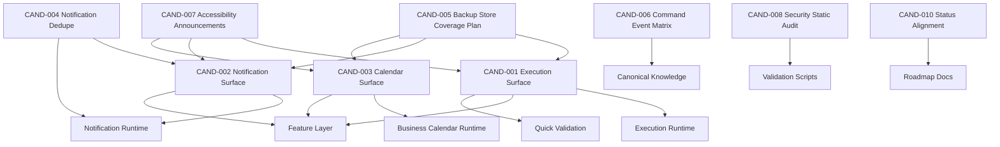

# v1.1 Dependency Map

| Candidate | Depends On | Blocks | Schema Dependency | Runtime Dependency | Test Dependency |
| --------- | ---------- | ------ | ----------------- | ------------------ | --------------- |
| CAND-001 | Execution runtime | CAND-005, CAND-007 | No | Yes | Quick, feature |
| CAND-002 | Notification runtime | CAND-004, CAND-005, CAND-007 | No | Yes | Quick, feature |
| CAND-003 | Calendar runtime | CAND-005, CAND-007 | No | Yes | Quick, feature |
| CAND-004 | CAND-002 | None | No | Yes | Unit |
| CAND-005 | CAND-001..003 | Future persistence | Planned only | No | Backup plan |
| CAND-006 | Canonical knowledge | None | No | No | Docs validation |
| CAND-007 | UI candidates | Release readiness | No | No | Browser/accessibility |
| CAND-008 | Scripts | Release readiness | No | No | Security validation |
| CAND-010 | Roadmap docs | Planning clarity | No | No | Docs validation |

## Dependency Result

No circular dependency, hidden cross-layer dependency, migration ordering dependency, or service worker dependency is selected for the first batch.
