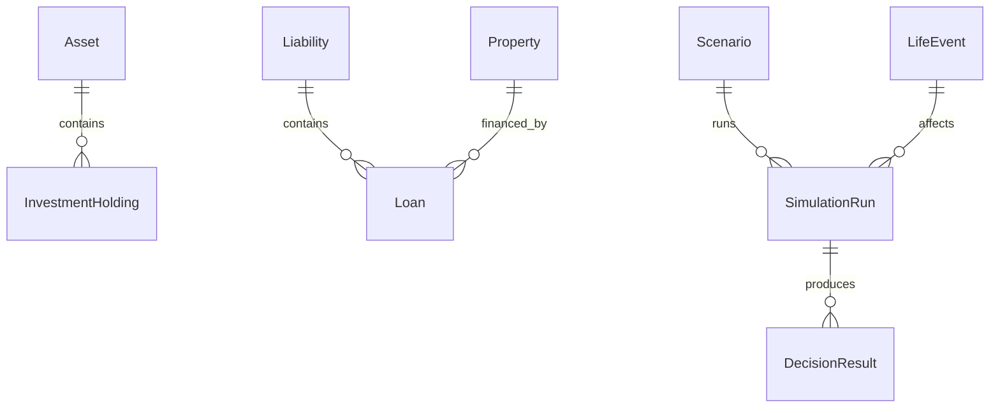

# ERD Draft

```mermaid
erDiagram
  Asset ||--o{ InvestmentHolding : contains
  Liability ||--o{ Loan : contains
  Scenario ||--o{ SimulationRun : runs
  SimulationRun ||--o{ DecisionResult : produces
  Property ||--o{ Loan : financed_by
  LifeEvent ||--o{ SimulationRun : affects
```
