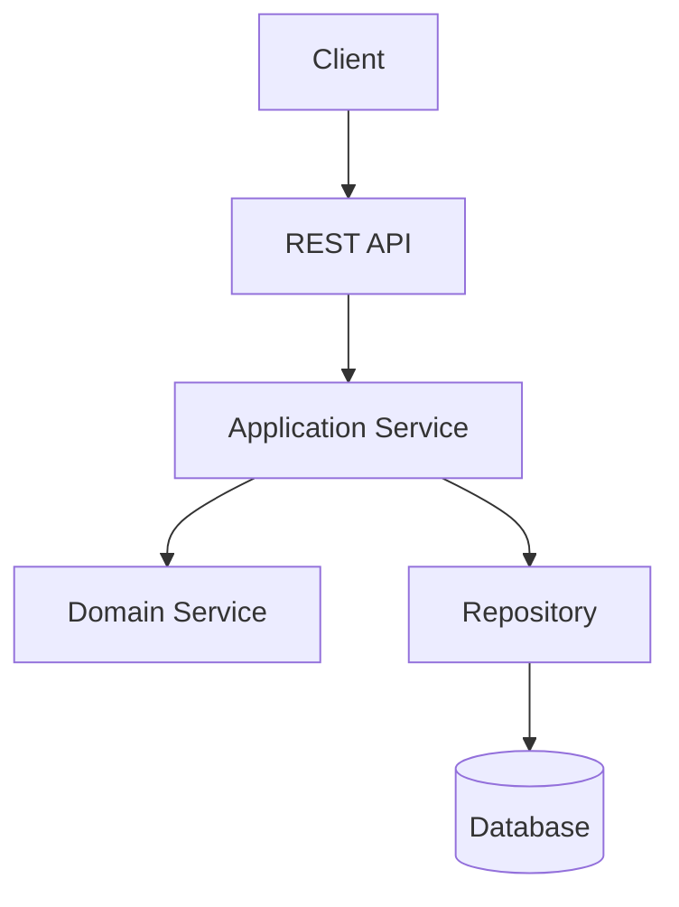
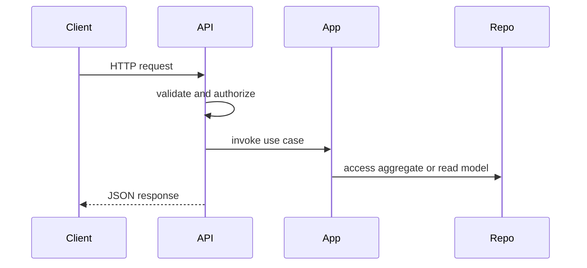
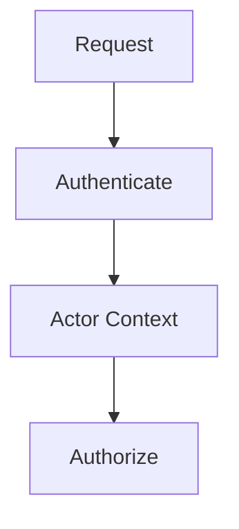
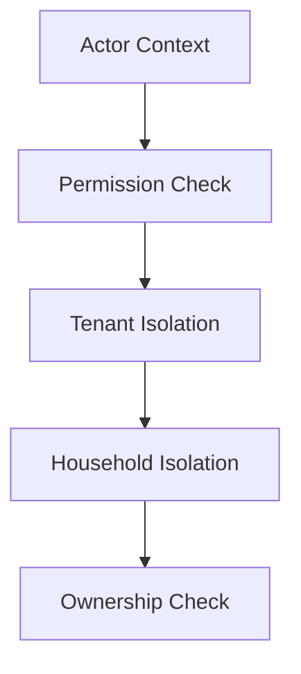
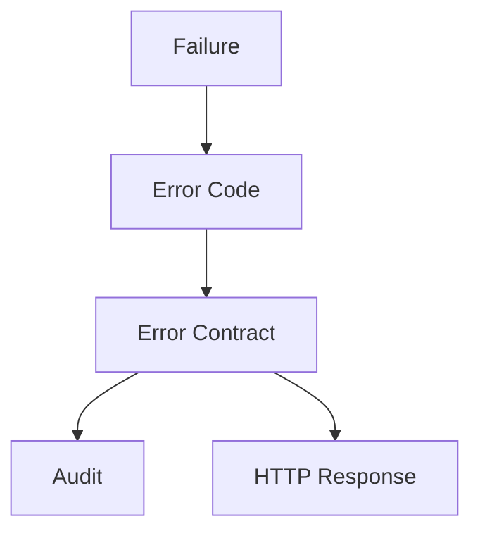
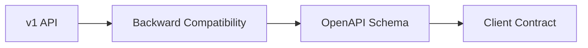

# API Governance Framework

# Document Control

Document Name: API Governance Framework
Document Path: knowledge/api-governance-framework.md
Document Type: Atlas Enterprise Canonical Specification
Version: 1.0
Status: Canonical Specification
Domain: Platform
Bounded Context: Platform
Owner: Project Atlas
Source of Truth: Atlas API Governance Source of Truth
Last Updated: 2026-07-12

Related Specifications:
- knowledge/domain-model-catalog.md
- knowledge/system-module-catalog.md
- knowledge/bounded-context-catalog.md
- knowledge/aggregate-catalog.md
- knowledge/entity-catalog.md
- knowledge/value-object-catalog.md
- knowledge/enumeration-catalog.md
- knowledge/repository-catalog.md
- knowledge/command-catalog.md
- knowledge/domain-event-catalog.md
- knowledge/domain-service-catalog.md
- knowledge/application-service-catalog.md
- knowledge/service-catalog.md
- knowledge/message-contract-catalog.md
- knowledge/security-framework.md
- knowledge/permission-framework.md
- knowledge/audit-framework.md
- knowledge/event-driven-architecture.md
- knowledge/integration-framework.md
- docs/database/05-DatabaseDesign.md
- docs/database/06-ERD.md
- docs/api/07-API.md

# Purpose

API Governance Framework defines Atlas API governance across REST API resources, Application Services, DTOs, Commands, Queries, Repositories, Domain Events, Authentication, Authorization, OpenAPI, Versioning, Error Contracts, Pagination, Filtering, Sorting, Idempotency, Concurrency, Security, and Integration APIs. It is the API governance source of truth.

# Scope

- REST
- Resource
- Collection
- Sub Resource
- Action Endpoint
- Command Endpoint
- Query Endpoint
- HTTP Semantics
- URI Convention
- Naming Convention
- DTO Convention
- Error Contract
- Versioning
- Backward Compatibility
- Idempotency
- Optimistic Concurrency
- Authentication
- Authorization
- Rate Limit
- Caching
- Observability
- OpenAPI

# API Governance Principles

- Resource URLs represent catalog-approved resources.
- Commands use POST action endpoints only when resource state transition cannot be expressed as standard resource mutation.
- Queries use GET with deterministic pagination, filtering, sorting, and search semantics.
- Every API maps to Application Service, DTO, permission, error contract, audit, and OpenAPI schema.
- Every mutation maps to Command Catalog, idempotency, concurrency, and Domain Event ownership.
- Every response follows consistent envelope, status code, correlation, and error behavior.

# Resource Naming Standard

- Resource Naming Standard rule 1 applies to resource name, URI, method, DTO, validation, authorization, error contract, audit, observability, compatibility, and OpenAPI documentation.
- Resource Naming Standard rule 2 applies to resource name, URI, method, DTO, validation, authorization, error contract, audit, observability, compatibility, and OpenAPI documentation.
- Resource Naming Standard rule 3 applies to resource name, URI, method, DTO, validation, authorization, error contract, audit, observability, compatibility, and OpenAPI documentation.
- Resource Naming Standard rule 4 applies to resource name, URI, method, DTO, validation, authorization, error contract, audit, observability, compatibility, and OpenAPI documentation.
- Resource Naming Standard rule 5 applies to resource name, URI, method, DTO, validation, authorization, error contract, audit, observability, compatibility, and OpenAPI documentation.
- Resource Naming Standard rule 6 applies to resource name, URI, method, DTO, validation, authorization, error contract, audit, observability, compatibility, and OpenAPI documentation.
- Resource Naming Standard rule 7 applies to resource name, URI, method, DTO, validation, authorization, error contract, audit, observability, compatibility, and OpenAPI documentation.

# URI Standard

- URI Standard rule 1 applies to resource name, URI, method, DTO, validation, authorization, error contract, audit, observability, compatibility, and OpenAPI documentation.
- URI Standard rule 2 applies to resource name, URI, method, DTO, validation, authorization, error contract, audit, observability, compatibility, and OpenAPI documentation.
- URI Standard rule 3 applies to resource name, URI, method, DTO, validation, authorization, error contract, audit, observability, compatibility, and OpenAPI documentation.
- URI Standard rule 4 applies to resource name, URI, method, DTO, validation, authorization, error contract, audit, observability, compatibility, and OpenAPI documentation.
- URI Standard rule 5 applies to resource name, URI, method, DTO, validation, authorization, error contract, audit, observability, compatibility, and OpenAPI documentation.
- URI Standard rule 6 applies to resource name, URI, method, DTO, validation, authorization, error contract, audit, observability, compatibility, and OpenAPI documentation.
- URI Standard rule 7 applies to resource name, URI, method, DTO, validation, authorization, error contract, audit, observability, compatibility, and OpenAPI documentation.

# HTTP Method Standard

- HTTP Method Standard rule 1 applies to resource name, URI, method, DTO, validation, authorization, error contract, audit, observability, compatibility, and OpenAPI documentation.
- HTTP Method Standard rule 2 applies to resource name, URI, method, DTO, validation, authorization, error contract, audit, observability, compatibility, and OpenAPI documentation.
- HTTP Method Standard rule 3 applies to resource name, URI, method, DTO, validation, authorization, error contract, audit, observability, compatibility, and OpenAPI documentation.
- HTTP Method Standard rule 4 applies to resource name, URI, method, DTO, validation, authorization, error contract, audit, observability, compatibility, and OpenAPI documentation.
- HTTP Method Standard rule 5 applies to resource name, URI, method, DTO, validation, authorization, error contract, audit, observability, compatibility, and OpenAPI documentation.
- HTTP Method Standard rule 6 applies to resource name, URI, method, DTO, validation, authorization, error contract, audit, observability, compatibility, and OpenAPI documentation.
- HTTP Method Standard rule 7 applies to resource name, URI, method, DTO, validation, authorization, error contract, audit, observability, compatibility, and OpenAPI documentation.

# Response Standard

- Response Standard rule 1 applies to resource name, URI, method, DTO, validation, authorization, error contract, audit, observability, compatibility, and OpenAPI documentation.
- Response Standard rule 2 applies to resource name, URI, method, DTO, validation, authorization, error contract, audit, observability, compatibility, and OpenAPI documentation.
- Response Standard rule 3 applies to resource name, URI, method, DTO, validation, authorization, error contract, audit, observability, compatibility, and OpenAPI documentation.
- Response Standard rule 4 applies to resource name, URI, method, DTO, validation, authorization, error contract, audit, observability, compatibility, and OpenAPI documentation.
- Response Standard rule 5 applies to resource name, URI, method, DTO, validation, authorization, error contract, audit, observability, compatibility, and OpenAPI documentation.
- Response Standard rule 6 applies to resource name, URI, method, DTO, validation, authorization, error contract, audit, observability, compatibility, and OpenAPI documentation.
- Response Standard rule 7 applies to resource name, URI, method, DTO, validation, authorization, error contract, audit, observability, compatibility, and OpenAPI documentation.

# Request Standard

- Request Standard rule 1 applies to resource name, URI, method, DTO, validation, authorization, error contract, audit, observability, compatibility, and OpenAPI documentation.
- Request Standard rule 2 applies to resource name, URI, method, DTO, validation, authorization, error contract, audit, observability, compatibility, and OpenAPI documentation.
- Request Standard rule 3 applies to resource name, URI, method, DTO, validation, authorization, error contract, audit, observability, compatibility, and OpenAPI documentation.
- Request Standard rule 4 applies to resource name, URI, method, DTO, validation, authorization, error contract, audit, observability, compatibility, and OpenAPI documentation.
- Request Standard rule 5 applies to resource name, URI, method, DTO, validation, authorization, error contract, audit, observability, compatibility, and OpenAPI documentation.
- Request Standard rule 6 applies to resource name, URI, method, DTO, validation, authorization, error contract, audit, observability, compatibility, and OpenAPI documentation.
- Request Standard rule 7 applies to resource name, URI, method, DTO, validation, authorization, error contract, audit, observability, compatibility, and OpenAPI documentation.

# Media Type Standard

- Media Type Standard rule 1 applies to resource name, URI, method, DTO, validation, authorization, error contract, audit, observability, compatibility, and OpenAPI documentation.
- Media Type Standard rule 2 applies to resource name, URI, method, DTO, validation, authorization, error contract, audit, observability, compatibility, and OpenAPI documentation.
- Media Type Standard rule 3 applies to resource name, URI, method, DTO, validation, authorization, error contract, audit, observability, compatibility, and OpenAPI documentation.
- Media Type Standard rule 4 applies to resource name, URI, method, DTO, validation, authorization, error contract, audit, observability, compatibility, and OpenAPI documentation.
- Media Type Standard rule 5 applies to resource name, URI, method, DTO, validation, authorization, error contract, audit, observability, compatibility, and OpenAPI documentation.
- Media Type Standard rule 6 applies to resource name, URI, method, DTO, validation, authorization, error contract, audit, observability, compatibility, and OpenAPI documentation.
- Media Type Standard rule 7 applies to resource name, URI, method, DTO, validation, authorization, error contract, audit, observability, compatibility, and OpenAPI documentation.

# Content Negotiation

- Content Negotiation rule 1 applies to resource name, URI, method, DTO, validation, authorization, error contract, audit, observability, compatibility, and OpenAPI documentation.
- Content Negotiation rule 2 applies to resource name, URI, method, DTO, validation, authorization, error contract, audit, observability, compatibility, and OpenAPI documentation.
- Content Negotiation rule 3 applies to resource name, URI, method, DTO, validation, authorization, error contract, audit, observability, compatibility, and OpenAPI documentation.
- Content Negotiation rule 4 applies to resource name, URI, method, DTO, validation, authorization, error contract, audit, observability, compatibility, and OpenAPI documentation.
- Content Negotiation rule 5 applies to resource name, URI, method, DTO, validation, authorization, error contract, audit, observability, compatibility, and OpenAPI documentation.
- Content Negotiation rule 6 applies to resource name, URI, method, DTO, validation, authorization, error contract, audit, observability, compatibility, and OpenAPI documentation.
- Content Negotiation rule 7 applies to resource name, URI, method, DTO, validation, authorization, error contract, audit, observability, compatibility, and OpenAPI documentation.

# API Version Strategy

- API Version Strategy rule 1 applies to resource name, URI, method, DTO, validation, authorization, error contract, audit, observability, compatibility, and OpenAPI documentation.
- API Version Strategy rule 2 applies to resource name, URI, method, DTO, validation, authorization, error contract, audit, observability, compatibility, and OpenAPI documentation.
- API Version Strategy rule 3 applies to resource name, URI, method, DTO, validation, authorization, error contract, audit, observability, compatibility, and OpenAPI documentation.
- API Version Strategy rule 4 applies to resource name, URI, method, DTO, validation, authorization, error contract, audit, observability, compatibility, and OpenAPI documentation.
- API Version Strategy rule 5 applies to resource name, URI, method, DTO, validation, authorization, error contract, audit, observability, compatibility, and OpenAPI documentation.
- API Version Strategy rule 6 applies to resource name, URI, method, DTO, validation, authorization, error contract, audit, observability, compatibility, and OpenAPI documentation.
- API Version Strategy rule 7 applies to resource name, URI, method, DTO, validation, authorization, error contract, audit, observability, compatibility, and OpenAPI documentation.

# REST Endpoint Standard

- REST Endpoint Standard rule 1 applies to resource name, URI, method, DTO, validation, authorization, error contract, audit, observability, compatibility, and OpenAPI documentation.
- REST Endpoint Standard rule 2 applies to resource name, URI, method, DTO, validation, authorization, error contract, audit, observability, compatibility, and OpenAPI documentation.
- REST Endpoint Standard rule 3 applies to resource name, URI, method, DTO, validation, authorization, error contract, audit, observability, compatibility, and OpenAPI documentation.
- REST Endpoint Standard rule 4 applies to resource name, URI, method, DTO, validation, authorization, error contract, audit, observability, compatibility, and OpenAPI documentation.
- REST Endpoint Standard rule 5 applies to resource name, URI, method, DTO, validation, authorization, error contract, audit, observability, compatibility, and OpenAPI documentation.
- REST Endpoint Standard rule 6 applies to resource name, URI, method, DTO, validation, authorization, error contract, audit, observability, compatibility, and OpenAPI documentation.
- REST Endpoint Standard rule 7 applies to resource name, URI, method, DTO, validation, authorization, error contract, audit, observability, compatibility, and OpenAPI documentation.

# Command API Standard

- Command API Standard rule 1 applies to resource name, URI, method, DTO, validation, authorization, error contract, audit, observability, compatibility, and OpenAPI documentation.
- Command API Standard rule 2 applies to resource name, URI, method, DTO, validation, authorization, error contract, audit, observability, compatibility, and OpenAPI documentation.
- Command API Standard rule 3 applies to resource name, URI, method, DTO, validation, authorization, error contract, audit, observability, compatibility, and OpenAPI documentation.
- Command API Standard rule 4 applies to resource name, URI, method, DTO, validation, authorization, error contract, audit, observability, compatibility, and OpenAPI documentation.
- Command API Standard rule 5 applies to resource name, URI, method, DTO, validation, authorization, error contract, audit, observability, compatibility, and OpenAPI documentation.
- Command API Standard rule 6 applies to resource name, URI, method, DTO, validation, authorization, error contract, audit, observability, compatibility, and OpenAPI documentation.
- Command API Standard rule 7 applies to resource name, URI, method, DTO, validation, authorization, error contract, audit, observability, compatibility, and OpenAPI documentation.

# Query API Standard

- Query API Standard rule 1 applies to resource name, URI, method, DTO, validation, authorization, error contract, audit, observability, compatibility, and OpenAPI documentation.
- Query API Standard rule 2 applies to resource name, URI, method, DTO, validation, authorization, error contract, audit, observability, compatibility, and OpenAPI documentation.
- Query API Standard rule 3 applies to resource name, URI, method, DTO, validation, authorization, error contract, audit, observability, compatibility, and OpenAPI documentation.
- Query API Standard rule 4 applies to resource name, URI, method, DTO, validation, authorization, error contract, audit, observability, compatibility, and OpenAPI documentation.
- Query API Standard rule 5 applies to resource name, URI, method, DTO, validation, authorization, error contract, audit, observability, compatibility, and OpenAPI documentation.
- Query API Standard rule 6 applies to resource name, URI, method, DTO, validation, authorization, error contract, audit, observability, compatibility, and OpenAPI documentation.
- Query API Standard rule 7 applies to resource name, URI, method, DTO, validation, authorization, error contract, audit, observability, compatibility, and OpenAPI documentation.

# DTO Standard

- DTO Standard rule 1 applies to resource name, URI, method, DTO, validation, authorization, error contract, audit, observability, compatibility, and OpenAPI documentation.
- DTO Standard rule 2 applies to resource name, URI, method, DTO, validation, authorization, error contract, audit, observability, compatibility, and OpenAPI documentation.
- DTO Standard rule 3 applies to resource name, URI, method, DTO, validation, authorization, error contract, audit, observability, compatibility, and OpenAPI documentation.
- DTO Standard rule 4 applies to resource name, URI, method, DTO, validation, authorization, error contract, audit, observability, compatibility, and OpenAPI documentation.
- DTO Standard rule 5 applies to resource name, URI, method, DTO, validation, authorization, error contract, audit, observability, compatibility, and OpenAPI documentation.
- DTO Standard rule 6 applies to resource name, URI, method, DTO, validation, authorization, error contract, audit, observability, compatibility, and OpenAPI documentation.
- DTO Standard rule 7 applies to resource name, URI, method, DTO, validation, authorization, error contract, audit, observability, compatibility, and OpenAPI documentation.

# Error Contract Standard

- Error Contract Standard rule 1 applies to resource name, URI, method, DTO, validation, authorization, error contract, audit, observability, compatibility, and OpenAPI documentation.
- Error Contract Standard rule 2 applies to resource name, URI, method, DTO, validation, authorization, error contract, audit, observability, compatibility, and OpenAPI documentation.
- Error Contract Standard rule 3 applies to resource name, URI, method, DTO, validation, authorization, error contract, audit, observability, compatibility, and OpenAPI documentation.
- Error Contract Standard rule 4 applies to resource name, URI, method, DTO, validation, authorization, error contract, audit, observability, compatibility, and OpenAPI documentation.
- Error Contract Standard rule 5 applies to resource name, URI, method, DTO, validation, authorization, error contract, audit, observability, compatibility, and OpenAPI documentation.
- Error Contract Standard rule 6 applies to resource name, URI, method, DTO, validation, authorization, error contract, audit, observability, compatibility, and OpenAPI documentation.
- Error Contract Standard rule 7 applies to resource name, URI, method, DTO, validation, authorization, error contract, audit, observability, compatibility, and OpenAPI documentation.

# Pagination Standard

- Pagination Standard rule 1 applies to resource name, URI, method, DTO, validation, authorization, error contract, audit, observability, compatibility, and OpenAPI documentation.
- Pagination Standard rule 2 applies to resource name, URI, method, DTO, validation, authorization, error contract, audit, observability, compatibility, and OpenAPI documentation.
- Pagination Standard rule 3 applies to resource name, URI, method, DTO, validation, authorization, error contract, audit, observability, compatibility, and OpenAPI documentation.
- Pagination Standard rule 4 applies to resource name, URI, method, DTO, validation, authorization, error contract, audit, observability, compatibility, and OpenAPI documentation.
- Pagination Standard rule 5 applies to resource name, URI, method, DTO, validation, authorization, error contract, audit, observability, compatibility, and OpenAPI documentation.
- Pagination Standard rule 6 applies to resource name, URI, method, DTO, validation, authorization, error contract, audit, observability, compatibility, and OpenAPI documentation.
- Pagination Standard rule 7 applies to resource name, URI, method, DTO, validation, authorization, error contract, audit, observability, compatibility, and OpenAPI documentation.

# Sorting Standard

- Sorting Standard rule 1 applies to resource name, URI, method, DTO, validation, authorization, error contract, audit, observability, compatibility, and OpenAPI documentation.
- Sorting Standard rule 2 applies to resource name, URI, method, DTO, validation, authorization, error contract, audit, observability, compatibility, and OpenAPI documentation.
- Sorting Standard rule 3 applies to resource name, URI, method, DTO, validation, authorization, error contract, audit, observability, compatibility, and OpenAPI documentation.
- Sorting Standard rule 4 applies to resource name, URI, method, DTO, validation, authorization, error contract, audit, observability, compatibility, and OpenAPI documentation.
- Sorting Standard rule 5 applies to resource name, URI, method, DTO, validation, authorization, error contract, audit, observability, compatibility, and OpenAPI documentation.
- Sorting Standard rule 6 applies to resource name, URI, method, DTO, validation, authorization, error contract, audit, observability, compatibility, and OpenAPI documentation.
- Sorting Standard rule 7 applies to resource name, URI, method, DTO, validation, authorization, error contract, audit, observability, compatibility, and OpenAPI documentation.

# Filtering Standard

- Filtering Standard rule 1 applies to resource name, URI, method, DTO, validation, authorization, error contract, audit, observability, compatibility, and OpenAPI documentation.
- Filtering Standard rule 2 applies to resource name, URI, method, DTO, validation, authorization, error contract, audit, observability, compatibility, and OpenAPI documentation.
- Filtering Standard rule 3 applies to resource name, URI, method, DTO, validation, authorization, error contract, audit, observability, compatibility, and OpenAPI documentation.
- Filtering Standard rule 4 applies to resource name, URI, method, DTO, validation, authorization, error contract, audit, observability, compatibility, and OpenAPI documentation.
- Filtering Standard rule 5 applies to resource name, URI, method, DTO, validation, authorization, error contract, audit, observability, compatibility, and OpenAPI documentation.
- Filtering Standard rule 6 applies to resource name, URI, method, DTO, validation, authorization, error contract, audit, observability, compatibility, and OpenAPI documentation.
- Filtering Standard rule 7 applies to resource name, URI, method, DTO, validation, authorization, error contract, audit, observability, compatibility, and OpenAPI documentation.

# Search Standard

- Search Standard rule 1 applies to resource name, URI, method, DTO, validation, authorization, error contract, audit, observability, compatibility, and OpenAPI documentation.
- Search Standard rule 2 applies to resource name, URI, method, DTO, validation, authorization, error contract, audit, observability, compatibility, and OpenAPI documentation.
- Search Standard rule 3 applies to resource name, URI, method, DTO, validation, authorization, error contract, audit, observability, compatibility, and OpenAPI documentation.
- Search Standard rule 4 applies to resource name, URI, method, DTO, validation, authorization, error contract, audit, observability, compatibility, and OpenAPI documentation.
- Search Standard rule 5 applies to resource name, URI, method, DTO, validation, authorization, error contract, audit, observability, compatibility, and OpenAPI documentation.
- Search Standard rule 6 applies to resource name, URI, method, DTO, validation, authorization, error contract, audit, observability, compatibility, and OpenAPI documentation.
- Search Standard rule 7 applies to resource name, URI, method, DTO, validation, authorization, error contract, audit, observability, compatibility, and OpenAPI documentation.

# Bulk Operation Standard

- Bulk Operation Standard rule 1 applies to resource name, URI, method, DTO, validation, authorization, error contract, audit, observability, compatibility, and OpenAPI documentation.
- Bulk Operation Standard rule 2 applies to resource name, URI, method, DTO, validation, authorization, error contract, audit, observability, compatibility, and OpenAPI documentation.
- Bulk Operation Standard rule 3 applies to resource name, URI, method, DTO, validation, authorization, error contract, audit, observability, compatibility, and OpenAPI documentation.
- Bulk Operation Standard rule 4 applies to resource name, URI, method, DTO, validation, authorization, error contract, audit, observability, compatibility, and OpenAPI documentation.
- Bulk Operation Standard rule 5 applies to resource name, URI, method, DTO, validation, authorization, error contract, audit, observability, compatibility, and OpenAPI documentation.
- Bulk Operation Standard rule 6 applies to resource name, URI, method, DTO, validation, authorization, error contract, audit, observability, compatibility, and OpenAPI documentation.
- Bulk Operation Standard rule 7 applies to resource name, URI, method, DTO, validation, authorization, error contract, audit, observability, compatibility, and OpenAPI documentation.

# Idempotency Standard

- Idempotency Standard rule 1 applies to resource name, URI, method, DTO, validation, authorization, error contract, audit, observability, compatibility, and OpenAPI documentation.
- Idempotency Standard rule 2 applies to resource name, URI, method, DTO, validation, authorization, error contract, audit, observability, compatibility, and OpenAPI documentation.
- Idempotency Standard rule 3 applies to resource name, URI, method, DTO, validation, authorization, error contract, audit, observability, compatibility, and OpenAPI documentation.
- Idempotency Standard rule 4 applies to resource name, URI, method, DTO, validation, authorization, error contract, audit, observability, compatibility, and OpenAPI documentation.
- Idempotency Standard rule 5 applies to resource name, URI, method, DTO, validation, authorization, error contract, audit, observability, compatibility, and OpenAPI documentation.
- Idempotency Standard rule 6 applies to resource name, URI, method, DTO, validation, authorization, error contract, audit, observability, compatibility, and OpenAPI documentation.
- Idempotency Standard rule 7 applies to resource name, URI, method, DTO, validation, authorization, error contract, audit, observability, compatibility, and OpenAPI documentation.

# Concurrency Standard

- Concurrency Standard rule 1 applies to resource name, URI, method, DTO, validation, authorization, error contract, audit, observability, compatibility, and OpenAPI documentation.
- Concurrency Standard rule 2 applies to resource name, URI, method, DTO, validation, authorization, error contract, audit, observability, compatibility, and OpenAPI documentation.
- Concurrency Standard rule 3 applies to resource name, URI, method, DTO, validation, authorization, error contract, audit, observability, compatibility, and OpenAPI documentation.
- Concurrency Standard rule 4 applies to resource name, URI, method, DTO, validation, authorization, error contract, audit, observability, compatibility, and OpenAPI documentation.
- Concurrency Standard rule 5 applies to resource name, URI, method, DTO, validation, authorization, error contract, audit, observability, compatibility, and OpenAPI documentation.
- Concurrency Standard rule 6 applies to resource name, URI, method, DTO, validation, authorization, error contract, audit, observability, compatibility, and OpenAPI documentation.
- Concurrency Standard rule 7 applies to resource name, URI, method, DTO, validation, authorization, error contract, audit, observability, compatibility, and OpenAPI documentation.

# Authentication Standard

- Authentication Standard rule 1 applies to resource name, URI, method, DTO, validation, authorization, error contract, audit, observability, compatibility, and OpenAPI documentation.
- Authentication Standard rule 2 applies to resource name, URI, method, DTO, validation, authorization, error contract, audit, observability, compatibility, and OpenAPI documentation.
- Authentication Standard rule 3 applies to resource name, URI, method, DTO, validation, authorization, error contract, audit, observability, compatibility, and OpenAPI documentation.
- Authentication Standard rule 4 applies to resource name, URI, method, DTO, validation, authorization, error contract, audit, observability, compatibility, and OpenAPI documentation.
- Authentication Standard rule 5 applies to resource name, URI, method, DTO, validation, authorization, error contract, audit, observability, compatibility, and OpenAPI documentation.
- Authentication Standard rule 6 applies to resource name, URI, method, DTO, validation, authorization, error contract, audit, observability, compatibility, and OpenAPI documentation.
- Authentication Standard rule 7 applies to resource name, URI, method, DTO, validation, authorization, error contract, audit, observability, compatibility, and OpenAPI documentation.

# Authorization Standard

- Authorization Standard rule 1 applies to resource name, URI, method, DTO, validation, authorization, error contract, audit, observability, compatibility, and OpenAPI documentation.
- Authorization Standard rule 2 applies to resource name, URI, method, DTO, validation, authorization, error contract, audit, observability, compatibility, and OpenAPI documentation.
- Authorization Standard rule 3 applies to resource name, URI, method, DTO, validation, authorization, error contract, audit, observability, compatibility, and OpenAPI documentation.
- Authorization Standard rule 4 applies to resource name, URI, method, DTO, validation, authorization, error contract, audit, observability, compatibility, and OpenAPI documentation.
- Authorization Standard rule 5 applies to resource name, URI, method, DTO, validation, authorization, error contract, audit, observability, compatibility, and OpenAPI documentation.
- Authorization Standard rule 6 applies to resource name, URI, method, DTO, validation, authorization, error contract, audit, observability, compatibility, and OpenAPI documentation.
- Authorization Standard rule 7 applies to resource name, URI, method, DTO, validation, authorization, error contract, audit, observability, compatibility, and OpenAPI documentation.

# Permission Mapping

- Permission Mapping rule 1 applies to resource name, URI, method, DTO, validation, authorization, error contract, audit, observability, compatibility, and OpenAPI documentation.
- Permission Mapping rule 2 applies to resource name, URI, method, DTO, validation, authorization, error contract, audit, observability, compatibility, and OpenAPI documentation.
- Permission Mapping rule 3 applies to resource name, URI, method, DTO, validation, authorization, error contract, audit, observability, compatibility, and OpenAPI documentation.
- Permission Mapping rule 4 applies to resource name, URI, method, DTO, validation, authorization, error contract, audit, observability, compatibility, and OpenAPI documentation.
- Permission Mapping rule 5 applies to resource name, URI, method, DTO, validation, authorization, error contract, audit, observability, compatibility, and OpenAPI documentation.
- Permission Mapping rule 6 applies to resource name, URI, method, DTO, validation, authorization, error contract, audit, observability, compatibility, and OpenAPI documentation.
- Permission Mapping rule 7 applies to resource name, URI, method, DTO, validation, authorization, error contract, audit, observability, compatibility, and OpenAPI documentation.

# Audit Standard

- Audit Standard rule 1 applies to resource name, URI, method, DTO, validation, authorization, error contract, audit, observability, compatibility, and OpenAPI documentation.
- Audit Standard rule 2 applies to resource name, URI, method, DTO, validation, authorization, error contract, audit, observability, compatibility, and OpenAPI documentation.
- Audit Standard rule 3 applies to resource name, URI, method, DTO, validation, authorization, error contract, audit, observability, compatibility, and OpenAPI documentation.
- Audit Standard rule 4 applies to resource name, URI, method, DTO, validation, authorization, error contract, audit, observability, compatibility, and OpenAPI documentation.
- Audit Standard rule 5 applies to resource name, URI, method, DTO, validation, authorization, error contract, audit, observability, compatibility, and OpenAPI documentation.
- Audit Standard rule 6 applies to resource name, URI, method, DTO, validation, authorization, error contract, audit, observability, compatibility, and OpenAPI documentation.
- Audit Standard rule 7 applies to resource name, URI, method, DTO, validation, authorization, error contract, audit, observability, compatibility, and OpenAPI documentation.

# CorrelationId

- CorrelationId rule 1 applies to resource name, URI, method, DTO, validation, authorization, error contract, audit, observability, compatibility, and OpenAPI documentation.
- CorrelationId rule 2 applies to resource name, URI, method, DTO, validation, authorization, error contract, audit, observability, compatibility, and OpenAPI documentation.
- CorrelationId rule 3 applies to resource name, URI, method, DTO, validation, authorization, error contract, audit, observability, compatibility, and OpenAPI documentation.
- CorrelationId rule 4 applies to resource name, URI, method, DTO, validation, authorization, error contract, audit, observability, compatibility, and OpenAPI documentation.
- CorrelationId rule 5 applies to resource name, URI, method, DTO, validation, authorization, error contract, audit, observability, compatibility, and OpenAPI documentation.
- CorrelationId rule 6 applies to resource name, URI, method, DTO, validation, authorization, error contract, audit, observability, compatibility, and OpenAPI documentation.
- CorrelationId rule 7 applies to resource name, URI, method, DTO, validation, authorization, error contract, audit, observability, compatibility, and OpenAPI documentation.

# CausationId

- CausationId rule 1 applies to resource name, URI, method, DTO, validation, authorization, error contract, audit, observability, compatibility, and OpenAPI documentation.
- CausationId rule 2 applies to resource name, URI, method, DTO, validation, authorization, error contract, audit, observability, compatibility, and OpenAPI documentation.
- CausationId rule 3 applies to resource name, URI, method, DTO, validation, authorization, error contract, audit, observability, compatibility, and OpenAPI documentation.
- CausationId rule 4 applies to resource name, URI, method, DTO, validation, authorization, error contract, audit, observability, compatibility, and OpenAPI documentation.
- CausationId rule 5 applies to resource name, URI, method, DTO, validation, authorization, error contract, audit, observability, compatibility, and OpenAPI documentation.
- CausationId rule 6 applies to resource name, URI, method, DTO, validation, authorization, error contract, audit, observability, compatibility, and OpenAPI documentation.
- CausationId rule 7 applies to resource name, URI, method, DTO, validation, authorization, error contract, audit, observability, compatibility, and OpenAPI documentation.

# Tracing

- Tracing rule 1 applies to resource name, URI, method, DTO, validation, authorization, error contract, audit, observability, compatibility, and OpenAPI documentation.
- Tracing rule 2 applies to resource name, URI, method, DTO, validation, authorization, error contract, audit, observability, compatibility, and OpenAPI documentation.
- Tracing rule 3 applies to resource name, URI, method, DTO, validation, authorization, error contract, audit, observability, compatibility, and OpenAPI documentation.
- Tracing rule 4 applies to resource name, URI, method, DTO, validation, authorization, error contract, audit, observability, compatibility, and OpenAPI documentation.
- Tracing rule 5 applies to resource name, URI, method, DTO, validation, authorization, error contract, audit, observability, compatibility, and OpenAPI documentation.
- Tracing rule 6 applies to resource name, URI, method, DTO, validation, authorization, error contract, audit, observability, compatibility, and OpenAPI documentation.
- Tracing rule 7 applies to resource name, URI, method, DTO, validation, authorization, error contract, audit, observability, compatibility, and OpenAPI documentation.

# Performance

- Performance rule 1 applies to resource name, URI, method, DTO, validation, authorization, error contract, audit, observability, compatibility, and OpenAPI documentation.
- Performance rule 2 applies to resource name, URI, method, DTO, validation, authorization, error contract, audit, observability, compatibility, and OpenAPI documentation.
- Performance rule 3 applies to resource name, URI, method, DTO, validation, authorization, error contract, audit, observability, compatibility, and OpenAPI documentation.
- Performance rule 4 applies to resource name, URI, method, DTO, validation, authorization, error contract, audit, observability, compatibility, and OpenAPI documentation.
- Performance rule 5 applies to resource name, URI, method, DTO, validation, authorization, error contract, audit, observability, compatibility, and OpenAPI documentation.
- Performance rule 6 applies to resource name, URI, method, DTO, validation, authorization, error contract, audit, observability, compatibility, and OpenAPI documentation.
- Performance rule 7 applies to resource name, URI, method, DTO, validation, authorization, error contract, audit, observability, compatibility, and OpenAPI documentation.

# Caching

- Caching rule 1 applies to resource name, URI, method, DTO, validation, authorization, error contract, audit, observability, compatibility, and OpenAPI documentation.
- Caching rule 2 applies to resource name, URI, method, DTO, validation, authorization, error contract, audit, observability, compatibility, and OpenAPI documentation.
- Caching rule 3 applies to resource name, URI, method, DTO, validation, authorization, error contract, audit, observability, compatibility, and OpenAPI documentation.
- Caching rule 4 applies to resource name, URI, method, DTO, validation, authorization, error contract, audit, observability, compatibility, and OpenAPI documentation.
- Caching rule 5 applies to resource name, URI, method, DTO, validation, authorization, error contract, audit, observability, compatibility, and OpenAPI documentation.
- Caching rule 6 applies to resource name, URI, method, DTO, validation, authorization, error contract, audit, observability, compatibility, and OpenAPI documentation.
- Caching rule 7 applies to resource name, URI, method, DTO, validation, authorization, error contract, audit, observability, compatibility, and OpenAPI documentation.

# Rate Limiting

- Rate Limiting rule 1 applies to resource name, URI, method, DTO, validation, authorization, error contract, audit, observability, compatibility, and OpenAPI documentation.
- Rate Limiting rule 2 applies to resource name, URI, method, DTO, validation, authorization, error contract, audit, observability, compatibility, and OpenAPI documentation.
- Rate Limiting rule 3 applies to resource name, URI, method, DTO, validation, authorization, error contract, audit, observability, compatibility, and OpenAPI documentation.
- Rate Limiting rule 4 applies to resource name, URI, method, DTO, validation, authorization, error contract, audit, observability, compatibility, and OpenAPI documentation.
- Rate Limiting rule 5 applies to resource name, URI, method, DTO, validation, authorization, error contract, audit, observability, compatibility, and OpenAPI documentation.
- Rate Limiting rule 6 applies to resource name, URI, method, DTO, validation, authorization, error contract, audit, observability, compatibility, and OpenAPI documentation.
- Rate Limiting rule 7 applies to resource name, URI, method, DTO, validation, authorization, error contract, audit, observability, compatibility, and OpenAPI documentation.

# Security Headers

- Security Headers rule 1 applies to resource name, URI, method, DTO, validation, authorization, error contract, audit, observability, compatibility, and OpenAPI documentation.
- Security Headers rule 2 applies to resource name, URI, method, DTO, validation, authorization, error contract, audit, observability, compatibility, and OpenAPI documentation.
- Security Headers rule 3 applies to resource name, URI, method, DTO, validation, authorization, error contract, audit, observability, compatibility, and OpenAPI documentation.
- Security Headers rule 4 applies to resource name, URI, method, DTO, validation, authorization, error contract, audit, observability, compatibility, and OpenAPI documentation.
- Security Headers rule 5 applies to resource name, URI, method, DTO, validation, authorization, error contract, audit, observability, compatibility, and OpenAPI documentation.
- Security Headers rule 6 applies to resource name, URI, method, DTO, validation, authorization, error contract, audit, observability, compatibility, and OpenAPI documentation.
- Security Headers rule 7 applies to resource name, URI, method, DTO, validation, authorization, error contract, audit, observability, compatibility, and OpenAPI documentation.

# OpenAPI Convention

- OpenAPI Convention rule 1 applies to resource name, URI, method, DTO, validation, authorization, error contract, audit, observability, compatibility, and OpenAPI documentation.
- OpenAPI Convention rule 2 applies to resource name, URI, method, DTO, validation, authorization, error contract, audit, observability, compatibility, and OpenAPI documentation.
- OpenAPI Convention rule 3 applies to resource name, URI, method, DTO, validation, authorization, error contract, audit, observability, compatibility, and OpenAPI documentation.
- OpenAPI Convention rule 4 applies to resource name, URI, method, DTO, validation, authorization, error contract, audit, observability, compatibility, and OpenAPI documentation.
- OpenAPI Convention rule 5 applies to resource name, URI, method, DTO, validation, authorization, error contract, audit, observability, compatibility, and OpenAPI documentation.
- OpenAPI Convention rule 6 applies to resource name, URI, method, DTO, validation, authorization, error contract, audit, observability, compatibility, and OpenAPI documentation.
- OpenAPI Convention rule 7 applies to resource name, URI, method, DTO, validation, authorization, error contract, audit, observability, compatibility, and OpenAPI documentation.

# JSON Naming Convention

- JSON Naming Convention rule 1 applies to resource name, URI, method, DTO, validation, authorization, error contract, audit, observability, compatibility, and OpenAPI documentation.
- JSON Naming Convention rule 2 applies to resource name, URI, method, DTO, validation, authorization, error contract, audit, observability, compatibility, and OpenAPI documentation.
- JSON Naming Convention rule 3 applies to resource name, URI, method, DTO, validation, authorization, error contract, audit, observability, compatibility, and OpenAPI documentation.
- JSON Naming Convention rule 4 applies to resource name, URI, method, DTO, validation, authorization, error contract, audit, observability, compatibility, and OpenAPI documentation.
- JSON Naming Convention rule 5 applies to resource name, URI, method, DTO, validation, authorization, error contract, audit, observability, compatibility, and OpenAPI documentation.
- JSON Naming Convention rule 6 applies to resource name, URI, method, DTO, validation, authorization, error contract, audit, observability, compatibility, and OpenAPI documentation.
- JSON Naming Convention rule 7 applies to resource name, URI, method, DTO, validation, authorization, error contract, audit, observability, compatibility, and OpenAPI documentation.

# DateTime Convention

- DateTime Convention rule 1 applies to resource name, URI, method, DTO, validation, authorization, error contract, audit, observability, compatibility, and OpenAPI documentation.
- DateTime Convention rule 2 applies to resource name, URI, method, DTO, validation, authorization, error contract, audit, observability, compatibility, and OpenAPI documentation.
- DateTime Convention rule 3 applies to resource name, URI, method, DTO, validation, authorization, error contract, audit, observability, compatibility, and OpenAPI documentation.
- DateTime Convention rule 4 applies to resource name, URI, method, DTO, validation, authorization, error contract, audit, observability, compatibility, and OpenAPI documentation.
- DateTime Convention rule 5 applies to resource name, URI, method, DTO, validation, authorization, error contract, audit, observability, compatibility, and OpenAPI documentation.
- DateTime Convention rule 6 applies to resource name, URI, method, DTO, validation, authorization, error contract, audit, observability, compatibility, and OpenAPI documentation.
- DateTime Convention rule 7 applies to resource name, URI, method, DTO, validation, authorization, error contract, audit, observability, compatibility, and OpenAPI documentation.

# Money Convention

- Money Convention rule 1 applies to resource name, URI, method, DTO, validation, authorization, error contract, audit, observability, compatibility, and OpenAPI documentation.
- Money Convention rule 2 applies to resource name, URI, method, DTO, validation, authorization, error contract, audit, observability, compatibility, and OpenAPI documentation.
- Money Convention rule 3 applies to resource name, URI, method, DTO, validation, authorization, error contract, audit, observability, compatibility, and OpenAPI documentation.
- Money Convention rule 4 applies to resource name, URI, method, DTO, validation, authorization, error contract, audit, observability, compatibility, and OpenAPI documentation.
- Money Convention rule 5 applies to resource name, URI, method, DTO, validation, authorization, error contract, audit, observability, compatibility, and OpenAPI documentation.
- Money Convention rule 6 applies to resource name, URI, method, DTO, validation, authorization, error contract, audit, observability, compatibility, and OpenAPI documentation.
- Money Convention rule 7 applies to resource name, URI, method, DTO, validation, authorization, error contract, audit, observability, compatibility, and OpenAPI documentation.

# Decimal Precision

- Decimal Precision rule 1 applies to resource name, URI, method, DTO, validation, authorization, error contract, audit, observability, compatibility, and OpenAPI documentation.
- Decimal Precision rule 2 applies to resource name, URI, method, DTO, validation, authorization, error contract, audit, observability, compatibility, and OpenAPI documentation.
- Decimal Precision rule 3 applies to resource name, URI, method, DTO, validation, authorization, error contract, audit, observability, compatibility, and OpenAPI documentation.
- Decimal Precision rule 4 applies to resource name, URI, method, DTO, validation, authorization, error contract, audit, observability, compatibility, and OpenAPI documentation.
- Decimal Precision rule 5 applies to resource name, URI, method, DTO, validation, authorization, error contract, audit, observability, compatibility, and OpenAPI documentation.
- Decimal Precision rule 6 applies to resource name, URI, method, DTO, validation, authorization, error contract, audit, observability, compatibility, and OpenAPI documentation.
- Decimal Precision rule 7 applies to resource name, URI, method, DTO, validation, authorization, error contract, audit, observability, compatibility, and OpenAPI documentation.

# Enum Serialization

- Enum Serialization rule 1 applies to resource name, URI, method, DTO, validation, authorization, error contract, audit, observability, compatibility, and OpenAPI documentation.
- Enum Serialization rule 2 applies to resource name, URI, method, DTO, validation, authorization, error contract, audit, observability, compatibility, and OpenAPI documentation.
- Enum Serialization rule 3 applies to resource name, URI, method, DTO, validation, authorization, error contract, audit, observability, compatibility, and OpenAPI documentation.
- Enum Serialization rule 4 applies to resource name, URI, method, DTO, validation, authorization, error contract, audit, observability, compatibility, and OpenAPI documentation.
- Enum Serialization rule 5 applies to resource name, URI, method, DTO, validation, authorization, error contract, audit, observability, compatibility, and OpenAPI documentation.
- Enum Serialization rule 6 applies to resource name, URI, method, DTO, validation, authorization, error contract, audit, observability, compatibility, and OpenAPI documentation.
- Enum Serialization rule 7 applies to resource name, URI, method, DTO, validation, authorization, error contract, audit, observability, compatibility, and OpenAPI documentation.

# Complete API Resource Catalog

## Users API

API: Users
Resource URI: /api/v1/users
HTTP Methods: GET, POST
Application Service: UserApplicationService
Domain Service: DecisionService
Aggregate: User
Command: Identity commands and access queries
Query: UserQuery
DTO: UserDto
Repository: UserRepository
Domain Event: Identity and access events
Permission: Administration:Read
Version: v1
Request Standard: JSON request with CorrelationId, CausationId when derived, Idempotency-Key for external mutations, and If-Match for versioned updates.
Response Standard: JSON response with data, metadata, errors, correlationId, version, and timestamp.
Validation: Request DTO, query parameters, pagination, sorting, filtering, enum values, money precision, date time, idempotency, and concurrency are validated.
Authentication: Required unless endpoint is explicitly public in Security Framework.
Authorization: Permission, tenant isolation, Household isolation, ownership, and role checks occur before data disclosure.
Error Contract: API error returns stable errorCode, message, correlationId, timestamp, details, and retriable flag.
Audit: API call captures actor, endpoint, method, permission, input hash, output hash, CorrelationId, CausationId, status, and latency.
Caching: GET responses may be cached only with scoped keys and event-driven invalidation.
Performance Target: p95 under 300 ms for standard read and p95 under 800 ms for standard mutation under normal load.
Example: GET, POST /api/v1/users routes to UserApplicationService, maps UserDto, checks Administration:Read, and uses UserRepository.
API Control 1: Users preserves REST semantics, versioning, URI naming, DTO mapping, command mapping, query mapping, repository mapping, permission mapping, validation, idempotency, concurrency, authentication, authorization, error contract, pagination, filtering, sorting, observability, caching, rate limiting, OpenAPI, security headers, and audit.
API Control 2: Users preserves REST semantics, versioning, URI naming, DTO mapping, command mapping, query mapping, repository mapping, permission mapping, validation, idempotency, concurrency, authentication, authorization, error contract, pagination, filtering, sorting, observability, caching, rate limiting, OpenAPI, security headers, and audit.
API Control 3: Users preserves REST semantics, versioning, URI naming, DTO mapping, command mapping, query mapping, repository mapping, permission mapping, validation, idempotency, concurrency, authentication, authorization, error contract, pagination, filtering, sorting, observability, caching, rate limiting, OpenAPI, security headers, and audit.
API Control 4: Users preserves REST semantics, versioning, URI naming, DTO mapping, command mapping, query mapping, repository mapping, permission mapping, validation, idempotency, concurrency, authentication, authorization, error contract, pagination, filtering, sorting, observability, caching, rate limiting, OpenAPI, security headers, and audit.
API Control 5: Users preserves REST semantics, versioning, URI naming, DTO mapping, command mapping, query mapping, repository mapping, permission mapping, validation, idempotency, concurrency, authentication, authorization, error contract, pagination, filtering, sorting, observability, caching, rate limiting, OpenAPI, security headers, and audit.
API Control 6: Users preserves REST semantics, versioning, URI naming, DTO mapping, command mapping, query mapping, repository mapping, permission mapping, validation, idempotency, concurrency, authentication, authorization, error contract, pagination, filtering, sorting, observability, caching, rate limiting, OpenAPI, security headers, and audit.
API Control 7: Users preserves REST semantics, versioning, URI naming, DTO mapping, command mapping, query mapping, repository mapping, permission mapping, validation, idempotency, concurrency, authentication, authorization, error contract, pagination, filtering, sorting, observability, caching, rate limiting, OpenAPI, security headers, and audit.
API Control 8: Users preserves REST semantics, versioning, URI naming, DTO mapping, command mapping, query mapping, repository mapping, permission mapping, validation, idempotency, concurrency, authentication, authorization, error contract, pagination, filtering, sorting, observability, caching, rate limiting, OpenAPI, security headers, and audit.
API Control 9: Users preserves REST semantics, versioning, URI naming, DTO mapping, command mapping, query mapping, repository mapping, permission mapping, validation, idempotency, concurrency, authentication, authorization, error contract, pagination, filtering, sorting, observability, caching, rate limiting, OpenAPI, security headers, and audit.
API Control 10: Users preserves REST semantics, versioning, URI naming, DTO mapping, command mapping, query mapping, repository mapping, permission mapping, validation, idempotency, concurrency, authentication, authorization, error contract, pagination, filtering, sorting, observability, caching, rate limiting, OpenAPI, security headers, and audit.
API Control 11: Users preserves REST semantics, versioning, URI naming, DTO mapping, command mapping, query mapping, repository mapping, permission mapping, validation, idempotency, concurrency, authentication, authorization, error contract, pagination, filtering, sorting, observability, caching, rate limiting, OpenAPI, security headers, and audit.
API Control 12: Users preserves REST semantics, versioning, URI naming, DTO mapping, command mapping, query mapping, repository mapping, permission mapping, validation, idempotency, concurrency, authentication, authorization, error contract, pagination, filtering, sorting, observability, caching, rate limiting, OpenAPI, security headers, and audit.
API Control 13: Users preserves REST semantics, versioning, URI naming, DTO mapping, command mapping, query mapping, repository mapping, permission mapping, validation, idempotency, concurrency, authentication, authorization, error contract, pagination, filtering, sorting, observability, caching, rate limiting, OpenAPI, security headers, and audit.
API Control 14: Users preserves REST semantics, versioning, URI naming, DTO mapping, command mapping, query mapping, repository mapping, permission mapping, validation, idempotency, concurrency, authentication, authorization, error contract, pagination, filtering, sorting, observability, caching, rate limiting, OpenAPI, security headers, and audit.
API Control 15: Users preserves REST semantics, versioning, URI naming, DTO mapping, command mapping, query mapping, repository mapping, permission mapping, validation, idempotency, concurrency, authentication, authorization, error contract, pagination, filtering, sorting, observability, caching, rate limiting, OpenAPI, security headers, and audit.
API Control 16: Users preserves REST semantics, versioning, URI naming, DTO mapping, command mapping, query mapping, repository mapping, permission mapping, validation, idempotency, concurrency, authentication, authorization, error contract, pagination, filtering, sorting, observability, caching, rate limiting, OpenAPI, security headers, and audit.
API Control 17: Users preserves REST semantics, versioning, URI naming, DTO mapping, command mapping, query mapping, repository mapping, permission mapping, validation, idempotency, concurrency, authentication, authorization, error contract, pagination, filtering, sorting, observability, caching, rate limiting, OpenAPI, security headers, and audit.
API Control 18: Users preserves REST semantics, versioning, URI naming, DTO mapping, command mapping, query mapping, repository mapping, permission mapping, validation, idempotency, concurrency, authentication, authorization, error contract, pagination, filtering, sorting, observability, caching, rate limiting, OpenAPI, security headers, and audit.
API Control 19: Users preserves REST semantics, versioning, URI naming, DTO mapping, command mapping, query mapping, repository mapping, permission mapping, validation, idempotency, concurrency, authentication, authorization, error contract, pagination, filtering, sorting, observability, caching, rate limiting, OpenAPI, security headers, and audit.
API Control 20: Users preserves REST semantics, versioning, URI naming, DTO mapping, command mapping, query mapping, repository mapping, permission mapping, validation, idempotency, concurrency, authentication, authorization, error contract, pagination, filtering, sorting, observability, caching, rate limiting, OpenAPI, security headers, and audit.
API Control 21: Users preserves REST semantics, versioning, URI naming, DTO mapping, command mapping, query mapping, repository mapping, permission mapping, validation, idempotency, concurrency, authentication, authorization, error contract, pagination, filtering, sorting, observability, caching, rate limiting, OpenAPI, security headers, and audit.
API Control 22: Users preserves REST semantics, versioning, URI naming, DTO mapping, command mapping, query mapping, repository mapping, permission mapping, validation, idempotency, concurrency, authentication, authorization, error contract, pagination, filtering, sorting, observability, caching, rate limiting, OpenAPI, security headers, and audit.
API Control 23: Users preserves REST semantics, versioning, URI naming, DTO mapping, command mapping, query mapping, repository mapping, permission mapping, validation, idempotency, concurrency, authentication, authorization, error contract, pagination, filtering, sorting, observability, caching, rate limiting, OpenAPI, security headers, and audit.
API Control 24: Users preserves REST semantics, versioning, URI naming, DTO mapping, command mapping, query mapping, repository mapping, permission mapping, validation, idempotency, concurrency, authentication, authorization, error contract, pagination, filtering, sorting, observability, caching, rate limiting, OpenAPI, security headers, and audit.
API Control 25: Users preserves REST semantics, versioning, URI naming, DTO mapping, command mapping, query mapping, repository mapping, permission mapping, validation, idempotency, concurrency, authentication, authorization, error contract, pagination, filtering, sorting, observability, caching, rate limiting, OpenAPI, security headers, and audit.
API Control 26: Users preserves REST semantics, versioning, URI naming, DTO mapping, command mapping, query mapping, repository mapping, permission mapping, validation, idempotency, concurrency, authentication, authorization, error contract, pagination, filtering, sorting, observability, caching, rate limiting, OpenAPI, security headers, and audit.
API Control 27: Users preserves REST semantics, versioning, URI naming, DTO mapping, command mapping, query mapping, repository mapping, permission mapping, validation, idempotency, concurrency, authentication, authorization, error contract, pagination, filtering, sorting, observability, caching, rate limiting, OpenAPI, security headers, and audit.
API Control 28: Users preserves REST semantics, versioning, URI naming, DTO mapping, command mapping, query mapping, repository mapping, permission mapping, validation, idempotency, concurrency, authentication, authorization, error contract, pagination, filtering, sorting, observability, caching, rate limiting, OpenAPI, security headers, and audit.
API Control 29: Users preserves REST semantics, versioning, URI naming, DTO mapping, command mapping, query mapping, repository mapping, permission mapping, validation, idempotency, concurrency, authentication, authorization, error contract, pagination, filtering, sorting, observability, caching, rate limiting, OpenAPI, security headers, and audit.
API Control 30: Users preserves REST semantics, versioning, URI naming, DTO mapping, command mapping, query mapping, repository mapping, permission mapping, validation, idempotency, concurrency, authentication, authorization, error contract, pagination, filtering, sorting, observability, caching, rate limiting, OpenAPI, security headers, and audit.
API Control 31: Users preserves REST semantics, versioning, URI naming, DTO mapping, command mapping, query mapping, repository mapping, permission mapping, validation, idempotency, concurrency, authentication, authorization, error contract, pagination, filtering, sorting, observability, caching, rate limiting, OpenAPI, security headers, and audit.
API Control 32: Users preserves REST semantics, versioning, URI naming, DTO mapping, command mapping, query mapping, repository mapping, permission mapping, validation, idempotency, concurrency, authentication, authorization, error contract, pagination, filtering, sorting, observability, caching, rate limiting, OpenAPI, security headers, and audit.
API Control 33: Users preserves REST semantics, versioning, URI naming, DTO mapping, command mapping, query mapping, repository mapping, permission mapping, validation, idempotency, concurrency, authentication, authorization, error contract, pagination, filtering, sorting, observability, caching, rate limiting, OpenAPI, security headers, and audit.
API Control 34: Users preserves REST semantics, versioning, URI naming, DTO mapping, command mapping, query mapping, repository mapping, permission mapping, validation, idempotency, concurrency, authentication, authorization, error contract, pagination, filtering, sorting, observability, caching, rate limiting, OpenAPI, security headers, and audit.
API Control 35: Users preserves REST semantics, versioning, URI naming, DTO mapping, command mapping, query mapping, repository mapping, permission mapping, validation, idempotency, concurrency, authentication, authorization, error contract, pagination, filtering, sorting, observability, caching, rate limiting, OpenAPI, security headers, and audit.
API Control 36: Users preserves REST semantics, versioning, URI naming, DTO mapping, command mapping, query mapping, repository mapping, permission mapping, validation, idempotency, concurrency, authentication, authorization, error contract, pagination, filtering, sorting, observability, caching, rate limiting, OpenAPI, security headers, and audit.
API Control 37: Users preserves REST semantics, versioning, URI naming, DTO mapping, command mapping, query mapping, repository mapping, permission mapping, validation, idempotency, concurrency, authentication, authorization, error contract, pagination, filtering, sorting, observability, caching, rate limiting, OpenAPI, security headers, and audit.
API Control 38: Users preserves REST semantics, versioning, URI naming, DTO mapping, command mapping, query mapping, repository mapping, permission mapping, validation, idempotency, concurrency, authentication, authorization, error contract, pagination, filtering, sorting, observability, caching, rate limiting, OpenAPI, security headers, and audit.
API Control 39: Users preserves REST semantics, versioning, URI naming, DTO mapping, command mapping, query mapping, repository mapping, permission mapping, validation, idempotency, concurrency, authentication, authorization, error contract, pagination, filtering, sorting, observability, caching, rate limiting, OpenAPI, security headers, and audit.
API Control 40: Users preserves REST semantics, versioning, URI naming, DTO mapping, command mapping, query mapping, repository mapping, permission mapping, validation, idempotency, concurrency, authentication, authorization, error contract, pagination, filtering, sorting, observability, caching, rate limiting, OpenAPI, security headers, and audit.

## Households API

API: Households
Resource URI: /api/v1/households
HTTP Methods: GET, POST, PATCH
Application Service: UserApplicationService
Domain Service: DecisionService
Aggregate: Household
Command: Identity commands and access queries
Query: HouseholdQuery
DTO: HouseholdDto
Repository: HouseholdRepository
Domain Event: Identity and access events
Permission: Administration:Read
Version: v1
Request Standard: JSON request with CorrelationId, CausationId when derived, Idempotency-Key for external mutations, and If-Match for versioned updates.
Response Standard: JSON response with data, metadata, errors, correlationId, version, and timestamp.
Validation: Request DTO, query parameters, pagination, sorting, filtering, enum values, money precision, date time, idempotency, and concurrency are validated.
Authentication: Required unless endpoint is explicitly public in Security Framework.
Authorization: Permission, tenant isolation, Household isolation, ownership, and role checks occur before data disclosure.
Error Contract: API error returns stable errorCode, message, correlationId, timestamp, details, and retriable flag.
Audit: API call captures actor, endpoint, method, permission, input hash, output hash, CorrelationId, CausationId, status, and latency.
Caching: GET responses may be cached only with scoped keys and event-driven invalidation.
Performance Target: p95 under 300 ms for standard read and p95 under 800 ms for standard mutation under normal load.
Example: GET, POST, PATCH /api/v1/households routes to UserApplicationService, maps HouseholdDto, checks Administration:Read, and uses HouseholdRepository.
API Control 1: Households preserves REST semantics, versioning, URI naming, DTO mapping, command mapping, query mapping, repository mapping, permission mapping, validation, idempotency, concurrency, authentication, authorization, error contract, pagination, filtering, sorting, observability, caching, rate limiting, OpenAPI, security headers, and audit.
API Control 2: Households preserves REST semantics, versioning, URI naming, DTO mapping, command mapping, query mapping, repository mapping, permission mapping, validation, idempotency, concurrency, authentication, authorization, error contract, pagination, filtering, sorting, observability, caching, rate limiting, OpenAPI, security headers, and audit.
API Control 3: Households preserves REST semantics, versioning, URI naming, DTO mapping, command mapping, query mapping, repository mapping, permission mapping, validation, idempotency, concurrency, authentication, authorization, error contract, pagination, filtering, sorting, observability, caching, rate limiting, OpenAPI, security headers, and audit.
API Control 4: Households preserves REST semantics, versioning, URI naming, DTO mapping, command mapping, query mapping, repository mapping, permission mapping, validation, idempotency, concurrency, authentication, authorization, error contract, pagination, filtering, sorting, observability, caching, rate limiting, OpenAPI, security headers, and audit.
API Control 5: Households preserves REST semantics, versioning, URI naming, DTO mapping, command mapping, query mapping, repository mapping, permission mapping, validation, idempotency, concurrency, authentication, authorization, error contract, pagination, filtering, sorting, observability, caching, rate limiting, OpenAPI, security headers, and audit.
API Control 6: Households preserves REST semantics, versioning, URI naming, DTO mapping, command mapping, query mapping, repository mapping, permission mapping, validation, idempotency, concurrency, authentication, authorization, error contract, pagination, filtering, sorting, observability, caching, rate limiting, OpenAPI, security headers, and audit.
API Control 7: Households preserves REST semantics, versioning, URI naming, DTO mapping, command mapping, query mapping, repository mapping, permission mapping, validation, idempotency, concurrency, authentication, authorization, error contract, pagination, filtering, sorting, observability, caching, rate limiting, OpenAPI, security headers, and audit.
API Control 8: Households preserves REST semantics, versioning, URI naming, DTO mapping, command mapping, query mapping, repository mapping, permission mapping, validation, idempotency, concurrency, authentication, authorization, error contract, pagination, filtering, sorting, observability, caching, rate limiting, OpenAPI, security headers, and audit.
API Control 9: Households preserves REST semantics, versioning, URI naming, DTO mapping, command mapping, query mapping, repository mapping, permission mapping, validation, idempotency, concurrency, authentication, authorization, error contract, pagination, filtering, sorting, observability, caching, rate limiting, OpenAPI, security headers, and audit.
API Control 10: Households preserves REST semantics, versioning, URI naming, DTO mapping, command mapping, query mapping, repository mapping, permission mapping, validation, idempotency, concurrency, authentication, authorization, error contract, pagination, filtering, sorting, observability, caching, rate limiting, OpenAPI, security headers, and audit.
API Control 11: Households preserves REST semantics, versioning, URI naming, DTO mapping, command mapping, query mapping, repository mapping, permission mapping, validation, idempotency, concurrency, authentication, authorization, error contract, pagination, filtering, sorting, observability, caching, rate limiting, OpenAPI, security headers, and audit.
API Control 12: Households preserves REST semantics, versioning, URI naming, DTO mapping, command mapping, query mapping, repository mapping, permission mapping, validation, idempotency, concurrency, authentication, authorization, error contract, pagination, filtering, sorting, observability, caching, rate limiting, OpenAPI, security headers, and audit.
API Control 13: Households preserves REST semantics, versioning, URI naming, DTO mapping, command mapping, query mapping, repository mapping, permission mapping, validation, idempotency, concurrency, authentication, authorization, error contract, pagination, filtering, sorting, observability, caching, rate limiting, OpenAPI, security headers, and audit.
API Control 14: Households preserves REST semantics, versioning, URI naming, DTO mapping, command mapping, query mapping, repository mapping, permission mapping, validation, idempotency, concurrency, authentication, authorization, error contract, pagination, filtering, sorting, observability, caching, rate limiting, OpenAPI, security headers, and audit.
API Control 15: Households preserves REST semantics, versioning, URI naming, DTO mapping, command mapping, query mapping, repository mapping, permission mapping, validation, idempotency, concurrency, authentication, authorization, error contract, pagination, filtering, sorting, observability, caching, rate limiting, OpenAPI, security headers, and audit.
API Control 16: Households preserves REST semantics, versioning, URI naming, DTO mapping, command mapping, query mapping, repository mapping, permission mapping, validation, idempotency, concurrency, authentication, authorization, error contract, pagination, filtering, sorting, observability, caching, rate limiting, OpenAPI, security headers, and audit.
API Control 17: Households preserves REST semantics, versioning, URI naming, DTO mapping, command mapping, query mapping, repository mapping, permission mapping, validation, idempotency, concurrency, authentication, authorization, error contract, pagination, filtering, sorting, observability, caching, rate limiting, OpenAPI, security headers, and audit.
API Control 18: Households preserves REST semantics, versioning, URI naming, DTO mapping, command mapping, query mapping, repository mapping, permission mapping, validation, idempotency, concurrency, authentication, authorization, error contract, pagination, filtering, sorting, observability, caching, rate limiting, OpenAPI, security headers, and audit.
API Control 19: Households preserves REST semantics, versioning, URI naming, DTO mapping, command mapping, query mapping, repository mapping, permission mapping, validation, idempotency, concurrency, authentication, authorization, error contract, pagination, filtering, sorting, observability, caching, rate limiting, OpenAPI, security headers, and audit.
API Control 20: Households preserves REST semantics, versioning, URI naming, DTO mapping, command mapping, query mapping, repository mapping, permission mapping, validation, idempotency, concurrency, authentication, authorization, error contract, pagination, filtering, sorting, observability, caching, rate limiting, OpenAPI, security headers, and audit.
API Control 21: Households preserves REST semantics, versioning, URI naming, DTO mapping, command mapping, query mapping, repository mapping, permission mapping, validation, idempotency, concurrency, authentication, authorization, error contract, pagination, filtering, sorting, observability, caching, rate limiting, OpenAPI, security headers, and audit.
API Control 22: Households preserves REST semantics, versioning, URI naming, DTO mapping, command mapping, query mapping, repository mapping, permission mapping, validation, idempotency, concurrency, authentication, authorization, error contract, pagination, filtering, sorting, observability, caching, rate limiting, OpenAPI, security headers, and audit.
API Control 23: Households preserves REST semantics, versioning, URI naming, DTO mapping, command mapping, query mapping, repository mapping, permission mapping, validation, idempotency, concurrency, authentication, authorization, error contract, pagination, filtering, sorting, observability, caching, rate limiting, OpenAPI, security headers, and audit.
API Control 24: Households preserves REST semantics, versioning, URI naming, DTO mapping, command mapping, query mapping, repository mapping, permission mapping, validation, idempotency, concurrency, authentication, authorization, error contract, pagination, filtering, sorting, observability, caching, rate limiting, OpenAPI, security headers, and audit.
API Control 25: Households preserves REST semantics, versioning, URI naming, DTO mapping, command mapping, query mapping, repository mapping, permission mapping, validation, idempotency, concurrency, authentication, authorization, error contract, pagination, filtering, sorting, observability, caching, rate limiting, OpenAPI, security headers, and audit.
API Control 26: Households preserves REST semantics, versioning, URI naming, DTO mapping, command mapping, query mapping, repository mapping, permission mapping, validation, idempotency, concurrency, authentication, authorization, error contract, pagination, filtering, sorting, observability, caching, rate limiting, OpenAPI, security headers, and audit.
API Control 27: Households preserves REST semantics, versioning, URI naming, DTO mapping, command mapping, query mapping, repository mapping, permission mapping, validation, idempotency, concurrency, authentication, authorization, error contract, pagination, filtering, sorting, observability, caching, rate limiting, OpenAPI, security headers, and audit.
API Control 28: Households preserves REST semantics, versioning, URI naming, DTO mapping, command mapping, query mapping, repository mapping, permission mapping, validation, idempotency, concurrency, authentication, authorization, error contract, pagination, filtering, sorting, observability, caching, rate limiting, OpenAPI, security headers, and audit.
API Control 29: Households preserves REST semantics, versioning, URI naming, DTO mapping, command mapping, query mapping, repository mapping, permission mapping, validation, idempotency, concurrency, authentication, authorization, error contract, pagination, filtering, sorting, observability, caching, rate limiting, OpenAPI, security headers, and audit.
API Control 30: Households preserves REST semantics, versioning, URI naming, DTO mapping, command mapping, query mapping, repository mapping, permission mapping, validation, idempotency, concurrency, authentication, authorization, error contract, pagination, filtering, sorting, observability, caching, rate limiting, OpenAPI, security headers, and audit.
API Control 31: Households preserves REST semantics, versioning, URI naming, DTO mapping, command mapping, query mapping, repository mapping, permission mapping, validation, idempotency, concurrency, authentication, authorization, error contract, pagination, filtering, sorting, observability, caching, rate limiting, OpenAPI, security headers, and audit.
API Control 32: Households preserves REST semantics, versioning, URI naming, DTO mapping, command mapping, query mapping, repository mapping, permission mapping, validation, idempotency, concurrency, authentication, authorization, error contract, pagination, filtering, sorting, observability, caching, rate limiting, OpenAPI, security headers, and audit.
API Control 33: Households preserves REST semantics, versioning, URI naming, DTO mapping, command mapping, query mapping, repository mapping, permission mapping, validation, idempotency, concurrency, authentication, authorization, error contract, pagination, filtering, sorting, observability, caching, rate limiting, OpenAPI, security headers, and audit.
API Control 34: Households preserves REST semantics, versioning, URI naming, DTO mapping, command mapping, query mapping, repository mapping, permission mapping, validation, idempotency, concurrency, authentication, authorization, error contract, pagination, filtering, sorting, observability, caching, rate limiting, OpenAPI, security headers, and audit.
API Control 35: Households preserves REST semantics, versioning, URI naming, DTO mapping, command mapping, query mapping, repository mapping, permission mapping, validation, idempotency, concurrency, authentication, authorization, error contract, pagination, filtering, sorting, observability, caching, rate limiting, OpenAPI, security headers, and audit.
API Control 36: Households preserves REST semantics, versioning, URI naming, DTO mapping, command mapping, query mapping, repository mapping, permission mapping, validation, idempotency, concurrency, authentication, authorization, error contract, pagination, filtering, sorting, observability, caching, rate limiting, OpenAPI, security headers, and audit.
API Control 37: Households preserves REST semantics, versioning, URI naming, DTO mapping, command mapping, query mapping, repository mapping, permission mapping, validation, idempotency, concurrency, authentication, authorization, error contract, pagination, filtering, sorting, observability, caching, rate limiting, OpenAPI, security headers, and audit.
API Control 38: Households preserves REST semantics, versioning, URI naming, DTO mapping, command mapping, query mapping, repository mapping, permission mapping, validation, idempotency, concurrency, authentication, authorization, error contract, pagination, filtering, sorting, observability, caching, rate limiting, OpenAPI, security headers, and audit.
API Control 39: Households preserves REST semantics, versioning, URI naming, DTO mapping, command mapping, query mapping, repository mapping, permission mapping, validation, idempotency, concurrency, authentication, authorization, error contract, pagination, filtering, sorting, observability, caching, rate limiting, OpenAPI, security headers, and audit.
API Control 40: Households preserves REST semantics, versioning, URI naming, DTO mapping, command mapping, query mapping, repository mapping, permission mapping, validation, idempotency, concurrency, authentication, authorization, error contract, pagination, filtering, sorting, observability, caching, rate limiting, OpenAPI, security headers, and audit.

## Blueprint API

API: Blueprint
Resource URI: /api/v1/blueprint
HTTP Methods: GET, PATCH
Application Service: BlueprintApplicationService
Domain Service: CashFlowService, RetirementService, PortfolioService
Aggregate: Household
Command: RecordIncome, RecordExpense, UpdateRetirementPlan
Query: BlueprintQuery
DTO: BlueprintDto
Repository: HouseholdRepository, GoalRepository, PropertyRepository
Domain Event: SalaryReceived, ExpenseRecorded, RetirementPlanUpdated
Permission: Dashboard:Read
Version: v1
Request Standard: JSON request with CorrelationId, CausationId when derived, Idempotency-Key for external mutations, and If-Match for versioned updates.
Response Standard: JSON response with data, metadata, errors, correlationId, version, and timestamp.
Validation: Request DTO, query parameters, pagination, sorting, filtering, enum values, money precision, date time, idempotency, and concurrency are validated.
Authentication: Required unless endpoint is explicitly public in Security Framework.
Authorization: Permission, tenant isolation, Household isolation, ownership, and role checks occur before data disclosure.
Error Contract: API error returns stable errorCode, message, correlationId, timestamp, details, and retriable flag.
Audit: API call captures actor, endpoint, method, permission, input hash, output hash, CorrelationId, CausationId, status, and latency.
Caching: GET responses may be cached only with scoped keys and event-driven invalidation.
Performance Target: p95 under 300 ms for standard read and p95 under 800 ms for standard mutation under normal load.
Example: GET, PATCH /api/v1/blueprint routes to BlueprintApplicationService, maps BlueprintDto, checks Dashboard:Read, and uses HouseholdRepository, GoalRepository, PropertyRepository.
API Control 1: Blueprint preserves REST semantics, versioning, URI naming, DTO mapping, command mapping, query mapping, repository mapping, permission mapping, validation, idempotency, concurrency, authentication, authorization, error contract, pagination, filtering, sorting, observability, caching, rate limiting, OpenAPI, security headers, and audit.
API Control 2: Blueprint preserves REST semantics, versioning, URI naming, DTO mapping, command mapping, query mapping, repository mapping, permission mapping, validation, idempotency, concurrency, authentication, authorization, error contract, pagination, filtering, sorting, observability, caching, rate limiting, OpenAPI, security headers, and audit.
API Control 3: Blueprint preserves REST semantics, versioning, URI naming, DTO mapping, command mapping, query mapping, repository mapping, permission mapping, validation, idempotency, concurrency, authentication, authorization, error contract, pagination, filtering, sorting, observability, caching, rate limiting, OpenAPI, security headers, and audit.
API Control 4: Blueprint preserves REST semantics, versioning, URI naming, DTO mapping, command mapping, query mapping, repository mapping, permission mapping, validation, idempotency, concurrency, authentication, authorization, error contract, pagination, filtering, sorting, observability, caching, rate limiting, OpenAPI, security headers, and audit.
API Control 5: Blueprint preserves REST semantics, versioning, URI naming, DTO mapping, command mapping, query mapping, repository mapping, permission mapping, validation, idempotency, concurrency, authentication, authorization, error contract, pagination, filtering, sorting, observability, caching, rate limiting, OpenAPI, security headers, and audit.
API Control 6: Blueprint preserves REST semantics, versioning, URI naming, DTO mapping, command mapping, query mapping, repository mapping, permission mapping, validation, idempotency, concurrency, authentication, authorization, error contract, pagination, filtering, sorting, observability, caching, rate limiting, OpenAPI, security headers, and audit.
API Control 7: Blueprint preserves REST semantics, versioning, URI naming, DTO mapping, command mapping, query mapping, repository mapping, permission mapping, validation, idempotency, concurrency, authentication, authorization, error contract, pagination, filtering, sorting, observability, caching, rate limiting, OpenAPI, security headers, and audit.
API Control 8: Blueprint preserves REST semantics, versioning, URI naming, DTO mapping, command mapping, query mapping, repository mapping, permission mapping, validation, idempotency, concurrency, authentication, authorization, error contract, pagination, filtering, sorting, observability, caching, rate limiting, OpenAPI, security headers, and audit.
API Control 9: Blueprint preserves REST semantics, versioning, URI naming, DTO mapping, command mapping, query mapping, repository mapping, permission mapping, validation, idempotency, concurrency, authentication, authorization, error contract, pagination, filtering, sorting, observability, caching, rate limiting, OpenAPI, security headers, and audit.
API Control 10: Blueprint preserves REST semantics, versioning, URI naming, DTO mapping, command mapping, query mapping, repository mapping, permission mapping, validation, idempotency, concurrency, authentication, authorization, error contract, pagination, filtering, sorting, observability, caching, rate limiting, OpenAPI, security headers, and audit.
API Control 11: Blueprint preserves REST semantics, versioning, URI naming, DTO mapping, command mapping, query mapping, repository mapping, permission mapping, validation, idempotency, concurrency, authentication, authorization, error contract, pagination, filtering, sorting, observability, caching, rate limiting, OpenAPI, security headers, and audit.
API Control 12: Blueprint preserves REST semantics, versioning, URI naming, DTO mapping, command mapping, query mapping, repository mapping, permission mapping, validation, idempotency, concurrency, authentication, authorization, error contract, pagination, filtering, sorting, observability, caching, rate limiting, OpenAPI, security headers, and audit.
API Control 13: Blueprint preserves REST semantics, versioning, URI naming, DTO mapping, command mapping, query mapping, repository mapping, permission mapping, validation, idempotency, concurrency, authentication, authorization, error contract, pagination, filtering, sorting, observability, caching, rate limiting, OpenAPI, security headers, and audit.
API Control 14: Blueprint preserves REST semantics, versioning, URI naming, DTO mapping, command mapping, query mapping, repository mapping, permission mapping, validation, idempotency, concurrency, authentication, authorization, error contract, pagination, filtering, sorting, observability, caching, rate limiting, OpenAPI, security headers, and audit.
API Control 15: Blueprint preserves REST semantics, versioning, URI naming, DTO mapping, command mapping, query mapping, repository mapping, permission mapping, validation, idempotency, concurrency, authentication, authorization, error contract, pagination, filtering, sorting, observability, caching, rate limiting, OpenAPI, security headers, and audit.
API Control 16: Blueprint preserves REST semantics, versioning, URI naming, DTO mapping, command mapping, query mapping, repository mapping, permission mapping, validation, idempotency, concurrency, authentication, authorization, error contract, pagination, filtering, sorting, observability, caching, rate limiting, OpenAPI, security headers, and audit.
API Control 17: Blueprint preserves REST semantics, versioning, URI naming, DTO mapping, command mapping, query mapping, repository mapping, permission mapping, validation, idempotency, concurrency, authentication, authorization, error contract, pagination, filtering, sorting, observability, caching, rate limiting, OpenAPI, security headers, and audit.
API Control 18: Blueprint preserves REST semantics, versioning, URI naming, DTO mapping, command mapping, query mapping, repository mapping, permission mapping, validation, idempotency, concurrency, authentication, authorization, error contract, pagination, filtering, sorting, observability, caching, rate limiting, OpenAPI, security headers, and audit.
API Control 19: Blueprint preserves REST semantics, versioning, URI naming, DTO mapping, command mapping, query mapping, repository mapping, permission mapping, validation, idempotency, concurrency, authentication, authorization, error contract, pagination, filtering, sorting, observability, caching, rate limiting, OpenAPI, security headers, and audit.
API Control 20: Blueprint preserves REST semantics, versioning, URI naming, DTO mapping, command mapping, query mapping, repository mapping, permission mapping, validation, idempotency, concurrency, authentication, authorization, error contract, pagination, filtering, sorting, observability, caching, rate limiting, OpenAPI, security headers, and audit.
API Control 21: Blueprint preserves REST semantics, versioning, URI naming, DTO mapping, command mapping, query mapping, repository mapping, permission mapping, validation, idempotency, concurrency, authentication, authorization, error contract, pagination, filtering, sorting, observability, caching, rate limiting, OpenAPI, security headers, and audit.
API Control 22: Blueprint preserves REST semantics, versioning, URI naming, DTO mapping, command mapping, query mapping, repository mapping, permission mapping, validation, idempotency, concurrency, authentication, authorization, error contract, pagination, filtering, sorting, observability, caching, rate limiting, OpenAPI, security headers, and audit.
API Control 23: Blueprint preserves REST semantics, versioning, URI naming, DTO mapping, command mapping, query mapping, repository mapping, permission mapping, validation, idempotency, concurrency, authentication, authorization, error contract, pagination, filtering, sorting, observability, caching, rate limiting, OpenAPI, security headers, and audit.
API Control 24: Blueprint preserves REST semantics, versioning, URI naming, DTO mapping, command mapping, query mapping, repository mapping, permission mapping, validation, idempotency, concurrency, authentication, authorization, error contract, pagination, filtering, sorting, observability, caching, rate limiting, OpenAPI, security headers, and audit.
API Control 25: Blueprint preserves REST semantics, versioning, URI naming, DTO mapping, command mapping, query mapping, repository mapping, permission mapping, validation, idempotency, concurrency, authentication, authorization, error contract, pagination, filtering, sorting, observability, caching, rate limiting, OpenAPI, security headers, and audit.
API Control 26: Blueprint preserves REST semantics, versioning, URI naming, DTO mapping, command mapping, query mapping, repository mapping, permission mapping, validation, idempotency, concurrency, authentication, authorization, error contract, pagination, filtering, sorting, observability, caching, rate limiting, OpenAPI, security headers, and audit.
API Control 27: Blueprint preserves REST semantics, versioning, URI naming, DTO mapping, command mapping, query mapping, repository mapping, permission mapping, validation, idempotency, concurrency, authentication, authorization, error contract, pagination, filtering, sorting, observability, caching, rate limiting, OpenAPI, security headers, and audit.
API Control 28: Blueprint preserves REST semantics, versioning, URI naming, DTO mapping, command mapping, query mapping, repository mapping, permission mapping, validation, idempotency, concurrency, authentication, authorization, error contract, pagination, filtering, sorting, observability, caching, rate limiting, OpenAPI, security headers, and audit.
API Control 29: Blueprint preserves REST semantics, versioning, URI naming, DTO mapping, command mapping, query mapping, repository mapping, permission mapping, validation, idempotency, concurrency, authentication, authorization, error contract, pagination, filtering, sorting, observability, caching, rate limiting, OpenAPI, security headers, and audit.
API Control 30: Blueprint preserves REST semantics, versioning, URI naming, DTO mapping, command mapping, query mapping, repository mapping, permission mapping, validation, idempotency, concurrency, authentication, authorization, error contract, pagination, filtering, sorting, observability, caching, rate limiting, OpenAPI, security headers, and audit.
API Control 31: Blueprint preserves REST semantics, versioning, URI naming, DTO mapping, command mapping, query mapping, repository mapping, permission mapping, validation, idempotency, concurrency, authentication, authorization, error contract, pagination, filtering, sorting, observability, caching, rate limiting, OpenAPI, security headers, and audit.
API Control 32: Blueprint preserves REST semantics, versioning, URI naming, DTO mapping, command mapping, query mapping, repository mapping, permission mapping, validation, idempotency, concurrency, authentication, authorization, error contract, pagination, filtering, sorting, observability, caching, rate limiting, OpenAPI, security headers, and audit.
API Control 33: Blueprint preserves REST semantics, versioning, URI naming, DTO mapping, command mapping, query mapping, repository mapping, permission mapping, validation, idempotency, concurrency, authentication, authorization, error contract, pagination, filtering, sorting, observability, caching, rate limiting, OpenAPI, security headers, and audit.
API Control 34: Blueprint preserves REST semantics, versioning, URI naming, DTO mapping, command mapping, query mapping, repository mapping, permission mapping, validation, idempotency, concurrency, authentication, authorization, error contract, pagination, filtering, sorting, observability, caching, rate limiting, OpenAPI, security headers, and audit.
API Control 35: Blueprint preserves REST semantics, versioning, URI naming, DTO mapping, command mapping, query mapping, repository mapping, permission mapping, validation, idempotency, concurrency, authentication, authorization, error contract, pagination, filtering, sorting, observability, caching, rate limiting, OpenAPI, security headers, and audit.
API Control 36: Blueprint preserves REST semantics, versioning, URI naming, DTO mapping, command mapping, query mapping, repository mapping, permission mapping, validation, idempotency, concurrency, authentication, authorization, error contract, pagination, filtering, sorting, observability, caching, rate limiting, OpenAPI, security headers, and audit.
API Control 37: Blueprint preserves REST semantics, versioning, URI naming, DTO mapping, command mapping, query mapping, repository mapping, permission mapping, validation, idempotency, concurrency, authentication, authorization, error contract, pagination, filtering, sorting, observability, caching, rate limiting, OpenAPI, security headers, and audit.
API Control 38: Blueprint preserves REST semantics, versioning, URI naming, DTO mapping, command mapping, query mapping, repository mapping, permission mapping, validation, idempotency, concurrency, authentication, authorization, error contract, pagination, filtering, sorting, observability, caching, rate limiting, OpenAPI, security headers, and audit.
API Control 39: Blueprint preserves REST semantics, versioning, URI naming, DTO mapping, command mapping, query mapping, repository mapping, permission mapping, validation, idempotency, concurrency, authentication, authorization, error contract, pagination, filtering, sorting, observability, caching, rate limiting, OpenAPI, security headers, and audit.
API Control 40: Blueprint preserves REST semantics, versioning, URI naming, DTO mapping, command mapping, query mapping, repository mapping, permission mapping, validation, idempotency, concurrency, authentication, authorization, error contract, pagination, filtering, sorting, observability, caching, rate limiting, OpenAPI, security headers, and audit.

## Goals API

API: Goals
Resource URI: /api/v1/goals
HTTP Methods: GET, POST, PATCH
Application Service: GoalApplicationService, BlueprintApplicationService
Domain Service: RetirementService, CashFlowService
Aggregate: GoalPlan
Command: UpdateRetirementPlan
Query: GoalQuery
DTO: GoalDto
Repository: GoalRepository
Domain Event: RetirementPlanUpdated, RetirementGoalReached
Permission: Goal:Read
Version: v1
Request Standard: JSON request with CorrelationId, CausationId when derived, Idempotency-Key for external mutations, and If-Match for versioned updates.
Response Standard: JSON response with data, metadata, errors, correlationId, version, and timestamp.
Validation: Request DTO, query parameters, pagination, sorting, filtering, enum values, money precision, date time, idempotency, and concurrency are validated.
Authentication: Required unless endpoint is explicitly public in Security Framework.
Authorization: Permission, tenant isolation, Household isolation, ownership, and role checks occur before data disclosure.
Error Contract: API error returns stable errorCode, message, correlationId, timestamp, details, and retriable flag.
Audit: API call captures actor, endpoint, method, permission, input hash, output hash, CorrelationId, CausationId, status, and latency.
Caching: GET responses may be cached only with scoped keys and event-driven invalidation.
Performance Target: p95 under 300 ms for standard read and p95 under 800 ms for standard mutation under normal load.
Example: GET, POST, PATCH /api/v1/goals routes to GoalApplicationService, BlueprintApplicationService, maps GoalDto, checks Goal:Read, and uses GoalRepository.
API Control 1: Goals preserves REST semantics, versioning, URI naming, DTO mapping, command mapping, query mapping, repository mapping, permission mapping, validation, idempotency, concurrency, authentication, authorization, error contract, pagination, filtering, sorting, observability, caching, rate limiting, OpenAPI, security headers, and audit.
API Control 2: Goals preserves REST semantics, versioning, URI naming, DTO mapping, command mapping, query mapping, repository mapping, permission mapping, validation, idempotency, concurrency, authentication, authorization, error contract, pagination, filtering, sorting, observability, caching, rate limiting, OpenAPI, security headers, and audit.
API Control 3: Goals preserves REST semantics, versioning, URI naming, DTO mapping, command mapping, query mapping, repository mapping, permission mapping, validation, idempotency, concurrency, authentication, authorization, error contract, pagination, filtering, sorting, observability, caching, rate limiting, OpenAPI, security headers, and audit.
API Control 4: Goals preserves REST semantics, versioning, URI naming, DTO mapping, command mapping, query mapping, repository mapping, permission mapping, validation, idempotency, concurrency, authentication, authorization, error contract, pagination, filtering, sorting, observability, caching, rate limiting, OpenAPI, security headers, and audit.
API Control 5: Goals preserves REST semantics, versioning, URI naming, DTO mapping, command mapping, query mapping, repository mapping, permission mapping, validation, idempotency, concurrency, authentication, authorization, error contract, pagination, filtering, sorting, observability, caching, rate limiting, OpenAPI, security headers, and audit.
API Control 6: Goals preserves REST semantics, versioning, URI naming, DTO mapping, command mapping, query mapping, repository mapping, permission mapping, validation, idempotency, concurrency, authentication, authorization, error contract, pagination, filtering, sorting, observability, caching, rate limiting, OpenAPI, security headers, and audit.
API Control 7: Goals preserves REST semantics, versioning, URI naming, DTO mapping, command mapping, query mapping, repository mapping, permission mapping, validation, idempotency, concurrency, authentication, authorization, error contract, pagination, filtering, sorting, observability, caching, rate limiting, OpenAPI, security headers, and audit.
API Control 8: Goals preserves REST semantics, versioning, URI naming, DTO mapping, command mapping, query mapping, repository mapping, permission mapping, validation, idempotency, concurrency, authentication, authorization, error contract, pagination, filtering, sorting, observability, caching, rate limiting, OpenAPI, security headers, and audit.
API Control 9: Goals preserves REST semantics, versioning, URI naming, DTO mapping, command mapping, query mapping, repository mapping, permission mapping, validation, idempotency, concurrency, authentication, authorization, error contract, pagination, filtering, sorting, observability, caching, rate limiting, OpenAPI, security headers, and audit.
API Control 10: Goals preserves REST semantics, versioning, URI naming, DTO mapping, command mapping, query mapping, repository mapping, permission mapping, validation, idempotency, concurrency, authentication, authorization, error contract, pagination, filtering, sorting, observability, caching, rate limiting, OpenAPI, security headers, and audit.
API Control 11: Goals preserves REST semantics, versioning, URI naming, DTO mapping, command mapping, query mapping, repository mapping, permission mapping, validation, idempotency, concurrency, authentication, authorization, error contract, pagination, filtering, sorting, observability, caching, rate limiting, OpenAPI, security headers, and audit.
API Control 12: Goals preserves REST semantics, versioning, URI naming, DTO mapping, command mapping, query mapping, repository mapping, permission mapping, validation, idempotency, concurrency, authentication, authorization, error contract, pagination, filtering, sorting, observability, caching, rate limiting, OpenAPI, security headers, and audit.
API Control 13: Goals preserves REST semantics, versioning, URI naming, DTO mapping, command mapping, query mapping, repository mapping, permission mapping, validation, idempotency, concurrency, authentication, authorization, error contract, pagination, filtering, sorting, observability, caching, rate limiting, OpenAPI, security headers, and audit.
API Control 14: Goals preserves REST semantics, versioning, URI naming, DTO mapping, command mapping, query mapping, repository mapping, permission mapping, validation, idempotency, concurrency, authentication, authorization, error contract, pagination, filtering, sorting, observability, caching, rate limiting, OpenAPI, security headers, and audit.
API Control 15: Goals preserves REST semantics, versioning, URI naming, DTO mapping, command mapping, query mapping, repository mapping, permission mapping, validation, idempotency, concurrency, authentication, authorization, error contract, pagination, filtering, sorting, observability, caching, rate limiting, OpenAPI, security headers, and audit.
API Control 16: Goals preserves REST semantics, versioning, URI naming, DTO mapping, command mapping, query mapping, repository mapping, permission mapping, validation, idempotency, concurrency, authentication, authorization, error contract, pagination, filtering, sorting, observability, caching, rate limiting, OpenAPI, security headers, and audit.
API Control 17: Goals preserves REST semantics, versioning, URI naming, DTO mapping, command mapping, query mapping, repository mapping, permission mapping, validation, idempotency, concurrency, authentication, authorization, error contract, pagination, filtering, sorting, observability, caching, rate limiting, OpenAPI, security headers, and audit.
API Control 18: Goals preserves REST semantics, versioning, URI naming, DTO mapping, command mapping, query mapping, repository mapping, permission mapping, validation, idempotency, concurrency, authentication, authorization, error contract, pagination, filtering, sorting, observability, caching, rate limiting, OpenAPI, security headers, and audit.
API Control 19: Goals preserves REST semantics, versioning, URI naming, DTO mapping, command mapping, query mapping, repository mapping, permission mapping, validation, idempotency, concurrency, authentication, authorization, error contract, pagination, filtering, sorting, observability, caching, rate limiting, OpenAPI, security headers, and audit.
API Control 20: Goals preserves REST semantics, versioning, URI naming, DTO mapping, command mapping, query mapping, repository mapping, permission mapping, validation, idempotency, concurrency, authentication, authorization, error contract, pagination, filtering, sorting, observability, caching, rate limiting, OpenAPI, security headers, and audit.
API Control 21: Goals preserves REST semantics, versioning, URI naming, DTO mapping, command mapping, query mapping, repository mapping, permission mapping, validation, idempotency, concurrency, authentication, authorization, error contract, pagination, filtering, sorting, observability, caching, rate limiting, OpenAPI, security headers, and audit.
API Control 22: Goals preserves REST semantics, versioning, URI naming, DTO mapping, command mapping, query mapping, repository mapping, permission mapping, validation, idempotency, concurrency, authentication, authorization, error contract, pagination, filtering, sorting, observability, caching, rate limiting, OpenAPI, security headers, and audit.
API Control 23: Goals preserves REST semantics, versioning, URI naming, DTO mapping, command mapping, query mapping, repository mapping, permission mapping, validation, idempotency, concurrency, authentication, authorization, error contract, pagination, filtering, sorting, observability, caching, rate limiting, OpenAPI, security headers, and audit.
API Control 24: Goals preserves REST semantics, versioning, URI naming, DTO mapping, command mapping, query mapping, repository mapping, permission mapping, validation, idempotency, concurrency, authentication, authorization, error contract, pagination, filtering, sorting, observability, caching, rate limiting, OpenAPI, security headers, and audit.
API Control 25: Goals preserves REST semantics, versioning, URI naming, DTO mapping, command mapping, query mapping, repository mapping, permission mapping, validation, idempotency, concurrency, authentication, authorization, error contract, pagination, filtering, sorting, observability, caching, rate limiting, OpenAPI, security headers, and audit.
API Control 26: Goals preserves REST semantics, versioning, URI naming, DTO mapping, command mapping, query mapping, repository mapping, permission mapping, validation, idempotency, concurrency, authentication, authorization, error contract, pagination, filtering, sorting, observability, caching, rate limiting, OpenAPI, security headers, and audit.
API Control 27: Goals preserves REST semantics, versioning, URI naming, DTO mapping, command mapping, query mapping, repository mapping, permission mapping, validation, idempotency, concurrency, authentication, authorization, error contract, pagination, filtering, sorting, observability, caching, rate limiting, OpenAPI, security headers, and audit.
API Control 28: Goals preserves REST semantics, versioning, URI naming, DTO mapping, command mapping, query mapping, repository mapping, permission mapping, validation, idempotency, concurrency, authentication, authorization, error contract, pagination, filtering, sorting, observability, caching, rate limiting, OpenAPI, security headers, and audit.
API Control 29: Goals preserves REST semantics, versioning, URI naming, DTO mapping, command mapping, query mapping, repository mapping, permission mapping, validation, idempotency, concurrency, authentication, authorization, error contract, pagination, filtering, sorting, observability, caching, rate limiting, OpenAPI, security headers, and audit.
API Control 30: Goals preserves REST semantics, versioning, URI naming, DTO mapping, command mapping, query mapping, repository mapping, permission mapping, validation, idempotency, concurrency, authentication, authorization, error contract, pagination, filtering, sorting, observability, caching, rate limiting, OpenAPI, security headers, and audit.
API Control 31: Goals preserves REST semantics, versioning, URI naming, DTO mapping, command mapping, query mapping, repository mapping, permission mapping, validation, idempotency, concurrency, authentication, authorization, error contract, pagination, filtering, sorting, observability, caching, rate limiting, OpenAPI, security headers, and audit.
API Control 32: Goals preserves REST semantics, versioning, URI naming, DTO mapping, command mapping, query mapping, repository mapping, permission mapping, validation, idempotency, concurrency, authentication, authorization, error contract, pagination, filtering, sorting, observability, caching, rate limiting, OpenAPI, security headers, and audit.
API Control 33: Goals preserves REST semantics, versioning, URI naming, DTO mapping, command mapping, query mapping, repository mapping, permission mapping, validation, idempotency, concurrency, authentication, authorization, error contract, pagination, filtering, sorting, observability, caching, rate limiting, OpenAPI, security headers, and audit.
API Control 34: Goals preserves REST semantics, versioning, URI naming, DTO mapping, command mapping, query mapping, repository mapping, permission mapping, validation, idempotency, concurrency, authentication, authorization, error contract, pagination, filtering, sorting, observability, caching, rate limiting, OpenAPI, security headers, and audit.
API Control 35: Goals preserves REST semantics, versioning, URI naming, DTO mapping, command mapping, query mapping, repository mapping, permission mapping, validation, idempotency, concurrency, authentication, authorization, error contract, pagination, filtering, sorting, observability, caching, rate limiting, OpenAPI, security headers, and audit.
API Control 36: Goals preserves REST semantics, versioning, URI naming, DTO mapping, command mapping, query mapping, repository mapping, permission mapping, validation, idempotency, concurrency, authentication, authorization, error contract, pagination, filtering, sorting, observability, caching, rate limiting, OpenAPI, security headers, and audit.
API Control 37: Goals preserves REST semantics, versioning, URI naming, DTO mapping, command mapping, query mapping, repository mapping, permission mapping, validation, idempotency, concurrency, authentication, authorization, error contract, pagination, filtering, sorting, observability, caching, rate limiting, OpenAPI, security headers, and audit.
API Control 38: Goals preserves REST semantics, versioning, URI naming, DTO mapping, command mapping, query mapping, repository mapping, permission mapping, validation, idempotency, concurrency, authentication, authorization, error contract, pagination, filtering, sorting, observability, caching, rate limiting, OpenAPI, security headers, and audit.
API Control 39: Goals preserves REST semantics, versioning, URI naming, DTO mapping, command mapping, query mapping, repository mapping, permission mapping, validation, idempotency, concurrency, authentication, authorization, error contract, pagination, filtering, sorting, observability, caching, rate limiting, OpenAPI, security headers, and audit.
API Control 40: Goals preserves REST semantics, versioning, URI naming, DTO mapping, command mapping, query mapping, repository mapping, permission mapping, validation, idempotency, concurrency, authentication, authorization, error contract, pagination, filtering, sorting, observability, caching, rate limiting, OpenAPI, security headers, and audit.

## Portfolios API

API: Portfolios
Resource URI: /api/v1/portfolios
HTTP Methods: GET, POST, PATCH
Application Service: PortfolioApplicationService
Domain Service: PortfolioService, AllocationService
Aggregate: AssetPortfolio
Command: CreatePortfolio, BuySecurity, SellSecurity, RebalancePortfolio
Query: PortfolioQuery
DTO: PortfolioDto
Repository: PortfolioRepository, AssetRepository
Domain Event: PortfolioCreated, SecurityPurchased, SecuritySold, PortfolioRebalanced
Permission: Asset:Read
Version: v1
Request Standard: JSON request with CorrelationId, CausationId when derived, Idempotency-Key for external mutations, and If-Match for versioned updates.
Response Standard: JSON response with data, metadata, errors, correlationId, version, and timestamp.
Validation: Request DTO, query parameters, pagination, sorting, filtering, enum values, money precision, date time, idempotency, and concurrency are validated.
Authentication: Required unless endpoint is explicitly public in Security Framework.
Authorization: Permission, tenant isolation, Household isolation, ownership, and role checks occur before data disclosure.
Error Contract: API error returns stable errorCode, message, correlationId, timestamp, details, and retriable flag.
Audit: API call captures actor, endpoint, method, permission, input hash, output hash, CorrelationId, CausationId, status, and latency.
Caching: GET responses may be cached only with scoped keys and event-driven invalidation.
Performance Target: p95 under 300 ms for standard read and p95 under 800 ms for standard mutation under normal load.
Example: GET, POST, PATCH /api/v1/portfolios routes to PortfolioApplicationService, maps PortfolioDto, checks Asset:Read, and uses PortfolioRepository, AssetRepository.
API Control 1: Portfolios preserves REST semantics, versioning, URI naming, DTO mapping, command mapping, query mapping, repository mapping, permission mapping, validation, idempotency, concurrency, authentication, authorization, error contract, pagination, filtering, sorting, observability, caching, rate limiting, OpenAPI, security headers, and audit.
API Control 2: Portfolios preserves REST semantics, versioning, URI naming, DTO mapping, command mapping, query mapping, repository mapping, permission mapping, validation, idempotency, concurrency, authentication, authorization, error contract, pagination, filtering, sorting, observability, caching, rate limiting, OpenAPI, security headers, and audit.
API Control 3: Portfolios preserves REST semantics, versioning, URI naming, DTO mapping, command mapping, query mapping, repository mapping, permission mapping, validation, idempotency, concurrency, authentication, authorization, error contract, pagination, filtering, sorting, observability, caching, rate limiting, OpenAPI, security headers, and audit.
API Control 4: Portfolios preserves REST semantics, versioning, URI naming, DTO mapping, command mapping, query mapping, repository mapping, permission mapping, validation, idempotency, concurrency, authentication, authorization, error contract, pagination, filtering, sorting, observability, caching, rate limiting, OpenAPI, security headers, and audit.
API Control 5: Portfolios preserves REST semantics, versioning, URI naming, DTO mapping, command mapping, query mapping, repository mapping, permission mapping, validation, idempotency, concurrency, authentication, authorization, error contract, pagination, filtering, sorting, observability, caching, rate limiting, OpenAPI, security headers, and audit.
API Control 6: Portfolios preserves REST semantics, versioning, URI naming, DTO mapping, command mapping, query mapping, repository mapping, permission mapping, validation, idempotency, concurrency, authentication, authorization, error contract, pagination, filtering, sorting, observability, caching, rate limiting, OpenAPI, security headers, and audit.
API Control 7: Portfolios preserves REST semantics, versioning, URI naming, DTO mapping, command mapping, query mapping, repository mapping, permission mapping, validation, idempotency, concurrency, authentication, authorization, error contract, pagination, filtering, sorting, observability, caching, rate limiting, OpenAPI, security headers, and audit.
API Control 8: Portfolios preserves REST semantics, versioning, URI naming, DTO mapping, command mapping, query mapping, repository mapping, permission mapping, validation, idempotency, concurrency, authentication, authorization, error contract, pagination, filtering, sorting, observability, caching, rate limiting, OpenAPI, security headers, and audit.
API Control 9: Portfolios preserves REST semantics, versioning, URI naming, DTO mapping, command mapping, query mapping, repository mapping, permission mapping, validation, idempotency, concurrency, authentication, authorization, error contract, pagination, filtering, sorting, observability, caching, rate limiting, OpenAPI, security headers, and audit.
API Control 10: Portfolios preserves REST semantics, versioning, URI naming, DTO mapping, command mapping, query mapping, repository mapping, permission mapping, validation, idempotency, concurrency, authentication, authorization, error contract, pagination, filtering, sorting, observability, caching, rate limiting, OpenAPI, security headers, and audit.
API Control 11: Portfolios preserves REST semantics, versioning, URI naming, DTO mapping, command mapping, query mapping, repository mapping, permission mapping, validation, idempotency, concurrency, authentication, authorization, error contract, pagination, filtering, sorting, observability, caching, rate limiting, OpenAPI, security headers, and audit.
API Control 12: Portfolios preserves REST semantics, versioning, URI naming, DTO mapping, command mapping, query mapping, repository mapping, permission mapping, validation, idempotency, concurrency, authentication, authorization, error contract, pagination, filtering, sorting, observability, caching, rate limiting, OpenAPI, security headers, and audit.
API Control 13: Portfolios preserves REST semantics, versioning, URI naming, DTO mapping, command mapping, query mapping, repository mapping, permission mapping, validation, idempotency, concurrency, authentication, authorization, error contract, pagination, filtering, sorting, observability, caching, rate limiting, OpenAPI, security headers, and audit.
API Control 14: Portfolios preserves REST semantics, versioning, URI naming, DTO mapping, command mapping, query mapping, repository mapping, permission mapping, validation, idempotency, concurrency, authentication, authorization, error contract, pagination, filtering, sorting, observability, caching, rate limiting, OpenAPI, security headers, and audit.
API Control 15: Portfolios preserves REST semantics, versioning, URI naming, DTO mapping, command mapping, query mapping, repository mapping, permission mapping, validation, idempotency, concurrency, authentication, authorization, error contract, pagination, filtering, sorting, observability, caching, rate limiting, OpenAPI, security headers, and audit.
API Control 16: Portfolios preserves REST semantics, versioning, URI naming, DTO mapping, command mapping, query mapping, repository mapping, permission mapping, validation, idempotency, concurrency, authentication, authorization, error contract, pagination, filtering, sorting, observability, caching, rate limiting, OpenAPI, security headers, and audit.
API Control 17: Portfolios preserves REST semantics, versioning, URI naming, DTO mapping, command mapping, query mapping, repository mapping, permission mapping, validation, idempotency, concurrency, authentication, authorization, error contract, pagination, filtering, sorting, observability, caching, rate limiting, OpenAPI, security headers, and audit.
API Control 18: Portfolios preserves REST semantics, versioning, URI naming, DTO mapping, command mapping, query mapping, repository mapping, permission mapping, validation, idempotency, concurrency, authentication, authorization, error contract, pagination, filtering, sorting, observability, caching, rate limiting, OpenAPI, security headers, and audit.
API Control 19: Portfolios preserves REST semantics, versioning, URI naming, DTO mapping, command mapping, query mapping, repository mapping, permission mapping, validation, idempotency, concurrency, authentication, authorization, error contract, pagination, filtering, sorting, observability, caching, rate limiting, OpenAPI, security headers, and audit.
API Control 20: Portfolios preserves REST semantics, versioning, URI naming, DTO mapping, command mapping, query mapping, repository mapping, permission mapping, validation, idempotency, concurrency, authentication, authorization, error contract, pagination, filtering, sorting, observability, caching, rate limiting, OpenAPI, security headers, and audit.
API Control 21: Portfolios preserves REST semantics, versioning, URI naming, DTO mapping, command mapping, query mapping, repository mapping, permission mapping, validation, idempotency, concurrency, authentication, authorization, error contract, pagination, filtering, sorting, observability, caching, rate limiting, OpenAPI, security headers, and audit.
API Control 22: Portfolios preserves REST semantics, versioning, URI naming, DTO mapping, command mapping, query mapping, repository mapping, permission mapping, validation, idempotency, concurrency, authentication, authorization, error contract, pagination, filtering, sorting, observability, caching, rate limiting, OpenAPI, security headers, and audit.
API Control 23: Portfolios preserves REST semantics, versioning, URI naming, DTO mapping, command mapping, query mapping, repository mapping, permission mapping, validation, idempotency, concurrency, authentication, authorization, error contract, pagination, filtering, sorting, observability, caching, rate limiting, OpenAPI, security headers, and audit.
API Control 24: Portfolios preserves REST semantics, versioning, URI naming, DTO mapping, command mapping, query mapping, repository mapping, permission mapping, validation, idempotency, concurrency, authentication, authorization, error contract, pagination, filtering, sorting, observability, caching, rate limiting, OpenAPI, security headers, and audit.
API Control 25: Portfolios preserves REST semantics, versioning, URI naming, DTO mapping, command mapping, query mapping, repository mapping, permission mapping, validation, idempotency, concurrency, authentication, authorization, error contract, pagination, filtering, sorting, observability, caching, rate limiting, OpenAPI, security headers, and audit.
API Control 26: Portfolios preserves REST semantics, versioning, URI naming, DTO mapping, command mapping, query mapping, repository mapping, permission mapping, validation, idempotency, concurrency, authentication, authorization, error contract, pagination, filtering, sorting, observability, caching, rate limiting, OpenAPI, security headers, and audit.
API Control 27: Portfolios preserves REST semantics, versioning, URI naming, DTO mapping, command mapping, query mapping, repository mapping, permission mapping, validation, idempotency, concurrency, authentication, authorization, error contract, pagination, filtering, sorting, observability, caching, rate limiting, OpenAPI, security headers, and audit.
API Control 28: Portfolios preserves REST semantics, versioning, URI naming, DTO mapping, command mapping, query mapping, repository mapping, permission mapping, validation, idempotency, concurrency, authentication, authorization, error contract, pagination, filtering, sorting, observability, caching, rate limiting, OpenAPI, security headers, and audit.
API Control 29: Portfolios preserves REST semantics, versioning, URI naming, DTO mapping, command mapping, query mapping, repository mapping, permission mapping, validation, idempotency, concurrency, authentication, authorization, error contract, pagination, filtering, sorting, observability, caching, rate limiting, OpenAPI, security headers, and audit.
API Control 30: Portfolios preserves REST semantics, versioning, URI naming, DTO mapping, command mapping, query mapping, repository mapping, permission mapping, validation, idempotency, concurrency, authentication, authorization, error contract, pagination, filtering, sorting, observability, caching, rate limiting, OpenAPI, security headers, and audit.
API Control 31: Portfolios preserves REST semantics, versioning, URI naming, DTO mapping, command mapping, query mapping, repository mapping, permission mapping, validation, idempotency, concurrency, authentication, authorization, error contract, pagination, filtering, sorting, observability, caching, rate limiting, OpenAPI, security headers, and audit.
API Control 32: Portfolios preserves REST semantics, versioning, URI naming, DTO mapping, command mapping, query mapping, repository mapping, permission mapping, validation, idempotency, concurrency, authentication, authorization, error contract, pagination, filtering, sorting, observability, caching, rate limiting, OpenAPI, security headers, and audit.
API Control 33: Portfolios preserves REST semantics, versioning, URI naming, DTO mapping, command mapping, query mapping, repository mapping, permission mapping, validation, idempotency, concurrency, authentication, authorization, error contract, pagination, filtering, sorting, observability, caching, rate limiting, OpenAPI, security headers, and audit.
API Control 34: Portfolios preserves REST semantics, versioning, URI naming, DTO mapping, command mapping, query mapping, repository mapping, permission mapping, validation, idempotency, concurrency, authentication, authorization, error contract, pagination, filtering, sorting, observability, caching, rate limiting, OpenAPI, security headers, and audit.
API Control 35: Portfolios preserves REST semantics, versioning, URI naming, DTO mapping, command mapping, query mapping, repository mapping, permission mapping, validation, idempotency, concurrency, authentication, authorization, error contract, pagination, filtering, sorting, observability, caching, rate limiting, OpenAPI, security headers, and audit.
API Control 36: Portfolios preserves REST semantics, versioning, URI naming, DTO mapping, command mapping, query mapping, repository mapping, permission mapping, validation, idempotency, concurrency, authentication, authorization, error contract, pagination, filtering, sorting, observability, caching, rate limiting, OpenAPI, security headers, and audit.
API Control 37: Portfolios preserves REST semantics, versioning, URI naming, DTO mapping, command mapping, query mapping, repository mapping, permission mapping, validation, idempotency, concurrency, authentication, authorization, error contract, pagination, filtering, sorting, observability, caching, rate limiting, OpenAPI, security headers, and audit.
API Control 38: Portfolios preserves REST semantics, versioning, URI naming, DTO mapping, command mapping, query mapping, repository mapping, permission mapping, validation, idempotency, concurrency, authentication, authorization, error contract, pagination, filtering, sorting, observability, caching, rate limiting, OpenAPI, security headers, and audit.
API Control 39: Portfolios preserves REST semantics, versioning, URI naming, DTO mapping, command mapping, query mapping, repository mapping, permission mapping, validation, idempotency, concurrency, authentication, authorization, error contract, pagination, filtering, sorting, observability, caching, rate limiting, OpenAPI, security headers, and audit.
API Control 40: Portfolios preserves REST semantics, versioning, URI naming, DTO mapping, command mapping, query mapping, repository mapping, permission mapping, validation, idempotency, concurrency, authentication, authorization, error contract, pagination, filtering, sorting, observability, caching, rate limiting, OpenAPI, security headers, and audit.

## Loans API

API: Loans
Resource URI: /api/v1/loans
HTTP Methods: GET, POST, PATCH
Application Service: LoanApplicationService
Domain Service: LoanService
Aggregate: Loan
Command: CreateLoan, RecordLoanPayment, RefinanceLoan
Query: LoanQuery
DTO: LoanDto
Repository: LoanRepository
Domain Event: LoanCreated, LoanPaymentMade, LoanRefinanced, LoanClosed
Permission: Liability:Read
Version: v1
Request Standard: JSON request with CorrelationId, CausationId when derived, Idempotency-Key for external mutations, and If-Match for versioned updates.
Response Standard: JSON response with data, metadata, errors, correlationId, version, and timestamp.
Validation: Request DTO, query parameters, pagination, sorting, filtering, enum values, money precision, date time, idempotency, and concurrency are validated.
Authentication: Required unless endpoint is explicitly public in Security Framework.
Authorization: Permission, tenant isolation, Household isolation, ownership, and role checks occur before data disclosure.
Error Contract: API error returns stable errorCode, message, correlationId, timestamp, details, and retriable flag.
Audit: API call captures actor, endpoint, method, permission, input hash, output hash, CorrelationId, CausationId, status, and latency.
Caching: GET responses may be cached only with scoped keys and event-driven invalidation.
Performance Target: p95 under 300 ms for standard read and p95 under 800 ms for standard mutation under normal load.
Example: GET, POST, PATCH /api/v1/loans routes to LoanApplicationService, maps LoanDto, checks Liability:Read, and uses LoanRepository.
API Control 1: Loans preserves REST semantics, versioning, URI naming, DTO mapping, command mapping, query mapping, repository mapping, permission mapping, validation, idempotency, concurrency, authentication, authorization, error contract, pagination, filtering, sorting, observability, caching, rate limiting, OpenAPI, security headers, and audit.
API Control 2: Loans preserves REST semantics, versioning, URI naming, DTO mapping, command mapping, query mapping, repository mapping, permission mapping, validation, idempotency, concurrency, authentication, authorization, error contract, pagination, filtering, sorting, observability, caching, rate limiting, OpenAPI, security headers, and audit.
API Control 3: Loans preserves REST semantics, versioning, URI naming, DTO mapping, command mapping, query mapping, repository mapping, permission mapping, validation, idempotency, concurrency, authentication, authorization, error contract, pagination, filtering, sorting, observability, caching, rate limiting, OpenAPI, security headers, and audit.
API Control 4: Loans preserves REST semantics, versioning, URI naming, DTO mapping, command mapping, query mapping, repository mapping, permission mapping, validation, idempotency, concurrency, authentication, authorization, error contract, pagination, filtering, sorting, observability, caching, rate limiting, OpenAPI, security headers, and audit.
API Control 5: Loans preserves REST semantics, versioning, URI naming, DTO mapping, command mapping, query mapping, repository mapping, permission mapping, validation, idempotency, concurrency, authentication, authorization, error contract, pagination, filtering, sorting, observability, caching, rate limiting, OpenAPI, security headers, and audit.
API Control 6: Loans preserves REST semantics, versioning, URI naming, DTO mapping, command mapping, query mapping, repository mapping, permission mapping, validation, idempotency, concurrency, authentication, authorization, error contract, pagination, filtering, sorting, observability, caching, rate limiting, OpenAPI, security headers, and audit.
API Control 7: Loans preserves REST semantics, versioning, URI naming, DTO mapping, command mapping, query mapping, repository mapping, permission mapping, validation, idempotency, concurrency, authentication, authorization, error contract, pagination, filtering, sorting, observability, caching, rate limiting, OpenAPI, security headers, and audit.
API Control 8: Loans preserves REST semantics, versioning, URI naming, DTO mapping, command mapping, query mapping, repository mapping, permission mapping, validation, idempotency, concurrency, authentication, authorization, error contract, pagination, filtering, sorting, observability, caching, rate limiting, OpenAPI, security headers, and audit.
API Control 9: Loans preserves REST semantics, versioning, URI naming, DTO mapping, command mapping, query mapping, repository mapping, permission mapping, validation, idempotency, concurrency, authentication, authorization, error contract, pagination, filtering, sorting, observability, caching, rate limiting, OpenAPI, security headers, and audit.
API Control 10: Loans preserves REST semantics, versioning, URI naming, DTO mapping, command mapping, query mapping, repository mapping, permission mapping, validation, idempotency, concurrency, authentication, authorization, error contract, pagination, filtering, sorting, observability, caching, rate limiting, OpenAPI, security headers, and audit.
API Control 11: Loans preserves REST semantics, versioning, URI naming, DTO mapping, command mapping, query mapping, repository mapping, permission mapping, validation, idempotency, concurrency, authentication, authorization, error contract, pagination, filtering, sorting, observability, caching, rate limiting, OpenAPI, security headers, and audit.
API Control 12: Loans preserves REST semantics, versioning, URI naming, DTO mapping, command mapping, query mapping, repository mapping, permission mapping, validation, idempotency, concurrency, authentication, authorization, error contract, pagination, filtering, sorting, observability, caching, rate limiting, OpenAPI, security headers, and audit.
API Control 13: Loans preserves REST semantics, versioning, URI naming, DTO mapping, command mapping, query mapping, repository mapping, permission mapping, validation, idempotency, concurrency, authentication, authorization, error contract, pagination, filtering, sorting, observability, caching, rate limiting, OpenAPI, security headers, and audit.
API Control 14: Loans preserves REST semantics, versioning, URI naming, DTO mapping, command mapping, query mapping, repository mapping, permission mapping, validation, idempotency, concurrency, authentication, authorization, error contract, pagination, filtering, sorting, observability, caching, rate limiting, OpenAPI, security headers, and audit.
API Control 15: Loans preserves REST semantics, versioning, URI naming, DTO mapping, command mapping, query mapping, repository mapping, permission mapping, validation, idempotency, concurrency, authentication, authorization, error contract, pagination, filtering, sorting, observability, caching, rate limiting, OpenAPI, security headers, and audit.
API Control 16: Loans preserves REST semantics, versioning, URI naming, DTO mapping, command mapping, query mapping, repository mapping, permission mapping, validation, idempotency, concurrency, authentication, authorization, error contract, pagination, filtering, sorting, observability, caching, rate limiting, OpenAPI, security headers, and audit.
API Control 17: Loans preserves REST semantics, versioning, URI naming, DTO mapping, command mapping, query mapping, repository mapping, permission mapping, validation, idempotency, concurrency, authentication, authorization, error contract, pagination, filtering, sorting, observability, caching, rate limiting, OpenAPI, security headers, and audit.
API Control 18: Loans preserves REST semantics, versioning, URI naming, DTO mapping, command mapping, query mapping, repository mapping, permission mapping, validation, idempotency, concurrency, authentication, authorization, error contract, pagination, filtering, sorting, observability, caching, rate limiting, OpenAPI, security headers, and audit.
API Control 19: Loans preserves REST semantics, versioning, URI naming, DTO mapping, command mapping, query mapping, repository mapping, permission mapping, validation, idempotency, concurrency, authentication, authorization, error contract, pagination, filtering, sorting, observability, caching, rate limiting, OpenAPI, security headers, and audit.
API Control 20: Loans preserves REST semantics, versioning, URI naming, DTO mapping, command mapping, query mapping, repository mapping, permission mapping, validation, idempotency, concurrency, authentication, authorization, error contract, pagination, filtering, sorting, observability, caching, rate limiting, OpenAPI, security headers, and audit.
API Control 21: Loans preserves REST semantics, versioning, URI naming, DTO mapping, command mapping, query mapping, repository mapping, permission mapping, validation, idempotency, concurrency, authentication, authorization, error contract, pagination, filtering, sorting, observability, caching, rate limiting, OpenAPI, security headers, and audit.
API Control 22: Loans preserves REST semantics, versioning, URI naming, DTO mapping, command mapping, query mapping, repository mapping, permission mapping, validation, idempotency, concurrency, authentication, authorization, error contract, pagination, filtering, sorting, observability, caching, rate limiting, OpenAPI, security headers, and audit.
API Control 23: Loans preserves REST semantics, versioning, URI naming, DTO mapping, command mapping, query mapping, repository mapping, permission mapping, validation, idempotency, concurrency, authentication, authorization, error contract, pagination, filtering, sorting, observability, caching, rate limiting, OpenAPI, security headers, and audit.
API Control 24: Loans preserves REST semantics, versioning, URI naming, DTO mapping, command mapping, query mapping, repository mapping, permission mapping, validation, idempotency, concurrency, authentication, authorization, error contract, pagination, filtering, sorting, observability, caching, rate limiting, OpenAPI, security headers, and audit.
API Control 25: Loans preserves REST semantics, versioning, URI naming, DTO mapping, command mapping, query mapping, repository mapping, permission mapping, validation, idempotency, concurrency, authentication, authorization, error contract, pagination, filtering, sorting, observability, caching, rate limiting, OpenAPI, security headers, and audit.
API Control 26: Loans preserves REST semantics, versioning, URI naming, DTO mapping, command mapping, query mapping, repository mapping, permission mapping, validation, idempotency, concurrency, authentication, authorization, error contract, pagination, filtering, sorting, observability, caching, rate limiting, OpenAPI, security headers, and audit.
API Control 27: Loans preserves REST semantics, versioning, URI naming, DTO mapping, command mapping, query mapping, repository mapping, permission mapping, validation, idempotency, concurrency, authentication, authorization, error contract, pagination, filtering, sorting, observability, caching, rate limiting, OpenAPI, security headers, and audit.
API Control 28: Loans preserves REST semantics, versioning, URI naming, DTO mapping, command mapping, query mapping, repository mapping, permission mapping, validation, idempotency, concurrency, authentication, authorization, error contract, pagination, filtering, sorting, observability, caching, rate limiting, OpenAPI, security headers, and audit.
API Control 29: Loans preserves REST semantics, versioning, URI naming, DTO mapping, command mapping, query mapping, repository mapping, permission mapping, validation, idempotency, concurrency, authentication, authorization, error contract, pagination, filtering, sorting, observability, caching, rate limiting, OpenAPI, security headers, and audit.
API Control 30: Loans preserves REST semantics, versioning, URI naming, DTO mapping, command mapping, query mapping, repository mapping, permission mapping, validation, idempotency, concurrency, authentication, authorization, error contract, pagination, filtering, sorting, observability, caching, rate limiting, OpenAPI, security headers, and audit.
API Control 31: Loans preserves REST semantics, versioning, URI naming, DTO mapping, command mapping, query mapping, repository mapping, permission mapping, validation, idempotency, concurrency, authentication, authorization, error contract, pagination, filtering, sorting, observability, caching, rate limiting, OpenAPI, security headers, and audit.
API Control 32: Loans preserves REST semantics, versioning, URI naming, DTO mapping, command mapping, query mapping, repository mapping, permission mapping, validation, idempotency, concurrency, authentication, authorization, error contract, pagination, filtering, sorting, observability, caching, rate limiting, OpenAPI, security headers, and audit.
API Control 33: Loans preserves REST semantics, versioning, URI naming, DTO mapping, command mapping, query mapping, repository mapping, permission mapping, validation, idempotency, concurrency, authentication, authorization, error contract, pagination, filtering, sorting, observability, caching, rate limiting, OpenAPI, security headers, and audit.
API Control 34: Loans preserves REST semantics, versioning, URI naming, DTO mapping, command mapping, query mapping, repository mapping, permission mapping, validation, idempotency, concurrency, authentication, authorization, error contract, pagination, filtering, sorting, observability, caching, rate limiting, OpenAPI, security headers, and audit.
API Control 35: Loans preserves REST semantics, versioning, URI naming, DTO mapping, command mapping, query mapping, repository mapping, permission mapping, validation, idempotency, concurrency, authentication, authorization, error contract, pagination, filtering, sorting, observability, caching, rate limiting, OpenAPI, security headers, and audit.
API Control 36: Loans preserves REST semantics, versioning, URI naming, DTO mapping, command mapping, query mapping, repository mapping, permission mapping, validation, idempotency, concurrency, authentication, authorization, error contract, pagination, filtering, sorting, observability, caching, rate limiting, OpenAPI, security headers, and audit.
API Control 37: Loans preserves REST semantics, versioning, URI naming, DTO mapping, command mapping, query mapping, repository mapping, permission mapping, validation, idempotency, concurrency, authentication, authorization, error contract, pagination, filtering, sorting, observability, caching, rate limiting, OpenAPI, security headers, and audit.
API Control 38: Loans preserves REST semantics, versioning, URI naming, DTO mapping, command mapping, query mapping, repository mapping, permission mapping, validation, idempotency, concurrency, authentication, authorization, error contract, pagination, filtering, sorting, observability, caching, rate limiting, OpenAPI, security headers, and audit.
API Control 39: Loans preserves REST semantics, versioning, URI naming, DTO mapping, command mapping, query mapping, repository mapping, permission mapping, validation, idempotency, concurrency, authentication, authorization, error contract, pagination, filtering, sorting, observability, caching, rate limiting, OpenAPI, security headers, and audit.
API Control 40: Loans preserves REST semantics, versioning, URI naming, DTO mapping, command mapping, query mapping, repository mapping, permission mapping, validation, idempotency, concurrency, authentication, authorization, error contract, pagination, filtering, sorting, observability, caching, rate limiting, OpenAPI, security headers, and audit.

## Properties API

API: Properties
Resource URI: /api/v1/properties
HTTP Methods: GET, POST, PATCH
Application Service: BlueprintApplicationService, DashboardApplicationService
Domain Service: PortfolioService
Aggregate: Property
Command: PurchaseHome, SellHome, UpdatePropertyValue
Query: PropertyQuery
DTO: PropertyDto
Repository: PropertyRepository
Domain Event: HomePurchased, HomeSold, HomeValueUpdated
Permission: Asset:Read
Version: v1
Request Standard: JSON request with CorrelationId, CausationId when derived, Idempotency-Key for external mutations, and If-Match for versioned updates.
Response Standard: JSON response with data, metadata, errors, correlationId, version, and timestamp.
Validation: Request DTO, query parameters, pagination, sorting, filtering, enum values, money precision, date time, idempotency, and concurrency are validated.
Authentication: Required unless endpoint is explicitly public in Security Framework.
Authorization: Permission, tenant isolation, Household isolation, ownership, and role checks occur before data disclosure.
Error Contract: API error returns stable errorCode, message, correlationId, timestamp, details, and retriable flag.
Audit: API call captures actor, endpoint, method, permission, input hash, output hash, CorrelationId, CausationId, status, and latency.
Caching: GET responses may be cached only with scoped keys and event-driven invalidation.
Performance Target: p95 under 300 ms for standard read and p95 under 800 ms for standard mutation under normal load.
Example: GET, POST, PATCH /api/v1/properties routes to BlueprintApplicationService, DashboardApplicationService, maps PropertyDto, checks Asset:Read, and uses PropertyRepository.
API Control 1: Properties preserves REST semantics, versioning, URI naming, DTO mapping, command mapping, query mapping, repository mapping, permission mapping, validation, idempotency, concurrency, authentication, authorization, error contract, pagination, filtering, sorting, observability, caching, rate limiting, OpenAPI, security headers, and audit.
API Control 2: Properties preserves REST semantics, versioning, URI naming, DTO mapping, command mapping, query mapping, repository mapping, permission mapping, validation, idempotency, concurrency, authentication, authorization, error contract, pagination, filtering, sorting, observability, caching, rate limiting, OpenAPI, security headers, and audit.
API Control 3: Properties preserves REST semantics, versioning, URI naming, DTO mapping, command mapping, query mapping, repository mapping, permission mapping, validation, idempotency, concurrency, authentication, authorization, error contract, pagination, filtering, sorting, observability, caching, rate limiting, OpenAPI, security headers, and audit.
API Control 4: Properties preserves REST semantics, versioning, URI naming, DTO mapping, command mapping, query mapping, repository mapping, permission mapping, validation, idempotency, concurrency, authentication, authorization, error contract, pagination, filtering, sorting, observability, caching, rate limiting, OpenAPI, security headers, and audit.
API Control 5: Properties preserves REST semantics, versioning, URI naming, DTO mapping, command mapping, query mapping, repository mapping, permission mapping, validation, idempotency, concurrency, authentication, authorization, error contract, pagination, filtering, sorting, observability, caching, rate limiting, OpenAPI, security headers, and audit.
API Control 6: Properties preserves REST semantics, versioning, URI naming, DTO mapping, command mapping, query mapping, repository mapping, permission mapping, validation, idempotency, concurrency, authentication, authorization, error contract, pagination, filtering, sorting, observability, caching, rate limiting, OpenAPI, security headers, and audit.
API Control 7: Properties preserves REST semantics, versioning, URI naming, DTO mapping, command mapping, query mapping, repository mapping, permission mapping, validation, idempotency, concurrency, authentication, authorization, error contract, pagination, filtering, sorting, observability, caching, rate limiting, OpenAPI, security headers, and audit.
API Control 8: Properties preserves REST semantics, versioning, URI naming, DTO mapping, command mapping, query mapping, repository mapping, permission mapping, validation, idempotency, concurrency, authentication, authorization, error contract, pagination, filtering, sorting, observability, caching, rate limiting, OpenAPI, security headers, and audit.
API Control 9: Properties preserves REST semantics, versioning, URI naming, DTO mapping, command mapping, query mapping, repository mapping, permission mapping, validation, idempotency, concurrency, authentication, authorization, error contract, pagination, filtering, sorting, observability, caching, rate limiting, OpenAPI, security headers, and audit.
API Control 10: Properties preserves REST semantics, versioning, URI naming, DTO mapping, command mapping, query mapping, repository mapping, permission mapping, validation, idempotency, concurrency, authentication, authorization, error contract, pagination, filtering, sorting, observability, caching, rate limiting, OpenAPI, security headers, and audit.
API Control 11: Properties preserves REST semantics, versioning, URI naming, DTO mapping, command mapping, query mapping, repository mapping, permission mapping, validation, idempotency, concurrency, authentication, authorization, error contract, pagination, filtering, sorting, observability, caching, rate limiting, OpenAPI, security headers, and audit.
API Control 12: Properties preserves REST semantics, versioning, URI naming, DTO mapping, command mapping, query mapping, repository mapping, permission mapping, validation, idempotency, concurrency, authentication, authorization, error contract, pagination, filtering, sorting, observability, caching, rate limiting, OpenAPI, security headers, and audit.
API Control 13: Properties preserves REST semantics, versioning, URI naming, DTO mapping, command mapping, query mapping, repository mapping, permission mapping, validation, idempotency, concurrency, authentication, authorization, error contract, pagination, filtering, sorting, observability, caching, rate limiting, OpenAPI, security headers, and audit.
API Control 14: Properties preserves REST semantics, versioning, URI naming, DTO mapping, command mapping, query mapping, repository mapping, permission mapping, validation, idempotency, concurrency, authentication, authorization, error contract, pagination, filtering, sorting, observability, caching, rate limiting, OpenAPI, security headers, and audit.
API Control 15: Properties preserves REST semantics, versioning, URI naming, DTO mapping, command mapping, query mapping, repository mapping, permission mapping, validation, idempotency, concurrency, authentication, authorization, error contract, pagination, filtering, sorting, observability, caching, rate limiting, OpenAPI, security headers, and audit.
API Control 16: Properties preserves REST semantics, versioning, URI naming, DTO mapping, command mapping, query mapping, repository mapping, permission mapping, validation, idempotency, concurrency, authentication, authorization, error contract, pagination, filtering, sorting, observability, caching, rate limiting, OpenAPI, security headers, and audit.
API Control 17: Properties preserves REST semantics, versioning, URI naming, DTO mapping, command mapping, query mapping, repository mapping, permission mapping, validation, idempotency, concurrency, authentication, authorization, error contract, pagination, filtering, sorting, observability, caching, rate limiting, OpenAPI, security headers, and audit.
API Control 18: Properties preserves REST semantics, versioning, URI naming, DTO mapping, command mapping, query mapping, repository mapping, permission mapping, validation, idempotency, concurrency, authentication, authorization, error contract, pagination, filtering, sorting, observability, caching, rate limiting, OpenAPI, security headers, and audit.
API Control 19: Properties preserves REST semantics, versioning, URI naming, DTO mapping, command mapping, query mapping, repository mapping, permission mapping, validation, idempotency, concurrency, authentication, authorization, error contract, pagination, filtering, sorting, observability, caching, rate limiting, OpenAPI, security headers, and audit.
API Control 20: Properties preserves REST semantics, versioning, URI naming, DTO mapping, command mapping, query mapping, repository mapping, permission mapping, validation, idempotency, concurrency, authentication, authorization, error contract, pagination, filtering, sorting, observability, caching, rate limiting, OpenAPI, security headers, and audit.
API Control 21: Properties preserves REST semantics, versioning, URI naming, DTO mapping, command mapping, query mapping, repository mapping, permission mapping, validation, idempotency, concurrency, authentication, authorization, error contract, pagination, filtering, sorting, observability, caching, rate limiting, OpenAPI, security headers, and audit.
API Control 22: Properties preserves REST semantics, versioning, URI naming, DTO mapping, command mapping, query mapping, repository mapping, permission mapping, validation, idempotency, concurrency, authentication, authorization, error contract, pagination, filtering, sorting, observability, caching, rate limiting, OpenAPI, security headers, and audit.
API Control 23: Properties preserves REST semantics, versioning, URI naming, DTO mapping, command mapping, query mapping, repository mapping, permission mapping, validation, idempotency, concurrency, authentication, authorization, error contract, pagination, filtering, sorting, observability, caching, rate limiting, OpenAPI, security headers, and audit.
API Control 24: Properties preserves REST semantics, versioning, URI naming, DTO mapping, command mapping, query mapping, repository mapping, permission mapping, validation, idempotency, concurrency, authentication, authorization, error contract, pagination, filtering, sorting, observability, caching, rate limiting, OpenAPI, security headers, and audit.
API Control 25: Properties preserves REST semantics, versioning, URI naming, DTO mapping, command mapping, query mapping, repository mapping, permission mapping, validation, idempotency, concurrency, authentication, authorization, error contract, pagination, filtering, sorting, observability, caching, rate limiting, OpenAPI, security headers, and audit.
API Control 26: Properties preserves REST semantics, versioning, URI naming, DTO mapping, command mapping, query mapping, repository mapping, permission mapping, validation, idempotency, concurrency, authentication, authorization, error contract, pagination, filtering, sorting, observability, caching, rate limiting, OpenAPI, security headers, and audit.
API Control 27: Properties preserves REST semantics, versioning, URI naming, DTO mapping, command mapping, query mapping, repository mapping, permission mapping, validation, idempotency, concurrency, authentication, authorization, error contract, pagination, filtering, sorting, observability, caching, rate limiting, OpenAPI, security headers, and audit.
API Control 28: Properties preserves REST semantics, versioning, URI naming, DTO mapping, command mapping, query mapping, repository mapping, permission mapping, validation, idempotency, concurrency, authentication, authorization, error contract, pagination, filtering, sorting, observability, caching, rate limiting, OpenAPI, security headers, and audit.
API Control 29: Properties preserves REST semantics, versioning, URI naming, DTO mapping, command mapping, query mapping, repository mapping, permission mapping, validation, idempotency, concurrency, authentication, authorization, error contract, pagination, filtering, sorting, observability, caching, rate limiting, OpenAPI, security headers, and audit.
API Control 30: Properties preserves REST semantics, versioning, URI naming, DTO mapping, command mapping, query mapping, repository mapping, permission mapping, validation, idempotency, concurrency, authentication, authorization, error contract, pagination, filtering, sorting, observability, caching, rate limiting, OpenAPI, security headers, and audit.
API Control 31: Properties preserves REST semantics, versioning, URI naming, DTO mapping, command mapping, query mapping, repository mapping, permission mapping, validation, idempotency, concurrency, authentication, authorization, error contract, pagination, filtering, sorting, observability, caching, rate limiting, OpenAPI, security headers, and audit.
API Control 32: Properties preserves REST semantics, versioning, URI naming, DTO mapping, command mapping, query mapping, repository mapping, permission mapping, validation, idempotency, concurrency, authentication, authorization, error contract, pagination, filtering, sorting, observability, caching, rate limiting, OpenAPI, security headers, and audit.
API Control 33: Properties preserves REST semantics, versioning, URI naming, DTO mapping, command mapping, query mapping, repository mapping, permission mapping, validation, idempotency, concurrency, authentication, authorization, error contract, pagination, filtering, sorting, observability, caching, rate limiting, OpenAPI, security headers, and audit.
API Control 34: Properties preserves REST semantics, versioning, URI naming, DTO mapping, command mapping, query mapping, repository mapping, permission mapping, validation, idempotency, concurrency, authentication, authorization, error contract, pagination, filtering, sorting, observability, caching, rate limiting, OpenAPI, security headers, and audit.
API Control 35: Properties preserves REST semantics, versioning, URI naming, DTO mapping, command mapping, query mapping, repository mapping, permission mapping, validation, idempotency, concurrency, authentication, authorization, error contract, pagination, filtering, sorting, observability, caching, rate limiting, OpenAPI, security headers, and audit.
API Control 36: Properties preserves REST semantics, versioning, URI naming, DTO mapping, command mapping, query mapping, repository mapping, permission mapping, validation, idempotency, concurrency, authentication, authorization, error contract, pagination, filtering, sorting, observability, caching, rate limiting, OpenAPI, security headers, and audit.
API Control 37: Properties preserves REST semantics, versioning, URI naming, DTO mapping, command mapping, query mapping, repository mapping, permission mapping, validation, idempotency, concurrency, authentication, authorization, error contract, pagination, filtering, sorting, observability, caching, rate limiting, OpenAPI, security headers, and audit.
API Control 38: Properties preserves REST semantics, versioning, URI naming, DTO mapping, command mapping, query mapping, repository mapping, permission mapping, validation, idempotency, concurrency, authentication, authorization, error contract, pagination, filtering, sorting, observability, caching, rate limiting, OpenAPI, security headers, and audit.
API Control 39: Properties preserves REST semantics, versioning, URI naming, DTO mapping, command mapping, query mapping, repository mapping, permission mapping, validation, idempotency, concurrency, authentication, authorization, error contract, pagination, filtering, sorting, observability, caching, rate limiting, OpenAPI, security headers, and audit.
API Control 40: Properties preserves REST semantics, versioning, URI naming, DTO mapping, command mapping, query mapping, repository mapping, permission mapping, validation, idempotency, concurrency, authentication, authorization, error contract, pagination, filtering, sorting, observability, caching, rate limiting, OpenAPI, security headers, and audit.

## Scenarios API

API: Scenarios
Resource URI: /api/v1/scenarios
HTTP Methods: GET, POST
Application Service: ScenarioApplicationService
Domain Service: ScenarioService, ScoringService, RiskService
Aggregate: Scenario
Command: EvaluateScenario, ReplayScenario
Query: ScenarioQuery
DTO: ScenarioDto, ScenarioResultDto
Repository: ScenarioRepository
Domain Event: ScenarioEvaluated, SnapshotCreated, ReplayCompleted
Permission: Scenario:Read
Version: v1
Request Standard: JSON request with CorrelationId, CausationId when derived, Idempotency-Key for external mutations, and If-Match for versioned updates.
Response Standard: JSON response with data, metadata, errors, correlationId, version, and timestamp.
Validation: Request DTO, query parameters, pagination, sorting, filtering, enum values, money precision, date time, idempotency, and concurrency are validated.
Authentication: Required unless endpoint is explicitly public in Security Framework.
Authorization: Permission, tenant isolation, Household isolation, ownership, and role checks occur before data disclosure.
Error Contract: API error returns stable errorCode, message, correlationId, timestamp, details, and retriable flag.
Audit: API call captures actor, endpoint, method, permission, input hash, output hash, CorrelationId, CausationId, status, and latency.
Caching: GET responses may be cached only with scoped keys and event-driven invalidation.
Performance Target: p95 under 300 ms for standard read and p95 under 800 ms for standard mutation under normal load.
Example: GET, POST /api/v1/scenarios routes to ScenarioApplicationService, maps ScenarioDto, ScenarioResultDto, checks Scenario:Read, and uses ScenarioRepository.
API Control 1: Scenarios preserves REST semantics, versioning, URI naming, DTO mapping, command mapping, query mapping, repository mapping, permission mapping, validation, idempotency, concurrency, authentication, authorization, error contract, pagination, filtering, sorting, observability, caching, rate limiting, OpenAPI, security headers, and audit.
API Control 2: Scenarios preserves REST semantics, versioning, URI naming, DTO mapping, command mapping, query mapping, repository mapping, permission mapping, validation, idempotency, concurrency, authentication, authorization, error contract, pagination, filtering, sorting, observability, caching, rate limiting, OpenAPI, security headers, and audit.
API Control 3: Scenarios preserves REST semantics, versioning, URI naming, DTO mapping, command mapping, query mapping, repository mapping, permission mapping, validation, idempotency, concurrency, authentication, authorization, error contract, pagination, filtering, sorting, observability, caching, rate limiting, OpenAPI, security headers, and audit.
API Control 4: Scenarios preserves REST semantics, versioning, URI naming, DTO mapping, command mapping, query mapping, repository mapping, permission mapping, validation, idempotency, concurrency, authentication, authorization, error contract, pagination, filtering, sorting, observability, caching, rate limiting, OpenAPI, security headers, and audit.
API Control 5: Scenarios preserves REST semantics, versioning, URI naming, DTO mapping, command mapping, query mapping, repository mapping, permission mapping, validation, idempotency, concurrency, authentication, authorization, error contract, pagination, filtering, sorting, observability, caching, rate limiting, OpenAPI, security headers, and audit.
API Control 6: Scenarios preserves REST semantics, versioning, URI naming, DTO mapping, command mapping, query mapping, repository mapping, permission mapping, validation, idempotency, concurrency, authentication, authorization, error contract, pagination, filtering, sorting, observability, caching, rate limiting, OpenAPI, security headers, and audit.
API Control 7: Scenarios preserves REST semantics, versioning, URI naming, DTO mapping, command mapping, query mapping, repository mapping, permission mapping, validation, idempotency, concurrency, authentication, authorization, error contract, pagination, filtering, sorting, observability, caching, rate limiting, OpenAPI, security headers, and audit.
API Control 8: Scenarios preserves REST semantics, versioning, URI naming, DTO mapping, command mapping, query mapping, repository mapping, permission mapping, validation, idempotency, concurrency, authentication, authorization, error contract, pagination, filtering, sorting, observability, caching, rate limiting, OpenAPI, security headers, and audit.
API Control 9: Scenarios preserves REST semantics, versioning, URI naming, DTO mapping, command mapping, query mapping, repository mapping, permission mapping, validation, idempotency, concurrency, authentication, authorization, error contract, pagination, filtering, sorting, observability, caching, rate limiting, OpenAPI, security headers, and audit.
API Control 10: Scenarios preserves REST semantics, versioning, URI naming, DTO mapping, command mapping, query mapping, repository mapping, permission mapping, validation, idempotency, concurrency, authentication, authorization, error contract, pagination, filtering, sorting, observability, caching, rate limiting, OpenAPI, security headers, and audit.
API Control 11: Scenarios preserves REST semantics, versioning, URI naming, DTO mapping, command mapping, query mapping, repository mapping, permission mapping, validation, idempotency, concurrency, authentication, authorization, error contract, pagination, filtering, sorting, observability, caching, rate limiting, OpenAPI, security headers, and audit.
API Control 12: Scenarios preserves REST semantics, versioning, URI naming, DTO mapping, command mapping, query mapping, repository mapping, permission mapping, validation, idempotency, concurrency, authentication, authorization, error contract, pagination, filtering, sorting, observability, caching, rate limiting, OpenAPI, security headers, and audit.
API Control 13: Scenarios preserves REST semantics, versioning, URI naming, DTO mapping, command mapping, query mapping, repository mapping, permission mapping, validation, idempotency, concurrency, authentication, authorization, error contract, pagination, filtering, sorting, observability, caching, rate limiting, OpenAPI, security headers, and audit.
API Control 14: Scenarios preserves REST semantics, versioning, URI naming, DTO mapping, command mapping, query mapping, repository mapping, permission mapping, validation, idempotency, concurrency, authentication, authorization, error contract, pagination, filtering, sorting, observability, caching, rate limiting, OpenAPI, security headers, and audit.
API Control 15: Scenarios preserves REST semantics, versioning, URI naming, DTO mapping, command mapping, query mapping, repository mapping, permission mapping, validation, idempotency, concurrency, authentication, authorization, error contract, pagination, filtering, sorting, observability, caching, rate limiting, OpenAPI, security headers, and audit.
API Control 16: Scenarios preserves REST semantics, versioning, URI naming, DTO mapping, command mapping, query mapping, repository mapping, permission mapping, validation, idempotency, concurrency, authentication, authorization, error contract, pagination, filtering, sorting, observability, caching, rate limiting, OpenAPI, security headers, and audit.
API Control 17: Scenarios preserves REST semantics, versioning, URI naming, DTO mapping, command mapping, query mapping, repository mapping, permission mapping, validation, idempotency, concurrency, authentication, authorization, error contract, pagination, filtering, sorting, observability, caching, rate limiting, OpenAPI, security headers, and audit.
API Control 18: Scenarios preserves REST semantics, versioning, URI naming, DTO mapping, command mapping, query mapping, repository mapping, permission mapping, validation, idempotency, concurrency, authentication, authorization, error contract, pagination, filtering, sorting, observability, caching, rate limiting, OpenAPI, security headers, and audit.
API Control 19: Scenarios preserves REST semantics, versioning, URI naming, DTO mapping, command mapping, query mapping, repository mapping, permission mapping, validation, idempotency, concurrency, authentication, authorization, error contract, pagination, filtering, sorting, observability, caching, rate limiting, OpenAPI, security headers, and audit.
API Control 20: Scenarios preserves REST semantics, versioning, URI naming, DTO mapping, command mapping, query mapping, repository mapping, permission mapping, validation, idempotency, concurrency, authentication, authorization, error contract, pagination, filtering, sorting, observability, caching, rate limiting, OpenAPI, security headers, and audit.
API Control 21: Scenarios preserves REST semantics, versioning, URI naming, DTO mapping, command mapping, query mapping, repository mapping, permission mapping, validation, idempotency, concurrency, authentication, authorization, error contract, pagination, filtering, sorting, observability, caching, rate limiting, OpenAPI, security headers, and audit.
API Control 22: Scenarios preserves REST semantics, versioning, URI naming, DTO mapping, command mapping, query mapping, repository mapping, permission mapping, validation, idempotency, concurrency, authentication, authorization, error contract, pagination, filtering, sorting, observability, caching, rate limiting, OpenAPI, security headers, and audit.
API Control 23: Scenarios preserves REST semantics, versioning, URI naming, DTO mapping, command mapping, query mapping, repository mapping, permission mapping, validation, idempotency, concurrency, authentication, authorization, error contract, pagination, filtering, sorting, observability, caching, rate limiting, OpenAPI, security headers, and audit.
API Control 24: Scenarios preserves REST semantics, versioning, URI naming, DTO mapping, command mapping, query mapping, repository mapping, permission mapping, validation, idempotency, concurrency, authentication, authorization, error contract, pagination, filtering, sorting, observability, caching, rate limiting, OpenAPI, security headers, and audit.
API Control 25: Scenarios preserves REST semantics, versioning, URI naming, DTO mapping, command mapping, query mapping, repository mapping, permission mapping, validation, idempotency, concurrency, authentication, authorization, error contract, pagination, filtering, sorting, observability, caching, rate limiting, OpenAPI, security headers, and audit.
API Control 26: Scenarios preserves REST semantics, versioning, URI naming, DTO mapping, command mapping, query mapping, repository mapping, permission mapping, validation, idempotency, concurrency, authentication, authorization, error contract, pagination, filtering, sorting, observability, caching, rate limiting, OpenAPI, security headers, and audit.
API Control 27: Scenarios preserves REST semantics, versioning, URI naming, DTO mapping, command mapping, query mapping, repository mapping, permission mapping, validation, idempotency, concurrency, authentication, authorization, error contract, pagination, filtering, sorting, observability, caching, rate limiting, OpenAPI, security headers, and audit.
API Control 28: Scenarios preserves REST semantics, versioning, URI naming, DTO mapping, command mapping, query mapping, repository mapping, permission mapping, validation, idempotency, concurrency, authentication, authorization, error contract, pagination, filtering, sorting, observability, caching, rate limiting, OpenAPI, security headers, and audit.
API Control 29: Scenarios preserves REST semantics, versioning, URI naming, DTO mapping, command mapping, query mapping, repository mapping, permission mapping, validation, idempotency, concurrency, authentication, authorization, error contract, pagination, filtering, sorting, observability, caching, rate limiting, OpenAPI, security headers, and audit.
API Control 30: Scenarios preserves REST semantics, versioning, URI naming, DTO mapping, command mapping, query mapping, repository mapping, permission mapping, validation, idempotency, concurrency, authentication, authorization, error contract, pagination, filtering, sorting, observability, caching, rate limiting, OpenAPI, security headers, and audit.
API Control 31: Scenarios preserves REST semantics, versioning, URI naming, DTO mapping, command mapping, query mapping, repository mapping, permission mapping, validation, idempotency, concurrency, authentication, authorization, error contract, pagination, filtering, sorting, observability, caching, rate limiting, OpenAPI, security headers, and audit.
API Control 32: Scenarios preserves REST semantics, versioning, URI naming, DTO mapping, command mapping, query mapping, repository mapping, permission mapping, validation, idempotency, concurrency, authentication, authorization, error contract, pagination, filtering, sorting, observability, caching, rate limiting, OpenAPI, security headers, and audit.
API Control 33: Scenarios preserves REST semantics, versioning, URI naming, DTO mapping, command mapping, query mapping, repository mapping, permission mapping, validation, idempotency, concurrency, authentication, authorization, error contract, pagination, filtering, sorting, observability, caching, rate limiting, OpenAPI, security headers, and audit.
API Control 34: Scenarios preserves REST semantics, versioning, URI naming, DTO mapping, command mapping, query mapping, repository mapping, permission mapping, validation, idempotency, concurrency, authentication, authorization, error contract, pagination, filtering, sorting, observability, caching, rate limiting, OpenAPI, security headers, and audit.
API Control 35: Scenarios preserves REST semantics, versioning, URI naming, DTO mapping, command mapping, query mapping, repository mapping, permission mapping, validation, idempotency, concurrency, authentication, authorization, error contract, pagination, filtering, sorting, observability, caching, rate limiting, OpenAPI, security headers, and audit.
API Control 36: Scenarios preserves REST semantics, versioning, URI naming, DTO mapping, command mapping, query mapping, repository mapping, permission mapping, validation, idempotency, concurrency, authentication, authorization, error contract, pagination, filtering, sorting, observability, caching, rate limiting, OpenAPI, security headers, and audit.
API Control 37: Scenarios preserves REST semantics, versioning, URI naming, DTO mapping, command mapping, query mapping, repository mapping, permission mapping, validation, idempotency, concurrency, authentication, authorization, error contract, pagination, filtering, sorting, observability, caching, rate limiting, OpenAPI, security headers, and audit.
API Control 38: Scenarios preserves REST semantics, versioning, URI naming, DTO mapping, command mapping, query mapping, repository mapping, permission mapping, validation, idempotency, concurrency, authentication, authorization, error contract, pagination, filtering, sorting, observability, caching, rate limiting, OpenAPI, security headers, and audit.
API Control 39: Scenarios preserves REST semantics, versioning, URI naming, DTO mapping, command mapping, query mapping, repository mapping, permission mapping, validation, idempotency, concurrency, authentication, authorization, error contract, pagination, filtering, sorting, observability, caching, rate limiting, OpenAPI, security headers, and audit.
API Control 40: Scenarios preserves REST semantics, versioning, URI naming, DTO mapping, command mapping, query mapping, repository mapping, permission mapping, validation, idempotency, concurrency, authentication, authorization, error contract, pagination, filtering, sorting, observability, caching, rate limiting, OpenAPI, security headers, and audit.

## Decisions API

API: Decisions
Resource URI: /api/v1/decisions
HTTP Methods: GET, POST
Application Service: DecisionApplicationService
Domain Service: DecisionService, ScoringService, ExplainabilityService
Aggregate: DecisionSession
Command: AcceptRecommendation, RejectRecommendation
Query: DecisionQuery
DTO: DecisionDto
Repository: DecisionRepository
Domain Event: DecisionAccepted, DecisionRejected
Permission: Decision:Read
Version: v1
Request Standard: JSON request with CorrelationId, CausationId when derived, Idempotency-Key for external mutations, and If-Match for versioned updates.
Response Standard: JSON response with data, metadata, errors, correlationId, version, and timestamp.
Validation: Request DTO, query parameters, pagination, sorting, filtering, enum values, money precision, date time, idempotency, and concurrency are validated.
Authentication: Required unless endpoint is explicitly public in Security Framework.
Authorization: Permission, tenant isolation, Household isolation, ownership, and role checks occur before data disclosure.
Error Contract: API error returns stable errorCode, message, correlationId, timestamp, details, and retriable flag.
Audit: API call captures actor, endpoint, method, permission, input hash, output hash, CorrelationId, CausationId, status, and latency.
Caching: GET responses may be cached only with scoped keys and event-driven invalidation.
Performance Target: p95 under 300 ms for standard read and p95 under 800 ms for standard mutation under normal load.
Example: GET, POST /api/v1/decisions routes to DecisionApplicationService, maps DecisionDto, checks Decision:Read, and uses DecisionRepository.
API Control 1: Decisions preserves REST semantics, versioning, URI naming, DTO mapping, command mapping, query mapping, repository mapping, permission mapping, validation, idempotency, concurrency, authentication, authorization, error contract, pagination, filtering, sorting, observability, caching, rate limiting, OpenAPI, security headers, and audit.
API Control 2: Decisions preserves REST semantics, versioning, URI naming, DTO mapping, command mapping, query mapping, repository mapping, permission mapping, validation, idempotency, concurrency, authentication, authorization, error contract, pagination, filtering, sorting, observability, caching, rate limiting, OpenAPI, security headers, and audit.
API Control 3: Decisions preserves REST semantics, versioning, URI naming, DTO mapping, command mapping, query mapping, repository mapping, permission mapping, validation, idempotency, concurrency, authentication, authorization, error contract, pagination, filtering, sorting, observability, caching, rate limiting, OpenAPI, security headers, and audit.
API Control 4: Decisions preserves REST semantics, versioning, URI naming, DTO mapping, command mapping, query mapping, repository mapping, permission mapping, validation, idempotency, concurrency, authentication, authorization, error contract, pagination, filtering, sorting, observability, caching, rate limiting, OpenAPI, security headers, and audit.
API Control 5: Decisions preserves REST semantics, versioning, URI naming, DTO mapping, command mapping, query mapping, repository mapping, permission mapping, validation, idempotency, concurrency, authentication, authorization, error contract, pagination, filtering, sorting, observability, caching, rate limiting, OpenAPI, security headers, and audit.
API Control 6: Decisions preserves REST semantics, versioning, URI naming, DTO mapping, command mapping, query mapping, repository mapping, permission mapping, validation, idempotency, concurrency, authentication, authorization, error contract, pagination, filtering, sorting, observability, caching, rate limiting, OpenAPI, security headers, and audit.
API Control 7: Decisions preserves REST semantics, versioning, URI naming, DTO mapping, command mapping, query mapping, repository mapping, permission mapping, validation, idempotency, concurrency, authentication, authorization, error contract, pagination, filtering, sorting, observability, caching, rate limiting, OpenAPI, security headers, and audit.
API Control 8: Decisions preserves REST semantics, versioning, URI naming, DTO mapping, command mapping, query mapping, repository mapping, permission mapping, validation, idempotency, concurrency, authentication, authorization, error contract, pagination, filtering, sorting, observability, caching, rate limiting, OpenAPI, security headers, and audit.
API Control 9: Decisions preserves REST semantics, versioning, URI naming, DTO mapping, command mapping, query mapping, repository mapping, permission mapping, validation, idempotency, concurrency, authentication, authorization, error contract, pagination, filtering, sorting, observability, caching, rate limiting, OpenAPI, security headers, and audit.
API Control 10: Decisions preserves REST semantics, versioning, URI naming, DTO mapping, command mapping, query mapping, repository mapping, permission mapping, validation, idempotency, concurrency, authentication, authorization, error contract, pagination, filtering, sorting, observability, caching, rate limiting, OpenAPI, security headers, and audit.
API Control 11: Decisions preserves REST semantics, versioning, URI naming, DTO mapping, command mapping, query mapping, repository mapping, permission mapping, validation, idempotency, concurrency, authentication, authorization, error contract, pagination, filtering, sorting, observability, caching, rate limiting, OpenAPI, security headers, and audit.
API Control 12: Decisions preserves REST semantics, versioning, URI naming, DTO mapping, command mapping, query mapping, repository mapping, permission mapping, validation, idempotency, concurrency, authentication, authorization, error contract, pagination, filtering, sorting, observability, caching, rate limiting, OpenAPI, security headers, and audit.
API Control 13: Decisions preserves REST semantics, versioning, URI naming, DTO mapping, command mapping, query mapping, repository mapping, permission mapping, validation, idempotency, concurrency, authentication, authorization, error contract, pagination, filtering, sorting, observability, caching, rate limiting, OpenAPI, security headers, and audit.
API Control 14: Decisions preserves REST semantics, versioning, URI naming, DTO mapping, command mapping, query mapping, repository mapping, permission mapping, validation, idempotency, concurrency, authentication, authorization, error contract, pagination, filtering, sorting, observability, caching, rate limiting, OpenAPI, security headers, and audit.
API Control 15: Decisions preserves REST semantics, versioning, URI naming, DTO mapping, command mapping, query mapping, repository mapping, permission mapping, validation, idempotency, concurrency, authentication, authorization, error contract, pagination, filtering, sorting, observability, caching, rate limiting, OpenAPI, security headers, and audit.
API Control 16: Decisions preserves REST semantics, versioning, URI naming, DTO mapping, command mapping, query mapping, repository mapping, permission mapping, validation, idempotency, concurrency, authentication, authorization, error contract, pagination, filtering, sorting, observability, caching, rate limiting, OpenAPI, security headers, and audit.
API Control 17: Decisions preserves REST semantics, versioning, URI naming, DTO mapping, command mapping, query mapping, repository mapping, permission mapping, validation, idempotency, concurrency, authentication, authorization, error contract, pagination, filtering, sorting, observability, caching, rate limiting, OpenAPI, security headers, and audit.
API Control 18: Decisions preserves REST semantics, versioning, URI naming, DTO mapping, command mapping, query mapping, repository mapping, permission mapping, validation, idempotency, concurrency, authentication, authorization, error contract, pagination, filtering, sorting, observability, caching, rate limiting, OpenAPI, security headers, and audit.
API Control 19: Decisions preserves REST semantics, versioning, URI naming, DTO mapping, command mapping, query mapping, repository mapping, permission mapping, validation, idempotency, concurrency, authentication, authorization, error contract, pagination, filtering, sorting, observability, caching, rate limiting, OpenAPI, security headers, and audit.
API Control 20: Decisions preserves REST semantics, versioning, URI naming, DTO mapping, command mapping, query mapping, repository mapping, permission mapping, validation, idempotency, concurrency, authentication, authorization, error contract, pagination, filtering, sorting, observability, caching, rate limiting, OpenAPI, security headers, and audit.
API Control 21: Decisions preserves REST semantics, versioning, URI naming, DTO mapping, command mapping, query mapping, repository mapping, permission mapping, validation, idempotency, concurrency, authentication, authorization, error contract, pagination, filtering, sorting, observability, caching, rate limiting, OpenAPI, security headers, and audit.
API Control 22: Decisions preserves REST semantics, versioning, URI naming, DTO mapping, command mapping, query mapping, repository mapping, permission mapping, validation, idempotency, concurrency, authentication, authorization, error contract, pagination, filtering, sorting, observability, caching, rate limiting, OpenAPI, security headers, and audit.
API Control 23: Decisions preserves REST semantics, versioning, URI naming, DTO mapping, command mapping, query mapping, repository mapping, permission mapping, validation, idempotency, concurrency, authentication, authorization, error contract, pagination, filtering, sorting, observability, caching, rate limiting, OpenAPI, security headers, and audit.
API Control 24: Decisions preserves REST semantics, versioning, URI naming, DTO mapping, command mapping, query mapping, repository mapping, permission mapping, validation, idempotency, concurrency, authentication, authorization, error contract, pagination, filtering, sorting, observability, caching, rate limiting, OpenAPI, security headers, and audit.
API Control 25: Decisions preserves REST semantics, versioning, URI naming, DTO mapping, command mapping, query mapping, repository mapping, permission mapping, validation, idempotency, concurrency, authentication, authorization, error contract, pagination, filtering, sorting, observability, caching, rate limiting, OpenAPI, security headers, and audit.
API Control 26: Decisions preserves REST semantics, versioning, URI naming, DTO mapping, command mapping, query mapping, repository mapping, permission mapping, validation, idempotency, concurrency, authentication, authorization, error contract, pagination, filtering, sorting, observability, caching, rate limiting, OpenAPI, security headers, and audit.
API Control 27: Decisions preserves REST semantics, versioning, URI naming, DTO mapping, command mapping, query mapping, repository mapping, permission mapping, validation, idempotency, concurrency, authentication, authorization, error contract, pagination, filtering, sorting, observability, caching, rate limiting, OpenAPI, security headers, and audit.
API Control 28: Decisions preserves REST semantics, versioning, URI naming, DTO mapping, command mapping, query mapping, repository mapping, permission mapping, validation, idempotency, concurrency, authentication, authorization, error contract, pagination, filtering, sorting, observability, caching, rate limiting, OpenAPI, security headers, and audit.
API Control 29: Decisions preserves REST semantics, versioning, URI naming, DTO mapping, command mapping, query mapping, repository mapping, permission mapping, validation, idempotency, concurrency, authentication, authorization, error contract, pagination, filtering, sorting, observability, caching, rate limiting, OpenAPI, security headers, and audit.
API Control 30: Decisions preserves REST semantics, versioning, URI naming, DTO mapping, command mapping, query mapping, repository mapping, permission mapping, validation, idempotency, concurrency, authentication, authorization, error contract, pagination, filtering, sorting, observability, caching, rate limiting, OpenAPI, security headers, and audit.
API Control 31: Decisions preserves REST semantics, versioning, URI naming, DTO mapping, command mapping, query mapping, repository mapping, permission mapping, validation, idempotency, concurrency, authentication, authorization, error contract, pagination, filtering, sorting, observability, caching, rate limiting, OpenAPI, security headers, and audit.
API Control 32: Decisions preserves REST semantics, versioning, URI naming, DTO mapping, command mapping, query mapping, repository mapping, permission mapping, validation, idempotency, concurrency, authentication, authorization, error contract, pagination, filtering, sorting, observability, caching, rate limiting, OpenAPI, security headers, and audit.
API Control 33: Decisions preserves REST semantics, versioning, URI naming, DTO mapping, command mapping, query mapping, repository mapping, permission mapping, validation, idempotency, concurrency, authentication, authorization, error contract, pagination, filtering, sorting, observability, caching, rate limiting, OpenAPI, security headers, and audit.
API Control 34: Decisions preserves REST semantics, versioning, URI naming, DTO mapping, command mapping, query mapping, repository mapping, permission mapping, validation, idempotency, concurrency, authentication, authorization, error contract, pagination, filtering, sorting, observability, caching, rate limiting, OpenAPI, security headers, and audit.
API Control 35: Decisions preserves REST semantics, versioning, URI naming, DTO mapping, command mapping, query mapping, repository mapping, permission mapping, validation, idempotency, concurrency, authentication, authorization, error contract, pagination, filtering, sorting, observability, caching, rate limiting, OpenAPI, security headers, and audit.
API Control 36: Decisions preserves REST semantics, versioning, URI naming, DTO mapping, command mapping, query mapping, repository mapping, permission mapping, validation, idempotency, concurrency, authentication, authorization, error contract, pagination, filtering, sorting, observability, caching, rate limiting, OpenAPI, security headers, and audit.
API Control 37: Decisions preserves REST semantics, versioning, URI naming, DTO mapping, command mapping, query mapping, repository mapping, permission mapping, validation, idempotency, concurrency, authentication, authorization, error contract, pagination, filtering, sorting, observability, caching, rate limiting, OpenAPI, security headers, and audit.
API Control 38: Decisions preserves REST semantics, versioning, URI naming, DTO mapping, command mapping, query mapping, repository mapping, permission mapping, validation, idempotency, concurrency, authentication, authorization, error contract, pagination, filtering, sorting, observability, caching, rate limiting, OpenAPI, security headers, and audit.
API Control 39: Decisions preserves REST semantics, versioning, URI naming, DTO mapping, command mapping, query mapping, repository mapping, permission mapping, validation, idempotency, concurrency, authentication, authorization, error contract, pagination, filtering, sorting, observability, caching, rate limiting, OpenAPI, security headers, and audit.
API Control 40: Decisions preserves REST semantics, versioning, URI naming, DTO mapping, command mapping, query mapping, repository mapping, permission mapping, validation, idempotency, concurrency, authentication, authorization, error contract, pagination, filtering, sorting, observability, caching, rate limiting, OpenAPI, security headers, and audit.

## Recommendations API

API: Recommendations
Resource URI: /api/v1/recommendations
HTTP Methods: GET, POST
Application Service: DecisionApplicationService
Domain Service: DecisionService, ExplainabilityService
Aggregate: Recommendation
Command: AcceptRecommendation, RejectRecommendation
Query: RecommendationQuery
DTO: RecommendationDto
Repository: DecisionRepository
Domain Event: RecommendationGenerated, DecisionAccepted, DecisionRejected
Permission: Decision:Read
Version: v1
Request Standard: JSON request with CorrelationId, CausationId when derived, Idempotency-Key for external mutations, and If-Match for versioned updates.
Response Standard: JSON response with data, metadata, errors, correlationId, version, and timestamp.
Validation: Request DTO, query parameters, pagination, sorting, filtering, enum values, money precision, date time, idempotency, and concurrency are validated.
Authentication: Required unless endpoint is explicitly public in Security Framework.
Authorization: Permission, tenant isolation, Household isolation, ownership, and role checks occur before data disclosure.
Error Contract: API error returns stable errorCode, message, correlationId, timestamp, details, and retriable flag.
Audit: API call captures actor, endpoint, method, permission, input hash, output hash, CorrelationId, CausationId, status, and latency.
Caching: GET responses may be cached only with scoped keys and event-driven invalidation.
Performance Target: p95 under 300 ms for standard read and p95 under 800 ms for standard mutation under normal load.
Example: GET, POST /api/v1/recommendations routes to DecisionApplicationService, maps RecommendationDto, checks Decision:Read, and uses DecisionRepository.
API Control 1: Recommendations preserves REST semantics, versioning, URI naming, DTO mapping, command mapping, query mapping, repository mapping, permission mapping, validation, idempotency, concurrency, authentication, authorization, error contract, pagination, filtering, sorting, observability, caching, rate limiting, OpenAPI, security headers, and audit.
API Control 2: Recommendations preserves REST semantics, versioning, URI naming, DTO mapping, command mapping, query mapping, repository mapping, permission mapping, validation, idempotency, concurrency, authentication, authorization, error contract, pagination, filtering, sorting, observability, caching, rate limiting, OpenAPI, security headers, and audit.
API Control 3: Recommendations preserves REST semantics, versioning, URI naming, DTO mapping, command mapping, query mapping, repository mapping, permission mapping, validation, idempotency, concurrency, authentication, authorization, error contract, pagination, filtering, sorting, observability, caching, rate limiting, OpenAPI, security headers, and audit.
API Control 4: Recommendations preserves REST semantics, versioning, URI naming, DTO mapping, command mapping, query mapping, repository mapping, permission mapping, validation, idempotency, concurrency, authentication, authorization, error contract, pagination, filtering, sorting, observability, caching, rate limiting, OpenAPI, security headers, and audit.
API Control 5: Recommendations preserves REST semantics, versioning, URI naming, DTO mapping, command mapping, query mapping, repository mapping, permission mapping, validation, idempotency, concurrency, authentication, authorization, error contract, pagination, filtering, sorting, observability, caching, rate limiting, OpenAPI, security headers, and audit.
API Control 6: Recommendations preserves REST semantics, versioning, URI naming, DTO mapping, command mapping, query mapping, repository mapping, permission mapping, validation, idempotency, concurrency, authentication, authorization, error contract, pagination, filtering, sorting, observability, caching, rate limiting, OpenAPI, security headers, and audit.
API Control 7: Recommendations preserves REST semantics, versioning, URI naming, DTO mapping, command mapping, query mapping, repository mapping, permission mapping, validation, idempotency, concurrency, authentication, authorization, error contract, pagination, filtering, sorting, observability, caching, rate limiting, OpenAPI, security headers, and audit.
API Control 8: Recommendations preserves REST semantics, versioning, URI naming, DTO mapping, command mapping, query mapping, repository mapping, permission mapping, validation, idempotency, concurrency, authentication, authorization, error contract, pagination, filtering, sorting, observability, caching, rate limiting, OpenAPI, security headers, and audit.
API Control 9: Recommendations preserves REST semantics, versioning, URI naming, DTO mapping, command mapping, query mapping, repository mapping, permission mapping, validation, idempotency, concurrency, authentication, authorization, error contract, pagination, filtering, sorting, observability, caching, rate limiting, OpenAPI, security headers, and audit.
API Control 10: Recommendations preserves REST semantics, versioning, URI naming, DTO mapping, command mapping, query mapping, repository mapping, permission mapping, validation, idempotency, concurrency, authentication, authorization, error contract, pagination, filtering, sorting, observability, caching, rate limiting, OpenAPI, security headers, and audit.
API Control 11: Recommendations preserves REST semantics, versioning, URI naming, DTO mapping, command mapping, query mapping, repository mapping, permission mapping, validation, idempotency, concurrency, authentication, authorization, error contract, pagination, filtering, sorting, observability, caching, rate limiting, OpenAPI, security headers, and audit.
API Control 12: Recommendations preserves REST semantics, versioning, URI naming, DTO mapping, command mapping, query mapping, repository mapping, permission mapping, validation, idempotency, concurrency, authentication, authorization, error contract, pagination, filtering, sorting, observability, caching, rate limiting, OpenAPI, security headers, and audit.
API Control 13: Recommendations preserves REST semantics, versioning, URI naming, DTO mapping, command mapping, query mapping, repository mapping, permission mapping, validation, idempotency, concurrency, authentication, authorization, error contract, pagination, filtering, sorting, observability, caching, rate limiting, OpenAPI, security headers, and audit.
API Control 14: Recommendations preserves REST semantics, versioning, URI naming, DTO mapping, command mapping, query mapping, repository mapping, permission mapping, validation, idempotency, concurrency, authentication, authorization, error contract, pagination, filtering, sorting, observability, caching, rate limiting, OpenAPI, security headers, and audit.
API Control 15: Recommendations preserves REST semantics, versioning, URI naming, DTO mapping, command mapping, query mapping, repository mapping, permission mapping, validation, idempotency, concurrency, authentication, authorization, error contract, pagination, filtering, sorting, observability, caching, rate limiting, OpenAPI, security headers, and audit.
API Control 16: Recommendations preserves REST semantics, versioning, URI naming, DTO mapping, command mapping, query mapping, repository mapping, permission mapping, validation, idempotency, concurrency, authentication, authorization, error contract, pagination, filtering, sorting, observability, caching, rate limiting, OpenAPI, security headers, and audit.
API Control 17: Recommendations preserves REST semantics, versioning, URI naming, DTO mapping, command mapping, query mapping, repository mapping, permission mapping, validation, idempotency, concurrency, authentication, authorization, error contract, pagination, filtering, sorting, observability, caching, rate limiting, OpenAPI, security headers, and audit.
API Control 18: Recommendations preserves REST semantics, versioning, URI naming, DTO mapping, command mapping, query mapping, repository mapping, permission mapping, validation, idempotency, concurrency, authentication, authorization, error contract, pagination, filtering, sorting, observability, caching, rate limiting, OpenAPI, security headers, and audit.
API Control 19: Recommendations preserves REST semantics, versioning, URI naming, DTO mapping, command mapping, query mapping, repository mapping, permission mapping, validation, idempotency, concurrency, authentication, authorization, error contract, pagination, filtering, sorting, observability, caching, rate limiting, OpenAPI, security headers, and audit.
API Control 20: Recommendations preserves REST semantics, versioning, URI naming, DTO mapping, command mapping, query mapping, repository mapping, permission mapping, validation, idempotency, concurrency, authentication, authorization, error contract, pagination, filtering, sorting, observability, caching, rate limiting, OpenAPI, security headers, and audit.
API Control 21: Recommendations preserves REST semantics, versioning, URI naming, DTO mapping, command mapping, query mapping, repository mapping, permission mapping, validation, idempotency, concurrency, authentication, authorization, error contract, pagination, filtering, sorting, observability, caching, rate limiting, OpenAPI, security headers, and audit.
API Control 22: Recommendations preserves REST semantics, versioning, URI naming, DTO mapping, command mapping, query mapping, repository mapping, permission mapping, validation, idempotency, concurrency, authentication, authorization, error contract, pagination, filtering, sorting, observability, caching, rate limiting, OpenAPI, security headers, and audit.
API Control 23: Recommendations preserves REST semantics, versioning, URI naming, DTO mapping, command mapping, query mapping, repository mapping, permission mapping, validation, idempotency, concurrency, authentication, authorization, error contract, pagination, filtering, sorting, observability, caching, rate limiting, OpenAPI, security headers, and audit.
API Control 24: Recommendations preserves REST semantics, versioning, URI naming, DTO mapping, command mapping, query mapping, repository mapping, permission mapping, validation, idempotency, concurrency, authentication, authorization, error contract, pagination, filtering, sorting, observability, caching, rate limiting, OpenAPI, security headers, and audit.
API Control 25: Recommendations preserves REST semantics, versioning, URI naming, DTO mapping, command mapping, query mapping, repository mapping, permission mapping, validation, idempotency, concurrency, authentication, authorization, error contract, pagination, filtering, sorting, observability, caching, rate limiting, OpenAPI, security headers, and audit.
API Control 26: Recommendations preserves REST semantics, versioning, URI naming, DTO mapping, command mapping, query mapping, repository mapping, permission mapping, validation, idempotency, concurrency, authentication, authorization, error contract, pagination, filtering, sorting, observability, caching, rate limiting, OpenAPI, security headers, and audit.
API Control 27: Recommendations preserves REST semantics, versioning, URI naming, DTO mapping, command mapping, query mapping, repository mapping, permission mapping, validation, idempotency, concurrency, authentication, authorization, error contract, pagination, filtering, sorting, observability, caching, rate limiting, OpenAPI, security headers, and audit.
API Control 28: Recommendations preserves REST semantics, versioning, URI naming, DTO mapping, command mapping, query mapping, repository mapping, permission mapping, validation, idempotency, concurrency, authentication, authorization, error contract, pagination, filtering, sorting, observability, caching, rate limiting, OpenAPI, security headers, and audit.
API Control 29: Recommendations preserves REST semantics, versioning, URI naming, DTO mapping, command mapping, query mapping, repository mapping, permission mapping, validation, idempotency, concurrency, authentication, authorization, error contract, pagination, filtering, sorting, observability, caching, rate limiting, OpenAPI, security headers, and audit.
API Control 30: Recommendations preserves REST semantics, versioning, URI naming, DTO mapping, command mapping, query mapping, repository mapping, permission mapping, validation, idempotency, concurrency, authentication, authorization, error contract, pagination, filtering, sorting, observability, caching, rate limiting, OpenAPI, security headers, and audit.
API Control 31: Recommendations preserves REST semantics, versioning, URI naming, DTO mapping, command mapping, query mapping, repository mapping, permission mapping, validation, idempotency, concurrency, authentication, authorization, error contract, pagination, filtering, sorting, observability, caching, rate limiting, OpenAPI, security headers, and audit.
API Control 32: Recommendations preserves REST semantics, versioning, URI naming, DTO mapping, command mapping, query mapping, repository mapping, permission mapping, validation, idempotency, concurrency, authentication, authorization, error contract, pagination, filtering, sorting, observability, caching, rate limiting, OpenAPI, security headers, and audit.
API Control 33: Recommendations preserves REST semantics, versioning, URI naming, DTO mapping, command mapping, query mapping, repository mapping, permission mapping, validation, idempotency, concurrency, authentication, authorization, error contract, pagination, filtering, sorting, observability, caching, rate limiting, OpenAPI, security headers, and audit.
API Control 34: Recommendations preserves REST semantics, versioning, URI naming, DTO mapping, command mapping, query mapping, repository mapping, permission mapping, validation, idempotency, concurrency, authentication, authorization, error contract, pagination, filtering, sorting, observability, caching, rate limiting, OpenAPI, security headers, and audit.
API Control 35: Recommendations preserves REST semantics, versioning, URI naming, DTO mapping, command mapping, query mapping, repository mapping, permission mapping, validation, idempotency, concurrency, authentication, authorization, error contract, pagination, filtering, sorting, observability, caching, rate limiting, OpenAPI, security headers, and audit.
API Control 36: Recommendations preserves REST semantics, versioning, URI naming, DTO mapping, command mapping, query mapping, repository mapping, permission mapping, validation, idempotency, concurrency, authentication, authorization, error contract, pagination, filtering, sorting, observability, caching, rate limiting, OpenAPI, security headers, and audit.
API Control 37: Recommendations preserves REST semantics, versioning, URI naming, DTO mapping, command mapping, query mapping, repository mapping, permission mapping, validation, idempotency, concurrency, authentication, authorization, error contract, pagination, filtering, sorting, observability, caching, rate limiting, OpenAPI, security headers, and audit.
API Control 38: Recommendations preserves REST semantics, versioning, URI naming, DTO mapping, command mapping, query mapping, repository mapping, permission mapping, validation, idempotency, concurrency, authentication, authorization, error contract, pagination, filtering, sorting, observability, caching, rate limiting, OpenAPI, security headers, and audit.
API Control 39: Recommendations preserves REST semantics, versioning, URI naming, DTO mapping, command mapping, query mapping, repository mapping, permission mapping, validation, idempotency, concurrency, authentication, authorization, error contract, pagination, filtering, sorting, observability, caching, rate limiting, OpenAPI, security headers, and audit.
API Control 40: Recommendations preserves REST semantics, versioning, URI naming, DTO mapping, command mapping, query mapping, repository mapping, permission mapping, validation, idempotency, concurrency, authentication, authorization, error contract, pagination, filtering, sorting, observability, caching, rate limiting, OpenAPI, security headers, and audit.

## Policies API

API: Policies
Resource URI: /api/v1/policies
HTTP Methods: GET, POST, PATCH
Application Service: IPSApplicationService
Domain Service: RiskService, CashFlowService
Aggregate: Policy
Command: IssuePolicy, PayPremium
Query: PolicyQuery
DTO: PolicyDto
Repository: Catalog-approved persistence
Domain Event: PolicyIssued, PremiumPaid, CoverageUpdated
Permission: Policy:Read
Version: v1
Request Standard: JSON request with CorrelationId, CausationId when derived, Idempotency-Key for external mutations, and If-Match for versioned updates.
Response Standard: JSON response with data, metadata, errors, correlationId, version, and timestamp.
Validation: Request DTO, query parameters, pagination, sorting, filtering, enum values, money precision, date time, idempotency, and concurrency are validated.
Authentication: Required unless endpoint is explicitly public in Security Framework.
Authorization: Permission, tenant isolation, Household isolation, ownership, and role checks occur before data disclosure.
Error Contract: API error returns stable errorCode, message, correlationId, timestamp, details, and retriable flag.
Audit: API call captures actor, endpoint, method, permission, input hash, output hash, CorrelationId, CausationId, status, and latency.
Caching: GET responses may be cached only with scoped keys and event-driven invalidation.
Performance Target: p95 under 300 ms for standard read and p95 under 800 ms for standard mutation under normal load.
Example: GET, POST, PATCH /api/v1/policies routes to IPSApplicationService, maps PolicyDto, checks Policy:Read, and uses Catalog-approved persistence.
API Control 1: Policies preserves REST semantics, versioning, URI naming, DTO mapping, command mapping, query mapping, repository mapping, permission mapping, validation, idempotency, concurrency, authentication, authorization, error contract, pagination, filtering, sorting, observability, caching, rate limiting, OpenAPI, security headers, and audit.
API Control 2: Policies preserves REST semantics, versioning, URI naming, DTO mapping, command mapping, query mapping, repository mapping, permission mapping, validation, idempotency, concurrency, authentication, authorization, error contract, pagination, filtering, sorting, observability, caching, rate limiting, OpenAPI, security headers, and audit.
API Control 3: Policies preserves REST semantics, versioning, URI naming, DTO mapping, command mapping, query mapping, repository mapping, permission mapping, validation, idempotency, concurrency, authentication, authorization, error contract, pagination, filtering, sorting, observability, caching, rate limiting, OpenAPI, security headers, and audit.
API Control 4: Policies preserves REST semantics, versioning, URI naming, DTO mapping, command mapping, query mapping, repository mapping, permission mapping, validation, idempotency, concurrency, authentication, authorization, error contract, pagination, filtering, sorting, observability, caching, rate limiting, OpenAPI, security headers, and audit.
API Control 5: Policies preserves REST semantics, versioning, URI naming, DTO mapping, command mapping, query mapping, repository mapping, permission mapping, validation, idempotency, concurrency, authentication, authorization, error contract, pagination, filtering, sorting, observability, caching, rate limiting, OpenAPI, security headers, and audit.
API Control 6: Policies preserves REST semantics, versioning, URI naming, DTO mapping, command mapping, query mapping, repository mapping, permission mapping, validation, idempotency, concurrency, authentication, authorization, error contract, pagination, filtering, sorting, observability, caching, rate limiting, OpenAPI, security headers, and audit.
API Control 7: Policies preserves REST semantics, versioning, URI naming, DTO mapping, command mapping, query mapping, repository mapping, permission mapping, validation, idempotency, concurrency, authentication, authorization, error contract, pagination, filtering, sorting, observability, caching, rate limiting, OpenAPI, security headers, and audit.
API Control 8: Policies preserves REST semantics, versioning, URI naming, DTO mapping, command mapping, query mapping, repository mapping, permission mapping, validation, idempotency, concurrency, authentication, authorization, error contract, pagination, filtering, sorting, observability, caching, rate limiting, OpenAPI, security headers, and audit.
API Control 9: Policies preserves REST semantics, versioning, URI naming, DTO mapping, command mapping, query mapping, repository mapping, permission mapping, validation, idempotency, concurrency, authentication, authorization, error contract, pagination, filtering, sorting, observability, caching, rate limiting, OpenAPI, security headers, and audit.
API Control 10: Policies preserves REST semantics, versioning, URI naming, DTO mapping, command mapping, query mapping, repository mapping, permission mapping, validation, idempotency, concurrency, authentication, authorization, error contract, pagination, filtering, sorting, observability, caching, rate limiting, OpenAPI, security headers, and audit.
API Control 11: Policies preserves REST semantics, versioning, URI naming, DTO mapping, command mapping, query mapping, repository mapping, permission mapping, validation, idempotency, concurrency, authentication, authorization, error contract, pagination, filtering, sorting, observability, caching, rate limiting, OpenAPI, security headers, and audit.
API Control 12: Policies preserves REST semantics, versioning, URI naming, DTO mapping, command mapping, query mapping, repository mapping, permission mapping, validation, idempotency, concurrency, authentication, authorization, error contract, pagination, filtering, sorting, observability, caching, rate limiting, OpenAPI, security headers, and audit.
API Control 13: Policies preserves REST semantics, versioning, URI naming, DTO mapping, command mapping, query mapping, repository mapping, permission mapping, validation, idempotency, concurrency, authentication, authorization, error contract, pagination, filtering, sorting, observability, caching, rate limiting, OpenAPI, security headers, and audit.
API Control 14: Policies preserves REST semantics, versioning, URI naming, DTO mapping, command mapping, query mapping, repository mapping, permission mapping, validation, idempotency, concurrency, authentication, authorization, error contract, pagination, filtering, sorting, observability, caching, rate limiting, OpenAPI, security headers, and audit.
API Control 15: Policies preserves REST semantics, versioning, URI naming, DTO mapping, command mapping, query mapping, repository mapping, permission mapping, validation, idempotency, concurrency, authentication, authorization, error contract, pagination, filtering, sorting, observability, caching, rate limiting, OpenAPI, security headers, and audit.
API Control 16: Policies preserves REST semantics, versioning, URI naming, DTO mapping, command mapping, query mapping, repository mapping, permission mapping, validation, idempotency, concurrency, authentication, authorization, error contract, pagination, filtering, sorting, observability, caching, rate limiting, OpenAPI, security headers, and audit.
API Control 17: Policies preserves REST semantics, versioning, URI naming, DTO mapping, command mapping, query mapping, repository mapping, permission mapping, validation, idempotency, concurrency, authentication, authorization, error contract, pagination, filtering, sorting, observability, caching, rate limiting, OpenAPI, security headers, and audit.
API Control 18: Policies preserves REST semantics, versioning, URI naming, DTO mapping, command mapping, query mapping, repository mapping, permission mapping, validation, idempotency, concurrency, authentication, authorization, error contract, pagination, filtering, sorting, observability, caching, rate limiting, OpenAPI, security headers, and audit.
API Control 19: Policies preserves REST semantics, versioning, URI naming, DTO mapping, command mapping, query mapping, repository mapping, permission mapping, validation, idempotency, concurrency, authentication, authorization, error contract, pagination, filtering, sorting, observability, caching, rate limiting, OpenAPI, security headers, and audit.
API Control 20: Policies preserves REST semantics, versioning, URI naming, DTO mapping, command mapping, query mapping, repository mapping, permission mapping, validation, idempotency, concurrency, authentication, authorization, error contract, pagination, filtering, sorting, observability, caching, rate limiting, OpenAPI, security headers, and audit.
API Control 21: Policies preserves REST semantics, versioning, URI naming, DTO mapping, command mapping, query mapping, repository mapping, permission mapping, validation, idempotency, concurrency, authentication, authorization, error contract, pagination, filtering, sorting, observability, caching, rate limiting, OpenAPI, security headers, and audit.
API Control 22: Policies preserves REST semantics, versioning, URI naming, DTO mapping, command mapping, query mapping, repository mapping, permission mapping, validation, idempotency, concurrency, authentication, authorization, error contract, pagination, filtering, sorting, observability, caching, rate limiting, OpenAPI, security headers, and audit.
API Control 23: Policies preserves REST semantics, versioning, URI naming, DTO mapping, command mapping, query mapping, repository mapping, permission mapping, validation, idempotency, concurrency, authentication, authorization, error contract, pagination, filtering, sorting, observability, caching, rate limiting, OpenAPI, security headers, and audit.
API Control 24: Policies preserves REST semantics, versioning, URI naming, DTO mapping, command mapping, query mapping, repository mapping, permission mapping, validation, idempotency, concurrency, authentication, authorization, error contract, pagination, filtering, sorting, observability, caching, rate limiting, OpenAPI, security headers, and audit.
API Control 25: Policies preserves REST semantics, versioning, URI naming, DTO mapping, command mapping, query mapping, repository mapping, permission mapping, validation, idempotency, concurrency, authentication, authorization, error contract, pagination, filtering, sorting, observability, caching, rate limiting, OpenAPI, security headers, and audit.
API Control 26: Policies preserves REST semantics, versioning, URI naming, DTO mapping, command mapping, query mapping, repository mapping, permission mapping, validation, idempotency, concurrency, authentication, authorization, error contract, pagination, filtering, sorting, observability, caching, rate limiting, OpenAPI, security headers, and audit.
API Control 27: Policies preserves REST semantics, versioning, URI naming, DTO mapping, command mapping, query mapping, repository mapping, permission mapping, validation, idempotency, concurrency, authentication, authorization, error contract, pagination, filtering, sorting, observability, caching, rate limiting, OpenAPI, security headers, and audit.
API Control 28: Policies preserves REST semantics, versioning, URI naming, DTO mapping, command mapping, query mapping, repository mapping, permission mapping, validation, idempotency, concurrency, authentication, authorization, error contract, pagination, filtering, sorting, observability, caching, rate limiting, OpenAPI, security headers, and audit.
API Control 29: Policies preserves REST semantics, versioning, URI naming, DTO mapping, command mapping, query mapping, repository mapping, permission mapping, validation, idempotency, concurrency, authentication, authorization, error contract, pagination, filtering, sorting, observability, caching, rate limiting, OpenAPI, security headers, and audit.
API Control 30: Policies preserves REST semantics, versioning, URI naming, DTO mapping, command mapping, query mapping, repository mapping, permission mapping, validation, idempotency, concurrency, authentication, authorization, error contract, pagination, filtering, sorting, observability, caching, rate limiting, OpenAPI, security headers, and audit.
API Control 31: Policies preserves REST semantics, versioning, URI naming, DTO mapping, command mapping, query mapping, repository mapping, permission mapping, validation, idempotency, concurrency, authentication, authorization, error contract, pagination, filtering, sorting, observability, caching, rate limiting, OpenAPI, security headers, and audit.
API Control 32: Policies preserves REST semantics, versioning, URI naming, DTO mapping, command mapping, query mapping, repository mapping, permission mapping, validation, idempotency, concurrency, authentication, authorization, error contract, pagination, filtering, sorting, observability, caching, rate limiting, OpenAPI, security headers, and audit.
API Control 33: Policies preserves REST semantics, versioning, URI naming, DTO mapping, command mapping, query mapping, repository mapping, permission mapping, validation, idempotency, concurrency, authentication, authorization, error contract, pagination, filtering, sorting, observability, caching, rate limiting, OpenAPI, security headers, and audit.
API Control 34: Policies preserves REST semantics, versioning, URI naming, DTO mapping, command mapping, query mapping, repository mapping, permission mapping, validation, idempotency, concurrency, authentication, authorization, error contract, pagination, filtering, sorting, observability, caching, rate limiting, OpenAPI, security headers, and audit.
API Control 35: Policies preserves REST semantics, versioning, URI naming, DTO mapping, command mapping, query mapping, repository mapping, permission mapping, validation, idempotency, concurrency, authentication, authorization, error contract, pagination, filtering, sorting, observability, caching, rate limiting, OpenAPI, security headers, and audit.
API Control 36: Policies preserves REST semantics, versioning, URI naming, DTO mapping, command mapping, query mapping, repository mapping, permission mapping, validation, idempotency, concurrency, authentication, authorization, error contract, pagination, filtering, sorting, observability, caching, rate limiting, OpenAPI, security headers, and audit.
API Control 37: Policies preserves REST semantics, versioning, URI naming, DTO mapping, command mapping, query mapping, repository mapping, permission mapping, validation, idempotency, concurrency, authentication, authorization, error contract, pagination, filtering, sorting, observability, caching, rate limiting, OpenAPI, security headers, and audit.
API Control 38: Policies preserves REST semantics, versioning, URI naming, DTO mapping, command mapping, query mapping, repository mapping, permission mapping, validation, idempotency, concurrency, authentication, authorization, error contract, pagination, filtering, sorting, observability, caching, rate limiting, OpenAPI, security headers, and audit.
API Control 39: Policies preserves REST semantics, versioning, URI naming, DTO mapping, command mapping, query mapping, repository mapping, permission mapping, validation, idempotency, concurrency, authentication, authorization, error contract, pagination, filtering, sorting, observability, caching, rate limiting, OpenAPI, security headers, and audit.
API Control 40: Policies preserves REST semantics, versioning, URI naming, DTO mapping, command mapping, query mapping, repository mapping, permission mapping, validation, idempotency, concurrency, authentication, authorization, error contract, pagination, filtering, sorting, observability, caching, rate limiting, OpenAPI, security headers, and audit.

## Dashboard API

API: Dashboard
Resource URI: /api/v1/dashboard
HTTP Methods: GET
Application Service: DashboardApplicationService
Domain Service: CashFlowService, PortfolioService, LoanService, RetirementService
Aggregate: Household
Command: RecordIncome, RecordExpense, UpdatePropertyValue
Query: DashboardQuery
DTO: DashboardDto
Repository: HouseholdRepository, PortfolioRepository, LoanRepository
Domain Event: SalaryReceived, ExpenseRecorded, HomeValueUpdated
Permission: Dashboard:Read
Version: v1
Request Standard: JSON request with CorrelationId, CausationId when derived, Idempotency-Key for external mutations, and If-Match for versioned updates.
Response Standard: JSON response with data, metadata, errors, correlationId, version, and timestamp.
Validation: Request DTO, query parameters, pagination, sorting, filtering, enum values, money precision, date time, idempotency, and concurrency are validated.
Authentication: Required unless endpoint is explicitly public in Security Framework.
Authorization: Permission, tenant isolation, Household isolation, ownership, and role checks occur before data disclosure.
Error Contract: API error returns stable errorCode, message, correlationId, timestamp, details, and retriable flag.
Audit: API call captures actor, endpoint, method, permission, input hash, output hash, CorrelationId, CausationId, status, and latency.
Caching: GET responses may be cached only with scoped keys and event-driven invalidation.
Performance Target: p95 under 300 ms for standard read and p95 under 800 ms for standard mutation under normal load.
Example: GET /api/v1/dashboard routes to DashboardApplicationService, maps DashboardDto, checks Dashboard:Read, and uses HouseholdRepository, PortfolioRepository, LoanRepository.
API Control 1: Dashboard preserves REST semantics, versioning, URI naming, DTO mapping, command mapping, query mapping, repository mapping, permission mapping, validation, idempotency, concurrency, authentication, authorization, error contract, pagination, filtering, sorting, observability, caching, rate limiting, OpenAPI, security headers, and audit.
API Control 2: Dashboard preserves REST semantics, versioning, URI naming, DTO mapping, command mapping, query mapping, repository mapping, permission mapping, validation, idempotency, concurrency, authentication, authorization, error contract, pagination, filtering, sorting, observability, caching, rate limiting, OpenAPI, security headers, and audit.
API Control 3: Dashboard preserves REST semantics, versioning, URI naming, DTO mapping, command mapping, query mapping, repository mapping, permission mapping, validation, idempotency, concurrency, authentication, authorization, error contract, pagination, filtering, sorting, observability, caching, rate limiting, OpenAPI, security headers, and audit.
API Control 4: Dashboard preserves REST semantics, versioning, URI naming, DTO mapping, command mapping, query mapping, repository mapping, permission mapping, validation, idempotency, concurrency, authentication, authorization, error contract, pagination, filtering, sorting, observability, caching, rate limiting, OpenAPI, security headers, and audit.
API Control 5: Dashboard preserves REST semantics, versioning, URI naming, DTO mapping, command mapping, query mapping, repository mapping, permission mapping, validation, idempotency, concurrency, authentication, authorization, error contract, pagination, filtering, sorting, observability, caching, rate limiting, OpenAPI, security headers, and audit.
API Control 6: Dashboard preserves REST semantics, versioning, URI naming, DTO mapping, command mapping, query mapping, repository mapping, permission mapping, validation, idempotency, concurrency, authentication, authorization, error contract, pagination, filtering, sorting, observability, caching, rate limiting, OpenAPI, security headers, and audit.
API Control 7: Dashboard preserves REST semantics, versioning, URI naming, DTO mapping, command mapping, query mapping, repository mapping, permission mapping, validation, idempotency, concurrency, authentication, authorization, error contract, pagination, filtering, sorting, observability, caching, rate limiting, OpenAPI, security headers, and audit.
API Control 8: Dashboard preserves REST semantics, versioning, URI naming, DTO mapping, command mapping, query mapping, repository mapping, permission mapping, validation, idempotency, concurrency, authentication, authorization, error contract, pagination, filtering, sorting, observability, caching, rate limiting, OpenAPI, security headers, and audit.
API Control 9: Dashboard preserves REST semantics, versioning, URI naming, DTO mapping, command mapping, query mapping, repository mapping, permission mapping, validation, idempotency, concurrency, authentication, authorization, error contract, pagination, filtering, sorting, observability, caching, rate limiting, OpenAPI, security headers, and audit.
API Control 10: Dashboard preserves REST semantics, versioning, URI naming, DTO mapping, command mapping, query mapping, repository mapping, permission mapping, validation, idempotency, concurrency, authentication, authorization, error contract, pagination, filtering, sorting, observability, caching, rate limiting, OpenAPI, security headers, and audit.
API Control 11: Dashboard preserves REST semantics, versioning, URI naming, DTO mapping, command mapping, query mapping, repository mapping, permission mapping, validation, idempotency, concurrency, authentication, authorization, error contract, pagination, filtering, sorting, observability, caching, rate limiting, OpenAPI, security headers, and audit.
API Control 12: Dashboard preserves REST semantics, versioning, URI naming, DTO mapping, command mapping, query mapping, repository mapping, permission mapping, validation, idempotency, concurrency, authentication, authorization, error contract, pagination, filtering, sorting, observability, caching, rate limiting, OpenAPI, security headers, and audit.
API Control 13: Dashboard preserves REST semantics, versioning, URI naming, DTO mapping, command mapping, query mapping, repository mapping, permission mapping, validation, idempotency, concurrency, authentication, authorization, error contract, pagination, filtering, sorting, observability, caching, rate limiting, OpenAPI, security headers, and audit.
API Control 14: Dashboard preserves REST semantics, versioning, URI naming, DTO mapping, command mapping, query mapping, repository mapping, permission mapping, validation, idempotency, concurrency, authentication, authorization, error contract, pagination, filtering, sorting, observability, caching, rate limiting, OpenAPI, security headers, and audit.
API Control 15: Dashboard preserves REST semantics, versioning, URI naming, DTO mapping, command mapping, query mapping, repository mapping, permission mapping, validation, idempotency, concurrency, authentication, authorization, error contract, pagination, filtering, sorting, observability, caching, rate limiting, OpenAPI, security headers, and audit.
API Control 16: Dashboard preserves REST semantics, versioning, URI naming, DTO mapping, command mapping, query mapping, repository mapping, permission mapping, validation, idempotency, concurrency, authentication, authorization, error contract, pagination, filtering, sorting, observability, caching, rate limiting, OpenAPI, security headers, and audit.
API Control 17: Dashboard preserves REST semantics, versioning, URI naming, DTO mapping, command mapping, query mapping, repository mapping, permission mapping, validation, idempotency, concurrency, authentication, authorization, error contract, pagination, filtering, sorting, observability, caching, rate limiting, OpenAPI, security headers, and audit.
API Control 18: Dashboard preserves REST semantics, versioning, URI naming, DTO mapping, command mapping, query mapping, repository mapping, permission mapping, validation, idempotency, concurrency, authentication, authorization, error contract, pagination, filtering, sorting, observability, caching, rate limiting, OpenAPI, security headers, and audit.
API Control 19: Dashboard preserves REST semantics, versioning, URI naming, DTO mapping, command mapping, query mapping, repository mapping, permission mapping, validation, idempotency, concurrency, authentication, authorization, error contract, pagination, filtering, sorting, observability, caching, rate limiting, OpenAPI, security headers, and audit.
API Control 20: Dashboard preserves REST semantics, versioning, URI naming, DTO mapping, command mapping, query mapping, repository mapping, permission mapping, validation, idempotency, concurrency, authentication, authorization, error contract, pagination, filtering, sorting, observability, caching, rate limiting, OpenAPI, security headers, and audit.
API Control 21: Dashboard preserves REST semantics, versioning, URI naming, DTO mapping, command mapping, query mapping, repository mapping, permission mapping, validation, idempotency, concurrency, authentication, authorization, error contract, pagination, filtering, sorting, observability, caching, rate limiting, OpenAPI, security headers, and audit.
API Control 22: Dashboard preserves REST semantics, versioning, URI naming, DTO mapping, command mapping, query mapping, repository mapping, permission mapping, validation, idempotency, concurrency, authentication, authorization, error contract, pagination, filtering, sorting, observability, caching, rate limiting, OpenAPI, security headers, and audit.
API Control 23: Dashboard preserves REST semantics, versioning, URI naming, DTO mapping, command mapping, query mapping, repository mapping, permission mapping, validation, idempotency, concurrency, authentication, authorization, error contract, pagination, filtering, sorting, observability, caching, rate limiting, OpenAPI, security headers, and audit.
API Control 24: Dashboard preserves REST semantics, versioning, URI naming, DTO mapping, command mapping, query mapping, repository mapping, permission mapping, validation, idempotency, concurrency, authentication, authorization, error contract, pagination, filtering, sorting, observability, caching, rate limiting, OpenAPI, security headers, and audit.
API Control 25: Dashboard preserves REST semantics, versioning, URI naming, DTO mapping, command mapping, query mapping, repository mapping, permission mapping, validation, idempotency, concurrency, authentication, authorization, error contract, pagination, filtering, sorting, observability, caching, rate limiting, OpenAPI, security headers, and audit.
API Control 26: Dashboard preserves REST semantics, versioning, URI naming, DTO mapping, command mapping, query mapping, repository mapping, permission mapping, validation, idempotency, concurrency, authentication, authorization, error contract, pagination, filtering, sorting, observability, caching, rate limiting, OpenAPI, security headers, and audit.
API Control 27: Dashboard preserves REST semantics, versioning, URI naming, DTO mapping, command mapping, query mapping, repository mapping, permission mapping, validation, idempotency, concurrency, authentication, authorization, error contract, pagination, filtering, sorting, observability, caching, rate limiting, OpenAPI, security headers, and audit.
API Control 28: Dashboard preserves REST semantics, versioning, URI naming, DTO mapping, command mapping, query mapping, repository mapping, permission mapping, validation, idempotency, concurrency, authentication, authorization, error contract, pagination, filtering, sorting, observability, caching, rate limiting, OpenAPI, security headers, and audit.
API Control 29: Dashboard preserves REST semantics, versioning, URI naming, DTO mapping, command mapping, query mapping, repository mapping, permission mapping, validation, idempotency, concurrency, authentication, authorization, error contract, pagination, filtering, sorting, observability, caching, rate limiting, OpenAPI, security headers, and audit.
API Control 30: Dashboard preserves REST semantics, versioning, URI naming, DTO mapping, command mapping, query mapping, repository mapping, permission mapping, validation, idempotency, concurrency, authentication, authorization, error contract, pagination, filtering, sorting, observability, caching, rate limiting, OpenAPI, security headers, and audit.
API Control 31: Dashboard preserves REST semantics, versioning, URI naming, DTO mapping, command mapping, query mapping, repository mapping, permission mapping, validation, idempotency, concurrency, authentication, authorization, error contract, pagination, filtering, sorting, observability, caching, rate limiting, OpenAPI, security headers, and audit.
API Control 32: Dashboard preserves REST semantics, versioning, URI naming, DTO mapping, command mapping, query mapping, repository mapping, permission mapping, validation, idempotency, concurrency, authentication, authorization, error contract, pagination, filtering, sorting, observability, caching, rate limiting, OpenAPI, security headers, and audit.
API Control 33: Dashboard preserves REST semantics, versioning, URI naming, DTO mapping, command mapping, query mapping, repository mapping, permission mapping, validation, idempotency, concurrency, authentication, authorization, error contract, pagination, filtering, sorting, observability, caching, rate limiting, OpenAPI, security headers, and audit.
API Control 34: Dashboard preserves REST semantics, versioning, URI naming, DTO mapping, command mapping, query mapping, repository mapping, permission mapping, validation, idempotency, concurrency, authentication, authorization, error contract, pagination, filtering, sorting, observability, caching, rate limiting, OpenAPI, security headers, and audit.
API Control 35: Dashboard preserves REST semantics, versioning, URI naming, DTO mapping, command mapping, query mapping, repository mapping, permission mapping, validation, idempotency, concurrency, authentication, authorization, error contract, pagination, filtering, sorting, observability, caching, rate limiting, OpenAPI, security headers, and audit.
API Control 36: Dashboard preserves REST semantics, versioning, URI naming, DTO mapping, command mapping, query mapping, repository mapping, permission mapping, validation, idempotency, concurrency, authentication, authorization, error contract, pagination, filtering, sorting, observability, caching, rate limiting, OpenAPI, security headers, and audit.
API Control 37: Dashboard preserves REST semantics, versioning, URI naming, DTO mapping, command mapping, query mapping, repository mapping, permission mapping, validation, idempotency, concurrency, authentication, authorization, error contract, pagination, filtering, sorting, observability, caching, rate limiting, OpenAPI, security headers, and audit.
API Control 38: Dashboard preserves REST semantics, versioning, URI naming, DTO mapping, command mapping, query mapping, repository mapping, permission mapping, validation, idempotency, concurrency, authentication, authorization, error contract, pagination, filtering, sorting, observability, caching, rate limiting, OpenAPI, security headers, and audit.
API Control 39: Dashboard preserves REST semantics, versioning, URI naming, DTO mapping, command mapping, query mapping, repository mapping, permission mapping, validation, idempotency, concurrency, authentication, authorization, error contract, pagination, filtering, sorting, observability, caching, rate limiting, OpenAPI, security headers, and audit.
API Control 40: Dashboard preserves REST semantics, versioning, URI naming, DTO mapping, command mapping, query mapping, repository mapping, permission mapping, validation, idempotency, concurrency, authentication, authorization, error contract, pagination, filtering, sorting, observability, caching, rate limiting, OpenAPI, security headers, and audit.

## Notifications API

API: Notifications
Resource URI: /api/v1/notifications
HTTP Methods: GET, PATCH
Application Service: NotificationApplicationService
Domain Service: ExplainabilityService, DecisionService
Aggregate: Notification
Command: Notification delivery commands from catalog-aligned handlers
Query: NotificationQuery
DTO: NotificationDto
Repository: NotificationRepository
Domain Event: DecisionAccepted, DecisionRejected, RecommendationGenerated
Permission: Dashboard:Read
Version: v1
Request Standard: JSON request with CorrelationId, CausationId when derived, Idempotency-Key for external mutations, and If-Match for versioned updates.
Response Standard: JSON response with data, metadata, errors, correlationId, version, and timestamp.
Validation: Request DTO, query parameters, pagination, sorting, filtering, enum values, money precision, date time, idempotency, and concurrency are validated.
Authentication: Required unless endpoint is explicitly public in Security Framework.
Authorization: Permission, tenant isolation, Household isolation, ownership, and role checks occur before data disclosure.
Error Contract: API error returns stable errorCode, message, correlationId, timestamp, details, and retriable flag.
Audit: API call captures actor, endpoint, method, permission, input hash, output hash, CorrelationId, CausationId, status, and latency.
Caching: GET responses may be cached only with scoped keys and event-driven invalidation.
Performance Target: p95 under 300 ms for standard read and p95 under 800 ms for standard mutation under normal load.
Example: GET, PATCH /api/v1/notifications routes to NotificationApplicationService, maps NotificationDto, checks Dashboard:Read, and uses NotificationRepository.
API Control 1: Notifications preserves REST semantics, versioning, URI naming, DTO mapping, command mapping, query mapping, repository mapping, permission mapping, validation, idempotency, concurrency, authentication, authorization, error contract, pagination, filtering, sorting, observability, caching, rate limiting, OpenAPI, security headers, and audit.
API Control 2: Notifications preserves REST semantics, versioning, URI naming, DTO mapping, command mapping, query mapping, repository mapping, permission mapping, validation, idempotency, concurrency, authentication, authorization, error contract, pagination, filtering, sorting, observability, caching, rate limiting, OpenAPI, security headers, and audit.
API Control 3: Notifications preserves REST semantics, versioning, URI naming, DTO mapping, command mapping, query mapping, repository mapping, permission mapping, validation, idempotency, concurrency, authentication, authorization, error contract, pagination, filtering, sorting, observability, caching, rate limiting, OpenAPI, security headers, and audit.
API Control 4: Notifications preserves REST semantics, versioning, URI naming, DTO mapping, command mapping, query mapping, repository mapping, permission mapping, validation, idempotency, concurrency, authentication, authorization, error contract, pagination, filtering, sorting, observability, caching, rate limiting, OpenAPI, security headers, and audit.
API Control 5: Notifications preserves REST semantics, versioning, URI naming, DTO mapping, command mapping, query mapping, repository mapping, permission mapping, validation, idempotency, concurrency, authentication, authorization, error contract, pagination, filtering, sorting, observability, caching, rate limiting, OpenAPI, security headers, and audit.
API Control 6: Notifications preserves REST semantics, versioning, URI naming, DTO mapping, command mapping, query mapping, repository mapping, permission mapping, validation, idempotency, concurrency, authentication, authorization, error contract, pagination, filtering, sorting, observability, caching, rate limiting, OpenAPI, security headers, and audit.
API Control 7: Notifications preserves REST semantics, versioning, URI naming, DTO mapping, command mapping, query mapping, repository mapping, permission mapping, validation, idempotency, concurrency, authentication, authorization, error contract, pagination, filtering, sorting, observability, caching, rate limiting, OpenAPI, security headers, and audit.
API Control 8: Notifications preserves REST semantics, versioning, URI naming, DTO mapping, command mapping, query mapping, repository mapping, permission mapping, validation, idempotency, concurrency, authentication, authorization, error contract, pagination, filtering, sorting, observability, caching, rate limiting, OpenAPI, security headers, and audit.
API Control 9: Notifications preserves REST semantics, versioning, URI naming, DTO mapping, command mapping, query mapping, repository mapping, permission mapping, validation, idempotency, concurrency, authentication, authorization, error contract, pagination, filtering, sorting, observability, caching, rate limiting, OpenAPI, security headers, and audit.
API Control 10: Notifications preserves REST semantics, versioning, URI naming, DTO mapping, command mapping, query mapping, repository mapping, permission mapping, validation, idempotency, concurrency, authentication, authorization, error contract, pagination, filtering, sorting, observability, caching, rate limiting, OpenAPI, security headers, and audit.
API Control 11: Notifications preserves REST semantics, versioning, URI naming, DTO mapping, command mapping, query mapping, repository mapping, permission mapping, validation, idempotency, concurrency, authentication, authorization, error contract, pagination, filtering, sorting, observability, caching, rate limiting, OpenAPI, security headers, and audit.
API Control 12: Notifications preserves REST semantics, versioning, URI naming, DTO mapping, command mapping, query mapping, repository mapping, permission mapping, validation, idempotency, concurrency, authentication, authorization, error contract, pagination, filtering, sorting, observability, caching, rate limiting, OpenAPI, security headers, and audit.
API Control 13: Notifications preserves REST semantics, versioning, URI naming, DTO mapping, command mapping, query mapping, repository mapping, permission mapping, validation, idempotency, concurrency, authentication, authorization, error contract, pagination, filtering, sorting, observability, caching, rate limiting, OpenAPI, security headers, and audit.
API Control 14: Notifications preserves REST semantics, versioning, URI naming, DTO mapping, command mapping, query mapping, repository mapping, permission mapping, validation, idempotency, concurrency, authentication, authorization, error contract, pagination, filtering, sorting, observability, caching, rate limiting, OpenAPI, security headers, and audit.
API Control 15: Notifications preserves REST semantics, versioning, URI naming, DTO mapping, command mapping, query mapping, repository mapping, permission mapping, validation, idempotency, concurrency, authentication, authorization, error contract, pagination, filtering, sorting, observability, caching, rate limiting, OpenAPI, security headers, and audit.
API Control 16: Notifications preserves REST semantics, versioning, URI naming, DTO mapping, command mapping, query mapping, repository mapping, permission mapping, validation, idempotency, concurrency, authentication, authorization, error contract, pagination, filtering, sorting, observability, caching, rate limiting, OpenAPI, security headers, and audit.
API Control 17: Notifications preserves REST semantics, versioning, URI naming, DTO mapping, command mapping, query mapping, repository mapping, permission mapping, validation, idempotency, concurrency, authentication, authorization, error contract, pagination, filtering, sorting, observability, caching, rate limiting, OpenAPI, security headers, and audit.
API Control 18: Notifications preserves REST semantics, versioning, URI naming, DTO mapping, command mapping, query mapping, repository mapping, permission mapping, validation, idempotency, concurrency, authentication, authorization, error contract, pagination, filtering, sorting, observability, caching, rate limiting, OpenAPI, security headers, and audit.
API Control 19: Notifications preserves REST semantics, versioning, URI naming, DTO mapping, command mapping, query mapping, repository mapping, permission mapping, validation, idempotency, concurrency, authentication, authorization, error contract, pagination, filtering, sorting, observability, caching, rate limiting, OpenAPI, security headers, and audit.
API Control 20: Notifications preserves REST semantics, versioning, URI naming, DTO mapping, command mapping, query mapping, repository mapping, permission mapping, validation, idempotency, concurrency, authentication, authorization, error contract, pagination, filtering, sorting, observability, caching, rate limiting, OpenAPI, security headers, and audit.
API Control 21: Notifications preserves REST semantics, versioning, URI naming, DTO mapping, command mapping, query mapping, repository mapping, permission mapping, validation, idempotency, concurrency, authentication, authorization, error contract, pagination, filtering, sorting, observability, caching, rate limiting, OpenAPI, security headers, and audit.
API Control 22: Notifications preserves REST semantics, versioning, URI naming, DTO mapping, command mapping, query mapping, repository mapping, permission mapping, validation, idempotency, concurrency, authentication, authorization, error contract, pagination, filtering, sorting, observability, caching, rate limiting, OpenAPI, security headers, and audit.
API Control 23: Notifications preserves REST semantics, versioning, URI naming, DTO mapping, command mapping, query mapping, repository mapping, permission mapping, validation, idempotency, concurrency, authentication, authorization, error contract, pagination, filtering, sorting, observability, caching, rate limiting, OpenAPI, security headers, and audit.
API Control 24: Notifications preserves REST semantics, versioning, URI naming, DTO mapping, command mapping, query mapping, repository mapping, permission mapping, validation, idempotency, concurrency, authentication, authorization, error contract, pagination, filtering, sorting, observability, caching, rate limiting, OpenAPI, security headers, and audit.
API Control 25: Notifications preserves REST semantics, versioning, URI naming, DTO mapping, command mapping, query mapping, repository mapping, permission mapping, validation, idempotency, concurrency, authentication, authorization, error contract, pagination, filtering, sorting, observability, caching, rate limiting, OpenAPI, security headers, and audit.
API Control 26: Notifications preserves REST semantics, versioning, URI naming, DTO mapping, command mapping, query mapping, repository mapping, permission mapping, validation, idempotency, concurrency, authentication, authorization, error contract, pagination, filtering, sorting, observability, caching, rate limiting, OpenAPI, security headers, and audit.
API Control 27: Notifications preserves REST semantics, versioning, URI naming, DTO mapping, command mapping, query mapping, repository mapping, permission mapping, validation, idempotency, concurrency, authentication, authorization, error contract, pagination, filtering, sorting, observability, caching, rate limiting, OpenAPI, security headers, and audit.
API Control 28: Notifications preserves REST semantics, versioning, URI naming, DTO mapping, command mapping, query mapping, repository mapping, permission mapping, validation, idempotency, concurrency, authentication, authorization, error contract, pagination, filtering, sorting, observability, caching, rate limiting, OpenAPI, security headers, and audit.
API Control 29: Notifications preserves REST semantics, versioning, URI naming, DTO mapping, command mapping, query mapping, repository mapping, permission mapping, validation, idempotency, concurrency, authentication, authorization, error contract, pagination, filtering, sorting, observability, caching, rate limiting, OpenAPI, security headers, and audit.
API Control 30: Notifications preserves REST semantics, versioning, URI naming, DTO mapping, command mapping, query mapping, repository mapping, permission mapping, validation, idempotency, concurrency, authentication, authorization, error contract, pagination, filtering, sorting, observability, caching, rate limiting, OpenAPI, security headers, and audit.
API Control 31: Notifications preserves REST semantics, versioning, URI naming, DTO mapping, command mapping, query mapping, repository mapping, permission mapping, validation, idempotency, concurrency, authentication, authorization, error contract, pagination, filtering, sorting, observability, caching, rate limiting, OpenAPI, security headers, and audit.
API Control 32: Notifications preserves REST semantics, versioning, URI naming, DTO mapping, command mapping, query mapping, repository mapping, permission mapping, validation, idempotency, concurrency, authentication, authorization, error contract, pagination, filtering, sorting, observability, caching, rate limiting, OpenAPI, security headers, and audit.
API Control 33: Notifications preserves REST semantics, versioning, URI naming, DTO mapping, command mapping, query mapping, repository mapping, permission mapping, validation, idempotency, concurrency, authentication, authorization, error contract, pagination, filtering, sorting, observability, caching, rate limiting, OpenAPI, security headers, and audit.
API Control 34: Notifications preserves REST semantics, versioning, URI naming, DTO mapping, command mapping, query mapping, repository mapping, permission mapping, validation, idempotency, concurrency, authentication, authorization, error contract, pagination, filtering, sorting, observability, caching, rate limiting, OpenAPI, security headers, and audit.
API Control 35: Notifications preserves REST semantics, versioning, URI naming, DTO mapping, command mapping, query mapping, repository mapping, permission mapping, validation, idempotency, concurrency, authentication, authorization, error contract, pagination, filtering, sorting, observability, caching, rate limiting, OpenAPI, security headers, and audit.
API Control 36: Notifications preserves REST semantics, versioning, URI naming, DTO mapping, command mapping, query mapping, repository mapping, permission mapping, validation, idempotency, concurrency, authentication, authorization, error contract, pagination, filtering, sorting, observability, caching, rate limiting, OpenAPI, security headers, and audit.
API Control 37: Notifications preserves REST semantics, versioning, URI naming, DTO mapping, command mapping, query mapping, repository mapping, permission mapping, validation, idempotency, concurrency, authentication, authorization, error contract, pagination, filtering, sorting, observability, caching, rate limiting, OpenAPI, security headers, and audit.
API Control 38: Notifications preserves REST semantics, versioning, URI naming, DTO mapping, command mapping, query mapping, repository mapping, permission mapping, validation, idempotency, concurrency, authentication, authorization, error contract, pagination, filtering, sorting, observability, caching, rate limiting, OpenAPI, security headers, and audit.
API Control 39: Notifications preserves REST semantics, versioning, URI naming, DTO mapping, command mapping, query mapping, repository mapping, permission mapping, validation, idempotency, concurrency, authentication, authorization, error contract, pagination, filtering, sorting, observability, caching, rate limiting, OpenAPI, security headers, and audit.
API Control 40: Notifications preserves REST semantics, versioning, URI naming, DTO mapping, command mapping, query mapping, repository mapping, permission mapping, validation, idempotency, concurrency, authentication, authorization, error contract, pagination, filtering, sorting, observability, caching, rate limiting, OpenAPI, security headers, and audit.

## Reports API

API: Reports
Resource URI: /api/v1/reports
HTTP Methods: GET, POST
Application Service: ReportApplicationService
Domain Service: ExplainabilityService, ScenarioService, PortfolioService, LoanService
Aggregate: Report
Command: Report generation commands from catalog-aligned handlers
Query: ReportQuery
DTO: ReportDto, ExportDto
Repository: AuditRepository
Domain Event: Report source events through read models
Permission: Report:Read
Version: v1
Request Standard: JSON request with CorrelationId, CausationId when derived, Idempotency-Key for external mutations, and If-Match for versioned updates.
Response Standard: JSON response with data, metadata, errors, correlationId, version, and timestamp.
Validation: Request DTO, query parameters, pagination, sorting, filtering, enum values, money precision, date time, idempotency, and concurrency are validated.
Authentication: Required unless endpoint is explicitly public in Security Framework.
Authorization: Permission, tenant isolation, Household isolation, ownership, and role checks occur before data disclosure.
Error Contract: API error returns stable errorCode, message, correlationId, timestamp, details, and retriable flag.
Audit: API call captures actor, endpoint, method, permission, input hash, output hash, CorrelationId, CausationId, status, and latency.
Caching: GET responses may be cached only with scoped keys and event-driven invalidation.
Performance Target: p95 under 300 ms for standard read and p95 under 800 ms for standard mutation under normal load.
Example: GET, POST /api/v1/reports routes to ReportApplicationService, maps ReportDto, ExportDto, checks Report:Read, and uses AuditRepository.
API Control 1: Reports preserves REST semantics, versioning, URI naming, DTO mapping, command mapping, query mapping, repository mapping, permission mapping, validation, idempotency, concurrency, authentication, authorization, error contract, pagination, filtering, sorting, observability, caching, rate limiting, OpenAPI, security headers, and audit.
API Control 2: Reports preserves REST semantics, versioning, URI naming, DTO mapping, command mapping, query mapping, repository mapping, permission mapping, validation, idempotency, concurrency, authentication, authorization, error contract, pagination, filtering, sorting, observability, caching, rate limiting, OpenAPI, security headers, and audit.
API Control 3: Reports preserves REST semantics, versioning, URI naming, DTO mapping, command mapping, query mapping, repository mapping, permission mapping, validation, idempotency, concurrency, authentication, authorization, error contract, pagination, filtering, sorting, observability, caching, rate limiting, OpenAPI, security headers, and audit.
API Control 4: Reports preserves REST semantics, versioning, URI naming, DTO mapping, command mapping, query mapping, repository mapping, permission mapping, validation, idempotency, concurrency, authentication, authorization, error contract, pagination, filtering, sorting, observability, caching, rate limiting, OpenAPI, security headers, and audit.
API Control 5: Reports preserves REST semantics, versioning, URI naming, DTO mapping, command mapping, query mapping, repository mapping, permission mapping, validation, idempotency, concurrency, authentication, authorization, error contract, pagination, filtering, sorting, observability, caching, rate limiting, OpenAPI, security headers, and audit.
API Control 6: Reports preserves REST semantics, versioning, URI naming, DTO mapping, command mapping, query mapping, repository mapping, permission mapping, validation, idempotency, concurrency, authentication, authorization, error contract, pagination, filtering, sorting, observability, caching, rate limiting, OpenAPI, security headers, and audit.
API Control 7: Reports preserves REST semantics, versioning, URI naming, DTO mapping, command mapping, query mapping, repository mapping, permission mapping, validation, idempotency, concurrency, authentication, authorization, error contract, pagination, filtering, sorting, observability, caching, rate limiting, OpenAPI, security headers, and audit.
API Control 8: Reports preserves REST semantics, versioning, URI naming, DTO mapping, command mapping, query mapping, repository mapping, permission mapping, validation, idempotency, concurrency, authentication, authorization, error contract, pagination, filtering, sorting, observability, caching, rate limiting, OpenAPI, security headers, and audit.
API Control 9: Reports preserves REST semantics, versioning, URI naming, DTO mapping, command mapping, query mapping, repository mapping, permission mapping, validation, idempotency, concurrency, authentication, authorization, error contract, pagination, filtering, sorting, observability, caching, rate limiting, OpenAPI, security headers, and audit.
API Control 10: Reports preserves REST semantics, versioning, URI naming, DTO mapping, command mapping, query mapping, repository mapping, permission mapping, validation, idempotency, concurrency, authentication, authorization, error contract, pagination, filtering, sorting, observability, caching, rate limiting, OpenAPI, security headers, and audit.
API Control 11: Reports preserves REST semantics, versioning, URI naming, DTO mapping, command mapping, query mapping, repository mapping, permission mapping, validation, idempotency, concurrency, authentication, authorization, error contract, pagination, filtering, sorting, observability, caching, rate limiting, OpenAPI, security headers, and audit.
API Control 12: Reports preserves REST semantics, versioning, URI naming, DTO mapping, command mapping, query mapping, repository mapping, permission mapping, validation, idempotency, concurrency, authentication, authorization, error contract, pagination, filtering, sorting, observability, caching, rate limiting, OpenAPI, security headers, and audit.
API Control 13: Reports preserves REST semantics, versioning, URI naming, DTO mapping, command mapping, query mapping, repository mapping, permission mapping, validation, idempotency, concurrency, authentication, authorization, error contract, pagination, filtering, sorting, observability, caching, rate limiting, OpenAPI, security headers, and audit.
API Control 14: Reports preserves REST semantics, versioning, URI naming, DTO mapping, command mapping, query mapping, repository mapping, permission mapping, validation, idempotency, concurrency, authentication, authorization, error contract, pagination, filtering, sorting, observability, caching, rate limiting, OpenAPI, security headers, and audit.
API Control 15: Reports preserves REST semantics, versioning, URI naming, DTO mapping, command mapping, query mapping, repository mapping, permission mapping, validation, idempotency, concurrency, authentication, authorization, error contract, pagination, filtering, sorting, observability, caching, rate limiting, OpenAPI, security headers, and audit.
API Control 16: Reports preserves REST semantics, versioning, URI naming, DTO mapping, command mapping, query mapping, repository mapping, permission mapping, validation, idempotency, concurrency, authentication, authorization, error contract, pagination, filtering, sorting, observability, caching, rate limiting, OpenAPI, security headers, and audit.
API Control 17: Reports preserves REST semantics, versioning, URI naming, DTO mapping, command mapping, query mapping, repository mapping, permission mapping, validation, idempotency, concurrency, authentication, authorization, error contract, pagination, filtering, sorting, observability, caching, rate limiting, OpenAPI, security headers, and audit.
API Control 18: Reports preserves REST semantics, versioning, URI naming, DTO mapping, command mapping, query mapping, repository mapping, permission mapping, validation, idempotency, concurrency, authentication, authorization, error contract, pagination, filtering, sorting, observability, caching, rate limiting, OpenAPI, security headers, and audit.
API Control 19: Reports preserves REST semantics, versioning, URI naming, DTO mapping, command mapping, query mapping, repository mapping, permission mapping, validation, idempotency, concurrency, authentication, authorization, error contract, pagination, filtering, sorting, observability, caching, rate limiting, OpenAPI, security headers, and audit.
API Control 20: Reports preserves REST semantics, versioning, URI naming, DTO mapping, command mapping, query mapping, repository mapping, permission mapping, validation, idempotency, concurrency, authentication, authorization, error contract, pagination, filtering, sorting, observability, caching, rate limiting, OpenAPI, security headers, and audit.
API Control 21: Reports preserves REST semantics, versioning, URI naming, DTO mapping, command mapping, query mapping, repository mapping, permission mapping, validation, idempotency, concurrency, authentication, authorization, error contract, pagination, filtering, sorting, observability, caching, rate limiting, OpenAPI, security headers, and audit.
API Control 22: Reports preserves REST semantics, versioning, URI naming, DTO mapping, command mapping, query mapping, repository mapping, permission mapping, validation, idempotency, concurrency, authentication, authorization, error contract, pagination, filtering, sorting, observability, caching, rate limiting, OpenAPI, security headers, and audit.
API Control 23: Reports preserves REST semantics, versioning, URI naming, DTO mapping, command mapping, query mapping, repository mapping, permission mapping, validation, idempotency, concurrency, authentication, authorization, error contract, pagination, filtering, sorting, observability, caching, rate limiting, OpenAPI, security headers, and audit.
API Control 24: Reports preserves REST semantics, versioning, URI naming, DTO mapping, command mapping, query mapping, repository mapping, permission mapping, validation, idempotency, concurrency, authentication, authorization, error contract, pagination, filtering, sorting, observability, caching, rate limiting, OpenAPI, security headers, and audit.
API Control 25: Reports preserves REST semantics, versioning, URI naming, DTO mapping, command mapping, query mapping, repository mapping, permission mapping, validation, idempotency, concurrency, authentication, authorization, error contract, pagination, filtering, sorting, observability, caching, rate limiting, OpenAPI, security headers, and audit.
API Control 26: Reports preserves REST semantics, versioning, URI naming, DTO mapping, command mapping, query mapping, repository mapping, permission mapping, validation, idempotency, concurrency, authentication, authorization, error contract, pagination, filtering, sorting, observability, caching, rate limiting, OpenAPI, security headers, and audit.
API Control 27: Reports preserves REST semantics, versioning, URI naming, DTO mapping, command mapping, query mapping, repository mapping, permission mapping, validation, idempotency, concurrency, authentication, authorization, error contract, pagination, filtering, sorting, observability, caching, rate limiting, OpenAPI, security headers, and audit.
API Control 28: Reports preserves REST semantics, versioning, URI naming, DTO mapping, command mapping, query mapping, repository mapping, permission mapping, validation, idempotency, concurrency, authentication, authorization, error contract, pagination, filtering, sorting, observability, caching, rate limiting, OpenAPI, security headers, and audit.
API Control 29: Reports preserves REST semantics, versioning, URI naming, DTO mapping, command mapping, query mapping, repository mapping, permission mapping, validation, idempotency, concurrency, authentication, authorization, error contract, pagination, filtering, sorting, observability, caching, rate limiting, OpenAPI, security headers, and audit.
API Control 30: Reports preserves REST semantics, versioning, URI naming, DTO mapping, command mapping, query mapping, repository mapping, permission mapping, validation, idempotency, concurrency, authentication, authorization, error contract, pagination, filtering, sorting, observability, caching, rate limiting, OpenAPI, security headers, and audit.
API Control 31: Reports preserves REST semantics, versioning, URI naming, DTO mapping, command mapping, query mapping, repository mapping, permission mapping, validation, idempotency, concurrency, authentication, authorization, error contract, pagination, filtering, sorting, observability, caching, rate limiting, OpenAPI, security headers, and audit.
API Control 32: Reports preserves REST semantics, versioning, URI naming, DTO mapping, command mapping, query mapping, repository mapping, permission mapping, validation, idempotency, concurrency, authentication, authorization, error contract, pagination, filtering, sorting, observability, caching, rate limiting, OpenAPI, security headers, and audit.
API Control 33: Reports preserves REST semantics, versioning, URI naming, DTO mapping, command mapping, query mapping, repository mapping, permission mapping, validation, idempotency, concurrency, authentication, authorization, error contract, pagination, filtering, sorting, observability, caching, rate limiting, OpenAPI, security headers, and audit.
API Control 34: Reports preserves REST semantics, versioning, URI naming, DTO mapping, command mapping, query mapping, repository mapping, permission mapping, validation, idempotency, concurrency, authentication, authorization, error contract, pagination, filtering, sorting, observability, caching, rate limiting, OpenAPI, security headers, and audit.
API Control 35: Reports preserves REST semantics, versioning, URI naming, DTO mapping, command mapping, query mapping, repository mapping, permission mapping, validation, idempotency, concurrency, authentication, authorization, error contract, pagination, filtering, sorting, observability, caching, rate limiting, OpenAPI, security headers, and audit.
API Control 36: Reports preserves REST semantics, versioning, URI naming, DTO mapping, command mapping, query mapping, repository mapping, permission mapping, validation, idempotency, concurrency, authentication, authorization, error contract, pagination, filtering, sorting, observability, caching, rate limiting, OpenAPI, security headers, and audit.
API Control 37: Reports preserves REST semantics, versioning, URI naming, DTO mapping, command mapping, query mapping, repository mapping, permission mapping, validation, idempotency, concurrency, authentication, authorization, error contract, pagination, filtering, sorting, observability, caching, rate limiting, OpenAPI, security headers, and audit.
API Control 38: Reports preserves REST semantics, versioning, URI naming, DTO mapping, command mapping, query mapping, repository mapping, permission mapping, validation, idempotency, concurrency, authentication, authorization, error contract, pagination, filtering, sorting, observability, caching, rate limiting, OpenAPI, security headers, and audit.
API Control 39: Reports preserves REST semantics, versioning, URI naming, DTO mapping, command mapping, query mapping, repository mapping, permission mapping, validation, idempotency, concurrency, authentication, authorization, error contract, pagination, filtering, sorting, observability, caching, rate limiting, OpenAPI, security headers, and audit.
API Control 40: Reports preserves REST semantics, versioning, URI naming, DTO mapping, command mapping, query mapping, repository mapping, permission mapping, validation, idempotency, concurrency, authentication, authorization, error contract, pagination, filtering, sorting, observability, caching, rate limiting, OpenAPI, security headers, and audit.

## Administration API

API: Administration
Resource URI: /api/v1/administration
HTTP Methods: GET, POST
Application Service: AdministrationApplicationService
Domain Service: ExplainabilityService, ScenarioService
Aggregate: Configuration
Command: ReplayScenario
Query: AdministrationQuery
DTO: AdministrationDto
Repository: AuditRepository
Domain Event: SnapshotCreated, ReplayCompleted
Permission: Administration:Read
Version: v1
Request Standard: JSON request with CorrelationId, CausationId when derived, Idempotency-Key for external mutations, and If-Match for versioned updates.
Response Standard: JSON response with data, metadata, errors, correlationId, version, and timestamp.
Validation: Request DTO, query parameters, pagination, sorting, filtering, enum values, money precision, date time, idempotency, and concurrency are validated.
Authentication: Required unless endpoint is explicitly public in Security Framework.
Authorization: Permission, tenant isolation, Household isolation, ownership, and role checks occur before data disclosure.
Error Contract: API error returns stable errorCode, message, correlationId, timestamp, details, and retriable flag.
Audit: API call captures actor, endpoint, method, permission, input hash, output hash, CorrelationId, CausationId, status, and latency.
Caching: GET responses may be cached only with scoped keys and event-driven invalidation.
Performance Target: p95 under 300 ms for standard read and p95 under 800 ms for standard mutation under normal load.
Example: GET, POST /api/v1/administration routes to AdministrationApplicationService, maps AdministrationDto, checks Administration:Read, and uses AuditRepository.
API Control 1: Administration preserves REST semantics, versioning, URI naming, DTO mapping, command mapping, query mapping, repository mapping, permission mapping, validation, idempotency, concurrency, authentication, authorization, error contract, pagination, filtering, sorting, observability, caching, rate limiting, OpenAPI, security headers, and audit.
API Control 2: Administration preserves REST semantics, versioning, URI naming, DTO mapping, command mapping, query mapping, repository mapping, permission mapping, validation, idempotency, concurrency, authentication, authorization, error contract, pagination, filtering, sorting, observability, caching, rate limiting, OpenAPI, security headers, and audit.
API Control 3: Administration preserves REST semantics, versioning, URI naming, DTO mapping, command mapping, query mapping, repository mapping, permission mapping, validation, idempotency, concurrency, authentication, authorization, error contract, pagination, filtering, sorting, observability, caching, rate limiting, OpenAPI, security headers, and audit.
API Control 4: Administration preserves REST semantics, versioning, URI naming, DTO mapping, command mapping, query mapping, repository mapping, permission mapping, validation, idempotency, concurrency, authentication, authorization, error contract, pagination, filtering, sorting, observability, caching, rate limiting, OpenAPI, security headers, and audit.
API Control 5: Administration preserves REST semantics, versioning, URI naming, DTO mapping, command mapping, query mapping, repository mapping, permission mapping, validation, idempotency, concurrency, authentication, authorization, error contract, pagination, filtering, sorting, observability, caching, rate limiting, OpenAPI, security headers, and audit.
API Control 6: Administration preserves REST semantics, versioning, URI naming, DTO mapping, command mapping, query mapping, repository mapping, permission mapping, validation, idempotency, concurrency, authentication, authorization, error contract, pagination, filtering, sorting, observability, caching, rate limiting, OpenAPI, security headers, and audit.
API Control 7: Administration preserves REST semantics, versioning, URI naming, DTO mapping, command mapping, query mapping, repository mapping, permission mapping, validation, idempotency, concurrency, authentication, authorization, error contract, pagination, filtering, sorting, observability, caching, rate limiting, OpenAPI, security headers, and audit.
API Control 8: Administration preserves REST semantics, versioning, URI naming, DTO mapping, command mapping, query mapping, repository mapping, permission mapping, validation, idempotency, concurrency, authentication, authorization, error contract, pagination, filtering, sorting, observability, caching, rate limiting, OpenAPI, security headers, and audit.
API Control 9: Administration preserves REST semantics, versioning, URI naming, DTO mapping, command mapping, query mapping, repository mapping, permission mapping, validation, idempotency, concurrency, authentication, authorization, error contract, pagination, filtering, sorting, observability, caching, rate limiting, OpenAPI, security headers, and audit.
API Control 10: Administration preserves REST semantics, versioning, URI naming, DTO mapping, command mapping, query mapping, repository mapping, permission mapping, validation, idempotency, concurrency, authentication, authorization, error contract, pagination, filtering, sorting, observability, caching, rate limiting, OpenAPI, security headers, and audit.
API Control 11: Administration preserves REST semantics, versioning, URI naming, DTO mapping, command mapping, query mapping, repository mapping, permission mapping, validation, idempotency, concurrency, authentication, authorization, error contract, pagination, filtering, sorting, observability, caching, rate limiting, OpenAPI, security headers, and audit.
API Control 12: Administration preserves REST semantics, versioning, URI naming, DTO mapping, command mapping, query mapping, repository mapping, permission mapping, validation, idempotency, concurrency, authentication, authorization, error contract, pagination, filtering, sorting, observability, caching, rate limiting, OpenAPI, security headers, and audit.
API Control 13: Administration preserves REST semantics, versioning, URI naming, DTO mapping, command mapping, query mapping, repository mapping, permission mapping, validation, idempotency, concurrency, authentication, authorization, error contract, pagination, filtering, sorting, observability, caching, rate limiting, OpenAPI, security headers, and audit.
API Control 14: Administration preserves REST semantics, versioning, URI naming, DTO mapping, command mapping, query mapping, repository mapping, permission mapping, validation, idempotency, concurrency, authentication, authorization, error contract, pagination, filtering, sorting, observability, caching, rate limiting, OpenAPI, security headers, and audit.
API Control 15: Administration preserves REST semantics, versioning, URI naming, DTO mapping, command mapping, query mapping, repository mapping, permission mapping, validation, idempotency, concurrency, authentication, authorization, error contract, pagination, filtering, sorting, observability, caching, rate limiting, OpenAPI, security headers, and audit.
API Control 16: Administration preserves REST semantics, versioning, URI naming, DTO mapping, command mapping, query mapping, repository mapping, permission mapping, validation, idempotency, concurrency, authentication, authorization, error contract, pagination, filtering, sorting, observability, caching, rate limiting, OpenAPI, security headers, and audit.
API Control 17: Administration preserves REST semantics, versioning, URI naming, DTO mapping, command mapping, query mapping, repository mapping, permission mapping, validation, idempotency, concurrency, authentication, authorization, error contract, pagination, filtering, sorting, observability, caching, rate limiting, OpenAPI, security headers, and audit.
API Control 18: Administration preserves REST semantics, versioning, URI naming, DTO mapping, command mapping, query mapping, repository mapping, permission mapping, validation, idempotency, concurrency, authentication, authorization, error contract, pagination, filtering, sorting, observability, caching, rate limiting, OpenAPI, security headers, and audit.
API Control 19: Administration preserves REST semantics, versioning, URI naming, DTO mapping, command mapping, query mapping, repository mapping, permission mapping, validation, idempotency, concurrency, authentication, authorization, error contract, pagination, filtering, sorting, observability, caching, rate limiting, OpenAPI, security headers, and audit.
API Control 20: Administration preserves REST semantics, versioning, URI naming, DTO mapping, command mapping, query mapping, repository mapping, permission mapping, validation, idempotency, concurrency, authentication, authorization, error contract, pagination, filtering, sorting, observability, caching, rate limiting, OpenAPI, security headers, and audit.
API Control 21: Administration preserves REST semantics, versioning, URI naming, DTO mapping, command mapping, query mapping, repository mapping, permission mapping, validation, idempotency, concurrency, authentication, authorization, error contract, pagination, filtering, sorting, observability, caching, rate limiting, OpenAPI, security headers, and audit.
API Control 22: Administration preserves REST semantics, versioning, URI naming, DTO mapping, command mapping, query mapping, repository mapping, permission mapping, validation, idempotency, concurrency, authentication, authorization, error contract, pagination, filtering, sorting, observability, caching, rate limiting, OpenAPI, security headers, and audit.
API Control 23: Administration preserves REST semantics, versioning, URI naming, DTO mapping, command mapping, query mapping, repository mapping, permission mapping, validation, idempotency, concurrency, authentication, authorization, error contract, pagination, filtering, sorting, observability, caching, rate limiting, OpenAPI, security headers, and audit.
API Control 24: Administration preserves REST semantics, versioning, URI naming, DTO mapping, command mapping, query mapping, repository mapping, permission mapping, validation, idempotency, concurrency, authentication, authorization, error contract, pagination, filtering, sorting, observability, caching, rate limiting, OpenAPI, security headers, and audit.
API Control 25: Administration preserves REST semantics, versioning, URI naming, DTO mapping, command mapping, query mapping, repository mapping, permission mapping, validation, idempotency, concurrency, authentication, authorization, error contract, pagination, filtering, sorting, observability, caching, rate limiting, OpenAPI, security headers, and audit.
API Control 26: Administration preserves REST semantics, versioning, URI naming, DTO mapping, command mapping, query mapping, repository mapping, permission mapping, validation, idempotency, concurrency, authentication, authorization, error contract, pagination, filtering, sorting, observability, caching, rate limiting, OpenAPI, security headers, and audit.
API Control 27: Administration preserves REST semantics, versioning, URI naming, DTO mapping, command mapping, query mapping, repository mapping, permission mapping, validation, idempotency, concurrency, authentication, authorization, error contract, pagination, filtering, sorting, observability, caching, rate limiting, OpenAPI, security headers, and audit.
API Control 28: Administration preserves REST semantics, versioning, URI naming, DTO mapping, command mapping, query mapping, repository mapping, permission mapping, validation, idempotency, concurrency, authentication, authorization, error contract, pagination, filtering, sorting, observability, caching, rate limiting, OpenAPI, security headers, and audit.
API Control 29: Administration preserves REST semantics, versioning, URI naming, DTO mapping, command mapping, query mapping, repository mapping, permission mapping, validation, idempotency, concurrency, authentication, authorization, error contract, pagination, filtering, sorting, observability, caching, rate limiting, OpenAPI, security headers, and audit.
API Control 30: Administration preserves REST semantics, versioning, URI naming, DTO mapping, command mapping, query mapping, repository mapping, permission mapping, validation, idempotency, concurrency, authentication, authorization, error contract, pagination, filtering, sorting, observability, caching, rate limiting, OpenAPI, security headers, and audit.
API Control 31: Administration preserves REST semantics, versioning, URI naming, DTO mapping, command mapping, query mapping, repository mapping, permission mapping, validation, idempotency, concurrency, authentication, authorization, error contract, pagination, filtering, sorting, observability, caching, rate limiting, OpenAPI, security headers, and audit.
API Control 32: Administration preserves REST semantics, versioning, URI naming, DTO mapping, command mapping, query mapping, repository mapping, permission mapping, validation, idempotency, concurrency, authentication, authorization, error contract, pagination, filtering, sorting, observability, caching, rate limiting, OpenAPI, security headers, and audit.
API Control 33: Administration preserves REST semantics, versioning, URI naming, DTO mapping, command mapping, query mapping, repository mapping, permission mapping, validation, idempotency, concurrency, authentication, authorization, error contract, pagination, filtering, sorting, observability, caching, rate limiting, OpenAPI, security headers, and audit.
API Control 34: Administration preserves REST semantics, versioning, URI naming, DTO mapping, command mapping, query mapping, repository mapping, permission mapping, validation, idempotency, concurrency, authentication, authorization, error contract, pagination, filtering, sorting, observability, caching, rate limiting, OpenAPI, security headers, and audit.
API Control 35: Administration preserves REST semantics, versioning, URI naming, DTO mapping, command mapping, query mapping, repository mapping, permission mapping, validation, idempotency, concurrency, authentication, authorization, error contract, pagination, filtering, sorting, observability, caching, rate limiting, OpenAPI, security headers, and audit.
API Control 36: Administration preserves REST semantics, versioning, URI naming, DTO mapping, command mapping, query mapping, repository mapping, permission mapping, validation, idempotency, concurrency, authentication, authorization, error contract, pagination, filtering, sorting, observability, caching, rate limiting, OpenAPI, security headers, and audit.
API Control 37: Administration preserves REST semantics, versioning, URI naming, DTO mapping, command mapping, query mapping, repository mapping, permission mapping, validation, idempotency, concurrency, authentication, authorization, error contract, pagination, filtering, sorting, observability, caching, rate limiting, OpenAPI, security headers, and audit.
API Control 38: Administration preserves REST semantics, versioning, URI naming, DTO mapping, command mapping, query mapping, repository mapping, permission mapping, validation, idempotency, concurrency, authentication, authorization, error contract, pagination, filtering, sorting, observability, caching, rate limiting, OpenAPI, security headers, and audit.
API Control 39: Administration preserves REST semantics, versioning, URI naming, DTO mapping, command mapping, query mapping, repository mapping, permission mapping, validation, idempotency, concurrency, authentication, authorization, error contract, pagination, filtering, sorting, observability, caching, rate limiting, OpenAPI, security headers, and audit.
API Control 40: Administration preserves REST semantics, versioning, URI naming, DTO mapping, command mapping, query mapping, repository mapping, permission mapping, validation, idempotency, concurrency, authentication, authorization, error contract, pagination, filtering, sorting, observability, caching, rate limiting, OpenAPI, security headers, and audit.

## Audit API

API: Audit
Resource URI: /api/v1/audit
HTTP Methods: GET
Application Service: AdministrationApplicationService
Domain Service: ExplainabilityService
Aggregate: Audit
Command: ReplayScenario
Query: AuditQuery
DTO: AuditDto
Repository: AuditRepository
Domain Event: All catalog domain events
Permission: Administration:Read
Version: v1
Request Standard: JSON request with CorrelationId, CausationId when derived, Idempotency-Key for external mutations, and If-Match for versioned updates.
Response Standard: JSON response with data, metadata, errors, correlationId, version, and timestamp.
Validation: Request DTO, query parameters, pagination, sorting, filtering, enum values, money precision, date time, idempotency, and concurrency are validated.
Authentication: Required unless endpoint is explicitly public in Security Framework.
Authorization: Permission, tenant isolation, Household isolation, ownership, and role checks occur before data disclosure.
Error Contract: API error returns stable errorCode, message, correlationId, timestamp, details, and retriable flag.
Audit: API call captures actor, endpoint, method, permission, input hash, output hash, CorrelationId, CausationId, status, and latency.
Caching: GET responses may be cached only with scoped keys and event-driven invalidation.
Performance Target: p95 under 300 ms for standard read and p95 under 800 ms for standard mutation under normal load.
Example: GET /api/v1/audit routes to AdministrationApplicationService, maps AuditDto, checks Administration:Read, and uses AuditRepository.
API Control 1: Audit preserves REST semantics, versioning, URI naming, DTO mapping, command mapping, query mapping, repository mapping, permission mapping, validation, idempotency, concurrency, authentication, authorization, error contract, pagination, filtering, sorting, observability, caching, rate limiting, OpenAPI, security headers, and audit.
API Control 2: Audit preserves REST semantics, versioning, URI naming, DTO mapping, command mapping, query mapping, repository mapping, permission mapping, validation, idempotency, concurrency, authentication, authorization, error contract, pagination, filtering, sorting, observability, caching, rate limiting, OpenAPI, security headers, and audit.
API Control 3: Audit preserves REST semantics, versioning, URI naming, DTO mapping, command mapping, query mapping, repository mapping, permission mapping, validation, idempotency, concurrency, authentication, authorization, error contract, pagination, filtering, sorting, observability, caching, rate limiting, OpenAPI, security headers, and audit.
API Control 4: Audit preserves REST semantics, versioning, URI naming, DTO mapping, command mapping, query mapping, repository mapping, permission mapping, validation, idempotency, concurrency, authentication, authorization, error contract, pagination, filtering, sorting, observability, caching, rate limiting, OpenAPI, security headers, and audit.
API Control 5: Audit preserves REST semantics, versioning, URI naming, DTO mapping, command mapping, query mapping, repository mapping, permission mapping, validation, idempotency, concurrency, authentication, authorization, error contract, pagination, filtering, sorting, observability, caching, rate limiting, OpenAPI, security headers, and audit.
API Control 6: Audit preserves REST semantics, versioning, URI naming, DTO mapping, command mapping, query mapping, repository mapping, permission mapping, validation, idempotency, concurrency, authentication, authorization, error contract, pagination, filtering, sorting, observability, caching, rate limiting, OpenAPI, security headers, and audit.
API Control 7: Audit preserves REST semantics, versioning, URI naming, DTO mapping, command mapping, query mapping, repository mapping, permission mapping, validation, idempotency, concurrency, authentication, authorization, error contract, pagination, filtering, sorting, observability, caching, rate limiting, OpenAPI, security headers, and audit.
API Control 8: Audit preserves REST semantics, versioning, URI naming, DTO mapping, command mapping, query mapping, repository mapping, permission mapping, validation, idempotency, concurrency, authentication, authorization, error contract, pagination, filtering, sorting, observability, caching, rate limiting, OpenAPI, security headers, and audit.
API Control 9: Audit preserves REST semantics, versioning, URI naming, DTO mapping, command mapping, query mapping, repository mapping, permission mapping, validation, idempotency, concurrency, authentication, authorization, error contract, pagination, filtering, sorting, observability, caching, rate limiting, OpenAPI, security headers, and audit.
API Control 10: Audit preserves REST semantics, versioning, URI naming, DTO mapping, command mapping, query mapping, repository mapping, permission mapping, validation, idempotency, concurrency, authentication, authorization, error contract, pagination, filtering, sorting, observability, caching, rate limiting, OpenAPI, security headers, and audit.
API Control 11: Audit preserves REST semantics, versioning, URI naming, DTO mapping, command mapping, query mapping, repository mapping, permission mapping, validation, idempotency, concurrency, authentication, authorization, error contract, pagination, filtering, sorting, observability, caching, rate limiting, OpenAPI, security headers, and audit.
API Control 12: Audit preserves REST semantics, versioning, URI naming, DTO mapping, command mapping, query mapping, repository mapping, permission mapping, validation, idempotency, concurrency, authentication, authorization, error contract, pagination, filtering, sorting, observability, caching, rate limiting, OpenAPI, security headers, and audit.
API Control 13: Audit preserves REST semantics, versioning, URI naming, DTO mapping, command mapping, query mapping, repository mapping, permission mapping, validation, idempotency, concurrency, authentication, authorization, error contract, pagination, filtering, sorting, observability, caching, rate limiting, OpenAPI, security headers, and audit.
API Control 14: Audit preserves REST semantics, versioning, URI naming, DTO mapping, command mapping, query mapping, repository mapping, permission mapping, validation, idempotency, concurrency, authentication, authorization, error contract, pagination, filtering, sorting, observability, caching, rate limiting, OpenAPI, security headers, and audit.
API Control 15: Audit preserves REST semantics, versioning, URI naming, DTO mapping, command mapping, query mapping, repository mapping, permission mapping, validation, idempotency, concurrency, authentication, authorization, error contract, pagination, filtering, sorting, observability, caching, rate limiting, OpenAPI, security headers, and audit.
API Control 16: Audit preserves REST semantics, versioning, URI naming, DTO mapping, command mapping, query mapping, repository mapping, permission mapping, validation, idempotency, concurrency, authentication, authorization, error contract, pagination, filtering, sorting, observability, caching, rate limiting, OpenAPI, security headers, and audit.
API Control 17: Audit preserves REST semantics, versioning, URI naming, DTO mapping, command mapping, query mapping, repository mapping, permission mapping, validation, idempotency, concurrency, authentication, authorization, error contract, pagination, filtering, sorting, observability, caching, rate limiting, OpenAPI, security headers, and audit.
API Control 18: Audit preserves REST semantics, versioning, URI naming, DTO mapping, command mapping, query mapping, repository mapping, permission mapping, validation, idempotency, concurrency, authentication, authorization, error contract, pagination, filtering, sorting, observability, caching, rate limiting, OpenAPI, security headers, and audit.
API Control 19: Audit preserves REST semantics, versioning, URI naming, DTO mapping, command mapping, query mapping, repository mapping, permission mapping, validation, idempotency, concurrency, authentication, authorization, error contract, pagination, filtering, sorting, observability, caching, rate limiting, OpenAPI, security headers, and audit.
API Control 20: Audit preserves REST semantics, versioning, URI naming, DTO mapping, command mapping, query mapping, repository mapping, permission mapping, validation, idempotency, concurrency, authentication, authorization, error contract, pagination, filtering, sorting, observability, caching, rate limiting, OpenAPI, security headers, and audit.
API Control 21: Audit preserves REST semantics, versioning, URI naming, DTO mapping, command mapping, query mapping, repository mapping, permission mapping, validation, idempotency, concurrency, authentication, authorization, error contract, pagination, filtering, sorting, observability, caching, rate limiting, OpenAPI, security headers, and audit.
API Control 22: Audit preserves REST semantics, versioning, URI naming, DTO mapping, command mapping, query mapping, repository mapping, permission mapping, validation, idempotency, concurrency, authentication, authorization, error contract, pagination, filtering, sorting, observability, caching, rate limiting, OpenAPI, security headers, and audit.
API Control 23: Audit preserves REST semantics, versioning, URI naming, DTO mapping, command mapping, query mapping, repository mapping, permission mapping, validation, idempotency, concurrency, authentication, authorization, error contract, pagination, filtering, sorting, observability, caching, rate limiting, OpenAPI, security headers, and audit.
API Control 24: Audit preserves REST semantics, versioning, URI naming, DTO mapping, command mapping, query mapping, repository mapping, permission mapping, validation, idempotency, concurrency, authentication, authorization, error contract, pagination, filtering, sorting, observability, caching, rate limiting, OpenAPI, security headers, and audit.
API Control 25: Audit preserves REST semantics, versioning, URI naming, DTO mapping, command mapping, query mapping, repository mapping, permission mapping, validation, idempotency, concurrency, authentication, authorization, error contract, pagination, filtering, sorting, observability, caching, rate limiting, OpenAPI, security headers, and audit.
API Control 26: Audit preserves REST semantics, versioning, URI naming, DTO mapping, command mapping, query mapping, repository mapping, permission mapping, validation, idempotency, concurrency, authentication, authorization, error contract, pagination, filtering, sorting, observability, caching, rate limiting, OpenAPI, security headers, and audit.
API Control 27: Audit preserves REST semantics, versioning, URI naming, DTO mapping, command mapping, query mapping, repository mapping, permission mapping, validation, idempotency, concurrency, authentication, authorization, error contract, pagination, filtering, sorting, observability, caching, rate limiting, OpenAPI, security headers, and audit.
API Control 28: Audit preserves REST semantics, versioning, URI naming, DTO mapping, command mapping, query mapping, repository mapping, permission mapping, validation, idempotency, concurrency, authentication, authorization, error contract, pagination, filtering, sorting, observability, caching, rate limiting, OpenAPI, security headers, and audit.
API Control 29: Audit preserves REST semantics, versioning, URI naming, DTO mapping, command mapping, query mapping, repository mapping, permission mapping, validation, idempotency, concurrency, authentication, authorization, error contract, pagination, filtering, sorting, observability, caching, rate limiting, OpenAPI, security headers, and audit.
API Control 30: Audit preserves REST semantics, versioning, URI naming, DTO mapping, command mapping, query mapping, repository mapping, permission mapping, validation, idempotency, concurrency, authentication, authorization, error contract, pagination, filtering, sorting, observability, caching, rate limiting, OpenAPI, security headers, and audit.
API Control 31: Audit preserves REST semantics, versioning, URI naming, DTO mapping, command mapping, query mapping, repository mapping, permission mapping, validation, idempotency, concurrency, authentication, authorization, error contract, pagination, filtering, sorting, observability, caching, rate limiting, OpenAPI, security headers, and audit.
API Control 32: Audit preserves REST semantics, versioning, URI naming, DTO mapping, command mapping, query mapping, repository mapping, permission mapping, validation, idempotency, concurrency, authentication, authorization, error contract, pagination, filtering, sorting, observability, caching, rate limiting, OpenAPI, security headers, and audit.
API Control 33: Audit preserves REST semantics, versioning, URI naming, DTO mapping, command mapping, query mapping, repository mapping, permission mapping, validation, idempotency, concurrency, authentication, authorization, error contract, pagination, filtering, sorting, observability, caching, rate limiting, OpenAPI, security headers, and audit.
API Control 34: Audit preserves REST semantics, versioning, URI naming, DTO mapping, command mapping, query mapping, repository mapping, permission mapping, validation, idempotency, concurrency, authentication, authorization, error contract, pagination, filtering, sorting, observability, caching, rate limiting, OpenAPI, security headers, and audit.
API Control 35: Audit preserves REST semantics, versioning, URI naming, DTO mapping, command mapping, query mapping, repository mapping, permission mapping, validation, idempotency, concurrency, authentication, authorization, error contract, pagination, filtering, sorting, observability, caching, rate limiting, OpenAPI, security headers, and audit.
API Control 36: Audit preserves REST semantics, versioning, URI naming, DTO mapping, command mapping, query mapping, repository mapping, permission mapping, validation, idempotency, concurrency, authentication, authorization, error contract, pagination, filtering, sorting, observability, caching, rate limiting, OpenAPI, security headers, and audit.
API Control 37: Audit preserves REST semantics, versioning, URI naming, DTO mapping, command mapping, query mapping, repository mapping, permission mapping, validation, idempotency, concurrency, authentication, authorization, error contract, pagination, filtering, sorting, observability, caching, rate limiting, OpenAPI, security headers, and audit.
API Control 38: Audit preserves REST semantics, versioning, URI naming, DTO mapping, command mapping, query mapping, repository mapping, permission mapping, validation, idempotency, concurrency, authentication, authorization, error contract, pagination, filtering, sorting, observability, caching, rate limiting, OpenAPI, security headers, and audit.
API Control 39: Audit preserves REST semantics, versioning, URI naming, DTO mapping, command mapping, query mapping, repository mapping, permission mapping, validation, idempotency, concurrency, authentication, authorization, error contract, pagination, filtering, sorting, observability, caching, rate limiting, OpenAPI, security headers, and audit.
API Control 40: Audit preserves REST semantics, versioning, URI naming, DTO mapping, command mapping, query mapping, repository mapping, permission mapping, validation, idempotency, concurrency, authentication, authorization, error contract, pagination, filtering, sorting, observability, caching, rate limiting, OpenAPI, security headers, and audit.

# Error Code Catalog

| Error Code | HTTP Status | Meaning | Retry |
|---|---|---|---|
| API-ERR-001 | 400, 401, 403, 404, 409, 422, 429, or 500 | API governance error 1 for validation, authentication, authorization, permission, version, DTO, idempotency, concurrency, pagination, sorting, filtering, rate limit, OpenAPI, integration, or audit failure. | Retry only when retriable flag is true. |
| API-ERR-002 | 400, 401, 403, 404, 409, 422, 429, or 500 | API governance error 2 for validation, authentication, authorization, permission, version, DTO, idempotency, concurrency, pagination, sorting, filtering, rate limit, OpenAPI, integration, or audit failure. | Retry only when retriable flag is true. |
| API-ERR-003 | 400, 401, 403, 404, 409, 422, 429, or 500 | API governance error 3 for validation, authentication, authorization, permission, version, DTO, idempotency, concurrency, pagination, sorting, filtering, rate limit, OpenAPI, integration, or audit failure. | Retry only when retriable flag is true. |
| API-ERR-004 | 400, 401, 403, 404, 409, 422, 429, or 500 | API governance error 4 for validation, authentication, authorization, permission, version, DTO, idempotency, concurrency, pagination, sorting, filtering, rate limit, OpenAPI, integration, or audit failure. | Retry only when retriable flag is true. |
| API-ERR-005 | 400, 401, 403, 404, 409, 422, 429, or 500 | API governance error 5 for validation, authentication, authorization, permission, version, DTO, idempotency, concurrency, pagination, sorting, filtering, rate limit, OpenAPI, integration, or audit failure. | Retry only when retriable flag is true. |
| API-ERR-006 | 400, 401, 403, 404, 409, 422, 429, or 500 | API governance error 6 for validation, authentication, authorization, permission, version, DTO, idempotency, concurrency, pagination, sorting, filtering, rate limit, OpenAPI, integration, or audit failure. | Retry only when retriable flag is true. |
| API-ERR-007 | 400, 401, 403, 404, 409, 422, 429, or 500 | API governance error 7 for validation, authentication, authorization, permission, version, DTO, idempotency, concurrency, pagination, sorting, filtering, rate limit, OpenAPI, integration, or audit failure. | Retry only when retriable flag is true. |
| API-ERR-008 | 400, 401, 403, 404, 409, 422, 429, or 500 | API governance error 8 for validation, authentication, authorization, permission, version, DTO, idempotency, concurrency, pagination, sorting, filtering, rate limit, OpenAPI, integration, or audit failure. | Retry only when retriable flag is true. |
| API-ERR-009 | 400, 401, 403, 404, 409, 422, 429, or 500 | API governance error 9 for validation, authentication, authorization, permission, version, DTO, idempotency, concurrency, pagination, sorting, filtering, rate limit, OpenAPI, integration, or audit failure. | Retry only when retriable flag is true. |
| API-ERR-010 | 400, 401, 403, 404, 409, 422, 429, or 500 | API governance error 10 for validation, authentication, authorization, permission, version, DTO, idempotency, concurrency, pagination, sorting, filtering, rate limit, OpenAPI, integration, or audit failure. | Retry only when retriable flag is true. |
| API-ERR-011 | 400, 401, 403, 404, 409, 422, 429, or 500 | API governance error 11 for validation, authentication, authorization, permission, version, DTO, idempotency, concurrency, pagination, sorting, filtering, rate limit, OpenAPI, integration, or audit failure. | Retry only when retriable flag is true. |
| API-ERR-012 | 400, 401, 403, 404, 409, 422, 429, or 500 | API governance error 12 for validation, authentication, authorization, permission, version, DTO, idempotency, concurrency, pagination, sorting, filtering, rate limit, OpenAPI, integration, or audit failure. | Retry only when retriable flag is true. |
| API-ERR-013 | 400, 401, 403, 404, 409, 422, 429, or 500 | API governance error 13 for validation, authentication, authorization, permission, version, DTO, idempotency, concurrency, pagination, sorting, filtering, rate limit, OpenAPI, integration, or audit failure. | Retry only when retriable flag is true. |
| API-ERR-014 | 400, 401, 403, 404, 409, 422, 429, or 500 | API governance error 14 for validation, authentication, authorization, permission, version, DTO, idempotency, concurrency, pagination, sorting, filtering, rate limit, OpenAPI, integration, or audit failure. | Retry only when retriable flag is true. |
| API-ERR-015 | 400, 401, 403, 404, 409, 422, 429, or 500 | API governance error 15 for validation, authentication, authorization, permission, version, DTO, idempotency, concurrency, pagination, sorting, filtering, rate limit, OpenAPI, integration, or audit failure. | Retry only when retriable flag is true. |
| API-ERR-016 | 400, 401, 403, 404, 409, 422, 429, or 500 | API governance error 16 for validation, authentication, authorization, permission, version, DTO, idempotency, concurrency, pagination, sorting, filtering, rate limit, OpenAPI, integration, or audit failure. | Retry only when retriable flag is true. |
| API-ERR-017 | 400, 401, 403, 404, 409, 422, 429, or 500 | API governance error 17 for validation, authentication, authorization, permission, version, DTO, idempotency, concurrency, pagination, sorting, filtering, rate limit, OpenAPI, integration, or audit failure. | Retry only when retriable flag is true. |
| API-ERR-018 | 400, 401, 403, 404, 409, 422, 429, or 500 | API governance error 18 for validation, authentication, authorization, permission, version, DTO, idempotency, concurrency, pagination, sorting, filtering, rate limit, OpenAPI, integration, or audit failure. | Retry only when retriable flag is true. |
| API-ERR-019 | 400, 401, 403, 404, 409, 422, 429, or 500 | API governance error 19 for validation, authentication, authorization, permission, version, DTO, idempotency, concurrency, pagination, sorting, filtering, rate limit, OpenAPI, integration, or audit failure. | Retry only when retriable flag is true. |
| API-ERR-020 | 400, 401, 403, 404, 409, 422, 429, or 500 | API governance error 20 for validation, authentication, authorization, permission, version, DTO, idempotency, concurrency, pagination, sorting, filtering, rate limit, OpenAPI, integration, or audit failure. | Retry only when retriable flag is true. |
| API-ERR-021 | 400, 401, 403, 404, 409, 422, 429, or 500 | API governance error 21 for validation, authentication, authorization, permission, version, DTO, idempotency, concurrency, pagination, sorting, filtering, rate limit, OpenAPI, integration, or audit failure. | Retry only when retriable flag is true. |
| API-ERR-022 | 400, 401, 403, 404, 409, 422, 429, or 500 | API governance error 22 for validation, authentication, authorization, permission, version, DTO, idempotency, concurrency, pagination, sorting, filtering, rate limit, OpenAPI, integration, or audit failure. | Retry only when retriable flag is true. |
| API-ERR-023 | 400, 401, 403, 404, 409, 422, 429, or 500 | API governance error 23 for validation, authentication, authorization, permission, version, DTO, idempotency, concurrency, pagination, sorting, filtering, rate limit, OpenAPI, integration, or audit failure. | Retry only when retriable flag is true. |
| API-ERR-024 | 400, 401, 403, 404, 409, 422, 429, or 500 | API governance error 24 for validation, authentication, authorization, permission, version, DTO, idempotency, concurrency, pagination, sorting, filtering, rate limit, OpenAPI, integration, or audit failure. | Retry only when retriable flag is true. |
| API-ERR-025 | 400, 401, 403, 404, 409, 422, 429, or 500 | API governance error 25 for validation, authentication, authorization, permission, version, DTO, idempotency, concurrency, pagination, sorting, filtering, rate limit, OpenAPI, integration, or audit failure. | Retry only when retriable flag is true. |
| API-ERR-026 | 400, 401, 403, 404, 409, 422, 429, or 500 | API governance error 26 for validation, authentication, authorization, permission, version, DTO, idempotency, concurrency, pagination, sorting, filtering, rate limit, OpenAPI, integration, or audit failure. | Retry only when retriable flag is true. |
| API-ERR-027 | 400, 401, 403, 404, 409, 422, 429, or 500 | API governance error 27 for validation, authentication, authorization, permission, version, DTO, idempotency, concurrency, pagination, sorting, filtering, rate limit, OpenAPI, integration, or audit failure. | Retry only when retriable flag is true. |
| API-ERR-028 | 400, 401, 403, 404, 409, 422, 429, or 500 | API governance error 28 for validation, authentication, authorization, permission, version, DTO, idempotency, concurrency, pagination, sorting, filtering, rate limit, OpenAPI, integration, or audit failure. | Retry only when retriable flag is true. |
| API-ERR-029 | 400, 401, 403, 404, 409, 422, 429, or 500 | API governance error 29 for validation, authentication, authorization, permission, version, DTO, idempotency, concurrency, pagination, sorting, filtering, rate limit, OpenAPI, integration, or audit failure. | Retry only when retriable flag is true. |
| API-ERR-030 | 400, 401, 403, 404, 409, 422, 429, or 500 | API governance error 30 for validation, authentication, authorization, permission, version, DTO, idempotency, concurrency, pagination, sorting, filtering, rate limit, OpenAPI, integration, or audit failure. | Retry only when retriable flag is true. |
| API-ERR-031 | 400, 401, 403, 404, 409, 422, 429, or 500 | API governance error 31 for validation, authentication, authorization, permission, version, DTO, idempotency, concurrency, pagination, sorting, filtering, rate limit, OpenAPI, integration, or audit failure. | Retry only when retriable flag is true. |
| API-ERR-032 | 400, 401, 403, 404, 409, 422, 429, or 500 | API governance error 32 for validation, authentication, authorization, permission, version, DTO, idempotency, concurrency, pagination, sorting, filtering, rate limit, OpenAPI, integration, or audit failure. | Retry only when retriable flag is true. |
| API-ERR-033 | 400, 401, 403, 404, 409, 422, 429, or 500 | API governance error 33 for validation, authentication, authorization, permission, version, DTO, idempotency, concurrency, pagination, sorting, filtering, rate limit, OpenAPI, integration, or audit failure. | Retry only when retriable flag is true. |
| API-ERR-034 | 400, 401, 403, 404, 409, 422, 429, or 500 | API governance error 34 for validation, authentication, authorization, permission, version, DTO, idempotency, concurrency, pagination, sorting, filtering, rate limit, OpenAPI, integration, or audit failure. | Retry only when retriable flag is true. |
| API-ERR-035 | 400, 401, 403, 404, 409, 422, 429, or 500 | API governance error 35 for validation, authentication, authorization, permission, version, DTO, idempotency, concurrency, pagination, sorting, filtering, rate limit, OpenAPI, integration, or audit failure. | Retry only when retriable flag is true. |
| API-ERR-036 | 400, 401, 403, 404, 409, 422, 429, or 500 | API governance error 36 for validation, authentication, authorization, permission, version, DTO, idempotency, concurrency, pagination, sorting, filtering, rate limit, OpenAPI, integration, or audit failure. | Retry only when retriable flag is true. |
| API-ERR-037 | 400, 401, 403, 404, 409, 422, 429, or 500 | API governance error 37 for validation, authentication, authorization, permission, version, DTO, idempotency, concurrency, pagination, sorting, filtering, rate limit, OpenAPI, integration, or audit failure. | Retry only when retriable flag is true. |
| API-ERR-038 | 400, 401, 403, 404, 409, 422, 429, or 500 | API governance error 38 for validation, authentication, authorization, permission, version, DTO, idempotency, concurrency, pagination, sorting, filtering, rate limit, OpenAPI, integration, or audit failure. | Retry only when retriable flag is true. |
| API-ERR-039 | 400, 401, 403, 404, 409, 422, 429, or 500 | API governance error 39 for validation, authentication, authorization, permission, version, DTO, idempotency, concurrency, pagination, sorting, filtering, rate limit, OpenAPI, integration, or audit failure. | Retry only when retriable flag is true. |
| API-ERR-040 | 400, 401, 403, 404, 409, 422, 429, or 500 | API governance error 40 for validation, authentication, authorization, permission, version, DTO, idempotency, concurrency, pagination, sorting, filtering, rate limit, OpenAPI, integration, or audit failure. | Retry only when retriable flag is true. |

# Validation Rules

| Rule ID | Description | Condition | Validation | Blocking | Error |
|---|---|---|---|---|---|
| API-VR-001 | Validate API Governance requirement 1. | API request, response, schema, or endpoint is processed. | Resource, URI, method, version, DTO, authentication, authorization, permission, idempotency, concurrency, pagination, sorting, filtering, search, error contract, audit, tracing, caching, and OpenAPI mapping are checked. | Yes | API-ERR-001 |
| API-VR-002 | Validate API Governance requirement 2. | API request, response, schema, or endpoint is processed. | Resource, URI, method, version, DTO, authentication, authorization, permission, idempotency, concurrency, pagination, sorting, filtering, search, error contract, audit, tracing, caching, and OpenAPI mapping are checked. | Yes | API-ERR-002 |
| API-VR-003 | Validate API Governance requirement 3. | API request, response, schema, or endpoint is processed. | Resource, URI, method, version, DTO, authentication, authorization, permission, idempotency, concurrency, pagination, sorting, filtering, search, error contract, audit, tracing, caching, and OpenAPI mapping are checked. | Yes | API-ERR-003 |
| API-VR-004 | Validate API Governance requirement 4. | API request, response, schema, or endpoint is processed. | Resource, URI, method, version, DTO, authentication, authorization, permission, idempotency, concurrency, pagination, sorting, filtering, search, error contract, audit, tracing, caching, and OpenAPI mapping are checked. | Yes | API-ERR-004 |
| API-VR-005 | Validate API Governance requirement 5. | API request, response, schema, or endpoint is processed. | Resource, URI, method, version, DTO, authentication, authorization, permission, idempotency, concurrency, pagination, sorting, filtering, search, error contract, audit, tracing, caching, and OpenAPI mapping are checked. | Yes | API-ERR-005 |
| API-VR-006 | Validate API Governance requirement 6. | API request, response, schema, or endpoint is processed. | Resource, URI, method, version, DTO, authentication, authorization, permission, idempotency, concurrency, pagination, sorting, filtering, search, error contract, audit, tracing, caching, and OpenAPI mapping are checked. | Yes | API-ERR-006 |
| API-VR-007 | Validate API Governance requirement 7. | API request, response, schema, or endpoint is processed. | Resource, URI, method, version, DTO, authentication, authorization, permission, idempotency, concurrency, pagination, sorting, filtering, search, error contract, audit, tracing, caching, and OpenAPI mapping are checked. | Yes | API-ERR-007 |
| API-VR-008 | Validate API Governance requirement 8. | API request, response, schema, or endpoint is processed. | Resource, URI, method, version, DTO, authentication, authorization, permission, idempotency, concurrency, pagination, sorting, filtering, search, error contract, audit, tracing, caching, and OpenAPI mapping are checked. | Yes | API-ERR-008 |
| API-VR-009 | Validate API Governance requirement 9. | API request, response, schema, or endpoint is processed. | Resource, URI, method, version, DTO, authentication, authorization, permission, idempotency, concurrency, pagination, sorting, filtering, search, error contract, audit, tracing, caching, and OpenAPI mapping are checked. | Yes | API-ERR-009 |
| API-VR-010 | Validate API Governance requirement 10. | API request, response, schema, or endpoint is processed. | Resource, URI, method, version, DTO, authentication, authorization, permission, idempotency, concurrency, pagination, sorting, filtering, search, error contract, audit, tracing, caching, and OpenAPI mapping are checked. | Yes | API-ERR-010 |
| API-VR-011 | Validate API Governance requirement 11. | API request, response, schema, or endpoint is processed. | Resource, URI, method, version, DTO, authentication, authorization, permission, idempotency, concurrency, pagination, sorting, filtering, search, error contract, audit, tracing, caching, and OpenAPI mapping are checked. | Yes | API-ERR-011 |
| API-VR-012 | Validate API Governance requirement 12. | API request, response, schema, or endpoint is processed. | Resource, URI, method, version, DTO, authentication, authorization, permission, idempotency, concurrency, pagination, sorting, filtering, search, error contract, audit, tracing, caching, and OpenAPI mapping are checked. | Yes | API-ERR-012 |
| API-VR-013 | Validate API Governance requirement 13. | API request, response, schema, or endpoint is processed. | Resource, URI, method, version, DTO, authentication, authorization, permission, idempotency, concurrency, pagination, sorting, filtering, search, error contract, audit, tracing, caching, and OpenAPI mapping are checked. | Yes | API-ERR-013 |
| API-VR-014 | Validate API Governance requirement 14. | API request, response, schema, or endpoint is processed. | Resource, URI, method, version, DTO, authentication, authorization, permission, idempotency, concurrency, pagination, sorting, filtering, search, error contract, audit, tracing, caching, and OpenAPI mapping are checked. | Yes | API-ERR-014 |
| API-VR-015 | Validate API Governance requirement 15. | API request, response, schema, or endpoint is processed. | Resource, URI, method, version, DTO, authentication, authorization, permission, idempotency, concurrency, pagination, sorting, filtering, search, error contract, audit, tracing, caching, and OpenAPI mapping are checked. | Yes | API-ERR-015 |
| API-VR-016 | Validate API Governance requirement 16. | API request, response, schema, or endpoint is processed. | Resource, URI, method, version, DTO, authentication, authorization, permission, idempotency, concurrency, pagination, sorting, filtering, search, error contract, audit, tracing, caching, and OpenAPI mapping are checked. | Yes | API-ERR-016 |
| API-VR-017 | Validate API Governance requirement 17. | API request, response, schema, or endpoint is processed. | Resource, URI, method, version, DTO, authentication, authorization, permission, idempotency, concurrency, pagination, sorting, filtering, search, error contract, audit, tracing, caching, and OpenAPI mapping are checked. | Yes | API-ERR-017 |
| API-VR-018 | Validate API Governance requirement 18. | API request, response, schema, or endpoint is processed. | Resource, URI, method, version, DTO, authentication, authorization, permission, idempotency, concurrency, pagination, sorting, filtering, search, error contract, audit, tracing, caching, and OpenAPI mapping are checked. | Yes | API-ERR-018 |
| API-VR-019 | Validate API Governance requirement 19. | API request, response, schema, or endpoint is processed. | Resource, URI, method, version, DTO, authentication, authorization, permission, idempotency, concurrency, pagination, sorting, filtering, search, error contract, audit, tracing, caching, and OpenAPI mapping are checked. | Yes | API-ERR-019 |
| API-VR-020 | Validate API Governance requirement 20. | API request, response, schema, or endpoint is processed. | Resource, URI, method, version, DTO, authentication, authorization, permission, idempotency, concurrency, pagination, sorting, filtering, search, error contract, audit, tracing, caching, and OpenAPI mapping are checked. | Yes | API-ERR-020 |
| API-VR-021 | Validate API Governance requirement 21. | API request, response, schema, or endpoint is processed. | Resource, URI, method, version, DTO, authentication, authorization, permission, idempotency, concurrency, pagination, sorting, filtering, search, error contract, audit, tracing, caching, and OpenAPI mapping are checked. | Yes | API-ERR-021 |
| API-VR-022 | Validate API Governance requirement 22. | API request, response, schema, or endpoint is processed. | Resource, URI, method, version, DTO, authentication, authorization, permission, idempotency, concurrency, pagination, sorting, filtering, search, error contract, audit, tracing, caching, and OpenAPI mapping are checked. | Yes | API-ERR-022 |
| API-VR-023 | Validate API Governance requirement 23. | API request, response, schema, or endpoint is processed. | Resource, URI, method, version, DTO, authentication, authorization, permission, idempotency, concurrency, pagination, sorting, filtering, search, error contract, audit, tracing, caching, and OpenAPI mapping are checked. | Yes | API-ERR-023 |
| API-VR-024 | Validate API Governance requirement 24. | API request, response, schema, or endpoint is processed. | Resource, URI, method, version, DTO, authentication, authorization, permission, idempotency, concurrency, pagination, sorting, filtering, search, error contract, audit, tracing, caching, and OpenAPI mapping are checked. | Yes | API-ERR-024 |
| API-VR-025 | Validate API Governance requirement 25. | API request, response, schema, or endpoint is processed. | Resource, URI, method, version, DTO, authentication, authorization, permission, idempotency, concurrency, pagination, sorting, filtering, search, error contract, audit, tracing, caching, and OpenAPI mapping are checked. | Yes | API-ERR-025 |
| API-VR-026 | Validate API Governance requirement 26. | API request, response, schema, or endpoint is processed. | Resource, URI, method, version, DTO, authentication, authorization, permission, idempotency, concurrency, pagination, sorting, filtering, search, error contract, audit, tracing, caching, and OpenAPI mapping are checked. | Yes | API-ERR-026 |
| API-VR-027 | Validate API Governance requirement 27. | API request, response, schema, or endpoint is processed. | Resource, URI, method, version, DTO, authentication, authorization, permission, idempotency, concurrency, pagination, sorting, filtering, search, error contract, audit, tracing, caching, and OpenAPI mapping are checked. | Yes | API-ERR-027 |
| API-VR-028 | Validate API Governance requirement 28. | API request, response, schema, or endpoint is processed. | Resource, URI, method, version, DTO, authentication, authorization, permission, idempotency, concurrency, pagination, sorting, filtering, search, error contract, audit, tracing, caching, and OpenAPI mapping are checked. | Yes | API-ERR-028 |
| API-VR-029 | Validate API Governance requirement 29. | API request, response, schema, or endpoint is processed. | Resource, URI, method, version, DTO, authentication, authorization, permission, idempotency, concurrency, pagination, sorting, filtering, search, error contract, audit, tracing, caching, and OpenAPI mapping are checked. | Yes | API-ERR-029 |
| API-VR-030 | Validate API Governance requirement 30. | API request, response, schema, or endpoint is processed. | Resource, URI, method, version, DTO, authentication, authorization, permission, idempotency, concurrency, pagination, sorting, filtering, search, error contract, audit, tracing, caching, and OpenAPI mapping are checked. | Yes | API-ERR-030 |
| API-VR-031 | Validate API Governance requirement 31. | API request, response, schema, or endpoint is processed. | Resource, URI, method, version, DTO, authentication, authorization, permission, idempotency, concurrency, pagination, sorting, filtering, search, error contract, audit, tracing, caching, and OpenAPI mapping are checked. | Yes | API-ERR-031 |
| API-VR-032 | Validate API Governance requirement 32. | API request, response, schema, or endpoint is processed. | Resource, URI, method, version, DTO, authentication, authorization, permission, idempotency, concurrency, pagination, sorting, filtering, search, error contract, audit, tracing, caching, and OpenAPI mapping are checked. | Yes | API-ERR-032 |
| API-VR-033 | Validate API Governance requirement 33. | API request, response, schema, or endpoint is processed. | Resource, URI, method, version, DTO, authentication, authorization, permission, idempotency, concurrency, pagination, sorting, filtering, search, error contract, audit, tracing, caching, and OpenAPI mapping are checked. | Yes | API-ERR-033 |
| API-VR-034 | Validate API Governance requirement 34. | API request, response, schema, or endpoint is processed. | Resource, URI, method, version, DTO, authentication, authorization, permission, idempotency, concurrency, pagination, sorting, filtering, search, error contract, audit, tracing, caching, and OpenAPI mapping are checked. | Yes | API-ERR-034 |
| API-VR-035 | Validate API Governance requirement 35. | API request, response, schema, or endpoint is processed. | Resource, URI, method, version, DTO, authentication, authorization, permission, idempotency, concurrency, pagination, sorting, filtering, search, error contract, audit, tracing, caching, and OpenAPI mapping are checked. | Yes | API-ERR-035 |
| API-VR-036 | Validate API Governance requirement 36. | API request, response, schema, or endpoint is processed. | Resource, URI, method, version, DTO, authentication, authorization, permission, idempotency, concurrency, pagination, sorting, filtering, search, error contract, audit, tracing, caching, and OpenAPI mapping are checked. | Yes | API-ERR-036 |
| API-VR-037 | Validate API Governance requirement 37. | API request, response, schema, or endpoint is processed. | Resource, URI, method, version, DTO, authentication, authorization, permission, idempotency, concurrency, pagination, sorting, filtering, search, error contract, audit, tracing, caching, and OpenAPI mapping are checked. | Yes | API-ERR-037 |
| API-VR-038 | Validate API Governance requirement 38. | API request, response, schema, or endpoint is processed. | Resource, URI, method, version, DTO, authentication, authorization, permission, idempotency, concurrency, pagination, sorting, filtering, search, error contract, audit, tracing, caching, and OpenAPI mapping are checked. | Yes | API-ERR-038 |
| API-VR-039 | Validate API Governance requirement 39. | API request, response, schema, or endpoint is processed. | Resource, URI, method, version, DTO, authentication, authorization, permission, idempotency, concurrency, pagination, sorting, filtering, search, error contract, audit, tracing, caching, and OpenAPI mapping are checked. | Yes | API-ERR-039 |
| API-VR-040 | Validate API Governance requirement 40. | API request, response, schema, or endpoint is processed. | Resource, URI, method, version, DTO, authentication, authorization, permission, idempotency, concurrency, pagination, sorting, filtering, search, error contract, audit, tracing, caching, and OpenAPI mapping are checked. | Yes | API-ERR-040 |

# Business Rules

1. API-BR-001 Trigger: API definition, request, response, command dispatch, query execution, integration call, schema generation, or compatibility check. Input: endpoint, method, version, DTO, actor, permission, HouseholdId, TenantId, idempotency key, concurrency token, query parameters, correlation metadata, and response contract. Logic: enforce REST semantics, resource naming, versioning, backward compatibility, DTO mapping, authentication, authorization, permission, tenant isolation, Household isolation, validation, idempotency, optimistic concurrency, pagination, sorting, filtering, search, error contract, observability, rate limiting, caching, security headers, OpenAPI, JSON naming, DateTime, Money, decimal precision, and enum serialization. Result: API operation succeeds or returns catalog error. Exception: invalid contract, missing permission, stale version, duplicate mutation, or incompatible schema is blocked. Audit: API execution is recorded.
2. API-BR-002 Trigger: API definition, request, response, command dispatch, query execution, integration call, schema generation, or compatibility check. Input: endpoint, method, version, DTO, actor, permission, HouseholdId, TenantId, idempotency key, concurrency token, query parameters, correlation metadata, and response contract. Logic: enforce REST semantics, resource naming, versioning, backward compatibility, DTO mapping, authentication, authorization, permission, tenant isolation, Household isolation, validation, idempotency, optimistic concurrency, pagination, sorting, filtering, search, error contract, observability, rate limiting, caching, security headers, OpenAPI, JSON naming, DateTime, Money, decimal precision, and enum serialization. Result: API operation succeeds or returns catalog error. Exception: invalid contract, missing permission, stale version, duplicate mutation, or incompatible schema is blocked. Audit: API execution is recorded.
3. API-BR-003 Trigger: API definition, request, response, command dispatch, query execution, integration call, schema generation, or compatibility check. Input: endpoint, method, version, DTO, actor, permission, HouseholdId, TenantId, idempotency key, concurrency token, query parameters, correlation metadata, and response contract. Logic: enforce REST semantics, resource naming, versioning, backward compatibility, DTO mapping, authentication, authorization, permission, tenant isolation, Household isolation, validation, idempotency, optimistic concurrency, pagination, sorting, filtering, search, error contract, observability, rate limiting, caching, security headers, OpenAPI, JSON naming, DateTime, Money, decimal precision, and enum serialization. Result: API operation succeeds or returns catalog error. Exception: invalid contract, missing permission, stale version, duplicate mutation, or incompatible schema is blocked. Audit: API execution is recorded.
4. API-BR-004 Trigger: API definition, request, response, command dispatch, query execution, integration call, schema generation, or compatibility check. Input: endpoint, method, version, DTO, actor, permission, HouseholdId, TenantId, idempotency key, concurrency token, query parameters, correlation metadata, and response contract. Logic: enforce REST semantics, resource naming, versioning, backward compatibility, DTO mapping, authentication, authorization, permission, tenant isolation, Household isolation, validation, idempotency, optimistic concurrency, pagination, sorting, filtering, search, error contract, observability, rate limiting, caching, security headers, OpenAPI, JSON naming, DateTime, Money, decimal precision, and enum serialization. Result: API operation succeeds or returns catalog error. Exception: invalid contract, missing permission, stale version, duplicate mutation, or incompatible schema is blocked. Audit: API execution is recorded.
5. API-BR-005 Trigger: API definition, request, response, command dispatch, query execution, integration call, schema generation, or compatibility check. Input: endpoint, method, version, DTO, actor, permission, HouseholdId, TenantId, idempotency key, concurrency token, query parameters, correlation metadata, and response contract. Logic: enforce REST semantics, resource naming, versioning, backward compatibility, DTO mapping, authentication, authorization, permission, tenant isolation, Household isolation, validation, idempotency, optimistic concurrency, pagination, sorting, filtering, search, error contract, observability, rate limiting, caching, security headers, OpenAPI, JSON naming, DateTime, Money, decimal precision, and enum serialization. Result: API operation succeeds or returns catalog error. Exception: invalid contract, missing permission, stale version, duplicate mutation, or incompatible schema is blocked. Audit: API execution is recorded.
6. API-BR-006 Trigger: API definition, request, response, command dispatch, query execution, integration call, schema generation, or compatibility check. Input: endpoint, method, version, DTO, actor, permission, HouseholdId, TenantId, idempotency key, concurrency token, query parameters, correlation metadata, and response contract. Logic: enforce REST semantics, resource naming, versioning, backward compatibility, DTO mapping, authentication, authorization, permission, tenant isolation, Household isolation, validation, idempotency, optimistic concurrency, pagination, sorting, filtering, search, error contract, observability, rate limiting, caching, security headers, OpenAPI, JSON naming, DateTime, Money, decimal precision, and enum serialization. Result: API operation succeeds or returns catalog error. Exception: invalid contract, missing permission, stale version, duplicate mutation, or incompatible schema is blocked. Audit: API execution is recorded.
7. API-BR-007 Trigger: API definition, request, response, command dispatch, query execution, integration call, schema generation, or compatibility check. Input: endpoint, method, version, DTO, actor, permission, HouseholdId, TenantId, idempotency key, concurrency token, query parameters, correlation metadata, and response contract. Logic: enforce REST semantics, resource naming, versioning, backward compatibility, DTO mapping, authentication, authorization, permission, tenant isolation, Household isolation, validation, idempotency, optimistic concurrency, pagination, sorting, filtering, search, error contract, observability, rate limiting, caching, security headers, OpenAPI, JSON naming, DateTime, Money, decimal precision, and enum serialization. Result: API operation succeeds or returns catalog error. Exception: invalid contract, missing permission, stale version, duplicate mutation, or incompatible schema is blocked. Audit: API execution is recorded.
8. API-BR-008 Trigger: API definition, request, response, command dispatch, query execution, integration call, schema generation, or compatibility check. Input: endpoint, method, version, DTO, actor, permission, HouseholdId, TenantId, idempotency key, concurrency token, query parameters, correlation metadata, and response contract. Logic: enforce REST semantics, resource naming, versioning, backward compatibility, DTO mapping, authentication, authorization, permission, tenant isolation, Household isolation, validation, idempotency, optimistic concurrency, pagination, sorting, filtering, search, error contract, observability, rate limiting, caching, security headers, OpenAPI, JSON naming, DateTime, Money, decimal precision, and enum serialization. Result: API operation succeeds or returns catalog error. Exception: invalid contract, missing permission, stale version, duplicate mutation, or incompatible schema is blocked. Audit: API execution is recorded.
9. API-BR-009 Trigger: API definition, request, response, command dispatch, query execution, integration call, schema generation, or compatibility check. Input: endpoint, method, version, DTO, actor, permission, HouseholdId, TenantId, idempotency key, concurrency token, query parameters, correlation metadata, and response contract. Logic: enforce REST semantics, resource naming, versioning, backward compatibility, DTO mapping, authentication, authorization, permission, tenant isolation, Household isolation, validation, idempotency, optimistic concurrency, pagination, sorting, filtering, search, error contract, observability, rate limiting, caching, security headers, OpenAPI, JSON naming, DateTime, Money, decimal precision, and enum serialization. Result: API operation succeeds or returns catalog error. Exception: invalid contract, missing permission, stale version, duplicate mutation, or incompatible schema is blocked. Audit: API execution is recorded.
10. API-BR-010 Trigger: API definition, request, response, command dispatch, query execution, integration call, schema generation, or compatibility check. Input: endpoint, method, version, DTO, actor, permission, HouseholdId, TenantId, idempotency key, concurrency token, query parameters, correlation metadata, and response contract. Logic: enforce REST semantics, resource naming, versioning, backward compatibility, DTO mapping, authentication, authorization, permission, tenant isolation, Household isolation, validation, idempotency, optimistic concurrency, pagination, sorting, filtering, search, error contract, observability, rate limiting, caching, security headers, OpenAPI, JSON naming, DateTime, Money, decimal precision, and enum serialization. Result: API operation succeeds or returns catalog error. Exception: invalid contract, missing permission, stale version, duplicate mutation, or incompatible schema is blocked. Audit: API execution is recorded.
11. API-BR-011 Trigger: API definition, request, response, command dispatch, query execution, integration call, schema generation, or compatibility check. Input: endpoint, method, version, DTO, actor, permission, HouseholdId, TenantId, idempotency key, concurrency token, query parameters, correlation metadata, and response contract. Logic: enforce REST semantics, resource naming, versioning, backward compatibility, DTO mapping, authentication, authorization, permission, tenant isolation, Household isolation, validation, idempotency, optimistic concurrency, pagination, sorting, filtering, search, error contract, observability, rate limiting, caching, security headers, OpenAPI, JSON naming, DateTime, Money, decimal precision, and enum serialization. Result: API operation succeeds or returns catalog error. Exception: invalid contract, missing permission, stale version, duplicate mutation, or incompatible schema is blocked. Audit: API execution is recorded.
12. API-BR-012 Trigger: API definition, request, response, command dispatch, query execution, integration call, schema generation, or compatibility check. Input: endpoint, method, version, DTO, actor, permission, HouseholdId, TenantId, idempotency key, concurrency token, query parameters, correlation metadata, and response contract. Logic: enforce REST semantics, resource naming, versioning, backward compatibility, DTO mapping, authentication, authorization, permission, tenant isolation, Household isolation, validation, idempotency, optimistic concurrency, pagination, sorting, filtering, search, error contract, observability, rate limiting, caching, security headers, OpenAPI, JSON naming, DateTime, Money, decimal precision, and enum serialization. Result: API operation succeeds or returns catalog error. Exception: invalid contract, missing permission, stale version, duplicate mutation, or incompatible schema is blocked. Audit: API execution is recorded.
13. API-BR-013 Trigger: API definition, request, response, command dispatch, query execution, integration call, schema generation, or compatibility check. Input: endpoint, method, version, DTO, actor, permission, HouseholdId, TenantId, idempotency key, concurrency token, query parameters, correlation metadata, and response contract. Logic: enforce REST semantics, resource naming, versioning, backward compatibility, DTO mapping, authentication, authorization, permission, tenant isolation, Household isolation, validation, idempotency, optimistic concurrency, pagination, sorting, filtering, search, error contract, observability, rate limiting, caching, security headers, OpenAPI, JSON naming, DateTime, Money, decimal precision, and enum serialization. Result: API operation succeeds or returns catalog error. Exception: invalid contract, missing permission, stale version, duplicate mutation, or incompatible schema is blocked. Audit: API execution is recorded.
14. API-BR-014 Trigger: API definition, request, response, command dispatch, query execution, integration call, schema generation, or compatibility check. Input: endpoint, method, version, DTO, actor, permission, HouseholdId, TenantId, idempotency key, concurrency token, query parameters, correlation metadata, and response contract. Logic: enforce REST semantics, resource naming, versioning, backward compatibility, DTO mapping, authentication, authorization, permission, tenant isolation, Household isolation, validation, idempotency, optimistic concurrency, pagination, sorting, filtering, search, error contract, observability, rate limiting, caching, security headers, OpenAPI, JSON naming, DateTime, Money, decimal precision, and enum serialization. Result: API operation succeeds or returns catalog error. Exception: invalid contract, missing permission, stale version, duplicate mutation, or incompatible schema is blocked. Audit: API execution is recorded.
15. API-BR-015 Trigger: API definition, request, response, command dispatch, query execution, integration call, schema generation, or compatibility check. Input: endpoint, method, version, DTO, actor, permission, HouseholdId, TenantId, idempotency key, concurrency token, query parameters, correlation metadata, and response contract. Logic: enforce REST semantics, resource naming, versioning, backward compatibility, DTO mapping, authentication, authorization, permission, tenant isolation, Household isolation, validation, idempotency, optimistic concurrency, pagination, sorting, filtering, search, error contract, observability, rate limiting, caching, security headers, OpenAPI, JSON naming, DateTime, Money, decimal precision, and enum serialization. Result: API operation succeeds or returns catalog error. Exception: invalid contract, missing permission, stale version, duplicate mutation, or incompatible schema is blocked. Audit: API execution is recorded.
16. API-BR-016 Trigger: API definition, request, response, command dispatch, query execution, integration call, schema generation, or compatibility check. Input: endpoint, method, version, DTO, actor, permission, HouseholdId, TenantId, idempotency key, concurrency token, query parameters, correlation metadata, and response contract. Logic: enforce REST semantics, resource naming, versioning, backward compatibility, DTO mapping, authentication, authorization, permission, tenant isolation, Household isolation, validation, idempotency, optimistic concurrency, pagination, sorting, filtering, search, error contract, observability, rate limiting, caching, security headers, OpenAPI, JSON naming, DateTime, Money, decimal precision, and enum serialization. Result: API operation succeeds or returns catalog error. Exception: invalid contract, missing permission, stale version, duplicate mutation, or incompatible schema is blocked. Audit: API execution is recorded.
17. API-BR-017 Trigger: API definition, request, response, command dispatch, query execution, integration call, schema generation, or compatibility check. Input: endpoint, method, version, DTO, actor, permission, HouseholdId, TenantId, idempotency key, concurrency token, query parameters, correlation metadata, and response contract. Logic: enforce REST semantics, resource naming, versioning, backward compatibility, DTO mapping, authentication, authorization, permission, tenant isolation, Household isolation, validation, idempotency, optimistic concurrency, pagination, sorting, filtering, search, error contract, observability, rate limiting, caching, security headers, OpenAPI, JSON naming, DateTime, Money, decimal precision, and enum serialization. Result: API operation succeeds or returns catalog error. Exception: invalid contract, missing permission, stale version, duplicate mutation, or incompatible schema is blocked. Audit: API execution is recorded.
18. API-BR-018 Trigger: API definition, request, response, command dispatch, query execution, integration call, schema generation, or compatibility check. Input: endpoint, method, version, DTO, actor, permission, HouseholdId, TenantId, idempotency key, concurrency token, query parameters, correlation metadata, and response contract. Logic: enforce REST semantics, resource naming, versioning, backward compatibility, DTO mapping, authentication, authorization, permission, tenant isolation, Household isolation, validation, idempotency, optimistic concurrency, pagination, sorting, filtering, search, error contract, observability, rate limiting, caching, security headers, OpenAPI, JSON naming, DateTime, Money, decimal precision, and enum serialization. Result: API operation succeeds or returns catalog error. Exception: invalid contract, missing permission, stale version, duplicate mutation, or incompatible schema is blocked. Audit: API execution is recorded.
19. API-BR-019 Trigger: API definition, request, response, command dispatch, query execution, integration call, schema generation, or compatibility check. Input: endpoint, method, version, DTO, actor, permission, HouseholdId, TenantId, idempotency key, concurrency token, query parameters, correlation metadata, and response contract. Logic: enforce REST semantics, resource naming, versioning, backward compatibility, DTO mapping, authentication, authorization, permission, tenant isolation, Household isolation, validation, idempotency, optimistic concurrency, pagination, sorting, filtering, search, error contract, observability, rate limiting, caching, security headers, OpenAPI, JSON naming, DateTime, Money, decimal precision, and enum serialization. Result: API operation succeeds or returns catalog error. Exception: invalid contract, missing permission, stale version, duplicate mutation, or incompatible schema is blocked. Audit: API execution is recorded.
20. API-BR-020 Trigger: API definition, request, response, command dispatch, query execution, integration call, schema generation, or compatibility check. Input: endpoint, method, version, DTO, actor, permission, HouseholdId, TenantId, idempotency key, concurrency token, query parameters, correlation metadata, and response contract. Logic: enforce REST semantics, resource naming, versioning, backward compatibility, DTO mapping, authentication, authorization, permission, tenant isolation, Household isolation, validation, idempotency, optimistic concurrency, pagination, sorting, filtering, search, error contract, observability, rate limiting, caching, security headers, OpenAPI, JSON naming, DateTime, Money, decimal precision, and enum serialization. Result: API operation succeeds or returns catalog error. Exception: invalid contract, missing permission, stale version, duplicate mutation, or incompatible schema is blocked. Audit: API execution is recorded.
21. API-BR-021 Trigger: API definition, request, response, command dispatch, query execution, integration call, schema generation, or compatibility check. Input: endpoint, method, version, DTO, actor, permission, HouseholdId, TenantId, idempotency key, concurrency token, query parameters, correlation metadata, and response contract. Logic: enforce REST semantics, resource naming, versioning, backward compatibility, DTO mapping, authentication, authorization, permission, tenant isolation, Household isolation, validation, idempotency, optimistic concurrency, pagination, sorting, filtering, search, error contract, observability, rate limiting, caching, security headers, OpenAPI, JSON naming, DateTime, Money, decimal precision, and enum serialization. Result: API operation succeeds or returns catalog error. Exception: invalid contract, missing permission, stale version, duplicate mutation, or incompatible schema is blocked. Audit: API execution is recorded.
22. API-BR-022 Trigger: API definition, request, response, command dispatch, query execution, integration call, schema generation, or compatibility check. Input: endpoint, method, version, DTO, actor, permission, HouseholdId, TenantId, idempotency key, concurrency token, query parameters, correlation metadata, and response contract. Logic: enforce REST semantics, resource naming, versioning, backward compatibility, DTO mapping, authentication, authorization, permission, tenant isolation, Household isolation, validation, idempotency, optimistic concurrency, pagination, sorting, filtering, search, error contract, observability, rate limiting, caching, security headers, OpenAPI, JSON naming, DateTime, Money, decimal precision, and enum serialization. Result: API operation succeeds or returns catalog error. Exception: invalid contract, missing permission, stale version, duplicate mutation, or incompatible schema is blocked. Audit: API execution is recorded.
23. API-BR-023 Trigger: API definition, request, response, command dispatch, query execution, integration call, schema generation, or compatibility check. Input: endpoint, method, version, DTO, actor, permission, HouseholdId, TenantId, idempotency key, concurrency token, query parameters, correlation metadata, and response contract. Logic: enforce REST semantics, resource naming, versioning, backward compatibility, DTO mapping, authentication, authorization, permission, tenant isolation, Household isolation, validation, idempotency, optimistic concurrency, pagination, sorting, filtering, search, error contract, observability, rate limiting, caching, security headers, OpenAPI, JSON naming, DateTime, Money, decimal precision, and enum serialization. Result: API operation succeeds or returns catalog error. Exception: invalid contract, missing permission, stale version, duplicate mutation, or incompatible schema is blocked. Audit: API execution is recorded.
24. API-BR-024 Trigger: API definition, request, response, command dispatch, query execution, integration call, schema generation, or compatibility check. Input: endpoint, method, version, DTO, actor, permission, HouseholdId, TenantId, idempotency key, concurrency token, query parameters, correlation metadata, and response contract. Logic: enforce REST semantics, resource naming, versioning, backward compatibility, DTO mapping, authentication, authorization, permission, tenant isolation, Household isolation, validation, idempotency, optimistic concurrency, pagination, sorting, filtering, search, error contract, observability, rate limiting, caching, security headers, OpenAPI, JSON naming, DateTime, Money, decimal precision, and enum serialization. Result: API operation succeeds or returns catalog error. Exception: invalid contract, missing permission, stale version, duplicate mutation, or incompatible schema is blocked. Audit: API execution is recorded.
25. API-BR-025 Trigger: API definition, request, response, command dispatch, query execution, integration call, schema generation, or compatibility check. Input: endpoint, method, version, DTO, actor, permission, HouseholdId, TenantId, idempotency key, concurrency token, query parameters, correlation metadata, and response contract. Logic: enforce REST semantics, resource naming, versioning, backward compatibility, DTO mapping, authentication, authorization, permission, tenant isolation, Household isolation, validation, idempotency, optimistic concurrency, pagination, sorting, filtering, search, error contract, observability, rate limiting, caching, security headers, OpenAPI, JSON naming, DateTime, Money, decimal precision, and enum serialization. Result: API operation succeeds or returns catalog error. Exception: invalid contract, missing permission, stale version, duplicate mutation, or incompatible schema is blocked. Audit: API execution is recorded.
26. API-BR-026 Trigger: API definition, request, response, command dispatch, query execution, integration call, schema generation, or compatibility check. Input: endpoint, method, version, DTO, actor, permission, HouseholdId, TenantId, idempotency key, concurrency token, query parameters, correlation metadata, and response contract. Logic: enforce REST semantics, resource naming, versioning, backward compatibility, DTO mapping, authentication, authorization, permission, tenant isolation, Household isolation, validation, idempotency, optimistic concurrency, pagination, sorting, filtering, search, error contract, observability, rate limiting, caching, security headers, OpenAPI, JSON naming, DateTime, Money, decimal precision, and enum serialization. Result: API operation succeeds or returns catalog error. Exception: invalid contract, missing permission, stale version, duplicate mutation, or incompatible schema is blocked. Audit: API execution is recorded.
27. API-BR-027 Trigger: API definition, request, response, command dispatch, query execution, integration call, schema generation, or compatibility check. Input: endpoint, method, version, DTO, actor, permission, HouseholdId, TenantId, idempotency key, concurrency token, query parameters, correlation metadata, and response contract. Logic: enforce REST semantics, resource naming, versioning, backward compatibility, DTO mapping, authentication, authorization, permission, tenant isolation, Household isolation, validation, idempotency, optimistic concurrency, pagination, sorting, filtering, search, error contract, observability, rate limiting, caching, security headers, OpenAPI, JSON naming, DateTime, Money, decimal precision, and enum serialization. Result: API operation succeeds or returns catalog error. Exception: invalid contract, missing permission, stale version, duplicate mutation, or incompatible schema is blocked. Audit: API execution is recorded.
28. API-BR-028 Trigger: API definition, request, response, command dispatch, query execution, integration call, schema generation, or compatibility check. Input: endpoint, method, version, DTO, actor, permission, HouseholdId, TenantId, idempotency key, concurrency token, query parameters, correlation metadata, and response contract. Logic: enforce REST semantics, resource naming, versioning, backward compatibility, DTO mapping, authentication, authorization, permission, tenant isolation, Household isolation, validation, idempotency, optimistic concurrency, pagination, sorting, filtering, search, error contract, observability, rate limiting, caching, security headers, OpenAPI, JSON naming, DateTime, Money, decimal precision, and enum serialization. Result: API operation succeeds or returns catalog error. Exception: invalid contract, missing permission, stale version, duplicate mutation, or incompatible schema is blocked. Audit: API execution is recorded.
29. API-BR-029 Trigger: API definition, request, response, command dispatch, query execution, integration call, schema generation, or compatibility check. Input: endpoint, method, version, DTO, actor, permission, HouseholdId, TenantId, idempotency key, concurrency token, query parameters, correlation metadata, and response contract. Logic: enforce REST semantics, resource naming, versioning, backward compatibility, DTO mapping, authentication, authorization, permission, tenant isolation, Household isolation, validation, idempotency, optimistic concurrency, pagination, sorting, filtering, search, error contract, observability, rate limiting, caching, security headers, OpenAPI, JSON naming, DateTime, Money, decimal precision, and enum serialization. Result: API operation succeeds or returns catalog error. Exception: invalid contract, missing permission, stale version, duplicate mutation, or incompatible schema is blocked. Audit: API execution is recorded.
30. API-BR-030 Trigger: API definition, request, response, command dispatch, query execution, integration call, schema generation, or compatibility check. Input: endpoint, method, version, DTO, actor, permission, HouseholdId, TenantId, idempotency key, concurrency token, query parameters, correlation metadata, and response contract. Logic: enforce REST semantics, resource naming, versioning, backward compatibility, DTO mapping, authentication, authorization, permission, tenant isolation, Household isolation, validation, idempotency, optimistic concurrency, pagination, sorting, filtering, search, error contract, observability, rate limiting, caching, security headers, OpenAPI, JSON naming, DateTime, Money, decimal precision, and enum serialization. Result: API operation succeeds or returns catalog error. Exception: invalid contract, missing permission, stale version, duplicate mutation, or incompatible schema is blocked. Audit: API execution is recorded.
31. API-BR-031 Trigger: API definition, request, response, command dispatch, query execution, integration call, schema generation, or compatibility check. Input: endpoint, method, version, DTO, actor, permission, HouseholdId, TenantId, idempotency key, concurrency token, query parameters, correlation metadata, and response contract. Logic: enforce REST semantics, resource naming, versioning, backward compatibility, DTO mapping, authentication, authorization, permission, tenant isolation, Household isolation, validation, idempotency, optimistic concurrency, pagination, sorting, filtering, search, error contract, observability, rate limiting, caching, security headers, OpenAPI, JSON naming, DateTime, Money, decimal precision, and enum serialization. Result: API operation succeeds or returns catalog error. Exception: invalid contract, missing permission, stale version, duplicate mutation, or incompatible schema is blocked. Audit: API execution is recorded.
32. API-BR-032 Trigger: API definition, request, response, command dispatch, query execution, integration call, schema generation, or compatibility check. Input: endpoint, method, version, DTO, actor, permission, HouseholdId, TenantId, idempotency key, concurrency token, query parameters, correlation metadata, and response contract. Logic: enforce REST semantics, resource naming, versioning, backward compatibility, DTO mapping, authentication, authorization, permission, tenant isolation, Household isolation, validation, idempotency, optimistic concurrency, pagination, sorting, filtering, search, error contract, observability, rate limiting, caching, security headers, OpenAPI, JSON naming, DateTime, Money, decimal precision, and enum serialization. Result: API operation succeeds or returns catalog error. Exception: invalid contract, missing permission, stale version, duplicate mutation, or incompatible schema is blocked. Audit: API execution is recorded.
33. API-BR-033 Trigger: API definition, request, response, command dispatch, query execution, integration call, schema generation, or compatibility check. Input: endpoint, method, version, DTO, actor, permission, HouseholdId, TenantId, idempotency key, concurrency token, query parameters, correlation metadata, and response contract. Logic: enforce REST semantics, resource naming, versioning, backward compatibility, DTO mapping, authentication, authorization, permission, tenant isolation, Household isolation, validation, idempotency, optimistic concurrency, pagination, sorting, filtering, search, error contract, observability, rate limiting, caching, security headers, OpenAPI, JSON naming, DateTime, Money, decimal precision, and enum serialization. Result: API operation succeeds or returns catalog error. Exception: invalid contract, missing permission, stale version, duplicate mutation, or incompatible schema is blocked. Audit: API execution is recorded.
34. API-BR-034 Trigger: API definition, request, response, command dispatch, query execution, integration call, schema generation, or compatibility check. Input: endpoint, method, version, DTO, actor, permission, HouseholdId, TenantId, idempotency key, concurrency token, query parameters, correlation metadata, and response contract. Logic: enforce REST semantics, resource naming, versioning, backward compatibility, DTO mapping, authentication, authorization, permission, tenant isolation, Household isolation, validation, idempotency, optimistic concurrency, pagination, sorting, filtering, search, error contract, observability, rate limiting, caching, security headers, OpenAPI, JSON naming, DateTime, Money, decimal precision, and enum serialization. Result: API operation succeeds or returns catalog error. Exception: invalid contract, missing permission, stale version, duplicate mutation, or incompatible schema is blocked. Audit: API execution is recorded.
35. API-BR-035 Trigger: API definition, request, response, command dispatch, query execution, integration call, schema generation, or compatibility check. Input: endpoint, method, version, DTO, actor, permission, HouseholdId, TenantId, idempotency key, concurrency token, query parameters, correlation metadata, and response contract. Logic: enforce REST semantics, resource naming, versioning, backward compatibility, DTO mapping, authentication, authorization, permission, tenant isolation, Household isolation, validation, idempotency, optimistic concurrency, pagination, sorting, filtering, search, error contract, observability, rate limiting, caching, security headers, OpenAPI, JSON naming, DateTime, Money, decimal precision, and enum serialization. Result: API operation succeeds or returns catalog error. Exception: invalid contract, missing permission, stale version, duplicate mutation, or incompatible schema is blocked. Audit: API execution is recorded.
36. API-BR-036 Trigger: API definition, request, response, command dispatch, query execution, integration call, schema generation, or compatibility check. Input: endpoint, method, version, DTO, actor, permission, HouseholdId, TenantId, idempotency key, concurrency token, query parameters, correlation metadata, and response contract. Logic: enforce REST semantics, resource naming, versioning, backward compatibility, DTO mapping, authentication, authorization, permission, tenant isolation, Household isolation, validation, idempotency, optimistic concurrency, pagination, sorting, filtering, search, error contract, observability, rate limiting, caching, security headers, OpenAPI, JSON naming, DateTime, Money, decimal precision, and enum serialization. Result: API operation succeeds or returns catalog error. Exception: invalid contract, missing permission, stale version, duplicate mutation, or incompatible schema is blocked. Audit: API execution is recorded.
37. API-BR-037 Trigger: API definition, request, response, command dispatch, query execution, integration call, schema generation, or compatibility check. Input: endpoint, method, version, DTO, actor, permission, HouseholdId, TenantId, idempotency key, concurrency token, query parameters, correlation metadata, and response contract. Logic: enforce REST semantics, resource naming, versioning, backward compatibility, DTO mapping, authentication, authorization, permission, tenant isolation, Household isolation, validation, idempotency, optimistic concurrency, pagination, sorting, filtering, search, error contract, observability, rate limiting, caching, security headers, OpenAPI, JSON naming, DateTime, Money, decimal precision, and enum serialization. Result: API operation succeeds or returns catalog error. Exception: invalid contract, missing permission, stale version, duplicate mutation, or incompatible schema is blocked. Audit: API execution is recorded.
38. API-BR-038 Trigger: API definition, request, response, command dispatch, query execution, integration call, schema generation, or compatibility check. Input: endpoint, method, version, DTO, actor, permission, HouseholdId, TenantId, idempotency key, concurrency token, query parameters, correlation metadata, and response contract. Logic: enforce REST semantics, resource naming, versioning, backward compatibility, DTO mapping, authentication, authorization, permission, tenant isolation, Household isolation, validation, idempotency, optimistic concurrency, pagination, sorting, filtering, search, error contract, observability, rate limiting, caching, security headers, OpenAPI, JSON naming, DateTime, Money, decimal precision, and enum serialization. Result: API operation succeeds or returns catalog error. Exception: invalid contract, missing permission, stale version, duplicate mutation, or incompatible schema is blocked. Audit: API execution is recorded.
39. API-BR-039 Trigger: API definition, request, response, command dispatch, query execution, integration call, schema generation, or compatibility check. Input: endpoint, method, version, DTO, actor, permission, HouseholdId, TenantId, idempotency key, concurrency token, query parameters, correlation metadata, and response contract. Logic: enforce REST semantics, resource naming, versioning, backward compatibility, DTO mapping, authentication, authorization, permission, tenant isolation, Household isolation, validation, idempotency, optimistic concurrency, pagination, sorting, filtering, search, error contract, observability, rate limiting, caching, security headers, OpenAPI, JSON naming, DateTime, Money, decimal precision, and enum serialization. Result: API operation succeeds or returns catalog error. Exception: invalid contract, missing permission, stale version, duplicate mutation, or incompatible schema is blocked. Audit: API execution is recorded.
40. API-BR-040 Trigger: API definition, request, response, command dispatch, query execution, integration call, schema generation, or compatibility check. Input: endpoint, method, version, DTO, actor, permission, HouseholdId, TenantId, idempotency key, concurrency token, query parameters, correlation metadata, and response contract. Logic: enforce REST semantics, resource naming, versioning, backward compatibility, DTO mapping, authentication, authorization, permission, tenant isolation, Household isolation, validation, idempotency, optimistic concurrency, pagination, sorting, filtering, search, error contract, observability, rate limiting, caching, security headers, OpenAPI, JSON naming, DateTime, Money, decimal precision, and enum serialization. Result: API operation succeeds or returns catalog error. Exception: invalid contract, missing permission, stale version, duplicate mutation, or incompatible schema is blocked. Audit: API execution is recorded.
41. API-BR-041 Trigger: API definition, request, response, command dispatch, query execution, integration call, schema generation, or compatibility check. Input: endpoint, method, version, DTO, actor, permission, HouseholdId, TenantId, idempotency key, concurrency token, query parameters, correlation metadata, and response contract. Logic: enforce REST semantics, resource naming, versioning, backward compatibility, DTO mapping, authentication, authorization, permission, tenant isolation, Household isolation, validation, idempotency, optimistic concurrency, pagination, sorting, filtering, search, error contract, observability, rate limiting, caching, security headers, OpenAPI, JSON naming, DateTime, Money, decimal precision, and enum serialization. Result: API operation succeeds or returns catalog error. Exception: invalid contract, missing permission, stale version, duplicate mutation, or incompatible schema is blocked. Audit: API execution is recorded.
42. API-BR-042 Trigger: API definition, request, response, command dispatch, query execution, integration call, schema generation, or compatibility check. Input: endpoint, method, version, DTO, actor, permission, HouseholdId, TenantId, idempotency key, concurrency token, query parameters, correlation metadata, and response contract. Logic: enforce REST semantics, resource naming, versioning, backward compatibility, DTO mapping, authentication, authorization, permission, tenant isolation, Household isolation, validation, idempotency, optimistic concurrency, pagination, sorting, filtering, search, error contract, observability, rate limiting, caching, security headers, OpenAPI, JSON naming, DateTime, Money, decimal precision, and enum serialization. Result: API operation succeeds or returns catalog error. Exception: invalid contract, missing permission, stale version, duplicate mutation, or incompatible schema is blocked. Audit: API execution is recorded.
43. API-BR-043 Trigger: API definition, request, response, command dispatch, query execution, integration call, schema generation, or compatibility check. Input: endpoint, method, version, DTO, actor, permission, HouseholdId, TenantId, idempotency key, concurrency token, query parameters, correlation metadata, and response contract. Logic: enforce REST semantics, resource naming, versioning, backward compatibility, DTO mapping, authentication, authorization, permission, tenant isolation, Household isolation, validation, idempotency, optimistic concurrency, pagination, sorting, filtering, search, error contract, observability, rate limiting, caching, security headers, OpenAPI, JSON naming, DateTime, Money, decimal precision, and enum serialization. Result: API operation succeeds or returns catalog error. Exception: invalid contract, missing permission, stale version, duplicate mutation, or incompatible schema is blocked. Audit: API execution is recorded.
44. API-BR-044 Trigger: API definition, request, response, command dispatch, query execution, integration call, schema generation, or compatibility check. Input: endpoint, method, version, DTO, actor, permission, HouseholdId, TenantId, idempotency key, concurrency token, query parameters, correlation metadata, and response contract. Logic: enforce REST semantics, resource naming, versioning, backward compatibility, DTO mapping, authentication, authorization, permission, tenant isolation, Household isolation, validation, idempotency, optimistic concurrency, pagination, sorting, filtering, search, error contract, observability, rate limiting, caching, security headers, OpenAPI, JSON naming, DateTime, Money, decimal precision, and enum serialization. Result: API operation succeeds or returns catalog error. Exception: invalid contract, missing permission, stale version, duplicate mutation, or incompatible schema is blocked. Audit: API execution is recorded.
45. API-BR-045 Trigger: API definition, request, response, command dispatch, query execution, integration call, schema generation, or compatibility check. Input: endpoint, method, version, DTO, actor, permission, HouseholdId, TenantId, idempotency key, concurrency token, query parameters, correlation metadata, and response contract. Logic: enforce REST semantics, resource naming, versioning, backward compatibility, DTO mapping, authentication, authorization, permission, tenant isolation, Household isolation, validation, idempotency, optimistic concurrency, pagination, sorting, filtering, search, error contract, observability, rate limiting, caching, security headers, OpenAPI, JSON naming, DateTime, Money, decimal precision, and enum serialization. Result: API operation succeeds or returns catalog error. Exception: invalid contract, missing permission, stale version, duplicate mutation, or incompatible schema is blocked. Audit: API execution is recorded.
46. API-BR-046 Trigger: API definition, request, response, command dispatch, query execution, integration call, schema generation, or compatibility check. Input: endpoint, method, version, DTO, actor, permission, HouseholdId, TenantId, idempotency key, concurrency token, query parameters, correlation metadata, and response contract. Logic: enforce REST semantics, resource naming, versioning, backward compatibility, DTO mapping, authentication, authorization, permission, tenant isolation, Household isolation, validation, idempotency, optimistic concurrency, pagination, sorting, filtering, search, error contract, observability, rate limiting, caching, security headers, OpenAPI, JSON naming, DateTime, Money, decimal precision, and enum serialization. Result: API operation succeeds or returns catalog error. Exception: invalid contract, missing permission, stale version, duplicate mutation, or incompatible schema is blocked. Audit: API execution is recorded.
47. API-BR-047 Trigger: API definition, request, response, command dispatch, query execution, integration call, schema generation, or compatibility check. Input: endpoint, method, version, DTO, actor, permission, HouseholdId, TenantId, idempotency key, concurrency token, query parameters, correlation metadata, and response contract. Logic: enforce REST semantics, resource naming, versioning, backward compatibility, DTO mapping, authentication, authorization, permission, tenant isolation, Household isolation, validation, idempotency, optimistic concurrency, pagination, sorting, filtering, search, error contract, observability, rate limiting, caching, security headers, OpenAPI, JSON naming, DateTime, Money, decimal precision, and enum serialization. Result: API operation succeeds or returns catalog error. Exception: invalid contract, missing permission, stale version, duplicate mutation, or incompatible schema is blocked. Audit: API execution is recorded.
48. API-BR-048 Trigger: API definition, request, response, command dispatch, query execution, integration call, schema generation, or compatibility check. Input: endpoint, method, version, DTO, actor, permission, HouseholdId, TenantId, idempotency key, concurrency token, query parameters, correlation metadata, and response contract. Logic: enforce REST semantics, resource naming, versioning, backward compatibility, DTO mapping, authentication, authorization, permission, tenant isolation, Household isolation, validation, idempotency, optimistic concurrency, pagination, sorting, filtering, search, error contract, observability, rate limiting, caching, security headers, OpenAPI, JSON naming, DateTime, Money, decimal precision, and enum serialization. Result: API operation succeeds or returns catalog error. Exception: invalid contract, missing permission, stale version, duplicate mutation, or incompatible schema is blocked. Audit: API execution is recorded.
49. API-BR-049 Trigger: API definition, request, response, command dispatch, query execution, integration call, schema generation, or compatibility check. Input: endpoint, method, version, DTO, actor, permission, HouseholdId, TenantId, idempotency key, concurrency token, query parameters, correlation metadata, and response contract. Logic: enforce REST semantics, resource naming, versioning, backward compatibility, DTO mapping, authentication, authorization, permission, tenant isolation, Household isolation, validation, idempotency, optimistic concurrency, pagination, sorting, filtering, search, error contract, observability, rate limiting, caching, security headers, OpenAPI, JSON naming, DateTime, Money, decimal precision, and enum serialization. Result: API operation succeeds or returns catalog error. Exception: invalid contract, missing permission, stale version, duplicate mutation, or incompatible schema is blocked. Audit: API execution is recorded.
50. API-BR-050 Trigger: API definition, request, response, command dispatch, query execution, integration call, schema generation, or compatibility check. Input: endpoint, method, version, DTO, actor, permission, HouseholdId, TenantId, idempotency key, concurrency token, query parameters, correlation metadata, and response contract. Logic: enforce REST semantics, resource naming, versioning, backward compatibility, DTO mapping, authentication, authorization, permission, tenant isolation, Household isolation, validation, idempotency, optimistic concurrency, pagination, sorting, filtering, search, error contract, observability, rate limiting, caching, security headers, OpenAPI, JSON naming, DateTime, Money, decimal precision, and enum serialization. Result: API operation succeeds or returns catalog error. Exception: invalid contract, missing permission, stale version, duplicate mutation, or incompatible schema is blocked. Audit: API execution is recorded.
51. API-BR-051 Trigger: API definition, request, response, command dispatch, query execution, integration call, schema generation, or compatibility check. Input: endpoint, method, version, DTO, actor, permission, HouseholdId, TenantId, idempotency key, concurrency token, query parameters, correlation metadata, and response contract. Logic: enforce REST semantics, resource naming, versioning, backward compatibility, DTO mapping, authentication, authorization, permission, tenant isolation, Household isolation, validation, idempotency, optimistic concurrency, pagination, sorting, filtering, search, error contract, observability, rate limiting, caching, security headers, OpenAPI, JSON naming, DateTime, Money, decimal precision, and enum serialization. Result: API operation succeeds or returns catalog error. Exception: invalid contract, missing permission, stale version, duplicate mutation, or incompatible schema is blocked. Audit: API execution is recorded.
52. API-BR-052 Trigger: API definition, request, response, command dispatch, query execution, integration call, schema generation, or compatibility check. Input: endpoint, method, version, DTO, actor, permission, HouseholdId, TenantId, idempotency key, concurrency token, query parameters, correlation metadata, and response contract. Logic: enforce REST semantics, resource naming, versioning, backward compatibility, DTO mapping, authentication, authorization, permission, tenant isolation, Household isolation, validation, idempotency, optimistic concurrency, pagination, sorting, filtering, search, error contract, observability, rate limiting, caching, security headers, OpenAPI, JSON naming, DateTime, Money, decimal precision, and enum serialization. Result: API operation succeeds or returns catalog error. Exception: invalid contract, missing permission, stale version, duplicate mutation, or incompatible schema is blocked. Audit: API execution is recorded.
53. API-BR-053 Trigger: API definition, request, response, command dispatch, query execution, integration call, schema generation, or compatibility check. Input: endpoint, method, version, DTO, actor, permission, HouseholdId, TenantId, idempotency key, concurrency token, query parameters, correlation metadata, and response contract. Logic: enforce REST semantics, resource naming, versioning, backward compatibility, DTO mapping, authentication, authorization, permission, tenant isolation, Household isolation, validation, idempotency, optimistic concurrency, pagination, sorting, filtering, search, error contract, observability, rate limiting, caching, security headers, OpenAPI, JSON naming, DateTime, Money, decimal precision, and enum serialization. Result: API operation succeeds or returns catalog error. Exception: invalid contract, missing permission, stale version, duplicate mutation, or incompatible schema is blocked. Audit: API execution is recorded.
54. API-BR-054 Trigger: API definition, request, response, command dispatch, query execution, integration call, schema generation, or compatibility check. Input: endpoint, method, version, DTO, actor, permission, HouseholdId, TenantId, idempotency key, concurrency token, query parameters, correlation metadata, and response contract. Logic: enforce REST semantics, resource naming, versioning, backward compatibility, DTO mapping, authentication, authorization, permission, tenant isolation, Household isolation, validation, idempotency, optimistic concurrency, pagination, sorting, filtering, search, error contract, observability, rate limiting, caching, security headers, OpenAPI, JSON naming, DateTime, Money, decimal precision, and enum serialization. Result: API operation succeeds or returns catalog error. Exception: invalid contract, missing permission, stale version, duplicate mutation, or incompatible schema is blocked. Audit: API execution is recorded.
55. API-BR-055 Trigger: API definition, request, response, command dispatch, query execution, integration call, schema generation, or compatibility check. Input: endpoint, method, version, DTO, actor, permission, HouseholdId, TenantId, idempotency key, concurrency token, query parameters, correlation metadata, and response contract. Logic: enforce REST semantics, resource naming, versioning, backward compatibility, DTO mapping, authentication, authorization, permission, tenant isolation, Household isolation, validation, idempotency, optimistic concurrency, pagination, sorting, filtering, search, error contract, observability, rate limiting, caching, security headers, OpenAPI, JSON naming, DateTime, Money, decimal precision, and enum serialization. Result: API operation succeeds or returns catalog error. Exception: invalid contract, missing permission, stale version, duplicate mutation, or incompatible schema is blocked. Audit: API execution is recorded.
56. API-BR-056 Trigger: API definition, request, response, command dispatch, query execution, integration call, schema generation, or compatibility check. Input: endpoint, method, version, DTO, actor, permission, HouseholdId, TenantId, idempotency key, concurrency token, query parameters, correlation metadata, and response contract. Logic: enforce REST semantics, resource naming, versioning, backward compatibility, DTO mapping, authentication, authorization, permission, tenant isolation, Household isolation, validation, idempotency, optimistic concurrency, pagination, sorting, filtering, search, error contract, observability, rate limiting, caching, security headers, OpenAPI, JSON naming, DateTime, Money, decimal precision, and enum serialization. Result: API operation succeeds or returns catalog error. Exception: invalid contract, missing permission, stale version, duplicate mutation, or incompatible schema is blocked. Audit: API execution is recorded.
57. API-BR-057 Trigger: API definition, request, response, command dispatch, query execution, integration call, schema generation, or compatibility check. Input: endpoint, method, version, DTO, actor, permission, HouseholdId, TenantId, idempotency key, concurrency token, query parameters, correlation metadata, and response contract. Logic: enforce REST semantics, resource naming, versioning, backward compatibility, DTO mapping, authentication, authorization, permission, tenant isolation, Household isolation, validation, idempotency, optimistic concurrency, pagination, sorting, filtering, search, error contract, observability, rate limiting, caching, security headers, OpenAPI, JSON naming, DateTime, Money, decimal precision, and enum serialization. Result: API operation succeeds or returns catalog error. Exception: invalid contract, missing permission, stale version, duplicate mutation, or incompatible schema is blocked. Audit: API execution is recorded.
58. API-BR-058 Trigger: API definition, request, response, command dispatch, query execution, integration call, schema generation, or compatibility check. Input: endpoint, method, version, DTO, actor, permission, HouseholdId, TenantId, idempotency key, concurrency token, query parameters, correlation metadata, and response contract. Logic: enforce REST semantics, resource naming, versioning, backward compatibility, DTO mapping, authentication, authorization, permission, tenant isolation, Household isolation, validation, idempotency, optimistic concurrency, pagination, sorting, filtering, search, error contract, observability, rate limiting, caching, security headers, OpenAPI, JSON naming, DateTime, Money, decimal precision, and enum serialization. Result: API operation succeeds or returns catalog error. Exception: invalid contract, missing permission, stale version, duplicate mutation, or incompatible schema is blocked. Audit: API execution is recorded.
59. API-BR-059 Trigger: API definition, request, response, command dispatch, query execution, integration call, schema generation, or compatibility check. Input: endpoint, method, version, DTO, actor, permission, HouseholdId, TenantId, idempotency key, concurrency token, query parameters, correlation metadata, and response contract. Logic: enforce REST semantics, resource naming, versioning, backward compatibility, DTO mapping, authentication, authorization, permission, tenant isolation, Household isolation, validation, idempotency, optimistic concurrency, pagination, sorting, filtering, search, error contract, observability, rate limiting, caching, security headers, OpenAPI, JSON naming, DateTime, Money, decimal precision, and enum serialization. Result: API operation succeeds or returns catalog error. Exception: invalid contract, missing permission, stale version, duplicate mutation, or incompatible schema is blocked. Audit: API execution is recorded.
60. API-BR-060 Trigger: API definition, request, response, command dispatch, query execution, integration call, schema generation, or compatibility check. Input: endpoint, method, version, DTO, actor, permission, HouseholdId, TenantId, idempotency key, concurrency token, query parameters, correlation metadata, and response contract. Logic: enforce REST semantics, resource naming, versioning, backward compatibility, DTO mapping, authentication, authorization, permission, tenant isolation, Household isolation, validation, idempotency, optimistic concurrency, pagination, sorting, filtering, search, error contract, observability, rate limiting, caching, security headers, OpenAPI, JSON naming, DateTime, Money, decimal precision, and enum serialization. Result: API operation succeeds or returns catalog error. Exception: invalid contract, missing permission, stale version, duplicate mutation, or incompatible schema is blocked. Audit: API execution is recorded.
61. API-BR-061 Trigger: API definition, request, response, command dispatch, query execution, integration call, schema generation, or compatibility check. Input: endpoint, method, version, DTO, actor, permission, HouseholdId, TenantId, idempotency key, concurrency token, query parameters, correlation metadata, and response contract. Logic: enforce REST semantics, resource naming, versioning, backward compatibility, DTO mapping, authentication, authorization, permission, tenant isolation, Household isolation, validation, idempotency, optimistic concurrency, pagination, sorting, filtering, search, error contract, observability, rate limiting, caching, security headers, OpenAPI, JSON naming, DateTime, Money, decimal precision, and enum serialization. Result: API operation succeeds or returns catalog error. Exception: invalid contract, missing permission, stale version, duplicate mutation, or incompatible schema is blocked. Audit: API execution is recorded.
62. API-BR-062 Trigger: API definition, request, response, command dispatch, query execution, integration call, schema generation, or compatibility check. Input: endpoint, method, version, DTO, actor, permission, HouseholdId, TenantId, idempotency key, concurrency token, query parameters, correlation metadata, and response contract. Logic: enforce REST semantics, resource naming, versioning, backward compatibility, DTO mapping, authentication, authorization, permission, tenant isolation, Household isolation, validation, idempotency, optimistic concurrency, pagination, sorting, filtering, search, error contract, observability, rate limiting, caching, security headers, OpenAPI, JSON naming, DateTime, Money, decimal precision, and enum serialization. Result: API operation succeeds or returns catalog error. Exception: invalid contract, missing permission, stale version, duplicate mutation, or incompatible schema is blocked. Audit: API execution is recorded.
63. API-BR-063 Trigger: API definition, request, response, command dispatch, query execution, integration call, schema generation, or compatibility check. Input: endpoint, method, version, DTO, actor, permission, HouseholdId, TenantId, idempotency key, concurrency token, query parameters, correlation metadata, and response contract. Logic: enforce REST semantics, resource naming, versioning, backward compatibility, DTO mapping, authentication, authorization, permission, tenant isolation, Household isolation, validation, idempotency, optimistic concurrency, pagination, sorting, filtering, search, error contract, observability, rate limiting, caching, security headers, OpenAPI, JSON naming, DateTime, Money, decimal precision, and enum serialization. Result: API operation succeeds or returns catalog error. Exception: invalid contract, missing permission, stale version, duplicate mutation, or incompatible schema is blocked. Audit: API execution is recorded.
64. API-BR-064 Trigger: API definition, request, response, command dispatch, query execution, integration call, schema generation, or compatibility check. Input: endpoint, method, version, DTO, actor, permission, HouseholdId, TenantId, idempotency key, concurrency token, query parameters, correlation metadata, and response contract. Logic: enforce REST semantics, resource naming, versioning, backward compatibility, DTO mapping, authentication, authorization, permission, tenant isolation, Household isolation, validation, idempotency, optimistic concurrency, pagination, sorting, filtering, search, error contract, observability, rate limiting, caching, security headers, OpenAPI, JSON naming, DateTime, Money, decimal precision, and enum serialization. Result: API operation succeeds or returns catalog error. Exception: invalid contract, missing permission, stale version, duplicate mutation, or incompatible schema is blocked. Audit: API execution is recorded.
65. API-BR-065 Trigger: API definition, request, response, command dispatch, query execution, integration call, schema generation, or compatibility check. Input: endpoint, method, version, DTO, actor, permission, HouseholdId, TenantId, idempotency key, concurrency token, query parameters, correlation metadata, and response contract. Logic: enforce REST semantics, resource naming, versioning, backward compatibility, DTO mapping, authentication, authorization, permission, tenant isolation, Household isolation, validation, idempotency, optimistic concurrency, pagination, sorting, filtering, search, error contract, observability, rate limiting, caching, security headers, OpenAPI, JSON naming, DateTime, Money, decimal precision, and enum serialization. Result: API operation succeeds or returns catalog error. Exception: invalid contract, missing permission, stale version, duplicate mutation, or incompatible schema is blocked. Audit: API execution is recorded.
66. API-BR-066 Trigger: API definition, request, response, command dispatch, query execution, integration call, schema generation, or compatibility check. Input: endpoint, method, version, DTO, actor, permission, HouseholdId, TenantId, idempotency key, concurrency token, query parameters, correlation metadata, and response contract. Logic: enforce REST semantics, resource naming, versioning, backward compatibility, DTO mapping, authentication, authorization, permission, tenant isolation, Household isolation, validation, idempotency, optimistic concurrency, pagination, sorting, filtering, search, error contract, observability, rate limiting, caching, security headers, OpenAPI, JSON naming, DateTime, Money, decimal precision, and enum serialization. Result: API operation succeeds or returns catalog error. Exception: invalid contract, missing permission, stale version, duplicate mutation, or incompatible schema is blocked. Audit: API execution is recorded.
67. API-BR-067 Trigger: API definition, request, response, command dispatch, query execution, integration call, schema generation, or compatibility check. Input: endpoint, method, version, DTO, actor, permission, HouseholdId, TenantId, idempotency key, concurrency token, query parameters, correlation metadata, and response contract. Logic: enforce REST semantics, resource naming, versioning, backward compatibility, DTO mapping, authentication, authorization, permission, tenant isolation, Household isolation, validation, idempotency, optimistic concurrency, pagination, sorting, filtering, search, error contract, observability, rate limiting, caching, security headers, OpenAPI, JSON naming, DateTime, Money, decimal precision, and enum serialization. Result: API operation succeeds or returns catalog error. Exception: invalid contract, missing permission, stale version, duplicate mutation, or incompatible schema is blocked. Audit: API execution is recorded.
68. API-BR-068 Trigger: API definition, request, response, command dispatch, query execution, integration call, schema generation, or compatibility check. Input: endpoint, method, version, DTO, actor, permission, HouseholdId, TenantId, idempotency key, concurrency token, query parameters, correlation metadata, and response contract. Logic: enforce REST semantics, resource naming, versioning, backward compatibility, DTO mapping, authentication, authorization, permission, tenant isolation, Household isolation, validation, idempotency, optimistic concurrency, pagination, sorting, filtering, search, error contract, observability, rate limiting, caching, security headers, OpenAPI, JSON naming, DateTime, Money, decimal precision, and enum serialization. Result: API operation succeeds or returns catalog error. Exception: invalid contract, missing permission, stale version, duplicate mutation, or incompatible schema is blocked. Audit: API execution is recorded.
69. API-BR-069 Trigger: API definition, request, response, command dispatch, query execution, integration call, schema generation, or compatibility check. Input: endpoint, method, version, DTO, actor, permission, HouseholdId, TenantId, idempotency key, concurrency token, query parameters, correlation metadata, and response contract. Logic: enforce REST semantics, resource naming, versioning, backward compatibility, DTO mapping, authentication, authorization, permission, tenant isolation, Household isolation, validation, idempotency, optimistic concurrency, pagination, sorting, filtering, search, error contract, observability, rate limiting, caching, security headers, OpenAPI, JSON naming, DateTime, Money, decimal precision, and enum serialization. Result: API operation succeeds or returns catalog error. Exception: invalid contract, missing permission, stale version, duplicate mutation, or incompatible schema is blocked. Audit: API execution is recorded.
70. API-BR-070 Trigger: API definition, request, response, command dispatch, query execution, integration call, schema generation, or compatibility check. Input: endpoint, method, version, DTO, actor, permission, HouseholdId, TenantId, idempotency key, concurrency token, query parameters, correlation metadata, and response contract. Logic: enforce REST semantics, resource naming, versioning, backward compatibility, DTO mapping, authentication, authorization, permission, tenant isolation, Household isolation, validation, idempotency, optimistic concurrency, pagination, sorting, filtering, search, error contract, observability, rate limiting, caching, security headers, OpenAPI, JSON naming, DateTime, Money, decimal precision, and enum serialization. Result: API operation succeeds or returns catalog error. Exception: invalid contract, missing permission, stale version, duplicate mutation, or incompatible schema is blocked. Audit: API execution is recorded.
71. API-BR-071 Trigger: API definition, request, response, command dispatch, query execution, integration call, schema generation, or compatibility check. Input: endpoint, method, version, DTO, actor, permission, HouseholdId, TenantId, idempotency key, concurrency token, query parameters, correlation metadata, and response contract. Logic: enforce REST semantics, resource naming, versioning, backward compatibility, DTO mapping, authentication, authorization, permission, tenant isolation, Household isolation, validation, idempotency, optimistic concurrency, pagination, sorting, filtering, search, error contract, observability, rate limiting, caching, security headers, OpenAPI, JSON naming, DateTime, Money, decimal precision, and enum serialization. Result: API operation succeeds or returns catalog error. Exception: invalid contract, missing permission, stale version, duplicate mutation, or incompatible schema is blocked. Audit: API execution is recorded.
72. API-BR-072 Trigger: API definition, request, response, command dispatch, query execution, integration call, schema generation, or compatibility check. Input: endpoint, method, version, DTO, actor, permission, HouseholdId, TenantId, idempotency key, concurrency token, query parameters, correlation metadata, and response contract. Logic: enforce REST semantics, resource naming, versioning, backward compatibility, DTO mapping, authentication, authorization, permission, tenant isolation, Household isolation, validation, idempotency, optimistic concurrency, pagination, sorting, filtering, search, error contract, observability, rate limiting, caching, security headers, OpenAPI, JSON naming, DateTime, Money, decimal precision, and enum serialization. Result: API operation succeeds or returns catalog error. Exception: invalid contract, missing permission, stale version, duplicate mutation, or incompatible schema is blocked. Audit: API execution is recorded.
73. API-BR-073 Trigger: API definition, request, response, command dispatch, query execution, integration call, schema generation, or compatibility check. Input: endpoint, method, version, DTO, actor, permission, HouseholdId, TenantId, idempotency key, concurrency token, query parameters, correlation metadata, and response contract. Logic: enforce REST semantics, resource naming, versioning, backward compatibility, DTO mapping, authentication, authorization, permission, tenant isolation, Household isolation, validation, idempotency, optimistic concurrency, pagination, sorting, filtering, search, error contract, observability, rate limiting, caching, security headers, OpenAPI, JSON naming, DateTime, Money, decimal precision, and enum serialization. Result: API operation succeeds or returns catalog error. Exception: invalid contract, missing permission, stale version, duplicate mutation, or incompatible schema is blocked. Audit: API execution is recorded.
74. API-BR-074 Trigger: API definition, request, response, command dispatch, query execution, integration call, schema generation, or compatibility check. Input: endpoint, method, version, DTO, actor, permission, HouseholdId, TenantId, idempotency key, concurrency token, query parameters, correlation metadata, and response contract. Logic: enforce REST semantics, resource naming, versioning, backward compatibility, DTO mapping, authentication, authorization, permission, tenant isolation, Household isolation, validation, idempotency, optimistic concurrency, pagination, sorting, filtering, search, error contract, observability, rate limiting, caching, security headers, OpenAPI, JSON naming, DateTime, Money, decimal precision, and enum serialization. Result: API operation succeeds or returns catalog error. Exception: invalid contract, missing permission, stale version, duplicate mutation, or incompatible schema is blocked. Audit: API execution is recorded.
75. API-BR-075 Trigger: API definition, request, response, command dispatch, query execution, integration call, schema generation, or compatibility check. Input: endpoint, method, version, DTO, actor, permission, HouseholdId, TenantId, idempotency key, concurrency token, query parameters, correlation metadata, and response contract. Logic: enforce REST semantics, resource naming, versioning, backward compatibility, DTO mapping, authentication, authorization, permission, tenant isolation, Household isolation, validation, idempotency, optimistic concurrency, pagination, sorting, filtering, search, error contract, observability, rate limiting, caching, security headers, OpenAPI, JSON naming, DateTime, Money, decimal precision, and enum serialization. Result: API operation succeeds or returns catalog error. Exception: invalid contract, missing permission, stale version, duplicate mutation, or incompatible schema is blocked. Audit: API execution is recorded.
76. API-BR-076 Trigger: API definition, request, response, command dispatch, query execution, integration call, schema generation, or compatibility check. Input: endpoint, method, version, DTO, actor, permission, HouseholdId, TenantId, idempotency key, concurrency token, query parameters, correlation metadata, and response contract. Logic: enforce REST semantics, resource naming, versioning, backward compatibility, DTO mapping, authentication, authorization, permission, tenant isolation, Household isolation, validation, idempotency, optimistic concurrency, pagination, sorting, filtering, search, error contract, observability, rate limiting, caching, security headers, OpenAPI, JSON naming, DateTime, Money, decimal precision, and enum serialization. Result: API operation succeeds or returns catalog error. Exception: invalid contract, missing permission, stale version, duplicate mutation, or incompatible schema is blocked. Audit: API execution is recorded.
77. API-BR-077 Trigger: API definition, request, response, command dispatch, query execution, integration call, schema generation, or compatibility check. Input: endpoint, method, version, DTO, actor, permission, HouseholdId, TenantId, idempotency key, concurrency token, query parameters, correlation metadata, and response contract. Logic: enforce REST semantics, resource naming, versioning, backward compatibility, DTO mapping, authentication, authorization, permission, tenant isolation, Household isolation, validation, idempotency, optimistic concurrency, pagination, sorting, filtering, search, error contract, observability, rate limiting, caching, security headers, OpenAPI, JSON naming, DateTime, Money, decimal precision, and enum serialization. Result: API operation succeeds or returns catalog error. Exception: invalid contract, missing permission, stale version, duplicate mutation, or incompatible schema is blocked. Audit: API execution is recorded.
78. API-BR-078 Trigger: API definition, request, response, command dispatch, query execution, integration call, schema generation, or compatibility check. Input: endpoint, method, version, DTO, actor, permission, HouseholdId, TenantId, idempotency key, concurrency token, query parameters, correlation metadata, and response contract. Logic: enforce REST semantics, resource naming, versioning, backward compatibility, DTO mapping, authentication, authorization, permission, tenant isolation, Household isolation, validation, idempotency, optimistic concurrency, pagination, sorting, filtering, search, error contract, observability, rate limiting, caching, security headers, OpenAPI, JSON naming, DateTime, Money, decimal precision, and enum serialization. Result: API operation succeeds or returns catalog error. Exception: invalid contract, missing permission, stale version, duplicate mutation, or incompatible schema is blocked. Audit: API execution is recorded.
79. API-BR-079 Trigger: API definition, request, response, command dispatch, query execution, integration call, schema generation, or compatibility check. Input: endpoint, method, version, DTO, actor, permission, HouseholdId, TenantId, idempotency key, concurrency token, query parameters, correlation metadata, and response contract. Logic: enforce REST semantics, resource naming, versioning, backward compatibility, DTO mapping, authentication, authorization, permission, tenant isolation, Household isolation, validation, idempotency, optimistic concurrency, pagination, sorting, filtering, search, error contract, observability, rate limiting, caching, security headers, OpenAPI, JSON naming, DateTime, Money, decimal precision, and enum serialization. Result: API operation succeeds or returns catalog error. Exception: invalid contract, missing permission, stale version, duplicate mutation, or incompatible schema is blocked. Audit: API execution is recorded.
80. API-BR-080 Trigger: API definition, request, response, command dispatch, query execution, integration call, schema generation, or compatibility check. Input: endpoint, method, version, DTO, actor, permission, HouseholdId, TenantId, idempotency key, concurrency token, query parameters, correlation metadata, and response contract. Logic: enforce REST semantics, resource naming, versioning, backward compatibility, DTO mapping, authentication, authorization, permission, tenant isolation, Household isolation, validation, idempotency, optimistic concurrency, pagination, sorting, filtering, search, error contract, observability, rate limiting, caching, security headers, OpenAPI, JSON naming, DateTime, Money, decimal precision, and enum serialization. Result: API operation succeeds or returns catalog error. Exception: invalid contract, missing permission, stale version, duplicate mutation, or incompatible schema is blocked. Audit: API execution is recorded.
81. API-BR-081 Trigger: API definition, request, response, command dispatch, query execution, integration call, schema generation, or compatibility check. Input: endpoint, method, version, DTO, actor, permission, HouseholdId, TenantId, idempotency key, concurrency token, query parameters, correlation metadata, and response contract. Logic: enforce REST semantics, resource naming, versioning, backward compatibility, DTO mapping, authentication, authorization, permission, tenant isolation, Household isolation, validation, idempotency, optimistic concurrency, pagination, sorting, filtering, search, error contract, observability, rate limiting, caching, security headers, OpenAPI, JSON naming, DateTime, Money, decimal precision, and enum serialization. Result: API operation succeeds or returns catalog error. Exception: invalid contract, missing permission, stale version, duplicate mutation, or incompatible schema is blocked. Audit: API execution is recorded.
82. API-BR-082 Trigger: API definition, request, response, command dispatch, query execution, integration call, schema generation, or compatibility check. Input: endpoint, method, version, DTO, actor, permission, HouseholdId, TenantId, idempotency key, concurrency token, query parameters, correlation metadata, and response contract. Logic: enforce REST semantics, resource naming, versioning, backward compatibility, DTO mapping, authentication, authorization, permission, tenant isolation, Household isolation, validation, idempotency, optimistic concurrency, pagination, sorting, filtering, search, error contract, observability, rate limiting, caching, security headers, OpenAPI, JSON naming, DateTime, Money, decimal precision, and enum serialization. Result: API operation succeeds or returns catalog error. Exception: invalid contract, missing permission, stale version, duplicate mutation, or incompatible schema is blocked. Audit: API execution is recorded.
83. API-BR-083 Trigger: API definition, request, response, command dispatch, query execution, integration call, schema generation, or compatibility check. Input: endpoint, method, version, DTO, actor, permission, HouseholdId, TenantId, idempotency key, concurrency token, query parameters, correlation metadata, and response contract. Logic: enforce REST semantics, resource naming, versioning, backward compatibility, DTO mapping, authentication, authorization, permission, tenant isolation, Household isolation, validation, idempotency, optimistic concurrency, pagination, sorting, filtering, search, error contract, observability, rate limiting, caching, security headers, OpenAPI, JSON naming, DateTime, Money, decimal precision, and enum serialization. Result: API operation succeeds or returns catalog error. Exception: invalid contract, missing permission, stale version, duplicate mutation, or incompatible schema is blocked. Audit: API execution is recorded.
84. API-BR-084 Trigger: API definition, request, response, command dispatch, query execution, integration call, schema generation, or compatibility check. Input: endpoint, method, version, DTO, actor, permission, HouseholdId, TenantId, idempotency key, concurrency token, query parameters, correlation metadata, and response contract. Logic: enforce REST semantics, resource naming, versioning, backward compatibility, DTO mapping, authentication, authorization, permission, tenant isolation, Household isolation, validation, idempotency, optimistic concurrency, pagination, sorting, filtering, search, error contract, observability, rate limiting, caching, security headers, OpenAPI, JSON naming, DateTime, Money, decimal precision, and enum serialization. Result: API operation succeeds or returns catalog error. Exception: invalid contract, missing permission, stale version, duplicate mutation, or incompatible schema is blocked. Audit: API execution is recorded.
85. API-BR-085 Trigger: API definition, request, response, command dispatch, query execution, integration call, schema generation, or compatibility check. Input: endpoint, method, version, DTO, actor, permission, HouseholdId, TenantId, idempotency key, concurrency token, query parameters, correlation metadata, and response contract. Logic: enforce REST semantics, resource naming, versioning, backward compatibility, DTO mapping, authentication, authorization, permission, tenant isolation, Household isolation, validation, idempotency, optimistic concurrency, pagination, sorting, filtering, search, error contract, observability, rate limiting, caching, security headers, OpenAPI, JSON naming, DateTime, Money, decimal precision, and enum serialization. Result: API operation succeeds or returns catalog error. Exception: invalid contract, missing permission, stale version, duplicate mutation, or incompatible schema is blocked. Audit: API execution is recorded.
86. API-BR-086 Trigger: API definition, request, response, command dispatch, query execution, integration call, schema generation, or compatibility check. Input: endpoint, method, version, DTO, actor, permission, HouseholdId, TenantId, idempotency key, concurrency token, query parameters, correlation metadata, and response contract. Logic: enforce REST semantics, resource naming, versioning, backward compatibility, DTO mapping, authentication, authorization, permission, tenant isolation, Household isolation, validation, idempotency, optimistic concurrency, pagination, sorting, filtering, search, error contract, observability, rate limiting, caching, security headers, OpenAPI, JSON naming, DateTime, Money, decimal precision, and enum serialization. Result: API operation succeeds or returns catalog error. Exception: invalid contract, missing permission, stale version, duplicate mutation, or incompatible schema is blocked. Audit: API execution is recorded.
87. API-BR-087 Trigger: API definition, request, response, command dispatch, query execution, integration call, schema generation, or compatibility check. Input: endpoint, method, version, DTO, actor, permission, HouseholdId, TenantId, idempotency key, concurrency token, query parameters, correlation metadata, and response contract. Logic: enforce REST semantics, resource naming, versioning, backward compatibility, DTO mapping, authentication, authorization, permission, tenant isolation, Household isolation, validation, idempotency, optimistic concurrency, pagination, sorting, filtering, search, error contract, observability, rate limiting, caching, security headers, OpenAPI, JSON naming, DateTime, Money, decimal precision, and enum serialization. Result: API operation succeeds or returns catalog error. Exception: invalid contract, missing permission, stale version, duplicate mutation, or incompatible schema is blocked. Audit: API execution is recorded.
88. API-BR-088 Trigger: API definition, request, response, command dispatch, query execution, integration call, schema generation, or compatibility check. Input: endpoint, method, version, DTO, actor, permission, HouseholdId, TenantId, idempotency key, concurrency token, query parameters, correlation metadata, and response contract. Logic: enforce REST semantics, resource naming, versioning, backward compatibility, DTO mapping, authentication, authorization, permission, tenant isolation, Household isolation, validation, idempotency, optimistic concurrency, pagination, sorting, filtering, search, error contract, observability, rate limiting, caching, security headers, OpenAPI, JSON naming, DateTime, Money, decimal precision, and enum serialization. Result: API operation succeeds or returns catalog error. Exception: invalid contract, missing permission, stale version, duplicate mutation, or incompatible schema is blocked. Audit: API execution is recorded.
89. API-BR-089 Trigger: API definition, request, response, command dispatch, query execution, integration call, schema generation, or compatibility check. Input: endpoint, method, version, DTO, actor, permission, HouseholdId, TenantId, idempotency key, concurrency token, query parameters, correlation metadata, and response contract. Logic: enforce REST semantics, resource naming, versioning, backward compatibility, DTO mapping, authentication, authorization, permission, tenant isolation, Household isolation, validation, idempotency, optimistic concurrency, pagination, sorting, filtering, search, error contract, observability, rate limiting, caching, security headers, OpenAPI, JSON naming, DateTime, Money, decimal precision, and enum serialization. Result: API operation succeeds or returns catalog error. Exception: invalid contract, missing permission, stale version, duplicate mutation, or incompatible schema is blocked. Audit: API execution is recorded.
90. API-BR-090 Trigger: API definition, request, response, command dispatch, query execution, integration call, schema generation, or compatibility check. Input: endpoint, method, version, DTO, actor, permission, HouseholdId, TenantId, idempotency key, concurrency token, query parameters, correlation metadata, and response contract. Logic: enforce REST semantics, resource naming, versioning, backward compatibility, DTO mapping, authentication, authorization, permission, tenant isolation, Household isolation, validation, idempotency, optimistic concurrency, pagination, sorting, filtering, search, error contract, observability, rate limiting, caching, security headers, OpenAPI, JSON naming, DateTime, Money, decimal precision, and enum serialization. Result: API operation succeeds or returns catalog error. Exception: invalid contract, missing permission, stale version, duplicate mutation, or incompatible schema is blocked. Audit: API execution is recorded.
91. API-BR-091 Trigger: API definition, request, response, command dispatch, query execution, integration call, schema generation, or compatibility check. Input: endpoint, method, version, DTO, actor, permission, HouseholdId, TenantId, idempotency key, concurrency token, query parameters, correlation metadata, and response contract. Logic: enforce REST semantics, resource naming, versioning, backward compatibility, DTO mapping, authentication, authorization, permission, tenant isolation, Household isolation, validation, idempotency, optimistic concurrency, pagination, sorting, filtering, search, error contract, observability, rate limiting, caching, security headers, OpenAPI, JSON naming, DateTime, Money, decimal precision, and enum serialization. Result: API operation succeeds or returns catalog error. Exception: invalid contract, missing permission, stale version, duplicate mutation, or incompatible schema is blocked. Audit: API execution is recorded.
92. API-BR-092 Trigger: API definition, request, response, command dispatch, query execution, integration call, schema generation, or compatibility check. Input: endpoint, method, version, DTO, actor, permission, HouseholdId, TenantId, idempotency key, concurrency token, query parameters, correlation metadata, and response contract. Logic: enforce REST semantics, resource naming, versioning, backward compatibility, DTO mapping, authentication, authorization, permission, tenant isolation, Household isolation, validation, idempotency, optimistic concurrency, pagination, sorting, filtering, search, error contract, observability, rate limiting, caching, security headers, OpenAPI, JSON naming, DateTime, Money, decimal precision, and enum serialization. Result: API operation succeeds or returns catalog error. Exception: invalid contract, missing permission, stale version, duplicate mutation, or incompatible schema is blocked. Audit: API execution is recorded.
93. API-BR-093 Trigger: API definition, request, response, command dispatch, query execution, integration call, schema generation, or compatibility check. Input: endpoint, method, version, DTO, actor, permission, HouseholdId, TenantId, idempotency key, concurrency token, query parameters, correlation metadata, and response contract. Logic: enforce REST semantics, resource naming, versioning, backward compatibility, DTO mapping, authentication, authorization, permission, tenant isolation, Household isolation, validation, idempotency, optimistic concurrency, pagination, sorting, filtering, search, error contract, observability, rate limiting, caching, security headers, OpenAPI, JSON naming, DateTime, Money, decimal precision, and enum serialization. Result: API operation succeeds or returns catalog error. Exception: invalid contract, missing permission, stale version, duplicate mutation, or incompatible schema is blocked. Audit: API execution is recorded.
94. API-BR-094 Trigger: API definition, request, response, command dispatch, query execution, integration call, schema generation, or compatibility check. Input: endpoint, method, version, DTO, actor, permission, HouseholdId, TenantId, idempotency key, concurrency token, query parameters, correlation metadata, and response contract. Logic: enforce REST semantics, resource naming, versioning, backward compatibility, DTO mapping, authentication, authorization, permission, tenant isolation, Household isolation, validation, idempotency, optimistic concurrency, pagination, sorting, filtering, search, error contract, observability, rate limiting, caching, security headers, OpenAPI, JSON naming, DateTime, Money, decimal precision, and enum serialization. Result: API operation succeeds or returns catalog error. Exception: invalid contract, missing permission, stale version, duplicate mutation, or incompatible schema is blocked. Audit: API execution is recorded.
95. API-BR-095 Trigger: API definition, request, response, command dispatch, query execution, integration call, schema generation, or compatibility check. Input: endpoint, method, version, DTO, actor, permission, HouseholdId, TenantId, idempotency key, concurrency token, query parameters, correlation metadata, and response contract. Logic: enforce REST semantics, resource naming, versioning, backward compatibility, DTO mapping, authentication, authorization, permission, tenant isolation, Household isolation, validation, idempotency, optimistic concurrency, pagination, sorting, filtering, search, error contract, observability, rate limiting, caching, security headers, OpenAPI, JSON naming, DateTime, Money, decimal precision, and enum serialization. Result: API operation succeeds or returns catalog error. Exception: invalid contract, missing permission, stale version, duplicate mutation, or incompatible schema is blocked. Audit: API execution is recorded.
96. API-BR-096 Trigger: API definition, request, response, command dispatch, query execution, integration call, schema generation, or compatibility check. Input: endpoint, method, version, DTO, actor, permission, HouseholdId, TenantId, idempotency key, concurrency token, query parameters, correlation metadata, and response contract. Logic: enforce REST semantics, resource naming, versioning, backward compatibility, DTO mapping, authentication, authorization, permission, tenant isolation, Household isolation, validation, idempotency, optimistic concurrency, pagination, sorting, filtering, search, error contract, observability, rate limiting, caching, security headers, OpenAPI, JSON naming, DateTime, Money, decimal precision, and enum serialization. Result: API operation succeeds or returns catalog error. Exception: invalid contract, missing permission, stale version, duplicate mutation, or incompatible schema is blocked. Audit: API execution is recorded.
97. API-BR-097 Trigger: API definition, request, response, command dispatch, query execution, integration call, schema generation, or compatibility check. Input: endpoint, method, version, DTO, actor, permission, HouseholdId, TenantId, idempotency key, concurrency token, query parameters, correlation metadata, and response contract. Logic: enforce REST semantics, resource naming, versioning, backward compatibility, DTO mapping, authentication, authorization, permission, tenant isolation, Household isolation, validation, idempotency, optimistic concurrency, pagination, sorting, filtering, search, error contract, observability, rate limiting, caching, security headers, OpenAPI, JSON naming, DateTime, Money, decimal precision, and enum serialization. Result: API operation succeeds or returns catalog error. Exception: invalid contract, missing permission, stale version, duplicate mutation, or incompatible schema is blocked. Audit: API execution is recorded.
98. API-BR-098 Trigger: API definition, request, response, command dispatch, query execution, integration call, schema generation, or compatibility check. Input: endpoint, method, version, DTO, actor, permission, HouseholdId, TenantId, idempotency key, concurrency token, query parameters, correlation metadata, and response contract. Logic: enforce REST semantics, resource naming, versioning, backward compatibility, DTO mapping, authentication, authorization, permission, tenant isolation, Household isolation, validation, idempotency, optimistic concurrency, pagination, sorting, filtering, search, error contract, observability, rate limiting, caching, security headers, OpenAPI, JSON naming, DateTime, Money, decimal precision, and enum serialization. Result: API operation succeeds or returns catalog error. Exception: invalid contract, missing permission, stale version, duplicate mutation, or incompatible schema is blocked. Audit: API execution is recorded.
99. API-BR-099 Trigger: API definition, request, response, command dispatch, query execution, integration call, schema generation, or compatibility check. Input: endpoint, method, version, DTO, actor, permission, HouseholdId, TenantId, idempotency key, concurrency token, query parameters, correlation metadata, and response contract. Logic: enforce REST semantics, resource naming, versioning, backward compatibility, DTO mapping, authentication, authorization, permission, tenant isolation, Household isolation, validation, idempotency, optimistic concurrency, pagination, sorting, filtering, search, error contract, observability, rate limiting, caching, security headers, OpenAPI, JSON naming, DateTime, Money, decimal precision, and enum serialization. Result: API operation succeeds or returns catalog error. Exception: invalid contract, missing permission, stale version, duplicate mutation, or incompatible schema is blocked. Audit: API execution is recorded.
100. API-BR-100 Trigger: API definition, request, response, command dispatch, query execution, integration call, schema generation, or compatibility check. Input: endpoint, method, version, DTO, actor, permission, HouseholdId, TenantId, idempotency key, concurrency token, query parameters, correlation metadata, and response contract. Logic: enforce REST semantics, resource naming, versioning, backward compatibility, DTO mapping, authentication, authorization, permission, tenant isolation, Household isolation, validation, idempotency, optimistic concurrency, pagination, sorting, filtering, search, error contract, observability, rate limiting, caching, security headers, OpenAPI, JSON naming, DateTime, Money, decimal precision, and enum serialization. Result: API operation succeeds or returns catalog error. Exception: invalid contract, missing permission, stale version, duplicate mutation, or incompatible schema is blocked. Audit: API execution is recorded.

# Mermaid

## REST Architecture

## Request Flow

## Authentication Flow

## Authorization Flow

## Error Flow

## Versioning Flow

# Testing

## API Contract Test
- Verify API Contract Test API Governance behavior case 1 with URI, method, version, DTO, command, query, application service, repository, permission, authentication, authorization, validation, idempotency, concurrency, error contract, pagination, filtering, sorting, OpenAPI, audit, and performance.
- Verify API Contract Test API Governance behavior case 2 with URI, method, version, DTO, command, query, application service, repository, permission, authentication, authorization, validation, idempotency, concurrency, error contract, pagination, filtering, sorting, OpenAPI, audit, and performance.
- Verify API Contract Test API Governance behavior case 3 with URI, method, version, DTO, command, query, application service, repository, permission, authentication, authorization, validation, idempotency, concurrency, error contract, pagination, filtering, sorting, OpenAPI, audit, and performance.
- Verify API Contract Test API Governance behavior case 4 with URI, method, version, DTO, command, query, application service, repository, permission, authentication, authorization, validation, idempotency, concurrency, error contract, pagination, filtering, sorting, OpenAPI, audit, and performance.
- Verify API Contract Test API Governance behavior case 5 with URI, method, version, DTO, command, query, application service, repository, permission, authentication, authorization, validation, idempotency, concurrency, error contract, pagination, filtering, sorting, OpenAPI, audit, and performance.
- Verify API Contract Test API Governance behavior case 6 with URI, method, version, DTO, command, query, application service, repository, permission, authentication, authorization, validation, idempotency, concurrency, error contract, pagination, filtering, sorting, OpenAPI, audit, and performance.
- Verify API Contract Test API Governance behavior case 7 with URI, method, version, DTO, command, query, application service, repository, permission, authentication, authorization, validation, idempotency, concurrency, error contract, pagination, filtering, sorting, OpenAPI, audit, and performance.
- Verify API Contract Test API Governance behavior case 8 with URI, method, version, DTO, command, query, application service, repository, permission, authentication, authorization, validation, idempotency, concurrency, error contract, pagination, filtering, sorting, OpenAPI, audit, and performance.
- Verify API Contract Test API Governance behavior case 9 with URI, method, version, DTO, command, query, application service, repository, permission, authentication, authorization, validation, idempotency, concurrency, error contract, pagination, filtering, sorting, OpenAPI, audit, and performance.
- Verify API Contract Test API Governance behavior case 10 with URI, method, version, DTO, command, query, application service, repository, permission, authentication, authorization, validation, idempotency, concurrency, error contract, pagination, filtering, sorting, OpenAPI, audit, and performance.
- Verify API Contract Test API Governance behavior case 11 with URI, method, version, DTO, command, query, application service, repository, permission, authentication, authorization, validation, idempotency, concurrency, error contract, pagination, filtering, sorting, OpenAPI, audit, and performance.
- Verify API Contract Test API Governance behavior case 12 with URI, method, version, DTO, command, query, application service, repository, permission, authentication, authorization, validation, idempotency, concurrency, error contract, pagination, filtering, sorting, OpenAPI, audit, and performance.
- Verify API Contract Test API Governance behavior case 13 with URI, method, version, DTO, command, query, application service, repository, permission, authentication, authorization, validation, idempotency, concurrency, error contract, pagination, filtering, sorting, OpenAPI, audit, and performance.
- Verify API Contract Test API Governance behavior case 14 with URI, method, version, DTO, command, query, application service, repository, permission, authentication, authorization, validation, idempotency, concurrency, error contract, pagination, filtering, sorting, OpenAPI, audit, and performance.
- Verify API Contract Test API Governance behavior case 15 with URI, method, version, DTO, command, query, application service, repository, permission, authentication, authorization, validation, idempotency, concurrency, error contract, pagination, filtering, sorting, OpenAPI, audit, and performance.
- Verify API Contract Test API Governance behavior case 16 with URI, method, version, DTO, command, query, application service, repository, permission, authentication, authorization, validation, idempotency, concurrency, error contract, pagination, filtering, sorting, OpenAPI, audit, and performance.
- Verify API Contract Test API Governance behavior case 17 with URI, method, version, DTO, command, query, application service, repository, permission, authentication, authorization, validation, idempotency, concurrency, error contract, pagination, filtering, sorting, OpenAPI, audit, and performance.
- Verify API Contract Test API Governance behavior case 18 with URI, method, version, DTO, command, query, application service, repository, permission, authentication, authorization, validation, idempotency, concurrency, error contract, pagination, filtering, sorting, OpenAPI, audit, and performance.
- Verify API Contract Test API Governance behavior case 19 with URI, method, version, DTO, command, query, application service, repository, permission, authentication, authorization, validation, idempotency, concurrency, error contract, pagination, filtering, sorting, OpenAPI, audit, and performance.
- Verify API Contract Test API Governance behavior case 20 with URI, method, version, DTO, command, query, application service, repository, permission, authentication, authorization, validation, idempotency, concurrency, error contract, pagination, filtering, sorting, OpenAPI, audit, and performance.

## OpenAPI Test
- Verify OpenAPI Test API Governance behavior case 1 with URI, method, version, DTO, command, query, application service, repository, permission, authentication, authorization, validation, idempotency, concurrency, error contract, pagination, filtering, sorting, OpenAPI, audit, and performance.
- Verify OpenAPI Test API Governance behavior case 2 with URI, method, version, DTO, command, query, application service, repository, permission, authentication, authorization, validation, idempotency, concurrency, error contract, pagination, filtering, sorting, OpenAPI, audit, and performance.
- Verify OpenAPI Test API Governance behavior case 3 with URI, method, version, DTO, command, query, application service, repository, permission, authentication, authorization, validation, idempotency, concurrency, error contract, pagination, filtering, sorting, OpenAPI, audit, and performance.
- Verify OpenAPI Test API Governance behavior case 4 with URI, method, version, DTO, command, query, application service, repository, permission, authentication, authorization, validation, idempotency, concurrency, error contract, pagination, filtering, sorting, OpenAPI, audit, and performance.
- Verify OpenAPI Test API Governance behavior case 5 with URI, method, version, DTO, command, query, application service, repository, permission, authentication, authorization, validation, idempotency, concurrency, error contract, pagination, filtering, sorting, OpenAPI, audit, and performance.
- Verify OpenAPI Test API Governance behavior case 6 with URI, method, version, DTO, command, query, application service, repository, permission, authentication, authorization, validation, idempotency, concurrency, error contract, pagination, filtering, sorting, OpenAPI, audit, and performance.
- Verify OpenAPI Test API Governance behavior case 7 with URI, method, version, DTO, command, query, application service, repository, permission, authentication, authorization, validation, idempotency, concurrency, error contract, pagination, filtering, sorting, OpenAPI, audit, and performance.
- Verify OpenAPI Test API Governance behavior case 8 with URI, method, version, DTO, command, query, application service, repository, permission, authentication, authorization, validation, idempotency, concurrency, error contract, pagination, filtering, sorting, OpenAPI, audit, and performance.
- Verify OpenAPI Test API Governance behavior case 9 with URI, method, version, DTO, command, query, application service, repository, permission, authentication, authorization, validation, idempotency, concurrency, error contract, pagination, filtering, sorting, OpenAPI, audit, and performance.
- Verify OpenAPI Test API Governance behavior case 10 with URI, method, version, DTO, command, query, application service, repository, permission, authentication, authorization, validation, idempotency, concurrency, error contract, pagination, filtering, sorting, OpenAPI, audit, and performance.
- Verify OpenAPI Test API Governance behavior case 11 with URI, method, version, DTO, command, query, application service, repository, permission, authentication, authorization, validation, idempotency, concurrency, error contract, pagination, filtering, sorting, OpenAPI, audit, and performance.
- Verify OpenAPI Test API Governance behavior case 12 with URI, method, version, DTO, command, query, application service, repository, permission, authentication, authorization, validation, idempotency, concurrency, error contract, pagination, filtering, sorting, OpenAPI, audit, and performance.
- Verify OpenAPI Test API Governance behavior case 13 with URI, method, version, DTO, command, query, application service, repository, permission, authentication, authorization, validation, idempotency, concurrency, error contract, pagination, filtering, sorting, OpenAPI, audit, and performance.
- Verify OpenAPI Test API Governance behavior case 14 with URI, method, version, DTO, command, query, application service, repository, permission, authentication, authorization, validation, idempotency, concurrency, error contract, pagination, filtering, sorting, OpenAPI, audit, and performance.
- Verify OpenAPI Test API Governance behavior case 15 with URI, method, version, DTO, command, query, application service, repository, permission, authentication, authorization, validation, idempotency, concurrency, error contract, pagination, filtering, sorting, OpenAPI, audit, and performance.
- Verify OpenAPI Test API Governance behavior case 16 with URI, method, version, DTO, command, query, application service, repository, permission, authentication, authorization, validation, idempotency, concurrency, error contract, pagination, filtering, sorting, OpenAPI, audit, and performance.
- Verify OpenAPI Test API Governance behavior case 17 with URI, method, version, DTO, command, query, application service, repository, permission, authentication, authorization, validation, idempotency, concurrency, error contract, pagination, filtering, sorting, OpenAPI, audit, and performance.
- Verify OpenAPI Test API Governance behavior case 18 with URI, method, version, DTO, command, query, application service, repository, permission, authentication, authorization, validation, idempotency, concurrency, error contract, pagination, filtering, sorting, OpenAPI, audit, and performance.
- Verify OpenAPI Test API Governance behavior case 19 with URI, method, version, DTO, command, query, application service, repository, permission, authentication, authorization, validation, idempotency, concurrency, error contract, pagination, filtering, sorting, OpenAPI, audit, and performance.
- Verify OpenAPI Test API Governance behavior case 20 with URI, method, version, DTO, command, query, application service, repository, permission, authentication, authorization, validation, idempotency, concurrency, error contract, pagination, filtering, sorting, OpenAPI, audit, and performance.

## Security Test
- Verify Security Test API Governance behavior case 1 with URI, method, version, DTO, command, query, application service, repository, permission, authentication, authorization, validation, idempotency, concurrency, error contract, pagination, filtering, sorting, OpenAPI, audit, and performance.
- Verify Security Test API Governance behavior case 2 with URI, method, version, DTO, command, query, application service, repository, permission, authentication, authorization, validation, idempotency, concurrency, error contract, pagination, filtering, sorting, OpenAPI, audit, and performance.
- Verify Security Test API Governance behavior case 3 with URI, method, version, DTO, command, query, application service, repository, permission, authentication, authorization, validation, idempotency, concurrency, error contract, pagination, filtering, sorting, OpenAPI, audit, and performance.
- Verify Security Test API Governance behavior case 4 with URI, method, version, DTO, command, query, application service, repository, permission, authentication, authorization, validation, idempotency, concurrency, error contract, pagination, filtering, sorting, OpenAPI, audit, and performance.
- Verify Security Test API Governance behavior case 5 with URI, method, version, DTO, command, query, application service, repository, permission, authentication, authorization, validation, idempotency, concurrency, error contract, pagination, filtering, sorting, OpenAPI, audit, and performance.
- Verify Security Test API Governance behavior case 6 with URI, method, version, DTO, command, query, application service, repository, permission, authentication, authorization, validation, idempotency, concurrency, error contract, pagination, filtering, sorting, OpenAPI, audit, and performance.
- Verify Security Test API Governance behavior case 7 with URI, method, version, DTO, command, query, application service, repository, permission, authentication, authorization, validation, idempotency, concurrency, error contract, pagination, filtering, sorting, OpenAPI, audit, and performance.
- Verify Security Test API Governance behavior case 8 with URI, method, version, DTO, command, query, application service, repository, permission, authentication, authorization, validation, idempotency, concurrency, error contract, pagination, filtering, sorting, OpenAPI, audit, and performance.
- Verify Security Test API Governance behavior case 9 with URI, method, version, DTO, command, query, application service, repository, permission, authentication, authorization, validation, idempotency, concurrency, error contract, pagination, filtering, sorting, OpenAPI, audit, and performance.
- Verify Security Test API Governance behavior case 10 with URI, method, version, DTO, command, query, application service, repository, permission, authentication, authorization, validation, idempotency, concurrency, error contract, pagination, filtering, sorting, OpenAPI, audit, and performance.
- Verify Security Test API Governance behavior case 11 with URI, method, version, DTO, command, query, application service, repository, permission, authentication, authorization, validation, idempotency, concurrency, error contract, pagination, filtering, sorting, OpenAPI, audit, and performance.
- Verify Security Test API Governance behavior case 12 with URI, method, version, DTO, command, query, application service, repository, permission, authentication, authorization, validation, idempotency, concurrency, error contract, pagination, filtering, sorting, OpenAPI, audit, and performance.
- Verify Security Test API Governance behavior case 13 with URI, method, version, DTO, command, query, application service, repository, permission, authentication, authorization, validation, idempotency, concurrency, error contract, pagination, filtering, sorting, OpenAPI, audit, and performance.
- Verify Security Test API Governance behavior case 14 with URI, method, version, DTO, command, query, application service, repository, permission, authentication, authorization, validation, idempotency, concurrency, error contract, pagination, filtering, sorting, OpenAPI, audit, and performance.
- Verify Security Test API Governance behavior case 15 with URI, method, version, DTO, command, query, application service, repository, permission, authentication, authorization, validation, idempotency, concurrency, error contract, pagination, filtering, sorting, OpenAPI, audit, and performance.
- Verify Security Test API Governance behavior case 16 with URI, method, version, DTO, command, query, application service, repository, permission, authentication, authorization, validation, idempotency, concurrency, error contract, pagination, filtering, sorting, OpenAPI, audit, and performance.
- Verify Security Test API Governance behavior case 17 with URI, method, version, DTO, command, query, application service, repository, permission, authentication, authorization, validation, idempotency, concurrency, error contract, pagination, filtering, sorting, OpenAPI, audit, and performance.
- Verify Security Test API Governance behavior case 18 with URI, method, version, DTO, command, query, application service, repository, permission, authentication, authorization, validation, idempotency, concurrency, error contract, pagination, filtering, sorting, OpenAPI, audit, and performance.
- Verify Security Test API Governance behavior case 19 with URI, method, version, DTO, command, query, application service, repository, permission, authentication, authorization, validation, idempotency, concurrency, error contract, pagination, filtering, sorting, OpenAPI, audit, and performance.
- Verify Security Test API Governance behavior case 20 with URI, method, version, DTO, command, query, application service, repository, permission, authentication, authorization, validation, idempotency, concurrency, error contract, pagination, filtering, sorting, OpenAPI, audit, and performance.

## Performance Test
- Verify Performance Test API Governance behavior case 1 with URI, method, version, DTO, command, query, application service, repository, permission, authentication, authorization, validation, idempotency, concurrency, error contract, pagination, filtering, sorting, OpenAPI, audit, and performance.
- Verify Performance Test API Governance behavior case 2 with URI, method, version, DTO, command, query, application service, repository, permission, authentication, authorization, validation, idempotency, concurrency, error contract, pagination, filtering, sorting, OpenAPI, audit, and performance.
- Verify Performance Test API Governance behavior case 3 with URI, method, version, DTO, command, query, application service, repository, permission, authentication, authorization, validation, idempotency, concurrency, error contract, pagination, filtering, sorting, OpenAPI, audit, and performance.
- Verify Performance Test API Governance behavior case 4 with URI, method, version, DTO, command, query, application service, repository, permission, authentication, authorization, validation, idempotency, concurrency, error contract, pagination, filtering, sorting, OpenAPI, audit, and performance.
- Verify Performance Test API Governance behavior case 5 with URI, method, version, DTO, command, query, application service, repository, permission, authentication, authorization, validation, idempotency, concurrency, error contract, pagination, filtering, sorting, OpenAPI, audit, and performance.
- Verify Performance Test API Governance behavior case 6 with URI, method, version, DTO, command, query, application service, repository, permission, authentication, authorization, validation, idempotency, concurrency, error contract, pagination, filtering, sorting, OpenAPI, audit, and performance.
- Verify Performance Test API Governance behavior case 7 with URI, method, version, DTO, command, query, application service, repository, permission, authentication, authorization, validation, idempotency, concurrency, error contract, pagination, filtering, sorting, OpenAPI, audit, and performance.
- Verify Performance Test API Governance behavior case 8 with URI, method, version, DTO, command, query, application service, repository, permission, authentication, authorization, validation, idempotency, concurrency, error contract, pagination, filtering, sorting, OpenAPI, audit, and performance.
- Verify Performance Test API Governance behavior case 9 with URI, method, version, DTO, command, query, application service, repository, permission, authentication, authorization, validation, idempotency, concurrency, error contract, pagination, filtering, sorting, OpenAPI, audit, and performance.
- Verify Performance Test API Governance behavior case 10 with URI, method, version, DTO, command, query, application service, repository, permission, authentication, authorization, validation, idempotency, concurrency, error contract, pagination, filtering, sorting, OpenAPI, audit, and performance.
- Verify Performance Test API Governance behavior case 11 with URI, method, version, DTO, command, query, application service, repository, permission, authentication, authorization, validation, idempotency, concurrency, error contract, pagination, filtering, sorting, OpenAPI, audit, and performance.
- Verify Performance Test API Governance behavior case 12 with URI, method, version, DTO, command, query, application service, repository, permission, authentication, authorization, validation, idempotency, concurrency, error contract, pagination, filtering, sorting, OpenAPI, audit, and performance.
- Verify Performance Test API Governance behavior case 13 with URI, method, version, DTO, command, query, application service, repository, permission, authentication, authorization, validation, idempotency, concurrency, error contract, pagination, filtering, sorting, OpenAPI, audit, and performance.
- Verify Performance Test API Governance behavior case 14 with URI, method, version, DTO, command, query, application service, repository, permission, authentication, authorization, validation, idempotency, concurrency, error contract, pagination, filtering, sorting, OpenAPI, audit, and performance.
- Verify Performance Test API Governance behavior case 15 with URI, method, version, DTO, command, query, application service, repository, permission, authentication, authorization, validation, idempotency, concurrency, error contract, pagination, filtering, sorting, OpenAPI, audit, and performance.
- Verify Performance Test API Governance behavior case 16 with URI, method, version, DTO, command, query, application service, repository, permission, authentication, authorization, validation, idempotency, concurrency, error contract, pagination, filtering, sorting, OpenAPI, audit, and performance.
- Verify Performance Test API Governance behavior case 17 with URI, method, version, DTO, command, query, application service, repository, permission, authentication, authorization, validation, idempotency, concurrency, error contract, pagination, filtering, sorting, OpenAPI, audit, and performance.
- Verify Performance Test API Governance behavior case 18 with URI, method, version, DTO, command, query, application service, repository, permission, authentication, authorization, validation, idempotency, concurrency, error contract, pagination, filtering, sorting, OpenAPI, audit, and performance.
- Verify Performance Test API Governance behavior case 19 with URI, method, version, DTO, command, query, application service, repository, permission, authentication, authorization, validation, idempotency, concurrency, error contract, pagination, filtering, sorting, OpenAPI, audit, and performance.
- Verify Performance Test API Governance behavior case 20 with URI, method, version, DTO, command, query, application service, repository, permission, authentication, authorization, validation, idempotency, concurrency, error contract, pagination, filtering, sorting, OpenAPI, audit, and performance.

## Compatibility Test
- Verify Compatibility Test API Governance behavior case 1 with URI, method, version, DTO, command, query, application service, repository, permission, authentication, authorization, validation, idempotency, concurrency, error contract, pagination, filtering, sorting, OpenAPI, audit, and performance.
- Verify Compatibility Test API Governance behavior case 2 with URI, method, version, DTO, command, query, application service, repository, permission, authentication, authorization, validation, idempotency, concurrency, error contract, pagination, filtering, sorting, OpenAPI, audit, and performance.
- Verify Compatibility Test API Governance behavior case 3 with URI, method, version, DTO, command, query, application service, repository, permission, authentication, authorization, validation, idempotency, concurrency, error contract, pagination, filtering, sorting, OpenAPI, audit, and performance.
- Verify Compatibility Test API Governance behavior case 4 with URI, method, version, DTO, command, query, application service, repository, permission, authentication, authorization, validation, idempotency, concurrency, error contract, pagination, filtering, sorting, OpenAPI, audit, and performance.
- Verify Compatibility Test API Governance behavior case 5 with URI, method, version, DTO, command, query, application service, repository, permission, authentication, authorization, validation, idempotency, concurrency, error contract, pagination, filtering, sorting, OpenAPI, audit, and performance.
- Verify Compatibility Test API Governance behavior case 6 with URI, method, version, DTO, command, query, application service, repository, permission, authentication, authorization, validation, idempotency, concurrency, error contract, pagination, filtering, sorting, OpenAPI, audit, and performance.
- Verify Compatibility Test API Governance behavior case 7 with URI, method, version, DTO, command, query, application service, repository, permission, authentication, authorization, validation, idempotency, concurrency, error contract, pagination, filtering, sorting, OpenAPI, audit, and performance.
- Verify Compatibility Test API Governance behavior case 8 with URI, method, version, DTO, command, query, application service, repository, permission, authentication, authorization, validation, idempotency, concurrency, error contract, pagination, filtering, sorting, OpenAPI, audit, and performance.
- Verify Compatibility Test API Governance behavior case 9 with URI, method, version, DTO, command, query, application service, repository, permission, authentication, authorization, validation, idempotency, concurrency, error contract, pagination, filtering, sorting, OpenAPI, audit, and performance.
- Verify Compatibility Test API Governance behavior case 10 with URI, method, version, DTO, command, query, application service, repository, permission, authentication, authorization, validation, idempotency, concurrency, error contract, pagination, filtering, sorting, OpenAPI, audit, and performance.
- Verify Compatibility Test API Governance behavior case 11 with URI, method, version, DTO, command, query, application service, repository, permission, authentication, authorization, validation, idempotency, concurrency, error contract, pagination, filtering, sorting, OpenAPI, audit, and performance.
- Verify Compatibility Test API Governance behavior case 12 with URI, method, version, DTO, command, query, application service, repository, permission, authentication, authorization, validation, idempotency, concurrency, error contract, pagination, filtering, sorting, OpenAPI, audit, and performance.
- Verify Compatibility Test API Governance behavior case 13 with URI, method, version, DTO, command, query, application service, repository, permission, authentication, authorization, validation, idempotency, concurrency, error contract, pagination, filtering, sorting, OpenAPI, audit, and performance.
- Verify Compatibility Test API Governance behavior case 14 with URI, method, version, DTO, command, query, application service, repository, permission, authentication, authorization, validation, idempotency, concurrency, error contract, pagination, filtering, sorting, OpenAPI, audit, and performance.
- Verify Compatibility Test API Governance behavior case 15 with URI, method, version, DTO, command, query, application service, repository, permission, authentication, authorization, validation, idempotency, concurrency, error contract, pagination, filtering, sorting, OpenAPI, audit, and performance.
- Verify Compatibility Test API Governance behavior case 16 with URI, method, version, DTO, command, query, application service, repository, permission, authentication, authorization, validation, idempotency, concurrency, error contract, pagination, filtering, sorting, OpenAPI, audit, and performance.
- Verify Compatibility Test API Governance behavior case 17 with URI, method, version, DTO, command, query, application service, repository, permission, authentication, authorization, validation, idempotency, concurrency, error contract, pagination, filtering, sorting, OpenAPI, audit, and performance.
- Verify Compatibility Test API Governance behavior case 18 with URI, method, version, DTO, command, query, application service, repository, permission, authentication, authorization, validation, idempotency, concurrency, error contract, pagination, filtering, sorting, OpenAPI, audit, and performance.
- Verify Compatibility Test API Governance behavior case 19 with URI, method, version, DTO, command, query, application service, repository, permission, authentication, authorization, validation, idempotency, concurrency, error contract, pagination, filtering, sorting, OpenAPI, audit, and performance.
- Verify Compatibility Test API Governance behavior case 20 with URI, method, version, DTO, command, query, application service, repository, permission, authentication, authorization, validation, idempotency, concurrency, error contract, pagination, filtering, sorting, OpenAPI, audit, and performance.

# Edge Cases

1. API edge case 1: resource, endpoint, method, version, DTO, command, query, repository, domain event, permission, authentication, authorization, idempotency, concurrency, pagination, filtering, sorting, search, rate limit, cache, OpenAPI, error contract, security header, observability, or audit mapping is incomplete or conflicting.
2. API edge case 2: resource, endpoint, method, version, DTO, command, query, repository, domain event, permission, authentication, authorization, idempotency, concurrency, pagination, filtering, sorting, search, rate limit, cache, OpenAPI, error contract, security header, observability, or audit mapping is incomplete or conflicting.
3. API edge case 3: resource, endpoint, method, version, DTO, command, query, repository, domain event, permission, authentication, authorization, idempotency, concurrency, pagination, filtering, sorting, search, rate limit, cache, OpenAPI, error contract, security header, observability, or audit mapping is incomplete or conflicting.
4. API edge case 4: resource, endpoint, method, version, DTO, command, query, repository, domain event, permission, authentication, authorization, idempotency, concurrency, pagination, filtering, sorting, search, rate limit, cache, OpenAPI, error contract, security header, observability, or audit mapping is incomplete or conflicting.
5. API edge case 5: resource, endpoint, method, version, DTO, command, query, repository, domain event, permission, authentication, authorization, idempotency, concurrency, pagination, filtering, sorting, search, rate limit, cache, OpenAPI, error contract, security header, observability, or audit mapping is incomplete or conflicting.
6. API edge case 6: resource, endpoint, method, version, DTO, command, query, repository, domain event, permission, authentication, authorization, idempotency, concurrency, pagination, filtering, sorting, search, rate limit, cache, OpenAPI, error contract, security header, observability, or audit mapping is incomplete or conflicting.
7. API edge case 7: resource, endpoint, method, version, DTO, command, query, repository, domain event, permission, authentication, authorization, idempotency, concurrency, pagination, filtering, sorting, search, rate limit, cache, OpenAPI, error contract, security header, observability, or audit mapping is incomplete or conflicting.
8. API edge case 8: resource, endpoint, method, version, DTO, command, query, repository, domain event, permission, authentication, authorization, idempotency, concurrency, pagination, filtering, sorting, search, rate limit, cache, OpenAPI, error contract, security header, observability, or audit mapping is incomplete or conflicting.
9. API edge case 9: resource, endpoint, method, version, DTO, command, query, repository, domain event, permission, authentication, authorization, idempotency, concurrency, pagination, filtering, sorting, search, rate limit, cache, OpenAPI, error contract, security header, observability, or audit mapping is incomplete or conflicting.
10. API edge case 10: resource, endpoint, method, version, DTO, command, query, repository, domain event, permission, authentication, authorization, idempotency, concurrency, pagination, filtering, sorting, search, rate limit, cache, OpenAPI, error contract, security header, observability, or audit mapping is incomplete or conflicting.
11. API edge case 11: resource, endpoint, method, version, DTO, command, query, repository, domain event, permission, authentication, authorization, idempotency, concurrency, pagination, filtering, sorting, search, rate limit, cache, OpenAPI, error contract, security header, observability, or audit mapping is incomplete or conflicting.
12. API edge case 12: resource, endpoint, method, version, DTO, command, query, repository, domain event, permission, authentication, authorization, idempotency, concurrency, pagination, filtering, sorting, search, rate limit, cache, OpenAPI, error contract, security header, observability, or audit mapping is incomplete or conflicting.
13. API edge case 13: resource, endpoint, method, version, DTO, command, query, repository, domain event, permission, authentication, authorization, idempotency, concurrency, pagination, filtering, sorting, search, rate limit, cache, OpenAPI, error contract, security header, observability, or audit mapping is incomplete or conflicting.
14. API edge case 14: resource, endpoint, method, version, DTO, command, query, repository, domain event, permission, authentication, authorization, idempotency, concurrency, pagination, filtering, sorting, search, rate limit, cache, OpenAPI, error contract, security header, observability, or audit mapping is incomplete or conflicting.
15. API edge case 15: resource, endpoint, method, version, DTO, command, query, repository, domain event, permission, authentication, authorization, idempotency, concurrency, pagination, filtering, sorting, search, rate limit, cache, OpenAPI, error contract, security header, observability, or audit mapping is incomplete or conflicting.
16. API edge case 16: resource, endpoint, method, version, DTO, command, query, repository, domain event, permission, authentication, authorization, idempotency, concurrency, pagination, filtering, sorting, search, rate limit, cache, OpenAPI, error contract, security header, observability, or audit mapping is incomplete or conflicting.
17. API edge case 17: resource, endpoint, method, version, DTO, command, query, repository, domain event, permission, authentication, authorization, idempotency, concurrency, pagination, filtering, sorting, search, rate limit, cache, OpenAPI, error contract, security header, observability, or audit mapping is incomplete or conflicting.
18. API edge case 18: resource, endpoint, method, version, DTO, command, query, repository, domain event, permission, authentication, authorization, idempotency, concurrency, pagination, filtering, sorting, search, rate limit, cache, OpenAPI, error contract, security header, observability, or audit mapping is incomplete or conflicting.
19. API edge case 19: resource, endpoint, method, version, DTO, command, query, repository, domain event, permission, authentication, authorization, idempotency, concurrency, pagination, filtering, sorting, search, rate limit, cache, OpenAPI, error contract, security header, observability, or audit mapping is incomplete or conflicting.
20. API edge case 20: resource, endpoint, method, version, DTO, command, query, repository, domain event, permission, authentication, authorization, idempotency, concurrency, pagination, filtering, sorting, search, rate limit, cache, OpenAPI, error contract, security header, observability, or audit mapping is incomplete or conflicting.
21. API edge case 21: resource, endpoint, method, version, DTO, command, query, repository, domain event, permission, authentication, authorization, idempotency, concurrency, pagination, filtering, sorting, search, rate limit, cache, OpenAPI, error contract, security header, observability, or audit mapping is incomplete or conflicting.
22. API edge case 22: resource, endpoint, method, version, DTO, command, query, repository, domain event, permission, authentication, authorization, idempotency, concurrency, pagination, filtering, sorting, search, rate limit, cache, OpenAPI, error contract, security header, observability, or audit mapping is incomplete or conflicting.
23. API edge case 23: resource, endpoint, method, version, DTO, command, query, repository, domain event, permission, authentication, authorization, idempotency, concurrency, pagination, filtering, sorting, search, rate limit, cache, OpenAPI, error contract, security header, observability, or audit mapping is incomplete or conflicting.
24. API edge case 24: resource, endpoint, method, version, DTO, command, query, repository, domain event, permission, authentication, authorization, idempotency, concurrency, pagination, filtering, sorting, search, rate limit, cache, OpenAPI, error contract, security header, observability, or audit mapping is incomplete or conflicting.
25. API edge case 25: resource, endpoint, method, version, DTO, command, query, repository, domain event, permission, authentication, authorization, idempotency, concurrency, pagination, filtering, sorting, search, rate limit, cache, OpenAPI, error contract, security header, observability, or audit mapping is incomplete or conflicting.
26. API edge case 26: resource, endpoint, method, version, DTO, command, query, repository, domain event, permission, authentication, authorization, idempotency, concurrency, pagination, filtering, sorting, search, rate limit, cache, OpenAPI, error contract, security header, observability, or audit mapping is incomplete or conflicting.
27. API edge case 27: resource, endpoint, method, version, DTO, command, query, repository, domain event, permission, authentication, authorization, idempotency, concurrency, pagination, filtering, sorting, search, rate limit, cache, OpenAPI, error contract, security header, observability, or audit mapping is incomplete or conflicting.
28. API edge case 28: resource, endpoint, method, version, DTO, command, query, repository, domain event, permission, authentication, authorization, idempotency, concurrency, pagination, filtering, sorting, search, rate limit, cache, OpenAPI, error contract, security header, observability, or audit mapping is incomplete or conflicting.
29. API edge case 29: resource, endpoint, method, version, DTO, command, query, repository, domain event, permission, authentication, authorization, idempotency, concurrency, pagination, filtering, sorting, search, rate limit, cache, OpenAPI, error contract, security header, observability, or audit mapping is incomplete or conflicting.
30. API edge case 30: resource, endpoint, method, version, DTO, command, query, repository, domain event, permission, authentication, authorization, idempotency, concurrency, pagination, filtering, sorting, search, rate limit, cache, OpenAPI, error contract, security header, observability, or audit mapping is incomplete or conflicting.
31. API edge case 31: resource, endpoint, method, version, DTO, command, query, repository, domain event, permission, authentication, authorization, idempotency, concurrency, pagination, filtering, sorting, search, rate limit, cache, OpenAPI, error contract, security header, observability, or audit mapping is incomplete or conflicting.
32. API edge case 32: resource, endpoint, method, version, DTO, command, query, repository, domain event, permission, authentication, authorization, idempotency, concurrency, pagination, filtering, sorting, search, rate limit, cache, OpenAPI, error contract, security header, observability, or audit mapping is incomplete or conflicting.
33. API edge case 33: resource, endpoint, method, version, DTO, command, query, repository, domain event, permission, authentication, authorization, idempotency, concurrency, pagination, filtering, sorting, search, rate limit, cache, OpenAPI, error contract, security header, observability, or audit mapping is incomplete or conflicting.
34. API edge case 34: resource, endpoint, method, version, DTO, command, query, repository, domain event, permission, authentication, authorization, idempotency, concurrency, pagination, filtering, sorting, search, rate limit, cache, OpenAPI, error contract, security header, observability, or audit mapping is incomplete or conflicting.
35. API edge case 35: resource, endpoint, method, version, DTO, command, query, repository, domain event, permission, authentication, authorization, idempotency, concurrency, pagination, filtering, sorting, search, rate limit, cache, OpenAPI, error contract, security header, observability, or audit mapping is incomplete or conflicting.
36. API edge case 36: resource, endpoint, method, version, DTO, command, query, repository, domain event, permission, authentication, authorization, idempotency, concurrency, pagination, filtering, sorting, search, rate limit, cache, OpenAPI, error contract, security header, observability, or audit mapping is incomplete or conflicting.
37. API edge case 37: resource, endpoint, method, version, DTO, command, query, repository, domain event, permission, authentication, authorization, idempotency, concurrency, pagination, filtering, sorting, search, rate limit, cache, OpenAPI, error contract, security header, observability, or audit mapping is incomplete or conflicting.
38. API edge case 38: resource, endpoint, method, version, DTO, command, query, repository, domain event, permission, authentication, authorization, idempotency, concurrency, pagination, filtering, sorting, search, rate limit, cache, OpenAPI, error contract, security header, observability, or audit mapping is incomplete or conflicting.
39. API edge case 39: resource, endpoint, method, version, DTO, command, query, repository, domain event, permission, authentication, authorization, idempotency, concurrency, pagination, filtering, sorting, search, rate limit, cache, OpenAPI, error contract, security header, observability, or audit mapping is incomplete or conflicting.
40. API edge case 40: resource, endpoint, method, version, DTO, command, query, repository, domain event, permission, authentication, authorization, idempotency, concurrency, pagination, filtering, sorting, search, rate limit, cache, OpenAPI, error contract, security header, observability, or audit mapping is incomplete or conflicting.
41. API edge case 41: resource, endpoint, method, version, DTO, command, query, repository, domain event, permission, authentication, authorization, idempotency, concurrency, pagination, filtering, sorting, search, rate limit, cache, OpenAPI, error contract, security header, observability, or audit mapping is incomplete or conflicting.
42. API edge case 42: resource, endpoint, method, version, DTO, command, query, repository, domain event, permission, authentication, authorization, idempotency, concurrency, pagination, filtering, sorting, search, rate limit, cache, OpenAPI, error contract, security header, observability, or audit mapping is incomplete or conflicting.
43. API edge case 43: resource, endpoint, method, version, DTO, command, query, repository, domain event, permission, authentication, authorization, idempotency, concurrency, pagination, filtering, sorting, search, rate limit, cache, OpenAPI, error contract, security header, observability, or audit mapping is incomplete or conflicting.
44. API edge case 44: resource, endpoint, method, version, DTO, command, query, repository, domain event, permission, authentication, authorization, idempotency, concurrency, pagination, filtering, sorting, search, rate limit, cache, OpenAPI, error contract, security header, observability, or audit mapping is incomplete or conflicting.
45. API edge case 45: resource, endpoint, method, version, DTO, command, query, repository, domain event, permission, authentication, authorization, idempotency, concurrency, pagination, filtering, sorting, search, rate limit, cache, OpenAPI, error contract, security header, observability, or audit mapping is incomplete or conflicting.
46. API edge case 46: resource, endpoint, method, version, DTO, command, query, repository, domain event, permission, authentication, authorization, idempotency, concurrency, pagination, filtering, sorting, search, rate limit, cache, OpenAPI, error contract, security header, observability, or audit mapping is incomplete or conflicting.
47. API edge case 47: resource, endpoint, method, version, DTO, command, query, repository, domain event, permission, authentication, authorization, idempotency, concurrency, pagination, filtering, sorting, search, rate limit, cache, OpenAPI, error contract, security header, observability, or audit mapping is incomplete or conflicting.
48. API edge case 48: resource, endpoint, method, version, DTO, command, query, repository, domain event, permission, authentication, authorization, idempotency, concurrency, pagination, filtering, sorting, search, rate limit, cache, OpenAPI, error contract, security header, observability, or audit mapping is incomplete or conflicting.
49. API edge case 49: resource, endpoint, method, version, DTO, command, query, repository, domain event, permission, authentication, authorization, idempotency, concurrency, pagination, filtering, sorting, search, rate limit, cache, OpenAPI, error contract, security header, observability, or audit mapping is incomplete or conflicting.
50. API edge case 50: resource, endpoint, method, version, DTO, command, query, repository, domain event, permission, authentication, authorization, idempotency, concurrency, pagination, filtering, sorting, search, rate limit, cache, OpenAPI, error contract, security header, observability, or audit mapping is incomplete or conflicting.

# Final Consistency Matrix

| API | Application Service | Domain Service | Aggregate | Command | Query | DTO | Repository | Domain Event | Permission | Authentication | Authorization | Error |
|---|---|---|---|---|---|---|---|---|---|---|---|---|
| /api/v1/users | UserApplicationService | DecisionService | User | Identity commands and access queries | UserQuery | UserDto | UserRepository | Identity and access events | Administration:Read | Required | Required | API-ERR catalog |
| /api/v1/households | UserApplicationService | DecisionService | Household | Identity commands and access queries | HouseholdQuery | HouseholdDto | HouseholdRepository | Identity and access events | Administration:Read | Required | Required | API-ERR catalog |
| /api/v1/blueprint | BlueprintApplicationService | CashFlowService, RetirementService, PortfolioService | Household | RecordIncome, RecordExpense, UpdateRetirementPlan | BlueprintQuery | BlueprintDto | HouseholdRepository, GoalRepository, PropertyRepository | SalaryReceived, ExpenseRecorded, RetirementPlanUpdated | Dashboard:Read | Required | Required | API-ERR catalog |
| /api/v1/goals | GoalApplicationService, BlueprintApplicationService | RetirementService, CashFlowService | GoalPlan | UpdateRetirementPlan | GoalQuery | GoalDto | GoalRepository | RetirementPlanUpdated, RetirementGoalReached | Goal:Read | Required | Required | API-ERR catalog |
| /api/v1/portfolios | PortfolioApplicationService | PortfolioService, AllocationService | AssetPortfolio | CreatePortfolio, BuySecurity, SellSecurity, RebalancePortfolio | PortfolioQuery | PortfolioDto | PortfolioRepository, AssetRepository | PortfolioCreated, SecurityPurchased, SecuritySold, PortfolioRebalanced | Asset:Read | Required | Required | API-ERR catalog |
| /api/v1/loans | LoanApplicationService | LoanService | Loan | CreateLoan, RecordLoanPayment, RefinanceLoan | LoanQuery | LoanDto | LoanRepository | LoanCreated, LoanPaymentMade, LoanRefinanced, LoanClosed | Liability:Read | Required | Required | API-ERR catalog |
| /api/v1/properties | BlueprintApplicationService, DashboardApplicationService | PortfolioService | Property | PurchaseHome, SellHome, UpdatePropertyValue | PropertyQuery | PropertyDto | PropertyRepository | HomePurchased, HomeSold, HomeValueUpdated | Asset:Read | Required | Required | API-ERR catalog |
| /api/v1/scenarios | ScenarioApplicationService | ScenarioService, ScoringService, RiskService | Scenario | EvaluateScenario, ReplayScenario | ScenarioQuery | ScenarioDto, ScenarioResultDto | ScenarioRepository | ScenarioEvaluated, SnapshotCreated, ReplayCompleted | Scenario:Read | Required | Required | API-ERR catalog |
| /api/v1/decisions | DecisionApplicationService | DecisionService, ScoringService, ExplainabilityService | DecisionSession | AcceptRecommendation, RejectRecommendation | DecisionQuery | DecisionDto | DecisionRepository | DecisionAccepted, DecisionRejected | Decision:Read | Required | Required | API-ERR catalog |
| /api/v1/recommendations | DecisionApplicationService | DecisionService, ExplainabilityService | Recommendation | AcceptRecommendation, RejectRecommendation | RecommendationQuery | RecommendationDto | DecisionRepository | RecommendationGenerated, DecisionAccepted, DecisionRejected | Decision:Read | Required | Required | API-ERR catalog |
| /api/v1/policies | IPSApplicationService | RiskService, CashFlowService | Policy | IssuePolicy, PayPremium | PolicyQuery | PolicyDto | Catalog-approved persistence | PolicyIssued, PremiumPaid, CoverageUpdated | Policy:Read | Required | Required | API-ERR catalog |
| /api/v1/dashboard | DashboardApplicationService | CashFlowService, PortfolioService, LoanService, RetirementService | Household | RecordIncome, RecordExpense, UpdatePropertyValue | DashboardQuery | DashboardDto | HouseholdRepository, PortfolioRepository, LoanRepository | SalaryReceived, ExpenseRecorded, HomeValueUpdated | Dashboard:Read | Required | Required | API-ERR catalog |
| /api/v1/notifications | NotificationApplicationService | ExplainabilityService, DecisionService | Notification | Notification delivery commands from catalog-aligned handlers | NotificationQuery | NotificationDto | NotificationRepository | DecisionAccepted, DecisionRejected, RecommendationGenerated | Dashboard:Read | Required | Required | API-ERR catalog |
| /api/v1/reports | ReportApplicationService | ExplainabilityService, ScenarioService, PortfolioService, LoanService | Report | Report generation commands from catalog-aligned handlers | ReportQuery | ReportDto, ExportDto | AuditRepository | Report source events through read models | Report:Read | Required | Required | API-ERR catalog |
| /api/v1/administration | AdministrationApplicationService | ExplainabilityService, ScenarioService | Configuration | ReplayScenario | AdministrationQuery | AdministrationDto | AuditRepository | SnapshotCreated, ReplayCompleted | Administration:Read | Required | Required | API-ERR catalog |
| /api/v1/audit | AdministrationApplicationService | ExplainabilityService | Audit | ReplayScenario | AuditQuery | AuditDto | AuditRepository | All catalog domain events | Administration:Read | Required | Required | API-ERR catalog |

# Completion Checklist

- Every API follows REST.
- Every API defines Version.
- Every API defines Error Contract.
- Every API defines Authorization.
- Every API defines DTO.
- Every API defines Validation.
- Every API defines Idempotency.
- Every API defines Concurrency.
- Every API defines Audit.
- Only catalog-approved APIs are present.
- No incomplete work marker is present.
- No unresolved preparation marker is present.
- Mermaid diagrams are present.
- Markdown structure is complete.
- API Governance Framework is the API governance source of truth.

# Version History

| Version | Date | Description |
|---|---|---|
| 1.0 | 2026-07-12 | Upgraded to Atlas Enterprise Canonical Specification and API Governance Source of Truth. |
