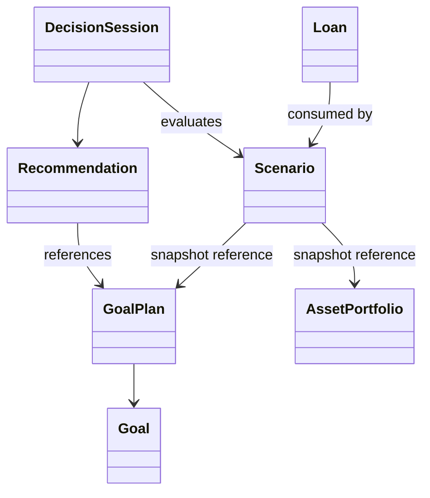
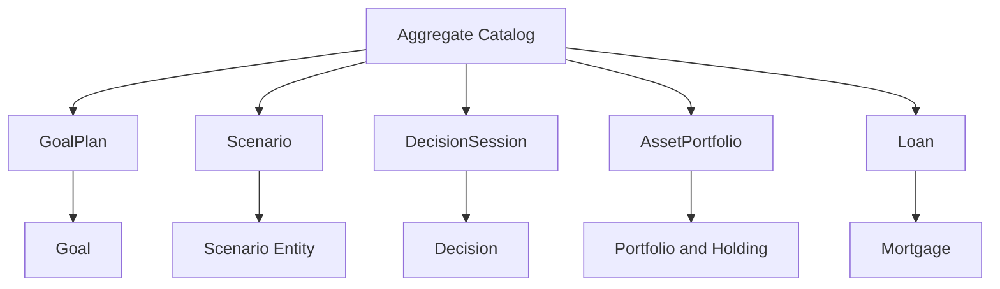
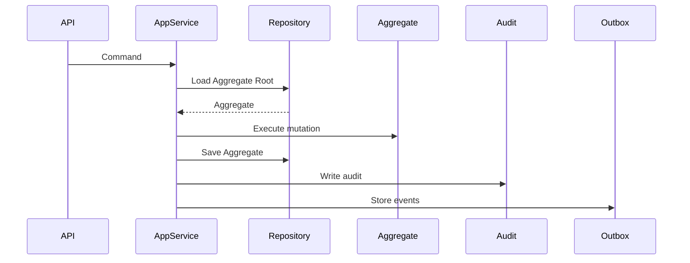
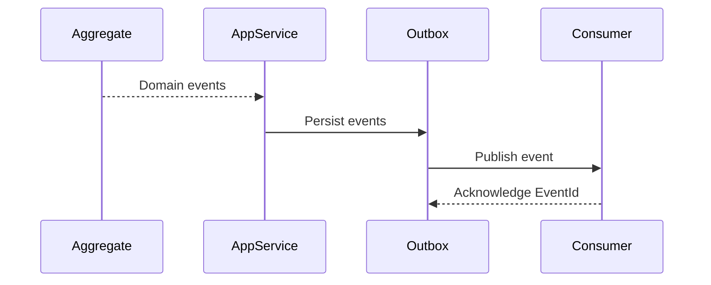
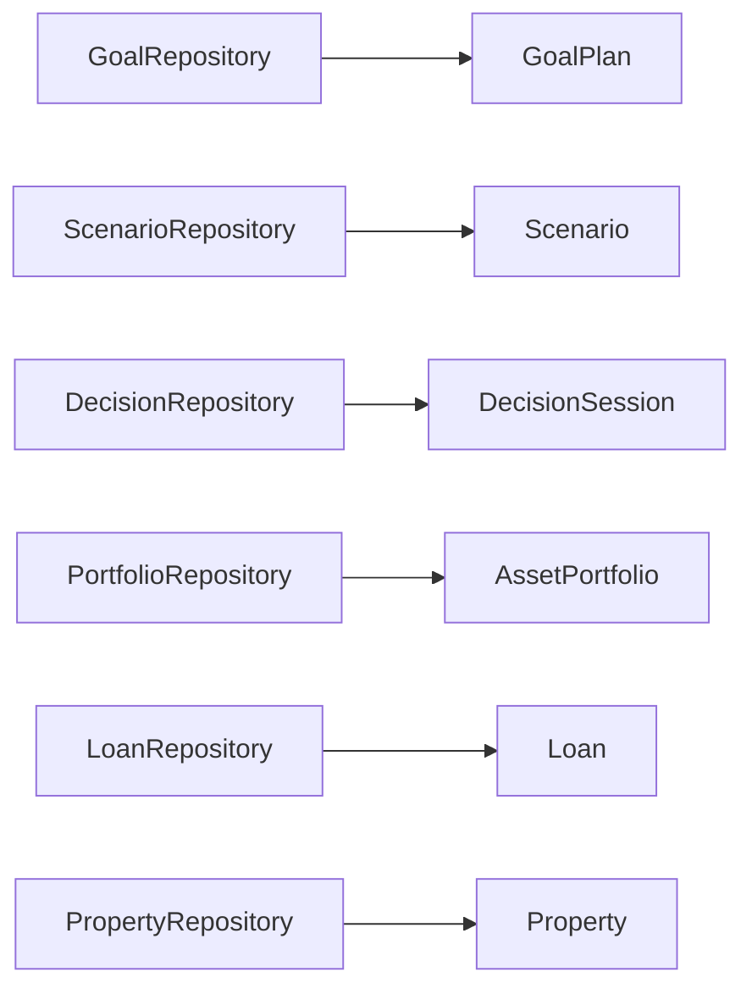
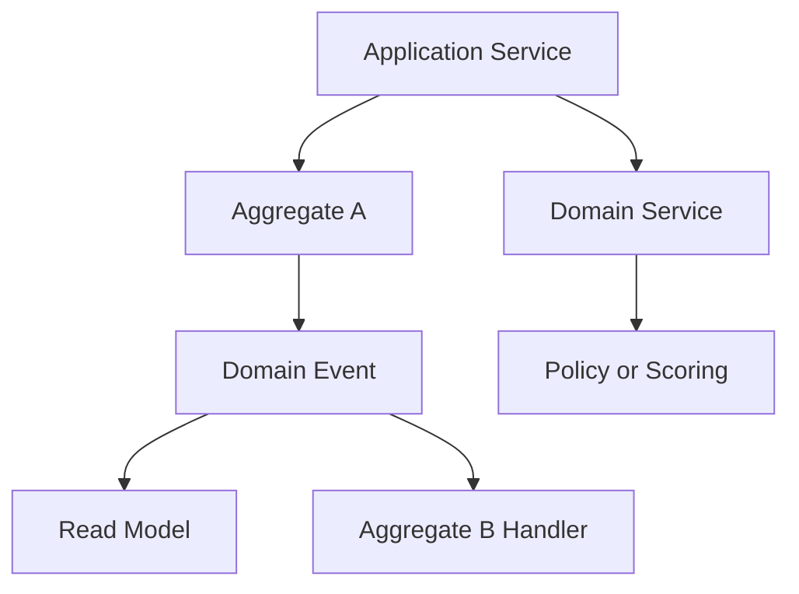

# Aggregate Catalog
## Split Navigation
- [Aggregate core catalog](aggregate-catalog/core-aggregates.md)
- [Aggregate ownership mapping](aggregate-catalog/ownership-mapping.md)
- [Aggregate governance and testing](aggregate-catalog/governance-and-testing.md)
- [Aggregate cross-boundary rules](aggregate/cross-boundary-rules.md)

# Document Control

Document Name: Aggregate Catalog

Document Path: knowledge/catalog/aggregate-catalog.md

Document Type: Enterprise Specification

Version: 1.0

Status: Canonical Specification

Domain: Platform

Bounded Context: Platform

Owner: Project Atlas

Source of Truth: Atlas Knowledge Base

Last Updated: 2026-07-12

Related Specifications:

- knowledge/entity-catalog.md
- knowledge/domain-model-catalog.md
- knowledge/bounded-context-catalog.md
- knowledge/repository-catalog.md
- knowledge/command-catalog.md
- knowledge/domain-event-catalog.md
- knowledge/value-object-catalog.md
- knowledge/enumeration-catalog.md
- knowledge/domain-service-catalog.md
- knowledge/application-service-catalog.md
- docs/specification/04-DomainModel.md
- docs/specification/04A-DomainInventory.md
- docs/database/05-DatabaseDesign.md
- docs/database/06-ERD.md

# Purpose

Aggregate Catalog is the canonical source of truth for Atlas aggregate ownership.

It defines which Aggregate Root owns which consistency boundary, transaction boundary, repository, command ownership, event publishing responsibility, and persistence source of truth.

It prevents Entity, Command, Domain Event, Repository, Application Service, Domain Service, API, DTO, table, and read model specifications from inventing new Aggregate ownership.

It does not redesign Atlas.

It does not create new Domains.

It does not create new Bounded Contexts.

It does not promote Entity names into Aggregate names unless the Aggregate already exists in this catalog.

# Scope

In scope:

- Aggregate definition standard.
- Complete Aggregate Catalog.
- Aggregate ownership matrix.
- Entity-to-Aggregate mapping.
- Command-to-Aggregate mapping.
- Event-to-Aggregate mapping.
- Repository-to-Aggregate mapping.
- Table-to-Aggregate mapping.
- Cross-aggregate interaction rules.
- Aggregate invariants.
- Aggregate lifecycle.
- Repository rules.
- Command ownership rules.
- Domain Event ownership rules.
- Persistence ownership rules.
- API ownership rules.
- Security boundary.
- Audit boundary.
- Performance and concurrency.
- Validation rules.
- Testing expectations.
- Edge cases.
- Final consistency matrix.

Out of scope:

- Creating new aggregate roots.
- Creating new entities.
- Creating new repositories.
- Creating new bounded contexts.
- Defining database schema as source of truth.
- Treating read models as write models.
- Allowing one repository to mutate multiple aggregate roots.

# Aggregate Definition Standard

Aggregate:

An Aggregate is a consistency boundary that protects business invariants through one Aggregate Root.

Aggregate Root:

The Aggregate Root is the only object external code may directly load, mutate, and persist for that Aggregate.

Entity:

An Entity has identity and lifecycle. Entity ownership must map to exactly one Aggregate unless it is a reference by identity only.

Value Object:

A Value Object is immutable and equality is value-based. Value Objects may be owned by Aggregates without separate repository ownership.

Invariant:

An invariant is a business rule that must remain true before and after any committed Aggregate mutation.

Consistency Boundary:

The consistency boundary is the set of state that must be transactionally valid with the Aggregate Root.

Transaction Boundary:

The transaction boundary is the maximum scope of one atomic write operation.

Repository Ownership:

One repository exists per Aggregate Root. A repository may not own business logic and may not mutate another Aggregate Root.

Command Ownership:

A command mutating business state must have one owning Aggregate Root.

Event Ownership:

A Domain Event must declare the Aggregate Root that produced the immutable business fact.

Read Model:

A read model is a projection for query and reporting. It is never the source of truth for Aggregate mutation.

# Complete Aggregate Catalog

## User

Aggregate Name: User

Aggregate Root: User

Domain: Identity

Bounded Context: Identity

Module: Identity

Purpose: Own user identity, authentication reference, and user-level profile identity.

Business Meaning: User represents an Atlas account participant.

Responsibilities:

- Own user identity.
- Own user lifecycle state.
- Own user audit fields.
- Own user concurrency token.

Owned Entities:

- User.

Owned Value Objects:

- Address when user contact address is stored.

Owned Enumerations:

- none from current Enumeration Catalog.

Invariants:

- UserId is stable.
- User identity is unique.
- User audit fields are present.
- User concurrency token changes on mutation.

Lifecycle:

- Created.
- Active.
- Suspended.
- Archived.

State Machine Ownership: User owns user lifecycle.

Transaction Boundary: One User mutation.

Consistency Boundary: User identity and lifecycle.

Repository: UserRepository.

Commands:

- none currently listed in Command Catalog.

Domain Events:

- none currently listed in Domain Event Catalog.

Domain Services:

- none.

Application Services:

- UserApplicationService.

API Resource:

- User resource.

Database Tables:

- user table naming is owned by User aggregate in database design.

Cache Ownership:

- User identity cache.

Authorization Boundary:

- Identity access policy.

Audit Requirements:

- All identity mutations audited.

Concurrency Strategy:

- Optimistic concurrency token.

Idempotency Strategy:

- Idempotency key for mutating commands.

External References:

- Household references User by identity.

Upstream Dependencies:

- Identity provider.

Downstream Consumers:

- Household.
- Audit.
- Notification.

Cross-Aggregate Rules:

- User does not mutate Household directly.

Illegal Responsibilities:

- User does not own Household finances.
- User does not own FinancialProfile.

Example Use Case:

- A user account is created and later linked to a Household.

## Household

Aggregate Name: Household

Aggregate Root: Household

Domain: Financial Profile

Bounded Context: Financial Profile

Module: Financial Profile

Purpose: Own household-level membership, shared financial ownership scope, and household authorization boundary.

Business Meaning: Household represents the shared decision and financial planning unit.

Responsibilities:

- Own household identity.
- Own household membership references.
- Own household authorization scope.
- Own household lifecycle.

Owned Entities:

- Household.

Owned Value Objects:

- Address when household address is stored.

Owned Enumerations:

- none from current Enumeration Catalog.

Invariants:

- HouseholdId is stable.
- Household owns its membership scope.
- Household cannot expose data across households.

Lifecycle:

- Created.
- Active.
- Suspended.
- Archived.

State Machine Ownership: Household owns household lifecycle.

Transaction Boundary: One Household mutation.

Consistency Boundary: Household membership and authorization scope.

Repository: HouseholdRepository.

Commands:

- none currently listed in Command Catalog.

Domain Events:

- none currently listed in Domain Event Catalog.

Domain Services:

- none.

Application Services:

- UserApplicationService.
- AdministrationApplicationService.

API Resource:

- Household resource.

Database Tables:

- household table naming is owned by Household aggregate.

Cache Ownership:

- Household membership cache.

Authorization Boundary:

- Household isolation boundary.

Audit Requirements:

- Membership and authorization changes audited.

Concurrency Strategy:

- Optimistic concurrency token.

Idempotency Strategy:

- Idempotency key for mutating commands.

External References:

- FinancialProfile references Household.
- GoalPlan references Household.
- Scenario references Household.

Upstream Dependencies:

- User.

Downstream Consumers:

- FinancialProfile.
- GoalPlan.
- Scenario.
- DecisionSession.
- Recommendation.

Cross-Aggregate Rules:

- Household does not mutate child financial aggregates directly.

Illegal Responsibilities:

- Household does not own assets directly when FinancialProfile owns financial data.

Example Use Case:

- A household is created and becomes the authorization boundary for planning.

## FinancialProfile

Aggregate Name: FinancialProfile

Aggregate Root: FinancialProfile

Domain: Financial Profile

Bounded Context: Financial Profile

Module: Financial Profile

Purpose: Own the user's baseline financial profile.

Business Meaning: FinancialProfile is the source of truth for financial facts consumed by scenario and decision logic.

Responsibilities:

- Own baseline financial profile.
- Coordinate references to assets, liabilities, and goals.
- Provide current-state input to Scenario and Decision.

Owned Entities:

- none directly listed beyond FinancialProfile aggregate root.

Owned Value Objects:

- Money.
- Currency.
- Percentage.
- CashFlowItem.

Owned Enumerations:

- CurrencyCode.

Invariants:

- FinancialProfile belongs to one Household.
- Financial facts must be auditable.
- FinancialProfile cannot mutate AssetPortfolio or LiabilityPortfolio directly.

Lifecycle:

- Created.
- Active.
- Updated.
- Archived.

State Machine Ownership: FinancialProfile owns profile lifecycle.

Transaction Boundary: One FinancialProfile mutation.

Consistency Boundary: FinancialProfile facts.

Repository: no dedicated repository currently listed; persistence ownership must use catalog-approved repository or be added before implementation.

Commands:

- none currently listed in Command Catalog.

Domain Events:

- SnapshotCreated may consume profile state.

Domain Services:

- CashFlowService.
- ScoringService.

Application Services:

- BlueprintApplicationService.
- DecisionApplicationService.

API Resource:

- Financial profile resource.

Database Tables:

- financial profile tables are owned by FinancialProfile.

Cache Ownership:

- Profile snapshot cache.

Authorization Boundary:

- Household isolation.

Audit Requirements:

- Profile changes audited.

Concurrency Strategy:

- Optimistic concurrency token.

Idempotency Strategy:

- Idempotent profile update commands.

External References:

- Scenario reads profile snapshot.
- DecisionSession reads profile snapshot.

Upstream Dependencies:

- Household.

Downstream Consumers:

- Scenario.
- DecisionSession.
- Recommendation.
- Dashboard.

Cross-Aggregate Rules:

- FinancialProfile may reference AssetPortfolio and LiabilityPortfolio by identity.

Illegal Responsibilities:

- FinancialProfile does not execute recommendations.

Example Use Case:

- A financial profile snapshot is consumed by Scenario evaluation.

## AssetPortfolio

Aggregate Name: AssetPortfolio

Aggregate Root: AssetPortfolio

Domain: Portfolio

Bounded Context: Investment

Module: Investment Engine

Purpose: Own investment asset portfolio state.

Business Meaning: AssetPortfolio represents owned investment and asset holdings.

Responsibilities:

- Own Portfolio and Holding entities where investment holdings exist.
- Own Asset references within portfolio scope.
- Protect allocation invariants.
- Produce portfolio events.

Owned Entities:

- Portfolio.
- Holding.
- Asset.

Owned Value Objects:

- Money.
- Currency.
- Percentage.
- Allocation.
- RiskScore.

Owned Enumerations:

- AssetType.
- CurrencyCode.
- RiskLevel.

Invariants:

- Holding quantity cannot be negative.
- Allocation must be within valid percentage range.
- Portfolio currency must be supported.
- Portfolio mutation must preserve audit fields.

Lifecycle:

- Created.
- Active.
- Rebalanced.
- Archived.

State Machine Ownership: AssetPortfolio owns portfolio lifecycle.

Transaction Boundary: One AssetPortfolio mutation.

Consistency Boundary: Portfolio holdings and allocation.

Repository: PortfolioRepository.

Commands:

- CreatePortfolio.
- BuySecurity.
- SellSecurity.
- RebalancePortfolio.

Domain Events:

- PortfolioCreated.
- SecurityPurchased.
- SecuritySold.
- PortfolioRebalanced.
- DividendDistributed.

Domain Services:

- PortfolioService.
- AllocationService.
- RiskService.

Application Services:

- PortfolioApplicationService.

API Resource:

- Portfolio resource.

Database Tables:

- portfolio tables.
- holding tables.

Cache Ownership:

- Portfolio valuation cache.

Authorization Boundary:

- Household isolation.

Audit Requirements:

- Trade and rebalance audit.

Concurrency Strategy:

- Optimistic concurrency token per AssetPortfolio.

Idempotency Strategy:

- Trade command idempotency key.

External References:

- Scenario references AssetPortfolio.
- DecisionSession consumes portfolio output.

Upstream Dependencies:

- FinancialProfile.

Downstream Consumers:

- Scenario.
- DecisionSession.
- Recommendation.
- Dashboard.

Cross-Aggregate Rules:

- Portfolio changes do not directly mutate GoalPlan.

Illegal Responsibilities:

- AssetPortfolio does not own Loan or Property.

Example Use Case:

- BuySecurity updates holdings and emits SecurityPurchased.

## LiabilityPortfolio

Aggregate Name: LiabilityPortfolio

Aggregate Root: LiabilityPortfolio

Domain: Liabilities

Bounded Context: Loan

Module: Loan Engine

Purpose: Own liability portfolio state outside individual Loan aggregate operations.

Business Meaning: LiabilityPortfolio represents the user's combined liability position.

Responsibilities:

- Own Liability entity scope where grouped liabilities are tracked.
- Provide debt exposure for Scenario and Decision.
- Protect liability summary invariants.

Owned Entities:

- Liability.

Owned Value Objects:

- Money.
- Currency.
- InterestRate.
- Percentage.

Owned Enumerations:

- CurrencyCode.

Invariants:

- Liability balance cannot be negative unless explicitly closed.
- Liability currency must be supported.
- Liability belongs to one Household scope.

Lifecycle:

- Created.
- Active.
- Updated.
- Archived.

State Machine Ownership: LiabilityPortfolio owns liability portfolio lifecycle.

Transaction Boundary: One LiabilityPortfolio mutation.

Consistency Boundary: Liability summary and grouped liability references.

Repository: LiabilityRepository.

Commands:

- none currently listed in Command Catalog for LiabilityPortfolio.

Domain Events:

- none currently listed in Domain Event Catalog for LiabilityPortfolio.

Domain Services:

- LoanService.
- RiskService.

Application Services:

- LoanApplicationService.

API Resource:

- Liability resource.

Database Tables:

- liability tables.

Cache Ownership:

- Liability summary cache.

Authorization Boundary:

- Household isolation.

Audit Requirements:

- Liability changes audited.

Concurrency Strategy:

- Optimistic concurrency token.

Idempotency Strategy:

- Idempotent mutation commands.

External References:

- Loan may be referenced by LiabilityPortfolio.

Upstream Dependencies:

- FinancialProfile.

Downstream Consumers:

- Scenario.
- DecisionSession.
- Recommendation.

Cross-Aggregate Rules:

- LiabilityPortfolio does not mutate Loan aggregate directly.

Illegal Responsibilities:

- LiabilityPortfolio does not own Mortgage lifecycle when Loan owns loan commands.

Example Use Case:

- Liability summary is used to evaluate debt capacity.

## GoalPlan

Aggregate Name: GoalPlan

Aggregate Root: GoalPlan

Domain: Goals

Bounded Context: Financial Profile

Module: GoalApplicationService

Purpose: Own Goals and goal planning state.

Business Meaning: GoalPlan is the source of truth for user's life and financial Goals.

Responsibilities:

- Own Goal entity lifecycle.
- Own goal priority state.
- Own goal dependency state.
- Own goal conflict state.
- Protect goal invariants.

Owned Entities:

- Goal.

Owned Value Objects:

- Money.
- Currency.
- Percentage.
- DateRange.
- RiskScore.

Owned Enumerations:

- GoalStatus.
- CurrencyCode.
- RiskLevel.

Invariants:

- GoalId is stable.
- Goal belongs to one GoalPlan.
- Goal status must be valid.
- Goal target amount cannot be negative.
- Goal conflict state cannot mutate unrelated Goals.
- Goal dependency graph must not contain cycles.

Lifecycle:

- Created.
- Active.
- On Hold.
- Completed.
- Cancelled.
- Archived.

State Machine Ownership: GoalPlan owns Goal lifecycle and goal conflict state.

Transaction Boundary: One GoalPlan mutation.

Consistency Boundary: Goals, dependency state, priority state, lifecycle state, and conflict state owned by the same GoalPlan.

Repository: GoalRepository.

Commands:

- Goal conflict use cases are owned by GoalApplicationService.
- Goal lifecycle use cases are owned by GoalApplicationService.

Domain Events:

- GoalCreated when added to Domain Event Catalog.
- GoalPriorityChanged from goal-prioritization specification.
- GoalDependencyCreated from goal-dependency specification.
- GoalConflictResolved from goal-conflict-resolution specification.

Domain Services:

- ScoringService.
- ExplainabilityService.
- RiskService.

Application Services:

- GoalApplicationService.
- DecisionApplicationService.

API Resource:

- Goal resource.
- Goal conflict subresource.

Database Tables:

- goal tables.
- goal dependency read models.
- goal conflict read models.

Cache Ownership:

- Goal list cache.
- Goal priority cache.

Authorization Boundary:

- Household isolation.

Audit Requirements:

- Goal state changes audited.
- Priority changes audited.
- Dependency changes audited.
- Conflict resolution audited.

Concurrency Strategy:

- Optimistic concurrency token on GoalPlan.

Idempotency Strategy:

- Idempotency key per mutating use case.

External References:

- Scenario references GoalPlan state.
- DecisionSession consumes GoalPlan state.
- Recommendation references Goals.

Upstream Dependencies:

- Household.
- FinancialProfile.

Downstream Consumers:

- Scenario.
- DecisionSession.
- Recommendation.
- Dashboard.

Cross-Aggregate Rules:

- GoalPlan references Scenario, DecisionSession, and Recommendation by identity only.

Illegal Responsibilities:

- GoalPlan does not own Scenario execution.
- GoalPlan does not own Recommendation acceptance.
- GoalPlan does not own Portfolio holdings.

Example Use Case:

- GoalApplicationService resolves a conflict between Housing and Retirement Goals inside GoalPlan.

## Property

Aggregate Name: Property

Aggregate Root: Property

Domain: Property

Bounded Context: Property

Module: Home Upgrade Engine

Purpose: Own real estate property state.

Business Meaning: Property represents a real estate asset or planned property decision subject.

Responsibilities:

- Own Property entity lifecycle.
- Own property valuation state.
- Own property transaction state.

Owned Entities:

- Property.

Owned Value Objects:

- Money.
- Currency.
- Address.
- Percentage.

Owned Enumerations:

- PropertyType.
- CurrencyCode.

Invariants:

- PropertyId is stable.
- Property value cannot be negative.
- Property type must be valid.
- Property address is immutable when used as legal identity unless corrected through audited change.

Lifecycle:

- Created.
- Active.
- Sold.
- Archived.

State Machine Ownership: Property owns property lifecycle.

Transaction Boundary: One Property mutation.

Consistency Boundary: Property state and valuation.

Repository: PropertyRepository.

Commands:

- PurchaseHome.
- SellHome.
- UpdatePropertyValue.

Domain Events:

- HomePurchased.
- HomeSold.
- HomeValueUpdated.
- HomeUpgradeStarted.
- HomeUpgradeCompleted.

Domain Services:

- none currently listed specifically for Property.

Application Services:

- DecisionApplicationService.

API Resource:

- Property resource.

Database Tables:

- property tables.

Cache Ownership:

- Property valuation cache.

Authorization Boundary:

- Household isolation.

Audit Requirements:

- Purchase, sale, and valuation changes audited.

Concurrency Strategy:

- Optimistic concurrency token.

Idempotency Strategy:

- Idempotent home purchase and sale commands.

External References:

- Loan references property by identity when mortgage exists.

Upstream Dependencies:

- Household.

Downstream Consumers:

- Scenario.
- DecisionSession.
- Recommendation.

Cross-Aggregate Rules:

- Property does not create Loan inside its transaction; PurchaseHome may emit event consumed by Loan workflow.

Illegal Responsibilities:

- Property does not own mortgage amortization.

Example Use Case:

- PurchaseHome records property purchase and emits HomePurchased.

## Loan

Aggregate Name: Loan

Aggregate Root: Loan

Domain: Loan

Bounded Context: Loan

Module: Loan Engine

Purpose: Own loan and mortgage lifecycle.

Business Meaning: Loan represents an obligation with rate, term, balance, and payment behavior.

Responsibilities:

- Own Loan entity lifecycle.
- Own Mortgage entity when mortgage is represented as loan subtype.
- Own payment and refinance state.

Owned Entities:

- Mortgage.
- Liability by reference when liability summary is separate.

Owned Value Objects:

- Money.
- Currency.
- InterestRate.
- LoanTerm.
- Percentage.

Owned Enumerations:

- LoanType.
- CurrencyCode.

Invariants:

- Loan balance cannot be negative after payment.
- Loan term must be valid.
- Interest rate must be valid.
- Closed loan cannot receive payment.

Lifecycle:

- Created.
- Active.
- Refinanced.
- Closed.
- Archived.

State Machine Ownership: Loan owns loan lifecycle.

Transaction Boundary: One Loan mutation.

Consistency Boundary: Loan balance, payment, refinance, and closure state.

Repository: LoanRepository.

Commands:

- CreateLoan.
- RecordLoanPayment.
- RefinanceLoan.

Domain Events:

- LoanCreated.
- LoanPaymentMade.
- LoanRefinanced.
- LoanClosed.

Domain Services:

- LoanService.
- RiskService.

Application Services:

- LoanApplicationService.

API Resource:

- Loan resource.

Database Tables:

- loan tables.
- mortgage tables when mortgage is mapped separately.

Cache Ownership:

- Loan amortization cache.

Authorization Boundary:

- Household isolation.

Audit Requirements:

- Loan creation, payment, refinance, and close audited.

Concurrency Strategy:

- Optimistic concurrency token.

Idempotency Strategy:

- Payment command idempotency key.

External References:

- Property reference by identity.
- LiabilityPortfolio consumes loan summary.

Upstream Dependencies:

- Property when mortgage is property-backed.

Downstream Consumers:

- Scenario.
- DecisionSession.
- Recommendation.
- CashFlowService.

Cross-Aggregate Rules:

- Loan does not mutate Property value.

Illegal Responsibilities:

- Loan does not own investment portfolio.

Example Use Case:

- RecordLoanPayment reduces balance and emits LoanPaymentMade.

## Scenario

Aggregate Name: Scenario

Aggregate Root: Scenario

Domain: Scenario

Bounded Context: Scenario

Module: Scenario Engine

Purpose: Own scenario assumptions, decisions, lifecycle, and simulation snapshot.

Business Meaning: Scenario represents one coherent future path for comparison and decision making.

Responsibilities:

- Own Scenario entity lifecycle.
- Own scenario inputs and outputs.
- Own scenario versioning.
- Own simulation status.

Owned Entities:

- Scenario.

Owned Value Objects:

- Money.
- Currency.
- Percentage.
- DateRange.
- InflationRate.
- InterestRate.
- RiskScore.

Owned Enumerations:

- ScenarioStatus.
- CurrencyCode.
- RiskLevel.

Invariants:

- ScenarioId is stable.
- Scenario version is immutable after simulation snapshot.
- Scenario must have valid assumption version.
- Scenario output cannot be final when validation fails.

Lifecycle:

- Draft.
- Validated.
- Simulated.
- Compared.
- Archived.

State Machine Ownership: Scenario owns scenario lifecycle.

Transaction Boundary: One Scenario mutation.

Consistency Boundary: Scenario inputs, assumptions, outputs, and version.

Repository: ScenarioRepository.

Commands:

- EvaluateScenario.
- ReplayScenario reads Scenario state for replay.

Domain Events:

- ScenarioEvaluated.
- ReplayCompleted.

Domain Services:

- ScenarioService.
- ScoringService.
- RiskService.

Application Services:

- ScenarioApplicationService.
- DecisionApplicationService.

API Resource:

- Scenario resource.

Database Tables:

- scenario tables.
- scenario result tables.

Cache Ownership:

- Scenario result cache.

Authorization Boundary:

- Household isolation.

Audit Requirements:

- Scenario input and output versions audited.

Concurrency Strategy:

- Optimistic concurrency token.

Idempotency Strategy:

- Scenario execution request idempotency key.

External References:

- FinancialProfile snapshot.
- GoalPlan snapshot.
- AssetPortfolio snapshot.
- LiabilityPortfolio snapshot.

Upstream Dependencies:

- FinancialProfile.
- GoalPlan.
- AssetPortfolio.
- LiabilityPortfolio.
- Loan.
- Property.

Downstream Consumers:

- DecisionSession.
- Recommendation.
- Dashboard.

Cross-Aggregate Rules:

- Scenario uses snapshots and does not mutate source aggregates.

Illegal Responsibilities:

- Scenario does not accept or reject decisions.

Example Use Case:

- EvaluateScenario emits ScenarioEvaluated.

## DecisionSession

Aggregate Name: DecisionSession

Aggregate Root: DecisionSession

Domain: Decision

Bounded Context: Decision

Module: Decision Engine

Purpose: Own decision evaluation and decision outcome state.

Business Meaning: DecisionSession represents an evaluated decision journey.

Responsibilities:

- Own decision inputs.
- Own decision status.
- Own decision outcome.
- Own accepted or rejected decision record.

Owned Entities:

- Decision.

Owned Value Objects:

- Percentage.
- RiskScore.
- Money.

Owned Enumerations:

- DecisionStatus.
- RiskLevel.

Invariants:

- DecisionId is stable.
- Decision cannot be accepted and rejected simultaneously.
- Decision requires valid scenario inputs.
- Decision outcome must be auditable.

Lifecycle:

- Created.
- Evaluated.
- Accepted.
- Rejected.
- Archived.

State Machine Ownership: DecisionSession owns decision lifecycle.

Transaction Boundary: One DecisionSession mutation.

Consistency Boundary: Decision evaluation and outcome.

Repository: DecisionRepository.

Commands:

- EvaluateScenario.
- AcceptRecommendation.
- RejectRecommendation.

Domain Events:

- ScenarioEvaluated.
- RecommendationGenerated.
- DecisionAccepted.
- DecisionRejected.

Domain Services:

- DecisionService.
- ScoringService.
- ExplainabilityService.
- RiskService.

Application Services:

- DecisionApplicationService.

API Resource:

- Decision resource.

Database Tables:

- decision tables.

Cache Ownership:

- Decision result cache.

Authorization Boundary:

- Household isolation.

Audit Requirements:

- Decision scoring and user action audited.

Concurrency Strategy:

- Optimistic concurrency token.

Idempotency Strategy:

- Accept and reject commands are idempotent.

External References:

- Scenario references by identity.
- Recommendation references by identity.

Upstream Dependencies:

- Scenario.
- GoalPlan.
- Constraint Rules.

Downstream Consumers:

- Recommendation.
- ExecutionPlan behavior through application layer.

Cross-Aggregate Rules:

- DecisionSession does not mutate Scenario after evaluation.

Illegal Responsibilities:

- DecisionSession does not own Recommendation content lifecycle when Recommendation is separate aggregate.

Example Use Case:

- A user accepts a recommendation and DecisionAccepted is emitted.

## Recommendation

Aggregate Name: Recommendation

Aggregate Root: Recommendation

Domain: Decision

Bounded Context: Decision

Module: Decision Engine

Purpose: Own recommendation identity, priority, status, and explanation.

Business Meaning: Recommendation is a proposed action or advisory result produced by Atlas.

Responsibilities:

- Own Recommendation entity lifecycle.
- Own recommendation priority.
- Own recommendation explanation.
- Own recommendation display and dismissal state.

Owned Entities:

- Recommendation.

Owned Value Objects:

- Money.
- Percentage.
- RiskScore.

Owned Enumerations:

- RecommendationPriority.
- RiskLevel.

Invariants:

- RecommendationId is stable.
- Recommendation must have source context.
- Recommendation priority must be valid.
- Dismissed recommendation remains auditable.

Lifecycle:

- Generated.
- Ranked.
- Displayed.
- Accepted.
- Dismissed.
- Archived.

State Machine Ownership: Recommendation owns recommendation lifecycle.

Transaction Boundary: One Recommendation mutation.

Consistency Boundary: Recommendation state and explanation.

Repository: no dedicated RecommendationRepository currently listed in Repository Catalog; DecisionRepository may persist decision-owned recommendation data until catalog is extended.

Commands:

- AcceptRecommendation.
- RejectRecommendation.

Domain Events:

- RecommendationGenerated.
- DecisionAccepted.
- DecisionRejected.

Domain Services:

- DecisionService.
- ExplainabilityService.
- ScoringService.

Application Services:

- DecisionApplicationService.

API Resource:

- Recommendation resource.

Database Tables:

- recommendation tables.

Cache Ownership:

- Recommendation feed cache.

Authorization Boundary:

- Household isolation.

Audit Requirements:

- Recommendation generation and user action audited.

Concurrency Strategy:

- Optimistic concurrency token.

Idempotency Strategy:

- Accept and reject command idempotency key.

External References:

- DecisionSession.
- Scenario.
- GoalPlan.

Upstream Dependencies:

- DecisionSession.
- Scenario.
- GoalPlan.

Downstream Consumers:

- Dashboard.
- Notification.
- Execution planning.

Cross-Aggregate Rules:

- Recommendation does not mutate GoalPlan directly.

Illegal Responsibilities:

- Recommendation does not own Decision acceptance.

Example Use Case:

- RecommendationGenerated creates a recommendation for user review.

## RetirementPlan

Aggregate Name: RetirementPlan

Aggregate Root: RetirementPlan

Domain: Retirement

Bounded Context: Retirement

Module: Retirement Engine

Purpose: Own retirement planning assumptions and readiness state.

Business Meaning: RetirementPlan represents retirement goals, projections, and withdrawal planning.

Responsibilities:

- Own retirement plan state.
- Own retirement readiness data.
- Own retirement withdrawal status.

Owned Entities:

- none currently listed separately.

Owned Value Objects:

- Money.
- Currency.
- Percentage.
- InflationRate.
- RiskScore.

Owned Enumerations:

- CurrencyCode.
- RiskLevel.

Invariants:

- Retirement horizon must be valid.
- Retirement plan assumptions must be versioned.
- Withdrawal cannot start before configured condition.

Lifecycle:

- Created.
- Updated.
- Goal Reached.
- Withdrawal Started.
- Archived.

State Machine Ownership: RetirementPlan owns retirement lifecycle.

Transaction Boundary: One RetirementPlan mutation.

Consistency Boundary: Retirement assumptions and plan state.

Repository: no dedicated repository currently listed; repository ownership must be catalog-approved before implementation.

Commands:

- UpdateRetirementPlan.

Domain Events:

- RetirementPlanUpdated.
- RetirementGoalReached.
- RetirementWithdrawalStarted.

Domain Services:

- RetirementService.
- RiskService.

Application Services:

- DecisionApplicationService.
- ReportApplicationService.

API Resource:

- Retirement resource.

Database Tables:

- retirement plan tables.

Cache Ownership:

- Retirement projection cache.

Authorization Boundary:

- Household isolation.

Audit Requirements:

- Retirement assumption and plan changes audited.

Concurrency Strategy:

- Optimistic concurrency token.

Idempotency Strategy:

- UpdateRetirementPlan idempotency key.

External References:

- AssetPortfolio.
- GoalPlan.
- Scenario.

Upstream Dependencies:

- FinancialProfile.
- AssetPortfolio.
- GoalPlan.

Downstream Consumers:

- Scenario.
- DecisionSession.
- Recommendation.
- Dashboard.

Cross-Aggregate Rules:

- RetirementPlan does not mutate AssetPortfolio.

Illegal Responsibilities:

- RetirementPlan does not own portfolio holdings.

Example Use Case:

- UpdateRetirementPlan emits RetirementPlanUpdated.

## Notification

Aggregate Name: Notification

Aggregate Root: Notification

Domain: Platform

Bounded Context: Platform

Module: Notification

Purpose: Own notification state and delivery tracking.

Business Meaning: Notification represents an alert or message delivered through supported channels.

Responsibilities:

- Own Notification entity lifecycle.
- Own delivery status.
- Own channel and recipient metadata.

Owned Entities:

- Notification.

Owned Value Objects:

- none from current Value Object Catalog.

Owned Enumerations:

- NotificationChannel.

Invariants:

- NotificationId is stable.
- Channel must be valid.
- Delivery attempt must be auditable.

Lifecycle:

- Created.
- Sent.
- Failed.
- Archived.

State Machine Ownership: Notification owns notification lifecycle.

Transaction Boundary: One Notification mutation.

Consistency Boundary: Notification state.

Repository: NotificationRepository.

Commands:

- none currently listed in Command Catalog.

Domain Events:

- none currently listed in Domain Event Catalog.

Domain Services:

- none.

Application Services:

- NotificationApplicationService.

API Resource:

- Notification resource.

Database Tables:

- notification tables.

Cache Ownership:

- Notification feed cache.

Authorization Boundary:

- User or Household scope.

Audit Requirements:

- Delivery and user-visible changes audited.

Concurrency Strategy:

- Optimistic concurrency token.

Idempotency Strategy:

- Notification send idempotency key.

External References:

- DecisionSession.
- Recommendation.
- Scenario.

Upstream Dependencies:

- SchedulerService.
- DecisionApplicationService.

Downstream Consumers:

- Dashboard.
- User.

Cross-Aggregate Rules:

- Notification does not mutate source aggregate.

Illegal Responsibilities:

- Notification does not own financial decisions.

Example Use Case:

- A recommendation alert is sent through configured channel.

## Policy

Aggregate Name: Policy

Aggregate Root: Policy

Domain: Platform

Bounded Context: Platform

Module: Policy

Purpose: Own business policy state and policy versioning.

Business Meaning: Policy defines governed platform rules and thresholds.

Responsibilities:

- Own policy identity.
- Own policy lifecycle.
- Own policy version.
- Own policy approval state.

Owned Entities:

- Policy.

Owned Value Objects:

- Percentage.
- Money.
- RiskScore.

Owned Enumerations:

- RiskLevel.

Invariants:

- PolicyId is stable.
- Policy version is immutable after activation.
- Policy changes must be auditable.

Lifecycle:

- Draft.
- Active.
- Superseded.
- Archived.

State Machine Ownership: Policy owns policy lifecycle.

Transaction Boundary: One Policy mutation.

Consistency Boundary: Policy configuration and version.

Repository: no dedicated repository currently listed; Configuration aggregate may reference Policy where implementation requires catalog update.

Commands:

- none currently listed in Command Catalog.

Domain Events:

- none currently listed in Domain Event Catalog.

Domain Services:

- RiskService.
- ScoringService.

Application Services:

- AdministrationApplicationService.

API Resource:

- Policy resource.

Database Tables:

- policy tables.

Cache Ownership:

- Active policy cache.

Authorization Boundary:

- Administration permission.

Audit Requirements:

- Policy changes audited.

Concurrency Strategy:

- Optimistic concurrency token.

Idempotency Strategy:

- Policy mutation idempotency key.

External References:

- Constraint Rules.
- Decision Rules.
- Scoring.

Upstream Dependencies:

- Configuration.

Downstream Consumers:

- DecisionSession.
- Scenario.
- Recommendation.

Cross-Aggregate Rules:

- Policy changes publish events or version changes; consumers reload by version.

Illegal Responsibilities:

- Policy does not mutate user financial data.

Example Use Case:

- A risk threshold policy is activated for future calculations.

## Configuration

Aggregate Name: Configuration

Aggregate Root: Configuration

Domain: Platform

Bounded Context: Platform

Module: Configuration

Purpose: Own runtime configuration and versioned settings.

Business Meaning: Configuration provides governed settings used by Atlas modules.

Responsibilities:

- Own configuration identity.
- Own configuration version.
- Own active setting values.

Owned Entities:

- Configuration.

Owned Value Objects:

- Percentage.
- Money.
- Currency.

Owned Enumerations:

- CurrencyCode.

Invariants:

- Configuration key must be unique within scope.
- Active configuration must have valid version.
- Configuration changes must be auditable.

Lifecycle:

- Draft.
- Active.
- Superseded.
- Archived.

State Machine Ownership: Configuration owns configuration lifecycle.

Transaction Boundary: One Configuration mutation.

Consistency Boundary: Configuration key and value version.

Repository: no dedicated repository currently listed.

Commands:

- none currently listed in Command Catalog.

Domain Events:

- AssumptionVersionLoaded.
- FormulaVersionLoaded.

Domain Services:

- none.

Application Services:

- AdministrationApplicationService.

API Resource:

- Configuration resource.

Database Tables:

- configuration tables.

Cache Ownership:

- Configuration cache.

Authorization Boundary:

- Administration permission.

Audit Requirements:

- Configuration changes audited.

Concurrency Strategy:

- Optimistic concurrency token.

Idempotency Strategy:

- Configuration mutation idempotency key.

External References:

- Policy.
- Scenario.
- DecisionSession.

Upstream Dependencies:

- Administration.

Downstream Consumers:

- All calculation modules.

Cross-Aggregate Rules:

- Configuration changes do not rewrite historical calculation results.

Illegal Responsibilities:

- Configuration does not own business transaction state.

Example Use Case:

- A formula version is loaded and recorded for deterministic replay.

# Aggregate Ownership Matrix

| Aggregate | Root | Domain | Bounded Context | Repository | Commands | Events | Tables | Owner Service |
|---|---|---|---|---|---|---|---|---|
| User | User | Identity | Identity | UserRepository | none listed | none listed | user tables | UserApplicationService |
| Household | Household | Financial Profile | Financial Profile | HouseholdRepository | none listed | none listed | household tables | UserApplicationService |
| FinancialProfile | FinancialProfile | Financial Profile | Financial Profile | catalog update required | none listed | SnapshotCreated consumer | financial profile tables | BlueprintApplicationService |
| AssetPortfolio | AssetPortfolio | Portfolio | Investment | PortfolioRepository | CreatePortfolio, BuySecurity, SellSecurity, RebalancePortfolio | PortfolioCreated, SecurityPurchased, SecuritySold, PortfolioRebalanced, DividendDistributed | portfolio, holding | PortfolioApplicationService |
| LiabilityPortfolio | LiabilityPortfolio | Liabilities | Loan | LiabilityRepository | none listed | none listed | liability tables | LoanApplicationService |
| GoalPlan | GoalPlan | Goals | Financial Profile | GoalRepository | GoalApplicationService use cases | goal specification events | goal tables | GoalApplicationService |
| Property | Property | Property | Property | PropertyRepository | PurchaseHome, SellHome, UpdatePropertyValue | HomePurchased, HomeSold, HomeValueUpdated, HomeUpgradeStarted, HomeUpgradeCompleted | property tables | DecisionApplicationService |
| Loan | Loan | Loan | Loan | LoanRepository | CreateLoan, RecordLoanPayment, RefinanceLoan | LoanCreated, LoanPaymentMade, LoanRefinanced, LoanClosed | loan, mortgage | LoanApplicationService |
| Scenario | Scenario | Scenario | Scenario | ScenarioRepository | EvaluateScenario, ReplayScenario | ScenarioEvaluated, ReplayCompleted | scenario tables | ScenarioApplicationService |
| DecisionSession | DecisionSession | Decision | Decision | DecisionRepository | EvaluateScenario, AcceptRecommendation, RejectRecommendation | ScenarioEvaluated, RecommendationGenerated, DecisionAccepted, DecisionRejected | decision tables | DecisionApplicationService |
| Recommendation | Recommendation | Decision | Decision | catalog update required | AcceptRecommendation, RejectRecommendation | RecommendationGenerated | recommendation tables | DecisionApplicationService |
| RetirementPlan | RetirementPlan | Retirement | Retirement | catalog update required | UpdateRetirementPlan | RetirementPlanUpdated, RetirementGoalReached, RetirementWithdrawalStarted | retirement tables | DecisionApplicationService |
| Notification | Notification | Platform | Platform | NotificationRepository | none listed | none listed | notification tables | NotificationApplicationService |
| Policy | Policy | Platform | Platform | catalog update required | none listed | none listed | policy tables | AdministrationApplicationService |
| Configuration | Configuration | Platform | Platform | catalog update required | none listed | AssumptionVersionLoaded, FormulaVersionLoaded | configuration tables | AdministrationApplicationService |

# Entity-to-Aggregate Mapping

| Entity | Aggregate | Root | Ownership Type | Persistence Owner | Lifecycle Owner |
|---|---|---|---|---|---|
| User | User | User | Owned | UserRepository | User |
| Household | Household | Household | Owned | HouseholdRepository | Household |
| Asset | AssetPortfolio | AssetPortfolio | Owned within portfolio scope | PortfolioRepository | AssetPortfolio |
| Liability | LiabilityPortfolio | LiabilityPortfolio | Owned | LiabilityRepository | LiabilityPortfolio |
| Goal | GoalPlan | GoalPlan | Owned | GoalRepository | GoalPlan |
| Portfolio | AssetPortfolio | AssetPortfolio | Owned | PortfolioRepository | AssetPortfolio |
| Holding | AssetPortfolio | AssetPortfolio | Owned | PortfolioRepository | AssetPortfolio |
| Property | Property | Property | Owned | PropertyRepository | Property |
| Mortgage | Loan | Loan | Owned as loan subtype | LoanRepository | Loan |
| Scenario | Scenario | Scenario | Owned | ScenarioRepository | Scenario |
| Decision | DecisionSession | DecisionSession | Owned | DecisionRepository | DecisionSession |
| Recommendation | Recommendation | Recommendation | Owned by Recommendation aggregate; persisted through catalog-approved path | catalog update required | Recommendation |
| Notification | Notification | Notification | Owned | NotificationRepository | Notification |
| Policy | Policy | Policy | Owned | catalog update required | Policy |
| Configuration | Configuration | Configuration | Owned | catalog update required | Configuration |

# Command-to-Aggregate Mapping

| Command | Aggregate | Handler | Transaction Boundary | Idempotency | Event |
|---|---|---|---|---|---|
| RecordIncome | FinancialProfile | BlueprintApplicationService or Cash Flow use case | One profile/cash flow mutation | Required | SalaryReceived, BonusReceived, PassiveIncomeReceived |
| RecordExpense | FinancialProfile | BlueprintApplicationService or Cash Flow use case | One profile/cash flow mutation | Required | ExpenseRecorded |
| CreatePortfolio | AssetPortfolio | PortfolioApplicationService | One AssetPortfolio mutation | Required | PortfolioCreated |
| BuySecurity | AssetPortfolio | PortfolioApplicationService | One AssetPortfolio mutation | Required | SecurityPurchased |
| SellSecurity | AssetPortfolio | PortfolioApplicationService | One AssetPortfolio mutation | Required | SecuritySold |
| RebalancePortfolio | AssetPortfolio | PortfolioApplicationService | One AssetPortfolio mutation | Required | PortfolioRebalanced |
| CreateLoan | Loan | LoanApplicationService | One Loan mutation | Required | LoanCreated |
| RecordLoanPayment | Loan | LoanApplicationService | One Loan mutation | Required | LoanPaymentMade |
| RefinanceLoan | Loan | LoanApplicationService | One Loan mutation | Required | LoanRefinanced |
| PurchaseHome | Property | DecisionApplicationService | One Property mutation plus event-driven loan follow-up | Required | HomePurchased |
| SellHome | Property | DecisionApplicationService | One Property mutation | Required | HomeSold |
| UpdatePropertyValue | Property | DecisionApplicationService | One Property mutation | Required | HomeValueUpdated |
| IssuePolicy | Policy | AdministrationApplicationService | One Policy mutation | Required | PolicyIssued |
| PayPremium | Policy | AdministrationApplicationService | One Policy mutation | Required | PremiumPaid |
| UpdateRetirementPlan | RetirementPlan | DecisionApplicationService | One RetirementPlan mutation | Required | RetirementPlanUpdated |
| EvaluateScenario | Scenario or DecisionSession | ScenarioApplicationService or DecisionApplicationService | One Scenario evaluation or DecisionSession evaluation | Required | ScenarioEvaluated, RecommendationGenerated |
| AcceptRecommendation | DecisionSession | DecisionApplicationService | One DecisionSession mutation | Required | DecisionAccepted |
| RejectRecommendation | DecisionSession | DecisionApplicationService | One DecisionSession mutation | Required | DecisionRejected |
| ReplayScenario | Scenario | ScenarioApplicationService | Replay read operation with replay event | Required | ReplayCompleted |

# Event-to-Aggregate Mapping

| Event | Aggregate | Publisher | Consumers | Ordering | Version |
|---|---|---|---|---|---|
| SalaryReceived | FinancialProfile | Cash Flow use case | Timeline, Decision, Dashboard | Per Household | 1.0 |
| BonusReceived | FinancialProfile | Cash Flow use case | Timeline, Decision, Dashboard | Per Household | 1.0 |
| ExpenseRecorded | FinancialProfile | Cash Flow use case | Timeline, Decision, Dashboard | Per Household | 1.0 |
| PassiveIncomeReceived | FinancialProfile | Cash Flow use case | Timeline, Decision, Dashboard | Per Household | 1.0 |
| PortfolioCreated | AssetPortfolio | PortfolioApplicationService | Decision, Dashboard | Per AssetPortfolio | 1.0 |
| SecurityPurchased | AssetPortfolio | PortfolioApplicationService | Decision, Dashboard | Per AssetPortfolio | 1.0 |
| SecuritySold | AssetPortfolio | PortfolioApplicationService | Decision, Dashboard | Per AssetPortfolio | 1.0 |
| PortfolioRebalanced | AssetPortfolio | PortfolioApplicationService | Decision, Dashboard | Per AssetPortfolio | 1.0 |
| DividendDistributed | AssetPortfolio | PortfolioApplicationService | Cash Flow, Dashboard | Per AssetPortfolio | 1.0 |
| LoanCreated | Loan | LoanApplicationService | Scenario, Decision | Per Loan | 1.0 |
| LoanPaymentMade | Loan | LoanApplicationService | Cash Flow, Decision | Per Loan | 1.0 |
| LoanRefinanced | Loan | LoanApplicationService | Scenario, Decision | Per Loan | 1.0 |
| LoanClosed | Loan | LoanApplicationService | Scenario, Decision | Per Loan | 1.0 |
| HomePurchased | Property | DecisionApplicationService | Loan, Insurance, Scenario | Per Property | 1.0 |
| HomeSold | Property | DecisionApplicationService | Loan, Scenario | Per Property | 1.0 |
| HomeValueUpdated | Property | DecisionApplicationService | Scenario, Dashboard | Per Property | 1.0 |
| HomeUpgradeStarted | Property | DecisionApplicationService | Scenario, Dashboard | Per Property | 1.0 |
| HomeUpgradeCompleted | Property | DecisionApplicationService | Scenario, Dashboard | Per Property | 1.0 |
| PolicyIssued | Policy | AdministrationApplicationService | Decision, Audit | Per Policy | 1.0 |
| PremiumPaid | Policy | AdministrationApplicationService | Cash Flow, Audit | Per Policy | 1.0 |
| CoverageUpdated | Policy | AdministrationApplicationService | Decision, Audit | Per Policy | 1.0 |
| ClaimSubmitted | Policy | AdministrationApplicationService | Decision, Audit | Per Policy | 1.0 |
| ClaimPaid | Policy | AdministrationApplicationService | Cash Flow, Audit | Per Policy | 1.0 |
| RetirementPlanUpdated | RetirementPlan | DecisionApplicationService | Scenario, Decision | Per RetirementPlan | 1.0 |
| RetirementGoalReached | RetirementPlan | DecisionApplicationService | Dashboard, Recommendation | Per RetirementPlan | 1.0 |
| RetirementWithdrawalStarted | RetirementPlan | DecisionApplicationService | Cash Flow, Scenario | Per RetirementPlan | 1.0 |
| ScenarioEvaluated | Scenario or DecisionSession | ScenarioApplicationService or DecisionApplicationService | Recommendation, Dashboard | Per Scenario | 1.0 |
| RecommendationGenerated | Recommendation | DecisionApplicationService | Dashboard, Notification | Per DecisionSession | 1.0 |
| DecisionAccepted | DecisionSession | DecisionApplicationService | Recommendation, Audit | Per DecisionSession | 1.0 |
| DecisionRejected | DecisionSession | DecisionApplicationService | Recommendation, Audit | Per DecisionSession | 1.0 |
| RuleEvaluated | Policy or DecisionSession | Rule Engine | Audit, Decision | Per CorrelationId | 1.0 |
| HardConstraintTriggered | Policy or DecisionSession | Rule Engine | Decision, Audit | Per CorrelationId | 1.0 |
| ScoreAdjusted | DecisionSession | ScoringService | Recommendation, Audit | Per DecisionSession | 1.0 |
| SnapshotCreated | FinancialProfile | DecisionApplicationService | Replay, Audit | Per Household | 1.0 |
| AssumptionVersionLoaded | Configuration | AdministrationApplicationService | Scenario, Decision | Per Configuration | 1.0 |
| FormulaVersionLoaded | Configuration | AdministrationApplicationService | Scenario, Decision | Per Configuration | 1.0 |
| ReplayCompleted | Scenario | ScenarioApplicationService | Audit | Per Scenario | 1.0 |

# Repository-to-Aggregate Mapping

| Repository | Aggregate | Root Type | Allowed Methods | Prohibited Methods |
|---|---|---|---|---|
| UserRepository | User | Aggregate Root | Get, Add, Update, Archive | Mutate Household |
| HouseholdRepository | Household | Aggregate Root | Get, Add, Update, Archive | Mutate FinancialProfile |
| AssetRepository | AssetPortfolio | Aggregate Root or legacy asset access | Read asset identity, update asset where owned by portfolio | Mutate Loan |
| LiabilityRepository | LiabilityPortfolio | Aggregate Root | Get, Add, Update, Archive | Mutate Loan payments |
| GoalRepository | GoalPlan | Aggregate Root | Get, Add, Update, Archive, load GoalPlan | Mutate Scenario |
| PortfolioRepository | AssetPortfolio | Aggregate Root | Get, Add, Update, Archive | Mutate GoalPlan |
| LoanRepository | Loan | Aggregate Root | Get, Add, Update, Archive | Mutate Property |
| PropertyRepository | Property | Aggregate Root | Get, Add, Update, Archive | Mutate Loan |
| ScenarioRepository | Scenario | Aggregate Root | Get, Add, Update, Archive | Mutate FinancialProfile |
| DecisionRepository | DecisionSession | Aggregate Root | Get, Add, Update, Archive | Mutate Scenario |
| NotificationRepository | Notification | Aggregate Root | Get, Add, Update, Archive | Mutate Recommendation |
| AuditRepository | Audit records | Audit persistence | Add audit record, query audit | Mutate business aggregate |

# Table-to-Aggregate Mapping

| Table | Aggregate | Write Owner | Read Owner | Source of Truth | Projection |
|---|---|---|---|---|---|
| users | User | UserRepository | UserApplicationService | Yes | No |
| households | Household | HouseholdRepository | UserApplicationService | Yes | No |
| financial_profiles | FinancialProfile | catalog-approved persistence | BlueprintApplicationService | Yes | No |
| assets | AssetPortfolio | PortfolioRepository | PortfolioApplicationService | Yes within portfolio scope | No |
| liabilities | LiabilityPortfolio | LiabilityRepository | LoanApplicationService | Yes within liability scope | No |
| goals | GoalPlan | GoalRepository | GoalApplicationService | Yes | No |
| goal_conflicts_read_model | GoalPlan | GoalApplicationService projection | GoalApplicationService | No | Yes |
| goal_dependencies_read_model | GoalPlan | GoalApplicationService projection | GoalApplicationService | No | Yes |
| portfolios | AssetPortfolio | PortfolioRepository | PortfolioApplicationService | Yes | No |
| holdings | AssetPortfolio | PortfolioRepository | PortfolioApplicationService | Yes | No |
| properties | Property | PropertyRepository | DecisionApplicationService | Yes | No |
| loans | Loan | LoanRepository | LoanApplicationService | Yes | No |
| scenarios | Scenario | ScenarioRepository | ScenarioApplicationService | Yes | No |
| decisions | DecisionSession | DecisionRepository | DecisionApplicationService | Yes | No |
| recommendations | Recommendation | catalog-approved persistence | DecisionApplicationService | Yes | No |
| retirement_plans | RetirementPlan | catalog-approved persistence | DecisionApplicationService | Yes | No |
| notifications | Notification | NotificationRepository | NotificationApplicationService | Yes | No |
| policies | Policy | catalog-approved persistence | AdministrationApplicationService | Yes | No |
| configurations | Configuration | catalog-approved persistence | AdministrationApplicationService | Yes | No |
| audit_records | Audit records | AuditRepository | AuditService | Yes for audit | No |

# Cross-Aggregate Interaction Rules

1. An Aggregate must not directly mutate another Aggregate.
2. Cross-Aggregate coordination occurs through Application Service or Domain Service orchestration.
3. Repository must not load multiple Aggregate Roots for mutation in one method.
4. Domain Event must not imply two Aggregate mutations occurred atomically.
5. Read Model must not become Aggregate source of truth.
6. Foreign Key does not imply Aggregate ownership.
7. One transaction normally mutates one Aggregate Root.
8. Multi-aggregate workflows must use events, commands, or process orchestration.
9. Aggregate references should use identity references across boundaries.
10. Historical snapshots must not be overwritten by current aggregate updates.
11. Scenario consumes snapshots and does not mutate source Aggregates.
12. DecisionSession consumes Scenario and Recommendation references by identity.
13. Recommendation does not mutate GoalPlan directly.
14. GoalPlan conflict state does not mutate Scenario.
15. AssetPortfolio does not mutate Loan.
16. Loan does not mutate Property.
17. Property does not mutate Loan.
18. Policy and Configuration changes are versioned and consumed by reference.
19. AuditRepository does not mutate business state.
20. Notification does not mutate source aggregate.

# Aggregate Invariants

| Invariant ID | Name | Description | Trigger | Validation | Violation Result | Related Command | Related Event | Audit | Example |
|---|---|---|---|---|---|---|---|---|---|
| AGG-INV-001 | Stable Root ID | Aggregate Root ID cannot change. | Any mutation | ID unchanged | Reject mutation | All | none | Yes | GoalPlanId stable |
| AGG-INV-002 | One Root Per Aggregate | Aggregate has exactly one root. | Catalog validation | Root exists once | Catalog failure | none | none | Yes | GoalPlan root |
| AGG-INV-003 | Repository Per Root | Repository maps to one Aggregate Root. | Repository validation | One owner | Catalog failure | none | none | Yes | GoalRepository |
| AGG-INV-004 | Entity Single Owner | Entity has one owning Aggregate. | Catalog validation | One owner row | Catalog failure | none | none | Yes | Goal owned by GoalPlan |
| AGG-INV-005 | No Cross Mutation | Aggregate cannot mutate another Aggregate. | Command handling | Boundary check | Reject command | All | none | Yes | Loan cannot mutate Property |
| AGG-INV-006 | Optimistic Concurrency | Mutation requires version check. | Command handling | Token match | Version conflict | All | none | Yes | Stale GoalPlan |
| AGG-INV-007 | Audit Required | Mutations require audit. | Command commit | Audit exists | Rollback | All | All | Yes | Decision accepted |
| AGG-INV-008 | Event Root Ownership | Event declares publisher Aggregate. | Event publish | Aggregate present | Reject publish | All | All | Yes | LoanCreated |
| AGG-INV-009 | Read Model Not Write Owner | Projection cannot own mutation. | Persistence validation | Source of truth false | Reject write | Query only | none | Yes | goal_conflicts_read_model |
| AGG-INV-010 | Household Isolation | Household-scoped aggregates cannot cross households. | Command handling | Household match | Authorization failure | All | none | Yes | Goal access |
| AGG-INV-011 | Value Object Immutable | Value Object changes replace value. | Mutation | Replacement only | Reject mutation | All | none | Yes | Money |
| AGG-INV-012 | Event Idempotency | Duplicate EventId ignored by consumers. | Event consume | EventId seen | Ignore duplicate | All | All | Yes | Replay event |
| AGG-INV-013 | Command Idempotency | Duplicate command does not duplicate mutation. | Command retry | Key match | Return original | All mutating | none | Yes | AcceptRecommendation |
| AGG-INV-014 | Snapshot Reproducibility | Historical snapshot remains replayable. | Replay | Version exists | Reject replay | ReplayScenario | ReplayCompleted | Yes | Scenario replay |
| AGG-INV-015 | Terminal State Protection | Terminal aggregate cannot mutate except archive rules. | Command handling | State check | Reject mutation | All | none | Yes | Closed loan |

# Aggregate Lifecycle

Creation:

- Aggregate Root is created with stable identifier.
- Audit fields are initialized.
- Concurrency token is initialized.
- Creation event is emitted when cataloged.

Activation:

- Aggregate becomes active for business use.
- Required invariants must pass.
- Active state must be auditable.

Update:

- Mutations occur only through owning Aggregate Root.
- Optimistic concurrency token must match.
- Audit record must be produced.

Suspension:

- Aggregate may become inactive when lifecycle supports it.
- Suspended aggregate cannot execute disallowed commands.

Archive:

- Archive preserves historical state.
- Archived aggregate is excluded from active queries by default.

Restore:

- Restore requires authorization and audit.
- Restore must preserve historical audit trail.

Delete:

- Physical delete is prohibited for audited business aggregates unless retention policy explicitly permits.

Terminal State:

- Terminal state prevents normal business mutation.

Illegal Transition:

- Invalid lifecycle transition rejects command and emits no business Domain Event.

# Repository Rules

1. One Repository per Aggregate Root.
2. Repository method names must reflect persistence actions.
3. Repository contains no business logic.
4. Query operations may use read models.
5. Mutation operations must load Aggregate Root.
6. Specification filters cannot bypass authorization.
7. Unit of Work is managed outside repository business logic.
8. Optimistic concurrency is required for mutation.
9. Tenant isolation is required when TenantId exists.
10. Household isolation is required for household-scoped aggregates.
11. Archive filter excludes archived records by default.
12. Pagination is required for collection queries.
13. Sorting must be deterministic.
14. Repository cannot mutate two Aggregate Roots in one method.
15. Repository cannot publish Domain Events directly unless infrastructure pattern requires outbox persistence.

# Command Ownership Rules

1. Every mutating Command maps to one owning Aggregate Root.
2. Command Handler validates authorization before mutation.
3. Command Handler validates current Aggregate version.
4. Command Handler applies domain logic through Aggregate Root.
5. Command Handler persists through owning Repository.
6. Command Handler records audit.
7. Command Handler emits Domain Events after successful mutation.
8. Invalid Command produces no business Domain Event.
9. Command ID is immutable when listed in Command Catalog.
10. Command payload changes must be backward compatible.

# Domain Event Ownership Rules

1. Every Domain Event declares Aggregate Root.
2. Event name follows Domain Event Catalog naming.
3. Event ID follows Domain Event Catalog format when cataloged.
4. Event payload contains required identity fields.
5. Event payload contains version metadata.
6. Event ordering is per Aggregate Root unless CorrelationId defines journey order.
7. Event consumers must be idempotent.
8. Event publishers must not reuse EventId.
9. Historical events remain replayable.
10. Event payload additions must be backward compatible.

# Persistence Ownership Rules

1. Table write owner must map to one Aggregate.
2. Read model table must declare source Aggregate.
3. Projection is not source of truth.
4. Foreign Key does not define Aggregate ownership.
5. JSON column does not define Aggregate ownership.
6. Audit table owns audit record only.
7. Outbox table owns message delivery only.
8. Migration must not move ownership without catalog update.
9. Database constraints must support Aggregate invariants.
10. Concurrency column is required for aggregate root tables.

# API Ownership Rules

1. API mutation maps to Application Service use case.
2. Application Service maps to one Aggregate Root mutation.
3. API resource naming does not create Aggregate ownership.
4. DTO does not create Entity ownership.
5. Response projection does not create source of truth.
6. API must include correlation identifier.
7. Mutating API should include idempotency key.
8. Update API should include concurrency token.
9. API authorization follows Aggregate ownership.
10. API audit follows Aggregate mutation.

# Security Boundary

1. User aggregate owns identity boundary.
2. Household aggregate owns household access boundary.
3. Financial aggregates enforce household isolation.
4. Platform aggregates enforce administration permission.
5. Recommendation and DecisionSession enforce decision authorization.
6. Policy and Configuration enforce administration authorization.
7. Audit records are read according to audit permission.
8. Cross-household mutation is prohibited.
9. Cross-tenant mutation is prohibited when TenantId exists.
10. Security failure must be audited.

# Audit Boundary

1. Every Aggregate mutation produces audit data.
2. AuditRepository owns audit persistence only.
3. Audit cannot change source Aggregate state.
4. Audit records include Aggregate name.
5. Audit records include AggregateId.
6. Audit records include ActorId.
7. Audit records include CorrelationId.
8. Audit records include old state when available.
9. Audit records include new state when available.
10. Audit records are append-only.

# Performance and Concurrency

1. Aggregate loading should be scoped by identity.
2. Large read operations use projections.
3. Read models must be eventually consistent.
4. Mutations use optimistic concurrency.
5. Command retries use idempotency key.
6. Event consumers deduplicate by EventId.
7. Repository queries avoid loading unrelated aggregates.
8. Cross-aggregate workflows should avoid long transactions.
9. Cache entries are invalidated by aggregate events.
10. Snapshot replay must be deterministic.

# Mermaid Diagrams

Aggregate Overview Class Diagram:

Aggregate Ownership Diagram:

Command-to-Aggregate Sequence Diagram:

Event Publication Sequence Diagram:

Repository Ownership Diagram:

Cross-Aggregate Interaction Diagram:

# Validation Rules

| Rule ID | Name | Condition | Validation | Error | Severity | Blocking | Audit | Example |
|---|---|---|---|---|---|---|---|---|
| AGG-VR-001 | Duplicate Aggregate Root | Same root listed twice | Root appears once | AGG-ERR-001 | Critical | Yes | Yes | GoalPlan duplicated |
| AGG-VR-002 | Entity Without Aggregate | Entity lacks mapping | Entity appears in mapping | AGG-ERR-002 | Critical | Yes | Yes | Goal unmapped |
| AGG-VR-003 | Entity Owned by Multiple Aggregates | Entity has multiple owned rows | One owner only | AGG-ERR-003 | Critical | Yes | Yes | Mortgage dual-owned |
| AGG-VR-004 | Repository Without Aggregate | Repository lacks owner | Repository maps to root | AGG-ERR-004 | High | Yes | Yes | UnknownRepository |
| AGG-VR-005 | Command Without Aggregate | Command lacks owner | Command maps to aggregate | AGG-ERR-005 | High | Yes | Yes | CreateLoan missing Loan |
| AGG-VR-006 | Event Without Publisher Aggregate | Event lacks aggregate | Event maps to aggregate | AGG-ERR-006 | High | Yes | Yes | LoanCreated missing Loan |
| AGG-VR-007 | Table Without Write Owner | Table lacks owner | Table maps to aggregate or projection | AGG-ERR-007 | High | Yes | Yes | orphan table |
| AGG-VR-008 | Read Model Used as Write Model | Projection receives mutation | Source of truth false | AGG-ERR-008 | Critical | Yes | Yes | read model write |
| AGG-VR-009 | Cross-Aggregate Mutation | Aggregate mutates another | Boundary check | AGG-ERR-009 | Critical | Yes | Yes | Loan mutates Property |
| AGG-VR-010 | Shared Entity Ownership | Entity owned by two aggregates | Single owner | AGG-ERR-010 | Critical | Yes | Yes | Property dual ownership |
| AGG-VR-011 | Invalid Transaction Boundary | Command mutates many roots | One root mutation | AGG-ERR-011 | Critical | Yes | Yes | purchase and loan same commit |
| AGG-VR-012 | Missing Concurrency Strategy | Aggregate lacks strategy | Strategy defined | AGG-ERR-012 | High | Yes | Yes | no token |
| AGG-VR-013 | Missing Audit Ownership | Mutation lacks audit owner | Audit boundary defined | AGG-ERR-013 | High | Yes | Yes | no audit |
| AGG-VR-014 | Missing Authorization Boundary | Aggregate lacks security | Boundary defined | AGG-ERR-014 | High | Yes | Yes | no household isolation |
| AGG-VR-015 | Repository Has Business Logic | Repository evaluates rule | Logic absent | AGG-ERR-015 | High | Yes | Yes | repository scoring |
| AGG-VR-016 | Event Reuses ID | EventId duplicate | Unique EventId | AGG-ERR-016 | High | Yes | Yes | duplicate event |
| AGG-VR-017 | Command Not Idempotent | Retry creates duplicate | Key required | AGG-ERR-017 | High | Yes | Yes | duplicate payment |
| AGG-VR-018 | Projection Without Source | Read model source absent | Source aggregate defined | AGG-ERR-018 | Medium | Yes | Yes | orphan projection |
| AGG-VR-019 | Foreign Key Ownership Confusion | FK treated as ownership | Ownership matrix wins | AGG-ERR-019 | Medium | Yes | Yes | scenario FK to goal |
| AGG-VR-020 | Missing Lifecycle | Aggregate lifecycle absent | Lifecycle defined | AGG-ERR-020 | Medium | Yes | Yes | no archive rule |

# Edge Cases

1. Entity appears in Entity Catalog but has no Aggregate mapping.
2. Entity is accidentally listed as Aggregate Root.
3. Repository is created for a non-root Entity.
4. Command mutates GoalPlan and Scenario in one transaction.
5. Event is published without Aggregate Root metadata.
6. Read model table is used as mutation source.
7. Foreign key suggests ownership but catalog says identity reference only.
8. Asset appears outside AssetPortfolio ownership.
9. Mortgage is modeled separately from Loan without ownership rule.
10. Recommendation persistence lacks repository in current repository catalog.
11. RetirementPlan lacks repository in current repository catalog.
12. Policy lacks repository in current repository catalog.
13. Configuration lacks repository in current repository catalog.
14. FinancialProfile lacks repository in current repository catalog.
15. AuditRepository is used to mutate business state.
16. Notification attempts to mutate Recommendation.
17. Scenario recalculation mutates AssetPortfolio.
18. Decision acceptance mutates Scenario output.
19. Property purchase tries to create Loan in same aggregate transaction.
20. Loan refinance tries to update Property value.
21. Goal conflict read model is treated as source of truth.
22. Goal dependency projection is treated as source of truth.
23. Command retry duplicates Domain Event.
24. Event consumer processes duplicate EventId.
25. Aggregate version conflict occurs.
26. Archived aggregate receives normal update.
27. Terminal aggregate receives mutation.
28. Policy version changes and historical Decision replay uses current policy.
29. Configuration version changes and historical Scenario replay uses current config.
30. Cross-household aggregate access is attempted.
31. Cross-tenant aggregate access is attempted.
32. Repository query loads unbounded aggregate graph.
33. API DTO includes fields from multiple aggregate roots for mutation.
34. Domain Service attempts to persist Aggregate directly.
35. Application Service bypasses Repository.
36. Database migration changes table write owner.
37. Read model projection lag causes stale dashboard.
38. Event ordering differs across aggregates.
39. CorrelationId journey includes many aggregate events.
40. Audit write fails after aggregate mutation.

# Testing

Catalog Consistency Test:

- Every Aggregate listed in Complete Aggregate Catalog appears in Aggregate Ownership Matrix.
- Every Entity listed in Entity Catalog appears in Entity-to-Aggregate Mapping.
- Every Repository listed in Repository Catalog appears in Repository-to-Aggregate Mapping.
- Every Command listed in Command Catalog appears in Command-to-Aggregate Mapping.
- Every Event listed in Domain Event Catalog appears in Event-to-Aggregate Mapping.

Entity Ownership Test:

- Entity has exactly one ownership row.
- Entity owned by Aggregate Root or explicitly by identity reference.

Repository Ownership Test:

- Repository maps to Aggregate Root.
- Repository does not map to non-root Entity.
- Repository prohibited methods are enforced.

Command Ownership Test:

- Command has owning Aggregate.
- Command handler matches owning Application Service.
- Command transaction boundary is one Aggregate.

Event Ownership Test:

- Event has publisher Aggregate.
- Event ordering is defined.
- Event version is defined.

Table Ownership Test:

- Table has write owner.
- Projection table has source aggregate.
- Read model is not write model.

Cross-Aggregate Mutation Test:

- Aggregate mutation cannot update another Aggregate Root.
- Cross-aggregate process uses Application Service or Domain Event.

Transaction Boundary Test:

- Command rejects multi-root transaction unless explicitly event-orchestrated.
- Unit of Work persists one Aggregate Root mutation and outbox messages.

Concurrency Test:

- Stale concurrency token rejects mutation.
- Duplicate idempotency key returns original result.

Audit Boundary Test:

- Every mutation produces audit record.
- Audit record names Aggregate and AggregateId.

# Final Consistency Matrix

| Concern | Source Catalog | Final Atlas Name | Defined Here or Referenced | Implementation Artifact | Status |
|---|---|---|---|---|---|
| Aggregate | Aggregate Catalog | 15 canonical aggregates | Defined here | Aggregate Roots | Canonical |
| Entity | Entity Catalog | 15 entities | Mapped here | Entity ownership | Canonical |
| Repository | Repository Catalog | Catalog repositories | Mapped here | Repository ownership | Canonical |
| Command | Command Catalog | Catalog commands | Mapped here | Command handlers | Canonical |
| Event | Domain Event Catalog | Catalog events | Mapped here | Event publishers | Canonical |
| Service | Domain Service and Application Service Catalogs | Catalog services | Mapped here | Service ownership | Canonical |
| API | API Governance | Aggregate-owned resources | Defined here | API ownership | Canonical |
| DTO | API Governance | DTOs as contracts | Defined here | Request/response models | Canonical |
| Table | Database Design | Aggregate-owned tables | Defined here | Persistence ownership | Canonical |
| Projection | Repository rules | Read model | Defined here | Query projection | Canonical |
| Permission | Security and authorization boundary | Aggregate boundary | Defined here | Authorization | Canonical |
| Audit | Audit boundary | AuditRepository | Referenced | Audit record | Canonical |

# Completion Checklist

- Every Entity has an Aggregate owner.
- Every Repository maps to an Aggregate.
- Every Command maps to an Aggregate.
- Every Event maps to a Publisher Aggregate.
- Every Table has a Write Owner.
- Read Model is not used as Write Model.
- Cross-Aggregate mutation is prohibited.
- No additional Aggregate was introduced.
- Mermaid diagrams are present.
- Markdown is structured.
- Aggregate Catalog is the canonical source of truth.

# Version History

| Version | Date | Owner | Change | Reason |
|---|---|---|---|---|
| 1.0 | 2026-07-12 | Project Atlas | Enterprise Specification | Upgrade Aggregate Catalog to source of truth |

## Phase 2 Executable Specification Addendum

### Aggregate Governance Contract

| Field | Requirement |
|---|---|
| Aggregate | AggregateCatalogEntry |
| Identity | aggregateName |
| Scope | boundedContext, aggregateRoot |
| Inputs | rootEntity, ownedEntities, valueObjects, commands, domainEvents, repository, transactionBoundary |
| Outputs | aggregateOwnershipResult, invariantMap, transactionBoundaryResult, validationResult |
| Authority | This catalog is the source of truth for Atlas aggregate ownership. |

### Required Operations

| Operation | Purpose |
|---|---|
| ValidateAggregateEntry | Validate aggregate root, owned members, and transaction boundary. |
| ResolveAggregateMembership | Resolve entity and value object membership. |
| ResolveAggregateCommands | Resolve commands owned by the aggregate. |
| ResolveAggregateEvents | Resolve events published by the aggregate. |
| PublishAggregateCatalogVersion | Freeze aggregate ownership version. |
| ReplayAggregateValidation | Reproduce aggregate validation from catalog version. |

### Validation Rules

1. Every aggregate must have exactly one aggregate root.
2. Owned entities and value objects must not be owned by another aggregate unless explicitly modeled as external references.
3. Commands that mutate aggregate state must be owned by the aggregate root.
4. Domain events must be published by the aggregate that owns the triggering state change.
5. Transaction boundary must not cross aggregate ownership without approved process coordination.

### Testing Matrix

| Scenario | Expected Result |
|---|---|
| Aggregate without root | Validation fails. |
| Entity owned by two aggregates | Ownership conflict is reported. |
| Command mutates root-owned state | Command mapping passes. |
| Event publisher differs from aggregate owner | Validation fails. |
| Replay same catalog version | Same validation result is produced. |

### Addendum Version History

| Version | Date | Description |
|---|---|---|
| 1.0-p2 | 2026-07-15 | Phase 2 executable addendum added. |
