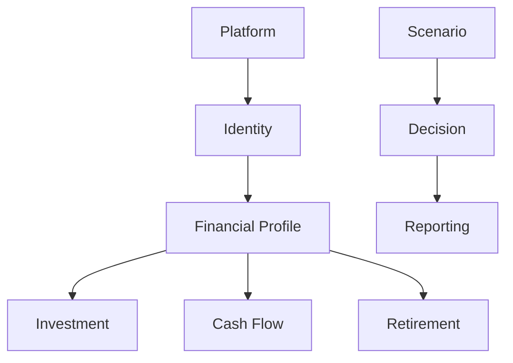
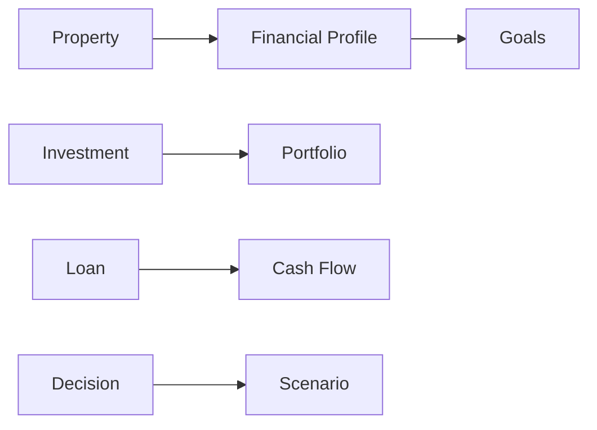
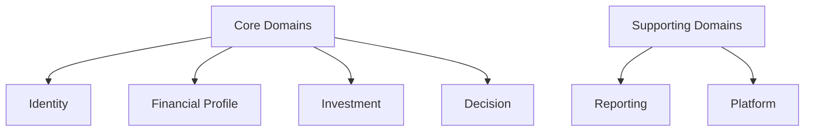
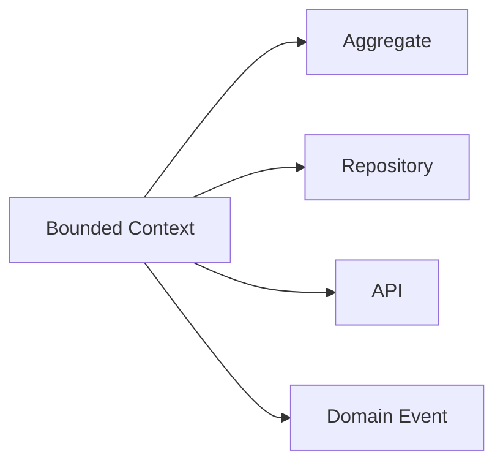
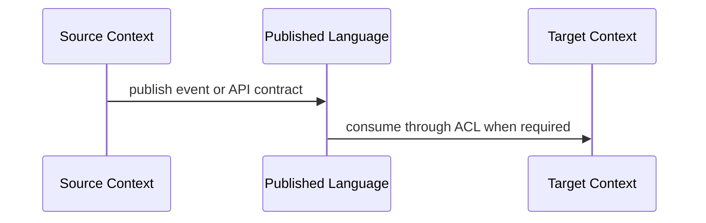
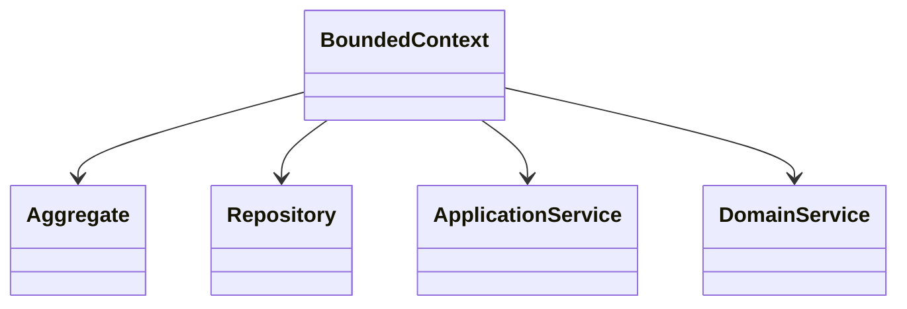

# Bounded Context Catalog
## Split Navigation
- [Bounded context definitions](bounded-context/definitions.md)
- [Bounded context integrations](bounded-context/integrations.md)
- [Bounded context governance](bounded-context/governance.md)
- [Bounded context context map patterns](bounded-context/context-map-patterns.md)

# Document Control

Document Name: Bounded Context Catalog
Document Path: knowledge/bounded-context-catalog.md
Document Type: Atlas Enterprise Canonical Specification
Version: 1.0
Status: Canonical Specification
Domain: Platform
Bounded Context: Platform
Owner: Project Atlas
Source of Truth: Atlas Bounded Context Source of Truth
Last Updated: 2026-07-12

Related Specifications:
- knowledge/domain-model-catalog.md
- knowledge/aggregate-catalog.md
- knowledge/entity-catalog.md
- knowledge/value-object-catalog.md
- knowledge/enumeration-catalog.md
- knowledge/repository-catalog.md
- knowledge/command-catalog.md
- knowledge/domain-event-catalog.md
- knowledge/domain-service-catalog.md
- knowledge/application-service-catalog.md
- knowledge/service-catalog.md
- knowledge/system-module-catalog.md
- knowledge/api-governance-framework.md
- knowledge/integration-framework.md
- knowledge/event-driven-architecture.md
- docs/specification/04-DomainModel.md
- docs/specification/04A-DomainInventory.md
- docs/database/05-DatabaseDesign.md
- docs/database/06-ERD.md
- docs/api/07-API.md

# Purpose

Bounded Context Catalog defines Atlas context boundaries, ownership, contracts, integrations, language, lifecycle, isolation, and collaboration. It is the source of truth for Domain, Aggregate, Entity, Repository, Command, Domain Event, Application Service, Domain Service, API, Database, Workflow, Integration, Module, and Team Ownership alignment.

# Scope

- Domain
- Subdomain
- Bounded Context
- Context Boundary
- Context Owner
- Context Contract
- Context Integration
- Context Responsibility
- Context Language
- Context Lifecycle
- Context Isolation
- Context Collaboration

# Bounded Context Definition Standard

Every Bounded Context entry uses the following complete Enterprise contract.
- Context Name
- Display Name
- Domain
- Subdomain
- Module
- Purpose
- Business Meaning
- Description
- Responsibilities
- Non Responsibilities
- Owned Aggregates
- Owned Entities
- Owned Value Objects
- Owned Enumerations
- Owned Repositories
- Owned Commands
- Owned Domain Events
- Owned Domain Services
- Owned Application Services
- API Ownership
- Database Ownership
- Workflow Ownership
- Integration Ownership
- External Dependencies
- Inbound Dependencies
- Outbound Dependencies
- Published Events
- Consumed Events
- Context Map
- Shared Kernel
- ACL
- Conformist
- Customer Supplier
- Open Host Service
- Published Language
- Authorization
- Audit
- Security
- Performance
- Scalability
- Version
- Example

# Complete Bounded Context Catalog

## Identity

Context Name: Identity
Display Name: Identity
Domain: Identity
Subdomain: Identity
Module: Identity
Purpose: Authentication and accounts.
Business Meaning: Identity owns a specific Atlas language boundary and protects its model from unrelated context changes.
Description: Identity defines responsibility, ownership, integration, API, database, workflow, and event boundaries for its cataloged model area.
Responsibilities: Own model language, aggregate ownership, command semantics, event publication, repository ownership, API ownership, workflow ownership, and integration contracts for Identity.
Non Responsibilities: No ownership of another Bounded Context, no uncataloged Aggregate, no direct mutation across boundary, no hidden database ownership, and no bypass of published contracts.
Owned Aggregates: User, Household
Owned Entities: User, Household
Owned Value Objects: Currency
Owned Enumerations: CurrencyCode
Owned Repositories: UserRepository, HouseholdRepository
Owned Commands: Identity commands and access queries
Owned Domain Events: Identity and access events
Owned Domain Services: DecisionService
Owned Application Services: UserApplicationService
API Ownership: /api/v1/users, /api/v1/households
Database Ownership: users, households
Workflow Ownership: Identity workflow
Integration Ownership: Identity integration
External Dependencies: Integration Framework and Event Driven Architecture dependencies when cataloged.
Inbound Dependencies: Other contexts consume Identity through API, Domain Event, read model, or published language.
Outbound Dependencies: Identity consumes other contexts only through cataloged contracts.
Published Events: Identity and access events
Consumed Events: Catalog-aligned events from dependent contexts.
Context Map: Published Language with ACL when crossing model boundary.
Shared Kernel: Only shared catalogs such as Value Object, Enumeration, and API governance references.
ACL: Required for external integrations or mismatched context language.
Conformist: Allowed only when downstream context accepts upstream published language.
Customer Supplier: Used when upstream and downstream contexts coordinate contract evolution.
Open Host Service: API Ownership and message contracts are the open host surface.
Published Language: Commands, Domain Events, DTOs, API resources, and read models listed in this catalog.
Authorization: Permission, tenant isolation, and Household isolation required at boundary.
Audit: Ownership, History, Version, CorrelationId, and CausationId captured at boundary interactions.
Security: Boundary protection prevents direct mutation and unauthorized data exposure.
Performance: Cross-context communication must use bounded calls, asynchronous events, projections, and cache where appropriate.
Scalability: Context can scale by module, read model, repository, and event consumer boundaries.
Version: 1.0
Example: Identity owns User, Household, persists users, households, exposes /api/v1/users, /api/v1/households, and publishes Identity and access events.
Bounded Context Control 1: Identity preserves domain language, context boundary, context owner, responsibility, aggregate ownership, entity ownership, repository ownership, command ownership, event publisher ownership, service ownership, API ownership, database ownership, workflow ownership, integration boundary, context map, shared kernel, ACL, published language, authorization, audit, security, performance, scalability, versioning, and collaboration consistency.
Bounded Context Control 2: Identity preserves domain language, context boundary, context owner, responsibility, aggregate ownership, entity ownership, repository ownership, command ownership, event publisher ownership, service ownership, API ownership, database ownership, workflow ownership, integration boundary, context map, shared kernel, ACL, published language, authorization, audit, security, performance, scalability, versioning, and collaboration consistency.
Bounded Context Control 3: Identity preserves domain language, context boundary, context owner, responsibility, aggregate ownership, entity ownership, repository ownership, command ownership, event publisher ownership, service ownership, API ownership, database ownership, workflow ownership, integration boundary, context map, shared kernel, ACL, published language, authorization, audit, security, performance, scalability, versioning, and collaboration consistency.
Bounded Context Control 4: Identity preserves domain language, context boundary, context owner, responsibility, aggregate ownership, entity ownership, repository ownership, command ownership, event publisher ownership, service ownership, API ownership, database ownership, workflow ownership, integration boundary, context map, shared kernel, ACL, published language, authorization, audit, security, performance, scalability, versioning, and collaboration consistency.
Bounded Context Control 5: Identity preserves domain language, context boundary, context owner, responsibility, aggregate ownership, entity ownership, repository ownership, command ownership, event publisher ownership, service ownership, API ownership, database ownership, workflow ownership, integration boundary, context map, shared kernel, ACL, published language, authorization, audit, security, performance, scalability, versioning, and collaboration consistency.
Bounded Context Control 6: Identity preserves domain language, context boundary, context owner, responsibility, aggregate ownership, entity ownership, repository ownership, command ownership, event publisher ownership, service ownership, API ownership, database ownership, workflow ownership, integration boundary, context map, shared kernel, ACL, published language, authorization, audit, security, performance, scalability, versioning, and collaboration consistency.
Bounded Context Control 7: Identity preserves domain language, context boundary, context owner, responsibility, aggregate ownership, entity ownership, repository ownership, command ownership, event publisher ownership, service ownership, API ownership, database ownership, workflow ownership, integration boundary, context map, shared kernel, ACL, published language, authorization, audit, security, performance, scalability, versioning, and collaboration consistency.
Bounded Context Control 8: Identity preserves domain language, context boundary, context owner, responsibility, aggregate ownership, entity ownership, repository ownership, command ownership, event publisher ownership, service ownership, API ownership, database ownership, workflow ownership, integration boundary, context map, shared kernel, ACL, published language, authorization, audit, security, performance, scalability, versioning, and collaboration consistency.
Bounded Context Control 9: Identity preserves domain language, context boundary, context owner, responsibility, aggregate ownership, entity ownership, repository ownership, command ownership, event publisher ownership, service ownership, API ownership, database ownership, workflow ownership, integration boundary, context map, shared kernel, ACL, published language, authorization, audit, security, performance, scalability, versioning, and collaboration consistency.
Bounded Context Control 10: Identity preserves domain language, context boundary, context owner, responsibility, aggregate ownership, entity ownership, repository ownership, command ownership, event publisher ownership, service ownership, API ownership, database ownership, workflow ownership, integration boundary, context map, shared kernel, ACL, published language, authorization, audit, security, performance, scalability, versioning, and collaboration consistency.
Bounded Context Control 11: Identity preserves domain language, context boundary, context owner, responsibility, aggregate ownership, entity ownership, repository ownership, command ownership, event publisher ownership, service ownership, API ownership, database ownership, workflow ownership, integration boundary, context map, shared kernel, ACL, published language, authorization, audit, security, performance, scalability, versioning, and collaboration consistency.
Bounded Context Control 12: Identity preserves domain language, context boundary, context owner, responsibility, aggregate ownership, entity ownership, repository ownership, command ownership, event publisher ownership, service ownership, API ownership, database ownership, workflow ownership, integration boundary, context map, shared kernel, ACL, published language, authorization, audit, security, performance, scalability, versioning, and collaboration consistency.
Bounded Context Control 13: Identity preserves domain language, context boundary, context owner, responsibility, aggregate ownership, entity ownership, repository ownership, command ownership, event publisher ownership, service ownership, API ownership, database ownership, workflow ownership, integration boundary, context map, shared kernel, ACL, published language, authorization, audit, security, performance, scalability, versioning, and collaboration consistency.
Bounded Context Control 14: Identity preserves domain language, context boundary, context owner, responsibility, aggregate ownership, entity ownership, repository ownership, command ownership, event publisher ownership, service ownership, API ownership, database ownership, workflow ownership, integration boundary, context map, shared kernel, ACL, published language, authorization, audit, security, performance, scalability, versioning, and collaboration consistency.
Bounded Context Control 15: Identity preserves domain language, context boundary, context owner, responsibility, aggregate ownership, entity ownership, repository ownership, command ownership, event publisher ownership, service ownership, API ownership, database ownership, workflow ownership, integration boundary, context map, shared kernel, ACL, published language, authorization, audit, security, performance, scalability, versioning, and collaboration consistency.
Bounded Context Control 16: Identity preserves domain language, context boundary, context owner, responsibility, aggregate ownership, entity ownership, repository ownership, command ownership, event publisher ownership, service ownership, API ownership, database ownership, workflow ownership, integration boundary, context map, shared kernel, ACL, published language, authorization, audit, security, performance, scalability, versioning, and collaboration consistency.
Bounded Context Control 17: Identity preserves domain language, context boundary, context owner, responsibility, aggregate ownership, entity ownership, repository ownership, command ownership, event publisher ownership, service ownership, API ownership, database ownership, workflow ownership, integration boundary, context map, shared kernel, ACL, published language, authorization, audit, security, performance, scalability, versioning, and collaboration consistency.
Bounded Context Control 18: Identity preserves domain language, context boundary, context owner, responsibility, aggregate ownership, entity ownership, repository ownership, command ownership, event publisher ownership, service ownership, API ownership, database ownership, workflow ownership, integration boundary, context map, shared kernel, ACL, published language, authorization, audit, security, performance, scalability, versioning, and collaboration consistency.
Bounded Context Control 19: Identity preserves domain language, context boundary, context owner, responsibility, aggregate ownership, entity ownership, repository ownership, command ownership, event publisher ownership, service ownership, API ownership, database ownership, workflow ownership, integration boundary, context map, shared kernel, ACL, published language, authorization, audit, security, performance, scalability, versioning, and collaboration consistency.
Bounded Context Control 20: Identity preserves domain language, context boundary, context owner, responsibility, aggregate ownership, entity ownership, repository ownership, command ownership, event publisher ownership, service ownership, API ownership, database ownership, workflow ownership, integration boundary, context map, shared kernel, ACL, published language, authorization, audit, security, performance, scalability, versioning, and collaboration consistency.
Bounded Context Control 21: Identity preserves domain language, context boundary, context owner, responsibility, aggregate ownership, entity ownership, repository ownership, command ownership, event publisher ownership, service ownership, API ownership, database ownership, workflow ownership, integration boundary, context map, shared kernel, ACL, published language, authorization, audit, security, performance, scalability, versioning, and collaboration consistency.
Bounded Context Control 22: Identity preserves domain language, context boundary, context owner, responsibility, aggregate ownership, entity ownership, repository ownership, command ownership, event publisher ownership, service ownership, API ownership, database ownership, workflow ownership, integration boundary, context map, shared kernel, ACL, published language, authorization, audit, security, performance, scalability, versioning, and collaboration consistency.
Bounded Context Control 23: Identity preserves domain language, context boundary, context owner, responsibility, aggregate ownership, entity ownership, repository ownership, command ownership, event publisher ownership, service ownership, API ownership, database ownership, workflow ownership, integration boundary, context map, shared kernel, ACL, published language, authorization, audit, security, performance, scalability, versioning, and collaboration consistency.
Bounded Context Control 24: Identity preserves domain language, context boundary, context owner, responsibility, aggregate ownership, entity ownership, repository ownership, command ownership, event publisher ownership, service ownership, API ownership, database ownership, workflow ownership, integration boundary, context map, shared kernel, ACL, published language, authorization, audit, security, performance, scalability, versioning, and collaboration consistency.
Bounded Context Control 25: Identity preserves domain language, context boundary, context owner, responsibility, aggregate ownership, entity ownership, repository ownership, command ownership, event publisher ownership, service ownership, API ownership, database ownership, workflow ownership, integration boundary, context map, shared kernel, ACL, published language, authorization, audit, security, performance, scalability, versioning, and collaboration consistency.
Bounded Context Control 26: Identity preserves domain language, context boundary, context owner, responsibility, aggregate ownership, entity ownership, repository ownership, command ownership, event publisher ownership, service ownership, API ownership, database ownership, workflow ownership, integration boundary, context map, shared kernel, ACL, published language, authorization, audit, security, performance, scalability, versioning, and collaboration consistency.
Bounded Context Control 27: Identity preserves domain language, context boundary, context owner, responsibility, aggregate ownership, entity ownership, repository ownership, command ownership, event publisher ownership, service ownership, API ownership, database ownership, workflow ownership, integration boundary, context map, shared kernel, ACL, published language, authorization, audit, security, performance, scalability, versioning, and collaboration consistency.
Bounded Context Control 28: Identity preserves domain language, context boundary, context owner, responsibility, aggregate ownership, entity ownership, repository ownership, command ownership, event publisher ownership, service ownership, API ownership, database ownership, workflow ownership, integration boundary, context map, shared kernel, ACL, published language, authorization, audit, security, performance, scalability, versioning, and collaboration consistency.
Bounded Context Control 29: Identity preserves domain language, context boundary, context owner, responsibility, aggregate ownership, entity ownership, repository ownership, command ownership, event publisher ownership, service ownership, API ownership, database ownership, workflow ownership, integration boundary, context map, shared kernel, ACL, published language, authorization, audit, security, performance, scalability, versioning, and collaboration consistency.
Bounded Context Control 30: Identity preserves domain language, context boundary, context owner, responsibility, aggregate ownership, entity ownership, repository ownership, command ownership, event publisher ownership, service ownership, API ownership, database ownership, workflow ownership, integration boundary, context map, shared kernel, ACL, published language, authorization, audit, security, performance, scalability, versioning, and collaboration consistency.
Bounded Context Control 31: Identity preserves domain language, context boundary, context owner, responsibility, aggregate ownership, entity ownership, repository ownership, command ownership, event publisher ownership, service ownership, API ownership, database ownership, workflow ownership, integration boundary, context map, shared kernel, ACL, published language, authorization, audit, security, performance, scalability, versioning, and collaboration consistency.
Bounded Context Control 32: Identity preserves domain language, context boundary, context owner, responsibility, aggregate ownership, entity ownership, repository ownership, command ownership, event publisher ownership, service ownership, API ownership, database ownership, workflow ownership, integration boundary, context map, shared kernel, ACL, published language, authorization, audit, security, performance, scalability, versioning, and collaboration consistency.
Bounded Context Control 33: Identity preserves domain language, context boundary, context owner, responsibility, aggregate ownership, entity ownership, repository ownership, command ownership, event publisher ownership, service ownership, API ownership, database ownership, workflow ownership, integration boundary, context map, shared kernel, ACL, published language, authorization, audit, security, performance, scalability, versioning, and collaboration consistency.
Bounded Context Control 34: Identity preserves domain language, context boundary, context owner, responsibility, aggregate ownership, entity ownership, repository ownership, command ownership, event publisher ownership, service ownership, API ownership, database ownership, workflow ownership, integration boundary, context map, shared kernel, ACL, published language, authorization, audit, security, performance, scalability, versioning, and collaboration consistency.
Bounded Context Control 35: Identity preserves domain language, context boundary, context owner, responsibility, aggregate ownership, entity ownership, repository ownership, command ownership, event publisher ownership, service ownership, API ownership, database ownership, workflow ownership, integration boundary, context map, shared kernel, ACL, published language, authorization, audit, security, performance, scalability, versioning, and collaboration consistency.
Bounded Context Control 36: Identity preserves domain language, context boundary, context owner, responsibility, aggregate ownership, entity ownership, repository ownership, command ownership, event publisher ownership, service ownership, API ownership, database ownership, workflow ownership, integration boundary, context map, shared kernel, ACL, published language, authorization, audit, security, performance, scalability, versioning, and collaboration consistency.
Bounded Context Control 37: Identity preserves domain language, context boundary, context owner, responsibility, aggregate ownership, entity ownership, repository ownership, command ownership, event publisher ownership, service ownership, API ownership, database ownership, workflow ownership, integration boundary, context map, shared kernel, ACL, published language, authorization, audit, security, performance, scalability, versioning, and collaboration consistency.
Bounded Context Control 38: Identity preserves domain language, context boundary, context owner, responsibility, aggregate ownership, entity ownership, repository ownership, command ownership, event publisher ownership, service ownership, API ownership, database ownership, workflow ownership, integration boundary, context map, shared kernel, ACL, published language, authorization, audit, security, performance, scalability, versioning, and collaboration consistency.
Bounded Context Control 39: Identity preserves domain language, context boundary, context owner, responsibility, aggregate ownership, entity ownership, repository ownership, command ownership, event publisher ownership, service ownership, API ownership, database ownership, workflow ownership, integration boundary, context map, shared kernel, ACL, published language, authorization, audit, security, performance, scalability, versioning, and collaboration consistency.
Bounded Context Control 40: Identity preserves domain language, context boundary, context owner, responsibility, aggregate ownership, entity ownership, repository ownership, command ownership, event publisher ownership, service ownership, API ownership, database ownership, workflow ownership, integration boundary, context map, shared kernel, ACL, published language, authorization, audit, security, performance, scalability, versioning, and collaboration consistency.
Bounded Context Control 41: Identity preserves domain language, context boundary, context owner, responsibility, aggregate ownership, entity ownership, repository ownership, command ownership, event publisher ownership, service ownership, API ownership, database ownership, workflow ownership, integration boundary, context map, shared kernel, ACL, published language, authorization, audit, security, performance, scalability, versioning, and collaboration consistency.
Bounded Context Control 42: Identity preserves domain language, context boundary, context owner, responsibility, aggregate ownership, entity ownership, repository ownership, command ownership, event publisher ownership, service ownership, API ownership, database ownership, workflow ownership, integration boundary, context map, shared kernel, ACL, published language, authorization, audit, security, performance, scalability, versioning, and collaboration consistency.
Bounded Context Control 43: Identity preserves domain language, context boundary, context owner, responsibility, aggregate ownership, entity ownership, repository ownership, command ownership, event publisher ownership, service ownership, API ownership, database ownership, workflow ownership, integration boundary, context map, shared kernel, ACL, published language, authorization, audit, security, performance, scalability, versioning, and collaboration consistency.
Bounded Context Control 44: Identity preserves domain language, context boundary, context owner, responsibility, aggregate ownership, entity ownership, repository ownership, command ownership, event publisher ownership, service ownership, API ownership, database ownership, workflow ownership, integration boundary, context map, shared kernel, ACL, published language, authorization, audit, security, performance, scalability, versioning, and collaboration consistency.
Bounded Context Control 45: Identity preserves domain language, context boundary, context owner, responsibility, aggregate ownership, entity ownership, repository ownership, command ownership, event publisher ownership, service ownership, API ownership, database ownership, workflow ownership, integration boundary, context map, shared kernel, ACL, published language, authorization, audit, security, performance, scalability, versioning, and collaboration consistency.
Bounded Context Control 46: Identity preserves domain language, context boundary, context owner, responsibility, aggregate ownership, entity ownership, repository ownership, command ownership, event publisher ownership, service ownership, API ownership, database ownership, workflow ownership, integration boundary, context map, shared kernel, ACL, published language, authorization, audit, security, performance, scalability, versioning, and collaboration consistency.
Bounded Context Control 47: Identity preserves domain language, context boundary, context owner, responsibility, aggregate ownership, entity ownership, repository ownership, command ownership, event publisher ownership, service ownership, API ownership, database ownership, workflow ownership, integration boundary, context map, shared kernel, ACL, published language, authorization, audit, security, performance, scalability, versioning, and collaboration consistency.
Bounded Context Control 48: Identity preserves domain language, context boundary, context owner, responsibility, aggregate ownership, entity ownership, repository ownership, command ownership, event publisher ownership, service ownership, API ownership, database ownership, workflow ownership, integration boundary, context map, shared kernel, ACL, published language, authorization, audit, security, performance, scalability, versioning, and collaboration consistency.
Bounded Context Control 49: Identity preserves domain language, context boundary, context owner, responsibility, aggregate ownership, entity ownership, repository ownership, command ownership, event publisher ownership, service ownership, API ownership, database ownership, workflow ownership, integration boundary, context map, shared kernel, ACL, published language, authorization, audit, security, performance, scalability, versioning, and collaboration consistency.
Bounded Context Control 50: Identity preserves domain language, context boundary, context owner, responsibility, aggregate ownership, entity ownership, repository ownership, command ownership, event publisher ownership, service ownership, API ownership, database ownership, workflow ownership, integration boundary, context map, shared kernel, ACL, published language, authorization, audit, security, performance, scalability, versioning, and collaboration consistency.
Bounded Context Control 51: Identity preserves domain language, context boundary, context owner, responsibility, aggregate ownership, entity ownership, repository ownership, command ownership, event publisher ownership, service ownership, API ownership, database ownership, workflow ownership, integration boundary, context map, shared kernel, ACL, published language, authorization, audit, security, performance, scalability, versioning, and collaboration consistency.
Bounded Context Control 52: Identity preserves domain language, context boundary, context owner, responsibility, aggregate ownership, entity ownership, repository ownership, command ownership, event publisher ownership, service ownership, API ownership, database ownership, workflow ownership, integration boundary, context map, shared kernel, ACL, published language, authorization, audit, security, performance, scalability, versioning, and collaboration consistency.
Bounded Context Control 53: Identity preserves domain language, context boundary, context owner, responsibility, aggregate ownership, entity ownership, repository ownership, command ownership, event publisher ownership, service ownership, API ownership, database ownership, workflow ownership, integration boundary, context map, shared kernel, ACL, published language, authorization, audit, security, performance, scalability, versioning, and collaboration consistency.
Bounded Context Control 54: Identity preserves domain language, context boundary, context owner, responsibility, aggregate ownership, entity ownership, repository ownership, command ownership, event publisher ownership, service ownership, API ownership, database ownership, workflow ownership, integration boundary, context map, shared kernel, ACL, published language, authorization, audit, security, performance, scalability, versioning, and collaboration consistency.
Bounded Context Control 55: Identity preserves domain language, context boundary, context owner, responsibility, aggregate ownership, entity ownership, repository ownership, command ownership, event publisher ownership, service ownership, API ownership, database ownership, workflow ownership, integration boundary, context map, shared kernel, ACL, published language, authorization, audit, security, performance, scalability, versioning, and collaboration consistency.
Bounded Context Control 56: Identity preserves domain language, context boundary, context owner, responsibility, aggregate ownership, entity ownership, repository ownership, command ownership, event publisher ownership, service ownership, API ownership, database ownership, workflow ownership, integration boundary, context map, shared kernel, ACL, published language, authorization, audit, security, performance, scalability, versioning, and collaboration consistency.
Bounded Context Control 57: Identity preserves domain language, context boundary, context owner, responsibility, aggregate ownership, entity ownership, repository ownership, command ownership, event publisher ownership, service ownership, API ownership, database ownership, workflow ownership, integration boundary, context map, shared kernel, ACL, published language, authorization, audit, security, performance, scalability, versioning, and collaboration consistency.
Bounded Context Control 58: Identity preserves domain language, context boundary, context owner, responsibility, aggregate ownership, entity ownership, repository ownership, command ownership, event publisher ownership, service ownership, API ownership, database ownership, workflow ownership, integration boundary, context map, shared kernel, ACL, published language, authorization, audit, security, performance, scalability, versioning, and collaboration consistency.
Bounded Context Control 59: Identity preserves domain language, context boundary, context owner, responsibility, aggregate ownership, entity ownership, repository ownership, command ownership, event publisher ownership, service ownership, API ownership, database ownership, workflow ownership, integration boundary, context map, shared kernel, ACL, published language, authorization, audit, security, performance, scalability, versioning, and collaboration consistency.
Bounded Context Control 60: Identity preserves domain language, context boundary, context owner, responsibility, aggregate ownership, entity ownership, repository ownership, command ownership, event publisher ownership, service ownership, API ownership, database ownership, workflow ownership, integration boundary, context map, shared kernel, ACL, published language, authorization, audit, security, performance, scalability, versioning, and collaboration consistency.
Bounded Context Control 61: Identity preserves domain language, context boundary, context owner, responsibility, aggregate ownership, entity ownership, repository ownership, command ownership, event publisher ownership, service ownership, API ownership, database ownership, workflow ownership, integration boundary, context map, shared kernel, ACL, published language, authorization, audit, security, performance, scalability, versioning, and collaboration consistency.
Bounded Context Control 62: Identity preserves domain language, context boundary, context owner, responsibility, aggregate ownership, entity ownership, repository ownership, command ownership, event publisher ownership, service ownership, API ownership, database ownership, workflow ownership, integration boundary, context map, shared kernel, ACL, published language, authorization, audit, security, performance, scalability, versioning, and collaboration consistency.
Bounded Context Control 63: Identity preserves domain language, context boundary, context owner, responsibility, aggregate ownership, entity ownership, repository ownership, command ownership, event publisher ownership, service ownership, API ownership, database ownership, workflow ownership, integration boundary, context map, shared kernel, ACL, published language, authorization, audit, security, performance, scalability, versioning, and collaboration consistency.
Bounded Context Control 64: Identity preserves domain language, context boundary, context owner, responsibility, aggregate ownership, entity ownership, repository ownership, command ownership, event publisher ownership, service ownership, API ownership, database ownership, workflow ownership, integration boundary, context map, shared kernel, ACL, published language, authorization, audit, security, performance, scalability, versioning, and collaboration consistency.
Bounded Context Control 65: Identity preserves domain language, context boundary, context owner, responsibility, aggregate ownership, entity ownership, repository ownership, command ownership, event publisher ownership, service ownership, API ownership, database ownership, workflow ownership, integration boundary, context map, shared kernel, ACL, published language, authorization, audit, security, performance, scalability, versioning, and collaboration consistency.
Bounded Context Control 66: Identity preserves domain language, context boundary, context owner, responsibility, aggregate ownership, entity ownership, repository ownership, command ownership, event publisher ownership, service ownership, API ownership, database ownership, workflow ownership, integration boundary, context map, shared kernel, ACL, published language, authorization, audit, security, performance, scalability, versioning, and collaboration consistency.
Bounded Context Control 67: Identity preserves domain language, context boundary, context owner, responsibility, aggregate ownership, entity ownership, repository ownership, command ownership, event publisher ownership, service ownership, API ownership, database ownership, workflow ownership, integration boundary, context map, shared kernel, ACL, published language, authorization, audit, security, performance, scalability, versioning, and collaboration consistency.
Bounded Context Control 68: Identity preserves domain language, context boundary, context owner, responsibility, aggregate ownership, entity ownership, repository ownership, command ownership, event publisher ownership, service ownership, API ownership, database ownership, workflow ownership, integration boundary, context map, shared kernel, ACL, published language, authorization, audit, security, performance, scalability, versioning, and collaboration consistency.
Bounded Context Control 69: Identity preserves domain language, context boundary, context owner, responsibility, aggregate ownership, entity ownership, repository ownership, command ownership, event publisher ownership, service ownership, API ownership, database ownership, workflow ownership, integration boundary, context map, shared kernel, ACL, published language, authorization, audit, security, performance, scalability, versioning, and collaboration consistency.
Bounded Context Control 70: Identity preserves domain language, context boundary, context owner, responsibility, aggregate ownership, entity ownership, repository ownership, command ownership, event publisher ownership, service ownership, API ownership, database ownership, workflow ownership, integration boundary, context map, shared kernel, ACL, published language, authorization, audit, security, performance, scalability, versioning, and collaboration consistency.
Bounded Context Control 71: Identity preserves domain language, context boundary, context owner, responsibility, aggregate ownership, entity ownership, repository ownership, command ownership, event publisher ownership, service ownership, API ownership, database ownership, workflow ownership, integration boundary, context map, shared kernel, ACL, published language, authorization, audit, security, performance, scalability, versioning, and collaboration consistency.
Bounded Context Control 72: Identity preserves domain language, context boundary, context owner, responsibility, aggregate ownership, entity ownership, repository ownership, command ownership, event publisher ownership, service ownership, API ownership, database ownership, workflow ownership, integration boundary, context map, shared kernel, ACL, published language, authorization, audit, security, performance, scalability, versioning, and collaboration consistency.
Bounded Context Control 73: Identity preserves domain language, context boundary, context owner, responsibility, aggregate ownership, entity ownership, repository ownership, command ownership, event publisher ownership, service ownership, API ownership, database ownership, workflow ownership, integration boundary, context map, shared kernel, ACL, published language, authorization, audit, security, performance, scalability, versioning, and collaboration consistency.
Bounded Context Control 74: Identity preserves domain language, context boundary, context owner, responsibility, aggregate ownership, entity ownership, repository ownership, command ownership, event publisher ownership, service ownership, API ownership, database ownership, workflow ownership, integration boundary, context map, shared kernel, ACL, published language, authorization, audit, security, performance, scalability, versioning, and collaboration consistency.
Bounded Context Control 75: Identity preserves domain language, context boundary, context owner, responsibility, aggregate ownership, entity ownership, repository ownership, command ownership, event publisher ownership, service ownership, API ownership, database ownership, workflow ownership, integration boundary, context map, shared kernel, ACL, published language, authorization, audit, security, performance, scalability, versioning, and collaboration consistency.
Bounded Context Control 76: Identity preserves domain language, context boundary, context owner, responsibility, aggregate ownership, entity ownership, repository ownership, command ownership, event publisher ownership, service ownership, API ownership, database ownership, workflow ownership, integration boundary, context map, shared kernel, ACL, published language, authorization, audit, security, performance, scalability, versioning, and collaboration consistency.
Bounded Context Control 77: Identity preserves domain language, context boundary, context owner, responsibility, aggregate ownership, entity ownership, repository ownership, command ownership, event publisher ownership, service ownership, API ownership, database ownership, workflow ownership, integration boundary, context map, shared kernel, ACL, published language, authorization, audit, security, performance, scalability, versioning, and collaboration consistency.
Bounded Context Control 78: Identity preserves domain language, context boundary, context owner, responsibility, aggregate ownership, entity ownership, repository ownership, command ownership, event publisher ownership, service ownership, API ownership, database ownership, workflow ownership, integration boundary, context map, shared kernel, ACL, published language, authorization, audit, security, performance, scalability, versioning, and collaboration consistency.
Bounded Context Control 79: Identity preserves domain language, context boundary, context owner, responsibility, aggregate ownership, entity ownership, repository ownership, command ownership, event publisher ownership, service ownership, API ownership, database ownership, workflow ownership, integration boundary, context map, shared kernel, ACL, published language, authorization, audit, security, performance, scalability, versioning, and collaboration consistency.
Bounded Context Control 80: Identity preserves domain language, context boundary, context owner, responsibility, aggregate ownership, entity ownership, repository ownership, command ownership, event publisher ownership, service ownership, API ownership, database ownership, workflow ownership, integration boundary, context map, shared kernel, ACL, published language, authorization, audit, security, performance, scalability, versioning, and collaboration consistency.
Bounded Context Control 81: Identity preserves domain language, context boundary, context owner, responsibility, aggregate ownership, entity ownership, repository ownership, command ownership, event publisher ownership, service ownership, API ownership, database ownership, workflow ownership, integration boundary, context map, shared kernel, ACL, published language, authorization, audit, security, performance, scalability, versioning, and collaboration consistency.
Bounded Context Control 82: Identity preserves domain language, context boundary, context owner, responsibility, aggregate ownership, entity ownership, repository ownership, command ownership, event publisher ownership, service ownership, API ownership, database ownership, workflow ownership, integration boundary, context map, shared kernel, ACL, published language, authorization, audit, security, performance, scalability, versioning, and collaboration consistency.
Bounded Context Control 83: Identity preserves domain language, context boundary, context owner, responsibility, aggregate ownership, entity ownership, repository ownership, command ownership, event publisher ownership, service ownership, API ownership, database ownership, workflow ownership, integration boundary, context map, shared kernel, ACL, published language, authorization, audit, security, performance, scalability, versioning, and collaboration consistency.
Bounded Context Control 84: Identity preserves domain language, context boundary, context owner, responsibility, aggregate ownership, entity ownership, repository ownership, command ownership, event publisher ownership, service ownership, API ownership, database ownership, workflow ownership, integration boundary, context map, shared kernel, ACL, published language, authorization, audit, security, performance, scalability, versioning, and collaboration consistency.
Bounded Context Control 85: Identity preserves domain language, context boundary, context owner, responsibility, aggregate ownership, entity ownership, repository ownership, command ownership, event publisher ownership, service ownership, API ownership, database ownership, workflow ownership, integration boundary, context map, shared kernel, ACL, published language, authorization, audit, security, performance, scalability, versioning, and collaboration consistency.
Bounded Context Control 86: Identity preserves domain language, context boundary, context owner, responsibility, aggregate ownership, entity ownership, repository ownership, command ownership, event publisher ownership, service ownership, API ownership, database ownership, workflow ownership, integration boundary, context map, shared kernel, ACL, published language, authorization, audit, security, performance, scalability, versioning, and collaboration consistency.
Bounded Context Control 87: Identity preserves domain language, context boundary, context owner, responsibility, aggregate ownership, entity ownership, repository ownership, command ownership, event publisher ownership, service ownership, API ownership, database ownership, workflow ownership, integration boundary, context map, shared kernel, ACL, published language, authorization, audit, security, performance, scalability, versioning, and collaboration consistency.
Bounded Context Control 88: Identity preserves domain language, context boundary, context owner, responsibility, aggregate ownership, entity ownership, repository ownership, command ownership, event publisher ownership, service ownership, API ownership, database ownership, workflow ownership, integration boundary, context map, shared kernel, ACL, published language, authorization, audit, security, performance, scalability, versioning, and collaboration consistency.
Bounded Context Control 89: Identity preserves domain language, context boundary, context owner, responsibility, aggregate ownership, entity ownership, repository ownership, command ownership, event publisher ownership, service ownership, API ownership, database ownership, workflow ownership, integration boundary, context map, shared kernel, ACL, published language, authorization, audit, security, performance, scalability, versioning, and collaboration consistency.
Bounded Context Control 90: Identity preserves domain language, context boundary, context owner, responsibility, aggregate ownership, entity ownership, repository ownership, command ownership, event publisher ownership, service ownership, API ownership, database ownership, workflow ownership, integration boundary, context map, shared kernel, ACL, published language, authorization, audit, security, performance, scalability, versioning, and collaboration consistency.
Bounded Context Control 91: Identity preserves domain language, context boundary, context owner, responsibility, aggregate ownership, entity ownership, repository ownership, command ownership, event publisher ownership, service ownership, API ownership, database ownership, workflow ownership, integration boundary, context map, shared kernel, ACL, published language, authorization, audit, security, performance, scalability, versioning, and collaboration consistency.
Bounded Context Control 92: Identity preserves domain language, context boundary, context owner, responsibility, aggregate ownership, entity ownership, repository ownership, command ownership, event publisher ownership, service ownership, API ownership, database ownership, workflow ownership, integration boundary, context map, shared kernel, ACL, published language, authorization, audit, security, performance, scalability, versioning, and collaboration consistency.
Bounded Context Control 93: Identity preserves domain language, context boundary, context owner, responsibility, aggregate ownership, entity ownership, repository ownership, command ownership, event publisher ownership, service ownership, API ownership, database ownership, workflow ownership, integration boundary, context map, shared kernel, ACL, published language, authorization, audit, security, performance, scalability, versioning, and collaboration consistency.
Bounded Context Control 94: Identity preserves domain language, context boundary, context owner, responsibility, aggregate ownership, entity ownership, repository ownership, command ownership, event publisher ownership, service ownership, API ownership, database ownership, workflow ownership, integration boundary, context map, shared kernel, ACL, published language, authorization, audit, security, performance, scalability, versioning, and collaboration consistency.
Bounded Context Control 95: Identity preserves domain language, context boundary, context owner, responsibility, aggregate ownership, entity ownership, repository ownership, command ownership, event publisher ownership, service ownership, API ownership, database ownership, workflow ownership, integration boundary, context map, shared kernel, ACL, published language, authorization, audit, security, performance, scalability, versioning, and collaboration consistency.
Bounded Context Control 96: Identity preserves domain language, context boundary, context owner, responsibility, aggregate ownership, entity ownership, repository ownership, command ownership, event publisher ownership, service ownership, API ownership, database ownership, workflow ownership, integration boundary, context map, shared kernel, ACL, published language, authorization, audit, security, performance, scalability, versioning, and collaboration consistency.
Bounded Context Control 97: Identity preserves domain language, context boundary, context owner, responsibility, aggregate ownership, entity ownership, repository ownership, command ownership, event publisher ownership, service ownership, API ownership, database ownership, workflow ownership, integration boundary, context map, shared kernel, ACL, published language, authorization, audit, security, performance, scalability, versioning, and collaboration consistency.
Bounded Context Control 98: Identity preserves domain language, context boundary, context owner, responsibility, aggregate ownership, entity ownership, repository ownership, command ownership, event publisher ownership, service ownership, API ownership, database ownership, workflow ownership, integration boundary, context map, shared kernel, ACL, published language, authorization, audit, security, performance, scalability, versioning, and collaboration consistency.
Bounded Context Control 99: Identity preserves domain language, context boundary, context owner, responsibility, aggregate ownership, entity ownership, repository ownership, command ownership, event publisher ownership, service ownership, API ownership, database ownership, workflow ownership, integration boundary, context map, shared kernel, ACL, published language, authorization, audit, security, performance, scalability, versioning, and collaboration consistency.
Bounded Context Control 100: Identity preserves domain language, context boundary, context owner, responsibility, aggregate ownership, entity ownership, repository ownership, command ownership, event publisher ownership, service ownership, API ownership, database ownership, workflow ownership, integration boundary, context map, shared kernel, ACL, published language, authorization, audit, security, performance, scalability, versioning, and collaboration consistency.
Bounded Context Control 101: Identity preserves domain language, context boundary, context owner, responsibility, aggregate ownership, entity ownership, repository ownership, command ownership, event publisher ownership, service ownership, API ownership, database ownership, workflow ownership, integration boundary, context map, shared kernel, ACL, published language, authorization, audit, security, performance, scalability, versioning, and collaboration consistency.
Bounded Context Control 102: Identity preserves domain language, context boundary, context owner, responsibility, aggregate ownership, entity ownership, repository ownership, command ownership, event publisher ownership, service ownership, API ownership, database ownership, workflow ownership, integration boundary, context map, shared kernel, ACL, published language, authorization, audit, security, performance, scalability, versioning, and collaboration consistency.
Bounded Context Control 103: Identity preserves domain language, context boundary, context owner, responsibility, aggregate ownership, entity ownership, repository ownership, command ownership, event publisher ownership, service ownership, API ownership, database ownership, workflow ownership, integration boundary, context map, shared kernel, ACL, published language, authorization, audit, security, performance, scalability, versioning, and collaboration consistency.
Bounded Context Control 104: Identity preserves domain language, context boundary, context owner, responsibility, aggregate ownership, entity ownership, repository ownership, command ownership, event publisher ownership, service ownership, API ownership, database ownership, workflow ownership, integration boundary, context map, shared kernel, ACL, published language, authorization, audit, security, performance, scalability, versioning, and collaboration consistency.
Bounded Context Control 105: Identity preserves domain language, context boundary, context owner, responsibility, aggregate ownership, entity ownership, repository ownership, command ownership, event publisher ownership, service ownership, API ownership, database ownership, workflow ownership, integration boundary, context map, shared kernel, ACL, published language, authorization, audit, security, performance, scalability, versioning, and collaboration consistency.

## Financial Profile

Context Name: Financial Profile
Display Name: Financial Profile
Domain: Financial Profile
Subdomain: Financial Profile
Module: Financial Profile
Purpose: User financial data.
Business Meaning: Financial Profile owns a specific Atlas language boundary and protects its model from unrelated context changes.
Description: Financial Profile defines responsibility, ownership, integration, API, database, workflow, and event boundaries for its cataloged model area.
Responsibilities: Own model language, aggregate ownership, command semantics, event publication, repository ownership, API ownership, workflow ownership, and integration contracts for Financial Profile.
Non Responsibilities: No ownership of another Bounded Context, no uncataloged Aggregate, no direct mutation across boundary, no hidden database ownership, and no bypass of published contracts.
Owned Aggregates: FinancialProfile, Household, GoalPlan
Owned Entities: Household, Goal
Owned Value Objects: Money, Currency, CashFlowItem, DateRange
Owned Enumerations: CurrencyCode, GoalStatus
Owned Repositories: HouseholdRepository, GoalRepository
Owned Commands: RecordIncome, RecordExpense, UpdateRetirementPlan
Owned Domain Events: SalaryReceived, BonusReceived, ExpenseRecorded, PassiveIncomeReceived, RetirementPlanUpdated
Owned Domain Services: CashFlowService, RetirementService
Owned Application Services: BlueprintApplicationService, DashboardApplicationService, GoalApplicationService
API Ownership: /api/v1/blueprint, /api/v1/goals, /api/v1/dashboard
Database Ownership: households, cash_flow_items, goals
Workflow Ownership: Goal workflow
Integration Ownership: Planning integration
External Dependencies: Integration Framework and Event Driven Architecture dependencies when cataloged.
Inbound Dependencies: Other contexts consume Financial Profile through API, Domain Event, read model, or published language.
Outbound Dependencies: Financial Profile consumes other contexts only through cataloged contracts.
Published Events: SalaryReceived, BonusReceived, ExpenseRecorded, PassiveIncomeReceived, RetirementPlanUpdated
Consumed Events: Catalog-aligned events from dependent contexts.
Context Map: Published Language with ACL when crossing model boundary.
Shared Kernel: Only shared catalogs such as Value Object, Enumeration, and API governance references.
ACL: Required for external integrations or mismatched context language.
Conformist: Allowed only when downstream context accepts upstream published language.
Customer Supplier: Used when upstream and downstream contexts coordinate contract evolution.
Open Host Service: API Ownership and message contracts are the open host surface.
Published Language: Commands, Domain Events, DTOs, API resources, and read models listed in this catalog.
Authorization: Permission, tenant isolation, and Household isolation required at boundary.
Audit: Ownership, History, Version, CorrelationId, and CausationId captured at boundary interactions.
Security: Boundary protection prevents direct mutation and unauthorized data exposure.
Performance: Cross-context communication must use bounded calls, asynchronous events, projections, and cache where appropriate.
Scalability: Context can scale by module, read model, repository, and event consumer boundaries.
Version: 1.0
Example: Financial Profile owns FinancialProfile, Household, GoalPlan, persists households, cash_flow_items, goals, exposes /api/v1/blueprint, /api/v1/goals, /api/v1/dashboard, and publishes SalaryReceived, BonusReceived, ExpenseRecorded, PassiveIncomeReceived, RetirementPlanUpdated.
Bounded Context Control 1: Financial Profile preserves domain language, context boundary, context owner, responsibility, aggregate ownership, entity ownership, repository ownership, command ownership, event publisher ownership, service ownership, API ownership, database ownership, workflow ownership, integration boundary, context map, shared kernel, ACL, published language, authorization, audit, security, performance, scalability, versioning, and collaboration consistency.
Bounded Context Control 2: Financial Profile preserves domain language, context boundary, context owner, responsibility, aggregate ownership, entity ownership, repository ownership, command ownership, event publisher ownership, service ownership, API ownership, database ownership, workflow ownership, integration boundary, context map, shared kernel, ACL, published language, authorization, audit, security, performance, scalability, versioning, and collaboration consistency.
Bounded Context Control 3: Financial Profile preserves domain language, context boundary, context owner, responsibility, aggregate ownership, entity ownership, repository ownership, command ownership, event publisher ownership, service ownership, API ownership, database ownership, workflow ownership, integration boundary, context map, shared kernel, ACL, published language, authorization, audit, security, performance, scalability, versioning, and collaboration consistency.
Bounded Context Control 4: Financial Profile preserves domain language, context boundary, context owner, responsibility, aggregate ownership, entity ownership, repository ownership, command ownership, event publisher ownership, service ownership, API ownership, database ownership, workflow ownership, integration boundary, context map, shared kernel, ACL, published language, authorization, audit, security, performance, scalability, versioning, and collaboration consistency.
Bounded Context Control 5: Financial Profile preserves domain language, context boundary, context owner, responsibility, aggregate ownership, entity ownership, repository ownership, command ownership, event publisher ownership, service ownership, API ownership, database ownership, workflow ownership, integration boundary, context map, shared kernel, ACL, published language, authorization, audit, security, performance, scalability, versioning, and collaboration consistency.
Bounded Context Control 6: Financial Profile preserves domain language, context boundary, context owner, responsibility, aggregate ownership, entity ownership, repository ownership, command ownership, event publisher ownership, service ownership, API ownership, database ownership, workflow ownership, integration boundary, context map, shared kernel, ACL, published language, authorization, audit, security, performance, scalability, versioning, and collaboration consistency.
Bounded Context Control 7: Financial Profile preserves domain language, context boundary, context owner, responsibility, aggregate ownership, entity ownership, repository ownership, command ownership, event publisher ownership, service ownership, API ownership, database ownership, workflow ownership, integration boundary, context map, shared kernel, ACL, published language, authorization, audit, security, performance, scalability, versioning, and collaboration consistency.
Bounded Context Control 8: Financial Profile preserves domain language, context boundary, context owner, responsibility, aggregate ownership, entity ownership, repository ownership, command ownership, event publisher ownership, service ownership, API ownership, database ownership, workflow ownership, integration boundary, context map, shared kernel, ACL, published language, authorization, audit, security, performance, scalability, versioning, and collaboration consistency.
Bounded Context Control 9: Financial Profile preserves domain language, context boundary, context owner, responsibility, aggregate ownership, entity ownership, repository ownership, command ownership, event publisher ownership, service ownership, API ownership, database ownership, workflow ownership, integration boundary, context map, shared kernel, ACL, published language, authorization, audit, security, performance, scalability, versioning, and collaboration consistency.
Bounded Context Control 10: Financial Profile preserves domain language, context boundary, context owner, responsibility, aggregate ownership, entity ownership, repository ownership, command ownership, event publisher ownership, service ownership, API ownership, database ownership, workflow ownership, integration boundary, context map, shared kernel, ACL, published language, authorization, audit, security, performance, scalability, versioning, and collaboration consistency.
Bounded Context Control 11: Financial Profile preserves domain language, context boundary, context owner, responsibility, aggregate ownership, entity ownership, repository ownership, command ownership, event publisher ownership, service ownership, API ownership, database ownership, workflow ownership, integration boundary, context map, shared kernel, ACL, published language, authorization, audit, security, performance, scalability, versioning, and collaboration consistency.
Bounded Context Control 12: Financial Profile preserves domain language, context boundary, context owner, responsibility, aggregate ownership, entity ownership, repository ownership, command ownership, event publisher ownership, service ownership, API ownership, database ownership, workflow ownership, integration boundary, context map, shared kernel, ACL, published language, authorization, audit, security, performance, scalability, versioning, and collaboration consistency.
Bounded Context Control 13: Financial Profile preserves domain language, context boundary, context owner, responsibility, aggregate ownership, entity ownership, repository ownership, command ownership, event publisher ownership, service ownership, API ownership, database ownership, workflow ownership, integration boundary, context map, shared kernel, ACL, published language, authorization, audit, security, performance, scalability, versioning, and collaboration consistency.
Bounded Context Control 14: Financial Profile preserves domain language, context boundary, context owner, responsibility, aggregate ownership, entity ownership, repository ownership, command ownership, event publisher ownership, service ownership, API ownership, database ownership, workflow ownership, integration boundary, context map, shared kernel, ACL, published language, authorization, audit, security, performance, scalability, versioning, and collaboration consistency.
Bounded Context Control 15: Financial Profile preserves domain language, context boundary, context owner, responsibility, aggregate ownership, entity ownership, repository ownership, command ownership, event publisher ownership, service ownership, API ownership, database ownership, workflow ownership, integration boundary, context map, shared kernel, ACL, published language, authorization, audit, security, performance, scalability, versioning, and collaboration consistency.
Bounded Context Control 16: Financial Profile preserves domain language, context boundary, context owner, responsibility, aggregate ownership, entity ownership, repository ownership, command ownership, event publisher ownership, service ownership, API ownership, database ownership, workflow ownership, integration boundary, context map, shared kernel, ACL, published language, authorization, audit, security, performance, scalability, versioning, and collaboration consistency.
Bounded Context Control 17: Financial Profile preserves domain language, context boundary, context owner, responsibility, aggregate ownership, entity ownership, repository ownership, command ownership, event publisher ownership, service ownership, API ownership, database ownership, workflow ownership, integration boundary, context map, shared kernel, ACL, published language, authorization, audit, security, performance, scalability, versioning, and collaboration consistency.
Bounded Context Control 18: Financial Profile preserves domain language, context boundary, context owner, responsibility, aggregate ownership, entity ownership, repository ownership, command ownership, event publisher ownership, service ownership, API ownership, database ownership, workflow ownership, integration boundary, context map, shared kernel, ACL, published language, authorization, audit, security, performance, scalability, versioning, and collaboration consistency.
Bounded Context Control 19: Financial Profile preserves domain language, context boundary, context owner, responsibility, aggregate ownership, entity ownership, repository ownership, command ownership, event publisher ownership, service ownership, API ownership, database ownership, workflow ownership, integration boundary, context map, shared kernel, ACL, published language, authorization, audit, security, performance, scalability, versioning, and collaboration consistency.
Bounded Context Control 20: Financial Profile preserves domain language, context boundary, context owner, responsibility, aggregate ownership, entity ownership, repository ownership, command ownership, event publisher ownership, service ownership, API ownership, database ownership, workflow ownership, integration boundary, context map, shared kernel, ACL, published language, authorization, audit, security, performance, scalability, versioning, and collaboration consistency.
Bounded Context Control 21: Financial Profile preserves domain language, context boundary, context owner, responsibility, aggregate ownership, entity ownership, repository ownership, command ownership, event publisher ownership, service ownership, API ownership, database ownership, workflow ownership, integration boundary, context map, shared kernel, ACL, published language, authorization, audit, security, performance, scalability, versioning, and collaboration consistency.
Bounded Context Control 22: Financial Profile preserves domain language, context boundary, context owner, responsibility, aggregate ownership, entity ownership, repository ownership, command ownership, event publisher ownership, service ownership, API ownership, database ownership, workflow ownership, integration boundary, context map, shared kernel, ACL, published language, authorization, audit, security, performance, scalability, versioning, and collaboration consistency.
Bounded Context Control 23: Financial Profile preserves domain language, context boundary, context owner, responsibility, aggregate ownership, entity ownership, repository ownership, command ownership, event publisher ownership, service ownership, API ownership, database ownership, workflow ownership, integration boundary, context map, shared kernel, ACL, published language, authorization, audit, security, performance, scalability, versioning, and collaboration consistency.
Bounded Context Control 24: Financial Profile preserves domain language, context boundary, context owner, responsibility, aggregate ownership, entity ownership, repository ownership, command ownership, event publisher ownership, service ownership, API ownership, database ownership, workflow ownership, integration boundary, context map, shared kernel, ACL, published language, authorization, audit, security, performance, scalability, versioning, and collaboration consistency.
Bounded Context Control 25: Financial Profile preserves domain language, context boundary, context owner, responsibility, aggregate ownership, entity ownership, repository ownership, command ownership, event publisher ownership, service ownership, API ownership, database ownership, workflow ownership, integration boundary, context map, shared kernel, ACL, published language, authorization, audit, security, performance, scalability, versioning, and collaboration consistency.
Bounded Context Control 26: Financial Profile preserves domain language, context boundary, context owner, responsibility, aggregate ownership, entity ownership, repository ownership, command ownership, event publisher ownership, service ownership, API ownership, database ownership, workflow ownership, integration boundary, context map, shared kernel, ACL, published language, authorization, audit, security, performance, scalability, versioning, and collaboration consistency.
Bounded Context Control 27: Financial Profile preserves domain language, context boundary, context owner, responsibility, aggregate ownership, entity ownership, repository ownership, command ownership, event publisher ownership, service ownership, API ownership, database ownership, workflow ownership, integration boundary, context map, shared kernel, ACL, published language, authorization, audit, security, performance, scalability, versioning, and collaboration consistency.
Bounded Context Control 28: Financial Profile preserves domain language, context boundary, context owner, responsibility, aggregate ownership, entity ownership, repository ownership, command ownership, event publisher ownership, service ownership, API ownership, database ownership, workflow ownership, integration boundary, context map, shared kernel, ACL, published language, authorization, audit, security, performance, scalability, versioning, and collaboration consistency.
Bounded Context Control 29: Financial Profile preserves domain language, context boundary, context owner, responsibility, aggregate ownership, entity ownership, repository ownership, command ownership, event publisher ownership, service ownership, API ownership, database ownership, workflow ownership, integration boundary, context map, shared kernel, ACL, published language, authorization, audit, security, performance, scalability, versioning, and collaboration consistency.
Bounded Context Control 30: Financial Profile preserves domain language, context boundary, context owner, responsibility, aggregate ownership, entity ownership, repository ownership, command ownership, event publisher ownership, service ownership, API ownership, database ownership, workflow ownership, integration boundary, context map, shared kernel, ACL, published language, authorization, audit, security, performance, scalability, versioning, and collaboration consistency.
Bounded Context Control 31: Financial Profile preserves domain language, context boundary, context owner, responsibility, aggregate ownership, entity ownership, repository ownership, command ownership, event publisher ownership, service ownership, API ownership, database ownership, workflow ownership, integration boundary, context map, shared kernel, ACL, published language, authorization, audit, security, performance, scalability, versioning, and collaboration consistency.
Bounded Context Control 32: Financial Profile preserves domain language, context boundary, context owner, responsibility, aggregate ownership, entity ownership, repository ownership, command ownership, event publisher ownership, service ownership, API ownership, database ownership, workflow ownership, integration boundary, context map, shared kernel, ACL, published language, authorization, audit, security, performance, scalability, versioning, and collaboration consistency.
Bounded Context Control 33: Financial Profile preserves domain language, context boundary, context owner, responsibility, aggregate ownership, entity ownership, repository ownership, command ownership, event publisher ownership, service ownership, API ownership, database ownership, workflow ownership, integration boundary, context map, shared kernel, ACL, published language, authorization, audit, security, performance, scalability, versioning, and collaboration consistency.
Bounded Context Control 34: Financial Profile preserves domain language, context boundary, context owner, responsibility, aggregate ownership, entity ownership, repository ownership, command ownership, event publisher ownership, service ownership, API ownership, database ownership, workflow ownership, integration boundary, context map, shared kernel, ACL, published language, authorization, audit, security, performance, scalability, versioning, and collaboration consistency.
Bounded Context Control 35: Financial Profile preserves domain language, context boundary, context owner, responsibility, aggregate ownership, entity ownership, repository ownership, command ownership, event publisher ownership, service ownership, API ownership, database ownership, workflow ownership, integration boundary, context map, shared kernel, ACL, published language, authorization, audit, security, performance, scalability, versioning, and collaboration consistency.
Bounded Context Control 36: Financial Profile preserves domain language, context boundary, context owner, responsibility, aggregate ownership, entity ownership, repository ownership, command ownership, event publisher ownership, service ownership, API ownership, database ownership, workflow ownership, integration boundary, context map, shared kernel, ACL, published language, authorization, audit, security, performance, scalability, versioning, and collaboration consistency.
Bounded Context Control 37: Financial Profile preserves domain language, context boundary, context owner, responsibility, aggregate ownership, entity ownership, repository ownership, command ownership, event publisher ownership, service ownership, API ownership, database ownership, workflow ownership, integration boundary, context map, shared kernel, ACL, published language, authorization, audit, security, performance, scalability, versioning, and collaboration consistency.
Bounded Context Control 38: Financial Profile preserves domain language, context boundary, context owner, responsibility, aggregate ownership, entity ownership, repository ownership, command ownership, event publisher ownership, service ownership, API ownership, database ownership, workflow ownership, integration boundary, context map, shared kernel, ACL, published language, authorization, audit, security, performance, scalability, versioning, and collaboration consistency.
Bounded Context Control 39: Financial Profile preserves domain language, context boundary, context owner, responsibility, aggregate ownership, entity ownership, repository ownership, command ownership, event publisher ownership, service ownership, API ownership, database ownership, workflow ownership, integration boundary, context map, shared kernel, ACL, published language, authorization, audit, security, performance, scalability, versioning, and collaboration consistency.
Bounded Context Control 40: Financial Profile preserves domain language, context boundary, context owner, responsibility, aggregate ownership, entity ownership, repository ownership, command ownership, event publisher ownership, service ownership, API ownership, database ownership, workflow ownership, integration boundary, context map, shared kernel, ACL, published language, authorization, audit, security, performance, scalability, versioning, and collaboration consistency.
Bounded Context Control 41: Financial Profile preserves domain language, context boundary, context owner, responsibility, aggregate ownership, entity ownership, repository ownership, command ownership, event publisher ownership, service ownership, API ownership, database ownership, workflow ownership, integration boundary, context map, shared kernel, ACL, published language, authorization, audit, security, performance, scalability, versioning, and collaboration consistency.
Bounded Context Control 42: Financial Profile preserves domain language, context boundary, context owner, responsibility, aggregate ownership, entity ownership, repository ownership, command ownership, event publisher ownership, service ownership, API ownership, database ownership, workflow ownership, integration boundary, context map, shared kernel, ACL, published language, authorization, audit, security, performance, scalability, versioning, and collaboration consistency.
Bounded Context Control 43: Financial Profile preserves domain language, context boundary, context owner, responsibility, aggregate ownership, entity ownership, repository ownership, command ownership, event publisher ownership, service ownership, API ownership, database ownership, workflow ownership, integration boundary, context map, shared kernel, ACL, published language, authorization, audit, security, performance, scalability, versioning, and collaboration consistency.
Bounded Context Control 44: Financial Profile preserves domain language, context boundary, context owner, responsibility, aggregate ownership, entity ownership, repository ownership, command ownership, event publisher ownership, service ownership, API ownership, database ownership, workflow ownership, integration boundary, context map, shared kernel, ACL, published language, authorization, audit, security, performance, scalability, versioning, and collaboration consistency.
Bounded Context Control 45: Financial Profile preserves domain language, context boundary, context owner, responsibility, aggregate ownership, entity ownership, repository ownership, command ownership, event publisher ownership, service ownership, API ownership, database ownership, workflow ownership, integration boundary, context map, shared kernel, ACL, published language, authorization, audit, security, performance, scalability, versioning, and collaboration consistency.
Bounded Context Control 46: Financial Profile preserves domain language, context boundary, context owner, responsibility, aggregate ownership, entity ownership, repository ownership, command ownership, event publisher ownership, service ownership, API ownership, database ownership, workflow ownership, integration boundary, context map, shared kernel, ACL, published language, authorization, audit, security, performance, scalability, versioning, and collaboration consistency.
Bounded Context Control 47: Financial Profile preserves domain language, context boundary, context owner, responsibility, aggregate ownership, entity ownership, repository ownership, command ownership, event publisher ownership, service ownership, API ownership, database ownership, workflow ownership, integration boundary, context map, shared kernel, ACL, published language, authorization, audit, security, performance, scalability, versioning, and collaboration consistency.
Bounded Context Control 48: Financial Profile preserves domain language, context boundary, context owner, responsibility, aggregate ownership, entity ownership, repository ownership, command ownership, event publisher ownership, service ownership, API ownership, database ownership, workflow ownership, integration boundary, context map, shared kernel, ACL, published language, authorization, audit, security, performance, scalability, versioning, and collaboration consistency.
Bounded Context Control 49: Financial Profile preserves domain language, context boundary, context owner, responsibility, aggregate ownership, entity ownership, repository ownership, command ownership, event publisher ownership, service ownership, API ownership, database ownership, workflow ownership, integration boundary, context map, shared kernel, ACL, published language, authorization, audit, security, performance, scalability, versioning, and collaboration consistency.
Bounded Context Control 50: Financial Profile preserves domain language, context boundary, context owner, responsibility, aggregate ownership, entity ownership, repository ownership, command ownership, event publisher ownership, service ownership, API ownership, database ownership, workflow ownership, integration boundary, context map, shared kernel, ACL, published language, authorization, audit, security, performance, scalability, versioning, and collaboration consistency.
Bounded Context Control 51: Financial Profile preserves domain language, context boundary, context owner, responsibility, aggregate ownership, entity ownership, repository ownership, command ownership, event publisher ownership, service ownership, API ownership, database ownership, workflow ownership, integration boundary, context map, shared kernel, ACL, published language, authorization, audit, security, performance, scalability, versioning, and collaboration consistency.
Bounded Context Control 52: Financial Profile preserves domain language, context boundary, context owner, responsibility, aggregate ownership, entity ownership, repository ownership, command ownership, event publisher ownership, service ownership, API ownership, database ownership, workflow ownership, integration boundary, context map, shared kernel, ACL, published language, authorization, audit, security, performance, scalability, versioning, and collaboration consistency.
Bounded Context Control 53: Financial Profile preserves domain language, context boundary, context owner, responsibility, aggregate ownership, entity ownership, repository ownership, command ownership, event publisher ownership, service ownership, API ownership, database ownership, workflow ownership, integration boundary, context map, shared kernel, ACL, published language, authorization, audit, security, performance, scalability, versioning, and collaboration consistency.
Bounded Context Control 54: Financial Profile preserves domain language, context boundary, context owner, responsibility, aggregate ownership, entity ownership, repository ownership, command ownership, event publisher ownership, service ownership, API ownership, database ownership, workflow ownership, integration boundary, context map, shared kernel, ACL, published language, authorization, audit, security, performance, scalability, versioning, and collaboration consistency.
Bounded Context Control 55: Financial Profile preserves domain language, context boundary, context owner, responsibility, aggregate ownership, entity ownership, repository ownership, command ownership, event publisher ownership, service ownership, API ownership, database ownership, workflow ownership, integration boundary, context map, shared kernel, ACL, published language, authorization, audit, security, performance, scalability, versioning, and collaboration consistency.
Bounded Context Control 56: Financial Profile preserves domain language, context boundary, context owner, responsibility, aggregate ownership, entity ownership, repository ownership, command ownership, event publisher ownership, service ownership, API ownership, database ownership, workflow ownership, integration boundary, context map, shared kernel, ACL, published language, authorization, audit, security, performance, scalability, versioning, and collaboration consistency.
Bounded Context Control 57: Financial Profile preserves domain language, context boundary, context owner, responsibility, aggregate ownership, entity ownership, repository ownership, command ownership, event publisher ownership, service ownership, API ownership, database ownership, workflow ownership, integration boundary, context map, shared kernel, ACL, published language, authorization, audit, security, performance, scalability, versioning, and collaboration consistency.
Bounded Context Control 58: Financial Profile preserves domain language, context boundary, context owner, responsibility, aggregate ownership, entity ownership, repository ownership, command ownership, event publisher ownership, service ownership, API ownership, database ownership, workflow ownership, integration boundary, context map, shared kernel, ACL, published language, authorization, audit, security, performance, scalability, versioning, and collaboration consistency.
Bounded Context Control 59: Financial Profile preserves domain language, context boundary, context owner, responsibility, aggregate ownership, entity ownership, repository ownership, command ownership, event publisher ownership, service ownership, API ownership, database ownership, workflow ownership, integration boundary, context map, shared kernel, ACL, published language, authorization, audit, security, performance, scalability, versioning, and collaboration consistency.
Bounded Context Control 60: Financial Profile preserves domain language, context boundary, context owner, responsibility, aggregate ownership, entity ownership, repository ownership, command ownership, event publisher ownership, service ownership, API ownership, database ownership, workflow ownership, integration boundary, context map, shared kernel, ACL, published language, authorization, audit, security, performance, scalability, versioning, and collaboration consistency.
Bounded Context Control 61: Financial Profile preserves domain language, context boundary, context owner, responsibility, aggregate ownership, entity ownership, repository ownership, command ownership, event publisher ownership, service ownership, API ownership, database ownership, workflow ownership, integration boundary, context map, shared kernel, ACL, published language, authorization, audit, security, performance, scalability, versioning, and collaboration consistency.
Bounded Context Control 62: Financial Profile preserves domain language, context boundary, context owner, responsibility, aggregate ownership, entity ownership, repository ownership, command ownership, event publisher ownership, service ownership, API ownership, database ownership, workflow ownership, integration boundary, context map, shared kernel, ACL, published language, authorization, audit, security, performance, scalability, versioning, and collaboration consistency.
Bounded Context Control 63: Financial Profile preserves domain language, context boundary, context owner, responsibility, aggregate ownership, entity ownership, repository ownership, command ownership, event publisher ownership, service ownership, API ownership, database ownership, workflow ownership, integration boundary, context map, shared kernel, ACL, published language, authorization, audit, security, performance, scalability, versioning, and collaboration consistency.
Bounded Context Control 64: Financial Profile preserves domain language, context boundary, context owner, responsibility, aggregate ownership, entity ownership, repository ownership, command ownership, event publisher ownership, service ownership, API ownership, database ownership, workflow ownership, integration boundary, context map, shared kernel, ACL, published language, authorization, audit, security, performance, scalability, versioning, and collaboration consistency.
Bounded Context Control 65: Financial Profile preserves domain language, context boundary, context owner, responsibility, aggregate ownership, entity ownership, repository ownership, command ownership, event publisher ownership, service ownership, API ownership, database ownership, workflow ownership, integration boundary, context map, shared kernel, ACL, published language, authorization, audit, security, performance, scalability, versioning, and collaboration consistency.
Bounded Context Control 66: Financial Profile preserves domain language, context boundary, context owner, responsibility, aggregate ownership, entity ownership, repository ownership, command ownership, event publisher ownership, service ownership, API ownership, database ownership, workflow ownership, integration boundary, context map, shared kernel, ACL, published language, authorization, audit, security, performance, scalability, versioning, and collaboration consistency.
Bounded Context Control 67: Financial Profile preserves domain language, context boundary, context owner, responsibility, aggregate ownership, entity ownership, repository ownership, command ownership, event publisher ownership, service ownership, API ownership, database ownership, workflow ownership, integration boundary, context map, shared kernel, ACL, published language, authorization, audit, security, performance, scalability, versioning, and collaboration consistency.
Bounded Context Control 68: Financial Profile preserves domain language, context boundary, context owner, responsibility, aggregate ownership, entity ownership, repository ownership, command ownership, event publisher ownership, service ownership, API ownership, database ownership, workflow ownership, integration boundary, context map, shared kernel, ACL, published language, authorization, audit, security, performance, scalability, versioning, and collaboration consistency.
Bounded Context Control 69: Financial Profile preserves domain language, context boundary, context owner, responsibility, aggregate ownership, entity ownership, repository ownership, command ownership, event publisher ownership, service ownership, API ownership, database ownership, workflow ownership, integration boundary, context map, shared kernel, ACL, published language, authorization, audit, security, performance, scalability, versioning, and collaboration consistency.
Bounded Context Control 70: Financial Profile preserves domain language, context boundary, context owner, responsibility, aggregate ownership, entity ownership, repository ownership, command ownership, event publisher ownership, service ownership, API ownership, database ownership, workflow ownership, integration boundary, context map, shared kernel, ACL, published language, authorization, audit, security, performance, scalability, versioning, and collaboration consistency.
Bounded Context Control 71: Financial Profile preserves domain language, context boundary, context owner, responsibility, aggregate ownership, entity ownership, repository ownership, command ownership, event publisher ownership, service ownership, API ownership, database ownership, workflow ownership, integration boundary, context map, shared kernel, ACL, published language, authorization, audit, security, performance, scalability, versioning, and collaboration consistency.
Bounded Context Control 72: Financial Profile preserves domain language, context boundary, context owner, responsibility, aggregate ownership, entity ownership, repository ownership, command ownership, event publisher ownership, service ownership, API ownership, database ownership, workflow ownership, integration boundary, context map, shared kernel, ACL, published language, authorization, audit, security, performance, scalability, versioning, and collaboration consistency.
Bounded Context Control 73: Financial Profile preserves domain language, context boundary, context owner, responsibility, aggregate ownership, entity ownership, repository ownership, command ownership, event publisher ownership, service ownership, API ownership, database ownership, workflow ownership, integration boundary, context map, shared kernel, ACL, published language, authorization, audit, security, performance, scalability, versioning, and collaboration consistency.
Bounded Context Control 74: Financial Profile preserves domain language, context boundary, context owner, responsibility, aggregate ownership, entity ownership, repository ownership, command ownership, event publisher ownership, service ownership, API ownership, database ownership, workflow ownership, integration boundary, context map, shared kernel, ACL, published language, authorization, audit, security, performance, scalability, versioning, and collaboration consistency.
Bounded Context Control 75: Financial Profile preserves domain language, context boundary, context owner, responsibility, aggregate ownership, entity ownership, repository ownership, command ownership, event publisher ownership, service ownership, API ownership, database ownership, workflow ownership, integration boundary, context map, shared kernel, ACL, published language, authorization, audit, security, performance, scalability, versioning, and collaboration consistency.
Bounded Context Control 76: Financial Profile preserves domain language, context boundary, context owner, responsibility, aggregate ownership, entity ownership, repository ownership, command ownership, event publisher ownership, service ownership, API ownership, database ownership, workflow ownership, integration boundary, context map, shared kernel, ACL, published language, authorization, audit, security, performance, scalability, versioning, and collaboration consistency.
Bounded Context Control 77: Financial Profile preserves domain language, context boundary, context owner, responsibility, aggregate ownership, entity ownership, repository ownership, command ownership, event publisher ownership, service ownership, API ownership, database ownership, workflow ownership, integration boundary, context map, shared kernel, ACL, published language, authorization, audit, security, performance, scalability, versioning, and collaboration consistency.
Bounded Context Control 78: Financial Profile preserves domain language, context boundary, context owner, responsibility, aggregate ownership, entity ownership, repository ownership, command ownership, event publisher ownership, service ownership, API ownership, database ownership, workflow ownership, integration boundary, context map, shared kernel, ACL, published language, authorization, audit, security, performance, scalability, versioning, and collaboration consistency.
Bounded Context Control 79: Financial Profile preserves domain language, context boundary, context owner, responsibility, aggregate ownership, entity ownership, repository ownership, command ownership, event publisher ownership, service ownership, API ownership, database ownership, workflow ownership, integration boundary, context map, shared kernel, ACL, published language, authorization, audit, security, performance, scalability, versioning, and collaboration consistency.
Bounded Context Control 80: Financial Profile preserves domain language, context boundary, context owner, responsibility, aggregate ownership, entity ownership, repository ownership, command ownership, event publisher ownership, service ownership, API ownership, database ownership, workflow ownership, integration boundary, context map, shared kernel, ACL, published language, authorization, audit, security, performance, scalability, versioning, and collaboration consistency.
Bounded Context Control 81: Financial Profile preserves domain language, context boundary, context owner, responsibility, aggregate ownership, entity ownership, repository ownership, command ownership, event publisher ownership, service ownership, API ownership, database ownership, workflow ownership, integration boundary, context map, shared kernel, ACL, published language, authorization, audit, security, performance, scalability, versioning, and collaboration consistency.
Bounded Context Control 82: Financial Profile preserves domain language, context boundary, context owner, responsibility, aggregate ownership, entity ownership, repository ownership, command ownership, event publisher ownership, service ownership, API ownership, database ownership, workflow ownership, integration boundary, context map, shared kernel, ACL, published language, authorization, audit, security, performance, scalability, versioning, and collaboration consistency.
Bounded Context Control 83: Financial Profile preserves domain language, context boundary, context owner, responsibility, aggregate ownership, entity ownership, repository ownership, command ownership, event publisher ownership, service ownership, API ownership, database ownership, workflow ownership, integration boundary, context map, shared kernel, ACL, published language, authorization, audit, security, performance, scalability, versioning, and collaboration consistency.
Bounded Context Control 84: Financial Profile preserves domain language, context boundary, context owner, responsibility, aggregate ownership, entity ownership, repository ownership, command ownership, event publisher ownership, service ownership, API ownership, database ownership, workflow ownership, integration boundary, context map, shared kernel, ACL, published language, authorization, audit, security, performance, scalability, versioning, and collaboration consistency.
Bounded Context Control 85: Financial Profile preserves domain language, context boundary, context owner, responsibility, aggregate ownership, entity ownership, repository ownership, command ownership, event publisher ownership, service ownership, API ownership, database ownership, workflow ownership, integration boundary, context map, shared kernel, ACL, published language, authorization, audit, security, performance, scalability, versioning, and collaboration consistency.
Bounded Context Control 86: Financial Profile preserves domain language, context boundary, context owner, responsibility, aggregate ownership, entity ownership, repository ownership, command ownership, event publisher ownership, service ownership, API ownership, database ownership, workflow ownership, integration boundary, context map, shared kernel, ACL, published language, authorization, audit, security, performance, scalability, versioning, and collaboration consistency.
Bounded Context Control 87: Financial Profile preserves domain language, context boundary, context owner, responsibility, aggregate ownership, entity ownership, repository ownership, command ownership, event publisher ownership, service ownership, API ownership, database ownership, workflow ownership, integration boundary, context map, shared kernel, ACL, published language, authorization, audit, security, performance, scalability, versioning, and collaboration consistency.
Bounded Context Control 88: Financial Profile preserves domain language, context boundary, context owner, responsibility, aggregate ownership, entity ownership, repository ownership, command ownership, event publisher ownership, service ownership, API ownership, database ownership, workflow ownership, integration boundary, context map, shared kernel, ACL, published language, authorization, audit, security, performance, scalability, versioning, and collaboration consistency.
Bounded Context Control 89: Financial Profile preserves domain language, context boundary, context owner, responsibility, aggregate ownership, entity ownership, repository ownership, command ownership, event publisher ownership, service ownership, API ownership, database ownership, workflow ownership, integration boundary, context map, shared kernel, ACL, published language, authorization, audit, security, performance, scalability, versioning, and collaboration consistency.
Bounded Context Control 90: Financial Profile preserves domain language, context boundary, context owner, responsibility, aggregate ownership, entity ownership, repository ownership, command ownership, event publisher ownership, service ownership, API ownership, database ownership, workflow ownership, integration boundary, context map, shared kernel, ACL, published language, authorization, audit, security, performance, scalability, versioning, and collaboration consistency.
Bounded Context Control 91: Financial Profile preserves domain language, context boundary, context owner, responsibility, aggregate ownership, entity ownership, repository ownership, command ownership, event publisher ownership, service ownership, API ownership, database ownership, workflow ownership, integration boundary, context map, shared kernel, ACL, published language, authorization, audit, security, performance, scalability, versioning, and collaboration consistency.
Bounded Context Control 92: Financial Profile preserves domain language, context boundary, context owner, responsibility, aggregate ownership, entity ownership, repository ownership, command ownership, event publisher ownership, service ownership, API ownership, database ownership, workflow ownership, integration boundary, context map, shared kernel, ACL, published language, authorization, audit, security, performance, scalability, versioning, and collaboration consistency.
Bounded Context Control 93: Financial Profile preserves domain language, context boundary, context owner, responsibility, aggregate ownership, entity ownership, repository ownership, command ownership, event publisher ownership, service ownership, API ownership, database ownership, workflow ownership, integration boundary, context map, shared kernel, ACL, published language, authorization, audit, security, performance, scalability, versioning, and collaboration consistency.
Bounded Context Control 94: Financial Profile preserves domain language, context boundary, context owner, responsibility, aggregate ownership, entity ownership, repository ownership, command ownership, event publisher ownership, service ownership, API ownership, database ownership, workflow ownership, integration boundary, context map, shared kernel, ACL, published language, authorization, audit, security, performance, scalability, versioning, and collaboration consistency.
Bounded Context Control 95: Financial Profile preserves domain language, context boundary, context owner, responsibility, aggregate ownership, entity ownership, repository ownership, command ownership, event publisher ownership, service ownership, API ownership, database ownership, workflow ownership, integration boundary, context map, shared kernel, ACL, published language, authorization, audit, security, performance, scalability, versioning, and collaboration consistency.
Bounded Context Control 96: Financial Profile preserves domain language, context boundary, context owner, responsibility, aggregate ownership, entity ownership, repository ownership, command ownership, event publisher ownership, service ownership, API ownership, database ownership, workflow ownership, integration boundary, context map, shared kernel, ACL, published language, authorization, audit, security, performance, scalability, versioning, and collaboration consistency.
Bounded Context Control 97: Financial Profile preserves domain language, context boundary, context owner, responsibility, aggregate ownership, entity ownership, repository ownership, command ownership, event publisher ownership, service ownership, API ownership, database ownership, workflow ownership, integration boundary, context map, shared kernel, ACL, published language, authorization, audit, security, performance, scalability, versioning, and collaboration consistency.
Bounded Context Control 98: Financial Profile preserves domain language, context boundary, context owner, responsibility, aggregate ownership, entity ownership, repository ownership, command ownership, event publisher ownership, service ownership, API ownership, database ownership, workflow ownership, integration boundary, context map, shared kernel, ACL, published language, authorization, audit, security, performance, scalability, versioning, and collaboration consistency.
Bounded Context Control 99: Financial Profile preserves domain language, context boundary, context owner, responsibility, aggregate ownership, entity ownership, repository ownership, command ownership, event publisher ownership, service ownership, API ownership, database ownership, workflow ownership, integration boundary, context map, shared kernel, ACL, published language, authorization, audit, security, performance, scalability, versioning, and collaboration consistency.
Bounded Context Control 100: Financial Profile preserves domain language, context boundary, context owner, responsibility, aggregate ownership, entity ownership, repository ownership, command ownership, event publisher ownership, service ownership, API ownership, database ownership, workflow ownership, integration boundary, context map, shared kernel, ACL, published language, authorization, audit, security, performance, scalability, versioning, and collaboration consistency.
Bounded Context Control 101: Financial Profile preserves domain language, context boundary, context owner, responsibility, aggregate ownership, entity ownership, repository ownership, command ownership, event publisher ownership, service ownership, API ownership, database ownership, workflow ownership, integration boundary, context map, shared kernel, ACL, published language, authorization, audit, security, performance, scalability, versioning, and collaboration consistency.
Bounded Context Control 102: Financial Profile preserves domain language, context boundary, context owner, responsibility, aggregate ownership, entity ownership, repository ownership, command ownership, event publisher ownership, service ownership, API ownership, database ownership, workflow ownership, integration boundary, context map, shared kernel, ACL, published language, authorization, audit, security, performance, scalability, versioning, and collaboration consistency.
Bounded Context Control 103: Financial Profile preserves domain language, context boundary, context owner, responsibility, aggregate ownership, entity ownership, repository ownership, command ownership, event publisher ownership, service ownership, API ownership, database ownership, workflow ownership, integration boundary, context map, shared kernel, ACL, published language, authorization, audit, security, performance, scalability, versioning, and collaboration consistency.
Bounded Context Control 104: Financial Profile preserves domain language, context boundary, context owner, responsibility, aggregate ownership, entity ownership, repository ownership, command ownership, event publisher ownership, service ownership, API ownership, database ownership, workflow ownership, integration boundary, context map, shared kernel, ACL, published language, authorization, audit, security, performance, scalability, versioning, and collaboration consistency.
Bounded Context Control 105: Financial Profile preserves domain language, context boundary, context owner, responsibility, aggregate ownership, entity ownership, repository ownership, command ownership, event publisher ownership, service ownership, API ownership, database ownership, workflow ownership, integration boundary, context map, shared kernel, ACL, published language, authorization, audit, security, performance, scalability, versioning, and collaboration consistency.

## Investment

Context Name: Investment
Display Name: Investment
Domain: Investment
Subdomain: Investment
Module: Investment
Purpose: Portfolio and IPS.
Business Meaning: Investment owns a specific Atlas language boundary and protects its model from unrelated context changes.
Description: Investment defines responsibility, ownership, integration, API, database, workflow, and event boundaries for its cataloged model area.
Responsibilities: Own model language, aggregate ownership, command semantics, event publication, repository ownership, API ownership, workflow ownership, and integration contracts for Investment.
Non Responsibilities: No ownership of another Bounded Context, no uncataloged Aggregate, no direct mutation across boundary, no hidden database ownership, and no bypass of published contracts.
Owned Aggregates: AssetPortfolio
Owned Entities: Asset, Portfolio, Holding
Owned Value Objects: Money, Currency, Allocation, Percentage, RiskScore
Owned Enumerations: AssetType, CurrencyCode, RiskLevel
Owned Repositories: AssetRepository, PortfolioRepository
Owned Commands: CreatePortfolio, BuySecurity, SellSecurity, RebalancePortfolio
Owned Domain Events: PortfolioCreated, SecurityPurchased, SecuritySold, PortfolioRebalanced, DividendDistributed
Owned Domain Services: PortfolioService, AllocationService
Owned Application Services: PortfolioApplicationService
API Ownership: /api/v1/portfolios
Database Ownership: assets, portfolios, holdings
Workflow Ownership: Portfolio workflow
Integration Ownership: Market integration through ExternalApiService
External Dependencies: Integration Framework and Event Driven Architecture dependencies when cataloged.
Inbound Dependencies: Other contexts consume Investment through API, Domain Event, read model, or published language.
Outbound Dependencies: Investment consumes other contexts only through cataloged contracts.
Published Events: PortfolioCreated, SecurityPurchased, SecuritySold, PortfolioRebalanced, DividendDistributed
Consumed Events: Catalog-aligned events from dependent contexts.
Context Map: Published Language with ACL when crossing model boundary.
Shared Kernel: Only shared catalogs such as Value Object, Enumeration, and API governance references.
ACL: Required for external integrations or mismatched context language.
Conformist: Allowed only when downstream context accepts upstream published language.
Customer Supplier: Used when upstream and downstream contexts coordinate contract evolution.
Open Host Service: API Ownership and message contracts are the open host surface.
Published Language: Commands, Domain Events, DTOs, API resources, and read models listed in this catalog.
Authorization: Permission, tenant isolation, and Household isolation required at boundary.
Audit: Ownership, History, Version, CorrelationId, and CausationId captured at boundary interactions.
Security: Boundary protection prevents direct mutation and unauthorized data exposure.
Performance: Cross-context communication must use bounded calls, asynchronous events, projections, and cache where appropriate.
Scalability: Context can scale by module, read model, repository, and event consumer boundaries.
Version: 1.0
Example: Investment owns AssetPortfolio, persists assets, portfolios, holdings, exposes /api/v1/portfolios, and publishes PortfolioCreated, SecurityPurchased, SecuritySold, PortfolioRebalanced, DividendDistributed.
Bounded Context Control 1: Investment preserves domain language, context boundary, context owner, responsibility, aggregate ownership, entity ownership, repository ownership, command ownership, event publisher ownership, service ownership, API ownership, database ownership, workflow ownership, integration boundary, context map, shared kernel, ACL, published language, authorization, audit, security, performance, scalability, versioning, and collaboration consistency.
Bounded Context Control 2: Investment preserves domain language, context boundary, context owner, responsibility, aggregate ownership, entity ownership, repository ownership, command ownership, event publisher ownership, service ownership, API ownership, database ownership, workflow ownership, integration boundary, context map, shared kernel, ACL, published language, authorization, audit, security, performance, scalability, versioning, and collaboration consistency.
Bounded Context Control 3: Investment preserves domain language, context boundary, context owner, responsibility, aggregate ownership, entity ownership, repository ownership, command ownership, event publisher ownership, service ownership, API ownership, database ownership, workflow ownership, integration boundary, context map, shared kernel, ACL, published language, authorization, audit, security, performance, scalability, versioning, and collaboration consistency.
Bounded Context Control 4: Investment preserves domain language, context boundary, context owner, responsibility, aggregate ownership, entity ownership, repository ownership, command ownership, event publisher ownership, service ownership, API ownership, database ownership, workflow ownership, integration boundary, context map, shared kernel, ACL, published language, authorization, audit, security, performance, scalability, versioning, and collaboration consistency.
Bounded Context Control 5: Investment preserves domain language, context boundary, context owner, responsibility, aggregate ownership, entity ownership, repository ownership, command ownership, event publisher ownership, service ownership, API ownership, database ownership, workflow ownership, integration boundary, context map, shared kernel, ACL, published language, authorization, audit, security, performance, scalability, versioning, and collaboration consistency.
Bounded Context Control 6: Investment preserves domain language, context boundary, context owner, responsibility, aggregate ownership, entity ownership, repository ownership, command ownership, event publisher ownership, service ownership, API ownership, database ownership, workflow ownership, integration boundary, context map, shared kernel, ACL, published language, authorization, audit, security, performance, scalability, versioning, and collaboration consistency.
Bounded Context Control 7: Investment preserves domain language, context boundary, context owner, responsibility, aggregate ownership, entity ownership, repository ownership, command ownership, event publisher ownership, service ownership, API ownership, database ownership, workflow ownership, integration boundary, context map, shared kernel, ACL, published language, authorization, audit, security, performance, scalability, versioning, and collaboration consistency.
Bounded Context Control 8: Investment preserves domain language, context boundary, context owner, responsibility, aggregate ownership, entity ownership, repository ownership, command ownership, event publisher ownership, service ownership, API ownership, database ownership, workflow ownership, integration boundary, context map, shared kernel, ACL, published language, authorization, audit, security, performance, scalability, versioning, and collaboration consistency.
Bounded Context Control 9: Investment preserves domain language, context boundary, context owner, responsibility, aggregate ownership, entity ownership, repository ownership, command ownership, event publisher ownership, service ownership, API ownership, database ownership, workflow ownership, integration boundary, context map, shared kernel, ACL, published language, authorization, audit, security, performance, scalability, versioning, and collaboration consistency.
Bounded Context Control 10: Investment preserves domain language, context boundary, context owner, responsibility, aggregate ownership, entity ownership, repository ownership, command ownership, event publisher ownership, service ownership, API ownership, database ownership, workflow ownership, integration boundary, context map, shared kernel, ACL, published language, authorization, audit, security, performance, scalability, versioning, and collaboration consistency.
Bounded Context Control 11: Investment preserves domain language, context boundary, context owner, responsibility, aggregate ownership, entity ownership, repository ownership, command ownership, event publisher ownership, service ownership, API ownership, database ownership, workflow ownership, integration boundary, context map, shared kernel, ACL, published language, authorization, audit, security, performance, scalability, versioning, and collaboration consistency.
Bounded Context Control 12: Investment preserves domain language, context boundary, context owner, responsibility, aggregate ownership, entity ownership, repository ownership, command ownership, event publisher ownership, service ownership, API ownership, database ownership, workflow ownership, integration boundary, context map, shared kernel, ACL, published language, authorization, audit, security, performance, scalability, versioning, and collaboration consistency.
Bounded Context Control 13: Investment preserves domain language, context boundary, context owner, responsibility, aggregate ownership, entity ownership, repository ownership, command ownership, event publisher ownership, service ownership, API ownership, database ownership, workflow ownership, integration boundary, context map, shared kernel, ACL, published language, authorization, audit, security, performance, scalability, versioning, and collaboration consistency.
Bounded Context Control 14: Investment preserves domain language, context boundary, context owner, responsibility, aggregate ownership, entity ownership, repository ownership, command ownership, event publisher ownership, service ownership, API ownership, database ownership, workflow ownership, integration boundary, context map, shared kernel, ACL, published language, authorization, audit, security, performance, scalability, versioning, and collaboration consistency.
Bounded Context Control 15: Investment preserves domain language, context boundary, context owner, responsibility, aggregate ownership, entity ownership, repository ownership, command ownership, event publisher ownership, service ownership, API ownership, database ownership, workflow ownership, integration boundary, context map, shared kernel, ACL, published language, authorization, audit, security, performance, scalability, versioning, and collaboration consistency.
Bounded Context Control 16: Investment preserves domain language, context boundary, context owner, responsibility, aggregate ownership, entity ownership, repository ownership, command ownership, event publisher ownership, service ownership, API ownership, database ownership, workflow ownership, integration boundary, context map, shared kernel, ACL, published language, authorization, audit, security, performance, scalability, versioning, and collaboration consistency.
Bounded Context Control 17: Investment preserves domain language, context boundary, context owner, responsibility, aggregate ownership, entity ownership, repository ownership, command ownership, event publisher ownership, service ownership, API ownership, database ownership, workflow ownership, integration boundary, context map, shared kernel, ACL, published language, authorization, audit, security, performance, scalability, versioning, and collaboration consistency.
Bounded Context Control 18: Investment preserves domain language, context boundary, context owner, responsibility, aggregate ownership, entity ownership, repository ownership, command ownership, event publisher ownership, service ownership, API ownership, database ownership, workflow ownership, integration boundary, context map, shared kernel, ACL, published language, authorization, audit, security, performance, scalability, versioning, and collaboration consistency.
Bounded Context Control 19: Investment preserves domain language, context boundary, context owner, responsibility, aggregate ownership, entity ownership, repository ownership, command ownership, event publisher ownership, service ownership, API ownership, database ownership, workflow ownership, integration boundary, context map, shared kernel, ACL, published language, authorization, audit, security, performance, scalability, versioning, and collaboration consistency.
Bounded Context Control 20: Investment preserves domain language, context boundary, context owner, responsibility, aggregate ownership, entity ownership, repository ownership, command ownership, event publisher ownership, service ownership, API ownership, database ownership, workflow ownership, integration boundary, context map, shared kernel, ACL, published language, authorization, audit, security, performance, scalability, versioning, and collaboration consistency.
Bounded Context Control 21: Investment preserves domain language, context boundary, context owner, responsibility, aggregate ownership, entity ownership, repository ownership, command ownership, event publisher ownership, service ownership, API ownership, database ownership, workflow ownership, integration boundary, context map, shared kernel, ACL, published language, authorization, audit, security, performance, scalability, versioning, and collaboration consistency.
Bounded Context Control 22: Investment preserves domain language, context boundary, context owner, responsibility, aggregate ownership, entity ownership, repository ownership, command ownership, event publisher ownership, service ownership, API ownership, database ownership, workflow ownership, integration boundary, context map, shared kernel, ACL, published language, authorization, audit, security, performance, scalability, versioning, and collaboration consistency.
Bounded Context Control 23: Investment preserves domain language, context boundary, context owner, responsibility, aggregate ownership, entity ownership, repository ownership, command ownership, event publisher ownership, service ownership, API ownership, database ownership, workflow ownership, integration boundary, context map, shared kernel, ACL, published language, authorization, audit, security, performance, scalability, versioning, and collaboration consistency.
Bounded Context Control 24: Investment preserves domain language, context boundary, context owner, responsibility, aggregate ownership, entity ownership, repository ownership, command ownership, event publisher ownership, service ownership, API ownership, database ownership, workflow ownership, integration boundary, context map, shared kernel, ACL, published language, authorization, audit, security, performance, scalability, versioning, and collaboration consistency.
Bounded Context Control 25: Investment preserves domain language, context boundary, context owner, responsibility, aggregate ownership, entity ownership, repository ownership, command ownership, event publisher ownership, service ownership, API ownership, database ownership, workflow ownership, integration boundary, context map, shared kernel, ACL, published language, authorization, audit, security, performance, scalability, versioning, and collaboration consistency.
Bounded Context Control 26: Investment preserves domain language, context boundary, context owner, responsibility, aggregate ownership, entity ownership, repository ownership, command ownership, event publisher ownership, service ownership, API ownership, database ownership, workflow ownership, integration boundary, context map, shared kernel, ACL, published language, authorization, audit, security, performance, scalability, versioning, and collaboration consistency.
Bounded Context Control 27: Investment preserves domain language, context boundary, context owner, responsibility, aggregate ownership, entity ownership, repository ownership, command ownership, event publisher ownership, service ownership, API ownership, database ownership, workflow ownership, integration boundary, context map, shared kernel, ACL, published language, authorization, audit, security, performance, scalability, versioning, and collaboration consistency.
Bounded Context Control 28: Investment preserves domain language, context boundary, context owner, responsibility, aggregate ownership, entity ownership, repository ownership, command ownership, event publisher ownership, service ownership, API ownership, database ownership, workflow ownership, integration boundary, context map, shared kernel, ACL, published language, authorization, audit, security, performance, scalability, versioning, and collaboration consistency.
Bounded Context Control 29: Investment preserves domain language, context boundary, context owner, responsibility, aggregate ownership, entity ownership, repository ownership, command ownership, event publisher ownership, service ownership, API ownership, database ownership, workflow ownership, integration boundary, context map, shared kernel, ACL, published language, authorization, audit, security, performance, scalability, versioning, and collaboration consistency.
Bounded Context Control 30: Investment preserves domain language, context boundary, context owner, responsibility, aggregate ownership, entity ownership, repository ownership, command ownership, event publisher ownership, service ownership, API ownership, database ownership, workflow ownership, integration boundary, context map, shared kernel, ACL, published language, authorization, audit, security, performance, scalability, versioning, and collaboration consistency.
Bounded Context Control 31: Investment preserves domain language, context boundary, context owner, responsibility, aggregate ownership, entity ownership, repository ownership, command ownership, event publisher ownership, service ownership, API ownership, database ownership, workflow ownership, integration boundary, context map, shared kernel, ACL, published language, authorization, audit, security, performance, scalability, versioning, and collaboration consistency.
Bounded Context Control 32: Investment preserves domain language, context boundary, context owner, responsibility, aggregate ownership, entity ownership, repository ownership, command ownership, event publisher ownership, service ownership, API ownership, database ownership, workflow ownership, integration boundary, context map, shared kernel, ACL, published language, authorization, audit, security, performance, scalability, versioning, and collaboration consistency.
Bounded Context Control 33: Investment preserves domain language, context boundary, context owner, responsibility, aggregate ownership, entity ownership, repository ownership, command ownership, event publisher ownership, service ownership, API ownership, database ownership, workflow ownership, integration boundary, context map, shared kernel, ACL, published language, authorization, audit, security, performance, scalability, versioning, and collaboration consistency.
Bounded Context Control 34: Investment preserves domain language, context boundary, context owner, responsibility, aggregate ownership, entity ownership, repository ownership, command ownership, event publisher ownership, service ownership, API ownership, database ownership, workflow ownership, integration boundary, context map, shared kernel, ACL, published language, authorization, audit, security, performance, scalability, versioning, and collaboration consistency.
Bounded Context Control 35: Investment preserves domain language, context boundary, context owner, responsibility, aggregate ownership, entity ownership, repository ownership, command ownership, event publisher ownership, service ownership, API ownership, database ownership, workflow ownership, integration boundary, context map, shared kernel, ACL, published language, authorization, audit, security, performance, scalability, versioning, and collaboration consistency.
Bounded Context Control 36: Investment preserves domain language, context boundary, context owner, responsibility, aggregate ownership, entity ownership, repository ownership, command ownership, event publisher ownership, service ownership, API ownership, database ownership, workflow ownership, integration boundary, context map, shared kernel, ACL, published language, authorization, audit, security, performance, scalability, versioning, and collaboration consistency.
Bounded Context Control 37: Investment preserves domain language, context boundary, context owner, responsibility, aggregate ownership, entity ownership, repository ownership, command ownership, event publisher ownership, service ownership, API ownership, database ownership, workflow ownership, integration boundary, context map, shared kernel, ACL, published language, authorization, audit, security, performance, scalability, versioning, and collaboration consistency.
Bounded Context Control 38: Investment preserves domain language, context boundary, context owner, responsibility, aggregate ownership, entity ownership, repository ownership, command ownership, event publisher ownership, service ownership, API ownership, database ownership, workflow ownership, integration boundary, context map, shared kernel, ACL, published language, authorization, audit, security, performance, scalability, versioning, and collaboration consistency.
Bounded Context Control 39: Investment preserves domain language, context boundary, context owner, responsibility, aggregate ownership, entity ownership, repository ownership, command ownership, event publisher ownership, service ownership, API ownership, database ownership, workflow ownership, integration boundary, context map, shared kernel, ACL, published language, authorization, audit, security, performance, scalability, versioning, and collaboration consistency.
Bounded Context Control 40: Investment preserves domain language, context boundary, context owner, responsibility, aggregate ownership, entity ownership, repository ownership, command ownership, event publisher ownership, service ownership, API ownership, database ownership, workflow ownership, integration boundary, context map, shared kernel, ACL, published language, authorization, audit, security, performance, scalability, versioning, and collaboration consistency.
Bounded Context Control 41: Investment preserves domain language, context boundary, context owner, responsibility, aggregate ownership, entity ownership, repository ownership, command ownership, event publisher ownership, service ownership, API ownership, database ownership, workflow ownership, integration boundary, context map, shared kernel, ACL, published language, authorization, audit, security, performance, scalability, versioning, and collaboration consistency.
Bounded Context Control 42: Investment preserves domain language, context boundary, context owner, responsibility, aggregate ownership, entity ownership, repository ownership, command ownership, event publisher ownership, service ownership, API ownership, database ownership, workflow ownership, integration boundary, context map, shared kernel, ACL, published language, authorization, audit, security, performance, scalability, versioning, and collaboration consistency.
Bounded Context Control 43: Investment preserves domain language, context boundary, context owner, responsibility, aggregate ownership, entity ownership, repository ownership, command ownership, event publisher ownership, service ownership, API ownership, database ownership, workflow ownership, integration boundary, context map, shared kernel, ACL, published language, authorization, audit, security, performance, scalability, versioning, and collaboration consistency.
Bounded Context Control 44: Investment preserves domain language, context boundary, context owner, responsibility, aggregate ownership, entity ownership, repository ownership, command ownership, event publisher ownership, service ownership, API ownership, database ownership, workflow ownership, integration boundary, context map, shared kernel, ACL, published language, authorization, audit, security, performance, scalability, versioning, and collaboration consistency.
Bounded Context Control 45: Investment preserves domain language, context boundary, context owner, responsibility, aggregate ownership, entity ownership, repository ownership, command ownership, event publisher ownership, service ownership, API ownership, database ownership, workflow ownership, integration boundary, context map, shared kernel, ACL, published language, authorization, audit, security, performance, scalability, versioning, and collaboration consistency.
Bounded Context Control 46: Investment preserves domain language, context boundary, context owner, responsibility, aggregate ownership, entity ownership, repository ownership, command ownership, event publisher ownership, service ownership, API ownership, database ownership, workflow ownership, integration boundary, context map, shared kernel, ACL, published language, authorization, audit, security, performance, scalability, versioning, and collaboration consistency.
Bounded Context Control 47: Investment preserves domain language, context boundary, context owner, responsibility, aggregate ownership, entity ownership, repository ownership, command ownership, event publisher ownership, service ownership, API ownership, database ownership, workflow ownership, integration boundary, context map, shared kernel, ACL, published language, authorization, audit, security, performance, scalability, versioning, and collaboration consistency.
Bounded Context Control 48: Investment preserves domain language, context boundary, context owner, responsibility, aggregate ownership, entity ownership, repository ownership, command ownership, event publisher ownership, service ownership, API ownership, database ownership, workflow ownership, integration boundary, context map, shared kernel, ACL, published language, authorization, audit, security, performance, scalability, versioning, and collaboration consistency.
Bounded Context Control 49: Investment preserves domain language, context boundary, context owner, responsibility, aggregate ownership, entity ownership, repository ownership, command ownership, event publisher ownership, service ownership, API ownership, database ownership, workflow ownership, integration boundary, context map, shared kernel, ACL, published language, authorization, audit, security, performance, scalability, versioning, and collaboration consistency.
Bounded Context Control 50: Investment preserves domain language, context boundary, context owner, responsibility, aggregate ownership, entity ownership, repository ownership, command ownership, event publisher ownership, service ownership, API ownership, database ownership, workflow ownership, integration boundary, context map, shared kernel, ACL, published language, authorization, audit, security, performance, scalability, versioning, and collaboration consistency.
Bounded Context Control 51: Investment preserves domain language, context boundary, context owner, responsibility, aggregate ownership, entity ownership, repository ownership, command ownership, event publisher ownership, service ownership, API ownership, database ownership, workflow ownership, integration boundary, context map, shared kernel, ACL, published language, authorization, audit, security, performance, scalability, versioning, and collaboration consistency.
Bounded Context Control 52: Investment preserves domain language, context boundary, context owner, responsibility, aggregate ownership, entity ownership, repository ownership, command ownership, event publisher ownership, service ownership, API ownership, database ownership, workflow ownership, integration boundary, context map, shared kernel, ACL, published language, authorization, audit, security, performance, scalability, versioning, and collaboration consistency.
Bounded Context Control 53: Investment preserves domain language, context boundary, context owner, responsibility, aggregate ownership, entity ownership, repository ownership, command ownership, event publisher ownership, service ownership, API ownership, database ownership, workflow ownership, integration boundary, context map, shared kernel, ACL, published language, authorization, audit, security, performance, scalability, versioning, and collaboration consistency.
Bounded Context Control 54: Investment preserves domain language, context boundary, context owner, responsibility, aggregate ownership, entity ownership, repository ownership, command ownership, event publisher ownership, service ownership, API ownership, database ownership, workflow ownership, integration boundary, context map, shared kernel, ACL, published language, authorization, audit, security, performance, scalability, versioning, and collaboration consistency.
Bounded Context Control 55: Investment preserves domain language, context boundary, context owner, responsibility, aggregate ownership, entity ownership, repository ownership, command ownership, event publisher ownership, service ownership, API ownership, database ownership, workflow ownership, integration boundary, context map, shared kernel, ACL, published language, authorization, audit, security, performance, scalability, versioning, and collaboration consistency.
Bounded Context Control 56: Investment preserves domain language, context boundary, context owner, responsibility, aggregate ownership, entity ownership, repository ownership, command ownership, event publisher ownership, service ownership, API ownership, database ownership, workflow ownership, integration boundary, context map, shared kernel, ACL, published language, authorization, audit, security, performance, scalability, versioning, and collaboration consistency.
Bounded Context Control 57: Investment preserves domain language, context boundary, context owner, responsibility, aggregate ownership, entity ownership, repository ownership, command ownership, event publisher ownership, service ownership, API ownership, database ownership, workflow ownership, integration boundary, context map, shared kernel, ACL, published language, authorization, audit, security, performance, scalability, versioning, and collaboration consistency.
Bounded Context Control 58: Investment preserves domain language, context boundary, context owner, responsibility, aggregate ownership, entity ownership, repository ownership, command ownership, event publisher ownership, service ownership, API ownership, database ownership, workflow ownership, integration boundary, context map, shared kernel, ACL, published language, authorization, audit, security, performance, scalability, versioning, and collaboration consistency.
Bounded Context Control 59: Investment preserves domain language, context boundary, context owner, responsibility, aggregate ownership, entity ownership, repository ownership, command ownership, event publisher ownership, service ownership, API ownership, database ownership, workflow ownership, integration boundary, context map, shared kernel, ACL, published language, authorization, audit, security, performance, scalability, versioning, and collaboration consistency.
Bounded Context Control 60: Investment preserves domain language, context boundary, context owner, responsibility, aggregate ownership, entity ownership, repository ownership, command ownership, event publisher ownership, service ownership, API ownership, database ownership, workflow ownership, integration boundary, context map, shared kernel, ACL, published language, authorization, audit, security, performance, scalability, versioning, and collaboration consistency.
Bounded Context Control 61: Investment preserves domain language, context boundary, context owner, responsibility, aggregate ownership, entity ownership, repository ownership, command ownership, event publisher ownership, service ownership, API ownership, database ownership, workflow ownership, integration boundary, context map, shared kernel, ACL, published language, authorization, audit, security, performance, scalability, versioning, and collaboration consistency.
Bounded Context Control 62: Investment preserves domain language, context boundary, context owner, responsibility, aggregate ownership, entity ownership, repository ownership, command ownership, event publisher ownership, service ownership, API ownership, database ownership, workflow ownership, integration boundary, context map, shared kernel, ACL, published language, authorization, audit, security, performance, scalability, versioning, and collaboration consistency.
Bounded Context Control 63: Investment preserves domain language, context boundary, context owner, responsibility, aggregate ownership, entity ownership, repository ownership, command ownership, event publisher ownership, service ownership, API ownership, database ownership, workflow ownership, integration boundary, context map, shared kernel, ACL, published language, authorization, audit, security, performance, scalability, versioning, and collaboration consistency.
Bounded Context Control 64: Investment preserves domain language, context boundary, context owner, responsibility, aggregate ownership, entity ownership, repository ownership, command ownership, event publisher ownership, service ownership, API ownership, database ownership, workflow ownership, integration boundary, context map, shared kernel, ACL, published language, authorization, audit, security, performance, scalability, versioning, and collaboration consistency.
Bounded Context Control 65: Investment preserves domain language, context boundary, context owner, responsibility, aggregate ownership, entity ownership, repository ownership, command ownership, event publisher ownership, service ownership, API ownership, database ownership, workflow ownership, integration boundary, context map, shared kernel, ACL, published language, authorization, audit, security, performance, scalability, versioning, and collaboration consistency.
Bounded Context Control 66: Investment preserves domain language, context boundary, context owner, responsibility, aggregate ownership, entity ownership, repository ownership, command ownership, event publisher ownership, service ownership, API ownership, database ownership, workflow ownership, integration boundary, context map, shared kernel, ACL, published language, authorization, audit, security, performance, scalability, versioning, and collaboration consistency.
Bounded Context Control 67: Investment preserves domain language, context boundary, context owner, responsibility, aggregate ownership, entity ownership, repository ownership, command ownership, event publisher ownership, service ownership, API ownership, database ownership, workflow ownership, integration boundary, context map, shared kernel, ACL, published language, authorization, audit, security, performance, scalability, versioning, and collaboration consistency.
Bounded Context Control 68: Investment preserves domain language, context boundary, context owner, responsibility, aggregate ownership, entity ownership, repository ownership, command ownership, event publisher ownership, service ownership, API ownership, database ownership, workflow ownership, integration boundary, context map, shared kernel, ACL, published language, authorization, audit, security, performance, scalability, versioning, and collaboration consistency.
Bounded Context Control 69: Investment preserves domain language, context boundary, context owner, responsibility, aggregate ownership, entity ownership, repository ownership, command ownership, event publisher ownership, service ownership, API ownership, database ownership, workflow ownership, integration boundary, context map, shared kernel, ACL, published language, authorization, audit, security, performance, scalability, versioning, and collaboration consistency.
Bounded Context Control 70: Investment preserves domain language, context boundary, context owner, responsibility, aggregate ownership, entity ownership, repository ownership, command ownership, event publisher ownership, service ownership, API ownership, database ownership, workflow ownership, integration boundary, context map, shared kernel, ACL, published language, authorization, audit, security, performance, scalability, versioning, and collaboration consistency.
Bounded Context Control 71: Investment preserves domain language, context boundary, context owner, responsibility, aggregate ownership, entity ownership, repository ownership, command ownership, event publisher ownership, service ownership, API ownership, database ownership, workflow ownership, integration boundary, context map, shared kernel, ACL, published language, authorization, audit, security, performance, scalability, versioning, and collaboration consistency.
Bounded Context Control 72: Investment preserves domain language, context boundary, context owner, responsibility, aggregate ownership, entity ownership, repository ownership, command ownership, event publisher ownership, service ownership, API ownership, database ownership, workflow ownership, integration boundary, context map, shared kernel, ACL, published language, authorization, audit, security, performance, scalability, versioning, and collaboration consistency.
Bounded Context Control 73: Investment preserves domain language, context boundary, context owner, responsibility, aggregate ownership, entity ownership, repository ownership, command ownership, event publisher ownership, service ownership, API ownership, database ownership, workflow ownership, integration boundary, context map, shared kernel, ACL, published language, authorization, audit, security, performance, scalability, versioning, and collaboration consistency.
Bounded Context Control 74: Investment preserves domain language, context boundary, context owner, responsibility, aggregate ownership, entity ownership, repository ownership, command ownership, event publisher ownership, service ownership, API ownership, database ownership, workflow ownership, integration boundary, context map, shared kernel, ACL, published language, authorization, audit, security, performance, scalability, versioning, and collaboration consistency.
Bounded Context Control 75: Investment preserves domain language, context boundary, context owner, responsibility, aggregate ownership, entity ownership, repository ownership, command ownership, event publisher ownership, service ownership, API ownership, database ownership, workflow ownership, integration boundary, context map, shared kernel, ACL, published language, authorization, audit, security, performance, scalability, versioning, and collaboration consistency.
Bounded Context Control 76: Investment preserves domain language, context boundary, context owner, responsibility, aggregate ownership, entity ownership, repository ownership, command ownership, event publisher ownership, service ownership, API ownership, database ownership, workflow ownership, integration boundary, context map, shared kernel, ACL, published language, authorization, audit, security, performance, scalability, versioning, and collaboration consistency.
Bounded Context Control 77: Investment preserves domain language, context boundary, context owner, responsibility, aggregate ownership, entity ownership, repository ownership, command ownership, event publisher ownership, service ownership, API ownership, database ownership, workflow ownership, integration boundary, context map, shared kernel, ACL, published language, authorization, audit, security, performance, scalability, versioning, and collaboration consistency.
Bounded Context Control 78: Investment preserves domain language, context boundary, context owner, responsibility, aggregate ownership, entity ownership, repository ownership, command ownership, event publisher ownership, service ownership, API ownership, database ownership, workflow ownership, integration boundary, context map, shared kernel, ACL, published language, authorization, audit, security, performance, scalability, versioning, and collaboration consistency.
Bounded Context Control 79: Investment preserves domain language, context boundary, context owner, responsibility, aggregate ownership, entity ownership, repository ownership, command ownership, event publisher ownership, service ownership, API ownership, database ownership, workflow ownership, integration boundary, context map, shared kernel, ACL, published language, authorization, audit, security, performance, scalability, versioning, and collaboration consistency.
Bounded Context Control 80: Investment preserves domain language, context boundary, context owner, responsibility, aggregate ownership, entity ownership, repository ownership, command ownership, event publisher ownership, service ownership, API ownership, database ownership, workflow ownership, integration boundary, context map, shared kernel, ACL, published language, authorization, audit, security, performance, scalability, versioning, and collaboration consistency.
Bounded Context Control 81: Investment preserves domain language, context boundary, context owner, responsibility, aggregate ownership, entity ownership, repository ownership, command ownership, event publisher ownership, service ownership, API ownership, database ownership, workflow ownership, integration boundary, context map, shared kernel, ACL, published language, authorization, audit, security, performance, scalability, versioning, and collaboration consistency.
Bounded Context Control 82: Investment preserves domain language, context boundary, context owner, responsibility, aggregate ownership, entity ownership, repository ownership, command ownership, event publisher ownership, service ownership, API ownership, database ownership, workflow ownership, integration boundary, context map, shared kernel, ACL, published language, authorization, audit, security, performance, scalability, versioning, and collaboration consistency.
Bounded Context Control 83: Investment preserves domain language, context boundary, context owner, responsibility, aggregate ownership, entity ownership, repository ownership, command ownership, event publisher ownership, service ownership, API ownership, database ownership, workflow ownership, integration boundary, context map, shared kernel, ACL, published language, authorization, audit, security, performance, scalability, versioning, and collaboration consistency.
Bounded Context Control 84: Investment preserves domain language, context boundary, context owner, responsibility, aggregate ownership, entity ownership, repository ownership, command ownership, event publisher ownership, service ownership, API ownership, database ownership, workflow ownership, integration boundary, context map, shared kernel, ACL, published language, authorization, audit, security, performance, scalability, versioning, and collaboration consistency.
Bounded Context Control 85: Investment preserves domain language, context boundary, context owner, responsibility, aggregate ownership, entity ownership, repository ownership, command ownership, event publisher ownership, service ownership, API ownership, database ownership, workflow ownership, integration boundary, context map, shared kernel, ACL, published language, authorization, audit, security, performance, scalability, versioning, and collaboration consistency.
Bounded Context Control 86: Investment preserves domain language, context boundary, context owner, responsibility, aggregate ownership, entity ownership, repository ownership, command ownership, event publisher ownership, service ownership, API ownership, database ownership, workflow ownership, integration boundary, context map, shared kernel, ACL, published language, authorization, audit, security, performance, scalability, versioning, and collaboration consistency.
Bounded Context Control 87: Investment preserves domain language, context boundary, context owner, responsibility, aggregate ownership, entity ownership, repository ownership, command ownership, event publisher ownership, service ownership, API ownership, database ownership, workflow ownership, integration boundary, context map, shared kernel, ACL, published language, authorization, audit, security, performance, scalability, versioning, and collaboration consistency.
Bounded Context Control 88: Investment preserves domain language, context boundary, context owner, responsibility, aggregate ownership, entity ownership, repository ownership, command ownership, event publisher ownership, service ownership, API ownership, database ownership, workflow ownership, integration boundary, context map, shared kernel, ACL, published language, authorization, audit, security, performance, scalability, versioning, and collaboration consistency.
Bounded Context Control 89: Investment preserves domain language, context boundary, context owner, responsibility, aggregate ownership, entity ownership, repository ownership, command ownership, event publisher ownership, service ownership, API ownership, database ownership, workflow ownership, integration boundary, context map, shared kernel, ACL, published language, authorization, audit, security, performance, scalability, versioning, and collaboration consistency.
Bounded Context Control 90: Investment preserves domain language, context boundary, context owner, responsibility, aggregate ownership, entity ownership, repository ownership, command ownership, event publisher ownership, service ownership, API ownership, database ownership, workflow ownership, integration boundary, context map, shared kernel, ACL, published language, authorization, audit, security, performance, scalability, versioning, and collaboration consistency.
Bounded Context Control 91: Investment preserves domain language, context boundary, context owner, responsibility, aggregate ownership, entity ownership, repository ownership, command ownership, event publisher ownership, service ownership, API ownership, database ownership, workflow ownership, integration boundary, context map, shared kernel, ACL, published language, authorization, audit, security, performance, scalability, versioning, and collaboration consistency.
Bounded Context Control 92: Investment preserves domain language, context boundary, context owner, responsibility, aggregate ownership, entity ownership, repository ownership, command ownership, event publisher ownership, service ownership, API ownership, database ownership, workflow ownership, integration boundary, context map, shared kernel, ACL, published language, authorization, audit, security, performance, scalability, versioning, and collaboration consistency.
Bounded Context Control 93: Investment preserves domain language, context boundary, context owner, responsibility, aggregate ownership, entity ownership, repository ownership, command ownership, event publisher ownership, service ownership, API ownership, database ownership, workflow ownership, integration boundary, context map, shared kernel, ACL, published language, authorization, audit, security, performance, scalability, versioning, and collaboration consistency.
Bounded Context Control 94: Investment preserves domain language, context boundary, context owner, responsibility, aggregate ownership, entity ownership, repository ownership, command ownership, event publisher ownership, service ownership, API ownership, database ownership, workflow ownership, integration boundary, context map, shared kernel, ACL, published language, authorization, audit, security, performance, scalability, versioning, and collaboration consistency.
Bounded Context Control 95: Investment preserves domain language, context boundary, context owner, responsibility, aggregate ownership, entity ownership, repository ownership, command ownership, event publisher ownership, service ownership, API ownership, database ownership, workflow ownership, integration boundary, context map, shared kernel, ACL, published language, authorization, audit, security, performance, scalability, versioning, and collaboration consistency.
Bounded Context Control 96: Investment preserves domain language, context boundary, context owner, responsibility, aggregate ownership, entity ownership, repository ownership, command ownership, event publisher ownership, service ownership, API ownership, database ownership, workflow ownership, integration boundary, context map, shared kernel, ACL, published language, authorization, audit, security, performance, scalability, versioning, and collaboration consistency.
Bounded Context Control 97: Investment preserves domain language, context boundary, context owner, responsibility, aggregate ownership, entity ownership, repository ownership, command ownership, event publisher ownership, service ownership, API ownership, database ownership, workflow ownership, integration boundary, context map, shared kernel, ACL, published language, authorization, audit, security, performance, scalability, versioning, and collaboration consistency.
Bounded Context Control 98: Investment preserves domain language, context boundary, context owner, responsibility, aggregate ownership, entity ownership, repository ownership, command ownership, event publisher ownership, service ownership, API ownership, database ownership, workflow ownership, integration boundary, context map, shared kernel, ACL, published language, authorization, audit, security, performance, scalability, versioning, and collaboration consistency.
Bounded Context Control 99: Investment preserves domain language, context boundary, context owner, responsibility, aggregate ownership, entity ownership, repository ownership, command ownership, event publisher ownership, service ownership, API ownership, database ownership, workflow ownership, integration boundary, context map, shared kernel, ACL, published language, authorization, audit, security, performance, scalability, versioning, and collaboration consistency.
Bounded Context Control 100: Investment preserves domain language, context boundary, context owner, responsibility, aggregate ownership, entity ownership, repository ownership, command ownership, event publisher ownership, service ownership, API ownership, database ownership, workflow ownership, integration boundary, context map, shared kernel, ACL, published language, authorization, audit, security, performance, scalability, versioning, and collaboration consistency.
Bounded Context Control 101: Investment preserves domain language, context boundary, context owner, responsibility, aggregate ownership, entity ownership, repository ownership, command ownership, event publisher ownership, service ownership, API ownership, database ownership, workflow ownership, integration boundary, context map, shared kernel, ACL, published language, authorization, audit, security, performance, scalability, versioning, and collaboration consistency.
Bounded Context Control 102: Investment preserves domain language, context boundary, context owner, responsibility, aggregate ownership, entity ownership, repository ownership, command ownership, event publisher ownership, service ownership, API ownership, database ownership, workflow ownership, integration boundary, context map, shared kernel, ACL, published language, authorization, audit, security, performance, scalability, versioning, and collaboration consistency.
Bounded Context Control 103: Investment preserves domain language, context boundary, context owner, responsibility, aggregate ownership, entity ownership, repository ownership, command ownership, event publisher ownership, service ownership, API ownership, database ownership, workflow ownership, integration boundary, context map, shared kernel, ACL, published language, authorization, audit, security, performance, scalability, versioning, and collaboration consistency.
Bounded Context Control 104: Investment preserves domain language, context boundary, context owner, responsibility, aggregate ownership, entity ownership, repository ownership, command ownership, event publisher ownership, service ownership, API ownership, database ownership, workflow ownership, integration boundary, context map, shared kernel, ACL, published language, authorization, audit, security, performance, scalability, versioning, and collaboration consistency.
Bounded Context Control 105: Investment preserves domain language, context boundary, context owner, responsibility, aggregate ownership, entity ownership, repository ownership, command ownership, event publisher ownership, service ownership, API ownership, database ownership, workflow ownership, integration boundary, context map, shared kernel, ACL, published language, authorization, audit, security, performance, scalability, versioning, and collaboration consistency.

## Cash Flow

Context Name: Cash Flow
Display Name: Cash Flow
Domain: Cash Flow
Subdomain: Cash Flow
Module: Cash Flow
Purpose: Income and expenses.
Business Meaning: Cash Flow owns a specific Atlas language boundary and protects its model from unrelated context changes.
Description: Cash Flow defines responsibility, ownership, integration, API, database, workflow, and event boundaries for its cataloged model area.
Responsibilities: Own model language, aggregate ownership, command semantics, event publication, repository ownership, API ownership, workflow ownership, and integration contracts for Cash Flow.
Non Responsibilities: No ownership of another Bounded Context, no uncataloged Aggregate, no direct mutation across boundary, no hidden database ownership, and no bypass of published contracts.
Owned Aggregates: Household, Loan, Policy
Owned Entities: Household, Mortgage, Policy
Owned Value Objects: Money, Currency, CashFlowItem, DateRange
Owned Enumerations: CurrencyCode
Owned Repositories: HouseholdRepository, LoanRepository
Owned Commands: RecordIncome, RecordExpense, RecordLoanPayment, PayPremium
Owned Domain Events: SalaryReceived, BonusReceived, ExpenseRecorded, PassiveIncomeReceived, LoanPaymentMade, PremiumPaid
Owned Domain Services: CashFlowService
Owned Application Services: DashboardApplicationService, BlueprintApplicationService
API Ownership: /api/v1/dashboard
Database Ownership: cash_flow_items, loan_payments
Workflow Ownership: Cash flow workflow
Integration Ownership: Cash flow integration
External Dependencies: Integration Framework and Event Driven Architecture dependencies when cataloged.
Inbound Dependencies: Other contexts consume Cash Flow through API, Domain Event, read model, or published language.
Outbound Dependencies: Cash Flow consumes other contexts only through cataloged contracts.
Published Events: SalaryReceived, BonusReceived, ExpenseRecorded, PassiveIncomeReceived, LoanPaymentMade, PremiumPaid
Consumed Events: Catalog-aligned events from dependent contexts.
Context Map: Published Language with ACL when crossing model boundary.
Shared Kernel: Only shared catalogs such as Value Object, Enumeration, and API governance references.
ACL: Required for external integrations or mismatched context language.
Conformist: Allowed only when downstream context accepts upstream published language.
Customer Supplier: Used when upstream and downstream contexts coordinate contract evolution.
Open Host Service: API Ownership and message contracts are the open host surface.
Published Language: Commands, Domain Events, DTOs, API resources, and read models listed in this catalog.
Authorization: Permission, tenant isolation, and Household isolation required at boundary.
Audit: Ownership, History, Version, CorrelationId, and CausationId captured at boundary interactions.
Security: Boundary protection prevents direct mutation and unauthorized data exposure.
Performance: Cross-context communication must use bounded calls, asynchronous events, projections, and cache where appropriate.
Scalability: Context can scale by module, read model, repository, and event consumer boundaries.
Version: 1.0
Example: Cash Flow owns Household, Loan, Policy, persists cash_flow_items, loan_payments, exposes /api/v1/dashboard, and publishes SalaryReceived, BonusReceived, ExpenseRecorded, PassiveIncomeReceived, LoanPaymentMade, PremiumPaid.
Bounded Context Control 1: Cash Flow preserves domain language, context boundary, context owner, responsibility, aggregate ownership, entity ownership, repository ownership, command ownership, event publisher ownership, service ownership, API ownership, database ownership, workflow ownership, integration boundary, context map, shared kernel, ACL, published language, authorization, audit, security, performance, scalability, versioning, and collaboration consistency.
Bounded Context Control 2: Cash Flow preserves domain language, context boundary, context owner, responsibility, aggregate ownership, entity ownership, repository ownership, command ownership, event publisher ownership, service ownership, API ownership, database ownership, workflow ownership, integration boundary, context map, shared kernel, ACL, published language, authorization, audit, security, performance, scalability, versioning, and collaboration consistency.
Bounded Context Control 3: Cash Flow preserves domain language, context boundary, context owner, responsibility, aggregate ownership, entity ownership, repository ownership, command ownership, event publisher ownership, service ownership, API ownership, database ownership, workflow ownership, integration boundary, context map, shared kernel, ACL, published language, authorization, audit, security, performance, scalability, versioning, and collaboration consistency.
Bounded Context Control 4: Cash Flow preserves domain language, context boundary, context owner, responsibility, aggregate ownership, entity ownership, repository ownership, command ownership, event publisher ownership, service ownership, API ownership, database ownership, workflow ownership, integration boundary, context map, shared kernel, ACL, published language, authorization, audit, security, performance, scalability, versioning, and collaboration consistency.
Bounded Context Control 5: Cash Flow preserves domain language, context boundary, context owner, responsibility, aggregate ownership, entity ownership, repository ownership, command ownership, event publisher ownership, service ownership, API ownership, database ownership, workflow ownership, integration boundary, context map, shared kernel, ACL, published language, authorization, audit, security, performance, scalability, versioning, and collaboration consistency.
Bounded Context Control 6: Cash Flow preserves domain language, context boundary, context owner, responsibility, aggregate ownership, entity ownership, repository ownership, command ownership, event publisher ownership, service ownership, API ownership, database ownership, workflow ownership, integration boundary, context map, shared kernel, ACL, published language, authorization, audit, security, performance, scalability, versioning, and collaboration consistency.
Bounded Context Control 7: Cash Flow preserves domain language, context boundary, context owner, responsibility, aggregate ownership, entity ownership, repository ownership, command ownership, event publisher ownership, service ownership, API ownership, database ownership, workflow ownership, integration boundary, context map, shared kernel, ACL, published language, authorization, audit, security, performance, scalability, versioning, and collaboration consistency.
Bounded Context Control 8: Cash Flow preserves domain language, context boundary, context owner, responsibility, aggregate ownership, entity ownership, repository ownership, command ownership, event publisher ownership, service ownership, API ownership, database ownership, workflow ownership, integration boundary, context map, shared kernel, ACL, published language, authorization, audit, security, performance, scalability, versioning, and collaboration consistency.
Bounded Context Control 9: Cash Flow preserves domain language, context boundary, context owner, responsibility, aggregate ownership, entity ownership, repository ownership, command ownership, event publisher ownership, service ownership, API ownership, database ownership, workflow ownership, integration boundary, context map, shared kernel, ACL, published language, authorization, audit, security, performance, scalability, versioning, and collaboration consistency.
Bounded Context Control 10: Cash Flow preserves domain language, context boundary, context owner, responsibility, aggregate ownership, entity ownership, repository ownership, command ownership, event publisher ownership, service ownership, API ownership, database ownership, workflow ownership, integration boundary, context map, shared kernel, ACL, published language, authorization, audit, security, performance, scalability, versioning, and collaboration consistency.
Bounded Context Control 11: Cash Flow preserves domain language, context boundary, context owner, responsibility, aggregate ownership, entity ownership, repository ownership, command ownership, event publisher ownership, service ownership, API ownership, database ownership, workflow ownership, integration boundary, context map, shared kernel, ACL, published language, authorization, audit, security, performance, scalability, versioning, and collaboration consistency.
Bounded Context Control 12: Cash Flow preserves domain language, context boundary, context owner, responsibility, aggregate ownership, entity ownership, repository ownership, command ownership, event publisher ownership, service ownership, API ownership, database ownership, workflow ownership, integration boundary, context map, shared kernel, ACL, published language, authorization, audit, security, performance, scalability, versioning, and collaboration consistency.
Bounded Context Control 13: Cash Flow preserves domain language, context boundary, context owner, responsibility, aggregate ownership, entity ownership, repository ownership, command ownership, event publisher ownership, service ownership, API ownership, database ownership, workflow ownership, integration boundary, context map, shared kernel, ACL, published language, authorization, audit, security, performance, scalability, versioning, and collaboration consistency.
Bounded Context Control 14: Cash Flow preserves domain language, context boundary, context owner, responsibility, aggregate ownership, entity ownership, repository ownership, command ownership, event publisher ownership, service ownership, API ownership, database ownership, workflow ownership, integration boundary, context map, shared kernel, ACL, published language, authorization, audit, security, performance, scalability, versioning, and collaboration consistency.
Bounded Context Control 15: Cash Flow preserves domain language, context boundary, context owner, responsibility, aggregate ownership, entity ownership, repository ownership, command ownership, event publisher ownership, service ownership, API ownership, database ownership, workflow ownership, integration boundary, context map, shared kernel, ACL, published language, authorization, audit, security, performance, scalability, versioning, and collaboration consistency.
Bounded Context Control 16: Cash Flow preserves domain language, context boundary, context owner, responsibility, aggregate ownership, entity ownership, repository ownership, command ownership, event publisher ownership, service ownership, API ownership, database ownership, workflow ownership, integration boundary, context map, shared kernel, ACL, published language, authorization, audit, security, performance, scalability, versioning, and collaboration consistency.
Bounded Context Control 17: Cash Flow preserves domain language, context boundary, context owner, responsibility, aggregate ownership, entity ownership, repository ownership, command ownership, event publisher ownership, service ownership, API ownership, database ownership, workflow ownership, integration boundary, context map, shared kernel, ACL, published language, authorization, audit, security, performance, scalability, versioning, and collaboration consistency.
Bounded Context Control 18: Cash Flow preserves domain language, context boundary, context owner, responsibility, aggregate ownership, entity ownership, repository ownership, command ownership, event publisher ownership, service ownership, API ownership, database ownership, workflow ownership, integration boundary, context map, shared kernel, ACL, published language, authorization, audit, security, performance, scalability, versioning, and collaboration consistency.
Bounded Context Control 19: Cash Flow preserves domain language, context boundary, context owner, responsibility, aggregate ownership, entity ownership, repository ownership, command ownership, event publisher ownership, service ownership, API ownership, database ownership, workflow ownership, integration boundary, context map, shared kernel, ACL, published language, authorization, audit, security, performance, scalability, versioning, and collaboration consistency.
Bounded Context Control 20: Cash Flow preserves domain language, context boundary, context owner, responsibility, aggregate ownership, entity ownership, repository ownership, command ownership, event publisher ownership, service ownership, API ownership, database ownership, workflow ownership, integration boundary, context map, shared kernel, ACL, published language, authorization, audit, security, performance, scalability, versioning, and collaboration consistency.
Bounded Context Control 21: Cash Flow preserves domain language, context boundary, context owner, responsibility, aggregate ownership, entity ownership, repository ownership, command ownership, event publisher ownership, service ownership, API ownership, database ownership, workflow ownership, integration boundary, context map, shared kernel, ACL, published language, authorization, audit, security, performance, scalability, versioning, and collaboration consistency.
Bounded Context Control 22: Cash Flow preserves domain language, context boundary, context owner, responsibility, aggregate ownership, entity ownership, repository ownership, command ownership, event publisher ownership, service ownership, API ownership, database ownership, workflow ownership, integration boundary, context map, shared kernel, ACL, published language, authorization, audit, security, performance, scalability, versioning, and collaboration consistency.
Bounded Context Control 23: Cash Flow preserves domain language, context boundary, context owner, responsibility, aggregate ownership, entity ownership, repository ownership, command ownership, event publisher ownership, service ownership, API ownership, database ownership, workflow ownership, integration boundary, context map, shared kernel, ACL, published language, authorization, audit, security, performance, scalability, versioning, and collaboration consistency.
Bounded Context Control 24: Cash Flow preserves domain language, context boundary, context owner, responsibility, aggregate ownership, entity ownership, repository ownership, command ownership, event publisher ownership, service ownership, API ownership, database ownership, workflow ownership, integration boundary, context map, shared kernel, ACL, published language, authorization, audit, security, performance, scalability, versioning, and collaboration consistency.
Bounded Context Control 25: Cash Flow preserves domain language, context boundary, context owner, responsibility, aggregate ownership, entity ownership, repository ownership, command ownership, event publisher ownership, service ownership, API ownership, database ownership, workflow ownership, integration boundary, context map, shared kernel, ACL, published language, authorization, audit, security, performance, scalability, versioning, and collaboration consistency.
Bounded Context Control 26: Cash Flow preserves domain language, context boundary, context owner, responsibility, aggregate ownership, entity ownership, repository ownership, command ownership, event publisher ownership, service ownership, API ownership, database ownership, workflow ownership, integration boundary, context map, shared kernel, ACL, published language, authorization, audit, security, performance, scalability, versioning, and collaboration consistency.
Bounded Context Control 27: Cash Flow preserves domain language, context boundary, context owner, responsibility, aggregate ownership, entity ownership, repository ownership, command ownership, event publisher ownership, service ownership, API ownership, database ownership, workflow ownership, integration boundary, context map, shared kernel, ACL, published language, authorization, audit, security, performance, scalability, versioning, and collaboration consistency.
Bounded Context Control 28: Cash Flow preserves domain language, context boundary, context owner, responsibility, aggregate ownership, entity ownership, repository ownership, command ownership, event publisher ownership, service ownership, API ownership, database ownership, workflow ownership, integration boundary, context map, shared kernel, ACL, published language, authorization, audit, security, performance, scalability, versioning, and collaboration consistency.
Bounded Context Control 29: Cash Flow preserves domain language, context boundary, context owner, responsibility, aggregate ownership, entity ownership, repository ownership, command ownership, event publisher ownership, service ownership, API ownership, database ownership, workflow ownership, integration boundary, context map, shared kernel, ACL, published language, authorization, audit, security, performance, scalability, versioning, and collaboration consistency.
Bounded Context Control 30: Cash Flow preserves domain language, context boundary, context owner, responsibility, aggregate ownership, entity ownership, repository ownership, command ownership, event publisher ownership, service ownership, API ownership, database ownership, workflow ownership, integration boundary, context map, shared kernel, ACL, published language, authorization, audit, security, performance, scalability, versioning, and collaboration consistency.
Bounded Context Control 31: Cash Flow preserves domain language, context boundary, context owner, responsibility, aggregate ownership, entity ownership, repository ownership, command ownership, event publisher ownership, service ownership, API ownership, database ownership, workflow ownership, integration boundary, context map, shared kernel, ACL, published language, authorization, audit, security, performance, scalability, versioning, and collaboration consistency.
Bounded Context Control 32: Cash Flow preserves domain language, context boundary, context owner, responsibility, aggregate ownership, entity ownership, repository ownership, command ownership, event publisher ownership, service ownership, API ownership, database ownership, workflow ownership, integration boundary, context map, shared kernel, ACL, published language, authorization, audit, security, performance, scalability, versioning, and collaboration consistency.
Bounded Context Control 33: Cash Flow preserves domain language, context boundary, context owner, responsibility, aggregate ownership, entity ownership, repository ownership, command ownership, event publisher ownership, service ownership, API ownership, database ownership, workflow ownership, integration boundary, context map, shared kernel, ACL, published language, authorization, audit, security, performance, scalability, versioning, and collaboration consistency.
Bounded Context Control 34: Cash Flow preserves domain language, context boundary, context owner, responsibility, aggregate ownership, entity ownership, repository ownership, command ownership, event publisher ownership, service ownership, API ownership, database ownership, workflow ownership, integration boundary, context map, shared kernel, ACL, published language, authorization, audit, security, performance, scalability, versioning, and collaboration consistency.
Bounded Context Control 35: Cash Flow preserves domain language, context boundary, context owner, responsibility, aggregate ownership, entity ownership, repository ownership, command ownership, event publisher ownership, service ownership, API ownership, database ownership, workflow ownership, integration boundary, context map, shared kernel, ACL, published language, authorization, audit, security, performance, scalability, versioning, and collaboration consistency.
Bounded Context Control 36: Cash Flow preserves domain language, context boundary, context owner, responsibility, aggregate ownership, entity ownership, repository ownership, command ownership, event publisher ownership, service ownership, API ownership, database ownership, workflow ownership, integration boundary, context map, shared kernel, ACL, published language, authorization, audit, security, performance, scalability, versioning, and collaboration consistency.
Bounded Context Control 37: Cash Flow preserves domain language, context boundary, context owner, responsibility, aggregate ownership, entity ownership, repository ownership, command ownership, event publisher ownership, service ownership, API ownership, database ownership, workflow ownership, integration boundary, context map, shared kernel, ACL, published language, authorization, audit, security, performance, scalability, versioning, and collaboration consistency.
Bounded Context Control 38: Cash Flow preserves domain language, context boundary, context owner, responsibility, aggregate ownership, entity ownership, repository ownership, command ownership, event publisher ownership, service ownership, API ownership, database ownership, workflow ownership, integration boundary, context map, shared kernel, ACL, published language, authorization, audit, security, performance, scalability, versioning, and collaboration consistency.
Bounded Context Control 39: Cash Flow preserves domain language, context boundary, context owner, responsibility, aggregate ownership, entity ownership, repository ownership, command ownership, event publisher ownership, service ownership, API ownership, database ownership, workflow ownership, integration boundary, context map, shared kernel, ACL, published language, authorization, audit, security, performance, scalability, versioning, and collaboration consistency.
Bounded Context Control 40: Cash Flow preserves domain language, context boundary, context owner, responsibility, aggregate ownership, entity ownership, repository ownership, command ownership, event publisher ownership, service ownership, API ownership, database ownership, workflow ownership, integration boundary, context map, shared kernel, ACL, published language, authorization, audit, security, performance, scalability, versioning, and collaboration consistency.
Bounded Context Control 41: Cash Flow preserves domain language, context boundary, context owner, responsibility, aggregate ownership, entity ownership, repository ownership, command ownership, event publisher ownership, service ownership, API ownership, database ownership, workflow ownership, integration boundary, context map, shared kernel, ACL, published language, authorization, audit, security, performance, scalability, versioning, and collaboration consistency.
Bounded Context Control 42: Cash Flow preserves domain language, context boundary, context owner, responsibility, aggregate ownership, entity ownership, repository ownership, command ownership, event publisher ownership, service ownership, API ownership, database ownership, workflow ownership, integration boundary, context map, shared kernel, ACL, published language, authorization, audit, security, performance, scalability, versioning, and collaboration consistency.
Bounded Context Control 43: Cash Flow preserves domain language, context boundary, context owner, responsibility, aggregate ownership, entity ownership, repository ownership, command ownership, event publisher ownership, service ownership, API ownership, database ownership, workflow ownership, integration boundary, context map, shared kernel, ACL, published language, authorization, audit, security, performance, scalability, versioning, and collaboration consistency.
Bounded Context Control 44: Cash Flow preserves domain language, context boundary, context owner, responsibility, aggregate ownership, entity ownership, repository ownership, command ownership, event publisher ownership, service ownership, API ownership, database ownership, workflow ownership, integration boundary, context map, shared kernel, ACL, published language, authorization, audit, security, performance, scalability, versioning, and collaboration consistency.
Bounded Context Control 45: Cash Flow preserves domain language, context boundary, context owner, responsibility, aggregate ownership, entity ownership, repository ownership, command ownership, event publisher ownership, service ownership, API ownership, database ownership, workflow ownership, integration boundary, context map, shared kernel, ACL, published language, authorization, audit, security, performance, scalability, versioning, and collaboration consistency.
Bounded Context Control 46: Cash Flow preserves domain language, context boundary, context owner, responsibility, aggregate ownership, entity ownership, repository ownership, command ownership, event publisher ownership, service ownership, API ownership, database ownership, workflow ownership, integration boundary, context map, shared kernel, ACL, published language, authorization, audit, security, performance, scalability, versioning, and collaboration consistency.
Bounded Context Control 47: Cash Flow preserves domain language, context boundary, context owner, responsibility, aggregate ownership, entity ownership, repository ownership, command ownership, event publisher ownership, service ownership, API ownership, database ownership, workflow ownership, integration boundary, context map, shared kernel, ACL, published language, authorization, audit, security, performance, scalability, versioning, and collaboration consistency.
Bounded Context Control 48: Cash Flow preserves domain language, context boundary, context owner, responsibility, aggregate ownership, entity ownership, repository ownership, command ownership, event publisher ownership, service ownership, API ownership, database ownership, workflow ownership, integration boundary, context map, shared kernel, ACL, published language, authorization, audit, security, performance, scalability, versioning, and collaboration consistency.
Bounded Context Control 49: Cash Flow preserves domain language, context boundary, context owner, responsibility, aggregate ownership, entity ownership, repository ownership, command ownership, event publisher ownership, service ownership, API ownership, database ownership, workflow ownership, integration boundary, context map, shared kernel, ACL, published language, authorization, audit, security, performance, scalability, versioning, and collaboration consistency.
Bounded Context Control 50: Cash Flow preserves domain language, context boundary, context owner, responsibility, aggregate ownership, entity ownership, repository ownership, command ownership, event publisher ownership, service ownership, API ownership, database ownership, workflow ownership, integration boundary, context map, shared kernel, ACL, published language, authorization, audit, security, performance, scalability, versioning, and collaboration consistency.
Bounded Context Control 51: Cash Flow preserves domain language, context boundary, context owner, responsibility, aggregate ownership, entity ownership, repository ownership, command ownership, event publisher ownership, service ownership, API ownership, database ownership, workflow ownership, integration boundary, context map, shared kernel, ACL, published language, authorization, audit, security, performance, scalability, versioning, and collaboration consistency.
Bounded Context Control 52: Cash Flow preserves domain language, context boundary, context owner, responsibility, aggregate ownership, entity ownership, repository ownership, command ownership, event publisher ownership, service ownership, API ownership, database ownership, workflow ownership, integration boundary, context map, shared kernel, ACL, published language, authorization, audit, security, performance, scalability, versioning, and collaboration consistency.
Bounded Context Control 53: Cash Flow preserves domain language, context boundary, context owner, responsibility, aggregate ownership, entity ownership, repository ownership, command ownership, event publisher ownership, service ownership, API ownership, database ownership, workflow ownership, integration boundary, context map, shared kernel, ACL, published language, authorization, audit, security, performance, scalability, versioning, and collaboration consistency.
Bounded Context Control 54: Cash Flow preserves domain language, context boundary, context owner, responsibility, aggregate ownership, entity ownership, repository ownership, command ownership, event publisher ownership, service ownership, API ownership, database ownership, workflow ownership, integration boundary, context map, shared kernel, ACL, published language, authorization, audit, security, performance, scalability, versioning, and collaboration consistency.
Bounded Context Control 55: Cash Flow preserves domain language, context boundary, context owner, responsibility, aggregate ownership, entity ownership, repository ownership, command ownership, event publisher ownership, service ownership, API ownership, database ownership, workflow ownership, integration boundary, context map, shared kernel, ACL, published language, authorization, audit, security, performance, scalability, versioning, and collaboration consistency.
Bounded Context Control 56: Cash Flow preserves domain language, context boundary, context owner, responsibility, aggregate ownership, entity ownership, repository ownership, command ownership, event publisher ownership, service ownership, API ownership, database ownership, workflow ownership, integration boundary, context map, shared kernel, ACL, published language, authorization, audit, security, performance, scalability, versioning, and collaboration consistency.
Bounded Context Control 57: Cash Flow preserves domain language, context boundary, context owner, responsibility, aggregate ownership, entity ownership, repository ownership, command ownership, event publisher ownership, service ownership, API ownership, database ownership, workflow ownership, integration boundary, context map, shared kernel, ACL, published language, authorization, audit, security, performance, scalability, versioning, and collaboration consistency.
Bounded Context Control 58: Cash Flow preserves domain language, context boundary, context owner, responsibility, aggregate ownership, entity ownership, repository ownership, command ownership, event publisher ownership, service ownership, API ownership, database ownership, workflow ownership, integration boundary, context map, shared kernel, ACL, published language, authorization, audit, security, performance, scalability, versioning, and collaboration consistency.
Bounded Context Control 59: Cash Flow preserves domain language, context boundary, context owner, responsibility, aggregate ownership, entity ownership, repository ownership, command ownership, event publisher ownership, service ownership, API ownership, database ownership, workflow ownership, integration boundary, context map, shared kernel, ACL, published language, authorization, audit, security, performance, scalability, versioning, and collaboration consistency.
Bounded Context Control 60: Cash Flow preserves domain language, context boundary, context owner, responsibility, aggregate ownership, entity ownership, repository ownership, command ownership, event publisher ownership, service ownership, API ownership, database ownership, workflow ownership, integration boundary, context map, shared kernel, ACL, published language, authorization, audit, security, performance, scalability, versioning, and collaboration consistency.
Bounded Context Control 61: Cash Flow preserves domain language, context boundary, context owner, responsibility, aggregate ownership, entity ownership, repository ownership, command ownership, event publisher ownership, service ownership, API ownership, database ownership, workflow ownership, integration boundary, context map, shared kernel, ACL, published language, authorization, audit, security, performance, scalability, versioning, and collaboration consistency.
Bounded Context Control 62: Cash Flow preserves domain language, context boundary, context owner, responsibility, aggregate ownership, entity ownership, repository ownership, command ownership, event publisher ownership, service ownership, API ownership, database ownership, workflow ownership, integration boundary, context map, shared kernel, ACL, published language, authorization, audit, security, performance, scalability, versioning, and collaboration consistency.
Bounded Context Control 63: Cash Flow preserves domain language, context boundary, context owner, responsibility, aggregate ownership, entity ownership, repository ownership, command ownership, event publisher ownership, service ownership, API ownership, database ownership, workflow ownership, integration boundary, context map, shared kernel, ACL, published language, authorization, audit, security, performance, scalability, versioning, and collaboration consistency.
Bounded Context Control 64: Cash Flow preserves domain language, context boundary, context owner, responsibility, aggregate ownership, entity ownership, repository ownership, command ownership, event publisher ownership, service ownership, API ownership, database ownership, workflow ownership, integration boundary, context map, shared kernel, ACL, published language, authorization, audit, security, performance, scalability, versioning, and collaboration consistency.
Bounded Context Control 65: Cash Flow preserves domain language, context boundary, context owner, responsibility, aggregate ownership, entity ownership, repository ownership, command ownership, event publisher ownership, service ownership, API ownership, database ownership, workflow ownership, integration boundary, context map, shared kernel, ACL, published language, authorization, audit, security, performance, scalability, versioning, and collaboration consistency.
Bounded Context Control 66: Cash Flow preserves domain language, context boundary, context owner, responsibility, aggregate ownership, entity ownership, repository ownership, command ownership, event publisher ownership, service ownership, API ownership, database ownership, workflow ownership, integration boundary, context map, shared kernel, ACL, published language, authorization, audit, security, performance, scalability, versioning, and collaboration consistency.
Bounded Context Control 67: Cash Flow preserves domain language, context boundary, context owner, responsibility, aggregate ownership, entity ownership, repository ownership, command ownership, event publisher ownership, service ownership, API ownership, database ownership, workflow ownership, integration boundary, context map, shared kernel, ACL, published language, authorization, audit, security, performance, scalability, versioning, and collaboration consistency.
Bounded Context Control 68: Cash Flow preserves domain language, context boundary, context owner, responsibility, aggregate ownership, entity ownership, repository ownership, command ownership, event publisher ownership, service ownership, API ownership, database ownership, workflow ownership, integration boundary, context map, shared kernel, ACL, published language, authorization, audit, security, performance, scalability, versioning, and collaboration consistency.
Bounded Context Control 69: Cash Flow preserves domain language, context boundary, context owner, responsibility, aggregate ownership, entity ownership, repository ownership, command ownership, event publisher ownership, service ownership, API ownership, database ownership, workflow ownership, integration boundary, context map, shared kernel, ACL, published language, authorization, audit, security, performance, scalability, versioning, and collaboration consistency.
Bounded Context Control 70: Cash Flow preserves domain language, context boundary, context owner, responsibility, aggregate ownership, entity ownership, repository ownership, command ownership, event publisher ownership, service ownership, API ownership, database ownership, workflow ownership, integration boundary, context map, shared kernel, ACL, published language, authorization, audit, security, performance, scalability, versioning, and collaboration consistency.
Bounded Context Control 71: Cash Flow preserves domain language, context boundary, context owner, responsibility, aggregate ownership, entity ownership, repository ownership, command ownership, event publisher ownership, service ownership, API ownership, database ownership, workflow ownership, integration boundary, context map, shared kernel, ACL, published language, authorization, audit, security, performance, scalability, versioning, and collaboration consistency.
Bounded Context Control 72: Cash Flow preserves domain language, context boundary, context owner, responsibility, aggregate ownership, entity ownership, repository ownership, command ownership, event publisher ownership, service ownership, API ownership, database ownership, workflow ownership, integration boundary, context map, shared kernel, ACL, published language, authorization, audit, security, performance, scalability, versioning, and collaboration consistency.
Bounded Context Control 73: Cash Flow preserves domain language, context boundary, context owner, responsibility, aggregate ownership, entity ownership, repository ownership, command ownership, event publisher ownership, service ownership, API ownership, database ownership, workflow ownership, integration boundary, context map, shared kernel, ACL, published language, authorization, audit, security, performance, scalability, versioning, and collaboration consistency.
Bounded Context Control 74: Cash Flow preserves domain language, context boundary, context owner, responsibility, aggregate ownership, entity ownership, repository ownership, command ownership, event publisher ownership, service ownership, API ownership, database ownership, workflow ownership, integration boundary, context map, shared kernel, ACL, published language, authorization, audit, security, performance, scalability, versioning, and collaboration consistency.
Bounded Context Control 75: Cash Flow preserves domain language, context boundary, context owner, responsibility, aggregate ownership, entity ownership, repository ownership, command ownership, event publisher ownership, service ownership, API ownership, database ownership, workflow ownership, integration boundary, context map, shared kernel, ACL, published language, authorization, audit, security, performance, scalability, versioning, and collaboration consistency.
Bounded Context Control 76: Cash Flow preserves domain language, context boundary, context owner, responsibility, aggregate ownership, entity ownership, repository ownership, command ownership, event publisher ownership, service ownership, API ownership, database ownership, workflow ownership, integration boundary, context map, shared kernel, ACL, published language, authorization, audit, security, performance, scalability, versioning, and collaboration consistency.
Bounded Context Control 77: Cash Flow preserves domain language, context boundary, context owner, responsibility, aggregate ownership, entity ownership, repository ownership, command ownership, event publisher ownership, service ownership, API ownership, database ownership, workflow ownership, integration boundary, context map, shared kernel, ACL, published language, authorization, audit, security, performance, scalability, versioning, and collaboration consistency.
Bounded Context Control 78: Cash Flow preserves domain language, context boundary, context owner, responsibility, aggregate ownership, entity ownership, repository ownership, command ownership, event publisher ownership, service ownership, API ownership, database ownership, workflow ownership, integration boundary, context map, shared kernel, ACL, published language, authorization, audit, security, performance, scalability, versioning, and collaboration consistency.
Bounded Context Control 79: Cash Flow preserves domain language, context boundary, context owner, responsibility, aggregate ownership, entity ownership, repository ownership, command ownership, event publisher ownership, service ownership, API ownership, database ownership, workflow ownership, integration boundary, context map, shared kernel, ACL, published language, authorization, audit, security, performance, scalability, versioning, and collaboration consistency.
Bounded Context Control 80: Cash Flow preserves domain language, context boundary, context owner, responsibility, aggregate ownership, entity ownership, repository ownership, command ownership, event publisher ownership, service ownership, API ownership, database ownership, workflow ownership, integration boundary, context map, shared kernel, ACL, published language, authorization, audit, security, performance, scalability, versioning, and collaboration consistency.
Bounded Context Control 81: Cash Flow preserves domain language, context boundary, context owner, responsibility, aggregate ownership, entity ownership, repository ownership, command ownership, event publisher ownership, service ownership, API ownership, database ownership, workflow ownership, integration boundary, context map, shared kernel, ACL, published language, authorization, audit, security, performance, scalability, versioning, and collaboration consistency.
Bounded Context Control 82: Cash Flow preserves domain language, context boundary, context owner, responsibility, aggregate ownership, entity ownership, repository ownership, command ownership, event publisher ownership, service ownership, API ownership, database ownership, workflow ownership, integration boundary, context map, shared kernel, ACL, published language, authorization, audit, security, performance, scalability, versioning, and collaboration consistency.
Bounded Context Control 83: Cash Flow preserves domain language, context boundary, context owner, responsibility, aggregate ownership, entity ownership, repository ownership, command ownership, event publisher ownership, service ownership, API ownership, database ownership, workflow ownership, integration boundary, context map, shared kernel, ACL, published language, authorization, audit, security, performance, scalability, versioning, and collaboration consistency.
Bounded Context Control 84: Cash Flow preserves domain language, context boundary, context owner, responsibility, aggregate ownership, entity ownership, repository ownership, command ownership, event publisher ownership, service ownership, API ownership, database ownership, workflow ownership, integration boundary, context map, shared kernel, ACL, published language, authorization, audit, security, performance, scalability, versioning, and collaboration consistency.
Bounded Context Control 85: Cash Flow preserves domain language, context boundary, context owner, responsibility, aggregate ownership, entity ownership, repository ownership, command ownership, event publisher ownership, service ownership, API ownership, database ownership, workflow ownership, integration boundary, context map, shared kernel, ACL, published language, authorization, audit, security, performance, scalability, versioning, and collaboration consistency.
Bounded Context Control 86: Cash Flow preserves domain language, context boundary, context owner, responsibility, aggregate ownership, entity ownership, repository ownership, command ownership, event publisher ownership, service ownership, API ownership, database ownership, workflow ownership, integration boundary, context map, shared kernel, ACL, published language, authorization, audit, security, performance, scalability, versioning, and collaboration consistency.
Bounded Context Control 87: Cash Flow preserves domain language, context boundary, context owner, responsibility, aggregate ownership, entity ownership, repository ownership, command ownership, event publisher ownership, service ownership, API ownership, database ownership, workflow ownership, integration boundary, context map, shared kernel, ACL, published language, authorization, audit, security, performance, scalability, versioning, and collaboration consistency.
Bounded Context Control 88: Cash Flow preserves domain language, context boundary, context owner, responsibility, aggregate ownership, entity ownership, repository ownership, command ownership, event publisher ownership, service ownership, API ownership, database ownership, workflow ownership, integration boundary, context map, shared kernel, ACL, published language, authorization, audit, security, performance, scalability, versioning, and collaboration consistency.
Bounded Context Control 89: Cash Flow preserves domain language, context boundary, context owner, responsibility, aggregate ownership, entity ownership, repository ownership, command ownership, event publisher ownership, service ownership, API ownership, database ownership, workflow ownership, integration boundary, context map, shared kernel, ACL, published language, authorization, audit, security, performance, scalability, versioning, and collaboration consistency.
Bounded Context Control 90: Cash Flow preserves domain language, context boundary, context owner, responsibility, aggregate ownership, entity ownership, repository ownership, command ownership, event publisher ownership, service ownership, API ownership, database ownership, workflow ownership, integration boundary, context map, shared kernel, ACL, published language, authorization, audit, security, performance, scalability, versioning, and collaboration consistency.
Bounded Context Control 91: Cash Flow preserves domain language, context boundary, context owner, responsibility, aggregate ownership, entity ownership, repository ownership, command ownership, event publisher ownership, service ownership, API ownership, database ownership, workflow ownership, integration boundary, context map, shared kernel, ACL, published language, authorization, audit, security, performance, scalability, versioning, and collaboration consistency.
Bounded Context Control 92: Cash Flow preserves domain language, context boundary, context owner, responsibility, aggregate ownership, entity ownership, repository ownership, command ownership, event publisher ownership, service ownership, API ownership, database ownership, workflow ownership, integration boundary, context map, shared kernel, ACL, published language, authorization, audit, security, performance, scalability, versioning, and collaboration consistency.
Bounded Context Control 93: Cash Flow preserves domain language, context boundary, context owner, responsibility, aggregate ownership, entity ownership, repository ownership, command ownership, event publisher ownership, service ownership, API ownership, database ownership, workflow ownership, integration boundary, context map, shared kernel, ACL, published language, authorization, audit, security, performance, scalability, versioning, and collaboration consistency.
Bounded Context Control 94: Cash Flow preserves domain language, context boundary, context owner, responsibility, aggregate ownership, entity ownership, repository ownership, command ownership, event publisher ownership, service ownership, API ownership, database ownership, workflow ownership, integration boundary, context map, shared kernel, ACL, published language, authorization, audit, security, performance, scalability, versioning, and collaboration consistency.
Bounded Context Control 95: Cash Flow preserves domain language, context boundary, context owner, responsibility, aggregate ownership, entity ownership, repository ownership, command ownership, event publisher ownership, service ownership, API ownership, database ownership, workflow ownership, integration boundary, context map, shared kernel, ACL, published language, authorization, audit, security, performance, scalability, versioning, and collaboration consistency.
Bounded Context Control 96: Cash Flow preserves domain language, context boundary, context owner, responsibility, aggregate ownership, entity ownership, repository ownership, command ownership, event publisher ownership, service ownership, API ownership, database ownership, workflow ownership, integration boundary, context map, shared kernel, ACL, published language, authorization, audit, security, performance, scalability, versioning, and collaboration consistency.
Bounded Context Control 97: Cash Flow preserves domain language, context boundary, context owner, responsibility, aggregate ownership, entity ownership, repository ownership, command ownership, event publisher ownership, service ownership, API ownership, database ownership, workflow ownership, integration boundary, context map, shared kernel, ACL, published language, authorization, audit, security, performance, scalability, versioning, and collaboration consistency.
Bounded Context Control 98: Cash Flow preserves domain language, context boundary, context owner, responsibility, aggregate ownership, entity ownership, repository ownership, command ownership, event publisher ownership, service ownership, API ownership, database ownership, workflow ownership, integration boundary, context map, shared kernel, ACL, published language, authorization, audit, security, performance, scalability, versioning, and collaboration consistency.
Bounded Context Control 99: Cash Flow preserves domain language, context boundary, context owner, responsibility, aggregate ownership, entity ownership, repository ownership, command ownership, event publisher ownership, service ownership, API ownership, database ownership, workflow ownership, integration boundary, context map, shared kernel, ACL, published language, authorization, audit, security, performance, scalability, versioning, and collaboration consistency.
Bounded Context Control 100: Cash Flow preserves domain language, context boundary, context owner, responsibility, aggregate ownership, entity ownership, repository ownership, command ownership, event publisher ownership, service ownership, API ownership, database ownership, workflow ownership, integration boundary, context map, shared kernel, ACL, published language, authorization, audit, security, performance, scalability, versioning, and collaboration consistency.
Bounded Context Control 101: Cash Flow preserves domain language, context boundary, context owner, responsibility, aggregate ownership, entity ownership, repository ownership, command ownership, event publisher ownership, service ownership, API ownership, database ownership, workflow ownership, integration boundary, context map, shared kernel, ACL, published language, authorization, audit, security, performance, scalability, versioning, and collaboration consistency.
Bounded Context Control 102: Cash Flow preserves domain language, context boundary, context owner, responsibility, aggregate ownership, entity ownership, repository ownership, command ownership, event publisher ownership, service ownership, API ownership, database ownership, workflow ownership, integration boundary, context map, shared kernel, ACL, published language, authorization, audit, security, performance, scalability, versioning, and collaboration consistency.
Bounded Context Control 103: Cash Flow preserves domain language, context boundary, context owner, responsibility, aggregate ownership, entity ownership, repository ownership, command ownership, event publisher ownership, service ownership, API ownership, database ownership, workflow ownership, integration boundary, context map, shared kernel, ACL, published language, authorization, audit, security, performance, scalability, versioning, and collaboration consistency.
Bounded Context Control 104: Cash Flow preserves domain language, context boundary, context owner, responsibility, aggregate ownership, entity ownership, repository ownership, command ownership, event publisher ownership, service ownership, API ownership, database ownership, workflow ownership, integration boundary, context map, shared kernel, ACL, published language, authorization, audit, security, performance, scalability, versioning, and collaboration consistency.
Bounded Context Control 105: Cash Flow preserves domain language, context boundary, context owner, responsibility, aggregate ownership, entity ownership, repository ownership, command ownership, event publisher ownership, service ownership, API ownership, database ownership, workflow ownership, integration boundary, context map, shared kernel, ACL, published language, authorization, audit, security, performance, scalability, versioning, and collaboration consistency.

## Loan

Context Name: Loan
Display Name: Loan
Domain: Loan
Subdomain: Loan
Module: Loan
Purpose: Mortgages and loans.
Business Meaning: Loan owns a specific Atlas language boundary and protects its model from unrelated context changes.
Description: Loan defines responsibility, ownership, integration, API, database, workflow, and event boundaries for its cataloged model area.
Responsibilities: Own model language, aggregate ownership, command semantics, event publication, repository ownership, API ownership, workflow ownership, and integration contracts for Loan.
Non Responsibilities: No ownership of another Bounded Context, no uncataloged Aggregate, no direct mutation across boundary, no hidden database ownership, and no bypass of published contracts.
Owned Aggregates: Loan, LiabilityPortfolio
Owned Entities: Mortgage, Liability
Owned Value Objects: Money, Currency, InterestRate, LoanTerm, DateRange
Owned Enumerations: LoanType, CurrencyCode
Owned Repositories: LoanRepository, LiabilityRepository
Owned Commands: CreateLoan, RecordLoanPayment, RefinanceLoan
Owned Domain Events: LoanCreated, LoanPaymentMade, LoanRefinanced, LoanClosed
Owned Domain Services: LoanService
Owned Application Services: LoanApplicationService
API Ownership: /api/v1/loans
Database Ownership: loans, loan_payments, liabilities
Workflow Ownership: Loan workflow
Integration Ownership: Loan integration
External Dependencies: Integration Framework and Event Driven Architecture dependencies when cataloged.
Inbound Dependencies: Other contexts consume Loan through API, Domain Event, read model, or published language.
Outbound Dependencies: Loan consumes other contexts only through cataloged contracts.
Published Events: LoanCreated, LoanPaymentMade, LoanRefinanced, LoanClosed
Consumed Events: Catalog-aligned events from dependent contexts.
Context Map: Published Language with ACL when crossing model boundary.
Shared Kernel: Only shared catalogs such as Value Object, Enumeration, and API governance references.
ACL: Required for external integrations or mismatched context language.
Conformist: Allowed only when downstream context accepts upstream published language.
Customer Supplier: Used when upstream and downstream contexts coordinate contract evolution.
Open Host Service: API Ownership and message contracts are the open host surface.
Published Language: Commands, Domain Events, DTOs, API resources, and read models listed in this catalog.
Authorization: Permission, tenant isolation, and Household isolation required at boundary.
Audit: Ownership, History, Version, CorrelationId, and CausationId captured at boundary interactions.
Security: Boundary protection prevents direct mutation and unauthorized data exposure.
Performance: Cross-context communication must use bounded calls, asynchronous events, projections, and cache where appropriate.
Scalability: Context can scale by module, read model, repository, and event consumer boundaries.
Version: 1.0
Example: Loan owns Loan, LiabilityPortfolio, persists loans, loan_payments, liabilities, exposes /api/v1/loans, and publishes LoanCreated, LoanPaymentMade, LoanRefinanced, LoanClosed.
Bounded Context Control 1: Loan preserves domain language, context boundary, context owner, responsibility, aggregate ownership, entity ownership, repository ownership, command ownership, event publisher ownership, service ownership, API ownership, database ownership, workflow ownership, integration boundary, context map, shared kernel, ACL, published language, authorization, audit, security, performance, scalability, versioning, and collaboration consistency.
Bounded Context Control 2: Loan preserves domain language, context boundary, context owner, responsibility, aggregate ownership, entity ownership, repository ownership, command ownership, event publisher ownership, service ownership, API ownership, database ownership, workflow ownership, integration boundary, context map, shared kernel, ACL, published language, authorization, audit, security, performance, scalability, versioning, and collaboration consistency.
Bounded Context Control 3: Loan preserves domain language, context boundary, context owner, responsibility, aggregate ownership, entity ownership, repository ownership, command ownership, event publisher ownership, service ownership, API ownership, database ownership, workflow ownership, integration boundary, context map, shared kernel, ACL, published language, authorization, audit, security, performance, scalability, versioning, and collaboration consistency.
Bounded Context Control 4: Loan preserves domain language, context boundary, context owner, responsibility, aggregate ownership, entity ownership, repository ownership, command ownership, event publisher ownership, service ownership, API ownership, database ownership, workflow ownership, integration boundary, context map, shared kernel, ACL, published language, authorization, audit, security, performance, scalability, versioning, and collaboration consistency.
Bounded Context Control 5: Loan preserves domain language, context boundary, context owner, responsibility, aggregate ownership, entity ownership, repository ownership, command ownership, event publisher ownership, service ownership, API ownership, database ownership, workflow ownership, integration boundary, context map, shared kernel, ACL, published language, authorization, audit, security, performance, scalability, versioning, and collaboration consistency.
Bounded Context Control 6: Loan preserves domain language, context boundary, context owner, responsibility, aggregate ownership, entity ownership, repository ownership, command ownership, event publisher ownership, service ownership, API ownership, database ownership, workflow ownership, integration boundary, context map, shared kernel, ACL, published language, authorization, audit, security, performance, scalability, versioning, and collaboration consistency.
Bounded Context Control 7: Loan preserves domain language, context boundary, context owner, responsibility, aggregate ownership, entity ownership, repository ownership, command ownership, event publisher ownership, service ownership, API ownership, database ownership, workflow ownership, integration boundary, context map, shared kernel, ACL, published language, authorization, audit, security, performance, scalability, versioning, and collaboration consistency.
Bounded Context Control 8: Loan preserves domain language, context boundary, context owner, responsibility, aggregate ownership, entity ownership, repository ownership, command ownership, event publisher ownership, service ownership, API ownership, database ownership, workflow ownership, integration boundary, context map, shared kernel, ACL, published language, authorization, audit, security, performance, scalability, versioning, and collaboration consistency.
Bounded Context Control 9: Loan preserves domain language, context boundary, context owner, responsibility, aggregate ownership, entity ownership, repository ownership, command ownership, event publisher ownership, service ownership, API ownership, database ownership, workflow ownership, integration boundary, context map, shared kernel, ACL, published language, authorization, audit, security, performance, scalability, versioning, and collaboration consistency.
Bounded Context Control 10: Loan preserves domain language, context boundary, context owner, responsibility, aggregate ownership, entity ownership, repository ownership, command ownership, event publisher ownership, service ownership, API ownership, database ownership, workflow ownership, integration boundary, context map, shared kernel, ACL, published language, authorization, audit, security, performance, scalability, versioning, and collaboration consistency.
Bounded Context Control 11: Loan preserves domain language, context boundary, context owner, responsibility, aggregate ownership, entity ownership, repository ownership, command ownership, event publisher ownership, service ownership, API ownership, database ownership, workflow ownership, integration boundary, context map, shared kernel, ACL, published language, authorization, audit, security, performance, scalability, versioning, and collaboration consistency.
Bounded Context Control 12: Loan preserves domain language, context boundary, context owner, responsibility, aggregate ownership, entity ownership, repository ownership, command ownership, event publisher ownership, service ownership, API ownership, database ownership, workflow ownership, integration boundary, context map, shared kernel, ACL, published language, authorization, audit, security, performance, scalability, versioning, and collaboration consistency.
Bounded Context Control 13: Loan preserves domain language, context boundary, context owner, responsibility, aggregate ownership, entity ownership, repository ownership, command ownership, event publisher ownership, service ownership, API ownership, database ownership, workflow ownership, integration boundary, context map, shared kernel, ACL, published language, authorization, audit, security, performance, scalability, versioning, and collaboration consistency.
Bounded Context Control 14: Loan preserves domain language, context boundary, context owner, responsibility, aggregate ownership, entity ownership, repository ownership, command ownership, event publisher ownership, service ownership, API ownership, database ownership, workflow ownership, integration boundary, context map, shared kernel, ACL, published language, authorization, audit, security, performance, scalability, versioning, and collaboration consistency.
Bounded Context Control 15: Loan preserves domain language, context boundary, context owner, responsibility, aggregate ownership, entity ownership, repository ownership, command ownership, event publisher ownership, service ownership, API ownership, database ownership, workflow ownership, integration boundary, context map, shared kernel, ACL, published language, authorization, audit, security, performance, scalability, versioning, and collaboration consistency.
Bounded Context Control 16: Loan preserves domain language, context boundary, context owner, responsibility, aggregate ownership, entity ownership, repository ownership, command ownership, event publisher ownership, service ownership, API ownership, database ownership, workflow ownership, integration boundary, context map, shared kernel, ACL, published language, authorization, audit, security, performance, scalability, versioning, and collaboration consistency.
Bounded Context Control 17: Loan preserves domain language, context boundary, context owner, responsibility, aggregate ownership, entity ownership, repository ownership, command ownership, event publisher ownership, service ownership, API ownership, database ownership, workflow ownership, integration boundary, context map, shared kernel, ACL, published language, authorization, audit, security, performance, scalability, versioning, and collaboration consistency.
Bounded Context Control 18: Loan preserves domain language, context boundary, context owner, responsibility, aggregate ownership, entity ownership, repository ownership, command ownership, event publisher ownership, service ownership, API ownership, database ownership, workflow ownership, integration boundary, context map, shared kernel, ACL, published language, authorization, audit, security, performance, scalability, versioning, and collaboration consistency.
Bounded Context Control 19: Loan preserves domain language, context boundary, context owner, responsibility, aggregate ownership, entity ownership, repository ownership, command ownership, event publisher ownership, service ownership, API ownership, database ownership, workflow ownership, integration boundary, context map, shared kernel, ACL, published language, authorization, audit, security, performance, scalability, versioning, and collaboration consistency.
Bounded Context Control 20: Loan preserves domain language, context boundary, context owner, responsibility, aggregate ownership, entity ownership, repository ownership, command ownership, event publisher ownership, service ownership, API ownership, database ownership, workflow ownership, integration boundary, context map, shared kernel, ACL, published language, authorization, audit, security, performance, scalability, versioning, and collaboration consistency.
Bounded Context Control 21: Loan preserves domain language, context boundary, context owner, responsibility, aggregate ownership, entity ownership, repository ownership, command ownership, event publisher ownership, service ownership, API ownership, database ownership, workflow ownership, integration boundary, context map, shared kernel, ACL, published language, authorization, audit, security, performance, scalability, versioning, and collaboration consistency.
Bounded Context Control 22: Loan preserves domain language, context boundary, context owner, responsibility, aggregate ownership, entity ownership, repository ownership, command ownership, event publisher ownership, service ownership, API ownership, database ownership, workflow ownership, integration boundary, context map, shared kernel, ACL, published language, authorization, audit, security, performance, scalability, versioning, and collaboration consistency.
Bounded Context Control 23: Loan preserves domain language, context boundary, context owner, responsibility, aggregate ownership, entity ownership, repository ownership, command ownership, event publisher ownership, service ownership, API ownership, database ownership, workflow ownership, integration boundary, context map, shared kernel, ACL, published language, authorization, audit, security, performance, scalability, versioning, and collaboration consistency.
Bounded Context Control 24: Loan preserves domain language, context boundary, context owner, responsibility, aggregate ownership, entity ownership, repository ownership, command ownership, event publisher ownership, service ownership, API ownership, database ownership, workflow ownership, integration boundary, context map, shared kernel, ACL, published language, authorization, audit, security, performance, scalability, versioning, and collaboration consistency.
Bounded Context Control 25: Loan preserves domain language, context boundary, context owner, responsibility, aggregate ownership, entity ownership, repository ownership, command ownership, event publisher ownership, service ownership, API ownership, database ownership, workflow ownership, integration boundary, context map, shared kernel, ACL, published language, authorization, audit, security, performance, scalability, versioning, and collaboration consistency.
Bounded Context Control 26: Loan preserves domain language, context boundary, context owner, responsibility, aggregate ownership, entity ownership, repository ownership, command ownership, event publisher ownership, service ownership, API ownership, database ownership, workflow ownership, integration boundary, context map, shared kernel, ACL, published language, authorization, audit, security, performance, scalability, versioning, and collaboration consistency.
Bounded Context Control 27: Loan preserves domain language, context boundary, context owner, responsibility, aggregate ownership, entity ownership, repository ownership, command ownership, event publisher ownership, service ownership, API ownership, database ownership, workflow ownership, integration boundary, context map, shared kernel, ACL, published language, authorization, audit, security, performance, scalability, versioning, and collaboration consistency.
Bounded Context Control 28: Loan preserves domain language, context boundary, context owner, responsibility, aggregate ownership, entity ownership, repository ownership, command ownership, event publisher ownership, service ownership, API ownership, database ownership, workflow ownership, integration boundary, context map, shared kernel, ACL, published language, authorization, audit, security, performance, scalability, versioning, and collaboration consistency.
Bounded Context Control 29: Loan preserves domain language, context boundary, context owner, responsibility, aggregate ownership, entity ownership, repository ownership, command ownership, event publisher ownership, service ownership, API ownership, database ownership, workflow ownership, integration boundary, context map, shared kernel, ACL, published language, authorization, audit, security, performance, scalability, versioning, and collaboration consistency.
Bounded Context Control 30: Loan preserves domain language, context boundary, context owner, responsibility, aggregate ownership, entity ownership, repository ownership, command ownership, event publisher ownership, service ownership, API ownership, database ownership, workflow ownership, integration boundary, context map, shared kernel, ACL, published language, authorization, audit, security, performance, scalability, versioning, and collaboration consistency.
Bounded Context Control 31: Loan preserves domain language, context boundary, context owner, responsibility, aggregate ownership, entity ownership, repository ownership, command ownership, event publisher ownership, service ownership, API ownership, database ownership, workflow ownership, integration boundary, context map, shared kernel, ACL, published language, authorization, audit, security, performance, scalability, versioning, and collaboration consistency.
Bounded Context Control 32: Loan preserves domain language, context boundary, context owner, responsibility, aggregate ownership, entity ownership, repository ownership, command ownership, event publisher ownership, service ownership, API ownership, database ownership, workflow ownership, integration boundary, context map, shared kernel, ACL, published language, authorization, audit, security, performance, scalability, versioning, and collaboration consistency.
Bounded Context Control 33: Loan preserves domain language, context boundary, context owner, responsibility, aggregate ownership, entity ownership, repository ownership, command ownership, event publisher ownership, service ownership, API ownership, database ownership, workflow ownership, integration boundary, context map, shared kernel, ACL, published language, authorization, audit, security, performance, scalability, versioning, and collaboration consistency.
Bounded Context Control 34: Loan preserves domain language, context boundary, context owner, responsibility, aggregate ownership, entity ownership, repository ownership, command ownership, event publisher ownership, service ownership, API ownership, database ownership, workflow ownership, integration boundary, context map, shared kernel, ACL, published language, authorization, audit, security, performance, scalability, versioning, and collaboration consistency.
Bounded Context Control 35: Loan preserves domain language, context boundary, context owner, responsibility, aggregate ownership, entity ownership, repository ownership, command ownership, event publisher ownership, service ownership, API ownership, database ownership, workflow ownership, integration boundary, context map, shared kernel, ACL, published language, authorization, audit, security, performance, scalability, versioning, and collaboration consistency.
Bounded Context Control 36: Loan preserves domain language, context boundary, context owner, responsibility, aggregate ownership, entity ownership, repository ownership, command ownership, event publisher ownership, service ownership, API ownership, database ownership, workflow ownership, integration boundary, context map, shared kernel, ACL, published language, authorization, audit, security, performance, scalability, versioning, and collaboration consistency.
Bounded Context Control 37: Loan preserves domain language, context boundary, context owner, responsibility, aggregate ownership, entity ownership, repository ownership, command ownership, event publisher ownership, service ownership, API ownership, database ownership, workflow ownership, integration boundary, context map, shared kernel, ACL, published language, authorization, audit, security, performance, scalability, versioning, and collaboration consistency.
Bounded Context Control 38: Loan preserves domain language, context boundary, context owner, responsibility, aggregate ownership, entity ownership, repository ownership, command ownership, event publisher ownership, service ownership, API ownership, database ownership, workflow ownership, integration boundary, context map, shared kernel, ACL, published language, authorization, audit, security, performance, scalability, versioning, and collaboration consistency.
Bounded Context Control 39: Loan preserves domain language, context boundary, context owner, responsibility, aggregate ownership, entity ownership, repository ownership, command ownership, event publisher ownership, service ownership, API ownership, database ownership, workflow ownership, integration boundary, context map, shared kernel, ACL, published language, authorization, audit, security, performance, scalability, versioning, and collaboration consistency.
Bounded Context Control 40: Loan preserves domain language, context boundary, context owner, responsibility, aggregate ownership, entity ownership, repository ownership, command ownership, event publisher ownership, service ownership, API ownership, database ownership, workflow ownership, integration boundary, context map, shared kernel, ACL, published language, authorization, audit, security, performance, scalability, versioning, and collaboration consistency.
Bounded Context Control 41: Loan preserves domain language, context boundary, context owner, responsibility, aggregate ownership, entity ownership, repository ownership, command ownership, event publisher ownership, service ownership, API ownership, database ownership, workflow ownership, integration boundary, context map, shared kernel, ACL, published language, authorization, audit, security, performance, scalability, versioning, and collaboration consistency.
Bounded Context Control 42: Loan preserves domain language, context boundary, context owner, responsibility, aggregate ownership, entity ownership, repository ownership, command ownership, event publisher ownership, service ownership, API ownership, database ownership, workflow ownership, integration boundary, context map, shared kernel, ACL, published language, authorization, audit, security, performance, scalability, versioning, and collaboration consistency.
Bounded Context Control 43: Loan preserves domain language, context boundary, context owner, responsibility, aggregate ownership, entity ownership, repository ownership, command ownership, event publisher ownership, service ownership, API ownership, database ownership, workflow ownership, integration boundary, context map, shared kernel, ACL, published language, authorization, audit, security, performance, scalability, versioning, and collaboration consistency.
Bounded Context Control 44: Loan preserves domain language, context boundary, context owner, responsibility, aggregate ownership, entity ownership, repository ownership, command ownership, event publisher ownership, service ownership, API ownership, database ownership, workflow ownership, integration boundary, context map, shared kernel, ACL, published language, authorization, audit, security, performance, scalability, versioning, and collaboration consistency.
Bounded Context Control 45: Loan preserves domain language, context boundary, context owner, responsibility, aggregate ownership, entity ownership, repository ownership, command ownership, event publisher ownership, service ownership, API ownership, database ownership, workflow ownership, integration boundary, context map, shared kernel, ACL, published language, authorization, audit, security, performance, scalability, versioning, and collaboration consistency.
Bounded Context Control 46: Loan preserves domain language, context boundary, context owner, responsibility, aggregate ownership, entity ownership, repository ownership, command ownership, event publisher ownership, service ownership, API ownership, database ownership, workflow ownership, integration boundary, context map, shared kernel, ACL, published language, authorization, audit, security, performance, scalability, versioning, and collaboration consistency.
Bounded Context Control 47: Loan preserves domain language, context boundary, context owner, responsibility, aggregate ownership, entity ownership, repository ownership, command ownership, event publisher ownership, service ownership, API ownership, database ownership, workflow ownership, integration boundary, context map, shared kernel, ACL, published language, authorization, audit, security, performance, scalability, versioning, and collaboration consistency.
Bounded Context Control 48: Loan preserves domain language, context boundary, context owner, responsibility, aggregate ownership, entity ownership, repository ownership, command ownership, event publisher ownership, service ownership, API ownership, database ownership, workflow ownership, integration boundary, context map, shared kernel, ACL, published language, authorization, audit, security, performance, scalability, versioning, and collaboration consistency.
Bounded Context Control 49: Loan preserves domain language, context boundary, context owner, responsibility, aggregate ownership, entity ownership, repository ownership, command ownership, event publisher ownership, service ownership, API ownership, database ownership, workflow ownership, integration boundary, context map, shared kernel, ACL, published language, authorization, audit, security, performance, scalability, versioning, and collaboration consistency.
Bounded Context Control 50: Loan preserves domain language, context boundary, context owner, responsibility, aggregate ownership, entity ownership, repository ownership, command ownership, event publisher ownership, service ownership, API ownership, database ownership, workflow ownership, integration boundary, context map, shared kernel, ACL, published language, authorization, audit, security, performance, scalability, versioning, and collaboration consistency.
Bounded Context Control 51: Loan preserves domain language, context boundary, context owner, responsibility, aggregate ownership, entity ownership, repository ownership, command ownership, event publisher ownership, service ownership, API ownership, database ownership, workflow ownership, integration boundary, context map, shared kernel, ACL, published language, authorization, audit, security, performance, scalability, versioning, and collaboration consistency.
Bounded Context Control 52: Loan preserves domain language, context boundary, context owner, responsibility, aggregate ownership, entity ownership, repository ownership, command ownership, event publisher ownership, service ownership, API ownership, database ownership, workflow ownership, integration boundary, context map, shared kernel, ACL, published language, authorization, audit, security, performance, scalability, versioning, and collaboration consistency.
Bounded Context Control 53: Loan preserves domain language, context boundary, context owner, responsibility, aggregate ownership, entity ownership, repository ownership, command ownership, event publisher ownership, service ownership, API ownership, database ownership, workflow ownership, integration boundary, context map, shared kernel, ACL, published language, authorization, audit, security, performance, scalability, versioning, and collaboration consistency.
Bounded Context Control 54: Loan preserves domain language, context boundary, context owner, responsibility, aggregate ownership, entity ownership, repository ownership, command ownership, event publisher ownership, service ownership, API ownership, database ownership, workflow ownership, integration boundary, context map, shared kernel, ACL, published language, authorization, audit, security, performance, scalability, versioning, and collaboration consistency.
Bounded Context Control 55: Loan preserves domain language, context boundary, context owner, responsibility, aggregate ownership, entity ownership, repository ownership, command ownership, event publisher ownership, service ownership, API ownership, database ownership, workflow ownership, integration boundary, context map, shared kernel, ACL, published language, authorization, audit, security, performance, scalability, versioning, and collaboration consistency.
Bounded Context Control 56: Loan preserves domain language, context boundary, context owner, responsibility, aggregate ownership, entity ownership, repository ownership, command ownership, event publisher ownership, service ownership, API ownership, database ownership, workflow ownership, integration boundary, context map, shared kernel, ACL, published language, authorization, audit, security, performance, scalability, versioning, and collaboration consistency.
Bounded Context Control 57: Loan preserves domain language, context boundary, context owner, responsibility, aggregate ownership, entity ownership, repository ownership, command ownership, event publisher ownership, service ownership, API ownership, database ownership, workflow ownership, integration boundary, context map, shared kernel, ACL, published language, authorization, audit, security, performance, scalability, versioning, and collaboration consistency.
Bounded Context Control 58: Loan preserves domain language, context boundary, context owner, responsibility, aggregate ownership, entity ownership, repository ownership, command ownership, event publisher ownership, service ownership, API ownership, database ownership, workflow ownership, integration boundary, context map, shared kernel, ACL, published language, authorization, audit, security, performance, scalability, versioning, and collaboration consistency.
Bounded Context Control 59: Loan preserves domain language, context boundary, context owner, responsibility, aggregate ownership, entity ownership, repository ownership, command ownership, event publisher ownership, service ownership, API ownership, database ownership, workflow ownership, integration boundary, context map, shared kernel, ACL, published language, authorization, audit, security, performance, scalability, versioning, and collaboration consistency.
Bounded Context Control 60: Loan preserves domain language, context boundary, context owner, responsibility, aggregate ownership, entity ownership, repository ownership, command ownership, event publisher ownership, service ownership, API ownership, database ownership, workflow ownership, integration boundary, context map, shared kernel, ACL, published language, authorization, audit, security, performance, scalability, versioning, and collaboration consistency.
Bounded Context Control 61: Loan preserves domain language, context boundary, context owner, responsibility, aggregate ownership, entity ownership, repository ownership, command ownership, event publisher ownership, service ownership, API ownership, database ownership, workflow ownership, integration boundary, context map, shared kernel, ACL, published language, authorization, audit, security, performance, scalability, versioning, and collaboration consistency.
Bounded Context Control 62: Loan preserves domain language, context boundary, context owner, responsibility, aggregate ownership, entity ownership, repository ownership, command ownership, event publisher ownership, service ownership, API ownership, database ownership, workflow ownership, integration boundary, context map, shared kernel, ACL, published language, authorization, audit, security, performance, scalability, versioning, and collaboration consistency.
Bounded Context Control 63: Loan preserves domain language, context boundary, context owner, responsibility, aggregate ownership, entity ownership, repository ownership, command ownership, event publisher ownership, service ownership, API ownership, database ownership, workflow ownership, integration boundary, context map, shared kernel, ACL, published language, authorization, audit, security, performance, scalability, versioning, and collaboration consistency.
Bounded Context Control 64: Loan preserves domain language, context boundary, context owner, responsibility, aggregate ownership, entity ownership, repository ownership, command ownership, event publisher ownership, service ownership, API ownership, database ownership, workflow ownership, integration boundary, context map, shared kernel, ACL, published language, authorization, audit, security, performance, scalability, versioning, and collaboration consistency.
Bounded Context Control 65: Loan preserves domain language, context boundary, context owner, responsibility, aggregate ownership, entity ownership, repository ownership, command ownership, event publisher ownership, service ownership, API ownership, database ownership, workflow ownership, integration boundary, context map, shared kernel, ACL, published language, authorization, audit, security, performance, scalability, versioning, and collaboration consistency.
Bounded Context Control 66: Loan preserves domain language, context boundary, context owner, responsibility, aggregate ownership, entity ownership, repository ownership, command ownership, event publisher ownership, service ownership, API ownership, database ownership, workflow ownership, integration boundary, context map, shared kernel, ACL, published language, authorization, audit, security, performance, scalability, versioning, and collaboration consistency.
Bounded Context Control 67: Loan preserves domain language, context boundary, context owner, responsibility, aggregate ownership, entity ownership, repository ownership, command ownership, event publisher ownership, service ownership, API ownership, database ownership, workflow ownership, integration boundary, context map, shared kernel, ACL, published language, authorization, audit, security, performance, scalability, versioning, and collaboration consistency.
Bounded Context Control 68: Loan preserves domain language, context boundary, context owner, responsibility, aggregate ownership, entity ownership, repository ownership, command ownership, event publisher ownership, service ownership, API ownership, database ownership, workflow ownership, integration boundary, context map, shared kernel, ACL, published language, authorization, audit, security, performance, scalability, versioning, and collaboration consistency.
Bounded Context Control 69: Loan preserves domain language, context boundary, context owner, responsibility, aggregate ownership, entity ownership, repository ownership, command ownership, event publisher ownership, service ownership, API ownership, database ownership, workflow ownership, integration boundary, context map, shared kernel, ACL, published language, authorization, audit, security, performance, scalability, versioning, and collaboration consistency.
Bounded Context Control 70: Loan preserves domain language, context boundary, context owner, responsibility, aggregate ownership, entity ownership, repository ownership, command ownership, event publisher ownership, service ownership, API ownership, database ownership, workflow ownership, integration boundary, context map, shared kernel, ACL, published language, authorization, audit, security, performance, scalability, versioning, and collaboration consistency.
Bounded Context Control 71: Loan preserves domain language, context boundary, context owner, responsibility, aggregate ownership, entity ownership, repository ownership, command ownership, event publisher ownership, service ownership, API ownership, database ownership, workflow ownership, integration boundary, context map, shared kernel, ACL, published language, authorization, audit, security, performance, scalability, versioning, and collaboration consistency.
Bounded Context Control 72: Loan preserves domain language, context boundary, context owner, responsibility, aggregate ownership, entity ownership, repository ownership, command ownership, event publisher ownership, service ownership, API ownership, database ownership, workflow ownership, integration boundary, context map, shared kernel, ACL, published language, authorization, audit, security, performance, scalability, versioning, and collaboration consistency.
Bounded Context Control 73: Loan preserves domain language, context boundary, context owner, responsibility, aggregate ownership, entity ownership, repository ownership, command ownership, event publisher ownership, service ownership, API ownership, database ownership, workflow ownership, integration boundary, context map, shared kernel, ACL, published language, authorization, audit, security, performance, scalability, versioning, and collaboration consistency.
Bounded Context Control 74: Loan preserves domain language, context boundary, context owner, responsibility, aggregate ownership, entity ownership, repository ownership, command ownership, event publisher ownership, service ownership, API ownership, database ownership, workflow ownership, integration boundary, context map, shared kernel, ACL, published language, authorization, audit, security, performance, scalability, versioning, and collaboration consistency.
Bounded Context Control 75: Loan preserves domain language, context boundary, context owner, responsibility, aggregate ownership, entity ownership, repository ownership, command ownership, event publisher ownership, service ownership, API ownership, database ownership, workflow ownership, integration boundary, context map, shared kernel, ACL, published language, authorization, audit, security, performance, scalability, versioning, and collaboration consistency.
Bounded Context Control 76: Loan preserves domain language, context boundary, context owner, responsibility, aggregate ownership, entity ownership, repository ownership, command ownership, event publisher ownership, service ownership, API ownership, database ownership, workflow ownership, integration boundary, context map, shared kernel, ACL, published language, authorization, audit, security, performance, scalability, versioning, and collaboration consistency.
Bounded Context Control 77: Loan preserves domain language, context boundary, context owner, responsibility, aggregate ownership, entity ownership, repository ownership, command ownership, event publisher ownership, service ownership, API ownership, database ownership, workflow ownership, integration boundary, context map, shared kernel, ACL, published language, authorization, audit, security, performance, scalability, versioning, and collaboration consistency.
Bounded Context Control 78: Loan preserves domain language, context boundary, context owner, responsibility, aggregate ownership, entity ownership, repository ownership, command ownership, event publisher ownership, service ownership, API ownership, database ownership, workflow ownership, integration boundary, context map, shared kernel, ACL, published language, authorization, audit, security, performance, scalability, versioning, and collaboration consistency.
Bounded Context Control 79: Loan preserves domain language, context boundary, context owner, responsibility, aggregate ownership, entity ownership, repository ownership, command ownership, event publisher ownership, service ownership, API ownership, database ownership, workflow ownership, integration boundary, context map, shared kernel, ACL, published language, authorization, audit, security, performance, scalability, versioning, and collaboration consistency.
Bounded Context Control 80: Loan preserves domain language, context boundary, context owner, responsibility, aggregate ownership, entity ownership, repository ownership, command ownership, event publisher ownership, service ownership, API ownership, database ownership, workflow ownership, integration boundary, context map, shared kernel, ACL, published language, authorization, audit, security, performance, scalability, versioning, and collaboration consistency.
Bounded Context Control 81: Loan preserves domain language, context boundary, context owner, responsibility, aggregate ownership, entity ownership, repository ownership, command ownership, event publisher ownership, service ownership, API ownership, database ownership, workflow ownership, integration boundary, context map, shared kernel, ACL, published language, authorization, audit, security, performance, scalability, versioning, and collaboration consistency.
Bounded Context Control 82: Loan preserves domain language, context boundary, context owner, responsibility, aggregate ownership, entity ownership, repository ownership, command ownership, event publisher ownership, service ownership, API ownership, database ownership, workflow ownership, integration boundary, context map, shared kernel, ACL, published language, authorization, audit, security, performance, scalability, versioning, and collaboration consistency.
Bounded Context Control 83: Loan preserves domain language, context boundary, context owner, responsibility, aggregate ownership, entity ownership, repository ownership, command ownership, event publisher ownership, service ownership, API ownership, database ownership, workflow ownership, integration boundary, context map, shared kernel, ACL, published language, authorization, audit, security, performance, scalability, versioning, and collaboration consistency.
Bounded Context Control 84: Loan preserves domain language, context boundary, context owner, responsibility, aggregate ownership, entity ownership, repository ownership, command ownership, event publisher ownership, service ownership, API ownership, database ownership, workflow ownership, integration boundary, context map, shared kernel, ACL, published language, authorization, audit, security, performance, scalability, versioning, and collaboration consistency.
Bounded Context Control 85: Loan preserves domain language, context boundary, context owner, responsibility, aggregate ownership, entity ownership, repository ownership, command ownership, event publisher ownership, service ownership, API ownership, database ownership, workflow ownership, integration boundary, context map, shared kernel, ACL, published language, authorization, audit, security, performance, scalability, versioning, and collaboration consistency.
Bounded Context Control 86: Loan preserves domain language, context boundary, context owner, responsibility, aggregate ownership, entity ownership, repository ownership, command ownership, event publisher ownership, service ownership, API ownership, database ownership, workflow ownership, integration boundary, context map, shared kernel, ACL, published language, authorization, audit, security, performance, scalability, versioning, and collaboration consistency.
Bounded Context Control 87: Loan preserves domain language, context boundary, context owner, responsibility, aggregate ownership, entity ownership, repository ownership, command ownership, event publisher ownership, service ownership, API ownership, database ownership, workflow ownership, integration boundary, context map, shared kernel, ACL, published language, authorization, audit, security, performance, scalability, versioning, and collaboration consistency.
Bounded Context Control 88: Loan preserves domain language, context boundary, context owner, responsibility, aggregate ownership, entity ownership, repository ownership, command ownership, event publisher ownership, service ownership, API ownership, database ownership, workflow ownership, integration boundary, context map, shared kernel, ACL, published language, authorization, audit, security, performance, scalability, versioning, and collaboration consistency.
Bounded Context Control 89: Loan preserves domain language, context boundary, context owner, responsibility, aggregate ownership, entity ownership, repository ownership, command ownership, event publisher ownership, service ownership, API ownership, database ownership, workflow ownership, integration boundary, context map, shared kernel, ACL, published language, authorization, audit, security, performance, scalability, versioning, and collaboration consistency.
Bounded Context Control 90: Loan preserves domain language, context boundary, context owner, responsibility, aggregate ownership, entity ownership, repository ownership, command ownership, event publisher ownership, service ownership, API ownership, database ownership, workflow ownership, integration boundary, context map, shared kernel, ACL, published language, authorization, audit, security, performance, scalability, versioning, and collaboration consistency.
Bounded Context Control 91: Loan preserves domain language, context boundary, context owner, responsibility, aggregate ownership, entity ownership, repository ownership, command ownership, event publisher ownership, service ownership, API ownership, database ownership, workflow ownership, integration boundary, context map, shared kernel, ACL, published language, authorization, audit, security, performance, scalability, versioning, and collaboration consistency.
Bounded Context Control 92: Loan preserves domain language, context boundary, context owner, responsibility, aggregate ownership, entity ownership, repository ownership, command ownership, event publisher ownership, service ownership, API ownership, database ownership, workflow ownership, integration boundary, context map, shared kernel, ACL, published language, authorization, audit, security, performance, scalability, versioning, and collaboration consistency.
Bounded Context Control 93: Loan preserves domain language, context boundary, context owner, responsibility, aggregate ownership, entity ownership, repository ownership, command ownership, event publisher ownership, service ownership, API ownership, database ownership, workflow ownership, integration boundary, context map, shared kernel, ACL, published language, authorization, audit, security, performance, scalability, versioning, and collaboration consistency.
Bounded Context Control 94: Loan preserves domain language, context boundary, context owner, responsibility, aggregate ownership, entity ownership, repository ownership, command ownership, event publisher ownership, service ownership, API ownership, database ownership, workflow ownership, integration boundary, context map, shared kernel, ACL, published language, authorization, audit, security, performance, scalability, versioning, and collaboration consistency.
Bounded Context Control 95: Loan preserves domain language, context boundary, context owner, responsibility, aggregate ownership, entity ownership, repository ownership, command ownership, event publisher ownership, service ownership, API ownership, database ownership, workflow ownership, integration boundary, context map, shared kernel, ACL, published language, authorization, audit, security, performance, scalability, versioning, and collaboration consistency.
Bounded Context Control 96: Loan preserves domain language, context boundary, context owner, responsibility, aggregate ownership, entity ownership, repository ownership, command ownership, event publisher ownership, service ownership, API ownership, database ownership, workflow ownership, integration boundary, context map, shared kernel, ACL, published language, authorization, audit, security, performance, scalability, versioning, and collaboration consistency.
Bounded Context Control 97: Loan preserves domain language, context boundary, context owner, responsibility, aggregate ownership, entity ownership, repository ownership, command ownership, event publisher ownership, service ownership, API ownership, database ownership, workflow ownership, integration boundary, context map, shared kernel, ACL, published language, authorization, audit, security, performance, scalability, versioning, and collaboration consistency.
Bounded Context Control 98: Loan preserves domain language, context boundary, context owner, responsibility, aggregate ownership, entity ownership, repository ownership, command ownership, event publisher ownership, service ownership, API ownership, database ownership, workflow ownership, integration boundary, context map, shared kernel, ACL, published language, authorization, audit, security, performance, scalability, versioning, and collaboration consistency.
Bounded Context Control 99: Loan preserves domain language, context boundary, context owner, responsibility, aggregate ownership, entity ownership, repository ownership, command ownership, event publisher ownership, service ownership, API ownership, database ownership, workflow ownership, integration boundary, context map, shared kernel, ACL, published language, authorization, audit, security, performance, scalability, versioning, and collaboration consistency.
Bounded Context Control 100: Loan preserves domain language, context boundary, context owner, responsibility, aggregate ownership, entity ownership, repository ownership, command ownership, event publisher ownership, service ownership, API ownership, database ownership, workflow ownership, integration boundary, context map, shared kernel, ACL, published language, authorization, audit, security, performance, scalability, versioning, and collaboration consistency.
Bounded Context Control 101: Loan preserves domain language, context boundary, context owner, responsibility, aggregate ownership, entity ownership, repository ownership, command ownership, event publisher ownership, service ownership, API ownership, database ownership, workflow ownership, integration boundary, context map, shared kernel, ACL, published language, authorization, audit, security, performance, scalability, versioning, and collaboration consistency.
Bounded Context Control 102: Loan preserves domain language, context boundary, context owner, responsibility, aggregate ownership, entity ownership, repository ownership, command ownership, event publisher ownership, service ownership, API ownership, database ownership, workflow ownership, integration boundary, context map, shared kernel, ACL, published language, authorization, audit, security, performance, scalability, versioning, and collaboration consistency.
Bounded Context Control 103: Loan preserves domain language, context boundary, context owner, responsibility, aggregate ownership, entity ownership, repository ownership, command ownership, event publisher ownership, service ownership, API ownership, database ownership, workflow ownership, integration boundary, context map, shared kernel, ACL, published language, authorization, audit, security, performance, scalability, versioning, and collaboration consistency.
Bounded Context Control 104: Loan preserves domain language, context boundary, context owner, responsibility, aggregate ownership, entity ownership, repository ownership, command ownership, event publisher ownership, service ownership, API ownership, database ownership, workflow ownership, integration boundary, context map, shared kernel, ACL, published language, authorization, audit, security, performance, scalability, versioning, and collaboration consistency.
Bounded Context Control 105: Loan preserves domain language, context boundary, context owner, responsibility, aggregate ownership, entity ownership, repository ownership, command ownership, event publisher ownership, service ownership, API ownership, database ownership, workflow ownership, integration boundary, context map, shared kernel, ACL, published language, authorization, audit, security, performance, scalability, versioning, and collaboration consistency.

## Property

Context Name: Property
Display Name: Property
Domain: Property
Subdomain: Property
Module: Property
Purpose: Real estate.
Business Meaning: Property owns a specific Atlas language boundary and protects its model from unrelated context changes.
Description: Property defines responsibility, ownership, integration, API, database, workflow, and event boundaries for its cataloged model area.
Responsibilities: Own model language, aggregate ownership, command semantics, event publication, repository ownership, API ownership, workflow ownership, and integration contracts for Property.
Non Responsibilities: No ownership of another Bounded Context, no uncataloged Aggregate, no direct mutation across boundary, no hidden database ownership, and no bypass of published contracts.
Owned Aggregates: Property
Owned Entities: Property
Owned Value Objects: Money, Currency, Address, DateRange
Owned Enumerations: PropertyType, CurrencyCode
Owned Repositories: PropertyRepository
Owned Commands: PurchaseHome, SellHome, UpdatePropertyValue
Owned Domain Events: HomePurchased, HomeSold, HomeValueUpdated, HomeUpgradeStarted, HomeUpgradeCompleted
Owned Domain Services: PortfolioService
Owned Application Services: BlueprintApplicationService, DashboardApplicationService
API Ownership: /api/v1/properties
Database Ownership: properties, property_valuations
Workflow Ownership: Property workflow
Integration Ownership: Property integration
External Dependencies: Integration Framework and Event Driven Architecture dependencies when cataloged.
Inbound Dependencies: Other contexts consume Property through API, Domain Event, read model, or published language.
Outbound Dependencies: Property consumes other contexts only through cataloged contracts.
Published Events: HomePurchased, HomeSold, HomeValueUpdated, HomeUpgradeStarted, HomeUpgradeCompleted
Consumed Events: Catalog-aligned events from dependent contexts.
Context Map: Published Language with ACL when crossing model boundary.
Shared Kernel: Only shared catalogs such as Value Object, Enumeration, and API governance references.
ACL: Required for external integrations or mismatched context language.
Conformist: Allowed only when downstream context accepts upstream published language.
Customer Supplier: Used when upstream and downstream contexts coordinate contract evolution.
Open Host Service: API Ownership and message contracts are the open host surface.
Published Language: Commands, Domain Events, DTOs, API resources, and read models listed in this catalog.
Authorization: Permission, tenant isolation, and Household isolation required at boundary.
Audit: Ownership, History, Version, CorrelationId, and CausationId captured at boundary interactions.
Security: Boundary protection prevents direct mutation and unauthorized data exposure.
Performance: Cross-context communication must use bounded calls, asynchronous events, projections, and cache where appropriate.
Scalability: Context can scale by module, read model, repository, and event consumer boundaries.
Version: 1.0
Example: Property owns Property, persists properties, property_valuations, exposes /api/v1/properties, and publishes HomePurchased, HomeSold, HomeValueUpdated, HomeUpgradeStarted, HomeUpgradeCompleted.
Bounded Context Control 1: Property preserves domain language, context boundary, context owner, responsibility, aggregate ownership, entity ownership, repository ownership, command ownership, event publisher ownership, service ownership, API ownership, database ownership, workflow ownership, integration boundary, context map, shared kernel, ACL, published language, authorization, audit, security, performance, scalability, versioning, and collaboration consistency.
Bounded Context Control 2: Property preserves domain language, context boundary, context owner, responsibility, aggregate ownership, entity ownership, repository ownership, command ownership, event publisher ownership, service ownership, API ownership, database ownership, workflow ownership, integration boundary, context map, shared kernel, ACL, published language, authorization, audit, security, performance, scalability, versioning, and collaboration consistency.
Bounded Context Control 3: Property preserves domain language, context boundary, context owner, responsibility, aggregate ownership, entity ownership, repository ownership, command ownership, event publisher ownership, service ownership, API ownership, database ownership, workflow ownership, integration boundary, context map, shared kernel, ACL, published language, authorization, audit, security, performance, scalability, versioning, and collaboration consistency.
Bounded Context Control 4: Property preserves domain language, context boundary, context owner, responsibility, aggregate ownership, entity ownership, repository ownership, command ownership, event publisher ownership, service ownership, API ownership, database ownership, workflow ownership, integration boundary, context map, shared kernel, ACL, published language, authorization, audit, security, performance, scalability, versioning, and collaboration consistency.
Bounded Context Control 5: Property preserves domain language, context boundary, context owner, responsibility, aggregate ownership, entity ownership, repository ownership, command ownership, event publisher ownership, service ownership, API ownership, database ownership, workflow ownership, integration boundary, context map, shared kernel, ACL, published language, authorization, audit, security, performance, scalability, versioning, and collaboration consistency.
Bounded Context Control 6: Property preserves domain language, context boundary, context owner, responsibility, aggregate ownership, entity ownership, repository ownership, command ownership, event publisher ownership, service ownership, API ownership, database ownership, workflow ownership, integration boundary, context map, shared kernel, ACL, published language, authorization, audit, security, performance, scalability, versioning, and collaboration consistency.
Bounded Context Control 7: Property preserves domain language, context boundary, context owner, responsibility, aggregate ownership, entity ownership, repository ownership, command ownership, event publisher ownership, service ownership, API ownership, database ownership, workflow ownership, integration boundary, context map, shared kernel, ACL, published language, authorization, audit, security, performance, scalability, versioning, and collaboration consistency.
Bounded Context Control 8: Property preserves domain language, context boundary, context owner, responsibility, aggregate ownership, entity ownership, repository ownership, command ownership, event publisher ownership, service ownership, API ownership, database ownership, workflow ownership, integration boundary, context map, shared kernel, ACL, published language, authorization, audit, security, performance, scalability, versioning, and collaboration consistency.
Bounded Context Control 9: Property preserves domain language, context boundary, context owner, responsibility, aggregate ownership, entity ownership, repository ownership, command ownership, event publisher ownership, service ownership, API ownership, database ownership, workflow ownership, integration boundary, context map, shared kernel, ACL, published language, authorization, audit, security, performance, scalability, versioning, and collaboration consistency.
Bounded Context Control 10: Property preserves domain language, context boundary, context owner, responsibility, aggregate ownership, entity ownership, repository ownership, command ownership, event publisher ownership, service ownership, API ownership, database ownership, workflow ownership, integration boundary, context map, shared kernel, ACL, published language, authorization, audit, security, performance, scalability, versioning, and collaboration consistency.
Bounded Context Control 11: Property preserves domain language, context boundary, context owner, responsibility, aggregate ownership, entity ownership, repository ownership, command ownership, event publisher ownership, service ownership, API ownership, database ownership, workflow ownership, integration boundary, context map, shared kernel, ACL, published language, authorization, audit, security, performance, scalability, versioning, and collaboration consistency.
Bounded Context Control 12: Property preserves domain language, context boundary, context owner, responsibility, aggregate ownership, entity ownership, repository ownership, command ownership, event publisher ownership, service ownership, API ownership, database ownership, workflow ownership, integration boundary, context map, shared kernel, ACL, published language, authorization, audit, security, performance, scalability, versioning, and collaboration consistency.
Bounded Context Control 13: Property preserves domain language, context boundary, context owner, responsibility, aggregate ownership, entity ownership, repository ownership, command ownership, event publisher ownership, service ownership, API ownership, database ownership, workflow ownership, integration boundary, context map, shared kernel, ACL, published language, authorization, audit, security, performance, scalability, versioning, and collaboration consistency.
Bounded Context Control 14: Property preserves domain language, context boundary, context owner, responsibility, aggregate ownership, entity ownership, repository ownership, command ownership, event publisher ownership, service ownership, API ownership, database ownership, workflow ownership, integration boundary, context map, shared kernel, ACL, published language, authorization, audit, security, performance, scalability, versioning, and collaboration consistency.
Bounded Context Control 15: Property preserves domain language, context boundary, context owner, responsibility, aggregate ownership, entity ownership, repository ownership, command ownership, event publisher ownership, service ownership, API ownership, database ownership, workflow ownership, integration boundary, context map, shared kernel, ACL, published language, authorization, audit, security, performance, scalability, versioning, and collaboration consistency.
Bounded Context Control 16: Property preserves domain language, context boundary, context owner, responsibility, aggregate ownership, entity ownership, repository ownership, command ownership, event publisher ownership, service ownership, API ownership, database ownership, workflow ownership, integration boundary, context map, shared kernel, ACL, published language, authorization, audit, security, performance, scalability, versioning, and collaboration consistency.
Bounded Context Control 17: Property preserves domain language, context boundary, context owner, responsibility, aggregate ownership, entity ownership, repository ownership, command ownership, event publisher ownership, service ownership, API ownership, database ownership, workflow ownership, integration boundary, context map, shared kernel, ACL, published language, authorization, audit, security, performance, scalability, versioning, and collaboration consistency.
Bounded Context Control 18: Property preserves domain language, context boundary, context owner, responsibility, aggregate ownership, entity ownership, repository ownership, command ownership, event publisher ownership, service ownership, API ownership, database ownership, workflow ownership, integration boundary, context map, shared kernel, ACL, published language, authorization, audit, security, performance, scalability, versioning, and collaboration consistency.
Bounded Context Control 19: Property preserves domain language, context boundary, context owner, responsibility, aggregate ownership, entity ownership, repository ownership, command ownership, event publisher ownership, service ownership, API ownership, database ownership, workflow ownership, integration boundary, context map, shared kernel, ACL, published language, authorization, audit, security, performance, scalability, versioning, and collaboration consistency.
Bounded Context Control 20: Property preserves domain language, context boundary, context owner, responsibility, aggregate ownership, entity ownership, repository ownership, command ownership, event publisher ownership, service ownership, API ownership, database ownership, workflow ownership, integration boundary, context map, shared kernel, ACL, published language, authorization, audit, security, performance, scalability, versioning, and collaboration consistency.
Bounded Context Control 21: Property preserves domain language, context boundary, context owner, responsibility, aggregate ownership, entity ownership, repository ownership, command ownership, event publisher ownership, service ownership, API ownership, database ownership, workflow ownership, integration boundary, context map, shared kernel, ACL, published language, authorization, audit, security, performance, scalability, versioning, and collaboration consistency.
Bounded Context Control 22: Property preserves domain language, context boundary, context owner, responsibility, aggregate ownership, entity ownership, repository ownership, command ownership, event publisher ownership, service ownership, API ownership, database ownership, workflow ownership, integration boundary, context map, shared kernel, ACL, published language, authorization, audit, security, performance, scalability, versioning, and collaboration consistency.
Bounded Context Control 23: Property preserves domain language, context boundary, context owner, responsibility, aggregate ownership, entity ownership, repository ownership, command ownership, event publisher ownership, service ownership, API ownership, database ownership, workflow ownership, integration boundary, context map, shared kernel, ACL, published language, authorization, audit, security, performance, scalability, versioning, and collaboration consistency.
Bounded Context Control 24: Property preserves domain language, context boundary, context owner, responsibility, aggregate ownership, entity ownership, repository ownership, command ownership, event publisher ownership, service ownership, API ownership, database ownership, workflow ownership, integration boundary, context map, shared kernel, ACL, published language, authorization, audit, security, performance, scalability, versioning, and collaboration consistency.
Bounded Context Control 25: Property preserves domain language, context boundary, context owner, responsibility, aggregate ownership, entity ownership, repository ownership, command ownership, event publisher ownership, service ownership, API ownership, database ownership, workflow ownership, integration boundary, context map, shared kernel, ACL, published language, authorization, audit, security, performance, scalability, versioning, and collaboration consistency.
Bounded Context Control 26: Property preserves domain language, context boundary, context owner, responsibility, aggregate ownership, entity ownership, repository ownership, command ownership, event publisher ownership, service ownership, API ownership, database ownership, workflow ownership, integration boundary, context map, shared kernel, ACL, published language, authorization, audit, security, performance, scalability, versioning, and collaboration consistency.
Bounded Context Control 27: Property preserves domain language, context boundary, context owner, responsibility, aggregate ownership, entity ownership, repository ownership, command ownership, event publisher ownership, service ownership, API ownership, database ownership, workflow ownership, integration boundary, context map, shared kernel, ACL, published language, authorization, audit, security, performance, scalability, versioning, and collaboration consistency.
Bounded Context Control 28: Property preserves domain language, context boundary, context owner, responsibility, aggregate ownership, entity ownership, repository ownership, command ownership, event publisher ownership, service ownership, API ownership, database ownership, workflow ownership, integration boundary, context map, shared kernel, ACL, published language, authorization, audit, security, performance, scalability, versioning, and collaboration consistency.
Bounded Context Control 29: Property preserves domain language, context boundary, context owner, responsibility, aggregate ownership, entity ownership, repository ownership, command ownership, event publisher ownership, service ownership, API ownership, database ownership, workflow ownership, integration boundary, context map, shared kernel, ACL, published language, authorization, audit, security, performance, scalability, versioning, and collaboration consistency.
Bounded Context Control 30: Property preserves domain language, context boundary, context owner, responsibility, aggregate ownership, entity ownership, repository ownership, command ownership, event publisher ownership, service ownership, API ownership, database ownership, workflow ownership, integration boundary, context map, shared kernel, ACL, published language, authorization, audit, security, performance, scalability, versioning, and collaboration consistency.
Bounded Context Control 31: Property preserves domain language, context boundary, context owner, responsibility, aggregate ownership, entity ownership, repository ownership, command ownership, event publisher ownership, service ownership, API ownership, database ownership, workflow ownership, integration boundary, context map, shared kernel, ACL, published language, authorization, audit, security, performance, scalability, versioning, and collaboration consistency.
Bounded Context Control 32: Property preserves domain language, context boundary, context owner, responsibility, aggregate ownership, entity ownership, repository ownership, command ownership, event publisher ownership, service ownership, API ownership, database ownership, workflow ownership, integration boundary, context map, shared kernel, ACL, published language, authorization, audit, security, performance, scalability, versioning, and collaboration consistency.
Bounded Context Control 33: Property preserves domain language, context boundary, context owner, responsibility, aggregate ownership, entity ownership, repository ownership, command ownership, event publisher ownership, service ownership, API ownership, database ownership, workflow ownership, integration boundary, context map, shared kernel, ACL, published language, authorization, audit, security, performance, scalability, versioning, and collaboration consistency.
Bounded Context Control 34: Property preserves domain language, context boundary, context owner, responsibility, aggregate ownership, entity ownership, repository ownership, command ownership, event publisher ownership, service ownership, API ownership, database ownership, workflow ownership, integration boundary, context map, shared kernel, ACL, published language, authorization, audit, security, performance, scalability, versioning, and collaboration consistency.
Bounded Context Control 35: Property preserves domain language, context boundary, context owner, responsibility, aggregate ownership, entity ownership, repository ownership, command ownership, event publisher ownership, service ownership, API ownership, database ownership, workflow ownership, integration boundary, context map, shared kernel, ACL, published language, authorization, audit, security, performance, scalability, versioning, and collaboration consistency.
Bounded Context Control 36: Property preserves domain language, context boundary, context owner, responsibility, aggregate ownership, entity ownership, repository ownership, command ownership, event publisher ownership, service ownership, API ownership, database ownership, workflow ownership, integration boundary, context map, shared kernel, ACL, published language, authorization, audit, security, performance, scalability, versioning, and collaboration consistency.
Bounded Context Control 37: Property preserves domain language, context boundary, context owner, responsibility, aggregate ownership, entity ownership, repository ownership, command ownership, event publisher ownership, service ownership, API ownership, database ownership, workflow ownership, integration boundary, context map, shared kernel, ACL, published language, authorization, audit, security, performance, scalability, versioning, and collaboration consistency.
Bounded Context Control 38: Property preserves domain language, context boundary, context owner, responsibility, aggregate ownership, entity ownership, repository ownership, command ownership, event publisher ownership, service ownership, API ownership, database ownership, workflow ownership, integration boundary, context map, shared kernel, ACL, published language, authorization, audit, security, performance, scalability, versioning, and collaboration consistency.
Bounded Context Control 39: Property preserves domain language, context boundary, context owner, responsibility, aggregate ownership, entity ownership, repository ownership, command ownership, event publisher ownership, service ownership, API ownership, database ownership, workflow ownership, integration boundary, context map, shared kernel, ACL, published language, authorization, audit, security, performance, scalability, versioning, and collaboration consistency.
Bounded Context Control 40: Property preserves domain language, context boundary, context owner, responsibility, aggregate ownership, entity ownership, repository ownership, command ownership, event publisher ownership, service ownership, API ownership, database ownership, workflow ownership, integration boundary, context map, shared kernel, ACL, published language, authorization, audit, security, performance, scalability, versioning, and collaboration consistency.
Bounded Context Control 41: Property preserves domain language, context boundary, context owner, responsibility, aggregate ownership, entity ownership, repository ownership, command ownership, event publisher ownership, service ownership, API ownership, database ownership, workflow ownership, integration boundary, context map, shared kernel, ACL, published language, authorization, audit, security, performance, scalability, versioning, and collaboration consistency.
Bounded Context Control 42: Property preserves domain language, context boundary, context owner, responsibility, aggregate ownership, entity ownership, repository ownership, command ownership, event publisher ownership, service ownership, API ownership, database ownership, workflow ownership, integration boundary, context map, shared kernel, ACL, published language, authorization, audit, security, performance, scalability, versioning, and collaboration consistency.
Bounded Context Control 43: Property preserves domain language, context boundary, context owner, responsibility, aggregate ownership, entity ownership, repository ownership, command ownership, event publisher ownership, service ownership, API ownership, database ownership, workflow ownership, integration boundary, context map, shared kernel, ACL, published language, authorization, audit, security, performance, scalability, versioning, and collaboration consistency.
Bounded Context Control 44: Property preserves domain language, context boundary, context owner, responsibility, aggregate ownership, entity ownership, repository ownership, command ownership, event publisher ownership, service ownership, API ownership, database ownership, workflow ownership, integration boundary, context map, shared kernel, ACL, published language, authorization, audit, security, performance, scalability, versioning, and collaboration consistency.
Bounded Context Control 45: Property preserves domain language, context boundary, context owner, responsibility, aggregate ownership, entity ownership, repository ownership, command ownership, event publisher ownership, service ownership, API ownership, database ownership, workflow ownership, integration boundary, context map, shared kernel, ACL, published language, authorization, audit, security, performance, scalability, versioning, and collaboration consistency.
Bounded Context Control 46: Property preserves domain language, context boundary, context owner, responsibility, aggregate ownership, entity ownership, repository ownership, command ownership, event publisher ownership, service ownership, API ownership, database ownership, workflow ownership, integration boundary, context map, shared kernel, ACL, published language, authorization, audit, security, performance, scalability, versioning, and collaboration consistency.
Bounded Context Control 47: Property preserves domain language, context boundary, context owner, responsibility, aggregate ownership, entity ownership, repository ownership, command ownership, event publisher ownership, service ownership, API ownership, database ownership, workflow ownership, integration boundary, context map, shared kernel, ACL, published language, authorization, audit, security, performance, scalability, versioning, and collaboration consistency.
Bounded Context Control 48: Property preserves domain language, context boundary, context owner, responsibility, aggregate ownership, entity ownership, repository ownership, command ownership, event publisher ownership, service ownership, API ownership, database ownership, workflow ownership, integration boundary, context map, shared kernel, ACL, published language, authorization, audit, security, performance, scalability, versioning, and collaboration consistency.
Bounded Context Control 49: Property preserves domain language, context boundary, context owner, responsibility, aggregate ownership, entity ownership, repository ownership, command ownership, event publisher ownership, service ownership, API ownership, database ownership, workflow ownership, integration boundary, context map, shared kernel, ACL, published language, authorization, audit, security, performance, scalability, versioning, and collaboration consistency.
Bounded Context Control 50: Property preserves domain language, context boundary, context owner, responsibility, aggregate ownership, entity ownership, repository ownership, command ownership, event publisher ownership, service ownership, API ownership, database ownership, workflow ownership, integration boundary, context map, shared kernel, ACL, published language, authorization, audit, security, performance, scalability, versioning, and collaboration consistency.
Bounded Context Control 51: Property preserves domain language, context boundary, context owner, responsibility, aggregate ownership, entity ownership, repository ownership, command ownership, event publisher ownership, service ownership, API ownership, database ownership, workflow ownership, integration boundary, context map, shared kernel, ACL, published language, authorization, audit, security, performance, scalability, versioning, and collaboration consistency.
Bounded Context Control 52: Property preserves domain language, context boundary, context owner, responsibility, aggregate ownership, entity ownership, repository ownership, command ownership, event publisher ownership, service ownership, API ownership, database ownership, workflow ownership, integration boundary, context map, shared kernel, ACL, published language, authorization, audit, security, performance, scalability, versioning, and collaboration consistency.
Bounded Context Control 53: Property preserves domain language, context boundary, context owner, responsibility, aggregate ownership, entity ownership, repository ownership, command ownership, event publisher ownership, service ownership, API ownership, database ownership, workflow ownership, integration boundary, context map, shared kernel, ACL, published language, authorization, audit, security, performance, scalability, versioning, and collaboration consistency.
Bounded Context Control 54: Property preserves domain language, context boundary, context owner, responsibility, aggregate ownership, entity ownership, repository ownership, command ownership, event publisher ownership, service ownership, API ownership, database ownership, workflow ownership, integration boundary, context map, shared kernel, ACL, published language, authorization, audit, security, performance, scalability, versioning, and collaboration consistency.
Bounded Context Control 55: Property preserves domain language, context boundary, context owner, responsibility, aggregate ownership, entity ownership, repository ownership, command ownership, event publisher ownership, service ownership, API ownership, database ownership, workflow ownership, integration boundary, context map, shared kernel, ACL, published language, authorization, audit, security, performance, scalability, versioning, and collaboration consistency.
Bounded Context Control 56: Property preserves domain language, context boundary, context owner, responsibility, aggregate ownership, entity ownership, repository ownership, command ownership, event publisher ownership, service ownership, API ownership, database ownership, workflow ownership, integration boundary, context map, shared kernel, ACL, published language, authorization, audit, security, performance, scalability, versioning, and collaboration consistency.
Bounded Context Control 57: Property preserves domain language, context boundary, context owner, responsibility, aggregate ownership, entity ownership, repository ownership, command ownership, event publisher ownership, service ownership, API ownership, database ownership, workflow ownership, integration boundary, context map, shared kernel, ACL, published language, authorization, audit, security, performance, scalability, versioning, and collaboration consistency.
Bounded Context Control 58: Property preserves domain language, context boundary, context owner, responsibility, aggregate ownership, entity ownership, repository ownership, command ownership, event publisher ownership, service ownership, API ownership, database ownership, workflow ownership, integration boundary, context map, shared kernel, ACL, published language, authorization, audit, security, performance, scalability, versioning, and collaboration consistency.
Bounded Context Control 59: Property preserves domain language, context boundary, context owner, responsibility, aggregate ownership, entity ownership, repository ownership, command ownership, event publisher ownership, service ownership, API ownership, database ownership, workflow ownership, integration boundary, context map, shared kernel, ACL, published language, authorization, audit, security, performance, scalability, versioning, and collaboration consistency.
Bounded Context Control 60: Property preserves domain language, context boundary, context owner, responsibility, aggregate ownership, entity ownership, repository ownership, command ownership, event publisher ownership, service ownership, API ownership, database ownership, workflow ownership, integration boundary, context map, shared kernel, ACL, published language, authorization, audit, security, performance, scalability, versioning, and collaboration consistency.
Bounded Context Control 61: Property preserves domain language, context boundary, context owner, responsibility, aggregate ownership, entity ownership, repository ownership, command ownership, event publisher ownership, service ownership, API ownership, database ownership, workflow ownership, integration boundary, context map, shared kernel, ACL, published language, authorization, audit, security, performance, scalability, versioning, and collaboration consistency.
Bounded Context Control 62: Property preserves domain language, context boundary, context owner, responsibility, aggregate ownership, entity ownership, repository ownership, command ownership, event publisher ownership, service ownership, API ownership, database ownership, workflow ownership, integration boundary, context map, shared kernel, ACL, published language, authorization, audit, security, performance, scalability, versioning, and collaboration consistency.
Bounded Context Control 63: Property preserves domain language, context boundary, context owner, responsibility, aggregate ownership, entity ownership, repository ownership, command ownership, event publisher ownership, service ownership, API ownership, database ownership, workflow ownership, integration boundary, context map, shared kernel, ACL, published language, authorization, audit, security, performance, scalability, versioning, and collaboration consistency.
Bounded Context Control 64: Property preserves domain language, context boundary, context owner, responsibility, aggregate ownership, entity ownership, repository ownership, command ownership, event publisher ownership, service ownership, API ownership, database ownership, workflow ownership, integration boundary, context map, shared kernel, ACL, published language, authorization, audit, security, performance, scalability, versioning, and collaboration consistency.
Bounded Context Control 65: Property preserves domain language, context boundary, context owner, responsibility, aggregate ownership, entity ownership, repository ownership, command ownership, event publisher ownership, service ownership, API ownership, database ownership, workflow ownership, integration boundary, context map, shared kernel, ACL, published language, authorization, audit, security, performance, scalability, versioning, and collaboration consistency.
Bounded Context Control 66: Property preserves domain language, context boundary, context owner, responsibility, aggregate ownership, entity ownership, repository ownership, command ownership, event publisher ownership, service ownership, API ownership, database ownership, workflow ownership, integration boundary, context map, shared kernel, ACL, published language, authorization, audit, security, performance, scalability, versioning, and collaboration consistency.
Bounded Context Control 67: Property preserves domain language, context boundary, context owner, responsibility, aggregate ownership, entity ownership, repository ownership, command ownership, event publisher ownership, service ownership, API ownership, database ownership, workflow ownership, integration boundary, context map, shared kernel, ACL, published language, authorization, audit, security, performance, scalability, versioning, and collaboration consistency.
Bounded Context Control 68: Property preserves domain language, context boundary, context owner, responsibility, aggregate ownership, entity ownership, repository ownership, command ownership, event publisher ownership, service ownership, API ownership, database ownership, workflow ownership, integration boundary, context map, shared kernel, ACL, published language, authorization, audit, security, performance, scalability, versioning, and collaboration consistency.
Bounded Context Control 69: Property preserves domain language, context boundary, context owner, responsibility, aggregate ownership, entity ownership, repository ownership, command ownership, event publisher ownership, service ownership, API ownership, database ownership, workflow ownership, integration boundary, context map, shared kernel, ACL, published language, authorization, audit, security, performance, scalability, versioning, and collaboration consistency.
Bounded Context Control 70: Property preserves domain language, context boundary, context owner, responsibility, aggregate ownership, entity ownership, repository ownership, command ownership, event publisher ownership, service ownership, API ownership, database ownership, workflow ownership, integration boundary, context map, shared kernel, ACL, published language, authorization, audit, security, performance, scalability, versioning, and collaboration consistency.
Bounded Context Control 71: Property preserves domain language, context boundary, context owner, responsibility, aggregate ownership, entity ownership, repository ownership, command ownership, event publisher ownership, service ownership, API ownership, database ownership, workflow ownership, integration boundary, context map, shared kernel, ACL, published language, authorization, audit, security, performance, scalability, versioning, and collaboration consistency.
Bounded Context Control 72: Property preserves domain language, context boundary, context owner, responsibility, aggregate ownership, entity ownership, repository ownership, command ownership, event publisher ownership, service ownership, API ownership, database ownership, workflow ownership, integration boundary, context map, shared kernel, ACL, published language, authorization, audit, security, performance, scalability, versioning, and collaboration consistency.
Bounded Context Control 73: Property preserves domain language, context boundary, context owner, responsibility, aggregate ownership, entity ownership, repository ownership, command ownership, event publisher ownership, service ownership, API ownership, database ownership, workflow ownership, integration boundary, context map, shared kernel, ACL, published language, authorization, audit, security, performance, scalability, versioning, and collaboration consistency.
Bounded Context Control 74: Property preserves domain language, context boundary, context owner, responsibility, aggregate ownership, entity ownership, repository ownership, command ownership, event publisher ownership, service ownership, API ownership, database ownership, workflow ownership, integration boundary, context map, shared kernel, ACL, published language, authorization, audit, security, performance, scalability, versioning, and collaboration consistency.
Bounded Context Control 75: Property preserves domain language, context boundary, context owner, responsibility, aggregate ownership, entity ownership, repository ownership, command ownership, event publisher ownership, service ownership, API ownership, database ownership, workflow ownership, integration boundary, context map, shared kernel, ACL, published language, authorization, audit, security, performance, scalability, versioning, and collaboration consistency.
Bounded Context Control 76: Property preserves domain language, context boundary, context owner, responsibility, aggregate ownership, entity ownership, repository ownership, command ownership, event publisher ownership, service ownership, API ownership, database ownership, workflow ownership, integration boundary, context map, shared kernel, ACL, published language, authorization, audit, security, performance, scalability, versioning, and collaboration consistency.
Bounded Context Control 77: Property preserves domain language, context boundary, context owner, responsibility, aggregate ownership, entity ownership, repository ownership, command ownership, event publisher ownership, service ownership, API ownership, database ownership, workflow ownership, integration boundary, context map, shared kernel, ACL, published language, authorization, audit, security, performance, scalability, versioning, and collaboration consistency.
Bounded Context Control 78: Property preserves domain language, context boundary, context owner, responsibility, aggregate ownership, entity ownership, repository ownership, command ownership, event publisher ownership, service ownership, API ownership, database ownership, workflow ownership, integration boundary, context map, shared kernel, ACL, published language, authorization, audit, security, performance, scalability, versioning, and collaboration consistency.
Bounded Context Control 79: Property preserves domain language, context boundary, context owner, responsibility, aggregate ownership, entity ownership, repository ownership, command ownership, event publisher ownership, service ownership, API ownership, database ownership, workflow ownership, integration boundary, context map, shared kernel, ACL, published language, authorization, audit, security, performance, scalability, versioning, and collaboration consistency.
Bounded Context Control 80: Property preserves domain language, context boundary, context owner, responsibility, aggregate ownership, entity ownership, repository ownership, command ownership, event publisher ownership, service ownership, API ownership, database ownership, workflow ownership, integration boundary, context map, shared kernel, ACL, published language, authorization, audit, security, performance, scalability, versioning, and collaboration consistency.
Bounded Context Control 81: Property preserves domain language, context boundary, context owner, responsibility, aggregate ownership, entity ownership, repository ownership, command ownership, event publisher ownership, service ownership, API ownership, database ownership, workflow ownership, integration boundary, context map, shared kernel, ACL, published language, authorization, audit, security, performance, scalability, versioning, and collaboration consistency.
Bounded Context Control 82: Property preserves domain language, context boundary, context owner, responsibility, aggregate ownership, entity ownership, repository ownership, command ownership, event publisher ownership, service ownership, API ownership, database ownership, workflow ownership, integration boundary, context map, shared kernel, ACL, published language, authorization, audit, security, performance, scalability, versioning, and collaboration consistency.
Bounded Context Control 83: Property preserves domain language, context boundary, context owner, responsibility, aggregate ownership, entity ownership, repository ownership, command ownership, event publisher ownership, service ownership, API ownership, database ownership, workflow ownership, integration boundary, context map, shared kernel, ACL, published language, authorization, audit, security, performance, scalability, versioning, and collaboration consistency.
Bounded Context Control 84: Property preserves domain language, context boundary, context owner, responsibility, aggregate ownership, entity ownership, repository ownership, command ownership, event publisher ownership, service ownership, API ownership, database ownership, workflow ownership, integration boundary, context map, shared kernel, ACL, published language, authorization, audit, security, performance, scalability, versioning, and collaboration consistency.
Bounded Context Control 85: Property preserves domain language, context boundary, context owner, responsibility, aggregate ownership, entity ownership, repository ownership, command ownership, event publisher ownership, service ownership, API ownership, database ownership, workflow ownership, integration boundary, context map, shared kernel, ACL, published language, authorization, audit, security, performance, scalability, versioning, and collaboration consistency.
Bounded Context Control 86: Property preserves domain language, context boundary, context owner, responsibility, aggregate ownership, entity ownership, repository ownership, command ownership, event publisher ownership, service ownership, API ownership, database ownership, workflow ownership, integration boundary, context map, shared kernel, ACL, published language, authorization, audit, security, performance, scalability, versioning, and collaboration consistency.
Bounded Context Control 87: Property preserves domain language, context boundary, context owner, responsibility, aggregate ownership, entity ownership, repository ownership, command ownership, event publisher ownership, service ownership, API ownership, database ownership, workflow ownership, integration boundary, context map, shared kernel, ACL, published language, authorization, audit, security, performance, scalability, versioning, and collaboration consistency.
Bounded Context Control 88: Property preserves domain language, context boundary, context owner, responsibility, aggregate ownership, entity ownership, repository ownership, command ownership, event publisher ownership, service ownership, API ownership, database ownership, workflow ownership, integration boundary, context map, shared kernel, ACL, published language, authorization, audit, security, performance, scalability, versioning, and collaboration consistency.
Bounded Context Control 89: Property preserves domain language, context boundary, context owner, responsibility, aggregate ownership, entity ownership, repository ownership, command ownership, event publisher ownership, service ownership, API ownership, database ownership, workflow ownership, integration boundary, context map, shared kernel, ACL, published language, authorization, audit, security, performance, scalability, versioning, and collaboration consistency.
Bounded Context Control 90: Property preserves domain language, context boundary, context owner, responsibility, aggregate ownership, entity ownership, repository ownership, command ownership, event publisher ownership, service ownership, API ownership, database ownership, workflow ownership, integration boundary, context map, shared kernel, ACL, published language, authorization, audit, security, performance, scalability, versioning, and collaboration consistency.
Bounded Context Control 91: Property preserves domain language, context boundary, context owner, responsibility, aggregate ownership, entity ownership, repository ownership, command ownership, event publisher ownership, service ownership, API ownership, database ownership, workflow ownership, integration boundary, context map, shared kernel, ACL, published language, authorization, audit, security, performance, scalability, versioning, and collaboration consistency.
Bounded Context Control 92: Property preserves domain language, context boundary, context owner, responsibility, aggregate ownership, entity ownership, repository ownership, command ownership, event publisher ownership, service ownership, API ownership, database ownership, workflow ownership, integration boundary, context map, shared kernel, ACL, published language, authorization, audit, security, performance, scalability, versioning, and collaboration consistency.
Bounded Context Control 93: Property preserves domain language, context boundary, context owner, responsibility, aggregate ownership, entity ownership, repository ownership, command ownership, event publisher ownership, service ownership, API ownership, database ownership, workflow ownership, integration boundary, context map, shared kernel, ACL, published language, authorization, audit, security, performance, scalability, versioning, and collaboration consistency.
Bounded Context Control 94: Property preserves domain language, context boundary, context owner, responsibility, aggregate ownership, entity ownership, repository ownership, command ownership, event publisher ownership, service ownership, API ownership, database ownership, workflow ownership, integration boundary, context map, shared kernel, ACL, published language, authorization, audit, security, performance, scalability, versioning, and collaboration consistency.
Bounded Context Control 95: Property preserves domain language, context boundary, context owner, responsibility, aggregate ownership, entity ownership, repository ownership, command ownership, event publisher ownership, service ownership, API ownership, database ownership, workflow ownership, integration boundary, context map, shared kernel, ACL, published language, authorization, audit, security, performance, scalability, versioning, and collaboration consistency.
Bounded Context Control 96: Property preserves domain language, context boundary, context owner, responsibility, aggregate ownership, entity ownership, repository ownership, command ownership, event publisher ownership, service ownership, API ownership, database ownership, workflow ownership, integration boundary, context map, shared kernel, ACL, published language, authorization, audit, security, performance, scalability, versioning, and collaboration consistency.
Bounded Context Control 97: Property preserves domain language, context boundary, context owner, responsibility, aggregate ownership, entity ownership, repository ownership, command ownership, event publisher ownership, service ownership, API ownership, database ownership, workflow ownership, integration boundary, context map, shared kernel, ACL, published language, authorization, audit, security, performance, scalability, versioning, and collaboration consistency.
Bounded Context Control 98: Property preserves domain language, context boundary, context owner, responsibility, aggregate ownership, entity ownership, repository ownership, command ownership, event publisher ownership, service ownership, API ownership, database ownership, workflow ownership, integration boundary, context map, shared kernel, ACL, published language, authorization, audit, security, performance, scalability, versioning, and collaboration consistency.
Bounded Context Control 99: Property preserves domain language, context boundary, context owner, responsibility, aggregate ownership, entity ownership, repository ownership, command ownership, event publisher ownership, service ownership, API ownership, database ownership, workflow ownership, integration boundary, context map, shared kernel, ACL, published language, authorization, audit, security, performance, scalability, versioning, and collaboration consistency.
Bounded Context Control 100: Property preserves domain language, context boundary, context owner, responsibility, aggregate ownership, entity ownership, repository ownership, command ownership, event publisher ownership, service ownership, API ownership, database ownership, workflow ownership, integration boundary, context map, shared kernel, ACL, published language, authorization, audit, security, performance, scalability, versioning, and collaboration consistency.
Bounded Context Control 101: Property preserves domain language, context boundary, context owner, responsibility, aggregate ownership, entity ownership, repository ownership, command ownership, event publisher ownership, service ownership, API ownership, database ownership, workflow ownership, integration boundary, context map, shared kernel, ACL, published language, authorization, audit, security, performance, scalability, versioning, and collaboration consistency.
Bounded Context Control 102: Property preserves domain language, context boundary, context owner, responsibility, aggregate ownership, entity ownership, repository ownership, command ownership, event publisher ownership, service ownership, API ownership, database ownership, workflow ownership, integration boundary, context map, shared kernel, ACL, published language, authorization, audit, security, performance, scalability, versioning, and collaboration consistency.
Bounded Context Control 103: Property preserves domain language, context boundary, context owner, responsibility, aggregate ownership, entity ownership, repository ownership, command ownership, event publisher ownership, service ownership, API ownership, database ownership, workflow ownership, integration boundary, context map, shared kernel, ACL, published language, authorization, audit, security, performance, scalability, versioning, and collaboration consistency.
Bounded Context Control 104: Property preserves domain language, context boundary, context owner, responsibility, aggregate ownership, entity ownership, repository ownership, command ownership, event publisher ownership, service ownership, API ownership, database ownership, workflow ownership, integration boundary, context map, shared kernel, ACL, published language, authorization, audit, security, performance, scalability, versioning, and collaboration consistency.
Bounded Context Control 105: Property preserves domain language, context boundary, context owner, responsibility, aggregate ownership, entity ownership, repository ownership, command ownership, event publisher ownership, service ownership, API ownership, database ownership, workflow ownership, integration boundary, context map, shared kernel, ACL, published language, authorization, audit, security, performance, scalability, versioning, and collaboration consistency.

## Retirement

Context Name: Retirement
Display Name: Retirement
Domain: Retirement
Subdomain: Retirement
Module: Retirement
Purpose: Retirement planning.
Business Meaning: Retirement owns a specific Atlas language boundary and protects its model from unrelated context changes.
Description: Retirement defines responsibility, ownership, integration, API, database, workflow, and event boundaries for its cataloged model area.
Responsibilities: Own model language, aggregate ownership, command semantics, event publication, repository ownership, API ownership, workflow ownership, and integration contracts for Retirement.
Non Responsibilities: No ownership of another Bounded Context, no uncataloged Aggregate, no direct mutation across boundary, no hidden database ownership, and no bypass of published contracts.
Owned Aggregates: RetirementPlan, GoalPlan, Scenario
Owned Entities: Goal, Scenario
Owned Value Objects: Money, Currency, Percentage, InflationRate, DateRange
Owned Enumerations: GoalStatus, CurrencyCode, RiskLevel
Owned Repositories: GoalRepository, ScenarioRepository
Owned Commands: UpdateRetirementPlan, EvaluateScenario
Owned Domain Events: RetirementPlanUpdated, RetirementGoalReached, RetirementWithdrawalStarted, ScenarioEvaluated
Owned Domain Services: RetirementService, ScenarioService
Owned Application Services: BlueprintApplicationService, ScenarioApplicationService, GoalApplicationService
API Ownership: /api/v1/goals, /api/v1/scenarios
Database Ownership: goals, scenarios
Workflow Ownership: Retirement workflow
Integration Ownership: Retirement integration
External Dependencies: Integration Framework and Event Driven Architecture dependencies when cataloged.
Inbound Dependencies: Other contexts consume Retirement through API, Domain Event, read model, or published language.
Outbound Dependencies: Retirement consumes other contexts only through cataloged contracts.
Published Events: RetirementPlanUpdated, RetirementGoalReached, RetirementWithdrawalStarted, ScenarioEvaluated
Consumed Events: Catalog-aligned events from dependent contexts.
Context Map: Published Language with ACL when crossing model boundary.
Shared Kernel: Only shared catalogs such as Value Object, Enumeration, and API governance references.
ACL: Required for external integrations or mismatched context language.
Conformist: Allowed only when downstream context accepts upstream published language.
Customer Supplier: Used when upstream and downstream contexts coordinate contract evolution.
Open Host Service: API Ownership and message contracts are the open host surface.
Published Language: Commands, Domain Events, DTOs, API resources, and read models listed in this catalog.
Authorization: Permission, tenant isolation, and Household isolation required at boundary.
Audit: Ownership, History, Version, CorrelationId, and CausationId captured at boundary interactions.
Security: Boundary protection prevents direct mutation and unauthorized data exposure.
Performance: Cross-context communication must use bounded calls, asynchronous events, projections, and cache where appropriate.
Scalability: Context can scale by module, read model, repository, and event consumer boundaries.
Version: 1.0
Example: Retirement owns RetirementPlan, GoalPlan, Scenario, persists goals, scenarios, exposes /api/v1/goals, /api/v1/scenarios, and publishes RetirementPlanUpdated, RetirementGoalReached, RetirementWithdrawalStarted, ScenarioEvaluated.
Bounded Context Control 1: Retirement preserves domain language, context boundary, context owner, responsibility, aggregate ownership, entity ownership, repository ownership, command ownership, event publisher ownership, service ownership, API ownership, database ownership, workflow ownership, integration boundary, context map, shared kernel, ACL, published language, authorization, audit, security, performance, scalability, versioning, and collaboration consistency.
Bounded Context Control 2: Retirement preserves domain language, context boundary, context owner, responsibility, aggregate ownership, entity ownership, repository ownership, command ownership, event publisher ownership, service ownership, API ownership, database ownership, workflow ownership, integration boundary, context map, shared kernel, ACL, published language, authorization, audit, security, performance, scalability, versioning, and collaboration consistency.
Bounded Context Control 3: Retirement preserves domain language, context boundary, context owner, responsibility, aggregate ownership, entity ownership, repository ownership, command ownership, event publisher ownership, service ownership, API ownership, database ownership, workflow ownership, integration boundary, context map, shared kernel, ACL, published language, authorization, audit, security, performance, scalability, versioning, and collaboration consistency.
Bounded Context Control 4: Retirement preserves domain language, context boundary, context owner, responsibility, aggregate ownership, entity ownership, repository ownership, command ownership, event publisher ownership, service ownership, API ownership, database ownership, workflow ownership, integration boundary, context map, shared kernel, ACL, published language, authorization, audit, security, performance, scalability, versioning, and collaboration consistency.
Bounded Context Control 5: Retirement preserves domain language, context boundary, context owner, responsibility, aggregate ownership, entity ownership, repository ownership, command ownership, event publisher ownership, service ownership, API ownership, database ownership, workflow ownership, integration boundary, context map, shared kernel, ACL, published language, authorization, audit, security, performance, scalability, versioning, and collaboration consistency.
Bounded Context Control 6: Retirement preserves domain language, context boundary, context owner, responsibility, aggregate ownership, entity ownership, repository ownership, command ownership, event publisher ownership, service ownership, API ownership, database ownership, workflow ownership, integration boundary, context map, shared kernel, ACL, published language, authorization, audit, security, performance, scalability, versioning, and collaboration consistency.
Bounded Context Control 7: Retirement preserves domain language, context boundary, context owner, responsibility, aggregate ownership, entity ownership, repository ownership, command ownership, event publisher ownership, service ownership, API ownership, database ownership, workflow ownership, integration boundary, context map, shared kernel, ACL, published language, authorization, audit, security, performance, scalability, versioning, and collaboration consistency.
Bounded Context Control 8: Retirement preserves domain language, context boundary, context owner, responsibility, aggregate ownership, entity ownership, repository ownership, command ownership, event publisher ownership, service ownership, API ownership, database ownership, workflow ownership, integration boundary, context map, shared kernel, ACL, published language, authorization, audit, security, performance, scalability, versioning, and collaboration consistency.
Bounded Context Control 9: Retirement preserves domain language, context boundary, context owner, responsibility, aggregate ownership, entity ownership, repository ownership, command ownership, event publisher ownership, service ownership, API ownership, database ownership, workflow ownership, integration boundary, context map, shared kernel, ACL, published language, authorization, audit, security, performance, scalability, versioning, and collaboration consistency.
Bounded Context Control 10: Retirement preserves domain language, context boundary, context owner, responsibility, aggregate ownership, entity ownership, repository ownership, command ownership, event publisher ownership, service ownership, API ownership, database ownership, workflow ownership, integration boundary, context map, shared kernel, ACL, published language, authorization, audit, security, performance, scalability, versioning, and collaboration consistency.
Bounded Context Control 11: Retirement preserves domain language, context boundary, context owner, responsibility, aggregate ownership, entity ownership, repository ownership, command ownership, event publisher ownership, service ownership, API ownership, database ownership, workflow ownership, integration boundary, context map, shared kernel, ACL, published language, authorization, audit, security, performance, scalability, versioning, and collaboration consistency.
Bounded Context Control 12: Retirement preserves domain language, context boundary, context owner, responsibility, aggregate ownership, entity ownership, repository ownership, command ownership, event publisher ownership, service ownership, API ownership, database ownership, workflow ownership, integration boundary, context map, shared kernel, ACL, published language, authorization, audit, security, performance, scalability, versioning, and collaboration consistency.
Bounded Context Control 13: Retirement preserves domain language, context boundary, context owner, responsibility, aggregate ownership, entity ownership, repository ownership, command ownership, event publisher ownership, service ownership, API ownership, database ownership, workflow ownership, integration boundary, context map, shared kernel, ACL, published language, authorization, audit, security, performance, scalability, versioning, and collaboration consistency.
Bounded Context Control 14: Retirement preserves domain language, context boundary, context owner, responsibility, aggregate ownership, entity ownership, repository ownership, command ownership, event publisher ownership, service ownership, API ownership, database ownership, workflow ownership, integration boundary, context map, shared kernel, ACL, published language, authorization, audit, security, performance, scalability, versioning, and collaboration consistency.
Bounded Context Control 15: Retirement preserves domain language, context boundary, context owner, responsibility, aggregate ownership, entity ownership, repository ownership, command ownership, event publisher ownership, service ownership, API ownership, database ownership, workflow ownership, integration boundary, context map, shared kernel, ACL, published language, authorization, audit, security, performance, scalability, versioning, and collaboration consistency.
Bounded Context Control 16: Retirement preserves domain language, context boundary, context owner, responsibility, aggregate ownership, entity ownership, repository ownership, command ownership, event publisher ownership, service ownership, API ownership, database ownership, workflow ownership, integration boundary, context map, shared kernel, ACL, published language, authorization, audit, security, performance, scalability, versioning, and collaboration consistency.
Bounded Context Control 17: Retirement preserves domain language, context boundary, context owner, responsibility, aggregate ownership, entity ownership, repository ownership, command ownership, event publisher ownership, service ownership, API ownership, database ownership, workflow ownership, integration boundary, context map, shared kernel, ACL, published language, authorization, audit, security, performance, scalability, versioning, and collaboration consistency.
Bounded Context Control 18: Retirement preserves domain language, context boundary, context owner, responsibility, aggregate ownership, entity ownership, repository ownership, command ownership, event publisher ownership, service ownership, API ownership, database ownership, workflow ownership, integration boundary, context map, shared kernel, ACL, published language, authorization, audit, security, performance, scalability, versioning, and collaboration consistency.
Bounded Context Control 19: Retirement preserves domain language, context boundary, context owner, responsibility, aggregate ownership, entity ownership, repository ownership, command ownership, event publisher ownership, service ownership, API ownership, database ownership, workflow ownership, integration boundary, context map, shared kernel, ACL, published language, authorization, audit, security, performance, scalability, versioning, and collaboration consistency.
Bounded Context Control 20: Retirement preserves domain language, context boundary, context owner, responsibility, aggregate ownership, entity ownership, repository ownership, command ownership, event publisher ownership, service ownership, API ownership, database ownership, workflow ownership, integration boundary, context map, shared kernel, ACL, published language, authorization, audit, security, performance, scalability, versioning, and collaboration consistency.
Bounded Context Control 21: Retirement preserves domain language, context boundary, context owner, responsibility, aggregate ownership, entity ownership, repository ownership, command ownership, event publisher ownership, service ownership, API ownership, database ownership, workflow ownership, integration boundary, context map, shared kernel, ACL, published language, authorization, audit, security, performance, scalability, versioning, and collaboration consistency.
Bounded Context Control 22: Retirement preserves domain language, context boundary, context owner, responsibility, aggregate ownership, entity ownership, repository ownership, command ownership, event publisher ownership, service ownership, API ownership, database ownership, workflow ownership, integration boundary, context map, shared kernel, ACL, published language, authorization, audit, security, performance, scalability, versioning, and collaboration consistency.
Bounded Context Control 23: Retirement preserves domain language, context boundary, context owner, responsibility, aggregate ownership, entity ownership, repository ownership, command ownership, event publisher ownership, service ownership, API ownership, database ownership, workflow ownership, integration boundary, context map, shared kernel, ACL, published language, authorization, audit, security, performance, scalability, versioning, and collaboration consistency.
Bounded Context Control 24: Retirement preserves domain language, context boundary, context owner, responsibility, aggregate ownership, entity ownership, repository ownership, command ownership, event publisher ownership, service ownership, API ownership, database ownership, workflow ownership, integration boundary, context map, shared kernel, ACL, published language, authorization, audit, security, performance, scalability, versioning, and collaboration consistency.
Bounded Context Control 25: Retirement preserves domain language, context boundary, context owner, responsibility, aggregate ownership, entity ownership, repository ownership, command ownership, event publisher ownership, service ownership, API ownership, database ownership, workflow ownership, integration boundary, context map, shared kernel, ACL, published language, authorization, audit, security, performance, scalability, versioning, and collaboration consistency.
Bounded Context Control 26: Retirement preserves domain language, context boundary, context owner, responsibility, aggregate ownership, entity ownership, repository ownership, command ownership, event publisher ownership, service ownership, API ownership, database ownership, workflow ownership, integration boundary, context map, shared kernel, ACL, published language, authorization, audit, security, performance, scalability, versioning, and collaboration consistency.
Bounded Context Control 27: Retirement preserves domain language, context boundary, context owner, responsibility, aggregate ownership, entity ownership, repository ownership, command ownership, event publisher ownership, service ownership, API ownership, database ownership, workflow ownership, integration boundary, context map, shared kernel, ACL, published language, authorization, audit, security, performance, scalability, versioning, and collaboration consistency.
Bounded Context Control 28: Retirement preserves domain language, context boundary, context owner, responsibility, aggregate ownership, entity ownership, repository ownership, command ownership, event publisher ownership, service ownership, API ownership, database ownership, workflow ownership, integration boundary, context map, shared kernel, ACL, published language, authorization, audit, security, performance, scalability, versioning, and collaboration consistency.
Bounded Context Control 29: Retirement preserves domain language, context boundary, context owner, responsibility, aggregate ownership, entity ownership, repository ownership, command ownership, event publisher ownership, service ownership, API ownership, database ownership, workflow ownership, integration boundary, context map, shared kernel, ACL, published language, authorization, audit, security, performance, scalability, versioning, and collaboration consistency.
Bounded Context Control 30: Retirement preserves domain language, context boundary, context owner, responsibility, aggregate ownership, entity ownership, repository ownership, command ownership, event publisher ownership, service ownership, API ownership, database ownership, workflow ownership, integration boundary, context map, shared kernel, ACL, published language, authorization, audit, security, performance, scalability, versioning, and collaboration consistency.
Bounded Context Control 31: Retirement preserves domain language, context boundary, context owner, responsibility, aggregate ownership, entity ownership, repository ownership, command ownership, event publisher ownership, service ownership, API ownership, database ownership, workflow ownership, integration boundary, context map, shared kernel, ACL, published language, authorization, audit, security, performance, scalability, versioning, and collaboration consistency.
Bounded Context Control 32: Retirement preserves domain language, context boundary, context owner, responsibility, aggregate ownership, entity ownership, repository ownership, command ownership, event publisher ownership, service ownership, API ownership, database ownership, workflow ownership, integration boundary, context map, shared kernel, ACL, published language, authorization, audit, security, performance, scalability, versioning, and collaboration consistency.
Bounded Context Control 33: Retirement preserves domain language, context boundary, context owner, responsibility, aggregate ownership, entity ownership, repository ownership, command ownership, event publisher ownership, service ownership, API ownership, database ownership, workflow ownership, integration boundary, context map, shared kernel, ACL, published language, authorization, audit, security, performance, scalability, versioning, and collaboration consistency.
Bounded Context Control 34: Retirement preserves domain language, context boundary, context owner, responsibility, aggregate ownership, entity ownership, repository ownership, command ownership, event publisher ownership, service ownership, API ownership, database ownership, workflow ownership, integration boundary, context map, shared kernel, ACL, published language, authorization, audit, security, performance, scalability, versioning, and collaboration consistency.
Bounded Context Control 35: Retirement preserves domain language, context boundary, context owner, responsibility, aggregate ownership, entity ownership, repository ownership, command ownership, event publisher ownership, service ownership, API ownership, database ownership, workflow ownership, integration boundary, context map, shared kernel, ACL, published language, authorization, audit, security, performance, scalability, versioning, and collaboration consistency.
Bounded Context Control 36: Retirement preserves domain language, context boundary, context owner, responsibility, aggregate ownership, entity ownership, repository ownership, command ownership, event publisher ownership, service ownership, API ownership, database ownership, workflow ownership, integration boundary, context map, shared kernel, ACL, published language, authorization, audit, security, performance, scalability, versioning, and collaboration consistency.
Bounded Context Control 37: Retirement preserves domain language, context boundary, context owner, responsibility, aggregate ownership, entity ownership, repository ownership, command ownership, event publisher ownership, service ownership, API ownership, database ownership, workflow ownership, integration boundary, context map, shared kernel, ACL, published language, authorization, audit, security, performance, scalability, versioning, and collaboration consistency.
Bounded Context Control 38: Retirement preserves domain language, context boundary, context owner, responsibility, aggregate ownership, entity ownership, repository ownership, command ownership, event publisher ownership, service ownership, API ownership, database ownership, workflow ownership, integration boundary, context map, shared kernel, ACL, published language, authorization, audit, security, performance, scalability, versioning, and collaboration consistency.
Bounded Context Control 39: Retirement preserves domain language, context boundary, context owner, responsibility, aggregate ownership, entity ownership, repository ownership, command ownership, event publisher ownership, service ownership, API ownership, database ownership, workflow ownership, integration boundary, context map, shared kernel, ACL, published language, authorization, audit, security, performance, scalability, versioning, and collaboration consistency.
Bounded Context Control 40: Retirement preserves domain language, context boundary, context owner, responsibility, aggregate ownership, entity ownership, repository ownership, command ownership, event publisher ownership, service ownership, API ownership, database ownership, workflow ownership, integration boundary, context map, shared kernel, ACL, published language, authorization, audit, security, performance, scalability, versioning, and collaboration consistency.
Bounded Context Control 41: Retirement preserves domain language, context boundary, context owner, responsibility, aggregate ownership, entity ownership, repository ownership, command ownership, event publisher ownership, service ownership, API ownership, database ownership, workflow ownership, integration boundary, context map, shared kernel, ACL, published language, authorization, audit, security, performance, scalability, versioning, and collaboration consistency.
Bounded Context Control 42: Retirement preserves domain language, context boundary, context owner, responsibility, aggregate ownership, entity ownership, repository ownership, command ownership, event publisher ownership, service ownership, API ownership, database ownership, workflow ownership, integration boundary, context map, shared kernel, ACL, published language, authorization, audit, security, performance, scalability, versioning, and collaboration consistency.
Bounded Context Control 43: Retirement preserves domain language, context boundary, context owner, responsibility, aggregate ownership, entity ownership, repository ownership, command ownership, event publisher ownership, service ownership, API ownership, database ownership, workflow ownership, integration boundary, context map, shared kernel, ACL, published language, authorization, audit, security, performance, scalability, versioning, and collaboration consistency.
Bounded Context Control 44: Retirement preserves domain language, context boundary, context owner, responsibility, aggregate ownership, entity ownership, repository ownership, command ownership, event publisher ownership, service ownership, API ownership, database ownership, workflow ownership, integration boundary, context map, shared kernel, ACL, published language, authorization, audit, security, performance, scalability, versioning, and collaboration consistency.
Bounded Context Control 45: Retirement preserves domain language, context boundary, context owner, responsibility, aggregate ownership, entity ownership, repository ownership, command ownership, event publisher ownership, service ownership, API ownership, database ownership, workflow ownership, integration boundary, context map, shared kernel, ACL, published language, authorization, audit, security, performance, scalability, versioning, and collaboration consistency.
Bounded Context Control 46: Retirement preserves domain language, context boundary, context owner, responsibility, aggregate ownership, entity ownership, repository ownership, command ownership, event publisher ownership, service ownership, API ownership, database ownership, workflow ownership, integration boundary, context map, shared kernel, ACL, published language, authorization, audit, security, performance, scalability, versioning, and collaboration consistency.
Bounded Context Control 47: Retirement preserves domain language, context boundary, context owner, responsibility, aggregate ownership, entity ownership, repository ownership, command ownership, event publisher ownership, service ownership, API ownership, database ownership, workflow ownership, integration boundary, context map, shared kernel, ACL, published language, authorization, audit, security, performance, scalability, versioning, and collaboration consistency.
Bounded Context Control 48: Retirement preserves domain language, context boundary, context owner, responsibility, aggregate ownership, entity ownership, repository ownership, command ownership, event publisher ownership, service ownership, API ownership, database ownership, workflow ownership, integration boundary, context map, shared kernel, ACL, published language, authorization, audit, security, performance, scalability, versioning, and collaboration consistency.
Bounded Context Control 49: Retirement preserves domain language, context boundary, context owner, responsibility, aggregate ownership, entity ownership, repository ownership, command ownership, event publisher ownership, service ownership, API ownership, database ownership, workflow ownership, integration boundary, context map, shared kernel, ACL, published language, authorization, audit, security, performance, scalability, versioning, and collaboration consistency.
Bounded Context Control 50: Retirement preserves domain language, context boundary, context owner, responsibility, aggregate ownership, entity ownership, repository ownership, command ownership, event publisher ownership, service ownership, API ownership, database ownership, workflow ownership, integration boundary, context map, shared kernel, ACL, published language, authorization, audit, security, performance, scalability, versioning, and collaboration consistency.
Bounded Context Control 51: Retirement preserves domain language, context boundary, context owner, responsibility, aggregate ownership, entity ownership, repository ownership, command ownership, event publisher ownership, service ownership, API ownership, database ownership, workflow ownership, integration boundary, context map, shared kernel, ACL, published language, authorization, audit, security, performance, scalability, versioning, and collaboration consistency.
Bounded Context Control 52: Retirement preserves domain language, context boundary, context owner, responsibility, aggregate ownership, entity ownership, repository ownership, command ownership, event publisher ownership, service ownership, API ownership, database ownership, workflow ownership, integration boundary, context map, shared kernel, ACL, published language, authorization, audit, security, performance, scalability, versioning, and collaboration consistency.
Bounded Context Control 53: Retirement preserves domain language, context boundary, context owner, responsibility, aggregate ownership, entity ownership, repository ownership, command ownership, event publisher ownership, service ownership, API ownership, database ownership, workflow ownership, integration boundary, context map, shared kernel, ACL, published language, authorization, audit, security, performance, scalability, versioning, and collaboration consistency.
Bounded Context Control 54: Retirement preserves domain language, context boundary, context owner, responsibility, aggregate ownership, entity ownership, repository ownership, command ownership, event publisher ownership, service ownership, API ownership, database ownership, workflow ownership, integration boundary, context map, shared kernel, ACL, published language, authorization, audit, security, performance, scalability, versioning, and collaboration consistency.
Bounded Context Control 55: Retirement preserves domain language, context boundary, context owner, responsibility, aggregate ownership, entity ownership, repository ownership, command ownership, event publisher ownership, service ownership, API ownership, database ownership, workflow ownership, integration boundary, context map, shared kernel, ACL, published language, authorization, audit, security, performance, scalability, versioning, and collaboration consistency.
Bounded Context Control 56: Retirement preserves domain language, context boundary, context owner, responsibility, aggregate ownership, entity ownership, repository ownership, command ownership, event publisher ownership, service ownership, API ownership, database ownership, workflow ownership, integration boundary, context map, shared kernel, ACL, published language, authorization, audit, security, performance, scalability, versioning, and collaboration consistency.
Bounded Context Control 57: Retirement preserves domain language, context boundary, context owner, responsibility, aggregate ownership, entity ownership, repository ownership, command ownership, event publisher ownership, service ownership, API ownership, database ownership, workflow ownership, integration boundary, context map, shared kernel, ACL, published language, authorization, audit, security, performance, scalability, versioning, and collaboration consistency.
Bounded Context Control 58: Retirement preserves domain language, context boundary, context owner, responsibility, aggregate ownership, entity ownership, repository ownership, command ownership, event publisher ownership, service ownership, API ownership, database ownership, workflow ownership, integration boundary, context map, shared kernel, ACL, published language, authorization, audit, security, performance, scalability, versioning, and collaboration consistency.
Bounded Context Control 59: Retirement preserves domain language, context boundary, context owner, responsibility, aggregate ownership, entity ownership, repository ownership, command ownership, event publisher ownership, service ownership, API ownership, database ownership, workflow ownership, integration boundary, context map, shared kernel, ACL, published language, authorization, audit, security, performance, scalability, versioning, and collaboration consistency.
Bounded Context Control 60: Retirement preserves domain language, context boundary, context owner, responsibility, aggregate ownership, entity ownership, repository ownership, command ownership, event publisher ownership, service ownership, API ownership, database ownership, workflow ownership, integration boundary, context map, shared kernel, ACL, published language, authorization, audit, security, performance, scalability, versioning, and collaboration consistency.
Bounded Context Control 61: Retirement preserves domain language, context boundary, context owner, responsibility, aggregate ownership, entity ownership, repository ownership, command ownership, event publisher ownership, service ownership, API ownership, database ownership, workflow ownership, integration boundary, context map, shared kernel, ACL, published language, authorization, audit, security, performance, scalability, versioning, and collaboration consistency.
Bounded Context Control 62: Retirement preserves domain language, context boundary, context owner, responsibility, aggregate ownership, entity ownership, repository ownership, command ownership, event publisher ownership, service ownership, API ownership, database ownership, workflow ownership, integration boundary, context map, shared kernel, ACL, published language, authorization, audit, security, performance, scalability, versioning, and collaboration consistency.
Bounded Context Control 63: Retirement preserves domain language, context boundary, context owner, responsibility, aggregate ownership, entity ownership, repository ownership, command ownership, event publisher ownership, service ownership, API ownership, database ownership, workflow ownership, integration boundary, context map, shared kernel, ACL, published language, authorization, audit, security, performance, scalability, versioning, and collaboration consistency.
Bounded Context Control 64: Retirement preserves domain language, context boundary, context owner, responsibility, aggregate ownership, entity ownership, repository ownership, command ownership, event publisher ownership, service ownership, API ownership, database ownership, workflow ownership, integration boundary, context map, shared kernel, ACL, published language, authorization, audit, security, performance, scalability, versioning, and collaboration consistency.
Bounded Context Control 65: Retirement preserves domain language, context boundary, context owner, responsibility, aggregate ownership, entity ownership, repository ownership, command ownership, event publisher ownership, service ownership, API ownership, database ownership, workflow ownership, integration boundary, context map, shared kernel, ACL, published language, authorization, audit, security, performance, scalability, versioning, and collaboration consistency.
Bounded Context Control 66: Retirement preserves domain language, context boundary, context owner, responsibility, aggregate ownership, entity ownership, repository ownership, command ownership, event publisher ownership, service ownership, API ownership, database ownership, workflow ownership, integration boundary, context map, shared kernel, ACL, published language, authorization, audit, security, performance, scalability, versioning, and collaboration consistency.
Bounded Context Control 67: Retirement preserves domain language, context boundary, context owner, responsibility, aggregate ownership, entity ownership, repository ownership, command ownership, event publisher ownership, service ownership, API ownership, database ownership, workflow ownership, integration boundary, context map, shared kernel, ACL, published language, authorization, audit, security, performance, scalability, versioning, and collaboration consistency.
Bounded Context Control 68: Retirement preserves domain language, context boundary, context owner, responsibility, aggregate ownership, entity ownership, repository ownership, command ownership, event publisher ownership, service ownership, API ownership, database ownership, workflow ownership, integration boundary, context map, shared kernel, ACL, published language, authorization, audit, security, performance, scalability, versioning, and collaboration consistency.
Bounded Context Control 69: Retirement preserves domain language, context boundary, context owner, responsibility, aggregate ownership, entity ownership, repository ownership, command ownership, event publisher ownership, service ownership, API ownership, database ownership, workflow ownership, integration boundary, context map, shared kernel, ACL, published language, authorization, audit, security, performance, scalability, versioning, and collaboration consistency.
Bounded Context Control 70: Retirement preserves domain language, context boundary, context owner, responsibility, aggregate ownership, entity ownership, repository ownership, command ownership, event publisher ownership, service ownership, API ownership, database ownership, workflow ownership, integration boundary, context map, shared kernel, ACL, published language, authorization, audit, security, performance, scalability, versioning, and collaboration consistency.
Bounded Context Control 71: Retirement preserves domain language, context boundary, context owner, responsibility, aggregate ownership, entity ownership, repository ownership, command ownership, event publisher ownership, service ownership, API ownership, database ownership, workflow ownership, integration boundary, context map, shared kernel, ACL, published language, authorization, audit, security, performance, scalability, versioning, and collaboration consistency.
Bounded Context Control 72: Retirement preserves domain language, context boundary, context owner, responsibility, aggregate ownership, entity ownership, repository ownership, command ownership, event publisher ownership, service ownership, API ownership, database ownership, workflow ownership, integration boundary, context map, shared kernel, ACL, published language, authorization, audit, security, performance, scalability, versioning, and collaboration consistency.
Bounded Context Control 73: Retirement preserves domain language, context boundary, context owner, responsibility, aggregate ownership, entity ownership, repository ownership, command ownership, event publisher ownership, service ownership, API ownership, database ownership, workflow ownership, integration boundary, context map, shared kernel, ACL, published language, authorization, audit, security, performance, scalability, versioning, and collaboration consistency.
Bounded Context Control 74: Retirement preserves domain language, context boundary, context owner, responsibility, aggregate ownership, entity ownership, repository ownership, command ownership, event publisher ownership, service ownership, API ownership, database ownership, workflow ownership, integration boundary, context map, shared kernel, ACL, published language, authorization, audit, security, performance, scalability, versioning, and collaboration consistency.
Bounded Context Control 75: Retirement preserves domain language, context boundary, context owner, responsibility, aggregate ownership, entity ownership, repository ownership, command ownership, event publisher ownership, service ownership, API ownership, database ownership, workflow ownership, integration boundary, context map, shared kernel, ACL, published language, authorization, audit, security, performance, scalability, versioning, and collaboration consistency.
Bounded Context Control 76: Retirement preserves domain language, context boundary, context owner, responsibility, aggregate ownership, entity ownership, repository ownership, command ownership, event publisher ownership, service ownership, API ownership, database ownership, workflow ownership, integration boundary, context map, shared kernel, ACL, published language, authorization, audit, security, performance, scalability, versioning, and collaboration consistency.
Bounded Context Control 77: Retirement preserves domain language, context boundary, context owner, responsibility, aggregate ownership, entity ownership, repository ownership, command ownership, event publisher ownership, service ownership, API ownership, database ownership, workflow ownership, integration boundary, context map, shared kernel, ACL, published language, authorization, audit, security, performance, scalability, versioning, and collaboration consistency.
Bounded Context Control 78: Retirement preserves domain language, context boundary, context owner, responsibility, aggregate ownership, entity ownership, repository ownership, command ownership, event publisher ownership, service ownership, API ownership, database ownership, workflow ownership, integration boundary, context map, shared kernel, ACL, published language, authorization, audit, security, performance, scalability, versioning, and collaboration consistency.
Bounded Context Control 79: Retirement preserves domain language, context boundary, context owner, responsibility, aggregate ownership, entity ownership, repository ownership, command ownership, event publisher ownership, service ownership, API ownership, database ownership, workflow ownership, integration boundary, context map, shared kernel, ACL, published language, authorization, audit, security, performance, scalability, versioning, and collaboration consistency.
Bounded Context Control 80: Retirement preserves domain language, context boundary, context owner, responsibility, aggregate ownership, entity ownership, repository ownership, command ownership, event publisher ownership, service ownership, API ownership, database ownership, workflow ownership, integration boundary, context map, shared kernel, ACL, published language, authorization, audit, security, performance, scalability, versioning, and collaboration consistency.
Bounded Context Control 81: Retirement preserves domain language, context boundary, context owner, responsibility, aggregate ownership, entity ownership, repository ownership, command ownership, event publisher ownership, service ownership, API ownership, database ownership, workflow ownership, integration boundary, context map, shared kernel, ACL, published language, authorization, audit, security, performance, scalability, versioning, and collaboration consistency.
Bounded Context Control 82: Retirement preserves domain language, context boundary, context owner, responsibility, aggregate ownership, entity ownership, repository ownership, command ownership, event publisher ownership, service ownership, API ownership, database ownership, workflow ownership, integration boundary, context map, shared kernel, ACL, published language, authorization, audit, security, performance, scalability, versioning, and collaboration consistency.
Bounded Context Control 83: Retirement preserves domain language, context boundary, context owner, responsibility, aggregate ownership, entity ownership, repository ownership, command ownership, event publisher ownership, service ownership, API ownership, database ownership, workflow ownership, integration boundary, context map, shared kernel, ACL, published language, authorization, audit, security, performance, scalability, versioning, and collaboration consistency.
Bounded Context Control 84: Retirement preserves domain language, context boundary, context owner, responsibility, aggregate ownership, entity ownership, repository ownership, command ownership, event publisher ownership, service ownership, API ownership, database ownership, workflow ownership, integration boundary, context map, shared kernel, ACL, published language, authorization, audit, security, performance, scalability, versioning, and collaboration consistency.
Bounded Context Control 85: Retirement preserves domain language, context boundary, context owner, responsibility, aggregate ownership, entity ownership, repository ownership, command ownership, event publisher ownership, service ownership, API ownership, database ownership, workflow ownership, integration boundary, context map, shared kernel, ACL, published language, authorization, audit, security, performance, scalability, versioning, and collaboration consistency.
Bounded Context Control 86: Retirement preserves domain language, context boundary, context owner, responsibility, aggregate ownership, entity ownership, repository ownership, command ownership, event publisher ownership, service ownership, API ownership, database ownership, workflow ownership, integration boundary, context map, shared kernel, ACL, published language, authorization, audit, security, performance, scalability, versioning, and collaboration consistency.
Bounded Context Control 87: Retirement preserves domain language, context boundary, context owner, responsibility, aggregate ownership, entity ownership, repository ownership, command ownership, event publisher ownership, service ownership, API ownership, database ownership, workflow ownership, integration boundary, context map, shared kernel, ACL, published language, authorization, audit, security, performance, scalability, versioning, and collaboration consistency.
Bounded Context Control 88: Retirement preserves domain language, context boundary, context owner, responsibility, aggregate ownership, entity ownership, repository ownership, command ownership, event publisher ownership, service ownership, API ownership, database ownership, workflow ownership, integration boundary, context map, shared kernel, ACL, published language, authorization, audit, security, performance, scalability, versioning, and collaboration consistency.
Bounded Context Control 89: Retirement preserves domain language, context boundary, context owner, responsibility, aggregate ownership, entity ownership, repository ownership, command ownership, event publisher ownership, service ownership, API ownership, database ownership, workflow ownership, integration boundary, context map, shared kernel, ACL, published language, authorization, audit, security, performance, scalability, versioning, and collaboration consistency.
Bounded Context Control 90: Retirement preserves domain language, context boundary, context owner, responsibility, aggregate ownership, entity ownership, repository ownership, command ownership, event publisher ownership, service ownership, API ownership, database ownership, workflow ownership, integration boundary, context map, shared kernel, ACL, published language, authorization, audit, security, performance, scalability, versioning, and collaboration consistency.
Bounded Context Control 91: Retirement preserves domain language, context boundary, context owner, responsibility, aggregate ownership, entity ownership, repository ownership, command ownership, event publisher ownership, service ownership, API ownership, database ownership, workflow ownership, integration boundary, context map, shared kernel, ACL, published language, authorization, audit, security, performance, scalability, versioning, and collaboration consistency.
Bounded Context Control 92: Retirement preserves domain language, context boundary, context owner, responsibility, aggregate ownership, entity ownership, repository ownership, command ownership, event publisher ownership, service ownership, API ownership, database ownership, workflow ownership, integration boundary, context map, shared kernel, ACL, published language, authorization, audit, security, performance, scalability, versioning, and collaboration consistency.
Bounded Context Control 93: Retirement preserves domain language, context boundary, context owner, responsibility, aggregate ownership, entity ownership, repository ownership, command ownership, event publisher ownership, service ownership, API ownership, database ownership, workflow ownership, integration boundary, context map, shared kernel, ACL, published language, authorization, audit, security, performance, scalability, versioning, and collaboration consistency.
Bounded Context Control 94: Retirement preserves domain language, context boundary, context owner, responsibility, aggregate ownership, entity ownership, repository ownership, command ownership, event publisher ownership, service ownership, API ownership, database ownership, workflow ownership, integration boundary, context map, shared kernel, ACL, published language, authorization, audit, security, performance, scalability, versioning, and collaboration consistency.
Bounded Context Control 95: Retirement preserves domain language, context boundary, context owner, responsibility, aggregate ownership, entity ownership, repository ownership, command ownership, event publisher ownership, service ownership, API ownership, database ownership, workflow ownership, integration boundary, context map, shared kernel, ACL, published language, authorization, audit, security, performance, scalability, versioning, and collaboration consistency.
Bounded Context Control 96: Retirement preserves domain language, context boundary, context owner, responsibility, aggregate ownership, entity ownership, repository ownership, command ownership, event publisher ownership, service ownership, API ownership, database ownership, workflow ownership, integration boundary, context map, shared kernel, ACL, published language, authorization, audit, security, performance, scalability, versioning, and collaboration consistency.
Bounded Context Control 97: Retirement preserves domain language, context boundary, context owner, responsibility, aggregate ownership, entity ownership, repository ownership, command ownership, event publisher ownership, service ownership, API ownership, database ownership, workflow ownership, integration boundary, context map, shared kernel, ACL, published language, authorization, audit, security, performance, scalability, versioning, and collaboration consistency.
Bounded Context Control 98: Retirement preserves domain language, context boundary, context owner, responsibility, aggregate ownership, entity ownership, repository ownership, command ownership, event publisher ownership, service ownership, API ownership, database ownership, workflow ownership, integration boundary, context map, shared kernel, ACL, published language, authorization, audit, security, performance, scalability, versioning, and collaboration consistency.
Bounded Context Control 99: Retirement preserves domain language, context boundary, context owner, responsibility, aggregate ownership, entity ownership, repository ownership, command ownership, event publisher ownership, service ownership, API ownership, database ownership, workflow ownership, integration boundary, context map, shared kernel, ACL, published language, authorization, audit, security, performance, scalability, versioning, and collaboration consistency.
Bounded Context Control 100: Retirement preserves domain language, context boundary, context owner, responsibility, aggregate ownership, entity ownership, repository ownership, command ownership, event publisher ownership, service ownership, API ownership, database ownership, workflow ownership, integration boundary, context map, shared kernel, ACL, published language, authorization, audit, security, performance, scalability, versioning, and collaboration consistency.
Bounded Context Control 101: Retirement preserves domain language, context boundary, context owner, responsibility, aggregate ownership, entity ownership, repository ownership, command ownership, event publisher ownership, service ownership, API ownership, database ownership, workflow ownership, integration boundary, context map, shared kernel, ACL, published language, authorization, audit, security, performance, scalability, versioning, and collaboration consistency.
Bounded Context Control 102: Retirement preserves domain language, context boundary, context owner, responsibility, aggregate ownership, entity ownership, repository ownership, command ownership, event publisher ownership, service ownership, API ownership, database ownership, workflow ownership, integration boundary, context map, shared kernel, ACL, published language, authorization, audit, security, performance, scalability, versioning, and collaboration consistency.
Bounded Context Control 103: Retirement preserves domain language, context boundary, context owner, responsibility, aggregate ownership, entity ownership, repository ownership, command ownership, event publisher ownership, service ownership, API ownership, database ownership, workflow ownership, integration boundary, context map, shared kernel, ACL, published language, authorization, audit, security, performance, scalability, versioning, and collaboration consistency.
Bounded Context Control 104: Retirement preserves domain language, context boundary, context owner, responsibility, aggregate ownership, entity ownership, repository ownership, command ownership, event publisher ownership, service ownership, API ownership, database ownership, workflow ownership, integration boundary, context map, shared kernel, ACL, published language, authorization, audit, security, performance, scalability, versioning, and collaboration consistency.
Bounded Context Control 105: Retirement preserves domain language, context boundary, context owner, responsibility, aggregate ownership, entity ownership, repository ownership, command ownership, event publisher ownership, service ownership, API ownership, database ownership, workflow ownership, integration boundary, context map, shared kernel, ACL, published language, authorization, audit, security, performance, scalability, versioning, and collaboration consistency.

## Decision

Context Name: Decision
Display Name: Decision
Domain: Decision
Subdomain: Decision
Module: Decision
Purpose: Decision engine.
Business Meaning: Decision owns a specific Atlas language boundary and protects its model from unrelated context changes.
Description: Decision defines responsibility, ownership, integration, API, database, workflow, and event boundaries for its cataloged model area.
Responsibilities: Own model language, aggregate ownership, command semantics, event publication, repository ownership, API ownership, workflow ownership, and integration contracts for Decision.
Non Responsibilities: No ownership of another Bounded Context, no uncataloged Aggregate, no direct mutation across boundary, no hidden database ownership, and no bypass of published contracts.
Owned Aggregates: DecisionSession, Recommendation, Scenario
Owned Entities: Decision, Recommendation, Scenario
Owned Value Objects: Money, Percentage, RiskScore
Owned Enumerations: DecisionStatus, RecommendationPriority, RiskLevel
Owned Repositories: DecisionRepository, ScenarioRepository
Owned Commands: AcceptRecommendation, RejectRecommendation, EvaluateScenario
Owned Domain Events: RecommendationGenerated, DecisionAccepted, DecisionRejected, ScenarioEvaluated
Owned Domain Services: DecisionService, ScoringService, ExplainabilityService
Owned Application Services: DecisionApplicationService
API Ownership: /api/v1/decisions, /api/v1/recommendations
Database Ownership: decisions, recommendations
Workflow Ownership: Decision workflow
Integration Ownership: Decision integration
External Dependencies: Integration Framework and Event Driven Architecture dependencies when cataloged.
Inbound Dependencies: Other contexts consume Decision through API, Domain Event, read model, or published language.
Outbound Dependencies: Decision consumes other contexts only through cataloged contracts.
Published Events: RecommendationGenerated, DecisionAccepted, DecisionRejected, ScenarioEvaluated
Consumed Events: Catalog-aligned events from dependent contexts.
Context Map: Published Language with ACL when crossing model boundary.
Shared Kernel: Only shared catalogs such as Value Object, Enumeration, and API governance references.
ACL: Required for external integrations or mismatched context language.
Conformist: Allowed only when downstream context accepts upstream published language.
Customer Supplier: Used when upstream and downstream contexts coordinate contract evolution.
Open Host Service: API Ownership and message contracts are the open host surface.
Published Language: Commands, Domain Events, DTOs, API resources, and read models listed in this catalog.
Authorization: Permission, tenant isolation, and Household isolation required at boundary.
Audit: Ownership, History, Version, CorrelationId, and CausationId captured at boundary interactions.
Security: Boundary protection prevents direct mutation and unauthorized data exposure.
Performance: Cross-context communication must use bounded calls, asynchronous events, projections, and cache where appropriate.
Scalability: Context can scale by module, read model, repository, and event consumer boundaries.
Version: 1.0
Example: Decision owns DecisionSession, Recommendation, Scenario, persists decisions, recommendations, exposes /api/v1/decisions, /api/v1/recommendations, and publishes RecommendationGenerated, DecisionAccepted, DecisionRejected, ScenarioEvaluated.
Bounded Context Control 1: Decision preserves domain language, context boundary, context owner, responsibility, aggregate ownership, entity ownership, repository ownership, command ownership, event publisher ownership, service ownership, API ownership, database ownership, workflow ownership, integration boundary, context map, shared kernel, ACL, published language, authorization, audit, security, performance, scalability, versioning, and collaboration consistency.
Bounded Context Control 2: Decision preserves domain language, context boundary, context owner, responsibility, aggregate ownership, entity ownership, repository ownership, command ownership, event publisher ownership, service ownership, API ownership, database ownership, workflow ownership, integration boundary, context map, shared kernel, ACL, published language, authorization, audit, security, performance, scalability, versioning, and collaboration consistency.
Bounded Context Control 3: Decision preserves domain language, context boundary, context owner, responsibility, aggregate ownership, entity ownership, repository ownership, command ownership, event publisher ownership, service ownership, API ownership, database ownership, workflow ownership, integration boundary, context map, shared kernel, ACL, published language, authorization, audit, security, performance, scalability, versioning, and collaboration consistency.
Bounded Context Control 4: Decision preserves domain language, context boundary, context owner, responsibility, aggregate ownership, entity ownership, repository ownership, command ownership, event publisher ownership, service ownership, API ownership, database ownership, workflow ownership, integration boundary, context map, shared kernel, ACL, published language, authorization, audit, security, performance, scalability, versioning, and collaboration consistency.
Bounded Context Control 5: Decision preserves domain language, context boundary, context owner, responsibility, aggregate ownership, entity ownership, repository ownership, command ownership, event publisher ownership, service ownership, API ownership, database ownership, workflow ownership, integration boundary, context map, shared kernel, ACL, published language, authorization, audit, security, performance, scalability, versioning, and collaboration consistency.
Bounded Context Control 6: Decision preserves domain language, context boundary, context owner, responsibility, aggregate ownership, entity ownership, repository ownership, command ownership, event publisher ownership, service ownership, API ownership, database ownership, workflow ownership, integration boundary, context map, shared kernel, ACL, published language, authorization, audit, security, performance, scalability, versioning, and collaboration consistency.
Bounded Context Control 7: Decision preserves domain language, context boundary, context owner, responsibility, aggregate ownership, entity ownership, repository ownership, command ownership, event publisher ownership, service ownership, API ownership, database ownership, workflow ownership, integration boundary, context map, shared kernel, ACL, published language, authorization, audit, security, performance, scalability, versioning, and collaboration consistency.
Bounded Context Control 8: Decision preserves domain language, context boundary, context owner, responsibility, aggregate ownership, entity ownership, repository ownership, command ownership, event publisher ownership, service ownership, API ownership, database ownership, workflow ownership, integration boundary, context map, shared kernel, ACL, published language, authorization, audit, security, performance, scalability, versioning, and collaboration consistency.
Bounded Context Control 9: Decision preserves domain language, context boundary, context owner, responsibility, aggregate ownership, entity ownership, repository ownership, command ownership, event publisher ownership, service ownership, API ownership, database ownership, workflow ownership, integration boundary, context map, shared kernel, ACL, published language, authorization, audit, security, performance, scalability, versioning, and collaboration consistency.
Bounded Context Control 10: Decision preserves domain language, context boundary, context owner, responsibility, aggregate ownership, entity ownership, repository ownership, command ownership, event publisher ownership, service ownership, API ownership, database ownership, workflow ownership, integration boundary, context map, shared kernel, ACL, published language, authorization, audit, security, performance, scalability, versioning, and collaboration consistency.
Bounded Context Control 11: Decision preserves domain language, context boundary, context owner, responsibility, aggregate ownership, entity ownership, repository ownership, command ownership, event publisher ownership, service ownership, API ownership, database ownership, workflow ownership, integration boundary, context map, shared kernel, ACL, published language, authorization, audit, security, performance, scalability, versioning, and collaboration consistency.
Bounded Context Control 12: Decision preserves domain language, context boundary, context owner, responsibility, aggregate ownership, entity ownership, repository ownership, command ownership, event publisher ownership, service ownership, API ownership, database ownership, workflow ownership, integration boundary, context map, shared kernel, ACL, published language, authorization, audit, security, performance, scalability, versioning, and collaboration consistency.
Bounded Context Control 13: Decision preserves domain language, context boundary, context owner, responsibility, aggregate ownership, entity ownership, repository ownership, command ownership, event publisher ownership, service ownership, API ownership, database ownership, workflow ownership, integration boundary, context map, shared kernel, ACL, published language, authorization, audit, security, performance, scalability, versioning, and collaboration consistency.
Bounded Context Control 14: Decision preserves domain language, context boundary, context owner, responsibility, aggregate ownership, entity ownership, repository ownership, command ownership, event publisher ownership, service ownership, API ownership, database ownership, workflow ownership, integration boundary, context map, shared kernel, ACL, published language, authorization, audit, security, performance, scalability, versioning, and collaboration consistency.
Bounded Context Control 15: Decision preserves domain language, context boundary, context owner, responsibility, aggregate ownership, entity ownership, repository ownership, command ownership, event publisher ownership, service ownership, API ownership, database ownership, workflow ownership, integration boundary, context map, shared kernel, ACL, published language, authorization, audit, security, performance, scalability, versioning, and collaboration consistency.
Bounded Context Control 16: Decision preserves domain language, context boundary, context owner, responsibility, aggregate ownership, entity ownership, repository ownership, command ownership, event publisher ownership, service ownership, API ownership, database ownership, workflow ownership, integration boundary, context map, shared kernel, ACL, published language, authorization, audit, security, performance, scalability, versioning, and collaboration consistency.
Bounded Context Control 17: Decision preserves domain language, context boundary, context owner, responsibility, aggregate ownership, entity ownership, repository ownership, command ownership, event publisher ownership, service ownership, API ownership, database ownership, workflow ownership, integration boundary, context map, shared kernel, ACL, published language, authorization, audit, security, performance, scalability, versioning, and collaboration consistency.
Bounded Context Control 18: Decision preserves domain language, context boundary, context owner, responsibility, aggregate ownership, entity ownership, repository ownership, command ownership, event publisher ownership, service ownership, API ownership, database ownership, workflow ownership, integration boundary, context map, shared kernel, ACL, published language, authorization, audit, security, performance, scalability, versioning, and collaboration consistency.
Bounded Context Control 19: Decision preserves domain language, context boundary, context owner, responsibility, aggregate ownership, entity ownership, repository ownership, command ownership, event publisher ownership, service ownership, API ownership, database ownership, workflow ownership, integration boundary, context map, shared kernel, ACL, published language, authorization, audit, security, performance, scalability, versioning, and collaboration consistency.
Bounded Context Control 20: Decision preserves domain language, context boundary, context owner, responsibility, aggregate ownership, entity ownership, repository ownership, command ownership, event publisher ownership, service ownership, API ownership, database ownership, workflow ownership, integration boundary, context map, shared kernel, ACL, published language, authorization, audit, security, performance, scalability, versioning, and collaboration consistency.
Bounded Context Control 21: Decision preserves domain language, context boundary, context owner, responsibility, aggregate ownership, entity ownership, repository ownership, command ownership, event publisher ownership, service ownership, API ownership, database ownership, workflow ownership, integration boundary, context map, shared kernel, ACL, published language, authorization, audit, security, performance, scalability, versioning, and collaboration consistency.
Bounded Context Control 22: Decision preserves domain language, context boundary, context owner, responsibility, aggregate ownership, entity ownership, repository ownership, command ownership, event publisher ownership, service ownership, API ownership, database ownership, workflow ownership, integration boundary, context map, shared kernel, ACL, published language, authorization, audit, security, performance, scalability, versioning, and collaboration consistency.
Bounded Context Control 23: Decision preserves domain language, context boundary, context owner, responsibility, aggregate ownership, entity ownership, repository ownership, command ownership, event publisher ownership, service ownership, API ownership, database ownership, workflow ownership, integration boundary, context map, shared kernel, ACL, published language, authorization, audit, security, performance, scalability, versioning, and collaboration consistency.
Bounded Context Control 24: Decision preserves domain language, context boundary, context owner, responsibility, aggregate ownership, entity ownership, repository ownership, command ownership, event publisher ownership, service ownership, API ownership, database ownership, workflow ownership, integration boundary, context map, shared kernel, ACL, published language, authorization, audit, security, performance, scalability, versioning, and collaboration consistency.
Bounded Context Control 25: Decision preserves domain language, context boundary, context owner, responsibility, aggregate ownership, entity ownership, repository ownership, command ownership, event publisher ownership, service ownership, API ownership, database ownership, workflow ownership, integration boundary, context map, shared kernel, ACL, published language, authorization, audit, security, performance, scalability, versioning, and collaboration consistency.
Bounded Context Control 26: Decision preserves domain language, context boundary, context owner, responsibility, aggregate ownership, entity ownership, repository ownership, command ownership, event publisher ownership, service ownership, API ownership, database ownership, workflow ownership, integration boundary, context map, shared kernel, ACL, published language, authorization, audit, security, performance, scalability, versioning, and collaboration consistency.
Bounded Context Control 27: Decision preserves domain language, context boundary, context owner, responsibility, aggregate ownership, entity ownership, repository ownership, command ownership, event publisher ownership, service ownership, API ownership, database ownership, workflow ownership, integration boundary, context map, shared kernel, ACL, published language, authorization, audit, security, performance, scalability, versioning, and collaboration consistency.
Bounded Context Control 28: Decision preserves domain language, context boundary, context owner, responsibility, aggregate ownership, entity ownership, repository ownership, command ownership, event publisher ownership, service ownership, API ownership, database ownership, workflow ownership, integration boundary, context map, shared kernel, ACL, published language, authorization, audit, security, performance, scalability, versioning, and collaboration consistency.
Bounded Context Control 29: Decision preserves domain language, context boundary, context owner, responsibility, aggregate ownership, entity ownership, repository ownership, command ownership, event publisher ownership, service ownership, API ownership, database ownership, workflow ownership, integration boundary, context map, shared kernel, ACL, published language, authorization, audit, security, performance, scalability, versioning, and collaboration consistency.
Bounded Context Control 30: Decision preserves domain language, context boundary, context owner, responsibility, aggregate ownership, entity ownership, repository ownership, command ownership, event publisher ownership, service ownership, API ownership, database ownership, workflow ownership, integration boundary, context map, shared kernel, ACL, published language, authorization, audit, security, performance, scalability, versioning, and collaboration consistency.
Bounded Context Control 31: Decision preserves domain language, context boundary, context owner, responsibility, aggregate ownership, entity ownership, repository ownership, command ownership, event publisher ownership, service ownership, API ownership, database ownership, workflow ownership, integration boundary, context map, shared kernel, ACL, published language, authorization, audit, security, performance, scalability, versioning, and collaboration consistency.
Bounded Context Control 32: Decision preserves domain language, context boundary, context owner, responsibility, aggregate ownership, entity ownership, repository ownership, command ownership, event publisher ownership, service ownership, API ownership, database ownership, workflow ownership, integration boundary, context map, shared kernel, ACL, published language, authorization, audit, security, performance, scalability, versioning, and collaboration consistency.
Bounded Context Control 33: Decision preserves domain language, context boundary, context owner, responsibility, aggregate ownership, entity ownership, repository ownership, command ownership, event publisher ownership, service ownership, API ownership, database ownership, workflow ownership, integration boundary, context map, shared kernel, ACL, published language, authorization, audit, security, performance, scalability, versioning, and collaboration consistency.
Bounded Context Control 34: Decision preserves domain language, context boundary, context owner, responsibility, aggregate ownership, entity ownership, repository ownership, command ownership, event publisher ownership, service ownership, API ownership, database ownership, workflow ownership, integration boundary, context map, shared kernel, ACL, published language, authorization, audit, security, performance, scalability, versioning, and collaboration consistency.
Bounded Context Control 35: Decision preserves domain language, context boundary, context owner, responsibility, aggregate ownership, entity ownership, repository ownership, command ownership, event publisher ownership, service ownership, API ownership, database ownership, workflow ownership, integration boundary, context map, shared kernel, ACL, published language, authorization, audit, security, performance, scalability, versioning, and collaboration consistency.
Bounded Context Control 36: Decision preserves domain language, context boundary, context owner, responsibility, aggregate ownership, entity ownership, repository ownership, command ownership, event publisher ownership, service ownership, API ownership, database ownership, workflow ownership, integration boundary, context map, shared kernel, ACL, published language, authorization, audit, security, performance, scalability, versioning, and collaboration consistency.
Bounded Context Control 37: Decision preserves domain language, context boundary, context owner, responsibility, aggregate ownership, entity ownership, repository ownership, command ownership, event publisher ownership, service ownership, API ownership, database ownership, workflow ownership, integration boundary, context map, shared kernel, ACL, published language, authorization, audit, security, performance, scalability, versioning, and collaboration consistency.
Bounded Context Control 38: Decision preserves domain language, context boundary, context owner, responsibility, aggregate ownership, entity ownership, repository ownership, command ownership, event publisher ownership, service ownership, API ownership, database ownership, workflow ownership, integration boundary, context map, shared kernel, ACL, published language, authorization, audit, security, performance, scalability, versioning, and collaboration consistency.
Bounded Context Control 39: Decision preserves domain language, context boundary, context owner, responsibility, aggregate ownership, entity ownership, repository ownership, command ownership, event publisher ownership, service ownership, API ownership, database ownership, workflow ownership, integration boundary, context map, shared kernel, ACL, published language, authorization, audit, security, performance, scalability, versioning, and collaboration consistency.
Bounded Context Control 40: Decision preserves domain language, context boundary, context owner, responsibility, aggregate ownership, entity ownership, repository ownership, command ownership, event publisher ownership, service ownership, API ownership, database ownership, workflow ownership, integration boundary, context map, shared kernel, ACL, published language, authorization, audit, security, performance, scalability, versioning, and collaboration consistency.
Bounded Context Control 41: Decision preserves domain language, context boundary, context owner, responsibility, aggregate ownership, entity ownership, repository ownership, command ownership, event publisher ownership, service ownership, API ownership, database ownership, workflow ownership, integration boundary, context map, shared kernel, ACL, published language, authorization, audit, security, performance, scalability, versioning, and collaboration consistency.
Bounded Context Control 42: Decision preserves domain language, context boundary, context owner, responsibility, aggregate ownership, entity ownership, repository ownership, command ownership, event publisher ownership, service ownership, API ownership, database ownership, workflow ownership, integration boundary, context map, shared kernel, ACL, published language, authorization, audit, security, performance, scalability, versioning, and collaboration consistency.
Bounded Context Control 43: Decision preserves domain language, context boundary, context owner, responsibility, aggregate ownership, entity ownership, repository ownership, command ownership, event publisher ownership, service ownership, API ownership, database ownership, workflow ownership, integration boundary, context map, shared kernel, ACL, published language, authorization, audit, security, performance, scalability, versioning, and collaboration consistency.
Bounded Context Control 44: Decision preserves domain language, context boundary, context owner, responsibility, aggregate ownership, entity ownership, repository ownership, command ownership, event publisher ownership, service ownership, API ownership, database ownership, workflow ownership, integration boundary, context map, shared kernel, ACL, published language, authorization, audit, security, performance, scalability, versioning, and collaboration consistency.
Bounded Context Control 45: Decision preserves domain language, context boundary, context owner, responsibility, aggregate ownership, entity ownership, repository ownership, command ownership, event publisher ownership, service ownership, API ownership, database ownership, workflow ownership, integration boundary, context map, shared kernel, ACL, published language, authorization, audit, security, performance, scalability, versioning, and collaboration consistency.
Bounded Context Control 46: Decision preserves domain language, context boundary, context owner, responsibility, aggregate ownership, entity ownership, repository ownership, command ownership, event publisher ownership, service ownership, API ownership, database ownership, workflow ownership, integration boundary, context map, shared kernel, ACL, published language, authorization, audit, security, performance, scalability, versioning, and collaboration consistency.
Bounded Context Control 47: Decision preserves domain language, context boundary, context owner, responsibility, aggregate ownership, entity ownership, repository ownership, command ownership, event publisher ownership, service ownership, API ownership, database ownership, workflow ownership, integration boundary, context map, shared kernel, ACL, published language, authorization, audit, security, performance, scalability, versioning, and collaboration consistency.
Bounded Context Control 48: Decision preserves domain language, context boundary, context owner, responsibility, aggregate ownership, entity ownership, repository ownership, command ownership, event publisher ownership, service ownership, API ownership, database ownership, workflow ownership, integration boundary, context map, shared kernel, ACL, published language, authorization, audit, security, performance, scalability, versioning, and collaboration consistency.
Bounded Context Control 49: Decision preserves domain language, context boundary, context owner, responsibility, aggregate ownership, entity ownership, repository ownership, command ownership, event publisher ownership, service ownership, API ownership, database ownership, workflow ownership, integration boundary, context map, shared kernel, ACL, published language, authorization, audit, security, performance, scalability, versioning, and collaboration consistency.
Bounded Context Control 50: Decision preserves domain language, context boundary, context owner, responsibility, aggregate ownership, entity ownership, repository ownership, command ownership, event publisher ownership, service ownership, API ownership, database ownership, workflow ownership, integration boundary, context map, shared kernel, ACL, published language, authorization, audit, security, performance, scalability, versioning, and collaboration consistency.
Bounded Context Control 51: Decision preserves domain language, context boundary, context owner, responsibility, aggregate ownership, entity ownership, repository ownership, command ownership, event publisher ownership, service ownership, API ownership, database ownership, workflow ownership, integration boundary, context map, shared kernel, ACL, published language, authorization, audit, security, performance, scalability, versioning, and collaboration consistency.
Bounded Context Control 52: Decision preserves domain language, context boundary, context owner, responsibility, aggregate ownership, entity ownership, repository ownership, command ownership, event publisher ownership, service ownership, API ownership, database ownership, workflow ownership, integration boundary, context map, shared kernel, ACL, published language, authorization, audit, security, performance, scalability, versioning, and collaboration consistency.
Bounded Context Control 53: Decision preserves domain language, context boundary, context owner, responsibility, aggregate ownership, entity ownership, repository ownership, command ownership, event publisher ownership, service ownership, API ownership, database ownership, workflow ownership, integration boundary, context map, shared kernel, ACL, published language, authorization, audit, security, performance, scalability, versioning, and collaboration consistency.
Bounded Context Control 54: Decision preserves domain language, context boundary, context owner, responsibility, aggregate ownership, entity ownership, repository ownership, command ownership, event publisher ownership, service ownership, API ownership, database ownership, workflow ownership, integration boundary, context map, shared kernel, ACL, published language, authorization, audit, security, performance, scalability, versioning, and collaboration consistency.
Bounded Context Control 55: Decision preserves domain language, context boundary, context owner, responsibility, aggregate ownership, entity ownership, repository ownership, command ownership, event publisher ownership, service ownership, API ownership, database ownership, workflow ownership, integration boundary, context map, shared kernel, ACL, published language, authorization, audit, security, performance, scalability, versioning, and collaboration consistency.
Bounded Context Control 56: Decision preserves domain language, context boundary, context owner, responsibility, aggregate ownership, entity ownership, repository ownership, command ownership, event publisher ownership, service ownership, API ownership, database ownership, workflow ownership, integration boundary, context map, shared kernel, ACL, published language, authorization, audit, security, performance, scalability, versioning, and collaboration consistency.
Bounded Context Control 57: Decision preserves domain language, context boundary, context owner, responsibility, aggregate ownership, entity ownership, repository ownership, command ownership, event publisher ownership, service ownership, API ownership, database ownership, workflow ownership, integration boundary, context map, shared kernel, ACL, published language, authorization, audit, security, performance, scalability, versioning, and collaboration consistency.
Bounded Context Control 58: Decision preserves domain language, context boundary, context owner, responsibility, aggregate ownership, entity ownership, repository ownership, command ownership, event publisher ownership, service ownership, API ownership, database ownership, workflow ownership, integration boundary, context map, shared kernel, ACL, published language, authorization, audit, security, performance, scalability, versioning, and collaboration consistency.
Bounded Context Control 59: Decision preserves domain language, context boundary, context owner, responsibility, aggregate ownership, entity ownership, repository ownership, command ownership, event publisher ownership, service ownership, API ownership, database ownership, workflow ownership, integration boundary, context map, shared kernel, ACL, published language, authorization, audit, security, performance, scalability, versioning, and collaboration consistency.
Bounded Context Control 60: Decision preserves domain language, context boundary, context owner, responsibility, aggregate ownership, entity ownership, repository ownership, command ownership, event publisher ownership, service ownership, API ownership, database ownership, workflow ownership, integration boundary, context map, shared kernel, ACL, published language, authorization, audit, security, performance, scalability, versioning, and collaboration consistency.
Bounded Context Control 61: Decision preserves domain language, context boundary, context owner, responsibility, aggregate ownership, entity ownership, repository ownership, command ownership, event publisher ownership, service ownership, API ownership, database ownership, workflow ownership, integration boundary, context map, shared kernel, ACL, published language, authorization, audit, security, performance, scalability, versioning, and collaboration consistency.
Bounded Context Control 62: Decision preserves domain language, context boundary, context owner, responsibility, aggregate ownership, entity ownership, repository ownership, command ownership, event publisher ownership, service ownership, API ownership, database ownership, workflow ownership, integration boundary, context map, shared kernel, ACL, published language, authorization, audit, security, performance, scalability, versioning, and collaboration consistency.
Bounded Context Control 63: Decision preserves domain language, context boundary, context owner, responsibility, aggregate ownership, entity ownership, repository ownership, command ownership, event publisher ownership, service ownership, API ownership, database ownership, workflow ownership, integration boundary, context map, shared kernel, ACL, published language, authorization, audit, security, performance, scalability, versioning, and collaboration consistency.
Bounded Context Control 64: Decision preserves domain language, context boundary, context owner, responsibility, aggregate ownership, entity ownership, repository ownership, command ownership, event publisher ownership, service ownership, API ownership, database ownership, workflow ownership, integration boundary, context map, shared kernel, ACL, published language, authorization, audit, security, performance, scalability, versioning, and collaboration consistency.
Bounded Context Control 65: Decision preserves domain language, context boundary, context owner, responsibility, aggregate ownership, entity ownership, repository ownership, command ownership, event publisher ownership, service ownership, API ownership, database ownership, workflow ownership, integration boundary, context map, shared kernel, ACL, published language, authorization, audit, security, performance, scalability, versioning, and collaboration consistency.
Bounded Context Control 66: Decision preserves domain language, context boundary, context owner, responsibility, aggregate ownership, entity ownership, repository ownership, command ownership, event publisher ownership, service ownership, API ownership, database ownership, workflow ownership, integration boundary, context map, shared kernel, ACL, published language, authorization, audit, security, performance, scalability, versioning, and collaboration consistency.
Bounded Context Control 67: Decision preserves domain language, context boundary, context owner, responsibility, aggregate ownership, entity ownership, repository ownership, command ownership, event publisher ownership, service ownership, API ownership, database ownership, workflow ownership, integration boundary, context map, shared kernel, ACL, published language, authorization, audit, security, performance, scalability, versioning, and collaboration consistency.
Bounded Context Control 68: Decision preserves domain language, context boundary, context owner, responsibility, aggregate ownership, entity ownership, repository ownership, command ownership, event publisher ownership, service ownership, API ownership, database ownership, workflow ownership, integration boundary, context map, shared kernel, ACL, published language, authorization, audit, security, performance, scalability, versioning, and collaboration consistency.
Bounded Context Control 69: Decision preserves domain language, context boundary, context owner, responsibility, aggregate ownership, entity ownership, repository ownership, command ownership, event publisher ownership, service ownership, API ownership, database ownership, workflow ownership, integration boundary, context map, shared kernel, ACL, published language, authorization, audit, security, performance, scalability, versioning, and collaboration consistency.
Bounded Context Control 70: Decision preserves domain language, context boundary, context owner, responsibility, aggregate ownership, entity ownership, repository ownership, command ownership, event publisher ownership, service ownership, API ownership, database ownership, workflow ownership, integration boundary, context map, shared kernel, ACL, published language, authorization, audit, security, performance, scalability, versioning, and collaboration consistency.
Bounded Context Control 71: Decision preserves domain language, context boundary, context owner, responsibility, aggregate ownership, entity ownership, repository ownership, command ownership, event publisher ownership, service ownership, API ownership, database ownership, workflow ownership, integration boundary, context map, shared kernel, ACL, published language, authorization, audit, security, performance, scalability, versioning, and collaboration consistency.
Bounded Context Control 72: Decision preserves domain language, context boundary, context owner, responsibility, aggregate ownership, entity ownership, repository ownership, command ownership, event publisher ownership, service ownership, API ownership, database ownership, workflow ownership, integration boundary, context map, shared kernel, ACL, published language, authorization, audit, security, performance, scalability, versioning, and collaboration consistency.
Bounded Context Control 73: Decision preserves domain language, context boundary, context owner, responsibility, aggregate ownership, entity ownership, repository ownership, command ownership, event publisher ownership, service ownership, API ownership, database ownership, workflow ownership, integration boundary, context map, shared kernel, ACL, published language, authorization, audit, security, performance, scalability, versioning, and collaboration consistency.
Bounded Context Control 74: Decision preserves domain language, context boundary, context owner, responsibility, aggregate ownership, entity ownership, repository ownership, command ownership, event publisher ownership, service ownership, API ownership, database ownership, workflow ownership, integration boundary, context map, shared kernel, ACL, published language, authorization, audit, security, performance, scalability, versioning, and collaboration consistency.
Bounded Context Control 75: Decision preserves domain language, context boundary, context owner, responsibility, aggregate ownership, entity ownership, repository ownership, command ownership, event publisher ownership, service ownership, API ownership, database ownership, workflow ownership, integration boundary, context map, shared kernel, ACL, published language, authorization, audit, security, performance, scalability, versioning, and collaboration consistency.
Bounded Context Control 76: Decision preserves domain language, context boundary, context owner, responsibility, aggregate ownership, entity ownership, repository ownership, command ownership, event publisher ownership, service ownership, API ownership, database ownership, workflow ownership, integration boundary, context map, shared kernel, ACL, published language, authorization, audit, security, performance, scalability, versioning, and collaboration consistency.
Bounded Context Control 77: Decision preserves domain language, context boundary, context owner, responsibility, aggregate ownership, entity ownership, repository ownership, command ownership, event publisher ownership, service ownership, API ownership, database ownership, workflow ownership, integration boundary, context map, shared kernel, ACL, published language, authorization, audit, security, performance, scalability, versioning, and collaboration consistency.
Bounded Context Control 78: Decision preserves domain language, context boundary, context owner, responsibility, aggregate ownership, entity ownership, repository ownership, command ownership, event publisher ownership, service ownership, API ownership, database ownership, workflow ownership, integration boundary, context map, shared kernel, ACL, published language, authorization, audit, security, performance, scalability, versioning, and collaboration consistency.
Bounded Context Control 79: Decision preserves domain language, context boundary, context owner, responsibility, aggregate ownership, entity ownership, repository ownership, command ownership, event publisher ownership, service ownership, API ownership, database ownership, workflow ownership, integration boundary, context map, shared kernel, ACL, published language, authorization, audit, security, performance, scalability, versioning, and collaboration consistency.
Bounded Context Control 80: Decision preserves domain language, context boundary, context owner, responsibility, aggregate ownership, entity ownership, repository ownership, command ownership, event publisher ownership, service ownership, API ownership, database ownership, workflow ownership, integration boundary, context map, shared kernel, ACL, published language, authorization, audit, security, performance, scalability, versioning, and collaboration consistency.
Bounded Context Control 81: Decision preserves domain language, context boundary, context owner, responsibility, aggregate ownership, entity ownership, repository ownership, command ownership, event publisher ownership, service ownership, API ownership, database ownership, workflow ownership, integration boundary, context map, shared kernel, ACL, published language, authorization, audit, security, performance, scalability, versioning, and collaboration consistency.
Bounded Context Control 82: Decision preserves domain language, context boundary, context owner, responsibility, aggregate ownership, entity ownership, repository ownership, command ownership, event publisher ownership, service ownership, API ownership, database ownership, workflow ownership, integration boundary, context map, shared kernel, ACL, published language, authorization, audit, security, performance, scalability, versioning, and collaboration consistency.
Bounded Context Control 83: Decision preserves domain language, context boundary, context owner, responsibility, aggregate ownership, entity ownership, repository ownership, command ownership, event publisher ownership, service ownership, API ownership, database ownership, workflow ownership, integration boundary, context map, shared kernel, ACL, published language, authorization, audit, security, performance, scalability, versioning, and collaboration consistency.
Bounded Context Control 84: Decision preserves domain language, context boundary, context owner, responsibility, aggregate ownership, entity ownership, repository ownership, command ownership, event publisher ownership, service ownership, API ownership, database ownership, workflow ownership, integration boundary, context map, shared kernel, ACL, published language, authorization, audit, security, performance, scalability, versioning, and collaboration consistency.
Bounded Context Control 85: Decision preserves domain language, context boundary, context owner, responsibility, aggregate ownership, entity ownership, repository ownership, command ownership, event publisher ownership, service ownership, API ownership, database ownership, workflow ownership, integration boundary, context map, shared kernel, ACL, published language, authorization, audit, security, performance, scalability, versioning, and collaboration consistency.
Bounded Context Control 86: Decision preserves domain language, context boundary, context owner, responsibility, aggregate ownership, entity ownership, repository ownership, command ownership, event publisher ownership, service ownership, API ownership, database ownership, workflow ownership, integration boundary, context map, shared kernel, ACL, published language, authorization, audit, security, performance, scalability, versioning, and collaboration consistency.
Bounded Context Control 87: Decision preserves domain language, context boundary, context owner, responsibility, aggregate ownership, entity ownership, repository ownership, command ownership, event publisher ownership, service ownership, API ownership, database ownership, workflow ownership, integration boundary, context map, shared kernel, ACL, published language, authorization, audit, security, performance, scalability, versioning, and collaboration consistency.
Bounded Context Control 88: Decision preserves domain language, context boundary, context owner, responsibility, aggregate ownership, entity ownership, repository ownership, command ownership, event publisher ownership, service ownership, API ownership, database ownership, workflow ownership, integration boundary, context map, shared kernel, ACL, published language, authorization, audit, security, performance, scalability, versioning, and collaboration consistency.
Bounded Context Control 89: Decision preserves domain language, context boundary, context owner, responsibility, aggregate ownership, entity ownership, repository ownership, command ownership, event publisher ownership, service ownership, API ownership, database ownership, workflow ownership, integration boundary, context map, shared kernel, ACL, published language, authorization, audit, security, performance, scalability, versioning, and collaboration consistency.
Bounded Context Control 90: Decision preserves domain language, context boundary, context owner, responsibility, aggregate ownership, entity ownership, repository ownership, command ownership, event publisher ownership, service ownership, API ownership, database ownership, workflow ownership, integration boundary, context map, shared kernel, ACL, published language, authorization, audit, security, performance, scalability, versioning, and collaboration consistency.
Bounded Context Control 91: Decision preserves domain language, context boundary, context owner, responsibility, aggregate ownership, entity ownership, repository ownership, command ownership, event publisher ownership, service ownership, API ownership, database ownership, workflow ownership, integration boundary, context map, shared kernel, ACL, published language, authorization, audit, security, performance, scalability, versioning, and collaboration consistency.
Bounded Context Control 92: Decision preserves domain language, context boundary, context owner, responsibility, aggregate ownership, entity ownership, repository ownership, command ownership, event publisher ownership, service ownership, API ownership, database ownership, workflow ownership, integration boundary, context map, shared kernel, ACL, published language, authorization, audit, security, performance, scalability, versioning, and collaboration consistency.
Bounded Context Control 93: Decision preserves domain language, context boundary, context owner, responsibility, aggregate ownership, entity ownership, repository ownership, command ownership, event publisher ownership, service ownership, API ownership, database ownership, workflow ownership, integration boundary, context map, shared kernel, ACL, published language, authorization, audit, security, performance, scalability, versioning, and collaboration consistency.
Bounded Context Control 94: Decision preserves domain language, context boundary, context owner, responsibility, aggregate ownership, entity ownership, repository ownership, command ownership, event publisher ownership, service ownership, API ownership, database ownership, workflow ownership, integration boundary, context map, shared kernel, ACL, published language, authorization, audit, security, performance, scalability, versioning, and collaboration consistency.
Bounded Context Control 95: Decision preserves domain language, context boundary, context owner, responsibility, aggregate ownership, entity ownership, repository ownership, command ownership, event publisher ownership, service ownership, API ownership, database ownership, workflow ownership, integration boundary, context map, shared kernel, ACL, published language, authorization, audit, security, performance, scalability, versioning, and collaboration consistency.
Bounded Context Control 96: Decision preserves domain language, context boundary, context owner, responsibility, aggregate ownership, entity ownership, repository ownership, command ownership, event publisher ownership, service ownership, API ownership, database ownership, workflow ownership, integration boundary, context map, shared kernel, ACL, published language, authorization, audit, security, performance, scalability, versioning, and collaboration consistency.
Bounded Context Control 97: Decision preserves domain language, context boundary, context owner, responsibility, aggregate ownership, entity ownership, repository ownership, command ownership, event publisher ownership, service ownership, API ownership, database ownership, workflow ownership, integration boundary, context map, shared kernel, ACL, published language, authorization, audit, security, performance, scalability, versioning, and collaboration consistency.
Bounded Context Control 98: Decision preserves domain language, context boundary, context owner, responsibility, aggregate ownership, entity ownership, repository ownership, command ownership, event publisher ownership, service ownership, API ownership, database ownership, workflow ownership, integration boundary, context map, shared kernel, ACL, published language, authorization, audit, security, performance, scalability, versioning, and collaboration consistency.
Bounded Context Control 99: Decision preserves domain language, context boundary, context owner, responsibility, aggregate ownership, entity ownership, repository ownership, command ownership, event publisher ownership, service ownership, API ownership, database ownership, workflow ownership, integration boundary, context map, shared kernel, ACL, published language, authorization, audit, security, performance, scalability, versioning, and collaboration consistency.
Bounded Context Control 100: Decision preserves domain language, context boundary, context owner, responsibility, aggregate ownership, entity ownership, repository ownership, command ownership, event publisher ownership, service ownership, API ownership, database ownership, workflow ownership, integration boundary, context map, shared kernel, ACL, published language, authorization, audit, security, performance, scalability, versioning, and collaboration consistency.
Bounded Context Control 101: Decision preserves domain language, context boundary, context owner, responsibility, aggregate ownership, entity ownership, repository ownership, command ownership, event publisher ownership, service ownership, API ownership, database ownership, workflow ownership, integration boundary, context map, shared kernel, ACL, published language, authorization, audit, security, performance, scalability, versioning, and collaboration consistency.
Bounded Context Control 102: Decision preserves domain language, context boundary, context owner, responsibility, aggregate ownership, entity ownership, repository ownership, command ownership, event publisher ownership, service ownership, API ownership, database ownership, workflow ownership, integration boundary, context map, shared kernel, ACL, published language, authorization, audit, security, performance, scalability, versioning, and collaboration consistency.
Bounded Context Control 103: Decision preserves domain language, context boundary, context owner, responsibility, aggregate ownership, entity ownership, repository ownership, command ownership, event publisher ownership, service ownership, API ownership, database ownership, workflow ownership, integration boundary, context map, shared kernel, ACL, published language, authorization, audit, security, performance, scalability, versioning, and collaboration consistency.
Bounded Context Control 104: Decision preserves domain language, context boundary, context owner, responsibility, aggregate ownership, entity ownership, repository ownership, command ownership, event publisher ownership, service ownership, API ownership, database ownership, workflow ownership, integration boundary, context map, shared kernel, ACL, published language, authorization, audit, security, performance, scalability, versioning, and collaboration consistency.
Bounded Context Control 105: Decision preserves domain language, context boundary, context owner, responsibility, aggregate ownership, entity ownership, repository ownership, command ownership, event publisher ownership, service ownership, API ownership, database ownership, workflow ownership, integration boundary, context map, shared kernel, ACL, published language, authorization, audit, security, performance, scalability, versioning, and collaboration consistency.

## Scenario

Context Name: Scenario
Display Name: Scenario
Domain: Scenario
Subdomain: Scenario
Module: Scenario
Purpose: Simulation.
Business Meaning: Scenario owns a specific Atlas language boundary and protects its model from unrelated context changes.
Description: Scenario defines responsibility, ownership, integration, API, database, workflow, and event boundaries for its cataloged model area.
Responsibilities: Own model language, aggregate ownership, command semantics, event publication, repository ownership, API ownership, workflow ownership, and integration contracts for Scenario.
Non Responsibilities: No ownership of another Bounded Context, no uncataloged Aggregate, no direct mutation across boundary, no hidden database ownership, and no bypass of published contracts.
Owned Aggregates: Scenario, DecisionSession
Owned Entities: Scenario, Decision
Owned Value Objects: Money, Currency, Percentage, InflationRate, RiskScore, DateRange
Owned Enumerations: ScenarioStatus, CurrencyCode, RiskLevel
Owned Repositories: ScenarioRepository, DecisionRepository
Owned Commands: EvaluateScenario, ReplayScenario
Owned Domain Events: ScenarioEvaluated, RuleEvaluated, HardConstraintTriggered, ScoreAdjusted, SnapshotCreated, ReplayCompleted
Owned Domain Services: ScenarioService, ScoringService, RiskService
Owned Application Services: ScenarioApplicationService, AdministrationApplicationService
API Ownership: /api/v1/scenarios
Database Ownership: scenarios, scenario_results
Workflow Ownership: Scenario workflow
Integration Ownership: Scenario integration
External Dependencies: Integration Framework and Event Driven Architecture dependencies when cataloged.
Inbound Dependencies: Other contexts consume Scenario through API, Domain Event, read model, or published language.
Outbound Dependencies: Scenario consumes other contexts only through cataloged contracts.
Published Events: ScenarioEvaluated, RuleEvaluated, HardConstraintTriggered, ScoreAdjusted, SnapshotCreated, ReplayCompleted
Consumed Events: Catalog-aligned events from dependent contexts.
Context Map: Published Language with ACL when crossing model boundary.
Shared Kernel: Only shared catalogs such as Value Object, Enumeration, and API governance references.
ACL: Required for external integrations or mismatched context language.
Conformist: Allowed only when downstream context accepts upstream published language.
Customer Supplier: Used when upstream and downstream contexts coordinate contract evolution.
Open Host Service: API Ownership and message contracts are the open host surface.
Published Language: Commands, Domain Events, DTOs, API resources, and read models listed in this catalog.
Authorization: Permission, tenant isolation, and Household isolation required at boundary.
Audit: Ownership, History, Version, CorrelationId, and CausationId captured at boundary interactions.
Security: Boundary protection prevents direct mutation and unauthorized data exposure.
Performance: Cross-context communication must use bounded calls, asynchronous events, projections, and cache where appropriate.
Scalability: Context can scale by module, read model, repository, and event consumer boundaries.
Version: 1.0
Example: Scenario owns Scenario, DecisionSession, persists scenarios, scenario_results, exposes /api/v1/scenarios, and publishes ScenarioEvaluated, RuleEvaluated, HardConstraintTriggered, ScoreAdjusted, SnapshotCreated, ReplayCompleted.
Bounded Context Control 1: Scenario preserves domain language, context boundary, context owner, responsibility, aggregate ownership, entity ownership, repository ownership, command ownership, event publisher ownership, service ownership, API ownership, database ownership, workflow ownership, integration boundary, context map, shared kernel, ACL, published language, authorization, audit, security, performance, scalability, versioning, and collaboration consistency.
Bounded Context Control 2: Scenario preserves domain language, context boundary, context owner, responsibility, aggregate ownership, entity ownership, repository ownership, command ownership, event publisher ownership, service ownership, API ownership, database ownership, workflow ownership, integration boundary, context map, shared kernel, ACL, published language, authorization, audit, security, performance, scalability, versioning, and collaboration consistency.
Bounded Context Control 3: Scenario preserves domain language, context boundary, context owner, responsibility, aggregate ownership, entity ownership, repository ownership, command ownership, event publisher ownership, service ownership, API ownership, database ownership, workflow ownership, integration boundary, context map, shared kernel, ACL, published language, authorization, audit, security, performance, scalability, versioning, and collaboration consistency.
Bounded Context Control 4: Scenario preserves domain language, context boundary, context owner, responsibility, aggregate ownership, entity ownership, repository ownership, command ownership, event publisher ownership, service ownership, API ownership, database ownership, workflow ownership, integration boundary, context map, shared kernel, ACL, published language, authorization, audit, security, performance, scalability, versioning, and collaboration consistency.
Bounded Context Control 5: Scenario preserves domain language, context boundary, context owner, responsibility, aggregate ownership, entity ownership, repository ownership, command ownership, event publisher ownership, service ownership, API ownership, database ownership, workflow ownership, integration boundary, context map, shared kernel, ACL, published language, authorization, audit, security, performance, scalability, versioning, and collaboration consistency.
Bounded Context Control 6: Scenario preserves domain language, context boundary, context owner, responsibility, aggregate ownership, entity ownership, repository ownership, command ownership, event publisher ownership, service ownership, API ownership, database ownership, workflow ownership, integration boundary, context map, shared kernel, ACL, published language, authorization, audit, security, performance, scalability, versioning, and collaboration consistency.
Bounded Context Control 7: Scenario preserves domain language, context boundary, context owner, responsibility, aggregate ownership, entity ownership, repository ownership, command ownership, event publisher ownership, service ownership, API ownership, database ownership, workflow ownership, integration boundary, context map, shared kernel, ACL, published language, authorization, audit, security, performance, scalability, versioning, and collaboration consistency.
Bounded Context Control 8: Scenario preserves domain language, context boundary, context owner, responsibility, aggregate ownership, entity ownership, repository ownership, command ownership, event publisher ownership, service ownership, API ownership, database ownership, workflow ownership, integration boundary, context map, shared kernel, ACL, published language, authorization, audit, security, performance, scalability, versioning, and collaboration consistency.
Bounded Context Control 9: Scenario preserves domain language, context boundary, context owner, responsibility, aggregate ownership, entity ownership, repository ownership, command ownership, event publisher ownership, service ownership, API ownership, database ownership, workflow ownership, integration boundary, context map, shared kernel, ACL, published language, authorization, audit, security, performance, scalability, versioning, and collaboration consistency.
Bounded Context Control 10: Scenario preserves domain language, context boundary, context owner, responsibility, aggregate ownership, entity ownership, repository ownership, command ownership, event publisher ownership, service ownership, API ownership, database ownership, workflow ownership, integration boundary, context map, shared kernel, ACL, published language, authorization, audit, security, performance, scalability, versioning, and collaboration consistency.
Bounded Context Control 11: Scenario preserves domain language, context boundary, context owner, responsibility, aggregate ownership, entity ownership, repository ownership, command ownership, event publisher ownership, service ownership, API ownership, database ownership, workflow ownership, integration boundary, context map, shared kernel, ACL, published language, authorization, audit, security, performance, scalability, versioning, and collaboration consistency.
Bounded Context Control 12: Scenario preserves domain language, context boundary, context owner, responsibility, aggregate ownership, entity ownership, repository ownership, command ownership, event publisher ownership, service ownership, API ownership, database ownership, workflow ownership, integration boundary, context map, shared kernel, ACL, published language, authorization, audit, security, performance, scalability, versioning, and collaboration consistency.
Bounded Context Control 13: Scenario preserves domain language, context boundary, context owner, responsibility, aggregate ownership, entity ownership, repository ownership, command ownership, event publisher ownership, service ownership, API ownership, database ownership, workflow ownership, integration boundary, context map, shared kernel, ACL, published language, authorization, audit, security, performance, scalability, versioning, and collaboration consistency.
Bounded Context Control 14: Scenario preserves domain language, context boundary, context owner, responsibility, aggregate ownership, entity ownership, repository ownership, command ownership, event publisher ownership, service ownership, API ownership, database ownership, workflow ownership, integration boundary, context map, shared kernel, ACL, published language, authorization, audit, security, performance, scalability, versioning, and collaboration consistency.
Bounded Context Control 15: Scenario preserves domain language, context boundary, context owner, responsibility, aggregate ownership, entity ownership, repository ownership, command ownership, event publisher ownership, service ownership, API ownership, database ownership, workflow ownership, integration boundary, context map, shared kernel, ACL, published language, authorization, audit, security, performance, scalability, versioning, and collaboration consistency.
Bounded Context Control 16: Scenario preserves domain language, context boundary, context owner, responsibility, aggregate ownership, entity ownership, repository ownership, command ownership, event publisher ownership, service ownership, API ownership, database ownership, workflow ownership, integration boundary, context map, shared kernel, ACL, published language, authorization, audit, security, performance, scalability, versioning, and collaboration consistency.
Bounded Context Control 17: Scenario preserves domain language, context boundary, context owner, responsibility, aggregate ownership, entity ownership, repository ownership, command ownership, event publisher ownership, service ownership, API ownership, database ownership, workflow ownership, integration boundary, context map, shared kernel, ACL, published language, authorization, audit, security, performance, scalability, versioning, and collaboration consistency.
Bounded Context Control 18: Scenario preserves domain language, context boundary, context owner, responsibility, aggregate ownership, entity ownership, repository ownership, command ownership, event publisher ownership, service ownership, API ownership, database ownership, workflow ownership, integration boundary, context map, shared kernel, ACL, published language, authorization, audit, security, performance, scalability, versioning, and collaboration consistency.
Bounded Context Control 19: Scenario preserves domain language, context boundary, context owner, responsibility, aggregate ownership, entity ownership, repository ownership, command ownership, event publisher ownership, service ownership, API ownership, database ownership, workflow ownership, integration boundary, context map, shared kernel, ACL, published language, authorization, audit, security, performance, scalability, versioning, and collaboration consistency.
Bounded Context Control 20: Scenario preserves domain language, context boundary, context owner, responsibility, aggregate ownership, entity ownership, repository ownership, command ownership, event publisher ownership, service ownership, API ownership, database ownership, workflow ownership, integration boundary, context map, shared kernel, ACL, published language, authorization, audit, security, performance, scalability, versioning, and collaboration consistency.
Bounded Context Control 21: Scenario preserves domain language, context boundary, context owner, responsibility, aggregate ownership, entity ownership, repository ownership, command ownership, event publisher ownership, service ownership, API ownership, database ownership, workflow ownership, integration boundary, context map, shared kernel, ACL, published language, authorization, audit, security, performance, scalability, versioning, and collaboration consistency.
Bounded Context Control 22: Scenario preserves domain language, context boundary, context owner, responsibility, aggregate ownership, entity ownership, repository ownership, command ownership, event publisher ownership, service ownership, API ownership, database ownership, workflow ownership, integration boundary, context map, shared kernel, ACL, published language, authorization, audit, security, performance, scalability, versioning, and collaboration consistency.
Bounded Context Control 23: Scenario preserves domain language, context boundary, context owner, responsibility, aggregate ownership, entity ownership, repository ownership, command ownership, event publisher ownership, service ownership, API ownership, database ownership, workflow ownership, integration boundary, context map, shared kernel, ACL, published language, authorization, audit, security, performance, scalability, versioning, and collaboration consistency.
Bounded Context Control 24: Scenario preserves domain language, context boundary, context owner, responsibility, aggregate ownership, entity ownership, repository ownership, command ownership, event publisher ownership, service ownership, API ownership, database ownership, workflow ownership, integration boundary, context map, shared kernel, ACL, published language, authorization, audit, security, performance, scalability, versioning, and collaboration consistency.
Bounded Context Control 25: Scenario preserves domain language, context boundary, context owner, responsibility, aggregate ownership, entity ownership, repository ownership, command ownership, event publisher ownership, service ownership, API ownership, database ownership, workflow ownership, integration boundary, context map, shared kernel, ACL, published language, authorization, audit, security, performance, scalability, versioning, and collaboration consistency.
Bounded Context Control 26: Scenario preserves domain language, context boundary, context owner, responsibility, aggregate ownership, entity ownership, repository ownership, command ownership, event publisher ownership, service ownership, API ownership, database ownership, workflow ownership, integration boundary, context map, shared kernel, ACL, published language, authorization, audit, security, performance, scalability, versioning, and collaboration consistency.
Bounded Context Control 27: Scenario preserves domain language, context boundary, context owner, responsibility, aggregate ownership, entity ownership, repository ownership, command ownership, event publisher ownership, service ownership, API ownership, database ownership, workflow ownership, integration boundary, context map, shared kernel, ACL, published language, authorization, audit, security, performance, scalability, versioning, and collaboration consistency.
Bounded Context Control 28: Scenario preserves domain language, context boundary, context owner, responsibility, aggregate ownership, entity ownership, repository ownership, command ownership, event publisher ownership, service ownership, API ownership, database ownership, workflow ownership, integration boundary, context map, shared kernel, ACL, published language, authorization, audit, security, performance, scalability, versioning, and collaboration consistency.
Bounded Context Control 29: Scenario preserves domain language, context boundary, context owner, responsibility, aggregate ownership, entity ownership, repository ownership, command ownership, event publisher ownership, service ownership, API ownership, database ownership, workflow ownership, integration boundary, context map, shared kernel, ACL, published language, authorization, audit, security, performance, scalability, versioning, and collaboration consistency.
Bounded Context Control 30: Scenario preserves domain language, context boundary, context owner, responsibility, aggregate ownership, entity ownership, repository ownership, command ownership, event publisher ownership, service ownership, API ownership, database ownership, workflow ownership, integration boundary, context map, shared kernel, ACL, published language, authorization, audit, security, performance, scalability, versioning, and collaboration consistency.
Bounded Context Control 31: Scenario preserves domain language, context boundary, context owner, responsibility, aggregate ownership, entity ownership, repository ownership, command ownership, event publisher ownership, service ownership, API ownership, database ownership, workflow ownership, integration boundary, context map, shared kernel, ACL, published language, authorization, audit, security, performance, scalability, versioning, and collaboration consistency.
Bounded Context Control 32: Scenario preserves domain language, context boundary, context owner, responsibility, aggregate ownership, entity ownership, repository ownership, command ownership, event publisher ownership, service ownership, API ownership, database ownership, workflow ownership, integration boundary, context map, shared kernel, ACL, published language, authorization, audit, security, performance, scalability, versioning, and collaboration consistency.
Bounded Context Control 33: Scenario preserves domain language, context boundary, context owner, responsibility, aggregate ownership, entity ownership, repository ownership, command ownership, event publisher ownership, service ownership, API ownership, database ownership, workflow ownership, integration boundary, context map, shared kernel, ACL, published language, authorization, audit, security, performance, scalability, versioning, and collaboration consistency.
Bounded Context Control 34: Scenario preserves domain language, context boundary, context owner, responsibility, aggregate ownership, entity ownership, repository ownership, command ownership, event publisher ownership, service ownership, API ownership, database ownership, workflow ownership, integration boundary, context map, shared kernel, ACL, published language, authorization, audit, security, performance, scalability, versioning, and collaboration consistency.
Bounded Context Control 35: Scenario preserves domain language, context boundary, context owner, responsibility, aggregate ownership, entity ownership, repository ownership, command ownership, event publisher ownership, service ownership, API ownership, database ownership, workflow ownership, integration boundary, context map, shared kernel, ACL, published language, authorization, audit, security, performance, scalability, versioning, and collaboration consistency.
Bounded Context Control 36: Scenario preserves domain language, context boundary, context owner, responsibility, aggregate ownership, entity ownership, repository ownership, command ownership, event publisher ownership, service ownership, API ownership, database ownership, workflow ownership, integration boundary, context map, shared kernel, ACL, published language, authorization, audit, security, performance, scalability, versioning, and collaboration consistency.
Bounded Context Control 37: Scenario preserves domain language, context boundary, context owner, responsibility, aggregate ownership, entity ownership, repository ownership, command ownership, event publisher ownership, service ownership, API ownership, database ownership, workflow ownership, integration boundary, context map, shared kernel, ACL, published language, authorization, audit, security, performance, scalability, versioning, and collaboration consistency.
Bounded Context Control 38: Scenario preserves domain language, context boundary, context owner, responsibility, aggregate ownership, entity ownership, repository ownership, command ownership, event publisher ownership, service ownership, API ownership, database ownership, workflow ownership, integration boundary, context map, shared kernel, ACL, published language, authorization, audit, security, performance, scalability, versioning, and collaboration consistency.
Bounded Context Control 39: Scenario preserves domain language, context boundary, context owner, responsibility, aggregate ownership, entity ownership, repository ownership, command ownership, event publisher ownership, service ownership, API ownership, database ownership, workflow ownership, integration boundary, context map, shared kernel, ACL, published language, authorization, audit, security, performance, scalability, versioning, and collaboration consistency.
Bounded Context Control 40: Scenario preserves domain language, context boundary, context owner, responsibility, aggregate ownership, entity ownership, repository ownership, command ownership, event publisher ownership, service ownership, API ownership, database ownership, workflow ownership, integration boundary, context map, shared kernel, ACL, published language, authorization, audit, security, performance, scalability, versioning, and collaboration consistency.
Bounded Context Control 41: Scenario preserves domain language, context boundary, context owner, responsibility, aggregate ownership, entity ownership, repository ownership, command ownership, event publisher ownership, service ownership, API ownership, database ownership, workflow ownership, integration boundary, context map, shared kernel, ACL, published language, authorization, audit, security, performance, scalability, versioning, and collaboration consistency.
Bounded Context Control 42: Scenario preserves domain language, context boundary, context owner, responsibility, aggregate ownership, entity ownership, repository ownership, command ownership, event publisher ownership, service ownership, API ownership, database ownership, workflow ownership, integration boundary, context map, shared kernel, ACL, published language, authorization, audit, security, performance, scalability, versioning, and collaboration consistency.
Bounded Context Control 43: Scenario preserves domain language, context boundary, context owner, responsibility, aggregate ownership, entity ownership, repository ownership, command ownership, event publisher ownership, service ownership, API ownership, database ownership, workflow ownership, integration boundary, context map, shared kernel, ACL, published language, authorization, audit, security, performance, scalability, versioning, and collaboration consistency.
Bounded Context Control 44: Scenario preserves domain language, context boundary, context owner, responsibility, aggregate ownership, entity ownership, repository ownership, command ownership, event publisher ownership, service ownership, API ownership, database ownership, workflow ownership, integration boundary, context map, shared kernel, ACL, published language, authorization, audit, security, performance, scalability, versioning, and collaboration consistency.
Bounded Context Control 45: Scenario preserves domain language, context boundary, context owner, responsibility, aggregate ownership, entity ownership, repository ownership, command ownership, event publisher ownership, service ownership, API ownership, database ownership, workflow ownership, integration boundary, context map, shared kernel, ACL, published language, authorization, audit, security, performance, scalability, versioning, and collaboration consistency.
Bounded Context Control 46: Scenario preserves domain language, context boundary, context owner, responsibility, aggregate ownership, entity ownership, repository ownership, command ownership, event publisher ownership, service ownership, API ownership, database ownership, workflow ownership, integration boundary, context map, shared kernel, ACL, published language, authorization, audit, security, performance, scalability, versioning, and collaboration consistency.
Bounded Context Control 47: Scenario preserves domain language, context boundary, context owner, responsibility, aggregate ownership, entity ownership, repository ownership, command ownership, event publisher ownership, service ownership, API ownership, database ownership, workflow ownership, integration boundary, context map, shared kernel, ACL, published language, authorization, audit, security, performance, scalability, versioning, and collaboration consistency.
Bounded Context Control 48: Scenario preserves domain language, context boundary, context owner, responsibility, aggregate ownership, entity ownership, repository ownership, command ownership, event publisher ownership, service ownership, API ownership, database ownership, workflow ownership, integration boundary, context map, shared kernel, ACL, published language, authorization, audit, security, performance, scalability, versioning, and collaboration consistency.
Bounded Context Control 49: Scenario preserves domain language, context boundary, context owner, responsibility, aggregate ownership, entity ownership, repository ownership, command ownership, event publisher ownership, service ownership, API ownership, database ownership, workflow ownership, integration boundary, context map, shared kernel, ACL, published language, authorization, audit, security, performance, scalability, versioning, and collaboration consistency.
Bounded Context Control 50: Scenario preserves domain language, context boundary, context owner, responsibility, aggregate ownership, entity ownership, repository ownership, command ownership, event publisher ownership, service ownership, API ownership, database ownership, workflow ownership, integration boundary, context map, shared kernel, ACL, published language, authorization, audit, security, performance, scalability, versioning, and collaboration consistency.
Bounded Context Control 51: Scenario preserves domain language, context boundary, context owner, responsibility, aggregate ownership, entity ownership, repository ownership, command ownership, event publisher ownership, service ownership, API ownership, database ownership, workflow ownership, integration boundary, context map, shared kernel, ACL, published language, authorization, audit, security, performance, scalability, versioning, and collaboration consistency.
Bounded Context Control 52: Scenario preserves domain language, context boundary, context owner, responsibility, aggregate ownership, entity ownership, repository ownership, command ownership, event publisher ownership, service ownership, API ownership, database ownership, workflow ownership, integration boundary, context map, shared kernel, ACL, published language, authorization, audit, security, performance, scalability, versioning, and collaboration consistency.
Bounded Context Control 53: Scenario preserves domain language, context boundary, context owner, responsibility, aggregate ownership, entity ownership, repository ownership, command ownership, event publisher ownership, service ownership, API ownership, database ownership, workflow ownership, integration boundary, context map, shared kernel, ACL, published language, authorization, audit, security, performance, scalability, versioning, and collaboration consistency.
Bounded Context Control 54: Scenario preserves domain language, context boundary, context owner, responsibility, aggregate ownership, entity ownership, repository ownership, command ownership, event publisher ownership, service ownership, API ownership, database ownership, workflow ownership, integration boundary, context map, shared kernel, ACL, published language, authorization, audit, security, performance, scalability, versioning, and collaboration consistency.
Bounded Context Control 55: Scenario preserves domain language, context boundary, context owner, responsibility, aggregate ownership, entity ownership, repository ownership, command ownership, event publisher ownership, service ownership, API ownership, database ownership, workflow ownership, integration boundary, context map, shared kernel, ACL, published language, authorization, audit, security, performance, scalability, versioning, and collaboration consistency.
Bounded Context Control 56: Scenario preserves domain language, context boundary, context owner, responsibility, aggregate ownership, entity ownership, repository ownership, command ownership, event publisher ownership, service ownership, API ownership, database ownership, workflow ownership, integration boundary, context map, shared kernel, ACL, published language, authorization, audit, security, performance, scalability, versioning, and collaboration consistency.
Bounded Context Control 57: Scenario preserves domain language, context boundary, context owner, responsibility, aggregate ownership, entity ownership, repository ownership, command ownership, event publisher ownership, service ownership, API ownership, database ownership, workflow ownership, integration boundary, context map, shared kernel, ACL, published language, authorization, audit, security, performance, scalability, versioning, and collaboration consistency.
Bounded Context Control 58: Scenario preserves domain language, context boundary, context owner, responsibility, aggregate ownership, entity ownership, repository ownership, command ownership, event publisher ownership, service ownership, API ownership, database ownership, workflow ownership, integration boundary, context map, shared kernel, ACL, published language, authorization, audit, security, performance, scalability, versioning, and collaboration consistency.
Bounded Context Control 59: Scenario preserves domain language, context boundary, context owner, responsibility, aggregate ownership, entity ownership, repository ownership, command ownership, event publisher ownership, service ownership, API ownership, database ownership, workflow ownership, integration boundary, context map, shared kernel, ACL, published language, authorization, audit, security, performance, scalability, versioning, and collaboration consistency.
Bounded Context Control 60: Scenario preserves domain language, context boundary, context owner, responsibility, aggregate ownership, entity ownership, repository ownership, command ownership, event publisher ownership, service ownership, API ownership, database ownership, workflow ownership, integration boundary, context map, shared kernel, ACL, published language, authorization, audit, security, performance, scalability, versioning, and collaboration consistency.
Bounded Context Control 61: Scenario preserves domain language, context boundary, context owner, responsibility, aggregate ownership, entity ownership, repository ownership, command ownership, event publisher ownership, service ownership, API ownership, database ownership, workflow ownership, integration boundary, context map, shared kernel, ACL, published language, authorization, audit, security, performance, scalability, versioning, and collaboration consistency.
Bounded Context Control 62: Scenario preserves domain language, context boundary, context owner, responsibility, aggregate ownership, entity ownership, repository ownership, command ownership, event publisher ownership, service ownership, API ownership, database ownership, workflow ownership, integration boundary, context map, shared kernel, ACL, published language, authorization, audit, security, performance, scalability, versioning, and collaboration consistency.
Bounded Context Control 63: Scenario preserves domain language, context boundary, context owner, responsibility, aggregate ownership, entity ownership, repository ownership, command ownership, event publisher ownership, service ownership, API ownership, database ownership, workflow ownership, integration boundary, context map, shared kernel, ACL, published language, authorization, audit, security, performance, scalability, versioning, and collaboration consistency.
Bounded Context Control 64: Scenario preserves domain language, context boundary, context owner, responsibility, aggregate ownership, entity ownership, repository ownership, command ownership, event publisher ownership, service ownership, API ownership, database ownership, workflow ownership, integration boundary, context map, shared kernel, ACL, published language, authorization, audit, security, performance, scalability, versioning, and collaboration consistency.
Bounded Context Control 65: Scenario preserves domain language, context boundary, context owner, responsibility, aggregate ownership, entity ownership, repository ownership, command ownership, event publisher ownership, service ownership, API ownership, database ownership, workflow ownership, integration boundary, context map, shared kernel, ACL, published language, authorization, audit, security, performance, scalability, versioning, and collaboration consistency.
Bounded Context Control 66: Scenario preserves domain language, context boundary, context owner, responsibility, aggregate ownership, entity ownership, repository ownership, command ownership, event publisher ownership, service ownership, API ownership, database ownership, workflow ownership, integration boundary, context map, shared kernel, ACL, published language, authorization, audit, security, performance, scalability, versioning, and collaboration consistency.
Bounded Context Control 67: Scenario preserves domain language, context boundary, context owner, responsibility, aggregate ownership, entity ownership, repository ownership, command ownership, event publisher ownership, service ownership, API ownership, database ownership, workflow ownership, integration boundary, context map, shared kernel, ACL, published language, authorization, audit, security, performance, scalability, versioning, and collaboration consistency.
Bounded Context Control 68: Scenario preserves domain language, context boundary, context owner, responsibility, aggregate ownership, entity ownership, repository ownership, command ownership, event publisher ownership, service ownership, API ownership, database ownership, workflow ownership, integration boundary, context map, shared kernel, ACL, published language, authorization, audit, security, performance, scalability, versioning, and collaboration consistency.
Bounded Context Control 69: Scenario preserves domain language, context boundary, context owner, responsibility, aggregate ownership, entity ownership, repository ownership, command ownership, event publisher ownership, service ownership, API ownership, database ownership, workflow ownership, integration boundary, context map, shared kernel, ACL, published language, authorization, audit, security, performance, scalability, versioning, and collaboration consistency.
Bounded Context Control 70: Scenario preserves domain language, context boundary, context owner, responsibility, aggregate ownership, entity ownership, repository ownership, command ownership, event publisher ownership, service ownership, API ownership, database ownership, workflow ownership, integration boundary, context map, shared kernel, ACL, published language, authorization, audit, security, performance, scalability, versioning, and collaboration consistency.
Bounded Context Control 71: Scenario preserves domain language, context boundary, context owner, responsibility, aggregate ownership, entity ownership, repository ownership, command ownership, event publisher ownership, service ownership, API ownership, database ownership, workflow ownership, integration boundary, context map, shared kernel, ACL, published language, authorization, audit, security, performance, scalability, versioning, and collaboration consistency.
Bounded Context Control 72: Scenario preserves domain language, context boundary, context owner, responsibility, aggregate ownership, entity ownership, repository ownership, command ownership, event publisher ownership, service ownership, API ownership, database ownership, workflow ownership, integration boundary, context map, shared kernel, ACL, published language, authorization, audit, security, performance, scalability, versioning, and collaboration consistency.
Bounded Context Control 73: Scenario preserves domain language, context boundary, context owner, responsibility, aggregate ownership, entity ownership, repository ownership, command ownership, event publisher ownership, service ownership, API ownership, database ownership, workflow ownership, integration boundary, context map, shared kernel, ACL, published language, authorization, audit, security, performance, scalability, versioning, and collaboration consistency.
Bounded Context Control 74: Scenario preserves domain language, context boundary, context owner, responsibility, aggregate ownership, entity ownership, repository ownership, command ownership, event publisher ownership, service ownership, API ownership, database ownership, workflow ownership, integration boundary, context map, shared kernel, ACL, published language, authorization, audit, security, performance, scalability, versioning, and collaboration consistency.
Bounded Context Control 75: Scenario preserves domain language, context boundary, context owner, responsibility, aggregate ownership, entity ownership, repository ownership, command ownership, event publisher ownership, service ownership, API ownership, database ownership, workflow ownership, integration boundary, context map, shared kernel, ACL, published language, authorization, audit, security, performance, scalability, versioning, and collaboration consistency.
Bounded Context Control 76: Scenario preserves domain language, context boundary, context owner, responsibility, aggregate ownership, entity ownership, repository ownership, command ownership, event publisher ownership, service ownership, API ownership, database ownership, workflow ownership, integration boundary, context map, shared kernel, ACL, published language, authorization, audit, security, performance, scalability, versioning, and collaboration consistency.
Bounded Context Control 77: Scenario preserves domain language, context boundary, context owner, responsibility, aggregate ownership, entity ownership, repository ownership, command ownership, event publisher ownership, service ownership, API ownership, database ownership, workflow ownership, integration boundary, context map, shared kernel, ACL, published language, authorization, audit, security, performance, scalability, versioning, and collaboration consistency.
Bounded Context Control 78: Scenario preserves domain language, context boundary, context owner, responsibility, aggregate ownership, entity ownership, repository ownership, command ownership, event publisher ownership, service ownership, API ownership, database ownership, workflow ownership, integration boundary, context map, shared kernel, ACL, published language, authorization, audit, security, performance, scalability, versioning, and collaboration consistency.
Bounded Context Control 79: Scenario preserves domain language, context boundary, context owner, responsibility, aggregate ownership, entity ownership, repository ownership, command ownership, event publisher ownership, service ownership, API ownership, database ownership, workflow ownership, integration boundary, context map, shared kernel, ACL, published language, authorization, audit, security, performance, scalability, versioning, and collaboration consistency.
Bounded Context Control 80: Scenario preserves domain language, context boundary, context owner, responsibility, aggregate ownership, entity ownership, repository ownership, command ownership, event publisher ownership, service ownership, API ownership, database ownership, workflow ownership, integration boundary, context map, shared kernel, ACL, published language, authorization, audit, security, performance, scalability, versioning, and collaboration consistency.
Bounded Context Control 81: Scenario preserves domain language, context boundary, context owner, responsibility, aggregate ownership, entity ownership, repository ownership, command ownership, event publisher ownership, service ownership, API ownership, database ownership, workflow ownership, integration boundary, context map, shared kernel, ACL, published language, authorization, audit, security, performance, scalability, versioning, and collaboration consistency.
Bounded Context Control 82: Scenario preserves domain language, context boundary, context owner, responsibility, aggregate ownership, entity ownership, repository ownership, command ownership, event publisher ownership, service ownership, API ownership, database ownership, workflow ownership, integration boundary, context map, shared kernel, ACL, published language, authorization, audit, security, performance, scalability, versioning, and collaboration consistency.
Bounded Context Control 83: Scenario preserves domain language, context boundary, context owner, responsibility, aggregate ownership, entity ownership, repository ownership, command ownership, event publisher ownership, service ownership, API ownership, database ownership, workflow ownership, integration boundary, context map, shared kernel, ACL, published language, authorization, audit, security, performance, scalability, versioning, and collaboration consistency.
Bounded Context Control 84: Scenario preserves domain language, context boundary, context owner, responsibility, aggregate ownership, entity ownership, repository ownership, command ownership, event publisher ownership, service ownership, API ownership, database ownership, workflow ownership, integration boundary, context map, shared kernel, ACL, published language, authorization, audit, security, performance, scalability, versioning, and collaboration consistency.
Bounded Context Control 85: Scenario preserves domain language, context boundary, context owner, responsibility, aggregate ownership, entity ownership, repository ownership, command ownership, event publisher ownership, service ownership, API ownership, database ownership, workflow ownership, integration boundary, context map, shared kernel, ACL, published language, authorization, audit, security, performance, scalability, versioning, and collaboration consistency.
Bounded Context Control 86: Scenario preserves domain language, context boundary, context owner, responsibility, aggregate ownership, entity ownership, repository ownership, command ownership, event publisher ownership, service ownership, API ownership, database ownership, workflow ownership, integration boundary, context map, shared kernel, ACL, published language, authorization, audit, security, performance, scalability, versioning, and collaboration consistency.
Bounded Context Control 87: Scenario preserves domain language, context boundary, context owner, responsibility, aggregate ownership, entity ownership, repository ownership, command ownership, event publisher ownership, service ownership, API ownership, database ownership, workflow ownership, integration boundary, context map, shared kernel, ACL, published language, authorization, audit, security, performance, scalability, versioning, and collaboration consistency.
Bounded Context Control 88: Scenario preserves domain language, context boundary, context owner, responsibility, aggregate ownership, entity ownership, repository ownership, command ownership, event publisher ownership, service ownership, API ownership, database ownership, workflow ownership, integration boundary, context map, shared kernel, ACL, published language, authorization, audit, security, performance, scalability, versioning, and collaboration consistency.
Bounded Context Control 89: Scenario preserves domain language, context boundary, context owner, responsibility, aggregate ownership, entity ownership, repository ownership, command ownership, event publisher ownership, service ownership, API ownership, database ownership, workflow ownership, integration boundary, context map, shared kernel, ACL, published language, authorization, audit, security, performance, scalability, versioning, and collaboration consistency.
Bounded Context Control 90: Scenario preserves domain language, context boundary, context owner, responsibility, aggregate ownership, entity ownership, repository ownership, command ownership, event publisher ownership, service ownership, API ownership, database ownership, workflow ownership, integration boundary, context map, shared kernel, ACL, published language, authorization, audit, security, performance, scalability, versioning, and collaboration consistency.
Bounded Context Control 91: Scenario preserves domain language, context boundary, context owner, responsibility, aggregate ownership, entity ownership, repository ownership, command ownership, event publisher ownership, service ownership, API ownership, database ownership, workflow ownership, integration boundary, context map, shared kernel, ACL, published language, authorization, audit, security, performance, scalability, versioning, and collaboration consistency.
Bounded Context Control 92: Scenario preserves domain language, context boundary, context owner, responsibility, aggregate ownership, entity ownership, repository ownership, command ownership, event publisher ownership, service ownership, API ownership, database ownership, workflow ownership, integration boundary, context map, shared kernel, ACL, published language, authorization, audit, security, performance, scalability, versioning, and collaboration consistency.
Bounded Context Control 93: Scenario preserves domain language, context boundary, context owner, responsibility, aggregate ownership, entity ownership, repository ownership, command ownership, event publisher ownership, service ownership, API ownership, database ownership, workflow ownership, integration boundary, context map, shared kernel, ACL, published language, authorization, audit, security, performance, scalability, versioning, and collaboration consistency.
Bounded Context Control 94: Scenario preserves domain language, context boundary, context owner, responsibility, aggregate ownership, entity ownership, repository ownership, command ownership, event publisher ownership, service ownership, API ownership, database ownership, workflow ownership, integration boundary, context map, shared kernel, ACL, published language, authorization, audit, security, performance, scalability, versioning, and collaboration consistency.
Bounded Context Control 95: Scenario preserves domain language, context boundary, context owner, responsibility, aggregate ownership, entity ownership, repository ownership, command ownership, event publisher ownership, service ownership, API ownership, database ownership, workflow ownership, integration boundary, context map, shared kernel, ACL, published language, authorization, audit, security, performance, scalability, versioning, and collaboration consistency.
Bounded Context Control 96: Scenario preserves domain language, context boundary, context owner, responsibility, aggregate ownership, entity ownership, repository ownership, command ownership, event publisher ownership, service ownership, API ownership, database ownership, workflow ownership, integration boundary, context map, shared kernel, ACL, published language, authorization, audit, security, performance, scalability, versioning, and collaboration consistency.
Bounded Context Control 97: Scenario preserves domain language, context boundary, context owner, responsibility, aggregate ownership, entity ownership, repository ownership, command ownership, event publisher ownership, service ownership, API ownership, database ownership, workflow ownership, integration boundary, context map, shared kernel, ACL, published language, authorization, audit, security, performance, scalability, versioning, and collaboration consistency.
Bounded Context Control 98: Scenario preserves domain language, context boundary, context owner, responsibility, aggregate ownership, entity ownership, repository ownership, command ownership, event publisher ownership, service ownership, API ownership, database ownership, workflow ownership, integration boundary, context map, shared kernel, ACL, published language, authorization, audit, security, performance, scalability, versioning, and collaboration consistency.
Bounded Context Control 99: Scenario preserves domain language, context boundary, context owner, responsibility, aggregate ownership, entity ownership, repository ownership, command ownership, event publisher ownership, service ownership, API ownership, database ownership, workflow ownership, integration boundary, context map, shared kernel, ACL, published language, authorization, audit, security, performance, scalability, versioning, and collaboration consistency.
Bounded Context Control 100: Scenario preserves domain language, context boundary, context owner, responsibility, aggregate ownership, entity ownership, repository ownership, command ownership, event publisher ownership, service ownership, API ownership, database ownership, workflow ownership, integration boundary, context map, shared kernel, ACL, published language, authorization, audit, security, performance, scalability, versioning, and collaboration consistency.
Bounded Context Control 101: Scenario preserves domain language, context boundary, context owner, responsibility, aggregate ownership, entity ownership, repository ownership, command ownership, event publisher ownership, service ownership, API ownership, database ownership, workflow ownership, integration boundary, context map, shared kernel, ACL, published language, authorization, audit, security, performance, scalability, versioning, and collaboration consistency.
Bounded Context Control 102: Scenario preserves domain language, context boundary, context owner, responsibility, aggregate ownership, entity ownership, repository ownership, command ownership, event publisher ownership, service ownership, API ownership, database ownership, workflow ownership, integration boundary, context map, shared kernel, ACL, published language, authorization, audit, security, performance, scalability, versioning, and collaboration consistency.
Bounded Context Control 103: Scenario preserves domain language, context boundary, context owner, responsibility, aggregate ownership, entity ownership, repository ownership, command ownership, event publisher ownership, service ownership, API ownership, database ownership, workflow ownership, integration boundary, context map, shared kernel, ACL, published language, authorization, audit, security, performance, scalability, versioning, and collaboration consistency.
Bounded Context Control 104: Scenario preserves domain language, context boundary, context owner, responsibility, aggregate ownership, entity ownership, repository ownership, command ownership, event publisher ownership, service ownership, API ownership, database ownership, workflow ownership, integration boundary, context map, shared kernel, ACL, published language, authorization, audit, security, performance, scalability, versioning, and collaboration consistency.
Bounded Context Control 105: Scenario preserves domain language, context boundary, context owner, responsibility, aggregate ownership, entity ownership, repository ownership, command ownership, event publisher ownership, service ownership, API ownership, database ownership, workflow ownership, integration boundary, context map, shared kernel, ACL, published language, authorization, audit, security, performance, scalability, versioning, and collaboration consistency.

## Reporting

Context Name: Reporting
Display Name: Reporting
Domain: Reporting
Subdomain: Reporting
Module: Reporting
Purpose: Reports.
Business Meaning: Reporting owns a specific Atlas language boundary and protects its model from unrelated context changes.
Description: Reporting defines responsibility, ownership, integration, API, database, workflow, and event boundaries for its cataloged model area.
Responsibilities: Own model language, aggregate ownership, command semantics, event publication, repository ownership, API ownership, workflow ownership, and integration contracts for Reporting.
Non Responsibilities: No ownership of another Bounded Context, no uncataloged Aggregate, no direct mutation across boundary, no hidden database ownership, and no bypass of published contracts.
Owned Aggregates: Household, Scenario, DecisionSession, AssetPortfolio, Loan, Policy
Owned Entities: Household, Scenario, Decision, Portfolio, Mortgage, Policy
Owned Value Objects: Money, Currency, Percentage, RiskScore, DateRange
Owned Enumerations: CurrencyCode, RiskLevel, DecisionStatus
Owned Repositories: HouseholdRepository, ScenarioRepository, DecisionRepository, PortfolioRepository, LoanRepository, AuditRepository
Owned Commands: Report generation commands from catalog-aligned handlers
Owned Domain Events: Report source events through read models
Owned Domain Services: ExplainabilityService, ScenarioService, PortfolioService, LoanService
Owned Application Services: ReportApplicationService
API Ownership: /api/v1/reports
Database Ownership: report_views, audit_log
Workflow Ownership: Report workflow
Integration Ownership: Report integration
External Dependencies: Integration Framework and Event Driven Architecture dependencies when cataloged.
Inbound Dependencies: Other contexts consume Reporting through API, Domain Event, read model, or published language.
Outbound Dependencies: Reporting consumes other contexts only through cataloged contracts.
Published Events: Report source events through read models
Consumed Events: Catalog-aligned events from dependent contexts.
Context Map: Published Language with ACL when crossing model boundary.
Shared Kernel: Only shared catalogs such as Value Object, Enumeration, and API governance references.
ACL: Required for external integrations or mismatched context language.
Conformist: Allowed only when downstream context accepts upstream published language.
Customer Supplier: Used when upstream and downstream contexts coordinate contract evolution.
Open Host Service: API Ownership and message contracts are the open host surface.
Published Language: Commands, Domain Events, DTOs, API resources, and read models listed in this catalog.
Authorization: Permission, tenant isolation, and Household isolation required at boundary.
Audit: Ownership, History, Version, CorrelationId, and CausationId captured at boundary interactions.
Security: Boundary protection prevents direct mutation and unauthorized data exposure.
Performance: Cross-context communication must use bounded calls, asynchronous events, projections, and cache where appropriate.
Scalability: Context can scale by module, read model, repository, and event consumer boundaries.
Version: 1.0
Example: Reporting owns Household, Scenario, DecisionSession, AssetPortfolio, Loan, Policy, persists report_views, audit_log, exposes /api/v1/reports, and publishes Report source events through read models.
Bounded Context Control 1: Reporting preserves domain language, context boundary, context owner, responsibility, aggregate ownership, entity ownership, repository ownership, command ownership, event publisher ownership, service ownership, API ownership, database ownership, workflow ownership, integration boundary, context map, shared kernel, ACL, published language, authorization, audit, security, performance, scalability, versioning, and collaboration consistency.
Bounded Context Control 2: Reporting preserves domain language, context boundary, context owner, responsibility, aggregate ownership, entity ownership, repository ownership, command ownership, event publisher ownership, service ownership, API ownership, database ownership, workflow ownership, integration boundary, context map, shared kernel, ACL, published language, authorization, audit, security, performance, scalability, versioning, and collaboration consistency.
Bounded Context Control 3: Reporting preserves domain language, context boundary, context owner, responsibility, aggregate ownership, entity ownership, repository ownership, command ownership, event publisher ownership, service ownership, API ownership, database ownership, workflow ownership, integration boundary, context map, shared kernel, ACL, published language, authorization, audit, security, performance, scalability, versioning, and collaboration consistency.
Bounded Context Control 4: Reporting preserves domain language, context boundary, context owner, responsibility, aggregate ownership, entity ownership, repository ownership, command ownership, event publisher ownership, service ownership, API ownership, database ownership, workflow ownership, integration boundary, context map, shared kernel, ACL, published language, authorization, audit, security, performance, scalability, versioning, and collaboration consistency.
Bounded Context Control 5: Reporting preserves domain language, context boundary, context owner, responsibility, aggregate ownership, entity ownership, repository ownership, command ownership, event publisher ownership, service ownership, API ownership, database ownership, workflow ownership, integration boundary, context map, shared kernel, ACL, published language, authorization, audit, security, performance, scalability, versioning, and collaboration consistency.
Bounded Context Control 6: Reporting preserves domain language, context boundary, context owner, responsibility, aggregate ownership, entity ownership, repository ownership, command ownership, event publisher ownership, service ownership, API ownership, database ownership, workflow ownership, integration boundary, context map, shared kernel, ACL, published language, authorization, audit, security, performance, scalability, versioning, and collaboration consistency.
Bounded Context Control 7: Reporting preserves domain language, context boundary, context owner, responsibility, aggregate ownership, entity ownership, repository ownership, command ownership, event publisher ownership, service ownership, API ownership, database ownership, workflow ownership, integration boundary, context map, shared kernel, ACL, published language, authorization, audit, security, performance, scalability, versioning, and collaboration consistency.
Bounded Context Control 8: Reporting preserves domain language, context boundary, context owner, responsibility, aggregate ownership, entity ownership, repository ownership, command ownership, event publisher ownership, service ownership, API ownership, database ownership, workflow ownership, integration boundary, context map, shared kernel, ACL, published language, authorization, audit, security, performance, scalability, versioning, and collaboration consistency.
Bounded Context Control 9: Reporting preserves domain language, context boundary, context owner, responsibility, aggregate ownership, entity ownership, repository ownership, command ownership, event publisher ownership, service ownership, API ownership, database ownership, workflow ownership, integration boundary, context map, shared kernel, ACL, published language, authorization, audit, security, performance, scalability, versioning, and collaboration consistency.
Bounded Context Control 10: Reporting preserves domain language, context boundary, context owner, responsibility, aggregate ownership, entity ownership, repository ownership, command ownership, event publisher ownership, service ownership, API ownership, database ownership, workflow ownership, integration boundary, context map, shared kernel, ACL, published language, authorization, audit, security, performance, scalability, versioning, and collaboration consistency.
Bounded Context Control 11: Reporting preserves domain language, context boundary, context owner, responsibility, aggregate ownership, entity ownership, repository ownership, command ownership, event publisher ownership, service ownership, API ownership, database ownership, workflow ownership, integration boundary, context map, shared kernel, ACL, published language, authorization, audit, security, performance, scalability, versioning, and collaboration consistency.
Bounded Context Control 12: Reporting preserves domain language, context boundary, context owner, responsibility, aggregate ownership, entity ownership, repository ownership, command ownership, event publisher ownership, service ownership, API ownership, database ownership, workflow ownership, integration boundary, context map, shared kernel, ACL, published language, authorization, audit, security, performance, scalability, versioning, and collaboration consistency.
Bounded Context Control 13: Reporting preserves domain language, context boundary, context owner, responsibility, aggregate ownership, entity ownership, repository ownership, command ownership, event publisher ownership, service ownership, API ownership, database ownership, workflow ownership, integration boundary, context map, shared kernel, ACL, published language, authorization, audit, security, performance, scalability, versioning, and collaboration consistency.
Bounded Context Control 14: Reporting preserves domain language, context boundary, context owner, responsibility, aggregate ownership, entity ownership, repository ownership, command ownership, event publisher ownership, service ownership, API ownership, database ownership, workflow ownership, integration boundary, context map, shared kernel, ACL, published language, authorization, audit, security, performance, scalability, versioning, and collaboration consistency.
Bounded Context Control 15: Reporting preserves domain language, context boundary, context owner, responsibility, aggregate ownership, entity ownership, repository ownership, command ownership, event publisher ownership, service ownership, API ownership, database ownership, workflow ownership, integration boundary, context map, shared kernel, ACL, published language, authorization, audit, security, performance, scalability, versioning, and collaboration consistency.
Bounded Context Control 16: Reporting preserves domain language, context boundary, context owner, responsibility, aggregate ownership, entity ownership, repository ownership, command ownership, event publisher ownership, service ownership, API ownership, database ownership, workflow ownership, integration boundary, context map, shared kernel, ACL, published language, authorization, audit, security, performance, scalability, versioning, and collaboration consistency.
Bounded Context Control 17: Reporting preserves domain language, context boundary, context owner, responsibility, aggregate ownership, entity ownership, repository ownership, command ownership, event publisher ownership, service ownership, API ownership, database ownership, workflow ownership, integration boundary, context map, shared kernel, ACL, published language, authorization, audit, security, performance, scalability, versioning, and collaboration consistency.
Bounded Context Control 18: Reporting preserves domain language, context boundary, context owner, responsibility, aggregate ownership, entity ownership, repository ownership, command ownership, event publisher ownership, service ownership, API ownership, database ownership, workflow ownership, integration boundary, context map, shared kernel, ACL, published language, authorization, audit, security, performance, scalability, versioning, and collaboration consistency.
Bounded Context Control 19: Reporting preserves domain language, context boundary, context owner, responsibility, aggregate ownership, entity ownership, repository ownership, command ownership, event publisher ownership, service ownership, API ownership, database ownership, workflow ownership, integration boundary, context map, shared kernel, ACL, published language, authorization, audit, security, performance, scalability, versioning, and collaboration consistency.
Bounded Context Control 20: Reporting preserves domain language, context boundary, context owner, responsibility, aggregate ownership, entity ownership, repository ownership, command ownership, event publisher ownership, service ownership, API ownership, database ownership, workflow ownership, integration boundary, context map, shared kernel, ACL, published language, authorization, audit, security, performance, scalability, versioning, and collaboration consistency.
Bounded Context Control 21: Reporting preserves domain language, context boundary, context owner, responsibility, aggregate ownership, entity ownership, repository ownership, command ownership, event publisher ownership, service ownership, API ownership, database ownership, workflow ownership, integration boundary, context map, shared kernel, ACL, published language, authorization, audit, security, performance, scalability, versioning, and collaboration consistency.
Bounded Context Control 22: Reporting preserves domain language, context boundary, context owner, responsibility, aggregate ownership, entity ownership, repository ownership, command ownership, event publisher ownership, service ownership, API ownership, database ownership, workflow ownership, integration boundary, context map, shared kernel, ACL, published language, authorization, audit, security, performance, scalability, versioning, and collaboration consistency.
Bounded Context Control 23: Reporting preserves domain language, context boundary, context owner, responsibility, aggregate ownership, entity ownership, repository ownership, command ownership, event publisher ownership, service ownership, API ownership, database ownership, workflow ownership, integration boundary, context map, shared kernel, ACL, published language, authorization, audit, security, performance, scalability, versioning, and collaboration consistency.
Bounded Context Control 24: Reporting preserves domain language, context boundary, context owner, responsibility, aggregate ownership, entity ownership, repository ownership, command ownership, event publisher ownership, service ownership, API ownership, database ownership, workflow ownership, integration boundary, context map, shared kernel, ACL, published language, authorization, audit, security, performance, scalability, versioning, and collaboration consistency.
Bounded Context Control 25: Reporting preserves domain language, context boundary, context owner, responsibility, aggregate ownership, entity ownership, repository ownership, command ownership, event publisher ownership, service ownership, API ownership, database ownership, workflow ownership, integration boundary, context map, shared kernel, ACL, published language, authorization, audit, security, performance, scalability, versioning, and collaboration consistency.
Bounded Context Control 26: Reporting preserves domain language, context boundary, context owner, responsibility, aggregate ownership, entity ownership, repository ownership, command ownership, event publisher ownership, service ownership, API ownership, database ownership, workflow ownership, integration boundary, context map, shared kernel, ACL, published language, authorization, audit, security, performance, scalability, versioning, and collaboration consistency.
Bounded Context Control 27: Reporting preserves domain language, context boundary, context owner, responsibility, aggregate ownership, entity ownership, repository ownership, command ownership, event publisher ownership, service ownership, API ownership, database ownership, workflow ownership, integration boundary, context map, shared kernel, ACL, published language, authorization, audit, security, performance, scalability, versioning, and collaboration consistency.
Bounded Context Control 28: Reporting preserves domain language, context boundary, context owner, responsibility, aggregate ownership, entity ownership, repository ownership, command ownership, event publisher ownership, service ownership, API ownership, database ownership, workflow ownership, integration boundary, context map, shared kernel, ACL, published language, authorization, audit, security, performance, scalability, versioning, and collaboration consistency.
Bounded Context Control 29: Reporting preserves domain language, context boundary, context owner, responsibility, aggregate ownership, entity ownership, repository ownership, command ownership, event publisher ownership, service ownership, API ownership, database ownership, workflow ownership, integration boundary, context map, shared kernel, ACL, published language, authorization, audit, security, performance, scalability, versioning, and collaboration consistency.
Bounded Context Control 30: Reporting preserves domain language, context boundary, context owner, responsibility, aggregate ownership, entity ownership, repository ownership, command ownership, event publisher ownership, service ownership, API ownership, database ownership, workflow ownership, integration boundary, context map, shared kernel, ACL, published language, authorization, audit, security, performance, scalability, versioning, and collaboration consistency.
Bounded Context Control 31: Reporting preserves domain language, context boundary, context owner, responsibility, aggregate ownership, entity ownership, repository ownership, command ownership, event publisher ownership, service ownership, API ownership, database ownership, workflow ownership, integration boundary, context map, shared kernel, ACL, published language, authorization, audit, security, performance, scalability, versioning, and collaboration consistency.
Bounded Context Control 32: Reporting preserves domain language, context boundary, context owner, responsibility, aggregate ownership, entity ownership, repository ownership, command ownership, event publisher ownership, service ownership, API ownership, database ownership, workflow ownership, integration boundary, context map, shared kernel, ACL, published language, authorization, audit, security, performance, scalability, versioning, and collaboration consistency.
Bounded Context Control 33: Reporting preserves domain language, context boundary, context owner, responsibility, aggregate ownership, entity ownership, repository ownership, command ownership, event publisher ownership, service ownership, API ownership, database ownership, workflow ownership, integration boundary, context map, shared kernel, ACL, published language, authorization, audit, security, performance, scalability, versioning, and collaboration consistency.
Bounded Context Control 34: Reporting preserves domain language, context boundary, context owner, responsibility, aggregate ownership, entity ownership, repository ownership, command ownership, event publisher ownership, service ownership, API ownership, database ownership, workflow ownership, integration boundary, context map, shared kernel, ACL, published language, authorization, audit, security, performance, scalability, versioning, and collaboration consistency.
Bounded Context Control 35: Reporting preserves domain language, context boundary, context owner, responsibility, aggregate ownership, entity ownership, repository ownership, command ownership, event publisher ownership, service ownership, API ownership, database ownership, workflow ownership, integration boundary, context map, shared kernel, ACL, published language, authorization, audit, security, performance, scalability, versioning, and collaboration consistency.
Bounded Context Control 36: Reporting preserves domain language, context boundary, context owner, responsibility, aggregate ownership, entity ownership, repository ownership, command ownership, event publisher ownership, service ownership, API ownership, database ownership, workflow ownership, integration boundary, context map, shared kernel, ACL, published language, authorization, audit, security, performance, scalability, versioning, and collaboration consistency.
Bounded Context Control 37: Reporting preserves domain language, context boundary, context owner, responsibility, aggregate ownership, entity ownership, repository ownership, command ownership, event publisher ownership, service ownership, API ownership, database ownership, workflow ownership, integration boundary, context map, shared kernel, ACL, published language, authorization, audit, security, performance, scalability, versioning, and collaboration consistency.
Bounded Context Control 38: Reporting preserves domain language, context boundary, context owner, responsibility, aggregate ownership, entity ownership, repository ownership, command ownership, event publisher ownership, service ownership, API ownership, database ownership, workflow ownership, integration boundary, context map, shared kernel, ACL, published language, authorization, audit, security, performance, scalability, versioning, and collaboration consistency.
Bounded Context Control 39: Reporting preserves domain language, context boundary, context owner, responsibility, aggregate ownership, entity ownership, repository ownership, command ownership, event publisher ownership, service ownership, API ownership, database ownership, workflow ownership, integration boundary, context map, shared kernel, ACL, published language, authorization, audit, security, performance, scalability, versioning, and collaboration consistency.
Bounded Context Control 40: Reporting preserves domain language, context boundary, context owner, responsibility, aggregate ownership, entity ownership, repository ownership, command ownership, event publisher ownership, service ownership, API ownership, database ownership, workflow ownership, integration boundary, context map, shared kernel, ACL, published language, authorization, audit, security, performance, scalability, versioning, and collaboration consistency.
Bounded Context Control 41: Reporting preserves domain language, context boundary, context owner, responsibility, aggregate ownership, entity ownership, repository ownership, command ownership, event publisher ownership, service ownership, API ownership, database ownership, workflow ownership, integration boundary, context map, shared kernel, ACL, published language, authorization, audit, security, performance, scalability, versioning, and collaboration consistency.
Bounded Context Control 42: Reporting preserves domain language, context boundary, context owner, responsibility, aggregate ownership, entity ownership, repository ownership, command ownership, event publisher ownership, service ownership, API ownership, database ownership, workflow ownership, integration boundary, context map, shared kernel, ACL, published language, authorization, audit, security, performance, scalability, versioning, and collaboration consistency.
Bounded Context Control 43: Reporting preserves domain language, context boundary, context owner, responsibility, aggregate ownership, entity ownership, repository ownership, command ownership, event publisher ownership, service ownership, API ownership, database ownership, workflow ownership, integration boundary, context map, shared kernel, ACL, published language, authorization, audit, security, performance, scalability, versioning, and collaboration consistency.
Bounded Context Control 44: Reporting preserves domain language, context boundary, context owner, responsibility, aggregate ownership, entity ownership, repository ownership, command ownership, event publisher ownership, service ownership, API ownership, database ownership, workflow ownership, integration boundary, context map, shared kernel, ACL, published language, authorization, audit, security, performance, scalability, versioning, and collaboration consistency.
Bounded Context Control 45: Reporting preserves domain language, context boundary, context owner, responsibility, aggregate ownership, entity ownership, repository ownership, command ownership, event publisher ownership, service ownership, API ownership, database ownership, workflow ownership, integration boundary, context map, shared kernel, ACL, published language, authorization, audit, security, performance, scalability, versioning, and collaboration consistency.
Bounded Context Control 46: Reporting preserves domain language, context boundary, context owner, responsibility, aggregate ownership, entity ownership, repository ownership, command ownership, event publisher ownership, service ownership, API ownership, database ownership, workflow ownership, integration boundary, context map, shared kernel, ACL, published language, authorization, audit, security, performance, scalability, versioning, and collaboration consistency.
Bounded Context Control 47: Reporting preserves domain language, context boundary, context owner, responsibility, aggregate ownership, entity ownership, repository ownership, command ownership, event publisher ownership, service ownership, API ownership, database ownership, workflow ownership, integration boundary, context map, shared kernel, ACL, published language, authorization, audit, security, performance, scalability, versioning, and collaboration consistency.
Bounded Context Control 48: Reporting preserves domain language, context boundary, context owner, responsibility, aggregate ownership, entity ownership, repository ownership, command ownership, event publisher ownership, service ownership, API ownership, database ownership, workflow ownership, integration boundary, context map, shared kernel, ACL, published language, authorization, audit, security, performance, scalability, versioning, and collaboration consistency.
Bounded Context Control 49: Reporting preserves domain language, context boundary, context owner, responsibility, aggregate ownership, entity ownership, repository ownership, command ownership, event publisher ownership, service ownership, API ownership, database ownership, workflow ownership, integration boundary, context map, shared kernel, ACL, published language, authorization, audit, security, performance, scalability, versioning, and collaboration consistency.
Bounded Context Control 50: Reporting preserves domain language, context boundary, context owner, responsibility, aggregate ownership, entity ownership, repository ownership, command ownership, event publisher ownership, service ownership, API ownership, database ownership, workflow ownership, integration boundary, context map, shared kernel, ACL, published language, authorization, audit, security, performance, scalability, versioning, and collaboration consistency.
Bounded Context Control 51: Reporting preserves domain language, context boundary, context owner, responsibility, aggregate ownership, entity ownership, repository ownership, command ownership, event publisher ownership, service ownership, API ownership, database ownership, workflow ownership, integration boundary, context map, shared kernel, ACL, published language, authorization, audit, security, performance, scalability, versioning, and collaboration consistency.
Bounded Context Control 52: Reporting preserves domain language, context boundary, context owner, responsibility, aggregate ownership, entity ownership, repository ownership, command ownership, event publisher ownership, service ownership, API ownership, database ownership, workflow ownership, integration boundary, context map, shared kernel, ACL, published language, authorization, audit, security, performance, scalability, versioning, and collaboration consistency.
Bounded Context Control 53: Reporting preserves domain language, context boundary, context owner, responsibility, aggregate ownership, entity ownership, repository ownership, command ownership, event publisher ownership, service ownership, API ownership, database ownership, workflow ownership, integration boundary, context map, shared kernel, ACL, published language, authorization, audit, security, performance, scalability, versioning, and collaboration consistency.
Bounded Context Control 54: Reporting preserves domain language, context boundary, context owner, responsibility, aggregate ownership, entity ownership, repository ownership, command ownership, event publisher ownership, service ownership, API ownership, database ownership, workflow ownership, integration boundary, context map, shared kernel, ACL, published language, authorization, audit, security, performance, scalability, versioning, and collaboration consistency.
Bounded Context Control 55: Reporting preserves domain language, context boundary, context owner, responsibility, aggregate ownership, entity ownership, repository ownership, command ownership, event publisher ownership, service ownership, API ownership, database ownership, workflow ownership, integration boundary, context map, shared kernel, ACL, published language, authorization, audit, security, performance, scalability, versioning, and collaboration consistency.
Bounded Context Control 56: Reporting preserves domain language, context boundary, context owner, responsibility, aggregate ownership, entity ownership, repository ownership, command ownership, event publisher ownership, service ownership, API ownership, database ownership, workflow ownership, integration boundary, context map, shared kernel, ACL, published language, authorization, audit, security, performance, scalability, versioning, and collaboration consistency.
Bounded Context Control 57: Reporting preserves domain language, context boundary, context owner, responsibility, aggregate ownership, entity ownership, repository ownership, command ownership, event publisher ownership, service ownership, API ownership, database ownership, workflow ownership, integration boundary, context map, shared kernel, ACL, published language, authorization, audit, security, performance, scalability, versioning, and collaboration consistency.
Bounded Context Control 58: Reporting preserves domain language, context boundary, context owner, responsibility, aggregate ownership, entity ownership, repository ownership, command ownership, event publisher ownership, service ownership, API ownership, database ownership, workflow ownership, integration boundary, context map, shared kernel, ACL, published language, authorization, audit, security, performance, scalability, versioning, and collaboration consistency.
Bounded Context Control 59: Reporting preserves domain language, context boundary, context owner, responsibility, aggregate ownership, entity ownership, repository ownership, command ownership, event publisher ownership, service ownership, API ownership, database ownership, workflow ownership, integration boundary, context map, shared kernel, ACL, published language, authorization, audit, security, performance, scalability, versioning, and collaboration consistency.
Bounded Context Control 60: Reporting preserves domain language, context boundary, context owner, responsibility, aggregate ownership, entity ownership, repository ownership, command ownership, event publisher ownership, service ownership, API ownership, database ownership, workflow ownership, integration boundary, context map, shared kernel, ACL, published language, authorization, audit, security, performance, scalability, versioning, and collaboration consistency.
Bounded Context Control 61: Reporting preserves domain language, context boundary, context owner, responsibility, aggregate ownership, entity ownership, repository ownership, command ownership, event publisher ownership, service ownership, API ownership, database ownership, workflow ownership, integration boundary, context map, shared kernel, ACL, published language, authorization, audit, security, performance, scalability, versioning, and collaboration consistency.
Bounded Context Control 62: Reporting preserves domain language, context boundary, context owner, responsibility, aggregate ownership, entity ownership, repository ownership, command ownership, event publisher ownership, service ownership, API ownership, database ownership, workflow ownership, integration boundary, context map, shared kernel, ACL, published language, authorization, audit, security, performance, scalability, versioning, and collaboration consistency.
Bounded Context Control 63: Reporting preserves domain language, context boundary, context owner, responsibility, aggregate ownership, entity ownership, repository ownership, command ownership, event publisher ownership, service ownership, API ownership, database ownership, workflow ownership, integration boundary, context map, shared kernel, ACL, published language, authorization, audit, security, performance, scalability, versioning, and collaboration consistency.
Bounded Context Control 64: Reporting preserves domain language, context boundary, context owner, responsibility, aggregate ownership, entity ownership, repository ownership, command ownership, event publisher ownership, service ownership, API ownership, database ownership, workflow ownership, integration boundary, context map, shared kernel, ACL, published language, authorization, audit, security, performance, scalability, versioning, and collaboration consistency.
Bounded Context Control 65: Reporting preserves domain language, context boundary, context owner, responsibility, aggregate ownership, entity ownership, repository ownership, command ownership, event publisher ownership, service ownership, API ownership, database ownership, workflow ownership, integration boundary, context map, shared kernel, ACL, published language, authorization, audit, security, performance, scalability, versioning, and collaboration consistency.
Bounded Context Control 66: Reporting preserves domain language, context boundary, context owner, responsibility, aggregate ownership, entity ownership, repository ownership, command ownership, event publisher ownership, service ownership, API ownership, database ownership, workflow ownership, integration boundary, context map, shared kernel, ACL, published language, authorization, audit, security, performance, scalability, versioning, and collaboration consistency.
Bounded Context Control 67: Reporting preserves domain language, context boundary, context owner, responsibility, aggregate ownership, entity ownership, repository ownership, command ownership, event publisher ownership, service ownership, API ownership, database ownership, workflow ownership, integration boundary, context map, shared kernel, ACL, published language, authorization, audit, security, performance, scalability, versioning, and collaboration consistency.
Bounded Context Control 68: Reporting preserves domain language, context boundary, context owner, responsibility, aggregate ownership, entity ownership, repository ownership, command ownership, event publisher ownership, service ownership, API ownership, database ownership, workflow ownership, integration boundary, context map, shared kernel, ACL, published language, authorization, audit, security, performance, scalability, versioning, and collaboration consistency.
Bounded Context Control 69: Reporting preserves domain language, context boundary, context owner, responsibility, aggregate ownership, entity ownership, repository ownership, command ownership, event publisher ownership, service ownership, API ownership, database ownership, workflow ownership, integration boundary, context map, shared kernel, ACL, published language, authorization, audit, security, performance, scalability, versioning, and collaboration consistency.
Bounded Context Control 70: Reporting preserves domain language, context boundary, context owner, responsibility, aggregate ownership, entity ownership, repository ownership, command ownership, event publisher ownership, service ownership, API ownership, database ownership, workflow ownership, integration boundary, context map, shared kernel, ACL, published language, authorization, audit, security, performance, scalability, versioning, and collaboration consistency.
Bounded Context Control 71: Reporting preserves domain language, context boundary, context owner, responsibility, aggregate ownership, entity ownership, repository ownership, command ownership, event publisher ownership, service ownership, API ownership, database ownership, workflow ownership, integration boundary, context map, shared kernel, ACL, published language, authorization, audit, security, performance, scalability, versioning, and collaboration consistency.
Bounded Context Control 72: Reporting preserves domain language, context boundary, context owner, responsibility, aggregate ownership, entity ownership, repository ownership, command ownership, event publisher ownership, service ownership, API ownership, database ownership, workflow ownership, integration boundary, context map, shared kernel, ACL, published language, authorization, audit, security, performance, scalability, versioning, and collaboration consistency.
Bounded Context Control 73: Reporting preserves domain language, context boundary, context owner, responsibility, aggregate ownership, entity ownership, repository ownership, command ownership, event publisher ownership, service ownership, API ownership, database ownership, workflow ownership, integration boundary, context map, shared kernel, ACL, published language, authorization, audit, security, performance, scalability, versioning, and collaboration consistency.
Bounded Context Control 74: Reporting preserves domain language, context boundary, context owner, responsibility, aggregate ownership, entity ownership, repository ownership, command ownership, event publisher ownership, service ownership, API ownership, database ownership, workflow ownership, integration boundary, context map, shared kernel, ACL, published language, authorization, audit, security, performance, scalability, versioning, and collaboration consistency.
Bounded Context Control 75: Reporting preserves domain language, context boundary, context owner, responsibility, aggregate ownership, entity ownership, repository ownership, command ownership, event publisher ownership, service ownership, API ownership, database ownership, workflow ownership, integration boundary, context map, shared kernel, ACL, published language, authorization, audit, security, performance, scalability, versioning, and collaboration consistency.
Bounded Context Control 76: Reporting preserves domain language, context boundary, context owner, responsibility, aggregate ownership, entity ownership, repository ownership, command ownership, event publisher ownership, service ownership, API ownership, database ownership, workflow ownership, integration boundary, context map, shared kernel, ACL, published language, authorization, audit, security, performance, scalability, versioning, and collaboration consistency.
Bounded Context Control 77: Reporting preserves domain language, context boundary, context owner, responsibility, aggregate ownership, entity ownership, repository ownership, command ownership, event publisher ownership, service ownership, API ownership, database ownership, workflow ownership, integration boundary, context map, shared kernel, ACL, published language, authorization, audit, security, performance, scalability, versioning, and collaboration consistency.
Bounded Context Control 78: Reporting preserves domain language, context boundary, context owner, responsibility, aggregate ownership, entity ownership, repository ownership, command ownership, event publisher ownership, service ownership, API ownership, database ownership, workflow ownership, integration boundary, context map, shared kernel, ACL, published language, authorization, audit, security, performance, scalability, versioning, and collaboration consistency.
Bounded Context Control 79: Reporting preserves domain language, context boundary, context owner, responsibility, aggregate ownership, entity ownership, repository ownership, command ownership, event publisher ownership, service ownership, API ownership, database ownership, workflow ownership, integration boundary, context map, shared kernel, ACL, published language, authorization, audit, security, performance, scalability, versioning, and collaboration consistency.
Bounded Context Control 80: Reporting preserves domain language, context boundary, context owner, responsibility, aggregate ownership, entity ownership, repository ownership, command ownership, event publisher ownership, service ownership, API ownership, database ownership, workflow ownership, integration boundary, context map, shared kernel, ACL, published language, authorization, audit, security, performance, scalability, versioning, and collaboration consistency.
Bounded Context Control 81: Reporting preserves domain language, context boundary, context owner, responsibility, aggregate ownership, entity ownership, repository ownership, command ownership, event publisher ownership, service ownership, API ownership, database ownership, workflow ownership, integration boundary, context map, shared kernel, ACL, published language, authorization, audit, security, performance, scalability, versioning, and collaboration consistency.
Bounded Context Control 82: Reporting preserves domain language, context boundary, context owner, responsibility, aggregate ownership, entity ownership, repository ownership, command ownership, event publisher ownership, service ownership, API ownership, database ownership, workflow ownership, integration boundary, context map, shared kernel, ACL, published language, authorization, audit, security, performance, scalability, versioning, and collaboration consistency.
Bounded Context Control 83: Reporting preserves domain language, context boundary, context owner, responsibility, aggregate ownership, entity ownership, repository ownership, command ownership, event publisher ownership, service ownership, API ownership, database ownership, workflow ownership, integration boundary, context map, shared kernel, ACL, published language, authorization, audit, security, performance, scalability, versioning, and collaboration consistency.
Bounded Context Control 84: Reporting preserves domain language, context boundary, context owner, responsibility, aggregate ownership, entity ownership, repository ownership, command ownership, event publisher ownership, service ownership, API ownership, database ownership, workflow ownership, integration boundary, context map, shared kernel, ACL, published language, authorization, audit, security, performance, scalability, versioning, and collaboration consistency.
Bounded Context Control 85: Reporting preserves domain language, context boundary, context owner, responsibility, aggregate ownership, entity ownership, repository ownership, command ownership, event publisher ownership, service ownership, API ownership, database ownership, workflow ownership, integration boundary, context map, shared kernel, ACL, published language, authorization, audit, security, performance, scalability, versioning, and collaboration consistency.
Bounded Context Control 86: Reporting preserves domain language, context boundary, context owner, responsibility, aggregate ownership, entity ownership, repository ownership, command ownership, event publisher ownership, service ownership, API ownership, database ownership, workflow ownership, integration boundary, context map, shared kernel, ACL, published language, authorization, audit, security, performance, scalability, versioning, and collaboration consistency.
Bounded Context Control 87: Reporting preserves domain language, context boundary, context owner, responsibility, aggregate ownership, entity ownership, repository ownership, command ownership, event publisher ownership, service ownership, API ownership, database ownership, workflow ownership, integration boundary, context map, shared kernel, ACL, published language, authorization, audit, security, performance, scalability, versioning, and collaboration consistency.
Bounded Context Control 88: Reporting preserves domain language, context boundary, context owner, responsibility, aggregate ownership, entity ownership, repository ownership, command ownership, event publisher ownership, service ownership, API ownership, database ownership, workflow ownership, integration boundary, context map, shared kernel, ACL, published language, authorization, audit, security, performance, scalability, versioning, and collaboration consistency.
Bounded Context Control 89: Reporting preserves domain language, context boundary, context owner, responsibility, aggregate ownership, entity ownership, repository ownership, command ownership, event publisher ownership, service ownership, API ownership, database ownership, workflow ownership, integration boundary, context map, shared kernel, ACL, published language, authorization, audit, security, performance, scalability, versioning, and collaboration consistency.
Bounded Context Control 90: Reporting preserves domain language, context boundary, context owner, responsibility, aggregate ownership, entity ownership, repository ownership, command ownership, event publisher ownership, service ownership, API ownership, database ownership, workflow ownership, integration boundary, context map, shared kernel, ACL, published language, authorization, audit, security, performance, scalability, versioning, and collaboration consistency.
Bounded Context Control 91: Reporting preserves domain language, context boundary, context owner, responsibility, aggregate ownership, entity ownership, repository ownership, command ownership, event publisher ownership, service ownership, API ownership, database ownership, workflow ownership, integration boundary, context map, shared kernel, ACL, published language, authorization, audit, security, performance, scalability, versioning, and collaboration consistency.
Bounded Context Control 92: Reporting preserves domain language, context boundary, context owner, responsibility, aggregate ownership, entity ownership, repository ownership, command ownership, event publisher ownership, service ownership, API ownership, database ownership, workflow ownership, integration boundary, context map, shared kernel, ACL, published language, authorization, audit, security, performance, scalability, versioning, and collaboration consistency.
Bounded Context Control 93: Reporting preserves domain language, context boundary, context owner, responsibility, aggregate ownership, entity ownership, repository ownership, command ownership, event publisher ownership, service ownership, API ownership, database ownership, workflow ownership, integration boundary, context map, shared kernel, ACL, published language, authorization, audit, security, performance, scalability, versioning, and collaboration consistency.
Bounded Context Control 94: Reporting preserves domain language, context boundary, context owner, responsibility, aggregate ownership, entity ownership, repository ownership, command ownership, event publisher ownership, service ownership, API ownership, database ownership, workflow ownership, integration boundary, context map, shared kernel, ACL, published language, authorization, audit, security, performance, scalability, versioning, and collaboration consistency.
Bounded Context Control 95: Reporting preserves domain language, context boundary, context owner, responsibility, aggregate ownership, entity ownership, repository ownership, command ownership, event publisher ownership, service ownership, API ownership, database ownership, workflow ownership, integration boundary, context map, shared kernel, ACL, published language, authorization, audit, security, performance, scalability, versioning, and collaboration consistency.
Bounded Context Control 96: Reporting preserves domain language, context boundary, context owner, responsibility, aggregate ownership, entity ownership, repository ownership, command ownership, event publisher ownership, service ownership, API ownership, database ownership, workflow ownership, integration boundary, context map, shared kernel, ACL, published language, authorization, audit, security, performance, scalability, versioning, and collaboration consistency.
Bounded Context Control 97: Reporting preserves domain language, context boundary, context owner, responsibility, aggregate ownership, entity ownership, repository ownership, command ownership, event publisher ownership, service ownership, API ownership, database ownership, workflow ownership, integration boundary, context map, shared kernel, ACL, published language, authorization, audit, security, performance, scalability, versioning, and collaboration consistency.
Bounded Context Control 98: Reporting preserves domain language, context boundary, context owner, responsibility, aggregate ownership, entity ownership, repository ownership, command ownership, event publisher ownership, service ownership, API ownership, database ownership, workflow ownership, integration boundary, context map, shared kernel, ACL, published language, authorization, audit, security, performance, scalability, versioning, and collaboration consistency.
Bounded Context Control 99: Reporting preserves domain language, context boundary, context owner, responsibility, aggregate ownership, entity ownership, repository ownership, command ownership, event publisher ownership, service ownership, API ownership, database ownership, workflow ownership, integration boundary, context map, shared kernel, ACL, published language, authorization, audit, security, performance, scalability, versioning, and collaboration consistency.
Bounded Context Control 100: Reporting preserves domain language, context boundary, context owner, responsibility, aggregate ownership, entity ownership, repository ownership, command ownership, event publisher ownership, service ownership, API ownership, database ownership, workflow ownership, integration boundary, context map, shared kernel, ACL, published language, authorization, audit, security, performance, scalability, versioning, and collaboration consistency.
Bounded Context Control 101: Reporting preserves domain language, context boundary, context owner, responsibility, aggregate ownership, entity ownership, repository ownership, command ownership, event publisher ownership, service ownership, API ownership, database ownership, workflow ownership, integration boundary, context map, shared kernel, ACL, published language, authorization, audit, security, performance, scalability, versioning, and collaboration consistency.
Bounded Context Control 102: Reporting preserves domain language, context boundary, context owner, responsibility, aggregate ownership, entity ownership, repository ownership, command ownership, event publisher ownership, service ownership, API ownership, database ownership, workflow ownership, integration boundary, context map, shared kernel, ACL, published language, authorization, audit, security, performance, scalability, versioning, and collaboration consistency.
Bounded Context Control 103: Reporting preserves domain language, context boundary, context owner, responsibility, aggregate ownership, entity ownership, repository ownership, command ownership, event publisher ownership, service ownership, API ownership, database ownership, workflow ownership, integration boundary, context map, shared kernel, ACL, published language, authorization, audit, security, performance, scalability, versioning, and collaboration consistency.
Bounded Context Control 104: Reporting preserves domain language, context boundary, context owner, responsibility, aggregate ownership, entity ownership, repository ownership, command ownership, event publisher ownership, service ownership, API ownership, database ownership, workflow ownership, integration boundary, context map, shared kernel, ACL, published language, authorization, audit, security, performance, scalability, versioning, and collaboration consistency.
Bounded Context Control 105: Reporting preserves domain language, context boundary, context owner, responsibility, aggregate ownership, entity ownership, repository ownership, command ownership, event publisher ownership, service ownership, API ownership, database ownership, workflow ownership, integration boundary, context map, shared kernel, ACL, published language, authorization, audit, security, performance, scalability, versioning, and collaboration consistency.

## Platform

Context Name: Platform
Display Name: Platform
Domain: Platform
Subdomain: Platform
Module: Platform
Purpose: Configuration, Policy, Audit.
Business Meaning: Platform owns a specific Atlas language boundary and protects its model from unrelated context changes.
Description: Platform defines responsibility, ownership, integration, API, database, workflow, and event boundaries for its cataloged model area.
Responsibilities: Own model language, aggregate ownership, command semantics, event publication, repository ownership, API ownership, workflow ownership, and integration contracts for Platform.
Non Responsibilities: No ownership of another Bounded Context, no uncataloged Aggregate, no direct mutation across boundary, no hidden database ownership, and no bypass of published contracts.
Owned Aggregates: Configuration, Notification, Policy, Scenario
Owned Entities: Configuration, Notification, Policy, Scenario
Owned Value Objects: DateRange, Currency, Money
Owned Enumerations: WorkflowStatus, JobStatus, NotificationChannel, CurrencyCode
Owned Repositories: AuditRepository, NotificationRepository, ScenarioRepository
Owned Commands: ReplayScenario
Owned Domain Events: SnapshotCreated, ReplayCompleted, DecisionAccepted, DecisionRejected, RecommendationGenerated
Owned Domain Services: ExplainabilityService, ScenarioService
Owned Application Services: AdministrationApplicationService, NotificationApplicationService
API Ownership: /api/v1/administration, /api/v1/audit, /api/v1/notifications
Database Ownership: configuration, notifications, audit_log
Workflow Ownership: Administration workflow
Integration Ownership: Platform integration
External Dependencies: Integration Framework and Event Driven Architecture dependencies when cataloged.
Inbound Dependencies: Other contexts consume Platform through API, Domain Event, read model, or published language.
Outbound Dependencies: Platform consumes other contexts only through cataloged contracts.
Published Events: SnapshotCreated, ReplayCompleted, DecisionAccepted, DecisionRejected, RecommendationGenerated
Consumed Events: Catalog-aligned events from dependent contexts.
Context Map: Published Language with ACL when crossing model boundary.
Shared Kernel: Only shared catalogs such as Value Object, Enumeration, and API governance references.
ACL: Required for external integrations or mismatched context language.
Conformist: Allowed only when downstream context accepts upstream published language.
Customer Supplier: Used when upstream and downstream contexts coordinate contract evolution.
Open Host Service: API Ownership and message contracts are the open host surface.
Published Language: Commands, Domain Events, DTOs, API resources, and read models listed in this catalog.
Authorization: Permission, tenant isolation, and Household isolation required at boundary.
Audit: Ownership, History, Version, CorrelationId, and CausationId captured at boundary interactions.
Security: Boundary protection prevents direct mutation and unauthorized data exposure.
Performance: Cross-context communication must use bounded calls, asynchronous events, projections, and cache where appropriate.
Scalability: Context can scale by module, read model, repository, and event consumer boundaries.
Version: 1.0
Example: Platform owns Configuration, Notification, Policy, Scenario, persists configuration, notifications, audit_log, exposes /api/v1/administration, /api/v1/audit, /api/v1/notifications, and publishes SnapshotCreated, ReplayCompleted, DecisionAccepted, DecisionRejected, RecommendationGenerated.
Bounded Context Control 1: Platform preserves domain language, context boundary, context owner, responsibility, aggregate ownership, entity ownership, repository ownership, command ownership, event publisher ownership, service ownership, API ownership, database ownership, workflow ownership, integration boundary, context map, shared kernel, ACL, published language, authorization, audit, security, performance, scalability, versioning, and collaboration consistency.
Bounded Context Control 2: Platform preserves domain language, context boundary, context owner, responsibility, aggregate ownership, entity ownership, repository ownership, command ownership, event publisher ownership, service ownership, API ownership, database ownership, workflow ownership, integration boundary, context map, shared kernel, ACL, published language, authorization, audit, security, performance, scalability, versioning, and collaboration consistency.
Bounded Context Control 3: Platform preserves domain language, context boundary, context owner, responsibility, aggregate ownership, entity ownership, repository ownership, command ownership, event publisher ownership, service ownership, API ownership, database ownership, workflow ownership, integration boundary, context map, shared kernel, ACL, published language, authorization, audit, security, performance, scalability, versioning, and collaboration consistency.
Bounded Context Control 4: Platform preserves domain language, context boundary, context owner, responsibility, aggregate ownership, entity ownership, repository ownership, command ownership, event publisher ownership, service ownership, API ownership, database ownership, workflow ownership, integration boundary, context map, shared kernel, ACL, published language, authorization, audit, security, performance, scalability, versioning, and collaboration consistency.
Bounded Context Control 5: Platform preserves domain language, context boundary, context owner, responsibility, aggregate ownership, entity ownership, repository ownership, command ownership, event publisher ownership, service ownership, API ownership, database ownership, workflow ownership, integration boundary, context map, shared kernel, ACL, published language, authorization, audit, security, performance, scalability, versioning, and collaboration consistency.
Bounded Context Control 6: Platform preserves domain language, context boundary, context owner, responsibility, aggregate ownership, entity ownership, repository ownership, command ownership, event publisher ownership, service ownership, API ownership, database ownership, workflow ownership, integration boundary, context map, shared kernel, ACL, published language, authorization, audit, security, performance, scalability, versioning, and collaboration consistency.
Bounded Context Control 7: Platform preserves domain language, context boundary, context owner, responsibility, aggregate ownership, entity ownership, repository ownership, command ownership, event publisher ownership, service ownership, API ownership, database ownership, workflow ownership, integration boundary, context map, shared kernel, ACL, published language, authorization, audit, security, performance, scalability, versioning, and collaboration consistency.
Bounded Context Control 8: Platform preserves domain language, context boundary, context owner, responsibility, aggregate ownership, entity ownership, repository ownership, command ownership, event publisher ownership, service ownership, API ownership, database ownership, workflow ownership, integration boundary, context map, shared kernel, ACL, published language, authorization, audit, security, performance, scalability, versioning, and collaboration consistency.
Bounded Context Control 9: Platform preserves domain language, context boundary, context owner, responsibility, aggregate ownership, entity ownership, repository ownership, command ownership, event publisher ownership, service ownership, API ownership, database ownership, workflow ownership, integration boundary, context map, shared kernel, ACL, published language, authorization, audit, security, performance, scalability, versioning, and collaboration consistency.
Bounded Context Control 10: Platform preserves domain language, context boundary, context owner, responsibility, aggregate ownership, entity ownership, repository ownership, command ownership, event publisher ownership, service ownership, API ownership, database ownership, workflow ownership, integration boundary, context map, shared kernel, ACL, published language, authorization, audit, security, performance, scalability, versioning, and collaboration consistency.
Bounded Context Control 11: Platform preserves domain language, context boundary, context owner, responsibility, aggregate ownership, entity ownership, repository ownership, command ownership, event publisher ownership, service ownership, API ownership, database ownership, workflow ownership, integration boundary, context map, shared kernel, ACL, published language, authorization, audit, security, performance, scalability, versioning, and collaboration consistency.
Bounded Context Control 12: Platform preserves domain language, context boundary, context owner, responsibility, aggregate ownership, entity ownership, repository ownership, command ownership, event publisher ownership, service ownership, API ownership, database ownership, workflow ownership, integration boundary, context map, shared kernel, ACL, published language, authorization, audit, security, performance, scalability, versioning, and collaboration consistency.
Bounded Context Control 13: Platform preserves domain language, context boundary, context owner, responsibility, aggregate ownership, entity ownership, repository ownership, command ownership, event publisher ownership, service ownership, API ownership, database ownership, workflow ownership, integration boundary, context map, shared kernel, ACL, published language, authorization, audit, security, performance, scalability, versioning, and collaboration consistency.
Bounded Context Control 14: Platform preserves domain language, context boundary, context owner, responsibility, aggregate ownership, entity ownership, repository ownership, command ownership, event publisher ownership, service ownership, API ownership, database ownership, workflow ownership, integration boundary, context map, shared kernel, ACL, published language, authorization, audit, security, performance, scalability, versioning, and collaboration consistency.
Bounded Context Control 15: Platform preserves domain language, context boundary, context owner, responsibility, aggregate ownership, entity ownership, repository ownership, command ownership, event publisher ownership, service ownership, API ownership, database ownership, workflow ownership, integration boundary, context map, shared kernel, ACL, published language, authorization, audit, security, performance, scalability, versioning, and collaboration consistency.
Bounded Context Control 16: Platform preserves domain language, context boundary, context owner, responsibility, aggregate ownership, entity ownership, repository ownership, command ownership, event publisher ownership, service ownership, API ownership, database ownership, workflow ownership, integration boundary, context map, shared kernel, ACL, published language, authorization, audit, security, performance, scalability, versioning, and collaboration consistency.
Bounded Context Control 17: Platform preserves domain language, context boundary, context owner, responsibility, aggregate ownership, entity ownership, repository ownership, command ownership, event publisher ownership, service ownership, API ownership, database ownership, workflow ownership, integration boundary, context map, shared kernel, ACL, published language, authorization, audit, security, performance, scalability, versioning, and collaboration consistency.
Bounded Context Control 18: Platform preserves domain language, context boundary, context owner, responsibility, aggregate ownership, entity ownership, repository ownership, command ownership, event publisher ownership, service ownership, API ownership, database ownership, workflow ownership, integration boundary, context map, shared kernel, ACL, published language, authorization, audit, security, performance, scalability, versioning, and collaboration consistency.
Bounded Context Control 19: Platform preserves domain language, context boundary, context owner, responsibility, aggregate ownership, entity ownership, repository ownership, command ownership, event publisher ownership, service ownership, API ownership, database ownership, workflow ownership, integration boundary, context map, shared kernel, ACL, published language, authorization, audit, security, performance, scalability, versioning, and collaboration consistency.
Bounded Context Control 20: Platform preserves domain language, context boundary, context owner, responsibility, aggregate ownership, entity ownership, repository ownership, command ownership, event publisher ownership, service ownership, API ownership, database ownership, workflow ownership, integration boundary, context map, shared kernel, ACL, published language, authorization, audit, security, performance, scalability, versioning, and collaboration consistency.
Bounded Context Control 21: Platform preserves domain language, context boundary, context owner, responsibility, aggregate ownership, entity ownership, repository ownership, command ownership, event publisher ownership, service ownership, API ownership, database ownership, workflow ownership, integration boundary, context map, shared kernel, ACL, published language, authorization, audit, security, performance, scalability, versioning, and collaboration consistency.
Bounded Context Control 22: Platform preserves domain language, context boundary, context owner, responsibility, aggregate ownership, entity ownership, repository ownership, command ownership, event publisher ownership, service ownership, API ownership, database ownership, workflow ownership, integration boundary, context map, shared kernel, ACL, published language, authorization, audit, security, performance, scalability, versioning, and collaboration consistency.
Bounded Context Control 23: Platform preserves domain language, context boundary, context owner, responsibility, aggregate ownership, entity ownership, repository ownership, command ownership, event publisher ownership, service ownership, API ownership, database ownership, workflow ownership, integration boundary, context map, shared kernel, ACL, published language, authorization, audit, security, performance, scalability, versioning, and collaboration consistency.
Bounded Context Control 24: Platform preserves domain language, context boundary, context owner, responsibility, aggregate ownership, entity ownership, repository ownership, command ownership, event publisher ownership, service ownership, API ownership, database ownership, workflow ownership, integration boundary, context map, shared kernel, ACL, published language, authorization, audit, security, performance, scalability, versioning, and collaboration consistency.
Bounded Context Control 25: Platform preserves domain language, context boundary, context owner, responsibility, aggregate ownership, entity ownership, repository ownership, command ownership, event publisher ownership, service ownership, API ownership, database ownership, workflow ownership, integration boundary, context map, shared kernel, ACL, published language, authorization, audit, security, performance, scalability, versioning, and collaboration consistency.
Bounded Context Control 26: Platform preserves domain language, context boundary, context owner, responsibility, aggregate ownership, entity ownership, repository ownership, command ownership, event publisher ownership, service ownership, API ownership, database ownership, workflow ownership, integration boundary, context map, shared kernel, ACL, published language, authorization, audit, security, performance, scalability, versioning, and collaboration consistency.
Bounded Context Control 27: Platform preserves domain language, context boundary, context owner, responsibility, aggregate ownership, entity ownership, repository ownership, command ownership, event publisher ownership, service ownership, API ownership, database ownership, workflow ownership, integration boundary, context map, shared kernel, ACL, published language, authorization, audit, security, performance, scalability, versioning, and collaboration consistency.
Bounded Context Control 28: Platform preserves domain language, context boundary, context owner, responsibility, aggregate ownership, entity ownership, repository ownership, command ownership, event publisher ownership, service ownership, API ownership, database ownership, workflow ownership, integration boundary, context map, shared kernel, ACL, published language, authorization, audit, security, performance, scalability, versioning, and collaboration consistency.
Bounded Context Control 29: Platform preserves domain language, context boundary, context owner, responsibility, aggregate ownership, entity ownership, repository ownership, command ownership, event publisher ownership, service ownership, API ownership, database ownership, workflow ownership, integration boundary, context map, shared kernel, ACL, published language, authorization, audit, security, performance, scalability, versioning, and collaboration consistency.
Bounded Context Control 30: Platform preserves domain language, context boundary, context owner, responsibility, aggregate ownership, entity ownership, repository ownership, command ownership, event publisher ownership, service ownership, API ownership, database ownership, workflow ownership, integration boundary, context map, shared kernel, ACL, published language, authorization, audit, security, performance, scalability, versioning, and collaboration consistency.
Bounded Context Control 31: Platform preserves domain language, context boundary, context owner, responsibility, aggregate ownership, entity ownership, repository ownership, command ownership, event publisher ownership, service ownership, API ownership, database ownership, workflow ownership, integration boundary, context map, shared kernel, ACL, published language, authorization, audit, security, performance, scalability, versioning, and collaboration consistency.
Bounded Context Control 32: Platform preserves domain language, context boundary, context owner, responsibility, aggregate ownership, entity ownership, repository ownership, command ownership, event publisher ownership, service ownership, API ownership, database ownership, workflow ownership, integration boundary, context map, shared kernel, ACL, published language, authorization, audit, security, performance, scalability, versioning, and collaboration consistency.
Bounded Context Control 33: Platform preserves domain language, context boundary, context owner, responsibility, aggregate ownership, entity ownership, repository ownership, command ownership, event publisher ownership, service ownership, API ownership, database ownership, workflow ownership, integration boundary, context map, shared kernel, ACL, published language, authorization, audit, security, performance, scalability, versioning, and collaboration consistency.
Bounded Context Control 34: Platform preserves domain language, context boundary, context owner, responsibility, aggregate ownership, entity ownership, repository ownership, command ownership, event publisher ownership, service ownership, API ownership, database ownership, workflow ownership, integration boundary, context map, shared kernel, ACL, published language, authorization, audit, security, performance, scalability, versioning, and collaboration consistency.
Bounded Context Control 35: Platform preserves domain language, context boundary, context owner, responsibility, aggregate ownership, entity ownership, repository ownership, command ownership, event publisher ownership, service ownership, API ownership, database ownership, workflow ownership, integration boundary, context map, shared kernel, ACL, published language, authorization, audit, security, performance, scalability, versioning, and collaboration consistency.
Bounded Context Control 36: Platform preserves domain language, context boundary, context owner, responsibility, aggregate ownership, entity ownership, repository ownership, command ownership, event publisher ownership, service ownership, API ownership, database ownership, workflow ownership, integration boundary, context map, shared kernel, ACL, published language, authorization, audit, security, performance, scalability, versioning, and collaboration consistency.
Bounded Context Control 37: Platform preserves domain language, context boundary, context owner, responsibility, aggregate ownership, entity ownership, repository ownership, command ownership, event publisher ownership, service ownership, API ownership, database ownership, workflow ownership, integration boundary, context map, shared kernel, ACL, published language, authorization, audit, security, performance, scalability, versioning, and collaboration consistency.
Bounded Context Control 38: Platform preserves domain language, context boundary, context owner, responsibility, aggregate ownership, entity ownership, repository ownership, command ownership, event publisher ownership, service ownership, API ownership, database ownership, workflow ownership, integration boundary, context map, shared kernel, ACL, published language, authorization, audit, security, performance, scalability, versioning, and collaboration consistency.
Bounded Context Control 39: Platform preserves domain language, context boundary, context owner, responsibility, aggregate ownership, entity ownership, repository ownership, command ownership, event publisher ownership, service ownership, API ownership, database ownership, workflow ownership, integration boundary, context map, shared kernel, ACL, published language, authorization, audit, security, performance, scalability, versioning, and collaboration consistency.
Bounded Context Control 40: Platform preserves domain language, context boundary, context owner, responsibility, aggregate ownership, entity ownership, repository ownership, command ownership, event publisher ownership, service ownership, API ownership, database ownership, workflow ownership, integration boundary, context map, shared kernel, ACL, published language, authorization, audit, security, performance, scalability, versioning, and collaboration consistency.
Bounded Context Control 41: Platform preserves domain language, context boundary, context owner, responsibility, aggregate ownership, entity ownership, repository ownership, command ownership, event publisher ownership, service ownership, API ownership, database ownership, workflow ownership, integration boundary, context map, shared kernel, ACL, published language, authorization, audit, security, performance, scalability, versioning, and collaboration consistency.
Bounded Context Control 42: Platform preserves domain language, context boundary, context owner, responsibility, aggregate ownership, entity ownership, repository ownership, command ownership, event publisher ownership, service ownership, API ownership, database ownership, workflow ownership, integration boundary, context map, shared kernel, ACL, published language, authorization, audit, security, performance, scalability, versioning, and collaboration consistency.
Bounded Context Control 43: Platform preserves domain language, context boundary, context owner, responsibility, aggregate ownership, entity ownership, repository ownership, command ownership, event publisher ownership, service ownership, API ownership, database ownership, workflow ownership, integration boundary, context map, shared kernel, ACL, published language, authorization, audit, security, performance, scalability, versioning, and collaboration consistency.
Bounded Context Control 44: Platform preserves domain language, context boundary, context owner, responsibility, aggregate ownership, entity ownership, repository ownership, command ownership, event publisher ownership, service ownership, API ownership, database ownership, workflow ownership, integration boundary, context map, shared kernel, ACL, published language, authorization, audit, security, performance, scalability, versioning, and collaboration consistency.
Bounded Context Control 45: Platform preserves domain language, context boundary, context owner, responsibility, aggregate ownership, entity ownership, repository ownership, command ownership, event publisher ownership, service ownership, API ownership, database ownership, workflow ownership, integration boundary, context map, shared kernel, ACL, published language, authorization, audit, security, performance, scalability, versioning, and collaboration consistency.
Bounded Context Control 46: Platform preserves domain language, context boundary, context owner, responsibility, aggregate ownership, entity ownership, repository ownership, command ownership, event publisher ownership, service ownership, API ownership, database ownership, workflow ownership, integration boundary, context map, shared kernel, ACL, published language, authorization, audit, security, performance, scalability, versioning, and collaboration consistency.
Bounded Context Control 47: Platform preserves domain language, context boundary, context owner, responsibility, aggregate ownership, entity ownership, repository ownership, command ownership, event publisher ownership, service ownership, API ownership, database ownership, workflow ownership, integration boundary, context map, shared kernel, ACL, published language, authorization, audit, security, performance, scalability, versioning, and collaboration consistency.
Bounded Context Control 48: Platform preserves domain language, context boundary, context owner, responsibility, aggregate ownership, entity ownership, repository ownership, command ownership, event publisher ownership, service ownership, API ownership, database ownership, workflow ownership, integration boundary, context map, shared kernel, ACL, published language, authorization, audit, security, performance, scalability, versioning, and collaboration consistency.
Bounded Context Control 49: Platform preserves domain language, context boundary, context owner, responsibility, aggregate ownership, entity ownership, repository ownership, command ownership, event publisher ownership, service ownership, API ownership, database ownership, workflow ownership, integration boundary, context map, shared kernel, ACL, published language, authorization, audit, security, performance, scalability, versioning, and collaboration consistency.
Bounded Context Control 50: Platform preserves domain language, context boundary, context owner, responsibility, aggregate ownership, entity ownership, repository ownership, command ownership, event publisher ownership, service ownership, API ownership, database ownership, workflow ownership, integration boundary, context map, shared kernel, ACL, published language, authorization, audit, security, performance, scalability, versioning, and collaboration consistency.
Bounded Context Control 51: Platform preserves domain language, context boundary, context owner, responsibility, aggregate ownership, entity ownership, repository ownership, command ownership, event publisher ownership, service ownership, API ownership, database ownership, workflow ownership, integration boundary, context map, shared kernel, ACL, published language, authorization, audit, security, performance, scalability, versioning, and collaboration consistency.
Bounded Context Control 52: Platform preserves domain language, context boundary, context owner, responsibility, aggregate ownership, entity ownership, repository ownership, command ownership, event publisher ownership, service ownership, API ownership, database ownership, workflow ownership, integration boundary, context map, shared kernel, ACL, published language, authorization, audit, security, performance, scalability, versioning, and collaboration consistency.
Bounded Context Control 53: Platform preserves domain language, context boundary, context owner, responsibility, aggregate ownership, entity ownership, repository ownership, command ownership, event publisher ownership, service ownership, API ownership, database ownership, workflow ownership, integration boundary, context map, shared kernel, ACL, published language, authorization, audit, security, performance, scalability, versioning, and collaboration consistency.
Bounded Context Control 54: Platform preserves domain language, context boundary, context owner, responsibility, aggregate ownership, entity ownership, repository ownership, command ownership, event publisher ownership, service ownership, API ownership, database ownership, workflow ownership, integration boundary, context map, shared kernel, ACL, published language, authorization, audit, security, performance, scalability, versioning, and collaboration consistency.
Bounded Context Control 55: Platform preserves domain language, context boundary, context owner, responsibility, aggregate ownership, entity ownership, repository ownership, command ownership, event publisher ownership, service ownership, API ownership, database ownership, workflow ownership, integration boundary, context map, shared kernel, ACL, published language, authorization, audit, security, performance, scalability, versioning, and collaboration consistency.
Bounded Context Control 56: Platform preserves domain language, context boundary, context owner, responsibility, aggregate ownership, entity ownership, repository ownership, command ownership, event publisher ownership, service ownership, API ownership, database ownership, workflow ownership, integration boundary, context map, shared kernel, ACL, published language, authorization, audit, security, performance, scalability, versioning, and collaboration consistency.
Bounded Context Control 57: Platform preserves domain language, context boundary, context owner, responsibility, aggregate ownership, entity ownership, repository ownership, command ownership, event publisher ownership, service ownership, API ownership, database ownership, workflow ownership, integration boundary, context map, shared kernel, ACL, published language, authorization, audit, security, performance, scalability, versioning, and collaboration consistency.
Bounded Context Control 58: Platform preserves domain language, context boundary, context owner, responsibility, aggregate ownership, entity ownership, repository ownership, command ownership, event publisher ownership, service ownership, API ownership, database ownership, workflow ownership, integration boundary, context map, shared kernel, ACL, published language, authorization, audit, security, performance, scalability, versioning, and collaboration consistency.
Bounded Context Control 59: Platform preserves domain language, context boundary, context owner, responsibility, aggregate ownership, entity ownership, repository ownership, command ownership, event publisher ownership, service ownership, API ownership, database ownership, workflow ownership, integration boundary, context map, shared kernel, ACL, published language, authorization, audit, security, performance, scalability, versioning, and collaboration consistency.
Bounded Context Control 60: Platform preserves domain language, context boundary, context owner, responsibility, aggregate ownership, entity ownership, repository ownership, command ownership, event publisher ownership, service ownership, API ownership, database ownership, workflow ownership, integration boundary, context map, shared kernel, ACL, published language, authorization, audit, security, performance, scalability, versioning, and collaboration consistency.
Bounded Context Control 61: Platform preserves domain language, context boundary, context owner, responsibility, aggregate ownership, entity ownership, repository ownership, command ownership, event publisher ownership, service ownership, API ownership, database ownership, workflow ownership, integration boundary, context map, shared kernel, ACL, published language, authorization, audit, security, performance, scalability, versioning, and collaboration consistency.
Bounded Context Control 62: Platform preserves domain language, context boundary, context owner, responsibility, aggregate ownership, entity ownership, repository ownership, command ownership, event publisher ownership, service ownership, API ownership, database ownership, workflow ownership, integration boundary, context map, shared kernel, ACL, published language, authorization, audit, security, performance, scalability, versioning, and collaboration consistency.
Bounded Context Control 63: Platform preserves domain language, context boundary, context owner, responsibility, aggregate ownership, entity ownership, repository ownership, command ownership, event publisher ownership, service ownership, API ownership, database ownership, workflow ownership, integration boundary, context map, shared kernel, ACL, published language, authorization, audit, security, performance, scalability, versioning, and collaboration consistency.
Bounded Context Control 64: Platform preserves domain language, context boundary, context owner, responsibility, aggregate ownership, entity ownership, repository ownership, command ownership, event publisher ownership, service ownership, API ownership, database ownership, workflow ownership, integration boundary, context map, shared kernel, ACL, published language, authorization, audit, security, performance, scalability, versioning, and collaboration consistency.
Bounded Context Control 65: Platform preserves domain language, context boundary, context owner, responsibility, aggregate ownership, entity ownership, repository ownership, command ownership, event publisher ownership, service ownership, API ownership, database ownership, workflow ownership, integration boundary, context map, shared kernel, ACL, published language, authorization, audit, security, performance, scalability, versioning, and collaboration consistency.
Bounded Context Control 66: Platform preserves domain language, context boundary, context owner, responsibility, aggregate ownership, entity ownership, repository ownership, command ownership, event publisher ownership, service ownership, API ownership, database ownership, workflow ownership, integration boundary, context map, shared kernel, ACL, published language, authorization, audit, security, performance, scalability, versioning, and collaboration consistency.
Bounded Context Control 67: Platform preserves domain language, context boundary, context owner, responsibility, aggregate ownership, entity ownership, repository ownership, command ownership, event publisher ownership, service ownership, API ownership, database ownership, workflow ownership, integration boundary, context map, shared kernel, ACL, published language, authorization, audit, security, performance, scalability, versioning, and collaboration consistency.
Bounded Context Control 68: Platform preserves domain language, context boundary, context owner, responsibility, aggregate ownership, entity ownership, repository ownership, command ownership, event publisher ownership, service ownership, API ownership, database ownership, workflow ownership, integration boundary, context map, shared kernel, ACL, published language, authorization, audit, security, performance, scalability, versioning, and collaboration consistency.
Bounded Context Control 69: Platform preserves domain language, context boundary, context owner, responsibility, aggregate ownership, entity ownership, repository ownership, command ownership, event publisher ownership, service ownership, API ownership, database ownership, workflow ownership, integration boundary, context map, shared kernel, ACL, published language, authorization, audit, security, performance, scalability, versioning, and collaboration consistency.
Bounded Context Control 70: Platform preserves domain language, context boundary, context owner, responsibility, aggregate ownership, entity ownership, repository ownership, command ownership, event publisher ownership, service ownership, API ownership, database ownership, workflow ownership, integration boundary, context map, shared kernel, ACL, published language, authorization, audit, security, performance, scalability, versioning, and collaboration consistency.
Bounded Context Control 71: Platform preserves domain language, context boundary, context owner, responsibility, aggregate ownership, entity ownership, repository ownership, command ownership, event publisher ownership, service ownership, API ownership, database ownership, workflow ownership, integration boundary, context map, shared kernel, ACL, published language, authorization, audit, security, performance, scalability, versioning, and collaboration consistency.
Bounded Context Control 72: Platform preserves domain language, context boundary, context owner, responsibility, aggregate ownership, entity ownership, repository ownership, command ownership, event publisher ownership, service ownership, API ownership, database ownership, workflow ownership, integration boundary, context map, shared kernel, ACL, published language, authorization, audit, security, performance, scalability, versioning, and collaboration consistency.
Bounded Context Control 73: Platform preserves domain language, context boundary, context owner, responsibility, aggregate ownership, entity ownership, repository ownership, command ownership, event publisher ownership, service ownership, API ownership, database ownership, workflow ownership, integration boundary, context map, shared kernel, ACL, published language, authorization, audit, security, performance, scalability, versioning, and collaboration consistency.
Bounded Context Control 74: Platform preserves domain language, context boundary, context owner, responsibility, aggregate ownership, entity ownership, repository ownership, command ownership, event publisher ownership, service ownership, API ownership, database ownership, workflow ownership, integration boundary, context map, shared kernel, ACL, published language, authorization, audit, security, performance, scalability, versioning, and collaboration consistency.
Bounded Context Control 75: Platform preserves domain language, context boundary, context owner, responsibility, aggregate ownership, entity ownership, repository ownership, command ownership, event publisher ownership, service ownership, API ownership, database ownership, workflow ownership, integration boundary, context map, shared kernel, ACL, published language, authorization, audit, security, performance, scalability, versioning, and collaboration consistency.
Bounded Context Control 76: Platform preserves domain language, context boundary, context owner, responsibility, aggregate ownership, entity ownership, repository ownership, command ownership, event publisher ownership, service ownership, API ownership, database ownership, workflow ownership, integration boundary, context map, shared kernel, ACL, published language, authorization, audit, security, performance, scalability, versioning, and collaboration consistency.
Bounded Context Control 77: Platform preserves domain language, context boundary, context owner, responsibility, aggregate ownership, entity ownership, repository ownership, command ownership, event publisher ownership, service ownership, API ownership, database ownership, workflow ownership, integration boundary, context map, shared kernel, ACL, published language, authorization, audit, security, performance, scalability, versioning, and collaboration consistency.
Bounded Context Control 78: Platform preserves domain language, context boundary, context owner, responsibility, aggregate ownership, entity ownership, repository ownership, command ownership, event publisher ownership, service ownership, API ownership, database ownership, workflow ownership, integration boundary, context map, shared kernel, ACL, published language, authorization, audit, security, performance, scalability, versioning, and collaboration consistency.
Bounded Context Control 79: Platform preserves domain language, context boundary, context owner, responsibility, aggregate ownership, entity ownership, repository ownership, command ownership, event publisher ownership, service ownership, API ownership, database ownership, workflow ownership, integration boundary, context map, shared kernel, ACL, published language, authorization, audit, security, performance, scalability, versioning, and collaboration consistency.
Bounded Context Control 80: Platform preserves domain language, context boundary, context owner, responsibility, aggregate ownership, entity ownership, repository ownership, command ownership, event publisher ownership, service ownership, API ownership, database ownership, workflow ownership, integration boundary, context map, shared kernel, ACL, published language, authorization, audit, security, performance, scalability, versioning, and collaboration consistency.
Bounded Context Control 81: Platform preserves domain language, context boundary, context owner, responsibility, aggregate ownership, entity ownership, repository ownership, command ownership, event publisher ownership, service ownership, API ownership, database ownership, workflow ownership, integration boundary, context map, shared kernel, ACL, published language, authorization, audit, security, performance, scalability, versioning, and collaboration consistency.
Bounded Context Control 82: Platform preserves domain language, context boundary, context owner, responsibility, aggregate ownership, entity ownership, repository ownership, command ownership, event publisher ownership, service ownership, API ownership, database ownership, workflow ownership, integration boundary, context map, shared kernel, ACL, published language, authorization, audit, security, performance, scalability, versioning, and collaboration consistency.
Bounded Context Control 83: Platform preserves domain language, context boundary, context owner, responsibility, aggregate ownership, entity ownership, repository ownership, command ownership, event publisher ownership, service ownership, API ownership, database ownership, workflow ownership, integration boundary, context map, shared kernel, ACL, published language, authorization, audit, security, performance, scalability, versioning, and collaboration consistency.
Bounded Context Control 84: Platform preserves domain language, context boundary, context owner, responsibility, aggregate ownership, entity ownership, repository ownership, command ownership, event publisher ownership, service ownership, API ownership, database ownership, workflow ownership, integration boundary, context map, shared kernel, ACL, published language, authorization, audit, security, performance, scalability, versioning, and collaboration consistency.
Bounded Context Control 85: Platform preserves domain language, context boundary, context owner, responsibility, aggregate ownership, entity ownership, repository ownership, command ownership, event publisher ownership, service ownership, API ownership, database ownership, workflow ownership, integration boundary, context map, shared kernel, ACL, published language, authorization, audit, security, performance, scalability, versioning, and collaboration consistency.
Bounded Context Control 86: Platform preserves domain language, context boundary, context owner, responsibility, aggregate ownership, entity ownership, repository ownership, command ownership, event publisher ownership, service ownership, API ownership, database ownership, workflow ownership, integration boundary, context map, shared kernel, ACL, published language, authorization, audit, security, performance, scalability, versioning, and collaboration consistency.
Bounded Context Control 87: Platform preserves domain language, context boundary, context owner, responsibility, aggregate ownership, entity ownership, repository ownership, command ownership, event publisher ownership, service ownership, API ownership, database ownership, workflow ownership, integration boundary, context map, shared kernel, ACL, published language, authorization, audit, security, performance, scalability, versioning, and collaboration consistency.
Bounded Context Control 88: Platform preserves domain language, context boundary, context owner, responsibility, aggregate ownership, entity ownership, repository ownership, command ownership, event publisher ownership, service ownership, API ownership, database ownership, workflow ownership, integration boundary, context map, shared kernel, ACL, published language, authorization, audit, security, performance, scalability, versioning, and collaboration consistency.
Bounded Context Control 89: Platform preserves domain language, context boundary, context owner, responsibility, aggregate ownership, entity ownership, repository ownership, command ownership, event publisher ownership, service ownership, API ownership, database ownership, workflow ownership, integration boundary, context map, shared kernel, ACL, published language, authorization, audit, security, performance, scalability, versioning, and collaboration consistency.
Bounded Context Control 90: Platform preserves domain language, context boundary, context owner, responsibility, aggregate ownership, entity ownership, repository ownership, command ownership, event publisher ownership, service ownership, API ownership, database ownership, workflow ownership, integration boundary, context map, shared kernel, ACL, published language, authorization, audit, security, performance, scalability, versioning, and collaboration consistency.
Bounded Context Control 91: Platform preserves domain language, context boundary, context owner, responsibility, aggregate ownership, entity ownership, repository ownership, command ownership, event publisher ownership, service ownership, API ownership, database ownership, workflow ownership, integration boundary, context map, shared kernel, ACL, published language, authorization, audit, security, performance, scalability, versioning, and collaboration consistency.
Bounded Context Control 92: Platform preserves domain language, context boundary, context owner, responsibility, aggregate ownership, entity ownership, repository ownership, command ownership, event publisher ownership, service ownership, API ownership, database ownership, workflow ownership, integration boundary, context map, shared kernel, ACL, published language, authorization, audit, security, performance, scalability, versioning, and collaboration consistency.
Bounded Context Control 93: Platform preserves domain language, context boundary, context owner, responsibility, aggregate ownership, entity ownership, repository ownership, command ownership, event publisher ownership, service ownership, API ownership, database ownership, workflow ownership, integration boundary, context map, shared kernel, ACL, published language, authorization, audit, security, performance, scalability, versioning, and collaboration consistency.
Bounded Context Control 94: Platform preserves domain language, context boundary, context owner, responsibility, aggregate ownership, entity ownership, repository ownership, command ownership, event publisher ownership, service ownership, API ownership, database ownership, workflow ownership, integration boundary, context map, shared kernel, ACL, published language, authorization, audit, security, performance, scalability, versioning, and collaboration consistency.
Bounded Context Control 95: Platform preserves domain language, context boundary, context owner, responsibility, aggregate ownership, entity ownership, repository ownership, command ownership, event publisher ownership, service ownership, API ownership, database ownership, workflow ownership, integration boundary, context map, shared kernel, ACL, published language, authorization, audit, security, performance, scalability, versioning, and collaboration consistency.
Bounded Context Control 96: Platform preserves domain language, context boundary, context owner, responsibility, aggregate ownership, entity ownership, repository ownership, command ownership, event publisher ownership, service ownership, API ownership, database ownership, workflow ownership, integration boundary, context map, shared kernel, ACL, published language, authorization, audit, security, performance, scalability, versioning, and collaboration consistency.
Bounded Context Control 97: Platform preserves domain language, context boundary, context owner, responsibility, aggregate ownership, entity ownership, repository ownership, command ownership, event publisher ownership, service ownership, API ownership, database ownership, workflow ownership, integration boundary, context map, shared kernel, ACL, published language, authorization, audit, security, performance, scalability, versioning, and collaboration consistency.
Bounded Context Control 98: Platform preserves domain language, context boundary, context owner, responsibility, aggregate ownership, entity ownership, repository ownership, command ownership, event publisher ownership, service ownership, API ownership, database ownership, workflow ownership, integration boundary, context map, shared kernel, ACL, published language, authorization, audit, security, performance, scalability, versioning, and collaboration consistency.
Bounded Context Control 99: Platform preserves domain language, context boundary, context owner, responsibility, aggregate ownership, entity ownership, repository ownership, command ownership, event publisher ownership, service ownership, API ownership, database ownership, workflow ownership, integration boundary, context map, shared kernel, ACL, published language, authorization, audit, security, performance, scalability, versioning, and collaboration consistency.
Bounded Context Control 100: Platform preserves domain language, context boundary, context owner, responsibility, aggregate ownership, entity ownership, repository ownership, command ownership, event publisher ownership, service ownership, API ownership, database ownership, workflow ownership, integration boundary, context map, shared kernel, ACL, published language, authorization, audit, security, performance, scalability, versioning, and collaboration consistency.
Bounded Context Control 101: Platform preserves domain language, context boundary, context owner, responsibility, aggregate ownership, entity ownership, repository ownership, command ownership, event publisher ownership, service ownership, API ownership, database ownership, workflow ownership, integration boundary, context map, shared kernel, ACL, published language, authorization, audit, security, performance, scalability, versioning, and collaboration consistency.
Bounded Context Control 102: Platform preserves domain language, context boundary, context owner, responsibility, aggregate ownership, entity ownership, repository ownership, command ownership, event publisher ownership, service ownership, API ownership, database ownership, workflow ownership, integration boundary, context map, shared kernel, ACL, published language, authorization, audit, security, performance, scalability, versioning, and collaboration consistency.
Bounded Context Control 103: Platform preserves domain language, context boundary, context owner, responsibility, aggregate ownership, entity ownership, repository ownership, command ownership, event publisher ownership, service ownership, API ownership, database ownership, workflow ownership, integration boundary, context map, shared kernel, ACL, published language, authorization, audit, security, performance, scalability, versioning, and collaboration consistency.
Bounded Context Control 104: Platform preserves domain language, context boundary, context owner, responsibility, aggregate ownership, entity ownership, repository ownership, command ownership, event publisher ownership, service ownership, API ownership, database ownership, workflow ownership, integration boundary, context map, shared kernel, ACL, published language, authorization, audit, security, performance, scalability, versioning, and collaboration consistency.
Bounded Context Control 105: Platform preserves domain language, context boundary, context owner, responsibility, aggregate ownership, entity ownership, repository ownership, command ownership, event publisher ownership, service ownership, API ownership, database ownership, workflow ownership, integration boundary, context map, shared kernel, ACL, published language, authorization, audit, security, performance, scalability, versioning, and collaboration consistency.

# Context Ownership Matrix

| Bounded Context | Domain | Aggregate | Entity | Repository | Command | Domain Event | Application Service | Domain Service | API | Database | Workflow | Integration |
|---|---|---|---|---|---|---|---|---|---|---|---|---|
| Identity | Identity | User, Household | User, Household | UserRepository, HouseholdRepository | Identity commands and access queries | Identity and access events | UserApplicationService | DecisionService | /api/v1/users, /api/v1/households | users, households | Identity workflow | Identity integration |
| Financial Profile | Financial Profile | FinancialProfile, Household, GoalPlan | Household, Goal | HouseholdRepository, GoalRepository | RecordIncome, RecordExpense, UpdateRetirementPlan | SalaryReceived, BonusReceived, ExpenseRecorded, PassiveIncomeReceived, RetirementPlanUpdated | BlueprintApplicationService, DashboardApplicationService, GoalApplicationService | CashFlowService, RetirementService | /api/v1/blueprint, /api/v1/goals, /api/v1/dashboard | households, cash_flow_items, goals | Goal workflow | Planning integration |
| Investment | Investment | AssetPortfolio | Asset, Portfolio, Holding | AssetRepository, PortfolioRepository | CreatePortfolio, BuySecurity, SellSecurity, RebalancePortfolio | PortfolioCreated, SecurityPurchased, SecuritySold, PortfolioRebalanced, DividendDistributed | PortfolioApplicationService | PortfolioService, AllocationService | /api/v1/portfolios | assets, portfolios, holdings | Portfolio workflow | Market integration through ExternalApiService |
| Cash Flow | Cash Flow | Household, Loan, Policy | Household, Mortgage, Policy | HouseholdRepository, LoanRepository | RecordIncome, RecordExpense, RecordLoanPayment, PayPremium | SalaryReceived, BonusReceived, ExpenseRecorded, PassiveIncomeReceived, LoanPaymentMade, PremiumPaid | DashboardApplicationService, BlueprintApplicationService | CashFlowService | /api/v1/dashboard | cash_flow_items, loan_payments | Cash flow workflow | Cash flow integration |
| Loan | Loan | Loan, LiabilityPortfolio | Mortgage, Liability | LoanRepository, LiabilityRepository | CreateLoan, RecordLoanPayment, RefinanceLoan | LoanCreated, LoanPaymentMade, LoanRefinanced, LoanClosed | LoanApplicationService | LoanService | /api/v1/loans | loans, loan_payments, liabilities | Loan workflow | Loan integration |
| Property | Property | Property | Property | PropertyRepository | PurchaseHome, SellHome, UpdatePropertyValue | HomePurchased, HomeSold, HomeValueUpdated, HomeUpgradeStarted, HomeUpgradeCompleted | BlueprintApplicationService, DashboardApplicationService | PortfolioService | /api/v1/properties | properties, property_valuations | Property workflow | Property integration |
| Retirement | Retirement | RetirementPlan, GoalPlan, Scenario | Goal, Scenario | GoalRepository, ScenarioRepository | UpdateRetirementPlan, EvaluateScenario | RetirementPlanUpdated, RetirementGoalReached, RetirementWithdrawalStarted, ScenarioEvaluated | BlueprintApplicationService, ScenarioApplicationService, GoalApplicationService | RetirementService, ScenarioService | /api/v1/goals, /api/v1/scenarios | goals, scenarios | Retirement workflow | Retirement integration |
| Decision | Decision | DecisionSession, Recommendation, Scenario | Decision, Recommendation, Scenario | DecisionRepository, ScenarioRepository | AcceptRecommendation, RejectRecommendation, EvaluateScenario | RecommendationGenerated, DecisionAccepted, DecisionRejected, ScenarioEvaluated | DecisionApplicationService | DecisionService, ScoringService, ExplainabilityService | /api/v1/decisions, /api/v1/recommendations | decisions, recommendations | Decision workflow | Decision integration |
| Scenario | Scenario | Scenario, DecisionSession | Scenario, Decision | ScenarioRepository, DecisionRepository | EvaluateScenario, ReplayScenario | ScenarioEvaluated, RuleEvaluated, HardConstraintTriggered, ScoreAdjusted, SnapshotCreated, ReplayCompleted | ScenarioApplicationService, AdministrationApplicationService | ScenarioService, ScoringService, RiskService | /api/v1/scenarios | scenarios, scenario_results | Scenario workflow | Scenario integration |
| Reporting | Reporting | Household, Scenario, DecisionSession, AssetPortfolio, Loan, Policy | Household, Scenario, Decision, Portfolio, Mortgage, Policy | HouseholdRepository, ScenarioRepository, DecisionRepository, PortfolioRepository, LoanRepository, AuditRepository | Report generation commands from catalog-aligned handlers | Report source events through read models | ReportApplicationService | ExplainabilityService, ScenarioService, PortfolioService, LoanService | /api/v1/reports | report_views, audit_log | Report workflow | Report integration |
| Platform | Platform | Configuration, Notification, Policy, Scenario | Configuration, Notification, Policy, Scenario | AuditRepository, NotificationRepository, ScenarioRepository | ReplayScenario | SnapshotCreated, ReplayCompleted, DecisionAccepted, DecisionRejected, RecommendationGenerated | AdministrationApplicationService, NotificationApplicationService | ExplainabilityService, ScenarioService | /api/v1/administration, /api/v1/audit, /api/v1/notifications | configuration, notifications, audit_log | Administration workflow | Platform integration |

# Domain Context Matrix

| Bounded Context | Mapping | Ownership | Boundary Control |
|---|---|---|---|
| Identity | User, Household; User, Household; UserRepository, HouseholdRepository; Identity commands and access queries; Identity and access events | Identity | Published language and ACL when crossing boundary |
| Financial Profile | FinancialProfile, Household, GoalPlan; Household, Goal; HouseholdRepository, GoalRepository; RecordIncome, RecordExpense, UpdateRetirementPlan; SalaryReceived, BonusReceived, ExpenseRecorded, PassiveIncomeReceived, RetirementPlanUpdated | Financial Profile | Published language and ACL when crossing boundary |
| Investment | AssetPortfolio; Asset, Portfolio, Holding; AssetRepository, PortfolioRepository; CreatePortfolio, BuySecurity, SellSecurity, RebalancePortfolio; PortfolioCreated, SecurityPurchased, SecuritySold, PortfolioRebalanced, DividendDistributed | Investment | Published language and ACL when crossing boundary |
| Cash Flow | Household, Loan, Policy; Household, Mortgage, Policy; HouseholdRepository, LoanRepository; RecordIncome, RecordExpense, RecordLoanPayment, PayPremium; SalaryReceived, BonusReceived, ExpenseRecorded, PassiveIncomeReceived, LoanPaymentMade, PremiumPaid | Cash Flow | Published language and ACL when crossing boundary |
| Loan | Loan, LiabilityPortfolio; Mortgage, Liability; LoanRepository, LiabilityRepository; CreateLoan, RecordLoanPayment, RefinanceLoan; LoanCreated, LoanPaymentMade, LoanRefinanced, LoanClosed | Loan | Published language and ACL when crossing boundary |
| Property | Property; Property; PropertyRepository; PurchaseHome, SellHome, UpdatePropertyValue; HomePurchased, HomeSold, HomeValueUpdated, HomeUpgradeStarted, HomeUpgradeCompleted | Property | Published language and ACL when crossing boundary |
| Retirement | RetirementPlan, GoalPlan, Scenario; Goal, Scenario; GoalRepository, ScenarioRepository; UpdateRetirementPlan, EvaluateScenario; RetirementPlanUpdated, RetirementGoalReached, RetirementWithdrawalStarted, ScenarioEvaluated | Retirement | Published language and ACL when crossing boundary |
| Decision | DecisionSession, Recommendation, Scenario; Decision, Recommendation, Scenario; DecisionRepository, ScenarioRepository; AcceptRecommendation, RejectRecommendation, EvaluateScenario; RecommendationGenerated, DecisionAccepted, DecisionRejected, ScenarioEvaluated | Decision | Published language and ACL when crossing boundary |
| Scenario | Scenario, DecisionSession; Scenario, Decision; ScenarioRepository, DecisionRepository; EvaluateScenario, ReplayScenario; ScenarioEvaluated, RuleEvaluated, HardConstraintTriggered, ScoreAdjusted, SnapshotCreated, ReplayCompleted | Scenario | Published language and ACL when crossing boundary |
| Reporting | Household, Scenario, DecisionSession, AssetPortfolio, Loan, Policy; Household, Scenario, Decision, Portfolio, Mortgage, Policy; HouseholdRepository, ScenarioRepository, DecisionRepository, PortfolioRepository, LoanRepository, AuditRepository; Report generation commands from catalog-aligned handlers; Report source events through read models | Reporting | Published language and ACL when crossing boundary |
| Platform | Configuration, Notification, Policy, Scenario; Configuration, Notification, Policy, Scenario; AuditRepository, NotificationRepository, ScenarioRepository; ReplayScenario; SnapshotCreated, ReplayCompleted, DecisionAccepted, DecisionRejected, RecommendationGenerated | Platform | Published language and ACL when crossing boundary |

# Aggregate Context Matrix

| Bounded Context | Mapping | Ownership | Boundary Control |
|---|---|---|---|
| Identity | User, Household; User, Household; UserRepository, HouseholdRepository; Identity commands and access queries; Identity and access events | Identity | Published language and ACL when crossing boundary |
| Financial Profile | FinancialProfile, Household, GoalPlan; Household, Goal; HouseholdRepository, GoalRepository; RecordIncome, RecordExpense, UpdateRetirementPlan; SalaryReceived, BonusReceived, ExpenseRecorded, PassiveIncomeReceived, RetirementPlanUpdated | Financial Profile | Published language and ACL when crossing boundary |
| Investment | AssetPortfolio; Asset, Portfolio, Holding; AssetRepository, PortfolioRepository; CreatePortfolio, BuySecurity, SellSecurity, RebalancePortfolio; PortfolioCreated, SecurityPurchased, SecuritySold, PortfolioRebalanced, DividendDistributed | Investment | Published language and ACL when crossing boundary |
| Cash Flow | Household, Loan, Policy; Household, Mortgage, Policy; HouseholdRepository, LoanRepository; RecordIncome, RecordExpense, RecordLoanPayment, PayPremium; SalaryReceived, BonusReceived, ExpenseRecorded, PassiveIncomeReceived, LoanPaymentMade, PremiumPaid | Cash Flow | Published language and ACL when crossing boundary |
| Loan | Loan, LiabilityPortfolio; Mortgage, Liability; LoanRepository, LiabilityRepository; CreateLoan, RecordLoanPayment, RefinanceLoan; LoanCreated, LoanPaymentMade, LoanRefinanced, LoanClosed | Loan | Published language and ACL when crossing boundary |
| Property | Property; Property; PropertyRepository; PurchaseHome, SellHome, UpdatePropertyValue; HomePurchased, HomeSold, HomeValueUpdated, HomeUpgradeStarted, HomeUpgradeCompleted | Property | Published language and ACL when crossing boundary |
| Retirement | RetirementPlan, GoalPlan, Scenario; Goal, Scenario; GoalRepository, ScenarioRepository; UpdateRetirementPlan, EvaluateScenario; RetirementPlanUpdated, RetirementGoalReached, RetirementWithdrawalStarted, ScenarioEvaluated | Retirement | Published language and ACL when crossing boundary |
| Decision | DecisionSession, Recommendation, Scenario; Decision, Recommendation, Scenario; DecisionRepository, ScenarioRepository; AcceptRecommendation, RejectRecommendation, EvaluateScenario; RecommendationGenerated, DecisionAccepted, DecisionRejected, ScenarioEvaluated | Decision | Published language and ACL when crossing boundary |
| Scenario | Scenario, DecisionSession; Scenario, Decision; ScenarioRepository, DecisionRepository; EvaluateScenario, ReplayScenario; ScenarioEvaluated, RuleEvaluated, HardConstraintTriggered, ScoreAdjusted, SnapshotCreated, ReplayCompleted | Scenario | Published language and ACL when crossing boundary |
| Reporting | Household, Scenario, DecisionSession, AssetPortfolio, Loan, Policy; Household, Scenario, Decision, Portfolio, Mortgage, Policy; HouseholdRepository, ScenarioRepository, DecisionRepository, PortfolioRepository, LoanRepository, AuditRepository; Report generation commands from catalog-aligned handlers; Report source events through read models | Reporting | Published language and ACL when crossing boundary |
| Platform | Configuration, Notification, Policy, Scenario; Configuration, Notification, Policy, Scenario; AuditRepository, NotificationRepository, ScenarioRepository; ReplayScenario; SnapshotCreated, ReplayCompleted, DecisionAccepted, DecisionRejected, RecommendationGenerated | Platform | Published language and ACL when crossing boundary |

# Entity Context Matrix

| Bounded Context | Mapping | Ownership | Boundary Control |
|---|---|---|---|
| Identity | User, Household; User, Household; UserRepository, HouseholdRepository; Identity commands and access queries; Identity and access events | Identity | Published language and ACL when crossing boundary |
| Financial Profile | FinancialProfile, Household, GoalPlan; Household, Goal; HouseholdRepository, GoalRepository; RecordIncome, RecordExpense, UpdateRetirementPlan; SalaryReceived, BonusReceived, ExpenseRecorded, PassiveIncomeReceived, RetirementPlanUpdated | Financial Profile | Published language and ACL when crossing boundary |
| Investment | AssetPortfolio; Asset, Portfolio, Holding; AssetRepository, PortfolioRepository; CreatePortfolio, BuySecurity, SellSecurity, RebalancePortfolio; PortfolioCreated, SecurityPurchased, SecuritySold, PortfolioRebalanced, DividendDistributed | Investment | Published language and ACL when crossing boundary |
| Cash Flow | Household, Loan, Policy; Household, Mortgage, Policy; HouseholdRepository, LoanRepository; RecordIncome, RecordExpense, RecordLoanPayment, PayPremium; SalaryReceived, BonusReceived, ExpenseRecorded, PassiveIncomeReceived, LoanPaymentMade, PremiumPaid | Cash Flow | Published language and ACL when crossing boundary |
| Loan | Loan, LiabilityPortfolio; Mortgage, Liability; LoanRepository, LiabilityRepository; CreateLoan, RecordLoanPayment, RefinanceLoan; LoanCreated, LoanPaymentMade, LoanRefinanced, LoanClosed | Loan | Published language and ACL when crossing boundary |
| Property | Property; Property; PropertyRepository; PurchaseHome, SellHome, UpdatePropertyValue; HomePurchased, HomeSold, HomeValueUpdated, HomeUpgradeStarted, HomeUpgradeCompleted | Property | Published language and ACL when crossing boundary |
| Retirement | RetirementPlan, GoalPlan, Scenario; Goal, Scenario; GoalRepository, ScenarioRepository; UpdateRetirementPlan, EvaluateScenario; RetirementPlanUpdated, RetirementGoalReached, RetirementWithdrawalStarted, ScenarioEvaluated | Retirement | Published language and ACL when crossing boundary |
| Decision | DecisionSession, Recommendation, Scenario; Decision, Recommendation, Scenario; DecisionRepository, ScenarioRepository; AcceptRecommendation, RejectRecommendation, EvaluateScenario; RecommendationGenerated, DecisionAccepted, DecisionRejected, ScenarioEvaluated | Decision | Published language and ACL when crossing boundary |
| Scenario | Scenario, DecisionSession; Scenario, Decision; ScenarioRepository, DecisionRepository; EvaluateScenario, ReplayScenario; ScenarioEvaluated, RuleEvaluated, HardConstraintTriggered, ScoreAdjusted, SnapshotCreated, ReplayCompleted | Scenario | Published language and ACL when crossing boundary |
| Reporting | Household, Scenario, DecisionSession, AssetPortfolio, Loan, Policy; Household, Scenario, Decision, Portfolio, Mortgage, Policy; HouseholdRepository, ScenarioRepository, DecisionRepository, PortfolioRepository, LoanRepository, AuditRepository; Report generation commands from catalog-aligned handlers; Report source events through read models | Reporting | Published language and ACL when crossing boundary |
| Platform | Configuration, Notification, Policy, Scenario; Configuration, Notification, Policy, Scenario; AuditRepository, NotificationRepository, ScenarioRepository; ReplayScenario; SnapshotCreated, ReplayCompleted, DecisionAccepted, DecisionRejected, RecommendationGenerated | Platform | Published language and ACL when crossing boundary |

# Repository Context Matrix

| Bounded Context | Mapping | Ownership | Boundary Control |
|---|---|---|---|
| Identity | User, Household; User, Household; UserRepository, HouseholdRepository; Identity commands and access queries; Identity and access events | Identity | Published language and ACL when crossing boundary |
| Financial Profile | FinancialProfile, Household, GoalPlan; Household, Goal; HouseholdRepository, GoalRepository; RecordIncome, RecordExpense, UpdateRetirementPlan; SalaryReceived, BonusReceived, ExpenseRecorded, PassiveIncomeReceived, RetirementPlanUpdated | Financial Profile | Published language and ACL when crossing boundary |
| Investment | AssetPortfolio; Asset, Portfolio, Holding; AssetRepository, PortfolioRepository; CreatePortfolio, BuySecurity, SellSecurity, RebalancePortfolio; PortfolioCreated, SecurityPurchased, SecuritySold, PortfolioRebalanced, DividendDistributed | Investment | Published language and ACL when crossing boundary |
| Cash Flow | Household, Loan, Policy; Household, Mortgage, Policy; HouseholdRepository, LoanRepository; RecordIncome, RecordExpense, RecordLoanPayment, PayPremium; SalaryReceived, BonusReceived, ExpenseRecorded, PassiveIncomeReceived, LoanPaymentMade, PremiumPaid | Cash Flow | Published language and ACL when crossing boundary |
| Loan | Loan, LiabilityPortfolio; Mortgage, Liability; LoanRepository, LiabilityRepository; CreateLoan, RecordLoanPayment, RefinanceLoan; LoanCreated, LoanPaymentMade, LoanRefinanced, LoanClosed | Loan | Published language and ACL when crossing boundary |
| Property | Property; Property; PropertyRepository; PurchaseHome, SellHome, UpdatePropertyValue; HomePurchased, HomeSold, HomeValueUpdated, HomeUpgradeStarted, HomeUpgradeCompleted | Property | Published language and ACL when crossing boundary |
| Retirement | RetirementPlan, GoalPlan, Scenario; Goal, Scenario; GoalRepository, ScenarioRepository; UpdateRetirementPlan, EvaluateScenario; RetirementPlanUpdated, RetirementGoalReached, RetirementWithdrawalStarted, ScenarioEvaluated | Retirement | Published language and ACL when crossing boundary |
| Decision | DecisionSession, Recommendation, Scenario; Decision, Recommendation, Scenario; DecisionRepository, ScenarioRepository; AcceptRecommendation, RejectRecommendation, EvaluateScenario; RecommendationGenerated, DecisionAccepted, DecisionRejected, ScenarioEvaluated | Decision | Published language and ACL when crossing boundary |
| Scenario | Scenario, DecisionSession; Scenario, Decision; ScenarioRepository, DecisionRepository; EvaluateScenario, ReplayScenario; ScenarioEvaluated, RuleEvaluated, HardConstraintTriggered, ScoreAdjusted, SnapshotCreated, ReplayCompleted | Scenario | Published language and ACL when crossing boundary |
| Reporting | Household, Scenario, DecisionSession, AssetPortfolio, Loan, Policy; Household, Scenario, Decision, Portfolio, Mortgage, Policy; HouseholdRepository, ScenarioRepository, DecisionRepository, PortfolioRepository, LoanRepository, AuditRepository; Report generation commands from catalog-aligned handlers; Report source events through read models | Reporting | Published language and ACL when crossing boundary |
| Platform | Configuration, Notification, Policy, Scenario; Configuration, Notification, Policy, Scenario; AuditRepository, NotificationRepository, ScenarioRepository; ReplayScenario; SnapshotCreated, ReplayCompleted, DecisionAccepted, DecisionRejected, RecommendationGenerated | Platform | Published language and ACL when crossing boundary |

# Command Context Matrix

| Bounded Context | Mapping | Ownership | Boundary Control |
|---|---|---|---|
| Identity | User, Household; User, Household; UserRepository, HouseholdRepository; Identity commands and access queries; Identity and access events | Identity | Published language and ACL when crossing boundary |
| Financial Profile | FinancialProfile, Household, GoalPlan; Household, Goal; HouseholdRepository, GoalRepository; RecordIncome, RecordExpense, UpdateRetirementPlan; SalaryReceived, BonusReceived, ExpenseRecorded, PassiveIncomeReceived, RetirementPlanUpdated | Financial Profile | Published language and ACL when crossing boundary |
| Investment | AssetPortfolio; Asset, Portfolio, Holding; AssetRepository, PortfolioRepository; CreatePortfolio, BuySecurity, SellSecurity, RebalancePortfolio; PortfolioCreated, SecurityPurchased, SecuritySold, PortfolioRebalanced, DividendDistributed | Investment | Published language and ACL when crossing boundary |
| Cash Flow | Household, Loan, Policy; Household, Mortgage, Policy; HouseholdRepository, LoanRepository; RecordIncome, RecordExpense, RecordLoanPayment, PayPremium; SalaryReceived, BonusReceived, ExpenseRecorded, PassiveIncomeReceived, LoanPaymentMade, PremiumPaid | Cash Flow | Published language and ACL when crossing boundary |
| Loan | Loan, LiabilityPortfolio; Mortgage, Liability; LoanRepository, LiabilityRepository; CreateLoan, RecordLoanPayment, RefinanceLoan; LoanCreated, LoanPaymentMade, LoanRefinanced, LoanClosed | Loan | Published language and ACL when crossing boundary |
| Property | Property; Property; PropertyRepository; PurchaseHome, SellHome, UpdatePropertyValue; HomePurchased, HomeSold, HomeValueUpdated, HomeUpgradeStarted, HomeUpgradeCompleted | Property | Published language and ACL when crossing boundary |
| Retirement | RetirementPlan, GoalPlan, Scenario; Goal, Scenario; GoalRepository, ScenarioRepository; UpdateRetirementPlan, EvaluateScenario; RetirementPlanUpdated, RetirementGoalReached, RetirementWithdrawalStarted, ScenarioEvaluated | Retirement | Published language and ACL when crossing boundary |
| Decision | DecisionSession, Recommendation, Scenario; Decision, Recommendation, Scenario; DecisionRepository, ScenarioRepository; AcceptRecommendation, RejectRecommendation, EvaluateScenario; RecommendationGenerated, DecisionAccepted, DecisionRejected, ScenarioEvaluated | Decision | Published language and ACL when crossing boundary |
| Scenario | Scenario, DecisionSession; Scenario, Decision; ScenarioRepository, DecisionRepository; EvaluateScenario, ReplayScenario; ScenarioEvaluated, RuleEvaluated, HardConstraintTriggered, ScoreAdjusted, SnapshotCreated, ReplayCompleted | Scenario | Published language and ACL when crossing boundary |
| Reporting | Household, Scenario, DecisionSession, AssetPortfolio, Loan, Policy; Household, Scenario, Decision, Portfolio, Mortgage, Policy; HouseholdRepository, ScenarioRepository, DecisionRepository, PortfolioRepository, LoanRepository, AuditRepository; Report generation commands from catalog-aligned handlers; Report source events through read models | Reporting | Published language and ACL when crossing boundary |
| Platform | Configuration, Notification, Policy, Scenario; Configuration, Notification, Policy, Scenario; AuditRepository, NotificationRepository, ScenarioRepository; ReplayScenario; SnapshotCreated, ReplayCompleted, DecisionAccepted, DecisionRejected, RecommendationGenerated | Platform | Published language and ACL when crossing boundary |

# Domain Event Context Matrix

| Bounded Context | Mapping | Ownership | Boundary Control |
|---|---|---|---|
| Identity | User, Household; User, Household; UserRepository, HouseholdRepository; Identity commands and access queries; Identity and access events | Identity | Published language and ACL when crossing boundary |
| Financial Profile | FinancialProfile, Household, GoalPlan; Household, Goal; HouseholdRepository, GoalRepository; RecordIncome, RecordExpense, UpdateRetirementPlan; SalaryReceived, BonusReceived, ExpenseRecorded, PassiveIncomeReceived, RetirementPlanUpdated | Financial Profile | Published language and ACL when crossing boundary |
| Investment | AssetPortfolio; Asset, Portfolio, Holding; AssetRepository, PortfolioRepository; CreatePortfolio, BuySecurity, SellSecurity, RebalancePortfolio; PortfolioCreated, SecurityPurchased, SecuritySold, PortfolioRebalanced, DividendDistributed | Investment | Published language and ACL when crossing boundary |
| Cash Flow | Household, Loan, Policy; Household, Mortgage, Policy; HouseholdRepository, LoanRepository; RecordIncome, RecordExpense, RecordLoanPayment, PayPremium; SalaryReceived, BonusReceived, ExpenseRecorded, PassiveIncomeReceived, LoanPaymentMade, PremiumPaid | Cash Flow | Published language and ACL when crossing boundary |
| Loan | Loan, LiabilityPortfolio; Mortgage, Liability; LoanRepository, LiabilityRepository; CreateLoan, RecordLoanPayment, RefinanceLoan; LoanCreated, LoanPaymentMade, LoanRefinanced, LoanClosed | Loan | Published language and ACL when crossing boundary |
| Property | Property; Property; PropertyRepository; PurchaseHome, SellHome, UpdatePropertyValue; HomePurchased, HomeSold, HomeValueUpdated, HomeUpgradeStarted, HomeUpgradeCompleted | Property | Published language and ACL when crossing boundary |
| Retirement | RetirementPlan, GoalPlan, Scenario; Goal, Scenario; GoalRepository, ScenarioRepository; UpdateRetirementPlan, EvaluateScenario; RetirementPlanUpdated, RetirementGoalReached, RetirementWithdrawalStarted, ScenarioEvaluated | Retirement | Published language and ACL when crossing boundary |
| Decision | DecisionSession, Recommendation, Scenario; Decision, Recommendation, Scenario; DecisionRepository, ScenarioRepository; AcceptRecommendation, RejectRecommendation, EvaluateScenario; RecommendationGenerated, DecisionAccepted, DecisionRejected, ScenarioEvaluated | Decision | Published language and ACL when crossing boundary |
| Scenario | Scenario, DecisionSession; Scenario, Decision; ScenarioRepository, DecisionRepository; EvaluateScenario, ReplayScenario; ScenarioEvaluated, RuleEvaluated, HardConstraintTriggered, ScoreAdjusted, SnapshotCreated, ReplayCompleted | Scenario | Published language and ACL when crossing boundary |
| Reporting | Household, Scenario, DecisionSession, AssetPortfolio, Loan, Policy; Household, Scenario, Decision, Portfolio, Mortgage, Policy; HouseholdRepository, ScenarioRepository, DecisionRepository, PortfolioRepository, LoanRepository, AuditRepository; Report generation commands from catalog-aligned handlers; Report source events through read models | Reporting | Published language and ACL when crossing boundary |
| Platform | Configuration, Notification, Policy, Scenario; Configuration, Notification, Policy, Scenario; AuditRepository, NotificationRepository, ScenarioRepository; ReplayScenario; SnapshotCreated, ReplayCompleted, DecisionAccepted, DecisionRejected, RecommendationGenerated | Platform | Published language and ACL when crossing boundary |

# Service Context Matrix

| Bounded Context | Mapping | Ownership | Boundary Control |
|---|---|---|---|
| Identity | User, Household; User, Household; UserRepository, HouseholdRepository; Identity commands and access queries; Identity and access events | Identity | Published language and ACL when crossing boundary |
| Financial Profile | FinancialProfile, Household, GoalPlan; Household, Goal; HouseholdRepository, GoalRepository; RecordIncome, RecordExpense, UpdateRetirementPlan; SalaryReceived, BonusReceived, ExpenseRecorded, PassiveIncomeReceived, RetirementPlanUpdated | Financial Profile | Published language and ACL when crossing boundary |
| Investment | AssetPortfolio; Asset, Portfolio, Holding; AssetRepository, PortfolioRepository; CreatePortfolio, BuySecurity, SellSecurity, RebalancePortfolio; PortfolioCreated, SecurityPurchased, SecuritySold, PortfolioRebalanced, DividendDistributed | Investment | Published language and ACL when crossing boundary |
| Cash Flow | Household, Loan, Policy; Household, Mortgage, Policy; HouseholdRepository, LoanRepository; RecordIncome, RecordExpense, RecordLoanPayment, PayPremium; SalaryReceived, BonusReceived, ExpenseRecorded, PassiveIncomeReceived, LoanPaymentMade, PremiumPaid | Cash Flow | Published language and ACL when crossing boundary |
| Loan | Loan, LiabilityPortfolio; Mortgage, Liability; LoanRepository, LiabilityRepository; CreateLoan, RecordLoanPayment, RefinanceLoan; LoanCreated, LoanPaymentMade, LoanRefinanced, LoanClosed | Loan | Published language and ACL when crossing boundary |
| Property | Property; Property; PropertyRepository; PurchaseHome, SellHome, UpdatePropertyValue; HomePurchased, HomeSold, HomeValueUpdated, HomeUpgradeStarted, HomeUpgradeCompleted | Property | Published language and ACL when crossing boundary |
| Retirement | RetirementPlan, GoalPlan, Scenario; Goal, Scenario; GoalRepository, ScenarioRepository; UpdateRetirementPlan, EvaluateScenario; RetirementPlanUpdated, RetirementGoalReached, RetirementWithdrawalStarted, ScenarioEvaluated | Retirement | Published language and ACL when crossing boundary |
| Decision | DecisionSession, Recommendation, Scenario; Decision, Recommendation, Scenario; DecisionRepository, ScenarioRepository; AcceptRecommendation, RejectRecommendation, EvaluateScenario; RecommendationGenerated, DecisionAccepted, DecisionRejected, ScenarioEvaluated | Decision | Published language and ACL when crossing boundary |
| Scenario | Scenario, DecisionSession; Scenario, Decision; ScenarioRepository, DecisionRepository; EvaluateScenario, ReplayScenario; ScenarioEvaluated, RuleEvaluated, HardConstraintTriggered, ScoreAdjusted, SnapshotCreated, ReplayCompleted | Scenario | Published language and ACL when crossing boundary |
| Reporting | Household, Scenario, DecisionSession, AssetPortfolio, Loan, Policy; Household, Scenario, Decision, Portfolio, Mortgage, Policy; HouseholdRepository, ScenarioRepository, DecisionRepository, PortfolioRepository, LoanRepository, AuditRepository; Report generation commands from catalog-aligned handlers; Report source events through read models | Reporting | Published language and ACL when crossing boundary |
| Platform | Configuration, Notification, Policy, Scenario; Configuration, Notification, Policy, Scenario; AuditRepository, NotificationRepository, ScenarioRepository; ReplayScenario; SnapshotCreated, ReplayCompleted, DecisionAccepted, DecisionRejected, RecommendationGenerated | Platform | Published language and ACL when crossing boundary |

# API Context Matrix

| Bounded Context | Mapping | Ownership | Boundary Control |
|---|---|---|---|
| Identity | User, Household; User, Household; UserRepository, HouseholdRepository; Identity commands and access queries; Identity and access events | Identity | Published language and ACL when crossing boundary |
| Financial Profile | FinancialProfile, Household, GoalPlan; Household, Goal; HouseholdRepository, GoalRepository; RecordIncome, RecordExpense, UpdateRetirementPlan; SalaryReceived, BonusReceived, ExpenseRecorded, PassiveIncomeReceived, RetirementPlanUpdated | Financial Profile | Published language and ACL when crossing boundary |
| Investment | AssetPortfolio; Asset, Portfolio, Holding; AssetRepository, PortfolioRepository; CreatePortfolio, BuySecurity, SellSecurity, RebalancePortfolio; PortfolioCreated, SecurityPurchased, SecuritySold, PortfolioRebalanced, DividendDistributed | Investment | Published language and ACL when crossing boundary |
| Cash Flow | Household, Loan, Policy; Household, Mortgage, Policy; HouseholdRepository, LoanRepository; RecordIncome, RecordExpense, RecordLoanPayment, PayPremium; SalaryReceived, BonusReceived, ExpenseRecorded, PassiveIncomeReceived, LoanPaymentMade, PremiumPaid | Cash Flow | Published language and ACL when crossing boundary |
| Loan | Loan, LiabilityPortfolio; Mortgage, Liability; LoanRepository, LiabilityRepository; CreateLoan, RecordLoanPayment, RefinanceLoan; LoanCreated, LoanPaymentMade, LoanRefinanced, LoanClosed | Loan | Published language and ACL when crossing boundary |
| Property | Property; Property; PropertyRepository; PurchaseHome, SellHome, UpdatePropertyValue; HomePurchased, HomeSold, HomeValueUpdated, HomeUpgradeStarted, HomeUpgradeCompleted | Property | Published language and ACL when crossing boundary |
| Retirement | RetirementPlan, GoalPlan, Scenario; Goal, Scenario; GoalRepository, ScenarioRepository; UpdateRetirementPlan, EvaluateScenario; RetirementPlanUpdated, RetirementGoalReached, RetirementWithdrawalStarted, ScenarioEvaluated | Retirement | Published language and ACL when crossing boundary |
| Decision | DecisionSession, Recommendation, Scenario; Decision, Recommendation, Scenario; DecisionRepository, ScenarioRepository; AcceptRecommendation, RejectRecommendation, EvaluateScenario; RecommendationGenerated, DecisionAccepted, DecisionRejected, ScenarioEvaluated | Decision | Published language and ACL when crossing boundary |
| Scenario | Scenario, DecisionSession; Scenario, Decision; ScenarioRepository, DecisionRepository; EvaluateScenario, ReplayScenario; ScenarioEvaluated, RuleEvaluated, HardConstraintTriggered, ScoreAdjusted, SnapshotCreated, ReplayCompleted | Scenario | Published language and ACL when crossing boundary |
| Reporting | Household, Scenario, DecisionSession, AssetPortfolio, Loan, Policy; Household, Scenario, Decision, Portfolio, Mortgage, Policy; HouseholdRepository, ScenarioRepository, DecisionRepository, PortfolioRepository, LoanRepository, AuditRepository; Report generation commands from catalog-aligned handlers; Report source events through read models | Reporting | Published language and ACL when crossing boundary |
| Platform | Configuration, Notification, Policy, Scenario; Configuration, Notification, Policy, Scenario; AuditRepository, NotificationRepository, ScenarioRepository; ReplayScenario; SnapshotCreated, ReplayCompleted, DecisionAccepted, DecisionRejected, RecommendationGenerated | Platform | Published language and ACL when crossing boundary |

# Database Context Matrix

| Bounded Context | Mapping | Ownership | Boundary Control |
|---|---|---|---|
| Identity | User, Household; User, Household; UserRepository, HouseholdRepository; Identity commands and access queries; Identity and access events | Identity | Published language and ACL when crossing boundary |
| Financial Profile | FinancialProfile, Household, GoalPlan; Household, Goal; HouseholdRepository, GoalRepository; RecordIncome, RecordExpense, UpdateRetirementPlan; SalaryReceived, BonusReceived, ExpenseRecorded, PassiveIncomeReceived, RetirementPlanUpdated | Financial Profile | Published language and ACL when crossing boundary |
| Investment | AssetPortfolio; Asset, Portfolio, Holding; AssetRepository, PortfolioRepository; CreatePortfolio, BuySecurity, SellSecurity, RebalancePortfolio; PortfolioCreated, SecurityPurchased, SecuritySold, PortfolioRebalanced, DividendDistributed | Investment | Published language and ACL when crossing boundary |
| Cash Flow | Household, Loan, Policy; Household, Mortgage, Policy; HouseholdRepository, LoanRepository; RecordIncome, RecordExpense, RecordLoanPayment, PayPremium; SalaryReceived, BonusReceived, ExpenseRecorded, PassiveIncomeReceived, LoanPaymentMade, PremiumPaid | Cash Flow | Published language and ACL when crossing boundary |
| Loan | Loan, LiabilityPortfolio; Mortgage, Liability; LoanRepository, LiabilityRepository; CreateLoan, RecordLoanPayment, RefinanceLoan; LoanCreated, LoanPaymentMade, LoanRefinanced, LoanClosed | Loan | Published language and ACL when crossing boundary |
| Property | Property; Property; PropertyRepository; PurchaseHome, SellHome, UpdatePropertyValue; HomePurchased, HomeSold, HomeValueUpdated, HomeUpgradeStarted, HomeUpgradeCompleted | Property | Published language and ACL when crossing boundary |
| Retirement | RetirementPlan, GoalPlan, Scenario; Goal, Scenario; GoalRepository, ScenarioRepository; UpdateRetirementPlan, EvaluateScenario; RetirementPlanUpdated, RetirementGoalReached, RetirementWithdrawalStarted, ScenarioEvaluated | Retirement | Published language and ACL when crossing boundary |
| Decision | DecisionSession, Recommendation, Scenario; Decision, Recommendation, Scenario; DecisionRepository, ScenarioRepository; AcceptRecommendation, RejectRecommendation, EvaluateScenario; RecommendationGenerated, DecisionAccepted, DecisionRejected, ScenarioEvaluated | Decision | Published language and ACL when crossing boundary |
| Scenario | Scenario, DecisionSession; Scenario, Decision; ScenarioRepository, DecisionRepository; EvaluateScenario, ReplayScenario; ScenarioEvaluated, RuleEvaluated, HardConstraintTriggered, ScoreAdjusted, SnapshotCreated, ReplayCompleted | Scenario | Published language and ACL when crossing boundary |
| Reporting | Household, Scenario, DecisionSession, AssetPortfolio, Loan, Policy; Household, Scenario, Decision, Portfolio, Mortgage, Policy; HouseholdRepository, ScenarioRepository, DecisionRepository, PortfolioRepository, LoanRepository, AuditRepository; Report generation commands from catalog-aligned handlers; Report source events through read models | Reporting | Published language and ACL when crossing boundary |
| Platform | Configuration, Notification, Policy, Scenario; Configuration, Notification, Policy, Scenario; AuditRepository, NotificationRepository, ScenarioRepository; ReplayScenario; SnapshotCreated, ReplayCompleted, DecisionAccepted, DecisionRejected, RecommendationGenerated | Platform | Published language and ACL when crossing boundary |

# Integration Matrix

| Bounded Context | Mapping | Ownership | Boundary Control |
|---|---|---|---|
| Identity | User, Household; User, Household; UserRepository, HouseholdRepository; Identity commands and access queries; Identity and access events | Identity | Published language and ACL when crossing boundary |
| Financial Profile | FinancialProfile, Household, GoalPlan; Household, Goal; HouseholdRepository, GoalRepository; RecordIncome, RecordExpense, UpdateRetirementPlan; SalaryReceived, BonusReceived, ExpenseRecorded, PassiveIncomeReceived, RetirementPlanUpdated | Financial Profile | Published language and ACL when crossing boundary |
| Investment | AssetPortfolio; Asset, Portfolio, Holding; AssetRepository, PortfolioRepository; CreatePortfolio, BuySecurity, SellSecurity, RebalancePortfolio; PortfolioCreated, SecurityPurchased, SecuritySold, PortfolioRebalanced, DividendDistributed | Investment | Published language and ACL when crossing boundary |
| Cash Flow | Household, Loan, Policy; Household, Mortgage, Policy; HouseholdRepository, LoanRepository; RecordIncome, RecordExpense, RecordLoanPayment, PayPremium; SalaryReceived, BonusReceived, ExpenseRecorded, PassiveIncomeReceived, LoanPaymentMade, PremiumPaid | Cash Flow | Published language and ACL when crossing boundary |
| Loan | Loan, LiabilityPortfolio; Mortgage, Liability; LoanRepository, LiabilityRepository; CreateLoan, RecordLoanPayment, RefinanceLoan; LoanCreated, LoanPaymentMade, LoanRefinanced, LoanClosed | Loan | Published language and ACL when crossing boundary |
| Property | Property; Property; PropertyRepository; PurchaseHome, SellHome, UpdatePropertyValue; HomePurchased, HomeSold, HomeValueUpdated, HomeUpgradeStarted, HomeUpgradeCompleted | Property | Published language and ACL when crossing boundary |
| Retirement | RetirementPlan, GoalPlan, Scenario; Goal, Scenario; GoalRepository, ScenarioRepository; UpdateRetirementPlan, EvaluateScenario; RetirementPlanUpdated, RetirementGoalReached, RetirementWithdrawalStarted, ScenarioEvaluated | Retirement | Published language and ACL when crossing boundary |
| Decision | DecisionSession, Recommendation, Scenario; Decision, Recommendation, Scenario; DecisionRepository, ScenarioRepository; AcceptRecommendation, RejectRecommendation, EvaluateScenario; RecommendationGenerated, DecisionAccepted, DecisionRejected, ScenarioEvaluated | Decision | Published language and ACL when crossing boundary |
| Scenario | Scenario, DecisionSession; Scenario, Decision; ScenarioRepository, DecisionRepository; EvaluateScenario, ReplayScenario; ScenarioEvaluated, RuleEvaluated, HardConstraintTriggered, ScoreAdjusted, SnapshotCreated, ReplayCompleted | Scenario | Published language and ACL when crossing boundary |
| Reporting | Household, Scenario, DecisionSession, AssetPortfolio, Loan, Policy; Household, Scenario, Decision, Portfolio, Mortgage, Policy; HouseholdRepository, ScenarioRepository, DecisionRepository, PortfolioRepository, LoanRepository, AuditRepository; Report generation commands from catalog-aligned handlers; Report source events through read models | Reporting | Published language and ACL when crossing boundary |
| Platform | Configuration, Notification, Policy, Scenario; Configuration, Notification, Policy, Scenario; AuditRepository, NotificationRepository, ScenarioRepository; ReplayScenario; SnapshotCreated, ReplayCompleted, DecisionAccepted, DecisionRejected, RecommendationGenerated | Platform | Published language and ACL when crossing boundary |

# Context Map

## Shared Kernel

- Shared Kernel rule 1 keeps Bounded Context collaboration explicit, cataloged, versioned, authorized, audited, and protected from hidden model coupling.
- Shared Kernel rule 2 keeps Bounded Context collaboration explicit, cataloged, versioned, authorized, audited, and protected from hidden model coupling.
- Shared Kernel rule 3 keeps Bounded Context collaboration explicit, cataloged, versioned, authorized, audited, and protected from hidden model coupling.
- Shared Kernel rule 4 keeps Bounded Context collaboration explicit, cataloged, versioned, authorized, audited, and protected from hidden model coupling.
- Shared Kernel rule 5 keeps Bounded Context collaboration explicit, cataloged, versioned, authorized, audited, and protected from hidden model coupling.
- Shared Kernel rule 6 keeps Bounded Context collaboration explicit, cataloged, versioned, authorized, audited, and protected from hidden model coupling.
- Shared Kernel rule 7 keeps Bounded Context collaboration explicit, cataloged, versioned, authorized, audited, and protected from hidden model coupling.
- Shared Kernel rule 8 keeps Bounded Context collaboration explicit, cataloged, versioned, authorized, audited, and protected from hidden model coupling.

## Anti Corruption Layer

- Anti Corruption Layer rule 1 keeps Bounded Context collaboration explicit, cataloged, versioned, authorized, audited, and protected from hidden model coupling.
- Anti Corruption Layer rule 2 keeps Bounded Context collaboration explicit, cataloged, versioned, authorized, audited, and protected from hidden model coupling.
- Anti Corruption Layer rule 3 keeps Bounded Context collaboration explicit, cataloged, versioned, authorized, audited, and protected from hidden model coupling.
- Anti Corruption Layer rule 4 keeps Bounded Context collaboration explicit, cataloged, versioned, authorized, audited, and protected from hidden model coupling.
- Anti Corruption Layer rule 5 keeps Bounded Context collaboration explicit, cataloged, versioned, authorized, audited, and protected from hidden model coupling.
- Anti Corruption Layer rule 6 keeps Bounded Context collaboration explicit, cataloged, versioned, authorized, audited, and protected from hidden model coupling.
- Anti Corruption Layer rule 7 keeps Bounded Context collaboration explicit, cataloged, versioned, authorized, audited, and protected from hidden model coupling.
- Anti Corruption Layer rule 8 keeps Bounded Context collaboration explicit, cataloged, versioned, authorized, audited, and protected from hidden model coupling.

## Conformist

- Conformist rule 1 keeps Bounded Context collaboration explicit, cataloged, versioned, authorized, audited, and protected from hidden model coupling.
- Conformist rule 2 keeps Bounded Context collaboration explicit, cataloged, versioned, authorized, audited, and protected from hidden model coupling.
- Conformist rule 3 keeps Bounded Context collaboration explicit, cataloged, versioned, authorized, audited, and protected from hidden model coupling.
- Conformist rule 4 keeps Bounded Context collaboration explicit, cataloged, versioned, authorized, audited, and protected from hidden model coupling.
- Conformist rule 5 keeps Bounded Context collaboration explicit, cataloged, versioned, authorized, audited, and protected from hidden model coupling.
- Conformist rule 6 keeps Bounded Context collaboration explicit, cataloged, versioned, authorized, audited, and protected from hidden model coupling.
- Conformist rule 7 keeps Bounded Context collaboration explicit, cataloged, versioned, authorized, audited, and protected from hidden model coupling.
- Conformist rule 8 keeps Bounded Context collaboration explicit, cataloged, versioned, authorized, audited, and protected from hidden model coupling.

## Customer Supplier

- Customer Supplier rule 1 keeps Bounded Context collaboration explicit, cataloged, versioned, authorized, audited, and protected from hidden model coupling.
- Customer Supplier rule 2 keeps Bounded Context collaboration explicit, cataloged, versioned, authorized, audited, and protected from hidden model coupling.
- Customer Supplier rule 3 keeps Bounded Context collaboration explicit, cataloged, versioned, authorized, audited, and protected from hidden model coupling.
- Customer Supplier rule 4 keeps Bounded Context collaboration explicit, cataloged, versioned, authorized, audited, and protected from hidden model coupling.
- Customer Supplier rule 5 keeps Bounded Context collaboration explicit, cataloged, versioned, authorized, audited, and protected from hidden model coupling.
- Customer Supplier rule 6 keeps Bounded Context collaboration explicit, cataloged, versioned, authorized, audited, and protected from hidden model coupling.
- Customer Supplier rule 7 keeps Bounded Context collaboration explicit, cataloged, versioned, authorized, audited, and protected from hidden model coupling.
- Customer Supplier rule 8 keeps Bounded Context collaboration explicit, cataloged, versioned, authorized, audited, and protected from hidden model coupling.

## Open Host Service

- Open Host Service rule 1 keeps Bounded Context collaboration explicit, cataloged, versioned, authorized, audited, and protected from hidden model coupling.
- Open Host Service rule 2 keeps Bounded Context collaboration explicit, cataloged, versioned, authorized, audited, and protected from hidden model coupling.
- Open Host Service rule 3 keeps Bounded Context collaboration explicit, cataloged, versioned, authorized, audited, and protected from hidden model coupling.
- Open Host Service rule 4 keeps Bounded Context collaboration explicit, cataloged, versioned, authorized, audited, and protected from hidden model coupling.
- Open Host Service rule 5 keeps Bounded Context collaboration explicit, cataloged, versioned, authorized, audited, and protected from hidden model coupling.
- Open Host Service rule 6 keeps Bounded Context collaboration explicit, cataloged, versioned, authorized, audited, and protected from hidden model coupling.
- Open Host Service rule 7 keeps Bounded Context collaboration explicit, cataloged, versioned, authorized, audited, and protected from hidden model coupling.
- Open Host Service rule 8 keeps Bounded Context collaboration explicit, cataloged, versioned, authorized, audited, and protected from hidden model coupling.

## Published Language

- Published Language rule 1 keeps Bounded Context collaboration explicit, cataloged, versioned, authorized, audited, and protected from hidden model coupling.
- Published Language rule 2 keeps Bounded Context collaboration explicit, cataloged, versioned, authorized, audited, and protected from hidden model coupling.
- Published Language rule 3 keeps Bounded Context collaboration explicit, cataloged, versioned, authorized, audited, and protected from hidden model coupling.
- Published Language rule 4 keeps Bounded Context collaboration explicit, cataloged, versioned, authorized, audited, and protected from hidden model coupling.
- Published Language rule 5 keeps Bounded Context collaboration explicit, cataloged, versioned, authorized, audited, and protected from hidden model coupling.
- Published Language rule 6 keeps Bounded Context collaboration explicit, cataloged, versioned, authorized, audited, and protected from hidden model coupling.
- Published Language rule 7 keeps Bounded Context collaboration explicit, cataloged, versioned, authorized, audited, and protected from hidden model coupling.
- Published Language rule 8 keeps Bounded Context collaboration explicit, cataloged, versioned, authorized, audited, and protected from hidden model coupling.

## Partnership

- Partnership rule 1 keeps Bounded Context collaboration explicit, cataloged, versioned, authorized, audited, and protected from hidden model coupling.
- Partnership rule 2 keeps Bounded Context collaboration explicit, cataloged, versioned, authorized, audited, and protected from hidden model coupling.
- Partnership rule 3 keeps Bounded Context collaboration explicit, cataloged, versioned, authorized, audited, and protected from hidden model coupling.
- Partnership rule 4 keeps Bounded Context collaboration explicit, cataloged, versioned, authorized, audited, and protected from hidden model coupling.
- Partnership rule 5 keeps Bounded Context collaboration explicit, cataloged, versioned, authorized, audited, and protected from hidden model coupling.
- Partnership rule 6 keeps Bounded Context collaboration explicit, cataloged, versioned, authorized, audited, and protected from hidden model coupling.
- Partnership rule 7 keeps Bounded Context collaboration explicit, cataloged, versioned, authorized, audited, and protected from hidden model coupling.
- Partnership rule 8 keeps Bounded Context collaboration explicit, cataloged, versioned, authorized, audited, and protected from hidden model coupling.

## Separate Ways

- Separate Ways rule 1 keeps Bounded Context collaboration explicit, cataloged, versioned, authorized, audited, and protected from hidden model coupling.
- Separate Ways rule 2 keeps Bounded Context collaboration explicit, cataloged, versioned, authorized, audited, and protected from hidden model coupling.
- Separate Ways rule 3 keeps Bounded Context collaboration explicit, cataloged, versioned, authorized, audited, and protected from hidden model coupling.
- Separate Ways rule 4 keeps Bounded Context collaboration explicit, cataloged, versioned, authorized, audited, and protected from hidden model coupling.
- Separate Ways rule 5 keeps Bounded Context collaboration explicit, cataloged, versioned, authorized, audited, and protected from hidden model coupling.
- Separate Ways rule 6 keeps Bounded Context collaboration explicit, cataloged, versioned, authorized, audited, and protected from hidden model coupling.
- Separate Ways rule 7 keeps Bounded Context collaboration explicit, cataloged, versioned, authorized, audited, and protected from hidden model coupling.
- Separate Ways rule 8 keeps Bounded Context collaboration explicit, cataloged, versioned, authorized, audited, and protected from hidden model coupling.

# Validation Rules

| Rule ID | Description | Condition | Validation | Blocking | Error |
|---|---|---|---|---|---|
| BC-VR-001 | Validate Bounded Context Catalog requirement 1. | Context is defined, referenced, integrated, exposed, persisted, or consumed. | Context name, domain, subdomain, aggregate, entity, repository, command, event, service, API, database, workflow, integration, context map, authorization, audit, security, and performance mappings are checked. | Yes | BC-ERR-001 |
| BC-VR-002 | Validate Bounded Context Catalog requirement 2. | Context is defined, referenced, integrated, exposed, persisted, or consumed. | Context name, domain, subdomain, aggregate, entity, repository, command, event, service, API, database, workflow, integration, context map, authorization, audit, security, and performance mappings are checked. | Yes | BC-ERR-002 |
| BC-VR-003 | Validate Bounded Context Catalog requirement 3. | Context is defined, referenced, integrated, exposed, persisted, or consumed. | Context name, domain, subdomain, aggregate, entity, repository, command, event, service, API, database, workflow, integration, context map, authorization, audit, security, and performance mappings are checked. | Yes | BC-ERR-003 |
| BC-VR-004 | Validate Bounded Context Catalog requirement 4. | Context is defined, referenced, integrated, exposed, persisted, or consumed. | Context name, domain, subdomain, aggregate, entity, repository, command, event, service, API, database, workflow, integration, context map, authorization, audit, security, and performance mappings are checked. | Yes | BC-ERR-004 |
| BC-VR-005 | Validate Bounded Context Catalog requirement 5. | Context is defined, referenced, integrated, exposed, persisted, or consumed. | Context name, domain, subdomain, aggregate, entity, repository, command, event, service, API, database, workflow, integration, context map, authorization, audit, security, and performance mappings are checked. | Yes | BC-ERR-005 |
| BC-VR-006 | Validate Bounded Context Catalog requirement 6. | Context is defined, referenced, integrated, exposed, persisted, or consumed. | Context name, domain, subdomain, aggregate, entity, repository, command, event, service, API, database, workflow, integration, context map, authorization, audit, security, and performance mappings are checked. | Yes | BC-ERR-006 |
| BC-VR-007 | Validate Bounded Context Catalog requirement 7. | Context is defined, referenced, integrated, exposed, persisted, or consumed. | Context name, domain, subdomain, aggregate, entity, repository, command, event, service, API, database, workflow, integration, context map, authorization, audit, security, and performance mappings are checked. | Yes | BC-ERR-007 |
| BC-VR-008 | Validate Bounded Context Catalog requirement 8. | Context is defined, referenced, integrated, exposed, persisted, or consumed. | Context name, domain, subdomain, aggregate, entity, repository, command, event, service, API, database, workflow, integration, context map, authorization, audit, security, and performance mappings are checked. | Yes | BC-ERR-008 |
| BC-VR-009 | Validate Bounded Context Catalog requirement 9. | Context is defined, referenced, integrated, exposed, persisted, or consumed. | Context name, domain, subdomain, aggregate, entity, repository, command, event, service, API, database, workflow, integration, context map, authorization, audit, security, and performance mappings are checked. | Yes | BC-ERR-009 |
| BC-VR-010 | Validate Bounded Context Catalog requirement 10. | Context is defined, referenced, integrated, exposed, persisted, or consumed. | Context name, domain, subdomain, aggregate, entity, repository, command, event, service, API, database, workflow, integration, context map, authorization, audit, security, and performance mappings are checked. | Yes | BC-ERR-010 |
| BC-VR-011 | Validate Bounded Context Catalog requirement 11. | Context is defined, referenced, integrated, exposed, persisted, or consumed. | Context name, domain, subdomain, aggregate, entity, repository, command, event, service, API, database, workflow, integration, context map, authorization, audit, security, and performance mappings are checked. | Yes | BC-ERR-011 |
| BC-VR-012 | Validate Bounded Context Catalog requirement 12. | Context is defined, referenced, integrated, exposed, persisted, or consumed. | Context name, domain, subdomain, aggregate, entity, repository, command, event, service, API, database, workflow, integration, context map, authorization, audit, security, and performance mappings are checked. | Yes | BC-ERR-012 |
| BC-VR-013 | Validate Bounded Context Catalog requirement 13. | Context is defined, referenced, integrated, exposed, persisted, or consumed. | Context name, domain, subdomain, aggregate, entity, repository, command, event, service, API, database, workflow, integration, context map, authorization, audit, security, and performance mappings are checked. | Yes | BC-ERR-013 |
| BC-VR-014 | Validate Bounded Context Catalog requirement 14. | Context is defined, referenced, integrated, exposed, persisted, or consumed. | Context name, domain, subdomain, aggregate, entity, repository, command, event, service, API, database, workflow, integration, context map, authorization, audit, security, and performance mappings are checked. | Yes | BC-ERR-014 |
| BC-VR-015 | Validate Bounded Context Catalog requirement 15. | Context is defined, referenced, integrated, exposed, persisted, or consumed. | Context name, domain, subdomain, aggregate, entity, repository, command, event, service, API, database, workflow, integration, context map, authorization, audit, security, and performance mappings are checked. | Yes | BC-ERR-015 |
| BC-VR-016 | Validate Bounded Context Catalog requirement 16. | Context is defined, referenced, integrated, exposed, persisted, or consumed. | Context name, domain, subdomain, aggregate, entity, repository, command, event, service, API, database, workflow, integration, context map, authorization, audit, security, and performance mappings are checked. | Yes | BC-ERR-016 |
| BC-VR-017 | Validate Bounded Context Catalog requirement 17. | Context is defined, referenced, integrated, exposed, persisted, or consumed. | Context name, domain, subdomain, aggregate, entity, repository, command, event, service, API, database, workflow, integration, context map, authorization, audit, security, and performance mappings are checked. | Yes | BC-ERR-017 |
| BC-VR-018 | Validate Bounded Context Catalog requirement 18. | Context is defined, referenced, integrated, exposed, persisted, or consumed. | Context name, domain, subdomain, aggregate, entity, repository, command, event, service, API, database, workflow, integration, context map, authorization, audit, security, and performance mappings are checked. | Yes | BC-ERR-018 |
| BC-VR-019 | Validate Bounded Context Catalog requirement 19. | Context is defined, referenced, integrated, exposed, persisted, or consumed. | Context name, domain, subdomain, aggregate, entity, repository, command, event, service, API, database, workflow, integration, context map, authorization, audit, security, and performance mappings are checked. | Yes | BC-ERR-019 |
| BC-VR-020 | Validate Bounded Context Catalog requirement 20. | Context is defined, referenced, integrated, exposed, persisted, or consumed. | Context name, domain, subdomain, aggregate, entity, repository, command, event, service, API, database, workflow, integration, context map, authorization, audit, security, and performance mappings are checked. | Yes | BC-ERR-020 |
| BC-VR-021 | Validate Bounded Context Catalog requirement 21. | Context is defined, referenced, integrated, exposed, persisted, or consumed. | Context name, domain, subdomain, aggregate, entity, repository, command, event, service, API, database, workflow, integration, context map, authorization, audit, security, and performance mappings are checked. | Yes | BC-ERR-021 |
| BC-VR-022 | Validate Bounded Context Catalog requirement 22. | Context is defined, referenced, integrated, exposed, persisted, or consumed. | Context name, domain, subdomain, aggregate, entity, repository, command, event, service, API, database, workflow, integration, context map, authorization, audit, security, and performance mappings are checked. | Yes | BC-ERR-022 |
| BC-VR-023 | Validate Bounded Context Catalog requirement 23. | Context is defined, referenced, integrated, exposed, persisted, or consumed. | Context name, domain, subdomain, aggregate, entity, repository, command, event, service, API, database, workflow, integration, context map, authorization, audit, security, and performance mappings are checked. | Yes | BC-ERR-023 |
| BC-VR-024 | Validate Bounded Context Catalog requirement 24. | Context is defined, referenced, integrated, exposed, persisted, or consumed. | Context name, domain, subdomain, aggregate, entity, repository, command, event, service, API, database, workflow, integration, context map, authorization, audit, security, and performance mappings are checked. | Yes | BC-ERR-024 |
| BC-VR-025 | Validate Bounded Context Catalog requirement 25. | Context is defined, referenced, integrated, exposed, persisted, or consumed. | Context name, domain, subdomain, aggregate, entity, repository, command, event, service, API, database, workflow, integration, context map, authorization, audit, security, and performance mappings are checked. | Yes | BC-ERR-025 |
| BC-VR-026 | Validate Bounded Context Catalog requirement 26. | Context is defined, referenced, integrated, exposed, persisted, or consumed. | Context name, domain, subdomain, aggregate, entity, repository, command, event, service, API, database, workflow, integration, context map, authorization, audit, security, and performance mappings are checked. | Yes | BC-ERR-026 |
| BC-VR-027 | Validate Bounded Context Catalog requirement 27. | Context is defined, referenced, integrated, exposed, persisted, or consumed. | Context name, domain, subdomain, aggregate, entity, repository, command, event, service, API, database, workflow, integration, context map, authorization, audit, security, and performance mappings are checked. | Yes | BC-ERR-027 |
| BC-VR-028 | Validate Bounded Context Catalog requirement 28. | Context is defined, referenced, integrated, exposed, persisted, or consumed. | Context name, domain, subdomain, aggregate, entity, repository, command, event, service, API, database, workflow, integration, context map, authorization, audit, security, and performance mappings are checked. | Yes | BC-ERR-028 |
| BC-VR-029 | Validate Bounded Context Catalog requirement 29. | Context is defined, referenced, integrated, exposed, persisted, or consumed. | Context name, domain, subdomain, aggregate, entity, repository, command, event, service, API, database, workflow, integration, context map, authorization, audit, security, and performance mappings are checked. | Yes | BC-ERR-029 |
| BC-VR-030 | Validate Bounded Context Catalog requirement 30. | Context is defined, referenced, integrated, exposed, persisted, or consumed. | Context name, domain, subdomain, aggregate, entity, repository, command, event, service, API, database, workflow, integration, context map, authorization, audit, security, and performance mappings are checked. | Yes | BC-ERR-030 |
| BC-VR-031 | Validate Bounded Context Catalog requirement 31. | Context is defined, referenced, integrated, exposed, persisted, or consumed. | Context name, domain, subdomain, aggregate, entity, repository, command, event, service, API, database, workflow, integration, context map, authorization, audit, security, and performance mappings are checked. | Yes | BC-ERR-031 |
| BC-VR-032 | Validate Bounded Context Catalog requirement 32. | Context is defined, referenced, integrated, exposed, persisted, or consumed. | Context name, domain, subdomain, aggregate, entity, repository, command, event, service, API, database, workflow, integration, context map, authorization, audit, security, and performance mappings are checked. | Yes | BC-ERR-032 |
| BC-VR-033 | Validate Bounded Context Catalog requirement 33. | Context is defined, referenced, integrated, exposed, persisted, or consumed. | Context name, domain, subdomain, aggregate, entity, repository, command, event, service, API, database, workflow, integration, context map, authorization, audit, security, and performance mappings are checked. | Yes | BC-ERR-033 |
| BC-VR-034 | Validate Bounded Context Catalog requirement 34. | Context is defined, referenced, integrated, exposed, persisted, or consumed. | Context name, domain, subdomain, aggregate, entity, repository, command, event, service, API, database, workflow, integration, context map, authorization, audit, security, and performance mappings are checked. | Yes | BC-ERR-034 |
| BC-VR-035 | Validate Bounded Context Catalog requirement 35. | Context is defined, referenced, integrated, exposed, persisted, or consumed. | Context name, domain, subdomain, aggregate, entity, repository, command, event, service, API, database, workflow, integration, context map, authorization, audit, security, and performance mappings are checked. | Yes | BC-ERR-035 |
| BC-VR-036 | Validate Bounded Context Catalog requirement 36. | Context is defined, referenced, integrated, exposed, persisted, or consumed. | Context name, domain, subdomain, aggregate, entity, repository, command, event, service, API, database, workflow, integration, context map, authorization, audit, security, and performance mappings are checked. | Yes | BC-ERR-036 |
| BC-VR-037 | Validate Bounded Context Catalog requirement 37. | Context is defined, referenced, integrated, exposed, persisted, or consumed. | Context name, domain, subdomain, aggregate, entity, repository, command, event, service, API, database, workflow, integration, context map, authorization, audit, security, and performance mappings are checked. | Yes | BC-ERR-037 |
| BC-VR-038 | Validate Bounded Context Catalog requirement 38. | Context is defined, referenced, integrated, exposed, persisted, or consumed. | Context name, domain, subdomain, aggregate, entity, repository, command, event, service, API, database, workflow, integration, context map, authorization, audit, security, and performance mappings are checked. | Yes | BC-ERR-038 |
| BC-VR-039 | Validate Bounded Context Catalog requirement 39. | Context is defined, referenced, integrated, exposed, persisted, or consumed. | Context name, domain, subdomain, aggregate, entity, repository, command, event, service, API, database, workflow, integration, context map, authorization, audit, security, and performance mappings are checked. | Yes | BC-ERR-039 |
| BC-VR-040 | Validate Bounded Context Catalog requirement 40. | Context is defined, referenced, integrated, exposed, persisted, or consumed. | Context name, domain, subdomain, aggregate, entity, repository, command, event, service, API, database, workflow, integration, context map, authorization, audit, security, and performance mappings are checked. | Yes | BC-ERR-040 |

# Business Rules

1. BC-BR-001 Trigger: Bounded Context definition, ownership assignment, cross-context call, event consumption, API exposure, repository access, workflow transition, integration call, or database mapping. Input: context name, domain, subdomain, aggregate, entity, repository, command, event, service, API, database, workflow, integration, authorization context, and audit context. Logic: enforce context ownership, no uncataloged context creation, aggregate ownership, repository owner, command context, event publisher context, API owner, database owner, integration boundary, shared kernel rules, ACL rules, published language, tenant isolation, Household isolation, audit, performance, scalability, and version consistency. Result: context interaction is accepted or rejected with catalog error. Exception: direct mutation across context, missing owner, duplicate owner, invalid dependency, or hidden integration is blocked. Audit: boundary interaction is recorded.
2. BC-BR-002 Trigger: Bounded Context definition, ownership assignment, cross-context call, event consumption, API exposure, repository access, workflow transition, integration call, or database mapping. Input: context name, domain, subdomain, aggregate, entity, repository, command, event, service, API, database, workflow, integration, authorization context, and audit context. Logic: enforce context ownership, no uncataloged context creation, aggregate ownership, repository owner, command context, event publisher context, API owner, database owner, integration boundary, shared kernel rules, ACL rules, published language, tenant isolation, Household isolation, audit, performance, scalability, and version consistency. Result: context interaction is accepted or rejected with catalog error. Exception: direct mutation across context, missing owner, duplicate owner, invalid dependency, or hidden integration is blocked. Audit: boundary interaction is recorded.
3. BC-BR-003 Trigger: Bounded Context definition, ownership assignment, cross-context call, event consumption, API exposure, repository access, workflow transition, integration call, or database mapping. Input: context name, domain, subdomain, aggregate, entity, repository, command, event, service, API, database, workflow, integration, authorization context, and audit context. Logic: enforce context ownership, no uncataloged context creation, aggregate ownership, repository owner, command context, event publisher context, API owner, database owner, integration boundary, shared kernel rules, ACL rules, published language, tenant isolation, Household isolation, audit, performance, scalability, and version consistency. Result: context interaction is accepted or rejected with catalog error. Exception: direct mutation across context, missing owner, duplicate owner, invalid dependency, or hidden integration is blocked. Audit: boundary interaction is recorded.
4. BC-BR-004 Trigger: Bounded Context definition, ownership assignment, cross-context call, event consumption, API exposure, repository access, workflow transition, integration call, or database mapping. Input: context name, domain, subdomain, aggregate, entity, repository, command, event, service, API, database, workflow, integration, authorization context, and audit context. Logic: enforce context ownership, no uncataloged context creation, aggregate ownership, repository owner, command context, event publisher context, API owner, database owner, integration boundary, shared kernel rules, ACL rules, published language, tenant isolation, Household isolation, audit, performance, scalability, and version consistency. Result: context interaction is accepted or rejected with catalog error. Exception: direct mutation across context, missing owner, duplicate owner, invalid dependency, or hidden integration is blocked. Audit: boundary interaction is recorded.
5. BC-BR-005 Trigger: Bounded Context definition, ownership assignment, cross-context call, event consumption, API exposure, repository access, workflow transition, integration call, or database mapping. Input: context name, domain, subdomain, aggregate, entity, repository, command, event, service, API, database, workflow, integration, authorization context, and audit context. Logic: enforce context ownership, no uncataloged context creation, aggregate ownership, repository owner, command context, event publisher context, API owner, database owner, integration boundary, shared kernel rules, ACL rules, published language, tenant isolation, Household isolation, audit, performance, scalability, and version consistency. Result: context interaction is accepted or rejected with catalog error. Exception: direct mutation across context, missing owner, duplicate owner, invalid dependency, or hidden integration is blocked. Audit: boundary interaction is recorded.
6. BC-BR-006 Trigger: Bounded Context definition, ownership assignment, cross-context call, event consumption, API exposure, repository access, workflow transition, integration call, or database mapping. Input: context name, domain, subdomain, aggregate, entity, repository, command, event, service, API, database, workflow, integration, authorization context, and audit context. Logic: enforce context ownership, no uncataloged context creation, aggregate ownership, repository owner, command context, event publisher context, API owner, database owner, integration boundary, shared kernel rules, ACL rules, published language, tenant isolation, Household isolation, audit, performance, scalability, and version consistency. Result: context interaction is accepted or rejected with catalog error. Exception: direct mutation across context, missing owner, duplicate owner, invalid dependency, or hidden integration is blocked. Audit: boundary interaction is recorded.
7. BC-BR-007 Trigger: Bounded Context definition, ownership assignment, cross-context call, event consumption, API exposure, repository access, workflow transition, integration call, or database mapping. Input: context name, domain, subdomain, aggregate, entity, repository, command, event, service, API, database, workflow, integration, authorization context, and audit context. Logic: enforce context ownership, no uncataloged context creation, aggregate ownership, repository owner, command context, event publisher context, API owner, database owner, integration boundary, shared kernel rules, ACL rules, published language, tenant isolation, Household isolation, audit, performance, scalability, and version consistency. Result: context interaction is accepted or rejected with catalog error. Exception: direct mutation across context, missing owner, duplicate owner, invalid dependency, or hidden integration is blocked. Audit: boundary interaction is recorded.
8. BC-BR-008 Trigger: Bounded Context definition, ownership assignment, cross-context call, event consumption, API exposure, repository access, workflow transition, integration call, or database mapping. Input: context name, domain, subdomain, aggregate, entity, repository, command, event, service, API, database, workflow, integration, authorization context, and audit context. Logic: enforce context ownership, no uncataloged context creation, aggregate ownership, repository owner, command context, event publisher context, API owner, database owner, integration boundary, shared kernel rules, ACL rules, published language, tenant isolation, Household isolation, audit, performance, scalability, and version consistency. Result: context interaction is accepted or rejected with catalog error. Exception: direct mutation across context, missing owner, duplicate owner, invalid dependency, or hidden integration is blocked. Audit: boundary interaction is recorded.
9. BC-BR-009 Trigger: Bounded Context definition, ownership assignment, cross-context call, event consumption, API exposure, repository access, workflow transition, integration call, or database mapping. Input: context name, domain, subdomain, aggregate, entity, repository, command, event, service, API, database, workflow, integration, authorization context, and audit context. Logic: enforce context ownership, no uncataloged context creation, aggregate ownership, repository owner, command context, event publisher context, API owner, database owner, integration boundary, shared kernel rules, ACL rules, published language, tenant isolation, Household isolation, audit, performance, scalability, and version consistency. Result: context interaction is accepted or rejected with catalog error. Exception: direct mutation across context, missing owner, duplicate owner, invalid dependency, or hidden integration is blocked. Audit: boundary interaction is recorded.
10. BC-BR-010 Trigger: Bounded Context definition, ownership assignment, cross-context call, event consumption, API exposure, repository access, workflow transition, integration call, or database mapping. Input: context name, domain, subdomain, aggregate, entity, repository, command, event, service, API, database, workflow, integration, authorization context, and audit context. Logic: enforce context ownership, no uncataloged context creation, aggregate ownership, repository owner, command context, event publisher context, API owner, database owner, integration boundary, shared kernel rules, ACL rules, published language, tenant isolation, Household isolation, audit, performance, scalability, and version consistency. Result: context interaction is accepted or rejected with catalog error. Exception: direct mutation across context, missing owner, duplicate owner, invalid dependency, or hidden integration is blocked. Audit: boundary interaction is recorded.
11. BC-BR-011 Trigger: Bounded Context definition, ownership assignment, cross-context call, event consumption, API exposure, repository access, workflow transition, integration call, or database mapping. Input: context name, domain, subdomain, aggregate, entity, repository, command, event, service, API, database, workflow, integration, authorization context, and audit context. Logic: enforce context ownership, no uncataloged context creation, aggregate ownership, repository owner, command context, event publisher context, API owner, database owner, integration boundary, shared kernel rules, ACL rules, published language, tenant isolation, Household isolation, audit, performance, scalability, and version consistency. Result: context interaction is accepted or rejected with catalog error. Exception: direct mutation across context, missing owner, duplicate owner, invalid dependency, or hidden integration is blocked. Audit: boundary interaction is recorded.
12. BC-BR-012 Trigger: Bounded Context definition, ownership assignment, cross-context call, event consumption, API exposure, repository access, workflow transition, integration call, or database mapping. Input: context name, domain, subdomain, aggregate, entity, repository, command, event, service, API, database, workflow, integration, authorization context, and audit context. Logic: enforce context ownership, no uncataloged context creation, aggregate ownership, repository owner, command context, event publisher context, API owner, database owner, integration boundary, shared kernel rules, ACL rules, published language, tenant isolation, Household isolation, audit, performance, scalability, and version consistency. Result: context interaction is accepted or rejected with catalog error. Exception: direct mutation across context, missing owner, duplicate owner, invalid dependency, or hidden integration is blocked. Audit: boundary interaction is recorded.
13. BC-BR-013 Trigger: Bounded Context definition, ownership assignment, cross-context call, event consumption, API exposure, repository access, workflow transition, integration call, or database mapping. Input: context name, domain, subdomain, aggregate, entity, repository, command, event, service, API, database, workflow, integration, authorization context, and audit context. Logic: enforce context ownership, no uncataloged context creation, aggregate ownership, repository owner, command context, event publisher context, API owner, database owner, integration boundary, shared kernel rules, ACL rules, published language, tenant isolation, Household isolation, audit, performance, scalability, and version consistency. Result: context interaction is accepted or rejected with catalog error. Exception: direct mutation across context, missing owner, duplicate owner, invalid dependency, or hidden integration is blocked. Audit: boundary interaction is recorded.
14. BC-BR-014 Trigger: Bounded Context definition, ownership assignment, cross-context call, event consumption, API exposure, repository access, workflow transition, integration call, or database mapping. Input: context name, domain, subdomain, aggregate, entity, repository, command, event, service, API, database, workflow, integration, authorization context, and audit context. Logic: enforce context ownership, no uncataloged context creation, aggregate ownership, repository owner, command context, event publisher context, API owner, database owner, integration boundary, shared kernel rules, ACL rules, published language, tenant isolation, Household isolation, audit, performance, scalability, and version consistency. Result: context interaction is accepted or rejected with catalog error. Exception: direct mutation across context, missing owner, duplicate owner, invalid dependency, or hidden integration is blocked. Audit: boundary interaction is recorded.
15. BC-BR-015 Trigger: Bounded Context definition, ownership assignment, cross-context call, event consumption, API exposure, repository access, workflow transition, integration call, or database mapping. Input: context name, domain, subdomain, aggregate, entity, repository, command, event, service, API, database, workflow, integration, authorization context, and audit context. Logic: enforce context ownership, no uncataloged context creation, aggregate ownership, repository owner, command context, event publisher context, API owner, database owner, integration boundary, shared kernel rules, ACL rules, published language, tenant isolation, Household isolation, audit, performance, scalability, and version consistency. Result: context interaction is accepted or rejected with catalog error. Exception: direct mutation across context, missing owner, duplicate owner, invalid dependency, or hidden integration is blocked. Audit: boundary interaction is recorded.
16. BC-BR-016 Trigger: Bounded Context definition, ownership assignment, cross-context call, event consumption, API exposure, repository access, workflow transition, integration call, or database mapping. Input: context name, domain, subdomain, aggregate, entity, repository, command, event, service, API, database, workflow, integration, authorization context, and audit context. Logic: enforce context ownership, no uncataloged context creation, aggregate ownership, repository owner, command context, event publisher context, API owner, database owner, integration boundary, shared kernel rules, ACL rules, published language, tenant isolation, Household isolation, audit, performance, scalability, and version consistency. Result: context interaction is accepted or rejected with catalog error. Exception: direct mutation across context, missing owner, duplicate owner, invalid dependency, or hidden integration is blocked. Audit: boundary interaction is recorded.
17. BC-BR-017 Trigger: Bounded Context definition, ownership assignment, cross-context call, event consumption, API exposure, repository access, workflow transition, integration call, or database mapping. Input: context name, domain, subdomain, aggregate, entity, repository, command, event, service, API, database, workflow, integration, authorization context, and audit context. Logic: enforce context ownership, no uncataloged context creation, aggregate ownership, repository owner, command context, event publisher context, API owner, database owner, integration boundary, shared kernel rules, ACL rules, published language, tenant isolation, Household isolation, audit, performance, scalability, and version consistency. Result: context interaction is accepted or rejected with catalog error. Exception: direct mutation across context, missing owner, duplicate owner, invalid dependency, or hidden integration is blocked. Audit: boundary interaction is recorded.
18. BC-BR-018 Trigger: Bounded Context definition, ownership assignment, cross-context call, event consumption, API exposure, repository access, workflow transition, integration call, or database mapping. Input: context name, domain, subdomain, aggregate, entity, repository, command, event, service, API, database, workflow, integration, authorization context, and audit context. Logic: enforce context ownership, no uncataloged context creation, aggregate ownership, repository owner, command context, event publisher context, API owner, database owner, integration boundary, shared kernel rules, ACL rules, published language, tenant isolation, Household isolation, audit, performance, scalability, and version consistency. Result: context interaction is accepted or rejected with catalog error. Exception: direct mutation across context, missing owner, duplicate owner, invalid dependency, or hidden integration is blocked. Audit: boundary interaction is recorded.
19. BC-BR-019 Trigger: Bounded Context definition, ownership assignment, cross-context call, event consumption, API exposure, repository access, workflow transition, integration call, or database mapping. Input: context name, domain, subdomain, aggregate, entity, repository, command, event, service, API, database, workflow, integration, authorization context, and audit context. Logic: enforce context ownership, no uncataloged context creation, aggregate ownership, repository owner, command context, event publisher context, API owner, database owner, integration boundary, shared kernel rules, ACL rules, published language, tenant isolation, Household isolation, audit, performance, scalability, and version consistency. Result: context interaction is accepted or rejected with catalog error. Exception: direct mutation across context, missing owner, duplicate owner, invalid dependency, or hidden integration is blocked. Audit: boundary interaction is recorded.
20. BC-BR-020 Trigger: Bounded Context definition, ownership assignment, cross-context call, event consumption, API exposure, repository access, workflow transition, integration call, or database mapping. Input: context name, domain, subdomain, aggregate, entity, repository, command, event, service, API, database, workflow, integration, authorization context, and audit context. Logic: enforce context ownership, no uncataloged context creation, aggregate ownership, repository owner, command context, event publisher context, API owner, database owner, integration boundary, shared kernel rules, ACL rules, published language, tenant isolation, Household isolation, audit, performance, scalability, and version consistency. Result: context interaction is accepted or rejected with catalog error. Exception: direct mutation across context, missing owner, duplicate owner, invalid dependency, or hidden integration is blocked. Audit: boundary interaction is recorded.
21. BC-BR-021 Trigger: Bounded Context definition, ownership assignment, cross-context call, event consumption, API exposure, repository access, workflow transition, integration call, or database mapping. Input: context name, domain, subdomain, aggregate, entity, repository, command, event, service, API, database, workflow, integration, authorization context, and audit context. Logic: enforce context ownership, no uncataloged context creation, aggregate ownership, repository owner, command context, event publisher context, API owner, database owner, integration boundary, shared kernel rules, ACL rules, published language, tenant isolation, Household isolation, audit, performance, scalability, and version consistency. Result: context interaction is accepted or rejected with catalog error. Exception: direct mutation across context, missing owner, duplicate owner, invalid dependency, or hidden integration is blocked. Audit: boundary interaction is recorded.
22. BC-BR-022 Trigger: Bounded Context definition, ownership assignment, cross-context call, event consumption, API exposure, repository access, workflow transition, integration call, or database mapping. Input: context name, domain, subdomain, aggregate, entity, repository, command, event, service, API, database, workflow, integration, authorization context, and audit context. Logic: enforce context ownership, no uncataloged context creation, aggregate ownership, repository owner, command context, event publisher context, API owner, database owner, integration boundary, shared kernel rules, ACL rules, published language, tenant isolation, Household isolation, audit, performance, scalability, and version consistency. Result: context interaction is accepted or rejected with catalog error. Exception: direct mutation across context, missing owner, duplicate owner, invalid dependency, or hidden integration is blocked. Audit: boundary interaction is recorded.
23. BC-BR-023 Trigger: Bounded Context definition, ownership assignment, cross-context call, event consumption, API exposure, repository access, workflow transition, integration call, or database mapping. Input: context name, domain, subdomain, aggregate, entity, repository, command, event, service, API, database, workflow, integration, authorization context, and audit context. Logic: enforce context ownership, no uncataloged context creation, aggregate ownership, repository owner, command context, event publisher context, API owner, database owner, integration boundary, shared kernel rules, ACL rules, published language, tenant isolation, Household isolation, audit, performance, scalability, and version consistency. Result: context interaction is accepted or rejected with catalog error. Exception: direct mutation across context, missing owner, duplicate owner, invalid dependency, or hidden integration is blocked. Audit: boundary interaction is recorded.
24. BC-BR-024 Trigger: Bounded Context definition, ownership assignment, cross-context call, event consumption, API exposure, repository access, workflow transition, integration call, or database mapping. Input: context name, domain, subdomain, aggregate, entity, repository, command, event, service, API, database, workflow, integration, authorization context, and audit context. Logic: enforce context ownership, no uncataloged context creation, aggregate ownership, repository owner, command context, event publisher context, API owner, database owner, integration boundary, shared kernel rules, ACL rules, published language, tenant isolation, Household isolation, audit, performance, scalability, and version consistency. Result: context interaction is accepted or rejected with catalog error. Exception: direct mutation across context, missing owner, duplicate owner, invalid dependency, or hidden integration is blocked. Audit: boundary interaction is recorded.
25. BC-BR-025 Trigger: Bounded Context definition, ownership assignment, cross-context call, event consumption, API exposure, repository access, workflow transition, integration call, or database mapping. Input: context name, domain, subdomain, aggregate, entity, repository, command, event, service, API, database, workflow, integration, authorization context, and audit context. Logic: enforce context ownership, no uncataloged context creation, aggregate ownership, repository owner, command context, event publisher context, API owner, database owner, integration boundary, shared kernel rules, ACL rules, published language, tenant isolation, Household isolation, audit, performance, scalability, and version consistency. Result: context interaction is accepted or rejected with catalog error. Exception: direct mutation across context, missing owner, duplicate owner, invalid dependency, or hidden integration is blocked. Audit: boundary interaction is recorded.
26. BC-BR-026 Trigger: Bounded Context definition, ownership assignment, cross-context call, event consumption, API exposure, repository access, workflow transition, integration call, or database mapping. Input: context name, domain, subdomain, aggregate, entity, repository, command, event, service, API, database, workflow, integration, authorization context, and audit context. Logic: enforce context ownership, no uncataloged context creation, aggregate ownership, repository owner, command context, event publisher context, API owner, database owner, integration boundary, shared kernel rules, ACL rules, published language, tenant isolation, Household isolation, audit, performance, scalability, and version consistency. Result: context interaction is accepted or rejected with catalog error. Exception: direct mutation across context, missing owner, duplicate owner, invalid dependency, or hidden integration is blocked. Audit: boundary interaction is recorded.
27. BC-BR-027 Trigger: Bounded Context definition, ownership assignment, cross-context call, event consumption, API exposure, repository access, workflow transition, integration call, or database mapping. Input: context name, domain, subdomain, aggregate, entity, repository, command, event, service, API, database, workflow, integration, authorization context, and audit context. Logic: enforce context ownership, no uncataloged context creation, aggregate ownership, repository owner, command context, event publisher context, API owner, database owner, integration boundary, shared kernel rules, ACL rules, published language, tenant isolation, Household isolation, audit, performance, scalability, and version consistency. Result: context interaction is accepted or rejected with catalog error. Exception: direct mutation across context, missing owner, duplicate owner, invalid dependency, or hidden integration is blocked. Audit: boundary interaction is recorded.
28. BC-BR-028 Trigger: Bounded Context definition, ownership assignment, cross-context call, event consumption, API exposure, repository access, workflow transition, integration call, or database mapping. Input: context name, domain, subdomain, aggregate, entity, repository, command, event, service, API, database, workflow, integration, authorization context, and audit context. Logic: enforce context ownership, no uncataloged context creation, aggregate ownership, repository owner, command context, event publisher context, API owner, database owner, integration boundary, shared kernel rules, ACL rules, published language, tenant isolation, Household isolation, audit, performance, scalability, and version consistency. Result: context interaction is accepted or rejected with catalog error. Exception: direct mutation across context, missing owner, duplicate owner, invalid dependency, or hidden integration is blocked. Audit: boundary interaction is recorded.
29. BC-BR-029 Trigger: Bounded Context definition, ownership assignment, cross-context call, event consumption, API exposure, repository access, workflow transition, integration call, or database mapping. Input: context name, domain, subdomain, aggregate, entity, repository, command, event, service, API, database, workflow, integration, authorization context, and audit context. Logic: enforce context ownership, no uncataloged context creation, aggregate ownership, repository owner, command context, event publisher context, API owner, database owner, integration boundary, shared kernel rules, ACL rules, published language, tenant isolation, Household isolation, audit, performance, scalability, and version consistency. Result: context interaction is accepted or rejected with catalog error. Exception: direct mutation across context, missing owner, duplicate owner, invalid dependency, or hidden integration is blocked. Audit: boundary interaction is recorded.
30. BC-BR-030 Trigger: Bounded Context definition, ownership assignment, cross-context call, event consumption, API exposure, repository access, workflow transition, integration call, or database mapping. Input: context name, domain, subdomain, aggregate, entity, repository, command, event, service, API, database, workflow, integration, authorization context, and audit context. Logic: enforce context ownership, no uncataloged context creation, aggregate ownership, repository owner, command context, event publisher context, API owner, database owner, integration boundary, shared kernel rules, ACL rules, published language, tenant isolation, Household isolation, audit, performance, scalability, and version consistency. Result: context interaction is accepted or rejected with catalog error. Exception: direct mutation across context, missing owner, duplicate owner, invalid dependency, or hidden integration is blocked. Audit: boundary interaction is recorded.
31. BC-BR-031 Trigger: Bounded Context definition, ownership assignment, cross-context call, event consumption, API exposure, repository access, workflow transition, integration call, or database mapping. Input: context name, domain, subdomain, aggregate, entity, repository, command, event, service, API, database, workflow, integration, authorization context, and audit context. Logic: enforce context ownership, no uncataloged context creation, aggregate ownership, repository owner, command context, event publisher context, API owner, database owner, integration boundary, shared kernel rules, ACL rules, published language, tenant isolation, Household isolation, audit, performance, scalability, and version consistency. Result: context interaction is accepted or rejected with catalog error. Exception: direct mutation across context, missing owner, duplicate owner, invalid dependency, or hidden integration is blocked. Audit: boundary interaction is recorded.
32. BC-BR-032 Trigger: Bounded Context definition, ownership assignment, cross-context call, event consumption, API exposure, repository access, workflow transition, integration call, or database mapping. Input: context name, domain, subdomain, aggregate, entity, repository, command, event, service, API, database, workflow, integration, authorization context, and audit context. Logic: enforce context ownership, no uncataloged context creation, aggregate ownership, repository owner, command context, event publisher context, API owner, database owner, integration boundary, shared kernel rules, ACL rules, published language, tenant isolation, Household isolation, audit, performance, scalability, and version consistency. Result: context interaction is accepted or rejected with catalog error. Exception: direct mutation across context, missing owner, duplicate owner, invalid dependency, or hidden integration is blocked. Audit: boundary interaction is recorded.
33. BC-BR-033 Trigger: Bounded Context definition, ownership assignment, cross-context call, event consumption, API exposure, repository access, workflow transition, integration call, or database mapping. Input: context name, domain, subdomain, aggregate, entity, repository, command, event, service, API, database, workflow, integration, authorization context, and audit context. Logic: enforce context ownership, no uncataloged context creation, aggregate ownership, repository owner, command context, event publisher context, API owner, database owner, integration boundary, shared kernel rules, ACL rules, published language, tenant isolation, Household isolation, audit, performance, scalability, and version consistency. Result: context interaction is accepted or rejected with catalog error. Exception: direct mutation across context, missing owner, duplicate owner, invalid dependency, or hidden integration is blocked. Audit: boundary interaction is recorded.
34. BC-BR-034 Trigger: Bounded Context definition, ownership assignment, cross-context call, event consumption, API exposure, repository access, workflow transition, integration call, or database mapping. Input: context name, domain, subdomain, aggregate, entity, repository, command, event, service, API, database, workflow, integration, authorization context, and audit context. Logic: enforce context ownership, no uncataloged context creation, aggregate ownership, repository owner, command context, event publisher context, API owner, database owner, integration boundary, shared kernel rules, ACL rules, published language, tenant isolation, Household isolation, audit, performance, scalability, and version consistency. Result: context interaction is accepted or rejected with catalog error. Exception: direct mutation across context, missing owner, duplicate owner, invalid dependency, or hidden integration is blocked. Audit: boundary interaction is recorded.
35. BC-BR-035 Trigger: Bounded Context definition, ownership assignment, cross-context call, event consumption, API exposure, repository access, workflow transition, integration call, or database mapping. Input: context name, domain, subdomain, aggregate, entity, repository, command, event, service, API, database, workflow, integration, authorization context, and audit context. Logic: enforce context ownership, no uncataloged context creation, aggregate ownership, repository owner, command context, event publisher context, API owner, database owner, integration boundary, shared kernel rules, ACL rules, published language, tenant isolation, Household isolation, audit, performance, scalability, and version consistency. Result: context interaction is accepted or rejected with catalog error. Exception: direct mutation across context, missing owner, duplicate owner, invalid dependency, or hidden integration is blocked. Audit: boundary interaction is recorded.
36. BC-BR-036 Trigger: Bounded Context definition, ownership assignment, cross-context call, event consumption, API exposure, repository access, workflow transition, integration call, or database mapping. Input: context name, domain, subdomain, aggregate, entity, repository, command, event, service, API, database, workflow, integration, authorization context, and audit context. Logic: enforce context ownership, no uncataloged context creation, aggregate ownership, repository owner, command context, event publisher context, API owner, database owner, integration boundary, shared kernel rules, ACL rules, published language, tenant isolation, Household isolation, audit, performance, scalability, and version consistency. Result: context interaction is accepted or rejected with catalog error. Exception: direct mutation across context, missing owner, duplicate owner, invalid dependency, or hidden integration is blocked. Audit: boundary interaction is recorded.
37. BC-BR-037 Trigger: Bounded Context definition, ownership assignment, cross-context call, event consumption, API exposure, repository access, workflow transition, integration call, or database mapping. Input: context name, domain, subdomain, aggregate, entity, repository, command, event, service, API, database, workflow, integration, authorization context, and audit context. Logic: enforce context ownership, no uncataloged context creation, aggregate ownership, repository owner, command context, event publisher context, API owner, database owner, integration boundary, shared kernel rules, ACL rules, published language, tenant isolation, Household isolation, audit, performance, scalability, and version consistency. Result: context interaction is accepted or rejected with catalog error. Exception: direct mutation across context, missing owner, duplicate owner, invalid dependency, or hidden integration is blocked. Audit: boundary interaction is recorded.
38. BC-BR-038 Trigger: Bounded Context definition, ownership assignment, cross-context call, event consumption, API exposure, repository access, workflow transition, integration call, or database mapping. Input: context name, domain, subdomain, aggregate, entity, repository, command, event, service, API, database, workflow, integration, authorization context, and audit context. Logic: enforce context ownership, no uncataloged context creation, aggregate ownership, repository owner, command context, event publisher context, API owner, database owner, integration boundary, shared kernel rules, ACL rules, published language, tenant isolation, Household isolation, audit, performance, scalability, and version consistency. Result: context interaction is accepted or rejected with catalog error. Exception: direct mutation across context, missing owner, duplicate owner, invalid dependency, or hidden integration is blocked. Audit: boundary interaction is recorded.
39. BC-BR-039 Trigger: Bounded Context definition, ownership assignment, cross-context call, event consumption, API exposure, repository access, workflow transition, integration call, or database mapping. Input: context name, domain, subdomain, aggregate, entity, repository, command, event, service, API, database, workflow, integration, authorization context, and audit context. Logic: enforce context ownership, no uncataloged context creation, aggregate ownership, repository owner, command context, event publisher context, API owner, database owner, integration boundary, shared kernel rules, ACL rules, published language, tenant isolation, Household isolation, audit, performance, scalability, and version consistency. Result: context interaction is accepted or rejected with catalog error. Exception: direct mutation across context, missing owner, duplicate owner, invalid dependency, or hidden integration is blocked. Audit: boundary interaction is recorded.
40. BC-BR-040 Trigger: Bounded Context definition, ownership assignment, cross-context call, event consumption, API exposure, repository access, workflow transition, integration call, or database mapping. Input: context name, domain, subdomain, aggregate, entity, repository, command, event, service, API, database, workflow, integration, authorization context, and audit context. Logic: enforce context ownership, no uncataloged context creation, aggregate ownership, repository owner, command context, event publisher context, API owner, database owner, integration boundary, shared kernel rules, ACL rules, published language, tenant isolation, Household isolation, audit, performance, scalability, and version consistency. Result: context interaction is accepted or rejected with catalog error. Exception: direct mutation across context, missing owner, duplicate owner, invalid dependency, or hidden integration is blocked. Audit: boundary interaction is recorded.
41. BC-BR-041 Trigger: Bounded Context definition, ownership assignment, cross-context call, event consumption, API exposure, repository access, workflow transition, integration call, or database mapping. Input: context name, domain, subdomain, aggregate, entity, repository, command, event, service, API, database, workflow, integration, authorization context, and audit context. Logic: enforce context ownership, no uncataloged context creation, aggregate ownership, repository owner, command context, event publisher context, API owner, database owner, integration boundary, shared kernel rules, ACL rules, published language, tenant isolation, Household isolation, audit, performance, scalability, and version consistency. Result: context interaction is accepted or rejected with catalog error. Exception: direct mutation across context, missing owner, duplicate owner, invalid dependency, or hidden integration is blocked. Audit: boundary interaction is recorded.
42. BC-BR-042 Trigger: Bounded Context definition, ownership assignment, cross-context call, event consumption, API exposure, repository access, workflow transition, integration call, or database mapping. Input: context name, domain, subdomain, aggregate, entity, repository, command, event, service, API, database, workflow, integration, authorization context, and audit context. Logic: enforce context ownership, no uncataloged context creation, aggregate ownership, repository owner, command context, event publisher context, API owner, database owner, integration boundary, shared kernel rules, ACL rules, published language, tenant isolation, Household isolation, audit, performance, scalability, and version consistency. Result: context interaction is accepted or rejected with catalog error. Exception: direct mutation across context, missing owner, duplicate owner, invalid dependency, or hidden integration is blocked. Audit: boundary interaction is recorded.
43. BC-BR-043 Trigger: Bounded Context definition, ownership assignment, cross-context call, event consumption, API exposure, repository access, workflow transition, integration call, or database mapping. Input: context name, domain, subdomain, aggregate, entity, repository, command, event, service, API, database, workflow, integration, authorization context, and audit context. Logic: enforce context ownership, no uncataloged context creation, aggregate ownership, repository owner, command context, event publisher context, API owner, database owner, integration boundary, shared kernel rules, ACL rules, published language, tenant isolation, Household isolation, audit, performance, scalability, and version consistency. Result: context interaction is accepted or rejected with catalog error. Exception: direct mutation across context, missing owner, duplicate owner, invalid dependency, or hidden integration is blocked. Audit: boundary interaction is recorded.
44. BC-BR-044 Trigger: Bounded Context definition, ownership assignment, cross-context call, event consumption, API exposure, repository access, workflow transition, integration call, or database mapping. Input: context name, domain, subdomain, aggregate, entity, repository, command, event, service, API, database, workflow, integration, authorization context, and audit context. Logic: enforce context ownership, no uncataloged context creation, aggregate ownership, repository owner, command context, event publisher context, API owner, database owner, integration boundary, shared kernel rules, ACL rules, published language, tenant isolation, Household isolation, audit, performance, scalability, and version consistency. Result: context interaction is accepted or rejected with catalog error. Exception: direct mutation across context, missing owner, duplicate owner, invalid dependency, or hidden integration is blocked. Audit: boundary interaction is recorded.
45. BC-BR-045 Trigger: Bounded Context definition, ownership assignment, cross-context call, event consumption, API exposure, repository access, workflow transition, integration call, or database mapping. Input: context name, domain, subdomain, aggregate, entity, repository, command, event, service, API, database, workflow, integration, authorization context, and audit context. Logic: enforce context ownership, no uncataloged context creation, aggregate ownership, repository owner, command context, event publisher context, API owner, database owner, integration boundary, shared kernel rules, ACL rules, published language, tenant isolation, Household isolation, audit, performance, scalability, and version consistency. Result: context interaction is accepted or rejected with catalog error. Exception: direct mutation across context, missing owner, duplicate owner, invalid dependency, or hidden integration is blocked. Audit: boundary interaction is recorded.
46. BC-BR-046 Trigger: Bounded Context definition, ownership assignment, cross-context call, event consumption, API exposure, repository access, workflow transition, integration call, or database mapping. Input: context name, domain, subdomain, aggregate, entity, repository, command, event, service, API, database, workflow, integration, authorization context, and audit context. Logic: enforce context ownership, no uncataloged context creation, aggregate ownership, repository owner, command context, event publisher context, API owner, database owner, integration boundary, shared kernel rules, ACL rules, published language, tenant isolation, Household isolation, audit, performance, scalability, and version consistency. Result: context interaction is accepted or rejected with catalog error. Exception: direct mutation across context, missing owner, duplicate owner, invalid dependency, or hidden integration is blocked. Audit: boundary interaction is recorded.
47. BC-BR-047 Trigger: Bounded Context definition, ownership assignment, cross-context call, event consumption, API exposure, repository access, workflow transition, integration call, or database mapping. Input: context name, domain, subdomain, aggregate, entity, repository, command, event, service, API, database, workflow, integration, authorization context, and audit context. Logic: enforce context ownership, no uncataloged context creation, aggregate ownership, repository owner, command context, event publisher context, API owner, database owner, integration boundary, shared kernel rules, ACL rules, published language, tenant isolation, Household isolation, audit, performance, scalability, and version consistency. Result: context interaction is accepted or rejected with catalog error. Exception: direct mutation across context, missing owner, duplicate owner, invalid dependency, or hidden integration is blocked. Audit: boundary interaction is recorded.
48. BC-BR-048 Trigger: Bounded Context definition, ownership assignment, cross-context call, event consumption, API exposure, repository access, workflow transition, integration call, or database mapping. Input: context name, domain, subdomain, aggregate, entity, repository, command, event, service, API, database, workflow, integration, authorization context, and audit context. Logic: enforce context ownership, no uncataloged context creation, aggregate ownership, repository owner, command context, event publisher context, API owner, database owner, integration boundary, shared kernel rules, ACL rules, published language, tenant isolation, Household isolation, audit, performance, scalability, and version consistency. Result: context interaction is accepted or rejected with catalog error. Exception: direct mutation across context, missing owner, duplicate owner, invalid dependency, or hidden integration is blocked. Audit: boundary interaction is recorded.
49. BC-BR-049 Trigger: Bounded Context definition, ownership assignment, cross-context call, event consumption, API exposure, repository access, workflow transition, integration call, or database mapping. Input: context name, domain, subdomain, aggregate, entity, repository, command, event, service, API, database, workflow, integration, authorization context, and audit context. Logic: enforce context ownership, no uncataloged context creation, aggregate ownership, repository owner, command context, event publisher context, API owner, database owner, integration boundary, shared kernel rules, ACL rules, published language, tenant isolation, Household isolation, audit, performance, scalability, and version consistency. Result: context interaction is accepted or rejected with catalog error. Exception: direct mutation across context, missing owner, duplicate owner, invalid dependency, or hidden integration is blocked. Audit: boundary interaction is recorded.
50. BC-BR-050 Trigger: Bounded Context definition, ownership assignment, cross-context call, event consumption, API exposure, repository access, workflow transition, integration call, or database mapping. Input: context name, domain, subdomain, aggregate, entity, repository, command, event, service, API, database, workflow, integration, authorization context, and audit context. Logic: enforce context ownership, no uncataloged context creation, aggregate ownership, repository owner, command context, event publisher context, API owner, database owner, integration boundary, shared kernel rules, ACL rules, published language, tenant isolation, Household isolation, audit, performance, scalability, and version consistency. Result: context interaction is accepted or rejected with catalog error. Exception: direct mutation across context, missing owner, duplicate owner, invalid dependency, or hidden integration is blocked. Audit: boundary interaction is recorded.
51. BC-BR-051 Trigger: Bounded Context definition, ownership assignment, cross-context call, event consumption, API exposure, repository access, workflow transition, integration call, or database mapping. Input: context name, domain, subdomain, aggregate, entity, repository, command, event, service, API, database, workflow, integration, authorization context, and audit context. Logic: enforce context ownership, no uncataloged context creation, aggregate ownership, repository owner, command context, event publisher context, API owner, database owner, integration boundary, shared kernel rules, ACL rules, published language, tenant isolation, Household isolation, audit, performance, scalability, and version consistency. Result: context interaction is accepted or rejected with catalog error. Exception: direct mutation across context, missing owner, duplicate owner, invalid dependency, or hidden integration is blocked. Audit: boundary interaction is recorded.
52. BC-BR-052 Trigger: Bounded Context definition, ownership assignment, cross-context call, event consumption, API exposure, repository access, workflow transition, integration call, or database mapping. Input: context name, domain, subdomain, aggregate, entity, repository, command, event, service, API, database, workflow, integration, authorization context, and audit context. Logic: enforce context ownership, no uncataloged context creation, aggregate ownership, repository owner, command context, event publisher context, API owner, database owner, integration boundary, shared kernel rules, ACL rules, published language, tenant isolation, Household isolation, audit, performance, scalability, and version consistency. Result: context interaction is accepted or rejected with catalog error. Exception: direct mutation across context, missing owner, duplicate owner, invalid dependency, or hidden integration is blocked. Audit: boundary interaction is recorded.
53. BC-BR-053 Trigger: Bounded Context definition, ownership assignment, cross-context call, event consumption, API exposure, repository access, workflow transition, integration call, or database mapping. Input: context name, domain, subdomain, aggregate, entity, repository, command, event, service, API, database, workflow, integration, authorization context, and audit context. Logic: enforce context ownership, no uncataloged context creation, aggregate ownership, repository owner, command context, event publisher context, API owner, database owner, integration boundary, shared kernel rules, ACL rules, published language, tenant isolation, Household isolation, audit, performance, scalability, and version consistency. Result: context interaction is accepted or rejected with catalog error. Exception: direct mutation across context, missing owner, duplicate owner, invalid dependency, or hidden integration is blocked. Audit: boundary interaction is recorded.
54. BC-BR-054 Trigger: Bounded Context definition, ownership assignment, cross-context call, event consumption, API exposure, repository access, workflow transition, integration call, or database mapping. Input: context name, domain, subdomain, aggregate, entity, repository, command, event, service, API, database, workflow, integration, authorization context, and audit context. Logic: enforce context ownership, no uncataloged context creation, aggregate ownership, repository owner, command context, event publisher context, API owner, database owner, integration boundary, shared kernel rules, ACL rules, published language, tenant isolation, Household isolation, audit, performance, scalability, and version consistency. Result: context interaction is accepted or rejected with catalog error. Exception: direct mutation across context, missing owner, duplicate owner, invalid dependency, or hidden integration is blocked. Audit: boundary interaction is recorded.
55. BC-BR-055 Trigger: Bounded Context definition, ownership assignment, cross-context call, event consumption, API exposure, repository access, workflow transition, integration call, or database mapping. Input: context name, domain, subdomain, aggregate, entity, repository, command, event, service, API, database, workflow, integration, authorization context, and audit context. Logic: enforce context ownership, no uncataloged context creation, aggregate ownership, repository owner, command context, event publisher context, API owner, database owner, integration boundary, shared kernel rules, ACL rules, published language, tenant isolation, Household isolation, audit, performance, scalability, and version consistency. Result: context interaction is accepted or rejected with catalog error. Exception: direct mutation across context, missing owner, duplicate owner, invalid dependency, or hidden integration is blocked. Audit: boundary interaction is recorded.
56. BC-BR-056 Trigger: Bounded Context definition, ownership assignment, cross-context call, event consumption, API exposure, repository access, workflow transition, integration call, or database mapping. Input: context name, domain, subdomain, aggregate, entity, repository, command, event, service, API, database, workflow, integration, authorization context, and audit context. Logic: enforce context ownership, no uncataloged context creation, aggregate ownership, repository owner, command context, event publisher context, API owner, database owner, integration boundary, shared kernel rules, ACL rules, published language, tenant isolation, Household isolation, audit, performance, scalability, and version consistency. Result: context interaction is accepted or rejected with catalog error. Exception: direct mutation across context, missing owner, duplicate owner, invalid dependency, or hidden integration is blocked. Audit: boundary interaction is recorded.
57. BC-BR-057 Trigger: Bounded Context definition, ownership assignment, cross-context call, event consumption, API exposure, repository access, workflow transition, integration call, or database mapping. Input: context name, domain, subdomain, aggregate, entity, repository, command, event, service, API, database, workflow, integration, authorization context, and audit context. Logic: enforce context ownership, no uncataloged context creation, aggregate ownership, repository owner, command context, event publisher context, API owner, database owner, integration boundary, shared kernel rules, ACL rules, published language, tenant isolation, Household isolation, audit, performance, scalability, and version consistency. Result: context interaction is accepted or rejected with catalog error. Exception: direct mutation across context, missing owner, duplicate owner, invalid dependency, or hidden integration is blocked. Audit: boundary interaction is recorded.
58. BC-BR-058 Trigger: Bounded Context definition, ownership assignment, cross-context call, event consumption, API exposure, repository access, workflow transition, integration call, or database mapping. Input: context name, domain, subdomain, aggregate, entity, repository, command, event, service, API, database, workflow, integration, authorization context, and audit context. Logic: enforce context ownership, no uncataloged context creation, aggregate ownership, repository owner, command context, event publisher context, API owner, database owner, integration boundary, shared kernel rules, ACL rules, published language, tenant isolation, Household isolation, audit, performance, scalability, and version consistency. Result: context interaction is accepted or rejected with catalog error. Exception: direct mutation across context, missing owner, duplicate owner, invalid dependency, or hidden integration is blocked. Audit: boundary interaction is recorded.
59. BC-BR-059 Trigger: Bounded Context definition, ownership assignment, cross-context call, event consumption, API exposure, repository access, workflow transition, integration call, or database mapping. Input: context name, domain, subdomain, aggregate, entity, repository, command, event, service, API, database, workflow, integration, authorization context, and audit context. Logic: enforce context ownership, no uncataloged context creation, aggregate ownership, repository owner, command context, event publisher context, API owner, database owner, integration boundary, shared kernel rules, ACL rules, published language, tenant isolation, Household isolation, audit, performance, scalability, and version consistency. Result: context interaction is accepted or rejected with catalog error. Exception: direct mutation across context, missing owner, duplicate owner, invalid dependency, or hidden integration is blocked. Audit: boundary interaction is recorded.
60. BC-BR-060 Trigger: Bounded Context definition, ownership assignment, cross-context call, event consumption, API exposure, repository access, workflow transition, integration call, or database mapping. Input: context name, domain, subdomain, aggregate, entity, repository, command, event, service, API, database, workflow, integration, authorization context, and audit context. Logic: enforce context ownership, no uncataloged context creation, aggregate ownership, repository owner, command context, event publisher context, API owner, database owner, integration boundary, shared kernel rules, ACL rules, published language, tenant isolation, Household isolation, audit, performance, scalability, and version consistency. Result: context interaction is accepted or rejected with catalog error. Exception: direct mutation across context, missing owner, duplicate owner, invalid dependency, or hidden integration is blocked. Audit: boundary interaction is recorded.
61. BC-BR-061 Trigger: Bounded Context definition, ownership assignment, cross-context call, event consumption, API exposure, repository access, workflow transition, integration call, or database mapping. Input: context name, domain, subdomain, aggregate, entity, repository, command, event, service, API, database, workflow, integration, authorization context, and audit context. Logic: enforce context ownership, no uncataloged context creation, aggregate ownership, repository owner, command context, event publisher context, API owner, database owner, integration boundary, shared kernel rules, ACL rules, published language, tenant isolation, Household isolation, audit, performance, scalability, and version consistency. Result: context interaction is accepted or rejected with catalog error. Exception: direct mutation across context, missing owner, duplicate owner, invalid dependency, or hidden integration is blocked. Audit: boundary interaction is recorded.
62. BC-BR-062 Trigger: Bounded Context definition, ownership assignment, cross-context call, event consumption, API exposure, repository access, workflow transition, integration call, or database mapping. Input: context name, domain, subdomain, aggregate, entity, repository, command, event, service, API, database, workflow, integration, authorization context, and audit context. Logic: enforce context ownership, no uncataloged context creation, aggregate ownership, repository owner, command context, event publisher context, API owner, database owner, integration boundary, shared kernel rules, ACL rules, published language, tenant isolation, Household isolation, audit, performance, scalability, and version consistency. Result: context interaction is accepted or rejected with catalog error. Exception: direct mutation across context, missing owner, duplicate owner, invalid dependency, or hidden integration is blocked. Audit: boundary interaction is recorded.
63. BC-BR-063 Trigger: Bounded Context definition, ownership assignment, cross-context call, event consumption, API exposure, repository access, workflow transition, integration call, or database mapping. Input: context name, domain, subdomain, aggregate, entity, repository, command, event, service, API, database, workflow, integration, authorization context, and audit context. Logic: enforce context ownership, no uncataloged context creation, aggregate ownership, repository owner, command context, event publisher context, API owner, database owner, integration boundary, shared kernel rules, ACL rules, published language, tenant isolation, Household isolation, audit, performance, scalability, and version consistency. Result: context interaction is accepted or rejected with catalog error. Exception: direct mutation across context, missing owner, duplicate owner, invalid dependency, or hidden integration is blocked. Audit: boundary interaction is recorded.
64. BC-BR-064 Trigger: Bounded Context definition, ownership assignment, cross-context call, event consumption, API exposure, repository access, workflow transition, integration call, or database mapping. Input: context name, domain, subdomain, aggregate, entity, repository, command, event, service, API, database, workflow, integration, authorization context, and audit context. Logic: enforce context ownership, no uncataloged context creation, aggregate ownership, repository owner, command context, event publisher context, API owner, database owner, integration boundary, shared kernel rules, ACL rules, published language, tenant isolation, Household isolation, audit, performance, scalability, and version consistency. Result: context interaction is accepted or rejected with catalog error. Exception: direct mutation across context, missing owner, duplicate owner, invalid dependency, or hidden integration is blocked. Audit: boundary interaction is recorded.
65. BC-BR-065 Trigger: Bounded Context definition, ownership assignment, cross-context call, event consumption, API exposure, repository access, workflow transition, integration call, or database mapping. Input: context name, domain, subdomain, aggregate, entity, repository, command, event, service, API, database, workflow, integration, authorization context, and audit context. Logic: enforce context ownership, no uncataloged context creation, aggregate ownership, repository owner, command context, event publisher context, API owner, database owner, integration boundary, shared kernel rules, ACL rules, published language, tenant isolation, Household isolation, audit, performance, scalability, and version consistency. Result: context interaction is accepted or rejected with catalog error. Exception: direct mutation across context, missing owner, duplicate owner, invalid dependency, or hidden integration is blocked. Audit: boundary interaction is recorded.
66. BC-BR-066 Trigger: Bounded Context definition, ownership assignment, cross-context call, event consumption, API exposure, repository access, workflow transition, integration call, or database mapping. Input: context name, domain, subdomain, aggregate, entity, repository, command, event, service, API, database, workflow, integration, authorization context, and audit context. Logic: enforce context ownership, no uncataloged context creation, aggregate ownership, repository owner, command context, event publisher context, API owner, database owner, integration boundary, shared kernel rules, ACL rules, published language, tenant isolation, Household isolation, audit, performance, scalability, and version consistency. Result: context interaction is accepted or rejected with catalog error. Exception: direct mutation across context, missing owner, duplicate owner, invalid dependency, or hidden integration is blocked. Audit: boundary interaction is recorded.
67. BC-BR-067 Trigger: Bounded Context definition, ownership assignment, cross-context call, event consumption, API exposure, repository access, workflow transition, integration call, or database mapping. Input: context name, domain, subdomain, aggregate, entity, repository, command, event, service, API, database, workflow, integration, authorization context, and audit context. Logic: enforce context ownership, no uncataloged context creation, aggregate ownership, repository owner, command context, event publisher context, API owner, database owner, integration boundary, shared kernel rules, ACL rules, published language, tenant isolation, Household isolation, audit, performance, scalability, and version consistency. Result: context interaction is accepted or rejected with catalog error. Exception: direct mutation across context, missing owner, duplicate owner, invalid dependency, or hidden integration is blocked. Audit: boundary interaction is recorded.
68. BC-BR-068 Trigger: Bounded Context definition, ownership assignment, cross-context call, event consumption, API exposure, repository access, workflow transition, integration call, or database mapping. Input: context name, domain, subdomain, aggregate, entity, repository, command, event, service, API, database, workflow, integration, authorization context, and audit context. Logic: enforce context ownership, no uncataloged context creation, aggregate ownership, repository owner, command context, event publisher context, API owner, database owner, integration boundary, shared kernel rules, ACL rules, published language, tenant isolation, Household isolation, audit, performance, scalability, and version consistency. Result: context interaction is accepted or rejected with catalog error. Exception: direct mutation across context, missing owner, duplicate owner, invalid dependency, or hidden integration is blocked. Audit: boundary interaction is recorded.
69. BC-BR-069 Trigger: Bounded Context definition, ownership assignment, cross-context call, event consumption, API exposure, repository access, workflow transition, integration call, or database mapping. Input: context name, domain, subdomain, aggregate, entity, repository, command, event, service, API, database, workflow, integration, authorization context, and audit context. Logic: enforce context ownership, no uncataloged context creation, aggregate ownership, repository owner, command context, event publisher context, API owner, database owner, integration boundary, shared kernel rules, ACL rules, published language, tenant isolation, Household isolation, audit, performance, scalability, and version consistency. Result: context interaction is accepted or rejected with catalog error. Exception: direct mutation across context, missing owner, duplicate owner, invalid dependency, or hidden integration is blocked. Audit: boundary interaction is recorded.
70. BC-BR-070 Trigger: Bounded Context definition, ownership assignment, cross-context call, event consumption, API exposure, repository access, workflow transition, integration call, or database mapping. Input: context name, domain, subdomain, aggregate, entity, repository, command, event, service, API, database, workflow, integration, authorization context, and audit context. Logic: enforce context ownership, no uncataloged context creation, aggregate ownership, repository owner, command context, event publisher context, API owner, database owner, integration boundary, shared kernel rules, ACL rules, published language, tenant isolation, Household isolation, audit, performance, scalability, and version consistency. Result: context interaction is accepted or rejected with catalog error. Exception: direct mutation across context, missing owner, duplicate owner, invalid dependency, or hidden integration is blocked. Audit: boundary interaction is recorded.
71. BC-BR-071 Trigger: Bounded Context definition, ownership assignment, cross-context call, event consumption, API exposure, repository access, workflow transition, integration call, or database mapping. Input: context name, domain, subdomain, aggregate, entity, repository, command, event, service, API, database, workflow, integration, authorization context, and audit context. Logic: enforce context ownership, no uncataloged context creation, aggregate ownership, repository owner, command context, event publisher context, API owner, database owner, integration boundary, shared kernel rules, ACL rules, published language, tenant isolation, Household isolation, audit, performance, scalability, and version consistency. Result: context interaction is accepted or rejected with catalog error. Exception: direct mutation across context, missing owner, duplicate owner, invalid dependency, or hidden integration is blocked. Audit: boundary interaction is recorded.
72. BC-BR-072 Trigger: Bounded Context definition, ownership assignment, cross-context call, event consumption, API exposure, repository access, workflow transition, integration call, or database mapping. Input: context name, domain, subdomain, aggregate, entity, repository, command, event, service, API, database, workflow, integration, authorization context, and audit context. Logic: enforce context ownership, no uncataloged context creation, aggregate ownership, repository owner, command context, event publisher context, API owner, database owner, integration boundary, shared kernel rules, ACL rules, published language, tenant isolation, Household isolation, audit, performance, scalability, and version consistency. Result: context interaction is accepted or rejected with catalog error. Exception: direct mutation across context, missing owner, duplicate owner, invalid dependency, or hidden integration is blocked. Audit: boundary interaction is recorded.
73. BC-BR-073 Trigger: Bounded Context definition, ownership assignment, cross-context call, event consumption, API exposure, repository access, workflow transition, integration call, or database mapping. Input: context name, domain, subdomain, aggregate, entity, repository, command, event, service, API, database, workflow, integration, authorization context, and audit context. Logic: enforce context ownership, no uncataloged context creation, aggregate ownership, repository owner, command context, event publisher context, API owner, database owner, integration boundary, shared kernel rules, ACL rules, published language, tenant isolation, Household isolation, audit, performance, scalability, and version consistency. Result: context interaction is accepted or rejected with catalog error. Exception: direct mutation across context, missing owner, duplicate owner, invalid dependency, or hidden integration is blocked. Audit: boundary interaction is recorded.
74. BC-BR-074 Trigger: Bounded Context definition, ownership assignment, cross-context call, event consumption, API exposure, repository access, workflow transition, integration call, or database mapping. Input: context name, domain, subdomain, aggregate, entity, repository, command, event, service, API, database, workflow, integration, authorization context, and audit context. Logic: enforce context ownership, no uncataloged context creation, aggregate ownership, repository owner, command context, event publisher context, API owner, database owner, integration boundary, shared kernel rules, ACL rules, published language, tenant isolation, Household isolation, audit, performance, scalability, and version consistency. Result: context interaction is accepted or rejected with catalog error. Exception: direct mutation across context, missing owner, duplicate owner, invalid dependency, or hidden integration is blocked. Audit: boundary interaction is recorded.
75. BC-BR-075 Trigger: Bounded Context definition, ownership assignment, cross-context call, event consumption, API exposure, repository access, workflow transition, integration call, or database mapping. Input: context name, domain, subdomain, aggregate, entity, repository, command, event, service, API, database, workflow, integration, authorization context, and audit context. Logic: enforce context ownership, no uncataloged context creation, aggregate ownership, repository owner, command context, event publisher context, API owner, database owner, integration boundary, shared kernel rules, ACL rules, published language, tenant isolation, Household isolation, audit, performance, scalability, and version consistency. Result: context interaction is accepted or rejected with catalog error. Exception: direct mutation across context, missing owner, duplicate owner, invalid dependency, or hidden integration is blocked. Audit: boundary interaction is recorded.
76. BC-BR-076 Trigger: Bounded Context definition, ownership assignment, cross-context call, event consumption, API exposure, repository access, workflow transition, integration call, or database mapping. Input: context name, domain, subdomain, aggregate, entity, repository, command, event, service, API, database, workflow, integration, authorization context, and audit context. Logic: enforce context ownership, no uncataloged context creation, aggregate ownership, repository owner, command context, event publisher context, API owner, database owner, integration boundary, shared kernel rules, ACL rules, published language, tenant isolation, Household isolation, audit, performance, scalability, and version consistency. Result: context interaction is accepted or rejected with catalog error. Exception: direct mutation across context, missing owner, duplicate owner, invalid dependency, or hidden integration is blocked. Audit: boundary interaction is recorded.
77. BC-BR-077 Trigger: Bounded Context definition, ownership assignment, cross-context call, event consumption, API exposure, repository access, workflow transition, integration call, or database mapping. Input: context name, domain, subdomain, aggregate, entity, repository, command, event, service, API, database, workflow, integration, authorization context, and audit context. Logic: enforce context ownership, no uncataloged context creation, aggregate ownership, repository owner, command context, event publisher context, API owner, database owner, integration boundary, shared kernel rules, ACL rules, published language, tenant isolation, Household isolation, audit, performance, scalability, and version consistency. Result: context interaction is accepted or rejected with catalog error. Exception: direct mutation across context, missing owner, duplicate owner, invalid dependency, or hidden integration is blocked. Audit: boundary interaction is recorded.
78. BC-BR-078 Trigger: Bounded Context definition, ownership assignment, cross-context call, event consumption, API exposure, repository access, workflow transition, integration call, or database mapping. Input: context name, domain, subdomain, aggregate, entity, repository, command, event, service, API, database, workflow, integration, authorization context, and audit context. Logic: enforce context ownership, no uncataloged context creation, aggregate ownership, repository owner, command context, event publisher context, API owner, database owner, integration boundary, shared kernel rules, ACL rules, published language, tenant isolation, Household isolation, audit, performance, scalability, and version consistency. Result: context interaction is accepted or rejected with catalog error. Exception: direct mutation across context, missing owner, duplicate owner, invalid dependency, or hidden integration is blocked. Audit: boundary interaction is recorded.
79. BC-BR-079 Trigger: Bounded Context definition, ownership assignment, cross-context call, event consumption, API exposure, repository access, workflow transition, integration call, or database mapping. Input: context name, domain, subdomain, aggregate, entity, repository, command, event, service, API, database, workflow, integration, authorization context, and audit context. Logic: enforce context ownership, no uncataloged context creation, aggregate ownership, repository owner, command context, event publisher context, API owner, database owner, integration boundary, shared kernel rules, ACL rules, published language, tenant isolation, Household isolation, audit, performance, scalability, and version consistency. Result: context interaction is accepted or rejected with catalog error. Exception: direct mutation across context, missing owner, duplicate owner, invalid dependency, or hidden integration is blocked. Audit: boundary interaction is recorded.
80. BC-BR-080 Trigger: Bounded Context definition, ownership assignment, cross-context call, event consumption, API exposure, repository access, workflow transition, integration call, or database mapping. Input: context name, domain, subdomain, aggregate, entity, repository, command, event, service, API, database, workflow, integration, authorization context, and audit context. Logic: enforce context ownership, no uncataloged context creation, aggregate ownership, repository owner, command context, event publisher context, API owner, database owner, integration boundary, shared kernel rules, ACL rules, published language, tenant isolation, Household isolation, audit, performance, scalability, and version consistency. Result: context interaction is accepted or rejected with catalog error. Exception: direct mutation across context, missing owner, duplicate owner, invalid dependency, or hidden integration is blocked. Audit: boundary interaction is recorded.
81. BC-BR-081 Trigger: Bounded Context definition, ownership assignment, cross-context call, event consumption, API exposure, repository access, workflow transition, integration call, or database mapping. Input: context name, domain, subdomain, aggregate, entity, repository, command, event, service, API, database, workflow, integration, authorization context, and audit context. Logic: enforce context ownership, no uncataloged context creation, aggregate ownership, repository owner, command context, event publisher context, API owner, database owner, integration boundary, shared kernel rules, ACL rules, published language, tenant isolation, Household isolation, audit, performance, scalability, and version consistency. Result: context interaction is accepted or rejected with catalog error. Exception: direct mutation across context, missing owner, duplicate owner, invalid dependency, or hidden integration is blocked. Audit: boundary interaction is recorded.
82. BC-BR-082 Trigger: Bounded Context definition, ownership assignment, cross-context call, event consumption, API exposure, repository access, workflow transition, integration call, or database mapping. Input: context name, domain, subdomain, aggregate, entity, repository, command, event, service, API, database, workflow, integration, authorization context, and audit context. Logic: enforce context ownership, no uncataloged context creation, aggregate ownership, repository owner, command context, event publisher context, API owner, database owner, integration boundary, shared kernel rules, ACL rules, published language, tenant isolation, Household isolation, audit, performance, scalability, and version consistency. Result: context interaction is accepted or rejected with catalog error. Exception: direct mutation across context, missing owner, duplicate owner, invalid dependency, or hidden integration is blocked. Audit: boundary interaction is recorded.
83. BC-BR-083 Trigger: Bounded Context definition, ownership assignment, cross-context call, event consumption, API exposure, repository access, workflow transition, integration call, or database mapping. Input: context name, domain, subdomain, aggregate, entity, repository, command, event, service, API, database, workflow, integration, authorization context, and audit context. Logic: enforce context ownership, no uncataloged context creation, aggregate ownership, repository owner, command context, event publisher context, API owner, database owner, integration boundary, shared kernel rules, ACL rules, published language, tenant isolation, Household isolation, audit, performance, scalability, and version consistency. Result: context interaction is accepted or rejected with catalog error. Exception: direct mutation across context, missing owner, duplicate owner, invalid dependency, or hidden integration is blocked. Audit: boundary interaction is recorded.
84. BC-BR-084 Trigger: Bounded Context definition, ownership assignment, cross-context call, event consumption, API exposure, repository access, workflow transition, integration call, or database mapping. Input: context name, domain, subdomain, aggregate, entity, repository, command, event, service, API, database, workflow, integration, authorization context, and audit context. Logic: enforce context ownership, no uncataloged context creation, aggregate ownership, repository owner, command context, event publisher context, API owner, database owner, integration boundary, shared kernel rules, ACL rules, published language, tenant isolation, Household isolation, audit, performance, scalability, and version consistency. Result: context interaction is accepted or rejected with catalog error. Exception: direct mutation across context, missing owner, duplicate owner, invalid dependency, or hidden integration is blocked. Audit: boundary interaction is recorded.
85. BC-BR-085 Trigger: Bounded Context definition, ownership assignment, cross-context call, event consumption, API exposure, repository access, workflow transition, integration call, or database mapping. Input: context name, domain, subdomain, aggregate, entity, repository, command, event, service, API, database, workflow, integration, authorization context, and audit context. Logic: enforce context ownership, no uncataloged context creation, aggregate ownership, repository owner, command context, event publisher context, API owner, database owner, integration boundary, shared kernel rules, ACL rules, published language, tenant isolation, Household isolation, audit, performance, scalability, and version consistency. Result: context interaction is accepted or rejected with catalog error. Exception: direct mutation across context, missing owner, duplicate owner, invalid dependency, or hidden integration is blocked. Audit: boundary interaction is recorded.
86. BC-BR-086 Trigger: Bounded Context definition, ownership assignment, cross-context call, event consumption, API exposure, repository access, workflow transition, integration call, or database mapping. Input: context name, domain, subdomain, aggregate, entity, repository, command, event, service, API, database, workflow, integration, authorization context, and audit context. Logic: enforce context ownership, no uncataloged context creation, aggregate ownership, repository owner, command context, event publisher context, API owner, database owner, integration boundary, shared kernel rules, ACL rules, published language, tenant isolation, Household isolation, audit, performance, scalability, and version consistency. Result: context interaction is accepted or rejected with catalog error. Exception: direct mutation across context, missing owner, duplicate owner, invalid dependency, or hidden integration is blocked. Audit: boundary interaction is recorded.
87. BC-BR-087 Trigger: Bounded Context definition, ownership assignment, cross-context call, event consumption, API exposure, repository access, workflow transition, integration call, or database mapping. Input: context name, domain, subdomain, aggregate, entity, repository, command, event, service, API, database, workflow, integration, authorization context, and audit context. Logic: enforce context ownership, no uncataloged context creation, aggregate ownership, repository owner, command context, event publisher context, API owner, database owner, integration boundary, shared kernel rules, ACL rules, published language, tenant isolation, Household isolation, audit, performance, scalability, and version consistency. Result: context interaction is accepted or rejected with catalog error. Exception: direct mutation across context, missing owner, duplicate owner, invalid dependency, or hidden integration is blocked. Audit: boundary interaction is recorded.
88. BC-BR-088 Trigger: Bounded Context definition, ownership assignment, cross-context call, event consumption, API exposure, repository access, workflow transition, integration call, or database mapping. Input: context name, domain, subdomain, aggregate, entity, repository, command, event, service, API, database, workflow, integration, authorization context, and audit context. Logic: enforce context ownership, no uncataloged context creation, aggregate ownership, repository owner, command context, event publisher context, API owner, database owner, integration boundary, shared kernel rules, ACL rules, published language, tenant isolation, Household isolation, audit, performance, scalability, and version consistency. Result: context interaction is accepted or rejected with catalog error. Exception: direct mutation across context, missing owner, duplicate owner, invalid dependency, or hidden integration is blocked. Audit: boundary interaction is recorded.
89. BC-BR-089 Trigger: Bounded Context definition, ownership assignment, cross-context call, event consumption, API exposure, repository access, workflow transition, integration call, or database mapping. Input: context name, domain, subdomain, aggregate, entity, repository, command, event, service, API, database, workflow, integration, authorization context, and audit context. Logic: enforce context ownership, no uncataloged context creation, aggregate ownership, repository owner, command context, event publisher context, API owner, database owner, integration boundary, shared kernel rules, ACL rules, published language, tenant isolation, Household isolation, audit, performance, scalability, and version consistency. Result: context interaction is accepted or rejected with catalog error. Exception: direct mutation across context, missing owner, duplicate owner, invalid dependency, or hidden integration is blocked. Audit: boundary interaction is recorded.
90. BC-BR-090 Trigger: Bounded Context definition, ownership assignment, cross-context call, event consumption, API exposure, repository access, workflow transition, integration call, or database mapping. Input: context name, domain, subdomain, aggregate, entity, repository, command, event, service, API, database, workflow, integration, authorization context, and audit context. Logic: enforce context ownership, no uncataloged context creation, aggregate ownership, repository owner, command context, event publisher context, API owner, database owner, integration boundary, shared kernel rules, ACL rules, published language, tenant isolation, Household isolation, audit, performance, scalability, and version consistency. Result: context interaction is accepted or rejected with catalog error. Exception: direct mutation across context, missing owner, duplicate owner, invalid dependency, or hidden integration is blocked. Audit: boundary interaction is recorded.
91. BC-BR-091 Trigger: Bounded Context definition, ownership assignment, cross-context call, event consumption, API exposure, repository access, workflow transition, integration call, or database mapping. Input: context name, domain, subdomain, aggregate, entity, repository, command, event, service, API, database, workflow, integration, authorization context, and audit context. Logic: enforce context ownership, no uncataloged context creation, aggregate ownership, repository owner, command context, event publisher context, API owner, database owner, integration boundary, shared kernel rules, ACL rules, published language, tenant isolation, Household isolation, audit, performance, scalability, and version consistency. Result: context interaction is accepted or rejected with catalog error. Exception: direct mutation across context, missing owner, duplicate owner, invalid dependency, or hidden integration is blocked. Audit: boundary interaction is recorded.
92. BC-BR-092 Trigger: Bounded Context definition, ownership assignment, cross-context call, event consumption, API exposure, repository access, workflow transition, integration call, or database mapping. Input: context name, domain, subdomain, aggregate, entity, repository, command, event, service, API, database, workflow, integration, authorization context, and audit context. Logic: enforce context ownership, no uncataloged context creation, aggregate ownership, repository owner, command context, event publisher context, API owner, database owner, integration boundary, shared kernel rules, ACL rules, published language, tenant isolation, Household isolation, audit, performance, scalability, and version consistency. Result: context interaction is accepted or rejected with catalog error. Exception: direct mutation across context, missing owner, duplicate owner, invalid dependency, or hidden integration is blocked. Audit: boundary interaction is recorded.
93. BC-BR-093 Trigger: Bounded Context definition, ownership assignment, cross-context call, event consumption, API exposure, repository access, workflow transition, integration call, or database mapping. Input: context name, domain, subdomain, aggregate, entity, repository, command, event, service, API, database, workflow, integration, authorization context, and audit context. Logic: enforce context ownership, no uncataloged context creation, aggregate ownership, repository owner, command context, event publisher context, API owner, database owner, integration boundary, shared kernel rules, ACL rules, published language, tenant isolation, Household isolation, audit, performance, scalability, and version consistency. Result: context interaction is accepted or rejected with catalog error. Exception: direct mutation across context, missing owner, duplicate owner, invalid dependency, or hidden integration is blocked. Audit: boundary interaction is recorded.
94. BC-BR-094 Trigger: Bounded Context definition, ownership assignment, cross-context call, event consumption, API exposure, repository access, workflow transition, integration call, or database mapping. Input: context name, domain, subdomain, aggregate, entity, repository, command, event, service, API, database, workflow, integration, authorization context, and audit context. Logic: enforce context ownership, no uncataloged context creation, aggregate ownership, repository owner, command context, event publisher context, API owner, database owner, integration boundary, shared kernel rules, ACL rules, published language, tenant isolation, Household isolation, audit, performance, scalability, and version consistency. Result: context interaction is accepted or rejected with catalog error. Exception: direct mutation across context, missing owner, duplicate owner, invalid dependency, or hidden integration is blocked. Audit: boundary interaction is recorded.
95. BC-BR-095 Trigger: Bounded Context definition, ownership assignment, cross-context call, event consumption, API exposure, repository access, workflow transition, integration call, or database mapping. Input: context name, domain, subdomain, aggregate, entity, repository, command, event, service, API, database, workflow, integration, authorization context, and audit context. Logic: enforce context ownership, no uncataloged context creation, aggregate ownership, repository owner, command context, event publisher context, API owner, database owner, integration boundary, shared kernel rules, ACL rules, published language, tenant isolation, Household isolation, audit, performance, scalability, and version consistency. Result: context interaction is accepted or rejected with catalog error. Exception: direct mutation across context, missing owner, duplicate owner, invalid dependency, or hidden integration is blocked. Audit: boundary interaction is recorded.
96. BC-BR-096 Trigger: Bounded Context definition, ownership assignment, cross-context call, event consumption, API exposure, repository access, workflow transition, integration call, or database mapping. Input: context name, domain, subdomain, aggregate, entity, repository, command, event, service, API, database, workflow, integration, authorization context, and audit context. Logic: enforce context ownership, no uncataloged context creation, aggregate ownership, repository owner, command context, event publisher context, API owner, database owner, integration boundary, shared kernel rules, ACL rules, published language, tenant isolation, Household isolation, audit, performance, scalability, and version consistency. Result: context interaction is accepted or rejected with catalog error. Exception: direct mutation across context, missing owner, duplicate owner, invalid dependency, or hidden integration is blocked. Audit: boundary interaction is recorded.
97. BC-BR-097 Trigger: Bounded Context definition, ownership assignment, cross-context call, event consumption, API exposure, repository access, workflow transition, integration call, or database mapping. Input: context name, domain, subdomain, aggregate, entity, repository, command, event, service, API, database, workflow, integration, authorization context, and audit context. Logic: enforce context ownership, no uncataloged context creation, aggregate ownership, repository owner, command context, event publisher context, API owner, database owner, integration boundary, shared kernel rules, ACL rules, published language, tenant isolation, Household isolation, audit, performance, scalability, and version consistency. Result: context interaction is accepted or rejected with catalog error. Exception: direct mutation across context, missing owner, duplicate owner, invalid dependency, or hidden integration is blocked. Audit: boundary interaction is recorded.
98. BC-BR-098 Trigger: Bounded Context definition, ownership assignment, cross-context call, event consumption, API exposure, repository access, workflow transition, integration call, or database mapping. Input: context name, domain, subdomain, aggregate, entity, repository, command, event, service, API, database, workflow, integration, authorization context, and audit context. Logic: enforce context ownership, no uncataloged context creation, aggregate ownership, repository owner, command context, event publisher context, API owner, database owner, integration boundary, shared kernel rules, ACL rules, published language, tenant isolation, Household isolation, audit, performance, scalability, and version consistency. Result: context interaction is accepted or rejected with catalog error. Exception: direct mutation across context, missing owner, duplicate owner, invalid dependency, or hidden integration is blocked. Audit: boundary interaction is recorded.
99. BC-BR-099 Trigger: Bounded Context definition, ownership assignment, cross-context call, event consumption, API exposure, repository access, workflow transition, integration call, or database mapping. Input: context name, domain, subdomain, aggregate, entity, repository, command, event, service, API, database, workflow, integration, authorization context, and audit context. Logic: enforce context ownership, no uncataloged context creation, aggregate ownership, repository owner, command context, event publisher context, API owner, database owner, integration boundary, shared kernel rules, ACL rules, published language, tenant isolation, Household isolation, audit, performance, scalability, and version consistency. Result: context interaction is accepted or rejected with catalog error. Exception: direct mutation across context, missing owner, duplicate owner, invalid dependency, or hidden integration is blocked. Audit: boundary interaction is recorded.
100. BC-BR-100 Trigger: Bounded Context definition, ownership assignment, cross-context call, event consumption, API exposure, repository access, workflow transition, integration call, or database mapping. Input: context name, domain, subdomain, aggregate, entity, repository, command, event, service, API, database, workflow, integration, authorization context, and audit context. Logic: enforce context ownership, no uncataloged context creation, aggregate ownership, repository owner, command context, event publisher context, API owner, database owner, integration boundary, shared kernel rules, ACL rules, published language, tenant isolation, Household isolation, audit, performance, scalability, and version consistency. Result: context interaction is accepted or rejected with catalog error. Exception: direct mutation across context, missing owner, duplicate owner, invalid dependency, or hidden integration is blocked. Audit: boundary interaction is recorded.

# Security

- Authorization is enforced at every context boundary, API boundary, repository boundary, workflow boundary, event consumer, and integration boundary.
- Tenant Isolation is enforced at every context boundary, API boundary, repository boundary, workflow boundary, event consumer, and integration boundary.
- Household Isolation is enforced at every context boundary, API boundary, repository boundary, workflow boundary, event consumer, and integration boundary.
- Boundary Protection is enforced at every context boundary, API boundary, repository boundary, workflow boundary, event consumer, and integration boundary.

# Audit

- Ownership is recorded for context ownership, boundary changes, integration contracts, event consumption, and API exposure.
- History is recorded for context ownership, boundary changes, integration contracts, event consumption, and API exposure.
- Version is recorded for context ownership, boundary changes, integration contracts, event consumption, and API exposure.

# Performance

- Cross Context Communication uses published language, asynchronous events, projections, caching, bounded calls, versioned contracts, and observable dependency metrics.
- Latency uses published language, asynchronous events, projections, caching, bounded calls, versioned contracts, and observable dependency metrics.
- Scalability uses published language, asynchronous events, projections, caching, bounded calls, versioned contracts, and observable dependency metrics.
- Consistency uses published language, asynchronous events, projections, caching, bounded calls, versioned contracts, and observable dependency metrics.

# Mermaid

## Context Map

## Bounded Context Diagram

## Domain Map

## Dependency Diagram

## Integration Diagram

## Ownership Diagram

# Testing

## Boundary Test
- Verify Boundary Test Bounded Context Catalog behavior case 1 with context ownership, aggregate mapping, entity mapping, repository mapping, command mapping, event publisher mapping, service mapping, API ownership, database ownership, workflow ownership, integration boundary, context map, shared kernel, ACL, authorization, audit, security, performance, and scalability.
- Verify Boundary Test Bounded Context Catalog behavior case 2 with context ownership, aggregate mapping, entity mapping, repository mapping, command mapping, event publisher mapping, service mapping, API ownership, database ownership, workflow ownership, integration boundary, context map, shared kernel, ACL, authorization, audit, security, performance, and scalability.
- Verify Boundary Test Bounded Context Catalog behavior case 3 with context ownership, aggregate mapping, entity mapping, repository mapping, command mapping, event publisher mapping, service mapping, API ownership, database ownership, workflow ownership, integration boundary, context map, shared kernel, ACL, authorization, audit, security, performance, and scalability.
- Verify Boundary Test Bounded Context Catalog behavior case 4 with context ownership, aggregate mapping, entity mapping, repository mapping, command mapping, event publisher mapping, service mapping, API ownership, database ownership, workflow ownership, integration boundary, context map, shared kernel, ACL, authorization, audit, security, performance, and scalability.
- Verify Boundary Test Bounded Context Catalog behavior case 5 with context ownership, aggregate mapping, entity mapping, repository mapping, command mapping, event publisher mapping, service mapping, API ownership, database ownership, workflow ownership, integration boundary, context map, shared kernel, ACL, authorization, audit, security, performance, and scalability.
- Verify Boundary Test Bounded Context Catalog behavior case 6 with context ownership, aggregate mapping, entity mapping, repository mapping, command mapping, event publisher mapping, service mapping, API ownership, database ownership, workflow ownership, integration boundary, context map, shared kernel, ACL, authorization, audit, security, performance, and scalability.
- Verify Boundary Test Bounded Context Catalog behavior case 7 with context ownership, aggregate mapping, entity mapping, repository mapping, command mapping, event publisher mapping, service mapping, API ownership, database ownership, workflow ownership, integration boundary, context map, shared kernel, ACL, authorization, audit, security, performance, and scalability.
- Verify Boundary Test Bounded Context Catalog behavior case 8 with context ownership, aggregate mapping, entity mapping, repository mapping, command mapping, event publisher mapping, service mapping, API ownership, database ownership, workflow ownership, integration boundary, context map, shared kernel, ACL, authorization, audit, security, performance, and scalability.
- Verify Boundary Test Bounded Context Catalog behavior case 9 with context ownership, aggregate mapping, entity mapping, repository mapping, command mapping, event publisher mapping, service mapping, API ownership, database ownership, workflow ownership, integration boundary, context map, shared kernel, ACL, authorization, audit, security, performance, and scalability.
- Verify Boundary Test Bounded Context Catalog behavior case 10 with context ownership, aggregate mapping, entity mapping, repository mapping, command mapping, event publisher mapping, service mapping, API ownership, database ownership, workflow ownership, integration boundary, context map, shared kernel, ACL, authorization, audit, security, performance, and scalability.
- Verify Boundary Test Bounded Context Catalog behavior case 11 with context ownership, aggregate mapping, entity mapping, repository mapping, command mapping, event publisher mapping, service mapping, API ownership, database ownership, workflow ownership, integration boundary, context map, shared kernel, ACL, authorization, audit, security, performance, and scalability.
- Verify Boundary Test Bounded Context Catalog behavior case 12 with context ownership, aggregate mapping, entity mapping, repository mapping, command mapping, event publisher mapping, service mapping, API ownership, database ownership, workflow ownership, integration boundary, context map, shared kernel, ACL, authorization, audit, security, performance, and scalability.
- Verify Boundary Test Bounded Context Catalog behavior case 13 with context ownership, aggregate mapping, entity mapping, repository mapping, command mapping, event publisher mapping, service mapping, API ownership, database ownership, workflow ownership, integration boundary, context map, shared kernel, ACL, authorization, audit, security, performance, and scalability.
- Verify Boundary Test Bounded Context Catalog behavior case 14 with context ownership, aggregate mapping, entity mapping, repository mapping, command mapping, event publisher mapping, service mapping, API ownership, database ownership, workflow ownership, integration boundary, context map, shared kernel, ACL, authorization, audit, security, performance, and scalability.
- Verify Boundary Test Bounded Context Catalog behavior case 15 with context ownership, aggregate mapping, entity mapping, repository mapping, command mapping, event publisher mapping, service mapping, API ownership, database ownership, workflow ownership, integration boundary, context map, shared kernel, ACL, authorization, audit, security, performance, and scalability.
- Verify Boundary Test Bounded Context Catalog behavior case 16 with context ownership, aggregate mapping, entity mapping, repository mapping, command mapping, event publisher mapping, service mapping, API ownership, database ownership, workflow ownership, integration boundary, context map, shared kernel, ACL, authorization, audit, security, performance, and scalability.
- Verify Boundary Test Bounded Context Catalog behavior case 17 with context ownership, aggregate mapping, entity mapping, repository mapping, command mapping, event publisher mapping, service mapping, API ownership, database ownership, workflow ownership, integration boundary, context map, shared kernel, ACL, authorization, audit, security, performance, and scalability.
- Verify Boundary Test Bounded Context Catalog behavior case 18 with context ownership, aggregate mapping, entity mapping, repository mapping, command mapping, event publisher mapping, service mapping, API ownership, database ownership, workflow ownership, integration boundary, context map, shared kernel, ACL, authorization, audit, security, performance, and scalability.
- Verify Boundary Test Bounded Context Catalog behavior case 19 with context ownership, aggregate mapping, entity mapping, repository mapping, command mapping, event publisher mapping, service mapping, API ownership, database ownership, workflow ownership, integration boundary, context map, shared kernel, ACL, authorization, audit, security, performance, and scalability.
- Verify Boundary Test Bounded Context Catalog behavior case 20 with context ownership, aggregate mapping, entity mapping, repository mapping, command mapping, event publisher mapping, service mapping, API ownership, database ownership, workflow ownership, integration boundary, context map, shared kernel, ACL, authorization, audit, security, performance, and scalability.

## Integration Test
- Verify Integration Test Bounded Context Catalog behavior case 1 with context ownership, aggregate mapping, entity mapping, repository mapping, command mapping, event publisher mapping, service mapping, API ownership, database ownership, workflow ownership, integration boundary, context map, shared kernel, ACL, authorization, audit, security, performance, and scalability.
- Verify Integration Test Bounded Context Catalog behavior case 2 with context ownership, aggregate mapping, entity mapping, repository mapping, command mapping, event publisher mapping, service mapping, API ownership, database ownership, workflow ownership, integration boundary, context map, shared kernel, ACL, authorization, audit, security, performance, and scalability.
- Verify Integration Test Bounded Context Catalog behavior case 3 with context ownership, aggregate mapping, entity mapping, repository mapping, command mapping, event publisher mapping, service mapping, API ownership, database ownership, workflow ownership, integration boundary, context map, shared kernel, ACL, authorization, audit, security, performance, and scalability.
- Verify Integration Test Bounded Context Catalog behavior case 4 with context ownership, aggregate mapping, entity mapping, repository mapping, command mapping, event publisher mapping, service mapping, API ownership, database ownership, workflow ownership, integration boundary, context map, shared kernel, ACL, authorization, audit, security, performance, and scalability.
- Verify Integration Test Bounded Context Catalog behavior case 5 with context ownership, aggregate mapping, entity mapping, repository mapping, command mapping, event publisher mapping, service mapping, API ownership, database ownership, workflow ownership, integration boundary, context map, shared kernel, ACL, authorization, audit, security, performance, and scalability.
- Verify Integration Test Bounded Context Catalog behavior case 6 with context ownership, aggregate mapping, entity mapping, repository mapping, command mapping, event publisher mapping, service mapping, API ownership, database ownership, workflow ownership, integration boundary, context map, shared kernel, ACL, authorization, audit, security, performance, and scalability.
- Verify Integration Test Bounded Context Catalog behavior case 7 with context ownership, aggregate mapping, entity mapping, repository mapping, command mapping, event publisher mapping, service mapping, API ownership, database ownership, workflow ownership, integration boundary, context map, shared kernel, ACL, authorization, audit, security, performance, and scalability.
- Verify Integration Test Bounded Context Catalog behavior case 8 with context ownership, aggregate mapping, entity mapping, repository mapping, command mapping, event publisher mapping, service mapping, API ownership, database ownership, workflow ownership, integration boundary, context map, shared kernel, ACL, authorization, audit, security, performance, and scalability.
- Verify Integration Test Bounded Context Catalog behavior case 9 with context ownership, aggregate mapping, entity mapping, repository mapping, command mapping, event publisher mapping, service mapping, API ownership, database ownership, workflow ownership, integration boundary, context map, shared kernel, ACL, authorization, audit, security, performance, and scalability.
- Verify Integration Test Bounded Context Catalog behavior case 10 with context ownership, aggregate mapping, entity mapping, repository mapping, command mapping, event publisher mapping, service mapping, API ownership, database ownership, workflow ownership, integration boundary, context map, shared kernel, ACL, authorization, audit, security, performance, and scalability.
- Verify Integration Test Bounded Context Catalog behavior case 11 with context ownership, aggregate mapping, entity mapping, repository mapping, command mapping, event publisher mapping, service mapping, API ownership, database ownership, workflow ownership, integration boundary, context map, shared kernel, ACL, authorization, audit, security, performance, and scalability.
- Verify Integration Test Bounded Context Catalog behavior case 12 with context ownership, aggregate mapping, entity mapping, repository mapping, command mapping, event publisher mapping, service mapping, API ownership, database ownership, workflow ownership, integration boundary, context map, shared kernel, ACL, authorization, audit, security, performance, and scalability.
- Verify Integration Test Bounded Context Catalog behavior case 13 with context ownership, aggregate mapping, entity mapping, repository mapping, command mapping, event publisher mapping, service mapping, API ownership, database ownership, workflow ownership, integration boundary, context map, shared kernel, ACL, authorization, audit, security, performance, and scalability.
- Verify Integration Test Bounded Context Catalog behavior case 14 with context ownership, aggregate mapping, entity mapping, repository mapping, command mapping, event publisher mapping, service mapping, API ownership, database ownership, workflow ownership, integration boundary, context map, shared kernel, ACL, authorization, audit, security, performance, and scalability.
- Verify Integration Test Bounded Context Catalog behavior case 15 with context ownership, aggregate mapping, entity mapping, repository mapping, command mapping, event publisher mapping, service mapping, API ownership, database ownership, workflow ownership, integration boundary, context map, shared kernel, ACL, authorization, audit, security, performance, and scalability.
- Verify Integration Test Bounded Context Catalog behavior case 16 with context ownership, aggregate mapping, entity mapping, repository mapping, command mapping, event publisher mapping, service mapping, API ownership, database ownership, workflow ownership, integration boundary, context map, shared kernel, ACL, authorization, audit, security, performance, and scalability.
- Verify Integration Test Bounded Context Catalog behavior case 17 with context ownership, aggregate mapping, entity mapping, repository mapping, command mapping, event publisher mapping, service mapping, API ownership, database ownership, workflow ownership, integration boundary, context map, shared kernel, ACL, authorization, audit, security, performance, and scalability.
- Verify Integration Test Bounded Context Catalog behavior case 18 with context ownership, aggregate mapping, entity mapping, repository mapping, command mapping, event publisher mapping, service mapping, API ownership, database ownership, workflow ownership, integration boundary, context map, shared kernel, ACL, authorization, audit, security, performance, and scalability.
- Verify Integration Test Bounded Context Catalog behavior case 19 with context ownership, aggregate mapping, entity mapping, repository mapping, command mapping, event publisher mapping, service mapping, API ownership, database ownership, workflow ownership, integration boundary, context map, shared kernel, ACL, authorization, audit, security, performance, and scalability.
- Verify Integration Test Bounded Context Catalog behavior case 20 with context ownership, aggregate mapping, entity mapping, repository mapping, command mapping, event publisher mapping, service mapping, API ownership, database ownership, workflow ownership, integration boundary, context map, shared kernel, ACL, authorization, audit, security, performance, and scalability.

## Contract Test
- Verify Contract Test Bounded Context Catalog behavior case 1 with context ownership, aggregate mapping, entity mapping, repository mapping, command mapping, event publisher mapping, service mapping, API ownership, database ownership, workflow ownership, integration boundary, context map, shared kernel, ACL, authorization, audit, security, performance, and scalability.
- Verify Contract Test Bounded Context Catalog behavior case 2 with context ownership, aggregate mapping, entity mapping, repository mapping, command mapping, event publisher mapping, service mapping, API ownership, database ownership, workflow ownership, integration boundary, context map, shared kernel, ACL, authorization, audit, security, performance, and scalability.
- Verify Contract Test Bounded Context Catalog behavior case 3 with context ownership, aggregate mapping, entity mapping, repository mapping, command mapping, event publisher mapping, service mapping, API ownership, database ownership, workflow ownership, integration boundary, context map, shared kernel, ACL, authorization, audit, security, performance, and scalability.
- Verify Contract Test Bounded Context Catalog behavior case 4 with context ownership, aggregate mapping, entity mapping, repository mapping, command mapping, event publisher mapping, service mapping, API ownership, database ownership, workflow ownership, integration boundary, context map, shared kernel, ACL, authorization, audit, security, performance, and scalability.
- Verify Contract Test Bounded Context Catalog behavior case 5 with context ownership, aggregate mapping, entity mapping, repository mapping, command mapping, event publisher mapping, service mapping, API ownership, database ownership, workflow ownership, integration boundary, context map, shared kernel, ACL, authorization, audit, security, performance, and scalability.
- Verify Contract Test Bounded Context Catalog behavior case 6 with context ownership, aggregate mapping, entity mapping, repository mapping, command mapping, event publisher mapping, service mapping, API ownership, database ownership, workflow ownership, integration boundary, context map, shared kernel, ACL, authorization, audit, security, performance, and scalability.
- Verify Contract Test Bounded Context Catalog behavior case 7 with context ownership, aggregate mapping, entity mapping, repository mapping, command mapping, event publisher mapping, service mapping, API ownership, database ownership, workflow ownership, integration boundary, context map, shared kernel, ACL, authorization, audit, security, performance, and scalability.
- Verify Contract Test Bounded Context Catalog behavior case 8 with context ownership, aggregate mapping, entity mapping, repository mapping, command mapping, event publisher mapping, service mapping, API ownership, database ownership, workflow ownership, integration boundary, context map, shared kernel, ACL, authorization, audit, security, performance, and scalability.
- Verify Contract Test Bounded Context Catalog behavior case 9 with context ownership, aggregate mapping, entity mapping, repository mapping, command mapping, event publisher mapping, service mapping, API ownership, database ownership, workflow ownership, integration boundary, context map, shared kernel, ACL, authorization, audit, security, performance, and scalability.
- Verify Contract Test Bounded Context Catalog behavior case 10 with context ownership, aggregate mapping, entity mapping, repository mapping, command mapping, event publisher mapping, service mapping, API ownership, database ownership, workflow ownership, integration boundary, context map, shared kernel, ACL, authorization, audit, security, performance, and scalability.
- Verify Contract Test Bounded Context Catalog behavior case 11 with context ownership, aggregate mapping, entity mapping, repository mapping, command mapping, event publisher mapping, service mapping, API ownership, database ownership, workflow ownership, integration boundary, context map, shared kernel, ACL, authorization, audit, security, performance, and scalability.
- Verify Contract Test Bounded Context Catalog behavior case 12 with context ownership, aggregate mapping, entity mapping, repository mapping, command mapping, event publisher mapping, service mapping, API ownership, database ownership, workflow ownership, integration boundary, context map, shared kernel, ACL, authorization, audit, security, performance, and scalability.
- Verify Contract Test Bounded Context Catalog behavior case 13 with context ownership, aggregate mapping, entity mapping, repository mapping, command mapping, event publisher mapping, service mapping, API ownership, database ownership, workflow ownership, integration boundary, context map, shared kernel, ACL, authorization, audit, security, performance, and scalability.
- Verify Contract Test Bounded Context Catalog behavior case 14 with context ownership, aggregate mapping, entity mapping, repository mapping, command mapping, event publisher mapping, service mapping, API ownership, database ownership, workflow ownership, integration boundary, context map, shared kernel, ACL, authorization, audit, security, performance, and scalability.
- Verify Contract Test Bounded Context Catalog behavior case 15 with context ownership, aggregate mapping, entity mapping, repository mapping, command mapping, event publisher mapping, service mapping, API ownership, database ownership, workflow ownership, integration boundary, context map, shared kernel, ACL, authorization, audit, security, performance, and scalability.
- Verify Contract Test Bounded Context Catalog behavior case 16 with context ownership, aggregate mapping, entity mapping, repository mapping, command mapping, event publisher mapping, service mapping, API ownership, database ownership, workflow ownership, integration boundary, context map, shared kernel, ACL, authorization, audit, security, performance, and scalability.
- Verify Contract Test Bounded Context Catalog behavior case 17 with context ownership, aggregate mapping, entity mapping, repository mapping, command mapping, event publisher mapping, service mapping, API ownership, database ownership, workflow ownership, integration boundary, context map, shared kernel, ACL, authorization, audit, security, performance, and scalability.
- Verify Contract Test Bounded Context Catalog behavior case 18 with context ownership, aggregate mapping, entity mapping, repository mapping, command mapping, event publisher mapping, service mapping, API ownership, database ownership, workflow ownership, integration boundary, context map, shared kernel, ACL, authorization, audit, security, performance, and scalability.
- Verify Contract Test Bounded Context Catalog behavior case 19 with context ownership, aggregate mapping, entity mapping, repository mapping, command mapping, event publisher mapping, service mapping, API ownership, database ownership, workflow ownership, integration boundary, context map, shared kernel, ACL, authorization, audit, security, performance, and scalability.
- Verify Contract Test Bounded Context Catalog behavior case 20 with context ownership, aggregate mapping, entity mapping, repository mapping, command mapping, event publisher mapping, service mapping, API ownership, database ownership, workflow ownership, integration boundary, context map, shared kernel, ACL, authorization, audit, security, performance, and scalability.

## Dependency Test
- Verify Dependency Test Bounded Context Catalog behavior case 1 with context ownership, aggregate mapping, entity mapping, repository mapping, command mapping, event publisher mapping, service mapping, API ownership, database ownership, workflow ownership, integration boundary, context map, shared kernel, ACL, authorization, audit, security, performance, and scalability.
- Verify Dependency Test Bounded Context Catalog behavior case 2 with context ownership, aggregate mapping, entity mapping, repository mapping, command mapping, event publisher mapping, service mapping, API ownership, database ownership, workflow ownership, integration boundary, context map, shared kernel, ACL, authorization, audit, security, performance, and scalability.
- Verify Dependency Test Bounded Context Catalog behavior case 3 with context ownership, aggregate mapping, entity mapping, repository mapping, command mapping, event publisher mapping, service mapping, API ownership, database ownership, workflow ownership, integration boundary, context map, shared kernel, ACL, authorization, audit, security, performance, and scalability.
- Verify Dependency Test Bounded Context Catalog behavior case 4 with context ownership, aggregate mapping, entity mapping, repository mapping, command mapping, event publisher mapping, service mapping, API ownership, database ownership, workflow ownership, integration boundary, context map, shared kernel, ACL, authorization, audit, security, performance, and scalability.
- Verify Dependency Test Bounded Context Catalog behavior case 5 with context ownership, aggregate mapping, entity mapping, repository mapping, command mapping, event publisher mapping, service mapping, API ownership, database ownership, workflow ownership, integration boundary, context map, shared kernel, ACL, authorization, audit, security, performance, and scalability.
- Verify Dependency Test Bounded Context Catalog behavior case 6 with context ownership, aggregate mapping, entity mapping, repository mapping, command mapping, event publisher mapping, service mapping, API ownership, database ownership, workflow ownership, integration boundary, context map, shared kernel, ACL, authorization, audit, security, performance, and scalability.
- Verify Dependency Test Bounded Context Catalog behavior case 7 with context ownership, aggregate mapping, entity mapping, repository mapping, command mapping, event publisher mapping, service mapping, API ownership, database ownership, workflow ownership, integration boundary, context map, shared kernel, ACL, authorization, audit, security, performance, and scalability.
- Verify Dependency Test Bounded Context Catalog behavior case 8 with context ownership, aggregate mapping, entity mapping, repository mapping, command mapping, event publisher mapping, service mapping, API ownership, database ownership, workflow ownership, integration boundary, context map, shared kernel, ACL, authorization, audit, security, performance, and scalability.
- Verify Dependency Test Bounded Context Catalog behavior case 9 with context ownership, aggregate mapping, entity mapping, repository mapping, command mapping, event publisher mapping, service mapping, API ownership, database ownership, workflow ownership, integration boundary, context map, shared kernel, ACL, authorization, audit, security, performance, and scalability.
- Verify Dependency Test Bounded Context Catalog behavior case 10 with context ownership, aggregate mapping, entity mapping, repository mapping, command mapping, event publisher mapping, service mapping, API ownership, database ownership, workflow ownership, integration boundary, context map, shared kernel, ACL, authorization, audit, security, performance, and scalability.
- Verify Dependency Test Bounded Context Catalog behavior case 11 with context ownership, aggregate mapping, entity mapping, repository mapping, command mapping, event publisher mapping, service mapping, API ownership, database ownership, workflow ownership, integration boundary, context map, shared kernel, ACL, authorization, audit, security, performance, and scalability.
- Verify Dependency Test Bounded Context Catalog behavior case 12 with context ownership, aggregate mapping, entity mapping, repository mapping, command mapping, event publisher mapping, service mapping, API ownership, database ownership, workflow ownership, integration boundary, context map, shared kernel, ACL, authorization, audit, security, performance, and scalability.
- Verify Dependency Test Bounded Context Catalog behavior case 13 with context ownership, aggregate mapping, entity mapping, repository mapping, command mapping, event publisher mapping, service mapping, API ownership, database ownership, workflow ownership, integration boundary, context map, shared kernel, ACL, authorization, audit, security, performance, and scalability.
- Verify Dependency Test Bounded Context Catalog behavior case 14 with context ownership, aggregate mapping, entity mapping, repository mapping, command mapping, event publisher mapping, service mapping, API ownership, database ownership, workflow ownership, integration boundary, context map, shared kernel, ACL, authorization, audit, security, performance, and scalability.
- Verify Dependency Test Bounded Context Catalog behavior case 15 with context ownership, aggregate mapping, entity mapping, repository mapping, command mapping, event publisher mapping, service mapping, API ownership, database ownership, workflow ownership, integration boundary, context map, shared kernel, ACL, authorization, audit, security, performance, and scalability.
- Verify Dependency Test Bounded Context Catalog behavior case 16 with context ownership, aggregate mapping, entity mapping, repository mapping, command mapping, event publisher mapping, service mapping, API ownership, database ownership, workflow ownership, integration boundary, context map, shared kernel, ACL, authorization, audit, security, performance, and scalability.
- Verify Dependency Test Bounded Context Catalog behavior case 17 with context ownership, aggregate mapping, entity mapping, repository mapping, command mapping, event publisher mapping, service mapping, API ownership, database ownership, workflow ownership, integration boundary, context map, shared kernel, ACL, authorization, audit, security, performance, and scalability.
- Verify Dependency Test Bounded Context Catalog behavior case 18 with context ownership, aggregate mapping, entity mapping, repository mapping, command mapping, event publisher mapping, service mapping, API ownership, database ownership, workflow ownership, integration boundary, context map, shared kernel, ACL, authorization, audit, security, performance, and scalability.
- Verify Dependency Test Bounded Context Catalog behavior case 19 with context ownership, aggregate mapping, entity mapping, repository mapping, command mapping, event publisher mapping, service mapping, API ownership, database ownership, workflow ownership, integration boundary, context map, shared kernel, ACL, authorization, audit, security, performance, and scalability.
- Verify Dependency Test Bounded Context Catalog behavior case 20 with context ownership, aggregate mapping, entity mapping, repository mapping, command mapping, event publisher mapping, service mapping, API ownership, database ownership, workflow ownership, integration boundary, context map, shared kernel, ACL, authorization, audit, security, performance, and scalability.

## Performance Test
- Verify Performance Test Bounded Context Catalog behavior case 1 with context ownership, aggregate mapping, entity mapping, repository mapping, command mapping, event publisher mapping, service mapping, API ownership, database ownership, workflow ownership, integration boundary, context map, shared kernel, ACL, authorization, audit, security, performance, and scalability.
- Verify Performance Test Bounded Context Catalog behavior case 2 with context ownership, aggregate mapping, entity mapping, repository mapping, command mapping, event publisher mapping, service mapping, API ownership, database ownership, workflow ownership, integration boundary, context map, shared kernel, ACL, authorization, audit, security, performance, and scalability.
- Verify Performance Test Bounded Context Catalog behavior case 3 with context ownership, aggregate mapping, entity mapping, repository mapping, command mapping, event publisher mapping, service mapping, API ownership, database ownership, workflow ownership, integration boundary, context map, shared kernel, ACL, authorization, audit, security, performance, and scalability.
- Verify Performance Test Bounded Context Catalog behavior case 4 with context ownership, aggregate mapping, entity mapping, repository mapping, command mapping, event publisher mapping, service mapping, API ownership, database ownership, workflow ownership, integration boundary, context map, shared kernel, ACL, authorization, audit, security, performance, and scalability.
- Verify Performance Test Bounded Context Catalog behavior case 5 with context ownership, aggregate mapping, entity mapping, repository mapping, command mapping, event publisher mapping, service mapping, API ownership, database ownership, workflow ownership, integration boundary, context map, shared kernel, ACL, authorization, audit, security, performance, and scalability.
- Verify Performance Test Bounded Context Catalog behavior case 6 with context ownership, aggregate mapping, entity mapping, repository mapping, command mapping, event publisher mapping, service mapping, API ownership, database ownership, workflow ownership, integration boundary, context map, shared kernel, ACL, authorization, audit, security, performance, and scalability.
- Verify Performance Test Bounded Context Catalog behavior case 7 with context ownership, aggregate mapping, entity mapping, repository mapping, command mapping, event publisher mapping, service mapping, API ownership, database ownership, workflow ownership, integration boundary, context map, shared kernel, ACL, authorization, audit, security, performance, and scalability.
- Verify Performance Test Bounded Context Catalog behavior case 8 with context ownership, aggregate mapping, entity mapping, repository mapping, command mapping, event publisher mapping, service mapping, API ownership, database ownership, workflow ownership, integration boundary, context map, shared kernel, ACL, authorization, audit, security, performance, and scalability.
- Verify Performance Test Bounded Context Catalog behavior case 9 with context ownership, aggregate mapping, entity mapping, repository mapping, command mapping, event publisher mapping, service mapping, API ownership, database ownership, workflow ownership, integration boundary, context map, shared kernel, ACL, authorization, audit, security, performance, and scalability.
- Verify Performance Test Bounded Context Catalog behavior case 10 with context ownership, aggregate mapping, entity mapping, repository mapping, command mapping, event publisher mapping, service mapping, API ownership, database ownership, workflow ownership, integration boundary, context map, shared kernel, ACL, authorization, audit, security, performance, and scalability.
- Verify Performance Test Bounded Context Catalog behavior case 11 with context ownership, aggregate mapping, entity mapping, repository mapping, command mapping, event publisher mapping, service mapping, API ownership, database ownership, workflow ownership, integration boundary, context map, shared kernel, ACL, authorization, audit, security, performance, and scalability.
- Verify Performance Test Bounded Context Catalog behavior case 12 with context ownership, aggregate mapping, entity mapping, repository mapping, command mapping, event publisher mapping, service mapping, API ownership, database ownership, workflow ownership, integration boundary, context map, shared kernel, ACL, authorization, audit, security, performance, and scalability.
- Verify Performance Test Bounded Context Catalog behavior case 13 with context ownership, aggregate mapping, entity mapping, repository mapping, command mapping, event publisher mapping, service mapping, API ownership, database ownership, workflow ownership, integration boundary, context map, shared kernel, ACL, authorization, audit, security, performance, and scalability.
- Verify Performance Test Bounded Context Catalog behavior case 14 with context ownership, aggregate mapping, entity mapping, repository mapping, command mapping, event publisher mapping, service mapping, API ownership, database ownership, workflow ownership, integration boundary, context map, shared kernel, ACL, authorization, audit, security, performance, and scalability.
- Verify Performance Test Bounded Context Catalog behavior case 15 with context ownership, aggregate mapping, entity mapping, repository mapping, command mapping, event publisher mapping, service mapping, API ownership, database ownership, workflow ownership, integration boundary, context map, shared kernel, ACL, authorization, audit, security, performance, and scalability.
- Verify Performance Test Bounded Context Catalog behavior case 16 with context ownership, aggregate mapping, entity mapping, repository mapping, command mapping, event publisher mapping, service mapping, API ownership, database ownership, workflow ownership, integration boundary, context map, shared kernel, ACL, authorization, audit, security, performance, and scalability.
- Verify Performance Test Bounded Context Catalog behavior case 17 with context ownership, aggregate mapping, entity mapping, repository mapping, command mapping, event publisher mapping, service mapping, API ownership, database ownership, workflow ownership, integration boundary, context map, shared kernel, ACL, authorization, audit, security, performance, and scalability.
- Verify Performance Test Bounded Context Catalog behavior case 18 with context ownership, aggregate mapping, entity mapping, repository mapping, command mapping, event publisher mapping, service mapping, API ownership, database ownership, workflow ownership, integration boundary, context map, shared kernel, ACL, authorization, audit, security, performance, and scalability.
- Verify Performance Test Bounded Context Catalog behavior case 19 with context ownership, aggregate mapping, entity mapping, repository mapping, command mapping, event publisher mapping, service mapping, API ownership, database ownership, workflow ownership, integration boundary, context map, shared kernel, ACL, authorization, audit, security, performance, and scalability.
- Verify Performance Test Bounded Context Catalog behavior case 20 with context ownership, aggregate mapping, entity mapping, repository mapping, command mapping, event publisher mapping, service mapping, API ownership, database ownership, workflow ownership, integration boundary, context map, shared kernel, ACL, authorization, audit, security, performance, and scalability.

# Edge Cases

1. Bounded Context edge case 1: domain, subdomain, context, aggregate, entity, repository, command, domain event, application service, domain service, database, API, workflow, integration, shared kernel, ACL, published language, owner, inbound dependency, outbound dependency, authorization, audit, security, performance, or scalability mapping is incomplete or conflicting.
2. Bounded Context edge case 2: domain, subdomain, context, aggregate, entity, repository, command, domain event, application service, domain service, database, API, workflow, integration, shared kernel, ACL, published language, owner, inbound dependency, outbound dependency, authorization, audit, security, performance, or scalability mapping is incomplete or conflicting.
3. Bounded Context edge case 3: domain, subdomain, context, aggregate, entity, repository, command, domain event, application service, domain service, database, API, workflow, integration, shared kernel, ACL, published language, owner, inbound dependency, outbound dependency, authorization, audit, security, performance, or scalability mapping is incomplete or conflicting.
4. Bounded Context edge case 4: domain, subdomain, context, aggregate, entity, repository, command, domain event, application service, domain service, database, API, workflow, integration, shared kernel, ACL, published language, owner, inbound dependency, outbound dependency, authorization, audit, security, performance, or scalability mapping is incomplete or conflicting.
5. Bounded Context edge case 5: domain, subdomain, context, aggregate, entity, repository, command, domain event, application service, domain service, database, API, workflow, integration, shared kernel, ACL, published language, owner, inbound dependency, outbound dependency, authorization, audit, security, performance, or scalability mapping is incomplete or conflicting.
6. Bounded Context edge case 6: domain, subdomain, context, aggregate, entity, repository, command, domain event, application service, domain service, database, API, workflow, integration, shared kernel, ACL, published language, owner, inbound dependency, outbound dependency, authorization, audit, security, performance, or scalability mapping is incomplete or conflicting.
7. Bounded Context edge case 7: domain, subdomain, context, aggregate, entity, repository, command, domain event, application service, domain service, database, API, workflow, integration, shared kernel, ACL, published language, owner, inbound dependency, outbound dependency, authorization, audit, security, performance, or scalability mapping is incomplete or conflicting.
8. Bounded Context edge case 8: domain, subdomain, context, aggregate, entity, repository, command, domain event, application service, domain service, database, API, workflow, integration, shared kernel, ACL, published language, owner, inbound dependency, outbound dependency, authorization, audit, security, performance, or scalability mapping is incomplete or conflicting.
9. Bounded Context edge case 9: domain, subdomain, context, aggregate, entity, repository, command, domain event, application service, domain service, database, API, workflow, integration, shared kernel, ACL, published language, owner, inbound dependency, outbound dependency, authorization, audit, security, performance, or scalability mapping is incomplete or conflicting.
10. Bounded Context edge case 10: domain, subdomain, context, aggregate, entity, repository, command, domain event, application service, domain service, database, API, workflow, integration, shared kernel, ACL, published language, owner, inbound dependency, outbound dependency, authorization, audit, security, performance, or scalability mapping is incomplete or conflicting.
11. Bounded Context edge case 11: domain, subdomain, context, aggregate, entity, repository, command, domain event, application service, domain service, database, API, workflow, integration, shared kernel, ACL, published language, owner, inbound dependency, outbound dependency, authorization, audit, security, performance, or scalability mapping is incomplete or conflicting.
12. Bounded Context edge case 12: domain, subdomain, context, aggregate, entity, repository, command, domain event, application service, domain service, database, API, workflow, integration, shared kernel, ACL, published language, owner, inbound dependency, outbound dependency, authorization, audit, security, performance, or scalability mapping is incomplete or conflicting.
13. Bounded Context edge case 13: domain, subdomain, context, aggregate, entity, repository, command, domain event, application service, domain service, database, API, workflow, integration, shared kernel, ACL, published language, owner, inbound dependency, outbound dependency, authorization, audit, security, performance, or scalability mapping is incomplete or conflicting.
14. Bounded Context edge case 14: domain, subdomain, context, aggregate, entity, repository, command, domain event, application service, domain service, database, API, workflow, integration, shared kernel, ACL, published language, owner, inbound dependency, outbound dependency, authorization, audit, security, performance, or scalability mapping is incomplete or conflicting.
15. Bounded Context edge case 15: domain, subdomain, context, aggregate, entity, repository, command, domain event, application service, domain service, database, API, workflow, integration, shared kernel, ACL, published language, owner, inbound dependency, outbound dependency, authorization, audit, security, performance, or scalability mapping is incomplete or conflicting.
16. Bounded Context edge case 16: domain, subdomain, context, aggregate, entity, repository, command, domain event, application service, domain service, database, API, workflow, integration, shared kernel, ACL, published language, owner, inbound dependency, outbound dependency, authorization, audit, security, performance, or scalability mapping is incomplete or conflicting.
17. Bounded Context edge case 17: domain, subdomain, context, aggregate, entity, repository, command, domain event, application service, domain service, database, API, workflow, integration, shared kernel, ACL, published language, owner, inbound dependency, outbound dependency, authorization, audit, security, performance, or scalability mapping is incomplete or conflicting.
18. Bounded Context edge case 18: domain, subdomain, context, aggregate, entity, repository, command, domain event, application service, domain service, database, API, workflow, integration, shared kernel, ACL, published language, owner, inbound dependency, outbound dependency, authorization, audit, security, performance, or scalability mapping is incomplete or conflicting.
19. Bounded Context edge case 19: domain, subdomain, context, aggregate, entity, repository, command, domain event, application service, domain service, database, API, workflow, integration, shared kernel, ACL, published language, owner, inbound dependency, outbound dependency, authorization, audit, security, performance, or scalability mapping is incomplete or conflicting.
20. Bounded Context edge case 20: domain, subdomain, context, aggregate, entity, repository, command, domain event, application service, domain service, database, API, workflow, integration, shared kernel, ACL, published language, owner, inbound dependency, outbound dependency, authorization, audit, security, performance, or scalability mapping is incomplete or conflicting.
21. Bounded Context edge case 21: domain, subdomain, context, aggregate, entity, repository, command, domain event, application service, domain service, database, API, workflow, integration, shared kernel, ACL, published language, owner, inbound dependency, outbound dependency, authorization, audit, security, performance, or scalability mapping is incomplete or conflicting.
22. Bounded Context edge case 22: domain, subdomain, context, aggregate, entity, repository, command, domain event, application service, domain service, database, API, workflow, integration, shared kernel, ACL, published language, owner, inbound dependency, outbound dependency, authorization, audit, security, performance, or scalability mapping is incomplete or conflicting.
23. Bounded Context edge case 23: domain, subdomain, context, aggregate, entity, repository, command, domain event, application service, domain service, database, API, workflow, integration, shared kernel, ACL, published language, owner, inbound dependency, outbound dependency, authorization, audit, security, performance, or scalability mapping is incomplete or conflicting.
24. Bounded Context edge case 24: domain, subdomain, context, aggregate, entity, repository, command, domain event, application service, domain service, database, API, workflow, integration, shared kernel, ACL, published language, owner, inbound dependency, outbound dependency, authorization, audit, security, performance, or scalability mapping is incomplete or conflicting.
25. Bounded Context edge case 25: domain, subdomain, context, aggregate, entity, repository, command, domain event, application service, domain service, database, API, workflow, integration, shared kernel, ACL, published language, owner, inbound dependency, outbound dependency, authorization, audit, security, performance, or scalability mapping is incomplete or conflicting.
26. Bounded Context edge case 26: domain, subdomain, context, aggregate, entity, repository, command, domain event, application service, domain service, database, API, workflow, integration, shared kernel, ACL, published language, owner, inbound dependency, outbound dependency, authorization, audit, security, performance, or scalability mapping is incomplete or conflicting.
27. Bounded Context edge case 27: domain, subdomain, context, aggregate, entity, repository, command, domain event, application service, domain service, database, API, workflow, integration, shared kernel, ACL, published language, owner, inbound dependency, outbound dependency, authorization, audit, security, performance, or scalability mapping is incomplete or conflicting.
28. Bounded Context edge case 28: domain, subdomain, context, aggregate, entity, repository, command, domain event, application service, domain service, database, API, workflow, integration, shared kernel, ACL, published language, owner, inbound dependency, outbound dependency, authorization, audit, security, performance, or scalability mapping is incomplete or conflicting.
29. Bounded Context edge case 29: domain, subdomain, context, aggregate, entity, repository, command, domain event, application service, domain service, database, API, workflow, integration, shared kernel, ACL, published language, owner, inbound dependency, outbound dependency, authorization, audit, security, performance, or scalability mapping is incomplete or conflicting.
30. Bounded Context edge case 30: domain, subdomain, context, aggregate, entity, repository, command, domain event, application service, domain service, database, API, workflow, integration, shared kernel, ACL, published language, owner, inbound dependency, outbound dependency, authorization, audit, security, performance, or scalability mapping is incomplete or conflicting.
31. Bounded Context edge case 31: domain, subdomain, context, aggregate, entity, repository, command, domain event, application service, domain service, database, API, workflow, integration, shared kernel, ACL, published language, owner, inbound dependency, outbound dependency, authorization, audit, security, performance, or scalability mapping is incomplete or conflicting.
32. Bounded Context edge case 32: domain, subdomain, context, aggregate, entity, repository, command, domain event, application service, domain service, database, API, workflow, integration, shared kernel, ACL, published language, owner, inbound dependency, outbound dependency, authorization, audit, security, performance, or scalability mapping is incomplete or conflicting.
33. Bounded Context edge case 33: domain, subdomain, context, aggregate, entity, repository, command, domain event, application service, domain service, database, API, workflow, integration, shared kernel, ACL, published language, owner, inbound dependency, outbound dependency, authorization, audit, security, performance, or scalability mapping is incomplete or conflicting.
34. Bounded Context edge case 34: domain, subdomain, context, aggregate, entity, repository, command, domain event, application service, domain service, database, API, workflow, integration, shared kernel, ACL, published language, owner, inbound dependency, outbound dependency, authorization, audit, security, performance, or scalability mapping is incomplete or conflicting.
35. Bounded Context edge case 35: domain, subdomain, context, aggregate, entity, repository, command, domain event, application service, domain service, database, API, workflow, integration, shared kernel, ACL, published language, owner, inbound dependency, outbound dependency, authorization, audit, security, performance, or scalability mapping is incomplete or conflicting.
36. Bounded Context edge case 36: domain, subdomain, context, aggregate, entity, repository, command, domain event, application service, domain service, database, API, workflow, integration, shared kernel, ACL, published language, owner, inbound dependency, outbound dependency, authorization, audit, security, performance, or scalability mapping is incomplete or conflicting.
37. Bounded Context edge case 37: domain, subdomain, context, aggregate, entity, repository, command, domain event, application service, domain service, database, API, workflow, integration, shared kernel, ACL, published language, owner, inbound dependency, outbound dependency, authorization, audit, security, performance, or scalability mapping is incomplete or conflicting.
38. Bounded Context edge case 38: domain, subdomain, context, aggregate, entity, repository, command, domain event, application service, domain service, database, API, workflow, integration, shared kernel, ACL, published language, owner, inbound dependency, outbound dependency, authorization, audit, security, performance, or scalability mapping is incomplete or conflicting.
39. Bounded Context edge case 39: domain, subdomain, context, aggregate, entity, repository, command, domain event, application service, domain service, database, API, workflow, integration, shared kernel, ACL, published language, owner, inbound dependency, outbound dependency, authorization, audit, security, performance, or scalability mapping is incomplete or conflicting.
40. Bounded Context edge case 40: domain, subdomain, context, aggregate, entity, repository, command, domain event, application service, domain service, database, API, workflow, integration, shared kernel, ACL, published language, owner, inbound dependency, outbound dependency, authorization, audit, security, performance, or scalability mapping is incomplete or conflicting.
41. Bounded Context edge case 41: domain, subdomain, context, aggregate, entity, repository, command, domain event, application service, domain service, database, API, workflow, integration, shared kernel, ACL, published language, owner, inbound dependency, outbound dependency, authorization, audit, security, performance, or scalability mapping is incomplete or conflicting.
42. Bounded Context edge case 42: domain, subdomain, context, aggregate, entity, repository, command, domain event, application service, domain service, database, API, workflow, integration, shared kernel, ACL, published language, owner, inbound dependency, outbound dependency, authorization, audit, security, performance, or scalability mapping is incomplete or conflicting.
43. Bounded Context edge case 43: domain, subdomain, context, aggregate, entity, repository, command, domain event, application service, domain service, database, API, workflow, integration, shared kernel, ACL, published language, owner, inbound dependency, outbound dependency, authorization, audit, security, performance, or scalability mapping is incomplete or conflicting.
44. Bounded Context edge case 44: domain, subdomain, context, aggregate, entity, repository, command, domain event, application service, domain service, database, API, workflow, integration, shared kernel, ACL, published language, owner, inbound dependency, outbound dependency, authorization, audit, security, performance, or scalability mapping is incomplete or conflicting.
45. Bounded Context edge case 45: domain, subdomain, context, aggregate, entity, repository, command, domain event, application service, domain service, database, API, workflow, integration, shared kernel, ACL, published language, owner, inbound dependency, outbound dependency, authorization, audit, security, performance, or scalability mapping is incomplete or conflicting.
46. Bounded Context edge case 46: domain, subdomain, context, aggregate, entity, repository, command, domain event, application service, domain service, database, API, workflow, integration, shared kernel, ACL, published language, owner, inbound dependency, outbound dependency, authorization, audit, security, performance, or scalability mapping is incomplete or conflicting.
47. Bounded Context edge case 47: domain, subdomain, context, aggregate, entity, repository, command, domain event, application service, domain service, database, API, workflow, integration, shared kernel, ACL, published language, owner, inbound dependency, outbound dependency, authorization, audit, security, performance, or scalability mapping is incomplete or conflicting.
48. Bounded Context edge case 48: domain, subdomain, context, aggregate, entity, repository, command, domain event, application service, domain service, database, API, workflow, integration, shared kernel, ACL, published language, owner, inbound dependency, outbound dependency, authorization, audit, security, performance, or scalability mapping is incomplete or conflicting.
49. Bounded Context edge case 49: domain, subdomain, context, aggregate, entity, repository, command, domain event, application service, domain service, database, API, workflow, integration, shared kernel, ACL, published language, owner, inbound dependency, outbound dependency, authorization, audit, security, performance, or scalability mapping is incomplete or conflicting.
50. Bounded Context edge case 50: domain, subdomain, context, aggregate, entity, repository, command, domain event, application service, domain service, database, API, workflow, integration, shared kernel, ACL, published language, owner, inbound dependency, outbound dependency, authorization, audit, security, performance, or scalability mapping is incomplete or conflicting.

# Final Consistency Matrix

| Domain | Subdomain | Bounded Context | Aggregate | Entity | Repository | Command | Domain Event | Application Service | Domain Service | Database | API | Workflow | Integration |
|---|---|---|---|---|---|---|---|---|---|---|---|---|---|
| Identity | Identity | Identity | User, Household | User, Household | UserRepository, HouseholdRepository | Identity commands and access queries | Identity and access events | UserApplicationService | DecisionService | users, households | /api/v1/users, /api/v1/households | Identity workflow | Identity integration |
| Financial Profile | Financial Profile | Financial Profile | FinancialProfile, Household, GoalPlan | Household, Goal | HouseholdRepository, GoalRepository | RecordIncome, RecordExpense, UpdateRetirementPlan | SalaryReceived, BonusReceived, ExpenseRecorded, PassiveIncomeReceived, RetirementPlanUpdated | BlueprintApplicationService, DashboardApplicationService, GoalApplicationService | CashFlowService, RetirementService | households, cash_flow_items, goals | /api/v1/blueprint, /api/v1/goals, /api/v1/dashboard | Goal workflow | Planning integration |
| Investment | Investment | Investment | AssetPortfolio | Asset, Portfolio, Holding | AssetRepository, PortfolioRepository | CreatePortfolio, BuySecurity, SellSecurity, RebalancePortfolio | PortfolioCreated, SecurityPurchased, SecuritySold, PortfolioRebalanced, DividendDistributed | PortfolioApplicationService | PortfolioService, AllocationService | assets, portfolios, holdings | /api/v1/portfolios | Portfolio workflow | Market integration through ExternalApiService |
| Cash Flow | Cash Flow | Cash Flow | Household, Loan, Policy | Household, Mortgage, Policy | HouseholdRepository, LoanRepository | RecordIncome, RecordExpense, RecordLoanPayment, PayPremium | SalaryReceived, BonusReceived, ExpenseRecorded, PassiveIncomeReceived, LoanPaymentMade, PremiumPaid | DashboardApplicationService, BlueprintApplicationService | CashFlowService | cash_flow_items, loan_payments | /api/v1/dashboard | Cash flow workflow | Cash flow integration |
| Loan | Loan | Loan | Loan, LiabilityPortfolio | Mortgage, Liability | LoanRepository, LiabilityRepository | CreateLoan, RecordLoanPayment, RefinanceLoan | LoanCreated, LoanPaymentMade, LoanRefinanced, LoanClosed | LoanApplicationService | LoanService | loans, loan_payments, liabilities | /api/v1/loans | Loan workflow | Loan integration |
| Property | Property | Property | Property | Property | PropertyRepository | PurchaseHome, SellHome, UpdatePropertyValue | HomePurchased, HomeSold, HomeValueUpdated, HomeUpgradeStarted, HomeUpgradeCompleted | BlueprintApplicationService, DashboardApplicationService | PortfolioService | properties, property_valuations | /api/v1/properties | Property workflow | Property integration |
| Retirement | Retirement | Retirement | RetirementPlan, GoalPlan, Scenario | Goal, Scenario | GoalRepository, ScenarioRepository | UpdateRetirementPlan, EvaluateScenario | RetirementPlanUpdated, RetirementGoalReached, RetirementWithdrawalStarted, ScenarioEvaluated | BlueprintApplicationService, ScenarioApplicationService, GoalApplicationService | RetirementService, ScenarioService | goals, scenarios | /api/v1/goals, /api/v1/scenarios | Retirement workflow | Retirement integration |
| Decision | Decision | Decision | DecisionSession, Recommendation, Scenario | Decision, Recommendation, Scenario | DecisionRepository, ScenarioRepository | AcceptRecommendation, RejectRecommendation, EvaluateScenario | RecommendationGenerated, DecisionAccepted, DecisionRejected, ScenarioEvaluated | DecisionApplicationService | DecisionService, ScoringService, ExplainabilityService | decisions, recommendations | /api/v1/decisions, /api/v1/recommendations | Decision workflow | Decision integration |
| Scenario | Scenario | Scenario | Scenario, DecisionSession | Scenario, Decision | ScenarioRepository, DecisionRepository | EvaluateScenario, ReplayScenario | ScenarioEvaluated, RuleEvaluated, HardConstraintTriggered, ScoreAdjusted, SnapshotCreated, ReplayCompleted | ScenarioApplicationService, AdministrationApplicationService | ScenarioService, ScoringService, RiskService | scenarios, scenario_results | /api/v1/scenarios | Scenario workflow | Scenario integration |
| Reporting | Reporting | Reporting | Household, Scenario, DecisionSession, AssetPortfolio, Loan, Policy | Household, Scenario, Decision, Portfolio, Mortgage, Policy | HouseholdRepository, ScenarioRepository, DecisionRepository, PortfolioRepository, LoanRepository, AuditRepository | Report generation commands from catalog-aligned handlers | Report source events through read models | ReportApplicationService | ExplainabilityService, ScenarioService, PortfolioService, LoanService | report_views, audit_log | /api/v1/reports | Report workflow | Report integration |
| Platform | Platform | Platform | Configuration, Notification, Policy, Scenario | Configuration, Notification, Policy, Scenario | AuditRepository, NotificationRepository, ScenarioRepository | ReplayScenario | SnapshotCreated, ReplayCompleted, DecisionAccepted, DecisionRejected, RecommendationGenerated | AdministrationApplicationService, NotificationApplicationService | ExplainabilityService, ScenarioService | configuration, notifications, audit_log | /api/v1/administration, /api/v1/audit, /api/v1/notifications | Administration workflow | Platform integration |

# Completion Checklist

- Every Aggregate maps to Bounded Context.
- Every Entity maps to Bounded Context.
- Every Repository maps to Owner.
- Every Command maps to Context.
- Every Event maps to Publisher Context.
- Every API maps to Owner.
- Every Database maps to Owner.
- Every Integration maps to Boundary.
- Only catalog-approved Bounded Contexts are present.
- No incomplete work marker is present.
- No unresolved preparation marker is present.
- Mermaid diagrams are present.
- Markdown structure is complete.
- Bounded Context Catalog is the bounded context source of truth.

# Version History

| Version | Date | Description |
|---|---|---|
| 1.0 | 2026-07-12 | Upgraded to Atlas Enterprise Canonical Specification and Bounded Context Source of Truth. |

## Phase 2 Executable Specification Addendum

### Bounded Context Governance Contract

| Field | Requirement |
|---|---|
| Aggregate | BoundedContextCatalogEntry |
| Identity | boundedContextName |
| Scope | domain, subdomain, module |
| Inputs | domainName, aggregateNames, entityNames, repositoryNames, commandNames, eventNames, serviceNames |
| Outputs | ownershipDecision, dependencyMap, integrationBoundary, validationResult |
| Authority | This catalog is the source of truth for Atlas bounded context ownership. |

### Required Operations

| Operation | Purpose |
|---|---|
| ValidateBoundedContextEntry | Validate context ownership and required mappings. |
| ResolveContextOwnership | Resolve aggregate, entity, repository, command, and event ownership. |
| DetectContextBoundaryConflict | Detect conflicting ownership across contexts. |
| PublishBoundedContextCatalogVersion | Freeze a catalog version for downstream validation. |
| ReplayBoundedContextValidation | Reproduce validation from a catalog version and input set. |

### Validation Rules

1. Every bounded context must map to an approved domain and subdomain.
2. Every aggregate, entity, repository, command, and domain event must have exactly one owning context.
3. Cross-context integration must use an approved integration, workflow, API, or message contract boundary.
4. A shared kernel dependency must name the shared concept and consumer contexts.
5. Replay must use the same catalog version and normalized path set.

### Testing Matrix

| Scenario | Expected Result |
|---|---|
| Aggregate appears in two contexts | Boundary conflict is reported. |
| Context lacks owner | Validation fails. |
| Cross-context API is mapped | Integration boundary is accepted. |
| Event publisher context differs from aggregate owner | Validation fails unless explicitly mapped. |
| Replay same version | Same validation result is produced. |

### Addendum Version History

| Version | Date | Description |
|---|---|---|
| 1.0-p2 | 2026-07-15 | Phase 2 executable addendum added. |
