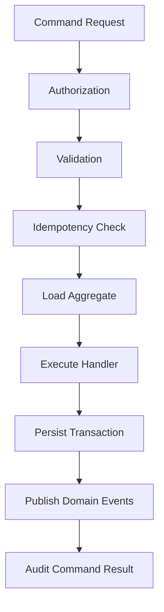
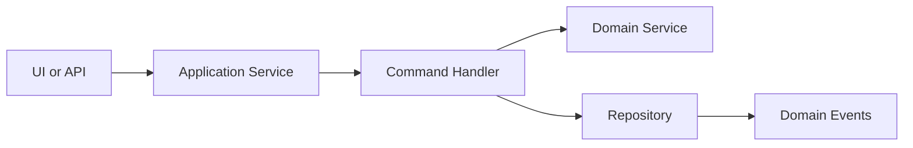
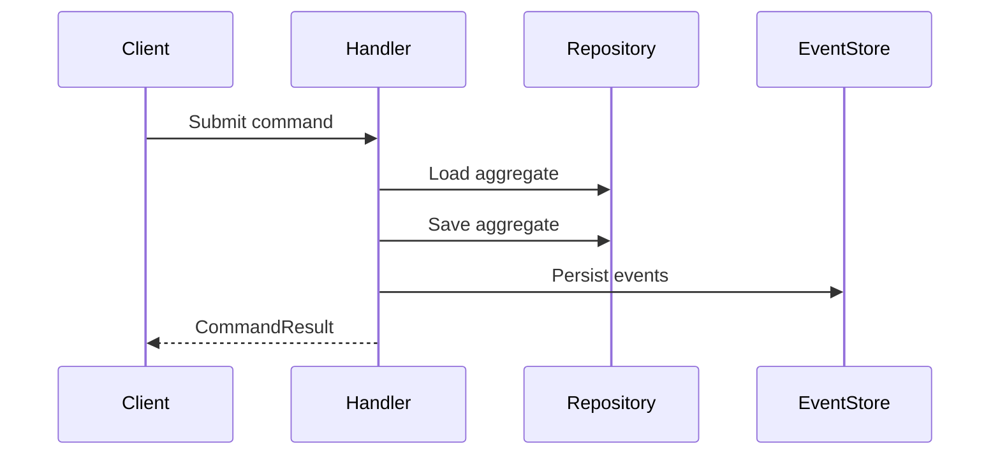
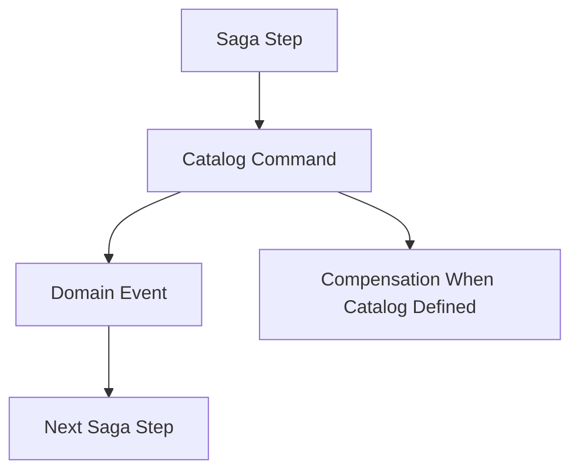
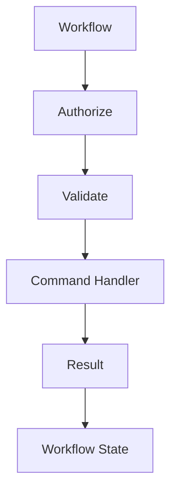

# Command Catalog

# Document Control

Document Name: Command Catalog
Document Path: knowledge/command-catalog.md
Document Type: Atlas Enterprise Canonical Specification
Version: 1.0
Status: Canonical Specification
Domain: Platform
Bounded Context: Platform
Owner: Project Atlas
Source of Truth: Atlas Command Source of Truth
Last Updated: 2026-07-12

Related Specifications:
- knowledge/aggregate-catalog.md
- knowledge/entity-catalog.md
- knowledge/domain-model-catalog.md
- knowledge/domain-event-catalog.md
- knowledge/repository-catalog.md
- knowledge/application-service-catalog.md
- knowledge/domain-service-catalog.md
- knowledge/api-governance-framework.md
- knowledge/message-contract-catalog.md
- knowledge/event-taxonomy.md
- knowledge/workflow-engine-framework.md
- knowledge/background-job-framework.md
- knowledge/automation-framework.md
- knowledge/scheduler-framework.md
- knowledge/system-module-catalog.md
- docs/specification/04-DomainModel.md
- docs/database/05-DatabaseDesign.md
- docs/database/06-ERD.md
- docs/api/07-API.md

# Purpose

Command Catalog defines every approved Atlas command that can mutate business state, request a controlled calculation, initiate replay, or move a decision into auditable execution. It is the command source of truth for Aggregates, Entities, Application Services, Domain Services, APIs, Workflows, Sagas, Background Jobs, Automations, Schedulers, AI Actions, and Message Handlers.

# Scope

- Domain Command
- Application Command
- Internal Command
- Workflow Command
- Automation Command
- Scheduler Command
- Background Job Command
- Saga Command
- UI Command
- API Command
- Message Command
- Command Handler
- Command Result
- Command Context
- Command Boundary
- Transaction Boundary
- Consistency Boundary
- Authorization
- Validation
- Idempotency
- Retry
- Timeout
- Compensation
- Concurrency

# Command Definition Standard

Every command entry uses the following complete Enterprise contract.
- Command Name
- Display Name
- Category
- Aggregate
- Aggregate Root
- Entity
- Domain
- Bounded Context
- Module
- Purpose
- Business Meaning
- Description
- Initiator
- Actor
- Trigger
- Input DTO
- Output DTO
- Handler
- Application Service
- Domain Service
- Repository
- Transaction Boundary
- Consistency Boundary
- Authorization
- Permission
- Validation Rules
- Preconditions
- Business Rules
- Invariants
- Side Effects
- Database Changes
- Published Events
- Consumed Events
- External Messages
- Workflow Integration
- Saga Integration
- Background Job Integration
- Scheduler Integration
- Retry Policy
- Idempotency
- Concurrency
- Audit
- Error Codes
- Success Result
- Failure Result
- Rollback Strategy
- Example

# Complete Command Catalog

## CMD-CF-0001 RecordIncome

Command Name: RecordIncome
Display Name: RecordIncome
Category: Application Command
Aggregate: Household
Aggregate Root: Household
Entity: Household
Domain: Cash Flow
Bounded Context: Financial Planning
Module: CashFlow
Purpose: Execute RecordIncome through the catalog-approved Atlas command surface.
Business Meaning: RecordIncome records user, system, workflow, or scheduler intent against Household.
Description: Handler validates, authorizes, mutates the owning Aggregate, persists changes, publishes events, and records audit.
Initiator: User, System, Workflow, Saga, Background Job, Scheduler, Automation, AI Action, API, or Message Handler when permitted by this catalog.
Actor: Authenticated actor or system actor with CorrelationId and CausationId.
Trigger: POST /api/v1/commands/record-income or catalog-aligned internal invocation.
Input DTO: RecordIncomeRequest
Output DTO: CommandResult
Handler: RecordIncomeCommandHandler
Application Service: DashboardApplicationService
Domain Service: CashFlowService
Repository: HouseholdRepository
Transaction Boundary: Household Aggregate transaction boundary.
Consistency Boundary: Single Aggregate consistency boundary unless replay output is explicitly read-only.
Authorization: Household ownership, tenant isolation, role, and permission are checked before state disclosure.
Permission: Dashboard:Update
Validation Rules: Command identity, actor, HouseholdId, AggregateId when required, DTO shape, value objects, enum values, idempotency key, and version are validated.
Preconditions: Aggregate owner exists, actor can access Household, command is allowed by current state, and referenced catalog names match.
Business Rules: Command mutates only Household, uses HouseholdRepository, publishes only catalog events, and records command history.
Invariants: Aggregate invariants remain valid after handler execution.
Side Effects: Read model refresh, audit append, event publication, and optional workflow progress.
Database Changes: Repository persists aggregate state inside the transaction boundary.
Published Events: SalaryReceived, BonusReceived, PassiveIncomeReceived
Consumed Events: None
External Messages: Message Contract Catalog integration when invoked by message transport.
Workflow Integration: Workflow may invoke only through RecordIncomeCommandHandler.
Saga Integration: Saga step must pass CorrelationId and CausationId; compensation follows catalog mapping.
Background Job Integration: Background job wrapper must use same handler and validation.
Scheduler Integration: Scheduler invocation uses system actor and deterministic trigger metadata.
Retry Policy: Retry transient failures only when idempotency permits.
Idempotency: HouseholdId plus RecordIncome plus IdempotencyKey plus normalized input hash.
Concurrency: Optimistic concurrency token is required for existing aggregate mutation.
Audit: ActorId, HouseholdId, command name, aggregate identity, input hash, result, event names, CorrelationId, CausationId, and version are stored.
Error Codes: CMD-ERR-001 through CMD-ERR-040 as applicable.
Success Result: CommandResult contains AggregateId, version, event names, and audit reference.
Failure Result: CommandFailure contains blocking Error Code and no partial commit.
Rollback Strategy: Roll back transaction and publish no events when mutation fails.
Example: RecordIncome is accepted, handled, persisted through HouseholdRepository, and publishes SalaryReceived, BonusReceived, PassiveIncomeReceived.
Execution Control 1: RecordIncome keeps catalog ownership, authorization, validation, idempotency, concurrency, transaction, event, audit, and rollback behavior aligned for enterprise operation.
Execution Control 2: RecordIncome keeps catalog ownership, authorization, validation, idempotency, concurrency, transaction, event, audit, and rollback behavior aligned for enterprise operation.
Execution Control 3: RecordIncome keeps catalog ownership, authorization, validation, idempotency, concurrency, transaction, event, audit, and rollback behavior aligned for enterprise operation.
Execution Control 4: RecordIncome keeps catalog ownership, authorization, validation, idempotency, concurrency, transaction, event, audit, and rollback behavior aligned for enterprise operation.
Execution Control 5: RecordIncome keeps catalog ownership, authorization, validation, idempotency, concurrency, transaction, event, audit, and rollback behavior aligned for enterprise operation.
Execution Control 6: RecordIncome keeps catalog ownership, authorization, validation, idempotency, concurrency, transaction, event, audit, and rollback behavior aligned for enterprise operation.
Execution Control 7: RecordIncome keeps catalog ownership, authorization, validation, idempotency, concurrency, transaction, event, audit, and rollback behavior aligned for enterprise operation.
Execution Control 8: RecordIncome keeps catalog ownership, authorization, validation, idempotency, concurrency, transaction, event, audit, and rollback behavior aligned for enterprise operation.
Execution Control 9: RecordIncome keeps catalog ownership, authorization, validation, idempotency, concurrency, transaction, event, audit, and rollback behavior aligned for enterprise operation.
Execution Control 10: RecordIncome keeps catalog ownership, authorization, validation, idempotency, concurrency, transaction, event, audit, and rollback behavior aligned for enterprise operation.
Execution Control 11: RecordIncome keeps catalog ownership, authorization, validation, idempotency, concurrency, transaction, event, audit, and rollback behavior aligned for enterprise operation.
Execution Control 12: RecordIncome keeps catalog ownership, authorization, validation, idempotency, concurrency, transaction, event, audit, and rollback behavior aligned for enterprise operation.
Execution Control 13: RecordIncome keeps catalog ownership, authorization, validation, idempotency, concurrency, transaction, event, audit, and rollback behavior aligned for enterprise operation.
Execution Control 14: RecordIncome keeps catalog ownership, authorization, validation, idempotency, concurrency, transaction, event, audit, and rollback behavior aligned for enterprise operation.
Execution Control 15: RecordIncome keeps catalog ownership, authorization, validation, idempotency, concurrency, transaction, event, audit, and rollback behavior aligned for enterprise operation.
Execution Control 16: RecordIncome keeps catalog ownership, authorization, validation, idempotency, concurrency, transaction, event, audit, and rollback behavior aligned for enterprise operation.
Execution Control 17: RecordIncome keeps catalog ownership, authorization, validation, idempotency, concurrency, transaction, event, audit, and rollback behavior aligned for enterprise operation.
Execution Control 18: RecordIncome keeps catalog ownership, authorization, validation, idempotency, concurrency, transaction, event, audit, and rollback behavior aligned for enterprise operation.
Execution Control 19: RecordIncome keeps catalog ownership, authorization, validation, idempotency, concurrency, transaction, event, audit, and rollback behavior aligned for enterprise operation.
Execution Control 20: RecordIncome keeps catalog ownership, authorization, validation, idempotency, concurrency, transaction, event, audit, and rollback behavior aligned for enterprise operation.
Execution Control 21: RecordIncome keeps catalog ownership, authorization, validation, idempotency, concurrency, transaction, event, audit, and rollback behavior aligned for enterprise operation.
Execution Control 22: RecordIncome keeps catalog ownership, authorization, validation, idempotency, concurrency, transaction, event, audit, and rollback behavior aligned for enterprise operation.
Execution Control 23: RecordIncome keeps catalog ownership, authorization, validation, idempotency, concurrency, transaction, event, audit, and rollback behavior aligned for enterprise operation.
Execution Control 24: RecordIncome keeps catalog ownership, authorization, validation, idempotency, concurrency, transaction, event, audit, and rollback behavior aligned for enterprise operation.
Execution Control 25: RecordIncome keeps catalog ownership, authorization, validation, idempotency, concurrency, transaction, event, audit, and rollback behavior aligned for enterprise operation.

## CMD-CF-0002 RecordExpense

Command Name: RecordExpense
Display Name: RecordExpense
Category: Application Command
Aggregate: Household
Aggregate Root: Household
Entity: Household
Domain: Cash Flow
Bounded Context: Financial Planning
Module: CashFlow
Purpose: Execute RecordExpense through the catalog-approved Atlas command surface.
Business Meaning: RecordExpense records user, system, workflow, or scheduler intent against Household.
Description: Handler validates, authorizes, mutates the owning Aggregate, persists changes, publishes events, and records audit.
Initiator: User, System, Workflow, Saga, Background Job, Scheduler, Automation, AI Action, API, or Message Handler when permitted by this catalog.
Actor: Authenticated actor or system actor with CorrelationId and CausationId.
Trigger: POST /api/v1/commands/record-expense or catalog-aligned internal invocation.
Input DTO: RecordExpenseRequest
Output DTO: CommandResult
Handler: RecordExpenseCommandHandler
Application Service: DashboardApplicationService
Domain Service: CashFlowService
Repository: HouseholdRepository
Transaction Boundary: Household Aggregate transaction boundary.
Consistency Boundary: Single Aggregate consistency boundary unless replay output is explicitly read-only.
Authorization: Household ownership, tenant isolation, role, and permission are checked before state disclosure.
Permission: Dashboard:Update
Validation Rules: Command identity, actor, HouseholdId, AggregateId when required, DTO shape, value objects, enum values, idempotency key, and version are validated.
Preconditions: Aggregate owner exists, actor can access Household, command is allowed by current state, and referenced catalog names match.
Business Rules: Command mutates only Household, uses HouseholdRepository, publishes only catalog events, and records command history.
Invariants: Aggregate invariants remain valid after handler execution.
Side Effects: Read model refresh, audit append, event publication, and optional workflow progress.
Database Changes: Repository persists aggregate state inside the transaction boundary.
Published Events: ExpenseRecorded
Consumed Events: None
External Messages: Message Contract Catalog integration when invoked by message transport.
Workflow Integration: Workflow may invoke only through RecordExpenseCommandHandler.
Saga Integration: Saga step must pass CorrelationId and CausationId; compensation follows catalog mapping.
Background Job Integration: Background job wrapper must use same handler and validation.
Scheduler Integration: Scheduler invocation uses system actor and deterministic trigger metadata.
Retry Policy: Retry transient failures only when idempotency permits.
Idempotency: HouseholdId plus RecordExpense plus IdempotencyKey plus normalized input hash.
Concurrency: Optimistic concurrency token is required for existing aggregate mutation.
Audit: ActorId, HouseholdId, command name, aggregate identity, input hash, result, event names, CorrelationId, CausationId, and version are stored.
Error Codes: CMD-ERR-001 through CMD-ERR-040 as applicable.
Success Result: CommandResult contains AggregateId, version, event names, and audit reference.
Failure Result: CommandFailure contains blocking Error Code and no partial commit.
Rollback Strategy: Roll back transaction and publish no events when mutation fails.
Example: RecordExpense is accepted, handled, persisted through HouseholdRepository, and publishes ExpenseRecorded.
Execution Control 1: RecordExpense keeps catalog ownership, authorization, validation, idempotency, concurrency, transaction, event, audit, and rollback behavior aligned for enterprise operation.
Execution Control 2: RecordExpense keeps catalog ownership, authorization, validation, idempotency, concurrency, transaction, event, audit, and rollback behavior aligned for enterprise operation.
Execution Control 3: RecordExpense keeps catalog ownership, authorization, validation, idempotency, concurrency, transaction, event, audit, and rollback behavior aligned for enterprise operation.
Execution Control 4: RecordExpense keeps catalog ownership, authorization, validation, idempotency, concurrency, transaction, event, audit, and rollback behavior aligned for enterprise operation.
Execution Control 5: RecordExpense keeps catalog ownership, authorization, validation, idempotency, concurrency, transaction, event, audit, and rollback behavior aligned for enterprise operation.
Execution Control 6: RecordExpense keeps catalog ownership, authorization, validation, idempotency, concurrency, transaction, event, audit, and rollback behavior aligned for enterprise operation.
Execution Control 7: RecordExpense keeps catalog ownership, authorization, validation, idempotency, concurrency, transaction, event, audit, and rollback behavior aligned for enterprise operation.
Execution Control 8: RecordExpense keeps catalog ownership, authorization, validation, idempotency, concurrency, transaction, event, audit, and rollback behavior aligned for enterprise operation.
Execution Control 9: RecordExpense keeps catalog ownership, authorization, validation, idempotency, concurrency, transaction, event, audit, and rollback behavior aligned for enterprise operation.
Execution Control 10: RecordExpense keeps catalog ownership, authorization, validation, idempotency, concurrency, transaction, event, audit, and rollback behavior aligned for enterprise operation.
Execution Control 11: RecordExpense keeps catalog ownership, authorization, validation, idempotency, concurrency, transaction, event, audit, and rollback behavior aligned for enterprise operation.
Execution Control 12: RecordExpense keeps catalog ownership, authorization, validation, idempotency, concurrency, transaction, event, audit, and rollback behavior aligned for enterprise operation.
Execution Control 13: RecordExpense keeps catalog ownership, authorization, validation, idempotency, concurrency, transaction, event, audit, and rollback behavior aligned for enterprise operation.
Execution Control 14: RecordExpense keeps catalog ownership, authorization, validation, idempotency, concurrency, transaction, event, audit, and rollback behavior aligned for enterprise operation.
Execution Control 15: RecordExpense keeps catalog ownership, authorization, validation, idempotency, concurrency, transaction, event, audit, and rollback behavior aligned for enterprise operation.
Execution Control 16: RecordExpense keeps catalog ownership, authorization, validation, idempotency, concurrency, transaction, event, audit, and rollback behavior aligned for enterprise operation.
Execution Control 17: RecordExpense keeps catalog ownership, authorization, validation, idempotency, concurrency, transaction, event, audit, and rollback behavior aligned for enterprise operation.
Execution Control 18: RecordExpense keeps catalog ownership, authorization, validation, idempotency, concurrency, transaction, event, audit, and rollback behavior aligned for enterprise operation.
Execution Control 19: RecordExpense keeps catalog ownership, authorization, validation, idempotency, concurrency, transaction, event, audit, and rollback behavior aligned for enterprise operation.
Execution Control 20: RecordExpense keeps catalog ownership, authorization, validation, idempotency, concurrency, transaction, event, audit, and rollback behavior aligned for enterprise operation.
Execution Control 21: RecordExpense keeps catalog ownership, authorization, validation, idempotency, concurrency, transaction, event, audit, and rollback behavior aligned for enterprise operation.
Execution Control 22: RecordExpense keeps catalog ownership, authorization, validation, idempotency, concurrency, transaction, event, audit, and rollback behavior aligned for enterprise operation.
Execution Control 23: RecordExpense keeps catalog ownership, authorization, validation, idempotency, concurrency, transaction, event, audit, and rollback behavior aligned for enterprise operation.
Execution Control 24: RecordExpense keeps catalog ownership, authorization, validation, idempotency, concurrency, transaction, event, audit, and rollback behavior aligned for enterprise operation.
Execution Control 25: RecordExpense keeps catalog ownership, authorization, validation, idempotency, concurrency, transaction, event, audit, and rollback behavior aligned for enterprise operation.

## CMD-INV-0001 CreatePortfolio

Command Name: CreatePortfolio
Display Name: CreatePortfolio
Category: Application Command
Aggregate: AssetPortfolio
Aggregate Root: AssetPortfolio
Entity: Portfolio
Domain: Investment
Bounded Context: Portfolio
Module: Portfolio
Purpose: Execute CreatePortfolio through the catalog-approved Atlas command surface.
Business Meaning: CreatePortfolio records user, system, workflow, or scheduler intent against AssetPortfolio.
Description: Handler validates, authorizes, mutates the owning Aggregate, persists changes, publishes events, and records audit.
Initiator: User, System, Workflow, Saga, Background Job, Scheduler, Automation, AI Action, API, or Message Handler when permitted by this catalog.
Actor: Authenticated actor or system actor with CorrelationId and CausationId.
Trigger: POST /api/v1/commands/create-portfolio or catalog-aligned internal invocation.
Input DTO: CreatePortfolioRequest
Output DTO: CommandResult
Handler: CreatePortfolioCommandHandler
Application Service: PortfolioApplicationService
Domain Service: PortfolioService
Repository: PortfolioRepository
Transaction Boundary: AssetPortfolio Aggregate transaction boundary.
Consistency Boundary: Single Aggregate consistency boundary unless replay output is explicitly read-only.
Authorization: Household ownership, tenant isolation, role, and permission are checked before state disclosure.
Permission: Asset:Create
Validation Rules: Command identity, actor, HouseholdId, AggregateId when required, DTO shape, value objects, enum values, idempotency key, and version are validated.
Preconditions: Aggregate owner exists, actor can access Household, command is allowed by current state, and referenced catalog names match.
Business Rules: Command mutates only AssetPortfolio, uses PortfolioRepository, publishes only catalog events, and records command history.
Invariants: Aggregate invariants remain valid after handler execution.
Side Effects: Read model refresh, audit append, event publication, and optional workflow progress.
Database Changes: Repository persists aggregate state inside the transaction boundary.
Published Events: PortfolioCreated
Consumed Events: None
External Messages: Message Contract Catalog integration when invoked by message transport.
Workflow Integration: Workflow may invoke only through CreatePortfolioCommandHandler.
Saga Integration: Saga step must pass CorrelationId and CausationId; compensation follows catalog mapping.
Background Job Integration: Background job wrapper must use same handler and validation.
Scheduler Integration: Scheduler invocation uses system actor and deterministic trigger metadata.
Retry Policy: Retry transient failures only when idempotency permits.
Idempotency: HouseholdId plus CreatePortfolio plus IdempotencyKey plus normalized input hash.
Concurrency: Optimistic concurrency token is required for existing aggregate mutation.
Audit: ActorId, HouseholdId, command name, aggregate identity, input hash, result, event names, CorrelationId, CausationId, and version are stored.
Error Codes: CMD-ERR-001 through CMD-ERR-040 as applicable.
Success Result: CommandResult contains AggregateId, version, event names, and audit reference.
Failure Result: CommandFailure contains blocking Error Code and no partial commit.
Rollback Strategy: Roll back transaction and publish no events when mutation fails.
Example: CreatePortfolio is accepted, handled, persisted through PortfolioRepository, and publishes PortfolioCreated.
Execution Control 1: CreatePortfolio keeps catalog ownership, authorization, validation, idempotency, concurrency, transaction, event, audit, and rollback behavior aligned for enterprise operation.
Execution Control 2: CreatePortfolio keeps catalog ownership, authorization, validation, idempotency, concurrency, transaction, event, audit, and rollback behavior aligned for enterprise operation.
Execution Control 3: CreatePortfolio keeps catalog ownership, authorization, validation, idempotency, concurrency, transaction, event, audit, and rollback behavior aligned for enterprise operation.
Execution Control 4: CreatePortfolio keeps catalog ownership, authorization, validation, idempotency, concurrency, transaction, event, audit, and rollback behavior aligned for enterprise operation.
Execution Control 5: CreatePortfolio keeps catalog ownership, authorization, validation, idempotency, concurrency, transaction, event, audit, and rollback behavior aligned for enterprise operation.
Execution Control 6: CreatePortfolio keeps catalog ownership, authorization, validation, idempotency, concurrency, transaction, event, audit, and rollback behavior aligned for enterprise operation.
Execution Control 7: CreatePortfolio keeps catalog ownership, authorization, validation, idempotency, concurrency, transaction, event, audit, and rollback behavior aligned for enterprise operation.
Execution Control 8: CreatePortfolio keeps catalog ownership, authorization, validation, idempotency, concurrency, transaction, event, audit, and rollback behavior aligned for enterprise operation.
Execution Control 9: CreatePortfolio keeps catalog ownership, authorization, validation, idempotency, concurrency, transaction, event, audit, and rollback behavior aligned for enterprise operation.
Execution Control 10: CreatePortfolio keeps catalog ownership, authorization, validation, idempotency, concurrency, transaction, event, audit, and rollback behavior aligned for enterprise operation.
Execution Control 11: CreatePortfolio keeps catalog ownership, authorization, validation, idempotency, concurrency, transaction, event, audit, and rollback behavior aligned for enterprise operation.
Execution Control 12: CreatePortfolio keeps catalog ownership, authorization, validation, idempotency, concurrency, transaction, event, audit, and rollback behavior aligned for enterprise operation.
Execution Control 13: CreatePortfolio keeps catalog ownership, authorization, validation, idempotency, concurrency, transaction, event, audit, and rollback behavior aligned for enterprise operation.
Execution Control 14: CreatePortfolio keeps catalog ownership, authorization, validation, idempotency, concurrency, transaction, event, audit, and rollback behavior aligned for enterprise operation.
Execution Control 15: CreatePortfolio keeps catalog ownership, authorization, validation, idempotency, concurrency, transaction, event, audit, and rollback behavior aligned for enterprise operation.
Execution Control 16: CreatePortfolio keeps catalog ownership, authorization, validation, idempotency, concurrency, transaction, event, audit, and rollback behavior aligned for enterprise operation.
Execution Control 17: CreatePortfolio keeps catalog ownership, authorization, validation, idempotency, concurrency, transaction, event, audit, and rollback behavior aligned for enterprise operation.
Execution Control 18: CreatePortfolio keeps catalog ownership, authorization, validation, idempotency, concurrency, transaction, event, audit, and rollback behavior aligned for enterprise operation.
Execution Control 19: CreatePortfolio keeps catalog ownership, authorization, validation, idempotency, concurrency, transaction, event, audit, and rollback behavior aligned for enterprise operation.
Execution Control 20: CreatePortfolio keeps catalog ownership, authorization, validation, idempotency, concurrency, transaction, event, audit, and rollback behavior aligned for enterprise operation.
Execution Control 21: CreatePortfolio keeps catalog ownership, authorization, validation, idempotency, concurrency, transaction, event, audit, and rollback behavior aligned for enterprise operation.
Execution Control 22: CreatePortfolio keeps catalog ownership, authorization, validation, idempotency, concurrency, transaction, event, audit, and rollback behavior aligned for enterprise operation.
Execution Control 23: CreatePortfolio keeps catalog ownership, authorization, validation, idempotency, concurrency, transaction, event, audit, and rollback behavior aligned for enterprise operation.
Execution Control 24: CreatePortfolio keeps catalog ownership, authorization, validation, idempotency, concurrency, transaction, event, audit, and rollback behavior aligned for enterprise operation.
Execution Control 25: CreatePortfolio keeps catalog ownership, authorization, validation, idempotency, concurrency, transaction, event, audit, and rollback behavior aligned for enterprise operation.

## CMD-INV-0002 BuySecurity

Command Name: BuySecurity
Display Name: BuySecurity
Category: Application Command
Aggregate: AssetPortfolio
Aggregate Root: AssetPortfolio
Entity: Holding
Domain: Investment
Bounded Context: Portfolio
Module: Portfolio
Purpose: Execute BuySecurity through the catalog-approved Atlas command surface.
Business Meaning: BuySecurity records user, system, workflow, or scheduler intent against AssetPortfolio.
Description: Handler validates, authorizes, mutates the owning Aggregate, persists changes, publishes events, and records audit.
Initiator: User, System, Workflow, Saga, Background Job, Scheduler, Automation, AI Action, API, or Message Handler when permitted by this catalog.
Actor: Authenticated actor or system actor with CorrelationId and CausationId.
Trigger: POST /api/v1/commands/buy-security or catalog-aligned internal invocation.
Input DTO: BuySecurityRequest
Output DTO: CommandResult
Handler: BuySecurityCommandHandler
Application Service: PortfolioApplicationService
Domain Service: PortfolioService
Repository: PortfolioRepository
Transaction Boundary: AssetPortfolio Aggregate transaction boundary.
Consistency Boundary: Single Aggregate consistency boundary unless replay output is explicitly read-only.
Authorization: Household ownership, tenant isolation, role, and permission are checked before state disclosure.
Permission: Asset:Update
Validation Rules: Command identity, actor, HouseholdId, AggregateId when required, DTO shape, value objects, enum values, idempotency key, and version are validated.
Preconditions: Aggregate owner exists, actor can access Household, command is allowed by current state, and referenced catalog names match.
Business Rules: Command mutates only AssetPortfolio, uses PortfolioRepository, publishes only catalog events, and records command history.
Invariants: Aggregate invariants remain valid after handler execution.
Side Effects: Read model refresh, audit append, event publication, and optional workflow progress.
Database Changes: Repository persists aggregate state inside the transaction boundary.
Published Events: SecurityPurchased
Consumed Events: None
External Messages: Message Contract Catalog integration when invoked by message transport.
Workflow Integration: Workflow may invoke only through BuySecurityCommandHandler.
Saga Integration: Saga step must pass CorrelationId and CausationId; compensation follows catalog mapping.
Background Job Integration: Background job wrapper must use same handler and validation.
Scheduler Integration: Scheduler invocation uses system actor and deterministic trigger metadata.
Retry Policy: Retry transient failures only when idempotency permits.
Idempotency: HouseholdId plus BuySecurity plus IdempotencyKey plus normalized input hash.
Concurrency: Optimistic concurrency token is required for existing aggregate mutation.
Audit: ActorId, HouseholdId, command name, aggregate identity, input hash, result, event names, CorrelationId, CausationId, and version are stored.
Error Codes: CMD-ERR-001 through CMD-ERR-040 as applicable.
Success Result: CommandResult contains AggregateId, version, event names, and audit reference.
Failure Result: CommandFailure contains blocking Error Code and no partial commit.
Rollback Strategy: Roll back transaction and publish no events when mutation fails.
Example: BuySecurity is accepted, handled, persisted through PortfolioRepository, and publishes SecurityPurchased.
Execution Control 1: BuySecurity keeps catalog ownership, authorization, validation, idempotency, concurrency, transaction, event, audit, and rollback behavior aligned for enterprise operation.
Execution Control 2: BuySecurity keeps catalog ownership, authorization, validation, idempotency, concurrency, transaction, event, audit, and rollback behavior aligned for enterprise operation.
Execution Control 3: BuySecurity keeps catalog ownership, authorization, validation, idempotency, concurrency, transaction, event, audit, and rollback behavior aligned for enterprise operation.
Execution Control 4: BuySecurity keeps catalog ownership, authorization, validation, idempotency, concurrency, transaction, event, audit, and rollback behavior aligned for enterprise operation.
Execution Control 5: BuySecurity keeps catalog ownership, authorization, validation, idempotency, concurrency, transaction, event, audit, and rollback behavior aligned for enterprise operation.
Execution Control 6: BuySecurity keeps catalog ownership, authorization, validation, idempotency, concurrency, transaction, event, audit, and rollback behavior aligned for enterprise operation.
Execution Control 7: BuySecurity keeps catalog ownership, authorization, validation, idempotency, concurrency, transaction, event, audit, and rollback behavior aligned for enterprise operation.
Execution Control 8: BuySecurity keeps catalog ownership, authorization, validation, idempotency, concurrency, transaction, event, audit, and rollback behavior aligned for enterprise operation.
Execution Control 9: BuySecurity keeps catalog ownership, authorization, validation, idempotency, concurrency, transaction, event, audit, and rollback behavior aligned for enterprise operation.
Execution Control 10: BuySecurity keeps catalog ownership, authorization, validation, idempotency, concurrency, transaction, event, audit, and rollback behavior aligned for enterprise operation.
Execution Control 11: BuySecurity keeps catalog ownership, authorization, validation, idempotency, concurrency, transaction, event, audit, and rollback behavior aligned for enterprise operation.
Execution Control 12: BuySecurity keeps catalog ownership, authorization, validation, idempotency, concurrency, transaction, event, audit, and rollback behavior aligned for enterprise operation.
Execution Control 13: BuySecurity keeps catalog ownership, authorization, validation, idempotency, concurrency, transaction, event, audit, and rollback behavior aligned for enterprise operation.
Execution Control 14: BuySecurity keeps catalog ownership, authorization, validation, idempotency, concurrency, transaction, event, audit, and rollback behavior aligned for enterprise operation.
Execution Control 15: BuySecurity keeps catalog ownership, authorization, validation, idempotency, concurrency, transaction, event, audit, and rollback behavior aligned for enterprise operation.
Execution Control 16: BuySecurity keeps catalog ownership, authorization, validation, idempotency, concurrency, transaction, event, audit, and rollback behavior aligned for enterprise operation.
Execution Control 17: BuySecurity keeps catalog ownership, authorization, validation, idempotency, concurrency, transaction, event, audit, and rollback behavior aligned for enterprise operation.
Execution Control 18: BuySecurity keeps catalog ownership, authorization, validation, idempotency, concurrency, transaction, event, audit, and rollback behavior aligned for enterprise operation.
Execution Control 19: BuySecurity keeps catalog ownership, authorization, validation, idempotency, concurrency, transaction, event, audit, and rollback behavior aligned for enterprise operation.
Execution Control 20: BuySecurity keeps catalog ownership, authorization, validation, idempotency, concurrency, transaction, event, audit, and rollback behavior aligned for enterprise operation.
Execution Control 21: BuySecurity keeps catalog ownership, authorization, validation, idempotency, concurrency, transaction, event, audit, and rollback behavior aligned for enterprise operation.
Execution Control 22: BuySecurity keeps catalog ownership, authorization, validation, idempotency, concurrency, transaction, event, audit, and rollback behavior aligned for enterprise operation.
Execution Control 23: BuySecurity keeps catalog ownership, authorization, validation, idempotency, concurrency, transaction, event, audit, and rollback behavior aligned for enterprise operation.
Execution Control 24: BuySecurity keeps catalog ownership, authorization, validation, idempotency, concurrency, transaction, event, audit, and rollback behavior aligned for enterprise operation.
Execution Control 25: BuySecurity keeps catalog ownership, authorization, validation, idempotency, concurrency, transaction, event, audit, and rollback behavior aligned for enterprise operation.

## CMD-INV-0003 SellSecurity

Command Name: SellSecurity
Display Name: SellSecurity
Category: Application Command
Aggregate: AssetPortfolio
Aggregate Root: AssetPortfolio
Entity: Holding
Domain: Investment
Bounded Context: Portfolio
Module: Portfolio
Purpose: Execute SellSecurity through the catalog-approved Atlas command surface.
Business Meaning: SellSecurity records user, system, workflow, or scheduler intent against AssetPortfolio.
Description: Handler validates, authorizes, mutates the owning Aggregate, persists changes, publishes events, and records audit.
Initiator: User, System, Workflow, Saga, Background Job, Scheduler, Automation, AI Action, API, or Message Handler when permitted by this catalog.
Actor: Authenticated actor or system actor with CorrelationId and CausationId.
Trigger: POST /api/v1/commands/sell-security or catalog-aligned internal invocation.
Input DTO: SellSecurityRequest
Output DTO: CommandResult
Handler: SellSecurityCommandHandler
Application Service: PortfolioApplicationService
Domain Service: PortfolioService
Repository: PortfolioRepository
Transaction Boundary: AssetPortfolio Aggregate transaction boundary.
Consistency Boundary: Single Aggregate consistency boundary unless replay output is explicitly read-only.
Authorization: Household ownership, tenant isolation, role, and permission are checked before state disclosure.
Permission: Asset:Update
Validation Rules: Command identity, actor, HouseholdId, AggregateId when required, DTO shape, value objects, enum values, idempotency key, and version are validated.
Preconditions: Aggregate owner exists, actor can access Household, command is allowed by current state, and referenced catalog names match.
Business Rules: Command mutates only AssetPortfolio, uses PortfolioRepository, publishes only catalog events, and records command history.
Invariants: Aggregate invariants remain valid after handler execution.
Side Effects: Read model refresh, audit append, event publication, and optional workflow progress.
Database Changes: Repository persists aggregate state inside the transaction boundary.
Published Events: SecuritySold
Consumed Events: None
External Messages: Message Contract Catalog integration when invoked by message transport.
Workflow Integration: Workflow may invoke only through SellSecurityCommandHandler.
Saga Integration: Saga step must pass CorrelationId and CausationId; compensation follows catalog mapping.
Background Job Integration: Background job wrapper must use same handler and validation.
Scheduler Integration: Scheduler invocation uses system actor and deterministic trigger metadata.
Retry Policy: Retry transient failures only when idempotency permits.
Idempotency: HouseholdId plus SellSecurity plus IdempotencyKey plus normalized input hash.
Concurrency: Optimistic concurrency token is required for existing aggregate mutation.
Audit: ActorId, HouseholdId, command name, aggregate identity, input hash, result, event names, CorrelationId, CausationId, and version are stored.
Error Codes: CMD-ERR-001 through CMD-ERR-040 as applicable.
Success Result: CommandResult contains AggregateId, version, event names, and audit reference.
Failure Result: CommandFailure contains blocking Error Code and no partial commit.
Rollback Strategy: Roll back transaction and publish no events when mutation fails.
Example: SellSecurity is accepted, handled, persisted through PortfolioRepository, and publishes SecuritySold.
Execution Control 1: SellSecurity keeps catalog ownership, authorization, validation, idempotency, concurrency, transaction, event, audit, and rollback behavior aligned for enterprise operation.
Execution Control 2: SellSecurity keeps catalog ownership, authorization, validation, idempotency, concurrency, transaction, event, audit, and rollback behavior aligned for enterprise operation.
Execution Control 3: SellSecurity keeps catalog ownership, authorization, validation, idempotency, concurrency, transaction, event, audit, and rollback behavior aligned for enterprise operation.
Execution Control 4: SellSecurity keeps catalog ownership, authorization, validation, idempotency, concurrency, transaction, event, audit, and rollback behavior aligned for enterprise operation.
Execution Control 5: SellSecurity keeps catalog ownership, authorization, validation, idempotency, concurrency, transaction, event, audit, and rollback behavior aligned for enterprise operation.
Execution Control 6: SellSecurity keeps catalog ownership, authorization, validation, idempotency, concurrency, transaction, event, audit, and rollback behavior aligned for enterprise operation.
Execution Control 7: SellSecurity keeps catalog ownership, authorization, validation, idempotency, concurrency, transaction, event, audit, and rollback behavior aligned for enterprise operation.
Execution Control 8: SellSecurity keeps catalog ownership, authorization, validation, idempotency, concurrency, transaction, event, audit, and rollback behavior aligned for enterprise operation.
Execution Control 9: SellSecurity keeps catalog ownership, authorization, validation, idempotency, concurrency, transaction, event, audit, and rollback behavior aligned for enterprise operation.
Execution Control 10: SellSecurity keeps catalog ownership, authorization, validation, idempotency, concurrency, transaction, event, audit, and rollback behavior aligned for enterprise operation.
Execution Control 11: SellSecurity keeps catalog ownership, authorization, validation, idempotency, concurrency, transaction, event, audit, and rollback behavior aligned for enterprise operation.
Execution Control 12: SellSecurity keeps catalog ownership, authorization, validation, idempotency, concurrency, transaction, event, audit, and rollback behavior aligned for enterprise operation.
Execution Control 13: SellSecurity keeps catalog ownership, authorization, validation, idempotency, concurrency, transaction, event, audit, and rollback behavior aligned for enterprise operation.
Execution Control 14: SellSecurity keeps catalog ownership, authorization, validation, idempotency, concurrency, transaction, event, audit, and rollback behavior aligned for enterprise operation.
Execution Control 15: SellSecurity keeps catalog ownership, authorization, validation, idempotency, concurrency, transaction, event, audit, and rollback behavior aligned for enterprise operation.
Execution Control 16: SellSecurity keeps catalog ownership, authorization, validation, idempotency, concurrency, transaction, event, audit, and rollback behavior aligned for enterprise operation.
Execution Control 17: SellSecurity keeps catalog ownership, authorization, validation, idempotency, concurrency, transaction, event, audit, and rollback behavior aligned for enterprise operation.
Execution Control 18: SellSecurity keeps catalog ownership, authorization, validation, idempotency, concurrency, transaction, event, audit, and rollback behavior aligned for enterprise operation.
Execution Control 19: SellSecurity keeps catalog ownership, authorization, validation, idempotency, concurrency, transaction, event, audit, and rollback behavior aligned for enterprise operation.
Execution Control 20: SellSecurity keeps catalog ownership, authorization, validation, idempotency, concurrency, transaction, event, audit, and rollback behavior aligned for enterprise operation.
Execution Control 21: SellSecurity keeps catalog ownership, authorization, validation, idempotency, concurrency, transaction, event, audit, and rollback behavior aligned for enterprise operation.
Execution Control 22: SellSecurity keeps catalog ownership, authorization, validation, idempotency, concurrency, transaction, event, audit, and rollback behavior aligned for enterprise operation.
Execution Control 23: SellSecurity keeps catalog ownership, authorization, validation, idempotency, concurrency, transaction, event, audit, and rollback behavior aligned for enterprise operation.
Execution Control 24: SellSecurity keeps catalog ownership, authorization, validation, idempotency, concurrency, transaction, event, audit, and rollback behavior aligned for enterprise operation.
Execution Control 25: SellSecurity keeps catalog ownership, authorization, validation, idempotency, concurrency, transaction, event, audit, and rollback behavior aligned for enterprise operation.

## CMD-INV-0004 RebalancePortfolio

Command Name: RebalancePortfolio
Display Name: RebalancePortfolio
Category: Application Command
Aggregate: AssetPortfolio
Aggregate Root: AssetPortfolio
Entity: Portfolio
Domain: Investment
Bounded Context: Portfolio
Module: Portfolio
Purpose: Execute RebalancePortfolio through the catalog-approved Atlas command surface.
Business Meaning: RebalancePortfolio records user, system, workflow, or scheduler intent against AssetPortfolio.
Description: Handler validates, authorizes, mutates the owning Aggregate, persists changes, publishes events, and records audit.
Initiator: User, System, Workflow, Saga, Background Job, Scheduler, Automation, AI Action, API, or Message Handler when permitted by this catalog.
Actor: Authenticated actor or system actor with CorrelationId and CausationId.
Trigger: POST /api/v1/commands/rebalance-portfolio or catalog-aligned internal invocation.
Input DTO: RebalancePortfolioRequest
Output DTO: CommandResult
Handler: RebalancePortfolioCommandHandler
Application Service: PortfolioApplicationService
Domain Service: AllocationService
Repository: PortfolioRepository
Transaction Boundary: AssetPortfolio Aggregate transaction boundary.
Consistency Boundary: Single Aggregate consistency boundary unless replay output is explicitly read-only.
Authorization: Household ownership, tenant isolation, role, and permission are checked before state disclosure.
Permission: Asset:Update
Validation Rules: Command identity, actor, HouseholdId, AggregateId when required, DTO shape, value objects, enum values, idempotency key, and version are validated.
Preconditions: Aggregate owner exists, actor can access Household, command is allowed by current state, and referenced catalog names match.
Business Rules: Command mutates only AssetPortfolio, uses PortfolioRepository, publishes only catalog events, and records command history.
Invariants: Aggregate invariants remain valid after handler execution.
Side Effects: Read model refresh, audit append, event publication, and optional workflow progress.
Database Changes: Repository persists aggregate state inside the transaction boundary.
Published Events: PortfolioRebalanced
Consumed Events: RecommendationGenerated
External Messages: Message Contract Catalog integration when invoked by message transport.
Workflow Integration: Workflow may invoke only through RebalancePortfolioCommandHandler.
Saga Integration: Saga step must pass CorrelationId and CausationId; compensation follows catalog mapping.
Background Job Integration: Background job wrapper must use same handler and validation.
Scheduler Integration: Scheduler invocation uses system actor and deterministic trigger metadata.
Retry Policy: Retry transient failures only when idempotency permits.
Idempotency: HouseholdId plus RebalancePortfolio plus IdempotencyKey plus normalized input hash.
Concurrency: Optimistic concurrency token is required for existing aggregate mutation.
Audit: ActorId, HouseholdId, command name, aggregate identity, input hash, result, event names, CorrelationId, CausationId, and version are stored.
Error Codes: CMD-ERR-001 through CMD-ERR-040 as applicable.
Success Result: CommandResult contains AggregateId, version, event names, and audit reference.
Failure Result: CommandFailure contains blocking Error Code and no partial commit.
Rollback Strategy: Roll back transaction and publish no events when mutation fails.
Example: RebalancePortfolio is accepted, handled, persisted through PortfolioRepository, and publishes PortfolioRebalanced.
Execution Control 1: RebalancePortfolio keeps catalog ownership, authorization, validation, idempotency, concurrency, transaction, event, audit, and rollback behavior aligned for enterprise operation.
Execution Control 2: RebalancePortfolio keeps catalog ownership, authorization, validation, idempotency, concurrency, transaction, event, audit, and rollback behavior aligned for enterprise operation.
Execution Control 3: RebalancePortfolio keeps catalog ownership, authorization, validation, idempotency, concurrency, transaction, event, audit, and rollback behavior aligned for enterprise operation.
Execution Control 4: RebalancePortfolio keeps catalog ownership, authorization, validation, idempotency, concurrency, transaction, event, audit, and rollback behavior aligned for enterprise operation.
Execution Control 5: RebalancePortfolio keeps catalog ownership, authorization, validation, idempotency, concurrency, transaction, event, audit, and rollback behavior aligned for enterprise operation.
Execution Control 6: RebalancePortfolio keeps catalog ownership, authorization, validation, idempotency, concurrency, transaction, event, audit, and rollback behavior aligned for enterprise operation.
Execution Control 7: RebalancePortfolio keeps catalog ownership, authorization, validation, idempotency, concurrency, transaction, event, audit, and rollback behavior aligned for enterprise operation.
Execution Control 8: RebalancePortfolio keeps catalog ownership, authorization, validation, idempotency, concurrency, transaction, event, audit, and rollback behavior aligned for enterprise operation.
Execution Control 9: RebalancePortfolio keeps catalog ownership, authorization, validation, idempotency, concurrency, transaction, event, audit, and rollback behavior aligned for enterprise operation.
Execution Control 10: RebalancePortfolio keeps catalog ownership, authorization, validation, idempotency, concurrency, transaction, event, audit, and rollback behavior aligned for enterprise operation.
Execution Control 11: RebalancePortfolio keeps catalog ownership, authorization, validation, idempotency, concurrency, transaction, event, audit, and rollback behavior aligned for enterprise operation.
Execution Control 12: RebalancePortfolio keeps catalog ownership, authorization, validation, idempotency, concurrency, transaction, event, audit, and rollback behavior aligned for enterprise operation.
Execution Control 13: RebalancePortfolio keeps catalog ownership, authorization, validation, idempotency, concurrency, transaction, event, audit, and rollback behavior aligned for enterprise operation.
Execution Control 14: RebalancePortfolio keeps catalog ownership, authorization, validation, idempotency, concurrency, transaction, event, audit, and rollback behavior aligned for enterprise operation.
Execution Control 15: RebalancePortfolio keeps catalog ownership, authorization, validation, idempotency, concurrency, transaction, event, audit, and rollback behavior aligned for enterprise operation.
Execution Control 16: RebalancePortfolio keeps catalog ownership, authorization, validation, idempotency, concurrency, transaction, event, audit, and rollback behavior aligned for enterprise operation.
Execution Control 17: RebalancePortfolio keeps catalog ownership, authorization, validation, idempotency, concurrency, transaction, event, audit, and rollback behavior aligned for enterprise operation.
Execution Control 18: RebalancePortfolio keeps catalog ownership, authorization, validation, idempotency, concurrency, transaction, event, audit, and rollback behavior aligned for enterprise operation.
Execution Control 19: RebalancePortfolio keeps catalog ownership, authorization, validation, idempotency, concurrency, transaction, event, audit, and rollback behavior aligned for enterprise operation.
Execution Control 20: RebalancePortfolio keeps catalog ownership, authorization, validation, idempotency, concurrency, transaction, event, audit, and rollback behavior aligned for enterprise operation.
Execution Control 21: RebalancePortfolio keeps catalog ownership, authorization, validation, idempotency, concurrency, transaction, event, audit, and rollback behavior aligned for enterprise operation.
Execution Control 22: RebalancePortfolio keeps catalog ownership, authorization, validation, idempotency, concurrency, transaction, event, audit, and rollback behavior aligned for enterprise operation.
Execution Control 23: RebalancePortfolio keeps catalog ownership, authorization, validation, idempotency, concurrency, transaction, event, audit, and rollback behavior aligned for enterprise operation.
Execution Control 24: RebalancePortfolio keeps catalog ownership, authorization, validation, idempotency, concurrency, transaction, event, audit, and rollback behavior aligned for enterprise operation.
Execution Control 25: RebalancePortfolio keeps catalog ownership, authorization, validation, idempotency, concurrency, transaction, event, audit, and rollback behavior aligned for enterprise operation.

## CMD-LOAN-0001 CreateLoan

Command Name: CreateLoan
Display Name: CreateLoan
Category: Application Command
Aggregate: Loan
Aggregate Root: Loan
Entity: Mortgage
Domain: Loan
Bounded Context: Liability
Module: Loan
Purpose: Execute CreateLoan through the catalog-approved Atlas command surface.
Business Meaning: CreateLoan records user, system, workflow, or scheduler intent against Loan.
Description: Handler validates, authorizes, mutates the owning Aggregate, persists changes, publishes events, and records audit.
Initiator: User, System, Workflow, Saga, Background Job, Scheduler, Automation, AI Action, API, or Message Handler when permitted by this catalog.
Actor: Authenticated actor or system actor with CorrelationId and CausationId.
Trigger: POST /api/v1/commands/create-loan or catalog-aligned internal invocation.
Input DTO: CreateLoanRequest
Output DTO: CommandResult
Handler: CreateLoanCommandHandler
Application Service: LoanApplicationService
Domain Service: LoanService
Repository: LoanRepository
Transaction Boundary: Loan Aggregate transaction boundary.
Consistency Boundary: Single Aggregate consistency boundary unless replay output is explicitly read-only.
Authorization: Household ownership, tenant isolation, role, and permission are checked before state disclosure.
Permission: Liability:Create
Validation Rules: Command identity, actor, HouseholdId, AggregateId when required, DTO shape, value objects, enum values, idempotency key, and version are validated.
Preconditions: Aggregate owner exists, actor can access Household, command is allowed by current state, and referenced catalog names match.
Business Rules: Command mutates only Loan, uses LoanRepository, publishes only catalog events, and records command history.
Invariants: Aggregate invariants remain valid after handler execution.
Side Effects: Read model refresh, audit append, event publication, and optional workflow progress.
Database Changes: Repository persists aggregate state inside the transaction boundary.
Published Events: LoanCreated
Consumed Events: None
External Messages: Message Contract Catalog integration when invoked by message transport.
Workflow Integration: Workflow may invoke only through CreateLoanCommandHandler.
Saga Integration: Saga step must pass CorrelationId and CausationId; compensation follows catalog mapping.
Background Job Integration: Background job wrapper must use same handler and validation.
Scheduler Integration: Scheduler invocation uses system actor and deterministic trigger metadata.
Retry Policy: Retry transient failures only when idempotency permits.
Idempotency: HouseholdId plus CreateLoan plus IdempotencyKey plus normalized input hash.
Concurrency: Optimistic concurrency token is required for existing aggregate mutation.
Audit: ActorId, HouseholdId, command name, aggregate identity, input hash, result, event names, CorrelationId, CausationId, and version are stored.
Error Codes: CMD-ERR-001 through CMD-ERR-040 as applicable.
Success Result: CommandResult contains AggregateId, version, event names, and audit reference.
Failure Result: CommandFailure contains blocking Error Code and no partial commit.
Rollback Strategy: Roll back transaction and publish no events when mutation fails.
Example: CreateLoan is accepted, handled, persisted through LoanRepository, and publishes LoanCreated.
Execution Control 1: CreateLoan keeps catalog ownership, authorization, validation, idempotency, concurrency, transaction, event, audit, and rollback behavior aligned for enterprise operation.
Execution Control 2: CreateLoan keeps catalog ownership, authorization, validation, idempotency, concurrency, transaction, event, audit, and rollback behavior aligned for enterprise operation.
Execution Control 3: CreateLoan keeps catalog ownership, authorization, validation, idempotency, concurrency, transaction, event, audit, and rollback behavior aligned for enterprise operation.
Execution Control 4: CreateLoan keeps catalog ownership, authorization, validation, idempotency, concurrency, transaction, event, audit, and rollback behavior aligned for enterprise operation.
Execution Control 5: CreateLoan keeps catalog ownership, authorization, validation, idempotency, concurrency, transaction, event, audit, and rollback behavior aligned for enterprise operation.
Execution Control 6: CreateLoan keeps catalog ownership, authorization, validation, idempotency, concurrency, transaction, event, audit, and rollback behavior aligned for enterprise operation.
Execution Control 7: CreateLoan keeps catalog ownership, authorization, validation, idempotency, concurrency, transaction, event, audit, and rollback behavior aligned for enterprise operation.
Execution Control 8: CreateLoan keeps catalog ownership, authorization, validation, idempotency, concurrency, transaction, event, audit, and rollback behavior aligned for enterprise operation.
Execution Control 9: CreateLoan keeps catalog ownership, authorization, validation, idempotency, concurrency, transaction, event, audit, and rollback behavior aligned for enterprise operation.
Execution Control 10: CreateLoan keeps catalog ownership, authorization, validation, idempotency, concurrency, transaction, event, audit, and rollback behavior aligned for enterprise operation.
Execution Control 11: CreateLoan keeps catalog ownership, authorization, validation, idempotency, concurrency, transaction, event, audit, and rollback behavior aligned for enterprise operation.
Execution Control 12: CreateLoan keeps catalog ownership, authorization, validation, idempotency, concurrency, transaction, event, audit, and rollback behavior aligned for enterprise operation.
Execution Control 13: CreateLoan keeps catalog ownership, authorization, validation, idempotency, concurrency, transaction, event, audit, and rollback behavior aligned for enterprise operation.
Execution Control 14: CreateLoan keeps catalog ownership, authorization, validation, idempotency, concurrency, transaction, event, audit, and rollback behavior aligned for enterprise operation.
Execution Control 15: CreateLoan keeps catalog ownership, authorization, validation, idempotency, concurrency, transaction, event, audit, and rollback behavior aligned for enterprise operation.
Execution Control 16: CreateLoan keeps catalog ownership, authorization, validation, idempotency, concurrency, transaction, event, audit, and rollback behavior aligned for enterprise operation.
Execution Control 17: CreateLoan keeps catalog ownership, authorization, validation, idempotency, concurrency, transaction, event, audit, and rollback behavior aligned for enterprise operation.
Execution Control 18: CreateLoan keeps catalog ownership, authorization, validation, idempotency, concurrency, transaction, event, audit, and rollback behavior aligned for enterprise operation.
Execution Control 19: CreateLoan keeps catalog ownership, authorization, validation, idempotency, concurrency, transaction, event, audit, and rollback behavior aligned for enterprise operation.
Execution Control 20: CreateLoan keeps catalog ownership, authorization, validation, idempotency, concurrency, transaction, event, audit, and rollback behavior aligned for enterprise operation.
Execution Control 21: CreateLoan keeps catalog ownership, authorization, validation, idempotency, concurrency, transaction, event, audit, and rollback behavior aligned for enterprise operation.
Execution Control 22: CreateLoan keeps catalog ownership, authorization, validation, idempotency, concurrency, transaction, event, audit, and rollback behavior aligned for enterprise operation.
Execution Control 23: CreateLoan keeps catalog ownership, authorization, validation, idempotency, concurrency, transaction, event, audit, and rollback behavior aligned for enterprise operation.
Execution Control 24: CreateLoan keeps catalog ownership, authorization, validation, idempotency, concurrency, transaction, event, audit, and rollback behavior aligned for enterprise operation.
Execution Control 25: CreateLoan keeps catalog ownership, authorization, validation, idempotency, concurrency, transaction, event, audit, and rollback behavior aligned for enterprise operation.

## CMD-LOAN-0002 RecordLoanPayment

Command Name: RecordLoanPayment
Display Name: RecordLoanPayment
Category: Application Command
Aggregate: Loan
Aggregate Root: Loan
Entity: Mortgage
Domain: Loan
Bounded Context: Liability
Module: Loan
Purpose: Execute RecordLoanPayment through the catalog-approved Atlas command surface.
Business Meaning: RecordLoanPayment records user, system, workflow, or scheduler intent against Loan.
Description: Handler validates, authorizes, mutates the owning Aggregate, persists changes, publishes events, and records audit.
Initiator: User, System, Workflow, Saga, Background Job, Scheduler, Automation, AI Action, API, or Message Handler when permitted by this catalog.
Actor: Authenticated actor or system actor with CorrelationId and CausationId.
Trigger: POST /api/v1/commands/record-loan-payment or catalog-aligned internal invocation.
Input DTO: RecordLoanPaymentRequest
Output DTO: CommandResult
Handler: RecordLoanPaymentCommandHandler
Application Service: LoanApplicationService
Domain Service: LoanService
Repository: LoanRepository
Transaction Boundary: Loan Aggregate transaction boundary.
Consistency Boundary: Single Aggregate consistency boundary unless replay output is explicitly read-only.
Authorization: Household ownership, tenant isolation, role, and permission are checked before state disclosure.
Permission: Liability:Update
Validation Rules: Command identity, actor, HouseholdId, AggregateId when required, DTO shape, value objects, enum values, idempotency key, and version are validated.
Preconditions: Aggregate owner exists, actor can access Household, command is allowed by current state, and referenced catalog names match.
Business Rules: Command mutates only Loan, uses LoanRepository, publishes only catalog events, and records command history.
Invariants: Aggregate invariants remain valid after handler execution.
Side Effects: Read model refresh, audit append, event publication, and optional workflow progress.
Database Changes: Repository persists aggregate state inside the transaction boundary.
Published Events: LoanPaymentMade, LoanClosed
Consumed Events: ExpenseRecorded
External Messages: Message Contract Catalog integration when invoked by message transport.
Workflow Integration: Workflow may invoke only through RecordLoanPaymentCommandHandler.
Saga Integration: Saga step must pass CorrelationId and CausationId; compensation follows catalog mapping.
Background Job Integration: Background job wrapper must use same handler and validation.
Scheduler Integration: Scheduler invocation uses system actor and deterministic trigger metadata.
Retry Policy: Retry transient failures only when idempotency permits.
Idempotency: HouseholdId plus RecordLoanPayment plus IdempotencyKey plus normalized input hash.
Concurrency: Optimistic concurrency token is required for existing aggregate mutation.
Audit: ActorId, HouseholdId, command name, aggregate identity, input hash, result, event names, CorrelationId, CausationId, and version are stored.
Error Codes: CMD-ERR-001 through CMD-ERR-040 as applicable.
Success Result: CommandResult contains AggregateId, version, event names, and audit reference.
Failure Result: CommandFailure contains blocking Error Code and no partial commit.
Rollback Strategy: Roll back transaction and publish no events when mutation fails.
Example: RecordLoanPayment is accepted, handled, persisted through LoanRepository, and publishes LoanPaymentMade, LoanClosed.
Execution Control 1: RecordLoanPayment keeps catalog ownership, authorization, validation, idempotency, concurrency, transaction, event, audit, and rollback behavior aligned for enterprise operation.
Execution Control 2: RecordLoanPayment keeps catalog ownership, authorization, validation, idempotency, concurrency, transaction, event, audit, and rollback behavior aligned for enterprise operation.
Execution Control 3: RecordLoanPayment keeps catalog ownership, authorization, validation, idempotency, concurrency, transaction, event, audit, and rollback behavior aligned for enterprise operation.
Execution Control 4: RecordLoanPayment keeps catalog ownership, authorization, validation, idempotency, concurrency, transaction, event, audit, and rollback behavior aligned for enterprise operation.
Execution Control 5: RecordLoanPayment keeps catalog ownership, authorization, validation, idempotency, concurrency, transaction, event, audit, and rollback behavior aligned for enterprise operation.
Execution Control 6: RecordLoanPayment keeps catalog ownership, authorization, validation, idempotency, concurrency, transaction, event, audit, and rollback behavior aligned for enterprise operation.
Execution Control 7: RecordLoanPayment keeps catalog ownership, authorization, validation, idempotency, concurrency, transaction, event, audit, and rollback behavior aligned for enterprise operation.
Execution Control 8: RecordLoanPayment keeps catalog ownership, authorization, validation, idempotency, concurrency, transaction, event, audit, and rollback behavior aligned for enterprise operation.
Execution Control 9: RecordLoanPayment keeps catalog ownership, authorization, validation, idempotency, concurrency, transaction, event, audit, and rollback behavior aligned for enterprise operation.
Execution Control 10: RecordLoanPayment keeps catalog ownership, authorization, validation, idempotency, concurrency, transaction, event, audit, and rollback behavior aligned for enterprise operation.
Execution Control 11: RecordLoanPayment keeps catalog ownership, authorization, validation, idempotency, concurrency, transaction, event, audit, and rollback behavior aligned for enterprise operation.
Execution Control 12: RecordLoanPayment keeps catalog ownership, authorization, validation, idempotency, concurrency, transaction, event, audit, and rollback behavior aligned for enterprise operation.
Execution Control 13: RecordLoanPayment keeps catalog ownership, authorization, validation, idempotency, concurrency, transaction, event, audit, and rollback behavior aligned for enterprise operation.
Execution Control 14: RecordLoanPayment keeps catalog ownership, authorization, validation, idempotency, concurrency, transaction, event, audit, and rollback behavior aligned for enterprise operation.
Execution Control 15: RecordLoanPayment keeps catalog ownership, authorization, validation, idempotency, concurrency, transaction, event, audit, and rollback behavior aligned for enterprise operation.
Execution Control 16: RecordLoanPayment keeps catalog ownership, authorization, validation, idempotency, concurrency, transaction, event, audit, and rollback behavior aligned for enterprise operation.
Execution Control 17: RecordLoanPayment keeps catalog ownership, authorization, validation, idempotency, concurrency, transaction, event, audit, and rollback behavior aligned for enterprise operation.
Execution Control 18: RecordLoanPayment keeps catalog ownership, authorization, validation, idempotency, concurrency, transaction, event, audit, and rollback behavior aligned for enterprise operation.
Execution Control 19: RecordLoanPayment keeps catalog ownership, authorization, validation, idempotency, concurrency, transaction, event, audit, and rollback behavior aligned for enterprise operation.
Execution Control 20: RecordLoanPayment keeps catalog ownership, authorization, validation, idempotency, concurrency, transaction, event, audit, and rollback behavior aligned for enterprise operation.
Execution Control 21: RecordLoanPayment keeps catalog ownership, authorization, validation, idempotency, concurrency, transaction, event, audit, and rollback behavior aligned for enterprise operation.
Execution Control 22: RecordLoanPayment keeps catalog ownership, authorization, validation, idempotency, concurrency, transaction, event, audit, and rollback behavior aligned for enterprise operation.
Execution Control 23: RecordLoanPayment keeps catalog ownership, authorization, validation, idempotency, concurrency, transaction, event, audit, and rollback behavior aligned for enterprise operation.
Execution Control 24: RecordLoanPayment keeps catalog ownership, authorization, validation, idempotency, concurrency, transaction, event, audit, and rollback behavior aligned for enterprise operation.
Execution Control 25: RecordLoanPayment keeps catalog ownership, authorization, validation, idempotency, concurrency, transaction, event, audit, and rollback behavior aligned for enterprise operation.

## CMD-LOAN-0003 RefinanceLoan

Command Name: RefinanceLoan
Display Name: RefinanceLoan
Category: Application Command
Aggregate: Loan
Aggregate Root: Loan
Entity: Mortgage
Domain: Loan
Bounded Context: Liability
Module: Loan
Purpose: Execute RefinanceLoan through the catalog-approved Atlas command surface.
Business Meaning: RefinanceLoan records user, system, workflow, or scheduler intent against Loan.
Description: Handler validates, authorizes, mutates the owning Aggregate, persists changes, publishes events, and records audit.
Initiator: User, System, Workflow, Saga, Background Job, Scheduler, Automation, AI Action, API, or Message Handler when permitted by this catalog.
Actor: Authenticated actor or system actor with CorrelationId and CausationId.
Trigger: POST /api/v1/commands/refinance-loan or catalog-aligned internal invocation.
Input DTO: RefinanceLoanRequest
Output DTO: CommandResult
Handler: RefinanceLoanCommandHandler
Application Service: LoanApplicationService
Domain Service: LoanService
Repository: LoanRepository
Transaction Boundary: Loan Aggregate transaction boundary.
Consistency Boundary: Single Aggregate consistency boundary unless replay output is explicitly read-only.
Authorization: Household ownership, tenant isolation, role, and permission are checked before state disclosure.
Permission: Liability:Update
Validation Rules: Command identity, actor, HouseholdId, AggregateId when required, DTO shape, value objects, enum values, idempotency key, and version are validated.
Preconditions: Aggregate owner exists, actor can access Household, command is allowed by current state, and referenced catalog names match.
Business Rules: Command mutates only Loan, uses LoanRepository, publishes only catalog events, and records command history.
Invariants: Aggregate invariants remain valid after handler execution.
Side Effects: Read model refresh, audit append, event publication, and optional workflow progress.
Database Changes: Repository persists aggregate state inside the transaction boundary.
Published Events: LoanRefinanced
Consumed Events: DecisionAccepted
External Messages: Message Contract Catalog integration when invoked by message transport.
Workflow Integration: Workflow may invoke only through RefinanceLoanCommandHandler.
Saga Integration: Saga step must pass CorrelationId and CausationId; compensation follows catalog mapping.
Background Job Integration: Background job wrapper must use same handler and validation.
Scheduler Integration: Scheduler invocation uses system actor and deterministic trigger metadata.
Retry Policy: Retry transient failures only when idempotency permits.
Idempotency: HouseholdId plus RefinanceLoan plus IdempotencyKey plus normalized input hash.
Concurrency: Optimistic concurrency token is required for existing aggregate mutation.
Audit: ActorId, HouseholdId, command name, aggregate identity, input hash, result, event names, CorrelationId, CausationId, and version are stored.
Error Codes: CMD-ERR-001 through CMD-ERR-040 as applicable.
Success Result: CommandResult contains AggregateId, version, event names, and audit reference.
Failure Result: CommandFailure contains blocking Error Code and no partial commit.
Rollback Strategy: Roll back transaction and publish no events when mutation fails.
Example: RefinanceLoan is accepted, handled, persisted through LoanRepository, and publishes LoanRefinanced.
Execution Control 1: RefinanceLoan keeps catalog ownership, authorization, validation, idempotency, concurrency, transaction, event, audit, and rollback behavior aligned for enterprise operation.
Execution Control 2: RefinanceLoan keeps catalog ownership, authorization, validation, idempotency, concurrency, transaction, event, audit, and rollback behavior aligned for enterprise operation.
Execution Control 3: RefinanceLoan keeps catalog ownership, authorization, validation, idempotency, concurrency, transaction, event, audit, and rollback behavior aligned for enterprise operation.
Execution Control 4: RefinanceLoan keeps catalog ownership, authorization, validation, idempotency, concurrency, transaction, event, audit, and rollback behavior aligned for enterprise operation.
Execution Control 5: RefinanceLoan keeps catalog ownership, authorization, validation, idempotency, concurrency, transaction, event, audit, and rollback behavior aligned for enterprise operation.
Execution Control 6: RefinanceLoan keeps catalog ownership, authorization, validation, idempotency, concurrency, transaction, event, audit, and rollback behavior aligned for enterprise operation.
Execution Control 7: RefinanceLoan keeps catalog ownership, authorization, validation, idempotency, concurrency, transaction, event, audit, and rollback behavior aligned for enterprise operation.
Execution Control 8: RefinanceLoan keeps catalog ownership, authorization, validation, idempotency, concurrency, transaction, event, audit, and rollback behavior aligned for enterprise operation.
Execution Control 9: RefinanceLoan keeps catalog ownership, authorization, validation, idempotency, concurrency, transaction, event, audit, and rollback behavior aligned for enterprise operation.
Execution Control 10: RefinanceLoan keeps catalog ownership, authorization, validation, idempotency, concurrency, transaction, event, audit, and rollback behavior aligned for enterprise operation.
Execution Control 11: RefinanceLoan keeps catalog ownership, authorization, validation, idempotency, concurrency, transaction, event, audit, and rollback behavior aligned for enterprise operation.
Execution Control 12: RefinanceLoan keeps catalog ownership, authorization, validation, idempotency, concurrency, transaction, event, audit, and rollback behavior aligned for enterprise operation.
Execution Control 13: RefinanceLoan keeps catalog ownership, authorization, validation, idempotency, concurrency, transaction, event, audit, and rollback behavior aligned for enterprise operation.
Execution Control 14: RefinanceLoan keeps catalog ownership, authorization, validation, idempotency, concurrency, transaction, event, audit, and rollback behavior aligned for enterprise operation.
Execution Control 15: RefinanceLoan keeps catalog ownership, authorization, validation, idempotency, concurrency, transaction, event, audit, and rollback behavior aligned for enterprise operation.
Execution Control 16: RefinanceLoan keeps catalog ownership, authorization, validation, idempotency, concurrency, transaction, event, audit, and rollback behavior aligned for enterprise operation.
Execution Control 17: RefinanceLoan keeps catalog ownership, authorization, validation, idempotency, concurrency, transaction, event, audit, and rollback behavior aligned for enterprise operation.
Execution Control 18: RefinanceLoan keeps catalog ownership, authorization, validation, idempotency, concurrency, transaction, event, audit, and rollback behavior aligned for enterprise operation.
Execution Control 19: RefinanceLoan keeps catalog ownership, authorization, validation, idempotency, concurrency, transaction, event, audit, and rollback behavior aligned for enterprise operation.
Execution Control 20: RefinanceLoan keeps catalog ownership, authorization, validation, idempotency, concurrency, transaction, event, audit, and rollback behavior aligned for enterprise operation.
Execution Control 21: RefinanceLoan keeps catalog ownership, authorization, validation, idempotency, concurrency, transaction, event, audit, and rollback behavior aligned for enterprise operation.
Execution Control 22: RefinanceLoan keeps catalog ownership, authorization, validation, idempotency, concurrency, transaction, event, audit, and rollback behavior aligned for enterprise operation.
Execution Control 23: RefinanceLoan keeps catalog ownership, authorization, validation, idempotency, concurrency, transaction, event, audit, and rollback behavior aligned for enterprise operation.
Execution Control 24: RefinanceLoan keeps catalog ownership, authorization, validation, idempotency, concurrency, transaction, event, audit, and rollback behavior aligned for enterprise operation.
Execution Control 25: RefinanceLoan keeps catalog ownership, authorization, validation, idempotency, concurrency, transaction, event, audit, and rollback behavior aligned for enterprise operation.

## CMD-HOME-0001 PurchaseHome

Command Name: PurchaseHome
Display Name: PurchaseHome
Category: Application Command
Aggregate: Property
Aggregate Root: Property
Entity: Property
Domain: Housing
Bounded Context: Property
Module: Property
Purpose: Execute PurchaseHome through the catalog-approved Atlas command surface.
Business Meaning: PurchaseHome records user, system, workflow, or scheduler intent against Property.
Description: Handler validates, authorizes, mutates the owning Aggregate, persists changes, publishes events, and records audit.
Initiator: User, System, Workflow, Saga, Background Job, Scheduler, Automation, AI Action, API, or Message Handler when permitted by this catalog.
Actor: Authenticated actor or system actor with CorrelationId and CausationId.
Trigger: POST /api/v1/commands/purchase-home or catalog-aligned internal invocation.
Input DTO: PurchaseHomeRequest
Output DTO: CommandResult
Handler: PurchaseHomeCommandHandler
Application Service: BlueprintApplicationService
Domain Service: PortfolioService
Repository: PropertyRepository
Transaction Boundary: Property Aggregate transaction boundary.
Consistency Boundary: Single Aggregate consistency boundary unless replay output is explicitly read-only.
Authorization: Household ownership, tenant isolation, role, and permission are checked before state disclosure.
Permission: Asset:Create
Validation Rules: Command identity, actor, HouseholdId, AggregateId when required, DTO shape, value objects, enum values, idempotency key, and version are validated.
Preconditions: Aggregate owner exists, actor can access Household, command is allowed by current state, and referenced catalog names match.
Business Rules: Command mutates only Property, uses PropertyRepository, publishes only catalog events, and records command history.
Invariants: Aggregate invariants remain valid after handler execution.
Side Effects: Read model refresh, audit append, event publication, and optional workflow progress.
Database Changes: Repository persists aggregate state inside the transaction boundary.
Published Events: HomePurchased
Consumed Events: DecisionAccepted
External Messages: Message Contract Catalog integration when invoked by message transport.
Workflow Integration: Workflow may invoke only through PurchaseHomeCommandHandler.
Saga Integration: Saga step must pass CorrelationId and CausationId; compensation follows catalog mapping.
Background Job Integration: Background job wrapper must use same handler and validation.
Scheduler Integration: Scheduler invocation uses system actor and deterministic trigger metadata.
Retry Policy: Retry transient failures only when idempotency permits.
Idempotency: HouseholdId plus PurchaseHome plus IdempotencyKey plus normalized input hash.
Concurrency: Optimistic concurrency token is required for existing aggregate mutation.
Audit: ActorId, HouseholdId, command name, aggregate identity, input hash, result, event names, CorrelationId, CausationId, and version are stored.
Error Codes: CMD-ERR-001 through CMD-ERR-040 as applicable.
Success Result: CommandResult contains AggregateId, version, event names, and audit reference.
Failure Result: CommandFailure contains blocking Error Code and no partial commit.
Rollback Strategy: Roll back transaction and publish no events when mutation fails.
Example: PurchaseHome is accepted, handled, persisted through PropertyRepository, and publishes HomePurchased.
Execution Control 1: PurchaseHome keeps catalog ownership, authorization, validation, idempotency, concurrency, transaction, event, audit, and rollback behavior aligned for enterprise operation.
Execution Control 2: PurchaseHome keeps catalog ownership, authorization, validation, idempotency, concurrency, transaction, event, audit, and rollback behavior aligned for enterprise operation.
Execution Control 3: PurchaseHome keeps catalog ownership, authorization, validation, idempotency, concurrency, transaction, event, audit, and rollback behavior aligned for enterprise operation.
Execution Control 4: PurchaseHome keeps catalog ownership, authorization, validation, idempotency, concurrency, transaction, event, audit, and rollback behavior aligned for enterprise operation.
Execution Control 5: PurchaseHome keeps catalog ownership, authorization, validation, idempotency, concurrency, transaction, event, audit, and rollback behavior aligned for enterprise operation.
Execution Control 6: PurchaseHome keeps catalog ownership, authorization, validation, idempotency, concurrency, transaction, event, audit, and rollback behavior aligned for enterprise operation.
Execution Control 7: PurchaseHome keeps catalog ownership, authorization, validation, idempotency, concurrency, transaction, event, audit, and rollback behavior aligned for enterprise operation.
Execution Control 8: PurchaseHome keeps catalog ownership, authorization, validation, idempotency, concurrency, transaction, event, audit, and rollback behavior aligned for enterprise operation.
Execution Control 9: PurchaseHome keeps catalog ownership, authorization, validation, idempotency, concurrency, transaction, event, audit, and rollback behavior aligned for enterprise operation.
Execution Control 10: PurchaseHome keeps catalog ownership, authorization, validation, idempotency, concurrency, transaction, event, audit, and rollback behavior aligned for enterprise operation.
Execution Control 11: PurchaseHome keeps catalog ownership, authorization, validation, idempotency, concurrency, transaction, event, audit, and rollback behavior aligned for enterprise operation.
Execution Control 12: PurchaseHome keeps catalog ownership, authorization, validation, idempotency, concurrency, transaction, event, audit, and rollback behavior aligned for enterprise operation.
Execution Control 13: PurchaseHome keeps catalog ownership, authorization, validation, idempotency, concurrency, transaction, event, audit, and rollback behavior aligned for enterprise operation.
Execution Control 14: PurchaseHome keeps catalog ownership, authorization, validation, idempotency, concurrency, transaction, event, audit, and rollback behavior aligned for enterprise operation.
Execution Control 15: PurchaseHome keeps catalog ownership, authorization, validation, idempotency, concurrency, transaction, event, audit, and rollback behavior aligned for enterprise operation.
Execution Control 16: PurchaseHome keeps catalog ownership, authorization, validation, idempotency, concurrency, transaction, event, audit, and rollback behavior aligned for enterprise operation.
Execution Control 17: PurchaseHome keeps catalog ownership, authorization, validation, idempotency, concurrency, transaction, event, audit, and rollback behavior aligned for enterprise operation.
Execution Control 18: PurchaseHome keeps catalog ownership, authorization, validation, idempotency, concurrency, transaction, event, audit, and rollback behavior aligned for enterprise operation.
Execution Control 19: PurchaseHome keeps catalog ownership, authorization, validation, idempotency, concurrency, transaction, event, audit, and rollback behavior aligned for enterprise operation.
Execution Control 20: PurchaseHome keeps catalog ownership, authorization, validation, idempotency, concurrency, transaction, event, audit, and rollback behavior aligned for enterprise operation.
Execution Control 21: PurchaseHome keeps catalog ownership, authorization, validation, idempotency, concurrency, transaction, event, audit, and rollback behavior aligned for enterprise operation.
Execution Control 22: PurchaseHome keeps catalog ownership, authorization, validation, idempotency, concurrency, transaction, event, audit, and rollback behavior aligned for enterprise operation.
Execution Control 23: PurchaseHome keeps catalog ownership, authorization, validation, idempotency, concurrency, transaction, event, audit, and rollback behavior aligned for enterprise operation.
Execution Control 24: PurchaseHome keeps catalog ownership, authorization, validation, idempotency, concurrency, transaction, event, audit, and rollback behavior aligned for enterprise operation.
Execution Control 25: PurchaseHome keeps catalog ownership, authorization, validation, idempotency, concurrency, transaction, event, audit, and rollback behavior aligned for enterprise operation.

## CMD-HOME-0002 SellHome

Command Name: SellHome
Display Name: SellHome
Category: Application Command
Aggregate: Property
Aggregate Root: Property
Entity: Property
Domain: Housing
Bounded Context: Property
Module: Property
Purpose: Execute SellHome through the catalog-approved Atlas command surface.
Business Meaning: SellHome records user, system, workflow, or scheduler intent against Property.
Description: Handler validates, authorizes, mutates the owning Aggregate, persists changes, publishes events, and records audit.
Initiator: User, System, Workflow, Saga, Background Job, Scheduler, Automation, AI Action, API, or Message Handler when permitted by this catalog.
Actor: Authenticated actor or system actor with CorrelationId and CausationId.
Trigger: POST /api/v1/commands/sell-home or catalog-aligned internal invocation.
Input DTO: SellHomeRequest
Output DTO: CommandResult
Handler: SellHomeCommandHandler
Application Service: BlueprintApplicationService
Domain Service: PortfolioService
Repository: PropertyRepository
Transaction Boundary: Property Aggregate transaction boundary.
Consistency Boundary: Single Aggregate consistency boundary unless replay output is explicitly read-only.
Authorization: Household ownership, tenant isolation, role, and permission are checked before state disclosure.
Permission: Asset:Update
Validation Rules: Command identity, actor, HouseholdId, AggregateId when required, DTO shape, value objects, enum values, idempotency key, and version are validated.
Preconditions: Aggregate owner exists, actor can access Household, command is allowed by current state, and referenced catalog names match.
Business Rules: Command mutates only Property, uses PropertyRepository, publishes only catalog events, and records command history.
Invariants: Aggregate invariants remain valid after handler execution.
Side Effects: Read model refresh, audit append, event publication, and optional workflow progress.
Database Changes: Repository persists aggregate state inside the transaction boundary.
Published Events: HomeSold
Consumed Events: None
External Messages: Message Contract Catalog integration when invoked by message transport.
Workflow Integration: Workflow may invoke only through SellHomeCommandHandler.
Saga Integration: Saga step must pass CorrelationId and CausationId; compensation follows catalog mapping.
Background Job Integration: Background job wrapper must use same handler and validation.
Scheduler Integration: Scheduler invocation uses system actor and deterministic trigger metadata.
Retry Policy: Retry transient failures only when idempotency permits.
Idempotency: HouseholdId plus SellHome plus IdempotencyKey plus normalized input hash.
Concurrency: Optimistic concurrency token is required for existing aggregate mutation.
Audit: ActorId, HouseholdId, command name, aggregate identity, input hash, result, event names, CorrelationId, CausationId, and version are stored.
Error Codes: CMD-ERR-001 through CMD-ERR-040 as applicable.
Success Result: CommandResult contains AggregateId, version, event names, and audit reference.
Failure Result: CommandFailure contains blocking Error Code and no partial commit.
Rollback Strategy: Roll back transaction and publish no events when mutation fails.
Example: SellHome is accepted, handled, persisted through PropertyRepository, and publishes HomeSold.
Execution Control 1: SellHome keeps catalog ownership, authorization, validation, idempotency, concurrency, transaction, event, audit, and rollback behavior aligned for enterprise operation.
Execution Control 2: SellHome keeps catalog ownership, authorization, validation, idempotency, concurrency, transaction, event, audit, and rollback behavior aligned for enterprise operation.
Execution Control 3: SellHome keeps catalog ownership, authorization, validation, idempotency, concurrency, transaction, event, audit, and rollback behavior aligned for enterprise operation.
Execution Control 4: SellHome keeps catalog ownership, authorization, validation, idempotency, concurrency, transaction, event, audit, and rollback behavior aligned for enterprise operation.
Execution Control 5: SellHome keeps catalog ownership, authorization, validation, idempotency, concurrency, transaction, event, audit, and rollback behavior aligned for enterprise operation.
Execution Control 6: SellHome keeps catalog ownership, authorization, validation, idempotency, concurrency, transaction, event, audit, and rollback behavior aligned for enterprise operation.
Execution Control 7: SellHome keeps catalog ownership, authorization, validation, idempotency, concurrency, transaction, event, audit, and rollback behavior aligned for enterprise operation.
Execution Control 8: SellHome keeps catalog ownership, authorization, validation, idempotency, concurrency, transaction, event, audit, and rollback behavior aligned for enterprise operation.
Execution Control 9: SellHome keeps catalog ownership, authorization, validation, idempotency, concurrency, transaction, event, audit, and rollback behavior aligned for enterprise operation.
Execution Control 10: SellHome keeps catalog ownership, authorization, validation, idempotency, concurrency, transaction, event, audit, and rollback behavior aligned for enterprise operation.
Execution Control 11: SellHome keeps catalog ownership, authorization, validation, idempotency, concurrency, transaction, event, audit, and rollback behavior aligned for enterprise operation.
Execution Control 12: SellHome keeps catalog ownership, authorization, validation, idempotency, concurrency, transaction, event, audit, and rollback behavior aligned for enterprise operation.
Execution Control 13: SellHome keeps catalog ownership, authorization, validation, idempotency, concurrency, transaction, event, audit, and rollback behavior aligned for enterprise operation.
Execution Control 14: SellHome keeps catalog ownership, authorization, validation, idempotency, concurrency, transaction, event, audit, and rollback behavior aligned for enterprise operation.
Execution Control 15: SellHome keeps catalog ownership, authorization, validation, idempotency, concurrency, transaction, event, audit, and rollback behavior aligned for enterprise operation.
Execution Control 16: SellHome keeps catalog ownership, authorization, validation, idempotency, concurrency, transaction, event, audit, and rollback behavior aligned for enterprise operation.
Execution Control 17: SellHome keeps catalog ownership, authorization, validation, idempotency, concurrency, transaction, event, audit, and rollback behavior aligned for enterprise operation.
Execution Control 18: SellHome keeps catalog ownership, authorization, validation, idempotency, concurrency, transaction, event, audit, and rollback behavior aligned for enterprise operation.
Execution Control 19: SellHome keeps catalog ownership, authorization, validation, idempotency, concurrency, transaction, event, audit, and rollback behavior aligned for enterprise operation.
Execution Control 20: SellHome keeps catalog ownership, authorization, validation, idempotency, concurrency, transaction, event, audit, and rollback behavior aligned for enterprise operation.
Execution Control 21: SellHome keeps catalog ownership, authorization, validation, idempotency, concurrency, transaction, event, audit, and rollback behavior aligned for enterprise operation.
Execution Control 22: SellHome keeps catalog ownership, authorization, validation, idempotency, concurrency, transaction, event, audit, and rollback behavior aligned for enterprise operation.
Execution Control 23: SellHome keeps catalog ownership, authorization, validation, idempotency, concurrency, transaction, event, audit, and rollback behavior aligned for enterprise operation.
Execution Control 24: SellHome keeps catalog ownership, authorization, validation, idempotency, concurrency, transaction, event, audit, and rollback behavior aligned for enterprise operation.
Execution Control 25: SellHome keeps catalog ownership, authorization, validation, idempotency, concurrency, transaction, event, audit, and rollback behavior aligned for enterprise operation.

## CMD-HOME-0003 UpdatePropertyValue

Command Name: UpdatePropertyValue
Display Name: UpdatePropertyValue
Category: Application Command
Aggregate: Property
Aggregate Root: Property
Entity: Property
Domain: Housing
Bounded Context: Property
Module: Property
Purpose: Execute UpdatePropertyValue through the catalog-approved Atlas command surface.
Business Meaning: UpdatePropertyValue records user, system, workflow, or scheduler intent against Property.
Description: Handler validates, authorizes, mutates the owning Aggregate, persists changes, publishes events, and records audit.
Initiator: User, System, Workflow, Saga, Background Job, Scheduler, Automation, AI Action, API, or Message Handler when permitted by this catalog.
Actor: Authenticated actor or system actor with CorrelationId and CausationId.
Trigger: POST /api/v1/commands/update-property-value or catalog-aligned internal invocation.
Input DTO: UpdatePropertyValueRequest
Output DTO: CommandResult
Handler: UpdatePropertyValueCommandHandler
Application Service: DashboardApplicationService
Domain Service: PortfolioService
Repository: PropertyRepository
Transaction Boundary: Property Aggregate transaction boundary.
Consistency Boundary: Single Aggregate consistency boundary unless replay output is explicitly read-only.
Authorization: Household ownership, tenant isolation, role, and permission are checked before state disclosure.
Permission: Asset:Update
Validation Rules: Command identity, actor, HouseholdId, AggregateId when required, DTO shape, value objects, enum values, idempotency key, and version are validated.
Preconditions: Aggregate owner exists, actor can access Household, command is allowed by current state, and referenced catalog names match.
Business Rules: Command mutates only Property, uses PropertyRepository, publishes only catalog events, and records command history.
Invariants: Aggregate invariants remain valid after handler execution.
Side Effects: Read model refresh, audit append, event publication, and optional workflow progress.
Database Changes: Repository persists aggregate state inside the transaction boundary.
Published Events: HomeValueUpdated
Consumed Events: None
External Messages: Message Contract Catalog integration when invoked by message transport.
Workflow Integration: Workflow may invoke only through UpdatePropertyValueCommandHandler.
Saga Integration: Saga step must pass CorrelationId and CausationId; compensation follows catalog mapping.
Background Job Integration: Background job wrapper must use same handler and validation.
Scheduler Integration: Scheduler invocation uses system actor and deterministic trigger metadata.
Retry Policy: Retry transient failures only when idempotency permits.
Idempotency: HouseholdId plus UpdatePropertyValue plus IdempotencyKey plus normalized input hash.
Concurrency: Optimistic concurrency token is required for existing aggregate mutation.
Audit: ActorId, HouseholdId, command name, aggregate identity, input hash, result, event names, CorrelationId, CausationId, and version are stored.
Error Codes: CMD-ERR-001 through CMD-ERR-040 as applicable.
Success Result: CommandResult contains AggregateId, version, event names, and audit reference.
Failure Result: CommandFailure contains blocking Error Code and no partial commit.
Rollback Strategy: Roll back transaction and publish no events when mutation fails.
Example: UpdatePropertyValue is accepted, handled, persisted through PropertyRepository, and publishes HomeValueUpdated.
Execution Control 1: UpdatePropertyValue keeps catalog ownership, authorization, validation, idempotency, concurrency, transaction, event, audit, and rollback behavior aligned for enterprise operation.
Execution Control 2: UpdatePropertyValue keeps catalog ownership, authorization, validation, idempotency, concurrency, transaction, event, audit, and rollback behavior aligned for enterprise operation.
Execution Control 3: UpdatePropertyValue keeps catalog ownership, authorization, validation, idempotency, concurrency, transaction, event, audit, and rollback behavior aligned for enterprise operation.
Execution Control 4: UpdatePropertyValue keeps catalog ownership, authorization, validation, idempotency, concurrency, transaction, event, audit, and rollback behavior aligned for enterprise operation.
Execution Control 5: UpdatePropertyValue keeps catalog ownership, authorization, validation, idempotency, concurrency, transaction, event, audit, and rollback behavior aligned for enterprise operation.
Execution Control 6: UpdatePropertyValue keeps catalog ownership, authorization, validation, idempotency, concurrency, transaction, event, audit, and rollback behavior aligned for enterprise operation.
Execution Control 7: UpdatePropertyValue keeps catalog ownership, authorization, validation, idempotency, concurrency, transaction, event, audit, and rollback behavior aligned for enterprise operation.
Execution Control 8: UpdatePropertyValue keeps catalog ownership, authorization, validation, idempotency, concurrency, transaction, event, audit, and rollback behavior aligned for enterprise operation.
Execution Control 9: UpdatePropertyValue keeps catalog ownership, authorization, validation, idempotency, concurrency, transaction, event, audit, and rollback behavior aligned for enterprise operation.
Execution Control 10: UpdatePropertyValue keeps catalog ownership, authorization, validation, idempotency, concurrency, transaction, event, audit, and rollback behavior aligned for enterprise operation.
Execution Control 11: UpdatePropertyValue keeps catalog ownership, authorization, validation, idempotency, concurrency, transaction, event, audit, and rollback behavior aligned for enterprise operation.
Execution Control 12: UpdatePropertyValue keeps catalog ownership, authorization, validation, idempotency, concurrency, transaction, event, audit, and rollback behavior aligned for enterprise operation.
Execution Control 13: UpdatePropertyValue keeps catalog ownership, authorization, validation, idempotency, concurrency, transaction, event, audit, and rollback behavior aligned for enterprise operation.
Execution Control 14: UpdatePropertyValue keeps catalog ownership, authorization, validation, idempotency, concurrency, transaction, event, audit, and rollback behavior aligned for enterprise operation.
Execution Control 15: UpdatePropertyValue keeps catalog ownership, authorization, validation, idempotency, concurrency, transaction, event, audit, and rollback behavior aligned for enterprise operation.
Execution Control 16: UpdatePropertyValue keeps catalog ownership, authorization, validation, idempotency, concurrency, transaction, event, audit, and rollback behavior aligned for enterprise operation.
Execution Control 17: UpdatePropertyValue keeps catalog ownership, authorization, validation, idempotency, concurrency, transaction, event, audit, and rollback behavior aligned for enterprise operation.
Execution Control 18: UpdatePropertyValue keeps catalog ownership, authorization, validation, idempotency, concurrency, transaction, event, audit, and rollback behavior aligned for enterprise operation.
Execution Control 19: UpdatePropertyValue keeps catalog ownership, authorization, validation, idempotency, concurrency, transaction, event, audit, and rollback behavior aligned for enterprise operation.
Execution Control 20: UpdatePropertyValue keeps catalog ownership, authorization, validation, idempotency, concurrency, transaction, event, audit, and rollback behavior aligned for enterprise operation.
Execution Control 21: UpdatePropertyValue keeps catalog ownership, authorization, validation, idempotency, concurrency, transaction, event, audit, and rollback behavior aligned for enterprise operation.
Execution Control 22: UpdatePropertyValue keeps catalog ownership, authorization, validation, idempotency, concurrency, transaction, event, audit, and rollback behavior aligned for enterprise operation.
Execution Control 23: UpdatePropertyValue keeps catalog ownership, authorization, validation, idempotency, concurrency, transaction, event, audit, and rollback behavior aligned for enterprise operation.
Execution Control 24: UpdatePropertyValue keeps catalog ownership, authorization, validation, idempotency, concurrency, transaction, event, audit, and rollback behavior aligned for enterprise operation.
Execution Control 25: UpdatePropertyValue keeps catalog ownership, authorization, validation, idempotency, concurrency, transaction, event, audit, and rollback behavior aligned for enterprise operation.

## CMD-INS-0001 IssuePolicy

Command Name: IssuePolicy
Display Name: IssuePolicy
Category: Application Command
Aggregate: Policy
Aggregate Root: Policy
Entity: Policy
Domain: Insurance
Bounded Context: Protection
Module: Policy
Purpose: Execute IssuePolicy through the catalog-approved Atlas command surface.
Business Meaning: IssuePolicy records user, system, workflow, or scheduler intent against Policy.
Description: Handler validates, authorizes, mutates the owning Aggregate, persists changes, publishes events, and records audit.
Initiator: User, System, Workflow, Saga, Background Job, Scheduler, Automation, AI Action, API, or Message Handler when permitted by this catalog.
Actor: Authenticated actor or system actor with CorrelationId and CausationId.
Trigger: POST /api/v1/commands/issue-policy or catalog-aligned internal invocation.
Input DTO: IssuePolicyRequest
Output DTO: CommandResult
Handler: IssuePolicyCommandHandler
Application Service: IPSApplicationService
Domain Service: RiskService
Repository: Catalog-approved persistence
Transaction Boundary: Policy Aggregate transaction boundary.
Consistency Boundary: Single Aggregate consistency boundary unless replay output is explicitly read-only.
Authorization: Household ownership, tenant isolation, role, and permission are checked before state disclosure.
Permission: Policy:Create
Validation Rules: Command identity, actor, HouseholdId, AggregateId when required, DTO shape, value objects, enum values, idempotency key, and version are validated.
Preconditions: Aggregate owner exists, actor can access Household, command is allowed by current state, and referenced catalog names match.
Business Rules: Command mutates only Policy, uses Catalog-approved persistence, publishes only catalog events, and records command history.
Invariants: Aggregate invariants remain valid after handler execution.
Side Effects: Read model refresh, audit append, event publication, and optional workflow progress.
Database Changes: Repository persists aggregate state inside the transaction boundary.
Published Events: PolicyIssued, CoverageUpdated
Consumed Events: None
External Messages: Message Contract Catalog integration when invoked by message transport.
Workflow Integration: Workflow may invoke only through IssuePolicyCommandHandler.
Saga Integration: Saga step must pass CorrelationId and CausationId; compensation follows catalog mapping.
Background Job Integration: Background job wrapper must use same handler and validation.
Scheduler Integration: Scheduler invocation uses system actor and deterministic trigger metadata.
Retry Policy: Retry transient failures only when idempotency permits.
Idempotency: HouseholdId plus IssuePolicy plus IdempotencyKey plus normalized input hash.
Concurrency: Optimistic concurrency token is required for existing aggregate mutation.
Audit: ActorId, HouseholdId, command name, aggregate identity, input hash, result, event names, CorrelationId, CausationId, and version are stored.
Error Codes: CMD-ERR-001 through CMD-ERR-040 as applicable.
Success Result: CommandResult contains AggregateId, version, event names, and audit reference.
Failure Result: CommandFailure contains blocking Error Code and no partial commit.
Rollback Strategy: Roll back transaction and publish no events when mutation fails.
Example: IssuePolicy is accepted, handled, persisted through Catalog-approved persistence, and publishes PolicyIssued, CoverageUpdated.
Execution Control 1: IssuePolicy keeps catalog ownership, authorization, validation, idempotency, concurrency, transaction, event, audit, and rollback behavior aligned for enterprise operation.
Execution Control 2: IssuePolicy keeps catalog ownership, authorization, validation, idempotency, concurrency, transaction, event, audit, and rollback behavior aligned for enterprise operation.
Execution Control 3: IssuePolicy keeps catalog ownership, authorization, validation, idempotency, concurrency, transaction, event, audit, and rollback behavior aligned for enterprise operation.
Execution Control 4: IssuePolicy keeps catalog ownership, authorization, validation, idempotency, concurrency, transaction, event, audit, and rollback behavior aligned for enterprise operation.
Execution Control 5: IssuePolicy keeps catalog ownership, authorization, validation, idempotency, concurrency, transaction, event, audit, and rollback behavior aligned for enterprise operation.
Execution Control 6: IssuePolicy keeps catalog ownership, authorization, validation, idempotency, concurrency, transaction, event, audit, and rollback behavior aligned for enterprise operation.
Execution Control 7: IssuePolicy keeps catalog ownership, authorization, validation, idempotency, concurrency, transaction, event, audit, and rollback behavior aligned for enterprise operation.
Execution Control 8: IssuePolicy keeps catalog ownership, authorization, validation, idempotency, concurrency, transaction, event, audit, and rollback behavior aligned for enterprise operation.
Execution Control 9: IssuePolicy keeps catalog ownership, authorization, validation, idempotency, concurrency, transaction, event, audit, and rollback behavior aligned for enterprise operation.
Execution Control 10: IssuePolicy keeps catalog ownership, authorization, validation, idempotency, concurrency, transaction, event, audit, and rollback behavior aligned for enterprise operation.
Execution Control 11: IssuePolicy keeps catalog ownership, authorization, validation, idempotency, concurrency, transaction, event, audit, and rollback behavior aligned for enterprise operation.
Execution Control 12: IssuePolicy keeps catalog ownership, authorization, validation, idempotency, concurrency, transaction, event, audit, and rollback behavior aligned for enterprise operation.
Execution Control 13: IssuePolicy keeps catalog ownership, authorization, validation, idempotency, concurrency, transaction, event, audit, and rollback behavior aligned for enterprise operation.
Execution Control 14: IssuePolicy keeps catalog ownership, authorization, validation, idempotency, concurrency, transaction, event, audit, and rollback behavior aligned for enterprise operation.
Execution Control 15: IssuePolicy keeps catalog ownership, authorization, validation, idempotency, concurrency, transaction, event, audit, and rollback behavior aligned for enterprise operation.
Execution Control 16: IssuePolicy keeps catalog ownership, authorization, validation, idempotency, concurrency, transaction, event, audit, and rollback behavior aligned for enterprise operation.
Execution Control 17: IssuePolicy keeps catalog ownership, authorization, validation, idempotency, concurrency, transaction, event, audit, and rollback behavior aligned for enterprise operation.
Execution Control 18: IssuePolicy keeps catalog ownership, authorization, validation, idempotency, concurrency, transaction, event, audit, and rollback behavior aligned for enterprise operation.
Execution Control 19: IssuePolicy keeps catalog ownership, authorization, validation, idempotency, concurrency, transaction, event, audit, and rollback behavior aligned for enterprise operation.
Execution Control 20: IssuePolicy keeps catalog ownership, authorization, validation, idempotency, concurrency, transaction, event, audit, and rollback behavior aligned for enterprise operation.
Execution Control 21: IssuePolicy keeps catalog ownership, authorization, validation, idempotency, concurrency, transaction, event, audit, and rollback behavior aligned for enterprise operation.
Execution Control 22: IssuePolicy keeps catalog ownership, authorization, validation, idempotency, concurrency, transaction, event, audit, and rollback behavior aligned for enterprise operation.
Execution Control 23: IssuePolicy keeps catalog ownership, authorization, validation, idempotency, concurrency, transaction, event, audit, and rollback behavior aligned for enterprise operation.
Execution Control 24: IssuePolicy keeps catalog ownership, authorization, validation, idempotency, concurrency, transaction, event, audit, and rollback behavior aligned for enterprise operation.
Execution Control 25: IssuePolicy keeps catalog ownership, authorization, validation, idempotency, concurrency, transaction, event, audit, and rollback behavior aligned for enterprise operation.

## CMD-INS-0002 PayPremium

Command Name: PayPremium
Display Name: PayPremium
Category: Application Command
Aggregate: Policy
Aggregate Root: Policy
Entity: Policy
Domain: Insurance
Bounded Context: Protection
Module: Policy
Purpose: Execute PayPremium through the catalog-approved Atlas command surface.
Business Meaning: PayPremium records user, system, workflow, or scheduler intent against Policy.
Description: Handler validates, authorizes, mutates the owning Aggregate, persists changes, publishes events, and records audit.
Initiator: User, System, Workflow, Saga, Background Job, Scheduler, Automation, AI Action, API, or Message Handler when permitted by this catalog.
Actor: Authenticated actor or system actor with CorrelationId and CausationId.
Trigger: POST /api/v1/commands/pay-premium or catalog-aligned internal invocation.
Input DTO: PayPremiumRequest
Output DTO: CommandResult
Handler: PayPremiumCommandHandler
Application Service: IPSApplicationService
Domain Service: RiskService
Repository: Catalog-approved persistence
Transaction Boundary: Policy Aggregate transaction boundary.
Consistency Boundary: Single Aggregate consistency boundary unless replay output is explicitly read-only.
Authorization: Household ownership, tenant isolation, role, and permission are checked before state disclosure.
Permission: Policy:Update
Validation Rules: Command identity, actor, HouseholdId, AggregateId when required, DTO shape, value objects, enum values, idempotency key, and version are validated.
Preconditions: Aggregate owner exists, actor can access Household, command is allowed by current state, and referenced catalog names match.
Business Rules: Command mutates only Policy, uses Catalog-approved persistence, publishes only catalog events, and records command history.
Invariants: Aggregate invariants remain valid after handler execution.
Side Effects: Read model refresh, audit append, event publication, and optional workflow progress.
Database Changes: Repository persists aggregate state inside the transaction boundary.
Published Events: PremiumPaid
Consumed Events: ExpenseRecorded
External Messages: Message Contract Catalog integration when invoked by message transport.
Workflow Integration: Workflow may invoke only through PayPremiumCommandHandler.
Saga Integration: Saga step must pass CorrelationId and CausationId; compensation follows catalog mapping.
Background Job Integration: Background job wrapper must use same handler and validation.
Scheduler Integration: Scheduler invocation uses system actor and deterministic trigger metadata.
Retry Policy: Retry transient failures only when idempotency permits.
Idempotency: HouseholdId plus PayPremium plus IdempotencyKey plus normalized input hash.
Concurrency: Optimistic concurrency token is required for existing aggregate mutation.
Audit: ActorId, HouseholdId, command name, aggregate identity, input hash, result, event names, CorrelationId, CausationId, and version are stored.
Error Codes: CMD-ERR-001 through CMD-ERR-040 as applicable.
Success Result: CommandResult contains AggregateId, version, event names, and audit reference.
Failure Result: CommandFailure contains blocking Error Code and no partial commit.
Rollback Strategy: Roll back transaction and publish no events when mutation fails.
Example: PayPremium is accepted, handled, persisted through Catalog-approved persistence, and publishes PremiumPaid.
Execution Control 1: PayPremium keeps catalog ownership, authorization, validation, idempotency, concurrency, transaction, event, audit, and rollback behavior aligned for enterprise operation.
Execution Control 2: PayPremium keeps catalog ownership, authorization, validation, idempotency, concurrency, transaction, event, audit, and rollback behavior aligned for enterprise operation.
Execution Control 3: PayPremium keeps catalog ownership, authorization, validation, idempotency, concurrency, transaction, event, audit, and rollback behavior aligned for enterprise operation.
Execution Control 4: PayPremium keeps catalog ownership, authorization, validation, idempotency, concurrency, transaction, event, audit, and rollback behavior aligned for enterprise operation.
Execution Control 5: PayPremium keeps catalog ownership, authorization, validation, idempotency, concurrency, transaction, event, audit, and rollback behavior aligned for enterprise operation.
Execution Control 6: PayPremium keeps catalog ownership, authorization, validation, idempotency, concurrency, transaction, event, audit, and rollback behavior aligned for enterprise operation.
Execution Control 7: PayPremium keeps catalog ownership, authorization, validation, idempotency, concurrency, transaction, event, audit, and rollback behavior aligned for enterprise operation.
Execution Control 8: PayPremium keeps catalog ownership, authorization, validation, idempotency, concurrency, transaction, event, audit, and rollback behavior aligned for enterprise operation.
Execution Control 9: PayPremium keeps catalog ownership, authorization, validation, idempotency, concurrency, transaction, event, audit, and rollback behavior aligned for enterprise operation.
Execution Control 10: PayPremium keeps catalog ownership, authorization, validation, idempotency, concurrency, transaction, event, audit, and rollback behavior aligned for enterprise operation.
Execution Control 11: PayPremium keeps catalog ownership, authorization, validation, idempotency, concurrency, transaction, event, audit, and rollback behavior aligned for enterprise operation.
Execution Control 12: PayPremium keeps catalog ownership, authorization, validation, idempotency, concurrency, transaction, event, audit, and rollback behavior aligned for enterprise operation.
Execution Control 13: PayPremium keeps catalog ownership, authorization, validation, idempotency, concurrency, transaction, event, audit, and rollback behavior aligned for enterprise operation.
Execution Control 14: PayPremium keeps catalog ownership, authorization, validation, idempotency, concurrency, transaction, event, audit, and rollback behavior aligned for enterprise operation.
Execution Control 15: PayPremium keeps catalog ownership, authorization, validation, idempotency, concurrency, transaction, event, audit, and rollback behavior aligned for enterprise operation.
Execution Control 16: PayPremium keeps catalog ownership, authorization, validation, idempotency, concurrency, transaction, event, audit, and rollback behavior aligned for enterprise operation.
Execution Control 17: PayPremium keeps catalog ownership, authorization, validation, idempotency, concurrency, transaction, event, audit, and rollback behavior aligned for enterprise operation.
Execution Control 18: PayPremium keeps catalog ownership, authorization, validation, idempotency, concurrency, transaction, event, audit, and rollback behavior aligned for enterprise operation.
Execution Control 19: PayPremium keeps catalog ownership, authorization, validation, idempotency, concurrency, transaction, event, audit, and rollback behavior aligned for enterprise operation.
Execution Control 20: PayPremium keeps catalog ownership, authorization, validation, idempotency, concurrency, transaction, event, audit, and rollback behavior aligned for enterprise operation.
Execution Control 21: PayPremium keeps catalog ownership, authorization, validation, idempotency, concurrency, transaction, event, audit, and rollback behavior aligned for enterprise operation.
Execution Control 22: PayPremium keeps catalog ownership, authorization, validation, idempotency, concurrency, transaction, event, audit, and rollback behavior aligned for enterprise operation.
Execution Control 23: PayPremium keeps catalog ownership, authorization, validation, idempotency, concurrency, transaction, event, audit, and rollback behavior aligned for enterprise operation.
Execution Control 24: PayPremium keeps catalog ownership, authorization, validation, idempotency, concurrency, transaction, event, audit, and rollback behavior aligned for enterprise operation.
Execution Control 25: PayPremium keeps catalog ownership, authorization, validation, idempotency, concurrency, transaction, event, audit, and rollback behavior aligned for enterprise operation.

## CMD-RET-0001 UpdateRetirementPlan

Command Name: UpdateRetirementPlan
Display Name: UpdateRetirementPlan
Category: Application Command
Aggregate: RetirementPlan
Aggregate Root: RetirementPlan
Entity: Goal
Domain: Retirement
Bounded Context: Financial Planning
Module: Retirement
Purpose: Execute UpdateRetirementPlan through the catalog-approved Atlas command surface.
Business Meaning: UpdateRetirementPlan records user, system, workflow, or scheduler intent against RetirementPlan.
Description: Handler validates, authorizes, mutates the owning Aggregate, persists changes, publishes events, and records audit.
Initiator: User, System, Workflow, Saga, Background Job, Scheduler, Automation, AI Action, API, or Message Handler when permitted by this catalog.
Actor: Authenticated actor or system actor with CorrelationId and CausationId.
Trigger: POST /api/v1/commands/update-retirement-plan or catalog-aligned internal invocation.
Input DTO: UpdateRetirementPlanRequest
Output DTO: CommandResult
Handler: UpdateRetirementPlanCommandHandler
Application Service: BlueprintApplicationService
Domain Service: RetirementService
Repository: Catalog-approved persistence
Transaction Boundary: RetirementPlan Aggregate transaction boundary.
Consistency Boundary: Single Aggregate consistency boundary unless replay output is explicitly read-only.
Authorization: Household ownership, tenant isolation, role, and permission are checked before state disclosure.
Permission: Goal:Update
Validation Rules: Command identity, actor, HouseholdId, AggregateId when required, DTO shape, value objects, enum values, idempotency key, and version are validated.
Preconditions: Aggregate owner exists, actor can access Household, command is allowed by current state, and referenced catalog names match.
Business Rules: Command mutates only RetirementPlan, uses Catalog-approved persistence, publishes only catalog events, and records command history.
Invariants: Aggregate invariants remain valid after handler execution.
Side Effects: Read model refresh, audit append, event publication, and optional workflow progress.
Database Changes: Repository persists aggregate state inside the transaction boundary.
Published Events: RetirementPlanUpdated, RetirementGoalReached, RetirementWithdrawalStarted
Consumed Events: ScenarioEvaluated
External Messages: Message Contract Catalog integration when invoked by message transport.
Workflow Integration: Workflow may invoke only through UpdateRetirementPlanCommandHandler.
Saga Integration: Saga step must pass CorrelationId and CausationId; compensation follows catalog mapping.
Background Job Integration: Background job wrapper must use same handler and validation.
Scheduler Integration: Scheduler invocation uses system actor and deterministic trigger metadata.
Retry Policy: Retry transient failures only when idempotency permits.
Idempotency: HouseholdId plus UpdateRetirementPlan plus IdempotencyKey plus normalized input hash.
Concurrency: Optimistic concurrency token is required for existing aggregate mutation.
Audit: ActorId, HouseholdId, command name, aggregate identity, input hash, result, event names, CorrelationId, CausationId, and version are stored.
Error Codes: CMD-ERR-001 through CMD-ERR-040 as applicable.
Success Result: CommandResult contains AggregateId, version, event names, and audit reference.
Failure Result: CommandFailure contains blocking Error Code and no partial commit.
Rollback Strategy: Roll back transaction and publish no events when mutation fails.
Example: UpdateRetirementPlan is accepted, handled, persisted through Catalog-approved persistence, and publishes RetirementPlanUpdated, RetirementGoalReached, RetirementWithdrawalStarted.
Execution Control 1: UpdateRetirementPlan keeps catalog ownership, authorization, validation, idempotency, concurrency, transaction, event, audit, and rollback behavior aligned for enterprise operation.
Execution Control 2: UpdateRetirementPlan keeps catalog ownership, authorization, validation, idempotency, concurrency, transaction, event, audit, and rollback behavior aligned for enterprise operation.
Execution Control 3: UpdateRetirementPlan keeps catalog ownership, authorization, validation, idempotency, concurrency, transaction, event, audit, and rollback behavior aligned for enterprise operation.
Execution Control 4: UpdateRetirementPlan keeps catalog ownership, authorization, validation, idempotency, concurrency, transaction, event, audit, and rollback behavior aligned for enterprise operation.
Execution Control 5: UpdateRetirementPlan keeps catalog ownership, authorization, validation, idempotency, concurrency, transaction, event, audit, and rollback behavior aligned for enterprise operation.
Execution Control 6: UpdateRetirementPlan keeps catalog ownership, authorization, validation, idempotency, concurrency, transaction, event, audit, and rollback behavior aligned for enterprise operation.
Execution Control 7: UpdateRetirementPlan keeps catalog ownership, authorization, validation, idempotency, concurrency, transaction, event, audit, and rollback behavior aligned for enterprise operation.
Execution Control 8: UpdateRetirementPlan keeps catalog ownership, authorization, validation, idempotency, concurrency, transaction, event, audit, and rollback behavior aligned for enterprise operation.
Execution Control 9: UpdateRetirementPlan keeps catalog ownership, authorization, validation, idempotency, concurrency, transaction, event, audit, and rollback behavior aligned for enterprise operation.
Execution Control 10: UpdateRetirementPlan keeps catalog ownership, authorization, validation, idempotency, concurrency, transaction, event, audit, and rollback behavior aligned for enterprise operation.
Execution Control 11: UpdateRetirementPlan keeps catalog ownership, authorization, validation, idempotency, concurrency, transaction, event, audit, and rollback behavior aligned for enterprise operation.
Execution Control 12: UpdateRetirementPlan keeps catalog ownership, authorization, validation, idempotency, concurrency, transaction, event, audit, and rollback behavior aligned for enterprise operation.
Execution Control 13: UpdateRetirementPlan keeps catalog ownership, authorization, validation, idempotency, concurrency, transaction, event, audit, and rollback behavior aligned for enterprise operation.
Execution Control 14: UpdateRetirementPlan keeps catalog ownership, authorization, validation, idempotency, concurrency, transaction, event, audit, and rollback behavior aligned for enterprise operation.
Execution Control 15: UpdateRetirementPlan keeps catalog ownership, authorization, validation, idempotency, concurrency, transaction, event, audit, and rollback behavior aligned for enterprise operation.
Execution Control 16: UpdateRetirementPlan keeps catalog ownership, authorization, validation, idempotency, concurrency, transaction, event, audit, and rollback behavior aligned for enterprise operation.
Execution Control 17: UpdateRetirementPlan keeps catalog ownership, authorization, validation, idempotency, concurrency, transaction, event, audit, and rollback behavior aligned for enterprise operation.
Execution Control 18: UpdateRetirementPlan keeps catalog ownership, authorization, validation, idempotency, concurrency, transaction, event, audit, and rollback behavior aligned for enterprise operation.
Execution Control 19: UpdateRetirementPlan keeps catalog ownership, authorization, validation, idempotency, concurrency, transaction, event, audit, and rollback behavior aligned for enterprise operation.
Execution Control 20: UpdateRetirementPlan keeps catalog ownership, authorization, validation, idempotency, concurrency, transaction, event, audit, and rollback behavior aligned for enterprise operation.
Execution Control 21: UpdateRetirementPlan keeps catalog ownership, authorization, validation, idempotency, concurrency, transaction, event, audit, and rollback behavior aligned for enterprise operation.
Execution Control 22: UpdateRetirementPlan keeps catalog ownership, authorization, validation, idempotency, concurrency, transaction, event, audit, and rollback behavior aligned for enterprise operation.
Execution Control 23: UpdateRetirementPlan keeps catalog ownership, authorization, validation, idempotency, concurrency, transaction, event, audit, and rollback behavior aligned for enterprise operation.
Execution Control 24: UpdateRetirementPlan keeps catalog ownership, authorization, validation, idempotency, concurrency, transaction, event, audit, and rollback behavior aligned for enterprise operation.
Execution Control 25: UpdateRetirementPlan keeps catalog ownership, authorization, validation, idempotency, concurrency, transaction, event, audit, and rollback behavior aligned for enterprise operation.

## CMD-DEC-0001 EvaluateScenario

Command Name: EvaluateScenario
Display Name: EvaluateScenario
Category: Application Command
Aggregate: Scenario
Aggregate Root: Scenario
Entity: Scenario
Domain: Decision
Bounded Context: Decision Intelligence
Module: Scenario
Purpose: Execute EvaluateScenario through the catalog-approved Atlas command surface.
Business Meaning: EvaluateScenario records user, system, workflow, or scheduler intent against Scenario.
Description: Handler validates, authorizes, mutates the owning Aggregate, persists changes, publishes events, and records audit.
Initiator: User, System, Workflow, Saga, Background Job, Scheduler, Automation, AI Action, API, or Message Handler when permitted by this catalog.
Actor: Authenticated actor or system actor with CorrelationId and CausationId.
Trigger: POST /api/v1/commands/evaluate-scenario or catalog-aligned internal invocation.
Input DTO: EvaluateScenarioRequest
Output DTO: CommandResult
Handler: EvaluateScenarioCommandHandler
Application Service: ScenarioApplicationService
Domain Service: ScenarioService
Repository: ScenarioRepository
Transaction Boundary: Scenario Aggregate transaction boundary.
Consistency Boundary: Single Aggregate consistency boundary unless replay output is explicitly read-only.
Authorization: Household ownership, tenant isolation, role, and permission are checked before state disclosure.
Permission: Scenario:Execute
Validation Rules: Command identity, actor, HouseholdId, AggregateId when required, DTO shape, value objects, enum values, idempotency key, and version are validated.
Preconditions: Aggregate owner exists, actor can access Household, command is allowed by current state, and referenced catalog names match.
Business Rules: Command mutates only Scenario, uses ScenarioRepository, publishes only catalog events, and records command history.
Invariants: Aggregate invariants remain valid after handler execution.
Side Effects: Read model refresh, audit append, event publication, and optional workflow progress.
Database Changes: Repository persists aggregate state inside the transaction boundary.
Published Events: ScenarioEvaluated, RuleEvaluated, HardConstraintTriggered, ScoreAdjusted
Consumed Events: AssumptionVersionLoaded, FormulaVersionLoaded
External Messages: Message Contract Catalog integration when invoked by message transport.
Workflow Integration: Workflow may invoke only through EvaluateScenarioCommandHandler.
Saga Integration: Saga step must pass CorrelationId and CausationId; compensation follows catalog mapping.
Background Job Integration: Background job wrapper must use same handler and validation.
Scheduler Integration: Scheduler invocation uses system actor and deterministic trigger metadata.
Retry Policy: Retry transient failures only when idempotency permits.
Idempotency: HouseholdId plus EvaluateScenario plus IdempotencyKey plus normalized input hash.
Concurrency: Optimistic concurrency token is required for existing aggregate mutation.
Audit: ActorId, HouseholdId, command name, aggregate identity, input hash, result, event names, CorrelationId, CausationId, and version are stored.
Error Codes: CMD-ERR-001 through CMD-ERR-040 as applicable.
Success Result: CommandResult contains AggregateId, version, event names, and audit reference.
Failure Result: CommandFailure contains blocking Error Code and no partial commit.
Rollback Strategy: Roll back transaction and publish no events when mutation fails.
Example: EvaluateScenario is accepted, handled, persisted through ScenarioRepository, and publishes ScenarioEvaluated, RuleEvaluated, HardConstraintTriggered, ScoreAdjusted.
Execution Control 1: EvaluateScenario keeps catalog ownership, authorization, validation, idempotency, concurrency, transaction, event, audit, and rollback behavior aligned for enterprise operation.
Execution Control 2: EvaluateScenario keeps catalog ownership, authorization, validation, idempotency, concurrency, transaction, event, audit, and rollback behavior aligned for enterprise operation.
Execution Control 3: EvaluateScenario keeps catalog ownership, authorization, validation, idempotency, concurrency, transaction, event, audit, and rollback behavior aligned for enterprise operation.
Execution Control 4: EvaluateScenario keeps catalog ownership, authorization, validation, idempotency, concurrency, transaction, event, audit, and rollback behavior aligned for enterprise operation.
Execution Control 5: EvaluateScenario keeps catalog ownership, authorization, validation, idempotency, concurrency, transaction, event, audit, and rollback behavior aligned for enterprise operation.
Execution Control 6: EvaluateScenario keeps catalog ownership, authorization, validation, idempotency, concurrency, transaction, event, audit, and rollback behavior aligned for enterprise operation.
Execution Control 7: EvaluateScenario keeps catalog ownership, authorization, validation, idempotency, concurrency, transaction, event, audit, and rollback behavior aligned for enterprise operation.
Execution Control 8: EvaluateScenario keeps catalog ownership, authorization, validation, idempotency, concurrency, transaction, event, audit, and rollback behavior aligned for enterprise operation.
Execution Control 9: EvaluateScenario keeps catalog ownership, authorization, validation, idempotency, concurrency, transaction, event, audit, and rollback behavior aligned for enterprise operation.
Execution Control 10: EvaluateScenario keeps catalog ownership, authorization, validation, idempotency, concurrency, transaction, event, audit, and rollback behavior aligned for enterprise operation.
Execution Control 11: EvaluateScenario keeps catalog ownership, authorization, validation, idempotency, concurrency, transaction, event, audit, and rollback behavior aligned for enterprise operation.
Execution Control 12: EvaluateScenario keeps catalog ownership, authorization, validation, idempotency, concurrency, transaction, event, audit, and rollback behavior aligned for enterprise operation.
Execution Control 13: EvaluateScenario keeps catalog ownership, authorization, validation, idempotency, concurrency, transaction, event, audit, and rollback behavior aligned for enterprise operation.
Execution Control 14: EvaluateScenario keeps catalog ownership, authorization, validation, idempotency, concurrency, transaction, event, audit, and rollback behavior aligned for enterprise operation.
Execution Control 15: EvaluateScenario keeps catalog ownership, authorization, validation, idempotency, concurrency, transaction, event, audit, and rollback behavior aligned for enterprise operation.
Execution Control 16: EvaluateScenario keeps catalog ownership, authorization, validation, idempotency, concurrency, transaction, event, audit, and rollback behavior aligned for enterprise operation.
Execution Control 17: EvaluateScenario keeps catalog ownership, authorization, validation, idempotency, concurrency, transaction, event, audit, and rollback behavior aligned for enterprise operation.
Execution Control 18: EvaluateScenario keeps catalog ownership, authorization, validation, idempotency, concurrency, transaction, event, audit, and rollback behavior aligned for enterprise operation.
Execution Control 19: EvaluateScenario keeps catalog ownership, authorization, validation, idempotency, concurrency, transaction, event, audit, and rollback behavior aligned for enterprise operation.
Execution Control 20: EvaluateScenario keeps catalog ownership, authorization, validation, idempotency, concurrency, transaction, event, audit, and rollback behavior aligned for enterprise operation.
Execution Control 21: EvaluateScenario keeps catalog ownership, authorization, validation, idempotency, concurrency, transaction, event, audit, and rollback behavior aligned for enterprise operation.
Execution Control 22: EvaluateScenario keeps catalog ownership, authorization, validation, idempotency, concurrency, transaction, event, audit, and rollback behavior aligned for enterprise operation.
Execution Control 23: EvaluateScenario keeps catalog ownership, authorization, validation, idempotency, concurrency, transaction, event, audit, and rollback behavior aligned for enterprise operation.
Execution Control 24: EvaluateScenario keeps catalog ownership, authorization, validation, idempotency, concurrency, transaction, event, audit, and rollback behavior aligned for enterprise operation.
Execution Control 25: EvaluateScenario keeps catalog ownership, authorization, validation, idempotency, concurrency, transaction, event, audit, and rollback behavior aligned for enterprise operation.

## CMD-DEC-0002 AcceptRecommendation

Command Name: AcceptRecommendation
Display Name: AcceptRecommendation
Category: Application Command
Aggregate: DecisionSession
Aggregate Root: DecisionSession
Entity: Recommendation
Domain: Decision
Bounded Context: Decision Intelligence
Module: Decision
Purpose: Execute AcceptRecommendation through the catalog-approved Atlas command surface.
Business Meaning: AcceptRecommendation records user, system, workflow, or scheduler intent against DecisionSession.
Description: Handler validates, authorizes, mutates the owning Aggregate, persists changes, publishes events, and records audit.
Initiator: User, System, Workflow, Saga, Background Job, Scheduler, Automation, AI Action, API, or Message Handler when permitted by this catalog.
Actor: Authenticated actor or system actor with CorrelationId and CausationId.
Trigger: POST /api/v1/commands/accept-recommendation or catalog-aligned internal invocation.
Input DTO: AcceptRecommendationRequest
Output DTO: CommandResult
Handler: AcceptRecommendationCommandHandler
Application Service: DecisionApplicationService
Domain Service: DecisionService
Repository: DecisionRepository
Transaction Boundary: DecisionSession Aggregate transaction boundary.
Consistency Boundary: Single Aggregate consistency boundary unless replay output is explicitly read-only.
Authorization: Household ownership, tenant isolation, role, and permission are checked before state disclosure.
Permission: Decision:Approve
Validation Rules: Command identity, actor, HouseholdId, AggregateId when required, DTO shape, value objects, enum values, idempotency key, and version are validated.
Preconditions: Aggregate owner exists, actor can access Household, command is allowed by current state, and referenced catalog names match.
Business Rules: Command mutates only DecisionSession, uses DecisionRepository, publishes only catalog events, and records command history.
Invariants: Aggregate invariants remain valid after handler execution.
Side Effects: Read model refresh, audit append, event publication, and optional workflow progress.
Database Changes: Repository persists aggregate state inside the transaction boundary.
Published Events: DecisionAccepted
Consumed Events: RecommendationGenerated
External Messages: Message Contract Catalog integration when invoked by message transport.
Workflow Integration: Workflow may invoke only through AcceptRecommendationCommandHandler.
Saga Integration: Saga step must pass CorrelationId and CausationId; compensation follows catalog mapping.
Background Job Integration: Background job wrapper must use same handler and validation.
Scheduler Integration: Scheduler invocation uses system actor and deterministic trigger metadata.
Retry Policy: Retry transient failures only when idempotency permits.
Idempotency: HouseholdId plus AcceptRecommendation plus IdempotencyKey plus normalized input hash.
Concurrency: Optimistic concurrency token is required for existing aggregate mutation.
Audit: ActorId, HouseholdId, command name, aggregate identity, input hash, result, event names, CorrelationId, CausationId, and version are stored.
Error Codes: CMD-ERR-001 through CMD-ERR-040 as applicable.
Success Result: CommandResult contains AggregateId, version, event names, and audit reference.
Failure Result: CommandFailure contains blocking Error Code and no partial commit.
Rollback Strategy: Roll back transaction and publish no events when mutation fails.
Example: AcceptRecommendation is accepted, handled, persisted through DecisionRepository, and publishes DecisionAccepted.
Execution Control 1: AcceptRecommendation keeps catalog ownership, authorization, validation, idempotency, concurrency, transaction, event, audit, and rollback behavior aligned for enterprise operation.
Execution Control 2: AcceptRecommendation keeps catalog ownership, authorization, validation, idempotency, concurrency, transaction, event, audit, and rollback behavior aligned for enterprise operation.
Execution Control 3: AcceptRecommendation keeps catalog ownership, authorization, validation, idempotency, concurrency, transaction, event, audit, and rollback behavior aligned for enterprise operation.
Execution Control 4: AcceptRecommendation keeps catalog ownership, authorization, validation, idempotency, concurrency, transaction, event, audit, and rollback behavior aligned for enterprise operation.
Execution Control 5: AcceptRecommendation keeps catalog ownership, authorization, validation, idempotency, concurrency, transaction, event, audit, and rollback behavior aligned for enterprise operation.
Execution Control 6: AcceptRecommendation keeps catalog ownership, authorization, validation, idempotency, concurrency, transaction, event, audit, and rollback behavior aligned for enterprise operation.
Execution Control 7: AcceptRecommendation keeps catalog ownership, authorization, validation, idempotency, concurrency, transaction, event, audit, and rollback behavior aligned for enterprise operation.
Execution Control 8: AcceptRecommendation keeps catalog ownership, authorization, validation, idempotency, concurrency, transaction, event, audit, and rollback behavior aligned for enterprise operation.
Execution Control 9: AcceptRecommendation keeps catalog ownership, authorization, validation, idempotency, concurrency, transaction, event, audit, and rollback behavior aligned for enterprise operation.
Execution Control 10: AcceptRecommendation keeps catalog ownership, authorization, validation, idempotency, concurrency, transaction, event, audit, and rollback behavior aligned for enterprise operation.
Execution Control 11: AcceptRecommendation keeps catalog ownership, authorization, validation, idempotency, concurrency, transaction, event, audit, and rollback behavior aligned for enterprise operation.
Execution Control 12: AcceptRecommendation keeps catalog ownership, authorization, validation, idempotency, concurrency, transaction, event, audit, and rollback behavior aligned for enterprise operation.
Execution Control 13: AcceptRecommendation keeps catalog ownership, authorization, validation, idempotency, concurrency, transaction, event, audit, and rollback behavior aligned for enterprise operation.
Execution Control 14: AcceptRecommendation keeps catalog ownership, authorization, validation, idempotency, concurrency, transaction, event, audit, and rollback behavior aligned for enterprise operation.
Execution Control 15: AcceptRecommendation keeps catalog ownership, authorization, validation, idempotency, concurrency, transaction, event, audit, and rollback behavior aligned for enterprise operation.
Execution Control 16: AcceptRecommendation keeps catalog ownership, authorization, validation, idempotency, concurrency, transaction, event, audit, and rollback behavior aligned for enterprise operation.
Execution Control 17: AcceptRecommendation keeps catalog ownership, authorization, validation, idempotency, concurrency, transaction, event, audit, and rollback behavior aligned for enterprise operation.
Execution Control 18: AcceptRecommendation keeps catalog ownership, authorization, validation, idempotency, concurrency, transaction, event, audit, and rollback behavior aligned for enterprise operation.
Execution Control 19: AcceptRecommendation keeps catalog ownership, authorization, validation, idempotency, concurrency, transaction, event, audit, and rollback behavior aligned for enterprise operation.
Execution Control 20: AcceptRecommendation keeps catalog ownership, authorization, validation, idempotency, concurrency, transaction, event, audit, and rollback behavior aligned for enterprise operation.
Execution Control 21: AcceptRecommendation keeps catalog ownership, authorization, validation, idempotency, concurrency, transaction, event, audit, and rollback behavior aligned for enterprise operation.
Execution Control 22: AcceptRecommendation keeps catalog ownership, authorization, validation, idempotency, concurrency, transaction, event, audit, and rollback behavior aligned for enterprise operation.
Execution Control 23: AcceptRecommendation keeps catalog ownership, authorization, validation, idempotency, concurrency, transaction, event, audit, and rollback behavior aligned for enterprise operation.
Execution Control 24: AcceptRecommendation keeps catalog ownership, authorization, validation, idempotency, concurrency, transaction, event, audit, and rollback behavior aligned for enterprise operation.
Execution Control 25: AcceptRecommendation keeps catalog ownership, authorization, validation, idempotency, concurrency, transaction, event, audit, and rollback behavior aligned for enterprise operation.

## CMD-DEC-0003 RejectRecommendation

Command Name: RejectRecommendation
Display Name: RejectRecommendation
Category: Application Command
Aggregate: DecisionSession
Aggregate Root: DecisionSession
Entity: Recommendation
Domain: Decision
Bounded Context: Decision Intelligence
Module: Decision
Purpose: Execute RejectRecommendation through the catalog-approved Atlas command surface.
Business Meaning: RejectRecommendation records user, system, workflow, or scheduler intent against DecisionSession.
Description: Handler validates, authorizes, mutates the owning Aggregate, persists changes, publishes events, and records audit.
Initiator: User, System, Workflow, Saga, Background Job, Scheduler, Automation, AI Action, API, or Message Handler when permitted by this catalog.
Actor: Authenticated actor or system actor with CorrelationId and CausationId.
Trigger: POST /api/v1/commands/reject-recommendation or catalog-aligned internal invocation.
Input DTO: RejectRecommendationRequest
Output DTO: CommandResult
Handler: RejectRecommendationCommandHandler
Application Service: DecisionApplicationService
Domain Service: DecisionService
Repository: DecisionRepository
Transaction Boundary: DecisionSession Aggregate transaction boundary.
Consistency Boundary: Single Aggregate consistency boundary unless replay output is explicitly read-only.
Authorization: Household ownership, tenant isolation, role, and permission are checked before state disclosure.
Permission: Decision:Reject
Validation Rules: Command identity, actor, HouseholdId, AggregateId when required, DTO shape, value objects, enum values, idempotency key, and version are validated.
Preconditions: Aggregate owner exists, actor can access Household, command is allowed by current state, and referenced catalog names match.
Business Rules: Command mutates only DecisionSession, uses DecisionRepository, publishes only catalog events, and records command history.
Invariants: Aggregate invariants remain valid after handler execution.
Side Effects: Read model refresh, audit append, event publication, and optional workflow progress.
Database Changes: Repository persists aggregate state inside the transaction boundary.
Published Events: DecisionRejected
Consumed Events: RecommendationGenerated
External Messages: Message Contract Catalog integration when invoked by message transport.
Workflow Integration: Workflow may invoke only through RejectRecommendationCommandHandler.
Saga Integration: Saga step must pass CorrelationId and CausationId; compensation follows catalog mapping.
Background Job Integration: Background job wrapper must use same handler and validation.
Scheduler Integration: Scheduler invocation uses system actor and deterministic trigger metadata.
Retry Policy: Retry transient failures only when idempotency permits.
Idempotency: HouseholdId plus RejectRecommendation plus IdempotencyKey plus normalized input hash.
Concurrency: Optimistic concurrency token is required for existing aggregate mutation.
Audit: ActorId, HouseholdId, command name, aggregate identity, input hash, result, event names, CorrelationId, CausationId, and version are stored.
Error Codes: CMD-ERR-001 through CMD-ERR-040 as applicable.
Success Result: CommandResult contains AggregateId, version, event names, and audit reference.
Failure Result: CommandFailure contains blocking Error Code and no partial commit.
Rollback Strategy: Roll back transaction and publish no events when mutation fails.
Example: RejectRecommendation is accepted, handled, persisted through DecisionRepository, and publishes DecisionRejected.
Execution Control 1: RejectRecommendation keeps catalog ownership, authorization, validation, idempotency, concurrency, transaction, event, audit, and rollback behavior aligned for enterprise operation.
Execution Control 2: RejectRecommendation keeps catalog ownership, authorization, validation, idempotency, concurrency, transaction, event, audit, and rollback behavior aligned for enterprise operation.
Execution Control 3: RejectRecommendation keeps catalog ownership, authorization, validation, idempotency, concurrency, transaction, event, audit, and rollback behavior aligned for enterprise operation.
Execution Control 4: RejectRecommendation keeps catalog ownership, authorization, validation, idempotency, concurrency, transaction, event, audit, and rollback behavior aligned for enterprise operation.
Execution Control 5: RejectRecommendation keeps catalog ownership, authorization, validation, idempotency, concurrency, transaction, event, audit, and rollback behavior aligned for enterprise operation.
Execution Control 6: RejectRecommendation keeps catalog ownership, authorization, validation, idempotency, concurrency, transaction, event, audit, and rollback behavior aligned for enterprise operation.
Execution Control 7: RejectRecommendation keeps catalog ownership, authorization, validation, idempotency, concurrency, transaction, event, audit, and rollback behavior aligned for enterprise operation.
Execution Control 8: RejectRecommendation keeps catalog ownership, authorization, validation, idempotency, concurrency, transaction, event, audit, and rollback behavior aligned for enterprise operation.
Execution Control 9: RejectRecommendation keeps catalog ownership, authorization, validation, idempotency, concurrency, transaction, event, audit, and rollback behavior aligned for enterprise operation.
Execution Control 10: RejectRecommendation keeps catalog ownership, authorization, validation, idempotency, concurrency, transaction, event, audit, and rollback behavior aligned for enterprise operation.
Execution Control 11: RejectRecommendation keeps catalog ownership, authorization, validation, idempotency, concurrency, transaction, event, audit, and rollback behavior aligned for enterprise operation.
Execution Control 12: RejectRecommendation keeps catalog ownership, authorization, validation, idempotency, concurrency, transaction, event, audit, and rollback behavior aligned for enterprise operation.
Execution Control 13: RejectRecommendation keeps catalog ownership, authorization, validation, idempotency, concurrency, transaction, event, audit, and rollback behavior aligned for enterprise operation.
Execution Control 14: RejectRecommendation keeps catalog ownership, authorization, validation, idempotency, concurrency, transaction, event, audit, and rollback behavior aligned for enterprise operation.
Execution Control 15: RejectRecommendation keeps catalog ownership, authorization, validation, idempotency, concurrency, transaction, event, audit, and rollback behavior aligned for enterprise operation.
Execution Control 16: RejectRecommendation keeps catalog ownership, authorization, validation, idempotency, concurrency, transaction, event, audit, and rollback behavior aligned for enterprise operation.
Execution Control 17: RejectRecommendation keeps catalog ownership, authorization, validation, idempotency, concurrency, transaction, event, audit, and rollback behavior aligned for enterprise operation.
Execution Control 18: RejectRecommendation keeps catalog ownership, authorization, validation, idempotency, concurrency, transaction, event, audit, and rollback behavior aligned for enterprise operation.
Execution Control 19: RejectRecommendation keeps catalog ownership, authorization, validation, idempotency, concurrency, transaction, event, audit, and rollback behavior aligned for enterprise operation.
Execution Control 20: RejectRecommendation keeps catalog ownership, authorization, validation, idempotency, concurrency, transaction, event, audit, and rollback behavior aligned for enterprise operation.
Execution Control 21: RejectRecommendation keeps catalog ownership, authorization, validation, idempotency, concurrency, transaction, event, audit, and rollback behavior aligned for enterprise operation.
Execution Control 22: RejectRecommendation keeps catalog ownership, authorization, validation, idempotency, concurrency, transaction, event, audit, and rollback behavior aligned for enterprise operation.
Execution Control 23: RejectRecommendation keeps catalog ownership, authorization, validation, idempotency, concurrency, transaction, event, audit, and rollback behavior aligned for enterprise operation.
Execution Control 24: RejectRecommendation keeps catalog ownership, authorization, validation, idempotency, concurrency, transaction, event, audit, and rollback behavior aligned for enterprise operation.
Execution Control 25: RejectRecommendation keeps catalog ownership, authorization, validation, idempotency, concurrency, transaction, event, audit, and rollback behavior aligned for enterprise operation.

## CMD-SYS-0001 ReplayScenario

Command Name: ReplayScenario
Display Name: ReplayScenario
Category: Internal Command
Aggregate: Scenario
Aggregate Root: Scenario
Entity: Scenario
Domain: System
Bounded Context: Platform
Module: Scenario
Purpose: Execute ReplayScenario through the catalog-approved Atlas command surface.
Business Meaning: ReplayScenario records user, system, workflow, or scheduler intent against Scenario.
Description: Handler validates, authorizes, mutates the owning Aggregate, persists changes, publishes events, and records audit.
Initiator: User, System, Workflow, Saga, Background Job, Scheduler, Automation, AI Action, API, or Message Handler when permitted by this catalog.
Actor: Authenticated actor or system actor with CorrelationId and CausationId.
Trigger: POST /api/v1/commands/replay-scenario or catalog-aligned internal invocation.
Input DTO: ReplayScenarioRequest
Output DTO: CommandResult
Handler: ReplayScenarioCommandHandler
Application Service: ScenarioApplicationService
Domain Service: ScenarioService
Repository: ScenarioRepository
Transaction Boundary: Scenario Aggregate transaction boundary.
Consistency Boundary: Single Aggregate consistency boundary unless replay output is explicitly read-only.
Authorization: Household ownership, tenant isolation, role, and permission are checked before state disclosure.
Permission: Administration:Execute
Validation Rules: Command identity, actor, HouseholdId, AggregateId when required, DTO shape, value objects, enum values, idempotency key, and version are validated.
Preconditions: Aggregate owner exists, actor can access Household, command is allowed by current state, and referenced catalog names match.
Business Rules: Command mutates only Scenario, uses ScenarioRepository, publishes only catalog events, and records command history.
Invariants: Aggregate invariants remain valid after handler execution.
Side Effects: Read model refresh, audit append, event publication, and optional workflow progress.
Database Changes: Repository persists aggregate state inside the transaction boundary.
Published Events: SnapshotCreated, ReplayCompleted
Consumed Events: ScenarioEvaluated
External Messages: Message Contract Catalog integration when invoked by message transport.
Workflow Integration: Workflow may invoke only through ReplayScenarioCommandHandler.
Saga Integration: Saga step must pass CorrelationId and CausationId; compensation follows catalog mapping.
Background Job Integration: Background job wrapper must use same handler and validation.
Scheduler Integration: Scheduler invocation uses system actor and deterministic trigger metadata.
Retry Policy: Retry transient failures only when idempotency permits.
Idempotency: HouseholdId plus ReplayScenario plus IdempotencyKey plus normalized input hash.
Concurrency: Optimistic concurrency token is required for existing aggregate mutation.
Audit: ActorId, HouseholdId, command name, aggregate identity, input hash, result, event names, CorrelationId, CausationId, and version are stored.
Error Codes: CMD-ERR-001 through CMD-ERR-040 as applicable.
Success Result: CommandResult contains AggregateId, version, event names, and audit reference.
Failure Result: CommandFailure contains blocking Error Code and no partial commit.
Rollback Strategy: Roll back transaction and publish no events when mutation fails.
Example: ReplayScenario is accepted, handled, persisted through ScenarioRepository, and publishes SnapshotCreated, ReplayCompleted.
Execution Control 1: ReplayScenario keeps catalog ownership, authorization, validation, idempotency, concurrency, transaction, event, audit, and rollback behavior aligned for enterprise operation.
Execution Control 2: ReplayScenario keeps catalog ownership, authorization, validation, idempotency, concurrency, transaction, event, audit, and rollback behavior aligned for enterprise operation.
Execution Control 3: ReplayScenario keeps catalog ownership, authorization, validation, idempotency, concurrency, transaction, event, audit, and rollback behavior aligned for enterprise operation.
Execution Control 4: ReplayScenario keeps catalog ownership, authorization, validation, idempotency, concurrency, transaction, event, audit, and rollback behavior aligned for enterprise operation.
Execution Control 5: ReplayScenario keeps catalog ownership, authorization, validation, idempotency, concurrency, transaction, event, audit, and rollback behavior aligned for enterprise operation.
Execution Control 6: ReplayScenario keeps catalog ownership, authorization, validation, idempotency, concurrency, transaction, event, audit, and rollback behavior aligned for enterprise operation.
Execution Control 7: ReplayScenario keeps catalog ownership, authorization, validation, idempotency, concurrency, transaction, event, audit, and rollback behavior aligned for enterprise operation.
Execution Control 8: ReplayScenario keeps catalog ownership, authorization, validation, idempotency, concurrency, transaction, event, audit, and rollback behavior aligned for enterprise operation.
Execution Control 9: ReplayScenario keeps catalog ownership, authorization, validation, idempotency, concurrency, transaction, event, audit, and rollback behavior aligned for enterprise operation.
Execution Control 10: ReplayScenario keeps catalog ownership, authorization, validation, idempotency, concurrency, transaction, event, audit, and rollback behavior aligned for enterprise operation.
Execution Control 11: ReplayScenario keeps catalog ownership, authorization, validation, idempotency, concurrency, transaction, event, audit, and rollback behavior aligned for enterprise operation.
Execution Control 12: ReplayScenario keeps catalog ownership, authorization, validation, idempotency, concurrency, transaction, event, audit, and rollback behavior aligned for enterprise operation.
Execution Control 13: ReplayScenario keeps catalog ownership, authorization, validation, idempotency, concurrency, transaction, event, audit, and rollback behavior aligned for enterprise operation.
Execution Control 14: ReplayScenario keeps catalog ownership, authorization, validation, idempotency, concurrency, transaction, event, audit, and rollback behavior aligned for enterprise operation.
Execution Control 15: ReplayScenario keeps catalog ownership, authorization, validation, idempotency, concurrency, transaction, event, audit, and rollback behavior aligned for enterprise operation.
Execution Control 16: ReplayScenario keeps catalog ownership, authorization, validation, idempotency, concurrency, transaction, event, audit, and rollback behavior aligned for enterprise operation.
Execution Control 17: ReplayScenario keeps catalog ownership, authorization, validation, idempotency, concurrency, transaction, event, audit, and rollback behavior aligned for enterprise operation.
Execution Control 18: ReplayScenario keeps catalog ownership, authorization, validation, idempotency, concurrency, transaction, event, audit, and rollback behavior aligned for enterprise operation.
Execution Control 19: ReplayScenario keeps catalog ownership, authorization, validation, idempotency, concurrency, transaction, event, audit, and rollback behavior aligned for enterprise operation.
Execution Control 20: ReplayScenario keeps catalog ownership, authorization, validation, idempotency, concurrency, transaction, event, audit, and rollback behavior aligned for enterprise operation.
Execution Control 21: ReplayScenario keeps catalog ownership, authorization, validation, idempotency, concurrency, transaction, event, audit, and rollback behavior aligned for enterprise operation.
Execution Control 22: ReplayScenario keeps catalog ownership, authorization, validation, idempotency, concurrency, transaction, event, audit, and rollback behavior aligned for enterprise operation.
Execution Control 23: ReplayScenario keeps catalog ownership, authorization, validation, idempotency, concurrency, transaction, event, audit, and rollback behavior aligned for enterprise operation.
Execution Control 24: ReplayScenario keeps catalog ownership, authorization, validation, idempotency, concurrency, transaction, event, audit, and rollback behavior aligned for enterprise operation.
Execution Control 25: ReplayScenario keeps catalog ownership, authorization, validation, idempotency, concurrency, transaction, event, audit, and rollback behavior aligned for enterprise operation.

# Command Classification Matrix

| Command | Category | Aggregate | Handler | Transaction |
|---|---|---|---|---|
| RecordIncome | Application Command | Household | RecordIncomeCommandHandler | Household transaction |
| RecordExpense | Application Command | Household | RecordExpenseCommandHandler | Household transaction |
| CreatePortfolio | Application Command | AssetPortfolio | CreatePortfolioCommandHandler | AssetPortfolio transaction |
| BuySecurity | Application Command | AssetPortfolio | BuySecurityCommandHandler | AssetPortfolio transaction |
| SellSecurity | Application Command | AssetPortfolio | SellSecurityCommandHandler | AssetPortfolio transaction |
| RebalancePortfolio | Application Command | AssetPortfolio | RebalancePortfolioCommandHandler | AssetPortfolio transaction |
| CreateLoan | Application Command | Loan | CreateLoanCommandHandler | Loan transaction |
| RecordLoanPayment | Application Command | Loan | RecordLoanPaymentCommandHandler | Loan transaction |
| RefinanceLoan | Application Command | Loan | RefinanceLoanCommandHandler | Loan transaction |
| PurchaseHome | Application Command | Property | PurchaseHomeCommandHandler | Property transaction |
| SellHome | Application Command | Property | SellHomeCommandHandler | Property transaction |
| UpdatePropertyValue | Application Command | Property | UpdatePropertyValueCommandHandler | Property transaction |
| IssuePolicy | Application Command | Policy | IssuePolicyCommandHandler | Policy transaction |
| PayPremium | Application Command | Policy | PayPremiumCommandHandler | Policy transaction |
| UpdateRetirementPlan | Application Command | RetirementPlan | UpdateRetirementPlanCommandHandler | RetirementPlan transaction |
| EvaluateScenario | Application Command | Scenario | EvaluateScenarioCommandHandler | Scenario transaction |
| AcceptRecommendation | Application Command | DecisionSession | AcceptRecommendationCommandHandler | DecisionSession transaction |
| RejectRecommendation | Application Command | DecisionSession | RejectRecommendationCommandHandler | DecisionSession transaction |
| ReplayScenario | Internal Command | Scenario | ReplayScenarioCommandHandler | Scenario transaction |

# Aggregate Ownership Matrix

| Aggregate | Commands | Handler | Repository |
|---|---|---|---|
| Household | RecordIncome, RecordExpense | Command handlers | HouseholdRepository |
| AssetPortfolio | CreatePortfolio, BuySecurity, SellSecurity, RebalancePortfolio | Command handlers | PortfolioRepository |
| Loan | CreateLoan, RecordLoanPayment, RefinanceLoan | Command handlers | LoanRepository |
| Property | PurchaseHome, SellHome, UpdatePropertyValue | Command handlers | PropertyRepository |
| Policy | IssuePolicy, PayPremium | Command handlers | Catalog-approved persistence |
| RetirementPlan | UpdateRetirementPlan | Command handlers | Catalog-approved persistence |
| Scenario | EvaluateScenario, ReplayScenario | Command handlers | ScenarioRepository |
| DecisionSession | AcceptRecommendation, RejectRecommendation | Command handlers | DecisionRepository |

# Entity Ownership Matrix

| Entity | Command | Aggregate | Mutation Owner |
|---|---|---|---|
| Household | RecordIncome | Household | Household |
| Household | RecordExpense | Household | Household |
| Portfolio | CreatePortfolio | AssetPortfolio | AssetPortfolio |
| Holding | BuySecurity | AssetPortfolio | AssetPortfolio |
| Holding | SellSecurity | AssetPortfolio | AssetPortfolio |
| Portfolio | RebalancePortfolio | AssetPortfolio | AssetPortfolio |
| Mortgage | CreateLoan | Loan | Loan |
| Mortgage | RecordLoanPayment | Loan | Loan |
| Mortgage | RefinanceLoan | Loan | Loan |
| Property | PurchaseHome | Property | Property |
| Property | SellHome | Property | Property |
| Property | UpdatePropertyValue | Property | Property |
| Policy | IssuePolicy | Policy | Policy |
| Policy | PayPremium | Policy | Policy |
| Goal | UpdateRetirementPlan | RetirementPlan | RetirementPlan |
| Scenario | EvaluateScenario | Scenario | Scenario |
| Recommendation | AcceptRecommendation | DecisionSession | DecisionSession |
| Recommendation | RejectRecommendation | DecisionSession | DecisionSession |
| Scenario | ReplayScenario | Scenario | Scenario |

# Application Service Matrix

| Command | Application Service | Domain Service |
|---|---|---|
| RecordIncome | DashboardApplicationService | CashFlowService |
| RecordExpense | DashboardApplicationService | CashFlowService |
| CreatePortfolio | PortfolioApplicationService | PortfolioService |
| BuySecurity | PortfolioApplicationService | PortfolioService |
| SellSecurity | PortfolioApplicationService | PortfolioService |
| RebalancePortfolio | PortfolioApplicationService | AllocationService |
| CreateLoan | LoanApplicationService | LoanService |
| RecordLoanPayment | LoanApplicationService | LoanService |
| RefinanceLoan | LoanApplicationService | LoanService |
| PurchaseHome | BlueprintApplicationService | PortfolioService |
| SellHome | BlueprintApplicationService | PortfolioService |
| UpdatePropertyValue | DashboardApplicationService | PortfolioService |
| IssuePolicy | IPSApplicationService | RiskService |
| PayPremium | IPSApplicationService | RiskService |
| UpdateRetirementPlan | BlueprintApplicationService | RetirementService |
| EvaluateScenario | ScenarioApplicationService | ScenarioService |
| AcceptRecommendation | DecisionApplicationService | DecisionService |
| RejectRecommendation | DecisionApplicationService | DecisionService |
| ReplayScenario | ScenarioApplicationService | ScenarioService |

# Repository Matrix

| Command | Repository | Mutation | Query |
|---|---|---|---|
| RecordIncome | HouseholdRepository | Aggregate write | Aggregate load by Household scope |
| RecordExpense | HouseholdRepository | Aggregate write | Aggregate load by Household scope |
| CreatePortfolio | PortfolioRepository | Aggregate write | Aggregate load by Household scope |
| BuySecurity | PortfolioRepository | Aggregate write | Aggregate load by Household scope |
| SellSecurity | PortfolioRepository | Aggregate write | Aggregate load by Household scope |
| RebalancePortfolio | PortfolioRepository | Aggregate write | Aggregate load by Household scope |
| CreateLoan | LoanRepository | Aggregate write | Aggregate load by Household scope |
| RecordLoanPayment | LoanRepository | Aggregate write | Aggregate load by Household scope |
| RefinanceLoan | LoanRepository | Aggregate write | Aggregate load by Household scope |
| PurchaseHome | PropertyRepository | Aggregate write | Aggregate load by Household scope |
| SellHome | PropertyRepository | Aggregate write | Aggregate load by Household scope |
| UpdatePropertyValue | PropertyRepository | Aggregate write | Aggregate load by Household scope |
| IssuePolicy | Catalog-approved persistence | Aggregate write | Aggregate load by Household scope |
| PayPremium | Catalog-approved persistence | Aggregate write | Aggregate load by Household scope |
| UpdateRetirementPlan | Catalog-approved persistence | Aggregate write | Aggregate load by Household scope |
| EvaluateScenario | ScenarioRepository | Aggregate write | Aggregate load by Household scope |
| AcceptRecommendation | DecisionRepository | Aggregate write | Aggregate load by Household scope |
| RejectRecommendation | DecisionRepository | Aggregate write | Aggregate load by Household scope |
| ReplayScenario | ScenarioRepository | Aggregate write | Aggregate load by Household scope |

# Event Matrix

| Command | Published Events | Consumed Events |
|---|---|---|
| RecordIncome | SalaryReceived, BonusReceived, PassiveIncomeReceived | None |
| RecordExpense | ExpenseRecorded | None |
| CreatePortfolio | PortfolioCreated | None |
| BuySecurity | SecurityPurchased | None |
| SellSecurity | SecuritySold | None |
| RebalancePortfolio | PortfolioRebalanced | RecommendationGenerated |
| CreateLoan | LoanCreated | None |
| RecordLoanPayment | LoanPaymentMade, LoanClosed | ExpenseRecorded |
| RefinanceLoan | LoanRefinanced | DecisionAccepted |
| PurchaseHome | HomePurchased | DecisionAccepted |
| SellHome | HomeSold | None |
| UpdatePropertyValue | HomeValueUpdated | None |
| IssuePolicy | PolicyIssued, CoverageUpdated | None |
| PayPremium | PremiumPaid | ExpenseRecorded |
| UpdateRetirementPlan | RetirementPlanUpdated, RetirementGoalReached, RetirementWithdrawalStarted | ScenarioEvaluated |
| EvaluateScenario | ScenarioEvaluated, RuleEvaluated, HardConstraintTriggered, ScoreAdjusted | AssumptionVersionLoaded, FormulaVersionLoaded |
| AcceptRecommendation | DecisionAccepted | RecommendationGenerated |
| RejectRecommendation | DecisionRejected | RecommendationGenerated |
| ReplayScenario | SnapshotCreated, ReplayCompleted | ScenarioEvaluated |

# API Mapping

| Command | REST Endpoint | HTTP Method | Request DTO | Response DTO |
|---|---|---|---|---|
| RecordIncome | /api/v1/commands/record-income | POST | RecordIncomeRequest | CommandResult |
| RecordExpense | /api/v1/commands/record-expense | POST | RecordExpenseRequest | CommandResult |
| CreatePortfolio | /api/v1/commands/create-portfolio | POST | CreatePortfolioRequest | CommandResult |
| BuySecurity | /api/v1/commands/buy-security | POST | BuySecurityRequest | CommandResult |
| SellSecurity | /api/v1/commands/sell-security | POST | SellSecurityRequest | CommandResult |
| RebalancePortfolio | /api/v1/commands/rebalance-portfolio | POST | RebalancePortfolioRequest | CommandResult |
| CreateLoan | /api/v1/commands/create-loan | POST | CreateLoanRequest | CommandResult |
| RecordLoanPayment | /api/v1/commands/record-loan-payment | POST | RecordLoanPaymentRequest | CommandResult |
| RefinanceLoan | /api/v1/commands/refinance-loan | POST | RefinanceLoanRequest | CommandResult |
| PurchaseHome | /api/v1/commands/purchase-home | POST | PurchaseHomeRequest | CommandResult |
| SellHome | /api/v1/commands/sell-home | POST | SellHomeRequest | CommandResult |
| UpdatePropertyValue | /api/v1/commands/update-property-value | POST | UpdatePropertyValueRequest | CommandResult |
| IssuePolicy | /api/v1/commands/issue-policy | POST | IssuePolicyRequest | CommandResult |
| PayPremium | /api/v1/commands/pay-premium | POST | PayPremiumRequest | CommandResult |
| UpdateRetirementPlan | /api/v1/commands/update-retirement-plan | POST | UpdateRetirementPlanRequest | CommandResult |
| EvaluateScenario | /api/v1/commands/evaluate-scenario | POST | EvaluateScenarioRequest | CommandResult |
| AcceptRecommendation | /api/v1/commands/accept-recommendation | POST | AcceptRecommendationRequest | CommandResult |
| RejectRecommendation | /api/v1/commands/reject-recommendation | POST | RejectRecommendationRequest | CommandResult |
| ReplayScenario | /api/v1/commands/replay-scenario | POST | ReplayScenarioRequest | CommandResult |

# Workflow Mapping

| Command | Mapping | Step | Control |
|---|---|---|---|
| RecordIncome | Catalog-aligned | Validate, authorize, handle, persist, publish | CorrelationId and audit required |
| RecordExpense | Catalog-aligned | Validate, authorize, handle, persist, publish | CorrelationId and audit required |
| CreatePortfolio | Catalog-aligned | Validate, authorize, handle, persist, publish | CorrelationId and audit required |
| BuySecurity | Catalog-aligned | Validate, authorize, handle, persist, publish | CorrelationId and audit required |
| SellSecurity | Catalog-aligned | Validate, authorize, handle, persist, publish | CorrelationId and audit required |
| RebalancePortfolio | Catalog-aligned | Validate, authorize, handle, persist, publish | CorrelationId and audit required |
| CreateLoan | Catalog-aligned | Validate, authorize, handle, persist, publish | CorrelationId and audit required |
| RecordLoanPayment | Catalog-aligned | Validate, authorize, handle, persist, publish | CorrelationId and audit required |
| RefinanceLoan | Catalog-aligned | Validate, authorize, handle, persist, publish | CorrelationId and audit required |
| PurchaseHome | Catalog-aligned | Validate, authorize, handle, persist, publish | CorrelationId and audit required |
| SellHome | Catalog-aligned | Validate, authorize, handle, persist, publish | CorrelationId and audit required |
| UpdatePropertyValue | Catalog-aligned | Validate, authorize, handle, persist, publish | CorrelationId and audit required |
| IssuePolicy | Catalog-aligned | Validate, authorize, handle, persist, publish | CorrelationId and audit required |
| PayPremium | Catalog-aligned | Validate, authorize, handle, persist, publish | CorrelationId and audit required |
| UpdateRetirementPlan | Catalog-aligned | Validate, authorize, handle, persist, publish | CorrelationId and audit required |
| EvaluateScenario | Catalog-aligned | Validate, authorize, handle, persist, publish | CorrelationId and audit required |
| AcceptRecommendation | Catalog-aligned | Validate, authorize, handle, persist, publish | CorrelationId and audit required |
| RejectRecommendation | Catalog-aligned | Validate, authorize, handle, persist, publish | CorrelationId and audit required |
| ReplayScenario | Catalog-aligned | Validate, authorize, handle, persist, publish | CorrelationId and audit required |

# Saga Mapping

| Command | Mapping | Step | Control |
|---|---|---|---|
| RecordIncome | Catalog-aligned | Validate, authorize, handle, persist, publish | CorrelationId and audit required |
| RecordExpense | Catalog-aligned | Validate, authorize, handle, persist, publish | CorrelationId and audit required |
| CreatePortfolio | Catalog-aligned | Validate, authorize, handle, persist, publish | CorrelationId and audit required |
| BuySecurity | Catalog-aligned | Validate, authorize, handle, persist, publish | CorrelationId and audit required |
| SellSecurity | Catalog-aligned | Validate, authorize, handle, persist, publish | CorrelationId and audit required |
| RebalancePortfolio | Catalog-aligned | Validate, authorize, handle, persist, publish | CorrelationId and audit required |
| CreateLoan | Catalog-aligned | Validate, authorize, handle, persist, publish | CorrelationId and audit required |
| RecordLoanPayment | Catalog-aligned | Validate, authorize, handle, persist, publish | CorrelationId and audit required |
| RefinanceLoan | Catalog-aligned | Validate, authorize, handle, persist, publish | CorrelationId and audit required |
| PurchaseHome | Catalog-aligned | Validate, authorize, handle, persist, publish | CorrelationId and audit required |
| SellHome | Catalog-aligned | Validate, authorize, handle, persist, publish | CorrelationId and audit required |
| UpdatePropertyValue | Catalog-aligned | Validate, authorize, handle, persist, publish | CorrelationId and audit required |
| IssuePolicy | Catalog-aligned | Validate, authorize, handle, persist, publish | CorrelationId and audit required |
| PayPremium | Catalog-aligned | Validate, authorize, handle, persist, publish | CorrelationId and audit required |
| UpdateRetirementPlan | Catalog-aligned | Validate, authorize, handle, persist, publish | CorrelationId and audit required |
| EvaluateScenario | Catalog-aligned | Validate, authorize, handle, persist, publish | CorrelationId and audit required |
| AcceptRecommendation | Catalog-aligned | Validate, authorize, handle, persist, publish | CorrelationId and audit required |
| RejectRecommendation | Catalog-aligned | Validate, authorize, handle, persist, publish | CorrelationId and audit required |
| ReplayScenario | Catalog-aligned | Validate, authorize, handle, persist, publish | CorrelationId and audit required |

# Background Job Mapping

| Command | Mapping | Step | Control |
|---|---|---|---|
| RecordIncome | Catalog-aligned | Validate, authorize, handle, persist, publish | CorrelationId and audit required |
| RecordExpense | Catalog-aligned | Validate, authorize, handle, persist, publish | CorrelationId and audit required |
| CreatePortfolio | Catalog-aligned | Validate, authorize, handle, persist, publish | CorrelationId and audit required |
| BuySecurity | Catalog-aligned | Validate, authorize, handle, persist, publish | CorrelationId and audit required |
| SellSecurity | Catalog-aligned | Validate, authorize, handle, persist, publish | CorrelationId and audit required |
| RebalancePortfolio | Catalog-aligned | Validate, authorize, handle, persist, publish | CorrelationId and audit required |
| CreateLoan | Catalog-aligned | Validate, authorize, handle, persist, publish | CorrelationId and audit required |
| RecordLoanPayment | Catalog-aligned | Validate, authorize, handle, persist, publish | CorrelationId and audit required |
| RefinanceLoan | Catalog-aligned | Validate, authorize, handle, persist, publish | CorrelationId and audit required |
| PurchaseHome | Catalog-aligned | Validate, authorize, handle, persist, publish | CorrelationId and audit required |
| SellHome | Catalog-aligned | Validate, authorize, handle, persist, publish | CorrelationId and audit required |
| UpdatePropertyValue | Catalog-aligned | Validate, authorize, handle, persist, publish | CorrelationId and audit required |
| IssuePolicy | Catalog-aligned | Validate, authorize, handle, persist, publish | CorrelationId and audit required |
| PayPremium | Catalog-aligned | Validate, authorize, handle, persist, publish | CorrelationId and audit required |
| UpdateRetirementPlan | Catalog-aligned | Validate, authorize, handle, persist, publish | CorrelationId and audit required |
| EvaluateScenario | Catalog-aligned | Validate, authorize, handle, persist, publish | CorrelationId and audit required |
| AcceptRecommendation | Catalog-aligned | Validate, authorize, handle, persist, publish | CorrelationId and audit required |
| RejectRecommendation | Catalog-aligned | Validate, authorize, handle, persist, publish | CorrelationId and audit required |
| ReplayScenario | Catalog-aligned | Validate, authorize, handle, persist, publish | CorrelationId and audit required |

# Scheduler Mapping

| Command | Mapping | Step | Control |
|---|---|---|---|
| RecordIncome | Catalog-aligned | Validate, authorize, handle, persist, publish | CorrelationId and audit required |
| RecordExpense | Catalog-aligned | Validate, authorize, handle, persist, publish | CorrelationId and audit required |
| CreatePortfolio | Catalog-aligned | Validate, authorize, handle, persist, publish | CorrelationId and audit required |
| BuySecurity | Catalog-aligned | Validate, authorize, handle, persist, publish | CorrelationId and audit required |
| SellSecurity | Catalog-aligned | Validate, authorize, handle, persist, publish | CorrelationId and audit required |
| RebalancePortfolio | Catalog-aligned | Validate, authorize, handle, persist, publish | CorrelationId and audit required |
| CreateLoan | Catalog-aligned | Validate, authorize, handle, persist, publish | CorrelationId and audit required |
| RecordLoanPayment | Catalog-aligned | Validate, authorize, handle, persist, publish | CorrelationId and audit required |
| RefinanceLoan | Catalog-aligned | Validate, authorize, handle, persist, publish | CorrelationId and audit required |
| PurchaseHome | Catalog-aligned | Validate, authorize, handle, persist, publish | CorrelationId and audit required |
| SellHome | Catalog-aligned | Validate, authorize, handle, persist, publish | CorrelationId and audit required |
| UpdatePropertyValue | Catalog-aligned | Validate, authorize, handle, persist, publish | CorrelationId and audit required |
| IssuePolicy | Catalog-aligned | Validate, authorize, handle, persist, publish | CorrelationId and audit required |
| PayPremium | Catalog-aligned | Validate, authorize, handle, persist, publish | CorrelationId and audit required |
| UpdateRetirementPlan | Catalog-aligned | Validate, authorize, handle, persist, publish | CorrelationId and audit required |
| EvaluateScenario | Catalog-aligned | Validate, authorize, handle, persist, publish | CorrelationId and audit required |
| AcceptRecommendation | Catalog-aligned | Validate, authorize, handle, persist, publish | CorrelationId and audit required |
| RejectRecommendation | Catalog-aligned | Validate, authorize, handle, persist, publish | CorrelationId and audit required |
| ReplayScenario | Catalog-aligned | Validate, authorize, handle, persist, publish | CorrelationId and audit required |

# Authorization

- Permission is mandatory for command execution.
- Role is mandatory for command execution.
- Ownership is mandatory for command execution.
- Household Isolation is mandatory for command execution.
- Tenant Isolation is mandatory for command execution.
- System Actor Authorization is mandatory for command execution.
- Message Handler Context is mandatory for command execution.

# Validation

| Rule ID | Description | Condition | Validation | Blocking | Error | Example |
|---|---|---|---|---|---|---|
| CMD-VR-001 | Validate command catalog requirement 1. | Command is received. | Contract, ownership, DTO, authorization, idempotency, transaction, repository, event, and audit fields are checked. | Yes | CMD-ERR-001 | Handler is not invoked when validation fails. |
| CMD-VR-002 | Validate command catalog requirement 2. | Command is received. | Contract, ownership, DTO, authorization, idempotency, transaction, repository, event, and audit fields are checked. | Yes | CMD-ERR-002 | Handler is not invoked when validation fails. |
| CMD-VR-003 | Validate command catalog requirement 3. | Command is received. | Contract, ownership, DTO, authorization, idempotency, transaction, repository, event, and audit fields are checked. | Yes | CMD-ERR-003 | Handler is not invoked when validation fails. |
| CMD-VR-004 | Validate command catalog requirement 4. | Command is received. | Contract, ownership, DTO, authorization, idempotency, transaction, repository, event, and audit fields are checked. | Yes | CMD-ERR-004 | Handler is not invoked when validation fails. |
| CMD-VR-005 | Validate command catalog requirement 5. | Command is received. | Contract, ownership, DTO, authorization, idempotency, transaction, repository, event, and audit fields are checked. | Yes | CMD-ERR-005 | Handler is not invoked when validation fails. |
| CMD-VR-006 | Validate command catalog requirement 6. | Command is received. | Contract, ownership, DTO, authorization, idempotency, transaction, repository, event, and audit fields are checked. | Yes | CMD-ERR-006 | Handler is not invoked when validation fails. |
| CMD-VR-007 | Validate command catalog requirement 7. | Command is received. | Contract, ownership, DTO, authorization, idempotency, transaction, repository, event, and audit fields are checked. | Yes | CMD-ERR-007 | Handler is not invoked when validation fails. |
| CMD-VR-008 | Validate command catalog requirement 8. | Command is received. | Contract, ownership, DTO, authorization, idempotency, transaction, repository, event, and audit fields are checked. | Yes | CMD-ERR-008 | Handler is not invoked when validation fails. |
| CMD-VR-009 | Validate command catalog requirement 9. | Command is received. | Contract, ownership, DTO, authorization, idempotency, transaction, repository, event, and audit fields are checked. | Yes | CMD-ERR-009 | Handler is not invoked when validation fails. |
| CMD-VR-010 | Validate command catalog requirement 10. | Command is received. | Contract, ownership, DTO, authorization, idempotency, transaction, repository, event, and audit fields are checked. | Yes | CMD-ERR-010 | Handler is not invoked when validation fails. |
| CMD-VR-011 | Validate command catalog requirement 11. | Command is received. | Contract, ownership, DTO, authorization, idempotency, transaction, repository, event, and audit fields are checked. | Yes | CMD-ERR-011 | Handler is not invoked when validation fails. |
| CMD-VR-012 | Validate command catalog requirement 12. | Command is received. | Contract, ownership, DTO, authorization, idempotency, transaction, repository, event, and audit fields are checked. | Yes | CMD-ERR-012 | Handler is not invoked when validation fails. |
| CMD-VR-013 | Validate command catalog requirement 13. | Command is received. | Contract, ownership, DTO, authorization, idempotency, transaction, repository, event, and audit fields are checked. | Yes | CMD-ERR-013 | Handler is not invoked when validation fails. |
| CMD-VR-014 | Validate command catalog requirement 14. | Command is received. | Contract, ownership, DTO, authorization, idempotency, transaction, repository, event, and audit fields are checked. | Yes | CMD-ERR-014 | Handler is not invoked when validation fails. |
| CMD-VR-015 | Validate command catalog requirement 15. | Command is received. | Contract, ownership, DTO, authorization, idempotency, transaction, repository, event, and audit fields are checked. | Yes | CMD-ERR-015 | Handler is not invoked when validation fails. |
| CMD-VR-016 | Validate command catalog requirement 16. | Command is received. | Contract, ownership, DTO, authorization, idempotency, transaction, repository, event, and audit fields are checked. | Yes | CMD-ERR-016 | Handler is not invoked when validation fails. |
| CMD-VR-017 | Validate command catalog requirement 17. | Command is received. | Contract, ownership, DTO, authorization, idempotency, transaction, repository, event, and audit fields are checked. | Yes | CMD-ERR-017 | Handler is not invoked when validation fails. |
| CMD-VR-018 | Validate command catalog requirement 18. | Command is received. | Contract, ownership, DTO, authorization, idempotency, transaction, repository, event, and audit fields are checked. | Yes | CMD-ERR-018 | Handler is not invoked when validation fails. |
| CMD-VR-019 | Validate command catalog requirement 19. | Command is received. | Contract, ownership, DTO, authorization, idempotency, transaction, repository, event, and audit fields are checked. | Yes | CMD-ERR-019 | Handler is not invoked when validation fails. |
| CMD-VR-020 | Validate command catalog requirement 20. | Command is received. | Contract, ownership, DTO, authorization, idempotency, transaction, repository, event, and audit fields are checked. | Yes | CMD-ERR-020 | Handler is not invoked when validation fails. |
| CMD-VR-021 | Validate command catalog requirement 21. | Command is received. | Contract, ownership, DTO, authorization, idempotency, transaction, repository, event, and audit fields are checked. | Yes | CMD-ERR-021 | Handler is not invoked when validation fails. |
| CMD-VR-022 | Validate command catalog requirement 22. | Command is received. | Contract, ownership, DTO, authorization, idempotency, transaction, repository, event, and audit fields are checked. | Yes | CMD-ERR-022 | Handler is not invoked when validation fails. |
| CMD-VR-023 | Validate command catalog requirement 23. | Command is received. | Contract, ownership, DTO, authorization, idempotency, transaction, repository, event, and audit fields are checked. | Yes | CMD-ERR-023 | Handler is not invoked when validation fails. |
| CMD-VR-024 | Validate command catalog requirement 24. | Command is received. | Contract, ownership, DTO, authorization, idempotency, transaction, repository, event, and audit fields are checked. | Yes | CMD-ERR-024 | Handler is not invoked when validation fails. |
| CMD-VR-025 | Validate command catalog requirement 25. | Command is received. | Contract, ownership, DTO, authorization, idempotency, transaction, repository, event, and audit fields are checked. | Yes | CMD-ERR-025 | Handler is not invoked when validation fails. |
| CMD-VR-026 | Validate command catalog requirement 26. | Command is received. | Contract, ownership, DTO, authorization, idempotency, transaction, repository, event, and audit fields are checked. | Yes | CMD-ERR-026 | Handler is not invoked when validation fails. |
| CMD-VR-027 | Validate command catalog requirement 27. | Command is received. | Contract, ownership, DTO, authorization, idempotency, transaction, repository, event, and audit fields are checked. | Yes | CMD-ERR-027 | Handler is not invoked when validation fails. |
| CMD-VR-028 | Validate command catalog requirement 28. | Command is received. | Contract, ownership, DTO, authorization, idempotency, transaction, repository, event, and audit fields are checked. | Yes | CMD-ERR-028 | Handler is not invoked when validation fails. |
| CMD-VR-029 | Validate command catalog requirement 29. | Command is received. | Contract, ownership, DTO, authorization, idempotency, transaction, repository, event, and audit fields are checked. | Yes | CMD-ERR-029 | Handler is not invoked when validation fails. |
| CMD-VR-030 | Validate command catalog requirement 30. | Command is received. | Contract, ownership, DTO, authorization, idempotency, transaction, repository, event, and audit fields are checked. | Yes | CMD-ERR-030 | Handler is not invoked when validation fails. |
| CMD-VR-031 | Validate command catalog requirement 31. | Command is received. | Contract, ownership, DTO, authorization, idempotency, transaction, repository, event, and audit fields are checked. | Yes | CMD-ERR-031 | Handler is not invoked when validation fails. |
| CMD-VR-032 | Validate command catalog requirement 32. | Command is received. | Contract, ownership, DTO, authorization, idempotency, transaction, repository, event, and audit fields are checked. | Yes | CMD-ERR-032 | Handler is not invoked when validation fails. |
| CMD-VR-033 | Validate command catalog requirement 33. | Command is received. | Contract, ownership, DTO, authorization, idempotency, transaction, repository, event, and audit fields are checked. | Yes | CMD-ERR-033 | Handler is not invoked when validation fails. |
| CMD-VR-034 | Validate command catalog requirement 34. | Command is received. | Contract, ownership, DTO, authorization, idempotency, transaction, repository, event, and audit fields are checked. | Yes | CMD-ERR-034 | Handler is not invoked when validation fails. |
| CMD-VR-035 | Validate command catalog requirement 35. | Command is received. | Contract, ownership, DTO, authorization, idempotency, transaction, repository, event, and audit fields are checked. | Yes | CMD-ERR-035 | Handler is not invoked when validation fails. |
| CMD-VR-036 | Validate command catalog requirement 36. | Command is received. | Contract, ownership, DTO, authorization, idempotency, transaction, repository, event, and audit fields are checked. | Yes | CMD-ERR-036 | Handler is not invoked when validation fails. |
| CMD-VR-037 | Validate command catalog requirement 37. | Command is received. | Contract, ownership, DTO, authorization, idempotency, transaction, repository, event, and audit fields are checked. | Yes | CMD-ERR-037 | Handler is not invoked when validation fails. |
| CMD-VR-038 | Validate command catalog requirement 38. | Command is received. | Contract, ownership, DTO, authorization, idempotency, transaction, repository, event, and audit fields are checked. | Yes | CMD-ERR-038 | Handler is not invoked when validation fails. |
| CMD-VR-039 | Validate command catalog requirement 39. | Command is received. | Contract, ownership, DTO, authorization, idempotency, transaction, repository, event, and audit fields are checked. | Yes | CMD-ERR-039 | Handler is not invoked when validation fails. |
| CMD-VR-040 | Validate command catalog requirement 40. | Command is received. | Contract, ownership, DTO, authorization, idempotency, transaction, repository, event, and audit fields are checked. | Yes | CMD-ERR-040 | Handler is not invoked when validation fails. |

# Business Rules

1. CMD-BR-001 Trigger: command handling. Input: command context and payload. Logic: enforce catalog ownership, aggregate boundary, validation, authorization, idempotency, concurrency, event publication, repository mapping, workflow mapping, and audit consistency. Result: accepted command mutates only the owning Aggregate. Exception: blocked command returns catalog error. Audit: command history captures the result.
2. CMD-BR-002 Trigger: command handling. Input: command context and payload. Logic: enforce catalog ownership, aggregate boundary, validation, authorization, idempotency, concurrency, event publication, repository mapping, workflow mapping, and audit consistency. Result: accepted command mutates only the owning Aggregate. Exception: blocked command returns catalog error. Audit: command history captures the result.
3. CMD-BR-003 Trigger: command handling. Input: command context and payload. Logic: enforce catalog ownership, aggregate boundary, validation, authorization, idempotency, concurrency, event publication, repository mapping, workflow mapping, and audit consistency. Result: accepted command mutates only the owning Aggregate. Exception: blocked command returns catalog error. Audit: command history captures the result.
4. CMD-BR-004 Trigger: command handling. Input: command context and payload. Logic: enforce catalog ownership, aggregate boundary, validation, authorization, idempotency, concurrency, event publication, repository mapping, workflow mapping, and audit consistency. Result: accepted command mutates only the owning Aggregate. Exception: blocked command returns catalog error. Audit: command history captures the result.
5. CMD-BR-005 Trigger: command handling. Input: command context and payload. Logic: enforce catalog ownership, aggregate boundary, validation, authorization, idempotency, concurrency, event publication, repository mapping, workflow mapping, and audit consistency. Result: accepted command mutates only the owning Aggregate. Exception: blocked command returns catalog error. Audit: command history captures the result.
6. CMD-BR-006 Trigger: command handling. Input: command context and payload. Logic: enforce catalog ownership, aggregate boundary, validation, authorization, idempotency, concurrency, event publication, repository mapping, workflow mapping, and audit consistency. Result: accepted command mutates only the owning Aggregate. Exception: blocked command returns catalog error. Audit: command history captures the result.
7. CMD-BR-007 Trigger: command handling. Input: command context and payload. Logic: enforce catalog ownership, aggregate boundary, validation, authorization, idempotency, concurrency, event publication, repository mapping, workflow mapping, and audit consistency. Result: accepted command mutates only the owning Aggregate. Exception: blocked command returns catalog error. Audit: command history captures the result.
8. CMD-BR-008 Trigger: command handling. Input: command context and payload. Logic: enforce catalog ownership, aggregate boundary, validation, authorization, idempotency, concurrency, event publication, repository mapping, workflow mapping, and audit consistency. Result: accepted command mutates only the owning Aggregate. Exception: blocked command returns catalog error. Audit: command history captures the result.
9. CMD-BR-009 Trigger: command handling. Input: command context and payload. Logic: enforce catalog ownership, aggregate boundary, validation, authorization, idempotency, concurrency, event publication, repository mapping, workflow mapping, and audit consistency. Result: accepted command mutates only the owning Aggregate. Exception: blocked command returns catalog error. Audit: command history captures the result.
10. CMD-BR-010 Trigger: command handling. Input: command context and payload. Logic: enforce catalog ownership, aggregate boundary, validation, authorization, idempotency, concurrency, event publication, repository mapping, workflow mapping, and audit consistency. Result: accepted command mutates only the owning Aggregate. Exception: blocked command returns catalog error. Audit: command history captures the result.
11. CMD-BR-011 Trigger: command handling. Input: command context and payload. Logic: enforce catalog ownership, aggregate boundary, validation, authorization, idempotency, concurrency, event publication, repository mapping, workflow mapping, and audit consistency. Result: accepted command mutates only the owning Aggregate. Exception: blocked command returns catalog error. Audit: command history captures the result.
12. CMD-BR-012 Trigger: command handling. Input: command context and payload. Logic: enforce catalog ownership, aggregate boundary, validation, authorization, idempotency, concurrency, event publication, repository mapping, workflow mapping, and audit consistency. Result: accepted command mutates only the owning Aggregate. Exception: blocked command returns catalog error. Audit: command history captures the result.
13. CMD-BR-013 Trigger: command handling. Input: command context and payload. Logic: enforce catalog ownership, aggregate boundary, validation, authorization, idempotency, concurrency, event publication, repository mapping, workflow mapping, and audit consistency. Result: accepted command mutates only the owning Aggregate. Exception: blocked command returns catalog error. Audit: command history captures the result.
14. CMD-BR-014 Trigger: command handling. Input: command context and payload. Logic: enforce catalog ownership, aggregate boundary, validation, authorization, idempotency, concurrency, event publication, repository mapping, workflow mapping, and audit consistency. Result: accepted command mutates only the owning Aggregate. Exception: blocked command returns catalog error. Audit: command history captures the result.
15. CMD-BR-015 Trigger: command handling. Input: command context and payload. Logic: enforce catalog ownership, aggregate boundary, validation, authorization, idempotency, concurrency, event publication, repository mapping, workflow mapping, and audit consistency. Result: accepted command mutates only the owning Aggregate. Exception: blocked command returns catalog error. Audit: command history captures the result.
16. CMD-BR-016 Trigger: command handling. Input: command context and payload. Logic: enforce catalog ownership, aggregate boundary, validation, authorization, idempotency, concurrency, event publication, repository mapping, workflow mapping, and audit consistency. Result: accepted command mutates only the owning Aggregate. Exception: blocked command returns catalog error. Audit: command history captures the result.
17. CMD-BR-017 Trigger: command handling. Input: command context and payload. Logic: enforce catalog ownership, aggregate boundary, validation, authorization, idempotency, concurrency, event publication, repository mapping, workflow mapping, and audit consistency. Result: accepted command mutates only the owning Aggregate. Exception: blocked command returns catalog error. Audit: command history captures the result.
18. CMD-BR-018 Trigger: command handling. Input: command context and payload. Logic: enforce catalog ownership, aggregate boundary, validation, authorization, idempotency, concurrency, event publication, repository mapping, workflow mapping, and audit consistency. Result: accepted command mutates only the owning Aggregate. Exception: blocked command returns catalog error. Audit: command history captures the result.
19. CMD-BR-019 Trigger: command handling. Input: command context and payload. Logic: enforce catalog ownership, aggregate boundary, validation, authorization, idempotency, concurrency, event publication, repository mapping, workflow mapping, and audit consistency. Result: accepted command mutates only the owning Aggregate. Exception: blocked command returns catalog error. Audit: command history captures the result.
20. CMD-BR-020 Trigger: command handling. Input: command context and payload. Logic: enforce catalog ownership, aggregate boundary, validation, authorization, idempotency, concurrency, event publication, repository mapping, workflow mapping, and audit consistency. Result: accepted command mutates only the owning Aggregate. Exception: blocked command returns catalog error. Audit: command history captures the result.
21. CMD-BR-021 Trigger: command handling. Input: command context and payload. Logic: enforce catalog ownership, aggregate boundary, validation, authorization, idempotency, concurrency, event publication, repository mapping, workflow mapping, and audit consistency. Result: accepted command mutates only the owning Aggregate. Exception: blocked command returns catalog error. Audit: command history captures the result.
22. CMD-BR-022 Trigger: command handling. Input: command context and payload. Logic: enforce catalog ownership, aggregate boundary, validation, authorization, idempotency, concurrency, event publication, repository mapping, workflow mapping, and audit consistency. Result: accepted command mutates only the owning Aggregate. Exception: blocked command returns catalog error. Audit: command history captures the result.
23. CMD-BR-023 Trigger: command handling. Input: command context and payload. Logic: enforce catalog ownership, aggregate boundary, validation, authorization, idempotency, concurrency, event publication, repository mapping, workflow mapping, and audit consistency. Result: accepted command mutates only the owning Aggregate. Exception: blocked command returns catalog error. Audit: command history captures the result.
24. CMD-BR-024 Trigger: command handling. Input: command context and payload. Logic: enforce catalog ownership, aggregate boundary, validation, authorization, idempotency, concurrency, event publication, repository mapping, workflow mapping, and audit consistency. Result: accepted command mutates only the owning Aggregate. Exception: blocked command returns catalog error. Audit: command history captures the result.
25. CMD-BR-025 Trigger: command handling. Input: command context and payload. Logic: enforce catalog ownership, aggregate boundary, validation, authorization, idempotency, concurrency, event publication, repository mapping, workflow mapping, and audit consistency. Result: accepted command mutates only the owning Aggregate. Exception: blocked command returns catalog error. Audit: command history captures the result.
26. CMD-BR-026 Trigger: command handling. Input: command context and payload. Logic: enforce catalog ownership, aggregate boundary, validation, authorization, idempotency, concurrency, event publication, repository mapping, workflow mapping, and audit consistency. Result: accepted command mutates only the owning Aggregate. Exception: blocked command returns catalog error. Audit: command history captures the result.
27. CMD-BR-027 Trigger: command handling. Input: command context and payload. Logic: enforce catalog ownership, aggregate boundary, validation, authorization, idempotency, concurrency, event publication, repository mapping, workflow mapping, and audit consistency. Result: accepted command mutates only the owning Aggregate. Exception: blocked command returns catalog error. Audit: command history captures the result.
28. CMD-BR-028 Trigger: command handling. Input: command context and payload. Logic: enforce catalog ownership, aggregate boundary, validation, authorization, idempotency, concurrency, event publication, repository mapping, workflow mapping, and audit consistency. Result: accepted command mutates only the owning Aggregate. Exception: blocked command returns catalog error. Audit: command history captures the result.
29. CMD-BR-029 Trigger: command handling. Input: command context and payload. Logic: enforce catalog ownership, aggregate boundary, validation, authorization, idempotency, concurrency, event publication, repository mapping, workflow mapping, and audit consistency. Result: accepted command mutates only the owning Aggregate. Exception: blocked command returns catalog error. Audit: command history captures the result.
30. CMD-BR-030 Trigger: command handling. Input: command context and payload. Logic: enforce catalog ownership, aggregate boundary, validation, authorization, idempotency, concurrency, event publication, repository mapping, workflow mapping, and audit consistency. Result: accepted command mutates only the owning Aggregate. Exception: blocked command returns catalog error. Audit: command history captures the result.
31. CMD-BR-031 Trigger: command handling. Input: command context and payload. Logic: enforce catalog ownership, aggregate boundary, validation, authorization, idempotency, concurrency, event publication, repository mapping, workflow mapping, and audit consistency. Result: accepted command mutates only the owning Aggregate. Exception: blocked command returns catalog error. Audit: command history captures the result.
32. CMD-BR-032 Trigger: command handling. Input: command context and payload. Logic: enforce catalog ownership, aggregate boundary, validation, authorization, idempotency, concurrency, event publication, repository mapping, workflow mapping, and audit consistency. Result: accepted command mutates only the owning Aggregate. Exception: blocked command returns catalog error. Audit: command history captures the result.
33. CMD-BR-033 Trigger: command handling. Input: command context and payload. Logic: enforce catalog ownership, aggregate boundary, validation, authorization, idempotency, concurrency, event publication, repository mapping, workflow mapping, and audit consistency. Result: accepted command mutates only the owning Aggregate. Exception: blocked command returns catalog error. Audit: command history captures the result.
34. CMD-BR-034 Trigger: command handling. Input: command context and payload. Logic: enforce catalog ownership, aggregate boundary, validation, authorization, idempotency, concurrency, event publication, repository mapping, workflow mapping, and audit consistency. Result: accepted command mutates only the owning Aggregate. Exception: blocked command returns catalog error. Audit: command history captures the result.
35. CMD-BR-035 Trigger: command handling. Input: command context and payload. Logic: enforce catalog ownership, aggregate boundary, validation, authorization, idempotency, concurrency, event publication, repository mapping, workflow mapping, and audit consistency. Result: accepted command mutates only the owning Aggregate. Exception: blocked command returns catalog error. Audit: command history captures the result.
36. CMD-BR-036 Trigger: command handling. Input: command context and payload. Logic: enforce catalog ownership, aggregate boundary, validation, authorization, idempotency, concurrency, event publication, repository mapping, workflow mapping, and audit consistency. Result: accepted command mutates only the owning Aggregate. Exception: blocked command returns catalog error. Audit: command history captures the result.
37. CMD-BR-037 Trigger: command handling. Input: command context and payload. Logic: enforce catalog ownership, aggregate boundary, validation, authorization, idempotency, concurrency, event publication, repository mapping, workflow mapping, and audit consistency. Result: accepted command mutates only the owning Aggregate. Exception: blocked command returns catalog error. Audit: command history captures the result.
38. CMD-BR-038 Trigger: command handling. Input: command context and payload. Logic: enforce catalog ownership, aggregate boundary, validation, authorization, idempotency, concurrency, event publication, repository mapping, workflow mapping, and audit consistency. Result: accepted command mutates only the owning Aggregate. Exception: blocked command returns catalog error. Audit: command history captures the result.
39. CMD-BR-039 Trigger: command handling. Input: command context and payload. Logic: enforce catalog ownership, aggregate boundary, validation, authorization, idempotency, concurrency, event publication, repository mapping, workflow mapping, and audit consistency. Result: accepted command mutates only the owning Aggregate. Exception: blocked command returns catalog error. Audit: command history captures the result.
40. CMD-BR-040 Trigger: command handling. Input: command context and payload. Logic: enforce catalog ownership, aggregate boundary, validation, authorization, idempotency, concurrency, event publication, repository mapping, workflow mapping, and audit consistency. Result: accepted command mutates only the owning Aggregate. Exception: blocked command returns catalog error. Audit: command history captures the result.
41. CMD-BR-041 Trigger: command handling. Input: command context and payload. Logic: enforce catalog ownership, aggregate boundary, validation, authorization, idempotency, concurrency, event publication, repository mapping, workflow mapping, and audit consistency. Result: accepted command mutates only the owning Aggregate. Exception: blocked command returns catalog error. Audit: command history captures the result.
42. CMD-BR-042 Trigger: command handling. Input: command context and payload. Logic: enforce catalog ownership, aggregate boundary, validation, authorization, idempotency, concurrency, event publication, repository mapping, workflow mapping, and audit consistency. Result: accepted command mutates only the owning Aggregate. Exception: blocked command returns catalog error. Audit: command history captures the result.
43. CMD-BR-043 Trigger: command handling. Input: command context and payload. Logic: enforce catalog ownership, aggregate boundary, validation, authorization, idempotency, concurrency, event publication, repository mapping, workflow mapping, and audit consistency. Result: accepted command mutates only the owning Aggregate. Exception: blocked command returns catalog error. Audit: command history captures the result.
44. CMD-BR-044 Trigger: command handling. Input: command context and payload. Logic: enforce catalog ownership, aggregate boundary, validation, authorization, idempotency, concurrency, event publication, repository mapping, workflow mapping, and audit consistency. Result: accepted command mutates only the owning Aggregate. Exception: blocked command returns catalog error. Audit: command history captures the result.
45. CMD-BR-045 Trigger: command handling. Input: command context and payload. Logic: enforce catalog ownership, aggregate boundary, validation, authorization, idempotency, concurrency, event publication, repository mapping, workflow mapping, and audit consistency. Result: accepted command mutates only the owning Aggregate. Exception: blocked command returns catalog error. Audit: command history captures the result.
46. CMD-BR-046 Trigger: command handling. Input: command context and payload. Logic: enforce catalog ownership, aggregate boundary, validation, authorization, idempotency, concurrency, event publication, repository mapping, workflow mapping, and audit consistency. Result: accepted command mutates only the owning Aggregate. Exception: blocked command returns catalog error. Audit: command history captures the result.
47. CMD-BR-047 Trigger: command handling. Input: command context and payload. Logic: enforce catalog ownership, aggregate boundary, validation, authorization, idempotency, concurrency, event publication, repository mapping, workflow mapping, and audit consistency. Result: accepted command mutates only the owning Aggregate. Exception: blocked command returns catalog error. Audit: command history captures the result.
48. CMD-BR-048 Trigger: command handling. Input: command context and payload. Logic: enforce catalog ownership, aggregate boundary, validation, authorization, idempotency, concurrency, event publication, repository mapping, workflow mapping, and audit consistency. Result: accepted command mutates only the owning Aggregate. Exception: blocked command returns catalog error. Audit: command history captures the result.
49. CMD-BR-049 Trigger: command handling. Input: command context and payload. Logic: enforce catalog ownership, aggregate boundary, validation, authorization, idempotency, concurrency, event publication, repository mapping, workflow mapping, and audit consistency. Result: accepted command mutates only the owning Aggregate. Exception: blocked command returns catalog error. Audit: command history captures the result.
50. CMD-BR-050 Trigger: command handling. Input: command context and payload. Logic: enforce catalog ownership, aggregate boundary, validation, authorization, idempotency, concurrency, event publication, repository mapping, workflow mapping, and audit consistency. Result: accepted command mutates only the owning Aggregate. Exception: blocked command returns catalog error. Audit: command history captures the result.
51. CMD-BR-051 Trigger: command handling. Input: command context and payload. Logic: enforce catalog ownership, aggregate boundary, validation, authorization, idempotency, concurrency, event publication, repository mapping, workflow mapping, and audit consistency. Result: accepted command mutates only the owning Aggregate. Exception: blocked command returns catalog error. Audit: command history captures the result.
52. CMD-BR-052 Trigger: command handling. Input: command context and payload. Logic: enforce catalog ownership, aggregate boundary, validation, authorization, idempotency, concurrency, event publication, repository mapping, workflow mapping, and audit consistency. Result: accepted command mutates only the owning Aggregate. Exception: blocked command returns catalog error. Audit: command history captures the result.
53. CMD-BR-053 Trigger: command handling. Input: command context and payload. Logic: enforce catalog ownership, aggregate boundary, validation, authorization, idempotency, concurrency, event publication, repository mapping, workflow mapping, and audit consistency. Result: accepted command mutates only the owning Aggregate. Exception: blocked command returns catalog error. Audit: command history captures the result.
54. CMD-BR-054 Trigger: command handling. Input: command context and payload. Logic: enforce catalog ownership, aggregate boundary, validation, authorization, idempotency, concurrency, event publication, repository mapping, workflow mapping, and audit consistency. Result: accepted command mutates only the owning Aggregate. Exception: blocked command returns catalog error. Audit: command history captures the result.
55. CMD-BR-055 Trigger: command handling. Input: command context and payload. Logic: enforce catalog ownership, aggregate boundary, validation, authorization, idempotency, concurrency, event publication, repository mapping, workflow mapping, and audit consistency. Result: accepted command mutates only the owning Aggregate. Exception: blocked command returns catalog error. Audit: command history captures the result.
56. CMD-BR-056 Trigger: command handling. Input: command context and payload. Logic: enforce catalog ownership, aggregate boundary, validation, authorization, idempotency, concurrency, event publication, repository mapping, workflow mapping, and audit consistency. Result: accepted command mutates only the owning Aggregate. Exception: blocked command returns catalog error. Audit: command history captures the result.
57. CMD-BR-057 Trigger: command handling. Input: command context and payload. Logic: enforce catalog ownership, aggregate boundary, validation, authorization, idempotency, concurrency, event publication, repository mapping, workflow mapping, and audit consistency. Result: accepted command mutates only the owning Aggregate. Exception: blocked command returns catalog error. Audit: command history captures the result.
58. CMD-BR-058 Trigger: command handling. Input: command context and payload. Logic: enforce catalog ownership, aggregate boundary, validation, authorization, idempotency, concurrency, event publication, repository mapping, workflow mapping, and audit consistency. Result: accepted command mutates only the owning Aggregate. Exception: blocked command returns catalog error. Audit: command history captures the result.
59. CMD-BR-059 Trigger: command handling. Input: command context and payload. Logic: enforce catalog ownership, aggregate boundary, validation, authorization, idempotency, concurrency, event publication, repository mapping, workflow mapping, and audit consistency. Result: accepted command mutates only the owning Aggregate. Exception: blocked command returns catalog error. Audit: command history captures the result.
60. CMD-BR-060 Trigger: command handling. Input: command context and payload. Logic: enforce catalog ownership, aggregate boundary, validation, authorization, idempotency, concurrency, event publication, repository mapping, workflow mapping, and audit consistency. Result: accepted command mutates only the owning Aggregate. Exception: blocked command returns catalog error. Audit: command history captures the result.
61. CMD-BR-061 Trigger: command handling. Input: command context and payload. Logic: enforce catalog ownership, aggregate boundary, validation, authorization, idempotency, concurrency, event publication, repository mapping, workflow mapping, and audit consistency. Result: accepted command mutates only the owning Aggregate. Exception: blocked command returns catalog error. Audit: command history captures the result.
62. CMD-BR-062 Trigger: command handling. Input: command context and payload. Logic: enforce catalog ownership, aggregate boundary, validation, authorization, idempotency, concurrency, event publication, repository mapping, workflow mapping, and audit consistency. Result: accepted command mutates only the owning Aggregate. Exception: blocked command returns catalog error. Audit: command history captures the result.
63. CMD-BR-063 Trigger: command handling. Input: command context and payload. Logic: enforce catalog ownership, aggregate boundary, validation, authorization, idempotency, concurrency, event publication, repository mapping, workflow mapping, and audit consistency. Result: accepted command mutates only the owning Aggregate. Exception: blocked command returns catalog error. Audit: command history captures the result.
64. CMD-BR-064 Trigger: command handling. Input: command context and payload. Logic: enforce catalog ownership, aggregate boundary, validation, authorization, idempotency, concurrency, event publication, repository mapping, workflow mapping, and audit consistency. Result: accepted command mutates only the owning Aggregate. Exception: blocked command returns catalog error. Audit: command history captures the result.
65. CMD-BR-065 Trigger: command handling. Input: command context and payload. Logic: enforce catalog ownership, aggregate boundary, validation, authorization, idempotency, concurrency, event publication, repository mapping, workflow mapping, and audit consistency. Result: accepted command mutates only the owning Aggregate. Exception: blocked command returns catalog error. Audit: command history captures the result.
66. CMD-BR-066 Trigger: command handling. Input: command context and payload. Logic: enforce catalog ownership, aggregate boundary, validation, authorization, idempotency, concurrency, event publication, repository mapping, workflow mapping, and audit consistency. Result: accepted command mutates only the owning Aggregate. Exception: blocked command returns catalog error. Audit: command history captures the result.
67. CMD-BR-067 Trigger: command handling. Input: command context and payload. Logic: enforce catalog ownership, aggregate boundary, validation, authorization, idempotency, concurrency, event publication, repository mapping, workflow mapping, and audit consistency. Result: accepted command mutates only the owning Aggregate. Exception: blocked command returns catalog error. Audit: command history captures the result.
68. CMD-BR-068 Trigger: command handling. Input: command context and payload. Logic: enforce catalog ownership, aggregate boundary, validation, authorization, idempotency, concurrency, event publication, repository mapping, workflow mapping, and audit consistency. Result: accepted command mutates only the owning Aggregate. Exception: blocked command returns catalog error. Audit: command history captures the result.
69. CMD-BR-069 Trigger: command handling. Input: command context and payload. Logic: enforce catalog ownership, aggregate boundary, validation, authorization, idempotency, concurrency, event publication, repository mapping, workflow mapping, and audit consistency. Result: accepted command mutates only the owning Aggregate. Exception: blocked command returns catalog error. Audit: command history captures the result.
70. CMD-BR-070 Trigger: command handling. Input: command context and payload. Logic: enforce catalog ownership, aggregate boundary, validation, authorization, idempotency, concurrency, event publication, repository mapping, workflow mapping, and audit consistency. Result: accepted command mutates only the owning Aggregate. Exception: blocked command returns catalog error. Audit: command history captures the result.
71. CMD-BR-071 Trigger: command handling. Input: command context and payload. Logic: enforce catalog ownership, aggregate boundary, validation, authorization, idempotency, concurrency, event publication, repository mapping, workflow mapping, and audit consistency. Result: accepted command mutates only the owning Aggregate. Exception: blocked command returns catalog error. Audit: command history captures the result.
72. CMD-BR-072 Trigger: command handling. Input: command context and payload. Logic: enforce catalog ownership, aggregate boundary, validation, authorization, idempotency, concurrency, event publication, repository mapping, workflow mapping, and audit consistency. Result: accepted command mutates only the owning Aggregate. Exception: blocked command returns catalog error. Audit: command history captures the result.
73. CMD-BR-073 Trigger: command handling. Input: command context and payload. Logic: enforce catalog ownership, aggregate boundary, validation, authorization, idempotency, concurrency, event publication, repository mapping, workflow mapping, and audit consistency. Result: accepted command mutates only the owning Aggregate. Exception: blocked command returns catalog error. Audit: command history captures the result.
74. CMD-BR-074 Trigger: command handling. Input: command context and payload. Logic: enforce catalog ownership, aggregate boundary, validation, authorization, idempotency, concurrency, event publication, repository mapping, workflow mapping, and audit consistency. Result: accepted command mutates only the owning Aggregate. Exception: blocked command returns catalog error. Audit: command history captures the result.
75. CMD-BR-075 Trigger: command handling. Input: command context and payload. Logic: enforce catalog ownership, aggregate boundary, validation, authorization, idempotency, concurrency, event publication, repository mapping, workflow mapping, and audit consistency. Result: accepted command mutates only the owning Aggregate. Exception: blocked command returns catalog error. Audit: command history captures the result.
76. CMD-BR-076 Trigger: command handling. Input: command context and payload. Logic: enforce catalog ownership, aggregate boundary, validation, authorization, idempotency, concurrency, event publication, repository mapping, workflow mapping, and audit consistency. Result: accepted command mutates only the owning Aggregate. Exception: blocked command returns catalog error. Audit: command history captures the result.
77. CMD-BR-077 Trigger: command handling. Input: command context and payload. Logic: enforce catalog ownership, aggregate boundary, validation, authorization, idempotency, concurrency, event publication, repository mapping, workflow mapping, and audit consistency. Result: accepted command mutates only the owning Aggregate. Exception: blocked command returns catalog error. Audit: command history captures the result.
78. CMD-BR-078 Trigger: command handling. Input: command context and payload. Logic: enforce catalog ownership, aggregate boundary, validation, authorization, idempotency, concurrency, event publication, repository mapping, workflow mapping, and audit consistency. Result: accepted command mutates only the owning Aggregate. Exception: blocked command returns catalog error. Audit: command history captures the result.
79. CMD-BR-079 Trigger: command handling. Input: command context and payload. Logic: enforce catalog ownership, aggregate boundary, validation, authorization, idempotency, concurrency, event publication, repository mapping, workflow mapping, and audit consistency. Result: accepted command mutates only the owning Aggregate. Exception: blocked command returns catalog error. Audit: command history captures the result.
80. CMD-BR-080 Trigger: command handling. Input: command context and payload. Logic: enforce catalog ownership, aggregate boundary, validation, authorization, idempotency, concurrency, event publication, repository mapping, workflow mapping, and audit consistency. Result: accepted command mutates only the owning Aggregate. Exception: blocked command returns catalog error. Audit: command history captures the result.
81. CMD-BR-081 Trigger: command handling. Input: command context and payload. Logic: enforce catalog ownership, aggregate boundary, validation, authorization, idempotency, concurrency, event publication, repository mapping, workflow mapping, and audit consistency. Result: accepted command mutates only the owning Aggregate. Exception: blocked command returns catalog error. Audit: command history captures the result.
82. CMD-BR-082 Trigger: command handling. Input: command context and payload. Logic: enforce catalog ownership, aggregate boundary, validation, authorization, idempotency, concurrency, event publication, repository mapping, workflow mapping, and audit consistency. Result: accepted command mutates only the owning Aggregate. Exception: blocked command returns catalog error. Audit: command history captures the result.
83. CMD-BR-083 Trigger: command handling. Input: command context and payload. Logic: enforce catalog ownership, aggregate boundary, validation, authorization, idempotency, concurrency, event publication, repository mapping, workflow mapping, and audit consistency. Result: accepted command mutates only the owning Aggregate. Exception: blocked command returns catalog error. Audit: command history captures the result.
84. CMD-BR-084 Trigger: command handling. Input: command context and payload. Logic: enforce catalog ownership, aggregate boundary, validation, authorization, idempotency, concurrency, event publication, repository mapping, workflow mapping, and audit consistency. Result: accepted command mutates only the owning Aggregate. Exception: blocked command returns catalog error. Audit: command history captures the result.
85. CMD-BR-085 Trigger: command handling. Input: command context and payload. Logic: enforce catalog ownership, aggregate boundary, validation, authorization, idempotency, concurrency, event publication, repository mapping, workflow mapping, and audit consistency. Result: accepted command mutates only the owning Aggregate. Exception: blocked command returns catalog error. Audit: command history captures the result.
86. CMD-BR-086 Trigger: command handling. Input: command context and payload. Logic: enforce catalog ownership, aggregate boundary, validation, authorization, idempotency, concurrency, event publication, repository mapping, workflow mapping, and audit consistency. Result: accepted command mutates only the owning Aggregate. Exception: blocked command returns catalog error. Audit: command history captures the result.
87. CMD-BR-087 Trigger: command handling. Input: command context and payload. Logic: enforce catalog ownership, aggregate boundary, validation, authorization, idempotency, concurrency, event publication, repository mapping, workflow mapping, and audit consistency. Result: accepted command mutates only the owning Aggregate. Exception: blocked command returns catalog error. Audit: command history captures the result.
88. CMD-BR-088 Trigger: command handling. Input: command context and payload. Logic: enforce catalog ownership, aggregate boundary, validation, authorization, idempotency, concurrency, event publication, repository mapping, workflow mapping, and audit consistency. Result: accepted command mutates only the owning Aggregate. Exception: blocked command returns catalog error. Audit: command history captures the result.
89. CMD-BR-089 Trigger: command handling. Input: command context and payload. Logic: enforce catalog ownership, aggregate boundary, validation, authorization, idempotency, concurrency, event publication, repository mapping, workflow mapping, and audit consistency. Result: accepted command mutates only the owning Aggregate. Exception: blocked command returns catalog error. Audit: command history captures the result.
90. CMD-BR-090 Trigger: command handling. Input: command context and payload. Logic: enforce catalog ownership, aggregate boundary, validation, authorization, idempotency, concurrency, event publication, repository mapping, workflow mapping, and audit consistency. Result: accepted command mutates only the owning Aggregate. Exception: blocked command returns catalog error. Audit: command history captures the result.
91. CMD-BR-091 Trigger: command handling. Input: command context and payload. Logic: enforce catalog ownership, aggregate boundary, validation, authorization, idempotency, concurrency, event publication, repository mapping, workflow mapping, and audit consistency. Result: accepted command mutates only the owning Aggregate. Exception: blocked command returns catalog error. Audit: command history captures the result.
92. CMD-BR-092 Trigger: command handling. Input: command context and payload. Logic: enforce catalog ownership, aggregate boundary, validation, authorization, idempotency, concurrency, event publication, repository mapping, workflow mapping, and audit consistency. Result: accepted command mutates only the owning Aggregate. Exception: blocked command returns catalog error. Audit: command history captures the result.
93. CMD-BR-093 Trigger: command handling. Input: command context and payload. Logic: enforce catalog ownership, aggregate boundary, validation, authorization, idempotency, concurrency, event publication, repository mapping, workflow mapping, and audit consistency. Result: accepted command mutates only the owning Aggregate. Exception: blocked command returns catalog error. Audit: command history captures the result.
94. CMD-BR-094 Trigger: command handling. Input: command context and payload. Logic: enforce catalog ownership, aggregate boundary, validation, authorization, idempotency, concurrency, event publication, repository mapping, workflow mapping, and audit consistency. Result: accepted command mutates only the owning Aggregate. Exception: blocked command returns catalog error. Audit: command history captures the result.
95. CMD-BR-095 Trigger: command handling. Input: command context and payload. Logic: enforce catalog ownership, aggregate boundary, validation, authorization, idempotency, concurrency, event publication, repository mapping, workflow mapping, and audit consistency. Result: accepted command mutates only the owning Aggregate. Exception: blocked command returns catalog error. Audit: command history captures the result.
96. CMD-BR-096 Trigger: command handling. Input: command context and payload. Logic: enforce catalog ownership, aggregate boundary, validation, authorization, idempotency, concurrency, event publication, repository mapping, workflow mapping, and audit consistency. Result: accepted command mutates only the owning Aggregate. Exception: blocked command returns catalog error. Audit: command history captures the result.
97. CMD-BR-097 Trigger: command handling. Input: command context and payload. Logic: enforce catalog ownership, aggregate boundary, validation, authorization, idempotency, concurrency, event publication, repository mapping, workflow mapping, and audit consistency. Result: accepted command mutates only the owning Aggregate. Exception: blocked command returns catalog error. Audit: command history captures the result.
98. CMD-BR-098 Trigger: command handling. Input: command context and payload. Logic: enforce catalog ownership, aggregate boundary, validation, authorization, idempotency, concurrency, event publication, repository mapping, workflow mapping, and audit consistency. Result: accepted command mutates only the owning Aggregate. Exception: blocked command returns catalog error. Audit: command history captures the result.
99. CMD-BR-099 Trigger: command handling. Input: command context and payload. Logic: enforce catalog ownership, aggregate boundary, validation, authorization, idempotency, concurrency, event publication, repository mapping, workflow mapping, and audit consistency. Result: accepted command mutates only the owning Aggregate. Exception: blocked command returns catalog error. Audit: command history captures the result.
100. CMD-BR-100 Trigger: command handling. Input: command context and payload. Logic: enforce catalog ownership, aggregate boundary, validation, authorization, idempotency, concurrency, event publication, repository mapping, workflow mapping, and audit consistency. Result: accepted command mutates only the owning Aggregate. Exception: blocked command returns catalog error. Audit: command history captures the result.

# Idempotency Rules

- Idempotency Key is required for all external mutation commands.
- Duplicate Detection uses HouseholdId, Command Name, Idempotency Key, and normalized input hash.
- Replay returns the original result when the hash matches.
- Retry is allowed only after transient failure or no committed mutation.
- Exactly Once is implemented at the command result boundary when persistence supports it.
- At Least Once delivery is converted into idempotent command execution.

# Concurrency Rules

- Optimistic Concurrency token is required for existing aggregate updates.
- Version Check occurs inside the transaction boundary.
- Conflict Detection returns CommandFailure without publishing domain events.
- Retry requires a fresh aggregate read and caller decision.

# Audit Rules

- Created By is recorded for every accepted command.
- CorrelationId is required.
- CausationId is required for derived commands.
- Version is captured before and after mutation.
- Command History stores input hash, result, errors, and published event names.

# Error Catalog

| Error Code | Meaning | Blocking | Retry |
|---|---|---|---|
| CMD-ERR-001 | Command error 1 for authorization, validation, ownership, concurrency, idempotency, repository, workflow, saga, scheduler, message, or audit failure. | Yes | Retry only when transient and idempotency permits. |
| CMD-ERR-002 | Command error 2 for authorization, validation, ownership, concurrency, idempotency, repository, workflow, saga, scheduler, message, or audit failure. | Yes | Retry only when transient and idempotency permits. |
| CMD-ERR-003 | Command error 3 for authorization, validation, ownership, concurrency, idempotency, repository, workflow, saga, scheduler, message, or audit failure. | Yes | Retry only when transient and idempotency permits. |
| CMD-ERR-004 | Command error 4 for authorization, validation, ownership, concurrency, idempotency, repository, workflow, saga, scheduler, message, or audit failure. | Yes | Retry only when transient and idempotency permits. |
| CMD-ERR-005 | Command error 5 for authorization, validation, ownership, concurrency, idempotency, repository, workflow, saga, scheduler, message, or audit failure. | Yes | Retry only when transient and idempotency permits. |
| CMD-ERR-006 | Command error 6 for authorization, validation, ownership, concurrency, idempotency, repository, workflow, saga, scheduler, message, or audit failure. | Yes | Retry only when transient and idempotency permits. |
| CMD-ERR-007 | Command error 7 for authorization, validation, ownership, concurrency, idempotency, repository, workflow, saga, scheduler, message, or audit failure. | Yes | Retry only when transient and idempotency permits. |
| CMD-ERR-008 | Command error 8 for authorization, validation, ownership, concurrency, idempotency, repository, workflow, saga, scheduler, message, or audit failure. | Yes | Retry only when transient and idempotency permits. |
| CMD-ERR-009 | Command error 9 for authorization, validation, ownership, concurrency, idempotency, repository, workflow, saga, scheduler, message, or audit failure. | Yes | Retry only when transient and idempotency permits. |
| CMD-ERR-010 | Command error 10 for authorization, validation, ownership, concurrency, idempotency, repository, workflow, saga, scheduler, message, or audit failure. | Yes | Retry only when transient and idempotency permits. |
| CMD-ERR-011 | Command error 11 for authorization, validation, ownership, concurrency, idempotency, repository, workflow, saga, scheduler, message, or audit failure. | Yes | Retry only when transient and idempotency permits. |
| CMD-ERR-012 | Command error 12 for authorization, validation, ownership, concurrency, idempotency, repository, workflow, saga, scheduler, message, or audit failure. | Yes | Retry only when transient and idempotency permits. |
| CMD-ERR-013 | Command error 13 for authorization, validation, ownership, concurrency, idempotency, repository, workflow, saga, scheduler, message, or audit failure. | Yes | Retry only when transient and idempotency permits. |
| CMD-ERR-014 | Command error 14 for authorization, validation, ownership, concurrency, idempotency, repository, workflow, saga, scheduler, message, or audit failure. | Yes | Retry only when transient and idempotency permits. |
| CMD-ERR-015 | Command error 15 for authorization, validation, ownership, concurrency, idempotency, repository, workflow, saga, scheduler, message, or audit failure. | Yes | Retry only when transient and idempotency permits. |
| CMD-ERR-016 | Command error 16 for authorization, validation, ownership, concurrency, idempotency, repository, workflow, saga, scheduler, message, or audit failure. | Yes | Retry only when transient and idempotency permits. |
| CMD-ERR-017 | Command error 17 for authorization, validation, ownership, concurrency, idempotency, repository, workflow, saga, scheduler, message, or audit failure. | Yes | Retry only when transient and idempotency permits. |
| CMD-ERR-018 | Command error 18 for authorization, validation, ownership, concurrency, idempotency, repository, workflow, saga, scheduler, message, or audit failure. | Yes | Retry only when transient and idempotency permits. |
| CMD-ERR-019 | Command error 19 for authorization, validation, ownership, concurrency, idempotency, repository, workflow, saga, scheduler, message, or audit failure. | Yes | Retry only when transient and idempotency permits. |
| CMD-ERR-020 | Command error 20 for authorization, validation, ownership, concurrency, idempotency, repository, workflow, saga, scheduler, message, or audit failure. | Yes | Retry only when transient and idempotency permits. |
| CMD-ERR-021 | Command error 21 for authorization, validation, ownership, concurrency, idempotency, repository, workflow, saga, scheduler, message, or audit failure. | Yes | Retry only when transient and idempotency permits. |
| CMD-ERR-022 | Command error 22 for authorization, validation, ownership, concurrency, idempotency, repository, workflow, saga, scheduler, message, or audit failure. | Yes | Retry only when transient and idempotency permits. |
| CMD-ERR-023 | Command error 23 for authorization, validation, ownership, concurrency, idempotency, repository, workflow, saga, scheduler, message, or audit failure. | Yes | Retry only when transient and idempotency permits. |
| CMD-ERR-024 | Command error 24 for authorization, validation, ownership, concurrency, idempotency, repository, workflow, saga, scheduler, message, or audit failure. | Yes | Retry only when transient and idempotency permits. |
| CMD-ERR-025 | Command error 25 for authorization, validation, ownership, concurrency, idempotency, repository, workflow, saga, scheduler, message, or audit failure. | Yes | Retry only when transient and idempotency permits. |
| CMD-ERR-026 | Command error 26 for authorization, validation, ownership, concurrency, idempotency, repository, workflow, saga, scheduler, message, or audit failure. | Yes | Retry only when transient and idempotency permits. |
| CMD-ERR-027 | Command error 27 for authorization, validation, ownership, concurrency, idempotency, repository, workflow, saga, scheduler, message, or audit failure. | Yes | Retry only when transient and idempotency permits. |
| CMD-ERR-028 | Command error 28 for authorization, validation, ownership, concurrency, idempotency, repository, workflow, saga, scheduler, message, or audit failure. | Yes | Retry only when transient and idempotency permits. |
| CMD-ERR-029 | Command error 29 for authorization, validation, ownership, concurrency, idempotency, repository, workflow, saga, scheduler, message, or audit failure. | Yes | Retry only when transient and idempotency permits. |
| CMD-ERR-030 | Command error 30 for authorization, validation, ownership, concurrency, idempotency, repository, workflow, saga, scheduler, message, or audit failure. | Yes | Retry only when transient and idempotency permits. |
| CMD-ERR-031 | Command error 31 for authorization, validation, ownership, concurrency, idempotency, repository, workflow, saga, scheduler, message, or audit failure. | Yes | Retry only when transient and idempotency permits. |
| CMD-ERR-032 | Command error 32 for authorization, validation, ownership, concurrency, idempotency, repository, workflow, saga, scheduler, message, or audit failure. | Yes | Retry only when transient and idempotency permits. |
| CMD-ERR-033 | Command error 33 for authorization, validation, ownership, concurrency, idempotency, repository, workflow, saga, scheduler, message, or audit failure. | Yes | Retry only when transient and idempotency permits. |
| CMD-ERR-034 | Command error 34 for authorization, validation, ownership, concurrency, idempotency, repository, workflow, saga, scheduler, message, or audit failure. | Yes | Retry only when transient and idempotency permits. |
| CMD-ERR-035 | Command error 35 for authorization, validation, ownership, concurrency, idempotency, repository, workflow, saga, scheduler, message, or audit failure. | Yes | Retry only when transient and idempotency permits. |
| CMD-ERR-036 | Command error 36 for authorization, validation, ownership, concurrency, idempotency, repository, workflow, saga, scheduler, message, or audit failure. | Yes | Retry only when transient and idempotency permits. |
| CMD-ERR-037 | Command error 37 for authorization, validation, ownership, concurrency, idempotency, repository, workflow, saga, scheduler, message, or audit failure. | Yes | Retry only when transient and idempotency permits. |
| CMD-ERR-038 | Command error 38 for authorization, validation, ownership, concurrency, idempotency, repository, workflow, saga, scheduler, message, or audit failure. | Yes | Retry only when transient and idempotency permits. |
| CMD-ERR-039 | Command error 39 for authorization, validation, ownership, concurrency, idempotency, repository, workflow, saga, scheduler, message, or audit failure. | Yes | Retry only when transient and idempotency permits. |
| CMD-ERR-040 | Command error 40 for authorization, validation, ownership, concurrency, idempotency, repository, workflow, saga, scheduler, message, or audit failure. | Yes | Retry only when transient and idempotency permits. |

# Mermaid

## Command Flow

## Aggregate Command Ownership

```mermaid
classDiagram
  class RecordIncome
  class Household
  RecordIncome --> Household : mutates
  class RecordExpense
  class Household
  RecordExpense --> Household : mutates
  class CreatePortfolio
  class AssetPortfolio
  CreatePortfolio --> AssetPortfolio : mutates
  class BuySecurity
  class AssetPortfolio
  BuySecurity --> AssetPortfolio : mutates
  class SellSecurity
  class AssetPortfolio
  SellSecurity --> AssetPortfolio : mutates
  class RebalancePortfolio
  class AssetPortfolio
  RebalancePortfolio --> AssetPortfolio : mutates
  class CreateLoan
  class Loan
  CreateLoan --> Loan : mutates
  class RecordLoanPayment
  class Loan
  RecordLoanPayment --> Loan : mutates
  class RefinanceLoan
  class Loan
  RefinanceLoan --> Loan : mutates
  class PurchaseHome
  class Property
  PurchaseHome --> Property : mutates
  class SellHome
  class Property
  SellHome --> Property : mutates
  class UpdatePropertyValue
  class Property
  UpdatePropertyValue --> Property : mutates
  class IssuePolicy
  class Policy
  IssuePolicy --> Policy : mutates
  class PayPremium
  class Policy
  PayPremium --> Policy : mutates
  class UpdateRetirementPlan
  class RetirementPlan
  UpdateRetirementPlan --> RetirementPlan : mutates
  class EvaluateScenario
  class Scenario
  EvaluateScenario --> Scenario : mutates
  class AcceptRecommendation
  class DecisionSession
  AcceptRecommendation --> DecisionSession : mutates
  class RejectRecommendation
  class DecisionSession
  RejectRecommendation --> DecisionSession : mutates
  class ReplayScenario
  class Scenario
  ReplayScenario --> Scenario : mutates
```

## Application Service Flow

## Transaction Flow

## Saga Flow

## Workflow Flow

# Testing

## Unit Test
- Verify Unit Test command catalog behavior case 1 with ownership, validation, authorization, event publication, idempotency, concurrency, audit, and error mapping.
- Verify Unit Test command catalog behavior case 2 with ownership, validation, authorization, event publication, idempotency, concurrency, audit, and error mapping.
- Verify Unit Test command catalog behavior case 3 with ownership, validation, authorization, event publication, idempotency, concurrency, audit, and error mapping.
- Verify Unit Test command catalog behavior case 4 with ownership, validation, authorization, event publication, idempotency, concurrency, audit, and error mapping.
- Verify Unit Test command catalog behavior case 5 with ownership, validation, authorization, event publication, idempotency, concurrency, audit, and error mapping.
- Verify Unit Test command catalog behavior case 6 with ownership, validation, authorization, event publication, idempotency, concurrency, audit, and error mapping.
- Verify Unit Test command catalog behavior case 7 with ownership, validation, authorization, event publication, idempotency, concurrency, audit, and error mapping.
- Verify Unit Test command catalog behavior case 8 with ownership, validation, authorization, event publication, idempotency, concurrency, audit, and error mapping.
- Verify Unit Test command catalog behavior case 9 with ownership, validation, authorization, event publication, idempotency, concurrency, audit, and error mapping.
- Verify Unit Test command catalog behavior case 10 with ownership, validation, authorization, event publication, idempotency, concurrency, audit, and error mapping.
- Verify Unit Test command catalog behavior case 11 with ownership, validation, authorization, event publication, idempotency, concurrency, audit, and error mapping.
- Verify Unit Test command catalog behavior case 12 with ownership, validation, authorization, event publication, idempotency, concurrency, audit, and error mapping.

## Integration Test
- Verify Integration Test command catalog behavior case 1 with ownership, validation, authorization, event publication, idempotency, concurrency, audit, and error mapping.
- Verify Integration Test command catalog behavior case 2 with ownership, validation, authorization, event publication, idempotency, concurrency, audit, and error mapping.
- Verify Integration Test command catalog behavior case 3 with ownership, validation, authorization, event publication, idempotency, concurrency, audit, and error mapping.
- Verify Integration Test command catalog behavior case 4 with ownership, validation, authorization, event publication, idempotency, concurrency, audit, and error mapping.
- Verify Integration Test command catalog behavior case 5 with ownership, validation, authorization, event publication, idempotency, concurrency, audit, and error mapping.
- Verify Integration Test command catalog behavior case 6 with ownership, validation, authorization, event publication, idempotency, concurrency, audit, and error mapping.
- Verify Integration Test command catalog behavior case 7 with ownership, validation, authorization, event publication, idempotency, concurrency, audit, and error mapping.
- Verify Integration Test command catalog behavior case 8 with ownership, validation, authorization, event publication, idempotency, concurrency, audit, and error mapping.
- Verify Integration Test command catalog behavior case 9 with ownership, validation, authorization, event publication, idempotency, concurrency, audit, and error mapping.
- Verify Integration Test command catalog behavior case 10 with ownership, validation, authorization, event publication, idempotency, concurrency, audit, and error mapping.
- Verify Integration Test command catalog behavior case 11 with ownership, validation, authorization, event publication, idempotency, concurrency, audit, and error mapping.
- Verify Integration Test command catalog behavior case 12 with ownership, validation, authorization, event publication, idempotency, concurrency, audit, and error mapping.

## Authorization Test
- Verify Authorization Test command catalog behavior case 1 with ownership, validation, authorization, event publication, idempotency, concurrency, audit, and error mapping.
- Verify Authorization Test command catalog behavior case 2 with ownership, validation, authorization, event publication, idempotency, concurrency, audit, and error mapping.
- Verify Authorization Test command catalog behavior case 3 with ownership, validation, authorization, event publication, idempotency, concurrency, audit, and error mapping.
- Verify Authorization Test command catalog behavior case 4 with ownership, validation, authorization, event publication, idempotency, concurrency, audit, and error mapping.
- Verify Authorization Test command catalog behavior case 5 with ownership, validation, authorization, event publication, idempotency, concurrency, audit, and error mapping.
- Verify Authorization Test command catalog behavior case 6 with ownership, validation, authorization, event publication, idempotency, concurrency, audit, and error mapping.
- Verify Authorization Test command catalog behavior case 7 with ownership, validation, authorization, event publication, idempotency, concurrency, audit, and error mapping.
- Verify Authorization Test command catalog behavior case 8 with ownership, validation, authorization, event publication, idempotency, concurrency, audit, and error mapping.
- Verify Authorization Test command catalog behavior case 9 with ownership, validation, authorization, event publication, idempotency, concurrency, audit, and error mapping.
- Verify Authorization Test command catalog behavior case 10 with ownership, validation, authorization, event publication, idempotency, concurrency, audit, and error mapping.
- Verify Authorization Test command catalog behavior case 11 with ownership, validation, authorization, event publication, idempotency, concurrency, audit, and error mapping.
- Verify Authorization Test command catalog behavior case 12 with ownership, validation, authorization, event publication, idempotency, concurrency, audit, and error mapping.

## Concurrency Test
- Verify Concurrency Test command catalog behavior case 1 with ownership, validation, authorization, event publication, idempotency, concurrency, audit, and error mapping.
- Verify Concurrency Test command catalog behavior case 2 with ownership, validation, authorization, event publication, idempotency, concurrency, audit, and error mapping.
- Verify Concurrency Test command catalog behavior case 3 with ownership, validation, authorization, event publication, idempotency, concurrency, audit, and error mapping.
- Verify Concurrency Test command catalog behavior case 4 with ownership, validation, authorization, event publication, idempotency, concurrency, audit, and error mapping.
- Verify Concurrency Test command catalog behavior case 5 with ownership, validation, authorization, event publication, idempotency, concurrency, audit, and error mapping.
- Verify Concurrency Test command catalog behavior case 6 with ownership, validation, authorization, event publication, idempotency, concurrency, audit, and error mapping.
- Verify Concurrency Test command catalog behavior case 7 with ownership, validation, authorization, event publication, idempotency, concurrency, audit, and error mapping.
- Verify Concurrency Test command catalog behavior case 8 with ownership, validation, authorization, event publication, idempotency, concurrency, audit, and error mapping.
- Verify Concurrency Test command catalog behavior case 9 with ownership, validation, authorization, event publication, idempotency, concurrency, audit, and error mapping.
- Verify Concurrency Test command catalog behavior case 10 with ownership, validation, authorization, event publication, idempotency, concurrency, audit, and error mapping.
- Verify Concurrency Test command catalog behavior case 11 with ownership, validation, authorization, event publication, idempotency, concurrency, audit, and error mapping.
- Verify Concurrency Test command catalog behavior case 12 with ownership, validation, authorization, event publication, idempotency, concurrency, audit, and error mapping.

## Idempotency Test
- Verify Idempotency Test command catalog behavior case 1 with ownership, validation, authorization, event publication, idempotency, concurrency, audit, and error mapping.
- Verify Idempotency Test command catalog behavior case 2 with ownership, validation, authorization, event publication, idempotency, concurrency, audit, and error mapping.
- Verify Idempotency Test command catalog behavior case 3 with ownership, validation, authorization, event publication, idempotency, concurrency, audit, and error mapping.
- Verify Idempotency Test command catalog behavior case 4 with ownership, validation, authorization, event publication, idempotency, concurrency, audit, and error mapping.
- Verify Idempotency Test command catalog behavior case 5 with ownership, validation, authorization, event publication, idempotency, concurrency, audit, and error mapping.
- Verify Idempotency Test command catalog behavior case 6 with ownership, validation, authorization, event publication, idempotency, concurrency, audit, and error mapping.
- Verify Idempotency Test command catalog behavior case 7 with ownership, validation, authorization, event publication, idempotency, concurrency, audit, and error mapping.
- Verify Idempotency Test command catalog behavior case 8 with ownership, validation, authorization, event publication, idempotency, concurrency, audit, and error mapping.
- Verify Idempotency Test command catalog behavior case 9 with ownership, validation, authorization, event publication, idempotency, concurrency, audit, and error mapping.
- Verify Idempotency Test command catalog behavior case 10 with ownership, validation, authorization, event publication, idempotency, concurrency, audit, and error mapping.
- Verify Idempotency Test command catalog behavior case 11 with ownership, validation, authorization, event publication, idempotency, concurrency, audit, and error mapping.
- Verify Idempotency Test command catalog behavior case 12 with ownership, validation, authorization, event publication, idempotency, concurrency, audit, and error mapping.

## Workflow Test
- Verify Workflow Test command catalog behavior case 1 with ownership, validation, authorization, event publication, idempotency, concurrency, audit, and error mapping.
- Verify Workflow Test command catalog behavior case 2 with ownership, validation, authorization, event publication, idempotency, concurrency, audit, and error mapping.
- Verify Workflow Test command catalog behavior case 3 with ownership, validation, authorization, event publication, idempotency, concurrency, audit, and error mapping.
- Verify Workflow Test command catalog behavior case 4 with ownership, validation, authorization, event publication, idempotency, concurrency, audit, and error mapping.
- Verify Workflow Test command catalog behavior case 5 with ownership, validation, authorization, event publication, idempotency, concurrency, audit, and error mapping.
- Verify Workflow Test command catalog behavior case 6 with ownership, validation, authorization, event publication, idempotency, concurrency, audit, and error mapping.
- Verify Workflow Test command catalog behavior case 7 with ownership, validation, authorization, event publication, idempotency, concurrency, audit, and error mapping.
- Verify Workflow Test command catalog behavior case 8 with ownership, validation, authorization, event publication, idempotency, concurrency, audit, and error mapping.
- Verify Workflow Test command catalog behavior case 9 with ownership, validation, authorization, event publication, idempotency, concurrency, audit, and error mapping.
- Verify Workflow Test command catalog behavior case 10 with ownership, validation, authorization, event publication, idempotency, concurrency, audit, and error mapping.
- Verify Workflow Test command catalog behavior case 11 with ownership, validation, authorization, event publication, idempotency, concurrency, audit, and error mapping.
- Verify Workflow Test command catalog behavior case 12 with ownership, validation, authorization, event publication, idempotency, concurrency, audit, and error mapping.

## Saga Test
- Verify Saga Test command catalog behavior case 1 with ownership, validation, authorization, event publication, idempotency, concurrency, audit, and error mapping.
- Verify Saga Test command catalog behavior case 2 with ownership, validation, authorization, event publication, idempotency, concurrency, audit, and error mapping.
- Verify Saga Test command catalog behavior case 3 with ownership, validation, authorization, event publication, idempotency, concurrency, audit, and error mapping.
- Verify Saga Test command catalog behavior case 4 with ownership, validation, authorization, event publication, idempotency, concurrency, audit, and error mapping.
- Verify Saga Test command catalog behavior case 5 with ownership, validation, authorization, event publication, idempotency, concurrency, audit, and error mapping.
- Verify Saga Test command catalog behavior case 6 with ownership, validation, authorization, event publication, idempotency, concurrency, audit, and error mapping.
- Verify Saga Test command catalog behavior case 7 with ownership, validation, authorization, event publication, idempotency, concurrency, audit, and error mapping.
- Verify Saga Test command catalog behavior case 8 with ownership, validation, authorization, event publication, idempotency, concurrency, audit, and error mapping.
- Verify Saga Test command catalog behavior case 9 with ownership, validation, authorization, event publication, idempotency, concurrency, audit, and error mapping.
- Verify Saga Test command catalog behavior case 10 with ownership, validation, authorization, event publication, idempotency, concurrency, audit, and error mapping.
- Verify Saga Test command catalog behavior case 11 with ownership, validation, authorization, event publication, idempotency, concurrency, audit, and error mapping.
- Verify Saga Test command catalog behavior case 12 with ownership, validation, authorization, event publication, idempotency, concurrency, audit, and error mapping.

## Background Job Test
- Verify Background Job Test command catalog behavior case 1 with ownership, validation, authorization, event publication, idempotency, concurrency, audit, and error mapping.
- Verify Background Job Test command catalog behavior case 2 with ownership, validation, authorization, event publication, idempotency, concurrency, audit, and error mapping.
- Verify Background Job Test command catalog behavior case 3 with ownership, validation, authorization, event publication, idempotency, concurrency, audit, and error mapping.
- Verify Background Job Test command catalog behavior case 4 with ownership, validation, authorization, event publication, idempotency, concurrency, audit, and error mapping.
- Verify Background Job Test command catalog behavior case 5 with ownership, validation, authorization, event publication, idempotency, concurrency, audit, and error mapping.
- Verify Background Job Test command catalog behavior case 6 with ownership, validation, authorization, event publication, idempotency, concurrency, audit, and error mapping.
- Verify Background Job Test command catalog behavior case 7 with ownership, validation, authorization, event publication, idempotency, concurrency, audit, and error mapping.
- Verify Background Job Test command catalog behavior case 8 with ownership, validation, authorization, event publication, idempotency, concurrency, audit, and error mapping.
- Verify Background Job Test command catalog behavior case 9 with ownership, validation, authorization, event publication, idempotency, concurrency, audit, and error mapping.
- Verify Background Job Test command catalog behavior case 10 with ownership, validation, authorization, event publication, idempotency, concurrency, audit, and error mapping.
- Verify Background Job Test command catalog behavior case 11 with ownership, validation, authorization, event publication, idempotency, concurrency, audit, and error mapping.
- Verify Background Job Test command catalog behavior case 12 with ownership, validation, authorization, event publication, idempotency, concurrency, audit, and error mapping.

## Scheduler Test
- Verify Scheduler Test command catalog behavior case 1 with ownership, validation, authorization, event publication, idempotency, concurrency, audit, and error mapping.
- Verify Scheduler Test command catalog behavior case 2 with ownership, validation, authorization, event publication, idempotency, concurrency, audit, and error mapping.
- Verify Scheduler Test command catalog behavior case 3 with ownership, validation, authorization, event publication, idempotency, concurrency, audit, and error mapping.
- Verify Scheduler Test command catalog behavior case 4 with ownership, validation, authorization, event publication, idempotency, concurrency, audit, and error mapping.
- Verify Scheduler Test command catalog behavior case 5 with ownership, validation, authorization, event publication, idempotency, concurrency, audit, and error mapping.
- Verify Scheduler Test command catalog behavior case 6 with ownership, validation, authorization, event publication, idempotency, concurrency, audit, and error mapping.
- Verify Scheduler Test command catalog behavior case 7 with ownership, validation, authorization, event publication, idempotency, concurrency, audit, and error mapping.
- Verify Scheduler Test command catalog behavior case 8 with ownership, validation, authorization, event publication, idempotency, concurrency, audit, and error mapping.
- Verify Scheduler Test command catalog behavior case 9 with ownership, validation, authorization, event publication, idempotency, concurrency, audit, and error mapping.
- Verify Scheduler Test command catalog behavior case 10 with ownership, validation, authorization, event publication, idempotency, concurrency, audit, and error mapping.
- Verify Scheduler Test command catalog behavior case 11 with ownership, validation, authorization, event publication, idempotency, concurrency, audit, and error mapping.
- Verify Scheduler Test command catalog behavior case 12 with ownership, validation, authorization, event publication, idempotency, concurrency, audit, and error mapping.

# Edge Cases

1. Command edge case 1: command context, aggregate owner, repository mapping, event mapping, authorization, idempotency, concurrency, workflow, saga, scheduler, message handler, or audit information is incomplete or conflicting.
2. Command edge case 2: command context, aggregate owner, repository mapping, event mapping, authorization, idempotency, concurrency, workflow, saga, scheduler, message handler, or audit information is incomplete or conflicting.
3. Command edge case 3: command context, aggregate owner, repository mapping, event mapping, authorization, idempotency, concurrency, workflow, saga, scheduler, message handler, or audit information is incomplete or conflicting.
4. Command edge case 4: command context, aggregate owner, repository mapping, event mapping, authorization, idempotency, concurrency, workflow, saga, scheduler, message handler, or audit information is incomplete or conflicting.
5. Command edge case 5: command context, aggregate owner, repository mapping, event mapping, authorization, idempotency, concurrency, workflow, saga, scheduler, message handler, or audit information is incomplete or conflicting.
6. Command edge case 6: command context, aggregate owner, repository mapping, event mapping, authorization, idempotency, concurrency, workflow, saga, scheduler, message handler, or audit information is incomplete or conflicting.
7. Command edge case 7: command context, aggregate owner, repository mapping, event mapping, authorization, idempotency, concurrency, workflow, saga, scheduler, message handler, or audit information is incomplete or conflicting.
8. Command edge case 8: command context, aggregate owner, repository mapping, event mapping, authorization, idempotency, concurrency, workflow, saga, scheduler, message handler, or audit information is incomplete or conflicting.
9. Command edge case 9: command context, aggregate owner, repository mapping, event mapping, authorization, idempotency, concurrency, workflow, saga, scheduler, message handler, or audit information is incomplete or conflicting.
10. Command edge case 10: command context, aggregate owner, repository mapping, event mapping, authorization, idempotency, concurrency, workflow, saga, scheduler, message handler, or audit information is incomplete or conflicting.
11. Command edge case 11: command context, aggregate owner, repository mapping, event mapping, authorization, idempotency, concurrency, workflow, saga, scheduler, message handler, or audit information is incomplete or conflicting.
12. Command edge case 12: command context, aggregate owner, repository mapping, event mapping, authorization, idempotency, concurrency, workflow, saga, scheduler, message handler, or audit information is incomplete or conflicting.
13. Command edge case 13: command context, aggregate owner, repository mapping, event mapping, authorization, idempotency, concurrency, workflow, saga, scheduler, message handler, or audit information is incomplete or conflicting.
14. Command edge case 14: command context, aggregate owner, repository mapping, event mapping, authorization, idempotency, concurrency, workflow, saga, scheduler, message handler, or audit information is incomplete or conflicting.
15. Command edge case 15: command context, aggregate owner, repository mapping, event mapping, authorization, idempotency, concurrency, workflow, saga, scheduler, message handler, or audit information is incomplete or conflicting.
16. Command edge case 16: command context, aggregate owner, repository mapping, event mapping, authorization, idempotency, concurrency, workflow, saga, scheduler, message handler, or audit information is incomplete or conflicting.
17. Command edge case 17: command context, aggregate owner, repository mapping, event mapping, authorization, idempotency, concurrency, workflow, saga, scheduler, message handler, or audit information is incomplete or conflicting.
18. Command edge case 18: command context, aggregate owner, repository mapping, event mapping, authorization, idempotency, concurrency, workflow, saga, scheduler, message handler, or audit information is incomplete or conflicting.
19. Command edge case 19: command context, aggregate owner, repository mapping, event mapping, authorization, idempotency, concurrency, workflow, saga, scheduler, message handler, or audit information is incomplete or conflicting.
20. Command edge case 20: command context, aggregate owner, repository mapping, event mapping, authorization, idempotency, concurrency, workflow, saga, scheduler, message handler, or audit information is incomplete or conflicting.
21. Command edge case 21: command context, aggregate owner, repository mapping, event mapping, authorization, idempotency, concurrency, workflow, saga, scheduler, message handler, or audit information is incomplete or conflicting.
22. Command edge case 22: command context, aggregate owner, repository mapping, event mapping, authorization, idempotency, concurrency, workflow, saga, scheduler, message handler, or audit information is incomplete or conflicting.
23. Command edge case 23: command context, aggregate owner, repository mapping, event mapping, authorization, idempotency, concurrency, workflow, saga, scheduler, message handler, or audit information is incomplete or conflicting.
24. Command edge case 24: command context, aggregate owner, repository mapping, event mapping, authorization, idempotency, concurrency, workflow, saga, scheduler, message handler, or audit information is incomplete or conflicting.
25. Command edge case 25: command context, aggregate owner, repository mapping, event mapping, authorization, idempotency, concurrency, workflow, saga, scheduler, message handler, or audit information is incomplete or conflicting.
26. Command edge case 26: command context, aggregate owner, repository mapping, event mapping, authorization, idempotency, concurrency, workflow, saga, scheduler, message handler, or audit information is incomplete or conflicting.
27. Command edge case 27: command context, aggregate owner, repository mapping, event mapping, authorization, idempotency, concurrency, workflow, saga, scheduler, message handler, or audit information is incomplete or conflicting.
28. Command edge case 28: command context, aggregate owner, repository mapping, event mapping, authorization, idempotency, concurrency, workflow, saga, scheduler, message handler, or audit information is incomplete or conflicting.
29. Command edge case 29: command context, aggregate owner, repository mapping, event mapping, authorization, idempotency, concurrency, workflow, saga, scheduler, message handler, or audit information is incomplete or conflicting.
30. Command edge case 30: command context, aggregate owner, repository mapping, event mapping, authorization, idempotency, concurrency, workflow, saga, scheduler, message handler, or audit information is incomplete or conflicting.
31. Command edge case 31: command context, aggregate owner, repository mapping, event mapping, authorization, idempotency, concurrency, workflow, saga, scheduler, message handler, or audit information is incomplete or conflicting.
32. Command edge case 32: command context, aggregate owner, repository mapping, event mapping, authorization, idempotency, concurrency, workflow, saga, scheduler, message handler, or audit information is incomplete or conflicting.
33. Command edge case 33: command context, aggregate owner, repository mapping, event mapping, authorization, idempotency, concurrency, workflow, saga, scheduler, message handler, or audit information is incomplete or conflicting.
34. Command edge case 34: command context, aggregate owner, repository mapping, event mapping, authorization, idempotency, concurrency, workflow, saga, scheduler, message handler, or audit information is incomplete or conflicting.
35. Command edge case 35: command context, aggregate owner, repository mapping, event mapping, authorization, idempotency, concurrency, workflow, saga, scheduler, message handler, or audit information is incomplete or conflicting.
36. Command edge case 36: command context, aggregate owner, repository mapping, event mapping, authorization, idempotency, concurrency, workflow, saga, scheduler, message handler, or audit information is incomplete or conflicting.
37. Command edge case 37: command context, aggregate owner, repository mapping, event mapping, authorization, idempotency, concurrency, workflow, saga, scheduler, message handler, or audit information is incomplete or conflicting.
38. Command edge case 38: command context, aggregate owner, repository mapping, event mapping, authorization, idempotency, concurrency, workflow, saga, scheduler, message handler, or audit information is incomplete or conflicting.
39. Command edge case 39: command context, aggregate owner, repository mapping, event mapping, authorization, idempotency, concurrency, workflow, saga, scheduler, message handler, or audit information is incomplete or conflicting.
40. Command edge case 40: command context, aggregate owner, repository mapping, event mapping, authorization, idempotency, concurrency, workflow, saga, scheduler, message handler, or audit information is incomplete or conflicting.
41. Command edge case 41: command context, aggregate owner, repository mapping, event mapping, authorization, idempotency, concurrency, workflow, saga, scheduler, message handler, or audit information is incomplete or conflicting.
42. Command edge case 42: command context, aggregate owner, repository mapping, event mapping, authorization, idempotency, concurrency, workflow, saga, scheduler, message handler, or audit information is incomplete or conflicting.
43. Command edge case 43: command context, aggregate owner, repository mapping, event mapping, authorization, idempotency, concurrency, workflow, saga, scheduler, message handler, or audit information is incomplete or conflicting.
44. Command edge case 44: command context, aggregate owner, repository mapping, event mapping, authorization, idempotency, concurrency, workflow, saga, scheduler, message handler, or audit information is incomplete or conflicting.
45. Command edge case 45: command context, aggregate owner, repository mapping, event mapping, authorization, idempotency, concurrency, workflow, saga, scheduler, message handler, or audit information is incomplete or conflicting.
46. Command edge case 46: command context, aggregate owner, repository mapping, event mapping, authorization, idempotency, concurrency, workflow, saga, scheduler, message handler, or audit information is incomplete or conflicting.
47. Command edge case 47: command context, aggregate owner, repository mapping, event mapping, authorization, idempotency, concurrency, workflow, saga, scheduler, message handler, or audit information is incomplete or conflicting.
48. Command edge case 48: command context, aggregate owner, repository mapping, event mapping, authorization, idempotency, concurrency, workflow, saga, scheduler, message handler, or audit information is incomplete or conflicting.
49. Command edge case 49: command context, aggregate owner, repository mapping, event mapping, authorization, idempotency, concurrency, workflow, saga, scheduler, message handler, or audit information is incomplete or conflicting.
50. Command edge case 50: command context, aggregate owner, repository mapping, event mapping, authorization, idempotency, concurrency, workflow, saga, scheduler, message handler, or audit information is incomplete or conflicting.

# Final Consistency Matrix

| Command | Aggregate | Entity | Repository | Application Service | Domain Service | Workflow | Saga | Background Job | Scheduler | API | DTO | Event | Permission | Audit |
|---|---|---|---|---|---|---|---|---|---|---|---|---|---|---|
| RecordIncome | Household | Household | HouseholdRepository | DashboardApplicationService | CashFlowService | Catalog-aligned | Correlation based | Supported | Supported | /api/v1/commands/record-income | RecordIncomeRequest / CommandResult | SalaryReceived, BonusReceived, PassiveIncomeReceived | Dashboard:Update | Required |
| RecordExpense | Household | Household | HouseholdRepository | DashboardApplicationService | CashFlowService | Catalog-aligned | Correlation based | Supported | Supported | /api/v1/commands/record-expense | RecordExpenseRequest / CommandResult | ExpenseRecorded | Dashboard:Update | Required |
| CreatePortfolio | AssetPortfolio | Portfolio | PortfolioRepository | PortfolioApplicationService | PortfolioService | Catalog-aligned | Correlation based | Supported | Supported | /api/v1/commands/create-portfolio | CreatePortfolioRequest / CommandResult | PortfolioCreated | Asset:Create | Required |
| BuySecurity | AssetPortfolio | Holding | PortfolioRepository | PortfolioApplicationService | PortfolioService | Catalog-aligned | Correlation based | Supported | Supported | /api/v1/commands/buy-security | BuySecurityRequest / CommandResult | SecurityPurchased | Asset:Update | Required |
| SellSecurity | AssetPortfolio | Holding | PortfolioRepository | PortfolioApplicationService | PortfolioService | Catalog-aligned | Correlation based | Supported | Supported | /api/v1/commands/sell-security | SellSecurityRequest / CommandResult | SecuritySold | Asset:Update | Required |
| RebalancePortfolio | AssetPortfolio | Portfolio | PortfolioRepository | PortfolioApplicationService | AllocationService | Catalog-aligned | Correlation based | Supported | Supported | /api/v1/commands/rebalance-portfolio | RebalancePortfolioRequest / CommandResult | PortfolioRebalanced | Asset:Update | Required |
| CreateLoan | Loan | Mortgage | LoanRepository | LoanApplicationService | LoanService | Catalog-aligned | Correlation based | Supported | Supported | /api/v1/commands/create-loan | CreateLoanRequest / CommandResult | LoanCreated | Liability:Create | Required |
| RecordLoanPayment | Loan | Mortgage | LoanRepository | LoanApplicationService | LoanService | Catalog-aligned | Correlation based | Supported | Supported | /api/v1/commands/record-loan-payment | RecordLoanPaymentRequest / CommandResult | LoanPaymentMade, LoanClosed | Liability:Update | Required |
| RefinanceLoan | Loan | Mortgage | LoanRepository | LoanApplicationService | LoanService | Catalog-aligned | Correlation based | Supported | Supported | /api/v1/commands/refinance-loan | RefinanceLoanRequest / CommandResult | LoanRefinanced | Liability:Update | Required |
| PurchaseHome | Property | Property | PropertyRepository | BlueprintApplicationService | PortfolioService | Catalog-aligned | Correlation based | Supported | Supported | /api/v1/commands/purchase-home | PurchaseHomeRequest / CommandResult | HomePurchased | Asset:Create | Required |
| SellHome | Property | Property | PropertyRepository | BlueprintApplicationService | PortfolioService | Catalog-aligned | Correlation based | Supported | Supported | /api/v1/commands/sell-home | SellHomeRequest / CommandResult | HomeSold | Asset:Update | Required |
| UpdatePropertyValue | Property | Property | PropertyRepository | DashboardApplicationService | PortfolioService | Catalog-aligned | Correlation based | Supported | Supported | /api/v1/commands/update-property-value | UpdatePropertyValueRequest / CommandResult | HomeValueUpdated | Asset:Update | Required |
| IssuePolicy | Policy | Policy | Catalog-approved persistence | IPSApplicationService | RiskService | Catalog-aligned | Correlation based | Supported | Supported | /api/v1/commands/issue-policy | IssuePolicyRequest / CommandResult | PolicyIssued, CoverageUpdated | Policy:Create | Required |
| PayPremium | Policy | Policy | Catalog-approved persistence | IPSApplicationService | RiskService | Catalog-aligned | Correlation based | Supported | Supported | /api/v1/commands/pay-premium | PayPremiumRequest / CommandResult | PremiumPaid | Policy:Update | Required |
| UpdateRetirementPlan | RetirementPlan | Goal | Catalog-approved persistence | BlueprintApplicationService | RetirementService | Catalog-aligned | Correlation based | Supported | Supported | /api/v1/commands/update-retirement-plan | UpdateRetirementPlanRequest / CommandResult | RetirementPlanUpdated, RetirementGoalReached, RetirementWithdrawalStarted | Goal:Update | Required |
| EvaluateScenario | Scenario | Scenario | ScenarioRepository | ScenarioApplicationService | ScenarioService | Catalog-aligned | Correlation based | Supported | Supported | /api/v1/commands/evaluate-scenario | EvaluateScenarioRequest / CommandResult | ScenarioEvaluated, RuleEvaluated, HardConstraintTriggered, ScoreAdjusted | Scenario:Execute | Required |
| AcceptRecommendation | DecisionSession | Recommendation | DecisionRepository | DecisionApplicationService | DecisionService | Catalog-aligned | Correlation based | Supported | Supported | /api/v1/commands/accept-recommendation | AcceptRecommendationRequest / CommandResult | DecisionAccepted | Decision:Approve | Required |
| RejectRecommendation | DecisionSession | Recommendation | DecisionRepository | DecisionApplicationService | DecisionService | Catalog-aligned | Correlation based | Supported | Supported | /api/v1/commands/reject-recommendation | RejectRecommendationRequest / CommandResult | DecisionRejected | Decision:Reject | Required |
| ReplayScenario | Scenario | Scenario | ScenarioRepository | ScenarioApplicationService | ScenarioService | Catalog-aligned | Correlation based | Supported | Supported | /api/v1/commands/replay-scenario | ReplayScenarioRequest / CommandResult | SnapshotCreated, ReplayCompleted | Administration:Execute | Required |

# Completion Checklist

- Every Command maps to an existing Aggregate.
- Every Command maps to a Handler.
- Every Command defines Validation.
- Every Command defines Authorization.
- Every Command defines Transaction Boundary.
- Every Command defines Audit.
- Every Command defines Error Code.
- Every Command defines Published Event where applicable.
- Only catalog-approved commands are present.
- No speculative command entry is present.
- No incomplete work marker is present.
- No unresolved preparation marker is present.
- Mermaid diagrams are present.
- Markdown structure is complete.
- Command Catalog is the command source of truth.

# Version History

| Version | Date | Description |
|---|---|---|
| 1.0 | 2026-07-12 | Upgraded to Atlas Enterprise Canonical Specification and Command Source of Truth. |

## Phase 2 Executable Specification Addendum

### Command Governance Contract

| Field | Requirement |
|---|---|
| Aggregate | CommandCatalogEntry |
| Identity | commandName |
| Scope | boundedContext, ownerAggregate, applicationService |
| Inputs | actor, permission, payload, preconditions, invariants, idempotencyKey, concurrencyToken |
| Outputs | commandResult, emittedEvents, auditRecord, validationResult |
| Authority | This catalog is the source of truth for Atlas command ownership. |

### Required Operations

| Operation | Purpose |
|---|---|
| ValidateCommandEntry | Validate command ownership and execution contract. |
| ResolveCommandOwner | Resolve owner aggregate or approved application use case. |
| ResolveCommandEvents | Resolve emitted domain events. |
| ResolveCommandPermission | Resolve required permission and actor policy. |
| PublishCommandCatalogVersion | Freeze command catalog version. |
| ReplayCommandValidation | Reproduce command validation from catalog version. |

### Validation Rules

1. Every domain command must have one owner aggregate or approved lifecycle owner.
2. Commands must declare actor, authorization, permission, input, preconditions, validation, idempotency, concurrency, result, emitted events, and audit behavior.
3. Query operations must not be classified as commands.
4. Emitted domain events must exist in the Domain Event Catalog.
5. Command ownership must not cross aggregate transaction boundaries without approved workflow coordination.

### Testing Matrix

| Scenario | Expected Result |
|---|---|
| Command lacks owner aggregate | Validation fails. |
| Command emits unknown event | Validation fails. |
| Command has idempotency key | Duplicate execution is controlled. |
| Query classified as command | Validation fails. |
| Replay same catalog version | Same ownership and event mapping are produced. |

### Addendum Version History

| Version | Date | Description |
|---|---|---|
| 1.0-p2 | 2026-07-15 | Phase 2 executable addendum added. |
