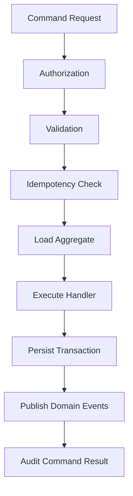
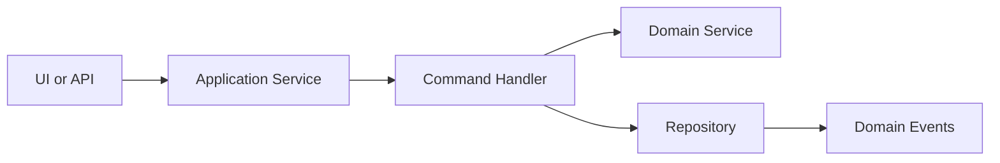
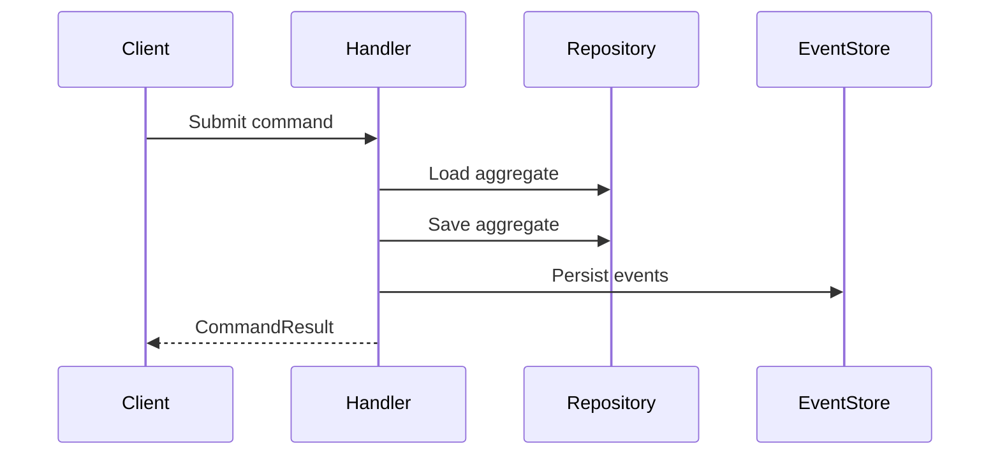
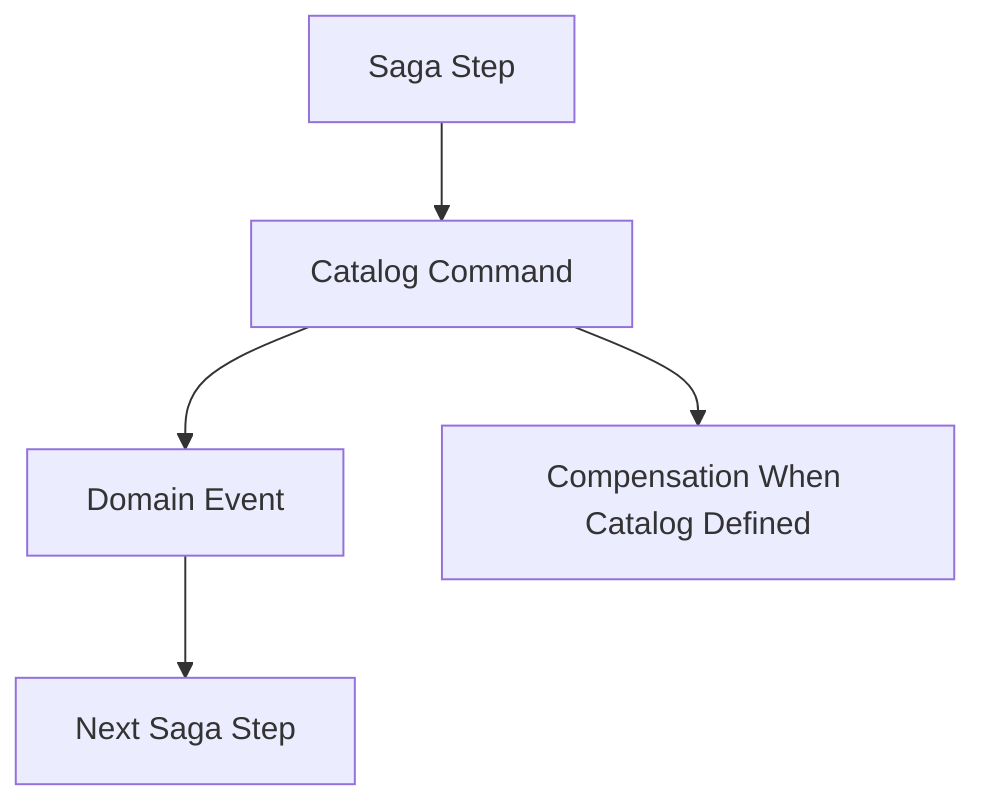
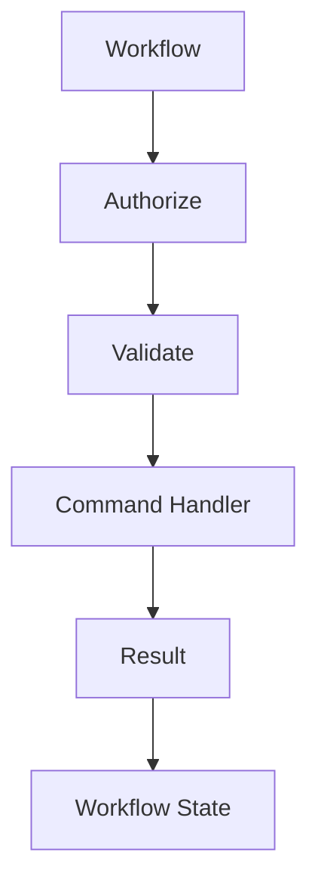

# Command Flows and Diagrams

Document Path: knowledge/catalog/command/flows-and-diagrams.md

Parent Specification: knowledge/catalog/command-catalog.md

## Purpose

This split document isolates the command flow diagrams from the parent Command Catalog so command request handling, ownership, transaction, saga, and workflow paths can be read independently.

## Source Sections

- Mermaid
- Command Flow
- Aggregate Command Ownership
- Application Service Flow
- Transaction Flow
- Saga Flow
- Workflow Flow

## Command Flow

## Aggregate Command Ownership

```mermaid
classDiagram
  class RecordIncome
  class Household
  RecordIncome --> Household : mutates
  class RecordExpense
  RecordExpense --> Household : mutates
  class CreatePortfolio
  class AssetPortfolio
  CreatePortfolio --> AssetPortfolio : mutates
  class BuySecurity
  BuySecurity --> AssetPortfolio : mutates
  class SellSecurity
  SellSecurity --> AssetPortfolio : mutates
  class RebalancePortfolio
  RebalancePortfolio --> AssetPortfolio : mutates
  class CreateLoan
  class Loan
  CreateLoan --> Loan : mutates
  class RecordLoanPayment
  RecordLoanPayment --> Loan : mutates
  class RefinanceLoan
  RefinanceLoan --> Loan : mutates
  class PurchaseHome
  class Property
  PurchaseHome --> Property : mutates
  class SellHome
  SellHome --> Property : mutates
  class UpdatePropertyValue
  UpdatePropertyValue --> Property : mutates
  class IssuePolicy
  class Policy
  IssuePolicy --> Policy : mutates
  class PayPremium
  PayPremium --> Policy : mutates
  class UpdateRetirementPlan
  class RetirementPlan
  UpdateRetirementPlan --> RetirementPlan : mutates
  class EvaluateScenario
  class Scenario
  EvaluateScenario --> Scenario : mutates
  class AcceptRecommendation
  class DecisionSession
  AcceptRecommendation --> DecisionSession : mutates
  class RejectRecommendation
  RejectRecommendation --> DecisionSession : mutates
  class ReplayScenario
  ReplayScenario --> Scenario : mutates
```

## Application Service Flow

## Transaction Flow

## Saga Flow

## Workflow Flow

