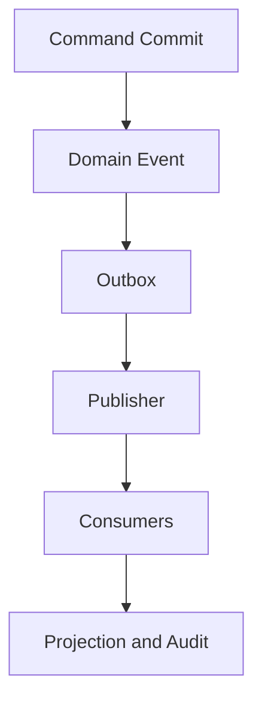
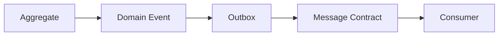
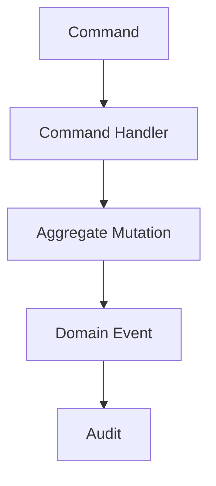
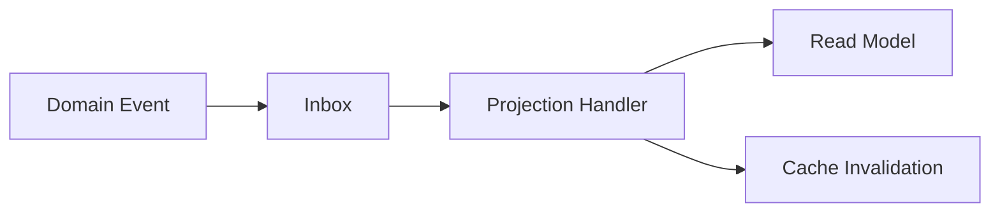
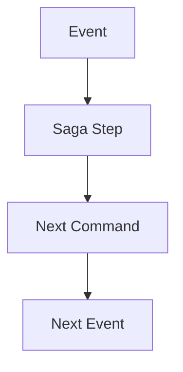
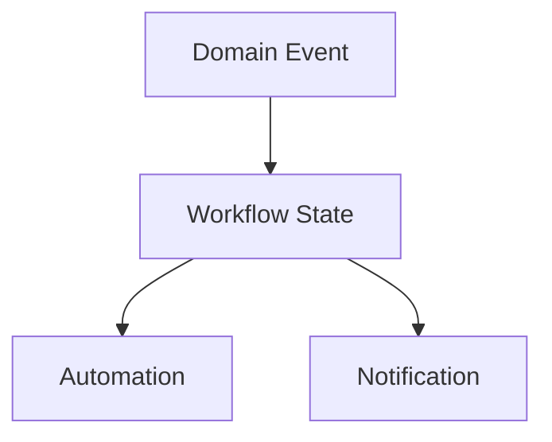
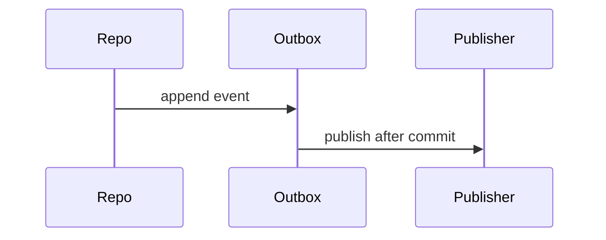
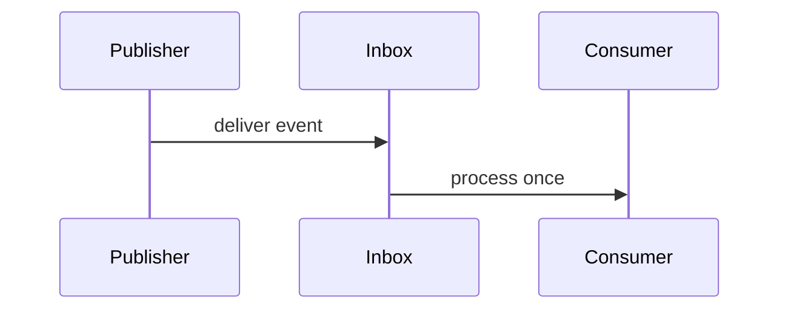

# Domain Event Catalog

# Document Control

Document Name: Domain Event Catalog
Document Path: knowledge/domain-event-catalog.md
Document Type: Atlas Enterprise Canonical Specification
Version: 1.0
Status: Canonical Specification
Domain: Platform
Bounded Context: Platform
Owner: Project Atlas
Source of Truth: Atlas Domain Event Source of Truth
Last Updated: 2026-07-12

Related Specifications:
- knowledge/aggregate-catalog.md
- knowledge/entity-catalog.md
- knowledge/command-catalog.md
- knowledge/repository-catalog.md
- knowledge/domain-service-catalog.md
- knowledge/application-service-catalog.md
- knowledge/event-taxonomy.md
- knowledge/message-contract-catalog.md
- knowledge/workflow-engine-framework.md
- knowledge/background-job-framework.md
- knowledge/scheduler-framework.md
- knowledge/automation-framework.md
- knowledge/api-governance-framework.md
- knowledge/system-module-catalog.md
- docs/specification/04-DomainModel.md
- docs/database/05-DatabaseDesign.md
- docs/database/06-ERD.md
- docs/api/07-API.md

# Purpose

Domain Event Catalog defines every approved Atlas Domain Event as an immutable business fact. It is the source of truth for event ownership, payload, producer, consumer, command mapping, repository mapping, projection, read model, notification, workflow, saga, outbox, inbox, automation, replay, ordering, audit, and message contract alignment.

# Scope

- Domain Event
- Business Event
- Application Event
- Audit Event
- Integration Event
- Projection Event
- Read Model Update Event
- Notification Event
- Message Contract
- Outbox Event
- Inbox Event
- Event Publisher
- Event Consumer
- Event Version
- Event Ordering
- Event Replay
- Event Idempotency
- Event Correlation
- Event Causation
- Event Metadata
- Event Lifecycle

# Domain Event Definition Standard

Every Domain Event entry uses the following complete Enterprise contract.
- Event Name
- Display Name
- Category
- Aggregate
- Aggregate Root
- Entity
- Domain
- Bounded Context
- Module
- Purpose
- Business Meaning
- Description
- Publisher
- Consumers
- Trigger Command
- Trigger Business Rule
- Event Payload
- Metadata
- Version
- Ordering
- Delivery Guarantee
- Outbox
- Inbox
- Retry
- Replay
- Idempotency
- CorrelationId
- CausationId
- Transaction Boundary
- Consistency Boundary
- Authorization
- Security Classification
- PII Classification
- Audit
- Projection Update
- Notification
- Workflow
- Saga
- Automation
- Scheduler
- Background Job
- Cache Invalidation
- Search Index Update
- Database Impact
- Example JSON

# Complete Domain Event Catalog

## EVT-CF-0001 SalaryReceived

Event Name: SalaryReceived
Display Name: SalaryReceived
Category: Cash Flow
Aggregate: Household
Aggregate Root: Household
Entity: Household
Domain: Cash Flow
Bounded Context: Financial Planning
Module: CashFlow
Purpose: Record the immutable business fact represented by SalaryReceived.
Business Meaning: SalaryReceived states that Household completed a catalog-approved state change or calculation milestone.
Description: Event is emitted after the owning transaction commits and is consumed by projections, read models, audit, workflow, saga, notification, automation, and cache processes according to this catalog.
Publisher: DashboardApplicationService through CashFlowService and HouseholdRepository.
Consumers: Timeline, Decision Engine, Dashboard
Trigger Command: RecordIncome
Trigger Business Rule: Event is emitted only when the command business rules pass and aggregate invariants remain valid.
Event Payload: Amount, Currency, Date, Employer, AggregateId, HouseholdId, CorrelationId, CausationId, OccurredAt
Metadata: EventId, EventName, AggregateId, AggregateType, HouseholdId, CorrelationId, CausationId, OccurredAt, SchemaVersion, Producer, TraceId
Version: 1.0
Ordering: Ordered per AggregateId and version.
Delivery Guarantee: At least once delivery with idempotent consumers.
Outbox: Required for committed domain events.
Inbox: Required for message consumers that may receive duplicates.
Retry: Exponential retry for transient consumer failure.
Replay: Replayable when schema version and payload are available.
Idempotency: EventId plus consumer name prevents duplicate projection and side effects.
CorrelationId: Required.
CausationId: Required when event is caused by command, event, workflow, saga, scheduler, automation, background job, or AI action.
Transaction Boundary: Persisted within Household transaction or replay transaction when event is system replay output.
Consistency Boundary: Aggregate boundary of Household.
Authorization: Consumers must enforce Household and tenant access before exposing read model state.
Security Classification: Internal business event.
PII Classification: Payload uses minimum required PII and follows security rules.
Audit: Publisher, consumer, payload hash, result, version, and replay status are auditable.
Projection Update: Updates catalog-aligned read model for Household.
Notification: Notification permitted only when consumer mapping allows it.
Workflow: Workflow may advance using CorrelationId and event name.
Saga: Saga may continue using CorrelationId and CausationId.
Automation: Automation may react only through catalog-aligned handler.
Scheduler: Scheduler may consume only for recalculation or replay controls.
Background Job: Background jobs process projection, notification, search, and cache work.
Cache Invalidation: Aggregate and Household scoped cache keys are invalidated.
Search Index Update: Search index update occurs when event changes searchable fields.
Database Impact: Event append, outbox row, projection update, and audit append.
Example JSON: {"eventName":"SalaryReceived","aggregateId":"AggregateId","householdId":"HouseholdId","schemaVersion":"1.0"}
Operational Control 1: SalaryReceived preserves producer, consumer, payload, ordering, idempotency, replay, outbox, inbox, projection, audit, and security alignment.
Operational Control 2: SalaryReceived preserves producer, consumer, payload, ordering, idempotency, replay, outbox, inbox, projection, audit, and security alignment.
Operational Control 3: SalaryReceived preserves producer, consumer, payload, ordering, idempotency, replay, outbox, inbox, projection, audit, and security alignment.
Operational Control 4: SalaryReceived preserves producer, consumer, payload, ordering, idempotency, replay, outbox, inbox, projection, audit, and security alignment.
Operational Control 5: SalaryReceived preserves producer, consumer, payload, ordering, idempotency, replay, outbox, inbox, projection, audit, and security alignment.
Operational Control 6: SalaryReceived preserves producer, consumer, payload, ordering, idempotency, replay, outbox, inbox, projection, audit, and security alignment.
Operational Control 7: SalaryReceived preserves producer, consumer, payload, ordering, idempotency, replay, outbox, inbox, projection, audit, and security alignment.
Operational Control 8: SalaryReceived preserves producer, consumer, payload, ordering, idempotency, replay, outbox, inbox, projection, audit, and security alignment.
Operational Control 9: SalaryReceived preserves producer, consumer, payload, ordering, idempotency, replay, outbox, inbox, projection, audit, and security alignment.
Operational Control 10: SalaryReceived preserves producer, consumer, payload, ordering, idempotency, replay, outbox, inbox, projection, audit, and security alignment.
Operational Control 11: SalaryReceived preserves producer, consumer, payload, ordering, idempotency, replay, outbox, inbox, projection, audit, and security alignment.
Operational Control 12: SalaryReceived preserves producer, consumer, payload, ordering, idempotency, replay, outbox, inbox, projection, audit, and security alignment.

## EVT-CF-0002 BonusReceived

Event Name: BonusReceived
Display Name: BonusReceived
Category: Cash Flow
Aggregate: Household
Aggregate Root: Household
Entity: Household
Domain: Cash Flow
Bounded Context: Financial Planning
Module: CashFlow
Purpose: Record the immutable business fact represented by BonusReceived.
Business Meaning: BonusReceived states that Household completed a catalog-approved state change or calculation milestone.
Description: Event is emitted after the owning transaction commits and is consumed by projections, read models, audit, workflow, saga, notification, automation, and cache processes according to this catalog.
Publisher: DashboardApplicationService through CashFlowService and HouseholdRepository.
Consumers: Timeline, Decision Engine, Dashboard
Trigger Command: RecordIncome
Trigger Business Rule: Event is emitted only when the command business rules pass and aggregate invariants remain valid.
Event Payload: Amount, Currency, Date, Employer, AggregateId, HouseholdId, CorrelationId, CausationId, OccurredAt
Metadata: EventId, EventName, AggregateId, AggregateType, HouseholdId, CorrelationId, CausationId, OccurredAt, SchemaVersion, Producer, TraceId
Version: 1.0
Ordering: Ordered per AggregateId and version.
Delivery Guarantee: At least once delivery with idempotent consumers.
Outbox: Required for committed domain events.
Inbox: Required for message consumers that may receive duplicates.
Retry: Exponential retry for transient consumer failure.
Replay: Replayable when schema version and payload are available.
Idempotency: EventId plus consumer name prevents duplicate projection and side effects.
CorrelationId: Required.
CausationId: Required when event is caused by command, event, workflow, saga, scheduler, automation, background job, or AI action.
Transaction Boundary: Persisted within Household transaction or replay transaction when event is system replay output.
Consistency Boundary: Aggregate boundary of Household.
Authorization: Consumers must enforce Household and tenant access before exposing read model state.
Security Classification: Internal business event.
PII Classification: Payload uses minimum required PII and follows security rules.
Audit: Publisher, consumer, payload hash, result, version, and replay status are auditable.
Projection Update: Updates catalog-aligned read model for Household.
Notification: Notification permitted only when consumer mapping allows it.
Workflow: Workflow may advance using CorrelationId and event name.
Saga: Saga may continue using CorrelationId and CausationId.
Automation: Automation may react only through catalog-aligned handler.
Scheduler: Scheduler may consume only for recalculation or replay controls.
Background Job: Background jobs process projection, notification, search, and cache work.
Cache Invalidation: Aggregate and Household scoped cache keys are invalidated.
Search Index Update: Search index update occurs when event changes searchable fields.
Database Impact: Event append, outbox row, projection update, and audit append.
Example JSON: {"eventName":"BonusReceived","aggregateId":"AggregateId","householdId":"HouseholdId","schemaVersion":"1.0"}
Operational Control 1: BonusReceived preserves producer, consumer, payload, ordering, idempotency, replay, outbox, inbox, projection, audit, and security alignment.
Operational Control 2: BonusReceived preserves producer, consumer, payload, ordering, idempotency, replay, outbox, inbox, projection, audit, and security alignment.
Operational Control 3: BonusReceived preserves producer, consumer, payload, ordering, idempotency, replay, outbox, inbox, projection, audit, and security alignment.
Operational Control 4: BonusReceived preserves producer, consumer, payload, ordering, idempotency, replay, outbox, inbox, projection, audit, and security alignment.
Operational Control 5: BonusReceived preserves producer, consumer, payload, ordering, idempotency, replay, outbox, inbox, projection, audit, and security alignment.
Operational Control 6: BonusReceived preserves producer, consumer, payload, ordering, idempotency, replay, outbox, inbox, projection, audit, and security alignment.
Operational Control 7: BonusReceived preserves producer, consumer, payload, ordering, idempotency, replay, outbox, inbox, projection, audit, and security alignment.
Operational Control 8: BonusReceived preserves producer, consumer, payload, ordering, idempotency, replay, outbox, inbox, projection, audit, and security alignment.
Operational Control 9: BonusReceived preserves producer, consumer, payload, ordering, idempotency, replay, outbox, inbox, projection, audit, and security alignment.
Operational Control 10: BonusReceived preserves producer, consumer, payload, ordering, idempotency, replay, outbox, inbox, projection, audit, and security alignment.
Operational Control 11: BonusReceived preserves producer, consumer, payload, ordering, idempotency, replay, outbox, inbox, projection, audit, and security alignment.
Operational Control 12: BonusReceived preserves producer, consumer, payload, ordering, idempotency, replay, outbox, inbox, projection, audit, and security alignment.

## EVT-CF-0003 ExpenseRecorded

Event Name: ExpenseRecorded
Display Name: ExpenseRecorded
Category: Cash Flow
Aggregate: Household
Aggregate Root: Household
Entity: Household
Domain: Cash Flow
Bounded Context: Financial Planning
Module: CashFlow
Purpose: Record the immutable business fact represented by ExpenseRecorded.
Business Meaning: ExpenseRecorded states that Household completed a catalog-approved state change or calculation milestone.
Description: Event is emitted after the owning transaction commits and is consumed by projections, read models, audit, workflow, saga, notification, automation, and cache processes according to this catalog.
Publisher: DashboardApplicationService through CashFlowService and HouseholdRepository.
Consumers: Timeline, Budget Projection, Dashboard
Trigger Command: RecordExpense
Trigger Business Rule: Event is emitted only when the command business rules pass and aggregate invariants remain valid.
Event Payload: Amount, Currency, Date, Category, AggregateId, HouseholdId, CorrelationId, CausationId, OccurredAt
Metadata: EventId, EventName, AggregateId, AggregateType, HouseholdId, CorrelationId, CausationId, OccurredAt, SchemaVersion, Producer, TraceId
Version: 1.0
Ordering: Ordered per AggregateId and version.
Delivery Guarantee: At least once delivery with idempotent consumers.
Outbox: Required for committed domain events.
Inbox: Required for message consumers that may receive duplicates.
Retry: Exponential retry for transient consumer failure.
Replay: Replayable when schema version and payload are available.
Idempotency: EventId plus consumer name prevents duplicate projection and side effects.
CorrelationId: Required.
CausationId: Required when event is caused by command, event, workflow, saga, scheduler, automation, background job, or AI action.
Transaction Boundary: Persisted within Household transaction or replay transaction when event is system replay output.
Consistency Boundary: Aggregate boundary of Household.
Authorization: Consumers must enforce Household and tenant access before exposing read model state.
Security Classification: Internal business event.
PII Classification: Payload uses minimum required PII and follows security rules.
Audit: Publisher, consumer, payload hash, result, version, and replay status are auditable.
Projection Update: Updates catalog-aligned read model for Household.
Notification: Notification permitted only when consumer mapping allows it.
Workflow: Workflow may advance using CorrelationId and event name.
Saga: Saga may continue using CorrelationId and CausationId.
Automation: Automation may react only through catalog-aligned handler.
Scheduler: Scheduler may consume only for recalculation or replay controls.
Background Job: Background jobs process projection, notification, search, and cache work.
Cache Invalidation: Aggregate and Household scoped cache keys are invalidated.
Search Index Update: Search index update occurs when event changes searchable fields.
Database Impact: Event append, outbox row, projection update, and audit append.
Example JSON: {"eventName":"ExpenseRecorded","aggregateId":"AggregateId","householdId":"HouseholdId","schemaVersion":"1.0"}
Operational Control 1: ExpenseRecorded preserves producer, consumer, payload, ordering, idempotency, replay, outbox, inbox, projection, audit, and security alignment.
Operational Control 2: ExpenseRecorded preserves producer, consumer, payload, ordering, idempotency, replay, outbox, inbox, projection, audit, and security alignment.
Operational Control 3: ExpenseRecorded preserves producer, consumer, payload, ordering, idempotency, replay, outbox, inbox, projection, audit, and security alignment.
Operational Control 4: ExpenseRecorded preserves producer, consumer, payload, ordering, idempotency, replay, outbox, inbox, projection, audit, and security alignment.
Operational Control 5: ExpenseRecorded preserves producer, consumer, payload, ordering, idempotency, replay, outbox, inbox, projection, audit, and security alignment.
Operational Control 6: ExpenseRecorded preserves producer, consumer, payload, ordering, idempotency, replay, outbox, inbox, projection, audit, and security alignment.
Operational Control 7: ExpenseRecorded preserves producer, consumer, payload, ordering, idempotency, replay, outbox, inbox, projection, audit, and security alignment.
Operational Control 8: ExpenseRecorded preserves producer, consumer, payload, ordering, idempotency, replay, outbox, inbox, projection, audit, and security alignment.
Operational Control 9: ExpenseRecorded preserves producer, consumer, payload, ordering, idempotency, replay, outbox, inbox, projection, audit, and security alignment.
Operational Control 10: ExpenseRecorded preserves producer, consumer, payload, ordering, idempotency, replay, outbox, inbox, projection, audit, and security alignment.
Operational Control 11: ExpenseRecorded preserves producer, consumer, payload, ordering, idempotency, replay, outbox, inbox, projection, audit, and security alignment.
Operational Control 12: ExpenseRecorded preserves producer, consumer, payload, ordering, idempotency, replay, outbox, inbox, projection, audit, and security alignment.

## EVT-CF-0004 PassiveIncomeReceived

Event Name: PassiveIncomeReceived
Display Name: PassiveIncomeReceived
Category: Cash Flow
Aggregate: Household
Aggregate Root: Household
Entity: Household
Domain: Cash Flow
Bounded Context: Financial Planning
Module: CashFlow
Purpose: Record the immutable business fact represented by PassiveIncomeReceived.
Business Meaning: PassiveIncomeReceived states that Household completed a catalog-approved state change or calculation milestone.
Description: Event is emitted after the owning transaction commits and is consumed by projections, read models, audit, workflow, saga, notification, automation, and cache processes according to this catalog.
Publisher: DashboardApplicationService through CashFlowService and HouseholdRepository.
Consumers: Timeline, Decision Engine, Dashboard
Trigger Command: RecordIncome
Trigger Business Rule: Event is emitted only when the command business rules pass and aggregate invariants remain valid.
Event Payload: Amount, Currency, Date, Source, AggregateId, HouseholdId, CorrelationId, CausationId, OccurredAt
Metadata: EventId, EventName, AggregateId, AggregateType, HouseholdId, CorrelationId, CausationId, OccurredAt, SchemaVersion, Producer, TraceId
Version: 1.0
Ordering: Ordered per AggregateId and version.
Delivery Guarantee: At least once delivery with idempotent consumers.
Outbox: Required for committed domain events.
Inbox: Required for message consumers that may receive duplicates.
Retry: Exponential retry for transient consumer failure.
Replay: Replayable when schema version and payload are available.
Idempotency: EventId plus consumer name prevents duplicate projection and side effects.
CorrelationId: Required.
CausationId: Required when event is caused by command, event, workflow, saga, scheduler, automation, background job, or AI action.
Transaction Boundary: Persisted within Household transaction or replay transaction when event is system replay output.
Consistency Boundary: Aggregate boundary of Household.
Authorization: Consumers must enforce Household and tenant access before exposing read model state.
Security Classification: Internal business event.
PII Classification: Payload uses minimum required PII and follows security rules.
Audit: Publisher, consumer, payload hash, result, version, and replay status are auditable.
Projection Update: Updates catalog-aligned read model for Household.
Notification: Notification permitted only when consumer mapping allows it.
Workflow: Workflow may advance using CorrelationId and event name.
Saga: Saga may continue using CorrelationId and CausationId.
Automation: Automation may react only through catalog-aligned handler.
Scheduler: Scheduler may consume only for recalculation or replay controls.
Background Job: Background jobs process projection, notification, search, and cache work.
Cache Invalidation: Aggregate and Household scoped cache keys are invalidated.
Search Index Update: Search index update occurs when event changes searchable fields.
Database Impact: Event append, outbox row, projection update, and audit append.
Example JSON: {"eventName":"PassiveIncomeReceived","aggregateId":"AggregateId","householdId":"HouseholdId","schemaVersion":"1.0"}
Operational Control 1: PassiveIncomeReceived preserves producer, consumer, payload, ordering, idempotency, replay, outbox, inbox, projection, audit, and security alignment.
Operational Control 2: PassiveIncomeReceived preserves producer, consumer, payload, ordering, idempotency, replay, outbox, inbox, projection, audit, and security alignment.
Operational Control 3: PassiveIncomeReceived preserves producer, consumer, payload, ordering, idempotency, replay, outbox, inbox, projection, audit, and security alignment.
Operational Control 4: PassiveIncomeReceived preserves producer, consumer, payload, ordering, idempotency, replay, outbox, inbox, projection, audit, and security alignment.
Operational Control 5: PassiveIncomeReceived preserves producer, consumer, payload, ordering, idempotency, replay, outbox, inbox, projection, audit, and security alignment.
Operational Control 6: PassiveIncomeReceived preserves producer, consumer, payload, ordering, idempotency, replay, outbox, inbox, projection, audit, and security alignment.
Operational Control 7: PassiveIncomeReceived preserves producer, consumer, payload, ordering, idempotency, replay, outbox, inbox, projection, audit, and security alignment.
Operational Control 8: PassiveIncomeReceived preserves producer, consumer, payload, ordering, idempotency, replay, outbox, inbox, projection, audit, and security alignment.
Operational Control 9: PassiveIncomeReceived preserves producer, consumer, payload, ordering, idempotency, replay, outbox, inbox, projection, audit, and security alignment.
Operational Control 10: PassiveIncomeReceived preserves producer, consumer, payload, ordering, idempotency, replay, outbox, inbox, projection, audit, and security alignment.
Operational Control 11: PassiveIncomeReceived preserves producer, consumer, payload, ordering, idempotency, replay, outbox, inbox, projection, audit, and security alignment.
Operational Control 12: PassiveIncomeReceived preserves producer, consumer, payload, ordering, idempotency, replay, outbox, inbox, projection, audit, and security alignment.

## EVT-INV-0001 PortfolioCreated

Event Name: PortfolioCreated
Display Name: PortfolioCreated
Category: Investment
Aggregate: AssetPortfolio
Aggregate Root: AssetPortfolio
Entity: Portfolio
Domain: Investment
Bounded Context: Portfolio
Module: Portfolio
Purpose: Record the immutable business fact represented by PortfolioCreated.
Business Meaning: PortfolioCreated states that AssetPortfolio completed a catalog-approved state change or calculation milestone.
Description: Event is emitted after the owning transaction commits and is consumed by projections, read models, audit, workflow, saga, notification, automation, and cache processes according to this catalog.
Publisher: PortfolioApplicationService through PortfolioService and PortfolioRepository.
Consumers: Dashboard, Scenario, Decision Engine
Trigger Command: CreatePortfolio
Trigger Business Rule: Event is emitted only when the command business rules pass and aggregate invariants remain valid.
Event Payload: PortfolioId, HouseholdId, Currency, AggregateId, HouseholdId, CorrelationId, CausationId, OccurredAt
Metadata: EventId, EventName, AggregateId, AggregateType, HouseholdId, CorrelationId, CausationId, OccurredAt, SchemaVersion, Producer, TraceId
Version: 1.0
Ordering: Ordered per AggregateId and version.
Delivery Guarantee: At least once delivery with idempotent consumers.
Outbox: Required for committed domain events.
Inbox: Required for message consumers that may receive duplicates.
Retry: Exponential retry for transient consumer failure.
Replay: Replayable when schema version and payload are available.
Idempotency: EventId plus consumer name prevents duplicate projection and side effects.
CorrelationId: Required.
CausationId: Required when event is caused by command, event, workflow, saga, scheduler, automation, background job, or AI action.
Transaction Boundary: Persisted within AssetPortfolio transaction or replay transaction when event is system replay output.
Consistency Boundary: Aggregate boundary of AssetPortfolio.
Authorization: Consumers must enforce Household and tenant access before exposing read model state.
Security Classification: Internal business event.
PII Classification: Payload uses minimum required PII and follows security rules.
Audit: Publisher, consumer, payload hash, result, version, and replay status are auditable.
Projection Update: Updates catalog-aligned read model for AssetPortfolio.
Notification: Notification permitted only when consumer mapping allows it.
Workflow: Workflow may advance using CorrelationId and event name.
Saga: Saga may continue using CorrelationId and CausationId.
Automation: Automation may react only through catalog-aligned handler.
Scheduler: Scheduler may consume only for recalculation or replay controls.
Background Job: Background jobs process projection, notification, search, and cache work.
Cache Invalidation: Aggregate and Household scoped cache keys are invalidated.
Search Index Update: Search index update occurs when event changes searchable fields.
Database Impact: Event append, outbox row, projection update, and audit append.
Example JSON: {"eventName":"PortfolioCreated","aggregateId":"AggregateId","householdId":"HouseholdId","schemaVersion":"1.0"}
Operational Control 1: PortfolioCreated preserves producer, consumer, payload, ordering, idempotency, replay, outbox, inbox, projection, audit, and security alignment.
Operational Control 2: PortfolioCreated preserves producer, consumer, payload, ordering, idempotency, replay, outbox, inbox, projection, audit, and security alignment.
Operational Control 3: PortfolioCreated preserves producer, consumer, payload, ordering, idempotency, replay, outbox, inbox, projection, audit, and security alignment.
Operational Control 4: PortfolioCreated preserves producer, consumer, payload, ordering, idempotency, replay, outbox, inbox, projection, audit, and security alignment.
Operational Control 5: PortfolioCreated preserves producer, consumer, payload, ordering, idempotency, replay, outbox, inbox, projection, audit, and security alignment.
Operational Control 6: PortfolioCreated preserves producer, consumer, payload, ordering, idempotency, replay, outbox, inbox, projection, audit, and security alignment.
Operational Control 7: PortfolioCreated preserves producer, consumer, payload, ordering, idempotency, replay, outbox, inbox, projection, audit, and security alignment.
Operational Control 8: PortfolioCreated preserves producer, consumer, payload, ordering, idempotency, replay, outbox, inbox, projection, audit, and security alignment.
Operational Control 9: PortfolioCreated preserves producer, consumer, payload, ordering, idempotency, replay, outbox, inbox, projection, audit, and security alignment.
Operational Control 10: PortfolioCreated preserves producer, consumer, payload, ordering, idempotency, replay, outbox, inbox, projection, audit, and security alignment.
Operational Control 11: PortfolioCreated preserves producer, consumer, payload, ordering, idempotency, replay, outbox, inbox, projection, audit, and security alignment.
Operational Control 12: PortfolioCreated preserves producer, consumer, payload, ordering, idempotency, replay, outbox, inbox, projection, audit, and security alignment.

## EVT-INV-0002 SecurityPurchased

Event Name: SecurityPurchased
Display Name: SecurityPurchased
Category: Investment
Aggregate: AssetPortfolio
Aggregate Root: AssetPortfolio
Entity: Holding
Domain: Investment
Bounded Context: Portfolio
Module: Portfolio
Purpose: Record the immutable business fact represented by SecurityPurchased.
Business Meaning: SecurityPurchased states that AssetPortfolio completed a catalog-approved state change or calculation milestone.
Description: Event is emitted after the owning transaction commits and is consumed by projections, read models, audit, workflow, saga, notification, automation, and cache processes according to this catalog.
Publisher: PortfolioApplicationService through PortfolioService and PortfolioRepository.
Consumers: Dashboard, Allocation Projection, Scenario
Trigger Command: BuySecurity
Trigger Business Rule: Event is emitted only when the command business rules pass and aggregate invariants remain valid.
Event Payload: SecurityId, Quantity, Money, TradeDate, AggregateId, HouseholdId, CorrelationId, CausationId, OccurredAt
Metadata: EventId, EventName, AggregateId, AggregateType, HouseholdId, CorrelationId, CausationId, OccurredAt, SchemaVersion, Producer, TraceId
Version: 1.0
Ordering: Ordered per AggregateId and version.
Delivery Guarantee: At least once delivery with idempotent consumers.
Outbox: Required for committed domain events.
Inbox: Required for message consumers that may receive duplicates.
Retry: Exponential retry for transient consumer failure.
Replay: Replayable when schema version and payload are available.
Idempotency: EventId plus consumer name prevents duplicate projection and side effects.
CorrelationId: Required.
CausationId: Required when event is caused by command, event, workflow, saga, scheduler, automation, background job, or AI action.
Transaction Boundary: Persisted within AssetPortfolio transaction or replay transaction when event is system replay output.
Consistency Boundary: Aggregate boundary of AssetPortfolio.
Authorization: Consumers must enforce Household and tenant access before exposing read model state.
Security Classification: Internal business event.
PII Classification: Payload uses minimum required PII and follows security rules.
Audit: Publisher, consumer, payload hash, result, version, and replay status are auditable.
Projection Update: Updates catalog-aligned read model for AssetPortfolio.
Notification: Notification permitted only when consumer mapping allows it.
Workflow: Workflow may advance using CorrelationId and event name.
Saga: Saga may continue using CorrelationId and CausationId.
Automation: Automation may react only through catalog-aligned handler.
Scheduler: Scheduler may consume only for recalculation or replay controls.
Background Job: Background jobs process projection, notification, search, and cache work.
Cache Invalidation: Aggregate and Household scoped cache keys are invalidated.
Search Index Update: Search index update occurs when event changes searchable fields.
Database Impact: Event append, outbox row, projection update, and audit append.
Example JSON: {"eventName":"SecurityPurchased","aggregateId":"AggregateId","householdId":"HouseholdId","schemaVersion":"1.0"}
Operational Control 1: SecurityPurchased preserves producer, consumer, payload, ordering, idempotency, replay, outbox, inbox, projection, audit, and security alignment.
Operational Control 2: SecurityPurchased preserves producer, consumer, payload, ordering, idempotency, replay, outbox, inbox, projection, audit, and security alignment.
Operational Control 3: SecurityPurchased preserves producer, consumer, payload, ordering, idempotency, replay, outbox, inbox, projection, audit, and security alignment.
Operational Control 4: SecurityPurchased preserves producer, consumer, payload, ordering, idempotency, replay, outbox, inbox, projection, audit, and security alignment.
Operational Control 5: SecurityPurchased preserves producer, consumer, payload, ordering, idempotency, replay, outbox, inbox, projection, audit, and security alignment.
Operational Control 6: SecurityPurchased preserves producer, consumer, payload, ordering, idempotency, replay, outbox, inbox, projection, audit, and security alignment.
Operational Control 7: SecurityPurchased preserves producer, consumer, payload, ordering, idempotency, replay, outbox, inbox, projection, audit, and security alignment.
Operational Control 8: SecurityPurchased preserves producer, consumer, payload, ordering, idempotency, replay, outbox, inbox, projection, audit, and security alignment.
Operational Control 9: SecurityPurchased preserves producer, consumer, payload, ordering, idempotency, replay, outbox, inbox, projection, audit, and security alignment.
Operational Control 10: SecurityPurchased preserves producer, consumer, payload, ordering, idempotency, replay, outbox, inbox, projection, audit, and security alignment.
Operational Control 11: SecurityPurchased preserves producer, consumer, payload, ordering, idempotency, replay, outbox, inbox, projection, audit, and security alignment.
Operational Control 12: SecurityPurchased preserves producer, consumer, payload, ordering, idempotency, replay, outbox, inbox, projection, audit, and security alignment.

## EVT-INV-0003 SecuritySold

Event Name: SecuritySold
Display Name: SecuritySold
Category: Investment
Aggregate: AssetPortfolio
Aggregate Root: AssetPortfolio
Entity: Holding
Domain: Investment
Bounded Context: Portfolio
Module: Portfolio
Purpose: Record the immutable business fact represented by SecuritySold.
Business Meaning: SecuritySold states that AssetPortfolio completed a catalog-approved state change or calculation milestone.
Description: Event is emitted after the owning transaction commits and is consumed by projections, read models, audit, workflow, saga, notification, automation, and cache processes according to this catalog.
Publisher: PortfolioApplicationService through PortfolioService and PortfolioRepository.
Consumers: Dashboard, Allocation Projection, Scenario
Trigger Command: SellSecurity
Trigger Business Rule: Event is emitted only when the command business rules pass and aggregate invariants remain valid.
Event Payload: SecurityId, Quantity, Money, TradeDate, AggregateId, HouseholdId, CorrelationId, CausationId, OccurredAt
Metadata: EventId, EventName, AggregateId, AggregateType, HouseholdId, CorrelationId, CausationId, OccurredAt, SchemaVersion, Producer, TraceId
Version: 1.0
Ordering: Ordered per AggregateId and version.
Delivery Guarantee: At least once delivery with idempotent consumers.
Outbox: Required for committed domain events.
Inbox: Required for message consumers that may receive duplicates.
Retry: Exponential retry for transient consumer failure.
Replay: Replayable when schema version and payload are available.
Idempotency: EventId plus consumer name prevents duplicate projection and side effects.
CorrelationId: Required.
CausationId: Required when event is caused by command, event, workflow, saga, scheduler, automation, background job, or AI action.
Transaction Boundary: Persisted within AssetPortfolio transaction or replay transaction when event is system replay output.
Consistency Boundary: Aggregate boundary of AssetPortfolio.
Authorization: Consumers must enforce Household and tenant access before exposing read model state.
Security Classification: Internal business event.
PII Classification: Payload uses minimum required PII and follows security rules.
Audit: Publisher, consumer, payload hash, result, version, and replay status are auditable.
Projection Update: Updates catalog-aligned read model for AssetPortfolio.
Notification: Notification permitted only when consumer mapping allows it.
Workflow: Workflow may advance using CorrelationId and event name.
Saga: Saga may continue using CorrelationId and CausationId.
Automation: Automation may react only through catalog-aligned handler.
Scheduler: Scheduler may consume only for recalculation or replay controls.
Background Job: Background jobs process projection, notification, search, and cache work.
Cache Invalidation: Aggregate and Household scoped cache keys are invalidated.
Search Index Update: Search index update occurs when event changes searchable fields.
Database Impact: Event append, outbox row, projection update, and audit append.
Example JSON: {"eventName":"SecuritySold","aggregateId":"AggregateId","householdId":"HouseholdId","schemaVersion":"1.0"}
Operational Control 1: SecuritySold preserves producer, consumer, payload, ordering, idempotency, replay, outbox, inbox, projection, audit, and security alignment.
Operational Control 2: SecuritySold preserves producer, consumer, payload, ordering, idempotency, replay, outbox, inbox, projection, audit, and security alignment.
Operational Control 3: SecuritySold preserves producer, consumer, payload, ordering, idempotency, replay, outbox, inbox, projection, audit, and security alignment.
Operational Control 4: SecuritySold preserves producer, consumer, payload, ordering, idempotency, replay, outbox, inbox, projection, audit, and security alignment.
Operational Control 5: SecuritySold preserves producer, consumer, payload, ordering, idempotency, replay, outbox, inbox, projection, audit, and security alignment.
Operational Control 6: SecuritySold preserves producer, consumer, payload, ordering, idempotency, replay, outbox, inbox, projection, audit, and security alignment.
Operational Control 7: SecuritySold preserves producer, consumer, payload, ordering, idempotency, replay, outbox, inbox, projection, audit, and security alignment.
Operational Control 8: SecuritySold preserves producer, consumer, payload, ordering, idempotency, replay, outbox, inbox, projection, audit, and security alignment.
Operational Control 9: SecuritySold preserves producer, consumer, payload, ordering, idempotency, replay, outbox, inbox, projection, audit, and security alignment.
Operational Control 10: SecuritySold preserves producer, consumer, payload, ordering, idempotency, replay, outbox, inbox, projection, audit, and security alignment.
Operational Control 11: SecuritySold preserves producer, consumer, payload, ordering, idempotency, replay, outbox, inbox, projection, audit, and security alignment.
Operational Control 12: SecuritySold preserves producer, consumer, payload, ordering, idempotency, replay, outbox, inbox, projection, audit, and security alignment.

## EVT-INV-0004 PortfolioRebalanced

Event Name: PortfolioRebalanced
Display Name: PortfolioRebalanced
Category: Investment
Aggregate: AssetPortfolio
Aggregate Root: AssetPortfolio
Entity: Portfolio
Domain: Investment
Bounded Context: Portfolio
Module: Portfolio
Purpose: Record the immutable business fact represented by PortfolioRebalanced.
Business Meaning: PortfolioRebalanced states that AssetPortfolio completed a catalog-approved state change or calculation milestone.
Description: Event is emitted after the owning transaction commits and is consumed by projections, read models, audit, workflow, saga, notification, automation, and cache processes according to this catalog.
Publisher: PortfolioApplicationService through AllocationService and PortfolioRepository.
Consumers: Dashboard, Risk Projection, Scenario
Trigger Command: RebalancePortfolio
Trigger Business Rule: Event is emitted only when the command business rules pass and aggregate invariants remain valid.
Event Payload: PortfolioId, TargetAllocation, EffectiveDate, AggregateId, HouseholdId, CorrelationId, CausationId, OccurredAt
Metadata: EventId, EventName, AggregateId, AggregateType, HouseholdId, CorrelationId, CausationId, OccurredAt, SchemaVersion, Producer, TraceId
Version: 1.0
Ordering: Ordered per AggregateId and version.
Delivery Guarantee: At least once delivery with idempotent consumers.
Outbox: Required for committed domain events.
Inbox: Required for message consumers that may receive duplicates.
Retry: Exponential retry for transient consumer failure.
Replay: Replayable when schema version and payload are available.
Idempotency: EventId plus consumer name prevents duplicate projection and side effects.
CorrelationId: Required.
CausationId: Required when event is caused by command, event, workflow, saga, scheduler, automation, background job, or AI action.
Transaction Boundary: Persisted within AssetPortfolio transaction or replay transaction when event is system replay output.
Consistency Boundary: Aggregate boundary of AssetPortfolio.
Authorization: Consumers must enforce Household and tenant access before exposing read model state.
Security Classification: Internal business event.
PII Classification: Payload uses minimum required PII and follows security rules.
Audit: Publisher, consumer, payload hash, result, version, and replay status are auditable.
Projection Update: Updates catalog-aligned read model for AssetPortfolio.
Notification: Notification permitted only when consumer mapping allows it.
Workflow: Workflow may advance using CorrelationId and event name.
Saga: Saga may continue using CorrelationId and CausationId.
Automation: Automation may react only through catalog-aligned handler.
Scheduler: Scheduler may consume only for recalculation or replay controls.
Background Job: Background jobs process projection, notification, search, and cache work.
Cache Invalidation: Aggregate and Household scoped cache keys are invalidated.
Search Index Update: Search index update occurs when event changes searchable fields.
Database Impact: Event append, outbox row, projection update, and audit append.
Example JSON: {"eventName":"PortfolioRebalanced","aggregateId":"AggregateId","householdId":"HouseholdId","schemaVersion":"1.0"}
Operational Control 1: PortfolioRebalanced preserves producer, consumer, payload, ordering, idempotency, replay, outbox, inbox, projection, audit, and security alignment.
Operational Control 2: PortfolioRebalanced preserves producer, consumer, payload, ordering, idempotency, replay, outbox, inbox, projection, audit, and security alignment.
Operational Control 3: PortfolioRebalanced preserves producer, consumer, payload, ordering, idempotency, replay, outbox, inbox, projection, audit, and security alignment.
Operational Control 4: PortfolioRebalanced preserves producer, consumer, payload, ordering, idempotency, replay, outbox, inbox, projection, audit, and security alignment.
Operational Control 5: PortfolioRebalanced preserves producer, consumer, payload, ordering, idempotency, replay, outbox, inbox, projection, audit, and security alignment.
Operational Control 6: PortfolioRebalanced preserves producer, consumer, payload, ordering, idempotency, replay, outbox, inbox, projection, audit, and security alignment.
Operational Control 7: PortfolioRebalanced preserves producer, consumer, payload, ordering, idempotency, replay, outbox, inbox, projection, audit, and security alignment.
Operational Control 8: PortfolioRebalanced preserves producer, consumer, payload, ordering, idempotency, replay, outbox, inbox, projection, audit, and security alignment.
Operational Control 9: PortfolioRebalanced preserves producer, consumer, payload, ordering, idempotency, replay, outbox, inbox, projection, audit, and security alignment.
Operational Control 10: PortfolioRebalanced preserves producer, consumer, payload, ordering, idempotency, replay, outbox, inbox, projection, audit, and security alignment.
Operational Control 11: PortfolioRebalanced preserves producer, consumer, payload, ordering, idempotency, replay, outbox, inbox, projection, audit, and security alignment.
Operational Control 12: PortfolioRebalanced preserves producer, consumer, payload, ordering, idempotency, replay, outbox, inbox, projection, audit, and security alignment.

## EVT-INV-0005 DividendDistributed

Event Name: DividendDistributed
Display Name: DividendDistributed
Category: Investment
Aggregate: AssetPortfolio
Aggregate Root: AssetPortfolio
Entity: Holding
Domain: Investment
Bounded Context: Portfolio
Module: Portfolio
Purpose: Record the immutable business fact represented by DividendDistributed.
Business Meaning: DividendDistributed states that AssetPortfolio completed a catalog-approved state change or calculation milestone.
Description: Event is emitted after the owning transaction commits and is consumed by projections, read models, audit, workflow, saga, notification, automation, and cache processes according to this catalog.
Publisher: PortfolioApplicationService through PortfolioService and PortfolioRepository.
Consumers: Cash Flow Projection, Dashboard
Trigger Command: RecordIncome
Trigger Business Rule: Event is emitted only when the command business rules pass and aggregate invariants remain valid.
Event Payload: SecurityId, Amount, Currency, Date, AggregateId, HouseholdId, CorrelationId, CausationId, OccurredAt
Metadata: EventId, EventName, AggregateId, AggregateType, HouseholdId, CorrelationId, CausationId, OccurredAt, SchemaVersion, Producer, TraceId
Version: 1.0
Ordering: Ordered per AggregateId and version.
Delivery Guarantee: At least once delivery with idempotent consumers.
Outbox: Required for committed domain events.
Inbox: Required for message consumers that may receive duplicates.
Retry: Exponential retry for transient consumer failure.
Replay: Replayable when schema version and payload are available.
Idempotency: EventId plus consumer name prevents duplicate projection and side effects.
CorrelationId: Required.
CausationId: Required when event is caused by command, event, workflow, saga, scheduler, automation, background job, or AI action.
Transaction Boundary: Persisted within AssetPortfolio transaction or replay transaction when event is system replay output.
Consistency Boundary: Aggregate boundary of AssetPortfolio.
Authorization: Consumers must enforce Household and tenant access before exposing read model state.
Security Classification: Internal business event.
PII Classification: Payload uses minimum required PII and follows security rules.
Audit: Publisher, consumer, payload hash, result, version, and replay status are auditable.
Projection Update: Updates catalog-aligned read model for AssetPortfolio.
Notification: Notification permitted only when consumer mapping allows it.
Workflow: Workflow may advance using CorrelationId and event name.
Saga: Saga may continue using CorrelationId and CausationId.
Automation: Automation may react only through catalog-aligned handler.
Scheduler: Scheduler may consume only for recalculation or replay controls.
Background Job: Background jobs process projection, notification, search, and cache work.
Cache Invalidation: Aggregate and Household scoped cache keys are invalidated.
Search Index Update: Search index update occurs when event changes searchable fields.
Database Impact: Event append, outbox row, projection update, and audit append.
Example JSON: {"eventName":"DividendDistributed","aggregateId":"AggregateId","householdId":"HouseholdId","schemaVersion":"1.0"}
Operational Control 1: DividendDistributed preserves producer, consumer, payload, ordering, idempotency, replay, outbox, inbox, projection, audit, and security alignment.
Operational Control 2: DividendDistributed preserves producer, consumer, payload, ordering, idempotency, replay, outbox, inbox, projection, audit, and security alignment.
Operational Control 3: DividendDistributed preserves producer, consumer, payload, ordering, idempotency, replay, outbox, inbox, projection, audit, and security alignment.
Operational Control 4: DividendDistributed preserves producer, consumer, payload, ordering, idempotency, replay, outbox, inbox, projection, audit, and security alignment.
Operational Control 5: DividendDistributed preserves producer, consumer, payload, ordering, idempotency, replay, outbox, inbox, projection, audit, and security alignment.
Operational Control 6: DividendDistributed preserves producer, consumer, payload, ordering, idempotency, replay, outbox, inbox, projection, audit, and security alignment.
Operational Control 7: DividendDistributed preserves producer, consumer, payload, ordering, idempotency, replay, outbox, inbox, projection, audit, and security alignment.
Operational Control 8: DividendDistributed preserves producer, consumer, payload, ordering, idempotency, replay, outbox, inbox, projection, audit, and security alignment.
Operational Control 9: DividendDistributed preserves producer, consumer, payload, ordering, idempotency, replay, outbox, inbox, projection, audit, and security alignment.
Operational Control 10: DividendDistributed preserves producer, consumer, payload, ordering, idempotency, replay, outbox, inbox, projection, audit, and security alignment.
Operational Control 11: DividendDistributed preserves producer, consumer, payload, ordering, idempotency, replay, outbox, inbox, projection, audit, and security alignment.
Operational Control 12: DividendDistributed preserves producer, consumer, payload, ordering, idempotency, replay, outbox, inbox, projection, audit, and security alignment.

## EVT-LOAN-0001 LoanCreated

Event Name: LoanCreated
Display Name: LoanCreated
Category: Loan
Aggregate: Loan
Aggregate Root: Loan
Entity: Mortgage
Domain: Loan
Bounded Context: Liability
Module: Loan
Purpose: Record the immutable business fact represented by LoanCreated.
Business Meaning: LoanCreated states that Loan completed a catalog-approved state change or calculation milestone.
Description: Event is emitted after the owning transaction commits and is consumed by projections, read models, audit, workflow, saga, notification, automation, and cache processes according to this catalog.
Publisher: LoanApplicationService through LoanService and LoanRepository.
Consumers: Cash Flow Projection, Dashboard, Scenario
Trigger Command: CreateLoan
Trigger Business Rule: Event is emitted only when the command business rules pass and aggregate invariants remain valid.
Event Payload: LoanId, Principal, InterestRate, LoanTerm, AggregateId, HouseholdId, CorrelationId, CausationId, OccurredAt
Metadata: EventId, EventName, AggregateId, AggregateType, HouseholdId, CorrelationId, CausationId, OccurredAt, SchemaVersion, Producer, TraceId
Version: 1.0
Ordering: Ordered per AggregateId and version.
Delivery Guarantee: At least once delivery with idempotent consumers.
Outbox: Required for committed domain events.
Inbox: Required for message consumers that may receive duplicates.
Retry: Exponential retry for transient consumer failure.
Replay: Replayable when schema version and payload are available.
Idempotency: EventId plus consumer name prevents duplicate projection and side effects.
CorrelationId: Required.
CausationId: Required when event is caused by command, event, workflow, saga, scheduler, automation, background job, or AI action.
Transaction Boundary: Persisted within Loan transaction or replay transaction when event is system replay output.
Consistency Boundary: Aggregate boundary of Loan.
Authorization: Consumers must enforce Household and tenant access before exposing read model state.
Security Classification: Internal business event.
PII Classification: Payload uses minimum required PII and follows security rules.
Audit: Publisher, consumer, payload hash, result, version, and replay status are auditable.
Projection Update: Updates catalog-aligned read model for Loan.
Notification: Notification permitted only when consumer mapping allows it.
Workflow: Workflow may advance using CorrelationId and event name.
Saga: Saga may continue using CorrelationId and CausationId.
Automation: Automation may react only through catalog-aligned handler.
Scheduler: Scheduler may consume only for recalculation or replay controls.
Background Job: Background jobs process projection, notification, search, and cache work.
Cache Invalidation: Aggregate and Household scoped cache keys are invalidated.
Search Index Update: Search index update occurs when event changes searchable fields.
Database Impact: Event append, outbox row, projection update, and audit append.
Example JSON: {"eventName":"LoanCreated","aggregateId":"AggregateId","householdId":"HouseholdId","schemaVersion":"1.0"}
Operational Control 1: LoanCreated preserves producer, consumer, payload, ordering, idempotency, replay, outbox, inbox, projection, audit, and security alignment.
Operational Control 2: LoanCreated preserves producer, consumer, payload, ordering, idempotency, replay, outbox, inbox, projection, audit, and security alignment.
Operational Control 3: LoanCreated preserves producer, consumer, payload, ordering, idempotency, replay, outbox, inbox, projection, audit, and security alignment.
Operational Control 4: LoanCreated preserves producer, consumer, payload, ordering, idempotency, replay, outbox, inbox, projection, audit, and security alignment.
Operational Control 5: LoanCreated preserves producer, consumer, payload, ordering, idempotency, replay, outbox, inbox, projection, audit, and security alignment.
Operational Control 6: LoanCreated preserves producer, consumer, payload, ordering, idempotency, replay, outbox, inbox, projection, audit, and security alignment.
Operational Control 7: LoanCreated preserves producer, consumer, payload, ordering, idempotency, replay, outbox, inbox, projection, audit, and security alignment.
Operational Control 8: LoanCreated preserves producer, consumer, payload, ordering, idempotency, replay, outbox, inbox, projection, audit, and security alignment.
Operational Control 9: LoanCreated preserves producer, consumer, payload, ordering, idempotency, replay, outbox, inbox, projection, audit, and security alignment.
Operational Control 10: LoanCreated preserves producer, consumer, payload, ordering, idempotency, replay, outbox, inbox, projection, audit, and security alignment.
Operational Control 11: LoanCreated preserves producer, consumer, payload, ordering, idempotency, replay, outbox, inbox, projection, audit, and security alignment.
Operational Control 12: LoanCreated preserves producer, consumer, payload, ordering, idempotency, replay, outbox, inbox, projection, audit, and security alignment.

## EVT-LOAN-0002 LoanPaymentMade

Event Name: LoanPaymentMade
Display Name: LoanPaymentMade
Category: Loan
Aggregate: Loan
Aggregate Root: Loan
Entity: Mortgage
Domain: Loan
Bounded Context: Liability
Module: Loan
Purpose: Record the immutable business fact represented by LoanPaymentMade.
Business Meaning: LoanPaymentMade states that Loan completed a catalog-approved state change or calculation milestone.
Description: Event is emitted after the owning transaction commits and is consumed by projections, read models, audit, workflow, saga, notification, automation, and cache processes according to this catalog.
Publisher: LoanApplicationService through LoanService and LoanRepository.
Consumers: Cash Flow Projection, Dashboard, Scenario
Trigger Command: RecordLoanPayment
Trigger Business Rule: Event is emitted only when the command business rules pass and aggregate invariants remain valid.
Event Payload: LoanId, Amount, PaymentDate, Balance, AggregateId, HouseholdId, CorrelationId, CausationId, OccurredAt
Metadata: EventId, EventName, AggregateId, AggregateType, HouseholdId, CorrelationId, CausationId, OccurredAt, SchemaVersion, Producer, TraceId
Version: 1.0
Ordering: Ordered per AggregateId and version.
Delivery Guarantee: At least once delivery with idempotent consumers.
Outbox: Required for committed domain events.
Inbox: Required for message consumers that may receive duplicates.
Retry: Exponential retry for transient consumer failure.
Replay: Replayable when schema version and payload are available.
Idempotency: EventId plus consumer name prevents duplicate projection and side effects.
CorrelationId: Required.
CausationId: Required when event is caused by command, event, workflow, saga, scheduler, automation, background job, or AI action.
Transaction Boundary: Persisted within Loan transaction or replay transaction when event is system replay output.
Consistency Boundary: Aggregate boundary of Loan.
Authorization: Consumers must enforce Household and tenant access before exposing read model state.
Security Classification: Internal business event.
PII Classification: Payload uses minimum required PII and follows security rules.
Audit: Publisher, consumer, payload hash, result, version, and replay status are auditable.
Projection Update: Updates catalog-aligned read model for Loan.
Notification: Notification permitted only when consumer mapping allows it.
Workflow: Workflow may advance using CorrelationId and event name.
Saga: Saga may continue using CorrelationId and CausationId.
Automation: Automation may react only through catalog-aligned handler.
Scheduler: Scheduler may consume only for recalculation or replay controls.
Background Job: Background jobs process projection, notification, search, and cache work.
Cache Invalidation: Aggregate and Household scoped cache keys are invalidated.
Search Index Update: Search index update occurs when event changes searchable fields.
Database Impact: Event append, outbox row, projection update, and audit append.
Example JSON: {"eventName":"LoanPaymentMade","aggregateId":"AggregateId","householdId":"HouseholdId","schemaVersion":"1.0"}
Operational Control 1: LoanPaymentMade preserves producer, consumer, payload, ordering, idempotency, replay, outbox, inbox, projection, audit, and security alignment.
Operational Control 2: LoanPaymentMade preserves producer, consumer, payload, ordering, idempotency, replay, outbox, inbox, projection, audit, and security alignment.
Operational Control 3: LoanPaymentMade preserves producer, consumer, payload, ordering, idempotency, replay, outbox, inbox, projection, audit, and security alignment.
Operational Control 4: LoanPaymentMade preserves producer, consumer, payload, ordering, idempotency, replay, outbox, inbox, projection, audit, and security alignment.
Operational Control 5: LoanPaymentMade preserves producer, consumer, payload, ordering, idempotency, replay, outbox, inbox, projection, audit, and security alignment.
Operational Control 6: LoanPaymentMade preserves producer, consumer, payload, ordering, idempotency, replay, outbox, inbox, projection, audit, and security alignment.
Operational Control 7: LoanPaymentMade preserves producer, consumer, payload, ordering, idempotency, replay, outbox, inbox, projection, audit, and security alignment.
Operational Control 8: LoanPaymentMade preserves producer, consumer, payload, ordering, idempotency, replay, outbox, inbox, projection, audit, and security alignment.
Operational Control 9: LoanPaymentMade preserves producer, consumer, payload, ordering, idempotency, replay, outbox, inbox, projection, audit, and security alignment.
Operational Control 10: LoanPaymentMade preserves producer, consumer, payload, ordering, idempotency, replay, outbox, inbox, projection, audit, and security alignment.
Operational Control 11: LoanPaymentMade preserves producer, consumer, payload, ordering, idempotency, replay, outbox, inbox, projection, audit, and security alignment.
Operational Control 12: LoanPaymentMade preserves producer, consumer, payload, ordering, idempotency, replay, outbox, inbox, projection, audit, and security alignment.

## EVT-LOAN-0003 LoanRefinanced

Event Name: LoanRefinanced
Display Name: LoanRefinanced
Category: Loan
Aggregate: Loan
Aggregate Root: Loan
Entity: Mortgage
Domain: Loan
Bounded Context: Liability
Module: Loan
Purpose: Record the immutable business fact represented by LoanRefinanced.
Business Meaning: LoanRefinanced states that Loan completed a catalog-approved state change or calculation milestone.
Description: Event is emitted after the owning transaction commits and is consumed by projections, read models, audit, workflow, saga, notification, automation, and cache processes according to this catalog.
Publisher: LoanApplicationService through LoanService and LoanRepository.
Consumers: Cash Flow Projection, Dashboard, Scenario
Trigger Command: RefinanceLoan
Trigger Business Rule: Event is emitted only when the command business rules pass and aggregate invariants remain valid.
Event Payload: LoanId, InterestRate, LoanTerm, ClosingCost, AggregateId, HouseholdId, CorrelationId, CausationId, OccurredAt
Metadata: EventId, EventName, AggregateId, AggregateType, HouseholdId, CorrelationId, CausationId, OccurredAt, SchemaVersion, Producer, TraceId
Version: 1.0
Ordering: Ordered per AggregateId and version.
Delivery Guarantee: At least once delivery with idempotent consumers.
Outbox: Required for committed domain events.
Inbox: Required for message consumers that may receive duplicates.
Retry: Exponential retry for transient consumer failure.
Replay: Replayable when schema version and payload are available.
Idempotency: EventId plus consumer name prevents duplicate projection and side effects.
CorrelationId: Required.
CausationId: Required when event is caused by command, event, workflow, saga, scheduler, automation, background job, or AI action.
Transaction Boundary: Persisted within Loan transaction or replay transaction when event is system replay output.
Consistency Boundary: Aggregate boundary of Loan.
Authorization: Consumers must enforce Household and tenant access before exposing read model state.
Security Classification: Internal business event.
PII Classification: Payload uses minimum required PII and follows security rules.
Audit: Publisher, consumer, payload hash, result, version, and replay status are auditable.
Projection Update: Updates catalog-aligned read model for Loan.
Notification: Notification permitted only when consumer mapping allows it.
Workflow: Workflow may advance using CorrelationId and event name.
Saga: Saga may continue using CorrelationId and CausationId.
Automation: Automation may react only through catalog-aligned handler.
Scheduler: Scheduler may consume only for recalculation or replay controls.
Background Job: Background jobs process projection, notification, search, and cache work.
Cache Invalidation: Aggregate and Household scoped cache keys are invalidated.
Search Index Update: Search index update occurs when event changes searchable fields.
Database Impact: Event append, outbox row, projection update, and audit append.
Example JSON: {"eventName":"LoanRefinanced","aggregateId":"AggregateId","householdId":"HouseholdId","schemaVersion":"1.0"}
Operational Control 1: LoanRefinanced preserves producer, consumer, payload, ordering, idempotency, replay, outbox, inbox, projection, audit, and security alignment.
Operational Control 2: LoanRefinanced preserves producer, consumer, payload, ordering, idempotency, replay, outbox, inbox, projection, audit, and security alignment.
Operational Control 3: LoanRefinanced preserves producer, consumer, payload, ordering, idempotency, replay, outbox, inbox, projection, audit, and security alignment.
Operational Control 4: LoanRefinanced preserves producer, consumer, payload, ordering, idempotency, replay, outbox, inbox, projection, audit, and security alignment.
Operational Control 5: LoanRefinanced preserves producer, consumer, payload, ordering, idempotency, replay, outbox, inbox, projection, audit, and security alignment.
Operational Control 6: LoanRefinanced preserves producer, consumer, payload, ordering, idempotency, replay, outbox, inbox, projection, audit, and security alignment.
Operational Control 7: LoanRefinanced preserves producer, consumer, payload, ordering, idempotency, replay, outbox, inbox, projection, audit, and security alignment.
Operational Control 8: LoanRefinanced preserves producer, consumer, payload, ordering, idempotency, replay, outbox, inbox, projection, audit, and security alignment.
Operational Control 9: LoanRefinanced preserves producer, consumer, payload, ordering, idempotency, replay, outbox, inbox, projection, audit, and security alignment.
Operational Control 10: LoanRefinanced preserves producer, consumer, payload, ordering, idempotency, replay, outbox, inbox, projection, audit, and security alignment.
Operational Control 11: LoanRefinanced preserves producer, consumer, payload, ordering, idempotency, replay, outbox, inbox, projection, audit, and security alignment.
Operational Control 12: LoanRefinanced preserves producer, consumer, payload, ordering, idempotency, replay, outbox, inbox, projection, audit, and security alignment.

## EVT-LOAN-0004 LoanClosed

Event Name: LoanClosed
Display Name: LoanClosed
Category: Loan
Aggregate: Loan
Aggregate Root: Loan
Entity: Mortgage
Domain: Loan
Bounded Context: Liability
Module: Loan
Purpose: Record the immutable business fact represented by LoanClosed.
Business Meaning: LoanClosed states that Loan completed a catalog-approved state change or calculation milestone.
Description: Event is emitted after the owning transaction commits and is consumed by projections, read models, audit, workflow, saga, notification, automation, and cache processes according to this catalog.
Publisher: LoanApplicationService through LoanService and LoanRepository.
Consumers: Dashboard, Scenario, Decision Engine
Trigger Command: RecordLoanPayment
Trigger Business Rule: Event is emitted only when the command business rules pass and aggregate invariants remain valid.
Event Payload: LoanId, ClosedAt, FinalPayment, AggregateId, HouseholdId, CorrelationId, CausationId, OccurredAt
Metadata: EventId, EventName, AggregateId, AggregateType, HouseholdId, CorrelationId, CausationId, OccurredAt, SchemaVersion, Producer, TraceId
Version: 1.0
Ordering: Ordered per AggregateId and version.
Delivery Guarantee: At least once delivery with idempotent consumers.
Outbox: Required for committed domain events.
Inbox: Required for message consumers that may receive duplicates.
Retry: Exponential retry for transient consumer failure.
Replay: Replayable when schema version and payload are available.
Idempotency: EventId plus consumer name prevents duplicate projection and side effects.
CorrelationId: Required.
CausationId: Required when event is caused by command, event, workflow, saga, scheduler, automation, background job, or AI action.
Transaction Boundary: Persisted within Loan transaction or replay transaction when event is system replay output.
Consistency Boundary: Aggregate boundary of Loan.
Authorization: Consumers must enforce Household and tenant access before exposing read model state.
Security Classification: Internal business event.
PII Classification: Payload uses minimum required PII and follows security rules.
Audit: Publisher, consumer, payload hash, result, version, and replay status are auditable.
Projection Update: Updates catalog-aligned read model for Loan.
Notification: Notification permitted only when consumer mapping allows it.
Workflow: Workflow may advance using CorrelationId and event name.
Saga: Saga may continue using CorrelationId and CausationId.
Automation: Automation may react only through catalog-aligned handler.
Scheduler: Scheduler may consume only for recalculation or replay controls.
Background Job: Background jobs process projection, notification, search, and cache work.
Cache Invalidation: Aggregate and Household scoped cache keys are invalidated.
Search Index Update: Search index update occurs when event changes searchable fields.
Database Impact: Event append, outbox row, projection update, and audit append.
Example JSON: {"eventName":"LoanClosed","aggregateId":"AggregateId","householdId":"HouseholdId","schemaVersion":"1.0"}
Operational Control 1: LoanClosed preserves producer, consumer, payload, ordering, idempotency, replay, outbox, inbox, projection, audit, and security alignment.
Operational Control 2: LoanClosed preserves producer, consumer, payload, ordering, idempotency, replay, outbox, inbox, projection, audit, and security alignment.
Operational Control 3: LoanClosed preserves producer, consumer, payload, ordering, idempotency, replay, outbox, inbox, projection, audit, and security alignment.
Operational Control 4: LoanClosed preserves producer, consumer, payload, ordering, idempotency, replay, outbox, inbox, projection, audit, and security alignment.
Operational Control 5: LoanClosed preserves producer, consumer, payload, ordering, idempotency, replay, outbox, inbox, projection, audit, and security alignment.
Operational Control 6: LoanClosed preserves producer, consumer, payload, ordering, idempotency, replay, outbox, inbox, projection, audit, and security alignment.
Operational Control 7: LoanClosed preserves producer, consumer, payload, ordering, idempotency, replay, outbox, inbox, projection, audit, and security alignment.
Operational Control 8: LoanClosed preserves producer, consumer, payload, ordering, idempotency, replay, outbox, inbox, projection, audit, and security alignment.
Operational Control 9: LoanClosed preserves producer, consumer, payload, ordering, idempotency, replay, outbox, inbox, projection, audit, and security alignment.
Operational Control 10: LoanClosed preserves producer, consumer, payload, ordering, idempotency, replay, outbox, inbox, projection, audit, and security alignment.
Operational Control 11: LoanClosed preserves producer, consumer, payload, ordering, idempotency, replay, outbox, inbox, projection, audit, and security alignment.
Operational Control 12: LoanClosed preserves producer, consumer, payload, ordering, idempotency, replay, outbox, inbox, projection, audit, and security alignment.

## EVT-HOME-0001 HomePurchased

Event Name: HomePurchased
Display Name: HomePurchased
Category: Housing
Aggregate: Property
Aggregate Root: Property
Entity: Property
Domain: Housing
Bounded Context: Property
Module: Property
Purpose: Record the immutable business fact represented by HomePurchased.
Business Meaning: HomePurchased states that Property completed a catalog-approved state change or calculation milestone.
Description: Event is emitted after the owning transaction commits and is consumed by projections, read models, audit, workflow, saga, notification, automation, and cache processes according to this catalog.
Publisher: BlueprintApplicationService through PortfolioService and PropertyRepository.
Consumers: Dashboard, Scenario, Net Worth Projection
Trigger Command: PurchaseHome
Trigger Business Rule: Event is emitted only when the command business rules pass and aggregate invariants remain valid.
Event Payload: PropertyId, Address, PurchasePrice, PurchaseDate, AggregateId, HouseholdId, CorrelationId, CausationId, OccurredAt
Metadata: EventId, EventName, AggregateId, AggregateType, HouseholdId, CorrelationId, CausationId, OccurredAt, SchemaVersion, Producer, TraceId
Version: 1.0
Ordering: Ordered per AggregateId and version.
Delivery Guarantee: At least once delivery with idempotent consumers.
Outbox: Required for committed domain events.
Inbox: Required for message consumers that may receive duplicates.
Retry: Exponential retry for transient consumer failure.
Replay: Replayable when schema version and payload are available.
Idempotency: EventId plus consumer name prevents duplicate projection and side effects.
CorrelationId: Required.
CausationId: Required when event is caused by command, event, workflow, saga, scheduler, automation, background job, or AI action.
Transaction Boundary: Persisted within Property transaction or replay transaction when event is system replay output.
Consistency Boundary: Aggregate boundary of Property.
Authorization: Consumers must enforce Household and tenant access before exposing read model state.
Security Classification: Internal business event.
PII Classification: Payload uses minimum required PII and follows security rules.
Audit: Publisher, consumer, payload hash, result, version, and replay status are auditable.
Projection Update: Updates catalog-aligned read model for Property.
Notification: Notification permitted only when consumer mapping allows it.
Workflow: Workflow may advance using CorrelationId and event name.
Saga: Saga may continue using CorrelationId and CausationId.
Automation: Automation may react only through catalog-aligned handler.
Scheduler: Scheduler may consume only for recalculation or replay controls.
Background Job: Background jobs process projection, notification, search, and cache work.
Cache Invalidation: Aggregate and Household scoped cache keys are invalidated.
Search Index Update: Search index update occurs when event changes searchable fields.
Database Impact: Event append, outbox row, projection update, and audit append.
Example JSON: {"eventName":"HomePurchased","aggregateId":"AggregateId","householdId":"HouseholdId","schemaVersion":"1.0"}
Operational Control 1: HomePurchased preserves producer, consumer, payload, ordering, idempotency, replay, outbox, inbox, projection, audit, and security alignment.
Operational Control 2: HomePurchased preserves producer, consumer, payload, ordering, idempotency, replay, outbox, inbox, projection, audit, and security alignment.
Operational Control 3: HomePurchased preserves producer, consumer, payload, ordering, idempotency, replay, outbox, inbox, projection, audit, and security alignment.
Operational Control 4: HomePurchased preserves producer, consumer, payload, ordering, idempotency, replay, outbox, inbox, projection, audit, and security alignment.
Operational Control 5: HomePurchased preserves producer, consumer, payload, ordering, idempotency, replay, outbox, inbox, projection, audit, and security alignment.
Operational Control 6: HomePurchased preserves producer, consumer, payload, ordering, idempotency, replay, outbox, inbox, projection, audit, and security alignment.
Operational Control 7: HomePurchased preserves producer, consumer, payload, ordering, idempotency, replay, outbox, inbox, projection, audit, and security alignment.
Operational Control 8: HomePurchased preserves producer, consumer, payload, ordering, idempotency, replay, outbox, inbox, projection, audit, and security alignment.
Operational Control 9: HomePurchased preserves producer, consumer, payload, ordering, idempotency, replay, outbox, inbox, projection, audit, and security alignment.
Operational Control 10: HomePurchased preserves producer, consumer, payload, ordering, idempotency, replay, outbox, inbox, projection, audit, and security alignment.
Operational Control 11: HomePurchased preserves producer, consumer, payload, ordering, idempotency, replay, outbox, inbox, projection, audit, and security alignment.
Operational Control 12: HomePurchased preserves producer, consumer, payload, ordering, idempotency, replay, outbox, inbox, projection, audit, and security alignment.

## EVT-HOME-0002 HomeSold

Event Name: HomeSold
Display Name: HomeSold
Category: Housing
Aggregate: Property
Aggregate Root: Property
Entity: Property
Domain: Housing
Bounded Context: Property
Module: Property
Purpose: Record the immutable business fact represented by HomeSold.
Business Meaning: HomeSold states that Property completed a catalog-approved state change or calculation milestone.
Description: Event is emitted after the owning transaction commits and is consumed by projections, read models, audit, workflow, saga, notification, automation, and cache processes according to this catalog.
Publisher: BlueprintApplicationService through PortfolioService and PropertyRepository.
Consumers: Dashboard, Scenario, Tax Projection
Trigger Command: SellHome
Trigger Business Rule: Event is emitted only when the command business rules pass and aggregate invariants remain valid.
Event Payload: PropertyId, SalePrice, SaleDate, AggregateId, HouseholdId, CorrelationId, CausationId, OccurredAt
Metadata: EventId, EventName, AggregateId, AggregateType, HouseholdId, CorrelationId, CausationId, OccurredAt, SchemaVersion, Producer, TraceId
Version: 1.0
Ordering: Ordered per AggregateId and version.
Delivery Guarantee: At least once delivery with idempotent consumers.
Outbox: Required for committed domain events.
Inbox: Required for message consumers that may receive duplicates.
Retry: Exponential retry for transient consumer failure.
Replay: Replayable when schema version and payload are available.
Idempotency: EventId plus consumer name prevents duplicate projection and side effects.
CorrelationId: Required.
CausationId: Required when event is caused by command, event, workflow, saga, scheduler, automation, background job, or AI action.
Transaction Boundary: Persisted within Property transaction or replay transaction when event is system replay output.
Consistency Boundary: Aggregate boundary of Property.
Authorization: Consumers must enforce Household and tenant access before exposing read model state.
Security Classification: Internal business event.
PII Classification: Payload uses minimum required PII and follows security rules.
Audit: Publisher, consumer, payload hash, result, version, and replay status are auditable.
Projection Update: Updates catalog-aligned read model for Property.
Notification: Notification permitted only when consumer mapping allows it.
Workflow: Workflow may advance using CorrelationId and event name.
Saga: Saga may continue using CorrelationId and CausationId.
Automation: Automation may react only through catalog-aligned handler.
Scheduler: Scheduler may consume only for recalculation or replay controls.
Background Job: Background jobs process projection, notification, search, and cache work.
Cache Invalidation: Aggregate and Household scoped cache keys are invalidated.
Search Index Update: Search index update occurs when event changes searchable fields.
Database Impact: Event append, outbox row, projection update, and audit append.
Example JSON: {"eventName":"HomeSold","aggregateId":"AggregateId","householdId":"HouseholdId","schemaVersion":"1.0"}
Operational Control 1: HomeSold preserves producer, consumer, payload, ordering, idempotency, replay, outbox, inbox, projection, audit, and security alignment.
Operational Control 2: HomeSold preserves producer, consumer, payload, ordering, idempotency, replay, outbox, inbox, projection, audit, and security alignment.
Operational Control 3: HomeSold preserves producer, consumer, payload, ordering, idempotency, replay, outbox, inbox, projection, audit, and security alignment.
Operational Control 4: HomeSold preserves producer, consumer, payload, ordering, idempotency, replay, outbox, inbox, projection, audit, and security alignment.
Operational Control 5: HomeSold preserves producer, consumer, payload, ordering, idempotency, replay, outbox, inbox, projection, audit, and security alignment.
Operational Control 6: HomeSold preserves producer, consumer, payload, ordering, idempotency, replay, outbox, inbox, projection, audit, and security alignment.
Operational Control 7: HomeSold preserves producer, consumer, payload, ordering, idempotency, replay, outbox, inbox, projection, audit, and security alignment.
Operational Control 8: HomeSold preserves producer, consumer, payload, ordering, idempotency, replay, outbox, inbox, projection, audit, and security alignment.
Operational Control 9: HomeSold preserves producer, consumer, payload, ordering, idempotency, replay, outbox, inbox, projection, audit, and security alignment.
Operational Control 10: HomeSold preserves producer, consumer, payload, ordering, idempotency, replay, outbox, inbox, projection, audit, and security alignment.
Operational Control 11: HomeSold preserves producer, consumer, payload, ordering, idempotency, replay, outbox, inbox, projection, audit, and security alignment.
Operational Control 12: HomeSold preserves producer, consumer, payload, ordering, idempotency, replay, outbox, inbox, projection, audit, and security alignment.

## EVT-HOME-0003 HomeValueUpdated

Event Name: HomeValueUpdated
Display Name: HomeValueUpdated
Category: Housing
Aggregate: Property
Aggregate Root: Property
Entity: Property
Domain: Housing
Bounded Context: Property
Module: Property
Purpose: Record the immutable business fact represented by HomeValueUpdated.
Business Meaning: HomeValueUpdated states that Property completed a catalog-approved state change or calculation milestone.
Description: Event is emitted after the owning transaction commits and is consumed by projections, read models, audit, workflow, saga, notification, automation, and cache processes according to this catalog.
Publisher: DashboardApplicationService through PortfolioService and PropertyRepository.
Consumers: Dashboard, Scenario, Net Worth Projection
Trigger Command: UpdatePropertyValue
Trigger Business Rule: Event is emitted only when the command business rules pass and aggregate invariants remain valid.
Event Payload: PropertyId, Value, ValuationDate, Source, AggregateId, HouseholdId, CorrelationId, CausationId, OccurredAt
Metadata: EventId, EventName, AggregateId, AggregateType, HouseholdId, CorrelationId, CausationId, OccurredAt, SchemaVersion, Producer, TraceId
Version: 1.0
Ordering: Ordered per AggregateId and version.
Delivery Guarantee: At least once delivery with idempotent consumers.
Outbox: Required for committed domain events.
Inbox: Required for message consumers that may receive duplicates.
Retry: Exponential retry for transient consumer failure.
Replay: Replayable when schema version and payload are available.
Idempotency: EventId plus consumer name prevents duplicate projection and side effects.
CorrelationId: Required.
CausationId: Required when event is caused by command, event, workflow, saga, scheduler, automation, background job, or AI action.
Transaction Boundary: Persisted within Property transaction or replay transaction when event is system replay output.
Consistency Boundary: Aggregate boundary of Property.
Authorization: Consumers must enforce Household and tenant access before exposing read model state.
Security Classification: Internal business event.
PII Classification: Payload uses minimum required PII and follows security rules.
Audit: Publisher, consumer, payload hash, result, version, and replay status are auditable.
Projection Update: Updates catalog-aligned read model for Property.
Notification: Notification permitted only when consumer mapping allows it.
Workflow: Workflow may advance using CorrelationId and event name.
Saga: Saga may continue using CorrelationId and CausationId.
Automation: Automation may react only through catalog-aligned handler.
Scheduler: Scheduler may consume only for recalculation or replay controls.
Background Job: Background jobs process projection, notification, search, and cache work.
Cache Invalidation: Aggregate and Household scoped cache keys are invalidated.
Search Index Update: Search index update occurs when event changes searchable fields.
Database Impact: Event append, outbox row, projection update, and audit append.
Example JSON: {"eventName":"HomeValueUpdated","aggregateId":"AggregateId","householdId":"HouseholdId","schemaVersion":"1.0"}
Operational Control 1: HomeValueUpdated preserves producer, consumer, payload, ordering, idempotency, replay, outbox, inbox, projection, audit, and security alignment.
Operational Control 2: HomeValueUpdated preserves producer, consumer, payload, ordering, idempotency, replay, outbox, inbox, projection, audit, and security alignment.
Operational Control 3: HomeValueUpdated preserves producer, consumer, payload, ordering, idempotency, replay, outbox, inbox, projection, audit, and security alignment.
Operational Control 4: HomeValueUpdated preserves producer, consumer, payload, ordering, idempotency, replay, outbox, inbox, projection, audit, and security alignment.
Operational Control 5: HomeValueUpdated preserves producer, consumer, payload, ordering, idempotency, replay, outbox, inbox, projection, audit, and security alignment.
Operational Control 6: HomeValueUpdated preserves producer, consumer, payload, ordering, idempotency, replay, outbox, inbox, projection, audit, and security alignment.
Operational Control 7: HomeValueUpdated preserves producer, consumer, payload, ordering, idempotency, replay, outbox, inbox, projection, audit, and security alignment.
Operational Control 8: HomeValueUpdated preserves producer, consumer, payload, ordering, idempotency, replay, outbox, inbox, projection, audit, and security alignment.
Operational Control 9: HomeValueUpdated preserves producer, consumer, payload, ordering, idempotency, replay, outbox, inbox, projection, audit, and security alignment.
Operational Control 10: HomeValueUpdated preserves producer, consumer, payload, ordering, idempotency, replay, outbox, inbox, projection, audit, and security alignment.
Operational Control 11: HomeValueUpdated preserves producer, consumer, payload, ordering, idempotency, replay, outbox, inbox, projection, audit, and security alignment.
Operational Control 12: HomeValueUpdated preserves producer, consumer, payload, ordering, idempotency, replay, outbox, inbox, projection, audit, and security alignment.

## EVT-HOME-0004 HomeUpgradeStarted

Event Name: HomeUpgradeStarted
Display Name: HomeUpgradeStarted
Category: Housing
Aggregate: Property
Aggregate Root: Property
Entity: Property
Domain: Housing
Bounded Context: Property
Module: Property
Purpose: Record the immutable business fact represented by HomeUpgradeStarted.
Business Meaning: HomeUpgradeStarted states that Property completed a catalog-approved state change or calculation milestone.
Description: Event is emitted after the owning transaction commits and is consumed by projections, read models, audit, workflow, saga, notification, automation, and cache processes according to this catalog.
Publisher: BlueprintApplicationService through PortfolioService and PropertyRepository.
Consumers: Dashboard, Scenario
Trigger Command: PurchaseHome
Trigger Business Rule: Event is emitted only when the command business rules pass and aggregate invariants remain valid.
Event Payload: PropertyId, ProjectName, StartDate, Budget, AggregateId, HouseholdId, CorrelationId, CausationId, OccurredAt
Metadata: EventId, EventName, AggregateId, AggregateType, HouseholdId, CorrelationId, CausationId, OccurredAt, SchemaVersion, Producer, TraceId
Version: 1.0
Ordering: Ordered per AggregateId and version.
Delivery Guarantee: At least once delivery with idempotent consumers.
Outbox: Required for committed domain events.
Inbox: Required for message consumers that may receive duplicates.
Retry: Exponential retry for transient consumer failure.
Replay: Replayable when schema version and payload are available.
Idempotency: EventId plus consumer name prevents duplicate projection and side effects.
CorrelationId: Required.
CausationId: Required when event is caused by command, event, workflow, saga, scheduler, automation, background job, or AI action.
Transaction Boundary: Persisted within Property transaction or replay transaction when event is system replay output.
Consistency Boundary: Aggregate boundary of Property.
Authorization: Consumers must enforce Household and tenant access before exposing read model state.
Security Classification: Internal business event.
PII Classification: Payload uses minimum required PII and follows security rules.
Audit: Publisher, consumer, payload hash, result, version, and replay status are auditable.
Projection Update: Updates catalog-aligned read model for Property.
Notification: Notification permitted only when consumer mapping allows it.
Workflow: Workflow may advance using CorrelationId and event name.
Saga: Saga may continue using CorrelationId and CausationId.
Automation: Automation may react only through catalog-aligned handler.
Scheduler: Scheduler may consume only for recalculation or replay controls.
Background Job: Background jobs process projection, notification, search, and cache work.
Cache Invalidation: Aggregate and Household scoped cache keys are invalidated.
Search Index Update: Search index update occurs when event changes searchable fields.
Database Impact: Event append, outbox row, projection update, and audit append.
Example JSON: {"eventName":"HomeUpgradeStarted","aggregateId":"AggregateId","householdId":"HouseholdId","schemaVersion":"1.0"}
Operational Control 1: HomeUpgradeStarted preserves producer, consumer, payload, ordering, idempotency, replay, outbox, inbox, projection, audit, and security alignment.
Operational Control 2: HomeUpgradeStarted preserves producer, consumer, payload, ordering, idempotency, replay, outbox, inbox, projection, audit, and security alignment.
Operational Control 3: HomeUpgradeStarted preserves producer, consumer, payload, ordering, idempotency, replay, outbox, inbox, projection, audit, and security alignment.
Operational Control 4: HomeUpgradeStarted preserves producer, consumer, payload, ordering, idempotency, replay, outbox, inbox, projection, audit, and security alignment.
Operational Control 5: HomeUpgradeStarted preserves producer, consumer, payload, ordering, idempotency, replay, outbox, inbox, projection, audit, and security alignment.
Operational Control 6: HomeUpgradeStarted preserves producer, consumer, payload, ordering, idempotency, replay, outbox, inbox, projection, audit, and security alignment.
Operational Control 7: HomeUpgradeStarted preserves producer, consumer, payload, ordering, idempotency, replay, outbox, inbox, projection, audit, and security alignment.
Operational Control 8: HomeUpgradeStarted preserves producer, consumer, payload, ordering, idempotency, replay, outbox, inbox, projection, audit, and security alignment.
Operational Control 9: HomeUpgradeStarted preserves producer, consumer, payload, ordering, idempotency, replay, outbox, inbox, projection, audit, and security alignment.
Operational Control 10: HomeUpgradeStarted preserves producer, consumer, payload, ordering, idempotency, replay, outbox, inbox, projection, audit, and security alignment.
Operational Control 11: HomeUpgradeStarted preserves producer, consumer, payload, ordering, idempotency, replay, outbox, inbox, projection, audit, and security alignment.
Operational Control 12: HomeUpgradeStarted preserves producer, consumer, payload, ordering, idempotency, replay, outbox, inbox, projection, audit, and security alignment.

## EVT-HOME-0005 HomeUpgradeCompleted

Event Name: HomeUpgradeCompleted
Display Name: HomeUpgradeCompleted
Category: Housing
Aggregate: Property
Aggregate Root: Property
Entity: Property
Domain: Housing
Bounded Context: Property
Module: Property
Purpose: Record the immutable business fact represented by HomeUpgradeCompleted.
Business Meaning: HomeUpgradeCompleted states that Property completed a catalog-approved state change or calculation milestone.
Description: Event is emitted after the owning transaction commits and is consumed by projections, read models, audit, workflow, saga, notification, automation, and cache processes according to this catalog.
Publisher: DashboardApplicationService through PortfolioService and PropertyRepository.
Consumers: Dashboard, Scenario
Trigger Command: UpdatePropertyValue
Trigger Business Rule: Event is emitted only when the command business rules pass and aggregate invariants remain valid.
Event Payload: PropertyId, ProjectName, CompletedAt, FinalCost, AggregateId, HouseholdId, CorrelationId, CausationId, OccurredAt
Metadata: EventId, EventName, AggregateId, AggregateType, HouseholdId, CorrelationId, CausationId, OccurredAt, SchemaVersion, Producer, TraceId
Version: 1.0
Ordering: Ordered per AggregateId and version.
Delivery Guarantee: At least once delivery with idempotent consumers.
Outbox: Required for committed domain events.
Inbox: Required for message consumers that may receive duplicates.
Retry: Exponential retry for transient consumer failure.
Replay: Replayable when schema version and payload are available.
Idempotency: EventId plus consumer name prevents duplicate projection and side effects.
CorrelationId: Required.
CausationId: Required when event is caused by command, event, workflow, saga, scheduler, automation, background job, or AI action.
Transaction Boundary: Persisted within Property transaction or replay transaction when event is system replay output.
Consistency Boundary: Aggregate boundary of Property.
Authorization: Consumers must enforce Household and tenant access before exposing read model state.
Security Classification: Internal business event.
PII Classification: Payload uses minimum required PII and follows security rules.
Audit: Publisher, consumer, payload hash, result, version, and replay status are auditable.
Projection Update: Updates catalog-aligned read model for Property.
Notification: Notification permitted only when consumer mapping allows it.
Workflow: Workflow may advance using CorrelationId and event name.
Saga: Saga may continue using CorrelationId and CausationId.
Automation: Automation may react only through catalog-aligned handler.
Scheduler: Scheduler may consume only for recalculation or replay controls.
Background Job: Background jobs process projection, notification, search, and cache work.
Cache Invalidation: Aggregate and Household scoped cache keys are invalidated.
Search Index Update: Search index update occurs when event changes searchable fields.
Database Impact: Event append, outbox row, projection update, and audit append.
Example JSON: {"eventName":"HomeUpgradeCompleted","aggregateId":"AggregateId","householdId":"HouseholdId","schemaVersion":"1.0"}
Operational Control 1: HomeUpgradeCompleted preserves producer, consumer, payload, ordering, idempotency, replay, outbox, inbox, projection, audit, and security alignment.
Operational Control 2: HomeUpgradeCompleted preserves producer, consumer, payload, ordering, idempotency, replay, outbox, inbox, projection, audit, and security alignment.
Operational Control 3: HomeUpgradeCompleted preserves producer, consumer, payload, ordering, idempotency, replay, outbox, inbox, projection, audit, and security alignment.
Operational Control 4: HomeUpgradeCompleted preserves producer, consumer, payload, ordering, idempotency, replay, outbox, inbox, projection, audit, and security alignment.
Operational Control 5: HomeUpgradeCompleted preserves producer, consumer, payload, ordering, idempotency, replay, outbox, inbox, projection, audit, and security alignment.
Operational Control 6: HomeUpgradeCompleted preserves producer, consumer, payload, ordering, idempotency, replay, outbox, inbox, projection, audit, and security alignment.
Operational Control 7: HomeUpgradeCompleted preserves producer, consumer, payload, ordering, idempotency, replay, outbox, inbox, projection, audit, and security alignment.
Operational Control 8: HomeUpgradeCompleted preserves producer, consumer, payload, ordering, idempotency, replay, outbox, inbox, projection, audit, and security alignment.
Operational Control 9: HomeUpgradeCompleted preserves producer, consumer, payload, ordering, idempotency, replay, outbox, inbox, projection, audit, and security alignment.
Operational Control 10: HomeUpgradeCompleted preserves producer, consumer, payload, ordering, idempotency, replay, outbox, inbox, projection, audit, and security alignment.
Operational Control 11: HomeUpgradeCompleted preserves producer, consumer, payload, ordering, idempotency, replay, outbox, inbox, projection, audit, and security alignment.
Operational Control 12: HomeUpgradeCompleted preserves producer, consumer, payload, ordering, idempotency, replay, outbox, inbox, projection, audit, and security alignment.

## EVT-INS-0001 PolicyIssued

Event Name: PolicyIssued
Display Name: PolicyIssued
Category: Insurance
Aggregate: Policy
Aggregate Root: Policy
Entity: Policy
Domain: Insurance
Bounded Context: Protection
Module: Policy
Purpose: Record the immutable business fact represented by PolicyIssued.
Business Meaning: PolicyIssued states that Policy completed a catalog-approved state change or calculation milestone.
Description: Event is emitted after the owning transaction commits and is consumed by projections, read models, audit, workflow, saga, notification, automation, and cache processes according to this catalog.
Publisher: IPSApplicationService through RiskService and Catalog-approved persistence.
Consumers: Risk Projection, Dashboard, Recommendation Engine
Trigger Command: IssuePolicy
Trigger Business Rule: Event is emitted only when the command business rules pass and aggregate invariants remain valid.
Event Payload: PolicyId, CoverageAmount, Premium, EffectiveDate, AggregateId, HouseholdId, CorrelationId, CausationId, OccurredAt
Metadata: EventId, EventName, AggregateId, AggregateType, HouseholdId, CorrelationId, CausationId, OccurredAt, SchemaVersion, Producer, TraceId
Version: 1.0
Ordering: Ordered per AggregateId and version.
Delivery Guarantee: At least once delivery with idempotent consumers.
Outbox: Required for committed domain events.
Inbox: Required for message consumers that may receive duplicates.
Retry: Exponential retry for transient consumer failure.
Replay: Replayable when schema version and payload are available.
Idempotency: EventId plus consumer name prevents duplicate projection and side effects.
CorrelationId: Required.
CausationId: Required when event is caused by command, event, workflow, saga, scheduler, automation, background job, or AI action.
Transaction Boundary: Persisted within Policy transaction or replay transaction when event is system replay output.
Consistency Boundary: Aggregate boundary of Policy.
Authorization: Consumers must enforce Household and tenant access before exposing read model state.
Security Classification: Internal business event.
PII Classification: Payload uses minimum required PII and follows security rules.
Audit: Publisher, consumer, payload hash, result, version, and replay status are auditable.
Projection Update: Updates catalog-aligned read model for Policy.
Notification: Notification permitted only when consumer mapping allows it.
Workflow: Workflow may advance using CorrelationId and event name.
Saga: Saga may continue using CorrelationId and CausationId.
Automation: Automation may react only through catalog-aligned handler.
Scheduler: Scheduler may consume only for recalculation or replay controls.
Background Job: Background jobs process projection, notification, search, and cache work.
Cache Invalidation: Aggregate and Household scoped cache keys are invalidated.
Search Index Update: Search index update occurs when event changes searchable fields.
Database Impact: Event append, outbox row, projection update, and audit append.
Example JSON: {"eventName":"PolicyIssued","aggregateId":"AggregateId","householdId":"HouseholdId","schemaVersion":"1.0"}
Operational Control 1: PolicyIssued preserves producer, consumer, payload, ordering, idempotency, replay, outbox, inbox, projection, audit, and security alignment.
Operational Control 2: PolicyIssued preserves producer, consumer, payload, ordering, idempotency, replay, outbox, inbox, projection, audit, and security alignment.
Operational Control 3: PolicyIssued preserves producer, consumer, payload, ordering, idempotency, replay, outbox, inbox, projection, audit, and security alignment.
Operational Control 4: PolicyIssued preserves producer, consumer, payload, ordering, idempotency, replay, outbox, inbox, projection, audit, and security alignment.
Operational Control 5: PolicyIssued preserves producer, consumer, payload, ordering, idempotency, replay, outbox, inbox, projection, audit, and security alignment.
Operational Control 6: PolicyIssued preserves producer, consumer, payload, ordering, idempotency, replay, outbox, inbox, projection, audit, and security alignment.
Operational Control 7: PolicyIssued preserves producer, consumer, payload, ordering, idempotency, replay, outbox, inbox, projection, audit, and security alignment.
Operational Control 8: PolicyIssued preserves producer, consumer, payload, ordering, idempotency, replay, outbox, inbox, projection, audit, and security alignment.
Operational Control 9: PolicyIssued preserves producer, consumer, payload, ordering, idempotency, replay, outbox, inbox, projection, audit, and security alignment.
Operational Control 10: PolicyIssued preserves producer, consumer, payload, ordering, idempotency, replay, outbox, inbox, projection, audit, and security alignment.
Operational Control 11: PolicyIssued preserves producer, consumer, payload, ordering, idempotency, replay, outbox, inbox, projection, audit, and security alignment.
Operational Control 12: PolicyIssued preserves producer, consumer, payload, ordering, idempotency, replay, outbox, inbox, projection, audit, and security alignment.

## EVT-INS-0002 PremiumPaid

Event Name: PremiumPaid
Display Name: PremiumPaid
Category: Insurance
Aggregate: Policy
Aggregate Root: Policy
Entity: Policy
Domain: Insurance
Bounded Context: Protection
Module: Policy
Purpose: Record the immutable business fact represented by PremiumPaid.
Business Meaning: PremiumPaid states that Policy completed a catalog-approved state change or calculation milestone.
Description: Event is emitted after the owning transaction commits and is consumed by projections, read models, audit, workflow, saga, notification, automation, and cache processes according to this catalog.
Publisher: IPSApplicationService through RiskService and Catalog-approved persistence.
Consumers: Cash Flow Projection, Dashboard
Trigger Command: PayPremium
Trigger Business Rule: Event is emitted only when the command business rules pass and aggregate invariants remain valid.
Event Payload: PolicyId, Amount, PaymentDate, AggregateId, HouseholdId, CorrelationId, CausationId, OccurredAt
Metadata: EventId, EventName, AggregateId, AggregateType, HouseholdId, CorrelationId, CausationId, OccurredAt, SchemaVersion, Producer, TraceId
Version: 1.0
Ordering: Ordered per AggregateId and version.
Delivery Guarantee: At least once delivery with idempotent consumers.
Outbox: Required for committed domain events.
Inbox: Required for message consumers that may receive duplicates.
Retry: Exponential retry for transient consumer failure.
Replay: Replayable when schema version and payload are available.
Idempotency: EventId plus consumer name prevents duplicate projection and side effects.
CorrelationId: Required.
CausationId: Required when event is caused by command, event, workflow, saga, scheduler, automation, background job, or AI action.
Transaction Boundary: Persisted within Policy transaction or replay transaction when event is system replay output.
Consistency Boundary: Aggregate boundary of Policy.
Authorization: Consumers must enforce Household and tenant access before exposing read model state.
Security Classification: Internal business event.
PII Classification: Payload uses minimum required PII and follows security rules.
Audit: Publisher, consumer, payload hash, result, version, and replay status are auditable.
Projection Update: Updates catalog-aligned read model for Policy.
Notification: Notification permitted only when consumer mapping allows it.
Workflow: Workflow may advance using CorrelationId and event name.
Saga: Saga may continue using CorrelationId and CausationId.
Automation: Automation may react only through catalog-aligned handler.
Scheduler: Scheduler may consume only for recalculation or replay controls.
Background Job: Background jobs process projection, notification, search, and cache work.
Cache Invalidation: Aggregate and Household scoped cache keys are invalidated.
Search Index Update: Search index update occurs when event changes searchable fields.
Database Impact: Event append, outbox row, projection update, and audit append.
Example JSON: {"eventName":"PremiumPaid","aggregateId":"AggregateId","householdId":"HouseholdId","schemaVersion":"1.0"}
Operational Control 1: PremiumPaid preserves producer, consumer, payload, ordering, idempotency, replay, outbox, inbox, projection, audit, and security alignment.
Operational Control 2: PremiumPaid preserves producer, consumer, payload, ordering, idempotency, replay, outbox, inbox, projection, audit, and security alignment.
Operational Control 3: PremiumPaid preserves producer, consumer, payload, ordering, idempotency, replay, outbox, inbox, projection, audit, and security alignment.
Operational Control 4: PremiumPaid preserves producer, consumer, payload, ordering, idempotency, replay, outbox, inbox, projection, audit, and security alignment.
Operational Control 5: PremiumPaid preserves producer, consumer, payload, ordering, idempotency, replay, outbox, inbox, projection, audit, and security alignment.
Operational Control 6: PremiumPaid preserves producer, consumer, payload, ordering, idempotency, replay, outbox, inbox, projection, audit, and security alignment.
Operational Control 7: PremiumPaid preserves producer, consumer, payload, ordering, idempotency, replay, outbox, inbox, projection, audit, and security alignment.
Operational Control 8: PremiumPaid preserves producer, consumer, payload, ordering, idempotency, replay, outbox, inbox, projection, audit, and security alignment.
Operational Control 9: PremiumPaid preserves producer, consumer, payload, ordering, idempotency, replay, outbox, inbox, projection, audit, and security alignment.
Operational Control 10: PremiumPaid preserves producer, consumer, payload, ordering, idempotency, replay, outbox, inbox, projection, audit, and security alignment.
Operational Control 11: PremiumPaid preserves producer, consumer, payload, ordering, idempotency, replay, outbox, inbox, projection, audit, and security alignment.
Operational Control 12: PremiumPaid preserves producer, consumer, payload, ordering, idempotency, replay, outbox, inbox, projection, audit, and security alignment.

## EVT-INS-0003 CoverageUpdated

Event Name: CoverageUpdated
Display Name: CoverageUpdated
Category: Insurance
Aggregate: Policy
Aggregate Root: Policy
Entity: Policy
Domain: Insurance
Bounded Context: Protection
Module: Policy
Purpose: Record the immutable business fact represented by CoverageUpdated.
Business Meaning: CoverageUpdated states that Policy completed a catalog-approved state change or calculation milestone.
Description: Event is emitted after the owning transaction commits and is consumed by projections, read models, audit, workflow, saga, notification, automation, and cache processes according to this catalog.
Publisher: IPSApplicationService through RiskService and Catalog-approved persistence.
Consumers: Risk Projection, Dashboard, Recommendation Engine
Trigger Command: IssuePolicy
Trigger Business Rule: Event is emitted only when the command business rules pass and aggregate invariants remain valid.
Event Payload: PolicyId, CoverageAmount, EffectiveDate, AggregateId, HouseholdId, CorrelationId, CausationId, OccurredAt
Metadata: EventId, EventName, AggregateId, AggregateType, HouseholdId, CorrelationId, CausationId, OccurredAt, SchemaVersion, Producer, TraceId
Version: 1.0
Ordering: Ordered per AggregateId and version.
Delivery Guarantee: At least once delivery with idempotent consumers.
Outbox: Required for committed domain events.
Inbox: Required for message consumers that may receive duplicates.
Retry: Exponential retry for transient consumer failure.
Replay: Replayable when schema version and payload are available.
Idempotency: EventId plus consumer name prevents duplicate projection and side effects.
CorrelationId: Required.
CausationId: Required when event is caused by command, event, workflow, saga, scheduler, automation, background job, or AI action.
Transaction Boundary: Persisted within Policy transaction or replay transaction when event is system replay output.
Consistency Boundary: Aggregate boundary of Policy.
Authorization: Consumers must enforce Household and tenant access before exposing read model state.
Security Classification: Internal business event.
PII Classification: Payload uses minimum required PII and follows security rules.
Audit: Publisher, consumer, payload hash, result, version, and replay status are auditable.
Projection Update: Updates catalog-aligned read model for Policy.
Notification: Notification permitted only when consumer mapping allows it.
Workflow: Workflow may advance using CorrelationId and event name.
Saga: Saga may continue using CorrelationId and CausationId.
Automation: Automation may react only through catalog-aligned handler.
Scheduler: Scheduler may consume only for recalculation or replay controls.
Background Job: Background jobs process projection, notification, search, and cache work.
Cache Invalidation: Aggregate and Household scoped cache keys are invalidated.
Search Index Update: Search index update occurs when event changes searchable fields.
Database Impact: Event append, outbox row, projection update, and audit append.
Example JSON: {"eventName":"CoverageUpdated","aggregateId":"AggregateId","householdId":"HouseholdId","schemaVersion":"1.0"}
Operational Control 1: CoverageUpdated preserves producer, consumer, payload, ordering, idempotency, replay, outbox, inbox, projection, audit, and security alignment.
Operational Control 2: CoverageUpdated preserves producer, consumer, payload, ordering, idempotency, replay, outbox, inbox, projection, audit, and security alignment.
Operational Control 3: CoverageUpdated preserves producer, consumer, payload, ordering, idempotency, replay, outbox, inbox, projection, audit, and security alignment.
Operational Control 4: CoverageUpdated preserves producer, consumer, payload, ordering, idempotency, replay, outbox, inbox, projection, audit, and security alignment.
Operational Control 5: CoverageUpdated preserves producer, consumer, payload, ordering, idempotency, replay, outbox, inbox, projection, audit, and security alignment.
Operational Control 6: CoverageUpdated preserves producer, consumer, payload, ordering, idempotency, replay, outbox, inbox, projection, audit, and security alignment.
Operational Control 7: CoverageUpdated preserves producer, consumer, payload, ordering, idempotency, replay, outbox, inbox, projection, audit, and security alignment.
Operational Control 8: CoverageUpdated preserves producer, consumer, payload, ordering, idempotency, replay, outbox, inbox, projection, audit, and security alignment.
Operational Control 9: CoverageUpdated preserves producer, consumer, payload, ordering, idempotency, replay, outbox, inbox, projection, audit, and security alignment.
Operational Control 10: CoverageUpdated preserves producer, consumer, payload, ordering, idempotency, replay, outbox, inbox, projection, audit, and security alignment.
Operational Control 11: CoverageUpdated preserves producer, consumer, payload, ordering, idempotency, replay, outbox, inbox, projection, audit, and security alignment.
Operational Control 12: CoverageUpdated preserves producer, consumer, payload, ordering, idempotency, replay, outbox, inbox, projection, audit, and security alignment.

## EVT-INS-0004 ClaimSubmitted

Event Name: ClaimSubmitted
Display Name: ClaimSubmitted
Category: Insurance
Aggregate: Policy
Aggregate Root: Policy
Entity: Policy
Domain: Insurance
Bounded Context: Protection
Module: Policy
Purpose: Record the immutable business fact represented by ClaimSubmitted.
Business Meaning: ClaimSubmitted states that Policy completed a catalog-approved state change or calculation milestone.
Description: Event is emitted after the owning transaction commits and is consumed by projections, read models, audit, workflow, saga, notification, automation, and cache processes according to this catalog.
Publisher: IPSApplicationService through RiskService and Catalog-approved persistence.
Consumers: Risk Projection, Dashboard
Trigger Command: IssuePolicy
Trigger Business Rule: Event is emitted only when the command business rules pass and aggregate invariants remain valid.
Event Payload: PolicyId, ClaimAmount, ClaimDate, AggregateId, HouseholdId, CorrelationId, CausationId, OccurredAt
Metadata: EventId, EventName, AggregateId, AggregateType, HouseholdId, CorrelationId, CausationId, OccurredAt, SchemaVersion, Producer, TraceId
Version: 1.0
Ordering: Ordered per AggregateId and version.
Delivery Guarantee: At least once delivery with idempotent consumers.
Outbox: Required for committed domain events.
Inbox: Required for message consumers that may receive duplicates.
Retry: Exponential retry for transient consumer failure.
Replay: Replayable when schema version and payload are available.
Idempotency: EventId plus consumer name prevents duplicate projection and side effects.
CorrelationId: Required.
CausationId: Required when event is caused by command, event, workflow, saga, scheduler, automation, background job, or AI action.
Transaction Boundary: Persisted within Policy transaction or replay transaction when event is system replay output.
Consistency Boundary: Aggregate boundary of Policy.
Authorization: Consumers must enforce Household and tenant access before exposing read model state.
Security Classification: Internal business event.
PII Classification: Payload uses minimum required PII and follows security rules.
Audit: Publisher, consumer, payload hash, result, version, and replay status are auditable.
Projection Update: Updates catalog-aligned read model for Policy.
Notification: Notification permitted only when consumer mapping allows it.
Workflow: Workflow may advance using CorrelationId and event name.
Saga: Saga may continue using CorrelationId and CausationId.
Automation: Automation may react only through catalog-aligned handler.
Scheduler: Scheduler may consume only for recalculation or replay controls.
Background Job: Background jobs process projection, notification, search, and cache work.
Cache Invalidation: Aggregate and Household scoped cache keys are invalidated.
Search Index Update: Search index update occurs when event changes searchable fields.
Database Impact: Event append, outbox row, projection update, and audit append.
Example JSON: {"eventName":"ClaimSubmitted","aggregateId":"AggregateId","householdId":"HouseholdId","schemaVersion":"1.0"}
Operational Control 1: ClaimSubmitted preserves producer, consumer, payload, ordering, idempotency, replay, outbox, inbox, projection, audit, and security alignment.
Operational Control 2: ClaimSubmitted preserves producer, consumer, payload, ordering, idempotency, replay, outbox, inbox, projection, audit, and security alignment.
Operational Control 3: ClaimSubmitted preserves producer, consumer, payload, ordering, idempotency, replay, outbox, inbox, projection, audit, and security alignment.
Operational Control 4: ClaimSubmitted preserves producer, consumer, payload, ordering, idempotency, replay, outbox, inbox, projection, audit, and security alignment.
Operational Control 5: ClaimSubmitted preserves producer, consumer, payload, ordering, idempotency, replay, outbox, inbox, projection, audit, and security alignment.
Operational Control 6: ClaimSubmitted preserves producer, consumer, payload, ordering, idempotency, replay, outbox, inbox, projection, audit, and security alignment.
Operational Control 7: ClaimSubmitted preserves producer, consumer, payload, ordering, idempotency, replay, outbox, inbox, projection, audit, and security alignment.
Operational Control 8: ClaimSubmitted preserves producer, consumer, payload, ordering, idempotency, replay, outbox, inbox, projection, audit, and security alignment.
Operational Control 9: ClaimSubmitted preserves producer, consumer, payload, ordering, idempotency, replay, outbox, inbox, projection, audit, and security alignment.
Operational Control 10: ClaimSubmitted preserves producer, consumer, payload, ordering, idempotency, replay, outbox, inbox, projection, audit, and security alignment.
Operational Control 11: ClaimSubmitted preserves producer, consumer, payload, ordering, idempotency, replay, outbox, inbox, projection, audit, and security alignment.
Operational Control 12: ClaimSubmitted preserves producer, consumer, payload, ordering, idempotency, replay, outbox, inbox, projection, audit, and security alignment.

## EVT-INS-0005 ClaimPaid

Event Name: ClaimPaid
Display Name: ClaimPaid
Category: Insurance
Aggregate: Policy
Aggregate Root: Policy
Entity: Policy
Domain: Insurance
Bounded Context: Protection
Module: Policy
Purpose: Record the immutable business fact represented by ClaimPaid.
Business Meaning: ClaimPaid states that Policy completed a catalog-approved state change or calculation milestone.
Description: Event is emitted after the owning transaction commits and is consumed by projections, read models, audit, workflow, saga, notification, automation, and cache processes according to this catalog.
Publisher: IPSApplicationService through RiskService and Catalog-approved persistence.
Consumers: Cash Flow Projection, Dashboard
Trigger Command: PayPremium
Trigger Business Rule: Event is emitted only when the command business rules pass and aggregate invariants remain valid.
Event Payload: PolicyId, PaidAmount, PaidDate, AggregateId, HouseholdId, CorrelationId, CausationId, OccurredAt
Metadata: EventId, EventName, AggregateId, AggregateType, HouseholdId, CorrelationId, CausationId, OccurredAt, SchemaVersion, Producer, TraceId
Version: 1.0
Ordering: Ordered per AggregateId and version.
Delivery Guarantee: At least once delivery with idempotent consumers.
Outbox: Required for committed domain events.
Inbox: Required for message consumers that may receive duplicates.
Retry: Exponential retry for transient consumer failure.
Replay: Replayable when schema version and payload are available.
Idempotency: EventId plus consumer name prevents duplicate projection and side effects.
CorrelationId: Required.
CausationId: Required when event is caused by command, event, workflow, saga, scheduler, automation, background job, or AI action.
Transaction Boundary: Persisted within Policy transaction or replay transaction when event is system replay output.
Consistency Boundary: Aggregate boundary of Policy.
Authorization: Consumers must enforce Household and tenant access before exposing read model state.
Security Classification: Internal business event.
PII Classification: Payload uses minimum required PII and follows security rules.
Audit: Publisher, consumer, payload hash, result, version, and replay status are auditable.
Projection Update: Updates catalog-aligned read model for Policy.
Notification: Notification permitted only when consumer mapping allows it.
Workflow: Workflow may advance using CorrelationId and event name.
Saga: Saga may continue using CorrelationId and CausationId.
Automation: Automation may react only through catalog-aligned handler.
Scheduler: Scheduler may consume only for recalculation or replay controls.
Background Job: Background jobs process projection, notification, search, and cache work.
Cache Invalidation: Aggregate and Household scoped cache keys are invalidated.
Search Index Update: Search index update occurs when event changes searchable fields.
Database Impact: Event append, outbox row, projection update, and audit append.
Example JSON: {"eventName":"ClaimPaid","aggregateId":"AggregateId","householdId":"HouseholdId","schemaVersion":"1.0"}
Operational Control 1: ClaimPaid preserves producer, consumer, payload, ordering, idempotency, replay, outbox, inbox, projection, audit, and security alignment.
Operational Control 2: ClaimPaid preserves producer, consumer, payload, ordering, idempotency, replay, outbox, inbox, projection, audit, and security alignment.
Operational Control 3: ClaimPaid preserves producer, consumer, payload, ordering, idempotency, replay, outbox, inbox, projection, audit, and security alignment.
Operational Control 4: ClaimPaid preserves producer, consumer, payload, ordering, idempotency, replay, outbox, inbox, projection, audit, and security alignment.
Operational Control 5: ClaimPaid preserves producer, consumer, payload, ordering, idempotency, replay, outbox, inbox, projection, audit, and security alignment.
Operational Control 6: ClaimPaid preserves producer, consumer, payload, ordering, idempotency, replay, outbox, inbox, projection, audit, and security alignment.
Operational Control 7: ClaimPaid preserves producer, consumer, payload, ordering, idempotency, replay, outbox, inbox, projection, audit, and security alignment.
Operational Control 8: ClaimPaid preserves producer, consumer, payload, ordering, idempotency, replay, outbox, inbox, projection, audit, and security alignment.
Operational Control 9: ClaimPaid preserves producer, consumer, payload, ordering, idempotency, replay, outbox, inbox, projection, audit, and security alignment.
Operational Control 10: ClaimPaid preserves producer, consumer, payload, ordering, idempotency, replay, outbox, inbox, projection, audit, and security alignment.
Operational Control 11: ClaimPaid preserves producer, consumer, payload, ordering, idempotency, replay, outbox, inbox, projection, audit, and security alignment.
Operational Control 12: ClaimPaid preserves producer, consumer, payload, ordering, idempotency, replay, outbox, inbox, projection, audit, and security alignment.

## EVT-RET-0001 RetirementPlanUpdated

Event Name: RetirementPlanUpdated
Display Name: RetirementPlanUpdated
Category: Retirement
Aggregate: RetirementPlan
Aggregate Root: RetirementPlan
Entity: Goal
Domain: Retirement
Bounded Context: Financial Planning
Module: Retirement
Purpose: Record the immutable business fact represented by RetirementPlanUpdated.
Business Meaning: RetirementPlanUpdated states that RetirementPlan completed a catalog-approved state change or calculation milestone.
Description: Event is emitted after the owning transaction commits and is consumed by projections, read models, audit, workflow, saga, notification, automation, and cache processes according to this catalog.
Publisher: BlueprintApplicationService through RetirementService and Catalog-approved persistence.
Consumers: Scenario, Dashboard, Recommendation Engine
Trigger Command: UpdateRetirementPlan
Trigger Business Rule: Event is emitted only when the command business rules pass and aggregate invariants remain valid.
Event Payload: RetirementPlanId, TargetDate, AssumptionsVersion, AggregateId, HouseholdId, CorrelationId, CausationId, OccurredAt
Metadata: EventId, EventName, AggregateId, AggregateType, HouseholdId, CorrelationId, CausationId, OccurredAt, SchemaVersion, Producer, TraceId
Version: 1.0
Ordering: Ordered per AggregateId and version.
Delivery Guarantee: At least once delivery with idempotent consumers.
Outbox: Required for committed domain events.
Inbox: Required for message consumers that may receive duplicates.
Retry: Exponential retry for transient consumer failure.
Replay: Replayable when schema version and payload are available.
Idempotency: EventId plus consumer name prevents duplicate projection and side effects.
CorrelationId: Required.
CausationId: Required when event is caused by command, event, workflow, saga, scheduler, automation, background job, or AI action.
Transaction Boundary: Persisted within RetirementPlan transaction or replay transaction when event is system replay output.
Consistency Boundary: Aggregate boundary of RetirementPlan.
Authorization: Consumers must enforce Household and tenant access before exposing read model state.
Security Classification: Internal business event.
PII Classification: Payload uses minimum required PII and follows security rules.
Audit: Publisher, consumer, payload hash, result, version, and replay status are auditable.
Projection Update: Updates catalog-aligned read model for RetirementPlan.
Notification: Notification permitted only when consumer mapping allows it.
Workflow: Workflow may advance using CorrelationId and event name.
Saga: Saga may continue using CorrelationId and CausationId.
Automation: Automation may react only through catalog-aligned handler.
Scheduler: Scheduler may consume only for recalculation or replay controls.
Background Job: Background jobs process projection, notification, search, and cache work.
Cache Invalidation: Aggregate and Household scoped cache keys are invalidated.
Search Index Update: Search index update occurs when event changes searchable fields.
Database Impact: Event append, outbox row, projection update, and audit append.
Example JSON: {"eventName":"RetirementPlanUpdated","aggregateId":"AggregateId","householdId":"HouseholdId","schemaVersion":"1.0"}
Operational Control 1: RetirementPlanUpdated preserves producer, consumer, payload, ordering, idempotency, replay, outbox, inbox, projection, audit, and security alignment.
Operational Control 2: RetirementPlanUpdated preserves producer, consumer, payload, ordering, idempotency, replay, outbox, inbox, projection, audit, and security alignment.
Operational Control 3: RetirementPlanUpdated preserves producer, consumer, payload, ordering, idempotency, replay, outbox, inbox, projection, audit, and security alignment.
Operational Control 4: RetirementPlanUpdated preserves producer, consumer, payload, ordering, idempotency, replay, outbox, inbox, projection, audit, and security alignment.
Operational Control 5: RetirementPlanUpdated preserves producer, consumer, payload, ordering, idempotency, replay, outbox, inbox, projection, audit, and security alignment.
Operational Control 6: RetirementPlanUpdated preserves producer, consumer, payload, ordering, idempotency, replay, outbox, inbox, projection, audit, and security alignment.
Operational Control 7: RetirementPlanUpdated preserves producer, consumer, payload, ordering, idempotency, replay, outbox, inbox, projection, audit, and security alignment.
Operational Control 8: RetirementPlanUpdated preserves producer, consumer, payload, ordering, idempotency, replay, outbox, inbox, projection, audit, and security alignment.
Operational Control 9: RetirementPlanUpdated preserves producer, consumer, payload, ordering, idempotency, replay, outbox, inbox, projection, audit, and security alignment.
Operational Control 10: RetirementPlanUpdated preserves producer, consumer, payload, ordering, idempotency, replay, outbox, inbox, projection, audit, and security alignment.
Operational Control 11: RetirementPlanUpdated preserves producer, consumer, payload, ordering, idempotency, replay, outbox, inbox, projection, audit, and security alignment.
Operational Control 12: RetirementPlanUpdated preserves producer, consumer, payload, ordering, idempotency, replay, outbox, inbox, projection, audit, and security alignment.

## EVT-RET-0002 RetirementGoalReached

Event Name: RetirementGoalReached
Display Name: RetirementGoalReached
Category: Retirement
Aggregate: RetirementPlan
Aggregate Root: RetirementPlan
Entity: Goal
Domain: Retirement
Bounded Context: Financial Planning
Module: Retirement
Purpose: Record the immutable business fact represented by RetirementGoalReached.
Business Meaning: RetirementGoalReached states that RetirementPlan completed a catalog-approved state change or calculation milestone.
Description: Event is emitted after the owning transaction commits and is consumed by projections, read models, audit, workflow, saga, notification, automation, and cache processes according to this catalog.
Publisher: BlueprintApplicationService through RetirementService and Catalog-approved persistence.
Consumers: Dashboard, Recommendation Engine
Trigger Command: UpdateRetirementPlan
Trigger Business Rule: Event is emitted only when the command business rules pass and aggregate invariants remain valid.
Event Payload: RetirementPlanId, ReachedAt, ProjectionValue, AggregateId, HouseholdId, CorrelationId, CausationId, OccurredAt
Metadata: EventId, EventName, AggregateId, AggregateType, HouseholdId, CorrelationId, CausationId, OccurredAt, SchemaVersion, Producer, TraceId
Version: 1.0
Ordering: Ordered per AggregateId and version.
Delivery Guarantee: At least once delivery with idempotent consumers.
Outbox: Required for committed domain events.
Inbox: Required for message consumers that may receive duplicates.
Retry: Exponential retry for transient consumer failure.
Replay: Replayable when schema version and payload are available.
Idempotency: EventId plus consumer name prevents duplicate projection and side effects.
CorrelationId: Required.
CausationId: Required when event is caused by command, event, workflow, saga, scheduler, automation, background job, or AI action.
Transaction Boundary: Persisted within RetirementPlan transaction or replay transaction when event is system replay output.
Consistency Boundary: Aggregate boundary of RetirementPlan.
Authorization: Consumers must enforce Household and tenant access before exposing read model state.
Security Classification: Internal business event.
PII Classification: Payload uses minimum required PII and follows security rules.
Audit: Publisher, consumer, payload hash, result, version, and replay status are auditable.
Projection Update: Updates catalog-aligned read model for RetirementPlan.
Notification: Notification permitted only when consumer mapping allows it.
Workflow: Workflow may advance using CorrelationId and event name.
Saga: Saga may continue using CorrelationId and CausationId.
Automation: Automation may react only through catalog-aligned handler.
Scheduler: Scheduler may consume only for recalculation or replay controls.
Background Job: Background jobs process projection, notification, search, and cache work.
Cache Invalidation: Aggregate and Household scoped cache keys are invalidated.
Search Index Update: Search index update occurs when event changes searchable fields.
Database Impact: Event append, outbox row, projection update, and audit append.
Example JSON: {"eventName":"RetirementGoalReached","aggregateId":"AggregateId","householdId":"HouseholdId","schemaVersion":"1.0"}
Operational Control 1: RetirementGoalReached preserves producer, consumer, payload, ordering, idempotency, replay, outbox, inbox, projection, audit, and security alignment.
Operational Control 2: RetirementGoalReached preserves producer, consumer, payload, ordering, idempotency, replay, outbox, inbox, projection, audit, and security alignment.
Operational Control 3: RetirementGoalReached preserves producer, consumer, payload, ordering, idempotency, replay, outbox, inbox, projection, audit, and security alignment.
Operational Control 4: RetirementGoalReached preserves producer, consumer, payload, ordering, idempotency, replay, outbox, inbox, projection, audit, and security alignment.
Operational Control 5: RetirementGoalReached preserves producer, consumer, payload, ordering, idempotency, replay, outbox, inbox, projection, audit, and security alignment.
Operational Control 6: RetirementGoalReached preserves producer, consumer, payload, ordering, idempotency, replay, outbox, inbox, projection, audit, and security alignment.
Operational Control 7: RetirementGoalReached preserves producer, consumer, payload, ordering, idempotency, replay, outbox, inbox, projection, audit, and security alignment.
Operational Control 8: RetirementGoalReached preserves producer, consumer, payload, ordering, idempotency, replay, outbox, inbox, projection, audit, and security alignment.
Operational Control 9: RetirementGoalReached preserves producer, consumer, payload, ordering, idempotency, replay, outbox, inbox, projection, audit, and security alignment.
Operational Control 10: RetirementGoalReached preserves producer, consumer, payload, ordering, idempotency, replay, outbox, inbox, projection, audit, and security alignment.
Operational Control 11: RetirementGoalReached preserves producer, consumer, payload, ordering, idempotency, replay, outbox, inbox, projection, audit, and security alignment.
Operational Control 12: RetirementGoalReached preserves producer, consumer, payload, ordering, idempotency, replay, outbox, inbox, projection, audit, and security alignment.

## EVT-RET-0003 RetirementWithdrawalStarted

Event Name: RetirementWithdrawalStarted
Display Name: RetirementWithdrawalStarted
Category: Retirement
Aggregate: RetirementPlan
Aggregate Root: RetirementPlan
Entity: Goal
Domain: Retirement
Bounded Context: Financial Planning
Module: Retirement
Purpose: Record the immutable business fact represented by RetirementWithdrawalStarted.
Business Meaning: RetirementWithdrawalStarted states that RetirementPlan completed a catalog-approved state change or calculation milestone.
Description: Event is emitted after the owning transaction commits and is consumed by projections, read models, audit, workflow, saga, notification, automation, and cache processes according to this catalog.
Publisher: BlueprintApplicationService through RetirementService and Catalog-approved persistence.
Consumers: Cash Flow Projection, Dashboard
Trigger Command: UpdateRetirementPlan
Trigger Business Rule: Event is emitted only when the command business rules pass and aggregate invariants remain valid.
Event Payload: RetirementPlanId, StartDate, WithdrawalAmount, AggregateId, HouseholdId, CorrelationId, CausationId, OccurredAt
Metadata: EventId, EventName, AggregateId, AggregateType, HouseholdId, CorrelationId, CausationId, OccurredAt, SchemaVersion, Producer, TraceId
Version: 1.0
Ordering: Ordered per AggregateId and version.
Delivery Guarantee: At least once delivery with idempotent consumers.
Outbox: Required for committed domain events.
Inbox: Required for message consumers that may receive duplicates.
Retry: Exponential retry for transient consumer failure.
Replay: Replayable when schema version and payload are available.
Idempotency: EventId plus consumer name prevents duplicate projection and side effects.
CorrelationId: Required.
CausationId: Required when event is caused by command, event, workflow, saga, scheduler, automation, background job, or AI action.
Transaction Boundary: Persisted within RetirementPlan transaction or replay transaction when event is system replay output.
Consistency Boundary: Aggregate boundary of RetirementPlan.
Authorization: Consumers must enforce Household and tenant access before exposing read model state.
Security Classification: Internal business event.
PII Classification: Payload uses minimum required PII and follows security rules.
Audit: Publisher, consumer, payload hash, result, version, and replay status are auditable.
Projection Update: Updates catalog-aligned read model for RetirementPlan.
Notification: Notification permitted only when consumer mapping allows it.
Workflow: Workflow may advance using CorrelationId and event name.
Saga: Saga may continue using CorrelationId and CausationId.
Automation: Automation may react only through catalog-aligned handler.
Scheduler: Scheduler may consume only for recalculation or replay controls.
Background Job: Background jobs process projection, notification, search, and cache work.
Cache Invalidation: Aggregate and Household scoped cache keys are invalidated.
Search Index Update: Search index update occurs when event changes searchable fields.
Database Impact: Event append, outbox row, projection update, and audit append.
Example JSON: {"eventName":"RetirementWithdrawalStarted","aggregateId":"AggregateId","householdId":"HouseholdId","schemaVersion":"1.0"}
Operational Control 1: RetirementWithdrawalStarted preserves producer, consumer, payload, ordering, idempotency, replay, outbox, inbox, projection, audit, and security alignment.
Operational Control 2: RetirementWithdrawalStarted preserves producer, consumer, payload, ordering, idempotency, replay, outbox, inbox, projection, audit, and security alignment.
Operational Control 3: RetirementWithdrawalStarted preserves producer, consumer, payload, ordering, idempotency, replay, outbox, inbox, projection, audit, and security alignment.
Operational Control 4: RetirementWithdrawalStarted preserves producer, consumer, payload, ordering, idempotency, replay, outbox, inbox, projection, audit, and security alignment.
Operational Control 5: RetirementWithdrawalStarted preserves producer, consumer, payload, ordering, idempotency, replay, outbox, inbox, projection, audit, and security alignment.
Operational Control 6: RetirementWithdrawalStarted preserves producer, consumer, payload, ordering, idempotency, replay, outbox, inbox, projection, audit, and security alignment.
Operational Control 7: RetirementWithdrawalStarted preserves producer, consumer, payload, ordering, idempotency, replay, outbox, inbox, projection, audit, and security alignment.
Operational Control 8: RetirementWithdrawalStarted preserves producer, consumer, payload, ordering, idempotency, replay, outbox, inbox, projection, audit, and security alignment.
Operational Control 9: RetirementWithdrawalStarted preserves producer, consumer, payload, ordering, idempotency, replay, outbox, inbox, projection, audit, and security alignment.
Operational Control 10: RetirementWithdrawalStarted preserves producer, consumer, payload, ordering, idempotency, replay, outbox, inbox, projection, audit, and security alignment.
Operational Control 11: RetirementWithdrawalStarted preserves producer, consumer, payload, ordering, idempotency, replay, outbox, inbox, projection, audit, and security alignment.
Operational Control 12: RetirementWithdrawalStarted preserves producer, consumer, payload, ordering, idempotency, replay, outbox, inbox, projection, audit, and security alignment.

## EVT-DEC-0001 ScenarioEvaluated

Event Name: ScenarioEvaluated
Display Name: ScenarioEvaluated
Category: Decision
Aggregate: Scenario
Aggregate Root: Scenario
Entity: Scenario
Domain: Decision
Bounded Context: Decision Intelligence
Module: Scenario
Purpose: Record the immutable business fact represented by ScenarioEvaluated.
Business Meaning: ScenarioEvaluated states that Scenario completed a catalog-approved state change or calculation milestone.
Description: Event is emitted after the owning transaction commits and is consumed by projections, read models, audit, workflow, saga, notification, automation, and cache processes according to this catalog.
Publisher: ScenarioApplicationService through ScenarioService and ScenarioRepository.
Consumers: Decision Engine, Recommendation Engine, Dashboard
Trigger Command: EvaluateScenario
Trigger Business Rule: Event is emitted only when the command business rules pass and aggregate invariants remain valid.
Event Payload: ScenarioId, Score, EvaluationVersion, AggregateId, HouseholdId, CorrelationId, CausationId, OccurredAt
Metadata: EventId, EventName, AggregateId, AggregateType, HouseholdId, CorrelationId, CausationId, OccurredAt, SchemaVersion, Producer, TraceId
Version: 1.0
Ordering: Ordered per AggregateId and version.
Delivery Guarantee: At least once delivery with idempotent consumers.
Outbox: Required for committed domain events.
Inbox: Required for message consumers that may receive duplicates.
Retry: Exponential retry for transient consumer failure.
Replay: Replayable when schema version and payload are available.
Idempotency: EventId plus consumer name prevents duplicate projection and side effects.
CorrelationId: Required.
CausationId: Required when event is caused by command, event, workflow, saga, scheduler, automation, background job, or AI action.
Transaction Boundary: Persisted within Scenario transaction or replay transaction when event is system replay output.
Consistency Boundary: Aggregate boundary of Scenario.
Authorization: Consumers must enforce Household and tenant access before exposing read model state.
Security Classification: Internal business event.
PII Classification: Payload uses minimum required PII and follows security rules.
Audit: Publisher, consumer, payload hash, result, version, and replay status are auditable.
Projection Update: Updates catalog-aligned read model for Scenario.
Notification: Notification permitted only when consumer mapping allows it.
Workflow: Workflow may advance using CorrelationId and event name.
Saga: Saga may continue using CorrelationId and CausationId.
Automation: Automation may react only through catalog-aligned handler.
Scheduler: Scheduler may consume only for recalculation or replay controls.
Background Job: Background jobs process projection, notification, search, and cache work.
Cache Invalidation: Aggregate and Household scoped cache keys are invalidated.
Search Index Update: Search index update occurs when event changes searchable fields.
Database Impact: Event append, outbox row, projection update, and audit append.
Example JSON: {"eventName":"ScenarioEvaluated","aggregateId":"AggregateId","householdId":"HouseholdId","schemaVersion":"1.0"}
Operational Control 1: ScenarioEvaluated preserves producer, consumer, payload, ordering, idempotency, replay, outbox, inbox, projection, audit, and security alignment.
Operational Control 2: ScenarioEvaluated preserves producer, consumer, payload, ordering, idempotency, replay, outbox, inbox, projection, audit, and security alignment.
Operational Control 3: ScenarioEvaluated preserves producer, consumer, payload, ordering, idempotency, replay, outbox, inbox, projection, audit, and security alignment.
Operational Control 4: ScenarioEvaluated preserves producer, consumer, payload, ordering, idempotency, replay, outbox, inbox, projection, audit, and security alignment.
Operational Control 5: ScenarioEvaluated preserves producer, consumer, payload, ordering, idempotency, replay, outbox, inbox, projection, audit, and security alignment.
Operational Control 6: ScenarioEvaluated preserves producer, consumer, payload, ordering, idempotency, replay, outbox, inbox, projection, audit, and security alignment.
Operational Control 7: ScenarioEvaluated preserves producer, consumer, payload, ordering, idempotency, replay, outbox, inbox, projection, audit, and security alignment.
Operational Control 8: ScenarioEvaluated preserves producer, consumer, payload, ordering, idempotency, replay, outbox, inbox, projection, audit, and security alignment.
Operational Control 9: ScenarioEvaluated preserves producer, consumer, payload, ordering, idempotency, replay, outbox, inbox, projection, audit, and security alignment.
Operational Control 10: ScenarioEvaluated preserves producer, consumer, payload, ordering, idempotency, replay, outbox, inbox, projection, audit, and security alignment.
Operational Control 11: ScenarioEvaluated preserves producer, consumer, payload, ordering, idempotency, replay, outbox, inbox, projection, audit, and security alignment.
Operational Control 12: ScenarioEvaluated preserves producer, consumer, payload, ordering, idempotency, replay, outbox, inbox, projection, audit, and security alignment.

## EVT-DEC-0002 RecommendationGenerated

Event Name: RecommendationGenerated
Display Name: RecommendationGenerated
Category: Decision
Aggregate: Recommendation
Aggregate Root: Recommendation
Entity: Recommendation
Domain: Decision
Bounded Context: Decision Intelligence
Module: Decision
Purpose: Record the immutable business fact represented by RecommendationGenerated.
Business Meaning: RecommendationGenerated states that Recommendation completed a catalog-approved state change or calculation milestone.
Description: Event is emitted after the owning transaction commits and is consumed by projections, read models, audit, workflow, saga, notification, automation, and cache processes according to this catalog.
Publisher: DecisionApplicationService through DecisionService and Catalog-approved persistence.
Consumers: Dashboard, Notification, Workflow
Trigger Command: EvaluateScenario
Trigger Business Rule: Event is emitted only when the command business rules pass and aggregate invariants remain valid.
Event Payload: RecommendationId, ScenarioId, Priority, Rationale, AggregateId, HouseholdId, CorrelationId, CausationId, OccurredAt
Metadata: EventId, EventName, AggregateId, AggregateType, HouseholdId, CorrelationId, CausationId, OccurredAt, SchemaVersion, Producer, TraceId
Version: 1.0
Ordering: Ordered per AggregateId and version.
Delivery Guarantee: At least once delivery with idempotent consumers.
Outbox: Required for committed domain events.
Inbox: Required for message consumers that may receive duplicates.
Retry: Exponential retry for transient consumer failure.
Replay: Replayable when schema version and payload are available.
Idempotency: EventId plus consumer name prevents duplicate projection and side effects.
CorrelationId: Required.
CausationId: Required when event is caused by command, event, workflow, saga, scheduler, automation, background job, or AI action.
Transaction Boundary: Persisted within Recommendation transaction or replay transaction when event is system replay output.
Consistency Boundary: Aggregate boundary of Recommendation.
Authorization: Consumers must enforce Household and tenant access before exposing read model state.
Security Classification: Internal business event.
PII Classification: Payload uses minimum required PII and follows security rules.
Audit: Publisher, consumer, payload hash, result, version, and replay status are auditable.
Projection Update: Updates catalog-aligned read model for Recommendation.
Notification: Notification permitted only when consumer mapping allows it.
Workflow: Workflow may advance using CorrelationId and event name.
Saga: Saga may continue using CorrelationId and CausationId.
Automation: Automation may react only through catalog-aligned handler.
Scheduler: Scheduler may consume only for recalculation or replay controls.
Background Job: Background jobs process projection, notification, search, and cache work.
Cache Invalidation: Aggregate and Household scoped cache keys are invalidated.
Search Index Update: Search index update occurs when event changes searchable fields.
Database Impact: Event append, outbox row, projection update, and audit append.
Example JSON: {"eventName":"RecommendationGenerated","aggregateId":"AggregateId","householdId":"HouseholdId","schemaVersion":"1.0"}
Operational Control 1: RecommendationGenerated preserves producer, consumer, payload, ordering, idempotency, replay, outbox, inbox, projection, audit, and security alignment.
Operational Control 2: RecommendationGenerated preserves producer, consumer, payload, ordering, idempotency, replay, outbox, inbox, projection, audit, and security alignment.
Operational Control 3: RecommendationGenerated preserves producer, consumer, payload, ordering, idempotency, replay, outbox, inbox, projection, audit, and security alignment.
Operational Control 4: RecommendationGenerated preserves producer, consumer, payload, ordering, idempotency, replay, outbox, inbox, projection, audit, and security alignment.
Operational Control 5: RecommendationGenerated preserves producer, consumer, payload, ordering, idempotency, replay, outbox, inbox, projection, audit, and security alignment.
Operational Control 6: RecommendationGenerated preserves producer, consumer, payload, ordering, idempotency, replay, outbox, inbox, projection, audit, and security alignment.
Operational Control 7: RecommendationGenerated preserves producer, consumer, payload, ordering, idempotency, replay, outbox, inbox, projection, audit, and security alignment.
Operational Control 8: RecommendationGenerated preserves producer, consumer, payload, ordering, idempotency, replay, outbox, inbox, projection, audit, and security alignment.
Operational Control 9: RecommendationGenerated preserves producer, consumer, payload, ordering, idempotency, replay, outbox, inbox, projection, audit, and security alignment.
Operational Control 10: RecommendationGenerated preserves producer, consumer, payload, ordering, idempotency, replay, outbox, inbox, projection, audit, and security alignment.
Operational Control 11: RecommendationGenerated preserves producer, consumer, payload, ordering, idempotency, replay, outbox, inbox, projection, audit, and security alignment.
Operational Control 12: RecommendationGenerated preserves producer, consumer, payload, ordering, idempotency, replay, outbox, inbox, projection, audit, and security alignment.

## EVT-DEC-0003 DecisionAccepted

Event Name: DecisionAccepted
Display Name: DecisionAccepted
Category: Decision
Aggregate: DecisionSession
Aggregate Root: DecisionSession
Entity: Decision
Domain: Decision
Bounded Context: Decision Intelligence
Module: Decision
Purpose: Record the immutable business fact represented by DecisionAccepted.
Business Meaning: DecisionAccepted states that DecisionSession completed a catalog-approved state change or calculation milestone.
Description: Event is emitted after the owning transaction commits and is consumed by projections, read models, audit, workflow, saga, notification, automation, and cache processes according to this catalog.
Publisher: DecisionApplicationService through DecisionService and DecisionRepository.
Consumers: Workflow, Execution Plan, Audit
Trigger Command: AcceptRecommendation
Trigger Business Rule: Event is emitted only when the command business rules pass and aggregate invariants remain valid.
Event Payload: DecisionId, RecommendationId, AcceptedAt, AggregateId, HouseholdId, CorrelationId, CausationId, OccurredAt
Metadata: EventId, EventName, AggregateId, AggregateType, HouseholdId, CorrelationId, CausationId, OccurredAt, SchemaVersion, Producer, TraceId
Version: 1.0
Ordering: Ordered per AggregateId and version.
Delivery Guarantee: At least once delivery with idempotent consumers.
Outbox: Required for committed domain events.
Inbox: Required for message consumers that may receive duplicates.
Retry: Exponential retry for transient consumer failure.
Replay: Replayable when schema version and payload are available.
Idempotency: EventId plus consumer name prevents duplicate projection and side effects.
CorrelationId: Required.
CausationId: Required when event is caused by command, event, workflow, saga, scheduler, automation, background job, or AI action.
Transaction Boundary: Persisted within DecisionSession transaction or replay transaction when event is system replay output.
Consistency Boundary: Aggregate boundary of DecisionSession.
Authorization: Consumers must enforce Household and tenant access before exposing read model state.
Security Classification: Internal business event.
PII Classification: Payload uses minimum required PII and follows security rules.
Audit: Publisher, consumer, payload hash, result, version, and replay status are auditable.
Projection Update: Updates catalog-aligned read model for DecisionSession.
Notification: Notification permitted only when consumer mapping allows it.
Workflow: Workflow may advance using CorrelationId and event name.
Saga: Saga may continue using CorrelationId and CausationId.
Automation: Automation may react only through catalog-aligned handler.
Scheduler: Scheduler may consume only for recalculation or replay controls.
Background Job: Background jobs process projection, notification, search, and cache work.
Cache Invalidation: Aggregate and Household scoped cache keys are invalidated.
Search Index Update: Search index update occurs when event changes searchable fields.
Database Impact: Event append, outbox row, projection update, and audit append.
Example JSON: {"eventName":"DecisionAccepted","aggregateId":"AggregateId","householdId":"HouseholdId","schemaVersion":"1.0"}
Operational Control 1: DecisionAccepted preserves producer, consumer, payload, ordering, idempotency, replay, outbox, inbox, projection, audit, and security alignment.
Operational Control 2: DecisionAccepted preserves producer, consumer, payload, ordering, idempotency, replay, outbox, inbox, projection, audit, and security alignment.
Operational Control 3: DecisionAccepted preserves producer, consumer, payload, ordering, idempotency, replay, outbox, inbox, projection, audit, and security alignment.
Operational Control 4: DecisionAccepted preserves producer, consumer, payload, ordering, idempotency, replay, outbox, inbox, projection, audit, and security alignment.
Operational Control 5: DecisionAccepted preserves producer, consumer, payload, ordering, idempotency, replay, outbox, inbox, projection, audit, and security alignment.
Operational Control 6: DecisionAccepted preserves producer, consumer, payload, ordering, idempotency, replay, outbox, inbox, projection, audit, and security alignment.
Operational Control 7: DecisionAccepted preserves producer, consumer, payload, ordering, idempotency, replay, outbox, inbox, projection, audit, and security alignment.
Operational Control 8: DecisionAccepted preserves producer, consumer, payload, ordering, idempotency, replay, outbox, inbox, projection, audit, and security alignment.
Operational Control 9: DecisionAccepted preserves producer, consumer, payload, ordering, idempotency, replay, outbox, inbox, projection, audit, and security alignment.
Operational Control 10: DecisionAccepted preserves producer, consumer, payload, ordering, idempotency, replay, outbox, inbox, projection, audit, and security alignment.
Operational Control 11: DecisionAccepted preserves producer, consumer, payload, ordering, idempotency, replay, outbox, inbox, projection, audit, and security alignment.
Operational Control 12: DecisionAccepted preserves producer, consumer, payload, ordering, idempotency, replay, outbox, inbox, projection, audit, and security alignment.

## EVT-DEC-0004 DecisionRejected

Event Name: DecisionRejected
Display Name: DecisionRejected
Category: Decision
Aggregate: DecisionSession
Aggregate Root: DecisionSession
Entity: Decision
Domain: Decision
Bounded Context: Decision Intelligence
Module: Decision
Purpose: Record the immutable business fact represented by DecisionRejected.
Business Meaning: DecisionRejected states that DecisionSession completed a catalog-approved state change or calculation milestone.
Description: Event is emitted after the owning transaction commits and is consumed by projections, read models, audit, workflow, saga, notification, automation, and cache processes according to this catalog.
Publisher: DecisionApplicationService through DecisionService and DecisionRepository.
Consumers: Workflow, Recommendation Engine, Audit
Trigger Command: RejectRecommendation
Trigger Business Rule: Event is emitted only when the command business rules pass and aggregate invariants remain valid.
Event Payload: DecisionId, RecommendationId, RejectedAt, Reason, AggregateId, HouseholdId, CorrelationId, CausationId, OccurredAt
Metadata: EventId, EventName, AggregateId, AggregateType, HouseholdId, CorrelationId, CausationId, OccurredAt, SchemaVersion, Producer, TraceId
Version: 1.0
Ordering: Ordered per AggregateId and version.
Delivery Guarantee: At least once delivery with idempotent consumers.
Outbox: Required for committed domain events.
Inbox: Required for message consumers that may receive duplicates.
Retry: Exponential retry for transient consumer failure.
Replay: Replayable when schema version and payload are available.
Idempotency: EventId plus consumer name prevents duplicate projection and side effects.
CorrelationId: Required.
CausationId: Required when event is caused by command, event, workflow, saga, scheduler, automation, background job, or AI action.
Transaction Boundary: Persisted within DecisionSession transaction or replay transaction when event is system replay output.
Consistency Boundary: Aggregate boundary of DecisionSession.
Authorization: Consumers must enforce Household and tenant access before exposing read model state.
Security Classification: Internal business event.
PII Classification: Payload uses minimum required PII and follows security rules.
Audit: Publisher, consumer, payload hash, result, version, and replay status are auditable.
Projection Update: Updates catalog-aligned read model for DecisionSession.
Notification: Notification permitted only when consumer mapping allows it.
Workflow: Workflow may advance using CorrelationId and event name.
Saga: Saga may continue using CorrelationId and CausationId.
Automation: Automation may react only through catalog-aligned handler.
Scheduler: Scheduler may consume only for recalculation or replay controls.
Background Job: Background jobs process projection, notification, search, and cache work.
Cache Invalidation: Aggregate and Household scoped cache keys are invalidated.
Search Index Update: Search index update occurs when event changes searchable fields.
Database Impact: Event append, outbox row, projection update, and audit append.
Example JSON: {"eventName":"DecisionRejected","aggregateId":"AggregateId","householdId":"HouseholdId","schemaVersion":"1.0"}
Operational Control 1: DecisionRejected preserves producer, consumer, payload, ordering, idempotency, replay, outbox, inbox, projection, audit, and security alignment.
Operational Control 2: DecisionRejected preserves producer, consumer, payload, ordering, idempotency, replay, outbox, inbox, projection, audit, and security alignment.
Operational Control 3: DecisionRejected preserves producer, consumer, payload, ordering, idempotency, replay, outbox, inbox, projection, audit, and security alignment.
Operational Control 4: DecisionRejected preserves producer, consumer, payload, ordering, idempotency, replay, outbox, inbox, projection, audit, and security alignment.
Operational Control 5: DecisionRejected preserves producer, consumer, payload, ordering, idempotency, replay, outbox, inbox, projection, audit, and security alignment.
Operational Control 6: DecisionRejected preserves producer, consumer, payload, ordering, idempotency, replay, outbox, inbox, projection, audit, and security alignment.
Operational Control 7: DecisionRejected preserves producer, consumer, payload, ordering, idempotency, replay, outbox, inbox, projection, audit, and security alignment.
Operational Control 8: DecisionRejected preserves producer, consumer, payload, ordering, idempotency, replay, outbox, inbox, projection, audit, and security alignment.
Operational Control 9: DecisionRejected preserves producer, consumer, payload, ordering, idempotency, replay, outbox, inbox, projection, audit, and security alignment.
Operational Control 10: DecisionRejected preserves producer, consumer, payload, ordering, idempotency, replay, outbox, inbox, projection, audit, and security alignment.
Operational Control 11: DecisionRejected preserves producer, consumer, payload, ordering, idempotency, replay, outbox, inbox, projection, audit, and security alignment.
Operational Control 12: DecisionRejected preserves producer, consumer, payload, ordering, idempotency, replay, outbox, inbox, projection, audit, and security alignment.

## EVT-RULE-0001 RuleEvaluated

Event Name: RuleEvaluated
Display Name: RuleEvaluated
Category: Rule
Aggregate: Scenario
Aggregate Root: Scenario
Entity: Scenario
Domain: Decision
Bounded Context: Decision Intelligence
Module: Scenario
Purpose: Record the immutable business fact represented by RuleEvaluated.
Business Meaning: RuleEvaluated states that Scenario completed a catalog-approved state change or calculation milestone.
Description: Event is emitted after the owning transaction commits and is consumed by projections, read models, audit, workflow, saga, notification, automation, and cache processes according to this catalog.
Publisher: ScenarioApplicationService through ScoringService and ScenarioRepository.
Consumers: Explainability, Audit, Dashboard
Trigger Command: EvaluateScenario
Trigger Business Rule: Event is emitted only when the command business rules pass and aggregate invariants remain valid.
Event Payload: RuleId, Result, ScoreImpact, AggregateId, HouseholdId, CorrelationId, CausationId, OccurredAt
Metadata: EventId, EventName, AggregateId, AggregateType, HouseholdId, CorrelationId, CausationId, OccurredAt, SchemaVersion, Producer, TraceId
Version: 1.0
Ordering: Ordered per AggregateId and version.
Delivery Guarantee: At least once delivery with idempotent consumers.
Outbox: Required for committed domain events.
Inbox: Required for message consumers that may receive duplicates.
Retry: Exponential retry for transient consumer failure.
Replay: Replayable when schema version and payload are available.
Idempotency: EventId plus consumer name prevents duplicate projection and side effects.
CorrelationId: Required.
CausationId: Required when event is caused by command, event, workflow, saga, scheduler, automation, background job, or AI action.
Transaction Boundary: Persisted within Scenario transaction or replay transaction when event is system replay output.
Consistency Boundary: Aggregate boundary of Scenario.
Authorization: Consumers must enforce Household and tenant access before exposing read model state.
Security Classification: Internal business event.
PII Classification: Payload uses minimum required PII and follows security rules.
Audit: Publisher, consumer, payload hash, result, version, and replay status are auditable.
Projection Update: Updates catalog-aligned read model for Scenario.
Notification: Notification permitted only when consumer mapping allows it.
Workflow: Workflow may advance using CorrelationId and event name.
Saga: Saga may continue using CorrelationId and CausationId.
Automation: Automation may react only through catalog-aligned handler.
Scheduler: Scheduler may consume only for recalculation or replay controls.
Background Job: Background jobs process projection, notification, search, and cache work.
Cache Invalidation: Aggregate and Household scoped cache keys are invalidated.
Search Index Update: Search index update occurs when event changes searchable fields.
Database Impact: Event append, outbox row, projection update, and audit append.
Example JSON: {"eventName":"RuleEvaluated","aggregateId":"AggregateId","householdId":"HouseholdId","schemaVersion":"1.0"}
Operational Control 1: RuleEvaluated preserves producer, consumer, payload, ordering, idempotency, replay, outbox, inbox, projection, audit, and security alignment.
Operational Control 2: RuleEvaluated preserves producer, consumer, payload, ordering, idempotency, replay, outbox, inbox, projection, audit, and security alignment.
Operational Control 3: RuleEvaluated preserves producer, consumer, payload, ordering, idempotency, replay, outbox, inbox, projection, audit, and security alignment.
Operational Control 4: RuleEvaluated preserves producer, consumer, payload, ordering, idempotency, replay, outbox, inbox, projection, audit, and security alignment.
Operational Control 5: RuleEvaluated preserves producer, consumer, payload, ordering, idempotency, replay, outbox, inbox, projection, audit, and security alignment.
Operational Control 6: RuleEvaluated preserves producer, consumer, payload, ordering, idempotency, replay, outbox, inbox, projection, audit, and security alignment.
Operational Control 7: RuleEvaluated preserves producer, consumer, payload, ordering, idempotency, replay, outbox, inbox, projection, audit, and security alignment.
Operational Control 8: RuleEvaluated preserves producer, consumer, payload, ordering, idempotency, replay, outbox, inbox, projection, audit, and security alignment.
Operational Control 9: RuleEvaluated preserves producer, consumer, payload, ordering, idempotency, replay, outbox, inbox, projection, audit, and security alignment.
Operational Control 10: RuleEvaluated preserves producer, consumer, payload, ordering, idempotency, replay, outbox, inbox, projection, audit, and security alignment.
Operational Control 11: RuleEvaluated preserves producer, consumer, payload, ordering, idempotency, replay, outbox, inbox, projection, audit, and security alignment.
Operational Control 12: RuleEvaluated preserves producer, consumer, payload, ordering, idempotency, replay, outbox, inbox, projection, audit, and security alignment.

## EVT-RULE-0002 HardConstraintTriggered

Event Name: HardConstraintTriggered
Display Name: HardConstraintTriggered
Category: Rule
Aggregate: Scenario
Aggregate Root: Scenario
Entity: Scenario
Domain: Decision
Bounded Context: Decision Intelligence
Module: Scenario
Purpose: Record the immutable business fact represented by HardConstraintTriggered.
Business Meaning: HardConstraintTriggered states that Scenario completed a catalog-approved state change or calculation milestone.
Description: Event is emitted after the owning transaction commits and is consumed by projections, read models, audit, workflow, saga, notification, automation, and cache processes according to this catalog.
Publisher: ScenarioApplicationService through RiskService and ScenarioRepository.
Consumers: Explainability, Audit, Dashboard
Trigger Command: EvaluateScenario
Trigger Business Rule: Event is emitted only when the command business rules pass and aggregate invariants remain valid.
Event Payload: RuleId, Constraint, Severity, AggregateId, HouseholdId, CorrelationId, CausationId, OccurredAt
Metadata: EventId, EventName, AggregateId, AggregateType, HouseholdId, CorrelationId, CausationId, OccurredAt, SchemaVersion, Producer, TraceId
Version: 1.0
Ordering: Ordered per AggregateId and version.
Delivery Guarantee: At least once delivery with idempotent consumers.
Outbox: Required for committed domain events.
Inbox: Required for message consumers that may receive duplicates.
Retry: Exponential retry for transient consumer failure.
Replay: Replayable when schema version and payload are available.
Idempotency: EventId plus consumer name prevents duplicate projection and side effects.
CorrelationId: Required.
CausationId: Required when event is caused by command, event, workflow, saga, scheduler, automation, background job, or AI action.
Transaction Boundary: Persisted within Scenario transaction or replay transaction when event is system replay output.
Consistency Boundary: Aggregate boundary of Scenario.
Authorization: Consumers must enforce Household and tenant access before exposing read model state.
Security Classification: Internal business event.
PII Classification: Payload uses minimum required PII and follows security rules.
Audit: Publisher, consumer, payload hash, result, version, and replay status are auditable.
Projection Update: Updates catalog-aligned read model for Scenario.
Notification: Notification permitted only when consumer mapping allows it.
Workflow: Workflow may advance using CorrelationId and event name.
Saga: Saga may continue using CorrelationId and CausationId.
Automation: Automation may react only through catalog-aligned handler.
Scheduler: Scheduler may consume only for recalculation or replay controls.
Background Job: Background jobs process projection, notification, search, and cache work.
Cache Invalidation: Aggregate and Household scoped cache keys are invalidated.
Search Index Update: Search index update occurs when event changes searchable fields.
Database Impact: Event append, outbox row, projection update, and audit append.
Example JSON: {"eventName":"HardConstraintTriggered","aggregateId":"AggregateId","householdId":"HouseholdId","schemaVersion":"1.0"}
Operational Control 1: HardConstraintTriggered preserves producer, consumer, payload, ordering, idempotency, replay, outbox, inbox, projection, audit, and security alignment.
Operational Control 2: HardConstraintTriggered preserves producer, consumer, payload, ordering, idempotency, replay, outbox, inbox, projection, audit, and security alignment.
Operational Control 3: HardConstraintTriggered preserves producer, consumer, payload, ordering, idempotency, replay, outbox, inbox, projection, audit, and security alignment.
Operational Control 4: HardConstraintTriggered preserves producer, consumer, payload, ordering, idempotency, replay, outbox, inbox, projection, audit, and security alignment.
Operational Control 5: HardConstraintTriggered preserves producer, consumer, payload, ordering, idempotency, replay, outbox, inbox, projection, audit, and security alignment.
Operational Control 6: HardConstraintTriggered preserves producer, consumer, payload, ordering, idempotency, replay, outbox, inbox, projection, audit, and security alignment.
Operational Control 7: HardConstraintTriggered preserves producer, consumer, payload, ordering, idempotency, replay, outbox, inbox, projection, audit, and security alignment.
Operational Control 8: HardConstraintTriggered preserves producer, consumer, payload, ordering, idempotency, replay, outbox, inbox, projection, audit, and security alignment.
Operational Control 9: HardConstraintTriggered preserves producer, consumer, payload, ordering, idempotency, replay, outbox, inbox, projection, audit, and security alignment.
Operational Control 10: HardConstraintTriggered preserves producer, consumer, payload, ordering, idempotency, replay, outbox, inbox, projection, audit, and security alignment.
Operational Control 11: HardConstraintTriggered preserves producer, consumer, payload, ordering, idempotency, replay, outbox, inbox, projection, audit, and security alignment.
Operational Control 12: HardConstraintTriggered preserves producer, consumer, payload, ordering, idempotency, replay, outbox, inbox, projection, audit, and security alignment.

## EVT-RULE-0003 ScoreAdjusted

Event Name: ScoreAdjusted
Display Name: ScoreAdjusted
Category: Rule
Aggregate: Scenario
Aggregate Root: Scenario
Entity: Scenario
Domain: Decision
Bounded Context: Decision Intelligence
Module: Scenario
Purpose: Record the immutable business fact represented by ScoreAdjusted.
Business Meaning: ScoreAdjusted states that Scenario completed a catalog-approved state change or calculation milestone.
Description: Event is emitted after the owning transaction commits and is consumed by projections, read models, audit, workflow, saga, notification, automation, and cache processes according to this catalog.
Publisher: ScenarioApplicationService through ScoringService and ScenarioRepository.
Consumers: Explainability, Audit, Dashboard
Trigger Command: EvaluateScenario
Trigger Business Rule: Event is emitted only when the command business rules pass and aggregate invariants remain valid.
Event Payload: ScoreId, PreviousScore, AdjustedScore, AggregateId, HouseholdId, CorrelationId, CausationId, OccurredAt
Metadata: EventId, EventName, AggregateId, AggregateType, HouseholdId, CorrelationId, CausationId, OccurredAt, SchemaVersion, Producer, TraceId
Version: 1.0
Ordering: Ordered per AggregateId and version.
Delivery Guarantee: At least once delivery with idempotent consumers.
Outbox: Required for committed domain events.
Inbox: Required for message consumers that may receive duplicates.
Retry: Exponential retry for transient consumer failure.
Replay: Replayable when schema version and payload are available.
Idempotency: EventId plus consumer name prevents duplicate projection and side effects.
CorrelationId: Required.
CausationId: Required when event is caused by command, event, workflow, saga, scheduler, automation, background job, or AI action.
Transaction Boundary: Persisted within Scenario transaction or replay transaction when event is system replay output.
Consistency Boundary: Aggregate boundary of Scenario.
Authorization: Consumers must enforce Household and tenant access before exposing read model state.
Security Classification: Internal business event.
PII Classification: Payload uses minimum required PII and follows security rules.
Audit: Publisher, consumer, payload hash, result, version, and replay status are auditable.
Projection Update: Updates catalog-aligned read model for Scenario.
Notification: Notification permitted only when consumer mapping allows it.
Workflow: Workflow may advance using CorrelationId and event name.
Saga: Saga may continue using CorrelationId and CausationId.
Automation: Automation may react only through catalog-aligned handler.
Scheduler: Scheduler may consume only for recalculation or replay controls.
Background Job: Background jobs process projection, notification, search, and cache work.
Cache Invalidation: Aggregate and Household scoped cache keys are invalidated.
Search Index Update: Search index update occurs when event changes searchable fields.
Database Impact: Event append, outbox row, projection update, and audit append.
Example JSON: {"eventName":"ScoreAdjusted","aggregateId":"AggregateId","householdId":"HouseholdId","schemaVersion":"1.0"}
Operational Control 1: ScoreAdjusted preserves producer, consumer, payload, ordering, idempotency, replay, outbox, inbox, projection, audit, and security alignment.
Operational Control 2: ScoreAdjusted preserves producer, consumer, payload, ordering, idempotency, replay, outbox, inbox, projection, audit, and security alignment.
Operational Control 3: ScoreAdjusted preserves producer, consumer, payload, ordering, idempotency, replay, outbox, inbox, projection, audit, and security alignment.
Operational Control 4: ScoreAdjusted preserves producer, consumer, payload, ordering, idempotency, replay, outbox, inbox, projection, audit, and security alignment.
Operational Control 5: ScoreAdjusted preserves producer, consumer, payload, ordering, idempotency, replay, outbox, inbox, projection, audit, and security alignment.
Operational Control 6: ScoreAdjusted preserves producer, consumer, payload, ordering, idempotency, replay, outbox, inbox, projection, audit, and security alignment.
Operational Control 7: ScoreAdjusted preserves producer, consumer, payload, ordering, idempotency, replay, outbox, inbox, projection, audit, and security alignment.
Operational Control 8: ScoreAdjusted preserves producer, consumer, payload, ordering, idempotency, replay, outbox, inbox, projection, audit, and security alignment.
Operational Control 9: ScoreAdjusted preserves producer, consumer, payload, ordering, idempotency, replay, outbox, inbox, projection, audit, and security alignment.
Operational Control 10: ScoreAdjusted preserves producer, consumer, payload, ordering, idempotency, replay, outbox, inbox, projection, audit, and security alignment.
Operational Control 11: ScoreAdjusted preserves producer, consumer, payload, ordering, idempotency, replay, outbox, inbox, projection, audit, and security alignment.
Operational Control 12: ScoreAdjusted preserves producer, consumer, payload, ordering, idempotency, replay, outbox, inbox, projection, audit, and security alignment.

## EVT-SYS-0001 SnapshotCreated

Event Name: SnapshotCreated
Display Name: SnapshotCreated
Category: System
Aggregate: Scenario
Aggregate Root: Scenario
Entity: Scenario
Domain: System
Bounded Context: Platform
Module: Scenario
Purpose: Record the immutable business fact represented by SnapshotCreated.
Business Meaning: SnapshotCreated states that Scenario completed a catalog-approved state change or calculation milestone.
Description: Event is emitted after the owning transaction commits and is consumed by projections, read models, audit, workflow, saga, notification, automation, and cache processes according to this catalog.
Publisher: ScenarioApplicationService through ScenarioService and ScenarioRepository.
Consumers: Audit, Replay, Diagnostics
Trigger Command: ReplayScenario
Trigger Business Rule: Event is emitted only when the command business rules pass and aggregate invariants remain valid.
Event Payload: SnapshotId, ScenarioId, Version, AggregateId, HouseholdId, CorrelationId, CausationId, OccurredAt
Metadata: EventId, EventName, AggregateId, AggregateType, HouseholdId, CorrelationId, CausationId, OccurredAt, SchemaVersion, Producer, TraceId
Version: 1.0
Ordering: Ordered per AggregateId and version.
Delivery Guarantee: At least once delivery with idempotent consumers.
Outbox: Required for committed domain events.
Inbox: Required for message consumers that may receive duplicates.
Retry: Exponential retry for transient consumer failure.
Replay: Replayable when schema version and payload are available.
Idempotency: EventId plus consumer name prevents duplicate projection and side effects.
CorrelationId: Required.
CausationId: Required when event is caused by command, event, workflow, saga, scheduler, automation, background job, or AI action.
Transaction Boundary: Persisted within Scenario transaction or replay transaction when event is system replay output.
Consistency Boundary: Aggregate boundary of Scenario.
Authorization: Consumers must enforce Household and tenant access before exposing read model state.
Security Classification: Internal business event.
PII Classification: Payload uses minimum required PII and follows security rules.
Audit: Publisher, consumer, payload hash, result, version, and replay status are auditable.
Projection Update: Updates catalog-aligned read model for Scenario.
Notification: Notification permitted only when consumer mapping allows it.
Workflow: Workflow may advance using CorrelationId and event name.
Saga: Saga may continue using CorrelationId and CausationId.
Automation: Automation may react only through catalog-aligned handler.
Scheduler: Scheduler may consume only for recalculation or replay controls.
Background Job: Background jobs process projection, notification, search, and cache work.
Cache Invalidation: Aggregate and Household scoped cache keys are invalidated.
Search Index Update: Search index update occurs when event changes searchable fields.
Database Impact: Event append, outbox row, projection update, and audit append.
Example JSON: {"eventName":"SnapshotCreated","aggregateId":"AggregateId","householdId":"HouseholdId","schemaVersion":"1.0"}
Operational Control 1: SnapshotCreated preserves producer, consumer, payload, ordering, idempotency, replay, outbox, inbox, projection, audit, and security alignment.
Operational Control 2: SnapshotCreated preserves producer, consumer, payload, ordering, idempotency, replay, outbox, inbox, projection, audit, and security alignment.
Operational Control 3: SnapshotCreated preserves producer, consumer, payload, ordering, idempotency, replay, outbox, inbox, projection, audit, and security alignment.
Operational Control 4: SnapshotCreated preserves producer, consumer, payload, ordering, idempotency, replay, outbox, inbox, projection, audit, and security alignment.
Operational Control 5: SnapshotCreated preserves producer, consumer, payload, ordering, idempotency, replay, outbox, inbox, projection, audit, and security alignment.
Operational Control 6: SnapshotCreated preserves producer, consumer, payload, ordering, idempotency, replay, outbox, inbox, projection, audit, and security alignment.
Operational Control 7: SnapshotCreated preserves producer, consumer, payload, ordering, idempotency, replay, outbox, inbox, projection, audit, and security alignment.
Operational Control 8: SnapshotCreated preserves producer, consumer, payload, ordering, idempotency, replay, outbox, inbox, projection, audit, and security alignment.
Operational Control 9: SnapshotCreated preserves producer, consumer, payload, ordering, idempotency, replay, outbox, inbox, projection, audit, and security alignment.
Operational Control 10: SnapshotCreated preserves producer, consumer, payload, ordering, idempotency, replay, outbox, inbox, projection, audit, and security alignment.
Operational Control 11: SnapshotCreated preserves producer, consumer, payload, ordering, idempotency, replay, outbox, inbox, projection, audit, and security alignment.
Operational Control 12: SnapshotCreated preserves producer, consumer, payload, ordering, idempotency, replay, outbox, inbox, projection, audit, and security alignment.

## EVT-SYS-0002 AssumptionVersionLoaded

Event Name: AssumptionVersionLoaded
Display Name: AssumptionVersionLoaded
Category: System
Aggregate: Scenario
Aggregate Root: Scenario
Entity: Scenario
Domain: System
Bounded Context: Platform
Module: Scenario
Purpose: Record the immutable business fact represented by AssumptionVersionLoaded.
Business Meaning: AssumptionVersionLoaded states that Scenario completed a catalog-approved state change or calculation milestone.
Description: Event is emitted after the owning transaction commits and is consumed by projections, read models, audit, workflow, saga, notification, automation, and cache processes according to this catalog.
Publisher: ScenarioApplicationService through ScenarioService and ScenarioRepository.
Consumers: Scenario, Replay, Audit
Trigger Command: EvaluateScenario
Trigger Business Rule: Event is emitted only when the command business rules pass and aggregate invariants remain valid.
Event Payload: AssumptionVersionId, LoadedAt, AggregateId, HouseholdId, CorrelationId, CausationId, OccurredAt
Metadata: EventId, EventName, AggregateId, AggregateType, HouseholdId, CorrelationId, CausationId, OccurredAt, SchemaVersion, Producer, TraceId
Version: 1.0
Ordering: Ordered per AggregateId and version.
Delivery Guarantee: At least once delivery with idempotent consumers.
Outbox: Required for committed domain events.
Inbox: Required for message consumers that may receive duplicates.
Retry: Exponential retry for transient consumer failure.
Replay: Replayable when schema version and payload are available.
Idempotency: EventId plus consumer name prevents duplicate projection and side effects.
CorrelationId: Required.
CausationId: Required when event is caused by command, event, workflow, saga, scheduler, automation, background job, or AI action.
Transaction Boundary: Persisted within Scenario transaction or replay transaction when event is system replay output.
Consistency Boundary: Aggregate boundary of Scenario.
Authorization: Consumers must enforce Household and tenant access before exposing read model state.
Security Classification: Internal business event.
PII Classification: Payload uses minimum required PII and follows security rules.
Audit: Publisher, consumer, payload hash, result, version, and replay status are auditable.
Projection Update: Updates catalog-aligned read model for Scenario.
Notification: Notification permitted only when consumer mapping allows it.
Workflow: Workflow may advance using CorrelationId and event name.
Saga: Saga may continue using CorrelationId and CausationId.
Automation: Automation may react only through catalog-aligned handler.
Scheduler: Scheduler may consume only for recalculation or replay controls.
Background Job: Background jobs process projection, notification, search, and cache work.
Cache Invalidation: Aggregate and Household scoped cache keys are invalidated.
Search Index Update: Search index update occurs when event changes searchable fields.
Database Impact: Event append, outbox row, projection update, and audit append.
Example JSON: {"eventName":"AssumptionVersionLoaded","aggregateId":"AggregateId","householdId":"HouseholdId","schemaVersion":"1.0"}
Operational Control 1: AssumptionVersionLoaded preserves producer, consumer, payload, ordering, idempotency, replay, outbox, inbox, projection, audit, and security alignment.
Operational Control 2: AssumptionVersionLoaded preserves producer, consumer, payload, ordering, idempotency, replay, outbox, inbox, projection, audit, and security alignment.
Operational Control 3: AssumptionVersionLoaded preserves producer, consumer, payload, ordering, idempotency, replay, outbox, inbox, projection, audit, and security alignment.
Operational Control 4: AssumptionVersionLoaded preserves producer, consumer, payload, ordering, idempotency, replay, outbox, inbox, projection, audit, and security alignment.
Operational Control 5: AssumptionVersionLoaded preserves producer, consumer, payload, ordering, idempotency, replay, outbox, inbox, projection, audit, and security alignment.
Operational Control 6: AssumptionVersionLoaded preserves producer, consumer, payload, ordering, idempotency, replay, outbox, inbox, projection, audit, and security alignment.
Operational Control 7: AssumptionVersionLoaded preserves producer, consumer, payload, ordering, idempotency, replay, outbox, inbox, projection, audit, and security alignment.
Operational Control 8: AssumptionVersionLoaded preserves producer, consumer, payload, ordering, idempotency, replay, outbox, inbox, projection, audit, and security alignment.
Operational Control 9: AssumptionVersionLoaded preserves producer, consumer, payload, ordering, idempotency, replay, outbox, inbox, projection, audit, and security alignment.
Operational Control 10: AssumptionVersionLoaded preserves producer, consumer, payload, ordering, idempotency, replay, outbox, inbox, projection, audit, and security alignment.
Operational Control 11: AssumptionVersionLoaded preserves producer, consumer, payload, ordering, idempotency, replay, outbox, inbox, projection, audit, and security alignment.
Operational Control 12: AssumptionVersionLoaded preserves producer, consumer, payload, ordering, idempotency, replay, outbox, inbox, projection, audit, and security alignment.

## EVT-SYS-0003 FormulaVersionLoaded

Event Name: FormulaVersionLoaded
Display Name: FormulaVersionLoaded
Category: System
Aggregate: Scenario
Aggregate Root: Scenario
Entity: Scenario
Domain: System
Bounded Context: Platform
Module: Scenario
Purpose: Record the immutable business fact represented by FormulaVersionLoaded.
Business Meaning: FormulaVersionLoaded states that Scenario completed a catalog-approved state change or calculation milestone.
Description: Event is emitted after the owning transaction commits and is consumed by projections, read models, audit, workflow, saga, notification, automation, and cache processes according to this catalog.
Publisher: ScenarioApplicationService through ScenarioService and ScenarioRepository.
Consumers: Scenario, Replay, Audit
Trigger Command: EvaluateScenario
Trigger Business Rule: Event is emitted only when the command business rules pass and aggregate invariants remain valid.
Event Payload: FormulaVersionId, LoadedAt, AggregateId, HouseholdId, CorrelationId, CausationId, OccurredAt
Metadata: EventId, EventName, AggregateId, AggregateType, HouseholdId, CorrelationId, CausationId, OccurredAt, SchemaVersion, Producer, TraceId
Version: 1.0
Ordering: Ordered per AggregateId and version.
Delivery Guarantee: At least once delivery with idempotent consumers.
Outbox: Required for committed domain events.
Inbox: Required for message consumers that may receive duplicates.
Retry: Exponential retry for transient consumer failure.
Replay: Replayable when schema version and payload are available.
Idempotency: EventId plus consumer name prevents duplicate projection and side effects.
CorrelationId: Required.
CausationId: Required when event is caused by command, event, workflow, saga, scheduler, automation, background job, or AI action.
Transaction Boundary: Persisted within Scenario transaction or replay transaction when event is system replay output.
Consistency Boundary: Aggregate boundary of Scenario.
Authorization: Consumers must enforce Household and tenant access before exposing read model state.
Security Classification: Internal business event.
PII Classification: Payload uses minimum required PII and follows security rules.
Audit: Publisher, consumer, payload hash, result, version, and replay status are auditable.
Projection Update: Updates catalog-aligned read model for Scenario.
Notification: Notification permitted only when consumer mapping allows it.
Workflow: Workflow may advance using CorrelationId and event name.
Saga: Saga may continue using CorrelationId and CausationId.
Automation: Automation may react only through catalog-aligned handler.
Scheduler: Scheduler may consume only for recalculation or replay controls.
Background Job: Background jobs process projection, notification, search, and cache work.
Cache Invalidation: Aggregate and Household scoped cache keys are invalidated.
Search Index Update: Search index update occurs when event changes searchable fields.
Database Impact: Event append, outbox row, projection update, and audit append.
Example JSON: {"eventName":"FormulaVersionLoaded","aggregateId":"AggregateId","householdId":"HouseholdId","schemaVersion":"1.0"}
Operational Control 1: FormulaVersionLoaded preserves producer, consumer, payload, ordering, idempotency, replay, outbox, inbox, projection, audit, and security alignment.
Operational Control 2: FormulaVersionLoaded preserves producer, consumer, payload, ordering, idempotency, replay, outbox, inbox, projection, audit, and security alignment.
Operational Control 3: FormulaVersionLoaded preserves producer, consumer, payload, ordering, idempotency, replay, outbox, inbox, projection, audit, and security alignment.
Operational Control 4: FormulaVersionLoaded preserves producer, consumer, payload, ordering, idempotency, replay, outbox, inbox, projection, audit, and security alignment.
Operational Control 5: FormulaVersionLoaded preserves producer, consumer, payload, ordering, idempotency, replay, outbox, inbox, projection, audit, and security alignment.
Operational Control 6: FormulaVersionLoaded preserves producer, consumer, payload, ordering, idempotency, replay, outbox, inbox, projection, audit, and security alignment.
Operational Control 7: FormulaVersionLoaded preserves producer, consumer, payload, ordering, idempotency, replay, outbox, inbox, projection, audit, and security alignment.
Operational Control 8: FormulaVersionLoaded preserves producer, consumer, payload, ordering, idempotency, replay, outbox, inbox, projection, audit, and security alignment.
Operational Control 9: FormulaVersionLoaded preserves producer, consumer, payload, ordering, idempotency, replay, outbox, inbox, projection, audit, and security alignment.
Operational Control 10: FormulaVersionLoaded preserves producer, consumer, payload, ordering, idempotency, replay, outbox, inbox, projection, audit, and security alignment.
Operational Control 11: FormulaVersionLoaded preserves producer, consumer, payload, ordering, idempotency, replay, outbox, inbox, projection, audit, and security alignment.
Operational Control 12: FormulaVersionLoaded preserves producer, consumer, payload, ordering, idempotency, replay, outbox, inbox, projection, audit, and security alignment.

## EVT-SYS-0004 ReplayCompleted

Event Name: ReplayCompleted
Display Name: ReplayCompleted
Category: System
Aggregate: Scenario
Aggregate Root: Scenario
Entity: Scenario
Domain: System
Bounded Context: Platform
Module: Scenario
Purpose: Record the immutable business fact represented by ReplayCompleted.
Business Meaning: ReplayCompleted states that Scenario completed a catalog-approved state change or calculation milestone.
Description: Event is emitted after the owning transaction commits and is consumed by projections, read models, audit, workflow, saga, notification, automation, and cache processes according to this catalog.
Publisher: ScenarioApplicationService through ScenarioService and ScenarioRepository.
Consumers: Audit, Diagnostics
Trigger Command: ReplayScenario
Trigger Business Rule: Event is emitted only when the command business rules pass and aggregate invariants remain valid.
Event Payload: ReplayId, ScenarioId, CompletedAt, AggregateId, HouseholdId, CorrelationId, CausationId, OccurredAt
Metadata: EventId, EventName, AggregateId, AggregateType, HouseholdId, CorrelationId, CausationId, OccurredAt, SchemaVersion, Producer, TraceId
Version: 1.0
Ordering: Ordered per AggregateId and version.
Delivery Guarantee: At least once delivery with idempotent consumers.
Outbox: Required for committed domain events.
Inbox: Required for message consumers that may receive duplicates.
Retry: Exponential retry for transient consumer failure.
Replay: Replayable when schema version and payload are available.
Idempotency: EventId plus consumer name prevents duplicate projection and side effects.
CorrelationId: Required.
CausationId: Required when event is caused by command, event, workflow, saga, scheduler, automation, background job, or AI action.
Transaction Boundary: Persisted within Scenario transaction or replay transaction when event is system replay output.
Consistency Boundary: Aggregate boundary of Scenario.
Authorization: Consumers must enforce Household and tenant access before exposing read model state.
Security Classification: Internal business event.
PII Classification: Payload uses minimum required PII and follows security rules.
Audit: Publisher, consumer, payload hash, result, version, and replay status are auditable.
Projection Update: Updates catalog-aligned read model for Scenario.
Notification: Notification permitted only when consumer mapping allows it.
Workflow: Workflow may advance using CorrelationId and event name.
Saga: Saga may continue using CorrelationId and CausationId.
Automation: Automation may react only through catalog-aligned handler.
Scheduler: Scheduler may consume only for recalculation or replay controls.
Background Job: Background jobs process projection, notification, search, and cache work.
Cache Invalidation: Aggregate and Household scoped cache keys are invalidated.
Search Index Update: Search index update occurs when event changes searchable fields.
Database Impact: Event append, outbox row, projection update, and audit append.
Example JSON: {"eventName":"ReplayCompleted","aggregateId":"AggregateId","householdId":"HouseholdId","schemaVersion":"1.0"}
Operational Control 1: ReplayCompleted preserves producer, consumer, payload, ordering, idempotency, replay, outbox, inbox, projection, audit, and security alignment.
Operational Control 2: ReplayCompleted preserves producer, consumer, payload, ordering, idempotency, replay, outbox, inbox, projection, audit, and security alignment.
Operational Control 3: ReplayCompleted preserves producer, consumer, payload, ordering, idempotency, replay, outbox, inbox, projection, audit, and security alignment.
Operational Control 4: ReplayCompleted preserves producer, consumer, payload, ordering, idempotency, replay, outbox, inbox, projection, audit, and security alignment.
Operational Control 5: ReplayCompleted preserves producer, consumer, payload, ordering, idempotency, replay, outbox, inbox, projection, audit, and security alignment.
Operational Control 6: ReplayCompleted preserves producer, consumer, payload, ordering, idempotency, replay, outbox, inbox, projection, audit, and security alignment.
Operational Control 7: ReplayCompleted preserves producer, consumer, payload, ordering, idempotency, replay, outbox, inbox, projection, audit, and security alignment.
Operational Control 8: ReplayCompleted preserves producer, consumer, payload, ordering, idempotency, replay, outbox, inbox, projection, audit, and security alignment.
Operational Control 9: ReplayCompleted preserves producer, consumer, payload, ordering, idempotency, replay, outbox, inbox, projection, audit, and security alignment.
Operational Control 10: ReplayCompleted preserves producer, consumer, payload, ordering, idempotency, replay, outbox, inbox, projection, audit, and security alignment.
Operational Control 11: ReplayCompleted preserves producer, consumer, payload, ordering, idempotency, replay, outbox, inbox, projection, audit, and security alignment.
Operational Control 12: ReplayCompleted preserves producer, consumer, payload, ordering, idempotency, replay, outbox, inbox, projection, audit, and security alignment.

# Event Classification Matrix

| Event | Category | Aggregate | Publisher | Consumers |
|---|---|---|---|---|
| SalaryReceived | Cash Flow | Household | DashboardApplicationService | Timeline, Decision Engine, Dashboard |
| BonusReceived | Cash Flow | Household | DashboardApplicationService | Timeline, Decision Engine, Dashboard |
| ExpenseRecorded | Cash Flow | Household | DashboardApplicationService | Timeline, Budget Projection, Dashboard |
| PassiveIncomeReceived | Cash Flow | Household | DashboardApplicationService | Timeline, Decision Engine, Dashboard |
| PortfolioCreated | Investment | AssetPortfolio | PortfolioApplicationService | Dashboard, Scenario, Decision Engine |
| SecurityPurchased | Investment | AssetPortfolio | PortfolioApplicationService | Dashboard, Allocation Projection, Scenario |
| SecuritySold | Investment | AssetPortfolio | PortfolioApplicationService | Dashboard, Allocation Projection, Scenario |
| PortfolioRebalanced | Investment | AssetPortfolio | PortfolioApplicationService | Dashboard, Risk Projection, Scenario |
| DividendDistributed | Investment | AssetPortfolio | PortfolioApplicationService | Cash Flow Projection, Dashboard |
| LoanCreated | Loan | Loan | LoanApplicationService | Cash Flow Projection, Dashboard, Scenario |
| LoanPaymentMade | Loan | Loan | LoanApplicationService | Cash Flow Projection, Dashboard, Scenario |
| LoanRefinanced | Loan | Loan | LoanApplicationService | Cash Flow Projection, Dashboard, Scenario |
| LoanClosed | Loan | Loan | LoanApplicationService | Dashboard, Scenario, Decision Engine |
| HomePurchased | Housing | Property | BlueprintApplicationService | Dashboard, Scenario, Net Worth Projection |
| HomeSold | Housing | Property | BlueprintApplicationService | Dashboard, Scenario, Tax Projection |
| HomeValueUpdated | Housing | Property | DashboardApplicationService | Dashboard, Scenario, Net Worth Projection |
| HomeUpgradeStarted | Housing | Property | BlueprintApplicationService | Dashboard, Scenario |
| HomeUpgradeCompleted | Housing | Property | DashboardApplicationService | Dashboard, Scenario |
| PolicyIssued | Insurance | Policy | IPSApplicationService | Risk Projection, Dashboard, Recommendation Engine |
| PremiumPaid | Insurance | Policy | IPSApplicationService | Cash Flow Projection, Dashboard |
| CoverageUpdated | Insurance | Policy | IPSApplicationService | Risk Projection, Dashboard, Recommendation Engine |
| ClaimSubmitted | Insurance | Policy | IPSApplicationService | Risk Projection, Dashboard |
| ClaimPaid | Insurance | Policy | IPSApplicationService | Cash Flow Projection, Dashboard |
| RetirementPlanUpdated | Retirement | RetirementPlan | BlueprintApplicationService | Scenario, Dashboard, Recommendation Engine |
| RetirementGoalReached | Retirement | RetirementPlan | BlueprintApplicationService | Dashboard, Recommendation Engine |
| RetirementWithdrawalStarted | Retirement | RetirementPlan | BlueprintApplicationService | Cash Flow Projection, Dashboard |
| ScenarioEvaluated | Decision | Scenario | ScenarioApplicationService | Decision Engine, Recommendation Engine, Dashboard |
| RecommendationGenerated | Decision | Recommendation | DecisionApplicationService | Dashboard, Notification, Workflow |
| DecisionAccepted | Decision | DecisionSession | DecisionApplicationService | Workflow, Execution Plan, Audit |
| DecisionRejected | Decision | DecisionSession | DecisionApplicationService | Workflow, Recommendation Engine, Audit |
| RuleEvaluated | Rule | Scenario | ScenarioApplicationService | Explainability, Audit, Dashboard |
| HardConstraintTriggered | Rule | Scenario | ScenarioApplicationService | Explainability, Audit, Dashboard |
| ScoreAdjusted | Rule | Scenario | ScenarioApplicationService | Explainability, Audit, Dashboard |
| SnapshotCreated | System | Scenario | ScenarioApplicationService | Audit, Replay, Diagnostics |
| AssumptionVersionLoaded | System | Scenario | ScenarioApplicationService | Scenario, Replay, Audit |
| FormulaVersionLoaded | System | Scenario | ScenarioApplicationService | Scenario, Replay, Audit |
| ReplayCompleted | System | Scenario | ScenarioApplicationService | Audit, Diagnostics |

# Event Ownership Matrix

| Event | Aggregate Root | Entity | Owner |
|---|---|---|---|
| SalaryReceived | Household | Household | Household |
| BonusReceived | Household | Household | Household |
| ExpenseRecorded | Household | Household | Household |
| PassiveIncomeReceived | Household | Household | Household |
| PortfolioCreated | AssetPortfolio | Portfolio | AssetPortfolio |
| SecurityPurchased | AssetPortfolio | Holding | AssetPortfolio |
| SecuritySold | AssetPortfolio | Holding | AssetPortfolio |
| PortfolioRebalanced | AssetPortfolio | Portfolio | AssetPortfolio |
| DividendDistributed | AssetPortfolio | Holding | AssetPortfolio |
| LoanCreated | Loan | Mortgage | Loan |
| LoanPaymentMade | Loan | Mortgage | Loan |
| LoanRefinanced | Loan | Mortgage | Loan |
| LoanClosed | Loan | Mortgage | Loan |
| HomePurchased | Property | Property | Property |
| HomeSold | Property | Property | Property |
| HomeValueUpdated | Property | Property | Property |
| HomeUpgradeStarted | Property | Property | Property |
| HomeUpgradeCompleted | Property | Property | Property |
| PolicyIssued | Policy | Policy | Policy |
| PremiumPaid | Policy | Policy | Policy |
| CoverageUpdated | Policy | Policy | Policy |
| ClaimSubmitted | Policy | Policy | Policy |
| ClaimPaid | Policy | Policy | Policy |
| RetirementPlanUpdated | RetirementPlan | Goal | RetirementPlan |
| RetirementGoalReached | RetirementPlan | Goal | RetirementPlan |
| RetirementWithdrawalStarted | RetirementPlan | Goal | RetirementPlan |
| ScenarioEvaluated | Scenario | Scenario | Scenario |
| RecommendationGenerated | Recommendation | Recommendation | Recommendation |
| DecisionAccepted | DecisionSession | Decision | DecisionSession |
| DecisionRejected | DecisionSession | Decision | DecisionSession |
| RuleEvaluated | Scenario | Scenario | Scenario |
| HardConstraintTriggered | Scenario | Scenario | Scenario |
| ScoreAdjusted | Scenario | Scenario | Scenario |
| SnapshotCreated | Scenario | Scenario | Scenario |
| AssumptionVersionLoaded | Scenario | Scenario | Scenario |
| FormulaVersionLoaded | Scenario | Scenario | Scenario |
| ReplayCompleted | Scenario | Scenario | Scenario |

# Aggregate Event Matrix

| Aggregate | Events | Repository |
|---|---|---|
| Household | SalaryReceived, BonusReceived, ExpenseRecorded, PassiveIncomeReceived | HouseholdRepository |
| AssetPortfolio | PortfolioCreated, SecurityPurchased, SecuritySold, PortfolioRebalanced, DividendDistributed | PortfolioRepository |
| Loan | LoanCreated, LoanPaymentMade, LoanRefinanced, LoanClosed | LoanRepository |
| Property | HomePurchased, HomeSold, HomeValueUpdated, HomeUpgradeStarted, HomeUpgradeCompleted | PropertyRepository |
| Policy | PolicyIssued, PremiumPaid, CoverageUpdated, ClaimSubmitted, ClaimPaid | Catalog-approved persistence |
| RetirementPlan | RetirementPlanUpdated, RetirementGoalReached, RetirementWithdrawalStarted | Catalog-approved persistence |
| Scenario | ScenarioEvaluated, RuleEvaluated, HardConstraintTriggered, ScoreAdjusted, SnapshotCreated, AssumptionVersionLoaded, FormulaVersionLoaded, ReplayCompleted | ScenarioRepository |
| Recommendation | RecommendationGenerated | Catalog-approved persistence |
| DecisionSession | DecisionAccepted, DecisionRejected | DecisionRepository |

# Command Event Matrix

| Command | Events | Aggregate |
|---|---|---|
| RecordIncome | SalaryReceived | Household |
| RecordIncome | BonusReceived | Household |
| RecordExpense | ExpenseRecorded | Household |
| RecordIncome | PassiveIncomeReceived | Household |
| CreatePortfolio | PortfolioCreated | AssetPortfolio |
| BuySecurity | SecurityPurchased | AssetPortfolio |
| SellSecurity | SecuritySold | AssetPortfolio |
| RebalancePortfolio | PortfolioRebalanced | AssetPortfolio |
| RecordIncome | DividendDistributed | AssetPortfolio |
| CreateLoan | LoanCreated | Loan |
| RecordLoanPayment | LoanPaymentMade | Loan |
| RefinanceLoan | LoanRefinanced | Loan |
| RecordLoanPayment | LoanClosed | Loan |
| PurchaseHome | HomePurchased | Property |
| SellHome | HomeSold | Property |
| UpdatePropertyValue | HomeValueUpdated | Property |
| PurchaseHome | HomeUpgradeStarted | Property |
| UpdatePropertyValue | HomeUpgradeCompleted | Property |
| IssuePolicy | PolicyIssued | Policy |
| PayPremium | PremiumPaid | Policy |
| IssuePolicy | CoverageUpdated | Policy |
| IssuePolicy | ClaimSubmitted | Policy |
| PayPremium | ClaimPaid | Policy |
| UpdateRetirementPlan | RetirementPlanUpdated | RetirementPlan |
| UpdateRetirementPlan | RetirementGoalReached | RetirementPlan |
| UpdateRetirementPlan | RetirementWithdrawalStarted | RetirementPlan |
| EvaluateScenario | ScenarioEvaluated | Scenario |
| EvaluateScenario | RecommendationGenerated | Recommendation |
| AcceptRecommendation | DecisionAccepted | DecisionSession |
| RejectRecommendation | DecisionRejected | DecisionSession |
| EvaluateScenario | RuleEvaluated | Scenario |
| EvaluateScenario | HardConstraintTriggered | Scenario |
| EvaluateScenario | ScoreAdjusted | Scenario |
| ReplayScenario | SnapshotCreated | Scenario |
| EvaluateScenario | AssumptionVersionLoaded | Scenario |
| EvaluateScenario | FormulaVersionLoaded | Scenario |
| ReplayScenario | ReplayCompleted | Scenario |

# Repository Event Matrix

| Repository | Events | Outbox |
|---|---|---|
| HouseholdRepository | SalaryReceived, BonusReceived, ExpenseRecorded, PassiveIncomeReceived | Required |
| PortfolioRepository | PortfolioCreated, SecurityPurchased, SecuritySold, PortfolioRebalanced, DividendDistributed | Required |
| LoanRepository | LoanCreated, LoanPaymentMade, LoanRefinanced, LoanClosed | Required |
| PropertyRepository | HomePurchased, HomeSold, HomeValueUpdated, HomeUpgradeStarted, HomeUpgradeCompleted | Required |
| Catalog-approved persistence | PolicyIssued, PremiumPaid, CoverageUpdated, ClaimSubmitted, ClaimPaid, RetirementPlanUpdated, RetirementGoalReached, RetirementWithdrawalStarted, RecommendationGenerated | Required |
| ScenarioRepository | ScenarioEvaluated, RuleEvaluated, HardConstraintTriggered, ScoreAdjusted, SnapshotCreated, AssumptionVersionLoaded, FormulaVersionLoaded, ReplayCompleted | Required |
| DecisionRepository | DecisionAccepted, DecisionRejected | Required |

# Projection Matrix

| Event | Mapping | Control |
|---|---|---|
| SalaryReceived | Catalog-aligned | CorrelationId, CausationId, idempotency, audit, and replay required |
| BonusReceived | Catalog-aligned | CorrelationId, CausationId, idempotency, audit, and replay required |
| ExpenseRecorded | Catalog-aligned | CorrelationId, CausationId, idempotency, audit, and replay required |
| PassiveIncomeReceived | Catalog-aligned | CorrelationId, CausationId, idempotency, audit, and replay required |
| PortfolioCreated | Catalog-aligned | CorrelationId, CausationId, idempotency, audit, and replay required |
| SecurityPurchased | Catalog-aligned | CorrelationId, CausationId, idempotency, audit, and replay required |
| SecuritySold | Catalog-aligned | CorrelationId, CausationId, idempotency, audit, and replay required |
| PortfolioRebalanced | Catalog-aligned | CorrelationId, CausationId, idempotency, audit, and replay required |
| DividendDistributed | Catalog-aligned | CorrelationId, CausationId, idempotency, audit, and replay required |
| LoanCreated | Catalog-aligned | CorrelationId, CausationId, idempotency, audit, and replay required |
| LoanPaymentMade | Catalog-aligned | CorrelationId, CausationId, idempotency, audit, and replay required |
| LoanRefinanced | Catalog-aligned | CorrelationId, CausationId, idempotency, audit, and replay required |
| LoanClosed | Catalog-aligned | CorrelationId, CausationId, idempotency, audit, and replay required |
| HomePurchased | Catalog-aligned | CorrelationId, CausationId, idempotency, audit, and replay required |
| HomeSold | Catalog-aligned | CorrelationId, CausationId, idempotency, audit, and replay required |
| HomeValueUpdated | Catalog-aligned | CorrelationId, CausationId, idempotency, audit, and replay required |
| HomeUpgradeStarted | Catalog-aligned | CorrelationId, CausationId, idempotency, audit, and replay required |
| HomeUpgradeCompleted | Catalog-aligned | CorrelationId, CausationId, idempotency, audit, and replay required |
| PolicyIssued | Catalog-aligned | CorrelationId, CausationId, idempotency, audit, and replay required |
| PremiumPaid | Catalog-aligned | CorrelationId, CausationId, idempotency, audit, and replay required |
| CoverageUpdated | Catalog-aligned | CorrelationId, CausationId, idempotency, audit, and replay required |
| ClaimSubmitted | Catalog-aligned | CorrelationId, CausationId, idempotency, audit, and replay required |
| ClaimPaid | Catalog-aligned | CorrelationId, CausationId, idempotency, audit, and replay required |
| RetirementPlanUpdated | Catalog-aligned | CorrelationId, CausationId, idempotency, audit, and replay required |
| RetirementGoalReached | Catalog-aligned | CorrelationId, CausationId, idempotency, audit, and replay required |
| RetirementWithdrawalStarted | Catalog-aligned | CorrelationId, CausationId, idempotency, audit, and replay required |
| ScenarioEvaluated | Catalog-aligned | CorrelationId, CausationId, idempotency, audit, and replay required |
| RecommendationGenerated | Catalog-aligned | CorrelationId, CausationId, idempotency, audit, and replay required |
| DecisionAccepted | Catalog-aligned | CorrelationId, CausationId, idempotency, audit, and replay required |
| DecisionRejected | Catalog-aligned | CorrelationId, CausationId, idempotency, audit, and replay required |
| RuleEvaluated | Catalog-aligned | CorrelationId, CausationId, idempotency, audit, and replay required |
| HardConstraintTriggered | Catalog-aligned | CorrelationId, CausationId, idempotency, audit, and replay required |
| ScoreAdjusted | Catalog-aligned | CorrelationId, CausationId, idempotency, audit, and replay required |
| SnapshotCreated | Catalog-aligned | CorrelationId, CausationId, idempotency, audit, and replay required |
| AssumptionVersionLoaded | Catalog-aligned | CorrelationId, CausationId, idempotency, audit, and replay required |
| FormulaVersionLoaded | Catalog-aligned | CorrelationId, CausationId, idempotency, audit, and replay required |
| ReplayCompleted | Catalog-aligned | CorrelationId, CausationId, idempotency, audit, and replay required |

# Workflow Matrix

| Event | Mapping | Control |
|---|---|---|
| SalaryReceived | Catalog-aligned | CorrelationId, CausationId, idempotency, audit, and replay required |
| BonusReceived | Catalog-aligned | CorrelationId, CausationId, idempotency, audit, and replay required |
| ExpenseRecorded | Catalog-aligned | CorrelationId, CausationId, idempotency, audit, and replay required |
| PassiveIncomeReceived | Catalog-aligned | CorrelationId, CausationId, idempotency, audit, and replay required |
| PortfolioCreated | Catalog-aligned | CorrelationId, CausationId, idempotency, audit, and replay required |
| SecurityPurchased | Catalog-aligned | CorrelationId, CausationId, idempotency, audit, and replay required |
| SecuritySold | Catalog-aligned | CorrelationId, CausationId, idempotency, audit, and replay required |
| PortfolioRebalanced | Catalog-aligned | CorrelationId, CausationId, idempotency, audit, and replay required |
| DividendDistributed | Catalog-aligned | CorrelationId, CausationId, idempotency, audit, and replay required |
| LoanCreated | Catalog-aligned | CorrelationId, CausationId, idempotency, audit, and replay required |
| LoanPaymentMade | Catalog-aligned | CorrelationId, CausationId, idempotency, audit, and replay required |
| LoanRefinanced | Catalog-aligned | CorrelationId, CausationId, idempotency, audit, and replay required |
| LoanClosed | Catalog-aligned | CorrelationId, CausationId, idempotency, audit, and replay required |
| HomePurchased | Catalog-aligned | CorrelationId, CausationId, idempotency, audit, and replay required |
| HomeSold | Catalog-aligned | CorrelationId, CausationId, idempotency, audit, and replay required |
| HomeValueUpdated | Catalog-aligned | CorrelationId, CausationId, idempotency, audit, and replay required |
| HomeUpgradeStarted | Catalog-aligned | CorrelationId, CausationId, idempotency, audit, and replay required |
| HomeUpgradeCompleted | Catalog-aligned | CorrelationId, CausationId, idempotency, audit, and replay required |
| PolicyIssued | Catalog-aligned | CorrelationId, CausationId, idempotency, audit, and replay required |
| PremiumPaid | Catalog-aligned | CorrelationId, CausationId, idempotency, audit, and replay required |
| CoverageUpdated | Catalog-aligned | CorrelationId, CausationId, idempotency, audit, and replay required |
| ClaimSubmitted | Catalog-aligned | CorrelationId, CausationId, idempotency, audit, and replay required |
| ClaimPaid | Catalog-aligned | CorrelationId, CausationId, idempotency, audit, and replay required |
| RetirementPlanUpdated | Catalog-aligned | CorrelationId, CausationId, idempotency, audit, and replay required |
| RetirementGoalReached | Catalog-aligned | CorrelationId, CausationId, idempotency, audit, and replay required |
| RetirementWithdrawalStarted | Catalog-aligned | CorrelationId, CausationId, idempotency, audit, and replay required |
| ScenarioEvaluated | Catalog-aligned | CorrelationId, CausationId, idempotency, audit, and replay required |
| RecommendationGenerated | Catalog-aligned | CorrelationId, CausationId, idempotency, audit, and replay required |
| DecisionAccepted | Catalog-aligned | CorrelationId, CausationId, idempotency, audit, and replay required |
| DecisionRejected | Catalog-aligned | CorrelationId, CausationId, idempotency, audit, and replay required |
| RuleEvaluated | Catalog-aligned | CorrelationId, CausationId, idempotency, audit, and replay required |
| HardConstraintTriggered | Catalog-aligned | CorrelationId, CausationId, idempotency, audit, and replay required |
| ScoreAdjusted | Catalog-aligned | CorrelationId, CausationId, idempotency, audit, and replay required |
| SnapshotCreated | Catalog-aligned | CorrelationId, CausationId, idempotency, audit, and replay required |
| AssumptionVersionLoaded | Catalog-aligned | CorrelationId, CausationId, idempotency, audit, and replay required |
| FormulaVersionLoaded | Catalog-aligned | CorrelationId, CausationId, idempotency, audit, and replay required |
| ReplayCompleted | Catalog-aligned | CorrelationId, CausationId, idempotency, audit, and replay required |

# Saga Matrix

| Event | Mapping | Control |
|---|---|---|
| SalaryReceived | Catalog-aligned | CorrelationId, CausationId, idempotency, audit, and replay required |
| BonusReceived | Catalog-aligned | CorrelationId, CausationId, idempotency, audit, and replay required |
| ExpenseRecorded | Catalog-aligned | CorrelationId, CausationId, idempotency, audit, and replay required |
| PassiveIncomeReceived | Catalog-aligned | CorrelationId, CausationId, idempotency, audit, and replay required |
| PortfolioCreated | Catalog-aligned | CorrelationId, CausationId, idempotency, audit, and replay required |
| SecurityPurchased | Catalog-aligned | CorrelationId, CausationId, idempotency, audit, and replay required |
| SecuritySold | Catalog-aligned | CorrelationId, CausationId, idempotency, audit, and replay required |
| PortfolioRebalanced | Catalog-aligned | CorrelationId, CausationId, idempotency, audit, and replay required |
| DividendDistributed | Catalog-aligned | CorrelationId, CausationId, idempotency, audit, and replay required |
| LoanCreated | Catalog-aligned | CorrelationId, CausationId, idempotency, audit, and replay required |
| LoanPaymentMade | Catalog-aligned | CorrelationId, CausationId, idempotency, audit, and replay required |
| LoanRefinanced | Catalog-aligned | CorrelationId, CausationId, idempotency, audit, and replay required |
| LoanClosed | Catalog-aligned | CorrelationId, CausationId, idempotency, audit, and replay required |
| HomePurchased | Catalog-aligned | CorrelationId, CausationId, idempotency, audit, and replay required |
| HomeSold | Catalog-aligned | CorrelationId, CausationId, idempotency, audit, and replay required |
| HomeValueUpdated | Catalog-aligned | CorrelationId, CausationId, idempotency, audit, and replay required |
| HomeUpgradeStarted | Catalog-aligned | CorrelationId, CausationId, idempotency, audit, and replay required |
| HomeUpgradeCompleted | Catalog-aligned | CorrelationId, CausationId, idempotency, audit, and replay required |
| PolicyIssued | Catalog-aligned | CorrelationId, CausationId, idempotency, audit, and replay required |
| PremiumPaid | Catalog-aligned | CorrelationId, CausationId, idempotency, audit, and replay required |
| CoverageUpdated | Catalog-aligned | CorrelationId, CausationId, idempotency, audit, and replay required |
| ClaimSubmitted | Catalog-aligned | CorrelationId, CausationId, idempotency, audit, and replay required |
| ClaimPaid | Catalog-aligned | CorrelationId, CausationId, idempotency, audit, and replay required |
| RetirementPlanUpdated | Catalog-aligned | CorrelationId, CausationId, idempotency, audit, and replay required |
| RetirementGoalReached | Catalog-aligned | CorrelationId, CausationId, idempotency, audit, and replay required |
| RetirementWithdrawalStarted | Catalog-aligned | CorrelationId, CausationId, idempotency, audit, and replay required |
| ScenarioEvaluated | Catalog-aligned | CorrelationId, CausationId, idempotency, audit, and replay required |
| RecommendationGenerated | Catalog-aligned | CorrelationId, CausationId, idempotency, audit, and replay required |
| DecisionAccepted | Catalog-aligned | CorrelationId, CausationId, idempotency, audit, and replay required |
| DecisionRejected | Catalog-aligned | CorrelationId, CausationId, idempotency, audit, and replay required |
| RuleEvaluated | Catalog-aligned | CorrelationId, CausationId, idempotency, audit, and replay required |
| HardConstraintTriggered | Catalog-aligned | CorrelationId, CausationId, idempotency, audit, and replay required |
| ScoreAdjusted | Catalog-aligned | CorrelationId, CausationId, idempotency, audit, and replay required |
| SnapshotCreated | Catalog-aligned | CorrelationId, CausationId, idempotency, audit, and replay required |
| AssumptionVersionLoaded | Catalog-aligned | CorrelationId, CausationId, idempotency, audit, and replay required |
| FormulaVersionLoaded | Catalog-aligned | CorrelationId, CausationId, idempotency, audit, and replay required |
| ReplayCompleted | Catalog-aligned | CorrelationId, CausationId, idempotency, audit, and replay required |

# Automation Matrix

| Event | Mapping | Control |
|---|---|---|
| SalaryReceived | Catalog-aligned | CorrelationId, CausationId, idempotency, audit, and replay required |
| BonusReceived | Catalog-aligned | CorrelationId, CausationId, idempotency, audit, and replay required |
| ExpenseRecorded | Catalog-aligned | CorrelationId, CausationId, idempotency, audit, and replay required |
| PassiveIncomeReceived | Catalog-aligned | CorrelationId, CausationId, idempotency, audit, and replay required |
| PortfolioCreated | Catalog-aligned | CorrelationId, CausationId, idempotency, audit, and replay required |
| SecurityPurchased | Catalog-aligned | CorrelationId, CausationId, idempotency, audit, and replay required |
| SecuritySold | Catalog-aligned | CorrelationId, CausationId, idempotency, audit, and replay required |
| PortfolioRebalanced | Catalog-aligned | CorrelationId, CausationId, idempotency, audit, and replay required |
| DividendDistributed | Catalog-aligned | CorrelationId, CausationId, idempotency, audit, and replay required |
| LoanCreated | Catalog-aligned | CorrelationId, CausationId, idempotency, audit, and replay required |
| LoanPaymentMade | Catalog-aligned | CorrelationId, CausationId, idempotency, audit, and replay required |
| LoanRefinanced | Catalog-aligned | CorrelationId, CausationId, idempotency, audit, and replay required |
| LoanClosed | Catalog-aligned | CorrelationId, CausationId, idempotency, audit, and replay required |
| HomePurchased | Catalog-aligned | CorrelationId, CausationId, idempotency, audit, and replay required |
| HomeSold | Catalog-aligned | CorrelationId, CausationId, idempotency, audit, and replay required |
| HomeValueUpdated | Catalog-aligned | CorrelationId, CausationId, idempotency, audit, and replay required |
| HomeUpgradeStarted | Catalog-aligned | CorrelationId, CausationId, idempotency, audit, and replay required |
| HomeUpgradeCompleted | Catalog-aligned | CorrelationId, CausationId, idempotency, audit, and replay required |
| PolicyIssued | Catalog-aligned | CorrelationId, CausationId, idempotency, audit, and replay required |
| PremiumPaid | Catalog-aligned | CorrelationId, CausationId, idempotency, audit, and replay required |
| CoverageUpdated | Catalog-aligned | CorrelationId, CausationId, idempotency, audit, and replay required |
| ClaimSubmitted | Catalog-aligned | CorrelationId, CausationId, idempotency, audit, and replay required |
| ClaimPaid | Catalog-aligned | CorrelationId, CausationId, idempotency, audit, and replay required |
| RetirementPlanUpdated | Catalog-aligned | CorrelationId, CausationId, idempotency, audit, and replay required |
| RetirementGoalReached | Catalog-aligned | CorrelationId, CausationId, idempotency, audit, and replay required |
| RetirementWithdrawalStarted | Catalog-aligned | CorrelationId, CausationId, idempotency, audit, and replay required |
| ScenarioEvaluated | Catalog-aligned | CorrelationId, CausationId, idempotency, audit, and replay required |
| RecommendationGenerated | Catalog-aligned | CorrelationId, CausationId, idempotency, audit, and replay required |
| DecisionAccepted | Catalog-aligned | CorrelationId, CausationId, idempotency, audit, and replay required |
| DecisionRejected | Catalog-aligned | CorrelationId, CausationId, idempotency, audit, and replay required |
| RuleEvaluated | Catalog-aligned | CorrelationId, CausationId, idempotency, audit, and replay required |
| HardConstraintTriggered | Catalog-aligned | CorrelationId, CausationId, idempotency, audit, and replay required |
| ScoreAdjusted | Catalog-aligned | CorrelationId, CausationId, idempotency, audit, and replay required |
| SnapshotCreated | Catalog-aligned | CorrelationId, CausationId, idempotency, audit, and replay required |
| AssumptionVersionLoaded | Catalog-aligned | CorrelationId, CausationId, idempotency, audit, and replay required |
| FormulaVersionLoaded | Catalog-aligned | CorrelationId, CausationId, idempotency, audit, and replay required |
| ReplayCompleted | Catalog-aligned | CorrelationId, CausationId, idempotency, audit, and replay required |

# Notification Matrix

| Event | Mapping | Control |
|---|---|---|
| SalaryReceived | Catalog-aligned | CorrelationId, CausationId, idempotency, audit, and replay required |
| BonusReceived | Catalog-aligned | CorrelationId, CausationId, idempotency, audit, and replay required |
| ExpenseRecorded | Catalog-aligned | CorrelationId, CausationId, idempotency, audit, and replay required |
| PassiveIncomeReceived | Catalog-aligned | CorrelationId, CausationId, idempotency, audit, and replay required |
| PortfolioCreated | Catalog-aligned | CorrelationId, CausationId, idempotency, audit, and replay required |
| SecurityPurchased | Catalog-aligned | CorrelationId, CausationId, idempotency, audit, and replay required |
| SecuritySold | Catalog-aligned | CorrelationId, CausationId, idempotency, audit, and replay required |
| PortfolioRebalanced | Catalog-aligned | CorrelationId, CausationId, idempotency, audit, and replay required |
| DividendDistributed | Catalog-aligned | CorrelationId, CausationId, idempotency, audit, and replay required |
| LoanCreated | Catalog-aligned | CorrelationId, CausationId, idempotency, audit, and replay required |
| LoanPaymentMade | Catalog-aligned | CorrelationId, CausationId, idempotency, audit, and replay required |
| LoanRefinanced | Catalog-aligned | CorrelationId, CausationId, idempotency, audit, and replay required |
| LoanClosed | Catalog-aligned | CorrelationId, CausationId, idempotency, audit, and replay required |
| HomePurchased | Catalog-aligned | CorrelationId, CausationId, idempotency, audit, and replay required |
| HomeSold | Catalog-aligned | CorrelationId, CausationId, idempotency, audit, and replay required |
| HomeValueUpdated | Catalog-aligned | CorrelationId, CausationId, idempotency, audit, and replay required |
| HomeUpgradeStarted | Catalog-aligned | CorrelationId, CausationId, idempotency, audit, and replay required |
| HomeUpgradeCompleted | Catalog-aligned | CorrelationId, CausationId, idempotency, audit, and replay required |
| PolicyIssued | Catalog-aligned | CorrelationId, CausationId, idempotency, audit, and replay required |
| PremiumPaid | Catalog-aligned | CorrelationId, CausationId, idempotency, audit, and replay required |
| CoverageUpdated | Catalog-aligned | CorrelationId, CausationId, idempotency, audit, and replay required |
| ClaimSubmitted | Catalog-aligned | CorrelationId, CausationId, idempotency, audit, and replay required |
| ClaimPaid | Catalog-aligned | CorrelationId, CausationId, idempotency, audit, and replay required |
| RetirementPlanUpdated | Catalog-aligned | CorrelationId, CausationId, idempotency, audit, and replay required |
| RetirementGoalReached | Catalog-aligned | CorrelationId, CausationId, idempotency, audit, and replay required |
| RetirementWithdrawalStarted | Catalog-aligned | CorrelationId, CausationId, idempotency, audit, and replay required |
| ScenarioEvaluated | Catalog-aligned | CorrelationId, CausationId, idempotency, audit, and replay required |
| RecommendationGenerated | Catalog-aligned | CorrelationId, CausationId, idempotency, audit, and replay required |
| DecisionAccepted | Catalog-aligned | CorrelationId, CausationId, idempotency, audit, and replay required |
| DecisionRejected | Catalog-aligned | CorrelationId, CausationId, idempotency, audit, and replay required |
| RuleEvaluated | Catalog-aligned | CorrelationId, CausationId, idempotency, audit, and replay required |
| HardConstraintTriggered | Catalog-aligned | CorrelationId, CausationId, idempotency, audit, and replay required |
| ScoreAdjusted | Catalog-aligned | CorrelationId, CausationId, idempotency, audit, and replay required |
| SnapshotCreated | Catalog-aligned | CorrelationId, CausationId, idempotency, audit, and replay required |
| AssumptionVersionLoaded | Catalog-aligned | CorrelationId, CausationId, idempotency, audit, and replay required |
| FormulaVersionLoaded | Catalog-aligned | CorrelationId, CausationId, idempotency, audit, and replay required |
| ReplayCompleted | Catalog-aligned | CorrelationId, CausationId, idempotency, audit, and replay required |

# Message Contract Matrix

| Event | Mapping | Control |
|---|---|---|
| SalaryReceived | Catalog-aligned | CorrelationId, CausationId, idempotency, audit, and replay required |
| BonusReceived | Catalog-aligned | CorrelationId, CausationId, idempotency, audit, and replay required |
| ExpenseRecorded | Catalog-aligned | CorrelationId, CausationId, idempotency, audit, and replay required |
| PassiveIncomeReceived | Catalog-aligned | CorrelationId, CausationId, idempotency, audit, and replay required |
| PortfolioCreated | Catalog-aligned | CorrelationId, CausationId, idempotency, audit, and replay required |
| SecurityPurchased | Catalog-aligned | CorrelationId, CausationId, idempotency, audit, and replay required |
| SecuritySold | Catalog-aligned | CorrelationId, CausationId, idempotency, audit, and replay required |
| PortfolioRebalanced | Catalog-aligned | CorrelationId, CausationId, idempotency, audit, and replay required |
| DividendDistributed | Catalog-aligned | CorrelationId, CausationId, idempotency, audit, and replay required |
| LoanCreated | Catalog-aligned | CorrelationId, CausationId, idempotency, audit, and replay required |
| LoanPaymentMade | Catalog-aligned | CorrelationId, CausationId, idempotency, audit, and replay required |
| LoanRefinanced | Catalog-aligned | CorrelationId, CausationId, idempotency, audit, and replay required |
| LoanClosed | Catalog-aligned | CorrelationId, CausationId, idempotency, audit, and replay required |
| HomePurchased | Catalog-aligned | CorrelationId, CausationId, idempotency, audit, and replay required |
| HomeSold | Catalog-aligned | CorrelationId, CausationId, idempotency, audit, and replay required |
| HomeValueUpdated | Catalog-aligned | CorrelationId, CausationId, idempotency, audit, and replay required |
| HomeUpgradeStarted | Catalog-aligned | CorrelationId, CausationId, idempotency, audit, and replay required |
| HomeUpgradeCompleted | Catalog-aligned | CorrelationId, CausationId, idempotency, audit, and replay required |
| PolicyIssued | Catalog-aligned | CorrelationId, CausationId, idempotency, audit, and replay required |
| PremiumPaid | Catalog-aligned | CorrelationId, CausationId, idempotency, audit, and replay required |
| CoverageUpdated | Catalog-aligned | CorrelationId, CausationId, idempotency, audit, and replay required |
| ClaimSubmitted | Catalog-aligned | CorrelationId, CausationId, idempotency, audit, and replay required |
| ClaimPaid | Catalog-aligned | CorrelationId, CausationId, idempotency, audit, and replay required |
| RetirementPlanUpdated | Catalog-aligned | CorrelationId, CausationId, idempotency, audit, and replay required |
| RetirementGoalReached | Catalog-aligned | CorrelationId, CausationId, idempotency, audit, and replay required |
| RetirementWithdrawalStarted | Catalog-aligned | CorrelationId, CausationId, idempotency, audit, and replay required |
| ScenarioEvaluated | Catalog-aligned | CorrelationId, CausationId, idempotency, audit, and replay required |
| RecommendationGenerated | Catalog-aligned | CorrelationId, CausationId, idempotency, audit, and replay required |
| DecisionAccepted | Catalog-aligned | CorrelationId, CausationId, idempotency, audit, and replay required |
| DecisionRejected | Catalog-aligned | CorrelationId, CausationId, idempotency, audit, and replay required |
| RuleEvaluated | Catalog-aligned | CorrelationId, CausationId, idempotency, audit, and replay required |
| HardConstraintTriggered | Catalog-aligned | CorrelationId, CausationId, idempotency, audit, and replay required |
| ScoreAdjusted | Catalog-aligned | CorrelationId, CausationId, idempotency, audit, and replay required |
| SnapshotCreated | Catalog-aligned | CorrelationId, CausationId, idempotency, audit, and replay required |
| AssumptionVersionLoaded | Catalog-aligned | CorrelationId, CausationId, idempotency, audit, and replay required |
| FormulaVersionLoaded | Catalog-aligned | CorrelationId, CausationId, idempotency, audit, and replay required |
| ReplayCompleted | Catalog-aligned | CorrelationId, CausationId, idempotency, audit, and replay required |

# Outbox Matrix

| Event | Mapping | Control |
|---|---|---|
| SalaryReceived | Catalog-aligned | CorrelationId, CausationId, idempotency, audit, and replay required |
| BonusReceived | Catalog-aligned | CorrelationId, CausationId, idempotency, audit, and replay required |
| ExpenseRecorded | Catalog-aligned | CorrelationId, CausationId, idempotency, audit, and replay required |
| PassiveIncomeReceived | Catalog-aligned | CorrelationId, CausationId, idempotency, audit, and replay required |
| PortfolioCreated | Catalog-aligned | CorrelationId, CausationId, idempotency, audit, and replay required |
| SecurityPurchased | Catalog-aligned | CorrelationId, CausationId, idempotency, audit, and replay required |
| SecuritySold | Catalog-aligned | CorrelationId, CausationId, idempotency, audit, and replay required |
| PortfolioRebalanced | Catalog-aligned | CorrelationId, CausationId, idempotency, audit, and replay required |
| DividendDistributed | Catalog-aligned | CorrelationId, CausationId, idempotency, audit, and replay required |
| LoanCreated | Catalog-aligned | CorrelationId, CausationId, idempotency, audit, and replay required |
| LoanPaymentMade | Catalog-aligned | CorrelationId, CausationId, idempotency, audit, and replay required |
| LoanRefinanced | Catalog-aligned | CorrelationId, CausationId, idempotency, audit, and replay required |
| LoanClosed | Catalog-aligned | CorrelationId, CausationId, idempotency, audit, and replay required |
| HomePurchased | Catalog-aligned | CorrelationId, CausationId, idempotency, audit, and replay required |
| HomeSold | Catalog-aligned | CorrelationId, CausationId, idempotency, audit, and replay required |
| HomeValueUpdated | Catalog-aligned | CorrelationId, CausationId, idempotency, audit, and replay required |
| HomeUpgradeStarted | Catalog-aligned | CorrelationId, CausationId, idempotency, audit, and replay required |
| HomeUpgradeCompleted | Catalog-aligned | CorrelationId, CausationId, idempotency, audit, and replay required |
| PolicyIssued | Catalog-aligned | CorrelationId, CausationId, idempotency, audit, and replay required |
| PremiumPaid | Catalog-aligned | CorrelationId, CausationId, idempotency, audit, and replay required |
| CoverageUpdated | Catalog-aligned | CorrelationId, CausationId, idempotency, audit, and replay required |
| ClaimSubmitted | Catalog-aligned | CorrelationId, CausationId, idempotency, audit, and replay required |
| ClaimPaid | Catalog-aligned | CorrelationId, CausationId, idempotency, audit, and replay required |
| RetirementPlanUpdated | Catalog-aligned | CorrelationId, CausationId, idempotency, audit, and replay required |
| RetirementGoalReached | Catalog-aligned | CorrelationId, CausationId, idempotency, audit, and replay required |
| RetirementWithdrawalStarted | Catalog-aligned | CorrelationId, CausationId, idempotency, audit, and replay required |
| ScenarioEvaluated | Catalog-aligned | CorrelationId, CausationId, idempotency, audit, and replay required |
| RecommendationGenerated | Catalog-aligned | CorrelationId, CausationId, idempotency, audit, and replay required |
| DecisionAccepted | Catalog-aligned | CorrelationId, CausationId, idempotency, audit, and replay required |
| DecisionRejected | Catalog-aligned | CorrelationId, CausationId, idempotency, audit, and replay required |
| RuleEvaluated | Catalog-aligned | CorrelationId, CausationId, idempotency, audit, and replay required |
| HardConstraintTriggered | Catalog-aligned | CorrelationId, CausationId, idempotency, audit, and replay required |
| ScoreAdjusted | Catalog-aligned | CorrelationId, CausationId, idempotency, audit, and replay required |
| SnapshotCreated | Catalog-aligned | CorrelationId, CausationId, idempotency, audit, and replay required |
| AssumptionVersionLoaded | Catalog-aligned | CorrelationId, CausationId, idempotency, audit, and replay required |
| FormulaVersionLoaded | Catalog-aligned | CorrelationId, CausationId, idempotency, audit, and replay required |
| ReplayCompleted | Catalog-aligned | CorrelationId, CausationId, idempotency, audit, and replay required |

# Inbox Matrix

| Event | Mapping | Control |
|---|---|---|
| SalaryReceived | Catalog-aligned | CorrelationId, CausationId, idempotency, audit, and replay required |
| BonusReceived | Catalog-aligned | CorrelationId, CausationId, idempotency, audit, and replay required |
| ExpenseRecorded | Catalog-aligned | CorrelationId, CausationId, idempotency, audit, and replay required |
| PassiveIncomeReceived | Catalog-aligned | CorrelationId, CausationId, idempotency, audit, and replay required |
| PortfolioCreated | Catalog-aligned | CorrelationId, CausationId, idempotency, audit, and replay required |
| SecurityPurchased | Catalog-aligned | CorrelationId, CausationId, idempotency, audit, and replay required |
| SecuritySold | Catalog-aligned | CorrelationId, CausationId, idempotency, audit, and replay required |
| PortfolioRebalanced | Catalog-aligned | CorrelationId, CausationId, idempotency, audit, and replay required |
| DividendDistributed | Catalog-aligned | CorrelationId, CausationId, idempotency, audit, and replay required |
| LoanCreated | Catalog-aligned | CorrelationId, CausationId, idempotency, audit, and replay required |
| LoanPaymentMade | Catalog-aligned | CorrelationId, CausationId, idempotency, audit, and replay required |
| LoanRefinanced | Catalog-aligned | CorrelationId, CausationId, idempotency, audit, and replay required |
| LoanClosed | Catalog-aligned | CorrelationId, CausationId, idempotency, audit, and replay required |
| HomePurchased | Catalog-aligned | CorrelationId, CausationId, idempotency, audit, and replay required |
| HomeSold | Catalog-aligned | CorrelationId, CausationId, idempotency, audit, and replay required |
| HomeValueUpdated | Catalog-aligned | CorrelationId, CausationId, idempotency, audit, and replay required |
| HomeUpgradeStarted | Catalog-aligned | CorrelationId, CausationId, idempotency, audit, and replay required |
| HomeUpgradeCompleted | Catalog-aligned | CorrelationId, CausationId, idempotency, audit, and replay required |
| PolicyIssued | Catalog-aligned | CorrelationId, CausationId, idempotency, audit, and replay required |
| PremiumPaid | Catalog-aligned | CorrelationId, CausationId, idempotency, audit, and replay required |
| CoverageUpdated | Catalog-aligned | CorrelationId, CausationId, idempotency, audit, and replay required |
| ClaimSubmitted | Catalog-aligned | CorrelationId, CausationId, idempotency, audit, and replay required |
| ClaimPaid | Catalog-aligned | CorrelationId, CausationId, idempotency, audit, and replay required |
| RetirementPlanUpdated | Catalog-aligned | CorrelationId, CausationId, idempotency, audit, and replay required |
| RetirementGoalReached | Catalog-aligned | CorrelationId, CausationId, idempotency, audit, and replay required |
| RetirementWithdrawalStarted | Catalog-aligned | CorrelationId, CausationId, idempotency, audit, and replay required |
| ScenarioEvaluated | Catalog-aligned | CorrelationId, CausationId, idempotency, audit, and replay required |
| RecommendationGenerated | Catalog-aligned | CorrelationId, CausationId, idempotency, audit, and replay required |
| DecisionAccepted | Catalog-aligned | CorrelationId, CausationId, idempotency, audit, and replay required |
| DecisionRejected | Catalog-aligned | CorrelationId, CausationId, idempotency, audit, and replay required |
| RuleEvaluated | Catalog-aligned | CorrelationId, CausationId, idempotency, audit, and replay required |
| HardConstraintTriggered | Catalog-aligned | CorrelationId, CausationId, idempotency, audit, and replay required |
| ScoreAdjusted | Catalog-aligned | CorrelationId, CausationId, idempotency, audit, and replay required |
| SnapshotCreated | Catalog-aligned | CorrelationId, CausationId, idempotency, audit, and replay required |
| AssumptionVersionLoaded | Catalog-aligned | CorrelationId, CausationId, idempotency, audit, and replay required |
| FormulaVersionLoaded | Catalog-aligned | CorrelationId, CausationId, idempotency, audit, and replay required |
| ReplayCompleted | Catalog-aligned | CorrelationId, CausationId, idempotency, audit, and replay required |

# Cache Invalidation Matrix

| Event | Mapping | Control |
|---|---|---|
| SalaryReceived | Catalog-aligned | CorrelationId, CausationId, idempotency, audit, and replay required |
| BonusReceived | Catalog-aligned | CorrelationId, CausationId, idempotency, audit, and replay required |
| ExpenseRecorded | Catalog-aligned | CorrelationId, CausationId, idempotency, audit, and replay required |
| PassiveIncomeReceived | Catalog-aligned | CorrelationId, CausationId, idempotency, audit, and replay required |
| PortfolioCreated | Catalog-aligned | CorrelationId, CausationId, idempotency, audit, and replay required |
| SecurityPurchased | Catalog-aligned | CorrelationId, CausationId, idempotency, audit, and replay required |
| SecuritySold | Catalog-aligned | CorrelationId, CausationId, idempotency, audit, and replay required |
| PortfolioRebalanced | Catalog-aligned | CorrelationId, CausationId, idempotency, audit, and replay required |
| DividendDistributed | Catalog-aligned | CorrelationId, CausationId, idempotency, audit, and replay required |
| LoanCreated | Catalog-aligned | CorrelationId, CausationId, idempotency, audit, and replay required |
| LoanPaymentMade | Catalog-aligned | CorrelationId, CausationId, idempotency, audit, and replay required |
| LoanRefinanced | Catalog-aligned | CorrelationId, CausationId, idempotency, audit, and replay required |
| LoanClosed | Catalog-aligned | CorrelationId, CausationId, idempotency, audit, and replay required |
| HomePurchased | Catalog-aligned | CorrelationId, CausationId, idempotency, audit, and replay required |
| HomeSold | Catalog-aligned | CorrelationId, CausationId, idempotency, audit, and replay required |
| HomeValueUpdated | Catalog-aligned | CorrelationId, CausationId, idempotency, audit, and replay required |
| HomeUpgradeStarted | Catalog-aligned | CorrelationId, CausationId, idempotency, audit, and replay required |
| HomeUpgradeCompleted | Catalog-aligned | CorrelationId, CausationId, idempotency, audit, and replay required |
| PolicyIssued | Catalog-aligned | CorrelationId, CausationId, idempotency, audit, and replay required |
| PremiumPaid | Catalog-aligned | CorrelationId, CausationId, idempotency, audit, and replay required |
| CoverageUpdated | Catalog-aligned | CorrelationId, CausationId, idempotency, audit, and replay required |
| ClaimSubmitted | Catalog-aligned | CorrelationId, CausationId, idempotency, audit, and replay required |
| ClaimPaid | Catalog-aligned | CorrelationId, CausationId, idempotency, audit, and replay required |
| RetirementPlanUpdated | Catalog-aligned | CorrelationId, CausationId, idempotency, audit, and replay required |
| RetirementGoalReached | Catalog-aligned | CorrelationId, CausationId, idempotency, audit, and replay required |
| RetirementWithdrawalStarted | Catalog-aligned | CorrelationId, CausationId, idempotency, audit, and replay required |
| ScenarioEvaluated | Catalog-aligned | CorrelationId, CausationId, idempotency, audit, and replay required |
| RecommendationGenerated | Catalog-aligned | CorrelationId, CausationId, idempotency, audit, and replay required |
| DecisionAccepted | Catalog-aligned | CorrelationId, CausationId, idempotency, audit, and replay required |
| DecisionRejected | Catalog-aligned | CorrelationId, CausationId, idempotency, audit, and replay required |
| RuleEvaluated | Catalog-aligned | CorrelationId, CausationId, idempotency, audit, and replay required |
| HardConstraintTriggered | Catalog-aligned | CorrelationId, CausationId, idempotency, audit, and replay required |
| ScoreAdjusted | Catalog-aligned | CorrelationId, CausationId, idempotency, audit, and replay required |
| SnapshotCreated | Catalog-aligned | CorrelationId, CausationId, idempotency, audit, and replay required |
| AssumptionVersionLoaded | Catalog-aligned | CorrelationId, CausationId, idempotency, audit, and replay required |
| FormulaVersionLoaded | Catalog-aligned | CorrelationId, CausationId, idempotency, audit, and replay required |
| ReplayCompleted | Catalog-aligned | CorrelationId, CausationId, idempotency, audit, and replay required |

# Search Index Matrix

| Event | Mapping | Control |
|---|---|---|
| SalaryReceived | Catalog-aligned | CorrelationId, CausationId, idempotency, audit, and replay required |
| BonusReceived | Catalog-aligned | CorrelationId, CausationId, idempotency, audit, and replay required |
| ExpenseRecorded | Catalog-aligned | CorrelationId, CausationId, idempotency, audit, and replay required |
| PassiveIncomeReceived | Catalog-aligned | CorrelationId, CausationId, idempotency, audit, and replay required |
| PortfolioCreated | Catalog-aligned | CorrelationId, CausationId, idempotency, audit, and replay required |
| SecurityPurchased | Catalog-aligned | CorrelationId, CausationId, idempotency, audit, and replay required |
| SecuritySold | Catalog-aligned | CorrelationId, CausationId, idempotency, audit, and replay required |
| PortfolioRebalanced | Catalog-aligned | CorrelationId, CausationId, idempotency, audit, and replay required |
| DividendDistributed | Catalog-aligned | CorrelationId, CausationId, idempotency, audit, and replay required |
| LoanCreated | Catalog-aligned | CorrelationId, CausationId, idempotency, audit, and replay required |
| LoanPaymentMade | Catalog-aligned | CorrelationId, CausationId, idempotency, audit, and replay required |
| LoanRefinanced | Catalog-aligned | CorrelationId, CausationId, idempotency, audit, and replay required |
| LoanClosed | Catalog-aligned | CorrelationId, CausationId, idempotency, audit, and replay required |
| HomePurchased | Catalog-aligned | CorrelationId, CausationId, idempotency, audit, and replay required |
| HomeSold | Catalog-aligned | CorrelationId, CausationId, idempotency, audit, and replay required |
| HomeValueUpdated | Catalog-aligned | CorrelationId, CausationId, idempotency, audit, and replay required |
| HomeUpgradeStarted | Catalog-aligned | CorrelationId, CausationId, idempotency, audit, and replay required |
| HomeUpgradeCompleted | Catalog-aligned | CorrelationId, CausationId, idempotency, audit, and replay required |
| PolicyIssued | Catalog-aligned | CorrelationId, CausationId, idempotency, audit, and replay required |
| PremiumPaid | Catalog-aligned | CorrelationId, CausationId, idempotency, audit, and replay required |
| CoverageUpdated | Catalog-aligned | CorrelationId, CausationId, idempotency, audit, and replay required |
| ClaimSubmitted | Catalog-aligned | CorrelationId, CausationId, idempotency, audit, and replay required |
| ClaimPaid | Catalog-aligned | CorrelationId, CausationId, idempotency, audit, and replay required |
| RetirementPlanUpdated | Catalog-aligned | CorrelationId, CausationId, idempotency, audit, and replay required |
| RetirementGoalReached | Catalog-aligned | CorrelationId, CausationId, idempotency, audit, and replay required |
| RetirementWithdrawalStarted | Catalog-aligned | CorrelationId, CausationId, idempotency, audit, and replay required |
| ScenarioEvaluated | Catalog-aligned | CorrelationId, CausationId, idempotency, audit, and replay required |
| RecommendationGenerated | Catalog-aligned | CorrelationId, CausationId, idempotency, audit, and replay required |
| DecisionAccepted | Catalog-aligned | CorrelationId, CausationId, idempotency, audit, and replay required |
| DecisionRejected | Catalog-aligned | CorrelationId, CausationId, idempotency, audit, and replay required |
| RuleEvaluated | Catalog-aligned | CorrelationId, CausationId, idempotency, audit, and replay required |
| HardConstraintTriggered | Catalog-aligned | CorrelationId, CausationId, idempotency, audit, and replay required |
| ScoreAdjusted | Catalog-aligned | CorrelationId, CausationId, idempotency, audit, and replay required |
| SnapshotCreated | Catalog-aligned | CorrelationId, CausationId, idempotency, audit, and replay required |
| AssumptionVersionLoaded | Catalog-aligned | CorrelationId, CausationId, idempotency, audit, and replay required |
| FormulaVersionLoaded | Catalog-aligned | CorrelationId, CausationId, idempotency, audit, and replay required |
| ReplayCompleted | Catalog-aligned | CorrelationId, CausationId, idempotency, audit, and replay required |

# Ordering Rules

- Ordering Rules rule 1 applies per EventId, AggregateId, HouseholdId, schema version, producer, consumer, and projection boundary.
- Ordering Rules rule 2 applies per EventId, AggregateId, HouseholdId, schema version, producer, consumer, and projection boundary.
- Ordering Rules rule 3 applies per EventId, AggregateId, HouseholdId, schema version, producer, consumer, and projection boundary.
- Ordering Rules rule 4 applies per EventId, AggregateId, HouseholdId, schema version, producer, consumer, and projection boundary.
- Ordering Rules rule 5 applies per EventId, AggregateId, HouseholdId, schema version, producer, consumer, and projection boundary.
- Ordering Rules rule 6 applies per EventId, AggregateId, HouseholdId, schema version, producer, consumer, and projection boundary.
- Ordering Rules rule 7 applies per EventId, AggregateId, HouseholdId, schema version, producer, consumer, and projection boundary.
- Ordering Rules rule 8 applies per EventId, AggregateId, HouseholdId, schema version, producer, consumer, and projection boundary.

# Idempotency Rules

- Idempotency Rules rule 1 applies per EventId, AggregateId, HouseholdId, schema version, producer, consumer, and projection boundary.
- Idempotency Rules rule 2 applies per EventId, AggregateId, HouseholdId, schema version, producer, consumer, and projection boundary.
- Idempotency Rules rule 3 applies per EventId, AggregateId, HouseholdId, schema version, producer, consumer, and projection boundary.
- Idempotency Rules rule 4 applies per EventId, AggregateId, HouseholdId, schema version, producer, consumer, and projection boundary.
- Idempotency Rules rule 5 applies per EventId, AggregateId, HouseholdId, schema version, producer, consumer, and projection boundary.
- Idempotency Rules rule 6 applies per EventId, AggregateId, HouseholdId, schema version, producer, consumer, and projection boundary.
- Idempotency Rules rule 7 applies per EventId, AggregateId, HouseholdId, schema version, producer, consumer, and projection boundary.
- Idempotency Rules rule 8 applies per EventId, AggregateId, HouseholdId, schema version, producer, consumer, and projection boundary.

# Replay Rules

- Replay Rules rule 1 applies per EventId, AggregateId, HouseholdId, schema version, producer, consumer, and projection boundary.
- Replay Rules rule 2 applies per EventId, AggregateId, HouseholdId, schema version, producer, consumer, and projection boundary.
- Replay Rules rule 3 applies per EventId, AggregateId, HouseholdId, schema version, producer, consumer, and projection boundary.
- Replay Rules rule 4 applies per EventId, AggregateId, HouseholdId, schema version, producer, consumer, and projection boundary.
- Replay Rules rule 5 applies per EventId, AggregateId, HouseholdId, schema version, producer, consumer, and projection boundary.
- Replay Rules rule 6 applies per EventId, AggregateId, HouseholdId, schema version, producer, consumer, and projection boundary.
- Replay Rules rule 7 applies per EventId, AggregateId, HouseholdId, schema version, producer, consumer, and projection boundary.
- Replay Rules rule 8 applies per EventId, AggregateId, HouseholdId, schema version, producer, consumer, and projection boundary.

# Retry Rules

- Retry Rules rule 1 applies per EventId, AggregateId, HouseholdId, schema version, producer, consumer, and projection boundary.
- Retry Rules rule 2 applies per EventId, AggregateId, HouseholdId, schema version, producer, consumer, and projection boundary.
- Retry Rules rule 3 applies per EventId, AggregateId, HouseholdId, schema version, producer, consumer, and projection boundary.
- Retry Rules rule 4 applies per EventId, AggregateId, HouseholdId, schema version, producer, consumer, and projection boundary.
- Retry Rules rule 5 applies per EventId, AggregateId, HouseholdId, schema version, producer, consumer, and projection boundary.
- Retry Rules rule 6 applies per EventId, AggregateId, HouseholdId, schema version, producer, consumer, and projection boundary.
- Retry Rules rule 7 applies per EventId, AggregateId, HouseholdId, schema version, producer, consumer, and projection boundary.
- Retry Rules rule 8 applies per EventId, AggregateId, HouseholdId, schema version, producer, consumer, and projection boundary.

# Versioning Rules

- Versioning Rules rule 1 applies per EventId, AggregateId, HouseholdId, schema version, producer, consumer, and projection boundary.
- Versioning Rules rule 2 applies per EventId, AggregateId, HouseholdId, schema version, producer, consumer, and projection boundary.
- Versioning Rules rule 3 applies per EventId, AggregateId, HouseholdId, schema version, producer, consumer, and projection boundary.
- Versioning Rules rule 4 applies per EventId, AggregateId, HouseholdId, schema version, producer, consumer, and projection boundary.
- Versioning Rules rule 5 applies per EventId, AggregateId, HouseholdId, schema version, producer, consumer, and projection boundary.
- Versioning Rules rule 6 applies per EventId, AggregateId, HouseholdId, schema version, producer, consumer, and projection boundary.
- Versioning Rules rule 7 applies per EventId, AggregateId, HouseholdId, schema version, producer, consumer, and projection boundary.
- Versioning Rules rule 8 applies per EventId, AggregateId, HouseholdId, schema version, producer, consumer, and projection boundary.

# Event Evolution Rules

- Event Evolution Rules rule 1 applies per EventId, AggregateId, HouseholdId, schema version, producer, consumer, and projection boundary.
- Event Evolution Rules rule 2 applies per EventId, AggregateId, HouseholdId, schema version, producer, consumer, and projection boundary.
- Event Evolution Rules rule 3 applies per EventId, AggregateId, HouseholdId, schema version, producer, consumer, and projection boundary.
- Event Evolution Rules rule 4 applies per EventId, AggregateId, HouseholdId, schema version, producer, consumer, and projection boundary.
- Event Evolution Rules rule 5 applies per EventId, AggregateId, HouseholdId, schema version, producer, consumer, and projection boundary.
- Event Evolution Rules rule 6 applies per EventId, AggregateId, HouseholdId, schema version, producer, consumer, and projection boundary.
- Event Evolution Rules rule 7 applies per EventId, AggregateId, HouseholdId, schema version, producer, consumer, and projection boundary.
- Event Evolution Rules rule 8 applies per EventId, AggregateId, HouseholdId, schema version, producer, consumer, and projection boundary.

# Backward Compatibility Rules

- Backward Compatibility Rules rule 1 applies per EventId, AggregateId, HouseholdId, schema version, producer, consumer, and projection boundary.
- Backward Compatibility Rules rule 2 applies per EventId, AggregateId, HouseholdId, schema version, producer, consumer, and projection boundary.
- Backward Compatibility Rules rule 3 applies per EventId, AggregateId, HouseholdId, schema version, producer, consumer, and projection boundary.
- Backward Compatibility Rules rule 4 applies per EventId, AggregateId, HouseholdId, schema version, producer, consumer, and projection boundary.
- Backward Compatibility Rules rule 5 applies per EventId, AggregateId, HouseholdId, schema version, producer, consumer, and projection boundary.
- Backward Compatibility Rules rule 6 applies per EventId, AggregateId, HouseholdId, schema version, producer, consumer, and projection boundary.
- Backward Compatibility Rules rule 7 applies per EventId, AggregateId, HouseholdId, schema version, producer, consumer, and projection boundary.
- Backward Compatibility Rules rule 8 applies per EventId, AggregateId, HouseholdId, schema version, producer, consumer, and projection boundary.

# Validation Rules

| Rule ID | Description | Condition | Validation | Blocking | Error |
|---|---|---|---|---|---|
| EVT-VR-001 | Validate domain event catalog requirement 1. | Event is published or consumed. | Name, aggregate, command, payload, metadata, ordering, idempotency, replay, outbox, inbox, projection, and audit are checked. | Yes | EVT-ERR-001 |
| EVT-VR-002 | Validate domain event catalog requirement 2. | Event is published or consumed. | Name, aggregate, command, payload, metadata, ordering, idempotency, replay, outbox, inbox, projection, and audit are checked. | Yes | EVT-ERR-002 |
| EVT-VR-003 | Validate domain event catalog requirement 3. | Event is published or consumed. | Name, aggregate, command, payload, metadata, ordering, idempotency, replay, outbox, inbox, projection, and audit are checked. | Yes | EVT-ERR-003 |
| EVT-VR-004 | Validate domain event catalog requirement 4. | Event is published or consumed. | Name, aggregate, command, payload, metadata, ordering, idempotency, replay, outbox, inbox, projection, and audit are checked. | Yes | EVT-ERR-004 |
| EVT-VR-005 | Validate domain event catalog requirement 5. | Event is published or consumed. | Name, aggregate, command, payload, metadata, ordering, idempotency, replay, outbox, inbox, projection, and audit are checked. | Yes | EVT-ERR-005 |
| EVT-VR-006 | Validate domain event catalog requirement 6. | Event is published or consumed. | Name, aggregate, command, payload, metadata, ordering, idempotency, replay, outbox, inbox, projection, and audit are checked. | Yes | EVT-ERR-006 |
| EVT-VR-007 | Validate domain event catalog requirement 7. | Event is published or consumed. | Name, aggregate, command, payload, metadata, ordering, idempotency, replay, outbox, inbox, projection, and audit are checked. | Yes | EVT-ERR-007 |
| EVT-VR-008 | Validate domain event catalog requirement 8. | Event is published or consumed. | Name, aggregate, command, payload, metadata, ordering, idempotency, replay, outbox, inbox, projection, and audit are checked. | Yes | EVT-ERR-008 |
| EVT-VR-009 | Validate domain event catalog requirement 9. | Event is published or consumed. | Name, aggregate, command, payload, metadata, ordering, idempotency, replay, outbox, inbox, projection, and audit are checked. | Yes | EVT-ERR-009 |
| EVT-VR-010 | Validate domain event catalog requirement 10. | Event is published or consumed. | Name, aggregate, command, payload, metadata, ordering, idempotency, replay, outbox, inbox, projection, and audit are checked. | Yes | EVT-ERR-010 |
| EVT-VR-011 | Validate domain event catalog requirement 11. | Event is published or consumed. | Name, aggregate, command, payload, metadata, ordering, idempotency, replay, outbox, inbox, projection, and audit are checked. | Yes | EVT-ERR-011 |
| EVT-VR-012 | Validate domain event catalog requirement 12. | Event is published or consumed. | Name, aggregate, command, payload, metadata, ordering, idempotency, replay, outbox, inbox, projection, and audit are checked. | Yes | EVT-ERR-012 |
| EVT-VR-013 | Validate domain event catalog requirement 13. | Event is published or consumed. | Name, aggregate, command, payload, metadata, ordering, idempotency, replay, outbox, inbox, projection, and audit are checked. | Yes | EVT-ERR-013 |
| EVT-VR-014 | Validate domain event catalog requirement 14. | Event is published or consumed. | Name, aggregate, command, payload, metadata, ordering, idempotency, replay, outbox, inbox, projection, and audit are checked. | Yes | EVT-ERR-014 |
| EVT-VR-015 | Validate domain event catalog requirement 15. | Event is published or consumed. | Name, aggregate, command, payload, metadata, ordering, idempotency, replay, outbox, inbox, projection, and audit are checked. | Yes | EVT-ERR-015 |
| EVT-VR-016 | Validate domain event catalog requirement 16. | Event is published or consumed. | Name, aggregate, command, payload, metadata, ordering, idempotency, replay, outbox, inbox, projection, and audit are checked. | Yes | EVT-ERR-016 |
| EVT-VR-017 | Validate domain event catalog requirement 17. | Event is published or consumed. | Name, aggregate, command, payload, metadata, ordering, idempotency, replay, outbox, inbox, projection, and audit are checked. | Yes | EVT-ERR-017 |
| EVT-VR-018 | Validate domain event catalog requirement 18. | Event is published or consumed. | Name, aggregate, command, payload, metadata, ordering, idempotency, replay, outbox, inbox, projection, and audit are checked. | Yes | EVT-ERR-018 |
| EVT-VR-019 | Validate domain event catalog requirement 19. | Event is published or consumed. | Name, aggregate, command, payload, metadata, ordering, idempotency, replay, outbox, inbox, projection, and audit are checked. | Yes | EVT-ERR-019 |
| EVT-VR-020 | Validate domain event catalog requirement 20. | Event is published or consumed. | Name, aggregate, command, payload, metadata, ordering, idempotency, replay, outbox, inbox, projection, and audit are checked. | Yes | EVT-ERR-020 |
| EVT-VR-021 | Validate domain event catalog requirement 21. | Event is published or consumed. | Name, aggregate, command, payload, metadata, ordering, idempotency, replay, outbox, inbox, projection, and audit are checked. | Yes | EVT-ERR-021 |
| EVT-VR-022 | Validate domain event catalog requirement 22. | Event is published or consumed. | Name, aggregate, command, payload, metadata, ordering, idempotency, replay, outbox, inbox, projection, and audit are checked. | Yes | EVT-ERR-022 |
| EVT-VR-023 | Validate domain event catalog requirement 23. | Event is published or consumed. | Name, aggregate, command, payload, metadata, ordering, idempotency, replay, outbox, inbox, projection, and audit are checked. | Yes | EVT-ERR-023 |
| EVT-VR-024 | Validate domain event catalog requirement 24. | Event is published or consumed. | Name, aggregate, command, payload, metadata, ordering, idempotency, replay, outbox, inbox, projection, and audit are checked. | Yes | EVT-ERR-024 |
| EVT-VR-025 | Validate domain event catalog requirement 25. | Event is published or consumed. | Name, aggregate, command, payload, metadata, ordering, idempotency, replay, outbox, inbox, projection, and audit are checked. | Yes | EVT-ERR-025 |
| EVT-VR-026 | Validate domain event catalog requirement 26. | Event is published or consumed. | Name, aggregate, command, payload, metadata, ordering, idempotency, replay, outbox, inbox, projection, and audit are checked. | Yes | EVT-ERR-026 |
| EVT-VR-027 | Validate domain event catalog requirement 27. | Event is published or consumed. | Name, aggregate, command, payload, metadata, ordering, idempotency, replay, outbox, inbox, projection, and audit are checked. | Yes | EVT-ERR-027 |
| EVT-VR-028 | Validate domain event catalog requirement 28. | Event is published or consumed. | Name, aggregate, command, payload, metadata, ordering, idempotency, replay, outbox, inbox, projection, and audit are checked. | Yes | EVT-ERR-028 |
| EVT-VR-029 | Validate domain event catalog requirement 29. | Event is published or consumed. | Name, aggregate, command, payload, metadata, ordering, idempotency, replay, outbox, inbox, projection, and audit are checked. | Yes | EVT-ERR-029 |
| EVT-VR-030 | Validate domain event catalog requirement 30. | Event is published or consumed. | Name, aggregate, command, payload, metadata, ordering, idempotency, replay, outbox, inbox, projection, and audit are checked. | Yes | EVT-ERR-030 |
| EVT-VR-031 | Validate domain event catalog requirement 31. | Event is published or consumed. | Name, aggregate, command, payload, metadata, ordering, idempotency, replay, outbox, inbox, projection, and audit are checked. | Yes | EVT-ERR-031 |
| EVT-VR-032 | Validate domain event catalog requirement 32. | Event is published or consumed. | Name, aggregate, command, payload, metadata, ordering, idempotency, replay, outbox, inbox, projection, and audit are checked. | Yes | EVT-ERR-032 |
| EVT-VR-033 | Validate domain event catalog requirement 33. | Event is published or consumed. | Name, aggregate, command, payload, metadata, ordering, idempotency, replay, outbox, inbox, projection, and audit are checked. | Yes | EVT-ERR-033 |
| EVT-VR-034 | Validate domain event catalog requirement 34. | Event is published or consumed. | Name, aggregate, command, payload, metadata, ordering, idempotency, replay, outbox, inbox, projection, and audit are checked. | Yes | EVT-ERR-034 |
| EVT-VR-035 | Validate domain event catalog requirement 35. | Event is published or consumed. | Name, aggregate, command, payload, metadata, ordering, idempotency, replay, outbox, inbox, projection, and audit are checked. | Yes | EVT-ERR-035 |
| EVT-VR-036 | Validate domain event catalog requirement 36. | Event is published or consumed. | Name, aggregate, command, payload, metadata, ordering, idempotency, replay, outbox, inbox, projection, and audit are checked. | Yes | EVT-ERR-036 |
| EVT-VR-037 | Validate domain event catalog requirement 37. | Event is published or consumed. | Name, aggregate, command, payload, metadata, ordering, idempotency, replay, outbox, inbox, projection, and audit are checked. | Yes | EVT-ERR-037 |
| EVT-VR-038 | Validate domain event catalog requirement 38. | Event is published or consumed. | Name, aggregate, command, payload, metadata, ordering, idempotency, replay, outbox, inbox, projection, and audit are checked. | Yes | EVT-ERR-038 |
| EVT-VR-039 | Validate domain event catalog requirement 39. | Event is published or consumed. | Name, aggregate, command, payload, metadata, ordering, idempotency, replay, outbox, inbox, projection, and audit are checked. | Yes | EVT-ERR-039 |
| EVT-VR-040 | Validate domain event catalog requirement 40. | Event is published or consumed. | Name, aggregate, command, payload, metadata, ordering, idempotency, replay, outbox, inbox, projection, and audit are checked. | Yes | EVT-ERR-040 |

# Business Rules

1. EVT-BR-001 Trigger: event publication or consumption. Input: event envelope, payload, producer, consumer, metadata, and catalog mapping. Logic: enforce immutable event fact, aggregate ownership, command causation, payload schema, ordering, idempotency, outbox, inbox, replay, projection, notification, workflow, saga, automation, cache, search, and audit consistency. Result: event is accepted, ignored as duplicate, or rejected with catalog error. Exception: poison message and retry policies apply. Audit: event processing history is recorded.
2. EVT-BR-002 Trigger: event publication or consumption. Input: event envelope, payload, producer, consumer, metadata, and catalog mapping. Logic: enforce immutable event fact, aggregate ownership, command causation, payload schema, ordering, idempotency, outbox, inbox, replay, projection, notification, workflow, saga, automation, cache, search, and audit consistency. Result: event is accepted, ignored as duplicate, or rejected with catalog error. Exception: poison message and retry policies apply. Audit: event processing history is recorded.
3. EVT-BR-003 Trigger: event publication or consumption. Input: event envelope, payload, producer, consumer, metadata, and catalog mapping. Logic: enforce immutable event fact, aggregate ownership, command causation, payload schema, ordering, idempotency, outbox, inbox, replay, projection, notification, workflow, saga, automation, cache, search, and audit consistency. Result: event is accepted, ignored as duplicate, or rejected with catalog error. Exception: poison message and retry policies apply. Audit: event processing history is recorded.
4. EVT-BR-004 Trigger: event publication or consumption. Input: event envelope, payload, producer, consumer, metadata, and catalog mapping. Logic: enforce immutable event fact, aggregate ownership, command causation, payload schema, ordering, idempotency, outbox, inbox, replay, projection, notification, workflow, saga, automation, cache, search, and audit consistency. Result: event is accepted, ignored as duplicate, or rejected with catalog error. Exception: poison message and retry policies apply. Audit: event processing history is recorded.
5. EVT-BR-005 Trigger: event publication or consumption. Input: event envelope, payload, producer, consumer, metadata, and catalog mapping. Logic: enforce immutable event fact, aggregate ownership, command causation, payload schema, ordering, idempotency, outbox, inbox, replay, projection, notification, workflow, saga, automation, cache, search, and audit consistency. Result: event is accepted, ignored as duplicate, or rejected with catalog error. Exception: poison message and retry policies apply. Audit: event processing history is recorded.
6. EVT-BR-006 Trigger: event publication or consumption. Input: event envelope, payload, producer, consumer, metadata, and catalog mapping. Logic: enforce immutable event fact, aggregate ownership, command causation, payload schema, ordering, idempotency, outbox, inbox, replay, projection, notification, workflow, saga, automation, cache, search, and audit consistency. Result: event is accepted, ignored as duplicate, or rejected with catalog error. Exception: poison message and retry policies apply. Audit: event processing history is recorded.
7. EVT-BR-007 Trigger: event publication or consumption. Input: event envelope, payload, producer, consumer, metadata, and catalog mapping. Logic: enforce immutable event fact, aggregate ownership, command causation, payload schema, ordering, idempotency, outbox, inbox, replay, projection, notification, workflow, saga, automation, cache, search, and audit consistency. Result: event is accepted, ignored as duplicate, or rejected with catalog error. Exception: poison message and retry policies apply. Audit: event processing history is recorded.
8. EVT-BR-008 Trigger: event publication or consumption. Input: event envelope, payload, producer, consumer, metadata, and catalog mapping. Logic: enforce immutable event fact, aggregate ownership, command causation, payload schema, ordering, idempotency, outbox, inbox, replay, projection, notification, workflow, saga, automation, cache, search, and audit consistency. Result: event is accepted, ignored as duplicate, or rejected with catalog error. Exception: poison message and retry policies apply. Audit: event processing history is recorded.
9. EVT-BR-009 Trigger: event publication or consumption. Input: event envelope, payload, producer, consumer, metadata, and catalog mapping. Logic: enforce immutable event fact, aggregate ownership, command causation, payload schema, ordering, idempotency, outbox, inbox, replay, projection, notification, workflow, saga, automation, cache, search, and audit consistency. Result: event is accepted, ignored as duplicate, or rejected with catalog error. Exception: poison message and retry policies apply. Audit: event processing history is recorded.
10. EVT-BR-010 Trigger: event publication or consumption. Input: event envelope, payload, producer, consumer, metadata, and catalog mapping. Logic: enforce immutable event fact, aggregate ownership, command causation, payload schema, ordering, idempotency, outbox, inbox, replay, projection, notification, workflow, saga, automation, cache, search, and audit consistency. Result: event is accepted, ignored as duplicate, or rejected with catalog error. Exception: poison message and retry policies apply. Audit: event processing history is recorded.
11. EVT-BR-011 Trigger: event publication or consumption. Input: event envelope, payload, producer, consumer, metadata, and catalog mapping. Logic: enforce immutable event fact, aggregate ownership, command causation, payload schema, ordering, idempotency, outbox, inbox, replay, projection, notification, workflow, saga, automation, cache, search, and audit consistency. Result: event is accepted, ignored as duplicate, or rejected with catalog error. Exception: poison message and retry policies apply. Audit: event processing history is recorded.
12. EVT-BR-012 Trigger: event publication or consumption. Input: event envelope, payload, producer, consumer, metadata, and catalog mapping. Logic: enforce immutable event fact, aggregate ownership, command causation, payload schema, ordering, idempotency, outbox, inbox, replay, projection, notification, workflow, saga, automation, cache, search, and audit consistency. Result: event is accepted, ignored as duplicate, or rejected with catalog error. Exception: poison message and retry policies apply. Audit: event processing history is recorded.
13. EVT-BR-013 Trigger: event publication or consumption. Input: event envelope, payload, producer, consumer, metadata, and catalog mapping. Logic: enforce immutable event fact, aggregate ownership, command causation, payload schema, ordering, idempotency, outbox, inbox, replay, projection, notification, workflow, saga, automation, cache, search, and audit consistency. Result: event is accepted, ignored as duplicate, or rejected with catalog error. Exception: poison message and retry policies apply. Audit: event processing history is recorded.
14. EVT-BR-014 Trigger: event publication or consumption. Input: event envelope, payload, producer, consumer, metadata, and catalog mapping. Logic: enforce immutable event fact, aggregate ownership, command causation, payload schema, ordering, idempotency, outbox, inbox, replay, projection, notification, workflow, saga, automation, cache, search, and audit consistency. Result: event is accepted, ignored as duplicate, or rejected with catalog error. Exception: poison message and retry policies apply. Audit: event processing history is recorded.
15. EVT-BR-015 Trigger: event publication or consumption. Input: event envelope, payload, producer, consumer, metadata, and catalog mapping. Logic: enforce immutable event fact, aggregate ownership, command causation, payload schema, ordering, idempotency, outbox, inbox, replay, projection, notification, workflow, saga, automation, cache, search, and audit consistency. Result: event is accepted, ignored as duplicate, or rejected with catalog error. Exception: poison message and retry policies apply. Audit: event processing history is recorded.
16. EVT-BR-016 Trigger: event publication or consumption. Input: event envelope, payload, producer, consumer, metadata, and catalog mapping. Logic: enforce immutable event fact, aggregate ownership, command causation, payload schema, ordering, idempotency, outbox, inbox, replay, projection, notification, workflow, saga, automation, cache, search, and audit consistency. Result: event is accepted, ignored as duplicate, or rejected with catalog error. Exception: poison message and retry policies apply. Audit: event processing history is recorded.
17. EVT-BR-017 Trigger: event publication or consumption. Input: event envelope, payload, producer, consumer, metadata, and catalog mapping. Logic: enforce immutable event fact, aggregate ownership, command causation, payload schema, ordering, idempotency, outbox, inbox, replay, projection, notification, workflow, saga, automation, cache, search, and audit consistency. Result: event is accepted, ignored as duplicate, or rejected with catalog error. Exception: poison message and retry policies apply. Audit: event processing history is recorded.
18. EVT-BR-018 Trigger: event publication or consumption. Input: event envelope, payload, producer, consumer, metadata, and catalog mapping. Logic: enforce immutable event fact, aggregate ownership, command causation, payload schema, ordering, idempotency, outbox, inbox, replay, projection, notification, workflow, saga, automation, cache, search, and audit consistency. Result: event is accepted, ignored as duplicate, or rejected with catalog error. Exception: poison message and retry policies apply. Audit: event processing history is recorded.
19. EVT-BR-019 Trigger: event publication or consumption. Input: event envelope, payload, producer, consumer, metadata, and catalog mapping. Logic: enforce immutable event fact, aggregate ownership, command causation, payload schema, ordering, idempotency, outbox, inbox, replay, projection, notification, workflow, saga, automation, cache, search, and audit consistency. Result: event is accepted, ignored as duplicate, or rejected with catalog error. Exception: poison message and retry policies apply. Audit: event processing history is recorded.
20. EVT-BR-020 Trigger: event publication or consumption. Input: event envelope, payload, producer, consumer, metadata, and catalog mapping. Logic: enforce immutable event fact, aggregate ownership, command causation, payload schema, ordering, idempotency, outbox, inbox, replay, projection, notification, workflow, saga, automation, cache, search, and audit consistency. Result: event is accepted, ignored as duplicate, or rejected with catalog error. Exception: poison message and retry policies apply. Audit: event processing history is recorded.
21. EVT-BR-021 Trigger: event publication or consumption. Input: event envelope, payload, producer, consumer, metadata, and catalog mapping. Logic: enforce immutable event fact, aggregate ownership, command causation, payload schema, ordering, idempotency, outbox, inbox, replay, projection, notification, workflow, saga, automation, cache, search, and audit consistency. Result: event is accepted, ignored as duplicate, or rejected with catalog error. Exception: poison message and retry policies apply. Audit: event processing history is recorded.
22. EVT-BR-022 Trigger: event publication or consumption. Input: event envelope, payload, producer, consumer, metadata, and catalog mapping. Logic: enforce immutable event fact, aggregate ownership, command causation, payload schema, ordering, idempotency, outbox, inbox, replay, projection, notification, workflow, saga, automation, cache, search, and audit consistency. Result: event is accepted, ignored as duplicate, or rejected with catalog error. Exception: poison message and retry policies apply. Audit: event processing history is recorded.
23. EVT-BR-023 Trigger: event publication or consumption. Input: event envelope, payload, producer, consumer, metadata, and catalog mapping. Logic: enforce immutable event fact, aggregate ownership, command causation, payload schema, ordering, idempotency, outbox, inbox, replay, projection, notification, workflow, saga, automation, cache, search, and audit consistency. Result: event is accepted, ignored as duplicate, or rejected with catalog error. Exception: poison message and retry policies apply. Audit: event processing history is recorded.
24. EVT-BR-024 Trigger: event publication or consumption. Input: event envelope, payload, producer, consumer, metadata, and catalog mapping. Logic: enforce immutable event fact, aggregate ownership, command causation, payload schema, ordering, idempotency, outbox, inbox, replay, projection, notification, workflow, saga, automation, cache, search, and audit consistency. Result: event is accepted, ignored as duplicate, or rejected with catalog error. Exception: poison message and retry policies apply. Audit: event processing history is recorded.
25. EVT-BR-025 Trigger: event publication or consumption. Input: event envelope, payload, producer, consumer, metadata, and catalog mapping. Logic: enforce immutable event fact, aggregate ownership, command causation, payload schema, ordering, idempotency, outbox, inbox, replay, projection, notification, workflow, saga, automation, cache, search, and audit consistency. Result: event is accepted, ignored as duplicate, or rejected with catalog error. Exception: poison message and retry policies apply. Audit: event processing history is recorded.
26. EVT-BR-026 Trigger: event publication or consumption. Input: event envelope, payload, producer, consumer, metadata, and catalog mapping. Logic: enforce immutable event fact, aggregate ownership, command causation, payload schema, ordering, idempotency, outbox, inbox, replay, projection, notification, workflow, saga, automation, cache, search, and audit consistency. Result: event is accepted, ignored as duplicate, or rejected with catalog error. Exception: poison message and retry policies apply. Audit: event processing history is recorded.
27. EVT-BR-027 Trigger: event publication or consumption. Input: event envelope, payload, producer, consumer, metadata, and catalog mapping. Logic: enforce immutable event fact, aggregate ownership, command causation, payload schema, ordering, idempotency, outbox, inbox, replay, projection, notification, workflow, saga, automation, cache, search, and audit consistency. Result: event is accepted, ignored as duplicate, or rejected with catalog error. Exception: poison message and retry policies apply. Audit: event processing history is recorded.
28. EVT-BR-028 Trigger: event publication or consumption. Input: event envelope, payload, producer, consumer, metadata, and catalog mapping. Logic: enforce immutable event fact, aggregate ownership, command causation, payload schema, ordering, idempotency, outbox, inbox, replay, projection, notification, workflow, saga, automation, cache, search, and audit consistency. Result: event is accepted, ignored as duplicate, or rejected with catalog error. Exception: poison message and retry policies apply. Audit: event processing history is recorded.
29. EVT-BR-029 Trigger: event publication or consumption. Input: event envelope, payload, producer, consumer, metadata, and catalog mapping. Logic: enforce immutable event fact, aggregate ownership, command causation, payload schema, ordering, idempotency, outbox, inbox, replay, projection, notification, workflow, saga, automation, cache, search, and audit consistency. Result: event is accepted, ignored as duplicate, or rejected with catalog error. Exception: poison message and retry policies apply. Audit: event processing history is recorded.
30. EVT-BR-030 Trigger: event publication or consumption. Input: event envelope, payload, producer, consumer, metadata, and catalog mapping. Logic: enforce immutable event fact, aggregate ownership, command causation, payload schema, ordering, idempotency, outbox, inbox, replay, projection, notification, workflow, saga, automation, cache, search, and audit consistency. Result: event is accepted, ignored as duplicate, or rejected with catalog error. Exception: poison message and retry policies apply. Audit: event processing history is recorded.
31. EVT-BR-031 Trigger: event publication or consumption. Input: event envelope, payload, producer, consumer, metadata, and catalog mapping. Logic: enforce immutable event fact, aggregate ownership, command causation, payload schema, ordering, idempotency, outbox, inbox, replay, projection, notification, workflow, saga, automation, cache, search, and audit consistency. Result: event is accepted, ignored as duplicate, or rejected with catalog error. Exception: poison message and retry policies apply. Audit: event processing history is recorded.
32. EVT-BR-032 Trigger: event publication or consumption. Input: event envelope, payload, producer, consumer, metadata, and catalog mapping. Logic: enforce immutable event fact, aggregate ownership, command causation, payload schema, ordering, idempotency, outbox, inbox, replay, projection, notification, workflow, saga, automation, cache, search, and audit consistency. Result: event is accepted, ignored as duplicate, or rejected with catalog error. Exception: poison message and retry policies apply. Audit: event processing history is recorded.
33. EVT-BR-033 Trigger: event publication or consumption. Input: event envelope, payload, producer, consumer, metadata, and catalog mapping. Logic: enforce immutable event fact, aggregate ownership, command causation, payload schema, ordering, idempotency, outbox, inbox, replay, projection, notification, workflow, saga, automation, cache, search, and audit consistency. Result: event is accepted, ignored as duplicate, or rejected with catalog error. Exception: poison message and retry policies apply. Audit: event processing history is recorded.
34. EVT-BR-034 Trigger: event publication or consumption. Input: event envelope, payload, producer, consumer, metadata, and catalog mapping. Logic: enforce immutable event fact, aggregate ownership, command causation, payload schema, ordering, idempotency, outbox, inbox, replay, projection, notification, workflow, saga, automation, cache, search, and audit consistency. Result: event is accepted, ignored as duplicate, or rejected with catalog error. Exception: poison message and retry policies apply. Audit: event processing history is recorded.
35. EVT-BR-035 Trigger: event publication or consumption. Input: event envelope, payload, producer, consumer, metadata, and catalog mapping. Logic: enforce immutable event fact, aggregate ownership, command causation, payload schema, ordering, idempotency, outbox, inbox, replay, projection, notification, workflow, saga, automation, cache, search, and audit consistency. Result: event is accepted, ignored as duplicate, or rejected with catalog error. Exception: poison message and retry policies apply. Audit: event processing history is recorded.
36. EVT-BR-036 Trigger: event publication or consumption. Input: event envelope, payload, producer, consumer, metadata, and catalog mapping. Logic: enforce immutable event fact, aggregate ownership, command causation, payload schema, ordering, idempotency, outbox, inbox, replay, projection, notification, workflow, saga, automation, cache, search, and audit consistency. Result: event is accepted, ignored as duplicate, or rejected with catalog error. Exception: poison message and retry policies apply. Audit: event processing history is recorded.
37. EVT-BR-037 Trigger: event publication or consumption. Input: event envelope, payload, producer, consumer, metadata, and catalog mapping. Logic: enforce immutable event fact, aggregate ownership, command causation, payload schema, ordering, idempotency, outbox, inbox, replay, projection, notification, workflow, saga, automation, cache, search, and audit consistency. Result: event is accepted, ignored as duplicate, or rejected with catalog error. Exception: poison message and retry policies apply. Audit: event processing history is recorded.
38. EVT-BR-038 Trigger: event publication or consumption. Input: event envelope, payload, producer, consumer, metadata, and catalog mapping. Logic: enforce immutable event fact, aggregate ownership, command causation, payload schema, ordering, idempotency, outbox, inbox, replay, projection, notification, workflow, saga, automation, cache, search, and audit consistency. Result: event is accepted, ignored as duplicate, or rejected with catalog error. Exception: poison message and retry policies apply. Audit: event processing history is recorded.
39. EVT-BR-039 Trigger: event publication or consumption. Input: event envelope, payload, producer, consumer, metadata, and catalog mapping. Logic: enforce immutable event fact, aggregate ownership, command causation, payload schema, ordering, idempotency, outbox, inbox, replay, projection, notification, workflow, saga, automation, cache, search, and audit consistency. Result: event is accepted, ignored as duplicate, or rejected with catalog error. Exception: poison message and retry policies apply. Audit: event processing history is recorded.
40. EVT-BR-040 Trigger: event publication or consumption. Input: event envelope, payload, producer, consumer, metadata, and catalog mapping. Logic: enforce immutable event fact, aggregate ownership, command causation, payload schema, ordering, idempotency, outbox, inbox, replay, projection, notification, workflow, saga, automation, cache, search, and audit consistency. Result: event is accepted, ignored as duplicate, or rejected with catalog error. Exception: poison message and retry policies apply. Audit: event processing history is recorded.
41. EVT-BR-041 Trigger: event publication or consumption. Input: event envelope, payload, producer, consumer, metadata, and catalog mapping. Logic: enforce immutable event fact, aggregate ownership, command causation, payload schema, ordering, idempotency, outbox, inbox, replay, projection, notification, workflow, saga, automation, cache, search, and audit consistency. Result: event is accepted, ignored as duplicate, or rejected with catalog error. Exception: poison message and retry policies apply. Audit: event processing history is recorded.
42. EVT-BR-042 Trigger: event publication or consumption. Input: event envelope, payload, producer, consumer, metadata, and catalog mapping. Logic: enforce immutable event fact, aggregate ownership, command causation, payload schema, ordering, idempotency, outbox, inbox, replay, projection, notification, workflow, saga, automation, cache, search, and audit consistency. Result: event is accepted, ignored as duplicate, or rejected with catalog error. Exception: poison message and retry policies apply. Audit: event processing history is recorded.
43. EVT-BR-043 Trigger: event publication or consumption. Input: event envelope, payload, producer, consumer, metadata, and catalog mapping. Logic: enforce immutable event fact, aggregate ownership, command causation, payload schema, ordering, idempotency, outbox, inbox, replay, projection, notification, workflow, saga, automation, cache, search, and audit consistency. Result: event is accepted, ignored as duplicate, or rejected with catalog error. Exception: poison message and retry policies apply. Audit: event processing history is recorded.
44. EVT-BR-044 Trigger: event publication or consumption. Input: event envelope, payload, producer, consumer, metadata, and catalog mapping. Logic: enforce immutable event fact, aggregate ownership, command causation, payload schema, ordering, idempotency, outbox, inbox, replay, projection, notification, workflow, saga, automation, cache, search, and audit consistency. Result: event is accepted, ignored as duplicate, or rejected with catalog error. Exception: poison message and retry policies apply. Audit: event processing history is recorded.
45. EVT-BR-045 Trigger: event publication or consumption. Input: event envelope, payload, producer, consumer, metadata, and catalog mapping. Logic: enforce immutable event fact, aggregate ownership, command causation, payload schema, ordering, idempotency, outbox, inbox, replay, projection, notification, workflow, saga, automation, cache, search, and audit consistency. Result: event is accepted, ignored as duplicate, or rejected with catalog error. Exception: poison message and retry policies apply. Audit: event processing history is recorded.
46. EVT-BR-046 Trigger: event publication or consumption. Input: event envelope, payload, producer, consumer, metadata, and catalog mapping. Logic: enforce immutable event fact, aggregate ownership, command causation, payload schema, ordering, idempotency, outbox, inbox, replay, projection, notification, workflow, saga, automation, cache, search, and audit consistency. Result: event is accepted, ignored as duplicate, or rejected with catalog error. Exception: poison message and retry policies apply. Audit: event processing history is recorded.
47. EVT-BR-047 Trigger: event publication or consumption. Input: event envelope, payload, producer, consumer, metadata, and catalog mapping. Logic: enforce immutable event fact, aggregate ownership, command causation, payload schema, ordering, idempotency, outbox, inbox, replay, projection, notification, workflow, saga, automation, cache, search, and audit consistency. Result: event is accepted, ignored as duplicate, or rejected with catalog error. Exception: poison message and retry policies apply. Audit: event processing history is recorded.
48. EVT-BR-048 Trigger: event publication or consumption. Input: event envelope, payload, producer, consumer, metadata, and catalog mapping. Logic: enforce immutable event fact, aggregate ownership, command causation, payload schema, ordering, idempotency, outbox, inbox, replay, projection, notification, workflow, saga, automation, cache, search, and audit consistency. Result: event is accepted, ignored as duplicate, or rejected with catalog error. Exception: poison message and retry policies apply. Audit: event processing history is recorded.
49. EVT-BR-049 Trigger: event publication or consumption. Input: event envelope, payload, producer, consumer, metadata, and catalog mapping. Logic: enforce immutable event fact, aggregate ownership, command causation, payload schema, ordering, idempotency, outbox, inbox, replay, projection, notification, workflow, saga, automation, cache, search, and audit consistency. Result: event is accepted, ignored as duplicate, or rejected with catalog error. Exception: poison message and retry policies apply. Audit: event processing history is recorded.
50. EVT-BR-050 Trigger: event publication or consumption. Input: event envelope, payload, producer, consumer, metadata, and catalog mapping. Logic: enforce immutable event fact, aggregate ownership, command causation, payload schema, ordering, idempotency, outbox, inbox, replay, projection, notification, workflow, saga, automation, cache, search, and audit consistency. Result: event is accepted, ignored as duplicate, or rejected with catalog error. Exception: poison message and retry policies apply. Audit: event processing history is recorded.
51. EVT-BR-051 Trigger: event publication or consumption. Input: event envelope, payload, producer, consumer, metadata, and catalog mapping. Logic: enforce immutable event fact, aggregate ownership, command causation, payload schema, ordering, idempotency, outbox, inbox, replay, projection, notification, workflow, saga, automation, cache, search, and audit consistency. Result: event is accepted, ignored as duplicate, or rejected with catalog error. Exception: poison message and retry policies apply. Audit: event processing history is recorded.
52. EVT-BR-052 Trigger: event publication or consumption. Input: event envelope, payload, producer, consumer, metadata, and catalog mapping. Logic: enforce immutable event fact, aggregate ownership, command causation, payload schema, ordering, idempotency, outbox, inbox, replay, projection, notification, workflow, saga, automation, cache, search, and audit consistency. Result: event is accepted, ignored as duplicate, or rejected with catalog error. Exception: poison message and retry policies apply. Audit: event processing history is recorded.
53. EVT-BR-053 Trigger: event publication or consumption. Input: event envelope, payload, producer, consumer, metadata, and catalog mapping. Logic: enforce immutable event fact, aggregate ownership, command causation, payload schema, ordering, idempotency, outbox, inbox, replay, projection, notification, workflow, saga, automation, cache, search, and audit consistency. Result: event is accepted, ignored as duplicate, or rejected with catalog error. Exception: poison message and retry policies apply. Audit: event processing history is recorded.
54. EVT-BR-054 Trigger: event publication or consumption. Input: event envelope, payload, producer, consumer, metadata, and catalog mapping. Logic: enforce immutable event fact, aggregate ownership, command causation, payload schema, ordering, idempotency, outbox, inbox, replay, projection, notification, workflow, saga, automation, cache, search, and audit consistency. Result: event is accepted, ignored as duplicate, or rejected with catalog error. Exception: poison message and retry policies apply. Audit: event processing history is recorded.
55. EVT-BR-055 Trigger: event publication or consumption. Input: event envelope, payload, producer, consumer, metadata, and catalog mapping. Logic: enforce immutable event fact, aggregate ownership, command causation, payload schema, ordering, idempotency, outbox, inbox, replay, projection, notification, workflow, saga, automation, cache, search, and audit consistency. Result: event is accepted, ignored as duplicate, or rejected with catalog error. Exception: poison message and retry policies apply. Audit: event processing history is recorded.
56. EVT-BR-056 Trigger: event publication or consumption. Input: event envelope, payload, producer, consumer, metadata, and catalog mapping. Logic: enforce immutable event fact, aggregate ownership, command causation, payload schema, ordering, idempotency, outbox, inbox, replay, projection, notification, workflow, saga, automation, cache, search, and audit consistency. Result: event is accepted, ignored as duplicate, or rejected with catalog error. Exception: poison message and retry policies apply. Audit: event processing history is recorded.
57. EVT-BR-057 Trigger: event publication or consumption. Input: event envelope, payload, producer, consumer, metadata, and catalog mapping. Logic: enforce immutable event fact, aggregate ownership, command causation, payload schema, ordering, idempotency, outbox, inbox, replay, projection, notification, workflow, saga, automation, cache, search, and audit consistency. Result: event is accepted, ignored as duplicate, or rejected with catalog error. Exception: poison message and retry policies apply. Audit: event processing history is recorded.
58. EVT-BR-058 Trigger: event publication or consumption. Input: event envelope, payload, producer, consumer, metadata, and catalog mapping. Logic: enforce immutable event fact, aggregate ownership, command causation, payload schema, ordering, idempotency, outbox, inbox, replay, projection, notification, workflow, saga, automation, cache, search, and audit consistency. Result: event is accepted, ignored as duplicate, or rejected with catalog error. Exception: poison message and retry policies apply. Audit: event processing history is recorded.
59. EVT-BR-059 Trigger: event publication or consumption. Input: event envelope, payload, producer, consumer, metadata, and catalog mapping. Logic: enforce immutable event fact, aggregate ownership, command causation, payload schema, ordering, idempotency, outbox, inbox, replay, projection, notification, workflow, saga, automation, cache, search, and audit consistency. Result: event is accepted, ignored as duplicate, or rejected with catalog error. Exception: poison message and retry policies apply. Audit: event processing history is recorded.
60. EVT-BR-060 Trigger: event publication or consumption. Input: event envelope, payload, producer, consumer, metadata, and catalog mapping. Logic: enforce immutable event fact, aggregate ownership, command causation, payload schema, ordering, idempotency, outbox, inbox, replay, projection, notification, workflow, saga, automation, cache, search, and audit consistency. Result: event is accepted, ignored as duplicate, or rejected with catalog error. Exception: poison message and retry policies apply. Audit: event processing history is recorded.
61. EVT-BR-061 Trigger: event publication or consumption. Input: event envelope, payload, producer, consumer, metadata, and catalog mapping. Logic: enforce immutable event fact, aggregate ownership, command causation, payload schema, ordering, idempotency, outbox, inbox, replay, projection, notification, workflow, saga, automation, cache, search, and audit consistency. Result: event is accepted, ignored as duplicate, or rejected with catalog error. Exception: poison message and retry policies apply. Audit: event processing history is recorded.
62. EVT-BR-062 Trigger: event publication or consumption. Input: event envelope, payload, producer, consumer, metadata, and catalog mapping. Logic: enforce immutable event fact, aggregate ownership, command causation, payload schema, ordering, idempotency, outbox, inbox, replay, projection, notification, workflow, saga, automation, cache, search, and audit consistency. Result: event is accepted, ignored as duplicate, or rejected with catalog error. Exception: poison message and retry policies apply. Audit: event processing history is recorded.
63. EVT-BR-063 Trigger: event publication or consumption. Input: event envelope, payload, producer, consumer, metadata, and catalog mapping. Logic: enforce immutable event fact, aggregate ownership, command causation, payload schema, ordering, idempotency, outbox, inbox, replay, projection, notification, workflow, saga, automation, cache, search, and audit consistency. Result: event is accepted, ignored as duplicate, or rejected with catalog error. Exception: poison message and retry policies apply. Audit: event processing history is recorded.
64. EVT-BR-064 Trigger: event publication or consumption. Input: event envelope, payload, producer, consumer, metadata, and catalog mapping. Logic: enforce immutable event fact, aggregate ownership, command causation, payload schema, ordering, idempotency, outbox, inbox, replay, projection, notification, workflow, saga, automation, cache, search, and audit consistency. Result: event is accepted, ignored as duplicate, or rejected with catalog error. Exception: poison message and retry policies apply. Audit: event processing history is recorded.
65. EVT-BR-065 Trigger: event publication or consumption. Input: event envelope, payload, producer, consumer, metadata, and catalog mapping. Logic: enforce immutable event fact, aggregate ownership, command causation, payload schema, ordering, idempotency, outbox, inbox, replay, projection, notification, workflow, saga, automation, cache, search, and audit consistency. Result: event is accepted, ignored as duplicate, or rejected with catalog error. Exception: poison message and retry policies apply. Audit: event processing history is recorded.
66. EVT-BR-066 Trigger: event publication or consumption. Input: event envelope, payload, producer, consumer, metadata, and catalog mapping. Logic: enforce immutable event fact, aggregate ownership, command causation, payload schema, ordering, idempotency, outbox, inbox, replay, projection, notification, workflow, saga, automation, cache, search, and audit consistency. Result: event is accepted, ignored as duplicate, or rejected with catalog error. Exception: poison message and retry policies apply. Audit: event processing history is recorded.
67. EVT-BR-067 Trigger: event publication or consumption. Input: event envelope, payload, producer, consumer, metadata, and catalog mapping. Logic: enforce immutable event fact, aggregate ownership, command causation, payload schema, ordering, idempotency, outbox, inbox, replay, projection, notification, workflow, saga, automation, cache, search, and audit consistency. Result: event is accepted, ignored as duplicate, or rejected with catalog error. Exception: poison message and retry policies apply. Audit: event processing history is recorded.
68. EVT-BR-068 Trigger: event publication or consumption. Input: event envelope, payload, producer, consumer, metadata, and catalog mapping. Logic: enforce immutable event fact, aggregate ownership, command causation, payload schema, ordering, idempotency, outbox, inbox, replay, projection, notification, workflow, saga, automation, cache, search, and audit consistency. Result: event is accepted, ignored as duplicate, or rejected with catalog error. Exception: poison message and retry policies apply. Audit: event processing history is recorded.
69. EVT-BR-069 Trigger: event publication or consumption. Input: event envelope, payload, producer, consumer, metadata, and catalog mapping. Logic: enforce immutable event fact, aggregate ownership, command causation, payload schema, ordering, idempotency, outbox, inbox, replay, projection, notification, workflow, saga, automation, cache, search, and audit consistency. Result: event is accepted, ignored as duplicate, or rejected with catalog error. Exception: poison message and retry policies apply. Audit: event processing history is recorded.
70. EVT-BR-070 Trigger: event publication or consumption. Input: event envelope, payload, producer, consumer, metadata, and catalog mapping. Logic: enforce immutable event fact, aggregate ownership, command causation, payload schema, ordering, idempotency, outbox, inbox, replay, projection, notification, workflow, saga, automation, cache, search, and audit consistency. Result: event is accepted, ignored as duplicate, or rejected with catalog error. Exception: poison message and retry policies apply. Audit: event processing history is recorded.
71. EVT-BR-071 Trigger: event publication or consumption. Input: event envelope, payload, producer, consumer, metadata, and catalog mapping. Logic: enforce immutable event fact, aggregate ownership, command causation, payload schema, ordering, idempotency, outbox, inbox, replay, projection, notification, workflow, saga, automation, cache, search, and audit consistency. Result: event is accepted, ignored as duplicate, or rejected with catalog error. Exception: poison message and retry policies apply. Audit: event processing history is recorded.
72. EVT-BR-072 Trigger: event publication or consumption. Input: event envelope, payload, producer, consumer, metadata, and catalog mapping. Logic: enforce immutable event fact, aggregate ownership, command causation, payload schema, ordering, idempotency, outbox, inbox, replay, projection, notification, workflow, saga, automation, cache, search, and audit consistency. Result: event is accepted, ignored as duplicate, or rejected with catalog error. Exception: poison message and retry policies apply. Audit: event processing history is recorded.
73. EVT-BR-073 Trigger: event publication or consumption. Input: event envelope, payload, producer, consumer, metadata, and catalog mapping. Logic: enforce immutable event fact, aggregate ownership, command causation, payload schema, ordering, idempotency, outbox, inbox, replay, projection, notification, workflow, saga, automation, cache, search, and audit consistency. Result: event is accepted, ignored as duplicate, or rejected with catalog error. Exception: poison message and retry policies apply. Audit: event processing history is recorded.
74. EVT-BR-074 Trigger: event publication or consumption. Input: event envelope, payload, producer, consumer, metadata, and catalog mapping. Logic: enforce immutable event fact, aggregate ownership, command causation, payload schema, ordering, idempotency, outbox, inbox, replay, projection, notification, workflow, saga, automation, cache, search, and audit consistency. Result: event is accepted, ignored as duplicate, or rejected with catalog error. Exception: poison message and retry policies apply. Audit: event processing history is recorded.
75. EVT-BR-075 Trigger: event publication or consumption. Input: event envelope, payload, producer, consumer, metadata, and catalog mapping. Logic: enforce immutable event fact, aggregate ownership, command causation, payload schema, ordering, idempotency, outbox, inbox, replay, projection, notification, workflow, saga, automation, cache, search, and audit consistency. Result: event is accepted, ignored as duplicate, or rejected with catalog error. Exception: poison message and retry policies apply. Audit: event processing history is recorded.
76. EVT-BR-076 Trigger: event publication or consumption. Input: event envelope, payload, producer, consumer, metadata, and catalog mapping. Logic: enforce immutable event fact, aggregate ownership, command causation, payload schema, ordering, idempotency, outbox, inbox, replay, projection, notification, workflow, saga, automation, cache, search, and audit consistency. Result: event is accepted, ignored as duplicate, or rejected with catalog error. Exception: poison message and retry policies apply. Audit: event processing history is recorded.
77. EVT-BR-077 Trigger: event publication or consumption. Input: event envelope, payload, producer, consumer, metadata, and catalog mapping. Logic: enforce immutable event fact, aggregate ownership, command causation, payload schema, ordering, idempotency, outbox, inbox, replay, projection, notification, workflow, saga, automation, cache, search, and audit consistency. Result: event is accepted, ignored as duplicate, or rejected with catalog error. Exception: poison message and retry policies apply. Audit: event processing history is recorded.
78. EVT-BR-078 Trigger: event publication or consumption. Input: event envelope, payload, producer, consumer, metadata, and catalog mapping. Logic: enforce immutable event fact, aggregate ownership, command causation, payload schema, ordering, idempotency, outbox, inbox, replay, projection, notification, workflow, saga, automation, cache, search, and audit consistency. Result: event is accepted, ignored as duplicate, or rejected with catalog error. Exception: poison message and retry policies apply. Audit: event processing history is recorded.
79. EVT-BR-079 Trigger: event publication or consumption. Input: event envelope, payload, producer, consumer, metadata, and catalog mapping. Logic: enforce immutable event fact, aggregate ownership, command causation, payload schema, ordering, idempotency, outbox, inbox, replay, projection, notification, workflow, saga, automation, cache, search, and audit consistency. Result: event is accepted, ignored as duplicate, or rejected with catalog error. Exception: poison message and retry policies apply. Audit: event processing history is recorded.
80. EVT-BR-080 Trigger: event publication or consumption. Input: event envelope, payload, producer, consumer, metadata, and catalog mapping. Logic: enforce immutable event fact, aggregate ownership, command causation, payload schema, ordering, idempotency, outbox, inbox, replay, projection, notification, workflow, saga, automation, cache, search, and audit consistency. Result: event is accepted, ignored as duplicate, or rejected with catalog error. Exception: poison message and retry policies apply. Audit: event processing history is recorded.
81. EVT-BR-081 Trigger: event publication or consumption. Input: event envelope, payload, producer, consumer, metadata, and catalog mapping. Logic: enforce immutable event fact, aggregate ownership, command causation, payload schema, ordering, idempotency, outbox, inbox, replay, projection, notification, workflow, saga, automation, cache, search, and audit consistency. Result: event is accepted, ignored as duplicate, or rejected with catalog error. Exception: poison message and retry policies apply. Audit: event processing history is recorded.
82. EVT-BR-082 Trigger: event publication or consumption. Input: event envelope, payload, producer, consumer, metadata, and catalog mapping. Logic: enforce immutable event fact, aggregate ownership, command causation, payload schema, ordering, idempotency, outbox, inbox, replay, projection, notification, workflow, saga, automation, cache, search, and audit consistency. Result: event is accepted, ignored as duplicate, or rejected with catalog error. Exception: poison message and retry policies apply. Audit: event processing history is recorded.
83. EVT-BR-083 Trigger: event publication or consumption. Input: event envelope, payload, producer, consumer, metadata, and catalog mapping. Logic: enforce immutable event fact, aggregate ownership, command causation, payload schema, ordering, idempotency, outbox, inbox, replay, projection, notification, workflow, saga, automation, cache, search, and audit consistency. Result: event is accepted, ignored as duplicate, or rejected with catalog error. Exception: poison message and retry policies apply. Audit: event processing history is recorded.
84. EVT-BR-084 Trigger: event publication or consumption. Input: event envelope, payload, producer, consumer, metadata, and catalog mapping. Logic: enforce immutable event fact, aggregate ownership, command causation, payload schema, ordering, idempotency, outbox, inbox, replay, projection, notification, workflow, saga, automation, cache, search, and audit consistency. Result: event is accepted, ignored as duplicate, or rejected with catalog error. Exception: poison message and retry policies apply. Audit: event processing history is recorded.
85. EVT-BR-085 Trigger: event publication or consumption. Input: event envelope, payload, producer, consumer, metadata, and catalog mapping. Logic: enforce immutable event fact, aggregate ownership, command causation, payload schema, ordering, idempotency, outbox, inbox, replay, projection, notification, workflow, saga, automation, cache, search, and audit consistency. Result: event is accepted, ignored as duplicate, or rejected with catalog error. Exception: poison message and retry policies apply. Audit: event processing history is recorded.
86. EVT-BR-086 Trigger: event publication or consumption. Input: event envelope, payload, producer, consumer, metadata, and catalog mapping. Logic: enforce immutable event fact, aggregate ownership, command causation, payload schema, ordering, idempotency, outbox, inbox, replay, projection, notification, workflow, saga, automation, cache, search, and audit consistency. Result: event is accepted, ignored as duplicate, or rejected with catalog error. Exception: poison message and retry policies apply. Audit: event processing history is recorded.
87. EVT-BR-087 Trigger: event publication or consumption. Input: event envelope, payload, producer, consumer, metadata, and catalog mapping. Logic: enforce immutable event fact, aggregate ownership, command causation, payload schema, ordering, idempotency, outbox, inbox, replay, projection, notification, workflow, saga, automation, cache, search, and audit consistency. Result: event is accepted, ignored as duplicate, or rejected with catalog error. Exception: poison message and retry policies apply. Audit: event processing history is recorded.
88. EVT-BR-088 Trigger: event publication or consumption. Input: event envelope, payload, producer, consumer, metadata, and catalog mapping. Logic: enforce immutable event fact, aggregate ownership, command causation, payload schema, ordering, idempotency, outbox, inbox, replay, projection, notification, workflow, saga, automation, cache, search, and audit consistency. Result: event is accepted, ignored as duplicate, or rejected with catalog error. Exception: poison message and retry policies apply. Audit: event processing history is recorded.
89. EVT-BR-089 Trigger: event publication or consumption. Input: event envelope, payload, producer, consumer, metadata, and catalog mapping. Logic: enforce immutable event fact, aggregate ownership, command causation, payload schema, ordering, idempotency, outbox, inbox, replay, projection, notification, workflow, saga, automation, cache, search, and audit consistency. Result: event is accepted, ignored as duplicate, or rejected with catalog error. Exception: poison message and retry policies apply. Audit: event processing history is recorded.
90. EVT-BR-090 Trigger: event publication or consumption. Input: event envelope, payload, producer, consumer, metadata, and catalog mapping. Logic: enforce immutable event fact, aggregate ownership, command causation, payload schema, ordering, idempotency, outbox, inbox, replay, projection, notification, workflow, saga, automation, cache, search, and audit consistency. Result: event is accepted, ignored as duplicate, or rejected with catalog error. Exception: poison message and retry policies apply. Audit: event processing history is recorded.
91. EVT-BR-091 Trigger: event publication or consumption. Input: event envelope, payload, producer, consumer, metadata, and catalog mapping. Logic: enforce immutable event fact, aggregate ownership, command causation, payload schema, ordering, idempotency, outbox, inbox, replay, projection, notification, workflow, saga, automation, cache, search, and audit consistency. Result: event is accepted, ignored as duplicate, or rejected with catalog error. Exception: poison message and retry policies apply. Audit: event processing history is recorded.
92. EVT-BR-092 Trigger: event publication or consumption. Input: event envelope, payload, producer, consumer, metadata, and catalog mapping. Logic: enforce immutable event fact, aggregate ownership, command causation, payload schema, ordering, idempotency, outbox, inbox, replay, projection, notification, workflow, saga, automation, cache, search, and audit consistency. Result: event is accepted, ignored as duplicate, or rejected with catalog error. Exception: poison message and retry policies apply. Audit: event processing history is recorded.
93. EVT-BR-093 Trigger: event publication or consumption. Input: event envelope, payload, producer, consumer, metadata, and catalog mapping. Logic: enforce immutable event fact, aggregate ownership, command causation, payload schema, ordering, idempotency, outbox, inbox, replay, projection, notification, workflow, saga, automation, cache, search, and audit consistency. Result: event is accepted, ignored as duplicate, or rejected with catalog error. Exception: poison message and retry policies apply. Audit: event processing history is recorded.
94. EVT-BR-094 Trigger: event publication or consumption. Input: event envelope, payload, producer, consumer, metadata, and catalog mapping. Logic: enforce immutable event fact, aggregate ownership, command causation, payload schema, ordering, idempotency, outbox, inbox, replay, projection, notification, workflow, saga, automation, cache, search, and audit consistency. Result: event is accepted, ignored as duplicate, or rejected with catalog error. Exception: poison message and retry policies apply. Audit: event processing history is recorded.
95. EVT-BR-095 Trigger: event publication or consumption. Input: event envelope, payload, producer, consumer, metadata, and catalog mapping. Logic: enforce immutable event fact, aggregate ownership, command causation, payload schema, ordering, idempotency, outbox, inbox, replay, projection, notification, workflow, saga, automation, cache, search, and audit consistency. Result: event is accepted, ignored as duplicate, or rejected with catalog error. Exception: poison message and retry policies apply. Audit: event processing history is recorded.
96. EVT-BR-096 Trigger: event publication or consumption. Input: event envelope, payload, producer, consumer, metadata, and catalog mapping. Logic: enforce immutable event fact, aggregate ownership, command causation, payload schema, ordering, idempotency, outbox, inbox, replay, projection, notification, workflow, saga, automation, cache, search, and audit consistency. Result: event is accepted, ignored as duplicate, or rejected with catalog error. Exception: poison message and retry policies apply. Audit: event processing history is recorded.
97. EVT-BR-097 Trigger: event publication or consumption. Input: event envelope, payload, producer, consumer, metadata, and catalog mapping. Logic: enforce immutable event fact, aggregate ownership, command causation, payload schema, ordering, idempotency, outbox, inbox, replay, projection, notification, workflow, saga, automation, cache, search, and audit consistency. Result: event is accepted, ignored as duplicate, or rejected with catalog error. Exception: poison message and retry policies apply. Audit: event processing history is recorded.
98. EVT-BR-098 Trigger: event publication or consumption. Input: event envelope, payload, producer, consumer, metadata, and catalog mapping. Logic: enforce immutable event fact, aggregate ownership, command causation, payload schema, ordering, idempotency, outbox, inbox, replay, projection, notification, workflow, saga, automation, cache, search, and audit consistency. Result: event is accepted, ignored as duplicate, or rejected with catalog error. Exception: poison message and retry policies apply. Audit: event processing history is recorded.
99. EVT-BR-099 Trigger: event publication or consumption. Input: event envelope, payload, producer, consumer, metadata, and catalog mapping. Logic: enforce immutable event fact, aggregate ownership, command causation, payload schema, ordering, idempotency, outbox, inbox, replay, projection, notification, workflow, saga, automation, cache, search, and audit consistency. Result: event is accepted, ignored as duplicate, or rejected with catalog error. Exception: poison message and retry policies apply. Audit: event processing history is recorded.
100. EVT-BR-100 Trigger: event publication or consumption. Input: event envelope, payload, producer, consumer, metadata, and catalog mapping. Logic: enforce immutable event fact, aggregate ownership, command causation, payload schema, ordering, idempotency, outbox, inbox, replay, projection, notification, workflow, saga, automation, cache, search, and audit consistency. Result: event is accepted, ignored as duplicate, or rejected with catalog error. Exception: poison message and retry policies apply. Audit: event processing history is recorded.

# Error Handling

- Poison Message handling must preserve EventId, CorrelationId, CausationId, consumer name, retry count, error code, and audit trail.
- Dead Letter Queue handling must preserve EventId, CorrelationId, CausationId, consumer name, retry count, error code, and audit trail.
- Retry handling must preserve EventId, CorrelationId, CausationId, consumer name, retry count, error code, and audit trail.
- Replay handling must preserve EventId, CorrelationId, CausationId, consumer name, retry count, error code, and audit trail.
- Duplicate Detection handling must preserve EventId, CorrelationId, CausationId, consumer name, retry count, error code, and audit trail.
- Outbox Failure handling must preserve EventId, CorrelationId, CausationId, consumer name, retry count, error code, and audit trail.
- Inbox Failure handling must preserve EventId, CorrelationId, CausationId, consumer name, retry count, error code, and audit trail.

# Security

- Authorization is enforced before event payload is exposed to a consumer, read model, notification, automation, or external message.
- Tenant Isolation is enforced before event payload is exposed to a consumer, read model, notification, automation, or external message.
- Household Isolation is enforced before event payload is exposed to a consumer, read model, notification, automation, or external message.
- PII is enforced before event payload is exposed to a consumer, read model, notification, automation, or external message.
- Encryption is enforced before event payload is exposed to a consumer, read model, notification, automation, or external message.

# Audit

- CorrelationId is mandatory in event publishing and consumption audit records.
- CausationId is mandatory in event publishing and consumption audit records.
- Version is mandatory in event publishing and consumption audit records.
- Publisher is mandatory in event publishing and consumption audit records.
- Consumer is mandatory in event publishing and consumption audit records.
- History is mandatory in event publishing and consumption audit records.

# Performance

- Event Throughput uses batching, partitioning by AggregateId or HouseholdId, deterministic ordering, idempotent processing, and observable lag metrics.
- Ordering uses batching, partitioning by AggregateId or HouseholdId, deterministic ordering, idempotent processing, and observable lag metrics.
- Latency uses batching, partitioning by AggregateId or HouseholdId, deterministic ordering, idempotent processing, and observable lag metrics.
- Projection Delay uses batching, partitioning by AggregateId or HouseholdId, deterministic ordering, idempotent processing, and observable lag metrics.
- Cache Update uses batching, partitioning by AggregateId or HouseholdId, deterministic ordering, idempotent processing, and observable lag metrics.

# Mermaid

## Event Flow

## Aggregate Publish Diagram

## Command Event

## Event Projection

## Saga

## Workflow

## Outbox

## Inbox

# Testing

## Unit Test
- Verify Unit Test event catalog behavior case 1 with producer, consumer, command, aggregate, payload, metadata, ordering, idempotency, replay, audit, and error mapping.
- Verify Unit Test event catalog behavior case 2 with producer, consumer, command, aggregate, payload, metadata, ordering, idempotency, replay, audit, and error mapping.
- Verify Unit Test event catalog behavior case 3 with producer, consumer, command, aggregate, payload, metadata, ordering, idempotency, replay, audit, and error mapping.
- Verify Unit Test event catalog behavior case 4 with producer, consumer, command, aggregate, payload, metadata, ordering, idempotency, replay, audit, and error mapping.
- Verify Unit Test event catalog behavior case 5 with producer, consumer, command, aggregate, payload, metadata, ordering, idempotency, replay, audit, and error mapping.
- Verify Unit Test event catalog behavior case 6 with producer, consumer, command, aggregate, payload, metadata, ordering, idempotency, replay, audit, and error mapping.
- Verify Unit Test event catalog behavior case 7 with producer, consumer, command, aggregate, payload, metadata, ordering, idempotency, replay, audit, and error mapping.
- Verify Unit Test event catalog behavior case 8 with producer, consumer, command, aggregate, payload, metadata, ordering, idempotency, replay, audit, and error mapping.
- Verify Unit Test event catalog behavior case 9 with producer, consumer, command, aggregate, payload, metadata, ordering, idempotency, replay, audit, and error mapping.
- Verify Unit Test event catalog behavior case 10 with producer, consumer, command, aggregate, payload, metadata, ordering, idempotency, replay, audit, and error mapping.
- Verify Unit Test event catalog behavior case 11 with producer, consumer, command, aggregate, payload, metadata, ordering, idempotency, replay, audit, and error mapping.
- Verify Unit Test event catalog behavior case 12 with producer, consumer, command, aggregate, payload, metadata, ordering, idempotency, replay, audit, and error mapping.

## Integration Test
- Verify Integration Test event catalog behavior case 1 with producer, consumer, command, aggregate, payload, metadata, ordering, idempotency, replay, audit, and error mapping.
- Verify Integration Test event catalog behavior case 2 with producer, consumer, command, aggregate, payload, metadata, ordering, idempotency, replay, audit, and error mapping.
- Verify Integration Test event catalog behavior case 3 with producer, consumer, command, aggregate, payload, metadata, ordering, idempotency, replay, audit, and error mapping.
- Verify Integration Test event catalog behavior case 4 with producer, consumer, command, aggregate, payload, metadata, ordering, idempotency, replay, audit, and error mapping.
- Verify Integration Test event catalog behavior case 5 with producer, consumer, command, aggregate, payload, metadata, ordering, idempotency, replay, audit, and error mapping.
- Verify Integration Test event catalog behavior case 6 with producer, consumer, command, aggregate, payload, metadata, ordering, idempotency, replay, audit, and error mapping.
- Verify Integration Test event catalog behavior case 7 with producer, consumer, command, aggregate, payload, metadata, ordering, idempotency, replay, audit, and error mapping.
- Verify Integration Test event catalog behavior case 8 with producer, consumer, command, aggregate, payload, metadata, ordering, idempotency, replay, audit, and error mapping.
- Verify Integration Test event catalog behavior case 9 with producer, consumer, command, aggregate, payload, metadata, ordering, idempotency, replay, audit, and error mapping.
- Verify Integration Test event catalog behavior case 10 with producer, consumer, command, aggregate, payload, metadata, ordering, idempotency, replay, audit, and error mapping.
- Verify Integration Test event catalog behavior case 11 with producer, consumer, command, aggregate, payload, metadata, ordering, idempotency, replay, audit, and error mapping.
- Verify Integration Test event catalog behavior case 12 with producer, consumer, command, aggregate, payload, metadata, ordering, idempotency, replay, audit, and error mapping.

## Ordering Test
- Verify Ordering Test event catalog behavior case 1 with producer, consumer, command, aggregate, payload, metadata, ordering, idempotency, replay, audit, and error mapping.
- Verify Ordering Test event catalog behavior case 2 with producer, consumer, command, aggregate, payload, metadata, ordering, idempotency, replay, audit, and error mapping.
- Verify Ordering Test event catalog behavior case 3 with producer, consumer, command, aggregate, payload, metadata, ordering, idempotency, replay, audit, and error mapping.
- Verify Ordering Test event catalog behavior case 4 with producer, consumer, command, aggregate, payload, metadata, ordering, idempotency, replay, audit, and error mapping.
- Verify Ordering Test event catalog behavior case 5 with producer, consumer, command, aggregate, payload, metadata, ordering, idempotency, replay, audit, and error mapping.
- Verify Ordering Test event catalog behavior case 6 with producer, consumer, command, aggregate, payload, metadata, ordering, idempotency, replay, audit, and error mapping.
- Verify Ordering Test event catalog behavior case 7 with producer, consumer, command, aggregate, payload, metadata, ordering, idempotency, replay, audit, and error mapping.
- Verify Ordering Test event catalog behavior case 8 with producer, consumer, command, aggregate, payload, metadata, ordering, idempotency, replay, audit, and error mapping.
- Verify Ordering Test event catalog behavior case 9 with producer, consumer, command, aggregate, payload, metadata, ordering, idempotency, replay, audit, and error mapping.
- Verify Ordering Test event catalog behavior case 10 with producer, consumer, command, aggregate, payload, metadata, ordering, idempotency, replay, audit, and error mapping.
- Verify Ordering Test event catalog behavior case 11 with producer, consumer, command, aggregate, payload, metadata, ordering, idempotency, replay, audit, and error mapping.
- Verify Ordering Test event catalog behavior case 12 with producer, consumer, command, aggregate, payload, metadata, ordering, idempotency, replay, audit, and error mapping.

## Idempotency Test
- Verify Idempotency Test event catalog behavior case 1 with producer, consumer, command, aggregate, payload, metadata, ordering, idempotency, replay, audit, and error mapping.
- Verify Idempotency Test event catalog behavior case 2 with producer, consumer, command, aggregate, payload, metadata, ordering, idempotency, replay, audit, and error mapping.
- Verify Idempotency Test event catalog behavior case 3 with producer, consumer, command, aggregate, payload, metadata, ordering, idempotency, replay, audit, and error mapping.
- Verify Idempotency Test event catalog behavior case 4 with producer, consumer, command, aggregate, payload, metadata, ordering, idempotency, replay, audit, and error mapping.
- Verify Idempotency Test event catalog behavior case 5 with producer, consumer, command, aggregate, payload, metadata, ordering, idempotency, replay, audit, and error mapping.
- Verify Idempotency Test event catalog behavior case 6 with producer, consumer, command, aggregate, payload, metadata, ordering, idempotency, replay, audit, and error mapping.
- Verify Idempotency Test event catalog behavior case 7 with producer, consumer, command, aggregate, payload, metadata, ordering, idempotency, replay, audit, and error mapping.
- Verify Idempotency Test event catalog behavior case 8 with producer, consumer, command, aggregate, payload, metadata, ordering, idempotency, replay, audit, and error mapping.
- Verify Idempotency Test event catalog behavior case 9 with producer, consumer, command, aggregate, payload, metadata, ordering, idempotency, replay, audit, and error mapping.
- Verify Idempotency Test event catalog behavior case 10 with producer, consumer, command, aggregate, payload, metadata, ordering, idempotency, replay, audit, and error mapping.
- Verify Idempotency Test event catalog behavior case 11 with producer, consumer, command, aggregate, payload, metadata, ordering, idempotency, replay, audit, and error mapping.
- Verify Idempotency Test event catalog behavior case 12 with producer, consumer, command, aggregate, payload, metadata, ordering, idempotency, replay, audit, and error mapping.

## Replay Test
- Verify Replay Test event catalog behavior case 1 with producer, consumer, command, aggregate, payload, metadata, ordering, idempotency, replay, audit, and error mapping.
- Verify Replay Test event catalog behavior case 2 with producer, consumer, command, aggregate, payload, metadata, ordering, idempotency, replay, audit, and error mapping.
- Verify Replay Test event catalog behavior case 3 with producer, consumer, command, aggregate, payload, metadata, ordering, idempotency, replay, audit, and error mapping.
- Verify Replay Test event catalog behavior case 4 with producer, consumer, command, aggregate, payload, metadata, ordering, idempotency, replay, audit, and error mapping.
- Verify Replay Test event catalog behavior case 5 with producer, consumer, command, aggregate, payload, metadata, ordering, idempotency, replay, audit, and error mapping.
- Verify Replay Test event catalog behavior case 6 with producer, consumer, command, aggregate, payload, metadata, ordering, idempotency, replay, audit, and error mapping.
- Verify Replay Test event catalog behavior case 7 with producer, consumer, command, aggregate, payload, metadata, ordering, idempotency, replay, audit, and error mapping.
- Verify Replay Test event catalog behavior case 8 with producer, consumer, command, aggregate, payload, metadata, ordering, idempotency, replay, audit, and error mapping.
- Verify Replay Test event catalog behavior case 9 with producer, consumer, command, aggregate, payload, metadata, ordering, idempotency, replay, audit, and error mapping.
- Verify Replay Test event catalog behavior case 10 with producer, consumer, command, aggregate, payload, metadata, ordering, idempotency, replay, audit, and error mapping.
- Verify Replay Test event catalog behavior case 11 with producer, consumer, command, aggregate, payload, metadata, ordering, idempotency, replay, audit, and error mapping.
- Verify Replay Test event catalog behavior case 12 with producer, consumer, command, aggregate, payload, metadata, ordering, idempotency, replay, audit, and error mapping.

## Outbox Test
- Verify Outbox Test event catalog behavior case 1 with producer, consumer, command, aggregate, payload, metadata, ordering, idempotency, replay, audit, and error mapping.
- Verify Outbox Test event catalog behavior case 2 with producer, consumer, command, aggregate, payload, metadata, ordering, idempotency, replay, audit, and error mapping.
- Verify Outbox Test event catalog behavior case 3 with producer, consumer, command, aggregate, payload, metadata, ordering, idempotency, replay, audit, and error mapping.
- Verify Outbox Test event catalog behavior case 4 with producer, consumer, command, aggregate, payload, metadata, ordering, idempotency, replay, audit, and error mapping.
- Verify Outbox Test event catalog behavior case 5 with producer, consumer, command, aggregate, payload, metadata, ordering, idempotency, replay, audit, and error mapping.
- Verify Outbox Test event catalog behavior case 6 with producer, consumer, command, aggregate, payload, metadata, ordering, idempotency, replay, audit, and error mapping.
- Verify Outbox Test event catalog behavior case 7 with producer, consumer, command, aggregate, payload, metadata, ordering, idempotency, replay, audit, and error mapping.
- Verify Outbox Test event catalog behavior case 8 with producer, consumer, command, aggregate, payload, metadata, ordering, idempotency, replay, audit, and error mapping.
- Verify Outbox Test event catalog behavior case 9 with producer, consumer, command, aggregate, payload, metadata, ordering, idempotency, replay, audit, and error mapping.
- Verify Outbox Test event catalog behavior case 10 with producer, consumer, command, aggregate, payload, metadata, ordering, idempotency, replay, audit, and error mapping.
- Verify Outbox Test event catalog behavior case 11 with producer, consumer, command, aggregate, payload, metadata, ordering, idempotency, replay, audit, and error mapping.
- Verify Outbox Test event catalog behavior case 12 with producer, consumer, command, aggregate, payload, metadata, ordering, idempotency, replay, audit, and error mapping.

## Inbox Test
- Verify Inbox Test event catalog behavior case 1 with producer, consumer, command, aggregate, payload, metadata, ordering, idempotency, replay, audit, and error mapping.
- Verify Inbox Test event catalog behavior case 2 with producer, consumer, command, aggregate, payload, metadata, ordering, idempotency, replay, audit, and error mapping.
- Verify Inbox Test event catalog behavior case 3 with producer, consumer, command, aggregate, payload, metadata, ordering, idempotency, replay, audit, and error mapping.
- Verify Inbox Test event catalog behavior case 4 with producer, consumer, command, aggregate, payload, metadata, ordering, idempotency, replay, audit, and error mapping.
- Verify Inbox Test event catalog behavior case 5 with producer, consumer, command, aggregate, payload, metadata, ordering, idempotency, replay, audit, and error mapping.
- Verify Inbox Test event catalog behavior case 6 with producer, consumer, command, aggregate, payload, metadata, ordering, idempotency, replay, audit, and error mapping.
- Verify Inbox Test event catalog behavior case 7 with producer, consumer, command, aggregate, payload, metadata, ordering, idempotency, replay, audit, and error mapping.
- Verify Inbox Test event catalog behavior case 8 with producer, consumer, command, aggregate, payload, metadata, ordering, idempotency, replay, audit, and error mapping.
- Verify Inbox Test event catalog behavior case 9 with producer, consumer, command, aggregate, payload, metadata, ordering, idempotency, replay, audit, and error mapping.
- Verify Inbox Test event catalog behavior case 10 with producer, consumer, command, aggregate, payload, metadata, ordering, idempotency, replay, audit, and error mapping.
- Verify Inbox Test event catalog behavior case 11 with producer, consumer, command, aggregate, payload, metadata, ordering, idempotency, replay, audit, and error mapping.
- Verify Inbox Test event catalog behavior case 12 with producer, consumer, command, aggregate, payload, metadata, ordering, idempotency, replay, audit, and error mapping.

## Projection Test
- Verify Projection Test event catalog behavior case 1 with producer, consumer, command, aggregate, payload, metadata, ordering, idempotency, replay, audit, and error mapping.
- Verify Projection Test event catalog behavior case 2 with producer, consumer, command, aggregate, payload, metadata, ordering, idempotency, replay, audit, and error mapping.
- Verify Projection Test event catalog behavior case 3 with producer, consumer, command, aggregate, payload, metadata, ordering, idempotency, replay, audit, and error mapping.
- Verify Projection Test event catalog behavior case 4 with producer, consumer, command, aggregate, payload, metadata, ordering, idempotency, replay, audit, and error mapping.
- Verify Projection Test event catalog behavior case 5 with producer, consumer, command, aggregate, payload, metadata, ordering, idempotency, replay, audit, and error mapping.
- Verify Projection Test event catalog behavior case 6 with producer, consumer, command, aggregate, payload, metadata, ordering, idempotency, replay, audit, and error mapping.
- Verify Projection Test event catalog behavior case 7 with producer, consumer, command, aggregate, payload, metadata, ordering, idempotency, replay, audit, and error mapping.
- Verify Projection Test event catalog behavior case 8 with producer, consumer, command, aggregate, payload, metadata, ordering, idempotency, replay, audit, and error mapping.
- Verify Projection Test event catalog behavior case 9 with producer, consumer, command, aggregate, payload, metadata, ordering, idempotency, replay, audit, and error mapping.
- Verify Projection Test event catalog behavior case 10 with producer, consumer, command, aggregate, payload, metadata, ordering, idempotency, replay, audit, and error mapping.
- Verify Projection Test event catalog behavior case 11 with producer, consumer, command, aggregate, payload, metadata, ordering, idempotency, replay, audit, and error mapping.
- Verify Projection Test event catalog behavior case 12 with producer, consumer, command, aggregate, payload, metadata, ordering, idempotency, replay, audit, and error mapping.

## Saga Test
- Verify Saga Test event catalog behavior case 1 with producer, consumer, command, aggregate, payload, metadata, ordering, idempotency, replay, audit, and error mapping.
- Verify Saga Test event catalog behavior case 2 with producer, consumer, command, aggregate, payload, metadata, ordering, idempotency, replay, audit, and error mapping.
- Verify Saga Test event catalog behavior case 3 with producer, consumer, command, aggregate, payload, metadata, ordering, idempotency, replay, audit, and error mapping.
- Verify Saga Test event catalog behavior case 4 with producer, consumer, command, aggregate, payload, metadata, ordering, idempotency, replay, audit, and error mapping.
- Verify Saga Test event catalog behavior case 5 with producer, consumer, command, aggregate, payload, metadata, ordering, idempotency, replay, audit, and error mapping.
- Verify Saga Test event catalog behavior case 6 with producer, consumer, command, aggregate, payload, metadata, ordering, idempotency, replay, audit, and error mapping.
- Verify Saga Test event catalog behavior case 7 with producer, consumer, command, aggregate, payload, metadata, ordering, idempotency, replay, audit, and error mapping.
- Verify Saga Test event catalog behavior case 8 with producer, consumer, command, aggregate, payload, metadata, ordering, idempotency, replay, audit, and error mapping.
- Verify Saga Test event catalog behavior case 9 with producer, consumer, command, aggregate, payload, metadata, ordering, idempotency, replay, audit, and error mapping.
- Verify Saga Test event catalog behavior case 10 with producer, consumer, command, aggregate, payload, metadata, ordering, idempotency, replay, audit, and error mapping.
- Verify Saga Test event catalog behavior case 11 with producer, consumer, command, aggregate, payload, metadata, ordering, idempotency, replay, audit, and error mapping.
- Verify Saga Test event catalog behavior case 12 with producer, consumer, command, aggregate, payload, metadata, ordering, idempotency, replay, audit, and error mapping.

## Workflow Test
- Verify Workflow Test event catalog behavior case 1 with producer, consumer, command, aggregate, payload, metadata, ordering, idempotency, replay, audit, and error mapping.
- Verify Workflow Test event catalog behavior case 2 with producer, consumer, command, aggregate, payload, metadata, ordering, idempotency, replay, audit, and error mapping.
- Verify Workflow Test event catalog behavior case 3 with producer, consumer, command, aggregate, payload, metadata, ordering, idempotency, replay, audit, and error mapping.
- Verify Workflow Test event catalog behavior case 4 with producer, consumer, command, aggregate, payload, metadata, ordering, idempotency, replay, audit, and error mapping.
- Verify Workflow Test event catalog behavior case 5 with producer, consumer, command, aggregate, payload, metadata, ordering, idempotency, replay, audit, and error mapping.
- Verify Workflow Test event catalog behavior case 6 with producer, consumer, command, aggregate, payload, metadata, ordering, idempotency, replay, audit, and error mapping.
- Verify Workflow Test event catalog behavior case 7 with producer, consumer, command, aggregate, payload, metadata, ordering, idempotency, replay, audit, and error mapping.
- Verify Workflow Test event catalog behavior case 8 with producer, consumer, command, aggregate, payload, metadata, ordering, idempotency, replay, audit, and error mapping.
- Verify Workflow Test event catalog behavior case 9 with producer, consumer, command, aggregate, payload, metadata, ordering, idempotency, replay, audit, and error mapping.
- Verify Workflow Test event catalog behavior case 10 with producer, consumer, command, aggregate, payload, metadata, ordering, idempotency, replay, audit, and error mapping.
- Verify Workflow Test event catalog behavior case 11 with producer, consumer, command, aggregate, payload, metadata, ordering, idempotency, replay, audit, and error mapping.
- Verify Workflow Test event catalog behavior case 12 with producer, consumer, command, aggregate, payload, metadata, ordering, idempotency, replay, audit, and error mapping.

# Edge Cases

1. Event edge case 1: event name, aggregate owner, command causation, repository mapping, payload schema, metadata, ordering, idempotency, replay, outbox, inbox, projection, workflow, saga, notification, cache, search, security, or audit information is incomplete or conflicting.
2. Event edge case 2: event name, aggregate owner, command causation, repository mapping, payload schema, metadata, ordering, idempotency, replay, outbox, inbox, projection, workflow, saga, notification, cache, search, security, or audit information is incomplete or conflicting.
3. Event edge case 3: event name, aggregate owner, command causation, repository mapping, payload schema, metadata, ordering, idempotency, replay, outbox, inbox, projection, workflow, saga, notification, cache, search, security, or audit information is incomplete or conflicting.
4. Event edge case 4: event name, aggregate owner, command causation, repository mapping, payload schema, metadata, ordering, idempotency, replay, outbox, inbox, projection, workflow, saga, notification, cache, search, security, or audit information is incomplete or conflicting.
5. Event edge case 5: event name, aggregate owner, command causation, repository mapping, payload schema, metadata, ordering, idempotency, replay, outbox, inbox, projection, workflow, saga, notification, cache, search, security, or audit information is incomplete or conflicting.
6. Event edge case 6: event name, aggregate owner, command causation, repository mapping, payload schema, metadata, ordering, idempotency, replay, outbox, inbox, projection, workflow, saga, notification, cache, search, security, or audit information is incomplete or conflicting.
7. Event edge case 7: event name, aggregate owner, command causation, repository mapping, payload schema, metadata, ordering, idempotency, replay, outbox, inbox, projection, workflow, saga, notification, cache, search, security, or audit information is incomplete or conflicting.
8. Event edge case 8: event name, aggregate owner, command causation, repository mapping, payload schema, metadata, ordering, idempotency, replay, outbox, inbox, projection, workflow, saga, notification, cache, search, security, or audit information is incomplete or conflicting.
9. Event edge case 9: event name, aggregate owner, command causation, repository mapping, payload schema, metadata, ordering, idempotency, replay, outbox, inbox, projection, workflow, saga, notification, cache, search, security, or audit information is incomplete or conflicting.
10. Event edge case 10: event name, aggregate owner, command causation, repository mapping, payload schema, metadata, ordering, idempotency, replay, outbox, inbox, projection, workflow, saga, notification, cache, search, security, or audit information is incomplete or conflicting.
11. Event edge case 11: event name, aggregate owner, command causation, repository mapping, payload schema, metadata, ordering, idempotency, replay, outbox, inbox, projection, workflow, saga, notification, cache, search, security, or audit information is incomplete or conflicting.
12. Event edge case 12: event name, aggregate owner, command causation, repository mapping, payload schema, metadata, ordering, idempotency, replay, outbox, inbox, projection, workflow, saga, notification, cache, search, security, or audit information is incomplete or conflicting.
13. Event edge case 13: event name, aggregate owner, command causation, repository mapping, payload schema, metadata, ordering, idempotency, replay, outbox, inbox, projection, workflow, saga, notification, cache, search, security, or audit information is incomplete or conflicting.
14. Event edge case 14: event name, aggregate owner, command causation, repository mapping, payload schema, metadata, ordering, idempotency, replay, outbox, inbox, projection, workflow, saga, notification, cache, search, security, or audit information is incomplete or conflicting.
15. Event edge case 15: event name, aggregate owner, command causation, repository mapping, payload schema, metadata, ordering, idempotency, replay, outbox, inbox, projection, workflow, saga, notification, cache, search, security, or audit information is incomplete or conflicting.
16. Event edge case 16: event name, aggregate owner, command causation, repository mapping, payload schema, metadata, ordering, idempotency, replay, outbox, inbox, projection, workflow, saga, notification, cache, search, security, or audit information is incomplete or conflicting.
17. Event edge case 17: event name, aggregate owner, command causation, repository mapping, payload schema, metadata, ordering, idempotency, replay, outbox, inbox, projection, workflow, saga, notification, cache, search, security, or audit information is incomplete or conflicting.
18. Event edge case 18: event name, aggregate owner, command causation, repository mapping, payload schema, metadata, ordering, idempotency, replay, outbox, inbox, projection, workflow, saga, notification, cache, search, security, or audit information is incomplete or conflicting.
19. Event edge case 19: event name, aggregate owner, command causation, repository mapping, payload schema, metadata, ordering, idempotency, replay, outbox, inbox, projection, workflow, saga, notification, cache, search, security, or audit information is incomplete or conflicting.
20. Event edge case 20: event name, aggregate owner, command causation, repository mapping, payload schema, metadata, ordering, idempotency, replay, outbox, inbox, projection, workflow, saga, notification, cache, search, security, or audit information is incomplete or conflicting.
21. Event edge case 21: event name, aggregate owner, command causation, repository mapping, payload schema, metadata, ordering, idempotency, replay, outbox, inbox, projection, workflow, saga, notification, cache, search, security, or audit information is incomplete or conflicting.
22. Event edge case 22: event name, aggregate owner, command causation, repository mapping, payload schema, metadata, ordering, idempotency, replay, outbox, inbox, projection, workflow, saga, notification, cache, search, security, or audit information is incomplete or conflicting.
23. Event edge case 23: event name, aggregate owner, command causation, repository mapping, payload schema, metadata, ordering, idempotency, replay, outbox, inbox, projection, workflow, saga, notification, cache, search, security, or audit information is incomplete or conflicting.
24. Event edge case 24: event name, aggregate owner, command causation, repository mapping, payload schema, metadata, ordering, idempotency, replay, outbox, inbox, projection, workflow, saga, notification, cache, search, security, or audit information is incomplete or conflicting.
25. Event edge case 25: event name, aggregate owner, command causation, repository mapping, payload schema, metadata, ordering, idempotency, replay, outbox, inbox, projection, workflow, saga, notification, cache, search, security, or audit information is incomplete or conflicting.
26. Event edge case 26: event name, aggregate owner, command causation, repository mapping, payload schema, metadata, ordering, idempotency, replay, outbox, inbox, projection, workflow, saga, notification, cache, search, security, or audit information is incomplete or conflicting.
27. Event edge case 27: event name, aggregate owner, command causation, repository mapping, payload schema, metadata, ordering, idempotency, replay, outbox, inbox, projection, workflow, saga, notification, cache, search, security, or audit information is incomplete or conflicting.
28. Event edge case 28: event name, aggregate owner, command causation, repository mapping, payload schema, metadata, ordering, idempotency, replay, outbox, inbox, projection, workflow, saga, notification, cache, search, security, or audit information is incomplete or conflicting.
29. Event edge case 29: event name, aggregate owner, command causation, repository mapping, payload schema, metadata, ordering, idempotency, replay, outbox, inbox, projection, workflow, saga, notification, cache, search, security, or audit information is incomplete or conflicting.
30. Event edge case 30: event name, aggregate owner, command causation, repository mapping, payload schema, metadata, ordering, idempotency, replay, outbox, inbox, projection, workflow, saga, notification, cache, search, security, or audit information is incomplete or conflicting.
31. Event edge case 31: event name, aggregate owner, command causation, repository mapping, payload schema, metadata, ordering, idempotency, replay, outbox, inbox, projection, workflow, saga, notification, cache, search, security, or audit information is incomplete or conflicting.
32. Event edge case 32: event name, aggregate owner, command causation, repository mapping, payload schema, metadata, ordering, idempotency, replay, outbox, inbox, projection, workflow, saga, notification, cache, search, security, or audit information is incomplete or conflicting.
33. Event edge case 33: event name, aggregate owner, command causation, repository mapping, payload schema, metadata, ordering, idempotency, replay, outbox, inbox, projection, workflow, saga, notification, cache, search, security, or audit information is incomplete or conflicting.
34. Event edge case 34: event name, aggregate owner, command causation, repository mapping, payload schema, metadata, ordering, idempotency, replay, outbox, inbox, projection, workflow, saga, notification, cache, search, security, or audit information is incomplete or conflicting.
35. Event edge case 35: event name, aggregate owner, command causation, repository mapping, payload schema, metadata, ordering, idempotency, replay, outbox, inbox, projection, workflow, saga, notification, cache, search, security, or audit information is incomplete or conflicting.
36. Event edge case 36: event name, aggregate owner, command causation, repository mapping, payload schema, metadata, ordering, idempotency, replay, outbox, inbox, projection, workflow, saga, notification, cache, search, security, or audit information is incomplete or conflicting.
37. Event edge case 37: event name, aggregate owner, command causation, repository mapping, payload schema, metadata, ordering, idempotency, replay, outbox, inbox, projection, workflow, saga, notification, cache, search, security, or audit information is incomplete or conflicting.
38. Event edge case 38: event name, aggregate owner, command causation, repository mapping, payload schema, metadata, ordering, idempotency, replay, outbox, inbox, projection, workflow, saga, notification, cache, search, security, or audit information is incomplete or conflicting.
39. Event edge case 39: event name, aggregate owner, command causation, repository mapping, payload schema, metadata, ordering, idempotency, replay, outbox, inbox, projection, workflow, saga, notification, cache, search, security, or audit information is incomplete or conflicting.
40. Event edge case 40: event name, aggregate owner, command causation, repository mapping, payload schema, metadata, ordering, idempotency, replay, outbox, inbox, projection, workflow, saga, notification, cache, search, security, or audit information is incomplete or conflicting.
41. Event edge case 41: event name, aggregate owner, command causation, repository mapping, payload schema, metadata, ordering, idempotency, replay, outbox, inbox, projection, workflow, saga, notification, cache, search, security, or audit information is incomplete or conflicting.
42. Event edge case 42: event name, aggregate owner, command causation, repository mapping, payload schema, metadata, ordering, idempotency, replay, outbox, inbox, projection, workflow, saga, notification, cache, search, security, or audit information is incomplete or conflicting.
43. Event edge case 43: event name, aggregate owner, command causation, repository mapping, payload schema, metadata, ordering, idempotency, replay, outbox, inbox, projection, workflow, saga, notification, cache, search, security, or audit information is incomplete or conflicting.
44. Event edge case 44: event name, aggregate owner, command causation, repository mapping, payload schema, metadata, ordering, idempotency, replay, outbox, inbox, projection, workflow, saga, notification, cache, search, security, or audit information is incomplete or conflicting.
45. Event edge case 45: event name, aggregate owner, command causation, repository mapping, payload schema, metadata, ordering, idempotency, replay, outbox, inbox, projection, workflow, saga, notification, cache, search, security, or audit information is incomplete or conflicting.
46. Event edge case 46: event name, aggregate owner, command causation, repository mapping, payload schema, metadata, ordering, idempotency, replay, outbox, inbox, projection, workflow, saga, notification, cache, search, security, or audit information is incomplete or conflicting.
47. Event edge case 47: event name, aggregate owner, command causation, repository mapping, payload schema, metadata, ordering, idempotency, replay, outbox, inbox, projection, workflow, saga, notification, cache, search, security, or audit information is incomplete or conflicting.
48. Event edge case 48: event name, aggregate owner, command causation, repository mapping, payload schema, metadata, ordering, idempotency, replay, outbox, inbox, projection, workflow, saga, notification, cache, search, security, or audit information is incomplete or conflicting.
49. Event edge case 49: event name, aggregate owner, command causation, repository mapping, payload schema, metadata, ordering, idempotency, replay, outbox, inbox, projection, workflow, saga, notification, cache, search, security, or audit information is incomplete or conflicting.
50. Event edge case 50: event name, aggregate owner, command causation, repository mapping, payload schema, metadata, ordering, idempotency, replay, outbox, inbox, projection, workflow, saga, notification, cache, search, security, or audit information is incomplete or conflicting.

# Final Consistency Matrix

| Event | Aggregate | Command | Repository | Projection | Workflow | Saga | Application Service | Domain Service | Message Contract | Outbox | Inbox | Notification | Cache | Audit |
|---|---|---|---|---|---|---|---|---|---|---|---|---|---|---|
| SalaryReceived | Household | RecordIncome | HouseholdRepository | Required | Catalog-aligned | Correlation based | DashboardApplicationService | CashFlowService | Required when transported | Required | Required for consumers | Conditional | Required | Required |
| BonusReceived | Household | RecordIncome | HouseholdRepository | Required | Catalog-aligned | Correlation based | DashboardApplicationService | CashFlowService | Required when transported | Required | Required for consumers | Conditional | Required | Required |
| ExpenseRecorded | Household | RecordExpense | HouseholdRepository | Required | Catalog-aligned | Correlation based | DashboardApplicationService | CashFlowService | Required when transported | Required | Required for consumers | Conditional | Required | Required |
| PassiveIncomeReceived | Household | RecordIncome | HouseholdRepository | Required | Catalog-aligned | Correlation based | DashboardApplicationService | CashFlowService | Required when transported | Required | Required for consumers | Conditional | Required | Required |
| PortfolioCreated | AssetPortfolio | CreatePortfolio | PortfolioRepository | Required | Catalog-aligned | Correlation based | PortfolioApplicationService | PortfolioService | Required when transported | Required | Required for consumers | Conditional | Required | Required |
| SecurityPurchased | AssetPortfolio | BuySecurity | PortfolioRepository | Required | Catalog-aligned | Correlation based | PortfolioApplicationService | PortfolioService | Required when transported | Required | Required for consumers | Conditional | Required | Required |
| SecuritySold | AssetPortfolio | SellSecurity | PortfolioRepository | Required | Catalog-aligned | Correlation based | PortfolioApplicationService | PortfolioService | Required when transported | Required | Required for consumers | Conditional | Required | Required |
| PortfolioRebalanced | AssetPortfolio | RebalancePortfolio | PortfolioRepository | Required | Catalog-aligned | Correlation based | PortfolioApplicationService | AllocationService | Required when transported | Required | Required for consumers | Conditional | Required | Required |
| DividendDistributed | AssetPortfolio | RecordIncome | PortfolioRepository | Required | Catalog-aligned | Correlation based | PortfolioApplicationService | PortfolioService | Required when transported | Required | Required for consumers | Conditional | Required | Required |
| LoanCreated | Loan | CreateLoan | LoanRepository | Required | Catalog-aligned | Correlation based | LoanApplicationService | LoanService | Required when transported | Required | Required for consumers | Conditional | Required | Required |
| LoanPaymentMade | Loan | RecordLoanPayment | LoanRepository | Required | Catalog-aligned | Correlation based | LoanApplicationService | LoanService | Required when transported | Required | Required for consumers | Conditional | Required | Required |
| LoanRefinanced | Loan | RefinanceLoan | LoanRepository | Required | Catalog-aligned | Correlation based | LoanApplicationService | LoanService | Required when transported | Required | Required for consumers | Conditional | Required | Required |
| LoanClosed | Loan | RecordLoanPayment | LoanRepository | Required | Catalog-aligned | Correlation based | LoanApplicationService | LoanService | Required when transported | Required | Required for consumers | Conditional | Required | Required |
| HomePurchased | Property | PurchaseHome | PropertyRepository | Required | Catalog-aligned | Correlation based | BlueprintApplicationService | PortfolioService | Required when transported | Required | Required for consumers | Conditional | Required | Required |
| HomeSold | Property | SellHome | PropertyRepository | Required | Catalog-aligned | Correlation based | BlueprintApplicationService | PortfolioService | Required when transported | Required | Required for consumers | Conditional | Required | Required |
| HomeValueUpdated | Property | UpdatePropertyValue | PropertyRepository | Required | Catalog-aligned | Correlation based | DashboardApplicationService | PortfolioService | Required when transported | Required | Required for consumers | Conditional | Required | Required |
| HomeUpgradeStarted | Property | PurchaseHome | PropertyRepository | Required | Catalog-aligned | Correlation based | BlueprintApplicationService | PortfolioService | Required when transported | Required | Required for consumers | Conditional | Required | Required |
| HomeUpgradeCompleted | Property | UpdatePropertyValue | PropertyRepository | Required | Catalog-aligned | Correlation based | DashboardApplicationService | PortfolioService | Required when transported | Required | Required for consumers | Conditional | Required | Required |
| PolicyIssued | Policy | IssuePolicy | Catalog-approved persistence | Required | Catalog-aligned | Correlation based | IPSApplicationService | RiskService | Required when transported | Required | Required for consumers | Conditional | Required | Required |
| PremiumPaid | Policy | PayPremium | Catalog-approved persistence | Required | Catalog-aligned | Correlation based | IPSApplicationService | RiskService | Required when transported | Required | Required for consumers | Conditional | Required | Required |
| CoverageUpdated | Policy | IssuePolicy | Catalog-approved persistence | Required | Catalog-aligned | Correlation based | IPSApplicationService | RiskService | Required when transported | Required | Required for consumers | Conditional | Required | Required |
| ClaimSubmitted | Policy | IssuePolicy | Catalog-approved persistence | Required | Catalog-aligned | Correlation based | IPSApplicationService | RiskService | Required when transported | Required | Required for consumers | Conditional | Required | Required |
| ClaimPaid | Policy | PayPremium | Catalog-approved persistence | Required | Catalog-aligned | Correlation based | IPSApplicationService | RiskService | Required when transported | Required | Required for consumers | Conditional | Required | Required |
| RetirementPlanUpdated | RetirementPlan | UpdateRetirementPlan | Catalog-approved persistence | Required | Catalog-aligned | Correlation based | BlueprintApplicationService | RetirementService | Required when transported | Required | Required for consumers | Conditional | Required | Required |
| RetirementGoalReached | RetirementPlan | UpdateRetirementPlan | Catalog-approved persistence | Required | Catalog-aligned | Correlation based | BlueprintApplicationService | RetirementService | Required when transported | Required | Required for consumers | Conditional | Required | Required |
| RetirementWithdrawalStarted | RetirementPlan | UpdateRetirementPlan | Catalog-approved persistence | Required | Catalog-aligned | Correlation based | BlueprintApplicationService | RetirementService | Required when transported | Required | Required for consumers | Conditional | Required | Required |
| ScenarioEvaluated | Scenario | EvaluateScenario | ScenarioRepository | Required | Catalog-aligned | Correlation based | ScenarioApplicationService | ScenarioService | Required when transported | Required | Required for consumers | Conditional | Required | Required |
| RecommendationGenerated | Recommendation | EvaluateScenario | Catalog-approved persistence | Required | Catalog-aligned | Correlation based | DecisionApplicationService | DecisionService | Required when transported | Required | Required for consumers | Conditional | Required | Required |
| DecisionAccepted | DecisionSession | AcceptRecommendation | DecisionRepository | Required | Catalog-aligned | Correlation based | DecisionApplicationService | DecisionService | Required when transported | Required | Required for consumers | Conditional | Required | Required |
| DecisionRejected | DecisionSession | RejectRecommendation | DecisionRepository | Required | Catalog-aligned | Correlation based | DecisionApplicationService | DecisionService | Required when transported | Required | Required for consumers | Conditional | Required | Required |
| RuleEvaluated | Scenario | EvaluateScenario | ScenarioRepository | Required | Catalog-aligned | Correlation based | ScenarioApplicationService | ScoringService | Required when transported | Required | Required for consumers | Conditional | Required | Required |
| HardConstraintTriggered | Scenario | EvaluateScenario | ScenarioRepository | Required | Catalog-aligned | Correlation based | ScenarioApplicationService | RiskService | Required when transported | Required | Required for consumers | Conditional | Required | Required |
| ScoreAdjusted | Scenario | EvaluateScenario | ScenarioRepository | Required | Catalog-aligned | Correlation based | ScenarioApplicationService | ScoringService | Required when transported | Required | Required for consumers | Conditional | Required | Required |
| SnapshotCreated | Scenario | ReplayScenario | ScenarioRepository | Required | Catalog-aligned | Correlation based | ScenarioApplicationService | ScenarioService | Required when transported | Required | Required for consumers | Conditional | Required | Required |
| AssumptionVersionLoaded | Scenario | EvaluateScenario | ScenarioRepository | Required | Catalog-aligned | Correlation based | ScenarioApplicationService | ScenarioService | Required when transported | Required | Required for consumers | Conditional | Required | Required |
| FormulaVersionLoaded | Scenario | EvaluateScenario | ScenarioRepository | Required | Catalog-aligned | Correlation based | ScenarioApplicationService | ScenarioService | Required when transported | Required | Required for consumers | Conditional | Required | Required |
| ReplayCompleted | Scenario | ReplayScenario | ScenarioRepository | Required | Catalog-aligned | Correlation based | ScenarioApplicationService | ScenarioService | Required when transported | Required | Required for consumers | Conditional | Required | Required |

# Completion Checklist

- Every Event maps to a Publisher.
- Every Event maps to Consumers.
- Every Event maps to a Trigger Command.
- Every Event maps to an Aggregate.
- Every Event defines Version.
- Every Event defines Payload.
- Every Event defines Ordering.
- Every Event defines Idempotency.
- Every Event defines Audit.
- Every Event defines Outbox.
- Every Event defines Retry.
- Only catalog-approved events are present.
- No incomplete work marker is present.
- No unresolved preparation marker is present.
- Mermaid diagrams are present.
- Markdown structure is complete.
- Domain Event Catalog is the domain event source of truth.

# Version History

| Version | Date | Description |
|---|---|---|
| 1.0 | 2026-07-12 | Upgraded to Atlas Enterprise Canonical Specification and Domain Event Source of Truth. |
