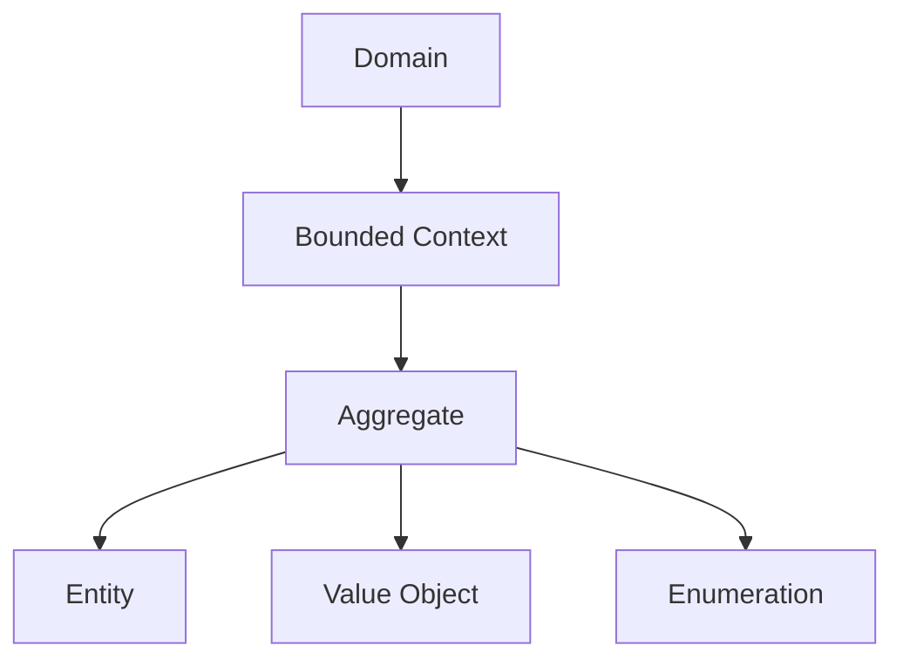
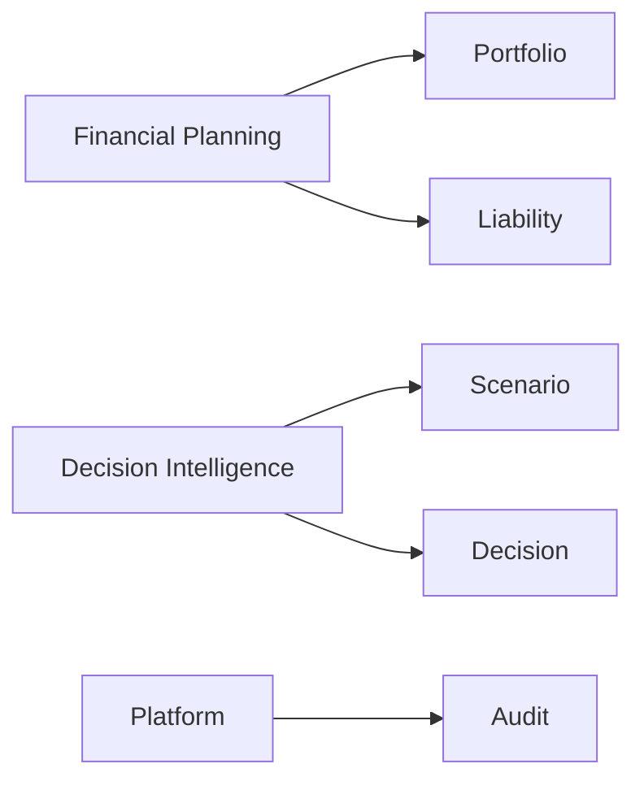
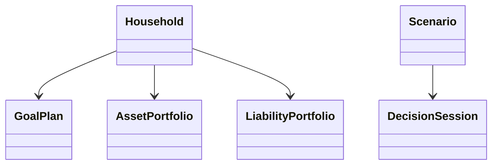
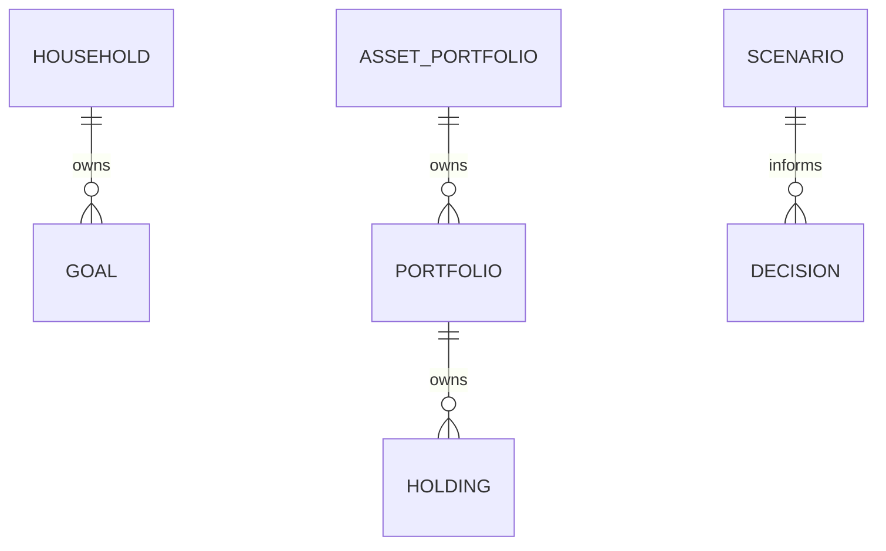
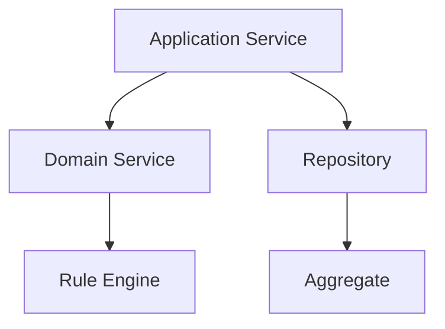
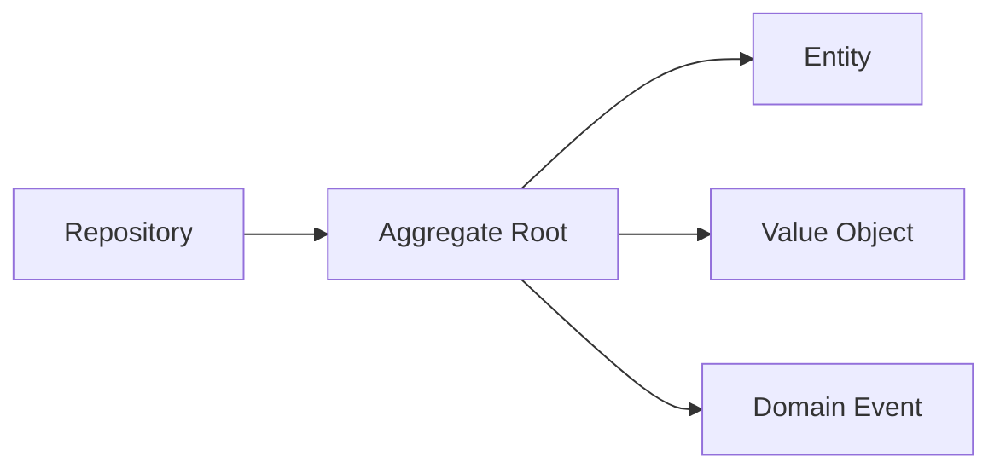

> **ADR-001 PWA Runtime Alignment:** Atlas v1 uses PWA v1 Runtime, Browser Runtime, and IndexedDB Runtime. Future Cloud Architecture is optional future mapping and must not be required for v1.\r\n\r\n# Domain Model Catalog
## Split Navigation
- [Domain model entities](domain-model/entities.md)
- [Domain model relationships](domain-model/relationships.md)
- [Domain model governance](domain-model/governance.md)
- [Domain model executable specification](domain-model/executable-specification.md)
- [Domain model catalog entries](domain-model/catalog-entries.md)
- [Domain model mapping matrices](domain-model/mapping-matrices.md)
- [Domain model diagrams and edge cases](domain-model/diagrams-and-edge-cases.md)

# Document Control

Document Name: Domain Model Catalog
Document Path: knowledge/catalog/domain-model-catalog.md
Document Type: Atlas Enterprise Canonical Specification
Version: 1.0
Status: Canonical Specification
Domain: Platform
Bounded Context: Platform
Owner: Project Atlas
Source of Truth: Atlas Domain Model Source of Truth
Last Updated: 2026-07-12

Related Specifications:
- knowledge/aggregate-catalog.md
- knowledge/entity-catalog.md
- knowledge/value-object-catalog.md
- knowledge/enumeration-catalog.md
- knowledge/command-catalog.md
- knowledge/domain-event-catalog.md
- knowledge/repository-catalog.md
- knowledge/domain-service-catalog.md
- knowledge/application-service-catalog.md
- knowledge/service-catalog.md
- knowledge/system-module-catalog.md
- knowledge/bounded-context-catalog.md
- knowledge/api-governance-framework.md
- knowledge/property.md
- docs/specification/04-DomainModel.md
- docs/specification/04A-DomainInventory.md
- docs/database/05-DatabaseDesign.md
- docs/database/06-ERD.md
- docs/api/07-API.md

# Purpose

Domain Model Catalog defines the canonical Atlas domain model across Domains, Subdomains, Bounded Contexts, Aggregates, Aggregate Roots, Entities, Value Objects, Enumerations, Repositories, Commands, Domain Events, Application Services, Domain Services, Read Models, Projections, DTOs, APIs, PWA Runtime Mapping / Future Cloud Mappings, Future Cloud Mappings, and Rule Engine usage.

# Scope

- Domain
- Subdomain
- Bounded Context
- Aggregate
- Aggregate Root
- Entity
- Value Object
- Enumeration
- Repository
- Domain Service
- Application Service
- Command
- Domain Event
- Read Model
- Projection
- DTO

# Domain Model Definition Standard

Every Domain Model entry uses the following complete Enterprise contract.
- Name
- Display Name
- Model Type
- Domain
- Subdomain
- Bounded Context
- Module
- Purpose
- Business Meaning
- Description
- Aggregate
- Aggregate Root
- Owned Entities
- Owned Value Objects
- Owned Enumerations
- Repositories
- Commands
- Domain Events
- Application Services
- Domain Services
- Database Tables
- Future Cloud Mapping
- API Resources
- DTO
- Permissions
- Security
- Audit
- Lifecycle
- Version
- Dependencies
- Consumers
- Example

# Complete Domain Model Catalog

## Identity

Name: Identity
Display Name: Identity
Model Type: Core Domain
Domain: Identity
Subdomain: Identity
Bounded Context: Identity
Module: Identity
Purpose: Provide the canonical model mapping for Identity.
Business Meaning: Identity represents an approved Atlas business and technical model area without creating uncataloged concepts.
Description: Identity aligns Aggregates, Entities, Value Objects, Enumerations, Repositories, Commands, Domain Events, Services, Database, API, and DTO ownership.
Aggregate: User, Household
Aggregate Root: User, Household
Owned Entities: User, Household
Owned Value Objects: Money, Currency
Owned Enumerations: CurrencyCode
Repositories: UserRepository, HouseholdRepository
Commands: Identity commands and access queries
Domain Events: Identity and access events
Application Services: UserApplicationService
Domain Services: DecisionService
Database Tables: users, households
Future Cloud Mapping: Aggregate-owned entity mapping with owned value objects and string enumeration conversions.
API Resources: /api/v1/users, /api/v1/households
DTO: UserDto, HouseholdDto
Permissions: Catalog-aligned permission checks through API Governance and Permission framework.
Security: Authorization, tenant isolation, Household isolation, and data classification apply before exposure.
Audit: History, Version, CorrelationId, CausationId, actor, and result are captured by owning service or repository.
Lifecycle: Lifecycle follows owning Aggregate, Entity, WorkflowStatus, JobStatus, DecisionStatus, ScenarioStatus, or GoalStatus when applicable.
Version: 1.0
Dependencies: UserRepository, HouseholdRepository; UserApplicationService; DecisionService
Consumers: API, Services, Workflows, Rule Engine, Projections, Reports, and Dashboard when cataloged.
Example: Identity uses User, Household, persists through UserRepository, HouseholdRepository, exposes /api/v1/users, /api/v1/households, and emits Identity and access events.
Domain Model Control 1: Identity preserves domain hierarchy, bounded context, aggregate root, entity ownership, value object ownership, enumeration usage, repository mapping, command mapping, domain event mapping, application service mapping, domain service mapping, PWA Runtime Mapping / Future Cloud Mapping, API mapping, DTO mapping, security, audit, lifecycle, versioning, dependency control, and consumer alignment.
Domain Model Control 2: Identity preserves domain hierarchy, bounded context, aggregate root, entity ownership, value object ownership, enumeration usage, repository mapping, command mapping, domain event mapping, application service mapping, domain service mapping, PWA Runtime Mapping / Future Cloud Mapping, API mapping, DTO mapping, security, audit, lifecycle, versioning, dependency control, and consumer alignment.
Domain Model Control 3: Identity preserves domain hierarchy, bounded context, aggregate root, entity ownership, value object ownership, enumeration usage, repository mapping, command mapping, domain event mapping, application service mapping, domain service mapping, PWA Runtime Mapping / Future Cloud Mapping, API mapping, DTO mapping, security, audit, lifecycle, versioning, dependency control, and consumer alignment.
Domain Model Control 4: Identity preserves domain hierarchy, bounded context, aggregate root, entity ownership, value object ownership, enumeration usage, repository mapping, command mapping, domain event mapping, application service mapping, domain service mapping, PWA Runtime Mapping / Future Cloud Mapping, API mapping, DTO mapping, security, audit, lifecycle, versioning, dependency control, and consumer alignment.
Domain Model Control 5: Identity preserves domain hierarchy, bounded context, aggregate root, entity ownership, value object ownership, enumeration usage, repository mapping, command mapping, domain event mapping, application service mapping, domain service mapping, PWA Runtime Mapping / Future Cloud Mapping, API mapping, DTO mapping, security, audit, lifecycle, versioning, dependency control, and consumer alignment.
Domain Model Control 6: Identity preserves domain hierarchy, bounded context, aggregate root, entity ownership, value object ownership, enumeration usage, repository mapping, command mapping, domain event mapping, application service mapping, domain service mapping, PWA Runtime Mapping / Future Cloud Mapping, API mapping, DTO mapping, security, audit, lifecycle, versioning, dependency control, and consumer alignment.
Domain Model Control 7: Identity preserves domain hierarchy, bounded context, aggregate root, entity ownership, value object ownership, enumeration usage, repository mapping, command mapping, domain event mapping, application service mapping, domain service mapping, PWA Runtime Mapping / Future Cloud Mapping, API mapping, DTO mapping, security, audit, lifecycle, versioning, dependency control, and consumer alignment.
Domain Model Control 8: Identity preserves domain hierarchy, bounded context, aggregate root, entity ownership, value object ownership, enumeration usage, repository mapping, command mapping, domain event mapping, application service mapping, domain service mapping, PWA Runtime Mapping / Future Cloud Mapping, API mapping, DTO mapping, security, audit, lifecycle, versioning, dependency control, and consumer alignment.
Domain Model Control 9: Identity preserves domain hierarchy, bounded context, aggregate root, entity ownership, value object ownership, enumeration usage, repository mapping, command mapping, domain event mapping, application service mapping, domain service mapping, PWA Runtime Mapping / Future Cloud Mapping, API mapping, DTO mapping, security, audit, lifecycle, versioning, dependency control, and consumer alignment.
Domain Model Control 10: Identity preserves domain hierarchy, bounded context, aggregate root, entity ownership, value object ownership, enumeration usage, repository mapping, command mapping, domain event mapping, application service mapping, domain service mapping, PWA Runtime Mapping / Future Cloud Mapping, API mapping, DTO mapping, security, audit, lifecycle, versioning, dependency control, and consumer alignment.
Domain Model Control 11: Identity preserves domain hierarchy, bounded context, aggregate root, entity ownership, value object ownership, enumeration usage, repository mapping, command mapping, domain event mapping, application service mapping, domain service mapping, PWA Runtime Mapping / Future Cloud Mapping, API mapping, DTO mapping, security, audit, lifecycle, versioning, dependency control, and consumer alignment.
Domain Model Control 12: Identity preserves domain hierarchy, bounded context, aggregate root, entity ownership, value object ownership, enumeration usage, repository mapping, command mapping, domain event mapping, application service mapping, domain service mapping, PWA Runtime Mapping / Future Cloud Mapping, API mapping, DTO mapping, security, audit, lifecycle, versioning, dependency control, and consumer alignment.
Domain Model Control 13: Identity preserves domain hierarchy, bounded context, aggregate root, entity ownership, value object ownership, enumeration usage, repository mapping, command mapping, domain event mapping, application service mapping, domain service mapping, PWA Runtime Mapping / Future Cloud Mapping, API mapping, DTO mapping, security, audit, lifecycle, versioning, dependency control, and consumer alignment.
Domain Model Control 14: Identity preserves domain hierarchy, bounded context, aggregate root, entity ownership, value object ownership, enumeration usage, repository mapping, command mapping, domain event mapping, application service mapping, domain service mapping, PWA Runtime Mapping / Future Cloud Mapping, API mapping, DTO mapping, security, audit, lifecycle, versioning, dependency control, and consumer alignment.
Domain Model Control 15: Identity preserves domain hierarchy, bounded context, aggregate root, entity ownership, value object ownership, enumeration usage, repository mapping, command mapping, domain event mapping, application service mapping, domain service mapping, PWA Runtime Mapping / Future Cloud Mapping, API mapping, DTO mapping, security, audit, lifecycle, versioning, dependency control, and consumer alignment.
Domain Model Control 16: Identity preserves domain hierarchy, bounded context, aggregate root, entity ownership, value object ownership, enumeration usage, repository mapping, command mapping, domain event mapping, application service mapping, domain service mapping, PWA Runtime Mapping / Future Cloud Mapping, API mapping, DTO mapping, security, audit, lifecycle, versioning, dependency control, and consumer alignment.
Domain Model Control 17: Identity preserves domain hierarchy, bounded context, aggregate root, entity ownership, value object ownership, enumeration usage, repository mapping, command mapping, domain event mapping, application service mapping, domain service mapping, PWA Runtime Mapping / Future Cloud Mapping, API mapping, DTO mapping, security, audit, lifecycle, versioning, dependency control, and consumer alignment.
Domain Model Control 18: Identity preserves domain hierarchy, bounded context, aggregate root, entity ownership, value object ownership, enumeration usage, repository mapping, command mapping, domain event mapping, application service mapping, domain service mapping, PWA Runtime Mapping / Future Cloud Mapping, API mapping, DTO mapping, security, audit, lifecycle, versioning, dependency control, and consumer alignment.
Domain Model Control 19: Identity preserves domain hierarchy, bounded context, aggregate root, entity ownership, value object ownership, enumeration usage, repository mapping, command mapping, domain event mapping, application service mapping, domain service mapping, PWA Runtime Mapping / Future Cloud Mapping, API mapping, DTO mapping, security, audit, lifecycle, versioning, dependency control, and consumer alignment.
Domain Model Control 20: Identity preserves domain hierarchy, bounded context, aggregate root, entity ownership, value object ownership, enumeration usage, repository mapping, command mapping, domain event mapping, application service mapping, domain service mapping, PWA Runtime Mapping / Future Cloud Mapping, API mapping, DTO mapping, security, audit, lifecycle, versioning, dependency control, and consumer alignment.
Domain Model Control 21: Identity preserves domain hierarchy, bounded context, aggregate root, entity ownership, value object ownership, enumeration usage, repository mapping, command mapping, domain event mapping, application service mapping, domain service mapping, PWA Runtime Mapping / Future Cloud Mapping, API mapping, DTO mapping, security, audit, lifecycle, versioning, dependency control, and consumer alignment.
Domain Model Control 22: Identity preserves domain hierarchy, bounded context, aggregate root, entity ownership, value object ownership, enumeration usage, repository mapping, command mapping, domain event mapping, application service mapping, domain service mapping, PWA Runtime Mapping / Future Cloud Mapping, API mapping, DTO mapping, security, audit, lifecycle, versioning, dependency control, and consumer alignment.
Domain Model Control 23: Identity preserves domain hierarchy, bounded context, aggregate root, entity ownership, value object ownership, enumeration usage, repository mapping, command mapping, domain event mapping, application service mapping, domain service mapping, PWA Runtime Mapping / Future Cloud Mapping, API mapping, DTO mapping, security, audit, lifecycle, versioning, dependency control, and consumer alignment.
Domain Model Control 24: Identity preserves domain hierarchy, bounded context, aggregate root, entity ownership, value object ownership, enumeration usage, repository mapping, command mapping, domain event mapping, application service mapping, domain service mapping, PWA Runtime Mapping / Future Cloud Mapping, API mapping, DTO mapping, security, audit, lifecycle, versioning, dependency control, and consumer alignment.
Domain Model Control 25: Identity preserves domain hierarchy, bounded context, aggregate root, entity ownership, value object ownership, enumeration usage, repository mapping, command mapping, domain event mapping, application service mapping, domain service mapping, PWA Runtime Mapping / Future Cloud Mapping, API mapping, DTO mapping, security, audit, lifecycle, versioning, dependency control, and consumer alignment.
Domain Model Control 26: Identity preserves domain hierarchy, bounded context, aggregate root, entity ownership, value object ownership, enumeration usage, repository mapping, command mapping, domain event mapping, application service mapping, domain service mapping, PWA Runtime Mapping / Future Cloud Mapping, API mapping, DTO mapping, security, audit, lifecycle, versioning, dependency control, and consumer alignment.
Domain Model Control 27: Identity preserves domain hierarchy, bounded context, aggregate root, entity ownership, value object ownership, enumeration usage, repository mapping, command mapping, domain event mapping, application service mapping, domain service mapping, PWA Runtime Mapping / Future Cloud Mapping, API mapping, DTO mapping, security, audit, lifecycle, versioning, dependency control, and consumer alignment.
Domain Model Control 28: Identity preserves domain hierarchy, bounded context, aggregate root, entity ownership, value object ownership, enumeration usage, repository mapping, command mapping, domain event mapping, application service mapping, domain service mapping, PWA Runtime Mapping / Future Cloud Mapping, API mapping, DTO mapping, security, audit, lifecycle, versioning, dependency control, and consumer alignment.
Domain Model Control 29: Identity preserves domain hierarchy, bounded context, aggregate root, entity ownership, value object ownership, enumeration usage, repository mapping, command mapping, domain event mapping, application service mapping, domain service mapping, PWA Runtime Mapping / Future Cloud Mapping, API mapping, DTO mapping, security, audit, lifecycle, versioning, dependency control, and consumer alignment.
Domain Model Control 30: Identity preserves domain hierarchy, bounded context, aggregate root, entity ownership, value object ownership, enumeration usage, repository mapping, command mapping, domain event mapping, application service mapping, domain service mapping, PWA Runtime Mapping / Future Cloud Mapping, API mapping, DTO mapping, security, audit, lifecycle, versioning, dependency control, and consumer alignment.
Domain Model Control 31: Identity preserves domain hierarchy, bounded context, aggregate root, entity ownership, value object ownership, enumeration usage, repository mapping, command mapping, domain event mapping, application service mapping, domain service mapping, PWA Runtime Mapping / Future Cloud Mapping, API mapping, DTO mapping, security, audit, lifecycle, versioning, dependency control, and consumer alignment.
Domain Model Control 32: Identity preserves domain hierarchy, bounded context, aggregate root, entity ownership, value object ownership, enumeration usage, repository mapping, command mapping, domain event mapping, application service mapping, domain service mapping, PWA Runtime Mapping / Future Cloud Mapping, API mapping, DTO mapping, security, audit, lifecycle, versioning, dependency control, and consumer alignment.
Domain Model Control 33: Identity preserves domain hierarchy, bounded context, aggregate root, entity ownership, value object ownership, enumeration usage, repository mapping, command mapping, domain event mapping, application service mapping, domain service mapping, PWA Runtime Mapping / Future Cloud Mapping, API mapping, DTO mapping, security, audit, lifecycle, versioning, dependency control, and consumer alignment.
Domain Model Control 34: Identity preserves domain hierarchy, bounded context, aggregate root, entity ownership, value object ownership, enumeration usage, repository mapping, command mapping, domain event mapping, application service mapping, domain service mapping, PWA Runtime Mapping / Future Cloud Mapping, API mapping, DTO mapping, security, audit, lifecycle, versioning, dependency control, and consumer alignment.
Domain Model Control 35: Identity preserves domain hierarchy, bounded context, aggregate root, entity ownership, value object ownership, enumeration usage, repository mapping, command mapping, domain event mapping, application service mapping, domain service mapping, PWA Runtime Mapping / Future Cloud Mapping, API mapping, DTO mapping, security, audit, lifecycle, versioning, dependency control, and consumer alignment.
Domain Model Control 36: Identity preserves domain hierarchy, bounded context, aggregate root, entity ownership, value object ownership, enumeration usage, repository mapping, command mapping, domain event mapping, application service mapping, domain service mapping, PWA Runtime Mapping / Future Cloud Mapping, API mapping, DTO mapping, security, audit, lifecycle, versioning, dependency control, and consumer alignment.
Domain Model Control 37: Identity preserves domain hierarchy, bounded context, aggregate root, entity ownership, value object ownership, enumeration usage, repository mapping, command mapping, domain event mapping, application service mapping, domain service mapping, PWA Runtime Mapping / Future Cloud Mapping, API mapping, DTO mapping, security, audit, lifecycle, versioning, dependency control, and consumer alignment.
Domain Model Control 38: Identity preserves domain hierarchy, bounded context, aggregate root, entity ownership, value object ownership, enumeration usage, repository mapping, command mapping, domain event mapping, application service mapping, domain service mapping, PWA Runtime Mapping / Future Cloud Mapping, API mapping, DTO mapping, security, audit, lifecycle, versioning, dependency control, and consumer alignment.
Domain Model Control 39: Identity preserves domain hierarchy, bounded context, aggregate root, entity ownership, value object ownership, enumeration usage, repository mapping, command mapping, domain event mapping, application service mapping, domain service mapping, PWA Runtime Mapping / Future Cloud Mapping, API mapping, DTO mapping, security, audit, lifecycle, versioning, dependency control, and consumer alignment.
Domain Model Control 40: Identity preserves domain hierarchy, bounded context, aggregate root, entity ownership, value object ownership, enumeration usage, repository mapping, command mapping, domain event mapping, application service mapping, domain service mapping, PWA Runtime Mapping / Future Cloud Mapping, API mapping, DTO mapping, security, audit, lifecycle, versioning, dependency control, and consumer alignment.
Domain Model Control 41: Identity preserves domain hierarchy, bounded context, aggregate root, entity ownership, value object ownership, enumeration usage, repository mapping, command mapping, domain event mapping, application service mapping, domain service mapping, PWA Runtime Mapping / Future Cloud Mapping, API mapping, DTO mapping, security, audit, lifecycle, versioning, dependency control, and consumer alignment.
Domain Model Control 42: Identity preserves domain hierarchy, bounded context, aggregate root, entity ownership, value object ownership, enumeration usage, repository mapping, command mapping, domain event mapping, application service mapping, domain service mapping, PWA Runtime Mapping / Future Cloud Mapping, API mapping, DTO mapping, security, audit, lifecycle, versioning, dependency control, and consumer alignment.
Domain Model Control 43: Identity preserves domain hierarchy, bounded context, aggregate root, entity ownership, value object ownership, enumeration usage, repository mapping, command mapping, domain event mapping, application service mapping, domain service mapping, PWA Runtime Mapping / Future Cloud Mapping, API mapping, DTO mapping, security, audit, lifecycle, versioning, dependency control, and consumer alignment.
Domain Model Control 44: Identity preserves domain hierarchy, bounded context, aggregate root, entity ownership, value object ownership, enumeration usage, repository mapping, command mapping, domain event mapping, application service mapping, domain service mapping, PWA Runtime Mapping / Future Cloud Mapping, API mapping, DTO mapping, security, audit, lifecycle, versioning, dependency control, and consumer alignment.
Domain Model Control 45: Identity preserves domain hierarchy, bounded context, aggregate root, entity ownership, value object ownership, enumeration usage, repository mapping, command mapping, domain event mapping, application service mapping, domain service mapping, PWA Runtime Mapping / Future Cloud Mapping, API mapping, DTO mapping, security, audit, lifecycle, versioning, dependency control, and consumer alignment.
Domain Model Control 46: Identity preserves domain hierarchy, bounded context, aggregate root, entity ownership, value object ownership, enumeration usage, repository mapping, command mapping, domain event mapping, application service mapping, domain service mapping, PWA Runtime Mapping / Future Cloud Mapping, API mapping, DTO mapping, security, audit, lifecycle, versioning, dependency control, and consumer alignment.
Domain Model Control 47: Identity preserves domain hierarchy, bounded context, aggregate root, entity ownership, value object ownership, enumeration usage, repository mapping, command mapping, domain event mapping, application service mapping, domain service mapping, PWA Runtime Mapping / Future Cloud Mapping, API mapping, DTO mapping, security, audit, lifecycle, versioning, dependency control, and consumer alignment.
Domain Model Control 48: Identity preserves domain hierarchy, bounded context, aggregate root, entity ownership, value object ownership, enumeration usage, repository mapping, command mapping, domain event mapping, application service mapping, domain service mapping, PWA Runtime Mapping / Future Cloud Mapping, API mapping, DTO mapping, security, audit, lifecycle, versioning, dependency control, and consumer alignment.
Domain Model Control 49: Identity preserves domain hierarchy, bounded context, aggregate root, entity ownership, value object ownership, enumeration usage, repository mapping, command mapping, domain event mapping, application service mapping, domain service mapping, PWA Runtime Mapping / Future Cloud Mapping, API mapping, DTO mapping, security, audit, lifecycle, versioning, dependency control, and consumer alignment.
Domain Model Control 50: Identity preserves domain hierarchy, bounded context, aggregate root, entity ownership, value object ownership, enumeration usage, repository mapping, command mapping, domain event mapping, application service mapping, domain service mapping, PWA Runtime Mapping / Future Cloud Mapping, API mapping, DTO mapping, security, audit, lifecycle, versioning, dependency control, and consumer alignment.
Domain Model Control 51: Identity preserves domain hierarchy, bounded context, aggregate root, entity ownership, value object ownership, enumeration usage, repository mapping, command mapping, domain event mapping, application service mapping, domain service mapping, PWA Runtime Mapping / Future Cloud Mapping, API mapping, DTO mapping, security, audit, lifecycle, versioning, dependency control, and consumer alignment.
Domain Model Control 52: Identity preserves domain hierarchy, bounded context, aggregate root, entity ownership, value object ownership, enumeration usage, repository mapping, command mapping, domain event mapping, application service mapping, domain service mapping, PWA Runtime Mapping / Future Cloud Mapping, API mapping, DTO mapping, security, audit, lifecycle, versioning, dependency control, and consumer alignment.
Domain Model Control 53: Identity preserves domain hierarchy, bounded context, aggregate root, entity ownership, value object ownership, enumeration usage, repository mapping, command mapping, domain event mapping, application service mapping, domain service mapping, PWA Runtime Mapping / Future Cloud Mapping, API mapping, DTO mapping, security, audit, lifecycle, versioning, dependency control, and consumer alignment.
Domain Model Control 54: Identity preserves domain hierarchy, bounded context, aggregate root, entity ownership, value object ownership, enumeration usage, repository mapping, command mapping, domain event mapping, application service mapping, domain service mapping, PWA Runtime Mapping / Future Cloud Mapping, API mapping, DTO mapping, security, audit, lifecycle, versioning, dependency control, and consumer alignment.
Domain Model Control 55: Identity preserves domain hierarchy, bounded context, aggregate root, entity ownership, value object ownership, enumeration usage, repository mapping, command mapping, domain event mapping, application service mapping, domain service mapping, PWA Runtime Mapping / Future Cloud Mapping, API mapping, DTO mapping, security, audit, lifecycle, versioning, dependency control, and consumer alignment.
Domain Model Control 56: Identity preserves domain hierarchy, bounded context, aggregate root, entity ownership, value object ownership, enumeration usage, repository mapping, command mapping, domain event mapping, application service mapping, domain service mapping, PWA Runtime Mapping / Future Cloud Mapping, API mapping, DTO mapping, security, audit, lifecycle, versioning, dependency control, and consumer alignment.
Domain Model Control 57: Identity preserves domain hierarchy, bounded context, aggregate root, entity ownership, value object ownership, enumeration usage, repository mapping, command mapping, domain event mapping, application service mapping, domain service mapping, PWA Runtime Mapping / Future Cloud Mapping, API mapping, DTO mapping, security, audit, lifecycle, versioning, dependency control, and consumer alignment.
Domain Model Control 58: Identity preserves domain hierarchy, bounded context, aggregate root, entity ownership, value object ownership, enumeration usage, repository mapping, command mapping, domain event mapping, application service mapping, domain service mapping, PWA Runtime Mapping / Future Cloud Mapping, API mapping, DTO mapping, security, audit, lifecycle, versioning, dependency control, and consumer alignment.
Domain Model Control 59: Identity preserves domain hierarchy, bounded context, aggregate root, entity ownership, value object ownership, enumeration usage, repository mapping, command mapping, domain event mapping, application service mapping, domain service mapping, PWA Runtime Mapping / Future Cloud Mapping, API mapping, DTO mapping, security, audit, lifecycle, versioning, dependency control, and consumer alignment.
Domain Model Control 60: Identity preserves domain hierarchy, bounded context, aggregate root, entity ownership, value object ownership, enumeration usage, repository mapping, command mapping, domain event mapping, application service mapping, domain service mapping, PWA Runtime Mapping / Future Cloud Mapping, API mapping, DTO mapping, security, audit, lifecycle, versioning, dependency control, and consumer alignment.
Domain Model Control 61: Identity preserves domain hierarchy, bounded context, aggregate root, entity ownership, value object ownership, enumeration usage, repository mapping, command mapping, domain event mapping, application service mapping, domain service mapping, PWA Runtime Mapping / Future Cloud Mapping, API mapping, DTO mapping, security, audit, lifecycle, versioning, dependency control, and consumer alignment.
Domain Model Control 62: Identity preserves domain hierarchy, bounded context, aggregate root, entity ownership, value object ownership, enumeration usage, repository mapping, command mapping, domain event mapping, application service mapping, domain service mapping, PWA Runtime Mapping / Future Cloud Mapping, API mapping, DTO mapping, security, audit, lifecycle, versioning, dependency control, and consumer alignment.
Domain Model Control 63: Identity preserves domain hierarchy, bounded context, aggregate root, entity ownership, value object ownership, enumeration usage, repository mapping, command mapping, domain event mapping, application service mapping, domain service mapping, PWA Runtime Mapping / Future Cloud Mapping, API mapping, DTO mapping, security, audit, lifecycle, versioning, dependency control, and consumer alignment.
Domain Model Control 64: Identity preserves domain hierarchy, bounded context, aggregate root, entity ownership, value object ownership, enumeration usage, repository mapping, command mapping, domain event mapping, application service mapping, domain service mapping, PWA Runtime Mapping / Future Cloud Mapping, API mapping, DTO mapping, security, audit, lifecycle, versioning, dependency control, and consumer alignment.
Domain Model Control 65: Identity preserves domain hierarchy, bounded context, aggregate root, entity ownership, value object ownership, enumeration usage, repository mapping, command mapping, domain event mapping, application service mapping, domain service mapping, PWA Runtime Mapping / Future Cloud Mapping, API mapping, DTO mapping, security, audit, lifecycle, versioning, dependency control, and consumer alignment.
Domain Model Control 66: Identity preserves domain hierarchy, bounded context, aggregate root, entity ownership, value object ownership, enumeration usage, repository mapping, command mapping, domain event mapping, application service mapping, domain service mapping, PWA Runtime Mapping / Future Cloud Mapping, API mapping, DTO mapping, security, audit, lifecycle, versioning, dependency control, and consumer alignment.
Domain Model Control 67: Identity preserves domain hierarchy, bounded context, aggregate root, entity ownership, value object ownership, enumeration usage, repository mapping, command mapping, domain event mapping, application service mapping, domain service mapping, PWA Runtime Mapping / Future Cloud Mapping, API mapping, DTO mapping, security, audit, lifecycle, versioning, dependency control, and consumer alignment.
Domain Model Control 68: Identity preserves domain hierarchy, bounded context, aggregate root, entity ownership, value object ownership, enumeration usage, repository mapping, command mapping, domain event mapping, application service mapping, domain service mapping, PWA Runtime Mapping / Future Cloud Mapping, API mapping, DTO mapping, security, audit, lifecycle, versioning, dependency control, and consumer alignment.
Domain Model Control 69: Identity preserves domain hierarchy, bounded context, aggregate root, entity ownership, value object ownership, enumeration usage, repository mapping, command mapping, domain event mapping, application service mapping, domain service mapping, PWA Runtime Mapping / Future Cloud Mapping, API mapping, DTO mapping, security, audit, lifecycle, versioning, dependency control, and consumer alignment.
Domain Model Control 70: Identity preserves domain hierarchy, bounded context, aggregate root, entity ownership, value object ownership, enumeration usage, repository mapping, command mapping, domain event mapping, application service mapping, domain service mapping, PWA Runtime Mapping / Future Cloud Mapping, API mapping, DTO mapping, security, audit, lifecycle, versioning, dependency control, and consumer alignment.
Domain Model Control 71: Identity preserves domain hierarchy, bounded context, aggregate root, entity ownership, value object ownership, enumeration usage, repository mapping, command mapping, domain event mapping, application service mapping, domain service mapping, PWA Runtime Mapping / Future Cloud Mapping, API mapping, DTO mapping, security, audit, lifecycle, versioning, dependency control, and consumer alignment.
Domain Model Control 72: Identity preserves domain hierarchy, bounded context, aggregate root, entity ownership, value object ownership, enumeration usage, repository mapping, command mapping, domain event mapping, application service mapping, domain service mapping, PWA Runtime Mapping / Future Cloud Mapping, API mapping, DTO mapping, security, audit, lifecycle, versioning, dependency control, and consumer alignment.
Domain Model Control 73: Identity preserves domain hierarchy, bounded context, aggregate root, entity ownership, value object ownership, enumeration usage, repository mapping, command mapping, domain event mapping, application service mapping, domain service mapping, PWA Runtime Mapping / Future Cloud Mapping, API mapping, DTO mapping, security, audit, lifecycle, versioning, dependency control, and consumer alignment.
Domain Model Control 74: Identity preserves domain hierarchy, bounded context, aggregate root, entity ownership, value object ownership, enumeration usage, repository mapping, command mapping, domain event mapping, application service mapping, domain service mapping, PWA Runtime Mapping / Future Cloud Mapping, API mapping, DTO mapping, security, audit, lifecycle, versioning, dependency control, and consumer alignment.
Domain Model Control 75: Identity preserves domain hierarchy, bounded context, aggregate root, entity ownership, value object ownership, enumeration usage, repository mapping, command mapping, domain event mapping, application service mapping, domain service mapping, PWA Runtime Mapping / Future Cloud Mapping, API mapping, DTO mapping, security, audit, lifecycle, versioning, dependency control, and consumer alignment.
Domain Model Control 76: Identity preserves domain hierarchy, bounded context, aggregate root, entity ownership, value object ownership, enumeration usage, repository mapping, command mapping, domain event mapping, application service mapping, domain service mapping, PWA Runtime Mapping / Future Cloud Mapping, API mapping, DTO mapping, security, audit, lifecycle, versioning, dependency control, and consumer alignment.
Domain Model Control 77: Identity preserves domain hierarchy, bounded context, aggregate root, entity ownership, value object ownership, enumeration usage, repository mapping, command mapping, domain event mapping, application service mapping, domain service mapping, PWA Runtime Mapping / Future Cloud Mapping, API mapping, DTO mapping, security, audit, lifecycle, versioning, dependency control, and consumer alignment.
Domain Model Control 78: Identity preserves domain hierarchy, bounded context, aggregate root, entity ownership, value object ownership, enumeration usage, repository mapping, command mapping, domain event mapping, application service mapping, domain service mapping, PWA Runtime Mapping / Future Cloud Mapping, API mapping, DTO mapping, security, audit, lifecycle, versioning, dependency control, and consumer alignment.
Domain Model Control 79: Identity preserves domain hierarchy, bounded context, aggregate root, entity ownership, value object ownership, enumeration usage, repository mapping, command mapping, domain event mapping, application service mapping, domain service mapping, PWA Runtime Mapping / Future Cloud Mapping, API mapping, DTO mapping, security, audit, lifecycle, versioning, dependency control, and consumer alignment.
Domain Model Control 80: Identity preserves domain hierarchy, bounded context, aggregate root, entity ownership, value object ownership, enumeration usage, repository mapping, command mapping, domain event mapping, application service mapping, domain service mapping, PWA Runtime Mapping / Future Cloud Mapping, API mapping, DTO mapping, security, audit, lifecycle, versioning, dependency control, and consumer alignment.
Domain Model Control 81: Identity preserves domain hierarchy, bounded context, aggregate root, entity ownership, value object ownership, enumeration usage, repository mapping, command mapping, domain event mapping, application service mapping, domain service mapping, PWA Runtime Mapping / Future Cloud Mapping, API mapping, DTO mapping, security, audit, lifecycle, versioning, dependency control, and consumer alignment.
Domain Model Control 82: Identity preserves domain hierarchy, bounded context, aggregate root, entity ownership, value object ownership, enumeration usage, repository mapping, command mapping, domain event mapping, application service mapping, domain service mapping, PWA Runtime Mapping / Future Cloud Mapping, API mapping, DTO mapping, security, audit, lifecycle, versioning, dependency control, and consumer alignment.
Domain Model Control 83: Identity preserves domain hierarchy, bounded context, aggregate root, entity ownership, value object ownership, enumeration usage, repository mapping, command mapping, domain event mapping, application service mapping, domain service mapping, PWA Runtime Mapping / Future Cloud Mapping, API mapping, DTO mapping, security, audit, lifecycle, versioning, dependency control, and consumer alignment.
Domain Model Control 84: Identity preserves domain hierarchy, bounded context, aggregate root, entity ownership, value object ownership, enumeration usage, repository mapping, command mapping, domain event mapping, application service mapping, domain service mapping, PWA Runtime Mapping / Future Cloud Mapping, API mapping, DTO mapping, security, audit, lifecycle, versioning, dependency control, and consumer alignment.
Domain Model Control 85: Identity preserves domain hierarchy, bounded context, aggregate root, entity ownership, value object ownership, enumeration usage, repository mapping, command mapping, domain event mapping, application service mapping, domain service mapping, PWA Runtime Mapping / Future Cloud Mapping, API mapping, DTO mapping, security, audit, lifecycle, versioning, dependency control, and consumer alignment.
Domain Model Control 86: Identity preserves domain hierarchy, bounded context, aggregate root, entity ownership, value object ownership, enumeration usage, repository mapping, command mapping, domain event mapping, application service mapping, domain service mapping, PWA Runtime Mapping / Future Cloud Mapping, API mapping, DTO mapping, security, audit, lifecycle, versioning, dependency control, and consumer alignment.
Domain Model Control 87: Identity preserves domain hierarchy, bounded context, aggregate root, entity ownership, value object ownership, enumeration usage, repository mapping, command mapping, domain event mapping, application service mapping, domain service mapping, PWA Runtime Mapping / Future Cloud Mapping, API mapping, DTO mapping, security, audit, lifecycle, versioning, dependency control, and consumer alignment.
Domain Model Control 88: Identity preserves domain hierarchy, bounded context, aggregate root, entity ownership, value object ownership, enumeration usage, repository mapping, command mapping, domain event mapping, application service mapping, domain service mapping, PWA Runtime Mapping / Future Cloud Mapping, API mapping, DTO mapping, security, audit, lifecycle, versioning, dependency control, and consumer alignment.
Domain Model Control 89: Identity preserves domain hierarchy, bounded context, aggregate root, entity ownership, value object ownership, enumeration usage, repository mapping, command mapping, domain event mapping, application service mapping, domain service mapping, PWA Runtime Mapping / Future Cloud Mapping, API mapping, DTO mapping, security, audit, lifecycle, versioning, dependency control, and consumer alignment.
Domain Model Control 90: Identity preserves domain hierarchy, bounded context, aggregate root, entity ownership, value object ownership, enumeration usage, repository mapping, command mapping, domain event mapping, application service mapping, domain service mapping, PWA Runtime Mapping / Future Cloud Mapping, API mapping, DTO mapping, security, audit, lifecycle, versioning, dependency control, and consumer alignment.
Domain Model Control 91: Identity preserves domain hierarchy, bounded context, aggregate root, entity ownership, value object ownership, enumeration usage, repository mapping, command mapping, domain event mapping, application service mapping, domain service mapping, PWA Runtime Mapping / Future Cloud Mapping, API mapping, DTO mapping, security, audit, lifecycle, versioning, dependency control, and consumer alignment.
Domain Model Control 92: Identity preserves domain hierarchy, bounded context, aggregate root, entity ownership, value object ownership, enumeration usage, repository mapping, command mapping, domain event mapping, application service mapping, domain service mapping, PWA Runtime Mapping / Future Cloud Mapping, API mapping, DTO mapping, security, audit, lifecycle, versioning, dependency control, and consumer alignment.
Domain Model Control 93: Identity preserves domain hierarchy, bounded context, aggregate root, entity ownership, value object ownership, enumeration usage, repository mapping, command mapping, domain event mapping, application service mapping, domain service mapping, PWA Runtime Mapping / Future Cloud Mapping, API mapping, DTO mapping, security, audit, lifecycle, versioning, dependency control, and consumer alignment.
Domain Model Control 94: Identity preserves domain hierarchy, bounded context, aggregate root, entity ownership, value object ownership, enumeration usage, repository mapping, command mapping, domain event mapping, application service mapping, domain service mapping, PWA Runtime Mapping / Future Cloud Mapping, API mapping, DTO mapping, security, audit, lifecycle, versioning, dependency control, and consumer alignment.
Domain Model Control 95: Identity preserves domain hierarchy, bounded context, aggregate root, entity ownership, value object ownership, enumeration usage, repository mapping, command mapping, domain event mapping, application service mapping, domain service mapping, PWA Runtime Mapping / Future Cloud Mapping, API mapping, DTO mapping, security, audit, lifecycle, versioning, dependency control, and consumer alignment.
Domain Model Control 96: Identity preserves domain hierarchy, bounded context, aggregate root, entity ownership, value object ownership, enumeration usage, repository mapping, command mapping, domain event mapping, application service mapping, domain service mapping, PWA Runtime Mapping / Future Cloud Mapping, API mapping, DTO mapping, security, audit, lifecycle, versioning, dependency control, and consumer alignment.
Domain Model Control 97: Identity preserves domain hierarchy, bounded context, aggregate root, entity ownership, value object ownership, enumeration usage, repository mapping, command mapping, domain event mapping, application service mapping, domain service mapping, PWA Runtime Mapping / Future Cloud Mapping, API mapping, DTO mapping, security, audit, lifecycle, versioning, dependency control, and consumer alignment.
Domain Model Control 98: Identity preserves domain hierarchy, bounded context, aggregate root, entity ownership, value object ownership, enumeration usage, repository mapping, command mapping, domain event mapping, application service mapping, domain service mapping, PWA Runtime Mapping / Future Cloud Mapping, API mapping, DTO mapping, security, audit, lifecycle, versioning, dependency control, and consumer alignment.
Domain Model Control 99: Identity preserves domain hierarchy, bounded context, aggregate root, entity ownership, value object ownership, enumeration usage, repository mapping, command mapping, domain event mapping, application service mapping, domain service mapping, PWA Runtime Mapping / Future Cloud Mapping, API mapping, DTO mapping, security, audit, lifecycle, versioning, dependency control, and consumer alignment.
Domain Model Control 100: Identity preserves domain hierarchy, bounded context, aggregate root, entity ownership, value object ownership, enumeration usage, repository mapping, command mapping, domain event mapping, application service mapping, domain service mapping, PWA Runtime Mapping / Future Cloud Mapping, API mapping, DTO mapping, security, audit, lifecycle, versioning, dependency control, and consumer alignment.
Domain Model Control 101: Identity preserves domain hierarchy, bounded context, aggregate root, entity ownership, value object ownership, enumeration usage, repository mapping, command mapping, domain event mapping, application service mapping, domain service mapping, PWA Runtime Mapping / Future Cloud Mapping, API mapping, DTO mapping, security, audit, lifecycle, versioning, dependency control, and consumer alignment.
Domain Model Control 102: Identity preserves domain hierarchy, bounded context, aggregate root, entity ownership, value object ownership, enumeration usage, repository mapping, command mapping, domain event mapping, application service mapping, domain service mapping, PWA Runtime Mapping / Future Cloud Mapping, API mapping, DTO mapping, security, audit, lifecycle, versioning, dependency control, and consumer alignment.
Domain Model Control 103: Identity preserves domain hierarchy, bounded context, aggregate root, entity ownership, value object ownership, enumeration usage, repository mapping, command mapping, domain event mapping, application service mapping, domain service mapping, PWA Runtime Mapping / Future Cloud Mapping, API mapping, DTO mapping, security, audit, lifecycle, versioning, dependency control, and consumer alignment.
Domain Model Control 104: Identity preserves domain hierarchy, bounded context, aggregate root, entity ownership, value object ownership, enumeration usage, repository mapping, command mapping, domain event mapping, application service mapping, domain service mapping, PWA Runtime Mapping / Future Cloud Mapping, API mapping, DTO mapping, security, audit, lifecycle, versioning, dependency control, and consumer alignment.
Domain Model Control 105: Identity preserves domain hierarchy, bounded context, aggregate root, entity ownership, value object ownership, enumeration usage, repository mapping, command mapping, domain event mapping, application service mapping, domain service mapping, PWA Runtime Mapping / Future Cloud Mapping, API mapping, DTO mapping, security, audit, lifecycle, versioning, dependency control, and consumer alignment.

## Financial Profile

Name: Financial Profile
Display Name: Financial Profile
Model Type: Core Domain
Domain: Financial Profile
Subdomain: Financial Profile
Bounded Context: Financial Planning
Module: Profile
Purpose: Provide the canonical model mapping for Financial Profile.
Business Meaning: Financial Profile represents an approved Atlas business and technical model area without creating uncataloged concepts.
Description: Financial Profile aligns Aggregates, Entities, Value Objects, Enumerations, Repositories, Commands, Domain Events, Services, Database, API, and DTO ownership.
Aggregate: FinancialProfile, Household
Aggregate Root: FinancialProfile, Household
Owned Entities: Household
Owned Value Objects: Money, Currency, CashFlowItem
Owned Enumerations: CurrencyCode
Repositories: HouseholdRepository
Commands: RecordIncome, RecordExpense
Domain Events: SalaryReceived, BonusReceived, ExpenseRecorded, PassiveIncomeReceived
Application Services: BlueprintApplicationService, DashboardApplicationService
Domain Services: CashFlowService
Database Tables: households, cash_flow_items
Future Cloud Mapping: Aggregate-owned entity mapping with owned value objects and string enumeration conversions.
API Resources: /api/v1/blueprint, /api/v1/dashboard
DTO: BlueprintDto, DashboardDto
Permissions: Catalog-aligned permission checks through API Governance and Permission framework.
Security: Authorization, tenant isolation, Household isolation, and data classification apply before exposure.
Audit: History, Version, CorrelationId, CausationId, actor, and result are captured by owning service or repository.
Lifecycle: Lifecycle follows owning Aggregate, Entity, WorkflowStatus, JobStatus, DecisionStatus, ScenarioStatus, or GoalStatus when applicable.
Version: 1.0
Dependencies: HouseholdRepository; BlueprintApplicationService, DashboardApplicationService; CashFlowService
Consumers: API, Services, Workflows, Rule Engine, Projections, Reports, and Dashboard when cataloged.
Example: Financial Profile uses FinancialProfile, Household, persists through HouseholdRepository, exposes /api/v1/blueprint, /api/v1/dashboard, and emits SalaryReceived, BonusReceived, ExpenseRecorded, PassiveIncomeReceived.
Domain Model Control 1: Financial Profile preserves domain hierarchy, bounded context, aggregate root, entity ownership, value object ownership, enumeration usage, repository mapping, command mapping, domain event mapping, application service mapping, domain service mapping, PWA Runtime Mapping / Future Cloud Mapping, API mapping, DTO mapping, security, audit, lifecycle, versioning, dependency control, and consumer alignment.
Domain Model Control 2: Financial Profile preserves domain hierarchy, bounded context, aggregate root, entity ownership, value object ownership, enumeration usage, repository mapping, command mapping, domain event mapping, application service mapping, domain service mapping, PWA Runtime Mapping / Future Cloud Mapping, API mapping, DTO mapping, security, audit, lifecycle, versioning, dependency control, and consumer alignment.
Domain Model Control 3: Financial Profile preserves domain hierarchy, bounded context, aggregate root, entity ownership, value object ownership, enumeration usage, repository mapping, command mapping, domain event mapping, application service mapping, domain service mapping, PWA Runtime Mapping / Future Cloud Mapping, API mapping, DTO mapping, security, audit, lifecycle, versioning, dependency control, and consumer alignment.
Domain Model Control 4: Financial Profile preserves domain hierarchy, bounded context, aggregate root, entity ownership, value object ownership, enumeration usage, repository mapping, command mapping, domain event mapping, application service mapping, domain service mapping, PWA Runtime Mapping / Future Cloud Mapping, API mapping, DTO mapping, security, audit, lifecycle, versioning, dependency control, and consumer alignment.
Domain Model Control 5: Financial Profile preserves domain hierarchy, bounded context, aggregate root, entity ownership, value object ownership, enumeration usage, repository mapping, command mapping, domain event mapping, application service mapping, domain service mapping, PWA Runtime Mapping / Future Cloud Mapping, API mapping, DTO mapping, security, audit, lifecycle, versioning, dependency control, and consumer alignment.
Domain Model Control 6: Financial Profile preserves domain hierarchy, bounded context, aggregate root, entity ownership, value object ownership, enumeration usage, repository mapping, command mapping, domain event mapping, application service mapping, domain service mapping, PWA Runtime Mapping / Future Cloud Mapping, API mapping, DTO mapping, security, audit, lifecycle, versioning, dependency control, and consumer alignment.
Domain Model Control 7: Financial Profile preserves domain hierarchy, bounded context, aggregate root, entity ownership, value object ownership, enumeration usage, repository mapping, command mapping, domain event mapping, application service mapping, domain service mapping, PWA Runtime Mapping / Future Cloud Mapping, API mapping, DTO mapping, security, audit, lifecycle, versioning, dependency control, and consumer alignment.
Domain Model Control 8: Financial Profile preserves domain hierarchy, bounded context, aggregate root, entity ownership, value object ownership, enumeration usage, repository mapping, command mapping, domain event mapping, application service mapping, domain service mapping, PWA Runtime Mapping / Future Cloud Mapping, API mapping, DTO mapping, security, audit, lifecycle, versioning, dependency control, and consumer alignment.
Domain Model Control 9: Financial Profile preserves domain hierarchy, bounded context, aggregate root, entity ownership, value object ownership, enumeration usage, repository mapping, command mapping, domain event mapping, application service mapping, domain service mapping, PWA Runtime Mapping / Future Cloud Mapping, API mapping, DTO mapping, security, audit, lifecycle, versioning, dependency control, and consumer alignment.
Domain Model Control 10: Financial Profile preserves domain hierarchy, bounded context, aggregate root, entity ownership, value object ownership, enumeration usage, repository mapping, command mapping, domain event mapping, application service mapping, domain service mapping, PWA Runtime Mapping / Future Cloud Mapping, API mapping, DTO mapping, security, audit, lifecycle, versioning, dependency control, and consumer alignment.
Domain Model Control 11: Financial Profile preserves domain hierarchy, bounded context, aggregate root, entity ownership, value object ownership, enumeration usage, repository mapping, command mapping, domain event mapping, application service mapping, domain service mapping, PWA Runtime Mapping / Future Cloud Mapping, API mapping, DTO mapping, security, audit, lifecycle, versioning, dependency control, and consumer alignment.
Domain Model Control 12: Financial Profile preserves domain hierarchy, bounded context, aggregate root, entity ownership, value object ownership, enumeration usage, repository mapping, command mapping, domain event mapping, application service mapping, domain service mapping, PWA Runtime Mapping / Future Cloud Mapping, API mapping, DTO mapping, security, audit, lifecycle, versioning, dependency control, and consumer alignment.
Domain Model Control 13: Financial Profile preserves domain hierarchy, bounded context, aggregate root, entity ownership, value object ownership, enumeration usage, repository mapping, command mapping, domain event mapping, application service mapping, domain service mapping, PWA Runtime Mapping / Future Cloud Mapping, API mapping, DTO mapping, security, audit, lifecycle, versioning, dependency control, and consumer alignment.
Domain Model Control 14: Financial Profile preserves domain hierarchy, bounded context, aggregate root, entity ownership, value object ownership, enumeration usage, repository mapping, command mapping, domain event mapping, application service mapping, domain service mapping, PWA Runtime Mapping / Future Cloud Mapping, API mapping, DTO mapping, security, audit, lifecycle, versioning, dependency control, and consumer alignment.
Domain Model Control 15: Financial Profile preserves domain hierarchy, bounded context, aggregate root, entity ownership, value object ownership, enumeration usage, repository mapping, command mapping, domain event mapping, application service mapping, domain service mapping, PWA Runtime Mapping / Future Cloud Mapping, API mapping, DTO mapping, security, audit, lifecycle, versioning, dependency control, and consumer alignment.
Domain Model Control 16: Financial Profile preserves domain hierarchy, bounded context, aggregate root, entity ownership, value object ownership, enumeration usage, repository mapping, command mapping, domain event mapping, application service mapping, domain service mapping, PWA Runtime Mapping / Future Cloud Mapping, API mapping, DTO mapping, security, audit, lifecycle, versioning, dependency control, and consumer alignment.
Domain Model Control 17: Financial Profile preserves domain hierarchy, bounded context, aggregate root, entity ownership, value object ownership, enumeration usage, repository mapping, command mapping, domain event mapping, application service mapping, domain service mapping, PWA Runtime Mapping / Future Cloud Mapping, API mapping, DTO mapping, security, audit, lifecycle, versioning, dependency control, and consumer alignment.
Domain Model Control 18: Financial Profile preserves domain hierarchy, bounded context, aggregate root, entity ownership, value object ownership, enumeration usage, repository mapping, command mapping, domain event mapping, application service mapping, domain service mapping, PWA Runtime Mapping / Future Cloud Mapping, API mapping, DTO mapping, security, audit, lifecycle, versioning, dependency control, and consumer alignment.
Domain Model Control 19: Financial Profile preserves domain hierarchy, bounded context, aggregate root, entity ownership, value object ownership, enumeration usage, repository mapping, command mapping, domain event mapping, application service mapping, domain service mapping, PWA Runtime Mapping / Future Cloud Mapping, API mapping, DTO mapping, security, audit, lifecycle, versioning, dependency control, and consumer alignment.
Domain Model Control 20: Financial Profile preserves domain hierarchy, bounded context, aggregate root, entity ownership, value object ownership, enumeration usage, repository mapping, command mapping, domain event mapping, application service mapping, domain service mapping, PWA Runtime Mapping / Future Cloud Mapping, API mapping, DTO mapping, security, audit, lifecycle, versioning, dependency control, and consumer alignment.
Domain Model Control 21: Financial Profile preserves domain hierarchy, bounded context, aggregate root, entity ownership, value object ownership, enumeration usage, repository mapping, command mapping, domain event mapping, application service mapping, domain service mapping, PWA Runtime Mapping / Future Cloud Mapping, API mapping, DTO mapping, security, audit, lifecycle, versioning, dependency control, and consumer alignment.
Domain Model Control 22: Financial Profile preserves domain hierarchy, bounded context, aggregate root, entity ownership, value object ownership, enumeration usage, repository mapping, command mapping, domain event mapping, application service mapping, domain service mapping, PWA Runtime Mapping / Future Cloud Mapping, API mapping, DTO mapping, security, audit, lifecycle, versioning, dependency control, and consumer alignment.
Domain Model Control 23: Financial Profile preserves domain hierarchy, bounded context, aggregate root, entity ownership, value object ownership, enumeration usage, repository mapping, command mapping, domain event mapping, application service mapping, domain service mapping, PWA Runtime Mapping / Future Cloud Mapping, API mapping, DTO mapping, security, audit, lifecycle, versioning, dependency control, and consumer alignment.
Domain Model Control 24: Financial Profile preserves domain hierarchy, bounded context, aggregate root, entity ownership, value object ownership, enumeration usage, repository mapping, command mapping, domain event mapping, application service mapping, domain service mapping, PWA Runtime Mapping / Future Cloud Mapping, API mapping, DTO mapping, security, audit, lifecycle, versioning, dependency control, and consumer alignment.
Domain Model Control 25: Financial Profile preserves domain hierarchy, bounded context, aggregate root, entity ownership, value object ownership, enumeration usage, repository mapping, command mapping, domain event mapping, application service mapping, domain service mapping, PWA Runtime Mapping / Future Cloud Mapping, API mapping, DTO mapping, security, audit, lifecycle, versioning, dependency control, and consumer alignment.
Domain Model Control 26: Financial Profile preserves domain hierarchy, bounded context, aggregate root, entity ownership, value object ownership, enumeration usage, repository mapping, command mapping, domain event mapping, application service mapping, domain service mapping, PWA Runtime Mapping / Future Cloud Mapping, API mapping, DTO mapping, security, audit, lifecycle, versioning, dependency control, and consumer alignment.
Domain Model Control 27: Financial Profile preserves domain hierarchy, bounded context, aggregate root, entity ownership, value object ownership, enumeration usage, repository mapping, command mapping, domain event mapping, application service mapping, domain service mapping, PWA Runtime Mapping / Future Cloud Mapping, API mapping, DTO mapping, security, audit, lifecycle, versioning, dependency control, and consumer alignment.
Domain Model Control 28: Financial Profile preserves domain hierarchy, bounded context, aggregate root, entity ownership, value object ownership, enumeration usage, repository mapping, command mapping, domain event mapping, application service mapping, domain service mapping, PWA Runtime Mapping / Future Cloud Mapping, API mapping, DTO mapping, security, audit, lifecycle, versioning, dependency control, and consumer alignment.
Domain Model Control 29: Financial Profile preserves domain hierarchy, bounded context, aggregate root, entity ownership, value object ownership, enumeration usage, repository mapping, command mapping, domain event mapping, application service mapping, domain service mapping, PWA Runtime Mapping / Future Cloud Mapping, API mapping, DTO mapping, security, audit, lifecycle, versioning, dependency control, and consumer alignment.
Domain Model Control 30: Financial Profile preserves domain hierarchy, bounded context, aggregate root, entity ownership, value object ownership, enumeration usage, repository mapping, command mapping, domain event mapping, application service mapping, domain service mapping, PWA Runtime Mapping / Future Cloud Mapping, API mapping, DTO mapping, security, audit, lifecycle, versioning, dependency control, and consumer alignment.
Domain Model Control 31: Financial Profile preserves domain hierarchy, bounded context, aggregate root, entity ownership, value object ownership, enumeration usage, repository mapping, command mapping, domain event mapping, application service mapping, domain service mapping, PWA Runtime Mapping / Future Cloud Mapping, API mapping, DTO mapping, security, audit, lifecycle, versioning, dependency control, and consumer alignment.
Domain Model Control 32: Financial Profile preserves domain hierarchy, bounded context, aggregate root, entity ownership, value object ownership, enumeration usage, repository mapping, command mapping, domain event mapping, application service mapping, domain service mapping, PWA Runtime Mapping / Future Cloud Mapping, API mapping, DTO mapping, security, audit, lifecycle, versioning, dependency control, and consumer alignment.
Domain Model Control 33: Financial Profile preserves domain hierarchy, bounded context, aggregate root, entity ownership, value object ownership, enumeration usage, repository mapping, command mapping, domain event mapping, application service mapping, domain service mapping, PWA Runtime Mapping / Future Cloud Mapping, API mapping, DTO mapping, security, audit, lifecycle, versioning, dependency control, and consumer alignment.
Domain Model Control 34: Financial Profile preserves domain hierarchy, bounded context, aggregate root, entity ownership, value object ownership, enumeration usage, repository mapping, command mapping, domain event mapping, application service mapping, domain service mapping, PWA Runtime Mapping / Future Cloud Mapping, API mapping, DTO mapping, security, audit, lifecycle, versioning, dependency control, and consumer alignment.
Domain Model Control 35: Financial Profile preserves domain hierarchy, bounded context, aggregate root, entity ownership, value object ownership, enumeration usage, repository mapping, command mapping, domain event mapping, application service mapping, domain service mapping, PWA Runtime Mapping / Future Cloud Mapping, API mapping, DTO mapping, security, audit, lifecycle, versioning, dependency control, and consumer alignment.
Domain Model Control 36: Financial Profile preserves domain hierarchy, bounded context, aggregate root, entity ownership, value object ownership, enumeration usage, repository mapping, command mapping, domain event mapping, application service mapping, domain service mapping, PWA Runtime Mapping / Future Cloud Mapping, API mapping, DTO mapping, security, audit, lifecycle, versioning, dependency control, and consumer alignment.
Domain Model Control 37: Financial Profile preserves domain hierarchy, bounded context, aggregate root, entity ownership, value object ownership, enumeration usage, repository mapping, command mapping, domain event mapping, application service mapping, domain service mapping, PWA Runtime Mapping / Future Cloud Mapping, API mapping, DTO mapping, security, audit, lifecycle, versioning, dependency control, and consumer alignment.
Domain Model Control 38: Financial Profile preserves domain hierarchy, bounded context, aggregate root, entity ownership, value object ownership, enumeration usage, repository mapping, command mapping, domain event mapping, application service mapping, domain service mapping, PWA Runtime Mapping / Future Cloud Mapping, API mapping, DTO mapping, security, audit, lifecycle, versioning, dependency control, and consumer alignment.
Domain Model Control 39: Financial Profile preserves domain hierarchy, bounded context, aggregate root, entity ownership, value object ownership, enumeration usage, repository mapping, command mapping, domain event mapping, application service mapping, domain service mapping, PWA Runtime Mapping / Future Cloud Mapping, API mapping, DTO mapping, security, audit, lifecycle, versioning, dependency control, and consumer alignment.
Domain Model Control 40: Financial Profile preserves domain hierarchy, bounded context, aggregate root, entity ownership, value object ownership, enumeration usage, repository mapping, command mapping, domain event mapping, application service mapping, domain service mapping, PWA Runtime Mapping / Future Cloud Mapping, API mapping, DTO mapping, security, audit, lifecycle, versioning, dependency control, and consumer alignment.
Domain Model Control 41: Financial Profile preserves domain hierarchy, bounded context, aggregate root, entity ownership, value object ownership, enumeration usage, repository mapping, command mapping, domain event mapping, application service mapping, domain service mapping, PWA Runtime Mapping / Future Cloud Mapping, API mapping, DTO mapping, security, audit, lifecycle, versioning, dependency control, and consumer alignment.
Domain Model Control 42: Financial Profile preserves domain hierarchy, bounded context, aggregate root, entity ownership, value object ownership, enumeration usage, repository mapping, command mapping, domain event mapping, application service mapping, domain service mapping, PWA Runtime Mapping / Future Cloud Mapping, API mapping, DTO mapping, security, audit, lifecycle, versioning, dependency control, and consumer alignment.
Domain Model Control 43: Financial Profile preserves domain hierarchy, bounded context, aggregate root, entity ownership, value object ownership, enumeration usage, repository mapping, command mapping, domain event mapping, application service mapping, domain service mapping, PWA Runtime Mapping / Future Cloud Mapping, API mapping, DTO mapping, security, audit, lifecycle, versioning, dependency control, and consumer alignment.
Domain Model Control 44: Financial Profile preserves domain hierarchy, bounded context, aggregate root, entity ownership, value object ownership, enumeration usage, repository mapping, command mapping, domain event mapping, application service mapping, domain service mapping, PWA Runtime Mapping / Future Cloud Mapping, API mapping, DTO mapping, security, audit, lifecycle, versioning, dependency control, and consumer alignment.
Domain Model Control 45: Financial Profile preserves domain hierarchy, bounded context, aggregate root, entity ownership, value object ownership, enumeration usage, repository mapping, command mapping, domain event mapping, application service mapping, domain service mapping, PWA Runtime Mapping / Future Cloud Mapping, API mapping, DTO mapping, security, audit, lifecycle, versioning, dependency control, and consumer alignment.
Domain Model Control 46: Financial Profile preserves domain hierarchy, bounded context, aggregate root, entity ownership, value object ownership, enumeration usage, repository mapping, command mapping, domain event mapping, application service mapping, domain service mapping, PWA Runtime Mapping / Future Cloud Mapping, API mapping, DTO mapping, security, audit, lifecycle, versioning, dependency control, and consumer alignment.
Domain Model Control 47: Financial Profile preserves domain hierarchy, bounded context, aggregate root, entity ownership, value object ownership, enumeration usage, repository mapping, command mapping, domain event mapping, application service mapping, domain service mapping, PWA Runtime Mapping / Future Cloud Mapping, API mapping, DTO mapping, security, audit, lifecycle, versioning, dependency control, and consumer alignment.
Domain Model Control 48: Financial Profile preserves domain hierarchy, bounded context, aggregate root, entity ownership, value object ownership, enumeration usage, repository mapping, command mapping, domain event mapping, application service mapping, domain service mapping, PWA Runtime Mapping / Future Cloud Mapping, API mapping, DTO mapping, security, audit, lifecycle, versioning, dependency control, and consumer alignment.
Domain Model Control 49: Financial Profile preserves domain hierarchy, bounded context, aggregate root, entity ownership, value object ownership, enumeration usage, repository mapping, command mapping, domain event mapping, application service mapping, domain service mapping, PWA Runtime Mapping / Future Cloud Mapping, API mapping, DTO mapping, security, audit, lifecycle, versioning, dependency control, and consumer alignment.
Domain Model Control 50: Financial Profile preserves domain hierarchy, bounded context, aggregate root, entity ownership, value object ownership, enumeration usage, repository mapping, command mapping, domain event mapping, application service mapping, domain service mapping, PWA Runtime Mapping / Future Cloud Mapping, API mapping, DTO mapping, security, audit, lifecycle, versioning, dependency control, and consumer alignment.
Domain Model Control 51: Financial Profile preserves domain hierarchy, bounded context, aggregate root, entity ownership, value object ownership, enumeration usage, repository mapping, command mapping, domain event mapping, application service mapping, domain service mapping, PWA Runtime Mapping / Future Cloud Mapping, API mapping, DTO mapping, security, audit, lifecycle, versioning, dependency control, and consumer alignment.
Domain Model Control 52: Financial Profile preserves domain hierarchy, bounded context, aggregate root, entity ownership, value object ownership, enumeration usage, repository mapping, command mapping, domain event mapping, application service mapping, domain service mapping, PWA Runtime Mapping / Future Cloud Mapping, API mapping, DTO mapping, security, audit, lifecycle, versioning, dependency control, and consumer alignment.
Domain Model Control 53: Financial Profile preserves domain hierarchy, bounded context, aggregate root, entity ownership, value object ownership, enumeration usage, repository mapping, command mapping, domain event mapping, application service mapping, domain service mapping, PWA Runtime Mapping / Future Cloud Mapping, API mapping, DTO mapping, security, audit, lifecycle, versioning, dependency control, and consumer alignment.
Domain Model Control 54: Financial Profile preserves domain hierarchy, bounded context, aggregate root, entity ownership, value object ownership, enumeration usage, repository mapping, command mapping, domain event mapping, application service mapping, domain service mapping, PWA Runtime Mapping / Future Cloud Mapping, API mapping, DTO mapping, security, audit, lifecycle, versioning, dependency control, and consumer alignment.
Domain Model Control 55: Financial Profile preserves domain hierarchy, bounded context, aggregate root, entity ownership, value object ownership, enumeration usage, repository mapping, command mapping, domain event mapping, application service mapping, domain service mapping, PWA Runtime Mapping / Future Cloud Mapping, API mapping, DTO mapping, security, audit, lifecycle, versioning, dependency control, and consumer alignment.
Domain Model Control 56: Financial Profile preserves domain hierarchy, bounded context, aggregate root, entity ownership, value object ownership, enumeration usage, repository mapping, command mapping, domain event mapping, application service mapping, domain service mapping, PWA Runtime Mapping / Future Cloud Mapping, API mapping, DTO mapping, security, audit, lifecycle, versioning, dependency control, and consumer alignment.
Domain Model Control 57: Financial Profile preserves domain hierarchy, bounded context, aggregate root, entity ownership, value object ownership, enumeration usage, repository mapping, command mapping, domain event mapping, application service mapping, domain service mapping, PWA Runtime Mapping / Future Cloud Mapping, API mapping, DTO mapping, security, audit, lifecycle, versioning, dependency control, and consumer alignment.
Domain Model Control 58: Financial Profile preserves domain hierarchy, bounded context, aggregate root, entity ownership, value object ownership, enumeration usage, repository mapping, command mapping, domain event mapping, application service mapping, domain service mapping, PWA Runtime Mapping / Future Cloud Mapping, API mapping, DTO mapping, security, audit, lifecycle, versioning, dependency control, and consumer alignment.
Domain Model Control 59: Financial Profile preserves domain hierarchy, bounded context, aggregate root, entity ownership, value object ownership, enumeration usage, repository mapping, command mapping, domain event mapping, application service mapping, domain service mapping, PWA Runtime Mapping / Future Cloud Mapping, API mapping, DTO mapping, security, audit, lifecycle, versioning, dependency control, and consumer alignment.
Domain Model Control 60: Financial Profile preserves domain hierarchy, bounded context, aggregate root, entity ownership, value object ownership, enumeration usage, repository mapping, command mapping, domain event mapping, application service mapping, domain service mapping, PWA Runtime Mapping / Future Cloud Mapping, API mapping, DTO mapping, security, audit, lifecycle, versioning, dependency control, and consumer alignment.
Domain Model Control 61: Financial Profile preserves domain hierarchy, bounded context, aggregate root, entity ownership, value object ownership, enumeration usage, repository mapping, command mapping, domain event mapping, application service mapping, domain service mapping, PWA Runtime Mapping / Future Cloud Mapping, API mapping, DTO mapping, security, audit, lifecycle, versioning, dependency control, and consumer alignment.
Domain Model Control 62: Financial Profile preserves domain hierarchy, bounded context, aggregate root, entity ownership, value object ownership, enumeration usage, repository mapping, command mapping, domain event mapping, application service mapping, domain service mapping, PWA Runtime Mapping / Future Cloud Mapping, API mapping, DTO mapping, security, audit, lifecycle, versioning, dependency control, and consumer alignment.
Domain Model Control 63: Financial Profile preserves domain hierarchy, bounded context, aggregate root, entity ownership, value object ownership, enumeration usage, repository mapping, command mapping, domain event mapping, application service mapping, domain service mapping, PWA Runtime Mapping / Future Cloud Mapping, API mapping, DTO mapping, security, audit, lifecycle, versioning, dependency control, and consumer alignment.
Domain Model Control 64: Financial Profile preserves domain hierarchy, bounded context, aggregate root, entity ownership, value object ownership, enumeration usage, repository mapping, command mapping, domain event mapping, application service mapping, domain service mapping, PWA Runtime Mapping / Future Cloud Mapping, API mapping, DTO mapping, security, audit, lifecycle, versioning, dependency control, and consumer alignment.
Domain Model Control 65: Financial Profile preserves domain hierarchy, bounded context, aggregate root, entity ownership, value object ownership, enumeration usage, repository mapping, command mapping, domain event mapping, application service mapping, domain service mapping, PWA Runtime Mapping / Future Cloud Mapping, API mapping, DTO mapping, security, audit, lifecycle, versioning, dependency control, and consumer alignment.
Domain Model Control 66: Financial Profile preserves domain hierarchy, bounded context, aggregate root, entity ownership, value object ownership, enumeration usage, repository mapping, command mapping, domain event mapping, application service mapping, domain service mapping, PWA Runtime Mapping / Future Cloud Mapping, API mapping, DTO mapping, security, audit, lifecycle, versioning, dependency control, and consumer alignment.
Domain Model Control 67: Financial Profile preserves domain hierarchy, bounded context, aggregate root, entity ownership, value object ownership, enumeration usage, repository mapping, command mapping, domain event mapping, application service mapping, domain service mapping, PWA Runtime Mapping / Future Cloud Mapping, API mapping, DTO mapping, security, audit, lifecycle, versioning, dependency control, and consumer alignment.
Domain Model Control 68: Financial Profile preserves domain hierarchy, bounded context, aggregate root, entity ownership, value object ownership, enumeration usage, repository mapping, command mapping, domain event mapping, application service mapping, domain service mapping, PWA Runtime Mapping / Future Cloud Mapping, API mapping, DTO mapping, security, audit, lifecycle, versioning, dependency control, and consumer alignment.
Domain Model Control 69: Financial Profile preserves domain hierarchy, bounded context, aggregate root, entity ownership, value object ownership, enumeration usage, repository mapping, command mapping, domain event mapping, application service mapping, domain service mapping, PWA Runtime Mapping / Future Cloud Mapping, API mapping, DTO mapping, security, audit, lifecycle, versioning, dependency control, and consumer alignment.
Domain Model Control 70: Financial Profile preserves domain hierarchy, bounded context, aggregate root, entity ownership, value object ownership, enumeration usage, repository mapping, command mapping, domain event mapping, application service mapping, domain service mapping, PWA Runtime Mapping / Future Cloud Mapping, API mapping, DTO mapping, security, audit, lifecycle, versioning, dependency control, and consumer alignment.
Domain Model Control 71: Financial Profile preserves domain hierarchy, bounded context, aggregate root, entity ownership, value object ownership, enumeration usage, repository mapping, command mapping, domain event mapping, application service mapping, domain service mapping, PWA Runtime Mapping / Future Cloud Mapping, API mapping, DTO mapping, security, audit, lifecycle, versioning, dependency control, and consumer alignment.
Domain Model Control 72: Financial Profile preserves domain hierarchy, bounded context, aggregate root, entity ownership, value object ownership, enumeration usage, repository mapping, command mapping, domain event mapping, application service mapping, domain service mapping, PWA Runtime Mapping / Future Cloud Mapping, API mapping, DTO mapping, security, audit, lifecycle, versioning, dependency control, and consumer alignment.
Domain Model Control 73: Financial Profile preserves domain hierarchy, bounded context, aggregate root, entity ownership, value object ownership, enumeration usage, repository mapping, command mapping, domain event mapping, application service mapping, domain service mapping, PWA Runtime Mapping / Future Cloud Mapping, API mapping, DTO mapping, security, audit, lifecycle, versioning, dependency control, and consumer alignment.
Domain Model Control 74: Financial Profile preserves domain hierarchy, bounded context, aggregate root, entity ownership, value object ownership, enumeration usage, repository mapping, command mapping, domain event mapping, application service mapping, domain service mapping, PWA Runtime Mapping / Future Cloud Mapping, API mapping, DTO mapping, security, audit, lifecycle, versioning, dependency control, and consumer alignment.
Domain Model Control 75: Financial Profile preserves domain hierarchy, bounded context, aggregate root, entity ownership, value object ownership, enumeration usage, repository mapping, command mapping, domain event mapping, application service mapping, domain service mapping, PWA Runtime Mapping / Future Cloud Mapping, API mapping, DTO mapping, security, audit, lifecycle, versioning, dependency control, and consumer alignment.
Domain Model Control 76: Financial Profile preserves domain hierarchy, bounded context, aggregate root, entity ownership, value object ownership, enumeration usage, repository mapping, command mapping, domain event mapping, application service mapping, domain service mapping, PWA Runtime Mapping / Future Cloud Mapping, API mapping, DTO mapping, security, audit, lifecycle, versioning, dependency control, and consumer alignment.
Domain Model Control 77: Financial Profile preserves domain hierarchy, bounded context, aggregate root, entity ownership, value object ownership, enumeration usage, repository mapping, command mapping, domain event mapping, application service mapping, domain service mapping, PWA Runtime Mapping / Future Cloud Mapping, API mapping, DTO mapping, security, audit, lifecycle, versioning, dependency control, and consumer alignment.
Domain Model Control 78: Financial Profile preserves domain hierarchy, bounded context, aggregate root, entity ownership, value object ownership, enumeration usage, repository mapping, command mapping, domain event mapping, application service mapping, domain service mapping, PWA Runtime Mapping / Future Cloud Mapping, API mapping, DTO mapping, security, audit, lifecycle, versioning, dependency control, and consumer alignment.
Domain Model Control 79: Financial Profile preserves domain hierarchy, bounded context, aggregate root, entity ownership, value object ownership, enumeration usage, repository mapping, command mapping, domain event mapping, application service mapping, domain service mapping, PWA Runtime Mapping / Future Cloud Mapping, API mapping, DTO mapping, security, audit, lifecycle, versioning, dependency control, and consumer alignment.
Domain Model Control 80: Financial Profile preserves domain hierarchy, bounded context, aggregate root, entity ownership, value object ownership, enumeration usage, repository mapping, command mapping, domain event mapping, application service mapping, domain service mapping, PWA Runtime Mapping / Future Cloud Mapping, API mapping, DTO mapping, security, audit, lifecycle, versioning, dependency control, and consumer alignment.
Domain Model Control 81: Financial Profile preserves domain hierarchy, bounded context, aggregate root, entity ownership, value object ownership, enumeration usage, repository mapping, command mapping, domain event mapping, application service mapping, domain service mapping, PWA Runtime Mapping / Future Cloud Mapping, API mapping, DTO mapping, security, audit, lifecycle, versioning, dependency control, and consumer alignment.
Domain Model Control 82: Financial Profile preserves domain hierarchy, bounded context, aggregate root, entity ownership, value object ownership, enumeration usage, repository mapping, command mapping, domain event mapping, application service mapping, domain service mapping, PWA Runtime Mapping / Future Cloud Mapping, API mapping, DTO mapping, security, audit, lifecycle, versioning, dependency control, and consumer alignment.
Domain Model Control 83: Financial Profile preserves domain hierarchy, bounded context, aggregate root, entity ownership, value object ownership, enumeration usage, repository mapping, command mapping, domain event mapping, application service mapping, domain service mapping, PWA Runtime Mapping / Future Cloud Mapping, API mapping, DTO mapping, security, audit, lifecycle, versioning, dependency control, and consumer alignment.
Domain Model Control 84: Financial Profile preserves domain hierarchy, bounded context, aggregate root, entity ownership, value object ownership, enumeration usage, repository mapping, command mapping, domain event mapping, application service mapping, domain service mapping, PWA Runtime Mapping / Future Cloud Mapping, API mapping, DTO mapping, security, audit, lifecycle, versioning, dependency control, and consumer alignment.
Domain Model Control 85: Financial Profile preserves domain hierarchy, bounded context, aggregate root, entity ownership, value object ownership, enumeration usage, repository mapping, command mapping, domain event mapping, application service mapping, domain service mapping, PWA Runtime Mapping / Future Cloud Mapping, API mapping, DTO mapping, security, audit, lifecycle, versioning, dependency control, and consumer alignment.
Domain Model Control 86: Financial Profile preserves domain hierarchy, bounded context, aggregate root, entity ownership, value object ownership, enumeration usage, repository mapping, command mapping, domain event mapping, application service mapping, domain service mapping, PWA Runtime Mapping / Future Cloud Mapping, API mapping, DTO mapping, security, audit, lifecycle, versioning, dependency control, and consumer alignment.
Domain Model Control 87: Financial Profile preserves domain hierarchy, bounded context, aggregate root, entity ownership, value object ownership, enumeration usage, repository mapping, command mapping, domain event mapping, application service mapping, domain service mapping, PWA Runtime Mapping / Future Cloud Mapping, API mapping, DTO mapping, security, audit, lifecycle, versioning, dependency control, and consumer alignment.
Domain Model Control 88: Financial Profile preserves domain hierarchy, bounded context, aggregate root, entity ownership, value object ownership, enumeration usage, repository mapping, command mapping, domain event mapping, application service mapping, domain service mapping, PWA Runtime Mapping / Future Cloud Mapping, API mapping, DTO mapping, security, audit, lifecycle, versioning, dependency control, and consumer alignment.
Domain Model Control 89: Financial Profile preserves domain hierarchy, bounded context, aggregate root, entity ownership, value object ownership, enumeration usage, repository mapping, command mapping, domain event mapping, application service mapping, domain service mapping, PWA Runtime Mapping / Future Cloud Mapping, API mapping, DTO mapping, security, audit, lifecycle, versioning, dependency control, and consumer alignment.
Domain Model Control 90: Financial Profile preserves domain hierarchy, bounded context, aggregate root, entity ownership, value object ownership, enumeration usage, repository mapping, command mapping, domain event mapping, application service mapping, domain service mapping, PWA Runtime Mapping / Future Cloud Mapping, API mapping, DTO mapping, security, audit, lifecycle, versioning, dependency control, and consumer alignment.
Domain Model Control 91: Financial Profile preserves domain hierarchy, bounded context, aggregate root, entity ownership, value object ownership, enumeration usage, repository mapping, command mapping, domain event mapping, application service mapping, domain service mapping, PWA Runtime Mapping / Future Cloud Mapping, API mapping, DTO mapping, security, audit, lifecycle, versioning, dependency control, and consumer alignment.
Domain Model Control 92: Financial Profile preserves domain hierarchy, bounded context, aggregate root, entity ownership, value object ownership, enumeration usage, repository mapping, command mapping, domain event mapping, application service mapping, domain service mapping, PWA Runtime Mapping / Future Cloud Mapping, API mapping, DTO mapping, security, audit, lifecycle, versioning, dependency control, and consumer alignment.
Domain Model Control 93: Financial Profile preserves domain hierarchy, bounded context, aggregate root, entity ownership, value object ownership, enumeration usage, repository mapping, command mapping, domain event mapping, application service mapping, domain service mapping, PWA Runtime Mapping / Future Cloud Mapping, API mapping, DTO mapping, security, audit, lifecycle, versioning, dependency control, and consumer alignment.
Domain Model Control 94: Financial Profile preserves domain hierarchy, bounded context, aggregate root, entity ownership, value object ownership, enumeration usage, repository mapping, command mapping, domain event mapping, application service mapping, domain service mapping, PWA Runtime Mapping / Future Cloud Mapping, API mapping, DTO mapping, security, audit, lifecycle, versioning, dependency control, and consumer alignment.
Domain Model Control 95: Financial Profile preserves domain hierarchy, bounded context, aggregate root, entity ownership, value object ownership, enumeration usage, repository mapping, command mapping, domain event mapping, application service mapping, domain service mapping, PWA Runtime Mapping / Future Cloud Mapping, API mapping, DTO mapping, security, audit, lifecycle, versioning, dependency control, and consumer alignment.
Domain Model Control 96: Financial Profile preserves domain hierarchy, bounded context, aggregate root, entity ownership, value object ownership, enumeration usage, repository mapping, command mapping, domain event mapping, application service mapping, domain service mapping, PWA Runtime Mapping / Future Cloud Mapping, API mapping, DTO mapping, security, audit, lifecycle, versioning, dependency control, and consumer alignment.
Domain Model Control 97: Financial Profile preserves domain hierarchy, bounded context, aggregate root, entity ownership, value object ownership, enumeration usage, repository mapping, command mapping, domain event mapping, application service mapping, domain service mapping, PWA Runtime Mapping / Future Cloud Mapping, API mapping, DTO mapping, security, audit, lifecycle, versioning, dependency control, and consumer alignment.
Domain Model Control 98: Financial Profile preserves domain hierarchy, bounded context, aggregate root, entity ownership, value object ownership, enumeration usage, repository mapping, command mapping, domain event mapping, application service mapping, domain service mapping, PWA Runtime Mapping / Future Cloud Mapping, API mapping, DTO mapping, security, audit, lifecycle, versioning, dependency control, and consumer alignment.
Domain Model Control 99: Financial Profile preserves domain hierarchy, bounded context, aggregate root, entity ownership, value object ownership, enumeration usage, repository mapping, command mapping, domain event mapping, application service mapping, domain service mapping, PWA Runtime Mapping / Future Cloud Mapping, API mapping, DTO mapping, security, audit, lifecycle, versioning, dependency control, and consumer alignment.
Domain Model Control 100: Financial Profile preserves domain hierarchy, bounded context, aggregate root, entity ownership, value object ownership, enumeration usage, repository mapping, command mapping, domain event mapping, application service mapping, domain service mapping, PWA Runtime Mapping / Future Cloud Mapping, API mapping, DTO mapping, security, audit, lifecycle, versioning, dependency control, and consumer alignment.
Domain Model Control 101: Financial Profile preserves domain hierarchy, bounded context, aggregate root, entity ownership, value object ownership, enumeration usage, repository mapping, command mapping, domain event mapping, application service mapping, domain service mapping, PWA Runtime Mapping / Future Cloud Mapping, API mapping, DTO mapping, security, audit, lifecycle, versioning, dependency control, and consumer alignment.
Domain Model Control 102: Financial Profile preserves domain hierarchy, bounded context, aggregate root, entity ownership, value object ownership, enumeration usage, repository mapping, command mapping, domain event mapping, application service mapping, domain service mapping, PWA Runtime Mapping / Future Cloud Mapping, API mapping, DTO mapping, security, audit, lifecycle, versioning, dependency control, and consumer alignment.
Domain Model Control 103: Financial Profile preserves domain hierarchy, bounded context, aggregate root, entity ownership, value object ownership, enumeration usage, repository mapping, command mapping, domain event mapping, application service mapping, domain service mapping, PWA Runtime Mapping / Future Cloud Mapping, API mapping, DTO mapping, security, audit, lifecycle, versioning, dependency control, and consumer alignment.
Domain Model Control 104: Financial Profile preserves domain hierarchy, bounded context, aggregate root, entity ownership, value object ownership, enumeration usage, repository mapping, command mapping, domain event mapping, application service mapping, domain service mapping, PWA Runtime Mapping / Future Cloud Mapping, API mapping, DTO mapping, security, audit, lifecycle, versioning, dependency control, and consumer alignment.
Domain Model Control 105: Financial Profile preserves domain hierarchy, bounded context, aggregate root, entity ownership, value object ownership, enumeration usage, repository mapping, command mapping, domain event mapping, application service mapping, domain service mapping, PWA Runtime Mapping / Future Cloud Mapping, API mapping, DTO mapping, security, audit, lifecycle, versioning, dependency control, and consumer alignment.

## Assets

Name: Assets
Display Name: Assets
Model Type: Core Domain
Domain: Assets
Subdomain: Assets
Bounded Context: Portfolio
Module: Portfolio
Purpose: Provide the canonical model mapping for Assets.
Business Meaning: Assets represents an approved Atlas business and technical model area without creating uncataloged concepts.
Description: Assets aligns Aggregates, Entities, Value Objects, Enumerations, Repositories, Commands, Domain Events, Services, Database, API, and DTO ownership.
Aggregate: AssetPortfolio
Aggregate Root: AssetPortfolio
Owned Entities: Asset, Portfolio, Holding
Owned Value Objects: Money, Currency, Allocation, Percentage, RiskScore
Owned Enumerations: AssetType, CurrencyCode, RiskLevel
Repositories: AssetRepository, PortfolioRepository
Commands: CreatePortfolio, BuySecurity, SellSecurity, RebalancePortfolio
Domain Events: PortfolioCreated, SecurityPurchased, SecuritySold, PortfolioRebalanced, DividendDistributed
Application Services: PortfolioApplicationService, DashboardApplicationService
Domain Services: PortfolioService, AllocationService
Database Tables: assets, portfolios, holdings
Future Cloud Mapping: Aggregate-owned entity mapping with owned value objects and string enumeration conversions.
API Resources: /api/v1/portfolios
DTO: PortfolioDto
Permissions: Catalog-aligned permission checks through API Governance and Permission framework.
Security: Authorization, tenant isolation, Household isolation, and data classification apply before exposure.
Audit: History, Version, CorrelationId, CausationId, actor, and result are captured by owning service or repository.
Lifecycle: Lifecycle follows owning Aggregate, Entity, WorkflowStatus, JobStatus, DecisionStatus, ScenarioStatus, or GoalStatus when applicable.
Version: 1.0
Dependencies: AssetRepository, PortfolioRepository; PortfolioApplicationService, DashboardApplicationService; PortfolioService, AllocationService
Consumers: API, Services, Workflows, Rule Engine, Projections, Reports, and Dashboard when cataloged.
Example: Assets uses AssetPortfolio, persists through AssetRepository, PortfolioRepository, exposes /api/v1/portfolios, and emits PortfolioCreated, SecurityPurchased, SecuritySold, PortfolioRebalanced, DividendDistributed.
Domain Model Control 1: Assets preserves domain hierarchy, bounded context, aggregate root, entity ownership, value object ownership, enumeration usage, repository mapping, command mapping, domain event mapping, application service mapping, domain service mapping, PWA Runtime Mapping / Future Cloud Mapping, API mapping, DTO mapping, security, audit, lifecycle, versioning, dependency control, and consumer alignment.
Domain Model Control 2: Assets preserves domain hierarchy, bounded context, aggregate root, entity ownership, value object ownership, enumeration usage, repository mapping, command mapping, domain event mapping, application service mapping, domain service mapping, PWA Runtime Mapping / Future Cloud Mapping, API mapping, DTO mapping, security, audit, lifecycle, versioning, dependency control, and consumer alignment.
Domain Model Control 3: Assets preserves domain hierarchy, bounded context, aggregate root, entity ownership, value object ownership, enumeration usage, repository mapping, command mapping, domain event mapping, application service mapping, domain service mapping, PWA Runtime Mapping / Future Cloud Mapping, API mapping, DTO mapping, security, audit, lifecycle, versioning, dependency control, and consumer alignment.
Domain Model Control 4: Assets preserves domain hierarchy, bounded context, aggregate root, entity ownership, value object ownership, enumeration usage, repository mapping, command mapping, domain event mapping, application service mapping, domain service mapping, PWA Runtime Mapping / Future Cloud Mapping, API mapping, DTO mapping, security, audit, lifecycle, versioning, dependency control, and consumer alignment.
Domain Model Control 5: Assets preserves domain hierarchy, bounded context, aggregate root, entity ownership, value object ownership, enumeration usage, repository mapping, command mapping, domain event mapping, application service mapping, domain service mapping, PWA Runtime Mapping / Future Cloud Mapping, API mapping, DTO mapping, security, audit, lifecycle, versioning, dependency control, and consumer alignment.
Domain Model Control 6: Assets preserves domain hierarchy, bounded context, aggregate root, entity ownership, value object ownership, enumeration usage, repository mapping, command mapping, domain event mapping, application service mapping, domain service mapping, PWA Runtime Mapping / Future Cloud Mapping, API mapping, DTO mapping, security, audit, lifecycle, versioning, dependency control, and consumer alignment.
Domain Model Control 7: Assets preserves domain hierarchy, bounded context, aggregate root, entity ownership, value object ownership, enumeration usage, repository mapping, command mapping, domain event mapping, application service mapping, domain service mapping, PWA Runtime Mapping / Future Cloud Mapping, API mapping, DTO mapping, security, audit, lifecycle, versioning, dependency control, and consumer alignment.
Domain Model Control 8: Assets preserves domain hierarchy, bounded context, aggregate root, entity ownership, value object ownership, enumeration usage, repository mapping, command mapping, domain event mapping, application service mapping, domain service mapping, PWA Runtime Mapping / Future Cloud Mapping, API mapping, DTO mapping, security, audit, lifecycle, versioning, dependency control, and consumer alignment.
Domain Model Control 9: Assets preserves domain hierarchy, bounded context, aggregate root, entity ownership, value object ownership, enumeration usage, repository mapping, command mapping, domain event mapping, application service mapping, domain service mapping, PWA Runtime Mapping / Future Cloud Mapping, API mapping, DTO mapping, security, audit, lifecycle, versioning, dependency control, and consumer alignment.
Domain Model Control 10: Assets preserves domain hierarchy, bounded context, aggregate root, entity ownership, value object ownership, enumeration usage, repository mapping, command mapping, domain event mapping, application service mapping, domain service mapping, PWA Runtime Mapping / Future Cloud Mapping, API mapping, DTO mapping, security, audit, lifecycle, versioning, dependency control, and consumer alignment.
Domain Model Control 11: Assets preserves domain hierarchy, bounded context, aggregate root, entity ownership, value object ownership, enumeration usage, repository mapping, command mapping, domain event mapping, application service mapping, domain service mapping, PWA Runtime Mapping / Future Cloud Mapping, API mapping, DTO mapping, security, audit, lifecycle, versioning, dependency control, and consumer alignment.
Domain Model Control 12: Assets preserves domain hierarchy, bounded context, aggregate root, entity ownership, value object ownership, enumeration usage, repository mapping, command mapping, domain event mapping, application service mapping, domain service mapping, PWA Runtime Mapping / Future Cloud Mapping, API mapping, DTO mapping, security, audit, lifecycle, versioning, dependency control, and consumer alignment.
Domain Model Control 13: Assets preserves domain hierarchy, bounded context, aggregate root, entity ownership, value object ownership, enumeration usage, repository mapping, command mapping, domain event mapping, application service mapping, domain service mapping, PWA Runtime Mapping / Future Cloud Mapping, API mapping, DTO mapping, security, audit, lifecycle, versioning, dependency control, and consumer alignment.
Domain Model Control 14: Assets preserves domain hierarchy, bounded context, aggregate root, entity ownership, value object ownership, enumeration usage, repository mapping, command mapping, domain event mapping, application service mapping, domain service mapping, PWA Runtime Mapping / Future Cloud Mapping, API mapping, DTO mapping, security, audit, lifecycle, versioning, dependency control, and consumer alignment.
Domain Model Control 15: Assets preserves domain hierarchy, bounded context, aggregate root, entity ownership, value object ownership, enumeration usage, repository mapping, command mapping, domain event mapping, application service mapping, domain service mapping, PWA Runtime Mapping / Future Cloud Mapping, API mapping, DTO mapping, security, audit, lifecycle, versioning, dependency control, and consumer alignment.
Domain Model Control 16: Assets preserves domain hierarchy, bounded context, aggregate root, entity ownership, value object ownership, enumeration usage, repository mapping, command mapping, domain event mapping, application service mapping, domain service mapping, PWA Runtime Mapping / Future Cloud Mapping, API mapping, DTO mapping, security, audit, lifecycle, versioning, dependency control, and consumer alignment.
Domain Model Control 17: Assets preserves domain hierarchy, bounded context, aggregate root, entity ownership, value object ownership, enumeration usage, repository mapping, command mapping, domain event mapping, application service mapping, domain service mapping, PWA Runtime Mapping / Future Cloud Mapping, API mapping, DTO mapping, security, audit, lifecycle, versioning, dependency control, and consumer alignment.
Domain Model Control 18: Assets preserves domain hierarchy, bounded context, aggregate root, entity ownership, value object ownership, enumeration usage, repository mapping, command mapping, domain event mapping, application service mapping, domain service mapping, PWA Runtime Mapping / Future Cloud Mapping, API mapping, DTO mapping, security, audit, lifecycle, versioning, dependency control, and consumer alignment.
Domain Model Control 19: Assets preserves domain hierarchy, bounded context, aggregate root, entity ownership, value object ownership, enumeration usage, repository mapping, command mapping, domain event mapping, application service mapping, domain service mapping, PWA Runtime Mapping / Future Cloud Mapping, API mapping, DTO mapping, security, audit, lifecycle, versioning, dependency control, and consumer alignment.
Domain Model Control 20: Assets preserves domain hierarchy, bounded context, aggregate root, entity ownership, value object ownership, enumeration usage, repository mapping, command mapping, domain event mapping, application service mapping, domain service mapping, PWA Runtime Mapping / Future Cloud Mapping, API mapping, DTO mapping, security, audit, lifecycle, versioning, dependency control, and consumer alignment.
Domain Model Control 21: Assets preserves domain hierarchy, bounded context, aggregate root, entity ownership, value object ownership, enumeration usage, repository mapping, command mapping, domain event mapping, application service mapping, domain service mapping, PWA Runtime Mapping / Future Cloud Mapping, API mapping, DTO mapping, security, audit, lifecycle, versioning, dependency control, and consumer alignment.
Domain Model Control 22: Assets preserves domain hierarchy, bounded context, aggregate root, entity ownership, value object ownership, enumeration usage, repository mapping, command mapping, domain event mapping, application service mapping, domain service mapping, PWA Runtime Mapping / Future Cloud Mapping, API mapping, DTO mapping, security, audit, lifecycle, versioning, dependency control, and consumer alignment.
Domain Model Control 23: Assets preserves domain hierarchy, bounded context, aggregate root, entity ownership, value object ownership, enumeration usage, repository mapping, command mapping, domain event mapping, application service mapping, domain service mapping, PWA Runtime Mapping / Future Cloud Mapping, API mapping, DTO mapping, security, audit, lifecycle, versioning, dependency control, and consumer alignment.
Domain Model Control 24: Assets preserves domain hierarchy, bounded context, aggregate root, entity ownership, value object ownership, enumeration usage, repository mapping, command mapping, domain event mapping, application service mapping, domain service mapping, PWA Runtime Mapping / Future Cloud Mapping, API mapping, DTO mapping, security, audit, lifecycle, versioning, dependency control, and consumer alignment.
Domain Model Control 25: Assets preserves domain hierarchy, bounded context, aggregate root, entity ownership, value object ownership, enumeration usage, repository mapping, command mapping, domain event mapping, application service mapping, domain service mapping, PWA Runtime Mapping / Future Cloud Mapping, API mapping, DTO mapping, security, audit, lifecycle, versioning, dependency control, and consumer alignment.
Domain Model Control 26: Assets preserves domain hierarchy, bounded context, aggregate root, entity ownership, value object ownership, enumeration usage, repository mapping, command mapping, domain event mapping, application service mapping, domain service mapping, PWA Runtime Mapping / Future Cloud Mapping, API mapping, DTO mapping, security, audit, lifecycle, versioning, dependency control, and consumer alignment.
Domain Model Control 27: Assets preserves domain hierarchy, bounded context, aggregate root, entity ownership, value object ownership, enumeration usage, repository mapping, command mapping, domain event mapping, application service mapping, domain service mapping, PWA Runtime Mapping / Future Cloud Mapping, API mapping, DTO mapping, security, audit, lifecycle, versioning, dependency control, and consumer alignment.
Domain Model Control 28: Assets preserves domain hierarchy, bounded context, aggregate root, entity ownership, value object ownership, enumeration usage, repository mapping, command mapping, domain event mapping, application service mapping, domain service mapping, PWA Runtime Mapping / Future Cloud Mapping, API mapping, DTO mapping, security, audit, lifecycle, versioning, dependency control, and consumer alignment.
Domain Model Control 29: Assets preserves domain hierarchy, bounded context, aggregate root, entity ownership, value object ownership, enumeration usage, repository mapping, command mapping, domain event mapping, application service mapping, domain service mapping, PWA Runtime Mapping / Future Cloud Mapping, API mapping, DTO mapping, security, audit, lifecycle, versioning, dependency control, and consumer alignment.
Domain Model Control 30: Assets preserves domain hierarchy, bounded context, aggregate root, entity ownership, value object ownership, enumeration usage, repository mapping, command mapping, domain event mapping, application service mapping, domain service mapping, PWA Runtime Mapping / Future Cloud Mapping, API mapping, DTO mapping, security, audit, lifecycle, versioning, dependency control, and consumer alignment.
Domain Model Control 31: Assets preserves domain hierarchy, bounded context, aggregate root, entity ownership, value object ownership, enumeration usage, repository mapping, command mapping, domain event mapping, application service mapping, domain service mapping, PWA Runtime Mapping / Future Cloud Mapping, API mapping, DTO mapping, security, audit, lifecycle, versioning, dependency control, and consumer alignment.
Domain Model Control 32: Assets preserves domain hierarchy, bounded context, aggregate root, entity ownership, value object ownership, enumeration usage, repository mapping, command mapping, domain event mapping, application service mapping, domain service mapping, PWA Runtime Mapping / Future Cloud Mapping, API mapping, DTO mapping, security, audit, lifecycle, versioning, dependency control, and consumer alignment.
Domain Model Control 33: Assets preserves domain hierarchy, bounded context, aggregate root, entity ownership, value object ownership, enumeration usage, repository mapping, command mapping, domain event mapping, application service mapping, domain service mapping, PWA Runtime Mapping / Future Cloud Mapping, API mapping, DTO mapping, security, audit, lifecycle, versioning, dependency control, and consumer alignment.
Domain Model Control 34: Assets preserves domain hierarchy, bounded context, aggregate root, entity ownership, value object ownership, enumeration usage, repository mapping, command mapping, domain event mapping, application service mapping, domain service mapping, PWA Runtime Mapping / Future Cloud Mapping, API mapping, DTO mapping, security, audit, lifecycle, versioning, dependency control, and consumer alignment.
Domain Model Control 35: Assets preserves domain hierarchy, bounded context, aggregate root, entity ownership, value object ownership, enumeration usage, repository mapping, command mapping, domain event mapping, application service mapping, domain service mapping, PWA Runtime Mapping / Future Cloud Mapping, API mapping, DTO mapping, security, audit, lifecycle, versioning, dependency control, and consumer alignment.
Domain Model Control 36: Assets preserves domain hierarchy, bounded context, aggregate root, entity ownership, value object ownership, enumeration usage, repository mapping, command mapping, domain event mapping, application service mapping, domain service mapping, PWA Runtime Mapping / Future Cloud Mapping, API mapping, DTO mapping, security, audit, lifecycle, versioning, dependency control, and consumer alignment.
Domain Model Control 37: Assets preserves domain hierarchy, bounded context, aggregate root, entity ownership, value object ownership, enumeration usage, repository mapping, command mapping, domain event mapping, application service mapping, domain service mapping, PWA Runtime Mapping / Future Cloud Mapping, API mapping, DTO mapping, security, audit, lifecycle, versioning, dependency control, and consumer alignment.
Domain Model Control 38: Assets preserves domain hierarchy, bounded context, aggregate root, entity ownership, value object ownership, enumeration usage, repository mapping, command mapping, domain event mapping, application service mapping, domain service mapping, PWA Runtime Mapping / Future Cloud Mapping, API mapping, DTO mapping, security, audit, lifecycle, versioning, dependency control, and consumer alignment.
Domain Model Control 39: Assets preserves domain hierarchy, bounded context, aggregate root, entity ownership, value object ownership, enumeration usage, repository mapping, command mapping, domain event mapping, application service mapping, domain service mapping, PWA Runtime Mapping / Future Cloud Mapping, API mapping, DTO mapping, security, audit, lifecycle, versioning, dependency control, and consumer alignment.
Domain Model Control 40: Assets preserves domain hierarchy, bounded context, aggregate root, entity ownership, value object ownership, enumeration usage, repository mapping, command mapping, domain event mapping, application service mapping, domain service mapping, PWA Runtime Mapping / Future Cloud Mapping, API mapping, DTO mapping, security, audit, lifecycle, versioning, dependency control, and consumer alignment.
Domain Model Control 41: Assets preserves domain hierarchy, bounded context, aggregate root, entity ownership, value object ownership, enumeration usage, repository mapping, command mapping, domain event mapping, application service mapping, domain service mapping, PWA Runtime Mapping / Future Cloud Mapping, API mapping, DTO mapping, security, audit, lifecycle, versioning, dependency control, and consumer alignment.
Domain Model Control 42: Assets preserves domain hierarchy, bounded context, aggregate root, entity ownership, value object ownership, enumeration usage, repository mapping, command mapping, domain event mapping, application service mapping, domain service mapping, PWA Runtime Mapping / Future Cloud Mapping, API mapping, DTO mapping, security, audit, lifecycle, versioning, dependency control, and consumer alignment.
Domain Model Control 43: Assets preserves domain hierarchy, bounded context, aggregate root, entity ownership, value object ownership, enumeration usage, repository mapping, command mapping, domain event mapping, application service mapping, domain service mapping, PWA Runtime Mapping / Future Cloud Mapping, API mapping, DTO mapping, security, audit, lifecycle, versioning, dependency control, and consumer alignment.
Domain Model Control 44: Assets preserves domain hierarchy, bounded context, aggregate root, entity ownership, value object ownership, enumeration usage, repository mapping, command mapping, domain event mapping, application service mapping, domain service mapping, PWA Runtime Mapping / Future Cloud Mapping, API mapping, DTO mapping, security, audit, lifecycle, versioning, dependency control, and consumer alignment.
Domain Model Control 45: Assets preserves domain hierarchy, bounded context, aggregate root, entity ownership, value object ownership, enumeration usage, repository mapping, command mapping, domain event mapping, application service mapping, domain service mapping, PWA Runtime Mapping / Future Cloud Mapping, API mapping, DTO mapping, security, audit, lifecycle, versioning, dependency control, and consumer alignment.
Domain Model Control 46: Assets preserves domain hierarchy, bounded context, aggregate root, entity ownership, value object ownership, enumeration usage, repository mapping, command mapping, domain event mapping, application service mapping, domain service mapping, PWA Runtime Mapping / Future Cloud Mapping, API mapping, DTO mapping, security, audit, lifecycle, versioning, dependency control, and consumer alignment.
Domain Model Control 47: Assets preserves domain hierarchy, bounded context, aggregate root, entity ownership, value object ownership, enumeration usage, repository mapping, command mapping, domain event mapping, application service mapping, domain service mapping, PWA Runtime Mapping / Future Cloud Mapping, API mapping, DTO mapping, security, audit, lifecycle, versioning, dependency control, and consumer alignment.
Domain Model Control 48: Assets preserves domain hierarchy, bounded context, aggregate root, entity ownership, value object ownership, enumeration usage, repository mapping, command mapping, domain event mapping, application service mapping, domain service mapping, PWA Runtime Mapping / Future Cloud Mapping, API mapping, DTO mapping, security, audit, lifecycle, versioning, dependency control, and consumer alignment.
Domain Model Control 49: Assets preserves domain hierarchy, bounded context, aggregate root, entity ownership, value object ownership, enumeration usage, repository mapping, command mapping, domain event mapping, application service mapping, domain service mapping, PWA Runtime Mapping / Future Cloud Mapping, API mapping, DTO mapping, security, audit, lifecycle, versioning, dependency control, and consumer alignment.
Domain Model Control 50: Assets preserves domain hierarchy, bounded context, aggregate root, entity ownership, value object ownership, enumeration usage, repository mapping, command mapping, domain event mapping, application service mapping, domain service mapping, PWA Runtime Mapping / Future Cloud Mapping, API mapping, DTO mapping, security, audit, lifecycle, versioning, dependency control, and consumer alignment.
Domain Model Control 51: Assets preserves domain hierarchy, bounded context, aggregate root, entity ownership, value object ownership, enumeration usage, repository mapping, command mapping, domain event mapping, application service mapping, domain service mapping, PWA Runtime Mapping / Future Cloud Mapping, API mapping, DTO mapping, security, audit, lifecycle, versioning, dependency control, and consumer alignment.
Domain Model Control 52: Assets preserves domain hierarchy, bounded context, aggregate root, entity ownership, value object ownership, enumeration usage, repository mapping, command mapping, domain event mapping, application service mapping, domain service mapping, PWA Runtime Mapping / Future Cloud Mapping, API mapping, DTO mapping, security, audit, lifecycle, versioning, dependency control, and consumer alignment.
Domain Model Control 53: Assets preserves domain hierarchy, bounded context, aggregate root, entity ownership, value object ownership, enumeration usage, repository mapping, command mapping, domain event mapping, application service mapping, domain service mapping, PWA Runtime Mapping / Future Cloud Mapping, API mapping, DTO mapping, security, audit, lifecycle, versioning, dependency control, and consumer alignment.
Domain Model Control 54: Assets preserves domain hierarchy, bounded context, aggregate root, entity ownership, value object ownership, enumeration usage, repository mapping, command mapping, domain event mapping, application service mapping, domain service mapping, PWA Runtime Mapping / Future Cloud Mapping, API mapping, DTO mapping, security, audit, lifecycle, versioning, dependency control, and consumer alignment.
Domain Model Control 55: Assets preserves domain hierarchy, bounded context, aggregate root, entity ownership, value object ownership, enumeration usage, repository mapping, command mapping, domain event mapping, application service mapping, domain service mapping, PWA Runtime Mapping / Future Cloud Mapping, API mapping, DTO mapping, security, audit, lifecycle, versioning, dependency control, and consumer alignment.
Domain Model Control 56: Assets preserves domain hierarchy, bounded context, aggregate root, entity ownership, value object ownership, enumeration usage, repository mapping, command mapping, domain event mapping, application service mapping, domain service mapping, PWA Runtime Mapping / Future Cloud Mapping, API mapping, DTO mapping, security, audit, lifecycle, versioning, dependency control, and consumer alignment.
Domain Model Control 57: Assets preserves domain hierarchy, bounded context, aggregate root, entity ownership, value object ownership, enumeration usage, repository mapping, command mapping, domain event mapping, application service mapping, domain service mapping, PWA Runtime Mapping / Future Cloud Mapping, API mapping, DTO mapping, security, audit, lifecycle, versioning, dependency control, and consumer alignment.
Domain Model Control 58: Assets preserves domain hierarchy, bounded context, aggregate root, entity ownership, value object ownership, enumeration usage, repository mapping, command mapping, domain event mapping, application service mapping, domain service mapping, PWA Runtime Mapping / Future Cloud Mapping, API mapping, DTO mapping, security, audit, lifecycle, versioning, dependency control, and consumer alignment.
Domain Model Control 59: Assets preserves domain hierarchy, bounded context, aggregate root, entity ownership, value object ownership, enumeration usage, repository mapping, command mapping, domain event mapping, application service mapping, domain service mapping, PWA Runtime Mapping / Future Cloud Mapping, API mapping, DTO mapping, security, audit, lifecycle, versioning, dependency control, and consumer alignment.
Domain Model Control 60: Assets preserves domain hierarchy, bounded context, aggregate root, entity ownership, value object ownership, enumeration usage, repository mapping, command mapping, domain event mapping, application service mapping, domain service mapping, PWA Runtime Mapping / Future Cloud Mapping, API mapping, DTO mapping, security, audit, lifecycle, versioning, dependency control, and consumer alignment.
Domain Model Control 61: Assets preserves domain hierarchy, bounded context, aggregate root, entity ownership, value object ownership, enumeration usage, repository mapping, command mapping, domain event mapping, application service mapping, domain service mapping, PWA Runtime Mapping / Future Cloud Mapping, API mapping, DTO mapping, security, audit, lifecycle, versioning, dependency control, and consumer alignment.
Domain Model Control 62: Assets preserves domain hierarchy, bounded context, aggregate root, entity ownership, value object ownership, enumeration usage, repository mapping, command mapping, domain event mapping, application service mapping, domain service mapping, PWA Runtime Mapping / Future Cloud Mapping, API mapping, DTO mapping, security, audit, lifecycle, versioning, dependency control, and consumer alignment.
Domain Model Control 63: Assets preserves domain hierarchy, bounded context, aggregate root, entity ownership, value object ownership, enumeration usage, repository mapping, command mapping, domain event mapping, application service mapping, domain service mapping, PWA Runtime Mapping / Future Cloud Mapping, API mapping, DTO mapping, security, audit, lifecycle, versioning, dependency control, and consumer alignment.
Domain Model Control 64: Assets preserves domain hierarchy, bounded context, aggregate root, entity ownership, value object ownership, enumeration usage, repository mapping, command mapping, domain event mapping, application service mapping, domain service mapping, PWA Runtime Mapping / Future Cloud Mapping, API mapping, DTO mapping, security, audit, lifecycle, versioning, dependency control, and consumer alignment.
Domain Model Control 65: Assets preserves domain hierarchy, bounded context, aggregate root, entity ownership, value object ownership, enumeration usage, repository mapping, command mapping, domain event mapping, application service mapping, domain service mapping, PWA Runtime Mapping / Future Cloud Mapping, API mapping, DTO mapping, security, audit, lifecycle, versioning, dependency control, and consumer alignment.
Domain Model Control 66: Assets preserves domain hierarchy, bounded context, aggregate root, entity ownership, value object ownership, enumeration usage, repository mapping, command mapping, domain event mapping, application service mapping, domain service mapping, PWA Runtime Mapping / Future Cloud Mapping, API mapping, DTO mapping, security, audit, lifecycle, versioning, dependency control, and consumer alignment.
Domain Model Control 67: Assets preserves domain hierarchy, bounded context, aggregate root, entity ownership, value object ownership, enumeration usage, repository mapping, command mapping, domain event mapping, application service mapping, domain service mapping, PWA Runtime Mapping / Future Cloud Mapping, API mapping, DTO mapping, security, audit, lifecycle, versioning, dependency control, and consumer alignment.
Domain Model Control 68: Assets preserves domain hierarchy, bounded context, aggregate root, entity ownership, value object ownership, enumeration usage, repository mapping, command mapping, domain event mapping, application service mapping, domain service mapping, PWA Runtime Mapping / Future Cloud Mapping, API mapping, DTO mapping, security, audit, lifecycle, versioning, dependency control, and consumer alignment.
Domain Model Control 69: Assets preserves domain hierarchy, bounded context, aggregate root, entity ownership, value object ownership, enumeration usage, repository mapping, command mapping, domain event mapping, application service mapping, domain service mapping, PWA Runtime Mapping / Future Cloud Mapping, API mapping, DTO mapping, security, audit, lifecycle, versioning, dependency control, and consumer alignment.
Domain Model Control 70: Assets preserves domain hierarchy, bounded context, aggregate root, entity ownership, value object ownership, enumeration usage, repository mapping, command mapping, domain event mapping, application service mapping, domain service mapping, PWA Runtime Mapping / Future Cloud Mapping, API mapping, DTO mapping, security, audit, lifecycle, versioning, dependency control, and consumer alignment.
Domain Model Control 71: Assets preserves domain hierarchy, bounded context, aggregate root, entity ownership, value object ownership, enumeration usage, repository mapping, command mapping, domain event mapping, application service mapping, domain service mapping, PWA Runtime Mapping / Future Cloud Mapping, API mapping, DTO mapping, security, audit, lifecycle, versioning, dependency control, and consumer alignment.
Domain Model Control 72: Assets preserves domain hierarchy, bounded context, aggregate root, entity ownership, value object ownership, enumeration usage, repository mapping, command mapping, domain event mapping, application service mapping, domain service mapping, PWA Runtime Mapping / Future Cloud Mapping, API mapping, DTO mapping, security, audit, lifecycle, versioning, dependency control, and consumer alignment.
Domain Model Control 73: Assets preserves domain hierarchy, bounded context, aggregate root, entity ownership, value object ownership, enumeration usage, repository mapping, command mapping, domain event mapping, application service mapping, domain service mapping, PWA Runtime Mapping / Future Cloud Mapping, API mapping, DTO mapping, security, audit, lifecycle, versioning, dependency control, and consumer alignment.
Domain Model Control 74: Assets preserves domain hierarchy, bounded context, aggregate root, entity ownership, value object ownership, enumeration usage, repository mapping, command mapping, domain event mapping, application service mapping, domain service mapping, PWA Runtime Mapping / Future Cloud Mapping, API mapping, DTO mapping, security, audit, lifecycle, versioning, dependency control, and consumer alignment.
Domain Model Control 75: Assets preserves domain hierarchy, bounded context, aggregate root, entity ownership, value object ownership, enumeration usage, repository mapping, command mapping, domain event mapping, application service mapping, domain service mapping, PWA Runtime Mapping / Future Cloud Mapping, API mapping, DTO mapping, security, audit, lifecycle, versioning, dependency control, and consumer alignment.
Domain Model Control 76: Assets preserves domain hierarchy, bounded context, aggregate root, entity ownership, value object ownership, enumeration usage, repository mapping, command mapping, domain event mapping, application service mapping, domain service mapping, PWA Runtime Mapping / Future Cloud Mapping, API mapping, DTO mapping, security, audit, lifecycle, versioning, dependency control, and consumer alignment.
Domain Model Control 77: Assets preserves domain hierarchy, bounded context, aggregate root, entity ownership, value object ownership, enumeration usage, repository mapping, command mapping, domain event mapping, application service mapping, domain service mapping, PWA Runtime Mapping / Future Cloud Mapping, API mapping, DTO mapping, security, audit, lifecycle, versioning, dependency control, and consumer alignment.
Domain Model Control 78: Assets preserves domain hierarchy, bounded context, aggregate root, entity ownership, value object ownership, enumeration usage, repository mapping, command mapping, domain event mapping, application service mapping, domain service mapping, PWA Runtime Mapping / Future Cloud Mapping, API mapping, DTO mapping, security, audit, lifecycle, versioning, dependency control, and consumer alignment.
Domain Model Control 79: Assets preserves domain hierarchy, bounded context, aggregate root, entity ownership, value object ownership, enumeration usage, repository mapping, command mapping, domain event mapping, application service mapping, domain service mapping, PWA Runtime Mapping / Future Cloud Mapping, API mapping, DTO mapping, security, audit, lifecycle, versioning, dependency control, and consumer alignment.
Domain Model Control 80: Assets preserves domain hierarchy, bounded context, aggregate root, entity ownership, value object ownership, enumeration usage, repository mapping, command mapping, domain event mapping, application service mapping, domain service mapping, PWA Runtime Mapping / Future Cloud Mapping, API mapping, DTO mapping, security, audit, lifecycle, versioning, dependency control, and consumer alignment.
Domain Model Control 81: Assets preserves domain hierarchy, bounded context, aggregate root, entity ownership, value object ownership, enumeration usage, repository mapping, command mapping, domain event mapping, application service mapping, domain service mapping, PWA Runtime Mapping / Future Cloud Mapping, API mapping, DTO mapping, security, audit, lifecycle, versioning, dependency control, and consumer alignment.
Domain Model Control 82: Assets preserves domain hierarchy, bounded context, aggregate root, entity ownership, value object ownership, enumeration usage, repository mapping, command mapping, domain event mapping, application service mapping, domain service mapping, PWA Runtime Mapping / Future Cloud Mapping, API mapping, DTO mapping, security, audit, lifecycle, versioning, dependency control, and consumer alignment.
Domain Model Control 83: Assets preserves domain hierarchy, bounded context, aggregate root, entity ownership, value object ownership, enumeration usage, repository mapping, command mapping, domain event mapping, application service mapping, domain service mapping, PWA Runtime Mapping / Future Cloud Mapping, API mapping, DTO mapping, security, audit, lifecycle, versioning, dependency control, and consumer alignment.
Domain Model Control 84: Assets preserves domain hierarchy, bounded context, aggregate root, entity ownership, value object ownership, enumeration usage, repository mapping, command mapping, domain event mapping, application service mapping, domain service mapping, PWA Runtime Mapping / Future Cloud Mapping, API mapping, DTO mapping, security, audit, lifecycle, versioning, dependency control, and consumer alignment.
Domain Model Control 85: Assets preserves domain hierarchy, bounded context, aggregate root, entity ownership, value object ownership, enumeration usage, repository mapping, command mapping, domain event mapping, application service mapping, domain service mapping, PWA Runtime Mapping / Future Cloud Mapping, API mapping, DTO mapping, security, audit, lifecycle, versioning, dependency control, and consumer alignment.
Domain Model Control 86: Assets preserves domain hierarchy, bounded context, aggregate root, entity ownership, value object ownership, enumeration usage, repository mapping, command mapping, domain event mapping, application service mapping, domain service mapping, PWA Runtime Mapping / Future Cloud Mapping, API mapping, DTO mapping, security, audit, lifecycle, versioning, dependency control, and consumer alignment.
Domain Model Control 87: Assets preserves domain hierarchy, bounded context, aggregate root, entity ownership, value object ownership, enumeration usage, repository mapping, command mapping, domain event mapping, application service mapping, domain service mapping, PWA Runtime Mapping / Future Cloud Mapping, API mapping, DTO mapping, security, audit, lifecycle, versioning, dependency control, and consumer alignment.
Domain Model Control 88: Assets preserves domain hierarchy, bounded context, aggregate root, entity ownership, value object ownership, enumeration usage, repository mapping, command mapping, domain event mapping, application service mapping, domain service mapping, PWA Runtime Mapping / Future Cloud Mapping, API mapping, DTO mapping, security, audit, lifecycle, versioning, dependency control, and consumer alignment.
Domain Model Control 89: Assets preserves domain hierarchy, bounded context, aggregate root, entity ownership, value object ownership, enumeration usage, repository mapping, command mapping, domain event mapping, application service mapping, domain service mapping, PWA Runtime Mapping / Future Cloud Mapping, API mapping, DTO mapping, security, audit, lifecycle, versioning, dependency control, and consumer alignment.
Domain Model Control 90: Assets preserves domain hierarchy, bounded context, aggregate root, entity ownership, value object ownership, enumeration usage, repository mapping, command mapping, domain event mapping, application service mapping, domain service mapping, PWA Runtime Mapping / Future Cloud Mapping, API mapping, DTO mapping, security, audit, lifecycle, versioning, dependency control, and consumer alignment.
Domain Model Control 91: Assets preserves domain hierarchy, bounded context, aggregate root, entity ownership, value object ownership, enumeration usage, repository mapping, command mapping, domain event mapping, application service mapping, domain service mapping, PWA Runtime Mapping / Future Cloud Mapping, API mapping, DTO mapping, security, audit, lifecycle, versioning, dependency control, and consumer alignment.
Domain Model Control 92: Assets preserves domain hierarchy, bounded context, aggregate root, entity ownership, value object ownership, enumeration usage, repository mapping, command mapping, domain event mapping, application service mapping, domain service mapping, PWA Runtime Mapping / Future Cloud Mapping, API mapping, DTO mapping, security, audit, lifecycle, versioning, dependency control, and consumer alignment.
Domain Model Control 93: Assets preserves domain hierarchy, bounded context, aggregate root, entity ownership, value object ownership, enumeration usage, repository mapping, command mapping, domain event mapping, application service mapping, domain service mapping, PWA Runtime Mapping / Future Cloud Mapping, API mapping, DTO mapping, security, audit, lifecycle, versioning, dependency control, and consumer alignment.
Domain Model Control 94: Assets preserves domain hierarchy, bounded context, aggregate root, entity ownership, value object ownership, enumeration usage, repository mapping, command mapping, domain event mapping, application service mapping, domain service mapping, PWA Runtime Mapping / Future Cloud Mapping, API mapping, DTO mapping, security, audit, lifecycle, versioning, dependency control, and consumer alignment.
Domain Model Control 95: Assets preserves domain hierarchy, bounded context, aggregate root, entity ownership, value object ownership, enumeration usage, repository mapping, command mapping, domain event mapping, application service mapping, domain service mapping, PWA Runtime Mapping / Future Cloud Mapping, API mapping, DTO mapping, security, audit, lifecycle, versioning, dependency control, and consumer alignment.
Domain Model Control 96: Assets preserves domain hierarchy, bounded context, aggregate root, entity ownership, value object ownership, enumeration usage, repository mapping, command mapping, domain event mapping, application service mapping, domain service mapping, PWA Runtime Mapping / Future Cloud Mapping, API mapping, DTO mapping, security, audit, lifecycle, versioning, dependency control, and consumer alignment.
Domain Model Control 97: Assets preserves domain hierarchy, bounded context, aggregate root, entity ownership, value object ownership, enumeration usage, repository mapping, command mapping, domain event mapping, application service mapping, domain service mapping, PWA Runtime Mapping / Future Cloud Mapping, API mapping, DTO mapping, security, audit, lifecycle, versioning, dependency control, and consumer alignment.
Domain Model Control 98: Assets preserves domain hierarchy, bounded context, aggregate root, entity ownership, value object ownership, enumeration usage, repository mapping, command mapping, domain event mapping, application service mapping, domain service mapping, PWA Runtime Mapping / Future Cloud Mapping, API mapping, DTO mapping, security, audit, lifecycle, versioning, dependency control, and consumer alignment.
Domain Model Control 99: Assets preserves domain hierarchy, bounded context, aggregate root, entity ownership, value object ownership, enumeration usage, repository mapping, command mapping, domain event mapping, application service mapping, domain service mapping, PWA Runtime Mapping / Future Cloud Mapping, API mapping, DTO mapping, security, audit, lifecycle, versioning, dependency control, and consumer alignment.
Domain Model Control 100: Assets preserves domain hierarchy, bounded context, aggregate root, entity ownership, value object ownership, enumeration usage, repository mapping, command mapping, domain event mapping, application service mapping, domain service mapping, PWA Runtime Mapping / Future Cloud Mapping, API mapping, DTO mapping, security, audit, lifecycle, versioning, dependency control, and consumer alignment.
Domain Model Control 101: Assets preserves domain hierarchy, bounded context, aggregate root, entity ownership, value object ownership, enumeration usage, repository mapping, command mapping, domain event mapping, application service mapping, domain service mapping, PWA Runtime Mapping / Future Cloud Mapping, API mapping, DTO mapping, security, audit, lifecycle, versioning, dependency control, and consumer alignment.
Domain Model Control 102: Assets preserves domain hierarchy, bounded context, aggregate root, entity ownership, value object ownership, enumeration usage, repository mapping, command mapping, domain event mapping, application service mapping, domain service mapping, PWA Runtime Mapping / Future Cloud Mapping, API mapping, DTO mapping, security, audit, lifecycle, versioning, dependency control, and consumer alignment.
Domain Model Control 103: Assets preserves domain hierarchy, bounded context, aggregate root, entity ownership, value object ownership, enumeration usage, repository mapping, command mapping, domain event mapping, application service mapping, domain service mapping, PWA Runtime Mapping / Future Cloud Mapping, API mapping, DTO mapping, security, audit, lifecycle, versioning, dependency control, and consumer alignment.
Domain Model Control 104: Assets preserves domain hierarchy, bounded context, aggregate root, entity ownership, value object ownership, enumeration usage, repository mapping, command mapping, domain event mapping, application service mapping, domain service mapping, PWA Runtime Mapping / Future Cloud Mapping, API mapping, DTO mapping, security, audit, lifecycle, versioning, dependency control, and consumer alignment.
Domain Model Control 105: Assets preserves domain hierarchy, bounded context, aggregate root, entity ownership, value object ownership, enumeration usage, repository mapping, command mapping, domain event mapping, application service mapping, domain service mapping, PWA Runtime Mapping / Future Cloud Mapping, API mapping, DTO mapping, security, audit, lifecycle, versioning, dependency control, and consumer alignment.

## Liabilities

Name: Liabilities
Display Name: Liabilities
Model Type: Core Domain
Domain: Liabilities
Subdomain: Liabilities
Bounded Context: Liability
Module: Loan
Purpose: Provide the canonical model mapping for Liabilities.
Business Meaning: Liabilities represents an approved Atlas business and technical model area without creating uncataloged concepts.
Description: Liabilities aligns Aggregates, Entities, Value Objects, Enumerations, Repositories, Commands, Domain Events, Services, Database, API, and DTO ownership.
Aggregate: LiabilityPortfolio, Loan
Aggregate Root: LiabilityPortfolio, Loan
Owned Entities: Liability, Mortgage
Owned Value Objects: Money, Currency, InterestRate, LoanTerm, DateRange
Owned Enumerations: LoanType, CurrencyCode
Repositories: LiabilityRepository, LoanRepository
Commands: CreateLoan, RecordLoanPayment, RefinanceLoan
Domain Events: LoanCreated, LoanPaymentMade, LoanRefinanced, LoanClosed
Application Services: LoanApplicationService, DashboardApplicationService
Domain Services: LoanService
Database Tables: liabilities, loans, loan_payments
Future Cloud Mapping: Aggregate-owned entity mapping with owned value objects and string enumeration conversions.
API Resources: /api/v1/loans
DTO: LoanDto
Permissions: Catalog-aligned permission checks through API Governance and Permission framework.
Security: Authorization, tenant isolation, Household isolation, and data classification apply before exposure.
Audit: History, Version, CorrelationId, CausationId, actor, and result are captured by owning service or repository.
Lifecycle: Lifecycle follows owning Aggregate, Entity, WorkflowStatus, JobStatus, DecisionStatus, ScenarioStatus, or GoalStatus when applicable.
Version: 1.0
Dependencies: LiabilityRepository, LoanRepository; LoanApplicationService, DashboardApplicationService; LoanService
Consumers: API, Services, Workflows, Rule Engine, Projections, Reports, and Dashboard when cataloged.
Example: Liabilities uses LiabilityPortfolio, Loan, persists through LiabilityRepository, LoanRepository, exposes /api/v1/loans, and emits LoanCreated, LoanPaymentMade, LoanRefinanced, LoanClosed.
Domain Model Control 1: Liabilities preserves domain hierarchy, bounded context, aggregate root, entity ownership, value object ownership, enumeration usage, repository mapping, command mapping, domain event mapping, application service mapping, domain service mapping, PWA Runtime Mapping / Future Cloud Mapping, API mapping, DTO mapping, security, audit, lifecycle, versioning, dependency control, and consumer alignment.
Domain Model Control 2: Liabilities preserves domain hierarchy, bounded context, aggregate root, entity ownership, value object ownership, enumeration usage, repository mapping, command mapping, domain event mapping, application service mapping, domain service mapping, PWA Runtime Mapping / Future Cloud Mapping, API mapping, DTO mapping, security, audit, lifecycle, versioning, dependency control, and consumer alignment.
Domain Model Control 3: Liabilities preserves domain hierarchy, bounded context, aggregate root, entity ownership, value object ownership, enumeration usage, repository mapping, command mapping, domain event mapping, application service mapping, domain service mapping, PWA Runtime Mapping / Future Cloud Mapping, API mapping, DTO mapping, security, audit, lifecycle, versioning, dependency control, and consumer alignment.
Domain Model Control 4: Liabilities preserves domain hierarchy, bounded context, aggregate root, entity ownership, value object ownership, enumeration usage, repository mapping, command mapping, domain event mapping, application service mapping, domain service mapping, PWA Runtime Mapping / Future Cloud Mapping, API mapping, DTO mapping, security, audit, lifecycle, versioning, dependency control, and consumer alignment.
Domain Model Control 5: Liabilities preserves domain hierarchy, bounded context, aggregate root, entity ownership, value object ownership, enumeration usage, repository mapping, command mapping, domain event mapping, application service mapping, domain service mapping, PWA Runtime Mapping / Future Cloud Mapping, API mapping, DTO mapping, security, audit, lifecycle, versioning, dependency control, and consumer alignment.
Domain Model Control 6: Liabilities preserves domain hierarchy, bounded context, aggregate root, entity ownership, value object ownership, enumeration usage, repository mapping, command mapping, domain event mapping, application service mapping, domain service mapping, PWA Runtime Mapping / Future Cloud Mapping, API mapping, DTO mapping, security, audit, lifecycle, versioning, dependency control, and consumer alignment.
Domain Model Control 7: Liabilities preserves domain hierarchy, bounded context, aggregate root, entity ownership, value object ownership, enumeration usage, repository mapping, command mapping, domain event mapping, application service mapping, domain service mapping, PWA Runtime Mapping / Future Cloud Mapping, API mapping, DTO mapping, security, audit, lifecycle, versioning, dependency control, and consumer alignment.
Domain Model Control 8: Liabilities preserves domain hierarchy, bounded context, aggregate root, entity ownership, value object ownership, enumeration usage, repository mapping, command mapping, domain event mapping, application service mapping, domain service mapping, PWA Runtime Mapping / Future Cloud Mapping, API mapping, DTO mapping, security, audit, lifecycle, versioning, dependency control, and consumer alignment.
Domain Model Control 9: Liabilities preserves domain hierarchy, bounded context, aggregate root, entity ownership, value object ownership, enumeration usage, repository mapping, command mapping, domain event mapping, application service mapping, domain service mapping, PWA Runtime Mapping / Future Cloud Mapping, API mapping, DTO mapping, security, audit, lifecycle, versioning, dependency control, and consumer alignment.
Domain Model Control 10: Liabilities preserves domain hierarchy, bounded context, aggregate root, entity ownership, value object ownership, enumeration usage, repository mapping, command mapping, domain event mapping, application service mapping, domain service mapping, PWA Runtime Mapping / Future Cloud Mapping, API mapping, DTO mapping, security, audit, lifecycle, versioning, dependency control, and consumer alignment.
Domain Model Control 11: Liabilities preserves domain hierarchy, bounded context, aggregate root, entity ownership, value object ownership, enumeration usage, repository mapping, command mapping, domain event mapping, application service mapping, domain service mapping, PWA Runtime Mapping / Future Cloud Mapping, API mapping, DTO mapping, security, audit, lifecycle, versioning, dependency control, and consumer alignment.
Domain Model Control 12: Liabilities preserves domain hierarchy, bounded context, aggregate root, entity ownership, value object ownership, enumeration usage, repository mapping, command mapping, domain event mapping, application service mapping, domain service mapping, PWA Runtime Mapping / Future Cloud Mapping, API mapping, DTO mapping, security, audit, lifecycle, versioning, dependency control, and consumer alignment.
Domain Model Control 13: Liabilities preserves domain hierarchy, bounded context, aggregate root, entity ownership, value object ownership, enumeration usage, repository mapping, command mapping, domain event mapping, application service mapping, domain service mapping, PWA Runtime Mapping / Future Cloud Mapping, API mapping, DTO mapping, security, audit, lifecycle, versioning, dependency control, and consumer alignment.
Domain Model Control 14: Liabilities preserves domain hierarchy, bounded context, aggregate root, entity ownership, value object ownership, enumeration usage, repository mapping, command mapping, domain event mapping, application service mapping, domain service mapping, PWA Runtime Mapping / Future Cloud Mapping, API mapping, DTO mapping, security, audit, lifecycle, versioning, dependency control, and consumer alignment.
Domain Model Control 15: Liabilities preserves domain hierarchy, bounded context, aggregate root, entity ownership, value object ownership, enumeration usage, repository mapping, command mapping, domain event mapping, application service mapping, domain service mapping, PWA Runtime Mapping / Future Cloud Mapping, API mapping, DTO mapping, security, audit, lifecycle, versioning, dependency control, and consumer alignment.
Domain Model Control 16: Liabilities preserves domain hierarchy, bounded context, aggregate root, entity ownership, value object ownership, enumeration usage, repository mapping, command mapping, domain event mapping, application service mapping, domain service mapping, PWA Runtime Mapping / Future Cloud Mapping, API mapping, DTO mapping, security, audit, lifecycle, versioning, dependency control, and consumer alignment.
Domain Model Control 17: Liabilities preserves domain hierarchy, bounded context, aggregate root, entity ownership, value object ownership, enumeration usage, repository mapping, command mapping, domain event mapping, application service mapping, domain service mapping, PWA Runtime Mapping / Future Cloud Mapping, API mapping, DTO mapping, security, audit, lifecycle, versioning, dependency control, and consumer alignment.
Domain Model Control 18: Liabilities preserves domain hierarchy, bounded context, aggregate root, entity ownership, value object ownership, enumeration usage, repository mapping, command mapping, domain event mapping, application service mapping, domain service mapping, PWA Runtime Mapping / Future Cloud Mapping, API mapping, DTO mapping, security, audit, lifecycle, versioning, dependency control, and consumer alignment.
Domain Model Control 19: Liabilities preserves domain hierarchy, bounded context, aggregate root, entity ownership, value object ownership, enumeration usage, repository mapping, command mapping, domain event mapping, application service mapping, domain service mapping, PWA Runtime Mapping / Future Cloud Mapping, API mapping, DTO mapping, security, audit, lifecycle, versioning, dependency control, and consumer alignment.
Domain Model Control 20: Liabilities preserves domain hierarchy, bounded context, aggregate root, entity ownership, value object ownership, enumeration usage, repository mapping, command mapping, domain event mapping, application service mapping, domain service mapping, PWA Runtime Mapping / Future Cloud Mapping, API mapping, DTO mapping, security, audit, lifecycle, versioning, dependency control, and consumer alignment.
Domain Model Control 21: Liabilities preserves domain hierarchy, bounded context, aggregate root, entity ownership, value object ownership, enumeration usage, repository mapping, command mapping, domain event mapping, application service mapping, domain service mapping, PWA Runtime Mapping / Future Cloud Mapping, API mapping, DTO mapping, security, audit, lifecycle, versioning, dependency control, and consumer alignment.
Domain Model Control 22: Liabilities preserves domain hierarchy, bounded context, aggregate root, entity ownership, value object ownership, enumeration usage, repository mapping, command mapping, domain event mapping, application service mapping, domain service mapping, PWA Runtime Mapping / Future Cloud Mapping, API mapping, DTO mapping, security, audit, lifecycle, versioning, dependency control, and consumer alignment.
Domain Model Control 23: Liabilities preserves domain hierarchy, bounded context, aggregate root, entity ownership, value object ownership, enumeration usage, repository mapping, command mapping, domain event mapping, application service mapping, domain service mapping, PWA Runtime Mapping / Future Cloud Mapping, API mapping, DTO mapping, security, audit, lifecycle, versioning, dependency control, and consumer alignment.
Domain Model Control 24: Liabilities preserves domain hierarchy, bounded context, aggregate root, entity ownership, value object ownership, enumeration usage, repository mapping, command mapping, domain event mapping, application service mapping, domain service mapping, PWA Runtime Mapping / Future Cloud Mapping, API mapping, DTO mapping, security, audit, lifecycle, versioning, dependency control, and consumer alignment.
Domain Model Control 25: Liabilities preserves domain hierarchy, bounded context, aggregate root, entity ownership, value object ownership, enumeration usage, repository mapping, command mapping, domain event mapping, application service mapping, domain service mapping, PWA Runtime Mapping / Future Cloud Mapping, API mapping, DTO mapping, security, audit, lifecycle, versioning, dependency control, and consumer alignment.
Domain Model Control 26: Liabilities preserves domain hierarchy, bounded context, aggregate root, entity ownership, value object ownership, enumeration usage, repository mapping, command mapping, domain event mapping, application service mapping, domain service mapping, PWA Runtime Mapping / Future Cloud Mapping, API mapping, DTO mapping, security, audit, lifecycle, versioning, dependency control, and consumer alignment.
Domain Model Control 27: Liabilities preserves domain hierarchy, bounded context, aggregate root, entity ownership, value object ownership, enumeration usage, repository mapping, command mapping, domain event mapping, application service mapping, domain service mapping, PWA Runtime Mapping / Future Cloud Mapping, API mapping, DTO mapping, security, audit, lifecycle, versioning, dependency control, and consumer alignment.
Domain Model Control 28: Liabilities preserves domain hierarchy, bounded context, aggregate root, entity ownership, value object ownership, enumeration usage, repository mapping, command mapping, domain event mapping, application service mapping, domain service mapping, PWA Runtime Mapping / Future Cloud Mapping, API mapping, DTO mapping, security, audit, lifecycle, versioning, dependency control, and consumer alignment.
Domain Model Control 29: Liabilities preserves domain hierarchy, bounded context, aggregate root, entity ownership, value object ownership, enumeration usage, repository mapping, command mapping, domain event mapping, application service mapping, domain service mapping, PWA Runtime Mapping / Future Cloud Mapping, API mapping, DTO mapping, security, audit, lifecycle, versioning, dependency control, and consumer alignment.
Domain Model Control 30: Liabilities preserves domain hierarchy, bounded context, aggregate root, entity ownership, value object ownership, enumeration usage, repository mapping, command mapping, domain event mapping, application service mapping, domain service mapping, PWA Runtime Mapping / Future Cloud Mapping, API mapping, DTO mapping, security, audit, lifecycle, versioning, dependency control, and consumer alignment.
Domain Model Control 31: Liabilities preserves domain hierarchy, bounded context, aggregate root, entity ownership, value object ownership, enumeration usage, repository mapping, command mapping, domain event mapping, application service mapping, domain service mapping, PWA Runtime Mapping / Future Cloud Mapping, API mapping, DTO mapping, security, audit, lifecycle, versioning, dependency control, and consumer alignment.
Domain Model Control 32: Liabilities preserves domain hierarchy, bounded context, aggregate root, entity ownership, value object ownership, enumeration usage, repository mapping, command mapping, domain event mapping, application service mapping, domain service mapping, PWA Runtime Mapping / Future Cloud Mapping, API mapping, DTO mapping, security, audit, lifecycle, versioning, dependency control, and consumer alignment.
Domain Model Control 33: Liabilities preserves domain hierarchy, bounded context, aggregate root, entity ownership, value object ownership, enumeration usage, repository mapping, command mapping, domain event mapping, application service mapping, domain service mapping, PWA Runtime Mapping / Future Cloud Mapping, API mapping, DTO mapping, security, audit, lifecycle, versioning, dependency control, and consumer alignment.
Domain Model Control 34: Liabilities preserves domain hierarchy, bounded context, aggregate root, entity ownership, value object ownership, enumeration usage, repository mapping, command mapping, domain event mapping, application service mapping, domain service mapping, PWA Runtime Mapping / Future Cloud Mapping, API mapping, DTO mapping, security, audit, lifecycle, versioning, dependency control, and consumer alignment.
Domain Model Control 35: Liabilities preserves domain hierarchy, bounded context, aggregate root, entity ownership, value object ownership, enumeration usage, repository mapping, command mapping, domain event mapping, application service mapping, domain service mapping, PWA Runtime Mapping / Future Cloud Mapping, API mapping, DTO mapping, security, audit, lifecycle, versioning, dependency control, and consumer alignment.
Domain Model Control 36: Liabilities preserves domain hierarchy, bounded context, aggregate root, entity ownership, value object ownership, enumeration usage, repository mapping, command mapping, domain event mapping, application service mapping, domain service mapping, PWA Runtime Mapping / Future Cloud Mapping, API mapping, DTO mapping, security, audit, lifecycle, versioning, dependency control, and consumer alignment.
Domain Model Control 37: Liabilities preserves domain hierarchy, bounded context, aggregate root, entity ownership, value object ownership, enumeration usage, repository mapping, command mapping, domain event mapping, application service mapping, domain service mapping, PWA Runtime Mapping / Future Cloud Mapping, API mapping, DTO mapping, security, audit, lifecycle, versioning, dependency control, and consumer alignment.
Domain Model Control 38: Liabilities preserves domain hierarchy, bounded context, aggregate root, entity ownership, value object ownership, enumeration usage, repository mapping, command mapping, domain event mapping, application service mapping, domain service mapping, PWA Runtime Mapping / Future Cloud Mapping, API mapping, DTO mapping, security, audit, lifecycle, versioning, dependency control, and consumer alignment.
Domain Model Control 39: Liabilities preserves domain hierarchy, bounded context, aggregate root, entity ownership, value object ownership, enumeration usage, repository mapping, command mapping, domain event mapping, application service mapping, domain service mapping, PWA Runtime Mapping / Future Cloud Mapping, API mapping, DTO mapping, security, audit, lifecycle, versioning, dependency control, and consumer alignment.
Domain Model Control 40: Liabilities preserves domain hierarchy, bounded context, aggregate root, entity ownership, value object ownership, enumeration usage, repository mapping, command mapping, domain event mapping, application service mapping, domain service mapping, PWA Runtime Mapping / Future Cloud Mapping, API mapping, DTO mapping, security, audit, lifecycle, versioning, dependency control, and consumer alignment.
Domain Model Control 41: Liabilities preserves domain hierarchy, bounded context, aggregate root, entity ownership, value object ownership, enumeration usage, repository mapping, command mapping, domain event mapping, application service mapping, domain service mapping, PWA Runtime Mapping / Future Cloud Mapping, API mapping, DTO mapping, security, audit, lifecycle, versioning, dependency control, and consumer alignment.
Domain Model Control 42: Liabilities preserves domain hierarchy, bounded context, aggregate root, entity ownership, value object ownership, enumeration usage, repository mapping, command mapping, domain event mapping, application service mapping, domain service mapping, PWA Runtime Mapping / Future Cloud Mapping, API mapping, DTO mapping, security, audit, lifecycle, versioning, dependency control, and consumer alignment.
Domain Model Control 43: Liabilities preserves domain hierarchy, bounded context, aggregate root, entity ownership, value object ownership, enumeration usage, repository mapping, command mapping, domain event mapping, application service mapping, domain service mapping, PWA Runtime Mapping / Future Cloud Mapping, API mapping, DTO mapping, security, audit, lifecycle, versioning, dependency control, and consumer alignment.
Domain Model Control 44: Liabilities preserves domain hierarchy, bounded context, aggregate root, entity ownership, value object ownership, enumeration usage, repository mapping, command mapping, domain event mapping, application service mapping, domain service mapping, PWA Runtime Mapping / Future Cloud Mapping, API mapping, DTO mapping, security, audit, lifecycle, versioning, dependency control, and consumer alignment.
Domain Model Control 45: Liabilities preserves domain hierarchy, bounded context, aggregate root, entity ownership, value object ownership, enumeration usage, repository mapping, command mapping, domain event mapping, application service mapping, domain service mapping, PWA Runtime Mapping / Future Cloud Mapping, API mapping, DTO mapping, security, audit, lifecycle, versioning, dependency control, and consumer alignment.
Domain Model Control 46: Liabilities preserves domain hierarchy, bounded context, aggregate root, entity ownership, value object ownership, enumeration usage, repository mapping, command mapping, domain event mapping, application service mapping, domain service mapping, PWA Runtime Mapping / Future Cloud Mapping, API mapping, DTO mapping, security, audit, lifecycle, versioning, dependency control, and consumer alignment.
Domain Model Control 47: Liabilities preserves domain hierarchy, bounded context, aggregate root, entity ownership, value object ownership, enumeration usage, repository mapping, command mapping, domain event mapping, application service mapping, domain service mapping, PWA Runtime Mapping / Future Cloud Mapping, API mapping, DTO mapping, security, audit, lifecycle, versioning, dependency control, and consumer alignment.
Domain Model Control 48: Liabilities preserves domain hierarchy, bounded context, aggregate root, entity ownership, value object ownership, enumeration usage, repository mapping, command mapping, domain event mapping, application service mapping, domain service mapping, PWA Runtime Mapping / Future Cloud Mapping, API mapping, DTO mapping, security, audit, lifecycle, versioning, dependency control, and consumer alignment.
Domain Model Control 49: Liabilities preserves domain hierarchy, bounded context, aggregate root, entity ownership, value object ownership, enumeration usage, repository mapping, command mapping, domain event mapping, application service mapping, domain service mapping, PWA Runtime Mapping / Future Cloud Mapping, API mapping, DTO mapping, security, audit, lifecycle, versioning, dependency control, and consumer alignment.
Domain Model Control 50: Liabilities preserves domain hierarchy, bounded context, aggregate root, entity ownership, value object ownership, enumeration usage, repository mapping, command mapping, domain event mapping, application service mapping, domain service mapping, PWA Runtime Mapping / Future Cloud Mapping, API mapping, DTO mapping, security, audit, lifecycle, versioning, dependency control, and consumer alignment.
Domain Model Control 51: Liabilities preserves domain hierarchy, bounded context, aggregate root, entity ownership, value object ownership, enumeration usage, repository mapping, command mapping, domain event mapping, application service mapping, domain service mapping, PWA Runtime Mapping / Future Cloud Mapping, API mapping, DTO mapping, security, audit, lifecycle, versioning, dependency control, and consumer alignment.
Domain Model Control 52: Liabilities preserves domain hierarchy, bounded context, aggregate root, entity ownership, value object ownership, enumeration usage, repository mapping, command mapping, domain event mapping, application service mapping, domain service mapping, PWA Runtime Mapping / Future Cloud Mapping, API mapping, DTO mapping, security, audit, lifecycle, versioning, dependency control, and consumer alignment.
Domain Model Control 53: Liabilities preserves domain hierarchy, bounded context, aggregate root, entity ownership, value object ownership, enumeration usage, repository mapping, command mapping, domain event mapping, application service mapping, domain service mapping, PWA Runtime Mapping / Future Cloud Mapping, API mapping, DTO mapping, security, audit, lifecycle, versioning, dependency control, and consumer alignment.
Domain Model Control 54: Liabilities preserves domain hierarchy, bounded context, aggregate root, entity ownership, value object ownership, enumeration usage, repository mapping, command mapping, domain event mapping, application service mapping, domain service mapping, PWA Runtime Mapping / Future Cloud Mapping, API mapping, DTO mapping, security, audit, lifecycle, versioning, dependency control, and consumer alignment.
Domain Model Control 55: Liabilities preserves domain hierarchy, bounded context, aggregate root, entity ownership, value object ownership, enumeration usage, repository mapping, command mapping, domain event mapping, application service mapping, domain service mapping, PWA Runtime Mapping / Future Cloud Mapping, API mapping, DTO mapping, security, audit, lifecycle, versioning, dependency control, and consumer alignment.
Domain Model Control 56: Liabilities preserves domain hierarchy, bounded context, aggregate root, entity ownership, value object ownership, enumeration usage, repository mapping, command mapping, domain event mapping, application service mapping, domain service mapping, PWA Runtime Mapping / Future Cloud Mapping, API mapping, DTO mapping, security, audit, lifecycle, versioning, dependency control, and consumer alignment.
Domain Model Control 57: Liabilities preserves domain hierarchy, bounded context, aggregate root, entity ownership, value object ownership, enumeration usage, repository mapping, command mapping, domain event mapping, application service mapping, domain service mapping, PWA Runtime Mapping / Future Cloud Mapping, API mapping, DTO mapping, security, audit, lifecycle, versioning, dependency control, and consumer alignment.
Domain Model Control 58: Liabilities preserves domain hierarchy, bounded context, aggregate root, entity ownership, value object ownership, enumeration usage, repository mapping, command mapping, domain event mapping, application service mapping, domain service mapping, PWA Runtime Mapping / Future Cloud Mapping, API mapping, DTO mapping, security, audit, lifecycle, versioning, dependency control, and consumer alignment.
Domain Model Control 59: Liabilities preserves domain hierarchy, bounded context, aggregate root, entity ownership, value object ownership, enumeration usage, repository mapping, command mapping, domain event mapping, application service mapping, domain service mapping, PWA Runtime Mapping / Future Cloud Mapping, API mapping, DTO mapping, security, audit, lifecycle, versioning, dependency control, and consumer alignment.
Domain Model Control 60: Liabilities preserves domain hierarchy, bounded context, aggregate root, entity ownership, value object ownership, enumeration usage, repository mapping, command mapping, domain event mapping, application service mapping, domain service mapping, PWA Runtime Mapping / Future Cloud Mapping, API mapping, DTO mapping, security, audit, lifecycle, versioning, dependency control, and consumer alignment.
Domain Model Control 61: Liabilities preserves domain hierarchy, bounded context, aggregate root, entity ownership, value object ownership, enumeration usage, repository mapping, command mapping, domain event mapping, application service mapping, domain service mapping, PWA Runtime Mapping / Future Cloud Mapping, API mapping, DTO mapping, security, audit, lifecycle, versioning, dependency control, and consumer alignment.
Domain Model Control 62: Liabilities preserves domain hierarchy, bounded context, aggregate root, entity ownership, value object ownership, enumeration usage, repository mapping, command mapping, domain event mapping, application service mapping, domain service mapping, PWA Runtime Mapping / Future Cloud Mapping, API mapping, DTO mapping, security, audit, lifecycle, versioning, dependency control, and consumer alignment.
Domain Model Control 63: Liabilities preserves domain hierarchy, bounded context, aggregate root, entity ownership, value object ownership, enumeration usage, repository mapping, command mapping, domain event mapping, application service mapping, domain service mapping, PWA Runtime Mapping / Future Cloud Mapping, API mapping, DTO mapping, security, audit, lifecycle, versioning, dependency control, and consumer alignment.
Domain Model Control 64: Liabilities preserves domain hierarchy, bounded context, aggregate root, entity ownership, value object ownership, enumeration usage, repository mapping, command mapping, domain event mapping, application service mapping, domain service mapping, PWA Runtime Mapping / Future Cloud Mapping, API mapping, DTO mapping, security, audit, lifecycle, versioning, dependency control, and consumer alignment.
Domain Model Control 65: Liabilities preserves domain hierarchy, bounded context, aggregate root, entity ownership, value object ownership, enumeration usage, repository mapping, command mapping, domain event mapping, application service mapping, domain service mapping, PWA Runtime Mapping / Future Cloud Mapping, API mapping, DTO mapping, security, audit, lifecycle, versioning, dependency control, and consumer alignment.
Domain Model Control 66: Liabilities preserves domain hierarchy, bounded context, aggregate root, entity ownership, value object ownership, enumeration usage, repository mapping, command mapping, domain event mapping, application service mapping, domain service mapping, PWA Runtime Mapping / Future Cloud Mapping, API mapping, DTO mapping, security, audit, lifecycle, versioning, dependency control, and consumer alignment.
Domain Model Control 67: Liabilities preserves domain hierarchy, bounded context, aggregate root, entity ownership, value object ownership, enumeration usage, repository mapping, command mapping, domain event mapping, application service mapping, domain service mapping, PWA Runtime Mapping / Future Cloud Mapping, API mapping, DTO mapping, security, audit, lifecycle, versioning, dependency control, and consumer alignment.
Domain Model Control 68: Liabilities preserves domain hierarchy, bounded context, aggregate root, entity ownership, value object ownership, enumeration usage, repository mapping, command mapping, domain event mapping, application service mapping, domain service mapping, PWA Runtime Mapping / Future Cloud Mapping, API mapping, DTO mapping, security, audit, lifecycle, versioning, dependency control, and consumer alignment.
Domain Model Control 69: Liabilities preserves domain hierarchy, bounded context, aggregate root, entity ownership, value object ownership, enumeration usage, repository mapping, command mapping, domain event mapping, application service mapping, domain service mapping, PWA Runtime Mapping / Future Cloud Mapping, API mapping, DTO mapping, security, audit, lifecycle, versioning, dependency control, and consumer alignment.
Domain Model Control 70: Liabilities preserves domain hierarchy, bounded context, aggregate root, entity ownership, value object ownership, enumeration usage, repository mapping, command mapping, domain event mapping, application service mapping, domain service mapping, PWA Runtime Mapping / Future Cloud Mapping, API mapping, DTO mapping, security, audit, lifecycle, versioning, dependency control, and consumer alignment.
Domain Model Control 71: Liabilities preserves domain hierarchy, bounded context, aggregate root, entity ownership, value object ownership, enumeration usage, repository mapping, command mapping, domain event mapping, application service mapping, domain service mapping, PWA Runtime Mapping / Future Cloud Mapping, API mapping, DTO mapping, security, audit, lifecycle, versioning, dependency control, and consumer alignment.
Domain Model Control 72: Liabilities preserves domain hierarchy, bounded context, aggregate root, entity ownership, value object ownership, enumeration usage, repository mapping, command mapping, domain event mapping, application service mapping, domain service mapping, PWA Runtime Mapping / Future Cloud Mapping, API mapping, DTO mapping, security, audit, lifecycle, versioning, dependency control, and consumer alignment.
Domain Model Control 73: Liabilities preserves domain hierarchy, bounded context, aggregate root, entity ownership, value object ownership, enumeration usage, repository mapping, command mapping, domain event mapping, application service mapping, domain service mapping, PWA Runtime Mapping / Future Cloud Mapping, API mapping, DTO mapping, security, audit, lifecycle, versioning, dependency control, and consumer alignment.
Domain Model Control 74: Liabilities preserves domain hierarchy, bounded context, aggregate root, entity ownership, value object ownership, enumeration usage, repository mapping, command mapping, domain event mapping, application service mapping, domain service mapping, PWA Runtime Mapping / Future Cloud Mapping, API mapping, DTO mapping, security, audit, lifecycle, versioning, dependency control, and consumer alignment.
Domain Model Control 75: Liabilities preserves domain hierarchy, bounded context, aggregate root, entity ownership, value object ownership, enumeration usage, repository mapping, command mapping, domain event mapping, application service mapping, domain service mapping, PWA Runtime Mapping / Future Cloud Mapping, API mapping, DTO mapping, security, audit, lifecycle, versioning, dependency control, and consumer alignment.
Domain Model Control 76: Liabilities preserves domain hierarchy, bounded context, aggregate root, entity ownership, value object ownership, enumeration usage, repository mapping, command mapping, domain event mapping, application service mapping, domain service mapping, PWA Runtime Mapping / Future Cloud Mapping, API mapping, DTO mapping, security, audit, lifecycle, versioning, dependency control, and consumer alignment.
Domain Model Control 77: Liabilities preserves domain hierarchy, bounded context, aggregate root, entity ownership, value object ownership, enumeration usage, repository mapping, command mapping, domain event mapping, application service mapping, domain service mapping, PWA Runtime Mapping / Future Cloud Mapping, API mapping, DTO mapping, security, audit, lifecycle, versioning, dependency control, and consumer alignment.
Domain Model Control 78: Liabilities preserves domain hierarchy, bounded context, aggregate root, entity ownership, value object ownership, enumeration usage, repository mapping, command mapping, domain event mapping, application service mapping, domain service mapping, PWA Runtime Mapping / Future Cloud Mapping, API mapping, DTO mapping, security, audit, lifecycle, versioning, dependency control, and consumer alignment.
Domain Model Control 79: Liabilities preserves domain hierarchy, bounded context, aggregate root, entity ownership, value object ownership, enumeration usage, repository mapping, command mapping, domain event mapping, application service mapping, domain service mapping, PWA Runtime Mapping / Future Cloud Mapping, API mapping, DTO mapping, security, audit, lifecycle, versioning, dependency control, and consumer alignment.
Domain Model Control 80: Liabilities preserves domain hierarchy, bounded context, aggregate root, entity ownership, value object ownership, enumeration usage, repository mapping, command mapping, domain event mapping, application service mapping, domain service mapping, PWA Runtime Mapping / Future Cloud Mapping, API mapping, DTO mapping, security, audit, lifecycle, versioning, dependency control, and consumer alignment.
Domain Model Control 81: Liabilities preserves domain hierarchy, bounded context, aggregate root, entity ownership, value object ownership, enumeration usage, repository mapping, command mapping, domain event mapping, application service mapping, domain service mapping, PWA Runtime Mapping / Future Cloud Mapping, API mapping, DTO mapping, security, audit, lifecycle, versioning, dependency control, and consumer alignment.
Domain Model Control 82: Liabilities preserves domain hierarchy, bounded context, aggregate root, entity ownership, value object ownership, enumeration usage, repository mapping, command mapping, domain event mapping, application service mapping, domain service mapping, PWA Runtime Mapping / Future Cloud Mapping, API mapping, DTO mapping, security, audit, lifecycle, versioning, dependency control, and consumer alignment.
Domain Model Control 83: Liabilities preserves domain hierarchy, bounded context, aggregate root, entity ownership, value object ownership, enumeration usage, repository mapping, command mapping, domain event mapping, application service mapping, domain service mapping, PWA Runtime Mapping / Future Cloud Mapping, API mapping, DTO mapping, security, audit, lifecycle, versioning, dependency control, and consumer alignment.
Domain Model Control 84: Liabilities preserves domain hierarchy, bounded context, aggregate root, entity ownership, value object ownership, enumeration usage, repository mapping, command mapping, domain event mapping, application service mapping, domain service mapping, PWA Runtime Mapping / Future Cloud Mapping, API mapping, DTO mapping, security, audit, lifecycle, versioning, dependency control, and consumer alignment.
Domain Model Control 85: Liabilities preserves domain hierarchy, bounded context, aggregate root, entity ownership, value object ownership, enumeration usage, repository mapping, command mapping, domain event mapping, application service mapping, domain service mapping, PWA Runtime Mapping / Future Cloud Mapping, API mapping, DTO mapping, security, audit, lifecycle, versioning, dependency control, and consumer alignment.
Domain Model Control 86: Liabilities preserves domain hierarchy, bounded context, aggregate root, entity ownership, value object ownership, enumeration usage, repository mapping, command mapping, domain event mapping, application service mapping, domain service mapping, PWA Runtime Mapping / Future Cloud Mapping, API mapping, DTO mapping, security, audit, lifecycle, versioning, dependency control, and consumer alignment.
Domain Model Control 87: Liabilities preserves domain hierarchy, bounded context, aggregate root, entity ownership, value object ownership, enumeration usage, repository mapping, command mapping, domain event mapping, application service mapping, domain service mapping, PWA Runtime Mapping / Future Cloud Mapping, API mapping, DTO mapping, security, audit, lifecycle, versioning, dependency control, and consumer alignment.
Domain Model Control 88: Liabilities preserves domain hierarchy, bounded context, aggregate root, entity ownership, value object ownership, enumeration usage, repository mapping, command mapping, domain event mapping, application service mapping, domain service mapping, PWA Runtime Mapping / Future Cloud Mapping, API mapping, DTO mapping, security, audit, lifecycle, versioning, dependency control, and consumer alignment.
Domain Model Control 89: Liabilities preserves domain hierarchy, bounded context, aggregate root, entity ownership, value object ownership, enumeration usage, repository mapping, command mapping, domain event mapping, application service mapping, domain service mapping, PWA Runtime Mapping / Future Cloud Mapping, API mapping, DTO mapping, security, audit, lifecycle, versioning, dependency control, and consumer alignment.
Domain Model Control 90: Liabilities preserves domain hierarchy, bounded context, aggregate root, entity ownership, value object ownership, enumeration usage, repository mapping, command mapping, domain event mapping, application service mapping, domain service mapping, PWA Runtime Mapping / Future Cloud Mapping, API mapping, DTO mapping, security, audit, lifecycle, versioning, dependency control, and consumer alignment.
Domain Model Control 91: Liabilities preserves domain hierarchy, bounded context, aggregate root, entity ownership, value object ownership, enumeration usage, repository mapping, command mapping, domain event mapping, application service mapping, domain service mapping, PWA Runtime Mapping / Future Cloud Mapping, API mapping, DTO mapping, security, audit, lifecycle, versioning, dependency control, and consumer alignment.
Domain Model Control 92: Liabilities preserves domain hierarchy, bounded context, aggregate root, entity ownership, value object ownership, enumeration usage, repository mapping, command mapping, domain event mapping, application service mapping, domain service mapping, PWA Runtime Mapping / Future Cloud Mapping, API mapping, DTO mapping, security, audit, lifecycle, versioning, dependency control, and consumer alignment.
Domain Model Control 93: Liabilities preserves domain hierarchy, bounded context, aggregate root, entity ownership, value object ownership, enumeration usage, repository mapping, command mapping, domain event mapping, application service mapping, domain service mapping, PWA Runtime Mapping / Future Cloud Mapping, API mapping, DTO mapping, security, audit, lifecycle, versioning, dependency control, and consumer alignment.
Domain Model Control 94: Liabilities preserves domain hierarchy, bounded context, aggregate root, entity ownership, value object ownership, enumeration usage, repository mapping, command mapping, domain event mapping, application service mapping, domain service mapping, PWA Runtime Mapping / Future Cloud Mapping, API mapping, DTO mapping, security, audit, lifecycle, versioning, dependency control, and consumer alignment.
Domain Model Control 95: Liabilities preserves domain hierarchy, bounded context, aggregate root, entity ownership, value object ownership, enumeration usage, repository mapping, command mapping, domain event mapping, application service mapping, domain service mapping, PWA Runtime Mapping / Future Cloud Mapping, API mapping, DTO mapping, security, audit, lifecycle, versioning, dependency control, and consumer alignment.
Domain Model Control 96: Liabilities preserves domain hierarchy, bounded context, aggregate root, entity ownership, value object ownership, enumeration usage, repository mapping, command mapping, domain event mapping, application service mapping, domain service mapping, PWA Runtime Mapping / Future Cloud Mapping, API mapping, DTO mapping, security, audit, lifecycle, versioning, dependency control, and consumer alignment.
Domain Model Control 97: Liabilities preserves domain hierarchy, bounded context, aggregate root, entity ownership, value object ownership, enumeration usage, repository mapping, command mapping, domain event mapping, application service mapping, domain service mapping, PWA Runtime Mapping / Future Cloud Mapping, API mapping, DTO mapping, security, audit, lifecycle, versioning, dependency control, and consumer alignment.
Domain Model Control 98: Liabilities preserves domain hierarchy, bounded context, aggregate root, entity ownership, value object ownership, enumeration usage, repository mapping, command mapping, domain event mapping, application service mapping, domain service mapping, PWA Runtime Mapping / Future Cloud Mapping, API mapping, DTO mapping, security, audit, lifecycle, versioning, dependency control, and consumer alignment.
Domain Model Control 99: Liabilities preserves domain hierarchy, bounded context, aggregate root, entity ownership, value object ownership, enumeration usage, repository mapping, command mapping, domain event mapping, application service mapping, domain service mapping, PWA Runtime Mapping / Future Cloud Mapping, API mapping, DTO mapping, security, audit, lifecycle, versioning, dependency control, and consumer alignment.
Domain Model Control 100: Liabilities preserves domain hierarchy, bounded context, aggregate root, entity ownership, value object ownership, enumeration usage, repository mapping, command mapping, domain event mapping, application service mapping, domain service mapping, PWA Runtime Mapping / Future Cloud Mapping, API mapping, DTO mapping, security, audit, lifecycle, versioning, dependency control, and consumer alignment.
Domain Model Control 101: Liabilities preserves domain hierarchy, bounded context, aggregate root, entity ownership, value object ownership, enumeration usage, repository mapping, command mapping, domain event mapping, application service mapping, domain service mapping, PWA Runtime Mapping / Future Cloud Mapping, API mapping, DTO mapping, security, audit, lifecycle, versioning, dependency control, and consumer alignment.
Domain Model Control 102: Liabilities preserves domain hierarchy, bounded context, aggregate root, entity ownership, value object ownership, enumeration usage, repository mapping, command mapping, domain event mapping, application service mapping, domain service mapping, PWA Runtime Mapping / Future Cloud Mapping, API mapping, DTO mapping, security, audit, lifecycle, versioning, dependency control, and consumer alignment.
Domain Model Control 103: Liabilities preserves domain hierarchy, bounded context, aggregate root, entity ownership, value object ownership, enumeration usage, repository mapping, command mapping, domain event mapping, application service mapping, domain service mapping, PWA Runtime Mapping / Future Cloud Mapping, API mapping, DTO mapping, security, audit, lifecycle, versioning, dependency control, and consumer alignment.
Domain Model Control 104: Liabilities preserves domain hierarchy, bounded context, aggregate root, entity ownership, value object ownership, enumeration usage, repository mapping, command mapping, domain event mapping, application service mapping, domain service mapping, PWA Runtime Mapping / Future Cloud Mapping, API mapping, DTO mapping, security, audit, lifecycle, versioning, dependency control, and consumer alignment.
Domain Model Control 105: Liabilities preserves domain hierarchy, bounded context, aggregate root, entity ownership, value object ownership, enumeration usage, repository mapping, command mapping, domain event mapping, application service mapping, domain service mapping, PWA Runtime Mapping / Future Cloud Mapping, API mapping, DTO mapping, security, audit, lifecycle, versioning, dependency control, and consumer alignment.

## Goals

Name: Goals
Display Name: Goals
Model Type: Core Domain
Domain: Goals
Subdomain: Goals
Bounded Context: Financial Planning
Module: Goal
Purpose: Provide the canonical model mapping for Goals.
Business Meaning: Goals represents an approved Atlas business and technical model area without creating uncataloged concepts.
Description: Goals aligns Aggregates, Entities, Value Objects, Enumerations, Repositories, Commands, Domain Events, Services, Database, API, and DTO ownership.
Aggregate: GoalPlan
Aggregate Root: GoalPlan
Owned Entities: Goal
Owned Value Objects: Money, Currency, DateRange, Percentage, InflationRate
Owned Enumerations: GoalStatus, CurrencyCode, RecommendationPriority
Repositories: GoalRepository
Commands: UpdateRetirementPlan
Domain Events: RetirementPlanUpdated, RetirementGoalReached, RetirementWithdrawalStarted
Application Services: GoalApplicationService, BlueprintApplicationService
Domain Services: RetirementService, CashFlowService
Database Tables: goals
Future Cloud Mapping: Aggregate-owned entity mapping with owned value objects and string enumeration conversions.
API Resources: /api/v1/goals
DTO: GoalDto
Permissions: Catalog-aligned permission checks through API Governance and Permission framework.
Security: Authorization, tenant isolation, Household isolation, and data classification apply before exposure.
Audit: History, Version, CorrelationId, CausationId, actor, and result are captured by owning service or repository.
Lifecycle: Lifecycle follows owning Aggregate, Entity, WorkflowStatus, JobStatus, DecisionStatus, ScenarioStatus, or GoalStatus when applicable.
Version: 1.0
Dependencies: GoalRepository; GoalApplicationService, BlueprintApplicationService; RetirementService, CashFlowService
Consumers: API, Services, Workflows, Rule Engine, Projections, Reports, and Dashboard when cataloged.
Example: Goals uses GoalPlan, persists through GoalRepository, exposes /api/v1/goals, and emits RetirementPlanUpdated, RetirementGoalReached, RetirementWithdrawalStarted.
Domain Model Control 1: Goals preserves domain hierarchy, bounded context, aggregate root, entity ownership, value object ownership, enumeration usage, repository mapping, command mapping, domain event mapping, application service mapping, domain service mapping, PWA Runtime Mapping / Future Cloud Mapping, API mapping, DTO mapping, security, audit, lifecycle, versioning, dependency control, and consumer alignment.
Domain Model Control 2: Goals preserves domain hierarchy, bounded context, aggregate root, entity ownership, value object ownership, enumeration usage, repository mapping, command mapping, domain event mapping, application service mapping, domain service mapping, PWA Runtime Mapping / Future Cloud Mapping, API mapping, DTO mapping, security, audit, lifecycle, versioning, dependency control, and consumer alignment.
Domain Model Control 3: Goals preserves domain hierarchy, bounded context, aggregate root, entity ownership, value object ownership, enumeration usage, repository mapping, command mapping, domain event mapping, application service mapping, domain service mapping, PWA Runtime Mapping / Future Cloud Mapping, API mapping, DTO mapping, security, audit, lifecycle, versioning, dependency control, and consumer alignment.
Domain Model Control 4: Goals preserves domain hierarchy, bounded context, aggregate root, entity ownership, value object ownership, enumeration usage, repository mapping, command mapping, domain event mapping, application service mapping, domain service mapping, PWA Runtime Mapping / Future Cloud Mapping, API mapping, DTO mapping, security, audit, lifecycle, versioning, dependency control, and consumer alignment.
Domain Model Control 5: Goals preserves domain hierarchy, bounded context, aggregate root, entity ownership, value object ownership, enumeration usage, repository mapping, command mapping, domain event mapping, application service mapping, domain service mapping, PWA Runtime Mapping / Future Cloud Mapping, API mapping, DTO mapping, security, audit, lifecycle, versioning, dependency control, and consumer alignment.
Domain Model Control 6: Goals preserves domain hierarchy, bounded context, aggregate root, entity ownership, value object ownership, enumeration usage, repository mapping, command mapping, domain event mapping, application service mapping, domain service mapping, PWA Runtime Mapping / Future Cloud Mapping, API mapping, DTO mapping, security, audit, lifecycle, versioning, dependency control, and consumer alignment.
Domain Model Control 7: Goals preserves domain hierarchy, bounded context, aggregate root, entity ownership, value object ownership, enumeration usage, repository mapping, command mapping, domain event mapping, application service mapping, domain service mapping, PWA Runtime Mapping / Future Cloud Mapping, API mapping, DTO mapping, security, audit, lifecycle, versioning, dependency control, and consumer alignment.
Domain Model Control 8: Goals preserves domain hierarchy, bounded context, aggregate root, entity ownership, value object ownership, enumeration usage, repository mapping, command mapping, domain event mapping, application service mapping, domain service mapping, PWA Runtime Mapping / Future Cloud Mapping, API mapping, DTO mapping, security, audit, lifecycle, versioning, dependency control, and consumer alignment.
Domain Model Control 9: Goals preserves domain hierarchy, bounded context, aggregate root, entity ownership, value object ownership, enumeration usage, repository mapping, command mapping, domain event mapping, application service mapping, domain service mapping, PWA Runtime Mapping / Future Cloud Mapping, API mapping, DTO mapping, security, audit, lifecycle, versioning, dependency control, and consumer alignment.
Domain Model Control 10: Goals preserves domain hierarchy, bounded context, aggregate root, entity ownership, value object ownership, enumeration usage, repository mapping, command mapping, domain event mapping, application service mapping, domain service mapping, PWA Runtime Mapping / Future Cloud Mapping, API mapping, DTO mapping, security, audit, lifecycle, versioning, dependency control, and consumer alignment.
Domain Model Control 11: Goals preserves domain hierarchy, bounded context, aggregate root, entity ownership, value object ownership, enumeration usage, repository mapping, command mapping, domain event mapping, application service mapping, domain service mapping, PWA Runtime Mapping / Future Cloud Mapping, API mapping, DTO mapping, security, audit, lifecycle, versioning, dependency control, and consumer alignment.
Domain Model Control 12: Goals preserves domain hierarchy, bounded context, aggregate root, entity ownership, value object ownership, enumeration usage, repository mapping, command mapping, domain event mapping, application service mapping, domain service mapping, PWA Runtime Mapping / Future Cloud Mapping, API mapping, DTO mapping, security, audit, lifecycle, versioning, dependency control, and consumer alignment.
Domain Model Control 13: Goals preserves domain hierarchy, bounded context, aggregate root, entity ownership, value object ownership, enumeration usage, repository mapping, command mapping, domain event mapping, application service mapping, domain service mapping, PWA Runtime Mapping / Future Cloud Mapping, API mapping, DTO mapping, security, audit, lifecycle, versioning, dependency control, and consumer alignment.
Domain Model Control 14: Goals preserves domain hierarchy, bounded context, aggregate root, entity ownership, value object ownership, enumeration usage, repository mapping, command mapping, domain event mapping, application service mapping, domain service mapping, PWA Runtime Mapping / Future Cloud Mapping, API mapping, DTO mapping, security, audit, lifecycle, versioning, dependency control, and consumer alignment.
Domain Model Control 15: Goals preserves domain hierarchy, bounded context, aggregate root, entity ownership, value object ownership, enumeration usage, repository mapping, command mapping, domain event mapping, application service mapping, domain service mapping, PWA Runtime Mapping / Future Cloud Mapping, API mapping, DTO mapping, security, audit, lifecycle, versioning, dependency control, and consumer alignment.
Domain Model Control 16: Goals preserves domain hierarchy, bounded context, aggregate root, entity ownership, value object ownership, enumeration usage, repository mapping, command mapping, domain event mapping, application service mapping, domain service mapping, PWA Runtime Mapping / Future Cloud Mapping, API mapping, DTO mapping, security, audit, lifecycle, versioning, dependency control, and consumer alignment.
Domain Model Control 17: Goals preserves domain hierarchy, bounded context, aggregate root, entity ownership, value object ownership, enumeration usage, repository mapping, command mapping, domain event mapping, application service mapping, domain service mapping, PWA Runtime Mapping / Future Cloud Mapping, API mapping, DTO mapping, security, audit, lifecycle, versioning, dependency control, and consumer alignment.
Domain Model Control 18: Goals preserves domain hierarchy, bounded context, aggregate root, entity ownership, value object ownership, enumeration usage, repository mapping, command mapping, domain event mapping, application service mapping, domain service mapping, PWA Runtime Mapping / Future Cloud Mapping, API mapping, DTO mapping, security, audit, lifecycle, versioning, dependency control, and consumer alignment.
Domain Model Control 19: Goals preserves domain hierarchy, bounded context, aggregate root, entity ownership, value object ownership, enumeration usage, repository mapping, command mapping, domain event mapping, application service mapping, domain service mapping, PWA Runtime Mapping / Future Cloud Mapping, API mapping, DTO mapping, security, audit, lifecycle, versioning, dependency control, and consumer alignment.
Domain Model Control 20: Goals preserves domain hierarchy, bounded context, aggregate root, entity ownership, value object ownership, enumeration usage, repository mapping, command mapping, domain event mapping, application service mapping, domain service mapping, PWA Runtime Mapping / Future Cloud Mapping, API mapping, DTO mapping, security, audit, lifecycle, versioning, dependency control, and consumer alignment.
Domain Model Control 21: Goals preserves domain hierarchy, bounded context, aggregate root, entity ownership, value object ownership, enumeration usage, repository mapping, command mapping, domain event mapping, application service mapping, domain service mapping, PWA Runtime Mapping / Future Cloud Mapping, API mapping, DTO mapping, security, audit, lifecycle, versioning, dependency control, and consumer alignment.
Domain Model Control 22: Goals preserves domain hierarchy, bounded context, aggregate root, entity ownership, value object ownership, enumeration usage, repository mapping, command mapping, domain event mapping, application service mapping, domain service mapping, PWA Runtime Mapping / Future Cloud Mapping, API mapping, DTO mapping, security, audit, lifecycle, versioning, dependency control, and consumer alignment.
Domain Model Control 23: Goals preserves domain hierarchy, bounded context, aggregate root, entity ownership, value object ownership, enumeration usage, repository mapping, command mapping, domain event mapping, application service mapping, domain service mapping, PWA Runtime Mapping / Future Cloud Mapping, API mapping, DTO mapping, security, audit, lifecycle, versioning, dependency control, and consumer alignment.
Domain Model Control 24: Goals preserves domain hierarchy, bounded context, aggregate root, entity ownership, value object ownership, enumeration usage, repository mapping, command mapping, domain event mapping, application service mapping, domain service mapping, PWA Runtime Mapping / Future Cloud Mapping, API mapping, DTO mapping, security, audit, lifecycle, versioning, dependency control, and consumer alignment.
Domain Model Control 25: Goals preserves domain hierarchy, bounded context, aggregate root, entity ownership, value object ownership, enumeration usage, repository mapping, command mapping, domain event mapping, application service mapping, domain service mapping, PWA Runtime Mapping / Future Cloud Mapping, API mapping, DTO mapping, security, audit, lifecycle, versioning, dependency control, and consumer alignment.
Domain Model Control 26: Goals preserves domain hierarchy, bounded context, aggregate root, entity ownership, value object ownership, enumeration usage, repository mapping, command mapping, domain event mapping, application service mapping, domain service mapping, PWA Runtime Mapping / Future Cloud Mapping, API mapping, DTO mapping, security, audit, lifecycle, versioning, dependency control, and consumer alignment.
Domain Model Control 27: Goals preserves domain hierarchy, bounded context, aggregate root, entity ownership, value object ownership, enumeration usage, repository mapping, command mapping, domain event mapping, application service mapping, domain service mapping, PWA Runtime Mapping / Future Cloud Mapping, API mapping, DTO mapping, security, audit, lifecycle, versioning, dependency control, and consumer alignment.
Domain Model Control 28: Goals preserves domain hierarchy, bounded context, aggregate root, entity ownership, value object ownership, enumeration usage, repository mapping, command mapping, domain event mapping, application service mapping, domain service mapping, PWA Runtime Mapping / Future Cloud Mapping, API mapping, DTO mapping, security, audit, lifecycle, versioning, dependency control, and consumer alignment.
Domain Model Control 29: Goals preserves domain hierarchy, bounded context, aggregate root, entity ownership, value object ownership, enumeration usage, repository mapping, command mapping, domain event mapping, application service mapping, domain service mapping, PWA Runtime Mapping / Future Cloud Mapping, API mapping, DTO mapping, security, audit, lifecycle, versioning, dependency control, and consumer alignment.
Domain Model Control 30: Goals preserves domain hierarchy, bounded context, aggregate root, entity ownership, value object ownership, enumeration usage, repository mapping, command mapping, domain event mapping, application service mapping, domain service mapping, PWA Runtime Mapping / Future Cloud Mapping, API mapping, DTO mapping, security, audit, lifecycle, versioning, dependency control, and consumer alignment.
Domain Model Control 31: Goals preserves domain hierarchy, bounded context, aggregate root, entity ownership, value object ownership, enumeration usage, repository mapping, command mapping, domain event mapping, application service mapping, domain service mapping, PWA Runtime Mapping / Future Cloud Mapping, API mapping, DTO mapping, security, audit, lifecycle, versioning, dependency control, and consumer alignment.
Domain Model Control 32: Goals preserves domain hierarchy, bounded context, aggregate root, entity ownership, value object ownership, enumeration usage, repository mapping, command mapping, domain event mapping, application service mapping, domain service mapping, PWA Runtime Mapping / Future Cloud Mapping, API mapping, DTO mapping, security, audit, lifecycle, versioning, dependency control, and consumer alignment.
Domain Model Control 33: Goals preserves domain hierarchy, bounded context, aggregate root, entity ownership, value object ownership, enumeration usage, repository mapping, command mapping, domain event mapping, application service mapping, domain service mapping, PWA Runtime Mapping / Future Cloud Mapping, API mapping, DTO mapping, security, audit, lifecycle, versioning, dependency control, and consumer alignment.
Domain Model Control 34: Goals preserves domain hierarchy, bounded context, aggregate root, entity ownership, value object ownership, enumeration usage, repository mapping, command mapping, domain event mapping, application service mapping, domain service mapping, PWA Runtime Mapping / Future Cloud Mapping, API mapping, DTO mapping, security, audit, lifecycle, versioning, dependency control, and consumer alignment.
Domain Model Control 35: Goals preserves domain hierarchy, bounded context, aggregate root, entity ownership, value object ownership, enumeration usage, repository mapping, command mapping, domain event mapping, application service mapping, domain service mapping, PWA Runtime Mapping / Future Cloud Mapping, API mapping, DTO mapping, security, audit, lifecycle, versioning, dependency control, and consumer alignment.
Domain Model Control 36: Goals preserves domain hierarchy, bounded context, aggregate root, entity ownership, value object ownership, enumeration usage, repository mapping, command mapping, domain event mapping, application service mapping, domain service mapping, PWA Runtime Mapping / Future Cloud Mapping, API mapping, DTO mapping, security, audit, lifecycle, versioning, dependency control, and consumer alignment.
Domain Model Control 37: Goals preserves domain hierarchy, bounded context, aggregate root, entity ownership, value object ownership, enumeration usage, repository mapping, command mapping, domain event mapping, application service mapping, domain service mapping, PWA Runtime Mapping / Future Cloud Mapping, API mapping, DTO mapping, security, audit, lifecycle, versioning, dependency control, and consumer alignment.
Domain Model Control 38: Goals preserves domain hierarchy, bounded context, aggregate root, entity ownership, value object ownership, enumeration usage, repository mapping, command mapping, domain event mapping, application service mapping, domain service mapping, PWA Runtime Mapping / Future Cloud Mapping, API mapping, DTO mapping, security, audit, lifecycle, versioning, dependency control, and consumer alignment.
Domain Model Control 39: Goals preserves domain hierarchy, bounded context, aggregate root, entity ownership, value object ownership, enumeration usage, repository mapping, command mapping, domain event mapping, application service mapping, domain service mapping, PWA Runtime Mapping / Future Cloud Mapping, API mapping, DTO mapping, security, audit, lifecycle, versioning, dependency control, and consumer alignment.
Domain Model Control 40: Goals preserves domain hierarchy, bounded context, aggregate root, entity ownership, value object ownership, enumeration usage, repository mapping, command mapping, domain event mapping, application service mapping, domain service mapping, PWA Runtime Mapping / Future Cloud Mapping, API mapping, DTO mapping, security, audit, lifecycle, versioning, dependency control, and consumer alignment.
Domain Model Control 41: Goals preserves domain hierarchy, bounded context, aggregate root, entity ownership, value object ownership, enumeration usage, repository mapping, command mapping, domain event mapping, application service mapping, domain service mapping, PWA Runtime Mapping / Future Cloud Mapping, API mapping, DTO mapping, security, audit, lifecycle, versioning, dependency control, and consumer alignment.
Domain Model Control 42: Goals preserves domain hierarchy, bounded context, aggregate root, entity ownership, value object ownership, enumeration usage, repository mapping, command mapping, domain event mapping, application service mapping, domain service mapping, PWA Runtime Mapping / Future Cloud Mapping, API mapping, DTO mapping, security, audit, lifecycle, versioning, dependency control, and consumer alignment.
Domain Model Control 43: Goals preserves domain hierarchy, bounded context, aggregate root, entity ownership, value object ownership, enumeration usage, repository mapping, command mapping, domain event mapping, application service mapping, domain service mapping, PWA Runtime Mapping / Future Cloud Mapping, API mapping, DTO mapping, security, audit, lifecycle, versioning, dependency control, and consumer alignment.
Domain Model Control 44: Goals preserves domain hierarchy, bounded context, aggregate root, entity ownership, value object ownership, enumeration usage, repository mapping, command mapping, domain event mapping, application service mapping, domain service mapping, PWA Runtime Mapping / Future Cloud Mapping, API mapping, DTO mapping, security, audit, lifecycle, versioning, dependency control, and consumer alignment.
Domain Model Control 45: Goals preserves domain hierarchy, bounded context, aggregate root, entity ownership, value object ownership, enumeration usage, repository mapping, command mapping, domain event mapping, application service mapping, domain service mapping, PWA Runtime Mapping / Future Cloud Mapping, API mapping, DTO mapping, security, audit, lifecycle, versioning, dependency control, and consumer alignment.
Domain Model Control 46: Goals preserves domain hierarchy, bounded context, aggregate root, entity ownership, value object ownership, enumeration usage, repository mapping, command mapping, domain event mapping, application service mapping, domain service mapping, PWA Runtime Mapping / Future Cloud Mapping, API mapping, DTO mapping, security, audit, lifecycle, versioning, dependency control, and consumer alignment.
Domain Model Control 47: Goals preserves domain hierarchy, bounded context, aggregate root, entity ownership, value object ownership, enumeration usage, repository mapping, command mapping, domain event mapping, application service mapping, domain service mapping, PWA Runtime Mapping / Future Cloud Mapping, API mapping, DTO mapping, security, audit, lifecycle, versioning, dependency control, and consumer alignment.
Domain Model Control 48: Goals preserves domain hierarchy, bounded context, aggregate root, entity ownership, value object ownership, enumeration usage, repository mapping, command mapping, domain event mapping, application service mapping, domain service mapping, PWA Runtime Mapping / Future Cloud Mapping, API mapping, DTO mapping, security, audit, lifecycle, versioning, dependency control, and consumer alignment.
Domain Model Control 49: Goals preserves domain hierarchy, bounded context, aggregate root, entity ownership, value object ownership, enumeration usage, repository mapping, command mapping, domain event mapping, application service mapping, domain service mapping, PWA Runtime Mapping / Future Cloud Mapping, API mapping, DTO mapping, security, audit, lifecycle, versioning, dependency control, and consumer alignment.
Domain Model Control 50: Goals preserves domain hierarchy, bounded context, aggregate root, entity ownership, value object ownership, enumeration usage, repository mapping, command mapping, domain event mapping, application service mapping, domain service mapping, PWA Runtime Mapping / Future Cloud Mapping, API mapping, DTO mapping, security, audit, lifecycle, versioning, dependency control, and consumer alignment.
Domain Model Control 51: Goals preserves domain hierarchy, bounded context, aggregate root, entity ownership, value object ownership, enumeration usage, repository mapping, command mapping, domain event mapping, application service mapping, domain service mapping, PWA Runtime Mapping / Future Cloud Mapping, API mapping, DTO mapping, security, audit, lifecycle, versioning, dependency control, and consumer alignment.
Domain Model Control 52: Goals preserves domain hierarchy, bounded context, aggregate root, entity ownership, value object ownership, enumeration usage, repository mapping, command mapping, domain event mapping, application service mapping, domain service mapping, PWA Runtime Mapping / Future Cloud Mapping, API mapping, DTO mapping, security, audit, lifecycle, versioning, dependency control, and consumer alignment.
Domain Model Control 53: Goals preserves domain hierarchy, bounded context, aggregate root, entity ownership, value object ownership, enumeration usage, repository mapping, command mapping, domain event mapping, application service mapping, domain service mapping, PWA Runtime Mapping / Future Cloud Mapping, API mapping, DTO mapping, security, audit, lifecycle, versioning, dependency control, and consumer alignment.
Domain Model Control 54: Goals preserves domain hierarchy, bounded context, aggregate root, entity ownership, value object ownership, enumeration usage, repository mapping, command mapping, domain event mapping, application service mapping, domain service mapping, PWA Runtime Mapping / Future Cloud Mapping, API mapping, DTO mapping, security, audit, lifecycle, versioning, dependency control, and consumer alignment.
Domain Model Control 55: Goals preserves domain hierarchy, bounded context, aggregate root, entity ownership, value object ownership, enumeration usage, repository mapping, command mapping, domain event mapping, application service mapping, domain service mapping, PWA Runtime Mapping / Future Cloud Mapping, API mapping, DTO mapping, security, audit, lifecycle, versioning, dependency control, and consumer alignment.
Domain Model Control 56: Goals preserves domain hierarchy, bounded context, aggregate root, entity ownership, value object ownership, enumeration usage, repository mapping, command mapping, domain event mapping, application service mapping, domain service mapping, PWA Runtime Mapping / Future Cloud Mapping, API mapping, DTO mapping, security, audit, lifecycle, versioning, dependency control, and consumer alignment.
Domain Model Control 57: Goals preserves domain hierarchy, bounded context, aggregate root, entity ownership, value object ownership, enumeration usage, repository mapping, command mapping, domain event mapping, application service mapping, domain service mapping, PWA Runtime Mapping / Future Cloud Mapping, API mapping, DTO mapping, security, audit, lifecycle, versioning, dependency control, and consumer alignment.
Domain Model Control 58: Goals preserves domain hierarchy, bounded context, aggregate root, entity ownership, value object ownership, enumeration usage, repository mapping, command mapping, domain event mapping, application service mapping, domain service mapping, PWA Runtime Mapping / Future Cloud Mapping, API mapping, DTO mapping, security, audit, lifecycle, versioning, dependency control, and consumer alignment.
Domain Model Control 59: Goals preserves domain hierarchy, bounded context, aggregate root, entity ownership, value object ownership, enumeration usage, repository mapping, command mapping, domain event mapping, application service mapping, domain service mapping, PWA Runtime Mapping / Future Cloud Mapping, API mapping, DTO mapping, security, audit, lifecycle, versioning, dependency control, and consumer alignment.
Domain Model Control 60: Goals preserves domain hierarchy, bounded context, aggregate root, entity ownership, value object ownership, enumeration usage, repository mapping, command mapping, domain event mapping, application service mapping, domain service mapping, PWA Runtime Mapping / Future Cloud Mapping, API mapping, DTO mapping, security, audit, lifecycle, versioning, dependency control, and consumer alignment.
Domain Model Control 61: Goals preserves domain hierarchy, bounded context, aggregate root, entity ownership, value object ownership, enumeration usage, repository mapping, command mapping, domain event mapping, application service mapping, domain service mapping, PWA Runtime Mapping / Future Cloud Mapping, API mapping, DTO mapping, security, audit, lifecycle, versioning, dependency control, and consumer alignment.
Domain Model Control 62: Goals preserves domain hierarchy, bounded context, aggregate root, entity ownership, value object ownership, enumeration usage, repository mapping, command mapping, domain event mapping, application service mapping, domain service mapping, PWA Runtime Mapping / Future Cloud Mapping, API mapping, DTO mapping, security, audit, lifecycle, versioning, dependency control, and consumer alignment.
Domain Model Control 63: Goals preserves domain hierarchy, bounded context, aggregate root, entity ownership, value object ownership, enumeration usage, repository mapping, command mapping, domain event mapping, application service mapping, domain service mapping, PWA Runtime Mapping / Future Cloud Mapping, API mapping, DTO mapping, security, audit, lifecycle, versioning, dependency control, and consumer alignment.
Domain Model Control 64: Goals preserves domain hierarchy, bounded context, aggregate root, entity ownership, value object ownership, enumeration usage, repository mapping, command mapping, domain event mapping, application service mapping, domain service mapping, PWA Runtime Mapping / Future Cloud Mapping, API mapping, DTO mapping, security, audit, lifecycle, versioning, dependency control, and consumer alignment.
Domain Model Control 65: Goals preserves domain hierarchy, bounded context, aggregate root, entity ownership, value object ownership, enumeration usage, repository mapping, command mapping, domain event mapping, application service mapping, domain service mapping, PWA Runtime Mapping / Future Cloud Mapping, API mapping, DTO mapping, security, audit, lifecycle, versioning, dependency control, and consumer alignment.
Domain Model Control 66: Goals preserves domain hierarchy, bounded context, aggregate root, entity ownership, value object ownership, enumeration usage, repository mapping, command mapping, domain event mapping, application service mapping, domain service mapping, PWA Runtime Mapping / Future Cloud Mapping, API mapping, DTO mapping, security, audit, lifecycle, versioning, dependency control, and consumer alignment.
Domain Model Control 67: Goals preserves domain hierarchy, bounded context, aggregate root, entity ownership, value object ownership, enumeration usage, repository mapping, command mapping, domain event mapping, application service mapping, domain service mapping, PWA Runtime Mapping / Future Cloud Mapping, API mapping, DTO mapping, security, audit, lifecycle, versioning, dependency control, and consumer alignment.
Domain Model Control 68: Goals preserves domain hierarchy, bounded context, aggregate root, entity ownership, value object ownership, enumeration usage, repository mapping, command mapping, domain event mapping, application service mapping, domain service mapping, PWA Runtime Mapping / Future Cloud Mapping, API mapping, DTO mapping, security, audit, lifecycle, versioning, dependency control, and consumer alignment.
Domain Model Control 69: Goals preserves domain hierarchy, bounded context, aggregate root, entity ownership, value object ownership, enumeration usage, repository mapping, command mapping, domain event mapping, application service mapping, domain service mapping, PWA Runtime Mapping / Future Cloud Mapping, API mapping, DTO mapping, security, audit, lifecycle, versioning, dependency control, and consumer alignment.
Domain Model Control 70: Goals preserves domain hierarchy, bounded context, aggregate root, entity ownership, value object ownership, enumeration usage, repository mapping, command mapping, domain event mapping, application service mapping, domain service mapping, PWA Runtime Mapping / Future Cloud Mapping, API mapping, DTO mapping, security, audit, lifecycle, versioning, dependency control, and consumer alignment.
Domain Model Control 71: Goals preserves domain hierarchy, bounded context, aggregate root, entity ownership, value object ownership, enumeration usage, repository mapping, command mapping, domain event mapping, application service mapping, domain service mapping, PWA Runtime Mapping / Future Cloud Mapping, API mapping, DTO mapping, security, audit, lifecycle, versioning, dependency control, and consumer alignment.
Domain Model Control 72: Goals preserves domain hierarchy, bounded context, aggregate root, entity ownership, value object ownership, enumeration usage, repository mapping, command mapping, domain event mapping, application service mapping, domain service mapping, PWA Runtime Mapping / Future Cloud Mapping, API mapping, DTO mapping, security, audit, lifecycle, versioning, dependency control, and consumer alignment.
Domain Model Control 73: Goals preserves domain hierarchy, bounded context, aggregate root, entity ownership, value object ownership, enumeration usage, repository mapping, command mapping, domain event mapping, application service mapping, domain service mapping, PWA Runtime Mapping / Future Cloud Mapping, API mapping, DTO mapping, security, audit, lifecycle, versioning, dependency control, and consumer alignment.
Domain Model Control 74: Goals preserves domain hierarchy, bounded context, aggregate root, entity ownership, value object ownership, enumeration usage, repository mapping, command mapping, domain event mapping, application service mapping, domain service mapping, PWA Runtime Mapping / Future Cloud Mapping, API mapping, DTO mapping, security, audit, lifecycle, versioning, dependency control, and consumer alignment.
Domain Model Control 75: Goals preserves domain hierarchy, bounded context, aggregate root, entity ownership, value object ownership, enumeration usage, repository mapping, command mapping, domain event mapping, application service mapping, domain service mapping, PWA Runtime Mapping / Future Cloud Mapping, API mapping, DTO mapping, security, audit, lifecycle, versioning, dependency control, and consumer alignment.
Domain Model Control 76: Goals preserves domain hierarchy, bounded context, aggregate root, entity ownership, value object ownership, enumeration usage, repository mapping, command mapping, domain event mapping, application service mapping, domain service mapping, PWA Runtime Mapping / Future Cloud Mapping, API mapping, DTO mapping, security, audit, lifecycle, versioning, dependency control, and consumer alignment.
Domain Model Control 77: Goals preserves domain hierarchy, bounded context, aggregate root, entity ownership, value object ownership, enumeration usage, repository mapping, command mapping, domain event mapping, application service mapping, domain service mapping, PWA Runtime Mapping / Future Cloud Mapping, API mapping, DTO mapping, security, audit, lifecycle, versioning, dependency control, and consumer alignment.
Domain Model Control 78: Goals preserves domain hierarchy, bounded context, aggregate root, entity ownership, value object ownership, enumeration usage, repository mapping, command mapping, domain event mapping, application service mapping, domain service mapping, PWA Runtime Mapping / Future Cloud Mapping, API mapping, DTO mapping, security, audit, lifecycle, versioning, dependency control, and consumer alignment.
Domain Model Control 79: Goals preserves domain hierarchy, bounded context, aggregate root, entity ownership, value object ownership, enumeration usage, repository mapping, command mapping, domain event mapping, application service mapping, domain service mapping, PWA Runtime Mapping / Future Cloud Mapping, API mapping, DTO mapping, security, audit, lifecycle, versioning, dependency control, and consumer alignment.
Domain Model Control 80: Goals preserves domain hierarchy, bounded context, aggregate root, entity ownership, value object ownership, enumeration usage, repository mapping, command mapping, domain event mapping, application service mapping, domain service mapping, PWA Runtime Mapping / Future Cloud Mapping, API mapping, DTO mapping, security, audit, lifecycle, versioning, dependency control, and consumer alignment.
Domain Model Control 81: Goals preserves domain hierarchy, bounded context, aggregate root, entity ownership, value object ownership, enumeration usage, repository mapping, command mapping, domain event mapping, application service mapping, domain service mapping, PWA Runtime Mapping / Future Cloud Mapping, API mapping, DTO mapping, security, audit, lifecycle, versioning, dependency control, and consumer alignment.
Domain Model Control 82: Goals preserves domain hierarchy, bounded context, aggregate root, entity ownership, value object ownership, enumeration usage, repository mapping, command mapping, domain event mapping, application service mapping, domain service mapping, PWA Runtime Mapping / Future Cloud Mapping, API mapping, DTO mapping, security, audit, lifecycle, versioning, dependency control, and consumer alignment.
Domain Model Control 83: Goals preserves domain hierarchy, bounded context, aggregate root, entity ownership, value object ownership, enumeration usage, repository mapping, command mapping, domain event mapping, application service mapping, domain service mapping, PWA Runtime Mapping / Future Cloud Mapping, API mapping, DTO mapping, security, audit, lifecycle, versioning, dependency control, and consumer alignment.
Domain Model Control 84: Goals preserves domain hierarchy, bounded context, aggregate root, entity ownership, value object ownership, enumeration usage, repository mapping, command mapping, domain event mapping, application service mapping, domain service mapping, PWA Runtime Mapping / Future Cloud Mapping, API mapping, DTO mapping, security, audit, lifecycle, versioning, dependency control, and consumer alignment.
Domain Model Control 85: Goals preserves domain hierarchy, bounded context, aggregate root, entity ownership, value object ownership, enumeration usage, repository mapping, command mapping, domain event mapping, application service mapping, domain service mapping, PWA Runtime Mapping / Future Cloud Mapping, API mapping, DTO mapping, security, audit, lifecycle, versioning, dependency control, and consumer alignment.
Domain Model Control 86: Goals preserves domain hierarchy, bounded context, aggregate root, entity ownership, value object ownership, enumeration usage, repository mapping, command mapping, domain event mapping, application service mapping, domain service mapping, PWA Runtime Mapping / Future Cloud Mapping, API mapping, DTO mapping, security, audit, lifecycle, versioning, dependency control, and consumer alignment.
Domain Model Control 87: Goals preserves domain hierarchy, bounded context, aggregate root, entity ownership, value object ownership, enumeration usage, repository mapping, command mapping, domain event mapping, application service mapping, domain service mapping, PWA Runtime Mapping / Future Cloud Mapping, API mapping, DTO mapping, security, audit, lifecycle, versioning, dependency control, and consumer alignment.
Domain Model Control 88: Goals preserves domain hierarchy, bounded context, aggregate root, entity ownership, value object ownership, enumeration usage, repository mapping, command mapping, domain event mapping, application service mapping, domain service mapping, PWA Runtime Mapping / Future Cloud Mapping, API mapping, DTO mapping, security, audit, lifecycle, versioning, dependency control, and consumer alignment.
Domain Model Control 89: Goals preserves domain hierarchy, bounded context, aggregate root, entity ownership, value object ownership, enumeration usage, repository mapping, command mapping, domain event mapping, application service mapping, domain service mapping, PWA Runtime Mapping / Future Cloud Mapping, API mapping, DTO mapping, security, audit, lifecycle, versioning, dependency control, and consumer alignment.
Domain Model Control 90: Goals preserves domain hierarchy, bounded context, aggregate root, entity ownership, value object ownership, enumeration usage, repository mapping, command mapping, domain event mapping, application service mapping, domain service mapping, PWA Runtime Mapping / Future Cloud Mapping, API mapping, DTO mapping, security, audit, lifecycle, versioning, dependency control, and consumer alignment.
Domain Model Control 91: Goals preserves domain hierarchy, bounded context, aggregate root, entity ownership, value object ownership, enumeration usage, repository mapping, command mapping, domain event mapping, application service mapping, domain service mapping, PWA Runtime Mapping / Future Cloud Mapping, API mapping, DTO mapping, security, audit, lifecycle, versioning, dependency control, and consumer alignment.
Domain Model Control 92: Goals preserves domain hierarchy, bounded context, aggregate root, entity ownership, value object ownership, enumeration usage, repository mapping, command mapping, domain event mapping, application service mapping, domain service mapping, PWA Runtime Mapping / Future Cloud Mapping, API mapping, DTO mapping, security, audit, lifecycle, versioning, dependency control, and consumer alignment.
Domain Model Control 93: Goals preserves domain hierarchy, bounded context, aggregate root, entity ownership, value object ownership, enumeration usage, repository mapping, command mapping, domain event mapping, application service mapping, domain service mapping, PWA Runtime Mapping / Future Cloud Mapping, API mapping, DTO mapping, security, audit, lifecycle, versioning, dependency control, and consumer alignment.
Domain Model Control 94: Goals preserves domain hierarchy, bounded context, aggregate root, entity ownership, value object ownership, enumeration usage, repository mapping, command mapping, domain event mapping, application service mapping, domain service mapping, PWA Runtime Mapping / Future Cloud Mapping, API mapping, DTO mapping, security, audit, lifecycle, versioning, dependency control, and consumer alignment.
Domain Model Control 95: Goals preserves domain hierarchy, bounded context, aggregate root, entity ownership, value object ownership, enumeration usage, repository mapping, command mapping, domain event mapping, application service mapping, domain service mapping, PWA Runtime Mapping / Future Cloud Mapping, API mapping, DTO mapping, security, audit, lifecycle, versioning, dependency control, and consumer alignment.
Domain Model Control 96: Goals preserves domain hierarchy, bounded context, aggregate root, entity ownership, value object ownership, enumeration usage, repository mapping, command mapping, domain event mapping, application service mapping, domain service mapping, PWA Runtime Mapping / Future Cloud Mapping, API mapping, DTO mapping, security, audit, lifecycle, versioning, dependency control, and consumer alignment.
Domain Model Control 97: Goals preserves domain hierarchy, bounded context, aggregate root, entity ownership, value object ownership, enumeration usage, repository mapping, command mapping, domain event mapping, application service mapping, domain service mapping, PWA Runtime Mapping / Future Cloud Mapping, API mapping, DTO mapping, security, audit, lifecycle, versioning, dependency control, and consumer alignment.
Domain Model Control 98: Goals preserves domain hierarchy, bounded context, aggregate root, entity ownership, value object ownership, enumeration usage, repository mapping, command mapping, domain event mapping, application service mapping, domain service mapping, PWA Runtime Mapping / Future Cloud Mapping, API mapping, DTO mapping, security, audit, lifecycle, versioning, dependency control, and consumer alignment.
Domain Model Control 99: Goals preserves domain hierarchy, bounded context, aggregate root, entity ownership, value object ownership, enumeration usage, repository mapping, command mapping, domain event mapping, application service mapping, domain service mapping, PWA Runtime Mapping / Future Cloud Mapping, API mapping, DTO mapping, security, audit, lifecycle, versioning, dependency control, and consumer alignment.
Domain Model Control 100: Goals preserves domain hierarchy, bounded context, aggregate root, entity ownership, value object ownership, enumeration usage, repository mapping, command mapping, domain event mapping, application service mapping, domain service mapping, PWA Runtime Mapping / Future Cloud Mapping, API mapping, DTO mapping, security, audit, lifecycle, versioning, dependency control, and consumer alignment.
Domain Model Control 101: Goals preserves domain hierarchy, bounded context, aggregate root, entity ownership, value object ownership, enumeration usage, repository mapping, command mapping, domain event mapping, application service mapping, domain service mapping, PWA Runtime Mapping / Future Cloud Mapping, API mapping, DTO mapping, security, audit, lifecycle, versioning, dependency control, and consumer alignment.
Domain Model Control 102: Goals preserves domain hierarchy, bounded context, aggregate root, entity ownership, value object ownership, enumeration usage, repository mapping, command mapping, domain event mapping, application service mapping, domain service mapping, PWA Runtime Mapping / Future Cloud Mapping, API mapping, DTO mapping, security, audit, lifecycle, versioning, dependency control, and consumer alignment.
Domain Model Control 103: Goals preserves domain hierarchy, bounded context, aggregate root, entity ownership, value object ownership, enumeration usage, repository mapping, command mapping, domain event mapping, application service mapping, domain service mapping, PWA Runtime Mapping / Future Cloud Mapping, API mapping, DTO mapping, security, audit, lifecycle, versioning, dependency control, and consumer alignment.
Domain Model Control 104: Goals preserves domain hierarchy, bounded context, aggregate root, entity ownership, value object ownership, enumeration usage, repository mapping, command mapping, domain event mapping, application service mapping, domain service mapping, PWA Runtime Mapping / Future Cloud Mapping, API mapping, DTO mapping, security, audit, lifecycle, versioning, dependency control, and consumer alignment.
Domain Model Control 105: Goals preserves domain hierarchy, bounded context, aggregate root, entity ownership, value object ownership, enumeration usage, repository mapping, command mapping, domain event mapping, application service mapping, domain service mapping, PWA Runtime Mapping / Future Cloud Mapping, API mapping, DTO mapping, security, audit, lifecycle, versioning, dependency control, and consumer alignment.

## Portfolio

Name: Portfolio
Display Name: Portfolio
Model Type: Core Domain
Domain: Portfolio
Subdomain: Portfolio
Bounded Context: Portfolio
Module: Portfolio
Purpose: Provide the canonical model mapping for Portfolio.
Business Meaning: Portfolio represents an approved Atlas business and technical model area without creating uncataloged concepts.
Description: Portfolio aligns Aggregates, Entities, Value Objects, Enumerations, Repositories, Commands, Domain Events, Services, Database, API, and DTO ownership.
Aggregate: AssetPortfolio
Aggregate Root: AssetPortfolio
Owned Entities: Portfolio, Holding, Asset
Owned Value Objects: Money, Currency, Allocation, Percentage, RiskScore
Owned Enumerations: AssetType, CurrencyCode, RiskLevel
Repositories: PortfolioRepository, AssetRepository
Commands: CreatePortfolio, BuySecurity, SellSecurity, RebalancePortfolio
Domain Events: PortfolioCreated, SecurityPurchased, SecuritySold, PortfolioRebalanced
Application Services: PortfolioApplicationService
Domain Services: PortfolioService, AllocationService
Database Tables: portfolios, holdings
Future Cloud Mapping: Aggregate-owned entity mapping with owned value objects and string enumeration conversions.
API Resources: /api/v1/portfolios
DTO: PortfolioDto
Permissions: Catalog-aligned permission checks through API Governance and Permission framework.
Security: Authorization, tenant isolation, Household isolation, and data classification apply before exposure.
Audit: History, Version, CorrelationId, CausationId, actor, and result are captured by owning service or repository.
Lifecycle: Lifecycle follows owning Aggregate, Entity, WorkflowStatus, JobStatus, DecisionStatus, ScenarioStatus, or GoalStatus when applicable.
Version: 1.0
Dependencies: PortfolioRepository, AssetRepository; PortfolioApplicationService; PortfolioService, AllocationService
Consumers: API, Services, Workflows, Rule Engine, Projections, Reports, and Dashboard when cataloged.
Example: Portfolio uses AssetPortfolio, persists through PortfolioRepository, AssetRepository, exposes /api/v1/portfolios, and emits PortfolioCreated, SecurityPurchased, SecuritySold, PortfolioRebalanced.
Domain Model Control 1: Portfolio preserves domain hierarchy, bounded context, aggregate root, entity ownership, value object ownership, enumeration usage, repository mapping, command mapping, domain event mapping, application service mapping, domain service mapping, PWA Runtime Mapping / Future Cloud Mapping, API mapping, DTO mapping, security, audit, lifecycle, versioning, dependency control, and consumer alignment.
Domain Model Control 2: Portfolio preserves domain hierarchy, bounded context, aggregate root, entity ownership, value object ownership, enumeration usage, repository mapping, command mapping, domain event mapping, application service mapping, domain service mapping, PWA Runtime Mapping / Future Cloud Mapping, API mapping, DTO mapping, security, audit, lifecycle, versioning, dependency control, and consumer alignment.
Domain Model Control 3: Portfolio preserves domain hierarchy, bounded context, aggregate root, entity ownership, value object ownership, enumeration usage, repository mapping, command mapping, domain event mapping, application service mapping, domain service mapping, PWA Runtime Mapping / Future Cloud Mapping, API mapping, DTO mapping, security, audit, lifecycle, versioning, dependency control, and consumer alignment.
Domain Model Control 4: Portfolio preserves domain hierarchy, bounded context, aggregate root, entity ownership, value object ownership, enumeration usage, repository mapping, command mapping, domain event mapping, application service mapping, domain service mapping, PWA Runtime Mapping / Future Cloud Mapping, API mapping, DTO mapping, security, audit, lifecycle, versioning, dependency control, and consumer alignment.
Domain Model Control 5: Portfolio preserves domain hierarchy, bounded context, aggregate root, entity ownership, value object ownership, enumeration usage, repository mapping, command mapping, domain event mapping, application service mapping, domain service mapping, PWA Runtime Mapping / Future Cloud Mapping, API mapping, DTO mapping, security, audit, lifecycle, versioning, dependency control, and consumer alignment.
Domain Model Control 6: Portfolio preserves domain hierarchy, bounded context, aggregate root, entity ownership, value object ownership, enumeration usage, repository mapping, command mapping, domain event mapping, application service mapping, domain service mapping, PWA Runtime Mapping / Future Cloud Mapping, API mapping, DTO mapping, security, audit, lifecycle, versioning, dependency control, and consumer alignment.
Domain Model Control 7: Portfolio preserves domain hierarchy, bounded context, aggregate root, entity ownership, value object ownership, enumeration usage, repository mapping, command mapping, domain event mapping, application service mapping, domain service mapping, PWA Runtime Mapping / Future Cloud Mapping, API mapping, DTO mapping, security, audit, lifecycle, versioning, dependency control, and consumer alignment.
Domain Model Control 8: Portfolio preserves domain hierarchy, bounded context, aggregate root, entity ownership, value object ownership, enumeration usage, repository mapping, command mapping, domain event mapping, application service mapping, domain service mapping, PWA Runtime Mapping / Future Cloud Mapping, API mapping, DTO mapping, security, audit, lifecycle, versioning, dependency control, and consumer alignment.
Domain Model Control 9: Portfolio preserves domain hierarchy, bounded context, aggregate root, entity ownership, value object ownership, enumeration usage, repository mapping, command mapping, domain event mapping, application service mapping, domain service mapping, PWA Runtime Mapping / Future Cloud Mapping, API mapping, DTO mapping, security, audit, lifecycle, versioning, dependency control, and consumer alignment.
Domain Model Control 10: Portfolio preserves domain hierarchy, bounded context, aggregate root, entity ownership, value object ownership, enumeration usage, repository mapping, command mapping, domain event mapping, application service mapping, domain service mapping, PWA Runtime Mapping / Future Cloud Mapping, API mapping, DTO mapping, security, audit, lifecycle, versioning, dependency control, and consumer alignment.
Domain Model Control 11: Portfolio preserves domain hierarchy, bounded context, aggregate root, entity ownership, value object ownership, enumeration usage, repository mapping, command mapping, domain event mapping, application service mapping, domain service mapping, PWA Runtime Mapping / Future Cloud Mapping, API mapping, DTO mapping, security, audit, lifecycle, versioning, dependency control, and consumer alignment.
Domain Model Control 12: Portfolio preserves domain hierarchy, bounded context, aggregate root, entity ownership, value object ownership, enumeration usage, repository mapping, command mapping, domain event mapping, application service mapping, domain service mapping, PWA Runtime Mapping / Future Cloud Mapping, API mapping, DTO mapping, security, audit, lifecycle, versioning, dependency control, and consumer alignment.
Domain Model Control 13: Portfolio preserves domain hierarchy, bounded context, aggregate root, entity ownership, value object ownership, enumeration usage, repository mapping, command mapping, domain event mapping, application service mapping, domain service mapping, PWA Runtime Mapping / Future Cloud Mapping, API mapping, DTO mapping, security, audit, lifecycle, versioning, dependency control, and consumer alignment.
Domain Model Control 14: Portfolio preserves domain hierarchy, bounded context, aggregate root, entity ownership, value object ownership, enumeration usage, repository mapping, command mapping, domain event mapping, application service mapping, domain service mapping, PWA Runtime Mapping / Future Cloud Mapping, API mapping, DTO mapping, security, audit, lifecycle, versioning, dependency control, and consumer alignment.
Domain Model Control 15: Portfolio preserves domain hierarchy, bounded context, aggregate root, entity ownership, value object ownership, enumeration usage, repository mapping, command mapping, domain event mapping, application service mapping, domain service mapping, PWA Runtime Mapping / Future Cloud Mapping, API mapping, DTO mapping, security, audit, lifecycle, versioning, dependency control, and consumer alignment.
Domain Model Control 16: Portfolio preserves domain hierarchy, bounded context, aggregate root, entity ownership, value object ownership, enumeration usage, repository mapping, command mapping, domain event mapping, application service mapping, domain service mapping, PWA Runtime Mapping / Future Cloud Mapping, API mapping, DTO mapping, security, audit, lifecycle, versioning, dependency control, and consumer alignment.
Domain Model Control 17: Portfolio preserves domain hierarchy, bounded context, aggregate root, entity ownership, value object ownership, enumeration usage, repository mapping, command mapping, domain event mapping, application service mapping, domain service mapping, PWA Runtime Mapping / Future Cloud Mapping, API mapping, DTO mapping, security, audit, lifecycle, versioning, dependency control, and consumer alignment.
Domain Model Control 18: Portfolio preserves domain hierarchy, bounded context, aggregate root, entity ownership, value object ownership, enumeration usage, repository mapping, command mapping, domain event mapping, application service mapping, domain service mapping, PWA Runtime Mapping / Future Cloud Mapping, API mapping, DTO mapping, security, audit, lifecycle, versioning, dependency control, and consumer alignment.
Domain Model Control 19: Portfolio preserves domain hierarchy, bounded context, aggregate root, entity ownership, value object ownership, enumeration usage, repository mapping, command mapping, domain event mapping, application service mapping, domain service mapping, PWA Runtime Mapping / Future Cloud Mapping, API mapping, DTO mapping, security, audit, lifecycle, versioning, dependency control, and consumer alignment.
Domain Model Control 20: Portfolio preserves domain hierarchy, bounded context, aggregate root, entity ownership, value object ownership, enumeration usage, repository mapping, command mapping, domain event mapping, application service mapping, domain service mapping, PWA Runtime Mapping / Future Cloud Mapping, API mapping, DTO mapping, security, audit, lifecycle, versioning, dependency control, and consumer alignment.
Domain Model Control 21: Portfolio preserves domain hierarchy, bounded context, aggregate root, entity ownership, value object ownership, enumeration usage, repository mapping, command mapping, domain event mapping, application service mapping, domain service mapping, PWA Runtime Mapping / Future Cloud Mapping, API mapping, DTO mapping, security, audit, lifecycle, versioning, dependency control, and consumer alignment.
Domain Model Control 22: Portfolio preserves domain hierarchy, bounded context, aggregate root, entity ownership, value object ownership, enumeration usage, repository mapping, command mapping, domain event mapping, application service mapping, domain service mapping, PWA Runtime Mapping / Future Cloud Mapping, API mapping, DTO mapping, security, audit, lifecycle, versioning, dependency control, and consumer alignment.
Domain Model Control 23: Portfolio preserves domain hierarchy, bounded context, aggregate root, entity ownership, value object ownership, enumeration usage, repository mapping, command mapping, domain event mapping, application service mapping, domain service mapping, PWA Runtime Mapping / Future Cloud Mapping, API mapping, DTO mapping, security, audit, lifecycle, versioning, dependency control, and consumer alignment.
Domain Model Control 24: Portfolio preserves domain hierarchy, bounded context, aggregate root, entity ownership, value object ownership, enumeration usage, repository mapping, command mapping, domain event mapping, application service mapping, domain service mapping, PWA Runtime Mapping / Future Cloud Mapping, API mapping, DTO mapping, security, audit, lifecycle, versioning, dependency control, and consumer alignment.
Domain Model Control 25: Portfolio preserves domain hierarchy, bounded context, aggregate root, entity ownership, value object ownership, enumeration usage, repository mapping, command mapping, domain event mapping, application service mapping, domain service mapping, PWA Runtime Mapping / Future Cloud Mapping, API mapping, DTO mapping, security, audit, lifecycle, versioning, dependency control, and consumer alignment.
Domain Model Control 26: Portfolio preserves domain hierarchy, bounded context, aggregate root, entity ownership, value object ownership, enumeration usage, repository mapping, command mapping, domain event mapping, application service mapping, domain service mapping, PWA Runtime Mapping / Future Cloud Mapping, API mapping, DTO mapping, security, audit, lifecycle, versioning, dependency control, and consumer alignment.
Domain Model Control 27: Portfolio preserves domain hierarchy, bounded context, aggregate root, entity ownership, value object ownership, enumeration usage, repository mapping, command mapping, domain event mapping, application service mapping, domain service mapping, PWA Runtime Mapping / Future Cloud Mapping, API mapping, DTO mapping, security, audit, lifecycle, versioning, dependency control, and consumer alignment.
Domain Model Control 28: Portfolio preserves domain hierarchy, bounded context, aggregate root, entity ownership, value object ownership, enumeration usage, repository mapping, command mapping, domain event mapping, application service mapping, domain service mapping, PWA Runtime Mapping / Future Cloud Mapping, API mapping, DTO mapping, security, audit, lifecycle, versioning, dependency control, and consumer alignment.
Domain Model Control 29: Portfolio preserves domain hierarchy, bounded context, aggregate root, entity ownership, value object ownership, enumeration usage, repository mapping, command mapping, domain event mapping, application service mapping, domain service mapping, PWA Runtime Mapping / Future Cloud Mapping, API mapping, DTO mapping, security, audit, lifecycle, versioning, dependency control, and consumer alignment.
Domain Model Control 30: Portfolio preserves domain hierarchy, bounded context, aggregate root, entity ownership, value object ownership, enumeration usage, repository mapping, command mapping, domain event mapping, application service mapping, domain service mapping, PWA Runtime Mapping / Future Cloud Mapping, API mapping, DTO mapping, security, audit, lifecycle, versioning, dependency control, and consumer alignment.
Domain Model Control 31: Portfolio preserves domain hierarchy, bounded context, aggregate root, entity ownership, value object ownership, enumeration usage, repository mapping, command mapping, domain event mapping, application service mapping, domain service mapping, PWA Runtime Mapping / Future Cloud Mapping, API mapping, DTO mapping, security, audit, lifecycle, versioning, dependency control, and consumer alignment.
Domain Model Control 32: Portfolio preserves domain hierarchy, bounded context, aggregate root, entity ownership, value object ownership, enumeration usage, repository mapping, command mapping, domain event mapping, application service mapping, domain service mapping, PWA Runtime Mapping / Future Cloud Mapping, API mapping, DTO mapping, security, audit, lifecycle, versioning, dependency control, and consumer alignment.
Domain Model Control 33: Portfolio preserves domain hierarchy, bounded context, aggregate root, entity ownership, value object ownership, enumeration usage, repository mapping, command mapping, domain event mapping, application service mapping, domain service mapping, PWA Runtime Mapping / Future Cloud Mapping, API mapping, DTO mapping, security, audit, lifecycle, versioning, dependency control, and consumer alignment.
Domain Model Control 34: Portfolio preserves domain hierarchy, bounded context, aggregate root, entity ownership, value object ownership, enumeration usage, repository mapping, command mapping, domain event mapping, application service mapping, domain service mapping, PWA Runtime Mapping / Future Cloud Mapping, API mapping, DTO mapping, security, audit, lifecycle, versioning, dependency control, and consumer alignment.
Domain Model Control 35: Portfolio preserves domain hierarchy, bounded context, aggregate root, entity ownership, value object ownership, enumeration usage, repository mapping, command mapping, domain event mapping, application service mapping, domain service mapping, PWA Runtime Mapping / Future Cloud Mapping, API mapping, DTO mapping, security, audit, lifecycle, versioning, dependency control, and consumer alignment.
Domain Model Control 36: Portfolio preserves domain hierarchy, bounded context, aggregate root, entity ownership, value object ownership, enumeration usage, repository mapping, command mapping, domain event mapping, application service mapping, domain service mapping, PWA Runtime Mapping / Future Cloud Mapping, API mapping, DTO mapping, security, audit, lifecycle, versioning, dependency control, and consumer alignment.
Domain Model Control 37: Portfolio preserves domain hierarchy, bounded context, aggregate root, entity ownership, value object ownership, enumeration usage, repository mapping, command mapping, domain event mapping, application service mapping, domain service mapping, PWA Runtime Mapping / Future Cloud Mapping, API mapping, DTO mapping, security, audit, lifecycle, versioning, dependency control, and consumer alignment.
Domain Model Control 38: Portfolio preserves domain hierarchy, bounded context, aggregate root, entity ownership, value object ownership, enumeration usage, repository mapping, command mapping, domain event mapping, application service mapping, domain service mapping, PWA Runtime Mapping / Future Cloud Mapping, API mapping, DTO mapping, security, audit, lifecycle, versioning, dependency control, and consumer alignment.
Domain Model Control 39: Portfolio preserves domain hierarchy, bounded context, aggregate root, entity ownership, value object ownership, enumeration usage, repository mapping, command mapping, domain event mapping, application service mapping, domain service mapping, PWA Runtime Mapping / Future Cloud Mapping, API mapping, DTO mapping, security, audit, lifecycle, versioning, dependency control, and consumer alignment.
Domain Model Control 40: Portfolio preserves domain hierarchy, bounded context, aggregate root, entity ownership, value object ownership, enumeration usage, repository mapping, command mapping, domain event mapping, application service mapping, domain service mapping, PWA Runtime Mapping / Future Cloud Mapping, API mapping, DTO mapping, security, audit, lifecycle, versioning, dependency control, and consumer alignment.
Domain Model Control 41: Portfolio preserves domain hierarchy, bounded context, aggregate root, entity ownership, value object ownership, enumeration usage, repository mapping, command mapping, domain event mapping, application service mapping, domain service mapping, PWA Runtime Mapping / Future Cloud Mapping, API mapping, DTO mapping, security, audit, lifecycle, versioning, dependency control, and consumer alignment.
Domain Model Control 42: Portfolio preserves domain hierarchy, bounded context, aggregate root, entity ownership, value object ownership, enumeration usage, repository mapping, command mapping, domain event mapping, application service mapping, domain service mapping, PWA Runtime Mapping / Future Cloud Mapping, API mapping, DTO mapping, security, audit, lifecycle, versioning, dependency control, and consumer alignment.
Domain Model Control 43: Portfolio preserves domain hierarchy, bounded context, aggregate root, entity ownership, value object ownership, enumeration usage, repository mapping, command mapping, domain event mapping, application service mapping, domain service mapping, PWA Runtime Mapping / Future Cloud Mapping, API mapping, DTO mapping, security, audit, lifecycle, versioning, dependency control, and consumer alignment.
Domain Model Control 44: Portfolio preserves domain hierarchy, bounded context, aggregate root, entity ownership, value object ownership, enumeration usage, repository mapping, command mapping, domain event mapping, application service mapping, domain service mapping, PWA Runtime Mapping / Future Cloud Mapping, API mapping, DTO mapping, security, audit, lifecycle, versioning, dependency control, and consumer alignment.
Domain Model Control 45: Portfolio preserves domain hierarchy, bounded context, aggregate root, entity ownership, value object ownership, enumeration usage, repository mapping, command mapping, domain event mapping, application service mapping, domain service mapping, PWA Runtime Mapping / Future Cloud Mapping, API mapping, DTO mapping, security, audit, lifecycle, versioning, dependency control, and consumer alignment.
Domain Model Control 46: Portfolio preserves domain hierarchy, bounded context, aggregate root, entity ownership, value object ownership, enumeration usage, repository mapping, command mapping, domain event mapping, application service mapping, domain service mapping, PWA Runtime Mapping / Future Cloud Mapping, API mapping, DTO mapping, security, audit, lifecycle, versioning, dependency control, and consumer alignment.
Domain Model Control 47: Portfolio preserves domain hierarchy, bounded context, aggregate root, entity ownership, value object ownership, enumeration usage, repository mapping, command mapping, domain event mapping, application service mapping, domain service mapping, PWA Runtime Mapping / Future Cloud Mapping, API mapping, DTO mapping, security, audit, lifecycle, versioning, dependency control, and consumer alignment.
Domain Model Control 48: Portfolio preserves domain hierarchy, bounded context, aggregate root, entity ownership, value object ownership, enumeration usage, repository mapping, command mapping, domain event mapping, application service mapping, domain service mapping, PWA Runtime Mapping / Future Cloud Mapping, API mapping, DTO mapping, security, audit, lifecycle, versioning, dependency control, and consumer alignment.
Domain Model Control 49: Portfolio preserves domain hierarchy, bounded context, aggregate root, entity ownership, value object ownership, enumeration usage, repository mapping, command mapping, domain event mapping, application service mapping, domain service mapping, PWA Runtime Mapping / Future Cloud Mapping, API mapping, DTO mapping, security, audit, lifecycle, versioning, dependency control, and consumer alignment.
Domain Model Control 50: Portfolio preserves domain hierarchy, bounded context, aggregate root, entity ownership, value object ownership, enumeration usage, repository mapping, command mapping, domain event mapping, application service mapping, domain service mapping, PWA Runtime Mapping / Future Cloud Mapping, API mapping, DTO mapping, security, audit, lifecycle, versioning, dependency control, and consumer alignment.
Domain Model Control 51: Portfolio preserves domain hierarchy, bounded context, aggregate root, entity ownership, value object ownership, enumeration usage, repository mapping, command mapping, domain event mapping, application service mapping, domain service mapping, PWA Runtime Mapping / Future Cloud Mapping, API mapping, DTO mapping, security, audit, lifecycle, versioning, dependency control, and consumer alignment.
Domain Model Control 52: Portfolio preserves domain hierarchy, bounded context, aggregate root, entity ownership, value object ownership, enumeration usage, repository mapping, command mapping, domain event mapping, application service mapping, domain service mapping, PWA Runtime Mapping / Future Cloud Mapping, API mapping, DTO mapping, security, audit, lifecycle, versioning, dependency control, and consumer alignment.
Domain Model Control 53: Portfolio preserves domain hierarchy, bounded context, aggregate root, entity ownership, value object ownership, enumeration usage, repository mapping, command mapping, domain event mapping, application service mapping, domain service mapping, PWA Runtime Mapping / Future Cloud Mapping, API mapping, DTO mapping, security, audit, lifecycle, versioning, dependency control, and consumer alignment.
Domain Model Control 54: Portfolio preserves domain hierarchy, bounded context, aggregate root, entity ownership, value object ownership, enumeration usage, repository mapping, command mapping, domain event mapping, application service mapping, domain service mapping, PWA Runtime Mapping / Future Cloud Mapping, API mapping, DTO mapping, security, audit, lifecycle, versioning, dependency control, and consumer alignment.
Domain Model Control 55: Portfolio preserves domain hierarchy, bounded context, aggregate root, entity ownership, value object ownership, enumeration usage, repository mapping, command mapping, domain event mapping, application service mapping, domain service mapping, PWA Runtime Mapping / Future Cloud Mapping, API mapping, DTO mapping, security, audit, lifecycle, versioning, dependency control, and consumer alignment.
Domain Model Control 56: Portfolio preserves domain hierarchy, bounded context, aggregate root, entity ownership, value object ownership, enumeration usage, repository mapping, command mapping, domain event mapping, application service mapping, domain service mapping, PWA Runtime Mapping / Future Cloud Mapping, API mapping, DTO mapping, security, audit, lifecycle, versioning, dependency control, and consumer alignment.
Domain Model Control 57: Portfolio preserves domain hierarchy, bounded context, aggregate root, entity ownership, value object ownership, enumeration usage, repository mapping, command mapping, domain event mapping, application service mapping, domain service mapping, PWA Runtime Mapping / Future Cloud Mapping, API mapping, DTO mapping, security, audit, lifecycle, versioning, dependency control, and consumer alignment.
Domain Model Control 58: Portfolio preserves domain hierarchy, bounded context, aggregate root, entity ownership, value object ownership, enumeration usage, repository mapping, command mapping, domain event mapping, application service mapping, domain service mapping, PWA Runtime Mapping / Future Cloud Mapping, API mapping, DTO mapping, security, audit, lifecycle, versioning, dependency control, and consumer alignment.
Domain Model Control 59: Portfolio preserves domain hierarchy, bounded context, aggregate root, entity ownership, value object ownership, enumeration usage, repository mapping, command mapping, domain event mapping, application service mapping, domain service mapping, PWA Runtime Mapping / Future Cloud Mapping, API mapping, DTO mapping, security, audit, lifecycle, versioning, dependency control, and consumer alignment.
Domain Model Control 60: Portfolio preserves domain hierarchy, bounded context, aggregate root, entity ownership, value object ownership, enumeration usage, repository mapping, command mapping, domain event mapping, application service mapping, domain service mapping, PWA Runtime Mapping / Future Cloud Mapping, API mapping, DTO mapping, security, audit, lifecycle, versioning, dependency control, and consumer alignment.
Domain Model Control 61: Portfolio preserves domain hierarchy, bounded context, aggregate root, entity ownership, value object ownership, enumeration usage, repository mapping, command mapping, domain event mapping, application service mapping, domain service mapping, PWA Runtime Mapping / Future Cloud Mapping, API mapping, DTO mapping, security, audit, lifecycle, versioning, dependency control, and consumer alignment.
Domain Model Control 62: Portfolio preserves domain hierarchy, bounded context, aggregate root, entity ownership, value object ownership, enumeration usage, repository mapping, command mapping, domain event mapping, application service mapping, domain service mapping, PWA Runtime Mapping / Future Cloud Mapping, API mapping, DTO mapping, security, audit, lifecycle, versioning, dependency control, and consumer alignment.
Domain Model Control 63: Portfolio preserves domain hierarchy, bounded context, aggregate root, entity ownership, value object ownership, enumeration usage, repository mapping, command mapping, domain event mapping, application service mapping, domain service mapping, PWA Runtime Mapping / Future Cloud Mapping, API mapping, DTO mapping, security, audit, lifecycle, versioning, dependency control, and consumer alignment.
Domain Model Control 64: Portfolio preserves domain hierarchy, bounded context, aggregate root, entity ownership, value object ownership, enumeration usage, repository mapping, command mapping, domain event mapping, application service mapping, domain service mapping, PWA Runtime Mapping / Future Cloud Mapping, API mapping, DTO mapping, security, audit, lifecycle, versioning, dependency control, and consumer alignment.
Domain Model Control 65: Portfolio preserves domain hierarchy, bounded context, aggregate root, entity ownership, value object ownership, enumeration usage, repository mapping, command mapping, domain event mapping, application service mapping, domain service mapping, PWA Runtime Mapping / Future Cloud Mapping, API mapping, DTO mapping, security, audit, lifecycle, versioning, dependency control, and consumer alignment.
Domain Model Control 66: Portfolio preserves domain hierarchy, bounded context, aggregate root, entity ownership, value object ownership, enumeration usage, repository mapping, command mapping, domain event mapping, application service mapping, domain service mapping, PWA Runtime Mapping / Future Cloud Mapping, API mapping, DTO mapping, security, audit, lifecycle, versioning, dependency control, and consumer alignment.
Domain Model Control 67: Portfolio preserves domain hierarchy, bounded context, aggregate root, entity ownership, value object ownership, enumeration usage, repository mapping, command mapping, domain event mapping, application service mapping, domain service mapping, PWA Runtime Mapping / Future Cloud Mapping, API mapping, DTO mapping, security, audit, lifecycle, versioning, dependency control, and consumer alignment.
Domain Model Control 68: Portfolio preserves domain hierarchy, bounded context, aggregate root, entity ownership, value object ownership, enumeration usage, repository mapping, command mapping, domain event mapping, application service mapping, domain service mapping, PWA Runtime Mapping / Future Cloud Mapping, API mapping, DTO mapping, security, audit, lifecycle, versioning, dependency control, and consumer alignment.
Domain Model Control 69: Portfolio preserves domain hierarchy, bounded context, aggregate root, entity ownership, value object ownership, enumeration usage, repository mapping, command mapping, domain event mapping, application service mapping, domain service mapping, PWA Runtime Mapping / Future Cloud Mapping, API mapping, DTO mapping, security, audit, lifecycle, versioning, dependency control, and consumer alignment.
Domain Model Control 70: Portfolio preserves domain hierarchy, bounded context, aggregate root, entity ownership, value object ownership, enumeration usage, repository mapping, command mapping, domain event mapping, application service mapping, domain service mapping, PWA Runtime Mapping / Future Cloud Mapping, API mapping, DTO mapping, security, audit, lifecycle, versioning, dependency control, and consumer alignment.
Domain Model Control 71: Portfolio preserves domain hierarchy, bounded context, aggregate root, entity ownership, value object ownership, enumeration usage, repository mapping, command mapping, domain event mapping, application service mapping, domain service mapping, PWA Runtime Mapping / Future Cloud Mapping, API mapping, DTO mapping, security, audit, lifecycle, versioning, dependency control, and consumer alignment.
Domain Model Control 72: Portfolio preserves domain hierarchy, bounded context, aggregate root, entity ownership, value object ownership, enumeration usage, repository mapping, command mapping, domain event mapping, application service mapping, domain service mapping, PWA Runtime Mapping / Future Cloud Mapping, API mapping, DTO mapping, security, audit, lifecycle, versioning, dependency control, and consumer alignment.
Domain Model Control 73: Portfolio preserves domain hierarchy, bounded context, aggregate root, entity ownership, value object ownership, enumeration usage, repository mapping, command mapping, domain event mapping, application service mapping, domain service mapping, PWA Runtime Mapping / Future Cloud Mapping, API mapping, DTO mapping, security, audit, lifecycle, versioning, dependency control, and consumer alignment.
Domain Model Control 74: Portfolio preserves domain hierarchy, bounded context, aggregate root, entity ownership, value object ownership, enumeration usage, repository mapping, command mapping, domain event mapping, application service mapping, domain service mapping, PWA Runtime Mapping / Future Cloud Mapping, API mapping, DTO mapping, security, audit, lifecycle, versioning, dependency control, and consumer alignment.
Domain Model Control 75: Portfolio preserves domain hierarchy, bounded context, aggregate root, entity ownership, value object ownership, enumeration usage, repository mapping, command mapping, domain event mapping, application service mapping, domain service mapping, PWA Runtime Mapping / Future Cloud Mapping, API mapping, DTO mapping, security, audit, lifecycle, versioning, dependency control, and consumer alignment.
Domain Model Control 76: Portfolio preserves domain hierarchy, bounded context, aggregate root, entity ownership, value object ownership, enumeration usage, repository mapping, command mapping, domain event mapping, application service mapping, domain service mapping, PWA Runtime Mapping / Future Cloud Mapping, API mapping, DTO mapping, security, audit, lifecycle, versioning, dependency control, and consumer alignment.
Domain Model Control 77: Portfolio preserves domain hierarchy, bounded context, aggregate root, entity ownership, value object ownership, enumeration usage, repository mapping, command mapping, domain event mapping, application service mapping, domain service mapping, PWA Runtime Mapping / Future Cloud Mapping, API mapping, DTO mapping, security, audit, lifecycle, versioning, dependency control, and consumer alignment.
Domain Model Control 78: Portfolio preserves domain hierarchy, bounded context, aggregate root, entity ownership, value object ownership, enumeration usage, repository mapping, command mapping, domain event mapping, application service mapping, domain service mapping, PWA Runtime Mapping / Future Cloud Mapping, API mapping, DTO mapping, security, audit, lifecycle, versioning, dependency control, and consumer alignment.
Domain Model Control 79: Portfolio preserves domain hierarchy, bounded context, aggregate root, entity ownership, value object ownership, enumeration usage, repository mapping, command mapping, domain event mapping, application service mapping, domain service mapping, PWA Runtime Mapping / Future Cloud Mapping, API mapping, DTO mapping, security, audit, lifecycle, versioning, dependency control, and consumer alignment.
Domain Model Control 80: Portfolio preserves domain hierarchy, bounded context, aggregate root, entity ownership, value object ownership, enumeration usage, repository mapping, command mapping, domain event mapping, application service mapping, domain service mapping, PWA Runtime Mapping / Future Cloud Mapping, API mapping, DTO mapping, security, audit, lifecycle, versioning, dependency control, and consumer alignment.
Domain Model Control 81: Portfolio preserves domain hierarchy, bounded context, aggregate root, entity ownership, value object ownership, enumeration usage, repository mapping, command mapping, domain event mapping, application service mapping, domain service mapping, PWA Runtime Mapping / Future Cloud Mapping, API mapping, DTO mapping, security, audit, lifecycle, versioning, dependency control, and consumer alignment.
Domain Model Control 82: Portfolio preserves domain hierarchy, bounded context, aggregate root, entity ownership, value object ownership, enumeration usage, repository mapping, command mapping, domain event mapping, application service mapping, domain service mapping, PWA Runtime Mapping / Future Cloud Mapping, API mapping, DTO mapping, security, audit, lifecycle, versioning, dependency control, and consumer alignment.
Domain Model Control 83: Portfolio preserves domain hierarchy, bounded context, aggregate root, entity ownership, value object ownership, enumeration usage, repository mapping, command mapping, domain event mapping, application service mapping, domain service mapping, PWA Runtime Mapping / Future Cloud Mapping, API mapping, DTO mapping, security, audit, lifecycle, versioning, dependency control, and consumer alignment.
Domain Model Control 84: Portfolio preserves domain hierarchy, bounded context, aggregate root, entity ownership, value object ownership, enumeration usage, repository mapping, command mapping, domain event mapping, application service mapping, domain service mapping, PWA Runtime Mapping / Future Cloud Mapping, API mapping, DTO mapping, security, audit, lifecycle, versioning, dependency control, and consumer alignment.
Domain Model Control 85: Portfolio preserves domain hierarchy, bounded context, aggregate root, entity ownership, value object ownership, enumeration usage, repository mapping, command mapping, domain event mapping, application service mapping, domain service mapping, PWA Runtime Mapping / Future Cloud Mapping, API mapping, DTO mapping, security, audit, lifecycle, versioning, dependency control, and consumer alignment.
Domain Model Control 86: Portfolio preserves domain hierarchy, bounded context, aggregate root, entity ownership, value object ownership, enumeration usage, repository mapping, command mapping, domain event mapping, application service mapping, domain service mapping, PWA Runtime Mapping / Future Cloud Mapping, API mapping, DTO mapping, security, audit, lifecycle, versioning, dependency control, and consumer alignment.
Domain Model Control 87: Portfolio preserves domain hierarchy, bounded context, aggregate root, entity ownership, value object ownership, enumeration usage, repository mapping, command mapping, domain event mapping, application service mapping, domain service mapping, PWA Runtime Mapping / Future Cloud Mapping, API mapping, DTO mapping, security, audit, lifecycle, versioning, dependency control, and consumer alignment.
Domain Model Control 88: Portfolio preserves domain hierarchy, bounded context, aggregate root, entity ownership, value object ownership, enumeration usage, repository mapping, command mapping, domain event mapping, application service mapping, domain service mapping, PWA Runtime Mapping / Future Cloud Mapping, API mapping, DTO mapping, security, audit, lifecycle, versioning, dependency control, and consumer alignment.
Domain Model Control 89: Portfolio preserves domain hierarchy, bounded context, aggregate root, entity ownership, value object ownership, enumeration usage, repository mapping, command mapping, domain event mapping, application service mapping, domain service mapping, PWA Runtime Mapping / Future Cloud Mapping, API mapping, DTO mapping, security, audit, lifecycle, versioning, dependency control, and consumer alignment.
Domain Model Control 90: Portfolio preserves domain hierarchy, bounded context, aggregate root, entity ownership, value object ownership, enumeration usage, repository mapping, command mapping, domain event mapping, application service mapping, domain service mapping, PWA Runtime Mapping / Future Cloud Mapping, API mapping, DTO mapping, security, audit, lifecycle, versioning, dependency control, and consumer alignment.
Domain Model Control 91: Portfolio preserves domain hierarchy, bounded context, aggregate root, entity ownership, value object ownership, enumeration usage, repository mapping, command mapping, domain event mapping, application service mapping, domain service mapping, PWA Runtime Mapping / Future Cloud Mapping, API mapping, DTO mapping, security, audit, lifecycle, versioning, dependency control, and consumer alignment.
Domain Model Control 92: Portfolio preserves domain hierarchy, bounded context, aggregate root, entity ownership, value object ownership, enumeration usage, repository mapping, command mapping, domain event mapping, application service mapping, domain service mapping, PWA Runtime Mapping / Future Cloud Mapping, API mapping, DTO mapping, security, audit, lifecycle, versioning, dependency control, and consumer alignment.
Domain Model Control 93: Portfolio preserves domain hierarchy, bounded context, aggregate root, entity ownership, value object ownership, enumeration usage, repository mapping, command mapping, domain event mapping, application service mapping, domain service mapping, PWA Runtime Mapping / Future Cloud Mapping, API mapping, DTO mapping, security, audit, lifecycle, versioning, dependency control, and consumer alignment.
Domain Model Control 94: Portfolio preserves domain hierarchy, bounded context, aggregate root, entity ownership, value object ownership, enumeration usage, repository mapping, command mapping, domain event mapping, application service mapping, domain service mapping, PWA Runtime Mapping / Future Cloud Mapping, API mapping, DTO mapping, security, audit, lifecycle, versioning, dependency control, and consumer alignment.
Domain Model Control 95: Portfolio preserves domain hierarchy, bounded context, aggregate root, entity ownership, value object ownership, enumeration usage, repository mapping, command mapping, domain event mapping, application service mapping, domain service mapping, PWA Runtime Mapping / Future Cloud Mapping, API mapping, DTO mapping, security, audit, lifecycle, versioning, dependency control, and consumer alignment.
Domain Model Control 96: Portfolio preserves domain hierarchy, bounded context, aggregate root, entity ownership, value object ownership, enumeration usage, repository mapping, command mapping, domain event mapping, application service mapping, domain service mapping, PWA Runtime Mapping / Future Cloud Mapping, API mapping, DTO mapping, security, audit, lifecycle, versioning, dependency control, and consumer alignment.
Domain Model Control 97: Portfolio preserves domain hierarchy, bounded context, aggregate root, entity ownership, value object ownership, enumeration usage, repository mapping, command mapping, domain event mapping, application service mapping, domain service mapping, PWA Runtime Mapping / Future Cloud Mapping, API mapping, DTO mapping, security, audit, lifecycle, versioning, dependency control, and consumer alignment.
Domain Model Control 98: Portfolio preserves domain hierarchy, bounded context, aggregate root, entity ownership, value object ownership, enumeration usage, repository mapping, command mapping, domain event mapping, application service mapping, domain service mapping, PWA Runtime Mapping / Future Cloud Mapping, API mapping, DTO mapping, security, audit, lifecycle, versioning, dependency control, and consumer alignment.
Domain Model Control 99: Portfolio preserves domain hierarchy, bounded context, aggregate root, entity ownership, value object ownership, enumeration usage, repository mapping, command mapping, domain event mapping, application service mapping, domain service mapping, PWA Runtime Mapping / Future Cloud Mapping, API mapping, DTO mapping, security, audit, lifecycle, versioning, dependency control, and consumer alignment.
Domain Model Control 100: Portfolio preserves domain hierarchy, bounded context, aggregate root, entity ownership, value object ownership, enumeration usage, repository mapping, command mapping, domain event mapping, application service mapping, domain service mapping, PWA Runtime Mapping / Future Cloud Mapping, API mapping, DTO mapping, security, audit, lifecycle, versioning, dependency control, and consumer alignment.
Domain Model Control 101: Portfolio preserves domain hierarchy, bounded context, aggregate root, entity ownership, value object ownership, enumeration usage, repository mapping, command mapping, domain event mapping, application service mapping, domain service mapping, PWA Runtime Mapping / Future Cloud Mapping, API mapping, DTO mapping, security, audit, lifecycle, versioning, dependency control, and consumer alignment.
Domain Model Control 102: Portfolio preserves domain hierarchy, bounded context, aggregate root, entity ownership, value object ownership, enumeration usage, repository mapping, command mapping, domain event mapping, application service mapping, domain service mapping, PWA Runtime Mapping / Future Cloud Mapping, API mapping, DTO mapping, security, audit, lifecycle, versioning, dependency control, and consumer alignment.
Domain Model Control 103: Portfolio preserves domain hierarchy, bounded context, aggregate root, entity ownership, value object ownership, enumeration usage, repository mapping, command mapping, domain event mapping, application service mapping, domain service mapping, PWA Runtime Mapping / Future Cloud Mapping, API mapping, DTO mapping, security, audit, lifecycle, versioning, dependency control, and consumer alignment.
Domain Model Control 104: Portfolio preserves domain hierarchy, bounded context, aggregate root, entity ownership, value object ownership, enumeration usage, repository mapping, command mapping, domain event mapping, application service mapping, domain service mapping, PWA Runtime Mapping / Future Cloud Mapping, API mapping, DTO mapping, security, audit, lifecycle, versioning, dependency control, and consumer alignment.
Domain Model Control 105: Portfolio preserves domain hierarchy, bounded context, aggregate root, entity ownership, value object ownership, enumeration usage, repository mapping, command mapping, domain event mapping, application service mapping, domain service mapping, PWA Runtime Mapping / Future Cloud Mapping, API mapping, DTO mapping, security, audit, lifecycle, versioning, dependency control, and consumer alignment.

## Property

Name: Property
Display Name: Property
Model Type: Core Domain
Domain: Property
Subdomain: Property
Bounded Context: Property
Module: Property
Purpose: Provide the canonical model mapping for Property.
Business Meaning: Property represents an approved Atlas business and technical model area without creating uncataloged concepts.
Description: Property aligns Aggregates, Entities, Value Objects, Enumerations, Repositories, Commands, Domain Events, Services, Database, API, and DTO ownership.
Aggregate: Property
Aggregate Root: Property
Owned Entities: Property
Owned Value Objects: Money, Currency, Address, DateRange
Owned Enumerations: PropertyType, CurrencyCode
Repositories: PropertyRepository
Commands: PurchaseHome, SellHome, UpdatePropertyValue
Domain Events: HomePurchased, HomeSold, HomeValueUpdated, HomeUpgradeStarted, HomeUpgradeCompleted
Application Services: BlueprintApplicationService, DashboardApplicationService
Domain Services: PortfolioService
Database Tables: properties, property_valuations
Future Cloud Mapping: Aggregate-owned entity mapping with owned value objects and string enumeration conversions.
API Resources: /api/v1/properties
DTO: PropertyDto
Permissions: Catalog-aligned permission checks through API Governance and Permission framework.
Security: Authorization, tenant isolation, Household isolation, and data classification apply before exposure.
Audit: History, Version, CorrelationId, CausationId, actor, and result are captured by owning service or repository.
Lifecycle: Lifecycle follows owning Aggregate, Entity, WorkflowStatus, JobStatus, DecisionStatus, ScenarioStatus, or GoalStatus when applicable.
Version: 1.0
Dependencies: PropertyRepository; BlueprintApplicationService, DashboardApplicationService; PortfolioService
Consumers: API, Services, Workflows, Rule Engine, Projections, Reports, and Dashboard when cataloged.
Example: Property uses Property, persists through PropertyRepository, exposes /api/v1/properties, and emits HomePurchased, HomeSold, HomeValueUpdated, HomeUpgradeStarted, HomeUpgradeCompleted.
Domain Model Control 1: Property preserves domain hierarchy, bounded context, aggregate root, entity ownership, value object ownership, enumeration usage, repository mapping, command mapping, domain event mapping, application service mapping, domain service mapping, PWA Runtime Mapping / Future Cloud Mapping, API mapping, DTO mapping, security, audit, lifecycle, versioning, dependency control, and consumer alignment.
Domain Model Control 2: Property preserves domain hierarchy, bounded context, aggregate root, entity ownership, value object ownership, enumeration usage, repository mapping, command mapping, domain event mapping, application service mapping, domain service mapping, PWA Runtime Mapping / Future Cloud Mapping, API mapping, DTO mapping, security, audit, lifecycle, versioning, dependency control, and consumer alignment.
Domain Model Control 3: Property preserves domain hierarchy, bounded context, aggregate root, entity ownership, value object ownership, enumeration usage, repository mapping, command mapping, domain event mapping, application service mapping, domain service mapping, PWA Runtime Mapping / Future Cloud Mapping, API mapping, DTO mapping, security, audit, lifecycle, versioning, dependency control, and consumer alignment.
Domain Model Control 4: Property preserves domain hierarchy, bounded context, aggregate root, entity ownership, value object ownership, enumeration usage, repository mapping, command mapping, domain event mapping, application service mapping, domain service mapping, PWA Runtime Mapping / Future Cloud Mapping, API mapping, DTO mapping, security, audit, lifecycle, versioning, dependency control, and consumer alignment.
Domain Model Control 5: Property preserves domain hierarchy, bounded context, aggregate root, entity ownership, value object ownership, enumeration usage, repository mapping, command mapping, domain event mapping, application service mapping, domain service mapping, PWA Runtime Mapping / Future Cloud Mapping, API mapping, DTO mapping, security, audit, lifecycle, versioning, dependency control, and consumer alignment.
Domain Model Control 6: Property preserves domain hierarchy, bounded context, aggregate root, entity ownership, value object ownership, enumeration usage, repository mapping, command mapping, domain event mapping, application service mapping, domain service mapping, PWA Runtime Mapping / Future Cloud Mapping, API mapping, DTO mapping, security, audit, lifecycle, versioning, dependency control, and consumer alignment.
Domain Model Control 7: Property preserves domain hierarchy, bounded context, aggregate root, entity ownership, value object ownership, enumeration usage, repository mapping, command mapping, domain event mapping, application service mapping, domain service mapping, PWA Runtime Mapping / Future Cloud Mapping, API mapping, DTO mapping, security, audit, lifecycle, versioning, dependency control, and consumer alignment.
Domain Model Control 8: Property preserves domain hierarchy, bounded context, aggregate root, entity ownership, value object ownership, enumeration usage, repository mapping, command mapping, domain event mapping, application service mapping, domain service mapping, PWA Runtime Mapping / Future Cloud Mapping, API mapping, DTO mapping, security, audit, lifecycle, versioning, dependency control, and consumer alignment.
Domain Model Control 9: Property preserves domain hierarchy, bounded context, aggregate root, entity ownership, value object ownership, enumeration usage, repository mapping, command mapping, domain event mapping, application service mapping, domain service mapping, PWA Runtime Mapping / Future Cloud Mapping, API mapping, DTO mapping, security, audit, lifecycle, versioning, dependency control, and consumer alignment.
Domain Model Control 10: Property preserves domain hierarchy, bounded context, aggregate root, entity ownership, value object ownership, enumeration usage, repository mapping, command mapping, domain event mapping, application service mapping, domain service mapping, PWA Runtime Mapping / Future Cloud Mapping, API mapping, DTO mapping, security, audit, lifecycle, versioning, dependency control, and consumer alignment.
Domain Model Control 11: Property preserves domain hierarchy, bounded context, aggregate root, entity ownership, value object ownership, enumeration usage, repository mapping, command mapping, domain event mapping, application service mapping, domain service mapping, PWA Runtime Mapping / Future Cloud Mapping, API mapping, DTO mapping, security, audit, lifecycle, versioning, dependency control, and consumer alignment.
Domain Model Control 12: Property preserves domain hierarchy, bounded context, aggregate root, entity ownership, value object ownership, enumeration usage, repository mapping, command mapping, domain event mapping, application service mapping, domain service mapping, PWA Runtime Mapping / Future Cloud Mapping, API mapping, DTO mapping, security, audit, lifecycle, versioning, dependency control, and consumer alignment.
Domain Model Control 13: Property preserves domain hierarchy, bounded context, aggregate root, entity ownership, value object ownership, enumeration usage, repository mapping, command mapping, domain event mapping, application service mapping, domain service mapping, PWA Runtime Mapping / Future Cloud Mapping, API mapping, DTO mapping, security, audit, lifecycle, versioning, dependency control, and consumer alignment.
Domain Model Control 14: Property preserves domain hierarchy, bounded context, aggregate root, entity ownership, value object ownership, enumeration usage, repository mapping, command mapping, domain event mapping, application service mapping, domain service mapping, PWA Runtime Mapping / Future Cloud Mapping, API mapping, DTO mapping, security, audit, lifecycle, versioning, dependency control, and consumer alignment.
Domain Model Control 15: Property preserves domain hierarchy, bounded context, aggregate root, entity ownership, value object ownership, enumeration usage, repository mapping, command mapping, domain event mapping, application service mapping, domain service mapping, PWA Runtime Mapping / Future Cloud Mapping, API mapping, DTO mapping, security, audit, lifecycle, versioning, dependency control, and consumer alignment.
Domain Model Control 16: Property preserves domain hierarchy, bounded context, aggregate root, entity ownership, value object ownership, enumeration usage, repository mapping, command mapping, domain event mapping, application service mapping, domain service mapping, PWA Runtime Mapping / Future Cloud Mapping, API mapping, DTO mapping, security, audit, lifecycle, versioning, dependency control, and consumer alignment.
Domain Model Control 17: Property preserves domain hierarchy, bounded context, aggregate root, entity ownership, value object ownership, enumeration usage, repository mapping, command mapping, domain event mapping, application service mapping, domain service mapping, PWA Runtime Mapping / Future Cloud Mapping, API mapping, DTO mapping, security, audit, lifecycle, versioning, dependency control, and consumer alignment.
Domain Model Control 18: Property preserves domain hierarchy, bounded context, aggregate root, entity ownership, value object ownership, enumeration usage, repository mapping, command mapping, domain event mapping, application service mapping, domain service mapping, PWA Runtime Mapping / Future Cloud Mapping, API mapping, DTO mapping, security, audit, lifecycle, versioning, dependency control, and consumer alignment.
Domain Model Control 19: Property preserves domain hierarchy, bounded context, aggregate root, entity ownership, value object ownership, enumeration usage, repository mapping, command mapping, domain event mapping, application service mapping, domain service mapping, PWA Runtime Mapping / Future Cloud Mapping, API mapping, DTO mapping, security, audit, lifecycle, versioning, dependency control, and consumer alignment.
Domain Model Control 20: Property preserves domain hierarchy, bounded context, aggregate root, entity ownership, value object ownership, enumeration usage, repository mapping, command mapping, domain event mapping, application service mapping, domain service mapping, PWA Runtime Mapping / Future Cloud Mapping, API mapping, DTO mapping, security, audit, lifecycle, versioning, dependency control, and consumer alignment.
Domain Model Control 21: Property preserves domain hierarchy, bounded context, aggregate root, entity ownership, value object ownership, enumeration usage, repository mapping, command mapping, domain event mapping, application service mapping, domain service mapping, PWA Runtime Mapping / Future Cloud Mapping, API mapping, DTO mapping, security, audit, lifecycle, versioning, dependency control, and consumer alignment.
Domain Model Control 22: Property preserves domain hierarchy, bounded context, aggregate root, entity ownership, value object ownership, enumeration usage, repository mapping, command mapping, domain event mapping, application service mapping, domain service mapping, PWA Runtime Mapping / Future Cloud Mapping, API mapping, DTO mapping, security, audit, lifecycle, versioning, dependency control, and consumer alignment.
Domain Model Control 23: Property preserves domain hierarchy, bounded context, aggregate root, entity ownership, value object ownership, enumeration usage, repository mapping, command mapping, domain event mapping, application service mapping, domain service mapping, PWA Runtime Mapping / Future Cloud Mapping, API mapping, DTO mapping, security, audit, lifecycle, versioning, dependency control, and consumer alignment.
Domain Model Control 24: Property preserves domain hierarchy, bounded context, aggregate root, entity ownership, value object ownership, enumeration usage, repository mapping, command mapping, domain event mapping, application service mapping, domain service mapping, PWA Runtime Mapping / Future Cloud Mapping, API mapping, DTO mapping, security, audit, lifecycle, versioning, dependency control, and consumer alignment.
Domain Model Control 25: Property preserves domain hierarchy, bounded context, aggregate root, entity ownership, value object ownership, enumeration usage, repository mapping, command mapping, domain event mapping, application service mapping, domain service mapping, PWA Runtime Mapping / Future Cloud Mapping, API mapping, DTO mapping, security, audit, lifecycle, versioning, dependency control, and consumer alignment.
Domain Model Control 26: Property preserves domain hierarchy, bounded context, aggregate root, entity ownership, value object ownership, enumeration usage, repository mapping, command mapping, domain event mapping, application service mapping, domain service mapping, PWA Runtime Mapping / Future Cloud Mapping, API mapping, DTO mapping, security, audit, lifecycle, versioning, dependency control, and consumer alignment.
Domain Model Control 27: Property preserves domain hierarchy, bounded context, aggregate root, entity ownership, value object ownership, enumeration usage, repository mapping, command mapping, domain event mapping, application service mapping, domain service mapping, PWA Runtime Mapping / Future Cloud Mapping, API mapping, DTO mapping, security, audit, lifecycle, versioning, dependency control, and consumer alignment.
Domain Model Control 28: Property preserves domain hierarchy, bounded context, aggregate root, entity ownership, value object ownership, enumeration usage, repository mapping, command mapping, domain event mapping, application service mapping, domain service mapping, PWA Runtime Mapping / Future Cloud Mapping, API mapping, DTO mapping, security, audit, lifecycle, versioning, dependency control, and consumer alignment.
Domain Model Control 29: Property preserves domain hierarchy, bounded context, aggregate root, entity ownership, value object ownership, enumeration usage, repository mapping, command mapping, domain event mapping, application service mapping, domain service mapping, PWA Runtime Mapping / Future Cloud Mapping, API mapping, DTO mapping, security, audit, lifecycle, versioning, dependency control, and consumer alignment.
Domain Model Control 30: Property preserves domain hierarchy, bounded context, aggregate root, entity ownership, value object ownership, enumeration usage, repository mapping, command mapping, domain event mapping, application service mapping, domain service mapping, PWA Runtime Mapping / Future Cloud Mapping, API mapping, DTO mapping, security, audit, lifecycle, versioning, dependency control, and consumer alignment.
Domain Model Control 31: Property preserves domain hierarchy, bounded context, aggregate root, entity ownership, value object ownership, enumeration usage, repository mapping, command mapping, domain event mapping, application service mapping, domain service mapping, PWA Runtime Mapping / Future Cloud Mapping, API mapping, DTO mapping, security, audit, lifecycle, versioning, dependency control, and consumer alignment.
Domain Model Control 32: Property preserves domain hierarchy, bounded context, aggregate root, entity ownership, value object ownership, enumeration usage, repository mapping, command mapping, domain event mapping, application service mapping, domain service mapping, PWA Runtime Mapping / Future Cloud Mapping, API mapping, DTO mapping, security, audit, lifecycle, versioning, dependency control, and consumer alignment.
Domain Model Control 33: Property preserves domain hierarchy, bounded context, aggregate root, entity ownership, value object ownership, enumeration usage, repository mapping, command mapping, domain event mapping, application service mapping, domain service mapping, PWA Runtime Mapping / Future Cloud Mapping, API mapping, DTO mapping, security, audit, lifecycle, versioning, dependency control, and consumer alignment.
Domain Model Control 34: Property preserves domain hierarchy, bounded context, aggregate root, entity ownership, value object ownership, enumeration usage, repository mapping, command mapping, domain event mapping, application service mapping, domain service mapping, PWA Runtime Mapping / Future Cloud Mapping, API mapping, DTO mapping, security, audit, lifecycle, versioning, dependency control, and consumer alignment.
Domain Model Control 35: Property preserves domain hierarchy, bounded context, aggregate root, entity ownership, value object ownership, enumeration usage, repository mapping, command mapping, domain event mapping, application service mapping, domain service mapping, PWA Runtime Mapping / Future Cloud Mapping, API mapping, DTO mapping, security, audit, lifecycle, versioning, dependency control, and consumer alignment.
Domain Model Control 36: Property preserves domain hierarchy, bounded context, aggregate root, entity ownership, value object ownership, enumeration usage, repository mapping, command mapping, domain event mapping, application service mapping, domain service mapping, PWA Runtime Mapping / Future Cloud Mapping, API mapping, DTO mapping, security, audit, lifecycle, versioning, dependency control, and consumer alignment.
Domain Model Control 37: Property preserves domain hierarchy, bounded context, aggregate root, entity ownership, value object ownership, enumeration usage, repository mapping, command mapping, domain event mapping, application service mapping, domain service mapping, PWA Runtime Mapping / Future Cloud Mapping, API mapping, DTO mapping, security, audit, lifecycle, versioning, dependency control, and consumer alignment.
Domain Model Control 38: Property preserves domain hierarchy, bounded context, aggregate root, entity ownership, value object ownership, enumeration usage, repository mapping, command mapping, domain event mapping, application service mapping, domain service mapping, PWA Runtime Mapping / Future Cloud Mapping, API mapping, DTO mapping, security, audit, lifecycle, versioning, dependency control, and consumer alignment.
Domain Model Control 39: Property preserves domain hierarchy, bounded context, aggregate root, entity ownership, value object ownership, enumeration usage, repository mapping, command mapping, domain event mapping, application service mapping, domain service mapping, PWA Runtime Mapping / Future Cloud Mapping, API mapping, DTO mapping, security, audit, lifecycle, versioning, dependency control, and consumer alignment.
Domain Model Control 40: Property preserves domain hierarchy, bounded context, aggregate root, entity ownership, value object ownership, enumeration usage, repository mapping, command mapping, domain event mapping, application service mapping, domain service mapping, PWA Runtime Mapping / Future Cloud Mapping, API mapping, DTO mapping, security, audit, lifecycle, versioning, dependency control, and consumer alignment.
Domain Model Control 41: Property preserves domain hierarchy, bounded context, aggregate root, entity ownership, value object ownership, enumeration usage, repository mapping, command mapping, domain event mapping, application service mapping, domain service mapping, PWA Runtime Mapping / Future Cloud Mapping, API mapping, DTO mapping, security, audit, lifecycle, versioning, dependency control, and consumer alignment.
Domain Model Control 42: Property preserves domain hierarchy, bounded context, aggregate root, entity ownership, value object ownership, enumeration usage, repository mapping, command mapping, domain event mapping, application service mapping, domain service mapping, PWA Runtime Mapping / Future Cloud Mapping, API mapping, DTO mapping, security, audit, lifecycle, versioning, dependency control, and consumer alignment.
Domain Model Control 43: Property preserves domain hierarchy, bounded context, aggregate root, entity ownership, value object ownership, enumeration usage, repository mapping, command mapping, domain event mapping, application service mapping, domain service mapping, PWA Runtime Mapping / Future Cloud Mapping, API mapping, DTO mapping, security, audit, lifecycle, versioning, dependency control, and consumer alignment.
Domain Model Control 44: Property preserves domain hierarchy, bounded context, aggregate root, entity ownership, value object ownership, enumeration usage, repository mapping, command mapping, domain event mapping, application service mapping, domain service mapping, PWA Runtime Mapping / Future Cloud Mapping, API mapping, DTO mapping, security, audit, lifecycle, versioning, dependency control, and consumer alignment.
Domain Model Control 45: Property preserves domain hierarchy, bounded context, aggregate root, entity ownership, value object ownership, enumeration usage, repository mapping, command mapping, domain event mapping, application service mapping, domain service mapping, PWA Runtime Mapping / Future Cloud Mapping, API mapping, DTO mapping, security, audit, lifecycle, versioning, dependency control, and consumer alignment.
Domain Model Control 46: Property preserves domain hierarchy, bounded context, aggregate root, entity ownership, value object ownership, enumeration usage, repository mapping, command mapping, domain event mapping, application service mapping, domain service mapping, PWA Runtime Mapping / Future Cloud Mapping, API mapping, DTO mapping, security, audit, lifecycle, versioning, dependency control, and consumer alignment.
Domain Model Control 47: Property preserves domain hierarchy, bounded context, aggregate root, entity ownership, value object ownership, enumeration usage, repository mapping, command mapping, domain event mapping, application service mapping, domain service mapping, PWA Runtime Mapping / Future Cloud Mapping, API mapping, DTO mapping, security, audit, lifecycle, versioning, dependency control, and consumer alignment.
Domain Model Control 48: Property preserves domain hierarchy, bounded context, aggregate root, entity ownership, value object ownership, enumeration usage, repository mapping, command mapping, domain event mapping, application service mapping, domain service mapping, PWA Runtime Mapping / Future Cloud Mapping, API mapping, DTO mapping, security, audit, lifecycle, versioning, dependency control, and consumer alignment.
Domain Model Control 49: Property preserves domain hierarchy, bounded context, aggregate root, entity ownership, value object ownership, enumeration usage, repository mapping, command mapping, domain event mapping, application service mapping, domain service mapping, PWA Runtime Mapping / Future Cloud Mapping, API mapping, DTO mapping, security, audit, lifecycle, versioning, dependency control, and consumer alignment.
Domain Model Control 50: Property preserves domain hierarchy, bounded context, aggregate root, entity ownership, value object ownership, enumeration usage, repository mapping, command mapping, domain event mapping, application service mapping, domain service mapping, PWA Runtime Mapping / Future Cloud Mapping, API mapping, DTO mapping, security, audit, lifecycle, versioning, dependency control, and consumer alignment.
Domain Model Control 51: Property preserves domain hierarchy, bounded context, aggregate root, entity ownership, value object ownership, enumeration usage, repository mapping, command mapping, domain event mapping, application service mapping, domain service mapping, PWA Runtime Mapping / Future Cloud Mapping, API mapping, DTO mapping, security, audit, lifecycle, versioning, dependency control, and consumer alignment.
Domain Model Control 52: Property preserves domain hierarchy, bounded context, aggregate root, entity ownership, value object ownership, enumeration usage, repository mapping, command mapping, domain event mapping, application service mapping, domain service mapping, PWA Runtime Mapping / Future Cloud Mapping, API mapping, DTO mapping, security, audit, lifecycle, versioning, dependency control, and consumer alignment.
Domain Model Control 53: Property preserves domain hierarchy, bounded context, aggregate root, entity ownership, value object ownership, enumeration usage, repository mapping, command mapping, domain event mapping, application service mapping, domain service mapping, PWA Runtime Mapping / Future Cloud Mapping, API mapping, DTO mapping, security, audit, lifecycle, versioning, dependency control, and consumer alignment.
Domain Model Control 54: Property preserves domain hierarchy, bounded context, aggregate root, entity ownership, value object ownership, enumeration usage, repository mapping, command mapping, domain event mapping, application service mapping, domain service mapping, PWA Runtime Mapping / Future Cloud Mapping, API mapping, DTO mapping, security, audit, lifecycle, versioning, dependency control, and consumer alignment.
Domain Model Control 55: Property preserves domain hierarchy, bounded context, aggregate root, entity ownership, value object ownership, enumeration usage, repository mapping, command mapping, domain event mapping, application service mapping, domain service mapping, PWA Runtime Mapping / Future Cloud Mapping, API mapping, DTO mapping, security, audit, lifecycle, versioning, dependency control, and consumer alignment.
Domain Model Control 56: Property preserves domain hierarchy, bounded context, aggregate root, entity ownership, value object ownership, enumeration usage, repository mapping, command mapping, domain event mapping, application service mapping, domain service mapping, PWA Runtime Mapping / Future Cloud Mapping, API mapping, DTO mapping, security, audit, lifecycle, versioning, dependency control, and consumer alignment.
Domain Model Control 57: Property preserves domain hierarchy, bounded context, aggregate root, entity ownership, value object ownership, enumeration usage, repository mapping, command mapping, domain event mapping, application service mapping, domain service mapping, PWA Runtime Mapping / Future Cloud Mapping, API mapping, DTO mapping, security, audit, lifecycle, versioning, dependency control, and consumer alignment.
Domain Model Control 58: Property preserves domain hierarchy, bounded context, aggregate root, entity ownership, value object ownership, enumeration usage, repository mapping, command mapping, domain event mapping, application service mapping, domain service mapping, PWA Runtime Mapping / Future Cloud Mapping, API mapping, DTO mapping, security, audit, lifecycle, versioning, dependency control, and consumer alignment.
Domain Model Control 59: Property preserves domain hierarchy, bounded context, aggregate root, entity ownership, value object ownership, enumeration usage, repository mapping, command mapping, domain event mapping, application service mapping, domain service mapping, PWA Runtime Mapping / Future Cloud Mapping, API mapping, DTO mapping, security, audit, lifecycle, versioning, dependency control, and consumer alignment.
Domain Model Control 60: Property preserves domain hierarchy, bounded context, aggregate root, entity ownership, value object ownership, enumeration usage, repository mapping, command mapping, domain event mapping, application service mapping, domain service mapping, PWA Runtime Mapping / Future Cloud Mapping, API mapping, DTO mapping, security, audit, lifecycle, versioning, dependency control, and consumer alignment.
Domain Model Control 61: Property preserves domain hierarchy, bounded context, aggregate root, entity ownership, value object ownership, enumeration usage, repository mapping, command mapping, domain event mapping, application service mapping, domain service mapping, PWA Runtime Mapping / Future Cloud Mapping, API mapping, DTO mapping, security, audit, lifecycle, versioning, dependency control, and consumer alignment.
Domain Model Control 62: Property preserves domain hierarchy, bounded context, aggregate root, entity ownership, value object ownership, enumeration usage, repository mapping, command mapping, domain event mapping, application service mapping, domain service mapping, PWA Runtime Mapping / Future Cloud Mapping, API mapping, DTO mapping, security, audit, lifecycle, versioning, dependency control, and consumer alignment.
Domain Model Control 63: Property preserves domain hierarchy, bounded context, aggregate root, entity ownership, value object ownership, enumeration usage, repository mapping, command mapping, domain event mapping, application service mapping, domain service mapping, PWA Runtime Mapping / Future Cloud Mapping, API mapping, DTO mapping, security, audit, lifecycle, versioning, dependency control, and consumer alignment.
Domain Model Control 64: Property preserves domain hierarchy, bounded context, aggregate root, entity ownership, value object ownership, enumeration usage, repository mapping, command mapping, domain event mapping, application service mapping, domain service mapping, PWA Runtime Mapping / Future Cloud Mapping, API mapping, DTO mapping, security, audit, lifecycle, versioning, dependency control, and consumer alignment.
Domain Model Control 65: Property preserves domain hierarchy, bounded context, aggregate root, entity ownership, value object ownership, enumeration usage, repository mapping, command mapping, domain event mapping, application service mapping, domain service mapping, PWA Runtime Mapping / Future Cloud Mapping, API mapping, DTO mapping, security, audit, lifecycle, versioning, dependency control, and consumer alignment.
Domain Model Control 66: Property preserves domain hierarchy, bounded context, aggregate root, entity ownership, value object ownership, enumeration usage, repository mapping, command mapping, domain event mapping, application service mapping, domain service mapping, PWA Runtime Mapping / Future Cloud Mapping, API mapping, DTO mapping, security, audit, lifecycle, versioning, dependency control, and consumer alignment.
Domain Model Control 67: Property preserves domain hierarchy, bounded context, aggregate root, entity ownership, value object ownership, enumeration usage, repository mapping, command mapping, domain event mapping, application service mapping, domain service mapping, PWA Runtime Mapping / Future Cloud Mapping, API mapping, DTO mapping, security, audit, lifecycle, versioning, dependency control, and consumer alignment.
Domain Model Control 68: Property preserves domain hierarchy, bounded context, aggregate root, entity ownership, value object ownership, enumeration usage, repository mapping, command mapping, domain event mapping, application service mapping, domain service mapping, PWA Runtime Mapping / Future Cloud Mapping, API mapping, DTO mapping, security, audit, lifecycle, versioning, dependency control, and consumer alignment.
Domain Model Control 69: Property preserves domain hierarchy, bounded context, aggregate root, entity ownership, value object ownership, enumeration usage, repository mapping, command mapping, domain event mapping, application service mapping, domain service mapping, PWA Runtime Mapping / Future Cloud Mapping, API mapping, DTO mapping, security, audit, lifecycle, versioning, dependency control, and consumer alignment.
Domain Model Control 70: Property preserves domain hierarchy, bounded context, aggregate root, entity ownership, value object ownership, enumeration usage, repository mapping, command mapping, domain event mapping, application service mapping, domain service mapping, PWA Runtime Mapping / Future Cloud Mapping, API mapping, DTO mapping, security, audit, lifecycle, versioning, dependency control, and consumer alignment.
Domain Model Control 71: Property preserves domain hierarchy, bounded context, aggregate root, entity ownership, value object ownership, enumeration usage, repository mapping, command mapping, domain event mapping, application service mapping, domain service mapping, PWA Runtime Mapping / Future Cloud Mapping, API mapping, DTO mapping, security, audit, lifecycle, versioning, dependency control, and consumer alignment.
Domain Model Control 72: Property preserves domain hierarchy, bounded context, aggregate root, entity ownership, value object ownership, enumeration usage, repository mapping, command mapping, domain event mapping, application service mapping, domain service mapping, PWA Runtime Mapping / Future Cloud Mapping, API mapping, DTO mapping, security, audit, lifecycle, versioning, dependency control, and consumer alignment.
Domain Model Control 73: Property preserves domain hierarchy, bounded context, aggregate root, entity ownership, value object ownership, enumeration usage, repository mapping, command mapping, domain event mapping, application service mapping, domain service mapping, PWA Runtime Mapping / Future Cloud Mapping, API mapping, DTO mapping, security, audit, lifecycle, versioning, dependency control, and consumer alignment.
Domain Model Control 74: Property preserves domain hierarchy, bounded context, aggregate root, entity ownership, value object ownership, enumeration usage, repository mapping, command mapping, domain event mapping, application service mapping, domain service mapping, PWA Runtime Mapping / Future Cloud Mapping, API mapping, DTO mapping, security, audit, lifecycle, versioning, dependency control, and consumer alignment.
Domain Model Control 75: Property preserves domain hierarchy, bounded context, aggregate root, entity ownership, value object ownership, enumeration usage, repository mapping, command mapping, domain event mapping, application service mapping, domain service mapping, PWA Runtime Mapping / Future Cloud Mapping, API mapping, DTO mapping, security, audit, lifecycle, versioning, dependency control, and consumer alignment.
Domain Model Control 76: Property preserves domain hierarchy, bounded context, aggregate root, entity ownership, value object ownership, enumeration usage, repository mapping, command mapping, domain event mapping, application service mapping, domain service mapping, PWA Runtime Mapping / Future Cloud Mapping, API mapping, DTO mapping, security, audit, lifecycle, versioning, dependency control, and consumer alignment.
Domain Model Control 77: Property preserves domain hierarchy, bounded context, aggregate root, entity ownership, value object ownership, enumeration usage, repository mapping, command mapping, domain event mapping, application service mapping, domain service mapping, PWA Runtime Mapping / Future Cloud Mapping, API mapping, DTO mapping, security, audit, lifecycle, versioning, dependency control, and consumer alignment.
Domain Model Control 78: Property preserves domain hierarchy, bounded context, aggregate root, entity ownership, value object ownership, enumeration usage, repository mapping, command mapping, domain event mapping, application service mapping, domain service mapping, PWA Runtime Mapping / Future Cloud Mapping, API mapping, DTO mapping, security, audit, lifecycle, versioning, dependency control, and consumer alignment.
Domain Model Control 79: Property preserves domain hierarchy, bounded context, aggregate root, entity ownership, value object ownership, enumeration usage, repository mapping, command mapping, domain event mapping, application service mapping, domain service mapping, PWA Runtime Mapping / Future Cloud Mapping, API mapping, DTO mapping, security, audit, lifecycle, versioning, dependency control, and consumer alignment.
Domain Model Control 80: Property preserves domain hierarchy, bounded context, aggregate root, entity ownership, value object ownership, enumeration usage, repository mapping, command mapping, domain event mapping, application service mapping, domain service mapping, PWA Runtime Mapping / Future Cloud Mapping, API mapping, DTO mapping, security, audit, lifecycle, versioning, dependency control, and consumer alignment.
Domain Model Control 81: Property preserves domain hierarchy, bounded context, aggregate root, entity ownership, value object ownership, enumeration usage, repository mapping, command mapping, domain event mapping, application service mapping, domain service mapping, PWA Runtime Mapping / Future Cloud Mapping, API mapping, DTO mapping, security, audit, lifecycle, versioning, dependency control, and consumer alignment.
Domain Model Control 82: Property preserves domain hierarchy, bounded context, aggregate root, entity ownership, value object ownership, enumeration usage, repository mapping, command mapping, domain event mapping, application service mapping, domain service mapping, PWA Runtime Mapping / Future Cloud Mapping, API mapping, DTO mapping, security, audit, lifecycle, versioning, dependency control, and consumer alignment.
Domain Model Control 83: Property preserves domain hierarchy, bounded context, aggregate root, entity ownership, value object ownership, enumeration usage, repository mapping, command mapping, domain event mapping, application service mapping, domain service mapping, PWA Runtime Mapping / Future Cloud Mapping, API mapping, DTO mapping, security, audit, lifecycle, versioning, dependency control, and consumer alignment.
Domain Model Control 84: Property preserves domain hierarchy, bounded context, aggregate root, entity ownership, value object ownership, enumeration usage, repository mapping, command mapping, domain event mapping, application service mapping, domain service mapping, PWA Runtime Mapping / Future Cloud Mapping, API mapping, DTO mapping, security, audit, lifecycle, versioning, dependency control, and consumer alignment.
Domain Model Control 85: Property preserves domain hierarchy, bounded context, aggregate root, entity ownership, value object ownership, enumeration usage, repository mapping, command mapping, domain event mapping, application service mapping, domain service mapping, PWA Runtime Mapping / Future Cloud Mapping, API mapping, DTO mapping, security, audit, lifecycle, versioning, dependency control, and consumer alignment.
Domain Model Control 86: Property preserves domain hierarchy, bounded context, aggregate root, entity ownership, value object ownership, enumeration usage, repository mapping, command mapping, domain event mapping, application service mapping, domain service mapping, PWA Runtime Mapping / Future Cloud Mapping, API mapping, DTO mapping, security, audit, lifecycle, versioning, dependency control, and consumer alignment.
Domain Model Control 87: Property preserves domain hierarchy, bounded context, aggregate root, entity ownership, value object ownership, enumeration usage, repository mapping, command mapping, domain event mapping, application service mapping, domain service mapping, PWA Runtime Mapping / Future Cloud Mapping, API mapping, DTO mapping, security, audit, lifecycle, versioning, dependency control, and consumer alignment.
Domain Model Control 88: Property preserves domain hierarchy, bounded context, aggregate root, entity ownership, value object ownership, enumeration usage, repository mapping, command mapping, domain event mapping, application service mapping, domain service mapping, PWA Runtime Mapping / Future Cloud Mapping, API mapping, DTO mapping, security, audit, lifecycle, versioning, dependency control, and consumer alignment.
Domain Model Control 89: Property preserves domain hierarchy, bounded context, aggregate root, entity ownership, value object ownership, enumeration usage, repository mapping, command mapping, domain event mapping, application service mapping, domain service mapping, PWA Runtime Mapping / Future Cloud Mapping, API mapping, DTO mapping, security, audit, lifecycle, versioning, dependency control, and consumer alignment.
Domain Model Control 90: Property preserves domain hierarchy, bounded context, aggregate root, entity ownership, value object ownership, enumeration usage, repository mapping, command mapping, domain event mapping, application service mapping, domain service mapping, PWA Runtime Mapping / Future Cloud Mapping, API mapping, DTO mapping, security, audit, lifecycle, versioning, dependency control, and consumer alignment.
Domain Model Control 91: Property preserves domain hierarchy, bounded context, aggregate root, entity ownership, value object ownership, enumeration usage, repository mapping, command mapping, domain event mapping, application service mapping, domain service mapping, PWA Runtime Mapping / Future Cloud Mapping, API mapping, DTO mapping, security, audit, lifecycle, versioning, dependency control, and consumer alignment.
Domain Model Control 92: Property preserves domain hierarchy, bounded context, aggregate root, entity ownership, value object ownership, enumeration usage, repository mapping, command mapping, domain event mapping, application service mapping, domain service mapping, PWA Runtime Mapping / Future Cloud Mapping, API mapping, DTO mapping, security, audit, lifecycle, versioning, dependency control, and consumer alignment.
Domain Model Control 93: Property preserves domain hierarchy, bounded context, aggregate root, entity ownership, value object ownership, enumeration usage, repository mapping, command mapping, domain event mapping, application service mapping, domain service mapping, PWA Runtime Mapping / Future Cloud Mapping, API mapping, DTO mapping, security, audit, lifecycle, versioning, dependency control, and consumer alignment.
Domain Model Control 94: Property preserves domain hierarchy, bounded context, aggregate root, entity ownership, value object ownership, enumeration usage, repository mapping, command mapping, domain event mapping, application service mapping, domain service mapping, PWA Runtime Mapping / Future Cloud Mapping, API mapping, DTO mapping, security, audit, lifecycle, versioning, dependency control, and consumer alignment.
Domain Model Control 95: Property preserves domain hierarchy, bounded context, aggregate root, entity ownership, value object ownership, enumeration usage, repository mapping, command mapping, domain event mapping, application service mapping, domain service mapping, PWA Runtime Mapping / Future Cloud Mapping, API mapping, DTO mapping, security, audit, lifecycle, versioning, dependency control, and consumer alignment.
Domain Model Control 96: Property preserves domain hierarchy, bounded context, aggregate root, entity ownership, value object ownership, enumeration usage, repository mapping, command mapping, domain event mapping, application service mapping, domain service mapping, PWA Runtime Mapping / Future Cloud Mapping, API mapping, DTO mapping, security, audit, lifecycle, versioning, dependency control, and consumer alignment.
Domain Model Control 97: Property preserves domain hierarchy, bounded context, aggregate root, entity ownership, value object ownership, enumeration usage, repository mapping, command mapping, domain event mapping, application service mapping, domain service mapping, PWA Runtime Mapping / Future Cloud Mapping, API mapping, DTO mapping, security, audit, lifecycle, versioning, dependency control, and consumer alignment.
Domain Model Control 98: Property preserves domain hierarchy, bounded context, aggregate root, entity ownership, value object ownership, enumeration usage, repository mapping, command mapping, domain event mapping, application service mapping, domain service mapping, PWA Runtime Mapping / Future Cloud Mapping, API mapping, DTO mapping, security, audit, lifecycle, versioning, dependency control, and consumer alignment.
Domain Model Control 99: Property preserves domain hierarchy, bounded context, aggregate root, entity ownership, value object ownership, enumeration usage, repository mapping, command mapping, domain event mapping, application service mapping, domain service mapping, PWA Runtime Mapping / Future Cloud Mapping, API mapping, DTO mapping, security, audit, lifecycle, versioning, dependency control, and consumer alignment.
Domain Model Control 100: Property preserves domain hierarchy, bounded context, aggregate root, entity ownership, value object ownership, enumeration usage, repository mapping, command mapping, domain event mapping, application service mapping, domain service mapping, PWA Runtime Mapping / Future Cloud Mapping, API mapping, DTO mapping, security, audit, lifecycle, versioning, dependency control, and consumer alignment.
Domain Model Control 101: Property preserves domain hierarchy, bounded context, aggregate root, entity ownership, value object ownership, enumeration usage, repository mapping, command mapping, domain event mapping, application service mapping, domain service mapping, PWA Runtime Mapping / Future Cloud Mapping, API mapping, DTO mapping, security, audit, lifecycle, versioning, dependency control, and consumer alignment.
Domain Model Control 102: Property preserves domain hierarchy, bounded context, aggregate root, entity ownership, value object ownership, enumeration usage, repository mapping, command mapping, domain event mapping, application service mapping, domain service mapping, PWA Runtime Mapping / Future Cloud Mapping, API mapping, DTO mapping, security, audit, lifecycle, versioning, dependency control, and consumer alignment.
Domain Model Control 103: Property preserves domain hierarchy, bounded context, aggregate root, entity ownership, value object ownership, enumeration usage, repository mapping, command mapping, domain event mapping, application service mapping, domain service mapping, PWA Runtime Mapping / Future Cloud Mapping, API mapping, DTO mapping, security, audit, lifecycle, versioning, dependency control, and consumer alignment.
Domain Model Control 104: Property preserves domain hierarchy, bounded context, aggregate root, entity ownership, value object ownership, enumeration usage, repository mapping, command mapping, domain event mapping, application service mapping, domain service mapping, PWA Runtime Mapping / Future Cloud Mapping, API mapping, DTO mapping, security, audit, lifecycle, versioning, dependency control, and consumer alignment.
Domain Model Control 105: Property preserves domain hierarchy, bounded context, aggregate root, entity ownership, value object ownership, enumeration usage, repository mapping, command mapping, domain event mapping, application service mapping, domain service mapping, PWA Runtime Mapping / Future Cloud Mapping, API mapping, DTO mapping, security, audit, lifecycle, versioning, dependency control, and consumer alignment.

## Loan

Name: Loan
Display Name: Loan
Model Type: Core Domain
Domain: Loan
Subdomain: Loan
Bounded Context: Liability
Module: Loan
Purpose: Provide the canonical model mapping for Loan.
Business Meaning: Loan represents an approved Atlas business and technical model area without creating uncataloged concepts.
Description: Loan aligns Aggregates, Entities, Value Objects, Enumerations, Repositories, Commands, Domain Events, Services, Database, API, and DTO ownership.
Aggregate: Loan
Aggregate Root: Loan
Owned Entities: Mortgage
Owned Value Objects: Money, Currency, InterestRate, LoanTerm, DateRange
Owned Enumerations: LoanType, CurrencyCode
Repositories: LoanRepository
Commands: CreateLoan, RecordLoanPayment, RefinanceLoan
Domain Events: LoanCreated, LoanPaymentMade, LoanRefinanced, LoanClosed
Application Services: LoanApplicationService
Domain Services: LoanService
Database Tables: loans, loan_payments
Future Cloud Mapping: Aggregate-owned entity mapping with owned value objects and string enumeration conversions.
API Resources: /api/v1/loans
DTO: LoanDto
Permissions: Catalog-aligned permission checks through API Governance and Permission framework.
Security: Authorization, tenant isolation, Household isolation, and data classification apply before exposure.
Audit: History, Version, CorrelationId, CausationId, actor, and result are captured by owning service or repository.
Lifecycle: Lifecycle follows owning Aggregate, Entity, WorkflowStatus, JobStatus, DecisionStatus, ScenarioStatus, or GoalStatus when applicable.
Version: 1.0
Dependencies: LoanRepository; LoanApplicationService; LoanService
Consumers: API, Services, Workflows, Rule Engine, Projections, Reports, and Dashboard when cataloged.
Example: Loan uses Loan, persists through LoanRepository, exposes /api/v1/loans, and emits LoanCreated, LoanPaymentMade, LoanRefinanced, LoanClosed.
Domain Model Control 1: Loan preserves domain hierarchy, bounded context, aggregate root, entity ownership, value object ownership, enumeration usage, repository mapping, command mapping, domain event mapping, application service mapping, domain service mapping, PWA Runtime Mapping / Future Cloud Mapping, API mapping, DTO mapping, security, audit, lifecycle, versioning, dependency control, and consumer alignment.
Domain Model Control 2: Loan preserves domain hierarchy, bounded context, aggregate root, entity ownership, value object ownership, enumeration usage, repository mapping, command mapping, domain event mapping, application service mapping, domain service mapping, PWA Runtime Mapping / Future Cloud Mapping, API mapping, DTO mapping, security, audit, lifecycle, versioning, dependency control, and consumer alignment.
Domain Model Control 3: Loan preserves domain hierarchy, bounded context, aggregate root, entity ownership, value object ownership, enumeration usage, repository mapping, command mapping, domain event mapping, application service mapping, domain service mapping, PWA Runtime Mapping / Future Cloud Mapping, API mapping, DTO mapping, security, audit, lifecycle, versioning, dependency control, and consumer alignment.
Domain Model Control 4: Loan preserves domain hierarchy, bounded context, aggregate root, entity ownership, value object ownership, enumeration usage, repository mapping, command mapping, domain event mapping, application service mapping, domain service mapping, PWA Runtime Mapping / Future Cloud Mapping, API mapping, DTO mapping, security, audit, lifecycle, versioning, dependency control, and consumer alignment.
Domain Model Control 5: Loan preserves domain hierarchy, bounded context, aggregate root, entity ownership, value object ownership, enumeration usage, repository mapping, command mapping, domain event mapping, application service mapping, domain service mapping, PWA Runtime Mapping / Future Cloud Mapping, API mapping, DTO mapping, security, audit, lifecycle, versioning, dependency control, and consumer alignment.
Domain Model Control 6: Loan preserves domain hierarchy, bounded context, aggregate root, entity ownership, value object ownership, enumeration usage, repository mapping, command mapping, domain event mapping, application service mapping, domain service mapping, PWA Runtime Mapping / Future Cloud Mapping, API mapping, DTO mapping, security, audit, lifecycle, versioning, dependency control, and consumer alignment.
Domain Model Control 7: Loan preserves domain hierarchy, bounded context, aggregate root, entity ownership, value object ownership, enumeration usage, repository mapping, command mapping, domain event mapping, application service mapping, domain service mapping, PWA Runtime Mapping / Future Cloud Mapping, API mapping, DTO mapping, security, audit, lifecycle, versioning, dependency control, and consumer alignment.
Domain Model Control 8: Loan preserves domain hierarchy, bounded context, aggregate root, entity ownership, value object ownership, enumeration usage, repository mapping, command mapping, domain event mapping, application service mapping, domain service mapping, PWA Runtime Mapping / Future Cloud Mapping, API mapping, DTO mapping, security, audit, lifecycle, versioning, dependency control, and consumer alignment.
Domain Model Control 9: Loan preserves domain hierarchy, bounded context, aggregate root, entity ownership, value object ownership, enumeration usage, repository mapping, command mapping, domain event mapping, application service mapping, domain service mapping, PWA Runtime Mapping / Future Cloud Mapping, API mapping, DTO mapping, security, audit, lifecycle, versioning, dependency control, and consumer alignment.
Domain Model Control 10: Loan preserves domain hierarchy, bounded context, aggregate root, entity ownership, value object ownership, enumeration usage, repository mapping, command mapping, domain event mapping, application service mapping, domain service mapping, PWA Runtime Mapping / Future Cloud Mapping, API mapping, DTO mapping, security, audit, lifecycle, versioning, dependency control, and consumer alignment.
Domain Model Control 11: Loan preserves domain hierarchy, bounded context, aggregate root, entity ownership, value object ownership, enumeration usage, repository mapping, command mapping, domain event mapping, application service mapping, domain service mapping, PWA Runtime Mapping / Future Cloud Mapping, API mapping, DTO mapping, security, audit, lifecycle, versioning, dependency control, and consumer alignment.
Domain Model Control 12: Loan preserves domain hierarchy, bounded context, aggregate root, entity ownership, value object ownership, enumeration usage, repository mapping, command mapping, domain event mapping, application service mapping, domain service mapping, PWA Runtime Mapping / Future Cloud Mapping, API mapping, DTO mapping, security, audit, lifecycle, versioning, dependency control, and consumer alignment.
Domain Model Control 13: Loan preserves domain hierarchy, bounded context, aggregate root, entity ownership, value object ownership, enumeration usage, repository mapping, command mapping, domain event mapping, application service mapping, domain service mapping, PWA Runtime Mapping / Future Cloud Mapping, API mapping, DTO mapping, security, audit, lifecycle, versioning, dependency control, and consumer alignment.
Domain Model Control 14: Loan preserves domain hierarchy, bounded context, aggregate root, entity ownership, value object ownership, enumeration usage, repository mapping, command mapping, domain event mapping, application service mapping, domain service mapping, PWA Runtime Mapping / Future Cloud Mapping, API mapping, DTO mapping, security, audit, lifecycle, versioning, dependency control, and consumer alignment.
Domain Model Control 15: Loan preserves domain hierarchy, bounded context, aggregate root, entity ownership, value object ownership, enumeration usage, repository mapping, command mapping, domain event mapping, application service mapping, domain service mapping, PWA Runtime Mapping / Future Cloud Mapping, API mapping, DTO mapping, security, audit, lifecycle, versioning, dependency control, and consumer alignment.
Domain Model Control 16: Loan preserves domain hierarchy, bounded context, aggregate root, entity ownership, value object ownership, enumeration usage, repository mapping, command mapping, domain event mapping, application service mapping, domain service mapping, PWA Runtime Mapping / Future Cloud Mapping, API mapping, DTO mapping, security, audit, lifecycle, versioning, dependency control, and consumer alignment.
Domain Model Control 17: Loan preserves domain hierarchy, bounded context, aggregate root, entity ownership, value object ownership, enumeration usage, repository mapping, command mapping, domain event mapping, application service mapping, domain service mapping, PWA Runtime Mapping / Future Cloud Mapping, API mapping, DTO mapping, security, audit, lifecycle, versioning, dependency control, and consumer alignment.
Domain Model Control 18: Loan preserves domain hierarchy, bounded context, aggregate root, entity ownership, value object ownership, enumeration usage, repository mapping, command mapping, domain event mapping, application service mapping, domain service mapping, PWA Runtime Mapping / Future Cloud Mapping, API mapping, DTO mapping, security, audit, lifecycle, versioning, dependency control, and consumer alignment.
Domain Model Control 19: Loan preserves domain hierarchy, bounded context, aggregate root, entity ownership, value object ownership, enumeration usage, repository mapping, command mapping, domain event mapping, application service mapping, domain service mapping, PWA Runtime Mapping / Future Cloud Mapping, API mapping, DTO mapping, security, audit, lifecycle, versioning, dependency control, and consumer alignment.
Domain Model Control 20: Loan preserves domain hierarchy, bounded context, aggregate root, entity ownership, value object ownership, enumeration usage, repository mapping, command mapping, domain event mapping, application service mapping, domain service mapping, PWA Runtime Mapping / Future Cloud Mapping, API mapping, DTO mapping, security, audit, lifecycle, versioning, dependency control, and consumer alignment.
Domain Model Control 21: Loan preserves domain hierarchy, bounded context, aggregate root, entity ownership, value object ownership, enumeration usage, repository mapping, command mapping, domain event mapping, application service mapping, domain service mapping, PWA Runtime Mapping / Future Cloud Mapping, API mapping, DTO mapping, security, audit, lifecycle, versioning, dependency control, and consumer alignment.
Domain Model Control 22: Loan preserves domain hierarchy, bounded context, aggregate root, entity ownership, value object ownership, enumeration usage, repository mapping, command mapping, domain event mapping, application service mapping, domain service mapping, PWA Runtime Mapping / Future Cloud Mapping, API mapping, DTO mapping, security, audit, lifecycle, versioning, dependency control, and consumer alignment.
Domain Model Control 23: Loan preserves domain hierarchy, bounded context, aggregate root, entity ownership, value object ownership, enumeration usage, repository mapping, command mapping, domain event mapping, application service mapping, domain service mapping, PWA Runtime Mapping / Future Cloud Mapping, API mapping, DTO mapping, security, audit, lifecycle, versioning, dependency control, and consumer alignment.
Domain Model Control 24: Loan preserves domain hierarchy, bounded context, aggregate root, entity ownership, value object ownership, enumeration usage, repository mapping, command mapping, domain event mapping, application service mapping, domain service mapping, PWA Runtime Mapping / Future Cloud Mapping, API mapping, DTO mapping, security, audit, lifecycle, versioning, dependency control, and consumer alignment.
Domain Model Control 25: Loan preserves domain hierarchy, bounded context, aggregate root, entity ownership, value object ownership, enumeration usage, repository mapping, command mapping, domain event mapping, application service mapping, domain service mapping, PWA Runtime Mapping / Future Cloud Mapping, API mapping, DTO mapping, security, audit, lifecycle, versioning, dependency control, and consumer alignment.
Domain Model Control 26: Loan preserves domain hierarchy, bounded context, aggregate root, entity ownership, value object ownership, enumeration usage, repository mapping, command mapping, domain event mapping, application service mapping, domain service mapping, PWA Runtime Mapping / Future Cloud Mapping, API mapping, DTO mapping, security, audit, lifecycle, versioning, dependency control, and consumer alignment.
Domain Model Control 27: Loan preserves domain hierarchy, bounded context, aggregate root, entity ownership, value object ownership, enumeration usage, repository mapping, command mapping, domain event mapping, application service mapping, domain service mapping, PWA Runtime Mapping / Future Cloud Mapping, API mapping, DTO mapping, security, audit, lifecycle, versioning, dependency control, and consumer alignment.
Domain Model Control 28: Loan preserves domain hierarchy, bounded context, aggregate root, entity ownership, value object ownership, enumeration usage, repository mapping, command mapping, domain event mapping, application service mapping, domain service mapping, PWA Runtime Mapping / Future Cloud Mapping, API mapping, DTO mapping, security, audit, lifecycle, versioning, dependency control, and consumer alignment.
Domain Model Control 29: Loan preserves domain hierarchy, bounded context, aggregate root, entity ownership, value object ownership, enumeration usage, repository mapping, command mapping, domain event mapping, application service mapping, domain service mapping, PWA Runtime Mapping / Future Cloud Mapping, API mapping, DTO mapping, security, audit, lifecycle, versioning, dependency control, and consumer alignment.
Domain Model Control 30: Loan preserves domain hierarchy, bounded context, aggregate root, entity ownership, value object ownership, enumeration usage, repository mapping, command mapping, domain event mapping, application service mapping, domain service mapping, PWA Runtime Mapping / Future Cloud Mapping, API mapping, DTO mapping, security, audit, lifecycle, versioning, dependency control, and consumer alignment.
Domain Model Control 31: Loan preserves domain hierarchy, bounded context, aggregate root, entity ownership, value object ownership, enumeration usage, repository mapping, command mapping, domain event mapping, application service mapping, domain service mapping, PWA Runtime Mapping / Future Cloud Mapping, API mapping, DTO mapping, security, audit, lifecycle, versioning, dependency control, and consumer alignment.
Domain Model Control 32: Loan preserves domain hierarchy, bounded context, aggregate root, entity ownership, value object ownership, enumeration usage, repository mapping, command mapping, domain event mapping, application service mapping, domain service mapping, PWA Runtime Mapping / Future Cloud Mapping, API mapping, DTO mapping, security, audit, lifecycle, versioning, dependency control, and consumer alignment.
Domain Model Control 33: Loan preserves domain hierarchy, bounded context, aggregate root, entity ownership, value object ownership, enumeration usage, repository mapping, command mapping, domain event mapping, application service mapping, domain service mapping, PWA Runtime Mapping / Future Cloud Mapping, API mapping, DTO mapping, security, audit, lifecycle, versioning, dependency control, and consumer alignment.
Domain Model Control 34: Loan preserves domain hierarchy, bounded context, aggregate root, entity ownership, value object ownership, enumeration usage, repository mapping, command mapping, domain event mapping, application service mapping, domain service mapping, PWA Runtime Mapping / Future Cloud Mapping, API mapping, DTO mapping, security, audit, lifecycle, versioning, dependency control, and consumer alignment.
Domain Model Control 35: Loan preserves domain hierarchy, bounded context, aggregate root, entity ownership, value object ownership, enumeration usage, repository mapping, command mapping, domain event mapping, application service mapping, domain service mapping, PWA Runtime Mapping / Future Cloud Mapping, API mapping, DTO mapping, security, audit, lifecycle, versioning, dependency control, and consumer alignment.
Domain Model Control 36: Loan preserves domain hierarchy, bounded context, aggregate root, entity ownership, value object ownership, enumeration usage, repository mapping, command mapping, domain event mapping, application service mapping, domain service mapping, PWA Runtime Mapping / Future Cloud Mapping, API mapping, DTO mapping, security, audit, lifecycle, versioning, dependency control, and consumer alignment.
Domain Model Control 37: Loan preserves domain hierarchy, bounded context, aggregate root, entity ownership, value object ownership, enumeration usage, repository mapping, command mapping, domain event mapping, application service mapping, domain service mapping, PWA Runtime Mapping / Future Cloud Mapping, API mapping, DTO mapping, security, audit, lifecycle, versioning, dependency control, and consumer alignment.
Domain Model Control 38: Loan preserves domain hierarchy, bounded context, aggregate root, entity ownership, value object ownership, enumeration usage, repository mapping, command mapping, domain event mapping, application service mapping, domain service mapping, PWA Runtime Mapping / Future Cloud Mapping, API mapping, DTO mapping, security, audit, lifecycle, versioning, dependency control, and consumer alignment.
Domain Model Control 39: Loan preserves domain hierarchy, bounded context, aggregate root, entity ownership, value object ownership, enumeration usage, repository mapping, command mapping, domain event mapping, application service mapping, domain service mapping, PWA Runtime Mapping / Future Cloud Mapping, API mapping, DTO mapping, security, audit, lifecycle, versioning, dependency control, and consumer alignment.
Domain Model Control 40: Loan preserves domain hierarchy, bounded context, aggregate root, entity ownership, value object ownership, enumeration usage, repository mapping, command mapping, domain event mapping, application service mapping, domain service mapping, PWA Runtime Mapping / Future Cloud Mapping, API mapping, DTO mapping, security, audit, lifecycle, versioning, dependency control, and consumer alignment.
Domain Model Control 41: Loan preserves domain hierarchy, bounded context, aggregate root, entity ownership, value object ownership, enumeration usage, repository mapping, command mapping, domain event mapping, application service mapping, domain service mapping, PWA Runtime Mapping / Future Cloud Mapping, API mapping, DTO mapping, security, audit, lifecycle, versioning, dependency control, and consumer alignment.
Domain Model Control 42: Loan preserves domain hierarchy, bounded context, aggregate root, entity ownership, value object ownership, enumeration usage, repository mapping, command mapping, domain event mapping, application service mapping, domain service mapping, PWA Runtime Mapping / Future Cloud Mapping, API mapping, DTO mapping, security, audit, lifecycle, versioning, dependency control, and consumer alignment.
Domain Model Control 43: Loan preserves domain hierarchy, bounded context, aggregate root, entity ownership, value object ownership, enumeration usage, repository mapping, command mapping, domain event mapping, application service mapping, domain service mapping, PWA Runtime Mapping / Future Cloud Mapping, API mapping, DTO mapping, security, audit, lifecycle, versioning, dependency control, and consumer alignment.
Domain Model Control 44: Loan preserves domain hierarchy, bounded context, aggregate root, entity ownership, value object ownership, enumeration usage, repository mapping, command mapping, domain event mapping, application service mapping, domain service mapping, PWA Runtime Mapping / Future Cloud Mapping, API mapping, DTO mapping, security, audit, lifecycle, versioning, dependency control, and consumer alignment.
Domain Model Control 45: Loan preserves domain hierarchy, bounded context, aggregate root, entity ownership, value object ownership, enumeration usage, repository mapping, command mapping, domain event mapping, application service mapping, domain service mapping, PWA Runtime Mapping / Future Cloud Mapping, API mapping, DTO mapping, security, audit, lifecycle, versioning, dependency control, and consumer alignment.
Domain Model Control 46: Loan preserves domain hierarchy, bounded context, aggregate root, entity ownership, value object ownership, enumeration usage, repository mapping, command mapping, domain event mapping, application service mapping, domain service mapping, PWA Runtime Mapping / Future Cloud Mapping, API mapping, DTO mapping, security, audit, lifecycle, versioning, dependency control, and consumer alignment.
Domain Model Control 47: Loan preserves domain hierarchy, bounded context, aggregate root, entity ownership, value object ownership, enumeration usage, repository mapping, command mapping, domain event mapping, application service mapping, domain service mapping, PWA Runtime Mapping / Future Cloud Mapping, API mapping, DTO mapping, security, audit, lifecycle, versioning, dependency control, and consumer alignment.
Domain Model Control 48: Loan preserves domain hierarchy, bounded context, aggregate root, entity ownership, value object ownership, enumeration usage, repository mapping, command mapping, domain event mapping, application service mapping, domain service mapping, PWA Runtime Mapping / Future Cloud Mapping, API mapping, DTO mapping, security, audit, lifecycle, versioning, dependency control, and consumer alignment.
Domain Model Control 49: Loan preserves domain hierarchy, bounded context, aggregate root, entity ownership, value object ownership, enumeration usage, repository mapping, command mapping, domain event mapping, application service mapping, domain service mapping, PWA Runtime Mapping / Future Cloud Mapping, API mapping, DTO mapping, security, audit, lifecycle, versioning, dependency control, and consumer alignment.
Domain Model Control 50: Loan preserves domain hierarchy, bounded context, aggregate root, entity ownership, value object ownership, enumeration usage, repository mapping, command mapping, domain event mapping, application service mapping, domain service mapping, PWA Runtime Mapping / Future Cloud Mapping, API mapping, DTO mapping, security, audit, lifecycle, versioning, dependency control, and consumer alignment.
Domain Model Control 51: Loan preserves domain hierarchy, bounded context, aggregate root, entity ownership, value object ownership, enumeration usage, repository mapping, command mapping, domain event mapping, application service mapping, domain service mapping, PWA Runtime Mapping / Future Cloud Mapping, API mapping, DTO mapping, security, audit, lifecycle, versioning, dependency control, and consumer alignment.
Domain Model Control 52: Loan preserves domain hierarchy, bounded context, aggregate root, entity ownership, value object ownership, enumeration usage, repository mapping, command mapping, domain event mapping, application service mapping, domain service mapping, PWA Runtime Mapping / Future Cloud Mapping, API mapping, DTO mapping, security, audit, lifecycle, versioning, dependency control, and consumer alignment.
Domain Model Control 53: Loan preserves domain hierarchy, bounded context, aggregate root, entity ownership, value object ownership, enumeration usage, repository mapping, command mapping, domain event mapping, application service mapping, domain service mapping, PWA Runtime Mapping / Future Cloud Mapping, API mapping, DTO mapping, security, audit, lifecycle, versioning, dependency control, and consumer alignment.
Domain Model Control 54: Loan preserves domain hierarchy, bounded context, aggregate root, entity ownership, value object ownership, enumeration usage, repository mapping, command mapping, domain event mapping, application service mapping, domain service mapping, PWA Runtime Mapping / Future Cloud Mapping, API mapping, DTO mapping, security, audit, lifecycle, versioning, dependency control, and consumer alignment.
Domain Model Control 55: Loan preserves domain hierarchy, bounded context, aggregate root, entity ownership, value object ownership, enumeration usage, repository mapping, command mapping, domain event mapping, application service mapping, domain service mapping, PWA Runtime Mapping / Future Cloud Mapping, API mapping, DTO mapping, security, audit, lifecycle, versioning, dependency control, and consumer alignment.
Domain Model Control 56: Loan preserves domain hierarchy, bounded context, aggregate root, entity ownership, value object ownership, enumeration usage, repository mapping, command mapping, domain event mapping, application service mapping, domain service mapping, PWA Runtime Mapping / Future Cloud Mapping, API mapping, DTO mapping, security, audit, lifecycle, versioning, dependency control, and consumer alignment.
Domain Model Control 57: Loan preserves domain hierarchy, bounded context, aggregate root, entity ownership, value object ownership, enumeration usage, repository mapping, command mapping, domain event mapping, application service mapping, domain service mapping, PWA Runtime Mapping / Future Cloud Mapping, API mapping, DTO mapping, security, audit, lifecycle, versioning, dependency control, and consumer alignment.
Domain Model Control 58: Loan preserves domain hierarchy, bounded context, aggregate root, entity ownership, value object ownership, enumeration usage, repository mapping, command mapping, domain event mapping, application service mapping, domain service mapping, PWA Runtime Mapping / Future Cloud Mapping, API mapping, DTO mapping, security, audit, lifecycle, versioning, dependency control, and consumer alignment.
Domain Model Control 59: Loan preserves domain hierarchy, bounded context, aggregate root, entity ownership, value object ownership, enumeration usage, repository mapping, command mapping, domain event mapping, application service mapping, domain service mapping, PWA Runtime Mapping / Future Cloud Mapping, API mapping, DTO mapping, security, audit, lifecycle, versioning, dependency control, and consumer alignment.
Domain Model Control 60: Loan preserves domain hierarchy, bounded context, aggregate root, entity ownership, value object ownership, enumeration usage, repository mapping, command mapping, domain event mapping, application service mapping, domain service mapping, PWA Runtime Mapping / Future Cloud Mapping, API mapping, DTO mapping, security, audit, lifecycle, versioning, dependency control, and consumer alignment.
Domain Model Control 61: Loan preserves domain hierarchy, bounded context, aggregate root, entity ownership, value object ownership, enumeration usage, repository mapping, command mapping, domain event mapping, application service mapping, domain service mapping, PWA Runtime Mapping / Future Cloud Mapping, API mapping, DTO mapping, security, audit, lifecycle, versioning, dependency control, and consumer alignment.
Domain Model Control 62: Loan preserves domain hierarchy, bounded context, aggregate root, entity ownership, value object ownership, enumeration usage, repository mapping, command mapping, domain event mapping, application service mapping, domain service mapping, PWA Runtime Mapping / Future Cloud Mapping, API mapping, DTO mapping, security, audit, lifecycle, versioning, dependency control, and consumer alignment.
Domain Model Control 63: Loan preserves domain hierarchy, bounded context, aggregate root, entity ownership, value object ownership, enumeration usage, repository mapping, command mapping, domain event mapping, application service mapping, domain service mapping, PWA Runtime Mapping / Future Cloud Mapping, API mapping, DTO mapping, security, audit, lifecycle, versioning, dependency control, and consumer alignment.
Domain Model Control 64: Loan preserves domain hierarchy, bounded context, aggregate root, entity ownership, value object ownership, enumeration usage, repository mapping, command mapping, domain event mapping, application service mapping, domain service mapping, PWA Runtime Mapping / Future Cloud Mapping, API mapping, DTO mapping, security, audit, lifecycle, versioning, dependency control, and consumer alignment.
Domain Model Control 65: Loan preserves domain hierarchy, bounded context, aggregate root, entity ownership, value object ownership, enumeration usage, repository mapping, command mapping, domain event mapping, application service mapping, domain service mapping, PWA Runtime Mapping / Future Cloud Mapping, API mapping, DTO mapping, security, audit, lifecycle, versioning, dependency control, and consumer alignment.
Domain Model Control 66: Loan preserves domain hierarchy, bounded context, aggregate root, entity ownership, value object ownership, enumeration usage, repository mapping, command mapping, domain event mapping, application service mapping, domain service mapping, PWA Runtime Mapping / Future Cloud Mapping, API mapping, DTO mapping, security, audit, lifecycle, versioning, dependency control, and consumer alignment.
Domain Model Control 67: Loan preserves domain hierarchy, bounded context, aggregate root, entity ownership, value object ownership, enumeration usage, repository mapping, command mapping, domain event mapping, application service mapping, domain service mapping, PWA Runtime Mapping / Future Cloud Mapping, API mapping, DTO mapping, security, audit, lifecycle, versioning, dependency control, and consumer alignment.
Domain Model Control 68: Loan preserves domain hierarchy, bounded context, aggregate root, entity ownership, value object ownership, enumeration usage, repository mapping, command mapping, domain event mapping, application service mapping, domain service mapping, PWA Runtime Mapping / Future Cloud Mapping, API mapping, DTO mapping, security, audit, lifecycle, versioning, dependency control, and consumer alignment.
Domain Model Control 69: Loan preserves domain hierarchy, bounded context, aggregate root, entity ownership, value object ownership, enumeration usage, repository mapping, command mapping, domain event mapping, application service mapping, domain service mapping, PWA Runtime Mapping / Future Cloud Mapping, API mapping, DTO mapping, security, audit, lifecycle, versioning, dependency control, and consumer alignment.
Domain Model Control 70: Loan preserves domain hierarchy, bounded context, aggregate root, entity ownership, value object ownership, enumeration usage, repository mapping, command mapping, domain event mapping, application service mapping, domain service mapping, PWA Runtime Mapping / Future Cloud Mapping, API mapping, DTO mapping, security, audit, lifecycle, versioning, dependency control, and consumer alignment.
Domain Model Control 71: Loan preserves domain hierarchy, bounded context, aggregate root, entity ownership, value object ownership, enumeration usage, repository mapping, command mapping, domain event mapping, application service mapping, domain service mapping, PWA Runtime Mapping / Future Cloud Mapping, API mapping, DTO mapping, security, audit, lifecycle, versioning, dependency control, and consumer alignment.
Domain Model Control 72: Loan preserves domain hierarchy, bounded context, aggregate root, entity ownership, value object ownership, enumeration usage, repository mapping, command mapping, domain event mapping, application service mapping, domain service mapping, PWA Runtime Mapping / Future Cloud Mapping, API mapping, DTO mapping, security, audit, lifecycle, versioning, dependency control, and consumer alignment.
Domain Model Control 73: Loan preserves domain hierarchy, bounded context, aggregate root, entity ownership, value object ownership, enumeration usage, repository mapping, command mapping, domain event mapping, application service mapping, domain service mapping, PWA Runtime Mapping / Future Cloud Mapping, API mapping, DTO mapping, security, audit, lifecycle, versioning, dependency control, and consumer alignment.
Domain Model Control 74: Loan preserves domain hierarchy, bounded context, aggregate root, entity ownership, value object ownership, enumeration usage, repository mapping, command mapping, domain event mapping, application service mapping, domain service mapping, PWA Runtime Mapping / Future Cloud Mapping, API mapping, DTO mapping, security, audit, lifecycle, versioning, dependency control, and consumer alignment.
Domain Model Control 75: Loan preserves domain hierarchy, bounded context, aggregate root, entity ownership, value object ownership, enumeration usage, repository mapping, command mapping, domain event mapping, application service mapping, domain service mapping, PWA Runtime Mapping / Future Cloud Mapping, API mapping, DTO mapping, security, audit, lifecycle, versioning, dependency control, and consumer alignment.
Domain Model Control 76: Loan preserves domain hierarchy, bounded context, aggregate root, entity ownership, value object ownership, enumeration usage, repository mapping, command mapping, domain event mapping, application service mapping, domain service mapping, PWA Runtime Mapping / Future Cloud Mapping, API mapping, DTO mapping, security, audit, lifecycle, versioning, dependency control, and consumer alignment.
Domain Model Control 77: Loan preserves domain hierarchy, bounded context, aggregate root, entity ownership, value object ownership, enumeration usage, repository mapping, command mapping, domain event mapping, application service mapping, domain service mapping, PWA Runtime Mapping / Future Cloud Mapping, API mapping, DTO mapping, security, audit, lifecycle, versioning, dependency control, and consumer alignment.
Domain Model Control 78: Loan preserves domain hierarchy, bounded context, aggregate root, entity ownership, value object ownership, enumeration usage, repository mapping, command mapping, domain event mapping, application service mapping, domain service mapping, PWA Runtime Mapping / Future Cloud Mapping, API mapping, DTO mapping, security, audit, lifecycle, versioning, dependency control, and consumer alignment.
Domain Model Control 79: Loan preserves domain hierarchy, bounded context, aggregate root, entity ownership, value object ownership, enumeration usage, repository mapping, command mapping, domain event mapping, application service mapping, domain service mapping, PWA Runtime Mapping / Future Cloud Mapping, API mapping, DTO mapping, security, audit, lifecycle, versioning, dependency control, and consumer alignment.
Domain Model Control 80: Loan preserves domain hierarchy, bounded context, aggregate root, entity ownership, value object ownership, enumeration usage, repository mapping, command mapping, domain event mapping, application service mapping, domain service mapping, PWA Runtime Mapping / Future Cloud Mapping, API mapping, DTO mapping, security, audit, lifecycle, versioning, dependency control, and consumer alignment.
Domain Model Control 81: Loan preserves domain hierarchy, bounded context, aggregate root, entity ownership, value object ownership, enumeration usage, repository mapping, command mapping, domain event mapping, application service mapping, domain service mapping, PWA Runtime Mapping / Future Cloud Mapping, API mapping, DTO mapping, security, audit, lifecycle, versioning, dependency control, and consumer alignment.
Domain Model Control 82: Loan preserves domain hierarchy, bounded context, aggregate root, entity ownership, value object ownership, enumeration usage, repository mapping, command mapping, domain event mapping, application service mapping, domain service mapping, PWA Runtime Mapping / Future Cloud Mapping, API mapping, DTO mapping, security, audit, lifecycle, versioning, dependency control, and consumer alignment.
Domain Model Control 83: Loan preserves domain hierarchy, bounded context, aggregate root, entity ownership, value object ownership, enumeration usage, repository mapping, command mapping, domain event mapping, application service mapping, domain service mapping, PWA Runtime Mapping / Future Cloud Mapping, API mapping, DTO mapping, security, audit, lifecycle, versioning, dependency control, and consumer alignment.
Domain Model Control 84: Loan preserves domain hierarchy, bounded context, aggregate root, entity ownership, value object ownership, enumeration usage, repository mapping, command mapping, domain event mapping, application service mapping, domain service mapping, PWA Runtime Mapping / Future Cloud Mapping, API mapping, DTO mapping, security, audit, lifecycle, versioning, dependency control, and consumer alignment.
Domain Model Control 85: Loan preserves domain hierarchy, bounded context, aggregate root, entity ownership, value object ownership, enumeration usage, repository mapping, command mapping, domain event mapping, application service mapping, domain service mapping, PWA Runtime Mapping / Future Cloud Mapping, API mapping, DTO mapping, security, audit, lifecycle, versioning, dependency control, and consumer alignment.
Domain Model Control 86: Loan preserves domain hierarchy, bounded context, aggregate root, entity ownership, value object ownership, enumeration usage, repository mapping, command mapping, domain event mapping, application service mapping, domain service mapping, PWA Runtime Mapping / Future Cloud Mapping, API mapping, DTO mapping, security, audit, lifecycle, versioning, dependency control, and consumer alignment.
Domain Model Control 87: Loan preserves domain hierarchy, bounded context, aggregate root, entity ownership, value object ownership, enumeration usage, repository mapping, command mapping, domain event mapping, application service mapping, domain service mapping, PWA Runtime Mapping / Future Cloud Mapping, API mapping, DTO mapping, security, audit, lifecycle, versioning, dependency control, and consumer alignment.
Domain Model Control 88: Loan preserves domain hierarchy, bounded context, aggregate root, entity ownership, value object ownership, enumeration usage, repository mapping, command mapping, domain event mapping, application service mapping, domain service mapping, PWA Runtime Mapping / Future Cloud Mapping, API mapping, DTO mapping, security, audit, lifecycle, versioning, dependency control, and consumer alignment.
Domain Model Control 89: Loan preserves domain hierarchy, bounded context, aggregate root, entity ownership, value object ownership, enumeration usage, repository mapping, command mapping, domain event mapping, application service mapping, domain service mapping, PWA Runtime Mapping / Future Cloud Mapping, API mapping, DTO mapping, security, audit, lifecycle, versioning, dependency control, and consumer alignment.
Domain Model Control 90: Loan preserves domain hierarchy, bounded context, aggregate root, entity ownership, value object ownership, enumeration usage, repository mapping, command mapping, domain event mapping, application service mapping, domain service mapping, PWA Runtime Mapping / Future Cloud Mapping, API mapping, DTO mapping, security, audit, lifecycle, versioning, dependency control, and consumer alignment.
Domain Model Control 91: Loan preserves domain hierarchy, bounded context, aggregate root, entity ownership, value object ownership, enumeration usage, repository mapping, command mapping, domain event mapping, application service mapping, domain service mapping, PWA Runtime Mapping / Future Cloud Mapping, API mapping, DTO mapping, security, audit, lifecycle, versioning, dependency control, and consumer alignment.
Domain Model Control 92: Loan preserves domain hierarchy, bounded context, aggregate root, entity ownership, value object ownership, enumeration usage, repository mapping, command mapping, domain event mapping, application service mapping, domain service mapping, PWA Runtime Mapping / Future Cloud Mapping, API mapping, DTO mapping, security, audit, lifecycle, versioning, dependency control, and consumer alignment.
Domain Model Control 93: Loan preserves domain hierarchy, bounded context, aggregate root, entity ownership, value object ownership, enumeration usage, repository mapping, command mapping, domain event mapping, application service mapping, domain service mapping, PWA Runtime Mapping / Future Cloud Mapping, API mapping, DTO mapping, security, audit, lifecycle, versioning, dependency control, and consumer alignment.
Domain Model Control 94: Loan preserves domain hierarchy, bounded context, aggregate root, entity ownership, value object ownership, enumeration usage, repository mapping, command mapping, domain event mapping, application service mapping, domain service mapping, PWA Runtime Mapping / Future Cloud Mapping, API mapping, DTO mapping, security, audit, lifecycle, versioning, dependency control, and consumer alignment.
Domain Model Control 95: Loan preserves domain hierarchy, bounded context, aggregate root, entity ownership, value object ownership, enumeration usage, repository mapping, command mapping, domain event mapping, application service mapping, domain service mapping, PWA Runtime Mapping / Future Cloud Mapping, API mapping, DTO mapping, security, audit, lifecycle, versioning, dependency control, and consumer alignment.
Domain Model Control 96: Loan preserves domain hierarchy, bounded context, aggregate root, entity ownership, value object ownership, enumeration usage, repository mapping, command mapping, domain event mapping, application service mapping, domain service mapping, PWA Runtime Mapping / Future Cloud Mapping, API mapping, DTO mapping, security, audit, lifecycle, versioning, dependency control, and consumer alignment.
Domain Model Control 97: Loan preserves domain hierarchy, bounded context, aggregate root, entity ownership, value object ownership, enumeration usage, repository mapping, command mapping, domain event mapping, application service mapping, domain service mapping, PWA Runtime Mapping / Future Cloud Mapping, API mapping, DTO mapping, security, audit, lifecycle, versioning, dependency control, and consumer alignment.
Domain Model Control 98: Loan preserves domain hierarchy, bounded context, aggregate root, entity ownership, value object ownership, enumeration usage, repository mapping, command mapping, domain event mapping, application service mapping, domain service mapping, PWA Runtime Mapping / Future Cloud Mapping, API mapping, DTO mapping, security, audit, lifecycle, versioning, dependency control, and consumer alignment.
Domain Model Control 99: Loan preserves domain hierarchy, bounded context, aggregate root, entity ownership, value object ownership, enumeration usage, repository mapping, command mapping, domain event mapping, application service mapping, domain service mapping, PWA Runtime Mapping / Future Cloud Mapping, API mapping, DTO mapping, security, audit, lifecycle, versioning, dependency control, and consumer alignment.
Domain Model Control 100: Loan preserves domain hierarchy, bounded context, aggregate root, entity ownership, value object ownership, enumeration usage, repository mapping, command mapping, domain event mapping, application service mapping, domain service mapping, PWA Runtime Mapping / Future Cloud Mapping, API mapping, DTO mapping, security, audit, lifecycle, versioning, dependency control, and consumer alignment.
Domain Model Control 101: Loan preserves domain hierarchy, bounded context, aggregate root, entity ownership, value object ownership, enumeration usage, repository mapping, command mapping, domain event mapping, application service mapping, domain service mapping, PWA Runtime Mapping / Future Cloud Mapping, API mapping, DTO mapping, security, audit, lifecycle, versioning, dependency control, and consumer alignment.
Domain Model Control 102: Loan preserves domain hierarchy, bounded context, aggregate root, entity ownership, value object ownership, enumeration usage, repository mapping, command mapping, domain event mapping, application service mapping, domain service mapping, PWA Runtime Mapping / Future Cloud Mapping, API mapping, DTO mapping, security, audit, lifecycle, versioning, dependency control, and consumer alignment.
Domain Model Control 103: Loan preserves domain hierarchy, bounded context, aggregate root, entity ownership, value object ownership, enumeration usage, repository mapping, command mapping, domain event mapping, application service mapping, domain service mapping, PWA Runtime Mapping / Future Cloud Mapping, API mapping, DTO mapping, security, audit, lifecycle, versioning, dependency control, and consumer alignment.
Domain Model Control 104: Loan preserves domain hierarchy, bounded context, aggregate root, entity ownership, value object ownership, enumeration usage, repository mapping, command mapping, domain event mapping, application service mapping, domain service mapping, PWA Runtime Mapping / Future Cloud Mapping, API mapping, DTO mapping, security, audit, lifecycle, versioning, dependency control, and consumer alignment.
Domain Model Control 105: Loan preserves domain hierarchy, bounded context, aggregate root, entity ownership, value object ownership, enumeration usage, repository mapping, command mapping, domain event mapping, application service mapping, domain service mapping, PWA Runtime Mapping / Future Cloud Mapping, API mapping, DTO mapping, security, audit, lifecycle, versioning, dependency control, and consumer alignment.

## Retirement

Name: Retirement
Display Name: Retirement
Model Type: Core Domain
Domain: Retirement
Subdomain: Retirement
Bounded Context: Financial Planning
Module: Retirement
Purpose: Provide the canonical model mapping for Retirement.
Business Meaning: Retirement represents an approved Atlas business and technical model area without creating uncataloged concepts.
Description: Retirement aligns Aggregates, Entities, Value Objects, Enumerations, Repositories, Commands, Domain Events, Services, Database, API, and DTO ownership.
Aggregate: RetirementPlan, GoalPlan
Aggregate Root: RetirementPlan, GoalPlan
Owned Entities: Goal, Scenario
Owned Value Objects: Money, Currency, Percentage, InflationRate, DateRange
Owned Enumerations: GoalStatus, CurrencyCode, RiskLevel
Repositories: GoalRepository, ScenarioRepository
Commands: UpdateRetirementPlan, EvaluateScenario
Domain Events: RetirementPlanUpdated, RetirementGoalReached, RetirementWithdrawalStarted, ScenarioEvaluated
Application Services: BlueprintApplicationService, ScenarioApplicationService
Domain Services: RetirementService, ScenarioService
Database Tables: goals, scenarios
Future Cloud Mapping: Aggregate-owned entity mapping with owned value objects and string enumeration conversions.
API Resources: /api/v1/goals, /api/v1/scenarios
DTO: RetirementDto, ScenarioDto
Permissions: Catalog-aligned permission checks through API Governance and Permission framework.
Security: Authorization, tenant isolation, Household isolation, and data classification apply before exposure.
Audit: History, Version, CorrelationId, CausationId, actor, and result are captured by owning service or repository.
Lifecycle: Lifecycle follows owning Aggregate, Entity, WorkflowStatus, JobStatus, DecisionStatus, ScenarioStatus, or GoalStatus when applicable.
Version: 1.0
Dependencies: GoalRepository, ScenarioRepository; BlueprintApplicationService, ScenarioApplicationService; RetirementService, ScenarioService
Consumers: API, Services, Workflows, Rule Engine, Projections, Reports, and Dashboard when cataloged.
Example: Retirement uses RetirementPlan, GoalPlan, persists through GoalRepository, ScenarioRepository, exposes /api/v1/goals, /api/v1/scenarios, and emits RetirementPlanUpdated, RetirementGoalReached, RetirementWithdrawalStarted, ScenarioEvaluated.
Domain Model Control 1: Retirement preserves domain hierarchy, bounded context, aggregate root, entity ownership, value object ownership, enumeration usage, repository mapping, command mapping, domain event mapping, application service mapping, domain service mapping, PWA Runtime Mapping / Future Cloud Mapping, API mapping, DTO mapping, security, audit, lifecycle, versioning, dependency control, and consumer alignment.
Domain Model Control 2: Retirement preserves domain hierarchy, bounded context, aggregate root, entity ownership, value object ownership, enumeration usage, repository mapping, command mapping, domain event mapping, application service mapping, domain service mapping, PWA Runtime Mapping / Future Cloud Mapping, API mapping, DTO mapping, security, audit, lifecycle, versioning, dependency control, and consumer alignment.
Domain Model Control 3: Retirement preserves domain hierarchy, bounded context, aggregate root, entity ownership, value object ownership, enumeration usage, repository mapping, command mapping, domain event mapping, application service mapping, domain service mapping, PWA Runtime Mapping / Future Cloud Mapping, API mapping, DTO mapping, security, audit, lifecycle, versioning, dependency control, and consumer alignment.
Domain Model Control 4: Retirement preserves domain hierarchy, bounded context, aggregate root, entity ownership, value object ownership, enumeration usage, repository mapping, command mapping, domain event mapping, application service mapping, domain service mapping, PWA Runtime Mapping / Future Cloud Mapping, API mapping, DTO mapping, security, audit, lifecycle, versioning, dependency control, and consumer alignment.
Domain Model Control 5: Retirement preserves domain hierarchy, bounded context, aggregate root, entity ownership, value object ownership, enumeration usage, repository mapping, command mapping, domain event mapping, application service mapping, domain service mapping, PWA Runtime Mapping / Future Cloud Mapping, API mapping, DTO mapping, security, audit, lifecycle, versioning, dependency control, and consumer alignment.
Domain Model Control 6: Retirement preserves domain hierarchy, bounded context, aggregate root, entity ownership, value object ownership, enumeration usage, repository mapping, command mapping, domain event mapping, application service mapping, domain service mapping, PWA Runtime Mapping / Future Cloud Mapping, API mapping, DTO mapping, security, audit, lifecycle, versioning, dependency control, and consumer alignment.
Domain Model Control 7: Retirement preserves domain hierarchy, bounded context, aggregate root, entity ownership, value object ownership, enumeration usage, repository mapping, command mapping, domain event mapping, application service mapping, domain service mapping, PWA Runtime Mapping / Future Cloud Mapping, API mapping, DTO mapping, security, audit, lifecycle, versioning, dependency control, and consumer alignment.
Domain Model Control 8: Retirement preserves domain hierarchy, bounded context, aggregate root, entity ownership, value object ownership, enumeration usage, repository mapping, command mapping, domain event mapping, application service mapping, domain service mapping, PWA Runtime Mapping / Future Cloud Mapping, API mapping, DTO mapping, security, audit, lifecycle, versioning, dependency control, and consumer alignment.
Domain Model Control 9: Retirement preserves domain hierarchy, bounded context, aggregate root, entity ownership, value object ownership, enumeration usage, repository mapping, command mapping, domain event mapping, application service mapping, domain service mapping, PWA Runtime Mapping / Future Cloud Mapping, API mapping, DTO mapping, security, audit, lifecycle, versioning, dependency control, and consumer alignment.
Domain Model Control 10: Retirement preserves domain hierarchy, bounded context, aggregate root, entity ownership, value object ownership, enumeration usage, repository mapping, command mapping, domain event mapping, application service mapping, domain service mapping, PWA Runtime Mapping / Future Cloud Mapping, API mapping, DTO mapping, security, audit, lifecycle, versioning, dependency control, and consumer alignment.
Domain Model Control 11: Retirement preserves domain hierarchy, bounded context, aggregate root, entity ownership, value object ownership, enumeration usage, repository mapping, command mapping, domain event mapping, application service mapping, domain service mapping, PWA Runtime Mapping / Future Cloud Mapping, API mapping, DTO mapping, security, audit, lifecycle, versioning, dependency control, and consumer alignment.
Domain Model Control 12: Retirement preserves domain hierarchy, bounded context, aggregate root, entity ownership, value object ownership, enumeration usage, repository mapping, command mapping, domain event mapping, application service mapping, domain service mapping, PWA Runtime Mapping / Future Cloud Mapping, API mapping, DTO mapping, security, audit, lifecycle, versioning, dependency control, and consumer alignment.
Domain Model Control 13: Retirement preserves domain hierarchy, bounded context, aggregate root, entity ownership, value object ownership, enumeration usage, repository mapping, command mapping, domain event mapping, application service mapping, domain service mapping, PWA Runtime Mapping / Future Cloud Mapping, API mapping, DTO mapping, security, audit, lifecycle, versioning, dependency control, and consumer alignment.
Domain Model Control 14: Retirement preserves domain hierarchy, bounded context, aggregate root, entity ownership, value object ownership, enumeration usage, repository mapping, command mapping, domain event mapping, application service mapping, domain service mapping, PWA Runtime Mapping / Future Cloud Mapping, API mapping, DTO mapping, security, audit, lifecycle, versioning, dependency control, and consumer alignment.
Domain Model Control 15: Retirement preserves domain hierarchy, bounded context, aggregate root, entity ownership, value object ownership, enumeration usage, repository mapping, command mapping, domain event mapping, application service mapping, domain service mapping, PWA Runtime Mapping / Future Cloud Mapping, API mapping, DTO mapping, security, audit, lifecycle, versioning, dependency control, and consumer alignment.
Domain Model Control 16: Retirement preserves domain hierarchy, bounded context, aggregate root, entity ownership, value object ownership, enumeration usage, repository mapping, command mapping, domain event mapping, application service mapping, domain service mapping, PWA Runtime Mapping / Future Cloud Mapping, API mapping, DTO mapping, security, audit, lifecycle, versioning, dependency control, and consumer alignment.
Domain Model Control 17: Retirement preserves domain hierarchy, bounded context, aggregate root, entity ownership, value object ownership, enumeration usage, repository mapping, command mapping, domain event mapping, application service mapping, domain service mapping, PWA Runtime Mapping / Future Cloud Mapping, API mapping, DTO mapping, security, audit, lifecycle, versioning, dependency control, and consumer alignment.
Domain Model Control 18: Retirement preserves domain hierarchy, bounded context, aggregate root, entity ownership, value object ownership, enumeration usage, repository mapping, command mapping, domain event mapping, application service mapping, domain service mapping, PWA Runtime Mapping / Future Cloud Mapping, API mapping, DTO mapping, security, audit, lifecycle, versioning, dependency control, and consumer alignment.
Domain Model Control 19: Retirement preserves domain hierarchy, bounded context, aggregate root, entity ownership, value object ownership, enumeration usage, repository mapping, command mapping, domain event mapping, application service mapping, domain service mapping, PWA Runtime Mapping / Future Cloud Mapping, API mapping, DTO mapping, security, audit, lifecycle, versioning, dependency control, and consumer alignment.
Domain Model Control 20: Retirement preserves domain hierarchy, bounded context, aggregate root, entity ownership, value object ownership, enumeration usage, repository mapping, command mapping, domain event mapping, application service mapping, domain service mapping, PWA Runtime Mapping / Future Cloud Mapping, API mapping, DTO mapping, security, audit, lifecycle, versioning, dependency control, and consumer alignment.
Domain Model Control 21: Retirement preserves domain hierarchy, bounded context, aggregate root, entity ownership, value object ownership, enumeration usage, repository mapping, command mapping, domain event mapping, application service mapping, domain service mapping, PWA Runtime Mapping / Future Cloud Mapping, API mapping, DTO mapping, security, audit, lifecycle, versioning, dependency control, and consumer alignment.
Domain Model Control 22: Retirement preserves domain hierarchy, bounded context, aggregate root, entity ownership, value object ownership, enumeration usage, repository mapping, command mapping, domain event mapping, application service mapping, domain service mapping, PWA Runtime Mapping / Future Cloud Mapping, API mapping, DTO mapping, security, audit, lifecycle, versioning, dependency control, and consumer alignment.
Domain Model Control 23: Retirement preserves domain hierarchy, bounded context, aggregate root, entity ownership, value object ownership, enumeration usage, repository mapping, command mapping, domain event mapping, application service mapping, domain service mapping, PWA Runtime Mapping / Future Cloud Mapping, API mapping, DTO mapping, security, audit, lifecycle, versioning, dependency control, and consumer alignment.
Domain Model Control 24: Retirement preserves domain hierarchy, bounded context, aggregate root, entity ownership, value object ownership, enumeration usage, repository mapping, command mapping, domain event mapping, application service mapping, domain service mapping, PWA Runtime Mapping / Future Cloud Mapping, API mapping, DTO mapping, security, audit, lifecycle, versioning, dependency control, and consumer alignment.
Domain Model Control 25: Retirement preserves domain hierarchy, bounded context, aggregate root, entity ownership, value object ownership, enumeration usage, repository mapping, command mapping, domain event mapping, application service mapping, domain service mapping, PWA Runtime Mapping / Future Cloud Mapping, API mapping, DTO mapping, security, audit, lifecycle, versioning, dependency control, and consumer alignment.
Domain Model Control 26: Retirement preserves domain hierarchy, bounded context, aggregate root, entity ownership, value object ownership, enumeration usage, repository mapping, command mapping, domain event mapping, application service mapping, domain service mapping, PWA Runtime Mapping / Future Cloud Mapping, API mapping, DTO mapping, security, audit, lifecycle, versioning, dependency control, and consumer alignment.
Domain Model Control 27: Retirement preserves domain hierarchy, bounded context, aggregate root, entity ownership, value object ownership, enumeration usage, repository mapping, command mapping, domain event mapping, application service mapping, domain service mapping, PWA Runtime Mapping / Future Cloud Mapping, API mapping, DTO mapping, security, audit, lifecycle, versioning, dependency control, and consumer alignment.
Domain Model Control 28: Retirement preserves domain hierarchy, bounded context, aggregate root, entity ownership, value object ownership, enumeration usage, repository mapping, command mapping, domain event mapping, application service mapping, domain service mapping, PWA Runtime Mapping / Future Cloud Mapping, API mapping, DTO mapping, security, audit, lifecycle, versioning, dependency control, and consumer alignment.
Domain Model Control 29: Retirement preserves domain hierarchy, bounded context, aggregate root, entity ownership, value object ownership, enumeration usage, repository mapping, command mapping, domain event mapping, application service mapping, domain service mapping, PWA Runtime Mapping / Future Cloud Mapping, API mapping, DTO mapping, security, audit, lifecycle, versioning, dependency control, and consumer alignment.
Domain Model Control 30: Retirement preserves domain hierarchy, bounded context, aggregate root, entity ownership, value object ownership, enumeration usage, repository mapping, command mapping, domain event mapping, application service mapping, domain service mapping, PWA Runtime Mapping / Future Cloud Mapping, API mapping, DTO mapping, security, audit, lifecycle, versioning, dependency control, and consumer alignment.
Domain Model Control 31: Retirement preserves domain hierarchy, bounded context, aggregate root, entity ownership, value object ownership, enumeration usage, repository mapping, command mapping, domain event mapping, application service mapping, domain service mapping, PWA Runtime Mapping / Future Cloud Mapping, API mapping, DTO mapping, security, audit, lifecycle, versioning, dependency control, and consumer alignment.
Domain Model Control 32: Retirement preserves domain hierarchy, bounded context, aggregate root, entity ownership, value object ownership, enumeration usage, repository mapping, command mapping, domain event mapping, application service mapping, domain service mapping, PWA Runtime Mapping / Future Cloud Mapping, API mapping, DTO mapping, security, audit, lifecycle, versioning, dependency control, and consumer alignment.
Domain Model Control 33: Retirement preserves domain hierarchy, bounded context, aggregate root, entity ownership, value object ownership, enumeration usage, repository mapping, command mapping, domain event mapping, application service mapping, domain service mapping, PWA Runtime Mapping / Future Cloud Mapping, API mapping, DTO mapping, security, audit, lifecycle, versioning, dependency control, and consumer alignment.
Domain Model Control 34: Retirement preserves domain hierarchy, bounded context, aggregate root, entity ownership, value object ownership, enumeration usage, repository mapping, command mapping, domain event mapping, application service mapping, domain service mapping, PWA Runtime Mapping / Future Cloud Mapping, API mapping, DTO mapping, security, audit, lifecycle, versioning, dependency control, and consumer alignment.
Domain Model Control 35: Retirement preserves domain hierarchy, bounded context, aggregate root, entity ownership, value object ownership, enumeration usage, repository mapping, command mapping, domain event mapping, application service mapping, domain service mapping, PWA Runtime Mapping / Future Cloud Mapping, API mapping, DTO mapping, security, audit, lifecycle, versioning, dependency control, and consumer alignment.
Domain Model Control 36: Retirement preserves domain hierarchy, bounded context, aggregate root, entity ownership, value object ownership, enumeration usage, repository mapping, command mapping, domain event mapping, application service mapping, domain service mapping, PWA Runtime Mapping / Future Cloud Mapping, API mapping, DTO mapping, security, audit, lifecycle, versioning, dependency control, and consumer alignment.
Domain Model Control 37: Retirement preserves domain hierarchy, bounded context, aggregate root, entity ownership, value object ownership, enumeration usage, repository mapping, command mapping, domain event mapping, application service mapping, domain service mapping, PWA Runtime Mapping / Future Cloud Mapping, API mapping, DTO mapping, security, audit, lifecycle, versioning, dependency control, and consumer alignment.
Domain Model Control 38: Retirement preserves domain hierarchy, bounded context, aggregate root, entity ownership, value object ownership, enumeration usage, repository mapping, command mapping, domain event mapping, application service mapping, domain service mapping, PWA Runtime Mapping / Future Cloud Mapping, API mapping, DTO mapping, security, audit, lifecycle, versioning, dependency control, and consumer alignment.
Domain Model Control 39: Retirement preserves domain hierarchy, bounded context, aggregate root, entity ownership, value object ownership, enumeration usage, repository mapping, command mapping, domain event mapping, application service mapping, domain service mapping, PWA Runtime Mapping / Future Cloud Mapping, API mapping, DTO mapping, security, audit, lifecycle, versioning, dependency control, and consumer alignment.
Domain Model Control 40: Retirement preserves domain hierarchy, bounded context, aggregate root, entity ownership, value object ownership, enumeration usage, repository mapping, command mapping, domain event mapping, application service mapping, domain service mapping, PWA Runtime Mapping / Future Cloud Mapping, API mapping, DTO mapping, security, audit, lifecycle, versioning, dependency control, and consumer alignment.
Domain Model Control 41: Retirement preserves domain hierarchy, bounded context, aggregate root, entity ownership, value object ownership, enumeration usage, repository mapping, command mapping, domain event mapping, application service mapping, domain service mapping, PWA Runtime Mapping / Future Cloud Mapping, API mapping, DTO mapping, security, audit, lifecycle, versioning, dependency control, and consumer alignment.
Domain Model Control 42: Retirement preserves domain hierarchy, bounded context, aggregate root, entity ownership, value object ownership, enumeration usage, repository mapping, command mapping, domain event mapping, application service mapping, domain service mapping, PWA Runtime Mapping / Future Cloud Mapping, API mapping, DTO mapping, security, audit, lifecycle, versioning, dependency control, and consumer alignment.
Domain Model Control 43: Retirement preserves domain hierarchy, bounded context, aggregate root, entity ownership, value object ownership, enumeration usage, repository mapping, command mapping, domain event mapping, application service mapping, domain service mapping, PWA Runtime Mapping / Future Cloud Mapping, API mapping, DTO mapping, security, audit, lifecycle, versioning, dependency control, and consumer alignment.
Domain Model Control 44: Retirement preserves domain hierarchy, bounded context, aggregate root, entity ownership, value object ownership, enumeration usage, repository mapping, command mapping, domain event mapping, application service mapping, domain service mapping, PWA Runtime Mapping / Future Cloud Mapping, API mapping, DTO mapping, security, audit, lifecycle, versioning, dependency control, and consumer alignment.
Domain Model Control 45: Retirement preserves domain hierarchy, bounded context, aggregate root, entity ownership, value object ownership, enumeration usage, repository mapping, command mapping, domain event mapping, application service mapping, domain service mapping, PWA Runtime Mapping / Future Cloud Mapping, API mapping, DTO mapping, security, audit, lifecycle, versioning, dependency control, and consumer alignment.
Domain Model Control 46: Retirement preserves domain hierarchy, bounded context, aggregate root, entity ownership, value object ownership, enumeration usage, repository mapping, command mapping, domain event mapping, application service mapping, domain service mapping, PWA Runtime Mapping / Future Cloud Mapping, API mapping, DTO mapping, security, audit, lifecycle, versioning, dependency control, and consumer alignment.
Domain Model Control 47: Retirement preserves domain hierarchy, bounded context, aggregate root, entity ownership, value object ownership, enumeration usage, repository mapping, command mapping, domain event mapping, application service mapping, domain service mapping, PWA Runtime Mapping / Future Cloud Mapping, API mapping, DTO mapping, security, audit, lifecycle, versioning, dependency control, and consumer alignment.
Domain Model Control 48: Retirement preserves domain hierarchy, bounded context, aggregate root, entity ownership, value object ownership, enumeration usage, repository mapping, command mapping, domain event mapping, application service mapping, domain service mapping, PWA Runtime Mapping / Future Cloud Mapping, API mapping, DTO mapping, security, audit, lifecycle, versioning, dependency control, and consumer alignment.
Domain Model Control 49: Retirement preserves domain hierarchy, bounded context, aggregate root, entity ownership, value object ownership, enumeration usage, repository mapping, command mapping, domain event mapping, application service mapping, domain service mapping, PWA Runtime Mapping / Future Cloud Mapping, API mapping, DTO mapping, security, audit, lifecycle, versioning, dependency control, and consumer alignment.
Domain Model Control 50: Retirement preserves domain hierarchy, bounded context, aggregate root, entity ownership, value object ownership, enumeration usage, repository mapping, command mapping, domain event mapping, application service mapping, domain service mapping, PWA Runtime Mapping / Future Cloud Mapping, API mapping, DTO mapping, security, audit, lifecycle, versioning, dependency control, and consumer alignment.
Domain Model Control 51: Retirement preserves domain hierarchy, bounded context, aggregate root, entity ownership, value object ownership, enumeration usage, repository mapping, command mapping, domain event mapping, application service mapping, domain service mapping, PWA Runtime Mapping / Future Cloud Mapping, API mapping, DTO mapping, security, audit, lifecycle, versioning, dependency control, and consumer alignment.
Domain Model Control 52: Retirement preserves domain hierarchy, bounded context, aggregate root, entity ownership, value object ownership, enumeration usage, repository mapping, command mapping, domain event mapping, application service mapping, domain service mapping, PWA Runtime Mapping / Future Cloud Mapping, API mapping, DTO mapping, security, audit, lifecycle, versioning, dependency control, and consumer alignment.
Domain Model Control 53: Retirement preserves domain hierarchy, bounded context, aggregate root, entity ownership, value object ownership, enumeration usage, repository mapping, command mapping, domain event mapping, application service mapping, domain service mapping, PWA Runtime Mapping / Future Cloud Mapping, API mapping, DTO mapping, security, audit, lifecycle, versioning, dependency control, and consumer alignment.
Domain Model Control 54: Retirement preserves domain hierarchy, bounded context, aggregate root, entity ownership, value object ownership, enumeration usage, repository mapping, command mapping, domain event mapping, application service mapping, domain service mapping, PWA Runtime Mapping / Future Cloud Mapping, API mapping, DTO mapping, security, audit, lifecycle, versioning, dependency control, and consumer alignment.
Domain Model Control 55: Retirement preserves domain hierarchy, bounded context, aggregate root, entity ownership, value object ownership, enumeration usage, repository mapping, command mapping, domain event mapping, application service mapping, domain service mapping, PWA Runtime Mapping / Future Cloud Mapping, API mapping, DTO mapping, security, audit, lifecycle, versioning, dependency control, and consumer alignment.
Domain Model Control 56: Retirement preserves domain hierarchy, bounded context, aggregate root, entity ownership, value object ownership, enumeration usage, repository mapping, command mapping, domain event mapping, application service mapping, domain service mapping, PWA Runtime Mapping / Future Cloud Mapping, API mapping, DTO mapping, security, audit, lifecycle, versioning, dependency control, and consumer alignment.
Domain Model Control 57: Retirement preserves domain hierarchy, bounded context, aggregate root, entity ownership, value object ownership, enumeration usage, repository mapping, command mapping, domain event mapping, application service mapping, domain service mapping, PWA Runtime Mapping / Future Cloud Mapping, API mapping, DTO mapping, security, audit, lifecycle, versioning, dependency control, and consumer alignment.
Domain Model Control 58: Retirement preserves domain hierarchy, bounded context, aggregate root, entity ownership, value object ownership, enumeration usage, repository mapping, command mapping, domain event mapping, application service mapping, domain service mapping, PWA Runtime Mapping / Future Cloud Mapping, API mapping, DTO mapping, security, audit, lifecycle, versioning, dependency control, and consumer alignment.
Domain Model Control 59: Retirement preserves domain hierarchy, bounded context, aggregate root, entity ownership, value object ownership, enumeration usage, repository mapping, command mapping, domain event mapping, application service mapping, domain service mapping, PWA Runtime Mapping / Future Cloud Mapping, API mapping, DTO mapping, security, audit, lifecycle, versioning, dependency control, and consumer alignment.
Domain Model Control 60: Retirement preserves domain hierarchy, bounded context, aggregate root, entity ownership, value object ownership, enumeration usage, repository mapping, command mapping, domain event mapping, application service mapping, domain service mapping, PWA Runtime Mapping / Future Cloud Mapping, API mapping, DTO mapping, security, audit, lifecycle, versioning, dependency control, and consumer alignment.
Domain Model Control 61: Retirement preserves domain hierarchy, bounded context, aggregate root, entity ownership, value object ownership, enumeration usage, repository mapping, command mapping, domain event mapping, application service mapping, domain service mapping, PWA Runtime Mapping / Future Cloud Mapping, API mapping, DTO mapping, security, audit, lifecycle, versioning, dependency control, and consumer alignment.
Domain Model Control 62: Retirement preserves domain hierarchy, bounded context, aggregate root, entity ownership, value object ownership, enumeration usage, repository mapping, command mapping, domain event mapping, application service mapping, domain service mapping, PWA Runtime Mapping / Future Cloud Mapping, API mapping, DTO mapping, security, audit, lifecycle, versioning, dependency control, and consumer alignment.
Domain Model Control 63: Retirement preserves domain hierarchy, bounded context, aggregate root, entity ownership, value object ownership, enumeration usage, repository mapping, command mapping, domain event mapping, application service mapping, domain service mapping, PWA Runtime Mapping / Future Cloud Mapping, API mapping, DTO mapping, security, audit, lifecycle, versioning, dependency control, and consumer alignment.
Domain Model Control 64: Retirement preserves domain hierarchy, bounded context, aggregate root, entity ownership, value object ownership, enumeration usage, repository mapping, command mapping, domain event mapping, application service mapping, domain service mapping, PWA Runtime Mapping / Future Cloud Mapping, API mapping, DTO mapping, security, audit, lifecycle, versioning, dependency control, and consumer alignment.
Domain Model Control 65: Retirement preserves domain hierarchy, bounded context, aggregate root, entity ownership, value object ownership, enumeration usage, repository mapping, command mapping, domain event mapping, application service mapping, domain service mapping, PWA Runtime Mapping / Future Cloud Mapping, API mapping, DTO mapping, security, audit, lifecycle, versioning, dependency control, and consumer alignment.
Domain Model Control 66: Retirement preserves domain hierarchy, bounded context, aggregate root, entity ownership, value object ownership, enumeration usage, repository mapping, command mapping, domain event mapping, application service mapping, domain service mapping, PWA Runtime Mapping / Future Cloud Mapping, API mapping, DTO mapping, security, audit, lifecycle, versioning, dependency control, and consumer alignment.
Domain Model Control 67: Retirement preserves domain hierarchy, bounded context, aggregate root, entity ownership, value object ownership, enumeration usage, repository mapping, command mapping, domain event mapping, application service mapping, domain service mapping, PWA Runtime Mapping / Future Cloud Mapping, API mapping, DTO mapping, security, audit, lifecycle, versioning, dependency control, and consumer alignment.
Domain Model Control 68: Retirement preserves domain hierarchy, bounded context, aggregate root, entity ownership, value object ownership, enumeration usage, repository mapping, command mapping, domain event mapping, application service mapping, domain service mapping, PWA Runtime Mapping / Future Cloud Mapping, API mapping, DTO mapping, security, audit, lifecycle, versioning, dependency control, and consumer alignment.
Domain Model Control 69: Retirement preserves domain hierarchy, bounded context, aggregate root, entity ownership, value object ownership, enumeration usage, repository mapping, command mapping, domain event mapping, application service mapping, domain service mapping, PWA Runtime Mapping / Future Cloud Mapping, API mapping, DTO mapping, security, audit, lifecycle, versioning, dependency control, and consumer alignment.
Domain Model Control 70: Retirement preserves domain hierarchy, bounded context, aggregate root, entity ownership, value object ownership, enumeration usage, repository mapping, command mapping, domain event mapping, application service mapping, domain service mapping, PWA Runtime Mapping / Future Cloud Mapping, API mapping, DTO mapping, security, audit, lifecycle, versioning, dependency control, and consumer alignment.
Domain Model Control 71: Retirement preserves domain hierarchy, bounded context, aggregate root, entity ownership, value object ownership, enumeration usage, repository mapping, command mapping, domain event mapping, application service mapping, domain service mapping, PWA Runtime Mapping / Future Cloud Mapping, API mapping, DTO mapping, security, audit, lifecycle, versioning, dependency control, and consumer alignment.
Domain Model Control 72: Retirement preserves domain hierarchy, bounded context, aggregate root, entity ownership, value object ownership, enumeration usage, repository mapping, command mapping, domain event mapping, application service mapping, domain service mapping, PWA Runtime Mapping / Future Cloud Mapping, API mapping, DTO mapping, security, audit, lifecycle, versioning, dependency control, and consumer alignment.
Domain Model Control 73: Retirement preserves domain hierarchy, bounded context, aggregate root, entity ownership, value object ownership, enumeration usage, repository mapping, command mapping, domain event mapping, application service mapping, domain service mapping, PWA Runtime Mapping / Future Cloud Mapping, API mapping, DTO mapping, security, audit, lifecycle, versioning, dependency control, and consumer alignment.
Domain Model Control 74: Retirement preserves domain hierarchy, bounded context, aggregate root, entity ownership, value object ownership, enumeration usage, repository mapping, command mapping, domain event mapping, application service mapping, domain service mapping, PWA Runtime Mapping / Future Cloud Mapping, API mapping, DTO mapping, security, audit, lifecycle, versioning, dependency control, and consumer alignment.
Domain Model Control 75: Retirement preserves domain hierarchy, bounded context, aggregate root, entity ownership, value object ownership, enumeration usage, repository mapping, command mapping, domain event mapping, application service mapping, domain service mapping, PWA Runtime Mapping / Future Cloud Mapping, API mapping, DTO mapping, security, audit, lifecycle, versioning, dependency control, and consumer alignment.
Domain Model Control 76: Retirement preserves domain hierarchy, bounded context, aggregate root, entity ownership, value object ownership, enumeration usage, repository mapping, command mapping, domain event mapping, application service mapping, domain service mapping, PWA Runtime Mapping / Future Cloud Mapping, API mapping, DTO mapping, security, audit, lifecycle, versioning, dependency control, and consumer alignment.
Domain Model Control 77: Retirement preserves domain hierarchy, bounded context, aggregate root, entity ownership, value object ownership, enumeration usage, repository mapping, command mapping, domain event mapping, application service mapping, domain service mapping, PWA Runtime Mapping / Future Cloud Mapping, API mapping, DTO mapping, security, audit, lifecycle, versioning, dependency control, and consumer alignment.
Domain Model Control 78: Retirement preserves domain hierarchy, bounded context, aggregate root, entity ownership, value object ownership, enumeration usage, repository mapping, command mapping, domain event mapping, application service mapping, domain service mapping, PWA Runtime Mapping / Future Cloud Mapping, API mapping, DTO mapping, security, audit, lifecycle, versioning, dependency control, and consumer alignment.
Domain Model Control 79: Retirement preserves domain hierarchy, bounded context, aggregate root, entity ownership, value object ownership, enumeration usage, repository mapping, command mapping, domain event mapping, application service mapping, domain service mapping, PWA Runtime Mapping / Future Cloud Mapping, API mapping, DTO mapping, security, audit, lifecycle, versioning, dependency control, and consumer alignment.
Domain Model Control 80: Retirement preserves domain hierarchy, bounded context, aggregate root, entity ownership, value object ownership, enumeration usage, repository mapping, command mapping, domain event mapping, application service mapping, domain service mapping, PWA Runtime Mapping / Future Cloud Mapping, API mapping, DTO mapping, security, audit, lifecycle, versioning, dependency control, and consumer alignment.
Domain Model Control 81: Retirement preserves domain hierarchy, bounded context, aggregate root, entity ownership, value object ownership, enumeration usage, repository mapping, command mapping, domain event mapping, application service mapping, domain service mapping, PWA Runtime Mapping / Future Cloud Mapping, API mapping, DTO mapping, security, audit, lifecycle, versioning, dependency control, and consumer alignment.
Domain Model Control 82: Retirement preserves domain hierarchy, bounded context, aggregate root, entity ownership, value object ownership, enumeration usage, repository mapping, command mapping, domain event mapping, application service mapping, domain service mapping, PWA Runtime Mapping / Future Cloud Mapping, API mapping, DTO mapping, security, audit, lifecycle, versioning, dependency control, and consumer alignment.
Domain Model Control 83: Retirement preserves domain hierarchy, bounded context, aggregate root, entity ownership, value object ownership, enumeration usage, repository mapping, command mapping, domain event mapping, application service mapping, domain service mapping, PWA Runtime Mapping / Future Cloud Mapping, API mapping, DTO mapping, security, audit, lifecycle, versioning, dependency control, and consumer alignment.
Domain Model Control 84: Retirement preserves domain hierarchy, bounded context, aggregate root, entity ownership, value object ownership, enumeration usage, repository mapping, command mapping, domain event mapping, application service mapping, domain service mapping, PWA Runtime Mapping / Future Cloud Mapping, API mapping, DTO mapping, security, audit, lifecycle, versioning, dependency control, and consumer alignment.
Domain Model Control 85: Retirement preserves domain hierarchy, bounded context, aggregate root, entity ownership, value object ownership, enumeration usage, repository mapping, command mapping, domain event mapping, application service mapping, domain service mapping, PWA Runtime Mapping / Future Cloud Mapping, API mapping, DTO mapping, security, audit, lifecycle, versioning, dependency control, and consumer alignment.
Domain Model Control 86: Retirement preserves domain hierarchy, bounded context, aggregate root, entity ownership, value object ownership, enumeration usage, repository mapping, command mapping, domain event mapping, application service mapping, domain service mapping, PWA Runtime Mapping / Future Cloud Mapping, API mapping, DTO mapping, security, audit, lifecycle, versioning, dependency control, and consumer alignment.
Domain Model Control 87: Retirement preserves domain hierarchy, bounded context, aggregate root, entity ownership, value object ownership, enumeration usage, repository mapping, command mapping, domain event mapping, application service mapping, domain service mapping, PWA Runtime Mapping / Future Cloud Mapping, API mapping, DTO mapping, security, audit, lifecycle, versioning, dependency control, and consumer alignment.
Domain Model Control 88: Retirement preserves domain hierarchy, bounded context, aggregate root, entity ownership, value object ownership, enumeration usage, repository mapping, command mapping, domain event mapping, application service mapping, domain service mapping, PWA Runtime Mapping / Future Cloud Mapping, API mapping, DTO mapping, security, audit, lifecycle, versioning, dependency control, and consumer alignment.
Domain Model Control 89: Retirement preserves domain hierarchy, bounded context, aggregate root, entity ownership, value object ownership, enumeration usage, repository mapping, command mapping, domain event mapping, application service mapping, domain service mapping, PWA Runtime Mapping / Future Cloud Mapping, API mapping, DTO mapping, security, audit, lifecycle, versioning, dependency control, and consumer alignment.
Domain Model Control 90: Retirement preserves domain hierarchy, bounded context, aggregate root, entity ownership, value object ownership, enumeration usage, repository mapping, command mapping, domain event mapping, application service mapping, domain service mapping, PWA Runtime Mapping / Future Cloud Mapping, API mapping, DTO mapping, security, audit, lifecycle, versioning, dependency control, and consumer alignment.
Domain Model Control 91: Retirement preserves domain hierarchy, bounded context, aggregate root, entity ownership, value object ownership, enumeration usage, repository mapping, command mapping, domain event mapping, application service mapping, domain service mapping, PWA Runtime Mapping / Future Cloud Mapping, API mapping, DTO mapping, security, audit, lifecycle, versioning, dependency control, and consumer alignment.
Domain Model Control 92: Retirement preserves domain hierarchy, bounded context, aggregate root, entity ownership, value object ownership, enumeration usage, repository mapping, command mapping, domain event mapping, application service mapping, domain service mapping, PWA Runtime Mapping / Future Cloud Mapping, API mapping, DTO mapping, security, audit, lifecycle, versioning, dependency control, and consumer alignment.
Domain Model Control 93: Retirement preserves domain hierarchy, bounded context, aggregate root, entity ownership, value object ownership, enumeration usage, repository mapping, command mapping, domain event mapping, application service mapping, domain service mapping, PWA Runtime Mapping / Future Cloud Mapping, API mapping, DTO mapping, security, audit, lifecycle, versioning, dependency control, and consumer alignment.
Domain Model Control 94: Retirement preserves domain hierarchy, bounded context, aggregate root, entity ownership, value object ownership, enumeration usage, repository mapping, command mapping, domain event mapping, application service mapping, domain service mapping, PWA Runtime Mapping / Future Cloud Mapping, API mapping, DTO mapping, security, audit, lifecycle, versioning, dependency control, and consumer alignment.
Domain Model Control 95: Retirement preserves domain hierarchy, bounded context, aggregate root, entity ownership, value object ownership, enumeration usage, repository mapping, command mapping, domain event mapping, application service mapping, domain service mapping, PWA Runtime Mapping / Future Cloud Mapping, API mapping, DTO mapping, security, audit, lifecycle, versioning, dependency control, and consumer alignment.
Domain Model Control 96: Retirement preserves domain hierarchy, bounded context, aggregate root, entity ownership, value object ownership, enumeration usage, repository mapping, command mapping, domain event mapping, application service mapping, domain service mapping, PWA Runtime Mapping / Future Cloud Mapping, API mapping, DTO mapping, security, audit, lifecycle, versioning, dependency control, and consumer alignment.
Domain Model Control 97: Retirement preserves domain hierarchy, bounded context, aggregate root, entity ownership, value object ownership, enumeration usage, repository mapping, command mapping, domain event mapping, application service mapping, domain service mapping, PWA Runtime Mapping / Future Cloud Mapping, API mapping, DTO mapping, security, audit, lifecycle, versioning, dependency control, and consumer alignment.
Domain Model Control 98: Retirement preserves domain hierarchy, bounded context, aggregate root, entity ownership, value object ownership, enumeration usage, repository mapping, command mapping, domain event mapping, application service mapping, domain service mapping, PWA Runtime Mapping / Future Cloud Mapping, API mapping, DTO mapping, security, audit, lifecycle, versioning, dependency control, and consumer alignment.
Domain Model Control 99: Retirement preserves domain hierarchy, bounded context, aggregate root, entity ownership, value object ownership, enumeration usage, repository mapping, command mapping, domain event mapping, application service mapping, domain service mapping, PWA Runtime Mapping / Future Cloud Mapping, API mapping, DTO mapping, security, audit, lifecycle, versioning, dependency control, and consumer alignment.
Domain Model Control 100: Retirement preserves domain hierarchy, bounded context, aggregate root, entity ownership, value object ownership, enumeration usage, repository mapping, command mapping, domain event mapping, application service mapping, domain service mapping, PWA Runtime Mapping / Future Cloud Mapping, API mapping, DTO mapping, security, audit, lifecycle, versioning, dependency control, and consumer alignment.
Domain Model Control 101: Retirement preserves domain hierarchy, bounded context, aggregate root, entity ownership, value object ownership, enumeration usage, repository mapping, command mapping, domain event mapping, application service mapping, domain service mapping, PWA Runtime Mapping / Future Cloud Mapping, API mapping, DTO mapping, security, audit, lifecycle, versioning, dependency control, and consumer alignment.
Domain Model Control 102: Retirement preserves domain hierarchy, bounded context, aggregate root, entity ownership, value object ownership, enumeration usage, repository mapping, command mapping, domain event mapping, application service mapping, domain service mapping, PWA Runtime Mapping / Future Cloud Mapping, API mapping, DTO mapping, security, audit, lifecycle, versioning, dependency control, and consumer alignment.
Domain Model Control 103: Retirement preserves domain hierarchy, bounded context, aggregate root, entity ownership, value object ownership, enumeration usage, repository mapping, command mapping, domain event mapping, application service mapping, domain service mapping, PWA Runtime Mapping / Future Cloud Mapping, API mapping, DTO mapping, security, audit, lifecycle, versioning, dependency control, and consumer alignment.
Domain Model Control 104: Retirement preserves domain hierarchy, bounded context, aggregate root, entity ownership, value object ownership, enumeration usage, repository mapping, command mapping, domain event mapping, application service mapping, domain service mapping, PWA Runtime Mapping / Future Cloud Mapping, API mapping, DTO mapping, security, audit, lifecycle, versioning, dependency control, and consumer alignment.
Domain Model Control 105: Retirement preserves domain hierarchy, bounded context, aggregate root, entity ownership, value object ownership, enumeration usage, repository mapping, command mapping, domain event mapping, application service mapping, domain service mapping, PWA Runtime Mapping / Future Cloud Mapping, API mapping, DTO mapping, security, audit, lifecycle, versioning, dependency control, and consumer alignment.

## Scenario

Name: Scenario
Display Name: Scenario
Model Type: Core Domain
Domain: Scenario
Subdomain: Scenario
Bounded Context: Decision Intelligence
Module: Scenario
Purpose: Provide the canonical model mapping for Scenario.
Business Meaning: Scenario represents an approved Atlas business and technical model area without creating uncataloged concepts.
Description: Scenario aligns Aggregates, Entities, Value Objects, Enumerations, Repositories, Commands, Domain Events, Services, Database, API, and DTO ownership.
Aggregate: Scenario
Aggregate Root: Scenario
Owned Entities: Scenario
Owned Value Objects: Money, Currency, Percentage, InflationRate, RiskScore, DateRange
Owned Enumerations: ScenarioStatus, CurrencyCode, RiskLevel
Repositories: ScenarioRepository
Commands: EvaluateScenario, ReplayScenario
Domain Events: ScenarioEvaluated, RuleEvaluated, HardConstraintTriggered, ScoreAdjusted, SnapshotCreated, ReplayCompleted
Application Services: ScenarioApplicationService
Domain Services: ScenarioService, ScoringService, RiskService
Database Tables: scenarios, scenario_results
Future Cloud Mapping: Aggregate-owned entity mapping with owned value objects and string enumeration conversions.
API Resources: /api/v1/scenarios
DTO: ScenarioDto, ScenarioResultDto
Permissions: Catalog-aligned permission checks through API Governance and Permission framework.
Security: Authorization, tenant isolation, Household isolation, and data classification apply before exposure.
Audit: History, Version, CorrelationId, CausationId, actor, and result are captured by owning service or repository.
Lifecycle: Lifecycle follows owning Aggregate, Entity, WorkflowStatus, JobStatus, DecisionStatus, ScenarioStatus, or GoalStatus when applicable.
Version: 1.0
Dependencies: ScenarioRepository; ScenarioApplicationService; ScenarioService, ScoringService, RiskService
Consumers: API, Services, Workflows, Rule Engine, Projections, Reports, and Dashboard when cataloged.
Example: Scenario uses Scenario, persists through ScenarioRepository, exposes /api/v1/scenarios, and emits ScenarioEvaluated, RuleEvaluated, HardConstraintTriggered, ScoreAdjusted, SnapshotCreated, ReplayCompleted.
Domain Model Control 1: Scenario preserves domain hierarchy, bounded context, aggregate root, entity ownership, value object ownership, enumeration usage, repository mapping, command mapping, domain event mapping, application service mapping, domain service mapping, PWA Runtime Mapping / Future Cloud Mapping, API mapping, DTO mapping, security, audit, lifecycle, versioning, dependency control, and consumer alignment.
Domain Model Control 2: Scenario preserves domain hierarchy, bounded context, aggregate root, entity ownership, value object ownership, enumeration usage, repository mapping, command mapping, domain event mapping, application service mapping, domain service mapping, PWA Runtime Mapping / Future Cloud Mapping, API mapping, DTO mapping, security, audit, lifecycle, versioning, dependency control, and consumer alignment.
Domain Model Control 3: Scenario preserves domain hierarchy, bounded context, aggregate root, entity ownership, value object ownership, enumeration usage, repository mapping, command mapping, domain event mapping, application service mapping, domain service mapping, PWA Runtime Mapping / Future Cloud Mapping, API mapping, DTO mapping, security, audit, lifecycle, versioning, dependency control, and consumer alignment.
Domain Model Control 4: Scenario preserves domain hierarchy, bounded context, aggregate root, entity ownership, value object ownership, enumeration usage, repository mapping, command mapping, domain event mapping, application service mapping, domain service mapping, PWA Runtime Mapping / Future Cloud Mapping, API mapping, DTO mapping, security, audit, lifecycle, versioning, dependency control, and consumer alignment.
Domain Model Control 5: Scenario preserves domain hierarchy, bounded context, aggregate root, entity ownership, value object ownership, enumeration usage, repository mapping, command mapping, domain event mapping, application service mapping, domain service mapping, PWA Runtime Mapping / Future Cloud Mapping, API mapping, DTO mapping, security, audit, lifecycle, versioning, dependency control, and consumer alignment.
Domain Model Control 6: Scenario preserves domain hierarchy, bounded context, aggregate root, entity ownership, value object ownership, enumeration usage, repository mapping, command mapping, domain event mapping, application service mapping, domain service mapping, PWA Runtime Mapping / Future Cloud Mapping, API mapping, DTO mapping, security, audit, lifecycle, versioning, dependency control, and consumer alignment.
Domain Model Control 7: Scenario preserves domain hierarchy, bounded context, aggregate root, entity ownership, value object ownership, enumeration usage, repository mapping, command mapping, domain event mapping, application service mapping, domain service mapping, PWA Runtime Mapping / Future Cloud Mapping, API mapping, DTO mapping, security, audit, lifecycle, versioning, dependency control, and consumer alignment.
Domain Model Control 8: Scenario preserves domain hierarchy, bounded context, aggregate root, entity ownership, value object ownership, enumeration usage, repository mapping, command mapping, domain event mapping, application service mapping, domain service mapping, PWA Runtime Mapping / Future Cloud Mapping, API mapping, DTO mapping, security, audit, lifecycle, versioning, dependency control, and consumer alignment.
Domain Model Control 9: Scenario preserves domain hierarchy, bounded context, aggregate root, entity ownership, value object ownership, enumeration usage, repository mapping, command mapping, domain event mapping, application service mapping, domain service mapping, PWA Runtime Mapping / Future Cloud Mapping, API mapping, DTO mapping, security, audit, lifecycle, versioning, dependency control, and consumer alignment.
Domain Model Control 10: Scenario preserves domain hierarchy, bounded context, aggregate root, entity ownership, value object ownership, enumeration usage, repository mapping, command mapping, domain event mapping, application service mapping, domain service mapping, PWA Runtime Mapping / Future Cloud Mapping, API mapping, DTO mapping, security, audit, lifecycle, versioning, dependency control, and consumer alignment.
Domain Model Control 11: Scenario preserves domain hierarchy, bounded context, aggregate root, entity ownership, value object ownership, enumeration usage, repository mapping, command mapping, domain event mapping, application service mapping, domain service mapping, PWA Runtime Mapping / Future Cloud Mapping, API mapping, DTO mapping, security, audit, lifecycle, versioning, dependency control, and consumer alignment.
Domain Model Control 12: Scenario preserves domain hierarchy, bounded context, aggregate root, entity ownership, value object ownership, enumeration usage, repository mapping, command mapping, domain event mapping, application service mapping, domain service mapping, PWA Runtime Mapping / Future Cloud Mapping, API mapping, DTO mapping, security, audit, lifecycle, versioning, dependency control, and consumer alignment.
Domain Model Control 13: Scenario preserves domain hierarchy, bounded context, aggregate root, entity ownership, value object ownership, enumeration usage, repository mapping, command mapping, domain event mapping, application service mapping, domain service mapping, PWA Runtime Mapping / Future Cloud Mapping, API mapping, DTO mapping, security, audit, lifecycle, versioning, dependency control, and consumer alignment.
Domain Model Control 14: Scenario preserves domain hierarchy, bounded context, aggregate root, entity ownership, value object ownership, enumeration usage, repository mapping, command mapping, domain event mapping, application service mapping, domain service mapping, PWA Runtime Mapping / Future Cloud Mapping, API mapping, DTO mapping, security, audit, lifecycle, versioning, dependency control, and consumer alignment.
Domain Model Control 15: Scenario preserves domain hierarchy, bounded context, aggregate root, entity ownership, value object ownership, enumeration usage, repository mapping, command mapping, domain event mapping, application service mapping, domain service mapping, PWA Runtime Mapping / Future Cloud Mapping, API mapping, DTO mapping, security, audit, lifecycle, versioning, dependency control, and consumer alignment.
Domain Model Control 16: Scenario preserves domain hierarchy, bounded context, aggregate root, entity ownership, value object ownership, enumeration usage, repository mapping, command mapping, domain event mapping, application service mapping, domain service mapping, PWA Runtime Mapping / Future Cloud Mapping, API mapping, DTO mapping, security, audit, lifecycle, versioning, dependency control, and consumer alignment.
Domain Model Control 17: Scenario preserves domain hierarchy, bounded context, aggregate root, entity ownership, value object ownership, enumeration usage, repository mapping, command mapping, domain event mapping, application service mapping, domain service mapping, PWA Runtime Mapping / Future Cloud Mapping, API mapping, DTO mapping, security, audit, lifecycle, versioning, dependency control, and consumer alignment.
Domain Model Control 18: Scenario preserves domain hierarchy, bounded context, aggregate root, entity ownership, value object ownership, enumeration usage, repository mapping, command mapping, domain event mapping, application service mapping, domain service mapping, PWA Runtime Mapping / Future Cloud Mapping, API mapping, DTO mapping, security, audit, lifecycle, versioning, dependency control, and consumer alignment.
Domain Model Control 19: Scenario preserves domain hierarchy, bounded context, aggregate root, entity ownership, value object ownership, enumeration usage, repository mapping, command mapping, domain event mapping, application service mapping, domain service mapping, PWA Runtime Mapping / Future Cloud Mapping, API mapping, DTO mapping, security, audit, lifecycle, versioning, dependency control, and consumer alignment.
Domain Model Control 20: Scenario preserves domain hierarchy, bounded context, aggregate root, entity ownership, value object ownership, enumeration usage, repository mapping, command mapping, domain event mapping, application service mapping, domain service mapping, PWA Runtime Mapping / Future Cloud Mapping, API mapping, DTO mapping, security, audit, lifecycle, versioning, dependency control, and consumer alignment.
Domain Model Control 21: Scenario preserves domain hierarchy, bounded context, aggregate root, entity ownership, value object ownership, enumeration usage, repository mapping, command mapping, domain event mapping, application service mapping, domain service mapping, PWA Runtime Mapping / Future Cloud Mapping, API mapping, DTO mapping, security, audit, lifecycle, versioning, dependency control, and consumer alignment.
Domain Model Control 22: Scenario preserves domain hierarchy, bounded context, aggregate root, entity ownership, value object ownership, enumeration usage, repository mapping, command mapping, domain event mapping, application service mapping, domain service mapping, PWA Runtime Mapping / Future Cloud Mapping, API mapping, DTO mapping, security, audit, lifecycle, versioning, dependency control, and consumer alignment.
Domain Model Control 23: Scenario preserves domain hierarchy, bounded context, aggregate root, entity ownership, value object ownership, enumeration usage, repository mapping, command mapping, domain event mapping, application service mapping, domain service mapping, PWA Runtime Mapping / Future Cloud Mapping, API mapping, DTO mapping, security, audit, lifecycle, versioning, dependency control, and consumer alignment.
Domain Model Control 24: Scenario preserves domain hierarchy, bounded context, aggregate root, entity ownership, value object ownership, enumeration usage, repository mapping, command mapping, domain event mapping, application service mapping, domain service mapping, PWA Runtime Mapping / Future Cloud Mapping, API mapping, DTO mapping, security, audit, lifecycle, versioning, dependency control, and consumer alignment.
Domain Model Control 25: Scenario preserves domain hierarchy, bounded context, aggregate root, entity ownership, value object ownership, enumeration usage, repository mapping, command mapping, domain event mapping, application service mapping, domain service mapping, PWA Runtime Mapping / Future Cloud Mapping, API mapping, DTO mapping, security, audit, lifecycle, versioning, dependency control, and consumer alignment.
Domain Model Control 26: Scenario preserves domain hierarchy, bounded context, aggregate root, entity ownership, value object ownership, enumeration usage, repository mapping, command mapping, domain event mapping, application service mapping, domain service mapping, PWA Runtime Mapping / Future Cloud Mapping, API mapping, DTO mapping, security, audit, lifecycle, versioning, dependency control, and consumer alignment.
Domain Model Control 27: Scenario preserves domain hierarchy, bounded context, aggregate root, entity ownership, value object ownership, enumeration usage, repository mapping, command mapping, domain event mapping, application service mapping, domain service mapping, PWA Runtime Mapping / Future Cloud Mapping, API mapping, DTO mapping, security, audit, lifecycle, versioning, dependency control, and consumer alignment.
Domain Model Control 28: Scenario preserves domain hierarchy, bounded context, aggregate root, entity ownership, value object ownership, enumeration usage, repository mapping, command mapping, domain event mapping, application service mapping, domain service mapping, PWA Runtime Mapping / Future Cloud Mapping, API mapping, DTO mapping, security, audit, lifecycle, versioning, dependency control, and consumer alignment.
Domain Model Control 29: Scenario preserves domain hierarchy, bounded context, aggregate root, entity ownership, value object ownership, enumeration usage, repository mapping, command mapping, domain event mapping, application service mapping, domain service mapping, PWA Runtime Mapping / Future Cloud Mapping, API mapping, DTO mapping, security, audit, lifecycle, versioning, dependency control, and consumer alignment.
Domain Model Control 30: Scenario preserves domain hierarchy, bounded context, aggregate root, entity ownership, value object ownership, enumeration usage, repository mapping, command mapping, domain event mapping, application service mapping, domain service mapping, PWA Runtime Mapping / Future Cloud Mapping, API mapping, DTO mapping, security, audit, lifecycle, versioning, dependency control, and consumer alignment.
Domain Model Control 31: Scenario preserves domain hierarchy, bounded context, aggregate root, entity ownership, value object ownership, enumeration usage, repository mapping, command mapping, domain event mapping, application service mapping, domain service mapping, PWA Runtime Mapping / Future Cloud Mapping, API mapping, DTO mapping, security, audit, lifecycle, versioning, dependency control, and consumer alignment.
Domain Model Control 32: Scenario preserves domain hierarchy, bounded context, aggregate root, entity ownership, value object ownership, enumeration usage, repository mapping, command mapping, domain event mapping, application service mapping, domain service mapping, PWA Runtime Mapping / Future Cloud Mapping, API mapping, DTO mapping, security, audit, lifecycle, versioning, dependency control, and consumer alignment.
Domain Model Control 33: Scenario preserves domain hierarchy, bounded context, aggregate root, entity ownership, value object ownership, enumeration usage, repository mapping, command mapping, domain event mapping, application service mapping, domain service mapping, PWA Runtime Mapping / Future Cloud Mapping, API mapping, DTO mapping, security, audit, lifecycle, versioning, dependency control, and consumer alignment.
Domain Model Control 34: Scenario preserves domain hierarchy, bounded context, aggregate root, entity ownership, value object ownership, enumeration usage, repository mapping, command mapping, domain event mapping, application service mapping, domain service mapping, PWA Runtime Mapping / Future Cloud Mapping, API mapping, DTO mapping, security, audit, lifecycle, versioning, dependency control, and consumer alignment.
Domain Model Control 35: Scenario preserves domain hierarchy, bounded context, aggregate root, entity ownership, value object ownership, enumeration usage, repository mapping, command mapping, domain event mapping, application service mapping, domain service mapping, PWA Runtime Mapping / Future Cloud Mapping, API mapping, DTO mapping, security, audit, lifecycle, versioning, dependency control, and consumer alignment.
Domain Model Control 36: Scenario preserves domain hierarchy, bounded context, aggregate root, entity ownership, value object ownership, enumeration usage, repository mapping, command mapping, domain event mapping, application service mapping, domain service mapping, PWA Runtime Mapping / Future Cloud Mapping, API mapping, DTO mapping, security, audit, lifecycle, versioning, dependency control, and consumer alignment.
Domain Model Control 37: Scenario preserves domain hierarchy, bounded context, aggregate root, entity ownership, value object ownership, enumeration usage, repository mapping, command mapping, domain event mapping, application service mapping, domain service mapping, PWA Runtime Mapping / Future Cloud Mapping, API mapping, DTO mapping, security, audit, lifecycle, versioning, dependency control, and consumer alignment.
Domain Model Control 38: Scenario preserves domain hierarchy, bounded context, aggregate root, entity ownership, value object ownership, enumeration usage, repository mapping, command mapping, domain event mapping, application service mapping, domain service mapping, PWA Runtime Mapping / Future Cloud Mapping, API mapping, DTO mapping, security, audit, lifecycle, versioning, dependency control, and consumer alignment.
Domain Model Control 39: Scenario preserves domain hierarchy, bounded context, aggregate root, entity ownership, value object ownership, enumeration usage, repository mapping, command mapping, domain event mapping, application service mapping, domain service mapping, PWA Runtime Mapping / Future Cloud Mapping, API mapping, DTO mapping, security, audit, lifecycle, versioning, dependency control, and consumer alignment.
Domain Model Control 40: Scenario preserves domain hierarchy, bounded context, aggregate root, entity ownership, value object ownership, enumeration usage, repository mapping, command mapping, domain event mapping, application service mapping, domain service mapping, PWA Runtime Mapping / Future Cloud Mapping, API mapping, DTO mapping, security, audit, lifecycle, versioning, dependency control, and consumer alignment.
Domain Model Control 41: Scenario preserves domain hierarchy, bounded context, aggregate root, entity ownership, value object ownership, enumeration usage, repository mapping, command mapping, domain event mapping, application service mapping, domain service mapping, PWA Runtime Mapping / Future Cloud Mapping, API mapping, DTO mapping, security, audit, lifecycle, versioning, dependency control, and consumer alignment.
Domain Model Control 42: Scenario preserves domain hierarchy, bounded context, aggregate root, entity ownership, value object ownership, enumeration usage, repository mapping, command mapping, domain event mapping, application service mapping, domain service mapping, PWA Runtime Mapping / Future Cloud Mapping, API mapping, DTO mapping, security, audit, lifecycle, versioning, dependency control, and consumer alignment.
Domain Model Control 43: Scenario preserves domain hierarchy, bounded context, aggregate root, entity ownership, value object ownership, enumeration usage, repository mapping, command mapping, domain event mapping, application service mapping, domain service mapping, PWA Runtime Mapping / Future Cloud Mapping, API mapping, DTO mapping, security, audit, lifecycle, versioning, dependency control, and consumer alignment.
Domain Model Control 44: Scenario preserves domain hierarchy, bounded context, aggregate root, entity ownership, value object ownership, enumeration usage, repository mapping, command mapping, domain event mapping, application service mapping, domain service mapping, PWA Runtime Mapping / Future Cloud Mapping, API mapping, DTO mapping, security, audit, lifecycle, versioning, dependency control, and consumer alignment.
Domain Model Control 45: Scenario preserves domain hierarchy, bounded context, aggregate root, entity ownership, value object ownership, enumeration usage, repository mapping, command mapping, domain event mapping, application service mapping, domain service mapping, PWA Runtime Mapping / Future Cloud Mapping, API mapping, DTO mapping, security, audit, lifecycle, versioning, dependency control, and consumer alignment.
Domain Model Control 46: Scenario preserves domain hierarchy, bounded context, aggregate root, entity ownership, value object ownership, enumeration usage, repository mapping, command mapping, domain event mapping, application service mapping, domain service mapping, PWA Runtime Mapping / Future Cloud Mapping, API mapping, DTO mapping, security, audit, lifecycle, versioning, dependency control, and consumer alignment.
Domain Model Control 47: Scenario preserves domain hierarchy, bounded context, aggregate root, entity ownership, value object ownership, enumeration usage, repository mapping, command mapping, domain event mapping, application service mapping, domain service mapping, PWA Runtime Mapping / Future Cloud Mapping, API mapping, DTO mapping, security, audit, lifecycle, versioning, dependency control, and consumer alignment.
Domain Model Control 48: Scenario preserves domain hierarchy, bounded context, aggregate root, entity ownership, value object ownership, enumeration usage, repository mapping, command mapping, domain event mapping, application service mapping, domain service mapping, PWA Runtime Mapping / Future Cloud Mapping, API mapping, DTO mapping, security, audit, lifecycle, versioning, dependency control, and consumer alignment.
Domain Model Control 49: Scenario preserves domain hierarchy, bounded context, aggregate root, entity ownership, value object ownership, enumeration usage, repository mapping, command mapping, domain event mapping, application service mapping, domain service mapping, PWA Runtime Mapping / Future Cloud Mapping, API mapping, DTO mapping, security, audit, lifecycle, versioning, dependency control, and consumer alignment.
Domain Model Control 50: Scenario preserves domain hierarchy, bounded context, aggregate root, entity ownership, value object ownership, enumeration usage, repository mapping, command mapping, domain event mapping, application service mapping, domain service mapping, PWA Runtime Mapping / Future Cloud Mapping, API mapping, DTO mapping, security, audit, lifecycle, versioning, dependency control, and consumer alignment.
Domain Model Control 51: Scenario preserves domain hierarchy, bounded context, aggregate root, entity ownership, value object ownership, enumeration usage, repository mapping, command mapping, domain event mapping, application service mapping, domain service mapping, PWA Runtime Mapping / Future Cloud Mapping, API mapping, DTO mapping, security, audit, lifecycle, versioning, dependency control, and consumer alignment.
Domain Model Control 52: Scenario preserves domain hierarchy, bounded context, aggregate root, entity ownership, value object ownership, enumeration usage, repository mapping, command mapping, domain event mapping, application service mapping, domain service mapping, PWA Runtime Mapping / Future Cloud Mapping, API mapping, DTO mapping, security, audit, lifecycle, versioning, dependency control, and consumer alignment.
Domain Model Control 53: Scenario preserves domain hierarchy, bounded context, aggregate root, entity ownership, value object ownership, enumeration usage, repository mapping, command mapping, domain event mapping, application service mapping, domain service mapping, PWA Runtime Mapping / Future Cloud Mapping, API mapping, DTO mapping, security, audit, lifecycle, versioning, dependency control, and consumer alignment.
Domain Model Control 54: Scenario preserves domain hierarchy, bounded context, aggregate root, entity ownership, value object ownership, enumeration usage, repository mapping, command mapping, domain event mapping, application service mapping, domain service mapping, PWA Runtime Mapping / Future Cloud Mapping, API mapping, DTO mapping, security, audit, lifecycle, versioning, dependency control, and consumer alignment.
Domain Model Control 55: Scenario preserves domain hierarchy, bounded context, aggregate root, entity ownership, value object ownership, enumeration usage, repository mapping, command mapping, domain event mapping, application service mapping, domain service mapping, PWA Runtime Mapping / Future Cloud Mapping, API mapping, DTO mapping, security, audit, lifecycle, versioning, dependency control, and consumer alignment.
Domain Model Control 56: Scenario preserves domain hierarchy, bounded context, aggregate root, entity ownership, value object ownership, enumeration usage, repository mapping, command mapping, domain event mapping, application service mapping, domain service mapping, PWA Runtime Mapping / Future Cloud Mapping, API mapping, DTO mapping, security, audit, lifecycle, versioning, dependency control, and consumer alignment.
Domain Model Control 57: Scenario preserves domain hierarchy, bounded context, aggregate root, entity ownership, value object ownership, enumeration usage, repository mapping, command mapping, domain event mapping, application service mapping, domain service mapping, PWA Runtime Mapping / Future Cloud Mapping, API mapping, DTO mapping, security, audit, lifecycle, versioning, dependency control, and consumer alignment.
Domain Model Control 58: Scenario preserves domain hierarchy, bounded context, aggregate root, entity ownership, value object ownership, enumeration usage, repository mapping, command mapping, domain event mapping, application service mapping, domain service mapping, PWA Runtime Mapping / Future Cloud Mapping, API mapping, DTO mapping, security, audit, lifecycle, versioning, dependency control, and consumer alignment.
Domain Model Control 59: Scenario preserves domain hierarchy, bounded context, aggregate root, entity ownership, value object ownership, enumeration usage, repository mapping, command mapping, domain event mapping, application service mapping, domain service mapping, PWA Runtime Mapping / Future Cloud Mapping, API mapping, DTO mapping, security, audit, lifecycle, versioning, dependency control, and consumer alignment.
Domain Model Control 60: Scenario preserves domain hierarchy, bounded context, aggregate root, entity ownership, value object ownership, enumeration usage, repository mapping, command mapping, domain event mapping, application service mapping, domain service mapping, PWA Runtime Mapping / Future Cloud Mapping, API mapping, DTO mapping, security, audit, lifecycle, versioning, dependency control, and consumer alignment.
Domain Model Control 61: Scenario preserves domain hierarchy, bounded context, aggregate root, entity ownership, value object ownership, enumeration usage, repository mapping, command mapping, domain event mapping, application service mapping, domain service mapping, PWA Runtime Mapping / Future Cloud Mapping, API mapping, DTO mapping, security, audit, lifecycle, versioning, dependency control, and consumer alignment.
Domain Model Control 62: Scenario preserves domain hierarchy, bounded context, aggregate root, entity ownership, value object ownership, enumeration usage, repository mapping, command mapping, domain event mapping, application service mapping, domain service mapping, PWA Runtime Mapping / Future Cloud Mapping, API mapping, DTO mapping, security, audit, lifecycle, versioning, dependency control, and consumer alignment.
Domain Model Control 63: Scenario preserves domain hierarchy, bounded context, aggregate root, entity ownership, value object ownership, enumeration usage, repository mapping, command mapping, domain event mapping, application service mapping, domain service mapping, PWA Runtime Mapping / Future Cloud Mapping, API mapping, DTO mapping, security, audit, lifecycle, versioning, dependency control, and consumer alignment.
Domain Model Control 64: Scenario preserves domain hierarchy, bounded context, aggregate root, entity ownership, value object ownership, enumeration usage, repository mapping, command mapping, domain event mapping, application service mapping, domain service mapping, PWA Runtime Mapping / Future Cloud Mapping, API mapping, DTO mapping, security, audit, lifecycle, versioning, dependency control, and consumer alignment.
Domain Model Control 65: Scenario preserves domain hierarchy, bounded context, aggregate root, entity ownership, value object ownership, enumeration usage, repository mapping, command mapping, domain event mapping, application service mapping, domain service mapping, PWA Runtime Mapping / Future Cloud Mapping, API mapping, DTO mapping, security, audit, lifecycle, versioning, dependency control, and consumer alignment.
Domain Model Control 66: Scenario preserves domain hierarchy, bounded context, aggregate root, entity ownership, value object ownership, enumeration usage, repository mapping, command mapping, domain event mapping, application service mapping, domain service mapping, PWA Runtime Mapping / Future Cloud Mapping, API mapping, DTO mapping, security, audit, lifecycle, versioning, dependency control, and consumer alignment.
Domain Model Control 67: Scenario preserves domain hierarchy, bounded context, aggregate root, entity ownership, value object ownership, enumeration usage, repository mapping, command mapping, domain event mapping, application service mapping, domain service mapping, PWA Runtime Mapping / Future Cloud Mapping, API mapping, DTO mapping, security, audit, lifecycle, versioning, dependency control, and consumer alignment.
Domain Model Control 68: Scenario preserves domain hierarchy, bounded context, aggregate root, entity ownership, value object ownership, enumeration usage, repository mapping, command mapping, domain event mapping, application service mapping, domain service mapping, PWA Runtime Mapping / Future Cloud Mapping, API mapping, DTO mapping, security, audit, lifecycle, versioning, dependency control, and consumer alignment.
Domain Model Control 69: Scenario preserves domain hierarchy, bounded context, aggregate root, entity ownership, value object ownership, enumeration usage, repository mapping, command mapping, domain event mapping, application service mapping, domain service mapping, PWA Runtime Mapping / Future Cloud Mapping, API mapping, DTO mapping, security, audit, lifecycle, versioning, dependency control, and consumer alignment.
Domain Model Control 70: Scenario preserves domain hierarchy, bounded context, aggregate root, entity ownership, value object ownership, enumeration usage, repository mapping, command mapping, domain event mapping, application service mapping, domain service mapping, PWA Runtime Mapping / Future Cloud Mapping, API mapping, DTO mapping, security, audit, lifecycle, versioning, dependency control, and consumer alignment.
Domain Model Control 71: Scenario preserves domain hierarchy, bounded context, aggregate root, entity ownership, value object ownership, enumeration usage, repository mapping, command mapping, domain event mapping, application service mapping, domain service mapping, PWA Runtime Mapping / Future Cloud Mapping, API mapping, DTO mapping, security, audit, lifecycle, versioning, dependency control, and consumer alignment.
Domain Model Control 72: Scenario preserves domain hierarchy, bounded context, aggregate root, entity ownership, value object ownership, enumeration usage, repository mapping, command mapping, domain event mapping, application service mapping, domain service mapping, PWA Runtime Mapping / Future Cloud Mapping, API mapping, DTO mapping, security, audit, lifecycle, versioning, dependency control, and consumer alignment.
Domain Model Control 73: Scenario preserves domain hierarchy, bounded context, aggregate root, entity ownership, value object ownership, enumeration usage, repository mapping, command mapping, domain event mapping, application service mapping, domain service mapping, PWA Runtime Mapping / Future Cloud Mapping, API mapping, DTO mapping, security, audit, lifecycle, versioning, dependency control, and consumer alignment.
Domain Model Control 74: Scenario preserves domain hierarchy, bounded context, aggregate root, entity ownership, value object ownership, enumeration usage, repository mapping, command mapping, domain event mapping, application service mapping, domain service mapping, PWA Runtime Mapping / Future Cloud Mapping, API mapping, DTO mapping, security, audit, lifecycle, versioning, dependency control, and consumer alignment.
Domain Model Control 75: Scenario preserves domain hierarchy, bounded context, aggregate root, entity ownership, value object ownership, enumeration usage, repository mapping, command mapping, domain event mapping, application service mapping, domain service mapping, PWA Runtime Mapping / Future Cloud Mapping, API mapping, DTO mapping, security, audit, lifecycle, versioning, dependency control, and consumer alignment.
Domain Model Control 76: Scenario preserves domain hierarchy, bounded context, aggregate root, entity ownership, value object ownership, enumeration usage, repository mapping, command mapping, domain event mapping, application service mapping, domain service mapping, PWA Runtime Mapping / Future Cloud Mapping, API mapping, DTO mapping, security, audit, lifecycle, versioning, dependency control, and consumer alignment.
Domain Model Control 77: Scenario preserves domain hierarchy, bounded context, aggregate root, entity ownership, value object ownership, enumeration usage, repository mapping, command mapping, domain event mapping, application service mapping, domain service mapping, PWA Runtime Mapping / Future Cloud Mapping, API mapping, DTO mapping, security, audit, lifecycle, versioning, dependency control, and consumer alignment.
Domain Model Control 78: Scenario preserves domain hierarchy, bounded context, aggregate root, entity ownership, value object ownership, enumeration usage, repository mapping, command mapping, domain event mapping, application service mapping, domain service mapping, PWA Runtime Mapping / Future Cloud Mapping, API mapping, DTO mapping, security, audit, lifecycle, versioning, dependency control, and consumer alignment.
Domain Model Control 79: Scenario preserves domain hierarchy, bounded context, aggregate root, entity ownership, value object ownership, enumeration usage, repository mapping, command mapping, domain event mapping, application service mapping, domain service mapping, PWA Runtime Mapping / Future Cloud Mapping, API mapping, DTO mapping, security, audit, lifecycle, versioning, dependency control, and consumer alignment.
Domain Model Control 80: Scenario preserves domain hierarchy, bounded context, aggregate root, entity ownership, value object ownership, enumeration usage, repository mapping, command mapping, domain event mapping, application service mapping, domain service mapping, PWA Runtime Mapping / Future Cloud Mapping, API mapping, DTO mapping, security, audit, lifecycle, versioning, dependency control, and consumer alignment.
Domain Model Control 81: Scenario preserves domain hierarchy, bounded context, aggregate root, entity ownership, value object ownership, enumeration usage, repository mapping, command mapping, domain event mapping, application service mapping, domain service mapping, PWA Runtime Mapping / Future Cloud Mapping, API mapping, DTO mapping, security, audit, lifecycle, versioning, dependency control, and consumer alignment.
Domain Model Control 82: Scenario preserves domain hierarchy, bounded context, aggregate root, entity ownership, value object ownership, enumeration usage, repository mapping, command mapping, domain event mapping, application service mapping, domain service mapping, PWA Runtime Mapping / Future Cloud Mapping, API mapping, DTO mapping, security, audit, lifecycle, versioning, dependency control, and consumer alignment.
Domain Model Control 83: Scenario preserves domain hierarchy, bounded context, aggregate root, entity ownership, value object ownership, enumeration usage, repository mapping, command mapping, domain event mapping, application service mapping, domain service mapping, PWA Runtime Mapping / Future Cloud Mapping, API mapping, DTO mapping, security, audit, lifecycle, versioning, dependency control, and consumer alignment.
Domain Model Control 84: Scenario preserves domain hierarchy, bounded context, aggregate root, entity ownership, value object ownership, enumeration usage, repository mapping, command mapping, domain event mapping, application service mapping, domain service mapping, PWA Runtime Mapping / Future Cloud Mapping, API mapping, DTO mapping, security, audit, lifecycle, versioning, dependency control, and consumer alignment.
Domain Model Control 85: Scenario preserves domain hierarchy, bounded context, aggregate root, entity ownership, value object ownership, enumeration usage, repository mapping, command mapping, domain event mapping, application service mapping, domain service mapping, PWA Runtime Mapping / Future Cloud Mapping, API mapping, DTO mapping, security, audit, lifecycle, versioning, dependency control, and consumer alignment.
Domain Model Control 86: Scenario preserves domain hierarchy, bounded context, aggregate root, entity ownership, value object ownership, enumeration usage, repository mapping, command mapping, domain event mapping, application service mapping, domain service mapping, PWA Runtime Mapping / Future Cloud Mapping, API mapping, DTO mapping, security, audit, lifecycle, versioning, dependency control, and consumer alignment.
Domain Model Control 87: Scenario preserves domain hierarchy, bounded context, aggregate root, entity ownership, value object ownership, enumeration usage, repository mapping, command mapping, domain event mapping, application service mapping, domain service mapping, PWA Runtime Mapping / Future Cloud Mapping, API mapping, DTO mapping, security, audit, lifecycle, versioning, dependency control, and consumer alignment.
Domain Model Control 88: Scenario preserves domain hierarchy, bounded context, aggregate root, entity ownership, value object ownership, enumeration usage, repository mapping, command mapping, domain event mapping, application service mapping, domain service mapping, PWA Runtime Mapping / Future Cloud Mapping, API mapping, DTO mapping, security, audit, lifecycle, versioning, dependency control, and consumer alignment.
Domain Model Control 89: Scenario preserves domain hierarchy, bounded context, aggregate root, entity ownership, value object ownership, enumeration usage, repository mapping, command mapping, domain event mapping, application service mapping, domain service mapping, PWA Runtime Mapping / Future Cloud Mapping, API mapping, DTO mapping, security, audit, lifecycle, versioning, dependency control, and consumer alignment.
Domain Model Control 90: Scenario preserves domain hierarchy, bounded context, aggregate root, entity ownership, value object ownership, enumeration usage, repository mapping, command mapping, domain event mapping, application service mapping, domain service mapping, PWA Runtime Mapping / Future Cloud Mapping, API mapping, DTO mapping, security, audit, lifecycle, versioning, dependency control, and consumer alignment.
Domain Model Control 91: Scenario preserves domain hierarchy, bounded context, aggregate root, entity ownership, value object ownership, enumeration usage, repository mapping, command mapping, domain event mapping, application service mapping, domain service mapping, PWA Runtime Mapping / Future Cloud Mapping, API mapping, DTO mapping, security, audit, lifecycle, versioning, dependency control, and consumer alignment.
Domain Model Control 92: Scenario preserves domain hierarchy, bounded context, aggregate root, entity ownership, value object ownership, enumeration usage, repository mapping, command mapping, domain event mapping, application service mapping, domain service mapping, PWA Runtime Mapping / Future Cloud Mapping, API mapping, DTO mapping, security, audit, lifecycle, versioning, dependency control, and consumer alignment.
Domain Model Control 93: Scenario preserves domain hierarchy, bounded context, aggregate root, entity ownership, value object ownership, enumeration usage, repository mapping, command mapping, domain event mapping, application service mapping, domain service mapping, PWA Runtime Mapping / Future Cloud Mapping, API mapping, DTO mapping, security, audit, lifecycle, versioning, dependency control, and consumer alignment.
Domain Model Control 94: Scenario preserves domain hierarchy, bounded context, aggregate root, entity ownership, value object ownership, enumeration usage, repository mapping, command mapping, domain event mapping, application service mapping, domain service mapping, PWA Runtime Mapping / Future Cloud Mapping, API mapping, DTO mapping, security, audit, lifecycle, versioning, dependency control, and consumer alignment.
Domain Model Control 95: Scenario preserves domain hierarchy, bounded context, aggregate root, entity ownership, value object ownership, enumeration usage, repository mapping, command mapping, domain event mapping, application service mapping, domain service mapping, PWA Runtime Mapping / Future Cloud Mapping, API mapping, DTO mapping, security, audit, lifecycle, versioning, dependency control, and consumer alignment.
Domain Model Control 96: Scenario preserves domain hierarchy, bounded context, aggregate root, entity ownership, value object ownership, enumeration usage, repository mapping, command mapping, domain event mapping, application service mapping, domain service mapping, PWA Runtime Mapping / Future Cloud Mapping, API mapping, DTO mapping, security, audit, lifecycle, versioning, dependency control, and consumer alignment.
Domain Model Control 97: Scenario preserves domain hierarchy, bounded context, aggregate root, entity ownership, value object ownership, enumeration usage, repository mapping, command mapping, domain event mapping, application service mapping, domain service mapping, PWA Runtime Mapping / Future Cloud Mapping, API mapping, DTO mapping, security, audit, lifecycle, versioning, dependency control, and consumer alignment.
Domain Model Control 98: Scenario preserves domain hierarchy, bounded context, aggregate root, entity ownership, value object ownership, enumeration usage, repository mapping, command mapping, domain event mapping, application service mapping, domain service mapping, PWA Runtime Mapping / Future Cloud Mapping, API mapping, DTO mapping, security, audit, lifecycle, versioning, dependency control, and consumer alignment.
Domain Model Control 99: Scenario preserves domain hierarchy, bounded context, aggregate root, entity ownership, value object ownership, enumeration usage, repository mapping, command mapping, domain event mapping, application service mapping, domain service mapping, PWA Runtime Mapping / Future Cloud Mapping, API mapping, DTO mapping, security, audit, lifecycle, versioning, dependency control, and consumer alignment.
Domain Model Control 100: Scenario preserves domain hierarchy, bounded context, aggregate root, entity ownership, value object ownership, enumeration usage, repository mapping, command mapping, domain event mapping, application service mapping, domain service mapping, PWA Runtime Mapping / Future Cloud Mapping, API mapping, DTO mapping, security, audit, lifecycle, versioning, dependency control, and consumer alignment.
Domain Model Control 101: Scenario preserves domain hierarchy, bounded context, aggregate root, entity ownership, value object ownership, enumeration usage, repository mapping, command mapping, domain event mapping, application service mapping, domain service mapping, PWA Runtime Mapping / Future Cloud Mapping, API mapping, DTO mapping, security, audit, lifecycle, versioning, dependency control, and consumer alignment.
Domain Model Control 102: Scenario preserves domain hierarchy, bounded context, aggregate root, entity ownership, value object ownership, enumeration usage, repository mapping, command mapping, domain event mapping, application service mapping, domain service mapping, PWA Runtime Mapping / Future Cloud Mapping, API mapping, DTO mapping, security, audit, lifecycle, versioning, dependency control, and consumer alignment.
Domain Model Control 103: Scenario preserves domain hierarchy, bounded context, aggregate root, entity ownership, value object ownership, enumeration usage, repository mapping, command mapping, domain event mapping, application service mapping, domain service mapping, PWA Runtime Mapping / Future Cloud Mapping, API mapping, DTO mapping, security, audit, lifecycle, versioning, dependency control, and consumer alignment.
Domain Model Control 104: Scenario preserves domain hierarchy, bounded context, aggregate root, entity ownership, value object ownership, enumeration usage, repository mapping, command mapping, domain event mapping, application service mapping, domain service mapping, PWA Runtime Mapping / Future Cloud Mapping, API mapping, DTO mapping, security, audit, lifecycle, versioning, dependency control, and consumer alignment.
Domain Model Control 105: Scenario preserves domain hierarchy, bounded context, aggregate root, entity ownership, value object ownership, enumeration usage, repository mapping, command mapping, domain event mapping, application service mapping, domain service mapping, PWA Runtime Mapping / Future Cloud Mapping, API mapping, DTO mapping, security, audit, lifecycle, versioning, dependency control, and consumer alignment.

## Decision

Name: Decision
Display Name: Decision
Model Type: Core Domain
Domain: Decision
Subdomain: Decision
Bounded Context: Decision Intelligence
Module: Decision
Purpose: Provide the canonical model mapping for Decision.
Business Meaning: Decision represents an approved Atlas business and technical model area without creating uncataloged concepts.
Description: Decision aligns Aggregates, Entities, Value Objects, Enumerations, Repositories, Commands, Domain Events, Services, Database, API, and DTO ownership.
Aggregate: DecisionSession, Recommendation
Aggregate Root: DecisionSession, Recommendation
Owned Entities: Decision, Recommendation, Scenario
Owned Value Objects: Money, Percentage, RiskScore
Owned Enumerations: DecisionStatus, RecommendationPriority, RiskLevel
Repositories: DecisionRepository, ScenarioRepository
Commands: AcceptRecommendation, RejectRecommendation, EvaluateScenario
Domain Events: RecommendationGenerated, DecisionAccepted, DecisionRejected, ScenarioEvaluated
Application Services: DecisionApplicationService
Domain Services: DecisionService, ScoringService, ExplainabilityService
Database Tables: decisions, recommendations
Future Cloud Mapping: Aggregate-owned entity mapping with owned value objects and string enumeration conversions.
API Resources: /api/v1/decisions, /api/v1/recommendations
DTO: DecisionDto, RecommendationDto
Permissions: Catalog-aligned permission checks through API Governance and Permission framework.
Security: Authorization, tenant isolation, Household isolation, and data classification apply before exposure.
Audit: History, Version, CorrelationId, CausationId, actor, and result are captured by owning service or repository.
Lifecycle: Lifecycle follows owning Aggregate, Entity, WorkflowStatus, JobStatus, DecisionStatus, ScenarioStatus, or GoalStatus when applicable.
Version: 1.0
Dependencies: DecisionRepository, ScenarioRepository; DecisionApplicationService; DecisionService, ScoringService, ExplainabilityService
Consumers: API, Services, Workflows, Rule Engine, Projections, Reports, and Dashboard when cataloged.
Example: Decision uses DecisionSession, Recommendation, persists through DecisionRepository, ScenarioRepository, exposes /api/v1/decisions, /api/v1/recommendations, and emits RecommendationGenerated, DecisionAccepted, DecisionRejected, ScenarioEvaluated.
Domain Model Control 1: Decision preserves domain hierarchy, bounded context, aggregate root, entity ownership, value object ownership, enumeration usage, repository mapping, command mapping, domain event mapping, application service mapping, domain service mapping, PWA Runtime Mapping / Future Cloud Mapping, API mapping, DTO mapping, security, audit, lifecycle, versioning, dependency control, and consumer alignment.
Domain Model Control 2: Decision preserves domain hierarchy, bounded context, aggregate root, entity ownership, value object ownership, enumeration usage, repository mapping, command mapping, domain event mapping, application service mapping, domain service mapping, PWA Runtime Mapping / Future Cloud Mapping, API mapping, DTO mapping, security, audit, lifecycle, versioning, dependency control, and consumer alignment.
Domain Model Control 3: Decision preserves domain hierarchy, bounded context, aggregate root, entity ownership, value object ownership, enumeration usage, repository mapping, command mapping, domain event mapping, application service mapping, domain service mapping, PWA Runtime Mapping / Future Cloud Mapping, API mapping, DTO mapping, security, audit, lifecycle, versioning, dependency control, and consumer alignment.
Domain Model Control 4: Decision preserves domain hierarchy, bounded context, aggregate root, entity ownership, value object ownership, enumeration usage, repository mapping, command mapping, domain event mapping, application service mapping, domain service mapping, PWA Runtime Mapping / Future Cloud Mapping, API mapping, DTO mapping, security, audit, lifecycle, versioning, dependency control, and consumer alignment.
Domain Model Control 5: Decision preserves domain hierarchy, bounded context, aggregate root, entity ownership, value object ownership, enumeration usage, repository mapping, command mapping, domain event mapping, application service mapping, domain service mapping, PWA Runtime Mapping / Future Cloud Mapping, API mapping, DTO mapping, security, audit, lifecycle, versioning, dependency control, and consumer alignment.
Domain Model Control 6: Decision preserves domain hierarchy, bounded context, aggregate root, entity ownership, value object ownership, enumeration usage, repository mapping, command mapping, domain event mapping, application service mapping, domain service mapping, PWA Runtime Mapping / Future Cloud Mapping, API mapping, DTO mapping, security, audit, lifecycle, versioning, dependency control, and consumer alignment.
Domain Model Control 7: Decision preserves domain hierarchy, bounded context, aggregate root, entity ownership, value object ownership, enumeration usage, repository mapping, command mapping, domain event mapping, application service mapping, domain service mapping, PWA Runtime Mapping / Future Cloud Mapping, API mapping, DTO mapping, security, audit, lifecycle, versioning, dependency control, and consumer alignment.
Domain Model Control 8: Decision preserves domain hierarchy, bounded context, aggregate root, entity ownership, value object ownership, enumeration usage, repository mapping, command mapping, domain event mapping, application service mapping, domain service mapping, PWA Runtime Mapping / Future Cloud Mapping, API mapping, DTO mapping, security, audit, lifecycle, versioning, dependency control, and consumer alignment.
Domain Model Control 9: Decision preserves domain hierarchy, bounded context, aggregate root, entity ownership, value object ownership, enumeration usage, repository mapping, command mapping, domain event mapping, application service mapping, domain service mapping, PWA Runtime Mapping / Future Cloud Mapping, API mapping, DTO mapping, security, audit, lifecycle, versioning, dependency control, and consumer alignment.
Domain Model Control 10: Decision preserves domain hierarchy, bounded context, aggregate root, entity ownership, value object ownership, enumeration usage, repository mapping, command mapping, domain event mapping, application service mapping, domain service mapping, PWA Runtime Mapping / Future Cloud Mapping, API mapping, DTO mapping, security, audit, lifecycle, versioning, dependency control, and consumer alignment.
Domain Model Control 11: Decision preserves domain hierarchy, bounded context, aggregate root, entity ownership, value object ownership, enumeration usage, repository mapping, command mapping, domain event mapping, application service mapping, domain service mapping, PWA Runtime Mapping / Future Cloud Mapping, API mapping, DTO mapping, security, audit, lifecycle, versioning, dependency control, and consumer alignment.
Domain Model Control 12: Decision preserves domain hierarchy, bounded context, aggregate root, entity ownership, value object ownership, enumeration usage, repository mapping, command mapping, domain event mapping, application service mapping, domain service mapping, PWA Runtime Mapping / Future Cloud Mapping, API mapping, DTO mapping, security, audit, lifecycle, versioning, dependency control, and consumer alignment.
Domain Model Control 13: Decision preserves domain hierarchy, bounded context, aggregate root, entity ownership, value object ownership, enumeration usage, repository mapping, command mapping, domain event mapping, application service mapping, domain service mapping, PWA Runtime Mapping / Future Cloud Mapping, API mapping, DTO mapping, security, audit, lifecycle, versioning, dependency control, and consumer alignment.
Domain Model Control 14: Decision preserves domain hierarchy, bounded context, aggregate root, entity ownership, value object ownership, enumeration usage, repository mapping, command mapping, domain event mapping, application service mapping, domain service mapping, PWA Runtime Mapping / Future Cloud Mapping, API mapping, DTO mapping, security, audit, lifecycle, versioning, dependency control, and consumer alignment.
Domain Model Control 15: Decision preserves domain hierarchy, bounded context, aggregate root, entity ownership, value object ownership, enumeration usage, repository mapping, command mapping, domain event mapping, application service mapping, domain service mapping, PWA Runtime Mapping / Future Cloud Mapping, API mapping, DTO mapping, security, audit, lifecycle, versioning, dependency control, and consumer alignment.
Domain Model Control 16: Decision preserves domain hierarchy, bounded context, aggregate root, entity ownership, value object ownership, enumeration usage, repository mapping, command mapping, domain event mapping, application service mapping, domain service mapping, PWA Runtime Mapping / Future Cloud Mapping, API mapping, DTO mapping, security, audit, lifecycle, versioning, dependency control, and consumer alignment.
Domain Model Control 17: Decision preserves domain hierarchy, bounded context, aggregate root, entity ownership, value object ownership, enumeration usage, repository mapping, command mapping, domain event mapping, application service mapping, domain service mapping, PWA Runtime Mapping / Future Cloud Mapping, API mapping, DTO mapping, security, audit, lifecycle, versioning, dependency control, and consumer alignment.
Domain Model Control 18: Decision preserves domain hierarchy, bounded context, aggregate root, entity ownership, value object ownership, enumeration usage, repository mapping, command mapping, domain event mapping, application service mapping, domain service mapping, PWA Runtime Mapping / Future Cloud Mapping, API mapping, DTO mapping, security, audit, lifecycle, versioning, dependency control, and consumer alignment.
Domain Model Control 19: Decision preserves domain hierarchy, bounded context, aggregate root, entity ownership, value object ownership, enumeration usage, repository mapping, command mapping, domain event mapping, application service mapping, domain service mapping, PWA Runtime Mapping / Future Cloud Mapping, API mapping, DTO mapping, security, audit, lifecycle, versioning, dependency control, and consumer alignment.
Domain Model Control 20: Decision preserves domain hierarchy, bounded context, aggregate root, entity ownership, value object ownership, enumeration usage, repository mapping, command mapping, domain event mapping, application service mapping, domain service mapping, PWA Runtime Mapping / Future Cloud Mapping, API mapping, DTO mapping, security, audit, lifecycle, versioning, dependency control, and consumer alignment.
Domain Model Control 21: Decision preserves domain hierarchy, bounded context, aggregate root, entity ownership, value object ownership, enumeration usage, repository mapping, command mapping, domain event mapping, application service mapping, domain service mapping, PWA Runtime Mapping / Future Cloud Mapping, API mapping, DTO mapping, security, audit, lifecycle, versioning, dependency control, and consumer alignment.
Domain Model Control 22: Decision preserves domain hierarchy, bounded context, aggregate root, entity ownership, value object ownership, enumeration usage, repository mapping, command mapping, domain event mapping, application service mapping, domain service mapping, PWA Runtime Mapping / Future Cloud Mapping, API mapping, DTO mapping, security, audit, lifecycle, versioning, dependency control, and consumer alignment.
Domain Model Control 23: Decision preserves domain hierarchy, bounded context, aggregate root, entity ownership, value object ownership, enumeration usage, repository mapping, command mapping, domain event mapping, application service mapping, domain service mapping, PWA Runtime Mapping / Future Cloud Mapping, API mapping, DTO mapping, security, audit, lifecycle, versioning, dependency control, and consumer alignment.
Domain Model Control 24: Decision preserves domain hierarchy, bounded context, aggregate root, entity ownership, value object ownership, enumeration usage, repository mapping, command mapping, domain event mapping, application service mapping, domain service mapping, PWA Runtime Mapping / Future Cloud Mapping, API mapping, DTO mapping, security, audit, lifecycle, versioning, dependency control, and consumer alignment.
Domain Model Control 25: Decision preserves domain hierarchy, bounded context, aggregate root, entity ownership, value object ownership, enumeration usage, repository mapping, command mapping, domain event mapping, application service mapping, domain service mapping, PWA Runtime Mapping / Future Cloud Mapping, API mapping, DTO mapping, security, audit, lifecycle, versioning, dependency control, and consumer alignment.
Domain Model Control 26: Decision preserves domain hierarchy, bounded context, aggregate root, entity ownership, value object ownership, enumeration usage, repository mapping, command mapping, domain event mapping, application service mapping, domain service mapping, PWA Runtime Mapping / Future Cloud Mapping, API mapping, DTO mapping, security, audit, lifecycle, versioning, dependency control, and consumer alignment.
Domain Model Control 27: Decision preserves domain hierarchy, bounded context, aggregate root, entity ownership, value object ownership, enumeration usage, repository mapping, command mapping, domain event mapping, application service mapping, domain service mapping, PWA Runtime Mapping / Future Cloud Mapping, API mapping, DTO mapping, security, audit, lifecycle, versioning, dependency control, and consumer alignment.
Domain Model Control 28: Decision preserves domain hierarchy, bounded context, aggregate root, entity ownership, value object ownership, enumeration usage, repository mapping, command mapping, domain event mapping, application service mapping, domain service mapping, PWA Runtime Mapping / Future Cloud Mapping, API mapping, DTO mapping, security, audit, lifecycle, versioning, dependency control, and consumer alignment.
Domain Model Control 29: Decision preserves domain hierarchy, bounded context, aggregate root, entity ownership, value object ownership, enumeration usage, repository mapping, command mapping, domain event mapping, application service mapping, domain service mapping, PWA Runtime Mapping / Future Cloud Mapping, API mapping, DTO mapping, security, audit, lifecycle, versioning, dependency control, and consumer alignment.
Domain Model Control 30: Decision preserves domain hierarchy, bounded context, aggregate root, entity ownership, value object ownership, enumeration usage, repository mapping, command mapping, domain event mapping, application service mapping, domain service mapping, PWA Runtime Mapping / Future Cloud Mapping, API mapping, DTO mapping, security, audit, lifecycle, versioning, dependency control, and consumer alignment.
Domain Model Control 31: Decision preserves domain hierarchy, bounded context, aggregate root, entity ownership, value object ownership, enumeration usage, repository mapping, command mapping, domain event mapping, application service mapping, domain service mapping, PWA Runtime Mapping / Future Cloud Mapping, API mapping, DTO mapping, security, audit, lifecycle, versioning, dependency control, and consumer alignment.
Domain Model Control 32: Decision preserves domain hierarchy, bounded context, aggregate root, entity ownership, value object ownership, enumeration usage, repository mapping, command mapping, domain event mapping, application service mapping, domain service mapping, PWA Runtime Mapping / Future Cloud Mapping, API mapping, DTO mapping, security, audit, lifecycle, versioning, dependency control, and consumer alignment.
Domain Model Control 33: Decision preserves domain hierarchy, bounded context, aggregate root, entity ownership, value object ownership, enumeration usage, repository mapping, command mapping, domain event mapping, application service mapping, domain service mapping, PWA Runtime Mapping / Future Cloud Mapping, API mapping, DTO mapping, security, audit, lifecycle, versioning, dependency control, and consumer alignment.
Domain Model Control 34: Decision preserves domain hierarchy, bounded context, aggregate root, entity ownership, value object ownership, enumeration usage, repository mapping, command mapping, domain event mapping, application service mapping, domain service mapping, PWA Runtime Mapping / Future Cloud Mapping, API mapping, DTO mapping, security, audit, lifecycle, versioning, dependency control, and consumer alignment.
Domain Model Control 35: Decision preserves domain hierarchy, bounded context, aggregate root, entity ownership, value object ownership, enumeration usage, repository mapping, command mapping, domain event mapping, application service mapping, domain service mapping, PWA Runtime Mapping / Future Cloud Mapping, API mapping, DTO mapping, security, audit, lifecycle, versioning, dependency control, and consumer alignment.
Domain Model Control 36: Decision preserves domain hierarchy, bounded context, aggregate root, entity ownership, value object ownership, enumeration usage, repository mapping, command mapping, domain event mapping, application service mapping, domain service mapping, PWA Runtime Mapping / Future Cloud Mapping, API mapping, DTO mapping, security, audit, lifecycle, versioning, dependency control, and consumer alignment.
Domain Model Control 37: Decision preserves domain hierarchy, bounded context, aggregate root, entity ownership, value object ownership, enumeration usage, repository mapping, command mapping, domain event mapping, application service mapping, domain service mapping, PWA Runtime Mapping / Future Cloud Mapping, API mapping, DTO mapping, security, audit, lifecycle, versioning, dependency control, and consumer alignment.
Domain Model Control 38: Decision preserves domain hierarchy, bounded context, aggregate root, entity ownership, value object ownership, enumeration usage, repository mapping, command mapping, domain event mapping, application service mapping, domain service mapping, PWA Runtime Mapping / Future Cloud Mapping, API mapping, DTO mapping, security, audit, lifecycle, versioning, dependency control, and consumer alignment.
Domain Model Control 39: Decision preserves domain hierarchy, bounded context, aggregate root, entity ownership, value object ownership, enumeration usage, repository mapping, command mapping, domain event mapping, application service mapping, domain service mapping, PWA Runtime Mapping / Future Cloud Mapping, API mapping, DTO mapping, security, audit, lifecycle, versioning, dependency control, and consumer alignment.
Domain Model Control 40: Decision preserves domain hierarchy, bounded context, aggregate root, entity ownership, value object ownership, enumeration usage, repository mapping, command mapping, domain event mapping, application service mapping, domain service mapping, PWA Runtime Mapping / Future Cloud Mapping, API mapping, DTO mapping, security, audit, lifecycle, versioning, dependency control, and consumer alignment.
Domain Model Control 41: Decision preserves domain hierarchy, bounded context, aggregate root, entity ownership, value object ownership, enumeration usage, repository mapping, command mapping, domain event mapping, application service mapping, domain service mapping, PWA Runtime Mapping / Future Cloud Mapping, API mapping, DTO mapping, security, audit, lifecycle, versioning, dependency control, and consumer alignment.
Domain Model Control 42: Decision preserves domain hierarchy, bounded context, aggregate root, entity ownership, value object ownership, enumeration usage, repository mapping, command mapping, domain event mapping, application service mapping, domain service mapping, PWA Runtime Mapping / Future Cloud Mapping, API mapping, DTO mapping, security, audit, lifecycle, versioning, dependency control, and consumer alignment.
Domain Model Control 43: Decision preserves domain hierarchy, bounded context, aggregate root, entity ownership, value object ownership, enumeration usage, repository mapping, command mapping, domain event mapping, application service mapping, domain service mapping, PWA Runtime Mapping / Future Cloud Mapping, API mapping, DTO mapping, security, audit, lifecycle, versioning, dependency control, and consumer alignment.
Domain Model Control 44: Decision preserves domain hierarchy, bounded context, aggregate root, entity ownership, value object ownership, enumeration usage, repository mapping, command mapping, domain event mapping, application service mapping, domain service mapping, PWA Runtime Mapping / Future Cloud Mapping, API mapping, DTO mapping, security, audit, lifecycle, versioning, dependency control, and consumer alignment.
Domain Model Control 45: Decision preserves domain hierarchy, bounded context, aggregate root, entity ownership, value object ownership, enumeration usage, repository mapping, command mapping, domain event mapping, application service mapping, domain service mapping, PWA Runtime Mapping / Future Cloud Mapping, API mapping, DTO mapping, security, audit, lifecycle, versioning, dependency control, and consumer alignment.
Domain Model Control 46: Decision preserves domain hierarchy, bounded context, aggregate root, entity ownership, value object ownership, enumeration usage, repository mapping, command mapping, domain event mapping, application service mapping, domain service mapping, PWA Runtime Mapping / Future Cloud Mapping, API mapping, DTO mapping, security, audit, lifecycle, versioning, dependency control, and consumer alignment.
Domain Model Control 47: Decision preserves domain hierarchy, bounded context, aggregate root, entity ownership, value object ownership, enumeration usage, repository mapping, command mapping, domain event mapping, application service mapping, domain service mapping, PWA Runtime Mapping / Future Cloud Mapping, API mapping, DTO mapping, security, audit, lifecycle, versioning, dependency control, and consumer alignment.
Domain Model Control 48: Decision preserves domain hierarchy, bounded context, aggregate root, entity ownership, value object ownership, enumeration usage, repository mapping, command mapping, domain event mapping, application service mapping, domain service mapping, PWA Runtime Mapping / Future Cloud Mapping, API mapping, DTO mapping, security, audit, lifecycle, versioning, dependency control, and consumer alignment.
Domain Model Control 49: Decision preserves domain hierarchy, bounded context, aggregate root, entity ownership, value object ownership, enumeration usage, repository mapping, command mapping, domain event mapping, application service mapping, domain service mapping, PWA Runtime Mapping / Future Cloud Mapping, API mapping, DTO mapping, security, audit, lifecycle, versioning, dependency control, and consumer alignment.
Domain Model Control 50: Decision preserves domain hierarchy, bounded context, aggregate root, entity ownership, value object ownership, enumeration usage, repository mapping, command mapping, domain event mapping, application service mapping, domain service mapping, PWA Runtime Mapping / Future Cloud Mapping, API mapping, DTO mapping, security, audit, lifecycle, versioning, dependency control, and consumer alignment.
Domain Model Control 51: Decision preserves domain hierarchy, bounded context, aggregate root, entity ownership, value object ownership, enumeration usage, repository mapping, command mapping, domain event mapping, application service mapping, domain service mapping, PWA Runtime Mapping / Future Cloud Mapping, API mapping, DTO mapping, security, audit, lifecycle, versioning, dependency control, and consumer alignment.
Domain Model Control 52: Decision preserves domain hierarchy, bounded context, aggregate root, entity ownership, value object ownership, enumeration usage, repository mapping, command mapping, domain event mapping, application service mapping, domain service mapping, PWA Runtime Mapping / Future Cloud Mapping, API mapping, DTO mapping, security, audit, lifecycle, versioning, dependency control, and consumer alignment.
Domain Model Control 53: Decision preserves domain hierarchy, bounded context, aggregate root, entity ownership, value object ownership, enumeration usage, repository mapping, command mapping, domain event mapping, application service mapping, domain service mapping, PWA Runtime Mapping / Future Cloud Mapping, API mapping, DTO mapping, security, audit, lifecycle, versioning, dependency control, and consumer alignment.
Domain Model Control 54: Decision preserves domain hierarchy, bounded context, aggregate root, entity ownership, value object ownership, enumeration usage, repository mapping, command mapping, domain event mapping, application service mapping, domain service mapping, PWA Runtime Mapping / Future Cloud Mapping, API mapping, DTO mapping, security, audit, lifecycle, versioning, dependency control, and consumer alignment.
Domain Model Control 55: Decision preserves domain hierarchy, bounded context, aggregate root, entity ownership, value object ownership, enumeration usage, repository mapping, command mapping, domain event mapping, application service mapping, domain service mapping, PWA Runtime Mapping / Future Cloud Mapping, API mapping, DTO mapping, security, audit, lifecycle, versioning, dependency control, and consumer alignment.
Domain Model Control 56: Decision preserves domain hierarchy, bounded context, aggregate root, entity ownership, value object ownership, enumeration usage, repository mapping, command mapping, domain event mapping, application service mapping, domain service mapping, PWA Runtime Mapping / Future Cloud Mapping, API mapping, DTO mapping, security, audit, lifecycle, versioning, dependency control, and consumer alignment.
Domain Model Control 57: Decision preserves domain hierarchy, bounded context, aggregate root, entity ownership, value object ownership, enumeration usage, repository mapping, command mapping, domain event mapping, application service mapping, domain service mapping, PWA Runtime Mapping / Future Cloud Mapping, API mapping, DTO mapping, security, audit, lifecycle, versioning, dependency control, and consumer alignment.
Domain Model Control 58: Decision preserves domain hierarchy, bounded context, aggregate root, entity ownership, value object ownership, enumeration usage, repository mapping, command mapping, domain event mapping, application service mapping, domain service mapping, PWA Runtime Mapping / Future Cloud Mapping, API mapping, DTO mapping, security, audit, lifecycle, versioning, dependency control, and consumer alignment.
Domain Model Control 59: Decision preserves domain hierarchy, bounded context, aggregate root, entity ownership, value object ownership, enumeration usage, repository mapping, command mapping, domain event mapping, application service mapping, domain service mapping, PWA Runtime Mapping / Future Cloud Mapping, API mapping, DTO mapping, security, audit, lifecycle, versioning, dependency control, and consumer alignment.
Domain Model Control 60: Decision preserves domain hierarchy, bounded context, aggregate root, entity ownership, value object ownership, enumeration usage, repository mapping, command mapping, domain event mapping, application service mapping, domain service mapping, PWA Runtime Mapping / Future Cloud Mapping, API mapping, DTO mapping, security, audit, lifecycle, versioning, dependency control, and consumer alignment.
Domain Model Control 61: Decision preserves domain hierarchy, bounded context, aggregate root, entity ownership, value object ownership, enumeration usage, repository mapping, command mapping, domain event mapping, application service mapping, domain service mapping, PWA Runtime Mapping / Future Cloud Mapping, API mapping, DTO mapping, security, audit, lifecycle, versioning, dependency control, and consumer alignment.
Domain Model Control 62: Decision preserves domain hierarchy, bounded context, aggregate root, entity ownership, value object ownership, enumeration usage, repository mapping, command mapping, domain event mapping, application service mapping, domain service mapping, PWA Runtime Mapping / Future Cloud Mapping, API mapping, DTO mapping, security, audit, lifecycle, versioning, dependency control, and consumer alignment.
Domain Model Control 63: Decision preserves domain hierarchy, bounded context, aggregate root, entity ownership, value object ownership, enumeration usage, repository mapping, command mapping, domain event mapping, application service mapping, domain service mapping, PWA Runtime Mapping / Future Cloud Mapping, API mapping, DTO mapping, security, audit, lifecycle, versioning, dependency control, and consumer alignment.
Domain Model Control 64: Decision preserves domain hierarchy, bounded context, aggregate root, entity ownership, value object ownership, enumeration usage, repository mapping, command mapping, domain event mapping, application service mapping, domain service mapping, PWA Runtime Mapping / Future Cloud Mapping, API mapping, DTO mapping, security, audit, lifecycle, versioning, dependency control, and consumer alignment.
Domain Model Control 65: Decision preserves domain hierarchy, bounded context, aggregate root, entity ownership, value object ownership, enumeration usage, repository mapping, command mapping, domain event mapping, application service mapping, domain service mapping, PWA Runtime Mapping / Future Cloud Mapping, API mapping, DTO mapping, security, audit, lifecycle, versioning, dependency control, and consumer alignment.
Domain Model Control 66: Decision preserves domain hierarchy, bounded context, aggregate root, entity ownership, value object ownership, enumeration usage, repository mapping, command mapping, domain event mapping, application service mapping, domain service mapping, PWA Runtime Mapping / Future Cloud Mapping, API mapping, DTO mapping, security, audit, lifecycle, versioning, dependency control, and consumer alignment.
Domain Model Control 67: Decision preserves domain hierarchy, bounded context, aggregate root, entity ownership, value object ownership, enumeration usage, repository mapping, command mapping, domain event mapping, application service mapping, domain service mapping, PWA Runtime Mapping / Future Cloud Mapping, API mapping, DTO mapping, security, audit, lifecycle, versioning, dependency control, and consumer alignment.
Domain Model Control 68: Decision preserves domain hierarchy, bounded context, aggregate root, entity ownership, value object ownership, enumeration usage, repository mapping, command mapping, domain event mapping, application service mapping, domain service mapping, PWA Runtime Mapping / Future Cloud Mapping, API mapping, DTO mapping, security, audit, lifecycle, versioning, dependency control, and consumer alignment.
Domain Model Control 69: Decision preserves domain hierarchy, bounded context, aggregate root, entity ownership, value object ownership, enumeration usage, repository mapping, command mapping, domain event mapping, application service mapping, domain service mapping, PWA Runtime Mapping / Future Cloud Mapping, API mapping, DTO mapping, security, audit, lifecycle, versioning, dependency control, and consumer alignment.
Domain Model Control 70: Decision preserves domain hierarchy, bounded context, aggregate root, entity ownership, value object ownership, enumeration usage, repository mapping, command mapping, domain event mapping, application service mapping, domain service mapping, PWA Runtime Mapping / Future Cloud Mapping, API mapping, DTO mapping, security, audit, lifecycle, versioning, dependency control, and consumer alignment.
Domain Model Control 71: Decision preserves domain hierarchy, bounded context, aggregate root, entity ownership, value object ownership, enumeration usage, repository mapping, command mapping, domain event mapping, application service mapping, domain service mapping, PWA Runtime Mapping / Future Cloud Mapping, API mapping, DTO mapping, security, audit, lifecycle, versioning, dependency control, and consumer alignment.
Domain Model Control 72: Decision preserves domain hierarchy, bounded context, aggregate root, entity ownership, value object ownership, enumeration usage, repository mapping, command mapping, domain event mapping, application service mapping, domain service mapping, PWA Runtime Mapping / Future Cloud Mapping, API mapping, DTO mapping, security, audit, lifecycle, versioning, dependency control, and consumer alignment.
Domain Model Control 73: Decision preserves domain hierarchy, bounded context, aggregate root, entity ownership, value object ownership, enumeration usage, repository mapping, command mapping, domain event mapping, application service mapping, domain service mapping, PWA Runtime Mapping / Future Cloud Mapping, API mapping, DTO mapping, security, audit, lifecycle, versioning, dependency control, and consumer alignment.
Domain Model Control 74: Decision preserves domain hierarchy, bounded context, aggregate root, entity ownership, value object ownership, enumeration usage, repository mapping, command mapping, domain event mapping, application service mapping, domain service mapping, PWA Runtime Mapping / Future Cloud Mapping, API mapping, DTO mapping, security, audit, lifecycle, versioning, dependency control, and consumer alignment.
Domain Model Control 75: Decision preserves domain hierarchy, bounded context, aggregate root, entity ownership, value object ownership, enumeration usage, repository mapping, command mapping, domain event mapping, application service mapping, domain service mapping, PWA Runtime Mapping / Future Cloud Mapping, API mapping, DTO mapping, security, audit, lifecycle, versioning, dependency control, and consumer alignment.
Domain Model Control 76: Decision preserves domain hierarchy, bounded context, aggregate root, entity ownership, value object ownership, enumeration usage, repository mapping, command mapping, domain event mapping, application service mapping, domain service mapping, PWA Runtime Mapping / Future Cloud Mapping, API mapping, DTO mapping, security, audit, lifecycle, versioning, dependency control, and consumer alignment.
Domain Model Control 77: Decision preserves domain hierarchy, bounded context, aggregate root, entity ownership, value object ownership, enumeration usage, repository mapping, command mapping, domain event mapping, application service mapping, domain service mapping, PWA Runtime Mapping / Future Cloud Mapping, API mapping, DTO mapping, security, audit, lifecycle, versioning, dependency control, and consumer alignment.
Domain Model Control 78: Decision preserves domain hierarchy, bounded context, aggregate root, entity ownership, value object ownership, enumeration usage, repository mapping, command mapping, domain event mapping, application service mapping, domain service mapping, PWA Runtime Mapping / Future Cloud Mapping, API mapping, DTO mapping, security, audit, lifecycle, versioning, dependency control, and consumer alignment.
Domain Model Control 79: Decision preserves domain hierarchy, bounded context, aggregate root, entity ownership, value object ownership, enumeration usage, repository mapping, command mapping, domain event mapping, application service mapping, domain service mapping, PWA Runtime Mapping / Future Cloud Mapping, API mapping, DTO mapping, security, audit, lifecycle, versioning, dependency control, and consumer alignment.
Domain Model Control 80: Decision preserves domain hierarchy, bounded context, aggregate root, entity ownership, value object ownership, enumeration usage, repository mapping, command mapping, domain event mapping, application service mapping, domain service mapping, PWA Runtime Mapping / Future Cloud Mapping, API mapping, DTO mapping, security, audit, lifecycle, versioning, dependency control, and consumer alignment.
Domain Model Control 81: Decision preserves domain hierarchy, bounded context, aggregate root, entity ownership, value object ownership, enumeration usage, repository mapping, command mapping, domain event mapping, application service mapping, domain service mapping, PWA Runtime Mapping / Future Cloud Mapping, API mapping, DTO mapping, security, audit, lifecycle, versioning, dependency control, and consumer alignment.
Domain Model Control 82: Decision preserves domain hierarchy, bounded context, aggregate root, entity ownership, value object ownership, enumeration usage, repository mapping, command mapping, domain event mapping, application service mapping, domain service mapping, PWA Runtime Mapping / Future Cloud Mapping, API mapping, DTO mapping, security, audit, lifecycle, versioning, dependency control, and consumer alignment.
Domain Model Control 83: Decision preserves domain hierarchy, bounded context, aggregate root, entity ownership, value object ownership, enumeration usage, repository mapping, command mapping, domain event mapping, application service mapping, domain service mapping, PWA Runtime Mapping / Future Cloud Mapping, API mapping, DTO mapping, security, audit, lifecycle, versioning, dependency control, and consumer alignment.
Domain Model Control 84: Decision preserves domain hierarchy, bounded context, aggregate root, entity ownership, value object ownership, enumeration usage, repository mapping, command mapping, domain event mapping, application service mapping, domain service mapping, PWA Runtime Mapping / Future Cloud Mapping, API mapping, DTO mapping, security, audit, lifecycle, versioning, dependency control, and consumer alignment.
Domain Model Control 85: Decision preserves domain hierarchy, bounded context, aggregate root, entity ownership, value object ownership, enumeration usage, repository mapping, command mapping, domain event mapping, application service mapping, domain service mapping, PWA Runtime Mapping / Future Cloud Mapping, API mapping, DTO mapping, security, audit, lifecycle, versioning, dependency control, and consumer alignment.
Domain Model Control 86: Decision preserves domain hierarchy, bounded context, aggregate root, entity ownership, value object ownership, enumeration usage, repository mapping, command mapping, domain event mapping, application service mapping, domain service mapping, PWA Runtime Mapping / Future Cloud Mapping, API mapping, DTO mapping, security, audit, lifecycle, versioning, dependency control, and consumer alignment.
Domain Model Control 87: Decision preserves domain hierarchy, bounded context, aggregate root, entity ownership, value object ownership, enumeration usage, repository mapping, command mapping, domain event mapping, application service mapping, domain service mapping, PWA Runtime Mapping / Future Cloud Mapping, API mapping, DTO mapping, security, audit, lifecycle, versioning, dependency control, and consumer alignment.
Domain Model Control 88: Decision preserves domain hierarchy, bounded context, aggregate root, entity ownership, value object ownership, enumeration usage, repository mapping, command mapping, domain event mapping, application service mapping, domain service mapping, PWA Runtime Mapping / Future Cloud Mapping, API mapping, DTO mapping, security, audit, lifecycle, versioning, dependency control, and consumer alignment.
Domain Model Control 89: Decision preserves domain hierarchy, bounded context, aggregate root, entity ownership, value object ownership, enumeration usage, repository mapping, command mapping, domain event mapping, application service mapping, domain service mapping, PWA Runtime Mapping / Future Cloud Mapping, API mapping, DTO mapping, security, audit, lifecycle, versioning, dependency control, and consumer alignment.
Domain Model Control 90: Decision preserves domain hierarchy, bounded context, aggregate root, entity ownership, value object ownership, enumeration usage, repository mapping, command mapping, domain event mapping, application service mapping, domain service mapping, PWA Runtime Mapping / Future Cloud Mapping, API mapping, DTO mapping, security, audit, lifecycle, versioning, dependency control, and consumer alignment.
Domain Model Control 91: Decision preserves domain hierarchy, bounded context, aggregate root, entity ownership, value object ownership, enumeration usage, repository mapping, command mapping, domain event mapping, application service mapping, domain service mapping, PWA Runtime Mapping / Future Cloud Mapping, API mapping, DTO mapping, security, audit, lifecycle, versioning, dependency control, and consumer alignment.
Domain Model Control 92: Decision preserves domain hierarchy, bounded context, aggregate root, entity ownership, value object ownership, enumeration usage, repository mapping, command mapping, domain event mapping, application service mapping, domain service mapping, PWA Runtime Mapping / Future Cloud Mapping, API mapping, DTO mapping, security, audit, lifecycle, versioning, dependency control, and consumer alignment.
Domain Model Control 93: Decision preserves domain hierarchy, bounded context, aggregate root, entity ownership, value object ownership, enumeration usage, repository mapping, command mapping, domain event mapping, application service mapping, domain service mapping, PWA Runtime Mapping / Future Cloud Mapping, API mapping, DTO mapping, security, audit, lifecycle, versioning, dependency control, and consumer alignment.
Domain Model Control 94: Decision preserves domain hierarchy, bounded context, aggregate root, entity ownership, value object ownership, enumeration usage, repository mapping, command mapping, domain event mapping, application service mapping, domain service mapping, PWA Runtime Mapping / Future Cloud Mapping, API mapping, DTO mapping, security, audit, lifecycle, versioning, dependency control, and consumer alignment.
Domain Model Control 95: Decision preserves domain hierarchy, bounded context, aggregate root, entity ownership, value object ownership, enumeration usage, repository mapping, command mapping, domain event mapping, application service mapping, domain service mapping, PWA Runtime Mapping / Future Cloud Mapping, API mapping, DTO mapping, security, audit, lifecycle, versioning, dependency control, and consumer alignment.
Domain Model Control 96: Decision preserves domain hierarchy, bounded context, aggregate root, entity ownership, value object ownership, enumeration usage, repository mapping, command mapping, domain event mapping, application service mapping, domain service mapping, PWA Runtime Mapping / Future Cloud Mapping, API mapping, DTO mapping, security, audit, lifecycle, versioning, dependency control, and consumer alignment.
Domain Model Control 97: Decision preserves domain hierarchy, bounded context, aggregate root, entity ownership, value object ownership, enumeration usage, repository mapping, command mapping, domain event mapping, application service mapping, domain service mapping, PWA Runtime Mapping / Future Cloud Mapping, API mapping, DTO mapping, security, audit, lifecycle, versioning, dependency control, and consumer alignment.
Domain Model Control 98: Decision preserves domain hierarchy, bounded context, aggregate root, entity ownership, value object ownership, enumeration usage, repository mapping, command mapping, domain event mapping, application service mapping, domain service mapping, PWA Runtime Mapping / Future Cloud Mapping, API mapping, DTO mapping, security, audit, lifecycle, versioning, dependency control, and consumer alignment.
Domain Model Control 99: Decision preserves domain hierarchy, bounded context, aggregate root, entity ownership, value object ownership, enumeration usage, repository mapping, command mapping, domain event mapping, application service mapping, domain service mapping, PWA Runtime Mapping / Future Cloud Mapping, API mapping, DTO mapping, security, audit, lifecycle, versioning, dependency control, and consumer alignment.
Domain Model Control 100: Decision preserves domain hierarchy, bounded context, aggregate root, entity ownership, value object ownership, enumeration usage, repository mapping, command mapping, domain event mapping, application service mapping, domain service mapping, PWA Runtime Mapping / Future Cloud Mapping, API mapping, DTO mapping, security, audit, lifecycle, versioning, dependency control, and consumer alignment.
Domain Model Control 101: Decision preserves domain hierarchy, bounded context, aggregate root, entity ownership, value object ownership, enumeration usage, repository mapping, command mapping, domain event mapping, application service mapping, domain service mapping, PWA Runtime Mapping / Future Cloud Mapping, API mapping, DTO mapping, security, audit, lifecycle, versioning, dependency control, and consumer alignment.
Domain Model Control 102: Decision preserves domain hierarchy, bounded context, aggregate root, entity ownership, value object ownership, enumeration usage, repository mapping, command mapping, domain event mapping, application service mapping, domain service mapping, PWA Runtime Mapping / Future Cloud Mapping, API mapping, DTO mapping, security, audit, lifecycle, versioning, dependency control, and consumer alignment.
Domain Model Control 103: Decision preserves domain hierarchy, bounded context, aggregate root, entity ownership, value object ownership, enumeration usage, repository mapping, command mapping, domain event mapping, application service mapping, domain service mapping, PWA Runtime Mapping / Future Cloud Mapping, API mapping, DTO mapping, security, audit, lifecycle, versioning, dependency control, and consumer alignment.
Domain Model Control 104: Decision preserves domain hierarchy, bounded context, aggregate root, entity ownership, value object ownership, enumeration usage, repository mapping, command mapping, domain event mapping, application service mapping, domain service mapping, PWA Runtime Mapping / Future Cloud Mapping, API mapping, DTO mapping, security, audit, lifecycle, versioning, dependency control, and consumer alignment.
Domain Model Control 105: Decision preserves domain hierarchy, bounded context, aggregate root, entity ownership, value object ownership, enumeration usage, repository mapping, command mapping, domain event mapping, application service mapping, domain service mapping, PWA Runtime Mapping / Future Cloud Mapping, API mapping, DTO mapping, security, audit, lifecycle, versioning, dependency control, and consumer alignment.

## Reporting

Name: Reporting
Display Name: Reporting
Model Type: Supporting Domain
Domain: Reporting
Subdomain: Reporting
Bounded Context: Platform
Module: Report
Purpose: Provide the canonical model mapping for Reporting.
Business Meaning: Reporting represents an approved Atlas business and technical model area without creating uncataloged concepts.
Description: Reporting aligns Aggregates, Entities, Value Objects, Enumerations, Repositories, Commands, Domain Events, Services, Database, API, and DTO ownership.
Aggregate: Household, Scenario, DecisionSession, AssetPortfolio, Loan, Policy
Aggregate Root: Household, Scenario, DecisionSession, AssetPortfolio, Loan, Policy
Owned Entities: Household, Scenario, Decision, Portfolio, Mortgage, Policy
Owned Value Objects: Money, Currency, Percentage, RiskScore, DateRange
Owned Enumerations: CurrencyCode, RiskLevel, DecisionStatus
Repositories: HouseholdRepository, ScenarioRepository, DecisionRepository, PortfolioRepository, LoanRepository, AuditRepository
Commands: Report generation commands from catalog-aligned handlers
Domain Events: Report source events through read models
Application Services: ReportApplicationService
Domain Services: ExplainabilityService, ScenarioService, PortfolioService, LoanService
Database Tables: report_views, audit_log
Future Cloud Mapping: Aggregate-owned entity mapping with owned value objects and string enumeration conversions.
API Resources: /api/v1/reports
DTO: ReportDto, ExportDto
Permissions: Catalog-aligned permission checks through API Governance and Permission framework.
Security: Authorization, tenant isolation, Household isolation, and data classification apply before exposure.
Audit: History, Version, CorrelationId, CausationId, actor, and result are captured by owning service or repository.
Lifecycle: Lifecycle follows owning Aggregate, Entity, WorkflowStatus, JobStatus, DecisionStatus, ScenarioStatus, or GoalStatus when applicable.
Version: 1.0
Dependencies: HouseholdRepository, ScenarioRepository, DecisionRepository, PortfolioRepository, LoanRepository, AuditRepository; ReportApplicationService; ExplainabilityService, ScenarioService, PortfolioService, LoanService
Consumers: API, Services, Workflows, Rule Engine, Projections, Reports, and Dashboard when cataloged.
Example: Reporting uses Household, Scenario, DecisionSession, AssetPortfolio, Loan, Policy, persists through HouseholdRepository, ScenarioRepository, DecisionRepository, PortfolioRepository, LoanRepository, AuditRepository, exposes /api/v1/reports, and emits Report source events through read models.
Domain Model Control 1: Reporting preserves domain hierarchy, bounded context, aggregate root, entity ownership, value object ownership, enumeration usage, repository mapping, command mapping, domain event mapping, application service mapping, domain service mapping, PWA Runtime Mapping / Future Cloud Mapping, API mapping, DTO mapping, security, audit, lifecycle, versioning, dependency control, and consumer alignment.
Domain Model Control 2: Reporting preserves domain hierarchy, bounded context, aggregate root, entity ownership, value object ownership, enumeration usage, repository mapping, command mapping, domain event mapping, application service mapping, domain service mapping, PWA Runtime Mapping / Future Cloud Mapping, API mapping, DTO mapping, security, audit, lifecycle, versioning, dependency control, and consumer alignment.
Domain Model Control 3: Reporting preserves domain hierarchy, bounded context, aggregate root, entity ownership, value object ownership, enumeration usage, repository mapping, command mapping, domain event mapping, application service mapping, domain service mapping, PWA Runtime Mapping / Future Cloud Mapping, API mapping, DTO mapping, security, audit, lifecycle, versioning, dependency control, and consumer alignment.
Domain Model Control 4: Reporting preserves domain hierarchy, bounded context, aggregate root, entity ownership, value object ownership, enumeration usage, repository mapping, command mapping, domain event mapping, application service mapping, domain service mapping, PWA Runtime Mapping / Future Cloud Mapping, API mapping, DTO mapping, security, audit, lifecycle, versioning, dependency control, and consumer alignment.
Domain Model Control 5: Reporting preserves domain hierarchy, bounded context, aggregate root, entity ownership, value object ownership, enumeration usage, repository mapping, command mapping, domain event mapping, application service mapping, domain service mapping, PWA Runtime Mapping / Future Cloud Mapping, API mapping, DTO mapping, security, audit, lifecycle, versioning, dependency control, and consumer alignment.
Domain Model Control 6: Reporting preserves domain hierarchy, bounded context, aggregate root, entity ownership, value object ownership, enumeration usage, repository mapping, command mapping, domain event mapping, application service mapping, domain service mapping, PWA Runtime Mapping / Future Cloud Mapping, API mapping, DTO mapping, security, audit, lifecycle, versioning, dependency control, and consumer alignment.
Domain Model Control 7: Reporting preserves domain hierarchy, bounded context, aggregate root, entity ownership, value object ownership, enumeration usage, repository mapping, command mapping, domain event mapping, application service mapping, domain service mapping, PWA Runtime Mapping / Future Cloud Mapping, API mapping, DTO mapping, security, audit, lifecycle, versioning, dependency control, and consumer alignment.
Domain Model Control 8: Reporting preserves domain hierarchy, bounded context, aggregate root, entity ownership, value object ownership, enumeration usage, repository mapping, command mapping, domain event mapping, application service mapping, domain service mapping, PWA Runtime Mapping / Future Cloud Mapping, API mapping, DTO mapping, security, audit, lifecycle, versioning, dependency control, and consumer alignment.
Domain Model Control 9: Reporting preserves domain hierarchy, bounded context, aggregate root, entity ownership, value object ownership, enumeration usage, repository mapping, command mapping, domain event mapping, application service mapping, domain service mapping, PWA Runtime Mapping / Future Cloud Mapping, API mapping, DTO mapping, security, audit, lifecycle, versioning, dependency control, and consumer alignment.
Domain Model Control 10: Reporting preserves domain hierarchy, bounded context, aggregate root, entity ownership, value object ownership, enumeration usage, repository mapping, command mapping, domain event mapping, application service mapping, domain service mapping, PWA Runtime Mapping / Future Cloud Mapping, API mapping, DTO mapping, security, audit, lifecycle, versioning, dependency control, and consumer alignment.
Domain Model Control 11: Reporting preserves domain hierarchy, bounded context, aggregate root, entity ownership, value object ownership, enumeration usage, repository mapping, command mapping, domain event mapping, application service mapping, domain service mapping, PWA Runtime Mapping / Future Cloud Mapping, API mapping, DTO mapping, security, audit, lifecycle, versioning, dependency control, and consumer alignment.
Domain Model Control 12: Reporting preserves domain hierarchy, bounded context, aggregate root, entity ownership, value object ownership, enumeration usage, repository mapping, command mapping, domain event mapping, application service mapping, domain service mapping, PWA Runtime Mapping / Future Cloud Mapping, API mapping, DTO mapping, security, audit, lifecycle, versioning, dependency control, and consumer alignment.
Domain Model Control 13: Reporting preserves domain hierarchy, bounded context, aggregate root, entity ownership, value object ownership, enumeration usage, repository mapping, command mapping, domain event mapping, application service mapping, domain service mapping, PWA Runtime Mapping / Future Cloud Mapping, API mapping, DTO mapping, security, audit, lifecycle, versioning, dependency control, and consumer alignment.
Domain Model Control 14: Reporting preserves domain hierarchy, bounded context, aggregate root, entity ownership, value object ownership, enumeration usage, repository mapping, command mapping, domain event mapping, application service mapping, domain service mapping, PWA Runtime Mapping / Future Cloud Mapping, API mapping, DTO mapping, security, audit, lifecycle, versioning, dependency control, and consumer alignment.
Domain Model Control 15: Reporting preserves domain hierarchy, bounded context, aggregate root, entity ownership, value object ownership, enumeration usage, repository mapping, command mapping, domain event mapping, application service mapping, domain service mapping, PWA Runtime Mapping / Future Cloud Mapping, API mapping, DTO mapping, security, audit, lifecycle, versioning, dependency control, and consumer alignment.
Domain Model Control 16: Reporting preserves domain hierarchy, bounded context, aggregate root, entity ownership, value object ownership, enumeration usage, repository mapping, command mapping, domain event mapping, application service mapping, domain service mapping, PWA Runtime Mapping / Future Cloud Mapping, API mapping, DTO mapping, security, audit, lifecycle, versioning, dependency control, and consumer alignment.
Domain Model Control 17: Reporting preserves domain hierarchy, bounded context, aggregate root, entity ownership, value object ownership, enumeration usage, repository mapping, command mapping, domain event mapping, application service mapping, domain service mapping, PWA Runtime Mapping / Future Cloud Mapping, API mapping, DTO mapping, security, audit, lifecycle, versioning, dependency control, and consumer alignment.
Domain Model Control 18: Reporting preserves domain hierarchy, bounded context, aggregate root, entity ownership, value object ownership, enumeration usage, repository mapping, command mapping, domain event mapping, application service mapping, domain service mapping, PWA Runtime Mapping / Future Cloud Mapping, API mapping, DTO mapping, security, audit, lifecycle, versioning, dependency control, and consumer alignment.
Domain Model Control 19: Reporting preserves domain hierarchy, bounded context, aggregate root, entity ownership, value object ownership, enumeration usage, repository mapping, command mapping, domain event mapping, application service mapping, domain service mapping, PWA Runtime Mapping / Future Cloud Mapping, API mapping, DTO mapping, security, audit, lifecycle, versioning, dependency control, and consumer alignment.
Domain Model Control 20: Reporting preserves domain hierarchy, bounded context, aggregate root, entity ownership, value object ownership, enumeration usage, repository mapping, command mapping, domain event mapping, application service mapping, domain service mapping, PWA Runtime Mapping / Future Cloud Mapping, API mapping, DTO mapping, security, audit, lifecycle, versioning, dependency control, and consumer alignment.
Domain Model Control 21: Reporting preserves domain hierarchy, bounded context, aggregate root, entity ownership, value object ownership, enumeration usage, repository mapping, command mapping, domain event mapping, application service mapping, domain service mapping, PWA Runtime Mapping / Future Cloud Mapping, API mapping, DTO mapping, security, audit, lifecycle, versioning, dependency control, and consumer alignment.
Domain Model Control 22: Reporting preserves domain hierarchy, bounded context, aggregate root, entity ownership, value object ownership, enumeration usage, repository mapping, command mapping, domain event mapping, application service mapping, domain service mapping, PWA Runtime Mapping / Future Cloud Mapping, API mapping, DTO mapping, security, audit, lifecycle, versioning, dependency control, and consumer alignment.
Domain Model Control 23: Reporting preserves domain hierarchy, bounded context, aggregate root, entity ownership, value object ownership, enumeration usage, repository mapping, command mapping, domain event mapping, application service mapping, domain service mapping, PWA Runtime Mapping / Future Cloud Mapping, API mapping, DTO mapping, security, audit, lifecycle, versioning, dependency control, and consumer alignment.
Domain Model Control 24: Reporting preserves domain hierarchy, bounded context, aggregate root, entity ownership, value object ownership, enumeration usage, repository mapping, command mapping, domain event mapping, application service mapping, domain service mapping, PWA Runtime Mapping / Future Cloud Mapping, API mapping, DTO mapping, security, audit, lifecycle, versioning, dependency control, and consumer alignment.
Domain Model Control 25: Reporting preserves domain hierarchy, bounded context, aggregate root, entity ownership, value object ownership, enumeration usage, repository mapping, command mapping, domain event mapping, application service mapping, domain service mapping, PWA Runtime Mapping / Future Cloud Mapping, API mapping, DTO mapping, security, audit, lifecycle, versioning, dependency control, and consumer alignment.
Domain Model Control 26: Reporting preserves domain hierarchy, bounded context, aggregate root, entity ownership, value object ownership, enumeration usage, repository mapping, command mapping, domain event mapping, application service mapping, domain service mapping, PWA Runtime Mapping / Future Cloud Mapping, API mapping, DTO mapping, security, audit, lifecycle, versioning, dependency control, and consumer alignment.
Domain Model Control 27: Reporting preserves domain hierarchy, bounded context, aggregate root, entity ownership, value object ownership, enumeration usage, repository mapping, command mapping, domain event mapping, application service mapping, domain service mapping, PWA Runtime Mapping / Future Cloud Mapping, API mapping, DTO mapping, security, audit, lifecycle, versioning, dependency control, and consumer alignment.
Domain Model Control 28: Reporting preserves domain hierarchy, bounded context, aggregate root, entity ownership, value object ownership, enumeration usage, repository mapping, command mapping, domain event mapping, application service mapping, domain service mapping, PWA Runtime Mapping / Future Cloud Mapping, API mapping, DTO mapping, security, audit, lifecycle, versioning, dependency control, and consumer alignment.
Domain Model Control 29: Reporting preserves domain hierarchy, bounded context, aggregate root, entity ownership, value object ownership, enumeration usage, repository mapping, command mapping, domain event mapping, application service mapping, domain service mapping, PWA Runtime Mapping / Future Cloud Mapping, API mapping, DTO mapping, security, audit, lifecycle, versioning, dependency control, and consumer alignment.
Domain Model Control 30: Reporting preserves domain hierarchy, bounded context, aggregate root, entity ownership, value object ownership, enumeration usage, repository mapping, command mapping, domain event mapping, application service mapping, domain service mapping, PWA Runtime Mapping / Future Cloud Mapping, API mapping, DTO mapping, security, audit, lifecycle, versioning, dependency control, and consumer alignment.
Domain Model Control 31: Reporting preserves domain hierarchy, bounded context, aggregate root, entity ownership, value object ownership, enumeration usage, repository mapping, command mapping, domain event mapping, application service mapping, domain service mapping, PWA Runtime Mapping / Future Cloud Mapping, API mapping, DTO mapping, security, audit, lifecycle, versioning, dependency control, and consumer alignment.
Domain Model Control 32: Reporting preserves domain hierarchy, bounded context, aggregate root, entity ownership, value object ownership, enumeration usage, repository mapping, command mapping, domain event mapping, application service mapping, domain service mapping, PWA Runtime Mapping / Future Cloud Mapping, API mapping, DTO mapping, security, audit, lifecycle, versioning, dependency control, and consumer alignment.
Domain Model Control 33: Reporting preserves domain hierarchy, bounded context, aggregate root, entity ownership, value object ownership, enumeration usage, repository mapping, command mapping, domain event mapping, application service mapping, domain service mapping, PWA Runtime Mapping / Future Cloud Mapping, API mapping, DTO mapping, security, audit, lifecycle, versioning, dependency control, and consumer alignment.
Domain Model Control 34: Reporting preserves domain hierarchy, bounded context, aggregate root, entity ownership, value object ownership, enumeration usage, repository mapping, command mapping, domain event mapping, application service mapping, domain service mapping, PWA Runtime Mapping / Future Cloud Mapping, API mapping, DTO mapping, security, audit, lifecycle, versioning, dependency control, and consumer alignment.
Domain Model Control 35: Reporting preserves domain hierarchy, bounded context, aggregate root, entity ownership, value object ownership, enumeration usage, repository mapping, command mapping, domain event mapping, application service mapping, domain service mapping, PWA Runtime Mapping / Future Cloud Mapping, API mapping, DTO mapping, security, audit, lifecycle, versioning, dependency control, and consumer alignment.
Domain Model Control 36: Reporting preserves domain hierarchy, bounded context, aggregate root, entity ownership, value object ownership, enumeration usage, repository mapping, command mapping, domain event mapping, application service mapping, domain service mapping, PWA Runtime Mapping / Future Cloud Mapping, API mapping, DTO mapping, security, audit, lifecycle, versioning, dependency control, and consumer alignment.
Domain Model Control 37: Reporting preserves domain hierarchy, bounded context, aggregate root, entity ownership, value object ownership, enumeration usage, repository mapping, command mapping, domain event mapping, application service mapping, domain service mapping, PWA Runtime Mapping / Future Cloud Mapping, API mapping, DTO mapping, security, audit, lifecycle, versioning, dependency control, and consumer alignment.
Domain Model Control 38: Reporting preserves domain hierarchy, bounded context, aggregate root, entity ownership, value object ownership, enumeration usage, repository mapping, command mapping, domain event mapping, application service mapping, domain service mapping, PWA Runtime Mapping / Future Cloud Mapping, API mapping, DTO mapping, security, audit, lifecycle, versioning, dependency control, and consumer alignment.
Domain Model Control 39: Reporting preserves domain hierarchy, bounded context, aggregate root, entity ownership, value object ownership, enumeration usage, repository mapping, command mapping, domain event mapping, application service mapping, domain service mapping, PWA Runtime Mapping / Future Cloud Mapping, API mapping, DTO mapping, security, audit, lifecycle, versioning, dependency control, and consumer alignment.
Domain Model Control 40: Reporting preserves domain hierarchy, bounded context, aggregate root, entity ownership, value object ownership, enumeration usage, repository mapping, command mapping, domain event mapping, application service mapping, domain service mapping, PWA Runtime Mapping / Future Cloud Mapping, API mapping, DTO mapping, security, audit, lifecycle, versioning, dependency control, and consumer alignment.
Domain Model Control 41: Reporting preserves domain hierarchy, bounded context, aggregate root, entity ownership, value object ownership, enumeration usage, repository mapping, command mapping, domain event mapping, application service mapping, domain service mapping, PWA Runtime Mapping / Future Cloud Mapping, API mapping, DTO mapping, security, audit, lifecycle, versioning, dependency control, and consumer alignment.
Domain Model Control 42: Reporting preserves domain hierarchy, bounded context, aggregate root, entity ownership, value object ownership, enumeration usage, repository mapping, command mapping, domain event mapping, application service mapping, domain service mapping, PWA Runtime Mapping / Future Cloud Mapping, API mapping, DTO mapping, security, audit, lifecycle, versioning, dependency control, and consumer alignment.
Domain Model Control 43: Reporting preserves domain hierarchy, bounded context, aggregate root, entity ownership, value object ownership, enumeration usage, repository mapping, command mapping, domain event mapping, application service mapping, domain service mapping, PWA Runtime Mapping / Future Cloud Mapping, API mapping, DTO mapping, security, audit, lifecycle, versioning, dependency control, and consumer alignment.
Domain Model Control 44: Reporting preserves domain hierarchy, bounded context, aggregate root, entity ownership, value object ownership, enumeration usage, repository mapping, command mapping, domain event mapping, application service mapping, domain service mapping, PWA Runtime Mapping / Future Cloud Mapping, API mapping, DTO mapping, security, audit, lifecycle, versioning, dependency control, and consumer alignment.
Domain Model Control 45: Reporting preserves domain hierarchy, bounded context, aggregate root, entity ownership, value object ownership, enumeration usage, repository mapping, command mapping, domain event mapping, application service mapping, domain service mapping, PWA Runtime Mapping / Future Cloud Mapping, API mapping, DTO mapping, security, audit, lifecycle, versioning, dependency control, and consumer alignment.
Domain Model Control 46: Reporting preserves domain hierarchy, bounded context, aggregate root, entity ownership, value object ownership, enumeration usage, repository mapping, command mapping, domain event mapping, application service mapping, domain service mapping, PWA Runtime Mapping / Future Cloud Mapping, API mapping, DTO mapping, security, audit, lifecycle, versioning, dependency control, and consumer alignment.
Domain Model Control 47: Reporting preserves domain hierarchy, bounded context, aggregate root, entity ownership, value object ownership, enumeration usage, repository mapping, command mapping, domain event mapping, application service mapping, domain service mapping, PWA Runtime Mapping / Future Cloud Mapping, API mapping, DTO mapping, security, audit, lifecycle, versioning, dependency control, and consumer alignment.
Domain Model Control 48: Reporting preserves domain hierarchy, bounded context, aggregate root, entity ownership, value object ownership, enumeration usage, repository mapping, command mapping, domain event mapping, application service mapping, domain service mapping, PWA Runtime Mapping / Future Cloud Mapping, API mapping, DTO mapping, security, audit, lifecycle, versioning, dependency control, and consumer alignment.
Domain Model Control 49: Reporting preserves domain hierarchy, bounded context, aggregate root, entity ownership, value object ownership, enumeration usage, repository mapping, command mapping, domain event mapping, application service mapping, domain service mapping, PWA Runtime Mapping / Future Cloud Mapping, API mapping, DTO mapping, security, audit, lifecycle, versioning, dependency control, and consumer alignment.
Domain Model Control 50: Reporting preserves domain hierarchy, bounded context, aggregate root, entity ownership, value object ownership, enumeration usage, repository mapping, command mapping, domain event mapping, application service mapping, domain service mapping, PWA Runtime Mapping / Future Cloud Mapping, API mapping, DTO mapping, security, audit, lifecycle, versioning, dependency control, and consumer alignment.
Domain Model Control 51: Reporting preserves domain hierarchy, bounded context, aggregate root, entity ownership, value object ownership, enumeration usage, repository mapping, command mapping, domain event mapping, application service mapping, domain service mapping, PWA Runtime Mapping / Future Cloud Mapping, API mapping, DTO mapping, security, audit, lifecycle, versioning, dependency control, and consumer alignment.
Domain Model Control 52: Reporting preserves domain hierarchy, bounded context, aggregate root, entity ownership, value object ownership, enumeration usage, repository mapping, command mapping, domain event mapping, application service mapping, domain service mapping, PWA Runtime Mapping / Future Cloud Mapping, API mapping, DTO mapping, security, audit, lifecycle, versioning, dependency control, and consumer alignment.
Domain Model Control 53: Reporting preserves domain hierarchy, bounded context, aggregate root, entity ownership, value object ownership, enumeration usage, repository mapping, command mapping, domain event mapping, application service mapping, domain service mapping, PWA Runtime Mapping / Future Cloud Mapping, API mapping, DTO mapping, security, audit, lifecycle, versioning, dependency control, and consumer alignment.
Domain Model Control 54: Reporting preserves domain hierarchy, bounded context, aggregate root, entity ownership, value object ownership, enumeration usage, repository mapping, command mapping, domain event mapping, application service mapping, domain service mapping, PWA Runtime Mapping / Future Cloud Mapping, API mapping, DTO mapping, security, audit, lifecycle, versioning, dependency control, and consumer alignment.
Domain Model Control 55: Reporting preserves domain hierarchy, bounded context, aggregate root, entity ownership, value object ownership, enumeration usage, repository mapping, command mapping, domain event mapping, application service mapping, domain service mapping, PWA Runtime Mapping / Future Cloud Mapping, API mapping, DTO mapping, security, audit, lifecycle, versioning, dependency control, and consumer alignment.
Domain Model Control 56: Reporting preserves domain hierarchy, bounded context, aggregate root, entity ownership, value object ownership, enumeration usage, repository mapping, command mapping, domain event mapping, application service mapping, domain service mapping, PWA Runtime Mapping / Future Cloud Mapping, API mapping, DTO mapping, security, audit, lifecycle, versioning, dependency control, and consumer alignment.
Domain Model Control 57: Reporting preserves domain hierarchy, bounded context, aggregate root, entity ownership, value object ownership, enumeration usage, repository mapping, command mapping, domain event mapping, application service mapping, domain service mapping, PWA Runtime Mapping / Future Cloud Mapping, API mapping, DTO mapping, security, audit, lifecycle, versioning, dependency control, and consumer alignment.
Domain Model Control 58: Reporting preserves domain hierarchy, bounded context, aggregate root, entity ownership, value object ownership, enumeration usage, repository mapping, command mapping, domain event mapping, application service mapping, domain service mapping, PWA Runtime Mapping / Future Cloud Mapping, API mapping, DTO mapping, security, audit, lifecycle, versioning, dependency control, and consumer alignment.
Domain Model Control 59: Reporting preserves domain hierarchy, bounded context, aggregate root, entity ownership, value object ownership, enumeration usage, repository mapping, command mapping, domain event mapping, application service mapping, domain service mapping, PWA Runtime Mapping / Future Cloud Mapping, API mapping, DTO mapping, security, audit, lifecycle, versioning, dependency control, and consumer alignment.
Domain Model Control 60: Reporting preserves domain hierarchy, bounded context, aggregate root, entity ownership, value object ownership, enumeration usage, repository mapping, command mapping, domain event mapping, application service mapping, domain service mapping, PWA Runtime Mapping / Future Cloud Mapping, API mapping, DTO mapping, security, audit, lifecycle, versioning, dependency control, and consumer alignment.
Domain Model Control 61: Reporting preserves domain hierarchy, bounded context, aggregate root, entity ownership, value object ownership, enumeration usage, repository mapping, command mapping, domain event mapping, application service mapping, domain service mapping, PWA Runtime Mapping / Future Cloud Mapping, API mapping, DTO mapping, security, audit, lifecycle, versioning, dependency control, and consumer alignment.
Domain Model Control 62: Reporting preserves domain hierarchy, bounded context, aggregate root, entity ownership, value object ownership, enumeration usage, repository mapping, command mapping, domain event mapping, application service mapping, domain service mapping, PWA Runtime Mapping / Future Cloud Mapping, API mapping, DTO mapping, security, audit, lifecycle, versioning, dependency control, and consumer alignment.
Domain Model Control 63: Reporting preserves domain hierarchy, bounded context, aggregate root, entity ownership, value object ownership, enumeration usage, repository mapping, command mapping, domain event mapping, application service mapping, domain service mapping, PWA Runtime Mapping / Future Cloud Mapping, API mapping, DTO mapping, security, audit, lifecycle, versioning, dependency control, and consumer alignment.
Domain Model Control 64: Reporting preserves domain hierarchy, bounded context, aggregate root, entity ownership, value object ownership, enumeration usage, repository mapping, command mapping, domain event mapping, application service mapping, domain service mapping, PWA Runtime Mapping / Future Cloud Mapping, API mapping, DTO mapping, security, audit, lifecycle, versioning, dependency control, and consumer alignment.
Domain Model Control 65: Reporting preserves domain hierarchy, bounded context, aggregate root, entity ownership, value object ownership, enumeration usage, repository mapping, command mapping, domain event mapping, application service mapping, domain service mapping, PWA Runtime Mapping / Future Cloud Mapping, API mapping, DTO mapping, security, audit, lifecycle, versioning, dependency control, and consumer alignment.
Domain Model Control 66: Reporting preserves domain hierarchy, bounded context, aggregate root, entity ownership, value object ownership, enumeration usage, repository mapping, command mapping, domain event mapping, application service mapping, domain service mapping, PWA Runtime Mapping / Future Cloud Mapping, API mapping, DTO mapping, security, audit, lifecycle, versioning, dependency control, and consumer alignment.
Domain Model Control 67: Reporting preserves domain hierarchy, bounded context, aggregate root, entity ownership, value object ownership, enumeration usage, repository mapping, command mapping, domain event mapping, application service mapping, domain service mapping, PWA Runtime Mapping / Future Cloud Mapping, API mapping, DTO mapping, security, audit, lifecycle, versioning, dependency control, and consumer alignment.
Domain Model Control 68: Reporting preserves domain hierarchy, bounded context, aggregate root, entity ownership, value object ownership, enumeration usage, repository mapping, command mapping, domain event mapping, application service mapping, domain service mapping, PWA Runtime Mapping / Future Cloud Mapping, API mapping, DTO mapping, security, audit, lifecycle, versioning, dependency control, and consumer alignment.
Domain Model Control 69: Reporting preserves domain hierarchy, bounded context, aggregate root, entity ownership, value object ownership, enumeration usage, repository mapping, command mapping, domain event mapping, application service mapping, domain service mapping, PWA Runtime Mapping / Future Cloud Mapping, API mapping, DTO mapping, security, audit, lifecycle, versioning, dependency control, and consumer alignment.
Domain Model Control 70: Reporting preserves domain hierarchy, bounded context, aggregate root, entity ownership, value object ownership, enumeration usage, repository mapping, command mapping, domain event mapping, application service mapping, domain service mapping, PWA Runtime Mapping / Future Cloud Mapping, API mapping, DTO mapping, security, audit, lifecycle, versioning, dependency control, and consumer alignment.
Domain Model Control 71: Reporting preserves domain hierarchy, bounded context, aggregate root, entity ownership, value object ownership, enumeration usage, repository mapping, command mapping, domain event mapping, application service mapping, domain service mapping, PWA Runtime Mapping / Future Cloud Mapping, API mapping, DTO mapping, security, audit, lifecycle, versioning, dependency control, and consumer alignment.
Domain Model Control 72: Reporting preserves domain hierarchy, bounded context, aggregate root, entity ownership, value object ownership, enumeration usage, repository mapping, command mapping, domain event mapping, application service mapping, domain service mapping, PWA Runtime Mapping / Future Cloud Mapping, API mapping, DTO mapping, security, audit, lifecycle, versioning, dependency control, and consumer alignment.
Domain Model Control 73: Reporting preserves domain hierarchy, bounded context, aggregate root, entity ownership, value object ownership, enumeration usage, repository mapping, command mapping, domain event mapping, application service mapping, domain service mapping, PWA Runtime Mapping / Future Cloud Mapping, API mapping, DTO mapping, security, audit, lifecycle, versioning, dependency control, and consumer alignment.
Domain Model Control 74: Reporting preserves domain hierarchy, bounded context, aggregate root, entity ownership, value object ownership, enumeration usage, repository mapping, command mapping, domain event mapping, application service mapping, domain service mapping, PWA Runtime Mapping / Future Cloud Mapping, API mapping, DTO mapping, security, audit, lifecycle, versioning, dependency control, and consumer alignment.
Domain Model Control 75: Reporting preserves domain hierarchy, bounded context, aggregate root, entity ownership, value object ownership, enumeration usage, repository mapping, command mapping, domain event mapping, application service mapping, domain service mapping, PWA Runtime Mapping / Future Cloud Mapping, API mapping, DTO mapping, security, audit, lifecycle, versioning, dependency control, and consumer alignment.
Domain Model Control 76: Reporting preserves domain hierarchy, bounded context, aggregate root, entity ownership, value object ownership, enumeration usage, repository mapping, command mapping, domain event mapping, application service mapping, domain service mapping, PWA Runtime Mapping / Future Cloud Mapping, API mapping, DTO mapping, security, audit, lifecycle, versioning, dependency control, and consumer alignment.
Domain Model Control 77: Reporting preserves domain hierarchy, bounded context, aggregate root, entity ownership, value object ownership, enumeration usage, repository mapping, command mapping, domain event mapping, application service mapping, domain service mapping, PWA Runtime Mapping / Future Cloud Mapping, API mapping, DTO mapping, security, audit, lifecycle, versioning, dependency control, and consumer alignment.
Domain Model Control 78: Reporting preserves domain hierarchy, bounded context, aggregate root, entity ownership, value object ownership, enumeration usage, repository mapping, command mapping, domain event mapping, application service mapping, domain service mapping, PWA Runtime Mapping / Future Cloud Mapping, API mapping, DTO mapping, security, audit, lifecycle, versioning, dependency control, and consumer alignment.
Domain Model Control 79: Reporting preserves domain hierarchy, bounded context, aggregate root, entity ownership, value object ownership, enumeration usage, repository mapping, command mapping, domain event mapping, application service mapping, domain service mapping, PWA Runtime Mapping / Future Cloud Mapping, API mapping, DTO mapping, security, audit, lifecycle, versioning, dependency control, and consumer alignment.
Domain Model Control 80: Reporting preserves domain hierarchy, bounded context, aggregate root, entity ownership, value object ownership, enumeration usage, repository mapping, command mapping, domain event mapping, application service mapping, domain service mapping, PWA Runtime Mapping / Future Cloud Mapping, API mapping, DTO mapping, security, audit, lifecycle, versioning, dependency control, and consumer alignment.
Domain Model Control 81: Reporting preserves domain hierarchy, bounded context, aggregate root, entity ownership, value object ownership, enumeration usage, repository mapping, command mapping, domain event mapping, application service mapping, domain service mapping, PWA Runtime Mapping / Future Cloud Mapping, API mapping, DTO mapping, security, audit, lifecycle, versioning, dependency control, and consumer alignment.
Domain Model Control 82: Reporting preserves domain hierarchy, bounded context, aggregate root, entity ownership, value object ownership, enumeration usage, repository mapping, command mapping, domain event mapping, application service mapping, domain service mapping, PWA Runtime Mapping / Future Cloud Mapping, API mapping, DTO mapping, security, audit, lifecycle, versioning, dependency control, and consumer alignment.
Domain Model Control 83: Reporting preserves domain hierarchy, bounded context, aggregate root, entity ownership, value object ownership, enumeration usage, repository mapping, command mapping, domain event mapping, application service mapping, domain service mapping, PWA Runtime Mapping / Future Cloud Mapping, API mapping, DTO mapping, security, audit, lifecycle, versioning, dependency control, and consumer alignment.
Domain Model Control 84: Reporting preserves domain hierarchy, bounded context, aggregate root, entity ownership, value object ownership, enumeration usage, repository mapping, command mapping, domain event mapping, application service mapping, domain service mapping, PWA Runtime Mapping / Future Cloud Mapping, API mapping, DTO mapping, security, audit, lifecycle, versioning, dependency control, and consumer alignment.
Domain Model Control 85: Reporting preserves domain hierarchy, bounded context, aggregate root, entity ownership, value object ownership, enumeration usage, repository mapping, command mapping, domain event mapping, application service mapping, domain service mapping, PWA Runtime Mapping / Future Cloud Mapping, API mapping, DTO mapping, security, audit, lifecycle, versioning, dependency control, and consumer alignment.
Domain Model Control 86: Reporting preserves domain hierarchy, bounded context, aggregate root, entity ownership, value object ownership, enumeration usage, repository mapping, command mapping, domain event mapping, application service mapping, domain service mapping, PWA Runtime Mapping / Future Cloud Mapping, API mapping, DTO mapping, security, audit, lifecycle, versioning, dependency control, and consumer alignment.
Domain Model Control 87: Reporting preserves domain hierarchy, bounded context, aggregate root, entity ownership, value object ownership, enumeration usage, repository mapping, command mapping, domain event mapping, application service mapping, domain service mapping, PWA Runtime Mapping / Future Cloud Mapping, API mapping, DTO mapping, security, audit, lifecycle, versioning, dependency control, and consumer alignment.
Domain Model Control 88: Reporting preserves domain hierarchy, bounded context, aggregate root, entity ownership, value object ownership, enumeration usage, repository mapping, command mapping, domain event mapping, application service mapping, domain service mapping, PWA Runtime Mapping / Future Cloud Mapping, API mapping, DTO mapping, security, audit, lifecycle, versioning, dependency control, and consumer alignment.
Domain Model Control 89: Reporting preserves domain hierarchy, bounded context, aggregate root, entity ownership, value object ownership, enumeration usage, repository mapping, command mapping, domain event mapping, application service mapping, domain service mapping, PWA Runtime Mapping / Future Cloud Mapping, API mapping, DTO mapping, security, audit, lifecycle, versioning, dependency control, and consumer alignment.
Domain Model Control 90: Reporting preserves domain hierarchy, bounded context, aggregate root, entity ownership, value object ownership, enumeration usage, repository mapping, command mapping, domain event mapping, application service mapping, domain service mapping, PWA Runtime Mapping / Future Cloud Mapping, API mapping, DTO mapping, security, audit, lifecycle, versioning, dependency control, and consumer alignment.
Domain Model Control 91: Reporting preserves domain hierarchy, bounded context, aggregate root, entity ownership, value object ownership, enumeration usage, repository mapping, command mapping, domain event mapping, application service mapping, domain service mapping, PWA Runtime Mapping / Future Cloud Mapping, API mapping, DTO mapping, security, audit, lifecycle, versioning, dependency control, and consumer alignment.
Domain Model Control 92: Reporting preserves domain hierarchy, bounded context, aggregate root, entity ownership, value object ownership, enumeration usage, repository mapping, command mapping, domain event mapping, application service mapping, domain service mapping, PWA Runtime Mapping / Future Cloud Mapping, API mapping, DTO mapping, security, audit, lifecycle, versioning, dependency control, and consumer alignment.
Domain Model Control 93: Reporting preserves domain hierarchy, bounded context, aggregate root, entity ownership, value object ownership, enumeration usage, repository mapping, command mapping, domain event mapping, application service mapping, domain service mapping, PWA Runtime Mapping / Future Cloud Mapping, API mapping, DTO mapping, security, audit, lifecycle, versioning, dependency control, and consumer alignment.
Domain Model Control 94: Reporting preserves domain hierarchy, bounded context, aggregate root, entity ownership, value object ownership, enumeration usage, repository mapping, command mapping, domain event mapping, application service mapping, domain service mapping, PWA Runtime Mapping / Future Cloud Mapping, API mapping, DTO mapping, security, audit, lifecycle, versioning, dependency control, and consumer alignment.
Domain Model Control 95: Reporting preserves domain hierarchy, bounded context, aggregate root, entity ownership, value object ownership, enumeration usage, repository mapping, command mapping, domain event mapping, application service mapping, domain service mapping, PWA Runtime Mapping / Future Cloud Mapping, API mapping, DTO mapping, security, audit, lifecycle, versioning, dependency control, and consumer alignment.
Domain Model Control 96: Reporting preserves domain hierarchy, bounded context, aggregate root, entity ownership, value object ownership, enumeration usage, repository mapping, command mapping, domain event mapping, application service mapping, domain service mapping, PWA Runtime Mapping / Future Cloud Mapping, API mapping, DTO mapping, security, audit, lifecycle, versioning, dependency control, and consumer alignment.
Domain Model Control 97: Reporting preserves domain hierarchy, bounded context, aggregate root, entity ownership, value object ownership, enumeration usage, repository mapping, command mapping, domain event mapping, application service mapping, domain service mapping, PWA Runtime Mapping / Future Cloud Mapping, API mapping, DTO mapping, security, audit, lifecycle, versioning, dependency control, and consumer alignment.
Domain Model Control 98: Reporting preserves domain hierarchy, bounded context, aggregate root, entity ownership, value object ownership, enumeration usage, repository mapping, command mapping, domain event mapping, application service mapping, domain service mapping, PWA Runtime Mapping / Future Cloud Mapping, API mapping, DTO mapping, security, audit, lifecycle, versioning, dependency control, and consumer alignment.
Domain Model Control 99: Reporting preserves domain hierarchy, bounded context, aggregate root, entity ownership, value object ownership, enumeration usage, repository mapping, command mapping, domain event mapping, application service mapping, domain service mapping, PWA Runtime Mapping / Future Cloud Mapping, API mapping, DTO mapping, security, audit, lifecycle, versioning, dependency control, and consumer alignment.
Domain Model Control 100: Reporting preserves domain hierarchy, bounded context, aggregate root, entity ownership, value object ownership, enumeration usage, repository mapping, command mapping, domain event mapping, application service mapping, domain service mapping, PWA Runtime Mapping / Future Cloud Mapping, API mapping, DTO mapping, security, audit, lifecycle, versioning, dependency control, and consumer alignment.
Domain Model Control 101: Reporting preserves domain hierarchy, bounded context, aggregate root, entity ownership, value object ownership, enumeration usage, repository mapping, command mapping, domain event mapping, application service mapping, domain service mapping, PWA Runtime Mapping / Future Cloud Mapping, API mapping, DTO mapping, security, audit, lifecycle, versioning, dependency control, and consumer alignment.
Domain Model Control 102: Reporting preserves domain hierarchy, bounded context, aggregate root, entity ownership, value object ownership, enumeration usage, repository mapping, command mapping, domain event mapping, application service mapping, domain service mapping, PWA Runtime Mapping / Future Cloud Mapping, API mapping, DTO mapping, security, audit, lifecycle, versioning, dependency control, and consumer alignment.
Domain Model Control 103: Reporting preserves domain hierarchy, bounded context, aggregate root, entity ownership, value object ownership, enumeration usage, repository mapping, command mapping, domain event mapping, application service mapping, domain service mapping, PWA Runtime Mapping / Future Cloud Mapping, API mapping, DTO mapping, security, audit, lifecycle, versioning, dependency control, and consumer alignment.
Domain Model Control 104: Reporting preserves domain hierarchy, bounded context, aggregate root, entity ownership, value object ownership, enumeration usage, repository mapping, command mapping, domain event mapping, application service mapping, domain service mapping, PWA Runtime Mapping / Future Cloud Mapping, API mapping, DTO mapping, security, audit, lifecycle, versioning, dependency control, and consumer alignment.
Domain Model Control 105: Reporting preserves domain hierarchy, bounded context, aggregate root, entity ownership, value object ownership, enumeration usage, repository mapping, command mapping, domain event mapping, application service mapping, domain service mapping, PWA Runtime Mapping / Future Cloud Mapping, API mapping, DTO mapping, security, audit, lifecycle, versioning, dependency control, and consumer alignment.

## Platform

Name: Platform
Display Name: Platform
Model Type: Supporting Domain
Domain: Platform
Subdomain: Platform
Bounded Context: Platform
Module: Platform
Purpose: Provide the canonical model mapping for Platform.
Business Meaning: Platform represents an approved Atlas business and technical model area without creating uncataloged concepts.
Description: Platform aligns Aggregates, Entities, Value Objects, Enumerations, Repositories, Commands, Domain Events, Services, Database, API, and DTO ownership.
Aggregate: Configuration, Notification, Scenario
Aggregate Root: Configuration, Notification, Scenario
Owned Entities: Configuration, Notification, Scenario
Owned Value Objects: DateRange, Currency
Owned Enumerations: WorkflowStatus, JobStatus, NotificationChannel, CurrencyCode
Repositories: AuditRepository, NotificationRepository, ScenarioRepository
Commands: ReplayScenario
Domain Events: SnapshotCreated, ReplayCompleted
Application Services: AdministrationApplicationService, NotificationApplicationService
Domain Services: ExplainabilityService, ScenarioService
Database Tables: configuration, notifications, audit_log
Future Cloud Mapping: Aggregate-owned entity mapping with owned value objects and string enumeration conversions.
API Resources: /api/v1/administration, /api/v1/notifications
DTO: AdministrationDto, NotificationDto
Permissions: Catalog-aligned permission checks through API Governance and Permission framework.
Security: Authorization, tenant isolation, Household isolation, and data classification apply before exposure.
Audit: History, Version, CorrelationId, CausationId, actor, and result are captured by owning service or repository.
Lifecycle: Lifecycle follows owning Aggregate, Entity, WorkflowStatus, JobStatus, DecisionStatus, ScenarioStatus, or GoalStatus when applicable.
Version: 1.0
Dependencies: AuditRepository, NotificationRepository, ScenarioRepository; AdministrationApplicationService, NotificationApplicationService; ExplainabilityService, ScenarioService
Consumers: API, Services, Workflows, Rule Engine, Projections, Reports, and Dashboard when cataloged.
Example: Platform uses Configuration, Notification, Scenario, persists through AuditRepository, NotificationRepository, ScenarioRepository, exposes /api/v1/administration, /api/v1/notifications, and emits SnapshotCreated, ReplayCompleted.
Domain Model Control 1: Platform preserves domain hierarchy, bounded context, aggregate root, entity ownership, value object ownership, enumeration usage, repository mapping, command mapping, domain event mapping, application service mapping, domain service mapping, PWA Runtime Mapping / Future Cloud Mapping, API mapping, DTO mapping, security, audit, lifecycle, versioning, dependency control, and consumer alignment.
Domain Model Control 2: Platform preserves domain hierarchy, bounded context, aggregate root, entity ownership, value object ownership, enumeration usage, repository mapping, command mapping, domain event mapping, application service mapping, domain service mapping, PWA Runtime Mapping / Future Cloud Mapping, API mapping, DTO mapping, security, audit, lifecycle, versioning, dependency control, and consumer alignment.
Domain Model Control 3: Platform preserves domain hierarchy, bounded context, aggregate root, entity ownership, value object ownership, enumeration usage, repository mapping, command mapping, domain event mapping, application service mapping, domain service mapping, PWA Runtime Mapping / Future Cloud Mapping, API mapping, DTO mapping, security, audit, lifecycle, versioning, dependency control, and consumer alignment.
Domain Model Control 4: Platform preserves domain hierarchy, bounded context, aggregate root, entity ownership, value object ownership, enumeration usage, repository mapping, command mapping, domain event mapping, application service mapping, domain service mapping, PWA Runtime Mapping / Future Cloud Mapping, API mapping, DTO mapping, security, audit, lifecycle, versioning, dependency control, and consumer alignment.
Domain Model Control 5: Platform preserves domain hierarchy, bounded context, aggregate root, entity ownership, value object ownership, enumeration usage, repository mapping, command mapping, domain event mapping, application service mapping, domain service mapping, PWA Runtime Mapping / Future Cloud Mapping, API mapping, DTO mapping, security, audit, lifecycle, versioning, dependency control, and consumer alignment.
Domain Model Control 6: Platform preserves domain hierarchy, bounded context, aggregate root, entity ownership, value object ownership, enumeration usage, repository mapping, command mapping, domain event mapping, application service mapping, domain service mapping, PWA Runtime Mapping / Future Cloud Mapping, API mapping, DTO mapping, security, audit, lifecycle, versioning, dependency control, and consumer alignment.
Domain Model Control 7: Platform preserves domain hierarchy, bounded context, aggregate root, entity ownership, value object ownership, enumeration usage, repository mapping, command mapping, domain event mapping, application service mapping, domain service mapping, PWA Runtime Mapping / Future Cloud Mapping, API mapping, DTO mapping, security, audit, lifecycle, versioning, dependency control, and consumer alignment.
Domain Model Control 8: Platform preserves domain hierarchy, bounded context, aggregate root, entity ownership, value object ownership, enumeration usage, repository mapping, command mapping, domain event mapping, application service mapping, domain service mapping, PWA Runtime Mapping / Future Cloud Mapping, API mapping, DTO mapping, security, audit, lifecycle, versioning, dependency control, and consumer alignment.
Domain Model Control 9: Platform preserves domain hierarchy, bounded context, aggregate root, entity ownership, value object ownership, enumeration usage, repository mapping, command mapping, domain event mapping, application service mapping, domain service mapping, PWA Runtime Mapping / Future Cloud Mapping, API mapping, DTO mapping, security, audit, lifecycle, versioning, dependency control, and consumer alignment.
Domain Model Control 10: Platform preserves domain hierarchy, bounded context, aggregate root, entity ownership, value object ownership, enumeration usage, repository mapping, command mapping, domain event mapping, application service mapping, domain service mapping, PWA Runtime Mapping / Future Cloud Mapping, API mapping, DTO mapping, security, audit, lifecycle, versioning, dependency control, and consumer alignment.
Domain Model Control 11: Platform preserves domain hierarchy, bounded context, aggregate root, entity ownership, value object ownership, enumeration usage, repository mapping, command mapping, domain event mapping, application service mapping, domain service mapping, PWA Runtime Mapping / Future Cloud Mapping, API mapping, DTO mapping, security, audit, lifecycle, versioning, dependency control, and consumer alignment.
Domain Model Control 12: Platform preserves domain hierarchy, bounded context, aggregate root, entity ownership, value object ownership, enumeration usage, repository mapping, command mapping, domain event mapping, application service mapping, domain service mapping, PWA Runtime Mapping / Future Cloud Mapping, API mapping, DTO mapping, security, audit, lifecycle, versioning, dependency control, and consumer alignment.
Domain Model Control 13: Platform preserves domain hierarchy, bounded context, aggregate root, entity ownership, value object ownership, enumeration usage, repository mapping, command mapping, domain event mapping, application service mapping, domain service mapping, PWA Runtime Mapping / Future Cloud Mapping, API mapping, DTO mapping, security, audit, lifecycle, versioning, dependency control, and consumer alignment.
Domain Model Control 14: Platform preserves domain hierarchy, bounded context, aggregate root, entity ownership, value object ownership, enumeration usage, repository mapping, command mapping, domain event mapping, application service mapping, domain service mapping, PWA Runtime Mapping / Future Cloud Mapping, API mapping, DTO mapping, security, audit, lifecycle, versioning, dependency control, and consumer alignment.
Domain Model Control 15: Platform preserves domain hierarchy, bounded context, aggregate root, entity ownership, value object ownership, enumeration usage, repository mapping, command mapping, domain event mapping, application service mapping, domain service mapping, PWA Runtime Mapping / Future Cloud Mapping, API mapping, DTO mapping, security, audit, lifecycle, versioning, dependency control, and consumer alignment.
Domain Model Control 16: Platform preserves domain hierarchy, bounded context, aggregate root, entity ownership, value object ownership, enumeration usage, repository mapping, command mapping, domain event mapping, application service mapping, domain service mapping, PWA Runtime Mapping / Future Cloud Mapping, API mapping, DTO mapping, security, audit, lifecycle, versioning, dependency control, and consumer alignment.
Domain Model Control 17: Platform preserves domain hierarchy, bounded context, aggregate root, entity ownership, value object ownership, enumeration usage, repository mapping, command mapping, domain event mapping, application service mapping, domain service mapping, PWA Runtime Mapping / Future Cloud Mapping, API mapping, DTO mapping, security, audit, lifecycle, versioning, dependency control, and consumer alignment.
Domain Model Control 18: Platform preserves domain hierarchy, bounded context, aggregate root, entity ownership, value object ownership, enumeration usage, repository mapping, command mapping, domain event mapping, application service mapping, domain service mapping, PWA Runtime Mapping / Future Cloud Mapping, API mapping, DTO mapping, security, audit, lifecycle, versioning, dependency control, and consumer alignment.
Domain Model Control 19: Platform preserves domain hierarchy, bounded context, aggregate root, entity ownership, value object ownership, enumeration usage, repository mapping, command mapping, domain event mapping, application service mapping, domain service mapping, PWA Runtime Mapping / Future Cloud Mapping, API mapping, DTO mapping, security, audit, lifecycle, versioning, dependency control, and consumer alignment.
Domain Model Control 20: Platform preserves domain hierarchy, bounded context, aggregate root, entity ownership, value object ownership, enumeration usage, repository mapping, command mapping, domain event mapping, application service mapping, domain service mapping, PWA Runtime Mapping / Future Cloud Mapping, API mapping, DTO mapping, security, audit, lifecycle, versioning, dependency control, and consumer alignment.
Domain Model Control 21: Platform preserves domain hierarchy, bounded context, aggregate root, entity ownership, value object ownership, enumeration usage, repository mapping, command mapping, domain event mapping, application service mapping, domain service mapping, PWA Runtime Mapping / Future Cloud Mapping, API mapping, DTO mapping, security, audit, lifecycle, versioning, dependency control, and consumer alignment.
Domain Model Control 22: Platform preserves domain hierarchy, bounded context, aggregate root, entity ownership, value object ownership, enumeration usage, repository mapping, command mapping, domain event mapping, application service mapping, domain service mapping, PWA Runtime Mapping / Future Cloud Mapping, API mapping, DTO mapping, security, audit, lifecycle, versioning, dependency control, and consumer alignment.
Domain Model Control 23: Platform preserves domain hierarchy, bounded context, aggregate root, entity ownership, value object ownership, enumeration usage, repository mapping, command mapping, domain event mapping, application service mapping, domain service mapping, PWA Runtime Mapping / Future Cloud Mapping, API mapping, DTO mapping, security, audit, lifecycle, versioning, dependency control, and consumer alignment.
Domain Model Control 24: Platform preserves domain hierarchy, bounded context, aggregate root, entity ownership, value object ownership, enumeration usage, repository mapping, command mapping, domain event mapping, application service mapping, domain service mapping, PWA Runtime Mapping / Future Cloud Mapping, API mapping, DTO mapping, security, audit, lifecycle, versioning, dependency control, and consumer alignment.
Domain Model Control 25: Platform preserves domain hierarchy, bounded context, aggregate root, entity ownership, value object ownership, enumeration usage, repository mapping, command mapping, domain event mapping, application service mapping, domain service mapping, PWA Runtime Mapping / Future Cloud Mapping, API mapping, DTO mapping, security, audit, lifecycle, versioning, dependency control, and consumer alignment.
Domain Model Control 26: Platform preserves domain hierarchy, bounded context, aggregate root, entity ownership, value object ownership, enumeration usage, repository mapping, command mapping, domain event mapping, application service mapping, domain service mapping, PWA Runtime Mapping / Future Cloud Mapping, API mapping, DTO mapping, security, audit, lifecycle, versioning, dependency control, and consumer alignment.
Domain Model Control 27: Platform preserves domain hierarchy, bounded context, aggregate root, entity ownership, value object ownership, enumeration usage, repository mapping, command mapping, domain event mapping, application service mapping, domain service mapping, PWA Runtime Mapping / Future Cloud Mapping, API mapping, DTO mapping, security, audit, lifecycle, versioning, dependency control, and consumer alignment.
Domain Model Control 28: Platform preserves domain hierarchy, bounded context, aggregate root, entity ownership, value object ownership, enumeration usage, repository mapping, command mapping, domain event mapping, application service mapping, domain service mapping, PWA Runtime Mapping / Future Cloud Mapping, API mapping, DTO mapping, security, audit, lifecycle, versioning, dependency control, and consumer alignment.
Domain Model Control 29: Platform preserves domain hierarchy, bounded context, aggregate root, entity ownership, value object ownership, enumeration usage, repository mapping, command mapping, domain event mapping, application service mapping, domain service mapping, PWA Runtime Mapping / Future Cloud Mapping, API mapping, DTO mapping, security, audit, lifecycle, versioning, dependency control, and consumer alignment.
Domain Model Control 30: Platform preserves domain hierarchy, bounded context, aggregate root, entity ownership, value object ownership, enumeration usage, repository mapping, command mapping, domain event mapping, application service mapping, domain service mapping, PWA Runtime Mapping / Future Cloud Mapping, API mapping, DTO mapping, security, audit, lifecycle, versioning, dependency control, and consumer alignment.
Domain Model Control 31: Platform preserves domain hierarchy, bounded context, aggregate root, entity ownership, value object ownership, enumeration usage, repository mapping, command mapping, domain event mapping, application service mapping, domain service mapping, PWA Runtime Mapping / Future Cloud Mapping, API mapping, DTO mapping, security, audit, lifecycle, versioning, dependency control, and consumer alignment.
Domain Model Control 32: Platform preserves domain hierarchy, bounded context, aggregate root, entity ownership, value object ownership, enumeration usage, repository mapping, command mapping, domain event mapping, application service mapping, domain service mapping, PWA Runtime Mapping / Future Cloud Mapping, API mapping, DTO mapping, security, audit, lifecycle, versioning, dependency control, and consumer alignment.
Domain Model Control 33: Platform preserves domain hierarchy, bounded context, aggregate root, entity ownership, value object ownership, enumeration usage, repository mapping, command mapping, domain event mapping, application service mapping, domain service mapping, PWA Runtime Mapping / Future Cloud Mapping, API mapping, DTO mapping, security, audit, lifecycle, versioning, dependency control, and consumer alignment.
Domain Model Control 34: Platform preserves domain hierarchy, bounded context, aggregate root, entity ownership, value object ownership, enumeration usage, repository mapping, command mapping, domain event mapping, application service mapping, domain service mapping, PWA Runtime Mapping / Future Cloud Mapping, API mapping, DTO mapping, security, audit, lifecycle, versioning, dependency control, and consumer alignment.
Domain Model Control 35: Platform preserves domain hierarchy, bounded context, aggregate root, entity ownership, value object ownership, enumeration usage, repository mapping, command mapping, domain event mapping, application service mapping, domain service mapping, PWA Runtime Mapping / Future Cloud Mapping, API mapping, DTO mapping, security, audit, lifecycle, versioning, dependency control, and consumer alignment.
Domain Model Control 36: Platform preserves domain hierarchy, bounded context, aggregate root, entity ownership, value object ownership, enumeration usage, repository mapping, command mapping, domain event mapping, application service mapping, domain service mapping, PWA Runtime Mapping / Future Cloud Mapping, API mapping, DTO mapping, security, audit, lifecycle, versioning, dependency control, and consumer alignment.
Domain Model Control 37: Platform preserves domain hierarchy, bounded context, aggregate root, entity ownership, value object ownership, enumeration usage, repository mapping, command mapping, domain event mapping, application service mapping, domain service mapping, PWA Runtime Mapping / Future Cloud Mapping, API mapping, DTO mapping, security, audit, lifecycle, versioning, dependency control, and consumer alignment.
Domain Model Control 38: Platform preserves domain hierarchy, bounded context, aggregate root, entity ownership, value object ownership, enumeration usage, repository mapping, command mapping, domain event mapping, application service mapping, domain service mapping, PWA Runtime Mapping / Future Cloud Mapping, API mapping, DTO mapping, security, audit, lifecycle, versioning, dependency control, and consumer alignment.
Domain Model Control 39: Platform preserves domain hierarchy, bounded context, aggregate root, entity ownership, value object ownership, enumeration usage, repository mapping, command mapping, domain event mapping, application service mapping, domain service mapping, PWA Runtime Mapping / Future Cloud Mapping, API mapping, DTO mapping, security, audit, lifecycle, versioning, dependency control, and consumer alignment.
Domain Model Control 40: Platform preserves domain hierarchy, bounded context, aggregate root, entity ownership, value object ownership, enumeration usage, repository mapping, command mapping, domain event mapping, application service mapping, domain service mapping, PWA Runtime Mapping / Future Cloud Mapping, API mapping, DTO mapping, security, audit, lifecycle, versioning, dependency control, and consumer alignment.
Domain Model Control 41: Platform preserves domain hierarchy, bounded context, aggregate root, entity ownership, value object ownership, enumeration usage, repository mapping, command mapping, domain event mapping, application service mapping, domain service mapping, PWA Runtime Mapping / Future Cloud Mapping, API mapping, DTO mapping, security, audit, lifecycle, versioning, dependency control, and consumer alignment.
Domain Model Control 42: Platform preserves domain hierarchy, bounded context, aggregate root, entity ownership, value object ownership, enumeration usage, repository mapping, command mapping, domain event mapping, application service mapping, domain service mapping, PWA Runtime Mapping / Future Cloud Mapping, API mapping, DTO mapping, security, audit, lifecycle, versioning, dependency control, and consumer alignment.
Domain Model Control 43: Platform preserves domain hierarchy, bounded context, aggregate root, entity ownership, value object ownership, enumeration usage, repository mapping, command mapping, domain event mapping, application service mapping, domain service mapping, PWA Runtime Mapping / Future Cloud Mapping, API mapping, DTO mapping, security, audit, lifecycle, versioning, dependency control, and consumer alignment.
Domain Model Control 44: Platform preserves domain hierarchy, bounded context, aggregate root, entity ownership, value object ownership, enumeration usage, repository mapping, command mapping, domain event mapping, application service mapping, domain service mapping, PWA Runtime Mapping / Future Cloud Mapping, API mapping, DTO mapping, security, audit, lifecycle, versioning, dependency control, and consumer alignment.
Domain Model Control 45: Platform preserves domain hierarchy, bounded context, aggregate root, entity ownership, value object ownership, enumeration usage, repository mapping, command mapping, domain event mapping, application service mapping, domain service mapping, PWA Runtime Mapping / Future Cloud Mapping, API mapping, DTO mapping, security, audit, lifecycle, versioning, dependency control, and consumer alignment.
Domain Model Control 46: Platform preserves domain hierarchy, bounded context, aggregate root, entity ownership, value object ownership, enumeration usage, repository mapping, command mapping, domain event mapping, application service mapping, domain service mapping, PWA Runtime Mapping / Future Cloud Mapping, API mapping, DTO mapping, security, audit, lifecycle, versioning, dependency control, and consumer alignment.
Domain Model Control 47: Platform preserves domain hierarchy, bounded context, aggregate root, entity ownership, value object ownership, enumeration usage, repository mapping, command mapping, domain event mapping, application service mapping, domain service mapping, PWA Runtime Mapping / Future Cloud Mapping, API mapping, DTO mapping, security, audit, lifecycle, versioning, dependency control, and consumer alignment.
Domain Model Control 48: Platform preserves domain hierarchy, bounded context, aggregate root, entity ownership, value object ownership, enumeration usage, repository mapping, command mapping, domain event mapping, application service mapping, domain service mapping, PWA Runtime Mapping / Future Cloud Mapping, API mapping, DTO mapping, security, audit, lifecycle, versioning, dependency control, and consumer alignment.
Domain Model Control 49: Platform preserves domain hierarchy, bounded context, aggregate root, entity ownership, value object ownership, enumeration usage, repository mapping, command mapping, domain event mapping, application service mapping, domain service mapping, PWA Runtime Mapping / Future Cloud Mapping, API mapping, DTO mapping, security, audit, lifecycle, versioning, dependency control, and consumer alignment.
Domain Model Control 50: Platform preserves domain hierarchy, bounded context, aggregate root, entity ownership, value object ownership, enumeration usage, repository mapping, command mapping, domain event mapping, application service mapping, domain service mapping, PWA Runtime Mapping / Future Cloud Mapping, API mapping, DTO mapping, security, audit, lifecycle, versioning, dependency control, and consumer alignment.
Domain Model Control 51: Platform preserves domain hierarchy, bounded context, aggregate root, entity ownership, value object ownership, enumeration usage, repository mapping, command mapping, domain event mapping, application service mapping, domain service mapping, PWA Runtime Mapping / Future Cloud Mapping, API mapping, DTO mapping, security, audit, lifecycle, versioning, dependency control, and consumer alignment.
Domain Model Control 52: Platform preserves domain hierarchy, bounded context, aggregate root, entity ownership, value object ownership, enumeration usage, repository mapping, command mapping, domain event mapping, application service mapping, domain service mapping, PWA Runtime Mapping / Future Cloud Mapping, API mapping, DTO mapping, security, audit, lifecycle, versioning, dependency control, and consumer alignment.
Domain Model Control 53: Platform preserves domain hierarchy, bounded context, aggregate root, entity ownership, value object ownership, enumeration usage, repository mapping, command mapping, domain event mapping, application service mapping, domain service mapping, PWA Runtime Mapping / Future Cloud Mapping, API mapping, DTO mapping, security, audit, lifecycle, versioning, dependency control, and consumer alignment.
Domain Model Control 54: Platform preserves domain hierarchy, bounded context, aggregate root, entity ownership, value object ownership, enumeration usage, repository mapping, command mapping, domain event mapping, application service mapping, domain service mapping, PWA Runtime Mapping / Future Cloud Mapping, API mapping, DTO mapping, security, audit, lifecycle, versioning, dependency control, and consumer alignment.
Domain Model Control 55: Platform preserves domain hierarchy, bounded context, aggregate root, entity ownership, value object ownership, enumeration usage, repository mapping, command mapping, domain event mapping, application service mapping, domain service mapping, PWA Runtime Mapping / Future Cloud Mapping, API mapping, DTO mapping, security, audit, lifecycle, versioning, dependency control, and consumer alignment.
Domain Model Control 56: Platform preserves domain hierarchy, bounded context, aggregate root, entity ownership, value object ownership, enumeration usage, repository mapping, command mapping, domain event mapping, application service mapping, domain service mapping, PWA Runtime Mapping / Future Cloud Mapping, API mapping, DTO mapping, security, audit, lifecycle, versioning, dependency control, and consumer alignment.
Domain Model Control 57: Platform preserves domain hierarchy, bounded context, aggregate root, entity ownership, value object ownership, enumeration usage, repository mapping, command mapping, domain event mapping, application service mapping, domain service mapping, PWA Runtime Mapping / Future Cloud Mapping, API mapping, DTO mapping, security, audit, lifecycle, versioning, dependency control, and consumer alignment.
Domain Model Control 58: Platform preserves domain hierarchy, bounded context, aggregate root, entity ownership, value object ownership, enumeration usage, repository mapping, command mapping, domain event mapping, application service mapping, domain service mapping, PWA Runtime Mapping / Future Cloud Mapping, API mapping, DTO mapping, security, audit, lifecycle, versioning, dependency control, and consumer alignment.
Domain Model Control 59: Platform preserves domain hierarchy, bounded context, aggregate root, entity ownership, value object ownership, enumeration usage, repository mapping, command mapping, domain event mapping, application service mapping, domain service mapping, PWA Runtime Mapping / Future Cloud Mapping, API mapping, DTO mapping, security, audit, lifecycle, versioning, dependency control, and consumer alignment.
Domain Model Control 60: Platform preserves domain hierarchy, bounded context, aggregate root, entity ownership, value object ownership, enumeration usage, repository mapping, command mapping, domain event mapping, application service mapping, domain service mapping, PWA Runtime Mapping / Future Cloud Mapping, API mapping, DTO mapping, security, audit, lifecycle, versioning, dependency control, and consumer alignment.
Domain Model Control 61: Platform preserves domain hierarchy, bounded context, aggregate root, entity ownership, value object ownership, enumeration usage, repository mapping, command mapping, domain event mapping, application service mapping, domain service mapping, PWA Runtime Mapping / Future Cloud Mapping, API mapping, DTO mapping, security, audit, lifecycle, versioning, dependency control, and consumer alignment.
Domain Model Control 62: Platform preserves domain hierarchy, bounded context, aggregate root, entity ownership, value object ownership, enumeration usage, repository mapping, command mapping, domain event mapping, application service mapping, domain service mapping, PWA Runtime Mapping / Future Cloud Mapping, API mapping, DTO mapping, security, audit, lifecycle, versioning, dependency control, and consumer alignment.
Domain Model Control 63: Platform preserves domain hierarchy, bounded context, aggregate root, entity ownership, value object ownership, enumeration usage, repository mapping, command mapping, domain event mapping, application service mapping, domain service mapping, PWA Runtime Mapping / Future Cloud Mapping, API mapping, DTO mapping, security, audit, lifecycle, versioning, dependency control, and consumer alignment.
Domain Model Control 64: Platform preserves domain hierarchy, bounded context, aggregate root, entity ownership, value object ownership, enumeration usage, repository mapping, command mapping, domain event mapping, application service mapping, domain service mapping, PWA Runtime Mapping / Future Cloud Mapping, API mapping, DTO mapping, security, audit, lifecycle, versioning, dependency control, and consumer alignment.
Domain Model Control 65: Platform preserves domain hierarchy, bounded context, aggregate root, entity ownership, value object ownership, enumeration usage, repository mapping, command mapping, domain event mapping, application service mapping, domain service mapping, PWA Runtime Mapping / Future Cloud Mapping, API mapping, DTO mapping, security, audit, lifecycle, versioning, dependency control, and consumer alignment.
Domain Model Control 66: Platform preserves domain hierarchy, bounded context, aggregate root, entity ownership, value object ownership, enumeration usage, repository mapping, command mapping, domain event mapping, application service mapping, domain service mapping, PWA Runtime Mapping / Future Cloud Mapping, API mapping, DTO mapping, security, audit, lifecycle, versioning, dependency control, and consumer alignment.
Domain Model Control 67: Platform preserves domain hierarchy, bounded context, aggregate root, entity ownership, value object ownership, enumeration usage, repository mapping, command mapping, domain event mapping, application service mapping, domain service mapping, PWA Runtime Mapping / Future Cloud Mapping, API mapping, DTO mapping, security, audit, lifecycle, versioning, dependency control, and consumer alignment.
Domain Model Control 68: Platform preserves domain hierarchy, bounded context, aggregate root, entity ownership, value object ownership, enumeration usage, repository mapping, command mapping, domain event mapping, application service mapping, domain service mapping, PWA Runtime Mapping / Future Cloud Mapping, API mapping, DTO mapping, security, audit, lifecycle, versioning, dependency control, and consumer alignment.
Domain Model Control 69: Platform preserves domain hierarchy, bounded context, aggregate root, entity ownership, value object ownership, enumeration usage, repository mapping, command mapping, domain event mapping, application service mapping, domain service mapping, PWA Runtime Mapping / Future Cloud Mapping, API mapping, DTO mapping, security, audit, lifecycle, versioning, dependency control, and consumer alignment.
Domain Model Control 70: Platform preserves domain hierarchy, bounded context, aggregate root, entity ownership, value object ownership, enumeration usage, repository mapping, command mapping, domain event mapping, application service mapping, domain service mapping, PWA Runtime Mapping / Future Cloud Mapping, API mapping, DTO mapping, security, audit, lifecycle, versioning, dependency control, and consumer alignment.
Domain Model Control 71: Platform preserves domain hierarchy, bounded context, aggregate root, entity ownership, value object ownership, enumeration usage, repository mapping, command mapping, domain event mapping, application service mapping, domain service mapping, PWA Runtime Mapping / Future Cloud Mapping, API mapping, DTO mapping, security, audit, lifecycle, versioning, dependency control, and consumer alignment.
Domain Model Control 72: Platform preserves domain hierarchy, bounded context, aggregate root, entity ownership, value object ownership, enumeration usage, repository mapping, command mapping, domain event mapping, application service mapping, domain service mapping, PWA Runtime Mapping / Future Cloud Mapping, API mapping, DTO mapping, security, audit, lifecycle, versioning, dependency control, and consumer alignment.
Domain Model Control 73: Platform preserves domain hierarchy, bounded context, aggregate root, entity ownership, value object ownership, enumeration usage, repository mapping, command mapping, domain event mapping, application service mapping, domain service mapping, PWA Runtime Mapping / Future Cloud Mapping, API mapping, DTO mapping, security, audit, lifecycle, versioning, dependency control, and consumer alignment.
Domain Model Control 74: Platform preserves domain hierarchy, bounded context, aggregate root, entity ownership, value object ownership, enumeration usage, repository mapping, command mapping, domain event mapping, application service mapping, domain service mapping, PWA Runtime Mapping / Future Cloud Mapping, API mapping, DTO mapping, security, audit, lifecycle, versioning, dependency control, and consumer alignment.
Domain Model Control 75: Platform preserves domain hierarchy, bounded context, aggregate root, entity ownership, value object ownership, enumeration usage, repository mapping, command mapping, domain event mapping, application service mapping, domain service mapping, PWA Runtime Mapping / Future Cloud Mapping, API mapping, DTO mapping, security, audit, lifecycle, versioning, dependency control, and consumer alignment.
Domain Model Control 76: Platform preserves domain hierarchy, bounded context, aggregate root, entity ownership, value object ownership, enumeration usage, repository mapping, command mapping, domain event mapping, application service mapping, domain service mapping, PWA Runtime Mapping / Future Cloud Mapping, API mapping, DTO mapping, security, audit, lifecycle, versioning, dependency control, and consumer alignment.
Domain Model Control 77: Platform preserves domain hierarchy, bounded context, aggregate root, entity ownership, value object ownership, enumeration usage, repository mapping, command mapping, domain event mapping, application service mapping, domain service mapping, PWA Runtime Mapping / Future Cloud Mapping, API mapping, DTO mapping, security, audit, lifecycle, versioning, dependency control, and consumer alignment.
Domain Model Control 78: Platform preserves domain hierarchy, bounded context, aggregate root, entity ownership, value object ownership, enumeration usage, repository mapping, command mapping, domain event mapping, application service mapping, domain service mapping, PWA Runtime Mapping / Future Cloud Mapping, API mapping, DTO mapping, security, audit, lifecycle, versioning, dependency control, and consumer alignment.
Domain Model Control 79: Platform preserves domain hierarchy, bounded context, aggregate root, entity ownership, value object ownership, enumeration usage, repository mapping, command mapping, domain event mapping, application service mapping, domain service mapping, PWA Runtime Mapping / Future Cloud Mapping, API mapping, DTO mapping, security, audit, lifecycle, versioning, dependency control, and consumer alignment.
Domain Model Control 80: Platform preserves domain hierarchy, bounded context, aggregate root, entity ownership, value object ownership, enumeration usage, repository mapping, command mapping, domain event mapping, application service mapping, domain service mapping, PWA Runtime Mapping / Future Cloud Mapping, API mapping, DTO mapping, security, audit, lifecycle, versioning, dependency control, and consumer alignment.
Domain Model Control 81: Platform preserves domain hierarchy, bounded context, aggregate root, entity ownership, value object ownership, enumeration usage, repository mapping, command mapping, domain event mapping, application service mapping, domain service mapping, PWA Runtime Mapping / Future Cloud Mapping, API mapping, DTO mapping, security, audit, lifecycle, versioning, dependency control, and consumer alignment.
Domain Model Control 82: Platform preserves domain hierarchy, bounded context, aggregate root, entity ownership, value object ownership, enumeration usage, repository mapping, command mapping, domain event mapping, application service mapping, domain service mapping, PWA Runtime Mapping / Future Cloud Mapping, API mapping, DTO mapping, security, audit, lifecycle, versioning, dependency control, and consumer alignment.
Domain Model Control 83: Platform preserves domain hierarchy, bounded context, aggregate root, entity ownership, value object ownership, enumeration usage, repository mapping, command mapping, domain event mapping, application service mapping, domain service mapping, PWA Runtime Mapping / Future Cloud Mapping, API mapping, DTO mapping, security, audit, lifecycle, versioning, dependency control, and consumer alignment.
Domain Model Control 84: Platform preserves domain hierarchy, bounded context, aggregate root, entity ownership, value object ownership, enumeration usage, repository mapping, command mapping, domain event mapping, application service mapping, domain service mapping, PWA Runtime Mapping / Future Cloud Mapping, API mapping, DTO mapping, security, audit, lifecycle, versioning, dependency control, and consumer alignment.
Domain Model Control 85: Platform preserves domain hierarchy, bounded context, aggregate root, entity ownership, value object ownership, enumeration usage, repository mapping, command mapping, domain event mapping, application service mapping, domain service mapping, PWA Runtime Mapping / Future Cloud Mapping, API mapping, DTO mapping, security, audit, lifecycle, versioning, dependency control, and consumer alignment.
Domain Model Control 86: Platform preserves domain hierarchy, bounded context, aggregate root, entity ownership, value object ownership, enumeration usage, repository mapping, command mapping, domain event mapping, application service mapping, domain service mapping, PWA Runtime Mapping / Future Cloud Mapping, API mapping, DTO mapping, security, audit, lifecycle, versioning, dependency control, and consumer alignment.
Domain Model Control 87: Platform preserves domain hierarchy, bounded context, aggregate root, entity ownership, value object ownership, enumeration usage, repository mapping, command mapping, domain event mapping, application service mapping, domain service mapping, PWA Runtime Mapping / Future Cloud Mapping, API mapping, DTO mapping, security, audit, lifecycle, versioning, dependency control, and consumer alignment.
Domain Model Control 88: Platform preserves domain hierarchy, bounded context, aggregate root, entity ownership, value object ownership, enumeration usage, repository mapping, command mapping, domain event mapping, application service mapping, domain service mapping, PWA Runtime Mapping / Future Cloud Mapping, API mapping, DTO mapping, security, audit, lifecycle, versioning, dependency control, and consumer alignment.
Domain Model Control 89: Platform preserves domain hierarchy, bounded context, aggregate root, entity ownership, value object ownership, enumeration usage, repository mapping, command mapping, domain event mapping, application service mapping, domain service mapping, PWA Runtime Mapping / Future Cloud Mapping, API mapping, DTO mapping, security, audit, lifecycle, versioning, dependency control, and consumer alignment.
Domain Model Control 90: Platform preserves domain hierarchy, bounded context, aggregate root, entity ownership, value object ownership, enumeration usage, repository mapping, command mapping, domain event mapping, application service mapping, domain service mapping, PWA Runtime Mapping / Future Cloud Mapping, API mapping, DTO mapping, security, audit, lifecycle, versioning, dependency control, and consumer alignment.
Domain Model Control 91: Platform preserves domain hierarchy, bounded context, aggregate root, entity ownership, value object ownership, enumeration usage, repository mapping, command mapping, domain event mapping, application service mapping, domain service mapping, PWA Runtime Mapping / Future Cloud Mapping, API mapping, DTO mapping, security, audit, lifecycle, versioning, dependency control, and consumer alignment.
Domain Model Control 92: Platform preserves domain hierarchy, bounded context, aggregate root, entity ownership, value object ownership, enumeration usage, repository mapping, command mapping, domain event mapping, application service mapping, domain service mapping, PWA Runtime Mapping / Future Cloud Mapping, API mapping, DTO mapping, security, audit, lifecycle, versioning, dependency control, and consumer alignment.
Domain Model Control 93: Platform preserves domain hierarchy, bounded context, aggregate root, entity ownership, value object ownership, enumeration usage, repository mapping, command mapping, domain event mapping, application service mapping, domain service mapping, PWA Runtime Mapping / Future Cloud Mapping, API mapping, DTO mapping, security, audit, lifecycle, versioning, dependency control, and consumer alignment.
Domain Model Control 94: Platform preserves domain hierarchy, bounded context, aggregate root, entity ownership, value object ownership, enumeration usage, repository mapping, command mapping, domain event mapping, application service mapping, domain service mapping, PWA Runtime Mapping / Future Cloud Mapping, API mapping, DTO mapping, security, audit, lifecycle, versioning, dependency control, and consumer alignment.
Domain Model Control 95: Platform preserves domain hierarchy, bounded context, aggregate root, entity ownership, value object ownership, enumeration usage, repository mapping, command mapping, domain event mapping, application service mapping, domain service mapping, PWA Runtime Mapping / Future Cloud Mapping, API mapping, DTO mapping, security, audit, lifecycle, versioning, dependency control, and consumer alignment.
Domain Model Control 96: Platform preserves domain hierarchy, bounded context, aggregate root, entity ownership, value object ownership, enumeration usage, repository mapping, command mapping, domain event mapping, application service mapping, domain service mapping, PWA Runtime Mapping / Future Cloud Mapping, API mapping, DTO mapping, security, audit, lifecycle, versioning, dependency control, and consumer alignment.
Domain Model Control 97: Platform preserves domain hierarchy, bounded context, aggregate root, entity ownership, value object ownership, enumeration usage, repository mapping, command mapping, domain event mapping, application service mapping, domain service mapping, PWA Runtime Mapping / Future Cloud Mapping, API mapping, DTO mapping, security, audit, lifecycle, versioning, dependency control, and consumer alignment.
Domain Model Control 98: Platform preserves domain hierarchy, bounded context, aggregate root, entity ownership, value object ownership, enumeration usage, repository mapping, command mapping, domain event mapping, application service mapping, domain service mapping, PWA Runtime Mapping / Future Cloud Mapping, API mapping, DTO mapping, security, audit, lifecycle, versioning, dependency control, and consumer alignment.
Domain Model Control 99: Platform preserves domain hierarchy, bounded context, aggregate root, entity ownership, value object ownership, enumeration usage, repository mapping, command mapping, domain event mapping, application service mapping, domain service mapping, PWA Runtime Mapping / Future Cloud Mapping, API mapping, DTO mapping, security, audit, lifecycle, versioning, dependency control, and consumer alignment.
Domain Model Control 100: Platform preserves domain hierarchy, bounded context, aggregate root, entity ownership, value object ownership, enumeration usage, repository mapping, command mapping, domain event mapping, application service mapping, domain service mapping, PWA Runtime Mapping / Future Cloud Mapping, API mapping, DTO mapping, security, audit, lifecycle, versioning, dependency control, and consumer alignment.
Domain Model Control 101: Platform preserves domain hierarchy, bounded context, aggregate root, entity ownership, value object ownership, enumeration usage, repository mapping, command mapping, domain event mapping, application service mapping, domain service mapping, PWA Runtime Mapping / Future Cloud Mapping, API mapping, DTO mapping, security, audit, lifecycle, versioning, dependency control, and consumer alignment.
Domain Model Control 102: Platform preserves domain hierarchy, bounded context, aggregate root, entity ownership, value object ownership, enumeration usage, repository mapping, command mapping, domain event mapping, application service mapping, domain service mapping, PWA Runtime Mapping / Future Cloud Mapping, API mapping, DTO mapping, security, audit, lifecycle, versioning, dependency control, and consumer alignment.
Domain Model Control 103: Platform preserves domain hierarchy, bounded context, aggregate root, entity ownership, value object ownership, enumeration usage, repository mapping, command mapping, domain event mapping, application service mapping, domain service mapping, PWA Runtime Mapping / Future Cloud Mapping, API mapping, DTO mapping, security, audit, lifecycle, versioning, dependency control, and consumer alignment.
Domain Model Control 104: Platform preserves domain hierarchy, bounded context, aggregate root, entity ownership, value object ownership, enumeration usage, repository mapping, command mapping, domain event mapping, application service mapping, domain service mapping, PWA Runtime Mapping / Future Cloud Mapping, API mapping, DTO mapping, security, audit, lifecycle, versioning, dependency control, and consumer alignment.
Domain Model Control 105: Platform preserves domain hierarchy, bounded context, aggregate root, entity ownership, value object ownership, enumeration usage, repository mapping, command mapping, domain event mapping, application service mapping, domain service mapping, PWA Runtime Mapping / Future Cloud Mapping, API mapping, DTO mapping, security, audit, lifecycle, versioning, dependency control, and consumer alignment.

# Domain Hierarchy Matrix

| Domain | Subdomain | Bounded Context | Module | Model Type |
|---|---|---|---|---|
| Identity | Identity | Identity | Identity | Core Domain |
| Financial Profile | Financial Profile | Financial Planning | Profile | Core Domain |
| Assets | Assets | Portfolio | Portfolio | Core Domain |
| Liabilities | Liabilities | Liability | Loan | Core Domain |
| Goals | Goals | Financial Planning | Goal | Core Domain |
| Portfolio | Portfolio | Portfolio | Portfolio | Core Domain |
| Property | Property | Property | Property | Core Domain |
| Loan | Loan | Liability | Loan | Core Domain |
| Retirement | Retirement | Financial Planning | Retirement | Core Domain |
| Scenario | Scenario | Decision Intelligence | Scenario | Core Domain |
| Decision | Decision | Decision Intelligence | Decision | Core Domain |
| Reporting | Reporting | Platform | Report | Supporting Domain |
| Platform | Platform | Platform | Platform | Supporting Domain |

# Bounded Context Matrix

| Domain Model | Aggregate | Entity | Value Object | Enumeration | Repository | Command | Domain Event | Application Service | Domain Service | Database | API | DTO |
|---|---|---|---|---|---|---|---|---|---|---|---|---|
| Identity | User, Household | User, Household | Money, Currency | CurrencyCode | UserRepository, HouseholdRepository | Identity commands and access queries | Identity and access events | UserApplicationService | DecisionService | users, households | /api/v1/users, /api/v1/households | UserDto, HouseholdDto |
| Financial Profile | FinancialProfile, Household | Household | Money, Currency, CashFlowItem | CurrencyCode | HouseholdRepository | RecordIncome, RecordExpense | SalaryReceived, BonusReceived, ExpenseRecorded, PassiveIncomeReceived | BlueprintApplicationService, DashboardApplicationService | CashFlowService | households, cash_flow_items | /api/v1/blueprint, /api/v1/dashboard | BlueprintDto, DashboardDto |
| Assets | AssetPortfolio | Asset, Portfolio, Holding | Money, Currency, Allocation, Percentage, RiskScore | AssetType, CurrencyCode, RiskLevel | AssetRepository, PortfolioRepository | CreatePortfolio, BuySecurity, SellSecurity, RebalancePortfolio | PortfolioCreated, SecurityPurchased, SecuritySold, PortfolioRebalanced, DividendDistributed | PortfolioApplicationService, DashboardApplicationService | PortfolioService, AllocationService | assets, portfolios, holdings | /api/v1/portfolios | PortfolioDto |
| Liabilities | LiabilityPortfolio, Loan | Liability, Mortgage | Money, Currency, InterestRate, LoanTerm, DateRange | LoanType, CurrencyCode | LiabilityRepository, LoanRepository | CreateLoan, RecordLoanPayment, RefinanceLoan | LoanCreated, LoanPaymentMade, LoanRefinanced, LoanClosed | LoanApplicationService, DashboardApplicationService | LoanService | liabilities, loans, loan_payments | /api/v1/loans | LoanDto |
| Goals | GoalPlan | Goal | Money, Currency, DateRange, Percentage, InflationRate | GoalStatus, CurrencyCode, RecommendationPriority | GoalRepository | UpdateRetirementPlan | RetirementPlanUpdated, RetirementGoalReached, RetirementWithdrawalStarted | GoalApplicationService, BlueprintApplicationService | RetirementService, CashFlowService | goals | /api/v1/goals | GoalDto |
| Portfolio | AssetPortfolio | Portfolio, Holding, Asset | Money, Currency, Allocation, Percentage, RiskScore | AssetType, CurrencyCode, RiskLevel | PortfolioRepository, AssetRepository | CreatePortfolio, BuySecurity, SellSecurity, RebalancePortfolio | PortfolioCreated, SecurityPurchased, SecuritySold, PortfolioRebalanced | PortfolioApplicationService | PortfolioService, AllocationService | portfolios, holdings | /api/v1/portfolios | PortfolioDto |
| Property | Property | Property | Money, Currency, Address, DateRange | PropertyType, CurrencyCode | PropertyRepository | PurchaseHome, SellHome, UpdatePropertyValue | HomePurchased, HomeSold, HomeValueUpdated, HomeUpgradeStarted, HomeUpgradeCompleted | BlueprintApplicationService, DashboardApplicationService | PortfolioService | properties, property_valuations | /api/v1/properties | PropertyDto |
| Loan | Loan | Mortgage | Money, Currency, InterestRate, LoanTerm, DateRange | LoanType, CurrencyCode | LoanRepository | CreateLoan, RecordLoanPayment, RefinanceLoan | LoanCreated, LoanPaymentMade, LoanRefinanced, LoanClosed | LoanApplicationService | LoanService | loans, loan_payments | /api/v1/loans | LoanDto |
| Retirement | RetirementPlan, GoalPlan | Goal, Scenario | Money, Currency, Percentage, InflationRate, DateRange | GoalStatus, CurrencyCode, RiskLevel | GoalRepository, ScenarioRepository | UpdateRetirementPlan, EvaluateScenario | RetirementPlanUpdated, RetirementGoalReached, RetirementWithdrawalStarted, ScenarioEvaluated | BlueprintApplicationService, ScenarioApplicationService | RetirementService, ScenarioService | goals, scenarios | /api/v1/goals, /api/v1/scenarios | RetirementDto, ScenarioDto |
| Scenario | Scenario | Scenario | Money, Currency, Percentage, InflationRate, RiskScore, DateRange | ScenarioStatus, CurrencyCode, RiskLevel | ScenarioRepository | EvaluateScenario, ReplayScenario | ScenarioEvaluated, RuleEvaluated, HardConstraintTriggered, ScoreAdjusted, SnapshotCreated, ReplayCompleted | ScenarioApplicationService | ScenarioService, ScoringService, RiskService | scenarios, scenario_results | /api/v1/scenarios | ScenarioDto, ScenarioResultDto |
| Decision | DecisionSession, Recommendation | Decision, Recommendation, Scenario | Money, Percentage, RiskScore | DecisionStatus, RecommendationPriority, RiskLevel | DecisionRepository, ScenarioRepository | AcceptRecommendation, RejectRecommendation, EvaluateScenario | RecommendationGenerated, DecisionAccepted, DecisionRejected, ScenarioEvaluated | DecisionApplicationService | DecisionService, ScoringService, ExplainabilityService | decisions, recommendations | /api/v1/decisions, /api/v1/recommendations | DecisionDto, RecommendationDto |
| Reporting | Household, Scenario, DecisionSession, AssetPortfolio, Loan, Policy | Household, Scenario, Decision, Portfolio, Mortgage, Policy | Money, Currency, Percentage, RiskScore, DateRange | CurrencyCode, RiskLevel, DecisionStatus | HouseholdRepository, ScenarioRepository, DecisionRepository, PortfolioRepository, LoanRepository, AuditRepository | Report generation commands from catalog-aligned handlers | Report source events through read models | ReportApplicationService | ExplainabilityService, ScenarioService, PortfolioService, LoanService | report_views, audit_log | /api/v1/reports | ReportDto, ExportDto |
| Platform | Configuration, Notification, Scenario | Configuration, Notification, Scenario | DateRange, Currency | WorkflowStatus, JobStatus, NotificationChannel, CurrencyCode | AuditRepository, NotificationRepository, ScenarioRepository | ReplayScenario | SnapshotCreated, ReplayCompleted | AdministrationApplicationService, NotificationApplicationService | ExplainabilityService, ScenarioService | configuration, notifications, audit_log | /api/v1/administration, /api/v1/notifications | AdministrationDto, NotificationDto |

# Aggregate Matrix

| Domain Model | Aggregate | Entity | Value Object | Enumeration | Repository | Command | Domain Event | Application Service | Domain Service | Database | API | DTO |
|---|---|---|---|---|---|---|---|---|---|---|---|---|
| Identity | User, Household | User, Household | Money, Currency | CurrencyCode | UserRepository, HouseholdRepository | Identity commands and access queries | Identity and access events | UserApplicationService | DecisionService | users, households | /api/v1/users, /api/v1/households | UserDto, HouseholdDto |
| Financial Profile | FinancialProfile, Household | Household | Money, Currency, CashFlowItem | CurrencyCode | HouseholdRepository | RecordIncome, RecordExpense | SalaryReceived, BonusReceived, ExpenseRecorded, PassiveIncomeReceived | BlueprintApplicationService, DashboardApplicationService | CashFlowService | households, cash_flow_items | /api/v1/blueprint, /api/v1/dashboard | BlueprintDto, DashboardDto |
| Assets | AssetPortfolio | Asset, Portfolio, Holding | Money, Currency, Allocation, Percentage, RiskScore | AssetType, CurrencyCode, RiskLevel | AssetRepository, PortfolioRepository | CreatePortfolio, BuySecurity, SellSecurity, RebalancePortfolio | PortfolioCreated, SecurityPurchased, SecuritySold, PortfolioRebalanced, DividendDistributed | PortfolioApplicationService, DashboardApplicationService | PortfolioService, AllocationService | assets, portfolios, holdings | /api/v1/portfolios | PortfolioDto |
| Liabilities | LiabilityPortfolio, Loan | Liability, Mortgage | Money, Currency, InterestRate, LoanTerm, DateRange | LoanType, CurrencyCode | LiabilityRepository, LoanRepository | CreateLoan, RecordLoanPayment, RefinanceLoan | LoanCreated, LoanPaymentMade, LoanRefinanced, LoanClosed | LoanApplicationService, DashboardApplicationService | LoanService | liabilities, loans, loan_payments | /api/v1/loans | LoanDto |
| Goals | GoalPlan | Goal | Money, Currency, DateRange, Percentage, InflationRate | GoalStatus, CurrencyCode, RecommendationPriority | GoalRepository | UpdateRetirementPlan | RetirementPlanUpdated, RetirementGoalReached, RetirementWithdrawalStarted | GoalApplicationService, BlueprintApplicationService | RetirementService, CashFlowService | goals | /api/v1/goals | GoalDto |
| Portfolio | AssetPortfolio | Portfolio, Holding, Asset | Money, Currency, Allocation, Percentage, RiskScore | AssetType, CurrencyCode, RiskLevel | PortfolioRepository, AssetRepository | CreatePortfolio, BuySecurity, SellSecurity, RebalancePortfolio | PortfolioCreated, SecurityPurchased, SecuritySold, PortfolioRebalanced | PortfolioApplicationService | PortfolioService, AllocationService | portfolios, holdings | /api/v1/portfolios | PortfolioDto |
| Property | Property | Property | Money, Currency, Address, DateRange | PropertyType, CurrencyCode | PropertyRepository | PurchaseHome, SellHome, UpdatePropertyValue | HomePurchased, HomeSold, HomeValueUpdated, HomeUpgradeStarted, HomeUpgradeCompleted | BlueprintApplicationService, DashboardApplicationService | PortfolioService | properties, property_valuations | /api/v1/properties | PropertyDto |
| Loan | Loan | Mortgage | Money, Currency, InterestRate, LoanTerm, DateRange | LoanType, CurrencyCode | LoanRepository | CreateLoan, RecordLoanPayment, RefinanceLoan | LoanCreated, LoanPaymentMade, LoanRefinanced, LoanClosed | LoanApplicationService | LoanService | loans, loan_payments | /api/v1/loans | LoanDto |
| Retirement | RetirementPlan, GoalPlan | Goal, Scenario | Money, Currency, Percentage, InflationRate, DateRange | GoalStatus, CurrencyCode, RiskLevel | GoalRepository, ScenarioRepository | UpdateRetirementPlan, EvaluateScenario | RetirementPlanUpdated, RetirementGoalReached, RetirementWithdrawalStarted, ScenarioEvaluated | BlueprintApplicationService, ScenarioApplicationService | RetirementService, ScenarioService | goals, scenarios | /api/v1/goals, /api/v1/scenarios | RetirementDto, ScenarioDto |
| Scenario | Scenario | Scenario | Money, Currency, Percentage, InflationRate, RiskScore, DateRange | ScenarioStatus, CurrencyCode, RiskLevel | ScenarioRepository | EvaluateScenario, ReplayScenario | ScenarioEvaluated, RuleEvaluated, HardConstraintTriggered, ScoreAdjusted, SnapshotCreated, ReplayCompleted | ScenarioApplicationService | ScenarioService, ScoringService, RiskService | scenarios, scenario_results | /api/v1/scenarios | ScenarioDto, ScenarioResultDto |
| Decision | DecisionSession, Recommendation | Decision, Recommendation, Scenario | Money, Percentage, RiskScore | DecisionStatus, RecommendationPriority, RiskLevel | DecisionRepository, ScenarioRepository | AcceptRecommendation, RejectRecommendation, EvaluateScenario | RecommendationGenerated, DecisionAccepted, DecisionRejected, ScenarioEvaluated | DecisionApplicationService | DecisionService, ScoringService, ExplainabilityService | decisions, recommendations | /api/v1/decisions, /api/v1/recommendations | DecisionDto, RecommendationDto |
| Reporting | Household, Scenario, DecisionSession, AssetPortfolio, Loan, Policy | Household, Scenario, Decision, Portfolio, Mortgage, Policy | Money, Currency, Percentage, RiskScore, DateRange | CurrencyCode, RiskLevel, DecisionStatus | HouseholdRepository, ScenarioRepository, DecisionRepository, PortfolioRepository, LoanRepository, AuditRepository | Report generation commands from catalog-aligned handlers | Report source events through read models | ReportApplicationService | ExplainabilityService, ScenarioService, PortfolioService, LoanService | report_views, audit_log | /api/v1/reports | ReportDto, ExportDto |
| Platform | Configuration, Notification, Scenario | Configuration, Notification, Scenario | DateRange, Currency | WorkflowStatus, JobStatus, NotificationChannel, CurrencyCode | AuditRepository, NotificationRepository, ScenarioRepository | ReplayScenario | SnapshotCreated, ReplayCompleted | AdministrationApplicationService, NotificationApplicationService | ExplainabilityService, ScenarioService | configuration, notifications, audit_log | /api/v1/administration, /api/v1/notifications | AdministrationDto, NotificationDto |

# Entity Matrix

| Domain Model | Aggregate | Entity | Value Object | Enumeration | Repository | Command | Domain Event | Application Service | Domain Service | Database | API | DTO |
|---|---|---|---|---|---|---|---|---|---|---|---|---|
| Identity | User, Household | User, Household | Money, Currency | CurrencyCode | UserRepository, HouseholdRepository | Identity commands and access queries | Identity and access events | UserApplicationService | DecisionService | users, households | /api/v1/users, /api/v1/households | UserDto, HouseholdDto |
| Financial Profile | FinancialProfile, Household | Household | Money, Currency, CashFlowItem | CurrencyCode | HouseholdRepository | RecordIncome, RecordExpense | SalaryReceived, BonusReceived, ExpenseRecorded, PassiveIncomeReceived | BlueprintApplicationService, DashboardApplicationService | CashFlowService | households, cash_flow_items | /api/v1/blueprint, /api/v1/dashboard | BlueprintDto, DashboardDto |
| Assets | AssetPortfolio | Asset, Portfolio, Holding | Money, Currency, Allocation, Percentage, RiskScore | AssetType, CurrencyCode, RiskLevel | AssetRepository, PortfolioRepository | CreatePortfolio, BuySecurity, SellSecurity, RebalancePortfolio | PortfolioCreated, SecurityPurchased, SecuritySold, PortfolioRebalanced, DividendDistributed | PortfolioApplicationService, DashboardApplicationService | PortfolioService, AllocationService | assets, portfolios, holdings | /api/v1/portfolios | PortfolioDto |
| Liabilities | LiabilityPortfolio, Loan | Liability, Mortgage | Money, Currency, InterestRate, LoanTerm, DateRange | LoanType, CurrencyCode | LiabilityRepository, LoanRepository | CreateLoan, RecordLoanPayment, RefinanceLoan | LoanCreated, LoanPaymentMade, LoanRefinanced, LoanClosed | LoanApplicationService, DashboardApplicationService | LoanService | liabilities, loans, loan_payments | /api/v1/loans | LoanDto |
| Goals | GoalPlan | Goal | Money, Currency, DateRange, Percentage, InflationRate | GoalStatus, CurrencyCode, RecommendationPriority | GoalRepository | UpdateRetirementPlan | RetirementPlanUpdated, RetirementGoalReached, RetirementWithdrawalStarted | GoalApplicationService, BlueprintApplicationService | RetirementService, CashFlowService | goals | /api/v1/goals | GoalDto |
| Portfolio | AssetPortfolio | Portfolio, Holding, Asset | Money, Currency, Allocation, Percentage, RiskScore | AssetType, CurrencyCode, RiskLevel | PortfolioRepository, AssetRepository | CreatePortfolio, BuySecurity, SellSecurity, RebalancePortfolio | PortfolioCreated, SecurityPurchased, SecuritySold, PortfolioRebalanced | PortfolioApplicationService | PortfolioService, AllocationService | portfolios, holdings | /api/v1/portfolios | PortfolioDto |
| Property | Property | Property | Money, Currency, Address, DateRange | PropertyType, CurrencyCode | PropertyRepository | PurchaseHome, SellHome, UpdatePropertyValue | HomePurchased, HomeSold, HomeValueUpdated, HomeUpgradeStarted, HomeUpgradeCompleted | BlueprintApplicationService, DashboardApplicationService | PortfolioService | properties, property_valuations | /api/v1/properties | PropertyDto |
| Loan | Loan | Mortgage | Money, Currency, InterestRate, LoanTerm, DateRange | LoanType, CurrencyCode | LoanRepository | CreateLoan, RecordLoanPayment, RefinanceLoan | LoanCreated, LoanPaymentMade, LoanRefinanced, LoanClosed | LoanApplicationService | LoanService | loans, loan_payments | /api/v1/loans | LoanDto |
| Retirement | RetirementPlan, GoalPlan | Goal, Scenario | Money, Currency, Percentage, InflationRate, DateRange | GoalStatus, CurrencyCode, RiskLevel | GoalRepository, ScenarioRepository | UpdateRetirementPlan, EvaluateScenario | RetirementPlanUpdated, RetirementGoalReached, RetirementWithdrawalStarted, ScenarioEvaluated | BlueprintApplicationService, ScenarioApplicationService | RetirementService, ScenarioService | goals, scenarios | /api/v1/goals, /api/v1/scenarios | RetirementDto, ScenarioDto |
| Scenario | Scenario | Scenario | Money, Currency, Percentage, InflationRate, RiskScore, DateRange | ScenarioStatus, CurrencyCode, RiskLevel | ScenarioRepository | EvaluateScenario, ReplayScenario | ScenarioEvaluated, RuleEvaluated, HardConstraintTriggered, ScoreAdjusted, SnapshotCreated, ReplayCompleted | ScenarioApplicationService | ScenarioService, ScoringService, RiskService | scenarios, scenario_results | /api/v1/scenarios | ScenarioDto, ScenarioResultDto |
| Decision | DecisionSession, Recommendation | Decision, Recommendation, Scenario | Money, Percentage, RiskScore | DecisionStatus, RecommendationPriority, RiskLevel | DecisionRepository, ScenarioRepository | AcceptRecommendation, RejectRecommendation, EvaluateScenario | RecommendationGenerated, DecisionAccepted, DecisionRejected, ScenarioEvaluated | DecisionApplicationService | DecisionService, ScoringService, ExplainabilityService | decisions, recommendations | /api/v1/decisions, /api/v1/recommendations | DecisionDto, RecommendationDto |
| Reporting | Household, Scenario, DecisionSession, AssetPortfolio, Loan, Policy | Household, Scenario, Decision, Portfolio, Mortgage, Policy | Money, Currency, Percentage, RiskScore, DateRange | CurrencyCode, RiskLevel, DecisionStatus | HouseholdRepository, ScenarioRepository, DecisionRepository, PortfolioRepository, LoanRepository, AuditRepository | Report generation commands from catalog-aligned handlers | Report source events through read models | ReportApplicationService | ExplainabilityService, ScenarioService, PortfolioService, LoanService | report_views, audit_log | /api/v1/reports | ReportDto, ExportDto |
| Platform | Configuration, Notification, Scenario | Configuration, Notification, Scenario | DateRange, Currency | WorkflowStatus, JobStatus, NotificationChannel, CurrencyCode | AuditRepository, NotificationRepository, ScenarioRepository | ReplayScenario | SnapshotCreated, ReplayCompleted | AdministrationApplicationService, NotificationApplicationService | ExplainabilityService, ScenarioService | configuration, notifications, audit_log | /api/v1/administration, /api/v1/notifications | AdministrationDto, NotificationDto |

# Value Object Matrix

| Domain Model | Aggregate | Entity | Value Object | Enumeration | Repository | Command | Domain Event | Application Service | Domain Service | Database | API | DTO |
|---|---|---|---|---|---|---|---|---|---|---|---|---|
| Identity | User, Household | User, Household | Money, Currency | CurrencyCode | UserRepository, HouseholdRepository | Identity commands and access queries | Identity and access events | UserApplicationService | DecisionService | users, households | /api/v1/users, /api/v1/households | UserDto, HouseholdDto |
| Financial Profile | FinancialProfile, Household | Household | Money, Currency, CashFlowItem | CurrencyCode | HouseholdRepository | RecordIncome, RecordExpense | SalaryReceived, BonusReceived, ExpenseRecorded, PassiveIncomeReceived | BlueprintApplicationService, DashboardApplicationService | CashFlowService | households, cash_flow_items | /api/v1/blueprint, /api/v1/dashboard | BlueprintDto, DashboardDto |
| Assets | AssetPortfolio | Asset, Portfolio, Holding | Money, Currency, Allocation, Percentage, RiskScore | AssetType, CurrencyCode, RiskLevel | AssetRepository, PortfolioRepository | CreatePortfolio, BuySecurity, SellSecurity, RebalancePortfolio | PortfolioCreated, SecurityPurchased, SecuritySold, PortfolioRebalanced, DividendDistributed | PortfolioApplicationService, DashboardApplicationService | PortfolioService, AllocationService | assets, portfolios, holdings | /api/v1/portfolios | PortfolioDto |
| Liabilities | LiabilityPortfolio, Loan | Liability, Mortgage | Money, Currency, InterestRate, LoanTerm, DateRange | LoanType, CurrencyCode | LiabilityRepository, LoanRepository | CreateLoan, RecordLoanPayment, RefinanceLoan | LoanCreated, LoanPaymentMade, LoanRefinanced, LoanClosed | LoanApplicationService, DashboardApplicationService | LoanService | liabilities, loans, loan_payments | /api/v1/loans | LoanDto |
| Goals | GoalPlan | Goal | Money, Currency, DateRange, Percentage, InflationRate | GoalStatus, CurrencyCode, RecommendationPriority | GoalRepository | UpdateRetirementPlan | RetirementPlanUpdated, RetirementGoalReached, RetirementWithdrawalStarted | GoalApplicationService, BlueprintApplicationService | RetirementService, CashFlowService | goals | /api/v1/goals | GoalDto |
| Portfolio | AssetPortfolio | Portfolio, Holding, Asset | Money, Currency, Allocation, Percentage, RiskScore | AssetType, CurrencyCode, RiskLevel | PortfolioRepository, AssetRepository | CreatePortfolio, BuySecurity, SellSecurity, RebalancePortfolio | PortfolioCreated, SecurityPurchased, SecuritySold, PortfolioRebalanced | PortfolioApplicationService | PortfolioService, AllocationService | portfolios, holdings | /api/v1/portfolios | PortfolioDto |
| Property | Property | Property | Money, Currency, Address, DateRange | PropertyType, CurrencyCode | PropertyRepository | PurchaseHome, SellHome, UpdatePropertyValue | HomePurchased, HomeSold, HomeValueUpdated, HomeUpgradeStarted, HomeUpgradeCompleted | BlueprintApplicationService, DashboardApplicationService | PortfolioService | properties, property_valuations | /api/v1/properties | PropertyDto |
| Loan | Loan | Mortgage | Money, Currency, InterestRate, LoanTerm, DateRange | LoanType, CurrencyCode | LoanRepository | CreateLoan, RecordLoanPayment, RefinanceLoan | LoanCreated, LoanPaymentMade, LoanRefinanced, LoanClosed | LoanApplicationService | LoanService | loans, loan_payments | /api/v1/loans | LoanDto |
| Retirement | RetirementPlan, GoalPlan | Goal, Scenario | Money, Currency, Percentage, InflationRate, DateRange | GoalStatus, CurrencyCode, RiskLevel | GoalRepository, ScenarioRepository | UpdateRetirementPlan, EvaluateScenario | RetirementPlanUpdated, RetirementGoalReached, RetirementWithdrawalStarted, ScenarioEvaluated | BlueprintApplicationService, ScenarioApplicationService | RetirementService, ScenarioService | goals, scenarios | /api/v1/goals, /api/v1/scenarios | RetirementDto, ScenarioDto |
| Scenario | Scenario | Scenario | Money, Currency, Percentage, InflationRate, RiskScore, DateRange | ScenarioStatus, CurrencyCode, RiskLevel | ScenarioRepository | EvaluateScenario, ReplayScenario | ScenarioEvaluated, RuleEvaluated, HardConstraintTriggered, ScoreAdjusted, SnapshotCreated, ReplayCompleted | ScenarioApplicationService | ScenarioService, ScoringService, RiskService | scenarios, scenario_results | /api/v1/scenarios | ScenarioDto, ScenarioResultDto |
| Decision | DecisionSession, Recommendation | Decision, Recommendation, Scenario | Money, Percentage, RiskScore | DecisionStatus, RecommendationPriority, RiskLevel | DecisionRepository, ScenarioRepository | AcceptRecommendation, RejectRecommendation, EvaluateScenario | RecommendationGenerated, DecisionAccepted, DecisionRejected, ScenarioEvaluated | DecisionApplicationService | DecisionService, ScoringService, ExplainabilityService | decisions, recommendations | /api/v1/decisions, /api/v1/recommendations | DecisionDto, RecommendationDto |
| Reporting | Household, Scenario, DecisionSession, AssetPortfolio, Loan, Policy | Household, Scenario, Decision, Portfolio, Mortgage, Policy | Money, Currency, Percentage, RiskScore, DateRange | CurrencyCode, RiskLevel, DecisionStatus | HouseholdRepository, ScenarioRepository, DecisionRepository, PortfolioRepository, LoanRepository, AuditRepository | Report generation commands from catalog-aligned handlers | Report source events through read models | ReportApplicationService | ExplainabilityService, ScenarioService, PortfolioService, LoanService | report_views, audit_log | /api/v1/reports | ReportDto, ExportDto |
| Platform | Configuration, Notification, Scenario | Configuration, Notification, Scenario | DateRange, Currency | WorkflowStatus, JobStatus, NotificationChannel, CurrencyCode | AuditRepository, NotificationRepository, ScenarioRepository | ReplayScenario | SnapshotCreated, ReplayCompleted | AdministrationApplicationService, NotificationApplicationService | ExplainabilityService, ScenarioService | configuration, notifications, audit_log | /api/v1/administration, /api/v1/notifications | AdministrationDto, NotificationDto |

# Enumeration Matrix

| Domain Model | Aggregate | Entity | Value Object | Enumeration | Repository | Command | Domain Event | Application Service | Domain Service | Database | API | DTO |
|---|---|---|---|---|---|---|---|---|---|---|---|---|
| Identity | User, Household | User, Household | Money, Currency | CurrencyCode | UserRepository, HouseholdRepository | Identity commands and access queries | Identity and access events | UserApplicationService | DecisionService | users, households | /api/v1/users, /api/v1/households | UserDto, HouseholdDto |
| Financial Profile | FinancialProfile, Household | Household | Money, Currency, CashFlowItem | CurrencyCode | HouseholdRepository | RecordIncome, RecordExpense | SalaryReceived, BonusReceived, ExpenseRecorded, PassiveIncomeReceived | BlueprintApplicationService, DashboardApplicationService | CashFlowService | households, cash_flow_items | /api/v1/blueprint, /api/v1/dashboard | BlueprintDto, DashboardDto |
| Assets | AssetPortfolio | Asset, Portfolio, Holding | Money, Currency, Allocation, Percentage, RiskScore | AssetType, CurrencyCode, RiskLevel | AssetRepository, PortfolioRepository | CreatePortfolio, BuySecurity, SellSecurity, RebalancePortfolio | PortfolioCreated, SecurityPurchased, SecuritySold, PortfolioRebalanced, DividendDistributed | PortfolioApplicationService, DashboardApplicationService | PortfolioService, AllocationService | assets, portfolios, holdings | /api/v1/portfolios | PortfolioDto |
| Liabilities | LiabilityPortfolio, Loan | Liability, Mortgage | Money, Currency, InterestRate, LoanTerm, DateRange | LoanType, CurrencyCode | LiabilityRepository, LoanRepository | CreateLoan, RecordLoanPayment, RefinanceLoan | LoanCreated, LoanPaymentMade, LoanRefinanced, LoanClosed | LoanApplicationService, DashboardApplicationService | LoanService | liabilities, loans, loan_payments | /api/v1/loans | LoanDto |
| Goals | GoalPlan | Goal | Money, Currency, DateRange, Percentage, InflationRate | GoalStatus, CurrencyCode, RecommendationPriority | GoalRepository | UpdateRetirementPlan | RetirementPlanUpdated, RetirementGoalReached, RetirementWithdrawalStarted | GoalApplicationService, BlueprintApplicationService | RetirementService, CashFlowService | goals | /api/v1/goals | GoalDto |
| Portfolio | AssetPortfolio | Portfolio, Holding, Asset | Money, Currency, Allocation, Percentage, RiskScore | AssetType, CurrencyCode, RiskLevel | PortfolioRepository, AssetRepository | CreatePortfolio, BuySecurity, SellSecurity, RebalancePortfolio | PortfolioCreated, SecurityPurchased, SecuritySold, PortfolioRebalanced | PortfolioApplicationService | PortfolioService, AllocationService | portfolios, holdings | /api/v1/portfolios | PortfolioDto |
| Property | Property | Property | Money, Currency, Address, DateRange | PropertyType, CurrencyCode | PropertyRepository | PurchaseHome, SellHome, UpdatePropertyValue | HomePurchased, HomeSold, HomeValueUpdated, HomeUpgradeStarted, HomeUpgradeCompleted | BlueprintApplicationService, DashboardApplicationService | PortfolioService | properties, property_valuations | /api/v1/properties | PropertyDto |
| Loan | Loan | Mortgage | Money, Currency, InterestRate, LoanTerm, DateRange | LoanType, CurrencyCode | LoanRepository | CreateLoan, RecordLoanPayment, RefinanceLoan | LoanCreated, LoanPaymentMade, LoanRefinanced, LoanClosed | LoanApplicationService | LoanService | loans, loan_payments | /api/v1/loans | LoanDto |
| Retirement | RetirementPlan, GoalPlan | Goal, Scenario | Money, Currency, Percentage, InflationRate, DateRange | GoalStatus, CurrencyCode, RiskLevel | GoalRepository, ScenarioRepository | UpdateRetirementPlan, EvaluateScenario | RetirementPlanUpdated, RetirementGoalReached, RetirementWithdrawalStarted, ScenarioEvaluated | BlueprintApplicationService, ScenarioApplicationService | RetirementService, ScenarioService | goals, scenarios | /api/v1/goals, /api/v1/scenarios | RetirementDto, ScenarioDto |
| Scenario | Scenario | Scenario | Money, Currency, Percentage, InflationRate, RiskScore, DateRange | ScenarioStatus, CurrencyCode, RiskLevel | ScenarioRepository | EvaluateScenario, ReplayScenario | ScenarioEvaluated, RuleEvaluated, HardConstraintTriggered, ScoreAdjusted, SnapshotCreated, ReplayCompleted | ScenarioApplicationService | ScenarioService, ScoringService, RiskService | scenarios, scenario_results | /api/v1/scenarios | ScenarioDto, ScenarioResultDto |
| Decision | DecisionSession, Recommendation | Decision, Recommendation, Scenario | Money, Percentage, RiskScore | DecisionStatus, RecommendationPriority, RiskLevel | DecisionRepository, ScenarioRepository | AcceptRecommendation, RejectRecommendation, EvaluateScenario | RecommendationGenerated, DecisionAccepted, DecisionRejected, ScenarioEvaluated | DecisionApplicationService | DecisionService, ScoringService, ExplainabilityService | decisions, recommendations | /api/v1/decisions, /api/v1/recommendations | DecisionDto, RecommendationDto |
| Reporting | Household, Scenario, DecisionSession, AssetPortfolio, Loan, Policy | Household, Scenario, Decision, Portfolio, Mortgage, Policy | Money, Currency, Percentage, RiskScore, DateRange | CurrencyCode, RiskLevel, DecisionStatus | HouseholdRepository, ScenarioRepository, DecisionRepository, PortfolioRepository, LoanRepository, AuditRepository | Report generation commands from catalog-aligned handlers | Report source events through read models | ReportApplicationService | ExplainabilityService, ScenarioService, PortfolioService, LoanService | report_views, audit_log | /api/v1/reports | ReportDto, ExportDto |
| Platform | Configuration, Notification, Scenario | Configuration, Notification, Scenario | DateRange, Currency | WorkflowStatus, JobStatus, NotificationChannel, CurrencyCode | AuditRepository, NotificationRepository, ScenarioRepository | ReplayScenario | SnapshotCreated, ReplayCompleted | AdministrationApplicationService, NotificationApplicationService | ExplainabilityService, ScenarioService | configuration, notifications, audit_log | /api/v1/administration, /api/v1/notifications | AdministrationDto, NotificationDto |

# Repository Matrix

| Domain Model | Aggregate | Entity | Value Object | Enumeration | Repository | Command | Domain Event | Application Service | Domain Service | Database | API | DTO |
|---|---|---|---|---|---|---|---|---|---|---|---|---|
| Identity | User, Household | User, Household | Money, Currency | CurrencyCode | UserRepository, HouseholdRepository | Identity commands and access queries | Identity and access events | UserApplicationService | DecisionService | users, households | /api/v1/users, /api/v1/households | UserDto, HouseholdDto |
| Financial Profile | FinancialProfile, Household | Household | Money, Currency, CashFlowItem | CurrencyCode | HouseholdRepository | RecordIncome, RecordExpense | SalaryReceived, BonusReceived, ExpenseRecorded, PassiveIncomeReceived | BlueprintApplicationService, DashboardApplicationService | CashFlowService | households, cash_flow_items | /api/v1/blueprint, /api/v1/dashboard | BlueprintDto, DashboardDto |
| Assets | AssetPortfolio | Asset, Portfolio, Holding | Money, Currency, Allocation, Percentage, RiskScore | AssetType, CurrencyCode, RiskLevel | AssetRepository, PortfolioRepository | CreatePortfolio, BuySecurity, SellSecurity, RebalancePortfolio | PortfolioCreated, SecurityPurchased, SecuritySold, PortfolioRebalanced, DividendDistributed | PortfolioApplicationService, DashboardApplicationService | PortfolioService, AllocationService | assets, portfolios, holdings | /api/v1/portfolios | PortfolioDto |
| Liabilities | LiabilityPortfolio, Loan | Liability, Mortgage | Money, Currency, InterestRate, LoanTerm, DateRange | LoanType, CurrencyCode | LiabilityRepository, LoanRepository | CreateLoan, RecordLoanPayment, RefinanceLoan | LoanCreated, LoanPaymentMade, LoanRefinanced, LoanClosed | LoanApplicationService, DashboardApplicationService | LoanService | liabilities, loans, loan_payments | /api/v1/loans | LoanDto |
| Goals | GoalPlan | Goal | Money, Currency, DateRange, Percentage, InflationRate | GoalStatus, CurrencyCode, RecommendationPriority | GoalRepository | UpdateRetirementPlan | RetirementPlanUpdated, RetirementGoalReached, RetirementWithdrawalStarted | GoalApplicationService, BlueprintApplicationService | RetirementService, CashFlowService | goals | /api/v1/goals | GoalDto |
| Portfolio | AssetPortfolio | Portfolio, Holding, Asset | Money, Currency, Allocation, Percentage, RiskScore | AssetType, CurrencyCode, RiskLevel | PortfolioRepository, AssetRepository | CreatePortfolio, BuySecurity, SellSecurity, RebalancePortfolio | PortfolioCreated, SecurityPurchased, SecuritySold, PortfolioRebalanced | PortfolioApplicationService | PortfolioService, AllocationService | portfolios, holdings | /api/v1/portfolios | PortfolioDto |
| Property | Property | Property | Money, Currency, Address, DateRange | PropertyType, CurrencyCode | PropertyRepository | PurchaseHome, SellHome, UpdatePropertyValue | HomePurchased, HomeSold, HomeValueUpdated, HomeUpgradeStarted, HomeUpgradeCompleted | BlueprintApplicationService, DashboardApplicationService | PortfolioService | properties, property_valuations | /api/v1/properties | PropertyDto |
| Loan | Loan | Mortgage | Money, Currency, InterestRate, LoanTerm, DateRange | LoanType, CurrencyCode | LoanRepository | CreateLoan, RecordLoanPayment, RefinanceLoan | LoanCreated, LoanPaymentMade, LoanRefinanced, LoanClosed | LoanApplicationService | LoanService | loans, loan_payments | /api/v1/loans | LoanDto |
| Retirement | RetirementPlan, GoalPlan | Goal, Scenario | Money, Currency, Percentage, InflationRate, DateRange | GoalStatus, CurrencyCode, RiskLevel | GoalRepository, ScenarioRepository | UpdateRetirementPlan, EvaluateScenario | RetirementPlanUpdated, RetirementGoalReached, RetirementWithdrawalStarted, ScenarioEvaluated | BlueprintApplicationService, ScenarioApplicationService | RetirementService, ScenarioService | goals, scenarios | /api/v1/goals, /api/v1/scenarios | RetirementDto, ScenarioDto |
| Scenario | Scenario | Scenario | Money, Currency, Percentage, InflationRate, RiskScore, DateRange | ScenarioStatus, CurrencyCode, RiskLevel | ScenarioRepository | EvaluateScenario, ReplayScenario | ScenarioEvaluated, RuleEvaluated, HardConstraintTriggered, ScoreAdjusted, SnapshotCreated, ReplayCompleted | ScenarioApplicationService | ScenarioService, ScoringService, RiskService | scenarios, scenario_results | /api/v1/scenarios | ScenarioDto, ScenarioResultDto |
| Decision | DecisionSession, Recommendation | Decision, Recommendation, Scenario | Money, Percentage, RiskScore | DecisionStatus, RecommendationPriority, RiskLevel | DecisionRepository, ScenarioRepository | AcceptRecommendation, RejectRecommendation, EvaluateScenario | RecommendationGenerated, DecisionAccepted, DecisionRejected, ScenarioEvaluated | DecisionApplicationService | DecisionService, ScoringService, ExplainabilityService | decisions, recommendations | /api/v1/decisions, /api/v1/recommendations | DecisionDto, RecommendationDto |
| Reporting | Household, Scenario, DecisionSession, AssetPortfolio, Loan, Policy | Household, Scenario, Decision, Portfolio, Mortgage, Policy | Money, Currency, Percentage, RiskScore, DateRange | CurrencyCode, RiskLevel, DecisionStatus | HouseholdRepository, ScenarioRepository, DecisionRepository, PortfolioRepository, LoanRepository, AuditRepository | Report generation commands from catalog-aligned handlers | Report source events through read models | ReportApplicationService | ExplainabilityService, ScenarioService, PortfolioService, LoanService | report_views, audit_log | /api/v1/reports | ReportDto, ExportDto |
| Platform | Configuration, Notification, Scenario | Configuration, Notification, Scenario | DateRange, Currency | WorkflowStatus, JobStatus, NotificationChannel, CurrencyCode | AuditRepository, NotificationRepository, ScenarioRepository | ReplayScenario | SnapshotCreated, ReplayCompleted | AdministrationApplicationService, NotificationApplicationService | ExplainabilityService, ScenarioService | configuration, notifications, audit_log | /api/v1/administration, /api/v1/notifications | AdministrationDto, NotificationDto |

# Command Matrix

| Domain Model | Aggregate | Entity | Value Object | Enumeration | Repository | Command | Domain Event | Application Service | Domain Service | Database | API | DTO |
|---|---|---|---|---|---|---|---|---|---|---|---|---|
| Identity | User, Household | User, Household | Money, Currency | CurrencyCode | UserRepository, HouseholdRepository | Identity commands and access queries | Identity and access events | UserApplicationService | DecisionService | users, households | /api/v1/users, /api/v1/households | UserDto, HouseholdDto |
| Financial Profile | FinancialProfile, Household | Household | Money, Currency, CashFlowItem | CurrencyCode | HouseholdRepository | RecordIncome, RecordExpense | SalaryReceived, BonusReceived, ExpenseRecorded, PassiveIncomeReceived | BlueprintApplicationService, DashboardApplicationService | CashFlowService | households, cash_flow_items | /api/v1/blueprint, /api/v1/dashboard | BlueprintDto, DashboardDto |
| Assets | AssetPortfolio | Asset, Portfolio, Holding | Money, Currency, Allocation, Percentage, RiskScore | AssetType, CurrencyCode, RiskLevel | AssetRepository, PortfolioRepository | CreatePortfolio, BuySecurity, SellSecurity, RebalancePortfolio | PortfolioCreated, SecurityPurchased, SecuritySold, PortfolioRebalanced, DividendDistributed | PortfolioApplicationService, DashboardApplicationService | PortfolioService, AllocationService | assets, portfolios, holdings | /api/v1/portfolios | PortfolioDto |
| Liabilities | LiabilityPortfolio, Loan | Liability, Mortgage | Money, Currency, InterestRate, LoanTerm, DateRange | LoanType, CurrencyCode | LiabilityRepository, LoanRepository | CreateLoan, RecordLoanPayment, RefinanceLoan | LoanCreated, LoanPaymentMade, LoanRefinanced, LoanClosed | LoanApplicationService, DashboardApplicationService | LoanService | liabilities, loans, loan_payments | /api/v1/loans | LoanDto |
| Goals | GoalPlan | Goal | Money, Currency, DateRange, Percentage, InflationRate | GoalStatus, CurrencyCode, RecommendationPriority | GoalRepository | UpdateRetirementPlan | RetirementPlanUpdated, RetirementGoalReached, RetirementWithdrawalStarted | GoalApplicationService, BlueprintApplicationService | RetirementService, CashFlowService | goals | /api/v1/goals | GoalDto |
| Portfolio | AssetPortfolio | Portfolio, Holding, Asset | Money, Currency, Allocation, Percentage, RiskScore | AssetType, CurrencyCode, RiskLevel | PortfolioRepository, AssetRepository | CreatePortfolio, BuySecurity, SellSecurity, RebalancePortfolio | PortfolioCreated, SecurityPurchased, SecuritySold, PortfolioRebalanced | PortfolioApplicationService | PortfolioService, AllocationService | portfolios, holdings | /api/v1/portfolios | PortfolioDto |
| Property | Property | Property | Money, Currency, Address, DateRange | PropertyType, CurrencyCode | PropertyRepository | PurchaseHome, SellHome, UpdatePropertyValue | HomePurchased, HomeSold, HomeValueUpdated, HomeUpgradeStarted, HomeUpgradeCompleted | BlueprintApplicationService, DashboardApplicationService | PortfolioService | properties, property_valuations | /api/v1/properties | PropertyDto |
| Loan | Loan | Mortgage | Money, Currency, InterestRate, LoanTerm, DateRange | LoanType, CurrencyCode | LoanRepository | CreateLoan, RecordLoanPayment, RefinanceLoan | LoanCreated, LoanPaymentMade, LoanRefinanced, LoanClosed | LoanApplicationService | LoanService | loans, loan_payments | /api/v1/loans | LoanDto |
| Retirement | RetirementPlan, GoalPlan | Goal, Scenario | Money, Currency, Percentage, InflationRate, DateRange | GoalStatus, CurrencyCode, RiskLevel | GoalRepository, ScenarioRepository | UpdateRetirementPlan, EvaluateScenario | RetirementPlanUpdated, RetirementGoalReached, RetirementWithdrawalStarted, ScenarioEvaluated | BlueprintApplicationService, ScenarioApplicationService | RetirementService, ScenarioService | goals, scenarios | /api/v1/goals, /api/v1/scenarios | RetirementDto, ScenarioDto |
| Scenario | Scenario | Scenario | Money, Currency, Percentage, InflationRate, RiskScore, DateRange | ScenarioStatus, CurrencyCode, RiskLevel | ScenarioRepository | EvaluateScenario, ReplayScenario | ScenarioEvaluated, RuleEvaluated, HardConstraintTriggered, ScoreAdjusted, SnapshotCreated, ReplayCompleted | ScenarioApplicationService | ScenarioService, ScoringService, RiskService | scenarios, scenario_results | /api/v1/scenarios | ScenarioDto, ScenarioResultDto |
| Decision | DecisionSession, Recommendation | Decision, Recommendation, Scenario | Money, Percentage, RiskScore | DecisionStatus, RecommendationPriority, RiskLevel | DecisionRepository, ScenarioRepository | AcceptRecommendation, RejectRecommendation, EvaluateScenario | RecommendationGenerated, DecisionAccepted, DecisionRejected, ScenarioEvaluated | DecisionApplicationService | DecisionService, ScoringService, ExplainabilityService | decisions, recommendations | /api/v1/decisions, /api/v1/recommendations | DecisionDto, RecommendationDto |
| Reporting | Household, Scenario, DecisionSession, AssetPortfolio, Loan, Policy | Household, Scenario, Decision, Portfolio, Mortgage, Policy | Money, Currency, Percentage, RiskScore, DateRange | CurrencyCode, RiskLevel, DecisionStatus | HouseholdRepository, ScenarioRepository, DecisionRepository, PortfolioRepository, LoanRepository, AuditRepository | Report generation commands from catalog-aligned handlers | Report source events through read models | ReportApplicationService | ExplainabilityService, ScenarioService, PortfolioService, LoanService | report_views, audit_log | /api/v1/reports | ReportDto, ExportDto |
| Platform | Configuration, Notification, Scenario | Configuration, Notification, Scenario | DateRange, Currency | WorkflowStatus, JobStatus, NotificationChannel, CurrencyCode | AuditRepository, NotificationRepository, ScenarioRepository | ReplayScenario | SnapshotCreated, ReplayCompleted | AdministrationApplicationService, NotificationApplicationService | ExplainabilityService, ScenarioService | configuration, notifications, audit_log | /api/v1/administration, /api/v1/notifications | AdministrationDto, NotificationDto |

# Domain Event Matrix

| Domain Model | Aggregate | Entity | Value Object | Enumeration | Repository | Command | Domain Event | Application Service | Domain Service | Database | API | DTO |
|---|---|---|---|---|---|---|---|---|---|---|---|---|
| Identity | User, Household | User, Household | Money, Currency | CurrencyCode | UserRepository, HouseholdRepository | Identity commands and access queries | Identity and access events | UserApplicationService | DecisionService | users, households | /api/v1/users, /api/v1/households | UserDto, HouseholdDto |
| Financial Profile | FinancialProfile, Household | Household | Money, Currency, CashFlowItem | CurrencyCode | HouseholdRepository | RecordIncome, RecordExpense | SalaryReceived, BonusReceived, ExpenseRecorded, PassiveIncomeReceived | BlueprintApplicationService, DashboardApplicationService | CashFlowService | households, cash_flow_items | /api/v1/blueprint, /api/v1/dashboard | BlueprintDto, DashboardDto |
| Assets | AssetPortfolio | Asset, Portfolio, Holding | Money, Currency, Allocation, Percentage, RiskScore | AssetType, CurrencyCode, RiskLevel | AssetRepository, PortfolioRepository | CreatePortfolio, BuySecurity, SellSecurity, RebalancePortfolio | PortfolioCreated, SecurityPurchased, SecuritySold, PortfolioRebalanced, DividendDistributed | PortfolioApplicationService, DashboardApplicationService | PortfolioService, AllocationService | assets, portfolios, holdings | /api/v1/portfolios | PortfolioDto |
| Liabilities | LiabilityPortfolio, Loan | Liability, Mortgage | Money, Currency, InterestRate, LoanTerm, DateRange | LoanType, CurrencyCode | LiabilityRepository, LoanRepository | CreateLoan, RecordLoanPayment, RefinanceLoan | LoanCreated, LoanPaymentMade, LoanRefinanced, LoanClosed | LoanApplicationService, DashboardApplicationService | LoanService | liabilities, loans, loan_payments | /api/v1/loans | LoanDto |
| Goals | GoalPlan | Goal | Money, Currency, DateRange, Percentage, InflationRate | GoalStatus, CurrencyCode, RecommendationPriority | GoalRepository | UpdateRetirementPlan | RetirementPlanUpdated, RetirementGoalReached, RetirementWithdrawalStarted | GoalApplicationService, BlueprintApplicationService | RetirementService, CashFlowService | goals | /api/v1/goals | GoalDto |
| Portfolio | AssetPortfolio | Portfolio, Holding, Asset | Money, Currency, Allocation, Percentage, RiskScore | AssetType, CurrencyCode, RiskLevel | PortfolioRepository, AssetRepository | CreatePortfolio, BuySecurity, SellSecurity, RebalancePortfolio | PortfolioCreated, SecurityPurchased, SecuritySold, PortfolioRebalanced | PortfolioApplicationService | PortfolioService, AllocationService | portfolios, holdings | /api/v1/portfolios | PortfolioDto |
| Property | Property | Property | Money, Currency, Address, DateRange | PropertyType, CurrencyCode | PropertyRepository | PurchaseHome, SellHome, UpdatePropertyValue | HomePurchased, HomeSold, HomeValueUpdated, HomeUpgradeStarted, HomeUpgradeCompleted | BlueprintApplicationService, DashboardApplicationService | PortfolioService | properties, property_valuations | /api/v1/properties | PropertyDto |
| Loan | Loan | Mortgage | Money, Currency, InterestRate, LoanTerm, DateRange | LoanType, CurrencyCode | LoanRepository | CreateLoan, RecordLoanPayment, RefinanceLoan | LoanCreated, LoanPaymentMade, LoanRefinanced, LoanClosed | LoanApplicationService | LoanService | loans, loan_payments | /api/v1/loans | LoanDto |
| Retirement | RetirementPlan, GoalPlan | Goal, Scenario | Money, Currency, Percentage, InflationRate, DateRange | GoalStatus, CurrencyCode, RiskLevel | GoalRepository, ScenarioRepository | UpdateRetirementPlan, EvaluateScenario | RetirementPlanUpdated, RetirementGoalReached, RetirementWithdrawalStarted, ScenarioEvaluated | BlueprintApplicationService, ScenarioApplicationService | RetirementService, ScenarioService | goals, scenarios | /api/v1/goals, /api/v1/scenarios | RetirementDto, ScenarioDto |
| Scenario | Scenario | Scenario | Money, Currency, Percentage, InflationRate, RiskScore, DateRange | ScenarioStatus, CurrencyCode, RiskLevel | ScenarioRepository | EvaluateScenario, ReplayScenario | ScenarioEvaluated, RuleEvaluated, HardConstraintTriggered, ScoreAdjusted, SnapshotCreated, ReplayCompleted | ScenarioApplicationService | ScenarioService, ScoringService, RiskService | scenarios, scenario_results | /api/v1/scenarios | ScenarioDto, ScenarioResultDto |
| Decision | DecisionSession, Recommendation | Decision, Recommendation, Scenario | Money, Percentage, RiskScore | DecisionStatus, RecommendationPriority, RiskLevel | DecisionRepository, ScenarioRepository | AcceptRecommendation, RejectRecommendation, EvaluateScenario | RecommendationGenerated, DecisionAccepted, DecisionRejected, ScenarioEvaluated | DecisionApplicationService | DecisionService, ScoringService, ExplainabilityService | decisions, recommendations | /api/v1/decisions, /api/v1/recommendations | DecisionDto, RecommendationDto |
| Reporting | Household, Scenario, DecisionSession, AssetPortfolio, Loan, Policy | Household, Scenario, Decision, Portfolio, Mortgage, Policy | Money, Currency, Percentage, RiskScore, DateRange | CurrencyCode, RiskLevel, DecisionStatus | HouseholdRepository, ScenarioRepository, DecisionRepository, PortfolioRepository, LoanRepository, AuditRepository | Report generation commands from catalog-aligned handlers | Report source events through read models | ReportApplicationService | ExplainabilityService, ScenarioService, PortfolioService, LoanService | report_views, audit_log | /api/v1/reports | ReportDto, ExportDto |
| Platform | Configuration, Notification, Scenario | Configuration, Notification, Scenario | DateRange, Currency | WorkflowStatus, JobStatus, NotificationChannel, CurrencyCode | AuditRepository, NotificationRepository, ScenarioRepository | ReplayScenario | SnapshotCreated, ReplayCompleted | AdministrationApplicationService, NotificationApplicationService | ExplainabilityService, ScenarioService | configuration, notifications, audit_log | /api/v1/administration, /api/v1/notifications | AdministrationDto, NotificationDto |

# Application Service Matrix

| Domain Model | Aggregate | Entity | Value Object | Enumeration | Repository | Command | Domain Event | Application Service | Domain Service | Database | API | DTO |
|---|---|---|---|---|---|---|---|---|---|---|---|---|
| Identity | User, Household | User, Household | Money, Currency | CurrencyCode | UserRepository, HouseholdRepository | Identity commands and access queries | Identity and access events | UserApplicationService | DecisionService | users, households | /api/v1/users, /api/v1/households | UserDto, HouseholdDto |
| Financial Profile | FinancialProfile, Household | Household | Money, Currency, CashFlowItem | CurrencyCode | HouseholdRepository | RecordIncome, RecordExpense | SalaryReceived, BonusReceived, ExpenseRecorded, PassiveIncomeReceived | BlueprintApplicationService, DashboardApplicationService | CashFlowService | households, cash_flow_items | /api/v1/blueprint, /api/v1/dashboard | BlueprintDto, DashboardDto |
| Assets | AssetPortfolio | Asset, Portfolio, Holding | Money, Currency, Allocation, Percentage, RiskScore | AssetType, CurrencyCode, RiskLevel | AssetRepository, PortfolioRepository | CreatePortfolio, BuySecurity, SellSecurity, RebalancePortfolio | PortfolioCreated, SecurityPurchased, SecuritySold, PortfolioRebalanced, DividendDistributed | PortfolioApplicationService, DashboardApplicationService | PortfolioService, AllocationService | assets, portfolios, holdings | /api/v1/portfolios | PortfolioDto |
| Liabilities | LiabilityPortfolio, Loan | Liability, Mortgage | Money, Currency, InterestRate, LoanTerm, DateRange | LoanType, CurrencyCode | LiabilityRepository, LoanRepository | CreateLoan, RecordLoanPayment, RefinanceLoan | LoanCreated, LoanPaymentMade, LoanRefinanced, LoanClosed | LoanApplicationService, DashboardApplicationService | LoanService | liabilities, loans, loan_payments | /api/v1/loans | LoanDto |
| Goals | GoalPlan | Goal | Money, Currency, DateRange, Percentage, InflationRate | GoalStatus, CurrencyCode, RecommendationPriority | GoalRepository | UpdateRetirementPlan | RetirementPlanUpdated, RetirementGoalReached, RetirementWithdrawalStarted | GoalApplicationService, BlueprintApplicationService | RetirementService, CashFlowService | goals | /api/v1/goals | GoalDto |
| Portfolio | AssetPortfolio | Portfolio, Holding, Asset | Money, Currency, Allocation, Percentage, RiskScore | AssetType, CurrencyCode, RiskLevel | PortfolioRepository, AssetRepository | CreatePortfolio, BuySecurity, SellSecurity, RebalancePortfolio | PortfolioCreated, SecurityPurchased, SecuritySold, PortfolioRebalanced | PortfolioApplicationService | PortfolioService, AllocationService | portfolios, holdings | /api/v1/portfolios | PortfolioDto |
| Property | Property | Property | Money, Currency, Address, DateRange | PropertyType, CurrencyCode | PropertyRepository | PurchaseHome, SellHome, UpdatePropertyValue | HomePurchased, HomeSold, HomeValueUpdated, HomeUpgradeStarted, HomeUpgradeCompleted | BlueprintApplicationService, DashboardApplicationService | PortfolioService | properties, property_valuations | /api/v1/properties | PropertyDto |
| Loan | Loan | Mortgage | Money, Currency, InterestRate, LoanTerm, DateRange | LoanType, CurrencyCode | LoanRepository | CreateLoan, RecordLoanPayment, RefinanceLoan | LoanCreated, LoanPaymentMade, LoanRefinanced, LoanClosed | LoanApplicationService | LoanService | loans, loan_payments | /api/v1/loans | LoanDto |
| Retirement | RetirementPlan, GoalPlan | Goal, Scenario | Money, Currency, Percentage, InflationRate, DateRange | GoalStatus, CurrencyCode, RiskLevel | GoalRepository, ScenarioRepository | UpdateRetirementPlan, EvaluateScenario | RetirementPlanUpdated, RetirementGoalReached, RetirementWithdrawalStarted, ScenarioEvaluated | BlueprintApplicationService, ScenarioApplicationService | RetirementService, ScenarioService | goals, scenarios | /api/v1/goals, /api/v1/scenarios | RetirementDto, ScenarioDto |
| Scenario | Scenario | Scenario | Money, Currency, Percentage, InflationRate, RiskScore, DateRange | ScenarioStatus, CurrencyCode, RiskLevel | ScenarioRepository | EvaluateScenario, ReplayScenario | ScenarioEvaluated, RuleEvaluated, HardConstraintTriggered, ScoreAdjusted, SnapshotCreated, ReplayCompleted | ScenarioApplicationService | ScenarioService, ScoringService, RiskService | scenarios, scenario_results | /api/v1/scenarios | ScenarioDto, ScenarioResultDto |
| Decision | DecisionSession, Recommendation | Decision, Recommendation, Scenario | Money, Percentage, RiskScore | DecisionStatus, RecommendationPriority, RiskLevel | DecisionRepository, ScenarioRepository | AcceptRecommendation, RejectRecommendation, EvaluateScenario | RecommendationGenerated, DecisionAccepted, DecisionRejected, ScenarioEvaluated | DecisionApplicationService | DecisionService, ScoringService, ExplainabilityService | decisions, recommendations | /api/v1/decisions, /api/v1/recommendations | DecisionDto, RecommendationDto |
| Reporting | Household, Scenario, DecisionSession, AssetPortfolio, Loan, Policy | Household, Scenario, Decision, Portfolio, Mortgage, Policy | Money, Currency, Percentage, RiskScore, DateRange | CurrencyCode, RiskLevel, DecisionStatus | HouseholdRepository, ScenarioRepository, DecisionRepository, PortfolioRepository, LoanRepository, AuditRepository | Report generation commands from catalog-aligned handlers | Report source events through read models | ReportApplicationService | ExplainabilityService, ScenarioService, PortfolioService, LoanService | report_views, audit_log | /api/v1/reports | ReportDto, ExportDto |
| Platform | Configuration, Notification, Scenario | Configuration, Notification, Scenario | DateRange, Currency | WorkflowStatus, JobStatus, NotificationChannel, CurrencyCode | AuditRepository, NotificationRepository, ScenarioRepository | ReplayScenario | SnapshotCreated, ReplayCompleted | AdministrationApplicationService, NotificationApplicationService | ExplainabilityService, ScenarioService | configuration, notifications, audit_log | /api/v1/administration, /api/v1/notifications | AdministrationDto, NotificationDto |

# Domain Service Matrix

| Domain Model | Aggregate | Entity | Value Object | Enumeration | Repository | Command | Domain Event | Application Service | Domain Service | Database | API | DTO |
|---|---|---|---|---|---|---|---|---|---|---|---|---|
| Identity | User, Household | User, Household | Money, Currency | CurrencyCode | UserRepository, HouseholdRepository | Identity commands and access queries | Identity and access events | UserApplicationService | DecisionService | users, households | /api/v1/users, /api/v1/households | UserDto, HouseholdDto |
| Financial Profile | FinancialProfile, Household | Household | Money, Currency, CashFlowItem | CurrencyCode | HouseholdRepository | RecordIncome, RecordExpense | SalaryReceived, BonusReceived, ExpenseRecorded, PassiveIncomeReceived | BlueprintApplicationService, DashboardApplicationService | CashFlowService | households, cash_flow_items | /api/v1/blueprint, /api/v1/dashboard | BlueprintDto, DashboardDto |
| Assets | AssetPortfolio | Asset, Portfolio, Holding | Money, Currency, Allocation, Percentage, RiskScore | AssetType, CurrencyCode, RiskLevel | AssetRepository, PortfolioRepository | CreatePortfolio, BuySecurity, SellSecurity, RebalancePortfolio | PortfolioCreated, SecurityPurchased, SecuritySold, PortfolioRebalanced, DividendDistributed | PortfolioApplicationService, DashboardApplicationService | PortfolioService, AllocationService | assets, portfolios, holdings | /api/v1/portfolios | PortfolioDto |
| Liabilities | LiabilityPortfolio, Loan | Liability, Mortgage | Money, Currency, InterestRate, LoanTerm, DateRange | LoanType, CurrencyCode | LiabilityRepository, LoanRepository | CreateLoan, RecordLoanPayment, RefinanceLoan | LoanCreated, LoanPaymentMade, LoanRefinanced, LoanClosed | LoanApplicationService, DashboardApplicationService | LoanService | liabilities, loans, loan_payments | /api/v1/loans | LoanDto |
| Goals | GoalPlan | Goal | Money, Currency, DateRange, Percentage, InflationRate | GoalStatus, CurrencyCode, RecommendationPriority | GoalRepository | UpdateRetirementPlan | RetirementPlanUpdated, RetirementGoalReached, RetirementWithdrawalStarted | GoalApplicationService, BlueprintApplicationService | RetirementService, CashFlowService | goals | /api/v1/goals | GoalDto |
| Portfolio | AssetPortfolio | Portfolio, Holding, Asset | Money, Currency, Allocation, Percentage, RiskScore | AssetType, CurrencyCode, RiskLevel | PortfolioRepository, AssetRepository | CreatePortfolio, BuySecurity, SellSecurity, RebalancePortfolio | PortfolioCreated, SecurityPurchased, SecuritySold, PortfolioRebalanced | PortfolioApplicationService | PortfolioService, AllocationService | portfolios, holdings | /api/v1/portfolios | PortfolioDto |
| Property | Property | Property | Money, Currency, Address, DateRange | PropertyType, CurrencyCode | PropertyRepository | PurchaseHome, SellHome, UpdatePropertyValue | HomePurchased, HomeSold, HomeValueUpdated, HomeUpgradeStarted, HomeUpgradeCompleted | BlueprintApplicationService, DashboardApplicationService | PortfolioService | properties, property_valuations | /api/v1/properties | PropertyDto |
| Loan | Loan | Mortgage | Money, Currency, InterestRate, LoanTerm, DateRange | LoanType, CurrencyCode | LoanRepository | CreateLoan, RecordLoanPayment, RefinanceLoan | LoanCreated, LoanPaymentMade, LoanRefinanced, LoanClosed | LoanApplicationService | LoanService | loans, loan_payments | /api/v1/loans | LoanDto |
| Retirement | RetirementPlan, GoalPlan | Goal, Scenario | Money, Currency, Percentage, InflationRate, DateRange | GoalStatus, CurrencyCode, RiskLevel | GoalRepository, ScenarioRepository | UpdateRetirementPlan, EvaluateScenario | RetirementPlanUpdated, RetirementGoalReached, RetirementWithdrawalStarted, ScenarioEvaluated | BlueprintApplicationService, ScenarioApplicationService | RetirementService, ScenarioService | goals, scenarios | /api/v1/goals, /api/v1/scenarios | RetirementDto, ScenarioDto |
| Scenario | Scenario | Scenario | Money, Currency, Percentage, InflationRate, RiskScore, DateRange | ScenarioStatus, CurrencyCode, RiskLevel | ScenarioRepository | EvaluateScenario, ReplayScenario | ScenarioEvaluated, RuleEvaluated, HardConstraintTriggered, ScoreAdjusted, SnapshotCreated, ReplayCompleted | ScenarioApplicationService | ScenarioService, ScoringService, RiskService | scenarios, scenario_results | /api/v1/scenarios | ScenarioDto, ScenarioResultDto |
| Decision | DecisionSession, Recommendation | Decision, Recommendation, Scenario | Money, Percentage, RiskScore | DecisionStatus, RecommendationPriority, RiskLevel | DecisionRepository, ScenarioRepository | AcceptRecommendation, RejectRecommendation, EvaluateScenario | RecommendationGenerated, DecisionAccepted, DecisionRejected, ScenarioEvaluated | DecisionApplicationService | DecisionService, ScoringService, ExplainabilityService | decisions, recommendations | /api/v1/decisions, /api/v1/recommendations | DecisionDto, RecommendationDto |
| Reporting | Household, Scenario, DecisionSession, AssetPortfolio, Loan, Policy | Household, Scenario, Decision, Portfolio, Mortgage, Policy | Money, Currency, Percentage, RiskScore, DateRange | CurrencyCode, RiskLevel, DecisionStatus | HouseholdRepository, ScenarioRepository, DecisionRepository, PortfolioRepository, LoanRepository, AuditRepository | Report generation commands from catalog-aligned handlers | Report source events through read models | ReportApplicationService | ExplainabilityService, ScenarioService, PortfolioService, LoanService | report_views, audit_log | /api/v1/reports | ReportDto, ExportDto |
| Platform | Configuration, Notification, Scenario | Configuration, Notification, Scenario | DateRange, Currency | WorkflowStatus, JobStatus, NotificationChannel, CurrencyCode | AuditRepository, NotificationRepository, ScenarioRepository | ReplayScenario | SnapshotCreated, ReplayCompleted | AdministrationApplicationService, NotificationApplicationService | ExplainabilityService, ScenarioService | configuration, notifications, audit_log | /api/v1/administration, /api/v1/notifications | AdministrationDto, NotificationDto |

# PWA Runtime Mapping Matrix

| Domain Model | Aggregate | Entity | Value Object | Enumeration | Repository | Command | Domain Event | Application Service | Domain Service | Database | API | DTO |
|---|---|---|---|---|---|---|---|---|---|---|---|---|
| Identity | User, Household | User, Household | Money, Currency | CurrencyCode | UserRepository, HouseholdRepository | Identity commands and access queries | Identity and access events | UserApplicationService | DecisionService | users, households | /api/v1/users, /api/v1/households | UserDto, HouseholdDto |
| Financial Profile | FinancialProfile, Household | Household | Money, Currency, CashFlowItem | CurrencyCode | HouseholdRepository | RecordIncome, RecordExpense | SalaryReceived, BonusReceived, ExpenseRecorded, PassiveIncomeReceived | BlueprintApplicationService, DashboardApplicationService | CashFlowService | households, cash_flow_items | /api/v1/blueprint, /api/v1/dashboard | BlueprintDto, DashboardDto |
| Assets | AssetPortfolio | Asset, Portfolio, Holding | Money, Currency, Allocation, Percentage, RiskScore | AssetType, CurrencyCode, RiskLevel | AssetRepository, PortfolioRepository | CreatePortfolio, BuySecurity, SellSecurity, RebalancePortfolio | PortfolioCreated, SecurityPurchased, SecuritySold, PortfolioRebalanced, DividendDistributed | PortfolioApplicationService, DashboardApplicationService | PortfolioService, AllocationService | assets, portfolios, holdings | /api/v1/portfolios | PortfolioDto |
| Liabilities | LiabilityPortfolio, Loan | Liability, Mortgage | Money, Currency, InterestRate, LoanTerm, DateRange | LoanType, CurrencyCode | LiabilityRepository, LoanRepository | CreateLoan, RecordLoanPayment, RefinanceLoan | LoanCreated, LoanPaymentMade, LoanRefinanced, LoanClosed | LoanApplicationService, DashboardApplicationService | LoanService | liabilities, loans, loan_payments | /api/v1/loans | LoanDto |
| Goals | GoalPlan | Goal | Money, Currency, DateRange, Percentage, InflationRate | GoalStatus, CurrencyCode, RecommendationPriority | GoalRepository | UpdateRetirementPlan | RetirementPlanUpdated, RetirementGoalReached, RetirementWithdrawalStarted | GoalApplicationService, BlueprintApplicationService | RetirementService, CashFlowService | goals | /api/v1/goals | GoalDto |
| Portfolio | AssetPortfolio | Portfolio, Holding, Asset | Money, Currency, Allocation, Percentage, RiskScore | AssetType, CurrencyCode, RiskLevel | PortfolioRepository, AssetRepository | CreatePortfolio, BuySecurity, SellSecurity, RebalancePortfolio | PortfolioCreated, SecurityPurchased, SecuritySold, PortfolioRebalanced | PortfolioApplicationService | PortfolioService, AllocationService | portfolios, holdings | /api/v1/portfolios | PortfolioDto |
| Property | Property | Property | Money, Currency, Address, DateRange | PropertyType, CurrencyCode | PropertyRepository | PurchaseHome, SellHome, UpdatePropertyValue | HomePurchased, HomeSold, HomeValueUpdated, HomeUpgradeStarted, HomeUpgradeCompleted | BlueprintApplicationService, DashboardApplicationService | PortfolioService | properties, property_valuations | /api/v1/properties | PropertyDto |
| Loan | Loan | Mortgage | Money, Currency, InterestRate, LoanTerm, DateRange | LoanType, CurrencyCode | LoanRepository | CreateLoan, RecordLoanPayment, RefinanceLoan | LoanCreated, LoanPaymentMade, LoanRefinanced, LoanClosed | LoanApplicationService | LoanService | loans, loan_payments | /api/v1/loans | LoanDto |
| Retirement | RetirementPlan, GoalPlan | Goal, Scenario | Money, Currency, Percentage, InflationRate, DateRange | GoalStatus, CurrencyCode, RiskLevel | GoalRepository, ScenarioRepository | UpdateRetirementPlan, EvaluateScenario | RetirementPlanUpdated, RetirementGoalReached, RetirementWithdrawalStarted, ScenarioEvaluated | BlueprintApplicationService, ScenarioApplicationService | RetirementService, ScenarioService | goals, scenarios | /api/v1/goals, /api/v1/scenarios | RetirementDto, ScenarioDto |
| Scenario | Scenario | Scenario | Money, Currency, Percentage, InflationRate, RiskScore, DateRange | ScenarioStatus, CurrencyCode, RiskLevel | ScenarioRepository | EvaluateScenario, ReplayScenario | ScenarioEvaluated, RuleEvaluated, HardConstraintTriggered, ScoreAdjusted, SnapshotCreated, ReplayCompleted | ScenarioApplicationService | ScenarioService, ScoringService, RiskService | scenarios, scenario_results | /api/v1/scenarios | ScenarioDto, ScenarioResultDto |
| Decision | DecisionSession, Recommendation | Decision, Recommendation, Scenario | Money, Percentage, RiskScore | DecisionStatus, RecommendationPriority, RiskLevel | DecisionRepository, ScenarioRepository | AcceptRecommendation, RejectRecommendation, EvaluateScenario | RecommendationGenerated, DecisionAccepted, DecisionRejected, ScenarioEvaluated | DecisionApplicationService | DecisionService, ScoringService, ExplainabilityService | decisions, recommendations | /api/v1/decisions, /api/v1/recommendations | DecisionDto, RecommendationDto |
| Reporting | Household, Scenario, DecisionSession, AssetPortfolio, Loan, Policy | Household, Scenario, Decision, Portfolio, Mortgage, Policy | Money, Currency, Percentage, RiskScore, DateRange | CurrencyCode, RiskLevel, DecisionStatus | HouseholdRepository, ScenarioRepository, DecisionRepository, PortfolioRepository, LoanRepository, AuditRepository | Report generation commands from catalog-aligned handlers | Report source events through read models | ReportApplicationService | ExplainabilityService, ScenarioService, PortfolioService, LoanService | report_views, audit_log | /api/v1/reports | ReportDto, ExportDto |
| Platform | Configuration, Notification, Scenario | Configuration, Notification, Scenario | DateRange, Currency | WorkflowStatus, JobStatus, NotificationChannel, CurrencyCode | AuditRepository, NotificationRepository, ScenarioRepository | ReplayScenario | SnapshotCreated, ReplayCompleted | AdministrationApplicationService, NotificationApplicationService | ExplainabilityService, ScenarioService | configuration, notifications, audit_log | /api/v1/administration, /api/v1/notifications | AdministrationDto, NotificationDto |

# API Mapping Matrix

| Domain Model | Aggregate | Entity | Value Object | Enumeration | Repository | Command | Domain Event | Application Service | Domain Service | Database | API | DTO |
|---|---|---|---|---|---|---|---|---|---|---|---|---|
| Identity | User, Household | User, Household | Money, Currency | CurrencyCode | UserRepository, HouseholdRepository | Identity commands and access queries | Identity and access events | UserApplicationService | DecisionService | users, households | /api/v1/users, /api/v1/households | UserDto, HouseholdDto |
| Financial Profile | FinancialProfile, Household | Household | Money, Currency, CashFlowItem | CurrencyCode | HouseholdRepository | RecordIncome, RecordExpense | SalaryReceived, BonusReceived, ExpenseRecorded, PassiveIncomeReceived | BlueprintApplicationService, DashboardApplicationService | CashFlowService | households, cash_flow_items | /api/v1/blueprint, /api/v1/dashboard | BlueprintDto, DashboardDto |
| Assets | AssetPortfolio | Asset, Portfolio, Holding | Money, Currency, Allocation, Percentage, RiskScore | AssetType, CurrencyCode, RiskLevel | AssetRepository, PortfolioRepository | CreatePortfolio, BuySecurity, SellSecurity, RebalancePortfolio | PortfolioCreated, SecurityPurchased, SecuritySold, PortfolioRebalanced, DividendDistributed | PortfolioApplicationService, DashboardApplicationService | PortfolioService, AllocationService | assets, portfolios, holdings | /api/v1/portfolios | PortfolioDto |
| Liabilities | LiabilityPortfolio, Loan | Liability, Mortgage | Money, Currency, InterestRate, LoanTerm, DateRange | LoanType, CurrencyCode | LiabilityRepository, LoanRepository | CreateLoan, RecordLoanPayment, RefinanceLoan | LoanCreated, LoanPaymentMade, LoanRefinanced, LoanClosed | LoanApplicationService, DashboardApplicationService | LoanService | liabilities, loans, loan_payments | /api/v1/loans | LoanDto |
| Goals | GoalPlan | Goal | Money, Currency, DateRange, Percentage, InflationRate | GoalStatus, CurrencyCode, RecommendationPriority | GoalRepository | UpdateRetirementPlan | RetirementPlanUpdated, RetirementGoalReached, RetirementWithdrawalStarted | GoalApplicationService, BlueprintApplicationService | RetirementService, CashFlowService | goals | /api/v1/goals | GoalDto |
| Portfolio | AssetPortfolio | Portfolio, Holding, Asset | Money, Currency, Allocation, Percentage, RiskScore | AssetType, CurrencyCode, RiskLevel | PortfolioRepository, AssetRepository | CreatePortfolio, BuySecurity, SellSecurity, RebalancePortfolio | PortfolioCreated, SecurityPurchased, SecuritySold, PortfolioRebalanced | PortfolioApplicationService | PortfolioService, AllocationService | portfolios, holdings | /api/v1/portfolios | PortfolioDto |
| Property | Property | Property | Money, Currency, Address, DateRange | PropertyType, CurrencyCode | PropertyRepository | PurchaseHome, SellHome, UpdatePropertyValue | HomePurchased, HomeSold, HomeValueUpdated, HomeUpgradeStarted, HomeUpgradeCompleted | BlueprintApplicationService, DashboardApplicationService | PortfolioService | properties, property_valuations | /api/v1/properties | PropertyDto |
| Loan | Loan | Mortgage | Money, Currency, InterestRate, LoanTerm, DateRange | LoanType, CurrencyCode | LoanRepository | CreateLoan, RecordLoanPayment, RefinanceLoan | LoanCreated, LoanPaymentMade, LoanRefinanced, LoanClosed | LoanApplicationService | LoanService | loans, loan_payments | /api/v1/loans | LoanDto |
| Retirement | RetirementPlan, GoalPlan | Goal, Scenario | Money, Currency, Percentage, InflationRate, DateRange | GoalStatus, CurrencyCode, RiskLevel | GoalRepository, ScenarioRepository | UpdateRetirementPlan, EvaluateScenario | RetirementPlanUpdated, RetirementGoalReached, RetirementWithdrawalStarted, ScenarioEvaluated | BlueprintApplicationService, ScenarioApplicationService | RetirementService, ScenarioService | goals, scenarios | /api/v1/goals, /api/v1/scenarios | RetirementDto, ScenarioDto |
| Scenario | Scenario | Scenario | Money, Currency, Percentage, InflationRate, RiskScore, DateRange | ScenarioStatus, CurrencyCode, RiskLevel | ScenarioRepository | EvaluateScenario, ReplayScenario | ScenarioEvaluated, RuleEvaluated, HardConstraintTriggered, ScoreAdjusted, SnapshotCreated, ReplayCompleted | ScenarioApplicationService | ScenarioService, ScoringService, RiskService | scenarios, scenario_results | /api/v1/scenarios | ScenarioDto, ScenarioResultDto |
| Decision | DecisionSession, Recommendation | Decision, Recommendation, Scenario | Money, Percentage, RiskScore | DecisionStatus, RecommendationPriority, RiskLevel | DecisionRepository, ScenarioRepository | AcceptRecommendation, RejectRecommendation, EvaluateScenario | RecommendationGenerated, DecisionAccepted, DecisionRejected, ScenarioEvaluated | DecisionApplicationService | DecisionService, ScoringService, ExplainabilityService | decisions, recommendations | /api/v1/decisions, /api/v1/recommendations | DecisionDto, RecommendationDto |
| Reporting | Household, Scenario, DecisionSession, AssetPortfolio, Loan, Policy | Household, Scenario, Decision, Portfolio, Mortgage, Policy | Money, Currency, Percentage, RiskScore, DateRange | CurrencyCode, RiskLevel, DecisionStatus | HouseholdRepository, ScenarioRepository, DecisionRepository, PortfolioRepository, LoanRepository, AuditRepository | Report generation commands from catalog-aligned handlers | Report source events through read models | ReportApplicationService | ExplainabilityService, ScenarioService, PortfolioService, LoanService | report_views, audit_log | /api/v1/reports | ReportDto, ExportDto |
| Platform | Configuration, Notification, Scenario | Configuration, Notification, Scenario | DateRange, Currency | WorkflowStatus, JobStatus, NotificationChannel, CurrencyCode | AuditRepository, NotificationRepository, ScenarioRepository | ReplayScenario | SnapshotCreated, ReplayCompleted | AdministrationApplicationService, NotificationApplicationService | ExplainabilityService, ScenarioService | configuration, notifications, audit_log | /api/v1/administration, /api/v1/notifications | AdministrationDto, NotificationDto |

# Validation Rules

| Rule ID | Description | Condition | Validation | Blocking | Error |
|---|---|---|---|---|---|
| DMC-VR-001 | Validate Domain Model Catalog requirement 1. | Domain model is defined, referenced, mapped, persisted, exposed, or consumed. | Domain, bounded context, aggregate, entity, value object, enumeration, repository, command, domain event, service, database, API, DTO, security, audit, lifecycle, and dependency mappings are checked. | Yes | DMC-ERR-001 |
| DMC-VR-002 | Validate Domain Model Catalog requirement 2. | Domain model is defined, referenced, mapped, persisted, exposed, or consumed. | Domain, bounded context, aggregate, entity, value object, enumeration, repository, command, domain event, service, database, API, DTO, security, audit, lifecycle, and dependency mappings are checked. | Yes | DMC-ERR-002 |
| DMC-VR-003 | Validate Domain Model Catalog requirement 3. | Domain model is defined, referenced, mapped, persisted, exposed, or consumed. | Domain, bounded context, aggregate, entity, value object, enumeration, repository, command, domain event, service, database, API, DTO, security, audit, lifecycle, and dependency mappings are checked. | Yes | DMC-ERR-003 |
| DMC-VR-004 | Validate Domain Model Catalog requirement 4. | Domain model is defined, referenced, mapped, persisted, exposed, or consumed. | Domain, bounded context, aggregate, entity, value object, enumeration, repository, command, domain event, service, database, API, DTO, security, audit, lifecycle, and dependency mappings are checked. | Yes | DMC-ERR-004 |
| DMC-VR-005 | Validate Domain Model Catalog requirement 5. | Domain model is defined, referenced, mapped, persisted, exposed, or consumed. | Domain, bounded context, aggregate, entity, value object, enumeration, repository, command, domain event, service, database, API, DTO, security, audit, lifecycle, and dependency mappings are checked. | Yes | DMC-ERR-005 |
| DMC-VR-006 | Validate Domain Model Catalog requirement 6. | Domain model is defined, referenced, mapped, persisted, exposed, or consumed. | Domain, bounded context, aggregate, entity, value object, enumeration, repository, command, domain event, service, database, API, DTO, security, audit, lifecycle, and dependency mappings are checked. | Yes | DMC-ERR-006 |
| DMC-VR-007 | Validate Domain Model Catalog requirement 7. | Domain model is defined, referenced, mapped, persisted, exposed, or consumed. | Domain, bounded context, aggregate, entity, value object, enumeration, repository, command, domain event, service, database, API, DTO, security, audit, lifecycle, and dependency mappings are checked. | Yes | DMC-ERR-007 |
| DMC-VR-008 | Validate Domain Model Catalog requirement 8. | Domain model is defined, referenced, mapped, persisted, exposed, or consumed. | Domain, bounded context, aggregate, entity, value object, enumeration, repository, command, domain event, service, database, API, DTO, security, audit, lifecycle, and dependency mappings are checked. | Yes | DMC-ERR-008 |
| DMC-VR-009 | Validate Domain Model Catalog requirement 9. | Domain model is defined, referenced, mapped, persisted, exposed, or consumed. | Domain, bounded context, aggregate, entity, value object, enumeration, repository, command, domain event, service, database, API, DTO, security, audit, lifecycle, and dependency mappings are checked. | Yes | DMC-ERR-009 |
| DMC-VR-010 | Validate Domain Model Catalog requirement 10. | Domain model is defined, referenced, mapped, persisted, exposed, or consumed. | Domain, bounded context, aggregate, entity, value object, enumeration, repository, command, domain event, service, database, API, DTO, security, audit, lifecycle, and dependency mappings are checked. | Yes | DMC-ERR-010 |
| DMC-VR-011 | Validate Domain Model Catalog requirement 11. | Domain model is defined, referenced, mapped, persisted, exposed, or consumed. | Domain, bounded context, aggregate, entity, value object, enumeration, repository, command, domain event, service, database, API, DTO, security, audit, lifecycle, and dependency mappings are checked. | Yes | DMC-ERR-011 |
| DMC-VR-012 | Validate Domain Model Catalog requirement 12. | Domain model is defined, referenced, mapped, persisted, exposed, or consumed. | Domain, bounded context, aggregate, entity, value object, enumeration, repository, command, domain event, service, database, API, DTO, security, audit, lifecycle, and dependency mappings are checked. | Yes | DMC-ERR-012 |
| DMC-VR-013 | Validate Domain Model Catalog requirement 13. | Domain model is defined, referenced, mapped, persisted, exposed, or consumed. | Domain, bounded context, aggregate, entity, value object, enumeration, repository, command, domain event, service, database, API, DTO, security, audit, lifecycle, and dependency mappings are checked. | Yes | DMC-ERR-013 |
| DMC-VR-014 | Validate Domain Model Catalog requirement 14. | Domain model is defined, referenced, mapped, persisted, exposed, or consumed. | Domain, bounded context, aggregate, entity, value object, enumeration, repository, command, domain event, service, database, API, DTO, security, audit, lifecycle, and dependency mappings are checked. | Yes | DMC-ERR-014 |
| DMC-VR-015 | Validate Domain Model Catalog requirement 15. | Domain model is defined, referenced, mapped, persisted, exposed, or consumed. | Domain, bounded context, aggregate, entity, value object, enumeration, repository, command, domain event, service, database, API, DTO, security, audit, lifecycle, and dependency mappings are checked. | Yes | DMC-ERR-015 |
| DMC-VR-016 | Validate Domain Model Catalog requirement 16. | Domain model is defined, referenced, mapped, persisted, exposed, or consumed. | Domain, bounded context, aggregate, entity, value object, enumeration, repository, command, domain event, service, database, API, DTO, security, audit, lifecycle, and dependency mappings are checked. | Yes | DMC-ERR-016 |
| DMC-VR-017 | Validate Domain Model Catalog requirement 17. | Domain model is defined, referenced, mapped, persisted, exposed, or consumed. | Domain, bounded context, aggregate, entity, value object, enumeration, repository, command, domain event, service, database, API, DTO, security, audit, lifecycle, and dependency mappings are checked. | Yes | DMC-ERR-017 |
| DMC-VR-018 | Validate Domain Model Catalog requirement 18. | Domain model is defined, referenced, mapped, persisted, exposed, or consumed. | Domain, bounded context, aggregate, entity, value object, enumeration, repository, command, domain event, service, database, API, DTO, security, audit, lifecycle, and dependency mappings are checked. | Yes | DMC-ERR-018 |
| DMC-VR-019 | Validate Domain Model Catalog requirement 19. | Domain model is defined, referenced, mapped, persisted, exposed, or consumed. | Domain, bounded context, aggregate, entity, value object, enumeration, repository, command, domain event, service, database, API, DTO, security, audit, lifecycle, and dependency mappings are checked. | Yes | DMC-ERR-019 |
| DMC-VR-020 | Validate Domain Model Catalog requirement 20. | Domain model is defined, referenced, mapped, persisted, exposed, or consumed. | Domain, bounded context, aggregate, entity, value object, enumeration, repository, command, domain event, service, database, API, DTO, security, audit, lifecycle, and dependency mappings are checked. | Yes | DMC-ERR-020 |
| DMC-VR-021 | Validate Domain Model Catalog requirement 21. | Domain model is defined, referenced, mapped, persisted, exposed, or consumed. | Domain, bounded context, aggregate, entity, value object, enumeration, repository, command, domain event, service, database, API, DTO, security, audit, lifecycle, and dependency mappings are checked. | Yes | DMC-ERR-021 |
| DMC-VR-022 | Validate Domain Model Catalog requirement 22. | Domain model is defined, referenced, mapped, persisted, exposed, or consumed. | Domain, bounded context, aggregate, entity, value object, enumeration, repository, command, domain event, service, database, API, DTO, security, audit, lifecycle, and dependency mappings are checked. | Yes | DMC-ERR-022 |
| DMC-VR-023 | Validate Domain Model Catalog requirement 23. | Domain model is defined, referenced, mapped, persisted, exposed, or consumed. | Domain, bounded context, aggregate, entity, value object, enumeration, repository, command, domain event, service, database, API, DTO, security, audit, lifecycle, and dependency mappings are checked. | Yes | DMC-ERR-023 |
| DMC-VR-024 | Validate Domain Model Catalog requirement 24. | Domain model is defined, referenced, mapped, persisted, exposed, or consumed. | Domain, bounded context, aggregate, entity, value object, enumeration, repository, command, domain event, service, database, API, DTO, security, audit, lifecycle, and dependency mappings are checked. | Yes | DMC-ERR-024 |
| DMC-VR-025 | Validate Domain Model Catalog requirement 25. | Domain model is defined, referenced, mapped, persisted, exposed, or consumed. | Domain, bounded context, aggregate, entity, value object, enumeration, repository, command, domain event, service, database, API, DTO, security, audit, lifecycle, and dependency mappings are checked. | Yes | DMC-ERR-025 |
| DMC-VR-026 | Validate Domain Model Catalog requirement 26. | Domain model is defined, referenced, mapped, persisted, exposed, or consumed. | Domain, bounded context, aggregate, entity, value object, enumeration, repository, command, domain event, service, database, API, DTO, security, audit, lifecycle, and dependency mappings are checked. | Yes | DMC-ERR-026 |
| DMC-VR-027 | Validate Domain Model Catalog requirement 27. | Domain model is defined, referenced, mapped, persisted, exposed, or consumed. | Domain, bounded context, aggregate, entity, value object, enumeration, repository, command, domain event, service, database, API, DTO, security, audit, lifecycle, and dependency mappings are checked. | Yes | DMC-ERR-027 |
| DMC-VR-028 | Validate Domain Model Catalog requirement 28. | Domain model is defined, referenced, mapped, persisted, exposed, or consumed. | Domain, bounded context, aggregate, entity, value object, enumeration, repository, command, domain event, service, database, API, DTO, security, audit, lifecycle, and dependency mappings are checked. | Yes | DMC-ERR-028 |
| DMC-VR-029 | Validate Domain Model Catalog requirement 29. | Domain model is defined, referenced, mapped, persisted, exposed, or consumed. | Domain, bounded context, aggregate, entity, value object, enumeration, repository, command, domain event, service, database, API, DTO, security, audit, lifecycle, and dependency mappings are checked. | Yes | DMC-ERR-029 |
| DMC-VR-030 | Validate Domain Model Catalog requirement 30. | Domain model is defined, referenced, mapped, persisted, exposed, or consumed. | Domain, bounded context, aggregate, entity, value object, enumeration, repository, command, domain event, service, database, API, DTO, security, audit, lifecycle, and dependency mappings are checked. | Yes | DMC-ERR-030 |
| DMC-VR-031 | Validate Domain Model Catalog requirement 31. | Domain model is defined, referenced, mapped, persisted, exposed, or consumed. | Domain, bounded context, aggregate, entity, value object, enumeration, repository, command, domain event, service, database, API, DTO, security, audit, lifecycle, and dependency mappings are checked. | Yes | DMC-ERR-031 |
| DMC-VR-032 | Validate Domain Model Catalog requirement 32. | Domain model is defined, referenced, mapped, persisted, exposed, or consumed. | Domain, bounded context, aggregate, entity, value object, enumeration, repository, command, domain event, service, database, API, DTO, security, audit, lifecycle, and dependency mappings are checked. | Yes | DMC-ERR-032 |
| DMC-VR-033 | Validate Domain Model Catalog requirement 33. | Domain model is defined, referenced, mapped, persisted, exposed, or consumed. | Domain, bounded context, aggregate, entity, value object, enumeration, repository, command, domain event, service, database, API, DTO, security, audit, lifecycle, and dependency mappings are checked. | Yes | DMC-ERR-033 |
| DMC-VR-034 | Validate Domain Model Catalog requirement 34. | Domain model is defined, referenced, mapped, persisted, exposed, or consumed. | Domain, bounded context, aggregate, entity, value object, enumeration, repository, command, domain event, service, database, API, DTO, security, audit, lifecycle, and dependency mappings are checked. | Yes | DMC-ERR-034 |
| DMC-VR-035 | Validate Domain Model Catalog requirement 35. | Domain model is defined, referenced, mapped, persisted, exposed, or consumed. | Domain, bounded context, aggregate, entity, value object, enumeration, repository, command, domain event, service, database, API, DTO, security, audit, lifecycle, and dependency mappings are checked. | Yes | DMC-ERR-035 |
| DMC-VR-036 | Validate Domain Model Catalog requirement 36. | Domain model is defined, referenced, mapped, persisted, exposed, or consumed. | Domain, bounded context, aggregate, entity, value object, enumeration, repository, command, domain event, service, database, API, DTO, security, audit, lifecycle, and dependency mappings are checked. | Yes | DMC-ERR-036 |
| DMC-VR-037 | Validate Domain Model Catalog requirement 37. | Domain model is defined, referenced, mapped, persisted, exposed, or consumed. | Domain, bounded context, aggregate, entity, value object, enumeration, repository, command, domain event, service, database, API, DTO, security, audit, lifecycle, and dependency mappings are checked. | Yes | DMC-ERR-037 |
| DMC-VR-038 | Validate Domain Model Catalog requirement 38. | Domain model is defined, referenced, mapped, persisted, exposed, or consumed. | Domain, bounded context, aggregate, entity, value object, enumeration, repository, command, domain event, service, database, API, DTO, security, audit, lifecycle, and dependency mappings are checked. | Yes | DMC-ERR-038 |
| DMC-VR-039 | Validate Domain Model Catalog requirement 39. | Domain model is defined, referenced, mapped, persisted, exposed, or consumed. | Domain, bounded context, aggregate, entity, value object, enumeration, repository, command, domain event, service, database, API, DTO, security, audit, lifecycle, and dependency mappings are checked. | Yes | DMC-ERR-039 |
| DMC-VR-040 | Validate Domain Model Catalog requirement 40. | Domain model is defined, referenced, mapped, persisted, exposed, or consumed. | Domain, bounded context, aggregate, entity, value object, enumeration, repository, command, domain event, service, database, API, DTO, security, audit, lifecycle, and dependency mappings are checked. | Yes | DMC-ERR-040 |

# Business Rules

1. DMC-BR-001 Trigger: Domain Model definition, catalog reference, service invocation, repository access, command handling, event publishing, API exposure, PWA Runtime Mapping / Future Cloud Mapping, or DTO mapping. Input: domain model name, bounded context, aggregate, entity, value object, enumeration, repository, command, event, application service, domain service, database table, API resource, DTO, security context, and audit context. Logic: enforce canonical model ownership, no uncataloged concept creation, aggregate root ownership, entity aggregate mapping, value object owner mapping, enumeration usage, repository aggregate ownership, command aggregate mapping, event producer mapping, service responsibility mapping, database and API alignment, security, audit, versioning, and dependency consistency. Result: model reference is accepted or rejected with catalog error. Exception: missing mapping, duplicate ownership, invalid lifecycle, or inconsistent dependency is blocked. Audit: catalog-impacting changes are recorded.
2. DMC-BR-002 Trigger: Domain Model definition, catalog reference, service invocation, repository access, command handling, event publishing, API exposure, PWA Runtime Mapping / Future Cloud Mapping, or DTO mapping. Input: domain model name, bounded context, aggregate, entity, value object, enumeration, repository, command, event, application service, domain service, database table, API resource, DTO, security context, and audit context. Logic: enforce canonical model ownership, no uncataloged concept creation, aggregate root ownership, entity aggregate mapping, value object owner mapping, enumeration usage, repository aggregate ownership, command aggregate mapping, event producer mapping, service responsibility mapping, database and API alignment, security, audit, versioning, and dependency consistency. Result: model reference is accepted or rejected with catalog error. Exception: missing mapping, duplicate ownership, invalid lifecycle, or inconsistent dependency is blocked. Audit: catalog-impacting changes are recorded.
3. DMC-BR-003 Trigger: Domain Model definition, catalog reference, service invocation, repository access, command handling, event publishing, API exposure, PWA Runtime Mapping / Future Cloud Mapping, or DTO mapping. Input: domain model name, bounded context, aggregate, entity, value object, enumeration, repository, command, event, application service, domain service, database table, API resource, DTO, security context, and audit context. Logic: enforce canonical model ownership, no uncataloged concept creation, aggregate root ownership, entity aggregate mapping, value object owner mapping, enumeration usage, repository aggregate ownership, command aggregate mapping, event producer mapping, service responsibility mapping, database and API alignment, security, audit, versioning, and dependency consistency. Result: model reference is accepted or rejected with catalog error. Exception: missing mapping, duplicate ownership, invalid lifecycle, or inconsistent dependency is blocked. Audit: catalog-impacting changes are recorded.
4. DMC-BR-004 Trigger: Domain Model definition, catalog reference, service invocation, repository access, command handling, event publishing, API exposure, PWA Runtime Mapping / Future Cloud Mapping, or DTO mapping. Input: domain model name, bounded context, aggregate, entity, value object, enumeration, repository, command, event, application service, domain service, database table, API resource, DTO, security context, and audit context. Logic: enforce canonical model ownership, no uncataloged concept creation, aggregate root ownership, entity aggregate mapping, value object owner mapping, enumeration usage, repository aggregate ownership, command aggregate mapping, event producer mapping, service responsibility mapping, database and API alignment, security, audit, versioning, and dependency consistency. Result: model reference is accepted or rejected with catalog error. Exception: missing mapping, duplicate ownership, invalid lifecycle, or inconsistent dependency is blocked. Audit: catalog-impacting changes are recorded.
5. DMC-BR-005 Trigger: Domain Model definition, catalog reference, service invocation, repository access, command handling, event publishing, API exposure, PWA Runtime Mapping / Future Cloud Mapping, or DTO mapping. Input: domain model name, bounded context, aggregate, entity, value object, enumeration, repository, command, event, application service, domain service, database table, API resource, DTO, security context, and audit context. Logic: enforce canonical model ownership, no uncataloged concept creation, aggregate root ownership, entity aggregate mapping, value object owner mapping, enumeration usage, repository aggregate ownership, command aggregate mapping, event producer mapping, service responsibility mapping, database and API alignment, security, audit, versioning, and dependency consistency. Result: model reference is accepted or rejected with catalog error. Exception: missing mapping, duplicate ownership, invalid lifecycle, or inconsistent dependency is blocked. Audit: catalog-impacting changes are recorded.
6. DMC-BR-006 Trigger: Domain Model definition, catalog reference, service invocation, repository access, command handling, event publishing, API exposure, PWA Runtime Mapping / Future Cloud Mapping, or DTO mapping. Input: domain model name, bounded context, aggregate, entity, value object, enumeration, repository, command, event, application service, domain service, database table, API resource, DTO, security context, and audit context. Logic: enforce canonical model ownership, no uncataloged concept creation, aggregate root ownership, entity aggregate mapping, value object owner mapping, enumeration usage, repository aggregate ownership, command aggregate mapping, event producer mapping, service responsibility mapping, database and API alignment, security, audit, versioning, and dependency consistency. Result: model reference is accepted or rejected with catalog error. Exception: missing mapping, duplicate ownership, invalid lifecycle, or inconsistent dependency is blocked. Audit: catalog-impacting changes are recorded.
7. DMC-BR-007 Trigger: Domain Model definition, catalog reference, service invocation, repository access, command handling, event publishing, API exposure, PWA Runtime Mapping / Future Cloud Mapping, or DTO mapping. Input: domain model name, bounded context, aggregate, entity, value object, enumeration, repository, command, event, application service, domain service, database table, API resource, DTO, security context, and audit context. Logic: enforce canonical model ownership, no uncataloged concept creation, aggregate root ownership, entity aggregate mapping, value object owner mapping, enumeration usage, repository aggregate ownership, command aggregate mapping, event producer mapping, service responsibility mapping, database and API alignment, security, audit, versioning, and dependency consistency. Result: model reference is accepted or rejected with catalog error. Exception: missing mapping, duplicate ownership, invalid lifecycle, or inconsistent dependency is blocked. Audit: catalog-impacting changes are recorded.
8. DMC-BR-008 Trigger: Domain Model definition, catalog reference, service invocation, repository access, command handling, event publishing, API exposure, PWA Runtime Mapping / Future Cloud Mapping, or DTO mapping. Input: domain model name, bounded context, aggregate, entity, value object, enumeration, repository, command, event, application service, domain service, database table, API resource, DTO, security context, and audit context. Logic: enforce canonical model ownership, no uncataloged concept creation, aggregate root ownership, entity aggregate mapping, value object owner mapping, enumeration usage, repository aggregate ownership, command aggregate mapping, event producer mapping, service responsibility mapping, database and API alignment, security, audit, versioning, and dependency consistency. Result: model reference is accepted or rejected with catalog error. Exception: missing mapping, duplicate ownership, invalid lifecycle, or inconsistent dependency is blocked. Audit: catalog-impacting changes are recorded.
9. DMC-BR-009 Trigger: Domain Model definition, catalog reference, service invocation, repository access, command handling, event publishing, API exposure, PWA Runtime Mapping / Future Cloud Mapping, or DTO mapping. Input: domain model name, bounded context, aggregate, entity, value object, enumeration, repository, command, event, application service, domain service, database table, API resource, DTO, security context, and audit context. Logic: enforce canonical model ownership, no uncataloged concept creation, aggregate root ownership, entity aggregate mapping, value object owner mapping, enumeration usage, repository aggregate ownership, command aggregate mapping, event producer mapping, service responsibility mapping, database and API alignment, security, audit, versioning, and dependency consistency. Result: model reference is accepted or rejected with catalog error. Exception: missing mapping, duplicate ownership, invalid lifecycle, or inconsistent dependency is blocked. Audit: catalog-impacting changes are recorded.
10. DMC-BR-010 Trigger: Domain Model definition, catalog reference, service invocation, repository access, command handling, event publishing, API exposure, PWA Runtime Mapping / Future Cloud Mapping, or DTO mapping. Input: domain model name, bounded context, aggregate, entity, value object, enumeration, repository, command, event, application service, domain service, database table, API resource, DTO, security context, and audit context. Logic: enforce canonical model ownership, no uncataloged concept creation, aggregate root ownership, entity aggregate mapping, value object owner mapping, enumeration usage, repository aggregate ownership, command aggregate mapping, event producer mapping, service responsibility mapping, database and API alignment, security, audit, versioning, and dependency consistency. Result: model reference is accepted or rejected with catalog error. Exception: missing mapping, duplicate ownership, invalid lifecycle, or inconsistent dependency is blocked. Audit: catalog-impacting changes are recorded.
11. DMC-BR-011 Trigger: Domain Model definition, catalog reference, service invocation, repository access, command handling, event publishing, API exposure, PWA Runtime Mapping / Future Cloud Mapping, or DTO mapping. Input: domain model name, bounded context, aggregate, entity, value object, enumeration, repository, command, event, application service, domain service, database table, API resource, DTO, security context, and audit context. Logic: enforce canonical model ownership, no uncataloged concept creation, aggregate root ownership, entity aggregate mapping, value object owner mapping, enumeration usage, repository aggregate ownership, command aggregate mapping, event producer mapping, service responsibility mapping, database and API alignment, security, audit, versioning, and dependency consistency. Result: model reference is accepted or rejected with catalog error. Exception: missing mapping, duplicate ownership, invalid lifecycle, or inconsistent dependency is blocked. Audit: catalog-impacting changes are recorded.
12. DMC-BR-012 Trigger: Domain Model definition, catalog reference, service invocation, repository access, command handling, event publishing, API exposure, PWA Runtime Mapping / Future Cloud Mapping, or DTO mapping. Input: domain model name, bounded context, aggregate, entity, value object, enumeration, repository, command, event, application service, domain service, database table, API resource, DTO, security context, and audit context. Logic: enforce canonical model ownership, no uncataloged concept creation, aggregate root ownership, entity aggregate mapping, value object owner mapping, enumeration usage, repository aggregate ownership, command aggregate mapping, event producer mapping, service responsibility mapping, database and API alignment, security, audit, versioning, and dependency consistency. Result: model reference is accepted or rejected with catalog error. Exception: missing mapping, duplicate ownership, invalid lifecycle, or inconsistent dependency is blocked. Audit: catalog-impacting changes are recorded.
13. DMC-BR-013 Trigger: Domain Model definition, catalog reference, service invocation, repository access, command handling, event publishing, API exposure, PWA Runtime Mapping / Future Cloud Mapping, or DTO mapping. Input: domain model name, bounded context, aggregate, entity, value object, enumeration, repository, command, event, application service, domain service, database table, API resource, DTO, security context, and audit context. Logic: enforce canonical model ownership, no uncataloged concept creation, aggregate root ownership, entity aggregate mapping, value object owner mapping, enumeration usage, repository aggregate ownership, command aggregate mapping, event producer mapping, service responsibility mapping, database and API alignment, security, audit, versioning, and dependency consistency. Result: model reference is accepted or rejected with catalog error. Exception: missing mapping, duplicate ownership, invalid lifecycle, or inconsistent dependency is blocked. Audit: catalog-impacting changes are recorded.
14. DMC-BR-014 Trigger: Domain Model definition, catalog reference, service invocation, repository access, command handling, event publishing, API exposure, PWA Runtime Mapping / Future Cloud Mapping, or DTO mapping. Input: domain model name, bounded context, aggregate, entity, value object, enumeration, repository, command, event, application service, domain service, database table, API resource, DTO, security context, and audit context. Logic: enforce canonical model ownership, no uncataloged concept creation, aggregate root ownership, entity aggregate mapping, value object owner mapping, enumeration usage, repository aggregate ownership, command aggregate mapping, event producer mapping, service responsibility mapping, database and API alignment, security, audit, versioning, and dependency consistency. Result: model reference is accepted or rejected with catalog error. Exception: missing mapping, duplicate ownership, invalid lifecycle, or inconsistent dependency is blocked. Audit: catalog-impacting changes are recorded.
15. DMC-BR-015 Trigger: Domain Model definition, catalog reference, service invocation, repository access, command handling, event publishing, API exposure, PWA Runtime Mapping / Future Cloud Mapping, or DTO mapping. Input: domain model name, bounded context, aggregate, entity, value object, enumeration, repository, command, event, application service, domain service, database table, API resource, DTO, security context, and audit context. Logic: enforce canonical model ownership, no uncataloged concept creation, aggregate root ownership, entity aggregate mapping, value object owner mapping, enumeration usage, repository aggregate ownership, command aggregate mapping, event producer mapping, service responsibility mapping, database and API alignment, security, audit, versioning, and dependency consistency. Result: model reference is accepted or rejected with catalog error. Exception: missing mapping, duplicate ownership, invalid lifecycle, or inconsistent dependency is blocked. Audit: catalog-impacting changes are recorded.
16. DMC-BR-016 Trigger: Domain Model definition, catalog reference, service invocation, repository access, command handling, event publishing, API exposure, PWA Runtime Mapping / Future Cloud Mapping, or DTO mapping. Input: domain model name, bounded context, aggregate, entity, value object, enumeration, repository, command, event, application service, domain service, database table, API resource, DTO, security context, and audit context. Logic: enforce canonical model ownership, no uncataloged concept creation, aggregate root ownership, entity aggregate mapping, value object owner mapping, enumeration usage, repository aggregate ownership, command aggregate mapping, event producer mapping, service responsibility mapping, database and API alignment, security, audit, versioning, and dependency consistency. Result: model reference is accepted or rejected with catalog error. Exception: missing mapping, duplicate ownership, invalid lifecycle, or inconsistent dependency is blocked. Audit: catalog-impacting changes are recorded.
17. DMC-BR-017 Trigger: Domain Model definition, catalog reference, service invocation, repository access, command handling, event publishing, API exposure, PWA Runtime Mapping / Future Cloud Mapping, or DTO mapping. Input: domain model name, bounded context, aggregate, entity, value object, enumeration, repository, command, event, application service, domain service, database table, API resource, DTO, security context, and audit context. Logic: enforce canonical model ownership, no uncataloged concept creation, aggregate root ownership, entity aggregate mapping, value object owner mapping, enumeration usage, repository aggregate ownership, command aggregate mapping, event producer mapping, service responsibility mapping, database and API alignment, security, audit, versioning, and dependency consistency. Result: model reference is accepted or rejected with catalog error. Exception: missing mapping, duplicate ownership, invalid lifecycle, or inconsistent dependency is blocked. Audit: catalog-impacting changes are recorded.
18. DMC-BR-018 Trigger: Domain Model definition, catalog reference, service invocation, repository access, command handling, event publishing, API exposure, PWA Runtime Mapping / Future Cloud Mapping, or DTO mapping. Input: domain model name, bounded context, aggregate, entity, value object, enumeration, repository, command, event, application service, domain service, database table, API resource, DTO, security context, and audit context. Logic: enforce canonical model ownership, no uncataloged concept creation, aggregate root ownership, entity aggregate mapping, value object owner mapping, enumeration usage, repository aggregate ownership, command aggregate mapping, event producer mapping, service responsibility mapping, database and API alignment, security, audit, versioning, and dependency consistency. Result: model reference is accepted or rejected with catalog error. Exception: missing mapping, duplicate ownership, invalid lifecycle, or inconsistent dependency is blocked. Audit: catalog-impacting changes are recorded.
19. DMC-BR-019 Trigger: Domain Model definition, catalog reference, service invocation, repository access, command handling, event publishing, API exposure, PWA Runtime Mapping / Future Cloud Mapping, or DTO mapping. Input: domain model name, bounded context, aggregate, entity, value object, enumeration, repository, command, event, application service, domain service, database table, API resource, DTO, security context, and audit context. Logic: enforce canonical model ownership, no uncataloged concept creation, aggregate root ownership, entity aggregate mapping, value object owner mapping, enumeration usage, repository aggregate ownership, command aggregate mapping, event producer mapping, service responsibility mapping, database and API alignment, security, audit, versioning, and dependency consistency. Result: model reference is accepted or rejected with catalog error. Exception: missing mapping, duplicate ownership, invalid lifecycle, or inconsistent dependency is blocked. Audit: catalog-impacting changes are recorded.
20. DMC-BR-020 Trigger: Domain Model definition, catalog reference, service invocation, repository access, command handling, event publishing, API exposure, PWA Runtime Mapping / Future Cloud Mapping, or DTO mapping. Input: domain model name, bounded context, aggregate, entity, value object, enumeration, repository, command, event, application service, domain service, database table, API resource, DTO, security context, and audit context. Logic: enforce canonical model ownership, no uncataloged concept creation, aggregate root ownership, entity aggregate mapping, value object owner mapping, enumeration usage, repository aggregate ownership, command aggregate mapping, event producer mapping, service responsibility mapping, database and API alignment, security, audit, versioning, and dependency consistency. Result: model reference is accepted or rejected with catalog error. Exception: missing mapping, duplicate ownership, invalid lifecycle, or inconsistent dependency is blocked. Audit: catalog-impacting changes are recorded.
21. DMC-BR-021 Trigger: Domain Model definition, catalog reference, service invocation, repository access, command handling, event publishing, API exposure, PWA Runtime Mapping / Future Cloud Mapping, or DTO mapping. Input: domain model name, bounded context, aggregate, entity, value object, enumeration, repository, command, event, application service, domain service, database table, API resource, DTO, security context, and audit context. Logic: enforce canonical model ownership, no uncataloged concept creation, aggregate root ownership, entity aggregate mapping, value object owner mapping, enumeration usage, repository aggregate ownership, command aggregate mapping, event producer mapping, service responsibility mapping, database and API alignment, security, audit, versioning, and dependency consistency. Result: model reference is accepted or rejected with catalog error. Exception: missing mapping, duplicate ownership, invalid lifecycle, or inconsistent dependency is blocked. Audit: catalog-impacting changes are recorded.
22. DMC-BR-022 Trigger: Domain Model definition, catalog reference, service invocation, repository access, command handling, event publishing, API exposure, PWA Runtime Mapping / Future Cloud Mapping, or DTO mapping. Input: domain model name, bounded context, aggregate, entity, value object, enumeration, repository, command, event, application service, domain service, database table, API resource, DTO, security context, and audit context. Logic: enforce canonical model ownership, no uncataloged concept creation, aggregate root ownership, entity aggregate mapping, value object owner mapping, enumeration usage, repository aggregate ownership, command aggregate mapping, event producer mapping, service responsibility mapping, database and API alignment, security, audit, versioning, and dependency consistency. Result: model reference is accepted or rejected with catalog error. Exception: missing mapping, duplicate ownership, invalid lifecycle, or inconsistent dependency is blocked. Audit: catalog-impacting changes are recorded.
23. DMC-BR-023 Trigger: Domain Model definition, catalog reference, service invocation, repository access, command handling, event publishing, API exposure, PWA Runtime Mapping / Future Cloud Mapping, or DTO mapping. Input: domain model name, bounded context, aggregate, entity, value object, enumeration, repository, command, event, application service, domain service, database table, API resource, DTO, security context, and audit context. Logic: enforce canonical model ownership, no uncataloged concept creation, aggregate root ownership, entity aggregate mapping, value object owner mapping, enumeration usage, repository aggregate ownership, command aggregate mapping, event producer mapping, service responsibility mapping, database and API alignment, security, audit, versioning, and dependency consistency. Result: model reference is accepted or rejected with catalog error. Exception: missing mapping, duplicate ownership, invalid lifecycle, or inconsistent dependency is blocked. Audit: catalog-impacting changes are recorded.
24. DMC-BR-024 Trigger: Domain Model definition, catalog reference, service invocation, repository access, command handling, event publishing, API exposure, PWA Runtime Mapping / Future Cloud Mapping, or DTO mapping. Input: domain model name, bounded context, aggregate, entity, value object, enumeration, repository, command, event, application service, domain service, database table, API resource, DTO, security context, and audit context. Logic: enforce canonical model ownership, no uncataloged concept creation, aggregate root ownership, entity aggregate mapping, value object owner mapping, enumeration usage, repository aggregate ownership, command aggregate mapping, event producer mapping, service responsibility mapping, database and API alignment, security, audit, versioning, and dependency consistency. Result: model reference is accepted or rejected with catalog error. Exception: missing mapping, duplicate ownership, invalid lifecycle, or inconsistent dependency is blocked. Audit: catalog-impacting changes are recorded.
25. DMC-BR-025 Trigger: Domain Model definition, catalog reference, service invocation, repository access, command handling, event publishing, API exposure, PWA Runtime Mapping / Future Cloud Mapping, or DTO mapping. Input: domain model name, bounded context, aggregate, entity, value object, enumeration, repository, command, event, application service, domain service, database table, API resource, DTO, security context, and audit context. Logic: enforce canonical model ownership, no uncataloged concept creation, aggregate root ownership, entity aggregate mapping, value object owner mapping, enumeration usage, repository aggregate ownership, command aggregate mapping, event producer mapping, service responsibility mapping, database and API alignment, security, audit, versioning, and dependency consistency. Result: model reference is accepted or rejected with catalog error. Exception: missing mapping, duplicate ownership, invalid lifecycle, or inconsistent dependency is blocked. Audit: catalog-impacting changes are recorded.
26. DMC-BR-026 Trigger: Domain Model definition, catalog reference, service invocation, repository access, command handling, event publishing, API exposure, PWA Runtime Mapping / Future Cloud Mapping, or DTO mapping. Input: domain model name, bounded context, aggregate, entity, value object, enumeration, repository, command, event, application service, domain service, database table, API resource, DTO, security context, and audit context. Logic: enforce canonical model ownership, no uncataloged concept creation, aggregate root ownership, entity aggregate mapping, value object owner mapping, enumeration usage, repository aggregate ownership, command aggregate mapping, event producer mapping, service responsibility mapping, database and API alignment, security, audit, versioning, and dependency consistency. Result: model reference is accepted or rejected with catalog error. Exception: missing mapping, duplicate ownership, invalid lifecycle, or inconsistent dependency is blocked. Audit: catalog-impacting changes are recorded.
27. DMC-BR-027 Trigger: Domain Model definition, catalog reference, service invocation, repository access, command handling, event publishing, API exposure, PWA Runtime Mapping / Future Cloud Mapping, or DTO mapping. Input: domain model name, bounded context, aggregate, entity, value object, enumeration, repository, command, event, application service, domain service, database table, API resource, DTO, security context, and audit context. Logic: enforce canonical model ownership, no uncataloged concept creation, aggregate root ownership, entity aggregate mapping, value object owner mapping, enumeration usage, repository aggregate ownership, command aggregate mapping, event producer mapping, service responsibility mapping, database and API alignment, security, audit, versioning, and dependency consistency. Result: model reference is accepted or rejected with catalog error. Exception: missing mapping, duplicate ownership, invalid lifecycle, or inconsistent dependency is blocked. Audit: catalog-impacting changes are recorded.
28. DMC-BR-028 Trigger: Domain Model definition, catalog reference, service invocation, repository access, command handling, event publishing, API exposure, PWA Runtime Mapping / Future Cloud Mapping, or DTO mapping. Input: domain model name, bounded context, aggregate, entity, value object, enumeration, repository, command, event, application service, domain service, database table, API resource, DTO, security context, and audit context. Logic: enforce canonical model ownership, no uncataloged concept creation, aggregate root ownership, entity aggregate mapping, value object owner mapping, enumeration usage, repository aggregate ownership, command aggregate mapping, event producer mapping, service responsibility mapping, database and API alignment, security, audit, versioning, and dependency consistency. Result: model reference is accepted or rejected with catalog error. Exception: missing mapping, duplicate ownership, invalid lifecycle, or inconsistent dependency is blocked. Audit: catalog-impacting changes are recorded.
29. DMC-BR-029 Trigger: Domain Model definition, catalog reference, service invocation, repository access, command handling, event publishing, API exposure, PWA Runtime Mapping / Future Cloud Mapping, or DTO mapping. Input: domain model name, bounded context, aggregate, entity, value object, enumeration, repository, command, event, application service, domain service, database table, API resource, DTO, security context, and audit context. Logic: enforce canonical model ownership, no uncataloged concept creation, aggregate root ownership, entity aggregate mapping, value object owner mapping, enumeration usage, repository aggregate ownership, command aggregate mapping, event producer mapping, service responsibility mapping, database and API alignment, security, audit, versioning, and dependency consistency. Result: model reference is accepted or rejected with catalog error. Exception: missing mapping, duplicate ownership, invalid lifecycle, or inconsistent dependency is blocked. Audit: catalog-impacting changes are recorded.
30. DMC-BR-030 Trigger: Domain Model definition, catalog reference, service invocation, repository access, command handling, event publishing, API exposure, PWA Runtime Mapping / Future Cloud Mapping, or DTO mapping. Input: domain model name, bounded context, aggregate, entity, value object, enumeration, repository, command, event, application service, domain service, database table, API resource, DTO, security context, and audit context. Logic: enforce canonical model ownership, no uncataloged concept creation, aggregate root ownership, entity aggregate mapping, value object owner mapping, enumeration usage, repository aggregate ownership, command aggregate mapping, event producer mapping, service responsibility mapping, database and API alignment, security, audit, versioning, and dependency consistency. Result: model reference is accepted or rejected with catalog error. Exception: missing mapping, duplicate ownership, invalid lifecycle, or inconsistent dependency is blocked. Audit: catalog-impacting changes are recorded.
31. DMC-BR-031 Trigger: Domain Model definition, catalog reference, service invocation, repository access, command handling, event publishing, API exposure, PWA Runtime Mapping / Future Cloud Mapping, or DTO mapping. Input: domain model name, bounded context, aggregate, entity, value object, enumeration, repository, command, event, application service, domain service, database table, API resource, DTO, security context, and audit context. Logic: enforce canonical model ownership, no uncataloged concept creation, aggregate root ownership, entity aggregate mapping, value object owner mapping, enumeration usage, repository aggregate ownership, command aggregate mapping, event producer mapping, service responsibility mapping, database and API alignment, security, audit, versioning, and dependency consistency. Result: model reference is accepted or rejected with catalog error. Exception: missing mapping, duplicate ownership, invalid lifecycle, or inconsistent dependency is blocked. Audit: catalog-impacting changes are recorded.
32. DMC-BR-032 Trigger: Domain Model definition, catalog reference, service invocation, repository access, command handling, event publishing, API exposure, PWA Runtime Mapping / Future Cloud Mapping, or DTO mapping. Input: domain model name, bounded context, aggregate, entity, value object, enumeration, repository, command, event, application service, domain service, database table, API resource, DTO, security context, and audit context. Logic: enforce canonical model ownership, no uncataloged concept creation, aggregate root ownership, entity aggregate mapping, value object owner mapping, enumeration usage, repository aggregate ownership, command aggregate mapping, event producer mapping, service responsibility mapping, database and API alignment, security, audit, versioning, and dependency consistency. Result: model reference is accepted or rejected with catalog error. Exception: missing mapping, duplicate ownership, invalid lifecycle, or inconsistent dependency is blocked. Audit: catalog-impacting changes are recorded.
33. DMC-BR-033 Trigger: Domain Model definition, catalog reference, service invocation, repository access, command handling, event publishing, API exposure, PWA Runtime Mapping / Future Cloud Mapping, or DTO mapping. Input: domain model name, bounded context, aggregate, entity, value object, enumeration, repository, command, event, application service, domain service, database table, API resource, DTO, security context, and audit context. Logic: enforce canonical model ownership, no uncataloged concept creation, aggregate root ownership, entity aggregate mapping, value object owner mapping, enumeration usage, repository aggregate ownership, command aggregate mapping, event producer mapping, service responsibility mapping, database and API alignment, security, audit, versioning, and dependency consistency. Result: model reference is accepted or rejected with catalog error. Exception: missing mapping, duplicate ownership, invalid lifecycle, or inconsistent dependency is blocked. Audit: catalog-impacting changes are recorded.
34. DMC-BR-034 Trigger: Domain Model definition, catalog reference, service invocation, repository access, command handling, event publishing, API exposure, PWA Runtime Mapping / Future Cloud Mapping, or DTO mapping. Input: domain model name, bounded context, aggregate, entity, value object, enumeration, repository, command, event, application service, domain service, database table, API resource, DTO, security context, and audit context. Logic: enforce canonical model ownership, no uncataloged concept creation, aggregate root ownership, entity aggregate mapping, value object owner mapping, enumeration usage, repository aggregate ownership, command aggregate mapping, event producer mapping, service responsibility mapping, database and API alignment, security, audit, versioning, and dependency consistency. Result: model reference is accepted or rejected with catalog error. Exception: missing mapping, duplicate ownership, invalid lifecycle, or inconsistent dependency is blocked. Audit: catalog-impacting changes are recorded.
35. DMC-BR-035 Trigger: Domain Model definition, catalog reference, service invocation, repository access, command handling, event publishing, API exposure, PWA Runtime Mapping / Future Cloud Mapping, or DTO mapping. Input: domain model name, bounded context, aggregate, entity, value object, enumeration, repository, command, event, application service, domain service, database table, API resource, DTO, security context, and audit context. Logic: enforce canonical model ownership, no uncataloged concept creation, aggregate root ownership, entity aggregate mapping, value object owner mapping, enumeration usage, repository aggregate ownership, command aggregate mapping, event producer mapping, service responsibility mapping, database and API alignment, security, audit, versioning, and dependency consistency. Result: model reference is accepted or rejected with catalog error. Exception: missing mapping, duplicate ownership, invalid lifecycle, or inconsistent dependency is blocked. Audit: catalog-impacting changes are recorded.
36. DMC-BR-036 Trigger: Domain Model definition, catalog reference, service invocation, repository access, command handling, event publishing, API exposure, PWA Runtime Mapping / Future Cloud Mapping, or DTO mapping. Input: domain model name, bounded context, aggregate, entity, value object, enumeration, repository, command, event, application service, domain service, database table, API resource, DTO, security context, and audit context. Logic: enforce canonical model ownership, no uncataloged concept creation, aggregate root ownership, entity aggregate mapping, value object owner mapping, enumeration usage, repository aggregate ownership, command aggregate mapping, event producer mapping, service responsibility mapping, database and API alignment, security, audit, versioning, and dependency consistency. Result: model reference is accepted or rejected with catalog error. Exception: missing mapping, duplicate ownership, invalid lifecycle, or inconsistent dependency is blocked. Audit: catalog-impacting changes are recorded.
37. DMC-BR-037 Trigger: Domain Model definition, catalog reference, service invocation, repository access, command handling, event publishing, API exposure, PWA Runtime Mapping / Future Cloud Mapping, or DTO mapping. Input: domain model name, bounded context, aggregate, entity, value object, enumeration, repository, command, event, application service, domain service, database table, API resource, DTO, security context, and audit context. Logic: enforce canonical model ownership, no uncataloged concept creation, aggregate root ownership, entity aggregate mapping, value object owner mapping, enumeration usage, repository aggregate ownership, command aggregate mapping, event producer mapping, service responsibility mapping, database and API alignment, security, audit, versioning, and dependency consistency. Result: model reference is accepted or rejected with catalog error. Exception: missing mapping, duplicate ownership, invalid lifecycle, or inconsistent dependency is blocked. Audit: catalog-impacting changes are recorded.
38. DMC-BR-038 Trigger: Domain Model definition, catalog reference, service invocation, repository access, command handling, event publishing, API exposure, PWA Runtime Mapping / Future Cloud Mapping, or DTO mapping. Input: domain model name, bounded context, aggregate, entity, value object, enumeration, repository, command, event, application service, domain service, database table, API resource, DTO, security context, and audit context. Logic: enforce canonical model ownership, no uncataloged concept creation, aggregate root ownership, entity aggregate mapping, value object owner mapping, enumeration usage, repository aggregate ownership, command aggregate mapping, event producer mapping, service responsibility mapping, database and API alignment, security, audit, versioning, and dependency consistency. Result: model reference is accepted or rejected with catalog error. Exception: missing mapping, duplicate ownership, invalid lifecycle, or inconsistent dependency is blocked. Audit: catalog-impacting changes are recorded.
39. DMC-BR-039 Trigger: Domain Model definition, catalog reference, service invocation, repository access, command handling, event publishing, API exposure, PWA Runtime Mapping / Future Cloud Mapping, or DTO mapping. Input: domain model name, bounded context, aggregate, entity, value object, enumeration, repository, command, event, application service, domain service, database table, API resource, DTO, security context, and audit context. Logic: enforce canonical model ownership, no uncataloged concept creation, aggregate root ownership, entity aggregate mapping, value object owner mapping, enumeration usage, repository aggregate ownership, command aggregate mapping, event producer mapping, service responsibility mapping, database and API alignment, security, audit, versioning, and dependency consistency. Result: model reference is accepted or rejected with catalog error. Exception: missing mapping, duplicate ownership, invalid lifecycle, or inconsistent dependency is blocked. Audit: catalog-impacting changes are recorded.
40. DMC-BR-040 Trigger: Domain Model definition, catalog reference, service invocation, repository access, command handling, event publishing, API exposure, PWA Runtime Mapping / Future Cloud Mapping, or DTO mapping. Input: domain model name, bounded context, aggregate, entity, value object, enumeration, repository, command, event, application service, domain service, database table, API resource, DTO, security context, and audit context. Logic: enforce canonical model ownership, no uncataloged concept creation, aggregate root ownership, entity aggregate mapping, value object owner mapping, enumeration usage, repository aggregate ownership, command aggregate mapping, event producer mapping, service responsibility mapping, database and API alignment, security, audit, versioning, and dependency consistency. Result: model reference is accepted or rejected with catalog error. Exception: missing mapping, duplicate ownership, invalid lifecycle, or inconsistent dependency is blocked. Audit: catalog-impacting changes are recorded.
41. DMC-BR-041 Trigger: Domain Model definition, catalog reference, service invocation, repository access, command handling, event publishing, API exposure, PWA Runtime Mapping / Future Cloud Mapping, or DTO mapping. Input: domain model name, bounded context, aggregate, entity, value object, enumeration, repository, command, event, application service, domain service, database table, API resource, DTO, security context, and audit context. Logic: enforce canonical model ownership, no uncataloged concept creation, aggregate root ownership, entity aggregate mapping, value object owner mapping, enumeration usage, repository aggregate ownership, command aggregate mapping, event producer mapping, service responsibility mapping, database and API alignment, security, audit, versioning, and dependency consistency. Result: model reference is accepted or rejected with catalog error. Exception: missing mapping, duplicate ownership, invalid lifecycle, or inconsistent dependency is blocked. Audit: catalog-impacting changes are recorded.
42. DMC-BR-042 Trigger: Domain Model definition, catalog reference, service invocation, repository access, command handling, event publishing, API exposure, PWA Runtime Mapping / Future Cloud Mapping, or DTO mapping. Input: domain model name, bounded context, aggregate, entity, value object, enumeration, repository, command, event, application service, domain service, database table, API resource, DTO, security context, and audit context. Logic: enforce canonical model ownership, no uncataloged concept creation, aggregate root ownership, entity aggregate mapping, value object owner mapping, enumeration usage, repository aggregate ownership, command aggregate mapping, event producer mapping, service responsibility mapping, database and API alignment, security, audit, versioning, and dependency consistency. Result: model reference is accepted or rejected with catalog error. Exception: missing mapping, duplicate ownership, invalid lifecycle, or inconsistent dependency is blocked. Audit: catalog-impacting changes are recorded.
43. DMC-BR-043 Trigger: Domain Model definition, catalog reference, service invocation, repository access, command handling, event publishing, API exposure, PWA Runtime Mapping / Future Cloud Mapping, or DTO mapping. Input: domain model name, bounded context, aggregate, entity, value object, enumeration, repository, command, event, application service, domain service, database table, API resource, DTO, security context, and audit context. Logic: enforce canonical model ownership, no uncataloged concept creation, aggregate root ownership, entity aggregate mapping, value object owner mapping, enumeration usage, repository aggregate ownership, command aggregate mapping, event producer mapping, service responsibility mapping, database and API alignment, security, audit, versioning, and dependency consistency. Result: model reference is accepted or rejected with catalog error. Exception: missing mapping, duplicate ownership, invalid lifecycle, or inconsistent dependency is blocked. Audit: catalog-impacting changes are recorded.
44. DMC-BR-044 Trigger: Domain Model definition, catalog reference, service invocation, repository access, command handling, event publishing, API exposure, PWA Runtime Mapping / Future Cloud Mapping, or DTO mapping. Input: domain model name, bounded context, aggregate, entity, value object, enumeration, repository, command, event, application service, domain service, database table, API resource, DTO, security context, and audit context. Logic: enforce canonical model ownership, no uncataloged concept creation, aggregate root ownership, entity aggregate mapping, value object owner mapping, enumeration usage, repository aggregate ownership, command aggregate mapping, event producer mapping, service responsibility mapping, database and API alignment, security, audit, versioning, and dependency consistency. Result: model reference is accepted or rejected with catalog error. Exception: missing mapping, duplicate ownership, invalid lifecycle, or inconsistent dependency is blocked. Audit: catalog-impacting changes are recorded.
45. DMC-BR-045 Trigger: Domain Model definition, catalog reference, service invocation, repository access, command handling, event publishing, API exposure, PWA Runtime Mapping / Future Cloud Mapping, or DTO mapping. Input: domain model name, bounded context, aggregate, entity, value object, enumeration, repository, command, event, application service, domain service, database table, API resource, DTO, security context, and audit context. Logic: enforce canonical model ownership, no uncataloged concept creation, aggregate root ownership, entity aggregate mapping, value object owner mapping, enumeration usage, repository aggregate ownership, command aggregate mapping, event producer mapping, service responsibility mapping, database and API alignment, security, audit, versioning, and dependency consistency. Result: model reference is accepted or rejected with catalog error. Exception: missing mapping, duplicate ownership, invalid lifecycle, or inconsistent dependency is blocked. Audit: catalog-impacting changes are recorded.
46. DMC-BR-046 Trigger: Domain Model definition, catalog reference, service invocation, repository access, command handling, event publishing, API exposure, PWA Runtime Mapping / Future Cloud Mapping, or DTO mapping. Input: domain model name, bounded context, aggregate, entity, value object, enumeration, repository, command, event, application service, domain service, database table, API resource, DTO, security context, and audit context. Logic: enforce canonical model ownership, no uncataloged concept creation, aggregate root ownership, entity aggregate mapping, value object owner mapping, enumeration usage, repository aggregate ownership, command aggregate mapping, event producer mapping, service responsibility mapping, database and API alignment, security, audit, versioning, and dependency consistency. Result: model reference is accepted or rejected with catalog error. Exception: missing mapping, duplicate ownership, invalid lifecycle, or inconsistent dependency is blocked. Audit: catalog-impacting changes are recorded.
47. DMC-BR-047 Trigger: Domain Model definition, catalog reference, service invocation, repository access, command handling, event publishing, API exposure, PWA Runtime Mapping / Future Cloud Mapping, or DTO mapping. Input: domain model name, bounded context, aggregate, entity, value object, enumeration, repository, command, event, application service, domain service, database table, API resource, DTO, security context, and audit context. Logic: enforce canonical model ownership, no uncataloged concept creation, aggregate root ownership, entity aggregate mapping, value object owner mapping, enumeration usage, repository aggregate ownership, command aggregate mapping, event producer mapping, service responsibility mapping, database and API alignment, security, audit, versioning, and dependency consistency. Result: model reference is accepted or rejected with catalog error. Exception: missing mapping, duplicate ownership, invalid lifecycle, or inconsistent dependency is blocked. Audit: catalog-impacting changes are recorded.
48. DMC-BR-048 Trigger: Domain Model definition, catalog reference, service invocation, repository access, command handling, event publishing, API exposure, PWA Runtime Mapping / Future Cloud Mapping, or DTO mapping. Input: domain model name, bounded context, aggregate, entity, value object, enumeration, repository, command, event, application service, domain service, database table, API resource, DTO, security context, and audit context. Logic: enforce canonical model ownership, no uncataloged concept creation, aggregate root ownership, entity aggregate mapping, value object owner mapping, enumeration usage, repository aggregate ownership, command aggregate mapping, event producer mapping, service responsibility mapping, database and API alignment, security, audit, versioning, and dependency consistency. Result: model reference is accepted or rejected with catalog error. Exception: missing mapping, duplicate ownership, invalid lifecycle, or inconsistent dependency is blocked. Audit: catalog-impacting changes are recorded.
49. DMC-BR-049 Trigger: Domain Model definition, catalog reference, service invocation, repository access, command handling, event publishing, API exposure, PWA Runtime Mapping / Future Cloud Mapping, or DTO mapping. Input: domain model name, bounded context, aggregate, entity, value object, enumeration, repository, command, event, application service, domain service, database table, API resource, DTO, security context, and audit context. Logic: enforce canonical model ownership, no uncataloged concept creation, aggregate root ownership, entity aggregate mapping, value object owner mapping, enumeration usage, repository aggregate ownership, command aggregate mapping, event producer mapping, service responsibility mapping, database and API alignment, security, audit, versioning, and dependency consistency. Result: model reference is accepted or rejected with catalog error. Exception: missing mapping, duplicate ownership, invalid lifecycle, or inconsistent dependency is blocked. Audit: catalog-impacting changes are recorded.
50. DMC-BR-050 Trigger: Domain Model definition, catalog reference, service invocation, repository access, command handling, event publishing, API exposure, PWA Runtime Mapping / Future Cloud Mapping, or DTO mapping. Input: domain model name, bounded context, aggregate, entity, value object, enumeration, repository, command, event, application service, domain service, database table, API resource, DTO, security context, and audit context. Logic: enforce canonical model ownership, no uncataloged concept creation, aggregate root ownership, entity aggregate mapping, value object owner mapping, enumeration usage, repository aggregate ownership, command aggregate mapping, event producer mapping, service responsibility mapping, database and API alignment, security, audit, versioning, and dependency consistency. Result: model reference is accepted or rejected with catalog error. Exception: missing mapping, duplicate ownership, invalid lifecycle, or inconsistent dependency is blocked. Audit: catalog-impacting changes are recorded.
51. DMC-BR-051 Trigger: Domain Model definition, catalog reference, service invocation, repository access, command handling, event publishing, API exposure, PWA Runtime Mapping / Future Cloud Mapping, or DTO mapping. Input: domain model name, bounded context, aggregate, entity, value object, enumeration, repository, command, event, application service, domain service, database table, API resource, DTO, security context, and audit context. Logic: enforce canonical model ownership, no uncataloged concept creation, aggregate root ownership, entity aggregate mapping, value object owner mapping, enumeration usage, repository aggregate ownership, command aggregate mapping, event producer mapping, service responsibility mapping, database and API alignment, security, audit, versioning, and dependency consistency. Result: model reference is accepted or rejected with catalog error. Exception: missing mapping, duplicate ownership, invalid lifecycle, or inconsistent dependency is blocked. Audit: catalog-impacting changes are recorded.
52. DMC-BR-052 Trigger: Domain Model definition, catalog reference, service invocation, repository access, command handling, event publishing, API exposure, PWA Runtime Mapping / Future Cloud Mapping, or DTO mapping. Input: domain model name, bounded context, aggregate, entity, value object, enumeration, repository, command, event, application service, domain service, database table, API resource, DTO, security context, and audit context. Logic: enforce canonical model ownership, no uncataloged concept creation, aggregate root ownership, entity aggregate mapping, value object owner mapping, enumeration usage, repository aggregate ownership, command aggregate mapping, event producer mapping, service responsibility mapping, database and API alignment, security, audit, versioning, and dependency consistency. Result: model reference is accepted or rejected with catalog error. Exception: missing mapping, duplicate ownership, invalid lifecycle, or inconsistent dependency is blocked. Audit: catalog-impacting changes are recorded.
53. DMC-BR-053 Trigger: Domain Model definition, catalog reference, service invocation, repository access, command handling, event publishing, API exposure, PWA Runtime Mapping / Future Cloud Mapping, or DTO mapping. Input: domain model name, bounded context, aggregate, entity, value object, enumeration, repository, command, event, application service, domain service, database table, API resource, DTO, security context, and audit context. Logic: enforce canonical model ownership, no uncataloged concept creation, aggregate root ownership, entity aggregate mapping, value object owner mapping, enumeration usage, repository aggregate ownership, command aggregate mapping, event producer mapping, service responsibility mapping, database and API alignment, security, audit, versioning, and dependency consistency. Result: model reference is accepted or rejected with catalog error. Exception: missing mapping, duplicate ownership, invalid lifecycle, or inconsistent dependency is blocked. Audit: catalog-impacting changes are recorded.
54. DMC-BR-054 Trigger: Domain Model definition, catalog reference, service invocation, repository access, command handling, event publishing, API exposure, PWA Runtime Mapping / Future Cloud Mapping, or DTO mapping. Input: domain model name, bounded context, aggregate, entity, value object, enumeration, repository, command, event, application service, domain service, database table, API resource, DTO, security context, and audit context. Logic: enforce canonical model ownership, no uncataloged concept creation, aggregate root ownership, entity aggregate mapping, value object owner mapping, enumeration usage, repository aggregate ownership, command aggregate mapping, event producer mapping, service responsibility mapping, database and API alignment, security, audit, versioning, and dependency consistency. Result: model reference is accepted or rejected with catalog error. Exception: missing mapping, duplicate ownership, invalid lifecycle, or inconsistent dependency is blocked. Audit: catalog-impacting changes are recorded.
55. DMC-BR-055 Trigger: Domain Model definition, catalog reference, service invocation, repository access, command handling, event publishing, API exposure, PWA Runtime Mapping / Future Cloud Mapping, or DTO mapping. Input: domain model name, bounded context, aggregate, entity, value object, enumeration, repository, command, event, application service, domain service, database table, API resource, DTO, security context, and audit context. Logic: enforce canonical model ownership, no uncataloged concept creation, aggregate root ownership, entity aggregate mapping, value object owner mapping, enumeration usage, repository aggregate ownership, command aggregate mapping, event producer mapping, service responsibility mapping, database and API alignment, security, audit, versioning, and dependency consistency. Result: model reference is accepted or rejected with catalog error. Exception: missing mapping, duplicate ownership, invalid lifecycle, or inconsistent dependency is blocked. Audit: catalog-impacting changes are recorded.
56. DMC-BR-056 Trigger: Domain Model definition, catalog reference, service invocation, repository access, command handling, event publishing, API exposure, PWA Runtime Mapping / Future Cloud Mapping, or DTO mapping. Input: domain model name, bounded context, aggregate, entity, value object, enumeration, repository, command, event, application service, domain service, database table, API resource, DTO, security context, and audit context. Logic: enforce canonical model ownership, no uncataloged concept creation, aggregate root ownership, entity aggregate mapping, value object owner mapping, enumeration usage, repository aggregate ownership, command aggregate mapping, event producer mapping, service responsibility mapping, database and API alignment, security, audit, versioning, and dependency consistency. Result: model reference is accepted or rejected with catalog error. Exception: missing mapping, duplicate ownership, invalid lifecycle, or inconsistent dependency is blocked. Audit: catalog-impacting changes are recorded.
57. DMC-BR-057 Trigger: Domain Model definition, catalog reference, service invocation, repository access, command handling, event publishing, API exposure, PWA Runtime Mapping / Future Cloud Mapping, or DTO mapping. Input: domain model name, bounded context, aggregate, entity, value object, enumeration, repository, command, event, application service, domain service, database table, API resource, DTO, security context, and audit context. Logic: enforce canonical model ownership, no uncataloged concept creation, aggregate root ownership, entity aggregate mapping, value object owner mapping, enumeration usage, repository aggregate ownership, command aggregate mapping, event producer mapping, service responsibility mapping, database and API alignment, security, audit, versioning, and dependency consistency. Result: model reference is accepted or rejected with catalog error. Exception: missing mapping, duplicate ownership, invalid lifecycle, or inconsistent dependency is blocked. Audit: catalog-impacting changes are recorded.
58. DMC-BR-058 Trigger: Domain Model definition, catalog reference, service invocation, repository access, command handling, event publishing, API exposure, PWA Runtime Mapping / Future Cloud Mapping, or DTO mapping. Input: domain model name, bounded context, aggregate, entity, value object, enumeration, repository, command, event, application service, domain service, database table, API resource, DTO, security context, and audit context. Logic: enforce canonical model ownership, no uncataloged concept creation, aggregate root ownership, entity aggregate mapping, value object owner mapping, enumeration usage, repository aggregate ownership, command aggregate mapping, event producer mapping, service responsibility mapping, database and API alignment, security, audit, versioning, and dependency consistency. Result: model reference is accepted or rejected with catalog error. Exception: missing mapping, duplicate ownership, invalid lifecycle, or inconsistent dependency is blocked. Audit: catalog-impacting changes are recorded.
59. DMC-BR-059 Trigger: Domain Model definition, catalog reference, service invocation, repository access, command handling, event publishing, API exposure, PWA Runtime Mapping / Future Cloud Mapping, or DTO mapping. Input: domain model name, bounded context, aggregate, entity, value object, enumeration, repository, command, event, application service, domain service, database table, API resource, DTO, security context, and audit context. Logic: enforce canonical model ownership, no uncataloged concept creation, aggregate root ownership, entity aggregate mapping, value object owner mapping, enumeration usage, repository aggregate ownership, command aggregate mapping, event producer mapping, service responsibility mapping, database and API alignment, security, audit, versioning, and dependency consistency. Result: model reference is accepted or rejected with catalog error. Exception: missing mapping, duplicate ownership, invalid lifecycle, or inconsistent dependency is blocked. Audit: catalog-impacting changes are recorded.
60. DMC-BR-060 Trigger: Domain Model definition, catalog reference, service invocation, repository access, command handling, event publishing, API exposure, PWA Runtime Mapping / Future Cloud Mapping, or DTO mapping. Input: domain model name, bounded context, aggregate, entity, value object, enumeration, repository, command, event, application service, domain service, database table, API resource, DTO, security context, and audit context. Logic: enforce canonical model ownership, no uncataloged concept creation, aggregate root ownership, entity aggregate mapping, value object owner mapping, enumeration usage, repository aggregate ownership, command aggregate mapping, event producer mapping, service responsibility mapping, database and API alignment, security, audit, versioning, and dependency consistency. Result: model reference is accepted or rejected with catalog error. Exception: missing mapping, duplicate ownership, invalid lifecycle, or inconsistent dependency is blocked. Audit: catalog-impacting changes are recorded.
61. DMC-BR-061 Trigger: Domain Model definition, catalog reference, service invocation, repository access, command handling, event publishing, API exposure, PWA Runtime Mapping / Future Cloud Mapping, or DTO mapping. Input: domain model name, bounded context, aggregate, entity, value object, enumeration, repository, command, event, application service, domain service, database table, API resource, DTO, security context, and audit context. Logic: enforce canonical model ownership, no uncataloged concept creation, aggregate root ownership, entity aggregate mapping, value object owner mapping, enumeration usage, repository aggregate ownership, command aggregate mapping, event producer mapping, service responsibility mapping, database and API alignment, security, audit, versioning, and dependency consistency. Result: model reference is accepted or rejected with catalog error. Exception: missing mapping, duplicate ownership, invalid lifecycle, or inconsistent dependency is blocked. Audit: catalog-impacting changes are recorded.
62. DMC-BR-062 Trigger: Domain Model definition, catalog reference, service invocation, repository access, command handling, event publishing, API exposure, PWA Runtime Mapping / Future Cloud Mapping, or DTO mapping. Input: domain model name, bounded context, aggregate, entity, value object, enumeration, repository, command, event, application service, domain service, database table, API resource, DTO, security context, and audit context. Logic: enforce canonical model ownership, no uncataloged concept creation, aggregate root ownership, entity aggregate mapping, value object owner mapping, enumeration usage, repository aggregate ownership, command aggregate mapping, event producer mapping, service responsibility mapping, database and API alignment, security, audit, versioning, and dependency consistency. Result: model reference is accepted or rejected with catalog error. Exception: missing mapping, duplicate ownership, invalid lifecycle, or inconsistent dependency is blocked. Audit: catalog-impacting changes are recorded.
63. DMC-BR-063 Trigger: Domain Model definition, catalog reference, service invocation, repository access, command handling, event publishing, API exposure, PWA Runtime Mapping / Future Cloud Mapping, or DTO mapping. Input: domain model name, bounded context, aggregate, entity, value object, enumeration, repository, command, event, application service, domain service, database table, API resource, DTO, security context, and audit context. Logic: enforce canonical model ownership, no uncataloged concept creation, aggregate root ownership, entity aggregate mapping, value object owner mapping, enumeration usage, repository aggregate ownership, command aggregate mapping, event producer mapping, service responsibility mapping, database and API alignment, security, audit, versioning, and dependency consistency. Result: model reference is accepted or rejected with catalog error. Exception: missing mapping, duplicate ownership, invalid lifecycle, or inconsistent dependency is blocked. Audit: catalog-impacting changes are recorded.
64. DMC-BR-064 Trigger: Domain Model definition, catalog reference, service invocation, repository access, command handling, event publishing, API exposure, PWA Runtime Mapping / Future Cloud Mapping, or DTO mapping. Input: domain model name, bounded context, aggregate, entity, value object, enumeration, repository, command, event, application service, domain service, database table, API resource, DTO, security context, and audit context. Logic: enforce canonical model ownership, no uncataloged concept creation, aggregate root ownership, entity aggregate mapping, value object owner mapping, enumeration usage, repository aggregate ownership, command aggregate mapping, event producer mapping, service responsibility mapping, database and API alignment, security, audit, versioning, and dependency consistency. Result: model reference is accepted or rejected with catalog error. Exception: missing mapping, duplicate ownership, invalid lifecycle, or inconsistent dependency is blocked. Audit: catalog-impacting changes are recorded.
65. DMC-BR-065 Trigger: Domain Model definition, catalog reference, service invocation, repository access, command handling, event publishing, API exposure, PWA Runtime Mapping / Future Cloud Mapping, or DTO mapping. Input: domain model name, bounded context, aggregate, entity, value object, enumeration, repository, command, event, application service, domain service, database table, API resource, DTO, security context, and audit context. Logic: enforce canonical model ownership, no uncataloged concept creation, aggregate root ownership, entity aggregate mapping, value object owner mapping, enumeration usage, repository aggregate ownership, command aggregate mapping, event producer mapping, service responsibility mapping, database and API alignment, security, audit, versioning, and dependency consistency. Result: model reference is accepted or rejected with catalog error. Exception: missing mapping, duplicate ownership, invalid lifecycle, or inconsistent dependency is blocked. Audit: catalog-impacting changes are recorded.
66. DMC-BR-066 Trigger: Domain Model definition, catalog reference, service invocation, repository access, command handling, event publishing, API exposure, PWA Runtime Mapping / Future Cloud Mapping, or DTO mapping. Input: domain model name, bounded context, aggregate, entity, value object, enumeration, repository, command, event, application service, domain service, database table, API resource, DTO, security context, and audit context. Logic: enforce canonical model ownership, no uncataloged concept creation, aggregate root ownership, entity aggregate mapping, value object owner mapping, enumeration usage, repository aggregate ownership, command aggregate mapping, event producer mapping, service responsibility mapping, database and API alignment, security, audit, versioning, and dependency consistency. Result: model reference is accepted or rejected with catalog error. Exception: missing mapping, duplicate ownership, invalid lifecycle, or inconsistent dependency is blocked. Audit: catalog-impacting changes are recorded.
67. DMC-BR-067 Trigger: Domain Model definition, catalog reference, service invocation, repository access, command handling, event publishing, API exposure, PWA Runtime Mapping / Future Cloud Mapping, or DTO mapping. Input: domain model name, bounded context, aggregate, entity, value object, enumeration, repository, command, event, application service, domain service, database table, API resource, DTO, security context, and audit context. Logic: enforce canonical model ownership, no uncataloged concept creation, aggregate root ownership, entity aggregate mapping, value object owner mapping, enumeration usage, repository aggregate ownership, command aggregate mapping, event producer mapping, service responsibility mapping, database and API alignment, security, audit, versioning, and dependency consistency. Result: model reference is accepted or rejected with catalog error. Exception: missing mapping, duplicate ownership, invalid lifecycle, or inconsistent dependency is blocked. Audit: catalog-impacting changes are recorded.
68. DMC-BR-068 Trigger: Domain Model definition, catalog reference, service invocation, repository access, command handling, event publishing, API exposure, PWA Runtime Mapping / Future Cloud Mapping, or DTO mapping. Input: domain model name, bounded context, aggregate, entity, value object, enumeration, repository, command, event, application service, domain service, database table, API resource, DTO, security context, and audit context. Logic: enforce canonical model ownership, no uncataloged concept creation, aggregate root ownership, entity aggregate mapping, value object owner mapping, enumeration usage, repository aggregate ownership, command aggregate mapping, event producer mapping, service responsibility mapping, database and API alignment, security, audit, versioning, and dependency consistency. Result: model reference is accepted or rejected with catalog error. Exception: missing mapping, duplicate ownership, invalid lifecycle, or inconsistent dependency is blocked. Audit: catalog-impacting changes are recorded.
69. DMC-BR-069 Trigger: Domain Model definition, catalog reference, service invocation, repository access, command handling, event publishing, API exposure, PWA Runtime Mapping / Future Cloud Mapping, or DTO mapping. Input: domain model name, bounded context, aggregate, entity, value object, enumeration, repository, command, event, application service, domain service, database table, API resource, DTO, security context, and audit context. Logic: enforce canonical model ownership, no uncataloged concept creation, aggregate root ownership, entity aggregate mapping, value object owner mapping, enumeration usage, repository aggregate ownership, command aggregate mapping, event producer mapping, service responsibility mapping, database and API alignment, security, audit, versioning, and dependency consistency. Result: model reference is accepted or rejected with catalog error. Exception: missing mapping, duplicate ownership, invalid lifecycle, or inconsistent dependency is blocked. Audit: catalog-impacting changes are recorded.
70. DMC-BR-070 Trigger: Domain Model definition, catalog reference, service invocation, repository access, command handling, event publishing, API exposure, PWA Runtime Mapping / Future Cloud Mapping, or DTO mapping. Input: domain model name, bounded context, aggregate, entity, value object, enumeration, repository, command, event, application service, domain service, database table, API resource, DTO, security context, and audit context. Logic: enforce canonical model ownership, no uncataloged concept creation, aggregate root ownership, entity aggregate mapping, value object owner mapping, enumeration usage, repository aggregate ownership, command aggregate mapping, event producer mapping, service responsibility mapping, database and API alignment, security, audit, versioning, and dependency consistency. Result: model reference is accepted or rejected with catalog error. Exception: missing mapping, duplicate ownership, invalid lifecycle, or inconsistent dependency is blocked. Audit: catalog-impacting changes are recorded.
71. DMC-BR-071 Trigger: Domain Model definition, catalog reference, service invocation, repository access, command handling, event publishing, API exposure, PWA Runtime Mapping / Future Cloud Mapping, or DTO mapping. Input: domain model name, bounded context, aggregate, entity, value object, enumeration, repository, command, event, application service, domain service, database table, API resource, DTO, security context, and audit context. Logic: enforce canonical model ownership, no uncataloged concept creation, aggregate root ownership, entity aggregate mapping, value object owner mapping, enumeration usage, repository aggregate ownership, command aggregate mapping, event producer mapping, service responsibility mapping, database and API alignment, security, audit, versioning, and dependency consistency. Result: model reference is accepted or rejected with catalog error. Exception: missing mapping, duplicate ownership, invalid lifecycle, or inconsistent dependency is blocked. Audit: catalog-impacting changes are recorded.
72. DMC-BR-072 Trigger: Domain Model definition, catalog reference, service invocation, repository access, command handling, event publishing, API exposure, PWA Runtime Mapping / Future Cloud Mapping, or DTO mapping. Input: domain model name, bounded context, aggregate, entity, value object, enumeration, repository, command, event, application service, domain service, database table, API resource, DTO, security context, and audit context. Logic: enforce canonical model ownership, no uncataloged concept creation, aggregate root ownership, entity aggregate mapping, value object owner mapping, enumeration usage, repository aggregate ownership, command aggregate mapping, event producer mapping, service responsibility mapping, database and API alignment, security, audit, versioning, and dependency consistency. Result: model reference is accepted or rejected with catalog error. Exception: missing mapping, duplicate ownership, invalid lifecycle, or inconsistent dependency is blocked. Audit: catalog-impacting changes are recorded.
73. DMC-BR-073 Trigger: Domain Model definition, catalog reference, service invocation, repository access, command handling, event publishing, API exposure, PWA Runtime Mapping / Future Cloud Mapping, or DTO mapping. Input: domain model name, bounded context, aggregate, entity, value object, enumeration, repository, command, event, application service, domain service, database table, API resource, DTO, security context, and audit context. Logic: enforce canonical model ownership, no uncataloged concept creation, aggregate root ownership, entity aggregate mapping, value object owner mapping, enumeration usage, repository aggregate ownership, command aggregate mapping, event producer mapping, service responsibility mapping, database and API alignment, security, audit, versioning, and dependency consistency. Result: model reference is accepted or rejected with catalog error. Exception: missing mapping, duplicate ownership, invalid lifecycle, or inconsistent dependency is blocked. Audit: catalog-impacting changes are recorded.
74. DMC-BR-074 Trigger: Domain Model definition, catalog reference, service invocation, repository access, command handling, event publishing, API exposure, PWA Runtime Mapping / Future Cloud Mapping, or DTO mapping. Input: domain model name, bounded context, aggregate, entity, value object, enumeration, repository, command, event, application service, domain service, database table, API resource, DTO, security context, and audit context. Logic: enforce canonical model ownership, no uncataloged concept creation, aggregate root ownership, entity aggregate mapping, value object owner mapping, enumeration usage, repository aggregate ownership, command aggregate mapping, event producer mapping, service responsibility mapping, database and API alignment, security, audit, versioning, and dependency consistency. Result: model reference is accepted or rejected with catalog error. Exception: missing mapping, duplicate ownership, invalid lifecycle, or inconsistent dependency is blocked. Audit: catalog-impacting changes are recorded.
75. DMC-BR-075 Trigger: Domain Model definition, catalog reference, service invocation, repository access, command handling, event publishing, API exposure, PWA Runtime Mapping / Future Cloud Mapping, or DTO mapping. Input: domain model name, bounded context, aggregate, entity, value object, enumeration, repository, command, event, application service, domain service, database table, API resource, DTO, security context, and audit context. Logic: enforce canonical model ownership, no uncataloged concept creation, aggregate root ownership, entity aggregate mapping, value object owner mapping, enumeration usage, repository aggregate ownership, command aggregate mapping, event producer mapping, service responsibility mapping, database and API alignment, security, audit, versioning, and dependency consistency. Result: model reference is accepted or rejected with catalog error. Exception: missing mapping, duplicate ownership, invalid lifecycle, or inconsistent dependency is blocked. Audit: catalog-impacting changes are recorded.
76. DMC-BR-076 Trigger: Domain Model definition, catalog reference, service invocation, repository access, command handling, event publishing, API exposure, PWA Runtime Mapping / Future Cloud Mapping, or DTO mapping. Input: domain model name, bounded context, aggregate, entity, value object, enumeration, repository, command, event, application service, domain service, database table, API resource, DTO, security context, and audit context. Logic: enforce canonical model ownership, no uncataloged concept creation, aggregate root ownership, entity aggregate mapping, value object owner mapping, enumeration usage, repository aggregate ownership, command aggregate mapping, event producer mapping, service responsibility mapping, database and API alignment, security, audit, versioning, and dependency consistency. Result: model reference is accepted or rejected with catalog error. Exception: missing mapping, duplicate ownership, invalid lifecycle, or inconsistent dependency is blocked. Audit: catalog-impacting changes are recorded.
77. DMC-BR-077 Trigger: Domain Model definition, catalog reference, service invocation, repository access, command handling, event publishing, API exposure, PWA Runtime Mapping / Future Cloud Mapping, or DTO mapping. Input: domain model name, bounded context, aggregate, entity, value object, enumeration, repository, command, event, application service, domain service, database table, API resource, DTO, security context, and audit context. Logic: enforce canonical model ownership, no uncataloged concept creation, aggregate root ownership, entity aggregate mapping, value object owner mapping, enumeration usage, repository aggregate ownership, command aggregate mapping, event producer mapping, service responsibility mapping, database and API alignment, security, audit, versioning, and dependency consistency. Result: model reference is accepted or rejected with catalog error. Exception: missing mapping, duplicate ownership, invalid lifecycle, or inconsistent dependency is blocked. Audit: catalog-impacting changes are recorded.
78. DMC-BR-078 Trigger: Domain Model definition, catalog reference, service invocation, repository access, command handling, event publishing, API exposure, PWA Runtime Mapping / Future Cloud Mapping, or DTO mapping. Input: domain model name, bounded context, aggregate, entity, value object, enumeration, repository, command, event, application service, domain service, database table, API resource, DTO, security context, and audit context. Logic: enforce canonical model ownership, no uncataloged concept creation, aggregate root ownership, entity aggregate mapping, value object owner mapping, enumeration usage, repository aggregate ownership, command aggregate mapping, event producer mapping, service responsibility mapping, database and API alignment, security, audit, versioning, and dependency consistency. Result: model reference is accepted or rejected with catalog error. Exception: missing mapping, duplicate ownership, invalid lifecycle, or inconsistent dependency is blocked. Audit: catalog-impacting changes are recorded.
79. DMC-BR-079 Trigger: Domain Model definition, catalog reference, service invocation, repository access, command handling, event publishing, API exposure, PWA Runtime Mapping / Future Cloud Mapping, or DTO mapping. Input: domain model name, bounded context, aggregate, entity, value object, enumeration, repository, command, event, application service, domain service, database table, API resource, DTO, security context, and audit context. Logic: enforce canonical model ownership, no uncataloged concept creation, aggregate root ownership, entity aggregate mapping, value object owner mapping, enumeration usage, repository aggregate ownership, command aggregate mapping, event producer mapping, service responsibility mapping, database and API alignment, security, audit, versioning, and dependency consistency. Result: model reference is accepted or rejected with catalog error. Exception: missing mapping, duplicate ownership, invalid lifecycle, or inconsistent dependency is blocked. Audit: catalog-impacting changes are recorded.
80. DMC-BR-080 Trigger: Domain Model definition, catalog reference, service invocation, repository access, command handling, event publishing, API exposure, PWA Runtime Mapping / Future Cloud Mapping, or DTO mapping. Input: domain model name, bounded context, aggregate, entity, value object, enumeration, repository, command, event, application service, domain service, database table, API resource, DTO, security context, and audit context. Logic: enforce canonical model ownership, no uncataloged concept creation, aggregate root ownership, entity aggregate mapping, value object owner mapping, enumeration usage, repository aggregate ownership, command aggregate mapping, event producer mapping, service responsibility mapping, database and API alignment, security, audit, versioning, and dependency consistency. Result: model reference is accepted or rejected with catalog error. Exception: missing mapping, duplicate ownership, invalid lifecycle, or inconsistent dependency is blocked. Audit: catalog-impacting changes are recorded.
81. DMC-BR-081 Trigger: Domain Model definition, catalog reference, service invocation, repository access, command handling, event publishing, API exposure, PWA Runtime Mapping / Future Cloud Mapping, or DTO mapping. Input: domain model name, bounded context, aggregate, entity, value object, enumeration, repository, command, event, application service, domain service, database table, API resource, DTO, security context, and audit context. Logic: enforce canonical model ownership, no uncataloged concept creation, aggregate root ownership, entity aggregate mapping, value object owner mapping, enumeration usage, repository aggregate ownership, command aggregate mapping, event producer mapping, service responsibility mapping, database and API alignment, security, audit, versioning, and dependency consistency. Result: model reference is accepted or rejected with catalog error. Exception: missing mapping, duplicate ownership, invalid lifecycle, or inconsistent dependency is blocked. Audit: catalog-impacting changes are recorded.
82. DMC-BR-082 Trigger: Domain Model definition, catalog reference, service invocation, repository access, command handling, event publishing, API exposure, PWA Runtime Mapping / Future Cloud Mapping, or DTO mapping. Input: domain model name, bounded context, aggregate, entity, value object, enumeration, repository, command, event, application service, domain service, database table, API resource, DTO, security context, and audit context. Logic: enforce canonical model ownership, no uncataloged concept creation, aggregate root ownership, entity aggregate mapping, value object owner mapping, enumeration usage, repository aggregate ownership, command aggregate mapping, event producer mapping, service responsibility mapping, database and API alignment, security, audit, versioning, and dependency consistency. Result: model reference is accepted or rejected with catalog error. Exception: missing mapping, duplicate ownership, invalid lifecycle, or inconsistent dependency is blocked. Audit: catalog-impacting changes are recorded.
83. DMC-BR-083 Trigger: Domain Model definition, catalog reference, service invocation, repository access, command handling, event publishing, API exposure, PWA Runtime Mapping / Future Cloud Mapping, or DTO mapping. Input: domain model name, bounded context, aggregate, entity, value object, enumeration, repository, command, event, application service, domain service, database table, API resource, DTO, security context, and audit context. Logic: enforce canonical model ownership, no uncataloged concept creation, aggregate root ownership, entity aggregate mapping, value object owner mapping, enumeration usage, repository aggregate ownership, command aggregate mapping, event producer mapping, service responsibility mapping, database and API alignment, security, audit, versioning, and dependency consistency. Result: model reference is accepted or rejected with catalog error. Exception: missing mapping, duplicate ownership, invalid lifecycle, or inconsistent dependency is blocked. Audit: catalog-impacting changes are recorded.
84. DMC-BR-084 Trigger: Domain Model definition, catalog reference, service invocation, repository access, command handling, event publishing, API exposure, PWA Runtime Mapping / Future Cloud Mapping, or DTO mapping. Input: domain model name, bounded context, aggregate, entity, value object, enumeration, repository, command, event, application service, domain service, database table, API resource, DTO, security context, and audit context. Logic: enforce canonical model ownership, no uncataloged concept creation, aggregate root ownership, entity aggregate mapping, value object owner mapping, enumeration usage, repository aggregate ownership, command aggregate mapping, event producer mapping, service responsibility mapping, database and API alignment, security, audit, versioning, and dependency consistency. Result: model reference is accepted or rejected with catalog error. Exception: missing mapping, duplicate ownership, invalid lifecycle, or inconsistent dependency is blocked. Audit: catalog-impacting changes are recorded.
85. DMC-BR-085 Trigger: Domain Model definition, catalog reference, service invocation, repository access, command handling, event publishing, API exposure, PWA Runtime Mapping / Future Cloud Mapping, or DTO mapping. Input: domain model name, bounded context, aggregate, entity, value object, enumeration, repository, command, event, application service, domain service, database table, API resource, DTO, security context, and audit context. Logic: enforce canonical model ownership, no uncataloged concept creation, aggregate root ownership, entity aggregate mapping, value object owner mapping, enumeration usage, repository aggregate ownership, command aggregate mapping, event producer mapping, service responsibility mapping, database and API alignment, security, audit, versioning, and dependency consistency. Result: model reference is accepted or rejected with catalog error. Exception: missing mapping, duplicate ownership, invalid lifecycle, or inconsistent dependency is blocked. Audit: catalog-impacting changes are recorded.
86. DMC-BR-086 Trigger: Domain Model definition, catalog reference, service invocation, repository access, command handling, event publishing, API exposure, PWA Runtime Mapping / Future Cloud Mapping, or DTO mapping. Input: domain model name, bounded context, aggregate, entity, value object, enumeration, repository, command, event, application service, domain service, database table, API resource, DTO, security context, and audit context. Logic: enforce canonical model ownership, no uncataloged concept creation, aggregate root ownership, entity aggregate mapping, value object owner mapping, enumeration usage, repository aggregate ownership, command aggregate mapping, event producer mapping, service responsibility mapping, database and API alignment, security, audit, versioning, and dependency consistency. Result: model reference is accepted or rejected with catalog error. Exception: missing mapping, duplicate ownership, invalid lifecycle, or inconsistent dependency is blocked. Audit: catalog-impacting changes are recorded.
87. DMC-BR-087 Trigger: Domain Model definition, catalog reference, service invocation, repository access, command handling, event publishing, API exposure, PWA Runtime Mapping / Future Cloud Mapping, or DTO mapping. Input: domain model name, bounded context, aggregate, entity, value object, enumeration, repository, command, event, application service, domain service, database table, API resource, DTO, security context, and audit context. Logic: enforce canonical model ownership, no uncataloged concept creation, aggregate root ownership, entity aggregate mapping, value object owner mapping, enumeration usage, repository aggregate ownership, command aggregate mapping, event producer mapping, service responsibility mapping, database and API alignment, security, audit, versioning, and dependency consistency. Result: model reference is accepted or rejected with catalog error. Exception: missing mapping, duplicate ownership, invalid lifecycle, or inconsistent dependency is blocked. Audit: catalog-impacting changes are recorded.
88. DMC-BR-088 Trigger: Domain Model definition, catalog reference, service invocation, repository access, command handling, event publishing, API exposure, PWA Runtime Mapping / Future Cloud Mapping, or DTO mapping. Input: domain model name, bounded context, aggregate, entity, value object, enumeration, repository, command, event, application service, domain service, database table, API resource, DTO, security context, and audit context. Logic: enforce canonical model ownership, no uncataloged concept creation, aggregate root ownership, entity aggregate mapping, value object owner mapping, enumeration usage, repository aggregate ownership, command aggregate mapping, event producer mapping, service responsibility mapping, database and API alignment, security, audit, versioning, and dependency consistency. Result: model reference is accepted or rejected with catalog error. Exception: missing mapping, duplicate ownership, invalid lifecycle, or inconsistent dependency is blocked. Audit: catalog-impacting changes are recorded.
89. DMC-BR-089 Trigger: Domain Model definition, catalog reference, service invocation, repository access, command handling, event publishing, API exposure, PWA Runtime Mapping / Future Cloud Mapping, or DTO mapping. Input: domain model name, bounded context, aggregate, entity, value object, enumeration, repository, command, event, application service, domain service, database table, API resource, DTO, security context, and audit context. Logic: enforce canonical model ownership, no uncataloged concept creation, aggregate root ownership, entity aggregate mapping, value object owner mapping, enumeration usage, repository aggregate ownership, command aggregate mapping, event producer mapping, service responsibility mapping, database and API alignment, security, audit, versioning, and dependency consistency. Result: model reference is accepted or rejected with catalog error. Exception: missing mapping, duplicate ownership, invalid lifecycle, or inconsistent dependency is blocked. Audit: catalog-impacting changes are recorded.
90. DMC-BR-090 Trigger: Domain Model definition, catalog reference, service invocation, repository access, command handling, event publishing, API exposure, PWA Runtime Mapping / Future Cloud Mapping, or DTO mapping. Input: domain model name, bounded context, aggregate, entity, value object, enumeration, repository, command, event, application service, domain service, database table, API resource, DTO, security context, and audit context. Logic: enforce canonical model ownership, no uncataloged concept creation, aggregate root ownership, entity aggregate mapping, value object owner mapping, enumeration usage, repository aggregate ownership, command aggregate mapping, event producer mapping, service responsibility mapping, database and API alignment, security, audit, versioning, and dependency consistency. Result: model reference is accepted or rejected with catalog error. Exception: missing mapping, duplicate ownership, invalid lifecycle, or inconsistent dependency is blocked. Audit: catalog-impacting changes are recorded.
91. DMC-BR-091 Trigger: Domain Model definition, catalog reference, service invocation, repository access, command handling, event publishing, API exposure, PWA Runtime Mapping / Future Cloud Mapping, or DTO mapping. Input: domain model name, bounded context, aggregate, entity, value object, enumeration, repository, command, event, application service, domain service, database table, API resource, DTO, security context, and audit context. Logic: enforce canonical model ownership, no uncataloged concept creation, aggregate root ownership, entity aggregate mapping, value object owner mapping, enumeration usage, repository aggregate ownership, command aggregate mapping, event producer mapping, service responsibility mapping, database and API alignment, security, audit, versioning, and dependency consistency. Result: model reference is accepted or rejected with catalog error. Exception: missing mapping, duplicate ownership, invalid lifecycle, or inconsistent dependency is blocked. Audit: catalog-impacting changes are recorded.
92. DMC-BR-092 Trigger: Domain Model definition, catalog reference, service invocation, repository access, command handling, event publishing, API exposure, PWA Runtime Mapping / Future Cloud Mapping, or DTO mapping. Input: domain model name, bounded context, aggregate, entity, value object, enumeration, repository, command, event, application service, domain service, database table, API resource, DTO, security context, and audit context. Logic: enforce canonical model ownership, no uncataloged concept creation, aggregate root ownership, entity aggregate mapping, value object owner mapping, enumeration usage, repository aggregate ownership, command aggregate mapping, event producer mapping, service responsibility mapping, database and API alignment, security, audit, versioning, and dependency consistency. Result: model reference is accepted or rejected with catalog error. Exception: missing mapping, duplicate ownership, invalid lifecycle, or inconsistent dependency is blocked. Audit: catalog-impacting changes are recorded.
93. DMC-BR-093 Trigger: Domain Model definition, catalog reference, service invocation, repository access, command handling, event publishing, API exposure, PWA Runtime Mapping / Future Cloud Mapping, or DTO mapping. Input: domain model name, bounded context, aggregate, entity, value object, enumeration, repository, command, event, application service, domain service, database table, API resource, DTO, security context, and audit context. Logic: enforce canonical model ownership, no uncataloged concept creation, aggregate root ownership, entity aggregate mapping, value object owner mapping, enumeration usage, repository aggregate ownership, command aggregate mapping, event producer mapping, service responsibility mapping, database and API alignment, security, audit, versioning, and dependency consistency. Result: model reference is accepted or rejected with catalog error. Exception: missing mapping, duplicate ownership, invalid lifecycle, or inconsistent dependency is blocked. Audit: catalog-impacting changes are recorded.
94. DMC-BR-094 Trigger: Domain Model definition, catalog reference, service invocation, repository access, command handling, event publishing, API exposure, PWA Runtime Mapping / Future Cloud Mapping, or DTO mapping. Input: domain model name, bounded context, aggregate, entity, value object, enumeration, repository, command, event, application service, domain service, database table, API resource, DTO, security context, and audit context. Logic: enforce canonical model ownership, no uncataloged concept creation, aggregate root ownership, entity aggregate mapping, value object owner mapping, enumeration usage, repository aggregate ownership, command aggregate mapping, event producer mapping, service responsibility mapping, database and API alignment, security, audit, versioning, and dependency consistency. Result: model reference is accepted or rejected with catalog error. Exception: missing mapping, duplicate ownership, invalid lifecycle, or inconsistent dependency is blocked. Audit: catalog-impacting changes are recorded.
95. DMC-BR-095 Trigger: Domain Model definition, catalog reference, service invocation, repository access, command handling, event publishing, API exposure, PWA Runtime Mapping / Future Cloud Mapping, or DTO mapping. Input: domain model name, bounded context, aggregate, entity, value object, enumeration, repository, command, event, application service, domain service, database table, API resource, DTO, security context, and audit context. Logic: enforce canonical model ownership, no uncataloged concept creation, aggregate root ownership, entity aggregate mapping, value object owner mapping, enumeration usage, repository aggregate ownership, command aggregate mapping, event producer mapping, service responsibility mapping, database and API alignment, security, audit, versioning, and dependency consistency. Result: model reference is accepted or rejected with catalog error. Exception: missing mapping, duplicate ownership, invalid lifecycle, or inconsistent dependency is blocked. Audit: catalog-impacting changes are recorded.
96. DMC-BR-096 Trigger: Domain Model definition, catalog reference, service invocation, repository access, command handling, event publishing, API exposure, PWA Runtime Mapping / Future Cloud Mapping, or DTO mapping. Input: domain model name, bounded context, aggregate, entity, value object, enumeration, repository, command, event, application service, domain service, database table, API resource, DTO, security context, and audit context. Logic: enforce canonical model ownership, no uncataloged concept creation, aggregate root ownership, entity aggregate mapping, value object owner mapping, enumeration usage, repository aggregate ownership, command aggregate mapping, event producer mapping, service responsibility mapping, database and API alignment, security, audit, versioning, and dependency consistency. Result: model reference is accepted or rejected with catalog error. Exception: missing mapping, duplicate ownership, invalid lifecycle, or inconsistent dependency is blocked. Audit: catalog-impacting changes are recorded.
97. DMC-BR-097 Trigger: Domain Model definition, catalog reference, service invocation, repository access, command handling, event publishing, API exposure, PWA Runtime Mapping / Future Cloud Mapping, or DTO mapping. Input: domain model name, bounded context, aggregate, entity, value object, enumeration, repository, command, event, application service, domain service, database table, API resource, DTO, security context, and audit context. Logic: enforce canonical model ownership, no uncataloged concept creation, aggregate root ownership, entity aggregate mapping, value object owner mapping, enumeration usage, repository aggregate ownership, command aggregate mapping, event producer mapping, service responsibility mapping, database and API alignment, security, audit, versioning, and dependency consistency. Result: model reference is accepted or rejected with catalog error. Exception: missing mapping, duplicate ownership, invalid lifecycle, or inconsistent dependency is blocked. Audit: catalog-impacting changes are recorded.
98. DMC-BR-098 Trigger: Domain Model definition, catalog reference, service invocation, repository access, command handling, event publishing, API exposure, PWA Runtime Mapping / Future Cloud Mapping, or DTO mapping. Input: domain model name, bounded context, aggregate, entity, value object, enumeration, repository, command, event, application service, domain service, database table, API resource, DTO, security context, and audit context. Logic: enforce canonical model ownership, no uncataloged concept creation, aggregate root ownership, entity aggregate mapping, value object owner mapping, enumeration usage, repository aggregate ownership, command aggregate mapping, event producer mapping, service responsibility mapping, database and API alignment, security, audit, versioning, and dependency consistency. Result: model reference is accepted or rejected with catalog error. Exception: missing mapping, duplicate ownership, invalid lifecycle, or inconsistent dependency is blocked. Audit: catalog-impacting changes are recorded.
99. DMC-BR-099 Trigger: Domain Model definition, catalog reference, service invocation, repository access, command handling, event publishing, API exposure, PWA Runtime Mapping / Future Cloud Mapping, or DTO mapping. Input: domain model name, bounded context, aggregate, entity, value object, enumeration, repository, command, event, application service, domain service, database table, API resource, DTO, security context, and audit context. Logic: enforce canonical model ownership, no uncataloged concept creation, aggregate root ownership, entity aggregate mapping, value object owner mapping, enumeration usage, repository aggregate ownership, command aggregate mapping, event producer mapping, service responsibility mapping, database and API alignment, security, audit, versioning, and dependency consistency. Result: model reference is accepted or rejected with catalog error. Exception: missing mapping, duplicate ownership, invalid lifecycle, or inconsistent dependency is blocked. Audit: catalog-impacting changes are recorded.
100. DMC-BR-100 Trigger: Domain Model definition, catalog reference, service invocation, repository access, command handling, event publishing, API exposure, PWA Runtime Mapping / Future Cloud Mapping, or DTO mapping. Input: domain model name, bounded context, aggregate, entity, value object, enumeration, repository, command, event, application service, domain service, database table, API resource, DTO, security context, and audit context. Logic: enforce canonical model ownership, no uncataloged concept creation, aggregate root ownership, entity aggregate mapping, value object owner mapping, enumeration usage, repository aggregate ownership, command aggregate mapping, event producer mapping, service responsibility mapping, database and API alignment, security, audit, versioning, and dependency consistency. Result: model reference is accepted or rejected with catalog error. Exception: missing mapping, duplicate ownership, invalid lifecycle, or inconsistent dependency is blocked. Audit: catalog-impacting changes are recorded.

# Security

- Authorization is enforced at API, Application Service, Repository, Projection, Report, and DTO boundaries before model data is exposed.
- Permission is enforced at API, Application Service, Repository, Projection, Report, and DTO boundaries before model data is exposed.
- Tenant Isolation is enforced at API, Application Service, Repository, Projection, Report, and DTO boundaries before model data is exposed.
- Household Isolation is enforced at API, Application Service, Repository, Projection, Report, and DTO boundaries before model data is exposed.

# Audit

- History is captured for model changes, command results, domain events, repository writes, projections, and service decisions.
- Version is captured for model changes, command results, domain events, repository writes, projections, and service decisions.
- CorrelationId is captured for model changes, command results, domain events, repository writes, projections, and service decisions.

# Performance

- Scalability uses aggregate boundaries, repository pagination, projection read models, deterministic cache keys, and bounded API responses.
- Consistency uses aggregate boundaries, repository pagination, projection read models, deterministic cache keys, and bounded API responses.
- Caching uses aggregate boundaries, repository pagination, projection read models, deterministic cache keys, and bounded API responses.

# Mermaid

## Overall Domain Model

## Bounded Context Diagram

## Aggregate Relationship

## Entity Relationship

## Service Relationship

## Repository Relationship

# Testing

## Consistency Test
- Verify Consistency Test Domain Model Catalog behavior case 1 with domain hierarchy, bounded context, aggregate root, entity ownership, value object ownership, enumeration usage, repository mapping, command mapping, event mapping, service mapping, PWA Runtime Mapping / Future Cloud Mapping, API mapping, DTO mapping, security, audit, lifecycle, dependency, and consumer consistency.
- Verify Consistency Test Domain Model Catalog behavior case 2 with domain hierarchy, bounded context, aggregate root, entity ownership, value object ownership, enumeration usage, repository mapping, command mapping, event mapping, service mapping, PWA Runtime Mapping / Future Cloud Mapping, API mapping, DTO mapping, security, audit, lifecycle, dependency, and consumer consistency.
- Verify Consistency Test Domain Model Catalog behavior case 3 with domain hierarchy, bounded context, aggregate root, entity ownership, value object ownership, enumeration usage, repository mapping, command mapping, event mapping, service mapping, PWA Runtime Mapping / Future Cloud Mapping, API mapping, DTO mapping, security, audit, lifecycle, dependency, and consumer consistency.
- Verify Consistency Test Domain Model Catalog behavior case 4 with domain hierarchy, bounded context, aggregate root, entity ownership, value object ownership, enumeration usage, repository mapping, command mapping, event mapping, service mapping, PWA Runtime Mapping / Future Cloud Mapping, API mapping, DTO mapping, security, audit, lifecycle, dependency, and consumer consistency.
- Verify Consistency Test Domain Model Catalog behavior case 5 with domain hierarchy, bounded context, aggregate root, entity ownership, value object ownership, enumeration usage, repository mapping, command mapping, event mapping, service mapping, PWA Runtime Mapping / Future Cloud Mapping, API mapping, DTO mapping, security, audit, lifecycle, dependency, and consumer consistency.
- Verify Consistency Test Domain Model Catalog behavior case 6 with domain hierarchy, bounded context, aggregate root, entity ownership, value object ownership, enumeration usage, repository mapping, command mapping, event mapping, service mapping, PWA Runtime Mapping / Future Cloud Mapping, API mapping, DTO mapping, security, audit, lifecycle, dependency, and consumer consistency.
- Verify Consistency Test Domain Model Catalog behavior case 7 with domain hierarchy, bounded context, aggregate root, entity ownership, value object ownership, enumeration usage, repository mapping, command mapping, event mapping, service mapping, PWA Runtime Mapping / Future Cloud Mapping, API mapping, DTO mapping, security, audit, lifecycle, dependency, and consumer consistency.
- Verify Consistency Test Domain Model Catalog behavior case 8 with domain hierarchy, bounded context, aggregate root, entity ownership, value object ownership, enumeration usage, repository mapping, command mapping, event mapping, service mapping, PWA Runtime Mapping / Future Cloud Mapping, API mapping, DTO mapping, security, audit, lifecycle, dependency, and consumer consistency.
- Verify Consistency Test Domain Model Catalog behavior case 9 with domain hierarchy, bounded context, aggregate root, entity ownership, value object ownership, enumeration usage, repository mapping, command mapping, event mapping, service mapping, PWA Runtime Mapping / Future Cloud Mapping, API mapping, DTO mapping, security, audit, lifecycle, dependency, and consumer consistency.
- Verify Consistency Test Domain Model Catalog behavior case 10 with domain hierarchy, bounded context, aggregate root, entity ownership, value object ownership, enumeration usage, repository mapping, command mapping, event mapping, service mapping, PWA Runtime Mapping / Future Cloud Mapping, API mapping, DTO mapping, security, audit, lifecycle, dependency, and consumer consistency.
- Verify Consistency Test Domain Model Catalog behavior case 11 with domain hierarchy, bounded context, aggregate root, entity ownership, value object ownership, enumeration usage, repository mapping, command mapping, event mapping, service mapping, PWA Runtime Mapping / Future Cloud Mapping, API mapping, DTO mapping, security, audit, lifecycle, dependency, and consumer consistency.
- Verify Consistency Test Domain Model Catalog behavior case 12 with domain hierarchy, bounded context, aggregate root, entity ownership, value object ownership, enumeration usage, repository mapping, command mapping, event mapping, service mapping, PWA Runtime Mapping / Future Cloud Mapping, API mapping, DTO mapping, security, audit, lifecycle, dependency, and consumer consistency.
- Verify Consistency Test Domain Model Catalog behavior case 13 with domain hierarchy, bounded context, aggregate root, entity ownership, value object ownership, enumeration usage, repository mapping, command mapping, event mapping, service mapping, PWA Runtime Mapping / Future Cloud Mapping, API mapping, DTO mapping, security, audit, lifecycle, dependency, and consumer consistency.
- Verify Consistency Test Domain Model Catalog behavior case 14 with domain hierarchy, bounded context, aggregate root, entity ownership, value object ownership, enumeration usage, repository mapping, command mapping, event mapping, service mapping, PWA Runtime Mapping / Future Cloud Mapping, API mapping, DTO mapping, security, audit, lifecycle, dependency, and consumer consistency.
- Verify Consistency Test Domain Model Catalog behavior case 15 with domain hierarchy, bounded context, aggregate root, entity ownership, value object ownership, enumeration usage, repository mapping, command mapping, event mapping, service mapping, PWA Runtime Mapping / Future Cloud Mapping, API mapping, DTO mapping, security, audit, lifecycle, dependency, and consumer consistency.
- Verify Consistency Test Domain Model Catalog behavior case 16 with domain hierarchy, bounded context, aggregate root, entity ownership, value object ownership, enumeration usage, repository mapping, command mapping, event mapping, service mapping, PWA Runtime Mapping / Future Cloud Mapping, API mapping, DTO mapping, security, audit, lifecycle, dependency, and consumer consistency.
- Verify Consistency Test Domain Model Catalog behavior case 17 with domain hierarchy, bounded context, aggregate root, entity ownership, value object ownership, enumeration usage, repository mapping, command mapping, event mapping, service mapping, PWA Runtime Mapping / Future Cloud Mapping, API mapping, DTO mapping, security, audit, lifecycle, dependency, and consumer consistency.
- Verify Consistency Test Domain Model Catalog behavior case 18 with domain hierarchy, bounded context, aggregate root, entity ownership, value object ownership, enumeration usage, repository mapping, command mapping, event mapping, service mapping, PWA Runtime Mapping / Future Cloud Mapping, API mapping, DTO mapping, security, audit, lifecycle, dependency, and consumer consistency.
- Verify Consistency Test Domain Model Catalog behavior case 19 with domain hierarchy, bounded context, aggregate root, entity ownership, value object ownership, enumeration usage, repository mapping, command mapping, event mapping, service mapping, PWA Runtime Mapping / Future Cloud Mapping, API mapping, DTO mapping, security, audit, lifecycle, dependency, and consumer consistency.
- Verify Consistency Test Domain Model Catalog behavior case 20 with domain hierarchy, bounded context, aggregate root, entity ownership, value object ownership, enumeration usage, repository mapping, command mapping, event mapping, service mapping, PWA Runtime Mapping / Future Cloud Mapping, API mapping, DTO mapping, security, audit, lifecycle, dependency, and consumer consistency.

## Mapping Test
- Verify Mapping Test Domain Model Catalog behavior case 1 with domain hierarchy, bounded context, aggregate root, entity ownership, value object ownership, enumeration usage, repository mapping, command mapping, event mapping, service mapping, PWA Runtime Mapping / Future Cloud Mapping, API mapping, DTO mapping, security, audit, lifecycle, dependency, and consumer consistency.
- Verify Mapping Test Domain Model Catalog behavior case 2 with domain hierarchy, bounded context, aggregate root, entity ownership, value object ownership, enumeration usage, repository mapping, command mapping, event mapping, service mapping, PWA Runtime Mapping / Future Cloud Mapping, API mapping, DTO mapping, security, audit, lifecycle, dependency, and consumer consistency.
- Verify Mapping Test Domain Model Catalog behavior case 3 with domain hierarchy, bounded context, aggregate root, entity ownership, value object ownership, enumeration usage, repository mapping, command mapping, event mapping, service mapping, PWA Runtime Mapping / Future Cloud Mapping, API mapping, DTO mapping, security, audit, lifecycle, dependency, and consumer consistency.
- Verify Mapping Test Domain Model Catalog behavior case 4 with domain hierarchy, bounded context, aggregate root, entity ownership, value object ownership, enumeration usage, repository mapping, command mapping, event mapping, service mapping, PWA Runtime Mapping / Future Cloud Mapping, API mapping, DTO mapping, security, audit, lifecycle, dependency, and consumer consistency.
- Verify Mapping Test Domain Model Catalog behavior case 5 with domain hierarchy, bounded context, aggregate root, entity ownership, value object ownership, enumeration usage, repository mapping, command mapping, event mapping, service mapping, PWA Runtime Mapping / Future Cloud Mapping, API mapping, DTO mapping, security, audit, lifecycle, dependency, and consumer consistency.
- Verify Mapping Test Domain Model Catalog behavior case 6 with domain hierarchy, bounded context, aggregate root, entity ownership, value object ownership, enumeration usage, repository mapping, command mapping, event mapping, service mapping, PWA Runtime Mapping / Future Cloud Mapping, API mapping, DTO mapping, security, audit, lifecycle, dependency, and consumer consistency.
- Verify Mapping Test Domain Model Catalog behavior case 7 with domain hierarchy, bounded context, aggregate root, entity ownership, value object ownership, enumeration usage, repository mapping, command mapping, event mapping, service mapping, PWA Runtime Mapping / Future Cloud Mapping, API mapping, DTO mapping, security, audit, lifecycle, dependency, and consumer consistency.
- Verify Mapping Test Domain Model Catalog behavior case 8 with domain hierarchy, bounded context, aggregate root, entity ownership, value object ownership, enumeration usage, repository mapping, command mapping, event mapping, service mapping, PWA Runtime Mapping / Future Cloud Mapping, API mapping, DTO mapping, security, audit, lifecycle, dependency, and consumer consistency.
- Verify Mapping Test Domain Model Catalog behavior case 9 with domain hierarchy, bounded context, aggregate root, entity ownership, value object ownership, enumeration usage, repository mapping, command mapping, event mapping, service mapping, PWA Runtime Mapping / Future Cloud Mapping, API mapping, DTO mapping, security, audit, lifecycle, dependency, and consumer consistency.
- Verify Mapping Test Domain Model Catalog behavior case 10 with domain hierarchy, bounded context, aggregate root, entity ownership, value object ownership, enumeration usage, repository mapping, command mapping, event mapping, service mapping, PWA Runtime Mapping / Future Cloud Mapping, API mapping, DTO mapping, security, audit, lifecycle, dependency, and consumer consistency.
- Verify Mapping Test Domain Model Catalog behavior case 11 with domain hierarchy, bounded context, aggregate root, entity ownership, value object ownership, enumeration usage, repository mapping, command mapping, event mapping, service mapping, PWA Runtime Mapping / Future Cloud Mapping, API mapping, DTO mapping, security, audit, lifecycle, dependency, and consumer consistency.
- Verify Mapping Test Domain Model Catalog behavior case 12 with domain hierarchy, bounded context, aggregate root, entity ownership, value object ownership, enumeration usage, repository mapping, command mapping, event mapping, service mapping, PWA Runtime Mapping / Future Cloud Mapping, API mapping, DTO mapping, security, audit, lifecycle, dependency, and consumer consistency.
- Verify Mapping Test Domain Model Catalog behavior case 13 with domain hierarchy, bounded context, aggregate root, entity ownership, value object ownership, enumeration usage, repository mapping, command mapping, event mapping, service mapping, PWA Runtime Mapping / Future Cloud Mapping, API mapping, DTO mapping, security, audit, lifecycle, dependency, and consumer consistency.
- Verify Mapping Test Domain Model Catalog behavior case 14 with domain hierarchy, bounded context, aggregate root, entity ownership, value object ownership, enumeration usage, repository mapping, command mapping, event mapping, service mapping, PWA Runtime Mapping / Future Cloud Mapping, API mapping, DTO mapping, security, audit, lifecycle, dependency, and consumer consistency.
- Verify Mapping Test Domain Model Catalog behavior case 15 with domain hierarchy, bounded context, aggregate root, entity ownership, value object ownership, enumeration usage, repository mapping, command mapping, event mapping, service mapping, PWA Runtime Mapping / Future Cloud Mapping, API mapping, DTO mapping, security, audit, lifecycle, dependency, and consumer consistency.
- Verify Mapping Test Domain Model Catalog behavior case 16 with domain hierarchy, bounded context, aggregate root, entity ownership, value object ownership, enumeration usage, repository mapping, command mapping, event mapping, service mapping, PWA Runtime Mapping / Future Cloud Mapping, API mapping, DTO mapping, security, audit, lifecycle, dependency, and consumer consistency.
- Verify Mapping Test Domain Model Catalog behavior case 17 with domain hierarchy, bounded context, aggregate root, entity ownership, value object ownership, enumeration usage, repository mapping, command mapping, event mapping, service mapping, PWA Runtime Mapping / Future Cloud Mapping, API mapping, DTO mapping, security, audit, lifecycle, dependency, and consumer consistency.
- Verify Mapping Test Domain Model Catalog behavior case 18 with domain hierarchy, bounded context, aggregate root, entity ownership, value object ownership, enumeration usage, repository mapping, command mapping, event mapping, service mapping, PWA Runtime Mapping / Future Cloud Mapping, API mapping, DTO mapping, security, audit, lifecycle, dependency, and consumer consistency.
- Verify Mapping Test Domain Model Catalog behavior case 19 with domain hierarchy, bounded context, aggregate root, entity ownership, value object ownership, enumeration usage, repository mapping, command mapping, event mapping, service mapping, PWA Runtime Mapping / Future Cloud Mapping, API mapping, DTO mapping, security, audit, lifecycle, dependency, and consumer consistency.
- Verify Mapping Test Domain Model Catalog behavior case 20 with domain hierarchy, bounded context, aggregate root, entity ownership, value object ownership, enumeration usage, repository mapping, command mapping, event mapping, service mapping, PWA Runtime Mapping / Future Cloud Mapping, API mapping, DTO mapping, security, audit, lifecycle, dependency, and consumer consistency.

## Repository Test
- Verify Repository Test Domain Model Catalog behavior case 1 with domain hierarchy, bounded context, aggregate root, entity ownership, value object ownership, enumeration usage, repository mapping, command mapping, event mapping, service mapping, PWA Runtime Mapping / Future Cloud Mapping, API mapping, DTO mapping, security, audit, lifecycle, dependency, and consumer consistency.
- Verify Repository Test Domain Model Catalog behavior case 2 with domain hierarchy, bounded context, aggregate root, entity ownership, value object ownership, enumeration usage, repository mapping, command mapping, event mapping, service mapping, PWA Runtime Mapping / Future Cloud Mapping, API mapping, DTO mapping, security, audit, lifecycle, dependency, and consumer consistency.
- Verify Repository Test Domain Model Catalog behavior case 3 with domain hierarchy, bounded context, aggregate root, entity ownership, value object ownership, enumeration usage, repository mapping, command mapping, event mapping, service mapping, PWA Runtime Mapping / Future Cloud Mapping, API mapping, DTO mapping, security, audit, lifecycle, dependency, and consumer consistency.
- Verify Repository Test Domain Model Catalog behavior case 4 with domain hierarchy, bounded context, aggregate root, entity ownership, value object ownership, enumeration usage, repository mapping, command mapping, event mapping, service mapping, PWA Runtime Mapping / Future Cloud Mapping, API mapping, DTO mapping, security, audit, lifecycle, dependency, and consumer consistency.
- Verify Repository Test Domain Model Catalog behavior case 5 with domain hierarchy, bounded context, aggregate root, entity ownership, value object ownership, enumeration usage, repository mapping, command mapping, event mapping, service mapping, PWA Runtime Mapping / Future Cloud Mapping, API mapping, DTO mapping, security, audit, lifecycle, dependency, and consumer consistency.
- Verify Repository Test Domain Model Catalog behavior case 6 with domain hierarchy, bounded context, aggregate root, entity ownership, value object ownership, enumeration usage, repository mapping, command mapping, event mapping, service mapping, PWA Runtime Mapping / Future Cloud Mapping, API mapping, DTO mapping, security, audit, lifecycle, dependency, and consumer consistency.
- Verify Repository Test Domain Model Catalog behavior case 7 with domain hierarchy, bounded context, aggregate root, entity ownership, value object ownership, enumeration usage, repository mapping, command mapping, event mapping, service mapping, PWA Runtime Mapping / Future Cloud Mapping, API mapping, DTO mapping, security, audit, lifecycle, dependency, and consumer consistency.
- Verify Repository Test Domain Model Catalog behavior case 8 with domain hierarchy, bounded context, aggregate root, entity ownership, value object ownership, enumeration usage, repository mapping, command mapping, event mapping, service mapping, PWA Runtime Mapping / Future Cloud Mapping, API mapping, DTO mapping, security, audit, lifecycle, dependency, and consumer consistency.
- Verify Repository Test Domain Model Catalog behavior case 9 with domain hierarchy, bounded context, aggregate root, entity ownership, value object ownership, enumeration usage, repository mapping, command mapping, event mapping, service mapping, PWA Runtime Mapping / Future Cloud Mapping, API mapping, DTO mapping, security, audit, lifecycle, dependency, and consumer consistency.
- Verify Repository Test Domain Model Catalog behavior case 10 with domain hierarchy, bounded context, aggregate root, entity ownership, value object ownership, enumeration usage, repository mapping, command mapping, event mapping, service mapping, PWA Runtime Mapping / Future Cloud Mapping, API mapping, DTO mapping, security, audit, lifecycle, dependency, and consumer consistency.
- Verify Repository Test Domain Model Catalog behavior case 11 with domain hierarchy, bounded context, aggregate root, entity ownership, value object ownership, enumeration usage, repository mapping, command mapping, event mapping, service mapping, PWA Runtime Mapping / Future Cloud Mapping, API mapping, DTO mapping, security, audit, lifecycle, dependency, and consumer consistency.
- Verify Repository Test Domain Model Catalog behavior case 12 with domain hierarchy, bounded context, aggregate root, entity ownership, value object ownership, enumeration usage, repository mapping, command mapping, event mapping, service mapping, PWA Runtime Mapping / Future Cloud Mapping, API mapping, DTO mapping, security, audit, lifecycle, dependency, and consumer consistency.
- Verify Repository Test Domain Model Catalog behavior case 13 with domain hierarchy, bounded context, aggregate root, entity ownership, value object ownership, enumeration usage, repository mapping, command mapping, event mapping, service mapping, PWA Runtime Mapping / Future Cloud Mapping, API mapping, DTO mapping, security, audit, lifecycle, dependency, and consumer consistency.
- Verify Repository Test Domain Model Catalog behavior case 14 with domain hierarchy, bounded context, aggregate root, entity ownership, value object ownership, enumeration usage, repository mapping, command mapping, event mapping, service mapping, PWA Runtime Mapping / Future Cloud Mapping, API mapping, DTO mapping, security, audit, lifecycle, dependency, and consumer consistency.
- Verify Repository Test Domain Model Catalog behavior case 15 with domain hierarchy, bounded context, aggregate root, entity ownership, value object ownership, enumeration usage, repository mapping, command mapping, event mapping, service mapping, PWA Runtime Mapping / Future Cloud Mapping, API mapping, DTO mapping, security, audit, lifecycle, dependency, and consumer consistency.
- Verify Repository Test Domain Model Catalog behavior case 16 with domain hierarchy, bounded context, aggregate root, entity ownership, value object ownership, enumeration usage, repository mapping, command mapping, event mapping, service mapping, PWA Runtime Mapping / Future Cloud Mapping, API mapping, DTO mapping, security, audit, lifecycle, dependency, and consumer consistency.
- Verify Repository Test Domain Model Catalog behavior case 17 with domain hierarchy, bounded context, aggregate root, entity ownership, value object ownership, enumeration usage, repository mapping, command mapping, event mapping, service mapping, PWA Runtime Mapping / Future Cloud Mapping, API mapping, DTO mapping, security, audit, lifecycle, dependency, and consumer consistency.
- Verify Repository Test Domain Model Catalog behavior case 18 with domain hierarchy, bounded context, aggregate root, entity ownership, value object ownership, enumeration usage, repository mapping, command mapping, event mapping, service mapping, PWA Runtime Mapping / Future Cloud Mapping, API mapping, DTO mapping, security, audit, lifecycle, dependency, and consumer consistency.
- Verify Repository Test Domain Model Catalog behavior case 19 with domain hierarchy, bounded context, aggregate root, entity ownership, value object ownership, enumeration usage, repository mapping, command mapping, event mapping, service mapping, PWA Runtime Mapping / Future Cloud Mapping, API mapping, DTO mapping, security, audit, lifecycle, dependency, and consumer consistency.
- Verify Repository Test Domain Model Catalog behavior case 20 with domain hierarchy, bounded context, aggregate root, entity ownership, value object ownership, enumeration usage, repository mapping, command mapping, event mapping, service mapping, PWA Runtime Mapping / Future Cloud Mapping, API mapping, DTO mapping, security, audit, lifecycle, dependency, and consumer consistency.

## API Mapping Test
- Verify API Mapping Test Domain Model Catalog behavior case 1 with domain hierarchy, bounded context, aggregate root, entity ownership, value object ownership, enumeration usage, repository mapping, command mapping, event mapping, service mapping, PWA Runtime Mapping / Future Cloud Mapping, API mapping, DTO mapping, security, audit, lifecycle, dependency, and consumer consistency.
- Verify API Mapping Test Domain Model Catalog behavior case 2 with domain hierarchy, bounded context, aggregate root, entity ownership, value object ownership, enumeration usage, repository mapping, command mapping, event mapping, service mapping, PWA Runtime Mapping / Future Cloud Mapping, API mapping, DTO mapping, security, audit, lifecycle, dependency, and consumer consistency.
- Verify API Mapping Test Domain Model Catalog behavior case 3 with domain hierarchy, bounded context, aggregate root, entity ownership, value object ownership, enumeration usage, repository mapping, command mapping, event mapping, service mapping, PWA Runtime Mapping / Future Cloud Mapping, API mapping, DTO mapping, security, audit, lifecycle, dependency, and consumer consistency.
- Verify API Mapping Test Domain Model Catalog behavior case 4 with domain hierarchy, bounded context, aggregate root, entity ownership, value object ownership, enumeration usage, repository mapping, command mapping, event mapping, service mapping, PWA Runtime Mapping / Future Cloud Mapping, API mapping, DTO mapping, security, audit, lifecycle, dependency, and consumer consistency.
- Verify API Mapping Test Domain Model Catalog behavior case 5 with domain hierarchy, bounded context, aggregate root, entity ownership, value object ownership, enumeration usage, repository mapping, command mapping, event mapping, service mapping, PWA Runtime Mapping / Future Cloud Mapping, API mapping, DTO mapping, security, audit, lifecycle, dependency, and consumer consistency.
- Verify API Mapping Test Domain Model Catalog behavior case 6 with domain hierarchy, bounded context, aggregate root, entity ownership, value object ownership, enumeration usage, repository mapping, command mapping, event mapping, service mapping, PWA Runtime Mapping / Future Cloud Mapping, API mapping, DTO mapping, security, audit, lifecycle, dependency, and consumer consistency.
- Verify API Mapping Test Domain Model Catalog behavior case 7 with domain hierarchy, bounded context, aggregate root, entity ownership, value object ownership, enumeration usage, repository mapping, command mapping, event mapping, service mapping, PWA Runtime Mapping / Future Cloud Mapping, API mapping, DTO mapping, security, audit, lifecycle, dependency, and consumer consistency.
- Verify API Mapping Test Domain Model Catalog behavior case 8 with domain hierarchy, bounded context, aggregate root, entity ownership, value object ownership, enumeration usage, repository mapping, command mapping, event mapping, service mapping, PWA Runtime Mapping / Future Cloud Mapping, API mapping, DTO mapping, security, audit, lifecycle, dependency, and consumer consistency.
- Verify API Mapping Test Domain Model Catalog behavior case 9 with domain hierarchy, bounded context, aggregate root, entity ownership, value object ownership, enumeration usage, repository mapping, command mapping, event mapping, service mapping, PWA Runtime Mapping / Future Cloud Mapping, API mapping, DTO mapping, security, audit, lifecycle, dependency, and consumer consistency.
- Verify API Mapping Test Domain Model Catalog behavior case 10 with domain hierarchy, bounded context, aggregate root, entity ownership, value object ownership, enumeration usage, repository mapping, command mapping, event mapping, service mapping, PWA Runtime Mapping / Future Cloud Mapping, API mapping, DTO mapping, security, audit, lifecycle, dependency, and consumer consistency.
- Verify API Mapping Test Domain Model Catalog behavior case 11 with domain hierarchy, bounded context, aggregate root, entity ownership, value object ownership, enumeration usage, repository mapping, command mapping, event mapping, service mapping, PWA Runtime Mapping / Future Cloud Mapping, API mapping, DTO mapping, security, audit, lifecycle, dependency, and consumer consistency.
- Verify API Mapping Test Domain Model Catalog behavior case 12 with domain hierarchy, bounded context, aggregate root, entity ownership, value object ownership, enumeration usage, repository mapping, command mapping, event mapping, service mapping, PWA Runtime Mapping / Future Cloud Mapping, API mapping, DTO mapping, security, audit, lifecycle, dependency, and consumer consistency.
- Verify API Mapping Test Domain Model Catalog behavior case 13 with domain hierarchy, bounded context, aggregate root, entity ownership, value object ownership, enumeration usage, repository mapping, command mapping, event mapping, service mapping, PWA Runtime Mapping / Future Cloud Mapping, API mapping, DTO mapping, security, audit, lifecycle, dependency, and consumer consistency.
- Verify API Mapping Test Domain Model Catalog behavior case 14 with domain hierarchy, bounded context, aggregate root, entity ownership, value object ownership, enumeration usage, repository mapping, command mapping, event mapping, service mapping, PWA Runtime Mapping / Future Cloud Mapping, API mapping, DTO mapping, security, audit, lifecycle, dependency, and consumer consistency.
- Verify API Mapping Test Domain Model Catalog behavior case 15 with domain hierarchy, bounded context, aggregate root, entity ownership, value object ownership, enumeration usage, repository mapping, command mapping, event mapping, service mapping, PWA Runtime Mapping / Future Cloud Mapping, API mapping, DTO mapping, security, audit, lifecycle, dependency, and consumer consistency.
- Verify API Mapping Test Domain Model Catalog behavior case 16 with domain hierarchy, bounded context, aggregate root, entity ownership, value object ownership, enumeration usage, repository mapping, command mapping, event mapping, service mapping, PWA Runtime Mapping / Future Cloud Mapping, API mapping, DTO mapping, security, audit, lifecycle, dependency, and consumer consistency.
- Verify API Mapping Test Domain Model Catalog behavior case 17 with domain hierarchy, bounded context, aggregate root, entity ownership, value object ownership, enumeration usage, repository mapping, command mapping, event mapping, service mapping, PWA Runtime Mapping / Future Cloud Mapping, API mapping, DTO mapping, security, audit, lifecycle, dependency, and consumer consistency.
- Verify API Mapping Test Domain Model Catalog behavior case 18 with domain hierarchy, bounded context, aggregate root, entity ownership, value object ownership, enumeration usage, repository mapping, command mapping, event mapping, service mapping, PWA Runtime Mapping / Future Cloud Mapping, API mapping, DTO mapping, security, audit, lifecycle, dependency, and consumer consistency.
- Verify API Mapping Test Domain Model Catalog behavior case 19 with domain hierarchy, bounded context, aggregate root, entity ownership, value object ownership, enumeration usage, repository mapping, command mapping, event mapping, service mapping, PWA Runtime Mapping / Future Cloud Mapping, API mapping, DTO mapping, security, audit, lifecycle, dependency, and consumer consistency.
- Verify API Mapping Test Domain Model Catalog behavior case 20 with domain hierarchy, bounded context, aggregate root, entity ownership, value object ownership, enumeration usage, repository mapping, command mapping, event mapping, service mapping, PWA Runtime Mapping / Future Cloud Mapping, API mapping, DTO mapping, security, audit, lifecycle, dependency, and consumer consistency.

## Performance Test
- Verify Performance Test Domain Model Catalog behavior case 1 with domain hierarchy, bounded context, aggregate root, entity ownership, value object ownership, enumeration usage, repository mapping, command mapping, event mapping, service mapping, PWA Runtime Mapping / Future Cloud Mapping, API mapping, DTO mapping, security, audit, lifecycle, dependency, and consumer consistency.
- Verify Performance Test Domain Model Catalog behavior case 2 with domain hierarchy, bounded context, aggregate root, entity ownership, value object ownership, enumeration usage, repository mapping, command mapping, event mapping, service mapping, PWA Runtime Mapping / Future Cloud Mapping, API mapping, DTO mapping, security, audit, lifecycle, dependency, and consumer consistency.
- Verify Performance Test Domain Model Catalog behavior case 3 with domain hierarchy, bounded context, aggregate root, entity ownership, value object ownership, enumeration usage, repository mapping, command mapping, event mapping, service mapping, PWA Runtime Mapping / Future Cloud Mapping, API mapping, DTO mapping, security, audit, lifecycle, dependency, and consumer consistency.
- Verify Performance Test Domain Model Catalog behavior case 4 with domain hierarchy, bounded context, aggregate root, entity ownership, value object ownership, enumeration usage, repository mapping, command mapping, event mapping, service mapping, PWA Runtime Mapping / Future Cloud Mapping, API mapping, DTO mapping, security, audit, lifecycle, dependency, and consumer consistency.
- Verify Performance Test Domain Model Catalog behavior case 5 with domain hierarchy, bounded context, aggregate root, entity ownership, value object ownership, enumeration usage, repository mapping, command mapping, event mapping, service mapping, PWA Runtime Mapping / Future Cloud Mapping, API mapping, DTO mapping, security, audit, lifecycle, dependency, and consumer consistency.
- Verify Performance Test Domain Model Catalog behavior case 6 with domain hierarchy, bounded context, aggregate root, entity ownership, value object ownership, enumeration usage, repository mapping, command mapping, event mapping, service mapping, PWA Runtime Mapping / Future Cloud Mapping, API mapping, DTO mapping, security, audit, lifecycle, dependency, and consumer consistency.
- Verify Performance Test Domain Model Catalog behavior case 7 with domain hierarchy, bounded context, aggregate root, entity ownership, value object ownership, enumeration usage, repository mapping, command mapping, event mapping, service mapping, PWA Runtime Mapping / Future Cloud Mapping, API mapping, DTO mapping, security, audit, lifecycle, dependency, and consumer consistency.
- Verify Performance Test Domain Model Catalog behavior case 8 with domain hierarchy, bounded context, aggregate root, entity ownership, value object ownership, enumeration usage, repository mapping, command mapping, event mapping, service mapping, PWA Runtime Mapping / Future Cloud Mapping, API mapping, DTO mapping, security, audit, lifecycle, dependency, and consumer consistency.
- Verify Performance Test Domain Model Catalog behavior case 9 with domain hierarchy, bounded context, aggregate root, entity ownership, value object ownership, enumeration usage, repository mapping, command mapping, event mapping, service mapping, PWA Runtime Mapping / Future Cloud Mapping, API mapping, DTO mapping, security, audit, lifecycle, dependency, and consumer consistency.
- Verify Performance Test Domain Model Catalog behavior case 10 with domain hierarchy, bounded context, aggregate root, entity ownership, value object ownership, enumeration usage, repository mapping, command mapping, event mapping, service mapping, PWA Runtime Mapping / Future Cloud Mapping, API mapping, DTO mapping, security, audit, lifecycle, dependency, and consumer consistency.
- Verify Performance Test Domain Model Catalog behavior case 11 with domain hierarchy, bounded context, aggregate root, entity ownership, value object ownership, enumeration usage, repository mapping, command mapping, event mapping, service mapping, PWA Runtime Mapping / Future Cloud Mapping, API mapping, DTO mapping, security, audit, lifecycle, dependency, and consumer consistency.
- Verify Performance Test Domain Model Catalog behavior case 12 with domain hierarchy, bounded context, aggregate root, entity ownership, value object ownership, enumeration usage, repository mapping, command mapping, event mapping, service mapping, PWA Runtime Mapping / Future Cloud Mapping, API mapping, DTO mapping, security, audit, lifecycle, dependency, and consumer consistency.
- Verify Performance Test Domain Model Catalog behavior case 13 with domain hierarchy, bounded context, aggregate root, entity ownership, value object ownership, enumeration usage, repository mapping, command mapping, event mapping, service mapping, PWA Runtime Mapping / Future Cloud Mapping, API mapping, DTO mapping, security, audit, lifecycle, dependency, and consumer consistency.
- Verify Performance Test Domain Model Catalog behavior case 14 with domain hierarchy, bounded context, aggregate root, entity ownership, value object ownership, enumeration usage, repository mapping, command mapping, event mapping, service mapping, PWA Runtime Mapping / Future Cloud Mapping, API mapping, DTO mapping, security, audit, lifecycle, dependency, and consumer consistency.
- Verify Performance Test Domain Model Catalog behavior case 15 with domain hierarchy, bounded context, aggregate root, entity ownership, value object ownership, enumeration usage, repository mapping, command mapping, event mapping, service mapping, PWA Runtime Mapping / Future Cloud Mapping, API mapping, DTO mapping, security, audit, lifecycle, dependency, and consumer consistency.
- Verify Performance Test Domain Model Catalog behavior case 16 with domain hierarchy, bounded context, aggregate root, entity ownership, value object ownership, enumeration usage, repository mapping, command mapping, event mapping, service mapping, PWA Runtime Mapping / Future Cloud Mapping, API mapping, DTO mapping, security, audit, lifecycle, dependency, and consumer consistency.
- Verify Performance Test Domain Model Catalog behavior case 17 with domain hierarchy, bounded context, aggregate root, entity ownership, value object ownership, enumeration usage, repository mapping, command mapping, event mapping, service mapping, PWA Runtime Mapping / Future Cloud Mapping, API mapping, DTO mapping, security, audit, lifecycle, dependency, and consumer consistency.
- Verify Performance Test Domain Model Catalog behavior case 18 with domain hierarchy, bounded context, aggregate root, entity ownership, value object ownership, enumeration usage, repository mapping, command mapping, event mapping, service mapping, PWA Runtime Mapping / Future Cloud Mapping, API mapping, DTO mapping, security, audit, lifecycle, dependency, and consumer consistency.
- Verify Performance Test Domain Model Catalog behavior case 19 with domain hierarchy, bounded context, aggregate root, entity ownership, value object ownership, enumeration usage, repository mapping, command mapping, event mapping, service mapping, PWA Runtime Mapping / Future Cloud Mapping, API mapping, DTO mapping, security, audit, lifecycle, dependency, and consumer consistency.
- Verify Performance Test Domain Model Catalog behavior case 20 with domain hierarchy, bounded context, aggregate root, entity ownership, value object ownership, enumeration usage, repository mapping, command mapping, event mapping, service mapping, PWA Runtime Mapping / Future Cloud Mapping, API mapping, DTO mapping, security, audit, lifecycle, dependency, and consumer consistency.

# Edge Cases

1. Domain Model edge case 1: domain, bounded context, aggregate, root, entity, value object, enumeration, repository, command, domain event, application service, domain service, database, API, DTO, permission, security, audit, lifecycle, version, dependency, or consumer mapping is incomplete or conflicting.
2. Domain Model edge case 2: domain, bounded context, aggregate, root, entity, value object, enumeration, repository, command, domain event, application service, domain service, database, API, DTO, permission, security, audit, lifecycle, version, dependency, or consumer mapping is incomplete or conflicting.
3. Domain Model edge case 3: domain, bounded context, aggregate, root, entity, value object, enumeration, repository, command, domain event, application service, domain service, database, API, DTO, permission, security, audit, lifecycle, version, dependency, or consumer mapping is incomplete or conflicting.
4. Domain Model edge case 4: domain, bounded context, aggregate, root, entity, value object, enumeration, repository, command, domain event, application service, domain service, database, API, DTO, permission, security, audit, lifecycle, version, dependency, or consumer mapping is incomplete or conflicting.
5. Domain Model edge case 5: domain, bounded context, aggregate, root, entity, value object, enumeration, repository, command, domain event, application service, domain service, database, API, DTO, permission, security, audit, lifecycle, version, dependency, or consumer mapping is incomplete or conflicting.
6. Domain Model edge case 6: domain, bounded context, aggregate, root, entity, value object, enumeration, repository, command, domain event, application service, domain service, database, API, DTO, permission, security, audit, lifecycle, version, dependency, or consumer mapping is incomplete or conflicting.
7. Domain Model edge case 7: domain, bounded context, aggregate, root, entity, value object, enumeration, repository, command, domain event, application service, domain service, database, API, DTO, permission, security, audit, lifecycle, version, dependency, or consumer mapping is incomplete or conflicting.
8. Domain Model edge case 8: domain, bounded context, aggregate, root, entity, value object, enumeration, repository, command, domain event, application service, domain service, database, API, DTO, permission, security, audit, lifecycle, version, dependency, or consumer mapping is incomplete or conflicting.
9. Domain Model edge case 9: domain, bounded context, aggregate, root, entity, value object, enumeration, repository, command, domain event, application service, domain service, database, API, DTO, permission, security, audit, lifecycle, version, dependency, or consumer mapping is incomplete or conflicting.
10. Domain Model edge case 10: domain, bounded context, aggregate, root, entity, value object, enumeration, repository, command, domain event, application service, domain service, database, API, DTO, permission, security, audit, lifecycle, version, dependency, or consumer mapping is incomplete or conflicting.
11. Domain Model edge case 11: domain, bounded context, aggregate, root, entity, value object, enumeration, repository, command, domain event, application service, domain service, database, API, DTO, permission, security, audit, lifecycle, version, dependency, or consumer mapping is incomplete or conflicting.
12. Domain Model edge case 12: domain, bounded context, aggregate, root, entity, value object, enumeration, repository, command, domain event, application service, domain service, database, API, DTO, permission, security, audit, lifecycle, version, dependency, or consumer mapping is incomplete or conflicting.
13. Domain Model edge case 13: domain, bounded context, aggregate, root, entity, value object, enumeration, repository, command, domain event, application service, domain service, database, API, DTO, permission, security, audit, lifecycle, version, dependency, or consumer mapping is incomplete or conflicting.
14. Domain Model edge case 14: domain, bounded context, aggregate, root, entity, value object, enumeration, repository, command, domain event, application service, domain service, database, API, DTO, permission, security, audit, lifecycle, version, dependency, or consumer mapping is incomplete or conflicting.
15. Domain Model edge case 15: domain, bounded context, aggregate, root, entity, value object, enumeration, repository, command, domain event, application service, domain service, database, API, DTO, permission, security, audit, lifecycle, version, dependency, or consumer mapping is incomplete or conflicting.
16. Domain Model edge case 16: domain, bounded context, aggregate, root, entity, value object, enumeration, repository, command, domain event, application service, domain service, database, API, DTO, permission, security, audit, lifecycle, version, dependency, or consumer mapping is incomplete or conflicting.
17. Domain Model edge case 17: domain, bounded context, aggregate, root, entity, value object, enumeration, repository, command, domain event, application service, domain service, database, API, DTO, permission, security, audit, lifecycle, version, dependency, or consumer mapping is incomplete or conflicting.
18. Domain Model edge case 18: domain, bounded context, aggregate, root, entity, value object, enumeration, repository, command, domain event, application service, domain service, database, API, DTO, permission, security, audit, lifecycle, version, dependency, or consumer mapping is incomplete or conflicting.
19. Domain Model edge case 19: domain, bounded context, aggregate, root, entity, value object, enumeration, repository, command, domain event, application service, domain service, database, API, DTO, permission, security, audit, lifecycle, version, dependency, or consumer mapping is incomplete or conflicting.
20. Domain Model edge case 20: domain, bounded context, aggregate, root, entity, value object, enumeration, repository, command, domain event, application service, domain service, database, API, DTO, permission, security, audit, lifecycle, version, dependency, or consumer mapping is incomplete or conflicting.
21. Domain Model edge case 21: domain, bounded context, aggregate, root, entity, value object, enumeration, repository, command, domain event, application service, domain service, database, API, DTO, permission, security, audit, lifecycle, version, dependency, or consumer mapping is incomplete or conflicting.
22. Domain Model edge case 22: domain, bounded context, aggregate, root, entity, value object, enumeration, repository, command, domain event, application service, domain service, database, API, DTO, permission, security, audit, lifecycle, version, dependency, or consumer mapping is incomplete or conflicting.
23. Domain Model edge case 23: domain, bounded context, aggregate, root, entity, value object, enumeration, repository, command, domain event, application service, domain service, database, API, DTO, permission, security, audit, lifecycle, version, dependency, or consumer mapping is incomplete or conflicting.
24. Domain Model edge case 24: domain, bounded context, aggregate, root, entity, value object, enumeration, repository, command, domain event, application service, domain service, database, API, DTO, permission, security, audit, lifecycle, version, dependency, or consumer mapping is incomplete or conflicting.
25. Domain Model edge case 25: domain, bounded context, aggregate, root, entity, value object, enumeration, repository, command, domain event, application service, domain service, database, API, DTO, permission, security, audit, lifecycle, version, dependency, or consumer mapping is incomplete or conflicting.
26. Domain Model edge case 26: domain, bounded context, aggregate, root, entity, value object, enumeration, repository, command, domain event, application service, domain service, database, API, DTO, permission, security, audit, lifecycle, version, dependency, or consumer mapping is incomplete or conflicting.
27. Domain Model edge case 27: domain, bounded context, aggregate, root, entity, value object, enumeration, repository, command, domain event, application service, domain service, database, API, DTO, permission, security, audit, lifecycle, version, dependency, or consumer mapping is incomplete or conflicting.
28. Domain Model edge case 28: domain, bounded context, aggregate, root, entity, value object, enumeration, repository, command, domain event, application service, domain service, database, API, DTO, permission, security, audit, lifecycle, version, dependency, or consumer mapping is incomplete or conflicting.
29. Domain Model edge case 29: domain, bounded context, aggregate, root, entity, value object, enumeration, repository, command, domain event, application service, domain service, database, API, DTO, permission, security, audit, lifecycle, version, dependency, or consumer mapping is incomplete or conflicting.
30. Domain Model edge case 30: domain, bounded context, aggregate, root, entity, value object, enumeration, repository, command, domain event, application service, domain service, database, API, DTO, permission, security, audit, lifecycle, version, dependency, or consumer mapping is incomplete or conflicting.
31. Domain Model edge case 31: domain, bounded context, aggregate, root, entity, value object, enumeration, repository, command, domain event, application service, domain service, database, API, DTO, permission, security, audit, lifecycle, version, dependency, or consumer mapping is incomplete or conflicting.
32. Domain Model edge case 32: domain, bounded context, aggregate, root, entity, value object, enumeration, repository, command, domain event, application service, domain service, database, API, DTO, permission, security, audit, lifecycle, version, dependency, or consumer mapping is incomplete or conflicting.
33. Domain Model edge case 33: domain, bounded context, aggregate, root, entity, value object, enumeration, repository, command, domain event, application service, domain service, database, API, DTO, permission, security, audit, lifecycle, version, dependency, or consumer mapping is incomplete or conflicting.
34. Domain Model edge case 34: domain, bounded context, aggregate, root, entity, value object, enumeration, repository, command, domain event, application service, domain service, database, API, DTO, permission, security, audit, lifecycle, version, dependency, or consumer mapping is incomplete or conflicting.
35. Domain Model edge case 35: domain, bounded context, aggregate, root, entity, value object, enumeration, repository, command, domain event, application service, domain service, database, API, DTO, permission, security, audit, lifecycle, version, dependency, or consumer mapping is incomplete or conflicting.
36. Domain Model edge case 36: domain, bounded context, aggregate, root, entity, value object, enumeration, repository, command, domain event, application service, domain service, database, API, DTO, permission, security, audit, lifecycle, version, dependency, or consumer mapping is incomplete or conflicting.
37. Domain Model edge case 37: domain, bounded context, aggregate, root, entity, value object, enumeration, repository, command, domain event, application service, domain service, database, API, DTO, permission, security, audit, lifecycle, version, dependency, or consumer mapping is incomplete or conflicting.
38. Domain Model edge case 38: domain, bounded context, aggregate, root, entity, value object, enumeration, repository, command, domain event, application service, domain service, database, API, DTO, permission, security, audit, lifecycle, version, dependency, or consumer mapping is incomplete or conflicting.
39. Domain Model edge case 39: domain, bounded context, aggregate, root, entity, value object, enumeration, repository, command, domain event, application service, domain service, database, API, DTO, permission, security, audit, lifecycle, version, dependency, or consumer mapping is incomplete or conflicting.
40. Domain Model edge case 40: domain, bounded context, aggregate, root, entity, value object, enumeration, repository, command, domain event, application service, domain service, database, API, DTO, permission, security, audit, lifecycle, version, dependency, or consumer mapping is incomplete or conflicting.
41. Domain Model edge case 41: domain, bounded context, aggregate, root, entity, value object, enumeration, repository, command, domain event, application service, domain service, database, API, DTO, permission, security, audit, lifecycle, version, dependency, or consumer mapping is incomplete or conflicting.
42. Domain Model edge case 42: domain, bounded context, aggregate, root, entity, value object, enumeration, repository, command, domain event, application service, domain service, database, API, DTO, permission, security, audit, lifecycle, version, dependency, or consumer mapping is incomplete or conflicting.
43. Domain Model edge case 43: domain, bounded context, aggregate, root, entity, value object, enumeration, repository, command, domain event, application service, domain service, database, API, DTO, permission, security, audit, lifecycle, version, dependency, or consumer mapping is incomplete or conflicting.
44. Domain Model edge case 44: domain, bounded context, aggregate, root, entity, value object, enumeration, repository, command, domain event, application service, domain service, database, API, DTO, permission, security, audit, lifecycle, version, dependency, or consumer mapping is incomplete or conflicting.
45. Domain Model edge case 45: domain, bounded context, aggregate, root, entity, value object, enumeration, repository, command, domain event, application service, domain service, database, API, DTO, permission, security, audit, lifecycle, version, dependency, or consumer mapping is incomplete or conflicting.
46. Domain Model edge case 46: domain, bounded context, aggregate, root, entity, value object, enumeration, repository, command, domain event, application service, domain service, database, API, DTO, permission, security, audit, lifecycle, version, dependency, or consumer mapping is incomplete or conflicting.
47. Domain Model edge case 47: domain, bounded context, aggregate, root, entity, value object, enumeration, repository, command, domain event, application service, domain service, database, API, DTO, permission, security, audit, lifecycle, version, dependency, or consumer mapping is incomplete or conflicting.
48. Domain Model edge case 48: domain, bounded context, aggregate, root, entity, value object, enumeration, repository, command, domain event, application service, domain service, database, API, DTO, permission, security, audit, lifecycle, version, dependency, or consumer mapping is incomplete or conflicting.
49. Domain Model edge case 49: domain, bounded context, aggregate, root, entity, value object, enumeration, repository, command, domain event, application service, domain service, database, API, DTO, permission, security, audit, lifecycle, version, dependency, or consumer mapping is incomplete or conflicting.
50. Domain Model edge case 50: domain, bounded context, aggregate, root, entity, value object, enumeration, repository, command, domain event, application service, domain service, database, API, DTO, permission, security, audit, lifecycle, version, dependency, or consumer mapping is incomplete or conflicting.

# Final Consistency Matrix

| Domain | Bounded Context | Aggregate | Entity | Value Object | Enumeration | Repository | Command | Domain Event | Application Service | Domain Service | Database | API | DTO |
|---|---|---|---|---|---|---|---|---|---|---|---|---|---|
| Identity | Identity | User, Household | User, Household | Money, Currency | CurrencyCode | UserRepository, HouseholdRepository | Identity commands and access queries | Identity and access events | UserApplicationService | DecisionService | users, households | /api/v1/users, /api/v1/households | UserDto, HouseholdDto |
| Financial Profile | Financial Planning | FinancialProfile, Household | Household | Money, Currency, CashFlowItem | CurrencyCode | HouseholdRepository | RecordIncome, RecordExpense | SalaryReceived, BonusReceived, ExpenseRecorded, PassiveIncomeReceived | BlueprintApplicationService, DashboardApplicationService | CashFlowService | households, cash_flow_items | /api/v1/blueprint, /api/v1/dashboard | BlueprintDto, DashboardDto |
| Assets | Portfolio | AssetPortfolio | Asset, Portfolio, Holding | Money, Currency, Allocation, Percentage, RiskScore | AssetType, CurrencyCode, RiskLevel | AssetRepository, PortfolioRepository | CreatePortfolio, BuySecurity, SellSecurity, RebalancePortfolio | PortfolioCreated, SecurityPurchased, SecuritySold, PortfolioRebalanced, DividendDistributed | PortfolioApplicationService, DashboardApplicationService | PortfolioService, AllocationService | assets, portfolios, holdings | /api/v1/portfolios | PortfolioDto |
| Liabilities | Liability | LiabilityPortfolio, Loan | Liability, Mortgage | Money, Currency, InterestRate, LoanTerm, DateRange | LoanType, CurrencyCode | LiabilityRepository, LoanRepository | CreateLoan, RecordLoanPayment, RefinanceLoan | LoanCreated, LoanPaymentMade, LoanRefinanced, LoanClosed | LoanApplicationService, DashboardApplicationService | LoanService | liabilities, loans, loan_payments | /api/v1/loans | LoanDto |
| Goals | Financial Planning | GoalPlan | Goal | Money, Currency, DateRange, Percentage, InflationRate | GoalStatus, CurrencyCode, RecommendationPriority | GoalRepository | UpdateRetirementPlan | RetirementPlanUpdated, RetirementGoalReached, RetirementWithdrawalStarted | GoalApplicationService, BlueprintApplicationService | RetirementService, CashFlowService | goals | /api/v1/goals | GoalDto |
| Portfolio | Portfolio | AssetPortfolio | Portfolio, Holding, Asset | Money, Currency, Allocation, Percentage, RiskScore | AssetType, CurrencyCode, RiskLevel | PortfolioRepository, AssetRepository | CreatePortfolio, BuySecurity, SellSecurity, RebalancePortfolio | PortfolioCreated, SecurityPurchased, SecuritySold, PortfolioRebalanced | PortfolioApplicationService | PortfolioService, AllocationService | portfolios, holdings | /api/v1/portfolios | PortfolioDto |
| Property | Property | Property | Property | Money, Currency, Address, DateRange | PropertyType, CurrencyCode | PropertyRepository | PurchaseHome, SellHome, UpdatePropertyValue | HomePurchased, HomeSold, HomeValueUpdated, HomeUpgradeStarted, HomeUpgradeCompleted | BlueprintApplicationService, DashboardApplicationService | PortfolioService | properties, property_valuations | /api/v1/properties | PropertyDto |
| Loan | Liability | Loan | Mortgage | Money, Currency, InterestRate, LoanTerm, DateRange | LoanType, CurrencyCode | LoanRepository | CreateLoan, RecordLoanPayment, RefinanceLoan | LoanCreated, LoanPaymentMade, LoanRefinanced, LoanClosed | LoanApplicationService | LoanService | loans, loan_payments | /api/v1/loans | LoanDto |
| Retirement | Financial Planning | RetirementPlan, GoalPlan | Goal, Scenario | Money, Currency, Percentage, InflationRate, DateRange | GoalStatus, CurrencyCode, RiskLevel | GoalRepository, ScenarioRepository | UpdateRetirementPlan, EvaluateScenario | RetirementPlanUpdated, RetirementGoalReached, RetirementWithdrawalStarted, ScenarioEvaluated | BlueprintApplicationService, ScenarioApplicationService | RetirementService, ScenarioService | goals, scenarios | /api/v1/goals, /api/v1/scenarios | RetirementDto, ScenarioDto |
| Scenario | Decision Intelligence | Scenario | Scenario | Money, Currency, Percentage, InflationRate, RiskScore, DateRange | ScenarioStatus, CurrencyCode, RiskLevel | ScenarioRepository | EvaluateScenario, ReplayScenario | ScenarioEvaluated, RuleEvaluated, HardConstraintTriggered, ScoreAdjusted, SnapshotCreated, ReplayCompleted | ScenarioApplicationService | ScenarioService, ScoringService, RiskService | scenarios, scenario_results | /api/v1/scenarios | ScenarioDto, ScenarioResultDto |
| Decision | Decision Intelligence | DecisionSession, Recommendation | Decision, Recommendation, Scenario | Money, Percentage, RiskScore | DecisionStatus, RecommendationPriority, RiskLevel | DecisionRepository, ScenarioRepository | AcceptRecommendation, RejectRecommendation, EvaluateScenario | RecommendationGenerated, DecisionAccepted, DecisionRejected, ScenarioEvaluated | DecisionApplicationService | DecisionService, ScoringService, ExplainabilityService | decisions, recommendations | /api/v1/decisions, /api/v1/recommendations | DecisionDto, RecommendationDto |
| Reporting | Platform | Household, Scenario, DecisionSession, AssetPortfolio, Loan, Policy | Household, Scenario, Decision, Portfolio, Mortgage, Policy | Money, Currency, Percentage, RiskScore, DateRange | CurrencyCode, RiskLevel, DecisionStatus | HouseholdRepository, ScenarioRepository, DecisionRepository, PortfolioRepository, LoanRepository, AuditRepository | Report generation commands from catalog-aligned handlers | Report source events through read models | ReportApplicationService | ExplainabilityService, ScenarioService, PortfolioService, LoanService | report_views, audit_log | /api/v1/reports | ReportDto, ExportDto |
| Platform | Platform | Configuration, Notification, Scenario | Configuration, Notification, Scenario | DateRange, Currency | WorkflowStatus, JobStatus, NotificationChannel, CurrencyCode | AuditRepository, NotificationRepository, ScenarioRepository | ReplayScenario | SnapshotCreated, ReplayCompleted | AdministrationApplicationService, NotificationApplicationService | ExplainabilityService, ScenarioService | configuration, notifications, audit_log | /api/v1/administration, /api/v1/notifications | AdministrationDto, NotificationDto |

# Completion Checklist

- Every Domain Model maps to hierarchy.
- Every Aggregate maps to Root.
- Every Entity maps to Aggregate.
- Every Value Object maps to Owner.
- Every Enumeration maps to Usage.
- Every Repository maps to Aggregate.
- Every Command maps to Aggregate.
- Every Event maps to Publisher.
- Every Service maps to Responsibility.
- Only catalog-approved Domain Models are present.
- No incomplete work marker is present.
- No unresolved preparation marker is present.
- Mermaid diagrams are present.
- Markdown structure is complete.
- Domain Model Catalog is the domain model source of truth.

# Version History

| Version | Date | Description |
|---|---|---|
| 1.0 | 2026-07-12 | Upgraded to Atlas Enterprise Canonical Specification and Domain Model Source of Truth. |

## Phase 2 Executable Specification Addendum

### Domain Model Governance Contract

| Field | Requirement |
|---|---|
| Aggregate | DomainModelCatalogEntry |
| Identity | domainModelName |
| Scope | domain, boundedContext, aggregateRoot |
| Inputs | aggregate, entity, valueObject, enumeration, repository, command, event, service, API, PWA Runtime Mapping / Future Cloud Mappings |
| Outputs | canonicalMapping, ownershipResult, dependencyResult, validationResult |
| Authority | This catalog is the source of truth for Atlas domain model structure. |

### Required Operations

| Operation | Purpose |
|---|---|
| ValidateDomainModelEntry | Validate complete domain model mapping. |
| ResolveAggregateRoot | Resolve aggregate root ownership for a domain model entry. |
| ResolveDomainModelDependencies | Resolve catalogs required by each model entry. |
| DetectDomainModelConflict | Detect conflicting model, owner, or persistence mappings. |
| PublishDomainModelCatalogVersion | Freeze a version for validation and replay. |
| ReplayDomainModelValidation | Reproduce validation from stored inputs and catalog version. |

### Validation Rules

1. Every domain model entry must map to a bounded context and aggregate or approved supporting owner.
2. Entity, value object, enumeration, command, event, repository, service, API, and PWA Runtime Mapping / Future Cloud Mappings must reference approved catalog entries.
3. A repository must resolve to an aggregate root owner.
4. A command must resolve to an owner aggregate or approved application use case.
5. Replay must fail if any referenced catalog version is unavailable.

### Testing Matrix

| Scenario | Expected Result |
|---|---|
| Entity lacks aggregate membership | Validation fails. |
| Repository maps to non-root entity | Ownership error is reported. |
| Command references approved aggregate | Command mapping passes. |
| Database table lacks owner | Validation fails. |
| Replay same catalog version | Same ownership result is produced. |

### Addendum Version History

| Version | Date | Description |
|---|---|---|
| 1.0-p2 | 2026-07-15 | Phase 2 executable addendum added. |
