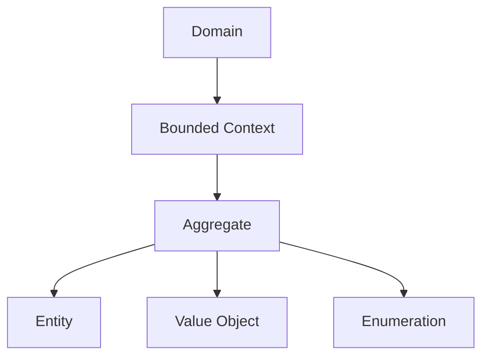
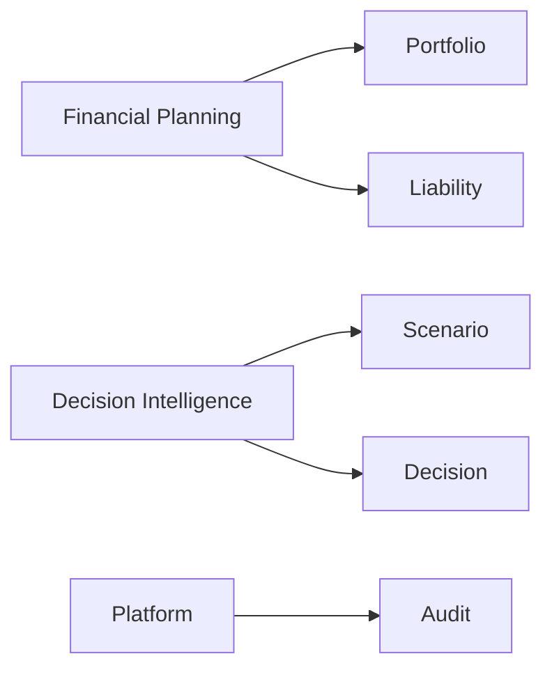
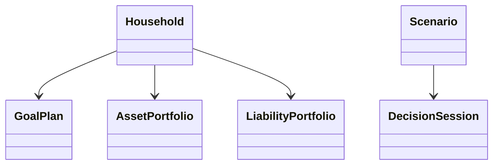
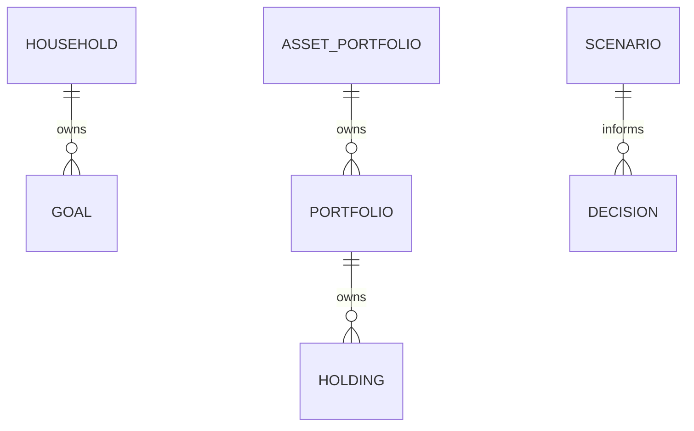
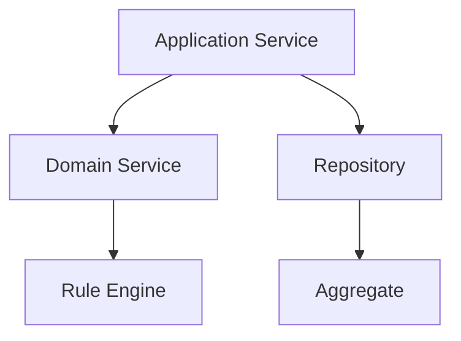
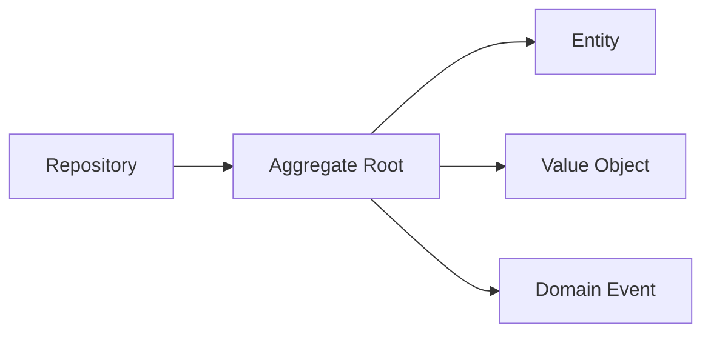

# Domain Model Diagrams and Edge Cases

Source: [Domain Model Catalog](../domain-model-catalog.md)

This split document isolates the visual model relationships and failure conditions from the canonical domain model catalog. It preserves the parent catalog as the source of truth while giving readers a focused view of structure, operational controls, and consistency risk.

## Security

- Authorization is enforced at API, Application Service, Repository, Projection, Report, and DTO boundaries before model data is exposed.
- Permission is enforced at API, Application Service, Repository, Projection, Report, and DTO boundaries before model data is exposed.
- Tenant Isolation is enforced at API, Application Service, Repository, Projection, Report, and DTO boundaries before model data is exposed.
- Household Isolation is enforced at API, Application Service, Repository, Projection, Report, and DTO boundaries before model data is exposed.

## Audit

- History is captured for model changes, command results, domain events, repository writes, projections, and service decisions.
- Version is captured for model changes, command results, domain events, repository writes, projections, and service decisions.
- CorrelationId is captured for model changes, command results, domain events, repository writes, projections, and service decisions.

## Performance

- Scalability uses aggregate boundaries, repository pagination, projection read models, deterministic cache keys, and bounded API responses.
- Consistency uses aggregate boundaries, repository pagination, projection read models, deterministic cache keys, and bounded API responses.
- Caching uses aggregate boundaries, repository pagination, projection read models, deterministic cache keys, and bounded API responses.

## Mermaid

### Overall Domain Model

### Bounded Context Diagram

### Aggregate Relationship

### Entity Relationship

### Service Relationship

### Repository Relationship

## Edge Case Pattern

Domain Model edge cases cover incomplete or conflicting mappings across domain, bounded context, aggregate, root, entity, value object, enumeration, repository, command, domain event, application service, domain service, database, API, DTO, permission, security, audit, lifecycle, version, dependency, and consumer concerns.

## Edge Case Coverage

- Domain Model edge cases 1-50 share the same canonical failure condition: one or more domain model mappings are incomplete or conflicting.
- Each edge case must be evaluated against hierarchy, boundary, ownership, persistence, service, API, DTO, security, audit, lifecycle, dependency, and consumer consistency.
- The parent catalog keeps the numbered edge case inventory; this split file provides the independent checklist used to interpret those repeated cases.
