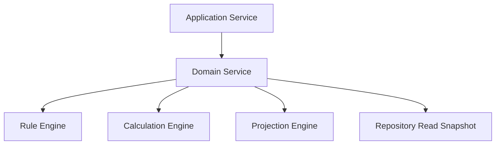
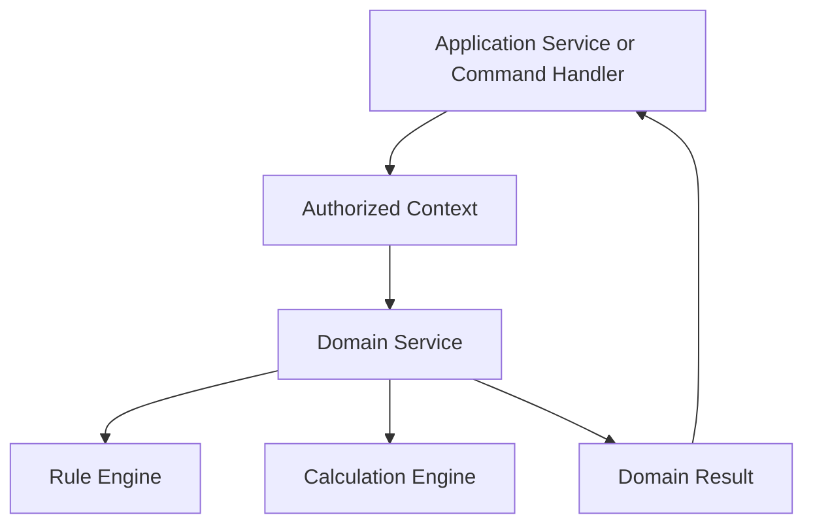
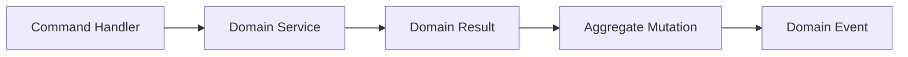
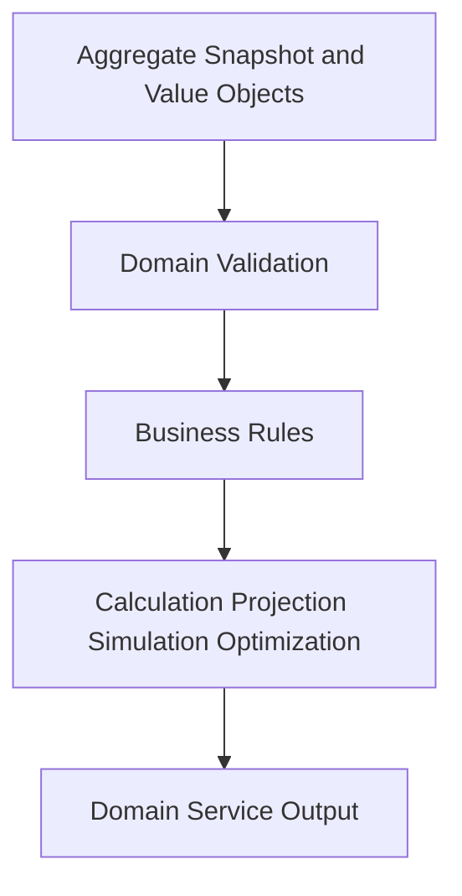
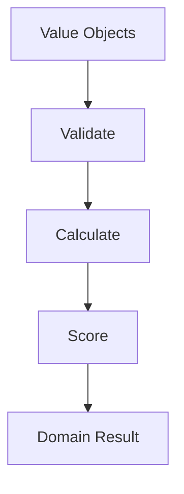
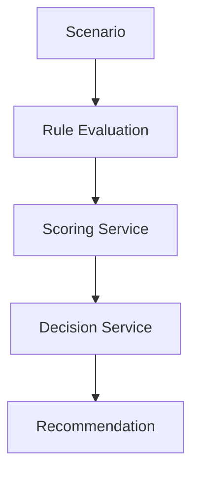
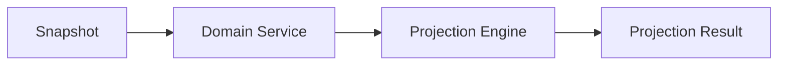
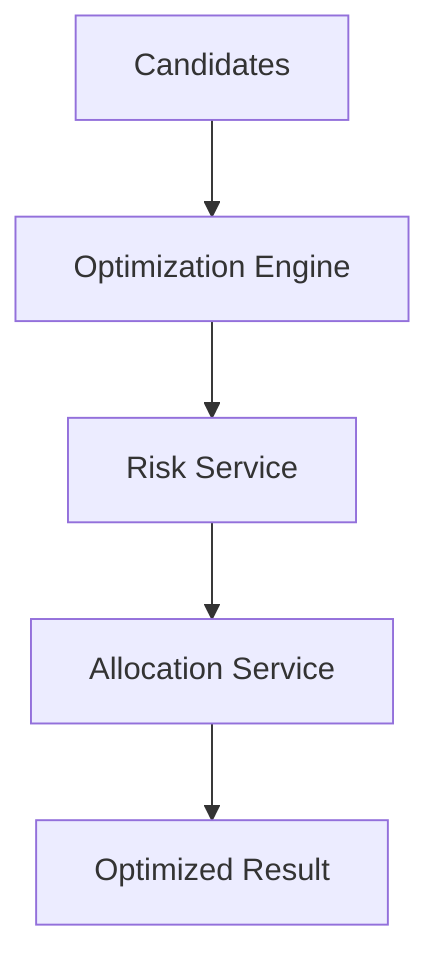

# Domain Service Catalog
## Split Navigation
- [Domain service catalog entries](domain-service/catalog-entries.md)
- [Domain service capability and calculation matrices](domain-service/capability-and-calculation-matrices.md)
- [Domain service matrices and dependencies](domain-service/matrices-and-dependencies.md)
- [Domain service rules and execution flows](domain-service/rules-and-execution-flows.md)
- [Domain service error, security, audit, and performance](domain-service/error-security-audit-and-performance.md)
- [Domain service governance and testing](domain-service/governance-and-testing.md)

# Document Control

Document Name: Domain Service Catalog
Document Path: knowledge/catalog/domain-service-catalog.md
Document Type: Atlas Enterprise Canonical Specification
Version: 1.0
Status: Canonical Specification
Domain: Platform
Bounded Context: Platform
Owner: Project Atlas
Source of Truth: Atlas Domain Service Source of Truth
Last Updated: 2026-07-12

Related Specifications:
- knowledge/aggregate-catalog.md
- knowledge/entity-catalog.md
- knowledge/value-object-catalog.md
- knowledge/enumeration-catalog.md
- knowledge/command-catalog.md
- knowledge/domain-event-catalog.md
- knowledge/repository-catalog.md
- knowledge/application-service-catalog.md
- knowledge/domain-model-catalog.md
- knowledge/system-module-catalog.md
- knowledge/api-governance-framework.md
- knowledge/calculation-engine-framework.md
- knowledge/projection-engine-framework.md
- knowledge/simulation-engine-framework.md
- knowledge/optimization-engine-framework.md
- knowledge/rule-engine-architecture.md
- knowledge/decision-rule-catalog.md
- knowledge/domain-rule-catalog.md
- knowledge/scoring-model.md
- docs/specification/04-DomainModel.md
- docs/database/05-DatabaseDesign.md
- docs/database/06-ERD.md

# Purpose

Domain Service Catalog defines the approved stateless Atlas Domain Services that encapsulate business logic not naturally owned by a single Aggregate. It is the source of truth for Domain Service alignment across Aggregates, Entities, Repositories, Commands, Domain Events, Application Services, Workflows, Decision Engine, Calculation Engine, Optimization Engine, Simulation Engine, Projection Engine, and Rule Engine.

# Scope

- Domain Service
- Pure Domain Service
- Calculation Service
- Validation Service
- Decision Service
- Optimization Service
- Simulation Service
- Projection Service
- Rule Evaluation Service
- Policy Service
- Business Coordinator
- Stateless Service
- Deterministic Service
- Business Coordination
- Cross Aggregate Rule
- Evaluation Service
- Recommendation Service

# Domain Service Definition Standard

Every Domain Service entry uses the following complete Enterprise contract.
- Service Name
- Display Name
- Domain
- Bounded Context
- Module
- Purpose
- Business Meaning
- Description
- Responsibilities
- Non Responsibilities
- Non-Responsibilities
- Inputs
- Input
- Outputs
- Output
- Owned Rules
- Owned Business Rules
- Consumed Rules
- Consumed Value Objects
- Consumed Enumerations
- Consumed Aggregates
- Aggregate Dependencies
- Consumed Entities
- Entity Dependencies
- Repositories
- Repository Dependencies
- Commands
- Command Dependencies
- Domain Events
- Domain Event Dependencies
- Application Services
- Application Service Dependencies
- Rule Engine
- Calculation Engine
- Projection Engine
- Optimization Engine
- Simulation Engine
- Authorization
- Permission
- Validation
- Business Rules
- Transaction Boundary
- Consistency Boundary
- Side Effects
- Idempotency
- Concurrency
- Performance Target
- Performance
- Caching
- Audit
- Error Codes
- Example

# Complete Domain Service Catalog

## DecisionService

Service Name: DecisionService
Display Name: DecisionService
Domain: Decision
Bounded Context: Decision Intelligence
Module: Decision
Purpose: Recommendation orchestration and decision outcome evaluation.
Business Meaning: DecisionService performs deterministic domain logic that coordinates values, rules, and calculations without owning persistence.
Description: DecisionService is stateless, deterministic for identical inputs and versions, and invoked by Application Services, command handlers, workflows, rule evaluation, projection, simulation, or optimization processes.
Responsibilities: Validate domain inputs, apply catalog rules, calculate outcomes, return decision-ready results, and explain blocking reasons.
Non Responsibilities: No independent persistence ownership, no API orchestration, no UI formatting, no transaction commit ownership, and no creation of uncataloged business concepts.
Inputs: Aggregates DecisionSession, Recommendation, Scenario; Entities Decision, Recommendation, Scenario; Value Objects Money, Percentage, RiskScore; Enumerations DecisionStatus, RecommendationPriority, RiskLevel; rule context; calculation assumptions; CorrelationId.
Outputs: Domain result, score, validation result, projection input, optimization candidate, rule outcome, or explanation object.
Owned Rules: Service-specific deterministic rule execution for Decision.
Consumed Rules: Decision Rule Catalog and Domain Rule Catalog entries relevant to Decision.
Consumed Value Objects: Money, Percentage, RiskScore
Consumed Enumerations: DecisionStatus, RecommendationPriority, RiskLevel
Consumed Aggregates: DecisionSession, Recommendation, Scenario
Consumed Entities: Decision, Recommendation, Scenario
Repositories: DecisionRepository, ScenarioRepository
Commands: EvaluateScenario, AcceptRecommendation, RejectRecommendation
Domain Events: ScenarioEvaluated, RecommendationGenerated, DecisionAccepted, DecisionRejected
Application Services: Catalog-aligned Application Services that call DecisionService.
Rule Engine: Used when rule evaluation is required by DecisionService.
Calculation Engine: Used when numeric calculations are required by DecisionService.
Projection Engine: Used when forward-looking projections are required by DecisionService.
Optimization Engine: Used when candidate selection or portfolio optimization is required by DecisionService.
Simulation Engine: Used when scenario paths are simulated by DecisionService.
Authorization: Caller must provide authorized Household, tenant, actor, and command context; service does not bypass Application Service authorization.
Validation: Validate input completeness, value object invariants, enumeration values, aggregate state, and rule version.
Business Rules: Apply only catalog-approved rules and return explicit result state.
Transaction Boundary: Does not own transaction; executes inside caller boundary or read-only calculation boundary.
Consistency Boundary: Does not mutate Aggregate state directly; returns result to owning command handler or Application Service.
Side Effects: None except deterministic result generation; event publication is handled by caller after persistence.
Idempotency: Same input, rule version, formula version, and assumption version produce same result.
Concurrency: Uses immutable input snapshot and caller-provided version information.
Performance Target: p95 under 200 ms for local calculation and p95 under 500 ms for multi-rule evaluation under normal load.
Caching: Cache deterministic read-only results by HouseholdId, input hash, rule version, formula version, and assumption version when permitted.
Audit: Caller records service name, input hash, output hash, rule version, formula version, assumption version, CorrelationId, and CausationId.
Error Codes: DS-ERR-001 through DS-ERR-040 as applicable.
Example: DecisionService consumes Money, Percentage, RiskScore, applies rules, returns a deterministic result, and supports events ScenarioEvaluated, RecommendationGenerated, DecisionAccepted, DecisionRejected.
Domain Service Control 1: DecisionService preserves stateless behavior, deterministic output, aggregate boundary, repository dependency discipline, rule mapping, engine mapping, authorization context, validation, idempotency, concurrency, performance target, caching, audit, and error handling.
Domain Service Control 2: DecisionService preserves stateless behavior, deterministic output, aggregate boundary, repository dependency discipline, rule mapping, engine mapping, authorization context, validation, idempotency, concurrency, performance target, caching, audit, and error handling.
Domain Service Control 3: DecisionService preserves stateless behavior, deterministic output, aggregate boundary, repository dependency discipline, rule mapping, engine mapping, authorization context, validation, idempotency, concurrency, performance target, caching, audit, and error handling.
Domain Service Control 4: DecisionService preserves stateless behavior, deterministic output, aggregate boundary, repository dependency discipline, rule mapping, engine mapping, authorization context, validation, idempotency, concurrency, performance target, caching, audit, and error handling.
Domain Service Control 5: DecisionService preserves stateless behavior, deterministic output, aggregate boundary, repository dependency discipline, rule mapping, engine mapping, authorization context, validation, idempotency, concurrency, performance target, caching, audit, and error handling.
Domain Service Control 6: DecisionService preserves stateless behavior, deterministic output, aggregate boundary, repository dependency discipline, rule mapping, engine mapping, authorization context, validation, idempotency, concurrency, performance target, caching, audit, and error handling.
Domain Service Control 7: DecisionService preserves stateless behavior, deterministic output, aggregate boundary, repository dependency discipline, rule mapping, engine mapping, authorization context, validation, idempotency, concurrency, performance target, caching, audit, and error handling.
Domain Service Control 8: DecisionService preserves stateless behavior, deterministic output, aggregate boundary, repository dependency discipline, rule mapping, engine mapping, authorization context, validation, idempotency, concurrency, performance target, caching, audit, and error handling.
Domain Service Control 9: DecisionService preserves stateless behavior, deterministic output, aggregate boundary, repository dependency discipline, rule mapping, engine mapping, authorization context, validation, idempotency, concurrency, performance target, caching, audit, and error handling.
Domain Service Control 10: DecisionService preserves stateless behavior, deterministic output, aggregate boundary, repository dependency discipline, rule mapping, engine mapping, authorization context, validation, idempotency, concurrency, performance target, caching, audit, and error handling.
Domain Service Control 11: DecisionService preserves stateless behavior, deterministic output, aggregate boundary, repository dependency discipline, rule mapping, engine mapping, authorization context, validation, idempotency, concurrency, performance target, caching, audit, and error handling.
Domain Service Control 12: DecisionService preserves stateless behavior, deterministic output, aggregate boundary, repository dependency discipline, rule mapping, engine mapping, authorization context, validation, idempotency, concurrency, performance target, caching, audit, and error handling.
Domain Service Control 13: DecisionService preserves stateless behavior, deterministic output, aggregate boundary, repository dependency discipline, rule mapping, engine mapping, authorization context, validation, idempotency, concurrency, performance target, caching, audit, and error handling.
Domain Service Control 14: DecisionService preserves stateless behavior, deterministic output, aggregate boundary, repository dependency discipline, rule mapping, engine mapping, authorization context, validation, idempotency, concurrency, performance target, caching, audit, and error handling.
Domain Service Control 15: DecisionService preserves stateless behavior, deterministic output, aggregate boundary, repository dependency discipline, rule mapping, engine mapping, authorization context, validation, idempotency, concurrency, performance target, caching, audit, and error handling.
Domain Service Control 16: DecisionService preserves stateless behavior, deterministic output, aggregate boundary, repository dependency discipline, rule mapping, engine mapping, authorization context, validation, idempotency, concurrency, performance target, caching, audit, and error handling.
Domain Service Control 17: DecisionService preserves stateless behavior, deterministic output, aggregate boundary, repository dependency discipline, rule mapping, engine mapping, authorization context, validation, idempotency, concurrency, performance target, caching, audit, and error handling.
Domain Service Control 18: DecisionService preserves stateless behavior, deterministic output, aggregate boundary, repository dependency discipline, rule mapping, engine mapping, authorization context, validation, idempotency, concurrency, performance target, caching, audit, and error handling.
Domain Service Control 19: DecisionService preserves stateless behavior, deterministic output, aggregate boundary, repository dependency discipline, rule mapping, engine mapping, authorization context, validation, idempotency, concurrency, performance target, caching, audit, and error handling.
Domain Service Control 20: DecisionService preserves stateless behavior, deterministic output, aggregate boundary, repository dependency discipline, rule mapping, engine mapping, authorization context, validation, idempotency, concurrency, performance target, caching, audit, and error handling.
Domain Service Control 21: DecisionService preserves stateless behavior, deterministic output, aggregate boundary, repository dependency discipline, rule mapping, engine mapping, authorization context, validation, idempotency, concurrency, performance target, caching, audit, and error handling.
Domain Service Control 22: DecisionService preserves stateless behavior, deterministic output, aggregate boundary, repository dependency discipline, rule mapping, engine mapping, authorization context, validation, idempotency, concurrency, performance target, caching, audit, and error handling.
Domain Service Control 23: DecisionService preserves stateless behavior, deterministic output, aggregate boundary, repository dependency discipline, rule mapping, engine mapping, authorization context, validation, idempotency, concurrency, performance target, caching, audit, and error handling.
Domain Service Control 24: DecisionService preserves stateless behavior, deterministic output, aggregate boundary, repository dependency discipline, rule mapping, engine mapping, authorization context, validation, idempotency, concurrency, performance target, caching, audit, and error handling.
Domain Service Control 25: DecisionService preserves stateless behavior, deterministic output, aggregate boundary, repository dependency discipline, rule mapping, engine mapping, authorization context, validation, idempotency, concurrency, performance target, caching, audit, and error handling.
Domain Service Control 26: DecisionService preserves stateless behavior, deterministic output, aggregate boundary, repository dependency discipline, rule mapping, engine mapping, authorization context, validation, idempotency, concurrency, performance target, caching, audit, and error handling.
Domain Service Control 27: DecisionService preserves stateless behavior, deterministic output, aggregate boundary, repository dependency discipline, rule mapping, engine mapping, authorization context, validation, idempotency, concurrency, performance target, caching, audit, and error handling.
Domain Service Control 28: DecisionService preserves stateless behavior, deterministic output, aggregate boundary, repository dependency discipline, rule mapping, engine mapping, authorization context, validation, idempotency, concurrency, performance target, caching, audit, and error handling.
Domain Service Control 29: DecisionService preserves stateless behavior, deterministic output, aggregate boundary, repository dependency discipline, rule mapping, engine mapping, authorization context, validation, idempotency, concurrency, performance target, caching, audit, and error handling.
Domain Service Control 30: DecisionService preserves stateless behavior, deterministic output, aggregate boundary, repository dependency discipline, rule mapping, engine mapping, authorization context, validation, idempotency, concurrency, performance target, caching, audit, and error handling.
Domain Service Control 31: DecisionService preserves stateless behavior, deterministic output, aggregate boundary, repository dependency discipline, rule mapping, engine mapping, authorization context, validation, idempotency, concurrency, performance target, caching, audit, and error handling.
Domain Service Control 32: DecisionService preserves stateless behavior, deterministic output, aggregate boundary, repository dependency discipline, rule mapping, engine mapping, authorization context, validation, idempotency, concurrency, performance target, caching, audit, and error handling.
Domain Service Control 33: DecisionService preserves stateless behavior, deterministic output, aggregate boundary, repository dependency discipline, rule mapping, engine mapping, authorization context, validation, idempotency, concurrency, performance target, caching, audit, and error handling.
Domain Service Control 34: DecisionService preserves stateless behavior, deterministic output, aggregate boundary, repository dependency discipline, rule mapping, engine mapping, authorization context, validation, idempotency, concurrency, performance target, caching, audit, and error handling.
Domain Service Control 35: DecisionService preserves stateless behavior, deterministic output, aggregate boundary, repository dependency discipline, rule mapping, engine mapping, authorization context, validation, idempotency, concurrency, performance target, caching, audit, and error handling.
Domain Service Control 36: DecisionService preserves stateless behavior, deterministic output, aggregate boundary, repository dependency discipline, rule mapping, engine mapping, authorization context, validation, idempotency, concurrency, performance target, caching, audit, and error handling.
Domain Service Control 37: DecisionService preserves stateless behavior, deterministic output, aggregate boundary, repository dependency discipline, rule mapping, engine mapping, authorization context, validation, idempotency, concurrency, performance target, caching, audit, and error handling.
Domain Service Control 38: DecisionService preserves stateless behavior, deterministic output, aggregate boundary, repository dependency discipline, rule mapping, engine mapping, authorization context, validation, idempotency, concurrency, performance target, caching, audit, and error handling.
Domain Service Control 39: DecisionService preserves stateless behavior, deterministic output, aggregate boundary, repository dependency discipline, rule mapping, engine mapping, authorization context, validation, idempotency, concurrency, performance target, caching, audit, and error handling.
Domain Service Control 40: DecisionService preserves stateless behavior, deterministic output, aggregate boundary, repository dependency discipline, rule mapping, engine mapping, authorization context, validation, idempotency, concurrency, performance target, caching, audit, and error handling.
Domain Service Control 41: DecisionService preserves stateless behavior, deterministic output, aggregate boundary, repository dependency discipline, rule mapping, engine mapping, authorization context, validation, idempotency, concurrency, performance target, caching, audit, and error handling.
Domain Service Control 42: DecisionService preserves stateless behavior, deterministic output, aggregate boundary, repository dependency discipline, rule mapping, engine mapping, authorization context, validation, idempotency, concurrency, performance target, caching, audit, and error handling.
Domain Service Control 43: DecisionService preserves stateless behavior, deterministic output, aggregate boundary, repository dependency discipline, rule mapping, engine mapping, authorization context, validation, idempotency, concurrency, performance target, caching, audit, and error handling.
Domain Service Control 44: DecisionService preserves stateless behavior, deterministic output, aggregate boundary, repository dependency discipline, rule mapping, engine mapping, authorization context, validation, idempotency, concurrency, performance target, caching, audit, and error handling.
Domain Service Control 45: DecisionService preserves stateless behavior, deterministic output, aggregate boundary, repository dependency discipline, rule mapping, engine mapping, authorization context, validation, idempotency, concurrency, performance target, caching, audit, and error handling.
Domain Service Control 46: DecisionService preserves stateless behavior, deterministic output, aggregate boundary, repository dependency discipline, rule mapping, engine mapping, authorization context, validation, idempotency, concurrency, performance target, caching, audit, and error handling.
Domain Service Control 47: DecisionService preserves stateless behavior, deterministic output, aggregate boundary, repository dependency discipline, rule mapping, engine mapping, authorization context, validation, idempotency, concurrency, performance target, caching, audit, and error handling.
Domain Service Control 48: DecisionService preserves stateless behavior, deterministic output, aggregate boundary, repository dependency discipline, rule mapping, engine mapping, authorization context, validation, idempotency, concurrency, performance target, caching, audit, and error handling.
Domain Service Control 49: DecisionService preserves stateless behavior, deterministic output, aggregate boundary, repository dependency discipline, rule mapping, engine mapping, authorization context, validation, idempotency, concurrency, performance target, caching, audit, and error handling.
Domain Service Control 50: DecisionService preserves stateless behavior, deterministic output, aggregate boundary, repository dependency discipline, rule mapping, engine mapping, authorization context, validation, idempotency, concurrency, performance target, caching, audit, and error handling.
Domain Service Control 51: DecisionService preserves stateless behavior, deterministic output, aggregate boundary, repository dependency discipline, rule mapping, engine mapping, authorization context, validation, idempotency, concurrency, performance target, caching, audit, and error handling.
Domain Service Control 52: DecisionService preserves stateless behavior, deterministic output, aggregate boundary, repository dependency discipline, rule mapping, engine mapping, authorization context, validation, idempotency, concurrency, performance target, caching, audit, and error handling.
Domain Service Control 53: DecisionService preserves stateless behavior, deterministic output, aggregate boundary, repository dependency discipline, rule mapping, engine mapping, authorization context, validation, idempotency, concurrency, performance target, caching, audit, and error handling.
Domain Service Control 54: DecisionService preserves stateless behavior, deterministic output, aggregate boundary, repository dependency discipline, rule mapping, engine mapping, authorization context, validation, idempotency, concurrency, performance target, caching, audit, and error handling.
Domain Service Control 55: DecisionService preserves stateless behavior, deterministic output, aggregate boundary, repository dependency discipline, rule mapping, engine mapping, authorization context, validation, idempotency, concurrency, performance target, caching, audit, and error handling.
Domain Service Control 56: DecisionService preserves stateless behavior, deterministic output, aggregate boundary, repository dependency discipline, rule mapping, engine mapping, authorization context, validation, idempotency, concurrency, performance target, caching, audit, and error handling.
Domain Service Control 57: DecisionService preserves stateless behavior, deterministic output, aggregate boundary, repository dependency discipline, rule mapping, engine mapping, authorization context, validation, idempotency, concurrency, performance target, caching, audit, and error handling.
Domain Service Control 58: DecisionService preserves stateless behavior, deterministic output, aggregate boundary, repository dependency discipline, rule mapping, engine mapping, authorization context, validation, idempotency, concurrency, performance target, caching, audit, and error handling.
Domain Service Control 59: DecisionService preserves stateless behavior, deterministic output, aggregate boundary, repository dependency discipline, rule mapping, engine mapping, authorization context, validation, idempotency, concurrency, performance target, caching, audit, and error handling.
Domain Service Control 60: DecisionService preserves stateless behavior, deterministic output, aggregate boundary, repository dependency discipline, rule mapping, engine mapping, authorization context, validation, idempotency, concurrency, performance target, caching, audit, and error handling.
Domain Service Control 61: DecisionService preserves stateless behavior, deterministic output, aggregate boundary, repository dependency discipline, rule mapping, engine mapping, authorization context, validation, idempotency, concurrency, performance target, caching, audit, and error handling.
Domain Service Control 62: DecisionService preserves stateless behavior, deterministic output, aggregate boundary, repository dependency discipline, rule mapping, engine mapping, authorization context, validation, idempotency, concurrency, performance target, caching, audit, and error handling.
Domain Service Control 63: DecisionService preserves stateless behavior, deterministic output, aggregate boundary, repository dependency discipline, rule mapping, engine mapping, authorization context, validation, idempotency, concurrency, performance target, caching, audit, and error handling.
Domain Service Control 64: DecisionService preserves stateless behavior, deterministic output, aggregate boundary, repository dependency discipline, rule mapping, engine mapping, authorization context, validation, idempotency, concurrency, performance target, caching, audit, and error handling.
Domain Service Control 65: DecisionService preserves stateless behavior, deterministic output, aggregate boundary, repository dependency discipline, rule mapping, engine mapping, authorization context, validation, idempotency, concurrency, performance target, caching, audit, and error handling.
Domain Service Control 66: DecisionService preserves stateless behavior, deterministic output, aggregate boundary, repository dependency discipline, rule mapping, engine mapping, authorization context, validation, idempotency, concurrency, performance target, caching, audit, and error handling.
Domain Service Control 67: DecisionService preserves stateless behavior, deterministic output, aggregate boundary, repository dependency discipline, rule mapping, engine mapping, authorization context, validation, idempotency, concurrency, performance target, caching, audit, and error handling.
Domain Service Control 68: DecisionService preserves stateless behavior, deterministic output, aggregate boundary, repository dependency discipline, rule mapping, engine mapping, authorization context, validation, idempotency, concurrency, performance target, caching, audit, and error handling.
Domain Service Control 69: DecisionService preserves stateless behavior, deterministic output, aggregate boundary, repository dependency discipline, rule mapping, engine mapping, authorization context, validation, idempotency, concurrency, performance target, caching, audit, and error handling.
Domain Service Control 70: DecisionService preserves stateless behavior, deterministic output, aggregate boundary, repository dependency discipline, rule mapping, engine mapping, authorization context, validation, idempotency, concurrency, performance target, caching, audit, and error handling.
Domain Service Control 71: DecisionService preserves stateless behavior, deterministic output, aggregate boundary, repository dependency discipline, rule mapping, engine mapping, authorization context, validation, idempotency, concurrency, performance target, caching, audit, and error handling.
Domain Service Control 72: DecisionService preserves stateless behavior, deterministic output, aggregate boundary, repository dependency discipline, rule mapping, engine mapping, authorization context, validation, idempotency, concurrency, performance target, caching, audit, and error handling.
Domain Service Control 73: DecisionService preserves stateless behavior, deterministic output, aggregate boundary, repository dependency discipline, rule mapping, engine mapping, authorization context, validation, idempotency, concurrency, performance target, caching, audit, and error handling.
Domain Service Control 74: DecisionService preserves stateless behavior, deterministic output, aggregate boundary, repository dependency discipline, rule mapping, engine mapping, authorization context, validation, idempotency, concurrency, performance target, caching, audit, and error handling.
Domain Service Control 75: DecisionService preserves stateless behavior, deterministic output, aggregate boundary, repository dependency discipline, rule mapping, engine mapping, authorization context, validation, idempotency, concurrency, performance target, caching, audit, and error handling.
Domain Service Control 76: DecisionService preserves stateless behavior, deterministic output, aggregate boundary, repository dependency discipline, rule mapping, engine mapping, authorization context, validation, idempotency, concurrency, performance target, caching, audit, and error handling.
Domain Service Control 77: DecisionService preserves stateless behavior, deterministic output, aggregate boundary, repository dependency discipline, rule mapping, engine mapping, authorization context, validation, idempotency, concurrency, performance target, caching, audit, and error handling.
Domain Service Control 78: DecisionService preserves stateless behavior, deterministic output, aggregate boundary, repository dependency discipline, rule mapping, engine mapping, authorization context, validation, idempotency, concurrency, performance target, caching, audit, and error handling.
Domain Service Control 79: DecisionService preserves stateless behavior, deterministic output, aggregate boundary, repository dependency discipline, rule mapping, engine mapping, authorization context, validation, idempotency, concurrency, performance target, caching, audit, and error handling.
Domain Service Control 80: DecisionService preserves stateless behavior, deterministic output, aggregate boundary, repository dependency discipline, rule mapping, engine mapping, authorization context, validation, idempotency, concurrency, performance target, caching, audit, and error handling.
Domain Service Control 81: DecisionService preserves stateless behavior, deterministic output, aggregate boundary, repository dependency discipline, rule mapping, engine mapping, authorization context, validation, idempotency, concurrency, performance target, caching, audit, and error handling.
Domain Service Control 82: DecisionService preserves stateless behavior, deterministic output, aggregate boundary, repository dependency discipline, rule mapping, engine mapping, authorization context, validation, idempotency, concurrency, performance target, caching, audit, and error handling.
Domain Service Control 83: DecisionService preserves stateless behavior, deterministic output, aggregate boundary, repository dependency discipline, rule mapping, engine mapping, authorization context, validation, idempotency, concurrency, performance target, caching, audit, and error handling.
Domain Service Control 84: DecisionService preserves stateless behavior, deterministic output, aggregate boundary, repository dependency discipline, rule mapping, engine mapping, authorization context, validation, idempotency, concurrency, performance target, caching, audit, and error handling.
Domain Service Control 85: DecisionService preserves stateless behavior, deterministic output, aggregate boundary, repository dependency discipline, rule mapping, engine mapping, authorization context, validation, idempotency, concurrency, performance target, caching, audit, and error handling.
Domain Service Control 86: DecisionService preserves stateless behavior, deterministic output, aggregate boundary, repository dependency discipline, rule mapping, engine mapping, authorization context, validation, idempotency, concurrency, performance target, caching, audit, and error handling.
Domain Service Control 87: DecisionService preserves stateless behavior, deterministic output, aggregate boundary, repository dependency discipline, rule mapping, engine mapping, authorization context, validation, idempotency, concurrency, performance target, caching, audit, and error handling.
Domain Service Control 88: DecisionService preserves stateless behavior, deterministic output, aggregate boundary, repository dependency discipline, rule mapping, engine mapping, authorization context, validation, idempotency, concurrency, performance target, caching, audit, and error handling.
Domain Service Control 89: DecisionService preserves stateless behavior, deterministic output, aggregate boundary, repository dependency discipline, rule mapping, engine mapping, authorization context, validation, idempotency, concurrency, performance target, caching, audit, and error handling.
Domain Service Control 90: DecisionService preserves stateless behavior, deterministic output, aggregate boundary, repository dependency discipline, rule mapping, engine mapping, authorization context, validation, idempotency, concurrency, performance target, caching, audit, and error handling.
Domain Service Control 91: DecisionService preserves stateless behavior, deterministic output, aggregate boundary, repository dependency discipline, rule mapping, engine mapping, authorization context, validation, idempotency, concurrency, performance target, caching, audit, and error handling.
Domain Service Control 92: DecisionService preserves stateless behavior, deterministic output, aggregate boundary, repository dependency discipline, rule mapping, engine mapping, authorization context, validation, idempotency, concurrency, performance target, caching, audit, and error handling.
Domain Service Control 93: DecisionService preserves stateless behavior, deterministic output, aggregate boundary, repository dependency discipline, rule mapping, engine mapping, authorization context, validation, idempotency, concurrency, performance target, caching, audit, and error handling.
Domain Service Control 94: DecisionService preserves stateless behavior, deterministic output, aggregate boundary, repository dependency discipline, rule mapping, engine mapping, authorization context, validation, idempotency, concurrency, performance target, caching, audit, and error handling.
Domain Service Control 95: DecisionService preserves stateless behavior, deterministic output, aggregate boundary, repository dependency discipline, rule mapping, engine mapping, authorization context, validation, idempotency, concurrency, performance target, caching, audit, and error handling.
Domain Service Control 96: DecisionService preserves stateless behavior, deterministic output, aggregate boundary, repository dependency discipline, rule mapping, engine mapping, authorization context, validation, idempotency, concurrency, performance target, caching, audit, and error handling.
Domain Service Control 97: DecisionService preserves stateless behavior, deterministic output, aggregate boundary, repository dependency discipline, rule mapping, engine mapping, authorization context, validation, idempotency, concurrency, performance target, caching, audit, and error handling.
Domain Service Control 98: DecisionService preserves stateless behavior, deterministic output, aggregate boundary, repository dependency discipline, rule mapping, engine mapping, authorization context, validation, idempotency, concurrency, performance target, caching, audit, and error handling.
Domain Service Control 99: DecisionService preserves stateless behavior, deterministic output, aggregate boundary, repository dependency discipline, rule mapping, engine mapping, authorization context, validation, idempotency, concurrency, performance target, caching, audit, and error handling.
Domain Service Control 100: DecisionService preserves stateless behavior, deterministic output, aggregate boundary, repository dependency discipline, rule mapping, engine mapping, authorization context, validation, idempotency, concurrency, performance target, caching, audit, and error handling.
Domain Service Control 101: DecisionService preserves stateless behavior, deterministic output, aggregate boundary, repository dependency discipline, rule mapping, engine mapping, authorization context, validation, idempotency, concurrency, performance target, caching, audit, and error handling.
Domain Service Control 102: DecisionService preserves stateless behavior, deterministic output, aggregate boundary, repository dependency discipline, rule mapping, engine mapping, authorization context, validation, idempotency, concurrency, performance target, caching, audit, and error handling.
Domain Service Control 103: DecisionService preserves stateless behavior, deterministic output, aggregate boundary, repository dependency discipline, rule mapping, engine mapping, authorization context, validation, idempotency, concurrency, performance target, caching, audit, and error handling.
Domain Service Control 104: DecisionService preserves stateless behavior, deterministic output, aggregate boundary, repository dependency discipline, rule mapping, engine mapping, authorization context, validation, idempotency, concurrency, performance target, caching, audit, and error handling.
Domain Service Control 105: DecisionService preserves stateless behavior, deterministic output, aggregate boundary, repository dependency discipline, rule mapping, engine mapping, authorization context, validation, idempotency, concurrency, performance target, caching, audit, and error handling.
Domain Service Control 106: DecisionService preserves stateless behavior, deterministic output, aggregate boundary, repository dependency discipline, rule mapping, engine mapping, authorization context, validation, idempotency, concurrency, performance target, caching, audit, and error handling.
Domain Service Control 107: DecisionService preserves stateless behavior, deterministic output, aggregate boundary, repository dependency discipline, rule mapping, engine mapping, authorization context, validation, idempotency, concurrency, performance target, caching, audit, and error handling.
Domain Service Control 108: DecisionService preserves stateless behavior, deterministic output, aggregate boundary, repository dependency discipline, rule mapping, engine mapping, authorization context, validation, idempotency, concurrency, performance target, caching, audit, and error handling.
Domain Service Control 109: DecisionService preserves stateless behavior, deterministic output, aggregate boundary, repository dependency discipline, rule mapping, engine mapping, authorization context, validation, idempotency, concurrency, performance target, caching, audit, and error handling.
Domain Service Control 110: DecisionService preserves stateless behavior, deterministic output, aggregate boundary, repository dependency discipline, rule mapping, engine mapping, authorization context, validation, idempotency, concurrency, performance target, caching, audit, and error handling.
Domain Service Control 111: DecisionService preserves stateless behavior, deterministic output, aggregate boundary, repository dependency discipline, rule mapping, engine mapping, authorization context, validation, idempotency, concurrency, performance target, caching, audit, and error handling.
Domain Service Control 112: DecisionService preserves stateless behavior, deterministic output, aggregate boundary, repository dependency discipline, rule mapping, engine mapping, authorization context, validation, idempotency, concurrency, performance target, caching, audit, and error handling.
Domain Service Control 113: DecisionService preserves stateless behavior, deterministic output, aggregate boundary, repository dependency discipline, rule mapping, engine mapping, authorization context, validation, idempotency, concurrency, performance target, caching, audit, and error handling.
Domain Service Control 114: DecisionService preserves stateless behavior, deterministic output, aggregate boundary, repository dependency discipline, rule mapping, engine mapping, authorization context, validation, idempotency, concurrency, performance target, caching, audit, and error handling.
Domain Service Control 115: DecisionService preserves stateless behavior, deterministic output, aggregate boundary, repository dependency discipline, rule mapping, engine mapping, authorization context, validation, idempotency, concurrency, performance target, caching, audit, and error handling.
Domain Service Control 116: DecisionService preserves stateless behavior, deterministic output, aggregate boundary, repository dependency discipline, rule mapping, engine mapping, authorization context, validation, idempotency, concurrency, performance target, caching, audit, and error handling.
Domain Service Control 117: DecisionService preserves stateless behavior, deterministic output, aggregate boundary, repository dependency discipline, rule mapping, engine mapping, authorization context, validation, idempotency, concurrency, performance target, caching, audit, and error handling.
Domain Service Control 118: DecisionService preserves stateless behavior, deterministic output, aggregate boundary, repository dependency discipline, rule mapping, engine mapping, authorization context, validation, idempotency, concurrency, performance target, caching, audit, and error handling.
Domain Service Control 119: DecisionService preserves stateless behavior, deterministic output, aggregate boundary, repository dependency discipline, rule mapping, engine mapping, authorization context, validation, idempotency, concurrency, performance target, caching, audit, and error handling.
Domain Service Control 120: DecisionService preserves stateless behavior, deterministic output, aggregate boundary, repository dependency discipline, rule mapping, engine mapping, authorization context, validation, idempotency, concurrency, performance target, caching, audit, and error handling.

## CashFlowService

Service Name: CashFlowService
Display Name: CashFlowService
Domain: Cash Flow
Bounded Context: Financial Planning
Module: CashFlow
Purpose: Cash flow calculation and classification.
Business Meaning: CashFlowService performs deterministic domain logic that coordinates values, rules, and calculations without owning persistence.
Description: CashFlowService is stateless, deterministic for identical inputs and versions, and invoked by Application Services, command handlers, workflows, rule evaluation, projection, simulation, or optimization processes.
Responsibilities: Validate domain inputs, apply catalog rules, calculate outcomes, return decision-ready results, and explain blocking reasons.
Non Responsibilities: No independent persistence ownership, no API orchestration, no UI formatting, no transaction commit ownership, and no creation of uncataloged business concepts.
Inputs: Aggregates Household, GoalPlan, Loan, Policy; Entities Household, Goal, Mortgage, Policy; Value Objects Money, CashFlowItem, DateRange; Enumerations CurrencyCode; rule context; calculation assumptions; CorrelationId.
Outputs: Domain result, score, validation result, projection input, optimization candidate, rule outcome, or explanation object.
Owned Rules: Service-specific deterministic rule execution for Cash Flow.
Consumed Rules: Decision Rule Catalog and Domain Rule Catalog entries relevant to Cash Flow.
Consumed Value Objects: Money, CashFlowItem, DateRange
Consumed Enumerations: CurrencyCode
Consumed Aggregates: Household, GoalPlan, Loan, Policy
Consumed Entities: Household, Goal, Mortgage, Policy
Repositories: HouseholdRepository, LoanRepository
Commands: RecordIncome, RecordExpense, RecordLoanPayment, PayPremium
Domain Events: SalaryReceived, BonusReceived, ExpenseRecorded, PassiveIncomeReceived, LoanPaymentMade, PremiumPaid
Application Services: Catalog-aligned Application Services that call CashFlowService.
Rule Engine: Used when rule evaluation is required by CashFlowService.
Calculation Engine: Used when numeric calculations are required by CashFlowService.
Projection Engine: Used when forward-looking projections are required by CashFlowService.
Optimization Engine: Used when candidate selection or portfolio optimization is required by CashFlowService.
Simulation Engine: Used when scenario paths are simulated by CashFlowService.
Authorization: Caller must provide authorized Household, tenant, actor, and command context; service does not bypass Application Service authorization.
Validation: Validate input completeness, value object invariants, enumeration values, aggregate state, and rule version.
Business Rules: Apply only catalog-approved rules and return explicit result state.
Transaction Boundary: Does not own transaction; executes inside caller boundary or read-only calculation boundary.
Consistency Boundary: Does not mutate Aggregate state directly; returns result to owning command handler or Application Service.
Side Effects: None except deterministic result generation; event publication is handled by caller after persistence.
Idempotency: Same input, rule version, formula version, and assumption version produce same result.
Concurrency: Uses immutable input snapshot and caller-provided version information.
Performance Target: p95 under 200 ms for local calculation and p95 under 500 ms for multi-rule evaluation under normal load.
Caching: Cache deterministic read-only results by HouseholdId, input hash, rule version, formula version, and assumption version when permitted.
Audit: Caller records service name, input hash, output hash, rule version, formula version, assumption version, CorrelationId, and CausationId.
Error Codes: DS-ERR-001 through DS-ERR-040 as applicable.
Example: CashFlowService consumes Money, CashFlowItem, DateRange, applies rules, returns a deterministic result, and supports events SalaryReceived, BonusReceived, ExpenseRecorded, PassiveIncomeReceived, LoanPaymentMade, PremiumPaid.
Domain Service Control 1: CashFlowService preserves stateless behavior, deterministic output, aggregate boundary, repository dependency discipline, rule mapping, engine mapping, authorization context, validation, idempotency, concurrency, performance target, caching, audit, and error handling.
Domain Service Control 2: CashFlowService preserves stateless behavior, deterministic output, aggregate boundary, repository dependency discipline, rule mapping, engine mapping, authorization context, validation, idempotency, concurrency, performance target, caching, audit, and error handling.
Domain Service Control 3: CashFlowService preserves stateless behavior, deterministic output, aggregate boundary, repository dependency discipline, rule mapping, engine mapping, authorization context, validation, idempotency, concurrency, performance target, caching, audit, and error handling.
Domain Service Control 4: CashFlowService preserves stateless behavior, deterministic output, aggregate boundary, repository dependency discipline, rule mapping, engine mapping, authorization context, validation, idempotency, concurrency, performance target, caching, audit, and error handling.
Domain Service Control 5: CashFlowService preserves stateless behavior, deterministic output, aggregate boundary, repository dependency discipline, rule mapping, engine mapping, authorization context, validation, idempotency, concurrency, performance target, caching, audit, and error handling.
Domain Service Control 6: CashFlowService preserves stateless behavior, deterministic output, aggregate boundary, repository dependency discipline, rule mapping, engine mapping, authorization context, validation, idempotency, concurrency, performance target, caching, audit, and error handling.
Domain Service Control 7: CashFlowService preserves stateless behavior, deterministic output, aggregate boundary, repository dependency discipline, rule mapping, engine mapping, authorization context, validation, idempotency, concurrency, performance target, caching, audit, and error handling.
Domain Service Control 8: CashFlowService preserves stateless behavior, deterministic output, aggregate boundary, repository dependency discipline, rule mapping, engine mapping, authorization context, validation, idempotency, concurrency, performance target, caching, audit, and error handling.
Domain Service Control 9: CashFlowService preserves stateless behavior, deterministic output, aggregate boundary, repository dependency discipline, rule mapping, engine mapping, authorization context, validation, idempotency, concurrency, performance target, caching, audit, and error handling.
Domain Service Control 10: CashFlowService preserves stateless behavior, deterministic output, aggregate boundary, repository dependency discipline, rule mapping, engine mapping, authorization context, validation, idempotency, concurrency, performance target, caching, audit, and error handling.
Domain Service Control 11: CashFlowService preserves stateless behavior, deterministic output, aggregate boundary, repository dependency discipline, rule mapping, engine mapping, authorization context, validation, idempotency, concurrency, performance target, caching, audit, and error handling.
Domain Service Control 12: CashFlowService preserves stateless behavior, deterministic output, aggregate boundary, repository dependency discipline, rule mapping, engine mapping, authorization context, validation, idempotency, concurrency, performance target, caching, audit, and error handling.
Domain Service Control 13: CashFlowService preserves stateless behavior, deterministic output, aggregate boundary, repository dependency discipline, rule mapping, engine mapping, authorization context, validation, idempotency, concurrency, performance target, caching, audit, and error handling.
Domain Service Control 14: CashFlowService preserves stateless behavior, deterministic output, aggregate boundary, repository dependency discipline, rule mapping, engine mapping, authorization context, validation, idempotency, concurrency, performance target, caching, audit, and error handling.
Domain Service Control 15: CashFlowService preserves stateless behavior, deterministic output, aggregate boundary, repository dependency discipline, rule mapping, engine mapping, authorization context, validation, idempotency, concurrency, performance target, caching, audit, and error handling.
Domain Service Control 16: CashFlowService preserves stateless behavior, deterministic output, aggregate boundary, repository dependency discipline, rule mapping, engine mapping, authorization context, validation, idempotency, concurrency, performance target, caching, audit, and error handling.
Domain Service Control 17: CashFlowService preserves stateless behavior, deterministic output, aggregate boundary, repository dependency discipline, rule mapping, engine mapping, authorization context, validation, idempotency, concurrency, performance target, caching, audit, and error handling.
Domain Service Control 18: CashFlowService preserves stateless behavior, deterministic output, aggregate boundary, repository dependency discipline, rule mapping, engine mapping, authorization context, validation, idempotency, concurrency, performance target, caching, audit, and error handling.
Domain Service Control 19: CashFlowService preserves stateless behavior, deterministic output, aggregate boundary, repository dependency discipline, rule mapping, engine mapping, authorization context, validation, idempotency, concurrency, performance target, caching, audit, and error handling.
Domain Service Control 20: CashFlowService preserves stateless behavior, deterministic output, aggregate boundary, repository dependency discipline, rule mapping, engine mapping, authorization context, validation, idempotency, concurrency, performance target, caching, audit, and error handling.
Domain Service Control 21: CashFlowService preserves stateless behavior, deterministic output, aggregate boundary, repository dependency discipline, rule mapping, engine mapping, authorization context, validation, idempotency, concurrency, performance target, caching, audit, and error handling.
Domain Service Control 22: CashFlowService preserves stateless behavior, deterministic output, aggregate boundary, repository dependency discipline, rule mapping, engine mapping, authorization context, validation, idempotency, concurrency, performance target, caching, audit, and error handling.
Domain Service Control 23: CashFlowService preserves stateless behavior, deterministic output, aggregate boundary, repository dependency discipline, rule mapping, engine mapping, authorization context, validation, idempotency, concurrency, performance target, caching, audit, and error handling.
Domain Service Control 24: CashFlowService preserves stateless behavior, deterministic output, aggregate boundary, repository dependency discipline, rule mapping, engine mapping, authorization context, validation, idempotency, concurrency, performance target, caching, audit, and error handling.
Domain Service Control 25: CashFlowService preserves stateless behavior, deterministic output, aggregate boundary, repository dependency discipline, rule mapping, engine mapping, authorization context, validation, idempotency, concurrency, performance target, caching, audit, and error handling.
Domain Service Control 26: CashFlowService preserves stateless behavior, deterministic output, aggregate boundary, repository dependency discipline, rule mapping, engine mapping, authorization context, validation, idempotency, concurrency, performance target, caching, audit, and error handling.
Domain Service Control 27: CashFlowService preserves stateless behavior, deterministic output, aggregate boundary, repository dependency discipline, rule mapping, engine mapping, authorization context, validation, idempotency, concurrency, performance target, caching, audit, and error handling.
Domain Service Control 28: CashFlowService preserves stateless behavior, deterministic output, aggregate boundary, repository dependency discipline, rule mapping, engine mapping, authorization context, validation, idempotency, concurrency, performance target, caching, audit, and error handling.
Domain Service Control 29: CashFlowService preserves stateless behavior, deterministic output, aggregate boundary, repository dependency discipline, rule mapping, engine mapping, authorization context, validation, idempotency, concurrency, performance target, caching, audit, and error handling.
Domain Service Control 30: CashFlowService preserves stateless behavior, deterministic output, aggregate boundary, repository dependency discipline, rule mapping, engine mapping, authorization context, validation, idempotency, concurrency, performance target, caching, audit, and error handling.
Domain Service Control 31: CashFlowService preserves stateless behavior, deterministic output, aggregate boundary, repository dependency discipline, rule mapping, engine mapping, authorization context, validation, idempotency, concurrency, performance target, caching, audit, and error handling.
Domain Service Control 32: CashFlowService preserves stateless behavior, deterministic output, aggregate boundary, repository dependency discipline, rule mapping, engine mapping, authorization context, validation, idempotency, concurrency, performance target, caching, audit, and error handling.
Domain Service Control 33: CashFlowService preserves stateless behavior, deterministic output, aggregate boundary, repository dependency discipline, rule mapping, engine mapping, authorization context, validation, idempotency, concurrency, performance target, caching, audit, and error handling.
Domain Service Control 34: CashFlowService preserves stateless behavior, deterministic output, aggregate boundary, repository dependency discipline, rule mapping, engine mapping, authorization context, validation, idempotency, concurrency, performance target, caching, audit, and error handling.
Domain Service Control 35: CashFlowService preserves stateless behavior, deterministic output, aggregate boundary, repository dependency discipline, rule mapping, engine mapping, authorization context, validation, idempotency, concurrency, performance target, caching, audit, and error handling.
Domain Service Control 36: CashFlowService preserves stateless behavior, deterministic output, aggregate boundary, repository dependency discipline, rule mapping, engine mapping, authorization context, validation, idempotency, concurrency, performance target, caching, audit, and error handling.
Domain Service Control 37: CashFlowService preserves stateless behavior, deterministic output, aggregate boundary, repository dependency discipline, rule mapping, engine mapping, authorization context, validation, idempotency, concurrency, performance target, caching, audit, and error handling.
Domain Service Control 38: CashFlowService preserves stateless behavior, deterministic output, aggregate boundary, repository dependency discipline, rule mapping, engine mapping, authorization context, validation, idempotency, concurrency, performance target, caching, audit, and error handling.
Domain Service Control 39: CashFlowService preserves stateless behavior, deterministic output, aggregate boundary, repository dependency discipline, rule mapping, engine mapping, authorization context, validation, idempotency, concurrency, performance target, caching, audit, and error handling.
Domain Service Control 40: CashFlowService preserves stateless behavior, deterministic output, aggregate boundary, repository dependency discipline, rule mapping, engine mapping, authorization context, validation, idempotency, concurrency, performance target, caching, audit, and error handling.
Domain Service Control 41: CashFlowService preserves stateless behavior, deterministic output, aggregate boundary, repository dependency discipline, rule mapping, engine mapping, authorization context, validation, idempotency, concurrency, performance target, caching, audit, and error handling.
Domain Service Control 42: CashFlowService preserves stateless behavior, deterministic output, aggregate boundary, repository dependency discipline, rule mapping, engine mapping, authorization context, validation, idempotency, concurrency, performance target, caching, audit, and error handling.
Domain Service Control 43: CashFlowService preserves stateless behavior, deterministic output, aggregate boundary, repository dependency discipline, rule mapping, engine mapping, authorization context, validation, idempotency, concurrency, performance target, caching, audit, and error handling.
Domain Service Control 44: CashFlowService preserves stateless behavior, deterministic output, aggregate boundary, repository dependency discipline, rule mapping, engine mapping, authorization context, validation, idempotency, concurrency, performance target, caching, audit, and error handling.
Domain Service Control 45: CashFlowService preserves stateless behavior, deterministic output, aggregate boundary, repository dependency discipline, rule mapping, engine mapping, authorization context, validation, idempotency, concurrency, performance target, caching, audit, and error handling.
Domain Service Control 46: CashFlowService preserves stateless behavior, deterministic output, aggregate boundary, repository dependency discipline, rule mapping, engine mapping, authorization context, validation, idempotency, concurrency, performance target, caching, audit, and error handling.
Domain Service Control 47: CashFlowService preserves stateless behavior, deterministic output, aggregate boundary, repository dependency discipline, rule mapping, engine mapping, authorization context, validation, idempotency, concurrency, performance target, caching, audit, and error handling.
Domain Service Control 48: CashFlowService preserves stateless behavior, deterministic output, aggregate boundary, repository dependency discipline, rule mapping, engine mapping, authorization context, validation, idempotency, concurrency, performance target, caching, audit, and error handling.
Domain Service Control 49: CashFlowService preserves stateless behavior, deterministic output, aggregate boundary, repository dependency discipline, rule mapping, engine mapping, authorization context, validation, idempotency, concurrency, performance target, caching, audit, and error handling.
Domain Service Control 50: CashFlowService preserves stateless behavior, deterministic output, aggregate boundary, repository dependency discipline, rule mapping, engine mapping, authorization context, validation, idempotency, concurrency, performance target, caching, audit, and error handling.
Domain Service Control 51: CashFlowService preserves stateless behavior, deterministic output, aggregate boundary, repository dependency discipline, rule mapping, engine mapping, authorization context, validation, idempotency, concurrency, performance target, caching, audit, and error handling.
Domain Service Control 52: CashFlowService preserves stateless behavior, deterministic output, aggregate boundary, repository dependency discipline, rule mapping, engine mapping, authorization context, validation, idempotency, concurrency, performance target, caching, audit, and error handling.
Domain Service Control 53: CashFlowService preserves stateless behavior, deterministic output, aggregate boundary, repository dependency discipline, rule mapping, engine mapping, authorization context, validation, idempotency, concurrency, performance target, caching, audit, and error handling.
Domain Service Control 54: CashFlowService preserves stateless behavior, deterministic output, aggregate boundary, repository dependency discipline, rule mapping, engine mapping, authorization context, validation, idempotency, concurrency, performance target, caching, audit, and error handling.
Domain Service Control 55: CashFlowService preserves stateless behavior, deterministic output, aggregate boundary, repository dependency discipline, rule mapping, engine mapping, authorization context, validation, idempotency, concurrency, performance target, caching, audit, and error handling.
Domain Service Control 56: CashFlowService preserves stateless behavior, deterministic output, aggregate boundary, repository dependency discipline, rule mapping, engine mapping, authorization context, validation, idempotency, concurrency, performance target, caching, audit, and error handling.
Domain Service Control 57: CashFlowService preserves stateless behavior, deterministic output, aggregate boundary, repository dependency discipline, rule mapping, engine mapping, authorization context, validation, idempotency, concurrency, performance target, caching, audit, and error handling.
Domain Service Control 58: CashFlowService preserves stateless behavior, deterministic output, aggregate boundary, repository dependency discipline, rule mapping, engine mapping, authorization context, validation, idempotency, concurrency, performance target, caching, audit, and error handling.
Domain Service Control 59: CashFlowService preserves stateless behavior, deterministic output, aggregate boundary, repository dependency discipline, rule mapping, engine mapping, authorization context, validation, idempotency, concurrency, performance target, caching, audit, and error handling.
Domain Service Control 60: CashFlowService preserves stateless behavior, deterministic output, aggregate boundary, repository dependency discipline, rule mapping, engine mapping, authorization context, validation, idempotency, concurrency, performance target, caching, audit, and error handling.
Domain Service Control 61: CashFlowService preserves stateless behavior, deterministic output, aggregate boundary, repository dependency discipline, rule mapping, engine mapping, authorization context, validation, idempotency, concurrency, performance target, caching, audit, and error handling.
Domain Service Control 62: CashFlowService preserves stateless behavior, deterministic output, aggregate boundary, repository dependency discipline, rule mapping, engine mapping, authorization context, validation, idempotency, concurrency, performance target, caching, audit, and error handling.
Domain Service Control 63: CashFlowService preserves stateless behavior, deterministic output, aggregate boundary, repository dependency discipline, rule mapping, engine mapping, authorization context, validation, idempotency, concurrency, performance target, caching, audit, and error handling.
Domain Service Control 64: CashFlowService preserves stateless behavior, deterministic output, aggregate boundary, repository dependency discipline, rule mapping, engine mapping, authorization context, validation, idempotency, concurrency, performance target, caching, audit, and error handling.
Domain Service Control 65: CashFlowService preserves stateless behavior, deterministic output, aggregate boundary, repository dependency discipline, rule mapping, engine mapping, authorization context, validation, idempotency, concurrency, performance target, caching, audit, and error handling.
Domain Service Control 66: CashFlowService preserves stateless behavior, deterministic output, aggregate boundary, repository dependency discipline, rule mapping, engine mapping, authorization context, validation, idempotency, concurrency, performance target, caching, audit, and error handling.
Domain Service Control 67: CashFlowService preserves stateless behavior, deterministic output, aggregate boundary, repository dependency discipline, rule mapping, engine mapping, authorization context, validation, idempotency, concurrency, performance target, caching, audit, and error handling.
Domain Service Control 68: CashFlowService preserves stateless behavior, deterministic output, aggregate boundary, repository dependency discipline, rule mapping, engine mapping, authorization context, validation, idempotency, concurrency, performance target, caching, audit, and error handling.
Domain Service Control 69: CashFlowService preserves stateless behavior, deterministic output, aggregate boundary, repository dependency discipline, rule mapping, engine mapping, authorization context, validation, idempotency, concurrency, performance target, caching, audit, and error handling.
Domain Service Control 70: CashFlowService preserves stateless behavior, deterministic output, aggregate boundary, repository dependency discipline, rule mapping, engine mapping, authorization context, validation, idempotency, concurrency, performance target, caching, audit, and error handling.
Domain Service Control 71: CashFlowService preserves stateless behavior, deterministic output, aggregate boundary, repository dependency discipline, rule mapping, engine mapping, authorization context, validation, idempotency, concurrency, performance target, caching, audit, and error handling.
Domain Service Control 72: CashFlowService preserves stateless behavior, deterministic output, aggregate boundary, repository dependency discipline, rule mapping, engine mapping, authorization context, validation, idempotency, concurrency, performance target, caching, audit, and error handling.
Domain Service Control 73: CashFlowService preserves stateless behavior, deterministic output, aggregate boundary, repository dependency discipline, rule mapping, engine mapping, authorization context, validation, idempotency, concurrency, performance target, caching, audit, and error handling.
Domain Service Control 74: CashFlowService preserves stateless behavior, deterministic output, aggregate boundary, repository dependency discipline, rule mapping, engine mapping, authorization context, validation, idempotency, concurrency, performance target, caching, audit, and error handling.
Domain Service Control 75: CashFlowService preserves stateless behavior, deterministic output, aggregate boundary, repository dependency discipline, rule mapping, engine mapping, authorization context, validation, idempotency, concurrency, performance target, caching, audit, and error handling.
Domain Service Control 76: CashFlowService preserves stateless behavior, deterministic output, aggregate boundary, repository dependency discipline, rule mapping, engine mapping, authorization context, validation, idempotency, concurrency, performance target, caching, audit, and error handling.
Domain Service Control 77: CashFlowService preserves stateless behavior, deterministic output, aggregate boundary, repository dependency discipline, rule mapping, engine mapping, authorization context, validation, idempotency, concurrency, performance target, caching, audit, and error handling.
Domain Service Control 78: CashFlowService preserves stateless behavior, deterministic output, aggregate boundary, repository dependency discipline, rule mapping, engine mapping, authorization context, validation, idempotency, concurrency, performance target, caching, audit, and error handling.
Domain Service Control 79: CashFlowService preserves stateless behavior, deterministic output, aggregate boundary, repository dependency discipline, rule mapping, engine mapping, authorization context, validation, idempotency, concurrency, performance target, caching, audit, and error handling.
Domain Service Control 80: CashFlowService preserves stateless behavior, deterministic output, aggregate boundary, repository dependency discipline, rule mapping, engine mapping, authorization context, validation, idempotency, concurrency, performance target, caching, audit, and error handling.
Domain Service Control 81: CashFlowService preserves stateless behavior, deterministic output, aggregate boundary, repository dependency discipline, rule mapping, engine mapping, authorization context, validation, idempotency, concurrency, performance target, caching, audit, and error handling.
Domain Service Control 82: CashFlowService preserves stateless behavior, deterministic output, aggregate boundary, repository dependency discipline, rule mapping, engine mapping, authorization context, validation, idempotency, concurrency, performance target, caching, audit, and error handling.
Domain Service Control 83: CashFlowService preserves stateless behavior, deterministic output, aggregate boundary, repository dependency discipline, rule mapping, engine mapping, authorization context, validation, idempotency, concurrency, performance target, caching, audit, and error handling.
Domain Service Control 84: CashFlowService preserves stateless behavior, deterministic output, aggregate boundary, repository dependency discipline, rule mapping, engine mapping, authorization context, validation, idempotency, concurrency, performance target, caching, audit, and error handling.
Domain Service Control 85: CashFlowService preserves stateless behavior, deterministic output, aggregate boundary, repository dependency discipline, rule mapping, engine mapping, authorization context, validation, idempotency, concurrency, performance target, caching, audit, and error handling.
Domain Service Control 86: CashFlowService preserves stateless behavior, deterministic output, aggregate boundary, repository dependency discipline, rule mapping, engine mapping, authorization context, validation, idempotency, concurrency, performance target, caching, audit, and error handling.
Domain Service Control 87: CashFlowService preserves stateless behavior, deterministic output, aggregate boundary, repository dependency discipline, rule mapping, engine mapping, authorization context, validation, idempotency, concurrency, performance target, caching, audit, and error handling.
Domain Service Control 88: CashFlowService preserves stateless behavior, deterministic output, aggregate boundary, repository dependency discipline, rule mapping, engine mapping, authorization context, validation, idempotency, concurrency, performance target, caching, audit, and error handling.
Domain Service Control 89: CashFlowService preserves stateless behavior, deterministic output, aggregate boundary, repository dependency discipline, rule mapping, engine mapping, authorization context, validation, idempotency, concurrency, performance target, caching, audit, and error handling.
Domain Service Control 90: CashFlowService preserves stateless behavior, deterministic output, aggregate boundary, repository dependency discipline, rule mapping, engine mapping, authorization context, validation, idempotency, concurrency, performance target, caching, audit, and error handling.
Domain Service Control 91: CashFlowService preserves stateless behavior, deterministic output, aggregate boundary, repository dependency discipline, rule mapping, engine mapping, authorization context, validation, idempotency, concurrency, performance target, caching, audit, and error handling.
Domain Service Control 92: CashFlowService preserves stateless behavior, deterministic output, aggregate boundary, repository dependency discipline, rule mapping, engine mapping, authorization context, validation, idempotency, concurrency, performance target, caching, audit, and error handling.
Domain Service Control 93: CashFlowService preserves stateless behavior, deterministic output, aggregate boundary, repository dependency discipline, rule mapping, engine mapping, authorization context, validation, idempotency, concurrency, performance target, caching, audit, and error handling.
Domain Service Control 94: CashFlowService preserves stateless behavior, deterministic output, aggregate boundary, repository dependency discipline, rule mapping, engine mapping, authorization context, validation, idempotency, concurrency, performance target, caching, audit, and error handling.
Domain Service Control 95: CashFlowService preserves stateless behavior, deterministic output, aggregate boundary, repository dependency discipline, rule mapping, engine mapping, authorization context, validation, idempotency, concurrency, performance target, caching, audit, and error handling.
Domain Service Control 96: CashFlowService preserves stateless behavior, deterministic output, aggregate boundary, repository dependency discipline, rule mapping, engine mapping, authorization context, validation, idempotency, concurrency, performance target, caching, audit, and error handling.
Domain Service Control 97: CashFlowService preserves stateless behavior, deterministic output, aggregate boundary, repository dependency discipline, rule mapping, engine mapping, authorization context, validation, idempotency, concurrency, performance target, caching, audit, and error handling.
Domain Service Control 98: CashFlowService preserves stateless behavior, deterministic output, aggregate boundary, repository dependency discipline, rule mapping, engine mapping, authorization context, validation, idempotency, concurrency, performance target, caching, audit, and error handling.
Domain Service Control 99: CashFlowService preserves stateless behavior, deterministic output, aggregate boundary, repository dependency discipline, rule mapping, engine mapping, authorization context, validation, idempotency, concurrency, performance target, caching, audit, and error handling.
Domain Service Control 100: CashFlowService preserves stateless behavior, deterministic output, aggregate boundary, repository dependency discipline, rule mapping, engine mapping, authorization context, validation, idempotency, concurrency, performance target, caching, audit, and error handling.
Domain Service Control 101: CashFlowService preserves stateless behavior, deterministic output, aggregate boundary, repository dependency discipline, rule mapping, engine mapping, authorization context, validation, idempotency, concurrency, performance target, caching, audit, and error handling.
Domain Service Control 102: CashFlowService preserves stateless behavior, deterministic output, aggregate boundary, repository dependency discipline, rule mapping, engine mapping, authorization context, validation, idempotency, concurrency, performance target, caching, audit, and error handling.
Domain Service Control 103: CashFlowService preserves stateless behavior, deterministic output, aggregate boundary, repository dependency discipline, rule mapping, engine mapping, authorization context, validation, idempotency, concurrency, performance target, caching, audit, and error handling.
Domain Service Control 104: CashFlowService preserves stateless behavior, deterministic output, aggregate boundary, repository dependency discipline, rule mapping, engine mapping, authorization context, validation, idempotency, concurrency, performance target, caching, audit, and error handling.
Domain Service Control 105: CashFlowService preserves stateless behavior, deterministic output, aggregate boundary, repository dependency discipline, rule mapping, engine mapping, authorization context, validation, idempotency, concurrency, performance target, caching, audit, and error handling.
Domain Service Control 106: CashFlowService preserves stateless behavior, deterministic output, aggregate boundary, repository dependency discipline, rule mapping, engine mapping, authorization context, validation, idempotency, concurrency, performance target, caching, audit, and error handling.
Domain Service Control 107: CashFlowService preserves stateless behavior, deterministic output, aggregate boundary, repository dependency discipline, rule mapping, engine mapping, authorization context, validation, idempotency, concurrency, performance target, caching, audit, and error handling.
Domain Service Control 108: CashFlowService preserves stateless behavior, deterministic output, aggregate boundary, repository dependency discipline, rule mapping, engine mapping, authorization context, validation, idempotency, concurrency, performance target, caching, audit, and error handling.
Domain Service Control 109: CashFlowService preserves stateless behavior, deterministic output, aggregate boundary, repository dependency discipline, rule mapping, engine mapping, authorization context, validation, idempotency, concurrency, performance target, caching, audit, and error handling.
Domain Service Control 110: CashFlowService preserves stateless behavior, deterministic output, aggregate boundary, repository dependency discipline, rule mapping, engine mapping, authorization context, validation, idempotency, concurrency, performance target, caching, audit, and error handling.
Domain Service Control 111: CashFlowService preserves stateless behavior, deterministic output, aggregate boundary, repository dependency discipline, rule mapping, engine mapping, authorization context, validation, idempotency, concurrency, performance target, caching, audit, and error handling.
Domain Service Control 112: CashFlowService preserves stateless behavior, deterministic output, aggregate boundary, repository dependency discipline, rule mapping, engine mapping, authorization context, validation, idempotency, concurrency, performance target, caching, audit, and error handling.
Domain Service Control 113: CashFlowService preserves stateless behavior, deterministic output, aggregate boundary, repository dependency discipline, rule mapping, engine mapping, authorization context, validation, idempotency, concurrency, performance target, caching, audit, and error handling.
Domain Service Control 114: CashFlowService preserves stateless behavior, deterministic output, aggregate boundary, repository dependency discipline, rule mapping, engine mapping, authorization context, validation, idempotency, concurrency, performance target, caching, audit, and error handling.
Domain Service Control 115: CashFlowService preserves stateless behavior, deterministic output, aggregate boundary, repository dependency discipline, rule mapping, engine mapping, authorization context, validation, idempotency, concurrency, performance target, caching, audit, and error handling.
Domain Service Control 116: CashFlowService preserves stateless behavior, deterministic output, aggregate boundary, repository dependency discipline, rule mapping, engine mapping, authorization context, validation, idempotency, concurrency, performance target, caching, audit, and error handling.
Domain Service Control 117: CashFlowService preserves stateless behavior, deterministic output, aggregate boundary, repository dependency discipline, rule mapping, engine mapping, authorization context, validation, idempotency, concurrency, performance target, caching, audit, and error handling.
Domain Service Control 118: CashFlowService preserves stateless behavior, deterministic output, aggregate boundary, repository dependency discipline, rule mapping, engine mapping, authorization context, validation, idempotency, concurrency, performance target, caching, audit, and error handling.
Domain Service Control 119: CashFlowService preserves stateless behavior, deterministic output, aggregate boundary, repository dependency discipline, rule mapping, engine mapping, authorization context, validation, idempotency, concurrency, performance target, caching, audit, and error handling.
Domain Service Control 120: CashFlowService preserves stateless behavior, deterministic output, aggregate boundary, repository dependency discipline, rule mapping, engine mapping, authorization context, validation, idempotency, concurrency, performance target, caching, audit, and error handling.

## PortfolioService

Service Name: PortfolioService
Display Name: PortfolioService
Domain: Investment
Bounded Context: Portfolio
Module: Portfolio
Purpose: Portfolio and asset analysis.
Business Meaning: PortfolioService performs deterministic domain logic that coordinates values, rules, and calculations without owning persistence.
Description: PortfolioService is stateless, deterministic for identical inputs and versions, and invoked by Application Services, command handlers, workflows, rule evaluation, projection, simulation, or optimization processes.
Responsibilities: Validate domain inputs, apply catalog rules, calculate outcomes, return decision-ready results, and explain blocking reasons.
Non Responsibilities: No independent persistence ownership, no API orchestration, no UI formatting, no transaction commit ownership, and no creation of uncataloged business concepts.
Inputs: Aggregates AssetPortfolio, Property; Entities Asset, Portfolio, Holding, Property; Value Objects Money, Allocation, Percentage, RiskScore; Enumerations AssetType, PropertyType, CurrencyCode, RiskLevel; rule context; calculation assumptions; CorrelationId.
Outputs: Domain result, score, validation result, projection input, optimization candidate, rule outcome, or explanation object.
Owned Rules: Service-specific deterministic rule execution for Investment.
Consumed Rules: Decision Rule Catalog and Domain Rule Catalog entries relevant to Investment.
Consumed Value Objects: Money, Allocation, Percentage, RiskScore
Consumed Enumerations: AssetType, PropertyType, CurrencyCode, RiskLevel
Consumed Aggregates: AssetPortfolio, Property
Consumed Entities: Asset, Portfolio, Holding, Property
Repositories: AssetRepository, PortfolioRepository, PropertyRepository
Commands: CreatePortfolio, BuySecurity, SellSecurity, PurchaseHome, SellHome, UpdatePropertyValue
Domain Events: PortfolioCreated, SecurityPurchased, SecuritySold, HomePurchased, HomeSold, HomeValueUpdated
Application Services: Catalog-aligned Application Services that call PortfolioService.
Rule Engine: Used when rule evaluation is required by PortfolioService.
Calculation Engine: Used when numeric calculations are required by PortfolioService.
Projection Engine: Used when forward-looking projections are required by PortfolioService.
Optimization Engine: Used when candidate selection or portfolio optimization is required by PortfolioService.
Simulation Engine: Used when scenario paths are simulated by PortfolioService.
Authorization: Caller must provide authorized Household, tenant, actor, and command context; service does not bypass Application Service authorization.
Validation: Validate input completeness, value object invariants, enumeration values, aggregate state, and rule version.
Business Rules: Apply only catalog-approved rules and return explicit result state.
Transaction Boundary: Does not own transaction; executes inside caller boundary or read-only calculation boundary.
Consistency Boundary: Does not mutate Aggregate state directly; returns result to owning command handler or Application Service.
Side Effects: None except deterministic result generation; event publication is handled by caller after persistence.
Idempotency: Same input, rule version, formula version, and assumption version produce same result.
Concurrency: Uses immutable input snapshot and caller-provided version information.
Performance Target: p95 under 200 ms for local calculation and p95 under 500 ms for multi-rule evaluation under normal load.
Caching: Cache deterministic read-only results by HouseholdId, input hash, rule version, formula version, and assumption version when permitted.
Audit: Caller records service name, input hash, output hash, rule version, formula version, assumption version, CorrelationId, and CausationId.
Error Codes: DS-ERR-001 through DS-ERR-040 as applicable.
Example: PortfolioService consumes Money, Allocation, Percentage, RiskScore, applies rules, returns a deterministic result, and supports events PortfolioCreated, SecurityPurchased, SecuritySold, HomePurchased, HomeSold, HomeValueUpdated.
Domain Service Control 1: PortfolioService preserves stateless behavior, deterministic output, aggregate boundary, repository dependency discipline, rule mapping, engine mapping, authorization context, validation, idempotency, concurrency, performance target, caching, audit, and error handling.
Domain Service Control 2: PortfolioService preserves stateless behavior, deterministic output, aggregate boundary, repository dependency discipline, rule mapping, engine mapping, authorization context, validation, idempotency, concurrency, performance target, caching, audit, and error handling.
Domain Service Control 3: PortfolioService preserves stateless behavior, deterministic output, aggregate boundary, repository dependency discipline, rule mapping, engine mapping, authorization context, validation, idempotency, concurrency, performance target, caching, audit, and error handling.
Domain Service Control 4: PortfolioService preserves stateless behavior, deterministic output, aggregate boundary, repository dependency discipline, rule mapping, engine mapping, authorization context, validation, idempotency, concurrency, performance target, caching, audit, and error handling.
Domain Service Control 5: PortfolioService preserves stateless behavior, deterministic output, aggregate boundary, repository dependency discipline, rule mapping, engine mapping, authorization context, validation, idempotency, concurrency, performance target, caching, audit, and error handling.
Domain Service Control 6: PortfolioService preserves stateless behavior, deterministic output, aggregate boundary, repository dependency discipline, rule mapping, engine mapping, authorization context, validation, idempotency, concurrency, performance target, caching, audit, and error handling.
Domain Service Control 7: PortfolioService preserves stateless behavior, deterministic output, aggregate boundary, repository dependency discipline, rule mapping, engine mapping, authorization context, validation, idempotency, concurrency, performance target, caching, audit, and error handling.
Domain Service Control 8: PortfolioService preserves stateless behavior, deterministic output, aggregate boundary, repository dependency discipline, rule mapping, engine mapping, authorization context, validation, idempotency, concurrency, performance target, caching, audit, and error handling.
Domain Service Control 9: PortfolioService preserves stateless behavior, deterministic output, aggregate boundary, repository dependency discipline, rule mapping, engine mapping, authorization context, validation, idempotency, concurrency, performance target, caching, audit, and error handling.
Domain Service Control 10: PortfolioService preserves stateless behavior, deterministic output, aggregate boundary, repository dependency discipline, rule mapping, engine mapping, authorization context, validation, idempotency, concurrency, performance target, caching, audit, and error handling.
Domain Service Control 11: PortfolioService preserves stateless behavior, deterministic output, aggregate boundary, repository dependency discipline, rule mapping, engine mapping, authorization context, validation, idempotency, concurrency, performance target, caching, audit, and error handling.
Domain Service Control 12: PortfolioService preserves stateless behavior, deterministic output, aggregate boundary, repository dependency discipline, rule mapping, engine mapping, authorization context, validation, idempotency, concurrency, performance target, caching, audit, and error handling.
Domain Service Control 13: PortfolioService preserves stateless behavior, deterministic output, aggregate boundary, repository dependency discipline, rule mapping, engine mapping, authorization context, validation, idempotency, concurrency, performance target, caching, audit, and error handling.
Domain Service Control 14: PortfolioService preserves stateless behavior, deterministic output, aggregate boundary, repository dependency discipline, rule mapping, engine mapping, authorization context, validation, idempotency, concurrency, performance target, caching, audit, and error handling.
Domain Service Control 15: PortfolioService preserves stateless behavior, deterministic output, aggregate boundary, repository dependency discipline, rule mapping, engine mapping, authorization context, validation, idempotency, concurrency, performance target, caching, audit, and error handling.
Domain Service Control 16: PortfolioService preserves stateless behavior, deterministic output, aggregate boundary, repository dependency discipline, rule mapping, engine mapping, authorization context, validation, idempotency, concurrency, performance target, caching, audit, and error handling.
Domain Service Control 17: PortfolioService preserves stateless behavior, deterministic output, aggregate boundary, repository dependency discipline, rule mapping, engine mapping, authorization context, validation, idempotency, concurrency, performance target, caching, audit, and error handling.
Domain Service Control 18: PortfolioService preserves stateless behavior, deterministic output, aggregate boundary, repository dependency discipline, rule mapping, engine mapping, authorization context, validation, idempotency, concurrency, performance target, caching, audit, and error handling.
Domain Service Control 19: PortfolioService preserves stateless behavior, deterministic output, aggregate boundary, repository dependency discipline, rule mapping, engine mapping, authorization context, validation, idempotency, concurrency, performance target, caching, audit, and error handling.
Domain Service Control 20: PortfolioService preserves stateless behavior, deterministic output, aggregate boundary, repository dependency discipline, rule mapping, engine mapping, authorization context, validation, idempotency, concurrency, performance target, caching, audit, and error handling.
Domain Service Control 21: PortfolioService preserves stateless behavior, deterministic output, aggregate boundary, repository dependency discipline, rule mapping, engine mapping, authorization context, validation, idempotency, concurrency, performance target, caching, audit, and error handling.
Domain Service Control 22: PortfolioService preserves stateless behavior, deterministic output, aggregate boundary, repository dependency discipline, rule mapping, engine mapping, authorization context, validation, idempotency, concurrency, performance target, caching, audit, and error handling.
Domain Service Control 23: PortfolioService preserves stateless behavior, deterministic output, aggregate boundary, repository dependency discipline, rule mapping, engine mapping, authorization context, validation, idempotency, concurrency, performance target, caching, audit, and error handling.
Domain Service Control 24: PortfolioService preserves stateless behavior, deterministic output, aggregate boundary, repository dependency discipline, rule mapping, engine mapping, authorization context, validation, idempotency, concurrency, performance target, caching, audit, and error handling.
Domain Service Control 25: PortfolioService preserves stateless behavior, deterministic output, aggregate boundary, repository dependency discipline, rule mapping, engine mapping, authorization context, validation, idempotency, concurrency, performance target, caching, audit, and error handling.
Domain Service Control 26: PortfolioService preserves stateless behavior, deterministic output, aggregate boundary, repository dependency discipline, rule mapping, engine mapping, authorization context, validation, idempotency, concurrency, performance target, caching, audit, and error handling.
Domain Service Control 27: PortfolioService preserves stateless behavior, deterministic output, aggregate boundary, repository dependency discipline, rule mapping, engine mapping, authorization context, validation, idempotency, concurrency, performance target, caching, audit, and error handling.
Domain Service Control 28: PortfolioService preserves stateless behavior, deterministic output, aggregate boundary, repository dependency discipline, rule mapping, engine mapping, authorization context, validation, idempotency, concurrency, performance target, caching, audit, and error handling.
Domain Service Control 29: PortfolioService preserves stateless behavior, deterministic output, aggregate boundary, repository dependency discipline, rule mapping, engine mapping, authorization context, validation, idempotency, concurrency, performance target, caching, audit, and error handling.
Domain Service Control 30: PortfolioService preserves stateless behavior, deterministic output, aggregate boundary, repository dependency discipline, rule mapping, engine mapping, authorization context, validation, idempotency, concurrency, performance target, caching, audit, and error handling.
Domain Service Control 31: PortfolioService preserves stateless behavior, deterministic output, aggregate boundary, repository dependency discipline, rule mapping, engine mapping, authorization context, validation, idempotency, concurrency, performance target, caching, audit, and error handling.
Domain Service Control 32: PortfolioService preserves stateless behavior, deterministic output, aggregate boundary, repository dependency discipline, rule mapping, engine mapping, authorization context, validation, idempotency, concurrency, performance target, caching, audit, and error handling.
Domain Service Control 33: PortfolioService preserves stateless behavior, deterministic output, aggregate boundary, repository dependency discipline, rule mapping, engine mapping, authorization context, validation, idempotency, concurrency, performance target, caching, audit, and error handling.
Domain Service Control 34: PortfolioService preserves stateless behavior, deterministic output, aggregate boundary, repository dependency discipline, rule mapping, engine mapping, authorization context, validation, idempotency, concurrency, performance target, caching, audit, and error handling.
Domain Service Control 35: PortfolioService preserves stateless behavior, deterministic output, aggregate boundary, repository dependency discipline, rule mapping, engine mapping, authorization context, validation, idempotency, concurrency, performance target, caching, audit, and error handling.
Domain Service Control 36: PortfolioService preserves stateless behavior, deterministic output, aggregate boundary, repository dependency discipline, rule mapping, engine mapping, authorization context, validation, idempotency, concurrency, performance target, caching, audit, and error handling.
Domain Service Control 37: PortfolioService preserves stateless behavior, deterministic output, aggregate boundary, repository dependency discipline, rule mapping, engine mapping, authorization context, validation, idempotency, concurrency, performance target, caching, audit, and error handling.
Domain Service Control 38: PortfolioService preserves stateless behavior, deterministic output, aggregate boundary, repository dependency discipline, rule mapping, engine mapping, authorization context, validation, idempotency, concurrency, performance target, caching, audit, and error handling.
Domain Service Control 39: PortfolioService preserves stateless behavior, deterministic output, aggregate boundary, repository dependency discipline, rule mapping, engine mapping, authorization context, validation, idempotency, concurrency, performance target, caching, audit, and error handling.
Domain Service Control 40: PortfolioService preserves stateless behavior, deterministic output, aggregate boundary, repository dependency discipline, rule mapping, engine mapping, authorization context, validation, idempotency, concurrency, performance target, caching, audit, and error handling.
Domain Service Control 41: PortfolioService preserves stateless behavior, deterministic output, aggregate boundary, repository dependency discipline, rule mapping, engine mapping, authorization context, validation, idempotency, concurrency, performance target, caching, audit, and error handling.
Domain Service Control 42: PortfolioService preserves stateless behavior, deterministic output, aggregate boundary, repository dependency discipline, rule mapping, engine mapping, authorization context, validation, idempotency, concurrency, performance target, caching, audit, and error handling.
Domain Service Control 43: PortfolioService preserves stateless behavior, deterministic output, aggregate boundary, repository dependency discipline, rule mapping, engine mapping, authorization context, validation, idempotency, concurrency, performance target, caching, audit, and error handling.
Domain Service Control 44: PortfolioService preserves stateless behavior, deterministic output, aggregate boundary, repository dependency discipline, rule mapping, engine mapping, authorization context, validation, idempotency, concurrency, performance target, caching, audit, and error handling.
Domain Service Control 45: PortfolioService preserves stateless behavior, deterministic output, aggregate boundary, repository dependency discipline, rule mapping, engine mapping, authorization context, validation, idempotency, concurrency, performance target, caching, audit, and error handling.
Domain Service Control 46: PortfolioService preserves stateless behavior, deterministic output, aggregate boundary, repository dependency discipline, rule mapping, engine mapping, authorization context, validation, idempotency, concurrency, performance target, caching, audit, and error handling.
Domain Service Control 47: PortfolioService preserves stateless behavior, deterministic output, aggregate boundary, repository dependency discipline, rule mapping, engine mapping, authorization context, validation, idempotency, concurrency, performance target, caching, audit, and error handling.
Domain Service Control 48: PortfolioService preserves stateless behavior, deterministic output, aggregate boundary, repository dependency discipline, rule mapping, engine mapping, authorization context, validation, idempotency, concurrency, performance target, caching, audit, and error handling.
Domain Service Control 49: PortfolioService preserves stateless behavior, deterministic output, aggregate boundary, repository dependency discipline, rule mapping, engine mapping, authorization context, validation, idempotency, concurrency, performance target, caching, audit, and error handling.
Domain Service Control 50: PortfolioService preserves stateless behavior, deterministic output, aggregate boundary, repository dependency discipline, rule mapping, engine mapping, authorization context, validation, idempotency, concurrency, performance target, caching, audit, and error handling.
Domain Service Control 51: PortfolioService preserves stateless behavior, deterministic output, aggregate boundary, repository dependency discipline, rule mapping, engine mapping, authorization context, validation, idempotency, concurrency, performance target, caching, audit, and error handling.
Domain Service Control 52: PortfolioService preserves stateless behavior, deterministic output, aggregate boundary, repository dependency discipline, rule mapping, engine mapping, authorization context, validation, idempotency, concurrency, performance target, caching, audit, and error handling.
Domain Service Control 53: PortfolioService preserves stateless behavior, deterministic output, aggregate boundary, repository dependency discipline, rule mapping, engine mapping, authorization context, validation, idempotency, concurrency, performance target, caching, audit, and error handling.
Domain Service Control 54: PortfolioService preserves stateless behavior, deterministic output, aggregate boundary, repository dependency discipline, rule mapping, engine mapping, authorization context, validation, idempotency, concurrency, performance target, caching, audit, and error handling.
Domain Service Control 55: PortfolioService preserves stateless behavior, deterministic output, aggregate boundary, repository dependency discipline, rule mapping, engine mapping, authorization context, validation, idempotency, concurrency, performance target, caching, audit, and error handling.
Domain Service Control 56: PortfolioService preserves stateless behavior, deterministic output, aggregate boundary, repository dependency discipline, rule mapping, engine mapping, authorization context, validation, idempotency, concurrency, performance target, caching, audit, and error handling.
Domain Service Control 57: PortfolioService preserves stateless behavior, deterministic output, aggregate boundary, repository dependency discipline, rule mapping, engine mapping, authorization context, validation, idempotency, concurrency, performance target, caching, audit, and error handling.
Domain Service Control 58: PortfolioService preserves stateless behavior, deterministic output, aggregate boundary, repository dependency discipline, rule mapping, engine mapping, authorization context, validation, idempotency, concurrency, performance target, caching, audit, and error handling.
Domain Service Control 59: PortfolioService preserves stateless behavior, deterministic output, aggregate boundary, repository dependency discipline, rule mapping, engine mapping, authorization context, validation, idempotency, concurrency, performance target, caching, audit, and error handling.
Domain Service Control 60: PortfolioService preserves stateless behavior, deterministic output, aggregate boundary, repository dependency discipline, rule mapping, engine mapping, authorization context, validation, idempotency, concurrency, performance target, caching, audit, and error handling.
Domain Service Control 61: PortfolioService preserves stateless behavior, deterministic output, aggregate boundary, repository dependency discipline, rule mapping, engine mapping, authorization context, validation, idempotency, concurrency, performance target, caching, audit, and error handling.
Domain Service Control 62: PortfolioService preserves stateless behavior, deterministic output, aggregate boundary, repository dependency discipline, rule mapping, engine mapping, authorization context, validation, idempotency, concurrency, performance target, caching, audit, and error handling.
Domain Service Control 63: PortfolioService preserves stateless behavior, deterministic output, aggregate boundary, repository dependency discipline, rule mapping, engine mapping, authorization context, validation, idempotency, concurrency, performance target, caching, audit, and error handling.
Domain Service Control 64: PortfolioService preserves stateless behavior, deterministic output, aggregate boundary, repository dependency discipline, rule mapping, engine mapping, authorization context, validation, idempotency, concurrency, performance target, caching, audit, and error handling.
Domain Service Control 65: PortfolioService preserves stateless behavior, deterministic output, aggregate boundary, repository dependency discipline, rule mapping, engine mapping, authorization context, validation, idempotency, concurrency, performance target, caching, audit, and error handling.
Domain Service Control 66: PortfolioService preserves stateless behavior, deterministic output, aggregate boundary, repository dependency discipline, rule mapping, engine mapping, authorization context, validation, idempotency, concurrency, performance target, caching, audit, and error handling.
Domain Service Control 67: PortfolioService preserves stateless behavior, deterministic output, aggregate boundary, repository dependency discipline, rule mapping, engine mapping, authorization context, validation, idempotency, concurrency, performance target, caching, audit, and error handling.
Domain Service Control 68: PortfolioService preserves stateless behavior, deterministic output, aggregate boundary, repository dependency discipline, rule mapping, engine mapping, authorization context, validation, idempotency, concurrency, performance target, caching, audit, and error handling.
Domain Service Control 69: PortfolioService preserves stateless behavior, deterministic output, aggregate boundary, repository dependency discipline, rule mapping, engine mapping, authorization context, validation, idempotency, concurrency, performance target, caching, audit, and error handling.
Domain Service Control 70: PortfolioService preserves stateless behavior, deterministic output, aggregate boundary, repository dependency discipline, rule mapping, engine mapping, authorization context, validation, idempotency, concurrency, performance target, caching, audit, and error handling.
Domain Service Control 71: PortfolioService preserves stateless behavior, deterministic output, aggregate boundary, repository dependency discipline, rule mapping, engine mapping, authorization context, validation, idempotency, concurrency, performance target, caching, audit, and error handling.
Domain Service Control 72: PortfolioService preserves stateless behavior, deterministic output, aggregate boundary, repository dependency discipline, rule mapping, engine mapping, authorization context, validation, idempotency, concurrency, performance target, caching, audit, and error handling.
Domain Service Control 73: PortfolioService preserves stateless behavior, deterministic output, aggregate boundary, repository dependency discipline, rule mapping, engine mapping, authorization context, validation, idempotency, concurrency, performance target, caching, audit, and error handling.
Domain Service Control 74: PortfolioService preserves stateless behavior, deterministic output, aggregate boundary, repository dependency discipline, rule mapping, engine mapping, authorization context, validation, idempotency, concurrency, performance target, caching, audit, and error handling.
Domain Service Control 75: PortfolioService preserves stateless behavior, deterministic output, aggregate boundary, repository dependency discipline, rule mapping, engine mapping, authorization context, validation, idempotency, concurrency, performance target, caching, audit, and error handling.
Domain Service Control 76: PortfolioService preserves stateless behavior, deterministic output, aggregate boundary, repository dependency discipline, rule mapping, engine mapping, authorization context, validation, idempotency, concurrency, performance target, caching, audit, and error handling.
Domain Service Control 77: PortfolioService preserves stateless behavior, deterministic output, aggregate boundary, repository dependency discipline, rule mapping, engine mapping, authorization context, validation, idempotency, concurrency, performance target, caching, audit, and error handling.
Domain Service Control 78: PortfolioService preserves stateless behavior, deterministic output, aggregate boundary, repository dependency discipline, rule mapping, engine mapping, authorization context, validation, idempotency, concurrency, performance target, caching, audit, and error handling.
Domain Service Control 79: PortfolioService preserves stateless behavior, deterministic output, aggregate boundary, repository dependency discipline, rule mapping, engine mapping, authorization context, validation, idempotency, concurrency, performance target, caching, audit, and error handling.
Domain Service Control 80: PortfolioService preserves stateless behavior, deterministic output, aggregate boundary, repository dependency discipline, rule mapping, engine mapping, authorization context, validation, idempotency, concurrency, performance target, caching, audit, and error handling.
Domain Service Control 81: PortfolioService preserves stateless behavior, deterministic output, aggregate boundary, repository dependency discipline, rule mapping, engine mapping, authorization context, validation, idempotency, concurrency, performance target, caching, audit, and error handling.
Domain Service Control 82: PortfolioService preserves stateless behavior, deterministic output, aggregate boundary, repository dependency discipline, rule mapping, engine mapping, authorization context, validation, idempotency, concurrency, performance target, caching, audit, and error handling.
Domain Service Control 83: PortfolioService preserves stateless behavior, deterministic output, aggregate boundary, repository dependency discipline, rule mapping, engine mapping, authorization context, validation, idempotency, concurrency, performance target, caching, audit, and error handling.
Domain Service Control 84: PortfolioService preserves stateless behavior, deterministic output, aggregate boundary, repository dependency discipline, rule mapping, engine mapping, authorization context, validation, idempotency, concurrency, performance target, caching, audit, and error handling.
Domain Service Control 85: PortfolioService preserves stateless behavior, deterministic output, aggregate boundary, repository dependency discipline, rule mapping, engine mapping, authorization context, validation, idempotency, concurrency, performance target, caching, audit, and error handling.
Domain Service Control 86: PortfolioService preserves stateless behavior, deterministic output, aggregate boundary, repository dependency discipline, rule mapping, engine mapping, authorization context, validation, idempotency, concurrency, performance target, caching, audit, and error handling.
Domain Service Control 87: PortfolioService preserves stateless behavior, deterministic output, aggregate boundary, repository dependency discipline, rule mapping, engine mapping, authorization context, validation, idempotency, concurrency, performance target, caching, audit, and error handling.
Domain Service Control 88: PortfolioService preserves stateless behavior, deterministic output, aggregate boundary, repository dependency discipline, rule mapping, engine mapping, authorization context, validation, idempotency, concurrency, performance target, caching, audit, and error handling.
Domain Service Control 89: PortfolioService preserves stateless behavior, deterministic output, aggregate boundary, repository dependency discipline, rule mapping, engine mapping, authorization context, validation, idempotency, concurrency, performance target, caching, audit, and error handling.
Domain Service Control 90: PortfolioService preserves stateless behavior, deterministic output, aggregate boundary, repository dependency discipline, rule mapping, engine mapping, authorization context, validation, idempotency, concurrency, performance target, caching, audit, and error handling.
Domain Service Control 91: PortfolioService preserves stateless behavior, deterministic output, aggregate boundary, repository dependency discipline, rule mapping, engine mapping, authorization context, validation, idempotency, concurrency, performance target, caching, audit, and error handling.
Domain Service Control 92: PortfolioService preserves stateless behavior, deterministic output, aggregate boundary, repository dependency discipline, rule mapping, engine mapping, authorization context, validation, idempotency, concurrency, performance target, caching, audit, and error handling.
Domain Service Control 93: PortfolioService preserves stateless behavior, deterministic output, aggregate boundary, repository dependency discipline, rule mapping, engine mapping, authorization context, validation, idempotency, concurrency, performance target, caching, audit, and error handling.
Domain Service Control 94: PortfolioService preserves stateless behavior, deterministic output, aggregate boundary, repository dependency discipline, rule mapping, engine mapping, authorization context, validation, idempotency, concurrency, performance target, caching, audit, and error handling.
Domain Service Control 95: PortfolioService preserves stateless behavior, deterministic output, aggregate boundary, repository dependency discipline, rule mapping, engine mapping, authorization context, validation, idempotency, concurrency, performance target, caching, audit, and error handling.
Domain Service Control 96: PortfolioService preserves stateless behavior, deterministic output, aggregate boundary, repository dependency discipline, rule mapping, engine mapping, authorization context, validation, idempotency, concurrency, performance target, caching, audit, and error handling.
Domain Service Control 97: PortfolioService preserves stateless behavior, deterministic output, aggregate boundary, repository dependency discipline, rule mapping, engine mapping, authorization context, validation, idempotency, concurrency, performance target, caching, audit, and error handling.
Domain Service Control 98: PortfolioService preserves stateless behavior, deterministic output, aggregate boundary, repository dependency discipline, rule mapping, engine mapping, authorization context, validation, idempotency, concurrency, performance target, caching, audit, and error handling.
Domain Service Control 99: PortfolioService preserves stateless behavior, deterministic output, aggregate boundary, repository dependency discipline, rule mapping, engine mapping, authorization context, validation, idempotency, concurrency, performance target, caching, audit, and error handling.
Domain Service Control 100: PortfolioService preserves stateless behavior, deterministic output, aggregate boundary, repository dependency discipline, rule mapping, engine mapping, authorization context, validation, idempotency, concurrency, performance target, caching, audit, and error handling.
Domain Service Control 101: PortfolioService preserves stateless behavior, deterministic output, aggregate boundary, repository dependency discipline, rule mapping, engine mapping, authorization context, validation, idempotency, concurrency, performance target, caching, audit, and error handling.
Domain Service Control 102: PortfolioService preserves stateless behavior, deterministic output, aggregate boundary, repository dependency discipline, rule mapping, engine mapping, authorization context, validation, idempotency, concurrency, performance target, caching, audit, and error handling.
Domain Service Control 103: PortfolioService preserves stateless behavior, deterministic output, aggregate boundary, repository dependency discipline, rule mapping, engine mapping, authorization context, validation, idempotency, concurrency, performance target, caching, audit, and error handling.
Domain Service Control 104: PortfolioService preserves stateless behavior, deterministic output, aggregate boundary, repository dependency discipline, rule mapping, engine mapping, authorization context, validation, idempotency, concurrency, performance target, caching, audit, and error handling.
Domain Service Control 105: PortfolioService preserves stateless behavior, deterministic output, aggregate boundary, repository dependency discipline, rule mapping, engine mapping, authorization context, validation, idempotency, concurrency, performance target, caching, audit, and error handling.
Domain Service Control 106: PortfolioService preserves stateless behavior, deterministic output, aggregate boundary, repository dependency discipline, rule mapping, engine mapping, authorization context, validation, idempotency, concurrency, performance target, caching, audit, and error handling.
Domain Service Control 107: PortfolioService preserves stateless behavior, deterministic output, aggregate boundary, repository dependency discipline, rule mapping, engine mapping, authorization context, validation, idempotency, concurrency, performance target, caching, audit, and error handling.
Domain Service Control 108: PortfolioService preserves stateless behavior, deterministic output, aggregate boundary, repository dependency discipline, rule mapping, engine mapping, authorization context, validation, idempotency, concurrency, performance target, caching, audit, and error handling.
Domain Service Control 109: PortfolioService preserves stateless behavior, deterministic output, aggregate boundary, repository dependency discipline, rule mapping, engine mapping, authorization context, validation, idempotency, concurrency, performance target, caching, audit, and error handling.
Domain Service Control 110: PortfolioService preserves stateless behavior, deterministic output, aggregate boundary, repository dependency discipline, rule mapping, engine mapping, authorization context, validation, idempotency, concurrency, performance target, caching, audit, and error handling.
Domain Service Control 111: PortfolioService preserves stateless behavior, deterministic output, aggregate boundary, repository dependency discipline, rule mapping, engine mapping, authorization context, validation, idempotency, concurrency, performance target, caching, audit, and error handling.
Domain Service Control 112: PortfolioService preserves stateless behavior, deterministic output, aggregate boundary, repository dependency discipline, rule mapping, engine mapping, authorization context, validation, idempotency, concurrency, performance target, caching, audit, and error handling.
Domain Service Control 113: PortfolioService preserves stateless behavior, deterministic output, aggregate boundary, repository dependency discipline, rule mapping, engine mapping, authorization context, validation, idempotency, concurrency, performance target, caching, audit, and error handling.
Domain Service Control 114: PortfolioService preserves stateless behavior, deterministic output, aggregate boundary, repository dependency discipline, rule mapping, engine mapping, authorization context, validation, idempotency, concurrency, performance target, caching, audit, and error handling.
Domain Service Control 115: PortfolioService preserves stateless behavior, deterministic output, aggregate boundary, repository dependency discipline, rule mapping, engine mapping, authorization context, validation, idempotency, concurrency, performance target, caching, audit, and error handling.
Domain Service Control 116: PortfolioService preserves stateless behavior, deterministic output, aggregate boundary, repository dependency discipline, rule mapping, engine mapping, authorization context, validation, idempotency, concurrency, performance target, caching, audit, and error handling.
Domain Service Control 117: PortfolioService preserves stateless behavior, deterministic output, aggregate boundary, repository dependency discipline, rule mapping, engine mapping, authorization context, validation, idempotency, concurrency, performance target, caching, audit, and error handling.
Domain Service Control 118: PortfolioService preserves stateless behavior, deterministic output, aggregate boundary, repository dependency discipline, rule mapping, engine mapping, authorization context, validation, idempotency, concurrency, performance target, caching, audit, and error handling.
Domain Service Control 119: PortfolioService preserves stateless behavior, deterministic output, aggregate boundary, repository dependency discipline, rule mapping, engine mapping, authorization context, validation, idempotency, concurrency, performance target, caching, audit, and error handling.
Domain Service Control 120: PortfolioService preserves stateless behavior, deterministic output, aggregate boundary, repository dependency discipline, rule mapping, engine mapping, authorization context, validation, idempotency, concurrency, performance target, caching, audit, and error handling.

## LoanService

Service Name: LoanService
Display Name: LoanService
Domain: Loan
Bounded Context: Liability
Module: Loan
Purpose: Loan and mortgage repayment calculation.
Business Meaning: LoanService performs deterministic domain logic that coordinates values, rules, and calculations without owning persistence.
Description: LoanService is stateless, deterministic for identical inputs and versions, and invoked by Application Services, command handlers, workflows, rule evaluation, projection, simulation, or optimization processes.
Responsibilities: Validate domain inputs, apply catalog rules, calculate outcomes, return decision-ready results, and explain blocking reasons.
Non Responsibilities: No independent persistence ownership, no API orchestration, no UI formatting, no transaction commit ownership, and no creation of uncataloged business concepts.
Inputs: Aggregates Loan, LiabilityPortfolio; Entities Mortgage, Liability; Value Objects Money, InterestRate, LoanTerm, DateRange; Enumerations LoanType, CurrencyCode; rule context; calculation assumptions; CorrelationId.
Outputs: Domain result, score, validation result, projection input, optimization candidate, rule outcome, or explanation object.
Owned Rules: Service-specific deterministic rule execution for Loan.
Consumed Rules: Decision Rule Catalog and Domain Rule Catalog entries relevant to Loan.
Consumed Value Objects: Money, InterestRate, LoanTerm, DateRange
Consumed Enumerations: LoanType, CurrencyCode
Consumed Aggregates: Loan, LiabilityPortfolio
Consumed Entities: Mortgage, Liability
Repositories: LoanRepository, LiabilityRepository
Commands: CreateLoan, RecordLoanPayment, RefinanceLoan
Domain Events: LoanCreated, LoanPaymentMade, LoanRefinanced, LoanClosed
Application Services: Catalog-aligned Application Services that call LoanService.
Rule Engine: Used when rule evaluation is required by LoanService.
Calculation Engine: Used when numeric calculations are required by LoanService.
Projection Engine: Used when forward-looking projections are required by LoanService.
Optimization Engine: Used when candidate selection or portfolio optimization is required by LoanService.
Simulation Engine: Used when scenario paths are simulated by LoanService.
Authorization: Caller must provide authorized Household, tenant, actor, and command context; service does not bypass Application Service authorization.
Validation: Validate input completeness, value object invariants, enumeration values, aggregate state, and rule version.
Business Rules: Apply only catalog-approved rules and return explicit result state.
Transaction Boundary: Does not own transaction; executes inside caller boundary or read-only calculation boundary.
Consistency Boundary: Does not mutate Aggregate state directly; returns result to owning command handler or Application Service.
Side Effects: None except deterministic result generation; event publication is handled by caller after persistence.
Idempotency: Same input, rule version, formula version, and assumption version produce same result.
Concurrency: Uses immutable input snapshot and caller-provided version information.
Performance Target: p95 under 200 ms for local calculation and p95 under 500 ms for multi-rule evaluation under normal load.
Caching: Cache deterministic read-only results by HouseholdId, input hash, rule version, formula version, and assumption version when permitted.
Audit: Caller records service name, input hash, output hash, rule version, formula version, assumption version, CorrelationId, and CausationId.
Error Codes: DS-ERR-001 through DS-ERR-040 as applicable.
Example: LoanService consumes Money, InterestRate, LoanTerm, DateRange, applies rules, returns a deterministic result, and supports events LoanCreated, LoanPaymentMade, LoanRefinanced, LoanClosed.
Domain Service Control 1: LoanService preserves stateless behavior, deterministic output, aggregate boundary, repository dependency discipline, rule mapping, engine mapping, authorization context, validation, idempotency, concurrency, performance target, caching, audit, and error handling.
Domain Service Control 2: LoanService preserves stateless behavior, deterministic output, aggregate boundary, repository dependency discipline, rule mapping, engine mapping, authorization context, validation, idempotency, concurrency, performance target, caching, audit, and error handling.
Domain Service Control 3: LoanService preserves stateless behavior, deterministic output, aggregate boundary, repository dependency discipline, rule mapping, engine mapping, authorization context, validation, idempotency, concurrency, performance target, caching, audit, and error handling.
Domain Service Control 4: LoanService preserves stateless behavior, deterministic output, aggregate boundary, repository dependency discipline, rule mapping, engine mapping, authorization context, validation, idempotency, concurrency, performance target, caching, audit, and error handling.
Domain Service Control 5: LoanService preserves stateless behavior, deterministic output, aggregate boundary, repository dependency discipline, rule mapping, engine mapping, authorization context, validation, idempotency, concurrency, performance target, caching, audit, and error handling.
Domain Service Control 6: LoanService preserves stateless behavior, deterministic output, aggregate boundary, repository dependency discipline, rule mapping, engine mapping, authorization context, validation, idempotency, concurrency, performance target, caching, audit, and error handling.
Domain Service Control 7: LoanService preserves stateless behavior, deterministic output, aggregate boundary, repository dependency discipline, rule mapping, engine mapping, authorization context, validation, idempotency, concurrency, performance target, caching, audit, and error handling.
Domain Service Control 8: LoanService preserves stateless behavior, deterministic output, aggregate boundary, repository dependency discipline, rule mapping, engine mapping, authorization context, validation, idempotency, concurrency, performance target, caching, audit, and error handling.
Domain Service Control 9: LoanService preserves stateless behavior, deterministic output, aggregate boundary, repository dependency discipline, rule mapping, engine mapping, authorization context, validation, idempotency, concurrency, performance target, caching, audit, and error handling.
Domain Service Control 10: LoanService preserves stateless behavior, deterministic output, aggregate boundary, repository dependency discipline, rule mapping, engine mapping, authorization context, validation, idempotency, concurrency, performance target, caching, audit, and error handling.
Domain Service Control 11: LoanService preserves stateless behavior, deterministic output, aggregate boundary, repository dependency discipline, rule mapping, engine mapping, authorization context, validation, idempotency, concurrency, performance target, caching, audit, and error handling.
Domain Service Control 12: LoanService preserves stateless behavior, deterministic output, aggregate boundary, repository dependency discipline, rule mapping, engine mapping, authorization context, validation, idempotency, concurrency, performance target, caching, audit, and error handling.
Domain Service Control 13: LoanService preserves stateless behavior, deterministic output, aggregate boundary, repository dependency discipline, rule mapping, engine mapping, authorization context, validation, idempotency, concurrency, performance target, caching, audit, and error handling.
Domain Service Control 14: LoanService preserves stateless behavior, deterministic output, aggregate boundary, repository dependency discipline, rule mapping, engine mapping, authorization context, validation, idempotency, concurrency, performance target, caching, audit, and error handling.
Domain Service Control 15: LoanService preserves stateless behavior, deterministic output, aggregate boundary, repository dependency discipline, rule mapping, engine mapping, authorization context, validation, idempotency, concurrency, performance target, caching, audit, and error handling.
Domain Service Control 16: LoanService preserves stateless behavior, deterministic output, aggregate boundary, repository dependency discipline, rule mapping, engine mapping, authorization context, validation, idempotency, concurrency, performance target, caching, audit, and error handling.
Domain Service Control 17: LoanService preserves stateless behavior, deterministic output, aggregate boundary, repository dependency discipline, rule mapping, engine mapping, authorization context, validation, idempotency, concurrency, performance target, caching, audit, and error handling.
Domain Service Control 18: LoanService preserves stateless behavior, deterministic output, aggregate boundary, repository dependency discipline, rule mapping, engine mapping, authorization context, validation, idempotency, concurrency, performance target, caching, audit, and error handling.
Domain Service Control 19: LoanService preserves stateless behavior, deterministic output, aggregate boundary, repository dependency discipline, rule mapping, engine mapping, authorization context, validation, idempotency, concurrency, performance target, caching, audit, and error handling.
Domain Service Control 20: LoanService preserves stateless behavior, deterministic output, aggregate boundary, repository dependency discipline, rule mapping, engine mapping, authorization context, validation, idempotency, concurrency, performance target, caching, audit, and error handling.
Domain Service Control 21: LoanService preserves stateless behavior, deterministic output, aggregate boundary, repository dependency discipline, rule mapping, engine mapping, authorization context, validation, idempotency, concurrency, performance target, caching, audit, and error handling.
Domain Service Control 22: LoanService preserves stateless behavior, deterministic output, aggregate boundary, repository dependency discipline, rule mapping, engine mapping, authorization context, validation, idempotency, concurrency, performance target, caching, audit, and error handling.
Domain Service Control 23: LoanService preserves stateless behavior, deterministic output, aggregate boundary, repository dependency discipline, rule mapping, engine mapping, authorization context, validation, idempotency, concurrency, performance target, caching, audit, and error handling.
Domain Service Control 24: LoanService preserves stateless behavior, deterministic output, aggregate boundary, repository dependency discipline, rule mapping, engine mapping, authorization context, validation, idempotency, concurrency, performance target, caching, audit, and error handling.
Domain Service Control 25: LoanService preserves stateless behavior, deterministic output, aggregate boundary, repository dependency discipline, rule mapping, engine mapping, authorization context, validation, idempotency, concurrency, performance target, caching, audit, and error handling.
Domain Service Control 26: LoanService preserves stateless behavior, deterministic output, aggregate boundary, repository dependency discipline, rule mapping, engine mapping, authorization context, validation, idempotency, concurrency, performance target, caching, audit, and error handling.
Domain Service Control 27: LoanService preserves stateless behavior, deterministic output, aggregate boundary, repository dependency discipline, rule mapping, engine mapping, authorization context, validation, idempotency, concurrency, performance target, caching, audit, and error handling.
Domain Service Control 28: LoanService preserves stateless behavior, deterministic output, aggregate boundary, repository dependency discipline, rule mapping, engine mapping, authorization context, validation, idempotency, concurrency, performance target, caching, audit, and error handling.
Domain Service Control 29: LoanService preserves stateless behavior, deterministic output, aggregate boundary, repository dependency discipline, rule mapping, engine mapping, authorization context, validation, idempotency, concurrency, performance target, caching, audit, and error handling.
Domain Service Control 30: LoanService preserves stateless behavior, deterministic output, aggregate boundary, repository dependency discipline, rule mapping, engine mapping, authorization context, validation, idempotency, concurrency, performance target, caching, audit, and error handling.
Domain Service Control 31: LoanService preserves stateless behavior, deterministic output, aggregate boundary, repository dependency discipline, rule mapping, engine mapping, authorization context, validation, idempotency, concurrency, performance target, caching, audit, and error handling.
Domain Service Control 32: LoanService preserves stateless behavior, deterministic output, aggregate boundary, repository dependency discipline, rule mapping, engine mapping, authorization context, validation, idempotency, concurrency, performance target, caching, audit, and error handling.
Domain Service Control 33: LoanService preserves stateless behavior, deterministic output, aggregate boundary, repository dependency discipline, rule mapping, engine mapping, authorization context, validation, idempotency, concurrency, performance target, caching, audit, and error handling.
Domain Service Control 34: LoanService preserves stateless behavior, deterministic output, aggregate boundary, repository dependency discipline, rule mapping, engine mapping, authorization context, validation, idempotency, concurrency, performance target, caching, audit, and error handling.
Domain Service Control 35: LoanService preserves stateless behavior, deterministic output, aggregate boundary, repository dependency discipline, rule mapping, engine mapping, authorization context, validation, idempotency, concurrency, performance target, caching, audit, and error handling.
Domain Service Control 36: LoanService preserves stateless behavior, deterministic output, aggregate boundary, repository dependency discipline, rule mapping, engine mapping, authorization context, validation, idempotency, concurrency, performance target, caching, audit, and error handling.
Domain Service Control 37: LoanService preserves stateless behavior, deterministic output, aggregate boundary, repository dependency discipline, rule mapping, engine mapping, authorization context, validation, idempotency, concurrency, performance target, caching, audit, and error handling.
Domain Service Control 38: LoanService preserves stateless behavior, deterministic output, aggregate boundary, repository dependency discipline, rule mapping, engine mapping, authorization context, validation, idempotency, concurrency, performance target, caching, audit, and error handling.
Domain Service Control 39: LoanService preserves stateless behavior, deterministic output, aggregate boundary, repository dependency discipline, rule mapping, engine mapping, authorization context, validation, idempotency, concurrency, performance target, caching, audit, and error handling.
Domain Service Control 40: LoanService preserves stateless behavior, deterministic output, aggregate boundary, repository dependency discipline, rule mapping, engine mapping, authorization context, validation, idempotency, concurrency, performance target, caching, audit, and error handling.
Domain Service Control 41: LoanService preserves stateless behavior, deterministic output, aggregate boundary, repository dependency discipline, rule mapping, engine mapping, authorization context, validation, idempotency, concurrency, performance target, caching, audit, and error handling.
Domain Service Control 42: LoanService preserves stateless behavior, deterministic output, aggregate boundary, repository dependency discipline, rule mapping, engine mapping, authorization context, validation, idempotency, concurrency, performance target, caching, audit, and error handling.
Domain Service Control 43: LoanService preserves stateless behavior, deterministic output, aggregate boundary, repository dependency discipline, rule mapping, engine mapping, authorization context, validation, idempotency, concurrency, performance target, caching, audit, and error handling.
Domain Service Control 44: LoanService preserves stateless behavior, deterministic output, aggregate boundary, repository dependency discipline, rule mapping, engine mapping, authorization context, validation, idempotency, concurrency, performance target, caching, audit, and error handling.
Domain Service Control 45: LoanService preserves stateless behavior, deterministic output, aggregate boundary, repository dependency discipline, rule mapping, engine mapping, authorization context, validation, idempotency, concurrency, performance target, caching, audit, and error handling.
Domain Service Control 46: LoanService preserves stateless behavior, deterministic output, aggregate boundary, repository dependency discipline, rule mapping, engine mapping, authorization context, validation, idempotency, concurrency, performance target, caching, audit, and error handling.
Domain Service Control 47: LoanService preserves stateless behavior, deterministic output, aggregate boundary, repository dependency discipline, rule mapping, engine mapping, authorization context, validation, idempotency, concurrency, performance target, caching, audit, and error handling.
Domain Service Control 48: LoanService preserves stateless behavior, deterministic output, aggregate boundary, repository dependency discipline, rule mapping, engine mapping, authorization context, validation, idempotency, concurrency, performance target, caching, audit, and error handling.
Domain Service Control 49: LoanService preserves stateless behavior, deterministic output, aggregate boundary, repository dependency discipline, rule mapping, engine mapping, authorization context, validation, idempotency, concurrency, performance target, caching, audit, and error handling.
Domain Service Control 50: LoanService preserves stateless behavior, deterministic output, aggregate boundary, repository dependency discipline, rule mapping, engine mapping, authorization context, validation, idempotency, concurrency, performance target, caching, audit, and error handling.
Domain Service Control 51: LoanService preserves stateless behavior, deterministic output, aggregate boundary, repository dependency discipline, rule mapping, engine mapping, authorization context, validation, idempotency, concurrency, performance target, caching, audit, and error handling.
Domain Service Control 52: LoanService preserves stateless behavior, deterministic output, aggregate boundary, repository dependency discipline, rule mapping, engine mapping, authorization context, validation, idempotency, concurrency, performance target, caching, audit, and error handling.
Domain Service Control 53: LoanService preserves stateless behavior, deterministic output, aggregate boundary, repository dependency discipline, rule mapping, engine mapping, authorization context, validation, idempotency, concurrency, performance target, caching, audit, and error handling.
Domain Service Control 54: LoanService preserves stateless behavior, deterministic output, aggregate boundary, repository dependency discipline, rule mapping, engine mapping, authorization context, validation, idempotency, concurrency, performance target, caching, audit, and error handling.
Domain Service Control 55: LoanService preserves stateless behavior, deterministic output, aggregate boundary, repository dependency discipline, rule mapping, engine mapping, authorization context, validation, idempotency, concurrency, performance target, caching, audit, and error handling.
Domain Service Control 56: LoanService preserves stateless behavior, deterministic output, aggregate boundary, repository dependency discipline, rule mapping, engine mapping, authorization context, validation, idempotency, concurrency, performance target, caching, audit, and error handling.
Domain Service Control 57: LoanService preserves stateless behavior, deterministic output, aggregate boundary, repository dependency discipline, rule mapping, engine mapping, authorization context, validation, idempotency, concurrency, performance target, caching, audit, and error handling.
Domain Service Control 58: LoanService preserves stateless behavior, deterministic output, aggregate boundary, repository dependency discipline, rule mapping, engine mapping, authorization context, validation, idempotency, concurrency, performance target, caching, audit, and error handling.
Domain Service Control 59: LoanService preserves stateless behavior, deterministic output, aggregate boundary, repository dependency discipline, rule mapping, engine mapping, authorization context, validation, idempotency, concurrency, performance target, caching, audit, and error handling.
Domain Service Control 60: LoanService preserves stateless behavior, deterministic output, aggregate boundary, repository dependency discipline, rule mapping, engine mapping, authorization context, validation, idempotency, concurrency, performance target, caching, audit, and error handling.
Domain Service Control 61: LoanService preserves stateless behavior, deterministic output, aggregate boundary, repository dependency discipline, rule mapping, engine mapping, authorization context, validation, idempotency, concurrency, performance target, caching, audit, and error handling.
Domain Service Control 62: LoanService preserves stateless behavior, deterministic output, aggregate boundary, repository dependency discipline, rule mapping, engine mapping, authorization context, validation, idempotency, concurrency, performance target, caching, audit, and error handling.
Domain Service Control 63: LoanService preserves stateless behavior, deterministic output, aggregate boundary, repository dependency discipline, rule mapping, engine mapping, authorization context, validation, idempotency, concurrency, performance target, caching, audit, and error handling.
Domain Service Control 64: LoanService preserves stateless behavior, deterministic output, aggregate boundary, repository dependency discipline, rule mapping, engine mapping, authorization context, validation, idempotency, concurrency, performance target, caching, audit, and error handling.
Domain Service Control 65: LoanService preserves stateless behavior, deterministic output, aggregate boundary, repository dependency discipline, rule mapping, engine mapping, authorization context, validation, idempotency, concurrency, performance target, caching, audit, and error handling.
Domain Service Control 66: LoanService preserves stateless behavior, deterministic output, aggregate boundary, repository dependency discipline, rule mapping, engine mapping, authorization context, validation, idempotency, concurrency, performance target, caching, audit, and error handling.
Domain Service Control 67: LoanService preserves stateless behavior, deterministic output, aggregate boundary, repository dependency discipline, rule mapping, engine mapping, authorization context, validation, idempotency, concurrency, performance target, caching, audit, and error handling.
Domain Service Control 68: LoanService preserves stateless behavior, deterministic output, aggregate boundary, repository dependency discipline, rule mapping, engine mapping, authorization context, validation, idempotency, concurrency, performance target, caching, audit, and error handling.
Domain Service Control 69: LoanService preserves stateless behavior, deterministic output, aggregate boundary, repository dependency discipline, rule mapping, engine mapping, authorization context, validation, idempotency, concurrency, performance target, caching, audit, and error handling.
Domain Service Control 70: LoanService preserves stateless behavior, deterministic output, aggregate boundary, repository dependency discipline, rule mapping, engine mapping, authorization context, validation, idempotency, concurrency, performance target, caching, audit, and error handling.
Domain Service Control 71: LoanService preserves stateless behavior, deterministic output, aggregate boundary, repository dependency discipline, rule mapping, engine mapping, authorization context, validation, idempotency, concurrency, performance target, caching, audit, and error handling.
Domain Service Control 72: LoanService preserves stateless behavior, deterministic output, aggregate boundary, repository dependency discipline, rule mapping, engine mapping, authorization context, validation, idempotency, concurrency, performance target, caching, audit, and error handling.
Domain Service Control 73: LoanService preserves stateless behavior, deterministic output, aggregate boundary, repository dependency discipline, rule mapping, engine mapping, authorization context, validation, idempotency, concurrency, performance target, caching, audit, and error handling.
Domain Service Control 74: LoanService preserves stateless behavior, deterministic output, aggregate boundary, repository dependency discipline, rule mapping, engine mapping, authorization context, validation, idempotency, concurrency, performance target, caching, audit, and error handling.
Domain Service Control 75: LoanService preserves stateless behavior, deterministic output, aggregate boundary, repository dependency discipline, rule mapping, engine mapping, authorization context, validation, idempotency, concurrency, performance target, caching, audit, and error handling.
Domain Service Control 76: LoanService preserves stateless behavior, deterministic output, aggregate boundary, repository dependency discipline, rule mapping, engine mapping, authorization context, validation, idempotency, concurrency, performance target, caching, audit, and error handling.
Domain Service Control 77: LoanService preserves stateless behavior, deterministic output, aggregate boundary, repository dependency discipline, rule mapping, engine mapping, authorization context, validation, idempotency, concurrency, performance target, caching, audit, and error handling.
Domain Service Control 78: LoanService preserves stateless behavior, deterministic output, aggregate boundary, repository dependency discipline, rule mapping, engine mapping, authorization context, validation, idempotency, concurrency, performance target, caching, audit, and error handling.
Domain Service Control 79: LoanService preserves stateless behavior, deterministic output, aggregate boundary, repository dependency discipline, rule mapping, engine mapping, authorization context, validation, idempotency, concurrency, performance target, caching, audit, and error handling.
Domain Service Control 80: LoanService preserves stateless behavior, deterministic output, aggregate boundary, repository dependency discipline, rule mapping, engine mapping, authorization context, validation, idempotency, concurrency, performance target, caching, audit, and error handling.
Domain Service Control 81: LoanService preserves stateless behavior, deterministic output, aggregate boundary, repository dependency discipline, rule mapping, engine mapping, authorization context, validation, idempotency, concurrency, performance target, caching, audit, and error handling.
Domain Service Control 82: LoanService preserves stateless behavior, deterministic output, aggregate boundary, repository dependency discipline, rule mapping, engine mapping, authorization context, validation, idempotency, concurrency, performance target, caching, audit, and error handling.
Domain Service Control 83: LoanService preserves stateless behavior, deterministic output, aggregate boundary, repository dependency discipline, rule mapping, engine mapping, authorization context, validation, idempotency, concurrency, performance target, caching, audit, and error handling.
Domain Service Control 84: LoanService preserves stateless behavior, deterministic output, aggregate boundary, repository dependency discipline, rule mapping, engine mapping, authorization context, validation, idempotency, concurrency, performance target, caching, audit, and error handling.
Domain Service Control 85: LoanService preserves stateless behavior, deterministic output, aggregate boundary, repository dependency discipline, rule mapping, engine mapping, authorization context, validation, idempotency, concurrency, performance target, caching, audit, and error handling.
Domain Service Control 86: LoanService preserves stateless behavior, deterministic output, aggregate boundary, repository dependency discipline, rule mapping, engine mapping, authorization context, validation, idempotency, concurrency, performance target, caching, audit, and error handling.
Domain Service Control 87: LoanService preserves stateless behavior, deterministic output, aggregate boundary, repository dependency discipline, rule mapping, engine mapping, authorization context, validation, idempotency, concurrency, performance target, caching, audit, and error handling.
Domain Service Control 88: LoanService preserves stateless behavior, deterministic output, aggregate boundary, repository dependency discipline, rule mapping, engine mapping, authorization context, validation, idempotency, concurrency, performance target, caching, audit, and error handling.
Domain Service Control 89: LoanService preserves stateless behavior, deterministic output, aggregate boundary, repository dependency discipline, rule mapping, engine mapping, authorization context, validation, idempotency, concurrency, performance target, caching, audit, and error handling.
Domain Service Control 90: LoanService preserves stateless behavior, deterministic output, aggregate boundary, repository dependency discipline, rule mapping, engine mapping, authorization context, validation, idempotency, concurrency, performance target, caching, audit, and error handling.
Domain Service Control 91: LoanService preserves stateless behavior, deterministic output, aggregate boundary, repository dependency discipline, rule mapping, engine mapping, authorization context, validation, idempotency, concurrency, performance target, caching, audit, and error handling.
Domain Service Control 92: LoanService preserves stateless behavior, deterministic output, aggregate boundary, repository dependency discipline, rule mapping, engine mapping, authorization context, validation, idempotency, concurrency, performance target, caching, audit, and error handling.
Domain Service Control 93: LoanService preserves stateless behavior, deterministic output, aggregate boundary, repository dependency discipline, rule mapping, engine mapping, authorization context, validation, idempotency, concurrency, performance target, caching, audit, and error handling.
Domain Service Control 94: LoanService preserves stateless behavior, deterministic output, aggregate boundary, repository dependency discipline, rule mapping, engine mapping, authorization context, validation, idempotency, concurrency, performance target, caching, audit, and error handling.
Domain Service Control 95: LoanService preserves stateless behavior, deterministic output, aggregate boundary, repository dependency discipline, rule mapping, engine mapping, authorization context, validation, idempotency, concurrency, performance target, caching, audit, and error handling.
Domain Service Control 96: LoanService preserves stateless behavior, deterministic output, aggregate boundary, repository dependency discipline, rule mapping, engine mapping, authorization context, validation, idempotency, concurrency, performance target, caching, audit, and error handling.
Domain Service Control 97: LoanService preserves stateless behavior, deterministic output, aggregate boundary, repository dependency discipline, rule mapping, engine mapping, authorization context, validation, idempotency, concurrency, performance target, caching, audit, and error handling.
Domain Service Control 98: LoanService preserves stateless behavior, deterministic output, aggregate boundary, repository dependency discipline, rule mapping, engine mapping, authorization context, validation, idempotency, concurrency, performance target, caching, audit, and error handling.
Domain Service Control 99: LoanService preserves stateless behavior, deterministic output, aggregate boundary, repository dependency discipline, rule mapping, engine mapping, authorization context, validation, idempotency, concurrency, performance target, caching, audit, and error handling.
Domain Service Control 100: LoanService preserves stateless behavior, deterministic output, aggregate boundary, repository dependency discipline, rule mapping, engine mapping, authorization context, validation, idempotency, concurrency, performance target, caching, audit, and error handling.
Domain Service Control 101: LoanService preserves stateless behavior, deterministic output, aggregate boundary, repository dependency discipline, rule mapping, engine mapping, authorization context, validation, idempotency, concurrency, performance target, caching, audit, and error handling.
Domain Service Control 102: LoanService preserves stateless behavior, deterministic output, aggregate boundary, repository dependency discipline, rule mapping, engine mapping, authorization context, validation, idempotency, concurrency, performance target, caching, audit, and error handling.
Domain Service Control 103: LoanService preserves stateless behavior, deterministic output, aggregate boundary, repository dependency discipline, rule mapping, engine mapping, authorization context, validation, idempotency, concurrency, performance target, caching, audit, and error handling.
Domain Service Control 104: LoanService preserves stateless behavior, deterministic output, aggregate boundary, repository dependency discipline, rule mapping, engine mapping, authorization context, validation, idempotency, concurrency, performance target, caching, audit, and error handling.
Domain Service Control 105: LoanService preserves stateless behavior, deterministic output, aggregate boundary, repository dependency discipline, rule mapping, engine mapping, authorization context, validation, idempotency, concurrency, performance target, caching, audit, and error handling.
Domain Service Control 106: LoanService preserves stateless behavior, deterministic output, aggregate boundary, repository dependency discipline, rule mapping, engine mapping, authorization context, validation, idempotency, concurrency, performance target, caching, audit, and error handling.
Domain Service Control 107: LoanService preserves stateless behavior, deterministic output, aggregate boundary, repository dependency discipline, rule mapping, engine mapping, authorization context, validation, idempotency, concurrency, performance target, caching, audit, and error handling.
Domain Service Control 108: LoanService preserves stateless behavior, deterministic output, aggregate boundary, repository dependency discipline, rule mapping, engine mapping, authorization context, validation, idempotency, concurrency, performance target, caching, audit, and error handling.
Domain Service Control 109: LoanService preserves stateless behavior, deterministic output, aggregate boundary, repository dependency discipline, rule mapping, engine mapping, authorization context, validation, idempotency, concurrency, performance target, caching, audit, and error handling.
Domain Service Control 110: LoanService preserves stateless behavior, deterministic output, aggregate boundary, repository dependency discipline, rule mapping, engine mapping, authorization context, validation, idempotency, concurrency, performance target, caching, audit, and error handling.
Domain Service Control 111: LoanService preserves stateless behavior, deterministic output, aggregate boundary, repository dependency discipline, rule mapping, engine mapping, authorization context, validation, idempotency, concurrency, performance target, caching, audit, and error handling.
Domain Service Control 112: LoanService preserves stateless behavior, deterministic output, aggregate boundary, repository dependency discipline, rule mapping, engine mapping, authorization context, validation, idempotency, concurrency, performance target, caching, audit, and error handling.
Domain Service Control 113: LoanService preserves stateless behavior, deterministic output, aggregate boundary, repository dependency discipline, rule mapping, engine mapping, authorization context, validation, idempotency, concurrency, performance target, caching, audit, and error handling.
Domain Service Control 114: LoanService preserves stateless behavior, deterministic output, aggregate boundary, repository dependency discipline, rule mapping, engine mapping, authorization context, validation, idempotency, concurrency, performance target, caching, audit, and error handling.
Domain Service Control 115: LoanService preserves stateless behavior, deterministic output, aggregate boundary, repository dependency discipline, rule mapping, engine mapping, authorization context, validation, idempotency, concurrency, performance target, caching, audit, and error handling.
Domain Service Control 116: LoanService preserves stateless behavior, deterministic output, aggregate boundary, repository dependency discipline, rule mapping, engine mapping, authorization context, validation, idempotency, concurrency, performance target, caching, audit, and error handling.
Domain Service Control 117: LoanService preserves stateless behavior, deterministic output, aggregate boundary, repository dependency discipline, rule mapping, engine mapping, authorization context, validation, idempotency, concurrency, performance target, caching, audit, and error handling.
Domain Service Control 118: LoanService preserves stateless behavior, deterministic output, aggregate boundary, repository dependency discipline, rule mapping, engine mapping, authorization context, validation, idempotency, concurrency, performance target, caching, audit, and error handling.
Domain Service Control 119: LoanService preserves stateless behavior, deterministic output, aggregate boundary, repository dependency discipline, rule mapping, engine mapping, authorization context, validation, idempotency, concurrency, performance target, caching, audit, and error handling.
Domain Service Control 120: LoanService preserves stateless behavior, deterministic output, aggregate boundary, repository dependency discipline, rule mapping, engine mapping, authorization context, validation, idempotency, concurrency, performance target, caching, audit, and error handling.

## RetirementService

Service Name: RetirementService
Display Name: RetirementService
Domain: Retirement
Bounded Context: Financial Planning
Module: Retirement
Purpose: Retirement projection and retirement goal evaluation.
Business Meaning: RetirementService performs deterministic domain logic that coordinates values, rules, and calculations without owning persistence.
Description: RetirementService is stateless, deterministic for identical inputs and versions, and invoked by Application Services, command handlers, workflows, rule evaluation, projection, simulation, or optimization processes.
Responsibilities: Validate domain inputs, apply catalog rules, calculate outcomes, return decision-ready results, and explain blocking reasons.
Non Responsibilities: No independent persistence ownership, no API orchestration, no UI formatting, no transaction commit ownership, and no creation of uncataloged business concepts.
Inputs: Aggregates RetirementPlan, GoalPlan, Scenario; Entities Goal, Scenario; Value Objects Money, Percentage, InflationRate, DateRange; Enumerations GoalStatus, CurrencyCode, RiskLevel; rule context; calculation assumptions; CorrelationId.
Outputs: Domain result, score, validation result, projection input, optimization candidate, rule outcome, or explanation object.
Owned Rules: Service-specific deterministic rule execution for Retirement.
Consumed Rules: Decision Rule Catalog and Domain Rule Catalog entries relevant to Retirement.
Consumed Value Objects: Money, Percentage, InflationRate, DateRange
Consumed Enumerations: GoalStatus, CurrencyCode, RiskLevel
Consumed Aggregates: RetirementPlan, GoalPlan, Scenario
Consumed Entities: Goal, Scenario
Repositories: GoalRepository, ScenarioRepository
Commands: UpdateRetirementPlan, EvaluateScenario
Domain Events: RetirementPlanUpdated, RetirementGoalReached, RetirementWithdrawalStarted, ScenarioEvaluated
Application Services: Catalog-aligned Application Services that call RetirementService.
Rule Engine: Used when rule evaluation is required by RetirementService.
Calculation Engine: Used when numeric calculations are required by RetirementService.
Projection Engine: Used when forward-looking projections are required by RetirementService.
Optimization Engine: Used when candidate selection or portfolio optimization is required by RetirementService.
Simulation Engine: Used when scenario paths are simulated by RetirementService.
Authorization: Caller must provide authorized Household, tenant, actor, and command context; service does not bypass Application Service authorization.
Validation: Validate input completeness, value object invariants, enumeration values, aggregate state, and rule version.
Business Rules: Apply only catalog-approved rules and return explicit result state.
Transaction Boundary: Does not own transaction; executes inside caller boundary or read-only calculation boundary.
Consistency Boundary: Does not mutate Aggregate state directly; returns result to owning command handler or Application Service.
Side Effects: None except deterministic result generation; event publication is handled by caller after persistence.
Idempotency: Same input, rule version, formula version, and assumption version produce same result.
Concurrency: Uses immutable input snapshot and caller-provided version information.
Performance Target: p95 under 200 ms for local calculation and p95 under 500 ms for multi-rule evaluation under normal load.
Caching: Cache deterministic read-only results by HouseholdId, input hash, rule version, formula version, and assumption version when permitted.
Audit: Caller records service name, input hash, output hash, rule version, formula version, assumption version, CorrelationId, and CausationId.
Error Codes: DS-ERR-001 through DS-ERR-040 as applicable.
Example: RetirementService consumes Money, Percentage, InflationRate, DateRange, applies rules, returns a deterministic result, and supports events RetirementPlanUpdated, RetirementGoalReached, RetirementWithdrawalStarted, ScenarioEvaluated.
Domain Service Control 1: RetirementService preserves stateless behavior, deterministic output, aggregate boundary, repository dependency discipline, rule mapping, engine mapping, authorization context, validation, idempotency, concurrency, performance target, caching, audit, and error handling.
Domain Service Control 2: RetirementService preserves stateless behavior, deterministic output, aggregate boundary, repository dependency discipline, rule mapping, engine mapping, authorization context, validation, idempotency, concurrency, performance target, caching, audit, and error handling.
Domain Service Control 3: RetirementService preserves stateless behavior, deterministic output, aggregate boundary, repository dependency discipline, rule mapping, engine mapping, authorization context, validation, idempotency, concurrency, performance target, caching, audit, and error handling.
Domain Service Control 4: RetirementService preserves stateless behavior, deterministic output, aggregate boundary, repository dependency discipline, rule mapping, engine mapping, authorization context, validation, idempotency, concurrency, performance target, caching, audit, and error handling.
Domain Service Control 5: RetirementService preserves stateless behavior, deterministic output, aggregate boundary, repository dependency discipline, rule mapping, engine mapping, authorization context, validation, idempotency, concurrency, performance target, caching, audit, and error handling.
Domain Service Control 6: RetirementService preserves stateless behavior, deterministic output, aggregate boundary, repository dependency discipline, rule mapping, engine mapping, authorization context, validation, idempotency, concurrency, performance target, caching, audit, and error handling.
Domain Service Control 7: RetirementService preserves stateless behavior, deterministic output, aggregate boundary, repository dependency discipline, rule mapping, engine mapping, authorization context, validation, idempotency, concurrency, performance target, caching, audit, and error handling.
Domain Service Control 8: RetirementService preserves stateless behavior, deterministic output, aggregate boundary, repository dependency discipline, rule mapping, engine mapping, authorization context, validation, idempotency, concurrency, performance target, caching, audit, and error handling.
Domain Service Control 9: RetirementService preserves stateless behavior, deterministic output, aggregate boundary, repository dependency discipline, rule mapping, engine mapping, authorization context, validation, idempotency, concurrency, performance target, caching, audit, and error handling.
Domain Service Control 10: RetirementService preserves stateless behavior, deterministic output, aggregate boundary, repository dependency discipline, rule mapping, engine mapping, authorization context, validation, idempotency, concurrency, performance target, caching, audit, and error handling.
Domain Service Control 11: RetirementService preserves stateless behavior, deterministic output, aggregate boundary, repository dependency discipline, rule mapping, engine mapping, authorization context, validation, idempotency, concurrency, performance target, caching, audit, and error handling.
Domain Service Control 12: RetirementService preserves stateless behavior, deterministic output, aggregate boundary, repository dependency discipline, rule mapping, engine mapping, authorization context, validation, idempotency, concurrency, performance target, caching, audit, and error handling.
Domain Service Control 13: RetirementService preserves stateless behavior, deterministic output, aggregate boundary, repository dependency discipline, rule mapping, engine mapping, authorization context, validation, idempotency, concurrency, performance target, caching, audit, and error handling.
Domain Service Control 14: RetirementService preserves stateless behavior, deterministic output, aggregate boundary, repository dependency discipline, rule mapping, engine mapping, authorization context, validation, idempotency, concurrency, performance target, caching, audit, and error handling.
Domain Service Control 15: RetirementService preserves stateless behavior, deterministic output, aggregate boundary, repository dependency discipline, rule mapping, engine mapping, authorization context, validation, idempotency, concurrency, performance target, caching, audit, and error handling.
Domain Service Control 16: RetirementService preserves stateless behavior, deterministic output, aggregate boundary, repository dependency discipline, rule mapping, engine mapping, authorization context, validation, idempotency, concurrency, performance target, caching, audit, and error handling.
Domain Service Control 17: RetirementService preserves stateless behavior, deterministic output, aggregate boundary, repository dependency discipline, rule mapping, engine mapping, authorization context, validation, idempotency, concurrency, performance target, caching, audit, and error handling.
Domain Service Control 18: RetirementService preserves stateless behavior, deterministic output, aggregate boundary, repository dependency discipline, rule mapping, engine mapping, authorization context, validation, idempotency, concurrency, performance target, caching, audit, and error handling.
Domain Service Control 19: RetirementService preserves stateless behavior, deterministic output, aggregate boundary, repository dependency discipline, rule mapping, engine mapping, authorization context, validation, idempotency, concurrency, performance target, caching, audit, and error handling.
Domain Service Control 20: RetirementService preserves stateless behavior, deterministic output, aggregate boundary, repository dependency discipline, rule mapping, engine mapping, authorization context, validation, idempotency, concurrency, performance target, caching, audit, and error handling.
Domain Service Control 21: RetirementService preserves stateless behavior, deterministic output, aggregate boundary, repository dependency discipline, rule mapping, engine mapping, authorization context, validation, idempotency, concurrency, performance target, caching, audit, and error handling.
Domain Service Control 22: RetirementService preserves stateless behavior, deterministic output, aggregate boundary, repository dependency discipline, rule mapping, engine mapping, authorization context, validation, idempotency, concurrency, performance target, caching, audit, and error handling.
Domain Service Control 23: RetirementService preserves stateless behavior, deterministic output, aggregate boundary, repository dependency discipline, rule mapping, engine mapping, authorization context, validation, idempotency, concurrency, performance target, caching, audit, and error handling.
Domain Service Control 24: RetirementService preserves stateless behavior, deterministic output, aggregate boundary, repository dependency discipline, rule mapping, engine mapping, authorization context, validation, idempotency, concurrency, performance target, caching, audit, and error handling.
Domain Service Control 25: RetirementService preserves stateless behavior, deterministic output, aggregate boundary, repository dependency discipline, rule mapping, engine mapping, authorization context, validation, idempotency, concurrency, performance target, caching, audit, and error handling.
Domain Service Control 26: RetirementService preserves stateless behavior, deterministic output, aggregate boundary, repository dependency discipline, rule mapping, engine mapping, authorization context, validation, idempotency, concurrency, performance target, caching, audit, and error handling.
Domain Service Control 27: RetirementService preserves stateless behavior, deterministic output, aggregate boundary, repository dependency discipline, rule mapping, engine mapping, authorization context, validation, idempotency, concurrency, performance target, caching, audit, and error handling.
Domain Service Control 28: RetirementService preserves stateless behavior, deterministic output, aggregate boundary, repository dependency discipline, rule mapping, engine mapping, authorization context, validation, idempotency, concurrency, performance target, caching, audit, and error handling.
Domain Service Control 29: RetirementService preserves stateless behavior, deterministic output, aggregate boundary, repository dependency discipline, rule mapping, engine mapping, authorization context, validation, idempotency, concurrency, performance target, caching, audit, and error handling.
Domain Service Control 30: RetirementService preserves stateless behavior, deterministic output, aggregate boundary, repository dependency discipline, rule mapping, engine mapping, authorization context, validation, idempotency, concurrency, performance target, caching, audit, and error handling.
Domain Service Control 31: RetirementService preserves stateless behavior, deterministic output, aggregate boundary, repository dependency discipline, rule mapping, engine mapping, authorization context, validation, idempotency, concurrency, performance target, caching, audit, and error handling.
Domain Service Control 32: RetirementService preserves stateless behavior, deterministic output, aggregate boundary, repository dependency discipline, rule mapping, engine mapping, authorization context, validation, idempotency, concurrency, performance target, caching, audit, and error handling.
Domain Service Control 33: RetirementService preserves stateless behavior, deterministic output, aggregate boundary, repository dependency discipline, rule mapping, engine mapping, authorization context, validation, idempotency, concurrency, performance target, caching, audit, and error handling.
Domain Service Control 34: RetirementService preserves stateless behavior, deterministic output, aggregate boundary, repository dependency discipline, rule mapping, engine mapping, authorization context, validation, idempotency, concurrency, performance target, caching, audit, and error handling.
Domain Service Control 35: RetirementService preserves stateless behavior, deterministic output, aggregate boundary, repository dependency discipline, rule mapping, engine mapping, authorization context, validation, idempotency, concurrency, performance target, caching, audit, and error handling.
Domain Service Control 36: RetirementService preserves stateless behavior, deterministic output, aggregate boundary, repository dependency discipline, rule mapping, engine mapping, authorization context, validation, idempotency, concurrency, performance target, caching, audit, and error handling.
Domain Service Control 37: RetirementService preserves stateless behavior, deterministic output, aggregate boundary, repository dependency discipline, rule mapping, engine mapping, authorization context, validation, idempotency, concurrency, performance target, caching, audit, and error handling.
Domain Service Control 38: RetirementService preserves stateless behavior, deterministic output, aggregate boundary, repository dependency discipline, rule mapping, engine mapping, authorization context, validation, idempotency, concurrency, performance target, caching, audit, and error handling.
Domain Service Control 39: RetirementService preserves stateless behavior, deterministic output, aggregate boundary, repository dependency discipline, rule mapping, engine mapping, authorization context, validation, idempotency, concurrency, performance target, caching, audit, and error handling.
Domain Service Control 40: RetirementService preserves stateless behavior, deterministic output, aggregate boundary, repository dependency discipline, rule mapping, engine mapping, authorization context, validation, idempotency, concurrency, performance target, caching, audit, and error handling.
Domain Service Control 41: RetirementService preserves stateless behavior, deterministic output, aggregate boundary, repository dependency discipline, rule mapping, engine mapping, authorization context, validation, idempotency, concurrency, performance target, caching, audit, and error handling.
Domain Service Control 42: RetirementService preserves stateless behavior, deterministic output, aggregate boundary, repository dependency discipline, rule mapping, engine mapping, authorization context, validation, idempotency, concurrency, performance target, caching, audit, and error handling.
Domain Service Control 43: RetirementService preserves stateless behavior, deterministic output, aggregate boundary, repository dependency discipline, rule mapping, engine mapping, authorization context, validation, idempotency, concurrency, performance target, caching, audit, and error handling.
Domain Service Control 44: RetirementService preserves stateless behavior, deterministic output, aggregate boundary, repository dependency discipline, rule mapping, engine mapping, authorization context, validation, idempotency, concurrency, performance target, caching, audit, and error handling.
Domain Service Control 45: RetirementService preserves stateless behavior, deterministic output, aggregate boundary, repository dependency discipline, rule mapping, engine mapping, authorization context, validation, idempotency, concurrency, performance target, caching, audit, and error handling.
Domain Service Control 46: RetirementService preserves stateless behavior, deterministic output, aggregate boundary, repository dependency discipline, rule mapping, engine mapping, authorization context, validation, idempotency, concurrency, performance target, caching, audit, and error handling.
Domain Service Control 47: RetirementService preserves stateless behavior, deterministic output, aggregate boundary, repository dependency discipline, rule mapping, engine mapping, authorization context, validation, idempotency, concurrency, performance target, caching, audit, and error handling.
Domain Service Control 48: RetirementService preserves stateless behavior, deterministic output, aggregate boundary, repository dependency discipline, rule mapping, engine mapping, authorization context, validation, idempotency, concurrency, performance target, caching, audit, and error handling.
Domain Service Control 49: RetirementService preserves stateless behavior, deterministic output, aggregate boundary, repository dependency discipline, rule mapping, engine mapping, authorization context, validation, idempotency, concurrency, performance target, caching, audit, and error handling.
Domain Service Control 50: RetirementService preserves stateless behavior, deterministic output, aggregate boundary, repository dependency discipline, rule mapping, engine mapping, authorization context, validation, idempotency, concurrency, performance target, caching, audit, and error handling.
Domain Service Control 51: RetirementService preserves stateless behavior, deterministic output, aggregate boundary, repository dependency discipline, rule mapping, engine mapping, authorization context, validation, idempotency, concurrency, performance target, caching, audit, and error handling.
Domain Service Control 52: RetirementService preserves stateless behavior, deterministic output, aggregate boundary, repository dependency discipline, rule mapping, engine mapping, authorization context, validation, idempotency, concurrency, performance target, caching, audit, and error handling.
Domain Service Control 53: RetirementService preserves stateless behavior, deterministic output, aggregate boundary, repository dependency discipline, rule mapping, engine mapping, authorization context, validation, idempotency, concurrency, performance target, caching, audit, and error handling.
Domain Service Control 54: RetirementService preserves stateless behavior, deterministic output, aggregate boundary, repository dependency discipline, rule mapping, engine mapping, authorization context, validation, idempotency, concurrency, performance target, caching, audit, and error handling.
Domain Service Control 55: RetirementService preserves stateless behavior, deterministic output, aggregate boundary, repository dependency discipline, rule mapping, engine mapping, authorization context, validation, idempotency, concurrency, performance target, caching, audit, and error handling.
Domain Service Control 56: RetirementService preserves stateless behavior, deterministic output, aggregate boundary, repository dependency discipline, rule mapping, engine mapping, authorization context, validation, idempotency, concurrency, performance target, caching, audit, and error handling.
Domain Service Control 57: RetirementService preserves stateless behavior, deterministic output, aggregate boundary, repository dependency discipline, rule mapping, engine mapping, authorization context, validation, idempotency, concurrency, performance target, caching, audit, and error handling.
Domain Service Control 58: RetirementService preserves stateless behavior, deterministic output, aggregate boundary, repository dependency discipline, rule mapping, engine mapping, authorization context, validation, idempotency, concurrency, performance target, caching, audit, and error handling.
Domain Service Control 59: RetirementService preserves stateless behavior, deterministic output, aggregate boundary, repository dependency discipline, rule mapping, engine mapping, authorization context, validation, idempotency, concurrency, performance target, caching, audit, and error handling.
Domain Service Control 60: RetirementService preserves stateless behavior, deterministic output, aggregate boundary, repository dependency discipline, rule mapping, engine mapping, authorization context, validation, idempotency, concurrency, performance target, caching, audit, and error handling.
Domain Service Control 61: RetirementService preserves stateless behavior, deterministic output, aggregate boundary, repository dependency discipline, rule mapping, engine mapping, authorization context, validation, idempotency, concurrency, performance target, caching, audit, and error handling.
Domain Service Control 62: RetirementService preserves stateless behavior, deterministic output, aggregate boundary, repository dependency discipline, rule mapping, engine mapping, authorization context, validation, idempotency, concurrency, performance target, caching, audit, and error handling.
Domain Service Control 63: RetirementService preserves stateless behavior, deterministic output, aggregate boundary, repository dependency discipline, rule mapping, engine mapping, authorization context, validation, idempotency, concurrency, performance target, caching, audit, and error handling.
Domain Service Control 64: RetirementService preserves stateless behavior, deterministic output, aggregate boundary, repository dependency discipline, rule mapping, engine mapping, authorization context, validation, idempotency, concurrency, performance target, caching, audit, and error handling.
Domain Service Control 65: RetirementService preserves stateless behavior, deterministic output, aggregate boundary, repository dependency discipline, rule mapping, engine mapping, authorization context, validation, idempotency, concurrency, performance target, caching, audit, and error handling.
Domain Service Control 66: RetirementService preserves stateless behavior, deterministic output, aggregate boundary, repository dependency discipline, rule mapping, engine mapping, authorization context, validation, idempotency, concurrency, performance target, caching, audit, and error handling.
Domain Service Control 67: RetirementService preserves stateless behavior, deterministic output, aggregate boundary, repository dependency discipline, rule mapping, engine mapping, authorization context, validation, idempotency, concurrency, performance target, caching, audit, and error handling.
Domain Service Control 68: RetirementService preserves stateless behavior, deterministic output, aggregate boundary, repository dependency discipline, rule mapping, engine mapping, authorization context, validation, idempotency, concurrency, performance target, caching, audit, and error handling.
Domain Service Control 69: RetirementService preserves stateless behavior, deterministic output, aggregate boundary, repository dependency discipline, rule mapping, engine mapping, authorization context, validation, idempotency, concurrency, performance target, caching, audit, and error handling.
Domain Service Control 70: RetirementService preserves stateless behavior, deterministic output, aggregate boundary, repository dependency discipline, rule mapping, engine mapping, authorization context, validation, idempotency, concurrency, performance target, caching, audit, and error handling.
Domain Service Control 71: RetirementService preserves stateless behavior, deterministic output, aggregate boundary, repository dependency discipline, rule mapping, engine mapping, authorization context, validation, idempotency, concurrency, performance target, caching, audit, and error handling.
Domain Service Control 72: RetirementService preserves stateless behavior, deterministic output, aggregate boundary, repository dependency discipline, rule mapping, engine mapping, authorization context, validation, idempotency, concurrency, performance target, caching, audit, and error handling.
Domain Service Control 73: RetirementService preserves stateless behavior, deterministic output, aggregate boundary, repository dependency discipline, rule mapping, engine mapping, authorization context, validation, idempotency, concurrency, performance target, caching, audit, and error handling.
Domain Service Control 74: RetirementService preserves stateless behavior, deterministic output, aggregate boundary, repository dependency discipline, rule mapping, engine mapping, authorization context, validation, idempotency, concurrency, performance target, caching, audit, and error handling.
Domain Service Control 75: RetirementService preserves stateless behavior, deterministic output, aggregate boundary, repository dependency discipline, rule mapping, engine mapping, authorization context, validation, idempotency, concurrency, performance target, caching, audit, and error handling.
Domain Service Control 76: RetirementService preserves stateless behavior, deterministic output, aggregate boundary, repository dependency discipline, rule mapping, engine mapping, authorization context, validation, idempotency, concurrency, performance target, caching, audit, and error handling.
Domain Service Control 77: RetirementService preserves stateless behavior, deterministic output, aggregate boundary, repository dependency discipline, rule mapping, engine mapping, authorization context, validation, idempotency, concurrency, performance target, caching, audit, and error handling.
Domain Service Control 78: RetirementService preserves stateless behavior, deterministic output, aggregate boundary, repository dependency discipline, rule mapping, engine mapping, authorization context, validation, idempotency, concurrency, performance target, caching, audit, and error handling.
Domain Service Control 79: RetirementService preserves stateless behavior, deterministic output, aggregate boundary, repository dependency discipline, rule mapping, engine mapping, authorization context, validation, idempotency, concurrency, performance target, caching, audit, and error handling.
Domain Service Control 80: RetirementService preserves stateless behavior, deterministic output, aggregate boundary, repository dependency discipline, rule mapping, engine mapping, authorization context, validation, idempotency, concurrency, performance target, caching, audit, and error handling.
Domain Service Control 81: RetirementService preserves stateless behavior, deterministic output, aggregate boundary, repository dependency discipline, rule mapping, engine mapping, authorization context, validation, idempotency, concurrency, performance target, caching, audit, and error handling.
Domain Service Control 82: RetirementService preserves stateless behavior, deterministic output, aggregate boundary, repository dependency discipline, rule mapping, engine mapping, authorization context, validation, idempotency, concurrency, performance target, caching, audit, and error handling.
Domain Service Control 83: RetirementService preserves stateless behavior, deterministic output, aggregate boundary, repository dependency discipline, rule mapping, engine mapping, authorization context, validation, idempotency, concurrency, performance target, caching, audit, and error handling.
Domain Service Control 84: RetirementService preserves stateless behavior, deterministic output, aggregate boundary, repository dependency discipline, rule mapping, engine mapping, authorization context, validation, idempotency, concurrency, performance target, caching, audit, and error handling.
Domain Service Control 85: RetirementService preserves stateless behavior, deterministic output, aggregate boundary, repository dependency discipline, rule mapping, engine mapping, authorization context, validation, idempotency, concurrency, performance target, caching, audit, and error handling.
Domain Service Control 86: RetirementService preserves stateless behavior, deterministic output, aggregate boundary, repository dependency discipline, rule mapping, engine mapping, authorization context, validation, idempotency, concurrency, performance target, caching, audit, and error handling.
Domain Service Control 87: RetirementService preserves stateless behavior, deterministic output, aggregate boundary, repository dependency discipline, rule mapping, engine mapping, authorization context, validation, idempotency, concurrency, performance target, caching, audit, and error handling.
Domain Service Control 88: RetirementService preserves stateless behavior, deterministic output, aggregate boundary, repository dependency discipline, rule mapping, engine mapping, authorization context, validation, idempotency, concurrency, performance target, caching, audit, and error handling.
Domain Service Control 89: RetirementService preserves stateless behavior, deterministic output, aggregate boundary, repository dependency discipline, rule mapping, engine mapping, authorization context, validation, idempotency, concurrency, performance target, caching, audit, and error handling.
Domain Service Control 90: RetirementService preserves stateless behavior, deterministic output, aggregate boundary, repository dependency discipline, rule mapping, engine mapping, authorization context, validation, idempotency, concurrency, performance target, caching, audit, and error handling.
Domain Service Control 91: RetirementService preserves stateless behavior, deterministic output, aggregate boundary, repository dependency discipline, rule mapping, engine mapping, authorization context, validation, idempotency, concurrency, performance target, caching, audit, and error handling.
Domain Service Control 92: RetirementService preserves stateless behavior, deterministic output, aggregate boundary, repository dependency discipline, rule mapping, engine mapping, authorization context, validation, idempotency, concurrency, performance target, caching, audit, and error handling.
Domain Service Control 93: RetirementService preserves stateless behavior, deterministic output, aggregate boundary, repository dependency discipline, rule mapping, engine mapping, authorization context, validation, idempotency, concurrency, performance target, caching, audit, and error handling.
Domain Service Control 94: RetirementService preserves stateless behavior, deterministic output, aggregate boundary, repository dependency discipline, rule mapping, engine mapping, authorization context, validation, idempotency, concurrency, performance target, caching, audit, and error handling.
Domain Service Control 95: RetirementService preserves stateless behavior, deterministic output, aggregate boundary, repository dependency discipline, rule mapping, engine mapping, authorization context, validation, idempotency, concurrency, performance target, caching, audit, and error handling.
Domain Service Control 96: RetirementService preserves stateless behavior, deterministic output, aggregate boundary, repository dependency discipline, rule mapping, engine mapping, authorization context, validation, idempotency, concurrency, performance target, caching, audit, and error handling.
Domain Service Control 97: RetirementService preserves stateless behavior, deterministic output, aggregate boundary, repository dependency discipline, rule mapping, engine mapping, authorization context, validation, idempotency, concurrency, performance target, caching, audit, and error handling.
Domain Service Control 98: RetirementService preserves stateless behavior, deterministic output, aggregate boundary, repository dependency discipline, rule mapping, engine mapping, authorization context, validation, idempotency, concurrency, performance target, caching, audit, and error handling.
Domain Service Control 99: RetirementService preserves stateless behavior, deterministic output, aggregate boundary, repository dependency discipline, rule mapping, engine mapping, authorization context, validation, idempotency, concurrency, performance target, caching, audit, and error handling.
Domain Service Control 100: RetirementService preserves stateless behavior, deterministic output, aggregate boundary, repository dependency discipline, rule mapping, engine mapping, authorization context, validation, idempotency, concurrency, performance target, caching, audit, and error handling.
Domain Service Control 101: RetirementService preserves stateless behavior, deterministic output, aggregate boundary, repository dependency discipline, rule mapping, engine mapping, authorization context, validation, idempotency, concurrency, performance target, caching, audit, and error handling.
Domain Service Control 102: RetirementService preserves stateless behavior, deterministic output, aggregate boundary, repository dependency discipline, rule mapping, engine mapping, authorization context, validation, idempotency, concurrency, performance target, caching, audit, and error handling.
Domain Service Control 103: RetirementService preserves stateless behavior, deterministic output, aggregate boundary, repository dependency discipline, rule mapping, engine mapping, authorization context, validation, idempotency, concurrency, performance target, caching, audit, and error handling.
Domain Service Control 104: RetirementService preserves stateless behavior, deterministic output, aggregate boundary, repository dependency discipline, rule mapping, engine mapping, authorization context, validation, idempotency, concurrency, performance target, caching, audit, and error handling.
Domain Service Control 105: RetirementService preserves stateless behavior, deterministic output, aggregate boundary, repository dependency discipline, rule mapping, engine mapping, authorization context, validation, idempotency, concurrency, performance target, caching, audit, and error handling.
Domain Service Control 106: RetirementService preserves stateless behavior, deterministic output, aggregate boundary, repository dependency discipline, rule mapping, engine mapping, authorization context, validation, idempotency, concurrency, performance target, caching, audit, and error handling.
Domain Service Control 107: RetirementService preserves stateless behavior, deterministic output, aggregate boundary, repository dependency discipline, rule mapping, engine mapping, authorization context, validation, idempotency, concurrency, performance target, caching, audit, and error handling.
Domain Service Control 108: RetirementService preserves stateless behavior, deterministic output, aggregate boundary, repository dependency discipline, rule mapping, engine mapping, authorization context, validation, idempotency, concurrency, performance target, caching, audit, and error handling.
Domain Service Control 109: RetirementService preserves stateless behavior, deterministic output, aggregate boundary, repository dependency discipline, rule mapping, engine mapping, authorization context, validation, idempotency, concurrency, performance target, caching, audit, and error handling.
Domain Service Control 110: RetirementService preserves stateless behavior, deterministic output, aggregate boundary, repository dependency discipline, rule mapping, engine mapping, authorization context, validation, idempotency, concurrency, performance target, caching, audit, and error handling.
Domain Service Control 111: RetirementService preserves stateless behavior, deterministic output, aggregate boundary, repository dependency discipline, rule mapping, engine mapping, authorization context, validation, idempotency, concurrency, performance target, caching, audit, and error handling.
Domain Service Control 112: RetirementService preserves stateless behavior, deterministic output, aggregate boundary, repository dependency discipline, rule mapping, engine mapping, authorization context, validation, idempotency, concurrency, performance target, caching, audit, and error handling.
Domain Service Control 113: RetirementService preserves stateless behavior, deterministic output, aggregate boundary, repository dependency discipline, rule mapping, engine mapping, authorization context, validation, idempotency, concurrency, performance target, caching, audit, and error handling.
Domain Service Control 114: RetirementService preserves stateless behavior, deterministic output, aggregate boundary, repository dependency discipline, rule mapping, engine mapping, authorization context, validation, idempotency, concurrency, performance target, caching, audit, and error handling.
Domain Service Control 115: RetirementService preserves stateless behavior, deterministic output, aggregate boundary, repository dependency discipline, rule mapping, engine mapping, authorization context, validation, idempotency, concurrency, performance target, caching, audit, and error handling.
Domain Service Control 116: RetirementService preserves stateless behavior, deterministic output, aggregate boundary, repository dependency discipline, rule mapping, engine mapping, authorization context, validation, idempotency, concurrency, performance target, caching, audit, and error handling.
Domain Service Control 117: RetirementService preserves stateless behavior, deterministic output, aggregate boundary, repository dependency discipline, rule mapping, engine mapping, authorization context, validation, idempotency, concurrency, performance target, caching, audit, and error handling.
Domain Service Control 118: RetirementService preserves stateless behavior, deterministic output, aggregate boundary, repository dependency discipline, rule mapping, engine mapping, authorization context, validation, idempotency, concurrency, performance target, caching, audit, and error handling.
Domain Service Control 119: RetirementService preserves stateless behavior, deterministic output, aggregate boundary, repository dependency discipline, rule mapping, engine mapping, authorization context, validation, idempotency, concurrency, performance target, caching, audit, and error handling.
Domain Service Control 120: RetirementService preserves stateless behavior, deterministic output, aggregate boundary, repository dependency discipline, rule mapping, engine mapping, authorization context, validation, idempotency, concurrency, performance target, caching, audit, and error handling.

## ScenarioService

Service Name: ScenarioService
Display Name: ScenarioService
Domain: Scenario
Bounded Context: Decision Intelligence
Module: Scenario
Purpose: Scenario comparison, replay, and evaluation coordination.
Business Meaning: ScenarioService performs deterministic domain logic that coordinates values, rules, and calculations without owning persistence.
Description: ScenarioService is stateless, deterministic for identical inputs and versions, and invoked by Application Services, command handlers, workflows, rule evaluation, projection, simulation, or optimization processes.
Responsibilities: Validate domain inputs, apply catalog rules, calculate outcomes, return decision-ready results, and explain blocking reasons.
Non Responsibilities: No independent persistence ownership, no API orchestration, no UI formatting, no transaction commit ownership, and no creation of uncataloged business concepts.
Inputs: Aggregates Scenario, DecisionSession; Entities Scenario, Decision; Value Objects Money, Percentage, DateRange, InflationRate, RiskScore; Enumerations ScenarioStatus, RiskLevel; rule context; calculation assumptions; CorrelationId.
Outputs: Domain result, score, validation result, projection input, optimization candidate, rule outcome, or explanation object.
Owned Rules: Service-specific deterministic rule execution for Scenario.
Consumed Rules: Decision Rule Catalog and Domain Rule Catalog entries relevant to Scenario.
Consumed Value Objects: Money, Percentage, DateRange, InflationRate, RiskScore
Consumed Enumerations: ScenarioStatus, RiskLevel
Consumed Aggregates: Scenario, DecisionSession
Consumed Entities: Scenario, Decision
Repositories: ScenarioRepository, DecisionRepository
Commands: EvaluateScenario, ReplayScenario
Domain Events: ScenarioEvaluated, SnapshotCreated, AssumptionVersionLoaded, FormulaVersionLoaded, ReplayCompleted
Application Services: Catalog-aligned Application Services that call ScenarioService.
Rule Engine: Used when rule evaluation is required by ScenarioService.
Calculation Engine: Used when numeric calculations are required by ScenarioService.
Projection Engine: Used when forward-looking projections are required by ScenarioService.
Optimization Engine: Used when candidate selection or portfolio optimization is required by ScenarioService.
Simulation Engine: Used when scenario paths are simulated by ScenarioService.
Authorization: Caller must provide authorized Household, tenant, actor, and command context; service does not bypass Application Service authorization.
Validation: Validate input completeness, value object invariants, enumeration values, aggregate state, and rule version.
Business Rules: Apply only catalog-approved rules and return explicit result state.
Transaction Boundary: Does not own transaction; executes inside caller boundary or read-only calculation boundary.
Consistency Boundary: Does not mutate Aggregate state directly; returns result to owning command handler or Application Service.
Side Effects: None except deterministic result generation; event publication is handled by caller after persistence.
Idempotency: Same input, rule version, formula version, and assumption version produce same result.
Concurrency: Uses immutable input snapshot and caller-provided version information.
Performance Target: p95 under 200 ms for local calculation and p95 under 500 ms for multi-rule evaluation under normal load.
Caching: Cache deterministic read-only results by HouseholdId, input hash, rule version, formula version, and assumption version when permitted.
Audit: Caller records service name, input hash, output hash, rule version, formula version, assumption version, CorrelationId, and CausationId.
Error Codes: DS-ERR-001 through DS-ERR-040 as applicable.
Example: ScenarioService consumes Money, Percentage, DateRange, InflationRate, RiskScore, applies rules, returns a deterministic result, and supports events ScenarioEvaluated, SnapshotCreated, AssumptionVersionLoaded, FormulaVersionLoaded, ReplayCompleted.
Domain Service Control 1: ScenarioService preserves stateless behavior, deterministic output, aggregate boundary, repository dependency discipline, rule mapping, engine mapping, authorization context, validation, idempotency, concurrency, performance target, caching, audit, and error handling.
Domain Service Control 2: ScenarioService preserves stateless behavior, deterministic output, aggregate boundary, repository dependency discipline, rule mapping, engine mapping, authorization context, validation, idempotency, concurrency, performance target, caching, audit, and error handling.
Domain Service Control 3: ScenarioService preserves stateless behavior, deterministic output, aggregate boundary, repository dependency discipline, rule mapping, engine mapping, authorization context, validation, idempotency, concurrency, performance target, caching, audit, and error handling.
Domain Service Control 4: ScenarioService preserves stateless behavior, deterministic output, aggregate boundary, repository dependency discipline, rule mapping, engine mapping, authorization context, validation, idempotency, concurrency, performance target, caching, audit, and error handling.
Domain Service Control 5: ScenarioService preserves stateless behavior, deterministic output, aggregate boundary, repository dependency discipline, rule mapping, engine mapping, authorization context, validation, idempotency, concurrency, performance target, caching, audit, and error handling.
Domain Service Control 6: ScenarioService preserves stateless behavior, deterministic output, aggregate boundary, repository dependency discipline, rule mapping, engine mapping, authorization context, validation, idempotency, concurrency, performance target, caching, audit, and error handling.
Domain Service Control 7: ScenarioService preserves stateless behavior, deterministic output, aggregate boundary, repository dependency discipline, rule mapping, engine mapping, authorization context, validation, idempotency, concurrency, performance target, caching, audit, and error handling.
Domain Service Control 8: ScenarioService preserves stateless behavior, deterministic output, aggregate boundary, repository dependency discipline, rule mapping, engine mapping, authorization context, validation, idempotency, concurrency, performance target, caching, audit, and error handling.
Domain Service Control 9: ScenarioService preserves stateless behavior, deterministic output, aggregate boundary, repository dependency discipline, rule mapping, engine mapping, authorization context, validation, idempotency, concurrency, performance target, caching, audit, and error handling.
Domain Service Control 10: ScenarioService preserves stateless behavior, deterministic output, aggregate boundary, repository dependency discipline, rule mapping, engine mapping, authorization context, validation, idempotency, concurrency, performance target, caching, audit, and error handling.
Domain Service Control 11: ScenarioService preserves stateless behavior, deterministic output, aggregate boundary, repository dependency discipline, rule mapping, engine mapping, authorization context, validation, idempotency, concurrency, performance target, caching, audit, and error handling.
Domain Service Control 12: ScenarioService preserves stateless behavior, deterministic output, aggregate boundary, repository dependency discipline, rule mapping, engine mapping, authorization context, validation, idempotency, concurrency, performance target, caching, audit, and error handling.
Domain Service Control 13: ScenarioService preserves stateless behavior, deterministic output, aggregate boundary, repository dependency discipline, rule mapping, engine mapping, authorization context, validation, idempotency, concurrency, performance target, caching, audit, and error handling.
Domain Service Control 14: ScenarioService preserves stateless behavior, deterministic output, aggregate boundary, repository dependency discipline, rule mapping, engine mapping, authorization context, validation, idempotency, concurrency, performance target, caching, audit, and error handling.
Domain Service Control 15: ScenarioService preserves stateless behavior, deterministic output, aggregate boundary, repository dependency discipline, rule mapping, engine mapping, authorization context, validation, idempotency, concurrency, performance target, caching, audit, and error handling.
Domain Service Control 16: ScenarioService preserves stateless behavior, deterministic output, aggregate boundary, repository dependency discipline, rule mapping, engine mapping, authorization context, validation, idempotency, concurrency, performance target, caching, audit, and error handling.
Domain Service Control 17: ScenarioService preserves stateless behavior, deterministic output, aggregate boundary, repository dependency discipline, rule mapping, engine mapping, authorization context, validation, idempotency, concurrency, performance target, caching, audit, and error handling.
Domain Service Control 18: ScenarioService preserves stateless behavior, deterministic output, aggregate boundary, repository dependency discipline, rule mapping, engine mapping, authorization context, validation, idempotency, concurrency, performance target, caching, audit, and error handling.
Domain Service Control 19: ScenarioService preserves stateless behavior, deterministic output, aggregate boundary, repository dependency discipline, rule mapping, engine mapping, authorization context, validation, idempotency, concurrency, performance target, caching, audit, and error handling.
Domain Service Control 20: ScenarioService preserves stateless behavior, deterministic output, aggregate boundary, repository dependency discipline, rule mapping, engine mapping, authorization context, validation, idempotency, concurrency, performance target, caching, audit, and error handling.
Domain Service Control 21: ScenarioService preserves stateless behavior, deterministic output, aggregate boundary, repository dependency discipline, rule mapping, engine mapping, authorization context, validation, idempotency, concurrency, performance target, caching, audit, and error handling.
Domain Service Control 22: ScenarioService preserves stateless behavior, deterministic output, aggregate boundary, repository dependency discipline, rule mapping, engine mapping, authorization context, validation, idempotency, concurrency, performance target, caching, audit, and error handling.
Domain Service Control 23: ScenarioService preserves stateless behavior, deterministic output, aggregate boundary, repository dependency discipline, rule mapping, engine mapping, authorization context, validation, idempotency, concurrency, performance target, caching, audit, and error handling.
Domain Service Control 24: ScenarioService preserves stateless behavior, deterministic output, aggregate boundary, repository dependency discipline, rule mapping, engine mapping, authorization context, validation, idempotency, concurrency, performance target, caching, audit, and error handling.
Domain Service Control 25: ScenarioService preserves stateless behavior, deterministic output, aggregate boundary, repository dependency discipline, rule mapping, engine mapping, authorization context, validation, idempotency, concurrency, performance target, caching, audit, and error handling.
Domain Service Control 26: ScenarioService preserves stateless behavior, deterministic output, aggregate boundary, repository dependency discipline, rule mapping, engine mapping, authorization context, validation, idempotency, concurrency, performance target, caching, audit, and error handling.
Domain Service Control 27: ScenarioService preserves stateless behavior, deterministic output, aggregate boundary, repository dependency discipline, rule mapping, engine mapping, authorization context, validation, idempotency, concurrency, performance target, caching, audit, and error handling.
Domain Service Control 28: ScenarioService preserves stateless behavior, deterministic output, aggregate boundary, repository dependency discipline, rule mapping, engine mapping, authorization context, validation, idempotency, concurrency, performance target, caching, audit, and error handling.
Domain Service Control 29: ScenarioService preserves stateless behavior, deterministic output, aggregate boundary, repository dependency discipline, rule mapping, engine mapping, authorization context, validation, idempotency, concurrency, performance target, caching, audit, and error handling.
Domain Service Control 30: ScenarioService preserves stateless behavior, deterministic output, aggregate boundary, repository dependency discipline, rule mapping, engine mapping, authorization context, validation, idempotency, concurrency, performance target, caching, audit, and error handling.
Domain Service Control 31: ScenarioService preserves stateless behavior, deterministic output, aggregate boundary, repository dependency discipline, rule mapping, engine mapping, authorization context, validation, idempotency, concurrency, performance target, caching, audit, and error handling.
Domain Service Control 32: ScenarioService preserves stateless behavior, deterministic output, aggregate boundary, repository dependency discipline, rule mapping, engine mapping, authorization context, validation, idempotency, concurrency, performance target, caching, audit, and error handling.
Domain Service Control 33: ScenarioService preserves stateless behavior, deterministic output, aggregate boundary, repository dependency discipline, rule mapping, engine mapping, authorization context, validation, idempotency, concurrency, performance target, caching, audit, and error handling.
Domain Service Control 34: ScenarioService preserves stateless behavior, deterministic output, aggregate boundary, repository dependency discipline, rule mapping, engine mapping, authorization context, validation, idempotency, concurrency, performance target, caching, audit, and error handling.
Domain Service Control 35: ScenarioService preserves stateless behavior, deterministic output, aggregate boundary, repository dependency discipline, rule mapping, engine mapping, authorization context, validation, idempotency, concurrency, performance target, caching, audit, and error handling.
Domain Service Control 36: ScenarioService preserves stateless behavior, deterministic output, aggregate boundary, repository dependency discipline, rule mapping, engine mapping, authorization context, validation, idempotency, concurrency, performance target, caching, audit, and error handling.
Domain Service Control 37: ScenarioService preserves stateless behavior, deterministic output, aggregate boundary, repository dependency discipline, rule mapping, engine mapping, authorization context, validation, idempotency, concurrency, performance target, caching, audit, and error handling.
Domain Service Control 38: ScenarioService preserves stateless behavior, deterministic output, aggregate boundary, repository dependency discipline, rule mapping, engine mapping, authorization context, validation, idempotency, concurrency, performance target, caching, audit, and error handling.
Domain Service Control 39: ScenarioService preserves stateless behavior, deterministic output, aggregate boundary, repository dependency discipline, rule mapping, engine mapping, authorization context, validation, idempotency, concurrency, performance target, caching, audit, and error handling.
Domain Service Control 40: ScenarioService preserves stateless behavior, deterministic output, aggregate boundary, repository dependency discipline, rule mapping, engine mapping, authorization context, validation, idempotency, concurrency, performance target, caching, audit, and error handling.
Domain Service Control 41: ScenarioService preserves stateless behavior, deterministic output, aggregate boundary, repository dependency discipline, rule mapping, engine mapping, authorization context, validation, idempotency, concurrency, performance target, caching, audit, and error handling.
Domain Service Control 42: ScenarioService preserves stateless behavior, deterministic output, aggregate boundary, repository dependency discipline, rule mapping, engine mapping, authorization context, validation, idempotency, concurrency, performance target, caching, audit, and error handling.
Domain Service Control 43: ScenarioService preserves stateless behavior, deterministic output, aggregate boundary, repository dependency discipline, rule mapping, engine mapping, authorization context, validation, idempotency, concurrency, performance target, caching, audit, and error handling.
Domain Service Control 44: ScenarioService preserves stateless behavior, deterministic output, aggregate boundary, repository dependency discipline, rule mapping, engine mapping, authorization context, validation, idempotency, concurrency, performance target, caching, audit, and error handling.
Domain Service Control 45: ScenarioService preserves stateless behavior, deterministic output, aggregate boundary, repository dependency discipline, rule mapping, engine mapping, authorization context, validation, idempotency, concurrency, performance target, caching, audit, and error handling.
Domain Service Control 46: ScenarioService preserves stateless behavior, deterministic output, aggregate boundary, repository dependency discipline, rule mapping, engine mapping, authorization context, validation, idempotency, concurrency, performance target, caching, audit, and error handling.
Domain Service Control 47: ScenarioService preserves stateless behavior, deterministic output, aggregate boundary, repository dependency discipline, rule mapping, engine mapping, authorization context, validation, idempotency, concurrency, performance target, caching, audit, and error handling.
Domain Service Control 48: ScenarioService preserves stateless behavior, deterministic output, aggregate boundary, repository dependency discipline, rule mapping, engine mapping, authorization context, validation, idempotency, concurrency, performance target, caching, audit, and error handling.
Domain Service Control 49: ScenarioService preserves stateless behavior, deterministic output, aggregate boundary, repository dependency discipline, rule mapping, engine mapping, authorization context, validation, idempotency, concurrency, performance target, caching, audit, and error handling.
Domain Service Control 50: ScenarioService preserves stateless behavior, deterministic output, aggregate boundary, repository dependency discipline, rule mapping, engine mapping, authorization context, validation, idempotency, concurrency, performance target, caching, audit, and error handling.
Domain Service Control 51: ScenarioService preserves stateless behavior, deterministic output, aggregate boundary, repository dependency discipline, rule mapping, engine mapping, authorization context, validation, idempotency, concurrency, performance target, caching, audit, and error handling.
Domain Service Control 52: ScenarioService preserves stateless behavior, deterministic output, aggregate boundary, repository dependency discipline, rule mapping, engine mapping, authorization context, validation, idempotency, concurrency, performance target, caching, audit, and error handling.
Domain Service Control 53: ScenarioService preserves stateless behavior, deterministic output, aggregate boundary, repository dependency discipline, rule mapping, engine mapping, authorization context, validation, idempotency, concurrency, performance target, caching, audit, and error handling.
Domain Service Control 54: ScenarioService preserves stateless behavior, deterministic output, aggregate boundary, repository dependency discipline, rule mapping, engine mapping, authorization context, validation, idempotency, concurrency, performance target, caching, audit, and error handling.
Domain Service Control 55: ScenarioService preserves stateless behavior, deterministic output, aggregate boundary, repository dependency discipline, rule mapping, engine mapping, authorization context, validation, idempotency, concurrency, performance target, caching, audit, and error handling.
Domain Service Control 56: ScenarioService preserves stateless behavior, deterministic output, aggregate boundary, repository dependency discipline, rule mapping, engine mapping, authorization context, validation, idempotency, concurrency, performance target, caching, audit, and error handling.
Domain Service Control 57: ScenarioService preserves stateless behavior, deterministic output, aggregate boundary, repository dependency discipline, rule mapping, engine mapping, authorization context, validation, idempotency, concurrency, performance target, caching, audit, and error handling.
Domain Service Control 58: ScenarioService preserves stateless behavior, deterministic output, aggregate boundary, repository dependency discipline, rule mapping, engine mapping, authorization context, validation, idempotency, concurrency, performance target, caching, audit, and error handling.
Domain Service Control 59: ScenarioService preserves stateless behavior, deterministic output, aggregate boundary, repository dependency discipline, rule mapping, engine mapping, authorization context, validation, idempotency, concurrency, performance target, caching, audit, and error handling.
Domain Service Control 60: ScenarioService preserves stateless behavior, deterministic output, aggregate boundary, repository dependency discipline, rule mapping, engine mapping, authorization context, validation, idempotency, concurrency, performance target, caching, audit, and error handling.
Domain Service Control 61: ScenarioService preserves stateless behavior, deterministic output, aggregate boundary, repository dependency discipline, rule mapping, engine mapping, authorization context, validation, idempotency, concurrency, performance target, caching, audit, and error handling.
Domain Service Control 62: ScenarioService preserves stateless behavior, deterministic output, aggregate boundary, repository dependency discipline, rule mapping, engine mapping, authorization context, validation, idempotency, concurrency, performance target, caching, audit, and error handling.
Domain Service Control 63: ScenarioService preserves stateless behavior, deterministic output, aggregate boundary, repository dependency discipline, rule mapping, engine mapping, authorization context, validation, idempotency, concurrency, performance target, caching, audit, and error handling.
Domain Service Control 64: ScenarioService preserves stateless behavior, deterministic output, aggregate boundary, repository dependency discipline, rule mapping, engine mapping, authorization context, validation, idempotency, concurrency, performance target, caching, audit, and error handling.
Domain Service Control 65: ScenarioService preserves stateless behavior, deterministic output, aggregate boundary, repository dependency discipline, rule mapping, engine mapping, authorization context, validation, idempotency, concurrency, performance target, caching, audit, and error handling.
Domain Service Control 66: ScenarioService preserves stateless behavior, deterministic output, aggregate boundary, repository dependency discipline, rule mapping, engine mapping, authorization context, validation, idempotency, concurrency, performance target, caching, audit, and error handling.
Domain Service Control 67: ScenarioService preserves stateless behavior, deterministic output, aggregate boundary, repository dependency discipline, rule mapping, engine mapping, authorization context, validation, idempotency, concurrency, performance target, caching, audit, and error handling.
Domain Service Control 68: ScenarioService preserves stateless behavior, deterministic output, aggregate boundary, repository dependency discipline, rule mapping, engine mapping, authorization context, validation, idempotency, concurrency, performance target, caching, audit, and error handling.
Domain Service Control 69: ScenarioService preserves stateless behavior, deterministic output, aggregate boundary, repository dependency discipline, rule mapping, engine mapping, authorization context, validation, idempotency, concurrency, performance target, caching, audit, and error handling.
Domain Service Control 70: ScenarioService preserves stateless behavior, deterministic output, aggregate boundary, repository dependency discipline, rule mapping, engine mapping, authorization context, validation, idempotency, concurrency, performance target, caching, audit, and error handling.
Domain Service Control 71: ScenarioService preserves stateless behavior, deterministic output, aggregate boundary, repository dependency discipline, rule mapping, engine mapping, authorization context, validation, idempotency, concurrency, performance target, caching, audit, and error handling.
Domain Service Control 72: ScenarioService preserves stateless behavior, deterministic output, aggregate boundary, repository dependency discipline, rule mapping, engine mapping, authorization context, validation, idempotency, concurrency, performance target, caching, audit, and error handling.
Domain Service Control 73: ScenarioService preserves stateless behavior, deterministic output, aggregate boundary, repository dependency discipline, rule mapping, engine mapping, authorization context, validation, idempotency, concurrency, performance target, caching, audit, and error handling.
Domain Service Control 74: ScenarioService preserves stateless behavior, deterministic output, aggregate boundary, repository dependency discipline, rule mapping, engine mapping, authorization context, validation, idempotency, concurrency, performance target, caching, audit, and error handling.
Domain Service Control 75: ScenarioService preserves stateless behavior, deterministic output, aggregate boundary, repository dependency discipline, rule mapping, engine mapping, authorization context, validation, idempotency, concurrency, performance target, caching, audit, and error handling.
Domain Service Control 76: ScenarioService preserves stateless behavior, deterministic output, aggregate boundary, repository dependency discipline, rule mapping, engine mapping, authorization context, validation, idempotency, concurrency, performance target, caching, audit, and error handling.
Domain Service Control 77: ScenarioService preserves stateless behavior, deterministic output, aggregate boundary, repository dependency discipline, rule mapping, engine mapping, authorization context, validation, idempotency, concurrency, performance target, caching, audit, and error handling.
Domain Service Control 78: ScenarioService preserves stateless behavior, deterministic output, aggregate boundary, repository dependency discipline, rule mapping, engine mapping, authorization context, validation, idempotency, concurrency, performance target, caching, audit, and error handling.
Domain Service Control 79: ScenarioService preserves stateless behavior, deterministic output, aggregate boundary, repository dependency discipline, rule mapping, engine mapping, authorization context, validation, idempotency, concurrency, performance target, caching, audit, and error handling.
Domain Service Control 80: ScenarioService preserves stateless behavior, deterministic output, aggregate boundary, repository dependency discipline, rule mapping, engine mapping, authorization context, validation, idempotency, concurrency, performance target, caching, audit, and error handling.
Domain Service Control 81: ScenarioService preserves stateless behavior, deterministic output, aggregate boundary, repository dependency discipline, rule mapping, engine mapping, authorization context, validation, idempotency, concurrency, performance target, caching, audit, and error handling.
Domain Service Control 82: ScenarioService preserves stateless behavior, deterministic output, aggregate boundary, repository dependency discipline, rule mapping, engine mapping, authorization context, validation, idempotency, concurrency, performance target, caching, audit, and error handling.
Domain Service Control 83: ScenarioService preserves stateless behavior, deterministic output, aggregate boundary, repository dependency discipline, rule mapping, engine mapping, authorization context, validation, idempotency, concurrency, performance target, caching, audit, and error handling.
Domain Service Control 84: ScenarioService preserves stateless behavior, deterministic output, aggregate boundary, repository dependency discipline, rule mapping, engine mapping, authorization context, validation, idempotency, concurrency, performance target, caching, audit, and error handling.
Domain Service Control 85: ScenarioService preserves stateless behavior, deterministic output, aggregate boundary, repository dependency discipline, rule mapping, engine mapping, authorization context, validation, idempotency, concurrency, performance target, caching, audit, and error handling.
Domain Service Control 86: ScenarioService preserves stateless behavior, deterministic output, aggregate boundary, repository dependency discipline, rule mapping, engine mapping, authorization context, validation, idempotency, concurrency, performance target, caching, audit, and error handling.
Domain Service Control 87: ScenarioService preserves stateless behavior, deterministic output, aggregate boundary, repository dependency discipline, rule mapping, engine mapping, authorization context, validation, idempotency, concurrency, performance target, caching, audit, and error handling.
Domain Service Control 88: ScenarioService preserves stateless behavior, deterministic output, aggregate boundary, repository dependency discipline, rule mapping, engine mapping, authorization context, validation, idempotency, concurrency, performance target, caching, audit, and error handling.
Domain Service Control 89: ScenarioService preserves stateless behavior, deterministic output, aggregate boundary, repository dependency discipline, rule mapping, engine mapping, authorization context, validation, idempotency, concurrency, performance target, caching, audit, and error handling.
Domain Service Control 90: ScenarioService preserves stateless behavior, deterministic output, aggregate boundary, repository dependency discipline, rule mapping, engine mapping, authorization context, validation, idempotency, concurrency, performance target, caching, audit, and error handling.
Domain Service Control 91: ScenarioService preserves stateless behavior, deterministic output, aggregate boundary, repository dependency discipline, rule mapping, engine mapping, authorization context, validation, idempotency, concurrency, performance target, caching, audit, and error handling.
Domain Service Control 92: ScenarioService preserves stateless behavior, deterministic output, aggregate boundary, repository dependency discipline, rule mapping, engine mapping, authorization context, validation, idempotency, concurrency, performance target, caching, audit, and error handling.
Domain Service Control 93: ScenarioService preserves stateless behavior, deterministic output, aggregate boundary, repository dependency discipline, rule mapping, engine mapping, authorization context, validation, idempotency, concurrency, performance target, caching, audit, and error handling.
Domain Service Control 94: ScenarioService preserves stateless behavior, deterministic output, aggregate boundary, repository dependency discipline, rule mapping, engine mapping, authorization context, validation, idempotency, concurrency, performance target, caching, audit, and error handling.
Domain Service Control 95: ScenarioService preserves stateless behavior, deterministic output, aggregate boundary, repository dependency discipline, rule mapping, engine mapping, authorization context, validation, idempotency, concurrency, performance target, caching, audit, and error handling.
Domain Service Control 96: ScenarioService preserves stateless behavior, deterministic output, aggregate boundary, repository dependency discipline, rule mapping, engine mapping, authorization context, validation, idempotency, concurrency, performance target, caching, audit, and error handling.
Domain Service Control 97: ScenarioService preserves stateless behavior, deterministic output, aggregate boundary, repository dependency discipline, rule mapping, engine mapping, authorization context, validation, idempotency, concurrency, performance target, caching, audit, and error handling.
Domain Service Control 98: ScenarioService preserves stateless behavior, deterministic output, aggregate boundary, repository dependency discipline, rule mapping, engine mapping, authorization context, validation, idempotency, concurrency, performance target, caching, audit, and error handling.
Domain Service Control 99: ScenarioService preserves stateless behavior, deterministic output, aggregate boundary, repository dependency discipline, rule mapping, engine mapping, authorization context, validation, idempotency, concurrency, performance target, caching, audit, and error handling.
Domain Service Control 100: ScenarioService preserves stateless behavior, deterministic output, aggregate boundary, repository dependency discipline, rule mapping, engine mapping, authorization context, validation, idempotency, concurrency, performance target, caching, audit, and error handling.
Domain Service Control 101: ScenarioService preserves stateless behavior, deterministic output, aggregate boundary, repository dependency discipline, rule mapping, engine mapping, authorization context, validation, idempotency, concurrency, performance target, caching, audit, and error handling.
Domain Service Control 102: ScenarioService preserves stateless behavior, deterministic output, aggregate boundary, repository dependency discipline, rule mapping, engine mapping, authorization context, validation, idempotency, concurrency, performance target, caching, audit, and error handling.
Domain Service Control 103: ScenarioService preserves stateless behavior, deterministic output, aggregate boundary, repository dependency discipline, rule mapping, engine mapping, authorization context, validation, idempotency, concurrency, performance target, caching, audit, and error handling.
Domain Service Control 104: ScenarioService preserves stateless behavior, deterministic output, aggregate boundary, repository dependency discipline, rule mapping, engine mapping, authorization context, validation, idempotency, concurrency, performance target, caching, audit, and error handling.
Domain Service Control 105: ScenarioService preserves stateless behavior, deterministic output, aggregate boundary, repository dependency discipline, rule mapping, engine mapping, authorization context, validation, idempotency, concurrency, performance target, caching, audit, and error handling.
Domain Service Control 106: ScenarioService preserves stateless behavior, deterministic output, aggregate boundary, repository dependency discipline, rule mapping, engine mapping, authorization context, validation, idempotency, concurrency, performance target, caching, audit, and error handling.
Domain Service Control 107: ScenarioService preserves stateless behavior, deterministic output, aggregate boundary, repository dependency discipline, rule mapping, engine mapping, authorization context, validation, idempotency, concurrency, performance target, caching, audit, and error handling.
Domain Service Control 108: ScenarioService preserves stateless behavior, deterministic output, aggregate boundary, repository dependency discipline, rule mapping, engine mapping, authorization context, validation, idempotency, concurrency, performance target, caching, audit, and error handling.
Domain Service Control 109: ScenarioService preserves stateless behavior, deterministic output, aggregate boundary, repository dependency discipline, rule mapping, engine mapping, authorization context, validation, idempotency, concurrency, performance target, caching, audit, and error handling.
Domain Service Control 110: ScenarioService preserves stateless behavior, deterministic output, aggregate boundary, repository dependency discipline, rule mapping, engine mapping, authorization context, validation, idempotency, concurrency, performance target, caching, audit, and error handling.
Domain Service Control 111: ScenarioService preserves stateless behavior, deterministic output, aggregate boundary, repository dependency discipline, rule mapping, engine mapping, authorization context, validation, idempotency, concurrency, performance target, caching, audit, and error handling.
Domain Service Control 112: ScenarioService preserves stateless behavior, deterministic output, aggregate boundary, repository dependency discipline, rule mapping, engine mapping, authorization context, validation, idempotency, concurrency, performance target, caching, audit, and error handling.
Domain Service Control 113: ScenarioService preserves stateless behavior, deterministic output, aggregate boundary, repository dependency discipline, rule mapping, engine mapping, authorization context, validation, idempotency, concurrency, performance target, caching, audit, and error handling.
Domain Service Control 114: ScenarioService preserves stateless behavior, deterministic output, aggregate boundary, repository dependency discipline, rule mapping, engine mapping, authorization context, validation, idempotency, concurrency, performance target, caching, audit, and error handling.
Domain Service Control 115: ScenarioService preserves stateless behavior, deterministic output, aggregate boundary, repository dependency discipline, rule mapping, engine mapping, authorization context, validation, idempotency, concurrency, performance target, caching, audit, and error handling.
Domain Service Control 116: ScenarioService preserves stateless behavior, deterministic output, aggregate boundary, repository dependency discipline, rule mapping, engine mapping, authorization context, validation, idempotency, concurrency, performance target, caching, audit, and error handling.
Domain Service Control 117: ScenarioService preserves stateless behavior, deterministic output, aggregate boundary, repository dependency discipline, rule mapping, engine mapping, authorization context, validation, idempotency, concurrency, performance target, caching, audit, and error handling.
Domain Service Control 118: ScenarioService preserves stateless behavior, deterministic output, aggregate boundary, repository dependency discipline, rule mapping, engine mapping, authorization context, validation, idempotency, concurrency, performance target, caching, audit, and error handling.
Domain Service Control 119: ScenarioService preserves stateless behavior, deterministic output, aggregate boundary, repository dependency discipline, rule mapping, engine mapping, authorization context, validation, idempotency, concurrency, performance target, caching, audit, and error handling.
Domain Service Control 120: ScenarioService preserves stateless behavior, deterministic output, aggregate boundary, repository dependency discipline, rule mapping, engine mapping, authorization context, validation, idempotency, concurrency, performance target, caching, audit, and error handling.

## ScoringService

Service Name: ScoringService
Display Name: ScoringService
Domain: Scoring
Bounded Context: Decision Intelligence
Module: Scoring
Purpose: Decision score and rule score calculation.
Business Meaning: ScoringService performs deterministic domain logic that coordinates values, rules, and calculations without owning persistence.
Description: ScoringService is stateless, deterministic for identical inputs and versions, and invoked by Application Services, command handlers, workflows, rule evaluation, projection, simulation, or optimization processes.
Responsibilities: Validate domain inputs, apply catalog rules, calculate outcomes, return decision-ready results, and explain blocking reasons.
Non Responsibilities: No independent persistence ownership, no API orchestration, no UI formatting, no transaction commit ownership, and no creation of uncataloged business concepts.
Inputs: Aggregates Scenario, DecisionSession, Recommendation; Entities Scenario, Decision, Recommendation; Value Objects Percentage, RiskScore, Money; Enumerations RiskLevel, RecommendationPriority; rule context; calculation assumptions; CorrelationId.
Outputs: Domain result, score, validation result, projection input, optimization candidate, rule outcome, or explanation object.
Owned Rules: Service-specific deterministic rule execution for Scoring.
Consumed Rules: Decision Rule Catalog and Domain Rule Catalog entries relevant to Scoring.
Consumed Value Objects: Percentage, RiskScore, Money
Consumed Enumerations: RiskLevel, RecommendationPriority
Consumed Aggregates: Scenario, DecisionSession, Recommendation
Consumed Entities: Scenario, Decision, Recommendation
Repositories: ScenarioRepository, DecisionRepository
Commands: EvaluateScenario
Domain Events: RuleEvaluated, HardConstraintTriggered, ScoreAdjusted, RecommendationGenerated
Application Services: Catalog-aligned Application Services that call ScoringService.
Rule Engine: Used when rule evaluation is required by ScoringService.
Calculation Engine: Used when numeric calculations are required by ScoringService.
Projection Engine: Used when forward-looking projections are required by ScoringService.
Optimization Engine: Used when candidate selection or portfolio optimization is required by ScoringService.
Simulation Engine: Used when scenario paths are simulated by ScoringService.
Authorization: Caller must provide authorized Household, tenant, actor, and command context; service does not bypass Application Service authorization.
Validation: Validate input completeness, value object invariants, enumeration values, aggregate state, and rule version.
Business Rules: Apply only catalog-approved rules and return explicit result state.
Transaction Boundary: Does not own transaction; executes inside caller boundary or read-only calculation boundary.
Consistency Boundary: Does not mutate Aggregate state directly; returns result to owning command handler or Application Service.
Side Effects: None except deterministic result generation; event publication is handled by caller after persistence.
Idempotency: Same input, rule version, formula version, and assumption version produce same result.
Concurrency: Uses immutable input snapshot and caller-provided version information.
Performance Target: p95 under 200 ms for local calculation and p95 under 500 ms for multi-rule evaluation under normal load.
Caching: Cache deterministic read-only results by HouseholdId, input hash, rule version, formula version, and assumption version when permitted.
Audit: Caller records service name, input hash, output hash, rule version, formula version, assumption version, CorrelationId, and CausationId.
Error Codes: DS-ERR-001 through DS-ERR-040 as applicable.
Example: ScoringService consumes Percentage, RiskScore, Money, applies rules, returns a deterministic result, and supports events RuleEvaluated, HardConstraintTriggered, ScoreAdjusted, RecommendationGenerated.
Domain Service Control 1: ScoringService preserves stateless behavior, deterministic output, aggregate boundary, repository dependency discipline, rule mapping, engine mapping, authorization context, validation, idempotency, concurrency, performance target, caching, audit, and error handling.
Domain Service Control 2: ScoringService preserves stateless behavior, deterministic output, aggregate boundary, repository dependency discipline, rule mapping, engine mapping, authorization context, validation, idempotency, concurrency, performance target, caching, audit, and error handling.
Domain Service Control 3: ScoringService preserves stateless behavior, deterministic output, aggregate boundary, repository dependency discipline, rule mapping, engine mapping, authorization context, validation, idempotency, concurrency, performance target, caching, audit, and error handling.
Domain Service Control 4: ScoringService preserves stateless behavior, deterministic output, aggregate boundary, repository dependency discipline, rule mapping, engine mapping, authorization context, validation, idempotency, concurrency, performance target, caching, audit, and error handling.
Domain Service Control 5: ScoringService preserves stateless behavior, deterministic output, aggregate boundary, repository dependency discipline, rule mapping, engine mapping, authorization context, validation, idempotency, concurrency, performance target, caching, audit, and error handling.
Domain Service Control 6: ScoringService preserves stateless behavior, deterministic output, aggregate boundary, repository dependency discipline, rule mapping, engine mapping, authorization context, validation, idempotency, concurrency, performance target, caching, audit, and error handling.
Domain Service Control 7: ScoringService preserves stateless behavior, deterministic output, aggregate boundary, repository dependency discipline, rule mapping, engine mapping, authorization context, validation, idempotency, concurrency, performance target, caching, audit, and error handling.
Domain Service Control 8: ScoringService preserves stateless behavior, deterministic output, aggregate boundary, repository dependency discipline, rule mapping, engine mapping, authorization context, validation, idempotency, concurrency, performance target, caching, audit, and error handling.
Domain Service Control 9: ScoringService preserves stateless behavior, deterministic output, aggregate boundary, repository dependency discipline, rule mapping, engine mapping, authorization context, validation, idempotency, concurrency, performance target, caching, audit, and error handling.
Domain Service Control 10: ScoringService preserves stateless behavior, deterministic output, aggregate boundary, repository dependency discipline, rule mapping, engine mapping, authorization context, validation, idempotency, concurrency, performance target, caching, audit, and error handling.
Domain Service Control 11: ScoringService preserves stateless behavior, deterministic output, aggregate boundary, repository dependency discipline, rule mapping, engine mapping, authorization context, validation, idempotency, concurrency, performance target, caching, audit, and error handling.
Domain Service Control 12: ScoringService preserves stateless behavior, deterministic output, aggregate boundary, repository dependency discipline, rule mapping, engine mapping, authorization context, validation, idempotency, concurrency, performance target, caching, audit, and error handling.
Domain Service Control 13: ScoringService preserves stateless behavior, deterministic output, aggregate boundary, repository dependency discipline, rule mapping, engine mapping, authorization context, validation, idempotency, concurrency, performance target, caching, audit, and error handling.
Domain Service Control 14: ScoringService preserves stateless behavior, deterministic output, aggregate boundary, repository dependency discipline, rule mapping, engine mapping, authorization context, validation, idempotency, concurrency, performance target, caching, audit, and error handling.
Domain Service Control 15: ScoringService preserves stateless behavior, deterministic output, aggregate boundary, repository dependency discipline, rule mapping, engine mapping, authorization context, validation, idempotency, concurrency, performance target, caching, audit, and error handling.
Domain Service Control 16: ScoringService preserves stateless behavior, deterministic output, aggregate boundary, repository dependency discipline, rule mapping, engine mapping, authorization context, validation, idempotency, concurrency, performance target, caching, audit, and error handling.
Domain Service Control 17: ScoringService preserves stateless behavior, deterministic output, aggregate boundary, repository dependency discipline, rule mapping, engine mapping, authorization context, validation, idempotency, concurrency, performance target, caching, audit, and error handling.
Domain Service Control 18: ScoringService preserves stateless behavior, deterministic output, aggregate boundary, repository dependency discipline, rule mapping, engine mapping, authorization context, validation, idempotency, concurrency, performance target, caching, audit, and error handling.
Domain Service Control 19: ScoringService preserves stateless behavior, deterministic output, aggregate boundary, repository dependency discipline, rule mapping, engine mapping, authorization context, validation, idempotency, concurrency, performance target, caching, audit, and error handling.
Domain Service Control 20: ScoringService preserves stateless behavior, deterministic output, aggregate boundary, repository dependency discipline, rule mapping, engine mapping, authorization context, validation, idempotency, concurrency, performance target, caching, audit, and error handling.
Domain Service Control 21: ScoringService preserves stateless behavior, deterministic output, aggregate boundary, repository dependency discipline, rule mapping, engine mapping, authorization context, validation, idempotency, concurrency, performance target, caching, audit, and error handling.
Domain Service Control 22: ScoringService preserves stateless behavior, deterministic output, aggregate boundary, repository dependency discipline, rule mapping, engine mapping, authorization context, validation, idempotency, concurrency, performance target, caching, audit, and error handling.
Domain Service Control 23: ScoringService preserves stateless behavior, deterministic output, aggregate boundary, repository dependency discipline, rule mapping, engine mapping, authorization context, validation, idempotency, concurrency, performance target, caching, audit, and error handling.
Domain Service Control 24: ScoringService preserves stateless behavior, deterministic output, aggregate boundary, repository dependency discipline, rule mapping, engine mapping, authorization context, validation, idempotency, concurrency, performance target, caching, audit, and error handling.
Domain Service Control 25: ScoringService preserves stateless behavior, deterministic output, aggregate boundary, repository dependency discipline, rule mapping, engine mapping, authorization context, validation, idempotency, concurrency, performance target, caching, audit, and error handling.
Domain Service Control 26: ScoringService preserves stateless behavior, deterministic output, aggregate boundary, repository dependency discipline, rule mapping, engine mapping, authorization context, validation, idempotency, concurrency, performance target, caching, audit, and error handling.
Domain Service Control 27: ScoringService preserves stateless behavior, deterministic output, aggregate boundary, repository dependency discipline, rule mapping, engine mapping, authorization context, validation, idempotency, concurrency, performance target, caching, audit, and error handling.
Domain Service Control 28: ScoringService preserves stateless behavior, deterministic output, aggregate boundary, repository dependency discipline, rule mapping, engine mapping, authorization context, validation, idempotency, concurrency, performance target, caching, audit, and error handling.
Domain Service Control 29: ScoringService preserves stateless behavior, deterministic output, aggregate boundary, repository dependency discipline, rule mapping, engine mapping, authorization context, validation, idempotency, concurrency, performance target, caching, audit, and error handling.
Domain Service Control 30: ScoringService preserves stateless behavior, deterministic output, aggregate boundary, repository dependency discipline, rule mapping, engine mapping, authorization context, validation, idempotency, concurrency, performance target, caching, audit, and error handling.
Domain Service Control 31: ScoringService preserves stateless behavior, deterministic output, aggregate boundary, repository dependency discipline, rule mapping, engine mapping, authorization context, validation, idempotency, concurrency, performance target, caching, audit, and error handling.
Domain Service Control 32: ScoringService preserves stateless behavior, deterministic output, aggregate boundary, repository dependency discipline, rule mapping, engine mapping, authorization context, validation, idempotency, concurrency, performance target, caching, audit, and error handling.
Domain Service Control 33: ScoringService preserves stateless behavior, deterministic output, aggregate boundary, repository dependency discipline, rule mapping, engine mapping, authorization context, validation, idempotency, concurrency, performance target, caching, audit, and error handling.
Domain Service Control 34: ScoringService preserves stateless behavior, deterministic output, aggregate boundary, repository dependency discipline, rule mapping, engine mapping, authorization context, validation, idempotency, concurrency, performance target, caching, audit, and error handling.
Domain Service Control 35: ScoringService preserves stateless behavior, deterministic output, aggregate boundary, repository dependency discipline, rule mapping, engine mapping, authorization context, validation, idempotency, concurrency, performance target, caching, audit, and error handling.
Domain Service Control 36: ScoringService preserves stateless behavior, deterministic output, aggregate boundary, repository dependency discipline, rule mapping, engine mapping, authorization context, validation, idempotency, concurrency, performance target, caching, audit, and error handling.
Domain Service Control 37: ScoringService preserves stateless behavior, deterministic output, aggregate boundary, repository dependency discipline, rule mapping, engine mapping, authorization context, validation, idempotency, concurrency, performance target, caching, audit, and error handling.
Domain Service Control 38: ScoringService preserves stateless behavior, deterministic output, aggregate boundary, repository dependency discipline, rule mapping, engine mapping, authorization context, validation, idempotency, concurrency, performance target, caching, audit, and error handling.
Domain Service Control 39: ScoringService preserves stateless behavior, deterministic output, aggregate boundary, repository dependency discipline, rule mapping, engine mapping, authorization context, validation, idempotency, concurrency, performance target, caching, audit, and error handling.
Domain Service Control 40: ScoringService preserves stateless behavior, deterministic output, aggregate boundary, repository dependency discipline, rule mapping, engine mapping, authorization context, validation, idempotency, concurrency, performance target, caching, audit, and error handling.
Domain Service Control 41: ScoringService preserves stateless behavior, deterministic output, aggregate boundary, repository dependency discipline, rule mapping, engine mapping, authorization context, validation, idempotency, concurrency, performance target, caching, audit, and error handling.
Domain Service Control 42: ScoringService preserves stateless behavior, deterministic output, aggregate boundary, repository dependency discipline, rule mapping, engine mapping, authorization context, validation, idempotency, concurrency, performance target, caching, audit, and error handling.
Domain Service Control 43: ScoringService preserves stateless behavior, deterministic output, aggregate boundary, repository dependency discipline, rule mapping, engine mapping, authorization context, validation, idempotency, concurrency, performance target, caching, audit, and error handling.
Domain Service Control 44: ScoringService preserves stateless behavior, deterministic output, aggregate boundary, repository dependency discipline, rule mapping, engine mapping, authorization context, validation, idempotency, concurrency, performance target, caching, audit, and error handling.
Domain Service Control 45: ScoringService preserves stateless behavior, deterministic output, aggregate boundary, repository dependency discipline, rule mapping, engine mapping, authorization context, validation, idempotency, concurrency, performance target, caching, audit, and error handling.
Domain Service Control 46: ScoringService preserves stateless behavior, deterministic output, aggregate boundary, repository dependency discipline, rule mapping, engine mapping, authorization context, validation, idempotency, concurrency, performance target, caching, audit, and error handling.
Domain Service Control 47: ScoringService preserves stateless behavior, deterministic output, aggregate boundary, repository dependency discipline, rule mapping, engine mapping, authorization context, validation, idempotency, concurrency, performance target, caching, audit, and error handling.
Domain Service Control 48: ScoringService preserves stateless behavior, deterministic output, aggregate boundary, repository dependency discipline, rule mapping, engine mapping, authorization context, validation, idempotency, concurrency, performance target, caching, audit, and error handling.
Domain Service Control 49: ScoringService preserves stateless behavior, deterministic output, aggregate boundary, repository dependency discipline, rule mapping, engine mapping, authorization context, validation, idempotency, concurrency, performance target, caching, audit, and error handling.
Domain Service Control 50: ScoringService preserves stateless behavior, deterministic output, aggregate boundary, repository dependency discipline, rule mapping, engine mapping, authorization context, validation, idempotency, concurrency, performance target, caching, audit, and error handling.
Domain Service Control 51: ScoringService preserves stateless behavior, deterministic output, aggregate boundary, repository dependency discipline, rule mapping, engine mapping, authorization context, validation, idempotency, concurrency, performance target, caching, audit, and error handling.
Domain Service Control 52: ScoringService preserves stateless behavior, deterministic output, aggregate boundary, repository dependency discipline, rule mapping, engine mapping, authorization context, validation, idempotency, concurrency, performance target, caching, audit, and error handling.
Domain Service Control 53: ScoringService preserves stateless behavior, deterministic output, aggregate boundary, repository dependency discipline, rule mapping, engine mapping, authorization context, validation, idempotency, concurrency, performance target, caching, audit, and error handling.
Domain Service Control 54: ScoringService preserves stateless behavior, deterministic output, aggregate boundary, repository dependency discipline, rule mapping, engine mapping, authorization context, validation, idempotency, concurrency, performance target, caching, audit, and error handling.
Domain Service Control 55: ScoringService preserves stateless behavior, deterministic output, aggregate boundary, repository dependency discipline, rule mapping, engine mapping, authorization context, validation, idempotency, concurrency, performance target, caching, audit, and error handling.
Domain Service Control 56: ScoringService preserves stateless behavior, deterministic output, aggregate boundary, repository dependency discipline, rule mapping, engine mapping, authorization context, validation, idempotency, concurrency, performance target, caching, audit, and error handling.
Domain Service Control 57: ScoringService preserves stateless behavior, deterministic output, aggregate boundary, repository dependency discipline, rule mapping, engine mapping, authorization context, validation, idempotency, concurrency, performance target, caching, audit, and error handling.
Domain Service Control 58: ScoringService preserves stateless behavior, deterministic output, aggregate boundary, repository dependency discipline, rule mapping, engine mapping, authorization context, validation, idempotency, concurrency, performance target, caching, audit, and error handling.
Domain Service Control 59: ScoringService preserves stateless behavior, deterministic output, aggregate boundary, repository dependency discipline, rule mapping, engine mapping, authorization context, validation, idempotency, concurrency, performance target, caching, audit, and error handling.
Domain Service Control 60: ScoringService preserves stateless behavior, deterministic output, aggregate boundary, repository dependency discipline, rule mapping, engine mapping, authorization context, validation, idempotency, concurrency, performance target, caching, audit, and error handling.
Domain Service Control 61: ScoringService preserves stateless behavior, deterministic output, aggregate boundary, repository dependency discipline, rule mapping, engine mapping, authorization context, validation, idempotency, concurrency, performance target, caching, audit, and error handling.
Domain Service Control 62: ScoringService preserves stateless behavior, deterministic output, aggregate boundary, repository dependency discipline, rule mapping, engine mapping, authorization context, validation, idempotency, concurrency, performance target, caching, audit, and error handling.
Domain Service Control 63: ScoringService preserves stateless behavior, deterministic output, aggregate boundary, repository dependency discipline, rule mapping, engine mapping, authorization context, validation, idempotency, concurrency, performance target, caching, audit, and error handling.
Domain Service Control 64: ScoringService preserves stateless behavior, deterministic output, aggregate boundary, repository dependency discipline, rule mapping, engine mapping, authorization context, validation, idempotency, concurrency, performance target, caching, audit, and error handling.
Domain Service Control 65: ScoringService preserves stateless behavior, deterministic output, aggregate boundary, repository dependency discipline, rule mapping, engine mapping, authorization context, validation, idempotency, concurrency, performance target, caching, audit, and error handling.
Domain Service Control 66: ScoringService preserves stateless behavior, deterministic output, aggregate boundary, repository dependency discipline, rule mapping, engine mapping, authorization context, validation, idempotency, concurrency, performance target, caching, audit, and error handling.
Domain Service Control 67: ScoringService preserves stateless behavior, deterministic output, aggregate boundary, repository dependency discipline, rule mapping, engine mapping, authorization context, validation, idempotency, concurrency, performance target, caching, audit, and error handling.
Domain Service Control 68: ScoringService preserves stateless behavior, deterministic output, aggregate boundary, repository dependency discipline, rule mapping, engine mapping, authorization context, validation, idempotency, concurrency, performance target, caching, audit, and error handling.
Domain Service Control 69: ScoringService preserves stateless behavior, deterministic output, aggregate boundary, repository dependency discipline, rule mapping, engine mapping, authorization context, validation, idempotency, concurrency, performance target, caching, audit, and error handling.
Domain Service Control 70: ScoringService preserves stateless behavior, deterministic output, aggregate boundary, repository dependency discipline, rule mapping, engine mapping, authorization context, validation, idempotency, concurrency, performance target, caching, audit, and error handling.
Domain Service Control 71: ScoringService preserves stateless behavior, deterministic output, aggregate boundary, repository dependency discipline, rule mapping, engine mapping, authorization context, validation, idempotency, concurrency, performance target, caching, audit, and error handling.
Domain Service Control 72: ScoringService preserves stateless behavior, deterministic output, aggregate boundary, repository dependency discipline, rule mapping, engine mapping, authorization context, validation, idempotency, concurrency, performance target, caching, audit, and error handling.
Domain Service Control 73: ScoringService preserves stateless behavior, deterministic output, aggregate boundary, repository dependency discipline, rule mapping, engine mapping, authorization context, validation, idempotency, concurrency, performance target, caching, audit, and error handling.
Domain Service Control 74: ScoringService preserves stateless behavior, deterministic output, aggregate boundary, repository dependency discipline, rule mapping, engine mapping, authorization context, validation, idempotency, concurrency, performance target, caching, audit, and error handling.
Domain Service Control 75: ScoringService preserves stateless behavior, deterministic output, aggregate boundary, repository dependency discipline, rule mapping, engine mapping, authorization context, validation, idempotency, concurrency, performance target, caching, audit, and error handling.
Domain Service Control 76: ScoringService preserves stateless behavior, deterministic output, aggregate boundary, repository dependency discipline, rule mapping, engine mapping, authorization context, validation, idempotency, concurrency, performance target, caching, audit, and error handling.
Domain Service Control 77: ScoringService preserves stateless behavior, deterministic output, aggregate boundary, repository dependency discipline, rule mapping, engine mapping, authorization context, validation, idempotency, concurrency, performance target, caching, audit, and error handling.
Domain Service Control 78: ScoringService preserves stateless behavior, deterministic output, aggregate boundary, repository dependency discipline, rule mapping, engine mapping, authorization context, validation, idempotency, concurrency, performance target, caching, audit, and error handling.
Domain Service Control 79: ScoringService preserves stateless behavior, deterministic output, aggregate boundary, repository dependency discipline, rule mapping, engine mapping, authorization context, validation, idempotency, concurrency, performance target, caching, audit, and error handling.
Domain Service Control 80: ScoringService preserves stateless behavior, deterministic output, aggregate boundary, repository dependency discipline, rule mapping, engine mapping, authorization context, validation, idempotency, concurrency, performance target, caching, audit, and error handling.
Domain Service Control 81: ScoringService preserves stateless behavior, deterministic output, aggregate boundary, repository dependency discipline, rule mapping, engine mapping, authorization context, validation, idempotency, concurrency, performance target, caching, audit, and error handling.
Domain Service Control 82: ScoringService preserves stateless behavior, deterministic output, aggregate boundary, repository dependency discipline, rule mapping, engine mapping, authorization context, validation, idempotency, concurrency, performance target, caching, audit, and error handling.
Domain Service Control 83: ScoringService preserves stateless behavior, deterministic output, aggregate boundary, repository dependency discipline, rule mapping, engine mapping, authorization context, validation, idempotency, concurrency, performance target, caching, audit, and error handling.
Domain Service Control 84: ScoringService preserves stateless behavior, deterministic output, aggregate boundary, repository dependency discipline, rule mapping, engine mapping, authorization context, validation, idempotency, concurrency, performance target, caching, audit, and error handling.
Domain Service Control 85: ScoringService preserves stateless behavior, deterministic output, aggregate boundary, repository dependency discipline, rule mapping, engine mapping, authorization context, validation, idempotency, concurrency, performance target, caching, audit, and error handling.
Domain Service Control 86: ScoringService preserves stateless behavior, deterministic output, aggregate boundary, repository dependency discipline, rule mapping, engine mapping, authorization context, validation, idempotency, concurrency, performance target, caching, audit, and error handling.
Domain Service Control 87: ScoringService preserves stateless behavior, deterministic output, aggregate boundary, repository dependency discipline, rule mapping, engine mapping, authorization context, validation, idempotency, concurrency, performance target, caching, audit, and error handling.
Domain Service Control 88: ScoringService preserves stateless behavior, deterministic output, aggregate boundary, repository dependency discipline, rule mapping, engine mapping, authorization context, validation, idempotency, concurrency, performance target, caching, audit, and error handling.
Domain Service Control 89: ScoringService preserves stateless behavior, deterministic output, aggregate boundary, repository dependency discipline, rule mapping, engine mapping, authorization context, validation, idempotency, concurrency, performance target, caching, audit, and error handling.
Domain Service Control 90: ScoringService preserves stateless behavior, deterministic output, aggregate boundary, repository dependency discipline, rule mapping, engine mapping, authorization context, validation, idempotency, concurrency, performance target, caching, audit, and error handling.
Domain Service Control 91: ScoringService preserves stateless behavior, deterministic output, aggregate boundary, repository dependency discipline, rule mapping, engine mapping, authorization context, validation, idempotency, concurrency, performance target, caching, audit, and error handling.
Domain Service Control 92: ScoringService preserves stateless behavior, deterministic output, aggregate boundary, repository dependency discipline, rule mapping, engine mapping, authorization context, validation, idempotency, concurrency, performance target, caching, audit, and error handling.
Domain Service Control 93: ScoringService preserves stateless behavior, deterministic output, aggregate boundary, repository dependency discipline, rule mapping, engine mapping, authorization context, validation, idempotency, concurrency, performance target, caching, audit, and error handling.
Domain Service Control 94: ScoringService preserves stateless behavior, deterministic output, aggregate boundary, repository dependency discipline, rule mapping, engine mapping, authorization context, validation, idempotency, concurrency, performance target, caching, audit, and error handling.
Domain Service Control 95: ScoringService preserves stateless behavior, deterministic output, aggregate boundary, repository dependency discipline, rule mapping, engine mapping, authorization context, validation, idempotency, concurrency, performance target, caching, audit, and error handling.
Domain Service Control 96: ScoringService preserves stateless behavior, deterministic output, aggregate boundary, repository dependency discipline, rule mapping, engine mapping, authorization context, validation, idempotency, concurrency, performance target, caching, audit, and error handling.
Domain Service Control 97: ScoringService preserves stateless behavior, deterministic output, aggregate boundary, repository dependency discipline, rule mapping, engine mapping, authorization context, validation, idempotency, concurrency, performance target, caching, audit, and error handling.
Domain Service Control 98: ScoringService preserves stateless behavior, deterministic output, aggregate boundary, repository dependency discipline, rule mapping, engine mapping, authorization context, validation, idempotency, concurrency, performance target, caching, audit, and error handling.
Domain Service Control 99: ScoringService preserves stateless behavior, deterministic output, aggregate boundary, repository dependency discipline, rule mapping, engine mapping, authorization context, validation, idempotency, concurrency, performance target, caching, audit, and error handling.
Domain Service Control 100: ScoringService preserves stateless behavior, deterministic output, aggregate boundary, repository dependency discipline, rule mapping, engine mapping, authorization context, validation, idempotency, concurrency, performance target, caching, audit, and error handling.
Domain Service Control 101: ScoringService preserves stateless behavior, deterministic output, aggregate boundary, repository dependency discipline, rule mapping, engine mapping, authorization context, validation, idempotency, concurrency, performance target, caching, audit, and error handling.
Domain Service Control 102: ScoringService preserves stateless behavior, deterministic output, aggregate boundary, repository dependency discipline, rule mapping, engine mapping, authorization context, validation, idempotency, concurrency, performance target, caching, audit, and error handling.
Domain Service Control 103: ScoringService preserves stateless behavior, deterministic output, aggregate boundary, repository dependency discipline, rule mapping, engine mapping, authorization context, validation, idempotency, concurrency, performance target, caching, audit, and error handling.
Domain Service Control 104: ScoringService preserves stateless behavior, deterministic output, aggregate boundary, repository dependency discipline, rule mapping, engine mapping, authorization context, validation, idempotency, concurrency, performance target, caching, audit, and error handling.
Domain Service Control 105: ScoringService preserves stateless behavior, deterministic output, aggregate boundary, repository dependency discipline, rule mapping, engine mapping, authorization context, validation, idempotency, concurrency, performance target, caching, audit, and error handling.
Domain Service Control 106: ScoringService preserves stateless behavior, deterministic output, aggregate boundary, repository dependency discipline, rule mapping, engine mapping, authorization context, validation, idempotency, concurrency, performance target, caching, audit, and error handling.
Domain Service Control 107: ScoringService preserves stateless behavior, deterministic output, aggregate boundary, repository dependency discipline, rule mapping, engine mapping, authorization context, validation, idempotency, concurrency, performance target, caching, audit, and error handling.
Domain Service Control 108: ScoringService preserves stateless behavior, deterministic output, aggregate boundary, repository dependency discipline, rule mapping, engine mapping, authorization context, validation, idempotency, concurrency, performance target, caching, audit, and error handling.
Domain Service Control 109: ScoringService preserves stateless behavior, deterministic output, aggregate boundary, repository dependency discipline, rule mapping, engine mapping, authorization context, validation, idempotency, concurrency, performance target, caching, audit, and error handling.
Domain Service Control 110: ScoringService preserves stateless behavior, deterministic output, aggregate boundary, repository dependency discipline, rule mapping, engine mapping, authorization context, validation, idempotency, concurrency, performance target, caching, audit, and error handling.
Domain Service Control 111: ScoringService preserves stateless behavior, deterministic output, aggregate boundary, repository dependency discipline, rule mapping, engine mapping, authorization context, validation, idempotency, concurrency, performance target, caching, audit, and error handling.
Domain Service Control 112: ScoringService preserves stateless behavior, deterministic output, aggregate boundary, repository dependency discipline, rule mapping, engine mapping, authorization context, validation, idempotency, concurrency, performance target, caching, audit, and error handling.
Domain Service Control 113: ScoringService preserves stateless behavior, deterministic output, aggregate boundary, repository dependency discipline, rule mapping, engine mapping, authorization context, validation, idempotency, concurrency, performance target, caching, audit, and error handling.
Domain Service Control 114: ScoringService preserves stateless behavior, deterministic output, aggregate boundary, repository dependency discipline, rule mapping, engine mapping, authorization context, validation, idempotency, concurrency, performance target, caching, audit, and error handling.
Domain Service Control 115: ScoringService preserves stateless behavior, deterministic output, aggregate boundary, repository dependency discipline, rule mapping, engine mapping, authorization context, validation, idempotency, concurrency, performance target, caching, audit, and error handling.
Domain Service Control 116: ScoringService preserves stateless behavior, deterministic output, aggregate boundary, repository dependency discipline, rule mapping, engine mapping, authorization context, validation, idempotency, concurrency, performance target, caching, audit, and error handling.
Domain Service Control 117: ScoringService preserves stateless behavior, deterministic output, aggregate boundary, repository dependency discipline, rule mapping, engine mapping, authorization context, validation, idempotency, concurrency, performance target, caching, audit, and error handling.
Domain Service Control 118: ScoringService preserves stateless behavior, deterministic output, aggregate boundary, repository dependency discipline, rule mapping, engine mapping, authorization context, validation, idempotency, concurrency, performance target, caching, audit, and error handling.
Domain Service Control 119: ScoringService preserves stateless behavior, deterministic output, aggregate boundary, repository dependency discipline, rule mapping, engine mapping, authorization context, validation, idempotency, concurrency, performance target, caching, audit, and error handling.
Domain Service Control 120: ScoringService preserves stateless behavior, deterministic output, aggregate boundary, repository dependency discipline, rule mapping, engine mapping, authorization context, validation, idempotency, concurrency, performance target, caching, audit, and error handling.

## ExplainabilityService

Service Name: ExplainabilityService
Display Name: ExplainabilityService
Domain: Explainability
Bounded Context: Decision Intelligence
Module: Explainability
Purpose: Decision rationale and audit explanation.
Business Meaning: ExplainabilityService performs deterministic domain logic that coordinates values, rules, and calculations without owning persistence.
Description: ExplainabilityService is stateless, deterministic for identical inputs and versions, and invoked by Application Services, command handlers, workflows, rule evaluation, projection, simulation, or optimization processes.
Responsibilities: Validate domain inputs, apply catalog rules, calculate outcomes, return decision-ready results, and explain blocking reasons.
Non Responsibilities: No independent persistence ownership, no API orchestration, no UI formatting, no transaction commit ownership, and no creation of uncataloged business concepts.
Inputs: Aggregates DecisionSession, Scenario, Recommendation, Notification; Entities Decision, Scenario, Recommendation, Notification; Value Objects RiskScore, Percentage, Money; Enumerations DecisionStatus, RecommendationPriority, RiskLevel; rule context; calculation assumptions; CorrelationId.
Outputs: Domain result, score, validation result, projection input, optimization candidate, rule outcome, or explanation object.
Owned Rules: Service-specific deterministic rule execution for Explainability.
Consumed Rules: Decision Rule Catalog and Domain Rule Catalog entries relevant to Explainability.
Consumed Value Objects: RiskScore, Percentage, Money
Consumed Enumerations: DecisionStatus, RecommendationPriority, RiskLevel
Consumed Aggregates: DecisionSession, Scenario, Recommendation, Notification
Consumed Entities: Decision, Scenario, Recommendation, Notification
Repositories: DecisionRepository, ScenarioRepository, NotificationRepository, AuditRepository
Commands: AcceptRecommendation, RejectRecommendation, ReplayScenario
Domain Events: DecisionAccepted, DecisionRejected, RuleEvaluated, ScoreAdjusted, ReplayCompleted
Application Services: Catalog-aligned Application Services that call ExplainabilityService.
Rule Engine: Used when rule evaluation is required by ExplainabilityService.
Calculation Engine: Used when numeric calculations are required by ExplainabilityService.
Projection Engine: Used when forward-looking projections are required by ExplainabilityService.
Optimization Engine: Used when candidate selection or portfolio optimization is required by ExplainabilityService.
Simulation Engine: Used when scenario paths are simulated by ExplainabilityService.
Authorization: Caller must provide authorized Household, tenant, actor, and command context; service does not bypass Application Service authorization.
Validation: Validate input completeness, value object invariants, enumeration values, aggregate state, and rule version.
Business Rules: Apply only catalog-approved rules and return explicit result state.
Transaction Boundary: Does not own transaction; executes inside caller boundary or read-only calculation boundary.
Consistency Boundary: Does not mutate Aggregate state directly; returns result to owning command handler or Application Service.
Side Effects: None except deterministic result generation; event publication is handled by caller after persistence.
Idempotency: Same input, rule version, formula version, and assumption version produce same result.
Concurrency: Uses immutable input snapshot and caller-provided version information.
Performance Target: p95 under 200 ms for local calculation and p95 under 500 ms for multi-rule evaluation under normal load.
Caching: Cache deterministic read-only results by HouseholdId, input hash, rule version, formula version, and assumption version when permitted.
Audit: Caller records service name, input hash, output hash, rule version, formula version, assumption version, CorrelationId, and CausationId.
Error Codes: DS-ERR-001 through DS-ERR-040 as applicable.
Example: ExplainabilityService consumes RiskScore, Percentage, Money, applies rules, returns a deterministic result, and supports events DecisionAccepted, DecisionRejected, RuleEvaluated, ScoreAdjusted, ReplayCompleted.
Domain Service Control 1: ExplainabilityService preserves stateless behavior, deterministic output, aggregate boundary, repository dependency discipline, rule mapping, engine mapping, authorization context, validation, idempotency, concurrency, performance target, caching, audit, and error handling.
Domain Service Control 2: ExplainabilityService preserves stateless behavior, deterministic output, aggregate boundary, repository dependency discipline, rule mapping, engine mapping, authorization context, validation, idempotency, concurrency, performance target, caching, audit, and error handling.
Domain Service Control 3: ExplainabilityService preserves stateless behavior, deterministic output, aggregate boundary, repository dependency discipline, rule mapping, engine mapping, authorization context, validation, idempotency, concurrency, performance target, caching, audit, and error handling.
Domain Service Control 4: ExplainabilityService preserves stateless behavior, deterministic output, aggregate boundary, repository dependency discipline, rule mapping, engine mapping, authorization context, validation, idempotency, concurrency, performance target, caching, audit, and error handling.
Domain Service Control 5: ExplainabilityService preserves stateless behavior, deterministic output, aggregate boundary, repository dependency discipline, rule mapping, engine mapping, authorization context, validation, idempotency, concurrency, performance target, caching, audit, and error handling.
Domain Service Control 6: ExplainabilityService preserves stateless behavior, deterministic output, aggregate boundary, repository dependency discipline, rule mapping, engine mapping, authorization context, validation, idempotency, concurrency, performance target, caching, audit, and error handling.
Domain Service Control 7: ExplainabilityService preserves stateless behavior, deterministic output, aggregate boundary, repository dependency discipline, rule mapping, engine mapping, authorization context, validation, idempotency, concurrency, performance target, caching, audit, and error handling.
Domain Service Control 8: ExplainabilityService preserves stateless behavior, deterministic output, aggregate boundary, repository dependency discipline, rule mapping, engine mapping, authorization context, validation, idempotency, concurrency, performance target, caching, audit, and error handling.
Domain Service Control 9: ExplainabilityService preserves stateless behavior, deterministic output, aggregate boundary, repository dependency discipline, rule mapping, engine mapping, authorization context, validation, idempotency, concurrency, performance target, caching, audit, and error handling.
Domain Service Control 10: ExplainabilityService preserves stateless behavior, deterministic output, aggregate boundary, repository dependency discipline, rule mapping, engine mapping, authorization context, validation, idempotency, concurrency, performance target, caching, audit, and error handling.
Domain Service Control 11: ExplainabilityService preserves stateless behavior, deterministic output, aggregate boundary, repository dependency discipline, rule mapping, engine mapping, authorization context, validation, idempotency, concurrency, performance target, caching, audit, and error handling.
Domain Service Control 12: ExplainabilityService preserves stateless behavior, deterministic output, aggregate boundary, repository dependency discipline, rule mapping, engine mapping, authorization context, validation, idempotency, concurrency, performance target, caching, audit, and error handling.
Domain Service Control 13: ExplainabilityService preserves stateless behavior, deterministic output, aggregate boundary, repository dependency discipline, rule mapping, engine mapping, authorization context, validation, idempotency, concurrency, performance target, caching, audit, and error handling.
Domain Service Control 14: ExplainabilityService preserves stateless behavior, deterministic output, aggregate boundary, repository dependency discipline, rule mapping, engine mapping, authorization context, validation, idempotency, concurrency, performance target, caching, audit, and error handling.
Domain Service Control 15: ExplainabilityService preserves stateless behavior, deterministic output, aggregate boundary, repository dependency discipline, rule mapping, engine mapping, authorization context, validation, idempotency, concurrency, performance target, caching, audit, and error handling.
Domain Service Control 16: ExplainabilityService preserves stateless behavior, deterministic output, aggregate boundary, repository dependency discipline, rule mapping, engine mapping, authorization context, validation, idempotency, concurrency, performance target, caching, audit, and error handling.
Domain Service Control 17: ExplainabilityService preserves stateless behavior, deterministic output, aggregate boundary, repository dependency discipline, rule mapping, engine mapping, authorization context, validation, idempotency, concurrency, performance target, caching, audit, and error handling.
Domain Service Control 18: ExplainabilityService preserves stateless behavior, deterministic output, aggregate boundary, repository dependency discipline, rule mapping, engine mapping, authorization context, validation, idempotency, concurrency, performance target, caching, audit, and error handling.
Domain Service Control 19: ExplainabilityService preserves stateless behavior, deterministic output, aggregate boundary, repository dependency discipline, rule mapping, engine mapping, authorization context, validation, idempotency, concurrency, performance target, caching, audit, and error handling.
Domain Service Control 20: ExplainabilityService preserves stateless behavior, deterministic output, aggregate boundary, repository dependency discipline, rule mapping, engine mapping, authorization context, validation, idempotency, concurrency, performance target, caching, audit, and error handling.
Domain Service Control 21: ExplainabilityService preserves stateless behavior, deterministic output, aggregate boundary, repository dependency discipline, rule mapping, engine mapping, authorization context, validation, idempotency, concurrency, performance target, caching, audit, and error handling.
Domain Service Control 22: ExplainabilityService preserves stateless behavior, deterministic output, aggregate boundary, repository dependency discipline, rule mapping, engine mapping, authorization context, validation, idempotency, concurrency, performance target, caching, audit, and error handling.
Domain Service Control 23: ExplainabilityService preserves stateless behavior, deterministic output, aggregate boundary, repository dependency discipline, rule mapping, engine mapping, authorization context, validation, idempotency, concurrency, performance target, caching, audit, and error handling.
Domain Service Control 24: ExplainabilityService preserves stateless behavior, deterministic output, aggregate boundary, repository dependency discipline, rule mapping, engine mapping, authorization context, validation, idempotency, concurrency, performance target, caching, audit, and error handling.
Domain Service Control 25: ExplainabilityService preserves stateless behavior, deterministic output, aggregate boundary, repository dependency discipline, rule mapping, engine mapping, authorization context, validation, idempotency, concurrency, performance target, caching, audit, and error handling.
Domain Service Control 26: ExplainabilityService preserves stateless behavior, deterministic output, aggregate boundary, repository dependency discipline, rule mapping, engine mapping, authorization context, validation, idempotency, concurrency, performance target, caching, audit, and error handling.
Domain Service Control 27: ExplainabilityService preserves stateless behavior, deterministic output, aggregate boundary, repository dependency discipline, rule mapping, engine mapping, authorization context, validation, idempotency, concurrency, performance target, caching, audit, and error handling.
Domain Service Control 28: ExplainabilityService preserves stateless behavior, deterministic output, aggregate boundary, repository dependency discipline, rule mapping, engine mapping, authorization context, validation, idempotency, concurrency, performance target, caching, audit, and error handling.
Domain Service Control 29: ExplainabilityService preserves stateless behavior, deterministic output, aggregate boundary, repository dependency discipline, rule mapping, engine mapping, authorization context, validation, idempotency, concurrency, performance target, caching, audit, and error handling.
Domain Service Control 30: ExplainabilityService preserves stateless behavior, deterministic output, aggregate boundary, repository dependency discipline, rule mapping, engine mapping, authorization context, validation, idempotency, concurrency, performance target, caching, audit, and error handling.
Domain Service Control 31: ExplainabilityService preserves stateless behavior, deterministic output, aggregate boundary, repository dependency discipline, rule mapping, engine mapping, authorization context, validation, idempotency, concurrency, performance target, caching, audit, and error handling.
Domain Service Control 32: ExplainabilityService preserves stateless behavior, deterministic output, aggregate boundary, repository dependency discipline, rule mapping, engine mapping, authorization context, validation, idempotency, concurrency, performance target, caching, audit, and error handling.
Domain Service Control 33: ExplainabilityService preserves stateless behavior, deterministic output, aggregate boundary, repository dependency discipline, rule mapping, engine mapping, authorization context, validation, idempotency, concurrency, performance target, caching, audit, and error handling.
Domain Service Control 34: ExplainabilityService preserves stateless behavior, deterministic output, aggregate boundary, repository dependency discipline, rule mapping, engine mapping, authorization context, validation, idempotency, concurrency, performance target, caching, audit, and error handling.
Domain Service Control 35: ExplainabilityService preserves stateless behavior, deterministic output, aggregate boundary, repository dependency discipline, rule mapping, engine mapping, authorization context, validation, idempotency, concurrency, performance target, caching, audit, and error handling.
Domain Service Control 36: ExplainabilityService preserves stateless behavior, deterministic output, aggregate boundary, repository dependency discipline, rule mapping, engine mapping, authorization context, validation, idempotency, concurrency, performance target, caching, audit, and error handling.
Domain Service Control 37: ExplainabilityService preserves stateless behavior, deterministic output, aggregate boundary, repository dependency discipline, rule mapping, engine mapping, authorization context, validation, idempotency, concurrency, performance target, caching, audit, and error handling.
Domain Service Control 38: ExplainabilityService preserves stateless behavior, deterministic output, aggregate boundary, repository dependency discipline, rule mapping, engine mapping, authorization context, validation, idempotency, concurrency, performance target, caching, audit, and error handling.
Domain Service Control 39: ExplainabilityService preserves stateless behavior, deterministic output, aggregate boundary, repository dependency discipline, rule mapping, engine mapping, authorization context, validation, idempotency, concurrency, performance target, caching, audit, and error handling.
Domain Service Control 40: ExplainabilityService preserves stateless behavior, deterministic output, aggregate boundary, repository dependency discipline, rule mapping, engine mapping, authorization context, validation, idempotency, concurrency, performance target, caching, audit, and error handling.
Domain Service Control 41: ExplainabilityService preserves stateless behavior, deterministic output, aggregate boundary, repository dependency discipline, rule mapping, engine mapping, authorization context, validation, idempotency, concurrency, performance target, caching, audit, and error handling.
Domain Service Control 42: ExplainabilityService preserves stateless behavior, deterministic output, aggregate boundary, repository dependency discipline, rule mapping, engine mapping, authorization context, validation, idempotency, concurrency, performance target, caching, audit, and error handling.
Domain Service Control 43: ExplainabilityService preserves stateless behavior, deterministic output, aggregate boundary, repository dependency discipline, rule mapping, engine mapping, authorization context, validation, idempotency, concurrency, performance target, caching, audit, and error handling.
Domain Service Control 44: ExplainabilityService preserves stateless behavior, deterministic output, aggregate boundary, repository dependency discipline, rule mapping, engine mapping, authorization context, validation, idempotency, concurrency, performance target, caching, audit, and error handling.
Domain Service Control 45: ExplainabilityService preserves stateless behavior, deterministic output, aggregate boundary, repository dependency discipline, rule mapping, engine mapping, authorization context, validation, idempotency, concurrency, performance target, caching, audit, and error handling.
Domain Service Control 46: ExplainabilityService preserves stateless behavior, deterministic output, aggregate boundary, repository dependency discipline, rule mapping, engine mapping, authorization context, validation, idempotency, concurrency, performance target, caching, audit, and error handling.
Domain Service Control 47: ExplainabilityService preserves stateless behavior, deterministic output, aggregate boundary, repository dependency discipline, rule mapping, engine mapping, authorization context, validation, idempotency, concurrency, performance target, caching, audit, and error handling.
Domain Service Control 48: ExplainabilityService preserves stateless behavior, deterministic output, aggregate boundary, repository dependency discipline, rule mapping, engine mapping, authorization context, validation, idempotency, concurrency, performance target, caching, audit, and error handling.
Domain Service Control 49: ExplainabilityService preserves stateless behavior, deterministic output, aggregate boundary, repository dependency discipline, rule mapping, engine mapping, authorization context, validation, idempotency, concurrency, performance target, caching, audit, and error handling.
Domain Service Control 50: ExplainabilityService preserves stateless behavior, deterministic output, aggregate boundary, repository dependency discipline, rule mapping, engine mapping, authorization context, validation, idempotency, concurrency, performance target, caching, audit, and error handling.
Domain Service Control 51: ExplainabilityService preserves stateless behavior, deterministic output, aggregate boundary, repository dependency discipline, rule mapping, engine mapping, authorization context, validation, idempotency, concurrency, performance target, caching, audit, and error handling.
Domain Service Control 52: ExplainabilityService preserves stateless behavior, deterministic output, aggregate boundary, repository dependency discipline, rule mapping, engine mapping, authorization context, validation, idempotency, concurrency, performance target, caching, audit, and error handling.
Domain Service Control 53: ExplainabilityService preserves stateless behavior, deterministic output, aggregate boundary, repository dependency discipline, rule mapping, engine mapping, authorization context, validation, idempotency, concurrency, performance target, caching, audit, and error handling.
Domain Service Control 54: ExplainabilityService preserves stateless behavior, deterministic output, aggregate boundary, repository dependency discipline, rule mapping, engine mapping, authorization context, validation, idempotency, concurrency, performance target, caching, audit, and error handling.
Domain Service Control 55: ExplainabilityService preserves stateless behavior, deterministic output, aggregate boundary, repository dependency discipline, rule mapping, engine mapping, authorization context, validation, idempotency, concurrency, performance target, caching, audit, and error handling.
Domain Service Control 56: ExplainabilityService preserves stateless behavior, deterministic output, aggregate boundary, repository dependency discipline, rule mapping, engine mapping, authorization context, validation, idempotency, concurrency, performance target, caching, audit, and error handling.
Domain Service Control 57: ExplainabilityService preserves stateless behavior, deterministic output, aggregate boundary, repository dependency discipline, rule mapping, engine mapping, authorization context, validation, idempotency, concurrency, performance target, caching, audit, and error handling.
Domain Service Control 58: ExplainabilityService preserves stateless behavior, deterministic output, aggregate boundary, repository dependency discipline, rule mapping, engine mapping, authorization context, validation, idempotency, concurrency, performance target, caching, audit, and error handling.
Domain Service Control 59: ExplainabilityService preserves stateless behavior, deterministic output, aggregate boundary, repository dependency discipline, rule mapping, engine mapping, authorization context, validation, idempotency, concurrency, performance target, caching, audit, and error handling.
Domain Service Control 60: ExplainabilityService preserves stateless behavior, deterministic output, aggregate boundary, repository dependency discipline, rule mapping, engine mapping, authorization context, validation, idempotency, concurrency, performance target, caching, audit, and error handling.
Domain Service Control 61: ExplainabilityService preserves stateless behavior, deterministic output, aggregate boundary, repository dependency discipline, rule mapping, engine mapping, authorization context, validation, idempotency, concurrency, performance target, caching, audit, and error handling.
Domain Service Control 62: ExplainabilityService preserves stateless behavior, deterministic output, aggregate boundary, repository dependency discipline, rule mapping, engine mapping, authorization context, validation, idempotency, concurrency, performance target, caching, audit, and error handling.
Domain Service Control 63: ExplainabilityService preserves stateless behavior, deterministic output, aggregate boundary, repository dependency discipline, rule mapping, engine mapping, authorization context, validation, idempotency, concurrency, performance target, caching, audit, and error handling.
Domain Service Control 64: ExplainabilityService preserves stateless behavior, deterministic output, aggregate boundary, repository dependency discipline, rule mapping, engine mapping, authorization context, validation, idempotency, concurrency, performance target, caching, audit, and error handling.
Domain Service Control 65: ExplainabilityService preserves stateless behavior, deterministic output, aggregate boundary, repository dependency discipline, rule mapping, engine mapping, authorization context, validation, idempotency, concurrency, performance target, caching, audit, and error handling.
Domain Service Control 66: ExplainabilityService preserves stateless behavior, deterministic output, aggregate boundary, repository dependency discipline, rule mapping, engine mapping, authorization context, validation, idempotency, concurrency, performance target, caching, audit, and error handling.
Domain Service Control 67: ExplainabilityService preserves stateless behavior, deterministic output, aggregate boundary, repository dependency discipline, rule mapping, engine mapping, authorization context, validation, idempotency, concurrency, performance target, caching, audit, and error handling.
Domain Service Control 68: ExplainabilityService preserves stateless behavior, deterministic output, aggregate boundary, repository dependency discipline, rule mapping, engine mapping, authorization context, validation, idempotency, concurrency, performance target, caching, audit, and error handling.
Domain Service Control 69: ExplainabilityService preserves stateless behavior, deterministic output, aggregate boundary, repository dependency discipline, rule mapping, engine mapping, authorization context, validation, idempotency, concurrency, performance target, caching, audit, and error handling.
Domain Service Control 70: ExplainabilityService preserves stateless behavior, deterministic output, aggregate boundary, repository dependency discipline, rule mapping, engine mapping, authorization context, validation, idempotency, concurrency, performance target, caching, audit, and error handling.
Domain Service Control 71: ExplainabilityService preserves stateless behavior, deterministic output, aggregate boundary, repository dependency discipline, rule mapping, engine mapping, authorization context, validation, idempotency, concurrency, performance target, caching, audit, and error handling.
Domain Service Control 72: ExplainabilityService preserves stateless behavior, deterministic output, aggregate boundary, repository dependency discipline, rule mapping, engine mapping, authorization context, validation, idempotency, concurrency, performance target, caching, audit, and error handling.
Domain Service Control 73: ExplainabilityService preserves stateless behavior, deterministic output, aggregate boundary, repository dependency discipline, rule mapping, engine mapping, authorization context, validation, idempotency, concurrency, performance target, caching, audit, and error handling.
Domain Service Control 74: ExplainabilityService preserves stateless behavior, deterministic output, aggregate boundary, repository dependency discipline, rule mapping, engine mapping, authorization context, validation, idempotency, concurrency, performance target, caching, audit, and error handling.
Domain Service Control 75: ExplainabilityService preserves stateless behavior, deterministic output, aggregate boundary, repository dependency discipline, rule mapping, engine mapping, authorization context, validation, idempotency, concurrency, performance target, caching, audit, and error handling.
Domain Service Control 76: ExplainabilityService preserves stateless behavior, deterministic output, aggregate boundary, repository dependency discipline, rule mapping, engine mapping, authorization context, validation, idempotency, concurrency, performance target, caching, audit, and error handling.
Domain Service Control 77: ExplainabilityService preserves stateless behavior, deterministic output, aggregate boundary, repository dependency discipline, rule mapping, engine mapping, authorization context, validation, idempotency, concurrency, performance target, caching, audit, and error handling.
Domain Service Control 78: ExplainabilityService preserves stateless behavior, deterministic output, aggregate boundary, repository dependency discipline, rule mapping, engine mapping, authorization context, validation, idempotency, concurrency, performance target, caching, audit, and error handling.
Domain Service Control 79: ExplainabilityService preserves stateless behavior, deterministic output, aggregate boundary, repository dependency discipline, rule mapping, engine mapping, authorization context, validation, idempotency, concurrency, performance target, caching, audit, and error handling.
Domain Service Control 80: ExplainabilityService preserves stateless behavior, deterministic output, aggregate boundary, repository dependency discipline, rule mapping, engine mapping, authorization context, validation, idempotency, concurrency, performance target, caching, audit, and error handling.
Domain Service Control 81: ExplainabilityService preserves stateless behavior, deterministic output, aggregate boundary, repository dependency discipline, rule mapping, engine mapping, authorization context, validation, idempotency, concurrency, performance target, caching, audit, and error handling.
Domain Service Control 82: ExplainabilityService preserves stateless behavior, deterministic output, aggregate boundary, repository dependency discipline, rule mapping, engine mapping, authorization context, validation, idempotency, concurrency, performance target, caching, audit, and error handling.
Domain Service Control 83: ExplainabilityService preserves stateless behavior, deterministic output, aggregate boundary, repository dependency discipline, rule mapping, engine mapping, authorization context, validation, idempotency, concurrency, performance target, caching, audit, and error handling.
Domain Service Control 84: ExplainabilityService preserves stateless behavior, deterministic output, aggregate boundary, repository dependency discipline, rule mapping, engine mapping, authorization context, validation, idempotency, concurrency, performance target, caching, audit, and error handling.
Domain Service Control 85: ExplainabilityService preserves stateless behavior, deterministic output, aggregate boundary, repository dependency discipline, rule mapping, engine mapping, authorization context, validation, idempotency, concurrency, performance target, caching, audit, and error handling.
Domain Service Control 86: ExplainabilityService preserves stateless behavior, deterministic output, aggregate boundary, repository dependency discipline, rule mapping, engine mapping, authorization context, validation, idempotency, concurrency, performance target, caching, audit, and error handling.
Domain Service Control 87: ExplainabilityService preserves stateless behavior, deterministic output, aggregate boundary, repository dependency discipline, rule mapping, engine mapping, authorization context, validation, idempotency, concurrency, performance target, caching, audit, and error handling.
Domain Service Control 88: ExplainabilityService preserves stateless behavior, deterministic output, aggregate boundary, repository dependency discipline, rule mapping, engine mapping, authorization context, validation, idempotency, concurrency, performance target, caching, audit, and error handling.
Domain Service Control 89: ExplainabilityService preserves stateless behavior, deterministic output, aggregate boundary, repository dependency discipline, rule mapping, engine mapping, authorization context, validation, idempotency, concurrency, performance target, caching, audit, and error handling.
Domain Service Control 90: ExplainabilityService preserves stateless behavior, deterministic output, aggregate boundary, repository dependency discipline, rule mapping, engine mapping, authorization context, validation, idempotency, concurrency, performance target, caching, audit, and error handling.
Domain Service Control 91: ExplainabilityService preserves stateless behavior, deterministic output, aggregate boundary, repository dependency discipline, rule mapping, engine mapping, authorization context, validation, idempotency, concurrency, performance target, caching, audit, and error handling.
Domain Service Control 92: ExplainabilityService preserves stateless behavior, deterministic output, aggregate boundary, repository dependency discipline, rule mapping, engine mapping, authorization context, validation, idempotency, concurrency, performance target, caching, audit, and error handling.
Domain Service Control 93: ExplainabilityService preserves stateless behavior, deterministic output, aggregate boundary, repository dependency discipline, rule mapping, engine mapping, authorization context, validation, idempotency, concurrency, performance target, caching, audit, and error handling.
Domain Service Control 94: ExplainabilityService preserves stateless behavior, deterministic output, aggregate boundary, repository dependency discipline, rule mapping, engine mapping, authorization context, validation, idempotency, concurrency, performance target, caching, audit, and error handling.
Domain Service Control 95: ExplainabilityService preserves stateless behavior, deterministic output, aggregate boundary, repository dependency discipline, rule mapping, engine mapping, authorization context, validation, idempotency, concurrency, performance target, caching, audit, and error handling.
Domain Service Control 96: ExplainabilityService preserves stateless behavior, deterministic output, aggregate boundary, repository dependency discipline, rule mapping, engine mapping, authorization context, validation, idempotency, concurrency, performance target, caching, audit, and error handling.
Domain Service Control 97: ExplainabilityService preserves stateless behavior, deterministic output, aggregate boundary, repository dependency discipline, rule mapping, engine mapping, authorization context, validation, idempotency, concurrency, performance target, caching, audit, and error handling.
Domain Service Control 98: ExplainabilityService preserves stateless behavior, deterministic output, aggregate boundary, repository dependency discipline, rule mapping, engine mapping, authorization context, validation, idempotency, concurrency, performance target, caching, audit, and error handling.
Domain Service Control 99: ExplainabilityService preserves stateless behavior, deterministic output, aggregate boundary, repository dependency discipline, rule mapping, engine mapping, authorization context, validation, idempotency, concurrency, performance target, caching, audit, and error handling.
Domain Service Control 100: ExplainabilityService preserves stateless behavior, deterministic output, aggregate boundary, repository dependency discipline, rule mapping, engine mapping, authorization context, validation, idempotency, concurrency, performance target, caching, audit, and error handling.
Domain Service Control 101: ExplainabilityService preserves stateless behavior, deterministic output, aggregate boundary, repository dependency discipline, rule mapping, engine mapping, authorization context, validation, idempotency, concurrency, performance target, caching, audit, and error handling.
Domain Service Control 102: ExplainabilityService preserves stateless behavior, deterministic output, aggregate boundary, repository dependency discipline, rule mapping, engine mapping, authorization context, validation, idempotency, concurrency, performance target, caching, audit, and error handling.
Domain Service Control 103: ExplainabilityService preserves stateless behavior, deterministic output, aggregate boundary, repository dependency discipline, rule mapping, engine mapping, authorization context, validation, idempotency, concurrency, performance target, caching, audit, and error handling.
Domain Service Control 104: ExplainabilityService preserves stateless behavior, deterministic output, aggregate boundary, repository dependency discipline, rule mapping, engine mapping, authorization context, validation, idempotency, concurrency, performance target, caching, audit, and error handling.
Domain Service Control 105: ExplainabilityService preserves stateless behavior, deterministic output, aggregate boundary, repository dependency discipline, rule mapping, engine mapping, authorization context, validation, idempotency, concurrency, performance target, caching, audit, and error handling.
Domain Service Control 106: ExplainabilityService preserves stateless behavior, deterministic output, aggregate boundary, repository dependency discipline, rule mapping, engine mapping, authorization context, validation, idempotency, concurrency, performance target, caching, audit, and error handling.
Domain Service Control 107: ExplainabilityService preserves stateless behavior, deterministic output, aggregate boundary, repository dependency discipline, rule mapping, engine mapping, authorization context, validation, idempotency, concurrency, performance target, caching, audit, and error handling.
Domain Service Control 108: ExplainabilityService preserves stateless behavior, deterministic output, aggregate boundary, repository dependency discipline, rule mapping, engine mapping, authorization context, validation, idempotency, concurrency, performance target, caching, audit, and error handling.
Domain Service Control 109: ExplainabilityService preserves stateless behavior, deterministic output, aggregate boundary, repository dependency discipline, rule mapping, engine mapping, authorization context, validation, idempotency, concurrency, performance target, caching, audit, and error handling.
Domain Service Control 110: ExplainabilityService preserves stateless behavior, deterministic output, aggregate boundary, repository dependency discipline, rule mapping, engine mapping, authorization context, validation, idempotency, concurrency, performance target, caching, audit, and error handling.
Domain Service Control 111: ExplainabilityService preserves stateless behavior, deterministic output, aggregate boundary, repository dependency discipline, rule mapping, engine mapping, authorization context, validation, idempotency, concurrency, performance target, caching, audit, and error handling.
Domain Service Control 112: ExplainabilityService preserves stateless behavior, deterministic output, aggregate boundary, repository dependency discipline, rule mapping, engine mapping, authorization context, validation, idempotency, concurrency, performance target, caching, audit, and error handling.
Domain Service Control 113: ExplainabilityService preserves stateless behavior, deterministic output, aggregate boundary, repository dependency discipline, rule mapping, engine mapping, authorization context, validation, idempotency, concurrency, performance target, caching, audit, and error handling.
Domain Service Control 114: ExplainabilityService preserves stateless behavior, deterministic output, aggregate boundary, repository dependency discipline, rule mapping, engine mapping, authorization context, validation, idempotency, concurrency, performance target, caching, audit, and error handling.
Domain Service Control 115: ExplainabilityService preserves stateless behavior, deterministic output, aggregate boundary, repository dependency discipline, rule mapping, engine mapping, authorization context, validation, idempotency, concurrency, performance target, caching, audit, and error handling.
Domain Service Control 116: ExplainabilityService preserves stateless behavior, deterministic output, aggregate boundary, repository dependency discipline, rule mapping, engine mapping, authorization context, validation, idempotency, concurrency, performance target, caching, audit, and error handling.
Domain Service Control 117: ExplainabilityService preserves stateless behavior, deterministic output, aggregate boundary, repository dependency discipline, rule mapping, engine mapping, authorization context, validation, idempotency, concurrency, performance target, caching, audit, and error handling.
Domain Service Control 118: ExplainabilityService preserves stateless behavior, deterministic output, aggregate boundary, repository dependency discipline, rule mapping, engine mapping, authorization context, validation, idempotency, concurrency, performance target, caching, audit, and error handling.
Domain Service Control 119: ExplainabilityService preserves stateless behavior, deterministic output, aggregate boundary, repository dependency discipline, rule mapping, engine mapping, authorization context, validation, idempotency, concurrency, performance target, caching, audit, and error handling.
Domain Service Control 120: ExplainabilityService preserves stateless behavior, deterministic output, aggregate boundary, repository dependency discipline, rule mapping, engine mapping, authorization context, validation, idempotency, concurrency, performance target, caching, audit, and error handling.

## RiskService

Service Name: RiskService
Display Name: RiskService
Domain: Risk
Bounded Context: Protection
Module: Risk
Purpose: Risk evaluation and insurance gap assessment.
Business Meaning: RiskService performs deterministic domain logic that coordinates values, rules, and calculations without owning persistence.
Description: RiskService is stateless, deterministic for identical inputs and versions, and invoked by Application Services, command handlers, workflows, rule evaluation, projection, simulation, or optimization processes.
Responsibilities: Validate domain inputs, apply catalog rules, calculate outcomes, return decision-ready results, and explain blocking reasons.
Non Responsibilities: No independent persistence ownership, no API orchestration, no UI formatting, no transaction commit ownership, and no creation of uncataloged business concepts.
Inputs: Aggregates Policy, Scenario, AssetPortfolio, DecisionSession; Entities Policy, Scenario, Portfolio, Decision, Recommendation; Value Objects RiskScore, Money, Percentage, DateRange; Enumerations RiskLevel, RecommendationPriority; rule context; calculation assumptions; CorrelationId.
Outputs: Domain result, score, validation result, projection input, optimization candidate, rule outcome, or explanation object.
Owned Rules: Service-specific deterministic rule execution for Risk.
Consumed Rules: Decision Rule Catalog and Domain Rule Catalog entries relevant to Risk.
Consumed Value Objects: RiskScore, Money, Percentage, DateRange
Consumed Enumerations: RiskLevel, RecommendationPriority
Consumed Aggregates: Policy, Scenario, AssetPortfolio, DecisionSession
Consumed Entities: Policy, Scenario, Portfolio, Decision, Recommendation
Repositories: ScenarioRepository, PortfolioRepository
Commands: IssuePolicy, PayPremium, EvaluateScenario
Domain Events: PolicyIssued, PremiumPaid, CoverageUpdated, HardConstraintTriggered, ScoreAdjusted
Application Services: Catalog-aligned Application Services that call RiskService.
Rule Engine: Used when rule evaluation is required by RiskService.
Calculation Engine: Used when numeric calculations are required by RiskService.
Projection Engine: Used when forward-looking projections are required by RiskService.
Optimization Engine: Used when candidate selection or portfolio optimization is required by RiskService.
Simulation Engine: Used when scenario paths are simulated by RiskService.
Authorization: Caller must provide authorized Household, tenant, actor, and command context; service does not bypass Application Service authorization.
Validation: Validate input completeness, value object invariants, enumeration values, aggregate state, and rule version.
Business Rules: Apply only catalog-approved rules and return explicit result state.
Transaction Boundary: Does not own transaction; executes inside caller boundary or read-only calculation boundary.
Consistency Boundary: Does not mutate Aggregate state directly; returns result to owning command handler or Application Service.
Side Effects: None except deterministic result generation; event publication is handled by caller after persistence.
Idempotency: Same input, rule version, formula version, and assumption version produce same result.
Concurrency: Uses immutable input snapshot and caller-provided version information.
Performance Target: p95 under 200 ms for local calculation and p95 under 500 ms for multi-rule evaluation under normal load.
Caching: Cache deterministic read-only results by HouseholdId, input hash, rule version, formula version, and assumption version when permitted.
Audit: Caller records service name, input hash, output hash, rule version, formula version, assumption version, CorrelationId, and CausationId.
Error Codes: DS-ERR-001 through DS-ERR-040 as applicable.
Example: RiskService consumes RiskScore, Money, Percentage, DateRange, applies rules, returns a deterministic result, and supports events PolicyIssued, PremiumPaid, CoverageUpdated, HardConstraintTriggered, ScoreAdjusted.
Domain Service Control 1: RiskService preserves stateless behavior, deterministic output, aggregate boundary, repository dependency discipline, rule mapping, engine mapping, authorization context, validation, idempotency, concurrency, performance target, caching, audit, and error handling.
Domain Service Control 2: RiskService preserves stateless behavior, deterministic output, aggregate boundary, repository dependency discipline, rule mapping, engine mapping, authorization context, validation, idempotency, concurrency, performance target, caching, audit, and error handling.
Domain Service Control 3: RiskService preserves stateless behavior, deterministic output, aggregate boundary, repository dependency discipline, rule mapping, engine mapping, authorization context, validation, idempotency, concurrency, performance target, caching, audit, and error handling.
Domain Service Control 4: RiskService preserves stateless behavior, deterministic output, aggregate boundary, repository dependency discipline, rule mapping, engine mapping, authorization context, validation, idempotency, concurrency, performance target, caching, audit, and error handling.
Domain Service Control 5: RiskService preserves stateless behavior, deterministic output, aggregate boundary, repository dependency discipline, rule mapping, engine mapping, authorization context, validation, idempotency, concurrency, performance target, caching, audit, and error handling.
Domain Service Control 6: RiskService preserves stateless behavior, deterministic output, aggregate boundary, repository dependency discipline, rule mapping, engine mapping, authorization context, validation, idempotency, concurrency, performance target, caching, audit, and error handling.
Domain Service Control 7: RiskService preserves stateless behavior, deterministic output, aggregate boundary, repository dependency discipline, rule mapping, engine mapping, authorization context, validation, idempotency, concurrency, performance target, caching, audit, and error handling.
Domain Service Control 8: RiskService preserves stateless behavior, deterministic output, aggregate boundary, repository dependency discipline, rule mapping, engine mapping, authorization context, validation, idempotency, concurrency, performance target, caching, audit, and error handling.
Domain Service Control 9: RiskService preserves stateless behavior, deterministic output, aggregate boundary, repository dependency discipline, rule mapping, engine mapping, authorization context, validation, idempotency, concurrency, performance target, caching, audit, and error handling.
Domain Service Control 10: RiskService preserves stateless behavior, deterministic output, aggregate boundary, repository dependency discipline, rule mapping, engine mapping, authorization context, validation, idempotency, concurrency, performance target, caching, audit, and error handling.
Domain Service Control 11: RiskService preserves stateless behavior, deterministic output, aggregate boundary, repository dependency discipline, rule mapping, engine mapping, authorization context, validation, idempotency, concurrency, performance target, caching, audit, and error handling.
Domain Service Control 12: RiskService preserves stateless behavior, deterministic output, aggregate boundary, repository dependency discipline, rule mapping, engine mapping, authorization context, validation, idempotency, concurrency, performance target, caching, audit, and error handling.
Domain Service Control 13: RiskService preserves stateless behavior, deterministic output, aggregate boundary, repository dependency discipline, rule mapping, engine mapping, authorization context, validation, idempotency, concurrency, performance target, caching, audit, and error handling.
Domain Service Control 14: RiskService preserves stateless behavior, deterministic output, aggregate boundary, repository dependency discipline, rule mapping, engine mapping, authorization context, validation, idempotency, concurrency, performance target, caching, audit, and error handling.
Domain Service Control 15: RiskService preserves stateless behavior, deterministic output, aggregate boundary, repository dependency discipline, rule mapping, engine mapping, authorization context, validation, idempotency, concurrency, performance target, caching, audit, and error handling.
Domain Service Control 16: RiskService preserves stateless behavior, deterministic output, aggregate boundary, repository dependency discipline, rule mapping, engine mapping, authorization context, validation, idempotency, concurrency, performance target, caching, audit, and error handling.
Domain Service Control 17: RiskService preserves stateless behavior, deterministic output, aggregate boundary, repository dependency discipline, rule mapping, engine mapping, authorization context, validation, idempotency, concurrency, performance target, caching, audit, and error handling.
Domain Service Control 18: RiskService preserves stateless behavior, deterministic output, aggregate boundary, repository dependency discipline, rule mapping, engine mapping, authorization context, validation, idempotency, concurrency, performance target, caching, audit, and error handling.
Domain Service Control 19: RiskService preserves stateless behavior, deterministic output, aggregate boundary, repository dependency discipline, rule mapping, engine mapping, authorization context, validation, idempotency, concurrency, performance target, caching, audit, and error handling.
Domain Service Control 20: RiskService preserves stateless behavior, deterministic output, aggregate boundary, repository dependency discipline, rule mapping, engine mapping, authorization context, validation, idempotency, concurrency, performance target, caching, audit, and error handling.
Domain Service Control 21: RiskService preserves stateless behavior, deterministic output, aggregate boundary, repository dependency discipline, rule mapping, engine mapping, authorization context, validation, idempotency, concurrency, performance target, caching, audit, and error handling.
Domain Service Control 22: RiskService preserves stateless behavior, deterministic output, aggregate boundary, repository dependency discipline, rule mapping, engine mapping, authorization context, validation, idempotency, concurrency, performance target, caching, audit, and error handling.
Domain Service Control 23: RiskService preserves stateless behavior, deterministic output, aggregate boundary, repository dependency discipline, rule mapping, engine mapping, authorization context, validation, idempotency, concurrency, performance target, caching, audit, and error handling.
Domain Service Control 24: RiskService preserves stateless behavior, deterministic output, aggregate boundary, repository dependency discipline, rule mapping, engine mapping, authorization context, validation, idempotency, concurrency, performance target, caching, audit, and error handling.
Domain Service Control 25: RiskService preserves stateless behavior, deterministic output, aggregate boundary, repository dependency discipline, rule mapping, engine mapping, authorization context, validation, idempotency, concurrency, performance target, caching, audit, and error handling.
Domain Service Control 26: RiskService preserves stateless behavior, deterministic output, aggregate boundary, repository dependency discipline, rule mapping, engine mapping, authorization context, validation, idempotency, concurrency, performance target, caching, audit, and error handling.
Domain Service Control 27: RiskService preserves stateless behavior, deterministic output, aggregate boundary, repository dependency discipline, rule mapping, engine mapping, authorization context, validation, idempotency, concurrency, performance target, caching, audit, and error handling.
Domain Service Control 28: RiskService preserves stateless behavior, deterministic output, aggregate boundary, repository dependency discipline, rule mapping, engine mapping, authorization context, validation, idempotency, concurrency, performance target, caching, audit, and error handling.
Domain Service Control 29: RiskService preserves stateless behavior, deterministic output, aggregate boundary, repository dependency discipline, rule mapping, engine mapping, authorization context, validation, idempotency, concurrency, performance target, caching, audit, and error handling.
Domain Service Control 30: RiskService preserves stateless behavior, deterministic output, aggregate boundary, repository dependency discipline, rule mapping, engine mapping, authorization context, validation, idempotency, concurrency, performance target, caching, audit, and error handling.
Domain Service Control 31: RiskService preserves stateless behavior, deterministic output, aggregate boundary, repository dependency discipline, rule mapping, engine mapping, authorization context, validation, idempotency, concurrency, performance target, caching, audit, and error handling.
Domain Service Control 32: RiskService preserves stateless behavior, deterministic output, aggregate boundary, repository dependency discipline, rule mapping, engine mapping, authorization context, validation, idempotency, concurrency, performance target, caching, audit, and error handling.
Domain Service Control 33: RiskService preserves stateless behavior, deterministic output, aggregate boundary, repository dependency discipline, rule mapping, engine mapping, authorization context, validation, idempotency, concurrency, performance target, caching, audit, and error handling.
Domain Service Control 34: RiskService preserves stateless behavior, deterministic output, aggregate boundary, repository dependency discipline, rule mapping, engine mapping, authorization context, validation, idempotency, concurrency, performance target, caching, audit, and error handling.
Domain Service Control 35: RiskService preserves stateless behavior, deterministic output, aggregate boundary, repository dependency discipline, rule mapping, engine mapping, authorization context, validation, idempotency, concurrency, performance target, caching, audit, and error handling.
Domain Service Control 36: RiskService preserves stateless behavior, deterministic output, aggregate boundary, repository dependency discipline, rule mapping, engine mapping, authorization context, validation, idempotency, concurrency, performance target, caching, audit, and error handling.
Domain Service Control 37: RiskService preserves stateless behavior, deterministic output, aggregate boundary, repository dependency discipline, rule mapping, engine mapping, authorization context, validation, idempotency, concurrency, performance target, caching, audit, and error handling.
Domain Service Control 38: RiskService preserves stateless behavior, deterministic output, aggregate boundary, repository dependency discipline, rule mapping, engine mapping, authorization context, validation, idempotency, concurrency, performance target, caching, audit, and error handling.
Domain Service Control 39: RiskService preserves stateless behavior, deterministic output, aggregate boundary, repository dependency discipline, rule mapping, engine mapping, authorization context, validation, idempotency, concurrency, performance target, caching, audit, and error handling.
Domain Service Control 40: RiskService preserves stateless behavior, deterministic output, aggregate boundary, repository dependency discipline, rule mapping, engine mapping, authorization context, validation, idempotency, concurrency, performance target, caching, audit, and error handling.
Domain Service Control 41: RiskService preserves stateless behavior, deterministic output, aggregate boundary, repository dependency discipline, rule mapping, engine mapping, authorization context, validation, idempotency, concurrency, performance target, caching, audit, and error handling.
Domain Service Control 42: RiskService preserves stateless behavior, deterministic output, aggregate boundary, repository dependency discipline, rule mapping, engine mapping, authorization context, validation, idempotency, concurrency, performance target, caching, audit, and error handling.
Domain Service Control 43: RiskService preserves stateless behavior, deterministic output, aggregate boundary, repository dependency discipline, rule mapping, engine mapping, authorization context, validation, idempotency, concurrency, performance target, caching, audit, and error handling.
Domain Service Control 44: RiskService preserves stateless behavior, deterministic output, aggregate boundary, repository dependency discipline, rule mapping, engine mapping, authorization context, validation, idempotency, concurrency, performance target, caching, audit, and error handling.
Domain Service Control 45: RiskService preserves stateless behavior, deterministic output, aggregate boundary, repository dependency discipline, rule mapping, engine mapping, authorization context, validation, idempotency, concurrency, performance target, caching, audit, and error handling.
Domain Service Control 46: RiskService preserves stateless behavior, deterministic output, aggregate boundary, repository dependency discipline, rule mapping, engine mapping, authorization context, validation, idempotency, concurrency, performance target, caching, audit, and error handling.
Domain Service Control 47: RiskService preserves stateless behavior, deterministic output, aggregate boundary, repository dependency discipline, rule mapping, engine mapping, authorization context, validation, idempotency, concurrency, performance target, caching, audit, and error handling.
Domain Service Control 48: RiskService preserves stateless behavior, deterministic output, aggregate boundary, repository dependency discipline, rule mapping, engine mapping, authorization context, validation, idempotency, concurrency, performance target, caching, audit, and error handling.
Domain Service Control 49: RiskService preserves stateless behavior, deterministic output, aggregate boundary, repository dependency discipline, rule mapping, engine mapping, authorization context, validation, idempotency, concurrency, performance target, caching, audit, and error handling.
Domain Service Control 50: RiskService preserves stateless behavior, deterministic output, aggregate boundary, repository dependency discipline, rule mapping, engine mapping, authorization context, validation, idempotency, concurrency, performance target, caching, audit, and error handling.
Domain Service Control 51: RiskService preserves stateless behavior, deterministic output, aggregate boundary, repository dependency discipline, rule mapping, engine mapping, authorization context, validation, idempotency, concurrency, performance target, caching, audit, and error handling.
Domain Service Control 52: RiskService preserves stateless behavior, deterministic output, aggregate boundary, repository dependency discipline, rule mapping, engine mapping, authorization context, validation, idempotency, concurrency, performance target, caching, audit, and error handling.
Domain Service Control 53: RiskService preserves stateless behavior, deterministic output, aggregate boundary, repository dependency discipline, rule mapping, engine mapping, authorization context, validation, idempotency, concurrency, performance target, caching, audit, and error handling.
Domain Service Control 54: RiskService preserves stateless behavior, deterministic output, aggregate boundary, repository dependency discipline, rule mapping, engine mapping, authorization context, validation, idempotency, concurrency, performance target, caching, audit, and error handling.
Domain Service Control 55: RiskService preserves stateless behavior, deterministic output, aggregate boundary, repository dependency discipline, rule mapping, engine mapping, authorization context, validation, idempotency, concurrency, performance target, caching, audit, and error handling.
Domain Service Control 56: RiskService preserves stateless behavior, deterministic output, aggregate boundary, repository dependency discipline, rule mapping, engine mapping, authorization context, validation, idempotency, concurrency, performance target, caching, audit, and error handling.
Domain Service Control 57: RiskService preserves stateless behavior, deterministic output, aggregate boundary, repository dependency discipline, rule mapping, engine mapping, authorization context, validation, idempotency, concurrency, performance target, caching, audit, and error handling.
Domain Service Control 58: RiskService preserves stateless behavior, deterministic output, aggregate boundary, repository dependency discipline, rule mapping, engine mapping, authorization context, validation, idempotency, concurrency, performance target, caching, audit, and error handling.
Domain Service Control 59: RiskService preserves stateless behavior, deterministic output, aggregate boundary, repository dependency discipline, rule mapping, engine mapping, authorization context, validation, idempotency, concurrency, performance target, caching, audit, and error handling.
Domain Service Control 60: RiskService preserves stateless behavior, deterministic output, aggregate boundary, repository dependency discipline, rule mapping, engine mapping, authorization context, validation, idempotency, concurrency, performance target, caching, audit, and error handling.
Domain Service Control 61: RiskService preserves stateless behavior, deterministic output, aggregate boundary, repository dependency discipline, rule mapping, engine mapping, authorization context, validation, idempotency, concurrency, performance target, caching, audit, and error handling.
Domain Service Control 62: RiskService preserves stateless behavior, deterministic output, aggregate boundary, repository dependency discipline, rule mapping, engine mapping, authorization context, validation, idempotency, concurrency, performance target, caching, audit, and error handling.
Domain Service Control 63: RiskService preserves stateless behavior, deterministic output, aggregate boundary, repository dependency discipline, rule mapping, engine mapping, authorization context, validation, idempotency, concurrency, performance target, caching, audit, and error handling.
Domain Service Control 64: RiskService preserves stateless behavior, deterministic output, aggregate boundary, repository dependency discipline, rule mapping, engine mapping, authorization context, validation, idempotency, concurrency, performance target, caching, audit, and error handling.
Domain Service Control 65: RiskService preserves stateless behavior, deterministic output, aggregate boundary, repository dependency discipline, rule mapping, engine mapping, authorization context, validation, idempotency, concurrency, performance target, caching, audit, and error handling.
Domain Service Control 66: RiskService preserves stateless behavior, deterministic output, aggregate boundary, repository dependency discipline, rule mapping, engine mapping, authorization context, validation, idempotency, concurrency, performance target, caching, audit, and error handling.
Domain Service Control 67: RiskService preserves stateless behavior, deterministic output, aggregate boundary, repository dependency discipline, rule mapping, engine mapping, authorization context, validation, idempotency, concurrency, performance target, caching, audit, and error handling.
Domain Service Control 68: RiskService preserves stateless behavior, deterministic output, aggregate boundary, repository dependency discipline, rule mapping, engine mapping, authorization context, validation, idempotency, concurrency, performance target, caching, audit, and error handling.
Domain Service Control 69: RiskService preserves stateless behavior, deterministic output, aggregate boundary, repository dependency discipline, rule mapping, engine mapping, authorization context, validation, idempotency, concurrency, performance target, caching, audit, and error handling.
Domain Service Control 70: RiskService preserves stateless behavior, deterministic output, aggregate boundary, repository dependency discipline, rule mapping, engine mapping, authorization context, validation, idempotency, concurrency, performance target, caching, audit, and error handling.
Domain Service Control 71: RiskService preserves stateless behavior, deterministic output, aggregate boundary, repository dependency discipline, rule mapping, engine mapping, authorization context, validation, idempotency, concurrency, performance target, caching, audit, and error handling.
Domain Service Control 72: RiskService preserves stateless behavior, deterministic output, aggregate boundary, repository dependency discipline, rule mapping, engine mapping, authorization context, validation, idempotency, concurrency, performance target, caching, audit, and error handling.
Domain Service Control 73: RiskService preserves stateless behavior, deterministic output, aggregate boundary, repository dependency discipline, rule mapping, engine mapping, authorization context, validation, idempotency, concurrency, performance target, caching, audit, and error handling.
Domain Service Control 74: RiskService preserves stateless behavior, deterministic output, aggregate boundary, repository dependency discipline, rule mapping, engine mapping, authorization context, validation, idempotency, concurrency, performance target, caching, audit, and error handling.
Domain Service Control 75: RiskService preserves stateless behavior, deterministic output, aggregate boundary, repository dependency discipline, rule mapping, engine mapping, authorization context, validation, idempotency, concurrency, performance target, caching, audit, and error handling.
Domain Service Control 76: RiskService preserves stateless behavior, deterministic output, aggregate boundary, repository dependency discipline, rule mapping, engine mapping, authorization context, validation, idempotency, concurrency, performance target, caching, audit, and error handling.
Domain Service Control 77: RiskService preserves stateless behavior, deterministic output, aggregate boundary, repository dependency discipline, rule mapping, engine mapping, authorization context, validation, idempotency, concurrency, performance target, caching, audit, and error handling.
Domain Service Control 78: RiskService preserves stateless behavior, deterministic output, aggregate boundary, repository dependency discipline, rule mapping, engine mapping, authorization context, validation, idempotency, concurrency, performance target, caching, audit, and error handling.
Domain Service Control 79: RiskService preserves stateless behavior, deterministic output, aggregate boundary, repository dependency discipline, rule mapping, engine mapping, authorization context, validation, idempotency, concurrency, performance target, caching, audit, and error handling.
Domain Service Control 80: RiskService preserves stateless behavior, deterministic output, aggregate boundary, repository dependency discipline, rule mapping, engine mapping, authorization context, validation, idempotency, concurrency, performance target, caching, audit, and error handling.
Domain Service Control 81: RiskService preserves stateless behavior, deterministic output, aggregate boundary, repository dependency discipline, rule mapping, engine mapping, authorization context, validation, idempotency, concurrency, performance target, caching, audit, and error handling.
Domain Service Control 82: RiskService preserves stateless behavior, deterministic output, aggregate boundary, repository dependency discipline, rule mapping, engine mapping, authorization context, validation, idempotency, concurrency, performance target, caching, audit, and error handling.
Domain Service Control 83: RiskService preserves stateless behavior, deterministic output, aggregate boundary, repository dependency discipline, rule mapping, engine mapping, authorization context, validation, idempotency, concurrency, performance target, caching, audit, and error handling.
Domain Service Control 84: RiskService preserves stateless behavior, deterministic output, aggregate boundary, repository dependency discipline, rule mapping, engine mapping, authorization context, validation, idempotency, concurrency, performance target, caching, audit, and error handling.
Domain Service Control 85: RiskService preserves stateless behavior, deterministic output, aggregate boundary, repository dependency discipline, rule mapping, engine mapping, authorization context, validation, idempotency, concurrency, performance target, caching, audit, and error handling.
Domain Service Control 86: RiskService preserves stateless behavior, deterministic output, aggregate boundary, repository dependency discipline, rule mapping, engine mapping, authorization context, validation, idempotency, concurrency, performance target, caching, audit, and error handling.
Domain Service Control 87: RiskService preserves stateless behavior, deterministic output, aggregate boundary, repository dependency discipline, rule mapping, engine mapping, authorization context, validation, idempotency, concurrency, performance target, caching, audit, and error handling.
Domain Service Control 88: RiskService preserves stateless behavior, deterministic output, aggregate boundary, repository dependency discipline, rule mapping, engine mapping, authorization context, validation, idempotency, concurrency, performance target, caching, audit, and error handling.
Domain Service Control 89: RiskService preserves stateless behavior, deterministic output, aggregate boundary, repository dependency discipline, rule mapping, engine mapping, authorization context, validation, idempotency, concurrency, performance target, caching, audit, and error handling.
Domain Service Control 90: RiskService preserves stateless behavior, deterministic output, aggregate boundary, repository dependency discipline, rule mapping, engine mapping, authorization context, validation, idempotency, concurrency, performance target, caching, audit, and error handling.
Domain Service Control 91: RiskService preserves stateless behavior, deterministic output, aggregate boundary, repository dependency discipline, rule mapping, engine mapping, authorization context, validation, idempotency, concurrency, performance target, caching, audit, and error handling.
Domain Service Control 92: RiskService preserves stateless behavior, deterministic output, aggregate boundary, repository dependency discipline, rule mapping, engine mapping, authorization context, validation, idempotency, concurrency, performance target, caching, audit, and error handling.
Domain Service Control 93: RiskService preserves stateless behavior, deterministic output, aggregate boundary, repository dependency discipline, rule mapping, engine mapping, authorization context, validation, idempotency, concurrency, performance target, caching, audit, and error handling.
Domain Service Control 94: RiskService preserves stateless behavior, deterministic output, aggregate boundary, repository dependency discipline, rule mapping, engine mapping, authorization context, validation, idempotency, concurrency, performance target, caching, audit, and error handling.
Domain Service Control 95: RiskService preserves stateless behavior, deterministic output, aggregate boundary, repository dependency discipline, rule mapping, engine mapping, authorization context, validation, idempotency, concurrency, performance target, caching, audit, and error handling.
Domain Service Control 96: RiskService preserves stateless behavior, deterministic output, aggregate boundary, repository dependency discipline, rule mapping, engine mapping, authorization context, validation, idempotency, concurrency, performance target, caching, audit, and error handling.
Domain Service Control 97: RiskService preserves stateless behavior, deterministic output, aggregate boundary, repository dependency discipline, rule mapping, engine mapping, authorization context, validation, idempotency, concurrency, performance target, caching, audit, and error handling.
Domain Service Control 98: RiskService preserves stateless behavior, deterministic output, aggregate boundary, repository dependency discipline, rule mapping, engine mapping, authorization context, validation, idempotency, concurrency, performance target, caching, audit, and error handling.
Domain Service Control 99: RiskService preserves stateless behavior, deterministic output, aggregate boundary, repository dependency discipline, rule mapping, engine mapping, authorization context, validation, idempotency, concurrency, performance target, caching, audit, and error handling.
Domain Service Control 100: RiskService preserves stateless behavior, deterministic output, aggregate boundary, repository dependency discipline, rule mapping, engine mapping, authorization context, validation, idempotency, concurrency, performance target, caching, audit, and error handling.
Domain Service Control 101: RiskService preserves stateless behavior, deterministic output, aggregate boundary, repository dependency discipline, rule mapping, engine mapping, authorization context, validation, idempotency, concurrency, performance target, caching, audit, and error handling.
Domain Service Control 102: RiskService preserves stateless behavior, deterministic output, aggregate boundary, repository dependency discipline, rule mapping, engine mapping, authorization context, validation, idempotency, concurrency, performance target, caching, audit, and error handling.
Domain Service Control 103: RiskService preserves stateless behavior, deterministic output, aggregate boundary, repository dependency discipline, rule mapping, engine mapping, authorization context, validation, idempotency, concurrency, performance target, caching, audit, and error handling.
Domain Service Control 104: RiskService preserves stateless behavior, deterministic output, aggregate boundary, repository dependency discipline, rule mapping, engine mapping, authorization context, validation, idempotency, concurrency, performance target, caching, audit, and error handling.
Domain Service Control 105: RiskService preserves stateless behavior, deterministic output, aggregate boundary, repository dependency discipline, rule mapping, engine mapping, authorization context, validation, idempotency, concurrency, performance target, caching, audit, and error handling.
Domain Service Control 106: RiskService preserves stateless behavior, deterministic output, aggregate boundary, repository dependency discipline, rule mapping, engine mapping, authorization context, validation, idempotency, concurrency, performance target, caching, audit, and error handling.
Domain Service Control 107: RiskService preserves stateless behavior, deterministic output, aggregate boundary, repository dependency discipline, rule mapping, engine mapping, authorization context, validation, idempotency, concurrency, performance target, caching, audit, and error handling.
Domain Service Control 108: RiskService preserves stateless behavior, deterministic output, aggregate boundary, repository dependency discipline, rule mapping, engine mapping, authorization context, validation, idempotency, concurrency, performance target, caching, audit, and error handling.
Domain Service Control 109: RiskService preserves stateless behavior, deterministic output, aggregate boundary, repository dependency discipline, rule mapping, engine mapping, authorization context, validation, idempotency, concurrency, performance target, caching, audit, and error handling.
Domain Service Control 110: RiskService preserves stateless behavior, deterministic output, aggregate boundary, repository dependency discipline, rule mapping, engine mapping, authorization context, validation, idempotency, concurrency, performance target, caching, audit, and error handling.
Domain Service Control 111: RiskService preserves stateless behavior, deterministic output, aggregate boundary, repository dependency discipline, rule mapping, engine mapping, authorization context, validation, idempotency, concurrency, performance target, caching, audit, and error handling.
Domain Service Control 112: RiskService preserves stateless behavior, deterministic output, aggregate boundary, repository dependency discipline, rule mapping, engine mapping, authorization context, validation, idempotency, concurrency, performance target, caching, audit, and error handling.
Domain Service Control 113: RiskService preserves stateless behavior, deterministic output, aggregate boundary, repository dependency discipline, rule mapping, engine mapping, authorization context, validation, idempotency, concurrency, performance target, caching, audit, and error handling.
Domain Service Control 114: RiskService preserves stateless behavior, deterministic output, aggregate boundary, repository dependency discipline, rule mapping, engine mapping, authorization context, validation, idempotency, concurrency, performance target, caching, audit, and error handling.
Domain Service Control 115: RiskService preserves stateless behavior, deterministic output, aggregate boundary, repository dependency discipline, rule mapping, engine mapping, authorization context, validation, idempotency, concurrency, performance target, caching, audit, and error handling.
Domain Service Control 116: RiskService preserves stateless behavior, deterministic output, aggregate boundary, repository dependency discipline, rule mapping, engine mapping, authorization context, validation, idempotency, concurrency, performance target, caching, audit, and error handling.
Domain Service Control 117: RiskService preserves stateless behavior, deterministic output, aggregate boundary, repository dependency discipline, rule mapping, engine mapping, authorization context, validation, idempotency, concurrency, performance target, caching, audit, and error handling.
Domain Service Control 118: RiskService preserves stateless behavior, deterministic output, aggregate boundary, repository dependency discipline, rule mapping, engine mapping, authorization context, validation, idempotency, concurrency, performance target, caching, audit, and error handling.
Domain Service Control 119: RiskService preserves stateless behavior, deterministic output, aggregate boundary, repository dependency discipline, rule mapping, engine mapping, authorization context, validation, idempotency, concurrency, performance target, caching, audit, and error handling.
Domain Service Control 120: RiskService preserves stateless behavior, deterministic output, aggregate boundary, repository dependency discipline, rule mapping, engine mapping, authorization context, validation, idempotency, concurrency, performance target, caching, audit, and error handling.

## AllocationService

Service Name: AllocationService
Display Name: AllocationService
Domain: Allocation
Bounded Context: Portfolio
Module: Allocation
Purpose: Asset allocation validation and optimization.
Business Meaning: AllocationService performs deterministic domain logic that coordinates values, rules, and calculations without owning persistence.
Description: AllocationService is stateless, deterministic for identical inputs and versions, and invoked by Application Services, command handlers, workflows, rule evaluation, projection, simulation, or optimization processes.
Responsibilities: Validate domain inputs, apply catalog rules, calculate outcomes, return decision-ready results, and explain blocking reasons.
Non Responsibilities: No independent persistence ownership, no API orchestration, no UI formatting, no transaction commit ownership, and no creation of uncataloged business concepts.
Inputs: Aggregates AssetPortfolio, GoalPlan, Scenario; Entities Portfolio, Holding, Goal, Scenario; Value Objects Allocation, Percentage, RiskScore, Money; Enumerations AssetType, RiskLevel, RecommendationPriority; rule context; calculation assumptions; CorrelationId.
Outputs: Domain result, score, validation result, projection input, optimization candidate, rule outcome, or explanation object.
Owned Rules: Service-specific deterministic rule execution for Allocation.
Consumed Rules: Decision Rule Catalog and Domain Rule Catalog entries relevant to Allocation.
Consumed Value Objects: Allocation, Percentage, RiskScore, Money
Consumed Enumerations: AssetType, RiskLevel, RecommendationPriority
Consumed Aggregates: AssetPortfolio, GoalPlan, Scenario
Consumed Entities: Portfolio, Holding, Goal, Scenario
Repositories: PortfolioRepository, GoalRepository, ScenarioRepository
Commands: RebalancePortfolio, EvaluateScenario
Domain Events: PortfolioRebalanced, ScoreAdjusted, RecommendationGenerated
Application Services: Catalog-aligned Application Services that call AllocationService.
Rule Engine: Used when rule evaluation is required by AllocationService.
Calculation Engine: Used when numeric calculations are required by AllocationService.
Projection Engine: Used when forward-looking projections are required by AllocationService.
Optimization Engine: Used when candidate selection or portfolio optimization is required by AllocationService.
Simulation Engine: Used when scenario paths are simulated by AllocationService.
Authorization: Caller must provide authorized Household, tenant, actor, and command context; service does not bypass Application Service authorization.
Validation: Validate input completeness, value object invariants, enumeration values, aggregate state, and rule version.
Business Rules: Apply only catalog-approved rules and return explicit result state.
Transaction Boundary: Does not own transaction; executes inside caller boundary or read-only calculation boundary.
Consistency Boundary: Does not mutate Aggregate state directly; returns result to owning command handler or Application Service.
Side Effects: None except deterministic result generation; event publication is handled by caller after persistence.
Idempotency: Same input, rule version, formula version, and assumption version produce same result.
Concurrency: Uses immutable input snapshot and caller-provided version information.
Performance Target: p95 under 200 ms for local calculation and p95 under 500 ms for multi-rule evaluation under normal load.
Caching: Cache deterministic read-only results by HouseholdId, input hash, rule version, formula version, and assumption version when permitted.
Audit: Caller records service name, input hash, output hash, rule version, formula version, assumption version, CorrelationId, and CausationId.
Error Codes: DS-ERR-001 through DS-ERR-040 as applicable.
Example: AllocationService consumes Allocation, Percentage, RiskScore, Money, applies rules, returns a deterministic result, and supports events PortfolioRebalanced, ScoreAdjusted, RecommendationGenerated.
Domain Service Control 1: AllocationService preserves stateless behavior, deterministic output, aggregate boundary, repository dependency discipline, rule mapping, engine mapping, authorization context, validation, idempotency, concurrency, performance target, caching, audit, and error handling.
Domain Service Control 2: AllocationService preserves stateless behavior, deterministic output, aggregate boundary, repository dependency discipline, rule mapping, engine mapping, authorization context, validation, idempotency, concurrency, performance target, caching, audit, and error handling.
Domain Service Control 3: AllocationService preserves stateless behavior, deterministic output, aggregate boundary, repository dependency discipline, rule mapping, engine mapping, authorization context, validation, idempotency, concurrency, performance target, caching, audit, and error handling.
Domain Service Control 4: AllocationService preserves stateless behavior, deterministic output, aggregate boundary, repository dependency discipline, rule mapping, engine mapping, authorization context, validation, idempotency, concurrency, performance target, caching, audit, and error handling.
Domain Service Control 5: AllocationService preserves stateless behavior, deterministic output, aggregate boundary, repository dependency discipline, rule mapping, engine mapping, authorization context, validation, idempotency, concurrency, performance target, caching, audit, and error handling.
Domain Service Control 6: AllocationService preserves stateless behavior, deterministic output, aggregate boundary, repository dependency discipline, rule mapping, engine mapping, authorization context, validation, idempotency, concurrency, performance target, caching, audit, and error handling.
Domain Service Control 7: AllocationService preserves stateless behavior, deterministic output, aggregate boundary, repository dependency discipline, rule mapping, engine mapping, authorization context, validation, idempotency, concurrency, performance target, caching, audit, and error handling.
Domain Service Control 8: AllocationService preserves stateless behavior, deterministic output, aggregate boundary, repository dependency discipline, rule mapping, engine mapping, authorization context, validation, idempotency, concurrency, performance target, caching, audit, and error handling.
Domain Service Control 9: AllocationService preserves stateless behavior, deterministic output, aggregate boundary, repository dependency discipline, rule mapping, engine mapping, authorization context, validation, idempotency, concurrency, performance target, caching, audit, and error handling.
Domain Service Control 10: AllocationService preserves stateless behavior, deterministic output, aggregate boundary, repository dependency discipline, rule mapping, engine mapping, authorization context, validation, idempotency, concurrency, performance target, caching, audit, and error handling.
Domain Service Control 11: AllocationService preserves stateless behavior, deterministic output, aggregate boundary, repository dependency discipline, rule mapping, engine mapping, authorization context, validation, idempotency, concurrency, performance target, caching, audit, and error handling.
Domain Service Control 12: AllocationService preserves stateless behavior, deterministic output, aggregate boundary, repository dependency discipline, rule mapping, engine mapping, authorization context, validation, idempotency, concurrency, performance target, caching, audit, and error handling.
Domain Service Control 13: AllocationService preserves stateless behavior, deterministic output, aggregate boundary, repository dependency discipline, rule mapping, engine mapping, authorization context, validation, idempotency, concurrency, performance target, caching, audit, and error handling.
Domain Service Control 14: AllocationService preserves stateless behavior, deterministic output, aggregate boundary, repository dependency discipline, rule mapping, engine mapping, authorization context, validation, idempotency, concurrency, performance target, caching, audit, and error handling.
Domain Service Control 15: AllocationService preserves stateless behavior, deterministic output, aggregate boundary, repository dependency discipline, rule mapping, engine mapping, authorization context, validation, idempotency, concurrency, performance target, caching, audit, and error handling.
Domain Service Control 16: AllocationService preserves stateless behavior, deterministic output, aggregate boundary, repository dependency discipline, rule mapping, engine mapping, authorization context, validation, idempotency, concurrency, performance target, caching, audit, and error handling.
Domain Service Control 17: AllocationService preserves stateless behavior, deterministic output, aggregate boundary, repository dependency discipline, rule mapping, engine mapping, authorization context, validation, idempotency, concurrency, performance target, caching, audit, and error handling.
Domain Service Control 18: AllocationService preserves stateless behavior, deterministic output, aggregate boundary, repository dependency discipline, rule mapping, engine mapping, authorization context, validation, idempotency, concurrency, performance target, caching, audit, and error handling.
Domain Service Control 19: AllocationService preserves stateless behavior, deterministic output, aggregate boundary, repository dependency discipline, rule mapping, engine mapping, authorization context, validation, idempotency, concurrency, performance target, caching, audit, and error handling.
Domain Service Control 20: AllocationService preserves stateless behavior, deterministic output, aggregate boundary, repository dependency discipline, rule mapping, engine mapping, authorization context, validation, idempotency, concurrency, performance target, caching, audit, and error handling.
Domain Service Control 21: AllocationService preserves stateless behavior, deterministic output, aggregate boundary, repository dependency discipline, rule mapping, engine mapping, authorization context, validation, idempotency, concurrency, performance target, caching, audit, and error handling.
Domain Service Control 22: AllocationService preserves stateless behavior, deterministic output, aggregate boundary, repository dependency discipline, rule mapping, engine mapping, authorization context, validation, idempotency, concurrency, performance target, caching, audit, and error handling.
Domain Service Control 23: AllocationService preserves stateless behavior, deterministic output, aggregate boundary, repository dependency discipline, rule mapping, engine mapping, authorization context, validation, idempotency, concurrency, performance target, caching, audit, and error handling.
Domain Service Control 24: AllocationService preserves stateless behavior, deterministic output, aggregate boundary, repository dependency discipline, rule mapping, engine mapping, authorization context, validation, idempotency, concurrency, performance target, caching, audit, and error handling.
Domain Service Control 25: AllocationService preserves stateless behavior, deterministic output, aggregate boundary, repository dependency discipline, rule mapping, engine mapping, authorization context, validation, idempotency, concurrency, performance target, caching, audit, and error handling.
Domain Service Control 26: AllocationService preserves stateless behavior, deterministic output, aggregate boundary, repository dependency discipline, rule mapping, engine mapping, authorization context, validation, idempotency, concurrency, performance target, caching, audit, and error handling.
Domain Service Control 27: AllocationService preserves stateless behavior, deterministic output, aggregate boundary, repository dependency discipline, rule mapping, engine mapping, authorization context, validation, idempotency, concurrency, performance target, caching, audit, and error handling.
Domain Service Control 28: AllocationService preserves stateless behavior, deterministic output, aggregate boundary, repository dependency discipline, rule mapping, engine mapping, authorization context, validation, idempotency, concurrency, performance target, caching, audit, and error handling.
Domain Service Control 29: AllocationService preserves stateless behavior, deterministic output, aggregate boundary, repository dependency discipline, rule mapping, engine mapping, authorization context, validation, idempotency, concurrency, performance target, caching, audit, and error handling.
Domain Service Control 30: AllocationService preserves stateless behavior, deterministic output, aggregate boundary, repository dependency discipline, rule mapping, engine mapping, authorization context, validation, idempotency, concurrency, performance target, caching, audit, and error handling.
Domain Service Control 31: AllocationService preserves stateless behavior, deterministic output, aggregate boundary, repository dependency discipline, rule mapping, engine mapping, authorization context, validation, idempotency, concurrency, performance target, caching, audit, and error handling.
Domain Service Control 32: AllocationService preserves stateless behavior, deterministic output, aggregate boundary, repository dependency discipline, rule mapping, engine mapping, authorization context, validation, idempotency, concurrency, performance target, caching, audit, and error handling.
Domain Service Control 33: AllocationService preserves stateless behavior, deterministic output, aggregate boundary, repository dependency discipline, rule mapping, engine mapping, authorization context, validation, idempotency, concurrency, performance target, caching, audit, and error handling.
Domain Service Control 34: AllocationService preserves stateless behavior, deterministic output, aggregate boundary, repository dependency discipline, rule mapping, engine mapping, authorization context, validation, idempotency, concurrency, performance target, caching, audit, and error handling.
Domain Service Control 35: AllocationService preserves stateless behavior, deterministic output, aggregate boundary, repository dependency discipline, rule mapping, engine mapping, authorization context, validation, idempotency, concurrency, performance target, caching, audit, and error handling.
Domain Service Control 36: AllocationService preserves stateless behavior, deterministic output, aggregate boundary, repository dependency discipline, rule mapping, engine mapping, authorization context, validation, idempotency, concurrency, performance target, caching, audit, and error handling.
Domain Service Control 37: AllocationService preserves stateless behavior, deterministic output, aggregate boundary, repository dependency discipline, rule mapping, engine mapping, authorization context, validation, idempotency, concurrency, performance target, caching, audit, and error handling.
Domain Service Control 38: AllocationService preserves stateless behavior, deterministic output, aggregate boundary, repository dependency discipline, rule mapping, engine mapping, authorization context, validation, idempotency, concurrency, performance target, caching, audit, and error handling.
Domain Service Control 39: AllocationService preserves stateless behavior, deterministic output, aggregate boundary, repository dependency discipline, rule mapping, engine mapping, authorization context, validation, idempotency, concurrency, performance target, caching, audit, and error handling.
Domain Service Control 40: AllocationService preserves stateless behavior, deterministic output, aggregate boundary, repository dependency discipline, rule mapping, engine mapping, authorization context, validation, idempotency, concurrency, performance target, caching, audit, and error handling.
Domain Service Control 41: AllocationService preserves stateless behavior, deterministic output, aggregate boundary, repository dependency discipline, rule mapping, engine mapping, authorization context, validation, idempotency, concurrency, performance target, caching, audit, and error handling.
Domain Service Control 42: AllocationService preserves stateless behavior, deterministic output, aggregate boundary, repository dependency discipline, rule mapping, engine mapping, authorization context, validation, idempotency, concurrency, performance target, caching, audit, and error handling.
Domain Service Control 43: AllocationService preserves stateless behavior, deterministic output, aggregate boundary, repository dependency discipline, rule mapping, engine mapping, authorization context, validation, idempotency, concurrency, performance target, caching, audit, and error handling.
Domain Service Control 44: AllocationService preserves stateless behavior, deterministic output, aggregate boundary, repository dependency discipline, rule mapping, engine mapping, authorization context, validation, idempotency, concurrency, performance target, caching, audit, and error handling.
Domain Service Control 45: AllocationService preserves stateless behavior, deterministic output, aggregate boundary, repository dependency discipline, rule mapping, engine mapping, authorization context, validation, idempotency, concurrency, performance target, caching, audit, and error handling.
Domain Service Control 46: AllocationService preserves stateless behavior, deterministic output, aggregate boundary, repository dependency discipline, rule mapping, engine mapping, authorization context, validation, idempotency, concurrency, performance target, caching, audit, and error handling.
Domain Service Control 47: AllocationService preserves stateless behavior, deterministic output, aggregate boundary, repository dependency discipline, rule mapping, engine mapping, authorization context, validation, idempotency, concurrency, performance target, caching, audit, and error handling.
Domain Service Control 48: AllocationService preserves stateless behavior, deterministic output, aggregate boundary, repository dependency discipline, rule mapping, engine mapping, authorization context, validation, idempotency, concurrency, performance target, caching, audit, and error handling.
Domain Service Control 49: AllocationService preserves stateless behavior, deterministic output, aggregate boundary, repository dependency discipline, rule mapping, engine mapping, authorization context, validation, idempotency, concurrency, performance target, caching, audit, and error handling.
Domain Service Control 50: AllocationService preserves stateless behavior, deterministic output, aggregate boundary, repository dependency discipline, rule mapping, engine mapping, authorization context, validation, idempotency, concurrency, performance target, caching, audit, and error handling.
Domain Service Control 51: AllocationService preserves stateless behavior, deterministic output, aggregate boundary, repository dependency discipline, rule mapping, engine mapping, authorization context, validation, idempotency, concurrency, performance target, caching, audit, and error handling.
Domain Service Control 52: AllocationService preserves stateless behavior, deterministic output, aggregate boundary, repository dependency discipline, rule mapping, engine mapping, authorization context, validation, idempotency, concurrency, performance target, caching, audit, and error handling.
Domain Service Control 53: AllocationService preserves stateless behavior, deterministic output, aggregate boundary, repository dependency discipline, rule mapping, engine mapping, authorization context, validation, idempotency, concurrency, performance target, caching, audit, and error handling.
Domain Service Control 54: AllocationService preserves stateless behavior, deterministic output, aggregate boundary, repository dependency discipline, rule mapping, engine mapping, authorization context, validation, idempotency, concurrency, performance target, caching, audit, and error handling.
Domain Service Control 55: AllocationService preserves stateless behavior, deterministic output, aggregate boundary, repository dependency discipline, rule mapping, engine mapping, authorization context, validation, idempotency, concurrency, performance target, caching, audit, and error handling.
Domain Service Control 56: AllocationService preserves stateless behavior, deterministic output, aggregate boundary, repository dependency discipline, rule mapping, engine mapping, authorization context, validation, idempotency, concurrency, performance target, caching, audit, and error handling.
Domain Service Control 57: AllocationService preserves stateless behavior, deterministic output, aggregate boundary, repository dependency discipline, rule mapping, engine mapping, authorization context, validation, idempotency, concurrency, performance target, caching, audit, and error handling.
Domain Service Control 58: AllocationService preserves stateless behavior, deterministic output, aggregate boundary, repository dependency discipline, rule mapping, engine mapping, authorization context, validation, idempotency, concurrency, performance target, caching, audit, and error handling.
Domain Service Control 59: AllocationService preserves stateless behavior, deterministic output, aggregate boundary, repository dependency discipline, rule mapping, engine mapping, authorization context, validation, idempotency, concurrency, performance target, caching, audit, and error handling.
Domain Service Control 60: AllocationService preserves stateless behavior, deterministic output, aggregate boundary, repository dependency discipline, rule mapping, engine mapping, authorization context, validation, idempotency, concurrency, performance target, caching, audit, and error handling.
Domain Service Control 61: AllocationService preserves stateless behavior, deterministic output, aggregate boundary, repository dependency discipline, rule mapping, engine mapping, authorization context, validation, idempotency, concurrency, performance target, caching, audit, and error handling.
Domain Service Control 62: AllocationService preserves stateless behavior, deterministic output, aggregate boundary, repository dependency discipline, rule mapping, engine mapping, authorization context, validation, idempotency, concurrency, performance target, caching, audit, and error handling.
Domain Service Control 63: AllocationService preserves stateless behavior, deterministic output, aggregate boundary, repository dependency discipline, rule mapping, engine mapping, authorization context, validation, idempotency, concurrency, performance target, caching, audit, and error handling.
Domain Service Control 64: AllocationService preserves stateless behavior, deterministic output, aggregate boundary, repository dependency discipline, rule mapping, engine mapping, authorization context, validation, idempotency, concurrency, performance target, caching, audit, and error handling.
Domain Service Control 65: AllocationService preserves stateless behavior, deterministic output, aggregate boundary, repository dependency discipline, rule mapping, engine mapping, authorization context, validation, idempotency, concurrency, performance target, caching, audit, and error handling.
Domain Service Control 66: AllocationService preserves stateless behavior, deterministic output, aggregate boundary, repository dependency discipline, rule mapping, engine mapping, authorization context, validation, idempotency, concurrency, performance target, caching, audit, and error handling.
Domain Service Control 67: AllocationService preserves stateless behavior, deterministic output, aggregate boundary, repository dependency discipline, rule mapping, engine mapping, authorization context, validation, idempotency, concurrency, performance target, caching, audit, and error handling.
Domain Service Control 68: AllocationService preserves stateless behavior, deterministic output, aggregate boundary, repository dependency discipline, rule mapping, engine mapping, authorization context, validation, idempotency, concurrency, performance target, caching, audit, and error handling.
Domain Service Control 69: AllocationService preserves stateless behavior, deterministic output, aggregate boundary, repository dependency discipline, rule mapping, engine mapping, authorization context, validation, idempotency, concurrency, performance target, caching, audit, and error handling.
Domain Service Control 70: AllocationService preserves stateless behavior, deterministic output, aggregate boundary, repository dependency discipline, rule mapping, engine mapping, authorization context, validation, idempotency, concurrency, performance target, caching, audit, and error handling.
Domain Service Control 71: AllocationService preserves stateless behavior, deterministic output, aggregate boundary, repository dependency discipline, rule mapping, engine mapping, authorization context, validation, idempotency, concurrency, performance target, caching, audit, and error handling.
Domain Service Control 72: AllocationService preserves stateless behavior, deterministic output, aggregate boundary, repository dependency discipline, rule mapping, engine mapping, authorization context, validation, idempotency, concurrency, performance target, caching, audit, and error handling.
Domain Service Control 73: AllocationService preserves stateless behavior, deterministic output, aggregate boundary, repository dependency discipline, rule mapping, engine mapping, authorization context, validation, idempotency, concurrency, performance target, caching, audit, and error handling.
Domain Service Control 74: AllocationService preserves stateless behavior, deterministic output, aggregate boundary, repository dependency discipline, rule mapping, engine mapping, authorization context, validation, idempotency, concurrency, performance target, caching, audit, and error handling.
Domain Service Control 75: AllocationService preserves stateless behavior, deterministic output, aggregate boundary, repository dependency discipline, rule mapping, engine mapping, authorization context, validation, idempotency, concurrency, performance target, caching, audit, and error handling.
Domain Service Control 76: AllocationService preserves stateless behavior, deterministic output, aggregate boundary, repository dependency discipline, rule mapping, engine mapping, authorization context, validation, idempotency, concurrency, performance target, caching, audit, and error handling.
Domain Service Control 77: AllocationService preserves stateless behavior, deterministic output, aggregate boundary, repository dependency discipline, rule mapping, engine mapping, authorization context, validation, idempotency, concurrency, performance target, caching, audit, and error handling.
Domain Service Control 78: AllocationService preserves stateless behavior, deterministic output, aggregate boundary, repository dependency discipline, rule mapping, engine mapping, authorization context, validation, idempotency, concurrency, performance target, caching, audit, and error handling.
Domain Service Control 79: AllocationService preserves stateless behavior, deterministic output, aggregate boundary, repository dependency discipline, rule mapping, engine mapping, authorization context, validation, idempotency, concurrency, performance target, caching, audit, and error handling.
Domain Service Control 80: AllocationService preserves stateless behavior, deterministic output, aggregate boundary, repository dependency discipline, rule mapping, engine mapping, authorization context, validation, idempotency, concurrency, performance target, caching, audit, and error handling.
Domain Service Control 81: AllocationService preserves stateless behavior, deterministic output, aggregate boundary, repository dependency discipline, rule mapping, engine mapping, authorization context, validation, idempotency, concurrency, performance target, caching, audit, and error handling.
Domain Service Control 82: AllocationService preserves stateless behavior, deterministic output, aggregate boundary, repository dependency discipline, rule mapping, engine mapping, authorization context, validation, idempotency, concurrency, performance target, caching, audit, and error handling.
Domain Service Control 83: AllocationService preserves stateless behavior, deterministic output, aggregate boundary, repository dependency discipline, rule mapping, engine mapping, authorization context, validation, idempotency, concurrency, performance target, caching, audit, and error handling.
Domain Service Control 84: AllocationService preserves stateless behavior, deterministic output, aggregate boundary, repository dependency discipline, rule mapping, engine mapping, authorization context, validation, idempotency, concurrency, performance target, caching, audit, and error handling.
Domain Service Control 85: AllocationService preserves stateless behavior, deterministic output, aggregate boundary, repository dependency discipline, rule mapping, engine mapping, authorization context, validation, idempotency, concurrency, performance target, caching, audit, and error handling.
Domain Service Control 86: AllocationService preserves stateless behavior, deterministic output, aggregate boundary, repository dependency discipline, rule mapping, engine mapping, authorization context, validation, idempotency, concurrency, performance target, caching, audit, and error handling.
Domain Service Control 87: AllocationService preserves stateless behavior, deterministic output, aggregate boundary, repository dependency discipline, rule mapping, engine mapping, authorization context, validation, idempotency, concurrency, performance target, caching, audit, and error handling.
Domain Service Control 88: AllocationService preserves stateless behavior, deterministic output, aggregate boundary, repository dependency discipline, rule mapping, engine mapping, authorization context, validation, idempotency, concurrency, performance target, caching, audit, and error handling.
Domain Service Control 89: AllocationService preserves stateless behavior, deterministic output, aggregate boundary, repository dependency discipline, rule mapping, engine mapping, authorization context, validation, idempotency, concurrency, performance target, caching, audit, and error handling.
Domain Service Control 90: AllocationService preserves stateless behavior, deterministic output, aggregate boundary, repository dependency discipline, rule mapping, engine mapping, authorization context, validation, idempotency, concurrency, performance target, caching, audit, and error handling.
Domain Service Control 91: AllocationService preserves stateless behavior, deterministic output, aggregate boundary, repository dependency discipline, rule mapping, engine mapping, authorization context, validation, idempotency, concurrency, performance target, caching, audit, and error handling.
Domain Service Control 92: AllocationService preserves stateless behavior, deterministic output, aggregate boundary, repository dependency discipline, rule mapping, engine mapping, authorization context, validation, idempotency, concurrency, performance target, caching, audit, and error handling.
Domain Service Control 93: AllocationService preserves stateless behavior, deterministic output, aggregate boundary, repository dependency discipline, rule mapping, engine mapping, authorization context, validation, idempotency, concurrency, performance target, caching, audit, and error handling.
Domain Service Control 94: AllocationService preserves stateless behavior, deterministic output, aggregate boundary, repository dependency discipline, rule mapping, engine mapping, authorization context, validation, idempotency, concurrency, performance target, caching, audit, and error handling.
Domain Service Control 95: AllocationService preserves stateless behavior, deterministic output, aggregate boundary, repository dependency discipline, rule mapping, engine mapping, authorization context, validation, idempotency, concurrency, performance target, caching, audit, and error handling.
Domain Service Control 96: AllocationService preserves stateless behavior, deterministic output, aggregate boundary, repository dependency discipline, rule mapping, engine mapping, authorization context, validation, idempotency, concurrency, performance target, caching, audit, and error handling.
Domain Service Control 97: AllocationService preserves stateless behavior, deterministic output, aggregate boundary, repository dependency discipline, rule mapping, engine mapping, authorization context, validation, idempotency, concurrency, performance target, caching, audit, and error handling.
Domain Service Control 98: AllocationService preserves stateless behavior, deterministic output, aggregate boundary, repository dependency discipline, rule mapping, engine mapping, authorization context, validation, idempotency, concurrency, performance target, caching, audit, and error handling.
Domain Service Control 99: AllocationService preserves stateless behavior, deterministic output, aggregate boundary, repository dependency discipline, rule mapping, engine mapping, authorization context, validation, idempotency, concurrency, performance target, caching, audit, and error handling.
Domain Service Control 100: AllocationService preserves stateless behavior, deterministic output, aggregate boundary, repository dependency discipline, rule mapping, engine mapping, authorization context, validation, idempotency, concurrency, performance target, caching, audit, and error handling.
Domain Service Control 101: AllocationService preserves stateless behavior, deterministic output, aggregate boundary, repository dependency discipline, rule mapping, engine mapping, authorization context, validation, idempotency, concurrency, performance target, caching, audit, and error handling.
Domain Service Control 102: AllocationService preserves stateless behavior, deterministic output, aggregate boundary, repository dependency discipline, rule mapping, engine mapping, authorization context, validation, idempotency, concurrency, performance target, caching, audit, and error handling.
Domain Service Control 103: AllocationService preserves stateless behavior, deterministic output, aggregate boundary, repository dependency discipline, rule mapping, engine mapping, authorization context, validation, idempotency, concurrency, performance target, caching, audit, and error handling.
Domain Service Control 104: AllocationService preserves stateless behavior, deterministic output, aggregate boundary, repository dependency discipline, rule mapping, engine mapping, authorization context, validation, idempotency, concurrency, performance target, caching, audit, and error handling.
Domain Service Control 105: AllocationService preserves stateless behavior, deterministic output, aggregate boundary, repository dependency discipline, rule mapping, engine mapping, authorization context, validation, idempotency, concurrency, performance target, caching, audit, and error handling.
Domain Service Control 106: AllocationService preserves stateless behavior, deterministic output, aggregate boundary, repository dependency discipline, rule mapping, engine mapping, authorization context, validation, idempotency, concurrency, performance target, caching, audit, and error handling.
Domain Service Control 107: AllocationService preserves stateless behavior, deterministic output, aggregate boundary, repository dependency discipline, rule mapping, engine mapping, authorization context, validation, idempotency, concurrency, performance target, caching, audit, and error handling.
Domain Service Control 108: AllocationService preserves stateless behavior, deterministic output, aggregate boundary, repository dependency discipline, rule mapping, engine mapping, authorization context, validation, idempotency, concurrency, performance target, caching, audit, and error handling.
Domain Service Control 109: AllocationService preserves stateless behavior, deterministic output, aggregate boundary, repository dependency discipline, rule mapping, engine mapping, authorization context, validation, idempotency, concurrency, performance target, caching, audit, and error handling.
Domain Service Control 110: AllocationService preserves stateless behavior, deterministic output, aggregate boundary, repository dependency discipline, rule mapping, engine mapping, authorization context, validation, idempotency, concurrency, performance target, caching, audit, and error handling.
Domain Service Control 111: AllocationService preserves stateless behavior, deterministic output, aggregate boundary, repository dependency discipline, rule mapping, engine mapping, authorization context, validation, idempotency, concurrency, performance target, caching, audit, and error handling.
Domain Service Control 112: AllocationService preserves stateless behavior, deterministic output, aggregate boundary, repository dependency discipline, rule mapping, engine mapping, authorization context, validation, idempotency, concurrency, performance target, caching, audit, and error handling.
Domain Service Control 113: AllocationService preserves stateless behavior, deterministic output, aggregate boundary, repository dependency discipline, rule mapping, engine mapping, authorization context, validation, idempotency, concurrency, performance target, caching, audit, and error handling.
Domain Service Control 114: AllocationService preserves stateless behavior, deterministic output, aggregate boundary, repository dependency discipline, rule mapping, engine mapping, authorization context, validation, idempotency, concurrency, performance target, caching, audit, and error handling.
Domain Service Control 115: AllocationService preserves stateless behavior, deterministic output, aggregate boundary, repository dependency discipline, rule mapping, engine mapping, authorization context, validation, idempotency, concurrency, performance target, caching, audit, and error handling.
Domain Service Control 116: AllocationService preserves stateless behavior, deterministic output, aggregate boundary, repository dependency discipline, rule mapping, engine mapping, authorization context, validation, idempotency, concurrency, performance target, caching, audit, and error handling.
Domain Service Control 117: AllocationService preserves stateless behavior, deterministic output, aggregate boundary, repository dependency discipline, rule mapping, engine mapping, authorization context, validation, idempotency, concurrency, performance target, caching, audit, and error handling.
Domain Service Control 118: AllocationService preserves stateless behavior, deterministic output, aggregate boundary, repository dependency discipline, rule mapping, engine mapping, authorization context, validation, idempotency, concurrency, performance target, caching, audit, and error handling.
Domain Service Control 119: AllocationService preserves stateless behavior, deterministic output, aggregate boundary, repository dependency discipline, rule mapping, engine mapping, authorization context, validation, idempotency, concurrency, performance target, caching, audit, and error handling.
Domain Service Control 120: AllocationService preserves stateless behavior, deterministic output, aggregate boundary, repository dependency discipline, rule mapping, engine mapping, authorization context, validation, idempotency, concurrency, performance target, caching, audit, and error handling.

# Service Ownership Matrix

| Domain Service | Aggregate | Entity | Repository | Rule | Engine |
|---|---|---|---|---|---|
| DecisionService | DecisionSession, Recommendation, Scenario | Decision, Recommendation, Scenario | DecisionRepository, ScenarioRepository | Decision Rule Catalog, Domain Rule Catalog | Decision Engine, Rule Engine |
| CashFlowService | Household, GoalPlan, Loan, Policy | Household, Goal, Mortgage, Policy | HouseholdRepository, LoanRepository | Decision Rule Catalog, Domain Rule Catalog | Calculation Engine, Projection Engine |
| PortfolioService | AssetPortfolio, Property | Asset, Portfolio, Holding, Property | AssetRepository, PortfolioRepository, PropertyRepository | Decision Rule Catalog, Domain Rule Catalog | Calculation Engine, Projection Engine |
| LoanService | Loan, LiabilityPortfolio | Mortgage, Liability | LoanRepository, LiabilityRepository | Decision Rule Catalog, Domain Rule Catalog | Calculation Engine, Optimization Engine, Projection Engine |
| RetirementService | RetirementPlan, GoalPlan, Scenario | Goal, Scenario | GoalRepository, ScenarioRepository | Decision Rule Catalog, Domain Rule Catalog | Projection Engine, Simulation Engine, Optimization Engine |
| ScenarioService | Scenario, DecisionSession | Scenario, Decision | ScenarioRepository, DecisionRepository | Decision Rule Catalog, Domain Rule Catalog | Simulation Engine, Projection Engine, Rule Engine |
| ScoringService | Scenario, DecisionSession, Recommendation | Scenario, Decision, Recommendation | ScenarioRepository, DecisionRepository | Decision Rule Catalog, Domain Rule Catalog | Rule Engine, Calculation Engine |
| ExplainabilityService | DecisionSession, Scenario, Recommendation, Notification | Decision, Scenario, Recommendation, Notification | DecisionRepository, ScenarioRepository, NotificationRepository, AuditRepository | Decision Rule Catalog, Domain Rule Catalog | Rule Engine |
| RiskService | Policy, Scenario, AssetPortfolio, DecisionSession | Policy, Scenario, Portfolio, Decision, Recommendation | ScenarioRepository, PortfolioRepository | Decision Rule Catalog, Domain Rule Catalog | Rule Engine, Calculation Engine |
| AllocationService | AssetPortfolio, GoalPlan, Scenario | Portfolio, Holding, Goal, Scenario | PortfolioRepository, GoalRepository, ScenarioRepository | Decision Rule Catalog, Domain Rule Catalog | Optimization Engine, Calculation Engine |

# Domain Service Aggregate Matrix

| Domain Service | Mapping | Dependency | Control |
|---|---|---|---|
| DecisionService | Catalog-aligned | DecisionRepository, ScenarioRepository; Money, Percentage, RiskScore; DecisionStatus, RecommendationPriority, RiskLevel; Decision Engine, Rule Engine | Stateless, deterministic, audited, and versioned |
| CashFlowService | Catalog-aligned | HouseholdRepository, LoanRepository; Money, CashFlowItem, DateRange; CurrencyCode; Calculation Engine, Projection Engine | Stateless, deterministic, audited, and versioned |
| PortfolioService | Catalog-aligned | AssetRepository, PortfolioRepository, PropertyRepository; Money, Allocation, Percentage, RiskScore; AssetType, PropertyType, CurrencyCode, RiskLevel; Calculation Engine, Projection Engine | Stateless, deterministic, audited, and versioned |
| LoanService | Catalog-aligned | LoanRepository, LiabilityRepository; Money, InterestRate, LoanTerm, DateRange; LoanType, CurrencyCode; Calculation Engine, Optimization Engine, Projection Engine | Stateless, deterministic, audited, and versioned |
| RetirementService | Catalog-aligned | GoalRepository, ScenarioRepository; Money, Percentage, InflationRate, DateRange; GoalStatus, CurrencyCode, RiskLevel; Projection Engine, Simulation Engine, Optimization Engine | Stateless, deterministic, audited, and versioned |
| ScenarioService | Catalog-aligned | ScenarioRepository, DecisionRepository; Money, Percentage, DateRange, InflationRate, RiskScore; ScenarioStatus, RiskLevel; Simulation Engine, Projection Engine, Rule Engine | Stateless, deterministic, audited, and versioned |
| ScoringService | Catalog-aligned | ScenarioRepository, DecisionRepository; Percentage, RiskScore, Money; RiskLevel, RecommendationPriority; Rule Engine, Calculation Engine | Stateless, deterministic, audited, and versioned |
| ExplainabilityService | Catalog-aligned | DecisionRepository, ScenarioRepository, NotificationRepository, AuditRepository; RiskScore, Percentage, Money; DecisionStatus, RecommendationPriority, RiskLevel; Rule Engine | Stateless, deterministic, audited, and versioned |
| RiskService | Catalog-aligned | ScenarioRepository, PortfolioRepository; RiskScore, Money, Percentage, DateRange; RiskLevel, RecommendationPriority; Rule Engine, Calculation Engine | Stateless, deterministic, audited, and versioned |
| AllocationService | Catalog-aligned | PortfolioRepository, GoalRepository, ScenarioRepository; Allocation, Percentage, RiskScore, Money; AssetType, RiskLevel, RecommendationPriority; Optimization Engine, Calculation Engine | Stateless, deterministic, audited, and versioned |

# Domain Service Entity Matrix

| Domain Service | Mapping | Dependency | Control |
|---|---|---|---|
| DecisionService | Catalog-aligned | DecisionRepository, ScenarioRepository; Money, Percentage, RiskScore; DecisionStatus, RecommendationPriority, RiskLevel; Decision Engine, Rule Engine | Stateless, deterministic, audited, and versioned |
| CashFlowService | Catalog-aligned | HouseholdRepository, LoanRepository; Money, CashFlowItem, DateRange; CurrencyCode; Calculation Engine, Projection Engine | Stateless, deterministic, audited, and versioned |
| PortfolioService | Catalog-aligned | AssetRepository, PortfolioRepository, PropertyRepository; Money, Allocation, Percentage, RiskScore; AssetType, PropertyType, CurrencyCode, RiskLevel; Calculation Engine, Projection Engine | Stateless, deterministic, audited, and versioned |
| LoanService | Catalog-aligned | LoanRepository, LiabilityRepository; Money, InterestRate, LoanTerm, DateRange; LoanType, CurrencyCode; Calculation Engine, Optimization Engine, Projection Engine | Stateless, deterministic, audited, and versioned |
| RetirementService | Catalog-aligned | GoalRepository, ScenarioRepository; Money, Percentage, InflationRate, DateRange; GoalStatus, CurrencyCode, RiskLevel; Projection Engine, Simulation Engine, Optimization Engine | Stateless, deterministic, audited, and versioned |
| ScenarioService | Catalog-aligned | ScenarioRepository, DecisionRepository; Money, Percentage, DateRange, InflationRate, RiskScore; ScenarioStatus, RiskLevel; Simulation Engine, Projection Engine, Rule Engine | Stateless, deterministic, audited, and versioned |
| ScoringService | Catalog-aligned | ScenarioRepository, DecisionRepository; Percentage, RiskScore, Money; RiskLevel, RecommendationPriority; Rule Engine, Calculation Engine | Stateless, deterministic, audited, and versioned |
| ExplainabilityService | Catalog-aligned | DecisionRepository, ScenarioRepository, NotificationRepository, AuditRepository; RiskScore, Percentage, Money; DecisionStatus, RecommendationPriority, RiskLevel; Rule Engine | Stateless, deterministic, audited, and versioned |
| RiskService | Catalog-aligned | ScenarioRepository, PortfolioRepository; RiskScore, Money, Percentage, DateRange; RiskLevel, RecommendationPriority; Rule Engine, Calculation Engine | Stateless, deterministic, audited, and versioned |
| AllocationService | Catalog-aligned | PortfolioRepository, GoalRepository, ScenarioRepository; Allocation, Percentage, RiskScore, Money; AssetType, RiskLevel, RecommendationPriority; Optimization Engine, Calculation Engine | Stateless, deterministic, audited, and versioned |

# Domain Service Repository Matrix

| Domain Service | Mapping | Dependency | Control |
|---|---|---|---|
| DecisionService | Catalog-aligned | DecisionRepository, ScenarioRepository; Money, Percentage, RiskScore; DecisionStatus, RecommendationPriority, RiskLevel; Decision Engine, Rule Engine | Stateless, deterministic, audited, and versioned |
| CashFlowService | Catalog-aligned | HouseholdRepository, LoanRepository; Money, CashFlowItem, DateRange; CurrencyCode; Calculation Engine, Projection Engine | Stateless, deterministic, audited, and versioned |
| PortfolioService | Catalog-aligned | AssetRepository, PortfolioRepository, PropertyRepository; Money, Allocation, Percentage, RiskScore; AssetType, PropertyType, CurrencyCode, RiskLevel; Calculation Engine, Projection Engine | Stateless, deterministic, audited, and versioned |
| LoanService | Catalog-aligned | LoanRepository, LiabilityRepository; Money, InterestRate, LoanTerm, DateRange; LoanType, CurrencyCode; Calculation Engine, Optimization Engine, Projection Engine | Stateless, deterministic, audited, and versioned |
| RetirementService | Catalog-aligned | GoalRepository, ScenarioRepository; Money, Percentage, InflationRate, DateRange; GoalStatus, CurrencyCode, RiskLevel; Projection Engine, Simulation Engine, Optimization Engine | Stateless, deterministic, audited, and versioned |
| ScenarioService | Catalog-aligned | ScenarioRepository, DecisionRepository; Money, Percentage, DateRange, InflationRate, RiskScore; ScenarioStatus, RiskLevel; Simulation Engine, Projection Engine, Rule Engine | Stateless, deterministic, audited, and versioned |
| ScoringService | Catalog-aligned | ScenarioRepository, DecisionRepository; Percentage, RiskScore, Money; RiskLevel, RecommendationPriority; Rule Engine, Calculation Engine | Stateless, deterministic, audited, and versioned |
| ExplainabilityService | Catalog-aligned | DecisionRepository, ScenarioRepository, NotificationRepository, AuditRepository; RiskScore, Percentage, Money; DecisionStatus, RecommendationPriority, RiskLevel; Rule Engine | Stateless, deterministic, audited, and versioned |
| RiskService | Catalog-aligned | ScenarioRepository, PortfolioRepository; RiskScore, Money, Percentage, DateRange; RiskLevel, RecommendationPriority; Rule Engine, Calculation Engine | Stateless, deterministic, audited, and versioned |
| AllocationService | Catalog-aligned | PortfolioRepository, GoalRepository, ScenarioRepository; Allocation, Percentage, RiskScore, Money; AssetType, RiskLevel, RecommendationPriority; Optimization Engine, Calculation Engine | Stateless, deterministic, audited, and versioned |

# Domain Service Rule Matrix

| Domain Service | Mapping | Dependency | Control |
|---|---|---|---|
| DecisionService | Catalog-aligned | DecisionRepository, ScenarioRepository; Money, Percentage, RiskScore; DecisionStatus, RecommendationPriority, RiskLevel; Decision Engine, Rule Engine | Stateless, deterministic, audited, and versioned |
| CashFlowService | Catalog-aligned | HouseholdRepository, LoanRepository; Money, CashFlowItem, DateRange; CurrencyCode; Calculation Engine, Projection Engine | Stateless, deterministic, audited, and versioned |
| PortfolioService | Catalog-aligned | AssetRepository, PortfolioRepository, PropertyRepository; Money, Allocation, Percentage, RiskScore; AssetType, PropertyType, CurrencyCode, RiskLevel; Calculation Engine, Projection Engine | Stateless, deterministic, audited, and versioned |
| LoanService | Catalog-aligned | LoanRepository, LiabilityRepository; Money, InterestRate, LoanTerm, DateRange; LoanType, CurrencyCode; Calculation Engine, Optimization Engine, Projection Engine | Stateless, deterministic, audited, and versioned |
| RetirementService | Catalog-aligned | GoalRepository, ScenarioRepository; Money, Percentage, InflationRate, DateRange; GoalStatus, CurrencyCode, RiskLevel; Projection Engine, Simulation Engine, Optimization Engine | Stateless, deterministic, audited, and versioned |
| ScenarioService | Catalog-aligned | ScenarioRepository, DecisionRepository; Money, Percentage, DateRange, InflationRate, RiskScore; ScenarioStatus, RiskLevel; Simulation Engine, Projection Engine, Rule Engine | Stateless, deterministic, audited, and versioned |
| ScoringService | Catalog-aligned | ScenarioRepository, DecisionRepository; Percentage, RiskScore, Money; RiskLevel, RecommendationPriority; Rule Engine, Calculation Engine | Stateless, deterministic, audited, and versioned |
| ExplainabilityService | Catalog-aligned | DecisionRepository, ScenarioRepository, NotificationRepository, AuditRepository; RiskScore, Percentage, Money; DecisionStatus, RecommendationPriority, RiskLevel; Rule Engine | Stateless, deterministic, audited, and versioned |
| RiskService | Catalog-aligned | ScenarioRepository, PortfolioRepository; RiskScore, Money, Percentage, DateRange; RiskLevel, RecommendationPriority; Rule Engine, Calculation Engine | Stateless, deterministic, audited, and versioned |
| AllocationService | Catalog-aligned | PortfolioRepository, GoalRepository, ScenarioRepository; Allocation, Percentage, RiskScore, Money; AssetType, RiskLevel, RecommendationPriority; Optimization Engine, Calculation Engine | Stateless, deterministic, audited, and versioned |

# Domain Service Engine Matrix

| Domain Service | Mapping | Dependency | Control |
|---|---|---|---|
| DecisionService | Catalog-aligned | DecisionRepository, ScenarioRepository; Money, Percentage, RiskScore; DecisionStatus, RecommendationPriority, RiskLevel; Decision Engine, Rule Engine | Stateless, deterministic, audited, and versioned |
| CashFlowService | Catalog-aligned | HouseholdRepository, LoanRepository; Money, CashFlowItem, DateRange; CurrencyCode; Calculation Engine, Projection Engine | Stateless, deterministic, audited, and versioned |
| PortfolioService | Catalog-aligned | AssetRepository, PortfolioRepository, PropertyRepository; Money, Allocation, Percentage, RiskScore; AssetType, PropertyType, CurrencyCode, RiskLevel; Calculation Engine, Projection Engine | Stateless, deterministic, audited, and versioned |
| LoanService | Catalog-aligned | LoanRepository, LiabilityRepository; Money, InterestRate, LoanTerm, DateRange; LoanType, CurrencyCode; Calculation Engine, Optimization Engine, Projection Engine | Stateless, deterministic, audited, and versioned |
| RetirementService | Catalog-aligned | GoalRepository, ScenarioRepository; Money, Percentage, InflationRate, DateRange; GoalStatus, CurrencyCode, RiskLevel; Projection Engine, Simulation Engine, Optimization Engine | Stateless, deterministic, audited, and versioned |
| ScenarioService | Catalog-aligned | ScenarioRepository, DecisionRepository; Money, Percentage, DateRange, InflationRate, RiskScore; ScenarioStatus, RiskLevel; Simulation Engine, Projection Engine, Rule Engine | Stateless, deterministic, audited, and versioned |
| ScoringService | Catalog-aligned | ScenarioRepository, DecisionRepository; Percentage, RiskScore, Money; RiskLevel, RecommendationPriority; Rule Engine, Calculation Engine | Stateless, deterministic, audited, and versioned |
| ExplainabilityService | Catalog-aligned | DecisionRepository, ScenarioRepository, NotificationRepository, AuditRepository; RiskScore, Percentage, Money; DecisionStatus, RecommendationPriority, RiskLevel; Rule Engine | Stateless, deterministic, audited, and versioned |
| RiskService | Catalog-aligned | ScenarioRepository, PortfolioRepository; RiskScore, Money, Percentage, DateRange; RiskLevel, RecommendationPriority; Rule Engine, Calculation Engine | Stateless, deterministic, audited, and versioned |
| AllocationService | Catalog-aligned | PortfolioRepository, GoalRepository, ScenarioRepository; Allocation, Percentage, RiskScore, Money; AssetType, RiskLevel, RecommendationPriority; Optimization Engine, Calculation Engine | Stateless, deterministic, audited, and versioned |

# Dependency Matrix

| Domain Service | Mapping | Dependency | Control |
|---|---|---|---|
| DecisionService | Catalog-aligned | DecisionRepository, ScenarioRepository; Money, Percentage, RiskScore; DecisionStatus, RecommendationPriority, RiskLevel; Decision Engine, Rule Engine | Stateless, deterministic, audited, and versioned |
| CashFlowService | Catalog-aligned | HouseholdRepository, LoanRepository; Money, CashFlowItem, DateRange; CurrencyCode; Calculation Engine, Projection Engine | Stateless, deterministic, audited, and versioned |
| PortfolioService | Catalog-aligned | AssetRepository, PortfolioRepository, PropertyRepository; Money, Allocation, Percentage, RiskScore; AssetType, PropertyType, CurrencyCode, RiskLevel; Calculation Engine, Projection Engine | Stateless, deterministic, audited, and versioned |
| LoanService | Catalog-aligned | LoanRepository, LiabilityRepository; Money, InterestRate, LoanTerm, DateRange; LoanType, CurrencyCode; Calculation Engine, Optimization Engine, Projection Engine | Stateless, deterministic, audited, and versioned |
| RetirementService | Catalog-aligned | GoalRepository, ScenarioRepository; Money, Percentage, InflationRate, DateRange; GoalStatus, CurrencyCode, RiskLevel; Projection Engine, Simulation Engine, Optimization Engine | Stateless, deterministic, audited, and versioned |
| ScenarioService | Catalog-aligned | ScenarioRepository, DecisionRepository; Money, Percentage, DateRange, InflationRate, RiskScore; ScenarioStatus, RiskLevel; Simulation Engine, Projection Engine, Rule Engine | Stateless, deterministic, audited, and versioned |
| ScoringService | Catalog-aligned | ScenarioRepository, DecisionRepository; Percentage, RiskScore, Money; RiskLevel, RecommendationPriority; Rule Engine, Calculation Engine | Stateless, deterministic, audited, and versioned |
| ExplainabilityService | Catalog-aligned | DecisionRepository, ScenarioRepository, NotificationRepository, AuditRepository; RiskScore, Percentage, Money; DecisionStatus, RecommendationPriority, RiskLevel; Rule Engine | Stateless, deterministic, audited, and versioned |
| RiskService | Catalog-aligned | ScenarioRepository, PortfolioRepository; RiskScore, Money, Percentage, DateRange; RiskLevel, RecommendationPriority; Rule Engine, Calculation Engine | Stateless, deterministic, audited, and versioned |
| AllocationService | Catalog-aligned | PortfolioRepository, GoalRepository, ScenarioRepository; Allocation, Percentage, RiskScore, Money; AssetType, RiskLevel, RecommendationPriority; Optimization Engine, Calculation Engine | Stateless, deterministic, audited, and versioned |

# Service Repository Matrix

| Domain Service | Mapping | Dependency | Control |
|---|---|---|---|
| DecisionService | Catalog-aligned | DecisionRepository, ScenarioRepository; Money, Percentage, RiskScore; DecisionStatus, RecommendationPriority, RiskLevel; Decision Engine, Rule Engine | Stateless, deterministic, audited, and versioned |
| CashFlowService | Catalog-aligned | HouseholdRepository, LoanRepository; Money, CashFlowItem, DateRange; CurrencyCode; Calculation Engine, Projection Engine | Stateless, deterministic, audited, and versioned |
| PortfolioService | Catalog-aligned | AssetRepository, PortfolioRepository, PropertyRepository; Money, Allocation, Percentage, RiskScore; AssetType, PropertyType, CurrencyCode, RiskLevel; Calculation Engine, Projection Engine | Stateless, deterministic, audited, and versioned |
| LoanService | Catalog-aligned | LoanRepository, LiabilityRepository; Money, InterestRate, LoanTerm, DateRange; LoanType, CurrencyCode; Calculation Engine, Optimization Engine, Projection Engine | Stateless, deterministic, audited, and versioned |
| RetirementService | Catalog-aligned | GoalRepository, ScenarioRepository; Money, Percentage, InflationRate, DateRange; GoalStatus, CurrencyCode, RiskLevel; Projection Engine, Simulation Engine, Optimization Engine | Stateless, deterministic, audited, and versioned |
| ScenarioService | Catalog-aligned | ScenarioRepository, DecisionRepository; Money, Percentage, DateRange, InflationRate, RiskScore; ScenarioStatus, RiskLevel; Simulation Engine, Projection Engine, Rule Engine | Stateless, deterministic, audited, and versioned |
| ScoringService | Catalog-aligned | ScenarioRepository, DecisionRepository; Percentage, RiskScore, Money; RiskLevel, RecommendationPriority; Rule Engine, Calculation Engine | Stateless, deterministic, audited, and versioned |
| ExplainabilityService | Catalog-aligned | DecisionRepository, ScenarioRepository, NotificationRepository, AuditRepository; RiskScore, Percentage, Money; DecisionStatus, RecommendationPriority, RiskLevel; Rule Engine | Stateless, deterministic, audited, and versioned |
| RiskService | Catalog-aligned | ScenarioRepository, PortfolioRepository; RiskScore, Money, Percentage, DateRange; RiskLevel, RecommendationPriority; Rule Engine, Calculation Engine | Stateless, deterministic, audited, and versioned |
| AllocationService | Catalog-aligned | PortfolioRepository, GoalRepository, ScenarioRepository; Allocation, Percentage, RiskScore, Money; AssetType, RiskLevel, RecommendationPriority; Optimization Engine, Calculation Engine | Stateless, deterministic, audited, and versioned |

# Service Value Object Matrix

| Domain Service | Mapping | Dependency | Control |
|---|---|---|---|
| DecisionService | Catalog-aligned | DecisionRepository, ScenarioRepository; Money, Percentage, RiskScore; DecisionStatus, RecommendationPriority, RiskLevel; Decision Engine, Rule Engine | Stateless, deterministic, audited, and versioned |
| CashFlowService | Catalog-aligned | HouseholdRepository, LoanRepository; Money, CashFlowItem, DateRange; CurrencyCode; Calculation Engine, Projection Engine | Stateless, deterministic, audited, and versioned |
| PortfolioService | Catalog-aligned | AssetRepository, PortfolioRepository, PropertyRepository; Money, Allocation, Percentage, RiskScore; AssetType, PropertyType, CurrencyCode, RiskLevel; Calculation Engine, Projection Engine | Stateless, deterministic, audited, and versioned |
| LoanService | Catalog-aligned | LoanRepository, LiabilityRepository; Money, InterestRate, LoanTerm, DateRange; LoanType, CurrencyCode; Calculation Engine, Optimization Engine, Projection Engine | Stateless, deterministic, audited, and versioned |
| RetirementService | Catalog-aligned | GoalRepository, ScenarioRepository; Money, Percentage, InflationRate, DateRange; GoalStatus, CurrencyCode, RiskLevel; Projection Engine, Simulation Engine, Optimization Engine | Stateless, deterministic, audited, and versioned |
| ScenarioService | Catalog-aligned | ScenarioRepository, DecisionRepository; Money, Percentage, DateRange, InflationRate, RiskScore; ScenarioStatus, RiskLevel; Simulation Engine, Projection Engine, Rule Engine | Stateless, deterministic, audited, and versioned |
| ScoringService | Catalog-aligned | ScenarioRepository, DecisionRepository; Percentage, RiskScore, Money; RiskLevel, RecommendationPriority; Rule Engine, Calculation Engine | Stateless, deterministic, audited, and versioned |
| ExplainabilityService | Catalog-aligned | DecisionRepository, ScenarioRepository, NotificationRepository, AuditRepository; RiskScore, Percentage, Money; DecisionStatus, RecommendationPriority, RiskLevel; Rule Engine | Stateless, deterministic, audited, and versioned |
| RiskService | Catalog-aligned | ScenarioRepository, PortfolioRepository; RiskScore, Money, Percentage, DateRange; RiskLevel, RecommendationPriority; Rule Engine, Calculation Engine | Stateless, deterministic, audited, and versioned |
| AllocationService | Catalog-aligned | PortfolioRepository, GoalRepository, ScenarioRepository; Allocation, Percentage, RiskScore, Money; AssetType, RiskLevel, RecommendationPriority; Optimization Engine, Calculation Engine | Stateless, deterministic, audited, and versioned |

# Service Enumeration Matrix

| Domain Service | Mapping | Dependency | Control |
|---|---|---|---|
| DecisionService | Catalog-aligned | DecisionRepository, ScenarioRepository; Money, Percentage, RiskScore; DecisionStatus, RecommendationPriority, RiskLevel; Decision Engine, Rule Engine | Stateless, deterministic, audited, and versioned |
| CashFlowService | Catalog-aligned | HouseholdRepository, LoanRepository; Money, CashFlowItem, DateRange; CurrencyCode; Calculation Engine, Projection Engine | Stateless, deterministic, audited, and versioned |
| PortfolioService | Catalog-aligned | AssetRepository, PortfolioRepository, PropertyRepository; Money, Allocation, Percentage, RiskScore; AssetType, PropertyType, CurrencyCode, RiskLevel; Calculation Engine, Projection Engine | Stateless, deterministic, audited, and versioned |
| LoanService | Catalog-aligned | LoanRepository, LiabilityRepository; Money, InterestRate, LoanTerm, DateRange; LoanType, CurrencyCode; Calculation Engine, Optimization Engine, Projection Engine | Stateless, deterministic, audited, and versioned |
| RetirementService | Catalog-aligned | GoalRepository, ScenarioRepository; Money, Percentage, InflationRate, DateRange; GoalStatus, CurrencyCode, RiskLevel; Projection Engine, Simulation Engine, Optimization Engine | Stateless, deterministic, audited, and versioned |
| ScenarioService | Catalog-aligned | ScenarioRepository, DecisionRepository; Money, Percentage, DateRange, InflationRate, RiskScore; ScenarioStatus, RiskLevel; Simulation Engine, Projection Engine, Rule Engine | Stateless, deterministic, audited, and versioned |
| ScoringService | Catalog-aligned | ScenarioRepository, DecisionRepository; Percentage, RiskScore, Money; RiskLevel, RecommendationPriority; Rule Engine, Calculation Engine | Stateless, deterministic, audited, and versioned |
| ExplainabilityService | Catalog-aligned | DecisionRepository, ScenarioRepository, NotificationRepository, AuditRepository; RiskScore, Percentage, Money; DecisionStatus, RecommendationPriority, RiskLevel; Rule Engine | Stateless, deterministic, audited, and versioned |
| RiskService | Catalog-aligned | ScenarioRepository, PortfolioRepository; RiskScore, Money, Percentage, DateRange; RiskLevel, RecommendationPriority; Rule Engine, Calculation Engine | Stateless, deterministic, audited, and versioned |
| AllocationService | Catalog-aligned | PortfolioRepository, GoalRepository, ScenarioRepository; Allocation, Percentage, RiskScore, Money; AssetType, RiskLevel, RecommendationPriority; Optimization Engine, Calculation Engine | Stateless, deterministic, audited, and versioned |

# Service Calculation Engine Matrix

| Domain Service | Mapping | Dependency | Control |
|---|---|---|---|
| DecisionService | Catalog-aligned | DecisionRepository, ScenarioRepository; Money, Percentage, RiskScore; DecisionStatus, RecommendationPriority, RiskLevel; Decision Engine, Rule Engine | Stateless, deterministic, audited, and versioned |
| CashFlowService | Catalog-aligned | HouseholdRepository, LoanRepository; Money, CashFlowItem, DateRange; CurrencyCode; Calculation Engine, Projection Engine | Stateless, deterministic, audited, and versioned |
| PortfolioService | Catalog-aligned | AssetRepository, PortfolioRepository, PropertyRepository; Money, Allocation, Percentage, RiskScore; AssetType, PropertyType, CurrencyCode, RiskLevel; Calculation Engine, Projection Engine | Stateless, deterministic, audited, and versioned |
| LoanService | Catalog-aligned | LoanRepository, LiabilityRepository; Money, InterestRate, LoanTerm, DateRange; LoanType, CurrencyCode; Calculation Engine, Optimization Engine, Projection Engine | Stateless, deterministic, audited, and versioned |
| RetirementService | Catalog-aligned | GoalRepository, ScenarioRepository; Money, Percentage, InflationRate, DateRange; GoalStatus, CurrencyCode, RiskLevel; Projection Engine, Simulation Engine, Optimization Engine | Stateless, deterministic, audited, and versioned |
| ScenarioService | Catalog-aligned | ScenarioRepository, DecisionRepository; Money, Percentage, DateRange, InflationRate, RiskScore; ScenarioStatus, RiskLevel; Simulation Engine, Projection Engine, Rule Engine | Stateless, deterministic, audited, and versioned |
| ScoringService | Catalog-aligned | ScenarioRepository, DecisionRepository; Percentage, RiskScore, Money; RiskLevel, RecommendationPriority; Rule Engine, Calculation Engine | Stateless, deterministic, audited, and versioned |
| ExplainabilityService | Catalog-aligned | DecisionRepository, ScenarioRepository, NotificationRepository, AuditRepository; RiskScore, Percentage, Money; DecisionStatus, RecommendationPriority, RiskLevel; Rule Engine | Stateless, deterministic, audited, and versioned |
| RiskService | Catalog-aligned | ScenarioRepository, PortfolioRepository; RiskScore, Money, Percentage, DateRange; RiskLevel, RecommendationPriority; Rule Engine, Calculation Engine | Stateless, deterministic, audited, and versioned |
| AllocationService | Catalog-aligned | PortfolioRepository, GoalRepository, ScenarioRepository; Allocation, Percentage, RiskScore, Money; AssetType, RiskLevel, RecommendationPriority; Optimization Engine, Calculation Engine | Stateless, deterministic, audited, and versioned |

# Service Rule Engine Matrix

| Domain Service | Mapping | Dependency | Control |
|---|---|---|---|
| DecisionService | Catalog-aligned | DecisionRepository, ScenarioRepository; Money, Percentage, RiskScore; DecisionStatus, RecommendationPriority, RiskLevel; Decision Engine, Rule Engine | Stateless, deterministic, audited, and versioned |
| CashFlowService | Catalog-aligned | HouseholdRepository, LoanRepository; Money, CashFlowItem, DateRange; CurrencyCode; Calculation Engine, Projection Engine | Stateless, deterministic, audited, and versioned |
| PortfolioService | Catalog-aligned | AssetRepository, PortfolioRepository, PropertyRepository; Money, Allocation, Percentage, RiskScore; AssetType, PropertyType, CurrencyCode, RiskLevel; Calculation Engine, Projection Engine | Stateless, deterministic, audited, and versioned |
| LoanService | Catalog-aligned | LoanRepository, LiabilityRepository; Money, InterestRate, LoanTerm, DateRange; LoanType, CurrencyCode; Calculation Engine, Optimization Engine, Projection Engine | Stateless, deterministic, audited, and versioned |
| RetirementService | Catalog-aligned | GoalRepository, ScenarioRepository; Money, Percentage, InflationRate, DateRange; GoalStatus, CurrencyCode, RiskLevel; Projection Engine, Simulation Engine, Optimization Engine | Stateless, deterministic, audited, and versioned |
| ScenarioService | Catalog-aligned | ScenarioRepository, DecisionRepository; Money, Percentage, DateRange, InflationRate, RiskScore; ScenarioStatus, RiskLevel; Simulation Engine, Projection Engine, Rule Engine | Stateless, deterministic, audited, and versioned |
| ScoringService | Catalog-aligned | ScenarioRepository, DecisionRepository; Percentage, RiskScore, Money; RiskLevel, RecommendationPriority; Rule Engine, Calculation Engine | Stateless, deterministic, audited, and versioned |
| ExplainabilityService | Catalog-aligned | DecisionRepository, ScenarioRepository, NotificationRepository, AuditRepository; RiskScore, Percentage, Money; DecisionStatus, RecommendationPriority, RiskLevel; Rule Engine | Stateless, deterministic, audited, and versioned |
| RiskService | Catalog-aligned | ScenarioRepository, PortfolioRepository; RiskScore, Money, Percentage, DateRange; RiskLevel, RecommendationPriority; Rule Engine, Calculation Engine | Stateless, deterministic, audited, and versioned |
| AllocationService | Catalog-aligned | PortfolioRepository, GoalRepository, ScenarioRepository; Allocation, Percentage, RiskScore, Money; AssetType, RiskLevel, RecommendationPriority; Optimization Engine, Calculation Engine | Stateless, deterministic, audited, and versioned |

# Service Projection Engine Matrix

| Domain Service | Mapping | Dependency | Control |
|---|---|---|---|
| DecisionService | Catalog-aligned | DecisionRepository, ScenarioRepository; Money, Percentage, RiskScore; DecisionStatus, RecommendationPriority, RiskLevel; Decision Engine, Rule Engine | Stateless, deterministic, audited, and versioned |
| CashFlowService | Catalog-aligned | HouseholdRepository, LoanRepository; Money, CashFlowItem, DateRange; CurrencyCode; Calculation Engine, Projection Engine | Stateless, deterministic, audited, and versioned |
| PortfolioService | Catalog-aligned | AssetRepository, PortfolioRepository, PropertyRepository; Money, Allocation, Percentage, RiskScore; AssetType, PropertyType, CurrencyCode, RiskLevel; Calculation Engine, Projection Engine | Stateless, deterministic, audited, and versioned |
| LoanService | Catalog-aligned | LoanRepository, LiabilityRepository; Money, InterestRate, LoanTerm, DateRange; LoanType, CurrencyCode; Calculation Engine, Optimization Engine, Projection Engine | Stateless, deterministic, audited, and versioned |
| RetirementService | Catalog-aligned | GoalRepository, ScenarioRepository; Money, Percentage, InflationRate, DateRange; GoalStatus, CurrencyCode, RiskLevel; Projection Engine, Simulation Engine, Optimization Engine | Stateless, deterministic, audited, and versioned |
| ScenarioService | Catalog-aligned | ScenarioRepository, DecisionRepository; Money, Percentage, DateRange, InflationRate, RiskScore; ScenarioStatus, RiskLevel; Simulation Engine, Projection Engine, Rule Engine | Stateless, deterministic, audited, and versioned |
| ScoringService | Catalog-aligned | ScenarioRepository, DecisionRepository; Percentage, RiskScore, Money; RiskLevel, RecommendationPriority; Rule Engine, Calculation Engine | Stateless, deterministic, audited, and versioned |
| ExplainabilityService | Catalog-aligned | DecisionRepository, ScenarioRepository, NotificationRepository, AuditRepository; RiskScore, Percentage, Money; DecisionStatus, RecommendationPriority, RiskLevel; Rule Engine | Stateless, deterministic, audited, and versioned |
| RiskService | Catalog-aligned | ScenarioRepository, PortfolioRepository; RiskScore, Money, Percentage, DateRange; RiskLevel, RecommendationPriority; Rule Engine, Calculation Engine | Stateless, deterministic, audited, and versioned |
| AllocationService | Catalog-aligned | PortfolioRepository, GoalRepository, ScenarioRepository; Allocation, Percentage, RiskScore, Money; AssetType, RiskLevel, RecommendationPriority; Optimization Engine, Calculation Engine | Stateless, deterministic, audited, and versioned |

# Service Simulation Engine Matrix

| Domain Service | Mapping | Dependency | Control |
|---|---|---|---|
| DecisionService | Catalog-aligned | DecisionRepository, ScenarioRepository; Money, Percentage, RiskScore; DecisionStatus, RecommendationPriority, RiskLevel; Decision Engine, Rule Engine | Stateless, deterministic, audited, and versioned |
| CashFlowService | Catalog-aligned | HouseholdRepository, LoanRepository; Money, CashFlowItem, DateRange; CurrencyCode; Calculation Engine, Projection Engine | Stateless, deterministic, audited, and versioned |
| PortfolioService | Catalog-aligned | AssetRepository, PortfolioRepository, PropertyRepository; Money, Allocation, Percentage, RiskScore; AssetType, PropertyType, CurrencyCode, RiskLevel; Calculation Engine, Projection Engine | Stateless, deterministic, audited, and versioned |
| LoanService | Catalog-aligned | LoanRepository, LiabilityRepository; Money, InterestRate, LoanTerm, DateRange; LoanType, CurrencyCode; Calculation Engine, Optimization Engine, Projection Engine | Stateless, deterministic, audited, and versioned |
| RetirementService | Catalog-aligned | GoalRepository, ScenarioRepository; Money, Percentage, InflationRate, DateRange; GoalStatus, CurrencyCode, RiskLevel; Projection Engine, Simulation Engine, Optimization Engine | Stateless, deterministic, audited, and versioned |
| ScenarioService | Catalog-aligned | ScenarioRepository, DecisionRepository; Money, Percentage, DateRange, InflationRate, RiskScore; ScenarioStatus, RiskLevel; Simulation Engine, Projection Engine, Rule Engine | Stateless, deterministic, audited, and versioned |
| ScoringService | Catalog-aligned | ScenarioRepository, DecisionRepository; Percentage, RiskScore, Money; RiskLevel, RecommendationPriority; Rule Engine, Calculation Engine | Stateless, deterministic, audited, and versioned |
| ExplainabilityService | Catalog-aligned | DecisionRepository, ScenarioRepository, NotificationRepository, AuditRepository; RiskScore, Percentage, Money; DecisionStatus, RecommendationPriority, RiskLevel; Rule Engine | Stateless, deterministic, audited, and versioned |
| RiskService | Catalog-aligned | ScenarioRepository, PortfolioRepository; RiskScore, Money, Percentage, DateRange; RiskLevel, RecommendationPriority; Rule Engine, Calculation Engine | Stateless, deterministic, audited, and versioned |
| AllocationService | Catalog-aligned | PortfolioRepository, GoalRepository, ScenarioRepository; Allocation, Percentage, RiskScore, Money; AssetType, RiskLevel, RecommendationPriority; Optimization Engine, Calculation Engine | Stateless, deterministic, audited, and versioned |

# Service Optimization Engine Matrix

| Domain Service | Mapping | Dependency | Control |
|---|---|---|---|
| DecisionService | Catalog-aligned | DecisionRepository, ScenarioRepository; Money, Percentage, RiskScore; DecisionStatus, RecommendationPriority, RiskLevel; Decision Engine, Rule Engine | Stateless, deterministic, audited, and versioned |
| CashFlowService | Catalog-aligned | HouseholdRepository, LoanRepository; Money, CashFlowItem, DateRange; CurrencyCode; Calculation Engine, Projection Engine | Stateless, deterministic, audited, and versioned |
| PortfolioService | Catalog-aligned | AssetRepository, PortfolioRepository, PropertyRepository; Money, Allocation, Percentage, RiskScore; AssetType, PropertyType, CurrencyCode, RiskLevel; Calculation Engine, Projection Engine | Stateless, deterministic, audited, and versioned |
| LoanService | Catalog-aligned | LoanRepository, LiabilityRepository; Money, InterestRate, LoanTerm, DateRange; LoanType, CurrencyCode; Calculation Engine, Optimization Engine, Projection Engine | Stateless, deterministic, audited, and versioned |
| RetirementService | Catalog-aligned | GoalRepository, ScenarioRepository; Money, Percentage, InflationRate, DateRange; GoalStatus, CurrencyCode, RiskLevel; Projection Engine, Simulation Engine, Optimization Engine | Stateless, deterministic, audited, and versioned |
| ScenarioService | Catalog-aligned | ScenarioRepository, DecisionRepository; Money, Percentage, DateRange, InflationRate, RiskScore; ScenarioStatus, RiskLevel; Simulation Engine, Projection Engine, Rule Engine | Stateless, deterministic, audited, and versioned |
| ScoringService | Catalog-aligned | ScenarioRepository, DecisionRepository; Percentage, RiskScore, Money; RiskLevel, RecommendationPriority; Rule Engine, Calculation Engine | Stateless, deterministic, audited, and versioned |
| ExplainabilityService | Catalog-aligned | DecisionRepository, ScenarioRepository, NotificationRepository, AuditRepository; RiskScore, Percentage, Money; DecisionStatus, RecommendationPriority, RiskLevel; Rule Engine | Stateless, deterministic, audited, and versioned |
| RiskService | Catalog-aligned | ScenarioRepository, PortfolioRepository; RiskScore, Money, Percentage, DateRange; RiskLevel, RecommendationPriority; Rule Engine, Calculation Engine | Stateless, deterministic, audited, and versioned |
| AllocationService | Catalog-aligned | PortfolioRepository, GoalRepository, ScenarioRepository; Allocation, Percentage, RiskScore, Money; AssetType, RiskLevel, RecommendationPriority; Optimization Engine, Calculation Engine | Stateless, deterministic, audited, and versioned |

# Business Capability Matrix

| Domain Service | Mapping | Dependency | Control |
|---|---|---|---|
| DecisionService | Catalog-aligned | DecisionRepository, ScenarioRepository; Money, Percentage, RiskScore; DecisionStatus, RecommendationPriority, RiskLevel; Decision Engine, Rule Engine | Stateless, deterministic, audited, and versioned |
| CashFlowService | Catalog-aligned | HouseholdRepository, LoanRepository; Money, CashFlowItem, DateRange; CurrencyCode; Calculation Engine, Projection Engine | Stateless, deterministic, audited, and versioned |
| PortfolioService | Catalog-aligned | AssetRepository, PortfolioRepository, PropertyRepository; Money, Allocation, Percentage, RiskScore; AssetType, PropertyType, CurrencyCode, RiskLevel; Calculation Engine, Projection Engine | Stateless, deterministic, audited, and versioned |
| LoanService | Catalog-aligned | LoanRepository, LiabilityRepository; Money, InterestRate, LoanTerm, DateRange; LoanType, CurrencyCode; Calculation Engine, Optimization Engine, Projection Engine | Stateless, deterministic, audited, and versioned |
| RetirementService | Catalog-aligned | GoalRepository, ScenarioRepository; Money, Percentage, InflationRate, DateRange; GoalStatus, CurrencyCode, RiskLevel; Projection Engine, Simulation Engine, Optimization Engine | Stateless, deterministic, audited, and versioned |
| ScenarioService | Catalog-aligned | ScenarioRepository, DecisionRepository; Money, Percentage, DateRange, InflationRate, RiskScore; ScenarioStatus, RiskLevel; Simulation Engine, Projection Engine, Rule Engine | Stateless, deterministic, audited, and versioned |
| ScoringService | Catalog-aligned | ScenarioRepository, DecisionRepository; Percentage, RiskScore, Money; RiskLevel, RecommendationPriority; Rule Engine, Calculation Engine | Stateless, deterministic, audited, and versioned |
| ExplainabilityService | Catalog-aligned | DecisionRepository, ScenarioRepository, NotificationRepository, AuditRepository; RiskScore, Percentage, Money; DecisionStatus, RecommendationPriority, RiskLevel; Rule Engine | Stateless, deterministic, audited, and versioned |
| RiskService | Catalog-aligned | ScenarioRepository, PortfolioRepository; RiskScore, Money, Percentage, DateRange; RiskLevel, RecommendationPriority; Rule Engine, Calculation Engine | Stateless, deterministic, audited, and versioned |
| AllocationService | Catalog-aligned | PortfolioRepository, GoalRepository, ScenarioRepository; Allocation, Percentage, RiskScore, Money; AssetType, RiskLevel, RecommendationPriority; Optimization Engine, Calculation Engine | Stateless, deterministic, audited, and versioned |

# Calculation Matrix

| Domain Service | Calculation Responsibility | Calculation Engine Dependency | Output |
|---|---|---|---|
| DecisionService | Decision outcome comparison | Decision Engine | Decision result |
| CashFlowService | Cash inflow and outflow calculation | Calculation Engine, Projection Engine | Cash flow result |
| PortfolioService | Portfolio value and allocation analysis | Calculation Engine, Projection Engine | Portfolio result |
| LoanService | Loan balance, payment, and refinance calculation | Calculation Engine, Optimization Engine, Projection Engine | Loan result |
| RetirementService | Retirement projection calculation | Projection Engine, Simulation Engine, Optimization Engine | Retirement result |
| ScenarioService | Scenario evaluation and replay calculation | Simulation Engine, Projection Engine, Rule Engine | Scenario result |
| ScoringService | Score calculation | Rule Engine, Calculation Engine | Score result |
| ExplainabilityService | Explanation assembly | Rule Engine | Explanation result |
| RiskService | Risk and protection gap calculation | Rule Engine, Calculation Engine | Risk result |
| AllocationService | Allocation optimization calculation | Optimization Engine, Calculation Engine | Allocation result |

# Validation Matrix

| Domain Service | Validation Responsibility | Blocking Condition | Output |
|---|---|---|---|
| DecisionService | Validate decision input and recommendation state | Invalid DecisionStatus | Validation result |
| CashFlowService | Validate Money and CashFlowItem values | Invalid CurrencyCode or amount | Validation result |
| PortfolioService | Validate Allocation and AssetType values | Invalid allocation total | Validation result |
| LoanService | Validate InterestRate and LoanTerm values | Invalid loan term | Validation result |
| RetirementService | Validate retirement assumptions | Missing assumption version | Validation result |
| ScenarioService | Validate ScenarioStatus and replay input | Invalid scenario snapshot | Validation result |
| ScoringService | Validate scoring inputs and rule versions | Missing rule version | Validation result |
| ExplainabilityService | Validate rationale source availability | Missing decision history | Validation result |
| RiskService | Validate RiskScore and policy context | Invalid coverage input | Validation result |
| AllocationService | Validate target allocation | Invalid percentage total | Validation result |

# Decision Matrix

| Domain Service | Decision Responsibility | Rule Source | Result |
|---|---|---|---|
| DecisionService | Recommendation acceptance and rejection support | Decision Rule Catalog | Decision result |
| ScenarioService | Scenario evaluation support | Decision Rule Catalog | Scenario decision input |
| ScoringService | Score-based decision support | Scoring Model | Score result |
| ExplainabilityService | Explain decision rationale | Domain Rule Catalog | Explanation result |
| RiskService | Risk-based decision support | Domain Rule Catalog | Risk result |

# Projection Matrix

| Domain Service | Projection Responsibility | Projection Engine Dependency | Result |
|---|---|---|---|
| CashFlowService | Cash flow projection input | Projection Engine | Cash flow projection |
| PortfolioService | Portfolio projection input | Projection Engine | Portfolio projection |
| LoanService | Loan payoff projection input | Projection Engine | Loan projection |
| RetirementService | Retirement projection input | Projection Engine | Retirement projection |
| ScenarioService | Scenario projection orchestration | Projection Engine | Scenario projection |

# Optimization Matrix

| Domain Service | Optimization Responsibility | Optimization Engine Dependency | Result |
|---|---|---|---|
| LoanService | Refinance candidate comparison | Optimization Engine | Loan optimization result |
| RetirementService | Retirement savings target optimization | Optimization Engine | Retirement optimization result |
| AllocationService | Allocation candidate optimization | Optimization Engine | Allocation optimization result |
| DecisionService | Decision recommendation ordering | Decision Engine | Ordered recommendation result |

# Simulation Matrix

| Domain Service | Simulation Responsibility | Simulation Engine Dependency | Result |
|---|---|---|---|
| RetirementService | Retirement path simulation | Simulation Engine | Retirement simulation result |
| ScenarioService | Scenario path simulation | Simulation Engine | Scenario simulation result |
| RiskService | Risk scenario input support | Rule Engine | Risk simulation input |

# Transaction Rules

- Transaction Rule 1: Domain Services do not commit transactions, publish events, or persist data directly; caller owns transaction and consistency boundary.
- Transaction Rule 2: Domain Services do not commit transactions, publish events, or persist data directly; caller owns transaction and consistency boundary.
- Transaction Rule 3: Domain Services do not commit transactions, publish events, or persist data directly; caller owns transaction and consistency boundary.
- Transaction Rule 4: Domain Services do not commit transactions, publish events, or persist data directly; caller owns transaction and consistency boundary.
- Transaction Rule 5: Domain Services do not commit transactions, publish events, or persist data directly; caller owns transaction and consistency boundary.
- Transaction Rule 6: Domain Services do not commit transactions, publish events, or persist data directly; caller owns transaction and consistency boundary.
- Transaction Rule 7: Domain Services do not commit transactions, publish events, or persist data directly; caller owns transaction and consistency boundary.
- Transaction Rule 8: Domain Services do not commit transactions, publish events, or persist data directly; caller owns transaction and consistency boundary.
- Transaction Rule 9: Domain Services do not commit transactions, publish events, or persist data directly; caller owns transaction and consistency boundary.
- Transaction Rule 10: Domain Services do not commit transactions, publish events, or persist data directly; caller owns transaction and consistency boundary.
- Transaction Rule 11: Domain Services do not commit transactions, publish events, or persist data directly; caller owns transaction and consistency boundary.
- Transaction Rule 12: Domain Services do not commit transactions, publish events, or persist data directly; caller owns transaction and consistency boundary.
- Transaction Rule 13: Domain Services do not commit transactions, publish events, or persist data directly; caller owns transaction and consistency boundary.
- Transaction Rule 14: Domain Services do not commit transactions, publish events, or persist data directly; caller owns transaction and consistency boundary.
- Transaction Rule 15: Domain Services do not commit transactions, publish events, or persist data directly; caller owns transaction and consistency boundary.
- Transaction Rule 16: Domain Services do not commit transactions, publish events, or persist data directly; caller owns transaction and consistency boundary.

# Consistency Rules

- Consistency Rule 1: Domain Service output must be based on immutable input snapshots, catalog rule versions, formula versions, and assumption versions.
- Consistency Rule 2: Domain Service output must be based on immutable input snapshots, catalog rule versions, formula versions, and assumption versions.
- Consistency Rule 3: Domain Service output must be based on immutable input snapshots, catalog rule versions, formula versions, and assumption versions.
- Consistency Rule 4: Domain Service output must be based on immutable input snapshots, catalog rule versions, formula versions, and assumption versions.
- Consistency Rule 5: Domain Service output must be based on immutable input snapshots, catalog rule versions, formula versions, and assumption versions.
- Consistency Rule 6: Domain Service output must be based on immutable input snapshots, catalog rule versions, formula versions, and assumption versions.
- Consistency Rule 7: Domain Service output must be based on immutable input snapshots, catalog rule versions, formula versions, and assumption versions.
- Consistency Rule 8: Domain Service output must be based on immutable input snapshots, catalog rule versions, formula versions, and assumption versions.
- Consistency Rule 9: Domain Service output must be based on immutable input snapshots, catalog rule versions, formula versions, and assumption versions.
- Consistency Rule 10: Domain Service output must be based on immutable input snapshots, catalog rule versions, formula versions, and assumption versions.
- Consistency Rule 11: Domain Service output must be based on immutable input snapshots, catalog rule versions, formula versions, and assumption versions.
- Consistency Rule 12: Domain Service output must be based on immutable input snapshots, catalog rule versions, formula versions, and assumption versions.
- Consistency Rule 13: Domain Service output must be based on immutable input snapshots, catalog rule versions, formula versions, and assumption versions.
- Consistency Rule 14: Domain Service output must be based on immutable input snapshots, catalog rule versions, formula versions, and assumption versions.
- Consistency Rule 15: Domain Service output must be based on immutable input snapshots, catalog rule versions, formula versions, and assumption versions.
- Consistency Rule 16: Domain Service output must be based on immutable input snapshots, catalog rule versions, formula versions, and assumption versions.

# Validation Rules

| Rule ID | Description | Condition | Validation | Blocking | Error |
|---|---|---|---|---|---|
| DS-VR-001 | Validate Domain Service catalog requirement 1. | Service is invoked or catalog is checked. | Service name, statelessness, aggregate mapping, repository dependency, rule mapping, engine mapping, input, output, transaction boundary, idempotency, concurrency, performance target, audit, and error mapping are checked. | Yes | DS-ERR-001 |
| DS-VR-002 | Validate Domain Service catalog requirement 2. | Service is invoked or catalog is checked. | Service name, statelessness, aggregate mapping, repository dependency, rule mapping, engine mapping, input, output, transaction boundary, idempotency, concurrency, performance target, audit, and error mapping are checked. | Yes | DS-ERR-002 |
| DS-VR-003 | Validate Domain Service catalog requirement 3. | Service is invoked or catalog is checked. | Service name, statelessness, aggregate mapping, repository dependency, rule mapping, engine mapping, input, output, transaction boundary, idempotency, concurrency, performance target, audit, and error mapping are checked. | Yes | DS-ERR-003 |
| DS-VR-004 | Validate Domain Service catalog requirement 4. | Service is invoked or catalog is checked. | Service name, statelessness, aggregate mapping, repository dependency, rule mapping, engine mapping, input, output, transaction boundary, idempotency, concurrency, performance target, audit, and error mapping are checked. | Yes | DS-ERR-004 |
| DS-VR-005 | Validate Domain Service catalog requirement 5. | Service is invoked or catalog is checked. | Service name, statelessness, aggregate mapping, repository dependency, rule mapping, engine mapping, input, output, transaction boundary, idempotency, concurrency, performance target, audit, and error mapping are checked. | Yes | DS-ERR-005 |
| DS-VR-006 | Validate Domain Service catalog requirement 6. | Service is invoked or catalog is checked. | Service name, statelessness, aggregate mapping, repository dependency, rule mapping, engine mapping, input, output, transaction boundary, idempotency, concurrency, performance target, audit, and error mapping are checked. | Yes | DS-ERR-006 |
| DS-VR-007 | Validate Domain Service catalog requirement 7. | Service is invoked or catalog is checked. | Service name, statelessness, aggregate mapping, repository dependency, rule mapping, engine mapping, input, output, transaction boundary, idempotency, concurrency, performance target, audit, and error mapping are checked. | Yes | DS-ERR-007 |
| DS-VR-008 | Validate Domain Service catalog requirement 8. | Service is invoked or catalog is checked. | Service name, statelessness, aggregate mapping, repository dependency, rule mapping, engine mapping, input, output, transaction boundary, idempotency, concurrency, performance target, audit, and error mapping are checked. | Yes | DS-ERR-008 |
| DS-VR-009 | Validate Domain Service catalog requirement 9. | Service is invoked or catalog is checked. | Service name, statelessness, aggregate mapping, repository dependency, rule mapping, engine mapping, input, output, transaction boundary, idempotency, concurrency, performance target, audit, and error mapping are checked. | Yes | DS-ERR-009 |
| DS-VR-010 | Validate Domain Service catalog requirement 10. | Service is invoked or catalog is checked. | Service name, statelessness, aggregate mapping, repository dependency, rule mapping, engine mapping, input, output, transaction boundary, idempotency, concurrency, performance target, audit, and error mapping are checked. | Yes | DS-ERR-010 |
| DS-VR-011 | Validate Domain Service catalog requirement 11. | Service is invoked or catalog is checked. | Service name, statelessness, aggregate mapping, repository dependency, rule mapping, engine mapping, input, output, transaction boundary, idempotency, concurrency, performance target, audit, and error mapping are checked. | Yes | DS-ERR-011 |
| DS-VR-012 | Validate Domain Service catalog requirement 12. | Service is invoked or catalog is checked. | Service name, statelessness, aggregate mapping, repository dependency, rule mapping, engine mapping, input, output, transaction boundary, idempotency, concurrency, performance target, audit, and error mapping are checked. | Yes | DS-ERR-012 |
| DS-VR-013 | Validate Domain Service catalog requirement 13. | Service is invoked or catalog is checked. | Service name, statelessness, aggregate mapping, repository dependency, rule mapping, engine mapping, input, output, transaction boundary, idempotency, concurrency, performance target, audit, and error mapping are checked. | Yes | DS-ERR-013 |
| DS-VR-014 | Validate Domain Service catalog requirement 14. | Service is invoked or catalog is checked. | Service name, statelessness, aggregate mapping, repository dependency, rule mapping, engine mapping, input, output, transaction boundary, idempotency, concurrency, performance target, audit, and error mapping are checked. | Yes | DS-ERR-014 |
| DS-VR-015 | Validate Domain Service catalog requirement 15. | Service is invoked or catalog is checked. | Service name, statelessness, aggregate mapping, repository dependency, rule mapping, engine mapping, input, output, transaction boundary, idempotency, concurrency, performance target, audit, and error mapping are checked. | Yes | DS-ERR-015 |
| DS-VR-016 | Validate Domain Service catalog requirement 16. | Service is invoked or catalog is checked. | Service name, statelessness, aggregate mapping, repository dependency, rule mapping, engine mapping, input, output, transaction boundary, idempotency, concurrency, performance target, audit, and error mapping are checked. | Yes | DS-ERR-016 |
| DS-VR-017 | Validate Domain Service catalog requirement 17. | Service is invoked or catalog is checked. | Service name, statelessness, aggregate mapping, repository dependency, rule mapping, engine mapping, input, output, transaction boundary, idempotency, concurrency, performance target, audit, and error mapping are checked. | Yes | DS-ERR-017 |
| DS-VR-018 | Validate Domain Service catalog requirement 18. | Service is invoked or catalog is checked. | Service name, statelessness, aggregate mapping, repository dependency, rule mapping, engine mapping, input, output, transaction boundary, idempotency, concurrency, performance target, audit, and error mapping are checked. | Yes | DS-ERR-018 |
| DS-VR-019 | Validate Domain Service catalog requirement 19. | Service is invoked or catalog is checked. | Service name, statelessness, aggregate mapping, repository dependency, rule mapping, engine mapping, input, output, transaction boundary, idempotency, concurrency, performance target, audit, and error mapping are checked. | Yes | DS-ERR-019 |
| DS-VR-020 | Validate Domain Service catalog requirement 20. | Service is invoked or catalog is checked. | Service name, statelessness, aggregate mapping, repository dependency, rule mapping, engine mapping, input, output, transaction boundary, idempotency, concurrency, performance target, audit, and error mapping are checked. | Yes | DS-ERR-020 |
| DS-VR-021 | Validate Domain Service catalog requirement 21. | Service is invoked or catalog is checked. | Service name, statelessness, aggregate mapping, repository dependency, rule mapping, engine mapping, input, output, transaction boundary, idempotency, concurrency, performance target, audit, and error mapping are checked. | Yes | DS-ERR-021 |
| DS-VR-022 | Validate Domain Service catalog requirement 22. | Service is invoked or catalog is checked. | Service name, statelessness, aggregate mapping, repository dependency, rule mapping, engine mapping, input, output, transaction boundary, idempotency, concurrency, performance target, audit, and error mapping are checked. | Yes | DS-ERR-022 |
| DS-VR-023 | Validate Domain Service catalog requirement 23. | Service is invoked or catalog is checked. | Service name, statelessness, aggregate mapping, repository dependency, rule mapping, engine mapping, input, output, transaction boundary, idempotency, concurrency, performance target, audit, and error mapping are checked. | Yes | DS-ERR-023 |
| DS-VR-024 | Validate Domain Service catalog requirement 24. | Service is invoked or catalog is checked. | Service name, statelessness, aggregate mapping, repository dependency, rule mapping, engine mapping, input, output, transaction boundary, idempotency, concurrency, performance target, audit, and error mapping are checked. | Yes | DS-ERR-024 |
| DS-VR-025 | Validate Domain Service catalog requirement 25. | Service is invoked or catalog is checked. | Service name, statelessness, aggregate mapping, repository dependency, rule mapping, engine mapping, input, output, transaction boundary, idempotency, concurrency, performance target, audit, and error mapping are checked. | Yes | DS-ERR-025 |
| DS-VR-026 | Validate Domain Service catalog requirement 26. | Service is invoked or catalog is checked. | Service name, statelessness, aggregate mapping, repository dependency, rule mapping, engine mapping, input, output, transaction boundary, idempotency, concurrency, performance target, audit, and error mapping are checked. | Yes | DS-ERR-026 |
| DS-VR-027 | Validate Domain Service catalog requirement 27. | Service is invoked or catalog is checked. | Service name, statelessness, aggregate mapping, repository dependency, rule mapping, engine mapping, input, output, transaction boundary, idempotency, concurrency, performance target, audit, and error mapping are checked. | Yes | DS-ERR-027 |
| DS-VR-028 | Validate Domain Service catalog requirement 28. | Service is invoked or catalog is checked. | Service name, statelessness, aggregate mapping, repository dependency, rule mapping, engine mapping, input, output, transaction boundary, idempotency, concurrency, performance target, audit, and error mapping are checked. | Yes | DS-ERR-028 |
| DS-VR-029 | Validate Domain Service catalog requirement 29. | Service is invoked or catalog is checked. | Service name, statelessness, aggregate mapping, repository dependency, rule mapping, engine mapping, input, output, transaction boundary, idempotency, concurrency, performance target, audit, and error mapping are checked. | Yes | DS-ERR-029 |
| DS-VR-030 | Validate Domain Service catalog requirement 30. | Service is invoked or catalog is checked. | Service name, statelessness, aggregate mapping, repository dependency, rule mapping, engine mapping, input, output, transaction boundary, idempotency, concurrency, performance target, audit, and error mapping are checked. | Yes | DS-ERR-030 |
| DS-VR-031 | Validate Domain Service catalog requirement 31. | Service is invoked or catalog is checked. | Service name, statelessness, aggregate mapping, repository dependency, rule mapping, engine mapping, input, output, transaction boundary, idempotency, concurrency, performance target, audit, and error mapping are checked. | Yes | DS-ERR-031 |
| DS-VR-032 | Validate Domain Service catalog requirement 32. | Service is invoked or catalog is checked. | Service name, statelessness, aggregate mapping, repository dependency, rule mapping, engine mapping, input, output, transaction boundary, idempotency, concurrency, performance target, audit, and error mapping are checked. | Yes | DS-ERR-032 |
| DS-VR-033 | Validate Domain Service catalog requirement 33. | Service is invoked or catalog is checked. | Service name, statelessness, aggregate mapping, repository dependency, rule mapping, engine mapping, input, output, transaction boundary, idempotency, concurrency, performance target, audit, and error mapping are checked. | Yes | DS-ERR-033 |
| DS-VR-034 | Validate Domain Service catalog requirement 34. | Service is invoked or catalog is checked. | Service name, statelessness, aggregate mapping, repository dependency, rule mapping, engine mapping, input, output, transaction boundary, idempotency, concurrency, performance target, audit, and error mapping are checked. | Yes | DS-ERR-034 |
| DS-VR-035 | Validate Domain Service catalog requirement 35. | Service is invoked or catalog is checked. | Service name, statelessness, aggregate mapping, repository dependency, rule mapping, engine mapping, input, output, transaction boundary, idempotency, concurrency, performance target, audit, and error mapping are checked. | Yes | DS-ERR-035 |
| DS-VR-036 | Validate Domain Service catalog requirement 36. | Service is invoked or catalog is checked. | Service name, statelessness, aggregate mapping, repository dependency, rule mapping, engine mapping, input, output, transaction boundary, idempotency, concurrency, performance target, audit, and error mapping are checked. | Yes | DS-ERR-036 |
| DS-VR-037 | Validate Domain Service catalog requirement 37. | Service is invoked or catalog is checked. | Service name, statelessness, aggregate mapping, repository dependency, rule mapping, engine mapping, input, output, transaction boundary, idempotency, concurrency, performance target, audit, and error mapping are checked. | Yes | DS-ERR-037 |
| DS-VR-038 | Validate Domain Service catalog requirement 38. | Service is invoked or catalog is checked. | Service name, statelessness, aggregate mapping, repository dependency, rule mapping, engine mapping, input, output, transaction boundary, idempotency, concurrency, performance target, audit, and error mapping are checked. | Yes | DS-ERR-038 |
| DS-VR-039 | Validate Domain Service catalog requirement 39. | Service is invoked or catalog is checked. | Service name, statelessness, aggregate mapping, repository dependency, rule mapping, engine mapping, input, output, transaction boundary, idempotency, concurrency, performance target, audit, and error mapping are checked. | Yes | DS-ERR-039 |
| DS-VR-040 | Validate Domain Service catalog requirement 40. | Service is invoked or catalog is checked. | Service name, statelessness, aggregate mapping, repository dependency, rule mapping, engine mapping, input, output, transaction boundary, idempotency, concurrency, performance target, audit, and error mapping are checked. | Yes | DS-ERR-040 |

# Business Rules

1. DS-BR-001 Trigger: Domain Service invocation. Input: service context, aggregate snapshot, value objects, enumerations, rule versions, formula versions, assumption versions, and caller metadata. Logic: enforce stateless execution, deterministic result, catalog rule usage, aggregate boundary, repository dependency discipline, no direct persistence, no direct event publication, authorization context preservation, validation, idempotency, concurrency, caching, performance, and audit consistency. Result: service returns a domain result or catalog error. Exception: invalid input, missing rule version, unsupported engine dependency, or stale snapshot is rejected. Audit: caller records service execution metadata.
2. DS-BR-002 Trigger: Domain Service invocation. Input: service context, aggregate snapshot, value objects, enumerations, rule versions, formula versions, assumption versions, and caller metadata. Logic: enforce stateless execution, deterministic result, catalog rule usage, aggregate boundary, repository dependency discipline, no direct persistence, no direct event publication, authorization context preservation, validation, idempotency, concurrency, caching, performance, and audit consistency. Result: service returns a domain result or catalog error. Exception: invalid input, missing rule version, unsupported engine dependency, or stale snapshot is rejected. Audit: caller records service execution metadata.
3. DS-BR-003 Trigger: Domain Service invocation. Input: service context, aggregate snapshot, value objects, enumerations, rule versions, formula versions, assumption versions, and caller metadata. Logic: enforce stateless execution, deterministic result, catalog rule usage, aggregate boundary, repository dependency discipline, no direct persistence, no direct event publication, authorization context preservation, validation, idempotency, concurrency, caching, performance, and audit consistency. Result: service returns a domain result or catalog error. Exception: invalid input, missing rule version, unsupported engine dependency, or stale snapshot is rejected. Audit: caller records service execution metadata.
4. DS-BR-004 Trigger: Domain Service invocation. Input: service context, aggregate snapshot, value objects, enumerations, rule versions, formula versions, assumption versions, and caller metadata. Logic: enforce stateless execution, deterministic result, catalog rule usage, aggregate boundary, repository dependency discipline, no direct persistence, no direct event publication, authorization context preservation, validation, idempotency, concurrency, caching, performance, and audit consistency. Result: service returns a domain result or catalog error. Exception: invalid input, missing rule version, unsupported engine dependency, or stale snapshot is rejected. Audit: caller records service execution metadata.
5. DS-BR-005 Trigger: Domain Service invocation. Input: service context, aggregate snapshot, value objects, enumerations, rule versions, formula versions, assumption versions, and caller metadata. Logic: enforce stateless execution, deterministic result, catalog rule usage, aggregate boundary, repository dependency discipline, no direct persistence, no direct event publication, authorization context preservation, validation, idempotency, concurrency, caching, performance, and audit consistency. Result: service returns a domain result or catalog error. Exception: invalid input, missing rule version, unsupported engine dependency, or stale snapshot is rejected. Audit: caller records service execution metadata.
6. DS-BR-006 Trigger: Domain Service invocation. Input: service context, aggregate snapshot, value objects, enumerations, rule versions, formula versions, assumption versions, and caller metadata. Logic: enforce stateless execution, deterministic result, catalog rule usage, aggregate boundary, repository dependency discipline, no direct persistence, no direct event publication, authorization context preservation, validation, idempotency, concurrency, caching, performance, and audit consistency. Result: service returns a domain result or catalog error. Exception: invalid input, missing rule version, unsupported engine dependency, or stale snapshot is rejected. Audit: caller records service execution metadata.
7. DS-BR-007 Trigger: Domain Service invocation. Input: service context, aggregate snapshot, value objects, enumerations, rule versions, formula versions, assumption versions, and caller metadata. Logic: enforce stateless execution, deterministic result, catalog rule usage, aggregate boundary, repository dependency discipline, no direct persistence, no direct event publication, authorization context preservation, validation, idempotency, concurrency, caching, performance, and audit consistency. Result: service returns a domain result or catalog error. Exception: invalid input, missing rule version, unsupported engine dependency, or stale snapshot is rejected. Audit: caller records service execution metadata.
8. DS-BR-008 Trigger: Domain Service invocation. Input: service context, aggregate snapshot, value objects, enumerations, rule versions, formula versions, assumption versions, and caller metadata. Logic: enforce stateless execution, deterministic result, catalog rule usage, aggregate boundary, repository dependency discipline, no direct persistence, no direct event publication, authorization context preservation, validation, idempotency, concurrency, caching, performance, and audit consistency. Result: service returns a domain result or catalog error. Exception: invalid input, missing rule version, unsupported engine dependency, or stale snapshot is rejected. Audit: caller records service execution metadata.
9. DS-BR-009 Trigger: Domain Service invocation. Input: service context, aggregate snapshot, value objects, enumerations, rule versions, formula versions, assumption versions, and caller metadata. Logic: enforce stateless execution, deterministic result, catalog rule usage, aggregate boundary, repository dependency discipline, no direct persistence, no direct event publication, authorization context preservation, validation, idempotency, concurrency, caching, performance, and audit consistency. Result: service returns a domain result or catalog error. Exception: invalid input, missing rule version, unsupported engine dependency, or stale snapshot is rejected. Audit: caller records service execution metadata.
10. DS-BR-010 Trigger: Domain Service invocation. Input: service context, aggregate snapshot, value objects, enumerations, rule versions, formula versions, assumption versions, and caller metadata. Logic: enforce stateless execution, deterministic result, catalog rule usage, aggregate boundary, repository dependency discipline, no direct persistence, no direct event publication, authorization context preservation, validation, idempotency, concurrency, caching, performance, and audit consistency. Result: service returns a domain result or catalog error. Exception: invalid input, missing rule version, unsupported engine dependency, or stale snapshot is rejected. Audit: caller records service execution metadata.
11. DS-BR-011 Trigger: Domain Service invocation. Input: service context, aggregate snapshot, value objects, enumerations, rule versions, formula versions, assumption versions, and caller metadata. Logic: enforce stateless execution, deterministic result, catalog rule usage, aggregate boundary, repository dependency discipline, no direct persistence, no direct event publication, authorization context preservation, validation, idempotency, concurrency, caching, performance, and audit consistency. Result: service returns a domain result or catalog error. Exception: invalid input, missing rule version, unsupported engine dependency, or stale snapshot is rejected. Audit: caller records service execution metadata.
12. DS-BR-012 Trigger: Domain Service invocation. Input: service context, aggregate snapshot, value objects, enumerations, rule versions, formula versions, assumption versions, and caller metadata. Logic: enforce stateless execution, deterministic result, catalog rule usage, aggregate boundary, repository dependency discipline, no direct persistence, no direct event publication, authorization context preservation, validation, idempotency, concurrency, caching, performance, and audit consistency. Result: service returns a domain result or catalog error. Exception: invalid input, missing rule version, unsupported engine dependency, or stale snapshot is rejected. Audit: caller records service execution metadata.
13. DS-BR-013 Trigger: Domain Service invocation. Input: service context, aggregate snapshot, value objects, enumerations, rule versions, formula versions, assumption versions, and caller metadata. Logic: enforce stateless execution, deterministic result, catalog rule usage, aggregate boundary, repository dependency discipline, no direct persistence, no direct event publication, authorization context preservation, validation, idempotency, concurrency, caching, performance, and audit consistency. Result: service returns a domain result or catalog error. Exception: invalid input, missing rule version, unsupported engine dependency, or stale snapshot is rejected. Audit: caller records service execution metadata.
14. DS-BR-014 Trigger: Domain Service invocation. Input: service context, aggregate snapshot, value objects, enumerations, rule versions, formula versions, assumption versions, and caller metadata. Logic: enforce stateless execution, deterministic result, catalog rule usage, aggregate boundary, repository dependency discipline, no direct persistence, no direct event publication, authorization context preservation, validation, idempotency, concurrency, caching, performance, and audit consistency. Result: service returns a domain result or catalog error. Exception: invalid input, missing rule version, unsupported engine dependency, or stale snapshot is rejected. Audit: caller records service execution metadata.
15. DS-BR-015 Trigger: Domain Service invocation. Input: service context, aggregate snapshot, value objects, enumerations, rule versions, formula versions, assumption versions, and caller metadata. Logic: enforce stateless execution, deterministic result, catalog rule usage, aggregate boundary, repository dependency discipline, no direct persistence, no direct event publication, authorization context preservation, validation, idempotency, concurrency, caching, performance, and audit consistency. Result: service returns a domain result or catalog error. Exception: invalid input, missing rule version, unsupported engine dependency, or stale snapshot is rejected. Audit: caller records service execution metadata.
16. DS-BR-016 Trigger: Domain Service invocation. Input: service context, aggregate snapshot, value objects, enumerations, rule versions, formula versions, assumption versions, and caller metadata. Logic: enforce stateless execution, deterministic result, catalog rule usage, aggregate boundary, repository dependency discipline, no direct persistence, no direct event publication, authorization context preservation, validation, idempotency, concurrency, caching, performance, and audit consistency. Result: service returns a domain result or catalog error. Exception: invalid input, missing rule version, unsupported engine dependency, or stale snapshot is rejected. Audit: caller records service execution metadata.
17. DS-BR-017 Trigger: Domain Service invocation. Input: service context, aggregate snapshot, value objects, enumerations, rule versions, formula versions, assumption versions, and caller metadata. Logic: enforce stateless execution, deterministic result, catalog rule usage, aggregate boundary, repository dependency discipline, no direct persistence, no direct event publication, authorization context preservation, validation, idempotency, concurrency, caching, performance, and audit consistency. Result: service returns a domain result or catalog error. Exception: invalid input, missing rule version, unsupported engine dependency, or stale snapshot is rejected. Audit: caller records service execution metadata.
18. DS-BR-018 Trigger: Domain Service invocation. Input: service context, aggregate snapshot, value objects, enumerations, rule versions, formula versions, assumption versions, and caller metadata. Logic: enforce stateless execution, deterministic result, catalog rule usage, aggregate boundary, repository dependency discipline, no direct persistence, no direct event publication, authorization context preservation, validation, idempotency, concurrency, caching, performance, and audit consistency. Result: service returns a domain result or catalog error. Exception: invalid input, missing rule version, unsupported engine dependency, or stale snapshot is rejected. Audit: caller records service execution metadata.
19. DS-BR-019 Trigger: Domain Service invocation. Input: service context, aggregate snapshot, value objects, enumerations, rule versions, formula versions, assumption versions, and caller metadata. Logic: enforce stateless execution, deterministic result, catalog rule usage, aggregate boundary, repository dependency discipline, no direct persistence, no direct event publication, authorization context preservation, validation, idempotency, concurrency, caching, performance, and audit consistency. Result: service returns a domain result or catalog error. Exception: invalid input, missing rule version, unsupported engine dependency, or stale snapshot is rejected. Audit: caller records service execution metadata.
20. DS-BR-020 Trigger: Domain Service invocation. Input: service context, aggregate snapshot, value objects, enumerations, rule versions, formula versions, assumption versions, and caller metadata. Logic: enforce stateless execution, deterministic result, catalog rule usage, aggregate boundary, repository dependency discipline, no direct persistence, no direct event publication, authorization context preservation, validation, idempotency, concurrency, caching, performance, and audit consistency. Result: service returns a domain result or catalog error. Exception: invalid input, missing rule version, unsupported engine dependency, or stale snapshot is rejected. Audit: caller records service execution metadata.
21. DS-BR-021 Trigger: Domain Service invocation. Input: service context, aggregate snapshot, value objects, enumerations, rule versions, formula versions, assumption versions, and caller metadata. Logic: enforce stateless execution, deterministic result, catalog rule usage, aggregate boundary, repository dependency discipline, no direct persistence, no direct event publication, authorization context preservation, validation, idempotency, concurrency, caching, performance, and audit consistency. Result: service returns a domain result or catalog error. Exception: invalid input, missing rule version, unsupported engine dependency, or stale snapshot is rejected. Audit: caller records service execution metadata.
22. DS-BR-022 Trigger: Domain Service invocation. Input: service context, aggregate snapshot, value objects, enumerations, rule versions, formula versions, assumption versions, and caller metadata. Logic: enforce stateless execution, deterministic result, catalog rule usage, aggregate boundary, repository dependency discipline, no direct persistence, no direct event publication, authorization context preservation, validation, idempotency, concurrency, caching, performance, and audit consistency. Result: service returns a domain result or catalog error. Exception: invalid input, missing rule version, unsupported engine dependency, or stale snapshot is rejected. Audit: caller records service execution metadata.
23. DS-BR-023 Trigger: Domain Service invocation. Input: service context, aggregate snapshot, value objects, enumerations, rule versions, formula versions, assumption versions, and caller metadata. Logic: enforce stateless execution, deterministic result, catalog rule usage, aggregate boundary, repository dependency discipline, no direct persistence, no direct event publication, authorization context preservation, validation, idempotency, concurrency, caching, performance, and audit consistency. Result: service returns a domain result or catalog error. Exception: invalid input, missing rule version, unsupported engine dependency, or stale snapshot is rejected. Audit: caller records service execution metadata.
24. DS-BR-024 Trigger: Domain Service invocation. Input: service context, aggregate snapshot, value objects, enumerations, rule versions, formula versions, assumption versions, and caller metadata. Logic: enforce stateless execution, deterministic result, catalog rule usage, aggregate boundary, repository dependency discipline, no direct persistence, no direct event publication, authorization context preservation, validation, idempotency, concurrency, caching, performance, and audit consistency. Result: service returns a domain result or catalog error. Exception: invalid input, missing rule version, unsupported engine dependency, or stale snapshot is rejected. Audit: caller records service execution metadata.
25. DS-BR-025 Trigger: Domain Service invocation. Input: service context, aggregate snapshot, value objects, enumerations, rule versions, formula versions, assumption versions, and caller metadata. Logic: enforce stateless execution, deterministic result, catalog rule usage, aggregate boundary, repository dependency discipline, no direct persistence, no direct event publication, authorization context preservation, validation, idempotency, concurrency, caching, performance, and audit consistency. Result: service returns a domain result or catalog error. Exception: invalid input, missing rule version, unsupported engine dependency, or stale snapshot is rejected. Audit: caller records service execution metadata.
26. DS-BR-026 Trigger: Domain Service invocation. Input: service context, aggregate snapshot, value objects, enumerations, rule versions, formula versions, assumption versions, and caller metadata. Logic: enforce stateless execution, deterministic result, catalog rule usage, aggregate boundary, repository dependency discipline, no direct persistence, no direct event publication, authorization context preservation, validation, idempotency, concurrency, caching, performance, and audit consistency. Result: service returns a domain result or catalog error. Exception: invalid input, missing rule version, unsupported engine dependency, or stale snapshot is rejected. Audit: caller records service execution metadata.
27. DS-BR-027 Trigger: Domain Service invocation. Input: service context, aggregate snapshot, value objects, enumerations, rule versions, formula versions, assumption versions, and caller metadata. Logic: enforce stateless execution, deterministic result, catalog rule usage, aggregate boundary, repository dependency discipline, no direct persistence, no direct event publication, authorization context preservation, validation, idempotency, concurrency, caching, performance, and audit consistency. Result: service returns a domain result or catalog error. Exception: invalid input, missing rule version, unsupported engine dependency, or stale snapshot is rejected. Audit: caller records service execution metadata.
28. DS-BR-028 Trigger: Domain Service invocation. Input: service context, aggregate snapshot, value objects, enumerations, rule versions, formula versions, assumption versions, and caller metadata. Logic: enforce stateless execution, deterministic result, catalog rule usage, aggregate boundary, repository dependency discipline, no direct persistence, no direct event publication, authorization context preservation, validation, idempotency, concurrency, caching, performance, and audit consistency. Result: service returns a domain result or catalog error. Exception: invalid input, missing rule version, unsupported engine dependency, or stale snapshot is rejected. Audit: caller records service execution metadata.
29. DS-BR-029 Trigger: Domain Service invocation. Input: service context, aggregate snapshot, value objects, enumerations, rule versions, formula versions, assumption versions, and caller metadata. Logic: enforce stateless execution, deterministic result, catalog rule usage, aggregate boundary, repository dependency discipline, no direct persistence, no direct event publication, authorization context preservation, validation, idempotency, concurrency, caching, performance, and audit consistency. Result: service returns a domain result or catalog error. Exception: invalid input, missing rule version, unsupported engine dependency, or stale snapshot is rejected. Audit: caller records service execution metadata.
30. DS-BR-030 Trigger: Domain Service invocation. Input: service context, aggregate snapshot, value objects, enumerations, rule versions, formula versions, assumption versions, and caller metadata. Logic: enforce stateless execution, deterministic result, catalog rule usage, aggregate boundary, repository dependency discipline, no direct persistence, no direct event publication, authorization context preservation, validation, idempotency, concurrency, caching, performance, and audit consistency. Result: service returns a domain result or catalog error. Exception: invalid input, missing rule version, unsupported engine dependency, or stale snapshot is rejected. Audit: caller records service execution metadata.
31. DS-BR-031 Trigger: Domain Service invocation. Input: service context, aggregate snapshot, value objects, enumerations, rule versions, formula versions, assumption versions, and caller metadata. Logic: enforce stateless execution, deterministic result, catalog rule usage, aggregate boundary, repository dependency discipline, no direct persistence, no direct event publication, authorization context preservation, validation, idempotency, concurrency, caching, performance, and audit consistency. Result: service returns a domain result or catalog error. Exception: invalid input, missing rule version, unsupported engine dependency, or stale snapshot is rejected. Audit: caller records service execution metadata.
32. DS-BR-032 Trigger: Domain Service invocation. Input: service context, aggregate snapshot, value objects, enumerations, rule versions, formula versions, assumption versions, and caller metadata. Logic: enforce stateless execution, deterministic result, catalog rule usage, aggregate boundary, repository dependency discipline, no direct persistence, no direct event publication, authorization context preservation, validation, idempotency, concurrency, caching, performance, and audit consistency. Result: service returns a domain result or catalog error. Exception: invalid input, missing rule version, unsupported engine dependency, or stale snapshot is rejected. Audit: caller records service execution metadata.
33. DS-BR-033 Trigger: Domain Service invocation. Input: service context, aggregate snapshot, value objects, enumerations, rule versions, formula versions, assumption versions, and caller metadata. Logic: enforce stateless execution, deterministic result, catalog rule usage, aggregate boundary, repository dependency discipline, no direct persistence, no direct event publication, authorization context preservation, validation, idempotency, concurrency, caching, performance, and audit consistency. Result: service returns a domain result or catalog error. Exception: invalid input, missing rule version, unsupported engine dependency, or stale snapshot is rejected. Audit: caller records service execution metadata.
34. DS-BR-034 Trigger: Domain Service invocation. Input: service context, aggregate snapshot, value objects, enumerations, rule versions, formula versions, assumption versions, and caller metadata. Logic: enforce stateless execution, deterministic result, catalog rule usage, aggregate boundary, repository dependency discipline, no direct persistence, no direct event publication, authorization context preservation, validation, idempotency, concurrency, caching, performance, and audit consistency. Result: service returns a domain result or catalog error. Exception: invalid input, missing rule version, unsupported engine dependency, or stale snapshot is rejected. Audit: caller records service execution metadata.
35. DS-BR-035 Trigger: Domain Service invocation. Input: service context, aggregate snapshot, value objects, enumerations, rule versions, formula versions, assumption versions, and caller metadata. Logic: enforce stateless execution, deterministic result, catalog rule usage, aggregate boundary, repository dependency discipline, no direct persistence, no direct event publication, authorization context preservation, validation, idempotency, concurrency, caching, performance, and audit consistency. Result: service returns a domain result or catalog error. Exception: invalid input, missing rule version, unsupported engine dependency, or stale snapshot is rejected. Audit: caller records service execution metadata.
36. DS-BR-036 Trigger: Domain Service invocation. Input: service context, aggregate snapshot, value objects, enumerations, rule versions, formula versions, assumption versions, and caller metadata. Logic: enforce stateless execution, deterministic result, catalog rule usage, aggregate boundary, repository dependency discipline, no direct persistence, no direct event publication, authorization context preservation, validation, idempotency, concurrency, caching, performance, and audit consistency. Result: service returns a domain result or catalog error. Exception: invalid input, missing rule version, unsupported engine dependency, or stale snapshot is rejected. Audit: caller records service execution metadata.
37. DS-BR-037 Trigger: Domain Service invocation. Input: service context, aggregate snapshot, value objects, enumerations, rule versions, formula versions, assumption versions, and caller metadata. Logic: enforce stateless execution, deterministic result, catalog rule usage, aggregate boundary, repository dependency discipline, no direct persistence, no direct event publication, authorization context preservation, validation, idempotency, concurrency, caching, performance, and audit consistency. Result: service returns a domain result or catalog error. Exception: invalid input, missing rule version, unsupported engine dependency, or stale snapshot is rejected. Audit: caller records service execution metadata.
38. DS-BR-038 Trigger: Domain Service invocation. Input: service context, aggregate snapshot, value objects, enumerations, rule versions, formula versions, assumption versions, and caller metadata. Logic: enforce stateless execution, deterministic result, catalog rule usage, aggregate boundary, repository dependency discipline, no direct persistence, no direct event publication, authorization context preservation, validation, idempotency, concurrency, caching, performance, and audit consistency. Result: service returns a domain result or catalog error. Exception: invalid input, missing rule version, unsupported engine dependency, or stale snapshot is rejected. Audit: caller records service execution metadata.
39. DS-BR-039 Trigger: Domain Service invocation. Input: service context, aggregate snapshot, value objects, enumerations, rule versions, formula versions, assumption versions, and caller metadata. Logic: enforce stateless execution, deterministic result, catalog rule usage, aggregate boundary, repository dependency discipline, no direct persistence, no direct event publication, authorization context preservation, validation, idempotency, concurrency, caching, performance, and audit consistency. Result: service returns a domain result or catalog error. Exception: invalid input, missing rule version, unsupported engine dependency, or stale snapshot is rejected. Audit: caller records service execution metadata.
40. DS-BR-040 Trigger: Domain Service invocation. Input: service context, aggregate snapshot, value objects, enumerations, rule versions, formula versions, assumption versions, and caller metadata. Logic: enforce stateless execution, deterministic result, catalog rule usage, aggregate boundary, repository dependency discipline, no direct persistence, no direct event publication, authorization context preservation, validation, idempotency, concurrency, caching, performance, and audit consistency. Result: service returns a domain result or catalog error. Exception: invalid input, missing rule version, unsupported engine dependency, or stale snapshot is rejected. Audit: caller records service execution metadata.
41. DS-BR-041 Trigger: Domain Service invocation. Input: service context, aggregate snapshot, value objects, enumerations, rule versions, formula versions, assumption versions, and caller metadata. Logic: enforce stateless execution, deterministic result, catalog rule usage, aggregate boundary, repository dependency discipline, no direct persistence, no direct event publication, authorization context preservation, validation, idempotency, concurrency, caching, performance, and audit consistency. Result: service returns a domain result or catalog error. Exception: invalid input, missing rule version, unsupported engine dependency, or stale snapshot is rejected. Audit: caller records service execution metadata.
42. DS-BR-042 Trigger: Domain Service invocation. Input: service context, aggregate snapshot, value objects, enumerations, rule versions, formula versions, assumption versions, and caller metadata. Logic: enforce stateless execution, deterministic result, catalog rule usage, aggregate boundary, repository dependency discipline, no direct persistence, no direct event publication, authorization context preservation, validation, idempotency, concurrency, caching, performance, and audit consistency. Result: service returns a domain result or catalog error. Exception: invalid input, missing rule version, unsupported engine dependency, or stale snapshot is rejected. Audit: caller records service execution metadata.
43. DS-BR-043 Trigger: Domain Service invocation. Input: service context, aggregate snapshot, value objects, enumerations, rule versions, formula versions, assumption versions, and caller metadata. Logic: enforce stateless execution, deterministic result, catalog rule usage, aggregate boundary, repository dependency discipline, no direct persistence, no direct event publication, authorization context preservation, validation, idempotency, concurrency, caching, performance, and audit consistency. Result: service returns a domain result or catalog error. Exception: invalid input, missing rule version, unsupported engine dependency, or stale snapshot is rejected. Audit: caller records service execution metadata.
44. DS-BR-044 Trigger: Domain Service invocation. Input: service context, aggregate snapshot, value objects, enumerations, rule versions, formula versions, assumption versions, and caller metadata. Logic: enforce stateless execution, deterministic result, catalog rule usage, aggregate boundary, repository dependency discipline, no direct persistence, no direct event publication, authorization context preservation, validation, idempotency, concurrency, caching, performance, and audit consistency. Result: service returns a domain result or catalog error. Exception: invalid input, missing rule version, unsupported engine dependency, or stale snapshot is rejected. Audit: caller records service execution metadata.
45. DS-BR-045 Trigger: Domain Service invocation. Input: service context, aggregate snapshot, value objects, enumerations, rule versions, formula versions, assumption versions, and caller metadata. Logic: enforce stateless execution, deterministic result, catalog rule usage, aggregate boundary, repository dependency discipline, no direct persistence, no direct event publication, authorization context preservation, validation, idempotency, concurrency, caching, performance, and audit consistency. Result: service returns a domain result or catalog error. Exception: invalid input, missing rule version, unsupported engine dependency, or stale snapshot is rejected. Audit: caller records service execution metadata.
46. DS-BR-046 Trigger: Domain Service invocation. Input: service context, aggregate snapshot, value objects, enumerations, rule versions, formula versions, assumption versions, and caller metadata. Logic: enforce stateless execution, deterministic result, catalog rule usage, aggregate boundary, repository dependency discipline, no direct persistence, no direct event publication, authorization context preservation, validation, idempotency, concurrency, caching, performance, and audit consistency. Result: service returns a domain result or catalog error. Exception: invalid input, missing rule version, unsupported engine dependency, or stale snapshot is rejected. Audit: caller records service execution metadata.
47. DS-BR-047 Trigger: Domain Service invocation. Input: service context, aggregate snapshot, value objects, enumerations, rule versions, formula versions, assumption versions, and caller metadata. Logic: enforce stateless execution, deterministic result, catalog rule usage, aggregate boundary, repository dependency discipline, no direct persistence, no direct event publication, authorization context preservation, validation, idempotency, concurrency, caching, performance, and audit consistency. Result: service returns a domain result or catalog error. Exception: invalid input, missing rule version, unsupported engine dependency, or stale snapshot is rejected. Audit: caller records service execution metadata.
48. DS-BR-048 Trigger: Domain Service invocation. Input: service context, aggregate snapshot, value objects, enumerations, rule versions, formula versions, assumption versions, and caller metadata. Logic: enforce stateless execution, deterministic result, catalog rule usage, aggregate boundary, repository dependency discipline, no direct persistence, no direct event publication, authorization context preservation, validation, idempotency, concurrency, caching, performance, and audit consistency. Result: service returns a domain result or catalog error. Exception: invalid input, missing rule version, unsupported engine dependency, or stale snapshot is rejected. Audit: caller records service execution metadata.
49. DS-BR-049 Trigger: Domain Service invocation. Input: service context, aggregate snapshot, value objects, enumerations, rule versions, formula versions, assumption versions, and caller metadata. Logic: enforce stateless execution, deterministic result, catalog rule usage, aggregate boundary, repository dependency discipline, no direct persistence, no direct event publication, authorization context preservation, validation, idempotency, concurrency, caching, performance, and audit consistency. Result: service returns a domain result or catalog error. Exception: invalid input, missing rule version, unsupported engine dependency, or stale snapshot is rejected. Audit: caller records service execution metadata.
50. DS-BR-050 Trigger: Domain Service invocation. Input: service context, aggregate snapshot, value objects, enumerations, rule versions, formula versions, assumption versions, and caller metadata. Logic: enforce stateless execution, deterministic result, catalog rule usage, aggregate boundary, repository dependency discipline, no direct persistence, no direct event publication, authorization context preservation, validation, idempotency, concurrency, caching, performance, and audit consistency. Result: service returns a domain result or catalog error. Exception: invalid input, missing rule version, unsupported engine dependency, or stale snapshot is rejected. Audit: caller records service execution metadata.
51. DS-BR-051 Trigger: Domain Service invocation. Input: service context, aggregate snapshot, value objects, enumerations, rule versions, formula versions, assumption versions, and caller metadata. Logic: enforce stateless execution, deterministic result, catalog rule usage, aggregate boundary, repository dependency discipline, no direct persistence, no direct event publication, authorization context preservation, validation, idempotency, concurrency, caching, performance, and audit consistency. Result: service returns a domain result or catalog error. Exception: invalid input, missing rule version, unsupported engine dependency, or stale snapshot is rejected. Audit: caller records service execution metadata.
52. DS-BR-052 Trigger: Domain Service invocation. Input: service context, aggregate snapshot, value objects, enumerations, rule versions, formula versions, assumption versions, and caller metadata. Logic: enforce stateless execution, deterministic result, catalog rule usage, aggregate boundary, repository dependency discipline, no direct persistence, no direct event publication, authorization context preservation, validation, idempotency, concurrency, caching, performance, and audit consistency. Result: service returns a domain result or catalog error. Exception: invalid input, missing rule version, unsupported engine dependency, or stale snapshot is rejected. Audit: caller records service execution metadata.
53. DS-BR-053 Trigger: Domain Service invocation. Input: service context, aggregate snapshot, value objects, enumerations, rule versions, formula versions, assumption versions, and caller metadata. Logic: enforce stateless execution, deterministic result, catalog rule usage, aggregate boundary, repository dependency discipline, no direct persistence, no direct event publication, authorization context preservation, validation, idempotency, concurrency, caching, performance, and audit consistency. Result: service returns a domain result or catalog error. Exception: invalid input, missing rule version, unsupported engine dependency, or stale snapshot is rejected. Audit: caller records service execution metadata.
54. DS-BR-054 Trigger: Domain Service invocation. Input: service context, aggregate snapshot, value objects, enumerations, rule versions, formula versions, assumption versions, and caller metadata. Logic: enforce stateless execution, deterministic result, catalog rule usage, aggregate boundary, repository dependency discipline, no direct persistence, no direct event publication, authorization context preservation, validation, idempotency, concurrency, caching, performance, and audit consistency. Result: service returns a domain result or catalog error. Exception: invalid input, missing rule version, unsupported engine dependency, or stale snapshot is rejected. Audit: caller records service execution metadata.
55. DS-BR-055 Trigger: Domain Service invocation. Input: service context, aggregate snapshot, value objects, enumerations, rule versions, formula versions, assumption versions, and caller metadata. Logic: enforce stateless execution, deterministic result, catalog rule usage, aggregate boundary, repository dependency discipline, no direct persistence, no direct event publication, authorization context preservation, validation, idempotency, concurrency, caching, performance, and audit consistency. Result: service returns a domain result or catalog error. Exception: invalid input, missing rule version, unsupported engine dependency, or stale snapshot is rejected. Audit: caller records service execution metadata.
56. DS-BR-056 Trigger: Domain Service invocation. Input: service context, aggregate snapshot, value objects, enumerations, rule versions, formula versions, assumption versions, and caller metadata. Logic: enforce stateless execution, deterministic result, catalog rule usage, aggregate boundary, repository dependency discipline, no direct persistence, no direct event publication, authorization context preservation, validation, idempotency, concurrency, caching, performance, and audit consistency. Result: service returns a domain result or catalog error. Exception: invalid input, missing rule version, unsupported engine dependency, or stale snapshot is rejected. Audit: caller records service execution metadata.
57. DS-BR-057 Trigger: Domain Service invocation. Input: service context, aggregate snapshot, value objects, enumerations, rule versions, formula versions, assumption versions, and caller metadata. Logic: enforce stateless execution, deterministic result, catalog rule usage, aggregate boundary, repository dependency discipline, no direct persistence, no direct event publication, authorization context preservation, validation, idempotency, concurrency, caching, performance, and audit consistency. Result: service returns a domain result or catalog error. Exception: invalid input, missing rule version, unsupported engine dependency, or stale snapshot is rejected. Audit: caller records service execution metadata.
58. DS-BR-058 Trigger: Domain Service invocation. Input: service context, aggregate snapshot, value objects, enumerations, rule versions, formula versions, assumption versions, and caller metadata. Logic: enforce stateless execution, deterministic result, catalog rule usage, aggregate boundary, repository dependency discipline, no direct persistence, no direct event publication, authorization context preservation, validation, idempotency, concurrency, caching, performance, and audit consistency. Result: service returns a domain result or catalog error. Exception: invalid input, missing rule version, unsupported engine dependency, or stale snapshot is rejected. Audit: caller records service execution metadata.
59. DS-BR-059 Trigger: Domain Service invocation. Input: service context, aggregate snapshot, value objects, enumerations, rule versions, formula versions, assumption versions, and caller metadata. Logic: enforce stateless execution, deterministic result, catalog rule usage, aggregate boundary, repository dependency discipline, no direct persistence, no direct event publication, authorization context preservation, validation, idempotency, concurrency, caching, performance, and audit consistency. Result: service returns a domain result or catalog error. Exception: invalid input, missing rule version, unsupported engine dependency, or stale snapshot is rejected. Audit: caller records service execution metadata.
60. DS-BR-060 Trigger: Domain Service invocation. Input: service context, aggregate snapshot, value objects, enumerations, rule versions, formula versions, assumption versions, and caller metadata. Logic: enforce stateless execution, deterministic result, catalog rule usage, aggregate boundary, repository dependency discipline, no direct persistence, no direct event publication, authorization context preservation, validation, idempotency, concurrency, caching, performance, and audit consistency. Result: service returns a domain result or catalog error. Exception: invalid input, missing rule version, unsupported engine dependency, or stale snapshot is rejected. Audit: caller records service execution metadata.
61. DS-BR-061 Trigger: Domain Service invocation. Input: service context, aggregate snapshot, value objects, enumerations, rule versions, formula versions, assumption versions, and caller metadata. Logic: enforce stateless execution, deterministic result, catalog rule usage, aggregate boundary, repository dependency discipline, no direct persistence, no direct event publication, authorization context preservation, validation, idempotency, concurrency, caching, performance, and audit consistency. Result: service returns a domain result or catalog error. Exception: invalid input, missing rule version, unsupported engine dependency, or stale snapshot is rejected. Audit: caller records service execution metadata.
62. DS-BR-062 Trigger: Domain Service invocation. Input: service context, aggregate snapshot, value objects, enumerations, rule versions, formula versions, assumption versions, and caller metadata. Logic: enforce stateless execution, deterministic result, catalog rule usage, aggregate boundary, repository dependency discipline, no direct persistence, no direct event publication, authorization context preservation, validation, idempotency, concurrency, caching, performance, and audit consistency. Result: service returns a domain result or catalog error. Exception: invalid input, missing rule version, unsupported engine dependency, or stale snapshot is rejected. Audit: caller records service execution metadata.
63. DS-BR-063 Trigger: Domain Service invocation. Input: service context, aggregate snapshot, value objects, enumerations, rule versions, formula versions, assumption versions, and caller metadata. Logic: enforce stateless execution, deterministic result, catalog rule usage, aggregate boundary, repository dependency discipline, no direct persistence, no direct event publication, authorization context preservation, validation, idempotency, concurrency, caching, performance, and audit consistency. Result: service returns a domain result or catalog error. Exception: invalid input, missing rule version, unsupported engine dependency, or stale snapshot is rejected. Audit: caller records service execution metadata.
64. DS-BR-064 Trigger: Domain Service invocation. Input: service context, aggregate snapshot, value objects, enumerations, rule versions, formula versions, assumption versions, and caller metadata. Logic: enforce stateless execution, deterministic result, catalog rule usage, aggregate boundary, repository dependency discipline, no direct persistence, no direct event publication, authorization context preservation, validation, idempotency, concurrency, caching, performance, and audit consistency. Result: service returns a domain result or catalog error. Exception: invalid input, missing rule version, unsupported engine dependency, or stale snapshot is rejected. Audit: caller records service execution metadata.
65. DS-BR-065 Trigger: Domain Service invocation. Input: service context, aggregate snapshot, value objects, enumerations, rule versions, formula versions, assumption versions, and caller metadata. Logic: enforce stateless execution, deterministic result, catalog rule usage, aggregate boundary, repository dependency discipline, no direct persistence, no direct event publication, authorization context preservation, validation, idempotency, concurrency, caching, performance, and audit consistency. Result: service returns a domain result or catalog error. Exception: invalid input, missing rule version, unsupported engine dependency, or stale snapshot is rejected. Audit: caller records service execution metadata.
66. DS-BR-066 Trigger: Domain Service invocation. Input: service context, aggregate snapshot, value objects, enumerations, rule versions, formula versions, assumption versions, and caller metadata. Logic: enforce stateless execution, deterministic result, catalog rule usage, aggregate boundary, repository dependency discipline, no direct persistence, no direct event publication, authorization context preservation, validation, idempotency, concurrency, caching, performance, and audit consistency. Result: service returns a domain result or catalog error. Exception: invalid input, missing rule version, unsupported engine dependency, or stale snapshot is rejected. Audit: caller records service execution metadata.
67. DS-BR-067 Trigger: Domain Service invocation. Input: service context, aggregate snapshot, value objects, enumerations, rule versions, formula versions, assumption versions, and caller metadata. Logic: enforce stateless execution, deterministic result, catalog rule usage, aggregate boundary, repository dependency discipline, no direct persistence, no direct event publication, authorization context preservation, validation, idempotency, concurrency, caching, performance, and audit consistency. Result: service returns a domain result or catalog error. Exception: invalid input, missing rule version, unsupported engine dependency, or stale snapshot is rejected. Audit: caller records service execution metadata.
68. DS-BR-068 Trigger: Domain Service invocation. Input: service context, aggregate snapshot, value objects, enumerations, rule versions, formula versions, assumption versions, and caller metadata. Logic: enforce stateless execution, deterministic result, catalog rule usage, aggregate boundary, repository dependency discipline, no direct persistence, no direct event publication, authorization context preservation, validation, idempotency, concurrency, caching, performance, and audit consistency. Result: service returns a domain result or catalog error. Exception: invalid input, missing rule version, unsupported engine dependency, or stale snapshot is rejected. Audit: caller records service execution metadata.
69. DS-BR-069 Trigger: Domain Service invocation. Input: service context, aggregate snapshot, value objects, enumerations, rule versions, formula versions, assumption versions, and caller metadata. Logic: enforce stateless execution, deterministic result, catalog rule usage, aggregate boundary, repository dependency discipline, no direct persistence, no direct event publication, authorization context preservation, validation, idempotency, concurrency, caching, performance, and audit consistency. Result: service returns a domain result or catalog error. Exception: invalid input, missing rule version, unsupported engine dependency, or stale snapshot is rejected. Audit: caller records service execution metadata.
70. DS-BR-070 Trigger: Domain Service invocation. Input: service context, aggregate snapshot, value objects, enumerations, rule versions, formula versions, assumption versions, and caller metadata. Logic: enforce stateless execution, deterministic result, catalog rule usage, aggregate boundary, repository dependency discipline, no direct persistence, no direct event publication, authorization context preservation, validation, idempotency, concurrency, caching, performance, and audit consistency. Result: service returns a domain result or catalog error. Exception: invalid input, missing rule version, unsupported engine dependency, or stale snapshot is rejected. Audit: caller records service execution metadata.
71. DS-BR-071 Trigger: Domain Service invocation. Input: service context, aggregate snapshot, value objects, enumerations, rule versions, formula versions, assumption versions, and caller metadata. Logic: enforce stateless execution, deterministic result, catalog rule usage, aggregate boundary, repository dependency discipline, no direct persistence, no direct event publication, authorization context preservation, validation, idempotency, concurrency, caching, performance, and audit consistency. Result: service returns a domain result or catalog error. Exception: invalid input, missing rule version, unsupported engine dependency, or stale snapshot is rejected. Audit: caller records service execution metadata.
72. DS-BR-072 Trigger: Domain Service invocation. Input: service context, aggregate snapshot, value objects, enumerations, rule versions, formula versions, assumption versions, and caller metadata. Logic: enforce stateless execution, deterministic result, catalog rule usage, aggregate boundary, repository dependency discipline, no direct persistence, no direct event publication, authorization context preservation, validation, idempotency, concurrency, caching, performance, and audit consistency. Result: service returns a domain result or catalog error. Exception: invalid input, missing rule version, unsupported engine dependency, or stale snapshot is rejected. Audit: caller records service execution metadata.
73. DS-BR-073 Trigger: Domain Service invocation. Input: service context, aggregate snapshot, value objects, enumerations, rule versions, formula versions, assumption versions, and caller metadata. Logic: enforce stateless execution, deterministic result, catalog rule usage, aggregate boundary, repository dependency discipline, no direct persistence, no direct event publication, authorization context preservation, validation, idempotency, concurrency, caching, performance, and audit consistency. Result: service returns a domain result or catalog error. Exception: invalid input, missing rule version, unsupported engine dependency, or stale snapshot is rejected. Audit: caller records service execution metadata.
74. DS-BR-074 Trigger: Domain Service invocation. Input: service context, aggregate snapshot, value objects, enumerations, rule versions, formula versions, assumption versions, and caller metadata. Logic: enforce stateless execution, deterministic result, catalog rule usage, aggregate boundary, repository dependency discipline, no direct persistence, no direct event publication, authorization context preservation, validation, idempotency, concurrency, caching, performance, and audit consistency. Result: service returns a domain result or catalog error. Exception: invalid input, missing rule version, unsupported engine dependency, or stale snapshot is rejected. Audit: caller records service execution metadata.
75. DS-BR-075 Trigger: Domain Service invocation. Input: service context, aggregate snapshot, value objects, enumerations, rule versions, formula versions, assumption versions, and caller metadata. Logic: enforce stateless execution, deterministic result, catalog rule usage, aggregate boundary, repository dependency discipline, no direct persistence, no direct event publication, authorization context preservation, validation, idempotency, concurrency, caching, performance, and audit consistency. Result: service returns a domain result or catalog error. Exception: invalid input, missing rule version, unsupported engine dependency, or stale snapshot is rejected. Audit: caller records service execution metadata.
76. DS-BR-076 Trigger: Domain Service invocation. Input: service context, aggregate snapshot, value objects, enumerations, rule versions, formula versions, assumption versions, and caller metadata. Logic: enforce stateless execution, deterministic result, catalog rule usage, aggregate boundary, repository dependency discipline, no direct persistence, no direct event publication, authorization context preservation, validation, idempotency, concurrency, caching, performance, and audit consistency. Result: service returns a domain result or catalog error. Exception: invalid input, missing rule version, unsupported engine dependency, or stale snapshot is rejected. Audit: caller records service execution metadata.
77. DS-BR-077 Trigger: Domain Service invocation. Input: service context, aggregate snapshot, value objects, enumerations, rule versions, formula versions, assumption versions, and caller metadata. Logic: enforce stateless execution, deterministic result, catalog rule usage, aggregate boundary, repository dependency discipline, no direct persistence, no direct event publication, authorization context preservation, validation, idempotency, concurrency, caching, performance, and audit consistency. Result: service returns a domain result or catalog error. Exception: invalid input, missing rule version, unsupported engine dependency, or stale snapshot is rejected. Audit: caller records service execution metadata.
78. DS-BR-078 Trigger: Domain Service invocation. Input: service context, aggregate snapshot, value objects, enumerations, rule versions, formula versions, assumption versions, and caller metadata. Logic: enforce stateless execution, deterministic result, catalog rule usage, aggregate boundary, repository dependency discipline, no direct persistence, no direct event publication, authorization context preservation, validation, idempotency, concurrency, caching, performance, and audit consistency. Result: service returns a domain result or catalog error. Exception: invalid input, missing rule version, unsupported engine dependency, or stale snapshot is rejected. Audit: caller records service execution metadata.
79. DS-BR-079 Trigger: Domain Service invocation. Input: service context, aggregate snapshot, value objects, enumerations, rule versions, formula versions, assumption versions, and caller metadata. Logic: enforce stateless execution, deterministic result, catalog rule usage, aggregate boundary, repository dependency discipline, no direct persistence, no direct event publication, authorization context preservation, validation, idempotency, concurrency, caching, performance, and audit consistency. Result: service returns a domain result or catalog error. Exception: invalid input, missing rule version, unsupported engine dependency, or stale snapshot is rejected. Audit: caller records service execution metadata.
80. DS-BR-080 Trigger: Domain Service invocation. Input: service context, aggregate snapshot, value objects, enumerations, rule versions, formula versions, assumption versions, and caller metadata. Logic: enforce stateless execution, deterministic result, catalog rule usage, aggregate boundary, repository dependency discipline, no direct persistence, no direct event publication, authorization context preservation, validation, idempotency, concurrency, caching, performance, and audit consistency. Result: service returns a domain result or catalog error. Exception: invalid input, missing rule version, unsupported engine dependency, or stale snapshot is rejected. Audit: caller records service execution metadata.
81. DS-BR-081 Trigger: Domain Service invocation. Input: service context, aggregate snapshot, value objects, enumerations, rule versions, formula versions, assumption versions, and caller metadata. Logic: enforce stateless execution, deterministic result, catalog rule usage, aggregate boundary, repository dependency discipline, no direct persistence, no direct event publication, authorization context preservation, validation, idempotency, concurrency, caching, performance, and audit consistency. Result: service returns a domain result or catalog error. Exception: invalid input, missing rule version, unsupported engine dependency, or stale snapshot is rejected. Audit: caller records service execution metadata.
82. DS-BR-082 Trigger: Domain Service invocation. Input: service context, aggregate snapshot, value objects, enumerations, rule versions, formula versions, assumption versions, and caller metadata. Logic: enforce stateless execution, deterministic result, catalog rule usage, aggregate boundary, repository dependency discipline, no direct persistence, no direct event publication, authorization context preservation, validation, idempotency, concurrency, caching, performance, and audit consistency. Result: service returns a domain result or catalog error. Exception: invalid input, missing rule version, unsupported engine dependency, or stale snapshot is rejected. Audit: caller records service execution metadata.
83. DS-BR-083 Trigger: Domain Service invocation. Input: service context, aggregate snapshot, value objects, enumerations, rule versions, formula versions, assumption versions, and caller metadata. Logic: enforce stateless execution, deterministic result, catalog rule usage, aggregate boundary, repository dependency discipline, no direct persistence, no direct event publication, authorization context preservation, validation, idempotency, concurrency, caching, performance, and audit consistency. Result: service returns a domain result or catalog error. Exception: invalid input, missing rule version, unsupported engine dependency, or stale snapshot is rejected. Audit: caller records service execution metadata.
84. DS-BR-084 Trigger: Domain Service invocation. Input: service context, aggregate snapshot, value objects, enumerations, rule versions, formula versions, assumption versions, and caller metadata. Logic: enforce stateless execution, deterministic result, catalog rule usage, aggregate boundary, repository dependency discipline, no direct persistence, no direct event publication, authorization context preservation, validation, idempotency, concurrency, caching, performance, and audit consistency. Result: service returns a domain result or catalog error. Exception: invalid input, missing rule version, unsupported engine dependency, or stale snapshot is rejected. Audit: caller records service execution metadata.
85. DS-BR-085 Trigger: Domain Service invocation. Input: service context, aggregate snapshot, value objects, enumerations, rule versions, formula versions, assumption versions, and caller metadata. Logic: enforce stateless execution, deterministic result, catalog rule usage, aggregate boundary, repository dependency discipline, no direct persistence, no direct event publication, authorization context preservation, validation, idempotency, concurrency, caching, performance, and audit consistency. Result: service returns a domain result or catalog error. Exception: invalid input, missing rule version, unsupported engine dependency, or stale snapshot is rejected. Audit: caller records service execution metadata.
86. DS-BR-086 Trigger: Domain Service invocation. Input: service context, aggregate snapshot, value objects, enumerations, rule versions, formula versions, assumption versions, and caller metadata. Logic: enforce stateless execution, deterministic result, catalog rule usage, aggregate boundary, repository dependency discipline, no direct persistence, no direct event publication, authorization context preservation, validation, idempotency, concurrency, caching, performance, and audit consistency. Result: service returns a domain result or catalog error. Exception: invalid input, missing rule version, unsupported engine dependency, or stale snapshot is rejected. Audit: caller records service execution metadata.
87. DS-BR-087 Trigger: Domain Service invocation. Input: service context, aggregate snapshot, value objects, enumerations, rule versions, formula versions, assumption versions, and caller metadata. Logic: enforce stateless execution, deterministic result, catalog rule usage, aggregate boundary, repository dependency discipline, no direct persistence, no direct event publication, authorization context preservation, validation, idempotency, concurrency, caching, performance, and audit consistency. Result: service returns a domain result or catalog error. Exception: invalid input, missing rule version, unsupported engine dependency, or stale snapshot is rejected. Audit: caller records service execution metadata.
88. DS-BR-088 Trigger: Domain Service invocation. Input: service context, aggregate snapshot, value objects, enumerations, rule versions, formula versions, assumption versions, and caller metadata. Logic: enforce stateless execution, deterministic result, catalog rule usage, aggregate boundary, repository dependency discipline, no direct persistence, no direct event publication, authorization context preservation, validation, idempotency, concurrency, caching, performance, and audit consistency. Result: service returns a domain result or catalog error. Exception: invalid input, missing rule version, unsupported engine dependency, or stale snapshot is rejected. Audit: caller records service execution metadata.
89. DS-BR-089 Trigger: Domain Service invocation. Input: service context, aggregate snapshot, value objects, enumerations, rule versions, formula versions, assumption versions, and caller metadata. Logic: enforce stateless execution, deterministic result, catalog rule usage, aggregate boundary, repository dependency discipline, no direct persistence, no direct event publication, authorization context preservation, validation, idempotency, concurrency, caching, performance, and audit consistency. Result: service returns a domain result or catalog error. Exception: invalid input, missing rule version, unsupported engine dependency, or stale snapshot is rejected. Audit: caller records service execution metadata.
90. DS-BR-090 Trigger: Domain Service invocation. Input: service context, aggregate snapshot, value objects, enumerations, rule versions, formula versions, assumption versions, and caller metadata. Logic: enforce stateless execution, deterministic result, catalog rule usage, aggregate boundary, repository dependency discipline, no direct persistence, no direct event publication, authorization context preservation, validation, idempotency, concurrency, caching, performance, and audit consistency. Result: service returns a domain result or catalog error. Exception: invalid input, missing rule version, unsupported engine dependency, or stale snapshot is rejected. Audit: caller records service execution metadata.
91. DS-BR-091 Trigger: Domain Service invocation. Input: service context, aggregate snapshot, value objects, enumerations, rule versions, formula versions, assumption versions, and caller metadata. Logic: enforce stateless execution, deterministic result, catalog rule usage, aggregate boundary, repository dependency discipline, no direct persistence, no direct event publication, authorization context preservation, validation, idempotency, concurrency, caching, performance, and audit consistency. Result: service returns a domain result or catalog error. Exception: invalid input, missing rule version, unsupported engine dependency, or stale snapshot is rejected. Audit: caller records service execution metadata.
92. DS-BR-092 Trigger: Domain Service invocation. Input: service context, aggregate snapshot, value objects, enumerations, rule versions, formula versions, assumption versions, and caller metadata. Logic: enforce stateless execution, deterministic result, catalog rule usage, aggregate boundary, repository dependency discipline, no direct persistence, no direct event publication, authorization context preservation, validation, idempotency, concurrency, caching, performance, and audit consistency. Result: service returns a domain result or catalog error. Exception: invalid input, missing rule version, unsupported engine dependency, or stale snapshot is rejected. Audit: caller records service execution metadata.
93. DS-BR-093 Trigger: Domain Service invocation. Input: service context, aggregate snapshot, value objects, enumerations, rule versions, formula versions, assumption versions, and caller metadata. Logic: enforce stateless execution, deterministic result, catalog rule usage, aggregate boundary, repository dependency discipline, no direct persistence, no direct event publication, authorization context preservation, validation, idempotency, concurrency, caching, performance, and audit consistency. Result: service returns a domain result or catalog error. Exception: invalid input, missing rule version, unsupported engine dependency, or stale snapshot is rejected. Audit: caller records service execution metadata.
94. DS-BR-094 Trigger: Domain Service invocation. Input: service context, aggregate snapshot, value objects, enumerations, rule versions, formula versions, assumption versions, and caller metadata. Logic: enforce stateless execution, deterministic result, catalog rule usage, aggregate boundary, repository dependency discipline, no direct persistence, no direct event publication, authorization context preservation, validation, idempotency, concurrency, caching, performance, and audit consistency. Result: service returns a domain result or catalog error. Exception: invalid input, missing rule version, unsupported engine dependency, or stale snapshot is rejected. Audit: caller records service execution metadata.
95. DS-BR-095 Trigger: Domain Service invocation. Input: service context, aggregate snapshot, value objects, enumerations, rule versions, formula versions, assumption versions, and caller metadata. Logic: enforce stateless execution, deterministic result, catalog rule usage, aggregate boundary, repository dependency discipline, no direct persistence, no direct event publication, authorization context preservation, validation, idempotency, concurrency, caching, performance, and audit consistency. Result: service returns a domain result or catalog error. Exception: invalid input, missing rule version, unsupported engine dependency, or stale snapshot is rejected. Audit: caller records service execution metadata.
96. DS-BR-096 Trigger: Domain Service invocation. Input: service context, aggregate snapshot, value objects, enumerations, rule versions, formula versions, assumption versions, and caller metadata. Logic: enforce stateless execution, deterministic result, catalog rule usage, aggregate boundary, repository dependency discipline, no direct persistence, no direct event publication, authorization context preservation, validation, idempotency, concurrency, caching, performance, and audit consistency. Result: service returns a domain result or catalog error. Exception: invalid input, missing rule version, unsupported engine dependency, or stale snapshot is rejected. Audit: caller records service execution metadata.
97. DS-BR-097 Trigger: Domain Service invocation. Input: service context, aggregate snapshot, value objects, enumerations, rule versions, formula versions, assumption versions, and caller metadata. Logic: enforce stateless execution, deterministic result, catalog rule usage, aggregate boundary, repository dependency discipline, no direct persistence, no direct event publication, authorization context preservation, validation, idempotency, concurrency, caching, performance, and audit consistency. Result: service returns a domain result or catalog error. Exception: invalid input, missing rule version, unsupported engine dependency, or stale snapshot is rejected. Audit: caller records service execution metadata.
98. DS-BR-098 Trigger: Domain Service invocation. Input: service context, aggregate snapshot, value objects, enumerations, rule versions, formula versions, assumption versions, and caller metadata. Logic: enforce stateless execution, deterministic result, catalog rule usage, aggregate boundary, repository dependency discipline, no direct persistence, no direct event publication, authorization context preservation, validation, idempotency, concurrency, caching, performance, and audit consistency. Result: service returns a domain result or catalog error. Exception: invalid input, missing rule version, unsupported engine dependency, or stale snapshot is rejected. Audit: caller records service execution metadata.
99. DS-BR-099 Trigger: Domain Service invocation. Input: service context, aggregate snapshot, value objects, enumerations, rule versions, formula versions, assumption versions, and caller metadata. Logic: enforce stateless execution, deterministic result, catalog rule usage, aggregate boundary, repository dependency discipline, no direct persistence, no direct event publication, authorization context preservation, validation, idempotency, concurrency, caching, performance, and audit consistency. Result: service returns a domain result or catalog error. Exception: invalid input, missing rule version, unsupported engine dependency, or stale snapshot is rejected. Audit: caller records service execution metadata.
100. DS-BR-100 Trigger: Domain Service invocation. Input: service context, aggregate snapshot, value objects, enumerations, rule versions, formula versions, assumption versions, and caller metadata. Logic: enforce stateless execution, deterministic result, catalog rule usage, aggregate boundary, repository dependency discipline, no direct persistence, no direct event publication, authorization context preservation, validation, idempotency, concurrency, caching, performance, and audit consistency. Result: service returns a domain result or catalog error. Exception: invalid input, missing rule version, unsupported engine dependency, or stale snapshot is rejected. Audit: caller records service execution metadata.

# Error Catalog

| Error Code | Meaning | Blocking | Retry |
|---|---|---|---|
| DS-ERR-001 | Domain Service error 1 covering validation, rule mapping, engine dependency, aggregate snapshot, authorization context, deterministic calculation, timeout, cache, concurrency, or audit failure. | Yes | Retry only when input snapshot and version context are unchanged. |
| DS-ERR-002 | Domain Service error 2 covering validation, rule mapping, engine dependency, aggregate snapshot, authorization context, deterministic calculation, timeout, cache, concurrency, or audit failure. | Yes | Retry only when input snapshot and version context are unchanged. |
| DS-ERR-003 | Domain Service error 3 covering validation, rule mapping, engine dependency, aggregate snapshot, authorization context, deterministic calculation, timeout, cache, concurrency, or audit failure. | Yes | Retry only when input snapshot and version context are unchanged. |
| DS-ERR-004 | Domain Service error 4 covering validation, rule mapping, engine dependency, aggregate snapshot, authorization context, deterministic calculation, timeout, cache, concurrency, or audit failure. | Yes | Retry only when input snapshot and version context are unchanged. |
| DS-ERR-005 | Domain Service error 5 covering validation, rule mapping, engine dependency, aggregate snapshot, authorization context, deterministic calculation, timeout, cache, concurrency, or audit failure. | Yes | Retry only when input snapshot and version context are unchanged. |
| DS-ERR-006 | Domain Service error 6 covering validation, rule mapping, engine dependency, aggregate snapshot, authorization context, deterministic calculation, timeout, cache, concurrency, or audit failure. | Yes | Retry only when input snapshot and version context are unchanged. |
| DS-ERR-007 | Domain Service error 7 covering validation, rule mapping, engine dependency, aggregate snapshot, authorization context, deterministic calculation, timeout, cache, concurrency, or audit failure. | Yes | Retry only when input snapshot and version context are unchanged. |
| DS-ERR-008 | Domain Service error 8 covering validation, rule mapping, engine dependency, aggregate snapshot, authorization context, deterministic calculation, timeout, cache, concurrency, or audit failure. | Yes | Retry only when input snapshot and version context are unchanged. |
| DS-ERR-009 | Domain Service error 9 covering validation, rule mapping, engine dependency, aggregate snapshot, authorization context, deterministic calculation, timeout, cache, concurrency, or audit failure. | Yes | Retry only when input snapshot and version context are unchanged. |
| DS-ERR-010 | Domain Service error 10 covering validation, rule mapping, engine dependency, aggregate snapshot, authorization context, deterministic calculation, timeout, cache, concurrency, or audit failure. | Yes | Retry only when input snapshot and version context are unchanged. |
| DS-ERR-011 | Domain Service error 11 covering validation, rule mapping, engine dependency, aggregate snapshot, authorization context, deterministic calculation, timeout, cache, concurrency, or audit failure. | Yes | Retry only when input snapshot and version context are unchanged. |
| DS-ERR-012 | Domain Service error 12 covering validation, rule mapping, engine dependency, aggregate snapshot, authorization context, deterministic calculation, timeout, cache, concurrency, or audit failure. | Yes | Retry only when input snapshot and version context are unchanged. |
| DS-ERR-013 | Domain Service error 13 covering validation, rule mapping, engine dependency, aggregate snapshot, authorization context, deterministic calculation, timeout, cache, concurrency, or audit failure. | Yes | Retry only when input snapshot and version context are unchanged. |
| DS-ERR-014 | Domain Service error 14 covering validation, rule mapping, engine dependency, aggregate snapshot, authorization context, deterministic calculation, timeout, cache, concurrency, or audit failure. | Yes | Retry only when input snapshot and version context are unchanged. |
| DS-ERR-015 | Domain Service error 15 covering validation, rule mapping, engine dependency, aggregate snapshot, authorization context, deterministic calculation, timeout, cache, concurrency, or audit failure. | Yes | Retry only when input snapshot and version context are unchanged. |
| DS-ERR-016 | Domain Service error 16 covering validation, rule mapping, engine dependency, aggregate snapshot, authorization context, deterministic calculation, timeout, cache, concurrency, or audit failure. | Yes | Retry only when input snapshot and version context are unchanged. |
| DS-ERR-017 | Domain Service error 17 covering validation, rule mapping, engine dependency, aggregate snapshot, authorization context, deterministic calculation, timeout, cache, concurrency, or audit failure. | Yes | Retry only when input snapshot and version context are unchanged. |
| DS-ERR-018 | Domain Service error 18 covering validation, rule mapping, engine dependency, aggregate snapshot, authorization context, deterministic calculation, timeout, cache, concurrency, or audit failure. | Yes | Retry only when input snapshot and version context are unchanged. |
| DS-ERR-019 | Domain Service error 19 covering validation, rule mapping, engine dependency, aggregate snapshot, authorization context, deterministic calculation, timeout, cache, concurrency, or audit failure. | Yes | Retry only when input snapshot and version context are unchanged. |
| DS-ERR-020 | Domain Service error 20 covering validation, rule mapping, engine dependency, aggregate snapshot, authorization context, deterministic calculation, timeout, cache, concurrency, or audit failure. | Yes | Retry only when input snapshot and version context are unchanged. |
| DS-ERR-021 | Domain Service error 21 covering validation, rule mapping, engine dependency, aggregate snapshot, authorization context, deterministic calculation, timeout, cache, concurrency, or audit failure. | Yes | Retry only when input snapshot and version context are unchanged. |
| DS-ERR-022 | Domain Service error 22 covering validation, rule mapping, engine dependency, aggregate snapshot, authorization context, deterministic calculation, timeout, cache, concurrency, or audit failure. | Yes | Retry only when input snapshot and version context are unchanged. |
| DS-ERR-023 | Domain Service error 23 covering validation, rule mapping, engine dependency, aggregate snapshot, authorization context, deterministic calculation, timeout, cache, concurrency, or audit failure. | Yes | Retry only when input snapshot and version context are unchanged. |
| DS-ERR-024 | Domain Service error 24 covering validation, rule mapping, engine dependency, aggregate snapshot, authorization context, deterministic calculation, timeout, cache, concurrency, or audit failure. | Yes | Retry only when input snapshot and version context are unchanged. |
| DS-ERR-025 | Domain Service error 25 covering validation, rule mapping, engine dependency, aggregate snapshot, authorization context, deterministic calculation, timeout, cache, concurrency, or audit failure. | Yes | Retry only when input snapshot and version context are unchanged. |
| DS-ERR-026 | Domain Service error 26 covering validation, rule mapping, engine dependency, aggregate snapshot, authorization context, deterministic calculation, timeout, cache, concurrency, or audit failure. | Yes | Retry only when input snapshot and version context are unchanged. |
| DS-ERR-027 | Domain Service error 27 covering validation, rule mapping, engine dependency, aggregate snapshot, authorization context, deterministic calculation, timeout, cache, concurrency, or audit failure. | Yes | Retry only when input snapshot and version context are unchanged. |
| DS-ERR-028 | Domain Service error 28 covering validation, rule mapping, engine dependency, aggregate snapshot, authorization context, deterministic calculation, timeout, cache, concurrency, or audit failure. | Yes | Retry only when input snapshot and version context are unchanged. |
| DS-ERR-029 | Domain Service error 29 covering validation, rule mapping, engine dependency, aggregate snapshot, authorization context, deterministic calculation, timeout, cache, concurrency, or audit failure. | Yes | Retry only when input snapshot and version context are unchanged. |
| DS-ERR-030 | Domain Service error 30 covering validation, rule mapping, engine dependency, aggregate snapshot, authorization context, deterministic calculation, timeout, cache, concurrency, or audit failure. | Yes | Retry only when input snapshot and version context are unchanged. |
| DS-ERR-031 | Domain Service error 31 covering validation, rule mapping, engine dependency, aggregate snapshot, authorization context, deterministic calculation, timeout, cache, concurrency, or audit failure. | Yes | Retry only when input snapshot and version context are unchanged. |
| DS-ERR-032 | Domain Service error 32 covering validation, rule mapping, engine dependency, aggregate snapshot, authorization context, deterministic calculation, timeout, cache, concurrency, or audit failure. | Yes | Retry only when input snapshot and version context are unchanged. |
| DS-ERR-033 | Domain Service error 33 covering validation, rule mapping, engine dependency, aggregate snapshot, authorization context, deterministic calculation, timeout, cache, concurrency, or audit failure. | Yes | Retry only when input snapshot and version context are unchanged. |
| DS-ERR-034 | Domain Service error 34 covering validation, rule mapping, engine dependency, aggregate snapshot, authorization context, deterministic calculation, timeout, cache, concurrency, or audit failure. | Yes | Retry only when input snapshot and version context are unchanged. |
| DS-ERR-035 | Domain Service error 35 covering validation, rule mapping, engine dependency, aggregate snapshot, authorization context, deterministic calculation, timeout, cache, concurrency, or audit failure. | Yes | Retry only when input snapshot and version context are unchanged. |
| DS-ERR-036 | Domain Service error 36 covering validation, rule mapping, engine dependency, aggregate snapshot, authorization context, deterministic calculation, timeout, cache, concurrency, or audit failure. | Yes | Retry only when input snapshot and version context are unchanged. |
| DS-ERR-037 | Domain Service error 37 covering validation, rule mapping, engine dependency, aggregate snapshot, authorization context, deterministic calculation, timeout, cache, concurrency, or audit failure. | Yes | Retry only when input snapshot and version context are unchanged. |
| DS-ERR-038 | Domain Service error 38 covering validation, rule mapping, engine dependency, aggregate snapshot, authorization context, deterministic calculation, timeout, cache, concurrency, or audit failure. | Yes | Retry only when input snapshot and version context are unchanged. |
| DS-ERR-039 | Domain Service error 39 covering validation, rule mapping, engine dependency, aggregate snapshot, authorization context, deterministic calculation, timeout, cache, concurrency, or audit failure. | Yes | Retry only when input snapshot and version context are unchanged. |
| DS-ERR-040 | Domain Service error 40 covering validation, rule mapping, engine dependency, aggregate snapshot, authorization context, deterministic calculation, timeout, cache, concurrency, or audit failure. | Yes | Retry only when input snapshot and version context are unchanged. |

# Security

- Authorization is provided by caller and preserved through service execution, logging, caching, and audit metadata.
- Permission is provided by caller and preserved through service execution, logging, caching, and audit metadata.
- Tenant Isolation is provided by caller and preserved through service execution, logging, caching, and audit metadata.
- Household Isolation is provided by caller and preserved through service execution, logging, caching, and audit metadata.

# Audit

- Invocation is mandatory in event publishing and consumption audit records.
- CorrelationId is captured by caller with service name, input hash, output hash, rule version, formula version, assumption version, and execution time.
- CausationId is captured by caller with service name, input hash, output hash, rule version, formula version, assumption version, and execution time.
- Version is captured by caller with service name, input hash, output hash, rule version, formula version, assumption version, and execution time.
- History is captured by caller with service name, input hash, output hash, rule version, formula version, assumption version, and execution time.

# Performance

- Latency uses deterministic input hashes, bounded calculations, versioned rules, local caching when permitted, and observable execution metrics.
- Throughput uses deterministic input hashes, bounded calculations, versioned rules, local caching when permitted, and observable execution metrics.
- Caching uses deterministic input hashes, bounded calculations, versioned rules, local caching when permitted, and observable execution metrics.
- Parallel Execution uses deterministic input hashes, bounded calculations, versioned rules, local caching when permitted, and observable execution metrics.
- Retry uses deterministic input hashes, bounded calculations, versioned rules, local caching when permitted, and observable execution metrics.

# Mermaid

## Service Dependency Diagram

## Domain Service Architecture

## Service Collaboration Diagram

## Business Flow

## Calculation Flow

## Decision Flow

## Projection Flow

## Optimization Flow

# Testing

## Unit Test
- Verify Unit Test Domain Service catalog behavior case 1 with stateless execution, deterministic output, aggregate mapping, repository dependency, rule mapping, engine mapping, validation, idempotency, concurrency, performance, caching, audit, and error handling.
- Verify Unit Test Domain Service catalog behavior case 2 with stateless execution, deterministic output, aggregate mapping, repository dependency, rule mapping, engine mapping, validation, idempotency, concurrency, performance, caching, audit, and error handling.
- Verify Unit Test Domain Service catalog behavior case 3 with stateless execution, deterministic output, aggregate mapping, repository dependency, rule mapping, engine mapping, validation, idempotency, concurrency, performance, caching, audit, and error handling.
- Verify Unit Test Domain Service catalog behavior case 4 with stateless execution, deterministic output, aggregate mapping, repository dependency, rule mapping, engine mapping, validation, idempotency, concurrency, performance, caching, audit, and error handling.
- Verify Unit Test Domain Service catalog behavior case 5 with stateless execution, deterministic output, aggregate mapping, repository dependency, rule mapping, engine mapping, validation, idempotency, concurrency, performance, caching, audit, and error handling.
- Verify Unit Test Domain Service catalog behavior case 6 with stateless execution, deterministic output, aggregate mapping, repository dependency, rule mapping, engine mapping, validation, idempotency, concurrency, performance, caching, audit, and error handling.
- Verify Unit Test Domain Service catalog behavior case 7 with stateless execution, deterministic output, aggregate mapping, repository dependency, rule mapping, engine mapping, validation, idempotency, concurrency, performance, caching, audit, and error handling.
- Verify Unit Test Domain Service catalog behavior case 8 with stateless execution, deterministic output, aggregate mapping, repository dependency, rule mapping, engine mapping, validation, idempotency, concurrency, performance, caching, audit, and error handling.
- Verify Unit Test Domain Service catalog behavior case 9 with stateless execution, deterministic output, aggregate mapping, repository dependency, rule mapping, engine mapping, validation, idempotency, concurrency, performance, caching, audit, and error handling.
- Verify Unit Test Domain Service catalog behavior case 10 with stateless execution, deterministic output, aggregate mapping, repository dependency, rule mapping, engine mapping, validation, idempotency, concurrency, performance, caching, audit, and error handling.
- Verify Unit Test Domain Service catalog behavior case 11 with stateless execution, deterministic output, aggregate mapping, repository dependency, rule mapping, engine mapping, validation, idempotency, concurrency, performance, caching, audit, and error handling.
- Verify Unit Test Domain Service catalog behavior case 12 with stateless execution, deterministic output, aggregate mapping, repository dependency, rule mapping, engine mapping, validation, idempotency, concurrency, performance, caching, audit, and error handling.
- Verify Unit Test Domain Service catalog behavior case 13 with stateless execution, deterministic output, aggregate mapping, repository dependency, rule mapping, engine mapping, validation, idempotency, concurrency, performance, caching, audit, and error handling.

## Integration Test
- Verify Integration Test Domain Service catalog behavior case 1 with stateless execution, deterministic output, aggregate mapping, repository dependency, rule mapping, engine mapping, validation, idempotency, concurrency, performance, caching, audit, and error handling.
- Verify Integration Test Domain Service catalog behavior case 2 with stateless execution, deterministic output, aggregate mapping, repository dependency, rule mapping, engine mapping, validation, idempotency, concurrency, performance, caching, audit, and error handling.
- Verify Integration Test Domain Service catalog behavior case 3 with stateless execution, deterministic output, aggregate mapping, repository dependency, rule mapping, engine mapping, validation, idempotency, concurrency, performance, caching, audit, and error handling.
- Verify Integration Test Domain Service catalog behavior case 4 with stateless execution, deterministic output, aggregate mapping, repository dependency, rule mapping, engine mapping, validation, idempotency, concurrency, performance, caching, audit, and error handling.
- Verify Integration Test Domain Service catalog behavior case 5 with stateless execution, deterministic output, aggregate mapping, repository dependency, rule mapping, engine mapping, validation, idempotency, concurrency, performance, caching, audit, and error handling.
- Verify Integration Test Domain Service catalog behavior case 6 with stateless execution, deterministic output, aggregate mapping, repository dependency, rule mapping, engine mapping, validation, idempotency, concurrency, performance, caching, audit, and error handling.
- Verify Integration Test Domain Service catalog behavior case 7 with stateless execution, deterministic output, aggregate mapping, repository dependency, rule mapping, engine mapping, validation, idempotency, concurrency, performance, caching, audit, and error handling.
- Verify Integration Test Domain Service catalog behavior case 8 with stateless execution, deterministic output, aggregate mapping, repository dependency, rule mapping, engine mapping, validation, idempotency, concurrency, performance, caching, audit, and error handling.
- Verify Integration Test Domain Service catalog behavior case 9 with stateless execution, deterministic output, aggregate mapping, repository dependency, rule mapping, engine mapping, validation, idempotency, concurrency, performance, caching, audit, and error handling.
- Verify Integration Test Domain Service catalog behavior case 10 with stateless execution, deterministic output, aggregate mapping, repository dependency, rule mapping, engine mapping, validation, idempotency, concurrency, performance, caching, audit, and error handling.
- Verify Integration Test Domain Service catalog behavior case 11 with stateless execution, deterministic output, aggregate mapping, repository dependency, rule mapping, engine mapping, validation, idempotency, concurrency, performance, caching, audit, and error handling.
- Verify Integration Test Domain Service catalog behavior case 12 with stateless execution, deterministic output, aggregate mapping, repository dependency, rule mapping, engine mapping, validation, idempotency, concurrency, performance, caching, audit, and error handling.
- Verify Integration Test Domain Service catalog behavior case 13 with stateless execution, deterministic output, aggregate mapping, repository dependency, rule mapping, engine mapping, validation, idempotency, concurrency, performance, caching, audit, and error handling.

## Rule Test
- Verify Rule Test Domain Service catalog behavior case 1 with stateless execution, deterministic output, aggregate mapping, repository dependency, rule mapping, engine mapping, validation, idempotency, concurrency, performance, caching, audit, and error handling.
- Verify Rule Test Domain Service catalog behavior case 2 with stateless execution, deterministic output, aggregate mapping, repository dependency, rule mapping, engine mapping, validation, idempotency, concurrency, performance, caching, audit, and error handling.
- Verify Rule Test Domain Service catalog behavior case 3 with stateless execution, deterministic output, aggregate mapping, repository dependency, rule mapping, engine mapping, validation, idempotency, concurrency, performance, caching, audit, and error handling.
- Verify Rule Test Domain Service catalog behavior case 4 with stateless execution, deterministic output, aggregate mapping, repository dependency, rule mapping, engine mapping, validation, idempotency, concurrency, performance, caching, audit, and error handling.
- Verify Rule Test Domain Service catalog behavior case 5 with stateless execution, deterministic output, aggregate mapping, repository dependency, rule mapping, engine mapping, validation, idempotency, concurrency, performance, caching, audit, and error handling.
- Verify Rule Test Domain Service catalog behavior case 6 with stateless execution, deterministic output, aggregate mapping, repository dependency, rule mapping, engine mapping, validation, idempotency, concurrency, performance, caching, audit, and error handling.
- Verify Rule Test Domain Service catalog behavior case 7 with stateless execution, deterministic output, aggregate mapping, repository dependency, rule mapping, engine mapping, validation, idempotency, concurrency, performance, caching, audit, and error handling.
- Verify Rule Test Domain Service catalog behavior case 8 with stateless execution, deterministic output, aggregate mapping, repository dependency, rule mapping, engine mapping, validation, idempotency, concurrency, performance, caching, audit, and error handling.
- Verify Rule Test Domain Service catalog behavior case 9 with stateless execution, deterministic output, aggregate mapping, repository dependency, rule mapping, engine mapping, validation, idempotency, concurrency, performance, caching, audit, and error handling.
- Verify Rule Test Domain Service catalog behavior case 10 with stateless execution, deterministic output, aggregate mapping, repository dependency, rule mapping, engine mapping, validation, idempotency, concurrency, performance, caching, audit, and error handling.
- Verify Rule Test Domain Service catalog behavior case 11 with stateless execution, deterministic output, aggregate mapping, repository dependency, rule mapping, engine mapping, validation, idempotency, concurrency, performance, caching, audit, and error handling.
- Verify Rule Test Domain Service catalog behavior case 12 with stateless execution, deterministic output, aggregate mapping, repository dependency, rule mapping, engine mapping, validation, idempotency, concurrency, performance, caching, audit, and error handling.
- Verify Rule Test Domain Service catalog behavior case 13 with stateless execution, deterministic output, aggregate mapping, repository dependency, rule mapping, engine mapping, validation, idempotency, concurrency, performance, caching, audit, and error handling.

## Calculation Test
- Verify Calculation Test Domain Service catalog behavior case 1 with stateless execution, deterministic output, aggregate mapping, repository dependency, rule mapping, engine mapping, validation, idempotency, concurrency, performance, caching, audit, and error handling.
- Verify Calculation Test Domain Service catalog behavior case 2 with stateless execution, deterministic output, aggregate mapping, repository dependency, rule mapping, engine mapping, validation, idempotency, concurrency, performance, caching, audit, and error handling.
- Verify Calculation Test Domain Service catalog behavior case 3 with stateless execution, deterministic output, aggregate mapping, repository dependency, rule mapping, engine mapping, validation, idempotency, concurrency, performance, caching, audit, and error handling.
- Verify Calculation Test Domain Service catalog behavior case 4 with stateless execution, deterministic output, aggregate mapping, repository dependency, rule mapping, engine mapping, validation, idempotency, concurrency, performance, caching, audit, and error handling.
- Verify Calculation Test Domain Service catalog behavior case 5 with stateless execution, deterministic output, aggregate mapping, repository dependency, rule mapping, engine mapping, validation, idempotency, concurrency, performance, caching, audit, and error handling.
- Verify Calculation Test Domain Service catalog behavior case 6 with stateless execution, deterministic output, aggregate mapping, repository dependency, rule mapping, engine mapping, validation, idempotency, concurrency, performance, caching, audit, and error handling.
- Verify Calculation Test Domain Service catalog behavior case 7 with stateless execution, deterministic output, aggregate mapping, repository dependency, rule mapping, engine mapping, validation, idempotency, concurrency, performance, caching, audit, and error handling.
- Verify Calculation Test Domain Service catalog behavior case 8 with stateless execution, deterministic output, aggregate mapping, repository dependency, rule mapping, engine mapping, validation, idempotency, concurrency, performance, caching, audit, and error handling.
- Verify Calculation Test Domain Service catalog behavior case 9 with stateless execution, deterministic output, aggregate mapping, repository dependency, rule mapping, engine mapping, validation, idempotency, concurrency, performance, caching, audit, and error handling.
- Verify Calculation Test Domain Service catalog behavior case 10 with stateless execution, deterministic output, aggregate mapping, repository dependency, rule mapping, engine mapping, validation, idempotency, concurrency, performance, caching, audit, and error handling.
- Verify Calculation Test Domain Service catalog behavior case 11 with stateless execution, deterministic output, aggregate mapping, repository dependency, rule mapping, engine mapping, validation, idempotency, concurrency, performance, caching, audit, and error handling.
- Verify Calculation Test Domain Service catalog behavior case 12 with stateless execution, deterministic output, aggregate mapping, repository dependency, rule mapping, engine mapping, validation, idempotency, concurrency, performance, caching, audit, and error handling.
- Verify Calculation Test Domain Service catalog behavior case 13 with stateless execution, deterministic output, aggregate mapping, repository dependency, rule mapping, engine mapping, validation, idempotency, concurrency, performance, caching, audit, and error handling.

## Projection Test
- Verify Projection Test Domain Service catalog behavior case 1 with stateless execution, deterministic output, aggregate mapping, repository dependency, rule mapping, engine mapping, validation, idempotency, concurrency, performance, caching, audit, and error handling.
- Verify Projection Test Domain Service catalog behavior case 2 with stateless execution, deterministic output, aggregate mapping, repository dependency, rule mapping, engine mapping, validation, idempotency, concurrency, performance, caching, audit, and error handling.
- Verify Projection Test Domain Service catalog behavior case 3 with stateless execution, deterministic output, aggregate mapping, repository dependency, rule mapping, engine mapping, validation, idempotency, concurrency, performance, caching, audit, and error handling.
- Verify Projection Test Domain Service catalog behavior case 4 with stateless execution, deterministic output, aggregate mapping, repository dependency, rule mapping, engine mapping, validation, idempotency, concurrency, performance, caching, audit, and error handling.
- Verify Projection Test Domain Service catalog behavior case 5 with stateless execution, deterministic output, aggregate mapping, repository dependency, rule mapping, engine mapping, validation, idempotency, concurrency, performance, caching, audit, and error handling.
- Verify Projection Test Domain Service catalog behavior case 6 with stateless execution, deterministic output, aggregate mapping, repository dependency, rule mapping, engine mapping, validation, idempotency, concurrency, performance, caching, audit, and error handling.
- Verify Projection Test Domain Service catalog behavior case 7 with stateless execution, deterministic output, aggregate mapping, repository dependency, rule mapping, engine mapping, validation, idempotency, concurrency, performance, caching, audit, and error handling.
- Verify Projection Test Domain Service catalog behavior case 8 with stateless execution, deterministic output, aggregate mapping, repository dependency, rule mapping, engine mapping, validation, idempotency, concurrency, performance, caching, audit, and error handling.
- Verify Projection Test Domain Service catalog behavior case 9 with stateless execution, deterministic output, aggregate mapping, repository dependency, rule mapping, engine mapping, validation, idempotency, concurrency, performance, caching, audit, and error handling.
- Verify Projection Test Domain Service catalog behavior case 10 with stateless execution, deterministic output, aggregate mapping, repository dependency, rule mapping, engine mapping, validation, idempotency, concurrency, performance, caching, audit, and error handling.
- Verify Projection Test Domain Service catalog behavior case 11 with stateless execution, deterministic output, aggregate mapping, repository dependency, rule mapping, engine mapping, validation, idempotency, concurrency, performance, caching, audit, and error handling.
- Verify Projection Test Domain Service catalog behavior case 12 with stateless execution, deterministic output, aggregate mapping, repository dependency, rule mapping, engine mapping, validation, idempotency, concurrency, performance, caching, audit, and error handling.
- Verify Projection Test Domain Service catalog behavior case 13 with stateless execution, deterministic output, aggregate mapping, repository dependency, rule mapping, engine mapping, validation, idempotency, concurrency, performance, caching, audit, and error handling.

## Optimization Test
- Verify Optimization Test Domain Service catalog behavior case 1 with stateless execution, deterministic output, aggregate mapping, repository dependency, rule mapping, engine mapping, validation, idempotency, concurrency, performance, caching, audit, and error handling.
- Verify Optimization Test Domain Service catalog behavior case 2 with stateless execution, deterministic output, aggregate mapping, repository dependency, rule mapping, engine mapping, validation, idempotency, concurrency, performance, caching, audit, and error handling.
- Verify Optimization Test Domain Service catalog behavior case 3 with stateless execution, deterministic output, aggregate mapping, repository dependency, rule mapping, engine mapping, validation, idempotency, concurrency, performance, caching, audit, and error handling.
- Verify Optimization Test Domain Service catalog behavior case 4 with stateless execution, deterministic output, aggregate mapping, repository dependency, rule mapping, engine mapping, validation, idempotency, concurrency, performance, caching, audit, and error handling.
- Verify Optimization Test Domain Service catalog behavior case 5 with stateless execution, deterministic output, aggregate mapping, repository dependency, rule mapping, engine mapping, validation, idempotency, concurrency, performance, caching, audit, and error handling.
- Verify Optimization Test Domain Service catalog behavior case 6 with stateless execution, deterministic output, aggregate mapping, repository dependency, rule mapping, engine mapping, validation, idempotency, concurrency, performance, caching, audit, and error handling.
- Verify Optimization Test Domain Service catalog behavior case 7 with stateless execution, deterministic output, aggregate mapping, repository dependency, rule mapping, engine mapping, validation, idempotency, concurrency, performance, caching, audit, and error handling.
- Verify Optimization Test Domain Service catalog behavior case 8 with stateless execution, deterministic output, aggregate mapping, repository dependency, rule mapping, engine mapping, validation, idempotency, concurrency, performance, caching, audit, and error handling.
- Verify Optimization Test Domain Service catalog behavior case 9 with stateless execution, deterministic output, aggregate mapping, repository dependency, rule mapping, engine mapping, validation, idempotency, concurrency, performance, caching, audit, and error handling.
- Verify Optimization Test Domain Service catalog behavior case 10 with stateless execution, deterministic output, aggregate mapping, repository dependency, rule mapping, engine mapping, validation, idempotency, concurrency, performance, caching, audit, and error handling.
- Verify Optimization Test Domain Service catalog behavior case 11 with stateless execution, deterministic output, aggregate mapping, repository dependency, rule mapping, engine mapping, validation, idempotency, concurrency, performance, caching, audit, and error handling.
- Verify Optimization Test Domain Service catalog behavior case 12 with stateless execution, deterministic output, aggregate mapping, repository dependency, rule mapping, engine mapping, validation, idempotency, concurrency, performance, caching, audit, and error handling.
- Verify Optimization Test Domain Service catalog behavior case 13 with stateless execution, deterministic output, aggregate mapping, repository dependency, rule mapping, engine mapping, validation, idempotency, concurrency, performance, caching, audit, and error handling.

## Simulation Test
- Verify Simulation Test Domain Service catalog behavior case 1 with stateless execution, deterministic output, aggregate mapping, repository dependency, rule mapping, engine mapping, validation, idempotency, concurrency, performance, caching, audit, and error handling.
- Verify Simulation Test Domain Service catalog behavior case 2 with stateless execution, deterministic output, aggregate mapping, repository dependency, rule mapping, engine mapping, validation, idempotency, concurrency, performance, caching, audit, and error handling.
- Verify Simulation Test Domain Service catalog behavior case 3 with stateless execution, deterministic output, aggregate mapping, repository dependency, rule mapping, engine mapping, validation, idempotency, concurrency, performance, caching, audit, and error handling.
- Verify Simulation Test Domain Service catalog behavior case 4 with stateless execution, deterministic output, aggregate mapping, repository dependency, rule mapping, engine mapping, validation, idempotency, concurrency, performance, caching, audit, and error handling.
- Verify Simulation Test Domain Service catalog behavior case 5 with stateless execution, deterministic output, aggregate mapping, repository dependency, rule mapping, engine mapping, validation, idempotency, concurrency, performance, caching, audit, and error handling.
- Verify Simulation Test Domain Service catalog behavior case 6 with stateless execution, deterministic output, aggregate mapping, repository dependency, rule mapping, engine mapping, validation, idempotency, concurrency, performance, caching, audit, and error handling.
- Verify Simulation Test Domain Service catalog behavior case 7 with stateless execution, deterministic output, aggregate mapping, repository dependency, rule mapping, engine mapping, validation, idempotency, concurrency, performance, caching, audit, and error handling.
- Verify Simulation Test Domain Service catalog behavior case 8 with stateless execution, deterministic output, aggregate mapping, repository dependency, rule mapping, engine mapping, validation, idempotency, concurrency, performance, caching, audit, and error handling.
- Verify Simulation Test Domain Service catalog behavior case 9 with stateless execution, deterministic output, aggregate mapping, repository dependency, rule mapping, engine mapping, validation, idempotency, concurrency, performance, caching, audit, and error handling.
- Verify Simulation Test Domain Service catalog behavior case 10 with stateless execution, deterministic output, aggregate mapping, repository dependency, rule mapping, engine mapping, validation, idempotency, concurrency, performance, caching, audit, and error handling.
- Verify Simulation Test Domain Service catalog behavior case 11 with stateless execution, deterministic output, aggregate mapping, repository dependency, rule mapping, engine mapping, validation, idempotency, concurrency, performance, caching, audit, and error handling.
- Verify Simulation Test Domain Service catalog behavior case 12 with stateless execution, deterministic output, aggregate mapping, repository dependency, rule mapping, engine mapping, validation, idempotency, concurrency, performance, caching, audit, and error handling.
- Verify Simulation Test Domain Service catalog behavior case 13 with stateless execution, deterministic output, aggregate mapping, repository dependency, rule mapping, engine mapping, validation, idempotency, concurrency, performance, caching, audit, and error handling.

## Performance Test
- Verify Performance Test Domain Service catalog behavior case 1 with stateless execution, deterministic output, aggregate mapping, repository dependency, rule mapping, engine mapping, validation, idempotency, concurrency, performance, caching, audit, and error handling.
- Verify Performance Test Domain Service catalog behavior case 2 with stateless execution, deterministic output, aggregate mapping, repository dependency, rule mapping, engine mapping, validation, idempotency, concurrency, performance, caching, audit, and error handling.
- Verify Performance Test Domain Service catalog behavior case 3 with stateless execution, deterministic output, aggregate mapping, repository dependency, rule mapping, engine mapping, validation, idempotency, concurrency, performance, caching, audit, and error handling.
- Verify Performance Test Domain Service catalog behavior case 4 with stateless execution, deterministic output, aggregate mapping, repository dependency, rule mapping, engine mapping, validation, idempotency, concurrency, performance, caching, audit, and error handling.
- Verify Performance Test Domain Service catalog behavior case 5 with stateless execution, deterministic output, aggregate mapping, repository dependency, rule mapping, engine mapping, validation, idempotency, concurrency, performance, caching, audit, and error handling.
- Verify Performance Test Domain Service catalog behavior case 6 with stateless execution, deterministic output, aggregate mapping, repository dependency, rule mapping, engine mapping, validation, idempotency, concurrency, performance, caching, audit, and error handling.
- Verify Performance Test Domain Service catalog behavior case 7 with stateless execution, deterministic output, aggregate mapping, repository dependency, rule mapping, engine mapping, validation, idempotency, concurrency, performance, caching, audit, and error handling.
- Verify Performance Test Domain Service catalog behavior case 8 with stateless execution, deterministic output, aggregate mapping, repository dependency, rule mapping, engine mapping, validation, idempotency, concurrency, performance, caching, audit, and error handling.
- Verify Performance Test Domain Service catalog behavior case 9 with stateless execution, deterministic output, aggregate mapping, repository dependency, rule mapping, engine mapping, validation, idempotency, concurrency, performance, caching, audit, and error handling.
- Verify Performance Test Domain Service catalog behavior case 10 with stateless execution, deterministic output, aggregate mapping, repository dependency, rule mapping, engine mapping, validation, idempotency, concurrency, performance, caching, audit, and error handling.
- Verify Performance Test Domain Service catalog behavior case 11 with stateless execution, deterministic output, aggregate mapping, repository dependency, rule mapping, engine mapping, validation, idempotency, concurrency, performance, caching, audit, and error handling.
- Verify Performance Test Domain Service catalog behavior case 12 with stateless execution, deterministic output, aggregate mapping, repository dependency, rule mapping, engine mapping, validation, idempotency, concurrency, performance, caching, audit, and error handling.
- Verify Performance Test Domain Service catalog behavior case 13 with stateless execution, deterministic output, aggregate mapping, repository dependency, rule mapping, engine mapping, validation, idempotency, concurrency, performance, caching, audit, and error handling.

# Edge Cases

1. Domain Service edge case 1: service name, aggregate mapping, entity mapping, repository dependency, command mapping, event mapping, rule mapping, engine mapping, input snapshot, output contract, transaction boundary, consistency boundary, idempotency, concurrency, cache, performance, authorization, or audit information is incomplete or conflicting.
2. Domain Service edge case 2: service name, aggregate mapping, entity mapping, repository dependency, command mapping, event mapping, rule mapping, engine mapping, input snapshot, output contract, transaction boundary, consistency boundary, idempotency, concurrency, cache, performance, authorization, or audit information is incomplete or conflicting.
3. Domain Service edge case 3: service name, aggregate mapping, entity mapping, repository dependency, command mapping, event mapping, rule mapping, engine mapping, input snapshot, output contract, transaction boundary, consistency boundary, idempotency, concurrency, cache, performance, authorization, or audit information is incomplete or conflicting.
4. Domain Service edge case 4: service name, aggregate mapping, entity mapping, repository dependency, command mapping, event mapping, rule mapping, engine mapping, input snapshot, output contract, transaction boundary, consistency boundary, idempotency, concurrency, cache, performance, authorization, or audit information is incomplete or conflicting.
5. Domain Service edge case 5: service name, aggregate mapping, entity mapping, repository dependency, command mapping, event mapping, rule mapping, engine mapping, input snapshot, output contract, transaction boundary, consistency boundary, idempotency, concurrency, cache, performance, authorization, or audit information is incomplete or conflicting.
6. Domain Service edge case 6: service name, aggregate mapping, entity mapping, repository dependency, command mapping, event mapping, rule mapping, engine mapping, input snapshot, output contract, transaction boundary, consistency boundary, idempotency, concurrency, cache, performance, authorization, or audit information is incomplete or conflicting.
7. Domain Service edge case 7: service name, aggregate mapping, entity mapping, repository dependency, command mapping, event mapping, rule mapping, engine mapping, input snapshot, output contract, transaction boundary, consistency boundary, idempotency, concurrency, cache, performance, authorization, or audit information is incomplete or conflicting.
8. Domain Service edge case 8: service name, aggregate mapping, entity mapping, repository dependency, command mapping, event mapping, rule mapping, engine mapping, input snapshot, output contract, transaction boundary, consistency boundary, idempotency, concurrency, cache, performance, authorization, or audit information is incomplete or conflicting.
9. Domain Service edge case 9: service name, aggregate mapping, entity mapping, repository dependency, command mapping, event mapping, rule mapping, engine mapping, input snapshot, output contract, transaction boundary, consistency boundary, idempotency, concurrency, cache, performance, authorization, or audit information is incomplete or conflicting.
10. Domain Service edge case 10: service name, aggregate mapping, entity mapping, repository dependency, command mapping, event mapping, rule mapping, engine mapping, input snapshot, output contract, transaction boundary, consistency boundary, idempotency, concurrency, cache, performance, authorization, or audit information is incomplete or conflicting.
11. Domain Service edge case 11: service name, aggregate mapping, entity mapping, repository dependency, command mapping, event mapping, rule mapping, engine mapping, input snapshot, output contract, transaction boundary, consistency boundary, idempotency, concurrency, cache, performance, authorization, or audit information is incomplete or conflicting.
12. Domain Service edge case 12: service name, aggregate mapping, entity mapping, repository dependency, command mapping, event mapping, rule mapping, engine mapping, input snapshot, output contract, transaction boundary, consistency boundary, idempotency, concurrency, cache, performance, authorization, or audit information is incomplete or conflicting.
13. Domain Service edge case 13: service name, aggregate mapping, entity mapping, repository dependency, command mapping, event mapping, rule mapping, engine mapping, input snapshot, output contract, transaction boundary, consistency boundary, idempotency, concurrency, cache, performance, authorization, or audit information is incomplete or conflicting.
14. Domain Service edge case 14: service name, aggregate mapping, entity mapping, repository dependency, command mapping, event mapping, rule mapping, engine mapping, input snapshot, output contract, transaction boundary, consistency boundary, idempotency, concurrency, cache, performance, authorization, or audit information is incomplete or conflicting.
15. Domain Service edge case 15: service name, aggregate mapping, entity mapping, repository dependency, command mapping, event mapping, rule mapping, engine mapping, input snapshot, output contract, transaction boundary, consistency boundary, idempotency, concurrency, cache, performance, authorization, or audit information is incomplete or conflicting.
16. Domain Service edge case 16: service name, aggregate mapping, entity mapping, repository dependency, command mapping, event mapping, rule mapping, engine mapping, input snapshot, output contract, transaction boundary, consistency boundary, idempotency, concurrency, cache, performance, authorization, or audit information is incomplete or conflicting.
17. Domain Service edge case 17: service name, aggregate mapping, entity mapping, repository dependency, command mapping, event mapping, rule mapping, engine mapping, input snapshot, output contract, transaction boundary, consistency boundary, idempotency, concurrency, cache, performance, authorization, or audit information is incomplete or conflicting.
18. Domain Service edge case 18: service name, aggregate mapping, entity mapping, repository dependency, command mapping, event mapping, rule mapping, engine mapping, input snapshot, output contract, transaction boundary, consistency boundary, idempotency, concurrency, cache, performance, authorization, or audit information is incomplete or conflicting.
19. Domain Service edge case 19: service name, aggregate mapping, entity mapping, repository dependency, command mapping, event mapping, rule mapping, engine mapping, input snapshot, output contract, transaction boundary, consistency boundary, idempotency, concurrency, cache, performance, authorization, or audit information is incomplete or conflicting.
20. Domain Service edge case 20: service name, aggregate mapping, entity mapping, repository dependency, command mapping, event mapping, rule mapping, engine mapping, input snapshot, output contract, transaction boundary, consistency boundary, idempotency, concurrency, cache, performance, authorization, or audit information is incomplete or conflicting.
21. Domain Service edge case 21: service name, aggregate mapping, entity mapping, repository dependency, command mapping, event mapping, rule mapping, engine mapping, input snapshot, output contract, transaction boundary, consistency boundary, idempotency, concurrency, cache, performance, authorization, or audit information is incomplete or conflicting.
22. Domain Service edge case 22: service name, aggregate mapping, entity mapping, repository dependency, command mapping, event mapping, rule mapping, engine mapping, input snapshot, output contract, transaction boundary, consistency boundary, idempotency, concurrency, cache, performance, authorization, or audit information is incomplete or conflicting.
23. Domain Service edge case 23: service name, aggregate mapping, entity mapping, repository dependency, command mapping, event mapping, rule mapping, engine mapping, input snapshot, output contract, transaction boundary, consistency boundary, idempotency, concurrency, cache, performance, authorization, or audit information is incomplete or conflicting.
24. Domain Service edge case 24: service name, aggregate mapping, entity mapping, repository dependency, command mapping, event mapping, rule mapping, engine mapping, input snapshot, output contract, transaction boundary, consistency boundary, idempotency, concurrency, cache, performance, authorization, or audit information is incomplete or conflicting.
25. Domain Service edge case 25: service name, aggregate mapping, entity mapping, repository dependency, command mapping, event mapping, rule mapping, engine mapping, input snapshot, output contract, transaction boundary, consistency boundary, idempotency, concurrency, cache, performance, authorization, or audit information is incomplete or conflicting.
26. Domain Service edge case 26: service name, aggregate mapping, entity mapping, repository dependency, command mapping, event mapping, rule mapping, engine mapping, input snapshot, output contract, transaction boundary, consistency boundary, idempotency, concurrency, cache, performance, authorization, or audit information is incomplete or conflicting.
27. Domain Service edge case 27: service name, aggregate mapping, entity mapping, repository dependency, command mapping, event mapping, rule mapping, engine mapping, input snapshot, output contract, transaction boundary, consistency boundary, idempotency, concurrency, cache, performance, authorization, or audit information is incomplete or conflicting.
28. Domain Service edge case 28: service name, aggregate mapping, entity mapping, repository dependency, command mapping, event mapping, rule mapping, engine mapping, input snapshot, output contract, transaction boundary, consistency boundary, idempotency, concurrency, cache, performance, authorization, or audit information is incomplete or conflicting.
29. Domain Service edge case 29: service name, aggregate mapping, entity mapping, repository dependency, command mapping, event mapping, rule mapping, engine mapping, input snapshot, output contract, transaction boundary, consistency boundary, idempotency, concurrency, cache, performance, authorization, or audit information is incomplete or conflicting.
30. Domain Service edge case 30: service name, aggregate mapping, entity mapping, repository dependency, command mapping, event mapping, rule mapping, engine mapping, input snapshot, output contract, transaction boundary, consistency boundary, idempotency, concurrency, cache, performance, authorization, or audit information is incomplete or conflicting.
31. Domain Service edge case 31: service name, aggregate mapping, entity mapping, repository dependency, command mapping, event mapping, rule mapping, engine mapping, input snapshot, output contract, transaction boundary, consistency boundary, idempotency, concurrency, cache, performance, authorization, or audit information is incomplete or conflicting.
32. Domain Service edge case 32: service name, aggregate mapping, entity mapping, repository dependency, command mapping, event mapping, rule mapping, engine mapping, input snapshot, output contract, transaction boundary, consistency boundary, idempotency, concurrency, cache, performance, authorization, or audit information is incomplete or conflicting.
33. Domain Service edge case 33: service name, aggregate mapping, entity mapping, repository dependency, command mapping, event mapping, rule mapping, engine mapping, input snapshot, output contract, transaction boundary, consistency boundary, idempotency, concurrency, cache, performance, authorization, or audit information is incomplete or conflicting.
34. Domain Service edge case 34: service name, aggregate mapping, entity mapping, repository dependency, command mapping, event mapping, rule mapping, engine mapping, input snapshot, output contract, transaction boundary, consistency boundary, idempotency, concurrency, cache, performance, authorization, or audit information is incomplete or conflicting.
35. Domain Service edge case 35: service name, aggregate mapping, entity mapping, repository dependency, command mapping, event mapping, rule mapping, engine mapping, input snapshot, output contract, transaction boundary, consistency boundary, idempotency, concurrency, cache, performance, authorization, or audit information is incomplete or conflicting.
36. Domain Service edge case 36: service name, aggregate mapping, entity mapping, repository dependency, command mapping, event mapping, rule mapping, engine mapping, input snapshot, output contract, transaction boundary, consistency boundary, idempotency, concurrency, cache, performance, authorization, or audit information is incomplete or conflicting.
37. Domain Service edge case 37: service name, aggregate mapping, entity mapping, repository dependency, command mapping, event mapping, rule mapping, engine mapping, input snapshot, output contract, transaction boundary, consistency boundary, idempotency, concurrency, cache, performance, authorization, or audit information is incomplete or conflicting.
38. Domain Service edge case 38: service name, aggregate mapping, entity mapping, repository dependency, command mapping, event mapping, rule mapping, engine mapping, input snapshot, output contract, transaction boundary, consistency boundary, idempotency, concurrency, cache, performance, authorization, or audit information is incomplete or conflicting.
39. Domain Service edge case 39: service name, aggregate mapping, entity mapping, repository dependency, command mapping, event mapping, rule mapping, engine mapping, input snapshot, output contract, transaction boundary, consistency boundary, idempotency, concurrency, cache, performance, authorization, or audit information is incomplete or conflicting.
40. Domain Service edge case 40: service name, aggregate mapping, entity mapping, repository dependency, command mapping, event mapping, rule mapping, engine mapping, input snapshot, output contract, transaction boundary, consistency boundary, idempotency, concurrency, cache, performance, authorization, or audit information is incomplete or conflicting.
41. Domain Service edge case 41: service name, aggregate mapping, entity mapping, repository dependency, command mapping, event mapping, rule mapping, engine mapping, input snapshot, output contract, transaction boundary, consistency boundary, idempotency, concurrency, cache, performance, authorization, or audit information is incomplete or conflicting.
42. Domain Service edge case 42: service name, aggregate mapping, entity mapping, repository dependency, command mapping, event mapping, rule mapping, engine mapping, input snapshot, output contract, transaction boundary, consistency boundary, idempotency, concurrency, cache, performance, authorization, or audit information is incomplete or conflicting.
43. Domain Service edge case 43: service name, aggregate mapping, entity mapping, repository dependency, command mapping, event mapping, rule mapping, engine mapping, input snapshot, output contract, transaction boundary, consistency boundary, idempotency, concurrency, cache, performance, authorization, or audit information is incomplete or conflicting.
44. Domain Service edge case 44: service name, aggregate mapping, entity mapping, repository dependency, command mapping, event mapping, rule mapping, engine mapping, input snapshot, output contract, transaction boundary, consistency boundary, idempotency, concurrency, cache, performance, authorization, or audit information is incomplete or conflicting.
45. Domain Service edge case 45: service name, aggregate mapping, entity mapping, repository dependency, command mapping, event mapping, rule mapping, engine mapping, input snapshot, output contract, transaction boundary, consistency boundary, idempotency, concurrency, cache, performance, authorization, or audit information is incomplete or conflicting.
46. Domain Service edge case 46: service name, aggregate mapping, entity mapping, repository dependency, command mapping, event mapping, rule mapping, engine mapping, input snapshot, output contract, transaction boundary, consistency boundary, idempotency, concurrency, cache, performance, authorization, or audit information is incomplete or conflicting.
47. Domain Service edge case 47: service name, aggregate mapping, entity mapping, repository dependency, command mapping, event mapping, rule mapping, engine mapping, input snapshot, output contract, transaction boundary, consistency boundary, idempotency, concurrency, cache, performance, authorization, or audit information is incomplete or conflicting.
48. Domain Service edge case 48: service name, aggregate mapping, entity mapping, repository dependency, command mapping, event mapping, rule mapping, engine mapping, input snapshot, output contract, transaction boundary, consistency boundary, idempotency, concurrency, cache, performance, authorization, or audit information is incomplete or conflicting.
49. Domain Service edge case 49: service name, aggregate mapping, entity mapping, repository dependency, command mapping, event mapping, rule mapping, engine mapping, input snapshot, output contract, transaction boundary, consistency boundary, idempotency, concurrency, cache, performance, authorization, or audit information is incomplete or conflicting.
50. Domain Service edge case 50: service name, aggregate mapping, entity mapping, repository dependency, command mapping, event mapping, rule mapping, engine mapping, input snapshot, output contract, transaction boundary, consistency boundary, idempotency, concurrency, cache, performance, authorization, or audit information is incomplete or conflicting.

# Final Consistency Matrix

| Domain Service | Aggregate | Entity | Repository | Command | Domain Event | Rule | Calculation Engine | Projection Engine | Optimization Engine | Simulation Engine |
|---|---|---|---|---|---|---|---|---|---|---|
| DecisionService | DecisionSession, Recommendation, Scenario | Decision, Recommendation, Scenario | DecisionRepository, ScenarioRepository | EvaluateScenario, AcceptRecommendation, RejectRecommendation | ScenarioEvaluated, RecommendationGenerated, DecisionAccepted, DecisionRejected | Decision Rule Catalog, Domain Rule Catalog | Decision Engine, Rule Engine | Decision Engine, Rule Engine | Decision Engine, Rule Engine | Decision Engine, Rule Engine |
| CashFlowService | Household, GoalPlan, Loan, Policy | Household, Goal, Mortgage, Policy | HouseholdRepository, LoanRepository | RecordIncome, RecordExpense, RecordLoanPayment, PayPremium | SalaryReceived, BonusReceived, ExpenseRecorded, PassiveIncomeReceived, LoanPaymentMade, PremiumPaid | Decision Rule Catalog, Domain Rule Catalog | Calculation Engine, Projection Engine | Calculation Engine, Projection Engine | Calculation Engine, Projection Engine | Calculation Engine, Projection Engine |
| PortfolioService | AssetPortfolio, Property | Asset, Portfolio, Holding, Property | AssetRepository, PortfolioRepository, PropertyRepository | CreatePortfolio, BuySecurity, SellSecurity, PurchaseHome, SellHome, UpdatePropertyValue | PortfolioCreated, SecurityPurchased, SecuritySold, HomePurchased, HomeSold, HomeValueUpdated | Decision Rule Catalog, Domain Rule Catalog | Calculation Engine, Projection Engine | Calculation Engine, Projection Engine | Calculation Engine, Projection Engine | Calculation Engine, Projection Engine |
| LoanService | Loan, LiabilityPortfolio | Mortgage, Liability | LoanRepository, LiabilityRepository | CreateLoan, RecordLoanPayment, RefinanceLoan | LoanCreated, LoanPaymentMade, LoanRefinanced, LoanClosed | Decision Rule Catalog, Domain Rule Catalog | Calculation Engine, Optimization Engine, Projection Engine | Calculation Engine, Optimization Engine, Projection Engine | Calculation Engine, Optimization Engine, Projection Engine | Calculation Engine, Optimization Engine, Projection Engine |
| RetirementService | RetirementPlan, GoalPlan, Scenario | Goal, Scenario | GoalRepository, ScenarioRepository | UpdateRetirementPlan, EvaluateScenario | RetirementPlanUpdated, RetirementGoalReached, RetirementWithdrawalStarted, ScenarioEvaluated | Decision Rule Catalog, Domain Rule Catalog | Projection Engine, Simulation Engine, Optimization Engine | Projection Engine, Simulation Engine, Optimization Engine | Projection Engine, Simulation Engine, Optimization Engine | Projection Engine, Simulation Engine, Optimization Engine |
| ScenarioService | Scenario, DecisionSession | Scenario, Decision | ScenarioRepository, DecisionRepository | EvaluateScenario, ReplayScenario | ScenarioEvaluated, SnapshotCreated, AssumptionVersionLoaded, FormulaVersionLoaded, ReplayCompleted | Decision Rule Catalog, Domain Rule Catalog | Simulation Engine, Projection Engine, Rule Engine | Simulation Engine, Projection Engine, Rule Engine | Simulation Engine, Projection Engine, Rule Engine | Simulation Engine, Projection Engine, Rule Engine |
| ScoringService | Scenario, DecisionSession, Recommendation | Scenario, Decision, Recommendation | ScenarioRepository, DecisionRepository | EvaluateScenario | RuleEvaluated, HardConstraintTriggered, ScoreAdjusted, RecommendationGenerated | Decision Rule Catalog, Domain Rule Catalog | Rule Engine, Calculation Engine | Rule Engine, Calculation Engine | Rule Engine, Calculation Engine | Rule Engine, Calculation Engine |
| ExplainabilityService | DecisionSession, Scenario, Recommendation, Notification | Decision, Scenario, Recommendation, Notification | DecisionRepository, ScenarioRepository, NotificationRepository, AuditRepository | AcceptRecommendation, RejectRecommendation, ReplayScenario | DecisionAccepted, DecisionRejected, RuleEvaluated, ScoreAdjusted, ReplayCompleted | Decision Rule Catalog, Domain Rule Catalog | Rule Engine | Rule Engine | Rule Engine | Rule Engine |
| RiskService | Policy, Scenario, AssetPortfolio, DecisionSession | Policy, Scenario, Portfolio, Decision, Recommendation | ScenarioRepository, PortfolioRepository | IssuePolicy, PayPremium, EvaluateScenario | PolicyIssued, PremiumPaid, CoverageUpdated, HardConstraintTriggered, ScoreAdjusted | Decision Rule Catalog, Domain Rule Catalog | Rule Engine, Calculation Engine | Rule Engine, Calculation Engine | Rule Engine, Calculation Engine | Rule Engine, Calculation Engine |
| AllocationService | AssetPortfolio, GoalPlan, Scenario | Portfolio, Holding, Goal, Scenario | PortfolioRepository, GoalRepository, ScenarioRepository | RebalancePortfolio, EvaluateScenario | PortfolioRebalanced, ScoreAdjusted, RecommendationGenerated | Decision Rule Catalog, Domain Rule Catalog | Optimization Engine, Calculation Engine | Optimization Engine, Calculation Engine | Optimization Engine, Calculation Engine | Optimization Engine, Calculation Engine |

# Completion Checklist

- Every Domain Service maps to responsibilities.
- Every Domain Service maps to Aggregate dependency.
- Every Domain Service maps to Repository dependency.
- Every Domain Service maps to Rule dependency.
- Every Domain Service defines Transaction Boundary.
- Every Domain Service defines Performance Target.
- Every Domain Service defines Error Code.
- Only catalog-approved Domain Services are present.
- No incomplete work marker is present.
- No unresolved preparation marker is present.
- Mermaid diagrams are present.
- Markdown structure is complete.
- Domain Service Catalog is the domain service source of truth.

# Version History

| Version | Date | Description |
|---|---|---|
| 1.0 | 2026-07-12 | Upgraded to Atlas Enterprise Canonical Specification and Domain Service Source of Truth. |
