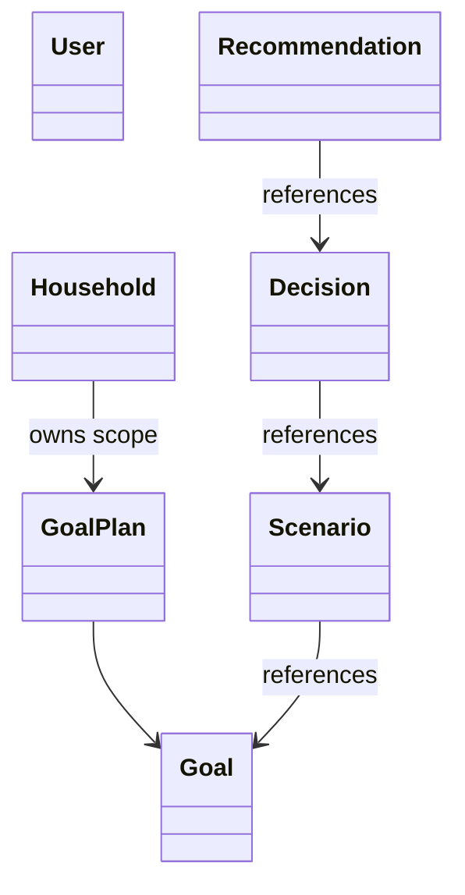
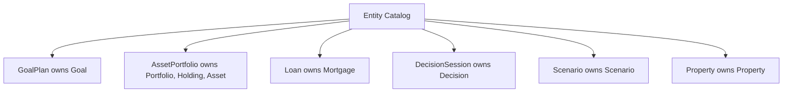
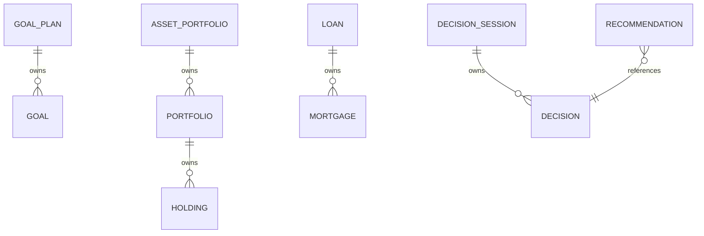
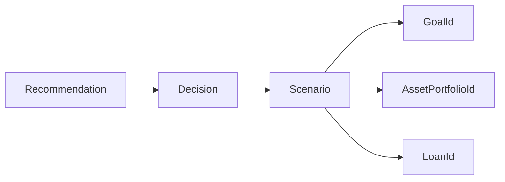
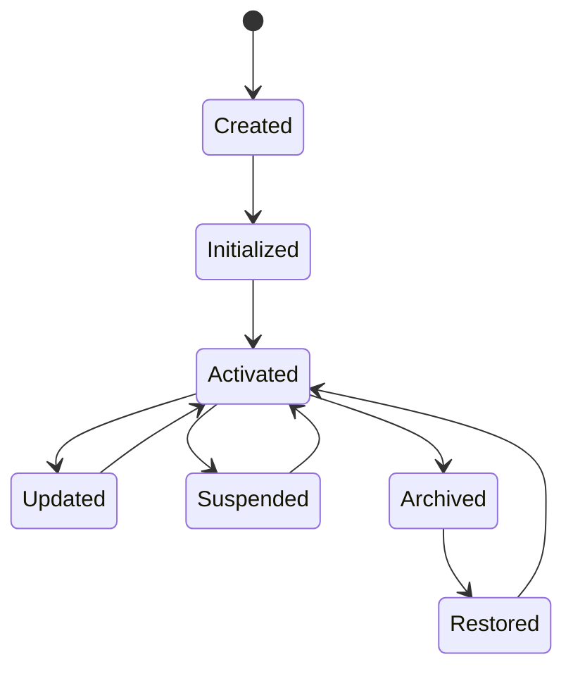
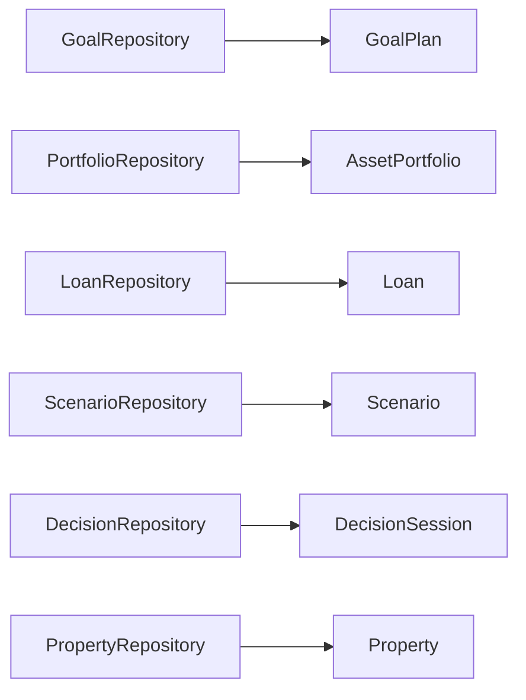

> **ADR-001 PWA Runtime Alignment:** Atlas v1 uses PWA v1 Runtime, Browser Runtime, and IndexedDB Runtime. Future Cloud Architecture is optional future mapping and must not be required for v1.\r\n\r\n# Entity Catalog
## Split Navigation
- [Entity catalog entries](entity-catalog/catalog-entries.md)
- [Entity relationships and ownership](entity-catalog/relationships-and-ownership.md)
- [Entity governance and testing](entity-catalog/governance-and-testing.md)
- [Entity security, audit, and performance](entity/security-audit-performance.md)

# Document Control

Document Name: Entity Catalog

Document Path: knowledge/catalog/entity-catalog.md

Document Type: Enterprise Canonical Specification

Version: 1.0

Status: Canonical Specification

Domain: Platform

Bounded Context: Platform

Owner: Project Atlas

Source of Truth: Atlas Knowledge Base

Last Updated: 2026-07-12

Related Specifications:

- knowledge/aggregate-catalog.md
- knowledge/domain-model-catalog.md
- knowledge/value-object-catalog.md
- knowledge/enumeration-catalog.md
- knowledge/repository-catalog.md
- knowledge/command-catalog.md
- knowledge/domain-event-catalog.md
- knowledge/domain-service-catalog.md
- knowledge/application-service-catalog.md
- knowledge/bounded-context-catalog.md
- knowledge/system-module-catalog.md
- knowledge/api-governance-framework.md
- docs/specification/04-DomainModel.md
- docs/specification/04A-DomainInventory.md
- docs/database/05-DatabaseDesign.md
- docs/database/06-ERD.md

# Purpose

Entity Catalog is the canonical source of truth for Atlas Entity ownership.

It defines each Entity, its owning Aggregate, Aggregate Root, Repository, lifecycle owner, persistence owner, command mapping, event mapping, API resource, PWA Runtime Mapping / Future Cloud Mapping, Future Cloud Mapping, DTO mapping, authorization boundary, audit requirement, and concurrency strategy.

It prevents implementation documents from inventing new Entities or assigning Entity ownership outside the Aggregate Catalog.

It does not create new Domain names.

It does not create new Bounded Context names.

It does not create new Business Concepts.

It does not promote every Entity to Aggregate Root.

# Scope

In scope:

- Existing Entities from the current Entity Catalog.
- Entity-to-Aggregate ownership.
- Entity-to-Repository ownership.
- Entity-to-Command ownership.
- Entity-to-Domain Event mapping.
- Entity-to-API and DTO mapping.
- Entity-to-database table mapping.
- Entity identity rules.
- Entity lifecycle rules.
- Entity ownership rules.
- Entity relationship rules.
- Security, audit, performance, validation, and testing rules.

Out of scope:

- Creating additional Entities.
- Creating additional Aggregates.
- Creating additional Repositories.
- Creating additional Bounded Contexts.
- Redefining Value Objects as Entities.
- Treating read models as Entities.
- Treating DTOs as Entities.

# Entity Definition Standard

Entity:

An Entity is a domain object with stable identity and lifecycle.

Aggregate Root:

An Aggregate Root is the root Entity or root object through which an Aggregate is loaded and mutated.

Owned Entity:

An Owned Entity is lifecycle-owned by one Aggregate Root and may not be mutated through another Aggregate.

Reference Entity:

A Reference Entity is referenced by identity only. Reference does not imply ownership.

Identity:

Identity is the stable technical key used to distinguish one Entity instance from another.

Lifecycle:

Lifecycle is the valid state progression for an Entity.

Persistence:

Persistence is owned by the Aggregate's repository or catalog-approved persistence path.

Concurrency:

Every mutable Entity must participate in Aggregate-level optimistic concurrency.

Authorization:

Entity access is authorized through its owning Aggregate boundary.

Audit:

Entity mutation must be auditable through its owning Aggregate.

Navigation:

Navigation properties are implementation convenience and do not define ownership.

Ownership:

Ownership is defined only by this catalog and Aggregate Catalog.

Association:

Association is a relationship by reference.

Composition:

Composition means lifecycle ownership by the owning Aggregate.

Aggregation:

Aggregation means grouped business relationship, not necessarily persistence ownership.

Entity Reference:

Entity Reference is an ID reference across Aggregate boundaries.

Business Identity:

Business Identity is a user-meaningful identity such as name, account identifier, or external reference.

Technical Identity:

Technical Identity is the stable Entity ID.

Immutable Identity:

Technical Identity cannot change after creation.

# Complete Entity Catalog

## User

Entity Name: User

Display Name: User

Aggregate: User

Aggregate Root: User

Domain: Identity

Bounded Context: Identity

Module: Identity

Purpose: Represents an Atlas account participant.

Business Meaning: User is the identity principal used for authentication, authorization, audit attribution, and ownership references.

Responsibilities:

- Maintain stable user identity.
- Provide audit actor identity.
- Participate in permission evaluation.
- Link to Household by reference.

Lifecycle Owner: User aggregate.

Persistence Owner: UserRepository.

Repository: UserRepository.

Application Service: UserApplicationService.

Domain Service: none.

Commands: none listed in Command Catalog.

Domain Events: none listed in Domain Event Catalog.

API Resources: /api/v1/users.

Database Table: users.

EF Entity: UserEntity.

Primary Key: UserId.

Alternate Key: external identity provider subject when configured.

Foreign Keys: none required by this catalog.

Navigation Properties: Household references by ID only.

Owned Value Objects: Address when contact address is stored.

Owned Enumerations: none.

Owned Child Entities: none.

Referenced Aggregates: Household.

Referenced Entities: Household.

Business Identity: login identity or external subject.

Technical Identity: UserId.

Concurrency Strategy: Aggregate-level optimistic concurrency.

Audit Strategy: CreatedBy, CreatedAt, UpdatedBy, UpdatedAt, CorrelationId, CausationId, Version.

Authorization Boundary: Identity and user scope.

Cache Strategy: User identity cache.

Search Strategy: Search by UserId and identity reference.

Sorting Strategy: CreatedAt and display name when available.

Archive Strategy: Archived users are excluded from active account queries.

Soft Delete Strategy: Archive preferred over physical delete.

Tenant Isolation: Applied when TenantId exists.

Household Isolation: User may reference Household but is not owned by Household.

Cross Aggregate Rules: User does not mutate Household.

Illegal Responsibilities: User does not own financial data.

Example Use Cases:

- Authenticate user.
- Attribute audit action to user.
- Evaluate user permission for Household access.

## Household

Entity Name: Household

Display Name: Household

Aggregate: Household

Aggregate Root: Household

Domain: Financial Profile

Bounded Context: Financial Profile

Module: Financial Profile

Purpose: Represents a shared planning and authorization unit.

Business Meaning: Household is the financial and decision scope for user-owned Atlas data.

Responsibilities:

- Maintain stable household identity.
- Define household-level access boundary.
- Link financial aggregates by identity.
- Preserve household audit context.

Lifecycle Owner: Household aggregate.

Persistence Owner: HouseholdRepository.

Repository: HouseholdRepository.

Application Service: UserApplicationService.

Domain Service: none.

Commands: none listed in Command Catalog.

Domain Events: none listed in Domain Event Catalog.

API Resources: /api/v1/households.

Database Table: households.

EF Entity: HouseholdEntity.

Primary Key: HouseholdId.

Alternate Key: none.

Foreign Keys: User references by identity where membership is implemented.

Navigation Properties: FinancialProfile, GoalPlan, Scenario, DecisionSession references by identity only.

Owned Value Objects: Address when household address is stored.

Owned Enumerations: none.

Owned Child Entities: none in current Entity Catalog.

Referenced Aggregates: User, FinancialProfile, GoalPlan, Scenario, DecisionSession.

Referenced Entities: User.

Business Identity: household display name.

Technical Identity: HouseholdId.

Concurrency Strategy: Aggregate-level optimistic concurrency.

Audit Strategy: All membership and access changes audited.

Authorization Boundary: Household isolation.

Cache Strategy: Household membership cache.

Search Strategy: Search by HouseholdId and member UserId.

Sorting Strategy: CreatedAt and display name.

Archive Strategy: Archived households are read-only.

Soft Delete Strategy: Archive preferred.

Tenant Isolation: Applied when TenantId exists.

Household Isolation: Household is the boundary.

Cross Aggregate Rules: Household does not mutate financial aggregates.

Illegal Responsibilities: Household does not own Scenario execution or Recommendation state.

Example Use Cases:

- Authorize user access to financial planning scope.
- Attach financial aggregates to one household.

## Asset

Entity Name: Asset

Display Name: Asset

Aggregate: AssetPortfolio

Aggregate Root: AssetPortfolio

Domain: Assets

Bounded Context: Investment

Module: Investment Engine

Purpose: Represents an owned financial or investment asset within portfolio scope.

Business Meaning: Asset contributes to portfolio value, net worth, allocation, and decision analysis.

Responsibilities:

- Maintain asset identity.
- Store asset type and valuation reference.
- Support allocation and risk evaluation.
- Provide asset data to Scenario and Decision.

Lifecycle Owner: AssetPortfolio.

Persistence Owner: PortfolioRepository.

Repository: PortfolioRepository.

Application Service: PortfolioApplicationService.

Domain Service: PortfolioService, AllocationService, RiskService.

Commands: CreatePortfolio, BuySecurity, SellSecurity, RebalancePortfolio when asset is investment holding related.

Domain Events: PortfolioCreated, SecurityPurchased, SecuritySold, PortfolioRebalanced, DividendDistributed.

API Resources: /api/v1/portfolios, /api/v1/assets.

Database Table: assets.

EF Entity: AssetEntity.

Primary Key: AssetId.

Alternate Key: external security identifier when available.

Foreign Keys: AssetPortfolioId.

Navigation Properties: AssetPortfolio and Holding where applicable.

Owned Value Objects: Money, Currency, Percentage, Allocation, RiskScore.

Owned Enumerations: AssetType, CurrencyCode, RiskLevel.

Owned Child Entities: none.

Referenced Aggregates: Scenario, DecisionSession.

Referenced Entities: Holding.

Business Identity: asset name or instrument identifier.

Technical Identity: AssetId.

Concurrency Strategy: Portfolio aggregate concurrency.

Audit Strategy: Asset changes audited through AssetPortfolio.

Authorization Boundary: Household isolation through AssetPortfolio.

Cache Strategy: Portfolio valuation cache.

Search Strategy: Search by portfolio, asset type, currency.

Sorting Strategy: asset value, asset type, updated time.

Archive Strategy: Archived asset excluded from active allocation.

Soft Delete Strategy: Archive preferred.

Tenant Isolation: Applied when TenantId exists.

Household Isolation: Enforced through AssetPortfolio.

Cross Aggregate Rules: Asset does not mutate GoalPlan, Scenario, or Loan.

Illegal Responsibilities: Asset does not own liabilities or loan payments.

Example Use Cases:

- Include asset in net worth.
- Evaluate portfolio allocation drift.

## Liability

Entity Name: Liability

Display Name: Liability

Aggregate: LiabilityPortfolio

Aggregate Root: LiabilityPortfolio

Domain: Liabilities

Bounded Context: Loan

Module: Loan Engine

Purpose: Represents a financial obligation summarized in liability portfolio scope.

Business Meaning: Liability contributes to debt burden, cash flow pressure, and risk capacity.

Responsibilities:

- Maintain liability identity.
- Store liability balance and type.
- Support debt capacity calculation.
- Provide liability data to Scenario and Decision.

Lifecycle Owner: LiabilityPortfolio.

Persistence Owner: LiabilityRepository.

Repository: LiabilityRepository.

Application Service: LoanApplicationService.

Domain Service: LoanService, RiskService.

Commands: none listed in Command Catalog for LiabilityPortfolio.

Domain Events: none listed in Domain Event Catalog for LiabilityPortfolio.

API Resources: /api/v1/liabilities.

Database Table: liabilities.

EF Entity: LiabilityEntity.

Primary Key: LiabilityId.

Alternate Key: external liability account reference when available.

Foreign Keys: LiabilityPortfolioId.

Navigation Properties: LiabilityPortfolio.

Owned Value Objects: Money, Currency, InterestRate, Percentage.

Owned Enumerations: CurrencyCode.

Owned Child Entities: none.

Referenced Aggregates: Loan.

Referenced Entities: Mortgage.

Business Identity: liability name or account reference.

Technical Identity: LiabilityId.

Concurrency Strategy: LiabilityPortfolio concurrency.

Audit Strategy: Liability changes audited through LiabilityPortfolio.

Authorization Boundary: Household isolation through LiabilityPortfolio.

Cache Strategy: liability summary cache.

Search Strategy: Search by household, liability type, balance status.

Sorting Strategy: balance, interest rate, updated time.

Archive Strategy: Archived liabilities excluded from active debt calculations.

Soft Delete Strategy: Archive preferred.

Tenant Isolation: Applied when TenantId exists.

Household Isolation: Enforced through LiabilityPortfolio.

Cross Aggregate Rules: Liability does not mutate Loan payments.

Illegal Responsibilities: Liability does not own Mortgage lifecycle.

Example Use Cases:

- Calculate DTI.
- Determine debt capacity conflict.

## Goal

Entity Name: Goal

Display Name: Goal

Aggregate: GoalPlan

Aggregate Root: GoalPlan

Domain: Goals

Bounded Context: Financial Profile

Module: GoalApplicationService

Purpose: Represents a user life or financial objective.

Business Meaning: Goal is the planning objective used by Goal Priority, Goal Dependency, Goal Lifecycle, and Goal Conflict Resolution.

Responsibilities:

- Maintain goal identity.
- Maintain target amount and target date.
- Maintain lifecycle state.
- Participate in dependency, priority, and conflict logic.

Lifecycle Owner: GoalPlan.

Persistence Owner: GoalRepository.

Repository: GoalRepository.

Application Service: GoalApplicationService.

Domain Service: ScoringService, ExplainabilityService, RiskService.

Commands: GoalApplicationService use cases defined in goal specifications.

Domain Events: Goal events defined in goal specifications and GoalPlan event messages.

API Resources: /api/v1/goals.

Database Table: goals.

EF Entity: GoalEntity.

Primary Key: GoalId.

Alternate Key: none.

Foreign Keys: GoalPlanId, HouseholdId.

Navigation Properties: GoalPlan.

Owned Value Objects: Money, Currency, Percentage, DateRange, RiskScore.

Owned Enumerations: GoalStatus, CurrencyCode, RiskLevel.

Owned Child Entities: none from current Entity Catalog.

Referenced Aggregates: Scenario, DecisionSession, Recommendation.

Referenced Entities: Scenario, Decision, Recommendation.

Business Identity: goal name and household scope.

Technical Identity: GoalId.

Concurrency Strategy: GoalPlan concurrency.

Audit Strategy: Goal state, priority, dependency, and conflict changes audited.

Authorization Boundary: Household isolation through GoalPlan.

Cache Strategy: goal list and priority cache.

Search Strategy: Search by status, category, target date, priority.

Sorting Strategy: priority, target date, status, updated time.

Archive Strategy: Archived goals are read-only.

Soft Delete Strategy: Archive preferred.

Tenant Isolation: Applied when TenantId exists.

Household Isolation: Enforced through GoalPlan.

Cross Aggregate Rules: Goal references Scenario, Decision, and Recommendation by identity only.

Illegal Responsibilities: Goal does not own Scenario output or Recommendation acceptance.

Example Use Cases:

- Rank active Goals.
- Resolve conflict between Housing and Retirement Goals.

## Portfolio

Entity Name: Portfolio

Display Name: Portfolio

Aggregate: AssetPortfolio

Aggregate Root: AssetPortfolio

Domain: Portfolio

Bounded Context: Investment

Module: Investment Engine

Purpose: Represents a portfolio container for investment holdings.

Business Meaning: Portfolio groups assets and holdings for allocation, risk, and return analysis.

Responsibilities:

- Maintain portfolio identity.
- Own holding collection.
- Maintain allocation and valuation.
- Support rebalance and trade commands.

Lifecycle Owner: AssetPortfolio.

Persistence Owner: PortfolioRepository.

Repository: PortfolioRepository.

Application Service: PortfolioApplicationService.

Domain Service: PortfolioService, AllocationService, RiskService.

Commands: CreatePortfolio, BuySecurity, SellSecurity, RebalancePortfolio.

Domain Events: PortfolioCreated, SecurityPurchased, SecuritySold, PortfolioRebalanced, DividendDistributed.

API Resources: /api/v1/portfolios.

Database Table: portfolios.

EF Entity: PortfolioEntity.

Primary Key: PortfolioId.

Alternate Key: account reference when available.

Foreign Keys: AssetPortfolioId, HouseholdId.

Navigation Properties: Holdings.

Owned Value Objects: Money, Currency, Percentage, Allocation, RiskScore.

Owned Enumerations: CurrencyCode, RiskLevel.

Owned Child Entities: Holding.

Referenced Aggregates: Scenario, DecisionSession.

Referenced Entities: Asset.

Business Identity: portfolio name or account reference.

Technical Identity: PortfolioId.

Concurrency Strategy: AssetPortfolio concurrency.

Audit Strategy: Portfolio changes audited through AssetPortfolio.

Authorization Boundary: Household isolation.

Cache Strategy: portfolio valuation and allocation cache.

Search Strategy: Search by household and portfolio type.

Sorting Strategy: value, updated time.

Archive Strategy: Archived portfolio excluded from active allocation.

Soft Delete Strategy: Archive preferred.

Tenant Isolation: Applied when TenantId exists.

Household Isolation: Enforced through AssetPortfolio.

Cross Aggregate Rules: Portfolio does not mutate DecisionSession.

Illegal Responsibilities: Portfolio does not own Goal Priority.

Example Use Cases:

- RebalancePortfolio updates allocation and emits PortfolioRebalanced.

## Holding

Entity Name: Holding

Display Name: Holding

Aggregate: AssetPortfolio

Aggregate Root: AssetPortfolio

Domain: Portfolio

Bounded Context: Investment

Module: Investment Engine

Purpose: Represents a security or position held inside a Portfolio.

Business Meaning: Holding contributes to portfolio allocation, valuation, income, and risk.

Responsibilities:

- Maintain holding identity.
- Store quantity and price basis.
- Support purchase and sale updates.
- Support dividend recognition.

Lifecycle Owner: AssetPortfolio.

Persistence Owner: PortfolioRepository.

Repository: PortfolioRepository.

Application Service: PortfolioApplicationService.

Domain Service: PortfolioService, AllocationService.

Commands: BuySecurity, SellSecurity, RebalancePortfolio.

Domain Events: SecurityPurchased, SecuritySold, DividendDistributed, PortfolioRebalanced.

API Resources: /api/v1/portfolios/{portfolioId}/holdings.

Database Table: holdings.

EF Entity: HoldingEntity.

Primary Key: HoldingId.

Alternate Key: PortfolioId plus security identifier.

Foreign Keys: PortfolioId, AssetId.

Navigation Properties: Portfolio, Asset.

Owned Value Objects: Money, Currency, Percentage, Allocation.

Owned Enumerations: AssetType, CurrencyCode.

Owned Child Entities: none.

Referenced Aggregates: none.

Referenced Entities: Asset.

Business Identity: security identifier in portfolio.

Technical Identity: HoldingId.

Concurrency Strategy: AssetPortfolio concurrency.

Audit Strategy: Holding changes audited through AssetPortfolio.

Authorization Boundary: Household isolation through Portfolio.

Cache Strategy: holding valuation cache.

Search Strategy: Search by PortfolioId and security identifier.

Sorting Strategy: market value, allocation percentage.

Archive Strategy: Closed holdings retained for history.

Soft Delete Strategy: Archive or zero quantity close.

Tenant Isolation: Applied when TenantId exists.

Household Isolation: Enforced through AssetPortfolio.

Cross Aggregate Rules: Holding does not mutate Asset master data outside portfolio scope.

Illegal Responsibilities: Holding does not own cash flow category.

Example Use Cases:

- BuySecurity increases quantity and emits SecurityPurchased.

## Property

Entity Name: Property

Display Name: Property

Aggregate: Property

Aggregate Root: Property

Domain: Property

Bounded Context: Property

Module: Home Upgrade Engine

Purpose: Represents real estate property.

Business Meaning: Property is a real estate asset or decision subject used in housing decisions and scenarios.

Responsibilities:

- Maintain property identity.
- Maintain property type and value.
- Maintain purchase and sale state.
- Provide property data to Scenario and Decision.

Lifecycle Owner: Property aggregate.

Persistence Owner: PropertyRepository.

Repository: PropertyRepository.

Application Service: DecisionApplicationService.

Domain Service: ScenarioService, RiskService.

Commands: PurchaseHome, SellHome, UpdatePropertyValue.

Domain Events: HomePurchased, HomeSold, HomeValueUpdated, HomeUpgradeStarted, HomeUpgradeCompleted.

API Resources: /api/v1/properties.

Database Table: properties.

EF Entity: PropertyEntity.

Primary Key: PropertyId.

Alternate Key: address plus household scope when allowed.

Foreign Keys: HouseholdId.

Navigation Properties: Loan references by identity only.

Owned Value Objects: Money, Currency, Address, Percentage.

Owned Enumerations: PropertyType, CurrencyCode.

Owned Child Entities: none.

Referenced Aggregates: Loan, Scenario, DecisionSession.

Referenced Entities: Mortgage.

Business Identity: address or property name.

Technical Identity: PropertyId.

Concurrency Strategy: Property concurrency.

Audit Strategy: Property purchase, sale, and valuation audited.

Authorization Boundary: Household isolation.

Cache Strategy: property valuation cache.

Search Strategy: Search by household and property type.

Sorting Strategy: value, purchase date, updated time.

Archive Strategy: Sold or inactive property may be archived.

Soft Delete Strategy: Archive preferred.

Tenant Isolation: Applied when TenantId exists.

Household Isolation: Enforced through Property.

Cross Aggregate Rules: Property does not mutate Loan.

Illegal Responsibilities: Property does not own mortgage amortization.

Example Use Cases:

- UpdatePropertyValue emits HomeValueUpdated.

## Mortgage

Entity Name: Mortgage

Display Name: Mortgage

Aggregate: Loan

Aggregate Root: Loan

Domain: Loan

Bounded Context: Loan

Module: Loan Engine

Purpose: Represents a property-backed loan subtype.

Business Meaning: Mortgage connects loan obligations to property-backed debt analysis.

Responsibilities:

- Maintain mortgage identity within Loan aggregate.
- Store mortgage-specific term, rate, and property reference.
- Support loan payment and refinance behavior.

Lifecycle Owner: Loan aggregate.

Persistence Owner: LoanRepository.

Repository: LoanRepository.

Application Service: LoanApplicationService.

Domain Service: LoanService.

Commands: CreateLoan, RecordLoanPayment, RefinanceLoan.

Domain Events: LoanCreated, LoanPaymentMade, LoanRefinanced, LoanClosed.

API Resources: /api/v1/loans.

Database Table: mortgages or loans depending on persistence mapping.

EF Entity: MortgageEntity or LoanEntity subtype.

Primary Key: MortgageId or LoanId depending on mapping.

Alternate Key: loan account reference when available.

Foreign Keys: LoanId, PropertyId by reference.

Navigation Properties: Loan, Property reference by ID.

Owned Value Objects: Money, Currency, InterestRate, LoanTerm, Percentage.

Owned Enumerations: LoanType, CurrencyCode.

Owned Child Entities: none.

Referenced Aggregates: Property.

Referenced Entities: Property.

Business Identity: mortgage account reference.

Technical Identity: MortgageId or LoanId.

Concurrency Strategy: Loan concurrency.

Audit Strategy: Mortgage changes audited through Loan.

Authorization Boundary: Household isolation through Loan.

Cache Strategy: amortization cache.

Search Strategy: Search by LoanId, PropertyId, status.

Sorting Strategy: balance, rate, maturity.

Archive Strategy: Closed mortgage retained.

Soft Delete Strategy: Archive preferred.

Tenant Isolation: Applied when TenantId exists.

Household Isolation: Enforced through Loan.

Cross Aggregate Rules: Mortgage does not mutate Property.

Illegal Responsibilities: Mortgage does not own property valuation.

Example Use Cases:

- RefinanceLoan changes mortgage terms and emits LoanRefinanced.

## Scenario

Entity Name: Scenario

Display Name: Scenario

Aggregate: Scenario

Aggregate Root: Scenario

Domain: Scenario

Bounded Context: Scenario

Module: Scenario Engine

Purpose: Represents one coherent financial projection path.

Business Meaning: Scenario evaluates what the household financial path looks like under assumptions and decisions.

Responsibilities:

- Maintain scenario identity.
- Maintain assumption and input snapshot.
- Maintain simulation status and output.
- Provide input to DecisionSession and Recommendation.

Lifecycle Owner: Scenario aggregate.

Persistence Owner: ScenarioRepository.

Repository: ScenarioRepository.

Application Service: ScenarioApplicationService.

Domain Service: ScenarioService, ScoringService, RiskService.

Commands: EvaluateScenario, ReplayScenario.

Domain Events: ScenarioEvaluated, ReplayCompleted.

API Resources: /api/v1/scenarios.

Database Table: scenarios.

EF Entity: ScenarioEntity.

Primary Key: ScenarioId.

Alternate Key: scenario name plus household scope when required.

Foreign Keys: HouseholdId.

Navigation Properties: snapshots by identity.

Owned Value Objects: Money, Currency, Percentage, DateRange, InflationRate, InterestRate, RiskScore.

Owned Enumerations: ScenarioStatus, CurrencyCode, RiskLevel.

Owned Child Entities: none from current Entity Catalog.

Referenced Aggregates: FinancialProfile, GoalPlan, AssetPortfolio, LiabilityPortfolio, Loan, Property.

Referenced Entities: Goal, Asset, Liability, Property, Mortgage.

Business Identity: scenario name.

Technical Identity: ScenarioId.

Concurrency Strategy: Scenario concurrency.

Audit Strategy: Scenario input and output versions audited.

Authorization Boundary: Household isolation.

Cache Strategy: scenario result cache.

Search Strategy: Search by household, status, type.

Sorting Strategy: updated time, status, name.

Archive Strategy: Archived scenario is read-only.

Soft Delete Strategy: Archive preferred.

Tenant Isolation: Applied when TenantId exists.

Household Isolation: Enforced through Scenario.

Cross Aggregate Rules: Scenario uses snapshots and does not mutate source aggregates.

Illegal Responsibilities: Scenario does not accept decisions.

Example Use Cases:

- EvaluateScenario produces ScenarioEvaluated.

## Decision

Entity Name: Decision

Display Name: Decision

Aggregate: DecisionSession

Aggregate Root: DecisionSession

Domain: Decision

Bounded Context: Decision

Module: Decision Engine

Purpose: Represents an evaluated decision and its outcome.

Business Meaning: Decision captures evaluation result, acceptance, rejection, and audit trail.

Responsibilities:

- Maintain decision identity.
- Store decision status.
- Store score and rule results.
- Preserve accepted or rejected outcome.

Lifecycle Owner: DecisionSession.

Persistence Owner: DecisionRepository.

Repository: DecisionRepository.

Application Service: DecisionApplicationService.

Domain Service: DecisionService, ScoringService, ExplainabilityService.

Commands: EvaluateScenario, AcceptRecommendation, RejectRecommendation.

Domain Events: ScenarioEvaluated, RecommendationGenerated, DecisionAccepted, DecisionRejected.

API Resources: /api/v1/decisions.

Database Table: decisions.

EF Entity: DecisionEntity.

Primary Key: DecisionId.

Alternate Key: none.

Foreign Keys: DecisionSessionId, ScenarioId by reference.

Navigation Properties: Recommendation references by identity.

Owned Value Objects: Money, Percentage, RiskScore.

Owned Enumerations: DecisionStatus, RiskLevel.

Owned Child Entities: none.

Referenced Aggregates: Scenario, Recommendation, GoalPlan.

Referenced Entities: Scenario, Recommendation, Goal.

Business Identity: decision name or decision context.

Technical Identity: DecisionId.

Concurrency Strategy: DecisionSession concurrency.

Audit Strategy: Decision scoring and acceptance audited.

Authorization Boundary: Household isolation through DecisionSession.

Cache Strategy: decision result cache.

Search Strategy: Search by household, status, scenario.

Sorting Strategy: score, updated time, status.

Archive Strategy: Archived decisions are read-only.

Soft Delete Strategy: Archive preferred.

Tenant Isolation: Applied when TenantId exists.

Household Isolation: Enforced through DecisionSession.

Cross Aggregate Rules: Decision does not mutate Scenario output.

Illegal Responsibilities: Decision does not own portfolio holdings.

Example Use Cases:

- AcceptRecommendation emits DecisionAccepted.

## Recommendation

Entity Name: Recommendation

Display Name: Recommendation

Aggregate: Recommendation

Aggregate Root: Recommendation

Domain: Decision

Bounded Context: Decision

Module: Decision Engine

Purpose: Represents an Atlas recommended action or advisory result.

Business Meaning: Recommendation provides prioritized guidance generated from Decision, Scenario, Rule, and Goal inputs.

Responsibilities:

- Maintain recommendation identity.
- Maintain priority and status.
- Maintain explanation.
- Reference source Decision and Scenario.

Lifecycle Owner: Recommendation aggregate.

Persistence Owner: catalog-approved persistence path for Recommendation.

Repository: repository update required in Repository Catalog before standalone implementation.

Application Service: DecisionApplicationService.

Domain Service: DecisionService, ExplainabilityService, ScoringService.

Commands: AcceptRecommendation, RejectRecommendation.

Domain Events: RecommendationGenerated, DecisionAccepted, DecisionRejected.

API Resources: /api/v1/recommendations.

Database Table: recommendations.

EF Entity: RecommendationEntity.

Primary Key: RecommendationId.

Alternate Key: source context plus generated time when required.

Foreign Keys: DecisionSessionId, ScenarioId, GoalId by reference.

Navigation Properties: Decision and Scenario references by identity.

Owned Value Objects: Money, Percentage, RiskScore.

Owned Enumerations: RecommendationPriority, RiskLevel.

Owned Child Entities: none.

Referenced Aggregates: DecisionSession, Scenario, GoalPlan.

Referenced Entities: Decision, Scenario, Goal.

Business Identity: recommendation title and source context.

Technical Identity: RecommendationId.

Concurrency Strategy: Recommendation concurrency.

Audit Strategy: Generated, accepted, rejected, dismissed, and archived actions audited.

Authorization Boundary: Household isolation.

Cache Strategy: recommendation feed cache.

Search Strategy: Search by priority, status, source.

Sorting Strategy: priority, score, updated time.

Archive Strategy: Archived recommendations hidden from active feed.

Soft Delete Strategy: Archive preferred.

Tenant Isolation: Applied when TenantId exists.

Household Isolation: Enforced through Recommendation.

Cross Aggregate Rules: Recommendation does not mutate GoalPlan or DecisionSession directly.

Illegal Responsibilities: Recommendation does not own Decision acceptance.

Example Use Cases:

- RecommendationGenerated creates a ranked recommendation for display.

## Notification

Entity Name: Notification

Display Name: Notification

Aggregate: Notification

Aggregate Root: Notification

Domain: Platform

Bounded Context: Platform

Module: Notification

Purpose: Represents a user-visible alert or message.

Business Meaning: Notification delivers reminders, alerts, and recommendation-related messages.

Responsibilities:

- Maintain notification identity.
- Store channel and delivery status.
- Preserve delivery audit.

Lifecycle Owner: Notification aggregate.

Persistence Owner: NotificationRepository.

Repository: NotificationRepository.

Application Service: NotificationApplicationService.

Domain Service: none.

Commands: none listed in Command Catalog.

Domain Events: none listed in Domain Event Catalog.

API Resources: /api/v1/notifications.

Database Table: notifications.

EF Entity: NotificationEntity.

Primary Key: NotificationId.

Alternate Key: external delivery reference when available.

Foreign Keys: UserId, HouseholdId by reference.

Navigation Properties: none required.

Owned Value Objects: none.

Owned Enumerations: NotificationChannel.

Owned Child Entities: none.

Referenced Aggregates: User, Household, Recommendation.

Referenced Entities: User, Household, Recommendation.

Business Identity: notification title and delivery target.

Technical Identity: NotificationId.

Concurrency Strategy: Notification concurrency.

Audit Strategy: Delivery and status changes audited.

Authorization Boundary: User and Household scope.

Cache Strategy: notification feed cache.

Search Strategy: Search by user, channel, status.

Sorting Strategy: created time, priority when available.

Archive Strategy: Archived notification hidden from active feed.

Soft Delete Strategy: Archive preferred.

Tenant Isolation: Applied when TenantId exists.

Household Isolation: Applied when HouseholdId exists.

Cross Aggregate Rules: Notification does not mutate source aggregate.

Illegal Responsibilities: Notification does not own Decision state.

Example Use Cases:

- Send alert when a recommendation is generated.

## Policy

Entity Name: Policy

Display Name: Policy

Aggregate: Policy

Aggregate Root: Policy

Domain: Platform

Bounded Context: Platform

Module: Policy

Purpose: Represents governed business policy and thresholds.

Business Meaning: Policy supplies rule thresholds and governance settings to calculation and decision logic.

Responsibilities:

- Maintain policy identity.
- Maintain policy version.
- Preserve active policy state.
- Provide threshold references.

Lifecycle Owner: Policy aggregate.

Persistence Owner: catalog-approved persistence path for Policy.

Repository: repository update required in Repository Catalog before standalone implementation.

Application Service: AdministrationApplicationService.

Domain Service: ScoringService, RiskService.

Commands: none listed in Command Catalog.

Domain Events: none listed in Domain Event Catalog.

API Resources: /api/v1/policies.

Database Table: policies.

EF Entity: PolicyEntity.

Primary Key: PolicyId.

Alternate Key: policy key plus version.

Foreign Keys: none required.

Navigation Properties: Configuration reference by identity when applicable.

Owned Value Objects: Money, Percentage, RiskScore.

Owned Enumerations: RiskLevel.

Owned Child Entities: none.

Referenced Aggregates: Configuration.

Referenced Entities: Configuration.

Business Identity: policy key and version.

Technical Identity: PolicyId.

Concurrency Strategy: Policy concurrency.

Audit Strategy: Policy changes audited.

Authorization Boundary: Administration.

Cache Strategy: active policy cache.

Search Strategy: Search by policy key and active status.

Sorting Strategy: version, updated time.

Archive Strategy: Superseded policy retained for replay.

Soft Delete Strategy: Archive preferred.

Tenant Isolation: Applied when TenantId exists.

Household Isolation: not household-owned unless policy scope requires it.

Cross Aggregate Rules: Policy changes do not rewrite historical Scenario or Decision results.

Illegal Responsibilities: Policy does not own user financial data.

Example Use Cases:

- Provide debt threshold to Decision evaluation.

## Configuration

Entity Name: Configuration

Display Name: Configuration

Aggregate: Configuration

Aggregate Root: Configuration

Domain: Platform

Bounded Context: Platform

Module: Configuration

Purpose: Represents versioned runtime configuration.

Business Meaning: Configuration provides controlled settings, assumption version references, and formula version references.

Responsibilities:

- Maintain configuration identity.
- Maintain configuration key and version.
- Preserve active configuration values.

Lifecycle Owner: Configuration aggregate.

Persistence Owner: catalog-approved persistence path for Configuration.

Repository: repository update required in Repository Catalog before standalone implementation.

Application Service: AdministrationApplicationService.

Domain Service: none.

Commands: none listed in Command Catalog.

Domain Events: AssumptionVersionLoaded, FormulaVersionLoaded.

API Resources: /api/v1/configurations.

Database Table: configurations.

EF Entity: ConfigurationEntity.

Primary Key: ConfigurationId.

Alternate Key: configuration key plus scope plus version.

Foreign Keys: none required.

Navigation Properties: Policy reference by identity when applicable.

Owned Value Objects: Money, Currency, Percentage.

Owned Enumerations: CurrencyCode.

Owned Child Entities: none.

Referenced Aggregates: Policy.

Referenced Entities: Policy.

Business Identity: configuration key and version.

Technical Identity: ConfigurationId.

Concurrency Strategy: Configuration concurrency.

Audit Strategy: Configuration changes audited.

Authorization Boundary: Administration.

Cache Strategy: configuration cache.

Search Strategy: Search by key, scope, active status.

Sorting Strategy: key, version, updated time.

Archive Strategy: Superseded configurations retained for replay.

Soft Delete Strategy: Archive preferred.

Tenant Isolation: Applied when TenantId exists.

Household Isolation: applied only when configuration scope is household-specific.

Cross Aggregate Rules: Configuration does not rewrite historical results.

Illegal Responsibilities: Configuration does not own business transaction state.

Example Use Cases:

- Load formula version for deterministic Scenario replay.

# Entity Ownership Matrix

| Entity | Aggregate | Aggregate Root | Repository | Table | Owner Service |
|---|---|---|---|---|---|
| User | User | User | UserRepository | users | UserApplicationService |
| Household | Household | Household | HouseholdRepository | households | UserApplicationService |
| Asset | AssetPortfolio | AssetPortfolio | PortfolioRepository | assets | PortfolioApplicationService |
| Liability | LiabilityPortfolio | LiabilityPortfolio | LiabilityRepository | liabilities | LoanApplicationService |
| Goal | GoalPlan | GoalPlan | GoalRepository | goals | GoalApplicationService |
| Portfolio | AssetPortfolio | AssetPortfolio | PortfolioRepository | portfolios | PortfolioApplicationService |
| Holding | AssetPortfolio | AssetPortfolio | PortfolioRepository | holdings | PortfolioApplicationService |
| Property | Property | Property | PropertyRepository | properties | DecisionApplicationService |
| Mortgage | Loan | Loan | LoanRepository | mortgages or loans | LoanApplicationService |
| Scenario | Scenario | Scenario | ScenarioRepository | scenarios | ScenarioApplicationService |
| Decision | DecisionSession | DecisionSession | DecisionRepository | decisions | DecisionApplicationService |
| Recommendation | Recommendation | Recommendation | catalog-approved persistence | recommendations | DecisionApplicationService |
| Notification | Notification | Notification | NotificationRepository | notifications | NotificationApplicationService |
| Policy | Policy | Policy | catalog-approved persistence | policies | AdministrationApplicationService |
| Configuration | Configuration | Configuration | catalog-approved persistence | configurations | AdministrationApplicationService |

# Entity Dependency Matrix

| Entity | Depends On | Relationship | Cascade | Ownership |
|---|---|---|---|---|
| User | none | Root | No | Owned by User |
| Household | User | Reference | No | Owned by Household |
| Asset | AssetPortfolio | Composition | Yes within aggregate | Owned by AssetPortfolio |
| Liability | LiabilityPortfolio | Composition | Yes within aggregate | Owned by LiabilityPortfolio |
| Goal | GoalPlan | Composition | Yes within aggregate | Owned by GoalPlan |
| Portfolio | AssetPortfolio | Composition | Yes within aggregate | Owned by AssetPortfolio |
| Holding | Portfolio | Composition | Yes within aggregate | Owned by AssetPortfolio |
| Property | Household | Reference | No | Owned by Property |
| Mortgage | Loan | Composition | Yes within aggregate | Owned by Loan |
| Scenario | Household | Reference | No | Owned by Scenario |
| Decision | DecisionSession | Composition | Yes within aggregate | Owned by DecisionSession |
| Recommendation | DecisionSession | Reference | No | Owned by Recommendation |
| Notification | User, Household | Reference | No | Owned by Notification |
| Policy | Configuration | Reference | No | Owned by Policy |
| Configuration | Policy | Reference | No | Owned by Configuration |

# Entity Relationship Matrix

| Relationship | From | To | Type | Navigation | Ownership |
|---|---|---|---|---|---|
| User household access | User | Household | Many to Many by membership reference | Optional | Reference |
| Household profile | Household | FinancialProfile | One to One by identity | Optional | Reference |
| AssetPortfolio portfolio | AssetPortfolio | Portfolio | One to Many | Yes | Composition |
| Portfolio holding | Portfolio | Holding | One to Many | Yes | Composition |
| Holding asset | Holding | Asset | Many to One | Yes | Reference within aggregate |
| LiabilityPortfolio liability | LiabilityPortfolio | Liability | One to Many | Yes | Composition |
| GoalPlan goal | GoalPlan | Goal | One to Many | Yes | Composition |
| Property mortgage | Property | Mortgage | One to Many by identity | Optional | Reference |
| Loan mortgage | Loan | Mortgage | One to One or One to Many | Yes | Composition |
| Scenario decision | Scenario | Decision | One to Many by reference | Optional | Reference |
| Decision recommendation | Decision | Recommendation | One to Many by reference | Optional | Reference |
| Recommendation notification | Recommendation | Notification | One to Many by reference | Optional | Reference |
| Policy configuration | Policy | Configuration | One to Many by reference | Optional | Reference |

# Entity Identity Rules

1. Every Entity has a stable Technical Identity.
2. Technical Identity is immutable after creation.
3. Business Identity may change only through audited mutation.
4. Natural Key must not replace Technical Identity.
5. Alternate Key may support lookup but is not primary ownership.
6. Composite Key may be used for uniqueness but not for aggregate identity when EntityId exists.
7. Identity generation is controlled by owning Aggregate or persistence layer.
8. Identity mutation is prohibited.
9. Cross-Aggregate references use EntityId.
10. External references must be stored separately from EntityId.

# Entity Lifecycle

Created:

- Entity identity is assigned.
- Audit fields are initialized.

Initialized:

- Required baseline fields are present.

Activated:

- Entity is available for business use.

Updated:

- Entity state changes through owning Aggregate.

Suspended:

- Entity is temporarily inactive if lifecycle supports suspension.

Archived:

- Entity is read-only and excluded from active queries.

Restored:

- Entity returns to active scope when lifecycle permits.

Deleted:

- Physical deletion is restricted by audit and retention policy.

Terminal State:

- Entity cannot receive normal business mutation.

Illegal Transition:

- Invalid transition is rejected and audited.

# Entity Ownership Rules

1. Entity must have exactly one Aggregate Owner.
2. Entity cannot belong to multiple Aggregate Roots.
3. Reference does not create ownership.
4. Foreign Key does not create ownership.
5. Navigation does not create ownership.
6. DTO does not create ownership.
7. API resource does not create ownership.
8. Read model does not create ownership.
9. Composition implies lifecycle ownership inside one Aggregate.
10. Aggregation without composition requires reference by identity.
11. Owned Entity is persisted through owning Aggregate.
12. Owned Entity is audited through owning Aggregate.
13. Owned Entity concurrency is protected by owning Aggregate.
14. Cross-Aggregate reference must not cascade mutation.
15. Entity ownership changes require Aggregate Catalog update.

# Repository Ownership Matrix

| Entity | Repository | Write Owner | Read Owner | Source of Truth |
|---|---|---|---|---|
| User | UserRepository | User | UserApplicationService | Yes |
| Household | HouseholdRepository | Household | UserApplicationService | Yes |
| Asset | PortfolioRepository | AssetPortfolio | PortfolioApplicationService | Yes within portfolio scope |
| Liability | LiabilityRepository | LiabilityPortfolio | LoanApplicationService | Yes |
| Goal | GoalRepository | GoalPlan | GoalApplicationService | Yes |
| Portfolio | PortfolioRepository | AssetPortfolio | PortfolioApplicationService | Yes |
| Holding | PortfolioRepository | AssetPortfolio | PortfolioApplicationService | Yes |
| Property | PropertyRepository | Property | DecisionApplicationService | Yes |
| Mortgage | LoanRepository | Loan | LoanApplicationService | Yes |
| Scenario | ScenarioRepository | Scenario | ScenarioApplicationService | Yes |
| Decision | DecisionRepository | DecisionSession | DecisionApplicationService | Yes |
| Recommendation | catalog-approved persistence | Recommendation | DecisionApplicationService | Yes |
| Notification | NotificationRepository | Notification | NotificationApplicationService | Yes |
| Policy | catalog-approved persistence | Policy | AdministrationApplicationService | Yes |
| Configuration | catalog-approved persistence | Configuration | AdministrationApplicationService | Yes |

# Command Ownership Matrix

| Entity | Command | Aggregate | Handler |
|---|---|---|---|
| Portfolio | CreatePortfolio | AssetPortfolio | PortfolioApplicationService |
| Holding | BuySecurity | AssetPortfolio | PortfolioApplicationService |
| Holding | SellSecurity | AssetPortfolio | PortfolioApplicationService |
| Portfolio | RebalancePortfolio | AssetPortfolio | PortfolioApplicationService |
| Mortgage | CreateLoan | Loan | LoanApplicationService |
| Mortgage | RecordLoanPayment | Loan | LoanApplicationService |
| Mortgage | RefinanceLoan | Loan | LoanApplicationService |
| Property | PurchaseHome | Property | DecisionApplicationService |
| Property | SellHome | Property | DecisionApplicationService |
| Property | UpdatePropertyValue | Property | DecisionApplicationService |
| Policy | IssuePolicy | Policy | AdministrationApplicationService |
| Policy | PayPremium | Policy | AdministrationApplicationService |
| Scenario | EvaluateScenario | Scenario or DecisionSession | ScenarioApplicationService or DecisionApplicationService |
| Decision | AcceptRecommendation | DecisionSession | DecisionApplicationService |
| Decision | RejectRecommendation | DecisionSession | DecisionApplicationService |
| Scenario | ReplayScenario | Scenario | ScenarioApplicationService |

# Domain Event Matrix

| Entity | Event | Publisher | Consumers |
|---|---|---|---|
| Portfolio | PortfolioCreated | PortfolioApplicationService | Decision, Dashboard |
| Holding | SecurityPurchased | PortfolioApplicationService | Decision, Dashboard |
| Holding | SecuritySold | PortfolioApplicationService | Decision, Dashboard |
| Portfolio | PortfolioRebalanced | PortfolioApplicationService | Decision, Dashboard |
| Holding | DividendDistributed | PortfolioApplicationService | Cash Flow, Dashboard |
| Mortgage | LoanCreated | LoanApplicationService | Scenario, Decision |
| Mortgage | LoanPaymentMade | LoanApplicationService | Cash Flow, Decision |
| Mortgage | LoanRefinanced | LoanApplicationService | Scenario, Decision |
| Mortgage | LoanClosed | LoanApplicationService | Scenario, Decision |
| Property | HomePurchased | DecisionApplicationService | Loan, Insurance, Scenario |
| Property | HomeSold | DecisionApplicationService | Loan, Scenario |
| Property | HomeValueUpdated | DecisionApplicationService | Scenario, Dashboard |
| Property | HomeUpgradeStarted | DecisionApplicationService | Scenario, Dashboard |
| Property | HomeUpgradeCompleted | DecisionApplicationService | Scenario, Dashboard |
| Policy | PolicyIssued | AdministrationApplicationService | Decision, Audit |
| Policy | PremiumPaid | AdministrationApplicationService | Cash Flow, Audit |
| Policy | CoverageUpdated | AdministrationApplicationService | Decision, Audit |
| Policy | ClaimSubmitted | AdministrationApplicationService | Decision, Audit |
| Policy | ClaimPaid | AdministrationApplicationService | Cash Flow, Audit |
| Scenario | ScenarioEvaluated | ScenarioApplicationService | Recommendation, Dashboard |
| Recommendation | RecommendationGenerated | DecisionApplicationService | Dashboard, Notification |
| Decision | DecisionAccepted | DecisionApplicationService | Recommendation, Audit |
| Decision | DecisionRejected | DecisionApplicationService | Recommendation, Audit |
| Configuration | AssumptionVersionLoaded | AdministrationApplicationService | Scenario, Decision |
| Configuration | FormulaVersionLoaded | AdministrationApplicationService | Scenario, Decision |
| Scenario | ReplayCompleted | ScenarioApplicationService | Audit |

# Persistence Mapping

| Entity | Table | Primary Key | Foreign Key | Indexes | Concurrency Token | Archive Flag | Audit Columns | Soft Delete | JSON Columns | Owned Types |
|---|---|---|---|---|---|---|---|---|---|---|
| User | users | user_id | none | identity reference | version | archived_at | yes | archive | optional metadata | Address |
| Household | households | household_id | user membership reference | member lookup | version | archived_at | yes | archive | optional metadata | Address |
| Asset | assets | asset_id | portfolio_id | portfolio, type | aggregate version | archived_at | yes | archive | valuation metadata | Money, Currency |
| Liability | liabilities | liability_id | liability_portfolio_id | household, balance | aggregate version | archived_at | yes | archive | optional metadata | Money, InterestRate |
| Goal | goals | goal_id | goal_plan_id | status, date | aggregate version | archived_at | yes | archive | priority metadata | Money, DateRange |
| Portfolio | portfolios | portfolio_id | asset_portfolio_id | household | aggregate version | archived_at | yes | archive | allocation metadata | Allocation |
| Holding | holdings | holding_id | portfolio_id | security, value | aggregate version | closed_at | yes | archive | pricing metadata | Money |
| Property | properties | property_id | household_id | type, value | version | archived_at | yes | archive | valuation metadata | Address, Money |
| Mortgage | mortgages | mortgage_id | loan_id, property_id | loan, property | aggregate version | closed_at | yes | archive | amortization metadata | LoanTerm |
| Scenario | scenarios | scenario_id | household_id | status | version | archived_at | yes | archive | assumptions, outputs | DateRange |
| Decision | decisions | decision_id | decision_session_id | status | aggregate version | archived_at | yes | archive | score details | RiskScore |
| Recommendation | recommendations | recommendation_id | decision_session_id | priority, status | version | archived_at | yes | archive | explanation | RiskScore |
| Notification | notifications | notification_id | user_id, household_id | channel, status | version | archived_at | yes | archive | delivery metadata | none |
| Policy | policies | policy_id | none | key, version | version | archived_at | yes | archive | rule metadata | Percentage |
| Configuration | configurations | configuration_id | none | key, scope | version | archived_at | yes | archive | value metadata | Currency |

# API Mapping

| Entity | REST Resource | DTO | Request | Response | Permission | Authorization |
|---|---|---|---|---|---|---|
| User | /api/v1/users | UserDto | UserRequest | UserResponse | User:Read | Identity |
| Household | /api/v1/households | HouseholdDto | HouseholdRequest | HouseholdResponse | Household:Read | Household scope |
| Asset | /api/v1/assets | AssetDto | AssetRequest | AssetResponse | Asset:Read | Household scope |
| Liability | /api/v1/liabilities | LiabilityDto | LiabilityRequest | LiabilityResponse | Liability:Read | Household scope |
| Goal | /api/v1/goals | GoalDto | GoalRequest | GoalResponse | Goal:Read | Household scope |
| Portfolio | /api/v1/portfolios | PortfolioDto | PortfolioRequest | PortfolioResponse | Asset:Read | Household scope |
| Holding | /api/v1/portfolios/{portfolioId}/holdings | HoldingDto | HoldingRequest | HoldingResponse | Asset:Read | Household scope |
| Property | /api/v1/properties | PropertyDto | PropertyRequest | PropertyResponse | Property:Read | Household scope |
| Mortgage | /api/v1/loans | LoanDto | LoanRequest | LoanResponse | Liability:Read | Household scope |
| Scenario | /api/v1/scenarios | ScenarioDto | ScenarioRequest | ScenarioResponse | Scenario:Read | Household scope |
| Decision | /api/v1/decisions | DecisionDto | DecisionRequest | DecisionResponse | Decision:Read | Household scope |
| Recommendation | /api/v1/recommendations | RecommendationDto | RecommendationRequest | RecommendationResponse | Decision:Read | Household scope |
| Notification | /api/v1/notifications | NotificationDto | NotificationRequest | NotificationResponse | Notification:Read | User or Household |
| Policy | /api/v1/policies | PolicyDto | PolicyRequest | PolicyResponse | Policy:Read | Administration |
| Configuration | /api/v1/configurations | ConfigurationDto | ConfigurationRequest | ConfigurationResponse | Configuration:Read | Administration |

# Security

Authorization:

- Entity access is authorized through owning Aggregate.
- Cross-Household access is prohibited.
- Administration Entities require administration permission.

Permission:

- Resource permissions follow Permission Framework resource/action model.
- Commands require Create, Update, Execute, Approve, Restore, or Read as applicable.

Household Isolation:

- Required for Household-scoped Entities.

Tenant Isolation:

- Required when TenantId exists.

PII:

- User, Household, Address, and Notification data may contain sensitive data.

Masking:

- Summary DTOs must mask sensitive fields when permission is insufficient.

Encryption:

- Sensitive fields follow Atlas security policy.

# Audit

Created By:

- Required for mutable Entities.

Created At:

- Required for mutable Entities.

Updated By:

- Required after mutation.

Updated At:

- Required after mutation.

CorrelationId:

- Required for command and event traceability.

CausationId:

- Required for event causality.

Version:

- Required for concurrency and replay.

# Performance

Indexes:

- Primary key index required for every Entity table.
- Household-scoped Entities require HouseholdId index.
- Status and archive indexes required for active queries.

Navigation Loading:

- Cross-Aggregate navigation must use identity reference and explicit loading.

Projection:

- Read-heavy screens use projections.

Read Model:

- Read models are not source of truth.

Caching:

- Cache is scoped by TenantId and HouseholdId when applicable.

Pagination:

- Required for collection APIs.

Sorting:

- Sorting must be deterministic.

Filtering:

- Filtering must enforce authorization and isolation.

# Validation Rules

| Rule ID | Name | Description | Condition | Validation | Severity | Blocking | Error | Audit | Example |
|---|---|---|---|---|---|---|---|---|---|
| ENT-VR-001 | Entity Has Aggregate | Every Entity must map to Aggregate | Entity listed | Mapping exists | Critical | Yes | ENT-ERR-001 | Yes | Goal maps GoalPlan |
| ENT-VR-002 | Entity Has Root | Entity must map to Aggregate Root | Entity listed | Root exists | Critical | Yes | ENT-ERR-002 | Yes | Holding maps AssetPortfolio |
| ENT-VR-003 | Entity Has Repository | Entity persistence owner declared | Entity listed | Repository or approved path exists | High | Yes | ENT-ERR-003 | Yes | Recommendation path |
| ENT-VR-004 | Entity Has Table | Entity has table mapping | Persistence defined | Table listed | High | Yes | ENT-ERR-004 | Yes | goals |
| ENT-VR-005 | Entity Has Primary Key | Entity table has key | Table listed | PK exists | Critical | Yes | ENT-ERR-005 | Yes | GoalId |
| ENT-VR-006 | Stable Identity | ID immutable | Mutation | ID unchanged | Critical | Yes | ENT-ERR-006 | Yes | UserId |
| ENT-VR-007 | Business Identity Audited | Business identity change audited | Name change | Audit exists | Medium | Yes | ENT-ERR-007 | Yes | Goal name |
| ENT-VR-008 | Single Owner | Entity has one owner | Mapping check | one owner | Critical | Yes | ENT-ERR-008 | Yes | Mortgage |
| ENT-VR-009 | No Ownership by FK | FK not ownership | Relationship defined | owner matrix wins | High | Yes | ENT-ERR-009 | Yes | PropertyId |
| ENT-VR-010 | No Ownership by Navigation | Navigation not ownership | Navigation defined | owner matrix wins | High | Yes | ENT-ERR-010 | Yes | Scenario Goals |
| ENT-VR-011 | No DTO Ownership | DTO not entity owner | API defined | DTO maps only | High | Yes | ENT-ERR-011 | Yes | GoalDto |
| ENT-VR-012 | Read Model Not Entity | Projection not Entity | Read model defined | source aggregate exists | High | Yes | ENT-ERR-012 | Yes | conflict read model |
| ENT-VR-013 | Concurrency Required | Mutable Entity needs token | Mutation | version checked | High | Yes | ENT-ERR-013 | Yes | Decision |
| ENT-VR-014 | Audit Required | Mutable Entity needs audit | Mutation | audit fields present | High | Yes | ENT-ERR-014 | Yes | Property |
| ENT-VR-015 | Authorization Required | Entity access requires permission | API access | permission check | Critical | Yes | ENT-ERR-015 | Yes | Household |
| ENT-VR-016 | Household Isolation | Household data scoped | Household entity | HouseholdId match | Critical | Yes | ENT-ERR-016 | Yes | Goal access |
| ENT-VR-017 | Tenant Isolation | Tenant scoped data isolated | TenantId exists | TenantId match | Critical | Yes | ENT-ERR-017 | Yes | tenant data |
| ENT-VR-018 | Archive Filter | Archived excluded by default | Query | archived filter | Medium | No | ENT-ERR-018 | Yes | archived goal |
| ENT-VR-019 | Terminal State Protection | Terminal Entity cannot mutate | Mutation | state check | High | Yes | ENT-ERR-019 | Yes | Closed loan |
| ENT-VR-020 | Value Object Immutable | VO mutation replaces value | Value update | replace object | Medium | Yes | ENT-ERR-020 | Yes | Money |
| ENT-VR-021 | Enum Valid | Enum must be valid | Field set | enum exists | High | Yes | ENT-ERR-021 | Yes | GoalStatus |
| ENT-VR-022 | Currency Valid | Currency must be supported | Money set | CurrencyCode valid | High | Yes | ENT-ERR-022 | Yes | TWD |
| ENT-VR-023 | Money Nonnegative When Required | Amount cannot be negative | Amount set | amount >= 0 | High | Yes | ENT-ERR-023 | Yes | target amount |
| ENT-VR-024 | Percentage Range | Percentage within bounds | Percentage set | 0 to 100 or policy | Medium | Yes | ENT-ERR-024 | Yes | allocation |
| ENT-VR-025 | Date Range Valid | DateRange valid | Date set | start <= end | Medium | Yes | ENT-ERR-025 | Yes | scenario horizon |
| ENT-VR-026 | Repository No Business Logic | Repository cannot evaluate rules | repository method | no rule logic | High | Yes | ENT-ERR-026 | Yes | scoring in repo |
| ENT-VR-027 | Command Owner Valid | Command maps to aggregate | command listed | owner exists | High | Yes | ENT-ERR-027 | Yes | BuySecurity |
| ENT-VR-028 | Event Publisher Valid | Event maps to aggregate | event listed | publisher exists | High | Yes | ENT-ERR-028 | Yes | LoanCreated |
| ENT-VR-029 | API Permission Present | API has permission | endpoint listed | permission declared | High | Yes | ENT-ERR-029 | Yes | Goal API |
| ENT-VR-030 | DTO Maps Entity | DTO maps to Entity or projection | DTO listed | mapping exists | Medium | Yes | ENT-ERR-030 | Yes | ScenarioDto |
| ENT-VR-031 | Table Owner Valid | Table maps to Entity owner | table listed | write owner exists | High | Yes | ENT-ERR-031 | Yes | holdings |
| ENT-VR-032 | Cross Aggregate Reference By ID | Cross-boundary ref by ID | reference exists | ID only | High | Yes | ENT-ERR-032 | Yes | Scenario to Goal |
| ENT-VR-033 | No Cross Aggregate Cascade | Cascade cannot cross owner | FK cascade | cascade disabled | Critical | Yes | ENT-ERR-033 | Yes | Loan to Property |
| ENT-VR-034 | Search Index Required | Searchable field indexed | search enabled | index exists | Medium | No | ENT-ERR-034 | Yes | status |
| ENT-VR-035 | Sorting Stable | Sorting deterministic | list query | stable sort | Low | No | ENT-ERR-035 | No | updated time |
| ENT-VR-036 | Cache Scoped | Cache key includes scope | cache set | scope included | High | Yes | ENT-ERR-036 | Yes | HouseholdId |
| ENT-VR-037 | Archive Audited | Archive action audited | archive | audit exists | High | Yes | ENT-ERR-037 | Yes | Policy |
| ENT-VR-038 | Restore Audited | Restore action audited | restore | audit exists | High | Yes | ENT-ERR-038 | Yes | Configuration |
| ENT-VR-039 | Event Idempotent | Event duplicate ignored | consume event | EventId dedupe | High | Yes | ENT-ERR-039 | Yes | replay |
| ENT-VR-040 | Command Idempotent | Retry safe | retry command | key dedupe | High | Yes | ENT-ERR-040 | Yes | payment |

# Business Rules

1. ENT-BR-001 Entity identity is immutable.
2. ENT-BR-002 Entity must have one Aggregate owner.
3. ENT-BR-003 Entity cannot be owned by multiple Aggregates.
4. ENT-BR-004 Entity persistence follows owning Aggregate.
5. ENT-BR-005 Entity lifecycle follows owning Aggregate.
6. ENT-BR-006 Entity authorization follows owning Aggregate.
7. ENT-BR-007 Entity audit follows owning Aggregate.
8. ENT-BR-008 Entity concurrency follows owning Aggregate.
9. ENT-BR-009 Reference does not imply ownership.
10. ENT-BR-010 Foreign Key does not imply ownership.
11. ENT-BR-011 Navigation does not imply ownership.
12. ENT-BR-012 DTO does not imply ownership.
13. ENT-BR-013 API resource does not imply ownership.
14. ENT-BR-014 Read model does not imply ownership.
15. ENT-BR-015 User owns identity state only.
16. ENT-BR-016 Household owns access boundary.
17. ENT-BR-017 Asset is owned by AssetPortfolio.
18. ENT-BR-018 Liability is owned by LiabilityPortfolio.
19. ENT-BR-019 Goal is owned by GoalPlan.
20. ENT-BR-020 Portfolio is owned by AssetPortfolio.
21. ENT-BR-021 Holding is owned by AssetPortfolio.
22. ENT-BR-022 Property is owned by Property aggregate.
23. ENT-BR-023 Mortgage is owned by Loan aggregate.
24. ENT-BR-024 Scenario is owned by Scenario aggregate.
25. ENT-BR-025 Decision is owned by DecisionSession.
26. ENT-BR-026 Recommendation is owned by Recommendation aggregate.
27. ENT-BR-027 Notification is owned by Notification aggregate.
28. ENT-BR-028 Policy is owned by Policy aggregate.
29. ENT-BR-029 Configuration is owned by Configuration aggregate.
30. ENT-BR-030 Entity mutation must validate current version.
31. ENT-BR-031 Entity mutation must write audit.
32. ENT-BR-032 Entity mutation must enforce authorization.
33. ENT-BR-033 Entity mutation must stay inside Aggregate boundary.
34. ENT-BR-034 Entity read may use projection.
35. ENT-BR-035 Entity write may not use projection.
36. ENT-BR-036 Entity archive is preferred over physical delete.
37. ENT-BR-037 Entity restore requires audit.
38. ENT-BR-038 Entity terminal state blocks normal mutation.
39. ENT-BR-039 Entity table must have primary key.
40. ENT-BR-040 Entity table must have audit columns.
41. ENT-BR-041 Entity table must have concurrency support.
42. ENT-BR-042 Household-scoped Entity must include HouseholdId or parent aggregate reference.
43. ENT-BR-043 Tenant-scoped Entity must include TenantId when tenancy exists.
44. ENT-BR-044 User data may contain sensitive identity data.
45. ENT-BR-045 Household data may contain sensitive relationship data.
46. ENT-BR-046 Asset data may contain sensitive financial data.
47. ENT-BR-047 Liability data may contain sensitive financial data.
48. ENT-BR-048 Goal data may contain sensitive life planning data.
49. ENT-BR-049 Portfolio data may contain sensitive investment data.
50. ENT-BR-050 Holding data may contain sensitive investment data.
51. ENT-BR-051 Property data may contain sensitive asset data.
52. ENT-BR-052 Mortgage data may contain sensitive debt data.
53. ENT-BR-053 Scenario data may contain sensitive projection data.
54. ENT-BR-054 Decision data may contain sensitive decision data.
55. ENT-BR-055 Recommendation data may contain sensitive advisory data.
56. ENT-BR-056 Notification data may contain user message data.
57. ENT-BR-057 Policy data is administration governed.
58. ENT-BR-058 Configuration data is administration governed.
59. ENT-BR-059 Entity search must enforce permission.
60. ENT-BR-060 Entity sorting must be deterministic.
61. ENT-BR-061 Entity cache must include authorization scope.
62. ENT-BR-062 Entity list APIs must support pagination.
63. ENT-BR-063 Entity update APIs must include concurrency token.
64. ENT-BR-064 Entity mutation APIs should include idempotency key.
65. ENT-BR-065 Entity events must identify aggregate owner.
66. ENT-BR-066 Entity commands must identify aggregate owner.
67. ENT-BR-067 Entity repository cannot contain business logic.
68. ENT-BR-068 Entity repository cannot mutate another Aggregate.
69. ENT-BR-069 Entity cross-reference uses technical identity.
70. ENT-BR-070 Business identity may not replace technical identity.
71. ENT-BR-071 Natural key may not be primary identity when EntityId exists.
72. ENT-BR-072 Alternate key must be unique when declared.
73. ENT-BR-073 Entity historical replay uses versioned data.
74. ENT-BR-074 Scenario snapshots do not mutate referenced Entities.
75. ENT-BR-075 Decision references Scenario by identity.
76. ENT-BR-076 Recommendation references Decision and Goal by identity.
77. ENT-BR-077 Notification references source by identity.
78. ENT-BR-078 Policy changes do not rewrite historical results.
79. ENT-BR-079 Configuration changes do not rewrite historical results.
80. ENT-BR-080 Entity Catalog is the source of truth for Entity ownership.

# Mermaid

Class Diagram:

Ownership Diagram:

Entity Relationship Diagram:

Navigation Diagram:

Lifecycle Diagram:

Repository Diagram:

# Testing

Unit Test:

- Validate every Entity has Aggregate mapping.
- Validate every Entity has Technical Identity.
- Validate every Entity has lifecycle owner.
- Validate ownership rules reject duplicate owner.
- Validate FK does not imply ownership.

Integration Test:

- Load Goal through GoalRepository and GoalPlan.
- Load Holding through PortfolioRepository and AssetPortfolio.
- Load Mortgage through LoanRepository and Loan.
- Load Decision through DecisionRepository and DecisionSession.
- Load Scenario through ScenarioRepository.

Repository Test:

- Repository loads only owning Aggregate.
- Repository rejects business rule logic.
- Repository enforces optimistic concurrency.

Persistence Test:

- Every table has primary key.
- Every mutable table has audit fields.
- Every mutable table has version or concurrency token.
- Archived records are excluded by active query.

Navigation Test:

- Cross Aggregate navigation uses identity reference.
- Composition navigation remains inside Aggregate.
- Reference navigation does not cascade mutation.

Concurrency Test:

- Stale version rejects mutation.
- Duplicate idempotency key returns original command result.
- Concurrent update is audited.

Validation Test:

- All ENT-VR rules pass against this catalog.
- Missing Entity owner fails.
- Read model write ownership fails.

Performance Test:

- Entity list endpoints are paginated.
- Search fields have indexes.
- Sorting is deterministic.
- Cache keys include scope.

# Edge Cases

1. Entity appears in Entity Catalog but is absent from Aggregate Catalog mapping.
2. Entity maps to two Aggregates.
3. Repository is assigned to child Entity.
4. DTO is treated as Entity.
5. Read model is treated as write model.
6. Foreign Key is interpreted as ownership.
7. Navigation property is interpreted as ownership.
8. Scenario references Goal and attempts mutation.
9. Decision references Scenario and attempts mutation.
10. Recommendation references Goal and attempts mutation.
11. Notification references Recommendation and attempts mutation.
12. Mortgage updates Property value.
13. Property updates Mortgage balance.
14. Holding updates external Asset master data.
15. Portfolio updates Goal priority.
16. Liability updates Loan payment state.
17. Policy update rewrites old Decision result.
18. Configuration update rewrites old Scenario output.
19. Archived Entity appears in active query.
20. Terminal Entity receives mutation.
21. Business Identity changes without audit.
22. Technical Identity changes during update.
23. Natural Key duplicates within scope.
24. Alternate Key conflicts.
25. Concurrency token missing.
26. Audit fields missing.
27. Household isolation missing.
28. Tenant isolation missing.
29. Cache key omits HouseholdId.
30. Search endpoint returns unauthorized Entity.
31. Entity restore lacks audit.
32. Entity archive lacks reason.
33. Entity delete bypasses archive.
34. Event lacks Aggregate owner.
35. Command lacks Aggregate owner.
36. Table lacks write owner.
37. EF mapping omits primary key.
38. EF mapping enables cascade across Aggregate boundary.
39. API request includes fields from another Aggregate.
40. Repository query loads unbounded navigation graph.
41. Entity uses invalid Enumeration value.
42. Money uses unsupported CurrencyCode.
43. Percentage outside valid range.
44. DateRange end before start.
45. Sensitive data is logged.
46. Audit record lacks CorrelationId.
47. Event replay changes current Entity state.
48. Projection lag causes stale read.
49. Search sorting changes between pages.
50. Migration moves Entity table ownership without catalog update.

# Final Consistency Matrix

| Concern | Source Catalog | Final Atlas Name | Defined Here or Referenced | Implementation Artifact | Status |
|---|---|---|---|---|---|
| Entity | Entity Catalog | 15 canonical entities | Defined here | Domain entities | Canonical |
| Aggregate | Aggregate Catalog | Entity owner aggregate | Referenced | Aggregate boundary | Canonical |
| Repository | Repository Catalog | Entity persistence owner | Referenced | Repository or catalog-approved path | Canonical |
| Command | Command Catalog | Entity mutation command | Mapped here | Command handler | Canonical |
| Event | Domain Event Catalog | Entity event publisher | Mapped here | Domain event | Canonical |
| Service | Service Catalog | Owner application and domain service | Mapped here | Service interaction | Canonical |
| DTO | API Governance | Entity DTO contracts | Defined here | Request and response models | Canonical |
| API | API Governance | Entity resource | Defined here | REST resource | Canonical |
| Database | Database Design | Entity table | Defined here | Persistence mapping | Canonical |
| Table | Database Design | Table ownership | Defined here | Write owner | Canonical |
| Permission | Permission Framework | Resource action | Defined here | Authorization | Canonical |
| Audit | Audit Boundary | Audit fields and records | Defined here | Audit trail | Canonical |

# Completion Checklist

- Every Entity has Aggregate owner.
- Every Entity has Repository or catalog-approved persistence owner.
- Every Entity has Persistence Owner.
- Every Entity has Lifecycle Owner.
- Every Entity has Identity.
- Every Entity has Business Meaning.
- No Entity is assigned to multiple Aggregates.
- Mermaid diagrams are present.
- Markdown is structured.
- Entity Catalog is Canonical Source of Truth.

# Version History

| Version | Date | Owner | Change | Reason |
|---|---|---|---|---|
| 1.0 | 2026-07-12 | Project Atlas | Enterprise Canonical Specification | Upgrade Entity Catalog to Entity Source of Truth |
