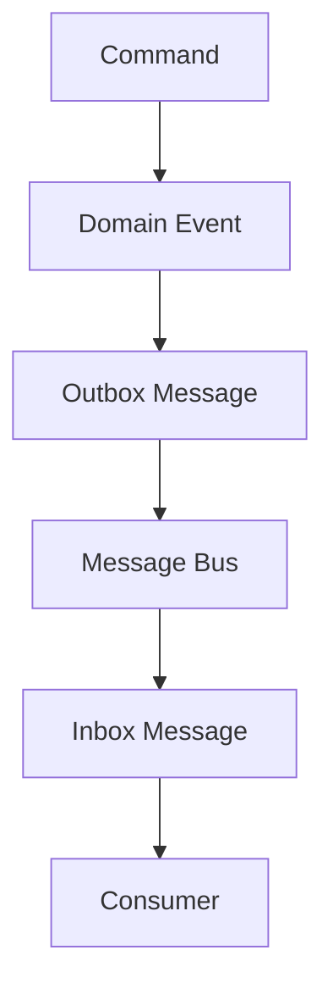
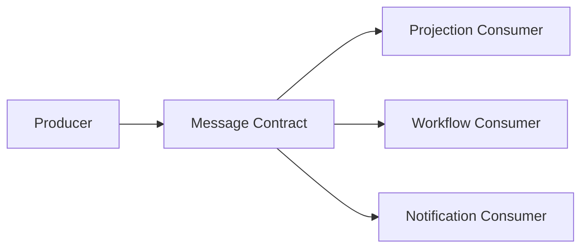
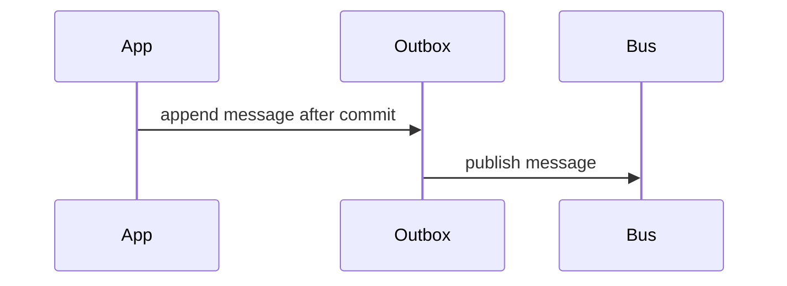
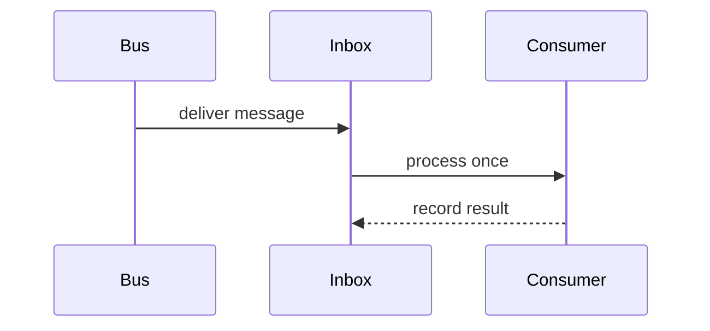
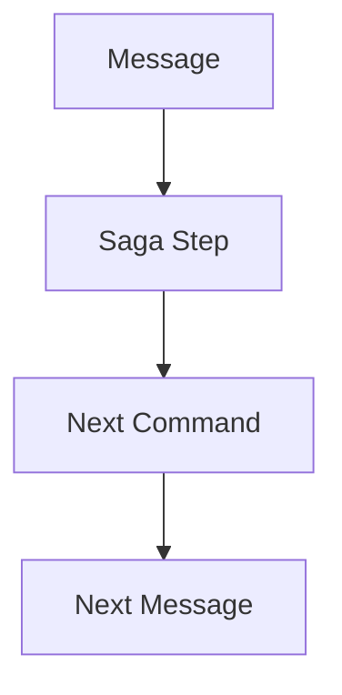
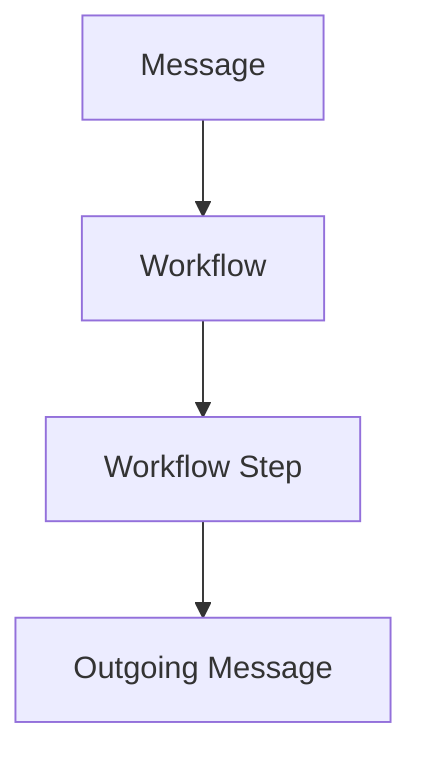

# Message Contract Diagrams and Edge Cases

Source: [Message Contract Catalog](../message-contract-catalog.md)

This split document isolates message flow diagrams and message-contract failure conditions from the canonical message contract catalog. It keeps the parent catalog authoritative while making messaging relationships, delivery boundaries, and consistency risks easier to review independently.

## Mermaid

### Message Flow

### Producer Consumer Diagram

### Outbox Flow

### Inbox Flow

### Saga Messaging

### Workflow Messaging

## Edge Case Pattern

Message edge cases cover incomplete or conflicting mappings across message name, category, producer, consumer, command, event, payload, header, metadata, schema, version, correlation, causation, tenant, Household, serialization, compression, encryption, ordering, retry, dead letter, idempotency, validation, audit, and security concerns.

## Edge Case Coverage

- Message edge cases 1-50 share the same canonical failure condition: one or more message contract mappings are incomplete or conflicting.
- Each edge case must be evaluated against producer, consumer, command, event, schema, version, payload, headers, metadata, serialization, correlation, causation, ordering, idempotency, retry, dead letter, audit, security, and performance consistency.
- The parent catalog keeps the numbered edge case inventory; this split file provides the independent checklist used to interpret those repeated cases.
