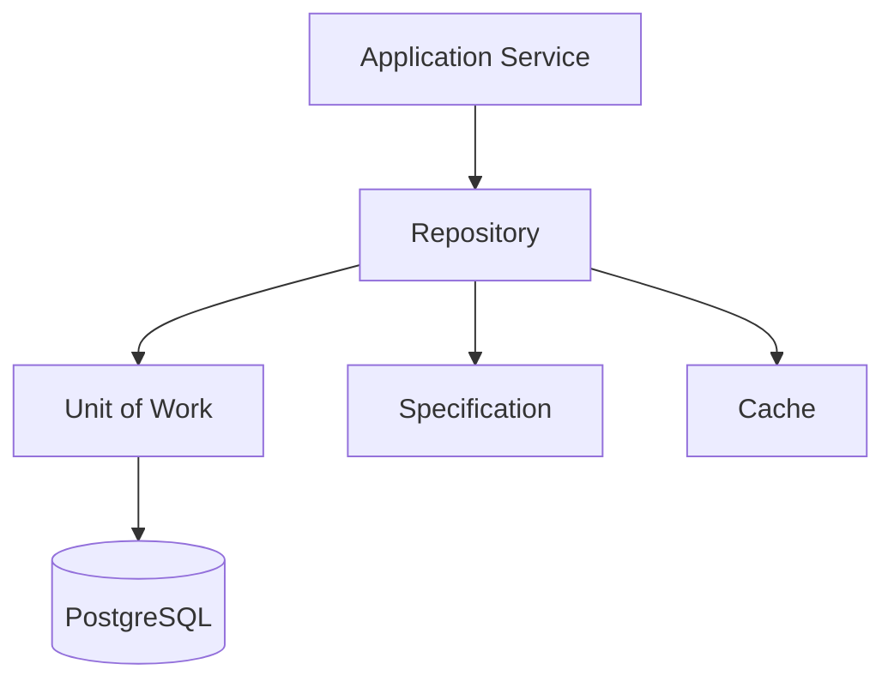
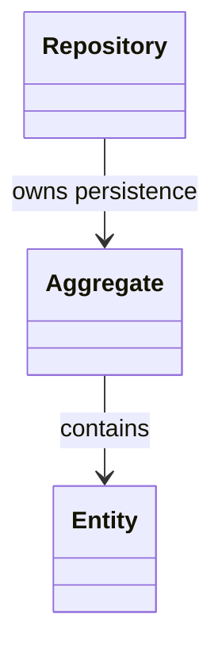
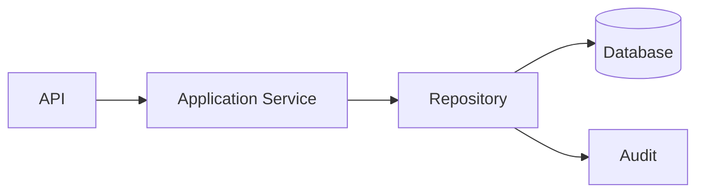
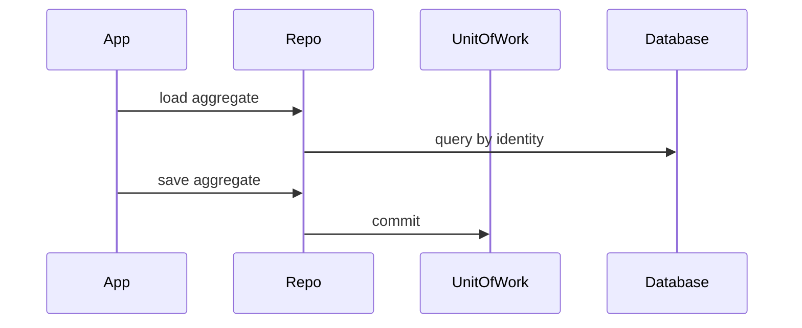
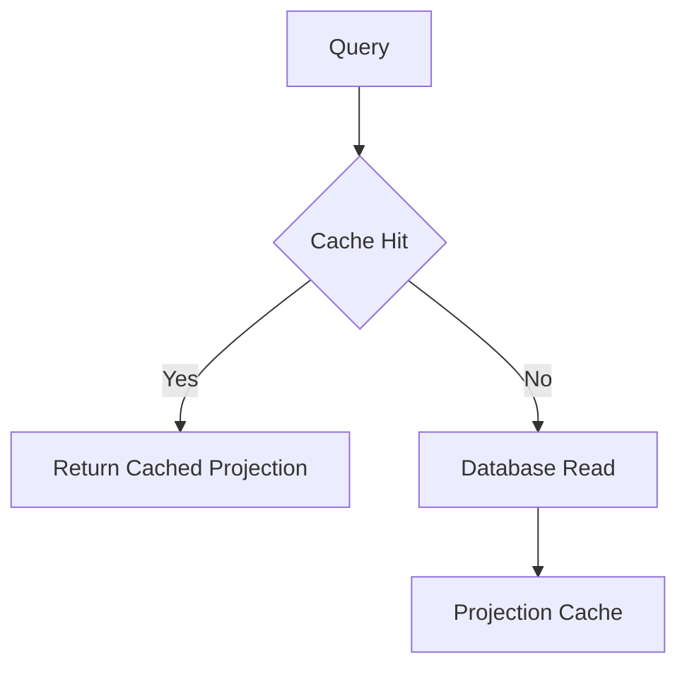
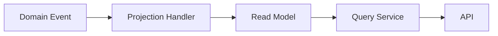

# Repository Catalog
## Split Navigation
- [Repository catalog entries](repository/catalog-entries.md)
- [Repository method catalog](repository/method-catalog.md)
- [Repository ownership and integration matrices](repository/ownership-and-integration-matrices.md)
- [Repository query and persistence rules](repository/query-and-persistence-rules.md)
- [Repository specification patterns and executable addendum](repository/specification-patterns-and-executable-addendum.md)
- [Repository governance and testing](repository/governance-and-testing.md)

# Document Control

Document Name: Repository Catalog
Document Path: knowledge/repository-catalog.md
Document Type: Atlas Enterprise Canonical Specification
Version: 1.0
Status: Canonical Specification
Domain: Platform
Bounded Context: Platform
Owner: Project Atlas
Source of Truth: Atlas Repository Source of Truth
Last Updated: 2026-07-12

Related Specifications:
- knowledge/aggregate-catalog.md
- knowledge/entity-catalog.md
- knowledge/command-catalog.md
- knowledge/domain-event-catalog.md
- knowledge/domain-service-catalog.md
- knowledge/application-service-catalog.md
- knowledge/value-object-catalog.md
- knowledge/enumeration-catalog.md
- knowledge/api-governance-framework.md
- knowledge/system-module-catalog.md
- knowledge/workflow-engine-framework.md
- knowledge/background-job-framework.md
- knowledge/message-contract-catalog.md
- docs/specification/04-DomainModel.md
- docs/database/05-DatabaseDesign.md
- docs/database/06-ERD.md
- docs/api/07-API.md

# Purpose

Repository Catalog defines the canonical persistence ownership model for Project Atlas. It is the source of truth for repository ownership across Aggregates, Entities, Commands, Domain Events, Application Services, Domain Services, EF Core, PostgreSQL, projections, read models, query services, specifications, unit of work, cache, and API access paths.

# Scope

- Repository
- Aggregate Repository
- Read Repository
- Projection Repository
- Specification
- Unit of Work
- Persistence Boundary
- Transaction Boundary
- Query Model
- Write Model
- Read Model
- Soft Delete
- Archive
- Optimistic Concurrency
- Pessimistic Lock
- Pagination
- Sorting
- Filtering
- Projection
- Streaming
- Caching

# Repository Definition Standard

Every Repository entry uses the following complete Enterprise contract.
- Repository Name
- Display Name
- Aggregate
- Aggregate Root
- Entity
- Domain
- Bounded Context
- Module
- Purpose
- Business Meaning
- Description
- Repository Type
- Persistence Owner
- Application Service
- Domain Service
- Database
- Schema
- Tables
- Views
- Materialized Views
- EF Entity
- Specification
- Unit of Work
- Transaction Boundary
- Consistency Boundary
- Concurrency
- Isolation Level
- Caching Strategy
- Archive Strategy
- Soft Delete Strategy
- Search Strategy
- Sorting Strategy
- Filtering Strategy
- Authorization
- Tenant Isolation
- Household Isolation
- Audit
- Performance Target
- Example Usage

# Complete Repository Catalog

## UserRepository

Repository Name: UserRepository
Display Name: UserRepository
Aggregate: User
Aggregate Root: User
Entity: User
Domain: Identity
Bounded Context: Identity
Module: Identity
Purpose: Persist and load the User Aggregate through the catalog-approved repository boundary.
Business Meaning: UserRepository is the only persistence owner for User write access.
Description: Repository loads aggregate state, applies specification-based queries, coordinates unit of work persistence, and contains no business decision logic.
Repository Type: Aggregate Repository with read and projection support where cataloged.
Persistence Owner: User Aggregate boundary.
Application Service: UserApplicationService
Domain Service: DecisionService
Database: PostgreSQL
Schema: atlas
Tables: users
Views: user_projection_view
Materialized Views: user_projection_materialized when performance requires it.
EF Entity: User mapped under User ownership.
Specification: Search, Filter, Sorting, Paging, Composite, and Business Specification when applicable.
Unit of Work: Managed by application transaction boundary.
Transaction Boundary: One User aggregate write transaction.
Consistency Boundary: User Aggregate consistency boundary.
Concurrency: Optimistic concurrency token for update and archive operations.
Isolation Level: Read committed by default; stricter isolation only for catalog-approved consistency needs.
Caching Strategy: Household and Aggregate scoped cache keys with event-driven invalidation.
Archive Strategy: Archive before irreversible deletion when business history is required.
Soft Delete Strategy: Soft delete for user-facing removal where audit retention is required.
Search Strategy: Indexed searchable fields only; no unbounded scan for API queries.
Sorting Strategy: Deterministic sorting with stable tie-breaker identity.
Filtering Strategy: Specification-driven filters with Household and tenant constraints.
Authorization: Repository callers must pass authorized context from Application Service.
Tenant Isolation: TenantId filter required when TenantId exists.
Household Isolation: HouseholdId filter required for Household-scoped data.
Audit: Created, Updated, Deleted, Archived, Restored, CorrelationId, and CausationId are recorded.
Performance Target: Point load p95 under 100 ms, paged query p95 under 300 ms, projection query p95 under 200 ms under normal load.
Example Usage: UserApplicationService calls UserRepository to load User, execute command handling, save changes, and emit Identity and ownership events.
Repository Control 1: UserRepository preserves aggregate ownership, specification use, unit of work, transaction boundary, concurrency, isolation, cache, archive, authorization, audit, projection, query performance, and event alignment.
Repository Control 2: UserRepository preserves aggregate ownership, specification use, unit of work, transaction boundary, concurrency, isolation, cache, archive, authorization, audit, projection, query performance, and event alignment.
Repository Control 3: UserRepository preserves aggregate ownership, specification use, unit of work, transaction boundary, concurrency, isolation, cache, archive, authorization, audit, projection, query performance, and event alignment.
Repository Control 4: UserRepository preserves aggregate ownership, specification use, unit of work, transaction boundary, concurrency, isolation, cache, archive, authorization, audit, projection, query performance, and event alignment.
Repository Control 5: UserRepository preserves aggregate ownership, specification use, unit of work, transaction boundary, concurrency, isolation, cache, archive, authorization, audit, projection, query performance, and event alignment.
Repository Control 6: UserRepository preserves aggregate ownership, specification use, unit of work, transaction boundary, concurrency, isolation, cache, archive, authorization, audit, projection, query performance, and event alignment.
Repository Control 7: UserRepository preserves aggregate ownership, specification use, unit of work, transaction boundary, concurrency, isolation, cache, archive, authorization, audit, projection, query performance, and event alignment.
Repository Control 8: UserRepository preserves aggregate ownership, specification use, unit of work, transaction boundary, concurrency, isolation, cache, archive, authorization, audit, projection, query performance, and event alignment.
Repository Control 9: UserRepository preserves aggregate ownership, specification use, unit of work, transaction boundary, concurrency, isolation, cache, archive, authorization, audit, projection, query performance, and event alignment.
Repository Control 10: UserRepository preserves aggregate ownership, specification use, unit of work, transaction boundary, concurrency, isolation, cache, archive, authorization, audit, projection, query performance, and event alignment.
Repository Control 11: UserRepository preserves aggregate ownership, specification use, unit of work, transaction boundary, concurrency, isolation, cache, archive, authorization, audit, projection, query performance, and event alignment.
Repository Control 12: UserRepository preserves aggregate ownership, specification use, unit of work, transaction boundary, concurrency, isolation, cache, archive, authorization, audit, projection, query performance, and event alignment.
Repository Control 13: UserRepository preserves aggregate ownership, specification use, unit of work, transaction boundary, concurrency, isolation, cache, archive, authorization, audit, projection, query performance, and event alignment.
Repository Control 14: UserRepository preserves aggregate ownership, specification use, unit of work, transaction boundary, concurrency, isolation, cache, archive, authorization, audit, projection, query performance, and event alignment.
Repository Control 15: UserRepository preserves aggregate ownership, specification use, unit of work, transaction boundary, concurrency, isolation, cache, archive, authorization, audit, projection, query performance, and event alignment.
Repository Control 16: UserRepository preserves aggregate ownership, specification use, unit of work, transaction boundary, concurrency, isolation, cache, archive, authorization, audit, projection, query performance, and event alignment.
Repository Control 17: UserRepository preserves aggregate ownership, specification use, unit of work, transaction boundary, concurrency, isolation, cache, archive, authorization, audit, projection, query performance, and event alignment.
Repository Control 18: UserRepository preserves aggregate ownership, specification use, unit of work, transaction boundary, concurrency, isolation, cache, archive, authorization, audit, projection, query performance, and event alignment.
Repository Control 19: UserRepository preserves aggregate ownership, specification use, unit of work, transaction boundary, concurrency, isolation, cache, archive, authorization, audit, projection, query performance, and event alignment.
Repository Control 20: UserRepository preserves aggregate ownership, specification use, unit of work, transaction boundary, concurrency, isolation, cache, archive, authorization, audit, projection, query performance, and event alignment.
Repository Control 21: UserRepository preserves aggregate ownership, specification use, unit of work, transaction boundary, concurrency, isolation, cache, archive, authorization, audit, projection, query performance, and event alignment.
Repository Control 22: UserRepository preserves aggregate ownership, specification use, unit of work, transaction boundary, concurrency, isolation, cache, archive, authorization, audit, projection, query performance, and event alignment.
Repository Control 23: UserRepository preserves aggregate ownership, specification use, unit of work, transaction boundary, concurrency, isolation, cache, archive, authorization, audit, projection, query performance, and event alignment.
Repository Control 24: UserRepository preserves aggregate ownership, specification use, unit of work, transaction boundary, concurrency, isolation, cache, archive, authorization, audit, projection, query performance, and event alignment.
Repository Control 25: UserRepository preserves aggregate ownership, specification use, unit of work, transaction boundary, concurrency, isolation, cache, archive, authorization, audit, projection, query performance, and event alignment.
Repository Control 26: UserRepository preserves aggregate ownership, specification use, unit of work, transaction boundary, concurrency, isolation, cache, archive, authorization, audit, projection, query performance, and event alignment.
Repository Control 27: UserRepository preserves aggregate ownership, specification use, unit of work, transaction boundary, concurrency, isolation, cache, archive, authorization, audit, projection, query performance, and event alignment.
Repository Control 28: UserRepository preserves aggregate ownership, specification use, unit of work, transaction boundary, concurrency, isolation, cache, archive, authorization, audit, projection, query performance, and event alignment.
Repository Control 29: UserRepository preserves aggregate ownership, specification use, unit of work, transaction boundary, concurrency, isolation, cache, archive, authorization, audit, projection, query performance, and event alignment.
Repository Control 30: UserRepository preserves aggregate ownership, specification use, unit of work, transaction boundary, concurrency, isolation, cache, archive, authorization, audit, projection, query performance, and event alignment.
Repository Control 31: UserRepository preserves aggregate ownership, specification use, unit of work, transaction boundary, concurrency, isolation, cache, archive, authorization, audit, projection, query performance, and event alignment.
Repository Control 32: UserRepository preserves aggregate ownership, specification use, unit of work, transaction boundary, concurrency, isolation, cache, archive, authorization, audit, projection, query performance, and event alignment.
Repository Control 33: UserRepository preserves aggregate ownership, specification use, unit of work, transaction boundary, concurrency, isolation, cache, archive, authorization, audit, projection, query performance, and event alignment.
Repository Control 34: UserRepository preserves aggregate ownership, specification use, unit of work, transaction boundary, concurrency, isolation, cache, archive, authorization, audit, projection, query performance, and event alignment.
Repository Control 35: UserRepository preserves aggregate ownership, specification use, unit of work, transaction boundary, concurrency, isolation, cache, archive, authorization, audit, projection, query performance, and event alignment.

## HouseholdRepository

Repository Name: HouseholdRepository
Display Name: HouseholdRepository
Aggregate: Household
Aggregate Root: Household
Entity: Household
Domain: Household
Bounded Context: Financial Planning
Module: Household
Purpose: Persist and load the Household Aggregate through the catalog-approved repository boundary.
Business Meaning: HouseholdRepository is the only persistence owner for Household write access.
Description: Repository loads aggregate state, applies specification-based queries, coordinates unit of work persistence, and contains no business decision logic.
Repository Type: Aggregate Repository with read and projection support where cataloged.
Persistence Owner: Household Aggregate boundary.
Application Service: BlueprintApplicationService
Domain Service: CashFlowService
Database: PostgreSQL
Schema: atlas
Tables: households
Views: household_projection_view
Materialized Views: household_projection_materialized when performance requires it.
EF Entity: Household mapped under Household ownership.
Specification: Search, Filter, Sorting, Paging, Composite, and Business Specification when applicable.
Unit of Work: Managed by application transaction boundary.
Transaction Boundary: One Household aggregate write transaction.
Consistency Boundary: Household Aggregate consistency boundary.
Concurrency: Optimistic concurrency token for update and archive operations.
Isolation Level: Read committed by default; stricter isolation only for catalog-approved consistency needs.
Caching Strategy: Household and Aggregate scoped cache keys with event-driven invalidation.
Archive Strategy: Archive before irreversible deletion when business history is required.
Soft Delete Strategy: Soft delete for user-facing removal where audit retention is required.
Search Strategy: Indexed searchable fields only; no unbounded scan for API queries.
Sorting Strategy: Deterministic sorting with stable tie-breaker identity.
Filtering Strategy: Specification-driven filters with Household and tenant constraints.
Authorization: Repository callers must pass authorized context from Application Service.
Tenant Isolation: TenantId filter required when TenantId exists.
Household Isolation: HouseholdId filter required for Household-scoped data.
Audit: Created, Updated, Deleted, Archived, Restored, CorrelationId, and CausationId are recorded.
Performance Target: Point load p95 under 100 ms, paged query p95 under 300 ms, projection query p95 under 200 ms under normal load.
Example Usage: BlueprintApplicationService calls HouseholdRepository to load Household, execute command handling, save changes, and emit SalaryReceived, BonusReceived, ExpenseRecorded, PassiveIncomeReceived.
Repository Control 1: HouseholdRepository preserves aggregate ownership, specification use, unit of work, transaction boundary, concurrency, isolation, cache, archive, authorization, audit, projection, query performance, and event alignment.
Repository Control 2: HouseholdRepository preserves aggregate ownership, specification use, unit of work, transaction boundary, concurrency, isolation, cache, archive, authorization, audit, projection, query performance, and event alignment.
Repository Control 3: HouseholdRepository preserves aggregate ownership, specification use, unit of work, transaction boundary, concurrency, isolation, cache, archive, authorization, audit, projection, query performance, and event alignment.
Repository Control 4: HouseholdRepository preserves aggregate ownership, specification use, unit of work, transaction boundary, concurrency, isolation, cache, archive, authorization, audit, projection, query performance, and event alignment.
Repository Control 5: HouseholdRepository preserves aggregate ownership, specification use, unit of work, transaction boundary, concurrency, isolation, cache, archive, authorization, audit, projection, query performance, and event alignment.
Repository Control 6: HouseholdRepository preserves aggregate ownership, specification use, unit of work, transaction boundary, concurrency, isolation, cache, archive, authorization, audit, projection, query performance, and event alignment.
Repository Control 7: HouseholdRepository preserves aggregate ownership, specification use, unit of work, transaction boundary, concurrency, isolation, cache, archive, authorization, audit, projection, query performance, and event alignment.
Repository Control 8: HouseholdRepository preserves aggregate ownership, specification use, unit of work, transaction boundary, concurrency, isolation, cache, archive, authorization, audit, projection, query performance, and event alignment.
Repository Control 9: HouseholdRepository preserves aggregate ownership, specification use, unit of work, transaction boundary, concurrency, isolation, cache, archive, authorization, audit, projection, query performance, and event alignment.
Repository Control 10: HouseholdRepository preserves aggregate ownership, specification use, unit of work, transaction boundary, concurrency, isolation, cache, archive, authorization, audit, projection, query performance, and event alignment.
Repository Control 11: HouseholdRepository preserves aggregate ownership, specification use, unit of work, transaction boundary, concurrency, isolation, cache, archive, authorization, audit, projection, query performance, and event alignment.
Repository Control 12: HouseholdRepository preserves aggregate ownership, specification use, unit of work, transaction boundary, concurrency, isolation, cache, archive, authorization, audit, projection, query performance, and event alignment.
Repository Control 13: HouseholdRepository preserves aggregate ownership, specification use, unit of work, transaction boundary, concurrency, isolation, cache, archive, authorization, audit, projection, query performance, and event alignment.
Repository Control 14: HouseholdRepository preserves aggregate ownership, specification use, unit of work, transaction boundary, concurrency, isolation, cache, archive, authorization, audit, projection, query performance, and event alignment.
Repository Control 15: HouseholdRepository preserves aggregate ownership, specification use, unit of work, transaction boundary, concurrency, isolation, cache, archive, authorization, audit, projection, query performance, and event alignment.
Repository Control 16: HouseholdRepository preserves aggregate ownership, specification use, unit of work, transaction boundary, concurrency, isolation, cache, archive, authorization, audit, projection, query performance, and event alignment.
Repository Control 17: HouseholdRepository preserves aggregate ownership, specification use, unit of work, transaction boundary, concurrency, isolation, cache, archive, authorization, audit, projection, query performance, and event alignment.
Repository Control 18: HouseholdRepository preserves aggregate ownership, specification use, unit of work, transaction boundary, concurrency, isolation, cache, archive, authorization, audit, projection, query performance, and event alignment.
Repository Control 19: HouseholdRepository preserves aggregate ownership, specification use, unit of work, transaction boundary, concurrency, isolation, cache, archive, authorization, audit, projection, query performance, and event alignment.
Repository Control 20: HouseholdRepository preserves aggregate ownership, specification use, unit of work, transaction boundary, concurrency, isolation, cache, archive, authorization, audit, projection, query performance, and event alignment.
Repository Control 21: HouseholdRepository preserves aggregate ownership, specification use, unit of work, transaction boundary, concurrency, isolation, cache, archive, authorization, audit, projection, query performance, and event alignment.
Repository Control 22: HouseholdRepository preserves aggregate ownership, specification use, unit of work, transaction boundary, concurrency, isolation, cache, archive, authorization, audit, projection, query performance, and event alignment.
Repository Control 23: HouseholdRepository preserves aggregate ownership, specification use, unit of work, transaction boundary, concurrency, isolation, cache, archive, authorization, audit, projection, query performance, and event alignment.
Repository Control 24: HouseholdRepository preserves aggregate ownership, specification use, unit of work, transaction boundary, concurrency, isolation, cache, archive, authorization, audit, projection, query performance, and event alignment.
Repository Control 25: HouseholdRepository preserves aggregate ownership, specification use, unit of work, transaction boundary, concurrency, isolation, cache, archive, authorization, audit, projection, query performance, and event alignment.
Repository Control 26: HouseholdRepository preserves aggregate ownership, specification use, unit of work, transaction boundary, concurrency, isolation, cache, archive, authorization, audit, projection, query performance, and event alignment.
Repository Control 27: HouseholdRepository preserves aggregate ownership, specification use, unit of work, transaction boundary, concurrency, isolation, cache, archive, authorization, audit, projection, query performance, and event alignment.
Repository Control 28: HouseholdRepository preserves aggregate ownership, specification use, unit of work, transaction boundary, concurrency, isolation, cache, archive, authorization, audit, projection, query performance, and event alignment.
Repository Control 29: HouseholdRepository preserves aggregate ownership, specification use, unit of work, transaction boundary, concurrency, isolation, cache, archive, authorization, audit, projection, query performance, and event alignment.
Repository Control 30: HouseholdRepository preserves aggregate ownership, specification use, unit of work, transaction boundary, concurrency, isolation, cache, archive, authorization, audit, projection, query performance, and event alignment.
Repository Control 31: HouseholdRepository preserves aggregate ownership, specification use, unit of work, transaction boundary, concurrency, isolation, cache, archive, authorization, audit, projection, query performance, and event alignment.
Repository Control 32: HouseholdRepository preserves aggregate ownership, specification use, unit of work, transaction boundary, concurrency, isolation, cache, archive, authorization, audit, projection, query performance, and event alignment.
Repository Control 33: HouseholdRepository preserves aggregate ownership, specification use, unit of work, transaction boundary, concurrency, isolation, cache, archive, authorization, audit, projection, query performance, and event alignment.
Repository Control 34: HouseholdRepository preserves aggregate ownership, specification use, unit of work, transaction boundary, concurrency, isolation, cache, archive, authorization, audit, projection, query performance, and event alignment.
Repository Control 35: HouseholdRepository preserves aggregate ownership, specification use, unit of work, transaction boundary, concurrency, isolation, cache, archive, authorization, audit, projection, query performance, and event alignment.

## AssetRepository

Repository Name: AssetRepository
Display Name: AssetRepository
Aggregate: AssetPortfolio
Aggregate Root: AssetPortfolio
Entity: Asset
Domain: Investment
Bounded Context: Portfolio
Module: Portfolio
Purpose: Persist and load the AssetPortfolio Aggregate through the catalog-approved repository boundary.
Business Meaning: AssetRepository is the only persistence owner for AssetPortfolio write access.
Description: Repository loads aggregate state, applies specification-based queries, coordinates unit of work persistence, and contains no business decision logic.
Repository Type: Aggregate Repository with read and projection support where cataloged.
Persistence Owner: AssetPortfolio Aggregate boundary.
Application Service: PortfolioApplicationService
Domain Service: PortfolioService
Database: PostgreSQL
Schema: atlas
Tables: assets
Views: asset_projection_view
Materialized Views: asset_projection_materialized when performance requires it.
EF Entity: Asset mapped under AssetPortfolio ownership.
Specification: Search, Filter, Sorting, Paging, Composite, and Business Specification when applicable.
Unit of Work: Managed by application transaction boundary.
Transaction Boundary: One AssetPortfolio aggregate write transaction.
Consistency Boundary: AssetPortfolio Aggregate consistency boundary.
Concurrency: Optimistic concurrency token for update and archive operations.
Isolation Level: Read committed by default; stricter isolation only for catalog-approved consistency needs.
Caching Strategy: Household and Aggregate scoped cache keys with event-driven invalidation.
Archive Strategy: Archive before irreversible deletion when business history is required.
Soft Delete Strategy: Soft delete for user-facing removal where audit retention is required.
Search Strategy: Indexed searchable fields only; no unbounded scan for API queries.
Sorting Strategy: Deterministic sorting with stable tie-breaker identity.
Filtering Strategy: Specification-driven filters with Household and tenant constraints.
Authorization: Repository callers must pass authorized context from Application Service.
Tenant Isolation: TenantId filter required when TenantId exists.
Household Isolation: HouseholdId filter required for Household-scoped data.
Audit: Created, Updated, Deleted, Archived, Restored, CorrelationId, and CausationId are recorded.
Performance Target: Point load p95 under 100 ms, paged query p95 under 300 ms, projection query p95 under 200 ms under normal load.
Example Usage: PortfolioApplicationService calls AssetRepository to load AssetPortfolio, execute command handling, save changes, and emit PortfolioCreated, SecurityPurchased, SecuritySold, PortfolioRebalanced, DividendDistributed.
Repository Control 1: AssetRepository preserves aggregate ownership, specification use, unit of work, transaction boundary, concurrency, isolation, cache, archive, authorization, audit, projection, query performance, and event alignment.
Repository Control 2: AssetRepository preserves aggregate ownership, specification use, unit of work, transaction boundary, concurrency, isolation, cache, archive, authorization, audit, projection, query performance, and event alignment.
Repository Control 3: AssetRepository preserves aggregate ownership, specification use, unit of work, transaction boundary, concurrency, isolation, cache, archive, authorization, audit, projection, query performance, and event alignment.
Repository Control 4: AssetRepository preserves aggregate ownership, specification use, unit of work, transaction boundary, concurrency, isolation, cache, archive, authorization, audit, projection, query performance, and event alignment.
Repository Control 5: AssetRepository preserves aggregate ownership, specification use, unit of work, transaction boundary, concurrency, isolation, cache, archive, authorization, audit, projection, query performance, and event alignment.
Repository Control 6: AssetRepository preserves aggregate ownership, specification use, unit of work, transaction boundary, concurrency, isolation, cache, archive, authorization, audit, projection, query performance, and event alignment.
Repository Control 7: AssetRepository preserves aggregate ownership, specification use, unit of work, transaction boundary, concurrency, isolation, cache, archive, authorization, audit, projection, query performance, and event alignment.
Repository Control 8: AssetRepository preserves aggregate ownership, specification use, unit of work, transaction boundary, concurrency, isolation, cache, archive, authorization, audit, projection, query performance, and event alignment.
Repository Control 9: AssetRepository preserves aggregate ownership, specification use, unit of work, transaction boundary, concurrency, isolation, cache, archive, authorization, audit, projection, query performance, and event alignment.
Repository Control 10: AssetRepository preserves aggregate ownership, specification use, unit of work, transaction boundary, concurrency, isolation, cache, archive, authorization, audit, projection, query performance, and event alignment.
Repository Control 11: AssetRepository preserves aggregate ownership, specification use, unit of work, transaction boundary, concurrency, isolation, cache, archive, authorization, audit, projection, query performance, and event alignment.
Repository Control 12: AssetRepository preserves aggregate ownership, specification use, unit of work, transaction boundary, concurrency, isolation, cache, archive, authorization, audit, projection, query performance, and event alignment.
Repository Control 13: AssetRepository preserves aggregate ownership, specification use, unit of work, transaction boundary, concurrency, isolation, cache, archive, authorization, audit, projection, query performance, and event alignment.
Repository Control 14: AssetRepository preserves aggregate ownership, specification use, unit of work, transaction boundary, concurrency, isolation, cache, archive, authorization, audit, projection, query performance, and event alignment.
Repository Control 15: AssetRepository preserves aggregate ownership, specification use, unit of work, transaction boundary, concurrency, isolation, cache, archive, authorization, audit, projection, query performance, and event alignment.
Repository Control 16: AssetRepository preserves aggregate ownership, specification use, unit of work, transaction boundary, concurrency, isolation, cache, archive, authorization, audit, projection, query performance, and event alignment.
Repository Control 17: AssetRepository preserves aggregate ownership, specification use, unit of work, transaction boundary, concurrency, isolation, cache, archive, authorization, audit, projection, query performance, and event alignment.
Repository Control 18: AssetRepository preserves aggregate ownership, specification use, unit of work, transaction boundary, concurrency, isolation, cache, archive, authorization, audit, projection, query performance, and event alignment.
Repository Control 19: AssetRepository preserves aggregate ownership, specification use, unit of work, transaction boundary, concurrency, isolation, cache, archive, authorization, audit, projection, query performance, and event alignment.
Repository Control 20: AssetRepository preserves aggregate ownership, specification use, unit of work, transaction boundary, concurrency, isolation, cache, archive, authorization, audit, projection, query performance, and event alignment.
Repository Control 21: AssetRepository preserves aggregate ownership, specification use, unit of work, transaction boundary, concurrency, isolation, cache, archive, authorization, audit, projection, query performance, and event alignment.
Repository Control 22: AssetRepository preserves aggregate ownership, specification use, unit of work, transaction boundary, concurrency, isolation, cache, archive, authorization, audit, projection, query performance, and event alignment.
Repository Control 23: AssetRepository preserves aggregate ownership, specification use, unit of work, transaction boundary, concurrency, isolation, cache, archive, authorization, audit, projection, query performance, and event alignment.
Repository Control 24: AssetRepository preserves aggregate ownership, specification use, unit of work, transaction boundary, concurrency, isolation, cache, archive, authorization, audit, projection, query performance, and event alignment.
Repository Control 25: AssetRepository preserves aggregate ownership, specification use, unit of work, transaction boundary, concurrency, isolation, cache, archive, authorization, audit, projection, query performance, and event alignment.
Repository Control 26: AssetRepository preserves aggregate ownership, specification use, unit of work, transaction boundary, concurrency, isolation, cache, archive, authorization, audit, projection, query performance, and event alignment.
Repository Control 27: AssetRepository preserves aggregate ownership, specification use, unit of work, transaction boundary, concurrency, isolation, cache, archive, authorization, audit, projection, query performance, and event alignment.
Repository Control 28: AssetRepository preserves aggregate ownership, specification use, unit of work, transaction boundary, concurrency, isolation, cache, archive, authorization, audit, projection, query performance, and event alignment.
Repository Control 29: AssetRepository preserves aggregate ownership, specification use, unit of work, transaction boundary, concurrency, isolation, cache, archive, authorization, audit, projection, query performance, and event alignment.
Repository Control 30: AssetRepository preserves aggregate ownership, specification use, unit of work, transaction boundary, concurrency, isolation, cache, archive, authorization, audit, projection, query performance, and event alignment.
Repository Control 31: AssetRepository preserves aggregate ownership, specification use, unit of work, transaction boundary, concurrency, isolation, cache, archive, authorization, audit, projection, query performance, and event alignment.
Repository Control 32: AssetRepository preserves aggregate ownership, specification use, unit of work, transaction boundary, concurrency, isolation, cache, archive, authorization, audit, projection, query performance, and event alignment.
Repository Control 33: AssetRepository preserves aggregate ownership, specification use, unit of work, transaction boundary, concurrency, isolation, cache, archive, authorization, audit, projection, query performance, and event alignment.
Repository Control 34: AssetRepository preserves aggregate ownership, specification use, unit of work, transaction boundary, concurrency, isolation, cache, archive, authorization, audit, projection, query performance, and event alignment.
Repository Control 35: AssetRepository preserves aggregate ownership, specification use, unit of work, transaction boundary, concurrency, isolation, cache, archive, authorization, audit, projection, query performance, and event alignment.

## LiabilityRepository

Repository Name: LiabilityRepository
Display Name: LiabilityRepository
Aggregate: LiabilityPortfolio
Aggregate Root: LiabilityPortfolio
Entity: Liability
Domain: Liability
Bounded Context: Liability
Module: Loan
Purpose: Persist and load the LiabilityPortfolio Aggregate through the catalog-approved repository boundary.
Business Meaning: LiabilityRepository is the only persistence owner for LiabilityPortfolio write access.
Description: Repository loads aggregate state, applies specification-based queries, coordinates unit of work persistence, and contains no business decision logic.
Repository Type: Aggregate Repository with read and projection support where cataloged.
Persistence Owner: LiabilityPortfolio Aggregate boundary.
Application Service: LoanApplicationService
Domain Service: LoanService
Database: PostgreSQL
Schema: atlas
Tables: liabilities
Views: liability_projection_view
Materialized Views: liability_projection_materialized when performance requires it.
EF Entity: Liability mapped under LiabilityPortfolio ownership.
Specification: Search, Filter, Sorting, Paging, Composite, and Business Specification when applicable.
Unit of Work: Managed by application transaction boundary.
Transaction Boundary: One LiabilityPortfolio aggregate write transaction.
Consistency Boundary: LiabilityPortfolio Aggregate consistency boundary.
Concurrency: Optimistic concurrency token for update and archive operations.
Isolation Level: Read committed by default; stricter isolation only for catalog-approved consistency needs.
Caching Strategy: Household and Aggregate scoped cache keys with event-driven invalidation.
Archive Strategy: Archive before irreversible deletion when business history is required.
Soft Delete Strategy: Soft delete for user-facing removal where audit retention is required.
Search Strategy: Indexed searchable fields only; no unbounded scan for API queries.
Sorting Strategy: Deterministic sorting with stable tie-breaker identity.
Filtering Strategy: Specification-driven filters with Household and tenant constraints.
Authorization: Repository callers must pass authorized context from Application Service.
Tenant Isolation: TenantId filter required when TenantId exists.
Household Isolation: HouseholdId filter required for Household-scoped data.
Audit: Created, Updated, Deleted, Archived, Restored, CorrelationId, and CausationId are recorded.
Performance Target: Point load p95 under 100 ms, paged query p95 under 300 ms, projection query p95 under 200 ms under normal load.
Example Usage: LoanApplicationService calls LiabilityRepository to load LiabilityPortfolio, execute command handling, save changes, and emit LoanCreated, LoanPaymentMade, LoanRefinanced, LoanClosed.
Repository Control 1: LiabilityRepository preserves aggregate ownership, specification use, unit of work, transaction boundary, concurrency, isolation, cache, archive, authorization, audit, projection, query performance, and event alignment.
Repository Control 2: LiabilityRepository preserves aggregate ownership, specification use, unit of work, transaction boundary, concurrency, isolation, cache, archive, authorization, audit, projection, query performance, and event alignment.
Repository Control 3: LiabilityRepository preserves aggregate ownership, specification use, unit of work, transaction boundary, concurrency, isolation, cache, archive, authorization, audit, projection, query performance, and event alignment.
Repository Control 4: LiabilityRepository preserves aggregate ownership, specification use, unit of work, transaction boundary, concurrency, isolation, cache, archive, authorization, audit, projection, query performance, and event alignment.
Repository Control 5: LiabilityRepository preserves aggregate ownership, specification use, unit of work, transaction boundary, concurrency, isolation, cache, archive, authorization, audit, projection, query performance, and event alignment.
Repository Control 6: LiabilityRepository preserves aggregate ownership, specification use, unit of work, transaction boundary, concurrency, isolation, cache, archive, authorization, audit, projection, query performance, and event alignment.
Repository Control 7: LiabilityRepository preserves aggregate ownership, specification use, unit of work, transaction boundary, concurrency, isolation, cache, archive, authorization, audit, projection, query performance, and event alignment.
Repository Control 8: LiabilityRepository preserves aggregate ownership, specification use, unit of work, transaction boundary, concurrency, isolation, cache, archive, authorization, audit, projection, query performance, and event alignment.
Repository Control 9: LiabilityRepository preserves aggregate ownership, specification use, unit of work, transaction boundary, concurrency, isolation, cache, archive, authorization, audit, projection, query performance, and event alignment.
Repository Control 10: LiabilityRepository preserves aggregate ownership, specification use, unit of work, transaction boundary, concurrency, isolation, cache, archive, authorization, audit, projection, query performance, and event alignment.
Repository Control 11: LiabilityRepository preserves aggregate ownership, specification use, unit of work, transaction boundary, concurrency, isolation, cache, archive, authorization, audit, projection, query performance, and event alignment.
Repository Control 12: LiabilityRepository preserves aggregate ownership, specification use, unit of work, transaction boundary, concurrency, isolation, cache, archive, authorization, audit, projection, query performance, and event alignment.
Repository Control 13: LiabilityRepository preserves aggregate ownership, specification use, unit of work, transaction boundary, concurrency, isolation, cache, archive, authorization, audit, projection, query performance, and event alignment.
Repository Control 14: LiabilityRepository preserves aggregate ownership, specification use, unit of work, transaction boundary, concurrency, isolation, cache, archive, authorization, audit, projection, query performance, and event alignment.
Repository Control 15: LiabilityRepository preserves aggregate ownership, specification use, unit of work, transaction boundary, concurrency, isolation, cache, archive, authorization, audit, projection, query performance, and event alignment.
Repository Control 16: LiabilityRepository preserves aggregate ownership, specification use, unit of work, transaction boundary, concurrency, isolation, cache, archive, authorization, audit, projection, query performance, and event alignment.
Repository Control 17: LiabilityRepository preserves aggregate ownership, specification use, unit of work, transaction boundary, concurrency, isolation, cache, archive, authorization, audit, projection, query performance, and event alignment.
Repository Control 18: LiabilityRepository preserves aggregate ownership, specification use, unit of work, transaction boundary, concurrency, isolation, cache, archive, authorization, audit, projection, query performance, and event alignment.
Repository Control 19: LiabilityRepository preserves aggregate ownership, specification use, unit of work, transaction boundary, concurrency, isolation, cache, archive, authorization, audit, projection, query performance, and event alignment.
Repository Control 20: LiabilityRepository preserves aggregate ownership, specification use, unit of work, transaction boundary, concurrency, isolation, cache, archive, authorization, audit, projection, query performance, and event alignment.
Repository Control 21: LiabilityRepository preserves aggregate ownership, specification use, unit of work, transaction boundary, concurrency, isolation, cache, archive, authorization, audit, projection, query performance, and event alignment.
Repository Control 22: LiabilityRepository preserves aggregate ownership, specification use, unit of work, transaction boundary, concurrency, isolation, cache, archive, authorization, audit, projection, query performance, and event alignment.
Repository Control 23: LiabilityRepository preserves aggregate ownership, specification use, unit of work, transaction boundary, concurrency, isolation, cache, archive, authorization, audit, projection, query performance, and event alignment.
Repository Control 24: LiabilityRepository preserves aggregate ownership, specification use, unit of work, transaction boundary, concurrency, isolation, cache, archive, authorization, audit, projection, query performance, and event alignment.
Repository Control 25: LiabilityRepository preserves aggregate ownership, specification use, unit of work, transaction boundary, concurrency, isolation, cache, archive, authorization, audit, projection, query performance, and event alignment.
Repository Control 26: LiabilityRepository preserves aggregate ownership, specification use, unit of work, transaction boundary, concurrency, isolation, cache, archive, authorization, audit, projection, query performance, and event alignment.
Repository Control 27: LiabilityRepository preserves aggregate ownership, specification use, unit of work, transaction boundary, concurrency, isolation, cache, archive, authorization, audit, projection, query performance, and event alignment.
Repository Control 28: LiabilityRepository preserves aggregate ownership, specification use, unit of work, transaction boundary, concurrency, isolation, cache, archive, authorization, audit, projection, query performance, and event alignment.
Repository Control 29: LiabilityRepository preserves aggregate ownership, specification use, unit of work, transaction boundary, concurrency, isolation, cache, archive, authorization, audit, projection, query performance, and event alignment.
Repository Control 30: LiabilityRepository preserves aggregate ownership, specification use, unit of work, transaction boundary, concurrency, isolation, cache, archive, authorization, audit, projection, query performance, and event alignment.
Repository Control 31: LiabilityRepository preserves aggregate ownership, specification use, unit of work, transaction boundary, concurrency, isolation, cache, archive, authorization, audit, projection, query performance, and event alignment.
Repository Control 32: LiabilityRepository preserves aggregate ownership, specification use, unit of work, transaction boundary, concurrency, isolation, cache, archive, authorization, audit, projection, query performance, and event alignment.
Repository Control 33: LiabilityRepository preserves aggregate ownership, specification use, unit of work, transaction boundary, concurrency, isolation, cache, archive, authorization, audit, projection, query performance, and event alignment.
Repository Control 34: LiabilityRepository preserves aggregate ownership, specification use, unit of work, transaction boundary, concurrency, isolation, cache, archive, authorization, audit, projection, query performance, and event alignment.
Repository Control 35: LiabilityRepository preserves aggregate ownership, specification use, unit of work, transaction boundary, concurrency, isolation, cache, archive, authorization, audit, projection, query performance, and event alignment.

## GoalRepository

Repository Name: GoalRepository
Display Name: GoalRepository
Aggregate: GoalPlan
Aggregate Root: GoalPlan
Entity: Goal
Domain: Goal
Bounded Context: Financial Planning
Module: Goal
Purpose: Persist and load the GoalPlan Aggregate through the catalog-approved repository boundary.
Business Meaning: GoalRepository is the only persistence owner for GoalPlan write access.
Description: Repository loads aggregate state, applies specification-based queries, coordinates unit of work persistence, and contains no business decision logic.
Repository Type: Aggregate Repository with read and projection support where cataloged.
Persistence Owner: GoalPlan Aggregate boundary.
Application Service: BlueprintApplicationService
Domain Service: RetirementService
Database: PostgreSQL
Schema: atlas
Tables: goals
Views: goal_projection_view
Materialized Views: goal_projection_materialized when performance requires it.
EF Entity: Goal mapped under GoalPlan ownership.
Specification: Search, Filter, Sorting, Paging, Composite, and Business Specification when applicable.
Unit of Work: Managed by application transaction boundary.
Transaction Boundary: One GoalPlan aggregate write transaction.
Consistency Boundary: GoalPlan Aggregate consistency boundary.
Concurrency: Optimistic concurrency token for update and archive operations.
Isolation Level: Read committed by default; stricter isolation only for catalog-approved consistency needs.
Caching Strategy: Household and Aggregate scoped cache keys with event-driven invalidation.
Archive Strategy: Archive before irreversible deletion when business history is required.
Soft Delete Strategy: Soft delete for user-facing removal where audit retention is required.
Search Strategy: Indexed searchable fields only; no unbounded scan for API queries.
Sorting Strategy: Deterministic sorting with stable tie-breaker identity.
Filtering Strategy: Specification-driven filters with Household and tenant constraints.
Authorization: Repository callers must pass authorized context from Application Service.
Tenant Isolation: TenantId filter required when TenantId exists.
Household Isolation: HouseholdId filter required for Household-scoped data.
Audit: Created, Updated, Deleted, Archived, Restored, CorrelationId, and CausationId are recorded.
Performance Target: Point load p95 under 100 ms, paged query p95 under 300 ms, projection query p95 under 200 ms under normal load.
Example Usage: BlueprintApplicationService calls GoalRepository to load GoalPlan, execute command handling, save changes, and emit RetirementPlanUpdated, RetirementGoalReached, RetirementWithdrawalStarted.
Repository Control 1: GoalRepository preserves aggregate ownership, specification use, unit of work, transaction boundary, concurrency, isolation, cache, archive, authorization, audit, projection, query performance, and event alignment.
Repository Control 2: GoalRepository preserves aggregate ownership, specification use, unit of work, transaction boundary, concurrency, isolation, cache, archive, authorization, audit, projection, query performance, and event alignment.
Repository Control 3: GoalRepository preserves aggregate ownership, specification use, unit of work, transaction boundary, concurrency, isolation, cache, archive, authorization, audit, projection, query performance, and event alignment.
Repository Control 4: GoalRepository preserves aggregate ownership, specification use, unit of work, transaction boundary, concurrency, isolation, cache, archive, authorization, audit, projection, query performance, and event alignment.
Repository Control 5: GoalRepository preserves aggregate ownership, specification use, unit of work, transaction boundary, concurrency, isolation, cache, archive, authorization, audit, projection, query performance, and event alignment.
Repository Control 6: GoalRepository preserves aggregate ownership, specification use, unit of work, transaction boundary, concurrency, isolation, cache, archive, authorization, audit, projection, query performance, and event alignment.
Repository Control 7: GoalRepository preserves aggregate ownership, specification use, unit of work, transaction boundary, concurrency, isolation, cache, archive, authorization, audit, projection, query performance, and event alignment.
Repository Control 8: GoalRepository preserves aggregate ownership, specification use, unit of work, transaction boundary, concurrency, isolation, cache, archive, authorization, audit, projection, query performance, and event alignment.
Repository Control 9: GoalRepository preserves aggregate ownership, specification use, unit of work, transaction boundary, concurrency, isolation, cache, archive, authorization, audit, projection, query performance, and event alignment.
Repository Control 10: GoalRepository preserves aggregate ownership, specification use, unit of work, transaction boundary, concurrency, isolation, cache, archive, authorization, audit, projection, query performance, and event alignment.
Repository Control 11: GoalRepository preserves aggregate ownership, specification use, unit of work, transaction boundary, concurrency, isolation, cache, archive, authorization, audit, projection, query performance, and event alignment.
Repository Control 12: GoalRepository preserves aggregate ownership, specification use, unit of work, transaction boundary, concurrency, isolation, cache, archive, authorization, audit, projection, query performance, and event alignment.
Repository Control 13: GoalRepository preserves aggregate ownership, specification use, unit of work, transaction boundary, concurrency, isolation, cache, archive, authorization, audit, projection, query performance, and event alignment.
Repository Control 14: GoalRepository preserves aggregate ownership, specification use, unit of work, transaction boundary, concurrency, isolation, cache, archive, authorization, audit, projection, query performance, and event alignment.
Repository Control 15: GoalRepository preserves aggregate ownership, specification use, unit of work, transaction boundary, concurrency, isolation, cache, archive, authorization, audit, projection, query performance, and event alignment.
Repository Control 16: GoalRepository preserves aggregate ownership, specification use, unit of work, transaction boundary, concurrency, isolation, cache, archive, authorization, audit, projection, query performance, and event alignment.
Repository Control 17: GoalRepository preserves aggregate ownership, specification use, unit of work, transaction boundary, concurrency, isolation, cache, archive, authorization, audit, projection, query performance, and event alignment.
Repository Control 18: GoalRepository preserves aggregate ownership, specification use, unit of work, transaction boundary, concurrency, isolation, cache, archive, authorization, audit, projection, query performance, and event alignment.
Repository Control 19: GoalRepository preserves aggregate ownership, specification use, unit of work, transaction boundary, concurrency, isolation, cache, archive, authorization, audit, projection, query performance, and event alignment.
Repository Control 20: GoalRepository preserves aggregate ownership, specification use, unit of work, transaction boundary, concurrency, isolation, cache, archive, authorization, audit, projection, query performance, and event alignment.
Repository Control 21: GoalRepository preserves aggregate ownership, specification use, unit of work, transaction boundary, concurrency, isolation, cache, archive, authorization, audit, projection, query performance, and event alignment.
Repository Control 22: GoalRepository preserves aggregate ownership, specification use, unit of work, transaction boundary, concurrency, isolation, cache, archive, authorization, audit, projection, query performance, and event alignment.
Repository Control 23: GoalRepository preserves aggregate ownership, specification use, unit of work, transaction boundary, concurrency, isolation, cache, archive, authorization, audit, projection, query performance, and event alignment.
Repository Control 24: GoalRepository preserves aggregate ownership, specification use, unit of work, transaction boundary, concurrency, isolation, cache, archive, authorization, audit, projection, query performance, and event alignment.
Repository Control 25: GoalRepository preserves aggregate ownership, specification use, unit of work, transaction boundary, concurrency, isolation, cache, archive, authorization, audit, projection, query performance, and event alignment.
Repository Control 26: GoalRepository preserves aggregate ownership, specification use, unit of work, transaction boundary, concurrency, isolation, cache, archive, authorization, audit, projection, query performance, and event alignment.
Repository Control 27: GoalRepository preserves aggregate ownership, specification use, unit of work, transaction boundary, concurrency, isolation, cache, archive, authorization, audit, projection, query performance, and event alignment.
Repository Control 28: GoalRepository preserves aggregate ownership, specification use, unit of work, transaction boundary, concurrency, isolation, cache, archive, authorization, audit, projection, query performance, and event alignment.
Repository Control 29: GoalRepository preserves aggregate ownership, specification use, unit of work, transaction boundary, concurrency, isolation, cache, archive, authorization, audit, projection, query performance, and event alignment.
Repository Control 30: GoalRepository preserves aggregate ownership, specification use, unit of work, transaction boundary, concurrency, isolation, cache, archive, authorization, audit, projection, query performance, and event alignment.
Repository Control 31: GoalRepository preserves aggregate ownership, specification use, unit of work, transaction boundary, concurrency, isolation, cache, archive, authorization, audit, projection, query performance, and event alignment.
Repository Control 32: GoalRepository preserves aggregate ownership, specification use, unit of work, transaction boundary, concurrency, isolation, cache, archive, authorization, audit, projection, query performance, and event alignment.
Repository Control 33: GoalRepository preserves aggregate ownership, specification use, unit of work, transaction boundary, concurrency, isolation, cache, archive, authorization, audit, projection, query performance, and event alignment.
Repository Control 34: GoalRepository preserves aggregate ownership, specification use, unit of work, transaction boundary, concurrency, isolation, cache, archive, authorization, audit, projection, query performance, and event alignment.
Repository Control 35: GoalRepository preserves aggregate ownership, specification use, unit of work, transaction boundary, concurrency, isolation, cache, archive, authorization, audit, projection, query performance, and event alignment.

## PortfolioRepository

Repository Name: PortfolioRepository
Display Name: PortfolioRepository
Aggregate: AssetPortfolio
Aggregate Root: AssetPortfolio
Entity: Portfolio, Holding
Domain: Investment
Bounded Context: Portfolio
Module: Portfolio
Purpose: Persist and load the AssetPortfolio Aggregate through the catalog-approved repository boundary.
Business Meaning: PortfolioRepository is the only persistence owner for AssetPortfolio write access.
Description: Repository loads aggregate state, applies specification-based queries, coordinates unit of work persistence, and contains no business decision logic.
Repository Type: Aggregate Repository with read and projection support where cataloged.
Persistence Owner: AssetPortfolio Aggregate boundary.
Application Service: PortfolioApplicationService
Domain Service: AllocationService
Database: PostgreSQL
Schema: atlas
Tables: portfolios, holdings
Views: portfolio_projection_view
Materialized Views: portfolio_projection_materialized when performance requires it.
EF Entity: Portfolio, Holding mapped under AssetPortfolio ownership.
Specification: Search, Filter, Sorting, Paging, Composite, and Business Specification when applicable.
Unit of Work: Managed by application transaction boundary.
Transaction Boundary: One AssetPortfolio aggregate write transaction.
Consistency Boundary: AssetPortfolio Aggregate consistency boundary.
Concurrency: Optimistic concurrency token for update and archive operations.
Isolation Level: Read committed by default; stricter isolation only for catalog-approved consistency needs.
Caching Strategy: Household and Aggregate scoped cache keys with event-driven invalidation.
Archive Strategy: Archive before irreversible deletion when business history is required.
Soft Delete Strategy: Soft delete for user-facing removal where audit retention is required.
Search Strategy: Indexed searchable fields only; no unbounded scan for API queries.
Sorting Strategy: Deterministic sorting with stable tie-breaker identity.
Filtering Strategy: Specification-driven filters with Household and tenant constraints.
Authorization: Repository callers must pass authorized context from Application Service.
Tenant Isolation: TenantId filter required when TenantId exists.
Household Isolation: HouseholdId filter required for Household-scoped data.
Audit: Created, Updated, Deleted, Archived, Restored, CorrelationId, and CausationId are recorded.
Performance Target: Point load p95 under 100 ms, paged query p95 under 300 ms, projection query p95 under 200 ms under normal load.
Example Usage: PortfolioApplicationService calls PortfolioRepository to load AssetPortfolio, execute command handling, save changes, and emit PortfolioCreated, SecurityPurchased, SecuritySold, PortfolioRebalanced, DividendDistributed.
Repository Control 1: PortfolioRepository preserves aggregate ownership, specification use, unit of work, transaction boundary, concurrency, isolation, cache, archive, authorization, audit, projection, query performance, and event alignment.
Repository Control 2: PortfolioRepository preserves aggregate ownership, specification use, unit of work, transaction boundary, concurrency, isolation, cache, archive, authorization, audit, projection, query performance, and event alignment.
Repository Control 3: PortfolioRepository preserves aggregate ownership, specification use, unit of work, transaction boundary, concurrency, isolation, cache, archive, authorization, audit, projection, query performance, and event alignment.
Repository Control 4: PortfolioRepository preserves aggregate ownership, specification use, unit of work, transaction boundary, concurrency, isolation, cache, archive, authorization, audit, projection, query performance, and event alignment.
Repository Control 5: PortfolioRepository preserves aggregate ownership, specification use, unit of work, transaction boundary, concurrency, isolation, cache, archive, authorization, audit, projection, query performance, and event alignment.
Repository Control 6: PortfolioRepository preserves aggregate ownership, specification use, unit of work, transaction boundary, concurrency, isolation, cache, archive, authorization, audit, projection, query performance, and event alignment.
Repository Control 7: PortfolioRepository preserves aggregate ownership, specification use, unit of work, transaction boundary, concurrency, isolation, cache, archive, authorization, audit, projection, query performance, and event alignment.
Repository Control 8: PortfolioRepository preserves aggregate ownership, specification use, unit of work, transaction boundary, concurrency, isolation, cache, archive, authorization, audit, projection, query performance, and event alignment.
Repository Control 9: PortfolioRepository preserves aggregate ownership, specification use, unit of work, transaction boundary, concurrency, isolation, cache, archive, authorization, audit, projection, query performance, and event alignment.
Repository Control 10: PortfolioRepository preserves aggregate ownership, specification use, unit of work, transaction boundary, concurrency, isolation, cache, archive, authorization, audit, projection, query performance, and event alignment.
Repository Control 11: PortfolioRepository preserves aggregate ownership, specification use, unit of work, transaction boundary, concurrency, isolation, cache, archive, authorization, audit, projection, query performance, and event alignment.
Repository Control 12: PortfolioRepository preserves aggregate ownership, specification use, unit of work, transaction boundary, concurrency, isolation, cache, archive, authorization, audit, projection, query performance, and event alignment.
Repository Control 13: PortfolioRepository preserves aggregate ownership, specification use, unit of work, transaction boundary, concurrency, isolation, cache, archive, authorization, audit, projection, query performance, and event alignment.
Repository Control 14: PortfolioRepository preserves aggregate ownership, specification use, unit of work, transaction boundary, concurrency, isolation, cache, archive, authorization, audit, projection, query performance, and event alignment.
Repository Control 15: PortfolioRepository preserves aggregate ownership, specification use, unit of work, transaction boundary, concurrency, isolation, cache, archive, authorization, audit, projection, query performance, and event alignment.
Repository Control 16: PortfolioRepository preserves aggregate ownership, specification use, unit of work, transaction boundary, concurrency, isolation, cache, archive, authorization, audit, projection, query performance, and event alignment.
Repository Control 17: PortfolioRepository preserves aggregate ownership, specification use, unit of work, transaction boundary, concurrency, isolation, cache, archive, authorization, audit, projection, query performance, and event alignment.
Repository Control 18: PortfolioRepository preserves aggregate ownership, specification use, unit of work, transaction boundary, concurrency, isolation, cache, archive, authorization, audit, projection, query performance, and event alignment.
Repository Control 19: PortfolioRepository preserves aggregate ownership, specification use, unit of work, transaction boundary, concurrency, isolation, cache, archive, authorization, audit, projection, query performance, and event alignment.
Repository Control 20: PortfolioRepository preserves aggregate ownership, specification use, unit of work, transaction boundary, concurrency, isolation, cache, archive, authorization, audit, projection, query performance, and event alignment.
Repository Control 21: PortfolioRepository preserves aggregate ownership, specification use, unit of work, transaction boundary, concurrency, isolation, cache, archive, authorization, audit, projection, query performance, and event alignment.
Repository Control 22: PortfolioRepository preserves aggregate ownership, specification use, unit of work, transaction boundary, concurrency, isolation, cache, archive, authorization, audit, projection, query performance, and event alignment.
Repository Control 23: PortfolioRepository preserves aggregate ownership, specification use, unit of work, transaction boundary, concurrency, isolation, cache, archive, authorization, audit, projection, query performance, and event alignment.
Repository Control 24: PortfolioRepository preserves aggregate ownership, specification use, unit of work, transaction boundary, concurrency, isolation, cache, archive, authorization, audit, projection, query performance, and event alignment.
Repository Control 25: PortfolioRepository preserves aggregate ownership, specification use, unit of work, transaction boundary, concurrency, isolation, cache, archive, authorization, audit, projection, query performance, and event alignment.
Repository Control 26: PortfolioRepository preserves aggregate ownership, specification use, unit of work, transaction boundary, concurrency, isolation, cache, archive, authorization, audit, projection, query performance, and event alignment.
Repository Control 27: PortfolioRepository preserves aggregate ownership, specification use, unit of work, transaction boundary, concurrency, isolation, cache, archive, authorization, audit, projection, query performance, and event alignment.
Repository Control 28: PortfolioRepository preserves aggregate ownership, specification use, unit of work, transaction boundary, concurrency, isolation, cache, archive, authorization, audit, projection, query performance, and event alignment.
Repository Control 29: PortfolioRepository preserves aggregate ownership, specification use, unit of work, transaction boundary, concurrency, isolation, cache, archive, authorization, audit, projection, query performance, and event alignment.
Repository Control 30: PortfolioRepository preserves aggregate ownership, specification use, unit of work, transaction boundary, concurrency, isolation, cache, archive, authorization, audit, projection, query performance, and event alignment.
Repository Control 31: PortfolioRepository preserves aggregate ownership, specification use, unit of work, transaction boundary, concurrency, isolation, cache, archive, authorization, audit, projection, query performance, and event alignment.
Repository Control 32: PortfolioRepository preserves aggregate ownership, specification use, unit of work, transaction boundary, concurrency, isolation, cache, archive, authorization, audit, projection, query performance, and event alignment.
Repository Control 33: PortfolioRepository preserves aggregate ownership, specification use, unit of work, transaction boundary, concurrency, isolation, cache, archive, authorization, audit, projection, query performance, and event alignment.
Repository Control 34: PortfolioRepository preserves aggregate ownership, specification use, unit of work, transaction boundary, concurrency, isolation, cache, archive, authorization, audit, projection, query performance, and event alignment.
Repository Control 35: PortfolioRepository preserves aggregate ownership, specification use, unit of work, transaction boundary, concurrency, isolation, cache, archive, authorization, audit, projection, query performance, and event alignment.

## LoanRepository

Repository Name: LoanRepository
Display Name: LoanRepository
Aggregate: Loan
Aggregate Root: Loan
Entity: Mortgage
Domain: Loan
Bounded Context: Liability
Module: Loan
Purpose: Persist and load the Loan Aggregate through the catalog-approved repository boundary.
Business Meaning: LoanRepository is the only persistence owner for Loan write access.
Description: Repository loads aggregate state, applies specification-based queries, coordinates unit of work persistence, and contains no business decision logic.
Repository Type: Aggregate Repository with read and projection support where cataloged.
Persistence Owner: Loan Aggregate boundary.
Application Service: LoanApplicationService
Domain Service: LoanService
Database: PostgreSQL
Schema: atlas
Tables: loans, loan_payments
Views: loan_projection_view
Materialized Views: loan_projection_materialized when performance requires it.
EF Entity: Mortgage mapped under Loan ownership.
Specification: Search, Filter, Sorting, Paging, Composite, and Business Specification when applicable.
Unit of Work: Managed by application transaction boundary.
Transaction Boundary: One Loan aggregate write transaction.
Consistency Boundary: Loan Aggregate consistency boundary.
Concurrency: Optimistic concurrency token for update and archive operations.
Isolation Level: Read committed by default; stricter isolation only for catalog-approved consistency needs.
Caching Strategy: Household and Aggregate scoped cache keys with event-driven invalidation.
Archive Strategy: Archive before irreversible deletion when business history is required.
Soft Delete Strategy: Soft delete for user-facing removal where audit retention is required.
Search Strategy: Indexed searchable fields only; no unbounded scan for API queries.
Sorting Strategy: Deterministic sorting with stable tie-breaker identity.
Filtering Strategy: Specification-driven filters with Household and tenant constraints.
Authorization: Repository callers must pass authorized context from Application Service.
Tenant Isolation: TenantId filter required when TenantId exists.
Household Isolation: HouseholdId filter required for Household-scoped data.
Audit: Created, Updated, Deleted, Archived, Restored, CorrelationId, and CausationId are recorded.
Performance Target: Point load p95 under 100 ms, paged query p95 under 300 ms, projection query p95 under 200 ms under normal load.
Example Usage: LoanApplicationService calls LoanRepository to load Loan, execute command handling, save changes, and emit LoanCreated, LoanPaymentMade, LoanRefinanced, LoanClosed.
Repository Control 1: LoanRepository preserves aggregate ownership, specification use, unit of work, transaction boundary, concurrency, isolation, cache, archive, authorization, audit, projection, query performance, and event alignment.
Repository Control 2: LoanRepository preserves aggregate ownership, specification use, unit of work, transaction boundary, concurrency, isolation, cache, archive, authorization, audit, projection, query performance, and event alignment.
Repository Control 3: LoanRepository preserves aggregate ownership, specification use, unit of work, transaction boundary, concurrency, isolation, cache, archive, authorization, audit, projection, query performance, and event alignment.
Repository Control 4: LoanRepository preserves aggregate ownership, specification use, unit of work, transaction boundary, concurrency, isolation, cache, archive, authorization, audit, projection, query performance, and event alignment.
Repository Control 5: LoanRepository preserves aggregate ownership, specification use, unit of work, transaction boundary, concurrency, isolation, cache, archive, authorization, audit, projection, query performance, and event alignment.
Repository Control 6: LoanRepository preserves aggregate ownership, specification use, unit of work, transaction boundary, concurrency, isolation, cache, archive, authorization, audit, projection, query performance, and event alignment.
Repository Control 7: LoanRepository preserves aggregate ownership, specification use, unit of work, transaction boundary, concurrency, isolation, cache, archive, authorization, audit, projection, query performance, and event alignment.
Repository Control 8: LoanRepository preserves aggregate ownership, specification use, unit of work, transaction boundary, concurrency, isolation, cache, archive, authorization, audit, projection, query performance, and event alignment.
Repository Control 9: LoanRepository preserves aggregate ownership, specification use, unit of work, transaction boundary, concurrency, isolation, cache, archive, authorization, audit, projection, query performance, and event alignment.
Repository Control 10: LoanRepository preserves aggregate ownership, specification use, unit of work, transaction boundary, concurrency, isolation, cache, archive, authorization, audit, projection, query performance, and event alignment.
Repository Control 11: LoanRepository preserves aggregate ownership, specification use, unit of work, transaction boundary, concurrency, isolation, cache, archive, authorization, audit, projection, query performance, and event alignment.
Repository Control 12: LoanRepository preserves aggregate ownership, specification use, unit of work, transaction boundary, concurrency, isolation, cache, archive, authorization, audit, projection, query performance, and event alignment.
Repository Control 13: LoanRepository preserves aggregate ownership, specification use, unit of work, transaction boundary, concurrency, isolation, cache, archive, authorization, audit, projection, query performance, and event alignment.
Repository Control 14: LoanRepository preserves aggregate ownership, specification use, unit of work, transaction boundary, concurrency, isolation, cache, archive, authorization, audit, projection, query performance, and event alignment.
Repository Control 15: LoanRepository preserves aggregate ownership, specification use, unit of work, transaction boundary, concurrency, isolation, cache, archive, authorization, audit, projection, query performance, and event alignment.
Repository Control 16: LoanRepository preserves aggregate ownership, specification use, unit of work, transaction boundary, concurrency, isolation, cache, archive, authorization, audit, projection, query performance, and event alignment.
Repository Control 17: LoanRepository preserves aggregate ownership, specification use, unit of work, transaction boundary, concurrency, isolation, cache, archive, authorization, audit, projection, query performance, and event alignment.
Repository Control 18: LoanRepository preserves aggregate ownership, specification use, unit of work, transaction boundary, concurrency, isolation, cache, archive, authorization, audit, projection, query performance, and event alignment.
Repository Control 19: LoanRepository preserves aggregate ownership, specification use, unit of work, transaction boundary, concurrency, isolation, cache, archive, authorization, audit, projection, query performance, and event alignment.
Repository Control 20: LoanRepository preserves aggregate ownership, specification use, unit of work, transaction boundary, concurrency, isolation, cache, archive, authorization, audit, projection, query performance, and event alignment.
Repository Control 21: LoanRepository preserves aggregate ownership, specification use, unit of work, transaction boundary, concurrency, isolation, cache, archive, authorization, audit, projection, query performance, and event alignment.
Repository Control 22: LoanRepository preserves aggregate ownership, specification use, unit of work, transaction boundary, concurrency, isolation, cache, archive, authorization, audit, projection, query performance, and event alignment.
Repository Control 23: LoanRepository preserves aggregate ownership, specification use, unit of work, transaction boundary, concurrency, isolation, cache, archive, authorization, audit, projection, query performance, and event alignment.
Repository Control 24: LoanRepository preserves aggregate ownership, specification use, unit of work, transaction boundary, concurrency, isolation, cache, archive, authorization, audit, projection, query performance, and event alignment.
Repository Control 25: LoanRepository preserves aggregate ownership, specification use, unit of work, transaction boundary, concurrency, isolation, cache, archive, authorization, audit, projection, query performance, and event alignment.
Repository Control 26: LoanRepository preserves aggregate ownership, specification use, unit of work, transaction boundary, concurrency, isolation, cache, archive, authorization, audit, projection, query performance, and event alignment.
Repository Control 27: LoanRepository preserves aggregate ownership, specification use, unit of work, transaction boundary, concurrency, isolation, cache, archive, authorization, audit, projection, query performance, and event alignment.
Repository Control 28: LoanRepository preserves aggregate ownership, specification use, unit of work, transaction boundary, concurrency, isolation, cache, archive, authorization, audit, projection, query performance, and event alignment.
Repository Control 29: LoanRepository preserves aggregate ownership, specification use, unit of work, transaction boundary, concurrency, isolation, cache, archive, authorization, audit, projection, query performance, and event alignment.
Repository Control 30: LoanRepository preserves aggregate ownership, specification use, unit of work, transaction boundary, concurrency, isolation, cache, archive, authorization, audit, projection, query performance, and event alignment.
Repository Control 31: LoanRepository preserves aggregate ownership, specification use, unit of work, transaction boundary, concurrency, isolation, cache, archive, authorization, audit, projection, query performance, and event alignment.
Repository Control 32: LoanRepository preserves aggregate ownership, specification use, unit of work, transaction boundary, concurrency, isolation, cache, archive, authorization, audit, projection, query performance, and event alignment.
Repository Control 33: LoanRepository preserves aggregate ownership, specification use, unit of work, transaction boundary, concurrency, isolation, cache, archive, authorization, audit, projection, query performance, and event alignment.
Repository Control 34: LoanRepository preserves aggregate ownership, specification use, unit of work, transaction boundary, concurrency, isolation, cache, archive, authorization, audit, projection, query performance, and event alignment.
Repository Control 35: LoanRepository preserves aggregate ownership, specification use, unit of work, transaction boundary, concurrency, isolation, cache, archive, authorization, audit, projection, query performance, and event alignment.

## PropertyRepository

Repository Name: PropertyRepository
Display Name: PropertyRepository
Aggregate: Property
Aggregate Root: Property
Entity: Property
Domain: Housing
Bounded Context: Property
Module: Property
Purpose: Persist and load the Property Aggregate through the catalog-approved repository boundary.
Business Meaning: PropertyRepository is the only persistence owner for Property write access.
Description: Repository loads aggregate state, applies specification-based queries, coordinates unit of work persistence, and contains no business decision logic.
Repository Type: Aggregate Repository with read and projection support where cataloged.
Persistence Owner: Property Aggregate boundary.
Application Service: BlueprintApplicationService
Domain Service: PortfolioService
Database: PostgreSQL
Schema: atlas
Tables: properties, property_valuations
Views: property_projection_view
Materialized Views: property_projection_materialized when performance requires it.
EF Entity: Property mapped under Property ownership.
Specification: Search, Filter, Sorting, Paging, Composite, and Business Specification when applicable.
Unit of Work: Managed by application transaction boundary.
Transaction Boundary: One Property aggregate write transaction.
Consistency Boundary: Property Aggregate consistency boundary.
Concurrency: Optimistic concurrency token for update and archive operations.
Isolation Level: Read committed by default; stricter isolation only for catalog-approved consistency needs.
Caching Strategy: Household and Aggregate scoped cache keys with event-driven invalidation.
Archive Strategy: Archive before irreversible deletion when business history is required.
Soft Delete Strategy: Soft delete for user-facing removal where audit retention is required.
Search Strategy: Indexed searchable fields only; no unbounded scan for API queries.
Sorting Strategy: Deterministic sorting with stable tie-breaker identity.
Filtering Strategy: Specification-driven filters with Household and tenant constraints.
Authorization: Repository callers must pass authorized context from Application Service.
Tenant Isolation: TenantId filter required when TenantId exists.
Household Isolation: HouseholdId filter required for Household-scoped data.
Audit: Created, Updated, Deleted, Archived, Restored, CorrelationId, and CausationId are recorded.
Performance Target: Point load p95 under 100 ms, paged query p95 under 300 ms, projection query p95 under 200 ms under normal load.
Example Usage: BlueprintApplicationService calls PropertyRepository to load Property, execute command handling, save changes, and emit HomePurchased, HomeSold, HomeValueUpdated, HomeUpgradeStarted, HomeUpgradeCompleted.
Repository Control 1: PropertyRepository preserves aggregate ownership, specification use, unit of work, transaction boundary, concurrency, isolation, cache, archive, authorization, audit, projection, query performance, and event alignment.
Repository Control 2: PropertyRepository preserves aggregate ownership, specification use, unit of work, transaction boundary, concurrency, isolation, cache, archive, authorization, audit, projection, query performance, and event alignment.
Repository Control 3: PropertyRepository preserves aggregate ownership, specification use, unit of work, transaction boundary, concurrency, isolation, cache, archive, authorization, audit, projection, query performance, and event alignment.
Repository Control 4: PropertyRepository preserves aggregate ownership, specification use, unit of work, transaction boundary, concurrency, isolation, cache, archive, authorization, audit, projection, query performance, and event alignment.
Repository Control 5: PropertyRepository preserves aggregate ownership, specification use, unit of work, transaction boundary, concurrency, isolation, cache, archive, authorization, audit, projection, query performance, and event alignment.
Repository Control 6: PropertyRepository preserves aggregate ownership, specification use, unit of work, transaction boundary, concurrency, isolation, cache, archive, authorization, audit, projection, query performance, and event alignment.
Repository Control 7: PropertyRepository preserves aggregate ownership, specification use, unit of work, transaction boundary, concurrency, isolation, cache, archive, authorization, audit, projection, query performance, and event alignment.
Repository Control 8: PropertyRepository preserves aggregate ownership, specification use, unit of work, transaction boundary, concurrency, isolation, cache, archive, authorization, audit, projection, query performance, and event alignment.
Repository Control 9: PropertyRepository preserves aggregate ownership, specification use, unit of work, transaction boundary, concurrency, isolation, cache, archive, authorization, audit, projection, query performance, and event alignment.
Repository Control 10: PropertyRepository preserves aggregate ownership, specification use, unit of work, transaction boundary, concurrency, isolation, cache, archive, authorization, audit, projection, query performance, and event alignment.
Repository Control 11: PropertyRepository preserves aggregate ownership, specification use, unit of work, transaction boundary, concurrency, isolation, cache, archive, authorization, audit, projection, query performance, and event alignment.
Repository Control 12: PropertyRepository preserves aggregate ownership, specification use, unit of work, transaction boundary, concurrency, isolation, cache, archive, authorization, audit, projection, query performance, and event alignment.
Repository Control 13: PropertyRepository preserves aggregate ownership, specification use, unit of work, transaction boundary, concurrency, isolation, cache, archive, authorization, audit, projection, query performance, and event alignment.
Repository Control 14: PropertyRepository preserves aggregate ownership, specification use, unit of work, transaction boundary, concurrency, isolation, cache, archive, authorization, audit, projection, query performance, and event alignment.
Repository Control 15: PropertyRepository preserves aggregate ownership, specification use, unit of work, transaction boundary, concurrency, isolation, cache, archive, authorization, audit, projection, query performance, and event alignment.
Repository Control 16: PropertyRepository preserves aggregate ownership, specification use, unit of work, transaction boundary, concurrency, isolation, cache, archive, authorization, audit, projection, query performance, and event alignment.
Repository Control 17: PropertyRepository preserves aggregate ownership, specification use, unit of work, transaction boundary, concurrency, isolation, cache, archive, authorization, audit, projection, query performance, and event alignment.
Repository Control 18: PropertyRepository preserves aggregate ownership, specification use, unit of work, transaction boundary, concurrency, isolation, cache, archive, authorization, audit, projection, query performance, and event alignment.
Repository Control 19: PropertyRepository preserves aggregate ownership, specification use, unit of work, transaction boundary, concurrency, isolation, cache, archive, authorization, audit, projection, query performance, and event alignment.
Repository Control 20: PropertyRepository preserves aggregate ownership, specification use, unit of work, transaction boundary, concurrency, isolation, cache, archive, authorization, audit, projection, query performance, and event alignment.
Repository Control 21: PropertyRepository preserves aggregate ownership, specification use, unit of work, transaction boundary, concurrency, isolation, cache, archive, authorization, audit, projection, query performance, and event alignment.
Repository Control 22: PropertyRepository preserves aggregate ownership, specification use, unit of work, transaction boundary, concurrency, isolation, cache, archive, authorization, audit, projection, query performance, and event alignment.
Repository Control 23: PropertyRepository preserves aggregate ownership, specification use, unit of work, transaction boundary, concurrency, isolation, cache, archive, authorization, audit, projection, query performance, and event alignment.
Repository Control 24: PropertyRepository preserves aggregate ownership, specification use, unit of work, transaction boundary, concurrency, isolation, cache, archive, authorization, audit, projection, query performance, and event alignment.
Repository Control 25: PropertyRepository preserves aggregate ownership, specification use, unit of work, transaction boundary, concurrency, isolation, cache, archive, authorization, audit, projection, query performance, and event alignment.
Repository Control 26: PropertyRepository preserves aggregate ownership, specification use, unit of work, transaction boundary, concurrency, isolation, cache, archive, authorization, audit, projection, query performance, and event alignment.
Repository Control 27: PropertyRepository preserves aggregate ownership, specification use, unit of work, transaction boundary, concurrency, isolation, cache, archive, authorization, audit, projection, query performance, and event alignment.
Repository Control 28: PropertyRepository preserves aggregate ownership, specification use, unit of work, transaction boundary, concurrency, isolation, cache, archive, authorization, audit, projection, query performance, and event alignment.
Repository Control 29: PropertyRepository preserves aggregate ownership, specification use, unit of work, transaction boundary, concurrency, isolation, cache, archive, authorization, audit, projection, query performance, and event alignment.
Repository Control 30: PropertyRepository preserves aggregate ownership, specification use, unit of work, transaction boundary, concurrency, isolation, cache, archive, authorization, audit, projection, query performance, and event alignment.
Repository Control 31: PropertyRepository preserves aggregate ownership, specification use, unit of work, transaction boundary, concurrency, isolation, cache, archive, authorization, audit, projection, query performance, and event alignment.
Repository Control 32: PropertyRepository preserves aggregate ownership, specification use, unit of work, transaction boundary, concurrency, isolation, cache, archive, authorization, audit, projection, query performance, and event alignment.
Repository Control 33: PropertyRepository preserves aggregate ownership, specification use, unit of work, transaction boundary, concurrency, isolation, cache, archive, authorization, audit, projection, query performance, and event alignment.
Repository Control 34: PropertyRepository preserves aggregate ownership, specification use, unit of work, transaction boundary, concurrency, isolation, cache, archive, authorization, audit, projection, query performance, and event alignment.
Repository Control 35: PropertyRepository preserves aggregate ownership, specification use, unit of work, transaction boundary, concurrency, isolation, cache, archive, authorization, audit, projection, query performance, and event alignment.

## ScenarioRepository

Repository Name: ScenarioRepository
Display Name: ScenarioRepository
Aggregate: Scenario
Aggregate Root: Scenario
Entity: Scenario
Domain: Decision
Bounded Context: Decision Intelligence
Module: Scenario
Purpose: Persist and load the Scenario Aggregate through the catalog-approved repository boundary.
Business Meaning: ScenarioRepository is the only persistence owner for Scenario write access.
Description: Repository loads aggregate state, applies specification-based queries, coordinates unit of work persistence, and contains no business decision logic.
Repository Type: Aggregate Repository with read and projection support where cataloged.
Persistence Owner: Scenario Aggregate boundary.
Application Service: ScenarioApplicationService
Domain Service: ScenarioService
Database: PostgreSQL
Schema: atlas
Tables: scenarios, scenario_results
Views: scenario_projection_view
Materialized Views: scenario_projection_materialized when performance requires it.
EF Entity: Scenario mapped under Scenario ownership.
Specification: Search, Filter, Sorting, Paging, Composite, and Business Specification when applicable.
Unit of Work: Managed by application transaction boundary.
Transaction Boundary: One Scenario aggregate write transaction.
Consistency Boundary: Scenario Aggregate consistency boundary.
Concurrency: Optimistic concurrency token for update and archive operations.
Isolation Level: Read committed by default; stricter isolation only for catalog-approved consistency needs.
Caching Strategy: Household and Aggregate scoped cache keys with event-driven invalidation.
Archive Strategy: Archive before irreversible deletion when business history is required.
Soft Delete Strategy: Soft delete for user-facing removal where audit retention is required.
Search Strategy: Indexed searchable fields only; no unbounded scan for API queries.
Sorting Strategy: Deterministic sorting with stable tie-breaker identity.
Filtering Strategy: Specification-driven filters with Household and tenant constraints.
Authorization: Repository callers must pass authorized context from Application Service.
Tenant Isolation: TenantId filter required when TenantId exists.
Household Isolation: HouseholdId filter required for Household-scoped data.
Audit: Created, Updated, Deleted, Archived, Restored, CorrelationId, and CausationId are recorded.
Performance Target: Point load p95 under 100 ms, paged query p95 under 300 ms, projection query p95 under 200 ms under normal load.
Example Usage: ScenarioApplicationService calls ScenarioRepository to load Scenario, execute command handling, save changes, and emit ScenarioEvaluated, RuleEvaluated, HardConstraintTriggered, ScoreAdjusted, SnapshotCreated, AssumptionVersionLoaded, FormulaVersionLoaded, ReplayCompleted.
Repository Control 1: ScenarioRepository preserves aggregate ownership, specification use, unit of work, transaction boundary, concurrency, isolation, cache, archive, authorization, audit, projection, query performance, and event alignment.
Repository Control 2: ScenarioRepository preserves aggregate ownership, specification use, unit of work, transaction boundary, concurrency, isolation, cache, archive, authorization, audit, projection, query performance, and event alignment.
Repository Control 3: ScenarioRepository preserves aggregate ownership, specification use, unit of work, transaction boundary, concurrency, isolation, cache, archive, authorization, audit, projection, query performance, and event alignment.
Repository Control 4: ScenarioRepository preserves aggregate ownership, specification use, unit of work, transaction boundary, concurrency, isolation, cache, archive, authorization, audit, projection, query performance, and event alignment.
Repository Control 5: ScenarioRepository preserves aggregate ownership, specification use, unit of work, transaction boundary, concurrency, isolation, cache, archive, authorization, audit, projection, query performance, and event alignment.
Repository Control 6: ScenarioRepository preserves aggregate ownership, specification use, unit of work, transaction boundary, concurrency, isolation, cache, archive, authorization, audit, projection, query performance, and event alignment.
Repository Control 7: ScenarioRepository preserves aggregate ownership, specification use, unit of work, transaction boundary, concurrency, isolation, cache, archive, authorization, audit, projection, query performance, and event alignment.
Repository Control 8: ScenarioRepository preserves aggregate ownership, specification use, unit of work, transaction boundary, concurrency, isolation, cache, archive, authorization, audit, projection, query performance, and event alignment.
Repository Control 9: ScenarioRepository preserves aggregate ownership, specification use, unit of work, transaction boundary, concurrency, isolation, cache, archive, authorization, audit, projection, query performance, and event alignment.
Repository Control 10: ScenarioRepository preserves aggregate ownership, specification use, unit of work, transaction boundary, concurrency, isolation, cache, archive, authorization, audit, projection, query performance, and event alignment.
Repository Control 11: ScenarioRepository preserves aggregate ownership, specification use, unit of work, transaction boundary, concurrency, isolation, cache, archive, authorization, audit, projection, query performance, and event alignment.
Repository Control 12: ScenarioRepository preserves aggregate ownership, specification use, unit of work, transaction boundary, concurrency, isolation, cache, archive, authorization, audit, projection, query performance, and event alignment.
Repository Control 13: ScenarioRepository preserves aggregate ownership, specification use, unit of work, transaction boundary, concurrency, isolation, cache, archive, authorization, audit, projection, query performance, and event alignment.
Repository Control 14: ScenarioRepository preserves aggregate ownership, specification use, unit of work, transaction boundary, concurrency, isolation, cache, archive, authorization, audit, projection, query performance, and event alignment.
Repository Control 15: ScenarioRepository preserves aggregate ownership, specification use, unit of work, transaction boundary, concurrency, isolation, cache, archive, authorization, audit, projection, query performance, and event alignment.
Repository Control 16: ScenarioRepository preserves aggregate ownership, specification use, unit of work, transaction boundary, concurrency, isolation, cache, archive, authorization, audit, projection, query performance, and event alignment.
Repository Control 17: ScenarioRepository preserves aggregate ownership, specification use, unit of work, transaction boundary, concurrency, isolation, cache, archive, authorization, audit, projection, query performance, and event alignment.
Repository Control 18: ScenarioRepository preserves aggregate ownership, specification use, unit of work, transaction boundary, concurrency, isolation, cache, archive, authorization, audit, projection, query performance, and event alignment.
Repository Control 19: ScenarioRepository preserves aggregate ownership, specification use, unit of work, transaction boundary, concurrency, isolation, cache, archive, authorization, audit, projection, query performance, and event alignment.
Repository Control 20: ScenarioRepository preserves aggregate ownership, specification use, unit of work, transaction boundary, concurrency, isolation, cache, archive, authorization, audit, projection, query performance, and event alignment.
Repository Control 21: ScenarioRepository preserves aggregate ownership, specification use, unit of work, transaction boundary, concurrency, isolation, cache, archive, authorization, audit, projection, query performance, and event alignment.
Repository Control 22: ScenarioRepository preserves aggregate ownership, specification use, unit of work, transaction boundary, concurrency, isolation, cache, archive, authorization, audit, projection, query performance, and event alignment.
Repository Control 23: ScenarioRepository preserves aggregate ownership, specification use, unit of work, transaction boundary, concurrency, isolation, cache, archive, authorization, audit, projection, query performance, and event alignment.
Repository Control 24: ScenarioRepository preserves aggregate ownership, specification use, unit of work, transaction boundary, concurrency, isolation, cache, archive, authorization, audit, projection, query performance, and event alignment.
Repository Control 25: ScenarioRepository preserves aggregate ownership, specification use, unit of work, transaction boundary, concurrency, isolation, cache, archive, authorization, audit, projection, query performance, and event alignment.
Repository Control 26: ScenarioRepository preserves aggregate ownership, specification use, unit of work, transaction boundary, concurrency, isolation, cache, archive, authorization, audit, projection, query performance, and event alignment.
Repository Control 27: ScenarioRepository preserves aggregate ownership, specification use, unit of work, transaction boundary, concurrency, isolation, cache, archive, authorization, audit, projection, query performance, and event alignment.
Repository Control 28: ScenarioRepository preserves aggregate ownership, specification use, unit of work, transaction boundary, concurrency, isolation, cache, archive, authorization, audit, projection, query performance, and event alignment.
Repository Control 29: ScenarioRepository preserves aggregate ownership, specification use, unit of work, transaction boundary, concurrency, isolation, cache, archive, authorization, audit, projection, query performance, and event alignment.
Repository Control 30: ScenarioRepository preserves aggregate ownership, specification use, unit of work, transaction boundary, concurrency, isolation, cache, archive, authorization, audit, projection, query performance, and event alignment.
Repository Control 31: ScenarioRepository preserves aggregate ownership, specification use, unit of work, transaction boundary, concurrency, isolation, cache, archive, authorization, audit, projection, query performance, and event alignment.
Repository Control 32: ScenarioRepository preserves aggregate ownership, specification use, unit of work, transaction boundary, concurrency, isolation, cache, archive, authorization, audit, projection, query performance, and event alignment.
Repository Control 33: ScenarioRepository preserves aggregate ownership, specification use, unit of work, transaction boundary, concurrency, isolation, cache, archive, authorization, audit, projection, query performance, and event alignment.
Repository Control 34: ScenarioRepository preserves aggregate ownership, specification use, unit of work, transaction boundary, concurrency, isolation, cache, archive, authorization, audit, projection, query performance, and event alignment.
Repository Control 35: ScenarioRepository preserves aggregate ownership, specification use, unit of work, transaction boundary, concurrency, isolation, cache, archive, authorization, audit, projection, query performance, and event alignment.

## DecisionRepository

Repository Name: DecisionRepository
Display Name: DecisionRepository
Aggregate: DecisionSession
Aggregate Root: DecisionSession
Entity: Decision, Recommendation
Domain: Decision
Bounded Context: Decision Intelligence
Module: Decision
Purpose: Persist and load the DecisionSession Aggregate through the catalog-approved repository boundary.
Business Meaning: DecisionRepository is the only persistence owner for DecisionSession write access.
Description: Repository loads aggregate state, applies specification-based queries, coordinates unit of work persistence, and contains no business decision logic.
Repository Type: Aggregate Repository with read and projection support where cataloged.
Persistence Owner: DecisionSession Aggregate boundary.
Application Service: DecisionApplicationService
Domain Service: DecisionService
Database: PostgreSQL
Schema: atlas
Tables: decisions, recommendations
Views: decision_projection_view
Materialized Views: decision_projection_materialized when performance requires it.
EF Entity: Decision, Recommendation mapped under DecisionSession ownership.
Specification: Search, Filter, Sorting, Paging, Composite, and Business Specification when applicable.
Unit of Work: Managed by application transaction boundary.
Transaction Boundary: One DecisionSession aggregate write transaction.
Consistency Boundary: DecisionSession Aggregate consistency boundary.
Concurrency: Optimistic concurrency token for update and archive operations.
Isolation Level: Read committed by default; stricter isolation only for catalog-approved consistency needs.
Caching Strategy: Household and Aggregate scoped cache keys with event-driven invalidation.
Archive Strategy: Archive before irreversible deletion when business history is required.
Soft Delete Strategy: Soft delete for user-facing removal where audit retention is required.
Search Strategy: Indexed searchable fields only; no unbounded scan for API queries.
Sorting Strategy: Deterministic sorting with stable tie-breaker identity.
Filtering Strategy: Specification-driven filters with Household and tenant constraints.
Authorization: Repository callers must pass authorized context from Application Service.
Tenant Isolation: TenantId filter required when TenantId exists.
Household Isolation: HouseholdId filter required for Household-scoped data.
Audit: Created, Updated, Deleted, Archived, Restored, CorrelationId, and CausationId are recorded.
Performance Target: Point load p95 under 100 ms, paged query p95 under 300 ms, projection query p95 under 200 ms under normal load.
Example Usage: DecisionApplicationService calls DecisionRepository to load DecisionSession, execute command handling, save changes, and emit RecommendationGenerated, DecisionAccepted, DecisionRejected.
Repository Control 1: DecisionRepository preserves aggregate ownership, specification use, unit of work, transaction boundary, concurrency, isolation, cache, archive, authorization, audit, projection, query performance, and event alignment.
Repository Control 2: DecisionRepository preserves aggregate ownership, specification use, unit of work, transaction boundary, concurrency, isolation, cache, archive, authorization, audit, projection, query performance, and event alignment.
Repository Control 3: DecisionRepository preserves aggregate ownership, specification use, unit of work, transaction boundary, concurrency, isolation, cache, archive, authorization, audit, projection, query performance, and event alignment.
Repository Control 4: DecisionRepository preserves aggregate ownership, specification use, unit of work, transaction boundary, concurrency, isolation, cache, archive, authorization, audit, projection, query performance, and event alignment.
Repository Control 5: DecisionRepository preserves aggregate ownership, specification use, unit of work, transaction boundary, concurrency, isolation, cache, archive, authorization, audit, projection, query performance, and event alignment.
Repository Control 6: DecisionRepository preserves aggregate ownership, specification use, unit of work, transaction boundary, concurrency, isolation, cache, archive, authorization, audit, projection, query performance, and event alignment.
Repository Control 7: DecisionRepository preserves aggregate ownership, specification use, unit of work, transaction boundary, concurrency, isolation, cache, archive, authorization, audit, projection, query performance, and event alignment.
Repository Control 8: DecisionRepository preserves aggregate ownership, specification use, unit of work, transaction boundary, concurrency, isolation, cache, archive, authorization, audit, projection, query performance, and event alignment.
Repository Control 9: DecisionRepository preserves aggregate ownership, specification use, unit of work, transaction boundary, concurrency, isolation, cache, archive, authorization, audit, projection, query performance, and event alignment.
Repository Control 10: DecisionRepository preserves aggregate ownership, specification use, unit of work, transaction boundary, concurrency, isolation, cache, archive, authorization, audit, projection, query performance, and event alignment.
Repository Control 11: DecisionRepository preserves aggregate ownership, specification use, unit of work, transaction boundary, concurrency, isolation, cache, archive, authorization, audit, projection, query performance, and event alignment.
Repository Control 12: DecisionRepository preserves aggregate ownership, specification use, unit of work, transaction boundary, concurrency, isolation, cache, archive, authorization, audit, projection, query performance, and event alignment.
Repository Control 13: DecisionRepository preserves aggregate ownership, specification use, unit of work, transaction boundary, concurrency, isolation, cache, archive, authorization, audit, projection, query performance, and event alignment.
Repository Control 14: DecisionRepository preserves aggregate ownership, specification use, unit of work, transaction boundary, concurrency, isolation, cache, archive, authorization, audit, projection, query performance, and event alignment.
Repository Control 15: DecisionRepository preserves aggregate ownership, specification use, unit of work, transaction boundary, concurrency, isolation, cache, archive, authorization, audit, projection, query performance, and event alignment.
Repository Control 16: DecisionRepository preserves aggregate ownership, specification use, unit of work, transaction boundary, concurrency, isolation, cache, archive, authorization, audit, projection, query performance, and event alignment.
Repository Control 17: DecisionRepository preserves aggregate ownership, specification use, unit of work, transaction boundary, concurrency, isolation, cache, archive, authorization, audit, projection, query performance, and event alignment.
Repository Control 18: DecisionRepository preserves aggregate ownership, specification use, unit of work, transaction boundary, concurrency, isolation, cache, archive, authorization, audit, projection, query performance, and event alignment.
Repository Control 19: DecisionRepository preserves aggregate ownership, specification use, unit of work, transaction boundary, concurrency, isolation, cache, archive, authorization, audit, projection, query performance, and event alignment.
Repository Control 20: DecisionRepository preserves aggregate ownership, specification use, unit of work, transaction boundary, concurrency, isolation, cache, archive, authorization, audit, projection, query performance, and event alignment.
Repository Control 21: DecisionRepository preserves aggregate ownership, specification use, unit of work, transaction boundary, concurrency, isolation, cache, archive, authorization, audit, projection, query performance, and event alignment.
Repository Control 22: DecisionRepository preserves aggregate ownership, specification use, unit of work, transaction boundary, concurrency, isolation, cache, archive, authorization, audit, projection, query performance, and event alignment.
Repository Control 23: DecisionRepository preserves aggregate ownership, specification use, unit of work, transaction boundary, concurrency, isolation, cache, archive, authorization, audit, projection, query performance, and event alignment.
Repository Control 24: DecisionRepository preserves aggregate ownership, specification use, unit of work, transaction boundary, concurrency, isolation, cache, archive, authorization, audit, projection, query performance, and event alignment.
Repository Control 25: DecisionRepository preserves aggregate ownership, specification use, unit of work, transaction boundary, concurrency, isolation, cache, archive, authorization, audit, projection, query performance, and event alignment.
Repository Control 26: DecisionRepository preserves aggregate ownership, specification use, unit of work, transaction boundary, concurrency, isolation, cache, archive, authorization, audit, projection, query performance, and event alignment.
Repository Control 27: DecisionRepository preserves aggregate ownership, specification use, unit of work, transaction boundary, concurrency, isolation, cache, archive, authorization, audit, projection, query performance, and event alignment.
Repository Control 28: DecisionRepository preserves aggregate ownership, specification use, unit of work, transaction boundary, concurrency, isolation, cache, archive, authorization, audit, projection, query performance, and event alignment.
Repository Control 29: DecisionRepository preserves aggregate ownership, specification use, unit of work, transaction boundary, concurrency, isolation, cache, archive, authorization, audit, projection, query performance, and event alignment.
Repository Control 30: DecisionRepository preserves aggregate ownership, specification use, unit of work, transaction boundary, concurrency, isolation, cache, archive, authorization, audit, projection, query performance, and event alignment.
Repository Control 31: DecisionRepository preserves aggregate ownership, specification use, unit of work, transaction boundary, concurrency, isolation, cache, archive, authorization, audit, projection, query performance, and event alignment.
Repository Control 32: DecisionRepository preserves aggregate ownership, specification use, unit of work, transaction boundary, concurrency, isolation, cache, archive, authorization, audit, projection, query performance, and event alignment.
Repository Control 33: DecisionRepository preserves aggregate ownership, specification use, unit of work, transaction boundary, concurrency, isolation, cache, archive, authorization, audit, projection, query performance, and event alignment.
Repository Control 34: DecisionRepository preserves aggregate ownership, specification use, unit of work, transaction boundary, concurrency, isolation, cache, archive, authorization, audit, projection, query performance, and event alignment.
Repository Control 35: DecisionRepository preserves aggregate ownership, specification use, unit of work, transaction boundary, concurrency, isolation, cache, archive, authorization, audit, projection, query performance, and event alignment.

## NotificationRepository

Repository Name: NotificationRepository
Display Name: NotificationRepository
Aggregate: Notification
Aggregate Root: Notification
Entity: Notification
Domain: Notification
Bounded Context: Platform
Module: Notification
Purpose: Persist and load the Notification Aggregate through the catalog-approved repository boundary.
Business Meaning: NotificationRepository is the only persistence owner for Notification write access.
Description: Repository loads aggregate state, applies specification-based queries, coordinates unit of work persistence, and contains no business decision logic.
Repository Type: Aggregate Repository with read and projection support where cataloged.
Persistence Owner: Notification Aggregate boundary.
Application Service: NotificationApplicationService
Domain Service: ExplainabilityService
Database: PostgreSQL
Schema: atlas
Tables: notifications
Views: notification_projection_view
Materialized Views: notification_projection_materialized when performance requires it.
EF Entity: Notification mapped under Notification ownership.
Specification: Search, Filter, Sorting, Paging, Composite, and Business Specification when applicable.
Unit of Work: Managed by application transaction boundary.
Transaction Boundary: One Notification aggregate write transaction.
Consistency Boundary: Notification Aggregate consistency boundary.
Concurrency: Optimistic concurrency token for update and archive operations.
Isolation Level: Read committed by default; stricter isolation only for catalog-approved consistency needs.
Caching Strategy: Household and Aggregate scoped cache keys with event-driven invalidation.
Archive Strategy: Archive before irreversible deletion when business history is required.
Soft Delete Strategy: Soft delete for user-facing removal where audit retention is required.
Search Strategy: Indexed searchable fields only; no unbounded scan for API queries.
Sorting Strategy: Deterministic sorting with stable tie-breaker identity.
Filtering Strategy: Specification-driven filters with Household and tenant constraints.
Authorization: Repository callers must pass authorized context from Application Service.
Tenant Isolation: TenantId filter required when TenantId exists.
Household Isolation: HouseholdId filter required for Household-scoped data.
Audit: Created, Updated, Deleted, Archived, Restored, CorrelationId, and CausationId are recorded.
Performance Target: Point load p95 under 100 ms, paged query p95 under 300 ms, projection query p95 under 200 ms under normal load.
Example Usage: NotificationApplicationService calls NotificationRepository to load Notification, execute command handling, save changes, and emit DecisionAccepted, DecisionRejected, RecommendationGenerated.
Repository Control 1: NotificationRepository preserves aggregate ownership, specification use, unit of work, transaction boundary, concurrency, isolation, cache, archive, authorization, audit, projection, query performance, and event alignment.
Repository Control 2: NotificationRepository preserves aggregate ownership, specification use, unit of work, transaction boundary, concurrency, isolation, cache, archive, authorization, audit, projection, query performance, and event alignment.
Repository Control 3: NotificationRepository preserves aggregate ownership, specification use, unit of work, transaction boundary, concurrency, isolation, cache, archive, authorization, audit, projection, query performance, and event alignment.
Repository Control 4: NotificationRepository preserves aggregate ownership, specification use, unit of work, transaction boundary, concurrency, isolation, cache, archive, authorization, audit, projection, query performance, and event alignment.
Repository Control 5: NotificationRepository preserves aggregate ownership, specification use, unit of work, transaction boundary, concurrency, isolation, cache, archive, authorization, audit, projection, query performance, and event alignment.
Repository Control 6: NotificationRepository preserves aggregate ownership, specification use, unit of work, transaction boundary, concurrency, isolation, cache, archive, authorization, audit, projection, query performance, and event alignment.
Repository Control 7: NotificationRepository preserves aggregate ownership, specification use, unit of work, transaction boundary, concurrency, isolation, cache, archive, authorization, audit, projection, query performance, and event alignment.
Repository Control 8: NotificationRepository preserves aggregate ownership, specification use, unit of work, transaction boundary, concurrency, isolation, cache, archive, authorization, audit, projection, query performance, and event alignment.
Repository Control 9: NotificationRepository preserves aggregate ownership, specification use, unit of work, transaction boundary, concurrency, isolation, cache, archive, authorization, audit, projection, query performance, and event alignment.
Repository Control 10: NotificationRepository preserves aggregate ownership, specification use, unit of work, transaction boundary, concurrency, isolation, cache, archive, authorization, audit, projection, query performance, and event alignment.
Repository Control 11: NotificationRepository preserves aggregate ownership, specification use, unit of work, transaction boundary, concurrency, isolation, cache, archive, authorization, audit, projection, query performance, and event alignment.
Repository Control 12: NotificationRepository preserves aggregate ownership, specification use, unit of work, transaction boundary, concurrency, isolation, cache, archive, authorization, audit, projection, query performance, and event alignment.
Repository Control 13: NotificationRepository preserves aggregate ownership, specification use, unit of work, transaction boundary, concurrency, isolation, cache, archive, authorization, audit, projection, query performance, and event alignment.
Repository Control 14: NotificationRepository preserves aggregate ownership, specification use, unit of work, transaction boundary, concurrency, isolation, cache, archive, authorization, audit, projection, query performance, and event alignment.
Repository Control 15: NotificationRepository preserves aggregate ownership, specification use, unit of work, transaction boundary, concurrency, isolation, cache, archive, authorization, audit, projection, query performance, and event alignment.
Repository Control 16: NotificationRepository preserves aggregate ownership, specification use, unit of work, transaction boundary, concurrency, isolation, cache, archive, authorization, audit, projection, query performance, and event alignment.
Repository Control 17: NotificationRepository preserves aggregate ownership, specification use, unit of work, transaction boundary, concurrency, isolation, cache, archive, authorization, audit, projection, query performance, and event alignment.
Repository Control 18: NotificationRepository preserves aggregate ownership, specification use, unit of work, transaction boundary, concurrency, isolation, cache, archive, authorization, audit, projection, query performance, and event alignment.
Repository Control 19: NotificationRepository preserves aggregate ownership, specification use, unit of work, transaction boundary, concurrency, isolation, cache, archive, authorization, audit, projection, query performance, and event alignment.
Repository Control 20: NotificationRepository preserves aggregate ownership, specification use, unit of work, transaction boundary, concurrency, isolation, cache, archive, authorization, audit, projection, query performance, and event alignment.
Repository Control 21: NotificationRepository preserves aggregate ownership, specification use, unit of work, transaction boundary, concurrency, isolation, cache, archive, authorization, audit, projection, query performance, and event alignment.
Repository Control 22: NotificationRepository preserves aggregate ownership, specification use, unit of work, transaction boundary, concurrency, isolation, cache, archive, authorization, audit, projection, query performance, and event alignment.
Repository Control 23: NotificationRepository preserves aggregate ownership, specification use, unit of work, transaction boundary, concurrency, isolation, cache, archive, authorization, audit, projection, query performance, and event alignment.
Repository Control 24: NotificationRepository preserves aggregate ownership, specification use, unit of work, transaction boundary, concurrency, isolation, cache, archive, authorization, audit, projection, query performance, and event alignment.
Repository Control 25: NotificationRepository preserves aggregate ownership, specification use, unit of work, transaction boundary, concurrency, isolation, cache, archive, authorization, audit, projection, query performance, and event alignment.
Repository Control 26: NotificationRepository preserves aggregate ownership, specification use, unit of work, transaction boundary, concurrency, isolation, cache, archive, authorization, audit, projection, query performance, and event alignment.
Repository Control 27: NotificationRepository preserves aggregate ownership, specification use, unit of work, transaction boundary, concurrency, isolation, cache, archive, authorization, audit, projection, query performance, and event alignment.
Repository Control 28: NotificationRepository preserves aggregate ownership, specification use, unit of work, transaction boundary, concurrency, isolation, cache, archive, authorization, audit, projection, query performance, and event alignment.
Repository Control 29: NotificationRepository preserves aggregate ownership, specification use, unit of work, transaction boundary, concurrency, isolation, cache, archive, authorization, audit, projection, query performance, and event alignment.
Repository Control 30: NotificationRepository preserves aggregate ownership, specification use, unit of work, transaction boundary, concurrency, isolation, cache, archive, authorization, audit, projection, query performance, and event alignment.
Repository Control 31: NotificationRepository preserves aggregate ownership, specification use, unit of work, transaction boundary, concurrency, isolation, cache, archive, authorization, audit, projection, query performance, and event alignment.
Repository Control 32: NotificationRepository preserves aggregate ownership, specification use, unit of work, transaction boundary, concurrency, isolation, cache, archive, authorization, audit, projection, query performance, and event alignment.
Repository Control 33: NotificationRepository preserves aggregate ownership, specification use, unit of work, transaction boundary, concurrency, isolation, cache, archive, authorization, audit, projection, query performance, and event alignment.
Repository Control 34: NotificationRepository preserves aggregate ownership, specification use, unit of work, transaction boundary, concurrency, isolation, cache, archive, authorization, audit, projection, query performance, and event alignment.
Repository Control 35: NotificationRepository preserves aggregate ownership, specification use, unit of work, transaction boundary, concurrency, isolation, cache, archive, authorization, audit, projection, query performance, and event alignment.

## AuditRepository

Repository Name: AuditRepository
Display Name: AuditRepository
Aggregate: Audit
Aggregate Root: Audit
Entity: Audit
Domain: Audit
Bounded Context: Platform
Module: Audit
Purpose: Persist and load the Audit Aggregate through the catalog-approved repository boundary.
Business Meaning: AuditRepository is the only persistence owner for Audit write access.
Description: Repository loads aggregate state, applies specification-based queries, coordinates unit of work persistence, and contains no business decision logic.
Repository Type: Aggregate Repository with read and projection support where cataloged.
Persistence Owner: Audit Aggregate boundary.
Application Service: AdministrationApplicationService
Domain Service: ExplainabilityService
Database: PostgreSQL
Schema: atlas
Tables: audit_log, command_history, event_history
Views: audit_projection_view
Materialized Views: audit_projection_materialized when performance requires it.
EF Entity: Audit mapped under Audit ownership.
Specification: Search, Filter, Sorting, Paging, Composite, and Business Specification when applicable.
Unit of Work: Managed by application transaction boundary.
Transaction Boundary: One Audit aggregate write transaction.
Consistency Boundary: Audit Aggregate consistency boundary.
Concurrency: Optimistic concurrency token for update and archive operations.
Isolation Level: Read committed by default; stricter isolation only for catalog-approved consistency needs.
Caching Strategy: Household and Aggregate scoped cache keys with event-driven invalidation.
Archive Strategy: Archive before irreversible deletion when business history is required.
Soft Delete Strategy: Soft delete for user-facing removal where audit retention is required.
Search Strategy: Indexed searchable fields only; no unbounded scan for API queries.
Sorting Strategy: Deterministic sorting with stable tie-breaker identity.
Filtering Strategy: Specification-driven filters with Household and tenant constraints.
Authorization: Repository callers must pass authorized context from Application Service.
Tenant Isolation: TenantId filter required when TenantId exists.
Household Isolation: HouseholdId filter required for Household-scoped data.
Audit: Created, Updated, Deleted, Archived, Restored, CorrelationId, and CausationId are recorded.
Performance Target: Point load p95 under 100 ms, paged query p95 under 300 ms, projection query p95 under 200 ms under normal load.
Example Usage: AdministrationApplicationService calls AuditRepository to load Audit, execute command handling, save changes, and emit All catalog domain events.
Repository Control 1: AuditRepository preserves aggregate ownership, specification use, unit of work, transaction boundary, concurrency, isolation, cache, archive, authorization, audit, projection, query performance, and event alignment.
Repository Control 2: AuditRepository preserves aggregate ownership, specification use, unit of work, transaction boundary, concurrency, isolation, cache, archive, authorization, audit, projection, query performance, and event alignment.
Repository Control 3: AuditRepository preserves aggregate ownership, specification use, unit of work, transaction boundary, concurrency, isolation, cache, archive, authorization, audit, projection, query performance, and event alignment.
Repository Control 4: AuditRepository preserves aggregate ownership, specification use, unit of work, transaction boundary, concurrency, isolation, cache, archive, authorization, audit, projection, query performance, and event alignment.
Repository Control 5: AuditRepository preserves aggregate ownership, specification use, unit of work, transaction boundary, concurrency, isolation, cache, archive, authorization, audit, projection, query performance, and event alignment.
Repository Control 6: AuditRepository preserves aggregate ownership, specification use, unit of work, transaction boundary, concurrency, isolation, cache, archive, authorization, audit, projection, query performance, and event alignment.
Repository Control 7: AuditRepository preserves aggregate ownership, specification use, unit of work, transaction boundary, concurrency, isolation, cache, archive, authorization, audit, projection, query performance, and event alignment.
Repository Control 8: AuditRepository preserves aggregate ownership, specification use, unit of work, transaction boundary, concurrency, isolation, cache, archive, authorization, audit, projection, query performance, and event alignment.
Repository Control 9: AuditRepository preserves aggregate ownership, specification use, unit of work, transaction boundary, concurrency, isolation, cache, archive, authorization, audit, projection, query performance, and event alignment.
Repository Control 10: AuditRepository preserves aggregate ownership, specification use, unit of work, transaction boundary, concurrency, isolation, cache, archive, authorization, audit, projection, query performance, and event alignment.
Repository Control 11: AuditRepository preserves aggregate ownership, specification use, unit of work, transaction boundary, concurrency, isolation, cache, archive, authorization, audit, projection, query performance, and event alignment.
Repository Control 12: AuditRepository preserves aggregate ownership, specification use, unit of work, transaction boundary, concurrency, isolation, cache, archive, authorization, audit, projection, query performance, and event alignment.
Repository Control 13: AuditRepository preserves aggregate ownership, specification use, unit of work, transaction boundary, concurrency, isolation, cache, archive, authorization, audit, projection, query performance, and event alignment.
Repository Control 14: AuditRepository preserves aggregate ownership, specification use, unit of work, transaction boundary, concurrency, isolation, cache, archive, authorization, audit, projection, query performance, and event alignment.
Repository Control 15: AuditRepository preserves aggregate ownership, specification use, unit of work, transaction boundary, concurrency, isolation, cache, archive, authorization, audit, projection, query performance, and event alignment.
Repository Control 16: AuditRepository preserves aggregate ownership, specification use, unit of work, transaction boundary, concurrency, isolation, cache, archive, authorization, audit, projection, query performance, and event alignment.
Repository Control 17: AuditRepository preserves aggregate ownership, specification use, unit of work, transaction boundary, concurrency, isolation, cache, archive, authorization, audit, projection, query performance, and event alignment.
Repository Control 18: AuditRepository preserves aggregate ownership, specification use, unit of work, transaction boundary, concurrency, isolation, cache, archive, authorization, audit, projection, query performance, and event alignment.
Repository Control 19: AuditRepository preserves aggregate ownership, specification use, unit of work, transaction boundary, concurrency, isolation, cache, archive, authorization, audit, projection, query performance, and event alignment.
Repository Control 20: AuditRepository preserves aggregate ownership, specification use, unit of work, transaction boundary, concurrency, isolation, cache, archive, authorization, audit, projection, query performance, and event alignment.
Repository Control 21: AuditRepository preserves aggregate ownership, specification use, unit of work, transaction boundary, concurrency, isolation, cache, archive, authorization, audit, projection, query performance, and event alignment.
Repository Control 22: AuditRepository preserves aggregate ownership, specification use, unit of work, transaction boundary, concurrency, isolation, cache, archive, authorization, audit, projection, query performance, and event alignment.
Repository Control 23: AuditRepository preserves aggregate ownership, specification use, unit of work, transaction boundary, concurrency, isolation, cache, archive, authorization, audit, projection, query performance, and event alignment.
Repository Control 24: AuditRepository preserves aggregate ownership, specification use, unit of work, transaction boundary, concurrency, isolation, cache, archive, authorization, audit, projection, query performance, and event alignment.
Repository Control 25: AuditRepository preserves aggregate ownership, specification use, unit of work, transaction boundary, concurrency, isolation, cache, archive, authorization, audit, projection, query performance, and event alignment.
Repository Control 26: AuditRepository preserves aggregate ownership, specification use, unit of work, transaction boundary, concurrency, isolation, cache, archive, authorization, audit, projection, query performance, and event alignment.
Repository Control 27: AuditRepository preserves aggregate ownership, specification use, unit of work, transaction boundary, concurrency, isolation, cache, archive, authorization, audit, projection, query performance, and event alignment.
Repository Control 28: AuditRepository preserves aggregate ownership, specification use, unit of work, transaction boundary, concurrency, isolation, cache, archive, authorization, audit, projection, query performance, and event alignment.
Repository Control 29: AuditRepository preserves aggregate ownership, specification use, unit of work, transaction boundary, concurrency, isolation, cache, archive, authorization, audit, projection, query performance, and event alignment.
Repository Control 30: AuditRepository preserves aggregate ownership, specification use, unit of work, transaction boundary, concurrency, isolation, cache, archive, authorization, audit, projection, query performance, and event alignment.
Repository Control 31: AuditRepository preserves aggregate ownership, specification use, unit of work, transaction boundary, concurrency, isolation, cache, archive, authorization, audit, projection, query performance, and event alignment.
Repository Control 32: AuditRepository preserves aggregate ownership, specification use, unit of work, transaction boundary, concurrency, isolation, cache, archive, authorization, audit, projection, query performance, and event alignment.
Repository Control 33: AuditRepository preserves aggregate ownership, specification use, unit of work, transaction boundary, concurrency, isolation, cache, archive, authorization, audit, projection, query performance, and event alignment.
Repository Control 34: AuditRepository preserves aggregate ownership, specification use, unit of work, transaction boundary, concurrency, isolation, cache, archive, authorization, audit, projection, query performance, and event alignment.
Repository Control 35: AuditRepository preserves aggregate ownership, specification use, unit of work, transaction boundary, concurrency, isolation, cache, archive, authorization, audit, projection, query performance, and event alignment.

# Complete Repository Methods

## UserRepository.GetById

Method Name: GetById
Purpose: GetById operation for User through UserRepository.
Category: Repository Method
Input: AggregateId, HouseholdId, Specification, paging, sorting, or mutation state as required.
Output: User Aggregate, projection, Boolean, page result, stream, or Unit of Work result.
Aggregate: User
Entity: User
Specification: Catalog-approved Specification when query criteria are used.
Transaction: Participates in Application Service transaction for write operations.
Lock Strategy: Optimistic by default; no lock for read-only projection queries.
Concurrency: Version token checked on update, archive, restore, and save.
Idempotency: Write calls rely on command idempotency and Unit of Work identity map.
Validation: Method input must include authorized Household or system context.
Error Codes: REP-ERR-001 through REP-ERR-040 as applicable.
Authorization: Enforced before repository call by Application Service and protected by repository scope filters.
Audit: Write methods append audit metadata and history references.
Performance: Uses indexed fields, deterministic sort, pagination, and bounded result size.
Example: UserRepository.GetById executes inside User persistence boundary.

## UserRepository.GetByHouseholdId

Method Name: GetByHouseholdId
Purpose: GetByHouseholdId operation for User through UserRepository.
Category: Repository Method
Input: AggregateId, HouseholdId, Specification, paging, sorting, or mutation state as required.
Output: User Aggregate, projection, Boolean, page result, stream, or Unit of Work result.
Aggregate: User
Entity: User
Specification: Catalog-approved Specification when query criteria are used.
Transaction: Participates in Application Service transaction for write operations.
Lock Strategy: Optimistic by default; no lock for read-only projection queries.
Concurrency: Version token checked on update, archive, restore, and save.
Idempotency: Write calls rely on command idempotency and Unit of Work identity map.
Validation: Method input must include authorized Household or system context.
Error Codes: REP-ERR-001 through REP-ERR-040 as applicable.
Authorization: Enforced before repository call by Application Service and protected by repository scope filters.
Audit: Write methods append audit metadata and history references.
Performance: Uses indexed fields, deterministic sort, pagination, and bounded result size.
Example: UserRepository.GetByHouseholdId executes inside User persistence boundary.

## UserRepository.FindBySpecification

Method Name: FindBySpecification
Purpose: FindBySpecification operation for User through UserRepository.
Category: Repository Method
Input: AggregateId, HouseholdId, Specification, paging, sorting, or mutation state as required.
Output: User Aggregate, projection, Boolean, page result, stream, or Unit of Work result.
Aggregate: User
Entity: User
Specification: Catalog-approved Specification when query criteria are used.
Transaction: Participates in Application Service transaction for write operations.
Lock Strategy: Optimistic by default; no lock for read-only projection queries.
Concurrency: Version token checked on update, archive, restore, and save.
Idempotency: Write calls rely on command idempotency and Unit of Work identity map.
Validation: Method input must include authorized Household or system context.
Error Codes: REP-ERR-001 through REP-ERR-040 as applicable.
Authorization: Enforced before repository call by Application Service and protected by repository scope filters.
Audit: Write methods append audit metadata and history references.
Performance: Uses indexed fields, deterministic sort, pagination, and bounded result size.
Example: UserRepository.FindBySpecification executes inside User persistence boundary.

## UserRepository.ListPaged

Method Name: ListPaged
Purpose: ListPaged operation for User through UserRepository.
Category: Repository Method
Input: AggregateId, HouseholdId, Specification, paging, sorting, or mutation state as required.
Output: User Aggregate, projection, Boolean, page result, stream, or Unit of Work result.
Aggregate: User
Entity: User
Specification: Catalog-approved Specification when query criteria are used.
Transaction: Participates in Application Service transaction for write operations.
Lock Strategy: Optimistic by default; no lock for read-only projection queries.
Concurrency: Version token checked on update, archive, restore, and save.
Idempotency: Write calls rely on command idempotency and Unit of Work identity map.
Validation: Method input must include authorized Household or system context.
Error Codes: REP-ERR-001 through REP-ERR-040 as applicable.
Authorization: Enforced before repository call by Application Service and protected by repository scope filters.
Audit: Write methods append audit metadata and history references.
Performance: Uses indexed fields, deterministic sort, pagination, and bounded result size.
Example: UserRepository.ListPaged executes inside User persistence boundary.

## UserRepository.Exists

Method Name: Exists
Purpose: Exists operation for User through UserRepository.
Category: Repository Method
Input: AggregateId, HouseholdId, Specification, paging, sorting, or mutation state as required.
Output: User Aggregate, projection, Boolean, page result, stream, or Unit of Work result.
Aggregate: User
Entity: User
Specification: Catalog-approved Specification when query criteria are used.
Transaction: Participates in Application Service transaction for write operations.
Lock Strategy: Optimistic by default; no lock for read-only projection queries.
Concurrency: Version token checked on update, archive, restore, and save.
Idempotency: Write calls rely on command idempotency and Unit of Work identity map.
Validation: Method input must include authorized Household or system context.
Error Codes: REP-ERR-001 through REP-ERR-040 as applicable.
Authorization: Enforced before repository call by Application Service and protected by repository scope filters.
Audit: Write methods append audit metadata and history references.
Performance: Uses indexed fields, deterministic sort, pagination, and bounded result size.
Example: UserRepository.Exists executes inside User persistence boundary.

## UserRepository.Add

Method Name: Add
Purpose: Add operation for User through UserRepository.
Category: Repository Method
Input: AggregateId, HouseholdId, Specification, paging, sorting, or mutation state as required.
Output: User Aggregate, projection, Boolean, page result, stream, or Unit of Work result.
Aggregate: User
Entity: User
Specification: Catalog-approved Specification when query criteria are used.
Transaction: Participates in Application Service transaction for write operations.
Lock Strategy: Optimistic by default; no lock for read-only projection queries.
Concurrency: Version token checked on update, archive, restore, and save.
Idempotency: Write calls rely on command idempotency and Unit of Work identity map.
Validation: Method input must include authorized Household or system context.
Error Codes: REP-ERR-001 through REP-ERR-040 as applicable.
Authorization: Enforced before repository call by Application Service and protected by repository scope filters.
Audit: Write methods append audit metadata and history references.
Performance: Uses indexed fields, deterministic sort, pagination, and bounded result size.
Example: UserRepository.Add executes inside User persistence boundary.

## UserRepository.Update

Method Name: Update
Purpose: Update operation for User through UserRepository.
Category: Repository Method
Input: AggregateId, HouseholdId, Specification, paging, sorting, or mutation state as required.
Output: User Aggregate, projection, Boolean, page result, stream, or Unit of Work result.
Aggregate: User
Entity: User
Specification: Catalog-approved Specification when query criteria are used.
Transaction: Participates in Application Service transaction for write operations.
Lock Strategy: Optimistic by default; no lock for read-only projection queries.
Concurrency: Version token checked on update, archive, restore, and save.
Idempotency: Write calls rely on command idempotency and Unit of Work identity map.
Validation: Method input must include authorized Household or system context.
Error Codes: REP-ERR-001 through REP-ERR-040 as applicable.
Authorization: Enforced before repository call by Application Service and protected by repository scope filters.
Audit: Write methods append audit metadata and history references.
Performance: Uses indexed fields, deterministic sort, pagination, and bounded result size.
Example: UserRepository.Update executes inside User persistence boundary.

## UserRepository.Archive

Method Name: Archive
Purpose: Archive operation for User through UserRepository.
Category: Repository Method
Input: AggregateId, HouseholdId, Specification, paging, sorting, or mutation state as required.
Output: User Aggregate, projection, Boolean, page result, stream, or Unit of Work result.
Aggregate: User
Entity: User
Specification: Catalog-approved Specification when query criteria are used.
Transaction: Participates in Application Service transaction for write operations.
Lock Strategy: Optimistic by default; no lock for read-only projection queries.
Concurrency: Version token checked on update, archive, restore, and save.
Idempotency: Write calls rely on command idempotency and Unit of Work identity map.
Validation: Method input must include authorized Household or system context.
Error Codes: REP-ERR-001 through REP-ERR-040 as applicable.
Authorization: Enforced before repository call by Application Service and protected by repository scope filters.
Audit: Write methods append audit metadata and history references.
Performance: Uses indexed fields, deterministic sort, pagination, and bounded result size.
Example: UserRepository.Archive executes inside User persistence boundary.

## UserRepository.Restore

Method Name: Restore
Purpose: Restore operation for User through UserRepository.
Category: Repository Method
Input: AggregateId, HouseholdId, Specification, paging, sorting, or mutation state as required.
Output: User Aggregate, projection, Boolean, page result, stream, or Unit of Work result.
Aggregate: User
Entity: User
Specification: Catalog-approved Specification when query criteria are used.
Transaction: Participates in Application Service transaction for write operations.
Lock Strategy: Optimistic by default; no lock for read-only projection queries.
Concurrency: Version token checked on update, archive, restore, and save.
Idempotency: Write calls rely on command idempotency and Unit of Work identity map.
Validation: Method input must include authorized Household or system context.
Error Codes: REP-ERR-001 through REP-ERR-040 as applicable.
Authorization: Enforced before repository call by Application Service and protected by repository scope filters.
Audit: Write methods append audit metadata and history references.
Performance: Uses indexed fields, deterministic sort, pagination, and bounded result size.
Example: UserRepository.Restore executes inside User persistence boundary.

## UserRepository.SaveChanges

Method Name: SaveChanges
Purpose: SaveChanges operation for User through UserRepository.
Category: Repository Method
Input: AggregateId, HouseholdId, Specification, paging, sorting, or mutation state as required.
Output: User Aggregate, projection, Boolean, page result, stream, or Unit of Work result.
Aggregate: User
Entity: User
Specification: Catalog-approved Specification when query criteria are used.
Transaction: Participates in Application Service transaction for write operations.
Lock Strategy: Optimistic by default; no lock for read-only projection queries.
Concurrency: Version token checked on update, archive, restore, and save.
Idempotency: Write calls rely on command idempotency and Unit of Work identity map.
Validation: Method input must include authorized Household or system context.
Error Codes: REP-ERR-001 through REP-ERR-040 as applicable.
Authorization: Enforced before repository call by Application Service and protected by repository scope filters.
Audit: Write methods append audit metadata and history references.
Performance: Uses indexed fields, deterministic sort, pagination, and bounded result size.
Example: UserRepository.SaveChanges executes inside User persistence boundary.

## UserRepository.GetProjection

Method Name: GetProjection
Purpose: GetProjection operation for User through UserRepository.
Category: Repository Method
Input: AggregateId, HouseholdId, Specification, paging, sorting, or mutation state as required.
Output: User Aggregate, projection, Boolean, page result, stream, or Unit of Work result.
Aggregate: User
Entity: User
Specification: Catalog-approved Specification when query criteria are used.
Transaction: Participates in Application Service transaction for write operations.
Lock Strategy: Optimistic by default; no lock for read-only projection queries.
Concurrency: Version token checked on update, archive, restore, and save.
Idempotency: Write calls rely on command idempotency and Unit of Work identity map.
Validation: Method input must include authorized Household or system context.
Error Codes: REP-ERR-001 through REP-ERR-040 as applicable.
Authorization: Enforced before repository call by Application Service and protected by repository scope filters.
Audit: Write methods append audit metadata and history references.
Performance: Uses indexed fields, deterministic sort, pagination, and bounded result size.
Example: UserRepository.GetProjection executes inside User persistence boundary.

## UserRepository.StreamBySpecification

Method Name: StreamBySpecification
Purpose: StreamBySpecification operation for User through UserRepository.
Category: Repository Method
Input: AggregateId, HouseholdId, Specification, paging, sorting, or mutation state as required.
Output: User Aggregate, projection, Boolean, page result, stream, or Unit of Work result.
Aggregate: User
Entity: User
Specification: Catalog-approved Specification when query criteria are used.
Transaction: Participates in Application Service transaction for write operations.
Lock Strategy: Optimistic by default; no lock for read-only projection queries.
Concurrency: Version token checked on update, archive, restore, and save.
Idempotency: Write calls rely on command idempotency and Unit of Work identity map.
Validation: Method input must include authorized Household or system context.
Error Codes: REP-ERR-001 through REP-ERR-040 as applicable.
Authorization: Enforced before repository call by Application Service and protected by repository scope filters.
Audit: Write methods append audit metadata and history references.
Performance: Uses indexed fields, deterministic sort, pagination, and bounded result size.
Example: UserRepository.StreamBySpecification executes inside User persistence boundary.

## HouseholdRepository.GetById

Method Name: GetById
Purpose: GetById operation for Household through HouseholdRepository.
Category: Repository Method
Input: AggregateId, HouseholdId, Specification, paging, sorting, or mutation state as required.
Output: Household Aggregate, projection, Boolean, page result, stream, or Unit of Work result.
Aggregate: Household
Entity: Household
Specification: Catalog-approved Specification when query criteria are used.
Transaction: Participates in Application Service transaction for write operations.
Lock Strategy: Optimistic by default; no lock for read-only projection queries.
Concurrency: Version token checked on update, archive, restore, and save.
Idempotency: Write calls rely on command idempotency and Unit of Work identity map.
Validation: Method input must include authorized Household or system context.
Error Codes: REP-ERR-001 through REP-ERR-040 as applicable.
Authorization: Enforced before repository call by Application Service and protected by repository scope filters.
Audit: Write methods append audit metadata and history references.
Performance: Uses indexed fields, deterministic sort, pagination, and bounded result size.
Example: HouseholdRepository.GetById executes inside Household persistence boundary.

## HouseholdRepository.GetByHouseholdId

Method Name: GetByHouseholdId
Purpose: GetByHouseholdId operation for Household through HouseholdRepository.
Category: Repository Method
Input: AggregateId, HouseholdId, Specification, paging, sorting, or mutation state as required.
Output: Household Aggregate, projection, Boolean, page result, stream, or Unit of Work result.
Aggregate: Household
Entity: Household
Specification: Catalog-approved Specification when query criteria are used.
Transaction: Participates in Application Service transaction for write operations.
Lock Strategy: Optimistic by default; no lock for read-only projection queries.
Concurrency: Version token checked on update, archive, restore, and save.
Idempotency: Write calls rely on command idempotency and Unit of Work identity map.
Validation: Method input must include authorized Household or system context.
Error Codes: REP-ERR-001 through REP-ERR-040 as applicable.
Authorization: Enforced before repository call by Application Service and protected by repository scope filters.
Audit: Write methods append audit metadata and history references.
Performance: Uses indexed fields, deterministic sort, pagination, and bounded result size.
Example: HouseholdRepository.GetByHouseholdId executes inside Household persistence boundary.

## HouseholdRepository.FindBySpecification

Method Name: FindBySpecification
Purpose: FindBySpecification operation for Household through HouseholdRepository.
Category: Repository Method
Input: AggregateId, HouseholdId, Specification, paging, sorting, or mutation state as required.
Output: Household Aggregate, projection, Boolean, page result, stream, or Unit of Work result.
Aggregate: Household
Entity: Household
Specification: Catalog-approved Specification when query criteria are used.
Transaction: Participates in Application Service transaction for write operations.
Lock Strategy: Optimistic by default; no lock for read-only projection queries.
Concurrency: Version token checked on update, archive, restore, and save.
Idempotency: Write calls rely on command idempotency and Unit of Work identity map.
Validation: Method input must include authorized Household or system context.
Error Codes: REP-ERR-001 through REP-ERR-040 as applicable.
Authorization: Enforced before repository call by Application Service and protected by repository scope filters.
Audit: Write methods append audit metadata and history references.
Performance: Uses indexed fields, deterministic sort, pagination, and bounded result size.
Example: HouseholdRepository.FindBySpecification executes inside Household persistence boundary.

## HouseholdRepository.ListPaged

Method Name: ListPaged
Purpose: ListPaged operation for Household through HouseholdRepository.
Category: Repository Method
Input: AggregateId, HouseholdId, Specification, paging, sorting, or mutation state as required.
Output: Household Aggregate, projection, Boolean, page result, stream, or Unit of Work result.
Aggregate: Household
Entity: Household
Specification: Catalog-approved Specification when query criteria are used.
Transaction: Participates in Application Service transaction for write operations.
Lock Strategy: Optimistic by default; no lock for read-only projection queries.
Concurrency: Version token checked on update, archive, restore, and save.
Idempotency: Write calls rely on command idempotency and Unit of Work identity map.
Validation: Method input must include authorized Household or system context.
Error Codes: REP-ERR-001 through REP-ERR-040 as applicable.
Authorization: Enforced before repository call by Application Service and protected by repository scope filters.
Audit: Write methods append audit metadata and history references.
Performance: Uses indexed fields, deterministic sort, pagination, and bounded result size.
Example: HouseholdRepository.ListPaged executes inside Household persistence boundary.

## HouseholdRepository.Exists

Method Name: Exists
Purpose: Exists operation for Household through HouseholdRepository.
Category: Repository Method
Input: AggregateId, HouseholdId, Specification, paging, sorting, or mutation state as required.
Output: Household Aggregate, projection, Boolean, page result, stream, or Unit of Work result.
Aggregate: Household
Entity: Household
Specification: Catalog-approved Specification when query criteria are used.
Transaction: Participates in Application Service transaction for write operations.
Lock Strategy: Optimistic by default; no lock for read-only projection queries.
Concurrency: Version token checked on update, archive, restore, and save.
Idempotency: Write calls rely on command idempotency and Unit of Work identity map.
Validation: Method input must include authorized Household or system context.
Error Codes: REP-ERR-001 through REP-ERR-040 as applicable.
Authorization: Enforced before repository call by Application Service and protected by repository scope filters.
Audit: Write methods append audit metadata and history references.
Performance: Uses indexed fields, deterministic sort, pagination, and bounded result size.
Example: HouseholdRepository.Exists executes inside Household persistence boundary.

## HouseholdRepository.Add

Method Name: Add
Purpose: Add operation for Household through HouseholdRepository.
Category: Repository Method
Input: AggregateId, HouseholdId, Specification, paging, sorting, or mutation state as required.
Output: Household Aggregate, projection, Boolean, page result, stream, or Unit of Work result.
Aggregate: Household
Entity: Household
Specification: Catalog-approved Specification when query criteria are used.
Transaction: Participates in Application Service transaction for write operations.
Lock Strategy: Optimistic by default; no lock for read-only projection queries.
Concurrency: Version token checked on update, archive, restore, and save.
Idempotency: Write calls rely on command idempotency and Unit of Work identity map.
Validation: Method input must include authorized Household or system context.
Error Codes: REP-ERR-001 through REP-ERR-040 as applicable.
Authorization: Enforced before repository call by Application Service and protected by repository scope filters.
Audit: Write methods append audit metadata and history references.
Performance: Uses indexed fields, deterministic sort, pagination, and bounded result size.
Example: HouseholdRepository.Add executes inside Household persistence boundary.

## HouseholdRepository.Update

Method Name: Update
Purpose: Update operation for Household through HouseholdRepository.
Category: Repository Method
Input: AggregateId, HouseholdId, Specification, paging, sorting, or mutation state as required.
Output: Household Aggregate, projection, Boolean, page result, stream, or Unit of Work result.
Aggregate: Household
Entity: Household
Specification: Catalog-approved Specification when query criteria are used.
Transaction: Participates in Application Service transaction for write operations.
Lock Strategy: Optimistic by default; no lock for read-only projection queries.
Concurrency: Version token checked on update, archive, restore, and save.
Idempotency: Write calls rely on command idempotency and Unit of Work identity map.
Validation: Method input must include authorized Household or system context.
Error Codes: REP-ERR-001 through REP-ERR-040 as applicable.
Authorization: Enforced before repository call by Application Service and protected by repository scope filters.
Audit: Write methods append audit metadata and history references.
Performance: Uses indexed fields, deterministic sort, pagination, and bounded result size.
Example: HouseholdRepository.Update executes inside Household persistence boundary.

## HouseholdRepository.Archive

Method Name: Archive
Purpose: Archive operation for Household through HouseholdRepository.
Category: Repository Method
Input: AggregateId, HouseholdId, Specification, paging, sorting, or mutation state as required.
Output: Household Aggregate, projection, Boolean, page result, stream, or Unit of Work result.
Aggregate: Household
Entity: Household
Specification: Catalog-approved Specification when query criteria are used.
Transaction: Participates in Application Service transaction for write operations.
Lock Strategy: Optimistic by default; no lock for read-only projection queries.
Concurrency: Version token checked on update, archive, restore, and save.
Idempotency: Write calls rely on command idempotency and Unit of Work identity map.
Validation: Method input must include authorized Household or system context.
Error Codes: REP-ERR-001 through REP-ERR-040 as applicable.
Authorization: Enforced before repository call by Application Service and protected by repository scope filters.
Audit: Write methods append audit metadata and history references.
Performance: Uses indexed fields, deterministic sort, pagination, and bounded result size.
Example: HouseholdRepository.Archive executes inside Household persistence boundary.

## HouseholdRepository.Restore

Method Name: Restore
Purpose: Restore operation for Household through HouseholdRepository.
Category: Repository Method
Input: AggregateId, HouseholdId, Specification, paging, sorting, or mutation state as required.
Output: Household Aggregate, projection, Boolean, page result, stream, or Unit of Work result.
Aggregate: Household
Entity: Household
Specification: Catalog-approved Specification when query criteria are used.
Transaction: Participates in Application Service transaction for write operations.
Lock Strategy: Optimistic by default; no lock for read-only projection queries.
Concurrency: Version token checked on update, archive, restore, and save.
Idempotency: Write calls rely on command idempotency and Unit of Work identity map.
Validation: Method input must include authorized Household or system context.
Error Codes: REP-ERR-001 through REP-ERR-040 as applicable.
Authorization: Enforced before repository call by Application Service and protected by repository scope filters.
Audit: Write methods append audit metadata and history references.
Performance: Uses indexed fields, deterministic sort, pagination, and bounded result size.
Example: HouseholdRepository.Restore executes inside Household persistence boundary.

## HouseholdRepository.SaveChanges

Method Name: SaveChanges
Purpose: SaveChanges operation for Household through HouseholdRepository.
Category: Repository Method
Input: AggregateId, HouseholdId, Specification, paging, sorting, or mutation state as required.
Output: Household Aggregate, projection, Boolean, page result, stream, or Unit of Work result.
Aggregate: Household
Entity: Household
Specification: Catalog-approved Specification when query criteria are used.
Transaction: Participates in Application Service transaction for write operations.
Lock Strategy: Optimistic by default; no lock for read-only projection queries.
Concurrency: Version token checked on update, archive, restore, and save.
Idempotency: Write calls rely on command idempotency and Unit of Work identity map.
Validation: Method input must include authorized Household or system context.
Error Codes: REP-ERR-001 through REP-ERR-040 as applicable.
Authorization: Enforced before repository call by Application Service and protected by repository scope filters.
Audit: Write methods append audit metadata and history references.
Performance: Uses indexed fields, deterministic sort, pagination, and bounded result size.
Example: HouseholdRepository.SaveChanges executes inside Household persistence boundary.

## HouseholdRepository.GetProjection

Method Name: GetProjection
Purpose: GetProjection operation for Household through HouseholdRepository.
Category: Repository Method
Input: AggregateId, HouseholdId, Specification, paging, sorting, or mutation state as required.
Output: Household Aggregate, projection, Boolean, page result, stream, or Unit of Work result.
Aggregate: Household
Entity: Household
Specification: Catalog-approved Specification when query criteria are used.
Transaction: Participates in Application Service transaction for write operations.
Lock Strategy: Optimistic by default; no lock for read-only projection queries.
Concurrency: Version token checked on update, archive, restore, and save.
Idempotency: Write calls rely on command idempotency and Unit of Work identity map.
Validation: Method input must include authorized Household or system context.
Error Codes: REP-ERR-001 through REP-ERR-040 as applicable.
Authorization: Enforced before repository call by Application Service and protected by repository scope filters.
Audit: Write methods append audit metadata and history references.
Performance: Uses indexed fields, deterministic sort, pagination, and bounded result size.
Example: HouseholdRepository.GetProjection executes inside Household persistence boundary.

## HouseholdRepository.StreamBySpecification

Method Name: StreamBySpecification
Purpose: StreamBySpecification operation for Household through HouseholdRepository.
Category: Repository Method
Input: AggregateId, HouseholdId, Specification, paging, sorting, or mutation state as required.
Output: Household Aggregate, projection, Boolean, page result, stream, or Unit of Work result.
Aggregate: Household
Entity: Household
Specification: Catalog-approved Specification when query criteria are used.
Transaction: Participates in Application Service transaction for write operations.
Lock Strategy: Optimistic by default; no lock for read-only projection queries.
Concurrency: Version token checked on update, archive, restore, and save.
Idempotency: Write calls rely on command idempotency and Unit of Work identity map.
Validation: Method input must include authorized Household or system context.
Error Codes: REP-ERR-001 through REP-ERR-040 as applicable.
Authorization: Enforced before repository call by Application Service and protected by repository scope filters.
Audit: Write methods append audit metadata and history references.
Performance: Uses indexed fields, deterministic sort, pagination, and bounded result size.
Example: HouseholdRepository.StreamBySpecification executes inside Household persistence boundary.

## AssetRepository.GetById

Method Name: GetById
Purpose: GetById operation for AssetPortfolio through AssetRepository.
Category: Repository Method
Input: AggregateId, HouseholdId, Specification, paging, sorting, or mutation state as required.
Output: AssetPortfolio Aggregate, projection, Boolean, page result, stream, or Unit of Work result.
Aggregate: AssetPortfolio
Entity: Asset
Specification: Catalog-approved Specification when query criteria are used.
Transaction: Participates in Application Service transaction for write operations.
Lock Strategy: Optimistic by default; no lock for read-only projection queries.
Concurrency: Version token checked on update, archive, restore, and save.
Idempotency: Write calls rely on command idempotency and Unit of Work identity map.
Validation: Method input must include authorized Household or system context.
Error Codes: REP-ERR-001 through REP-ERR-040 as applicable.
Authorization: Enforced before repository call by Application Service and protected by repository scope filters.
Audit: Write methods append audit metadata and history references.
Performance: Uses indexed fields, deterministic sort, pagination, and bounded result size.
Example: AssetRepository.GetById executes inside AssetPortfolio persistence boundary.

## AssetRepository.GetByHouseholdId

Method Name: GetByHouseholdId
Purpose: GetByHouseholdId operation for AssetPortfolio through AssetRepository.
Category: Repository Method
Input: AggregateId, HouseholdId, Specification, paging, sorting, or mutation state as required.
Output: AssetPortfolio Aggregate, projection, Boolean, page result, stream, or Unit of Work result.
Aggregate: AssetPortfolio
Entity: Asset
Specification: Catalog-approved Specification when query criteria are used.
Transaction: Participates in Application Service transaction for write operations.
Lock Strategy: Optimistic by default; no lock for read-only projection queries.
Concurrency: Version token checked on update, archive, restore, and save.
Idempotency: Write calls rely on command idempotency and Unit of Work identity map.
Validation: Method input must include authorized Household or system context.
Error Codes: REP-ERR-001 through REP-ERR-040 as applicable.
Authorization: Enforced before repository call by Application Service and protected by repository scope filters.
Audit: Write methods append audit metadata and history references.
Performance: Uses indexed fields, deterministic sort, pagination, and bounded result size.
Example: AssetRepository.GetByHouseholdId executes inside AssetPortfolio persistence boundary.

## AssetRepository.FindBySpecification

Method Name: FindBySpecification
Purpose: FindBySpecification operation for AssetPortfolio through AssetRepository.
Category: Repository Method
Input: AggregateId, HouseholdId, Specification, paging, sorting, or mutation state as required.
Output: AssetPortfolio Aggregate, projection, Boolean, page result, stream, or Unit of Work result.
Aggregate: AssetPortfolio
Entity: Asset
Specification: Catalog-approved Specification when query criteria are used.
Transaction: Participates in Application Service transaction for write operations.
Lock Strategy: Optimistic by default; no lock for read-only projection queries.
Concurrency: Version token checked on update, archive, restore, and save.
Idempotency: Write calls rely on command idempotency and Unit of Work identity map.
Validation: Method input must include authorized Household or system context.
Error Codes: REP-ERR-001 through REP-ERR-040 as applicable.
Authorization: Enforced before repository call by Application Service and protected by repository scope filters.
Audit: Write methods append audit metadata and history references.
Performance: Uses indexed fields, deterministic sort, pagination, and bounded result size.
Example: AssetRepository.FindBySpecification executes inside AssetPortfolio persistence boundary.

## AssetRepository.ListPaged

Method Name: ListPaged
Purpose: ListPaged operation for AssetPortfolio through AssetRepository.
Category: Repository Method
Input: AggregateId, HouseholdId, Specification, paging, sorting, or mutation state as required.
Output: AssetPortfolio Aggregate, projection, Boolean, page result, stream, or Unit of Work result.
Aggregate: AssetPortfolio
Entity: Asset
Specification: Catalog-approved Specification when query criteria are used.
Transaction: Participates in Application Service transaction for write operations.
Lock Strategy: Optimistic by default; no lock for read-only projection queries.
Concurrency: Version token checked on update, archive, restore, and save.
Idempotency: Write calls rely on command idempotency and Unit of Work identity map.
Validation: Method input must include authorized Household or system context.
Error Codes: REP-ERR-001 through REP-ERR-040 as applicable.
Authorization: Enforced before repository call by Application Service and protected by repository scope filters.
Audit: Write methods append audit metadata and history references.
Performance: Uses indexed fields, deterministic sort, pagination, and bounded result size.
Example: AssetRepository.ListPaged executes inside AssetPortfolio persistence boundary.

## AssetRepository.Exists

Method Name: Exists
Purpose: Exists operation for AssetPortfolio through AssetRepository.
Category: Repository Method
Input: AggregateId, HouseholdId, Specification, paging, sorting, or mutation state as required.
Output: AssetPortfolio Aggregate, projection, Boolean, page result, stream, or Unit of Work result.
Aggregate: AssetPortfolio
Entity: Asset
Specification: Catalog-approved Specification when query criteria are used.
Transaction: Participates in Application Service transaction for write operations.
Lock Strategy: Optimistic by default; no lock for read-only projection queries.
Concurrency: Version token checked on update, archive, restore, and save.
Idempotency: Write calls rely on command idempotency and Unit of Work identity map.
Validation: Method input must include authorized Household or system context.
Error Codes: REP-ERR-001 through REP-ERR-040 as applicable.
Authorization: Enforced before repository call by Application Service and protected by repository scope filters.
Audit: Write methods append audit metadata and history references.
Performance: Uses indexed fields, deterministic sort, pagination, and bounded result size.
Example: AssetRepository.Exists executes inside AssetPortfolio persistence boundary.

## AssetRepository.Add

Method Name: Add
Purpose: Add operation for AssetPortfolio through AssetRepository.
Category: Repository Method
Input: AggregateId, HouseholdId, Specification, paging, sorting, or mutation state as required.
Output: AssetPortfolio Aggregate, projection, Boolean, page result, stream, or Unit of Work result.
Aggregate: AssetPortfolio
Entity: Asset
Specification: Catalog-approved Specification when query criteria are used.
Transaction: Participates in Application Service transaction for write operations.
Lock Strategy: Optimistic by default; no lock for read-only projection queries.
Concurrency: Version token checked on update, archive, restore, and save.
Idempotency: Write calls rely on command idempotency and Unit of Work identity map.
Validation: Method input must include authorized Household or system context.
Error Codes: REP-ERR-001 through REP-ERR-040 as applicable.
Authorization: Enforced before repository call by Application Service and protected by repository scope filters.
Audit: Write methods append audit metadata and history references.
Performance: Uses indexed fields, deterministic sort, pagination, and bounded result size.
Example: AssetRepository.Add executes inside AssetPortfolio persistence boundary.

## AssetRepository.Update

Method Name: Update
Purpose: Update operation for AssetPortfolio through AssetRepository.
Category: Repository Method
Input: AggregateId, HouseholdId, Specification, paging, sorting, or mutation state as required.
Output: AssetPortfolio Aggregate, projection, Boolean, page result, stream, or Unit of Work result.
Aggregate: AssetPortfolio
Entity: Asset
Specification: Catalog-approved Specification when query criteria are used.
Transaction: Participates in Application Service transaction for write operations.
Lock Strategy: Optimistic by default; no lock for read-only projection queries.
Concurrency: Version token checked on update, archive, restore, and save.
Idempotency: Write calls rely on command idempotency and Unit of Work identity map.
Validation: Method input must include authorized Household or system context.
Error Codes: REP-ERR-001 through REP-ERR-040 as applicable.
Authorization: Enforced before repository call by Application Service and protected by repository scope filters.
Audit: Write methods append audit metadata and history references.
Performance: Uses indexed fields, deterministic sort, pagination, and bounded result size.
Example: AssetRepository.Update executes inside AssetPortfolio persistence boundary.

## AssetRepository.Archive

Method Name: Archive
Purpose: Archive operation for AssetPortfolio through AssetRepository.
Category: Repository Method
Input: AggregateId, HouseholdId, Specification, paging, sorting, or mutation state as required.
Output: AssetPortfolio Aggregate, projection, Boolean, page result, stream, or Unit of Work result.
Aggregate: AssetPortfolio
Entity: Asset
Specification: Catalog-approved Specification when query criteria are used.
Transaction: Participates in Application Service transaction for write operations.
Lock Strategy: Optimistic by default; no lock for read-only projection queries.
Concurrency: Version token checked on update, archive, restore, and save.
Idempotency: Write calls rely on command idempotency and Unit of Work identity map.
Validation: Method input must include authorized Household or system context.
Error Codes: REP-ERR-001 through REP-ERR-040 as applicable.
Authorization: Enforced before repository call by Application Service and protected by repository scope filters.
Audit: Write methods append audit metadata and history references.
Performance: Uses indexed fields, deterministic sort, pagination, and bounded result size.
Example: AssetRepository.Archive executes inside AssetPortfolio persistence boundary.

## AssetRepository.Restore

Method Name: Restore
Purpose: Restore operation for AssetPortfolio through AssetRepository.
Category: Repository Method
Input: AggregateId, HouseholdId, Specification, paging, sorting, or mutation state as required.
Output: AssetPortfolio Aggregate, projection, Boolean, page result, stream, or Unit of Work result.
Aggregate: AssetPortfolio
Entity: Asset
Specification: Catalog-approved Specification when query criteria are used.
Transaction: Participates in Application Service transaction for write operations.
Lock Strategy: Optimistic by default; no lock for read-only projection queries.
Concurrency: Version token checked on update, archive, restore, and save.
Idempotency: Write calls rely on command idempotency and Unit of Work identity map.
Validation: Method input must include authorized Household or system context.
Error Codes: REP-ERR-001 through REP-ERR-040 as applicable.
Authorization: Enforced before repository call by Application Service and protected by repository scope filters.
Audit: Write methods append audit metadata and history references.
Performance: Uses indexed fields, deterministic sort, pagination, and bounded result size.
Example: AssetRepository.Restore executes inside AssetPortfolio persistence boundary.

## AssetRepository.SaveChanges

Method Name: SaveChanges
Purpose: SaveChanges operation for AssetPortfolio through AssetRepository.
Category: Repository Method
Input: AggregateId, HouseholdId, Specification, paging, sorting, or mutation state as required.
Output: AssetPortfolio Aggregate, projection, Boolean, page result, stream, or Unit of Work result.
Aggregate: AssetPortfolio
Entity: Asset
Specification: Catalog-approved Specification when query criteria are used.
Transaction: Participates in Application Service transaction for write operations.
Lock Strategy: Optimistic by default; no lock for read-only projection queries.
Concurrency: Version token checked on update, archive, restore, and save.
Idempotency: Write calls rely on command idempotency and Unit of Work identity map.
Validation: Method input must include authorized Household or system context.
Error Codes: REP-ERR-001 through REP-ERR-040 as applicable.
Authorization: Enforced before repository call by Application Service and protected by repository scope filters.
Audit: Write methods append audit metadata and history references.
Performance: Uses indexed fields, deterministic sort, pagination, and bounded result size.
Example: AssetRepository.SaveChanges executes inside AssetPortfolio persistence boundary.

## AssetRepository.GetProjection

Method Name: GetProjection
Purpose: GetProjection operation for AssetPortfolio through AssetRepository.
Category: Repository Method
Input: AggregateId, HouseholdId, Specification, paging, sorting, or mutation state as required.
Output: AssetPortfolio Aggregate, projection, Boolean, page result, stream, or Unit of Work result.
Aggregate: AssetPortfolio
Entity: Asset
Specification: Catalog-approved Specification when query criteria are used.
Transaction: Participates in Application Service transaction for write operations.
Lock Strategy: Optimistic by default; no lock for read-only projection queries.
Concurrency: Version token checked on update, archive, restore, and save.
Idempotency: Write calls rely on command idempotency and Unit of Work identity map.
Validation: Method input must include authorized Household or system context.
Error Codes: REP-ERR-001 through REP-ERR-040 as applicable.
Authorization: Enforced before repository call by Application Service and protected by repository scope filters.
Audit: Write methods append audit metadata and history references.
Performance: Uses indexed fields, deterministic sort, pagination, and bounded result size.
Example: AssetRepository.GetProjection executes inside AssetPortfolio persistence boundary.

## AssetRepository.StreamBySpecification

Method Name: StreamBySpecification
Purpose: StreamBySpecification operation for AssetPortfolio through AssetRepository.
Category: Repository Method
Input: AggregateId, HouseholdId, Specification, paging, sorting, or mutation state as required.
Output: AssetPortfolio Aggregate, projection, Boolean, page result, stream, or Unit of Work result.
Aggregate: AssetPortfolio
Entity: Asset
Specification: Catalog-approved Specification when query criteria are used.
Transaction: Participates in Application Service transaction for write operations.
Lock Strategy: Optimistic by default; no lock for read-only projection queries.
Concurrency: Version token checked on update, archive, restore, and save.
Idempotency: Write calls rely on command idempotency and Unit of Work identity map.
Validation: Method input must include authorized Household or system context.
Error Codes: REP-ERR-001 through REP-ERR-040 as applicable.
Authorization: Enforced before repository call by Application Service and protected by repository scope filters.
Audit: Write methods append audit metadata and history references.
Performance: Uses indexed fields, deterministic sort, pagination, and bounded result size.
Example: AssetRepository.StreamBySpecification executes inside AssetPortfolio persistence boundary.

## LiabilityRepository.GetById

Method Name: GetById
Purpose: GetById operation for LiabilityPortfolio through LiabilityRepository.
Category: Repository Method
Input: AggregateId, HouseholdId, Specification, paging, sorting, or mutation state as required.
Output: LiabilityPortfolio Aggregate, projection, Boolean, page result, stream, or Unit of Work result.
Aggregate: LiabilityPortfolio
Entity: Liability
Specification: Catalog-approved Specification when query criteria are used.
Transaction: Participates in Application Service transaction for write operations.
Lock Strategy: Optimistic by default; no lock for read-only projection queries.
Concurrency: Version token checked on update, archive, restore, and save.
Idempotency: Write calls rely on command idempotency and Unit of Work identity map.
Validation: Method input must include authorized Household or system context.
Error Codes: REP-ERR-001 through REP-ERR-040 as applicable.
Authorization: Enforced before repository call by Application Service and protected by repository scope filters.
Audit: Write methods append audit metadata and history references.
Performance: Uses indexed fields, deterministic sort, pagination, and bounded result size.
Example: LiabilityRepository.GetById executes inside LiabilityPortfolio persistence boundary.

## LiabilityRepository.GetByHouseholdId

Method Name: GetByHouseholdId
Purpose: GetByHouseholdId operation for LiabilityPortfolio through LiabilityRepository.
Category: Repository Method
Input: AggregateId, HouseholdId, Specification, paging, sorting, or mutation state as required.
Output: LiabilityPortfolio Aggregate, projection, Boolean, page result, stream, or Unit of Work result.
Aggregate: LiabilityPortfolio
Entity: Liability
Specification: Catalog-approved Specification when query criteria are used.
Transaction: Participates in Application Service transaction for write operations.
Lock Strategy: Optimistic by default; no lock for read-only projection queries.
Concurrency: Version token checked on update, archive, restore, and save.
Idempotency: Write calls rely on command idempotency and Unit of Work identity map.
Validation: Method input must include authorized Household or system context.
Error Codes: REP-ERR-001 through REP-ERR-040 as applicable.
Authorization: Enforced before repository call by Application Service and protected by repository scope filters.
Audit: Write methods append audit metadata and history references.
Performance: Uses indexed fields, deterministic sort, pagination, and bounded result size.
Example: LiabilityRepository.GetByHouseholdId executes inside LiabilityPortfolio persistence boundary.

## LiabilityRepository.FindBySpecification

Method Name: FindBySpecification
Purpose: FindBySpecification operation for LiabilityPortfolio through LiabilityRepository.
Category: Repository Method
Input: AggregateId, HouseholdId, Specification, paging, sorting, or mutation state as required.
Output: LiabilityPortfolio Aggregate, projection, Boolean, page result, stream, or Unit of Work result.
Aggregate: LiabilityPortfolio
Entity: Liability
Specification: Catalog-approved Specification when query criteria are used.
Transaction: Participates in Application Service transaction for write operations.
Lock Strategy: Optimistic by default; no lock for read-only projection queries.
Concurrency: Version token checked on update, archive, restore, and save.
Idempotency: Write calls rely on command idempotency and Unit of Work identity map.
Validation: Method input must include authorized Household or system context.
Error Codes: REP-ERR-001 through REP-ERR-040 as applicable.
Authorization: Enforced before repository call by Application Service and protected by repository scope filters.
Audit: Write methods append audit metadata and history references.
Performance: Uses indexed fields, deterministic sort, pagination, and bounded result size.
Example: LiabilityRepository.FindBySpecification executes inside LiabilityPortfolio persistence boundary.

## LiabilityRepository.ListPaged

Method Name: ListPaged
Purpose: ListPaged operation for LiabilityPortfolio through LiabilityRepository.
Category: Repository Method
Input: AggregateId, HouseholdId, Specification, paging, sorting, or mutation state as required.
Output: LiabilityPortfolio Aggregate, projection, Boolean, page result, stream, or Unit of Work result.
Aggregate: LiabilityPortfolio
Entity: Liability
Specification: Catalog-approved Specification when query criteria are used.
Transaction: Participates in Application Service transaction for write operations.
Lock Strategy: Optimistic by default; no lock for read-only projection queries.
Concurrency: Version token checked on update, archive, restore, and save.
Idempotency: Write calls rely on command idempotency and Unit of Work identity map.
Validation: Method input must include authorized Household or system context.
Error Codes: REP-ERR-001 through REP-ERR-040 as applicable.
Authorization: Enforced before repository call by Application Service and protected by repository scope filters.
Audit: Write methods append audit metadata and history references.
Performance: Uses indexed fields, deterministic sort, pagination, and bounded result size.
Example: LiabilityRepository.ListPaged executes inside LiabilityPortfolio persistence boundary.

## LiabilityRepository.Exists

Method Name: Exists
Purpose: Exists operation for LiabilityPortfolio through LiabilityRepository.
Category: Repository Method
Input: AggregateId, HouseholdId, Specification, paging, sorting, or mutation state as required.
Output: LiabilityPortfolio Aggregate, projection, Boolean, page result, stream, or Unit of Work result.
Aggregate: LiabilityPortfolio
Entity: Liability
Specification: Catalog-approved Specification when query criteria are used.
Transaction: Participates in Application Service transaction for write operations.
Lock Strategy: Optimistic by default; no lock for read-only projection queries.
Concurrency: Version token checked on update, archive, restore, and save.
Idempotency: Write calls rely on command idempotency and Unit of Work identity map.
Validation: Method input must include authorized Household or system context.
Error Codes: REP-ERR-001 through REP-ERR-040 as applicable.
Authorization: Enforced before repository call by Application Service and protected by repository scope filters.
Audit: Write methods append audit metadata and history references.
Performance: Uses indexed fields, deterministic sort, pagination, and bounded result size.
Example: LiabilityRepository.Exists executes inside LiabilityPortfolio persistence boundary.

## LiabilityRepository.Add

Method Name: Add
Purpose: Add operation for LiabilityPortfolio through LiabilityRepository.
Category: Repository Method
Input: AggregateId, HouseholdId, Specification, paging, sorting, or mutation state as required.
Output: LiabilityPortfolio Aggregate, projection, Boolean, page result, stream, or Unit of Work result.
Aggregate: LiabilityPortfolio
Entity: Liability
Specification: Catalog-approved Specification when query criteria are used.
Transaction: Participates in Application Service transaction for write operations.
Lock Strategy: Optimistic by default; no lock for read-only projection queries.
Concurrency: Version token checked on update, archive, restore, and save.
Idempotency: Write calls rely on command idempotency and Unit of Work identity map.
Validation: Method input must include authorized Household or system context.
Error Codes: REP-ERR-001 through REP-ERR-040 as applicable.
Authorization: Enforced before repository call by Application Service and protected by repository scope filters.
Audit: Write methods append audit metadata and history references.
Performance: Uses indexed fields, deterministic sort, pagination, and bounded result size.
Example: LiabilityRepository.Add executes inside LiabilityPortfolio persistence boundary.

## LiabilityRepository.Update

Method Name: Update
Purpose: Update operation for LiabilityPortfolio through LiabilityRepository.
Category: Repository Method
Input: AggregateId, HouseholdId, Specification, paging, sorting, or mutation state as required.
Output: LiabilityPortfolio Aggregate, projection, Boolean, page result, stream, or Unit of Work result.
Aggregate: LiabilityPortfolio
Entity: Liability
Specification: Catalog-approved Specification when query criteria are used.
Transaction: Participates in Application Service transaction for write operations.
Lock Strategy: Optimistic by default; no lock for read-only projection queries.
Concurrency: Version token checked on update, archive, restore, and save.
Idempotency: Write calls rely on command idempotency and Unit of Work identity map.
Validation: Method input must include authorized Household or system context.
Error Codes: REP-ERR-001 through REP-ERR-040 as applicable.
Authorization: Enforced before repository call by Application Service and protected by repository scope filters.
Audit: Write methods append audit metadata and history references.
Performance: Uses indexed fields, deterministic sort, pagination, and bounded result size.
Example: LiabilityRepository.Update executes inside LiabilityPortfolio persistence boundary.

## LiabilityRepository.Archive

Method Name: Archive
Purpose: Archive operation for LiabilityPortfolio through LiabilityRepository.
Category: Repository Method
Input: AggregateId, HouseholdId, Specification, paging, sorting, or mutation state as required.
Output: LiabilityPortfolio Aggregate, projection, Boolean, page result, stream, or Unit of Work result.
Aggregate: LiabilityPortfolio
Entity: Liability
Specification: Catalog-approved Specification when query criteria are used.
Transaction: Participates in Application Service transaction for write operations.
Lock Strategy: Optimistic by default; no lock for read-only projection queries.
Concurrency: Version token checked on update, archive, restore, and save.
Idempotency: Write calls rely on command idempotency and Unit of Work identity map.
Validation: Method input must include authorized Household or system context.
Error Codes: REP-ERR-001 through REP-ERR-040 as applicable.
Authorization: Enforced before repository call by Application Service and protected by repository scope filters.
Audit: Write methods append audit metadata and history references.
Performance: Uses indexed fields, deterministic sort, pagination, and bounded result size.
Example: LiabilityRepository.Archive executes inside LiabilityPortfolio persistence boundary.

## LiabilityRepository.Restore

Method Name: Restore
Purpose: Restore operation for LiabilityPortfolio through LiabilityRepository.
Category: Repository Method
Input: AggregateId, HouseholdId, Specification, paging, sorting, or mutation state as required.
Output: LiabilityPortfolio Aggregate, projection, Boolean, page result, stream, or Unit of Work result.
Aggregate: LiabilityPortfolio
Entity: Liability
Specification: Catalog-approved Specification when query criteria are used.
Transaction: Participates in Application Service transaction for write operations.
Lock Strategy: Optimistic by default; no lock for read-only projection queries.
Concurrency: Version token checked on update, archive, restore, and save.
Idempotency: Write calls rely on command idempotency and Unit of Work identity map.
Validation: Method input must include authorized Household or system context.
Error Codes: REP-ERR-001 through REP-ERR-040 as applicable.
Authorization: Enforced before repository call by Application Service and protected by repository scope filters.
Audit: Write methods append audit metadata and history references.
Performance: Uses indexed fields, deterministic sort, pagination, and bounded result size.
Example: LiabilityRepository.Restore executes inside LiabilityPortfolio persistence boundary.

## LiabilityRepository.SaveChanges

Method Name: SaveChanges
Purpose: SaveChanges operation for LiabilityPortfolio through LiabilityRepository.
Category: Repository Method
Input: AggregateId, HouseholdId, Specification, paging, sorting, or mutation state as required.
Output: LiabilityPortfolio Aggregate, projection, Boolean, page result, stream, or Unit of Work result.
Aggregate: LiabilityPortfolio
Entity: Liability
Specification: Catalog-approved Specification when query criteria are used.
Transaction: Participates in Application Service transaction for write operations.
Lock Strategy: Optimistic by default; no lock for read-only projection queries.
Concurrency: Version token checked on update, archive, restore, and save.
Idempotency: Write calls rely on command idempotency and Unit of Work identity map.
Validation: Method input must include authorized Household or system context.
Error Codes: REP-ERR-001 through REP-ERR-040 as applicable.
Authorization: Enforced before repository call by Application Service and protected by repository scope filters.
Audit: Write methods append audit metadata and history references.
Performance: Uses indexed fields, deterministic sort, pagination, and bounded result size.
Example: LiabilityRepository.SaveChanges executes inside LiabilityPortfolio persistence boundary.

## LiabilityRepository.GetProjection

Method Name: GetProjection
Purpose: GetProjection operation for LiabilityPortfolio through LiabilityRepository.
Category: Repository Method
Input: AggregateId, HouseholdId, Specification, paging, sorting, or mutation state as required.
Output: LiabilityPortfolio Aggregate, projection, Boolean, page result, stream, or Unit of Work result.
Aggregate: LiabilityPortfolio
Entity: Liability
Specification: Catalog-approved Specification when query criteria are used.
Transaction: Participates in Application Service transaction for write operations.
Lock Strategy: Optimistic by default; no lock for read-only projection queries.
Concurrency: Version token checked on update, archive, restore, and save.
Idempotency: Write calls rely on command idempotency and Unit of Work identity map.
Validation: Method input must include authorized Household or system context.
Error Codes: REP-ERR-001 through REP-ERR-040 as applicable.
Authorization: Enforced before repository call by Application Service and protected by repository scope filters.
Audit: Write methods append audit metadata and history references.
Performance: Uses indexed fields, deterministic sort, pagination, and bounded result size.
Example: LiabilityRepository.GetProjection executes inside LiabilityPortfolio persistence boundary.

## LiabilityRepository.StreamBySpecification

Method Name: StreamBySpecification
Purpose: StreamBySpecification operation for LiabilityPortfolio through LiabilityRepository.
Category: Repository Method
Input: AggregateId, HouseholdId, Specification, paging, sorting, or mutation state as required.
Output: LiabilityPortfolio Aggregate, projection, Boolean, page result, stream, or Unit of Work result.
Aggregate: LiabilityPortfolio
Entity: Liability
Specification: Catalog-approved Specification when query criteria are used.
Transaction: Participates in Application Service transaction for write operations.
Lock Strategy: Optimistic by default; no lock for read-only projection queries.
Concurrency: Version token checked on update, archive, restore, and save.
Idempotency: Write calls rely on command idempotency and Unit of Work identity map.
Validation: Method input must include authorized Household or system context.
Error Codes: REP-ERR-001 through REP-ERR-040 as applicable.
Authorization: Enforced before repository call by Application Service and protected by repository scope filters.
Audit: Write methods append audit metadata and history references.
Performance: Uses indexed fields, deterministic sort, pagination, and bounded result size.
Example: LiabilityRepository.StreamBySpecification executes inside LiabilityPortfolio persistence boundary.

## GoalRepository.GetById

Method Name: GetById
Purpose: GetById operation for GoalPlan through GoalRepository.
Category: Repository Method
Input: AggregateId, HouseholdId, Specification, paging, sorting, or mutation state as required.
Output: GoalPlan Aggregate, projection, Boolean, page result, stream, or Unit of Work result.
Aggregate: GoalPlan
Entity: Goal
Specification: Catalog-approved Specification when query criteria are used.
Transaction: Participates in Application Service transaction for write operations.
Lock Strategy: Optimistic by default; no lock for read-only projection queries.
Concurrency: Version token checked on update, archive, restore, and save.
Idempotency: Write calls rely on command idempotency and Unit of Work identity map.
Validation: Method input must include authorized Household or system context.
Error Codes: REP-ERR-001 through REP-ERR-040 as applicable.
Authorization: Enforced before repository call by Application Service and protected by repository scope filters.
Audit: Write methods append audit metadata and history references.
Performance: Uses indexed fields, deterministic sort, pagination, and bounded result size.
Example: GoalRepository.GetById executes inside GoalPlan persistence boundary.

## GoalRepository.GetByHouseholdId

Method Name: GetByHouseholdId
Purpose: GetByHouseholdId operation for GoalPlan through GoalRepository.
Category: Repository Method
Input: AggregateId, HouseholdId, Specification, paging, sorting, or mutation state as required.
Output: GoalPlan Aggregate, projection, Boolean, page result, stream, or Unit of Work result.
Aggregate: GoalPlan
Entity: Goal
Specification: Catalog-approved Specification when query criteria are used.
Transaction: Participates in Application Service transaction for write operations.
Lock Strategy: Optimistic by default; no lock for read-only projection queries.
Concurrency: Version token checked on update, archive, restore, and save.
Idempotency: Write calls rely on command idempotency and Unit of Work identity map.
Validation: Method input must include authorized Household or system context.
Error Codes: REP-ERR-001 through REP-ERR-040 as applicable.
Authorization: Enforced before repository call by Application Service and protected by repository scope filters.
Audit: Write methods append audit metadata and history references.
Performance: Uses indexed fields, deterministic sort, pagination, and bounded result size.
Example: GoalRepository.GetByHouseholdId executes inside GoalPlan persistence boundary.

## GoalRepository.FindBySpecification

Method Name: FindBySpecification
Purpose: FindBySpecification operation for GoalPlan through GoalRepository.
Category: Repository Method
Input: AggregateId, HouseholdId, Specification, paging, sorting, or mutation state as required.
Output: GoalPlan Aggregate, projection, Boolean, page result, stream, or Unit of Work result.
Aggregate: GoalPlan
Entity: Goal
Specification: Catalog-approved Specification when query criteria are used.
Transaction: Participates in Application Service transaction for write operations.
Lock Strategy: Optimistic by default; no lock for read-only projection queries.
Concurrency: Version token checked on update, archive, restore, and save.
Idempotency: Write calls rely on command idempotency and Unit of Work identity map.
Validation: Method input must include authorized Household or system context.
Error Codes: REP-ERR-001 through REP-ERR-040 as applicable.
Authorization: Enforced before repository call by Application Service and protected by repository scope filters.
Audit: Write methods append audit metadata and history references.
Performance: Uses indexed fields, deterministic sort, pagination, and bounded result size.
Example: GoalRepository.FindBySpecification executes inside GoalPlan persistence boundary.

## GoalRepository.ListPaged

Method Name: ListPaged
Purpose: ListPaged operation for GoalPlan through GoalRepository.
Category: Repository Method
Input: AggregateId, HouseholdId, Specification, paging, sorting, or mutation state as required.
Output: GoalPlan Aggregate, projection, Boolean, page result, stream, or Unit of Work result.
Aggregate: GoalPlan
Entity: Goal
Specification: Catalog-approved Specification when query criteria are used.
Transaction: Participates in Application Service transaction for write operations.
Lock Strategy: Optimistic by default; no lock for read-only projection queries.
Concurrency: Version token checked on update, archive, restore, and save.
Idempotency: Write calls rely on command idempotency and Unit of Work identity map.
Validation: Method input must include authorized Household or system context.
Error Codes: REP-ERR-001 through REP-ERR-040 as applicable.
Authorization: Enforced before repository call by Application Service and protected by repository scope filters.
Audit: Write methods append audit metadata and history references.
Performance: Uses indexed fields, deterministic sort, pagination, and bounded result size.
Example: GoalRepository.ListPaged executes inside GoalPlan persistence boundary.

## GoalRepository.Exists

Method Name: Exists
Purpose: Exists operation for GoalPlan through GoalRepository.
Category: Repository Method
Input: AggregateId, HouseholdId, Specification, paging, sorting, or mutation state as required.
Output: GoalPlan Aggregate, projection, Boolean, page result, stream, or Unit of Work result.
Aggregate: GoalPlan
Entity: Goal
Specification: Catalog-approved Specification when query criteria are used.
Transaction: Participates in Application Service transaction for write operations.
Lock Strategy: Optimistic by default; no lock for read-only projection queries.
Concurrency: Version token checked on update, archive, restore, and save.
Idempotency: Write calls rely on command idempotency and Unit of Work identity map.
Validation: Method input must include authorized Household or system context.
Error Codes: REP-ERR-001 through REP-ERR-040 as applicable.
Authorization: Enforced before repository call by Application Service and protected by repository scope filters.
Audit: Write methods append audit metadata and history references.
Performance: Uses indexed fields, deterministic sort, pagination, and bounded result size.
Example: GoalRepository.Exists executes inside GoalPlan persistence boundary.

## GoalRepository.Add

Method Name: Add
Purpose: Add operation for GoalPlan through GoalRepository.
Category: Repository Method
Input: AggregateId, HouseholdId, Specification, paging, sorting, or mutation state as required.
Output: GoalPlan Aggregate, projection, Boolean, page result, stream, or Unit of Work result.
Aggregate: GoalPlan
Entity: Goal
Specification: Catalog-approved Specification when query criteria are used.
Transaction: Participates in Application Service transaction for write operations.
Lock Strategy: Optimistic by default; no lock for read-only projection queries.
Concurrency: Version token checked on update, archive, restore, and save.
Idempotency: Write calls rely on command idempotency and Unit of Work identity map.
Validation: Method input must include authorized Household or system context.
Error Codes: REP-ERR-001 through REP-ERR-040 as applicable.
Authorization: Enforced before repository call by Application Service and protected by repository scope filters.
Audit: Write methods append audit metadata and history references.
Performance: Uses indexed fields, deterministic sort, pagination, and bounded result size.
Example: GoalRepository.Add executes inside GoalPlan persistence boundary.

## GoalRepository.Update

Method Name: Update
Purpose: Update operation for GoalPlan through GoalRepository.
Category: Repository Method
Input: AggregateId, HouseholdId, Specification, paging, sorting, or mutation state as required.
Output: GoalPlan Aggregate, projection, Boolean, page result, stream, or Unit of Work result.
Aggregate: GoalPlan
Entity: Goal
Specification: Catalog-approved Specification when query criteria are used.
Transaction: Participates in Application Service transaction for write operations.
Lock Strategy: Optimistic by default; no lock for read-only projection queries.
Concurrency: Version token checked on update, archive, restore, and save.
Idempotency: Write calls rely on command idempotency and Unit of Work identity map.
Validation: Method input must include authorized Household or system context.
Error Codes: REP-ERR-001 through REP-ERR-040 as applicable.
Authorization: Enforced before repository call by Application Service and protected by repository scope filters.
Audit: Write methods append audit metadata and history references.
Performance: Uses indexed fields, deterministic sort, pagination, and bounded result size.
Example: GoalRepository.Update executes inside GoalPlan persistence boundary.

## GoalRepository.Archive

Method Name: Archive
Purpose: Archive operation for GoalPlan through GoalRepository.
Category: Repository Method
Input: AggregateId, HouseholdId, Specification, paging, sorting, or mutation state as required.
Output: GoalPlan Aggregate, projection, Boolean, page result, stream, or Unit of Work result.
Aggregate: GoalPlan
Entity: Goal
Specification: Catalog-approved Specification when query criteria are used.
Transaction: Participates in Application Service transaction for write operations.
Lock Strategy: Optimistic by default; no lock for read-only projection queries.
Concurrency: Version token checked on update, archive, restore, and save.
Idempotency: Write calls rely on command idempotency and Unit of Work identity map.
Validation: Method input must include authorized Household or system context.
Error Codes: REP-ERR-001 through REP-ERR-040 as applicable.
Authorization: Enforced before repository call by Application Service and protected by repository scope filters.
Audit: Write methods append audit metadata and history references.
Performance: Uses indexed fields, deterministic sort, pagination, and bounded result size.
Example: GoalRepository.Archive executes inside GoalPlan persistence boundary.

## GoalRepository.Restore

Method Name: Restore
Purpose: Restore operation for GoalPlan through GoalRepository.
Category: Repository Method
Input: AggregateId, HouseholdId, Specification, paging, sorting, or mutation state as required.
Output: GoalPlan Aggregate, projection, Boolean, page result, stream, or Unit of Work result.
Aggregate: GoalPlan
Entity: Goal
Specification: Catalog-approved Specification when query criteria are used.
Transaction: Participates in Application Service transaction for write operations.
Lock Strategy: Optimistic by default; no lock for read-only projection queries.
Concurrency: Version token checked on update, archive, restore, and save.
Idempotency: Write calls rely on command idempotency and Unit of Work identity map.
Validation: Method input must include authorized Household or system context.
Error Codes: REP-ERR-001 through REP-ERR-040 as applicable.
Authorization: Enforced before repository call by Application Service and protected by repository scope filters.
Audit: Write methods append audit metadata and history references.
Performance: Uses indexed fields, deterministic sort, pagination, and bounded result size.
Example: GoalRepository.Restore executes inside GoalPlan persistence boundary.

## GoalRepository.SaveChanges

Method Name: SaveChanges
Purpose: SaveChanges operation for GoalPlan through GoalRepository.
Category: Repository Method
Input: AggregateId, HouseholdId, Specification, paging, sorting, or mutation state as required.
Output: GoalPlan Aggregate, projection, Boolean, page result, stream, or Unit of Work result.
Aggregate: GoalPlan
Entity: Goal
Specification: Catalog-approved Specification when query criteria are used.
Transaction: Participates in Application Service transaction for write operations.
Lock Strategy: Optimistic by default; no lock for read-only projection queries.
Concurrency: Version token checked on update, archive, restore, and save.
Idempotency: Write calls rely on command idempotency and Unit of Work identity map.
Validation: Method input must include authorized Household or system context.
Error Codes: REP-ERR-001 through REP-ERR-040 as applicable.
Authorization: Enforced before repository call by Application Service and protected by repository scope filters.
Audit: Write methods append audit metadata and history references.
Performance: Uses indexed fields, deterministic sort, pagination, and bounded result size.
Example: GoalRepository.SaveChanges executes inside GoalPlan persistence boundary.

## GoalRepository.GetProjection

Method Name: GetProjection
Purpose: GetProjection operation for GoalPlan through GoalRepository.
Category: Repository Method
Input: AggregateId, HouseholdId, Specification, paging, sorting, or mutation state as required.
Output: GoalPlan Aggregate, projection, Boolean, page result, stream, or Unit of Work result.
Aggregate: GoalPlan
Entity: Goal
Specification: Catalog-approved Specification when query criteria are used.
Transaction: Participates in Application Service transaction for write operations.
Lock Strategy: Optimistic by default; no lock for read-only projection queries.
Concurrency: Version token checked on update, archive, restore, and save.
Idempotency: Write calls rely on command idempotency and Unit of Work identity map.
Validation: Method input must include authorized Household or system context.
Error Codes: REP-ERR-001 through REP-ERR-040 as applicable.
Authorization: Enforced before repository call by Application Service and protected by repository scope filters.
Audit: Write methods append audit metadata and history references.
Performance: Uses indexed fields, deterministic sort, pagination, and bounded result size.
Example: GoalRepository.GetProjection executes inside GoalPlan persistence boundary.

## GoalRepository.StreamBySpecification

Method Name: StreamBySpecification
Purpose: StreamBySpecification operation for GoalPlan through GoalRepository.
Category: Repository Method
Input: AggregateId, HouseholdId, Specification, paging, sorting, or mutation state as required.
Output: GoalPlan Aggregate, projection, Boolean, page result, stream, or Unit of Work result.
Aggregate: GoalPlan
Entity: Goal
Specification: Catalog-approved Specification when query criteria are used.
Transaction: Participates in Application Service transaction for write operations.
Lock Strategy: Optimistic by default; no lock for read-only projection queries.
Concurrency: Version token checked on update, archive, restore, and save.
Idempotency: Write calls rely on command idempotency and Unit of Work identity map.
Validation: Method input must include authorized Household or system context.
Error Codes: REP-ERR-001 through REP-ERR-040 as applicable.
Authorization: Enforced before repository call by Application Service and protected by repository scope filters.
Audit: Write methods append audit metadata and history references.
Performance: Uses indexed fields, deterministic sort, pagination, and bounded result size.
Example: GoalRepository.StreamBySpecification executes inside GoalPlan persistence boundary.

## PortfolioRepository.GetById

Method Name: GetById
Purpose: GetById operation for AssetPortfolio through PortfolioRepository.
Category: Repository Method
Input: AggregateId, HouseholdId, Specification, paging, sorting, or mutation state as required.
Output: AssetPortfolio Aggregate, projection, Boolean, page result, stream, or Unit of Work result.
Aggregate: AssetPortfolio
Entity: Portfolio, Holding
Specification: Catalog-approved Specification when query criteria are used.
Transaction: Participates in Application Service transaction for write operations.
Lock Strategy: Optimistic by default; no lock for read-only projection queries.
Concurrency: Version token checked on update, archive, restore, and save.
Idempotency: Write calls rely on command idempotency and Unit of Work identity map.
Validation: Method input must include authorized Household or system context.
Error Codes: REP-ERR-001 through REP-ERR-040 as applicable.
Authorization: Enforced before repository call by Application Service and protected by repository scope filters.
Audit: Write methods append audit metadata and history references.
Performance: Uses indexed fields, deterministic sort, pagination, and bounded result size.
Example: PortfolioRepository.GetById executes inside AssetPortfolio persistence boundary.

## PortfolioRepository.GetByHouseholdId

Method Name: GetByHouseholdId
Purpose: GetByHouseholdId operation for AssetPortfolio through PortfolioRepository.
Category: Repository Method
Input: AggregateId, HouseholdId, Specification, paging, sorting, or mutation state as required.
Output: AssetPortfolio Aggregate, projection, Boolean, page result, stream, or Unit of Work result.
Aggregate: AssetPortfolio
Entity: Portfolio, Holding
Specification: Catalog-approved Specification when query criteria are used.
Transaction: Participates in Application Service transaction for write operations.
Lock Strategy: Optimistic by default; no lock for read-only projection queries.
Concurrency: Version token checked on update, archive, restore, and save.
Idempotency: Write calls rely on command idempotency and Unit of Work identity map.
Validation: Method input must include authorized Household or system context.
Error Codes: REP-ERR-001 through REP-ERR-040 as applicable.
Authorization: Enforced before repository call by Application Service and protected by repository scope filters.
Audit: Write methods append audit metadata and history references.
Performance: Uses indexed fields, deterministic sort, pagination, and bounded result size.
Example: PortfolioRepository.GetByHouseholdId executes inside AssetPortfolio persistence boundary.

## PortfolioRepository.FindBySpecification

Method Name: FindBySpecification
Purpose: FindBySpecification operation for AssetPortfolio through PortfolioRepository.
Category: Repository Method
Input: AggregateId, HouseholdId, Specification, paging, sorting, or mutation state as required.
Output: AssetPortfolio Aggregate, projection, Boolean, page result, stream, or Unit of Work result.
Aggregate: AssetPortfolio
Entity: Portfolio, Holding
Specification: Catalog-approved Specification when query criteria are used.
Transaction: Participates in Application Service transaction for write operations.
Lock Strategy: Optimistic by default; no lock for read-only projection queries.
Concurrency: Version token checked on update, archive, restore, and save.
Idempotency: Write calls rely on command idempotency and Unit of Work identity map.
Validation: Method input must include authorized Household or system context.
Error Codes: REP-ERR-001 through REP-ERR-040 as applicable.
Authorization: Enforced before repository call by Application Service and protected by repository scope filters.
Audit: Write methods append audit metadata and history references.
Performance: Uses indexed fields, deterministic sort, pagination, and bounded result size.
Example: PortfolioRepository.FindBySpecification executes inside AssetPortfolio persistence boundary.

## PortfolioRepository.ListPaged

Method Name: ListPaged
Purpose: ListPaged operation for AssetPortfolio through PortfolioRepository.
Category: Repository Method
Input: AggregateId, HouseholdId, Specification, paging, sorting, or mutation state as required.
Output: AssetPortfolio Aggregate, projection, Boolean, page result, stream, or Unit of Work result.
Aggregate: AssetPortfolio
Entity: Portfolio, Holding
Specification: Catalog-approved Specification when query criteria are used.
Transaction: Participates in Application Service transaction for write operations.
Lock Strategy: Optimistic by default; no lock for read-only projection queries.
Concurrency: Version token checked on update, archive, restore, and save.
Idempotency: Write calls rely on command idempotency and Unit of Work identity map.
Validation: Method input must include authorized Household or system context.
Error Codes: REP-ERR-001 through REP-ERR-040 as applicable.
Authorization: Enforced before repository call by Application Service and protected by repository scope filters.
Audit: Write methods append audit metadata and history references.
Performance: Uses indexed fields, deterministic sort, pagination, and bounded result size.
Example: PortfolioRepository.ListPaged executes inside AssetPortfolio persistence boundary.

## PortfolioRepository.Exists

Method Name: Exists
Purpose: Exists operation for AssetPortfolio through PortfolioRepository.
Category: Repository Method
Input: AggregateId, HouseholdId, Specification, paging, sorting, or mutation state as required.
Output: AssetPortfolio Aggregate, projection, Boolean, page result, stream, or Unit of Work result.
Aggregate: AssetPortfolio
Entity: Portfolio, Holding
Specification: Catalog-approved Specification when query criteria are used.
Transaction: Participates in Application Service transaction for write operations.
Lock Strategy: Optimistic by default; no lock for read-only projection queries.
Concurrency: Version token checked on update, archive, restore, and save.
Idempotency: Write calls rely on command idempotency and Unit of Work identity map.
Validation: Method input must include authorized Household or system context.
Error Codes: REP-ERR-001 through REP-ERR-040 as applicable.
Authorization: Enforced before repository call by Application Service and protected by repository scope filters.
Audit: Write methods append audit metadata and history references.
Performance: Uses indexed fields, deterministic sort, pagination, and bounded result size.
Example: PortfolioRepository.Exists executes inside AssetPortfolio persistence boundary.

## PortfolioRepository.Add

Method Name: Add
Purpose: Add operation for AssetPortfolio through PortfolioRepository.
Category: Repository Method
Input: AggregateId, HouseholdId, Specification, paging, sorting, or mutation state as required.
Output: AssetPortfolio Aggregate, projection, Boolean, page result, stream, or Unit of Work result.
Aggregate: AssetPortfolio
Entity: Portfolio, Holding
Specification: Catalog-approved Specification when query criteria are used.
Transaction: Participates in Application Service transaction for write operations.
Lock Strategy: Optimistic by default; no lock for read-only projection queries.
Concurrency: Version token checked on update, archive, restore, and save.
Idempotency: Write calls rely on command idempotency and Unit of Work identity map.
Validation: Method input must include authorized Household or system context.
Error Codes: REP-ERR-001 through REP-ERR-040 as applicable.
Authorization: Enforced before repository call by Application Service and protected by repository scope filters.
Audit: Write methods append audit metadata and history references.
Performance: Uses indexed fields, deterministic sort, pagination, and bounded result size.
Example: PortfolioRepository.Add executes inside AssetPortfolio persistence boundary.

## PortfolioRepository.Update

Method Name: Update
Purpose: Update operation for AssetPortfolio through PortfolioRepository.
Category: Repository Method
Input: AggregateId, HouseholdId, Specification, paging, sorting, or mutation state as required.
Output: AssetPortfolio Aggregate, projection, Boolean, page result, stream, or Unit of Work result.
Aggregate: AssetPortfolio
Entity: Portfolio, Holding
Specification: Catalog-approved Specification when query criteria are used.
Transaction: Participates in Application Service transaction for write operations.
Lock Strategy: Optimistic by default; no lock for read-only projection queries.
Concurrency: Version token checked on update, archive, restore, and save.
Idempotency: Write calls rely on command idempotency and Unit of Work identity map.
Validation: Method input must include authorized Household or system context.
Error Codes: REP-ERR-001 through REP-ERR-040 as applicable.
Authorization: Enforced before repository call by Application Service and protected by repository scope filters.
Audit: Write methods append audit metadata and history references.
Performance: Uses indexed fields, deterministic sort, pagination, and bounded result size.
Example: PortfolioRepository.Update executes inside AssetPortfolio persistence boundary.

## PortfolioRepository.Archive

Method Name: Archive
Purpose: Archive operation for AssetPortfolio through PortfolioRepository.
Category: Repository Method
Input: AggregateId, HouseholdId, Specification, paging, sorting, or mutation state as required.
Output: AssetPortfolio Aggregate, projection, Boolean, page result, stream, or Unit of Work result.
Aggregate: AssetPortfolio
Entity: Portfolio, Holding
Specification: Catalog-approved Specification when query criteria are used.
Transaction: Participates in Application Service transaction for write operations.
Lock Strategy: Optimistic by default; no lock for read-only projection queries.
Concurrency: Version token checked on update, archive, restore, and save.
Idempotency: Write calls rely on command idempotency and Unit of Work identity map.
Validation: Method input must include authorized Household or system context.
Error Codes: REP-ERR-001 through REP-ERR-040 as applicable.
Authorization: Enforced before repository call by Application Service and protected by repository scope filters.
Audit: Write methods append audit metadata and history references.
Performance: Uses indexed fields, deterministic sort, pagination, and bounded result size.
Example: PortfolioRepository.Archive executes inside AssetPortfolio persistence boundary.

## PortfolioRepository.Restore

Method Name: Restore
Purpose: Restore operation for AssetPortfolio through PortfolioRepository.
Category: Repository Method
Input: AggregateId, HouseholdId, Specification, paging, sorting, or mutation state as required.
Output: AssetPortfolio Aggregate, projection, Boolean, page result, stream, or Unit of Work result.
Aggregate: AssetPortfolio
Entity: Portfolio, Holding
Specification: Catalog-approved Specification when query criteria are used.
Transaction: Participates in Application Service transaction for write operations.
Lock Strategy: Optimistic by default; no lock for read-only projection queries.
Concurrency: Version token checked on update, archive, restore, and save.
Idempotency: Write calls rely on command idempotency and Unit of Work identity map.
Validation: Method input must include authorized Household or system context.
Error Codes: REP-ERR-001 through REP-ERR-040 as applicable.
Authorization: Enforced before repository call by Application Service and protected by repository scope filters.
Audit: Write methods append audit metadata and history references.
Performance: Uses indexed fields, deterministic sort, pagination, and bounded result size.
Example: PortfolioRepository.Restore executes inside AssetPortfolio persistence boundary.

## PortfolioRepository.SaveChanges

Method Name: SaveChanges
Purpose: SaveChanges operation for AssetPortfolio through PortfolioRepository.
Category: Repository Method
Input: AggregateId, HouseholdId, Specification, paging, sorting, or mutation state as required.
Output: AssetPortfolio Aggregate, projection, Boolean, page result, stream, or Unit of Work result.
Aggregate: AssetPortfolio
Entity: Portfolio, Holding
Specification: Catalog-approved Specification when query criteria are used.
Transaction: Participates in Application Service transaction for write operations.
Lock Strategy: Optimistic by default; no lock for read-only projection queries.
Concurrency: Version token checked on update, archive, restore, and save.
Idempotency: Write calls rely on command idempotency and Unit of Work identity map.
Validation: Method input must include authorized Household or system context.
Error Codes: REP-ERR-001 through REP-ERR-040 as applicable.
Authorization: Enforced before repository call by Application Service and protected by repository scope filters.
Audit: Write methods append audit metadata and history references.
Performance: Uses indexed fields, deterministic sort, pagination, and bounded result size.
Example: PortfolioRepository.SaveChanges executes inside AssetPortfolio persistence boundary.

## PortfolioRepository.GetProjection

Method Name: GetProjection
Purpose: GetProjection operation for AssetPortfolio through PortfolioRepository.
Category: Repository Method
Input: AggregateId, HouseholdId, Specification, paging, sorting, or mutation state as required.
Output: AssetPortfolio Aggregate, projection, Boolean, page result, stream, or Unit of Work result.
Aggregate: AssetPortfolio
Entity: Portfolio, Holding
Specification: Catalog-approved Specification when query criteria are used.
Transaction: Participates in Application Service transaction for write operations.
Lock Strategy: Optimistic by default; no lock for read-only projection queries.
Concurrency: Version token checked on update, archive, restore, and save.
Idempotency: Write calls rely on command idempotency and Unit of Work identity map.
Validation: Method input must include authorized Household or system context.
Error Codes: REP-ERR-001 through REP-ERR-040 as applicable.
Authorization: Enforced before repository call by Application Service and protected by repository scope filters.
Audit: Write methods append audit metadata and history references.
Performance: Uses indexed fields, deterministic sort, pagination, and bounded result size.
Example: PortfolioRepository.GetProjection executes inside AssetPortfolio persistence boundary.

## PortfolioRepository.StreamBySpecification

Method Name: StreamBySpecification
Purpose: StreamBySpecification operation for AssetPortfolio through PortfolioRepository.
Category: Repository Method
Input: AggregateId, HouseholdId, Specification, paging, sorting, or mutation state as required.
Output: AssetPortfolio Aggregate, projection, Boolean, page result, stream, or Unit of Work result.
Aggregate: AssetPortfolio
Entity: Portfolio, Holding
Specification: Catalog-approved Specification when query criteria are used.
Transaction: Participates in Application Service transaction for write operations.
Lock Strategy: Optimistic by default; no lock for read-only projection queries.
Concurrency: Version token checked on update, archive, restore, and save.
Idempotency: Write calls rely on command idempotency and Unit of Work identity map.
Validation: Method input must include authorized Household or system context.
Error Codes: REP-ERR-001 through REP-ERR-040 as applicable.
Authorization: Enforced before repository call by Application Service and protected by repository scope filters.
Audit: Write methods append audit metadata and history references.
Performance: Uses indexed fields, deterministic sort, pagination, and bounded result size.
Example: PortfolioRepository.StreamBySpecification executes inside AssetPortfolio persistence boundary.

## LoanRepository.GetById

Method Name: GetById
Purpose: GetById operation for Loan through LoanRepository.
Category: Repository Method
Input: AggregateId, HouseholdId, Specification, paging, sorting, or mutation state as required.
Output: Loan Aggregate, projection, Boolean, page result, stream, or Unit of Work result.
Aggregate: Loan
Entity: Mortgage
Specification: Catalog-approved Specification when query criteria are used.
Transaction: Participates in Application Service transaction for write operations.
Lock Strategy: Optimistic by default; no lock for read-only projection queries.
Concurrency: Version token checked on update, archive, restore, and save.
Idempotency: Write calls rely on command idempotency and Unit of Work identity map.
Validation: Method input must include authorized Household or system context.
Error Codes: REP-ERR-001 through REP-ERR-040 as applicable.
Authorization: Enforced before repository call by Application Service and protected by repository scope filters.
Audit: Write methods append audit metadata and history references.
Performance: Uses indexed fields, deterministic sort, pagination, and bounded result size.
Example: LoanRepository.GetById executes inside Loan persistence boundary.

## LoanRepository.GetByHouseholdId

Method Name: GetByHouseholdId
Purpose: GetByHouseholdId operation for Loan through LoanRepository.
Category: Repository Method
Input: AggregateId, HouseholdId, Specification, paging, sorting, or mutation state as required.
Output: Loan Aggregate, projection, Boolean, page result, stream, or Unit of Work result.
Aggregate: Loan
Entity: Mortgage
Specification: Catalog-approved Specification when query criteria are used.
Transaction: Participates in Application Service transaction for write operations.
Lock Strategy: Optimistic by default; no lock for read-only projection queries.
Concurrency: Version token checked on update, archive, restore, and save.
Idempotency: Write calls rely on command idempotency and Unit of Work identity map.
Validation: Method input must include authorized Household or system context.
Error Codes: REP-ERR-001 through REP-ERR-040 as applicable.
Authorization: Enforced before repository call by Application Service and protected by repository scope filters.
Audit: Write methods append audit metadata and history references.
Performance: Uses indexed fields, deterministic sort, pagination, and bounded result size.
Example: LoanRepository.GetByHouseholdId executes inside Loan persistence boundary.

## LoanRepository.FindBySpecification

Method Name: FindBySpecification
Purpose: FindBySpecification operation for Loan through LoanRepository.
Category: Repository Method
Input: AggregateId, HouseholdId, Specification, paging, sorting, or mutation state as required.
Output: Loan Aggregate, projection, Boolean, page result, stream, or Unit of Work result.
Aggregate: Loan
Entity: Mortgage
Specification: Catalog-approved Specification when query criteria are used.
Transaction: Participates in Application Service transaction for write operations.
Lock Strategy: Optimistic by default; no lock for read-only projection queries.
Concurrency: Version token checked on update, archive, restore, and save.
Idempotency: Write calls rely on command idempotency and Unit of Work identity map.
Validation: Method input must include authorized Household or system context.
Error Codes: REP-ERR-001 through REP-ERR-040 as applicable.
Authorization: Enforced before repository call by Application Service and protected by repository scope filters.
Audit: Write methods append audit metadata and history references.
Performance: Uses indexed fields, deterministic sort, pagination, and bounded result size.
Example: LoanRepository.FindBySpecification executes inside Loan persistence boundary.

## LoanRepository.ListPaged

Method Name: ListPaged
Purpose: ListPaged operation for Loan through LoanRepository.
Category: Repository Method
Input: AggregateId, HouseholdId, Specification, paging, sorting, or mutation state as required.
Output: Loan Aggregate, projection, Boolean, page result, stream, or Unit of Work result.
Aggregate: Loan
Entity: Mortgage
Specification: Catalog-approved Specification when query criteria are used.
Transaction: Participates in Application Service transaction for write operations.
Lock Strategy: Optimistic by default; no lock for read-only projection queries.
Concurrency: Version token checked on update, archive, restore, and save.
Idempotency: Write calls rely on command idempotency and Unit of Work identity map.
Validation: Method input must include authorized Household or system context.
Error Codes: REP-ERR-001 through REP-ERR-040 as applicable.
Authorization: Enforced before repository call by Application Service and protected by repository scope filters.
Audit: Write methods append audit metadata and history references.
Performance: Uses indexed fields, deterministic sort, pagination, and bounded result size.
Example: LoanRepository.ListPaged executes inside Loan persistence boundary.

## LoanRepository.Exists

Method Name: Exists
Purpose: Exists operation for Loan through LoanRepository.
Category: Repository Method
Input: AggregateId, HouseholdId, Specification, paging, sorting, or mutation state as required.
Output: Loan Aggregate, projection, Boolean, page result, stream, or Unit of Work result.
Aggregate: Loan
Entity: Mortgage
Specification: Catalog-approved Specification when query criteria are used.
Transaction: Participates in Application Service transaction for write operations.
Lock Strategy: Optimistic by default; no lock for read-only projection queries.
Concurrency: Version token checked on update, archive, restore, and save.
Idempotency: Write calls rely on command idempotency and Unit of Work identity map.
Validation: Method input must include authorized Household or system context.
Error Codes: REP-ERR-001 through REP-ERR-040 as applicable.
Authorization: Enforced before repository call by Application Service and protected by repository scope filters.
Audit: Write methods append audit metadata and history references.
Performance: Uses indexed fields, deterministic sort, pagination, and bounded result size.
Example: LoanRepository.Exists executes inside Loan persistence boundary.

## LoanRepository.Add

Method Name: Add
Purpose: Add operation for Loan through LoanRepository.
Category: Repository Method
Input: AggregateId, HouseholdId, Specification, paging, sorting, or mutation state as required.
Output: Loan Aggregate, projection, Boolean, page result, stream, or Unit of Work result.
Aggregate: Loan
Entity: Mortgage
Specification: Catalog-approved Specification when query criteria are used.
Transaction: Participates in Application Service transaction for write operations.
Lock Strategy: Optimistic by default; no lock for read-only projection queries.
Concurrency: Version token checked on update, archive, restore, and save.
Idempotency: Write calls rely on command idempotency and Unit of Work identity map.
Validation: Method input must include authorized Household or system context.
Error Codes: REP-ERR-001 through REP-ERR-040 as applicable.
Authorization: Enforced before repository call by Application Service and protected by repository scope filters.
Audit: Write methods append audit metadata and history references.
Performance: Uses indexed fields, deterministic sort, pagination, and bounded result size.
Example: LoanRepository.Add executes inside Loan persistence boundary.

## LoanRepository.Update

Method Name: Update
Purpose: Update operation for Loan through LoanRepository.
Category: Repository Method
Input: AggregateId, HouseholdId, Specification, paging, sorting, or mutation state as required.
Output: Loan Aggregate, projection, Boolean, page result, stream, or Unit of Work result.
Aggregate: Loan
Entity: Mortgage
Specification: Catalog-approved Specification when query criteria are used.
Transaction: Participates in Application Service transaction for write operations.
Lock Strategy: Optimistic by default; no lock for read-only projection queries.
Concurrency: Version token checked on update, archive, restore, and save.
Idempotency: Write calls rely on command idempotency and Unit of Work identity map.
Validation: Method input must include authorized Household or system context.
Error Codes: REP-ERR-001 through REP-ERR-040 as applicable.
Authorization: Enforced before repository call by Application Service and protected by repository scope filters.
Audit: Write methods append audit metadata and history references.
Performance: Uses indexed fields, deterministic sort, pagination, and bounded result size.
Example: LoanRepository.Update executes inside Loan persistence boundary.

## LoanRepository.Archive

Method Name: Archive
Purpose: Archive operation for Loan through LoanRepository.
Category: Repository Method
Input: AggregateId, HouseholdId, Specification, paging, sorting, or mutation state as required.
Output: Loan Aggregate, projection, Boolean, page result, stream, or Unit of Work result.
Aggregate: Loan
Entity: Mortgage
Specification: Catalog-approved Specification when query criteria are used.
Transaction: Participates in Application Service transaction for write operations.
Lock Strategy: Optimistic by default; no lock for read-only projection queries.
Concurrency: Version token checked on update, archive, restore, and save.
Idempotency: Write calls rely on command idempotency and Unit of Work identity map.
Validation: Method input must include authorized Household or system context.
Error Codes: REP-ERR-001 through REP-ERR-040 as applicable.
Authorization: Enforced before repository call by Application Service and protected by repository scope filters.
Audit: Write methods append audit metadata and history references.
Performance: Uses indexed fields, deterministic sort, pagination, and bounded result size.
Example: LoanRepository.Archive executes inside Loan persistence boundary.

## LoanRepository.Restore

Method Name: Restore
Purpose: Restore operation for Loan through LoanRepository.
Category: Repository Method
Input: AggregateId, HouseholdId, Specification, paging, sorting, or mutation state as required.
Output: Loan Aggregate, projection, Boolean, page result, stream, or Unit of Work result.
Aggregate: Loan
Entity: Mortgage
Specification: Catalog-approved Specification when query criteria are used.
Transaction: Participates in Application Service transaction for write operations.
Lock Strategy: Optimistic by default; no lock for read-only projection queries.
Concurrency: Version token checked on update, archive, restore, and save.
Idempotency: Write calls rely on command idempotency and Unit of Work identity map.
Validation: Method input must include authorized Household or system context.
Error Codes: REP-ERR-001 through REP-ERR-040 as applicable.
Authorization: Enforced before repository call by Application Service and protected by repository scope filters.
Audit: Write methods append audit metadata and history references.
Performance: Uses indexed fields, deterministic sort, pagination, and bounded result size.
Example: LoanRepository.Restore executes inside Loan persistence boundary.

## LoanRepository.SaveChanges

Method Name: SaveChanges
Purpose: SaveChanges operation for Loan through LoanRepository.
Category: Repository Method
Input: AggregateId, HouseholdId, Specification, paging, sorting, or mutation state as required.
Output: Loan Aggregate, projection, Boolean, page result, stream, or Unit of Work result.
Aggregate: Loan
Entity: Mortgage
Specification: Catalog-approved Specification when query criteria are used.
Transaction: Participates in Application Service transaction for write operations.
Lock Strategy: Optimistic by default; no lock for read-only projection queries.
Concurrency: Version token checked on update, archive, restore, and save.
Idempotency: Write calls rely on command idempotency and Unit of Work identity map.
Validation: Method input must include authorized Household or system context.
Error Codes: REP-ERR-001 through REP-ERR-040 as applicable.
Authorization: Enforced before repository call by Application Service and protected by repository scope filters.
Audit: Write methods append audit metadata and history references.
Performance: Uses indexed fields, deterministic sort, pagination, and bounded result size.
Example: LoanRepository.SaveChanges executes inside Loan persistence boundary.

## LoanRepository.GetProjection

Method Name: GetProjection
Purpose: GetProjection operation for Loan through LoanRepository.
Category: Repository Method
Input: AggregateId, HouseholdId, Specification, paging, sorting, or mutation state as required.
Output: Loan Aggregate, projection, Boolean, page result, stream, or Unit of Work result.
Aggregate: Loan
Entity: Mortgage
Specification: Catalog-approved Specification when query criteria are used.
Transaction: Participates in Application Service transaction for write operations.
Lock Strategy: Optimistic by default; no lock for read-only projection queries.
Concurrency: Version token checked on update, archive, restore, and save.
Idempotency: Write calls rely on command idempotency and Unit of Work identity map.
Validation: Method input must include authorized Household or system context.
Error Codes: REP-ERR-001 through REP-ERR-040 as applicable.
Authorization: Enforced before repository call by Application Service and protected by repository scope filters.
Audit: Write methods append audit metadata and history references.
Performance: Uses indexed fields, deterministic sort, pagination, and bounded result size.
Example: LoanRepository.GetProjection executes inside Loan persistence boundary.

## LoanRepository.StreamBySpecification

Method Name: StreamBySpecification
Purpose: StreamBySpecification operation for Loan through LoanRepository.
Category: Repository Method
Input: AggregateId, HouseholdId, Specification, paging, sorting, or mutation state as required.
Output: Loan Aggregate, projection, Boolean, page result, stream, or Unit of Work result.
Aggregate: Loan
Entity: Mortgage
Specification: Catalog-approved Specification when query criteria are used.
Transaction: Participates in Application Service transaction for write operations.
Lock Strategy: Optimistic by default; no lock for read-only projection queries.
Concurrency: Version token checked on update, archive, restore, and save.
Idempotency: Write calls rely on command idempotency and Unit of Work identity map.
Validation: Method input must include authorized Household or system context.
Error Codes: REP-ERR-001 through REP-ERR-040 as applicable.
Authorization: Enforced before repository call by Application Service and protected by repository scope filters.
Audit: Write methods append audit metadata and history references.
Performance: Uses indexed fields, deterministic sort, pagination, and bounded result size.
Example: LoanRepository.StreamBySpecification executes inside Loan persistence boundary.

## PropertyRepository.GetById

Method Name: GetById
Purpose: GetById operation for Property through PropertyRepository.
Category: Repository Method
Input: AggregateId, HouseholdId, Specification, paging, sorting, or mutation state as required.
Output: Property Aggregate, projection, Boolean, page result, stream, or Unit of Work result.
Aggregate: Property
Entity: Property
Specification: Catalog-approved Specification when query criteria are used.
Transaction: Participates in Application Service transaction for write operations.
Lock Strategy: Optimistic by default; no lock for read-only projection queries.
Concurrency: Version token checked on update, archive, restore, and save.
Idempotency: Write calls rely on command idempotency and Unit of Work identity map.
Validation: Method input must include authorized Household or system context.
Error Codes: REP-ERR-001 through REP-ERR-040 as applicable.
Authorization: Enforced before repository call by Application Service and protected by repository scope filters.
Audit: Write methods append audit metadata and history references.
Performance: Uses indexed fields, deterministic sort, pagination, and bounded result size.
Example: PropertyRepository.GetById executes inside Property persistence boundary.

## PropertyRepository.GetByHouseholdId

Method Name: GetByHouseholdId
Purpose: GetByHouseholdId operation for Property through PropertyRepository.
Category: Repository Method
Input: AggregateId, HouseholdId, Specification, paging, sorting, or mutation state as required.
Output: Property Aggregate, projection, Boolean, page result, stream, or Unit of Work result.
Aggregate: Property
Entity: Property
Specification: Catalog-approved Specification when query criteria are used.
Transaction: Participates in Application Service transaction for write operations.
Lock Strategy: Optimistic by default; no lock for read-only projection queries.
Concurrency: Version token checked on update, archive, restore, and save.
Idempotency: Write calls rely on command idempotency and Unit of Work identity map.
Validation: Method input must include authorized Household or system context.
Error Codes: REP-ERR-001 through REP-ERR-040 as applicable.
Authorization: Enforced before repository call by Application Service and protected by repository scope filters.
Audit: Write methods append audit metadata and history references.
Performance: Uses indexed fields, deterministic sort, pagination, and bounded result size.
Example: PropertyRepository.GetByHouseholdId executes inside Property persistence boundary.

## PropertyRepository.FindBySpecification

Method Name: FindBySpecification
Purpose: FindBySpecification operation for Property through PropertyRepository.
Category: Repository Method
Input: AggregateId, HouseholdId, Specification, paging, sorting, or mutation state as required.
Output: Property Aggregate, projection, Boolean, page result, stream, or Unit of Work result.
Aggregate: Property
Entity: Property
Specification: Catalog-approved Specification when query criteria are used.
Transaction: Participates in Application Service transaction for write operations.
Lock Strategy: Optimistic by default; no lock for read-only projection queries.
Concurrency: Version token checked on update, archive, restore, and save.
Idempotency: Write calls rely on command idempotency and Unit of Work identity map.
Validation: Method input must include authorized Household or system context.
Error Codes: REP-ERR-001 through REP-ERR-040 as applicable.
Authorization: Enforced before repository call by Application Service and protected by repository scope filters.
Audit: Write methods append audit metadata and history references.
Performance: Uses indexed fields, deterministic sort, pagination, and bounded result size.
Example: PropertyRepository.FindBySpecification executes inside Property persistence boundary.

## PropertyRepository.ListPaged

Method Name: ListPaged
Purpose: ListPaged operation for Property through PropertyRepository.
Category: Repository Method
Input: AggregateId, HouseholdId, Specification, paging, sorting, or mutation state as required.
Output: Property Aggregate, projection, Boolean, page result, stream, or Unit of Work result.
Aggregate: Property
Entity: Property
Specification: Catalog-approved Specification when query criteria are used.
Transaction: Participates in Application Service transaction for write operations.
Lock Strategy: Optimistic by default; no lock for read-only projection queries.
Concurrency: Version token checked on update, archive, restore, and save.
Idempotency: Write calls rely on command idempotency and Unit of Work identity map.
Validation: Method input must include authorized Household or system context.
Error Codes: REP-ERR-001 through REP-ERR-040 as applicable.
Authorization: Enforced before repository call by Application Service and protected by repository scope filters.
Audit: Write methods append audit metadata and history references.
Performance: Uses indexed fields, deterministic sort, pagination, and bounded result size.
Example: PropertyRepository.ListPaged executes inside Property persistence boundary.

## PropertyRepository.Exists

Method Name: Exists
Purpose: Exists operation for Property through PropertyRepository.
Category: Repository Method
Input: AggregateId, HouseholdId, Specification, paging, sorting, or mutation state as required.
Output: Property Aggregate, projection, Boolean, page result, stream, or Unit of Work result.
Aggregate: Property
Entity: Property
Specification: Catalog-approved Specification when query criteria are used.
Transaction: Participates in Application Service transaction for write operations.
Lock Strategy: Optimistic by default; no lock for read-only projection queries.
Concurrency: Version token checked on update, archive, restore, and save.
Idempotency: Write calls rely on command idempotency and Unit of Work identity map.
Validation: Method input must include authorized Household or system context.
Error Codes: REP-ERR-001 through REP-ERR-040 as applicable.
Authorization: Enforced before repository call by Application Service and protected by repository scope filters.
Audit: Write methods append audit metadata and history references.
Performance: Uses indexed fields, deterministic sort, pagination, and bounded result size.
Example: PropertyRepository.Exists executes inside Property persistence boundary.

## PropertyRepository.Add

Method Name: Add
Purpose: Add operation for Property through PropertyRepository.
Category: Repository Method
Input: AggregateId, HouseholdId, Specification, paging, sorting, or mutation state as required.
Output: Property Aggregate, projection, Boolean, page result, stream, or Unit of Work result.
Aggregate: Property
Entity: Property
Specification: Catalog-approved Specification when query criteria are used.
Transaction: Participates in Application Service transaction for write operations.
Lock Strategy: Optimistic by default; no lock for read-only projection queries.
Concurrency: Version token checked on update, archive, restore, and save.
Idempotency: Write calls rely on command idempotency and Unit of Work identity map.
Validation: Method input must include authorized Household or system context.
Error Codes: REP-ERR-001 through REP-ERR-040 as applicable.
Authorization: Enforced before repository call by Application Service and protected by repository scope filters.
Audit: Write methods append audit metadata and history references.
Performance: Uses indexed fields, deterministic sort, pagination, and bounded result size.
Example: PropertyRepository.Add executes inside Property persistence boundary.

## PropertyRepository.Update

Method Name: Update
Purpose: Update operation for Property through PropertyRepository.
Category: Repository Method
Input: AggregateId, HouseholdId, Specification, paging, sorting, or mutation state as required.
Output: Property Aggregate, projection, Boolean, page result, stream, or Unit of Work result.
Aggregate: Property
Entity: Property
Specification: Catalog-approved Specification when query criteria are used.
Transaction: Participates in Application Service transaction for write operations.
Lock Strategy: Optimistic by default; no lock for read-only projection queries.
Concurrency: Version token checked on update, archive, restore, and save.
Idempotency: Write calls rely on command idempotency and Unit of Work identity map.
Validation: Method input must include authorized Household or system context.
Error Codes: REP-ERR-001 through REP-ERR-040 as applicable.
Authorization: Enforced before repository call by Application Service and protected by repository scope filters.
Audit: Write methods append audit metadata and history references.
Performance: Uses indexed fields, deterministic sort, pagination, and bounded result size.
Example: PropertyRepository.Update executes inside Property persistence boundary.

## PropertyRepository.Archive

Method Name: Archive
Purpose: Archive operation for Property through PropertyRepository.
Category: Repository Method
Input: AggregateId, HouseholdId, Specification, paging, sorting, or mutation state as required.
Output: Property Aggregate, projection, Boolean, page result, stream, or Unit of Work result.
Aggregate: Property
Entity: Property
Specification: Catalog-approved Specification when query criteria are used.
Transaction: Participates in Application Service transaction for write operations.
Lock Strategy: Optimistic by default; no lock for read-only projection queries.
Concurrency: Version token checked on update, archive, restore, and save.
Idempotency: Write calls rely on command idempotency and Unit of Work identity map.
Validation: Method input must include authorized Household or system context.
Error Codes: REP-ERR-001 through REP-ERR-040 as applicable.
Authorization: Enforced before repository call by Application Service and protected by repository scope filters.
Audit: Write methods append audit metadata and history references.
Performance: Uses indexed fields, deterministic sort, pagination, and bounded result size.
Example: PropertyRepository.Archive executes inside Property persistence boundary.

## PropertyRepository.Restore

Method Name: Restore
Purpose: Restore operation for Property through PropertyRepository.
Category: Repository Method
Input: AggregateId, HouseholdId, Specification, paging, sorting, or mutation state as required.
Output: Property Aggregate, projection, Boolean, page result, stream, or Unit of Work result.
Aggregate: Property
Entity: Property
Specification: Catalog-approved Specification when query criteria are used.
Transaction: Participates in Application Service transaction for write operations.
Lock Strategy: Optimistic by default; no lock for read-only projection queries.
Concurrency: Version token checked on update, archive, restore, and save.
Idempotency: Write calls rely on command idempotency and Unit of Work identity map.
Validation: Method input must include authorized Household or system context.
Error Codes: REP-ERR-001 through REP-ERR-040 as applicable.
Authorization: Enforced before repository call by Application Service and protected by repository scope filters.
Audit: Write methods append audit metadata and history references.
Performance: Uses indexed fields, deterministic sort, pagination, and bounded result size.
Example: PropertyRepository.Restore executes inside Property persistence boundary.

## PropertyRepository.SaveChanges

Method Name: SaveChanges
Purpose: SaveChanges operation for Property through PropertyRepository.
Category: Repository Method
Input: AggregateId, HouseholdId, Specification, paging, sorting, or mutation state as required.
Output: Property Aggregate, projection, Boolean, page result, stream, or Unit of Work result.
Aggregate: Property
Entity: Property
Specification: Catalog-approved Specification when query criteria are used.
Transaction: Participates in Application Service transaction for write operations.
Lock Strategy: Optimistic by default; no lock for read-only projection queries.
Concurrency: Version token checked on update, archive, restore, and save.
Idempotency: Write calls rely on command idempotency and Unit of Work identity map.
Validation: Method input must include authorized Household or system context.
Error Codes: REP-ERR-001 through REP-ERR-040 as applicable.
Authorization: Enforced before repository call by Application Service and protected by repository scope filters.
Audit: Write methods append audit metadata and history references.
Performance: Uses indexed fields, deterministic sort, pagination, and bounded result size.
Example: PropertyRepository.SaveChanges executes inside Property persistence boundary.

## PropertyRepository.GetProjection

Method Name: GetProjection
Purpose: GetProjection operation for Property through PropertyRepository.
Category: Repository Method
Input: AggregateId, HouseholdId, Specification, paging, sorting, or mutation state as required.
Output: Property Aggregate, projection, Boolean, page result, stream, or Unit of Work result.
Aggregate: Property
Entity: Property
Specification: Catalog-approved Specification when query criteria are used.
Transaction: Participates in Application Service transaction for write operations.
Lock Strategy: Optimistic by default; no lock for read-only projection queries.
Concurrency: Version token checked on update, archive, restore, and save.
Idempotency: Write calls rely on command idempotency and Unit of Work identity map.
Validation: Method input must include authorized Household or system context.
Error Codes: REP-ERR-001 through REP-ERR-040 as applicable.
Authorization: Enforced before repository call by Application Service and protected by repository scope filters.
Audit: Write methods append audit metadata and history references.
Performance: Uses indexed fields, deterministic sort, pagination, and bounded result size.
Example: PropertyRepository.GetProjection executes inside Property persistence boundary.

## PropertyRepository.StreamBySpecification

Method Name: StreamBySpecification
Purpose: StreamBySpecification operation for Property through PropertyRepository.
Category: Repository Method
Input: AggregateId, HouseholdId, Specification, paging, sorting, or mutation state as required.
Output: Property Aggregate, projection, Boolean, page result, stream, or Unit of Work result.
Aggregate: Property
Entity: Property
Specification: Catalog-approved Specification when query criteria are used.
Transaction: Participates in Application Service transaction for write operations.
Lock Strategy: Optimistic by default; no lock for read-only projection queries.
Concurrency: Version token checked on update, archive, restore, and save.
Idempotency: Write calls rely on command idempotency and Unit of Work identity map.
Validation: Method input must include authorized Household or system context.
Error Codes: REP-ERR-001 through REP-ERR-040 as applicable.
Authorization: Enforced before repository call by Application Service and protected by repository scope filters.
Audit: Write methods append audit metadata and history references.
Performance: Uses indexed fields, deterministic sort, pagination, and bounded result size.
Example: PropertyRepository.StreamBySpecification executes inside Property persistence boundary.

## ScenarioRepository.GetById

Method Name: GetById
Purpose: GetById operation for Scenario through ScenarioRepository.
Category: Repository Method
Input: AggregateId, HouseholdId, Specification, paging, sorting, or mutation state as required.
Output: Scenario Aggregate, projection, Boolean, page result, stream, or Unit of Work result.
Aggregate: Scenario
Entity: Scenario
Specification: Catalog-approved Specification when query criteria are used.
Transaction: Participates in Application Service transaction for write operations.
Lock Strategy: Optimistic by default; no lock for read-only projection queries.
Concurrency: Version token checked on update, archive, restore, and save.
Idempotency: Write calls rely on command idempotency and Unit of Work identity map.
Validation: Method input must include authorized Household or system context.
Error Codes: REP-ERR-001 through REP-ERR-040 as applicable.
Authorization: Enforced before repository call by Application Service and protected by repository scope filters.
Audit: Write methods append audit metadata and history references.
Performance: Uses indexed fields, deterministic sort, pagination, and bounded result size.
Example: ScenarioRepository.GetById executes inside Scenario persistence boundary.

## ScenarioRepository.GetByHouseholdId

Method Name: GetByHouseholdId
Purpose: GetByHouseholdId operation for Scenario through ScenarioRepository.
Category: Repository Method
Input: AggregateId, HouseholdId, Specification, paging, sorting, or mutation state as required.
Output: Scenario Aggregate, projection, Boolean, page result, stream, or Unit of Work result.
Aggregate: Scenario
Entity: Scenario
Specification: Catalog-approved Specification when query criteria are used.
Transaction: Participates in Application Service transaction for write operations.
Lock Strategy: Optimistic by default; no lock for read-only projection queries.
Concurrency: Version token checked on update, archive, restore, and save.
Idempotency: Write calls rely on command idempotency and Unit of Work identity map.
Validation: Method input must include authorized Household or system context.
Error Codes: REP-ERR-001 through REP-ERR-040 as applicable.
Authorization: Enforced before repository call by Application Service and protected by repository scope filters.
Audit: Write methods append audit metadata and history references.
Performance: Uses indexed fields, deterministic sort, pagination, and bounded result size.
Example: ScenarioRepository.GetByHouseholdId executes inside Scenario persistence boundary.

## ScenarioRepository.FindBySpecification

Method Name: FindBySpecification
Purpose: FindBySpecification operation for Scenario through ScenarioRepository.
Category: Repository Method
Input: AggregateId, HouseholdId, Specification, paging, sorting, or mutation state as required.
Output: Scenario Aggregate, projection, Boolean, page result, stream, or Unit of Work result.
Aggregate: Scenario
Entity: Scenario
Specification: Catalog-approved Specification when query criteria are used.
Transaction: Participates in Application Service transaction for write operations.
Lock Strategy: Optimistic by default; no lock for read-only projection queries.
Concurrency: Version token checked on update, archive, restore, and save.
Idempotency: Write calls rely on command idempotency and Unit of Work identity map.
Validation: Method input must include authorized Household or system context.
Error Codes: REP-ERR-001 through REP-ERR-040 as applicable.
Authorization: Enforced before repository call by Application Service and protected by repository scope filters.
Audit: Write methods append audit metadata and history references.
Performance: Uses indexed fields, deterministic sort, pagination, and bounded result size.
Example: ScenarioRepository.FindBySpecification executes inside Scenario persistence boundary.

## ScenarioRepository.ListPaged

Method Name: ListPaged
Purpose: ListPaged operation for Scenario through ScenarioRepository.
Category: Repository Method
Input: AggregateId, HouseholdId, Specification, paging, sorting, or mutation state as required.
Output: Scenario Aggregate, projection, Boolean, page result, stream, or Unit of Work result.
Aggregate: Scenario
Entity: Scenario
Specification: Catalog-approved Specification when query criteria are used.
Transaction: Participates in Application Service transaction for write operations.
Lock Strategy: Optimistic by default; no lock for read-only projection queries.
Concurrency: Version token checked on update, archive, restore, and save.
Idempotency: Write calls rely on command idempotency and Unit of Work identity map.
Validation: Method input must include authorized Household or system context.
Error Codes: REP-ERR-001 through REP-ERR-040 as applicable.
Authorization: Enforced before repository call by Application Service and protected by repository scope filters.
Audit: Write methods append audit metadata and history references.
Performance: Uses indexed fields, deterministic sort, pagination, and bounded result size.
Example: ScenarioRepository.ListPaged executes inside Scenario persistence boundary.

## ScenarioRepository.Exists

Method Name: Exists
Purpose: Exists operation for Scenario through ScenarioRepository.
Category: Repository Method
Input: AggregateId, HouseholdId, Specification, paging, sorting, or mutation state as required.
Output: Scenario Aggregate, projection, Boolean, page result, stream, or Unit of Work result.
Aggregate: Scenario
Entity: Scenario
Specification: Catalog-approved Specification when query criteria are used.
Transaction: Participates in Application Service transaction for write operations.
Lock Strategy: Optimistic by default; no lock for read-only projection queries.
Concurrency: Version token checked on update, archive, restore, and save.
Idempotency: Write calls rely on command idempotency and Unit of Work identity map.
Validation: Method input must include authorized Household or system context.
Error Codes: REP-ERR-001 through REP-ERR-040 as applicable.
Authorization: Enforced before repository call by Application Service and protected by repository scope filters.
Audit: Write methods append audit metadata and history references.
Performance: Uses indexed fields, deterministic sort, pagination, and bounded result size.
Example: ScenarioRepository.Exists executes inside Scenario persistence boundary.

## ScenarioRepository.Add

Method Name: Add
Purpose: Add operation for Scenario through ScenarioRepository.
Category: Repository Method
Input: AggregateId, HouseholdId, Specification, paging, sorting, or mutation state as required.
Output: Scenario Aggregate, projection, Boolean, page result, stream, or Unit of Work result.
Aggregate: Scenario
Entity: Scenario
Specification: Catalog-approved Specification when query criteria are used.
Transaction: Participates in Application Service transaction for write operations.
Lock Strategy: Optimistic by default; no lock for read-only projection queries.
Concurrency: Version token checked on update, archive, restore, and save.
Idempotency: Write calls rely on command idempotency and Unit of Work identity map.
Validation: Method input must include authorized Household or system context.
Error Codes: REP-ERR-001 through REP-ERR-040 as applicable.
Authorization: Enforced before repository call by Application Service and protected by repository scope filters.
Audit: Write methods append audit metadata and history references.
Performance: Uses indexed fields, deterministic sort, pagination, and bounded result size.
Example: ScenarioRepository.Add executes inside Scenario persistence boundary.

## ScenarioRepository.Update

Method Name: Update
Purpose: Update operation for Scenario through ScenarioRepository.
Category: Repository Method
Input: AggregateId, HouseholdId, Specification, paging, sorting, or mutation state as required.
Output: Scenario Aggregate, projection, Boolean, page result, stream, or Unit of Work result.
Aggregate: Scenario
Entity: Scenario
Specification: Catalog-approved Specification when query criteria are used.
Transaction: Participates in Application Service transaction for write operations.
Lock Strategy: Optimistic by default; no lock for read-only projection queries.
Concurrency: Version token checked on update, archive, restore, and save.
Idempotency: Write calls rely on command idempotency and Unit of Work identity map.
Validation: Method input must include authorized Household or system context.
Error Codes: REP-ERR-001 through REP-ERR-040 as applicable.
Authorization: Enforced before repository call by Application Service and protected by repository scope filters.
Audit: Write methods append audit metadata and history references.
Performance: Uses indexed fields, deterministic sort, pagination, and bounded result size.
Example: ScenarioRepository.Update executes inside Scenario persistence boundary.

## ScenarioRepository.Archive

Method Name: Archive
Purpose: Archive operation for Scenario through ScenarioRepository.
Category: Repository Method
Input: AggregateId, HouseholdId, Specification, paging, sorting, or mutation state as required.
Output: Scenario Aggregate, projection, Boolean, page result, stream, or Unit of Work result.
Aggregate: Scenario
Entity: Scenario
Specification: Catalog-approved Specification when query criteria are used.
Transaction: Participates in Application Service transaction for write operations.
Lock Strategy: Optimistic by default; no lock for read-only projection queries.
Concurrency: Version token checked on update, archive, restore, and save.
Idempotency: Write calls rely on command idempotency and Unit of Work identity map.
Validation: Method input must include authorized Household or system context.
Error Codes: REP-ERR-001 through REP-ERR-040 as applicable.
Authorization: Enforced before repository call by Application Service and protected by repository scope filters.
Audit: Write methods append audit metadata and history references.
Performance: Uses indexed fields, deterministic sort, pagination, and bounded result size.
Example: ScenarioRepository.Archive executes inside Scenario persistence boundary.

## ScenarioRepository.Restore

Method Name: Restore
Purpose: Restore operation for Scenario through ScenarioRepository.
Category: Repository Method
Input: AggregateId, HouseholdId, Specification, paging, sorting, or mutation state as required.
Output: Scenario Aggregate, projection, Boolean, page result, stream, or Unit of Work result.
Aggregate: Scenario
Entity: Scenario
Specification: Catalog-approved Specification when query criteria are used.
Transaction: Participates in Application Service transaction for write operations.
Lock Strategy: Optimistic by default; no lock for read-only projection queries.
Concurrency: Version token checked on update, archive, restore, and save.
Idempotency: Write calls rely on command idempotency and Unit of Work identity map.
Validation: Method input must include authorized Household or system context.
Error Codes: REP-ERR-001 through REP-ERR-040 as applicable.
Authorization: Enforced before repository call by Application Service and protected by repository scope filters.
Audit: Write methods append audit metadata and history references.
Performance: Uses indexed fields, deterministic sort, pagination, and bounded result size.
Example: ScenarioRepository.Restore executes inside Scenario persistence boundary.

## ScenarioRepository.SaveChanges

Method Name: SaveChanges
Purpose: SaveChanges operation for Scenario through ScenarioRepository.
Category: Repository Method
Input: AggregateId, HouseholdId, Specification, paging, sorting, or mutation state as required.
Output: Scenario Aggregate, projection, Boolean, page result, stream, or Unit of Work result.
Aggregate: Scenario
Entity: Scenario
Specification: Catalog-approved Specification when query criteria are used.
Transaction: Participates in Application Service transaction for write operations.
Lock Strategy: Optimistic by default; no lock for read-only projection queries.
Concurrency: Version token checked on update, archive, restore, and save.
Idempotency: Write calls rely on command idempotency and Unit of Work identity map.
Validation: Method input must include authorized Household or system context.
Error Codes: REP-ERR-001 through REP-ERR-040 as applicable.
Authorization: Enforced before repository call by Application Service and protected by repository scope filters.
Audit: Write methods append audit metadata and history references.
Performance: Uses indexed fields, deterministic sort, pagination, and bounded result size.
Example: ScenarioRepository.SaveChanges executes inside Scenario persistence boundary.

## ScenarioRepository.GetProjection

Method Name: GetProjection
Purpose: GetProjection operation for Scenario through ScenarioRepository.
Category: Repository Method
Input: AggregateId, HouseholdId, Specification, paging, sorting, or mutation state as required.
Output: Scenario Aggregate, projection, Boolean, page result, stream, or Unit of Work result.
Aggregate: Scenario
Entity: Scenario
Specification: Catalog-approved Specification when query criteria are used.
Transaction: Participates in Application Service transaction for write operations.
Lock Strategy: Optimistic by default; no lock for read-only projection queries.
Concurrency: Version token checked on update, archive, restore, and save.
Idempotency: Write calls rely on command idempotency and Unit of Work identity map.
Validation: Method input must include authorized Household or system context.
Error Codes: REP-ERR-001 through REP-ERR-040 as applicable.
Authorization: Enforced before repository call by Application Service and protected by repository scope filters.
Audit: Write methods append audit metadata and history references.
Performance: Uses indexed fields, deterministic sort, pagination, and bounded result size.
Example: ScenarioRepository.GetProjection executes inside Scenario persistence boundary.

## ScenarioRepository.StreamBySpecification

Method Name: StreamBySpecification
Purpose: StreamBySpecification operation for Scenario through ScenarioRepository.
Category: Repository Method
Input: AggregateId, HouseholdId, Specification, paging, sorting, or mutation state as required.
Output: Scenario Aggregate, projection, Boolean, page result, stream, or Unit of Work result.
Aggregate: Scenario
Entity: Scenario
Specification: Catalog-approved Specification when query criteria are used.
Transaction: Participates in Application Service transaction for write operations.
Lock Strategy: Optimistic by default; no lock for read-only projection queries.
Concurrency: Version token checked on update, archive, restore, and save.
Idempotency: Write calls rely on command idempotency and Unit of Work identity map.
Validation: Method input must include authorized Household or system context.
Error Codes: REP-ERR-001 through REP-ERR-040 as applicable.
Authorization: Enforced before repository call by Application Service and protected by repository scope filters.
Audit: Write methods append audit metadata and history references.
Performance: Uses indexed fields, deterministic sort, pagination, and bounded result size.
Example: ScenarioRepository.StreamBySpecification executes inside Scenario persistence boundary.

## DecisionRepository.GetById

Method Name: GetById
Purpose: GetById operation for DecisionSession through DecisionRepository.
Category: Repository Method
Input: AggregateId, HouseholdId, Specification, paging, sorting, or mutation state as required.
Output: DecisionSession Aggregate, projection, Boolean, page result, stream, or Unit of Work result.
Aggregate: DecisionSession
Entity: Decision, Recommendation
Specification: Catalog-approved Specification when query criteria are used.
Transaction: Participates in Application Service transaction for write operations.
Lock Strategy: Optimistic by default; no lock for read-only projection queries.
Concurrency: Version token checked on update, archive, restore, and save.
Idempotency: Write calls rely on command idempotency and Unit of Work identity map.
Validation: Method input must include authorized Household or system context.
Error Codes: REP-ERR-001 through REP-ERR-040 as applicable.
Authorization: Enforced before repository call by Application Service and protected by repository scope filters.
Audit: Write methods append audit metadata and history references.
Performance: Uses indexed fields, deterministic sort, pagination, and bounded result size.
Example: DecisionRepository.GetById executes inside DecisionSession persistence boundary.

## DecisionRepository.GetByHouseholdId

Method Name: GetByHouseholdId
Purpose: GetByHouseholdId operation for DecisionSession through DecisionRepository.
Category: Repository Method
Input: AggregateId, HouseholdId, Specification, paging, sorting, or mutation state as required.
Output: DecisionSession Aggregate, projection, Boolean, page result, stream, or Unit of Work result.
Aggregate: DecisionSession
Entity: Decision, Recommendation
Specification: Catalog-approved Specification when query criteria are used.
Transaction: Participates in Application Service transaction for write operations.
Lock Strategy: Optimistic by default; no lock for read-only projection queries.
Concurrency: Version token checked on update, archive, restore, and save.
Idempotency: Write calls rely on command idempotency and Unit of Work identity map.
Validation: Method input must include authorized Household or system context.
Error Codes: REP-ERR-001 through REP-ERR-040 as applicable.
Authorization: Enforced before repository call by Application Service and protected by repository scope filters.
Audit: Write methods append audit metadata and history references.
Performance: Uses indexed fields, deterministic sort, pagination, and bounded result size.
Example: DecisionRepository.GetByHouseholdId executes inside DecisionSession persistence boundary.

## DecisionRepository.FindBySpecification

Method Name: FindBySpecification
Purpose: FindBySpecification operation for DecisionSession through DecisionRepository.
Category: Repository Method
Input: AggregateId, HouseholdId, Specification, paging, sorting, or mutation state as required.
Output: DecisionSession Aggregate, projection, Boolean, page result, stream, or Unit of Work result.
Aggregate: DecisionSession
Entity: Decision, Recommendation
Specification: Catalog-approved Specification when query criteria are used.
Transaction: Participates in Application Service transaction for write operations.
Lock Strategy: Optimistic by default; no lock for read-only projection queries.
Concurrency: Version token checked on update, archive, restore, and save.
Idempotency: Write calls rely on command idempotency and Unit of Work identity map.
Validation: Method input must include authorized Household or system context.
Error Codes: REP-ERR-001 through REP-ERR-040 as applicable.
Authorization: Enforced before repository call by Application Service and protected by repository scope filters.
Audit: Write methods append audit metadata and history references.
Performance: Uses indexed fields, deterministic sort, pagination, and bounded result size.
Example: DecisionRepository.FindBySpecification executes inside DecisionSession persistence boundary.

## DecisionRepository.ListPaged

Method Name: ListPaged
Purpose: ListPaged operation for DecisionSession through DecisionRepository.
Category: Repository Method
Input: AggregateId, HouseholdId, Specification, paging, sorting, or mutation state as required.
Output: DecisionSession Aggregate, projection, Boolean, page result, stream, or Unit of Work result.
Aggregate: DecisionSession
Entity: Decision, Recommendation
Specification: Catalog-approved Specification when query criteria are used.
Transaction: Participates in Application Service transaction for write operations.
Lock Strategy: Optimistic by default; no lock for read-only projection queries.
Concurrency: Version token checked on update, archive, restore, and save.
Idempotency: Write calls rely on command idempotency and Unit of Work identity map.
Validation: Method input must include authorized Household or system context.
Error Codes: REP-ERR-001 through REP-ERR-040 as applicable.
Authorization: Enforced before repository call by Application Service and protected by repository scope filters.
Audit: Write methods append audit metadata and history references.
Performance: Uses indexed fields, deterministic sort, pagination, and bounded result size.
Example: DecisionRepository.ListPaged executes inside DecisionSession persistence boundary.

## DecisionRepository.Exists

Method Name: Exists
Purpose: Exists operation for DecisionSession through DecisionRepository.
Category: Repository Method
Input: AggregateId, HouseholdId, Specification, paging, sorting, or mutation state as required.
Output: DecisionSession Aggregate, projection, Boolean, page result, stream, or Unit of Work result.
Aggregate: DecisionSession
Entity: Decision, Recommendation
Specification: Catalog-approved Specification when query criteria are used.
Transaction: Participates in Application Service transaction for write operations.
Lock Strategy: Optimistic by default; no lock for read-only projection queries.
Concurrency: Version token checked on update, archive, restore, and save.
Idempotency: Write calls rely on command idempotency and Unit of Work identity map.
Validation: Method input must include authorized Household or system context.
Error Codes: REP-ERR-001 through REP-ERR-040 as applicable.
Authorization: Enforced before repository call by Application Service and protected by repository scope filters.
Audit: Write methods append audit metadata and history references.
Performance: Uses indexed fields, deterministic sort, pagination, and bounded result size.
Example: DecisionRepository.Exists executes inside DecisionSession persistence boundary.

## DecisionRepository.Add

Method Name: Add
Purpose: Add operation for DecisionSession through DecisionRepository.
Category: Repository Method
Input: AggregateId, HouseholdId, Specification, paging, sorting, or mutation state as required.
Output: DecisionSession Aggregate, projection, Boolean, page result, stream, or Unit of Work result.
Aggregate: DecisionSession
Entity: Decision, Recommendation
Specification: Catalog-approved Specification when query criteria are used.
Transaction: Participates in Application Service transaction for write operations.
Lock Strategy: Optimistic by default; no lock for read-only projection queries.
Concurrency: Version token checked on update, archive, restore, and save.
Idempotency: Write calls rely on command idempotency and Unit of Work identity map.
Validation: Method input must include authorized Household or system context.
Error Codes: REP-ERR-001 through REP-ERR-040 as applicable.
Authorization: Enforced before repository call by Application Service and protected by repository scope filters.
Audit: Write methods append audit metadata and history references.
Performance: Uses indexed fields, deterministic sort, pagination, and bounded result size.
Example: DecisionRepository.Add executes inside DecisionSession persistence boundary.

## DecisionRepository.Update

Method Name: Update
Purpose: Update operation for DecisionSession through DecisionRepository.
Category: Repository Method
Input: AggregateId, HouseholdId, Specification, paging, sorting, or mutation state as required.
Output: DecisionSession Aggregate, projection, Boolean, page result, stream, or Unit of Work result.
Aggregate: DecisionSession
Entity: Decision, Recommendation
Specification: Catalog-approved Specification when query criteria are used.
Transaction: Participates in Application Service transaction for write operations.
Lock Strategy: Optimistic by default; no lock for read-only projection queries.
Concurrency: Version token checked on update, archive, restore, and save.
Idempotency: Write calls rely on command idempotency and Unit of Work identity map.
Validation: Method input must include authorized Household or system context.
Error Codes: REP-ERR-001 through REP-ERR-040 as applicable.
Authorization: Enforced before repository call by Application Service and protected by repository scope filters.
Audit: Write methods append audit metadata and history references.
Performance: Uses indexed fields, deterministic sort, pagination, and bounded result size.
Example: DecisionRepository.Update executes inside DecisionSession persistence boundary.

## DecisionRepository.Archive

Method Name: Archive
Purpose: Archive operation for DecisionSession through DecisionRepository.
Category: Repository Method
Input: AggregateId, HouseholdId, Specification, paging, sorting, or mutation state as required.
Output: DecisionSession Aggregate, projection, Boolean, page result, stream, or Unit of Work result.
Aggregate: DecisionSession
Entity: Decision, Recommendation
Specification: Catalog-approved Specification when query criteria are used.
Transaction: Participates in Application Service transaction for write operations.
Lock Strategy: Optimistic by default; no lock for read-only projection queries.
Concurrency: Version token checked on update, archive, restore, and save.
Idempotency: Write calls rely on command idempotency and Unit of Work identity map.
Validation: Method input must include authorized Household or system context.
Error Codes: REP-ERR-001 through REP-ERR-040 as applicable.
Authorization: Enforced before repository call by Application Service and protected by repository scope filters.
Audit: Write methods append audit metadata and history references.
Performance: Uses indexed fields, deterministic sort, pagination, and bounded result size.
Example: DecisionRepository.Archive executes inside DecisionSession persistence boundary.

## DecisionRepository.Restore

Method Name: Restore
Purpose: Restore operation for DecisionSession through DecisionRepository.
Category: Repository Method
Input: AggregateId, HouseholdId, Specification, paging, sorting, or mutation state as required.
Output: DecisionSession Aggregate, projection, Boolean, page result, stream, or Unit of Work result.
Aggregate: DecisionSession
Entity: Decision, Recommendation
Specification: Catalog-approved Specification when query criteria are used.
Transaction: Participates in Application Service transaction for write operations.
Lock Strategy: Optimistic by default; no lock for read-only projection queries.
Concurrency: Version token checked on update, archive, restore, and save.
Idempotency: Write calls rely on command idempotency and Unit of Work identity map.
Validation: Method input must include authorized Household or system context.
Error Codes: REP-ERR-001 through REP-ERR-040 as applicable.
Authorization: Enforced before repository call by Application Service and protected by repository scope filters.
Audit: Write methods append audit metadata and history references.
Performance: Uses indexed fields, deterministic sort, pagination, and bounded result size.
Example: DecisionRepository.Restore executes inside DecisionSession persistence boundary.

## DecisionRepository.SaveChanges

Method Name: SaveChanges
Purpose: SaveChanges operation for DecisionSession through DecisionRepository.
Category: Repository Method
Input: AggregateId, HouseholdId, Specification, paging, sorting, or mutation state as required.
Output: DecisionSession Aggregate, projection, Boolean, page result, stream, or Unit of Work result.
Aggregate: DecisionSession
Entity: Decision, Recommendation
Specification: Catalog-approved Specification when query criteria are used.
Transaction: Participates in Application Service transaction for write operations.
Lock Strategy: Optimistic by default; no lock for read-only projection queries.
Concurrency: Version token checked on update, archive, restore, and save.
Idempotency: Write calls rely on command idempotency and Unit of Work identity map.
Validation: Method input must include authorized Household or system context.
Error Codes: REP-ERR-001 through REP-ERR-040 as applicable.
Authorization: Enforced before repository call by Application Service and protected by repository scope filters.
Audit: Write methods append audit metadata and history references.
Performance: Uses indexed fields, deterministic sort, pagination, and bounded result size.
Example: DecisionRepository.SaveChanges executes inside DecisionSession persistence boundary.

## DecisionRepository.GetProjection

Method Name: GetProjection
Purpose: GetProjection operation for DecisionSession through DecisionRepository.
Category: Repository Method
Input: AggregateId, HouseholdId, Specification, paging, sorting, or mutation state as required.
Output: DecisionSession Aggregate, projection, Boolean, page result, stream, or Unit of Work result.
Aggregate: DecisionSession
Entity: Decision, Recommendation
Specification: Catalog-approved Specification when query criteria are used.
Transaction: Participates in Application Service transaction for write operations.
Lock Strategy: Optimistic by default; no lock for read-only projection queries.
Concurrency: Version token checked on update, archive, restore, and save.
Idempotency: Write calls rely on command idempotency and Unit of Work identity map.
Validation: Method input must include authorized Household or system context.
Error Codes: REP-ERR-001 through REP-ERR-040 as applicable.
Authorization: Enforced before repository call by Application Service and protected by repository scope filters.
Audit: Write methods append audit metadata and history references.
Performance: Uses indexed fields, deterministic sort, pagination, and bounded result size.
Example: DecisionRepository.GetProjection executes inside DecisionSession persistence boundary.

## DecisionRepository.StreamBySpecification

Method Name: StreamBySpecification
Purpose: StreamBySpecification operation for DecisionSession through DecisionRepository.
Category: Repository Method
Input: AggregateId, HouseholdId, Specification, paging, sorting, or mutation state as required.
Output: DecisionSession Aggregate, projection, Boolean, page result, stream, or Unit of Work result.
Aggregate: DecisionSession
Entity: Decision, Recommendation
Specification: Catalog-approved Specification when query criteria are used.
Transaction: Participates in Application Service transaction for write operations.
Lock Strategy: Optimistic by default; no lock for read-only projection queries.
Concurrency: Version token checked on update, archive, restore, and save.
Idempotency: Write calls rely on command idempotency and Unit of Work identity map.
Validation: Method input must include authorized Household or system context.
Error Codes: REP-ERR-001 through REP-ERR-040 as applicable.
Authorization: Enforced before repository call by Application Service and protected by repository scope filters.
Audit: Write methods append audit metadata and history references.
Performance: Uses indexed fields, deterministic sort, pagination, and bounded result size.
Example: DecisionRepository.StreamBySpecification executes inside DecisionSession persistence boundary.

## NotificationRepository.GetById

Method Name: GetById
Purpose: GetById operation for Notification through NotificationRepository.
Category: Repository Method
Input: AggregateId, HouseholdId, Specification, paging, sorting, or mutation state as required.
Output: Notification Aggregate, projection, Boolean, page result, stream, or Unit of Work result.
Aggregate: Notification
Entity: Notification
Specification: Catalog-approved Specification when query criteria are used.
Transaction: Participates in Application Service transaction for write operations.
Lock Strategy: Optimistic by default; no lock for read-only projection queries.
Concurrency: Version token checked on update, archive, restore, and save.
Idempotency: Write calls rely on command idempotency and Unit of Work identity map.
Validation: Method input must include authorized Household or system context.
Error Codes: REP-ERR-001 through REP-ERR-040 as applicable.
Authorization: Enforced before repository call by Application Service and protected by repository scope filters.
Audit: Write methods append audit metadata and history references.
Performance: Uses indexed fields, deterministic sort, pagination, and bounded result size.
Example: NotificationRepository.GetById executes inside Notification persistence boundary.

## NotificationRepository.GetByHouseholdId

Method Name: GetByHouseholdId
Purpose: GetByHouseholdId operation for Notification through NotificationRepository.
Category: Repository Method
Input: AggregateId, HouseholdId, Specification, paging, sorting, or mutation state as required.
Output: Notification Aggregate, projection, Boolean, page result, stream, or Unit of Work result.
Aggregate: Notification
Entity: Notification
Specification: Catalog-approved Specification when query criteria are used.
Transaction: Participates in Application Service transaction for write operations.
Lock Strategy: Optimistic by default; no lock for read-only projection queries.
Concurrency: Version token checked on update, archive, restore, and save.
Idempotency: Write calls rely on command idempotency and Unit of Work identity map.
Validation: Method input must include authorized Household or system context.
Error Codes: REP-ERR-001 through REP-ERR-040 as applicable.
Authorization: Enforced before repository call by Application Service and protected by repository scope filters.
Audit: Write methods append audit metadata and history references.
Performance: Uses indexed fields, deterministic sort, pagination, and bounded result size.
Example: NotificationRepository.GetByHouseholdId executes inside Notification persistence boundary.

## NotificationRepository.FindBySpecification

Method Name: FindBySpecification
Purpose: FindBySpecification operation for Notification through NotificationRepository.
Category: Repository Method
Input: AggregateId, HouseholdId, Specification, paging, sorting, or mutation state as required.
Output: Notification Aggregate, projection, Boolean, page result, stream, or Unit of Work result.
Aggregate: Notification
Entity: Notification
Specification: Catalog-approved Specification when query criteria are used.
Transaction: Participates in Application Service transaction for write operations.
Lock Strategy: Optimistic by default; no lock for read-only projection queries.
Concurrency: Version token checked on update, archive, restore, and save.
Idempotency: Write calls rely on command idempotency and Unit of Work identity map.
Validation: Method input must include authorized Household or system context.
Error Codes: REP-ERR-001 through REP-ERR-040 as applicable.
Authorization: Enforced before repository call by Application Service and protected by repository scope filters.
Audit: Write methods append audit metadata and history references.
Performance: Uses indexed fields, deterministic sort, pagination, and bounded result size.
Example: NotificationRepository.FindBySpecification executes inside Notification persistence boundary.

## NotificationRepository.ListPaged

Method Name: ListPaged
Purpose: ListPaged operation for Notification through NotificationRepository.
Category: Repository Method
Input: AggregateId, HouseholdId, Specification, paging, sorting, or mutation state as required.
Output: Notification Aggregate, projection, Boolean, page result, stream, or Unit of Work result.
Aggregate: Notification
Entity: Notification
Specification: Catalog-approved Specification when query criteria are used.
Transaction: Participates in Application Service transaction for write operations.
Lock Strategy: Optimistic by default; no lock for read-only projection queries.
Concurrency: Version token checked on update, archive, restore, and save.
Idempotency: Write calls rely on command idempotency and Unit of Work identity map.
Validation: Method input must include authorized Household or system context.
Error Codes: REP-ERR-001 through REP-ERR-040 as applicable.
Authorization: Enforced before repository call by Application Service and protected by repository scope filters.
Audit: Write methods append audit metadata and history references.
Performance: Uses indexed fields, deterministic sort, pagination, and bounded result size.
Example: NotificationRepository.ListPaged executes inside Notification persistence boundary.

## NotificationRepository.Exists

Method Name: Exists
Purpose: Exists operation for Notification through NotificationRepository.
Category: Repository Method
Input: AggregateId, HouseholdId, Specification, paging, sorting, or mutation state as required.
Output: Notification Aggregate, projection, Boolean, page result, stream, or Unit of Work result.
Aggregate: Notification
Entity: Notification
Specification: Catalog-approved Specification when query criteria are used.
Transaction: Participates in Application Service transaction for write operations.
Lock Strategy: Optimistic by default; no lock for read-only projection queries.
Concurrency: Version token checked on update, archive, restore, and save.
Idempotency: Write calls rely on command idempotency and Unit of Work identity map.
Validation: Method input must include authorized Household or system context.
Error Codes: REP-ERR-001 through REP-ERR-040 as applicable.
Authorization: Enforced before repository call by Application Service and protected by repository scope filters.
Audit: Write methods append audit metadata and history references.
Performance: Uses indexed fields, deterministic sort, pagination, and bounded result size.
Example: NotificationRepository.Exists executes inside Notification persistence boundary.

## NotificationRepository.Add

Method Name: Add
Purpose: Add operation for Notification through NotificationRepository.
Category: Repository Method
Input: AggregateId, HouseholdId, Specification, paging, sorting, or mutation state as required.
Output: Notification Aggregate, projection, Boolean, page result, stream, or Unit of Work result.
Aggregate: Notification
Entity: Notification
Specification: Catalog-approved Specification when query criteria are used.
Transaction: Participates in Application Service transaction for write operations.
Lock Strategy: Optimistic by default; no lock for read-only projection queries.
Concurrency: Version token checked on update, archive, restore, and save.
Idempotency: Write calls rely on command idempotency and Unit of Work identity map.
Validation: Method input must include authorized Household or system context.
Error Codes: REP-ERR-001 through REP-ERR-040 as applicable.
Authorization: Enforced before repository call by Application Service and protected by repository scope filters.
Audit: Write methods append audit metadata and history references.
Performance: Uses indexed fields, deterministic sort, pagination, and bounded result size.
Example: NotificationRepository.Add executes inside Notification persistence boundary.

## NotificationRepository.Update

Method Name: Update
Purpose: Update operation for Notification through NotificationRepository.
Category: Repository Method
Input: AggregateId, HouseholdId, Specification, paging, sorting, or mutation state as required.
Output: Notification Aggregate, projection, Boolean, page result, stream, or Unit of Work result.
Aggregate: Notification
Entity: Notification
Specification: Catalog-approved Specification when query criteria are used.
Transaction: Participates in Application Service transaction for write operations.
Lock Strategy: Optimistic by default; no lock for read-only projection queries.
Concurrency: Version token checked on update, archive, restore, and save.
Idempotency: Write calls rely on command idempotency and Unit of Work identity map.
Validation: Method input must include authorized Household or system context.
Error Codes: REP-ERR-001 through REP-ERR-040 as applicable.
Authorization: Enforced before repository call by Application Service and protected by repository scope filters.
Audit: Write methods append audit metadata and history references.
Performance: Uses indexed fields, deterministic sort, pagination, and bounded result size.
Example: NotificationRepository.Update executes inside Notification persistence boundary.

## NotificationRepository.Archive

Method Name: Archive
Purpose: Archive operation for Notification through NotificationRepository.
Category: Repository Method
Input: AggregateId, HouseholdId, Specification, paging, sorting, or mutation state as required.
Output: Notification Aggregate, projection, Boolean, page result, stream, or Unit of Work result.
Aggregate: Notification
Entity: Notification
Specification: Catalog-approved Specification when query criteria are used.
Transaction: Participates in Application Service transaction for write operations.
Lock Strategy: Optimistic by default; no lock for read-only projection queries.
Concurrency: Version token checked on update, archive, restore, and save.
Idempotency: Write calls rely on command idempotency and Unit of Work identity map.
Validation: Method input must include authorized Household or system context.
Error Codes: REP-ERR-001 through REP-ERR-040 as applicable.
Authorization: Enforced before repository call by Application Service and protected by repository scope filters.
Audit: Write methods append audit metadata and history references.
Performance: Uses indexed fields, deterministic sort, pagination, and bounded result size.
Example: NotificationRepository.Archive executes inside Notification persistence boundary.

## NotificationRepository.Restore

Method Name: Restore
Purpose: Restore operation for Notification through NotificationRepository.
Category: Repository Method
Input: AggregateId, HouseholdId, Specification, paging, sorting, or mutation state as required.
Output: Notification Aggregate, projection, Boolean, page result, stream, or Unit of Work result.
Aggregate: Notification
Entity: Notification
Specification: Catalog-approved Specification when query criteria are used.
Transaction: Participates in Application Service transaction for write operations.
Lock Strategy: Optimistic by default; no lock for read-only projection queries.
Concurrency: Version token checked on update, archive, restore, and save.
Idempotency: Write calls rely on command idempotency and Unit of Work identity map.
Validation: Method input must include authorized Household or system context.
Error Codes: REP-ERR-001 through REP-ERR-040 as applicable.
Authorization: Enforced before repository call by Application Service and protected by repository scope filters.
Audit: Write methods append audit metadata and history references.
Performance: Uses indexed fields, deterministic sort, pagination, and bounded result size.
Example: NotificationRepository.Restore executes inside Notification persistence boundary.

## NotificationRepository.SaveChanges

Method Name: SaveChanges
Purpose: SaveChanges operation for Notification through NotificationRepository.
Category: Repository Method
Input: AggregateId, HouseholdId, Specification, paging, sorting, or mutation state as required.
Output: Notification Aggregate, projection, Boolean, page result, stream, or Unit of Work result.
Aggregate: Notification
Entity: Notification
Specification: Catalog-approved Specification when query criteria are used.
Transaction: Participates in Application Service transaction for write operations.
Lock Strategy: Optimistic by default; no lock for read-only projection queries.
Concurrency: Version token checked on update, archive, restore, and save.
Idempotency: Write calls rely on command idempotency and Unit of Work identity map.
Validation: Method input must include authorized Household or system context.
Error Codes: REP-ERR-001 through REP-ERR-040 as applicable.
Authorization: Enforced before repository call by Application Service and protected by repository scope filters.
Audit: Write methods append audit metadata and history references.
Performance: Uses indexed fields, deterministic sort, pagination, and bounded result size.
Example: NotificationRepository.SaveChanges executes inside Notification persistence boundary.

## NotificationRepository.GetProjection

Method Name: GetProjection
Purpose: GetProjection operation for Notification through NotificationRepository.
Category: Repository Method
Input: AggregateId, HouseholdId, Specification, paging, sorting, or mutation state as required.
Output: Notification Aggregate, projection, Boolean, page result, stream, or Unit of Work result.
Aggregate: Notification
Entity: Notification
Specification: Catalog-approved Specification when query criteria are used.
Transaction: Participates in Application Service transaction for write operations.
Lock Strategy: Optimistic by default; no lock for read-only projection queries.
Concurrency: Version token checked on update, archive, restore, and save.
Idempotency: Write calls rely on command idempotency and Unit of Work identity map.
Validation: Method input must include authorized Household or system context.
Error Codes: REP-ERR-001 through REP-ERR-040 as applicable.
Authorization: Enforced before repository call by Application Service and protected by repository scope filters.
Audit: Write methods append audit metadata and history references.
Performance: Uses indexed fields, deterministic sort, pagination, and bounded result size.
Example: NotificationRepository.GetProjection executes inside Notification persistence boundary.

## NotificationRepository.StreamBySpecification

Method Name: StreamBySpecification
Purpose: StreamBySpecification operation for Notification through NotificationRepository.
Category: Repository Method
Input: AggregateId, HouseholdId, Specification, paging, sorting, or mutation state as required.
Output: Notification Aggregate, projection, Boolean, page result, stream, or Unit of Work result.
Aggregate: Notification
Entity: Notification
Specification: Catalog-approved Specification when query criteria are used.
Transaction: Participates in Application Service transaction for write operations.
Lock Strategy: Optimistic by default; no lock for read-only projection queries.
Concurrency: Version token checked on update, archive, restore, and save.
Idempotency: Write calls rely on command idempotency and Unit of Work identity map.
Validation: Method input must include authorized Household or system context.
Error Codes: REP-ERR-001 through REP-ERR-040 as applicable.
Authorization: Enforced before repository call by Application Service and protected by repository scope filters.
Audit: Write methods append audit metadata and history references.
Performance: Uses indexed fields, deterministic sort, pagination, and bounded result size.
Example: NotificationRepository.StreamBySpecification executes inside Notification persistence boundary.

## AuditRepository.GetById

Method Name: GetById
Purpose: GetById operation for Audit through AuditRepository.
Category: Repository Method
Input: AggregateId, HouseholdId, Specification, paging, sorting, or mutation state as required.
Output: Audit Aggregate, projection, Boolean, page result, stream, or Unit of Work result.
Aggregate: Audit
Entity: Audit
Specification: Catalog-approved Specification when query criteria are used.
Transaction: Participates in Application Service transaction for write operations.
Lock Strategy: Optimistic by default; no lock for read-only projection queries.
Concurrency: Version token checked on update, archive, restore, and save.
Idempotency: Write calls rely on command idempotency and Unit of Work identity map.
Validation: Method input must include authorized Household or system context.
Error Codes: REP-ERR-001 through REP-ERR-040 as applicable.
Authorization: Enforced before repository call by Application Service and protected by repository scope filters.
Audit: Write methods append audit metadata and history references.
Performance: Uses indexed fields, deterministic sort, pagination, and bounded result size.
Example: AuditRepository.GetById executes inside Audit persistence boundary.

## AuditRepository.GetByHouseholdId

Method Name: GetByHouseholdId
Purpose: GetByHouseholdId operation for Audit through AuditRepository.
Category: Repository Method
Input: AggregateId, HouseholdId, Specification, paging, sorting, or mutation state as required.
Output: Audit Aggregate, projection, Boolean, page result, stream, or Unit of Work result.
Aggregate: Audit
Entity: Audit
Specification: Catalog-approved Specification when query criteria are used.
Transaction: Participates in Application Service transaction for write operations.
Lock Strategy: Optimistic by default; no lock for read-only projection queries.
Concurrency: Version token checked on update, archive, restore, and save.
Idempotency: Write calls rely on command idempotency and Unit of Work identity map.
Validation: Method input must include authorized Household or system context.
Error Codes: REP-ERR-001 through REP-ERR-040 as applicable.
Authorization: Enforced before repository call by Application Service and protected by repository scope filters.
Audit: Write methods append audit metadata and history references.
Performance: Uses indexed fields, deterministic sort, pagination, and bounded result size.
Example: AuditRepository.GetByHouseholdId executes inside Audit persistence boundary.

## AuditRepository.FindBySpecification

Method Name: FindBySpecification
Purpose: FindBySpecification operation for Audit through AuditRepository.
Category: Repository Method
Input: AggregateId, HouseholdId, Specification, paging, sorting, or mutation state as required.
Output: Audit Aggregate, projection, Boolean, page result, stream, or Unit of Work result.
Aggregate: Audit
Entity: Audit
Specification: Catalog-approved Specification when query criteria are used.
Transaction: Participates in Application Service transaction for write operations.
Lock Strategy: Optimistic by default; no lock for read-only projection queries.
Concurrency: Version token checked on update, archive, restore, and save.
Idempotency: Write calls rely on command idempotency and Unit of Work identity map.
Validation: Method input must include authorized Household or system context.
Error Codes: REP-ERR-001 through REP-ERR-040 as applicable.
Authorization: Enforced before repository call by Application Service and protected by repository scope filters.
Audit: Write methods append audit metadata and history references.
Performance: Uses indexed fields, deterministic sort, pagination, and bounded result size.
Example: AuditRepository.FindBySpecification executes inside Audit persistence boundary.

## AuditRepository.ListPaged

Method Name: ListPaged
Purpose: ListPaged operation for Audit through AuditRepository.
Category: Repository Method
Input: AggregateId, HouseholdId, Specification, paging, sorting, or mutation state as required.
Output: Audit Aggregate, projection, Boolean, page result, stream, or Unit of Work result.
Aggregate: Audit
Entity: Audit
Specification: Catalog-approved Specification when query criteria are used.
Transaction: Participates in Application Service transaction for write operations.
Lock Strategy: Optimistic by default; no lock for read-only projection queries.
Concurrency: Version token checked on update, archive, restore, and save.
Idempotency: Write calls rely on command idempotency and Unit of Work identity map.
Validation: Method input must include authorized Household or system context.
Error Codes: REP-ERR-001 through REP-ERR-040 as applicable.
Authorization: Enforced before repository call by Application Service and protected by repository scope filters.
Audit: Write methods append audit metadata and history references.
Performance: Uses indexed fields, deterministic sort, pagination, and bounded result size.
Example: AuditRepository.ListPaged executes inside Audit persistence boundary.

## AuditRepository.Exists

Method Name: Exists
Purpose: Exists operation for Audit through AuditRepository.
Category: Repository Method
Input: AggregateId, HouseholdId, Specification, paging, sorting, or mutation state as required.
Output: Audit Aggregate, projection, Boolean, page result, stream, or Unit of Work result.
Aggregate: Audit
Entity: Audit
Specification: Catalog-approved Specification when query criteria are used.
Transaction: Participates in Application Service transaction for write operations.
Lock Strategy: Optimistic by default; no lock for read-only projection queries.
Concurrency: Version token checked on update, archive, restore, and save.
Idempotency: Write calls rely on command idempotency and Unit of Work identity map.
Validation: Method input must include authorized Household or system context.
Error Codes: REP-ERR-001 through REP-ERR-040 as applicable.
Authorization: Enforced before repository call by Application Service and protected by repository scope filters.
Audit: Write methods append audit metadata and history references.
Performance: Uses indexed fields, deterministic sort, pagination, and bounded result size.
Example: AuditRepository.Exists executes inside Audit persistence boundary.

## AuditRepository.Add

Method Name: Add
Purpose: Add operation for Audit through AuditRepository.
Category: Repository Method
Input: AggregateId, HouseholdId, Specification, paging, sorting, or mutation state as required.
Output: Audit Aggregate, projection, Boolean, page result, stream, or Unit of Work result.
Aggregate: Audit
Entity: Audit
Specification: Catalog-approved Specification when query criteria are used.
Transaction: Participates in Application Service transaction for write operations.
Lock Strategy: Optimistic by default; no lock for read-only projection queries.
Concurrency: Version token checked on update, archive, restore, and save.
Idempotency: Write calls rely on command idempotency and Unit of Work identity map.
Validation: Method input must include authorized Household or system context.
Error Codes: REP-ERR-001 through REP-ERR-040 as applicable.
Authorization: Enforced before repository call by Application Service and protected by repository scope filters.
Audit: Write methods append audit metadata and history references.
Performance: Uses indexed fields, deterministic sort, pagination, and bounded result size.
Example: AuditRepository.Add executes inside Audit persistence boundary.

## AuditRepository.Update

Method Name: Update
Purpose: Update operation for Audit through AuditRepository.
Category: Repository Method
Input: AggregateId, HouseholdId, Specification, paging, sorting, or mutation state as required.
Output: Audit Aggregate, projection, Boolean, page result, stream, or Unit of Work result.
Aggregate: Audit
Entity: Audit
Specification: Catalog-approved Specification when query criteria are used.
Transaction: Participates in Application Service transaction for write operations.
Lock Strategy: Optimistic by default; no lock for read-only projection queries.
Concurrency: Version token checked on update, archive, restore, and save.
Idempotency: Write calls rely on command idempotency and Unit of Work identity map.
Validation: Method input must include authorized Household or system context.
Error Codes: REP-ERR-001 through REP-ERR-040 as applicable.
Authorization: Enforced before repository call by Application Service and protected by repository scope filters.
Audit: Write methods append audit metadata and history references.
Performance: Uses indexed fields, deterministic sort, pagination, and bounded result size.
Example: AuditRepository.Update executes inside Audit persistence boundary.

## AuditRepository.Archive

Method Name: Archive
Purpose: Archive operation for Audit through AuditRepository.
Category: Repository Method
Input: AggregateId, HouseholdId, Specification, paging, sorting, or mutation state as required.
Output: Audit Aggregate, projection, Boolean, page result, stream, or Unit of Work result.
Aggregate: Audit
Entity: Audit
Specification: Catalog-approved Specification when query criteria are used.
Transaction: Participates in Application Service transaction for write operations.
Lock Strategy: Optimistic by default; no lock for read-only projection queries.
Concurrency: Version token checked on update, archive, restore, and save.
Idempotency: Write calls rely on command idempotency and Unit of Work identity map.
Validation: Method input must include authorized Household or system context.
Error Codes: REP-ERR-001 through REP-ERR-040 as applicable.
Authorization: Enforced before repository call by Application Service and protected by repository scope filters.
Audit: Write methods append audit metadata and history references.
Performance: Uses indexed fields, deterministic sort, pagination, and bounded result size.
Example: AuditRepository.Archive executes inside Audit persistence boundary.

## AuditRepository.Restore

Method Name: Restore
Purpose: Restore operation for Audit through AuditRepository.
Category: Repository Method
Input: AggregateId, HouseholdId, Specification, paging, sorting, or mutation state as required.
Output: Audit Aggregate, projection, Boolean, page result, stream, or Unit of Work result.
Aggregate: Audit
Entity: Audit
Specification: Catalog-approved Specification when query criteria are used.
Transaction: Participates in Application Service transaction for write operations.
Lock Strategy: Optimistic by default; no lock for read-only projection queries.
Concurrency: Version token checked on update, archive, restore, and save.
Idempotency: Write calls rely on command idempotency and Unit of Work identity map.
Validation: Method input must include authorized Household or system context.
Error Codes: REP-ERR-001 through REP-ERR-040 as applicable.
Authorization: Enforced before repository call by Application Service and protected by repository scope filters.
Audit: Write methods append audit metadata and history references.
Performance: Uses indexed fields, deterministic sort, pagination, and bounded result size.
Example: AuditRepository.Restore executes inside Audit persistence boundary.

## AuditRepository.SaveChanges

Method Name: SaveChanges
Purpose: SaveChanges operation for Audit through AuditRepository.
Category: Repository Method
Input: AggregateId, HouseholdId, Specification, paging, sorting, or mutation state as required.
Output: Audit Aggregate, projection, Boolean, page result, stream, or Unit of Work result.
Aggregate: Audit
Entity: Audit
Specification: Catalog-approved Specification when query criteria are used.
Transaction: Participates in Application Service transaction for write operations.
Lock Strategy: Optimistic by default; no lock for read-only projection queries.
Concurrency: Version token checked on update, archive, restore, and save.
Idempotency: Write calls rely on command idempotency and Unit of Work identity map.
Validation: Method input must include authorized Household or system context.
Error Codes: REP-ERR-001 through REP-ERR-040 as applicable.
Authorization: Enforced before repository call by Application Service and protected by repository scope filters.
Audit: Write methods append audit metadata and history references.
Performance: Uses indexed fields, deterministic sort, pagination, and bounded result size.
Example: AuditRepository.SaveChanges executes inside Audit persistence boundary.

## AuditRepository.GetProjection

Method Name: GetProjection
Purpose: GetProjection operation for Audit through AuditRepository.
Category: Repository Method
Input: AggregateId, HouseholdId, Specification, paging, sorting, or mutation state as required.
Output: Audit Aggregate, projection, Boolean, page result, stream, or Unit of Work result.
Aggregate: Audit
Entity: Audit
Specification: Catalog-approved Specification when query criteria are used.
Transaction: Participates in Application Service transaction for write operations.
Lock Strategy: Optimistic by default; no lock for read-only projection queries.
Concurrency: Version token checked on update, archive, restore, and save.
Idempotency: Write calls rely on command idempotency and Unit of Work identity map.
Validation: Method input must include authorized Household or system context.
Error Codes: REP-ERR-001 through REP-ERR-040 as applicable.
Authorization: Enforced before repository call by Application Service and protected by repository scope filters.
Audit: Write methods append audit metadata and history references.
Performance: Uses indexed fields, deterministic sort, pagination, and bounded result size.
Example: AuditRepository.GetProjection executes inside Audit persistence boundary.

## AuditRepository.StreamBySpecification

Method Name: StreamBySpecification
Purpose: StreamBySpecification operation for Audit through AuditRepository.
Category: Repository Method
Input: AggregateId, HouseholdId, Specification, paging, sorting, or mutation state as required.
Output: Audit Aggregate, projection, Boolean, page result, stream, or Unit of Work result.
Aggregate: Audit
Entity: Audit
Specification: Catalog-approved Specification when query criteria are used.
Transaction: Participates in Application Service transaction for write operations.
Lock Strategy: Optimistic by default; no lock for read-only projection queries.
Concurrency: Version token checked on update, archive, restore, and save.
Idempotency: Write calls rely on command idempotency and Unit of Work identity map.
Validation: Method input must include authorized Household or system context.
Error Codes: REP-ERR-001 through REP-ERR-040 as applicable.
Authorization: Enforced before repository call by Application Service and protected by repository scope filters.
Audit: Write methods append audit metadata and history references.
Performance: Uses indexed fields, deterministic sort, pagination, and bounded result size.
Example: AuditRepository.StreamBySpecification executes inside Audit persistence boundary.

# Repository Ownership Matrix

| Repository | Aggregate | Persistence Owner | Unit of Work |
|---|---|---|---|
| UserRepository | User | User | Required |
| HouseholdRepository | Household | Household | Required |
| AssetRepository | AssetPortfolio | AssetPortfolio | Required |
| LiabilityRepository | LiabilityPortfolio | LiabilityPortfolio | Required |
| GoalRepository | GoalPlan | GoalPlan | Required |
| PortfolioRepository | AssetPortfolio | AssetPortfolio | Required |
| LoanRepository | Loan | Loan | Required |
| PropertyRepository | Property | Property | Required |
| ScenarioRepository | Scenario | Scenario | Required |
| DecisionRepository | DecisionSession | DecisionSession | Required |
| NotificationRepository | Notification | Notification | Required |
| AuditRepository | Audit | Audit | Required |

# Aggregate Repository Matrix

| Aggregate | Repository | Entity |
|---|---|---|
| User | UserRepository | User |
| Household | HouseholdRepository | Household |
| AssetPortfolio | AssetRepository | Asset |
| LiabilityPortfolio | LiabilityRepository | Liability |
| GoalPlan | GoalRepository | Goal |
| AssetPortfolio | PortfolioRepository | Portfolio, Holding |
| Loan | LoanRepository | Mortgage |
| Property | PropertyRepository | Property |
| Scenario | ScenarioRepository | Scenario |
| DecisionSession | DecisionRepository | Decision, Recommendation |
| Notification | NotificationRepository | Notification |
| Audit | AuditRepository | Audit |

# Entity Repository Matrix

| Entity | Repository | Aggregate |
|---|---|---|
| User | UserRepository | User |
| Household | HouseholdRepository | Household |
| Asset | AssetRepository | AssetPortfolio |
| Liability | LiabilityRepository | LiabilityPortfolio |
| Goal | GoalRepository | GoalPlan |
| Portfolio, Holding | PortfolioRepository | AssetPortfolio |
| Mortgage | LoanRepository | Loan |
| Property | PropertyRepository | Property |
| Scenario | ScenarioRepository | Scenario |
| Decision, Recommendation | DecisionRepository | DecisionSession |
| Notification | NotificationRepository | Notification |
| Audit | AuditRepository | Audit |

# Repository Database Matrix

| Repository | Database | Schema | Tables |
|---|---|---|---|
| UserRepository | PostgreSQL | atlas | users |
| HouseholdRepository | PostgreSQL | atlas | households |
| AssetRepository | PostgreSQL | atlas | assets |
| LiabilityRepository | PostgreSQL | atlas | liabilities |
| GoalRepository | PostgreSQL | atlas | goals |
| PortfolioRepository | PostgreSQL | atlas | portfolios, holdings |
| LoanRepository | PostgreSQL | atlas | loans, loan_payments |
| PropertyRepository | PostgreSQL | atlas | properties, property_valuations |
| ScenarioRepository | PostgreSQL | atlas | scenarios, scenario_results |
| DecisionRepository | PostgreSQL | atlas | decisions, recommendations |
| NotificationRepository | PostgreSQL | atlas | notifications |
| AuditRepository | PostgreSQL | atlas | audit_log, command_history, event_history |

# Repository EF Entity Matrix

| Repository | EF Entity | Aggregate |
|---|---|---|
| UserRepository | User | User |
| HouseholdRepository | Household | Household |
| AssetRepository | Asset | AssetPortfolio |
| LiabilityRepository | Liability | LiabilityPortfolio |
| GoalRepository | Goal | GoalPlan |
| PortfolioRepository | Portfolio, Holding | AssetPortfolio |
| LoanRepository | Mortgage | Loan |
| PropertyRepository | Property | Property |
| ScenarioRepository | Scenario | Scenario |
| DecisionRepository | Decision, Recommendation | DecisionSession |
| NotificationRepository | Notification | Notification |
| AuditRepository | Audit | Audit |

# Repository Application Service Matrix

| Repository | Application Service |
|---|---|
| UserRepository | UserApplicationService |
| HouseholdRepository | BlueprintApplicationService |
| AssetRepository | PortfolioApplicationService |
| LiabilityRepository | LoanApplicationService |
| GoalRepository | BlueprintApplicationService |
| PortfolioRepository | PortfolioApplicationService |
| LoanRepository | LoanApplicationService |
| PropertyRepository | BlueprintApplicationService |
| ScenarioRepository | ScenarioApplicationService |
| DecisionRepository | DecisionApplicationService |
| NotificationRepository | NotificationApplicationService |
| AuditRepository | AdministrationApplicationService |

# Repository Domain Service Matrix

| Repository | Domain Service |
|---|---|
| UserRepository | DecisionService |
| HouseholdRepository | CashFlowService |
| AssetRepository | PortfolioService |
| LiabilityRepository | LoanService |
| GoalRepository | RetirementService |
| PortfolioRepository | AllocationService |
| LoanRepository | LoanService |
| PropertyRepository | PortfolioService |
| ScenarioRepository | ScenarioService |
| DecisionRepository | DecisionService |
| NotificationRepository | ExplainabilityService |
| AuditRepository | ExplainabilityService |

# Repository Command Matrix

| Repository | Commands |
|---|---|
| UserRepository | User, Household commands through ownership validation |
| HouseholdRepository | RecordIncome, RecordExpense |
| AssetRepository | CreatePortfolio, BuySecurity, SellSecurity, RebalancePortfolio |
| LiabilityRepository | CreateLoan, RecordLoanPayment, RefinanceLoan |
| GoalRepository | UpdateRetirementPlan |
| PortfolioRepository | CreatePortfolio, BuySecurity, SellSecurity, RebalancePortfolio |
| LoanRepository | CreateLoan, RecordLoanPayment, RefinanceLoan |
| PropertyRepository | PurchaseHome, SellHome, UpdatePropertyValue |
| ScenarioRepository | EvaluateScenario, ReplayScenario |
| DecisionRepository | AcceptRecommendation, RejectRecommendation |
| NotificationRepository | Notification delivery commands from catalog-aligned handlers |
| AuditRepository | All catalog commands |

# Repository Domain Event Matrix

| Repository | Domain Events |
|---|---|
| UserRepository | Identity and ownership events |
| HouseholdRepository | SalaryReceived, BonusReceived, ExpenseRecorded, PassiveIncomeReceived |
| AssetRepository | PortfolioCreated, SecurityPurchased, SecuritySold, PortfolioRebalanced, DividendDistributed |
| LiabilityRepository | LoanCreated, LoanPaymentMade, LoanRefinanced, LoanClosed |
| GoalRepository | RetirementPlanUpdated, RetirementGoalReached, RetirementWithdrawalStarted |
| PortfolioRepository | PortfolioCreated, SecurityPurchased, SecuritySold, PortfolioRebalanced, DividendDistributed |
| LoanRepository | LoanCreated, LoanPaymentMade, LoanRefinanced, LoanClosed |
| PropertyRepository | HomePurchased, HomeSold, HomeValueUpdated, HomeUpgradeStarted, HomeUpgradeCompleted |
| ScenarioRepository | ScenarioEvaluated, RuleEvaluated, HardConstraintTriggered, ScoreAdjusted, SnapshotCreated, AssumptionVersionLoaded, FormulaVersionLoaded, ReplayCompleted |
| DecisionRepository | RecommendationGenerated, DecisionAccepted, DecisionRejected |
| NotificationRepository | DecisionAccepted, DecisionRejected, RecommendationGenerated |
| AuditRepository | All catalog domain events |

# Repository API Matrix

| Repository | Mapping | Control |
|---|---|---|
| UserRepository | Catalog-aligned | Household scope, authorization, cache, projection, and audit required |
| HouseholdRepository | Catalog-aligned | Household scope, authorization, cache, projection, and audit required |
| AssetRepository | Catalog-aligned | Household scope, authorization, cache, projection, and audit required |
| LiabilityRepository | Catalog-aligned | Household scope, authorization, cache, projection, and audit required |
| GoalRepository | Catalog-aligned | Household scope, authorization, cache, projection, and audit required |
| PortfolioRepository | Catalog-aligned | Household scope, authorization, cache, projection, and audit required |
| LoanRepository | Catalog-aligned | Household scope, authorization, cache, projection, and audit required |
| PropertyRepository | Catalog-aligned | Household scope, authorization, cache, projection, and audit required |
| ScenarioRepository | Catalog-aligned | Household scope, authorization, cache, projection, and audit required |
| DecisionRepository | Catalog-aligned | Household scope, authorization, cache, projection, and audit required |
| NotificationRepository | Catalog-aligned | Household scope, authorization, cache, projection, and audit required |
| AuditRepository | Catalog-aligned | Household scope, authorization, cache, projection, and audit required |

# Repository Cache Matrix

| Repository | Mapping | Control |
|---|---|---|
| UserRepository | Catalog-aligned | Household scope, authorization, cache, projection, and audit required |
| HouseholdRepository | Catalog-aligned | Household scope, authorization, cache, projection, and audit required |
| AssetRepository | Catalog-aligned | Household scope, authorization, cache, projection, and audit required |
| LiabilityRepository | Catalog-aligned | Household scope, authorization, cache, projection, and audit required |
| GoalRepository | Catalog-aligned | Household scope, authorization, cache, projection, and audit required |
| PortfolioRepository | Catalog-aligned | Household scope, authorization, cache, projection, and audit required |
| LoanRepository | Catalog-aligned | Household scope, authorization, cache, projection, and audit required |
| PropertyRepository | Catalog-aligned | Household scope, authorization, cache, projection, and audit required |
| ScenarioRepository | Catalog-aligned | Household scope, authorization, cache, projection, and audit required |
| DecisionRepository | Catalog-aligned | Household scope, authorization, cache, projection, and audit required |
| NotificationRepository | Catalog-aligned | Household scope, authorization, cache, projection, and audit required |
| AuditRepository | Catalog-aligned | Household scope, authorization, cache, projection, and audit required |

# Repository Projection Matrix

| Repository | Mapping | Control |
|---|---|---|
| UserRepository | Catalog-aligned | Household scope, authorization, cache, projection, and audit required |
| HouseholdRepository | Catalog-aligned | Household scope, authorization, cache, projection, and audit required |
| AssetRepository | Catalog-aligned | Household scope, authorization, cache, projection, and audit required |
| LiabilityRepository | Catalog-aligned | Household scope, authorization, cache, projection, and audit required |
| GoalRepository | Catalog-aligned | Household scope, authorization, cache, projection, and audit required |
| PortfolioRepository | Catalog-aligned | Household scope, authorization, cache, projection, and audit required |
| LoanRepository | Catalog-aligned | Household scope, authorization, cache, projection, and audit required |
| PropertyRepository | Catalog-aligned | Household scope, authorization, cache, projection, and audit required |
| ScenarioRepository | Catalog-aligned | Household scope, authorization, cache, projection, and audit required |
| DecisionRepository | Catalog-aligned | Household scope, authorization, cache, projection, and audit required |
| NotificationRepository | Catalog-aligned | Household scope, authorization, cache, projection, and audit required |
| AuditRepository | Catalog-aligned | Household scope, authorization, cache, projection, and audit required |

# Specification Pattern Catalog

## Search Specification

- Search Specification rule 1 keeps repository queries bounded, indexed, authorized, deterministic, and aligned with Aggregate ownership.
- Search Specification rule 2 keeps repository queries bounded, indexed, authorized, deterministic, and aligned with Aggregate ownership.
- Search Specification rule 3 keeps repository queries bounded, indexed, authorized, deterministic, and aligned with Aggregate ownership.
- Search Specification rule 4 keeps repository queries bounded, indexed, authorized, deterministic, and aligned with Aggregate ownership.
- Search Specification rule 5 keeps repository queries bounded, indexed, authorized, deterministic, and aligned with Aggregate ownership.
- Search Specification rule 6 keeps repository queries bounded, indexed, authorized, deterministic, and aligned with Aggregate ownership.
- Search Specification rule 7 keeps repository queries bounded, indexed, authorized, deterministic, and aligned with Aggregate ownership.
- Search Specification rule 8 keeps repository queries bounded, indexed, authorized, deterministic, and aligned with Aggregate ownership.

## Filter Specification

- Filter Specification rule 1 keeps repository queries bounded, indexed, authorized, deterministic, and aligned with Aggregate ownership.
- Filter Specification rule 2 keeps repository queries bounded, indexed, authorized, deterministic, and aligned with Aggregate ownership.
- Filter Specification rule 3 keeps repository queries bounded, indexed, authorized, deterministic, and aligned with Aggregate ownership.
- Filter Specification rule 4 keeps repository queries bounded, indexed, authorized, deterministic, and aligned with Aggregate ownership.
- Filter Specification rule 5 keeps repository queries bounded, indexed, authorized, deterministic, and aligned with Aggregate ownership.
- Filter Specification rule 6 keeps repository queries bounded, indexed, authorized, deterministic, and aligned with Aggregate ownership.
- Filter Specification rule 7 keeps repository queries bounded, indexed, authorized, deterministic, and aligned with Aggregate ownership.
- Filter Specification rule 8 keeps repository queries bounded, indexed, authorized, deterministic, and aligned with Aggregate ownership.

## Sorting Specification

- Sorting Specification rule 1 keeps repository queries bounded, indexed, authorized, deterministic, and aligned with Aggregate ownership.
- Sorting Specification rule 2 keeps repository queries bounded, indexed, authorized, deterministic, and aligned with Aggregate ownership.
- Sorting Specification rule 3 keeps repository queries bounded, indexed, authorized, deterministic, and aligned with Aggregate ownership.
- Sorting Specification rule 4 keeps repository queries bounded, indexed, authorized, deterministic, and aligned with Aggregate ownership.
- Sorting Specification rule 5 keeps repository queries bounded, indexed, authorized, deterministic, and aligned with Aggregate ownership.
- Sorting Specification rule 6 keeps repository queries bounded, indexed, authorized, deterministic, and aligned with Aggregate ownership.
- Sorting Specification rule 7 keeps repository queries bounded, indexed, authorized, deterministic, and aligned with Aggregate ownership.
- Sorting Specification rule 8 keeps repository queries bounded, indexed, authorized, deterministic, and aligned with Aggregate ownership.

## Paging Specification

- Paging Specification rule 1 keeps repository queries bounded, indexed, authorized, deterministic, and aligned with Aggregate ownership.
- Paging Specification rule 2 keeps repository queries bounded, indexed, authorized, deterministic, and aligned with Aggregate ownership.
- Paging Specification rule 3 keeps repository queries bounded, indexed, authorized, deterministic, and aligned with Aggregate ownership.
- Paging Specification rule 4 keeps repository queries bounded, indexed, authorized, deterministic, and aligned with Aggregate ownership.
- Paging Specification rule 5 keeps repository queries bounded, indexed, authorized, deterministic, and aligned with Aggregate ownership.
- Paging Specification rule 6 keeps repository queries bounded, indexed, authorized, deterministic, and aligned with Aggregate ownership.
- Paging Specification rule 7 keeps repository queries bounded, indexed, authorized, deterministic, and aligned with Aggregate ownership.
- Paging Specification rule 8 keeps repository queries bounded, indexed, authorized, deterministic, and aligned with Aggregate ownership.

## Composite Specification

- Composite Specification rule 1 keeps repository queries bounded, indexed, authorized, deterministic, and aligned with Aggregate ownership.
- Composite Specification rule 2 keeps repository queries bounded, indexed, authorized, deterministic, and aligned with Aggregate ownership.
- Composite Specification rule 3 keeps repository queries bounded, indexed, authorized, deterministic, and aligned with Aggregate ownership.
- Composite Specification rule 4 keeps repository queries bounded, indexed, authorized, deterministic, and aligned with Aggregate ownership.
- Composite Specification rule 5 keeps repository queries bounded, indexed, authorized, deterministic, and aligned with Aggregate ownership.
- Composite Specification rule 6 keeps repository queries bounded, indexed, authorized, deterministic, and aligned with Aggregate ownership.
- Composite Specification rule 7 keeps repository queries bounded, indexed, authorized, deterministic, and aligned with Aggregate ownership.
- Composite Specification rule 8 keeps repository queries bounded, indexed, authorized, deterministic, and aligned with Aggregate ownership.

## Business Specification

- Business Specification rule 1 keeps repository queries bounded, indexed, authorized, deterministic, and aligned with Aggregate ownership.
- Business Specification rule 2 keeps repository queries bounded, indexed, authorized, deterministic, and aligned with Aggregate ownership.
- Business Specification rule 3 keeps repository queries bounded, indexed, authorized, deterministic, and aligned with Aggregate ownership.
- Business Specification rule 4 keeps repository queries bounded, indexed, authorized, deterministic, and aligned with Aggregate ownership.
- Business Specification rule 5 keeps repository queries bounded, indexed, authorized, deterministic, and aligned with Aggregate ownership.
- Business Specification rule 6 keeps repository queries bounded, indexed, authorized, deterministic, and aligned with Aggregate ownership.
- Business Specification rule 7 keeps repository queries bounded, indexed, authorized, deterministic, and aligned with Aggregate ownership.
- Business Specification rule 8 keeps repository queries bounded, indexed, authorized, deterministic, and aligned with Aggregate ownership.

# Persistence Rules

- Persistence Rules rule 1 applies to repository ownership, Unit of Work, transaction scope, query behavior, cache key, projection, and audit consistency.
- Persistence Rules rule 2 applies to repository ownership, Unit of Work, transaction scope, query behavior, cache key, projection, and audit consistency.
- Persistence Rules rule 3 applies to repository ownership, Unit of Work, transaction scope, query behavior, cache key, projection, and audit consistency.
- Persistence Rules rule 4 applies to repository ownership, Unit of Work, transaction scope, query behavior, cache key, projection, and audit consistency.
- Persistence Rules rule 5 applies to repository ownership, Unit of Work, transaction scope, query behavior, cache key, projection, and audit consistency.
- Persistence Rules rule 6 applies to repository ownership, Unit of Work, transaction scope, query behavior, cache key, projection, and audit consistency.
- Persistence Rules rule 7 applies to repository ownership, Unit of Work, transaction scope, query behavior, cache key, projection, and audit consistency.
- Persistence Rules rule 8 applies to repository ownership, Unit of Work, transaction scope, query behavior, cache key, projection, and audit consistency.
- Persistence Rules rule 9 applies to repository ownership, Unit of Work, transaction scope, query behavior, cache key, projection, and audit consistency.
- Persistence Rules rule 10 applies to repository ownership, Unit of Work, transaction scope, query behavior, cache key, projection, and audit consistency.

# Transaction Rules

- Transaction Rules rule 1 applies to repository ownership, Unit of Work, transaction scope, query behavior, cache key, projection, and audit consistency.
- Transaction Rules rule 2 applies to repository ownership, Unit of Work, transaction scope, query behavior, cache key, projection, and audit consistency.
- Transaction Rules rule 3 applies to repository ownership, Unit of Work, transaction scope, query behavior, cache key, projection, and audit consistency.
- Transaction Rules rule 4 applies to repository ownership, Unit of Work, transaction scope, query behavior, cache key, projection, and audit consistency.
- Transaction Rules rule 5 applies to repository ownership, Unit of Work, transaction scope, query behavior, cache key, projection, and audit consistency.
- Transaction Rules rule 6 applies to repository ownership, Unit of Work, transaction scope, query behavior, cache key, projection, and audit consistency.
- Transaction Rules rule 7 applies to repository ownership, Unit of Work, transaction scope, query behavior, cache key, projection, and audit consistency.
- Transaction Rules rule 8 applies to repository ownership, Unit of Work, transaction scope, query behavior, cache key, projection, and audit consistency.
- Transaction Rules rule 9 applies to repository ownership, Unit of Work, transaction scope, query behavior, cache key, projection, and audit consistency.
- Transaction Rules rule 10 applies to repository ownership, Unit of Work, transaction scope, query behavior, cache key, projection, and audit consistency.

# Concurrency Rules

- Concurrency Rules rule 1 applies to repository ownership, Unit of Work, transaction scope, query behavior, cache key, projection, and audit consistency.
- Concurrency Rules rule 2 applies to repository ownership, Unit of Work, transaction scope, query behavior, cache key, projection, and audit consistency.
- Concurrency Rules rule 3 applies to repository ownership, Unit of Work, transaction scope, query behavior, cache key, projection, and audit consistency.
- Concurrency Rules rule 4 applies to repository ownership, Unit of Work, transaction scope, query behavior, cache key, projection, and audit consistency.
- Concurrency Rules rule 5 applies to repository ownership, Unit of Work, transaction scope, query behavior, cache key, projection, and audit consistency.
- Concurrency Rules rule 6 applies to repository ownership, Unit of Work, transaction scope, query behavior, cache key, projection, and audit consistency.
- Concurrency Rules rule 7 applies to repository ownership, Unit of Work, transaction scope, query behavior, cache key, projection, and audit consistency.
- Concurrency Rules rule 8 applies to repository ownership, Unit of Work, transaction scope, query behavior, cache key, projection, and audit consistency.
- Concurrency Rules rule 9 applies to repository ownership, Unit of Work, transaction scope, query behavior, cache key, projection, and audit consistency.
- Concurrency Rules rule 10 applies to repository ownership, Unit of Work, transaction scope, query behavior, cache key, projection, and audit consistency.

# Locking Rules

- Locking Rules rule 1 applies to repository ownership, Unit of Work, transaction scope, query behavior, cache key, projection, and audit consistency.
- Locking Rules rule 2 applies to repository ownership, Unit of Work, transaction scope, query behavior, cache key, projection, and audit consistency.
- Locking Rules rule 3 applies to repository ownership, Unit of Work, transaction scope, query behavior, cache key, projection, and audit consistency.
- Locking Rules rule 4 applies to repository ownership, Unit of Work, transaction scope, query behavior, cache key, projection, and audit consistency.
- Locking Rules rule 5 applies to repository ownership, Unit of Work, transaction scope, query behavior, cache key, projection, and audit consistency.
- Locking Rules rule 6 applies to repository ownership, Unit of Work, transaction scope, query behavior, cache key, projection, and audit consistency.
- Locking Rules rule 7 applies to repository ownership, Unit of Work, transaction scope, query behavior, cache key, projection, and audit consistency.
- Locking Rules rule 8 applies to repository ownership, Unit of Work, transaction scope, query behavior, cache key, projection, and audit consistency.
- Locking Rules rule 9 applies to repository ownership, Unit of Work, transaction scope, query behavior, cache key, projection, and audit consistency.
- Locking Rules rule 10 applies to repository ownership, Unit of Work, transaction scope, query behavior, cache key, projection, and audit consistency.

# Retry Rules

- Retry Rules rule 1 applies to repository ownership, Unit of Work, transaction scope, query behavior, cache key, projection, and audit consistency.
- Retry Rules rule 2 applies to repository ownership, Unit of Work, transaction scope, query behavior, cache key, projection, and audit consistency.
- Retry Rules rule 3 applies to repository ownership, Unit of Work, transaction scope, query behavior, cache key, projection, and audit consistency.
- Retry Rules rule 4 applies to repository ownership, Unit of Work, transaction scope, query behavior, cache key, projection, and audit consistency.
- Retry Rules rule 5 applies to repository ownership, Unit of Work, transaction scope, query behavior, cache key, projection, and audit consistency.
- Retry Rules rule 6 applies to repository ownership, Unit of Work, transaction scope, query behavior, cache key, projection, and audit consistency.
- Retry Rules rule 7 applies to repository ownership, Unit of Work, transaction scope, query behavior, cache key, projection, and audit consistency.
- Retry Rules rule 8 applies to repository ownership, Unit of Work, transaction scope, query behavior, cache key, projection, and audit consistency.
- Retry Rules rule 9 applies to repository ownership, Unit of Work, transaction scope, query behavior, cache key, projection, and audit consistency.
- Retry Rules rule 10 applies to repository ownership, Unit of Work, transaction scope, query behavior, cache key, projection, and audit consistency.

# Consistency Rules

- Consistency Rules rule 1 applies to repository ownership, Unit of Work, transaction scope, query behavior, cache key, projection, and audit consistency.
- Consistency Rules rule 2 applies to repository ownership, Unit of Work, transaction scope, query behavior, cache key, projection, and audit consistency.
- Consistency Rules rule 3 applies to repository ownership, Unit of Work, transaction scope, query behavior, cache key, projection, and audit consistency.
- Consistency Rules rule 4 applies to repository ownership, Unit of Work, transaction scope, query behavior, cache key, projection, and audit consistency.
- Consistency Rules rule 5 applies to repository ownership, Unit of Work, transaction scope, query behavior, cache key, projection, and audit consistency.
- Consistency Rules rule 6 applies to repository ownership, Unit of Work, transaction scope, query behavior, cache key, projection, and audit consistency.
- Consistency Rules rule 7 applies to repository ownership, Unit of Work, transaction scope, query behavior, cache key, projection, and audit consistency.
- Consistency Rules rule 8 applies to repository ownership, Unit of Work, transaction scope, query behavior, cache key, projection, and audit consistency.
- Consistency Rules rule 9 applies to repository ownership, Unit of Work, transaction scope, query behavior, cache key, projection, and audit consistency.
- Consistency Rules rule 10 applies to repository ownership, Unit of Work, transaction scope, query behavior, cache key, projection, and audit consistency.

# Archive Rules

- Archive Rules rule 1 applies to repository ownership, Unit of Work, transaction scope, query behavior, cache key, projection, and audit consistency.
- Archive Rules rule 2 applies to repository ownership, Unit of Work, transaction scope, query behavior, cache key, projection, and audit consistency.
- Archive Rules rule 3 applies to repository ownership, Unit of Work, transaction scope, query behavior, cache key, projection, and audit consistency.
- Archive Rules rule 4 applies to repository ownership, Unit of Work, transaction scope, query behavior, cache key, projection, and audit consistency.
- Archive Rules rule 5 applies to repository ownership, Unit of Work, transaction scope, query behavior, cache key, projection, and audit consistency.
- Archive Rules rule 6 applies to repository ownership, Unit of Work, transaction scope, query behavior, cache key, projection, and audit consistency.
- Archive Rules rule 7 applies to repository ownership, Unit of Work, transaction scope, query behavior, cache key, projection, and audit consistency.
- Archive Rules rule 8 applies to repository ownership, Unit of Work, transaction scope, query behavior, cache key, projection, and audit consistency.
- Archive Rules rule 9 applies to repository ownership, Unit of Work, transaction scope, query behavior, cache key, projection, and audit consistency.
- Archive Rules rule 10 applies to repository ownership, Unit of Work, transaction scope, query behavior, cache key, projection, and audit consistency.

# Soft Delete Rules

- Soft Delete Rules rule 1 applies to repository ownership, Unit of Work, transaction scope, query behavior, cache key, projection, and audit consistency.
- Soft Delete Rules rule 2 applies to repository ownership, Unit of Work, transaction scope, query behavior, cache key, projection, and audit consistency.
- Soft Delete Rules rule 3 applies to repository ownership, Unit of Work, transaction scope, query behavior, cache key, projection, and audit consistency.
- Soft Delete Rules rule 4 applies to repository ownership, Unit of Work, transaction scope, query behavior, cache key, projection, and audit consistency.
- Soft Delete Rules rule 5 applies to repository ownership, Unit of Work, transaction scope, query behavior, cache key, projection, and audit consistency.
- Soft Delete Rules rule 6 applies to repository ownership, Unit of Work, transaction scope, query behavior, cache key, projection, and audit consistency.
- Soft Delete Rules rule 7 applies to repository ownership, Unit of Work, transaction scope, query behavior, cache key, projection, and audit consistency.
- Soft Delete Rules rule 8 applies to repository ownership, Unit of Work, transaction scope, query behavior, cache key, projection, and audit consistency.
- Soft Delete Rules rule 9 applies to repository ownership, Unit of Work, transaction scope, query behavior, cache key, projection, and audit consistency.
- Soft Delete Rules rule 10 applies to repository ownership, Unit of Work, transaction scope, query behavior, cache key, projection, and audit consistency.

# Caching Rules

- Caching Rules rule 1 applies to repository ownership, Unit of Work, transaction scope, query behavior, cache key, projection, and audit consistency.
- Caching Rules rule 2 applies to repository ownership, Unit of Work, transaction scope, query behavior, cache key, projection, and audit consistency.
- Caching Rules rule 3 applies to repository ownership, Unit of Work, transaction scope, query behavior, cache key, projection, and audit consistency.
- Caching Rules rule 4 applies to repository ownership, Unit of Work, transaction scope, query behavior, cache key, projection, and audit consistency.
- Caching Rules rule 5 applies to repository ownership, Unit of Work, transaction scope, query behavior, cache key, projection, and audit consistency.
- Caching Rules rule 6 applies to repository ownership, Unit of Work, transaction scope, query behavior, cache key, projection, and audit consistency.
- Caching Rules rule 7 applies to repository ownership, Unit of Work, transaction scope, query behavior, cache key, projection, and audit consistency.
- Caching Rules rule 8 applies to repository ownership, Unit of Work, transaction scope, query behavior, cache key, projection, and audit consistency.
- Caching Rules rule 9 applies to repository ownership, Unit of Work, transaction scope, query behavior, cache key, projection, and audit consistency.
- Caching Rules rule 10 applies to repository ownership, Unit of Work, transaction scope, query behavior, cache key, projection, and audit consistency.

# Validation Rules

| Rule ID | Description | Condition | Validation | Blocking | Error |
|---|---|---|---|---|---|
| REP-VR-001 | Validate repository catalog requirement 1. | Repository method is called or catalog is checked. | Repository name, aggregate owner, entity mapping, transaction, Unit of Work, specification, authorization, cache, projection, audit, and performance target are checked. | Yes | REP-ERR-001 |
| REP-VR-002 | Validate repository catalog requirement 2. | Repository method is called or catalog is checked. | Repository name, aggregate owner, entity mapping, transaction, Unit of Work, specification, authorization, cache, projection, audit, and performance target are checked. | Yes | REP-ERR-002 |
| REP-VR-003 | Validate repository catalog requirement 3. | Repository method is called or catalog is checked. | Repository name, aggregate owner, entity mapping, transaction, Unit of Work, specification, authorization, cache, projection, audit, and performance target are checked. | Yes | REP-ERR-003 |
| REP-VR-004 | Validate repository catalog requirement 4. | Repository method is called or catalog is checked. | Repository name, aggregate owner, entity mapping, transaction, Unit of Work, specification, authorization, cache, projection, audit, and performance target are checked. | Yes | REP-ERR-004 |
| REP-VR-005 | Validate repository catalog requirement 5. | Repository method is called or catalog is checked. | Repository name, aggregate owner, entity mapping, transaction, Unit of Work, specification, authorization, cache, projection, audit, and performance target are checked. | Yes | REP-ERR-005 |
| REP-VR-006 | Validate repository catalog requirement 6. | Repository method is called or catalog is checked. | Repository name, aggregate owner, entity mapping, transaction, Unit of Work, specification, authorization, cache, projection, audit, and performance target are checked. | Yes | REP-ERR-006 |
| REP-VR-007 | Validate repository catalog requirement 7. | Repository method is called or catalog is checked. | Repository name, aggregate owner, entity mapping, transaction, Unit of Work, specification, authorization, cache, projection, audit, and performance target are checked. | Yes | REP-ERR-007 |
| REP-VR-008 | Validate repository catalog requirement 8. | Repository method is called or catalog is checked. | Repository name, aggregate owner, entity mapping, transaction, Unit of Work, specification, authorization, cache, projection, audit, and performance target are checked. | Yes | REP-ERR-008 |
| REP-VR-009 | Validate repository catalog requirement 9. | Repository method is called or catalog is checked. | Repository name, aggregate owner, entity mapping, transaction, Unit of Work, specification, authorization, cache, projection, audit, and performance target are checked. | Yes | REP-ERR-009 |
| REP-VR-010 | Validate repository catalog requirement 10. | Repository method is called or catalog is checked. | Repository name, aggregate owner, entity mapping, transaction, Unit of Work, specification, authorization, cache, projection, audit, and performance target are checked. | Yes | REP-ERR-010 |
| REP-VR-011 | Validate repository catalog requirement 11. | Repository method is called or catalog is checked. | Repository name, aggregate owner, entity mapping, transaction, Unit of Work, specification, authorization, cache, projection, audit, and performance target are checked. | Yes | REP-ERR-011 |
| REP-VR-012 | Validate repository catalog requirement 12. | Repository method is called or catalog is checked. | Repository name, aggregate owner, entity mapping, transaction, Unit of Work, specification, authorization, cache, projection, audit, and performance target are checked. | Yes | REP-ERR-012 |
| REP-VR-013 | Validate repository catalog requirement 13. | Repository method is called or catalog is checked. | Repository name, aggregate owner, entity mapping, transaction, Unit of Work, specification, authorization, cache, projection, audit, and performance target are checked. | Yes | REP-ERR-013 |
| REP-VR-014 | Validate repository catalog requirement 14. | Repository method is called or catalog is checked. | Repository name, aggregate owner, entity mapping, transaction, Unit of Work, specification, authorization, cache, projection, audit, and performance target are checked. | Yes | REP-ERR-014 |
| REP-VR-015 | Validate repository catalog requirement 15. | Repository method is called or catalog is checked. | Repository name, aggregate owner, entity mapping, transaction, Unit of Work, specification, authorization, cache, projection, audit, and performance target are checked. | Yes | REP-ERR-015 |
| REP-VR-016 | Validate repository catalog requirement 16. | Repository method is called or catalog is checked. | Repository name, aggregate owner, entity mapping, transaction, Unit of Work, specification, authorization, cache, projection, audit, and performance target are checked. | Yes | REP-ERR-016 |
| REP-VR-017 | Validate repository catalog requirement 17. | Repository method is called or catalog is checked. | Repository name, aggregate owner, entity mapping, transaction, Unit of Work, specification, authorization, cache, projection, audit, and performance target are checked. | Yes | REP-ERR-017 |
| REP-VR-018 | Validate repository catalog requirement 18. | Repository method is called or catalog is checked. | Repository name, aggregate owner, entity mapping, transaction, Unit of Work, specification, authorization, cache, projection, audit, and performance target are checked. | Yes | REP-ERR-018 |
| REP-VR-019 | Validate repository catalog requirement 19. | Repository method is called or catalog is checked. | Repository name, aggregate owner, entity mapping, transaction, Unit of Work, specification, authorization, cache, projection, audit, and performance target are checked. | Yes | REP-ERR-019 |
| REP-VR-020 | Validate repository catalog requirement 20. | Repository method is called or catalog is checked. | Repository name, aggregate owner, entity mapping, transaction, Unit of Work, specification, authorization, cache, projection, audit, and performance target are checked. | Yes | REP-ERR-020 |
| REP-VR-021 | Validate repository catalog requirement 21. | Repository method is called or catalog is checked. | Repository name, aggregate owner, entity mapping, transaction, Unit of Work, specification, authorization, cache, projection, audit, and performance target are checked. | Yes | REP-ERR-021 |
| REP-VR-022 | Validate repository catalog requirement 22. | Repository method is called or catalog is checked. | Repository name, aggregate owner, entity mapping, transaction, Unit of Work, specification, authorization, cache, projection, audit, and performance target are checked. | Yes | REP-ERR-022 |
| REP-VR-023 | Validate repository catalog requirement 23. | Repository method is called or catalog is checked. | Repository name, aggregate owner, entity mapping, transaction, Unit of Work, specification, authorization, cache, projection, audit, and performance target are checked. | Yes | REP-ERR-023 |
| REP-VR-024 | Validate repository catalog requirement 24. | Repository method is called or catalog is checked. | Repository name, aggregate owner, entity mapping, transaction, Unit of Work, specification, authorization, cache, projection, audit, and performance target are checked. | Yes | REP-ERR-024 |
| REP-VR-025 | Validate repository catalog requirement 25. | Repository method is called or catalog is checked. | Repository name, aggregate owner, entity mapping, transaction, Unit of Work, specification, authorization, cache, projection, audit, and performance target are checked. | Yes | REP-ERR-025 |
| REP-VR-026 | Validate repository catalog requirement 26. | Repository method is called or catalog is checked. | Repository name, aggregate owner, entity mapping, transaction, Unit of Work, specification, authorization, cache, projection, audit, and performance target are checked. | Yes | REP-ERR-026 |
| REP-VR-027 | Validate repository catalog requirement 27. | Repository method is called or catalog is checked. | Repository name, aggregate owner, entity mapping, transaction, Unit of Work, specification, authorization, cache, projection, audit, and performance target are checked. | Yes | REP-ERR-027 |
| REP-VR-028 | Validate repository catalog requirement 28. | Repository method is called or catalog is checked. | Repository name, aggregate owner, entity mapping, transaction, Unit of Work, specification, authorization, cache, projection, audit, and performance target are checked. | Yes | REP-ERR-028 |
| REP-VR-029 | Validate repository catalog requirement 29. | Repository method is called or catalog is checked. | Repository name, aggregate owner, entity mapping, transaction, Unit of Work, specification, authorization, cache, projection, audit, and performance target are checked. | Yes | REP-ERR-029 |
| REP-VR-030 | Validate repository catalog requirement 30. | Repository method is called or catalog is checked. | Repository name, aggregate owner, entity mapping, transaction, Unit of Work, specification, authorization, cache, projection, audit, and performance target are checked. | Yes | REP-ERR-030 |
| REP-VR-031 | Validate repository catalog requirement 31. | Repository method is called or catalog is checked. | Repository name, aggregate owner, entity mapping, transaction, Unit of Work, specification, authorization, cache, projection, audit, and performance target are checked. | Yes | REP-ERR-031 |
| REP-VR-032 | Validate repository catalog requirement 32. | Repository method is called or catalog is checked. | Repository name, aggregate owner, entity mapping, transaction, Unit of Work, specification, authorization, cache, projection, audit, and performance target are checked. | Yes | REP-ERR-032 |
| REP-VR-033 | Validate repository catalog requirement 33. | Repository method is called or catalog is checked. | Repository name, aggregate owner, entity mapping, transaction, Unit of Work, specification, authorization, cache, projection, audit, and performance target are checked. | Yes | REP-ERR-033 |
| REP-VR-034 | Validate repository catalog requirement 34. | Repository method is called or catalog is checked. | Repository name, aggregate owner, entity mapping, transaction, Unit of Work, specification, authorization, cache, projection, audit, and performance target are checked. | Yes | REP-ERR-034 |
| REP-VR-035 | Validate repository catalog requirement 35. | Repository method is called or catalog is checked. | Repository name, aggregate owner, entity mapping, transaction, Unit of Work, specification, authorization, cache, projection, audit, and performance target are checked. | Yes | REP-ERR-035 |
| REP-VR-036 | Validate repository catalog requirement 36. | Repository method is called or catalog is checked. | Repository name, aggregate owner, entity mapping, transaction, Unit of Work, specification, authorization, cache, projection, audit, and performance target are checked. | Yes | REP-ERR-036 |
| REP-VR-037 | Validate repository catalog requirement 37. | Repository method is called or catalog is checked. | Repository name, aggregate owner, entity mapping, transaction, Unit of Work, specification, authorization, cache, projection, audit, and performance target are checked. | Yes | REP-ERR-037 |
| REP-VR-038 | Validate repository catalog requirement 38. | Repository method is called or catalog is checked. | Repository name, aggregate owner, entity mapping, transaction, Unit of Work, specification, authorization, cache, projection, audit, and performance target are checked. | Yes | REP-ERR-038 |
| REP-VR-039 | Validate repository catalog requirement 39. | Repository method is called or catalog is checked. | Repository name, aggregate owner, entity mapping, transaction, Unit of Work, specification, authorization, cache, projection, audit, and performance target are checked. | Yes | REP-ERR-039 |
| REP-VR-040 | Validate repository catalog requirement 40. | Repository method is called or catalog is checked. | Repository name, aggregate owner, entity mapping, transaction, Unit of Work, specification, authorization, cache, projection, audit, and performance target are checked. | Yes | REP-ERR-040 |

# Business Rules

1. REP-BR-001 Trigger: repository access. Input: repository context, aggregate identity, HouseholdId, specification, transaction, and caller metadata. Logic: enforce aggregate ownership, no business logic in repository, Unit of Work boundary, authorization scope, concurrency, archive, soft delete, cache, projection, query limit, sorting, filtering, and audit consistency. Result: repository operation succeeds, returns an empty result, or fails with catalog error. Exception: transient persistence failures follow retry rules. Audit: write operations record CorrelationId and CausationId.
2. REP-BR-002 Trigger: repository access. Input: repository context, aggregate identity, HouseholdId, specification, transaction, and caller metadata. Logic: enforce aggregate ownership, no business logic in repository, Unit of Work boundary, authorization scope, concurrency, archive, soft delete, cache, projection, query limit, sorting, filtering, and audit consistency. Result: repository operation succeeds, returns an empty result, or fails with catalog error. Exception: transient persistence failures follow retry rules. Audit: write operations record CorrelationId and CausationId.
3. REP-BR-003 Trigger: repository access. Input: repository context, aggregate identity, HouseholdId, specification, transaction, and caller metadata. Logic: enforce aggregate ownership, no business logic in repository, Unit of Work boundary, authorization scope, concurrency, archive, soft delete, cache, projection, query limit, sorting, filtering, and audit consistency. Result: repository operation succeeds, returns an empty result, or fails with catalog error. Exception: transient persistence failures follow retry rules. Audit: write operations record CorrelationId and CausationId.
4. REP-BR-004 Trigger: repository access. Input: repository context, aggregate identity, HouseholdId, specification, transaction, and caller metadata. Logic: enforce aggregate ownership, no business logic in repository, Unit of Work boundary, authorization scope, concurrency, archive, soft delete, cache, projection, query limit, sorting, filtering, and audit consistency. Result: repository operation succeeds, returns an empty result, or fails with catalog error. Exception: transient persistence failures follow retry rules. Audit: write operations record CorrelationId and CausationId.
5. REP-BR-005 Trigger: repository access. Input: repository context, aggregate identity, HouseholdId, specification, transaction, and caller metadata. Logic: enforce aggregate ownership, no business logic in repository, Unit of Work boundary, authorization scope, concurrency, archive, soft delete, cache, projection, query limit, sorting, filtering, and audit consistency. Result: repository operation succeeds, returns an empty result, or fails with catalog error. Exception: transient persistence failures follow retry rules. Audit: write operations record CorrelationId and CausationId.
6. REP-BR-006 Trigger: repository access. Input: repository context, aggregate identity, HouseholdId, specification, transaction, and caller metadata. Logic: enforce aggregate ownership, no business logic in repository, Unit of Work boundary, authorization scope, concurrency, archive, soft delete, cache, projection, query limit, sorting, filtering, and audit consistency. Result: repository operation succeeds, returns an empty result, or fails with catalog error. Exception: transient persistence failures follow retry rules. Audit: write operations record CorrelationId and CausationId.
7. REP-BR-007 Trigger: repository access. Input: repository context, aggregate identity, HouseholdId, specification, transaction, and caller metadata. Logic: enforce aggregate ownership, no business logic in repository, Unit of Work boundary, authorization scope, concurrency, archive, soft delete, cache, projection, query limit, sorting, filtering, and audit consistency. Result: repository operation succeeds, returns an empty result, or fails with catalog error. Exception: transient persistence failures follow retry rules. Audit: write operations record CorrelationId and CausationId.
8. REP-BR-008 Trigger: repository access. Input: repository context, aggregate identity, HouseholdId, specification, transaction, and caller metadata. Logic: enforce aggregate ownership, no business logic in repository, Unit of Work boundary, authorization scope, concurrency, archive, soft delete, cache, projection, query limit, sorting, filtering, and audit consistency. Result: repository operation succeeds, returns an empty result, or fails with catalog error. Exception: transient persistence failures follow retry rules. Audit: write operations record CorrelationId and CausationId.
9. REP-BR-009 Trigger: repository access. Input: repository context, aggregate identity, HouseholdId, specification, transaction, and caller metadata. Logic: enforce aggregate ownership, no business logic in repository, Unit of Work boundary, authorization scope, concurrency, archive, soft delete, cache, projection, query limit, sorting, filtering, and audit consistency. Result: repository operation succeeds, returns an empty result, or fails with catalog error. Exception: transient persistence failures follow retry rules. Audit: write operations record CorrelationId and CausationId.
10. REP-BR-010 Trigger: repository access. Input: repository context, aggregate identity, HouseholdId, specification, transaction, and caller metadata. Logic: enforce aggregate ownership, no business logic in repository, Unit of Work boundary, authorization scope, concurrency, archive, soft delete, cache, projection, query limit, sorting, filtering, and audit consistency. Result: repository operation succeeds, returns an empty result, or fails with catalog error. Exception: transient persistence failures follow retry rules. Audit: write operations record CorrelationId and CausationId.
11. REP-BR-011 Trigger: repository access. Input: repository context, aggregate identity, HouseholdId, specification, transaction, and caller metadata. Logic: enforce aggregate ownership, no business logic in repository, Unit of Work boundary, authorization scope, concurrency, archive, soft delete, cache, projection, query limit, sorting, filtering, and audit consistency. Result: repository operation succeeds, returns an empty result, or fails with catalog error. Exception: transient persistence failures follow retry rules. Audit: write operations record CorrelationId and CausationId.
12. REP-BR-012 Trigger: repository access. Input: repository context, aggregate identity, HouseholdId, specification, transaction, and caller metadata. Logic: enforce aggregate ownership, no business logic in repository, Unit of Work boundary, authorization scope, concurrency, archive, soft delete, cache, projection, query limit, sorting, filtering, and audit consistency. Result: repository operation succeeds, returns an empty result, or fails with catalog error. Exception: transient persistence failures follow retry rules. Audit: write operations record CorrelationId and CausationId.
13. REP-BR-013 Trigger: repository access. Input: repository context, aggregate identity, HouseholdId, specification, transaction, and caller metadata. Logic: enforce aggregate ownership, no business logic in repository, Unit of Work boundary, authorization scope, concurrency, archive, soft delete, cache, projection, query limit, sorting, filtering, and audit consistency. Result: repository operation succeeds, returns an empty result, or fails with catalog error. Exception: transient persistence failures follow retry rules. Audit: write operations record CorrelationId and CausationId.
14. REP-BR-014 Trigger: repository access. Input: repository context, aggregate identity, HouseholdId, specification, transaction, and caller metadata. Logic: enforce aggregate ownership, no business logic in repository, Unit of Work boundary, authorization scope, concurrency, archive, soft delete, cache, projection, query limit, sorting, filtering, and audit consistency. Result: repository operation succeeds, returns an empty result, or fails with catalog error. Exception: transient persistence failures follow retry rules. Audit: write operations record CorrelationId and CausationId.
15. REP-BR-015 Trigger: repository access. Input: repository context, aggregate identity, HouseholdId, specification, transaction, and caller metadata. Logic: enforce aggregate ownership, no business logic in repository, Unit of Work boundary, authorization scope, concurrency, archive, soft delete, cache, projection, query limit, sorting, filtering, and audit consistency. Result: repository operation succeeds, returns an empty result, or fails with catalog error. Exception: transient persistence failures follow retry rules. Audit: write operations record CorrelationId and CausationId.
16. REP-BR-016 Trigger: repository access. Input: repository context, aggregate identity, HouseholdId, specification, transaction, and caller metadata. Logic: enforce aggregate ownership, no business logic in repository, Unit of Work boundary, authorization scope, concurrency, archive, soft delete, cache, projection, query limit, sorting, filtering, and audit consistency. Result: repository operation succeeds, returns an empty result, or fails with catalog error. Exception: transient persistence failures follow retry rules. Audit: write operations record CorrelationId and CausationId.
17. REP-BR-017 Trigger: repository access. Input: repository context, aggregate identity, HouseholdId, specification, transaction, and caller metadata. Logic: enforce aggregate ownership, no business logic in repository, Unit of Work boundary, authorization scope, concurrency, archive, soft delete, cache, projection, query limit, sorting, filtering, and audit consistency. Result: repository operation succeeds, returns an empty result, or fails with catalog error. Exception: transient persistence failures follow retry rules. Audit: write operations record CorrelationId and CausationId.
18. REP-BR-018 Trigger: repository access. Input: repository context, aggregate identity, HouseholdId, specification, transaction, and caller metadata. Logic: enforce aggregate ownership, no business logic in repository, Unit of Work boundary, authorization scope, concurrency, archive, soft delete, cache, projection, query limit, sorting, filtering, and audit consistency. Result: repository operation succeeds, returns an empty result, or fails with catalog error. Exception: transient persistence failures follow retry rules. Audit: write operations record CorrelationId and CausationId.
19. REP-BR-019 Trigger: repository access. Input: repository context, aggregate identity, HouseholdId, specification, transaction, and caller metadata. Logic: enforce aggregate ownership, no business logic in repository, Unit of Work boundary, authorization scope, concurrency, archive, soft delete, cache, projection, query limit, sorting, filtering, and audit consistency. Result: repository operation succeeds, returns an empty result, or fails with catalog error. Exception: transient persistence failures follow retry rules. Audit: write operations record CorrelationId and CausationId.
20. REP-BR-020 Trigger: repository access. Input: repository context, aggregate identity, HouseholdId, specification, transaction, and caller metadata. Logic: enforce aggregate ownership, no business logic in repository, Unit of Work boundary, authorization scope, concurrency, archive, soft delete, cache, projection, query limit, sorting, filtering, and audit consistency. Result: repository operation succeeds, returns an empty result, or fails with catalog error. Exception: transient persistence failures follow retry rules. Audit: write operations record CorrelationId and CausationId.
21. REP-BR-021 Trigger: repository access. Input: repository context, aggregate identity, HouseholdId, specification, transaction, and caller metadata. Logic: enforce aggregate ownership, no business logic in repository, Unit of Work boundary, authorization scope, concurrency, archive, soft delete, cache, projection, query limit, sorting, filtering, and audit consistency. Result: repository operation succeeds, returns an empty result, or fails with catalog error. Exception: transient persistence failures follow retry rules. Audit: write operations record CorrelationId and CausationId.
22. REP-BR-022 Trigger: repository access. Input: repository context, aggregate identity, HouseholdId, specification, transaction, and caller metadata. Logic: enforce aggregate ownership, no business logic in repository, Unit of Work boundary, authorization scope, concurrency, archive, soft delete, cache, projection, query limit, sorting, filtering, and audit consistency. Result: repository operation succeeds, returns an empty result, or fails with catalog error. Exception: transient persistence failures follow retry rules. Audit: write operations record CorrelationId and CausationId.
23. REP-BR-023 Trigger: repository access. Input: repository context, aggregate identity, HouseholdId, specification, transaction, and caller metadata. Logic: enforce aggregate ownership, no business logic in repository, Unit of Work boundary, authorization scope, concurrency, archive, soft delete, cache, projection, query limit, sorting, filtering, and audit consistency. Result: repository operation succeeds, returns an empty result, or fails with catalog error. Exception: transient persistence failures follow retry rules. Audit: write operations record CorrelationId and CausationId.
24. REP-BR-024 Trigger: repository access. Input: repository context, aggregate identity, HouseholdId, specification, transaction, and caller metadata. Logic: enforce aggregate ownership, no business logic in repository, Unit of Work boundary, authorization scope, concurrency, archive, soft delete, cache, projection, query limit, sorting, filtering, and audit consistency. Result: repository operation succeeds, returns an empty result, or fails with catalog error. Exception: transient persistence failures follow retry rules. Audit: write operations record CorrelationId and CausationId.
25. REP-BR-025 Trigger: repository access. Input: repository context, aggregate identity, HouseholdId, specification, transaction, and caller metadata. Logic: enforce aggregate ownership, no business logic in repository, Unit of Work boundary, authorization scope, concurrency, archive, soft delete, cache, projection, query limit, sorting, filtering, and audit consistency. Result: repository operation succeeds, returns an empty result, or fails with catalog error. Exception: transient persistence failures follow retry rules. Audit: write operations record CorrelationId and CausationId.
26. REP-BR-026 Trigger: repository access. Input: repository context, aggregate identity, HouseholdId, specification, transaction, and caller metadata. Logic: enforce aggregate ownership, no business logic in repository, Unit of Work boundary, authorization scope, concurrency, archive, soft delete, cache, projection, query limit, sorting, filtering, and audit consistency. Result: repository operation succeeds, returns an empty result, or fails with catalog error. Exception: transient persistence failures follow retry rules. Audit: write operations record CorrelationId and CausationId.
27. REP-BR-027 Trigger: repository access. Input: repository context, aggregate identity, HouseholdId, specification, transaction, and caller metadata. Logic: enforce aggregate ownership, no business logic in repository, Unit of Work boundary, authorization scope, concurrency, archive, soft delete, cache, projection, query limit, sorting, filtering, and audit consistency. Result: repository operation succeeds, returns an empty result, or fails with catalog error. Exception: transient persistence failures follow retry rules. Audit: write operations record CorrelationId and CausationId.
28. REP-BR-028 Trigger: repository access. Input: repository context, aggregate identity, HouseholdId, specification, transaction, and caller metadata. Logic: enforce aggregate ownership, no business logic in repository, Unit of Work boundary, authorization scope, concurrency, archive, soft delete, cache, projection, query limit, sorting, filtering, and audit consistency. Result: repository operation succeeds, returns an empty result, or fails with catalog error. Exception: transient persistence failures follow retry rules. Audit: write operations record CorrelationId and CausationId.
29. REP-BR-029 Trigger: repository access. Input: repository context, aggregate identity, HouseholdId, specification, transaction, and caller metadata. Logic: enforce aggregate ownership, no business logic in repository, Unit of Work boundary, authorization scope, concurrency, archive, soft delete, cache, projection, query limit, sorting, filtering, and audit consistency. Result: repository operation succeeds, returns an empty result, or fails with catalog error. Exception: transient persistence failures follow retry rules. Audit: write operations record CorrelationId and CausationId.
30. REP-BR-030 Trigger: repository access. Input: repository context, aggregate identity, HouseholdId, specification, transaction, and caller metadata. Logic: enforce aggregate ownership, no business logic in repository, Unit of Work boundary, authorization scope, concurrency, archive, soft delete, cache, projection, query limit, sorting, filtering, and audit consistency. Result: repository operation succeeds, returns an empty result, or fails with catalog error. Exception: transient persistence failures follow retry rules. Audit: write operations record CorrelationId and CausationId.
31. REP-BR-031 Trigger: repository access. Input: repository context, aggregate identity, HouseholdId, specification, transaction, and caller metadata. Logic: enforce aggregate ownership, no business logic in repository, Unit of Work boundary, authorization scope, concurrency, archive, soft delete, cache, projection, query limit, sorting, filtering, and audit consistency. Result: repository operation succeeds, returns an empty result, or fails with catalog error. Exception: transient persistence failures follow retry rules. Audit: write operations record CorrelationId and CausationId.
32. REP-BR-032 Trigger: repository access. Input: repository context, aggregate identity, HouseholdId, specification, transaction, and caller metadata. Logic: enforce aggregate ownership, no business logic in repository, Unit of Work boundary, authorization scope, concurrency, archive, soft delete, cache, projection, query limit, sorting, filtering, and audit consistency. Result: repository operation succeeds, returns an empty result, or fails with catalog error. Exception: transient persistence failures follow retry rules. Audit: write operations record CorrelationId and CausationId.
33. REP-BR-033 Trigger: repository access. Input: repository context, aggregate identity, HouseholdId, specification, transaction, and caller metadata. Logic: enforce aggregate ownership, no business logic in repository, Unit of Work boundary, authorization scope, concurrency, archive, soft delete, cache, projection, query limit, sorting, filtering, and audit consistency. Result: repository operation succeeds, returns an empty result, or fails with catalog error. Exception: transient persistence failures follow retry rules. Audit: write operations record CorrelationId and CausationId.
34. REP-BR-034 Trigger: repository access. Input: repository context, aggregate identity, HouseholdId, specification, transaction, and caller metadata. Logic: enforce aggregate ownership, no business logic in repository, Unit of Work boundary, authorization scope, concurrency, archive, soft delete, cache, projection, query limit, sorting, filtering, and audit consistency. Result: repository operation succeeds, returns an empty result, or fails with catalog error. Exception: transient persistence failures follow retry rules. Audit: write operations record CorrelationId and CausationId.
35. REP-BR-035 Trigger: repository access. Input: repository context, aggregate identity, HouseholdId, specification, transaction, and caller metadata. Logic: enforce aggregate ownership, no business logic in repository, Unit of Work boundary, authorization scope, concurrency, archive, soft delete, cache, projection, query limit, sorting, filtering, and audit consistency. Result: repository operation succeeds, returns an empty result, or fails with catalog error. Exception: transient persistence failures follow retry rules. Audit: write operations record CorrelationId and CausationId.
36. REP-BR-036 Trigger: repository access. Input: repository context, aggregate identity, HouseholdId, specification, transaction, and caller metadata. Logic: enforce aggregate ownership, no business logic in repository, Unit of Work boundary, authorization scope, concurrency, archive, soft delete, cache, projection, query limit, sorting, filtering, and audit consistency. Result: repository operation succeeds, returns an empty result, or fails with catalog error. Exception: transient persistence failures follow retry rules. Audit: write operations record CorrelationId and CausationId.
37. REP-BR-037 Trigger: repository access. Input: repository context, aggregate identity, HouseholdId, specification, transaction, and caller metadata. Logic: enforce aggregate ownership, no business logic in repository, Unit of Work boundary, authorization scope, concurrency, archive, soft delete, cache, projection, query limit, sorting, filtering, and audit consistency. Result: repository operation succeeds, returns an empty result, or fails with catalog error. Exception: transient persistence failures follow retry rules. Audit: write operations record CorrelationId and CausationId.
38. REP-BR-038 Trigger: repository access. Input: repository context, aggregate identity, HouseholdId, specification, transaction, and caller metadata. Logic: enforce aggregate ownership, no business logic in repository, Unit of Work boundary, authorization scope, concurrency, archive, soft delete, cache, projection, query limit, sorting, filtering, and audit consistency. Result: repository operation succeeds, returns an empty result, or fails with catalog error. Exception: transient persistence failures follow retry rules. Audit: write operations record CorrelationId and CausationId.
39. REP-BR-039 Trigger: repository access. Input: repository context, aggregate identity, HouseholdId, specification, transaction, and caller metadata. Logic: enforce aggregate ownership, no business logic in repository, Unit of Work boundary, authorization scope, concurrency, archive, soft delete, cache, projection, query limit, sorting, filtering, and audit consistency. Result: repository operation succeeds, returns an empty result, or fails with catalog error. Exception: transient persistence failures follow retry rules. Audit: write operations record CorrelationId and CausationId.
40. REP-BR-040 Trigger: repository access. Input: repository context, aggregate identity, HouseholdId, specification, transaction, and caller metadata. Logic: enforce aggregate ownership, no business logic in repository, Unit of Work boundary, authorization scope, concurrency, archive, soft delete, cache, projection, query limit, sorting, filtering, and audit consistency. Result: repository operation succeeds, returns an empty result, or fails with catalog error. Exception: transient persistence failures follow retry rules. Audit: write operations record CorrelationId and CausationId.
41. REP-BR-041 Trigger: repository access. Input: repository context, aggregate identity, HouseholdId, specification, transaction, and caller metadata. Logic: enforce aggregate ownership, no business logic in repository, Unit of Work boundary, authorization scope, concurrency, archive, soft delete, cache, projection, query limit, sorting, filtering, and audit consistency. Result: repository operation succeeds, returns an empty result, or fails with catalog error. Exception: transient persistence failures follow retry rules. Audit: write operations record CorrelationId and CausationId.
42. REP-BR-042 Trigger: repository access. Input: repository context, aggregate identity, HouseholdId, specification, transaction, and caller metadata. Logic: enforce aggregate ownership, no business logic in repository, Unit of Work boundary, authorization scope, concurrency, archive, soft delete, cache, projection, query limit, sorting, filtering, and audit consistency. Result: repository operation succeeds, returns an empty result, or fails with catalog error. Exception: transient persistence failures follow retry rules. Audit: write operations record CorrelationId and CausationId.
43. REP-BR-043 Trigger: repository access. Input: repository context, aggregate identity, HouseholdId, specification, transaction, and caller metadata. Logic: enforce aggregate ownership, no business logic in repository, Unit of Work boundary, authorization scope, concurrency, archive, soft delete, cache, projection, query limit, sorting, filtering, and audit consistency. Result: repository operation succeeds, returns an empty result, or fails with catalog error. Exception: transient persistence failures follow retry rules. Audit: write operations record CorrelationId and CausationId.
44. REP-BR-044 Trigger: repository access. Input: repository context, aggregate identity, HouseholdId, specification, transaction, and caller metadata. Logic: enforce aggregate ownership, no business logic in repository, Unit of Work boundary, authorization scope, concurrency, archive, soft delete, cache, projection, query limit, sorting, filtering, and audit consistency. Result: repository operation succeeds, returns an empty result, or fails with catalog error. Exception: transient persistence failures follow retry rules. Audit: write operations record CorrelationId and CausationId.
45. REP-BR-045 Trigger: repository access. Input: repository context, aggregate identity, HouseholdId, specification, transaction, and caller metadata. Logic: enforce aggregate ownership, no business logic in repository, Unit of Work boundary, authorization scope, concurrency, archive, soft delete, cache, projection, query limit, sorting, filtering, and audit consistency. Result: repository operation succeeds, returns an empty result, or fails with catalog error. Exception: transient persistence failures follow retry rules. Audit: write operations record CorrelationId and CausationId.
46. REP-BR-046 Trigger: repository access. Input: repository context, aggregate identity, HouseholdId, specification, transaction, and caller metadata. Logic: enforce aggregate ownership, no business logic in repository, Unit of Work boundary, authorization scope, concurrency, archive, soft delete, cache, projection, query limit, sorting, filtering, and audit consistency. Result: repository operation succeeds, returns an empty result, or fails with catalog error. Exception: transient persistence failures follow retry rules. Audit: write operations record CorrelationId and CausationId.
47. REP-BR-047 Trigger: repository access. Input: repository context, aggregate identity, HouseholdId, specification, transaction, and caller metadata. Logic: enforce aggregate ownership, no business logic in repository, Unit of Work boundary, authorization scope, concurrency, archive, soft delete, cache, projection, query limit, sorting, filtering, and audit consistency. Result: repository operation succeeds, returns an empty result, or fails with catalog error. Exception: transient persistence failures follow retry rules. Audit: write operations record CorrelationId and CausationId.
48. REP-BR-048 Trigger: repository access. Input: repository context, aggregate identity, HouseholdId, specification, transaction, and caller metadata. Logic: enforce aggregate ownership, no business logic in repository, Unit of Work boundary, authorization scope, concurrency, archive, soft delete, cache, projection, query limit, sorting, filtering, and audit consistency. Result: repository operation succeeds, returns an empty result, or fails with catalog error. Exception: transient persistence failures follow retry rules. Audit: write operations record CorrelationId and CausationId.
49. REP-BR-049 Trigger: repository access. Input: repository context, aggregate identity, HouseholdId, specification, transaction, and caller metadata. Logic: enforce aggregate ownership, no business logic in repository, Unit of Work boundary, authorization scope, concurrency, archive, soft delete, cache, projection, query limit, sorting, filtering, and audit consistency. Result: repository operation succeeds, returns an empty result, or fails with catalog error. Exception: transient persistence failures follow retry rules. Audit: write operations record CorrelationId and CausationId.
50. REP-BR-050 Trigger: repository access. Input: repository context, aggregate identity, HouseholdId, specification, transaction, and caller metadata. Logic: enforce aggregate ownership, no business logic in repository, Unit of Work boundary, authorization scope, concurrency, archive, soft delete, cache, projection, query limit, sorting, filtering, and audit consistency. Result: repository operation succeeds, returns an empty result, or fails with catalog error. Exception: transient persistence failures follow retry rules. Audit: write operations record CorrelationId and CausationId.
51. REP-BR-051 Trigger: repository access. Input: repository context, aggregate identity, HouseholdId, specification, transaction, and caller metadata. Logic: enforce aggregate ownership, no business logic in repository, Unit of Work boundary, authorization scope, concurrency, archive, soft delete, cache, projection, query limit, sorting, filtering, and audit consistency. Result: repository operation succeeds, returns an empty result, or fails with catalog error. Exception: transient persistence failures follow retry rules. Audit: write operations record CorrelationId and CausationId.
52. REP-BR-052 Trigger: repository access. Input: repository context, aggregate identity, HouseholdId, specification, transaction, and caller metadata. Logic: enforce aggregate ownership, no business logic in repository, Unit of Work boundary, authorization scope, concurrency, archive, soft delete, cache, projection, query limit, sorting, filtering, and audit consistency. Result: repository operation succeeds, returns an empty result, or fails with catalog error. Exception: transient persistence failures follow retry rules. Audit: write operations record CorrelationId and CausationId.
53. REP-BR-053 Trigger: repository access. Input: repository context, aggregate identity, HouseholdId, specification, transaction, and caller metadata. Logic: enforce aggregate ownership, no business logic in repository, Unit of Work boundary, authorization scope, concurrency, archive, soft delete, cache, projection, query limit, sorting, filtering, and audit consistency. Result: repository operation succeeds, returns an empty result, or fails with catalog error. Exception: transient persistence failures follow retry rules. Audit: write operations record CorrelationId and CausationId.
54. REP-BR-054 Trigger: repository access. Input: repository context, aggregate identity, HouseholdId, specification, transaction, and caller metadata. Logic: enforce aggregate ownership, no business logic in repository, Unit of Work boundary, authorization scope, concurrency, archive, soft delete, cache, projection, query limit, sorting, filtering, and audit consistency. Result: repository operation succeeds, returns an empty result, or fails with catalog error. Exception: transient persistence failures follow retry rules. Audit: write operations record CorrelationId and CausationId.
55. REP-BR-055 Trigger: repository access. Input: repository context, aggregate identity, HouseholdId, specification, transaction, and caller metadata. Logic: enforce aggregate ownership, no business logic in repository, Unit of Work boundary, authorization scope, concurrency, archive, soft delete, cache, projection, query limit, sorting, filtering, and audit consistency. Result: repository operation succeeds, returns an empty result, or fails with catalog error. Exception: transient persistence failures follow retry rules. Audit: write operations record CorrelationId and CausationId.
56. REP-BR-056 Trigger: repository access. Input: repository context, aggregate identity, HouseholdId, specification, transaction, and caller metadata. Logic: enforce aggregate ownership, no business logic in repository, Unit of Work boundary, authorization scope, concurrency, archive, soft delete, cache, projection, query limit, sorting, filtering, and audit consistency. Result: repository operation succeeds, returns an empty result, or fails with catalog error. Exception: transient persistence failures follow retry rules. Audit: write operations record CorrelationId and CausationId.
57. REP-BR-057 Trigger: repository access. Input: repository context, aggregate identity, HouseholdId, specification, transaction, and caller metadata. Logic: enforce aggregate ownership, no business logic in repository, Unit of Work boundary, authorization scope, concurrency, archive, soft delete, cache, projection, query limit, sorting, filtering, and audit consistency. Result: repository operation succeeds, returns an empty result, or fails with catalog error. Exception: transient persistence failures follow retry rules. Audit: write operations record CorrelationId and CausationId.
58. REP-BR-058 Trigger: repository access. Input: repository context, aggregate identity, HouseholdId, specification, transaction, and caller metadata. Logic: enforce aggregate ownership, no business logic in repository, Unit of Work boundary, authorization scope, concurrency, archive, soft delete, cache, projection, query limit, sorting, filtering, and audit consistency. Result: repository operation succeeds, returns an empty result, or fails with catalog error. Exception: transient persistence failures follow retry rules. Audit: write operations record CorrelationId and CausationId.
59. REP-BR-059 Trigger: repository access. Input: repository context, aggregate identity, HouseholdId, specification, transaction, and caller metadata. Logic: enforce aggregate ownership, no business logic in repository, Unit of Work boundary, authorization scope, concurrency, archive, soft delete, cache, projection, query limit, sorting, filtering, and audit consistency. Result: repository operation succeeds, returns an empty result, or fails with catalog error. Exception: transient persistence failures follow retry rules. Audit: write operations record CorrelationId and CausationId.
60. REP-BR-060 Trigger: repository access. Input: repository context, aggregate identity, HouseholdId, specification, transaction, and caller metadata. Logic: enforce aggregate ownership, no business logic in repository, Unit of Work boundary, authorization scope, concurrency, archive, soft delete, cache, projection, query limit, sorting, filtering, and audit consistency. Result: repository operation succeeds, returns an empty result, or fails with catalog error. Exception: transient persistence failures follow retry rules. Audit: write operations record CorrelationId and CausationId.
61. REP-BR-061 Trigger: repository access. Input: repository context, aggregate identity, HouseholdId, specification, transaction, and caller metadata. Logic: enforce aggregate ownership, no business logic in repository, Unit of Work boundary, authorization scope, concurrency, archive, soft delete, cache, projection, query limit, sorting, filtering, and audit consistency. Result: repository operation succeeds, returns an empty result, or fails with catalog error. Exception: transient persistence failures follow retry rules. Audit: write operations record CorrelationId and CausationId.
62. REP-BR-062 Trigger: repository access. Input: repository context, aggregate identity, HouseholdId, specification, transaction, and caller metadata. Logic: enforce aggregate ownership, no business logic in repository, Unit of Work boundary, authorization scope, concurrency, archive, soft delete, cache, projection, query limit, sorting, filtering, and audit consistency. Result: repository operation succeeds, returns an empty result, or fails with catalog error. Exception: transient persistence failures follow retry rules. Audit: write operations record CorrelationId and CausationId.
63. REP-BR-063 Trigger: repository access. Input: repository context, aggregate identity, HouseholdId, specification, transaction, and caller metadata. Logic: enforce aggregate ownership, no business logic in repository, Unit of Work boundary, authorization scope, concurrency, archive, soft delete, cache, projection, query limit, sorting, filtering, and audit consistency. Result: repository operation succeeds, returns an empty result, or fails with catalog error. Exception: transient persistence failures follow retry rules. Audit: write operations record CorrelationId and CausationId.
64. REP-BR-064 Trigger: repository access. Input: repository context, aggregate identity, HouseholdId, specification, transaction, and caller metadata. Logic: enforce aggregate ownership, no business logic in repository, Unit of Work boundary, authorization scope, concurrency, archive, soft delete, cache, projection, query limit, sorting, filtering, and audit consistency. Result: repository operation succeeds, returns an empty result, or fails with catalog error. Exception: transient persistence failures follow retry rules. Audit: write operations record CorrelationId and CausationId.
65. REP-BR-065 Trigger: repository access. Input: repository context, aggregate identity, HouseholdId, specification, transaction, and caller metadata. Logic: enforce aggregate ownership, no business logic in repository, Unit of Work boundary, authorization scope, concurrency, archive, soft delete, cache, projection, query limit, sorting, filtering, and audit consistency. Result: repository operation succeeds, returns an empty result, or fails with catalog error. Exception: transient persistence failures follow retry rules. Audit: write operations record CorrelationId and CausationId.
66. REP-BR-066 Trigger: repository access. Input: repository context, aggregate identity, HouseholdId, specification, transaction, and caller metadata. Logic: enforce aggregate ownership, no business logic in repository, Unit of Work boundary, authorization scope, concurrency, archive, soft delete, cache, projection, query limit, sorting, filtering, and audit consistency. Result: repository operation succeeds, returns an empty result, or fails with catalog error. Exception: transient persistence failures follow retry rules. Audit: write operations record CorrelationId and CausationId.
67. REP-BR-067 Trigger: repository access. Input: repository context, aggregate identity, HouseholdId, specification, transaction, and caller metadata. Logic: enforce aggregate ownership, no business logic in repository, Unit of Work boundary, authorization scope, concurrency, archive, soft delete, cache, projection, query limit, sorting, filtering, and audit consistency. Result: repository operation succeeds, returns an empty result, or fails with catalog error. Exception: transient persistence failures follow retry rules. Audit: write operations record CorrelationId and CausationId.
68. REP-BR-068 Trigger: repository access. Input: repository context, aggregate identity, HouseholdId, specification, transaction, and caller metadata. Logic: enforce aggregate ownership, no business logic in repository, Unit of Work boundary, authorization scope, concurrency, archive, soft delete, cache, projection, query limit, sorting, filtering, and audit consistency. Result: repository operation succeeds, returns an empty result, or fails with catalog error. Exception: transient persistence failures follow retry rules. Audit: write operations record CorrelationId and CausationId.
69. REP-BR-069 Trigger: repository access. Input: repository context, aggregate identity, HouseholdId, specification, transaction, and caller metadata. Logic: enforce aggregate ownership, no business logic in repository, Unit of Work boundary, authorization scope, concurrency, archive, soft delete, cache, projection, query limit, sorting, filtering, and audit consistency. Result: repository operation succeeds, returns an empty result, or fails with catalog error. Exception: transient persistence failures follow retry rules. Audit: write operations record CorrelationId and CausationId.
70. REP-BR-070 Trigger: repository access. Input: repository context, aggregate identity, HouseholdId, specification, transaction, and caller metadata. Logic: enforce aggregate ownership, no business logic in repository, Unit of Work boundary, authorization scope, concurrency, archive, soft delete, cache, projection, query limit, sorting, filtering, and audit consistency. Result: repository operation succeeds, returns an empty result, or fails with catalog error. Exception: transient persistence failures follow retry rules. Audit: write operations record CorrelationId and CausationId.
71. REP-BR-071 Trigger: repository access. Input: repository context, aggregate identity, HouseholdId, specification, transaction, and caller metadata. Logic: enforce aggregate ownership, no business logic in repository, Unit of Work boundary, authorization scope, concurrency, archive, soft delete, cache, projection, query limit, sorting, filtering, and audit consistency. Result: repository operation succeeds, returns an empty result, or fails with catalog error. Exception: transient persistence failures follow retry rules. Audit: write operations record CorrelationId and CausationId.
72. REP-BR-072 Trigger: repository access. Input: repository context, aggregate identity, HouseholdId, specification, transaction, and caller metadata. Logic: enforce aggregate ownership, no business logic in repository, Unit of Work boundary, authorization scope, concurrency, archive, soft delete, cache, projection, query limit, sorting, filtering, and audit consistency. Result: repository operation succeeds, returns an empty result, or fails with catalog error. Exception: transient persistence failures follow retry rules. Audit: write operations record CorrelationId and CausationId.
73. REP-BR-073 Trigger: repository access. Input: repository context, aggregate identity, HouseholdId, specification, transaction, and caller metadata. Logic: enforce aggregate ownership, no business logic in repository, Unit of Work boundary, authorization scope, concurrency, archive, soft delete, cache, projection, query limit, sorting, filtering, and audit consistency. Result: repository operation succeeds, returns an empty result, or fails with catalog error. Exception: transient persistence failures follow retry rules. Audit: write operations record CorrelationId and CausationId.
74. REP-BR-074 Trigger: repository access. Input: repository context, aggregate identity, HouseholdId, specification, transaction, and caller metadata. Logic: enforce aggregate ownership, no business logic in repository, Unit of Work boundary, authorization scope, concurrency, archive, soft delete, cache, projection, query limit, sorting, filtering, and audit consistency. Result: repository operation succeeds, returns an empty result, or fails with catalog error. Exception: transient persistence failures follow retry rules. Audit: write operations record CorrelationId and CausationId.
75. REP-BR-075 Trigger: repository access. Input: repository context, aggregate identity, HouseholdId, specification, transaction, and caller metadata. Logic: enforce aggregate ownership, no business logic in repository, Unit of Work boundary, authorization scope, concurrency, archive, soft delete, cache, projection, query limit, sorting, filtering, and audit consistency. Result: repository operation succeeds, returns an empty result, or fails with catalog error. Exception: transient persistence failures follow retry rules. Audit: write operations record CorrelationId and CausationId.
76. REP-BR-076 Trigger: repository access. Input: repository context, aggregate identity, HouseholdId, specification, transaction, and caller metadata. Logic: enforce aggregate ownership, no business logic in repository, Unit of Work boundary, authorization scope, concurrency, archive, soft delete, cache, projection, query limit, sorting, filtering, and audit consistency. Result: repository operation succeeds, returns an empty result, or fails with catalog error. Exception: transient persistence failures follow retry rules. Audit: write operations record CorrelationId and CausationId.
77. REP-BR-077 Trigger: repository access. Input: repository context, aggregate identity, HouseholdId, specification, transaction, and caller metadata. Logic: enforce aggregate ownership, no business logic in repository, Unit of Work boundary, authorization scope, concurrency, archive, soft delete, cache, projection, query limit, sorting, filtering, and audit consistency. Result: repository operation succeeds, returns an empty result, or fails with catalog error. Exception: transient persistence failures follow retry rules. Audit: write operations record CorrelationId and CausationId.
78. REP-BR-078 Trigger: repository access. Input: repository context, aggregate identity, HouseholdId, specification, transaction, and caller metadata. Logic: enforce aggregate ownership, no business logic in repository, Unit of Work boundary, authorization scope, concurrency, archive, soft delete, cache, projection, query limit, sorting, filtering, and audit consistency. Result: repository operation succeeds, returns an empty result, or fails with catalog error. Exception: transient persistence failures follow retry rules. Audit: write operations record CorrelationId and CausationId.
79. REP-BR-079 Trigger: repository access. Input: repository context, aggregate identity, HouseholdId, specification, transaction, and caller metadata. Logic: enforce aggregate ownership, no business logic in repository, Unit of Work boundary, authorization scope, concurrency, archive, soft delete, cache, projection, query limit, sorting, filtering, and audit consistency. Result: repository operation succeeds, returns an empty result, or fails with catalog error. Exception: transient persistence failures follow retry rules. Audit: write operations record CorrelationId and CausationId.
80. REP-BR-080 Trigger: repository access. Input: repository context, aggregate identity, HouseholdId, specification, transaction, and caller metadata. Logic: enforce aggregate ownership, no business logic in repository, Unit of Work boundary, authorization scope, concurrency, archive, soft delete, cache, projection, query limit, sorting, filtering, and audit consistency. Result: repository operation succeeds, returns an empty result, or fails with catalog error. Exception: transient persistence failures follow retry rules. Audit: write operations record CorrelationId and CausationId.
81. REP-BR-081 Trigger: repository access. Input: repository context, aggregate identity, HouseholdId, specification, transaction, and caller metadata. Logic: enforce aggregate ownership, no business logic in repository, Unit of Work boundary, authorization scope, concurrency, archive, soft delete, cache, projection, query limit, sorting, filtering, and audit consistency. Result: repository operation succeeds, returns an empty result, or fails with catalog error. Exception: transient persistence failures follow retry rules. Audit: write operations record CorrelationId and CausationId.
82. REP-BR-082 Trigger: repository access. Input: repository context, aggregate identity, HouseholdId, specification, transaction, and caller metadata. Logic: enforce aggregate ownership, no business logic in repository, Unit of Work boundary, authorization scope, concurrency, archive, soft delete, cache, projection, query limit, sorting, filtering, and audit consistency. Result: repository operation succeeds, returns an empty result, or fails with catalog error. Exception: transient persistence failures follow retry rules. Audit: write operations record CorrelationId and CausationId.
83. REP-BR-083 Trigger: repository access. Input: repository context, aggregate identity, HouseholdId, specification, transaction, and caller metadata. Logic: enforce aggregate ownership, no business logic in repository, Unit of Work boundary, authorization scope, concurrency, archive, soft delete, cache, projection, query limit, sorting, filtering, and audit consistency. Result: repository operation succeeds, returns an empty result, or fails with catalog error. Exception: transient persistence failures follow retry rules. Audit: write operations record CorrelationId and CausationId.
84. REP-BR-084 Trigger: repository access. Input: repository context, aggregate identity, HouseholdId, specification, transaction, and caller metadata. Logic: enforce aggregate ownership, no business logic in repository, Unit of Work boundary, authorization scope, concurrency, archive, soft delete, cache, projection, query limit, sorting, filtering, and audit consistency. Result: repository operation succeeds, returns an empty result, or fails with catalog error. Exception: transient persistence failures follow retry rules. Audit: write operations record CorrelationId and CausationId.
85. REP-BR-085 Trigger: repository access. Input: repository context, aggregate identity, HouseholdId, specification, transaction, and caller metadata. Logic: enforce aggregate ownership, no business logic in repository, Unit of Work boundary, authorization scope, concurrency, archive, soft delete, cache, projection, query limit, sorting, filtering, and audit consistency. Result: repository operation succeeds, returns an empty result, or fails with catalog error. Exception: transient persistence failures follow retry rules. Audit: write operations record CorrelationId and CausationId.
86. REP-BR-086 Trigger: repository access. Input: repository context, aggregate identity, HouseholdId, specification, transaction, and caller metadata. Logic: enforce aggregate ownership, no business logic in repository, Unit of Work boundary, authorization scope, concurrency, archive, soft delete, cache, projection, query limit, sorting, filtering, and audit consistency. Result: repository operation succeeds, returns an empty result, or fails with catalog error. Exception: transient persistence failures follow retry rules. Audit: write operations record CorrelationId and CausationId.
87. REP-BR-087 Trigger: repository access. Input: repository context, aggregate identity, HouseholdId, specification, transaction, and caller metadata. Logic: enforce aggregate ownership, no business logic in repository, Unit of Work boundary, authorization scope, concurrency, archive, soft delete, cache, projection, query limit, sorting, filtering, and audit consistency. Result: repository operation succeeds, returns an empty result, or fails with catalog error. Exception: transient persistence failures follow retry rules. Audit: write operations record CorrelationId and CausationId.
88. REP-BR-088 Trigger: repository access. Input: repository context, aggregate identity, HouseholdId, specification, transaction, and caller metadata. Logic: enforce aggregate ownership, no business logic in repository, Unit of Work boundary, authorization scope, concurrency, archive, soft delete, cache, projection, query limit, sorting, filtering, and audit consistency. Result: repository operation succeeds, returns an empty result, or fails with catalog error. Exception: transient persistence failures follow retry rules. Audit: write operations record CorrelationId and CausationId.
89. REP-BR-089 Trigger: repository access. Input: repository context, aggregate identity, HouseholdId, specification, transaction, and caller metadata. Logic: enforce aggregate ownership, no business logic in repository, Unit of Work boundary, authorization scope, concurrency, archive, soft delete, cache, projection, query limit, sorting, filtering, and audit consistency. Result: repository operation succeeds, returns an empty result, or fails with catalog error. Exception: transient persistence failures follow retry rules. Audit: write operations record CorrelationId and CausationId.
90. REP-BR-090 Trigger: repository access. Input: repository context, aggregate identity, HouseholdId, specification, transaction, and caller metadata. Logic: enforce aggregate ownership, no business logic in repository, Unit of Work boundary, authorization scope, concurrency, archive, soft delete, cache, projection, query limit, sorting, filtering, and audit consistency. Result: repository operation succeeds, returns an empty result, or fails with catalog error. Exception: transient persistence failures follow retry rules. Audit: write operations record CorrelationId and CausationId.
91. REP-BR-091 Trigger: repository access. Input: repository context, aggregate identity, HouseholdId, specification, transaction, and caller metadata. Logic: enforce aggregate ownership, no business logic in repository, Unit of Work boundary, authorization scope, concurrency, archive, soft delete, cache, projection, query limit, sorting, filtering, and audit consistency. Result: repository operation succeeds, returns an empty result, or fails with catalog error. Exception: transient persistence failures follow retry rules. Audit: write operations record CorrelationId and CausationId.
92. REP-BR-092 Trigger: repository access. Input: repository context, aggregate identity, HouseholdId, specification, transaction, and caller metadata. Logic: enforce aggregate ownership, no business logic in repository, Unit of Work boundary, authorization scope, concurrency, archive, soft delete, cache, projection, query limit, sorting, filtering, and audit consistency. Result: repository operation succeeds, returns an empty result, or fails with catalog error. Exception: transient persistence failures follow retry rules. Audit: write operations record CorrelationId and CausationId.
93. REP-BR-093 Trigger: repository access. Input: repository context, aggregate identity, HouseholdId, specification, transaction, and caller metadata. Logic: enforce aggregate ownership, no business logic in repository, Unit of Work boundary, authorization scope, concurrency, archive, soft delete, cache, projection, query limit, sorting, filtering, and audit consistency. Result: repository operation succeeds, returns an empty result, or fails with catalog error. Exception: transient persistence failures follow retry rules. Audit: write operations record CorrelationId and CausationId.
94. REP-BR-094 Trigger: repository access. Input: repository context, aggregate identity, HouseholdId, specification, transaction, and caller metadata. Logic: enforce aggregate ownership, no business logic in repository, Unit of Work boundary, authorization scope, concurrency, archive, soft delete, cache, projection, query limit, sorting, filtering, and audit consistency. Result: repository operation succeeds, returns an empty result, or fails with catalog error. Exception: transient persistence failures follow retry rules. Audit: write operations record CorrelationId and CausationId.
95. REP-BR-095 Trigger: repository access. Input: repository context, aggregate identity, HouseholdId, specification, transaction, and caller metadata. Logic: enforce aggregate ownership, no business logic in repository, Unit of Work boundary, authorization scope, concurrency, archive, soft delete, cache, projection, query limit, sorting, filtering, and audit consistency. Result: repository operation succeeds, returns an empty result, or fails with catalog error. Exception: transient persistence failures follow retry rules. Audit: write operations record CorrelationId and CausationId.
96. REP-BR-096 Trigger: repository access. Input: repository context, aggregate identity, HouseholdId, specification, transaction, and caller metadata. Logic: enforce aggregate ownership, no business logic in repository, Unit of Work boundary, authorization scope, concurrency, archive, soft delete, cache, projection, query limit, sorting, filtering, and audit consistency. Result: repository operation succeeds, returns an empty result, or fails with catalog error. Exception: transient persistence failures follow retry rules. Audit: write operations record CorrelationId and CausationId.
97. REP-BR-097 Trigger: repository access. Input: repository context, aggregate identity, HouseholdId, specification, transaction, and caller metadata. Logic: enforce aggregate ownership, no business logic in repository, Unit of Work boundary, authorization scope, concurrency, archive, soft delete, cache, projection, query limit, sorting, filtering, and audit consistency. Result: repository operation succeeds, returns an empty result, or fails with catalog error. Exception: transient persistence failures follow retry rules. Audit: write operations record CorrelationId and CausationId.
98. REP-BR-098 Trigger: repository access. Input: repository context, aggregate identity, HouseholdId, specification, transaction, and caller metadata. Logic: enforce aggregate ownership, no business logic in repository, Unit of Work boundary, authorization scope, concurrency, archive, soft delete, cache, projection, query limit, sorting, filtering, and audit consistency. Result: repository operation succeeds, returns an empty result, or fails with catalog error. Exception: transient persistence failures follow retry rules. Audit: write operations record CorrelationId and CausationId.
99. REP-BR-099 Trigger: repository access. Input: repository context, aggregate identity, HouseholdId, specification, transaction, and caller metadata. Logic: enforce aggregate ownership, no business logic in repository, Unit of Work boundary, authorization scope, concurrency, archive, soft delete, cache, projection, query limit, sorting, filtering, and audit consistency. Result: repository operation succeeds, returns an empty result, or fails with catalog error. Exception: transient persistence failures follow retry rules. Audit: write operations record CorrelationId and CausationId.
100. REP-BR-100 Trigger: repository access. Input: repository context, aggregate identity, HouseholdId, specification, transaction, and caller metadata. Logic: enforce aggregate ownership, no business logic in repository, Unit of Work boundary, authorization scope, concurrency, archive, soft delete, cache, projection, query limit, sorting, filtering, and audit consistency. Result: repository operation succeeds, returns an empty result, or fails with catalog error. Exception: transient persistence failures follow retry rules. Audit: write operations record CorrelationId and CausationId.

# Error Catalog

| Error Code | Meaning | Blocking | Retry |
|---|---|---|---|
| REP-ERR-001 | Repository error 1 covering ownership, authorization, specification, transaction, Unit of Work, concurrency, archive, soft delete, cache, projection, database, or audit failure. | Yes | Retry only when transient and transaction state is known. |
| REP-ERR-002 | Repository error 2 covering ownership, authorization, specification, transaction, Unit of Work, concurrency, archive, soft delete, cache, projection, database, or audit failure. | Yes | Retry only when transient and transaction state is known. |
| REP-ERR-003 | Repository error 3 covering ownership, authorization, specification, transaction, Unit of Work, concurrency, archive, soft delete, cache, projection, database, or audit failure. | Yes | Retry only when transient and transaction state is known. |
| REP-ERR-004 | Repository error 4 covering ownership, authorization, specification, transaction, Unit of Work, concurrency, archive, soft delete, cache, projection, database, or audit failure. | Yes | Retry only when transient and transaction state is known. |
| REP-ERR-005 | Repository error 5 covering ownership, authorization, specification, transaction, Unit of Work, concurrency, archive, soft delete, cache, projection, database, or audit failure. | Yes | Retry only when transient and transaction state is known. |
| REP-ERR-006 | Repository error 6 covering ownership, authorization, specification, transaction, Unit of Work, concurrency, archive, soft delete, cache, projection, database, or audit failure. | Yes | Retry only when transient and transaction state is known. |
| REP-ERR-007 | Repository error 7 covering ownership, authorization, specification, transaction, Unit of Work, concurrency, archive, soft delete, cache, projection, database, or audit failure. | Yes | Retry only when transient and transaction state is known. |
| REP-ERR-008 | Repository error 8 covering ownership, authorization, specification, transaction, Unit of Work, concurrency, archive, soft delete, cache, projection, database, or audit failure. | Yes | Retry only when transient and transaction state is known. |
| REP-ERR-009 | Repository error 9 covering ownership, authorization, specification, transaction, Unit of Work, concurrency, archive, soft delete, cache, projection, database, or audit failure. | Yes | Retry only when transient and transaction state is known. |
| REP-ERR-010 | Repository error 10 covering ownership, authorization, specification, transaction, Unit of Work, concurrency, archive, soft delete, cache, projection, database, or audit failure. | Yes | Retry only when transient and transaction state is known. |
| REP-ERR-011 | Repository error 11 covering ownership, authorization, specification, transaction, Unit of Work, concurrency, archive, soft delete, cache, projection, database, or audit failure. | Yes | Retry only when transient and transaction state is known. |
| REP-ERR-012 | Repository error 12 covering ownership, authorization, specification, transaction, Unit of Work, concurrency, archive, soft delete, cache, projection, database, or audit failure. | Yes | Retry only when transient and transaction state is known. |
| REP-ERR-013 | Repository error 13 covering ownership, authorization, specification, transaction, Unit of Work, concurrency, archive, soft delete, cache, projection, database, or audit failure. | Yes | Retry only when transient and transaction state is known. |
| REP-ERR-014 | Repository error 14 covering ownership, authorization, specification, transaction, Unit of Work, concurrency, archive, soft delete, cache, projection, database, or audit failure. | Yes | Retry only when transient and transaction state is known. |
| REP-ERR-015 | Repository error 15 covering ownership, authorization, specification, transaction, Unit of Work, concurrency, archive, soft delete, cache, projection, database, or audit failure. | Yes | Retry only when transient and transaction state is known. |
| REP-ERR-016 | Repository error 16 covering ownership, authorization, specification, transaction, Unit of Work, concurrency, archive, soft delete, cache, projection, database, or audit failure. | Yes | Retry only when transient and transaction state is known. |
| REP-ERR-017 | Repository error 17 covering ownership, authorization, specification, transaction, Unit of Work, concurrency, archive, soft delete, cache, projection, database, or audit failure. | Yes | Retry only when transient and transaction state is known. |
| REP-ERR-018 | Repository error 18 covering ownership, authorization, specification, transaction, Unit of Work, concurrency, archive, soft delete, cache, projection, database, or audit failure. | Yes | Retry only when transient and transaction state is known. |
| REP-ERR-019 | Repository error 19 covering ownership, authorization, specification, transaction, Unit of Work, concurrency, archive, soft delete, cache, projection, database, or audit failure. | Yes | Retry only when transient and transaction state is known. |
| REP-ERR-020 | Repository error 20 covering ownership, authorization, specification, transaction, Unit of Work, concurrency, archive, soft delete, cache, projection, database, or audit failure. | Yes | Retry only when transient and transaction state is known. |
| REP-ERR-021 | Repository error 21 covering ownership, authorization, specification, transaction, Unit of Work, concurrency, archive, soft delete, cache, projection, database, or audit failure. | Yes | Retry only when transient and transaction state is known. |
| REP-ERR-022 | Repository error 22 covering ownership, authorization, specification, transaction, Unit of Work, concurrency, archive, soft delete, cache, projection, database, or audit failure. | Yes | Retry only when transient and transaction state is known. |
| REP-ERR-023 | Repository error 23 covering ownership, authorization, specification, transaction, Unit of Work, concurrency, archive, soft delete, cache, projection, database, or audit failure. | Yes | Retry only when transient and transaction state is known. |
| REP-ERR-024 | Repository error 24 covering ownership, authorization, specification, transaction, Unit of Work, concurrency, archive, soft delete, cache, projection, database, or audit failure. | Yes | Retry only when transient and transaction state is known. |
| REP-ERR-025 | Repository error 25 covering ownership, authorization, specification, transaction, Unit of Work, concurrency, archive, soft delete, cache, projection, database, or audit failure. | Yes | Retry only when transient and transaction state is known. |
| REP-ERR-026 | Repository error 26 covering ownership, authorization, specification, transaction, Unit of Work, concurrency, archive, soft delete, cache, projection, database, or audit failure. | Yes | Retry only when transient and transaction state is known. |
| REP-ERR-027 | Repository error 27 covering ownership, authorization, specification, transaction, Unit of Work, concurrency, archive, soft delete, cache, projection, database, or audit failure. | Yes | Retry only when transient and transaction state is known. |
| REP-ERR-028 | Repository error 28 covering ownership, authorization, specification, transaction, Unit of Work, concurrency, archive, soft delete, cache, projection, database, or audit failure. | Yes | Retry only when transient and transaction state is known. |
| REP-ERR-029 | Repository error 29 covering ownership, authorization, specification, transaction, Unit of Work, concurrency, archive, soft delete, cache, projection, database, or audit failure. | Yes | Retry only when transient and transaction state is known. |
| REP-ERR-030 | Repository error 30 covering ownership, authorization, specification, transaction, Unit of Work, concurrency, archive, soft delete, cache, projection, database, or audit failure. | Yes | Retry only when transient and transaction state is known. |
| REP-ERR-031 | Repository error 31 covering ownership, authorization, specification, transaction, Unit of Work, concurrency, archive, soft delete, cache, projection, database, or audit failure. | Yes | Retry only when transient and transaction state is known. |
| REP-ERR-032 | Repository error 32 covering ownership, authorization, specification, transaction, Unit of Work, concurrency, archive, soft delete, cache, projection, database, or audit failure. | Yes | Retry only when transient and transaction state is known. |
| REP-ERR-033 | Repository error 33 covering ownership, authorization, specification, transaction, Unit of Work, concurrency, archive, soft delete, cache, projection, database, or audit failure. | Yes | Retry only when transient and transaction state is known. |
| REP-ERR-034 | Repository error 34 covering ownership, authorization, specification, transaction, Unit of Work, concurrency, archive, soft delete, cache, projection, database, or audit failure. | Yes | Retry only when transient and transaction state is known. |
| REP-ERR-035 | Repository error 35 covering ownership, authorization, specification, transaction, Unit of Work, concurrency, archive, soft delete, cache, projection, database, or audit failure. | Yes | Retry only when transient and transaction state is known. |
| REP-ERR-036 | Repository error 36 covering ownership, authorization, specification, transaction, Unit of Work, concurrency, archive, soft delete, cache, projection, database, or audit failure. | Yes | Retry only when transient and transaction state is known. |
| REP-ERR-037 | Repository error 37 covering ownership, authorization, specification, transaction, Unit of Work, concurrency, archive, soft delete, cache, projection, database, or audit failure. | Yes | Retry only when transient and transaction state is known. |
| REP-ERR-038 | Repository error 38 covering ownership, authorization, specification, transaction, Unit of Work, concurrency, archive, soft delete, cache, projection, database, or audit failure. | Yes | Retry only when transient and transaction state is known. |
| REP-ERR-039 | Repository error 39 covering ownership, authorization, specification, transaction, Unit of Work, concurrency, archive, soft delete, cache, projection, database, or audit failure. | Yes | Retry only when transient and transaction state is known. |
| REP-ERR-040 | Repository error 40 covering ownership, authorization, specification, transaction, Unit of Work, concurrency, archive, soft delete, cache, projection, database, or audit failure. | Yes | Retry only when transient and transaction state is known. |

# Security

- Authorization is enforced before repository data is returned, cached, projected, streamed, or indexed.
- Tenant Isolation is enforced before repository data is returned, cached, projected, streamed, or indexed.
- Household Isolation is enforced before repository data is returned, cached, projected, streamed, or indexed.
- Encryption is enforced before repository data is returned, cached, projected, streamed, or indexed.
- PII is enforced before repository data is returned, cached, projected, streamed, or indexed.

# Audit

- Created is recorded for repository writes and lifecycle changes.
- Updated is recorded for repository writes and lifecycle changes.
- Deleted is recorded for repository writes and lifecycle changes.
- Archived is recorded for repository writes and lifecycle changes.
- Restored is recorded for repository writes and lifecycle changes.
- CorrelationId is recorded for repository writes and lifecycle changes.
- CausationId is recorded for repository writes and lifecycle changes.

# Performance

- Repository SLA uses bounded queries, specifications, pagination, deterministic sorting, indexes, projection reads, and observable latency metrics.
- Query SLA uses bounded queries, specifications, pagination, deterministic sorting, indexes, projection reads, and observable latency metrics.
- Batch Query uses bounded queries, specifications, pagination, deterministic sorting, indexes, projection reads, and observable latency metrics.
- Streaming uses bounded queries, specifications, pagination, deterministic sorting, indexes, projection reads, and observable latency metrics.
- Index Usage uses bounded queries, specifications, pagination, deterministic sorting, indexes, projection reads, and observable latency metrics.
- N+1 Prevention uses bounded queries, specifications, pagination, deterministic sorting, indexes, projection reads, and observable latency metrics.

# Mermaid

## Repository Architecture

## Repository Ownership

## Repository Flow

## Repository Transaction

## Repository Cache

## Repository Projection

# Testing

## Unit Test
- Verify Unit Test repository catalog behavior case 1 with aggregate ownership, entity mapping, specification, transaction, Unit of Work, authorization, concurrency, cache, projection, audit, and error mapping.
- Verify Unit Test repository catalog behavior case 2 with aggregate ownership, entity mapping, specification, transaction, Unit of Work, authorization, concurrency, cache, projection, audit, and error mapping.
- Verify Unit Test repository catalog behavior case 3 with aggregate ownership, entity mapping, specification, transaction, Unit of Work, authorization, concurrency, cache, projection, audit, and error mapping.
- Verify Unit Test repository catalog behavior case 4 with aggregate ownership, entity mapping, specification, transaction, Unit of Work, authorization, concurrency, cache, projection, audit, and error mapping.
- Verify Unit Test repository catalog behavior case 5 with aggregate ownership, entity mapping, specification, transaction, Unit of Work, authorization, concurrency, cache, projection, audit, and error mapping.
- Verify Unit Test repository catalog behavior case 6 with aggregate ownership, entity mapping, specification, transaction, Unit of Work, authorization, concurrency, cache, projection, audit, and error mapping.
- Verify Unit Test repository catalog behavior case 7 with aggregate ownership, entity mapping, specification, transaction, Unit of Work, authorization, concurrency, cache, projection, audit, and error mapping.
- Verify Unit Test repository catalog behavior case 8 with aggregate ownership, entity mapping, specification, transaction, Unit of Work, authorization, concurrency, cache, projection, audit, and error mapping.
- Verify Unit Test repository catalog behavior case 9 with aggregate ownership, entity mapping, specification, transaction, Unit of Work, authorization, concurrency, cache, projection, audit, and error mapping.
- Verify Unit Test repository catalog behavior case 10 with aggregate ownership, entity mapping, specification, transaction, Unit of Work, authorization, concurrency, cache, projection, audit, and error mapping.
- Verify Unit Test repository catalog behavior case 11 with aggregate ownership, entity mapping, specification, transaction, Unit of Work, authorization, concurrency, cache, projection, audit, and error mapping.
- Verify Unit Test repository catalog behavior case 12 with aggregate ownership, entity mapping, specification, transaction, Unit of Work, authorization, concurrency, cache, projection, audit, and error mapping.
- Verify Unit Test repository catalog behavior case 13 with aggregate ownership, entity mapping, specification, transaction, Unit of Work, authorization, concurrency, cache, projection, audit, and error mapping.

## Repository Test
- Verify Repository Test repository catalog behavior case 1 with aggregate ownership, entity mapping, specification, transaction, Unit of Work, authorization, concurrency, cache, projection, audit, and error mapping.
- Verify Repository Test repository catalog behavior case 2 with aggregate ownership, entity mapping, specification, transaction, Unit of Work, authorization, concurrency, cache, projection, audit, and error mapping.
- Verify Repository Test repository catalog behavior case 3 with aggregate ownership, entity mapping, specification, transaction, Unit of Work, authorization, concurrency, cache, projection, audit, and error mapping.
- Verify Repository Test repository catalog behavior case 4 with aggregate ownership, entity mapping, specification, transaction, Unit of Work, authorization, concurrency, cache, projection, audit, and error mapping.
- Verify Repository Test repository catalog behavior case 5 with aggregate ownership, entity mapping, specification, transaction, Unit of Work, authorization, concurrency, cache, projection, audit, and error mapping.
- Verify Repository Test repository catalog behavior case 6 with aggregate ownership, entity mapping, specification, transaction, Unit of Work, authorization, concurrency, cache, projection, audit, and error mapping.
- Verify Repository Test repository catalog behavior case 7 with aggregate ownership, entity mapping, specification, transaction, Unit of Work, authorization, concurrency, cache, projection, audit, and error mapping.
- Verify Repository Test repository catalog behavior case 8 with aggregate ownership, entity mapping, specification, transaction, Unit of Work, authorization, concurrency, cache, projection, audit, and error mapping.
- Verify Repository Test repository catalog behavior case 9 with aggregate ownership, entity mapping, specification, transaction, Unit of Work, authorization, concurrency, cache, projection, audit, and error mapping.
- Verify Repository Test repository catalog behavior case 10 with aggregate ownership, entity mapping, specification, transaction, Unit of Work, authorization, concurrency, cache, projection, audit, and error mapping.
- Verify Repository Test repository catalog behavior case 11 with aggregate ownership, entity mapping, specification, transaction, Unit of Work, authorization, concurrency, cache, projection, audit, and error mapping.
- Verify Repository Test repository catalog behavior case 12 with aggregate ownership, entity mapping, specification, transaction, Unit of Work, authorization, concurrency, cache, projection, audit, and error mapping.
- Verify Repository Test repository catalog behavior case 13 with aggregate ownership, entity mapping, specification, transaction, Unit of Work, authorization, concurrency, cache, projection, audit, and error mapping.

## Integration Test
- Verify Integration Test repository catalog behavior case 1 with aggregate ownership, entity mapping, specification, transaction, Unit of Work, authorization, concurrency, cache, projection, audit, and error mapping.
- Verify Integration Test repository catalog behavior case 2 with aggregate ownership, entity mapping, specification, transaction, Unit of Work, authorization, concurrency, cache, projection, audit, and error mapping.
- Verify Integration Test repository catalog behavior case 3 with aggregate ownership, entity mapping, specification, transaction, Unit of Work, authorization, concurrency, cache, projection, audit, and error mapping.
- Verify Integration Test repository catalog behavior case 4 with aggregate ownership, entity mapping, specification, transaction, Unit of Work, authorization, concurrency, cache, projection, audit, and error mapping.
- Verify Integration Test repository catalog behavior case 5 with aggregate ownership, entity mapping, specification, transaction, Unit of Work, authorization, concurrency, cache, projection, audit, and error mapping.
- Verify Integration Test repository catalog behavior case 6 with aggregate ownership, entity mapping, specification, transaction, Unit of Work, authorization, concurrency, cache, projection, audit, and error mapping.
- Verify Integration Test repository catalog behavior case 7 with aggregate ownership, entity mapping, specification, transaction, Unit of Work, authorization, concurrency, cache, projection, audit, and error mapping.
- Verify Integration Test repository catalog behavior case 8 with aggregate ownership, entity mapping, specification, transaction, Unit of Work, authorization, concurrency, cache, projection, audit, and error mapping.
- Verify Integration Test repository catalog behavior case 9 with aggregate ownership, entity mapping, specification, transaction, Unit of Work, authorization, concurrency, cache, projection, audit, and error mapping.
- Verify Integration Test repository catalog behavior case 10 with aggregate ownership, entity mapping, specification, transaction, Unit of Work, authorization, concurrency, cache, projection, audit, and error mapping.
- Verify Integration Test repository catalog behavior case 11 with aggregate ownership, entity mapping, specification, transaction, Unit of Work, authorization, concurrency, cache, projection, audit, and error mapping.
- Verify Integration Test repository catalog behavior case 12 with aggregate ownership, entity mapping, specification, transaction, Unit of Work, authorization, concurrency, cache, projection, audit, and error mapping.
- Verify Integration Test repository catalog behavior case 13 with aggregate ownership, entity mapping, specification, transaction, Unit of Work, authorization, concurrency, cache, projection, audit, and error mapping.

## Transaction Test
- Verify Transaction Test repository catalog behavior case 1 with aggregate ownership, entity mapping, specification, transaction, Unit of Work, authorization, concurrency, cache, projection, audit, and error mapping.
- Verify Transaction Test repository catalog behavior case 2 with aggregate ownership, entity mapping, specification, transaction, Unit of Work, authorization, concurrency, cache, projection, audit, and error mapping.
- Verify Transaction Test repository catalog behavior case 3 with aggregate ownership, entity mapping, specification, transaction, Unit of Work, authorization, concurrency, cache, projection, audit, and error mapping.
- Verify Transaction Test repository catalog behavior case 4 with aggregate ownership, entity mapping, specification, transaction, Unit of Work, authorization, concurrency, cache, projection, audit, and error mapping.
- Verify Transaction Test repository catalog behavior case 5 with aggregate ownership, entity mapping, specification, transaction, Unit of Work, authorization, concurrency, cache, projection, audit, and error mapping.
- Verify Transaction Test repository catalog behavior case 6 with aggregate ownership, entity mapping, specification, transaction, Unit of Work, authorization, concurrency, cache, projection, audit, and error mapping.
- Verify Transaction Test repository catalog behavior case 7 with aggregate ownership, entity mapping, specification, transaction, Unit of Work, authorization, concurrency, cache, projection, audit, and error mapping.
- Verify Transaction Test repository catalog behavior case 8 with aggregate ownership, entity mapping, specification, transaction, Unit of Work, authorization, concurrency, cache, projection, audit, and error mapping.
- Verify Transaction Test repository catalog behavior case 9 with aggregate ownership, entity mapping, specification, transaction, Unit of Work, authorization, concurrency, cache, projection, audit, and error mapping.
- Verify Transaction Test repository catalog behavior case 10 with aggregate ownership, entity mapping, specification, transaction, Unit of Work, authorization, concurrency, cache, projection, audit, and error mapping.
- Verify Transaction Test repository catalog behavior case 11 with aggregate ownership, entity mapping, specification, transaction, Unit of Work, authorization, concurrency, cache, projection, audit, and error mapping.
- Verify Transaction Test repository catalog behavior case 12 with aggregate ownership, entity mapping, specification, transaction, Unit of Work, authorization, concurrency, cache, projection, audit, and error mapping.
- Verify Transaction Test repository catalog behavior case 13 with aggregate ownership, entity mapping, specification, transaction, Unit of Work, authorization, concurrency, cache, projection, audit, and error mapping.

## Concurrency Test
- Verify Concurrency Test repository catalog behavior case 1 with aggregate ownership, entity mapping, specification, transaction, Unit of Work, authorization, concurrency, cache, projection, audit, and error mapping.
- Verify Concurrency Test repository catalog behavior case 2 with aggregate ownership, entity mapping, specification, transaction, Unit of Work, authorization, concurrency, cache, projection, audit, and error mapping.
- Verify Concurrency Test repository catalog behavior case 3 with aggregate ownership, entity mapping, specification, transaction, Unit of Work, authorization, concurrency, cache, projection, audit, and error mapping.
- Verify Concurrency Test repository catalog behavior case 4 with aggregate ownership, entity mapping, specification, transaction, Unit of Work, authorization, concurrency, cache, projection, audit, and error mapping.
- Verify Concurrency Test repository catalog behavior case 5 with aggregate ownership, entity mapping, specification, transaction, Unit of Work, authorization, concurrency, cache, projection, audit, and error mapping.
- Verify Concurrency Test repository catalog behavior case 6 with aggregate ownership, entity mapping, specification, transaction, Unit of Work, authorization, concurrency, cache, projection, audit, and error mapping.
- Verify Concurrency Test repository catalog behavior case 7 with aggregate ownership, entity mapping, specification, transaction, Unit of Work, authorization, concurrency, cache, projection, audit, and error mapping.
- Verify Concurrency Test repository catalog behavior case 8 with aggregate ownership, entity mapping, specification, transaction, Unit of Work, authorization, concurrency, cache, projection, audit, and error mapping.
- Verify Concurrency Test repository catalog behavior case 9 with aggregate ownership, entity mapping, specification, transaction, Unit of Work, authorization, concurrency, cache, projection, audit, and error mapping.
- Verify Concurrency Test repository catalog behavior case 10 with aggregate ownership, entity mapping, specification, transaction, Unit of Work, authorization, concurrency, cache, projection, audit, and error mapping.
- Verify Concurrency Test repository catalog behavior case 11 with aggregate ownership, entity mapping, specification, transaction, Unit of Work, authorization, concurrency, cache, projection, audit, and error mapping.
- Verify Concurrency Test repository catalog behavior case 12 with aggregate ownership, entity mapping, specification, transaction, Unit of Work, authorization, concurrency, cache, projection, audit, and error mapping.
- Verify Concurrency Test repository catalog behavior case 13 with aggregate ownership, entity mapping, specification, transaction, Unit of Work, authorization, concurrency, cache, projection, audit, and error mapping.

## Performance Test
- Verify Performance Test repository catalog behavior case 1 with aggregate ownership, entity mapping, specification, transaction, Unit of Work, authorization, concurrency, cache, projection, audit, and error mapping.
- Verify Performance Test repository catalog behavior case 2 with aggregate ownership, entity mapping, specification, transaction, Unit of Work, authorization, concurrency, cache, projection, audit, and error mapping.
- Verify Performance Test repository catalog behavior case 3 with aggregate ownership, entity mapping, specification, transaction, Unit of Work, authorization, concurrency, cache, projection, audit, and error mapping.
- Verify Performance Test repository catalog behavior case 4 with aggregate ownership, entity mapping, specification, transaction, Unit of Work, authorization, concurrency, cache, projection, audit, and error mapping.
- Verify Performance Test repository catalog behavior case 5 with aggregate ownership, entity mapping, specification, transaction, Unit of Work, authorization, concurrency, cache, projection, audit, and error mapping.
- Verify Performance Test repository catalog behavior case 6 with aggregate ownership, entity mapping, specification, transaction, Unit of Work, authorization, concurrency, cache, projection, audit, and error mapping.
- Verify Performance Test repository catalog behavior case 7 with aggregate ownership, entity mapping, specification, transaction, Unit of Work, authorization, concurrency, cache, projection, audit, and error mapping.
- Verify Performance Test repository catalog behavior case 8 with aggregate ownership, entity mapping, specification, transaction, Unit of Work, authorization, concurrency, cache, projection, audit, and error mapping.
- Verify Performance Test repository catalog behavior case 9 with aggregate ownership, entity mapping, specification, transaction, Unit of Work, authorization, concurrency, cache, projection, audit, and error mapping.
- Verify Performance Test repository catalog behavior case 10 with aggregate ownership, entity mapping, specification, transaction, Unit of Work, authorization, concurrency, cache, projection, audit, and error mapping.
- Verify Performance Test repository catalog behavior case 11 with aggregate ownership, entity mapping, specification, transaction, Unit of Work, authorization, concurrency, cache, projection, audit, and error mapping.
- Verify Performance Test repository catalog behavior case 12 with aggregate ownership, entity mapping, specification, transaction, Unit of Work, authorization, concurrency, cache, projection, audit, and error mapping.
- Verify Performance Test repository catalog behavior case 13 with aggregate ownership, entity mapping, specification, transaction, Unit of Work, authorization, concurrency, cache, projection, audit, and error mapping.

## Cache Test
- Verify Cache Test repository catalog behavior case 1 with aggregate ownership, entity mapping, specification, transaction, Unit of Work, authorization, concurrency, cache, projection, audit, and error mapping.
- Verify Cache Test repository catalog behavior case 2 with aggregate ownership, entity mapping, specification, transaction, Unit of Work, authorization, concurrency, cache, projection, audit, and error mapping.
- Verify Cache Test repository catalog behavior case 3 with aggregate ownership, entity mapping, specification, transaction, Unit of Work, authorization, concurrency, cache, projection, audit, and error mapping.
- Verify Cache Test repository catalog behavior case 4 with aggregate ownership, entity mapping, specification, transaction, Unit of Work, authorization, concurrency, cache, projection, audit, and error mapping.
- Verify Cache Test repository catalog behavior case 5 with aggregate ownership, entity mapping, specification, transaction, Unit of Work, authorization, concurrency, cache, projection, audit, and error mapping.
- Verify Cache Test repository catalog behavior case 6 with aggregate ownership, entity mapping, specification, transaction, Unit of Work, authorization, concurrency, cache, projection, audit, and error mapping.
- Verify Cache Test repository catalog behavior case 7 with aggregate ownership, entity mapping, specification, transaction, Unit of Work, authorization, concurrency, cache, projection, audit, and error mapping.
- Verify Cache Test repository catalog behavior case 8 with aggregate ownership, entity mapping, specification, transaction, Unit of Work, authorization, concurrency, cache, projection, audit, and error mapping.
- Verify Cache Test repository catalog behavior case 9 with aggregate ownership, entity mapping, specification, transaction, Unit of Work, authorization, concurrency, cache, projection, audit, and error mapping.
- Verify Cache Test repository catalog behavior case 10 with aggregate ownership, entity mapping, specification, transaction, Unit of Work, authorization, concurrency, cache, projection, audit, and error mapping.
- Verify Cache Test repository catalog behavior case 11 with aggregate ownership, entity mapping, specification, transaction, Unit of Work, authorization, concurrency, cache, projection, audit, and error mapping.
- Verify Cache Test repository catalog behavior case 12 with aggregate ownership, entity mapping, specification, transaction, Unit of Work, authorization, concurrency, cache, projection, audit, and error mapping.
- Verify Cache Test repository catalog behavior case 13 with aggregate ownership, entity mapping, specification, transaction, Unit of Work, authorization, concurrency, cache, projection, audit, and error mapping.

## Projection Test
- Verify Projection Test repository catalog behavior case 1 with aggregate ownership, entity mapping, specification, transaction, Unit of Work, authorization, concurrency, cache, projection, audit, and error mapping.
- Verify Projection Test repository catalog behavior case 2 with aggregate ownership, entity mapping, specification, transaction, Unit of Work, authorization, concurrency, cache, projection, audit, and error mapping.
- Verify Projection Test repository catalog behavior case 3 with aggregate ownership, entity mapping, specification, transaction, Unit of Work, authorization, concurrency, cache, projection, audit, and error mapping.
- Verify Projection Test repository catalog behavior case 4 with aggregate ownership, entity mapping, specification, transaction, Unit of Work, authorization, concurrency, cache, projection, audit, and error mapping.
- Verify Projection Test repository catalog behavior case 5 with aggregate ownership, entity mapping, specification, transaction, Unit of Work, authorization, concurrency, cache, projection, audit, and error mapping.
- Verify Projection Test repository catalog behavior case 6 with aggregate ownership, entity mapping, specification, transaction, Unit of Work, authorization, concurrency, cache, projection, audit, and error mapping.
- Verify Projection Test repository catalog behavior case 7 with aggregate ownership, entity mapping, specification, transaction, Unit of Work, authorization, concurrency, cache, projection, audit, and error mapping.
- Verify Projection Test repository catalog behavior case 8 with aggregate ownership, entity mapping, specification, transaction, Unit of Work, authorization, concurrency, cache, projection, audit, and error mapping.
- Verify Projection Test repository catalog behavior case 9 with aggregate ownership, entity mapping, specification, transaction, Unit of Work, authorization, concurrency, cache, projection, audit, and error mapping.
- Verify Projection Test repository catalog behavior case 10 with aggregate ownership, entity mapping, specification, transaction, Unit of Work, authorization, concurrency, cache, projection, audit, and error mapping.
- Verify Projection Test repository catalog behavior case 11 with aggregate ownership, entity mapping, specification, transaction, Unit of Work, authorization, concurrency, cache, projection, audit, and error mapping.
- Verify Projection Test repository catalog behavior case 12 with aggregate ownership, entity mapping, specification, transaction, Unit of Work, authorization, concurrency, cache, projection, audit, and error mapping.
- Verify Projection Test repository catalog behavior case 13 with aggregate ownership, entity mapping, specification, transaction, Unit of Work, authorization, concurrency, cache, projection, audit, and error mapping.

# Edge Cases

1. Repository edge case 1: aggregate owner, entity mapping, command mapping, event mapping, specification, Unit of Work, transaction, concurrency, lock, cache, archive, soft delete, projection, query limit, sorting, filtering, authorization, or audit information is incomplete or conflicting.
2. Repository edge case 2: aggregate owner, entity mapping, command mapping, event mapping, specification, Unit of Work, transaction, concurrency, lock, cache, archive, soft delete, projection, query limit, sorting, filtering, authorization, or audit information is incomplete or conflicting.
3. Repository edge case 3: aggregate owner, entity mapping, command mapping, event mapping, specification, Unit of Work, transaction, concurrency, lock, cache, archive, soft delete, projection, query limit, sorting, filtering, authorization, or audit information is incomplete or conflicting.
4. Repository edge case 4: aggregate owner, entity mapping, command mapping, event mapping, specification, Unit of Work, transaction, concurrency, lock, cache, archive, soft delete, projection, query limit, sorting, filtering, authorization, or audit information is incomplete or conflicting.
5. Repository edge case 5: aggregate owner, entity mapping, command mapping, event mapping, specification, Unit of Work, transaction, concurrency, lock, cache, archive, soft delete, projection, query limit, sorting, filtering, authorization, or audit information is incomplete or conflicting.
6. Repository edge case 6: aggregate owner, entity mapping, command mapping, event mapping, specification, Unit of Work, transaction, concurrency, lock, cache, archive, soft delete, projection, query limit, sorting, filtering, authorization, or audit information is incomplete or conflicting.
7. Repository edge case 7: aggregate owner, entity mapping, command mapping, event mapping, specification, Unit of Work, transaction, concurrency, lock, cache, archive, soft delete, projection, query limit, sorting, filtering, authorization, or audit information is incomplete or conflicting.
8. Repository edge case 8: aggregate owner, entity mapping, command mapping, event mapping, specification, Unit of Work, transaction, concurrency, lock, cache, archive, soft delete, projection, query limit, sorting, filtering, authorization, or audit information is incomplete or conflicting.
9. Repository edge case 9: aggregate owner, entity mapping, command mapping, event mapping, specification, Unit of Work, transaction, concurrency, lock, cache, archive, soft delete, projection, query limit, sorting, filtering, authorization, or audit information is incomplete or conflicting.
10. Repository edge case 10: aggregate owner, entity mapping, command mapping, event mapping, specification, Unit of Work, transaction, concurrency, lock, cache, archive, soft delete, projection, query limit, sorting, filtering, authorization, or audit information is incomplete or conflicting.
11. Repository edge case 11: aggregate owner, entity mapping, command mapping, event mapping, specification, Unit of Work, transaction, concurrency, lock, cache, archive, soft delete, projection, query limit, sorting, filtering, authorization, or audit information is incomplete or conflicting.
12. Repository edge case 12: aggregate owner, entity mapping, command mapping, event mapping, specification, Unit of Work, transaction, concurrency, lock, cache, archive, soft delete, projection, query limit, sorting, filtering, authorization, or audit information is incomplete or conflicting.
13. Repository edge case 13: aggregate owner, entity mapping, command mapping, event mapping, specification, Unit of Work, transaction, concurrency, lock, cache, archive, soft delete, projection, query limit, sorting, filtering, authorization, or audit information is incomplete or conflicting.
14. Repository edge case 14: aggregate owner, entity mapping, command mapping, event mapping, specification, Unit of Work, transaction, concurrency, lock, cache, archive, soft delete, projection, query limit, sorting, filtering, authorization, or audit information is incomplete or conflicting.
15. Repository edge case 15: aggregate owner, entity mapping, command mapping, event mapping, specification, Unit of Work, transaction, concurrency, lock, cache, archive, soft delete, projection, query limit, sorting, filtering, authorization, or audit information is incomplete or conflicting.
16. Repository edge case 16: aggregate owner, entity mapping, command mapping, event mapping, specification, Unit of Work, transaction, concurrency, lock, cache, archive, soft delete, projection, query limit, sorting, filtering, authorization, or audit information is incomplete or conflicting.
17. Repository edge case 17: aggregate owner, entity mapping, command mapping, event mapping, specification, Unit of Work, transaction, concurrency, lock, cache, archive, soft delete, projection, query limit, sorting, filtering, authorization, or audit information is incomplete or conflicting.
18. Repository edge case 18: aggregate owner, entity mapping, command mapping, event mapping, specification, Unit of Work, transaction, concurrency, lock, cache, archive, soft delete, projection, query limit, sorting, filtering, authorization, or audit information is incomplete or conflicting.
19. Repository edge case 19: aggregate owner, entity mapping, command mapping, event mapping, specification, Unit of Work, transaction, concurrency, lock, cache, archive, soft delete, projection, query limit, sorting, filtering, authorization, or audit information is incomplete or conflicting.
20. Repository edge case 20: aggregate owner, entity mapping, command mapping, event mapping, specification, Unit of Work, transaction, concurrency, lock, cache, archive, soft delete, projection, query limit, sorting, filtering, authorization, or audit information is incomplete or conflicting.
21. Repository edge case 21: aggregate owner, entity mapping, command mapping, event mapping, specification, Unit of Work, transaction, concurrency, lock, cache, archive, soft delete, projection, query limit, sorting, filtering, authorization, or audit information is incomplete or conflicting.
22. Repository edge case 22: aggregate owner, entity mapping, command mapping, event mapping, specification, Unit of Work, transaction, concurrency, lock, cache, archive, soft delete, projection, query limit, sorting, filtering, authorization, or audit information is incomplete or conflicting.
23. Repository edge case 23: aggregate owner, entity mapping, command mapping, event mapping, specification, Unit of Work, transaction, concurrency, lock, cache, archive, soft delete, projection, query limit, sorting, filtering, authorization, or audit information is incomplete or conflicting.
24. Repository edge case 24: aggregate owner, entity mapping, command mapping, event mapping, specification, Unit of Work, transaction, concurrency, lock, cache, archive, soft delete, projection, query limit, sorting, filtering, authorization, or audit information is incomplete or conflicting.
25. Repository edge case 25: aggregate owner, entity mapping, command mapping, event mapping, specification, Unit of Work, transaction, concurrency, lock, cache, archive, soft delete, projection, query limit, sorting, filtering, authorization, or audit information is incomplete or conflicting.
26. Repository edge case 26: aggregate owner, entity mapping, command mapping, event mapping, specification, Unit of Work, transaction, concurrency, lock, cache, archive, soft delete, projection, query limit, sorting, filtering, authorization, or audit information is incomplete or conflicting.
27. Repository edge case 27: aggregate owner, entity mapping, command mapping, event mapping, specification, Unit of Work, transaction, concurrency, lock, cache, archive, soft delete, projection, query limit, sorting, filtering, authorization, or audit information is incomplete or conflicting.
28. Repository edge case 28: aggregate owner, entity mapping, command mapping, event mapping, specification, Unit of Work, transaction, concurrency, lock, cache, archive, soft delete, projection, query limit, sorting, filtering, authorization, or audit information is incomplete or conflicting.
29. Repository edge case 29: aggregate owner, entity mapping, command mapping, event mapping, specification, Unit of Work, transaction, concurrency, lock, cache, archive, soft delete, projection, query limit, sorting, filtering, authorization, or audit information is incomplete or conflicting.
30. Repository edge case 30: aggregate owner, entity mapping, command mapping, event mapping, specification, Unit of Work, transaction, concurrency, lock, cache, archive, soft delete, projection, query limit, sorting, filtering, authorization, or audit information is incomplete or conflicting.
31. Repository edge case 31: aggregate owner, entity mapping, command mapping, event mapping, specification, Unit of Work, transaction, concurrency, lock, cache, archive, soft delete, projection, query limit, sorting, filtering, authorization, or audit information is incomplete or conflicting.
32. Repository edge case 32: aggregate owner, entity mapping, command mapping, event mapping, specification, Unit of Work, transaction, concurrency, lock, cache, archive, soft delete, projection, query limit, sorting, filtering, authorization, or audit information is incomplete or conflicting.
33. Repository edge case 33: aggregate owner, entity mapping, command mapping, event mapping, specification, Unit of Work, transaction, concurrency, lock, cache, archive, soft delete, projection, query limit, sorting, filtering, authorization, or audit information is incomplete or conflicting.
34. Repository edge case 34: aggregate owner, entity mapping, command mapping, event mapping, specification, Unit of Work, transaction, concurrency, lock, cache, archive, soft delete, projection, query limit, sorting, filtering, authorization, or audit information is incomplete or conflicting.
35. Repository edge case 35: aggregate owner, entity mapping, command mapping, event mapping, specification, Unit of Work, transaction, concurrency, lock, cache, archive, soft delete, projection, query limit, sorting, filtering, authorization, or audit information is incomplete or conflicting.
36. Repository edge case 36: aggregate owner, entity mapping, command mapping, event mapping, specification, Unit of Work, transaction, concurrency, lock, cache, archive, soft delete, projection, query limit, sorting, filtering, authorization, or audit information is incomplete or conflicting.
37. Repository edge case 37: aggregate owner, entity mapping, command mapping, event mapping, specification, Unit of Work, transaction, concurrency, lock, cache, archive, soft delete, projection, query limit, sorting, filtering, authorization, or audit information is incomplete or conflicting.
38. Repository edge case 38: aggregate owner, entity mapping, command mapping, event mapping, specification, Unit of Work, transaction, concurrency, lock, cache, archive, soft delete, projection, query limit, sorting, filtering, authorization, or audit information is incomplete or conflicting.
39. Repository edge case 39: aggregate owner, entity mapping, command mapping, event mapping, specification, Unit of Work, transaction, concurrency, lock, cache, archive, soft delete, projection, query limit, sorting, filtering, authorization, or audit information is incomplete or conflicting.
40. Repository edge case 40: aggregate owner, entity mapping, command mapping, event mapping, specification, Unit of Work, transaction, concurrency, lock, cache, archive, soft delete, projection, query limit, sorting, filtering, authorization, or audit information is incomplete or conflicting.
41. Repository edge case 41: aggregate owner, entity mapping, command mapping, event mapping, specification, Unit of Work, transaction, concurrency, lock, cache, archive, soft delete, projection, query limit, sorting, filtering, authorization, or audit information is incomplete or conflicting.
42. Repository edge case 42: aggregate owner, entity mapping, command mapping, event mapping, specification, Unit of Work, transaction, concurrency, lock, cache, archive, soft delete, projection, query limit, sorting, filtering, authorization, or audit information is incomplete or conflicting.
43. Repository edge case 43: aggregate owner, entity mapping, command mapping, event mapping, specification, Unit of Work, transaction, concurrency, lock, cache, archive, soft delete, projection, query limit, sorting, filtering, authorization, or audit information is incomplete or conflicting.
44. Repository edge case 44: aggregate owner, entity mapping, command mapping, event mapping, specification, Unit of Work, transaction, concurrency, lock, cache, archive, soft delete, projection, query limit, sorting, filtering, authorization, or audit information is incomplete or conflicting.
45. Repository edge case 45: aggregate owner, entity mapping, command mapping, event mapping, specification, Unit of Work, transaction, concurrency, lock, cache, archive, soft delete, projection, query limit, sorting, filtering, authorization, or audit information is incomplete or conflicting.
46. Repository edge case 46: aggregate owner, entity mapping, command mapping, event mapping, specification, Unit of Work, transaction, concurrency, lock, cache, archive, soft delete, projection, query limit, sorting, filtering, authorization, or audit information is incomplete or conflicting.
47. Repository edge case 47: aggregate owner, entity mapping, command mapping, event mapping, specification, Unit of Work, transaction, concurrency, lock, cache, archive, soft delete, projection, query limit, sorting, filtering, authorization, or audit information is incomplete or conflicting.
48. Repository edge case 48: aggregate owner, entity mapping, command mapping, event mapping, specification, Unit of Work, transaction, concurrency, lock, cache, archive, soft delete, projection, query limit, sorting, filtering, authorization, or audit information is incomplete or conflicting.
49. Repository edge case 49: aggregate owner, entity mapping, command mapping, event mapping, specification, Unit of Work, transaction, concurrency, lock, cache, archive, soft delete, projection, query limit, sorting, filtering, authorization, or audit information is incomplete or conflicting.
50. Repository edge case 50: aggregate owner, entity mapping, command mapping, event mapping, specification, Unit of Work, transaction, concurrency, lock, cache, archive, soft delete, projection, query limit, sorting, filtering, authorization, or audit information is incomplete or conflicting.

# Final Consistency Matrix

| Repository | Aggregate | Entity | Command | Domain Event | Application Service | Domain Service | EF Entity | Database | Table | Projection | Cache | Specification |
|---|---|---|---|---|---|---|---|---|---|---|---|---|
| UserRepository | User | User | User, Household commands through ownership validation | Identity and ownership events | UserApplicationService | DecisionService | User | PostgreSQL | users | user_projection | Required | Required |
| HouseholdRepository | Household | Household | RecordIncome, RecordExpense | SalaryReceived, BonusReceived, ExpenseRecorded, PassiveIncomeReceived | BlueprintApplicationService | CashFlowService | Household | PostgreSQL | households | household_projection | Required | Required |
| AssetRepository | AssetPortfolio | Asset | CreatePortfolio, BuySecurity, SellSecurity, RebalancePortfolio | PortfolioCreated, SecurityPurchased, SecuritySold, PortfolioRebalanced, DividendDistributed | PortfolioApplicationService | PortfolioService | Asset | PostgreSQL | assets | asset_projection | Required | Required |
| LiabilityRepository | LiabilityPortfolio | Liability | CreateLoan, RecordLoanPayment, RefinanceLoan | LoanCreated, LoanPaymentMade, LoanRefinanced, LoanClosed | LoanApplicationService | LoanService | Liability | PostgreSQL | liabilities | liability_projection | Required | Required |
| GoalRepository | GoalPlan | Goal | UpdateRetirementPlan | RetirementPlanUpdated, RetirementGoalReached, RetirementWithdrawalStarted | BlueprintApplicationService | RetirementService | Goal | PostgreSQL | goals | goal_projection | Required | Required |
| PortfolioRepository | AssetPortfolio | Portfolio, Holding | CreatePortfolio, BuySecurity, SellSecurity, RebalancePortfolio | PortfolioCreated, SecurityPurchased, SecuritySold, PortfolioRebalanced, DividendDistributed | PortfolioApplicationService | AllocationService | Portfolio, Holding | PostgreSQL | portfolios, holdings | portfolio_projection | Required | Required |
| LoanRepository | Loan | Mortgage | CreateLoan, RecordLoanPayment, RefinanceLoan | LoanCreated, LoanPaymentMade, LoanRefinanced, LoanClosed | LoanApplicationService | LoanService | Mortgage | PostgreSQL | loans, loan_payments | loan_projection | Required | Required |
| PropertyRepository | Property | Property | PurchaseHome, SellHome, UpdatePropertyValue | HomePurchased, HomeSold, HomeValueUpdated, HomeUpgradeStarted, HomeUpgradeCompleted | BlueprintApplicationService | PortfolioService | Property | PostgreSQL | properties, property_valuations | property_projection | Required | Required |
| ScenarioRepository | Scenario | Scenario | EvaluateScenario, ReplayScenario | ScenarioEvaluated, RuleEvaluated, HardConstraintTriggered, ScoreAdjusted, SnapshotCreated, AssumptionVersionLoaded, FormulaVersionLoaded, ReplayCompleted | ScenarioApplicationService | ScenarioService | Scenario | PostgreSQL | scenarios, scenario_results | scenario_projection | Required | Required |
| DecisionRepository | DecisionSession | Decision, Recommendation | AcceptRecommendation, RejectRecommendation | RecommendationGenerated, DecisionAccepted, DecisionRejected | DecisionApplicationService | DecisionService | Decision, Recommendation | PostgreSQL | decisions, recommendations | decision_projection | Required | Required |
| NotificationRepository | Notification | Notification | Notification delivery commands from catalog-aligned handlers | DecisionAccepted, DecisionRejected, RecommendationGenerated | NotificationApplicationService | ExplainabilityService | Notification | PostgreSQL | notifications | notification_projection | Required | Required |
| AuditRepository | Audit | Audit | All catalog commands | All catalog domain events | AdministrationApplicationService | ExplainabilityService | Audit | PostgreSQL | audit_log, command_history, event_history | audit_projection | Required | Required |

# Completion Checklist

- Every Aggregate with repository ownership maps to one Repository.
- Every Repository maps to an Aggregate.
- Every Repository defines Persistence Owner.
- Every Repository defines Transaction Boundary.
- Every Repository defines Unit of Work.
- Every Repository defines Specification.
- Every Repository defines Authorization.
- Every Repository defines Audit.
- Every Repository defines Performance Target.
- Only catalog-approved repositories are present.
- No incomplete work marker is present.
- No unresolved preparation marker is present.
- Mermaid diagrams are present.
- Markdown structure is complete.
- Repository Catalog is the repository source of truth.

# Version History

| Version | Date | Description |
|---|---|---|
| 1.0 | 2026-07-12 | Upgraded to Atlas Enterprise Canonical Specification and Repository Source of Truth. |

## Phase 2 Executable Specification Addendum

### Repository Operation Contract

| Field | Requirement |
|---|---|
| Aggregate | RepositoryOperation |
| Identity | operationId |
| Scope | repositoryName, tenantId optional, householdId optional |
| Inputs | repositoryContext, specification, unitOfWork, transactionPolicy, authorizationContext |
| Outputs | persistedState, queryResult, concurrencyResult, auditReference, cacheInvalidation |
| Boundary | Repositories persist and query data but do not own business decision logic. |

### Required Commands

| Command | Purpose |
|---|---|
| ValidateRepositoryContract | Validate repository catalog entry completeness. |
| ExecuteRepositoryQuery | Execute authorized specification-based query. |
| PersistAggregateChanges | Save aggregate changes within unit of work. |
| ArchiveRepositoryRecord | Archive record through catalog policy. |
| RestoreRepositoryRecord | Restore archived record through catalog policy. |
| InvalidateRepositoryCache | Invalidate cache keys after write or projection change. |
| ReplayRepositoryOperation | Rebuild operation behavior from audit and unit-of-work evidence. |

### Addendum Validation Rules

1. Repository entry must define aggregate, persistence owner, unit of work, transaction boundary, authorization, audit, and performance target.
2. Write repositories must enforce optimistic concurrency unless stricter locking is catalog-approved.
3. Query operations must use specifications with tenant and household filters where applicable.
4. Cache keys must include repository, aggregate identity, projection version, and scope.
5. Replay must preserve original authorization context, correlation id, causation id, and transaction evidence.

### Addendum Testing Matrix

| Scenario | Expected Result |
|---|---|
| Missing tenant filter on tenant-scoped query | Validation fails. |
| Optimistic concurrency conflict | Controlled conflict result is returned. |
| Archive record | Archive audit and cache invalidation are recorded. |
| Unauthorized repository query | Access is denied before query execution. |
| Replay operation | Persisted state or query result evidence matches original operation. |

### Addendum Version History

| Version | Date | Description |
|---|---|---|
| 1.0-p2 | 2026-07-15 | Phase 2 executable addendum added. |
