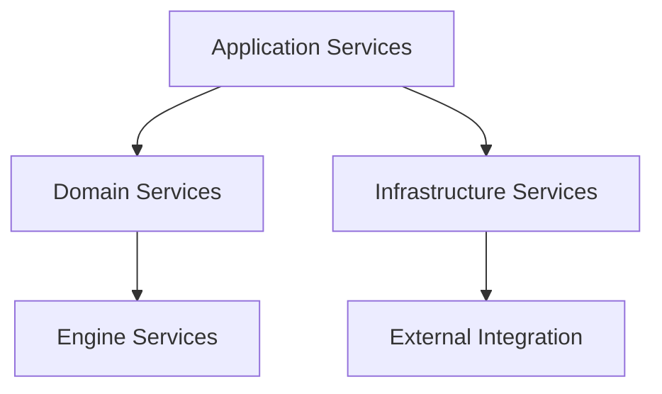
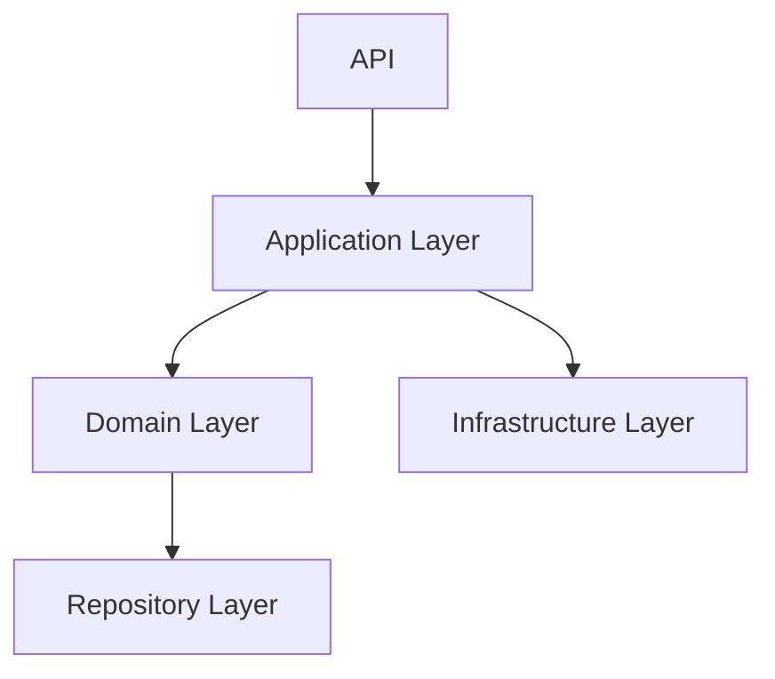
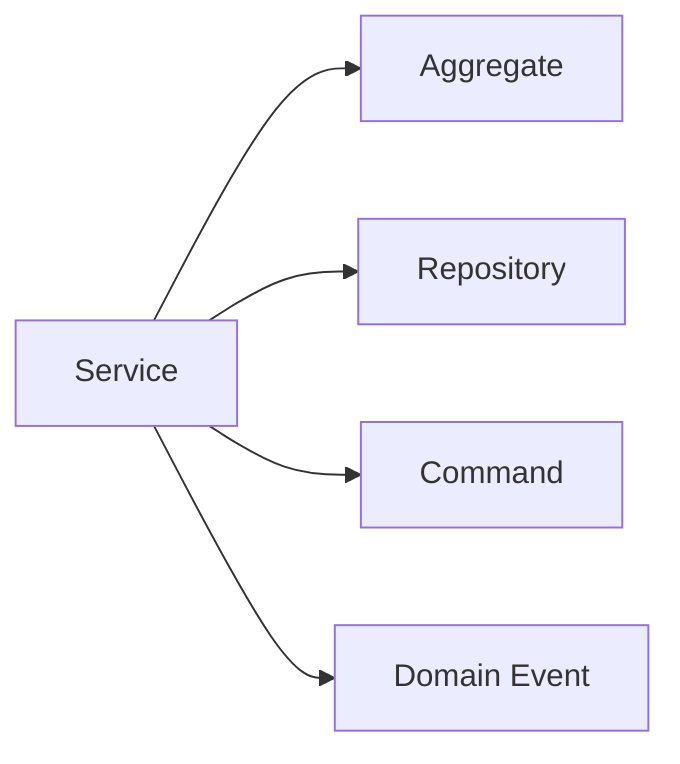
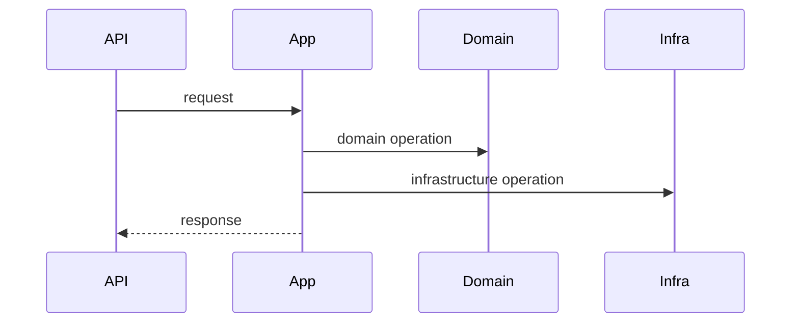
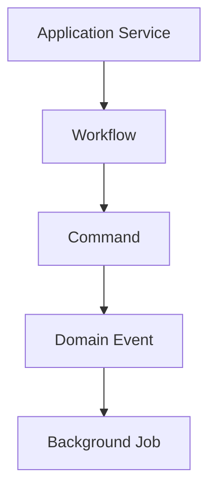
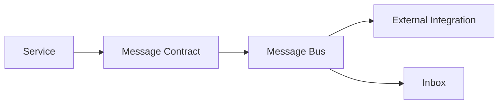

# Service Catalog

# Document Control

Document Name: Service Catalog
Document Path: knowledge/service-catalog.md
Document Type: Atlas Enterprise Canonical Specification
Version: 1.0
Status: Canonical Specification
Domain: Platform
Bounded Context: Platform
Owner: Project Atlas
Source of Truth: Atlas Service Source of Truth
Last Updated: 2026-07-12

Related Specifications:
- knowledge/domain-service-catalog.md
- knowledge/application-service-catalog.md
- knowledge/repository-catalog.md
- knowledge/aggregate-catalog.md
- knowledge/entity-catalog.md
- knowledge/command-catalog.md
- knowledge/domain-event-catalog.md
- knowledge/system-module-catalog.md
- knowledge/workflow-engine-framework.md
- knowledge/background-job-framework.md
- knowledge/scheduler-framework.md
- knowledge/automation-framework.md
- knowledge/api-governance-framework.md
- knowledge/message-contract-catalog.md
- knowledge/event-driven-architecture.md
- knowledge/integration-framework.md
- docs/specification/04-DomainModel.md
- docs/database/05-DatabaseDesign.md
- docs/database/06-ERD.md
- docs/api/07-API.md

# Purpose

Service Catalog defines every approved Atlas Service across Domain Service, Application Service, Infrastructure Service, Engine, Workflow, Scheduler, Automation, Background Job, Integration, Repository, API, Message Bus, and Notification boundaries. It is the service source of truth for ownership, dependencies, operations, security, transactions, observability, and performance.

# Scope

- Application Service
- Domain Service
- Infrastructure Service
- Engine Service
- Integration Service
- Workflow Service
- Scheduler Service
- Automation Service
- Background Job Service
- Notification Service
- Projection Service
- Calculation Service
- Simulation Service
- Optimization Service
- Decision Service
- Recommendation Service

# Service Classification Standard

Every Service is classified by category, layer, owner, dependencies, consumers, interfaces, operations, transaction behavior, security, observability, and failure strategy.

# Complete Service Catalog

The complete per-service specifications have been split into dedicated files to keep this catalog navigable while preserving the canonical service inventory.

| Service | Specification |
|---|---|
| DecisionApplicationService | knowledge/catalog/services/decision-application-service.md |
| ScenarioApplicationService | knowledge/catalog/services/scenario-application-service.md |
| GoalApplicationService | knowledge/catalog/services/goal-application-service.md |
| PortfolioApplicationService | knowledge/catalog/services/portfolio-application-service.md |
| LoanApplicationService | knowledge/catalog/services/loan-application-service.md |
| DashboardApplicationService | knowledge/catalog/services/dashboard-application-service.md |
| UserApplicationService | knowledge/catalog/services/user-application-service.md |
| BlueprintApplicationService | knowledge/catalog/services/blueprint-application-service.md |
| IPSApplicationService | knowledge/catalog/services/ips-application-service.md |
| NotificationApplicationService | knowledge/catalog/services/notification-application-service.md |
| ReportApplicationService | knowledge/catalog/services/report-application-service.md |
| AdministrationApplicationService | knowledge/catalog/services/administration-application-service.md |
| DecisionService | knowledge/catalog/services/decision-service.md |
| ScoringService | knowledge/catalog/services/scoring-service.md |
| CashFlowService | knowledge/catalog/services/cash-flow-service.md |
| RetirementService | knowledge/catalog/services/retirement-service.md |
| AllocationService | knowledge/catalog/services/allocation-service.md |
| ExplainabilityService | knowledge/catalog/services/explainability-service.md |
| PortfolioService | knowledge/catalog/services/portfolio-service.md |
| LoanService | knowledge/catalog/services/loan-service.md |
| ScenarioService | knowledge/catalog/services/scenario-service.md |
| RiskService | knowledge/catalog/services/risk-service.md |
| EmailService | knowledge/catalog/services/email-service.md |
| NotificationService | knowledge/catalog/services/notification-service.md |
| FileStorageService | knowledge/catalog/services/file-storage-service.md |
| AuditService | knowledge/catalog/services/audit-service.md |
| SchedulerService | knowledge/catalog/services/scheduler-service.md |
| BackupService | knowledge/catalog/services/backup-service.md |
| CacheService | knowledge/catalog/services/cache-service.md |
| ExternalApiService | knowledge/catalog/services/external-api-service.md |

# Service Dependency Matrix

| Service | Aggregate | Repository | Domain Service | Application Service | Command | Domain Event | Workflow | Background Job | Scheduler | Automation | External Integration |
|---|---|---|---|---|---|---|---|---|---|---|---|
| DecisionApplicationService | DecisionSession, Recommendation, Scenario | DecisionService, ScoringService, ExplainabilityService, DecisionRepository, ScenarioRepository | Catalog-aligned | Catalog-aligned | AcceptRecommendation, RejectRecommendation | RecommendationGenerated, DecisionAccepted, DecisionRejected | Catalog-aligned | Supported when asynchronous | Supported when scheduled | Catalog-approved | Catalog-approved |
| ScenarioApplicationService | Scenario, DecisionSession | ScenarioService, ScoringService, RiskService, ScenarioRepository, DecisionRepository | Catalog-aligned | Catalog-aligned | EvaluateScenario, ReplayScenario | ScenarioEvaluated, SnapshotCreated, ReplayCompleted | Catalog-aligned | Supported when asynchronous | Supported when scheduled | Catalog-approved | Catalog-approved |
| GoalApplicationService | GoalPlan, RetirementPlan | GoalRepository, RetirementService, CashFlowService | Catalog-aligned | Catalog-aligned | UpdateRetirementPlan | RetirementPlanUpdated, RetirementGoalReached | Catalog-aligned | Supported when asynchronous | Supported when scheduled | Catalog-approved | Catalog-approved |
| PortfolioApplicationService | AssetPortfolio | PortfolioRepository, PortfolioService, AllocationService | Catalog-aligned | Catalog-aligned | CreatePortfolio, BuySecurity, SellSecurity, RebalancePortfolio | PortfolioCreated, SecurityPurchased, SecuritySold, PortfolioRebalanced | Catalog-aligned | Supported when asynchronous | Supported when scheduled | Catalog-approved | Catalog-approved |
| LoanApplicationService | Loan | LoanRepository, LoanService | Catalog-aligned | Catalog-aligned | CreateLoan, RecordLoanPayment, RefinanceLoan | LoanCreated, LoanPaymentMade, LoanRefinanced, LoanClosed | Catalog-aligned | Supported when asynchronous | Supported when scheduled | Catalog-approved | Catalog-approved |
| DashboardApplicationService | Household, AssetPortfolio, LiabilityPortfolio, GoalPlan, Scenario | CashFlowService, PortfolioService, LoanService, RetirementService, HouseholdRepository, PortfolioRepository, LoanRepository | Catalog-aligned | Catalog-aligned | RecordIncome, RecordExpense, UpdatePropertyValue | SalaryReceived, ExpenseRecorded, HomeValueUpdated | Catalog-aligned | Supported when asynchronous | Supported when scheduled | Catalog-approved | Catalog-approved |
| UserApplicationService | User, Household | UserRepository, HouseholdRepository, AuditRepository | Catalog-aligned | Catalog-aligned | Identity commands and access queries | Identity and access events | Catalog-aligned | Supported when asynchronous | Supported when scheduled | Catalog-approved | Catalog-approved |
| BlueprintApplicationService | Household, GoalPlan, RetirementPlan, Property | HouseholdRepository, GoalRepository, PropertyRepository, CashFlowService, RetirementService, PortfolioService | Catalog-aligned | Catalog-aligned | RecordIncome, RecordExpense, UpdateRetirementPlan, PurchaseHome, SellHome | SalaryReceived, ExpenseRecorded, RetirementPlanUpdated, HomePurchased, HomeSold | Catalog-aligned | Supported when asynchronous | Supported when scheduled | Catalog-approved | Catalog-approved |
| IPSApplicationService | Policy, Household, Scenario | RiskService, CashFlowService, HouseholdRepository, ScenarioRepository | Catalog-aligned | Catalog-aligned | IssuePolicy, PayPremium | PolicyIssued, PremiumPaid, CoverageUpdated | Catalog-aligned | Supported when asynchronous | Supported when scheduled | Catalog-approved | Catalog-approved |
| NotificationApplicationService | Notification, DecisionSession, Recommendation | NotificationRepository, DecisionRepository, AuditRepository, ExplainabilityService | Catalog-aligned | Catalog-aligned | Notification delivery commands from catalog-aligned handlers | DecisionAccepted, DecisionRejected, RecommendationGenerated | Catalog-aligned | Supported when asynchronous | Supported when scheduled | Catalog-approved | Catalog-approved |
| ReportApplicationService | Household, Scenario, DecisionSession, AssetPortfolio, Loan, Policy | HouseholdRepository, ScenarioRepository, DecisionRepository, PortfolioRepository, LoanRepository, AuditRepository | Catalog-aligned | Catalog-aligned | Report generation commands from catalog-aligned handlers | Report source events through read models | Catalog-aligned | Supported when asynchronous | Supported when scheduled | Catalog-approved | Catalog-approved |
| AdministrationApplicationService | Configuration, Scenario, Notification, Household | AuditRepository, ScenarioRepository, NotificationRepository, HouseholdRepository, ScenarioService | Catalog-aligned | Catalog-aligned | ReplayScenario | SnapshotCreated, ReplayCompleted | Catalog-aligned | Supported when asynchronous | Supported when scheduled | Catalog-approved | Catalog-approved |
| DecisionService | DecisionSession, Recommendation, Scenario | DecisionRepository, ScenarioRepository, Rule Engine | Catalog-aligned | Catalog-aligned | EvaluateScenario, AcceptRecommendation, RejectRecommendation | ScenarioEvaluated, RecommendationGenerated, DecisionAccepted, DecisionRejected | Catalog-aligned | Supported when asynchronous | Supported when scheduled | Catalog-approved | Catalog-approved |
| ScoringService | Scenario, DecisionSession, Recommendation | ScenarioRepository, DecisionRepository, Rule Engine, Calculation Engine | Catalog-aligned | Catalog-aligned | EvaluateScenario | RuleEvaluated, HardConstraintTriggered, ScoreAdjusted | Catalog-aligned | Supported when asynchronous | Supported when scheduled | Catalog-approved | Catalog-approved |
| CashFlowService | Household, GoalPlan, Loan, Policy | HouseholdRepository, LoanRepository, Calculation Engine, Projection Engine | Catalog-aligned | Catalog-aligned | RecordIncome, RecordExpense, RecordLoanPayment, PayPremium | SalaryReceived, BonusReceived, ExpenseRecorded, PassiveIncomeReceived | Catalog-aligned | Supported when asynchronous | Supported when scheduled | Catalog-approved | Catalog-approved |
| RetirementService | RetirementPlan, GoalPlan, Scenario | GoalRepository, ScenarioRepository, Projection Engine, Simulation Engine, Optimization Engine | Catalog-aligned | Catalog-aligned | UpdateRetirementPlan, EvaluateScenario | RetirementPlanUpdated, RetirementGoalReached, RetirementWithdrawalStarted | Catalog-aligned | Supported when asynchronous | Supported when scheduled | Catalog-approved | Catalog-approved |
| AllocationService | AssetPortfolio, GoalPlan, Scenario | PortfolioRepository, GoalRepository, ScenarioRepository, Optimization Engine | Catalog-aligned | Catalog-aligned | RebalancePortfolio, EvaluateScenario | PortfolioRebalanced, ScoreAdjusted, RecommendationGenerated | Catalog-aligned | Supported when asynchronous | Supported when scheduled | Catalog-approved | Catalog-approved |
| ExplainabilityService | DecisionSession, Scenario, Recommendation, Notification | DecisionRepository, ScenarioRepository, NotificationRepository, AuditRepository, Rule Engine | Catalog-aligned | Catalog-aligned | AcceptRecommendation, RejectRecommendation, ReplayScenario | DecisionAccepted, DecisionRejected, RuleEvaluated, ReplayCompleted | Catalog-aligned | Supported when asynchronous | Supported when scheduled | Catalog-approved | Catalog-approved |
| PortfolioService | AssetPortfolio, Property | AssetRepository, PortfolioRepository, PropertyRepository, Calculation Engine, Projection Engine | Catalog-aligned | Catalog-aligned | CreatePortfolio, BuySecurity, SellSecurity, PurchaseHome, SellHome, UpdatePropertyValue | PortfolioCreated, SecurityPurchased, SecuritySold, HomePurchased, HomeSold, HomeValueUpdated | Catalog-aligned | Supported when asynchronous | Supported when scheduled | Catalog-approved | Catalog-approved |
| LoanService | Loan, LiabilityPortfolio | LoanRepository, LiabilityRepository, Calculation Engine, Optimization Engine, Projection Engine | Catalog-aligned | Catalog-aligned | CreateLoan, RecordLoanPayment, RefinanceLoan | LoanCreated, LoanPaymentMade, LoanRefinanced, LoanClosed | Catalog-aligned | Supported when asynchronous | Supported when scheduled | Catalog-approved | Catalog-approved |
| ScenarioService | Scenario, DecisionSession | ScenarioRepository, DecisionRepository, Simulation Engine, Projection Engine, Rule Engine | Catalog-aligned | Catalog-aligned | EvaluateScenario, ReplayScenario | ScenarioEvaluated, SnapshotCreated, ReplayCompleted | Catalog-aligned | Supported when asynchronous | Supported when scheduled | Catalog-approved | Catalog-approved |
| RiskService | Policy, Scenario, AssetPortfolio, DecisionSession | ScenarioRepository, PortfolioRepository, Rule Engine, Calculation Engine | Catalog-aligned | Catalog-aligned | IssuePolicy, PayPremium, EvaluateScenario | PolicyIssued, PremiumPaid, CoverageUpdated, HardConstraintTriggered | Catalog-aligned | Supported when asynchronous | Supported when scheduled | Catalog-approved | Catalog-approved |
| EmailService | Notification | NotificationRepository, ExternalApiService | Catalog-aligned | Catalog-aligned | Notification delivery commands from catalog-aligned handlers | Notification events | Catalog-aligned | Supported when asynchronous | Supported when scheduled | Catalog-approved | Catalog-approved |
| NotificationService | Notification | NotificationRepository, EmailService | Catalog-aligned | Catalog-aligned | Notification delivery commands from catalog-aligned handlers | Notification events | Catalog-aligned | Supported when asynchronous | Supported when scheduled | Catalog-approved | Catalog-approved |
| FileStorageService | Report | ReportApplicationService, AuditRepository | Catalog-aligned | Catalog-aligned | Report generation commands from catalog-aligned handlers | Report source events through read models | Catalog-aligned | Supported when asynchronous | Supported when scheduled | Catalog-approved | Catalog-approved |
| AuditService | Audit | AuditRepository | Catalog-aligned | Catalog-aligned | All catalog commands | All catalog domain events | Catalog-aligned | Supported when asynchronous | Supported when scheduled | Catalog-approved | Catalog-approved |
| SchedulerService | Configuration, Scenario | AuditRepository, ScenarioApplicationService, AdministrationApplicationService | Catalog-aligned | Catalog-aligned | EvaluateScenario, ReplayScenario | ScenarioEvaluated, ReplayCompleted | Catalog-aligned | Supported when asynchronous | Supported when scheduled | Catalog-approved | Catalog-approved |
| BackupService | Configuration | AuditRepository | Catalog-aligned | Catalog-aligned | Administration operations | Audit and backup events | Catalog-aligned | Supported when asynchronous | Supported when scheduled | Catalog-approved | Catalog-approved |
| CacheService | Read Models | Repositories, Projection handlers | Catalog-aligned | Catalog-aligned | Read queries and cache invalidation | Domain events with cache impact | Catalog-aligned | Supported when asynchronous | Supported when scheduled | Catalog-approved | Catalog-approved |
| ExternalApiService | Integration context | Message Contract Catalog, Integration Framework | Catalog-aligned | Catalog-aligned | Integration operations | Integration and audit events | Catalog-aligned | Supported when asynchronous | Supported when scheduled | Catalog-approved | Catalog-approved |

# Service Aggregate Matrix

| Service | Category | Dependency | Consumer | Control |
|---|---|---|---|---|
| DecisionApplicationService | Application Service | DecisionService, ScoringService, ExplainabilityService, DecisionRepository, ScenarioRepository | API, Workflow, Command Handler | Authorized, observable, audited, and catalog-aligned |
| ScenarioApplicationService | Application Service | ScenarioService, ScoringService, RiskService, ScenarioRepository, DecisionRepository | API, Scheduler, Workflow | Authorized, observable, audited, and catalog-aligned |
| GoalApplicationService | Application Service | GoalRepository, RetirementService, CashFlowService | API, Workflow | Authorized, observable, audited, and catalog-aligned |
| PortfolioApplicationService | Application Service | PortfolioRepository, PortfolioService, AllocationService | API, Workflow | Authorized, observable, audited, and catalog-aligned |
| LoanApplicationService | Application Service | LoanRepository, LoanService | API, Workflow | Authorized, observable, audited, and catalog-aligned |
| DashboardApplicationService | Application Service | CashFlowService, PortfolioService, LoanService, RetirementService, HouseholdRepository, PortfolioRepository, LoanRepository | API, Query Handler | Authorized, observable, audited, and catalog-aligned |
| UserApplicationService | Application Service | UserRepository, HouseholdRepository, AuditRepository | API | Authorized, observable, audited, and catalog-aligned |
| BlueprintApplicationService | Application Service | HouseholdRepository, GoalRepository, PropertyRepository, CashFlowService, RetirementService, PortfolioService | API, Workflow | Authorized, observable, audited, and catalog-aligned |
| IPSApplicationService | Application Service | RiskService, CashFlowService, HouseholdRepository, ScenarioRepository | API, Workflow | Authorized, observable, audited, and catalog-aligned |
| NotificationApplicationService | Application Service | NotificationRepository, DecisionRepository, AuditRepository, ExplainabilityService | API, Background Job | Authorized, observable, audited, and catalog-aligned |
| ReportApplicationService | Application Service | HouseholdRepository, ScenarioRepository, DecisionRepository, PortfolioRepository, LoanRepository, AuditRepository | API, Background Job | Authorized, observable, audited, and catalog-aligned |
| AdministrationApplicationService | Application Service | AuditRepository, ScenarioRepository, NotificationRepository, HouseholdRepository, ScenarioService | API, Scheduler | Authorized, observable, audited, and catalog-aligned |
| DecisionService | Domain Service | DecisionRepository, ScenarioRepository, Rule Engine | Application Service, Command Handler | Authorized, observable, audited, and catalog-aligned |
| ScoringService | Domain Service | ScenarioRepository, DecisionRepository, Rule Engine, Calculation Engine | ScenarioService, DecisionService | Authorized, observable, audited, and catalog-aligned |
| CashFlowService | Domain Service | HouseholdRepository, LoanRepository, Calculation Engine, Projection Engine | Application Service, Domain Service | Authorized, observable, audited, and catalog-aligned |
| RetirementService | Domain Service | GoalRepository, ScenarioRepository, Projection Engine, Simulation Engine, Optimization Engine | Application Service, Domain Service | Authorized, observable, audited, and catalog-aligned |
| AllocationService | Domain Service | PortfolioRepository, GoalRepository, ScenarioRepository, Optimization Engine | PortfolioApplicationService, ScenarioService | Authorized, observable, audited, and catalog-aligned |
| ExplainabilityService | Domain Service | DecisionRepository, ScenarioRepository, NotificationRepository, AuditRepository, Rule Engine | Application Service, ReportApplicationService | Authorized, observable, audited, and catalog-aligned |
| PortfolioService | Domain Service | AssetRepository, PortfolioRepository, PropertyRepository, Calculation Engine, Projection Engine | Application Service, Domain Service | Authorized, observable, audited, and catalog-aligned |
| LoanService | Domain Service | LoanRepository, LiabilityRepository, Calculation Engine, Optimization Engine, Projection Engine | LoanApplicationService, DashboardApplicationService | Authorized, observable, audited, and catalog-aligned |
| ScenarioService | Domain Service | ScenarioRepository, DecisionRepository, Simulation Engine, Projection Engine, Rule Engine | ScenarioApplicationService, AdministrationApplicationService | Authorized, observable, audited, and catalog-aligned |
| RiskService | Domain Service | ScenarioRepository, PortfolioRepository, Rule Engine, Calculation Engine | IPSApplicationService, ScenarioApplicationService | Authorized, observable, audited, and catalog-aligned |
| EmailService | Infrastructure Service | NotificationRepository, ExternalApiService | NotificationApplicationService | Authorized, observable, audited, and catalog-aligned |
| NotificationService | Infrastructure Service | NotificationRepository, EmailService | NotificationApplicationService | Authorized, observable, audited, and catalog-aligned |
| FileStorageService | Infrastructure Service | ReportApplicationService, AuditRepository | ReportApplicationService | Authorized, observable, audited, and catalog-aligned |
| AuditService | Infrastructure Service | AuditRepository | All Application Services | Authorized, observable, audited, and catalog-aligned |
| SchedulerService | Infrastructure Service | AuditRepository, ScenarioApplicationService, AdministrationApplicationService | Scheduler | Authorized, observable, audited, and catalog-aligned |
| BackupService | Infrastructure Service | AuditRepository | AdministrationApplicationService | Authorized, observable, audited, and catalog-aligned |
| CacheService | Infrastructure Service | Repositories, Projection handlers | Application Services, Query Handlers | Authorized, observable, audited, and catalog-aligned |
| ExternalApiService | Infrastructure Service | Message Contract Catalog, Integration Framework | Application Services, Infrastructure Services | Authorized, observable, audited, and catalog-aligned |

# Service Repository Matrix

| Service | Category | Dependency | Consumer | Control |
|---|---|---|---|---|
| DecisionApplicationService | Application Service | DecisionService, ScoringService, ExplainabilityService, DecisionRepository, ScenarioRepository | API, Workflow, Command Handler | Authorized, observable, audited, and catalog-aligned |
| ScenarioApplicationService | Application Service | ScenarioService, ScoringService, RiskService, ScenarioRepository, DecisionRepository | API, Scheduler, Workflow | Authorized, observable, audited, and catalog-aligned |
| GoalApplicationService | Application Service | GoalRepository, RetirementService, CashFlowService | API, Workflow | Authorized, observable, audited, and catalog-aligned |
| PortfolioApplicationService | Application Service | PortfolioRepository, PortfolioService, AllocationService | API, Workflow | Authorized, observable, audited, and catalog-aligned |
| LoanApplicationService | Application Service | LoanRepository, LoanService | API, Workflow | Authorized, observable, audited, and catalog-aligned |
| DashboardApplicationService | Application Service | CashFlowService, PortfolioService, LoanService, RetirementService, HouseholdRepository, PortfolioRepository, LoanRepository | API, Query Handler | Authorized, observable, audited, and catalog-aligned |
| UserApplicationService | Application Service | UserRepository, HouseholdRepository, AuditRepository | API | Authorized, observable, audited, and catalog-aligned |
| BlueprintApplicationService | Application Service | HouseholdRepository, GoalRepository, PropertyRepository, CashFlowService, RetirementService, PortfolioService | API, Workflow | Authorized, observable, audited, and catalog-aligned |
| IPSApplicationService | Application Service | RiskService, CashFlowService, HouseholdRepository, ScenarioRepository | API, Workflow | Authorized, observable, audited, and catalog-aligned |
| NotificationApplicationService | Application Service | NotificationRepository, DecisionRepository, AuditRepository, ExplainabilityService | API, Background Job | Authorized, observable, audited, and catalog-aligned |
| ReportApplicationService | Application Service | HouseholdRepository, ScenarioRepository, DecisionRepository, PortfolioRepository, LoanRepository, AuditRepository | API, Background Job | Authorized, observable, audited, and catalog-aligned |
| AdministrationApplicationService | Application Service | AuditRepository, ScenarioRepository, NotificationRepository, HouseholdRepository, ScenarioService | API, Scheduler | Authorized, observable, audited, and catalog-aligned |
| DecisionService | Domain Service | DecisionRepository, ScenarioRepository, Rule Engine | Application Service, Command Handler | Authorized, observable, audited, and catalog-aligned |
| ScoringService | Domain Service | ScenarioRepository, DecisionRepository, Rule Engine, Calculation Engine | ScenarioService, DecisionService | Authorized, observable, audited, and catalog-aligned |
| CashFlowService | Domain Service | HouseholdRepository, LoanRepository, Calculation Engine, Projection Engine | Application Service, Domain Service | Authorized, observable, audited, and catalog-aligned |
| RetirementService | Domain Service | GoalRepository, ScenarioRepository, Projection Engine, Simulation Engine, Optimization Engine | Application Service, Domain Service | Authorized, observable, audited, and catalog-aligned |
| AllocationService | Domain Service | PortfolioRepository, GoalRepository, ScenarioRepository, Optimization Engine | PortfolioApplicationService, ScenarioService | Authorized, observable, audited, and catalog-aligned |
| ExplainabilityService | Domain Service | DecisionRepository, ScenarioRepository, NotificationRepository, AuditRepository, Rule Engine | Application Service, ReportApplicationService | Authorized, observable, audited, and catalog-aligned |
| PortfolioService | Domain Service | AssetRepository, PortfolioRepository, PropertyRepository, Calculation Engine, Projection Engine | Application Service, Domain Service | Authorized, observable, audited, and catalog-aligned |
| LoanService | Domain Service | LoanRepository, LiabilityRepository, Calculation Engine, Optimization Engine, Projection Engine | LoanApplicationService, DashboardApplicationService | Authorized, observable, audited, and catalog-aligned |
| ScenarioService | Domain Service | ScenarioRepository, DecisionRepository, Simulation Engine, Projection Engine, Rule Engine | ScenarioApplicationService, AdministrationApplicationService | Authorized, observable, audited, and catalog-aligned |
| RiskService | Domain Service | ScenarioRepository, PortfolioRepository, Rule Engine, Calculation Engine | IPSApplicationService, ScenarioApplicationService | Authorized, observable, audited, and catalog-aligned |
| EmailService | Infrastructure Service | NotificationRepository, ExternalApiService | NotificationApplicationService | Authorized, observable, audited, and catalog-aligned |
| NotificationService | Infrastructure Service | NotificationRepository, EmailService | NotificationApplicationService | Authorized, observable, audited, and catalog-aligned |
| FileStorageService | Infrastructure Service | ReportApplicationService, AuditRepository | ReportApplicationService | Authorized, observable, audited, and catalog-aligned |
| AuditService | Infrastructure Service | AuditRepository | All Application Services | Authorized, observable, audited, and catalog-aligned |
| SchedulerService | Infrastructure Service | AuditRepository, ScenarioApplicationService, AdministrationApplicationService | Scheduler | Authorized, observable, audited, and catalog-aligned |
| BackupService | Infrastructure Service | AuditRepository | AdministrationApplicationService | Authorized, observable, audited, and catalog-aligned |
| CacheService | Infrastructure Service | Repositories, Projection handlers | Application Services, Query Handlers | Authorized, observable, audited, and catalog-aligned |
| ExternalApiService | Infrastructure Service | Message Contract Catalog, Integration Framework | Application Services, Infrastructure Services | Authorized, observable, audited, and catalog-aligned |

# Service Domain Service Matrix

| Service | Category | Dependency | Consumer | Control |
|---|---|---|---|---|
| DecisionApplicationService | Application Service | DecisionService, ScoringService, ExplainabilityService, DecisionRepository, ScenarioRepository | API, Workflow, Command Handler | Authorized, observable, audited, and catalog-aligned |
| ScenarioApplicationService | Application Service | ScenarioService, ScoringService, RiskService, ScenarioRepository, DecisionRepository | API, Scheduler, Workflow | Authorized, observable, audited, and catalog-aligned |
| GoalApplicationService | Application Service | GoalRepository, RetirementService, CashFlowService | API, Workflow | Authorized, observable, audited, and catalog-aligned |
| PortfolioApplicationService | Application Service | PortfolioRepository, PortfolioService, AllocationService | API, Workflow | Authorized, observable, audited, and catalog-aligned |
| LoanApplicationService | Application Service | LoanRepository, LoanService | API, Workflow | Authorized, observable, audited, and catalog-aligned |
| DashboardApplicationService | Application Service | CashFlowService, PortfolioService, LoanService, RetirementService, HouseholdRepository, PortfolioRepository, LoanRepository | API, Query Handler | Authorized, observable, audited, and catalog-aligned |
| UserApplicationService | Application Service | UserRepository, HouseholdRepository, AuditRepository | API | Authorized, observable, audited, and catalog-aligned |
| BlueprintApplicationService | Application Service | HouseholdRepository, GoalRepository, PropertyRepository, CashFlowService, RetirementService, PortfolioService | API, Workflow | Authorized, observable, audited, and catalog-aligned |
| IPSApplicationService | Application Service | RiskService, CashFlowService, HouseholdRepository, ScenarioRepository | API, Workflow | Authorized, observable, audited, and catalog-aligned |
| NotificationApplicationService | Application Service | NotificationRepository, DecisionRepository, AuditRepository, ExplainabilityService | API, Background Job | Authorized, observable, audited, and catalog-aligned |
| ReportApplicationService | Application Service | HouseholdRepository, ScenarioRepository, DecisionRepository, PortfolioRepository, LoanRepository, AuditRepository | API, Background Job | Authorized, observable, audited, and catalog-aligned |
| AdministrationApplicationService | Application Service | AuditRepository, ScenarioRepository, NotificationRepository, HouseholdRepository, ScenarioService | API, Scheduler | Authorized, observable, audited, and catalog-aligned |
| DecisionService | Domain Service | DecisionRepository, ScenarioRepository, Rule Engine | Application Service, Command Handler | Authorized, observable, audited, and catalog-aligned |
| ScoringService | Domain Service | ScenarioRepository, DecisionRepository, Rule Engine, Calculation Engine | ScenarioService, DecisionService | Authorized, observable, audited, and catalog-aligned |
| CashFlowService | Domain Service | HouseholdRepository, LoanRepository, Calculation Engine, Projection Engine | Application Service, Domain Service | Authorized, observable, audited, and catalog-aligned |
| RetirementService | Domain Service | GoalRepository, ScenarioRepository, Projection Engine, Simulation Engine, Optimization Engine | Application Service, Domain Service | Authorized, observable, audited, and catalog-aligned |
| AllocationService | Domain Service | PortfolioRepository, GoalRepository, ScenarioRepository, Optimization Engine | PortfolioApplicationService, ScenarioService | Authorized, observable, audited, and catalog-aligned |
| ExplainabilityService | Domain Service | DecisionRepository, ScenarioRepository, NotificationRepository, AuditRepository, Rule Engine | Application Service, ReportApplicationService | Authorized, observable, audited, and catalog-aligned |
| PortfolioService | Domain Service | AssetRepository, PortfolioRepository, PropertyRepository, Calculation Engine, Projection Engine | Application Service, Domain Service | Authorized, observable, audited, and catalog-aligned |
| LoanService | Domain Service | LoanRepository, LiabilityRepository, Calculation Engine, Optimization Engine, Projection Engine | LoanApplicationService, DashboardApplicationService | Authorized, observable, audited, and catalog-aligned |
| ScenarioService | Domain Service | ScenarioRepository, DecisionRepository, Simulation Engine, Projection Engine, Rule Engine | ScenarioApplicationService, AdministrationApplicationService | Authorized, observable, audited, and catalog-aligned |
| RiskService | Domain Service | ScenarioRepository, PortfolioRepository, Rule Engine, Calculation Engine | IPSApplicationService, ScenarioApplicationService | Authorized, observable, audited, and catalog-aligned |
| EmailService | Infrastructure Service | NotificationRepository, ExternalApiService | NotificationApplicationService | Authorized, observable, audited, and catalog-aligned |
| NotificationService | Infrastructure Service | NotificationRepository, EmailService | NotificationApplicationService | Authorized, observable, audited, and catalog-aligned |
| FileStorageService | Infrastructure Service | ReportApplicationService, AuditRepository | ReportApplicationService | Authorized, observable, audited, and catalog-aligned |
| AuditService | Infrastructure Service | AuditRepository | All Application Services | Authorized, observable, audited, and catalog-aligned |
| SchedulerService | Infrastructure Service | AuditRepository, ScenarioApplicationService, AdministrationApplicationService | Scheduler | Authorized, observable, audited, and catalog-aligned |
| BackupService | Infrastructure Service | AuditRepository | AdministrationApplicationService | Authorized, observable, audited, and catalog-aligned |
| CacheService | Infrastructure Service | Repositories, Projection handlers | Application Services, Query Handlers | Authorized, observable, audited, and catalog-aligned |
| ExternalApiService | Infrastructure Service | Message Contract Catalog, Integration Framework | Application Services, Infrastructure Services | Authorized, observable, audited, and catalog-aligned |

# Service Application Service Matrix

| Service | Category | Dependency | Consumer | Control |
|---|---|---|---|---|
| DecisionApplicationService | Application Service | DecisionService, ScoringService, ExplainabilityService, DecisionRepository, ScenarioRepository | API, Workflow, Command Handler | Authorized, observable, audited, and catalog-aligned |
| ScenarioApplicationService | Application Service | ScenarioService, ScoringService, RiskService, ScenarioRepository, DecisionRepository | API, Scheduler, Workflow | Authorized, observable, audited, and catalog-aligned |
| GoalApplicationService | Application Service | GoalRepository, RetirementService, CashFlowService | API, Workflow | Authorized, observable, audited, and catalog-aligned |
| PortfolioApplicationService | Application Service | PortfolioRepository, PortfolioService, AllocationService | API, Workflow | Authorized, observable, audited, and catalog-aligned |
| LoanApplicationService | Application Service | LoanRepository, LoanService | API, Workflow | Authorized, observable, audited, and catalog-aligned |
| DashboardApplicationService | Application Service | CashFlowService, PortfolioService, LoanService, RetirementService, HouseholdRepository, PortfolioRepository, LoanRepository | API, Query Handler | Authorized, observable, audited, and catalog-aligned |
| UserApplicationService | Application Service | UserRepository, HouseholdRepository, AuditRepository | API | Authorized, observable, audited, and catalog-aligned |
| BlueprintApplicationService | Application Service | HouseholdRepository, GoalRepository, PropertyRepository, CashFlowService, RetirementService, PortfolioService | API, Workflow | Authorized, observable, audited, and catalog-aligned |
| IPSApplicationService | Application Service | RiskService, CashFlowService, HouseholdRepository, ScenarioRepository | API, Workflow | Authorized, observable, audited, and catalog-aligned |
| NotificationApplicationService | Application Service | NotificationRepository, DecisionRepository, AuditRepository, ExplainabilityService | API, Background Job | Authorized, observable, audited, and catalog-aligned |
| ReportApplicationService | Application Service | HouseholdRepository, ScenarioRepository, DecisionRepository, PortfolioRepository, LoanRepository, AuditRepository | API, Background Job | Authorized, observable, audited, and catalog-aligned |
| AdministrationApplicationService | Application Service | AuditRepository, ScenarioRepository, NotificationRepository, HouseholdRepository, ScenarioService | API, Scheduler | Authorized, observable, audited, and catalog-aligned |
| DecisionService | Domain Service | DecisionRepository, ScenarioRepository, Rule Engine | Application Service, Command Handler | Authorized, observable, audited, and catalog-aligned |
| ScoringService | Domain Service | ScenarioRepository, DecisionRepository, Rule Engine, Calculation Engine | ScenarioService, DecisionService | Authorized, observable, audited, and catalog-aligned |
| CashFlowService | Domain Service | HouseholdRepository, LoanRepository, Calculation Engine, Projection Engine | Application Service, Domain Service | Authorized, observable, audited, and catalog-aligned |
| RetirementService | Domain Service | GoalRepository, ScenarioRepository, Projection Engine, Simulation Engine, Optimization Engine | Application Service, Domain Service | Authorized, observable, audited, and catalog-aligned |
| AllocationService | Domain Service | PortfolioRepository, GoalRepository, ScenarioRepository, Optimization Engine | PortfolioApplicationService, ScenarioService | Authorized, observable, audited, and catalog-aligned |
| ExplainabilityService | Domain Service | DecisionRepository, ScenarioRepository, NotificationRepository, AuditRepository, Rule Engine | Application Service, ReportApplicationService | Authorized, observable, audited, and catalog-aligned |
| PortfolioService | Domain Service | AssetRepository, PortfolioRepository, PropertyRepository, Calculation Engine, Projection Engine | Application Service, Domain Service | Authorized, observable, audited, and catalog-aligned |
| LoanService | Domain Service | LoanRepository, LiabilityRepository, Calculation Engine, Optimization Engine, Projection Engine | LoanApplicationService, DashboardApplicationService | Authorized, observable, audited, and catalog-aligned |
| ScenarioService | Domain Service | ScenarioRepository, DecisionRepository, Simulation Engine, Projection Engine, Rule Engine | ScenarioApplicationService, AdministrationApplicationService | Authorized, observable, audited, and catalog-aligned |
| RiskService | Domain Service | ScenarioRepository, PortfolioRepository, Rule Engine, Calculation Engine | IPSApplicationService, ScenarioApplicationService | Authorized, observable, audited, and catalog-aligned |
| EmailService | Infrastructure Service | NotificationRepository, ExternalApiService | NotificationApplicationService | Authorized, observable, audited, and catalog-aligned |
| NotificationService | Infrastructure Service | NotificationRepository, EmailService | NotificationApplicationService | Authorized, observable, audited, and catalog-aligned |
| FileStorageService | Infrastructure Service | ReportApplicationService, AuditRepository | ReportApplicationService | Authorized, observable, audited, and catalog-aligned |
| AuditService | Infrastructure Service | AuditRepository | All Application Services | Authorized, observable, audited, and catalog-aligned |
| SchedulerService | Infrastructure Service | AuditRepository, ScenarioApplicationService, AdministrationApplicationService | Scheduler | Authorized, observable, audited, and catalog-aligned |
| BackupService | Infrastructure Service | AuditRepository | AdministrationApplicationService | Authorized, observable, audited, and catalog-aligned |
| CacheService | Infrastructure Service | Repositories, Projection handlers | Application Services, Query Handlers | Authorized, observable, audited, and catalog-aligned |
| ExternalApiService | Infrastructure Service | Message Contract Catalog, Integration Framework | Application Services, Infrastructure Services | Authorized, observable, audited, and catalog-aligned |

# Service Command Matrix

| Service | Category | Dependency | Consumer | Control |
|---|---|---|---|---|
| DecisionApplicationService | Application Service | DecisionService, ScoringService, ExplainabilityService, DecisionRepository, ScenarioRepository | API, Workflow, Command Handler | Authorized, observable, audited, and catalog-aligned |
| ScenarioApplicationService | Application Service | ScenarioService, ScoringService, RiskService, ScenarioRepository, DecisionRepository | API, Scheduler, Workflow | Authorized, observable, audited, and catalog-aligned |
| GoalApplicationService | Application Service | GoalRepository, RetirementService, CashFlowService | API, Workflow | Authorized, observable, audited, and catalog-aligned |
| PortfolioApplicationService | Application Service | PortfolioRepository, PortfolioService, AllocationService | API, Workflow | Authorized, observable, audited, and catalog-aligned |
| LoanApplicationService | Application Service | LoanRepository, LoanService | API, Workflow | Authorized, observable, audited, and catalog-aligned |
| DashboardApplicationService | Application Service | CashFlowService, PortfolioService, LoanService, RetirementService, HouseholdRepository, PortfolioRepository, LoanRepository | API, Query Handler | Authorized, observable, audited, and catalog-aligned |
| UserApplicationService | Application Service | UserRepository, HouseholdRepository, AuditRepository | API | Authorized, observable, audited, and catalog-aligned |
| BlueprintApplicationService | Application Service | HouseholdRepository, GoalRepository, PropertyRepository, CashFlowService, RetirementService, PortfolioService | API, Workflow | Authorized, observable, audited, and catalog-aligned |
| IPSApplicationService | Application Service | RiskService, CashFlowService, HouseholdRepository, ScenarioRepository | API, Workflow | Authorized, observable, audited, and catalog-aligned |
| NotificationApplicationService | Application Service | NotificationRepository, DecisionRepository, AuditRepository, ExplainabilityService | API, Background Job | Authorized, observable, audited, and catalog-aligned |
| ReportApplicationService | Application Service | HouseholdRepository, ScenarioRepository, DecisionRepository, PortfolioRepository, LoanRepository, AuditRepository | API, Background Job | Authorized, observable, audited, and catalog-aligned |
| AdministrationApplicationService | Application Service | AuditRepository, ScenarioRepository, NotificationRepository, HouseholdRepository, ScenarioService | API, Scheduler | Authorized, observable, audited, and catalog-aligned |
| DecisionService | Domain Service | DecisionRepository, ScenarioRepository, Rule Engine | Application Service, Command Handler | Authorized, observable, audited, and catalog-aligned |
| ScoringService | Domain Service | ScenarioRepository, DecisionRepository, Rule Engine, Calculation Engine | ScenarioService, DecisionService | Authorized, observable, audited, and catalog-aligned |
| CashFlowService | Domain Service | HouseholdRepository, LoanRepository, Calculation Engine, Projection Engine | Application Service, Domain Service | Authorized, observable, audited, and catalog-aligned |
| RetirementService | Domain Service | GoalRepository, ScenarioRepository, Projection Engine, Simulation Engine, Optimization Engine | Application Service, Domain Service | Authorized, observable, audited, and catalog-aligned |
| AllocationService | Domain Service | PortfolioRepository, GoalRepository, ScenarioRepository, Optimization Engine | PortfolioApplicationService, ScenarioService | Authorized, observable, audited, and catalog-aligned |
| ExplainabilityService | Domain Service | DecisionRepository, ScenarioRepository, NotificationRepository, AuditRepository, Rule Engine | Application Service, ReportApplicationService | Authorized, observable, audited, and catalog-aligned |
| PortfolioService | Domain Service | AssetRepository, PortfolioRepository, PropertyRepository, Calculation Engine, Projection Engine | Application Service, Domain Service | Authorized, observable, audited, and catalog-aligned |
| LoanService | Domain Service | LoanRepository, LiabilityRepository, Calculation Engine, Optimization Engine, Projection Engine | LoanApplicationService, DashboardApplicationService | Authorized, observable, audited, and catalog-aligned |
| ScenarioService | Domain Service | ScenarioRepository, DecisionRepository, Simulation Engine, Projection Engine, Rule Engine | ScenarioApplicationService, AdministrationApplicationService | Authorized, observable, audited, and catalog-aligned |
| RiskService | Domain Service | ScenarioRepository, PortfolioRepository, Rule Engine, Calculation Engine | IPSApplicationService, ScenarioApplicationService | Authorized, observable, audited, and catalog-aligned |
| EmailService | Infrastructure Service | NotificationRepository, ExternalApiService | NotificationApplicationService | Authorized, observable, audited, and catalog-aligned |
| NotificationService | Infrastructure Service | NotificationRepository, EmailService | NotificationApplicationService | Authorized, observable, audited, and catalog-aligned |
| FileStorageService | Infrastructure Service | ReportApplicationService, AuditRepository | ReportApplicationService | Authorized, observable, audited, and catalog-aligned |
| AuditService | Infrastructure Service | AuditRepository | All Application Services | Authorized, observable, audited, and catalog-aligned |
| SchedulerService | Infrastructure Service | AuditRepository, ScenarioApplicationService, AdministrationApplicationService | Scheduler | Authorized, observable, audited, and catalog-aligned |
| BackupService | Infrastructure Service | AuditRepository | AdministrationApplicationService | Authorized, observable, audited, and catalog-aligned |
| CacheService | Infrastructure Service | Repositories, Projection handlers | Application Services, Query Handlers | Authorized, observable, audited, and catalog-aligned |
| ExternalApiService | Infrastructure Service | Message Contract Catalog, Integration Framework | Application Services, Infrastructure Services | Authorized, observable, audited, and catalog-aligned |

# Service Domain Event Matrix

| Service | Category | Dependency | Consumer | Control |
|---|---|---|---|---|
| DecisionApplicationService | Application Service | DecisionService, ScoringService, ExplainabilityService, DecisionRepository, ScenarioRepository | API, Workflow, Command Handler | Authorized, observable, audited, and catalog-aligned |
| ScenarioApplicationService | Application Service | ScenarioService, ScoringService, RiskService, ScenarioRepository, DecisionRepository | API, Scheduler, Workflow | Authorized, observable, audited, and catalog-aligned |
| GoalApplicationService | Application Service | GoalRepository, RetirementService, CashFlowService | API, Workflow | Authorized, observable, audited, and catalog-aligned |
| PortfolioApplicationService | Application Service | PortfolioRepository, PortfolioService, AllocationService | API, Workflow | Authorized, observable, audited, and catalog-aligned |
| LoanApplicationService | Application Service | LoanRepository, LoanService | API, Workflow | Authorized, observable, audited, and catalog-aligned |
| DashboardApplicationService | Application Service | CashFlowService, PortfolioService, LoanService, RetirementService, HouseholdRepository, PortfolioRepository, LoanRepository | API, Query Handler | Authorized, observable, audited, and catalog-aligned |
| UserApplicationService | Application Service | UserRepository, HouseholdRepository, AuditRepository | API | Authorized, observable, audited, and catalog-aligned |
| BlueprintApplicationService | Application Service | HouseholdRepository, GoalRepository, PropertyRepository, CashFlowService, RetirementService, PortfolioService | API, Workflow | Authorized, observable, audited, and catalog-aligned |
| IPSApplicationService | Application Service | RiskService, CashFlowService, HouseholdRepository, ScenarioRepository | API, Workflow | Authorized, observable, audited, and catalog-aligned |
| NotificationApplicationService | Application Service | NotificationRepository, DecisionRepository, AuditRepository, ExplainabilityService | API, Background Job | Authorized, observable, audited, and catalog-aligned |
| ReportApplicationService | Application Service | HouseholdRepository, ScenarioRepository, DecisionRepository, PortfolioRepository, LoanRepository, AuditRepository | API, Background Job | Authorized, observable, audited, and catalog-aligned |
| AdministrationApplicationService | Application Service | AuditRepository, ScenarioRepository, NotificationRepository, HouseholdRepository, ScenarioService | API, Scheduler | Authorized, observable, audited, and catalog-aligned |
| DecisionService | Domain Service | DecisionRepository, ScenarioRepository, Rule Engine | Application Service, Command Handler | Authorized, observable, audited, and catalog-aligned |
| ScoringService | Domain Service | ScenarioRepository, DecisionRepository, Rule Engine, Calculation Engine | ScenarioService, DecisionService | Authorized, observable, audited, and catalog-aligned |
| CashFlowService | Domain Service | HouseholdRepository, LoanRepository, Calculation Engine, Projection Engine | Application Service, Domain Service | Authorized, observable, audited, and catalog-aligned |
| RetirementService | Domain Service | GoalRepository, ScenarioRepository, Projection Engine, Simulation Engine, Optimization Engine | Application Service, Domain Service | Authorized, observable, audited, and catalog-aligned |
| AllocationService | Domain Service | PortfolioRepository, GoalRepository, ScenarioRepository, Optimization Engine | PortfolioApplicationService, ScenarioService | Authorized, observable, audited, and catalog-aligned |
| ExplainabilityService | Domain Service | DecisionRepository, ScenarioRepository, NotificationRepository, AuditRepository, Rule Engine | Application Service, ReportApplicationService | Authorized, observable, audited, and catalog-aligned |
| PortfolioService | Domain Service | AssetRepository, PortfolioRepository, PropertyRepository, Calculation Engine, Projection Engine | Application Service, Domain Service | Authorized, observable, audited, and catalog-aligned |
| LoanService | Domain Service | LoanRepository, LiabilityRepository, Calculation Engine, Optimization Engine, Projection Engine | LoanApplicationService, DashboardApplicationService | Authorized, observable, audited, and catalog-aligned |
| ScenarioService | Domain Service | ScenarioRepository, DecisionRepository, Simulation Engine, Projection Engine, Rule Engine | ScenarioApplicationService, AdministrationApplicationService | Authorized, observable, audited, and catalog-aligned |
| RiskService | Domain Service | ScenarioRepository, PortfolioRepository, Rule Engine, Calculation Engine | IPSApplicationService, ScenarioApplicationService | Authorized, observable, audited, and catalog-aligned |
| EmailService | Infrastructure Service | NotificationRepository, ExternalApiService | NotificationApplicationService | Authorized, observable, audited, and catalog-aligned |
| NotificationService | Infrastructure Service | NotificationRepository, EmailService | NotificationApplicationService | Authorized, observable, audited, and catalog-aligned |
| FileStorageService | Infrastructure Service | ReportApplicationService, AuditRepository | ReportApplicationService | Authorized, observable, audited, and catalog-aligned |
| AuditService | Infrastructure Service | AuditRepository | All Application Services | Authorized, observable, audited, and catalog-aligned |
| SchedulerService | Infrastructure Service | AuditRepository, ScenarioApplicationService, AdministrationApplicationService | Scheduler | Authorized, observable, audited, and catalog-aligned |
| BackupService | Infrastructure Service | AuditRepository | AdministrationApplicationService | Authorized, observable, audited, and catalog-aligned |
| CacheService | Infrastructure Service | Repositories, Projection handlers | Application Services, Query Handlers | Authorized, observable, audited, and catalog-aligned |
| ExternalApiService | Infrastructure Service | Message Contract Catalog, Integration Framework | Application Services, Infrastructure Services | Authorized, observable, audited, and catalog-aligned |

# Service Workflow Matrix

| Service | Category | Dependency | Consumer | Control |
|---|---|---|---|---|
| DecisionApplicationService | Application Service | DecisionService, ScoringService, ExplainabilityService, DecisionRepository, ScenarioRepository | API, Workflow, Command Handler | Authorized, observable, audited, and catalog-aligned |
| ScenarioApplicationService | Application Service | ScenarioService, ScoringService, RiskService, ScenarioRepository, DecisionRepository | API, Scheduler, Workflow | Authorized, observable, audited, and catalog-aligned |
| GoalApplicationService | Application Service | GoalRepository, RetirementService, CashFlowService | API, Workflow | Authorized, observable, audited, and catalog-aligned |
| PortfolioApplicationService | Application Service | PortfolioRepository, PortfolioService, AllocationService | API, Workflow | Authorized, observable, audited, and catalog-aligned |
| LoanApplicationService | Application Service | LoanRepository, LoanService | API, Workflow | Authorized, observable, audited, and catalog-aligned |
| DashboardApplicationService | Application Service | CashFlowService, PortfolioService, LoanService, RetirementService, HouseholdRepository, PortfolioRepository, LoanRepository | API, Query Handler | Authorized, observable, audited, and catalog-aligned |
| UserApplicationService | Application Service | UserRepository, HouseholdRepository, AuditRepository | API | Authorized, observable, audited, and catalog-aligned |
| BlueprintApplicationService | Application Service | HouseholdRepository, GoalRepository, PropertyRepository, CashFlowService, RetirementService, PortfolioService | API, Workflow | Authorized, observable, audited, and catalog-aligned |
| IPSApplicationService | Application Service | RiskService, CashFlowService, HouseholdRepository, ScenarioRepository | API, Workflow | Authorized, observable, audited, and catalog-aligned |
| NotificationApplicationService | Application Service | NotificationRepository, DecisionRepository, AuditRepository, ExplainabilityService | API, Background Job | Authorized, observable, audited, and catalog-aligned |
| ReportApplicationService | Application Service | HouseholdRepository, ScenarioRepository, DecisionRepository, PortfolioRepository, LoanRepository, AuditRepository | API, Background Job | Authorized, observable, audited, and catalog-aligned |
| AdministrationApplicationService | Application Service | AuditRepository, ScenarioRepository, NotificationRepository, HouseholdRepository, ScenarioService | API, Scheduler | Authorized, observable, audited, and catalog-aligned |
| DecisionService | Domain Service | DecisionRepository, ScenarioRepository, Rule Engine | Application Service, Command Handler | Authorized, observable, audited, and catalog-aligned |
| ScoringService | Domain Service | ScenarioRepository, DecisionRepository, Rule Engine, Calculation Engine | ScenarioService, DecisionService | Authorized, observable, audited, and catalog-aligned |
| CashFlowService | Domain Service | HouseholdRepository, LoanRepository, Calculation Engine, Projection Engine | Application Service, Domain Service | Authorized, observable, audited, and catalog-aligned |
| RetirementService | Domain Service | GoalRepository, ScenarioRepository, Projection Engine, Simulation Engine, Optimization Engine | Application Service, Domain Service | Authorized, observable, audited, and catalog-aligned |
| AllocationService | Domain Service | PortfolioRepository, GoalRepository, ScenarioRepository, Optimization Engine | PortfolioApplicationService, ScenarioService | Authorized, observable, audited, and catalog-aligned |
| ExplainabilityService | Domain Service | DecisionRepository, ScenarioRepository, NotificationRepository, AuditRepository, Rule Engine | Application Service, ReportApplicationService | Authorized, observable, audited, and catalog-aligned |
| PortfolioService | Domain Service | AssetRepository, PortfolioRepository, PropertyRepository, Calculation Engine, Projection Engine | Application Service, Domain Service | Authorized, observable, audited, and catalog-aligned |
| LoanService | Domain Service | LoanRepository, LiabilityRepository, Calculation Engine, Optimization Engine, Projection Engine | LoanApplicationService, DashboardApplicationService | Authorized, observable, audited, and catalog-aligned |
| ScenarioService | Domain Service | ScenarioRepository, DecisionRepository, Simulation Engine, Projection Engine, Rule Engine | ScenarioApplicationService, AdministrationApplicationService | Authorized, observable, audited, and catalog-aligned |
| RiskService | Domain Service | ScenarioRepository, PortfolioRepository, Rule Engine, Calculation Engine | IPSApplicationService, ScenarioApplicationService | Authorized, observable, audited, and catalog-aligned |
| EmailService | Infrastructure Service | NotificationRepository, ExternalApiService | NotificationApplicationService | Authorized, observable, audited, and catalog-aligned |
| NotificationService | Infrastructure Service | NotificationRepository, EmailService | NotificationApplicationService | Authorized, observable, audited, and catalog-aligned |
| FileStorageService | Infrastructure Service | ReportApplicationService, AuditRepository | ReportApplicationService | Authorized, observable, audited, and catalog-aligned |
| AuditService | Infrastructure Service | AuditRepository | All Application Services | Authorized, observable, audited, and catalog-aligned |
| SchedulerService | Infrastructure Service | AuditRepository, ScenarioApplicationService, AdministrationApplicationService | Scheduler | Authorized, observable, audited, and catalog-aligned |
| BackupService | Infrastructure Service | AuditRepository | AdministrationApplicationService | Authorized, observable, audited, and catalog-aligned |
| CacheService | Infrastructure Service | Repositories, Projection handlers | Application Services, Query Handlers | Authorized, observable, audited, and catalog-aligned |
| ExternalApiService | Infrastructure Service | Message Contract Catalog, Integration Framework | Application Services, Infrastructure Services | Authorized, observable, audited, and catalog-aligned |

# Service Background Job Matrix

| Service | Category | Dependency | Consumer | Control |
|---|---|---|---|---|
| DecisionApplicationService | Application Service | DecisionService, ScoringService, ExplainabilityService, DecisionRepository, ScenarioRepository | API, Workflow, Command Handler | Authorized, observable, audited, and catalog-aligned |
| ScenarioApplicationService | Application Service | ScenarioService, ScoringService, RiskService, ScenarioRepository, DecisionRepository | API, Scheduler, Workflow | Authorized, observable, audited, and catalog-aligned |
| GoalApplicationService | Application Service | GoalRepository, RetirementService, CashFlowService | API, Workflow | Authorized, observable, audited, and catalog-aligned |
| PortfolioApplicationService | Application Service | PortfolioRepository, PortfolioService, AllocationService | API, Workflow | Authorized, observable, audited, and catalog-aligned |
| LoanApplicationService | Application Service | LoanRepository, LoanService | API, Workflow | Authorized, observable, audited, and catalog-aligned |
| DashboardApplicationService | Application Service | CashFlowService, PortfolioService, LoanService, RetirementService, HouseholdRepository, PortfolioRepository, LoanRepository | API, Query Handler | Authorized, observable, audited, and catalog-aligned |
| UserApplicationService | Application Service | UserRepository, HouseholdRepository, AuditRepository | API | Authorized, observable, audited, and catalog-aligned |
| BlueprintApplicationService | Application Service | HouseholdRepository, GoalRepository, PropertyRepository, CashFlowService, RetirementService, PortfolioService | API, Workflow | Authorized, observable, audited, and catalog-aligned |
| IPSApplicationService | Application Service | RiskService, CashFlowService, HouseholdRepository, ScenarioRepository | API, Workflow | Authorized, observable, audited, and catalog-aligned |
| NotificationApplicationService | Application Service | NotificationRepository, DecisionRepository, AuditRepository, ExplainabilityService | API, Background Job | Authorized, observable, audited, and catalog-aligned |
| ReportApplicationService | Application Service | HouseholdRepository, ScenarioRepository, DecisionRepository, PortfolioRepository, LoanRepository, AuditRepository | API, Background Job | Authorized, observable, audited, and catalog-aligned |
| AdministrationApplicationService | Application Service | AuditRepository, ScenarioRepository, NotificationRepository, HouseholdRepository, ScenarioService | API, Scheduler | Authorized, observable, audited, and catalog-aligned |
| DecisionService | Domain Service | DecisionRepository, ScenarioRepository, Rule Engine | Application Service, Command Handler | Authorized, observable, audited, and catalog-aligned |
| ScoringService | Domain Service | ScenarioRepository, DecisionRepository, Rule Engine, Calculation Engine | ScenarioService, DecisionService | Authorized, observable, audited, and catalog-aligned |
| CashFlowService | Domain Service | HouseholdRepository, LoanRepository, Calculation Engine, Projection Engine | Application Service, Domain Service | Authorized, observable, audited, and catalog-aligned |
| RetirementService | Domain Service | GoalRepository, ScenarioRepository, Projection Engine, Simulation Engine, Optimization Engine | Application Service, Domain Service | Authorized, observable, audited, and catalog-aligned |
| AllocationService | Domain Service | PortfolioRepository, GoalRepository, ScenarioRepository, Optimization Engine | PortfolioApplicationService, ScenarioService | Authorized, observable, audited, and catalog-aligned |
| ExplainabilityService | Domain Service | DecisionRepository, ScenarioRepository, NotificationRepository, AuditRepository, Rule Engine | Application Service, ReportApplicationService | Authorized, observable, audited, and catalog-aligned |
| PortfolioService | Domain Service | AssetRepository, PortfolioRepository, PropertyRepository, Calculation Engine, Projection Engine | Application Service, Domain Service | Authorized, observable, audited, and catalog-aligned |
| LoanService | Domain Service | LoanRepository, LiabilityRepository, Calculation Engine, Optimization Engine, Projection Engine | LoanApplicationService, DashboardApplicationService | Authorized, observable, audited, and catalog-aligned |
| ScenarioService | Domain Service | ScenarioRepository, DecisionRepository, Simulation Engine, Projection Engine, Rule Engine | ScenarioApplicationService, AdministrationApplicationService | Authorized, observable, audited, and catalog-aligned |
| RiskService | Domain Service | ScenarioRepository, PortfolioRepository, Rule Engine, Calculation Engine | IPSApplicationService, ScenarioApplicationService | Authorized, observable, audited, and catalog-aligned |
| EmailService | Infrastructure Service | NotificationRepository, ExternalApiService | NotificationApplicationService | Authorized, observable, audited, and catalog-aligned |
| NotificationService | Infrastructure Service | NotificationRepository, EmailService | NotificationApplicationService | Authorized, observable, audited, and catalog-aligned |
| FileStorageService | Infrastructure Service | ReportApplicationService, AuditRepository | ReportApplicationService | Authorized, observable, audited, and catalog-aligned |
| AuditService | Infrastructure Service | AuditRepository | All Application Services | Authorized, observable, audited, and catalog-aligned |
| SchedulerService | Infrastructure Service | AuditRepository, ScenarioApplicationService, AdministrationApplicationService | Scheduler | Authorized, observable, audited, and catalog-aligned |
| BackupService | Infrastructure Service | AuditRepository | AdministrationApplicationService | Authorized, observable, audited, and catalog-aligned |
| CacheService | Infrastructure Service | Repositories, Projection handlers | Application Services, Query Handlers | Authorized, observable, audited, and catalog-aligned |
| ExternalApiService | Infrastructure Service | Message Contract Catalog, Integration Framework | Application Services, Infrastructure Services | Authorized, observable, audited, and catalog-aligned |

# Service Scheduler Matrix

| Service | Category | Dependency | Consumer | Control |
|---|---|---|---|---|
| DecisionApplicationService | Application Service | DecisionService, ScoringService, ExplainabilityService, DecisionRepository, ScenarioRepository | API, Workflow, Command Handler | Authorized, observable, audited, and catalog-aligned |
| ScenarioApplicationService | Application Service | ScenarioService, ScoringService, RiskService, ScenarioRepository, DecisionRepository | API, Scheduler, Workflow | Authorized, observable, audited, and catalog-aligned |
| GoalApplicationService | Application Service | GoalRepository, RetirementService, CashFlowService | API, Workflow | Authorized, observable, audited, and catalog-aligned |
| PortfolioApplicationService | Application Service | PortfolioRepository, PortfolioService, AllocationService | API, Workflow | Authorized, observable, audited, and catalog-aligned |
| LoanApplicationService | Application Service | LoanRepository, LoanService | API, Workflow | Authorized, observable, audited, and catalog-aligned |
| DashboardApplicationService | Application Service | CashFlowService, PortfolioService, LoanService, RetirementService, HouseholdRepository, PortfolioRepository, LoanRepository | API, Query Handler | Authorized, observable, audited, and catalog-aligned |
| UserApplicationService | Application Service | UserRepository, HouseholdRepository, AuditRepository | API | Authorized, observable, audited, and catalog-aligned |
| BlueprintApplicationService | Application Service | HouseholdRepository, GoalRepository, PropertyRepository, CashFlowService, RetirementService, PortfolioService | API, Workflow | Authorized, observable, audited, and catalog-aligned |
| IPSApplicationService | Application Service | RiskService, CashFlowService, HouseholdRepository, ScenarioRepository | API, Workflow | Authorized, observable, audited, and catalog-aligned |
| NotificationApplicationService | Application Service | NotificationRepository, DecisionRepository, AuditRepository, ExplainabilityService | API, Background Job | Authorized, observable, audited, and catalog-aligned |
| ReportApplicationService | Application Service | HouseholdRepository, ScenarioRepository, DecisionRepository, PortfolioRepository, LoanRepository, AuditRepository | API, Background Job | Authorized, observable, audited, and catalog-aligned |
| AdministrationApplicationService | Application Service | AuditRepository, ScenarioRepository, NotificationRepository, HouseholdRepository, ScenarioService | API, Scheduler | Authorized, observable, audited, and catalog-aligned |
| DecisionService | Domain Service | DecisionRepository, ScenarioRepository, Rule Engine | Application Service, Command Handler | Authorized, observable, audited, and catalog-aligned |
| ScoringService | Domain Service | ScenarioRepository, DecisionRepository, Rule Engine, Calculation Engine | ScenarioService, DecisionService | Authorized, observable, audited, and catalog-aligned |
| CashFlowService | Domain Service | HouseholdRepository, LoanRepository, Calculation Engine, Projection Engine | Application Service, Domain Service | Authorized, observable, audited, and catalog-aligned |
| RetirementService | Domain Service | GoalRepository, ScenarioRepository, Projection Engine, Simulation Engine, Optimization Engine | Application Service, Domain Service | Authorized, observable, audited, and catalog-aligned |
| AllocationService | Domain Service | PortfolioRepository, GoalRepository, ScenarioRepository, Optimization Engine | PortfolioApplicationService, ScenarioService | Authorized, observable, audited, and catalog-aligned |
| ExplainabilityService | Domain Service | DecisionRepository, ScenarioRepository, NotificationRepository, AuditRepository, Rule Engine | Application Service, ReportApplicationService | Authorized, observable, audited, and catalog-aligned |
| PortfolioService | Domain Service | AssetRepository, PortfolioRepository, PropertyRepository, Calculation Engine, Projection Engine | Application Service, Domain Service | Authorized, observable, audited, and catalog-aligned |
| LoanService | Domain Service | LoanRepository, LiabilityRepository, Calculation Engine, Optimization Engine, Projection Engine | LoanApplicationService, DashboardApplicationService | Authorized, observable, audited, and catalog-aligned |
| ScenarioService | Domain Service | ScenarioRepository, DecisionRepository, Simulation Engine, Projection Engine, Rule Engine | ScenarioApplicationService, AdministrationApplicationService | Authorized, observable, audited, and catalog-aligned |
| RiskService | Domain Service | ScenarioRepository, PortfolioRepository, Rule Engine, Calculation Engine | IPSApplicationService, ScenarioApplicationService | Authorized, observable, audited, and catalog-aligned |
| EmailService | Infrastructure Service | NotificationRepository, ExternalApiService | NotificationApplicationService | Authorized, observable, audited, and catalog-aligned |
| NotificationService | Infrastructure Service | NotificationRepository, EmailService | NotificationApplicationService | Authorized, observable, audited, and catalog-aligned |
| FileStorageService | Infrastructure Service | ReportApplicationService, AuditRepository | ReportApplicationService | Authorized, observable, audited, and catalog-aligned |
| AuditService | Infrastructure Service | AuditRepository | All Application Services | Authorized, observable, audited, and catalog-aligned |
| SchedulerService | Infrastructure Service | AuditRepository, ScenarioApplicationService, AdministrationApplicationService | Scheduler | Authorized, observable, audited, and catalog-aligned |
| BackupService | Infrastructure Service | AuditRepository | AdministrationApplicationService | Authorized, observable, audited, and catalog-aligned |
| CacheService | Infrastructure Service | Repositories, Projection handlers | Application Services, Query Handlers | Authorized, observable, audited, and catalog-aligned |
| ExternalApiService | Infrastructure Service | Message Contract Catalog, Integration Framework | Application Services, Infrastructure Services | Authorized, observable, audited, and catalog-aligned |

# Service Automation Matrix

| Service | Category | Dependency | Consumer | Control |
|---|---|---|---|---|
| DecisionApplicationService | Application Service | DecisionService, ScoringService, ExplainabilityService, DecisionRepository, ScenarioRepository | API, Workflow, Command Handler | Authorized, observable, audited, and catalog-aligned |
| ScenarioApplicationService | Application Service | ScenarioService, ScoringService, RiskService, ScenarioRepository, DecisionRepository | API, Scheduler, Workflow | Authorized, observable, audited, and catalog-aligned |
| GoalApplicationService | Application Service | GoalRepository, RetirementService, CashFlowService | API, Workflow | Authorized, observable, audited, and catalog-aligned |
| PortfolioApplicationService | Application Service | PortfolioRepository, PortfolioService, AllocationService | API, Workflow | Authorized, observable, audited, and catalog-aligned |
| LoanApplicationService | Application Service | LoanRepository, LoanService | API, Workflow | Authorized, observable, audited, and catalog-aligned |
| DashboardApplicationService | Application Service | CashFlowService, PortfolioService, LoanService, RetirementService, HouseholdRepository, PortfolioRepository, LoanRepository | API, Query Handler | Authorized, observable, audited, and catalog-aligned |
| UserApplicationService | Application Service | UserRepository, HouseholdRepository, AuditRepository | API | Authorized, observable, audited, and catalog-aligned |
| BlueprintApplicationService | Application Service | HouseholdRepository, GoalRepository, PropertyRepository, CashFlowService, RetirementService, PortfolioService | API, Workflow | Authorized, observable, audited, and catalog-aligned |
| IPSApplicationService | Application Service | RiskService, CashFlowService, HouseholdRepository, ScenarioRepository | API, Workflow | Authorized, observable, audited, and catalog-aligned |
| NotificationApplicationService | Application Service | NotificationRepository, DecisionRepository, AuditRepository, ExplainabilityService | API, Background Job | Authorized, observable, audited, and catalog-aligned |
| ReportApplicationService | Application Service | HouseholdRepository, ScenarioRepository, DecisionRepository, PortfolioRepository, LoanRepository, AuditRepository | API, Background Job | Authorized, observable, audited, and catalog-aligned |
| AdministrationApplicationService | Application Service | AuditRepository, ScenarioRepository, NotificationRepository, HouseholdRepository, ScenarioService | API, Scheduler | Authorized, observable, audited, and catalog-aligned |
| DecisionService | Domain Service | DecisionRepository, ScenarioRepository, Rule Engine | Application Service, Command Handler | Authorized, observable, audited, and catalog-aligned |
| ScoringService | Domain Service | ScenarioRepository, DecisionRepository, Rule Engine, Calculation Engine | ScenarioService, DecisionService | Authorized, observable, audited, and catalog-aligned |
| CashFlowService | Domain Service | HouseholdRepository, LoanRepository, Calculation Engine, Projection Engine | Application Service, Domain Service | Authorized, observable, audited, and catalog-aligned |
| RetirementService | Domain Service | GoalRepository, ScenarioRepository, Projection Engine, Simulation Engine, Optimization Engine | Application Service, Domain Service | Authorized, observable, audited, and catalog-aligned |
| AllocationService | Domain Service | PortfolioRepository, GoalRepository, ScenarioRepository, Optimization Engine | PortfolioApplicationService, ScenarioService | Authorized, observable, audited, and catalog-aligned |
| ExplainabilityService | Domain Service | DecisionRepository, ScenarioRepository, NotificationRepository, AuditRepository, Rule Engine | Application Service, ReportApplicationService | Authorized, observable, audited, and catalog-aligned |
| PortfolioService | Domain Service | AssetRepository, PortfolioRepository, PropertyRepository, Calculation Engine, Projection Engine | Application Service, Domain Service | Authorized, observable, audited, and catalog-aligned |
| LoanService | Domain Service | LoanRepository, LiabilityRepository, Calculation Engine, Optimization Engine, Projection Engine | LoanApplicationService, DashboardApplicationService | Authorized, observable, audited, and catalog-aligned |
| ScenarioService | Domain Service | ScenarioRepository, DecisionRepository, Simulation Engine, Projection Engine, Rule Engine | ScenarioApplicationService, AdministrationApplicationService | Authorized, observable, audited, and catalog-aligned |
| RiskService | Domain Service | ScenarioRepository, PortfolioRepository, Rule Engine, Calculation Engine | IPSApplicationService, ScenarioApplicationService | Authorized, observable, audited, and catalog-aligned |
| EmailService | Infrastructure Service | NotificationRepository, ExternalApiService | NotificationApplicationService | Authorized, observable, audited, and catalog-aligned |
| NotificationService | Infrastructure Service | NotificationRepository, EmailService | NotificationApplicationService | Authorized, observable, audited, and catalog-aligned |
| FileStorageService | Infrastructure Service | ReportApplicationService, AuditRepository | ReportApplicationService | Authorized, observable, audited, and catalog-aligned |
| AuditService | Infrastructure Service | AuditRepository | All Application Services | Authorized, observable, audited, and catalog-aligned |
| SchedulerService | Infrastructure Service | AuditRepository, ScenarioApplicationService, AdministrationApplicationService | Scheduler | Authorized, observable, audited, and catalog-aligned |
| BackupService | Infrastructure Service | AuditRepository | AdministrationApplicationService | Authorized, observable, audited, and catalog-aligned |
| CacheService | Infrastructure Service | Repositories, Projection handlers | Application Services, Query Handlers | Authorized, observable, audited, and catalog-aligned |
| ExternalApiService | Infrastructure Service | Message Contract Catalog, Integration Framework | Application Services, Infrastructure Services | Authorized, observable, audited, and catalog-aligned |

# Service External Integration Matrix

| Service | Category | Dependency | Consumer | Control |
|---|---|---|---|---|
| DecisionApplicationService | Application Service | DecisionService, ScoringService, ExplainabilityService, DecisionRepository, ScenarioRepository | API, Workflow, Command Handler | Authorized, observable, audited, and catalog-aligned |
| ScenarioApplicationService | Application Service | ScenarioService, ScoringService, RiskService, ScenarioRepository, DecisionRepository | API, Scheduler, Workflow | Authorized, observable, audited, and catalog-aligned |
| GoalApplicationService | Application Service | GoalRepository, RetirementService, CashFlowService | API, Workflow | Authorized, observable, audited, and catalog-aligned |
| PortfolioApplicationService | Application Service | PortfolioRepository, PortfolioService, AllocationService | API, Workflow | Authorized, observable, audited, and catalog-aligned |
| LoanApplicationService | Application Service | LoanRepository, LoanService | API, Workflow | Authorized, observable, audited, and catalog-aligned |
| DashboardApplicationService | Application Service | CashFlowService, PortfolioService, LoanService, RetirementService, HouseholdRepository, PortfolioRepository, LoanRepository | API, Query Handler | Authorized, observable, audited, and catalog-aligned |
| UserApplicationService | Application Service | UserRepository, HouseholdRepository, AuditRepository | API | Authorized, observable, audited, and catalog-aligned |
| BlueprintApplicationService | Application Service | HouseholdRepository, GoalRepository, PropertyRepository, CashFlowService, RetirementService, PortfolioService | API, Workflow | Authorized, observable, audited, and catalog-aligned |
| IPSApplicationService | Application Service | RiskService, CashFlowService, HouseholdRepository, ScenarioRepository | API, Workflow | Authorized, observable, audited, and catalog-aligned |
| NotificationApplicationService | Application Service | NotificationRepository, DecisionRepository, AuditRepository, ExplainabilityService | API, Background Job | Authorized, observable, audited, and catalog-aligned |
| ReportApplicationService | Application Service | HouseholdRepository, ScenarioRepository, DecisionRepository, PortfolioRepository, LoanRepository, AuditRepository | API, Background Job | Authorized, observable, audited, and catalog-aligned |
| AdministrationApplicationService | Application Service | AuditRepository, ScenarioRepository, NotificationRepository, HouseholdRepository, ScenarioService | API, Scheduler | Authorized, observable, audited, and catalog-aligned |
| DecisionService | Domain Service | DecisionRepository, ScenarioRepository, Rule Engine | Application Service, Command Handler | Authorized, observable, audited, and catalog-aligned |
| ScoringService | Domain Service | ScenarioRepository, DecisionRepository, Rule Engine, Calculation Engine | ScenarioService, DecisionService | Authorized, observable, audited, and catalog-aligned |
| CashFlowService | Domain Service | HouseholdRepository, LoanRepository, Calculation Engine, Projection Engine | Application Service, Domain Service | Authorized, observable, audited, and catalog-aligned |
| RetirementService | Domain Service | GoalRepository, ScenarioRepository, Projection Engine, Simulation Engine, Optimization Engine | Application Service, Domain Service | Authorized, observable, audited, and catalog-aligned |
| AllocationService | Domain Service | PortfolioRepository, GoalRepository, ScenarioRepository, Optimization Engine | PortfolioApplicationService, ScenarioService | Authorized, observable, audited, and catalog-aligned |
| ExplainabilityService | Domain Service | DecisionRepository, ScenarioRepository, NotificationRepository, AuditRepository, Rule Engine | Application Service, ReportApplicationService | Authorized, observable, audited, and catalog-aligned |
| PortfolioService | Domain Service | AssetRepository, PortfolioRepository, PropertyRepository, Calculation Engine, Projection Engine | Application Service, Domain Service | Authorized, observable, audited, and catalog-aligned |
| LoanService | Domain Service | LoanRepository, LiabilityRepository, Calculation Engine, Optimization Engine, Projection Engine | LoanApplicationService, DashboardApplicationService | Authorized, observable, audited, and catalog-aligned |
| ScenarioService | Domain Service | ScenarioRepository, DecisionRepository, Simulation Engine, Projection Engine, Rule Engine | ScenarioApplicationService, AdministrationApplicationService | Authorized, observable, audited, and catalog-aligned |
| RiskService | Domain Service | ScenarioRepository, PortfolioRepository, Rule Engine, Calculation Engine | IPSApplicationService, ScenarioApplicationService | Authorized, observable, audited, and catalog-aligned |
| EmailService | Infrastructure Service | NotificationRepository, ExternalApiService | NotificationApplicationService | Authorized, observable, audited, and catalog-aligned |
| NotificationService | Infrastructure Service | NotificationRepository, EmailService | NotificationApplicationService | Authorized, observable, audited, and catalog-aligned |
| FileStorageService | Infrastructure Service | ReportApplicationService, AuditRepository | ReportApplicationService | Authorized, observable, audited, and catalog-aligned |
| AuditService | Infrastructure Service | AuditRepository | All Application Services | Authorized, observable, audited, and catalog-aligned |
| SchedulerService | Infrastructure Service | AuditRepository, ScenarioApplicationService, AdministrationApplicationService | Scheduler | Authorized, observable, audited, and catalog-aligned |
| BackupService | Infrastructure Service | AuditRepository | AdministrationApplicationService | Authorized, observable, audited, and catalog-aligned |
| CacheService | Infrastructure Service | Repositories, Projection handlers | Application Services, Query Handlers | Authorized, observable, audited, and catalog-aligned |
| ExternalApiService | Infrastructure Service | Message Contract Catalog, Integration Framework | Application Services, Infrastructure Services | Authorized, observable, audited, and catalog-aligned |

# Capability Matrix

| Service | Category | Dependency | Consumer | Control |
|---|---|---|---|---|
| DecisionApplicationService | Application Service | DecisionService, ScoringService, ExplainabilityService, DecisionRepository, ScenarioRepository | API, Workflow, Command Handler | Authorized, observable, audited, and catalog-aligned |
| ScenarioApplicationService | Application Service | ScenarioService, ScoringService, RiskService, ScenarioRepository, DecisionRepository | API, Scheduler, Workflow | Authorized, observable, audited, and catalog-aligned |
| GoalApplicationService | Application Service | GoalRepository, RetirementService, CashFlowService | API, Workflow | Authorized, observable, audited, and catalog-aligned |
| PortfolioApplicationService | Application Service | PortfolioRepository, PortfolioService, AllocationService | API, Workflow | Authorized, observable, audited, and catalog-aligned |
| LoanApplicationService | Application Service | LoanRepository, LoanService | API, Workflow | Authorized, observable, audited, and catalog-aligned |
| DashboardApplicationService | Application Service | CashFlowService, PortfolioService, LoanService, RetirementService, HouseholdRepository, PortfolioRepository, LoanRepository | API, Query Handler | Authorized, observable, audited, and catalog-aligned |
| UserApplicationService | Application Service | UserRepository, HouseholdRepository, AuditRepository | API | Authorized, observable, audited, and catalog-aligned |
| BlueprintApplicationService | Application Service | HouseholdRepository, GoalRepository, PropertyRepository, CashFlowService, RetirementService, PortfolioService | API, Workflow | Authorized, observable, audited, and catalog-aligned |
| IPSApplicationService | Application Service | RiskService, CashFlowService, HouseholdRepository, ScenarioRepository | API, Workflow | Authorized, observable, audited, and catalog-aligned |
| NotificationApplicationService | Application Service | NotificationRepository, DecisionRepository, AuditRepository, ExplainabilityService | API, Background Job | Authorized, observable, audited, and catalog-aligned |
| ReportApplicationService | Application Service | HouseholdRepository, ScenarioRepository, DecisionRepository, PortfolioRepository, LoanRepository, AuditRepository | API, Background Job | Authorized, observable, audited, and catalog-aligned |
| AdministrationApplicationService | Application Service | AuditRepository, ScenarioRepository, NotificationRepository, HouseholdRepository, ScenarioService | API, Scheduler | Authorized, observable, audited, and catalog-aligned |
| DecisionService | Domain Service | DecisionRepository, ScenarioRepository, Rule Engine | Application Service, Command Handler | Authorized, observable, audited, and catalog-aligned |
| ScoringService | Domain Service | ScenarioRepository, DecisionRepository, Rule Engine, Calculation Engine | ScenarioService, DecisionService | Authorized, observable, audited, and catalog-aligned |
| CashFlowService | Domain Service | HouseholdRepository, LoanRepository, Calculation Engine, Projection Engine | Application Service, Domain Service | Authorized, observable, audited, and catalog-aligned |
| RetirementService | Domain Service | GoalRepository, ScenarioRepository, Projection Engine, Simulation Engine, Optimization Engine | Application Service, Domain Service | Authorized, observable, audited, and catalog-aligned |
| AllocationService | Domain Service | PortfolioRepository, GoalRepository, ScenarioRepository, Optimization Engine | PortfolioApplicationService, ScenarioService | Authorized, observable, audited, and catalog-aligned |
| ExplainabilityService | Domain Service | DecisionRepository, ScenarioRepository, NotificationRepository, AuditRepository, Rule Engine | Application Service, ReportApplicationService | Authorized, observable, audited, and catalog-aligned |
| PortfolioService | Domain Service | AssetRepository, PortfolioRepository, PropertyRepository, Calculation Engine, Projection Engine | Application Service, Domain Service | Authorized, observable, audited, and catalog-aligned |
| LoanService | Domain Service | LoanRepository, LiabilityRepository, Calculation Engine, Optimization Engine, Projection Engine | LoanApplicationService, DashboardApplicationService | Authorized, observable, audited, and catalog-aligned |
| ScenarioService | Domain Service | ScenarioRepository, DecisionRepository, Simulation Engine, Projection Engine, Rule Engine | ScenarioApplicationService, AdministrationApplicationService | Authorized, observable, audited, and catalog-aligned |
| RiskService | Domain Service | ScenarioRepository, PortfolioRepository, Rule Engine, Calculation Engine | IPSApplicationService, ScenarioApplicationService | Authorized, observable, audited, and catalog-aligned |
| EmailService | Infrastructure Service | NotificationRepository, ExternalApiService | NotificationApplicationService | Authorized, observable, audited, and catalog-aligned |
| NotificationService | Infrastructure Service | NotificationRepository, EmailService | NotificationApplicationService | Authorized, observable, audited, and catalog-aligned |
| FileStorageService | Infrastructure Service | ReportApplicationService, AuditRepository | ReportApplicationService | Authorized, observable, audited, and catalog-aligned |
| AuditService | Infrastructure Service | AuditRepository | All Application Services | Authorized, observable, audited, and catalog-aligned |
| SchedulerService | Infrastructure Service | AuditRepository, ScenarioApplicationService, AdministrationApplicationService | Scheduler | Authorized, observable, audited, and catalog-aligned |
| BackupService | Infrastructure Service | AuditRepository | AdministrationApplicationService | Authorized, observable, audited, and catalog-aligned |
| CacheService | Infrastructure Service | Repositories, Projection handlers | Application Services, Query Handlers | Authorized, observable, audited, and catalog-aligned |
| ExternalApiService | Infrastructure Service | Message Contract Catalog, Integration Framework | Application Services, Infrastructure Services | Authorized, observable, audited, and catalog-aligned |

# Dependency Matrix

| Service | Category | Dependency | Consumer | Control |
|---|---|---|---|---|
| DecisionApplicationService | Application Service | DecisionService, ScoringService, ExplainabilityService, DecisionRepository, ScenarioRepository | API, Workflow, Command Handler | Authorized, observable, audited, and catalog-aligned |
| ScenarioApplicationService | Application Service | ScenarioService, ScoringService, RiskService, ScenarioRepository, DecisionRepository | API, Scheduler, Workflow | Authorized, observable, audited, and catalog-aligned |
| GoalApplicationService | Application Service | GoalRepository, RetirementService, CashFlowService | API, Workflow | Authorized, observable, audited, and catalog-aligned |
| PortfolioApplicationService | Application Service | PortfolioRepository, PortfolioService, AllocationService | API, Workflow | Authorized, observable, audited, and catalog-aligned |
| LoanApplicationService | Application Service | LoanRepository, LoanService | API, Workflow | Authorized, observable, audited, and catalog-aligned |
| DashboardApplicationService | Application Service | CashFlowService, PortfolioService, LoanService, RetirementService, HouseholdRepository, PortfolioRepository, LoanRepository | API, Query Handler | Authorized, observable, audited, and catalog-aligned |
| UserApplicationService | Application Service | UserRepository, HouseholdRepository, AuditRepository | API | Authorized, observable, audited, and catalog-aligned |
| BlueprintApplicationService | Application Service | HouseholdRepository, GoalRepository, PropertyRepository, CashFlowService, RetirementService, PortfolioService | API, Workflow | Authorized, observable, audited, and catalog-aligned |
| IPSApplicationService | Application Service | RiskService, CashFlowService, HouseholdRepository, ScenarioRepository | API, Workflow | Authorized, observable, audited, and catalog-aligned |
| NotificationApplicationService | Application Service | NotificationRepository, DecisionRepository, AuditRepository, ExplainabilityService | API, Background Job | Authorized, observable, audited, and catalog-aligned |
| ReportApplicationService | Application Service | HouseholdRepository, ScenarioRepository, DecisionRepository, PortfolioRepository, LoanRepository, AuditRepository | API, Background Job | Authorized, observable, audited, and catalog-aligned |
| AdministrationApplicationService | Application Service | AuditRepository, ScenarioRepository, NotificationRepository, HouseholdRepository, ScenarioService | API, Scheduler | Authorized, observable, audited, and catalog-aligned |
| DecisionService | Domain Service | DecisionRepository, ScenarioRepository, Rule Engine | Application Service, Command Handler | Authorized, observable, audited, and catalog-aligned |
| ScoringService | Domain Service | ScenarioRepository, DecisionRepository, Rule Engine, Calculation Engine | ScenarioService, DecisionService | Authorized, observable, audited, and catalog-aligned |
| CashFlowService | Domain Service | HouseholdRepository, LoanRepository, Calculation Engine, Projection Engine | Application Service, Domain Service | Authorized, observable, audited, and catalog-aligned |
| RetirementService | Domain Service | GoalRepository, ScenarioRepository, Projection Engine, Simulation Engine, Optimization Engine | Application Service, Domain Service | Authorized, observable, audited, and catalog-aligned |
| AllocationService | Domain Service | PortfolioRepository, GoalRepository, ScenarioRepository, Optimization Engine | PortfolioApplicationService, ScenarioService | Authorized, observable, audited, and catalog-aligned |
| ExplainabilityService | Domain Service | DecisionRepository, ScenarioRepository, NotificationRepository, AuditRepository, Rule Engine | Application Service, ReportApplicationService | Authorized, observable, audited, and catalog-aligned |
| PortfolioService | Domain Service | AssetRepository, PortfolioRepository, PropertyRepository, Calculation Engine, Projection Engine | Application Service, Domain Service | Authorized, observable, audited, and catalog-aligned |
| LoanService | Domain Service | LoanRepository, LiabilityRepository, Calculation Engine, Optimization Engine, Projection Engine | LoanApplicationService, DashboardApplicationService | Authorized, observable, audited, and catalog-aligned |
| ScenarioService | Domain Service | ScenarioRepository, DecisionRepository, Simulation Engine, Projection Engine, Rule Engine | ScenarioApplicationService, AdministrationApplicationService | Authorized, observable, audited, and catalog-aligned |
| RiskService | Domain Service | ScenarioRepository, PortfolioRepository, Rule Engine, Calculation Engine | IPSApplicationService, ScenarioApplicationService | Authorized, observable, audited, and catalog-aligned |
| EmailService | Infrastructure Service | NotificationRepository, ExternalApiService | NotificationApplicationService | Authorized, observable, audited, and catalog-aligned |
| NotificationService | Infrastructure Service | NotificationRepository, EmailService | NotificationApplicationService | Authorized, observable, audited, and catalog-aligned |
| FileStorageService | Infrastructure Service | ReportApplicationService, AuditRepository | ReportApplicationService | Authorized, observable, audited, and catalog-aligned |
| AuditService | Infrastructure Service | AuditRepository | All Application Services | Authorized, observable, audited, and catalog-aligned |
| SchedulerService | Infrastructure Service | AuditRepository, ScenarioApplicationService, AdministrationApplicationService | Scheduler | Authorized, observable, audited, and catalog-aligned |
| BackupService | Infrastructure Service | AuditRepository | AdministrationApplicationService | Authorized, observable, audited, and catalog-aligned |
| CacheService | Infrastructure Service | Repositories, Projection handlers | Application Services, Query Handlers | Authorized, observable, audited, and catalog-aligned |
| ExternalApiService | Infrastructure Service | Message Contract Catalog, Integration Framework | Application Services, Infrastructure Services | Authorized, observable, audited, and catalog-aligned |

# Communication Matrix

| Service | Category | Dependency | Consumer | Control |
|---|---|---|---|---|
| DecisionApplicationService | Application Service | DecisionService, ScoringService, ExplainabilityService, DecisionRepository, ScenarioRepository | API, Workflow, Command Handler | Authorized, observable, audited, and catalog-aligned |
| ScenarioApplicationService | Application Service | ScenarioService, ScoringService, RiskService, ScenarioRepository, DecisionRepository | API, Scheduler, Workflow | Authorized, observable, audited, and catalog-aligned |
| GoalApplicationService | Application Service | GoalRepository, RetirementService, CashFlowService | API, Workflow | Authorized, observable, audited, and catalog-aligned |
| PortfolioApplicationService | Application Service | PortfolioRepository, PortfolioService, AllocationService | API, Workflow | Authorized, observable, audited, and catalog-aligned |
| LoanApplicationService | Application Service | LoanRepository, LoanService | API, Workflow | Authorized, observable, audited, and catalog-aligned |
| DashboardApplicationService | Application Service | CashFlowService, PortfolioService, LoanService, RetirementService, HouseholdRepository, PortfolioRepository, LoanRepository | API, Query Handler | Authorized, observable, audited, and catalog-aligned |
| UserApplicationService | Application Service | UserRepository, HouseholdRepository, AuditRepository | API | Authorized, observable, audited, and catalog-aligned |
| BlueprintApplicationService | Application Service | HouseholdRepository, GoalRepository, PropertyRepository, CashFlowService, RetirementService, PortfolioService | API, Workflow | Authorized, observable, audited, and catalog-aligned |
| IPSApplicationService | Application Service | RiskService, CashFlowService, HouseholdRepository, ScenarioRepository | API, Workflow | Authorized, observable, audited, and catalog-aligned |
| NotificationApplicationService | Application Service | NotificationRepository, DecisionRepository, AuditRepository, ExplainabilityService | API, Background Job | Authorized, observable, audited, and catalog-aligned |
| ReportApplicationService | Application Service | HouseholdRepository, ScenarioRepository, DecisionRepository, PortfolioRepository, LoanRepository, AuditRepository | API, Background Job | Authorized, observable, audited, and catalog-aligned |
| AdministrationApplicationService | Application Service | AuditRepository, ScenarioRepository, NotificationRepository, HouseholdRepository, ScenarioService | API, Scheduler | Authorized, observable, audited, and catalog-aligned |
| DecisionService | Domain Service | DecisionRepository, ScenarioRepository, Rule Engine | Application Service, Command Handler | Authorized, observable, audited, and catalog-aligned |
| ScoringService | Domain Service | ScenarioRepository, DecisionRepository, Rule Engine, Calculation Engine | ScenarioService, DecisionService | Authorized, observable, audited, and catalog-aligned |
| CashFlowService | Domain Service | HouseholdRepository, LoanRepository, Calculation Engine, Projection Engine | Application Service, Domain Service | Authorized, observable, audited, and catalog-aligned |
| RetirementService | Domain Service | GoalRepository, ScenarioRepository, Projection Engine, Simulation Engine, Optimization Engine | Application Service, Domain Service | Authorized, observable, audited, and catalog-aligned |
| AllocationService | Domain Service | PortfolioRepository, GoalRepository, ScenarioRepository, Optimization Engine | PortfolioApplicationService, ScenarioService | Authorized, observable, audited, and catalog-aligned |
| ExplainabilityService | Domain Service | DecisionRepository, ScenarioRepository, NotificationRepository, AuditRepository, Rule Engine | Application Service, ReportApplicationService | Authorized, observable, audited, and catalog-aligned |
| PortfolioService | Domain Service | AssetRepository, PortfolioRepository, PropertyRepository, Calculation Engine, Projection Engine | Application Service, Domain Service | Authorized, observable, audited, and catalog-aligned |
| LoanService | Domain Service | LoanRepository, LiabilityRepository, Calculation Engine, Optimization Engine, Projection Engine | LoanApplicationService, DashboardApplicationService | Authorized, observable, audited, and catalog-aligned |
| ScenarioService | Domain Service | ScenarioRepository, DecisionRepository, Simulation Engine, Projection Engine, Rule Engine | ScenarioApplicationService, AdministrationApplicationService | Authorized, observable, audited, and catalog-aligned |
| RiskService | Domain Service | ScenarioRepository, PortfolioRepository, Rule Engine, Calculation Engine | IPSApplicationService, ScenarioApplicationService | Authorized, observable, audited, and catalog-aligned |
| EmailService | Infrastructure Service | NotificationRepository, ExternalApiService | NotificationApplicationService | Authorized, observable, audited, and catalog-aligned |
| NotificationService | Infrastructure Service | NotificationRepository, EmailService | NotificationApplicationService | Authorized, observable, audited, and catalog-aligned |
| FileStorageService | Infrastructure Service | ReportApplicationService, AuditRepository | ReportApplicationService | Authorized, observable, audited, and catalog-aligned |
| AuditService | Infrastructure Service | AuditRepository | All Application Services | Authorized, observable, audited, and catalog-aligned |
| SchedulerService | Infrastructure Service | AuditRepository, ScenarioApplicationService, AdministrationApplicationService | Scheduler | Authorized, observable, audited, and catalog-aligned |
| BackupService | Infrastructure Service | AuditRepository | AdministrationApplicationService | Authorized, observable, audited, and catalog-aligned |
| CacheService | Infrastructure Service | Repositories, Projection handlers | Application Services, Query Handlers | Authorized, observable, audited, and catalog-aligned |
| ExternalApiService | Infrastructure Service | Message Contract Catalog, Integration Framework | Application Services, Infrastructure Services | Authorized, observable, audited, and catalog-aligned |

# Transaction Matrix

| Service | Category | Dependency | Consumer | Control |
|---|---|---|---|---|
| DecisionApplicationService | Application Service | DecisionService, ScoringService, ExplainabilityService, DecisionRepository, ScenarioRepository | API, Workflow, Command Handler | Authorized, observable, audited, and catalog-aligned |
| ScenarioApplicationService | Application Service | ScenarioService, ScoringService, RiskService, ScenarioRepository, DecisionRepository | API, Scheduler, Workflow | Authorized, observable, audited, and catalog-aligned |
| GoalApplicationService | Application Service | GoalRepository, RetirementService, CashFlowService | API, Workflow | Authorized, observable, audited, and catalog-aligned |
| PortfolioApplicationService | Application Service | PortfolioRepository, PortfolioService, AllocationService | API, Workflow | Authorized, observable, audited, and catalog-aligned |
| LoanApplicationService | Application Service | LoanRepository, LoanService | API, Workflow | Authorized, observable, audited, and catalog-aligned |
| DashboardApplicationService | Application Service | CashFlowService, PortfolioService, LoanService, RetirementService, HouseholdRepository, PortfolioRepository, LoanRepository | API, Query Handler | Authorized, observable, audited, and catalog-aligned |
| UserApplicationService | Application Service | UserRepository, HouseholdRepository, AuditRepository | API | Authorized, observable, audited, and catalog-aligned |
| BlueprintApplicationService | Application Service | HouseholdRepository, GoalRepository, PropertyRepository, CashFlowService, RetirementService, PortfolioService | API, Workflow | Authorized, observable, audited, and catalog-aligned |
| IPSApplicationService | Application Service | RiskService, CashFlowService, HouseholdRepository, ScenarioRepository | API, Workflow | Authorized, observable, audited, and catalog-aligned |
| NotificationApplicationService | Application Service | NotificationRepository, DecisionRepository, AuditRepository, ExplainabilityService | API, Background Job | Authorized, observable, audited, and catalog-aligned |
| ReportApplicationService | Application Service | HouseholdRepository, ScenarioRepository, DecisionRepository, PortfolioRepository, LoanRepository, AuditRepository | API, Background Job | Authorized, observable, audited, and catalog-aligned |
| AdministrationApplicationService | Application Service | AuditRepository, ScenarioRepository, NotificationRepository, HouseholdRepository, ScenarioService | API, Scheduler | Authorized, observable, audited, and catalog-aligned |
| DecisionService | Domain Service | DecisionRepository, ScenarioRepository, Rule Engine | Application Service, Command Handler | Authorized, observable, audited, and catalog-aligned |
| ScoringService | Domain Service | ScenarioRepository, DecisionRepository, Rule Engine, Calculation Engine | ScenarioService, DecisionService | Authorized, observable, audited, and catalog-aligned |
| CashFlowService | Domain Service | HouseholdRepository, LoanRepository, Calculation Engine, Projection Engine | Application Service, Domain Service | Authorized, observable, audited, and catalog-aligned |
| RetirementService | Domain Service | GoalRepository, ScenarioRepository, Projection Engine, Simulation Engine, Optimization Engine | Application Service, Domain Service | Authorized, observable, audited, and catalog-aligned |
| AllocationService | Domain Service | PortfolioRepository, GoalRepository, ScenarioRepository, Optimization Engine | PortfolioApplicationService, ScenarioService | Authorized, observable, audited, and catalog-aligned |
| ExplainabilityService | Domain Service | DecisionRepository, ScenarioRepository, NotificationRepository, AuditRepository, Rule Engine | Application Service, ReportApplicationService | Authorized, observable, audited, and catalog-aligned |
| PortfolioService | Domain Service | AssetRepository, PortfolioRepository, PropertyRepository, Calculation Engine, Projection Engine | Application Service, Domain Service | Authorized, observable, audited, and catalog-aligned |
| LoanService | Domain Service | LoanRepository, LiabilityRepository, Calculation Engine, Optimization Engine, Projection Engine | LoanApplicationService, DashboardApplicationService | Authorized, observable, audited, and catalog-aligned |
| ScenarioService | Domain Service | ScenarioRepository, DecisionRepository, Simulation Engine, Projection Engine, Rule Engine | ScenarioApplicationService, AdministrationApplicationService | Authorized, observable, audited, and catalog-aligned |
| RiskService | Domain Service | ScenarioRepository, PortfolioRepository, Rule Engine, Calculation Engine | IPSApplicationService, ScenarioApplicationService | Authorized, observable, audited, and catalog-aligned |
| EmailService | Infrastructure Service | NotificationRepository, ExternalApiService | NotificationApplicationService | Authorized, observable, audited, and catalog-aligned |
| NotificationService | Infrastructure Service | NotificationRepository, EmailService | NotificationApplicationService | Authorized, observable, audited, and catalog-aligned |
| FileStorageService | Infrastructure Service | ReportApplicationService, AuditRepository | ReportApplicationService | Authorized, observable, audited, and catalog-aligned |
| AuditService | Infrastructure Service | AuditRepository | All Application Services | Authorized, observable, audited, and catalog-aligned |
| SchedulerService | Infrastructure Service | AuditRepository, ScenarioApplicationService, AdministrationApplicationService | Scheduler | Authorized, observable, audited, and catalog-aligned |
| BackupService | Infrastructure Service | AuditRepository | AdministrationApplicationService | Authorized, observable, audited, and catalog-aligned |
| CacheService | Infrastructure Service | Repositories, Projection handlers | Application Services, Query Handlers | Authorized, observable, audited, and catalog-aligned |
| ExternalApiService | Infrastructure Service | Message Contract Catalog, Integration Framework | Application Services, Infrastructure Services | Authorized, observable, audited, and catalog-aligned |

# Validation Rules

| Rule ID | Description | Condition | Validation | Blocking | Error |
|---|---|---|---|---|---|
| SVC-VR-001 | Validate Service Catalog requirement 1. | Service is defined, invoked, integrated, scheduled, automated, or observed. | Service name, category, owner, dependency, consumer, interface, operation, transaction, security, audit, performance, failure strategy, and catalog mapping are checked. | Yes | SVC-ERR-001 |
| SVC-VR-002 | Validate Service Catalog requirement 2. | Service is defined, invoked, integrated, scheduled, automated, or observed. | Service name, category, owner, dependency, consumer, interface, operation, transaction, security, audit, performance, failure strategy, and catalog mapping are checked. | Yes | SVC-ERR-002 |
| SVC-VR-003 | Validate Service Catalog requirement 3. | Service is defined, invoked, integrated, scheduled, automated, or observed. | Service name, category, owner, dependency, consumer, interface, operation, transaction, security, audit, performance, failure strategy, and catalog mapping are checked. | Yes | SVC-ERR-003 |
| SVC-VR-004 | Validate Service Catalog requirement 4. | Service is defined, invoked, integrated, scheduled, automated, or observed. | Service name, category, owner, dependency, consumer, interface, operation, transaction, security, audit, performance, failure strategy, and catalog mapping are checked. | Yes | SVC-ERR-004 |
| SVC-VR-005 | Validate Service Catalog requirement 5. | Service is defined, invoked, integrated, scheduled, automated, or observed. | Service name, category, owner, dependency, consumer, interface, operation, transaction, security, audit, performance, failure strategy, and catalog mapping are checked. | Yes | SVC-ERR-005 |
| SVC-VR-006 | Validate Service Catalog requirement 6. | Service is defined, invoked, integrated, scheduled, automated, or observed. | Service name, category, owner, dependency, consumer, interface, operation, transaction, security, audit, performance, failure strategy, and catalog mapping are checked. | Yes | SVC-ERR-006 |
| SVC-VR-007 | Validate Service Catalog requirement 7. | Service is defined, invoked, integrated, scheduled, automated, or observed. | Service name, category, owner, dependency, consumer, interface, operation, transaction, security, audit, performance, failure strategy, and catalog mapping are checked. | Yes | SVC-ERR-007 |
| SVC-VR-008 | Validate Service Catalog requirement 8. | Service is defined, invoked, integrated, scheduled, automated, or observed. | Service name, category, owner, dependency, consumer, interface, operation, transaction, security, audit, performance, failure strategy, and catalog mapping are checked. | Yes | SVC-ERR-008 |
| SVC-VR-009 | Validate Service Catalog requirement 9. | Service is defined, invoked, integrated, scheduled, automated, or observed. | Service name, category, owner, dependency, consumer, interface, operation, transaction, security, audit, performance, failure strategy, and catalog mapping are checked. | Yes | SVC-ERR-009 |
| SVC-VR-010 | Validate Service Catalog requirement 10. | Service is defined, invoked, integrated, scheduled, automated, or observed. | Service name, category, owner, dependency, consumer, interface, operation, transaction, security, audit, performance, failure strategy, and catalog mapping are checked. | Yes | SVC-ERR-010 |
| SVC-VR-011 | Validate Service Catalog requirement 11. | Service is defined, invoked, integrated, scheduled, automated, or observed. | Service name, category, owner, dependency, consumer, interface, operation, transaction, security, audit, performance, failure strategy, and catalog mapping are checked. | Yes | SVC-ERR-011 |
| SVC-VR-012 | Validate Service Catalog requirement 12. | Service is defined, invoked, integrated, scheduled, automated, or observed. | Service name, category, owner, dependency, consumer, interface, operation, transaction, security, audit, performance, failure strategy, and catalog mapping are checked. | Yes | SVC-ERR-012 |
| SVC-VR-013 | Validate Service Catalog requirement 13. | Service is defined, invoked, integrated, scheduled, automated, or observed. | Service name, category, owner, dependency, consumer, interface, operation, transaction, security, audit, performance, failure strategy, and catalog mapping are checked. | Yes | SVC-ERR-013 |
| SVC-VR-014 | Validate Service Catalog requirement 14. | Service is defined, invoked, integrated, scheduled, automated, or observed. | Service name, category, owner, dependency, consumer, interface, operation, transaction, security, audit, performance, failure strategy, and catalog mapping are checked. | Yes | SVC-ERR-014 |
| SVC-VR-015 | Validate Service Catalog requirement 15. | Service is defined, invoked, integrated, scheduled, automated, or observed. | Service name, category, owner, dependency, consumer, interface, operation, transaction, security, audit, performance, failure strategy, and catalog mapping are checked. | Yes | SVC-ERR-015 |
| SVC-VR-016 | Validate Service Catalog requirement 16. | Service is defined, invoked, integrated, scheduled, automated, or observed. | Service name, category, owner, dependency, consumer, interface, operation, transaction, security, audit, performance, failure strategy, and catalog mapping are checked. | Yes | SVC-ERR-016 |
| SVC-VR-017 | Validate Service Catalog requirement 17. | Service is defined, invoked, integrated, scheduled, automated, or observed. | Service name, category, owner, dependency, consumer, interface, operation, transaction, security, audit, performance, failure strategy, and catalog mapping are checked. | Yes | SVC-ERR-017 |
| SVC-VR-018 | Validate Service Catalog requirement 18. | Service is defined, invoked, integrated, scheduled, automated, or observed. | Service name, category, owner, dependency, consumer, interface, operation, transaction, security, audit, performance, failure strategy, and catalog mapping are checked. | Yes | SVC-ERR-018 |
| SVC-VR-019 | Validate Service Catalog requirement 19. | Service is defined, invoked, integrated, scheduled, automated, or observed. | Service name, category, owner, dependency, consumer, interface, operation, transaction, security, audit, performance, failure strategy, and catalog mapping are checked. | Yes | SVC-ERR-019 |
| SVC-VR-020 | Validate Service Catalog requirement 20. | Service is defined, invoked, integrated, scheduled, automated, or observed. | Service name, category, owner, dependency, consumer, interface, operation, transaction, security, audit, performance, failure strategy, and catalog mapping are checked. | Yes | SVC-ERR-020 |
| SVC-VR-021 | Validate Service Catalog requirement 21. | Service is defined, invoked, integrated, scheduled, automated, or observed. | Service name, category, owner, dependency, consumer, interface, operation, transaction, security, audit, performance, failure strategy, and catalog mapping are checked. | Yes | SVC-ERR-021 |
| SVC-VR-022 | Validate Service Catalog requirement 22. | Service is defined, invoked, integrated, scheduled, automated, or observed. | Service name, category, owner, dependency, consumer, interface, operation, transaction, security, audit, performance, failure strategy, and catalog mapping are checked. | Yes | SVC-ERR-022 |
| SVC-VR-023 | Validate Service Catalog requirement 23. | Service is defined, invoked, integrated, scheduled, automated, or observed. | Service name, category, owner, dependency, consumer, interface, operation, transaction, security, audit, performance, failure strategy, and catalog mapping are checked. | Yes | SVC-ERR-023 |
| SVC-VR-024 | Validate Service Catalog requirement 24. | Service is defined, invoked, integrated, scheduled, automated, or observed. | Service name, category, owner, dependency, consumer, interface, operation, transaction, security, audit, performance, failure strategy, and catalog mapping are checked. | Yes | SVC-ERR-024 |
| SVC-VR-025 | Validate Service Catalog requirement 25. | Service is defined, invoked, integrated, scheduled, automated, or observed. | Service name, category, owner, dependency, consumer, interface, operation, transaction, security, audit, performance, failure strategy, and catalog mapping are checked. | Yes | SVC-ERR-025 |
| SVC-VR-026 | Validate Service Catalog requirement 26. | Service is defined, invoked, integrated, scheduled, automated, or observed. | Service name, category, owner, dependency, consumer, interface, operation, transaction, security, audit, performance, failure strategy, and catalog mapping are checked. | Yes | SVC-ERR-026 |
| SVC-VR-027 | Validate Service Catalog requirement 27. | Service is defined, invoked, integrated, scheduled, automated, or observed. | Service name, category, owner, dependency, consumer, interface, operation, transaction, security, audit, performance, failure strategy, and catalog mapping are checked. | Yes | SVC-ERR-027 |
| SVC-VR-028 | Validate Service Catalog requirement 28. | Service is defined, invoked, integrated, scheduled, automated, or observed. | Service name, category, owner, dependency, consumer, interface, operation, transaction, security, audit, performance, failure strategy, and catalog mapping are checked. | Yes | SVC-ERR-028 |
| SVC-VR-029 | Validate Service Catalog requirement 29. | Service is defined, invoked, integrated, scheduled, automated, or observed. | Service name, category, owner, dependency, consumer, interface, operation, transaction, security, audit, performance, failure strategy, and catalog mapping are checked. | Yes | SVC-ERR-029 |
| SVC-VR-030 | Validate Service Catalog requirement 30. | Service is defined, invoked, integrated, scheduled, automated, or observed. | Service name, category, owner, dependency, consumer, interface, operation, transaction, security, audit, performance, failure strategy, and catalog mapping are checked. | Yes | SVC-ERR-030 |
| SVC-VR-031 | Validate Service Catalog requirement 31. | Service is defined, invoked, integrated, scheduled, automated, or observed. | Service name, category, owner, dependency, consumer, interface, operation, transaction, security, audit, performance, failure strategy, and catalog mapping are checked. | Yes | SVC-ERR-031 |
| SVC-VR-032 | Validate Service Catalog requirement 32. | Service is defined, invoked, integrated, scheduled, automated, or observed. | Service name, category, owner, dependency, consumer, interface, operation, transaction, security, audit, performance, failure strategy, and catalog mapping are checked. | Yes | SVC-ERR-032 |
| SVC-VR-033 | Validate Service Catalog requirement 33. | Service is defined, invoked, integrated, scheduled, automated, or observed. | Service name, category, owner, dependency, consumer, interface, operation, transaction, security, audit, performance, failure strategy, and catalog mapping are checked. | Yes | SVC-ERR-033 |
| SVC-VR-034 | Validate Service Catalog requirement 34. | Service is defined, invoked, integrated, scheduled, automated, or observed. | Service name, category, owner, dependency, consumer, interface, operation, transaction, security, audit, performance, failure strategy, and catalog mapping are checked. | Yes | SVC-ERR-034 |
| SVC-VR-035 | Validate Service Catalog requirement 35. | Service is defined, invoked, integrated, scheduled, automated, or observed. | Service name, category, owner, dependency, consumer, interface, operation, transaction, security, audit, performance, failure strategy, and catalog mapping are checked. | Yes | SVC-ERR-035 |
| SVC-VR-036 | Validate Service Catalog requirement 36. | Service is defined, invoked, integrated, scheduled, automated, or observed. | Service name, category, owner, dependency, consumer, interface, operation, transaction, security, audit, performance, failure strategy, and catalog mapping are checked. | Yes | SVC-ERR-036 |
| SVC-VR-037 | Validate Service Catalog requirement 37. | Service is defined, invoked, integrated, scheduled, automated, or observed. | Service name, category, owner, dependency, consumer, interface, operation, transaction, security, audit, performance, failure strategy, and catalog mapping are checked. | Yes | SVC-ERR-037 |
| SVC-VR-038 | Validate Service Catalog requirement 38. | Service is defined, invoked, integrated, scheduled, automated, or observed. | Service name, category, owner, dependency, consumer, interface, operation, transaction, security, audit, performance, failure strategy, and catalog mapping are checked. | Yes | SVC-ERR-038 |
| SVC-VR-039 | Validate Service Catalog requirement 39. | Service is defined, invoked, integrated, scheduled, automated, or observed. | Service name, category, owner, dependency, consumer, interface, operation, transaction, security, audit, performance, failure strategy, and catalog mapping are checked. | Yes | SVC-ERR-039 |
| SVC-VR-040 | Validate Service Catalog requirement 40. | Service is defined, invoked, integrated, scheduled, automated, or observed. | Service name, category, owner, dependency, consumer, interface, operation, transaction, security, audit, performance, failure strategy, and catalog mapping are checked. | Yes | SVC-ERR-040 |

# Business Rules

1. SVC-BR-001 Trigger: service definition or invocation. Input: service identity, category, owner, dependencies, consumers, operation, command, event, workflow, scheduler, automation, background job, API, DTO, transaction context, security context, and observability context. Logic: enforce catalog-approved service classification, no uncataloged dependency, boundary ownership, authorization, tenant isolation, Household isolation, idempotency, retry, compensation, caching, logging, metrics, audit, performance target, and failure strategy. Result: service is accepted, invoked, rejected, retried, or compensated according to catalog rules. Exception: unknown service, invalid dependency, missing security context, or unobservable failure is blocked. Audit: service execution is recorded.
2. SVC-BR-002 Trigger: service definition or invocation. Input: service identity, category, owner, dependencies, consumers, operation, command, event, workflow, scheduler, automation, background job, API, DTO, transaction context, security context, and observability context. Logic: enforce catalog-approved service classification, no uncataloged dependency, boundary ownership, authorization, tenant isolation, Household isolation, idempotency, retry, compensation, caching, logging, metrics, audit, performance target, and failure strategy. Result: service is accepted, invoked, rejected, retried, or compensated according to catalog rules. Exception: unknown service, invalid dependency, missing security context, or unobservable failure is blocked. Audit: service execution is recorded.
3. SVC-BR-003 Trigger: service definition or invocation. Input: service identity, category, owner, dependencies, consumers, operation, command, event, workflow, scheduler, automation, background job, API, DTO, transaction context, security context, and observability context. Logic: enforce catalog-approved service classification, no uncataloged dependency, boundary ownership, authorization, tenant isolation, Household isolation, idempotency, retry, compensation, caching, logging, metrics, audit, performance target, and failure strategy. Result: service is accepted, invoked, rejected, retried, or compensated according to catalog rules. Exception: unknown service, invalid dependency, missing security context, or unobservable failure is blocked. Audit: service execution is recorded.
4. SVC-BR-004 Trigger: service definition or invocation. Input: service identity, category, owner, dependencies, consumers, operation, command, event, workflow, scheduler, automation, background job, API, DTO, transaction context, security context, and observability context. Logic: enforce catalog-approved service classification, no uncataloged dependency, boundary ownership, authorization, tenant isolation, Household isolation, idempotency, retry, compensation, caching, logging, metrics, audit, performance target, and failure strategy. Result: service is accepted, invoked, rejected, retried, or compensated according to catalog rules. Exception: unknown service, invalid dependency, missing security context, or unobservable failure is blocked. Audit: service execution is recorded.
5. SVC-BR-005 Trigger: service definition or invocation. Input: service identity, category, owner, dependencies, consumers, operation, command, event, workflow, scheduler, automation, background job, API, DTO, transaction context, security context, and observability context. Logic: enforce catalog-approved service classification, no uncataloged dependency, boundary ownership, authorization, tenant isolation, Household isolation, idempotency, retry, compensation, caching, logging, metrics, audit, performance target, and failure strategy. Result: service is accepted, invoked, rejected, retried, or compensated according to catalog rules. Exception: unknown service, invalid dependency, missing security context, or unobservable failure is blocked. Audit: service execution is recorded.
6. SVC-BR-006 Trigger: service definition or invocation. Input: service identity, category, owner, dependencies, consumers, operation, command, event, workflow, scheduler, automation, background job, API, DTO, transaction context, security context, and observability context. Logic: enforce catalog-approved service classification, no uncataloged dependency, boundary ownership, authorization, tenant isolation, Household isolation, idempotency, retry, compensation, caching, logging, metrics, audit, performance target, and failure strategy. Result: service is accepted, invoked, rejected, retried, or compensated according to catalog rules. Exception: unknown service, invalid dependency, missing security context, or unobservable failure is blocked. Audit: service execution is recorded.
7. SVC-BR-007 Trigger: service definition or invocation. Input: service identity, category, owner, dependencies, consumers, operation, command, event, workflow, scheduler, automation, background job, API, DTO, transaction context, security context, and observability context. Logic: enforce catalog-approved service classification, no uncataloged dependency, boundary ownership, authorization, tenant isolation, Household isolation, idempotency, retry, compensation, caching, logging, metrics, audit, performance target, and failure strategy. Result: service is accepted, invoked, rejected, retried, or compensated according to catalog rules. Exception: unknown service, invalid dependency, missing security context, or unobservable failure is blocked. Audit: service execution is recorded.
8. SVC-BR-008 Trigger: service definition or invocation. Input: service identity, category, owner, dependencies, consumers, operation, command, event, workflow, scheduler, automation, background job, API, DTO, transaction context, security context, and observability context. Logic: enforce catalog-approved service classification, no uncataloged dependency, boundary ownership, authorization, tenant isolation, Household isolation, idempotency, retry, compensation, caching, logging, metrics, audit, performance target, and failure strategy. Result: service is accepted, invoked, rejected, retried, or compensated according to catalog rules. Exception: unknown service, invalid dependency, missing security context, or unobservable failure is blocked. Audit: service execution is recorded.
9. SVC-BR-009 Trigger: service definition or invocation. Input: service identity, category, owner, dependencies, consumers, operation, command, event, workflow, scheduler, automation, background job, API, DTO, transaction context, security context, and observability context. Logic: enforce catalog-approved service classification, no uncataloged dependency, boundary ownership, authorization, tenant isolation, Household isolation, idempotency, retry, compensation, caching, logging, metrics, audit, performance target, and failure strategy. Result: service is accepted, invoked, rejected, retried, or compensated according to catalog rules. Exception: unknown service, invalid dependency, missing security context, or unobservable failure is blocked. Audit: service execution is recorded.
10. SVC-BR-010 Trigger: service definition or invocation. Input: service identity, category, owner, dependencies, consumers, operation, command, event, workflow, scheduler, automation, background job, API, DTO, transaction context, security context, and observability context. Logic: enforce catalog-approved service classification, no uncataloged dependency, boundary ownership, authorization, tenant isolation, Household isolation, idempotency, retry, compensation, caching, logging, metrics, audit, performance target, and failure strategy. Result: service is accepted, invoked, rejected, retried, or compensated according to catalog rules. Exception: unknown service, invalid dependency, missing security context, or unobservable failure is blocked. Audit: service execution is recorded.
11. SVC-BR-011 Trigger: service definition or invocation. Input: service identity, category, owner, dependencies, consumers, operation, command, event, workflow, scheduler, automation, background job, API, DTO, transaction context, security context, and observability context. Logic: enforce catalog-approved service classification, no uncataloged dependency, boundary ownership, authorization, tenant isolation, Household isolation, idempotency, retry, compensation, caching, logging, metrics, audit, performance target, and failure strategy. Result: service is accepted, invoked, rejected, retried, or compensated according to catalog rules. Exception: unknown service, invalid dependency, missing security context, or unobservable failure is blocked. Audit: service execution is recorded.
12. SVC-BR-012 Trigger: service definition or invocation. Input: service identity, category, owner, dependencies, consumers, operation, command, event, workflow, scheduler, automation, background job, API, DTO, transaction context, security context, and observability context. Logic: enforce catalog-approved service classification, no uncataloged dependency, boundary ownership, authorization, tenant isolation, Household isolation, idempotency, retry, compensation, caching, logging, metrics, audit, performance target, and failure strategy. Result: service is accepted, invoked, rejected, retried, or compensated according to catalog rules. Exception: unknown service, invalid dependency, missing security context, or unobservable failure is blocked. Audit: service execution is recorded.
13. SVC-BR-013 Trigger: service definition or invocation. Input: service identity, category, owner, dependencies, consumers, operation, command, event, workflow, scheduler, automation, background job, API, DTO, transaction context, security context, and observability context. Logic: enforce catalog-approved service classification, no uncataloged dependency, boundary ownership, authorization, tenant isolation, Household isolation, idempotency, retry, compensation, caching, logging, metrics, audit, performance target, and failure strategy. Result: service is accepted, invoked, rejected, retried, or compensated according to catalog rules. Exception: unknown service, invalid dependency, missing security context, or unobservable failure is blocked. Audit: service execution is recorded.
14. SVC-BR-014 Trigger: service definition or invocation. Input: service identity, category, owner, dependencies, consumers, operation, command, event, workflow, scheduler, automation, background job, API, DTO, transaction context, security context, and observability context. Logic: enforce catalog-approved service classification, no uncataloged dependency, boundary ownership, authorization, tenant isolation, Household isolation, idempotency, retry, compensation, caching, logging, metrics, audit, performance target, and failure strategy. Result: service is accepted, invoked, rejected, retried, or compensated according to catalog rules. Exception: unknown service, invalid dependency, missing security context, or unobservable failure is blocked. Audit: service execution is recorded.
15. SVC-BR-015 Trigger: service definition or invocation. Input: service identity, category, owner, dependencies, consumers, operation, command, event, workflow, scheduler, automation, background job, API, DTO, transaction context, security context, and observability context. Logic: enforce catalog-approved service classification, no uncataloged dependency, boundary ownership, authorization, tenant isolation, Household isolation, idempotency, retry, compensation, caching, logging, metrics, audit, performance target, and failure strategy. Result: service is accepted, invoked, rejected, retried, or compensated according to catalog rules. Exception: unknown service, invalid dependency, missing security context, or unobservable failure is blocked. Audit: service execution is recorded.
16. SVC-BR-016 Trigger: service definition or invocation. Input: service identity, category, owner, dependencies, consumers, operation, command, event, workflow, scheduler, automation, background job, API, DTO, transaction context, security context, and observability context. Logic: enforce catalog-approved service classification, no uncataloged dependency, boundary ownership, authorization, tenant isolation, Household isolation, idempotency, retry, compensation, caching, logging, metrics, audit, performance target, and failure strategy. Result: service is accepted, invoked, rejected, retried, or compensated according to catalog rules. Exception: unknown service, invalid dependency, missing security context, or unobservable failure is blocked. Audit: service execution is recorded.
17. SVC-BR-017 Trigger: service definition or invocation. Input: service identity, category, owner, dependencies, consumers, operation, command, event, workflow, scheduler, automation, background job, API, DTO, transaction context, security context, and observability context. Logic: enforce catalog-approved service classification, no uncataloged dependency, boundary ownership, authorization, tenant isolation, Household isolation, idempotency, retry, compensation, caching, logging, metrics, audit, performance target, and failure strategy. Result: service is accepted, invoked, rejected, retried, or compensated according to catalog rules. Exception: unknown service, invalid dependency, missing security context, or unobservable failure is blocked. Audit: service execution is recorded.
18. SVC-BR-018 Trigger: service definition or invocation. Input: service identity, category, owner, dependencies, consumers, operation, command, event, workflow, scheduler, automation, background job, API, DTO, transaction context, security context, and observability context. Logic: enforce catalog-approved service classification, no uncataloged dependency, boundary ownership, authorization, tenant isolation, Household isolation, idempotency, retry, compensation, caching, logging, metrics, audit, performance target, and failure strategy. Result: service is accepted, invoked, rejected, retried, or compensated according to catalog rules. Exception: unknown service, invalid dependency, missing security context, or unobservable failure is blocked. Audit: service execution is recorded.
19. SVC-BR-019 Trigger: service definition or invocation. Input: service identity, category, owner, dependencies, consumers, operation, command, event, workflow, scheduler, automation, background job, API, DTO, transaction context, security context, and observability context. Logic: enforce catalog-approved service classification, no uncataloged dependency, boundary ownership, authorization, tenant isolation, Household isolation, idempotency, retry, compensation, caching, logging, metrics, audit, performance target, and failure strategy. Result: service is accepted, invoked, rejected, retried, or compensated according to catalog rules. Exception: unknown service, invalid dependency, missing security context, or unobservable failure is blocked. Audit: service execution is recorded.
20. SVC-BR-020 Trigger: service definition or invocation. Input: service identity, category, owner, dependencies, consumers, operation, command, event, workflow, scheduler, automation, background job, API, DTO, transaction context, security context, and observability context. Logic: enforce catalog-approved service classification, no uncataloged dependency, boundary ownership, authorization, tenant isolation, Household isolation, idempotency, retry, compensation, caching, logging, metrics, audit, performance target, and failure strategy. Result: service is accepted, invoked, rejected, retried, or compensated according to catalog rules. Exception: unknown service, invalid dependency, missing security context, or unobservable failure is blocked. Audit: service execution is recorded.
21. SVC-BR-021 Trigger: service definition or invocation. Input: service identity, category, owner, dependencies, consumers, operation, command, event, workflow, scheduler, automation, background job, API, DTO, transaction context, security context, and observability context. Logic: enforce catalog-approved service classification, no uncataloged dependency, boundary ownership, authorization, tenant isolation, Household isolation, idempotency, retry, compensation, caching, logging, metrics, audit, performance target, and failure strategy. Result: service is accepted, invoked, rejected, retried, or compensated according to catalog rules. Exception: unknown service, invalid dependency, missing security context, or unobservable failure is blocked. Audit: service execution is recorded.
22. SVC-BR-022 Trigger: service definition or invocation. Input: service identity, category, owner, dependencies, consumers, operation, command, event, workflow, scheduler, automation, background job, API, DTO, transaction context, security context, and observability context. Logic: enforce catalog-approved service classification, no uncataloged dependency, boundary ownership, authorization, tenant isolation, Household isolation, idempotency, retry, compensation, caching, logging, metrics, audit, performance target, and failure strategy. Result: service is accepted, invoked, rejected, retried, or compensated according to catalog rules. Exception: unknown service, invalid dependency, missing security context, or unobservable failure is blocked. Audit: service execution is recorded.
23. SVC-BR-023 Trigger: service definition or invocation. Input: service identity, category, owner, dependencies, consumers, operation, command, event, workflow, scheduler, automation, background job, API, DTO, transaction context, security context, and observability context. Logic: enforce catalog-approved service classification, no uncataloged dependency, boundary ownership, authorization, tenant isolation, Household isolation, idempotency, retry, compensation, caching, logging, metrics, audit, performance target, and failure strategy. Result: service is accepted, invoked, rejected, retried, or compensated according to catalog rules. Exception: unknown service, invalid dependency, missing security context, or unobservable failure is blocked. Audit: service execution is recorded.
24. SVC-BR-024 Trigger: service definition or invocation. Input: service identity, category, owner, dependencies, consumers, operation, command, event, workflow, scheduler, automation, background job, API, DTO, transaction context, security context, and observability context. Logic: enforce catalog-approved service classification, no uncataloged dependency, boundary ownership, authorization, tenant isolation, Household isolation, idempotency, retry, compensation, caching, logging, metrics, audit, performance target, and failure strategy. Result: service is accepted, invoked, rejected, retried, or compensated according to catalog rules. Exception: unknown service, invalid dependency, missing security context, or unobservable failure is blocked. Audit: service execution is recorded.
25. SVC-BR-025 Trigger: service definition or invocation. Input: service identity, category, owner, dependencies, consumers, operation, command, event, workflow, scheduler, automation, background job, API, DTO, transaction context, security context, and observability context. Logic: enforce catalog-approved service classification, no uncataloged dependency, boundary ownership, authorization, tenant isolation, Household isolation, idempotency, retry, compensation, caching, logging, metrics, audit, performance target, and failure strategy. Result: service is accepted, invoked, rejected, retried, or compensated according to catalog rules. Exception: unknown service, invalid dependency, missing security context, or unobservable failure is blocked. Audit: service execution is recorded.
26. SVC-BR-026 Trigger: service definition or invocation. Input: service identity, category, owner, dependencies, consumers, operation, command, event, workflow, scheduler, automation, background job, API, DTO, transaction context, security context, and observability context. Logic: enforce catalog-approved service classification, no uncataloged dependency, boundary ownership, authorization, tenant isolation, Household isolation, idempotency, retry, compensation, caching, logging, metrics, audit, performance target, and failure strategy. Result: service is accepted, invoked, rejected, retried, or compensated according to catalog rules. Exception: unknown service, invalid dependency, missing security context, or unobservable failure is blocked. Audit: service execution is recorded.
27. SVC-BR-027 Trigger: service definition or invocation. Input: service identity, category, owner, dependencies, consumers, operation, command, event, workflow, scheduler, automation, background job, API, DTO, transaction context, security context, and observability context. Logic: enforce catalog-approved service classification, no uncataloged dependency, boundary ownership, authorization, tenant isolation, Household isolation, idempotency, retry, compensation, caching, logging, metrics, audit, performance target, and failure strategy. Result: service is accepted, invoked, rejected, retried, or compensated according to catalog rules. Exception: unknown service, invalid dependency, missing security context, or unobservable failure is blocked. Audit: service execution is recorded.
28. SVC-BR-028 Trigger: service definition or invocation. Input: service identity, category, owner, dependencies, consumers, operation, command, event, workflow, scheduler, automation, background job, API, DTO, transaction context, security context, and observability context. Logic: enforce catalog-approved service classification, no uncataloged dependency, boundary ownership, authorization, tenant isolation, Household isolation, idempotency, retry, compensation, caching, logging, metrics, audit, performance target, and failure strategy. Result: service is accepted, invoked, rejected, retried, or compensated according to catalog rules. Exception: unknown service, invalid dependency, missing security context, or unobservable failure is blocked. Audit: service execution is recorded.
29. SVC-BR-029 Trigger: service definition or invocation. Input: service identity, category, owner, dependencies, consumers, operation, command, event, workflow, scheduler, automation, background job, API, DTO, transaction context, security context, and observability context. Logic: enforce catalog-approved service classification, no uncataloged dependency, boundary ownership, authorization, tenant isolation, Household isolation, idempotency, retry, compensation, caching, logging, metrics, audit, performance target, and failure strategy. Result: service is accepted, invoked, rejected, retried, or compensated according to catalog rules. Exception: unknown service, invalid dependency, missing security context, or unobservable failure is blocked. Audit: service execution is recorded.
30. SVC-BR-030 Trigger: service definition or invocation. Input: service identity, category, owner, dependencies, consumers, operation, command, event, workflow, scheduler, automation, background job, API, DTO, transaction context, security context, and observability context. Logic: enforce catalog-approved service classification, no uncataloged dependency, boundary ownership, authorization, tenant isolation, Household isolation, idempotency, retry, compensation, caching, logging, metrics, audit, performance target, and failure strategy. Result: service is accepted, invoked, rejected, retried, or compensated according to catalog rules. Exception: unknown service, invalid dependency, missing security context, or unobservable failure is blocked. Audit: service execution is recorded.
31. SVC-BR-031 Trigger: service definition or invocation. Input: service identity, category, owner, dependencies, consumers, operation, command, event, workflow, scheduler, automation, background job, API, DTO, transaction context, security context, and observability context. Logic: enforce catalog-approved service classification, no uncataloged dependency, boundary ownership, authorization, tenant isolation, Household isolation, idempotency, retry, compensation, caching, logging, metrics, audit, performance target, and failure strategy. Result: service is accepted, invoked, rejected, retried, or compensated according to catalog rules. Exception: unknown service, invalid dependency, missing security context, or unobservable failure is blocked. Audit: service execution is recorded.
32. SVC-BR-032 Trigger: service definition or invocation. Input: service identity, category, owner, dependencies, consumers, operation, command, event, workflow, scheduler, automation, background job, API, DTO, transaction context, security context, and observability context. Logic: enforce catalog-approved service classification, no uncataloged dependency, boundary ownership, authorization, tenant isolation, Household isolation, idempotency, retry, compensation, caching, logging, metrics, audit, performance target, and failure strategy. Result: service is accepted, invoked, rejected, retried, or compensated according to catalog rules. Exception: unknown service, invalid dependency, missing security context, or unobservable failure is blocked. Audit: service execution is recorded.
33. SVC-BR-033 Trigger: service definition or invocation. Input: service identity, category, owner, dependencies, consumers, operation, command, event, workflow, scheduler, automation, background job, API, DTO, transaction context, security context, and observability context. Logic: enforce catalog-approved service classification, no uncataloged dependency, boundary ownership, authorization, tenant isolation, Household isolation, idempotency, retry, compensation, caching, logging, metrics, audit, performance target, and failure strategy. Result: service is accepted, invoked, rejected, retried, or compensated according to catalog rules. Exception: unknown service, invalid dependency, missing security context, or unobservable failure is blocked. Audit: service execution is recorded.
34. SVC-BR-034 Trigger: service definition or invocation. Input: service identity, category, owner, dependencies, consumers, operation, command, event, workflow, scheduler, automation, background job, API, DTO, transaction context, security context, and observability context. Logic: enforce catalog-approved service classification, no uncataloged dependency, boundary ownership, authorization, tenant isolation, Household isolation, idempotency, retry, compensation, caching, logging, metrics, audit, performance target, and failure strategy. Result: service is accepted, invoked, rejected, retried, or compensated according to catalog rules. Exception: unknown service, invalid dependency, missing security context, or unobservable failure is blocked. Audit: service execution is recorded.
35. SVC-BR-035 Trigger: service definition or invocation. Input: service identity, category, owner, dependencies, consumers, operation, command, event, workflow, scheduler, automation, background job, API, DTO, transaction context, security context, and observability context. Logic: enforce catalog-approved service classification, no uncataloged dependency, boundary ownership, authorization, tenant isolation, Household isolation, idempotency, retry, compensation, caching, logging, metrics, audit, performance target, and failure strategy. Result: service is accepted, invoked, rejected, retried, or compensated according to catalog rules. Exception: unknown service, invalid dependency, missing security context, or unobservable failure is blocked. Audit: service execution is recorded.
36. SVC-BR-036 Trigger: service definition or invocation. Input: service identity, category, owner, dependencies, consumers, operation, command, event, workflow, scheduler, automation, background job, API, DTO, transaction context, security context, and observability context. Logic: enforce catalog-approved service classification, no uncataloged dependency, boundary ownership, authorization, tenant isolation, Household isolation, idempotency, retry, compensation, caching, logging, metrics, audit, performance target, and failure strategy. Result: service is accepted, invoked, rejected, retried, or compensated according to catalog rules. Exception: unknown service, invalid dependency, missing security context, or unobservable failure is blocked. Audit: service execution is recorded.
37. SVC-BR-037 Trigger: service definition or invocation. Input: service identity, category, owner, dependencies, consumers, operation, command, event, workflow, scheduler, automation, background job, API, DTO, transaction context, security context, and observability context. Logic: enforce catalog-approved service classification, no uncataloged dependency, boundary ownership, authorization, tenant isolation, Household isolation, idempotency, retry, compensation, caching, logging, metrics, audit, performance target, and failure strategy. Result: service is accepted, invoked, rejected, retried, or compensated according to catalog rules. Exception: unknown service, invalid dependency, missing security context, or unobservable failure is blocked. Audit: service execution is recorded.
38. SVC-BR-038 Trigger: service definition or invocation. Input: service identity, category, owner, dependencies, consumers, operation, command, event, workflow, scheduler, automation, background job, API, DTO, transaction context, security context, and observability context. Logic: enforce catalog-approved service classification, no uncataloged dependency, boundary ownership, authorization, tenant isolation, Household isolation, idempotency, retry, compensation, caching, logging, metrics, audit, performance target, and failure strategy. Result: service is accepted, invoked, rejected, retried, or compensated according to catalog rules. Exception: unknown service, invalid dependency, missing security context, or unobservable failure is blocked. Audit: service execution is recorded.
39. SVC-BR-039 Trigger: service definition or invocation. Input: service identity, category, owner, dependencies, consumers, operation, command, event, workflow, scheduler, automation, background job, API, DTO, transaction context, security context, and observability context. Logic: enforce catalog-approved service classification, no uncataloged dependency, boundary ownership, authorization, tenant isolation, Household isolation, idempotency, retry, compensation, caching, logging, metrics, audit, performance target, and failure strategy. Result: service is accepted, invoked, rejected, retried, or compensated according to catalog rules. Exception: unknown service, invalid dependency, missing security context, or unobservable failure is blocked. Audit: service execution is recorded.
40. SVC-BR-040 Trigger: service definition or invocation. Input: service identity, category, owner, dependencies, consumers, operation, command, event, workflow, scheduler, automation, background job, API, DTO, transaction context, security context, and observability context. Logic: enforce catalog-approved service classification, no uncataloged dependency, boundary ownership, authorization, tenant isolation, Household isolation, idempotency, retry, compensation, caching, logging, metrics, audit, performance target, and failure strategy. Result: service is accepted, invoked, rejected, retried, or compensated according to catalog rules. Exception: unknown service, invalid dependency, missing security context, or unobservable failure is blocked. Audit: service execution is recorded.
41. SVC-BR-041 Trigger: service definition or invocation. Input: service identity, category, owner, dependencies, consumers, operation, command, event, workflow, scheduler, automation, background job, API, DTO, transaction context, security context, and observability context. Logic: enforce catalog-approved service classification, no uncataloged dependency, boundary ownership, authorization, tenant isolation, Household isolation, idempotency, retry, compensation, caching, logging, metrics, audit, performance target, and failure strategy. Result: service is accepted, invoked, rejected, retried, or compensated according to catalog rules. Exception: unknown service, invalid dependency, missing security context, or unobservable failure is blocked. Audit: service execution is recorded.
42. SVC-BR-042 Trigger: service definition or invocation. Input: service identity, category, owner, dependencies, consumers, operation, command, event, workflow, scheduler, automation, background job, API, DTO, transaction context, security context, and observability context. Logic: enforce catalog-approved service classification, no uncataloged dependency, boundary ownership, authorization, tenant isolation, Household isolation, idempotency, retry, compensation, caching, logging, metrics, audit, performance target, and failure strategy. Result: service is accepted, invoked, rejected, retried, or compensated according to catalog rules. Exception: unknown service, invalid dependency, missing security context, or unobservable failure is blocked. Audit: service execution is recorded.
43. SVC-BR-043 Trigger: service definition or invocation. Input: service identity, category, owner, dependencies, consumers, operation, command, event, workflow, scheduler, automation, background job, API, DTO, transaction context, security context, and observability context. Logic: enforce catalog-approved service classification, no uncataloged dependency, boundary ownership, authorization, tenant isolation, Household isolation, idempotency, retry, compensation, caching, logging, metrics, audit, performance target, and failure strategy. Result: service is accepted, invoked, rejected, retried, or compensated according to catalog rules. Exception: unknown service, invalid dependency, missing security context, or unobservable failure is blocked. Audit: service execution is recorded.
44. SVC-BR-044 Trigger: service definition or invocation. Input: service identity, category, owner, dependencies, consumers, operation, command, event, workflow, scheduler, automation, background job, API, DTO, transaction context, security context, and observability context. Logic: enforce catalog-approved service classification, no uncataloged dependency, boundary ownership, authorization, tenant isolation, Household isolation, idempotency, retry, compensation, caching, logging, metrics, audit, performance target, and failure strategy. Result: service is accepted, invoked, rejected, retried, or compensated according to catalog rules. Exception: unknown service, invalid dependency, missing security context, or unobservable failure is blocked. Audit: service execution is recorded.
45. SVC-BR-045 Trigger: service definition or invocation. Input: service identity, category, owner, dependencies, consumers, operation, command, event, workflow, scheduler, automation, background job, API, DTO, transaction context, security context, and observability context. Logic: enforce catalog-approved service classification, no uncataloged dependency, boundary ownership, authorization, tenant isolation, Household isolation, idempotency, retry, compensation, caching, logging, metrics, audit, performance target, and failure strategy. Result: service is accepted, invoked, rejected, retried, or compensated according to catalog rules. Exception: unknown service, invalid dependency, missing security context, or unobservable failure is blocked. Audit: service execution is recorded.
46. SVC-BR-046 Trigger: service definition or invocation. Input: service identity, category, owner, dependencies, consumers, operation, command, event, workflow, scheduler, automation, background job, API, DTO, transaction context, security context, and observability context. Logic: enforce catalog-approved service classification, no uncataloged dependency, boundary ownership, authorization, tenant isolation, Household isolation, idempotency, retry, compensation, caching, logging, metrics, audit, performance target, and failure strategy. Result: service is accepted, invoked, rejected, retried, or compensated according to catalog rules. Exception: unknown service, invalid dependency, missing security context, or unobservable failure is blocked. Audit: service execution is recorded.
47. SVC-BR-047 Trigger: service definition or invocation. Input: service identity, category, owner, dependencies, consumers, operation, command, event, workflow, scheduler, automation, background job, API, DTO, transaction context, security context, and observability context. Logic: enforce catalog-approved service classification, no uncataloged dependency, boundary ownership, authorization, tenant isolation, Household isolation, idempotency, retry, compensation, caching, logging, metrics, audit, performance target, and failure strategy. Result: service is accepted, invoked, rejected, retried, or compensated according to catalog rules. Exception: unknown service, invalid dependency, missing security context, or unobservable failure is blocked. Audit: service execution is recorded.
48. SVC-BR-048 Trigger: service definition or invocation. Input: service identity, category, owner, dependencies, consumers, operation, command, event, workflow, scheduler, automation, background job, API, DTO, transaction context, security context, and observability context. Logic: enforce catalog-approved service classification, no uncataloged dependency, boundary ownership, authorization, tenant isolation, Household isolation, idempotency, retry, compensation, caching, logging, metrics, audit, performance target, and failure strategy. Result: service is accepted, invoked, rejected, retried, or compensated according to catalog rules. Exception: unknown service, invalid dependency, missing security context, or unobservable failure is blocked. Audit: service execution is recorded.
49. SVC-BR-049 Trigger: service definition or invocation. Input: service identity, category, owner, dependencies, consumers, operation, command, event, workflow, scheduler, automation, background job, API, DTO, transaction context, security context, and observability context. Logic: enforce catalog-approved service classification, no uncataloged dependency, boundary ownership, authorization, tenant isolation, Household isolation, idempotency, retry, compensation, caching, logging, metrics, audit, performance target, and failure strategy. Result: service is accepted, invoked, rejected, retried, or compensated according to catalog rules. Exception: unknown service, invalid dependency, missing security context, or unobservable failure is blocked. Audit: service execution is recorded.
50. SVC-BR-050 Trigger: service definition or invocation. Input: service identity, category, owner, dependencies, consumers, operation, command, event, workflow, scheduler, automation, background job, API, DTO, transaction context, security context, and observability context. Logic: enforce catalog-approved service classification, no uncataloged dependency, boundary ownership, authorization, tenant isolation, Household isolation, idempotency, retry, compensation, caching, logging, metrics, audit, performance target, and failure strategy. Result: service is accepted, invoked, rejected, retried, or compensated according to catalog rules. Exception: unknown service, invalid dependency, missing security context, or unobservable failure is blocked. Audit: service execution is recorded.
51. SVC-BR-051 Trigger: service definition or invocation. Input: service identity, category, owner, dependencies, consumers, operation, command, event, workflow, scheduler, automation, background job, API, DTO, transaction context, security context, and observability context. Logic: enforce catalog-approved service classification, no uncataloged dependency, boundary ownership, authorization, tenant isolation, Household isolation, idempotency, retry, compensation, caching, logging, metrics, audit, performance target, and failure strategy. Result: service is accepted, invoked, rejected, retried, or compensated according to catalog rules. Exception: unknown service, invalid dependency, missing security context, or unobservable failure is blocked. Audit: service execution is recorded.
52. SVC-BR-052 Trigger: service definition or invocation. Input: service identity, category, owner, dependencies, consumers, operation, command, event, workflow, scheduler, automation, background job, API, DTO, transaction context, security context, and observability context. Logic: enforce catalog-approved service classification, no uncataloged dependency, boundary ownership, authorization, tenant isolation, Household isolation, idempotency, retry, compensation, caching, logging, metrics, audit, performance target, and failure strategy. Result: service is accepted, invoked, rejected, retried, or compensated according to catalog rules. Exception: unknown service, invalid dependency, missing security context, or unobservable failure is blocked. Audit: service execution is recorded.
53. SVC-BR-053 Trigger: service definition or invocation. Input: service identity, category, owner, dependencies, consumers, operation, command, event, workflow, scheduler, automation, background job, API, DTO, transaction context, security context, and observability context. Logic: enforce catalog-approved service classification, no uncataloged dependency, boundary ownership, authorization, tenant isolation, Household isolation, idempotency, retry, compensation, caching, logging, metrics, audit, performance target, and failure strategy. Result: service is accepted, invoked, rejected, retried, or compensated according to catalog rules. Exception: unknown service, invalid dependency, missing security context, or unobservable failure is blocked. Audit: service execution is recorded.
54. SVC-BR-054 Trigger: service definition or invocation. Input: service identity, category, owner, dependencies, consumers, operation, command, event, workflow, scheduler, automation, background job, API, DTO, transaction context, security context, and observability context. Logic: enforce catalog-approved service classification, no uncataloged dependency, boundary ownership, authorization, tenant isolation, Household isolation, idempotency, retry, compensation, caching, logging, metrics, audit, performance target, and failure strategy. Result: service is accepted, invoked, rejected, retried, or compensated according to catalog rules. Exception: unknown service, invalid dependency, missing security context, or unobservable failure is blocked. Audit: service execution is recorded.
55. SVC-BR-055 Trigger: service definition or invocation. Input: service identity, category, owner, dependencies, consumers, operation, command, event, workflow, scheduler, automation, background job, API, DTO, transaction context, security context, and observability context. Logic: enforce catalog-approved service classification, no uncataloged dependency, boundary ownership, authorization, tenant isolation, Household isolation, idempotency, retry, compensation, caching, logging, metrics, audit, performance target, and failure strategy. Result: service is accepted, invoked, rejected, retried, or compensated according to catalog rules. Exception: unknown service, invalid dependency, missing security context, or unobservable failure is blocked. Audit: service execution is recorded.
56. SVC-BR-056 Trigger: service definition or invocation. Input: service identity, category, owner, dependencies, consumers, operation, command, event, workflow, scheduler, automation, background job, API, DTO, transaction context, security context, and observability context. Logic: enforce catalog-approved service classification, no uncataloged dependency, boundary ownership, authorization, tenant isolation, Household isolation, idempotency, retry, compensation, caching, logging, metrics, audit, performance target, and failure strategy. Result: service is accepted, invoked, rejected, retried, or compensated according to catalog rules. Exception: unknown service, invalid dependency, missing security context, or unobservable failure is blocked. Audit: service execution is recorded.
57. SVC-BR-057 Trigger: service definition or invocation. Input: service identity, category, owner, dependencies, consumers, operation, command, event, workflow, scheduler, automation, background job, API, DTO, transaction context, security context, and observability context. Logic: enforce catalog-approved service classification, no uncataloged dependency, boundary ownership, authorization, tenant isolation, Household isolation, idempotency, retry, compensation, caching, logging, metrics, audit, performance target, and failure strategy. Result: service is accepted, invoked, rejected, retried, or compensated according to catalog rules. Exception: unknown service, invalid dependency, missing security context, or unobservable failure is blocked. Audit: service execution is recorded.
58. SVC-BR-058 Trigger: service definition or invocation. Input: service identity, category, owner, dependencies, consumers, operation, command, event, workflow, scheduler, automation, background job, API, DTO, transaction context, security context, and observability context. Logic: enforce catalog-approved service classification, no uncataloged dependency, boundary ownership, authorization, tenant isolation, Household isolation, idempotency, retry, compensation, caching, logging, metrics, audit, performance target, and failure strategy. Result: service is accepted, invoked, rejected, retried, or compensated according to catalog rules. Exception: unknown service, invalid dependency, missing security context, or unobservable failure is blocked. Audit: service execution is recorded.
59. SVC-BR-059 Trigger: service definition or invocation. Input: service identity, category, owner, dependencies, consumers, operation, command, event, workflow, scheduler, automation, background job, API, DTO, transaction context, security context, and observability context. Logic: enforce catalog-approved service classification, no uncataloged dependency, boundary ownership, authorization, tenant isolation, Household isolation, idempotency, retry, compensation, caching, logging, metrics, audit, performance target, and failure strategy. Result: service is accepted, invoked, rejected, retried, or compensated according to catalog rules. Exception: unknown service, invalid dependency, missing security context, or unobservable failure is blocked. Audit: service execution is recorded.
60. SVC-BR-060 Trigger: service definition or invocation. Input: service identity, category, owner, dependencies, consumers, operation, command, event, workflow, scheduler, automation, background job, API, DTO, transaction context, security context, and observability context. Logic: enforce catalog-approved service classification, no uncataloged dependency, boundary ownership, authorization, tenant isolation, Household isolation, idempotency, retry, compensation, caching, logging, metrics, audit, performance target, and failure strategy. Result: service is accepted, invoked, rejected, retried, or compensated according to catalog rules. Exception: unknown service, invalid dependency, missing security context, or unobservable failure is blocked. Audit: service execution is recorded.
61. SVC-BR-061 Trigger: service definition or invocation. Input: service identity, category, owner, dependencies, consumers, operation, command, event, workflow, scheduler, automation, background job, API, DTO, transaction context, security context, and observability context. Logic: enforce catalog-approved service classification, no uncataloged dependency, boundary ownership, authorization, tenant isolation, Household isolation, idempotency, retry, compensation, caching, logging, metrics, audit, performance target, and failure strategy. Result: service is accepted, invoked, rejected, retried, or compensated according to catalog rules. Exception: unknown service, invalid dependency, missing security context, or unobservable failure is blocked. Audit: service execution is recorded.
62. SVC-BR-062 Trigger: service definition or invocation. Input: service identity, category, owner, dependencies, consumers, operation, command, event, workflow, scheduler, automation, background job, API, DTO, transaction context, security context, and observability context. Logic: enforce catalog-approved service classification, no uncataloged dependency, boundary ownership, authorization, tenant isolation, Household isolation, idempotency, retry, compensation, caching, logging, metrics, audit, performance target, and failure strategy. Result: service is accepted, invoked, rejected, retried, or compensated according to catalog rules. Exception: unknown service, invalid dependency, missing security context, or unobservable failure is blocked. Audit: service execution is recorded.
63. SVC-BR-063 Trigger: service definition or invocation. Input: service identity, category, owner, dependencies, consumers, operation, command, event, workflow, scheduler, automation, background job, API, DTO, transaction context, security context, and observability context. Logic: enforce catalog-approved service classification, no uncataloged dependency, boundary ownership, authorization, tenant isolation, Household isolation, idempotency, retry, compensation, caching, logging, metrics, audit, performance target, and failure strategy. Result: service is accepted, invoked, rejected, retried, or compensated according to catalog rules. Exception: unknown service, invalid dependency, missing security context, or unobservable failure is blocked. Audit: service execution is recorded.
64. SVC-BR-064 Trigger: service definition or invocation. Input: service identity, category, owner, dependencies, consumers, operation, command, event, workflow, scheduler, automation, background job, API, DTO, transaction context, security context, and observability context. Logic: enforce catalog-approved service classification, no uncataloged dependency, boundary ownership, authorization, tenant isolation, Household isolation, idempotency, retry, compensation, caching, logging, metrics, audit, performance target, and failure strategy. Result: service is accepted, invoked, rejected, retried, or compensated according to catalog rules. Exception: unknown service, invalid dependency, missing security context, or unobservable failure is blocked. Audit: service execution is recorded.
65. SVC-BR-065 Trigger: service definition or invocation. Input: service identity, category, owner, dependencies, consumers, operation, command, event, workflow, scheduler, automation, background job, API, DTO, transaction context, security context, and observability context. Logic: enforce catalog-approved service classification, no uncataloged dependency, boundary ownership, authorization, tenant isolation, Household isolation, idempotency, retry, compensation, caching, logging, metrics, audit, performance target, and failure strategy. Result: service is accepted, invoked, rejected, retried, or compensated according to catalog rules. Exception: unknown service, invalid dependency, missing security context, or unobservable failure is blocked. Audit: service execution is recorded.
66. SVC-BR-066 Trigger: service definition or invocation. Input: service identity, category, owner, dependencies, consumers, operation, command, event, workflow, scheduler, automation, background job, API, DTO, transaction context, security context, and observability context. Logic: enforce catalog-approved service classification, no uncataloged dependency, boundary ownership, authorization, tenant isolation, Household isolation, idempotency, retry, compensation, caching, logging, metrics, audit, performance target, and failure strategy. Result: service is accepted, invoked, rejected, retried, or compensated according to catalog rules. Exception: unknown service, invalid dependency, missing security context, or unobservable failure is blocked. Audit: service execution is recorded.
67. SVC-BR-067 Trigger: service definition or invocation. Input: service identity, category, owner, dependencies, consumers, operation, command, event, workflow, scheduler, automation, background job, API, DTO, transaction context, security context, and observability context. Logic: enforce catalog-approved service classification, no uncataloged dependency, boundary ownership, authorization, tenant isolation, Household isolation, idempotency, retry, compensation, caching, logging, metrics, audit, performance target, and failure strategy. Result: service is accepted, invoked, rejected, retried, or compensated according to catalog rules. Exception: unknown service, invalid dependency, missing security context, or unobservable failure is blocked. Audit: service execution is recorded.
68. SVC-BR-068 Trigger: service definition or invocation. Input: service identity, category, owner, dependencies, consumers, operation, command, event, workflow, scheduler, automation, background job, API, DTO, transaction context, security context, and observability context. Logic: enforce catalog-approved service classification, no uncataloged dependency, boundary ownership, authorization, tenant isolation, Household isolation, idempotency, retry, compensation, caching, logging, metrics, audit, performance target, and failure strategy. Result: service is accepted, invoked, rejected, retried, or compensated according to catalog rules. Exception: unknown service, invalid dependency, missing security context, or unobservable failure is blocked. Audit: service execution is recorded.
69. SVC-BR-069 Trigger: service definition or invocation. Input: service identity, category, owner, dependencies, consumers, operation, command, event, workflow, scheduler, automation, background job, API, DTO, transaction context, security context, and observability context. Logic: enforce catalog-approved service classification, no uncataloged dependency, boundary ownership, authorization, tenant isolation, Household isolation, idempotency, retry, compensation, caching, logging, metrics, audit, performance target, and failure strategy. Result: service is accepted, invoked, rejected, retried, or compensated according to catalog rules. Exception: unknown service, invalid dependency, missing security context, or unobservable failure is blocked. Audit: service execution is recorded.
70. SVC-BR-070 Trigger: service definition or invocation. Input: service identity, category, owner, dependencies, consumers, operation, command, event, workflow, scheduler, automation, background job, API, DTO, transaction context, security context, and observability context. Logic: enforce catalog-approved service classification, no uncataloged dependency, boundary ownership, authorization, tenant isolation, Household isolation, idempotency, retry, compensation, caching, logging, metrics, audit, performance target, and failure strategy. Result: service is accepted, invoked, rejected, retried, or compensated according to catalog rules. Exception: unknown service, invalid dependency, missing security context, or unobservable failure is blocked. Audit: service execution is recorded.
71. SVC-BR-071 Trigger: service definition or invocation. Input: service identity, category, owner, dependencies, consumers, operation, command, event, workflow, scheduler, automation, background job, API, DTO, transaction context, security context, and observability context. Logic: enforce catalog-approved service classification, no uncataloged dependency, boundary ownership, authorization, tenant isolation, Household isolation, idempotency, retry, compensation, caching, logging, metrics, audit, performance target, and failure strategy. Result: service is accepted, invoked, rejected, retried, or compensated according to catalog rules. Exception: unknown service, invalid dependency, missing security context, or unobservable failure is blocked. Audit: service execution is recorded.
72. SVC-BR-072 Trigger: service definition or invocation. Input: service identity, category, owner, dependencies, consumers, operation, command, event, workflow, scheduler, automation, background job, API, DTO, transaction context, security context, and observability context. Logic: enforce catalog-approved service classification, no uncataloged dependency, boundary ownership, authorization, tenant isolation, Household isolation, idempotency, retry, compensation, caching, logging, metrics, audit, performance target, and failure strategy. Result: service is accepted, invoked, rejected, retried, or compensated according to catalog rules. Exception: unknown service, invalid dependency, missing security context, or unobservable failure is blocked. Audit: service execution is recorded.
73. SVC-BR-073 Trigger: service definition or invocation. Input: service identity, category, owner, dependencies, consumers, operation, command, event, workflow, scheduler, automation, background job, API, DTO, transaction context, security context, and observability context. Logic: enforce catalog-approved service classification, no uncataloged dependency, boundary ownership, authorization, tenant isolation, Household isolation, idempotency, retry, compensation, caching, logging, metrics, audit, performance target, and failure strategy. Result: service is accepted, invoked, rejected, retried, or compensated according to catalog rules. Exception: unknown service, invalid dependency, missing security context, or unobservable failure is blocked. Audit: service execution is recorded.
74. SVC-BR-074 Trigger: service definition or invocation. Input: service identity, category, owner, dependencies, consumers, operation, command, event, workflow, scheduler, automation, background job, API, DTO, transaction context, security context, and observability context. Logic: enforce catalog-approved service classification, no uncataloged dependency, boundary ownership, authorization, tenant isolation, Household isolation, idempotency, retry, compensation, caching, logging, metrics, audit, performance target, and failure strategy. Result: service is accepted, invoked, rejected, retried, or compensated according to catalog rules. Exception: unknown service, invalid dependency, missing security context, or unobservable failure is blocked. Audit: service execution is recorded.
75. SVC-BR-075 Trigger: service definition or invocation. Input: service identity, category, owner, dependencies, consumers, operation, command, event, workflow, scheduler, automation, background job, API, DTO, transaction context, security context, and observability context. Logic: enforce catalog-approved service classification, no uncataloged dependency, boundary ownership, authorization, tenant isolation, Household isolation, idempotency, retry, compensation, caching, logging, metrics, audit, performance target, and failure strategy. Result: service is accepted, invoked, rejected, retried, or compensated according to catalog rules. Exception: unknown service, invalid dependency, missing security context, or unobservable failure is blocked. Audit: service execution is recorded.
76. SVC-BR-076 Trigger: service definition or invocation. Input: service identity, category, owner, dependencies, consumers, operation, command, event, workflow, scheduler, automation, background job, API, DTO, transaction context, security context, and observability context. Logic: enforce catalog-approved service classification, no uncataloged dependency, boundary ownership, authorization, tenant isolation, Household isolation, idempotency, retry, compensation, caching, logging, metrics, audit, performance target, and failure strategy. Result: service is accepted, invoked, rejected, retried, or compensated according to catalog rules. Exception: unknown service, invalid dependency, missing security context, or unobservable failure is blocked. Audit: service execution is recorded.
77. SVC-BR-077 Trigger: service definition or invocation. Input: service identity, category, owner, dependencies, consumers, operation, command, event, workflow, scheduler, automation, background job, API, DTO, transaction context, security context, and observability context. Logic: enforce catalog-approved service classification, no uncataloged dependency, boundary ownership, authorization, tenant isolation, Household isolation, idempotency, retry, compensation, caching, logging, metrics, audit, performance target, and failure strategy. Result: service is accepted, invoked, rejected, retried, or compensated according to catalog rules. Exception: unknown service, invalid dependency, missing security context, or unobservable failure is blocked. Audit: service execution is recorded.
78. SVC-BR-078 Trigger: service definition or invocation. Input: service identity, category, owner, dependencies, consumers, operation, command, event, workflow, scheduler, automation, background job, API, DTO, transaction context, security context, and observability context. Logic: enforce catalog-approved service classification, no uncataloged dependency, boundary ownership, authorization, tenant isolation, Household isolation, idempotency, retry, compensation, caching, logging, metrics, audit, performance target, and failure strategy. Result: service is accepted, invoked, rejected, retried, or compensated according to catalog rules. Exception: unknown service, invalid dependency, missing security context, or unobservable failure is blocked. Audit: service execution is recorded.
79. SVC-BR-079 Trigger: service definition or invocation. Input: service identity, category, owner, dependencies, consumers, operation, command, event, workflow, scheduler, automation, background job, API, DTO, transaction context, security context, and observability context. Logic: enforce catalog-approved service classification, no uncataloged dependency, boundary ownership, authorization, tenant isolation, Household isolation, idempotency, retry, compensation, caching, logging, metrics, audit, performance target, and failure strategy. Result: service is accepted, invoked, rejected, retried, or compensated according to catalog rules. Exception: unknown service, invalid dependency, missing security context, or unobservable failure is blocked. Audit: service execution is recorded.
80. SVC-BR-080 Trigger: service definition or invocation. Input: service identity, category, owner, dependencies, consumers, operation, command, event, workflow, scheduler, automation, background job, API, DTO, transaction context, security context, and observability context. Logic: enforce catalog-approved service classification, no uncataloged dependency, boundary ownership, authorization, tenant isolation, Household isolation, idempotency, retry, compensation, caching, logging, metrics, audit, performance target, and failure strategy. Result: service is accepted, invoked, rejected, retried, or compensated according to catalog rules. Exception: unknown service, invalid dependency, missing security context, or unobservable failure is blocked. Audit: service execution is recorded.
81. SVC-BR-081 Trigger: service definition or invocation. Input: service identity, category, owner, dependencies, consumers, operation, command, event, workflow, scheduler, automation, background job, API, DTO, transaction context, security context, and observability context. Logic: enforce catalog-approved service classification, no uncataloged dependency, boundary ownership, authorization, tenant isolation, Household isolation, idempotency, retry, compensation, caching, logging, metrics, audit, performance target, and failure strategy. Result: service is accepted, invoked, rejected, retried, or compensated according to catalog rules. Exception: unknown service, invalid dependency, missing security context, or unobservable failure is blocked. Audit: service execution is recorded.
82. SVC-BR-082 Trigger: service definition or invocation. Input: service identity, category, owner, dependencies, consumers, operation, command, event, workflow, scheduler, automation, background job, API, DTO, transaction context, security context, and observability context. Logic: enforce catalog-approved service classification, no uncataloged dependency, boundary ownership, authorization, tenant isolation, Household isolation, idempotency, retry, compensation, caching, logging, metrics, audit, performance target, and failure strategy. Result: service is accepted, invoked, rejected, retried, or compensated according to catalog rules. Exception: unknown service, invalid dependency, missing security context, or unobservable failure is blocked. Audit: service execution is recorded.
83. SVC-BR-083 Trigger: service definition or invocation. Input: service identity, category, owner, dependencies, consumers, operation, command, event, workflow, scheduler, automation, background job, API, DTO, transaction context, security context, and observability context. Logic: enforce catalog-approved service classification, no uncataloged dependency, boundary ownership, authorization, tenant isolation, Household isolation, idempotency, retry, compensation, caching, logging, metrics, audit, performance target, and failure strategy. Result: service is accepted, invoked, rejected, retried, or compensated according to catalog rules. Exception: unknown service, invalid dependency, missing security context, or unobservable failure is blocked. Audit: service execution is recorded.
84. SVC-BR-084 Trigger: service definition or invocation. Input: service identity, category, owner, dependencies, consumers, operation, command, event, workflow, scheduler, automation, background job, API, DTO, transaction context, security context, and observability context. Logic: enforce catalog-approved service classification, no uncataloged dependency, boundary ownership, authorization, tenant isolation, Household isolation, idempotency, retry, compensation, caching, logging, metrics, audit, performance target, and failure strategy. Result: service is accepted, invoked, rejected, retried, or compensated according to catalog rules. Exception: unknown service, invalid dependency, missing security context, or unobservable failure is blocked. Audit: service execution is recorded.
85. SVC-BR-085 Trigger: service definition or invocation. Input: service identity, category, owner, dependencies, consumers, operation, command, event, workflow, scheduler, automation, background job, API, DTO, transaction context, security context, and observability context. Logic: enforce catalog-approved service classification, no uncataloged dependency, boundary ownership, authorization, tenant isolation, Household isolation, idempotency, retry, compensation, caching, logging, metrics, audit, performance target, and failure strategy. Result: service is accepted, invoked, rejected, retried, or compensated according to catalog rules. Exception: unknown service, invalid dependency, missing security context, or unobservable failure is blocked. Audit: service execution is recorded.
86. SVC-BR-086 Trigger: service definition or invocation. Input: service identity, category, owner, dependencies, consumers, operation, command, event, workflow, scheduler, automation, background job, API, DTO, transaction context, security context, and observability context. Logic: enforce catalog-approved service classification, no uncataloged dependency, boundary ownership, authorization, tenant isolation, Household isolation, idempotency, retry, compensation, caching, logging, metrics, audit, performance target, and failure strategy. Result: service is accepted, invoked, rejected, retried, or compensated according to catalog rules. Exception: unknown service, invalid dependency, missing security context, or unobservable failure is blocked. Audit: service execution is recorded.
87. SVC-BR-087 Trigger: service definition or invocation. Input: service identity, category, owner, dependencies, consumers, operation, command, event, workflow, scheduler, automation, background job, API, DTO, transaction context, security context, and observability context. Logic: enforce catalog-approved service classification, no uncataloged dependency, boundary ownership, authorization, tenant isolation, Household isolation, idempotency, retry, compensation, caching, logging, metrics, audit, performance target, and failure strategy. Result: service is accepted, invoked, rejected, retried, or compensated according to catalog rules. Exception: unknown service, invalid dependency, missing security context, or unobservable failure is blocked. Audit: service execution is recorded.
88. SVC-BR-088 Trigger: service definition or invocation. Input: service identity, category, owner, dependencies, consumers, operation, command, event, workflow, scheduler, automation, background job, API, DTO, transaction context, security context, and observability context. Logic: enforce catalog-approved service classification, no uncataloged dependency, boundary ownership, authorization, tenant isolation, Household isolation, idempotency, retry, compensation, caching, logging, metrics, audit, performance target, and failure strategy. Result: service is accepted, invoked, rejected, retried, or compensated according to catalog rules. Exception: unknown service, invalid dependency, missing security context, or unobservable failure is blocked. Audit: service execution is recorded.
89. SVC-BR-089 Trigger: service definition or invocation. Input: service identity, category, owner, dependencies, consumers, operation, command, event, workflow, scheduler, automation, background job, API, DTO, transaction context, security context, and observability context. Logic: enforce catalog-approved service classification, no uncataloged dependency, boundary ownership, authorization, tenant isolation, Household isolation, idempotency, retry, compensation, caching, logging, metrics, audit, performance target, and failure strategy. Result: service is accepted, invoked, rejected, retried, or compensated according to catalog rules. Exception: unknown service, invalid dependency, missing security context, or unobservable failure is blocked. Audit: service execution is recorded.
90. SVC-BR-090 Trigger: service definition or invocation. Input: service identity, category, owner, dependencies, consumers, operation, command, event, workflow, scheduler, automation, background job, API, DTO, transaction context, security context, and observability context. Logic: enforce catalog-approved service classification, no uncataloged dependency, boundary ownership, authorization, tenant isolation, Household isolation, idempotency, retry, compensation, caching, logging, metrics, audit, performance target, and failure strategy. Result: service is accepted, invoked, rejected, retried, or compensated according to catalog rules. Exception: unknown service, invalid dependency, missing security context, or unobservable failure is blocked. Audit: service execution is recorded.
91. SVC-BR-091 Trigger: service definition or invocation. Input: service identity, category, owner, dependencies, consumers, operation, command, event, workflow, scheduler, automation, background job, API, DTO, transaction context, security context, and observability context. Logic: enforce catalog-approved service classification, no uncataloged dependency, boundary ownership, authorization, tenant isolation, Household isolation, idempotency, retry, compensation, caching, logging, metrics, audit, performance target, and failure strategy. Result: service is accepted, invoked, rejected, retried, or compensated according to catalog rules. Exception: unknown service, invalid dependency, missing security context, or unobservable failure is blocked. Audit: service execution is recorded.
92. SVC-BR-092 Trigger: service definition or invocation. Input: service identity, category, owner, dependencies, consumers, operation, command, event, workflow, scheduler, automation, background job, API, DTO, transaction context, security context, and observability context. Logic: enforce catalog-approved service classification, no uncataloged dependency, boundary ownership, authorization, tenant isolation, Household isolation, idempotency, retry, compensation, caching, logging, metrics, audit, performance target, and failure strategy. Result: service is accepted, invoked, rejected, retried, or compensated according to catalog rules. Exception: unknown service, invalid dependency, missing security context, or unobservable failure is blocked. Audit: service execution is recorded.
93. SVC-BR-093 Trigger: service definition or invocation. Input: service identity, category, owner, dependencies, consumers, operation, command, event, workflow, scheduler, automation, background job, API, DTO, transaction context, security context, and observability context. Logic: enforce catalog-approved service classification, no uncataloged dependency, boundary ownership, authorization, tenant isolation, Household isolation, idempotency, retry, compensation, caching, logging, metrics, audit, performance target, and failure strategy. Result: service is accepted, invoked, rejected, retried, or compensated according to catalog rules. Exception: unknown service, invalid dependency, missing security context, or unobservable failure is blocked. Audit: service execution is recorded.
94. SVC-BR-094 Trigger: service definition or invocation. Input: service identity, category, owner, dependencies, consumers, operation, command, event, workflow, scheduler, automation, background job, API, DTO, transaction context, security context, and observability context. Logic: enforce catalog-approved service classification, no uncataloged dependency, boundary ownership, authorization, tenant isolation, Household isolation, idempotency, retry, compensation, caching, logging, metrics, audit, performance target, and failure strategy. Result: service is accepted, invoked, rejected, retried, or compensated according to catalog rules. Exception: unknown service, invalid dependency, missing security context, or unobservable failure is blocked. Audit: service execution is recorded.
95. SVC-BR-095 Trigger: service definition or invocation. Input: service identity, category, owner, dependencies, consumers, operation, command, event, workflow, scheduler, automation, background job, API, DTO, transaction context, security context, and observability context. Logic: enforce catalog-approved service classification, no uncataloged dependency, boundary ownership, authorization, tenant isolation, Household isolation, idempotency, retry, compensation, caching, logging, metrics, audit, performance target, and failure strategy. Result: service is accepted, invoked, rejected, retried, or compensated according to catalog rules. Exception: unknown service, invalid dependency, missing security context, or unobservable failure is blocked. Audit: service execution is recorded.
96. SVC-BR-096 Trigger: service definition or invocation. Input: service identity, category, owner, dependencies, consumers, operation, command, event, workflow, scheduler, automation, background job, API, DTO, transaction context, security context, and observability context. Logic: enforce catalog-approved service classification, no uncataloged dependency, boundary ownership, authorization, tenant isolation, Household isolation, idempotency, retry, compensation, caching, logging, metrics, audit, performance target, and failure strategy. Result: service is accepted, invoked, rejected, retried, or compensated according to catalog rules. Exception: unknown service, invalid dependency, missing security context, or unobservable failure is blocked. Audit: service execution is recorded.
97. SVC-BR-097 Trigger: service definition or invocation. Input: service identity, category, owner, dependencies, consumers, operation, command, event, workflow, scheduler, automation, background job, API, DTO, transaction context, security context, and observability context. Logic: enforce catalog-approved service classification, no uncataloged dependency, boundary ownership, authorization, tenant isolation, Household isolation, idempotency, retry, compensation, caching, logging, metrics, audit, performance target, and failure strategy. Result: service is accepted, invoked, rejected, retried, or compensated according to catalog rules. Exception: unknown service, invalid dependency, missing security context, or unobservable failure is blocked. Audit: service execution is recorded.
98. SVC-BR-098 Trigger: service definition or invocation. Input: service identity, category, owner, dependencies, consumers, operation, command, event, workflow, scheduler, automation, background job, API, DTO, transaction context, security context, and observability context. Logic: enforce catalog-approved service classification, no uncataloged dependency, boundary ownership, authorization, tenant isolation, Household isolation, idempotency, retry, compensation, caching, logging, metrics, audit, performance target, and failure strategy. Result: service is accepted, invoked, rejected, retried, or compensated according to catalog rules. Exception: unknown service, invalid dependency, missing security context, or unobservable failure is blocked. Audit: service execution is recorded.
99. SVC-BR-099 Trigger: service definition or invocation. Input: service identity, category, owner, dependencies, consumers, operation, command, event, workflow, scheduler, automation, background job, API, DTO, transaction context, security context, and observability context. Logic: enforce catalog-approved service classification, no uncataloged dependency, boundary ownership, authorization, tenant isolation, Household isolation, idempotency, retry, compensation, caching, logging, metrics, audit, performance target, and failure strategy. Result: service is accepted, invoked, rejected, retried, or compensated according to catalog rules. Exception: unknown service, invalid dependency, missing security context, or unobservable failure is blocked. Audit: service execution is recorded.
100. SVC-BR-100 Trigger: service definition or invocation. Input: service identity, category, owner, dependencies, consumers, operation, command, event, workflow, scheduler, automation, background job, API, DTO, transaction context, security context, and observability context. Logic: enforce catalog-approved service classification, no uncataloged dependency, boundary ownership, authorization, tenant isolation, Household isolation, idempotency, retry, compensation, caching, logging, metrics, audit, performance target, and failure strategy. Result: service is accepted, invoked, rejected, retried, or compensated according to catalog rules. Exception: unknown service, invalid dependency, missing security context, or unobservable failure is blocked. Audit: service execution is recorded.

# Security

- Authorization is enforced for every service operation before data access, command execution, event handling, workflow progress, integration call, notification, or cache exposure.
- Permission is enforced for every service operation before data access, command execution, event handling, workflow progress, integration call, notification, or cache exposure.
- Tenant Isolation is enforced for every service operation before data access, command execution, event handling, workflow progress, integration call, notification, or cache exposure.
- Household Isolation is enforced for every service operation before data access, command execution, event handling, workflow progress, integration call, notification, or cache exposure.

# Audit

- Invocation is captured for service operations that affect state, evidence, workflow, integration, notification, scheduler, or background job execution.
- Execution is captured for service operations that affect state, evidence, workflow, integration, notification, scheduler, or background job execution.
- CorrelationId is captured for service operations that affect state, evidence, workflow, integration, notification, scheduler, or background job execution.
- CausationId is captured for service operations that affect state, evidence, workflow, integration, notification, scheduler, or background job execution.

# Performance

- Latency is measured with service name, category, dependency timing, operation, result, and error code.
- Throughput is measured with service name, category, dependency timing, operation, result, and error code.
- Availability is measured with service name, category, dependency timing, operation, result, and error code.
- Retry is measured with service name, category, dependency timing, operation, result, and error code.
- Timeout is measured with service name, category, dependency timing, operation, result, and error code.
- Caching is measured with service name, category, dependency timing, operation, result, and error code.

# Mermaid

## Service Landscape

## Layer Diagram

## Dependency Diagram

## Communication Diagram

## Workflow Diagram

## Integration Diagram

# Testing

## Unit Test
- Verify Unit Test Service Catalog behavior case 1 with category, owner, dependency, consumer, interface, transaction, security, idempotency, retry, compensation, caching, logging, metrics, audit, performance, and failure strategy.
- Verify Unit Test Service Catalog behavior case 2 with category, owner, dependency, consumer, interface, transaction, security, idempotency, retry, compensation, caching, logging, metrics, audit, performance, and failure strategy.
- Verify Unit Test Service Catalog behavior case 3 with category, owner, dependency, consumer, interface, transaction, security, idempotency, retry, compensation, caching, logging, metrics, audit, performance, and failure strategy.
- Verify Unit Test Service Catalog behavior case 4 with category, owner, dependency, consumer, interface, transaction, security, idempotency, retry, compensation, caching, logging, metrics, audit, performance, and failure strategy.
- Verify Unit Test Service Catalog behavior case 5 with category, owner, dependency, consumer, interface, transaction, security, idempotency, retry, compensation, caching, logging, metrics, audit, performance, and failure strategy.
- Verify Unit Test Service Catalog behavior case 6 with category, owner, dependency, consumer, interface, transaction, security, idempotency, retry, compensation, caching, logging, metrics, audit, performance, and failure strategy.
- Verify Unit Test Service Catalog behavior case 7 with category, owner, dependency, consumer, interface, transaction, security, idempotency, retry, compensation, caching, logging, metrics, audit, performance, and failure strategy.
- Verify Unit Test Service Catalog behavior case 8 with category, owner, dependency, consumer, interface, transaction, security, idempotency, retry, compensation, caching, logging, metrics, audit, performance, and failure strategy.
- Verify Unit Test Service Catalog behavior case 9 with category, owner, dependency, consumer, interface, transaction, security, idempotency, retry, compensation, caching, logging, metrics, audit, performance, and failure strategy.
- Verify Unit Test Service Catalog behavior case 10 with category, owner, dependency, consumer, interface, transaction, security, idempotency, retry, compensation, caching, logging, metrics, audit, performance, and failure strategy.
- Verify Unit Test Service Catalog behavior case 11 with category, owner, dependency, consumer, interface, transaction, security, idempotency, retry, compensation, caching, logging, metrics, audit, performance, and failure strategy.
- Verify Unit Test Service Catalog behavior case 12 with category, owner, dependency, consumer, interface, transaction, security, idempotency, retry, compensation, caching, logging, metrics, audit, performance, and failure strategy.
- Verify Unit Test Service Catalog behavior case 13 with category, owner, dependency, consumer, interface, transaction, security, idempotency, retry, compensation, caching, logging, metrics, audit, performance, and failure strategy.
- Verify Unit Test Service Catalog behavior case 14 with category, owner, dependency, consumer, interface, transaction, security, idempotency, retry, compensation, caching, logging, metrics, audit, performance, and failure strategy.
- Verify Unit Test Service Catalog behavior case 15 with category, owner, dependency, consumer, interface, transaction, security, idempotency, retry, compensation, caching, logging, metrics, audit, performance, and failure strategy.
- Verify Unit Test Service Catalog behavior case 16 with category, owner, dependency, consumer, interface, transaction, security, idempotency, retry, compensation, caching, logging, metrics, audit, performance, and failure strategy.
- Verify Unit Test Service Catalog behavior case 17 with category, owner, dependency, consumer, interface, transaction, security, idempotency, retry, compensation, caching, logging, metrics, audit, performance, and failure strategy.

## Integration Test
- Verify Integration Test Service Catalog behavior case 1 with category, owner, dependency, consumer, interface, transaction, security, idempotency, retry, compensation, caching, logging, metrics, audit, performance, and failure strategy.
- Verify Integration Test Service Catalog behavior case 2 with category, owner, dependency, consumer, interface, transaction, security, idempotency, retry, compensation, caching, logging, metrics, audit, performance, and failure strategy.
- Verify Integration Test Service Catalog behavior case 3 with category, owner, dependency, consumer, interface, transaction, security, idempotency, retry, compensation, caching, logging, metrics, audit, performance, and failure strategy.
- Verify Integration Test Service Catalog behavior case 4 with category, owner, dependency, consumer, interface, transaction, security, idempotency, retry, compensation, caching, logging, metrics, audit, performance, and failure strategy.
- Verify Integration Test Service Catalog behavior case 5 with category, owner, dependency, consumer, interface, transaction, security, idempotency, retry, compensation, caching, logging, metrics, audit, performance, and failure strategy.
- Verify Integration Test Service Catalog behavior case 6 with category, owner, dependency, consumer, interface, transaction, security, idempotency, retry, compensation, caching, logging, metrics, audit, performance, and failure strategy.
- Verify Integration Test Service Catalog behavior case 7 with category, owner, dependency, consumer, interface, transaction, security, idempotency, retry, compensation, caching, logging, metrics, audit, performance, and failure strategy.
- Verify Integration Test Service Catalog behavior case 8 with category, owner, dependency, consumer, interface, transaction, security, idempotency, retry, compensation, caching, logging, metrics, audit, performance, and failure strategy.
- Verify Integration Test Service Catalog behavior case 9 with category, owner, dependency, consumer, interface, transaction, security, idempotency, retry, compensation, caching, logging, metrics, audit, performance, and failure strategy.
- Verify Integration Test Service Catalog behavior case 10 with category, owner, dependency, consumer, interface, transaction, security, idempotency, retry, compensation, caching, logging, metrics, audit, performance, and failure strategy.
- Verify Integration Test Service Catalog behavior case 11 with category, owner, dependency, consumer, interface, transaction, security, idempotency, retry, compensation, caching, logging, metrics, audit, performance, and failure strategy.
- Verify Integration Test Service Catalog behavior case 12 with category, owner, dependency, consumer, interface, transaction, security, idempotency, retry, compensation, caching, logging, metrics, audit, performance, and failure strategy.
- Verify Integration Test Service Catalog behavior case 13 with category, owner, dependency, consumer, interface, transaction, security, idempotency, retry, compensation, caching, logging, metrics, audit, performance, and failure strategy.
- Verify Integration Test Service Catalog behavior case 14 with category, owner, dependency, consumer, interface, transaction, security, idempotency, retry, compensation, caching, logging, metrics, audit, performance, and failure strategy.
- Verify Integration Test Service Catalog behavior case 15 with category, owner, dependency, consumer, interface, transaction, security, idempotency, retry, compensation, caching, logging, metrics, audit, performance, and failure strategy.
- Verify Integration Test Service Catalog behavior case 16 with category, owner, dependency, consumer, interface, transaction, security, idempotency, retry, compensation, caching, logging, metrics, audit, performance, and failure strategy.
- Verify Integration Test Service Catalog behavior case 17 with category, owner, dependency, consumer, interface, transaction, security, idempotency, retry, compensation, caching, logging, metrics, audit, performance, and failure strategy.

## Contract Test
- Verify Contract Test Service Catalog behavior case 1 with category, owner, dependency, consumer, interface, transaction, security, idempotency, retry, compensation, caching, logging, metrics, audit, performance, and failure strategy.
- Verify Contract Test Service Catalog behavior case 2 with category, owner, dependency, consumer, interface, transaction, security, idempotency, retry, compensation, caching, logging, metrics, audit, performance, and failure strategy.
- Verify Contract Test Service Catalog behavior case 3 with category, owner, dependency, consumer, interface, transaction, security, idempotency, retry, compensation, caching, logging, metrics, audit, performance, and failure strategy.
- Verify Contract Test Service Catalog behavior case 4 with category, owner, dependency, consumer, interface, transaction, security, idempotency, retry, compensation, caching, logging, metrics, audit, performance, and failure strategy.
- Verify Contract Test Service Catalog behavior case 5 with category, owner, dependency, consumer, interface, transaction, security, idempotency, retry, compensation, caching, logging, metrics, audit, performance, and failure strategy.
- Verify Contract Test Service Catalog behavior case 6 with category, owner, dependency, consumer, interface, transaction, security, idempotency, retry, compensation, caching, logging, metrics, audit, performance, and failure strategy.
- Verify Contract Test Service Catalog behavior case 7 with category, owner, dependency, consumer, interface, transaction, security, idempotency, retry, compensation, caching, logging, metrics, audit, performance, and failure strategy.
- Verify Contract Test Service Catalog behavior case 8 with category, owner, dependency, consumer, interface, transaction, security, idempotency, retry, compensation, caching, logging, metrics, audit, performance, and failure strategy.
- Verify Contract Test Service Catalog behavior case 9 with category, owner, dependency, consumer, interface, transaction, security, idempotency, retry, compensation, caching, logging, metrics, audit, performance, and failure strategy.
- Verify Contract Test Service Catalog behavior case 10 with category, owner, dependency, consumer, interface, transaction, security, idempotency, retry, compensation, caching, logging, metrics, audit, performance, and failure strategy.
- Verify Contract Test Service Catalog behavior case 11 with category, owner, dependency, consumer, interface, transaction, security, idempotency, retry, compensation, caching, logging, metrics, audit, performance, and failure strategy.
- Verify Contract Test Service Catalog behavior case 12 with category, owner, dependency, consumer, interface, transaction, security, idempotency, retry, compensation, caching, logging, metrics, audit, performance, and failure strategy.
- Verify Contract Test Service Catalog behavior case 13 with category, owner, dependency, consumer, interface, transaction, security, idempotency, retry, compensation, caching, logging, metrics, audit, performance, and failure strategy.
- Verify Contract Test Service Catalog behavior case 14 with category, owner, dependency, consumer, interface, transaction, security, idempotency, retry, compensation, caching, logging, metrics, audit, performance, and failure strategy.
- Verify Contract Test Service Catalog behavior case 15 with category, owner, dependency, consumer, interface, transaction, security, idempotency, retry, compensation, caching, logging, metrics, audit, performance, and failure strategy.
- Verify Contract Test Service Catalog behavior case 16 with category, owner, dependency, consumer, interface, transaction, security, idempotency, retry, compensation, caching, logging, metrics, audit, performance, and failure strategy.
- Verify Contract Test Service Catalog behavior case 17 with category, owner, dependency, consumer, interface, transaction, security, idempotency, retry, compensation, caching, logging, metrics, audit, performance, and failure strategy.

## Performance Test
- Verify Performance Test Service Catalog behavior case 1 with category, owner, dependency, consumer, interface, transaction, security, idempotency, retry, compensation, caching, logging, metrics, audit, performance, and failure strategy.
- Verify Performance Test Service Catalog behavior case 2 with category, owner, dependency, consumer, interface, transaction, security, idempotency, retry, compensation, caching, logging, metrics, audit, performance, and failure strategy.
- Verify Performance Test Service Catalog behavior case 3 with category, owner, dependency, consumer, interface, transaction, security, idempotency, retry, compensation, caching, logging, metrics, audit, performance, and failure strategy.
- Verify Performance Test Service Catalog behavior case 4 with category, owner, dependency, consumer, interface, transaction, security, idempotency, retry, compensation, caching, logging, metrics, audit, performance, and failure strategy.
- Verify Performance Test Service Catalog behavior case 5 with category, owner, dependency, consumer, interface, transaction, security, idempotency, retry, compensation, caching, logging, metrics, audit, performance, and failure strategy.
- Verify Performance Test Service Catalog behavior case 6 with category, owner, dependency, consumer, interface, transaction, security, idempotency, retry, compensation, caching, logging, metrics, audit, performance, and failure strategy.
- Verify Performance Test Service Catalog behavior case 7 with category, owner, dependency, consumer, interface, transaction, security, idempotency, retry, compensation, caching, logging, metrics, audit, performance, and failure strategy.
- Verify Performance Test Service Catalog behavior case 8 with category, owner, dependency, consumer, interface, transaction, security, idempotency, retry, compensation, caching, logging, metrics, audit, performance, and failure strategy.
- Verify Performance Test Service Catalog behavior case 9 with category, owner, dependency, consumer, interface, transaction, security, idempotency, retry, compensation, caching, logging, metrics, audit, performance, and failure strategy.
- Verify Performance Test Service Catalog behavior case 10 with category, owner, dependency, consumer, interface, transaction, security, idempotency, retry, compensation, caching, logging, metrics, audit, performance, and failure strategy.
- Verify Performance Test Service Catalog behavior case 11 with category, owner, dependency, consumer, interface, transaction, security, idempotency, retry, compensation, caching, logging, metrics, audit, performance, and failure strategy.
- Verify Performance Test Service Catalog behavior case 12 with category, owner, dependency, consumer, interface, transaction, security, idempotency, retry, compensation, caching, logging, metrics, audit, performance, and failure strategy.
- Verify Performance Test Service Catalog behavior case 13 with category, owner, dependency, consumer, interface, transaction, security, idempotency, retry, compensation, caching, logging, metrics, audit, performance, and failure strategy.
- Verify Performance Test Service Catalog behavior case 14 with category, owner, dependency, consumer, interface, transaction, security, idempotency, retry, compensation, caching, logging, metrics, audit, performance, and failure strategy.
- Verify Performance Test Service Catalog behavior case 15 with category, owner, dependency, consumer, interface, transaction, security, idempotency, retry, compensation, caching, logging, metrics, audit, performance, and failure strategy.
- Verify Performance Test Service Catalog behavior case 16 with category, owner, dependency, consumer, interface, transaction, security, idempotency, retry, compensation, caching, logging, metrics, audit, performance, and failure strategy.
- Verify Performance Test Service Catalog behavior case 17 with category, owner, dependency, consumer, interface, transaction, security, idempotency, retry, compensation, caching, logging, metrics, audit, performance, and failure strategy.

## Security Test
- Verify Security Test Service Catalog behavior case 1 with category, owner, dependency, consumer, interface, transaction, security, idempotency, retry, compensation, caching, logging, metrics, audit, performance, and failure strategy.
- Verify Security Test Service Catalog behavior case 2 with category, owner, dependency, consumer, interface, transaction, security, idempotency, retry, compensation, caching, logging, metrics, audit, performance, and failure strategy.
- Verify Security Test Service Catalog behavior case 3 with category, owner, dependency, consumer, interface, transaction, security, idempotency, retry, compensation, caching, logging, metrics, audit, performance, and failure strategy.
- Verify Security Test Service Catalog behavior case 4 with category, owner, dependency, consumer, interface, transaction, security, idempotency, retry, compensation, caching, logging, metrics, audit, performance, and failure strategy.
- Verify Security Test Service Catalog behavior case 5 with category, owner, dependency, consumer, interface, transaction, security, idempotency, retry, compensation, caching, logging, metrics, audit, performance, and failure strategy.
- Verify Security Test Service Catalog behavior case 6 with category, owner, dependency, consumer, interface, transaction, security, idempotency, retry, compensation, caching, logging, metrics, audit, performance, and failure strategy.
- Verify Security Test Service Catalog behavior case 7 with category, owner, dependency, consumer, interface, transaction, security, idempotency, retry, compensation, caching, logging, metrics, audit, performance, and failure strategy.
- Verify Security Test Service Catalog behavior case 8 with category, owner, dependency, consumer, interface, transaction, security, idempotency, retry, compensation, caching, logging, metrics, audit, performance, and failure strategy.
- Verify Security Test Service Catalog behavior case 9 with category, owner, dependency, consumer, interface, transaction, security, idempotency, retry, compensation, caching, logging, metrics, audit, performance, and failure strategy.
- Verify Security Test Service Catalog behavior case 10 with category, owner, dependency, consumer, interface, transaction, security, idempotency, retry, compensation, caching, logging, metrics, audit, performance, and failure strategy.
- Verify Security Test Service Catalog behavior case 11 with category, owner, dependency, consumer, interface, transaction, security, idempotency, retry, compensation, caching, logging, metrics, audit, performance, and failure strategy.
- Verify Security Test Service Catalog behavior case 12 with category, owner, dependency, consumer, interface, transaction, security, idempotency, retry, compensation, caching, logging, metrics, audit, performance, and failure strategy.
- Verify Security Test Service Catalog behavior case 13 with category, owner, dependency, consumer, interface, transaction, security, idempotency, retry, compensation, caching, logging, metrics, audit, performance, and failure strategy.
- Verify Security Test Service Catalog behavior case 14 with category, owner, dependency, consumer, interface, transaction, security, idempotency, retry, compensation, caching, logging, metrics, audit, performance, and failure strategy.
- Verify Security Test Service Catalog behavior case 15 with category, owner, dependency, consumer, interface, transaction, security, idempotency, retry, compensation, caching, logging, metrics, audit, performance, and failure strategy.
- Verify Security Test Service Catalog behavior case 16 with category, owner, dependency, consumer, interface, transaction, security, idempotency, retry, compensation, caching, logging, metrics, audit, performance, and failure strategy.
- Verify Security Test Service Catalog behavior case 17 with category, owner, dependency, consumer, interface, transaction, security, idempotency, retry, compensation, caching, logging, metrics, audit, performance, and failure strategy.

## Workflow Test
- Verify Workflow Test Service Catalog behavior case 1 with category, owner, dependency, consumer, interface, transaction, security, idempotency, retry, compensation, caching, logging, metrics, audit, performance, and failure strategy.
- Verify Workflow Test Service Catalog behavior case 2 with category, owner, dependency, consumer, interface, transaction, security, idempotency, retry, compensation, caching, logging, metrics, audit, performance, and failure strategy.
- Verify Workflow Test Service Catalog behavior case 3 with category, owner, dependency, consumer, interface, transaction, security, idempotency, retry, compensation, caching, logging, metrics, audit, performance, and failure strategy.
- Verify Workflow Test Service Catalog behavior case 4 with category, owner, dependency, consumer, interface, transaction, security, idempotency, retry, compensation, caching, logging, metrics, audit, performance, and failure strategy.
- Verify Workflow Test Service Catalog behavior case 5 with category, owner, dependency, consumer, interface, transaction, security, idempotency, retry, compensation, caching, logging, metrics, audit, performance, and failure strategy.
- Verify Workflow Test Service Catalog behavior case 6 with category, owner, dependency, consumer, interface, transaction, security, idempotency, retry, compensation, caching, logging, metrics, audit, performance, and failure strategy.
- Verify Workflow Test Service Catalog behavior case 7 with category, owner, dependency, consumer, interface, transaction, security, idempotency, retry, compensation, caching, logging, metrics, audit, performance, and failure strategy.
- Verify Workflow Test Service Catalog behavior case 8 with category, owner, dependency, consumer, interface, transaction, security, idempotency, retry, compensation, caching, logging, metrics, audit, performance, and failure strategy.
- Verify Workflow Test Service Catalog behavior case 9 with category, owner, dependency, consumer, interface, transaction, security, idempotency, retry, compensation, caching, logging, metrics, audit, performance, and failure strategy.
- Verify Workflow Test Service Catalog behavior case 10 with category, owner, dependency, consumer, interface, transaction, security, idempotency, retry, compensation, caching, logging, metrics, audit, performance, and failure strategy.
- Verify Workflow Test Service Catalog behavior case 11 with category, owner, dependency, consumer, interface, transaction, security, idempotency, retry, compensation, caching, logging, metrics, audit, performance, and failure strategy.
- Verify Workflow Test Service Catalog behavior case 12 with category, owner, dependency, consumer, interface, transaction, security, idempotency, retry, compensation, caching, logging, metrics, audit, performance, and failure strategy.
- Verify Workflow Test Service Catalog behavior case 13 with category, owner, dependency, consumer, interface, transaction, security, idempotency, retry, compensation, caching, logging, metrics, audit, performance, and failure strategy.
- Verify Workflow Test Service Catalog behavior case 14 with category, owner, dependency, consumer, interface, transaction, security, idempotency, retry, compensation, caching, logging, metrics, audit, performance, and failure strategy.
- Verify Workflow Test Service Catalog behavior case 15 with category, owner, dependency, consumer, interface, transaction, security, idempotency, retry, compensation, caching, logging, metrics, audit, performance, and failure strategy.
- Verify Workflow Test Service Catalog behavior case 16 with category, owner, dependency, consumer, interface, transaction, security, idempotency, retry, compensation, caching, logging, metrics, audit, performance, and failure strategy.
- Verify Workflow Test Service Catalog behavior case 17 with category, owner, dependency, consumer, interface, transaction, security, idempotency, retry, compensation, caching, logging, metrics, audit, performance, and failure strategy.

# Edge Cases

1. Service edge case 1: service name, category, layer, owner, dependency, consumer, interface, command, event, workflow, scheduler, automation, background job, API, DTO, external integration, transaction, security, idempotency, retry, timeout, caching, logging, metrics, audit, performance, or failure strategy is incomplete or conflicting.
2. Service edge case 2: service name, category, layer, owner, dependency, consumer, interface, command, event, workflow, scheduler, automation, background job, API, DTO, external integration, transaction, security, idempotency, retry, timeout, caching, logging, metrics, audit, performance, or failure strategy is incomplete or conflicting.
3. Service edge case 3: service name, category, layer, owner, dependency, consumer, interface, command, event, workflow, scheduler, automation, background job, API, DTO, external integration, transaction, security, idempotency, retry, timeout, caching, logging, metrics, audit, performance, or failure strategy is incomplete or conflicting.
4. Service edge case 4: service name, category, layer, owner, dependency, consumer, interface, command, event, workflow, scheduler, automation, background job, API, DTO, external integration, transaction, security, idempotency, retry, timeout, caching, logging, metrics, audit, performance, or failure strategy is incomplete or conflicting.
5. Service edge case 5: service name, category, layer, owner, dependency, consumer, interface, command, event, workflow, scheduler, automation, background job, API, DTO, external integration, transaction, security, idempotency, retry, timeout, caching, logging, metrics, audit, performance, or failure strategy is incomplete or conflicting.
6. Service edge case 6: service name, category, layer, owner, dependency, consumer, interface, command, event, workflow, scheduler, automation, background job, API, DTO, external integration, transaction, security, idempotency, retry, timeout, caching, logging, metrics, audit, performance, or failure strategy is incomplete or conflicting.
7. Service edge case 7: service name, category, layer, owner, dependency, consumer, interface, command, event, workflow, scheduler, automation, background job, API, DTO, external integration, transaction, security, idempotency, retry, timeout, caching, logging, metrics, audit, performance, or failure strategy is incomplete or conflicting.
8. Service edge case 8: service name, category, layer, owner, dependency, consumer, interface, command, event, workflow, scheduler, automation, background job, API, DTO, external integration, transaction, security, idempotency, retry, timeout, caching, logging, metrics, audit, performance, or failure strategy is incomplete or conflicting.
9. Service edge case 9: service name, category, layer, owner, dependency, consumer, interface, command, event, workflow, scheduler, automation, background job, API, DTO, external integration, transaction, security, idempotency, retry, timeout, caching, logging, metrics, audit, performance, or failure strategy is incomplete or conflicting.
10. Service edge case 10: service name, category, layer, owner, dependency, consumer, interface, command, event, workflow, scheduler, automation, background job, API, DTO, external integration, transaction, security, idempotency, retry, timeout, caching, logging, metrics, audit, performance, or failure strategy is incomplete or conflicting.
11. Service edge case 11: service name, category, layer, owner, dependency, consumer, interface, command, event, workflow, scheduler, automation, background job, API, DTO, external integration, transaction, security, idempotency, retry, timeout, caching, logging, metrics, audit, performance, or failure strategy is incomplete or conflicting.
12. Service edge case 12: service name, category, layer, owner, dependency, consumer, interface, command, event, workflow, scheduler, automation, background job, API, DTO, external integration, transaction, security, idempotency, retry, timeout, caching, logging, metrics, audit, performance, or failure strategy is incomplete or conflicting.
13. Service edge case 13: service name, category, layer, owner, dependency, consumer, interface, command, event, workflow, scheduler, automation, background job, API, DTO, external integration, transaction, security, idempotency, retry, timeout, caching, logging, metrics, audit, performance, or failure strategy is incomplete or conflicting.
14. Service edge case 14: service name, category, layer, owner, dependency, consumer, interface, command, event, workflow, scheduler, automation, background job, API, DTO, external integration, transaction, security, idempotency, retry, timeout, caching, logging, metrics, audit, performance, or failure strategy is incomplete or conflicting.
15. Service edge case 15: service name, category, layer, owner, dependency, consumer, interface, command, event, workflow, scheduler, automation, background job, API, DTO, external integration, transaction, security, idempotency, retry, timeout, caching, logging, metrics, audit, performance, or failure strategy is incomplete or conflicting.
16. Service edge case 16: service name, category, layer, owner, dependency, consumer, interface, command, event, workflow, scheduler, automation, background job, API, DTO, external integration, transaction, security, idempotency, retry, timeout, caching, logging, metrics, audit, performance, or failure strategy is incomplete or conflicting.
17. Service edge case 17: service name, category, layer, owner, dependency, consumer, interface, command, event, workflow, scheduler, automation, background job, API, DTO, external integration, transaction, security, idempotency, retry, timeout, caching, logging, metrics, audit, performance, or failure strategy is incomplete or conflicting.
18. Service edge case 18: service name, category, layer, owner, dependency, consumer, interface, command, event, workflow, scheduler, automation, background job, API, DTO, external integration, transaction, security, idempotency, retry, timeout, caching, logging, metrics, audit, performance, or failure strategy is incomplete or conflicting.
19. Service edge case 19: service name, category, layer, owner, dependency, consumer, interface, command, event, workflow, scheduler, automation, background job, API, DTO, external integration, transaction, security, idempotency, retry, timeout, caching, logging, metrics, audit, performance, or failure strategy is incomplete or conflicting.
20. Service edge case 20: service name, category, layer, owner, dependency, consumer, interface, command, event, workflow, scheduler, automation, background job, API, DTO, external integration, transaction, security, idempotency, retry, timeout, caching, logging, metrics, audit, performance, or failure strategy is incomplete or conflicting.
21. Service edge case 21: service name, category, layer, owner, dependency, consumer, interface, command, event, workflow, scheduler, automation, background job, API, DTO, external integration, transaction, security, idempotency, retry, timeout, caching, logging, metrics, audit, performance, or failure strategy is incomplete or conflicting.
22. Service edge case 22: service name, category, layer, owner, dependency, consumer, interface, command, event, workflow, scheduler, automation, background job, API, DTO, external integration, transaction, security, idempotency, retry, timeout, caching, logging, metrics, audit, performance, or failure strategy is incomplete or conflicting.
23. Service edge case 23: service name, category, layer, owner, dependency, consumer, interface, command, event, workflow, scheduler, automation, background job, API, DTO, external integration, transaction, security, idempotency, retry, timeout, caching, logging, metrics, audit, performance, or failure strategy is incomplete or conflicting.
24. Service edge case 24: service name, category, layer, owner, dependency, consumer, interface, command, event, workflow, scheduler, automation, background job, API, DTO, external integration, transaction, security, idempotency, retry, timeout, caching, logging, metrics, audit, performance, or failure strategy is incomplete or conflicting.
25. Service edge case 25: service name, category, layer, owner, dependency, consumer, interface, command, event, workflow, scheduler, automation, background job, API, DTO, external integration, transaction, security, idempotency, retry, timeout, caching, logging, metrics, audit, performance, or failure strategy is incomplete or conflicting.
26. Service edge case 26: service name, category, layer, owner, dependency, consumer, interface, command, event, workflow, scheduler, automation, background job, API, DTO, external integration, transaction, security, idempotency, retry, timeout, caching, logging, metrics, audit, performance, or failure strategy is incomplete or conflicting.
27. Service edge case 27: service name, category, layer, owner, dependency, consumer, interface, command, event, workflow, scheduler, automation, background job, API, DTO, external integration, transaction, security, idempotency, retry, timeout, caching, logging, metrics, audit, performance, or failure strategy is incomplete or conflicting.
28. Service edge case 28: service name, category, layer, owner, dependency, consumer, interface, command, event, workflow, scheduler, automation, background job, API, DTO, external integration, transaction, security, idempotency, retry, timeout, caching, logging, metrics, audit, performance, or failure strategy is incomplete or conflicting.
29. Service edge case 29: service name, category, layer, owner, dependency, consumer, interface, command, event, workflow, scheduler, automation, background job, API, DTO, external integration, transaction, security, idempotency, retry, timeout, caching, logging, metrics, audit, performance, or failure strategy is incomplete or conflicting.
30. Service edge case 30: service name, category, layer, owner, dependency, consumer, interface, command, event, workflow, scheduler, automation, background job, API, DTO, external integration, transaction, security, idempotency, retry, timeout, caching, logging, metrics, audit, performance, or failure strategy is incomplete or conflicting.
31. Service edge case 31: service name, category, layer, owner, dependency, consumer, interface, command, event, workflow, scheduler, automation, background job, API, DTO, external integration, transaction, security, idempotency, retry, timeout, caching, logging, metrics, audit, performance, or failure strategy is incomplete or conflicting.
32. Service edge case 32: service name, category, layer, owner, dependency, consumer, interface, command, event, workflow, scheduler, automation, background job, API, DTO, external integration, transaction, security, idempotency, retry, timeout, caching, logging, metrics, audit, performance, or failure strategy is incomplete or conflicting.
33. Service edge case 33: service name, category, layer, owner, dependency, consumer, interface, command, event, workflow, scheduler, automation, background job, API, DTO, external integration, transaction, security, idempotency, retry, timeout, caching, logging, metrics, audit, performance, or failure strategy is incomplete or conflicting.
34. Service edge case 34: service name, category, layer, owner, dependency, consumer, interface, command, event, workflow, scheduler, automation, background job, API, DTO, external integration, transaction, security, idempotency, retry, timeout, caching, logging, metrics, audit, performance, or failure strategy is incomplete or conflicting.
35. Service edge case 35: service name, category, layer, owner, dependency, consumer, interface, command, event, workflow, scheduler, automation, background job, API, DTO, external integration, transaction, security, idempotency, retry, timeout, caching, logging, metrics, audit, performance, or failure strategy is incomplete or conflicting.
36. Service edge case 36: service name, category, layer, owner, dependency, consumer, interface, command, event, workflow, scheduler, automation, background job, API, DTO, external integration, transaction, security, idempotency, retry, timeout, caching, logging, metrics, audit, performance, or failure strategy is incomplete or conflicting.
37. Service edge case 37: service name, category, layer, owner, dependency, consumer, interface, command, event, workflow, scheduler, automation, background job, API, DTO, external integration, transaction, security, idempotency, retry, timeout, caching, logging, metrics, audit, performance, or failure strategy is incomplete or conflicting.
38. Service edge case 38: service name, category, layer, owner, dependency, consumer, interface, command, event, workflow, scheduler, automation, background job, API, DTO, external integration, transaction, security, idempotency, retry, timeout, caching, logging, metrics, audit, performance, or failure strategy is incomplete or conflicting.
39. Service edge case 39: service name, category, layer, owner, dependency, consumer, interface, command, event, workflow, scheduler, automation, background job, API, DTO, external integration, transaction, security, idempotency, retry, timeout, caching, logging, metrics, audit, performance, or failure strategy is incomplete or conflicting.
40. Service edge case 40: service name, category, layer, owner, dependency, consumer, interface, command, event, workflow, scheduler, automation, background job, API, DTO, external integration, transaction, security, idempotency, retry, timeout, caching, logging, metrics, audit, performance, or failure strategy is incomplete or conflicting.
41. Service edge case 41: service name, category, layer, owner, dependency, consumer, interface, command, event, workflow, scheduler, automation, background job, API, DTO, external integration, transaction, security, idempotency, retry, timeout, caching, logging, metrics, audit, performance, or failure strategy is incomplete or conflicting.
42. Service edge case 42: service name, category, layer, owner, dependency, consumer, interface, command, event, workflow, scheduler, automation, background job, API, DTO, external integration, transaction, security, idempotency, retry, timeout, caching, logging, metrics, audit, performance, or failure strategy is incomplete or conflicting.
43. Service edge case 43: service name, category, layer, owner, dependency, consumer, interface, command, event, workflow, scheduler, automation, background job, API, DTO, external integration, transaction, security, idempotency, retry, timeout, caching, logging, metrics, audit, performance, or failure strategy is incomplete or conflicting.
44. Service edge case 44: service name, category, layer, owner, dependency, consumer, interface, command, event, workflow, scheduler, automation, background job, API, DTO, external integration, transaction, security, idempotency, retry, timeout, caching, logging, metrics, audit, performance, or failure strategy is incomplete or conflicting.
45. Service edge case 45: service name, category, layer, owner, dependency, consumer, interface, command, event, workflow, scheduler, automation, background job, API, DTO, external integration, transaction, security, idempotency, retry, timeout, caching, logging, metrics, audit, performance, or failure strategy is incomplete or conflicting.
46. Service edge case 46: service name, category, layer, owner, dependency, consumer, interface, command, event, workflow, scheduler, automation, background job, API, DTO, external integration, transaction, security, idempotency, retry, timeout, caching, logging, metrics, audit, performance, or failure strategy is incomplete or conflicting.
47. Service edge case 47: service name, category, layer, owner, dependency, consumer, interface, command, event, workflow, scheduler, automation, background job, API, DTO, external integration, transaction, security, idempotency, retry, timeout, caching, logging, metrics, audit, performance, or failure strategy is incomplete or conflicting.
48. Service edge case 48: service name, category, layer, owner, dependency, consumer, interface, command, event, workflow, scheduler, automation, background job, API, DTO, external integration, transaction, security, idempotency, retry, timeout, caching, logging, metrics, audit, performance, or failure strategy is incomplete or conflicting.
49. Service edge case 49: service name, category, layer, owner, dependency, consumer, interface, command, event, workflow, scheduler, automation, background job, API, DTO, external integration, transaction, security, idempotency, retry, timeout, caching, logging, metrics, audit, performance, or failure strategy is incomplete or conflicting.
50. Service edge case 50: service name, category, layer, owner, dependency, consumer, interface, command, event, workflow, scheduler, automation, background job, API, DTO, external integration, transaction, security, idempotency, retry, timeout, caching, logging, metrics, audit, performance, or failure strategy is incomplete or conflicting.

# Final Consistency Matrix

| Service | Aggregate | Repository | Command | Domain Event | Workflow | Scheduler | Automation | Background Job | API | DTO | External Integration |
|---|---|---|---|---|---|---|---|---|---|---|---|
| DecisionApplicationService | DecisionSession, Recommendation, Scenario | DecisionService, ScoringService, ExplainabilityService, DecisionRepository, ScenarioRepository | AcceptRecommendation, RejectRecommendation | RecommendationGenerated, DecisionAccepted, DecisionRejected | Catalog-aligned | Supported when scheduled | Catalog-approved | Supported when asynchronous | /api/v1/decisions, /api/v1/recommendations | DecisionDto, RecommendationDto | Catalog-approved |
| ScenarioApplicationService | Scenario, DecisionSession | ScenarioService, ScoringService, RiskService, ScenarioRepository, DecisionRepository | EvaluateScenario, ReplayScenario | ScenarioEvaluated, SnapshotCreated, ReplayCompleted | Catalog-aligned | Supported when scheduled | Catalog-approved | Supported when asynchronous | /api/v1/scenarios | ScenarioDto, ScenarioResultDto | Catalog-approved |
| GoalApplicationService | GoalPlan, RetirementPlan | GoalRepository, RetirementService, CashFlowService | UpdateRetirementPlan | RetirementPlanUpdated, RetirementGoalReached | Catalog-aligned | Supported when scheduled | Catalog-approved | Supported when asynchronous | /api/v1/goals | GoalDto | Catalog-approved |
| PortfolioApplicationService | AssetPortfolio | PortfolioRepository, PortfolioService, AllocationService | CreatePortfolio, BuySecurity, SellSecurity, RebalancePortfolio | PortfolioCreated, SecurityPurchased, SecuritySold, PortfolioRebalanced | Catalog-aligned | Supported when scheduled | Catalog-approved | Supported when asynchronous | /api/v1/portfolios | PortfolioDto | Catalog-approved |
| LoanApplicationService | Loan | LoanRepository, LoanService | CreateLoan, RecordLoanPayment, RefinanceLoan | LoanCreated, LoanPaymentMade, LoanRefinanced, LoanClosed | Catalog-aligned | Supported when scheduled | Catalog-approved | Supported when asynchronous | /api/v1/loans | LoanDto | Catalog-approved |
| DashboardApplicationService | Household, AssetPortfolio, LiabilityPortfolio, GoalPlan, Scenario | CashFlowService, PortfolioService, LoanService, RetirementService, HouseholdRepository, PortfolioRepository, LoanRepository | RecordIncome, RecordExpense, UpdatePropertyValue | SalaryReceived, ExpenseRecorded, HomeValueUpdated | Catalog-aligned | Supported when scheduled | Catalog-approved | Supported when asynchronous | /api/v1/dashboard | DashboardDto | Catalog-approved |
| UserApplicationService | User, Household | UserRepository, HouseholdRepository, AuditRepository | Identity commands and access queries | Identity and access events | Catalog-aligned | Supported when scheduled | Catalog-approved | Supported when asynchronous | /api/v1/users, /api/v1/households | UserDto, HouseholdDto | Catalog-approved |
| BlueprintApplicationService | Household, GoalPlan, RetirementPlan, Property | HouseholdRepository, GoalRepository, PropertyRepository, CashFlowService, RetirementService, PortfolioService | RecordIncome, RecordExpense, UpdateRetirementPlan, PurchaseHome, SellHome | SalaryReceived, ExpenseRecorded, RetirementPlanUpdated, HomePurchased, HomeSold | Catalog-aligned | Supported when scheduled | Catalog-approved | Supported when asynchronous | /api/v1/blueprint | BlueprintDto | Catalog-approved |
| IPSApplicationService | Policy, Household, Scenario | RiskService, CashFlowService, HouseholdRepository, ScenarioRepository | IssuePolicy, PayPremium | PolicyIssued, PremiumPaid, CoverageUpdated | Catalog-aligned | Supported when scheduled | Catalog-approved | Supported when asynchronous | /api/v1/ips, /api/v1/policies | PolicyDto | Catalog-approved |
| NotificationApplicationService | Notification, DecisionSession, Recommendation | NotificationRepository, DecisionRepository, AuditRepository, ExplainabilityService | Notification delivery commands from catalog-aligned handlers | DecisionAccepted, DecisionRejected, RecommendationGenerated | Catalog-aligned | Supported when scheduled | Catalog-approved | Supported when asynchronous | /api/v1/notifications | NotificationDto | Catalog-approved |
| ReportApplicationService | Household, Scenario, DecisionSession, AssetPortfolio, Loan, Policy | HouseholdRepository, ScenarioRepository, DecisionRepository, PortfolioRepository, LoanRepository, AuditRepository | Report generation commands from catalog-aligned handlers | Report source events through read models | Catalog-aligned | Supported when scheduled | Catalog-approved | Supported when asynchronous | /api/v1/reports | ReportDto | Catalog-approved |
| AdministrationApplicationService | Configuration, Scenario, Notification, Household | AuditRepository, ScenarioRepository, NotificationRepository, HouseholdRepository, ScenarioService | ReplayScenario | SnapshotCreated, ReplayCompleted | Catalog-aligned | Supported when scheduled | Catalog-approved | Supported when asynchronous | /api/v1/administration, /api/v1/audit | AdministrationDto | Catalog-approved |
| DecisionService | DecisionSession, Recommendation, Scenario | DecisionRepository, ScenarioRepository, Rule Engine | EvaluateScenario, AcceptRecommendation, RejectRecommendation | ScenarioEvaluated, RecommendationGenerated, DecisionAccepted, DecisionRejected | Catalog-aligned | Supported when scheduled | Catalog-approved | Supported when asynchronous | Internal | DecisionResult | Catalog-approved |
| ScoringService | Scenario, DecisionSession, Recommendation | ScenarioRepository, DecisionRepository, Rule Engine, Calculation Engine | EvaluateScenario | RuleEvaluated, HardConstraintTriggered, ScoreAdjusted | Catalog-aligned | Supported when scheduled | Catalog-approved | Supported when asynchronous | Internal | ScoreResult | Catalog-approved |
| CashFlowService | Household, GoalPlan, Loan, Policy | HouseholdRepository, LoanRepository, Calculation Engine, Projection Engine | RecordIncome, RecordExpense, RecordLoanPayment, PayPremium | SalaryReceived, BonusReceived, ExpenseRecorded, PassiveIncomeReceived | Catalog-aligned | Supported when scheduled | Catalog-approved | Supported when asynchronous | Internal | CashFlowResult | Catalog-approved |
| RetirementService | RetirementPlan, GoalPlan, Scenario | GoalRepository, ScenarioRepository, Projection Engine, Simulation Engine, Optimization Engine | UpdateRetirementPlan, EvaluateScenario | RetirementPlanUpdated, RetirementGoalReached, RetirementWithdrawalStarted | Catalog-aligned | Supported when scheduled | Catalog-approved | Supported when asynchronous | Internal | RetirementResult | Catalog-approved |
| AllocationService | AssetPortfolio, GoalPlan, Scenario | PortfolioRepository, GoalRepository, ScenarioRepository, Optimization Engine | RebalancePortfolio, EvaluateScenario | PortfolioRebalanced, ScoreAdjusted, RecommendationGenerated | Catalog-aligned | Supported when scheduled | Catalog-approved | Supported when asynchronous | Internal | AllocationResult | Catalog-approved |
| ExplainabilityService | DecisionSession, Scenario, Recommendation, Notification | DecisionRepository, ScenarioRepository, NotificationRepository, AuditRepository, Rule Engine | AcceptRecommendation, RejectRecommendation, ReplayScenario | DecisionAccepted, DecisionRejected, RuleEvaluated, ReplayCompleted | Catalog-aligned | Supported when scheduled | Catalog-approved | Supported when asynchronous | Internal | ExplanationResult | Catalog-approved |
| PortfolioService | AssetPortfolio, Property | AssetRepository, PortfolioRepository, PropertyRepository, Calculation Engine, Projection Engine | CreatePortfolio, BuySecurity, SellSecurity, PurchaseHome, SellHome, UpdatePropertyValue | PortfolioCreated, SecurityPurchased, SecuritySold, HomePurchased, HomeSold, HomeValueUpdated | Catalog-aligned | Supported when scheduled | Catalog-approved | Supported when asynchronous | Internal | PortfolioResult | Catalog-approved |
| LoanService | Loan, LiabilityPortfolio | LoanRepository, LiabilityRepository, Calculation Engine, Optimization Engine, Projection Engine | CreateLoan, RecordLoanPayment, RefinanceLoan | LoanCreated, LoanPaymentMade, LoanRefinanced, LoanClosed | Catalog-aligned | Supported when scheduled | Catalog-approved | Supported when asynchronous | Internal | LoanResult | Catalog-approved |
| ScenarioService | Scenario, DecisionSession | ScenarioRepository, DecisionRepository, Simulation Engine, Projection Engine, Rule Engine | EvaluateScenario, ReplayScenario | ScenarioEvaluated, SnapshotCreated, ReplayCompleted | Catalog-aligned | Supported when scheduled | Catalog-approved | Supported when asynchronous | Internal | ScenarioResult | Catalog-approved |
| RiskService | Policy, Scenario, AssetPortfolio, DecisionSession | ScenarioRepository, PortfolioRepository, Rule Engine, Calculation Engine | IssuePolicy, PayPremium, EvaluateScenario | PolicyIssued, PremiumPaid, CoverageUpdated, HardConstraintTriggered | Catalog-aligned | Supported when scheduled | Catalog-approved | Supported when asynchronous | Internal | RiskResult | Catalog-approved |
| EmailService | Notification | NotificationRepository, ExternalApiService | Notification delivery commands from catalog-aligned handlers | Notification events | Catalog-aligned | Supported when scheduled | Catalog-approved | Supported when asynchronous | Internal | EmailDeliveryResult | Catalog-approved |
| NotificationService | Notification | NotificationRepository, EmailService | Notification delivery commands from catalog-aligned handlers | Notification events | Catalog-aligned | Supported when scheduled | Catalog-approved | Supported when asynchronous | Internal | NotificationDeliveryResult | Catalog-approved |
| FileStorageService | Report | ReportApplicationService, AuditRepository | Report generation commands from catalog-aligned handlers | Report source events through read models | Catalog-aligned | Supported when scheduled | Catalog-approved | Supported when asynchronous | Internal | StorageResult | Catalog-approved |
| AuditService | Audit | AuditRepository | All catalog commands | All catalog domain events | Catalog-aligned | Supported when scheduled | Catalog-approved | Supported when asynchronous | Internal | AuditResult | Catalog-approved |
| SchedulerService | Configuration, Scenario | AuditRepository, ScenarioApplicationService, AdministrationApplicationService | EvaluateScenario, ReplayScenario | ScenarioEvaluated, ReplayCompleted | Catalog-aligned | Supported when scheduled | Catalog-approved | Supported when asynchronous | Internal | ScheduleResult | Catalog-approved |
| BackupService | Configuration | AuditRepository | Administration operations | Audit and backup events | Catalog-aligned | Supported when scheduled | Catalog-approved | Supported when asynchronous | Internal | BackupResult | Catalog-approved |
| CacheService | Read Models | Repositories, Projection handlers | Read queries and cache invalidation | Domain events with cache impact | Catalog-aligned | Supported when scheduled | Catalog-approved | Supported when asynchronous | Internal | CacheResult | Catalog-approved |
| ExternalApiService | Integration context | Message Contract Catalog, Integration Framework | Integration operations | Integration and audit events | Catalog-aligned | Supported when scheduled | Catalog-approved | Supported when asynchronous | Internal | ExternalApiResult | Catalog-approved |

# Completion Checklist

- Every Service maps to Category.
- Every Service maps to Owner.
- Every Service maps to Dependency.
- Every Service defines Transaction Boundary.
- Every Service defines Security.
- Every Service defines Audit.
- Every Service defines Performance Target.
- Only catalog-approved Services are present.
- No incomplete work marker is present.
- No unresolved preparation marker is present.
- Mermaid diagrams are present.
- Markdown structure is complete.
- Service Catalog is the service source of truth.

# Version History

| Version | Date | Description |
|---|---|---|
| 1.0 | 2026-07-12 | Upgraded to Atlas Enterprise Canonical Specification and Service Source of Truth. |
